# 灵性的觉醒

灵性，亦即这个“共同觉醒的我们”之中最深的真我——不仅接纳状态和经验，还接纳生命成长之路的阶段和站点。

“灵性”这个词简短却含义无穷，可以用来指

-   （1）任何路线的最高层次
灵性通常不会被看作前理性或者前个人的，以及个人或者理性的，而是被当成深刻超理性和超个人的，它是任何路线的最高层次。

-   （2）某条独立的路线本身
“灵性智力”之类的东西不仅存在于任何路线的最高层次，而且自身就是发展路线，可以追溯到生命的最早期。这个灵性路线有自身的前个人、个人和超个人层次/阶段。

-   （3）特别的高峰体验或者状态
有时灵性的意思是宗教或灵性经验、冥想经验或者高峰体验（可能包含阶段，也可能不包含）。

-   （4）某个特定高度
有时“灵性”仅仅用来指某个能够在任何阶段或者状态中存在的特定高度：也许是爱、同情或者智慧（即类型）。

献给科林·比奇洛

有人可能说，文殊师利菩萨献给金刚手菩萨①

① 比奇洛是威尔伯的助手，而布拉德·雷诺兹曾经称威尔伯是文殊菩萨在电脑时代的化身，故有此说。

## 致读者

在过去二十年，建构世界及其活力的全新理论开始扩展开来，并逐渐赢得声望，变得广为人知。整合式方法被用到所有事物上，从商业到医学、心理学到法律、政治到可持续性发展、艺术到教育。由于整合式方法需要包罗万象，无所不容，所以每个领域都可以利用它来更广泛、更有效地重新组织自身。整合式方法本身不会增加这些领域的内容，只是显示这些领域自身的方法不够完整或者全面，这一方法对重新组织行为规则具有指导作用。在某些情况下，这种组织方式并不亚于一场革命。

整合式方法运用到灵性领域会怎样呢？这是本书的主题。

这个主题的本质如此严肃、沉重，它所触及的分支领域如此重要，因此我不想让全书的基调过于严肃。鉴于此，我选择了愉快甚至轻松的思路，某些情况下它似乎朝其他方向走得太远，但我认为这是关注上帝与灵性、赎罪与赦免、罪恶和得救、幻想和觉醒等全部终极关怀问题的唯一方式。轻快的风格更为明智，我期望它能够给读者带来光明。

讲述整合式方法的主要困难在于，必须在应用之前把它解释清楚。因此我在序言中花了大量的篇幅进行概述，熟悉整合式方法的人可以略读或者跳过这部分的内容。

在简单地介绍和解释过整合式方法之后，我会讲述怎样将它运用到灵性领域中去。我没有给出本书的结论，仅仅指出，整合式方法所解决的灵性面临的四到五个最迫切的问题，例如在日常生活中运用灵性，灵性存在的证据，灵性发展的阶段，冥想或者静观的作用，东西方宗教的方法，它们与当代和后现代事件的关系。最后的结果可以说是整合式灵性宣言。

我坚信，灵性的整合式方法发现了宗教在现代和后现代的某个重要作用，这个作用以前被完全忽略了。这个全新的作用不仅非常有用，而且包含着对人类整体非常真实的救赎。下文会继续解释其确切含义。

本书有很多脚注，对于那些愿意更深探讨这些问题的人，www.kenwilber.com 和 www.shambhala.com 上有几百页的尾注。你会发现全书中都会提到“节选 A-G”，这些内容选自《宇宙三部曲》的第二卷（其第一卷是《性、生态、灵性》），也可以在 www.kenwilber.com 和 wilber.shambhala.com 上找到。

在随后的章节，在谈到整合式方法时，我通常使用“我们”而不是“我”。“我们”指整合研究所（I-I）的同事，我之所以用“我们”来描述这项工作，是因为它是整合研究所的几百名成员（还有研究所的几万名会员）共同努力的成果，他们努力将更为整合的方法带到各个行业中去。如果你想要帮忙完成这种非凡的探险，书中数个地方都会邀请你加入我们（www.integralinstitue.org）。

这是新的一天，新的黎明，新的男人，新的女人。新的人类是整合的，灵性也如此。

肯·威尔伯
科罗拉多州丹佛市
2006 年春

## 序言：整合式方法

最近 30 年，地球村内各种文化之间的交流日益丰富，世界上所有的文化史无前例地向全人类敞开怀抱，我们不仅可以环游世界，还可以研究每一种已知的文化。而此前，如果你出生在中国，那么可能终生都生活在同一文化中，通常是在一省之内，有时甚至囿于一家之中，在一小片土地上演绎生死爱恨的故事。

全球知识共享意味着我们首次完整地拥有了人类所有的知识，不论是古代的、现代的或是后现代的，不论是认识、经验、智慧，还是对人类主要文明的反思，任何人都可以对其进行研究。

如果我们把所有文化中关于人类潜能、灵性成长、心理发展、社会进步的各种知识放在一起研究，那会怎么样？若以此为前提，尝试从中找出影响人类发展的关键因素，会有结果吗？如果我们以当今大量的跨文化研究为基础，利用全世界的伟大智慧传统去绘制一张无所不包的、全景式的整合图谱，所有文化的精华都被收入其中，这张图谱会是什么样子？

听起来繁复混乱，让人望而却步？从某种意义上说，的确如此。但从另一方面来看，结果却出乎意料的简单明了。在过去的几十年中，对人类潜能的探索工作已全面展开。从远古的萨满巫师和圣人到当今认知科学领域的突破，这张图谱运用了人类成长过程中所有已知的系统与模型，并将主要内容提炼为五大根本要素，这些要素可以开启并促进人类的自我改善。

欢迎来到整合之道。

我们将五大根本要素命名为象限（quadrants）、层次（levels）、路线（lines）、状态（states）和类型（types）。你将会发现，这些要素此刻就在我们自己的意识之中，无须外求。它们并不只是理论概念，而是你自身经历的各个方面，是你自身意识的轮廓。在我们的论述过程中，你会亲身体会到这一点。

为什么要使用整合图谱呢？首先，无论是在你的工作领域，例如商业、医疗、心理治疗、法律、生态学，还是在你的日常生活和学习中，整合图谱都可以帮你确认自己“触及所有的垒①”。如果你想飞越洛基山脉，你的地图越精确，你坠毁的风险就越小。整合之道能确保你在任何情况下都使用了全套资源，这样，成功便指日可待。

其次，如果你可以在自身意识中指认出本身已具足的五大要素，你就可以轻松地了解它们、熟悉它们、使用它们……由此可以快速提升自己，向更高、更广、更深刻的存在方式发展，更不要说在事业上出人头地了。只要对整合模式的五大要素有大概的了解，你就能在激动人心的发现与觉醒之旅中更轻松、更全面地自我定位。

简而言之，整合之道帮助你用更全面和有效的方法去观察自身及周遭的世界。但有一点必须先说清楚，整合图谱只是一张地图，不是领土本身。我们当然不想误认地图为领土，但我们也不想在飞越洛基山脉的时候使用一张含混或错误的地图。尽管它是一张地图，却是迄今最完整、最精确的地图。

① 垒球运动中的规则，引申为涉及一切有关细节。——校者注

### IOS 是什么？

IOS（Integral Operating System）是整合操作系统的简称。在信息网络中，操作系统是各种软件得以运行的基础。我们用整合操作系统或者 IOS 来指代整合图谱，道理很简单，当你在生活中运行任何“软件”，如你的事业、工作、娱乐或者人际关系，你希望拥有最好的操作系统，而 IOS 就可以满足你的要求。IOS 让最有效的程序流畅地运作，这以另一种方式体现了整合模式的开放性和兼容性。

我们还将探讨整合图谱或操作系统最为关键的用途。在 IOS 的指引下，任何人类活动领域，如艺术、舞蹈、商业、心理学、政治、生态学、灵修等都能互相沟通、理解。商业拥有了与生态学、艺术、法律、诗歌、教育、医学、灵性等领域充分交流的词汇，这在人类历史上是从未发生过的。

通过应用整合之道——整合图谱或者整合操作系统——我们可以迅速增长跨学科和超学科的知识，从而第一次创造出世界上真正的整合学习共同体：整合大学。在宗教与灵性领域，经由运用整合之道，我们创立了整合灵性中心，在那里，世界各大信仰系统的灵性导师济济一堂，不仅聆听彼此，还互相传授，从而创造出超乎想象的学习体验。我们后面还会谈到这一重要聚会，以及如何能够成为整合灵性中心的成员。

但是，所有这些都发端于你意识中的五大简明要素。

### 意识状态

前文已经说过，你现在就可以在自己的意识中找到整合式模型的五种要素的全部特征。因此，从某种意义上来说，下面介绍的内容，就是你自身体验的指南。现在你可以来亲自验证，看看能否在自己的意识中找到部分特质！

这些特质中有些是你自身内部的主观现实，有些是你外在世界的客观现实，还有一些是你与他人共有的集体现实。我们现在从主观现实的意识状态入手。

每个人都十分熟悉主要的意识状态，例如清醒、做梦、深睡（无梦状态）。此刻，你正处于意识的清醒状态（或者，如果你很疲劳的话，也许处于白日梦的意识状态）。意识状态多种多样，其中包括冥想状态（由瑜伽、冥想、默观祈祷等行为所引发）、迷幻状态（例如毒品所诱发的）以及各种各样的高峰体验，其中很多可以通过强烈的经验激发出来，如性爱、在自然中散步或倾听高雅的音乐。

伟大的智慧传统（例如基督教神秘主义、吠檀多印度教、藏传佛教、和犹太教喀巴拉（Kabbalah）①）一致认为，如果我们知道怎样正确利用清醒、做梦和深度睡眠这三种自然意识状态，它们实际上蕴藏着灵性智慧和灵性觉醒的全部宝藏……我们通常认为梦境不太真实，但是，如果你在清醒的时候能进入梦境呢？同样，还有深度睡眠呢？能否在那些清醒状态中学到某些特殊的东西？不尝试怎么知道？在特殊的意义上来说，这三种伟大的意识状态（清醒、做梦和深度睡眠）包含了灵性证悟的全部内容，后文还会讨论这点。

但是在一个更简单、更世俗的层面上，每个人都会经历意识的各种状态，而这些状态通常会为你和他人提供深刻的动机、意义和内驱力。

① 喀巴拉：对《圣经》作神秘解释的古代犹太传统，起初通过口头流传，并且使用了包括密码在内的许多秘密方法；中世纪后期对人们的影响达到了顶峰，并且在哈西德派中继续占有重要的地位。

想想那些恍然大悟的时刻，如果在我们面对棘手问题的时候，随时都可以恍然大悟呢？在任何特定的情形下，也许意识状态不是关键因素，也可能它们就是决定因素。总之，整合之道不能忽视它们。任何时候应用 IOS 或者整合图谱，你都会自动提醒自己去检视是否触及了所有重要的主观现实，这就是整合图谱的用途之一——帮助你寻找之前未曾发现的领域，继而赋予你深入探索的工具。

关于意识状态，有一点很有意思：它们总是往来不息。即使是强烈的高峰体验或者意识转换状态，也是倏忽而来，停留一会儿，又倏忽而去。不论这些感觉多么美妙，它们总是转瞬即逝。

虽然意识状态转瞬即逝，但意识阶段却永久驻留，这些阶段反映了发展与成长的真实历程。一旦你处于某一阶段，那便是持久地拥有了该阶段的能力。例如，一旦孩子在语言发展阶段有了成长，这个孩子就永久掌握了语言。语言不是一种高峰体验，不会此刻拥有下一刻消逝。其他类型的成长也大抵如此。一旦你稳固地抵达了成长的某一阶段，不论何时，你都拥有这一阶段的任何能力，例如更敏锐的意识、更包容的爱心、更崇高的道德、更高明的智慧和觉知。短暂的状态变成了永久的特征。

一共有多少发展阶段呢？这取决于你如何划分和归类，有着很大的随意性。例如，冰与沸水之间到底相差多少度？如果你是用摄氏温度来计算，两者就相差 100 度；如果你使用华氏温度来计算，冰点是华氏 32 度，沸点是华氏 212 度，那么两者之间就相差 180 度。哪一个正确呢？都正确。问题就在于你以什么标准进行测量。

意识的各个阶段也是如此。有各种各样的方式可以对发展进行衡量，因此有着不同的阶段概念，所有这些概念都各有用途。例如，在瑜伽哲学的脉轮系统中，存在七个主要阶段或意识层次。著名的人类学家让·杰伯赛（Jean Gebser）提出了五阶段说：远古的、魔幻的、神话的、理性的以及整合的。某些西方心理学模式则会给出 8 个、12 个或者更多的发展层次。哪一个对呢？都对，关键就在于你是以哪种方式对发展与成长进行衡量。

“发展阶段”有时也可以视为“发展层次”，因为每一阶段所代表的就是一个组织层次或者复杂程度的级别。例如，从原子到分子到细胞再到有机物，进化过程中的每一阶段都涉及更为复杂的层次。“层次”这个词没有主观评断和排他的意思，只是用来表明有些重要特征会以不连续的、量子跃迁的方式突然出现，这些发展中的层次上的飞跃是许多自然现象的重要组成部分。

更为关键的是，有时为了强调阶段发展所具有的流动性与连续性，我们经常用波（wave）这个概念来进行说明。发展的阶段或者波段是 IOS 的根本要素。总体来说，在整合模式中，我们把意识发展分为 8 到 10 个层次、阶段或者波段进行研究。经过多年的调查工作，我们发现，超出这个数量会太过烦琐，而少于这个数量则过于模糊。我们经常使用的阶段概念包含了简·洛文杰与苏珊娜·库克·格鲁特最先提出的自我发展理论、唐·贝克与克里斯托弗·考恩所提出的螺旋动力学，以及罗伯特·基根所研究的意识秩序。但是还有很多其他关于阶段的概念对整合之道也非常有用，只要你觉得合适就可以使用。

后文会详细谈到它们，让你了解阶段有多么重要。现在我们先举个简单的例子说明其中的内容。

我们会使用一个只包含三个阶段的简单模型来说明要了解的各层次

# 灵性的觉醒

或阶段所涉及的内容。例如，当我们审视道德的发展时，我们会发现刚出生的婴儿尚未被伦理和习俗所社会化，这可以称为前习俗阶段，也可称为自我中心阶段，在此阶段中，婴儿的意识绝大部分是关注自身的。随着孩子对所处文化的规则与规范的了解与学习，他便进入了道德的习俗阶段，这一阶段也可称为种族中心，因为孩子的注意力集中在特定群体、部落、族群或国家，故而倾向于对族群之外的人产生排斥。在道德发展的第三阶段即后习俗阶段中，个人身份认同继续扩展，对所有人都展现出关心爱护，无论他们属于怎样的种族、肤色、性别或信仰，因此我们也可将其称为世界中心阶段。

道德发展从“我”（自我中心）扩展为“我们”（种族中心），最后到“所有人”（世界中心），这是一个说明意识如何拓展的好例子。

这三个阶段也可以划分为身体、心智和灵性。三者各自有着许多含义，当意指个人发展的不同阶段时，其意义如下：

阶段 1：由我的物质身体所支配，因此名为“身体”阶段（在此使用的是物质身体的典型意思）。在这一阶段，我只与身体器官和它们的生存欲望认同，因此也可以称为“我”或自我中心阶段。

阶段 2：此阶段为“心智”阶段，个人认同感从孤立的物质身体开始扩展，基于共同的价值观、兴趣、理想或者梦想而与他人产生联系。因为我可以应用心智来体会他人的感受，设身处地地思考问题，我的身份认同便从“我”扩展为“我们”（从自我中心到种族中心）。

阶段 3：我的意识继续扩展至“灵性”阶段，我从认同“我们”扩展为认同“所有人”（从种族中心扩展为世界中心）。这时我开始认识到，人种与文化之间虽然存在着不可思议的多样性，但同时也存在相似与共同之处。去发现全人类的共同利益就是从种族中心扩展为世界中心的行为契机，于是也是“灵性的”，因为这关乎所有生命的利益。

这种方式将身、心、灵视为关怀与意识的不同发展阶段，或波段、层次，从自我中心发展为种族中心，再到世界中心。

后文还会多次谈及进化与发展的阶段，每一次都从一个全新视角来进行探索。现在，我们只需要理解所谓“阶段”，就是你在生命演化之路上逐一建立的永恒的里程碑。不论我们是探讨意识的阶段、能量的阶段、文化的阶段、灵性实现的阶段或道德发展的阶段，其实我们都是在讨论你的潜能向更高远、更深广的方向发展时所出现的那些重要基础阶梯。

重要的是，无论何时使用 IOS，它都会自动提示你去检视自己是否包含了任意状况的阶段特征，这会极大提升你成功的可能，不管你是用个人转化、社会变革、事业成功、关怀他人或是生命满足来衡量成功。

你是否注意到，所有人的发展都是那么不平衡？有些人的逻辑思维能力极度发达，但在情感发展上明显落后；有些人的认知能力非常出众（他们很聪明），但道德修养低下（他们卑劣且残忍）；有些人的情商发达，数学却一塌糊涂。

关于这一问题，霍华德·加德纳（Howard Gardner）提出了著名的多元智能（multiple intelligence）理论：人类拥有不同的智能，如认知智能、情感智能、音乐智能、运动智能，诸如此类；大多数人都是擅长于其中一两个方面，在其他方面则天赋不高。这不一定是坏事。整合智慧的其中一项功能就是帮助你找出自己的优势，从而为世界奉献最好的礼物。

这意味着我们既需要觉知自己的强项（或我们发展显耀的智能），同时也要知道自己的弱点（我们不擅长甚至病态发展的地方）。这把我们带到了我们五大根本要素中的另外一个：多元智能，或者发展路线。之前我们已说明了什么是状态和阶段，那么路线或多元智能又是什么？

多元智能包括认知、人际关系、道德、情感以及审美。由于这些智能的成长与发展以阶段的方式次第展现，所以也称为发展路线。它们都有哪些发展阶段在前文已有述及。

也就是说，每一项多元智能都是通过三个阶段而得到成长（其他发展模式有数量不同的阶段，三个阶段、五个阶段或者七个阶段都可以。记住，这些就像摄氏温度与华氏温度的计温方法一样）。例如，你可以在认知智能方面实现从阶段 1 到阶段 2 再到阶段 3 的发展。

这对其他智能也同样适用。在情感智能上实现阶段 1 的发展，意味着你习得了以“我”为中心的情感能力，尤其是有关饥饿、生存和自我保护的情感与驱力。如果你的情感发展从阶段 1 演化到阶段 2，即从自我中心到种族中心，你的情感认同就会从“我”扩展为“我们”，并开始对所爱之人、家庭成员、亲密朋友，或者你所属的部落乃至国家表现出情感奉献和情感依赖。如果你发展出阶段 3 的情感能力，你的关爱与同情将超越自己的部落或国家，以世界中心的方式，试图将全人类和其他有情众生都包括在内。

记住，你在每一阶段所习得的能力都是终身的。在此之前，你有可能短暂地进入某些状态，如扩张的认知与存在感、恍然大悟的美妙经验、在意识状态的深刻转换中瞥见自己更高的可能性，等等。只要适当地练习，你就可以将这些短暂的状态转化成持久的阶段，成为自己永久的特征。

有一种简单的方式可以将这些多元智能或多元路线表现出来。图 1 是一个简单的图表，展示了三个主要阶段（或发展层次）以及五种最为重要的智能（或发展路线）。经由主要的阶段或发展层次，不同的路线得以展开。这三个层次或阶段可以应用于任何发展路线，性的、认知的、灵性的、情感的、道德的，诸如此类。从成长与意识发展的角度来看，某一具体路线的层次就意味着那一路线的“高度（altitude）”。这就是为什么人们会说，“那个人道德高尚”，或者“那个人很有灵性”。

每个人都有自己的心理图示。图1显示，此人在认知能力上高人一筹，人际关系不错，但道德感不强，情商很低。

心理图示可以帮助我们找出自己最大的潜能。你可能已经知道自己的长处与短处，但整合之道让你对自己的认识极大地精细化，这样你便可以更加自信地面对自己与他人的优势与弱点。

心理图示还可以帮助我们找出自身发展不均衡的原因，这能防止我们误以为自己在某些领域很有天赋，那么就应该在所有领域都得心应手。事实恰恰相反。不少领导人物，如灵性导师和政治领袖都因为对这一简单现实的误会而失之毫厘，谬以千里。

“整合地发展”并不意味着你必须在所有领域都出类拔萃，或者你的所有发展路线都必须达到阶段 3，但却意味着你能够清楚地认识到自己的心理图示到底是什么样子。一旦拥有了如此整合的自我形象，你就可以有效地为将来的发展做计划。对有些人来说，这意味着去强化某些因发展滞后而造成问题的智能路线；对其他人来说，则意味着去解决一个严重的问题，或某一路线上的病征（例如性心理问题）；而对另外一些人来说，这只是意味着认识自己的优势与缺点，然后做出相应计划。应用整合图谱，我们就可以绘出更为精确的心理图示。

也因此，达到“整合的认识”并不意味着你必须掌握所有的发展路线，只是要知道它们的存在。如果你选择纠正当中的不平衡，整合式生活练习（Integral Life Practice，简称 ILP）能通过非常有效的“灵性交叉训练”来提高你的意识和发展路线的层次，为你带来切实的帮助（我们后文详细探讨 ILP）。

此外，有一点很重要，在特定类型的心理学和灵性修炼中，你会在一开始就体验到全部的意识状态和身体经验，如高峰体验、冥想状态、萨满灵视、意识转换等。这些高峰体验之所以可能，是因为诸多主要的意识状态（例如清醒—粗糙的、梦境—精微的、无形—因果的）都有恒时存在的可能性，因此你就可能很快地进入那些意识的高级状态。

但是，没有真正的成长与实践，你不可能获得高级阶段的所有特质。你可能会有某些高级状态的高峰体验（例如看见内在的精微之光或感觉万物一体），因为很多状态都是长存的，所以能够在当下被“瞥见”。但你不会拥有高级阶段的高峰体验（例如成为可以举办演奏会的钢琴师），因为阶段是按顺序展开的，需要时间来发展。每一阶段都以前面的阶段为基础，无法避开，就像从原子到分子，分子到细胞，细胞到生命体的进化过程一样，你不能跳过分子，用原子直接组成细胞。这是状态与阶段之间的诸多重要不同之一。

然而，通过重复练习进入高级状态，你自身的发展阶段就会以更加迅速且轻松的方式得以展开，这已经由数量可观的实验证实。你进入高级意识状态（例如冥想状态）的次数越多，你的成长越快，经历各个意识阶段的速度也会大大提高。在发展的螺旋进程里，进入高级状态的训练行为就好像润滑剂，帮助你摆脱对较低阶段的认同，以便让下一个更高阶段得以出现，直到你能够持续稳定地维持更高层次的觉知，作为过程的状态就成为你永久的特征。这些更高状态的训练方法，如冥想，是任何整合之道都会涉及的转化手段。

简言之，你无法跳过必经阶段，但你可以通过各种不同的状态练习方式，如冥想，来加速成长过程，这些具有转化作用的实践是整合之道的重要组成部分。

你自身领域的“整合图谱”中，另一个要素就是，先前每一个要素都有男性与女性两种类型。

类型是指那些在任何阶段或状态都会出现的项目。一个常见的类型学就是迈尔斯·布里格斯类型（其主要类型是感受、思考、感觉以及直觉）。在发展的任何阶段你都可能成为这些类型中的任何一种。这种“水平类型学”非常有用，特别是当它们与层次、路线和状态结合在一起时。为了表明类型所涉及的内容，我们可以用“男性的”与“女性的”作为例子。

卡罗尔·吉利根（Carol Gilligan）在其影响广泛的著作《不同的声音》（*In a Different Voice*）中指出，男人和女人都会经历三或四个主要的道德发展阶段；大量研究证据表明，这些道德阶段可以被称为前习俗期、习俗期、后习俗期以及整合期。其实，这与我们前面所使用的三个简单发展阶段十分类似，只不过是将它们应用于道德智能。

吉利根发现，阶段 1 的道德观是完全以“我”为中心的（因此这之前的习俗阶段也可以称为自我中心）。阶段 2 的道德发展关注“我们”，我的认同从“我”扩大到我所在的群体（因此这一习俗阶段通常被称为种族中心，它是传统的、墨守成规的）。在阶段 3 的道德发展中，我的认同从“我们”扩大到“所有人”，或者说所有人类（甚至所有有情众生），因此这一阶段又被称为世界中心。现在，我不只热爱自己（自我中心）和我的家庭、部落或者国家（种族中心），我也关爱全人类，无论他们的性别、种族、肤色或信仰到底为何（世界中心）。如果我继续成长，在阶段 4 的道德发展中，吉利根将其称为整合的，那么……

在我们探讨吉利根作品的重要结论之前，让我们先了解一下她的主要贡献。吉利根坚称，女性和男性一样，都会经历三到四个主要的成长阶段。吉利根将这些阶段视为不同等级是正确的，因为每一等级相较前一等级，都有着更高的关心与同情他人的能力。同时她认为，女性在这些阶段的发展过程中，应用了不同的逻辑类型——她们是在用一种“不同的声音”实现发展。

男性逻辑或者男性的声音倾向于以自治、公义和权利这些措辞为基调，而女性的逻辑或声音则主要以关系、关心与责任为基调。男性倾向于自主，而女性倾向于共享；男性重规则，女性重情感；男性善观察，女性善感受；男性倾向于个人主义，女性更注重关系。吉利根很喜欢这么一个小故事：一个小男孩与一个小女孩在玩耍，男孩说：“我们扮演海盗吧！”女孩则说：“我们过家家吧。”男孩坚持：“不，我想玩海盗游戏！”“好，那你就扮演住在我家隔壁的海盗吧。”

当小男孩在玩棒球这样的游戏时，他们不喜欢有小女孩在旁边，因为两种声音会发生严重冲突，而且常常是让人好笑的冲突。例如一些男孩正在玩棒球，其中一个被三振出局，于是他开始大哭。其他男孩都站在原地不动，直到那个孩子停止哭泣，毕竟规则没法改变，而规则就是：三振出局。吉利根指出，如果有小女孩在场，她通常会说：“算啦，再给他一次机会吧！”她看到有人哭便想伸出援手，想表达关心，想给予安慰。这却让男孩们不知所措，因为此时他们正在尝试通过游戏，进入规则与男性逻辑的世界。吉利根说，男孩宁可伤害情感也不会破坏规则，女孩则会为了情感而打破规则。

这就是不同的声音。男孩与女孩都会通过道德成长的三或四个阶段而得到发展（从自我中心到种族中心再到世界中心，直至整合状态），但他们会以不同的声音进行，应用不同的逻辑。吉利根特别指出了女性发展过程中的等级次序：自利（自我中心的）、关怀他人（种族中心的）、普世关怀（世界中心的），最后是整合。为什么吉利根说这些阶段是等级性的（人们在这方面对她误解甚深）？因为相对前一阶段而言，后一阶段表现出更高的关怀与同情的能力（并非有等级就是坏的，这就是一个好例子）。

那么整合阶段或阶段4到底是什么？据吉利根说，在道德发展的第四或最高阶段，我们每个人内在的男性与女性的声音会趋向整合。这并不是说在这一阶段，个人的性别特征不复存在，变成一个枯燥无味的、雌雄同体的、无性的存在。事实上，男性与女性的气质特征可能会更加明显，不过这意味着个体更容易接纳自己内在的男性与女性模式，尽管这两种模式必有一方在个性行为中居于主导地位。

你见过双蛇杖吗（医疗行业的象征）？双蛇缠绕在权杖上，权杖顶部有一双翅膀（见图 2）。权杖代表身体中央的脊柱；双蛇交缠之处代表沿脊柱自下而上分布的各个脉轮；双蛇本身代表每一脉轮中的太阳与月亮（或男性与女性）的能量。

七个脉轮也就是三个层次或阶段的较为复杂的版本，代表了所有人都可能经历的七个意识与能量层次。（前三个脉轮关乎食物、性和意志力，大体等同于阶段 1；第四和第五脉轮关乎情感与沟通，大体等同于阶段 2；第六和第七脉轮与灵魂、神性有关，是阶段 3 的体现）根据传统看法，关键是这七个层次中的任何一个都具有男性与女性两种模式（方面、类型或“声音”）。两性差异并不能说明好坏高低，它们是每一意识层次中的两个对等类型。

例如，在第三轮（自我中心的意志力脉轮）中，同时有着男性与女性的版本：在那一脉轮层次中，男人倾向于自主地运用权力（要么听我的，要么滚蛋！），女人则倾向于通过群体或社会行使权力（就这么做，不然不理你）。其他脉轮也是如此。每一脉轮都有着太阳与月亮或男性与女性的维度，哪一个都不能忽视。

然而在第 7 脉轮中，我们会看到，代表男性与女性的双蛇同时消融于它们的源头。男性与女性相遇并且在顶端合而为一，那就是吉利根在她所提出的道德发展阶段 4 中所发现的：两种声音在每个人身上都实现了整合，于是便出现了自我与群体、权利与责任、专权与共享、智慧与慈悲、正义与怜悯，以及男性与女性的悖论性结合。

重点是，不论你何时应用 IOS，你都要自觉审视自己、他人、组织以及文化，并确保你同时包含了男性与女性的类型，这样你便可以拥有尽可能强大的包容能力。如果你认为，男性与女性之间没有本质差别，或者你对这些差别持怀疑态度，那你尽可以等同视之。我们只是说，在任何情况下，不管你的观点如何，你都要同时以男性和女性的方式去处理所有的细节。

不仅如此，还有许多有效的“水平类型学”可以为 IOS 所用，就像我们可以选择单独或综合利用迈尔斯·布里格斯类型、九型人格等作为整合之道的组成部分。类型与象限、层次、路线和状态是同等重要的。

有意思的是，每一种类型都有两个版本：健康的和病态的。说某人受制于不健康的类型，这不是评判他，而是去理解他，并以更清晰、更有效的方式与之交流。

正如每一发展阶段同时具有男性与女性的维度，这些维度可以是健康的，也可以是病态的，有时我们称之为“病男孩，病女孩”。这是另一种非常有用的水平类型分类。

如果说，健康的男性原则倾向于自治、力量、独立以及自由，那么当这一原则变得不健康或者病态时，意味着所有这些品格的积极面向要么发展得太过，要么不及。自治变成了疏离，力量变成了支配，独立变成了对关系与承诺的病态恐惧，对自由的向往则变成了毁灭的力量。病态的男性原则不是超越自由，而是被恐惧支配着。

如果说，健康的女性原则倾向于和顺、建立关系、关怀以及慈爱，那么病态的女性原则在这些方面就会陷入挣扎。与其说她能够维持关系，不如说她迷失在关系中。她无法以一个健康的自我与他人共处，她完全地失去了自我，并且被关系所支配。不是联结，而是消解；不是自在，而是惶恐；不是交融，而是沦陷。病态的女性原则没有在联结中发现圆满，而是在消解中迷乱。

使用 IOS，你就有办法辨认出自己和他人身上健康的以及病态的男性和女性维度。本章的关键内容非常简单：不同的类型学都有助于我们与他人的理解和交流；任何类型都有健康与病态之分；指认出病态的类型，并不是让你去评断他人，而是让你去理解对方，以便与对方更有效地交流。

### 多重身体

现在让我们回到对意识状态的探讨，在得出一个整合结论之前作最后的立论。

意识状态并不是在空中盘旋摇摆，缥缈无实体的某些东西，相反，每一个心智都有自己的“身体”。每一种意识状态都有可以被感知的能量成分、一种具体的情感，任何一种觉知状态都有一个实在的载体为之提供切实的支持。

让我们用智慧传统中的简单例子来说明。由于我们每个人都拥有三个重要的意识阶段，清醒、梦境以及无形的深睡，因此，智慧传统认为我们每个人都拥有三个身体，即外在的粗重身体（gross body）、隐秘的精微身体（subtle body）以及无形的因果身体（causal body）。

我有三个身体？开玩笑吧，一个还不够吗？但是我们要记住以下事实。对智慧传统来说，“身体”只是经验或者能量觉知的一种模式。因此会有外在的、粗糙的经验，隐秘的、微妙的经验，以及更精微、无形的因果层面的经验。这些都是哲学家所谓的“现象学的事实”，或者说是我们当下觉知中呈现的真相。此刻你就可以去经验粗重身体及其物质能量、精微身体及精微能量、因果身体及因果能量。

就这三个身体，我们举例说明如下。注意，现在你处于觉知的清醒状态，你意识到的是你外在的粗重身体，是肉眼可见的、物质的、能感觉和运动的身体。但是当你在夜晚做梦的时候，这物质的粗重身体便不复存在，好像消失了一样。在梦境状态，你也有觉知，但你此时拥有的不是物质化的粗重身体，而是一个由光、能量、情感以及变动的画面组成的精微身体。在梦境状态，心智与灵魂自由了，他们可以随意创造，不受粗糙感官的限制，想象出更广阔的世界，甚至魔术般地触及其他灵魂、远方的人和地方。狂野而清晰的图像会随着你心中欲望的律动而连绵不绝地出现。那么，你在梦境中拥有的是什么样的身体呢？就是会聚了情感、图像甚至光亮的精微身体，那就是你在梦中的感觉。梦境并非“仅仅是幻象”，当马丁·路德·金说“我有一个梦”时，这就是发觉幻梦之伟大潜力的典范，在梦境中，身体与心灵都变得自由，可以实现最高的可能。

当你带着精微身体从梦境状态进入深睡或无梦的深睡状态，就连心智和图像都消失不见，剩下的只是无边的虚空，一种超越任何个体“我”或自我的无形扩张。伟大的智慧传统认为在这一状态中，看起来虽然只是一片空白或虚无，但我们其实进入了广阔的无形领域，那里是大虚空或存在之基础（Ground of Being），是意识的无限扩展。伴随这一近乎无限的意识扩展，存在着一个近乎无限的身体或能量，即因果身体，这是拥有最精微、最微妙经验的身体，是伟大的无形状态，创造的各种可能性在其中产生。

当然，很多人没有彻底地经历这种深度状态。但是，所有的智慧传统一致认为，人们可以带着完全的觉知来经验这种无形的状态及因果身体，为成长与觉悟带来意想不到的可能。

再次强调，无论何时使用IOS，它都提醒我们要检查自己清醒状态下的现实、精微状态下的梦境、幻象以及创新的思想，还有我们开放的、无形的创造之源头。整合之道的核心在于，我们希望以最大的潜能去“触及所有的垒”，这样便不会错过任何成长与转化的可能，以及各种解决问题的方法。

也许三个身体这一说法太离谱了？但是要记住，这些都是现象学的事实，是真实的经验。我们还有一种更为简单且不那么离谱的方式来看待它们，这种方式基于脚踏实地、实事求是的科学，那就是：内在意识的每一层次都与外在某一层次的复杂形体相对应，意识越高等，容纳这一

# 灵性的觉醒

意识的系统也就越复杂。

例如在生命机体内，爬行动物的脑干由内在基础意识相伴随，这些基础意识包括食物与饥饿、身体感觉以及运动行为等基本生存驱力（也就是我们前面所说的“粗重身体”，都以“我”为中心）。到了更为复杂的哺乳动物的大脑边缘系统，基本感觉已经扩展并进化为相当复杂的情感、欲望、情性冲动以及各种需求（这就是我们所谓的精微体验或精微身体，意识从“我”扩展到了“我们”）。随着进化过程演化出更为复杂的身体结构，如拥有新大脑皮质的三重构造脑，意识更进一步扩展为世界中心，就是对“所有人”的觉知（因此有了我们所谓的因果身体）。

这一个非常简单的例证就可以说明，不断进化的内在意识必然伴随着不断复杂化的外在系统。当我们使用 IOS 的时候，我们通常会同时审视意识的内在层次，以及复杂程度与之相应的外在形体层次，唯有顾及两者，才能找到更为平衡与兼容的发展方式。

我们会在后文清楚地认识到这意味着什么。

> 现在，这些部分如何成为整体？

如果 IOS 以及整合模式没有为我们指出所有这些不同的要素是如何关联的，那么它就并非是“整体”，而只是“堆砌”。这些要素到底怎样统合到一起？将所有的跨文化研究成果摆到一起，说“它们都很重要”是一码事，找出它们之间的关联模式则是另一码事。整合之道的主要贡献就是发现了互相关联的深层模式。

在这部分总结中，我们会列出这些模式的概要，作为整体，它们有时被称为 A-Q-A-L，即“所有象限，所有层次，所有路线，所有状态，所有类型”的简称，也就是我们前面讨论过的要素（还有我们马上要谈到的象限）。AQAL 只是 IOS 或者整合图谱的另一个名称，但这一名称经常用来特指这种整合之道的关联模式。

前文我们说过，整合模式的所有五大要素都是你可以在当下觉知的，这对象限来说也是如此。

你是否注意到各大语种都包含我们所谓的第一人称、第二人称及第三人称代词？第一人称的视角指的是“作为说话者的自己”，包括单数代名词“我”、“我”之宾格和“我的”，以及复数的“我们”、“我们”之宾格和“我们的”。第二人称的视角指的是“说话的对象”，包括代名词“你”和“你的”。第三人称的视角指的是“说话人谈论的对象”，如“他/她”、宾格的“他/她”、“他们”，还有“它”和“它们”。

例如，如果我在跟你谈论我的新车，“我”是第一人称，“你”是第二人称，而“新车”（或者“它”）则是第三人称。现在，如果你和我在谈论和交流，那么我们便可以用“我们”这个词来代替“我和你”，如“我们相互理解”。从技术上来说，“我们”是第一人称的复数形式，但如果是你和我在交流，那么你的第二人称和我的第一人称则是“我们”的组成部分，因此第二人称时常用“你/我们”、“您（thou）/我们”或仅仅是“我们”来表示。

因此我们可以将第一人称、第二人称和第三人称简化为“我”、“我们”和“它”。

这看起来平淡无奇，也许还有点无聊？那如果不说“我”、“我们”和“它”，而说“真”、“善”、“美”，感觉怎么样？如果说，在每一时刻，真、善、美都是你自身存在的维度，其中包含了所有发展和成长的层次，通过整合之道的实践，你对自身的真善美将有更深刻的体验，这下是否觉得有意思多了？

真、善、美不过是第一人称、第二人称及第三人称的变体罢了，在所有语言中都可以发现它们，因为真、善、美是实相的真实维度，也正是语言所对应的维度。第三人称（或者“它”）泛指客观真实，这是科学擅长研究的领域。第二人称（或“你/我们”）泛指善，即你和我彼此相处的方式，不管我们是有礼的、诚实的还是相互尊重的，换句话说，是基本的道德。第一人称则泛指有着自我与自我表达的“我”，艺术、美学，以及观察者/持有者（“我”）眼中的美。

因此，在经验维度的“它”、“我们”和“我”，指的就是科学、道德和艺术，或自然、文化和自我，或真、善和美。

要点是，现实世界中的每个事件都包含这三个维度。你可以从“我”的视角去看待事件（我个人对事件的看法和感受）；你也可以采用“我们”的视角来看（你和其他人怎么看待事件）；同时还可以采用“它”的视角来看（事件的客观真实）。整合之道将所有维度，“我”、“我们”和“它”，或者自我、文化和自然都纳入考量，因此可以得出更为全面和有效的处理方法。

如果你剔除科学，或者艺术，或者道德，必然会有所遗漏，有所损毁。自我，文化以及自然这三者，一荣俱荣，一损俱损。由于“我”、“我们”和“它”是如此根本，所以我们将之称为四大象限，并把它们作为整合模式或IOS的基础（通过将“它”再分作单数的“它”和复数的“它们”，我们就有四大象限）。用几个表格就能清楚地说明该基本观点。

在图3对四大象限的简单描述中，展示了“我”（个体的内在），“它”（个体的外在），“我们”（集体的内在）以及“它们”（集体的外在）这四个维度。也就是说，四大象限是各种事件中最为基本的视角（或四种看待问题的基本方式），简单说，就是个体和集体的内在与外在。

图 4 和图 5 展示了四大象限的部分条目（有些是技术性术语，不需要在此详细讨论，读者也不必深究；细读这些表格，你可以在每一象限中发现这些条目的不同类型）。

① 希腊神话中人首马身的怪物，在这里指代人类意识成长的第六个阶段，即存在或统观逻辑的阶段，以人首马身象征人的智慧和肉体的整合。——校者注

例如，在左上象限（个体内在）中，你会发现这里有自己的思想、情感、感觉等（所有这些都以第一人称描述）。但如果从外在来看待自己的个体存在，即不是以主体觉知，而是以客观科学的角度来看待，那么就会发现神经传递素、边缘系统、新大脑皮质、复杂的分子结构、细胞、器官系统、DNA 等，所有这些都以第三人称描述（“它”和“它的”）。因此，右上象限是从外在视角观察个体事件的样子。这其中包括它的物理行为、成分、物质和能量，以及有形的身体，这些都可以用第三人称“它”的形式来进行客观描述。

上述有机体由物质、能量和客体所构成，正是你从外在的、客观的第三人称“它立场”所看起来的样子。然而从内在来看，你看到的便不是神经传递素而是情感，不是边缘系统而是强烈的欲望，不是新大脑皮质而是内在幻象，不是物质—能量而是意识，这些都是从第一人称的直接体会而来的。两者哪个正确？根据整合之道，都正确，它们不过是对同一事件的两种不同视角罢了。当你试图否定或压制其中一个时，问题便产生了。整合之道必须包括这四大象限。

关联还在延伸。注意，每一个“我”都与其他的“我的”处于关联之中，这就意味着每一个“我”都是广大的“我们的”一员。这些“我们的”不只代表个人，也代表团体（或集体）意识，不仅是主观的，也是主体间的意识，从最宽泛的意义上来说就是文化，这在左下象限有所体现。同理，每一个“我们”都有一个外在，或者从外部看到的东西，这就是右下象限。左下象限通常称为文化维度（或者是集体的内在意识，如世界观、共同价值、共同情感等等），而右下象限则是社会维度（或者是集体的外在形式和行为，这些是系统理论等第三人称视角科学的研究对象）。

再次重申，象限代表的只是个体、集体的内在与外在，关键是我们想要尽可能地整合发展，那么四大象限都必须包括在内。

我们现在可以将象限、层次、路线、状态以及类型这五大要素拼接到一起，从层次（或阶段）开始，了解一下象限是如何将它们统合为一个整体的。

四大象限都展示了成长、发展或者进化的过程。换言之，它们都展示了发展的某些阶段或层次，不是像阶梯那样层级分明，而是像水波那样连绵、流畅地展开。在自然世界中，这一过程无处不在，就像橡树从橡子长成参天大树，西伯利亚虎从受精卵开始以精密的步骤成长为成熟的有机体一样。

人类某些重要的成长过程与此相同，我们已经看过几个这样的例子。例如，在左上象限或者“我”中，我从自我中心发展为种族中心，最后拓展为世界中心，或者说，从身体到心智，最终发展出灵性。在右上象限，所感受到的能量现象从粗重身体扩展到精微身体和因果身体。在左下象限，“我们”从自我中心（“我”）扩展为种族中心（“我们”）最后达到世界中心（“所有人”）。这种群体意识的扩展可以使得右下象限的社会系统从简单的团体扩大为复杂的国家系统，并最终出现全球化的组织。每一象限的三大发展阶段可见图6的说明。

讲完层次之后我们来看看路线。四大象限都有发展路线或发展流，由于我们集中探讨的是个人发展，所以我们就来仔细考察一下左上象限里的发展路线是什么样的。如图所示，这里有一打以上的多元智能，或者说发展路线。其中比较重要的有：

- 认知路线（觉知事物之本然）
- 道德路线（觉知事物之应然）
- 感情或钟情路线（各层次的全部情感）
- 人际关系路线（我与他人的关联）
- 需求路线（如马斯洛的需求层次理论）
- 自我认同路线（或者“我是谁？”如洛文杰的自我发展理论）
- 审美路线（或者自我表达、美、艺术以及意义的路线）
- 性心理路线，在其最宽泛的意义上包含了爱欲的全部层面（从粗身到精微身、因果身）
- 灵性路线（这里“灵性不只是基础或者最高阶段，也是其自身的开展路线）
- 价值路线【或者一个人最为看重的东西，格雷夫斯（Clare Graves）对此颇有研究，并且通过螺旋动力学（Spiral Dynamics）让这一路线广为人知】。

所有这些发展路线或发展流都能通过基本的层次或阶段得以开展，它们都可以囊括进心理图谱。如果我们采用基根、洛文杰或者格雷夫斯的图谱，那么我们就会有五个或八个甚至更多的发展层次或波段。不同的划分与对错无关，问题是你需要什么样的“间隔尺度”或“复杂性”，以便更为充分地理解有关状况。

我们已经给出心理图谱的一个示例（见图 1）。而图 7 借用的是圣母商业学院（Notre Dame Business School）的演示稿，这一表格使用 AQAL 模式去教授整合的领导之道。

所有象限都有发展路线，图 7 展示的只是左上象限。至于右上象限，当它指涉的是人类自身时，其中最为关键的就是身体的物质—能量路线。

我们可以看到，这一路线从外在的粗糙能量向精微能量和因果能量发展。作为发展次序，它意指永久获得驾驭自身能量的能力（否则，它们就只是暂时出现的状态）。右上象限也指涉所有的外部行为、活动以及身体的客观运动现象（包括粗重身体、精微身体和因果身体）。

在左下象限，文化发展以波段形式渐次展开，开创性天才杰伯赛将整个过程分为：远古的、魔幻的、神话的、心智的、整合的以及更高的。在右下象限，系统理论考察了集体社会的系统演化（在人类社会中，这些阶段包括：采摘系统、农耕系统、工业系统、信息系统）。在图 6 中，我们将这一过程简化为“群体，国家与世界”，用意大体都是把社会复杂性的层次整合进更为广大的系统之中。

作为概览，探讨细节不如抓住重点，也就是四大象限的本质：展开和流动，其中包含了意识、关怀、文化以及自然的扩展领域。简言之，“我”、“我们”以及“它”都可以进化，从原子到超新星，从细胞到大地女神，从尘埃到神性。

只要认识到图表的局限性，那么它们常能为我们提供帮助，我们已经看到了也许是最为简单的 AQAL（或者 IOS）图表，那就是图 6，它只描绘了象限与层次。

如果你已经对这些简单的图表有大体理解，我们现在就可以完成对余下要素的说明。状态在所有象限内都存在（从气候状态到意识状态），这里我们集中探讨左上象限的（清醒、梦境、深睡）意识状态，以及右上象限的能量状态（粗重的、精微的、因果的）。当然，如果任一状态变成永久的存在，它们就成为阶段，而不再是状态。

所有的象限内也都存在类型，但我们主要关注个体身上的男性和女性类型。男性原则更多与自主性统一，而女性原则更多与共有性相联，关键是每个人都同时具备两种类型的特征。最后一点，所有阶段都存在病态的男性类型和女性类型，即任何波段都存在病男孩和病女孩。

看起来很复杂？某种意义上的确如此。但是换个角度来看，人类不可思议的复杂性以及他们与宇宙的关联都可以通过与象限建立关系而得到简化（每一事件都可以从“我”、“我们”和“它”的角度来看待）；路线（或者多元智能）的发展伴随着层次（身体、心智、灵性）的开展；而每一层次都存在状态与类型。

“所有象限、所有层次、所有路线、所有状态、所有类型”的整合模式是处理这些根本要素最为简单的方式。我们有时将其简化为“所有象限、所有层次”，即 AQAL。举例来说，象限分作自我、文化以及自然，而层次是身体、心智和灵性，因此我们可以说，整合之道就是在自我、文化以及自然中对身体、心智以及灵性进行修炼。

作为“IOS 基础介绍”，后文我们将以医学、商业、灵性、生态学以及个人生活领域的实际应用（或称之为 APPS）为例进行总结。我希望你们可以从中感受到整合模式的活力……图 6 是它的最简单版本，如果你对该图有所了解，剩下的内容就很简单了。

### IOS 的应用

下面将列举 IOS 在医疗、商业、灵性和生态学领域的几个简短例子或“应用”，对这个“IOS 基础知识简介”做个总结。

#### 整合医学

医学领域对整合模式的应用是即时的，全世界越来越多的医护人员在采用这种方式。浏览一下象限，我们就会明白为何整合模式如此有效。

正统的或者传统的医学是经典的右上象限方法。它几乎完全依赖外部介入的方式去处理有机体：手术、内服或外用的药物，以及行为矫正。正统医学从根本上认定，身体的疾病是由身体的物理因素所引起，因此所开的处方都是对身体进行干预。但是整合之道宣称，每一个物质身体的事件（右上象限）都至少具有四个维度（象限），因此，必须从四大象限的视角来全面审视物质身体的疾病（另外还有各象限里的层次，我们稍后会论及）。整合模式并不是说右上象限不重要，但它只是四大象限之一。

近年爆发的对另类疗法（例如心理神经免疫学）的热衷潮流清楚地表明，人们的内在状态（他们的情绪、心理态度、意象以及倾向）在引发疾病和疗愈身体方面都起着关键作用。换句话说，左上象限是任何整体医疗的必要组成部分。实践证明，观想、肯定语句以及对意象的有意识应用，因作用于病人的情绪状态和心理景象而产生疗效，在大多数疾病的治疗上都扮演了重要角色。

虽然主观因素很重要，但个人意识不是凭空存在的，它不可避免地体现在共同的文化价值、信仰以及世界观中。一种文化（左下象限）如何看待某种具体的疾病（左上象限），是关怀和同情，还是嘲笑和蔑视，会深刻影响个体对待疾病（右上象限）的方式。左下象限包括任何人类交往活动中都会涉及的所有重大的主体间（intersubjective）要素，如：医生与病人之间的交流，家人、朋友对待疾病的态度以及他们向病人传达这一态度的方式，社会文化对具体疾病（例如艾滋病）的态度（接受或厌恶），以及疾病本身所威胁到的文化价值。所有这些要素都能在一定程度上引发和疗愈疾病（因为每一种状况都具有四大象限）。

当然，在实践中，左下象限仅限于那些能够有效实施的因素，或许是医生与病人的交流技巧、家人和朋友的支援、对文化价值判断的了解以及理解它们如何对疾病产生影响。研究证据一致显示，有支援团体在身边的癌症病人，比那些没有获得类似文化支援的病人活得更长久。因此，左下象限中与此相关的要素对任何整体医疗都十分重要。

右下象限涉及物质的、经济的以及社会的因素，人们几乎从不把这些因素视为疾病的起因，但事实上就像其他象限一样，它们都能引发和疗愈疾病。一个无法提供食物的社会系统是会死人的（唉……那些遭受饥荒的国家每天都在证明这一点）。在现实世界中，每一实体（entity）都具有四大象限，右上象限的病毒也许是焦点所在，但如果没有可以提供治疗的社会系统（右下象限），你会很快死去。它们不是两个分开的议题，而是同为议题的核心所在，因为所有事件都具有四大象限。右下象限包含诸如经济、保险、社会分配系统，甚至像医院病房的布局（是否便于活动，探视者是否容易进出等）这类基本问题，当然还有环境毒化这类重大问题。上述条目列出了关于疾病成因及治疗的所有象限。

“所有层次”则说明了这样的事实，即每一个体在每一象限（见图6）都至少包含了身体的、情绪的、心理的以及灵性的层次。有些病痛主要是物理因素引发并可经由物理手段治愈（例如被车撞断了腿）。但是大多数疾病的产生与疗愈都包含了情绪的、心理的以及灵性的因素。全世界成百上千的研究者让我们对于疾病具有的“多层次”本质和疗愈有了更为深刻的了解（包括萨满教、藏传佛教等伟大传统所提供的智慧洞见）。把这些层次补充到象限里，就能提供一个更完善和有效的医疗模式。

简言之，一个真正有效和全面的治疗计划必然包括所有象限和层次，也就是“我”、“我们”以及“它”（见图3）都具有身体的、情绪的，心理的以及灵性的层次（见图6）。这种整合治疗不但非常有效，而且节约成本，因此团体医疗对它也越来越有兴趣。

（如果你想了解更多相关内容，请登陆 www.integralUniversity.org 查询更多信息）

#### 整合商业

最近，因为其效果立竿见影，整合模式在商务和管理领域的应用有爆炸式的发展。象限给出产品必须参与竞争的四种“环境”或“市场”，层次则为产品的生产和购买提供相关的价值类型。对价值等级的研究，例如已经在商业领域产生巨大影响的马斯洛的需求等级、格雷夫斯的螺旋动力学等，可以与象限结合起来（象限会显示价值等级在四种市场环境中的不同表现），最终给出一个可以同时说明传统市场和网络市场的真正全面的图谱。

另外，基于整合之道或者 AQAL 模式的整合领导培训课程也开始繁荣起来。关于商业管理，现在主要有四种理论（X 理论强调个人行为，Y 理论强调心理交流和理解，文化管理强调集体文化，系统管理强调社会系统及其治理）。这四种管理理论实际上就是四大象限，因此整合之道必然涵括这四种管理方法。只要增添层次与路线，一个极为成熟精巧、迄今最全面的管理模式就产生了。

（如果你想要深入了解这种方法，请登陆 www.IntergralUniversity.org，浏览整合领导与商务中心）

#### 联结与入世的灵性

AQAL 模式对灵修的主要启示是，“存在”的不同层面，如身体的、情绪的、心智的和灵性的，都应该在自我、文化与自然（也就是“我”“我们”和“它”的领域）中同时得到淬炼。这一主题下有很多相关议题，从入世的灵性修行到以关系作为修行之道等，我们将所有这些重要因素纳入整合式生活练习。整合灵修的深刻启示已经被广泛传播，并开始产生影响。

#### 整合生态学

整合学院的研究人员已经着手对整合生态学（AQAL 生态学）进行先导性研究，并预示了它将革命性地改变我们对环境问题的看法，以及带来新颖的实际解决方案。

基本的观点很简单：非整合模式的环境治理方法必然要失败。内在的（左边的）和外在的（右边的）象限都要纳入考虑。外在环境的可持续性固然是必要的，但如果内在领域的价值观和意识都没有成长并发展到世界中心这一层次，外在环境依然岌岌可危。那些只关注外在的解决方法只会增加问题。自我、文化以及自然必须同时得到解放，否则就会拖累彼此，如何达到这一目标，正是整合生态学的着力之处。

（如果你想对生态、环境以及可持续性有更为深入的了解，请登录 www.IntergralUniversity.org，加入我们的整合生态中心。）

#### 整合式生活练习

我们考察过的大多数 IOS 应用都倾向于整合之道的实务应用，例如医学、商务和生态学，以及帮助我们认识灵性。那么，在我们自身的觉知、成长、转化以及觉醒的实验及实践上，它能有什么帮助呢？

# 灵性的觉醒

整合之道以第一人称为主体的实验和实践叫作整合式生活练习，简称 ILP。

ILP 的基本思想非常简单。如果你把身体、心智、灵性作为层次，与作为象限的自我、文化以及自然统合，你会得到九个成长与觉醒的可能区域。这些能有效转化个人的因素，被整合式生活练习首度统合在一起。

让我们举一个稍微具体的例子。在图 6 里，你会发现四大象限中各有三个层次，于是就会产生 12 个区域。整合式生活练习为这 12 个区域创造了实用的练习方式，对于成长、发展与觉醒来说，可谓独一无二，前所未有。

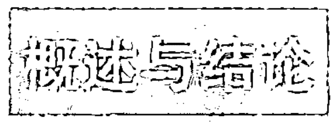

我们已经探讨过整合模型的一些实际应用。现在我们可以就这一模型的主要内容做一简要总结。

AQAL 是“所有象限，所有层次”的简称，后者又是“所有象限，所有层次，所有路线，所有状态以及全部类型”的简称，这些是任何整合或全面的方法都要包含的五大要素。

当 AQAL 被用作指引系统去组织或理解任何行为时，我们也将其称为整合操作系统或简称为 IOS。我们有高级 IOS，但本书所介绍的基础 IOS 已经具备所有的根本要素（象限、层次、路线、状态、类型），可以帮助任何人走上更全面、更兼容、更有效的整合之路。

当然，AQAL 或者 IOS 本身只是一张地图，仅此而已。但是，就我们目前所知，这是我们目前拥有的最全面的地图。此外——这也——很重要——整合式地图本身要求我们要去实地感受，不要仅仅沉迷于字词、观点或概念。记住，象限仅仅是第一、第二、第三人称现实的说法。整合式地图或者 IOS 只是第三人称的知识，是些抽象的东西，是一系列“它”的符号和象征。但是，这些第三人称的知识要求我们将第一人称的直接感觉、经验和意识以及第二人称对话、联系和彼此关爱包括在内。整合式地图自身告诉我们：这张地图只是第三人称地图，不要忘记其他重要现实，整合式方法应该包括所有这些现实。

这样才能发挥整合式生活练习的作用。当 AQAL 或者 IOS 用于真实生活的个人成长发展时，我们才谈到整合式生活练习——目前最全面和最有效的改变自我的方法。

还有另外一个非常重要的结论。IOS 是一种中性的系统，它不会告诉你该如何思考，不会把任何意识形态强加于你，也无法以任何形式压制你的觉知。以人类具有清醒、梦境以及深度睡眠三种状态为例，IOS 并没有指导你醒着的时候该怎么思考，或者在梦境中你该看见什么。它只是说，如果你想变得完整，就要确定自己的视角包含了清醒的、梦境的以及无形的状态。

同理，所有事件都具有四大象限，或者“我”、“我们”以及“它”维度。不是说“我”应该做什么，“我们”应该做什么，或者“它”应该做什么，而只是说，如果你想囊括所有重要的可能性，一定要将第一人称、第二人称以及第三人称视角包含在内，因为它们是全世界的通用语言。

正因为 IOS 是一种中性系统，它才可以让所有境况变得更清晰、完整，带入更多的关怀，不管我们是用个人转化、社会变革、事业成功、关怀他人还是生活幸福来衡量成功，它都让我们更有可能达到目标。

但也许最为重要的是，由于 IOS 可以为任何学科所利用，从医学到艺术、商务、灵性、政治以及生态，我们有史以来第一次，可以让不同学科之间进行广泛的、成功的对话。将 IOS 应用在商务中的人，可以轻易且有效地与那些将 IOS 应用在诗歌、舞蹈或艺术上的人进行顺畅的交流，因为他们现在有了共同语言（或者一个共同的语言操作系统）。当你使用 IOS 的时候，你不仅可以同时在其中运行数百种不同的“软件”程序，而且所有这些程序都可以彼此交流并相互学习，并促使你的认知和行为向更广大的维度进化与发展。

如果你认为这更像是针对这些问题的典型“整体论”或“灵性”或“新时代”或“新范式”方法，那就是首个大错误。

## 第一章 整合式方法多元论

我们能观察到：灵修传统的“形而上学”遭受了现代派和后现代派的猛烈批评——更准确地说是“破坏”——但没有任何令人信服的东西可以取而代之。本章开始会概述重建伟大智慧传统的灵性系统的方法，但这些方法会抛弃它们的形而上学包袱。

除了其他方面之外，整合式方法多元论（IMP）至少包括八个基本的、必不可少的方法、指令和范式，来获得可重现的知识（或证实可重复的经验）。AQAL的基本主张是：基于现有的可靠的人类知识，任何方法都必须包括这八个范式，否则就是不适当的。

理解IMP的最简单方式，是从我们称为象限的部分开始。象限表明任何情况都具有内在和外在、个体和集体的维度，综合起来，就是个体和集体的内在和外在。这点常常表示为我、你/我们、它们（第一、第二、第三人称代词的变体；也可称为善、真、美或者艺术、道德和科学，等等；也就是说，外在科学的客观真相，或者它/它们；美学的主观真相，或我；道德的集体真相，您/我们）。

前文图4（见P023）是某些可靠的知识团体提供的象限中部分现象的图表。（不要担心某些陌生的术语，后文会涉及其中的重要术语。）①

> ① 序言中提到“象限是个体和集体的内在和外在观念（视角）”，更严格地说，我们将这些视角区分为“观察者本身所处的角度（view through）”和“事物被关注的角度（view from）”。所有单个的（或者有感知能力的）全子具备或者拥有四个观察和接触世界的角度或者观点，即象限（观察者本身所处的角度）。（转下页）

我们通常将事件称为全子——“整体/部分”，或者说，它是个整体，但这个整体又属于其他的整体，因此，不同象限的不同内容都可以称为全子（例如，右上象限中，分子就是包含所有原子的全子，但它又包含在所有细胞中；左上象限中，概念是包含所有符号的全子，但它又被包含在所有规则中，等等）。

通常，这里开始变得有趣。想象各个象限的任何现象（或者全子），都可以从内部和外部来看待它。这样就有了八个原始视角，四个象限中的每个全子都有内部和外部视角。

图 1.1 总结了任何情境中的这八个原始视角，这八个视角的总体又名整合视景主义。

我们将这八个地方、区域、生活世界看作真实现实。各个区域不仅是视角，还是行为、指令、真实世界的一系列具体行为。每个指令展现或者揭露不同角度所理解的现象。视角并不先于行为或者指令，它们同时发生（实际上，四个象限都同时发生），“视角”仅仅在 AQAL 空间为可感知的全子定位。采纳如此这般的视角也就是置身于 AQAL 矩阵的这个区域中。（事实上，我们很快就会给出 AQAL 矩阵中全子的“地址”：地址 = 高度 + 观点，高度指发展程度，观点指视角或者所在象限。）

后文还会讨论这些内容。这里，基准点就是这八个基本观点也包括八个基本方法。你不仅可以接受某个观点，还能据此采取行动。图 1.3 概述了部分较著名的方法。这些方法的集合就是整合式方法多元论。

（接上页）可以从这四个角度观察任何对象——从这些角度可以对任何事物形成观点——严格地说，它就称为四艺（quadrivium）。例如，椅子属于工艺品，没有四个象限，但可以从四个象限或者角度来看待它，这就是关于椅子的四艺。单个全子（你或我）有我、我们、它和它们维度—观点（view through），工艺品没有，但我可以从不同的观点或者四艺来看它。同样，八个区是“八象限”，八个方法是“八科”，见附录 II。

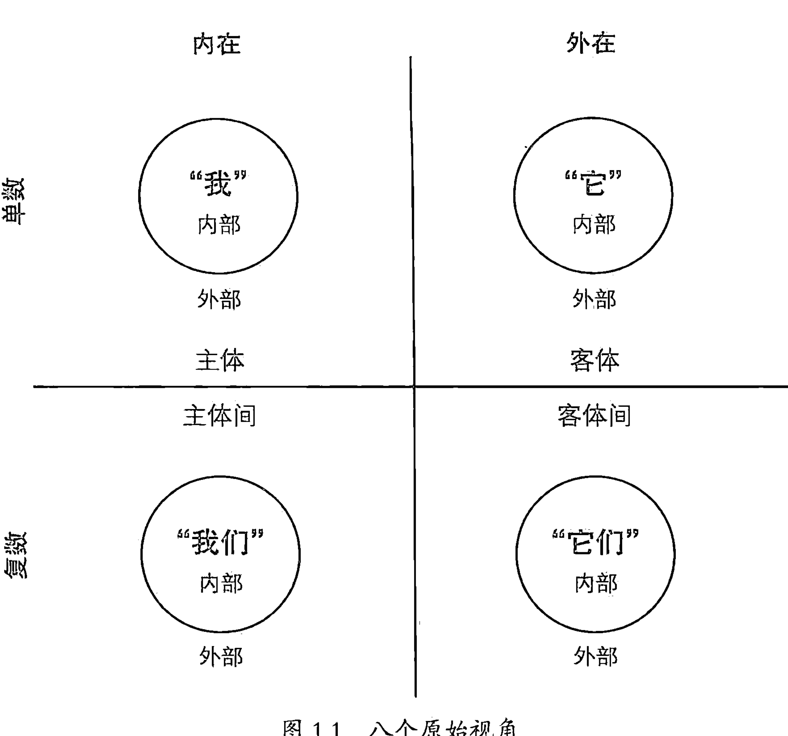

事情非常简单。从任何象限的任何现象（或者全子）开始，例如，左上象限的“我”经验。“我”有内部视角和外部视角，此时此刻我可以从内部体会当下经验主体的我所感知到的经验，即第一人称具备的第一人称经验。这么做的结果包括内省、冥想、现象学、静观等等（图 1.2 将它们简单概括为现象学）。

也可以从外部以客观或者“科学”的观察者的角度接近这个“我”，可以在自己的意识中这么做（试图对自己“客观化”，或者“看到别人眼中的我”时），也可以对其他的“我”这么做，从而科学地研究人们如何体验他们的“我”。研究“我意识（I-consciousness）”中，最著名的科学方法包括系统理论（system theory）和结构主义。

同样，也可以从内部或者外部来研究“我们”。从内部看，这包括你和我现在试图立刻理解彼此的努力。包括你和我仅仅在交谈时，我们如何对某件事达成相互理解？你的“我”和我的“我”怎样在你和我都称为“我们”的内容上达成一致（例如，“你和我——我们——是否相互理解了？”）。对我们进行解释的艺术和科学通常称为诠释学。

可以试图从外部研究“我们”，例如文化人类学家，或者民族方法学家，或者傅柯式考古学家等等（图 1.2 将此概括为民俗方法学）。

所有象限都是如此。这样就有了八个基本视角和方法。

在此，我想简短地说说，为什么这对现在的灵性至关重要。很多人了解螺旋动力学（SD=Spiral Dynamics）——以克莱尔·格拉夫（Clare Graves）的先驱性价值系统阶段研究为基础的心理社会发展系统（如果不熟悉也不用担心，后文会对其做出总结，那时候你就会理解此处内容）。SD 代表着对于理解人们的世界观、价值观和寻找意义阶段非常有价值的众多研究。很多人知道深刻冥想状态的意识通常指神秘合一、沙巴（sahaj）或者开悟（光明或者觉醒）。伟大的传统认为这些状态提供对终极现实的知识或者觉察。（不用担心你不熟悉这些词语，下文还会提到。）

关键在于：你在冥想垫子上坐上几十年，也永远不会看到类似于螺旋动力学的阶段。你可以整天到晚研究螺旋动力学，也永远不会开悟。整合式观点认为：如果不包含两者，你永远不会理解人类，或他们与存在、神或者其他事物的关系。

默观智慧（meditative understanding）明显包括从内部观察“我”的方法（现象学）；螺旋动力学则从外部研究（用结构主义）。两者都研究人的意识，但是使用的角度或者观点和方法非常不同，所以得出的结论也不同。人们可能非常擅于此道，却拙于彼道，也可能恰恰相反。而同样也无法分辨二者任一方所运用的尺度；双方甚至都看不见彼此的存在！

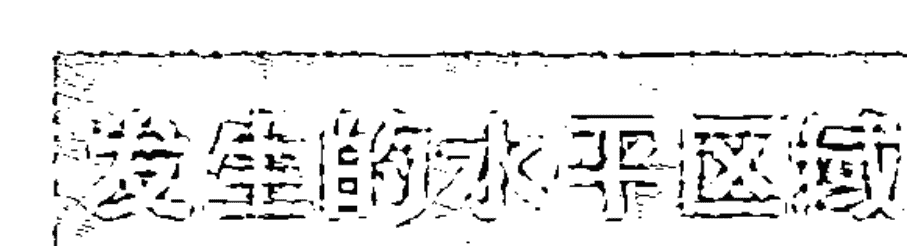

每个观点或角度同行为和指令一起，展示了一个现象世界；一个（四维）形成的世界空间；具有水平路线的世界空间。我们简单地将其总称为水平区域，简称区域。区域是观点及其行动、指令、生活世界，和该处产生的全部事情。你可以把它看作生活区域、觉察区域，或者生活空间，哪个都行。

它在 AQAL 矩阵中具有确定的位置：该处的实际全子以及行为，产生了这些现象。但都是具体的。区域……其实就如同购物，就是你在购物时所看到和感受到的每件东西，以及做的每件事情。

（之前我们简单提过，全子的地址 = 高度 + 观点。后文我们还会了解它和区域的关系是怎样的。我们会发现，这些都很重要，因为它能够“证明”任何事物的存在，无论是岩石、观点还是上帝……）

视角和方法不过是水平区域的子集，是正在形成的某个区域中可能发生的某些事情。这也会随着本书的进展变得越来越清晰。现在，仅仅把区域看作可以在图 1.2 和 1.3 的任何八个区域之一发生的所有事情。为了方便起见，我们会给所有的事物归类（见图 1.3）。

回到螺旋动力学和冥想上来：涉及内在意识（左上象限）时，第 1 区和第 2 区方法都是非常重要的知识类型，两者完美地相互补充。（如果你不熟悉它们，后文会有大量的例子。）如果要理解宗教和灵性在现代和后现代的作用，考虑这两个区是绝对必要的。

认可两者的研究和重要性之后，接下来要做的，就是要理解它们是怎样联系起来的。第 1 区和第 2 区怎样联系起来——八个区又怎样联系起来？

这是本书的首要话题。此外，所有这些与现代和后现代的宗教有什么关系？

> 原始视角的整合式数学

高级学员需要注意，这八个方法提供了对于视角的视角的视角。例如，冥想涉及个人观点的内部观点的内在观点。弗朗西斯·瓦雷拉（Francisco Varela）的生态现象学方法是对外部观点的内在视角的外在观点。诠释学是集体观点的内部观点的内在观点，等等。每个区域实际包括至少三个可对其进行定位的主要视角。（别担心，实际没有听起来那么复杂！）

这产生了新的数学符号类型（我们有时候称之为整合式数学），这种数学符号用视角代替了传统变量。（非高级学员不要担心本部分。在“整合式后形而上学”部分会再次谈到这些内容，如果你觉得这部分看起来很蠢，甚至都不需要读。）

使用第一（通常指内在）、第三人称（通常指外在）缩写，那么，作为现象学（或第 1 区行为的）内省就是“看到内心”，或者说，我具有对自己第一人称觉察的第一人称经验，我们将它记成 1-p×1p。

我也可以尝试“客观”地看待自己，就像别人看待我那样。那是对我自身内省的第三人称视角，我们将它记成 3-p×1-p×1p。相反，纯粹的冥想或者内省是 1-p×1-p×1p，这表示对我——或我的第一人称（1p）的第一人称觉察（1-p）的第一人称视角（1-p）。

下面还会讨论瓦雷拉的观点，现在要说明的是，瓦雷拉开始从右上象限（第三人称，3p）的客观有机体入手，然后他试图“从青蛙的眼中看世界”，或者采用该客观有机体的第一人称视角（1-p×3p）。然后他采用科学术语（3-p）表达出来，因此，他获得了3-p×1-p×3p（第三人称或“客观”有机体内部的第一人称观点的第三人称概念化）。

这是简单的“整合式数学”，其真实含义是尽可能安住于多个其他有机体的观点中。走出自己，站在他人的角度，再换个角度……“原始视角的整合式数学”的全名就是这样来的。做这类整合式数学实际上就是所谓的心理动力学，因为这不是真正的抽象数学，而是试图让自己站在他人的角度，促使你的意识成长。（后文还会讨论这点。）

整合式数学可能非常丰富而且复杂，还有多得多的角色、术语和观点，这些范例只是入门而已。（可以继续建立某种真正的数学，以及表示“共同理解或者共鸣”的对应符号。就我们所知，这是完全崭新的数学类型，用观点代替了变量，用对象代替了生命体。）

但是，这里有个需要我们了解的要点。冥想是1-p×1-p×1p（或者第一人称内部觉察的内在观点）。和个体相关的螺旋动力学是3-p×1-p×1p。这是个体内部觉察的第三人称概念地图。

关于螺旋动力学和冥想，在这些表达式中，你可以立刻看到，每个表达式的首项是不同的，差异非常大，螺旋动力学是3-p×1-p×1p，冥想是1-p×1-p×1p。正如下划线所表明的，禅和螺旋动力学（SD）有两个共同的变量，不过不是首个变量：SD是内在区域的第三人称地图，禅是内在区域的第一人称经验。下面马上会讨论其他的某些重要的区别，但你现在可以开始看到，整合式方法多元论和“原始视角的整合式数学”之间存在着有用的区别。①

后文会详细讨论这些区别。不需要懂数学。

> 整合式后形而上学

整合式观点带来全新的、事实上是后形而上学的形而上学方法，因为它不需要形而上学的传统包袱（例如，假定柏拉图式的、原型的、帕坦伽利的或唯识宗佛教之类的先验存在的本体论结构），但是必要时它可以产生这些结构（后文会解释这点）。

整合式后形而上学用观点代替知觉，从而将显现世界重新界定为观点，而非事物、事件、结构、过程、系统、心灵习惯（vasanas）、原型、法门（dharmas），因为所有这些都首先是观点，然后才是别的。必须首先假设某个观点是对的，然后才能认同甚至陈述它们。

例如，怀特海哲学（Whiteheadian）和佛教观点认为，每个当下都是短暂的、分离的、飞快流逝的主体，这个主体在理解着法门或者短暂的事件，它本身就是对第一人称现实的第一人称观点的第三人称概括（3-p×1-p×1p）。每个片刻都不是能把握住客体的主体，而是把握观点的观点，怀特海认为它是多面体事件的缩影，是隐藏的独白式形而上学。因此，整合式后形而上学能够具有怀特海观点的精髓，但没有其隐藏的形而上学观点。

这同样适用于伟大智慧传统的核心观点：整合式后形而上学可以产生形而上学的基本轮廓，而不需要假设大量的形而上学前提。（如果那些范例太过抽象，我们会用某些较简单的例子来简单讨论这个主题。）

伟大的智慧传统的问题在于：它们受形而上学拖累，其中的那些极度重要的真理难以承受现代或者后现代的批判。现代主义认识论对它们提出了实证的要求，前现代传统对这种攻击毫无准备，因此无法直接阐明其教诲中能够应对这个挑战的东西：静观传统的现象学核心。后者提供了非常现代性的范式（静观始终是具有现代性意识的认识论，超越了前现代世界所处的时代）所需的全部实证证据。虽然现代主义静观和现代性本身都是独白式的，它们自身的模型却能够自圆其说，这是个新的开端。①但是，伟大的传统不具备这个长处，由于这种失败，前现代灵性传统多多少少都全面遭到了现代认识论的攻击和拒绝：现代性完全拒绝前现代性。

这并不是特别重要，因为后现代性同时拒绝两者。后现代性认识论提出一个重要真理：所有的知觉都是观点，所有观点都体现在身体和文化之中，而不仅仅是经济和社会系统中（从马克思到系统理论为止的现代主义认识论都发现了这点）。面对这些后现代的批评，现代性回避、后退了。如果说现代认识论很难应对后现代的批评，那么，你就可以想象前现代灵性传统在面对后现代批评时的处境。

> ① 整合式数学使用三个表达项如 1p×1-p×3p 时，这些项通常是：象限 × 四艺 × 领域（“领域”可能是象限或者四艺）。当然，很快会变得复杂得多，很多整合式数学只是那些基本可能性的简单重复。随着整合式地图越来越复杂，我们采用四到五个表达项代替三个表达项（如 1p×3-p×1-p×3p）。本书中通常只使用三个表达项，因此，定义似乎显得和摘录中的定义不同，但实际上并非如此。例如，瓦雷拉用四个表达项 3p×1-p×3-p×3p，如果要缩短为三个表达项，根据所选择的三个表达项，形式可能有所不同。在文中，我用这四个表达项的前三项（3p×1-p×3-p），你也可以选择使用后三项（1-p×3-p×3p）。同样，严格来说，“个体和集体的内在和外在”不等于第一、二、三人称的方法或者它们的组合，这个等式会造成某些严重的理论问题。我们有时候用 1-p 和 3-p 代表内部和外部观点，这样更接近通常的理解，但不是实际情况。在宇宙发生说（Kosmogenesis）中，象限（内部/外部 × 单数/复数）比 123p 重要和优先得多（前者是后者的起源）。美学、道德、科学等观点也同样如此。

> ② 请参见卷二摘录 B，www.kenwilber.com，为一个问题的完整治疗。

# 灵性的觉醒

现代传统的遭遇了。

整合式方法多元论强调大量的基本观点，其中，有些观点也是后现代主义的认识论特别重视的（同时，他们坚持忽略另外那些观点，即便他们也会含蓄地运用它们）。特别是，AQAL 坚持每个事件有四个象限，包括左下象限（主体间、文化、情境的），而象限的下面还是象征。简单说来，根据 AQAL，所有的知识都体现在文化或主体间的维度当中。甚至超验知识也包含在四象限的事件当中：象限的下方都是象限，象限的上方也是象限。乌龟的下方都是乌龟，乌龟的上方也都是乌龟。①

贯穿本书的观点是，现代性往往不仅关注某个特定的发展层次，还关注客观外在证据所在的右侧象限；而后现代性不仅关注某个特定的发展层次，还关注主体之间的真理和现实社会结构所在的左下象限。前现代的智慧传统通常没有明确地意识到这三个象限（直到现代性将它们分开），因此完全无法和现代性的产物（例如现代科学）和后现代性的产物（例如多元文化）抗衡。但是，仍然还有个领域是伟大传统所擅长的，并被现代性和后现代性所遗忘和忽略，有时甚至受到它们的压制，这个领域就是：个体内部——左上象限所有的意识、认识和灵性经验的状态和阶段。但是，整合式框架接纳前现代、现代和后现代启示中的永恒真理，通过将伟大的智慧传统纳入整合式框架之中，我们可以在很大程度上挽救那些不朽的洞见。

例如，实际上整个存在巨链都适合左上象限（见附录Ⅰ）。洛夫乔伊②指出，这条巨链得到了两千年来大多数最伟大的东西方思考者和冥修者们的认可，它代表着前现代传统的精髓，几乎完全在关注左上象限的现实和现象。这不是负面的贬低，而是积极的赞誉：这些人是完美的现象学家，在探索和了解某些领域时，他们的天赋和热情至今仍然无人能比。但是，伟大的传统没有——当时也不能——真正了解其他象限的大概情况（例如，右上象限的血清素、多巴胺、神经突触、DNA、新皮层、三层脑等；右下象限的系统和复杂理论；左下象限的多文化诠释学等等）。因为他们声称具有包罗万象的知识，或者至少声称具有完整的方法，他们必然会经受最严格的审查，而其他象限的发现无疑会冲击他们的这种看法（不是冲击他们所擅长的对左上象限的观点。重点在于：它们的真理也许很片面，但极其重要，并需要被整合到更大的图景中去）。

另一方面，现代性惊人地理解到了右侧象限，就此而言，这种理解完全击败了传统。在这种现代攻击面前，传统毫无准备，只能从现代西方所有严肃的知识阶层中退出来（包括理论和研究）。康德（Kant）的话巧妙地描述了现代性的这个胜利，“现代性意味着，如果你的朋友走进来看到你在祈祷，这是挺尴尬的事情。”

的确如此。

另一方面，后现代性（这里仅仅草草说上几句，后文还会详细讨论）关注传统的另一个盲点——这也是现代性的盲点，那就是其知识的独白性（它有很多含义，但可以认为它指的是：非对话的、非主体间的、没有认识到文化如何塑造了个体对现象和法门的认知，并且在犯下这个重大错误之后，还将真理在部分程度上仅仅归为文化风格。）

哈贝马斯（Habermas）给独白性知识赋予了不同的名字，特别是“主体哲学”和“意识哲学”这两个名字。像每个称职的后现代理论家那样，他不遗余力地攻击这两者。“主体哲学”简单地认为，单个的主体能觉察到现象，但是，这个主体实际上处于自身完全不曾意识到的文化框架之中。例如，十四世纪西藏的冥想者会坐在山洞中，冥想某个觉察对象——也许来自赞布·杨提格（Zabmo Yangtig）（完美典范）。他认为自己在面对特定的现实，但实际上他所觉察的每个对象都在很大程度上（不是完全的）受到了文化的塑造。他认为自己在静观永恒的真实，每个人都看到的真实，但其中很多东西其实只是西藏人的做法。

“意识哲学”的假设同样如此，也就是说，意识是存在的，现象将自身呈现在意识中，无论个体或集体或潜藏的意识（例如阿赖耶识）。每个冥想和静观传统都有这个假设，这完全是错误的。这是个深层错误，因此会以多种方式陷溺于我们通常所说的错误意识（false consciousness）之中。现在，如果我们要阐释对意识哲学最普遍的后现代批评，那么，最简单的方式就是指出意识哲学没有觉察到，其他三个象限如何以意识完全觉察不到的方式，深刻地影响和塑造了意识。（其次，智慧传统的伟大体系几乎全部在左上象限中。）

因此，内省、冥想和静观（所有这些方法都是第1区专有的）都陷入了各种不同的幻觉和无知当中，它们自身的方法无法解决这个问题。后现代性马上看到了这点（虽然我们能发现，它将婴儿和洗澡水一起倒掉了），并继续破坏现代性和前现代性的独白性知识。在现代性和后现代性的夹击之下，伟大传统所保留下来的东西已经少得可怜。

整合式后形而上学的观点认为，要挽救前现代传统的深刻而宝贵的真理，那就需要认识到：它们所言说和展示的真理主要适用于左上象限，因此，并不需要因为它们不了解其他三个象限而谴责它们。这样，它们自身所具备的真理就会受到尊重，并被纳入整合的盛宴之中。同样，过去现代性主要关注右侧象限，后现代性则关注左下象限，我们都可以热情地接受这些。

去掉了形而上学的包袱以后，就能将前现代智慧传统融入接纳现代和后现代真理的整合式框架之中。这种海纳百川的宗旨才是真正的AQAL，而如何具体达到这种整合式接纳，则需要非常严肃地琢磨，并值得进一步的持续讨论和研究，否则只会增加现代和后现代世界对传统的疏离程度。

> 伟大传统在（主体间性理论）主体性的禁忌中挣扎

下面的例子能够说明，为何关注这些问题对静观传统非常重要。B. 阿伦·华莱士（B.Alan Wallace）写有很精彩的杰作《主体性禁忌》（*The Taboo of Subjectivity*），该书讲的是，西方的科学物质主义最终凌驾于内省之上，导致了敌视东西方静观和冥想传统的现代世界观。

这是真的。现代认识论通常通过实证主义性质来予以界定。注意：实证主义表示“实验主义”或者“以经验为基础”，它起初有非常多的内在经验或者内省（左上象限现象学）。事实上，华莱士赞美过威廉·詹姆斯的《宗教体验大全》，这本书就是典型的现代主义认识论（它用实验性证据代替了形而上学的猜测，判断真理的根据是结果，而不是假想的本体论指称对象。）换句话说，它是纯粹的现象学，或者詹姆斯更愿意称之为“激进的实证主义”。但是，由于各种不同的潮流（其中很多潮流在《主体性禁忌》中都有巧妙的阐释），人们拒绝了内在实证主义，而代之以外在实证主义，静观传统也随之被拒斥，至少从后现代性的视角来看是这样的。

但是，在谈到西方社会冥想和内省的命运时，现代性谋杀了前现代性不是唯一的问题，甚至也不是主要问题；这里的主要问题是后现代性同时杀死了两者。事实上，后现代主义最猛烈（成功）的攻击，都指向现代主义现象学，其典型代表为胡塞尔、威廉·詹姆斯、多根、艾克哈特或者圣特蕾莎。他们是后现代攻击的对象，在西方人文学科中，后现代性获胜了。

所有这些静观传统的共通点，是它们曾经是——现在仍然是——独白式的。它们全都赞成意识哲学。所有的佛教心理学和伟大的小乘佛教和唯识宗形而上学系统都建立在独白式个体或者集体意识上，正如包括静观传统在内的西方伟大新柏拉图系统所做的那样。事实上，前现代性和现代性提供的所有知识类型都没有看到左下象限的构成性质，后现代性则在此处对前现代性和现代性提出了准确且致命的批评。人们再次倒掉洗澡水时，也倒掉了许多婴儿，正是出于同样的原因，灵性探索者思考着许多洗澡水，并称其为法门或者福音。

因此，杀死冥想内省和现象主义的，不仅仅是——甚至不主要是——现代科学物质主义，无论怎么说，在人文领域中不是这样。凶手是后现代主义对现象主义（及所有类似方法）大量猛烈的抨击。大多数后现代主义对科学不屑一顾，直奔现象主义而去，福柯就忽略物理科学去攻击胡塞尔，他的理由如下：现象主义没有考虑意识的文化浸润（cultural embeddedness）和主体间性（intersubjectivity）。主体和主观性哲学需要得到主体间哲学的补充（而非替代）。左上象限需要左下象限（更别提右上象限和右下象限了）。

后现代性强烈地觉察到了这点。严格说来，后现代性对冥想的批评应该是：冥想意识是典型的独白式意识，它没有体现在对话中，而是在纯粹“存在”和“直观（bare attention）”的内在独白中。那种意识形式根本不能解放任何人，只能强化它自身对文化浸润和主体间特性的无知，正是这种无知让社会和文化利益——父权制的、男性至上的、民族中心的、男性中心的——畅通无阻地进入冥想者的意识，甚至顿悟的意识中。因此，顿悟只是大大强化了意识对主体间特性的无知，压抑“对话性现实（dialogical reality）”并将其边缘化：在后现代者的眼中，自由之路到此就结束了。

因此，杀死静观传统的不仅仅是主观性禁忌，还有传统本身固有并无意识中继续展现出来的主体间禁忌。然而，即使去除了主体间禁忌，传统仍然不能面对最深层的后现代批评。就此而言，意识哲学需要的，不是更多的内省、直观、静观和觉悟——它们带来更多的问题而不是解决办法。内观祈祷或者内观练习可能帮助你摆脱自我的束缚，却不能让你摆脱文化的束缚，文化的偏见仍然隐藏在主体间背景中，从未进入意识当中，因而也从未被超越，它是集体愚痴、错误意识和在自我解放的孤岛上受到奴役的源头。

简而言之，近几个世纪以来，静观传统的双重死亡包括晚期现代性表现出来的、主观性或内在性禁忌（或者无知），以及传统本身表现出来的主体间禁忌（或无知）。这样，静观传统同时受到现代性和后现代性的抨击，至少在严肃的学者和研究者眼中已经几乎全军覆没。现代科学拒绝了静观所揭示的非常真实的现象，后现代人文学科也是如此。（如果想进一步了解这个话题的相关讨论，可以参见附录 II。要了解现在许多拒绝接受后现代革命的灵性作者的批评，可以参见附录 III。）

整合式方法多元论可以克服这些棘手的问题，它明确地为前现代、现代和后现代的真理寻找空间，将它们放在整合式观点和方法框架中，而不是结论框架中。整合式方法多元论没有采取非常可恶的方式来进行“欺骗”，削弱各种不同的真理，让它们几乎变得面目全非。它基本上按它所见到的真理原样接受了它们，它所改变的仅仅是其绝对化主张，以及旨在为那种不合理主张辩护的任何平台（和形而上学）。

此外，我们后文还会谈到，整合式方法多元论能够重新构建内观传统的重要真理，同时舍弃了那些无法经受现代主义和后现代主义批评的形而上学系统，这些形而上学的成分最终被证明其实是多余的。

我并不是说，只有 AQAL（或 IMP）才能解决这些问题，只是说 AQAL 明显认真考虑了所有这些问题，因此，它是继续整合人文与灵性自我理解的前现代、现代和后现代思潮中最佳元素的方法。因此，整合式方法可以保护任何思潮免受其他两者的攻击。

让我们来关注内在现实（包括冥想和内观现实），并探索这些内在情境的部分重要方法，以便了解那样的例子吧。

## 第二章 意识阶段

本章将讨论关于内在科学研究的革命性惊人发现，还会讨论内省、冥想和静观为什么看不到这些，并在最后总结出更整合地认可、尊重并包纳它们的框架。

### 第2区：关于内在的科学研究

前面几次提到了螺旋动力学，现在我们采用客观或者科学的（3-p×1-p×1p）视角，从 UL 象限的知识类型——亦即内在的内部——开始入手。换句话说，从任何情况或者事件开始（此处以单个的人为例），然后看看个体形式（第一人称或者 1p），然后看看该个体的内在或者第一人称观点（1-p×1p）。究竟怎么做到这点呢？这是我刚才提过的伟大突破，后文还会详述。图 1.4 将它简单地称为左上象限的第 2 区，即从外部看 UL 的全子，这正是螺旋动力学所做的事情。

这种方法学类型对某些西方现代与后现代意识方法的伟大发现至为关键。劳伦斯·科尔伯格（Lawrence Kohlberg）的道德发展属于其中最著名的发现。他的学生卡罗尔·吉利根使用这个第 2 区方法的方式同样著名，《不同的声音》这本书中对此有所概括。吉利根选择一组女性，对她们提出“女人是否有堕胎的权利？”等问题，发现她们的回答可以分为三种：是的，不行，是的。

第一类回答是：“是的，她有堕胎的权利，因为我是对的。”第二类回答是：“不行，她没有堕胎的权利，因为那么做违背法律 /《圣经》/ 我的社团，很可怕。”第三类回答是：“是的，在特定条件下可以，你得衡量这件事情对所有人的整体影响，有时候堕胎比较好。”这三个回答被称为前习俗、习俗和后习俗。

关于女性的道德发展，吉利根在《不同的声音》里称这三个阶段为自私、关心和普遍的关心（取决于多少人被纳入考虑之中）。

一般来说，无论男性还是女性，我认为可以称这三个阶段为自我中心、民族中心和世界中心。

这些阶段的名称中包含非常有用的信息，我们会间或用到这些信息。

注意前习俗（自我中心）和后习俗（世界中心）的答案都是肯定的，习俗的答案是否定的。如果你不熟悉这类研究，你可能就因为前习俗和后习俗的答案相同而将它们混淆起来。如果有人说“是的，我可以违反约定俗成的法律”，你可能认为他是后习俗的叛逆者，正在试图以较高自由的名义颠覆主流的体制。有可能是这样，也有可能他们只是在说“别对我指手画脚！”前习俗和后习俗都是非习俗的，所以没有经过训练的人看不出其中的区别。

正因为这个原因，两者常常被混淆。分不清前习俗或后习俗，或者分不清前习俗和超习俗，就是前/后错误或者前/超错误（PTF）。我们会看到：理解这种混淆对于理解宗教在现代社会的意义非常有用。在任何发展序列之中，例如从前理性到理性到超理性，从潜意识到自我意识到超意识，或者从前语言到语言到超语言，从前个人到个人到超个人，“前”和“超”常常被混淆，而且会发生两个方向的混淆。混淆发生之后，某些研究者试图将超理性的真理降低为前理性幼稚症（例如弗洛伊德），其他人则将某些前理性幼稚因素抬高到超理性的高度（例如荣格）。简化和抬高都犯了相同的前/后错误。

这个问题是灵性的永恒问题。特别是涉及冥想、静观和灵性体验的神秘阶段（大部分是非理性的）时，似乎所有非理性阶段都是灵性的，所有理性阶段都不是灵性的。最常见的例子是将阶段分为酒神（非理性）和太阳神（理性），认为酒神是灵性的。这隐瞒了这个事实：不仅有“非理性”的，还有“前理性”和“超理性”的。甚至连尼采也只看到有两种不同的酒神状态（前和超）。犯了前/超错误之后，似乎一切都是非理性的，是灵性的。没有前理性、理性和超理性，只有理性和非理性，这就是问题的开始。

如果你不相信灵性，你就会将所有超理性的事件降低到前理性的冲动和前语言的废话，也许会认为这是倒退，是婴儿识海融合期（oceanic fusion days）的延续。你是个不错的还原论者，你的名字叫大众，你每天快乐地无所事事，将超理性降低为前理性，将任何灵性经验弱化为少许没有被消化的肉，如果继续尝试的话，你可以简单地超越上帝。在这种花招和智力懒惰之下，所有真正的超理性现实都消失了。

另一方面，如果你相信灵性，那么任何非理性的东西都是灵性，似乎无论多么幼稚、孩子气、倒退、自我中心、非理性或者自私自利的前理性颤抖或者阵痛，都是某种深刻的灵性或者宗教体验。你在意识中四处强化这些最能妨碍成熟的区域。每个彼得·潘的虔诚都以灵性的名义受到了鼓励，前理性被光荣地高举到了超理性。这甚至使得我的自私、前理性、前习俗冲动都显得非常灵性，然而它们没有超越理性，而是在理性之下。

也许最悲哀的是，这导致了泛滥的反智力主义（代替了超越和包括理智的超理智主义）。反理智主义和反理性主义（快速滑到了前理性主义）不幸助长和鼓励了冥想和灵性研究中的自恋方法（同时它从世界中心滑到民族中心和自我中心）。这种反理智的自恋在大众文化和致力于灵性的另类大学中非常普遍。因为自我中心的感觉与世界中心的感觉都是感觉，两者被混淆了，在这种混淆下，我强烈地感受和表现出来的任何内容都被看作灵性。如果我能够沾沾自喜地感受我的自恋，我就离上帝（或者神、佛性）更近，“普遍的关心”在你还来得及说出“大我”的时候，就迅速下滑到了“自私”。许多其他灵性方法中都有这种极度的、无知者无畏的肤浅。

（顺便提一句，前/超错误仅仅适用于阶段，不适宜于状态。我见过的对前/后错误仅有的批评产生了这种混淆。除开那个站不住脚的批评以外，由于这个概念对于区分难以解决的混淆很有用，专家们仍然经常使用它。）

回到吉利根。在她发现问题的回答分属三类（A：是的；B：不行；C：是的）以后，她和进行此研究的其他人在几年内跟踪了测试对象。她发现如果有人开始的回答是 B，常常会发展到 C，但是绝不会回到 A。就这样，A 能移动到 B，再到 C，但绝不会反过来。换句话说，回答的类型实际上是阶段。

委婉地说，这很有意思。为什么心理有这个指向性？阶段为什么从不向后发展？心理中时间之箭为什么如此执着？这些阶段序列实际由什么组成？下面的任务就是确定“它们的成分”或者心理中似乎奠定这些阶段的结构或者范式。

我们会看到，几乎在 20 世纪之前，这类研究实际上就开始了，而且是深具影响力的结构主义方法的开端。其基本研究方法大概如下：向大群人提出系列的问题。看他们的回答是否能形成分类；如果形成分类的话，观察一段时间，看它们是否表现为系列的阶段，然后尝试确定这些阶段的结构或者组成。

这就是真正的结构主义的研究步骤，它的发现激励了所有的人文学科和许多自然科学。实际上，现在所有的阶段概念，从马斯洛到格雷夫斯，到洛文杰，到科尔伯格，到吉利根，到托伯特，到基根，仍然基本遵循结构主义首先概括出来的这些研究步骤。因此，总体而言，结构主义就是探索心智和文化中的这些内在结构和阶段，也就是说，在整整成百上千的研究成果中，它更类似于吉利根和格雷夫斯的成果。

现在注意几点。首先，如果你是这类研究者，你已经在关注个体内在了，因为外在世界绝对看不到这些结构。内在现实，无论是内省、冥想或者现象学，只能在内在世界中看到。结构研究已经将你置于左侧或者内在象限中（足以让你被赶出实证主义的阵营）。

但是，即使关注内在现实（1-p×1p），你的角度仍然是外在、“科学”，或者第三人称（3-p）的。研究它们时，你“从外面”观察它们，而不必从内部体验。例如，如果你拜访某个处于第一道德阶段（前习俗或者自我中心）的人，你不必亲自体验这个阶段。因此，你不必拥有关于那个阶段的第一人称（1-p）的知识。在左上象限，你做的事情和冥想者完全不同，冥想者们希望获得某个状态或者阶段的亲身经验。在图 1.2 和 1.3 中，禅宗冥想者从内部观察全子“我”（通过现象学和内省），客观观察者则从外部观察（例如结构主义）。每一方都在研究内在或者左侧“不可见”的真相（这会让双方都被逐出实证主义、外在或者右侧阵营）。但是，双方会看到对方看不到的特定的现象和范式，这很重要，后文还会讨论。

现象学和结构主义（或第 1 区和第 2 区）的重要区别就是，现象学观察当下体验或意识中的成分（或现象），结构主义观察现象或者经验所遵循的范式。现象学探索直接经验和现象，结构主义则探索将现象联系起来的范式。这些范式或者结构实际决定现象，现象甚至并不知道它们的存在。

打个很好的比方，这就如同牌类游戏，例如扑克。如果你在看别人玩扑克，那么你是现象学家，你试图非常准确而专注地描述每张牌、每个现象；你会发现所有不同的花牌的颜色、大小、形状、质地等等。你会

## 第二章 意识阶段

尽可能认真地感受所有的牌。然而，扑克牌实际遵循着特定的规则，在纸牌本身上看不出这些规则。结构主义者寻找的就是规则——心理内容或者纸牌遵守的范式、整体结构。你可以观察思想内部，内省，却永远不会看到这些规则——通常说来，内省、冥想和现象学看不见它们。

（这就是为什么你可以在冥想垫上坐几十年，却永远不会看到与螺旋动力学阶段类似的东西。另一方面，就算你这辈子都在研究螺旋动力学，也不会开悟或者证悟。）

在历史上，（狭义的）结构主义学派从左下象限（例如，利瓦伊·施特劳斯、雅各布森）的第4区方法开始。也就是，它试图对“我们”做类似于吉利根对“我”所做的研究：用“客观”、“科学”、“第三人称”方法研究内在现实（比吉利根、格雷夫斯、基根等早几十年）。很快，变得明显的是，结构主义的原始方法（前历史主义和集体主义的）并不能让人满意，需要修改。第一步是使之成为历史的和/或发展的结构主义（或者系谱学）；第二步是将关注个人（UL）和文化（LL）的方法区别开来。

美国最伟大的心理学家、开创性天才詹姆斯·马克·鲍德温（James Mark Baldwin）在20世纪早期给出了首个成功应用于个人（第2区）的发展性结构主义形式。鲍德温超越了让·杰伯赛（Jean Gebser）和斯里·奥罗宾多（Sri Aurobindo）这些最著名的结构主义学家们，他的模型比他们要成熟的多。那些理解这些内容的人恢复了这位无名英雄的名誉。让·杰伯赛的结构模型比鲍德温的晚了四十年，复杂或准确性也难以与之媲美，却仍然影响巨大，也许原因就是因为它构架简单，是如今广为人知的单路线模型：主要阶段为远古到魔幻到神话到理性到整合—透视。后文的部分图表中包括这个模型。

# 灵性的觉醒

有趣的是，虽然鲍德温首创了这个第2区方法，与他同时代的威廉·詹姆斯却得出了最缜密的第1区方法：内在意识和经验的现象学，包括宗教体验现象学（《多种宗教体验》）。詹姆斯确定了现代主义的方法，而鲍德温则播种了后现代主义方法的种子，创造了结构主义，这种结构主义催生了早期的后现代主义，以及随后的后期后现代后结构主义。

最后，这个适用于集体“我们”的发展结构主义（或者系谱学）的先驱形式，再加上特别是迈克尔·福柯阐释的语言生成的世界观（这种世界观以有益和有害——亦即非常夸张——的方式引导着最近的后现代潮流），并在最终主导着近四十年来学术界的人文学科。现代认识论从这端侵蚀着伟大传统（发现它们“不科学”），后现代认识论则在另外那端发难（发现它们有压制性、排斥性、父权制、独白性）。我们将发现，这些批评都有相应的解决方法，但是它们也极具毁灭性，并常常是合乎逻辑的。

同时，重要的是，如果今天有人研究个体内在不同区域的发展阶段，他们都是在追随詹姆斯·马克·鲍德温等伟大先驱者的足迹。20世纪50年代，有可能主导美国（即盎格鲁—撒克逊）学术界的UR象限实证主义暂时放缓了其势头，对第2区普通方法的兴趣开始恢复，大量研究涌现出来，新一轮发展研究的天才先驱也应运而生，其中包括艾瑞克·埃里克森、亚伯拉罕·马斯洛、克莱尔·格雷夫斯、劳伦斯·科尔伯格和简·洛文杰等。

研究个体阶段的研究者继续用左上象限第2区的不同方法（包括但不限于结构主义），其中有罗伯特·基根、苏珊·库克·格鲁特、卡罗尔·吉利根、斯皮尔·戴拿米克、珍妮·韦德、迈克尔·巴萨克、威廉·托伯特、帕特里夏·阿林、约翰·布劳顿、科特费舍、霍华德·加德纳，以及许多其他重要的研究者……

注意静观和冥想传统的直接联系：这些方法阐释了冥想、归心祈祷和静观中不可见的意识特征。采用冥想、内省、现象学和任何第1区方法完全看不到这些阶段。这就解释了为什么你在冥想垫子上坐上几年也绝对看不到螺旋动力学阶段，为什么你在灵性或静观经文中无论如何也找不到这些阶段类型。

结果表明，这点最终对于现代和后现代世界接受静观传统非常重要。到目前为止，并没有哪个冥想、静观或者祈祷的主要流派重视这些阶段类型。实践表明，这对于其他学派和方法来说是令人烦恼的棘手问题，它们似乎没有意识到这些重要的第2区发现，或许也是因为冥想或者直接感觉中看不到它们的缘故。

此外还有个问题：任何区域都会有功能障碍，看不到这个区就看不到问题所在。“婴儿潮”或者“多元化”是某些第2区阶段的机能障碍，这些疾病类型在冥想、现象学和感觉意识中也不可见。就这样，本应将你从各种锁链中解放出来的静观传统，却将这些链条收得更紧了（第2区研究者马上就看到了这个问题）。今天的静观修行者们无意中成为最有效的破坏者。

我想非常简单地谈谈，除了系谱学、结构主义和它们的变体之外，还有其他研究内在现象的外在方法。最常见的也许是系统理论，它最著名的最早使用者是查尔斯·塔特。我会在注释中为感兴趣的人探讨系统理论的作用，不过在这里，我仅仅简单指出：系统理论虽然在左上象限很有用，但已被证明最适用于右下象限（即，出于不同原因，系统理论在社会全子上而不是个体全子上最适用）。研究社会象限（LL和LR）以及它们在灵性意识中的作用时，我们会回到系统理论来。

## 意识的层次和路线

在谈到“外在”或者“客观”或者“科学”的内在观点——UL的第2区观点——时，我们首先看到的是不同发展路线和层次的大量研究。然后，棘手的问题是：这些不同发展路线或者“多重智力”有何关联。我们会看到，这点被证明在灵性发展中特别重要。

早期发展理论家倾向于假定存在着“发展”这种事物，他们找到了它。他们的阶段仅仅是一幅“发展过程”地图。皮亚杰认为他的认知路线是唯一重要的，所有其他东西都依附于这条路线，就如同灯泡挂在树上。克莱尔·格雷夫认为他的“价值系统”其实是“存在层次”，其他内容可以嵌进去（尽管他最初的研究对象是美国中产阶级白人大学生，问的问题仅仅是“描述心理健康者的行为”，这是非常惊人的整体还原论）。由于早期研究者们要跨越的区域不为人知并且在地图上难以找到，因此他们很难提出其他假设。

在这个开创性研究四十年之后，我们可以将所有的成果汇聚起来，加以审视，这么做会形成很清楚的范式。众多模型反映了不止一条发展路线，而是至少十多条不同的发展路线——认知、道德、人际、情感、性心理、运动、自我、价值、需要等等。每个伟大的发展学家往往囿于某个特定的发展路线或者流，对它进行详细的研究。他们常常认为这条路线或流是唯一重要的，所有其他路线可以被归结为其内部发生的东西，历史和进一步研究才能揭露这种认识的不可靠（我们称之为流或者路线绝对主义）。

多条发展路线的观点随着多元智力的概念变得流行起来，后者包括：认知智力、情感智力、音乐智力、运动智力等等。研究继续证明：这些多元路线确实以相对独立的方式发展。某个人可能在某些路线（例如认知）上表现出非常高的发展程度，另外某些路线发展中等（例如人际），其他路线发展很低（例如道德）。AQAL认为整合式心理图表达了多种流及其发展（见图2.1）。

有哪些发展路线，它们有什么含义？不同的路线似乎（或者多元智力）实际上是生活提出的问题的不同类答案。

例如：我知道什么？（认知路线或者认知智力回答的就是这个人生问题，例如皮亚杰。）在我意识到的内容中，我需要什么？（马斯洛的需要等级）在我知道的事物中，我用什么称呼我的“自我”或者“我”？（自我或者自我发展路线，例如洛文杰）在我知道的事物中，我最重视哪个？（“价值系统”，例如格雷夫斯）在我知道的事物中，我如何感受它们？（情感智力，如高曼）我觉察到哪个最有魅力或者最美丽？（美学路线，例如豪森）在我知道的事情中，哪个是对的？（道德智力，例如科尔伯格）在我的意识中，我应该在跟你的人际关系中做些什么？（人际发展，例如塞尔曼）在我的意识中，哪个是我最终关心的？（灵性智力，例如詹姆斯·福勒）

生活对我们提出了这些问题，我们将回答它们。这些答案的结构和历史是系谱学和发展结构主义关注的重要范畴。每个重要问题都由存在本身提出来，似乎都能发展内心相对应的特别“器官”，如果你愿意，也可以说多元智力就是如何“机智”地回答人生的问题。

表2.1 发展路线，对应的人生问题和研究者

| 路线 | 人生问题 | 典型研究者 |
| :--- | :--- | :--- |
| 认知 | 我知道什么？ | 皮亚杰，基根 |
| 自我 | 我是谁？ | 洛文杰 |
| 价值 | 什么对我重要？ | 格雷夫斯，斯皮尔·戴拿米克 |
| 道德 | 我应该做什么？ | 科尔伯格 |
| 人际 | 我们应该如何交往？ | 塞尔曼，佩里 |
| 灵性 | 终极关怀是什么？ | 福勒 |
| 需要 | 我需要什么？ | 马斯洛 |
| 运动 | 我应该如何用身体做到这件事情？ | 加德纳 |
| 情感 | 我对此感觉如何？ | 高曼 |
| 美学 | 什么对我有魅力？ | 豪森 |

伟大的发展学家们仅仅观察这些问题和答案，注意答案的结构，然后长时间地跟踪它们。通过这么做（正如吉利根所做的），他们看到每个发展路线有不同层次（在阶段或者波中呈现出来）。“发展很高”或者“发展很差”的说法就表明了发展层次，确实，每个发展路线都显示出自身的成就层次（因此，也有其阶段的不断变化），从低到中等到高到非常高（目前没有显示出上限）。“发展层次”常常是“特定路线”的层次。之前我们举出了道德路线三阶段的例子：从自我中心到民族中心到世界中心。

早期研究中没有人能够将所有这些研究成果汇聚起来，倘若汇聚起来，所得到的结果确实类似于整合式心理图（图2.1）。

希望我不用指出：发展路线不是严格意义上的路线。它们最多代表行为的可能性，更像是可能性云朵，而不是笔直的路线。许多研究者说发展路线是发展流（他们称层次为波）。我也常常这么用，喜欢用“波和流”代替“层次和路线”。

另外，许多发展路线或者流常常在各种各样的重大两极状态之间摆动或者螺旋上升，每次都关注相同的区域，但具有更高的角度。螺旋形发展路线的观点至少能回溯到艾瑞克·埃里克森（1963）。我加入了三个说明这类螺旋发展路线的图作为参考：一个基于罗伯特·基根（1982），第二个基于苏珊·库克·格鲁特（1990），第三个图基于斯皮尔·戴拿米克（1996）（见图2.2a、b、c）。① 这些图的确切细节不那么重要，更重要的就是认识到发展是非常精彩的、有机的、流动的、螺旋上升的事件。

如果你认识到发展的不同层次或者波是有层级的（即高层级既超越又包括低层级的系列嵌套层），通常发展路线用流或者螺旋描述更准确，那么图2.1的心理图实际更像图2.3（虽然这个图只有四层、五条路线，但已经表述出了大致意思……）

> ① 见罗伯特·基根，《发展的自我：人类发展的问题和进程》（剑桥：哈佛大学出版社，1982）；苏珊·库克·格鲁特，“人生地图：自我发展阶段，从互利到意识的宇宙融合”，出自迈克尔·L.康芒斯及其他人（编辑），《成人发展》第二卷：“青少年和成人思维研究的模型和方法”（纽约：普雷格出版社，1990）；唐·爱德华·贝克和克里斯多夫·C.考恩，《螺旋动力学：了解价值、领导力和变化》（剑桥，大众：布莱克威尔出版社，1996）。

### 不同路线的关系

发展路线彼此关系如何？这个问题不像表面那么简单。

首先，一条路线的层次/阶段绝对不能用于形容另一条路线的层次/阶段。其次，没有办法知道它们的确切排列顺序，即使知道，不同路线的结构也完全不同（例如，道德层次的描述术语与格雷夫斯的价值观术语大不相同）。这就是不能用螺旋动力学术语来描述皮亚杰的认知路线的原因。有的人可能处于形式运思期（formal operational cognitive stage），接受橙色价值观。但你也可能处于形式运思期却接受蓝色、红色或紫色价值观。因此，形式运思期和橙色不是一回事。有证据表明，某个时刻的某个行为，完全可能处于这个认知层次，那个自我感觉层次，以及第三个道德层次，这是主要依靠某条路线而形成的螺旋动力学之类的模型所无法解释的。梯子就是梯子，哪怕你把它扭成螺旋。

因此，正如你可能认为的并由研究成果所证实的，众多不同的发展路线确实各不相同。令人印象深刻的是：像心理图那样，当我们将发展模型和路线聚拢起来之时，我们就会发现，所有的路线似乎都在向某个共同的方向发展，它的复杂性（用3-p的术语来表示）和意识都可能会增加（用1-p的术语来表示）。这里实际的斜率是什么？心理图的垂直轴或者y轴是什么？

换句话说，是否有个标准可以用来测量所有发展路线的高度？那是近几十年发展学家所面临的巨大谜题。

有两个理论试图对此进行解释，AQAL使用了这两者。多数发展学家接受的理论认为，认知路线是基本标准，因为在所有的路线中，似乎只有它具有某种机制使它和其他路线联系起来。亦即，研究持续表明，认知路线的发展对于其他路线是充分条件而不是必要条件。你完全可能认知路线高度发展，道德路线发展很低（非常聪明，但是非常不道德：纳粹医生），但是没有发现相反的情况（智商低，道德高）。这就是为什么你可能有形式运思期和红色价值观，但不会有前运思和橙色价值观（如果螺旋动力学的价值基因是唯一标准，那就无法解释这点）。根据这个观点，认知路线是高度，是其他路线的必要不充分条件。其他路线不是认知路线的变体，但是依赖认知路线。

认知路线成为其他路线的必要不充分条件的主要原因就是：为了改变、感觉、认同或者需要某物，我们必须首先意识到它。（这就是为什么有些问题常常有这样的措辞：“在我所知范围里，我重视哪个？”）认知传达其他路线关注的现象，因此算得上是高度标记。

《整合心理学》中介绍了另外那种理论：y轴本质上是意识。“意识程度”本身是高度：意识程度越大，高度就越高（潜意识到自我意识到超意识）。根据这个观点，所有的发展路线都以相同的高度斜率运动，意识是斜率，是y轴，或者说是心理图中的任何发展路线的“高度”。因此可以说，任何路线的意识程度越大，它所处的层次就“越高”。所有的路线甚至可以被纳入同一个心理图中，以相同的高度斜率运动（以及自身特定的结构或阶段，就此而言，它们仍然毫不相关，不能被简化到彼此中去，例如，认知不能简化为价值，反之亦然）。

我在这里用一座山的许多条道路来类比：不同的路径（代表发展路线）能够看到非常不同的风景，它们完全无法等同起来（沿着北面的路径和南面的路径看到的风景非常不同。但是，说两条路径现在都在5000英尺的高度是有意义的，或者南方路径和东方路径现在都在7000英尺的高度，等等。高度标记本身（3000英尺、8000英尺等等）是没有内容的，“空”的，就像意识本身那样，但是每条路径都可以用山的高度来衡量。“英尺”或者“高度”表示发展程度，而发展程度则表示意识程度。

这恰好与中观和唯识宗佛教意识观点的空性或者敞开相符合。意识不是任何事物，只是敞开或者空寂的程度，是呈现各种不同发展路线的现象的空地（意识本身不是现象，是现象发生的地方）。①

（还有个解释高度的理论，亦即第三种竞争理论，这就是：基本结构理论，也叫阶梯、攀登者、角度，是AQAL提供的理论。我们完全可以说它综合了上面两者，同时可以和这两者共同使用。这个系统不需要详细探讨，因为它的主要观点并不会改变我们的讨论结果。感兴趣的读者可以阅读参考文献，以及www.kenwilber.com上的“阶梯、攀登者和角度”。）

意识本身没有特别的内容，我们怎么谈到它的程度或者层次呢？换句话说，我们心灵中要怎么称呼山上1000米、2000米和3000米等等呢？可以用数字，通常我们就使用数字（用意识或者总体发展的3到16个基本层次）。这很难让人满意，因为不同数字常常用来表达同一层级。给它们贴标签或者命名也不太好，因为名字中蕴含了许多过去的联系，但是通常来说，我们最终还是会用名字（经常将某条路线所在层次上的术语移花接木，用到总体的高度上去，这是个理论灾难）。

伟大的智慧传统偶然发现了很好的解决方法，从大约三千年前的脉轮系统开始，它就用到了自然的彩虹颜色，而且通常按照彩虹颜色的自然顺序排列——红、黄、橙、绿、青、蓝、紫……例如，脉轮本身从红色开始，移到黄，然后绿，蓝，紫，真空明光（clear light void）……

除偶尔使用数字和名称以外，我将遵循古代传统，仅仅将彩虹作为y轴来表示整体发展的层次不断增加，或者作为“山的高度”。图2.4中有特别发展路线及特定层次的范例，认知路线（在这条路线的低级阶段，参考了皮亚杰，中间过渡阶段参考了迈克尔·康芒斯和弗朗西斯·理查德；高级阶段则参考了奥罗宾多）；①格雷夫斯价值观路线（我也加上了SD术语/颜色）；基根的意识顺序；而对自我认同路线的某些主要阶段，洛文杰/库克·格鲁特对此做出了最有成效的说明。

这个发展“高度标记”的优点是：它同意发展学家们的观点，不能用特定路线上的层次来指代其他路线的层次。（例如，在谈到图2.4时，你不能说“奋斗动力—认知”，认为它们的结构是相同的，因为不同层次的认知路线都可能包含奋斗动力层次。）你可以用“高度”指所有不同路线的相同层次。（可以说琥珀认知、琥珀价值观、琥珀自我感觉等等。）用山路做比喻：如果有十来条道路通往某座山，每条路径的风景都有些不同，不能用任何路径的风景或者“结构”来称呼其他路径的风景或者结构。就此而言，它们真的是各不相干。沿着北侧的视野和山南侧的视野完全是不同的，不能用还原主义（路线绝对主义的变体）来对待它们。

而且，确定特定路线的阶段—层次的研究（例如，洛文杰、科尔伯格、格雷夫斯）肯定不包含其他路线的形式或者结构，更不要说存在的所有其他路线（从运动到音乐）；这是这条路线上的层次并不适用于那条路线的第二个原因。然而，如果运用“高度”来作为发展的整体标记，我们就能提到不同路线的整体相似点。高度作为“公尺”或者“英尺”或者

> ① 高级学员注意，我的括号中所说的高级阶段是指“此前的心灵、此前的精微、此前的因果”。这是因为我们现在用这些术语来严格指向身体和相应的意识状态，而不是意识结构。当然，粗钝/心灵、精微、因果和不二意识状态可能实际发生于任何意识结构—阶段中，而不仅仅是较高和最高（即威尔伯—康芒斯框架）阶段。

# 灵性的觉醒

“码”本身没有内容，是空的。“英尺”是木头的高度，本身没有内容。你不会到处说“我的英尺用完了，所以必须停止盖房子。”或者“我最好出去买些公尺。”公尺是测量尺度或者标记，但本身没有内容。

用这种方式使用“意识”同样如此。意识不是事物、内容或者现象，没有形容，不是世界观、价值观、道德、认知、价值基因、数学逻辑结构、适应智力或者多元智力。尤其是，意识本身不是很多路线中的一条，而是众多路线所在的空间。意识是现象发生的空寂、开阔、空地。如果这些现象按阶段发展，就会构成发展路线（认知、道德、自我、价值、需要、价值基因等等）。那条路线上能在意识中发生的现象越多，路线的层次也就越高。另外，意识本身不是现象，是现象发生的空间。

如图 2.4 所示，在琥珀高度上，认知路线（仍然是其他路线的必要不充分条件）在具体运思层次（conop），其价值基因是绝对价值的（真理力量 / 蓝色），自我层次是顺从传统的，世界观层次是神话的，等等。在青色高度上，认知路线是后期或成熟的低统观逻辑，价值基因是系统的（世界观 / 蓝绿色），自我感觉是整合的（又称“人马的”），需要是自我实现等等。这些都是相对独立的发展路线，人们可以处于统观逻辑的认知层次，却仍然具备真理力量的价值观层次。（整合式心理学包含超过上百个发展模型表，以认知路线为高度标记排列，如果愿意的话可以参考。）

记住：这些阶段（和阶段模型）仅仅是伟大且永远流动的生命之河的概念化缩影。宇宙中任何地方都没有名叫蓝色价值基因的东西（除了在相信它的理论家们的概念空间里）。这不是说，阶段仅仅是解释，或者是社会建构而成的东西，这种观点就走到了相反的极端。阶段的真实性在于，现实世界有些真实存在的东西，我们称为发展或者成长。成长的“阶段”确实是特定时间点和视角（它本身能够成长和发展）拍摄的简单快照。

记住，这个观点可以简单地形容为：宇宙地址 = 高度 + 角度。我们还将多次回到这个奇妙的观点上来。关键是，如果我们给某种正在成长的事物拍摄快照（例如第 6 区的橡树，第 8 区的社会，第 2 区的个体价值观系统），生长的事物有地址，但是，照相者本人也有。我们不是说真实世界不存在阶段，而是说它们的快照并不是实物，可以用几百种同等有用和美好的方式来给真实的对象拍照，每种方式都能展示部分新的内容。如果给某株植物拍不同的照片，并认为只有某张照片才是真实的，这种做法简直愚不可及。

拍照者的地址（高度 + 角度）和被拍照物体的地址同样重要。我们始终要牢牢记住：拍照者看不见自己头顶的东西，因此根本就不会想到将它们拍摄下来。

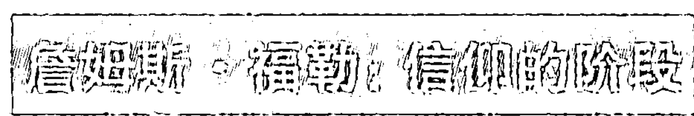

在离开第 2 区之前，我想再谈谈现象学方法发现的另一条非常重要的发展路线，詹姆斯·福勒研究过这条路线，并在他影响深远的《信仰的阶段》（以及随后的书籍）中记录过。我在图 2.5 中加入了福勒的阶段——即信仰发展路线的层次，以及杰伯赛、洛文杰/库克·格鲁特（作为参考），还有我们会简短讨论的意识状态。

关于福勒的作品，我想立刻强调的是，“信仰”或者“灵性”有几种不同的意义，福勒只研究了其中一种。后文我们会谈到灵性的几种不同意义或者方面，这些意义包括：代表任何路线的最高水平的灵性，自身就是独立发展路线的灵性，以及代表意识变异状态的灵性。福勒研究的是第二种意义，亦即灵性本身就是独立的发展路线。灵性的这个意义或者方面既是发展性的、也是结构性的，是经典的第 2 区方法，只是这次涉及的问题是灵性智力，而不是认知智力、情感智力或者音乐智力。这个特定的发展路线是总体灵性的重要方面，我们随后还会多次讨论它与灵性其他维度或因素的关系。（对于那些不熟悉福勒的研究成果的读者，稍后我会做个简短的概括。）因此，如果我说灵性智力阶段，我指的是福勒的研究发现。

此前所有的发展层次和路线的讨论都是从外部（第 2 区）看内部全子（UL）。那么，它们从内部（第 1 区）看是什么样的呢？

## 第三章 意识状态

内在全子从内部看是什么样的？它就是你现在感受到的全部东西。

### 意识的现象学、可感经验和状态

从这里开始，情况变得有点复杂。结构和状态之间的差异是 AQAL 强调的重要区别。我们在前文开始研究结构，它基本上就是任何发展路线的层次的别称。每个层次都有结构，或者说某种实际构架或者范式。例如，如果谈到语言的复杂层次，该层次本身具有某种结构、布局或者范式。例如，如果我们谈到语言中的某个复杂层次，该层次本身有结构、布局或者范式，就像我们说细胞壁或者新皮层的结构那样。关于这些结构，值得注意的是，它们不是固定僵化的，而且几乎就如旋风。语言有稳定的范式或者句法，哪怕所用的词语时常在变化。结构尤其是动态的范式，常常是“自生型”或自组织的。虽然细胞的局部不断地发生变化，细胞仍然保持下来，因为它具有自组织的稳定范式。那个动态整体范式就是它的结构。

从客观外部角度来看，那个被范式化的整体或其阶段，就是结构主义和发展主义研究的“结构”。在洛文杰看来，“守旧的”“有良知的”“个体的”等等是自我发展路线的部分主要结构（或者层次）。

（这些结构 / 层次按照有序的阶段出现，因此，尽管我们常常换用结构和阶段这两个术语，但严格说来，结构和阶段是不同的——阶段中有其他内容。因此在本部分讨论中，我们不会将两者等同起来。如果要同时提到两者，我们用结构—阶段表示心灵第2区结构的顺序，当然，这看起来可能有些别扭。洛文杰、基根、塞尔曼、佩里、布劳顿等等都是结构—阶段。我相信，虽然这个术语很别扭，但我们很快就能明白这种做法的意义。）

本章中要观察意识状态，并将它们与意识结构做比较。尽管这乍看起来似乎枯燥乏味，但这个关系包含了理解灵性经验本质（以及现代和后现代世界宗教的作用）最重要的单个要素。做完了这番平白的介绍以后，我们转入正文。

UL 的第1区（“我”的内部）就是我正在思考、感受和觉察的东西。我可以继续用第一人称来描述我现在的、当下感觉的经验和理解（“感到沉重、热、紧张、愉快、光明、爱意、关心、兴奋、短暂的灵光突现等等”），许多现象学方式，不管叫什么名字，就是这么做的（见图1.3）。这些都是第1区方法的变形，其中有部分方法研究的是名为现象状态的这类内在经验的特定类型。

也就是说，我的第一人称方式的直接体验，除了包括具体“内容”或者“当下体验”（感觉、想法、冲动、意象等等）之外，还包括通常被称为“现象状态”的东西。不管经验什么状态，我都不会体验结构本身。我从未直接经验“道德阶段3”或者“良知结构”或者“第4阶段的人际关系能力”这类对象，即使那就是我所在的阶段，也的确是产生了我所有想法的结构，我仍然看不见它。结构只能用第2区方法发现，这就是冥想或者静观发现不了它们的原因。① 另一方面，状态可以在各种境遇下直接觉察到。我体验状态，而不是结构。

> ① 这样说来，你可以感觉结构的内部，因为正是在这个沟槽里，你思考和感受事物。如果仅仅采用现象学、冥想、内省等等，你看不见它们的实际结构，也不会想到它们的存在。

我们大多数人都熟悉意识状态，伟大的智慧传统也如此。例如，吠檀多给出了 5 个重要的意识自然状态：清醒、做梦、深度睡眠、觉察（图力亚）和不二（第四境）。这 5 个状态特别重要，请花点时间留意下。

除了自然或者普通状态以外，还有意识变异状态或者非常状态，包括外因状态（如药物诱发的状态），以及内因状态（包括经过修炼以后的状态，例如冥想）。

普通或者不普通的超常状态，通常称为高峰状态。

多数文化，以及那些伟大传统，都有状态图，包括自然的、外因的和内因的状态。

某些冥想图特别详细，但是，所有的冥想图都基于第 1 区的方法和教导（例如禅宗打坐、归心祈祷、萨满出行（shamanic voyaging）、内观、死藤水①、修士苦行、静观等等），而且，那些乐意遵从恰当的教导（例如，坐在垫子上，从 1 到 10 数息，直到 1 个小时以上为止，并在期间不会分神；使用咒语；服药；这样或那样跳舞；接受心印等等）的人，都证实过这些现象体验。

正确地遵守这些教导，你就会获得系列的现象经验。无论这些现象经验（“我似乎看到了无限的光与爱”）是否有实际的本体论所指（“这是存在的神性根基”），毋庸讳言，这是个有趣的问题（我们之后还会讨论，因为那属于整合式后形而上学的主要范围）。②

许多伟大传统都创造了以这些状态为基础的详细心理学，虽然我们不需要关注其细节，我还是想强调几个重要特征，因为至少其中有些最伟大的内在现象系统。我要总结的关系本身容易引起争论，难以证明，但是，我们现在仅仅假定它们是对的。我以吠檀多和金刚乘为例（虽然新柏拉图主义也可以），不过，在开始之前，我们需要解释部分复杂的术语。

> ① 死藤水（ayahuasca），用南美藤本植物的根泡制而成的、具有致幻作用的饮料。
> ② 对于感兴趣的人，史坦·葛罗夫的致幻图同样是第 1 区图例（因此你在他的所有图例里都找不到任何第 2 区阶段，这严重地限制了他们和他们的“宇宙游戏”以及宇宙起源说）。

根据这两者的看法，冥想状态是自然状态的变化形式。例如，有相冥想（有分别三摩地），——例如想象某个神，重复他的名字或者咒语，就是梦境状态的变体；无相冥想（无分别三摩地），例如关注意识本身而不是任何特定物体，是深度睡眠的变化形式。此外，据说：意识的三个主要自然状态（清醒、做梦、睡眠）分别由特别的能量或者“身体”来予以维持，它们分别是：粗钝身体、精微身体和因果身体（例如，化身佛、报身佛、法身佛；第四个身体，自性身，有时候据说能维持觉察／不二状态）。虽然，严格来说，“粗钝”“精微”和“因果”仅仅指身体或能量（UR），也可以用这些词指代对应的整体意识状态（UL）。我们可以将五个主要自然和／或冥想意识状态称为：粗钝、精微、因果、觉察和不二意识状态。（通常，传统自身也这么称呼，我有时候会说三、四或者五个主要意识状态，但所有的五个状态都包含在内。）

对于那些还没将上面这段话读完便觉得读不去的人来说，我们可以简单地概括其要旨，那就是：根据伟大的智慧传统，所有男性和女性都有至少5个伟大的自然意识状态，而且都可以直接体验到：

- 1. 粗钝—清醒状态，例如，我在骑自行车、读书或者锻炼身体时感受到的东西。
- 2. 精微—做梦状态，例如，我在栩栩如生的梦境中体验到的东西，或者在生动的白日梦、想象练习或特定类型的有相冥想中感受到的东西。
- 3. 因果—无相状态，例如，深度无梦睡眠和许多无相冥想，以及深度敞开和空寂的经验。
- 4. 觉察状态——或者“觉察者”状态，这是觉察所有其他状态的能力；例如，清醒状态下的定力以及做清晰梦（lucid dream）的能力。
- 5. 始终存在的不二意识，这与其说是状态，毋宁说是所有状态的长久根基（可以这样被“体验”）。

吠檀多和金刚乘认为所有人都可以依靠“难得人身”的价值达到这些状态。这意味着，在某种程度上说，任何成长阶段的任何人都能达到这些主要的存在和意识状态，包括婴儿，就因为婴儿也会清醒、做梦和睡眠。

这真的很重要，千真万确，我们后面还会讨论。

> （暂时透个口风：因为这些主要状态的基本轮廓是始终存在的，你可以经历较高状态的高峰体验，但不能达到较高阶段的高峰体验。例如，如果你在成长的简·洛文杰良知结构—阶段，研究持续表明，你根本不会获得更高结构（例如自主结构）的高峰体验，但是可以有粗钝、精微、因果、观察或者不二意识状态的高峰体验。回头我们还会讨论这两者如何形成整体。）

虽然所有人类都天然地、自发地具有这些重要存在状态的整体轮廓，但是，其中部分状态可以受到大量训练或者研究，然后，这些受到训练的状态当真会带来若干的惊喜。

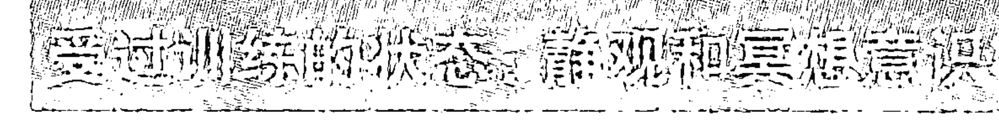

据说任何阶段的任何人都可以达到存在和意识的主要自然状态，但这并不表示，这些状态不能受到训练和锻炼。状态训练是非常高明的第1区技术，在东西方伟大的冥想传统中被发展出了各种登峰造极的形式。

一般来说，自然状态并不显示发展。梦的状态会发生，但是它不会发展。自然状态和大多数意识变异状态不显示阶段。它们就像大多数状态——情感状态或者雷雨等天气状态——那样，仅仅来而复往。此外，多数意识状态都是排他性的，人们不能既是清醒的，同时又是醉醺醺的。自然状态甚至存在于高级阶段，即便是佛也会清醒、做梦和睡眠（虽然佛观察到这些状态都是不二状态）。

但是，有些状态可以接受训练，包括定力，许多冥想和内观形式中都有这点，这些接受训练的状态往往会按照某种顺序逐步展开。它们展开时遵守从粗钝到精微到因果到不二的自然顺序。

这意味着，在我的第一人称直接经验中，许多冥想法门中的现象状态都会从粗钝现象（“我看到岩石”）发展到精微现象（“我看到光和极乐，我感觉到很多爱”），到因果现象（“只有广大的空寂，无限的深渊”）到不二（“真空妙有，空有不二”）。它们不是第三人称结构（能够被第 2 区观察到），而是第一人称状态（第 1 区）。

状态按照某种顺序展开时（很大程度上是因为受过训练），我们称之为状态—阶段（相较于结构—阶段）。

状态的本性比结构更模糊和不固定，这个状态的阶段顺序非常灵活易变，此外，你可以体验较高状态的高峰经验（虽然通常来说，如果没有进更深的训练，这类体验会非常短暂——仅仅是意识变异状态或者暂时的高峰体验。如果接受进更深的训练，“高峰体验”可以稳定为所谓的“平原体验。”）。因此，如果你处于特定的状态—阶段，你常常能暂时体验到某个较高状态—阶段的高峰体验，但不能将其稳定地维持下来，让它成为平原体验。

另一方面，研究再三表明：与状态—阶段不同，结构—阶段是非常连续的发展层次或者阶梯；而且，研究也再三表明，你不能跳过结构—阶段，也不能获得较高结构—阶段的高峰体验。例如，如果你在认知路线的前运思（preoperational）阶段，你不会有形式运思期的体验，不过可能有精微一状态的高峰体验！（我们很快会回到状态和结构的关系。）

这些状态—阶段通常从粗钝到精微到因果到不二。翻开东西方的任何冥想或者静观手册，你会发现其中描述的冥想或者静观体验基本都遵循着这个发展顺序，并特别明显地具有那些常见特质。有人立刻想起圣·特蕾莎的内在堡垒；圣约翰的特别制图法；菩达瞿沙的清净道冥想图；教父图，例如尼撒的圣格里高利、俄利根、圣迪奥尼修斯（他的“清净道”“光明道”和“合一道”就像任何概述那样简要明了：用戒律净化粗钝身体，用专注净化粗钝思想，找到精微的内在启示，在无声祈祷和神圣的无知中甚至放弃启示；因此灵魂和上帝，这光辉的万有者，在神性中合一）。

对任何冥想传统最复杂和仔细的研究，也许当属丹尼尔·P. 布朗的研究（在威尔伯、恩格勒和布朗合著的《意识转换：发展的习俗和静观观点》中；1986出版）。布朗对三个主要冥想传统——帕坦伽利的《瑜伽经》、菩达瞿沙的《清净道》和札西南嘉的《大手印月光》（*Phyag chen zla ba'i od zer*）——的基础文本和核心注疏进行了大量研究。在某种意义上来说，这三者是印度教和佛教的支柱。

布朗发现，在所有教派中，冥想途径都要经过同样的基本冥想阶段，这些基本阶段都是粗钝开端和训练的变化形式，然后是光和启发的细微经验，无相专注或者“成就之前的因果黑暗时分”，最后获得突破，进入不二觉悟（还可能有更深的“觉悟后”修炼。）这种严谨的关注和研究，包括阅读原文文本，使布朗的研究成为有关冥想阶段这个话题的绝对辉煌而持久的经典之作。（见表 3.1，他对冥想状态通常阶段的简要总结。）

在布朗和恩格勒共同编辑的《意识转换》中，我们征得哈佛神学家约翰·切尔本的同意，加上了他对早期教父们冥想状态阶段的大量研究。它显示出同样重要的有机顺序，从粗钝现象到精微的光到因果黑暗到不二。（他的总结见表 3.2.。关于布朗的研究，我不是说所有冥想者都要经过所有这些阶段，而是说这是概要的综合。）

丹尼尔·高曼的《冥想体验大全》中也许对冥想状态的共有阶段做了最简单易懂的概括。注意这本书的标题有意模仿了威廉·詹姆斯的名著《宗教体验大全》。这种模仿非常合适，因为两本书都在描述第1区现象，同时忽略了第2区。（詹姆斯这么做，是因为第2区方法的首个伟大先驱者詹姆斯·马克·鲍德温和詹姆斯都生活在20世纪初。鲍德温的革命性研究还没有进入当地和海外的主流学术界；而在进入主流之后，它就促进了结构主义和后结构主义的诞生。）

**表 3.1 某些著名东方传统中的冥想状态阶段**
（丹尼尔·P. 布朗，1986，《意识的转化》）

| | 冥想阶段 | 观点 |
|---|---|---|
| | | 佛教 | 瑜伽 |
| 态度，情感行为 | I 初始伦理练习 A. 信仰产生：态度变化 B. 正式学习：心灵内部转化 C. 感官/行为控制 连续觉察训练 | （像光子） | 思想的光 （像波浪） |
| 思考 | II 初步思想/身体训练 A. 身体意识训练 B. 镇静呼吸与思考 C. 重新调整意识流 | 不连续瞬间 | 相同事物的连续转化 |
| 感知 | III 有相专注 A₁. 专注训练：去掉分别心 A₂. 内在化：重新调整意象 B. 从种子开始认识感觉模式的不同范式 C. 停止思想，即粗钝观点 | 不连续的显现种子 | 连续转化的种子 |
| 自我 | IV 无相专注 A. 改变精微知觉中 B. 认识精微流 C. 普通观察者的失败；观点重建 | 不连续的当下事件 伴生的观点（路径） | 无唯（香、味、色、触、声）的连续感应 神我的表达（觉性） |
| 时间/空间 | V 觉悟练习 A. 当下寻找精微流；根除自我；现实感丧失 B. 当下寻找粗钝心理事件；知觉精微流事件长度和频率变化；仅仅生起；慢镜头的完整事件；快速掠过的心理能量；极度欢喜；白光 C. 分析念头及后续流；感知时空的问题 所有潜在事件的内在联系 | 无实体性 间断性的灵光闪现 非消亡 所有空间和时间的互相关联 | 停止感官印象 相同（tulya） 一个子层的转化（有法） 统一 显现宇宙的统一（自性） |
| 宇宙 | VI 高级觉悟 A. 对相互关联的事件保持不动心；特别事件的互动 B. 停止所有的心理活动/反应 证悟时刻： 基础：停止心理内容；广大觉察 路径：从改变的意识核心重新回到心理内容 | 非消亡 | 显现宇宙的所有相互作用 法云三摩地 |

**表 3.2 一些著名教堂圣徒的静观状态阶段**
（约翰·切尔本，1986，意识的转化）

否定法

| 阶段 | 叙利亚的圣艾萨克 | 萨罗夫的圣瑟拉芬 | 圣格雷高利·帕拉马斯 | 圣约翰·克利马科斯 | 圣马克西姆斯 | 圣狄奥尼修斯 |
| :--- | :--- | :--- | :--- | :--- | :--- | :--- |
| V 圣化 | (3) 完美 | 获得神圣灵性 王国 正义 和平 | (3) 圣化 | 30级(天梯) | (3) 永恒存在 | (3) 统一合一的祈祷 (宁静祈祷) |
| IV 光 | | 启迪 | (2) 神圣之光 纯粹静修 | 第 27-29 级 静修 | | (2) 启示 (回忆祈祷) |
| III 脱离欲望 | (2) 净化 | | | 灵性发展 | | (1) 净化 (心祷) |
| II 悔改 | (1) 悔悟 | | (1) 祈祷劳作 比喻 祈祷 斋戒 施舍 | 第 1-26 级 | (2) (安乐) | (简朴祈祷) |
| I 想象 | | | | | (1) (存在) |

第 1 区中，威廉·詹姆斯倾向于关注自然或者自发状态，高曼则进一步观察第 1 区的训练状态，它因此显示了某种序列性。另外，该序列差不多就像丹尼尔·布朗所描述的，可以在全世界任何伟大冥想（或者训练状态）系统中找到。

需要再次重复的是，因为这些是状态—阶段，不是结构—阶段，因此，它们可以被任何阶段的任何人体验到。

# 灵性的觉醒

此可能有很大的流动性、暂时的跳跃、较高状态（不是结构）的高峰体验等等。但是，达到各种状态（自发到高峰到平原）的通常顺序确实是从粗钝到精微到因果到不二。

状态像绘画般难以描述；我们选择了云朵状的结构。图 3.1 总结了完整的冥想训练过程中冥想状态的典型顺序，全球各种智慧传统的修习者可能需要 5~20 年才能掌握。我们看到觉悟的通常过程是从粗钝到精微到因果到不二，从清醒状态的典型被囚，到在梦中也保持觉醒（在此时，清醒梦很常见）和/或中等层次的冥想状态，然后进入因果无相状态（不管它的名字是什么，在此时，包括止观在内的高级冥想状态有可能发生），和/或延伸到深度睡眠的非常静默的意识（高级冥修者的脑电波范式证实了这种看法）。此时，所有主体状态都成为观察性存在的对象，经常会出现不二的融合状态，甚至可能与更高境界融合起来。这正是“神圣境界”的确切含义……如今，你已知道它的确切含义，我们稍后会根据整合式解读来讨论这种觉醒。

> 价值六万四千美元的问题……

我们审视了意识结构（按阶段发生）和意识状态（受过训练后，可能按阶段发生）。值六万四千美元的问题是，它们有什么关系？也许，它们分别是传统方法对左上象限（第 2 区结构主义和系统）和静观方法对左上象限（第 1 区冥想和静观）所做的典型贡献。这确实将我们带回最开始的问题：你为什么可能在冥想垫子上坐几十年，却永远看不到类似螺旋动力学的阶段呢？

你为什么可以永远研究螺旋动力，却从不开悟呢？

## 第四章 状态和阶段

# 灵性的觉醒

我在全书中试图做的事情就是：非常简洁地概述众所周知的方法，然后谈谈可以如何运用 AQAL 来有效地整合它们。如果“整合式灵性”能够产生任何意义，也需要做这件事。我们从禅和螺旋动力学开始，回到前面提过的问题：它们明显不同，但怎样将它们关系起来呢？

螺旋动力学（SD）基于第 2 区发展研究的伟大先驱者克莱尔·格雷夫斯所做的工作。他的模型奠基于他的研究之上，该研究起初是向大学生提出这个简单问题：“描述心理健康者的行为。”格雷夫斯用和鲍德温同样古老的第 2 区常用研究方法，发现对这个问题的回答最终引导他形成了某种发展系统，这种发展系统所研究的对象，就是他和他的学生们在“价值系统”中称为层次的东西。螺旋动力学指价值基因，主要以格雷夫斯的著作为基础，后来有人将它描述为“系统或者价值基因”，又名“核心智力”（我将它简称为价值智力或者多元智力中的价值路线。）①

① SD 声称价值基因包括所有智力，这种说法完全不对：虽然价值基因有自身的认知、道德、美学等等类型，但本身没有结构性地描述皮亚杰认知、科尔伯格道德、洛文杰自我感觉、托伯特行为—探寻，塞尔曼相互影响，或者巴塞克方言以及许多其他不为这些理论家所接受的术语。它们是具有不同结构的不同发展路线。同样，就 SD 的观点来说，它也陷入了明显的路线绝对主义。

## 第四章 状态和阶段

格雷夫斯和 SD 谈到了这种适应性智力的八个层次/阶段，简单来说是（下列词语直接来自螺旋动力学）：

- 第 1 层（A-N）生存的；活着；“生存意义”
- 第 2 层（B-Q）魔幻的；安全可靠；“家族灵性”
- 第 3 层（C-P）冲动的；自我中心的；权力和行为；“权力上帝”
- 第 4 层（D-Q）有目标的；绝对主义；稳定和充满目的的生活；“真理力量”
- 第 5 层（E-R）成就的；多元的；成功和自主性；“奋斗动力”
- 第 6 层（F-S）公有制社会的；相对论的；和谐与平等；“人类联系”
- 第 7 层（G-T）整合的；系统的；“灵活流动”
- 第 8 层（H-U）整体的；经验的；综合和重生；“全球观点”

许多运用螺旋动力学的人很难理解这个系统在更大的 AQAL 框架中所代表的知识的基本性质，我建议你从事下面这个思考实验，看看是否能有所帮助：

假设，你在大学里上螺旋动力学课程。为了说明我的观点，假设你发展到了第 4 层，有目标的。你读了教科书，记住了 8 层或者 8 价值基因的说明，你与老师和全班进行了讨论，接受期中考试，考试要求你描述价值系统的八个层次，因为你记住了答案，所以答得很完美，考试得了 100 分。

虽然你仅仅在第 4 层，但你能够描述 5、6、7、8 层，这是因为有外在或第 2 区的描述。这是对不同第一人称现实的第三人称描述。你得满分 100 是因为你记得这些第三人称描述，虽然你自己不在更高层次，但是记住了更高层次的描述。

现在想象另一个测试。测试题是“请在当下用第一人称语言来描述第 8 层的直接感觉。”其中包括相同要求的口试。如果你自我感觉真的在第 4 层，你会完全考砸。你能通过第三人称测验，但是第一人称测试却不及格。

换句话说，研究 SD 阶段可以提供这些阶段的外在（第三人称）观点，但是未必能让你转变到高于目前的任何阶段。这不是系统本身的问题，第 2 区描述就是这样的——即，它是第一人称经验的第三人称描述和结构性表达。

因此，多年研究螺旋动力也未必就会让你发生变化。它使用第三人称认知，而不是第一人称自我认同。这不是模型的错误，它就是第 2 区方法要做的（或者第一人称现实的第三人称方法）事情。我非常喜欢克莱尔·格雷夫斯的著作、唐·贝克和克里斯多夫发展的螺旋动力学非常精彩易懂的表达方式，并仍然愿意说 SD 是很好的介绍模型。① 当然，唐

① SD 是否是完整的心理模型呢？这个问题我已经在此前的脚注里谈论过了，我相信它绝对不是。唐强烈反对这点。这么说吧，在这里，我们彻底产生了分歧。声称 SD 包括所有重要的基础（本身待商榷）是一回事，说它包括皮亚杰、科尔伯格、洛文杰等人的实际结构—阶段是另一回事，它显然不包含这些，而任何真正的整合式模型理当包含这些内容。我对 SD 的简要批评就是，它不包括意识状态（如塔特），也不包括状态—阶段，不包含更高的超个人意识结构，没有状态和阶段／层次关系的理论；将多个层次与层次一路线混淆起来；未区分长久结构与超越性结构；没有自我系统的发展观点，因此也没有关于压抑和潜意识的可信理论；充斥着不可信的价值基因观点；不包括洛文杰、塞尔曼、佩里、皮亚杰、科尔伯格等等的实际结构—阶段。（对此它要么不提，要么提出不同看法，表现出了隐藏而无处不在的路线绝对主义观点）将阶段与包括多个阶段的多元智力混淆起来。它是很好的简单介绍工具，却是灾难性的实际心理模型。常常有人问我为什么“改变对 SD 的看法”，但是在我所写的关于 SD 的处女作中，我在脚注里就有这些批评（实际上，有满满四页脚注都是批评 SD 的；见《万物简史》，第一章脚注 6、9、10）。同样，在那以后，我每次介绍 SD 时都直接或在脚注中加入了这些批评，正如现在的这个脚注。换句话说，我对 SD 的态度从最开始就没有改变过，认为我改变观点的人其实没有读过脚注。同时，SD 从（转下页）

## 第四章 状态和阶段

属于整合式研究所的创始人，克里斯·考恩和娜塔莎·托多罗维奇做了出色的工作，使格雷夫斯的很多原始著能够为更多的听众所了解。

关于转变本身，亦即个人如何及为何成长、发展和转变，属于人类心理学伟大的奥秘。关于这个问题的真相就是，没有人知道这些奥秘。有许多理论，许多有把握的猜测，但很少有真实的解释。毋庸讳言，这是特别复杂的话题，因此我在完成本部分的内容时，会将它暂时搁置起来。

比方说，无论你在第 2 区的哪个层次，你决定进行冥想。这是第一人称的探险，不是第三人称的学习。如果你成功地进行了任何严肃的静观或者冥想，你会有系列的经验。这些不是大多数第 2 区方法极其独特的结构—阶段，因为它们是冥想的经验和状态。但是，它们往往会在意识的整体波中展开，从粗钝到精微到因果到不二，这正是表 3.1、3.2 和图 3.1 的主要状态—阶段。

在禅宗中，这些冥想阶段最著名的版本是十牧图。这些状态—阶段描述了禅宗训练的全部过程，以及训练中任何阶段每时每刻的发展。正如前文所说，它们在某种意义上是定力训练的阶段，它们推动我们不断觉悟，从粗钝清醒状态的典型限制，进到精微—梦境现象的清醒（三摩地，神性，启示）和因果现象（无区别，无相，黑夜），这时我们在空性境界的第八牧图上，然后认识到始终存在的不二大智慧/大慈悲（自然，神性，统一，自性身）——这是第十牧图，又叫“露胸跣足入廛来”。

如上所述，这些是丹尼尔·P. 布朗报告的第 1 区状态—阶段的总体变化形式，以及丹尼尔·高曼在《冥想体验大全》里提供的简化版本。

最后，价值六万四千美元的问题是：禅宗阶段和螺旋动力学阶段有什么关系？

现在，我想艰难地理清这些绕不过去的、令人晕头转向的东西，以便对这个问题形成某种清晰的看法。我这么做是因为我必须直面这些晦涩深奥的东西，我觉得你也应该这么做。

在这个领域，我们早期研究者感到非常茫然的是，我们知道洛文杰和格雷夫斯等人的阶段概念的确很重要；而且，有些阶段（例如科尔伯格）已经在 10 多个或更多跨文化研究中经受了检验；你要么包括这些模型，要么你的心理灵性系统就会十分缺乏全面性。

我们也知道，东西方的现象学传统（例如圣特蕾莎的内在堡垒，随顺和阿提瑜伽）以及近期的研究——例如丹尼尔·P. 布朗对冥想阶段的某些深层特征的共性研究——都同等重要。通常来说，我们接受西方心理学模型的最高阶段——通常大约是 SD 的全球观、洛文杰的整合或者人马期——然后接受冥想的三或四个重要阶段（粗钝，精微，因果，不二——或者入门、净化、启示、合一），然后将这些阶段放在其他阶段之上。这样，你就能从洛文杰的整合层次（人马期）进入心灵层次再到精微层次到因果层次到不二层次。梆梆梆梆……东西方就此整合起来了！

这是个起点，至少有些人在严肃地看待东方和西方的方法，但问题立刻出现了。真的必须通过洛文杰的所有阶段才能获得灵性体验吗？如果你有圣十架约翰所描述的启示经验，那是否表示你已经通过了所有八个格雷夫斯价值层次呢？听起来不太对。

第二个问题迅速使那个问题变得更加复杂。如果“证悟”（或者任何神秘融合）真的表示通过了所有八个阶段，那么，既然有些阶段（例如系统全球观）是新近才出现的，2000年前的人们怎么可能证悟到这些阶段呢？

我们最早期的整合尝试都在如何将冥想阶段和西方发展阶段联系起来的问题上受到了阻碍，这个问题停滞了二十年。

这个问题在部分程度上围绕着下面这些话题：“证悟”是什么？在不断发展的世界中，“证悟”是什么意思？“证悟”可能是什么意思？怎样界定它才能够满足所有那些声称证悟和研究证悟的人提出的证据？任何“证悟”的定义都必须解释对于启蒙后的今天意味着什么，也要解释今天的某些阶段在从前还不曾存在之时，相同的定义在早期是怎样具有意义的效力。如果无法做到这点，那就意味着：只有现在的人能够完全证悟或者达到灵性觉醒，但这是完全说不通的。

检验使用的例子是：无论我们用哪种方式来定义证悟，2000年前的人——例如，佛陀、耶稣基督或者莲花生大士——能否在任何有意义的定义中仍然被称为“证悟”或者“完全成就”或者“灵性觉醒”者？

在二十年中的大部分时间里，正如我所说的，这个复杂问题形成了戈尔迪之结（难题）。首个真正的突破发生在理解状态和结构的区别之时，然后是发现了它们可能的相互关系之时（发现必须不再将它们等价起来）。在我提出建议方案的数年之后，我的朋友阿伦·康芒斯无意中独自发现了基本相似的观点。为了让历史记住它，我们在经过交涉以后，将它命名为“威尔伯—康芒斯框架”（之前几个月我不得不向阿伦解释“康芒斯—威尔伯框架”听起来有多傻）。

整体观点是这样的。关键之处是要开始认识到，正如前文所说（和强调）的，因为多数冥想状态是粗钝清醒、精微梦和因果无相等自然状态的变体，它们实际或可能存在于所有成长阶段，因为即使最早期的阶段都会有清醒、做梦和睡眠。

对应地，如果采取任意结构—阶段顺序（我们用杰伯赛的——远古、魔幻、神话、理性、多元、整合），并将这些按顺序发展的结构—阶段依次排列在方格或者框架的左侧，然后将主要状态排列在上方（粗钝、精微、因果、不二），你会得出简单的 W-C 框架（见图 4.1）。这个整体观点有许多变化形式，我当然不是说，阿伦完全同意我的观点；这里的整体观点是：结构和状态以复杂的方式部分重叠。这些图和下列讨论中的大部分内容，都是我对那个整体观点的具体意见，我相信阿伦也同意我的看法，但是，我得再次重申，我不想在细节上代替他发言，因为我们每个人在向不同的方向发展这个新生的观点。

在图 4.1 中，可以看到任何阶段的人都可以有粗钝、精微、因果或者不二状态的高峰体验。但人们会根据他们所在的阶段来解释其状态。如果我们用类似格伯的 7 阶段模型，那么就有了 7 阶段 ×4 状态 =28 阶段—解释 / 状态经验，如果那有意义的话。（我们会看到，我们有证据来证明所有这些“结构—状态”经验。）

上一段黑体字对于早期研究者是个突破，也是真正的转折点。它让我们看到甚至较低发展阶段的个人，例如魔幻或者神话阶段，也能够有深刻的宗教、灵性和冥想状态体验。粗钝 / 心理、精微、因果和不二不再在西方习俗阶段的上方，而是（包括意识变异状态和高峰体验）能够并且的确会伴随着任何阶段同时发生。图 2.5 通过将三个主要状态 / 云排列在阶段右侧，表明了这点。

（对我们来说，让我们加倍困惑的是，如图 2.4 所示，在人马期和它的统观一逻辑之上，还有三到四个更高结构，因为这些结构的特征和三到四个更高的状态相似，发现这些差异几乎是不可能的。因此，我们继续将第 1 区的更高状态放在第 2 区结构上，称它们为高级结构。我们可能一生都不明白为什么这样无法运作。这的确让我们很抓狂。这个重叠使得 W-C 框架非常难以理解，即使那些数据就在眼前。）

关键在于，人们可能有深刻的高峰、宗教、灵性或者冥想经验，例如精微的光或者因果的空，但是他们会用自己仅有的工具，即所在发展阶段的工具，来解释那个经验。魔幻阶段的人会做出魔幻的解释，神话阶段的人会用神话解释，在多元阶段的人会做出多元的解释，等等。神话期的人不会进行多元解释，因为那个意识的结构一阶段还没有出现或者发展出来。

但是，从刚开始，意识的五个主要阶段或多或少都是可以接触到的，因为不管人们在哪个阶段，他们都会清醒、做梦和睡眠。将它们整合起来，我们立刻能获得 W-C 框架之类的东西。

杰伯赛的整合阶段也是个阶段，但对于我们来说，它仅仅是通向至少四个更高发展结构一阶段的开端（见图 2.4 和 2.5），所有这些更高阶段都坚持将自身基督意识的体验与圣灵在世界上的其他表现形式整合起来。如果你是这样的人，你可能发现本书就抱着这种观点。（坦白地说，任何较早 / 较低阶段完全不会对这个话题感兴趣。但是，如果我们确实愿意勉励自己继续前进，那就仍然保持着谦卑的态度吧：不论我们在哪个阶段，常常会有更高的阶段；在某处，某地，某个宇宙或者维度，某人正在写着经文，它高悬于我们的头顶之上……）

注意在图 4.1 中，我在每种状态下都写上了与之对应的自然、神性、无相和不二神秘主义。这是非常松散的归类，但非常有用（我补充到了原始的 W-C 框架中）。这里的基本思路是，在四个主要自然状态的每个状态中，你都可以有高峰体验，或者让那种状态增强。任何领域的终极高峰体验，就是与那个领域的现象融为一体。在粗钝一清醒状态中与全部现象融合的体验是典型的自然神秘主义，在精微一梦状态中与所有现象融合的体验是典型的神性神秘主义，在因果一现象状态中与所有现象融合（或由此感到空寂）的体验是典型的无相神秘主义，在粗钝、精微和因果状态中与发生的所有现象感到融合的体验是典型的不二神秘主义。

## 第四章 状态和阶段

我相信那个解释性分类（或者类型学）相当有效。它绝不是唯一可能的类型学，但是非常有用。如果我们将它补充到 W-C 框架当中，它能够帮助我们认识到，个体可以感受到与自然的融合，因此成为“自然神秘主义者”，但是根据他们所在的阶段，他们可以对那种融合做出非常不同的解释。你可以拥有与自然融合的深刻经验，但仍然停留于红色层次、琥珀层次、橙色层次、绿色层次等等。

因此，根本没有第 1 区体验（例如威廉·詹姆斯）产生的“各种各样”的宗教、冥想或者灵性经验，只有“各种各样被解释的”宗教、冥想或者灵性经验，因为这些体验始终被置身于情境和解释之中，包括第 2 区方法（例如詹姆斯·鲍德温）显示的系列解释能力——禅和 SD 就分别是这样的例子。

将第 1 区和第 2 区方法整合起来，就有了 W-C 框架。

我们还会回到那个特定问题，我相信，如果我们观察美国最近三十年来对东西方不同的不二法门的阐释方法，这整个主题就会变得非常重要，对后现代主义思潮来说（和他们的负面效应“婴儿潮”）尤其如此。

但是，撇开所有那些不谈，撇开这四个主要神秘主义类型能否与那四种状态关联起来的问题不谈，W-C 的整体框架仍然非常有用和有效，因为它首次设法将发展结构—阶段心理学与灵性/冥想传统的状态和阶段关联起来了。

在此我要作个简单的专业性说明——此后不再重复但我必须强调——当我说人们“根据自身所在的阶段”来解释特定状态时，更具体的说法是“根据当时起作用的整个 AQAL 矩阵”。和往常那样，解释也是 AQAL 事件。

# 灵性的觉醒

这特别包括 UL 象限中的“层次和路线”，人们会基于他们的心理图（代表着当下起作用的、要求得到自我认可的各种智力）来解释经验。在 LL 象限中，文化背景和主体间环境是决定性的（几乎完全是前意识）。在 UR 象限中，神经生理参数设置了大量的解释框架。在 LR 象限中，社会系统的影响几乎像马克思所主张的那样巨大。任何这些因素都不能忽视，它们对个体如何解释自身任何时刻的体验都能产生影响。在每个时刻，都是整个 AQAL 矩阵在个体身上并通过个体来说话。

> 证悟的计算

现在，在某种意义上，“状态和阶段”是整个难题中较容易的部分。可以采取几种不同的方式来表述这个问题。

- 如果万物都在变化，证悟如何有意义？证悟的含义是与万事万物融为一体，如果万物都在发展，我今天证悟了，明天这个证悟是否就成为片面的？随着太阳升起，证悟就消失了么？今天的证悟是否具有时光无法掠夺的任何内涵？
- 典型的回应是：证悟就是与无限的、永恒的、不生不灭的东西融合起来，但实际上灵性中存在着大量的二元对立：无限与永恒 VS 无常与变化，因此，我在此处所说的真正意思是，证悟是与半个灵性融合起来。
- 我们知道，“不二神秘主义”是“与粗钝、精微和因果领域的万事万物融为一体”。我们常常能看到，任何阶段都能有不二的状态，包括魔幻和神话阶段，只是这些阶段不包含更高阶段的现象。例如，在神话阶段，你可以证悟到不二、永恒、大智慧意识，与你的世界中的万事万物融合起来，但是这种体验忽略了宇宙中的许多事物。因此，开悟实际上可能是与部分现实的融合。通常来说，这样是不好的。

在状态和阶段的关系中，这被证明是最大的难题，我提出的解决方案也相当错综复杂。但是，同我讨论过这个方案的灵性导师都认同它的效果，或者认为它至少是可信的。（心中怀着所有这些微妙而复杂的问题，我们如何来定义证悟？我建议的答案是：证悟就是与迄今为止所发展的任何既定时间下都存在的所有状态和所有阶段融为一体。）不过，我不想强迫任何毫无戒备的人去仔细地审视该结论所涉及的所有步骤，因此将它保留到了附录 II。我们会在后文用更多第 1 区和第 2 区冥想 / 内观的范例，重新讨论此处的话题，不必参看附录就能理解这些内容。

> 第 1 区和第 2 区：伊夫林·昂德希尔和詹姆斯·福勒

还有个比较第 1 区和第 2 区的方法，那就是选用所有灵性地图中也许最著名和最有影响力的两个：伊夫林·昂德希尔和詹姆斯·福勒的地图。这两个地图几乎完美地表示了第 1 区和第 2 区，以及这两个区的发展方法。

昂德希尔的著作基于对某些世界上最受人尊敬的圣人和智者的研究，调查和总结了灵性阶段，因此深受赞誉。他的工作在 20 世纪初完成，经历了时间的考验，因为其中利用了不会轻易过时的材料。事实上，它与迪奥尼索斯提出的首个伟大的西方观点很相似，今天，丹尼尔·P. 布朗对伟大东方法门的研究也与之类似。昂德希尔和威廉·詹姆斯是同时代人，他们都从内部开发第 1 区的实证主义方法。詹姆斯主要对第 1 区宗教和灵性状态经验现象学进行描述和分类，昂德希尔则对第 1 区经过修炼以后的灵性和冥想状态经验进行了发展性研究。昂德希尔主要关注灵性路径的现象学阶段——即，状态—阶段，或者可感知的体验和“我”空间里有意识事件的阶段，他从内部理解和观察“我”空间在灵性修习（或冥想状态修炼）原则的引导下随着时间发展变化的过程。随着时间的推移，你可以在祈祷垫子或者冥想垫子上观察到这些东西。

福勒研究了那些无论在垫子上坐多久都看不见的东西。换句话说，他将第 2 区方法用于不断发展的灵性意识，只有从外部采取客观立场才能看见它产生的现象，这通常需要在很长的时间跨度里研究很多的人。因此，你能够在全世界的静观文本中找到与昂德希尔的阶段类似的东西，却在任何静观或者冥想系统中都找不到福勒的阶段（也没有洛文杰的阶段、SD 阶段等等）。

简单来说，昂德希尔的灵性发展阶段是：

1. 清醒 / 入门
2. 净化 / 平静
3. 启示
4. 黑夜
5. 融为一体

福勒的阶段是：

0. 语前未分辨的信仰
1. 直觉—投射性信仰
2. 神话—文字性信仰
3. 综合—习俗性信仰
4. 个体—反思性信仰
5. 联合性信仰
6. 普适性信仰

现在，人们早就认识到，他们两人都发现了某些非常重要的东西，但是他们的阶段彼此并不吻合。而且，众多的学者都评论说，他们看似彼此重叠，却都不允许这种重叠。

这究竟是怎么回事？很明显，昂德希尔提供的是图 3.1（状态—阶段）的数据，福勒则是图 2.4（结构—阶段），两者都在图 2.5 中。到现在，他们各自的阶段顺序都如此熟悉、明显，直接摆在你的面前：昂德希尔的是粗钝、精微和因果版本，福勒的是前习俗、习俗和后习俗版本。

而且，把它们组合起来，你就可以得到 1 个九种类型的网格（W-C 框架），所有这九种类型都有大量的证据。（利用昂德希尔和福勒的实际阶段，可以得到约 4×6 个单元。）昂德希尔表达了威尔伯—康芒斯框架（见图 4.1）上方的状态序列，福勒表达的则是左侧行列的垂直结构。这恰恰是任何福勒阶段的人都能够体验所有昂德希尔状态的原因。（当然，它们之间的关系就等价于禅和 SD 之间的关系。）

为了说清楚这点，你可以想象某个运用了福勒和昂德希尔模型的 W-C 框架。例如，有人在福勒的第 3 阶段——习俗阶段，他可以进行冥想练习和静观祈祷，然后深入到启示、黑夜和融为一体的状态，但是他们会按照自己的阶段解释状态（在这个例子中，是习俗和守旧的）。如果你熟悉东西方的苦行传统，从禅到本笃会，你就会认出这些按照昂德希尔的观点来看灵性非常发达的灵魂（静观启示和合一程度非常高），但这些灵魂的思想仍然是非常守旧和循规蹈矩的——有时候其排外和民族中心倾向达到令人吃惊的程度。不幸的是，许多西藏和日本冥想大师都是这种情况。虽然他们非常擅长冥想状态修炼，但他们的结构是琥珀—橙色，他们可用的解释系统属于左下象限非常民族化和父权制的观点，这些观点被误认为属于永恒的佛法。

（例如，达赖喇嘛的秘书说，达赖喇嘛相信同性恋是罪恶，性是罪恶，口交是恶业等等——每个人都知道口交不是恶业，只有有害的口交才是恶业。悲哀的是，这些是典型的神话—琥珀色信仰。）

西方人好不到哪里去：典型的西方教师的结构中包含着自身的障碍，这个障碍常被称为“婴儿潮”或者“多元”，这是通向泛滥成灾的红色自恋的绿色多元主义（“我”一代），后文我们还会讲到。

因为无论进行多少冥想都看不见这些结构—阶段（琥珀色、橙色、绿色、蓝绿色等），它们可能携带着隐形的病征进入了西方佛法的核心。

（美国佛教老师提到这个就会摇头，然后推荐更多的冥想，这在大多数情况下会让问题进一步恶化。正如我说过的，后文还会谈到这个不幸的情况。同时，亚洲冥想老师在浓重琥珀色或者神话—团体阶段的 LL 象限，不知道对个人主义阶段的西方人怎么办，后者的 LL 象限充斥着橙色—绿色。这些老师在前个人主义的意义上“并不自我”，因此常常能让学生们毫不犹豫地、以守旧阶段的方式来服从他们。在这里，象限冲突和 AQAL 冲突达到了三十年之久。在整合式研究所，我们准备概括这个 AQAL 冲突，这样做无意做出指责，而是为了在开始进行整合式灵性练习时尽可能减少隐形的障碍。）

此外，在这个框架，你会发现有人在福勒的维度中很发达，但是在昂德希尔的静观程度上不发达。这不是“层次和路线”的例子（即，你可能在不同发展路线上显现出不同的层次），而是“状态和层次”（每个层次可能体验相同的整体状态，即，不同意识状态可能发生在不同意识层次/阶段/结构，这被我们称为“状态和层次”，或者更普遍的叫法是“状态和阶段”。）这是 AQAL 矩阵中两个相对独立的元素，W-C 框架反映了这两个特定因素的重叠（状态和阶段/层次）。当然，你也可以在 AQAL 矩阵中绘制其他重叠图，它们都很能说明问题（例如，整合式心理图“层次和路线”，也可以绘制类型和层次、类型和状态、象限和层次、层次和类型和状态等等）。

在图 3.1 中，我增加了三个“黑夜”：（粗钝）感觉的黑夜，（精微）灵魂的黑夜，（因果）自我的黑夜。“黑夜”是通用术语，在不同的传统中，其意义都非常丰富。但通常来说，黑夜表示克服或放弃了对特定领域（粗钝、精微、因果）的执着或者沉溺，或是那种从完全自由的高峰状态坠回到低层次状态所产生的失落感和遭遇感。通常来说，这些黑夜发生在状态间的转换阶段，或者说，在从粗钝身体到精微灵魂梦境，再到因果—自我无相，然后到彻底不二的这个觉悟（及认同）过程中，在每个转变结束的时候，便会产生黑夜。

也就是说，黑夜往往会出现在介于两种整体状态之间的临界点上，发生在我们放弃或克服了对这些状态的执着或认同的时候。这些状态本身（和它们总体的存在和知识领域）保留下来了，并继续出现，但是对它的认同感却被割舍掉了，这种“割舍”构成了感觉、灵魂和自我各自的黑夜。因果/自我的黑夜表现为，例如，禅宗第八牧图，特蕾莎的第七堡垒，阿奴瑜伽的“成就之前的黑暗”等等。

这些是状态—阶段，不是结构—阶段，因此是非常流动易变和开放的，而不是分离和线性的。此外，正如我们刚才所看到的，它们根据个人的 AQAL 矩阵（和线性）来加以体验和诠释。某些传统重视它们，另外某些传统则更迅速地绕过了它们。必须说，有些传统的总体状态过程比其他的走得更远。这是个微妙而且复杂的问题，但很多传统都在努力通过灵魂的黑夜（进入因果合一）而不是自我的黑夜（进入不二的实相）。有些传统，例如特蕾莎的第七堡垒，直接带你进入因果的空，然后要么将你留在空中，要么让你在更深的危机中沉默。其他人，当然有艾克哈特，成功地通过了自我的黑夜，后者完全消除了主体/客体的二元对立和任何形式的自我紧缩（self-contraction），包括它的因果残留物（甚至艾克哈特对细节也仍然含糊不清，但是其中富含类似无上密宗的内容。）关键就是，不管它们在这条道路上走得多远，整个综合序列就如图 3.1 所示，是对所有冥想/静观状态的简单总结。

这是部分常见的状态—阶段。至于福勒的结构—阶段，请注意福勒所说的仅仅是少数研究的客观结果，因此他的数据越是向上，就开始迅速变得越来越少。不是上面没有更高的阶段，而是上面没有很多的被研究者。如果福勒继续完善那些较高结构—阶段的研究（正如库克·格鲁特在洛文杰路线上所做的那样），我们可能会看到这个研究能够揭示出，现在，阶段 6（大概是蓝绿色—层次信仰）之上有大约 3 到 4 个信仰阶段，因此，我们有可能发现，某些信仰就像宇宙行为（Kosmic habit），很稀少但仍然可以觉察得到，（尽管，就如登山那样，随着山越来越高，攀登者也会越来越少），例如：某种靛蓝色信仰（与超—地球心灵同样的高度），然后是紫色信仰（元神，metamind），然后是紫外信仰（超心智）……随着信仰变得越来越完满、完满、完满，植根于永恒不变的自由和空性之中，伟大的根基和虚空心智就会以不断变化的方式呈现无遗，空性观察着它自身的呈现过程……

> “灵性”这个词的四个意义

这是我想在这个整体领域最后关注的重要话题。我们可以利用前面谈到的很多术语，非常迅速地完成这个过程。

分析人们——学者和外行人——使用“灵性”这个词的方式，你会发现这个词至少有四个主要含义。虽然许多人并不用这些专业术语，但“灵性”显然可以用来指（1）任何路线的最高层次；（2）某条独立的路线本身；（3）特别的高峰体验或者状态；（4）某个特定高度。我认为，所有这些都是合理的用法（我认为它们都指向真实的实体），但是我们绝对需要确认我们指的是哪种意思，否则交流就无法进行，反而会让人觉得谈话的基础是不言自明的。我这辈子从未听说过过哪个词能够像“灵性”这样简短却含义无穷，并被这么多人使用。

简单说来，这是四种重要的用法，我认为我们应该重视它们：

1. 如果是任意发展路线——从认知到情感/情绪到需求到价值——人们通常会认为路线的较低或者中间部分不是灵性的，但是他们会将较高和最高层次描述为灵性的（看看图 2.4 和 2.5 的任何发展路线，你就能看到）。“超个人”这个词就是这样用的：灵性通常不会被看作前理性或者前个人（prepersonal）的，以及个人或者理性的，而是被当成深刻超理性和超个人的，它是任何路线的最高层次。（按照马斯洛的数据库，我们常用第三层来勉强描述这些超个人结构—阶段的发展特征。（见图 2.4）

2. 有时候人们会谈到“灵性智力”之类的东西，它不仅存在于任何路线的最高层次，而且自身就是发展路线，可以追溯到生命的最早期。詹姆斯·福勒就是个例子。如图 2.1 和 2.5 所示，这时候“灵性”不再仅仅指各种不同发展路线的最高的、超个人和超理性的层次（用法 1），也有其自身的第一、第二和第三层次（或结构—阶段），这些阶段能始终向下，达到最低（如福勒的 0 层）。同样，这个灵性路线有自身的前个人、个人和超个人层次/阶段。因此，你在用到“灵性”这个词时必须特别谨慎，因为如果将用法 2 和用法 1 相提并论，我们会说只有灵性路线的最高层次才是灵性的。毋庸讳言，这带来了许多混淆。（AQAL 的态度就是，这两种用法——实际上所有四种用法——都是正确的；你不过需要确定采取哪个用法，否则就会永远纠缠不清。）

3. 有时候灵性的意思是宗教或灵性经验、冥想经验或者高峰体验（它可能包含阶段，也可能不包含）。实际上，整个萨满教传统体系都属于这个类别（见罗杰·威尔斯《萨满教的灵性》）。威廉·詹姆斯、丹尼尔·P. 布朗、艾福林·昂德希尔、丹尼尔·高曼都有灵性状态经验的例子（通常是修炼所得）。因此，状态经验也是灵性这个术语的重要用法，当然，它是 W-C 框架的水平轴。

4. 有时候人们说到“灵性”时，仅仅用来指某个能够在任何阶段或者状态中存在的特定高度：也许是爱、同情或者智慧（即类型）。这个用法非常常见，但是，详细说来，它常常被还原成前面三个用法中的某个用法，因为实际上存在着爱、同情和智慧的阶段（几乎所有绿波作家在谈到我们对于爱和同情的需求时都忽略了这个事实）。即便如此，我们仍然通常将它单独列出来，以防万一。

我不会进一步解释这四个意思。《整合心理学》中有充分详细的研究。我要强调的仅仅是，这四个都是“灵性”的有效含义，但是人们在讨论时常常将这四种含义混为一谈，结果是……更含混不清。

我本人不太喜欢第四种用法，因此想在这里再啰唆几句。你几乎可以将 99% 的关于“科学和宗教的关系”的讨论，归入这种类型。抱歉，我看到的就是这样。这些讨论从未深入下去，因为讨论者使用的定义包含这四个隐含的变量，这些变量始终在变来变去，没有人能发现其中的原委，因此，讨论也随之变来变去。

特别是，如果你认识到有效用法 3 自身包含宗教层次或灵性层次 / 阶段，那么，情况就会完全失控（有远古灵性、魔幻灵性、神话灵性、理性灵性、多元灵性、整合灵性、超个人灵性……）。有人说：“宗教或灵性告诉我们深刻的联系和永恒的价值”，但我脑子里完全不知道他们指的是哪种宗教或灵性，而且我确信，他们也不知道。至少有五到六个主要的宗教层次 / 阶段——魔幻、神话、理性、多元、整合到更高，经过四种状态（粗钝、精微、因果、不二），后者也是类型或者类别（自然、神性、无相、不二），更不要提本章列出的四个用法或者意义了。我们甚至还没有涉及象限（作为大我或者真我的灵性，作为大写的“你”的灵性，作为大写的它或他者的灵性）。

在谈到科学和宗教，或者宗教和任何事物之前，请告诉我你指的是哪个宗教。即使仅仅用 W-C 框架，也有两打宗教或者灵性真理的不同主张。你指的是两打中的哪个，排斥其他宗教或灵性真理的基础是什么？

这个系统并不是非常复杂。如果你想谈论任何相关主题，这是个最小的系统。

## 第五章 婴儿潮及其他

我们现在来谈谈 AQAL 矩阵所有成分的病理或者功能障碍的观点。我用婴儿潮作为例子。在下文中你可以进行适当的解读，看看这些内容如何适合于你的修行道路。本章末尾有些资源适用于所有的灵修法门和信仰，有利于解决这个普遍的问题。

婴儿潮自身很重要，同时它说明了某个更广泛、重要的问题：流或路线的病变。更严格地说，是发展路线功能障碍（DLD）。我喜欢 DLD 是因为它听起来能够让你上奥普拉脱口秀。

心理——或者就此而言，现实——的任何方面都可能出现机能障碍。我可能在任意象限、层次、路线、状态、类型等等产生疾病或者“不健康”。任何不断变化的事物都可能发生问题。

为了找出疾病，你必须知道应该关注哪个地方。我们已经看到，冥想传统主要采用第 1 区方法。这样，他们就没有真正理解或总结第 2 区发展的结构—阶段。婴儿潮是个体（第 2 区）发展结构中可能发生的重要障碍，基督教、犹太教和佛教等冥想传统无法看到或者诊断这个障碍。这不是第 1 区方法自身的错误，我们不能期待第 1 区方法发现第 2 区的问题。这应该归咎于仅仅采用第 1 区方法的灵性导师们。

多元主义或者婴儿潮本身在 20 世纪 60 年代的学生反战抗议中首次变得引人注目（如今在对中东战争的抗议中也同样明显）。学生们普遍声称他们抗议战争的原因是因为战争不道德。道德发展测试发现，一部分学生的道德发展水平确实很高。某些研究发现，许多抗议者对他们眼中的不义战争说“不”，而且这种抗议具有后习俗的道德认知水平，具有世界中心的理性。但也有许多反战者处于前习俗期，他们在说“不”的时候处于自我中心和自恋的层次，基本上也就是：别对我指手画脚！

因此，在同一个和平集会中，同一个帐篷下，前习俗和后习俗的抗议者们都喊着同一个口号，说“不行，我们不去”，除非你知道事情的真相，否则，抗议者似乎都在说相同的话、来自同一个地方。因此，强烈反对传统观点的反战抗议既得到了低层次的回应，也得到了高层次的回应，所有人都使用同样的高层次腔调。因此，在后习俗的帐篷下，前习俗泛滥成灾。人们分辨不清，将它们一视同仁——几乎每个人都在这样做，这是典型的前/后混淆错误。

婴儿潮是这种前/后混淆错误的特殊形式。

具体而言，婴儿潮这代人意味着绿色发展波上——多元、相对和后现代——首次出现了为数可观的成员。它本来是“我走我的阳关道，你过你的独木桥”，但是，在很多例子中，它来源于相当高的发展高度——后习俗、世界中心、绿色、全球的。但是，多元开放和不批评主义恢复和鼓励了高度自我中心和自恋的冲动，前习俗的游行就这样进入后习俗的帐篷，每个低层自恋冲动都被贴上了高层次多元主义的标签。“我一代”诞生了。

“婴儿潮”是后习俗（世界中心层次）被前习俗（自我中心层次）沾染的概括，最常见的是，绿色被红色沾染（我们用这些颜色来表示各种路线的高度）。这个绿色/红色混合常常接纳了相当低层次、自恋、自我中心的感觉和冲动，并给它们贴上高层次、后习俗、世界中心，甚至灵性的标签，而且真的认为它自己的自我中心和自恋感属于非常高层次的东西。因此，你越难用当下的真实感觉来感受、表现和表达自我，你就被认为越具有灵性。

# 灵性的觉醒

以“无我的宗教”著称的佛教进入这种环境以后，常常会非常迅速地成为“表达自我的宗教”。佛教的确很了不起，但来到美国以后，就成了婴儿潮 style！

在婴儿潮这代人中，很多美国的佛教徒都是绿色多元主义发展阶段或者波的开创者，这本身确实是非常卓越的成就。其中有些人也进行冥想练习，而且确实能够达到非常真实而深刻的冥想状态（因为在几乎每个阶段都可以达到所有的状态）。但是，个人始终可以根据自身所处的阶段来解释这些冥想状态。这样，冥想状态很快就被用来支持绿色层次的多元世界观。

> （在实际修习中也是这样。例如，所有指导灵认识到自身本来面目——就是每个人自身的佛心，或者，仅仅呈现自身的永存的、自然的、自我认识的空性觉悟——的方法，都可以在绿色发展波中实现，这完全是因为心灵的本质能够接纳心灵的全部阶段。从“心外无物，心即是空，空即是有，当下即解脱”之类的指示到“让心灵听其自然，听任念头自生自灭。这是你固有的心灵，是空的、自我了知的、天然觉悟的。你的心灵是无形的空性，却能念念了知。直视这个无掩饰状态的本性！”——可以在任何阶段，包括绿色阶段，完全意识到所有这些认识状态。禅宗洞山禅师的“五位颂”等等也是如此。因此，从大圆满到大手印到禅宗的所有东西，过去和现在都被用来支持和鼓励绿色。也就是说，长存的灵性被用于加强和巩固绿色层次。）

这非常糟，实际上称得上是灭顶之灾，然而，此外还有两个潜在的问题。第一个是，很多伟大的静观典籍、经书和密教哲学在撰写时，作者的认识路线至少是蓝绿色，通常是靛蓝色或者紫色层次。但靛蓝色文本被向下解读成了绿色文本，这只是因为两者都能体验到相似的冥想状态和成就。正如我们已经看到的，我可以从不二的意识状态走出来，如果我是绿色的，我会用绿色词语来解释不二；如果是紫外，那就用紫外的词语。同一个真实状态可以用于支持任何阶段。向下解读伟大的灵性著作是个严重的问题。

第二个问题是，因为我能用这些真正的冥想状态来支持绿色，由于绿色多元主义可以支持和激发红色自恋，因此，整个冥想体系可以用来支持和鼓励绿色/红色人格结构。换句话说，冥想能加剧婴儿潮。就这样，婴儿潮 style 诞生了。这就是将佛教在向下翻译，不仅解读成绿色的，还解读成了不健康的绿色，或者病理多元主义，或者绿色/红色。使用佛教支持和鼓励“自恋感”是真正的不幸，它在佛教努力扎根西方时泛滥起来。就这样，非常发达的冥想状态训练被用来鼓励不健康的结构或者 DLD（婴儿潮或者绿色/红色就是个例子）。

尤其是不二状态——在可描述的程度内是“全体即一，一即全体，一即是一，全体即是全体”（例如，华严四法界，洞山的五位颂）——被翻译成文字时，可能听起来非常像绿色多元主义“万物相互关联”的发展波，其结果非常奇怪而且有些令人忧心：大圆满教法（Ati）被用来支持自我，灵性用于强化自我紧缩。

真正的问题是，佛教的方法意识不到这些。佛教擅长第 1 区的技能，而这是第 2 区的疾病，是第 2 区看到的发展阶段的疾病，这在佛教的心灵状态中是完全无法察觉和意识到的。

当自我意识从红色自我中心成长到琥珀色保守主义和橙色理性主义，到绿色多元主义，蓝绿色整合主义，靛蓝色和更高时，任何阶段都可能出错，在所有这些阶段都有潜在的病变，如果你看不到这些阶段，你就看不到问题所在。

美国佛教徒（事实上，包括任何静观法门的修习者——佛教、基督教、犹太教等等），都不知道这些第 2 区阶段的存在；个人从某个阶段解读自己的冥想状态；任何阶段都可能有问题；因此这个疾病在他们的雷达屏上是隐形的，但在实际上却感染了整个修行系统。因为佛教看不见它的存在，这个不可见的疾病就溜进了美国的佛教当中。简而言之，操作系统中有个无声的病毒，而且常常可以摧毁整个系统。出于同样的原因，其他静观传统也发生了这种事。

甚至高级冥想者始终都在和这个病毒打交道，却并不认识它，他们得到的建议是增加冥想，这只会加剧问题——责任被推给个人，导致个人的整个系统迟早会崩溃掉。受伤的人进入心理治疗。幸存的人则将第 2 区病毒转移给学生。因此，婴儿潮的灵性就这样被传递下来，传递者中甚至包括那些按照静观传统的状态（第 1 区）标准来说已经证悟的人，靛蓝色（或更高）教导和冥想状态训练因此崩溃，下滑成了多元绿色自我，因为其中有它发现不了的、只能接纳的文化自恋。

系统病毒就这样侵入了静观传统，吞噬着修行者们……

稍等。目前为止，病毒似乎胜利了，但我们走着瞧。佛教徒（和其他人）在加强他们的错误，二十年来都是这样，他们不知道毛病出在哪里。多数被大家认为获得证悟或者已经成就的人，显然都是不整合的。正如数名批评家开始指出的，你可以从某些另类大学那里获得婴儿潮佛学学位，虽然其中有些大学已经开始摇头并极度怀疑它。

然而，尽管问题重重，它却仅仅表明了某个更大的问题：如果任何系统仅仅特别擅长于 8 个方法中的某个方法，那么该系统的修行者就可能看不到自身存在中其他七个维度的任何功能障碍。

这是主要的问题。基于整合的方法恰恰可以解决这个困难，AQAL 分析可以帮助系统以更综合而全面的方式，开始自我校正、组织和解放。简而言之，如果希望证悟既自由又完满，那么“观点”就必须是全面的。

深度冥想和内观中，个人甚至能接触到无相和未曾显现的事物——纯粹的空性止观，当然没有分别形式升起。这个纯粹的“无分别”心（nonconceptual mind），无相因果状态，是解脱、成就与证悟的基本组成部分。

小乘佛教中，或者早期佛教中，这种无相止观状态（例如，无分别、涅槃、触灭），被视为是修行的终点，是摆脱轮回或色身的涅槃。大乘佛教走得更远，声称这个观点尽管是真实的，但不够全面，并迅速地称 Theravada 为“小乘”佛教。大乘佛教坚持说，虽然认识涅槃和轮回很重要，但还有更深的证悟，其中涅槃和轮回或空性和整个色界，是一体的；更严格地说，空色是“不二”的。阐释这个话题的最著名经典《心经》说：“色即是空，空即是色。”对不二的这个认识是大乘和金刚乘佛教的基石。

就证悟或成就的本质来说，这意味着，完整、圆满或不二的证悟包括两个成分：绝对的（空）和相对的（相）。“无分别心”让我们成就前者，“分别心”成就后者。或者这么说：如果你走出无分别的冥想状态时，你会接受什么分别色相？如果你要进入色界，要接受无分别心的涅槃和有分别心的轮回，那么，你会用什么分别形式？按照其定义，不二的证悟既要求“空”中“无见”，又要求在色界中“有见”。冥想专门让我们沉入空性的世界，但什么可以让我们见到“正确的色”呢？也就是说，不二佛教建议的是什么概念观点或者框架呢？

察利嘉公仁波切是个西藏上师，在西方传统和东方传统中同样自在自如。他从独特的角度谈到了这件事（要特别强调的是，下列引文来自《得大自在：通过大手印禅修实现自我解脱》）他在开头就指出，正见和正定同样重要；确实，两者不可分离：

> 佛教徒始终从真实而有效的角度来讨论佛教禅修和体验始终，舍此以外别无他途。正见可以引导我们走向解脱，而邪见则会增加心灵的妄念。

因此，我们在修行之路的开头就需要正确的方向或者观点。正确的观点实际上是灵性的交通工具，是我们从轮回的束缚达到涅槃的自由所需的交通工具。相反，不正确的观点有可能引导我们偏离教导，就像构造拙劣的筏子，让我们漂泊无依，将我们抛在痛苦的此岸。将我们运载到灵性目的地的交通工具，与我们心中所持的观点是不可分离的。

不幸的是，婴儿潮（“别对我指手画脚！”）佛教被用于整个“达摩流浪汉（dharma bums）”灵性，前习俗的许可和后习俗的自由混淆起来了。佛法被认为仅仅是修习“无见”，但其实只有空性或小乘佛教是这样，而大乘佛教却主张空见不二、同等重视两者。这个“全然无见”的概念仅仅适用于“别对我指手画脚！”察利这样谈到这个奇怪的西方佛教：

> 佛教说日常观点限制我们，将我们捆缚在有限的轮回中，然而正确的观点可以引导我们到达最终的灵性目的地。我们不应该从中得出结论说，冥想就是去除所有观点，或者所有的观点都会阻止我们达到灵性目标，虽然现代西方佛教常常如此。这个假设是基于下面这个合理前提：佛教教义无疑认为，我们需要发展无分别智，以便获得解脱和证悟。然而，很多人错误地认为，这意味着我们不需要相信任何东西（别对我指手画脚！），以及从刚开始就必须放下所有的概念形式。这是需要克服的错误观念。需要同时修习正见和精进。

“正见”是什么？就是佛教观点，或者佛教的中心思想、概念和框架，包括它的基本哲学和心理学，例如四圣谛、八正道、十二因缘、对空的核心认识、绝对的空和相对的相的不二、自性本空，不假修饰，寂照双融，以及如下核心联系：正确的伦理和观点 > 导向正确的冥想（禅定） > 导向正确的觉悟（般若） > 导向正确的同情（悲心） > 导向正确的行为和有技巧的方式（方便），以便帮助所有的有情众生。⁽¹⁾

> ⁽¹⁾ 不太熟悉佛教的人，可以采取不拘泥字眼的自由方式来理解我在下面这段长话中所做的概括：生活通常被碎片化，充满了痛苦。苦的原因是执着并紧紧抓住孤立的自我意识。通过克服这种对孤立自我的执着和认同，可以克服痛苦。有一种方式和路径可以带来完满的解脱，并克服孤立的自我感及随后的问题。这条路径包括正见、正定和正悟。正见类似于本段落表达的观点。正定包括导向正悟的禅定和觉醒训练。正悟是客体和主体、空和色统一起来的不二觉悟。不断地接触不二觉悟能够消解自我的认同感，让心灵从粗钝形式（化身）发展到因果（报身），到无相因果（法身），即可以被称为“无我的我”或“无心的大智慧”的纯粹空性——没有小我的心，只有包罗万象的大智慧或者不二觉悟，它最终能消除孤立的自我感，将它释放到无限的开放之中。然后，我采取圆满整合的方式（自性身），来自由地接纳粗钝形式（化身）、精微形式（报身）、因果无相（法身）——这是修行基础、路径和成果的不二证悟。愿望、想法和观点可以（并且的确）产生，但他们同时在真实本性的广大空性和开放中获得了解脱。因为空相不二，欲望不仅不妨碍证悟，而且是证悟的工具；理性的思想不仅不是证悟的妨碍，反而是证悟的工具；行为不仅不是证悟的妨碍，也是证悟的工具。因此，根本的不二觉悟中只有空与纤毫毕现的相的融合，自在轻安，它以无数种方式认识到世界本来就是大圆满的，了解普通人的心灵在本质上和完全证悟的佛心并无二致。完全安住在这个长存的、自然的、轻安的、自在的自发存在的空性觉悟中，这就是整个光明的有形世界，是佛陀的卓越法门。不二觉悟包含整个思想欲望和形相世界，因此导向对所有生命的正确同情，后者会让我们方便善巧地帮助所有有情生命。像所有相对的行为那样，善巧方便完全是自相矛盾的：就像我发誓要证悟那样，即便并没有证悟这回事（或者即便已经实现）。善巧方便认识到，没有要度的他人，但我发誓要度化众生。于是，佛教不二的觉悟导向极其喜乐地接受整个有形世界，深刻同情所有生命，善巧地帮助苦海中的所有生命到达长存不失的解脱。

这就是丹尼尔·P. 布朗的观点，不过在当时却深受误解，但他完全是对的，完全和察利的独立主张相同。布朗说，灵性路径有些相同的基本阶段，但是对这些阶段的解读决定了非常不同的体验。印度教、佛教和基督教遵循相同的整体阶段（粗钝到精微到因果），然而根据它们的文本、文化和经验对经验的影响，其中有个宗教将这些阶段体验称为“绝对自我”，另外有个宗教则称为“无我”，第三个则称为“神性”。换句话说，观点取决于框架。

持有不同见解的人们会简单地假定前现代认识论，即存在着某个可以得到了解的预定事实，冥想会显示这个独立存在的现实，因此它对每个发现者肯定是相同的。他们没有认识到，认知的主体参与创造了它所知道的现实，因此，现实的某些特征是由主体和主体对现实的解释所创造出来的。① 当时的美国佛教徒很不喜欢布朗，因为他的工作揭示了基督教、佛教和印度教的相似阶段（粗钝、精微、因果、不二），尽管不同教派教徒们的体验很不相同。时间和经验证明了布朗的出色工作。

布朗的工作是个例子，证实了我们刚才所讨论的内容，亦即没有单独的冥想体验本身——它根本就不存在。只有冥想体验加上解释。这意味着，在众多事物当中，我们应该非常小心地选择解释角度、观点和框架。察利仁波切说：

> 在佛陀早期讲授四圣谛时，八正道开始培养正见……没有概念框架，就完全无从理解冥想体验。我们必须正确解释冥想中的体验，理解它的意义或不足。进行这个解释要求我们进行恰当的概念分类，并正确利用这些分类……

常常有人告诉我们，冥想就是清空思想，散漫躁动的思想让我们陷入错误的表象。实际上，冥想体验不可能不使用概念化的表达方式。

噶觉派大师蒋贡康楚仁波切唱过：

> 没有正见的禅修者，
> 就像在平原上游荡的瞎子。
> 真理之路就完全失去了参照。
> 只有正见却不禅修的人，
> 就像吝啬的富人，
> 不能将果实，
> 交给自己和旁人。
> 神圣的传统，
> 是正见和禅修的结合。

至于察利所批评的典型现代西方佛学，常常认为佛教“没有概念”和“没有逻辑领悟能力”，不幸的是，这种反智主义常常将佛教变成了“只有感觉”的教派。对这些人来说认知是很讨厌的字眼。“太有认知能力了”表示“不灵性”。正如察利所说，事实刚好相反。在这里，注意“认知（cognition）”实际上来自词根 gni（co-gni-tion），gni 和 gno 相同，gno 和 gno-sis 或 gnosis（直觉）是同一个词根。所以，认识实际是 co-gnosis，或者直觉和不二觉悟的共同成分。察利说认知或者 co-gnosis 其实是灵性道路的方法。（顺便说说，正如我们所发现，这正是发展学家再三发现认知路线是所有其他发展路线——包括感觉、情绪、艺术和灵性智力路线——的必要不充分条件的原因，这正好和反理智主义和反认知角度相反。）①

> ① 关于认知发展，这个角度混淆了“必要而不充分”与“完全不必要”，美国佛教“只要感觉”流派常常犯这个不幸的错误，它本身是对唯识论的婴儿潮扭曲。

梵文中的 *gno* 是 *jna*，在 *prajna*（般若）和 *jnana*（耶纳）中都有。般若是完全清醒的直觉必需的最高分别智（*pra-jna=pro-gnosis* 预测），耶纳是纯粹的直觉。需要再次强调的是，作为 *co-gnosis* 的认知是直觉、耶纳和不二解脱意识完全清醒发展的必要基础。因此，下次听到“认知”这个词时，你就不会急着给它贴上反灵性的标签了。

这个简短的补充内容，特别有助于我们认识到，发展学家为何认为认识力是接受观点的能力。我们只能从心理或者认知上进行角色变换或接受其他人的观点。你只能感觉自己的感觉，但你可以在认知能力上或者从心理上站在别人的角度（然后你可以感受他们的感受或者与他们的观点产生共鸣。）因此，认知发展可以被定义为能够被自我认同的他人数目越来越多，以及可以接受的观点数量也越来越多。①

例如，前运思期的认知表示可以接受第一人称观点（自我中心）；具体运思期的认知表示可以接受第二人称观点（民族中心）；形式运思期的认知表示可以接受第三人称观点（世界中心）；早期统观—逻辑表示可以接受第四人称观点（宇宙中心的开始）；成熟的统观—逻辑表示可以接受第五人称观点（成熟的宇宙中心）。因此，研究表明，感觉、艺术、伦理、情绪都会跟随认知路线发展，因为要感觉到某个对象，你必须能够看到它。

察利仁波切最后巧妙地指出，我们特别需要的不是某个观点，而是真正整合或者综合的观点：

> 在大手印传统中，我们必须在概念上正确地理解空性或心灵的本质。单独进行冥想练习很难取得最好的结果；我们需要建立在正见基础上的概念框架……

如果我们要练习佛教冥想，我们需要对人性、我们在万物中的位置以及我们与所在世界及其他有情生命的关系具备全面的理解。我们必须认识到：我们只有通过理解某些真理才能获得洞见，而不是认为所有概念在本质上都是染污的，都需要加以克制。冥想时必须考虑所有这些因素，练习时必须遵从它们的指导。否则，我们的世界观就会越来越破碎，不再契合我们自身的经验；发展“分别心”就会成为额外的概念负担，并不可避免地导致迷茫。

这将我们带回最初的话题：空性（无相的心）和显现世界（概念之心）都是存在的，问题是：什么样的心灵形式有助于认识和表达空性？不管你喜不喜欢，有些形式和观点都是存在的，因此，正见始终被认为是证悟的绝对必不可或缺的条件。正如察利所说，它是证悟的工具，没有它，冥想便是盲目的。

但察利说，不仅止于此。最深层的佛教教导——大乘和金刚乘，坚持心性与其中呈现的各种相是无二无别的。不仅仅有空和观点，而且空与色是不二的——正如《心经》所说，相表示存在于心中的相，或者色：色即是空，空即是色。

因此，仔细选择你的观点，让观点或者框架尽可能综合或者全面，因为你的观点——你的认知系统、灵知感悟、概念理解、外显或内隐的框架——都有助于决定你的证悟的形式。

> 如果我已经在灵修的路上，我该做什么？

这里有什么建议呢？特别是，如果我在灵修的道路上，无论是基督教、佛教、犹太教、新时代，所有这些如何影响我呢？

建议很简单：补充！我从三方面来对此做出解释：

第一，佛教是对第 1 区状态（及训练状态）的出色理解。佛教心理学和哲学在这里复杂得令人难以置信。这里不需要做任何改变。你可以继续照现在的样子修习佛教。也可以补充些内容，但不用减少任何内容。

你可能还记得我们在前文对证悟的定义：证悟就是在任何时候，和所有状态和阶段合一。经历主要意识状态（粗钝、精微、因果、不二）是证悟的重要内容，佛教冥想恰恰能够在这里派上用场。如果你在修炼任何其他高级冥想法门（基督、犹太、吠檀多等等），同样如此。你的法门保持原样即可！你可以自信地继续保持你的信仰、虔诚和修习。它们都非常好地涉及了第 1 区的基本问题！

第二，佛教和所有灵性和冥想传统一样，对第 2 区的阶段缺乏真正的理解。我们不期待哪个伟大的智慧传统可以使用第 2 区的方法，就像没人期待它们会了解 DNA 或者血清素那样。但证悟不仅是与所有状态和阶段合一，它也意味着你可以使用第 2 区的研究和模型，来了解自己在发展阶段的垂直高度，以及自己接受观点的能力（即使在你继续按照——而且理应继续按照——第 1 区灵修法门修习的时候），借此加强对自身内在意识——亦即左上象限——的了解程度。① 在练习和日常生活中，可以使用我们讨论过的任何阶段模型，你是在红色、琥珀色、橙色、绿色、青色、蓝绿色、靛蓝色、紫色、紫外吗？

我们已经谈到，你会根据自己所处的阶段来解释冥想状态的体验。同样，你如何接受观点这件事本身主要是由自身所处的阶段决定的。例如，我们已经看到靛蓝色观点被向下解读成了绿色阶段的术语！你在哪个阶段（或者不同路线的阶段）？你的整合心理图是怎样的？

整合式生活练习对状态和阶段都有帮助；你可以完全坚持和练习自己的灵性法门，并在同时进行整合式生活练习。实际上，灵修法门是整合式生活练习的内在部分，如果你没有灵修法门，我们建议你认真地挑选一个。后文还会讨论这点。

总的观点很简单：在任何种类的重要方法中，目前发展的最高阶段就

> ① 参见图 2.2 和 2.4 利用洛文杰模型来作为扩大视野的范例。

## 第五章 婴儿潮及其他

是蓝绿色/靛蓝色附近。除了让意识能够通过这些主要状态（粗钝、精微、因果和不二）以外，你还需要在垂直方向上转变到靛蓝色阶段附近。

第三，为了能够做到这点，除了其他事情，你还需要囊括了（或者能够容纳）所有状态和阶段的观点或者框架，否则你甚至不会意识到自己需要什么。因此，如果你已经在开始灵修，你基本上可以保持原有的修行法门，但是，你可以开始将它纳入整合或者 AQAL 框架之中。

这相对来说较为简单。伟大的静观灵性传统主要关注第 1 区的不同现实。你可以将现在的练习继续下去，不过，要运用任何前面讨论过的阶段模型，开始留意自己的重心在哪里（红色、琥珀色、绿色、靛蓝色、紫色……）。然后注意第 1 区和第 2 区之外的其他 6 个区域，注意你的静观法门既没有接触也没有打算接触这些区域。你的法门没有问题！它只是需要做出调整，与现代和后现代潮流的最新发现建立联系！

这么说吧：任何整合式方法至少要为存在的 8 个区留出空间。我需要第 1 区练习，这可以由灵性法门来完成。研究本书提到的任何阶段模型可以让我们理解第 2 区。其他 6 个区和个人练习没有直接关联，但是，我需要对它们有个整体了解，后文我们还会谈到这个问题。整合式生活练习会锻炼所有这些区域，但即便如此，我自己的灵修法门仍然能进行第 1 区练习。因此我的方法确实不用减少任何内容，它只是做些——补充！

如果你继续保持自己原有的灵修法门，你只需要将它嵌入 AQAL 框架，结果就成了“整合式基督教”“整合式佛教”“整合式喀巴拉”等等。www.integraltraining.com 上有更多例子，以及指导自己的灵修法门的方法，其中包括神父托马斯·基廷的整合式基督教，拉比扎尔曼·沙克特·沙龙的整合式喀巴拉，和穆什·艾德尔等人的指点。你可以继续接受自己原有的信仰，同时可以将之整合起来，因此，完全不用担心，真的。

你也可以上 www.integraluniversity.org 的宗教研究系，除了其他内容，上面有整合式基督教、整合式喀巴拉、整合式佛教、整合式犹太教。顺便提一下，本章提到的杰出灵性导师察利仁波切，是整合式佛教的指导老师。

最后，你可以看看 www.integralspiritualcenter.org，上面有解决这个问题的导师，包括（按字母排序）：萨尼·庞德，拉穆·萨拉·达斯，戴维·迪达，金波·罗什，琳达·格罗夫斯，黛安·汉密尔顿，托马斯·基廷神父，莎莉·肯普顿（东乌感南达尊者），约翰·凯斯勒，弗雷德·考夫曼，伊丽莎白·莱塞，吉姆·玛丽恩，扎尔曼·沙克特·沙龙拉比，戴维·斯坦德尔·拉斯特修士，帕特里克·斯威尼，弗朗西斯·沃恩，韦德语德瓦，罗杰·沃尔什和肯·威尔伯。

简而言之，AQAL 是非常好用的整合观点，可以轻松地作为你自身练习方法的平台。但是请寻找真正全面的观点，整合了前现代、现代和后现代的观点，否则，你的练习和经验将会被解读得狭窄而片面，你的练习因此可能局限你的心灵、分裂你的意识，让你变得更深刻却又更狭隘。

如果有人采用某种灵修法门练习了十年或者更久，你常常会看到，随着他们深入到灵性状态经验当中，他们的思想越来越封闭，兴趣变得越来越狭窄，当他们沉浸于空性、阿印、神性或圣灵的时候，并没有整合式框架来完善他们的修习。结果就是，他们越来越与世界隔绝起来，这可能会导致他们后退到琥珀色或者原教旨主义或者绝对主义。他们既是深刻的神秘主义者，同时又是狭窄的原教旨主义者。

你明白我的意思了吗？

解决这个问题很容易：补充！扩大框架，拓宽观点——包括灵性的前现代、现代和后现代思潮，然后将之整合起来。

这不难，特别是如果你认识到现代和后现代潮流仅仅是灵性形式的继续发展、道成肉身的继续启示、日益成长的宇宙厄洛斯（Eros），不断变化的化身中显现的法身，生生不息的自然之道……

你认为现代性和后现代性包括什么？灵性不知道的事情即将到来？让法身猝不及防的事情？让圣灵惊奇的事情？道之外的事情？

为什么不在整合式观点中包含它们呢？

## 第六章 阴影和被否定的自我

令人吃惊的是，自我可以否认自己。我可以将部分自我推到自我界限的对面，试图否认那些也许因为太负面或太正面而难于接受的自我特征，不承认它们是我的。然而，将它们推开并不表示我们当真摆脱了它们，这仅仅是将它们变为痛苦的神经症症状。被否认的自我的阴影纠缠着我，当我在镜子里看外在世界中最困扰我的东西时，结果只看到了被否认的自我的阴影……

本章会讲述阴影、阴影的本质，阴影是如何产生的，以及如何消除阴影。但是，有件事情是毫无疑问的：伟大智慧传统的所有智慧都绝对没有这个内容。我知道，我花了三十年时间和学生、老师们切磋，最后得出的结论是一致的：理解心理动力学的压抑以及治疗方式，是现代西方心理学的独有贡献。许多冥想老师声称他们能提供类似的东西，但是如果你仔细了解他们的意思，你就会发现其实并非如此。因此，即使高级冥想者和灵性老师都常常为心理疾病所苦，他们的阴影在证悟的道路上追随着他们，让他们溃败，留下满路的残骸。

但幸运的是，这个问题很容易解决。

> 阴影：动态分裂的第一人称冲动

现代西方心理学有个伟大的发现，那就是：在特定条件下，第一人称冲动、感觉和特质可以被压抑、否认或者分裂。这时候，它们表现为第一人称意识中的第二人称甚至第三人称事件。这属于有史以来古今中外第1区心理学中为数寥寥的伟大发现。

下面是个非常程式化的例子，在这例子里，记住说话的人是第一人称（例如“我”），说话的对象是第二人称（例如“你”），被讨论的人或物是第三人称（例如“他”“她”“它”）。还有“格”，例如主格、宾格和所有格，第一人称主格是I，第一人称宾格是me，第一人称所有格是my。发生压抑或分裂的典型范例如下：

如果我生老板的气，但是那种愤怒感是对自我意识的威胁（“我是个好人；好人是不生气的”），我就可能会脱离或者压抑愤怒。但是，完全否认愤怒并不会让愤怒消失，仅仅让愤怒在自身的意识中显得很陌生：我可能感受到愤怒，但不是我的愤怒。愤怒感被摆在了自我界限的对面（我—界限的对面），此时，愤怒似乎是我自身意识和心灵中的陌生或外来事件。

例如，我可能会投射愤怒。愤怒持续产生，但既然愤怒的人不可能是我，所以肯定是别人。突然，满世界都是似乎很愤怒的人……而且常常是对我发怒！事实上，我认为老板想炒了我，这让我沮丧之极，通过投射自身的愤怒，“愤怒”成为“悲伤”。如果不首先承认愤怒，就永远无法克服这种沮丧之情。

当我否认和投射自己的特质时，它们就呈现为外部事件，恐吓、激怒、压抑和困扰着我。反过来，世界上最让我困扰和烦恼的事，其实十有八九是我自己的阴影特质，现在它们被感受为“外来事件”。

①shadow-hugging指压抑自己的优点，却欣赏拥有这些优点的其他人；shadow-boxing指压抑自己的缺点，却厌恶拥有这些缺点的其他人。

你可能看过最近的某项研究。这项研究旨在测试反同性恋黄片的斗士们和花费大量精力来激烈反对同性恋色情书刊的人，在看到同性性爱照片时的性兴奋程度。这些斗士们表现出比其他男性高得多的性兴奋程度。换句话说，他们自己沉迷于同性性爱，但他们不能接受这点，于是就竭力想在其他人身上消除它，同时声称他们没有这么下流的欲望。然而，他们真正做的事情，是将自己鄙视的阴影投射到他人身上，令他人成为替罪羊。

这就是我们被那些折射出我们自身阴影的事情（而且仅仅是这些事情）所困扰的原因。这并不是说，其他人没有我鄙视的特征。我的邻居真的是控制狂！但这为什么让我烦恼呢？我的妻子和其他邻居似乎没有因此抓狂。但是，如果他们能看到这个家伙是个多么可怕的控制狂，他们也会讨厌他，像我一样！但我讨厌的是我自己的阴影，我讨伐的是我自己的阴影。我本身有更强的控制狂倾向，但我并不愿意承认这点，不承认自己有这个令我鄙视的毛病，我否认它，并将它投射到邻居或我能找到的任何其他倒霉鬼身上。我知道有人是控制狂，既然肯定不是我，那么肯定是他、她、他们或者它。如果被鄙视的人刚好拥有我鄙视的特质或者驱力，他/她就会成为我投射阴影的“钩子”，成为我自己身上要投射的类似品质的容器。我不是说其他人没有这些问题；我说的是如果你把自己的阴影投射到他们身上，你就拥有了两个让你讨厌的东西。

神经官能症表现出来的正是这种双倍的憎恨，是被否认的自我的阴影。如果其他某个人的消极特点仅仅被我察觉到，那是一回事；但是，如果它们让我困扰、愤怒、怒火冲天、焦虑不安，那么，我很可能已经不折不扣地陷入到了严重的阴影投射当中。

阴影成分可以是积极的，也可以是消极的。我们不仅比我们通常所认为的更卑劣些，也更高尚些，并常常将自己积极的品德、潜力和能力投射到他人身上，终生压抑自己的优点。对自我优缺点的压抑和投射都是第 1 区疾病的经典例子……

当我脱离和疏远自己的阴影（例如愤怒）时，会发生这样的事情。我将愤怒推开，将它推到了自我界限的对面，愤怒成了我本人的第二人称事件。也就是说，当我积极地将愤怒推开之时，我意识到了愤怒，但它成为自我心中的“你”。（正如我们说过的，“第二人称”表示我所交谈的对象，第二人称愤怒表示我仍然在跟愤怒交谈，但是它不再是我或者我的。）我也许能感觉到愤怒感出现了，但是在我的意识中，这就仿佛是某个愤怒的邻居在敲我的门。我感觉到了愤怒，但是事实上我对愤怒说：“你想要怎样？”——不是“我很愤怒”，而是“有人愤怒了，但不是我”。

如果我继续否认自己的愤怒，它可能会完全与我分离，或者压抑到第三人称事件中，这意味着我不再和它对话：我的愤怒终于成了自我意识中的“他者”或者完全陌生的事物，也许表现为压抑的症状，也许转移到了他人身上，也许投射到了老板身上。我的愤怒成了被否认的“它”，自我紧缩机制的幽灵因此纠缠着我的内心。

简单地说，在典型的分离过程中，我的愤怒感产生时，第一人称愤怒被转换成自我意识中的第二甚至第三人称：“自我”的部分特征现在表现为自我意识中的“他者”，这些“他者”感觉和对象完全控制了我：这种沮丧，“他”就是驱之不散。这种焦虑，“他”就是让我发疯。这些头痛，我不知道“他们”从哪里来，但是靠近老板就会头痛。但独独不是“我很生气”，因为这个生气不再是我的。我是好人，我绝不会生气，然而，这些头痛真要了我的命。

这个例子非常典型，凸出了事件的现象学顺序：意识中发生了特定的“主格”（“我生气了！”），它被推远或否认，被疏远的感觉、冲动或者特质被放在了自我界限的对面：我现在觉得它们是别人（“我是个好人，我不生气，我知道有人生气了，不可能是我，肯定是他！”）的感受。此后，这种感受或者特质并没有消失，但是他不再是我的感受了。这些被否认的感受或者特质表现为痛苦和令人困惑的神经症症状，成为自我意识中的“阴影”成分。

在这个例子中，心理治疗的目的，是将这些“他感觉”转换为“我感觉”，从而重新承认阴影。重新承认阴影（将第三人称转换为第一人称）能够消除痛苦症状的根源。也许我们可以说，心理治疗的目的是将“他”转化为“我”。

> 真正的弗洛伊德，请站出来好吗？

整个心理动力学的无意识观点实际上来自这类经验证据和探索，它完全是第1区发现。通常很少有人记得，弗洛伊德是出色的现象学家，他的很多著作中都在研究这类内在现象学和诠释学。（第一人称的现象学，意识中的第一人称冲动变为第二人称或第三人称冲动和符号时就是诠释学，后者需要做出诠释，就仿佛我在跟他人对话：这些症状是什么意思？）

这不是牵强附会地解读弗洛伊德，而是詹姆斯·斯特雷奇对弗洛伊德著作的标准英语译本中所疏漏掉的含义。很少有人意识到弗洛伊德从未——从来都没有——用过“自我”或者“本我”。原始的德文实际上是“我”和“他”（das Ich，“我”；das Es，“他”）。斯特雷奇决定用拉丁字“自我”和“本我”让弗洛伊德的思想听起来更科学些。在斯特雷奇的译文中，句子可能是：“这样，观察意识时，我发现，自我有些让自身感到痛苦不安的本能冲动。”这句译文听似理论推论。但弗洛伊德的原话是“观察意识时，我发现自身有某种让我感到痛苦不安的他冲动。”我说过，斯特雷奇用拉丁词“自我”或“本我”代替了“我”和“他”，因为他认为，这样弗洛伊德就显得更加科学，然而其真正的后果，却让弗洛伊德这位研究被否认自我的杰出现象学家变得完全难以理解。

弗洛伊德对心理治疗目标最著名的总结也许是：“本我在哪里，自我就在哪里”。然而，原话是“他在哪里，我就是什么样子。”

这不是很好吗？“他在哪里，我就是什么样子。”我必须找到被异化的那部分自我——他——并重新将它们纳入自我之中。即使在今天，我们也很难找到对心理治疗阴影工作的更好总结。

整合式训练中使用的方法，并不单单是弗洛伊德式或者荣格式的。我们和弗洛伊德使用“心理动力”、荣格使用“阴影”的方式都不完全相同，但是，我想简单地介绍下最初的心理动力学研究在做什么，因为那个方法本身是始终有效的，不仅如此，现在，在飞快吞下药丸（在 UR 象限）或者试图借助冥想让阴影消失（在 UL 象限）的热潮中，它正在迅速地被遗忘，然而那两种方法都达不到目的。

在快速了解下这些知识以后，我会跟你们分享我们如何完善了这个绝对重要的练习，以便找到、面对和重新承认最恐惧和抗拒的那部分自我……

可以采取无数种有趣的方式来讨论这个话题，但我只想强调几个简短的要点。

弗洛伊德的基本发现和所谓心理动力现象学的整个传承体系，就是某些经验性的“我—事件（I-occasion）”可以成为我的自我空间里的你、他、她、他们、它或者它们。某些“我冲动”可能被否认掉，我们可以感觉到内心的抗拒，不愿意重新承认这些感受（所有的心理分析都建立在抗拒的基础上）。换句话说，感受和对感受的抗拒是核心事实，不管它们是什么，它们都发生在第 1 区内，是关于“我”和“它”的第一人称经验事实，而不是对自我和本我的理论推测。

发现对自我意识中的某些现存感受的这种特定类型的抗拒——对我自己第 1 区阴影的抗拒，确实属于现代西方的伟大贡献。我们还会看到，其他各个传统中确实没有这种独特的阴影认知。

围绕着这些经验现象（第 1 区），可以建立各种（第 2 区）理论框架。当然，弗洛伊德有自己的理论来解释病人为何抗拒自己的感觉。现在，他的理论推测很少能站得住脚，但是他的第 2 区理论不应该遮蔽住第 1 区的核心问题，弗洛伊德毫无疑问解决了第 1 区问题：我可以否认自己的感觉、冲动、想法和欲望。对于所有那些现象——我如何抗拒自己的感觉、否认自我——存在着一种现象学，这种现象学需要不断完善并被纳入整合式心理学当中。

“我们不是通过内省，而通过历史了解自己。”狄尔泰的这句话出色总结了西方对自我理解的第二个伟大贡献——系谱学或历史意识，不过叫什么名字都无所谓。弗洛伊德也属于这个传统，他指出，虽然我们可能通过特定的方式内省我们现在的经验，发现阴影抗拒，但这很快就被系统学揭示的更多秘密所取代了。

除弗洛伊德以外，西方还有相当多的研究者，他们不仅在尝试研究现在我—症状的现象学，还在尝试研究自我发展的早期阶段——生命的前几周、几月和几年——中非常奇特的现象。这些探索者观察早期自我发展阶段可以如何概念化并从外部加以研究（第 2 区），以及他们内部的感受（第 1 区）：在我的早期阶段，被感知到的各种自我特征如何被推开和否认——异化、分离、破碎，留下充满泪水的发展道路。从外部看，这是标准的心理动力学的防御发展层级（例如瓦利恩特），无疑十分重要。从内部看，这也是在自我旅程的故事——感知自我，以及自我在成长发展过程中的希望、恐惧和自我紧缩。①

整合式方法需要记住这两种视角——内部和外部，虽然很少有理论家会过分拘泥于这些术语（就是 AQAL 视角展示它的方式），但是，那种发展包括“自我”成长的基本内在情况——及功能障碍。这里的要点是，自我在早期阶段尤其可能受到伤害，并在以后表现出自我意识中的第三人称症状和阴影。

这种自我成长早期阶段的观点——亦即这个受到伤害的自我的现象学历史（特别是生命的最初几年）——有助于理解阴影、被否认的自我、各种各样的错误意识（在这个例子中，是自我的历史或者系谱学产生了阴影。）对阴影的整个认知确实属于西方心理学的伟大贡献，是世界上其他传统所没有的。

> 健康的超越：主格的我成为宾格的我

下面我们将谈论它和冥想与静观的冲突之处。正如我们开始认识到的，西方“阴影研究者”发现，在发展的早期阶段，部分自我（部分“主格的我”）可能被分裂或者分离，然后部分自我表现为阴影和症状，两者都是“他者”（亦即，我的特征表现为“他者”）。如果发生了压抑，愤怒仍然有可能会被体验到，但是不再承认这是“我”的愤怒。

起初是我在愤怒，现在愤怒在意识中成了“他者”，我可以对它一愤怒（it-anger）修习内观冥想，并修习无限长的时间，并在冥想中运用“直观”注意到“愤怒在生起，愤怒在生起，愤怒在生起”，但是所有这些行为都只是越来越让我在意识中将愤怒化为“他者”。冥想和内观的探寻没有发现根本问题，亦即存在着基本的所有者—界限（ownership-boundary）问题。冥想也许可以消除界限，但这只会否认和搁置真实层面上的问题。痛苦的经验再三表明，冥想不能接近原始阴影，事实上，它常常会加重它。

在冥想和内观的所有巨大益处中，我们很难回避的事实是，即使长久冥想的人也仍然有很多阴影成分。二十年的冥想仍然不够。再加二十年？也许冥想解决不了问题……

AQAL 就是这样将这个重要问题概念化的。我们从普通或健康的发展开始。罗伯特·基根回应大多数发展学家，提出发展的基本过程本身可以表述为：这个阶段的主体成为下个阶段主体的对象。

例如（用非常常用的话来说），如果我在红色发展阶段，那表示我的自我——我的主体——完全认同红色，以至于我不能把红色看成对象，而是利用它并透过它来看待世界。但是，当我进入下个阶段（即琥珀色阶段）时，那个红色自我就成为意识的对象，而意识自身现在则是琥珀色，我的琥珀色主体从而能够看到红色客体，但却看不见自己。如果我的自我空间出现了红色思想或者冲动，我会把它们看作（现在是琥珀色）自我的对象。这个阶段的主体成为下个阶段的对象，那确实是发展的基本过程。正如杰伯赛所说，这个阶段的自我成为下个阶段的工具。

那通常是对的，但故事到这里还没有结束。那是概念化过程的第三人称方式；不过，直接用第一人称的话来说，这就不仅仅是这个阶段的主体成为下个阶段的对象了，而是这个阶段的主格的我（I）成为下个阶段的宾格的我（me）。

也就是说，在每个健康的自我发展阶段，第一人称主格成为自我空间的第一人称宾格（或所有格）：“主格的我”成为“宾格的我”或者“我

## 第六章 阴影和被否定的自我

的”。红色主体成为琥珀色主体的客体，而琥珀色相应地成为橙色主体的客体，后者又依次成为绿色主体的客体，等等。但是，被承认的客体，不仅是宾格，也是第一人称宾格或所有格。不仅仅是“主体的客体”，还是自我主体的自我客体（即主格的我成为宾格或者所有格的我）。

例如，某个人可能说，“我有思想，但我并不等同于我的思想；我有感觉，但我并不等同于我的感觉”，这个人不再将它们等同于主体，但仍然将它们当成客体并承认它们——这是健康的，因为思想仍然被我承认，是“我的思想”。这种承认很重要。如果我确实感觉到我头脑中的这些想法是别人的想法，那不是超越，而是严重的病态。因此，健康的发展是我的状态从第一人称主格（I）变化为第一人称宾格或所有格（me/mine）。这是超越和转化的健康形式：这个阶段的主格的我成为下个阶段的宾格的我。

健康的发展将主格的我转化为宾格的我，而不健康的发展则将主格的我转化为它。这属于 AQAL 视野揭示的最重要的成果。那些研究冥想心理学的人始终知道两个显得完全相反的重要事实。第一个事实是，冥想的目标就是超然于心灵中发生的任何事情之上，或者消去对它的认同感。实际上，冥想学生接受教导说，不要认同出现的任何主格的我、宾格的我或者所有格的我。

但是第二个事实是，在病态发展中，也有自我不认同或分离，因此，不认同是个问题，而不是疗法。那么，我应该认同我的愤怒，还是不认同它？

两者都对，但最重要的是根据情况而定——就这个例子而言，是发展的阶段。如果我的愤怒从意识中升起，并作为我的愤怒被真实地体验和承认，那么，目标就是继续消除认同（不再执着于愤怒和感受到愤怒的自我，这样就将“主格的我”转化成了“宾格的我”，这是健康的）。如果我在意识到感到愤怒，却被体验为你的愤怒或者他的愤怒或者它愤怒，而不是我的愤怒，这时，目标就是首先认同和重新承认愤怒（将第三人称的“它愤怒”或“他的愤怒”或“她的愤怒”转化为第一人称“我的愤怒”——而且真正承认这该死的愤怒），然后，再消除对愤怒和感受到愤怒的自我的认同（将第一人称主格的“我”转化为第一人称宾格的“我”，这是健康的“超越和包含”的定义）。如果没有首先重新承认阴影，那么对愤怒进行冥想只会增加异化程度——冥想成为“超越和否认”，这恰恰是病态发展的定义。

甚至那些最高级的冥想者也常常有些似乎无法消除的阴影，其原因其实就在这里。他们之外的任何人无疑都能看到这种阴影。美国奥普拉化的最新转折点是，冥想老师们聚在一起，无休止地讨论所有的阴影问题，这表明他们能将大量正念带到阴影中，但就是不能治愈阴影。

要点在于，关于“分离”或者“消除认同”的这两个事实虽然极其令人困惑，却能用 AQAL 术语相当简洁地表达出来：健康的发展将主格的我转化为宾格的我；病态发展将主格的我转化为它。前者是健康的消除认同，或曰健康的分离或健康的超越，后者是不健康的消除认同、病态的分离或病态的超越或压抑。

因此，我们也许可以这样总结此处讨论的话题，健康的发展和健康的超越是同一件事，因为发展是“超越和包括”。这个阶段的主体成为下个阶段的主体的客体，直到——在理想化的序列中——所有相对的主体和自我都被超越，只到“纯粹的观照”或者“纯粹的自我”为止，此时灵性处于空寂与敞开之中。

说得更具体些，我们看到，在每个自我发展阶段，这个阶段的主格的我成为下个阶段的我的宾格。随着每个主格的我成为宾格的我，新的更高的“我”就代替了它的位置，直到只有我一我，或者“纯粹的观照”，“纯粹的自我”，“纯粹的灵性”或者大智慧。当所有的我都被转化成宾格之时，除了我—我之外，我们体验不到任何东西（拉马纳·马哈希称之为“觉察到我的我”），纯粹的观照从来不是被观照的对象，而始终是纯粹的观照者，非阿特曼的纯粹阿特曼，非我的纯粹大我。主格的我不断成为宾格的我，直至只有我—我，整个显现世界都属于我—我。

但是，在那种发展的任何时刻，如果自我的特征受到自己的否认，让这些特征成为他者，那么，那就不是超越而是疾病。否认自己具有这些特质不是在消除认同，而是在否认，是试图在承认和感受自己具备某种冲动之前消除对它的认同。这种否认自己具备这些特质的做法只会带来症状，而不是自由。如果首先就否认自己的这些特质，冥想的消除认同和分离过程很可能会让情况每况愈下，而且任何情况下都不会找到根本原因。

我们在这里稍停片刻，插入一个非常重要的话题，这个话题我们稍后还会讨论，现在此处先提出来。我们已经看到，证悟方式最恰当的总结是，和所有可能的状态和阶段合一。这个定义包括所谓的垂直证悟，或者说与所有阶段合一（在过去的任何时间）——以及水平证悟，或者说与所有状态合一（粗钝、精微、因果、不二）。

我们会发现，我们对证悟的更精确定义（或“双重定义”）完全符合我们刚才关于成长所说的全部东西。完全证悟表示融入——超越和包括——所有状态和阶段，那表示：所有状态和阶段都是主体的客体，每个主格的我都成为下个阶段的我的宾格，直至只有我—我，整个世界成为你的客体，自在地安住于你的掌心。你不再执着于万物，而是与万物合一，超越和包含了整个宇宙。

如果你实现了水平证悟、能观察到所有粗钝、精微和因果状态，那可以说，你证悟了半个真理。如果你的垂直发展仅仅到达橙色，那么，你能够与橙色之下的所有阶段合一（超越和包括了紫红色、红色、琥珀色和橙色），但前面或上面还有绿色、青色、蓝绿色、靛蓝色和紫色结构……这些实际宇宙结构存在于历史之中，但你并没有穿越它们，你还没有与它们合一（超越和包括），因此你还没有与宇宙本身的某些方面合一。这些结构（在这个例子中，是从绿色到紫色）实际上完全“在我的头顶”，如果我的发展还不包括这些宇宙结构、意识层次，以及灵性自身所体现出的层次，那么，我就没有真正与灵性在这个历史时刻的所有显现形式——其实就是最深层次的自我特征——合一，因此我就不能声称自己完全地自我实现……

完全自我实现或者完全证悟同时需要垂直/阶段和水平/状态的证悟，超越所有状态和阶段（它们成为无限主体的对象，或我—我或纯粹观照的宾格），包括所有状态和阶段（整个宇宙在不二意识中成为“我的”），所有的主体和客体每时每刻都在最高自我的伟大游戏中。

我们还会回到那个重要问题，不过现在先结束阴影的故事：

冥想因为自身的所有疑惑，不能直接接触到原始的阴影伤害，这是个界限所有者的问题。无论在垂直还是水平发展和超越过程中，当这个阶段的主体自我成为下个阶段的客体自我，此时，如果在那个序列的任何点上，过早消除对某些自我特征的认同——防御性否认和分离（在我中，在它们成为我或者真正超越之前），那么它们被从我中分离，表现为意识中的“你”或者“它”（不是自我意识中的宾格或所有格的我）。现在，我的客体世界中包含两个完全不同类型的客体：那些曾经被承认的东西，以及并没有被承认的东西。

那两个客体无法从现象上进行分辨。但其中有个客体实际上是隐藏的主体，隐藏的我，是从自我当中分离出来的子体（sub-agency）（或是发展案例中，子人格）。那个隐藏的我从未被真正超越，因为它是无意识的认同或者无意识的执着（从不能真正被超越，是因为它从来不能成为自我的真正客体，因为自我不再承认它）。我观察这个愤怒时，看到的是你的愤怒、它的愤怒或者他的愤怒，不是我的。这个愤怒像意识中的其他客体那样，实际上是被分裂出来的隐藏的主体，仅仅像观察客体那样观察它会不断地加强这种分裂。

这个阴影愤怒因此是一种执着，是我永远不能正确超越的事物。为了超越阴影愤怒，那个“我”必须首先回到“我”，然后那个“主体的我”可以成为“宾格/所有格的我”，真正地消除认同，放下执着并超越。发现这种伤害并重新承认这个被否认的自我侧面，是治疗或者疗法的核心，是任何心理学和灵性方法的中心部分。①

① 对于更高级的学生，我想稍微详尽地讲述这个相同的例子：

-   在自我意识流中，健康发展将第一人称主格转化为第一人称宾格或者所有格，不健康的发展将第一人称主格转化为第二或第三人称（我到你的，他的，他们的，它）。前者是健康的消除认同，后者是病态分离。冥想同时做了这两件事。
-   更详细地说，稍微换个不同的角度，健康的发展和超越将主体自我中的事件（我完全“认同”以至于看不到它们）转变成宾格或者所有格的自我（被视为更高的主体自我的客体——我超越和包括了它们：承认和超越它们），然而病态发展将第一人称的我的体验转化成了自我空间中的第二人称或者第三人称的体验（“我没有生气，但我感觉到老板在生气！”），因此，当我实际上与它们分离的时候，我看似却超越了它们，实则却是将健康的消除认同转成了病态的分离。

健康的消除认同（消去执着或者不再执着）是超越和包括：“我有愤怒，但我并不等同于我的愤怒”（正如有人会说“我有思想，但我并不等同于我的思想”）。病态超越或发展是，“我并不等同于这种愤怒，我也没有这种愤怒。”健康发展将主格的我转化为宾格的我，病态发展则将我转化为它。（转下页）

这可以非常简短地概括为：不认同已经获得承认的自我特征是超越；不认同被否认的自我特征是双重分离。

（接上页）。这里的关键是，在两个例子里，愤怒都是冥想练习时意识的对象。但是，一个是阴影愤怒，一个是真正或者被承认的愤怒，冥想不仅无法发现两者的区别，反而可以恶化消除认同和分离的趋势，从最开始就会产生问题。“愤怒在生起，愤怒在生起，愤怒在生起……”（用日常语言说：“我在病态分离，我在病态分离，我在病态分离……”很多年的病态分离后，我不知道为什么在灵修道路上毫无进步……）

问题是，在愤怒作为客体现象发生时，伤害已经发生了。冥想发现不了伤害，因为自我主体此前对阴影的认同是无意识的——对阴影的隐形认同在于：不管我多么努力否认、压抑、不承认阴影，将它看作客体，阴影始终是自我主体的冲动。当阴影愤怒呈现为我可以观察的对象或者感受时，分离的自我对此感觉良好：因为这正是我要做的，不把我的愤怒当成我的，而是当成可以观察、静观或者转变的客观内容。“放下愤怒”是冥想的工作——也是压抑试图做的！进行压抑的自我会做各种事情，以免我将愤怒当成自己的东西，但是，只有在我承认自己的愤怒以后——而不是之前——我才可以放下愤怒。

心理治疗和静观灵性是第1区的做法。它们以各自的方式致力于将主体的自我转换为客体的自我。正如我们看到的，西方心理治疗做出了极其重要的发现：在发展早期，部分“主体自我”没有被转换为“客体自我”，而是转换成了“它者”。这个“它者”是阴影，而阴影是被隐藏和否认的主体冲动，这个主体冲动现在不仅显现为客体，而且还是他者。这个他者不仅仅是客体，还是恐吓、强迫、迷惑、烦恼、激怒你的客体。这不是健康的超越，是病态的分离，但冥想却同样地将两者——客体和他者——视为意识中发生的现象，并用直观来观照它们。但是，当它们呈现为意识中的现象时，伤害已经发生，但是冥想只是堵住了异化和虚假感受的其他出路。然而，冥想确实让你接触这些虚假感觉，并让你在虚假时变得令人难以置信、兴高采烈、无私而又充满爱心。

关键在于，静观传统擅长第1区目前已有的状态和阶段，心理动力传统则提供关于早期自我意识形成阶段的伤害的宝贵教训。

冥想同时做了这两件事情。

### 西方心理学对灵性和转变性发展的两个重要贡献

我们始终在强调西方心理学为更整合的心理学做出了两个独特且重要的贡献。第一个是发展和意识进化的常用第 2 区方法，这个方法让我们看到内部看不见的意识发展因素，它们在当下的感觉、经验和意识中是不可见的，必须隔开相当远的距离才能让它们进入视野之中。当我们这样做时，我们就会开始看到系谱学，或者发展过程中的整个壮观的发现——从尼采到鲍德温到皮亚杰到福柯到马斯洛到格雷夫斯到洛文杰——系列，这属于现代西方对灵性自我发展和自我理解最伟大的贡献。①“我们通过历史而不是内省了解自己”——其中，部分历史以结构—阶段或者波展现出来。在世界上任何地方的任何静观或者冥想传统中，你都找不到这些类型的阶段。

我们还看到，任何第 2 区阶段都可能出错。我们看到典型的第 2 区

> ① 在众多阶段中，第 2 区阶段是公共团体中个人共有的阶段，因此要看到这些阶段非常困难（如果不是不可能的话）。个体通过这些第 2 区阶段时，这些阶段其实只能从内心来体验，例如琥珀波的个体体验到“琥珀感觉”“琥珀思想”和“琥珀目标”，但他们并不知道自己就是琥珀色的。除非你能从这个团体中抽身而出，研究团体中的许多其他个人，否则，你就无法认出这个团体共同的结构。

一种方式是研究团体的历史。少数天才——尼采、杰伯赛、福柯——就是这么做的，并以直觉的方式识别了部分结构—阶段。此外，更准确的方法则是对大量个体和群体进行长期的系统研究，以便真正识别和阐释部分共同的结构。正如前文所说，这种方法的真正开创者是 19 世纪早期的詹姆斯·马克·鲍德温。

疾病或者功能障碍是婴儿潮。对于初学者来说，DLD（发展路线障碍）的治疗方法就是发展对自我婴儿潮形成的历史意识，理解导致我的病态绿色看法的阶段及功能障碍。“我不仅仅通过内省，而且通过历史来了解自我。”通过那种理解，我可以努力让自己具备更整合的意识（用 AQAL 框架和 ILP 肯定有帮助）。

第二个独特的西方贡献是，如果我们的确用内省来观察第 1 区——我们当下的意识和感受——并且开始用直接的、经验现象学的方式来探索它们，让当下这个时刻保持清醒，那么，我们迟早会发现让我们感到不快的各种感受。如果我们不仅感受或者观察或者内观它们，而且还探索它们的真实起源，我们就会发现，有些感觉遮蔽了自我空间中的隐形现实，而对它们的探索会让我们发现：这个收缩和否认过程发生在我的自我意识的早期。① 冥想试图消除或者解构这个“我”，但这不能解决问题，相反，这仅仅加剧了起初的危险。因此，冥想发现不了阴影，他只能发现症状。

那是现代西方的第二个重大贡献，亦即，认识到：在本应将每个主格的我转化为宾格的我的早期心理发展阶段，部分自我受到否认，并当成了他者，成为我们自身意识中的阴影成分，这些阴影成分显现为“客体”（或“他者”），但其实是隐藏的主体，是自我的隐秘面目。在与自我分离之后，这些隐藏的主体或者阴影就在我的意识中表现为“他者”（以及痛苦的神经官能症和疾病）。在那些情况下，治疗方法其实就是：他在哪里，我就是什么样子。

① 第二个重大发现从探索第 1 区当下感受到的阻抗入手，这很快发展成从内部（第 1 区）和外部（第 2 区）重建自我的早期历史，从内部而言，这就是自我的感受和它所受到的威胁；从外部而言，这就是防御机制的等级，这种包括内部和外部的系谱学具有健康和不健康的形式。持久不衰的观点是，理解抗拒的起源有助于克服抗拒并与帮助我消除阴影。心理分析意识始终是历史意识，治疗阴影症状未必就需要了解其历史，但理解这些症状则需要理解其历史。

本我在哪里，自我就在哪里——然后，你才可以超越自我。如果试图在彻底承认本我之前超越它，那就等着阴影成长吧。但是，如果那种认同首先以健康的方式发生，那么，就可能会消除认同；否则，消除认同会导致更多的自我分裂。

在总结中，我会再次讨论否认自我的过程。如果你对此已经明白无疑，请原谅我的重复。

我们从愤怒入手分析，将它作为阴影冲动的例子。愤怒起初是第一人称现实（我的愤怒；我生气了，我有脾气）。出于各种各样的原因——恐惧、自我限制、超我判断、过去的创伤等等——我从愤怒退缩回来，将它推到自我边界的对面，希望自己不会因为拥有这种可怕的情感而受到惩罚。“我的愤怒”现在成了“我观察或交谈、体验到的愤怒，但不是我的愤怒！”在将它推开的时候——也就是阻抗或者退缩的时候——第一人称愤怒成了自我意识中的第二人称抗拒。如果我继续推开它，愤怒就会成为第三人称：我甚至不再与自己的愤怒交谈。但我仍然能感觉到这个愤怒——我知道有人在火冒三丈，但是，这既然绝对不是我的愤怒，所以，它肯定是你、他或者她、它在生气。想想，约翰总是对我很愤怒！这真可耻，因为我从来没有对他或者任何人生气。

我将愤怒推到自我边界的对面时，它表现为第二或第三人称的感受，但仍然发生在我的自我意识中。我仍然能感觉到“他的”愤怒或者“她的”愤怒或者“它的”愤怒。如果投射确实发生作用了，我永远不会再次感觉到这个情绪，也不会有任何问题。我会否认愤怒，就是这样。这就像是截去一条腿——完全截掉，它确实会有效——尽管这也许会很痛，但是我真的截去了愤怒之腿。但是，通过秘密地保留着愤怒（它不是真的客体，而是我的隐藏主体），我与投射仍然没有脱离干系。这就像不将自己的腿截掉，却声称那是你的腿。不是我的腿，是你的！不是我的愤怒，是你的！（现在，那是重大的功能障碍，对吧？）

因此，对“他者感受”的这种潜藏的执着或隐性主体认同始终与认知主体的投射有关，并表现为系列痛苦的神经官能症。每当我将愤怒推到自我界限的对面时，在自我界限这边的适当位置就会留下痛苦的症状，伪装成没有异化感的样子，却在相应位置留下了精神痛苦。主体成为阴影，阴影成了症状。

现在我们在自我意识中分离或否认了愤怒。这种愤怒可能当真被投射到“外在世界”的其他人身上。它也可能被分离并投射到我自己的心中，也许呈现为我梦中的怪兽，这只怪物始终憎恨我并想杀死我。我会从梦魇中醒来，满身是汗。

比方说，我在做非常复杂的冥想，例如藏传佛教（金刚乘佛教）。我在用功“转化我的情绪”。这个是非常有效的修行技巧，让修行者接触到当下的负面情绪，用始终存在的不二觉悟中和清净心来感觉它，然后让负面的情绪转化为相应的超越性智慧。

因此，我从梦魇入手，然后留意到，因为这个怪兽的缘故，我心中存在着恐惧。面对这只怪兽，我感到非常害怕。因此，为了转化这个情绪，我去感觉这种恐惧，在其中放松，然后解除恐惧，并将自我解脱到相应的澄明智慧之中。

这很好，但恐惧本身是虚假不实的情感（即，压抑的产物），转化这种虚假的情绪不但会将这种虚假情绪信以为真并加以强化，还将它转化为虚假的智慧，因为这种智慧安立于错误的基础之上。压抑仍然在那里！你没有对此做什么！你每次体验到愤怒，它就会被投射出去，创造出你周围的怪兽，激发出你的恐惧（其实是恐惧你自己的愤怒，而不是恐惧怪兽），你会接触那个恐惧，转化恐惧，却从未接触到真实的愤怒情绪。你会拥有虚假的恐惧情绪，而不是真实的愤怒情绪。

整合式研究所探索出了 3-2-1 的治疗过程，以便帮助解决这些情况。这个过程包括：将第三人称怪兽（或“它们”）转化回第二人称对话的声音（“你”），这很重要——然后继续向前，重新承认这些声音是第一人称的现实，此时，我重新承认并习惯于采用自我独白而不是语言对话。你在最终会说：“我是个非常愤怒的怪兽，想要杀死你。”

在这么做时，你就接触到了真正的情绪，它是愤怒，而不是恐惧。现在你可以练习转化情绪，你所转化的将是真正的情绪，而不是虚假的情绪。你将从第一人称主格转入到第一人称宾格/所有格，而不是第二或第三人称，然后，你就可以放下这种情绪，转化它或者让它自我释放，这时才是真正的不执著，和健康的消除认同。

在这么做时，你触及到了那种将愤怒转化为恐惧的压抑障碍，你不能仅仅只对恐惧进行内观，或面对它，或与它对话，或转化它，或替代它，或接触它，或直接体验它，因为这些都只会将阴影封存起来，并在你的开悟和超越之路上一直跟随你。冥想无法与实际的分离机制（1 到 2 到 3）和治疗所有权（3 到 2 到 1）协作，它只是成了接触无限自我的方式，与此同时，它强化了日常有限自我中的错误，而这会将自我撕裂成碎片，并将某些碎片投射到他人身上，被否认的碎片隐藏起来，甚至冥想的阳光也照耀不到它的身上，从此，地下室中的阴影种子会破坏你从此刻开始的每个行动……

# 灵性的觉醒

### 冥想：水平和垂直效果

要确切界定冥想在长期修行中的作用，通常是非常困难的事情。显然，核心的内容就是被修炼的状态，它包括——不论怎么称呼它们——个体特征从粗钝自我发展到精微灵魂，到因果自我到不二灵性，我们认为这些是“水平”状态——阶段或者水平发展，称之为“水平”是因为，在任何垂直阶段都可以完成它们（如图 2.5 和 4.1 所示）。事实上，我们看到，琥珀色阶段的人用琥珀色术语解释本我、灵魂和自我的认识和经验；而如果你在绿色，你就用绿色术语解释它们，以此类推。

但研究显示，在长期过程中，冥想可以影响垂直发展（或者自我路线的垂直阶段发展）。事实上，冥想可以帮助人在四年中平均跨越两个垂直阶段。这只是非常笼统的发现，但是很能说明问题。例如，如果你在红色阶段，冥想可以帮助你上升两个阶段，到达橙色；如果你在琥珀色，它可以帮助你上升到绿色，如此等等。

你可以创建一个 W-C 框架，上方依次是粗钝本我、精微灵魂、因果自我、不二灵性，侧边从下向上是紫红色、红色、琥珀色、橙色、绿色、青色、蓝绿色、靛蓝色和紫色。然后你可以将四年静观祈祷或者冥想的可能进展记录下来。比方说，你从橙色自我开始：在水平方向上，你预计经过几个状态，也许首次证悟到因果的无我之我（这意味着洞见跨越了三个状态）。而在垂直方向上，平均上升两个阶段。那么在框架中，你通过三个状态，上升两个阶段。

当然，实际情况要复杂得多，用非常常见的话来说，你会发现垂直方向上，你的重心从橙色开始，然后会永远向青色移动；在水平方向上，你不再仅仅将自己解读为粗钝自我，而会体验到精微灵魂，甚至偶尔还体验到因果的无我之我，这些都是从你所处阶段解读（现在是青色）出来的东西，在那个阶段之内，不管你用什么框架都行。①

这很重要，因为如果你的框架没有明确地为垂直转化留下空间，那么，你的观点可能会在实际上阻碍成长和转化。例如，如果你的观点是绿色的，你可以从冥想开始，确实开始有意识地影响粗钝状态，准备进入精微状态，然后继续进入因果和不二状态。但是，你会站在绿色阶段的高度来解释所有这些现象。然而，你的意识不仅在努力通过水平状态，也在努力通过垂直阶段。在这里，你的意识努力从绿色（用绿色术语解释的本我，灵魂和自我）进入青色和蓝绿色（蓝绿色解释的本我、灵魂和自我），因为这些较高层次包括嵌套的层级和整体结构，而绿色深深地不信任所有层级，因此，你自己的观点会破坏你的更高发展。因此，始终谨慎地选择你的观点吧。

现在，我们来简单谈谈两个收尾的话题：

① 这个研究发现非常有趣和出人意料，静观传统本身由于看不到或者没有记录第2区，所以，它们的教导中没有提到垂直阶段的这个变化（它们有水平状态—阶段，没有垂直结构—阶段）。因此，你必须自己来关注这部分（即，这个传统是否基本上处于红色、琥珀色、绿色、靛蓝色等等？）。实际上，有些传统的框架强烈地阻碍了垂直阶段的发展，仅仅积极鼓励水平状态的发展（完全是因为前者而非后者威胁了教条和它们的框架）。例如，有些传统是强烈的琥珀色（神话—团体阶段），它可能会经过粗钝—精微—因果状态的训练以后仍然处于琥珀色阶段，因为 LL 象限的文化和 UL 象限的框架创造了极为强烈的惯例和宇宙习惯，要摆脱它们特别困难。

1. 冥想可以帮助你在某段时间内上升两个或者更多阶段，但是阴影也会跟随着你上升。除非你面对对抗拒本身，否则，特定的阴影压抑可以而且常常会在原地保留下来。①

2. 虽然冥想有助于垂直成长，但传统智慧没有明确的垂直结构—阶段概念，他们的框架可能帮助——也可能阻碍——垂直成长本身。很难说伟大的静观传统对“双重证悟”的这半部分东西是好还是坏。② 整合式生活练习使这个垂直部分变得清晰，在 AQAL 框架和实际转化练习中都是如此。研究已经表明，包括冥想的整合式练习能够比单独的冥想本身更快地加速垂直成长。

我们已经看到，在左上象限——我当下的意识感觉到的经验——静观和冥想传统（东西方）至少没有清晰地表达两个基本的现实。首先，静观传统缺乏对第 2 区阶段的清晰理解。其次，虽然在第 1 区用功，但是静观传统没有清楚地了解该区域的早期病变，以及这些病症如何扭曲了目前的感觉和经验——亦即，第 1 区阴影。

静观传统所擅长的地方——以及正统和习俗方法所不幸失败的地方——都是意识的修炼状态，这些状态推延第 1 区现实的外在边界……完全进入与神性合一和不二证悟的状态。很明显，如果被迫在其中做出选择，个体会选择静观的启示而不是习俗。但是，如果不被迫的话，个体又何必要这么做呢？

我们可以用一句话来简单总结我们的认识：将东西方（或者，静观和习俗的）整合起来，我们得出左上象限的“3S”：阴影、状态和阶段。它们也许是内在（或左上）意识的三个最重要侧面。①

习俗研究者发现第 2 区意识发展的结构—阶段，以及早期的第 1 区阴影伤害，东西方静观传统则深入探索了第 1 区意识的主要修炼状态，以及如何跟随它们到达清晰的源头，从粗钝到精微到因果到不二。在水平方向上通过这些重要的第 1 区意识状态也有助于垂直方向或第 2 区发展（但是传统本身意识不到这些方法，总体而言，它们看不到第 2 区）。状态冥想有助于垂直阶段发展的原因在于，每当你体验到目前结构中解释不了的异常状态时，它就会发生作用，以微观上努力消除认同——帮助“主格的我”成为宾格的我（或者让这个状态—阶段的主体成为下个状态—阶段的客体），因而促进自我路线上的垂直发展。但是要注意下面这个简单事实：冥想不能保证垂直成长，更不要说证悟。个体或者传统本身究竟是鼓励还是阻碍这种垂直发展，在很大程度上取决于它们的观点或者框架的重心。因此，需要再次重复的是，仔细选择框架。

觉悟或者证悟至少有两个重要因素。证悟是融入——或者超越和包括——任何特定历史时刻的所有状态和阶段（前者是“水平证悟”，后者是“垂直证悟”）。在这两种情况下，某个（状态或阶段）主体成为下个主体的客体——某个状态或者阶段的主格的我成为下个阶段的主体自我的宾格，直至所有状态和阶段都成为主体的客体，所有的主体都成为伟大的我—我——灵性的空寂与敞开、当下和每时每刻的神性的不二实相、拥有“一味（One Taste）”宇宙体验的最高自我的所有格和宾格。如果在那个发展过程（主体成为客体直至纯粹的我—我）的任何时刻，自我或者有限自我的某些特征受到排斥或压抑，它们就不再呈现为我的宾格或所有格，而成为阴影。健康的发展将主格的我转化为宾格的我；不健康的发展将主格的我转化为它，未被承认和被否认的主体隐藏在痛苦的症状中。重新承认阴影会将它们转化为宾格和所有格，然后可以释放和消除它们，在大我的无边空寂中接纳整个宇宙。

我们可以看到所有 3S——阴影、状态和阶段——有多么重要。整合式心理学和灵性的挑战就在于将这三者整合起来。而整合的规则还是：补充！对个体和传统都是如此。你的灵性道路不需要减少任何内容（也许任何排他性主张除外）；所有需要增加或者补充的东西，就是灵性的不断发展和呈现所产生的东西。如果你乐意与其他人共同探索这些整合式方法，请访问 www.integralinstitute.org。我们真心期待你加入这场整合式探险。

> ① 我们不是说冥想或者祈祷对阴影毫无效果，它可以在一定程度上缓解压抑，但它自身不能保证让我们承认阴影，只是增加了我们接触到它的可能性。这也是实际观察到的结果：在经过 20 年的冥想以后，人们仍然具有阴影……
> ② 冥想不能保证你在四年内跨过两个阶段，也不能保证任何垂直发展。其他因素还包括：个体的认知结构、观点或个人所采用的框架。许多传统——以及个体——都有固定的思维模式，这些模式实际上阻碍了冥想带来垂直转化，它们仅仅允许水平的转化（或者训练状态的进步），其中的原因恰恰在于：后者可能不会威胁到个体的基本世界观和结构—阶段。

> ① 关于这点，令人感到失望的是，甚至最近整合东西方的尝试〔从《心理分析和佛教》（*Psychoanalysis and Buddhism*），到心灵与生活研究所，到《神圣的镜子》（*The Sacred Mirror*），到香巴拉研究所，再到《没有思考者的思想》（*Thoughts without a thinker*）〕都没有包括所有 3S，因此，整合式或者 AQAL 方法的价值就显得特别重要了。

## 第七章 名叫“我们”的奇迹

许多人都难以理解个体和团体的确切关系。也很难理解个体和任何集体——部落、民族、地球、生物圈……简而言之，也就是我们所说的个体全子和社会全子——之间的关系。可想而知，关于这个话题，存在着很混乱的看法，因为它也许属于思想家们在上千年以来努力解决的十来个最重要而又难啃的问题。因此，我们就从这里入手。

可以用多种方式来描述这个问题。最简单的是：“社会本身是个体吗？”或者“如果个体是有机体，社会是否也是有机体？”更严格的是：“个体有机体组成社会的方式是否与细胞和分子组成个体有机体的方式相同？”今天普遍的说法是：“地球是否是生命体？”或者“地球是否是单个的、由所有生命组成的巨大生命体？”

社会本身是否是某种超级有机体，或者仅仅是大量个别有机体的集合？有些人是原子主义者，他们相信只有个体，社会仅仅是个体的集合，不存在独立的实体。与之截然相反的则是有机论者，他们认为社会是利维坦，是独立的超级生命体，唯一的实体，个体是它的组件。这种观点的常见版本就是生命网络概念，后者认为所有生命都是这个网络的组成部分。

可想而知，多数老练的理论家都处于这两个极端之间，承认了个体和社会全子的大量现实。真正的问题始终是“现在，那种关系到底是什么样的？”

最普遍的回应仍然是生命巨网或者系列整体网络的观点，这种观点大体上假定存在着相关生命的系列嵌套层，每个较高层都包裹较低层，直到包纳整个宇宙为止。这个生命大嵌套等级的概念其实是个非常古老的观点，但是它像陈词滥调那样始终挥之不去是有原因的。例如，今天的大多数生态学家使用“存有巨巢（Great Nest of Being）”的概念，每个较高层次在整体上都包括较低层次。下面是某本生态—整体论畅销书对人类与宇宙关系的看法：

- 子量子真空
- 量子事件
- 原子
- 分子
- 细胞
- 有机体
- 家庭
- 社会
- 民族
- 种族
- 生态系统
- 生物圈
- 宇宙

你在各个地方都能发现那个系统的变体。阿尔温·斯科特的《心灵的阶梯》作为意识的系统观点而深受好评。下面是他眼中的人类整体序列：

- 量子事件
- 原子
- 分子
- 生物化学结构
- 神经冲动
- 神经元
- 神经元集合
- 大脑
- 意识
- 文化

在大多数的系统思考中，都有那种整体序列。这是阿尔温·拉兹罗的“万有理论”的核心，翟帕克·乔普拉赞誉它是“最了不起、最全面的万物理论”。它是深度生态学的中心，是所有新的范式思考的重要部分。实际上所有的生态整体和生活网络理论都使用它。它们都被极度地混淆起来。

我越是费力思考这个棘手的个人与社会问题，就越觉得所有这些方法都陷入某种相同的根本性混乱当中。它们在橘子的上面堆放苹果（然后将整个序列称为橘子，或者苹果）。这并没有解决问题，只能隐藏问题。

这个问题非常微妙，你可以在任何生活网络系列中看到它，包括我刚才提到的两个系列；而在看到它之后，我认为你绝不会再回顾它们。首先，我们得记住，在任何整体序列中，每个高层次都建立在低级层次之上，并包含这个低级层次，将之作为它的实际部分。例如，细胞包括分子，分子包括原子，原子包括夸克，等等。如果没有较低层次，就不能拥有高级层次——如果没有原子，根本就不会有任何分子，那是主宰着这些整体序列的规则。真实系统中的每件事物都必须遵守那个规则。因此，在任何整体序列或者列表上——正如上面列出的两个——每个高级层次都仅仅出现在初级层次之后（正如先有分子才能有细胞）。

现在我们来试试。沿着首个列表往下读，看看那个规则能适用多久。它绝对适用于原子、分子、细胞、生命体……但接着向下读。如果那个列表正确，那就意味着：只有在民族之后才会出现生态系统。

但问题仅仅刚刚初现端倪。例如，在阿尔温的等级中，文化在最顶层才出现，就仿佛它是蛋糕上的糖霜层，意识和文化必然是与分子和原子同类的“事物”，因为它们在同一个序列中。我以前说过，这些系统序列乍看上去都很好，但是恕我直言，我们越是琢磨，就越觉得它们很荒谬。

首先要注意的，的确是个体和社会这个棘手问题。我主张这样的观点（即便它价值不大，但至少是独特的，即象限）：在涉及个体和社会时，这个问题的答案（如果当真有答案的话）有两个部分：（1）个体和社会不是互相堆叠的，它们彼此是同等重要的维度；（2）个体和社会都有内在和外在方面。这样，四个象限，或者二元观点，表明每个情境的发展有四个基本维度（个体和集体的内在和外在，或者意图、行为、社会、文化；或者主体、客体、客体间、主体间）。它们不是互相堆叠的，也不是并排各自堆放的，也不在某个大系统序列中相互影响。它们其实完全是每个情境的同等重要（但不相同）的维度。每个情境都在四个维度中发生，也在四个维度中发展。

许多理论家认识到，我们不能将社会放在个体上面（这是前面两个列表犯下的首个错误），仿佛社会全子是由个体全子组成似的。关于个体全子为什么和社会全子不同（或者，巨网非常混乱的原因），我常常举我的狗艾萨克的例子，它多数时候绝对是个独立的生命。独立的生命具有怀特海所说的主宰单子（dominant monad），这仅仅意味着，该生命具有让所有亚成分都服从它的组织或者管理能力。例如，当艾萨克站起来，走过房间时，它所有的细胞、分子和原子都跟随着它。这不是民主，它的 50% 的细胞并没有向这个方向走动，而另外 50% 的细胞则向那个方向走动。它们 100% 站起来，跟随着主宰单子。不管我们认为这种主宰单子是生物化学，是意识还是微灵魂或者物质机制，或者那个讨厌的“主宰”因素是否会因为我们像朋友那样合作就不存在了，这都无关紧要。无论如何，主宰单子都在那儿，艾萨克的所有细胞和分子和原子都站起来，开始走动。

世界上任何地方的任何社会或者团体都做不到那一点。社会全子没有主宰单子。如果你和我在聊天，我们就形成了“我们”，或曰社会全子，但是，那个“我们”没有某个核心的“我”，或者主宰单子，能够命令你和我做各种事情，并让你和我百分之百地服从，就像艾萨克的细胞那样。任何地方的社会全子都不会发生那样的事情。你和我与“我们”的关系，绝对不同于艾萨克的细胞与艾萨克的关系。

怀特海不是唯一注意到这点的人。这也是世界上最伟大的系统理论家尼古拉斯·卢曼对马图拉纳和巴雷拉（或者说他们理论中试图将社会变成更大生命体的做法）的批评。我们还会回头解释其中的原因。但卢曼完全推翻了那个观点，它没有用，完全没有用。有机体并不是按照细胞组成有机体的方式，来组织成社会的。

回到第一个生态—整体列表上来。“有机体”之前的全子都是个体全子，从“家庭”向上都是社会全子。但是，社会全子不应该在个体全子上方，它们应该是“旁边”的对应现实。例如，细胞有生态系统——生态系统只有在家庭、社会和种族之后才会出现。每个个体全子都有社会全子。但是，在这两个列表中，所有的个体全子在发展，然后，所有社会全子才发展，这确实是极其严重的混乱。相反，个体和社会会相应地发展。原子形成星系，分子形成地球，细胞形成生态系统，生命体形成家庭，等等。因此，我们将个体和社会正确地排列以后，就有了两个相关列表，而不是一个长列表，如图 7.1 所示。

似乎很熟悉？这是四象限中的两个象限，是我推荐的方法的第一部分。AQAL 指出，社会和个人仅仅是同一现象的不同方面。从这个方向或角度看，似乎是个体；从那个方向或角度看，似乎是集体（我们总结说，个体和社会是同一现象的上方和下方象限）。上方象限是单数（个人的），下方象限是复数（社会，集体），左手象限是内在（意识），右手象限是外在（物质），这四个同时发生，如果说得专业些，它们是同时发生的四维现象（tetra-arising）。不是彼此叠加的单个的全子序列，甚至不是彼此相邻的独立事物，而是同一现象的对应方面。没有复数就没有单数，没有内在就没有外在——否则就毫无意义。因此，所有全子都有四个象限。①

“所有全子都有四个象限”引出了我所推荐的方法的第二部分，即，社会（这里就像个人那样）有内在和外在（有左下象限和右下象限）。在补充上这些内在因素以后，你就从图 7.1 变化到了图 4。在你弄明白之前，问题再次变得非常微妙。我认为它们往往非常有意义。这是第二部分：

我们看到大多数混乱的系统观点都主张——例如拉兹罗就骄傲地说“一群蜜蜂和一只狗的区别是程度上的，不是类别上的。”（我们可否说，拉兹罗说了那句话，或者一群名叫拉兹罗的蜜蜂说了那些话？）正如尼古拉斯·卢曼所说，当你克服了那种过于简单地“将彼此叠加起来”的做法以后，你就会面对真正的难题。后文我们会看到卢曼做出了天才的、开创性的突破，发现了第 7 区和第 8 区的区别，也就是说，当你不再将系统与不同程度的个体混淆不清时，这些系统自身从内部来看是什么样子的。这是个非凡的成就，我们后文还会讨论。

但是，我们越是审视这些问题，就越是意识到（我们开始严格使用这些术语）内部（inside）和内在（interior）存在着差异，同样，外部（outside）与外在（exterior）之间也存在着差异。例如，大脑内部是边缘系统、新皮层、组织系统、细胞、分子和原子，大脑的内在则是主体性和意识，以及你此刻感受到的东西，包括感觉、冲动、想法、情绪、观点等等。这两种现实——大脑内部和内在——完全不是一个东西！想想大脑，再想想思想，你就能知道它们的不同了，对吧？大脑的形状像被弄皱的粉色葡萄，思想就像你现在的体验……的确是两个不同的维度。

UR 象限是大脑，UL 象限是思想、感觉、意识和体验。唯物主义者声称意识就是大脑内部的内容，企图以此来消灭意识，但是意识不在大脑内部，而是大脑内在的东西，大脑内部仅仅是血清素和神经突触、数字资料和边缘系统、前额皮层之类的东西。那不是内在！

社会系统或者社会全子也同样如此。内在和内部是有区别的（这是卢曼的观点），正如外在和外部也是有区别的。我马上会给出部分具体例子，但现在只需要注意，将它们整合起来以后，就能得出视角全面的四象限——个体和集体的内在和外在——每个象限都有内在和外在维度，这就成了 8 个区域，或者说 8 个基本角度（见图 1.2、1.3、1.4）。这样，每个“我”都有内部和外部，每个“我们”都有内部和外部，每个“它”都有内部和外部，等等。⁽¹⁾

象限提供了让我们将个体和社会整合起来的方式，让我们不再需要将社会简化为个人，也不需要将个人仅仅当作网络中的组件或者轮子上的螺丝钉，而是将个人当成社会系统中的成员，社会系统是他们自身存在的维度。个体和社会都是完全自足的，是独立的实体，但两者之间也密不可分：在所有四个象限中，它们都是每个事件的共同维度，同时发生并交织起来。

现在，我们来稍稍更详细地讨论这个话题，以便加深你的理解——

> ① 有个体全子、社会全子、后生现象（artifacts）和七零八碎的其他事物。只有个体全子拥有四个象限，其他数者可以从四个象限来看（即四艺）。见附录 II。

> ① 我们也要注意到，在 AQAL 中，社会这个词有广义和狭义的含义。广义的社会是指任何集体系统、社会全子、团体或者社会（或者下方的两个象限的统称）。如果我们说“社会全子”时没有做出更多解释，那么就是指广义的社会。但是，“社会全子”也可能表示任何集体的外在，和内在恰恰相反，这时候“社会”仅仅表示右下象限，“文化”则被用于表达左下象限。因此，每当我笼统地说“社会全子”，它就指“社会文化全子”，而文化全子和社会全子具体分别指向 LL 和 LR 象限。这只是我们玩的小小的术语游戏，故意让人们混淆不清，我们喜欢让人们琢磨“该死的，他到底说什么？”

# 灵性的觉醒

我们从左下象限被称为“我们”的这个独特现象入手。我说过很多次（但是我的确相信这是真的）：精神肯定会在发生的万事万物中显现出来，尤其在名为“我们”的奇迹中。如果你想直接了解灵性，有个办法就是：简单而深刻地感受你每次使用“我们”这个词时的当下感受是怎样的。

这个名叫“我们”的奇迹到底是什么？

> 进入第3区和第4区：我们不是超越

我们刚才看到，个体和社会尽管相互联系，却又有重要的差别。其中，个体有主宰单子，社会没有。个体全子有主宰单子，社会全子有主导的话语模式。或者，就像 AQAL 用更常用的术语所说的那样，个体全子有主宰单子，社会全子则有主导共鸣模式。

我们来简短地举几个例子。一群大雁采用某个相同的音调（或者其他的什么东西）呱呱叫，以此来相互交流。如果某只大雁采用完全不同的音调，别的大雁都听不懂，它们就没办法正确地倾听或者解释这个声音。这只大雁由于个性太过大胆，被雁群抛下，因此无论如何都不能在 V 形阵列中很好地飞行，因为它没有和同伴充分交流。任何个体要融入他/她/它所属的团体，都必须能够与团体共同使用的基本交流方式来产生共鸣。在有些情况下，群体的生存——也是个体的生存——取决于它拥有的主导共鸣模式，以便在求生时每个人都能够保持协调。不愿意或者不能够使用相同声波的大雁可能会被抛下，甚至可能受到其他大雁的攻击。

为了飞出正确的 V 形（LR，或者“它们”），雁群的音调（波长）应该相同。AQAL 认为，“相同的波长”不仅包括右下的“它们”采用相同的波长发出信号（“呱呱”）来进行交流，还包括共同的所指或者意义，或者雁群的内在共鸣——换句话说，不管多么原始，都有相应的左下“我们”。

## 第七章 名叫“我们”的奇迹

如果你承认任何个体全子的内在，那么，类似的事情肯定也发生在集体内在。内在“我们”不是更高级的“我”——团体没有主宰单子或者“我”——没有某个独立的、更高极的实体百分之百地直接控制和主导着所有团体成员。不如说，团体成员们存在着某种通用的交流和共鸣模式——主宰的共鸣模式——这让它们紧密合作，但绝不会完全控制它们的行为。这是社会全子的奇妙之处。

在其他若干事情之外，成为团体或者社会全子的成员的方法，就是掌握这个共鸣模式。那些不愿意或者不能够这么做的人常常就会被“边缘化”。但是，在大多数时候，这不是后现代主义者所描述的“压抑”，他们鲜能理解团体必须有共同模式才能生存下去的原因。①

主导共鸣模式通常是简单的权宜之计，有时候也有更深的意义；有时候是生存；有时候是简单的游戏和娱乐。一群人在周五晚上玩扑克牌。比方说有六个人，他们发生了争论，假定他们的价值路线都是橙色的。自然，主导的话语模式是橙色的。比方说，有个人离开了，有个绿色价值路线的新人加入了团体。主要的话语模式仍然是橙色的——有五个橙色，只有一个绿色——这个新成员要是不想被排斥，许多时候就不得不“管住自己的舌头”。他要么“说橙色的话”并因此融入团体，要么按照自己真实的想法说出绿色的话，然后陷入激烈的争论之中，甚至被要求离开这群人。他肯定会“被边缘化”，但是，如果橙色人希望打牌和闲聊时每个人都志同道合，那是他们的权利。

> ① 在特定的条件下，主导共鸣模式确实可能会变得具有压抑性，而纠正这种压抑的办法是在嵌套等级中上升到更高层次，具有更多的爱心和慈悲，而不是试图重温想象中的过去——以及更低层次——回到据说并不存在这种压抑的地方。这个话题很长，而且很复杂，我对此论述颇多，但我们先把它搁置起来，以便完成本章的要点。

# 灵性的觉醒

假设又有三个人离开，三个新人——都是绿色的——加入。现在有四个绿色，两个橙色，主导话语模式慢慢地转变成了绿色。现在橙色的人发现自己的数量较少，他们很难在整体上融入团体之中。他们甚至会决定离开，也可能会被要求离开。

这些例子的意义在于，主导共鸣模式就是团体通常运作的方式。这不完全是（甚至通常不是）坏事。它通常是必需的——正如我们看到的，生存常常取决于它——有时候也是偏好选择：红色和琥珀色和橙色和绿色的人常常愿意与自己相同类型的人共处，这仅仅是为了同气相求。

我们回到扑克游戏上，再说明一个问题。比方说，团体开始时是六个红色人。四个退出游戏，四个绿色的新人加入了，现在有四个绿色和两个红色，主导话语模式迅速地从红色转换成了绿色。现在假如有两个绿色人和两个红色人退出，四个蓝绿色人加入。主导话语模式就从绿色转化为了蓝绿色。蓝绿色不会排斥任何其他价值观，而正是因为它不排斥橙色的事情或者琥珀色的传统，那两个绿色人很可能会气冲冲地退出整个团体。

注意团体发展阶段的重心（或者主导共鸣模式）。团体从红色，到绿色，到蓝绿色。换句话说，团体跳过了中间的所有阶段（直接从红色到了绿色，然后从绿色到蓝绿色），任何个体全子都做不到这点。因此，我们发现了个体和社会全子的第二个重要差别：个体全子必须依次通过每个阶段，而社会全子则不必如此。

团体、集体或者社会绝对没有永恒不变的结构—阶段。你不能使用个体结构—阶段理论——例如洛文杰、格雷夫斯、马斯洛、科尔伯格等等——来描述团体或者社会全子，原因就在于此。我知道这些理论的部分追随者会说你可以这么做。表面上似乎可以，因为团体有主导的话语模式，这种话语结构基本上就是社会全子中那些主导交流过程的个体的主宰单子的结构。因此，如果主导的话语模式是绿色结构，你可以笼统地说这是“绿色团体”的扑克牌游戏。但是，正如我们所看到的，当个体成员变化时，团体可以跳过这些阶段，因此，没有任何团体必须要经过个体的那些结构—阶段。团体本身遵循着各种非常不同的范式规则。

个体全子有四个象限，这些个体全子的社会维度，按照与该个体其他象限相关的阶段逐渐展开，但是，集体或者社会全子没有四象限，因此它们可能并不按照这些垂直阶段类型展开。正是集体是大有机体的这种混乱观点，使得团体似乎必须通过相同的固定阶段，就如个体那样。换句话说，“我”会通过相对固定的垂直阶段系列，“我们”则不会。

（集体发展有些非常松散和普遍的阶段和循环，它们常常适用于水平发展。例如，有些人的努力——其中最著名的是奥斯华德·斯彭格勒，阿诺德·汤因比，皮蒂金·索罗金——表明，社会会通过固定的循环，例如开端、成长、成熟和衰败；或者感觉、理想、空想。但是，所有这些阶段 / 循环都同样适用于“红色”、“琥珀色”、“橙色”和“绿色”社会——亦即，这些是水平阶段，不是垂直阶段。爱迪思阶段 / 循环之类的东西也同样如此：它们是水平方向的集体循环，不是个体垂直阶段。AQAL 包括许多这些循环和阶段，但我们绝不会将它们与个体阶段混淆起来。）①

① 长期来看，在几千年的历史长河中，社会似乎从红色发展到琥珀色到橙色，确实如此。这体现在：主导的话语模式遵循当时特定团体中那些最优秀个人的主宰单子，那些主宰单子无疑随着阶段在不断发展；同样，个体会受到集体本身所经历的任何阶段 / 循环的影响（例如马克思、伦斯基）。但是，当社会发展到了某个层次以后，社会中的团体就不用重复这些阶段了，但是个体仍然需要。例如，如果某个社会的重心是——比方说——橙色，那么，那个社会中的个体必须从紫红色发展到红色到琥珀色到橙色，但是，这个社会中的团体却可以从任何层次开始发展，如果个体的主宰单子发生变化，那么，这些团体就可以跳过这些层次（正如我们在扑克牌游戏中看到的）。当我说“个体子整体必须依次通过每个阶段，而社会子整体则不必如此”时，指的就是这个意思。

社会子整体是否必须依次通过自身发展的阶段？这取决于社会子整体的层次、类型和路线的具体指向：家庭、城镇、民族、公司、组织、爱情关系等等——此外，是在 LL 象限还是在 LR 象限？根据我们所使用的 AQAL 矩阵，每种情况都不相同。许多社会子整体都显现出了循环或者阶段。但是，团体或者集体并不按照与个体相同的方式来通过各个阶段。然而——这是个完全不同的问题——不管是哪个社会子整体，不管任何情况下的下方象限是怎样的，它们都会对其成员产生深刻的影响——事实上，它们是每个成员的世间生活的社会维度。社会文化子整体的确有历史、系谱学、符号学和系统，但是这些发展和个体发展的阶段不同，因为并没有紧密统一地呈现出来的主宰单子，只有相互影响的集体成员：纽带—工具（nexus-agency）而不是工具，这两者可能不会经历同样的阶段，如果它们具有阶段的话。不过，我们确实发现，所有四个象限的因素都被包含进去了：例如，在 UR 象限，进化力量；在 LL 象限，语言发展；在 LR 象限，技术阶段。文化阶段在个体中重复，人为阶段（artifactual stage）则没有。也就是说，如果社会通过了各种不同的人为阶段，个体未必就要重复它们：例如，如果我在信息社会系统中，我本人就不必进行捕猎、种植、工业，我可以使用信息化的计算机。所有这些都可以用 AQAL 进行解释，不需要使用简单的阶段或者循环理论（AQAL 使用了这些理论，但是将它们与背景融合起来）。

如果读者感兴趣的话，“摘录 A-E”中谈到了许多这些差异，这里就不再赘述。简而言之，个体子整体要通过各个阶段，而社会子整体则未必需要通过这些阶段或者阶段类型。

## 第七章 名叫“我们”的奇迹

……但是它的确存在。我们可以理解对方，你和我可以相互理解！但你究竟是怎么理解我的，我又是怎么理解你的，我们足够理解对方的意思，以至于我们每个人都能看到对方所看到的东西？然而，这的确发生了，这是个奇迹，令人震惊的、难以置信的奇迹……

它确实存在。如果我们将上帝定义为“我们的纽带”，我们现在就有上帝存在的证据。但是，我们再来更深地探索下这个奇迹，然后得出部分整合式结论……

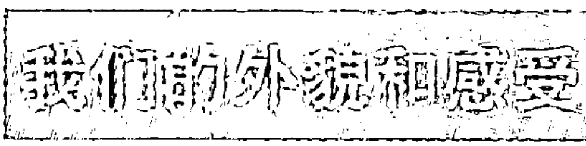

想想你拥有的任何人际关系。想象我们，或者思考或感觉我们。接下来试着记住那个“我们”……

现在，就像对待任何全子那样，我们从内在和外在视角来看看“我们”（或者文化全子）。

这是个非常简单的方法，可以用来思考某个内在全子（无论是“我”还是“我们”）的内部和外部之间的差异。外部观点是它的外貌，内部观点是它的感受。

外部观点是第三人称观点——或者它从远处看起来是怎样的——而内在观点则是私人的或者第一人称观点——或者它的内在感觉是怎样的。结构主义就是从外部看内在全子的例子，这是个绿色全子或者后习俗伦理，或者形式运思期，或者第3阶段的道德结构，或者蓝色价值基因，或者世界中心的理想；现象学是从内部感受的例子——我的当下经验，直接感觉，第一人称冲动，欲望，感觉，想象等等。

我们已经花了些时间来了解“我”的样子和感觉，或者它的外在（例如SD）和内在（例如禅）轮廓。那么，“我们”（1）从外部看是什么样的？（2）内部感受又是什么样的？

### 符号学：“我们”的外貌

从外部来看，结构主义起初是研究文化全子和语言系统的方法；在这个领域，它为后结构主义（拉康、德里达、利奥塔、鲍德利亚）和新结构主义（福柯）铺平了道路，它们曾经——现在依然——特别想要理解文化全子。但是，考虑到它们的所有重大区别，我们可以将研究文化全子的外在形式的方法总结为第 4 区方法。

当然，各区之间有很多重叠，我们绝对不希望将任何学科分割开来。但是，主要关注第 4 区的方法包括：记号学、系谱学、考古学、写作学、文化研究、后结构主义、新结构主义，也许最重要的是符号学。更明显和普遍的例子，则是民俗方法学，它涉及潜在的行为规范、习俗和社交规则，在图 1.3 中，我们用它来代表第 4 区，因为我们都知道：不仅人类，所有的生命都有种族心理或者社会分类。①

> ① 第 4 区方法有些普遍的共性，当然也有些重大区别。有个重要的区别就是，它们对能指（signifier）和所指（signified）的关系各自有不同的立场。对索绪尔来说，这种关系是任意性的，但是，当它存在以后，在按照某个标准结构结合起来的差异系统中，这种关系就是非常严格、几乎牢不可破的单位或者符号。语言学（索绪尔）或者符号学（皮尔斯）就是探索这种语言或符号系统的规则、语法或者深层结构。关于这两个方法的全面综合，可以参见肯·威尔伯的《灵性之眼》第四、五章。索热尔认为符号是二元模式的（能指，所指）；皮尔斯认为符号是三元模式的（符号，对象，解释者）；AQAL 认为符号是四元模式的（能指，所指，语义，句法），其中，每个要素都有几个主要层次。为了简要起见，我只提符号，能指，所指和指示物（referent），但应记住完整的 AQAL 符号学。另外，可以参见《灵性之眼》中的概括，以及《宇宙三部曲》的第 2 卷的完整介绍。

对于后结构主义者来说，从拉康到德里达到利奥塔，能指和所指的关系并不完全是一致的。可变的能指链（chains of sliding signifier）代替了结构。在能指（符号）和所指（意义）之间存在着重大的鸿沟，这些鸿沟中常常充斥着思想意识/意识形态——父权制、大男子主义、种族主义、男性至上主义等。能指和所指之间存在着可变的相对关系，以及无止境的意义递延（不能理解意义的模糊性被称为存在和形而上学）。但是，写作学之类的方法（第 4 区方法，或者 1p×3-p×1p*pl，其中 1p*pl 指“第一人称复数”；这是第 2 区和第 4 区相似的原因，两者都是内在于整体的外部观点，主要差别在于：第 2 区是 1p 单数，第 4 区则是 1p 复数）可以研究这些可变的能指链。

虽然后结构主义有很多重要、永恒而普遍的真理，它对宇宙真理的狂热否认却让它首次陷入大量践言冲突（performative contradiction）当中。希拉里·帕特南、唐纳德·戴维森、尤尔根·哈贝马斯、卡尔·奥托·阿佩尔、查尔斯·泰勒以及许多其他人都就此对它们进行大肆鞭挞，而利奥塔和他的美国婴儿潮（不要对我指手画脚！）追随者们——悲哀的是，学术界中有很多这样的人——并没有严肃地祛除后结构主义的这种弊端。但是，不管如何，那种相当彻底的相对主义随着德里达在《立场》中承认超越性能指而宣告结束了：为了让对话进行下去，能指必须要指向某个实体。德里达说，如果没有超越性能指，我们甚至不能翻译语言，这结束了极端的后结构主义立场，也丢弃了其非常重要但也非常片面的真理。AQAL 则完全整合了后结构主义的许多这类片面真理——语境论、结构主义和透视主义（见《灵性复兴：科学与灵性的整合道路》）。

迈克·福柯这位更老练的思想家，始终保留着其结构主义的渊源（因此也利用了其中很多持久的真理），甚至当他开创新结构主义时也是如此。全面地审视福柯（即，将他的三个主要阶段综合起来），我们会发现：其中有（知识/知识型的）发展考古学、知识/权力的“新结构”系谱学、自我经历这些阶段的连续性。我同意哈贝马斯所说，福柯是后现代的后结构主义者，我们总是不得不同意他；他的新结构主义当然是指导我在 AQAL 中对第 4 区做出概括的来源。

总体来说，我们可能注意到 AQAL 包括能指和所指和指示物，包括其可变的（相对主义，单单指向文化的）和不变（普遍的）的特征。

### 诠释学：我们的感受

上面是对“我们”的外部的简短概括（或第 4 区）。那么，“我们”的内部呢？每次你跟朋友相处，体验到了某个共通的感受，或者相信你

们理解了对方，或者彼此对视，分享某种情绪，这些体验、思想、共同看法、情感、感觉的实际特征——那个共享空间的实际可感特征——就是我们的内部的例子。

记住，当第一人称单数（“我”）接纳了第二人称（“你”）并因此转化成第一人称复数（“我们”）的时候，才会形成我们通常所说的“我们”。也就是说，我 + 你 = 我们。（因此 AQAL 常常将第二人称当成“你/我们”）。从外部看，那个“我们”有结构、规范、规则系统、能指链、语法、句法、写作学、语言学。从内部看，那个“我们”是感受到的意义、所指的集合，是语义学而非句法学，渴望而非结构，共同感受、幻想、欲望和冲突的空间而非语法，爱和失望的漩涡，义务和未实现的承诺，相互理解和毁灭性的背叛，生活中你认为“重要”的每件事的起伏波折，以及这些可感知的关系网。

现在我们来开始研究第 3 区。

诠释学最关注的问题是，我如何能理解你，从而你和我能形成“我们”，这是解释的艺术和科学。你和我要能彼此理解，就必须具有共同的波长。这样做时，我们就能建立共有的解释和理解的纽带。那个纽带（或者说“我们”共同的结构）具有工具（因此，各种不同类型联结—沟通中都内嵌有纽带—工具），从而有自己的生命（但不会形成独立的“我”或者控制能力）。这种纽带有语法、规范、结构或者某种范式（第 4 区），在某些情况下，这种结构是由其成员的共同结构组成的；因此这些结构 / 语法类似于第 2 区的结构—阶段，正如我们前文所说。① 但是，在很多其他的方面，它是个不同的东西，当我和你彼此理解、爱和恨对方的时候，在许多方面感到彼此的存在是自身存在的一部分的时候，这个奇妙的“我们”就形成了，其实……

> ① 在整合式符号学中，如果我们将四象限当成四艺，能指（物质标记，material mark）是 UR 象限，所指（或者我们所想到的）是 UL 象限，能指链或者句法是 LR 象限，所指链或者语义学是 LL 象限。指示物存在于世界空间（worldspace），或者在世界空间中产生，我们将它松散地等同于 LL 象限，以便强调它的文化特征，但是，严格意义上的世界空间，指的是某个具体时刻的整个 AQAL 框架。（如果我们用 8 个观点的框架，那么句法是 7/4，语义是 8/3，能指是 5/2，所指是 6/1）。

也许整合式符号学所强调的最重要的观点是，发展性所指或者“我们所想到的”观点，在部分程度上是由发展层次或者接受信息的世界空间所决定的。例如，能指“神”的指示物存在于紫外世界空间当中，如果某个人的意识没有发展到那个层次，他/她就看不到它（也不会产生正确的所指）。试图向没有达到紫外或者更高层次的人证明神的存在，完全是白费力气。

诠释学有许多不同的形式，但其本质就是你现在在做的事情，亦即：试图理解我。（当然，如果我和你在一起，我们会进行实际的对话。甚至即便你在阅读这些文字，你也必须与这些文字之间互相产生共鸣，或者你的自我要对此做出反应。）这个共鸣行为——它将两个“我”，彼此的“你”转化为“我们”——就是诠释学。当然，可以更客观地研究这个过程（引入 3-p 这个术语），这就是诠释学领域常常做的事情。但是，其主题就是这个实际进行理解的“我们”。从更客观的形式（例如威廉·狄尔泰），到更主观的形式（例如马丁·海德格尔），到更整体的形式（例如汉斯·乔治·伽达默尔），基本的诠释学主题就是理解，将主体融入主体间去，这会产生任何单个人都感受不到的世界。

它是——什么？奇迹！

主体间的世界同时改变主体和客体。我们所看到和感受到的主体间性所产生的世界，既不完全是主观的（因此仅仅是相对的）又不完全是客观的（也就仅仅是普遍的）。这里就是整个左下象限的世界，就是主体间性，这种主体间性是我在每个层次的在世生活都永不磨灭的维度或不

# 灵性的觉醒

可避免的特征，粗略地说来，这构成了任何层次的 1/4 的现象。但是，我们既不将这个象限绝对化（像后现代主义者所做的那样），也不会无视它的构成性质（像现代主义者所做的那样），因此我们当然要受到两个阵营的憎恶，或者至少被他们所误解。

到处都存在着无知。诠释学（第 3 区）不理解句法结构怎样在实际上管理（和限制）他们共通的感受和意义。而现象学家则不理解结构—阶段怎样管理着可能在任何内省空间发生的现象（更别提 LL 象限本身的构成性质，特别是文化背景了）。经验主义者和行为主义者忽略了整个左侧象限（一种最大的无知）。系统学家在努力将内在象限还原成外在的整体系统时，倒并没有过分忽略这些内在象限（高明的简化论）。

但是，在所有这些容易被忽略——或者很难发现——的维度中，主体间性无疑在其中首当其冲。如果后现代后结构主义者只注意到了这个维度，那倒会抵消他们本来令人难以忍受的叫喊——因此，至少我的书中原谅了他们。

我们多数人都熟悉马丁·布伯的开创性我—你概念，最重要的实体存在于我的第一人称“我”和你的第二人称“你”的关系中，以及你的第一人称“我”和我的第二人称“你”之中，尤其是，我与上帝这个大您（Great Thou）的关系之中。现在，我们来简单地探索左下象限的这个特征。

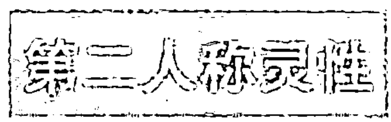

对于 AQAL 来说，象限或者“大三”（我，你 / 我们，它）始终都无所不在。只要有任何表现形式，即便是因果的表现形式，或者，只要灵性自身首次在存在中显现出来，立刻就有了第一人称灵性、第二人称灵性和第三人称灵性。

第一人称灵性是大我，我—我，伟大的灵魂（Maha-Atman），超心

## 第七章 名叫“我们”的奇迹

智（overmind）。此时的灵性是你之中的伟大观察者，是当下和每时每刻的我—我。这页书、这个房间和这个宇宙都在这个观照者里面生成，你心中的这个观察者和我—我就是第一人称形式的灵性。

第二人称灵性是大写的你、您，是光辉的、鲜活的、给予万有的上帝，我必须怀着爱、虔诚、牺牲和欣慰感顺服于他的面前。面对第二人称灵性，面对全然慈爱的神，我只能做出这样的回应：为了在当下找到上帝，我必须爱到受伤为止，爱到无限为止，爱到再也没有自我为止，只有这个光辉耀眼的您，赐予所有的荣耀、善良、知识、恩典并深深地宽恕我的自以为义，这种自我为义给他人带来了内在的痛苦。但是，此刻，您这个充满慈爱的神能够而且也会赦免、宽恕和治疗，让万物重新变得完整。但是，前提是：我在自我生命的最深处表示顺服，通过爱、虔诚、关注和觉醒放弃自我紧缩，顺服于您这个伟大的神或者女神，此时此刻，您闪耀着光辉而且始终如此，也始终超越于我之上，揭露了此刻超越整个自我的深刻奥秘，而这全部是由此刻的您启示给我的；但是，只有当深深地、完全地投入对伟大的您的爱与虔诚中的时候，这种启示才会降临。这个此刻呈现在我面前，跟我交谈，在神圣的“我们”中向我启示他/她自身的伟大的神明，就是第二人称形式的灵性。

第三人称灵性是伟大的它，或者大系统、生命巨网、存在本身的大圆满、实相、真如、现在和每时每刻的此在。第三人称形式的灵性呈现为这个广阔的客观进化系统、伟大的连环结构、伟大的存在体系，有许多互相联系的面、层次、范围和结构，从尘土到神，从污垢到上帝，但它们都处于此刻呈现的圆满实相中，当下就是。所有这些概念都是第三人称概念，或者第三人称形式的灵性。

许多人只喜欢灵性的三个侧面中的某个侧面，承认其他的侧面就有点困难。当然，有神论传统很喜欢第二人称灵性，但是常常很难感受当下的第一人称灵性特征，或者他们自身意识中的我—我。当然，从拿撒

# 灵性的觉醒

勒的基督开始，到哈拉智和乔达诺·布鲁诺（此处仅仅举少数几个例子），任何声称自己认识了第一人称灵性的人，都被钉在十字架上、绞死或者烧死。（“你为什么朝我扔石头？我做了什么坏事？”“不，不是坏事，因为你，这个凡夫俗子，居然将自己高举到与神同等的位置。”）

今天的“新范式”灵性运动中，我们常常看到相反的问题：完全丧失了第二人称灵性。取而代之的是大量第三人称形式灵性的描述，例如盖亚、生命网络、系统理论、阿卡沙记录（akashic fields）、混沌理论等等。与之相联系的，是第一人称灵性的修炼：冥想、静观、大心智、大我。但是却没有让我们觉得需要顺服并奉献自己的“伟大的您”的概念。

这就等于压抑了第二人称灵性。记住，灵性的所有三个侧面都完全是我们最深的无相自我的面孔，或者最初显现出来的原始自我 / 灵性的三张面孔。四个象限，或者大三（我，我们 / 您，它）是你的原始真如自我（Primordial Unmanifest Self）在世间的三个基本维度。简而言之，不承认自己的第二人称灵性就是在压抑你自身世间生活的一个维度。

在今天的美国，压抑“伟大的您”常常与婴儿潮密切相关。通过强调生命巨网的第三人称灵性概念，或者大智慧或大我的第一人称概念，“我”不需要向任何东西鞠躬或者屈服。本我可以躲藏在第一或者第三人称方法中。我直接从自我过渡到我—我，绝不需要向“您”顺服。

第二人称灵性是伟大而虔诚的平均主义者，本我的可怕杀手，本我在它面前降卑，成为空无。内观、禅、只管打坐（shikan-taza）、奥义书、超觉静坐等等，就是不让我的内在面对比我更伟大的东西，面对更高层次的自我。但是，如果没有更高层次的“您”，个人就会微妙或显著地执着在主体自我和客体自我的各种变体中。① 因此，纯粹的第一人称方法仍

① 我想指出，这指的绝对不是正钵禅师（和他的大心智过程），他已成就无上的我—我，并在与我们共同努力，克服美国佛教的这个问题。

## 第七章 名叫“我们”的奇迹

然常常具有根深蒂固的傲慢。

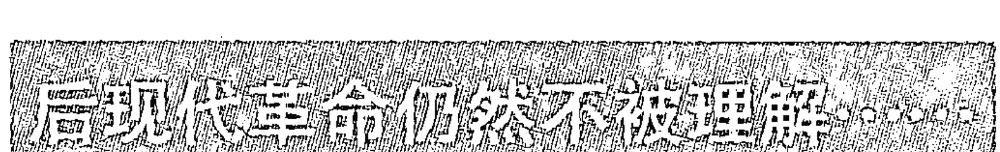

通常，如果我们回到左下象限，我们会发现，即便是那些包罗万象的认识论，也常常会忽略主体间性，这玷污了他们所做出的重大贡献，让它们粗暴地受到后现代主义者的摈弃。后文中，我们会看到其中很多人，包括爱德华·莫林、迈克·墨菲、翟帕克·乔普拉、弗朗西斯·瓦雷拉、玛格丽特·惠特利、埃尔温·拉兹罗、鲁珀特·谢尔德雷克……不幸的是，这个名单似乎列不完。然而，利用整合式框架，就能非常容易地弥补这种对主体间性的忽略。

主体间性为何会这样难以被觉察到？“我们”的内部可以被感受到，但要完全理解“我们”外部的重要性和结构，则必须从远处进行长时间的观察。促使第 2 区中难以被理解的因素，在第 4 区中起了同样的作用。内省、静观、感觉或者冥想都看不到它——向内部看根本无法看到它，无论你看多久。

没有第 2 区和第 4 区的方法，我们世间生活的某个维度就完全静静地进入了无知的黑夜，这几乎在显现世界的所有层次都是如此。发现第 2 区和第 4 区是现代和后现代西方所做出的尤为重要的贡献。

这涉及“我们”。不仅在你和我之间，还在当下和每时每刻的最高的我和最高的您之间。如果可以的话，我想用第二人称灵性的冥想来结束本章，这也是我在著作《灵魂之眼》（*Eyes of the Soul*）的序言中所说的话。它似乎表达了我在这个主题上想说的所有话。

在某个平凡的周一早晨，我安静地坐在电脑前面，在平凡的键盘上输入些平凡的话语。我慢慢开始注意到，在空气中，在我的身边，有些

# 灵性的觉醒

不寻常的东西，它们宛若朦胧的雨雾，细密而奇妙，金色的灰尘在闪烁，惆怅的薄雾在四处弥漫和闪烁，当我向四面张望时，我能看见幻觉的白金缤纷呈现出来，伴随着每滴雨点清晰地敲打着灵魂，世界变得鲜活起来，每滴雨都是个小小的开端，它们全都是小小的缝隙，通向缓慢袭向我的心智和灵魂的无限光辉，我的心开始充满那种光辉，这光辉奇妙地流溢出来，奇妙地回到世界，狂喜的、痛苦的、灿烂的喜悦令每个人都感到惊叹，渴望着爱，渴望着在痛苦之泪中温柔地拥抱，每滴闪烁的雨滴都有触摸到我的隐秘灵魂，突然，男神和女神们都在尽力大唱，发出刺耳的声音，看着我，呼喊我，催促我，声音越来越大，越来越像雷霆之音。我也对他们歌唱，我们情不自禁地全都开始齐声叫喊、哭泣和歌唱。怎样洪亮的声音，怎样的隆隆声啊！我们都开始抽泣、叫喊：这不正是直接面对灵性本身时单纯的当下时刻么？这不正是无上完满、毫无欠缺的全部启示吗？

随着那种感受，随着真理变得完全明显无疑，雨完全停下来了。在这个平凡的周一早晨，我在平凡的键盘上继续输入平凡的话语。但是，不知何故，世界绝对变得和以前有些不同了。

## 第八章 极其明显的世界

### 右侧世界

现在，我们再来简单地谈谈右侧（外在）象限以及它们与现代和后现代世界中灵性的关系，这样，我们就能结束这个整合式概述了。因为本书特别关注内在或者左侧象限，所以我不会非常详细地讲述右侧象限，因此，请读者原谅我高度抽象的总结。

我们可以从右上象限入手，或者从研究客观有机体入手，然后进入右下象限，或者研究客观的有机体团体。在右上象限，可以从内部或者外部观察客体或者“它—有机体（it-organism）”，我们简单地分别称之为第 5 区和第 6 区。现在，我们将次序颠倒一下，从外在有机体的外部角度入手。

#### 第 6 区：行为主义和经验主义

例如，有机体的第 6 区方法是最普遍的（3-p×3-p×3p），通常被贬称为“天真的经验主义”，这样称呼它的人很不喜欢将三重概括的第三人称观点称为是“天真”的，但他们仍然将这个词当作学术批评用语加以使用。正如托马斯·内格尔的绝妙说法，在第二种半批评（semi-putdown）用语中，外在对象的外部观点被称为“凭空而生的观点”。但它并不是完全凭空而生的观点，而是不断被反复使用的第三人称观点。其他半批评

## 第八章 极其明显的世界

包括科学的唯物主义，机械的行为主义，独白的积极主义。（我们很快会看到为什么“独白”对任何后现代主义者来说是个贬义词；“独白”的主要含义是“单个主体”，意味着无视“主体间”，这是非常糟糕的——整合主义也认同这种看法。）

我们花了很多时间在内在或左侧现实上，现在，我们需要提醒自己：前面提到的那些天真观点不认为内在现实是现实。“科学唯物主义”世界观认为 UR 象限是唯一真实的，它在解释宇宙时试图将 UR 中的客体当作构成宇宙的唯一因素。这种奇怪的人类意识和灵性，让宇宙中只留下活跃的灰尘，听起来似乎特别奇怪，而且的确也是如此，但这不是我的错。

关于这个象限我们可能会犯两个错误：要么将它绝对化，要么就否认它。现代性犯了前面这个错误，后现代性则犯了后面这个错误。

AQAL 的立场则是，左侧和右侧同等真实，也同等重要。当意识事件在左上象限发生时，它们与右上象限有相关的联系。（四个象限都有关联，但我们现在只关注个体。）例如，每个意识状态（包括每个冥想状态）都有对应的大脑状态。它们同时发生，是同一情境的同等真实的维度，彼此都不能被简化。

问题是，多数传统的科学方法都拘囿于 UR 象限的绝对主义，因而忽略了内在（UL）的现实，最多将其当成“附属—现象学”，或者唯物主义真理的次级产物（例如大脑）。这种方法认为，大脑产生想法的方式与眼睛流泪的方式相同。但大脑自身并不产生想法。用这种方式（1-p×1p）去看待某种情况时，它就像想法（或者心智），换上不同的方式（3-p×3p）去看，这种情况就像是大脑。但是，想法不能简化为大脑（唯物主义），大脑也不能简化为思想（唯心主义），这也不是个等价命题（相反，这是四象限交互作用的话题）。毋庸讳言，那是另一个复杂问题，我们现在不讨论它（关于这些问题，见《整合心理学》第 14 章）。

# 灵性的觉醒

接下来要谈论的是，研究大脑生理学以及 UR 象限中的大脑状态在整合式过程中非常重要，特别是关于静观和冥想状态的研究。最好能够将这些现象与其他象限的现象联系起来，我们称之为同时追踪。首个认真进行早期同时追踪研究（至少在个体象限中）的人是罗伯特·基思·华莱士，他的报告登在 1970 年的《科学》杂志上，其中提出冥想包括第四类独特的意识状态，并伴随有独特的生理特征。这个 UL 意识的 UR 研究初听起来令人兴奋：冥想是真的！甚至灵性也可能是真的！可以从生理上测量灵性！

理查德·戴维森和其他研究者继续遵循这个重要的 UR 大脑状态的研究路线，该状态和意识的 UL 状态（包括冥想状态）相关联。但是，这个研究还没有关注意识阶段，这也许是因为，这个研究结合佛教，仅仅采用了第 1 区方法，但是，在将来的研究日程中，这些被忽略的区域有望得到关注。

不幸的是，在这个时代，科学主导的文化解释的研究的方式令人感到担忧。科学唯物主义吞噬了这个研究成果。灵性就是大脑！现在，令人悲哀的是，这个研究最普遍的结果就是：神被简化成了大脑状态。有机体有个上帝点，新的 G 点，这次是大脑里的 G 点！刺激这个 G 点，大脑释放出它的能量时，你就可以达到超自然高潮。这就是科学唯物主义的说法：冥想只不过是激活物质大脑中的特定区域。冥想不会带来有关有机体外部的任何真实观点，只会使大脑中的某个点（或者几个点）兴奋起来，例如，导致自我界限的模糊或者缺乏，认知能力的丧失或者缩小，从而产生与世界“合一”的主观感受。

简而言之，科学唯物主义认为这个研究不能证明灵性的真实性，甚至恰好相反，这个研究证明灵性现实仅仅是大脑生理学，是那个受到刺激的妙不可言的 G 点。神性被简化为多巴胺，可以让每个人放松下来。这又走到象限绝对主义当中去了……

## 第八章 极其明显的世界

整合式方法不同于这些右上象限方法的滥用和简化，它非常认真地看待这个象限及其现象。和意识研究相关的第 6 区总体学科包括：神经生理学、脑生物化学、基因研究、脑波和大脑状态研究（EEG，fMRI，PET 等等），以及进化生理学。这些现象和它们的 AQAL 关联都非常重要，值得认真研究。

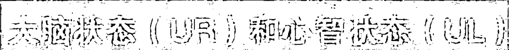

我不想在这里花很多时间（因为它相对来说非常直接），然而，有一点必须指出：虽然对不同大脑状态（脑波模式，PET 分化、fMRI 模式）的研究缓慢，但是与精神或意识状态（UL）相应的不同的脑信号（或者物质—能量 UR 特征），即我们有时所戏称的关于这些信号的冥想或灵性形式的 G 点，被明确描绘了出来。最早的这类研究聚焦于脑波模式和意识状态，表 8.1 总结了其中部分研究结果。最新研究关注的是功能性 MRI 和正电子发射断层扫描（PET）。

### 表 8.1 某些常见心智（意识）状态的大脑状态特征

| 心智状态（左上） （或者意识状态） | 大脑状态（右上） （或者生理状态） |
|---|---|
| 深度睡眠 | 德尔塔波（1-4 赫兹） |
| 梦 | 西塔波（4-7 赫兹） |
| 催眠 | 阿尔法波（8-13 赫兹） |
| 典型清醒 | 贝塔波（13-30 赫兹） |
| 冥想 | 慢阿尔法 / 西塔 |
| 静观 | 慢阿尔法 / 西塔 + 贝塔 + 德尔塔 |

# 灵性的觉醒

不管最终的特征和特色（可能有几十个甚至几百个）结果怎样，我们应该了解到：这些大脑状态不仅仅和整体意识状态（UL）相关，而且与威尔伯—康芒斯框架以及丹尼·P. 布朗的冥想修炼状态—阶段的 UR 关联。这些初始研究项目找到其总体特征之后，还可以做更多研究，例如，研究从初级到中级到高级冥想到静观状态—阶段的冥想群体（修炼 0~20 年不等，或者时间更大），以便同时追踪这些 UL 事件的 UR 特征。

这里我仅仅想要强调的是，AQAL 不仅仅为这类研究腾出了空间，鼓励这类研究，同时在研究大脑状态、心智状态和它们的相互关系（以及它们的主体间背景）时，它的框架和理论并不过于简化。随着这种大脑研究继续发展，甚至越来越快地发展，我们也越来越需要这类元理论和框架——无论是 AQAL 还是类似的其他理论框架——来解释海量的数据，因为信息本身是没有意义的。

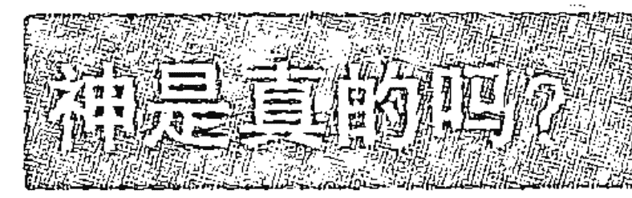

既然谈到了这个问题，我们就简短地探讨一下。关于灵性现实，当你处于合一的冥想状态时，G 点（或者被追踪的任何大脑相关因素）可能会兴奋起来，这绝对不涉及这种状态的指示物的本体论状态。大脑中任何 G 点活动都和冥想状态互有关联，但不是其内容。当我看到苹果时，我的大脑中与感官关联的部分会兴奋起来，但我们并不因此假设苹果只存在于大脑之中。那么，为什么当同样的事情发生的时候，我们假设神只存在于大脑之中呢？

当 UL 中的某种意识状态或阶段活跃起来时，UR 中会有被激发的对应大脑状态。意识（UL）本身常常有符号来说明所指之物。这些指示物

## 第八章 极其明显的世界

的本体论状态由不同方式决定，最常见的方式就是检查总体现实。例如，我看见我的狗艾萨克，我大脑中的特定区域会兴奋起来。也就是说，当UL意识状态发生时，UR象限的大脑同时会产生某种状态（每个事件都有四个象限的关联）。我想要表达我的狗在这里，因此我会说“来看我的狗艾萨克。”这里涉及四个东西：符号、能指、所指和指示物。

实际的单词“狗”和“艾萨克”是符号，由能指和所指两个部分构成。能指是有形的字或者声音：“狗”或者“艾萨克”。你听到或者看到“狗”之类的某个字眼时想到的东西就是所指。实际的狗艾萨克是指示物。如果你过来也看到了艾萨克，我们通常会总结说指示物艾萨克是真实的，而不是想象或者虚构的。在这里，能指“艾萨克”有个真实的指示物。

现在，比方说，如果我跟我的朋友说“你认为莎莉爱我吗？”这些能指似乎很简单，但是其中实际意味着能够用第三人称观点来看待相关的现实。因此，这些符号的指示物只存在于橙色或者更高的世界。只有到那个时候，你才能理解这句话的意思，即便你能够理解感觉运动的话语和物质身体。即使你能够听到和看到这句话中的能指，你也得不出正确的所指，因此也看不到实际指示物。我能够看到这些字，但是它们的意思“在我之上”，我就简单地假定指示物根本不存在，因为我不管往哪个方向都看不到它存在的证据。

发展主义学者始终知道，并不存在某个可以让各色人等都能看到的既有世界。不同的现象学世界都是真实的世界，它们随着每个新的意识发展层次而产生。例如，蓝绿色附近的人才能产生系统理论，橙色（或者更低）意识层次的人就看不到它——全球系统在“他们之上”。那些系统存在，但是只有在蓝绿色时，它们才会被看到或者产生。因此，能指“全球交互系统”只有到蓝绿色时才会出现，此时能指会引导出正确的所指，实际指示物就能被看到和理解。

# 灵性的觉醒

结构主义（然后是后结构主义）对于整个认识论中的构造主义革命之所以非常重要，原因就在这里。并不存在着某个“天真的经验主义”世界等着我们去理解。天真的经验主义本身只有到橙色时才会出现！具有感知和共同创造功能的意识结构会产生出不同的世界。在 AQAL 中，这些“共同一建造的结构”存在于所有四个象限（包括右侧或者“客观”象限）之中，因此永远不会退化为所有现实的极端“社会结构”。但此处的确有个重要事实：所有能指的指示物仅仅存在于特定的发展阶段和层次。

因此，就“神”“空性”和“无分别智”而言，它们的指示物是“真的”吗？它们是否存在？唯一可能的回答是：进入这句话所说的阶段或者状态，然后自己亲自去看。如果你和能指的作者并不处于某个相同的状态/阶段之中，你永远不会有正确的所指，也就看不见实际指示物。它“在我之上”。

另一方面，这些觉察到因果状态（打个比方）的人几乎都做出了这样的结论，能指“空性”有真实的指示物。那些稳定地觉察到不二状态的人所做的结论则是，能指“神性”有真实的指示物。如此等等。在这些情况中，当 G 点兴奋起来时，你就会观察到某些东西，这些东西就和刺激你大脑其他部分的苹果那样同等真实。

但是，如果没有正确的状态和阶段训练，你就无法理解“神性”“无分别”“佛性”“基督意识”“无品质的梵”和“悔改”，对于你来说，它们就没有真正的指示物或者意义。在那种情况下，冥想者的 G 点兴奋起来时，你就根本看不到他们所看到的东西，因此，你只好假设这“都只是大脑内的幻觉”。

真傻。与此同时，这类大脑状态研究被迅速纳入科学唯物主义的视角之中，不幸的是，它对灵性造成的伤害，很可能比它的益处要多。但是这些研究绝对非常重要，并需要继续前进。

## 第八章 极其明显的世界

象限观点让我们承认和接纳 UR 中非常重要的大脑研究，也让我们理解任何现实审视的基本规则：如果我想知道某物是否真实，我必须进入与提出这种主张的人相同的状态或者阶段，然后观察。如果我不这么做，那么拜托了，那就不应该讨论在我之上的东西……①

> 第 5 区——认知科学和自生型有机体（autopoietic organism）

本书超过 50% 的内容都在讨论内在，包括关于内在的科学研究，因此我们肯定已经包含了大多数认知科学，对吗？实际上，几乎丝毫都没有。要理解其原因，就要理解人类最有趣的观点（和方法论）：客观有机体内部观点的外部角度（3-p×1-p×3p），或者右侧现实的第 5 区方法。

在简单地介绍这个观点时，我想重新谈谈马图拉纳和瓦雷拉利用非常革命性的生物现象学——他们也称之为“有机体的内在观点”——方法所做的工作。他们清楚表明，“现象学”不是试图理解有机体——例如青蛙——的主观体验。他们不想重建青蛙的“我—空间”（那是 UL 现象学）。相反，他们只是试图重建青蛙的主观认知世界中的内容，但是，他们仍然用客观的形式来思考这个问题。这是接近于客观的青蛙的“内在观点”，因而是青蛙的内部或者主观观点（1-p）的客观描述（3-p），这种描述本身仍然使用客观或者科学的语言（3p）。因此是 3-p×1-p×3p。中间的“1-p”或者“第一人称”术语是他们的生物现象学或者“有机体内部观点”所涉及的全部内容。

① 反过来，这让我们明白，（当我们找到那条艰难的道路之后），对那些并没有达到相应状态或者阶段的人来说，为什么进行更多大脑的研究也完全无法说服他们……

那足以带来生物学和生物认识论的变革。起先，它令生物学界感到震惊，后者习惯于用系统理论等模型来理解青蛙的行为。但是，马图拉纳和瓦雷拉指出，对于青蛙的实际现象学，系统理论根本不重要，事实上，在青蛙的世界中它甚至不存在。

这绝对是真的。系统理论是有用的，但那只是有机体的部分外部观点，不是其内部观点。而且，生物有机体是自主、固有、自为的实体（自创生意味着自为），这个自我有机体在认知并主动地创造世界，而不仅仅是“感知”已经安排好的世界。简单说来，生物有机体共同创造它所感知的世界。（在非常积极的意义上来说，这曾经是后现代生物学。）

这个方法不仅改革了生物学，而且改革了外在全子的许多其他科学方法。这是经典行为主义和自生型行为主义的差别。前者从外部观察客观有机体（第6区），后者则从内部（第5区）。

现在我们谈谈个体的第5区方法（UR）。在研究意识（也间接包括灵性，如果做得到的话）的过程中，认知科学如今是接受度最广泛的方法，在涉及意识及其内容时，它是辨别真伪的现代科学的“正式”看法。这个领域中典型的理论家有丹尼尔·丹尼特、雷·杰肯道夫、帕特里夏·丘奇兰德、保尔·丘奇兰德、埃尔温·斯科特（心智的阶梯），等等。

从本质上来说，他们——实际上所有的认知科学家——都在使用与马图拉纳和瓦雷拉同样的观点—空间。他们试图创造的不是神经生理学而是“神经生理现象学”——有机体及其大脑从内部看是什么样的，但仍然用基本上客观的形式来理解有机体。他们试图了解，当有机体觉察到客体和通过神经元系统中的信息时，大脑会有什么反应，但是他们始终都在考虑从大脑内部的角度向外看（3-p×1-p×3p）。

这里我们无须多言；认知科学教科书相当的简单，虽然它们的象限绝对主义会导致读者断章取义。① 有助于我们理解这个区域及其内容/指示物的重要方法还包括生物—医学心理治疗，进化心理学以及社会生物学的观点。

认知科学和相关自生型方法的发现都确实非常重要，属于任何意识和灵性整合式理论的内容，因为认知科学发现的是不同 UL 情境的某些 UR 对应现象，只有将它们整合起来以后，我们才能开始理解人类意识及其指示物，无论那些指示物是岩石、我的狗还是上帝。

弗朗西斯·瓦雷拉（整合式研究所的创始人）继续探索他所说的神经现象学，这是同时追踪第一人称和第三人称意识方法产生的不同信息的重要方法。弗朗西斯是修行多年的佛教冥想者，因此，他自然而然地关注如何将内在现象学（第1区）和自生型认知科学（第5区）融合起来。第1区现象学与第5区认知科学的综合，是在最新科学和最佳现象学的基础上认真结合 UL 和 UR 的首次尝试。但我对此的主要批评意见是，它忽略了 UL 的第2区方法和 LL 的第4区方法，因而没有类似的阶段或者主体间性，这是个大缺陷。然而它的成就足以使之成为通往更整合方法的里程碑。

> ① 如果只有右上象限被认为是真实的，这会产生所有独白式方法令人不快的消极面（后文会详细讲）。这个领域面临的最困难问题被称为“硬问题”——心/身问题，但现在通常被称为心/脑问题，我们将这个问题表达为：如果我的方法论无论如何都觉察不到意识，当我根据这种方法论的本质，从宇宙中消除了意识之后，那么，我的还原论方法如何解释它呢，因为，即便我无意中发现了解决方法，它无论如何都无法认出这种解决方法？不知道他们是否会完全这样说，但大致意思就是这样的。解决“硬问题”需要采用这个问题不认可或允许的方法论。（例如，部分心/身问题只能由开悟意识解决。见《整合心理学》第14章。）

在这方面，我们有个最喜爱的作者名叫戴维·查默斯，作为整合式研究所的成员，他非常可敬地（而且绝对聪明地）广泛地努力反对将第一人称意识/心智（左上）简化为第三人称大脑/身体（右上）。此处请特别参阅《心智的哲学：经典和当代读物》（*Philosophy of Mind: Classical and Contemporary Readings*）。

> 第7区：社会自生，或者，盖亚并不存在

马图拉纳和瓦雷拉起初研究的是个体有机体的“内部观点”，例如青蛙（或个体全子）。他们假设社会系统（社会全子）比个体有机体的整体层次更高，因而在其自生型体系中，可以产生下个层次的社会系统，换句话说，它们的发展层级是：单个成分被自动地被整合成单个的有机体，而这些有机体以自生型方式，被整合成了有机体社会：细胞、有机体、社会。有机体构成社会的方式，与细胞构成有机体的方式相同。

全世界公认最伟大的系统理论家尼古拉斯·卢曼，对那个观点作了两个非常重要的修正（两者都与 AQAL 理论一致，并且，AQAL 预示出了这两者）。这些问题都非常微妙和困难，也特别重要，我简单地讲讲，感兴趣的读者可以阅读后文的参考书目，其中非常详细地阐述了这些话题。

首先，卢曼指出，社会——或者社会系统——是由有机体的交流（communication）而非有机体构成。简单地说，生命网络理论家始终在假设“所有有机体都是伟大生命网络的部分”，但是卢曼说伟大网络的内在不是有机体而是有机体的交流。通常描述的生命网络并不存在——有机体构成社会全子的方式与细胞构成有机体的方式不同。他在这个简单而重要的问题上纠正了马图拉纳和瓦雷拉的看法，全球出色的系统理论家们几乎也都是这样做的。

我们可以这么理解。社会（社会文化）全子由个体全子加上他们的相互影响构成（例如交互的交流）。个体全子是社会全子的内部，个体全子的交流则是社会全子的内在。它有 LL（文化）和 LR（社会）因素，我用左下简单举例：

你和我有一群亲密的朋友。我们准确地知道谁在这个朋友圈子中，谁在圈子外。例如，这个圈子包括詹姆斯和乔治，不包括鲍勃。你、我、詹姆斯和乔治在这个特定“我们”的内部，鲍勃在圈子的外部（或者“我们”的边界以外）。

但是，你、我、詹姆斯和乔治并不是名叫“我们”的超级有机体的部分，而是这个“我们”的成员。因此，这个“我们”不是由我们形成的（我们不是它的内在“内容”）。相反，“我们”由我们相互的交流和相互影响构成。你、我、詹姆斯和乔治在“我们”的内部，我们的交流则是它的内在。（明白没？）①

关键是，并不存在盖亚生命体。盖亚存在，但它是个社团。也就是说，有个盖亚共同体，有机体是其成员，但不是它的部分、连接或者成分。盖亚共同体的内在“物质”是等级交流网络（即，LR 中的交互物质能指和 LL 中的共鸣所指）。但是，通常所说的盖亚和生命网络都不存在。（多数人甚至不知道詹姆斯·洛夫洛克引入“盖亚”这个科学假设时所指的东西是什么。如果你觉得自己知道，可以看看脚注。）② 但是，按照通常的说法，盖亚和生命网络都是旧范式的神话（颇有讽刺意味的是，它自称“新范式”）。

然后，卢曼表明，你还可以接受自主观点，用到整合交流系统中去，然后得到社会系统的“内部观点”。这非常正确。那就是右下象限的第 7 区方法，和经典的动态系统理论（或者第 8 区）恰恰相反，后者仍将系统的成员看作系统的部分。第 8 区仍然很重要，并需要保留下来，但为了整合得更加全面，某些它认为真实的内容——当仅仅运用这种视角的时候——需要被超越，“超越和包括”意味着“否认和保留”，被否认的常常是那些被绝对化的片面真理。

这些都很容易记住。每个全子都有四个象限，盖亚之类的事物是个体全子的外在集体（或者右下）维度，不是堆放在个体全子上面的超级个体全子。

> ① 这个朋友圈有 LL 象限的“我们”，由共同的所指构成，此外还有 LR 象限的“它们”，由交换的物质能指——粗钝、精微和因果——构成。AQAL 理论认为，社会系统的内在不是系统成员，而是成员们交流的能指。在 LR 象限中，有机体或者社会成员在社会系统的内部（或者在它们的界限的内部），他们交流的能指属于系统的内在。同样，发生在 LL 象限中的文化成分在文化子整体或者“我们”的内部，“我们”的内在则是共鸣的（即主体间）纽带—工具，或者成员的共同所指。需要再次指明，这基本上与卢曼的观点相似，但是巧妙地将“共同交流”分为“共同能指”（LR）和“共同所指”（LL），这也为整合式符号学打下了基础（见《宇宙三部曲》第 2 卷）。

我们可以换个说法，在 LR 象限中，社会系统是由成员与成员们交互的人为现象构成的；成员是内部的东西，人为现象则是内在的东西。（“人为现象”——交互的有形现象，表示“能指”。摘录 A-G 中有关于这个主题的详细内容。）

> ② 盖亚是整个地球上的原核细胞网络。原核细胞是早期的、原始的单细胞生命（与真核细胞——“真正的细胞”相比）。盖亚，或者原核细胞共同体，是个科学假设（我认为是真的），它不包括所有生命形式：人类、哺乳动物、爬行动物、鱼、植物、生物圈等等。图 7.1 正确地将盖亚的发展定位于 LR 象限，作为原核细胞（列在 UR）的集体维度。在 AQAL 理论中，因为高级子整体超越和包括了初级子整体，盖亚原核子整体是所有较高生命形式的内在成分，恰恰与旧范式的神话相反——即，哺乳动物包括盖亚，盖亚不包括哺乳动物。这就是说，盖亚在我们之内，我们不在盖亚之内。但正是因为这个原因，我们说，杀死盖亚就是杀死所有人类——这是非还原主义生态学的基础。

### 第8区：动态系统理论和混沌/复杂理论

社会（LR）全子由成员及成员交互的人为现象构成。我们已经看到，可以从外部和内部来看交互网络。经典的系统理论观点（第8区）从外部看社会全子，得出嵌套层级的生命网络。那个观点通常是对的，但比较片面。如果只将它看作唯一正确的观点，就会严重误解社会系统和内在交流网络的性质。系统理论包括第8区，尽管它仅仅是现实的1/8，但它仍声称自己展示了全景，从整合式观点来看，这未免有点尴尬。可嘉的是，系统理论率先试着（也是历史上最重要的尝试）将整体论方式引进到右上象限流行的原子论世界之中，后者主导着科学唯物主义世界。先驱者的名单很长，其中路德维格·冯·贝塔朗菲尤其值得一提，他在很多方面都是真正的英雄。

右下象限方法充其量能够觉察第三人称灵性，或者以有形而客观的第三人称形式呈现出来的灵性。盖亚、生命网络、连锁顺序、自然系统（启蒙哲学家的叫法），过程相互关联的大系统，所有这些常常都会真正地敬畏和崇拜第三人称灵性，无论它们是否认识到后者。

当这个方法自行发展之时，它就退化成了微妙的还原主义和独白式帝国主义（monological imperialism）。要理解为什么这样，就要理解马图拉纳和瓦雷拉开创的后现代变革的核心，所有整合式观点都绝对需要接受这场变革。

### 独白式帝国主义和所予神话

如果后现代的总体潮流存在着某个常见的主路线，那就是对独白式意识的激烈批评——又被称为所予神话（the myth of the given）、独白式经验主义、主体哲学和意识哲学，这仅仅是几个例子。我要开始说明的是，“独白式”表示“非对话式的”——或者非主体间的，非语境论的，非构造主义的，不理解文化背景的构成性质，基本上不知道第 2 区和第 4 区。

所予神话或者独白意识在本质上是现象学的别称，仅仅是以上百种面目呈现出来的实证主义，包括：普通实证主义，激进实证主义，内在实证主义、超个人实证主义、实证主义现象学、超越现象学、理性现象学。等等。它们可能都很重要，但其共同点则是所予神话，它包括：

-   相信现实是给定的，或者有个预定的世界，意识所传递给我的，或多或少都是世界的原貌，而不是在被我的经验或者现象意识了解之前就以各种方式共同构建的世界。
-   相信个体意识会表达真理。因此哈贝马斯称所予神话为“意识哲学”，后者因为看不到主体间性（当然还有其他的原因）遭到了他的批评。本书中不断提出，意识看不到第 2 区和第 4 区，因此本身就具有缺陷。（例如，“我们不是通过内省而是通过历史了解自己。”）你可以始终内省，却仍然看不到这些其他真理。意识本身是有缺陷的，无论它是个人还是超个人的、纯粹的还是不纯粹的、本质的还是相对的、高的还是低的、大心智还是小心智、内观、直观、归心祈祷、静观觉察——没有哪种意识能够看到这些其他真理，因此哈贝玛斯和后现代主义者广泛地批评“意识哲学”。
-   不知道主体间文化网络构建了主体传递的部分真理。因此所予神话也叫“主体哲学”，我们也需要“主体间哲学”或者主体间性。
-   相信自然之镜（Mirror of nature）或者反思范式（reflection paradigm）是合适的方法。最新的灵性方法运动就在采取反思范式（或者现象学），然后简单地试图将它扩展开到，以便包括其他现实（例如超个人、灵性、元—普通、行星意识、复杂思考等等）。这本质上就是相信反思范式或者独白式实证主义和独白式现象学能够包括超个人的灵性现实。但是，主体并不反映现实，而是共同创造现实。

后现代主义者认为，所有这些东西都充满了所予神话。换句话说，许多方法简单地采用了经验主义方法并试图将它推而广之，涵盖冥想、盖亚、超个人意识、冥想大脑扫描、静观认知能力的实证主义测试、混沌和复杂科学、全息照片和全息图信息、阿卡沙记录等等。尽管它们通过引入“动态相关过程的共存网络”，可能克服了某个问题——例如，牛顿—笛卡尔机械论——但是，没有哪个方法消除了后现代主义者所批评的更为基础的问题，亦即：所有这些方法都深陷于所予神话之中，忽略了主体间性。确实，那些方法甚至丝毫都没有表明，它们知道主体间性的含义。①

本书有个总体目标，就是总结整合式框架，并说明它如何帮助灵性方法融入现代和后现代的世界当中去；与此相应，它也指明了现存的不同灵性方法的优点和缺点。在谈到基本的后现代要旨时，谈到语境主义、主体间性、构造主义和透视主义的真理如何被吸收到各种不同灵性方法中的时候，它的缺陷表现得最显眼、刺目而鲜明，但也非常容易弥补。但是，在大多数情况下，仿佛整个后现代思想只是绕过了这些方法，丝毫都不接触它们，从而让它们仍旧充满了缺陷，例如：它们有时呈现出很明显的前现代主义以及潜在的现代主义，以及被扩大的实证主义和独白意识，而最重要的，则是充满了所予神话的结构。

如果你感兴趣，可以阅读我撰写的不带任何后现代色彩的灵性方法的代表性范例及注解。此外，本书无意批评，而是讲述如何将前现代和/或现代认识论融合到后现代当中去，以得到更整合全面的建议指导。如果你对这份带注解的著作总结感兴趣，请参阅附录Ⅲ。

> ① 如果你深为这个问题所苦，可以从《灵性复兴：科学与灵性的整合道路》第9章“后现代主义”入手了解。

但是，千万要小心，因为后现代主义者很野蛮：撇开它们的优点不谈，那些方法在暗中接受了所予神话。这是最糟糕的独白式现象学，就因为它相信自己比实际上更好，这是继续发展的灵性自身在后现代转折点上的谎言。

在我个人看来，这是很不幸的事情，因为用几个简单的步骤就可以弥补所有这些问题。我关注这个领域几乎三十年了，很少有作者了解主体间性（这基本上意味着，他们没有包括左下象限，或者更具体的 UL 中的第 2 区和 LL 中的第 4 区）。构造主义的后现代方法被当作整合式方法的一部分（整合前现代、现代和后现代），可以保留其重要的工作和研究成果，同时将其具备缺陷的认识论融入提供更完整环境的整合式框架当中。所予神话无法做到那样，它将思想与幻想联系起来，依靠这些努力而存在，这些努力自称是在解放心灵，然而，所予神话却是谎言之母。

## 第九章 传送带

我想说的最后这个主题是传送带。我怀疑这是全世界内在象限面临的最大问题，绝无例外。如果你认为那言过其实了，那就请继续往下读。

还有，解决这个问题——如果真能解决的话——能够让宗教在现代和后现代世界中扮演惊人的新角色。

我们从几个事实开始。根据我们采用的各种标准来看，世界上百分之五十到七十的人处于民族中心或者较低的发展层次。这意味着不超过琥珀层次的发展路线。

从自我中心到民族中心到世界中心和更高层次的伟大发展顺序中，70% 的人还没有稳定地到达世界中心的后习俗发展层次。“纳粹”只是陈述该事实的极端说法。

拜托，不要发出政治正确的啧啧声。我说的是某些我最好的朋友和大部分家人（当然所有的堂兄弟们）。

第二个事实是，这不是可以绕开或避开的东西。每个人出生时都在跑道的起点，必须通过常见的发展波。

所以，现在 70% 的人处于民族中心或者更低层次。这足以令普通旁观者感到毛骨悚然。但更糟糕的是：谁拥有这 70% 的人口认同的观点和信仰？

主要是世界上的大宗教。

换句话说，在人类可能的重大发展波中，远古、魔幻和神话波主要是由世界上伟大的宗教和神话系统提供的。这本身不是坏事；事实上，这是世界上伟大神话必要的、非常重要的功能。每个人出生时都在起点，然后开始他或者她的发展，从远古到魔幻，再到神话和更高；如果世界神话没有保存这些早期信仰，每个新生的个体就需要重新发明这些神话。关于世界伟大宗教的作用，其中有些不为人知的故事就是，至少在某些方面，它们是穿越人类发展必要（不可避免）阶段的工具。

但是，今天的世界不像魔幻神话系统最初发展之时的伟大时代，这些高达琥珀层次的信仰带来了特定的问题。首个问题就是，从那时候起，人类发展了几个意识层次，特别是现代橙色和某种程度的后现代绿色。这在 AQAL 中产生了可能非常严重的垂直部分的冲突，特别是因为橙色和更高层次是后习俗和世界中心的，琥珀及较低层次正如前文所说是民族中心、习俗和守旧的（在最好情况下）。

这个垂直层次的冲突是内在象限冲突的最大单个来源，现在正呈现在世界心理图谱中。这些伟大的构造板块（红色、琥珀色、橙色）彼此猛烈撞击，产生了——以后还会继续产生——地震，全球有数百万人死于这些地震。

目前的情况是，人们出生以后，开始经历重大的发展波，从远古到魔幻（红色）到神话（琥珀）到理性（橙色）到多元（绿色）到整合（靛蓝色）及更高。世界各地文化所在的 LL 象限通常支持某种信仰系统。在琥珀到橙色附近的某处，当人们从神话 / 民族中心灵性发展到世界中心 /

# 灵性的觉醒

理性灵性时，他们可能会撞上“钢筋天花板”。后现代具有琥珀色神话，科学和现代世界具有橙色理性。在宗教信仰上，人们无法从琥珀色到达橙色。

由于橙色世界无法找到灵性智力的橙色表达方式，他们的灵性智力路线被冻结在琥珀色，冻结在基要主义的神话—团体层次。

今天，在全世界的各个地方，当民族中心的原教旨主义信仰碰上了世界中心的理性和后习俗道德的时候，都存在这个“压力锅”盖子。这个想要取缔琥珀色的巨大橙色压力锅盖，也许是现在内在象限碰到的最大的单个问题。

这个问题还有其他不同的特征：UCLA 最近进行的民意调查显示，美国 79% 的大学新生说灵性对于他们很重要或者非常重要，3/4 的人祈祷（！）。他们不能和教授讨论信仰问题，教授们大多介于橙色与绿色之间的发展层次，会嘲笑他们；他们也不再满意于神话和民族中心的琥珀色信仰，以及许多朋友接受的原教旨主义宗教。例如，典型的基督教学生同教授谈论他的宗教时很尴尬，与基督教朋友讨论时甚至更尴尬。

（在心理上，这和恐怖主义者们面临的问题相同：琥珀色信仰在橙色世界中没有位置。）

因此，大学生面临着残酷的抉择：要么继续相信灵性发展的琥珀色阶段，要么就放弃信仰。

这的确是非常可怕的选择——与琥珀色共同生活，接受基督教，或者发展到橙色层次，声明放弃基督教——这实际上是这些大学生唯一的选择。①在灵性智力发展过程中，他们都被冻结在琥珀阶段（例如福勒的阶段3），没有途径探索灵性智力发展的橙色或更高层次（特别是综合—习俗层次或第4阶段，个体思考层次或第5阶段，如果没有受到典型的大学教育所产生的压抑，两个阶段都可能在这个时候出现。）实际上，他们在灵性道路中被幼儿化。

另外的选择就是放弃信仰，进入没有灵性方向的橙色和更高发展层次。两个选择都很可怕，研究表明多数大学生都在盥洗室里祈祷。

恐怖主义分子作了另外的选择。

这些问题的解决方法是相同的（尽管实施起来有所不同），那就是：让灵性智力能够发展到橙色（及更高）层次，并让更多人知道橙色及更高层次的存在。

西方的智力传统起源于启蒙时代左右，积极地压抑自身灵性发展的任何更高层次。从历史上看，随着现代性的兴起，神话中的上帝被完全抛弃，整个“上帝已死”运动表示神话中的上帝已经死亡，理性的现代性找不到这个神话概念存在的任何证据。

他们在这里犯下了尤其严重的错误：他们正确地看到神话上帝概念（或者灵性路线的神话层次）的不成熟性，但是，他们不仅拒绝灵性智力的神话层次，还拒绝整条灵性智力路线。他们如此拒绝神话层次，以至于将灵性路线的婴儿与神话发展层次的洗澡水一起倒掉了。他们拒绝了琥珀色上帝，却没有寻找橙色的上帝，以及更高的绿色上帝，蓝绿色上帝，靛蓝色上帝，他们将上帝完全抛弃了，并着手压抑崇高的事物，压抑自身灵性智力的更高层次。理性的西方根本上没有从这个文化灾难中恢复过来。

西方理性传统——现在恰好在整体上意味着现代（橙色）世界——就这样撞上了缺乏较高的后神话灵性智力形式的现代性。每个意识层次都有其科学、艺术、灵性和道德发展路线。这是四个不同的多元智力：认知、美学、灵性和道德。① 例如，有红色科学和红色灵性，琥珀科学和琥珀灵性，橙色科学和橙色灵性等等。

当现代性将灵性智力的神话层次与灵性智力本身混淆起来的时候，它创造的只能叫“荒唐的夹心蛋糕”：所有科学都等同于橙色层次（理性），所有灵性都等同于琥珀色层次（神话）。理性科学与宗教代替了神话式的科学和宗教，现在只有理性科学与神话宗教。前者是理性的、现代的，都是好的；后者是前理性的、前现代的，全部是不好的，或者至少是荒谬的。

在这种灾难性的混淆中，我们能看到层次／路线谬误（LLR）的例子：混淆了某条路线上的层次和那条路线本身。

混淆之后，在下面的两件事当中，通常有件事会发生。如果层次被贬低，整条路线就会被贬低，多元智力冻结在被贬低的层次，那条路线上任何更高的发展都在事实上受到了阻碍。这通常会导致那种智力受到压抑。

第二种结果，如果很喜欢某个层次，那条路线的发展就会因为执着而非压抑，也冻结在该层次上，意识不是试图贬低这个层次，而是情不自禁地追逐该层次，过分关注它。

在两种情况下，受到影响的多元智力都会冻结在层次/路线发生混淆时所处的层次。在压抑的情况下，整条路线都会受到否认和压抑，导致衰退和障碍性症状。在灵性发展路线上，这种现象会导致被压抑的灵性冲动经常投射到他人身上，就像反同性恋斗士攻击自己的阴影那样。这个人过分投入地、超理性地反对所有的灵性努力，将它们视为完全不理性的胡言乱语（身后不远处就是前/超谬误）。然后科学就向宗教宣战了。

在执着的情况下，某个层次过于受到推崇，其发展也冻结在混淆发生时所处的层次，它没有否认多元智力，而是强迫性地、狂热地反对所有的后来者。但是它所捍卫的，仅仅是那条路线上的那个特定层次，然后将它等同于整条路线，而且被混淆起来，并视为那种特定智力的唯一正确的类型。具有讽刺意味的是，在这些个体身上，当他们自身的多元智力的更高层次试图呈现出来时，他们会压抑它们，压抑自己在那条路线上的潜力，因为他们太执着于那条路线的特定层次。如果那条路线是灵性路线，那么个体就会执着于灵性智力的较低层次（通常是神话），并可能会意想不到地将自身更高的、新生的灵性冲动投射到他人身上，将这些更高的灵性冲动视为反灵性的。他们常常会否认更高的科学和宗教层次，盲目地攻击自己更高的潜能。这样，我们就有了向科学（以及整个自由世界）宣战的神话宗教。

在现代西方，层次/路线谬误发生之后，最激烈的橙色知识分子开始将宗教和灵性隔绝到被他们容忍的意识之外。现在灵性路线上的橙色层次本身被损坏了。换句话说，现在最进步的社会全子的主要交流模式是残缺的橙色。这立刻可以解释大量的历史情况。

### 现代性自豪与灾难

久为人知的是，现代性包括价值领域的分化（马克斯·韦伯）。这特别表示三个主要价值区域——艺术、道德和科学，它们不再像神话中的世界那样被混淆起来。现在它们彼此分开，可以追求自己的真理。科学真理不再被迫遵守神话教条（例如，再没有人阻止伽利略通过望远镜来观察宇宙了）。这种积极的进步属于西方文艺启蒙运动的主要卓越成就，常常被称为现代性自豪。

同样久为人知的是，这种分化（优点）太快地就变成了分离（缺点），现代性自豪因此变成了现代性灾难。其中，三个价值区域不仅独立开来，而且四分五裂，从而让技术—科学理性的超级发展以其他领域的损失为代价，这导致了技术理性的生活世界殖民化。在许多真正的西方知识分子（从黑格尔到海德格尔，到霍克海默到哈贝马斯）对现代性的独到批评中，都从不同的角度谈到了这个话题。

从未有人清楚解释过这个分化最初发生的原因，通常的解释似乎从未考虑过所有事实。现在来看，最可能的是，除了理论家们谈到和论述的其他因素之外，这种崩溃的中心是深刻的层次/路线谬误。一旦灵性被全盘放弃，主导的交流模式不但声称前—理性或者神话灵性不合理，还同时排斥理性和后—理性灵性。正是因为灵性路线回答了“终极关怀是什么”这个问题，现代西方就完全毁坏了灵性路线，也就是毁坏了用来解决那个问题的特定智力类型。

道德路线和美学路线被迫在自己的位置上左支右绌。现代的自由知识分子再也没有宗教，只有艺术和道德。

换句话说，当神话结构的伟大现代分化发生的时候，至少应该出现四个不同的价值区域，而不是三个。我们已经看到，在神话结构中，艺术、道德、科学和灵性还没有分开，它们在琥珀层次发挥作用，但还没有具备各自不同的逻辑（或语法）以及适用领域。现代性分化后，仅仅出现了“大三”——意识、道德和科学。由于层次/路线谬误，灵性被冻结在神话层次，因此，灵性的神话层次与灵性整体被混淆起来了。

这种错误的发生，尤其与下面这个因素有关：上帝的神话层次非常可怕——教会以上帝的名义，给人们带来的真实恐怖是如此之多，以致启蒙运动完全抛弃了宗教。“记住那些暴行！”——伏尔泰提到教会折磨并杀害了几百万人时这么劝告世人，世人也的确记住了。神话的上帝被认为是整个的上帝。神话的上帝被等同于宗教裁判所的恐怖和对数百万人（都是活生生的人）的清洗，在激烈的文化震荡和反弹中——文化创伤显然被夸大了——人们愤怒地压抑了所有宗教性的事物。灵性智力被冻结在琥珀层次，这产生了巨大的层次/路线谬误，人们在泼掉洗澡水的同时，也倒掉了终极关怀的婴儿。

正是由于灵性路线被冻结在琥珀层次，这阻止了灵性路线与其他重要的发展路线共同融入现代自由的文化启蒙运动当中，发展到橙色层次，从而真正产生橙色的科学、橙色的美学、橙色的道德和橙色的灵性。相反，大三而不是大四出现并被分化开来。灵性被幼儿化，受到嘲笑、否认和压抑，完全被排除在现代性之外。

这样，大三刚刚出现和分化，损害就已经产生了。分化的大三已经带来了内在的不稳定，这种不稳定性必然会导致分裂和分化。西方理性的批评家无法确切地理解，为什么大三不仅分化和独立开来，而且弄得支离破碎，致使理性科学的极度发展以艺术和道德的衰落为代价。当西方知识分子开始分析问题时，损害已经秘密地发生了。这种损害发生在大三出现之前。

因此，如果你开始分析大三，想弄明白为什么会发生分离，你永远也不会真正明白（因此没有任何理智的批评家，从海德格尔到哈贝马斯，发现了前面的问题。而且，所有这些批评家，从霍克海默到后来的阿多诺，在这个问题上犯下了很大的错误，因为他们这些现代人已经在无意识地承受层次/路线谬误之苦，真诚地相信灵性就是彻头彻尾的神话。）

由于这种根本的层次/路线谬误，名为大移位（grand displacement）的现象就开始发生了。终极关怀路线被压抑在琥珀色，因为它仍然是活跃着的多元智力，终极关怀的内在判断就从宗教转移到了科学。在现代世界里，人们暗中感觉到科学能回答终极问题，终极信仰和忠诚诺言也应指向科学。现在，人们觉得终极现实类似于物质和能量：物质和能量既不能被创造出来，也不能被毁灭，它们是永恒的，是终极的真实，是无所不在的，等等。“物质”或者“能量”——哈！只是上帝的两个名字，但是现在，上帝完全被简化为第三人称灵性或绝对真理，但即使这样，它们也被隐藏并替换成其他东西，以免受到讨厌的宗教事务的毒害。

因此，终极关怀被替换为科学，但是，科学方法却没有能力解决这种关怀。科学自身对其局限性始终非常诚实：科学不能判断上帝是否存在；是否有绝对真理；我们为什么在这里，我们的终极本质如何，等等。当然，科学找不到绝对真理存在的证据，也找不到反面证据。诚实的科学完全是不可知论的，对这些终极问题不置一词。

但是，人类的内心并非如此。灵性智力本来就是用来回答或至少讨论这些问题的，它也没有这么容易安静下来。男人和女人都需要终极真理，因为他们实际上能直觉地感知到终极真理的存在，而且单纯与诚实的品质要求他们承认自己内心的渴望。但是，如果神话的上帝死去，灵性智力被冻结在儿童阶段，在剩余的事物中，能够回答终极关怀这些问题的，似乎仅仅就只有科学了。当科学被绝对化以后，就产生了这个著名的术语：科学主义。自由的启蒙运动带来了很多好处，并促进了某些其他发展路线上的非凡智力，它始于科学，却终结于科学主义，因为此前的启蒙运动中就存在着层次/路线谬误，大量的工具中都丧失了灵性智力。①

科学被绝对化之后，隐藏的不稳定性会导致价值领域的分裂，然后科学理性将生活世界殖民化，现在，科学理性背负着灵性关怀或者终极关怀的负担，却永远无法做出满意的回答。技术理性将生活世界殖民化之后，它实际上消灭了（殖民化）生活世界中遗留的任何灵性，而且本身很可悲地无法满足隐藏的灵性冲动，而这个灵性冲动如今已经被无意识地替换成了技术理性。

这就是文化灾难的来龙去脉。随着大三而非大四从神话结构中出现并分化出来，赢得现代性自豪的同时，隐秘的损害已经发生了。没有橙色灵性智力伴随橙色认知、橙色美学和橙色道德智力，现代性的自豪就绝对无法稳定下来。

换句话说，虚构的现代性自豪业已生病，在公认的现代性灾难发生之前就病了，无论世俗的人文学科还是宗教的卫道者都没有发现或克服这个毛病。因为前者压抑了整个灵性路线，不允许现代橙色灵性出现；而后者则冻结在神话层次的灵性发展路线上，他们自身的执着做法也不允许现代橙色灵性出现。在宗教改革和反改革中，教会丝毫都不妥协，科学也是如此。

当这种巨大的文化层次/路线谬误发生以后，两个阵营都将灵性仅仅与神话等同起来（从而混淆了灵性路线的神话层次与灵性路线本身），那个荒唐的夹心蛋糕完全烤出来了：橙色、现代、理性、发展的科学 VS 琥珀色、前现代、前理性、极端保守、神话宗教——顶部是科学，底部是宗教。

现代性就这样出现了，它成功地将大三区分开来，庆祝自己伟大的自豪（这在部分程度上是真实的），但没有认识到自我认同内部的心理图已经被破坏掉了，这个结构现在注定要完全分裂开来，导致科学唯物主义殖民和主导着其他价值领域，这种世界观如今被其追随者们奉为绝对信仰，所有的知识分子也每天都在拥护它。

几乎在发生分离的同时，就有知识分子在叱责它，试图分析为什么会出现某些深刻的错误。但是，他们看不到问题所在，因为他们就是问题。我们知道，损害已经发生，他们找遍了艺术、道德和科学这三个价值领域，却没有也无法意识到，部分问题就在于缺乏了应该出现和被分化开来的多元智力。由于觉察不到缺失的东西，他们从最开始就对现代性重要的功能障碍做出了错误的诊断。但是，他们确实察觉到了发生的事情：大三出现和分化开来，然后分裂；然后，艺术和道德在理性科学的压力下崩溃；理性科学向其他价值区域殖民，而且出于某些奇怪的理由，科学现在成了启蒙运动知识分子们的宗教。

艺术和道德根本不是这个科学主义的对手。除了上帝以外，没有任何东西能够和蒸汽机对抗，但是神已经逃亡了：神逃走得如此匆忙，或者更准确地说，神被灾难性地压抑住了。主导话语模式宣称橙色灵性是禁忌，因为现在灵性本质上成了禁忌。①伴随着这种损害，残缺的橙色话语炫耀着规范健康的橙色，大三的分化继续发生下去（大约在 1600~1800 年期间），这被所有人误认为是伟大的自豪，尽管这当然是伟大的自豪，但这种伟大的自豪其实已经生病，潜藏有自身分裂的种子。随着这种分裂开始（大约在 1800~1900 年），西方领军的知识分子们出场了，他们为整个文化的可怕悲剧和灾难性命运而哭泣和叹息。

在这个问题上，他们无疑是正确的。

“钢筋天花板”和“压力锅盖”煎熬着全世界百分之七十的人，恐怖主义此起彼伏的蓬勃发展只是其最明显的症状。简单说来，其解决方法可以概括为两个方面。

层次 / 路线谬误需要从压抑和执着中解冻。就压抑这种情况而言，橙色理性需要放下对橙色灵性的憎恨，开始欣赏或者至少承认自身橙色层次的灵性。我想明确地指出，如果达到了形式运思期的认知层次，无神论和不可知论都是橙色的灵性智力形式。灵性智力仅仅是关注终极关怀和绝对真理的智力路线；例如，如果某个人深思熟虑之后得出的结论还是无法确定是否存在着终极实体（不可知论），那就是橙色灵性智力。但是，橙色理性常常会做出下列两件事情中的某件事情：声称科学证明了终极真理不存在（科学绝对没这么说），或者将有限的事物奉为绝对真理，如物质和能量，这种做法明显是披着科学外衣的灵性判断——坦率地说，它仅仅是虚伪而已。这两者都主要是因为压抑了健康的灵性智力，灵性智力本身有可能不会接受绝对真理的存在，但确实会开明地、诚实地关注绝对真理，即使它说“我不知道”或者“我相信没有。”

就执着这种情况而言，琥珀色灵性需要放下对民族中心神话的执着，向自身灵性智力的较高层次开放，在世界中心的理性和后习俗的爱中开始将灵性展现出来。后面还会谈到这种改变的要求。

传送带的概念，包括上面提到的所有消除压抑和执着的因素。现在，我们来更仔细地观察它的外观。

我们在前文谈到，解读意识状态（包括灵性和宗教体验）取决于个人所在的阶段，我们当时举了个简单的例子，有紫红色基督、红色基督、琥珀色基督、橙色基督、绿色基督、蓝绿色基督、靛蓝色基督等等。

这是个至关重要的要点，因为，在现代和后现代世界中，每种重大

---

**脚注：**

① 如果选择前者，他们常常必须生活在“原教旨主义群体”的房子里，这里的主人们在琥珀色/民族中心阶段，“任何不相信上帝的人都该永远下地狱！”这不会导向最好的通识—世界中心教育。另一方面，至少现在的通识教育形式本身压抑了琥珀色以上的灵性智力，因此，这确实是个残酷的抉择。

① 这些在橙色层次上会被自觉地区分开来，但是作为主要的发展路线，它们实际存在于所有发展阶段。此外，这些不是象限，我称之为判断，每个判断都是一种智力或者路线。

① 有些启蒙运动的知识分子起初相信理性或者橙色灵性——最著名的是自然神论——但是文化上的层次/路线谬误是如此广泛，科学主义已经变得如此根深蒂固，以至于还不到一代人的时间，绝大多数知识分子都将之看作真理（！），认为在终极关怀问题上，宗教完全过时，科学正在时兴——亦即，科学主义成为现代启蒙运动的灵性信仰。

① 这里能看到真正的“启蒙运动的罪行”，这和自由知识分子（多数是绿色）所做的标准分析和批评没有什么关系，和被鄙视的牛顿－笛卡尔范式也没有关系，后者实际上是另一条智力路线向前的惊人跳跃。（婴儿潮最确定的标记就是憎恨牛顿－笛卡尔的跳跃：原因参见前文的深度分析）。无论是牛顿－笛卡尔范式，还是分析式思考，或者父权制，或者任何常见的替罪羊，都和最终分裂的基本原因没有关系。它们仅仅是绿色最喜爱的替罪羊。所有象限中的众多因素肯定都曾经参与其中。工业化（LR）能够促进分裂，但是，这仅仅发生在我们没有相同层次的灵性智慧来平衡它的时候（确实没有）。发现物质世界的基本组成部分（UR）肯定会促进分裂，但是，这也仅仅发生在该象限被绝对化的时候（这正是科学的所作所为）。对君主制、贵族统治和神话—团体思维方式（LL）的文化反感也会促进理性的超理想化，并抵触所有神秘的东西，但是，仅仅当系统中有些东西将科学歪曲，让它滑向科学主义（这种现象伴随着压抑灵性智力和大移位而发生）的时候，那才会导致艺术、道德和科学的分裂。这些因素肯定都有影响，但没有之前的层次/路线谬误，永远不会产生那么大的引力，最终歪曲整个系统，滑向偏激的科学主义，活活吞噬掉了其他领域，留下满目的荒凉，并被主导的严肃话语模式所大大加强。福柯大谈特谈的“人的科学”和许多其他学说，开始宣称不认同它们就是有病，就需要医疗干涉。上帝现在成了疾病，新出现的心理分析科学可以疗愈它。

## 第九章 传送带

宗教至少都有些支持者，这些支持者对其宗教思想的认识，不仅有琥珀色的，还有橙色和绿色的。但是，正是因为那种非常强大、至今仍然存在并将宗教冻结在神话层次的文化层次/路线谬误，那些更高层次才没有受到重视，甚至没有得到正式的承认。

但是，无论这些更高层次是否被实现，事实上，对于基督意识，仍然存在着第一、第二和第三层解释。这个例子说明了如下极其重要的事实：在所有的人类行为中，只有宗教可以成为人性及发展阶段的重要传送带。由于若干个原因，只有宗教才能够做到这点。

首个原因就是，世界宗教是伟大神话的宝库，其早期发展阶段在特征上是远古的、魔幻的和神话的。这些伟大的神话产生于 3000 年以前，今天绝对无法被创造出来，这不是因为人类没有想象力，而是因为今天的每个人都有录像机。如果今天摩西声称他分开了红海，你瞧瞧他能走多远。

这样说可能有些轻率，但我其实是非常严肃的。今天的每个婴儿都从远古本能开始成长，发展到魔幻信仰，再到神话世界观，虽然方式各不相同，但都会这么发展。研究皮亚杰的工作，你就可以看到，今天五岁的孩子就能创作出世界上所有伟大神话的主要轮廓。宗教系统的神话阶段深入地谈论到了这些发展阶段，需要再次重复的是，这些阶段并没有消失。任何人出生时都在起点。

今天的人有录像机，所以永远不会得到可信的新神话，例如摩西分开红海、基督由童贞女受孕而生、老子出生时就有 900 岁、蟒蛇驮着地球而大象又驮着蟒蛇乌龟又驮着大象等等，世界上伟大的神话成了宝贵的人类资源，只有它们才会谈论到人类成长不可避免的阶段。它们从人类的远古、魔幻和神话阶段开始，因此是人类内在资源的宝库，这些资源比石油和天然气要更加稀缺得多。世界的伟大神话都关注着人类的这些内在阶段。

不仅如此。正因为世界的伟大神话从人性的紫红色、红色和琥珀阶段开始，主导着这些信仰的合理性。它们是仅有的权威来源，能够承认自身传统内的橙色和更高灵性智力阶段，今天的世界上，也只有这种系统能够发挥传送带的作用，帮助人们从红色发展到琥珀色到橙色到绿色到蓝绿色到更高，因为只有它们能够宣称，所有这些阶段都是恰当的、合理的、神圣的、可以接受的，并在自身的传承中认可了它们。

也许这是神话在现代和后现代世界中最重要的作用：人类的神圣传送带。打个比方说，在当今的世界里，医学院的学生不会首先学习如何用水蛭治疗病人，然后再学习颅相学，再学习反向生物学和现代显微外科学。但是神学院却会这么教学。刚开始时，你会认真地学习如何将宗教的魔幻和神话阶段运用到成年的男人和女人身上！然后，如果你在某个开明的学校里，你会学习更高深的意义，不管使用什么名字，它们实际上是橙色、绿色、蓝绿色和靛蓝色。克莱门特、俄利根和马蒙尼德都用自己的寓言方法在做这件事情。他们知道，宗教神话不是实证主义的真实，因此在重视神话的同时，个人必须从神话走到理性，再到超理性，以探索深刻的灵性现实。也就是说，个人必须允许灵性智力路线从琥珀色继续向更高层次发展，反过来，强行将神话当成真实的东西，肯定会导致它被冻结在该层次，滑入有害的层次/路线谬误。尊敬、珍惜和赞美过去的神话，绝对是需要的；但是，将它们抬到绝对真理的高度，则是万万不可的。

但是，为了认识并接纳灵性路线的更高层次，我们需要认识和接纳灵性路线本身。宗教和科学都犯下了这种文化的层次/路线谬误，并普遍地执着于灵性发展的神话层次。因此，两者都需要成长。

崇高层次的去压抑化，以及灵性智力发展路线的去压抑化，需要多种要素才能完成，但是，其中有个我们始终强调的东西，那就是，拥有某个导向性框架，这个框架接纳和鼓励我们采用更广泛的视角来看待科学和灵性在现代和后现代世界的作用。就像智能设计的支持者所做的那样，如果我们试图让科学来证明神话层次的诗歌，这是很荒唐的事情。同样，如果我们试图让科学滑向科学主义，并宣称科学自身可以回答所有重要的问题，而不肯承认科学既无法证实也无法证伪终极真理，那么，这便完全是病态的橙色。整合式框架至少会努力开始将恺撒的还给恺撒，爱因斯坦的还给爱因斯坦，毕加索的还给毕加索，康德的还给康德，基督的还给基督。

> 发展阶段是人生的站点

人类从起点开始，想走多远都可以，并有权在任何地方停下来。有些个体会在红色停下来，有人在琥珀色停下来；有人走到橙色或者更高层次。有的个体会发展到某个阶段，停留片刻，然后继续成长；其他人在青少年期停止成长，此后其实不再成长。但是，那是他们的权利，人们有权停在自己想停留的任何阶段。

我想要强调的是，每个阶段也是人生的站点。有的人整个成年期都在红色或者琥珀色，那是他们的权利。其他人会继续成长。在所有努力中，只有宗教具有人生车站的教义问答书：这是红色版本的基督，这是琥珀色版本的基督，这是橙色版本的基督，这是靛蓝色版本的基督，等等。

（美国佛教徒常常因为自己的非概念倾向而觉得自己已经超越了所有这些。这样的话，请再读第五章。有琥珀色楞伽经、橙色楞伽经、绿色楞伽经、蓝绿色楞伽经、靛蓝色楞伽经等等。多数美国佛教徒只看到绿色楞伽经。那是他们的权利，不过前提是：他们允许其他解释——例如蓝绿色和靛蓝色——拥有同样的自由。这里的要点很简单：有系列的灵性解读方式，只有神话能够发挥传送带的作用。）

有的人停在红色，魔幻红色宗教会始终跟他们对话，社会肯定需要某些红色宗教。有的人停在琥珀层次，神话琥珀宗教会始终跟他们对话，社会也肯定需要某些琥珀宗教。有的人停在橙色，橙色理性和宇宙之爱的宗教会始终与他们对话，社会深深地需要某些橙色宗教。有的人停在绿色、青色、蓝绿色……只有宗教可以跨越这整个系列，成为许多生命阶段和站点的传送带。

这是习俗能够发挥的最重要的作用。需要再次重复的是，只有灵性可以做到这点，因为只有它让我们认可人类在婴儿和孩童期所通过的阶段，现在，人们在神话层次的灵性思想中来解读灵性。这绝对不同于医学、法律、物理、生物化学、建筑等等，它们拒绝自己的孩童形式，只采用今天的最新发现。我说过，我们不会看到今天的大夫提议用蚂蝗来治病，也不会见到天文学家教占星术。但是，我们能看到传教士这么做。教授魔幻和神话并不是坏事，但前提是：伟大的神话也能够认可灵性的橙色以及更高的层次和阶段，这些阶段已经与灵性自身在现代、后现代和整合时代的发展保持着同步。

最特别的是，那意味着宗教——而且仅仅是宗教——能够开始介入并消除钢筋天花板和压力锅盖，这些天花板和锅盖如今遍布地球，并将地球的内在窒息致死。在实现这点之前，恐怖主义者仍然会不断试图炸掉那个盖子，而大学生们为了避开它，则会继续在盥洗室中祈祷。

> 更高阶段，也是更高状态

现代和后现代世界宗教的第二个重要作用是什么？不仅使橙色和更高阶段变成现实，而且使静观状态成为训练的核心。

这个作用的好处在于，在人生的每个阶段——也就是每个站点——都能达到各种状态。不仅在更高发展阶段（或者超个人、第二层级的阶段——灵性的四种重要含义的首层含义）拥有真正的灵性，而且在任何阶段或者站点（第三种含义）都有能够成为真正宗教体验（或状态）的灵性特征或者维度。每个生命阶段或者站点都有些真正深邃的内容。阶段越高，解释的深度和综合接纳程度就越大，但是无论在红色、琥珀色、橙色或者绿色等等，个人都可以进行冥想和静观、五旬宗体验或者归心祈祷，进入真正粗钝、精微、因果和不二的宗教状态。因此，如果这样做的话，这的确能够让伟大宗教发挥非常多的人类潜能。无论修行者处于什么阶段，他们都可以从刚开始就接触到真正的灵性和静观状态。

> （琥珀层次的冥想者能否证悟？回答是：既可以又不可以；证悟状态，可以；证悟阶段，不行。我们所谓的水平证悟，可以；垂直证悟，不行。关于这个问题，请参见附录 II。）

现在，灵性状态—经验常常被许多正统宗教的主导话语模式所拒绝，因此被迫转移到别的地方。在青少年身上，这体现为狂欢和药物。（坦率地说，我认为狂欢比那种压抑灵性变异、迫使孩子们成群结队逃往狂欢场地的宗教更加健康。）

当灵性状态在神话中浮现出来时，其本质偶尔非常深刻，进入到了昂德希尔的启示和恩典状态，但常常被分裂成红色，有时勉强达到琥珀色阶段。这没有消除恐怖主义，而是助长了它们。

灵性传统越快开始实现更高的阶段和状态，神话也就越早在现代和后现代世界中发挥其新作用：整个人类的伟大传送带。

为了让神话发挥伟大传送带的作用，神话应该将冥想、静观和不二状态（粗钝、精微、因果、不二）吸收到自身课程体系中，这样做还有个另外的理由，它不仅仅是不再逼迫孩子们狂欢，迫使成人们参加野营布道会，还可以让状态对阶段产生深刻的有益影响。我们已经看到：所有东西都被认为是平等的，你越体验到各种不同状态，也就能越快地通过各个阶段。

在任何意识状态下，你都不能跳过发展路线上的任何阶段——不能跳过阶段——但是大量研究表明，你越多地体验到冥想或者静观状态，你也就能越迅速地通过各个意识阶段。没有其他的单个练习或者技术——疗法、呼吸练习、转化式工作坊、角色扮演、瑜伽气功——在实际经验中能做到这点。只有冥想可以完成这件事情。例如，虽然大约只有百分之二的成年人处于阶段的第二层级，在经过四年的冥想以后，在冥想团体中，这个比例由百分之二增加到了百分之三十八。真是令人难以置信。

我们已经看到，冥想能够完成这个任务的原因简单之极。冥想时，你有效地观察到了心灵，从而将主体变成了客体，这正是发展的核心机制（“这个阶段的主体成为下个阶段的主体的客体”）。①

无论开始时处于哪个整体阶段（红色、琥珀色、橙色、绿色等等），你都可以直接体验冥想或者静观或者狂喜或者非普通状态（粗钝、精微、因果和不二），这些状态不仅本身能带来深刻体验，还会加快你在这些阶段中的成长和发展。

将所有这些练习综合起来，形成灵性交叉训练，这就是整合式生活练习，我们将在后文讨论这个话题。

> ① 我在《灵性之眼》中详细谈论了这个问题，感兴趣的读者可以参阅该书。书中研究了这个问题，并且从整合式的角度来进行了探讨。只是需要注意的是，这个讨论没有考虑 W-C 框架，因此没有充分地阐释状态和阶段的确切关系；但你可以在字里行间领会到这些内容。其余部分的讨论仍然是很贴切的。

### 总结和结论

本章想要传达的整体图景是这样的：
每个人出生于起点。总会有人在红色层次，这没有关系。总会有人在琥珀层次，那也无碍。也总会有人在橙色层次，这也很好（等等）。开明的社会会认识到，发展阶段也是人生的站点，因而始终会为这些层次保留空间。有人可能会停留在（灵性自身发展的）任何某个站点，无论处于哪个站点的人都值得尊敬。

但是，较早的站点——远古到魔幻到神话——涉及人类在婴儿、儿童和青少年期通过的阶段。但是，因为只有宗教珍藏着那些时代所创造的神话，因此，在今天的世界，只有宗教这种习俗为男女们的那些较早阶段和站点赋予了合理性。

所有这些东西都是好的，美的。但是，正因为宗教拥有人类的前理性遗产（和伟大神话的前理性资源），因此，只有它可以帮助追随者们从前理性、神话—团体、民族中心、绝对主义的思想，发展到理性视野、世界中心、后习俗形式的思想。只有神话才能帮助人类完成从民族中心琥珀色到世界中心橙色的这个伟大跳跃。

因而，只有伟大的神话能够成为传送带，（在社会学和神话的双重意义上）给自己的主要故事和灵性赋予合理性。无论对于恐怖主义者还是对于在盥洗室里祈祷的大学生来说，这都是很困难的跳跃。

这个困难的主要原因是大量的层次/路线谬误，现代科学和神话——世俗人文主义者和宗教信徒——都以令人震惊的僵硬态度接受了这种谬误，将灵性路线的神话层次与路线本身混淆起来，然后将灵性智力冻结在童年阶段。神话和科学都热切地想要保存这个绝对荒谬的夹心蛋糕，从而在全世界制造出了——打个唐突的比喻——压力锅盖，理性科学和现代世界拥有的每件事物都是橙色的，而充斥着神话的则全部是琥珀色——前现代的、前理性的、神话的。

有点奇怪的是，每个好战分子（“恐怖主义者”）所说的话都是完全相同的：现代（橙色）世界容不下我的（神秘琥珀色）信仰，因此我要以神的名义来炸掉这个现代世界。

在特定神话自身的教义之中，除非为其保留空间，让它能够对自身的神话思想进行橙色的、世界中心的、现代的解读，并承认橙色的解读是正确的（如梵蒂冈第二届大公会议），否则这种现象绝对不会停止。

很多睿智的神话和灵性作家都强调对基督教（打个比方）进行橙色的世界中心的解释。其中特别著名（也是我推荐的）的有约翰·谢尔比·斯邦以及马库斯·J. 伯格、史蒂芬·卡特、F. 福里斯特·切奇（《神和其他著名自由主义者》）。

绿色 / 后现代基督教解释呈现出日益繁荣的趋势。其中有约翰·R. 弗兰克、斯坦利·J. 格伦茨，《超越基要主义》（*Beyond Foundationalism: Shaping Theology in a Postmodern Context*）；约翰·米尔班克，《超越世俗理性》（*Theology and Social Theory: Beyond Secular Reason*）；科文·J. 范浩沙，《后现代神学的剑桥同伴》（*The Cambridge Companion to Postmodern Theology*）；布莱恩·麦克劳林，《慷慨的正统观念》（*A Generous Orthodoxy*）；圣经与文化共同体，《后现代圣经》（*The Postmodern Bible*）。由于绿色波继续发展壮大，我们可以预料到，许多拥护者都是新生代 X 或者 Y。《启蒙是什么？》（*What Is Enlightenment?*）杂志（2006 年 3-5 月）报道说：“《每周出版商》对宗教书籍的研究表明，后现代主义者的购买力非常大，文化影响力也在增加，而且购买者的平均年龄低至三十八岁；最大的购买者团体介于二十五到三十四岁之间。”

当然，汉斯·昆的作品是将基督教融入现代和后现代世界的真正先驱。雷蒙·潘尼卡的作品也在很多方面极其鼓舞人心。

但是，回到总体上的宗教上来，目前的当务之急是帮助个人修行者顺利地通过琥珀色到橙色之间的阶段。使用象限可以最好地分析这个难题：

在 UL 象限中，从心理上来说，个体需要从民族中心信仰发展到世界中心信仰。这是个困难的转变，个体从基于角色的认同转变为基于个体的认同，这让个人能够采用后习俗的、世界中心的道德视角，而不仅仅是民族中心的、对抗性的思维方法。

重要的是，在 LL 象限中，个人需要感到他或她的神话支持真正普遍或宽容的基督，而不仅仅是民族中心的教条。在某些情况下，关于这个问题存在着强烈的异议，例如梵蒂冈第二届大公会议打开了大门，最近的两位教皇又试图关上大门。梵蒂冈第二届大公会议允许健康的橙色（世界中心）基督教：最近的两位教皇尽管认可神秘状态，并在表面上显示出开明的虔诚，但他们仍然服从压抑性的琥珀色主导话语模式——这个琥珀色可悲地压抑他们自身更高的、新生的灵性智力状态。

这个问题如何在（在 LR 中）被习俗化，将有助于确定现代和后现代的个人信仰所认可的行为（UR）。我们尤其需要的，就是某种在自身具体的社会（和文化）系统中包含了人生站点的习俗。是否有个传送带可以将个体安全地从前理性运送到理性再到超理性的地面？抑或，神话仅仅储存着人类的童年时代？

如果神话选择后者，那么，在它的周围，其他学科（法律、医学、科学、教育）将会继续深入成年人所做的事情，神话却仍然是儿童（和成年儿童）所做的事情——例如炸毁某些事物。但是，如果神话实现了自身的承诺，让灵性能够透过它说话，使得灵性以自己的方式呈现出来并不断发展，那么，神话就成为人类的传送带，带着人类从灵性的童年走到青少年再到成年……然后向上进入灵性继续显现的伟大明天。

毫无疑问，这就是神话在现代和后现代的作用。

## 第十章 整合式生活练习

AQAL 是对现实的理论方法，我们可以用 AQAL-IT 来表示 AQAL 理论。但是，其实际方法呢？整合式方法的实际练习呢？“AQAL 整合实践（AQAL-IP）”是什么样的呢？或者说，整合式生活练习（ILP）是什么样的呢？由于我的世间生活实际上有很多侧面或维度，我在生活中怎样实践整合式观点的所有方面呢？怎么来修炼圆满的自我呢？

《一味》中首次提出了模块化的整合式生活练习，它以《性、生态、灵性》（1995 年出版）中的整合式框架为基础，而整合式研究所举办的首个整合式生活练习工作坊则将它变得血肉丰满。① 尽管这个方法以东西方

> ① 《性、生态、灵性》在 1995 年介绍了整合式框架，展现了此前的自我改变法门中隐含的核心方法。在此基础上，《一味》提出了所有层次、路线和象限的整合式生活练习。2000 年，通过明确地展示并形成 8 个基本角度和方法，整合式生活练习得以完善，这就产生了训练和修习每个区域的概念，它们不仅具有学术背景，而且能够应用到个人的生活练习中去——现在我们将之称为 AQAL 实践或者整合式生活练习。2003 年，整合式研究所的员工举办了首个整合式训练研讨班，次年，该研讨班首次向公众开放。

优秀的整合式先驱者们共同打造了这些研讨会和工作坊，其中有杰夫·萨尔兹曼、于伊·林、特里·派顿、黛安·汉密尔顿、伯特·巴里、威娄·皮尔逊、让·哈根斯、辛迪·露·高林、科林·比奇洛、萝莉·斯坦尼奇、马科·莫雷利、埃利奥特·英格索尔、布雷特·托马斯、约翰·福尔曼、弗雷德·考夫曼、克林特·富斯，此外还有很多其他人……

数百种重要的自我改变法门为根基，也毫不讳言自身从中借鉴了大量内容，它却仍然具有若干独特之处。

也许最明显的是，它是首个完全整合的练习，或首个以所有八个区域为基础的练习。就个人练习而言，奥尔宾多察觉到了四种方法，他的整合式瑜伽锻炼其中的三个。重要的冥想和静观传统，从小乘到西多会到哈西德派，都察觉到了三个，锻炼了两个。迈克·墨菲和乔治·伦纳德的整合式转化练习察觉到了六个，锻炼了五个。人类潜能运动的典型练习察觉到了三个，锻炼了两个。从未有人完全认识八个区，更不要说锻炼了。

以八个区为基础的整合式生活练习，尤其探索了在左上象限包括“3S”的锻炼，这对于理解和促进个人成长——阴影、状态和阶段——来说极其重要。整合式研究所刚开始举办 ILP 工作坊之时，得到的回馈就清楚地表明，整合式方法与参与者的深切愿望和内在因素发生了深刻的共鸣，而且启发了他们的整个人世生活。整合式生活练习就此诞生了。

整合式生活练习有四个核心模块，大约五个辅助模块，十几个可选模块。尽管每个模块都有我们所说的“金星练习”，但是，模块方法的总要领是，你可以在每个模块中的几十个合理的、经过时间检验的练习中进行筛选。（见图 10.1 总结的部分主要模块和练习。）这里的基本规则很简单：从每个模块中选择一个练习方法，然后同时进行锻炼。这个生命转变的交叉训练能够加快个人成长，增加健康发展的可能性，并大大地加深个人生命转变的能力。

模块可以训练的人类能力的任何侧面：象限、路线、状态、类型等等。ILP 推荐了四个核心模块，我们知道这四个模块是基础性的，专门关

# 灵性的觉醒

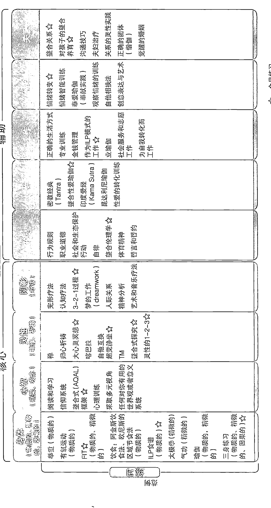

## 第十章 整合式生活练习

注 3S（左上象限）和三个身体（右上象限）。

- 1. 整合式框架模块。认知或者共同直觉模块就是 AQAL 框架。认知能力主要是接受观点的能力，所以学习 AQAL 框架有助于有意识地、清楚明白地接触到所有八个角度。AQAL 不仅仅是抽象的模型，就如我们在序言中所说，它是整合式操作系统（或者 IOS），当它被我们学会或者“下载”以后，就可以开始在内心创造多视角空间。认知路线是所有其他重要路线的必要非充分条件，认知框架越整合、越全面，生活就会越完整充实。这个共同直觉模块是所有阶段发展的必要非充分条件。
- 2. 灵性或冥想模块。当然，“灵性”可能表示很多含义，这里它特指冥想或静观状态训练。看看图 3.1，你就会了解我们在冥想模块的整体训练。有很多种冥想和灵性体验方法，ILP 使用大智慧过程及意识训练（整合式探究），这集中并浓缩了几种重要的静观训练、想象体验及归心祈祷。
- 3. 3-2-1 过程，或者阴影工作模块。关注阴影或者被压抑的潜意识，是任何生活转变练习的绝对重要成分。整合式研究所设计了简单有效地接触到个人阴影成分并加以整合的过程，将阴影从第三人称症状转化为第二人称存在再转化为第一人称意识。
- 4. 三身（3-body）练习模块。锻炼三个身体——粗钝、精微和因果。当第一个模块尤其关注左上象限的 3S 之时，这个模块关注右上象限的三个身体。

整合式研究所除了推荐四个核心模块以外，还推荐了五个其他辅助模块。它们是：

- 5. 伦理。
- 6. 性，或者性瑜伽。
- 7. 工作，或者业瑜伽。
- 8. 情绪。
- 9. 关系。

伦理模块将 UR 象限中的行为与 UL 象限中的后习俗道德意识联系起来。性模块（或者性瑜伽）将 UL 象限和 LL 象限作为觉醒的桥梁，关注人际关系的神秘维度。工作模块（业瑜伽）将专业工作和制式行为（LR 象限）作为 ILP 的内在部分。情绪模块是 UL 象限中的高级练习，将消极情绪转化为对应的智慧，包括性瑜伽。关系模块关注个人最重要的人际关系（LL 象限），不仅将这种关系当成自我转化的手段，也当成整合式觉悟的表达形式，其中的练习包括养育子女、配偶和觉醒的婚姻。

整合式研究所提供研讨会、工作坊、课程、在线材料和家庭学习套件。有兴趣的读者可以参阅 www.MyILP.com。

### 整合式专业训练

除了更因人而异的训练之外，整合式研究所提供很多专业研讨会和工作坊，整合式领导力、整合式心理图、整合式医学、整合式可持续性等等方面。如果对其中的任何哪种练习感兴趣，请访问 www.integraltraining.com（或者 www.MyILP.com）。

### 整合式灵性练习

整合式研究所与整合式灵性中心合作，使用整合式练习来配合世界上主要的灵性传统。如第五章所示，在这里，人们可以将自己选择的灵性道路“接上”整合式练习的其他部分。欢迎所有的信仰和灵性法门和我们共同努力。

感兴趣的读者可以浏览 www.integralspiritualcenter.org。

### 灵性在哪里？

下面是个简单的思维实验。想象下面的男人（也可以改成女人），并说出你认为谁最有灵性？

- 1. 穿阿玛尼西装的男人。
- 2. 开红色法拉利的男人。
- 3. 在重要联赛中打垒球的男人。
- 4. 职业喜剧家。
- 5. 数学家。
- 6. 穿着马甲举重的男人。
- 7. 奥林匹克游泳选手。
- 8. 大学教授。
- 9. 模特。
- 10. 皮条客。

你认为哪个人最有灵性？最没有灵性的人呢？
是不是觉得很有趣，哪些人是我们认为没有灵性的？我们为什么认为大多数这样的人不是很有灵性？反过来说，我们要看到他们的灵性为什么这么困难？我们实际上不是在散播自己对灵性的偏见吗？或者更糟糕：我们不是刚刚声称我们的灵性观念多么古老、分裂和不整合吗？为什么美丽的东西——汽车、西装，就没有灵性呢？为什么身体锻炼没有灵性？性为什么没有灵性？为什么……
这是个新世界，新灵性，新时代，新男人，新女人。所有以上种类的人都具有深刻的灵性。这个清单上的大多数人也是我们不敢在灵性上进行接触的人。脖子以下都是死的，没有幽默、性、丝毫美感，无所事事，整天到晚都对世界视而不见，不知道祈祷……多么难以理喻的上帝。

别再这样了。对生命、身体、自然、性、美和成功麻木不仁；这从来不是真的上帝，仅仅是对世人通常最难以应付的事物的干巴巴的概括，这里神成了大逃亡，成了人类拥有的每个病态恐惧和压抑性冲动的缩影和大杂烩。

别再这样了。这是新世界、新灵性、新男人、新女人。

灵性是整合的，人类也是如此。

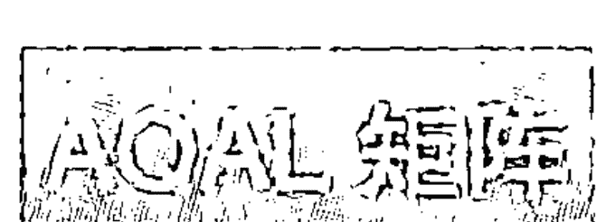

可以采取无数种方式来形成 AQAL 矩阵（“所有象限、所有层次、所有路线、所有状态、所有类型”）。最直接的方式就是简单地承认，在人类历史上，存在着运用最广泛的方法。仅仅承认经验主义、现象学、行为主义、静观和诠释学以及系统理论的存在……然后补充上你现在拥有的知识。我们要相信使用这些方法的人们知道自己在做什么，而且在尽自己最大的能力，而不是假定他们是错得离谱的彻头彻尾的白痴。每个领域和范式都有办法发现某些不好的东西，并将其抛弃掉——他们知道自己在做什么！如果我们能这么想，我们就能得到所有经过时间检验的重要方法，然后将它们整合成某种前后连贯的框架，这时，我们就很可能得到类似于 AQAL 矩阵之类的东西。

当然，AQAL 不是唯一的方法，可能也不是最好的方法；它只是我知道的唯一方法。但是，不管我们是否断定 AQAL 就是元理论（meta-theory），我们绝对不要忘记，这是基于上述全体方法的元理论，也就是说，这是从元实践（meta-praxis）中得出的元理论。它是各种实践的结果，而不是理论集合。它的方法论是练习、指令、例子、范式——它们能产生现象、练习和数据（此处从威廉·詹姆斯的角度来使用“数据”这个词，表示“任何领域的体验”）——AQAL 仅仅是同时追踪至少 8 个方法的元范式。而 AQAL 矩阵则将产生的所有经验和现象世界之间的关系予以概念化。但是，首先是练习和数据——命令和范例产生的实际经验——然后才是理论。

AQAL 框架生动地表明了来自至少 8 个角度和方法（揭示你自身的在世生活的 8 个区域）的多维度数据，理解任何行为都需要考虑到所有这 8 个角度，其中当然包括前现代、现代和后现代世界中的宗教、灵性和科学等极其重要的事物。

让范围尽可能广泛；从五万英尺的角度来观察；利用整合式多元主义而不仅仅是多元主义（它很快就会破碎、分裂、七零八碎，只会让自我各行其是）让它变得包罗万象；欣然接纳（8 种方法所包括的）所有领域和学科中的所有杰出人物；扩展心量，将他们的现象世界纳入你自己的世界地图中；让心智不断扩展，直到它碰触到无限并开始闪耀着超心智的光芒为止；增强心灵的柔软度，渴望去了解全部宇宙中的每个人、物、事，直到爱上所有通向无限的去路和归途，在最终惊奇地看到第二人称的上帝（或者呈现为无限之爱的终极的您、终极的我们）的光辉面容并破颜微笑，甚至知道自己的本来面目就是第一人称的上帝（或者当下纯粹的不二空性觉照中的终极我—我）；也知道整个显现的宇宙——十方三界的大存在层级——是第三人称的上帝（或者整个宇宙的终极它）：我、您、我们和它，在现在和每时每刻的单纯实相中欣然相会，但你能感觉到宇宙的结构，在此刻呈现为无法否认（正如你不能否认自己对这页书的意识）的宇宙灵性光辉中发现自我，知道灵性和觉察到这页书是一体且相同的，必然不二的，从而认识到——就像所有东西方的伟大圣人，从老子到无著大师，到商羯罗，到保罗，到奥古斯丁，到巴门尼德，到普罗提诺，到笛卡尔，到谢林，到特蕾莎，到耶喜措嘉（Lady Lsogyal）——灵性世界的终极秘密，即完全证悟和长存的神圣觉察不难达到，也必然会最终达到。

当灵性通常就是发现者时，你打算什么时候发现灵性？当上帝的面容已然成为（并在此刻就是）你的本来面目——这页书的观察者——之时，你打算怎样迫使他露出面容？当长存的意识此刻正自发并毫不费力地呈现为对这本书、周围的地方、你的身体、你所在的房间的意识之时，你为何还要大费周折，骑驴找驴——注意所有这些现象，注意他们在你当下的意识中毫不费力地发生，它们在你的无限觉醒中轻松地发生，此时此地，你要费多少力气才能让这种当下的意识发生呢？当上帝就是长存的全知者之时，你觉得必须向脑子里填进多少知识才能认识上帝呢？当这句话的阅读者就是灵性本身的时候，你认为必须要将这本书——或者任何书——读多少内容才能发现灵性？当这句话的读者就是完全启示出来的时候？感觉这句话的读者，感觉存在的简单感受，感觉你体内当下的感觉者，这样做时，你就会感受到充分启示出来的上帝以及他或她的光芒和荣耀，感受到整个宇宙神圣实相的一味，感受到小我和大我的无二无别，并让你在此刻，在每时每刻，宁静地证悟并完全成就智慧。听听身边的所有声音？谁没有证悟？①

完全接纳它吧。含纳整个宇宙。你知道每个人都是对的。因此停止撒谎，从小我转向大我。宇宙的万事万物都有其位置。敞开心胸，让它们都进来。扩展心智，直至它变得广阔，你不再需要地图为止，AQAL能够让你模糊地回忆起那张帮助你、帮助我找到真我的地图，找到它们以后，你就可以在那个夏天的家庭相册中扔掉AQAL，在那个夏天，当你放弃寻找上帝的时候，你找到了上帝。放弃寻找，安住于寻找者，你就不再需要地图了。地图不是你要的，实际的疆域就足够了，在当下的永恒光芒中，你的大我让你再也看不见小我，通过放弃寻求，你克服了灵性寻求之旅上的所有困难，你颔首而笑，认识到伟大的游戏或者玩耍已经结束，捉迷藏的游戏已经结束，因为你就是它，你发现了这点。

> ① 译注：这段话的原文非常晦涩，但大体上就是禅宗公案的境界：你当下的见闻觉知，就是佛心，就是真如实相。妄心即是真心，烦恼即是菩提，不要骑驴找驴，在妄心之外去寻找真心。如此等等。

在相对的有限显现世界中，AQAL 地图是人类在 8 个区域中的在世生活的有益向导，如果我们在现实地图中包括所有的 8 个维度和方法，我真心地相信我们会看到灵性在前现代、现代和后现代世界中闪耀着万丈光芒，我们也能找到方法，以海纳百川、吸取众家之长的方式将它们整合起来，就像它们是全餐而不仅是开胃菜，让我们的存在沉浸于伟大的实相之中，以便在进入 AQAL 世界时感受到从容与快乐、惊奇和释然、认识与顺服、幽默和高兴、惊喜和正确、公正和欣慰。在伟大的实相、意识、本分与福佑中，所有这些东西都会以某种方式从天而降，沐浴着我们。

它发现自己在无比富足中迅速发展，在自身不断发展的富足中呈现开来，这是被爱意环绕着的丰富多彩的发展，灵性的发展创造了自身昨天对宇宙的记忆，同时，它为宇宙习惯的明天奠定了基石（你不记得了么？），这样，利用宇宙传送带——伟大的、宏伟的、辉煌的灵性电梯——神话在现代和后现代世界中找到了自己的位置。

灵性——亦即这个“共同觉醒的我们”之中最深的真我——不仅接纳状态和经验，还接纳生命路径上的阶段和站点。从远古上帝到魔幻上帝到神话到理性上帝到多元上帝到整合上帝以及更高的这些阶段（灵性自身显现的第 2 区和第 4 区），都是从自我中心发展到民族中心到世界中心到宇宙中心的传送带上的阶段和站点，在人类的所有努力中，只有神话这种习俗才能做到这点。

……这可以让你的灵性发展在世界中呈现出来，它可以理解最深的真我，在大我的具体生成中看到“大我的存在（My Being）”得以成就，看到四维形式——即大我自身情境的四个象限——的无限之爱。神话仅仅是制度化的灵性，将它的福音传递给了未来的时代，让他们做自己觉得合适的事情，然后它会继续传递下来，直至时间的尽头。任何社会的神话都是其灵性的家园，与不断发展的灵性呈现过程紧密相连，是从死亡到不朽、束缚到自由、苦难到完满、幻象到觉醒、罪恶到拯救、无知到智慧的宇宙传送带，沐浴在岁月流转的美好光明之中。

灵性自身站点的这个传送带：多么合适，多么特别，多么明显——但它就在那里。

如果你觉得这个方法有趣，愿意加入我们，并在最有意义的“我们”——这个“我们”接纳最广阔的“它”——中逐步呈现你最深的自我，我们非常希望你与我们共同进行这个非凡的尝试。（参阅 www.integralinstitute.org）

这是新的一天，新的黎明，新的男人，新的女人。新的人类是整合的，灵性也是。

我代表整合式研究所的所有人感谢你。

## 附录Ⅰ 从存在巨链到后现代的三个简单步骤

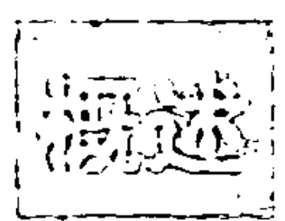

传统的存在巨链常常被称为物质、身体、思想、灵魂和灵性等。例如，在印度有五个灵性层次：肉身（有形食物层次）、气身（生命能量层次）、意身（思想层次）、智慧身（更高思想和灵魂层次）、神身（超越性喜乐和因果灵性层次）。当然，吠檀多增加了图力亚，即超越性长存的自我；此外还增加了不二的、长存的、无遮蔽的灵性——超越第四境；为了便于介绍，我们会使用较简单的五层次结构。后文还会讨论更“完整”的版本。①

图Ⅰ.1 简略描述了具有 5 个层次的存在巨链。尽管我们在进行跨文化比较时必须非常谨慎，但是，如图Ⅰ.2 所示，在大多数“前现代”世界的智慧传统中，我们都能发现类似于这种“存在巨链”或者“存有巨巢”的解释结构。赫斯顿·史密斯用这些图来说明这些传统的普遍相似性（或家族相似性）。

要注意：在从普罗提诺到奥罗宾多的支持者看来，图Ⅰ.1 中的存在巨链确实更像巨巢，或者俗称的全能体系结构（holarchy）。其中每个较高层次都超越了较低层次，但是都包含了后者（或者将它们“嵌入”其中），普罗提诺称此为“封套式发展”。每个较高层次完全超越了初级层次，既无法被简化为初级层次，也无法用后者来解释。这在图Ⅰ.1 中的（A）（A+B）（A+B+C）等中也体现出来了，它们意味着：每个较高层次都有新出现或者必不可少的成分或者特点。

> ① 专业名词：koshas 是层次/结构；图力亚/超越第四境是状态。

例如，当身体或生命（A+B）从物质中“出现”时，它的某些特点（例如有性生殖、内在情绪、自生性、生命能量等等——都用“B”表示）不能归入严格的物质形式“A”。同样，思想（A+B+C）出现在生命之外，它包括生命和物质无法解释的新特性（“C”），而且不能简化为生命和物质。灵魂（A+B+C+D）超越了思想、生命和身体。因此，进化就是灵性从物质到身体到思想到灵魂到灵性自身的“不断展开”，或者是作为整个序列之目标和基石的绝对灵性的实现。（这也许算不上欧米伽点①，而是更高潜能的永无止境的发展，我们今天对它的想象，就如同穴居人想象我们和我们的世界那样。）

> ① 欧米伽点（Omega point），法国耶稣会士泰亚尔·德·夏尔丹发明的术语，指宇宙进化到最高复杂程度和意识时的状态。

对这个传统观点最好的介绍仍然是 E.F. 舒马赫的经典作品《迷境指南》，这个名字来自于马蒙尼德对相同主题的阐述。书中主要阐述了存在和认知的伟大层级，以及“外在”世界的现实层次反映在自我的层次（“内在”知识和存在层次）之中，图 I.2 专门对此进行了说明。

传统认为，如果没有退化或者“内折（un-folding）”，整个进化或者“展开（in-folding）”就永远不会发生；不仅较低层次无法解释较高层次，较高层次不能从较低层次中“出来”，而且会发生相反的过程。亦即，较低的维度或者层次实际上成为较高维度的沉淀物，它们的意义仅仅来自于它们是较高维度的下降或者式微。这个沉淀过程又名“退化”或者“离析（emanation）”。在传统中，退化或者内折的过程必须发生在灵性的进化或者演变之前：较高层次的事物逐渐下降到较低层次的事物之中。因此，在进化过程中，较高的层次似乎“出自”较低的层次，例如生命从物质中产生，这是因为而且仅仅因为，退化过程首先将生命沉积到了物质当中。只有当较高层次的事物已经存在于较低层次的内部并蓄势待发之时，它才能从较低层次中显现出来。“奇迹的发生”仅仅是灵性自身呈现领域中的创造性游戏。

因此，对于传统来说，当灵性为了创造外在的宇宙而在运动和游戏中（莱拉，神化为人）。向外显现出来的时候，这个伟大的宇宙游戏就开始了。灵性“丢失”和“忘记”了自身，为了和自己玩一场捉迷藏的大游戏，它表现为各种各样的奇妙假象（幻觉）。为了创造灵魂——它是灵性的下降和式微——灵性首先向外显现出来，然后，灵魂下降到思想，后者是灵性光辉的苍白的倒影；思想然后下降到生命，生命再下降到物质——最愚笨、最低等、最缺乏意识的灵性形式。可以将这个过程表达为：灵性自身下降为灵魂的灵性，再下降到思想的灵性，再然后是身体的灵性，最后是物质的灵性。存在巨巢中的这些层次都是不同的灵性形式，但是，这些形式变得越来越缺乏意识，越来越忘记了其起源和实相，越来越缺乏不朽的存在根基，即便它们都只是灵性的游戏而已。

我们将进化的主要阶段表达为（A）（A+B）（A+B+C）等，其中加法表示出现了某个对象或者显现形式中增加了某些特征；同样，我们可以用重要的减法过程表示进化：灵性开始时完整而且完满，所有的现实都潜藏其中，可以用大括号表示为 [A+B+C+D+E]。灵性首先下降为化身，然后开始在化身中“丧失”自己，丧失掉纯粹的灵性本质，呈现为明显、有限的形式，也就是灵魂 [A+B+C+D]。现在灵魂忘记了“E”，正是这个重要的灵性特征让它有别于灵性，因此产生了困惑和愤怒，为了逃避这种恐怖，灵魂下降到思想 [A+B+C] 中，忘记了灵魂的光亮“D”。思想逃逸到生命之中，忘记了智力“C”。最后生命甚至放弃了植物生命力“B”，显现为惰性的、无知觉的、无生命的物质“A”，这时候发生了大爆炸这样的事情，物质藉此化为具体的存在物，在整个显现世界中，似乎只有无生命的、死的、无知觉的物质。

但是，这种物质过于活跃，不是吗？它似乎并没有无所事事，依靠失业保险度日，整天看电视。物质令人惊讶地开始给自己上紧发条，复杂系统物理学将它称为“混沌中的秩序”，或者是离散结构、自组织或者动态生成。传统主义者对此说得更直接：“上帝不再是僵死的化石；石头们大喊起来，将自己上升到了灵性。”黑格尔如是说。

换句话说，传统认为，如果退化发生了，然后进化就会开始或者能够开始，从（A）到（A+B）到（A+B+C）等等，每个重要的生成步骤都只是呈现或回忆起在退化过程中被秘密地折入或沉淀在低级层次中的更高维度。退化时被分割、破裂和遗忘的东西，在进化时被回忆起来、并重新融合、完善和实现。这就是传统中非常普遍的前世回忆学说，或者柏拉图和吠陀的“记忆”：退化是忘记自己是谁，进化是记起你的身份：“你是那样的”。这个经典的自我实现过程还有些其他的名字：开悟（satori）、皈依（metanoia）、解脱（moksha）和悟（wu）。

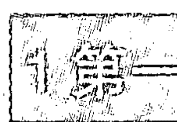

虽然那个解释体系美好而又高明，但也有它自身的问题。体系本身没有很大的过错，但是现代和后现代的世界增加了几个深刻的观点，如果我们想要得到更全面而整合的视野，这些观点就需要被补充或吸收进来。这就是“从存在巨链到后现代的三个简单步骤”的含义。

# 灵性的觉醒

### 问题

存有巨巢，退化和进化，存在和认知层次，所有这些东西都是前现代圣人和智者们的某些深刻贡献，在很多传统里其实都能找到它们，这包括：普罗提诺的《九章集》、《梵经》、奥罗宾多的《生命天赐》，以及伟大形而上学系统的所有表现形式。

现代人试图了解这些观点时也许应该记住下面这点：伟大的形而上学系统归根结底是圣哲们解释灵性经验的框架。“存在巨链”之类的体系是对生活经验的解释，不是某种固定的、僵化的、永远真实的本体论框架。在下文中，如果我质疑其中部分解释的准确性，我并不是在质疑伟大的智者们的体验或者证悟的真实性。我只是在说，进化本身在不断发展，因此，我们可以利用现代和后现代的成果，采用新的视野，重新将这些经验融入更合适的解释网络当中，这样，我们最终就能将前现代、现代和后现代的灵性呈现形式中最优秀的东西整合起来。

为此，我会指出伟大形而上学系统的解释框架中的三个核心难题，以及三个相应的补救方法。就我而言，我们要尽可能多地保留伟大的传统系统，同时摈弃不必要的形而上学解释，这些解释不仅无助于解释同样的数据集，而且必然让灵性在现代和后现代思想的法庭上不能获得公正的裁决。

我们将首个难题称为问题一，我们可以透过下面这个例子来了解它。观察传统形而上学的示意图（图 I.1、I.2 均可），注意，所有比物质更高的层次其实都是形而上的，这意味着超越了物理或物质。例如，物质层次（第一层次）包括人脑这个复杂的物质实体。根据形而上学系统的看法，这意味着蠕虫的感受（第二层次）比人脑（第一层次）的现实层次更高。

在那个系统中，显然有些并不太正确的东西。部分问题在于人类意识与人类神经生理之间的关系对于内省现象（如冥想或者静观）来说并不明显（甚至无法接触），这表示古人通常接触不到多巴胺、血清胺、突触路径、克雷博氏循环、下丘脑调节等等东西。但这并不表示他们的灵性证悟有瑕疵或者不完全，只意味着他们并不知道现代科学揭露的某些有限的事实。如果普罗提诺生活在今天，《九章集》中肯定有几章会讲述脑生理学，以及它与灵性的关系。如果商羯罗生活在今天，他对《梵经》的看法中肯定会大量讨论气脉与神经递质的关系。

### 建议解决方法

普罗提诺或者商羯罗可能对灵性现实和大脑等物质现实的关系做出什么结论呢？我相信他们会同意下面的方法。但是，无论如何，第一条建议是这样的：

在显现的世界里，我们所说的“物质”并不是存在的大系列中的最低梯级，而是这个大系列中的每个梯级的外在形式。物质并不低于意识，物质和意识是每种情境的外在和内在。

图Ⅰ.3系统地体现了这个观点，图4（见P023）则更加详细。这里的基本改变就是，将“物质”不再作为存在的最底层（其他层次是较高的形“而上”），而是让它成为所有其他层次的外在形式。现在来观察图Ⅰ.1，物质在底层，我们将它转变成图Ⅰ.3，此时，物质成为所有层次的外在形式。（我很快就会给出这些关系的简单范例。）

传统始终认为，比物质“更高”层次的事物是寻常感官所“看不到的”，我们在重新阐述时也是如此：也就是说，外在感官看不见所有的内在维度（感受、共鸣、觉察、意识、相互理解，等等），我们不需要画蛇添足的“形而上学”解释就可以理解这点。（我知道，转世又是怎样的呢？请稍等……）

目前，我们的注意力集中到上面两个象限。在右上象限，我们能看到现代科技揭示的外在或“物质”或“物理”形式的进化。为了增加进化的复杂程度，这些外在形式包括原子、分子、早期或者原核细胞、原核或者真核细胞、具有神经元的有机体，具有神经束的有机体（例如虾）、有脑干的爬虫类生物（例如蜥蜴）、有边缘系统的有机体（例如马）、有新皮质或者三层脑的有机体（例如人类，具有上面列出的几个更高的“结构功能”）。

这些是可以在外在的、感觉运动世界中看到的“外在”或者“物质”形式。但是，所有这些越来越复杂的物质形式都具有内在的对应物，亦即越来越高的意识层次。因此，原子的外在形式是中子、质子和电子等物理实体，它却具备内在的理解力或者原始感觉（原始意识）；具有神经元的生物有内在的感觉；具有神经束的生物有知觉；具有脑干的爬虫类动物具有内在的冲动和本能；外在边缘系统与内在的情绪同时出现，与三层脑的外在或物质形式对应的内在意识包括：形式反思能力、后习俗道德、统观—逻辑、语言能力以及许多其他的能力或功能。（你可以在图 4 中的右上象限与左上象限之间发现这种对应关系）。

换句话说，物质不是螺旋形进化过程的底层，而是内在包含感觉、觉察、意识等相关层面的进化过程的外在形式。AQAL 元理论对此的解释是，思想有对应的身体，或者说，意识状态都有相应的物质能量状态，每种内在的理解力都有外在形式，简而言之，左上象限的每个事件在右上象限都有对应物，反之亦然。不仅仅（生命、思想和灵魂的）较高层次会影响物质或者在物质上面留下印记（它本身仍然处于最低层次），而且我们称为物质的东西直接就是所有内在层次（图Ⅰ.3、图4中所示）的外在形式。

因此，前现代智者视作形而上的（meta-physical）实体，在很多情况下都是形而内的（intra-physical）实体：它们没有超越物质或自然，不是形而上或超自然的：它们没有超越自然，而是在自然内部；没有超越物质，而是物质的内在。

没有哪个前现代的圣人，在深刻地静观灵魂的时候，会看到或者能看到自己的脑波模式正在转化为西塔—阿尔法状态；他们无从了解血清素在增加，神经乳酸在减少，细胞需氧量大大减少，大脑偏侧优势正在产生。因此，灵魂的所有内在发现似乎都不是生理的、物质的、与自然相联系的、属于物质结构的，它们看起来完全是形而上的。

我们会看到，较高维度确实有部分特征会超越生理现象；但是，我们首先需要意识到的是，很多被前现代认为形而上的事物，实际上都是形而内的，没有超越自然而是在自然之内。这是从形而上迈向整合式后形而上的第一步。

### 问题

第一步意味着将现代科学的宝贵成果补充到前现代传统的深刻智慧中去。而第二步则意味着继续补充灵性后现代转变的重要成果。图5的两个较低象限概括了这些成果。上方的象限表示个人，下方的象限表示团体、集体或者个体的系统。左侧象限代表个体或者团体的内在；右侧象限代表个体或者团体的外在。因此，四象限是个体和集体的内在和外在。

后现代的重要意义仅仅就在于：就像古代人对真正的灵性体验所做的形而上解释没有利用现代科学发现的成果，同样，这些形而上解释也无法利用后现代的、民族方法学的、文化语境主义、知识社会学等领域中的深刻发现。所有这些加起来就会重重地打击前现代智慧：被古代的智者们认为形而上的很多东西，实际上受到了文化的塑造和限制。仅仅这个事实就让后现代性将伟大的传统斥为毫无厘头的胡言乱语，这就是第二个问题。

### 建议解决方法

不可避免的文化环境并不表示跨文化的真理不存在。整合式方法完全可以包纳后现代的成果：每个个体都处于文化和社会网络系统中，这个网络对个体自身的认知和存在状态具有深刻的影响。图4的左下（文化）和右下（社会）象限显示了这个网络。右下象限是社会系统，个体的集体系统或者集体外在，也是外部或者感觉运动世界可以观察到的外在（可以回忆前文所说的，所有的右侧象限能“从外面”看见，因为它们是“物质的”或者“外在的”）。外在系统包括生态系统、地理政治系统、技术经济生产模式（采集、种植、信息等），以及集体或者系统的所有特定外在方面。另外，需要注意的是，对于形而上学传统来说，所有这些“物质系统”位于存在的最低层次；然而，对于整合式后形而上学来说，它们只是“更高”（现在用“内在”）层次的集体外在方面。前文已经说过，超自然的就是自然内部的。

左下或者文化象限表示团体或者集体的全部内在，从“外面”看不到的内在（正如所有的左侧象限），例如团体价值观、身份、世界观、文化信仰、背景环境等等。这个象限主要是后现代性的关注焦点。系统理论关注右下象限，后现代后结构主义关注左下象限——它们表示集体的外在和内在。

各种各样的系统理论都强调，每个个体生命与其所处的环境是密不可分的，共同存在于动态的关系和生态网络之中，所有这些网络都能从“外面”看见，这再次表明“物质”不是存在的最低层次，而是所有存在的外在形式（在这个例子中，物质是集体或者社会系统的外在形式）。

当然，系统理论或者生态学中没有关注美、开悟、智慧、相互理解、价值观、世界观等等内在状态，因为它们其实都是内在的（因此生态学或者系统理论无法接触到它们）。系统理论常常试图将所有的现实简化到某个象限，这种做法叫作象限绝对主义，而这是整合式方法多元论所极力避免的。

另一方面，后现代性以关注个体在世生活的内在或者文化特征而著称，它强调，许多被社会视为“既定的”、“真实的”和“绝对的”的东西实际上受到了文化的塑造和限制，常常是相对的。尽管后现代性自身也常常陷入象限绝对主义之中（它试图将所有东西都简化到左下象限的文化结构之中），但这不应该贬低它所做的贡献，我们将这个贡献总结为：每种情况都有一个左下象限或者维度。

四个象限代表任何个体在世存在的四个不可分割的维度。这些维度如此重要，因此，每种主要的自然语言都包含它们，将它们作为第一人称、第二人称和第三人称代词，这些代词可以被总括为我、你/我们、它和它们。UL（左上象限）是“我”，或者任何个体生命体的内在感觉或者觉察（从原子到蚂蚁到猴子）。UR（右上象限）是“它”，生命体的外在形式（例如，物质和能量，包括从原子到大脑的粗钝外在形式，以及后文马上要提到的精微能量）。LR（右下象限）是团体、集体或者生命或个体系统的外在形式。LL（左下象限）是内在或集体意识、集体价值观、主体间背景、文化环境等等。也就是：个体和集体的内在和外在。

我附有一张人类的四象限形式图（图 5）。

关于这点，我不想长篇大论，只想简单地将我的观点明确表达为：任何前现代灵性如果无法与现代性和后现代性协调，明天就无法继续存在。可以利用 AQAL（“所有象限”，“所有层次”）来进行这种整合，因为 AQAL 综合了前现代、现代和后现代的不朽贡献。“所有层次”指伟大的前现代智者们极其出色地首次诠释的存在和知识系列——从物质到身体到思想到灵魂到灵性（后文还会讨论这些层次）。“所有象限”指现代性所做的改进（亦即，物质不是底层而是外部）以及后现代性所做的贡献（每个个体都处于文化和社会环境之中）。

用 AQAL 可以让伟大而持久的传统真理受到尊重和接纳，并将它们嵌入更适合它们的解释性框架当中，以便其真理能够被世人理解和知晓。只要我们观察象限，我们就能理解，现代科学关注右上象限，系统理论关注右下象限，后现代性关注 LL 象限，但竟然没有人关注 UL——现象学、内省和冥想除外——而这恰恰是传统最擅长的领域。实际上，几乎整个存在巨链都在左上象限之中！这是它们的长项。换句话说，理解这个象限以及觉醒到其最高维度的方法，始终是它们的优势和不朽的贡献，在现在，它就像 1000 年以前那样同样有用，同样为人所需。

但是，由于伟大的传统无视其他三个象限，现代性（主要是 UR）和后现代性（主要是 LL）就因为传统缺乏这些真理，而将它完全钉死在十字架上。现代性和后现代性在泼掉洗澡水的同时也倒掉了孩子，最终造成了自身的严重缺陷。另一方面，使用 AQAL 可以认可并吸收前现代、现代和后现代的最佳成果。

使用诸如 AQAL 框架之类的东西，是从形而上学发展到整合式后形而上学的第二大步。

### 问题

在这里，我们开始关注能量的作用和本质——粗钝能量、精微能量和因果能量。我已经说过，物质和能量是每个个体的 UR 维度的特征，也就是说，它们代表个体（以及每个系统）的某些外在形式。

这里的问题可以表达如下。假定（1）前现代不太了解物质的作用，（2）因此，古人说精微能量首先是形而上或者超自然的；但是（3）现代人认为物质不是底层，而是外在；那么，（4）我们如何才能重新用更准确的方式阐述精微能量与粗钝物质形式之间的关系呢？

简单说来，既然物质不是所有层次的最底层，而是外在，那么，精微能量在这个体系中起着什么作用呢？前现代传统实际上有系列的精微能量，从最粗钝的能量延伸到最精微（或者因果）的能量，每种能量都比物质更高级，并“超越于”物质之上。但是，如果我们可以重新阐释物质本身，那么，同样地，我们要如何重新阐释精微能量，以便让它跟灵性自身发展的现代和后现代启示保持同步呢？

### 建议解决方法

这里建议的解决方法是三个假设，前面已经谈到过两个假设，而第三个假设则直接解决这个问题：

-   1. 日益发展的进化导致粗钝物质形式的复杂性越来越高。例如，在右上象限中，我们发现了从夸克到质子到原子到分子到细胞到复杂有机体的进化序列。物质形式日益增长的复杂程度（通过分化和整合等过程）早就得到了进化生物学家们的关注。兰斯洛说：“因此，新的组织层次表示系统功能和相应系统结构的简化，它也意味着从此开始，结构和功能逐渐变得越来越复杂。”我认为这个“复杂化”相当明显，我们无需在此赘言。

-   2. 形式复杂性增加（UR）与内在意识（UL）增加相关。这就是泰亚尔·德·夏尔丹的“意识和复杂性定律”，亦即，意识程度越大，复杂程度越大。更准确的表达是：外在物质形式越复杂，该形式下的内在意识也就越大（即 UR 和 UL 的关系）。

-   3. 此外，还有个相关的假设，那就是：粗钝物质形式的复杂性增加和精微能量增加是有联系的。当进化达到越来越复杂的粗钝形式时，粗钝复杂程度的增加也伴随着越来越精微的、对应的能量形式特征。我们在此处关注的是个体，因此发现：进化增加导致粗钝形式复杂性增加（UR），后者又与意识程度增加（UL）以及 UR 中对应能量的精微化相关（UL）。因此，粗钝形式的复杂化表现了更精微的能量和更大意识，而不是更高存在层次与粗钝物质或者形式的基本分离。

如果这些对应的联系继续保持下来，那就是从前现代形而上学发展到整合式后形而上学的第三步，我相信这个步骤既保持了伟大的形而上学传统的永久真理，又放弃了其陈旧的解释框架。摘录 G（www.kenwilber.com）中收录有对于这个问题的整个讨论。这个漫长的纯理论疗法吸收了前现代所有主要的精微能量类型，如星芒体、以太体、能量场、心理和因果，并且谨慎地将它们与 UR 中的复杂性层次联系起来。① 某个评论家称之为“首个可信的、可行的主要精微能量学派的综合”。有许多图表达这个基本理念，例如图 I.4。

这些关系，当然还有精微能量本身，都仅仅是假说。但是，此处的要点在于，无论它们是否有效，精微能量可以完全被纳入 UR 象限当中——粗钝物质形式，精微物质形式，因果物质形式。

因此，这让我们无论在哪种情况下，都能完成从形而上学过渡到整合式后形而上学的基本步骤，或者至少勾勒出其总体轮廓，我希望这足以说明部分相关的基本观点……

> ① 摘录 G 也直接讨论了转世的问题，以及这些假说如何适用于这个问题。

## 附录Ⅱ 整合式后形而上学

### “后形而上学”是什么？

“后形而上学”是什么？想要了解这个问题，我们就得先问问：形而上学是什么？

形而上学通常被视为关注本体论问题的哲学分支（存在或现实是什么？）和现象学分支（我们怎么知道的？）。最初，亚里士多德的学生写了《形而上学》这本书，这让“形而上学”这个术语广为人知，而起这个名字仅仅是因为这本书写作于亚里士多德的《物理学》之后。我认为，这就是个好理由。

形而上学从亚里士多德开始，到康德结束，或者至少说，在康德的时代发生了转折，这个转折界定了此后睿智的哲学家们思考现实的方式。康德的批判哲学用主体结构代替了本体论客体。本质上，这意味着我们感知经验对象的方式并不完全是现实和预定的，相反，认知主体的结构将各种特征赋予了被认识的客体，然后这些特征变得似乎属于这些客体，其实不然：认知主体共同创造了这些特征。认知主体的先验范畴塑造或建构了我们所认识的现实。现实不是知觉，而是概念，至少在部分程度上如此。本体论本身并不存在，所有不了解这一点的思考方式被总称为形而上学。或者说，形而上学就是指掉进所予神话的陷阱之中的思维方式。

对于灵性来说，这通常意味着需要丢弃形而上学，至少需要重新思考。所有的传统形而上学范畴——包括神、不朽、灵魂、心智、身体和知识——都离不开根深蒂固的、前批判性的本体论形式，都经不起批判性思考的检验。在现代和后现代世界，它们仅仅是过时的概念，它让宗教感到非常尴尬，就如同燃素、圣维特的舞蹈和颅相学之于医学。

例如，以“存在巨链”为例。坦率地说，绿色文化基因理论家对存在巨链的批评既低级又简单，完全没有切中要害。我们可以从亚瑟·洛夫乔伊对这个话题的经典研究《存在巨链》所概括的简单事实入手。

首先，许多“存在巨链”理论家坚持三个基本观点：（1）所有现象——所有事物和事件、人、动物、矿物、植物——都是灵性过度丰裕和富足的显现形式，就像柏拉图所说的，甚至整个物质和自然界都是“可见可感的神”（灵性的丰富）；（2）自然界“没有裂缝”，没有缺失的环节，没有无法弥合的不二对立，万事万物相互交织起来（存在连续体）；（3）存在连续体分为不同的阶段，许多突变在某些维度上出现，在其他维度不出现；例如，狼能跑，岩石不能，在突变的特定意义上存在着裂缝（存在等级）。

无论现代或者后现代人怎样看待“存在巨链”的理论，它仍然是“人类历史主要阶段中大多数文明人的官方哲学”，而且曾经“越来越多更睿智的思考者和（东方与西方的）伟大宗教师导师都以各自不同的方式吸收了这种理论”。

通常来说，存在巨链至少包括三到四个层次（例如身、心、灵魂、灵性），最多可包含十几个甚至更多层次。这些层次是存在（本体论）和知识（认识论）层次。它们据说是被永恒或者无限地给定（或“预定”）的，或者仅仅以客观或者本体论的方式存在，例如柏拉图的原型，集体记忆或者习气，黑格尔（哲学中）的理念①，或者胡塞尔的埃多斯②，这里仅仅列举数个突出的例子。但洛夫乔伊无疑是对的：大多数最伟大的哲学家和灵性教师都同意某种“存在和知识的大层级”。因此，通常来说，在把它扔到垃圾堆之前，最好能够找到至少和它同样好的东西来代替。

作为普遍规则的形而上学，仅仅假定这些现实层次是存在的，然后用它们来解释世界、神、灵魂、自由（涅槃、悔改、轮回）和苦难（罪、幻想、命运、堕落、轮回）。在后/现代哲学的重要转变中，这些结构本身都需要解释（和证明）。这个故事相当复杂，但最简单的结论就是，它们无法被证明，不符合现代或者后现代的思想或者重要方法论。但是，这并不意味着要抛弃它们（现代性和后现代性可能是错的）。整合式后形而上学认为，没有这些结构的话，你其实也可以解释形而上学或者灵性哲学中所有真正重要的成分。这些形而上学的假设是完全多余的，而且错综复杂，对灵性弊大于利。为了让灵性在现在和未来存活下来，它应该是而且必须是后形而上学的。

在所有这些事情当中，有个核心问题需要我们谨记于心。“存在和知识的大层级”之类的理论——实际上任何能称为“形而上学”的理论——只是哲学家和智者们解释自身经验的方式。普罗提诺并不是某天散步时突然发现了一栋十层的建筑，每层上贴着类似“物理学”“情感”“逻辑思想”“更高心智”“理性”和“救世主”的标签。他认为真理包含十个主要存在和知识层次，这种思想是他所知的、解释他自身拥有的观点和经验的最佳方式。

> ① 黑格尔的理念类似于柏拉图的形相，但不同于经验论的观念。在黑格尔看来，理念不是对象的心理表象，而是现实地存在于事物之中作为它们存在的根据。
> ② 埃多斯（eidos）概念在胡塞尔那里是“本质”概念的同义语，它意味着那些可以通过观念直观而被把握到的普遍本质。参见倪梁康《胡塞尔现象学概念通释》。

# 灵性的觉醒

经验（特别是与神合一的神秘体验）的最佳方式。但是，外界并没有事先存在的、被称作“巨链”并由十种具体结构或者层次组成的建筑，任何人来到普罗提诺所走过的森林之时，也都看不到这样的建筑。如果你试图解释神、灵魂、神秘的合一、物质世界的显现形式，并让它们——较之于神秘合一状态中的现实体验——显得如同幻觉，那么，大层级——和普通的形而上学——几乎是解释现实的极佳方式。

它如今仍然是解释现实的极佳方式，但在许多方面极度需要深层的更新和完善。首先而且最重要的是：这十个左右的现实层次并不像苹果、岩石和纸夹子那样，是先验存在的结构，并等待着所有人来发现。即便我们认可十个真理层次之类的事物，我们也要理解那些层次不是独立存在的，在某种意义上来说，它们是由认知主体共同构建的，是人类的意识结构（因此，也是必然包含在灵性后现代转变之中的建构主义）。

其次，在验证这些意识结构是否存在时，不再是仅仅通过传统来予以确认；也不再是基于内省或者冥想（或者其他所谓的超越文化的主张）而予以确认。它们至少包括某些现代客观证据和后现代主体间基础的要求，否则在前面这种情况下，你只是在表达既定神话（或既定的方法论；神话是没有恰当证据的真理，是现代性要勇敢克服的观点类型，因为它们绝大多数时候都是庇护专制权力的实际谎言），或者，在第二种情况下，你只是在表达所予神话（貌似摆脱了文化影响的主张，后现代性致力于克服这种观点，因为它们绝大多数时候是错误的意识模式，庇护着边缘化和压迫）。

再次，不能把这些意识结构看作永恒或无限给定的，它们不是原型，不是神的旨意中的永恒观点，不是历史之外的集体形式，不是不受时间影响的清晰意象，诸如此类。在通常情况下，这些存在和认识的后形而上学层次必须被视为随着时间、进化和历史而不断发展的形式。这不是说灵性哲学可以完全脱离先验形式（任何哲学可以做到这点）；而是说，越少越好。假定的先验形式最好至少采用某些现代和后现代的论断形式（和有效主张）来为自己进行辩护。单单假定其存在肯定不行，声称自己了解神也没有用。

## 附录Ⅱ 整合式后形而上学

本附录要完成三件事。第一，阐释不依赖形而上学思考的意识层次或结构。第二，举出后形而上学思考的两个范例，首个例子是宇宙全子“地址”（它表示，为了定位宇宙中的任何事物，你必须明确指定什么东西？）。另外，第二个范例涉及谈论灵性现实的新方法，的确能称为后形而上学的方式。

第四章介绍了“证悟的计算尺”概念，亦即，如果进化发生在有形世界，如果证悟意味着要与不断发展的现象世界融为一体，那么，你如何在界定证悟的时候完全承认这个不断发展的世界，同时不否认证悟的永恒性呢？这个问题极具挑战性……

我先重复第四章“证悟的计算尺”的第一段内容，以便更快地理解这个问题。如果在此能取得任何突破，那么我相信，在构建真正的后现代形而上这件事上，我们或许就取得了长足的进步。现在，我们开始看看自己能取得怎样的成就。首先，要重复的段落如下：

可以采取几种不同的方式来表述这个问题：

- 如果万物都在变化，证悟如何有意义？证悟的含义是与万事万物融为一体，如果一切都在发展，我今天证悟了，明天这个证悟是否就成为片面的？随着太阳升起，证悟就消失了么？今天的证悟是否具有时光无法掠夺的任何内涵？
- 典型的回应是：证悟就是与无限的、永恒的、不生不灭的东西融合起来，但实际上灵性中存在着大量的二元对立：无限与永恒 VS 无常与变化，因此，我在此处所说的真正意思是，证悟是与半个灵性融合起来。

我们知道，“不二神秘主义”是“与粗钝、精微和因果领域的万事万物融为一体”。我们常常能看到，任何阶段都能有不二的状态，包括魔幻和神话阶段，只是这些阶段不包含较高阶段的现象。例如，在神话阶段，你可以证悟到不二、永恒、大智慧意识，与你的世界中的万事万物融合起来，但是这种体验忽略了宇宙中的许多事物。因此，开悟实际上可能是与部分现实的融合。通常来说，这样是不好的。

上面几段文字是对同一个难题的不同表述，更麻烦的是，这仅仅是问题的开始（称它为 A 部分），我们可以将它总结如下：宇宙——或者显现的宇宙——在不断发展。① 即使灵性被界定为空色不二（在这里，空是永恒的、不生不灭的、未显现的和未曾变化的，色是显现的、短暂的和发展的），“短暂”或者“有形世界”对证悟的涵义提出了挑战，这个挑战并不容易应付。显现的有形世界在不断发展，变得越来越复杂——随着时间的流逝而变得越来越完满、完满、完满……因此，无论我今天的证悟达到了什么程度，它都不会像十年、一百年、一千年之后的证悟那么完满。如果不这么认为，而是重新仅仅将证悟定义为认识到永恒的和不生不灭的东西，那么，我就必须否认灵性也是显现的有形世界，这样，我就拥有非常二元性的灵性。

> ① 当我们说显现宇宙在不断发展之时，这未必就是完全认同新达尔文进化论。我过去做的研究工作是视觉作用的生物化学和生物物理学（“与牛杆细胞外节隔离的视紫红质的光异构化”），我们无法理解，进化原理的书籍能够装满好几个国会图书馆。我并不是勉强被归为创造科学的智能设计的拥护者。我们不需要智能设计师就能够看出，进化似乎涉及某种“创造型魅力”，或者怀特海所说的“更新创进（creative advance into novelty）”。根据我们对进化的理解，那个动力（又名爱欲）似乎是非常真实的结论。我们在此处仅仅说，“爱欲的宇宙（Kosmos of Eros）”具有很重要的分量。但是，后形而上学的整个要点在于，它严格地使用奥康剃刀，当少数实体就能足够说明问题时，它就拒绝假定更多的实体。这就是：爱欲属于那些不会消失的事物……

大卫·戴达等少数理论家做出了非常好的区分，有助于我们表述这部分问题。空是自由，色是完满。证悟是空与色的融合，或者是自由和圆满的融合。认识无限的空性就是摆脱所有有限的事物、痛苦、烦恼、局限、品质——从已知上升到超越性自由的否定之路，超越欲望和死亡、痛苦和时间、渴望和悔恨、恐惧和希望的无分别智，不生不灭的永恒法身，摆脱了所有有限特征（包括救世主）的伟大阿印或者深渊。另一方面，如果与空性合一是终极的自由，那么，与有形世界合一就是终极的圆满——与整个显现王国合一，与色身（有形身体）统一，在对无常之物的热爱中发现永恒。因此，空色不二的证悟也是自由和完满的结合。

我相信这是真的。A部分的问题是，形式或者完满是不断发展的，更完满表示你今天的证悟在明天越来越不完满。你不能说那当真不重要，除非你在根本上（亦即认为只有等式的左半边或右半边有意义）背离不二状态。伟大智慧传统没有这个问题，他们不知道有形世界在发展，所以这个问题从未被他们觉察到。他们的有形世界是静止的，今天我们知道，有形世界实际上在发展……因此空色不二以某种方式成了不生不灭和发展的统一，发展让证悟在任何给定的时刻都不是完满的，因为，尽管明天可能不会更自由，但始终会变得更圆满。

我们似乎只要说，在发展过程中的任何给定时刻，证悟只是与空性和当时的那个有形世界的合一，这个问题就可以迎刃而解了。与万物合一仅仅表示与某个特定时间点上的万物合一。例如，某位冻土地带的萨满教徒可能有不二的合一体验，与空性和当时的有形世界合一。此外再没有其他东西可以合一了，因此，这种合一包含了当时的万事万物，包含能够思虑到的所有东西。当时没有更圆满的事物了，没有更高的合一了。随后的时代可能更圆满，并需要与这个新时代的万物合一。不能将两个不同时代的“合一”进行比较，因为它们风马牛不相及，即使两者都是真实的“合一”体验。

这的确解决了问题，直到你接触到西方研究者们的发现为止，这会带我们来到 B 部分问题。如果说此前的章节可以解决 A 部分的问题，B 部分仍然没有解决，而如果使用传统智慧自身的形而上学地图，后面这个问题就会开始变得明显起来。因为如果你接受了上面段落中的内容，它就会完全摧毁整个存在巨链。而当你开始严肃地对待 B 部分，它仅仅会彻底破坏对灵性现实的整个形而上学解释——注意，不是灵性现实本身，而是它们的形而上学解释（我相信这势必让我们来到“后形而上学”，只有这样，才能以无可非议的方式在后/现代世界中捍卫灵性现实，此处的“后/现代”这个词是指现代和后现代都能够接受的事物）。

我们已经看到，伟大传统智慧的后形而上学系统通常包括“存在巨链”——实际上就是存在和认识层次的观点——之类的事物，例如普拉提诺的层次（西方从迪奥尼索斯到艾克哈特为止的新柏拉图主义者默认的层次），喀巴拉的流溢层，大乘和金刚乘佛教的八识（八种意识）。

现在，传统相信整个存在巨链是一劳永逸地给定的，因此，整个巨链在当下就完整地存在，即使有些部分没有被认识到或者觉悟到。当我们意识到，整个巨链实际上在非常漫长而广阔的时空中不断展现出来，我们就能消除这种认识。巨链较低的 4-5 个层次通常是物质、感觉、知觉、冲动、情感、符号、概念……（例如五蕴中包含的东西）。但是，那些层次的发展实际花了一百四十亿年：物质在大爆炸中产生，感觉随着最早的生命形式而出现，冲动随着最早的爬行动物而出现，情感随着最早的哺乳动物而出现，符号随着最早的灵长类动物而出现，概念则随着最早的人类而出现……

令人惊讶的是，这些层次和它们的时间先后顺序都非常严格，但它们在几十亿年的时光中正是这样呈现出来的。因此，就如亚瑟·洛夫乔伊所说，面对 140 亿年的历史，破坏智慧传统巨链的最简单方式，就是说，巨链的层次不是一劳永逸地给定的，而是在漫长的时间里逐渐出现的。如果这是真的，证悟就是空和所有相的合一，只有等待所有的时光都呈现出来以后，我们才能获得证悟，舍此以外别无他途。

这是 B 部分的问题。如果你要说明进化过程的越来越圆满的特征，那么证悟以及所有灵性实体的本质就要发生剧烈的变化。你可以认识空性、获得绝对的自由，但是就发展的更完满性而言，认识不到那个问题（认识不到进化让证悟消失了任何持久的意义）就意味着，证悟和整个形而上学系统中隐藏着致命的缺陷。现代性和后现代性意识到这个问题，却抛弃了灵性现实，而它们应该做的，其实仅仅是抛弃对现实的形而上学解释。

如果我们要这样抛弃形而上学解释，我们首先要做的，就是将认识和存在层次（无论是十流溢层、八识还是七脉轮）从先验的、本体论的现实层次或者平面转变到自行发展的层次。查尔斯·皮尔斯说自然规律更像自然习惯，我认为：我们可以称之为宇宙习惯或者宇宙记忆，可以这样来解读（存在和认识的）现实层次。当它们首次出现时，它们的表现形式是相对开放和具有创造性的，但是，如果某种特定反应再三发生，它就固化成了某种越来越难以摆脱的宇宙习惯。

用价值结构作例子，约五万年前，当时人类达到的最高层次是紫红色价值结构（万物有灵—魔幻的）。某些高度进化的个体开始推动新的创造性存在和认识方式，从更高的复杂性和意识层次来做出反应。随着越来越多的人具有这种反应，红色价值结构（自我中心、权力）开始成为宇宙习惯。它越是被确立下来，就越成为固定的习惯。大约公元前一万年左右，红色价值结构成为人类的主要反应，有些英雄式人物开始推动更自觉、更觉醒、更复杂的反应，这样，琥珀色价值结构（绝对主义，民族中心）就首次出现了。

就世界观而言，这种从红色魔幻到琥珀色神话的发展创造了大量神话系统，无论这些神话系统是怎么样的，它们都创造了复杂得多的社会系统。魔幻世界观只能团结或联系有血缘和亲缘关系的人。除非你和我有血缘关系，我们不可能创造出“我们”。在魔幻阶段，部落之间不能在社会或者文化上团结起来。但是，神话有个功能，那就是，宣称神的后裔不以血缘和基因为标准，而以价值观和信仰为标准，因此，神话可以团结任何没有亲属关系的部落，只要他们相信某个相同的神话上帝；每个人都可以信仰那个上帝，即使他们没有血缘关系。以色列的十二个部落可以团结在同一个耶和华之下，先知（或者与先知相当的人）将琥珀色法则和真诚的信仰带到周围的红色异教徒文化当中，从而在某个神话上帝的旗号下，将人类团结成了一个民族。

这个进化过程大约发生在 6000 年以前，可以这样说（此处概括得非常简单）：就意识层次（认识和存在层次，“存在巨链”理论家误认为它是固定和给定的）而言，人类从远古猿猴发展到了紫红魔幻、红色权力、琥珀神话关系，可以体验到所有四个意识层次。每个人出生时都在起点，现在必须通过这些“固定”的层次，说它们“固定”仅仅是因为它们已经固化为皮尔士所说的宇宙习惯。为了解释越来越高的存在和认识层次的出现，我们所需要承认的，仅仅是宇宙中自生型的、离散结构的趋势——更诗意的说法是“爱欲”。除了怀特海的“更新创进”之外，不需要更多的“形而上学”。这个最低限度的形而上学能够产生存在巨链及其所有必要的产物，而无需假定任何形式的、先验存在的独立本体论结构。①

> ① 摘录 A-G “退化的给定事实（involutionary given）”讨论中有更详细的说明。

同时，某些具有创造性的勇敢之人会推进到橙色和更高层次。但是，所有这些层次都不是柏拉图式的给定事物，不是某条永远固定不变的巨链上先验存在的本体论结构，它们会不断发展，并且由所有四个象限中的因素来决定（或者在四维发展），然后出于实用目的被固化成人类的宇宙习惯而非柏拉图式的原型，并作为根深蒂固的习惯传递给未来的人们。正如大约两千年前的某个巨链理论家所说，这些层次似乎是永远给定的（但实际上还在发展）。为了获得相同的结果并解释这些“固定”层次的存在，不需要任何的形而上学包袱：原型、现实的本体论层面、等着人类去发现的独立的存在层次。而且，这些层次独立于已诞生的任何特定人类，因而不能被简化为心理学。与人类相关的所有事物都是以后形而上学的方式产生的。

同时（6000年以前），人类也有了清醒、梦和深度睡眠意识状态，它们可能是不同神秘主义形式（自然、神、无相和不二）的高峰体验。这些状态是长期存在的，整个人类学习掌握它们的顺序与今天的冥想者大致相同：从外在的、粗钝的浸礼（异教主义）上升和超越到神性神秘主义到无相深渊（大轴心时代）到长存不二。然而，和意识结构不同的是，经过修炼以后的系列意识状态具有很强的灵活性，个体可以在不同程度上具有这些状态的高峰体验。但是，在全世界的伟大神秘（琥珀）时代，整个人类都在探索精微梦境世界的美妙王国：人类不仅在结构上从红色权力部落发展到琥珀神话—团体社会，最先进的宗教人物也从自然的异教神秘主义状态发展到了内在神性神秘主义和前瞻性视野，接触到了超越这个世界（虽然有时候甚至可以接触到更高状态）之外的灿烂的创造性源头。

我们在此稍停片刻，回想最初的问题：我们如何用有意义的方式来描述当时的证悟？在当时，当人类深层结构是民族中心（琥珀色）的时候，证悟是否存在？如果存在，证悟包括什么？如果我们能有效地定义当时的证悟，这种定义在今天是否依旧有效？

记住，证悟的普遍含义是：完全认识空和所有的色，或者完全达到空色不二的状态。可能有许多更低的灵性体验和认识，但是我们将带有大写字母“E”的“证悟（Enlightenment）”看成最完满和最高灵性认识的最终极限（因此在本书中谈到“证悟”时，首字母始终都是大写字母E）。

理解这点以后，我们如何来定义证悟呢？本书的看法始终是：证悟就是与任何特定时间所存在的所有状态和结构合一。

在任何特定的时刻，当我们安住于因果的空性之中时，我们就获得了自由；但是，有形世界在不断发展，并不符合预定的计划，而是在创造性地发展。如果你愿意这么说的话，这个过程无疑可以被视为灵性的创造性运动和游戏（我相信这是真实的，它让我们摆脱了各种形式的科学唯物主义）①。但是，“存在巨链中的层次”不再是先验存在的，或者像其“固定形式”那样是被给定的。随着有形世界的发展，对个体来说，如果他们想要与这个世界合一，那么，他们就需要进化和发展到当时存在的最高层次。此时，从本体论上说，不应该有比这更高的层次了。

> ① 它也让我们不再鼓吹智能设计。本我的赞成者在下面这个问题上是对的：科学唯物主义不能解释所有的进化现象（它可以解释很多现象，但解释不了重要的整体性突变），我很同意这点。但是，为了让进化发生并持续向前发展，我们所需要的，仅仅是极简派（minimalist）的爱欲（作为退化的给定事实）。这种“更新创进”的力量是灵性发挥作用的形式，只要有“爱欲”这个事物，进化理论就能非常完美了。进化过程中呈现出这么多的起伏与变化，原因就在于此。它是创造性艺术品，而不是智能工程的产品（除非工程师是白痴）。本我的赞成者将自身小小的真理建立在“造物主耶和华就是爱欲”的主张上，然而，无论是天界还是地球，都没有丝毫证据能证明这点。

因此，灵性的色身或者有形世界不再被视为先验存在的巨链，而是任何特定时候的“一切法（Totality of Form）”，证悟的圆满就是指与这个“一切法”的合一。

但是，个体只能在通过所有的结构以及状态之后，才能实现圆满的合一。因此，证悟者就是指发展到了当时的宇宙最高结构的人，体验了所有状态（即“觉悟”过程中所通过的所有状态，通常从粗钝到精微到因果到不二）。①

> ① 可以采用很多方式来调整这个定义的状态特征。我们在此前说过，虽然主要状态是长存的，而且从最早的发展史开始，人类就有清醒、梦、深度睡眠和不二状态，整个人类学习掌握它们的顺序和今天的冥想者大致相同：从外在的、粗钝的浸礼（异教主义）上升和超越到神性神秘主义到无相深渊（大轴心时代）到长存的不二。然而，和意识结构不同的是，经过修炼以后的系列意识状态具有很强的灵活性，个体可以在不同程度上具有这些状态的高峰体验。但是，其最深层次的状态——在任何特定时刻，觉悟和观照通常就是在这种状态中产生的——无疑在历史中不断进步。

第四章说过，早期的研究者往往会将更高状态与更高结构混淆起来，然后将更高状态堆放在传统的结构之上。在《来自伊甸园》这本书中，我也是这么干的，我将结构称为“平均模式”，称状态为“最高模式”。《来自伊甸园》追溯了这两条“路线”，但准确地说，它实际追溯的是：（1）任何特定时代出现的垂直结构—阶段的平均重心（“平均模式”——从远古到魔法到神话到理性到整合角度）；（2）在这些时代同时出现的训练状态的发展，觉醒之路从粗钝发展到精微到因果到不二（“最高模式”），这些状态—阶段在《来自伊甸园》这本书中也被称为萨满/瑜伽师之路（粗钝到精微），圣人之路（精微到因果），觉者之路（因果到不二）。这其实就是系统发展的W-C框架，具有垂直方向的结构和水平方向的状态。如果考虑到这点，《来自伊甸园》仍然是非常准确有效的。在所有那些普遍显现出更高阶段（从远古到魔法到神话到理性到整合角度）的伟大时代，任何个体都可以接触这四到五个主要状态，但整个人类往往按照和今天的冥想者相同的整体过程，通过觉悟到达了那些重大状态，这是《来自伊甸园》所追溯的第二个过程。这两者（平均模式阶段和最高状态）之间的整体联系，正如《来自伊甸园》所指明的：魔法/粗钝，神话/精微，理性/因果，整合/不二。这些状态的意义在于，它们比阶段更具随意性，因为它们可能是高峰体验。

# 灵性的觉醒

这个证悟定义的总体特征非常好地解释了不断发展的证悟的“计算尺”：空性保持不变——它是永恒的、不生不灭的、无相的——但是，色却持续地发展，证悟就是与两者——空与色——合一，在这种合一中，色变得越来越完满，它包括现在正在形成的层次，这不是柏拉图式的原型，而是不断发展的色：这些色形成以后，它们看上去就像被永恒给定的先验本体论结构，但其实却是宇宙习惯。

现在，回到神话（琥珀色）时代的简单例子上来。为了完全与有形世界（更完满的那部分）合一，那个（琥珀色）时代的个体必须与什么合一？“与所有色合一”包括哪些东西？在有形世界中，现在存在着四个给定和“固定”的存在和认识层次，它们不是原型而是宇宙习惯（紫红、红色、琥珀色、橙色开端）。这些层次现在是宇宙的实际结构，因此，个人要与所有色合一，他们就必须与这些东西合一——必须超越和包括自身发展的四个层次：从远古到万物有灵—魔幻的到红色权力到琥珀—神话结构（将这些主体转换为被意识所超越和包纳的客体）。这样，个体才真正超越和包纳了自身存在的整个有形世界——没有更高的层次从柏拉图式的天堂体验，通常来说，最先进的宗教人物会从自然的异教神秘主义和精微能量（萨满/瑜伽师的路径）状态发展到内在神性神秘主义和前瞻性视野——接触到了超越这个世界以外的灿烂的创造性源头（圣人之路）——然后发展到因果的空性和三昧境界（觉者之路）到空色不二（成就者和密宗之路）。因此，在我们定义证悟时，我们可以对其状态做些调整，以便说明在任何主要阶段/时代实际达到那些可能状态的总体过程。“完全合一”是历史上的任何特定时刻可能发生的最高阶段和状态，这正是《来自伊甸园》这本书中的发现：魔法/粗钝，神话/精微，理性/因果，整合/不二。本文关注的是阶段过程，但是这个状态过程也是重要的变量，和证悟的计算尺标准和定义非常契合。我相信，发现各阶段所处的总体时代和觉悟所经过的状态过程之间的关系，仍然属于《来自伊甸园》所做出的主要贡献。

## 附录Ⅱ 整合式后形而上学

降落下来，因此，至少就这个变量而言，完满的合一是实际上可以成就的。

那么，状态变量呢？如果个体的觉醒状态从粗钝到精微到因果和不二，当个体在某种程度上能够熟练地驾驭那些状态的时候（将主体转换为觉察或意识中的客体），主体就能够与所有的常见状态合一。如果个体完成了这两件事情（超越和包括了当时存在的所有状态和阶段），那么整个宇宙中就没有更高的状态或者阶段了，这个人在任何意义上都体验了与整个宇宙、所有层次的空和色、法身（永恒灵性）和色身（短暂灵性）的合一。六千年前的这个人已经尽可能深地证悟了。（也可以说，在那个历史时期，这个人在水平和垂直方向都证悟了。）①

注意这个个体是高度民族中心的。他或者她并没有其他的选择，因为当时的宇宙还没有进化到世界中心（后习俗）结构。无论他的证悟多么深刻（完全熟悉了当时可能存在的所有状态和阶段），这个人肯定相信，救赎仅仅是为某个特定的人群、阶级、性别或者法门而存在的。

大约在公元前 1000 年左右，下一个主要的意识层次——橙色——开始出现了，创造性地回答了琥珀色无法解决的问题。（可以将这个新出现的事物——就整体的进化而言——视为正在发挥作用的灵性的创造物，后者通过自己的 AQAL 显现形式来表达自己。你也可以接受愚蠢透顶的随机突变和自然选择理论；这里都没有关系。关键在于，新事物出现了，不管你愿意相信什么机制，它们都被选中并普遍地发展。正如前文所说，我仅仅将它们称为宇宙习惯，而关于它们的确切本质，我们可以永无休止地争论下去，但是，不管这些新事物来自哪里，它们都确实出现了。）

橙色被定为宇宙习惯，或者是人类面临新挑战时的创造性选择的结晶，人类整体也在向前推动，它所熟悉的状态也从精微—梦境状态发展到了因果—无相（参见《来自伊甸园》）。世界中心结构和因果—状态的结合，导致了意识在全世界范围内迅速成长，此时通常被称为大轴心时代。当时（公元前六世纪）的整个世界上，不仅首次出现了鼓吹世界中心或者宇宙道德的人，还有些觉者开始谈到无限因果的深渊或者远离娑婆世界的苦难的涅槃，此外还有人主张个体的灵魂与上帝在神性中是一体的（“我和天父是一体的”）。随着人类继续充满创造性地向前发展，所有这些主张都是惊人的新认识。

自轴心时代至今，我们已经创造了三到四个新的、重要的普遍结构（大体说来，橙色、绿色、青色、蓝绿色）。在今天的西方，大约百分之四十的人处于琥珀色，百分之五十的人处于橙色，百分之二十处于绿色，百分之二处于蓝绿色。① 今天有没有更高的可能层次？不是状态，而是结构/层次？答案是肯定的，至少似乎存在三到四个高于蓝绿色的结构/阶段/层次。它们不是已经存在于某处的先验本体论或者形而上学结构，而是高度智慧的人们在推动新领域时确立下来的早期尝试性结构，他们自身也参与了这个结构的创造过程当中（亦即从四个维度来创造）。

当最早的先驱者进入这个新的、尚未成形的领域时，这些更高的后一蓝绿色结构就开始诞生了，其中有些结构出现在早达 1000 年以前，先驱们探索这个领域的同时也在共同创造它。但是到今天为止，稳定地进入这些更高结构的人全部加起来，也只有几千个，远远低于人类总数的万分之一。图 2.4 中，我以奥罗宾多为基础，列出了认知路线上的部分更高层次：在统观—逻辑或更高心智上，有启发之心、直觉心、超精神体和超心智，毫无疑问，还有更高的层次正在产生。在自我路线上，苏珊·库克·格鲁特探索了更高层次的头两个，就是图 2.4 中的“自我—意识”和“超个人”。这些是永恒的结构能力，而不是状态。

① 这个结果综合了几个来源，包括基根、SD、保罗·雷、洛文杰和威尔伯。比例总和不是 100%，因为某些部分存在着重叠。

如果把这些结构/层次看作宇宙习惯，那么层次越古老，它在宇宙中留下的刻痕也就越深。用大峡谷来类比：大峡谷是非常古老的切口，有几千公里深。这就像在大约五万年以前开始形成的红色层次，后者深深地切入了宇宙之中。一万年前开始的琥珀层次，则是大约五百米的宇宙峡谷。橙色层次从轴心时代开始，在大约三百年前的西方启蒙运动中才发展起来，它大约有一百米深。绿色在人口中占有不小的比例，始于二十世纪六十年代，只有十米深左右。青色和蓝绿色正在产生，也许有一米深。高于蓝绿色的结构就像有人拖着棍子走过，开始将新的宇宙习惯潜入宇宙之中。但是，就像所有其他层次那样，它最初虽然是水滴，日后却将成为小溪，然后成为汹涌的大河，在宇宙中产生峡谷，到时候这个峡谷将成为宇宙中的真实结构（然后看上去就像本体论的先验存在）。但是，在今天，高于蓝绿色的结构确实就像人们拖着棍子走过地面。靛蓝色也许有三到四厘米深，紫外色则不过在人类的“本来面目”上留下了最轻微的擦痕……

随着越来越多的人推动后—蓝绿色发展结构，这些层次/结构被创造、认可并确定下来。这些在四个维度上都与该高度的AQAL现实吻合的结构，将会被选中并普遍地发展，然后越来越沉积为稳定的宇宙习惯，然后在实际上成为给定的意识结构，此后，个体再也无法绕过这些深层结构。

换句话说，我们可以丢下形而上学的所有包袱，却能产生伟大形而上学系统的所有基本要素。

那么，在今天的世界里，证悟包括哪些东西？宇宙最高的状态和阶段是什么？这至少意味着认知路线和自我路线的靛蓝色高度，并熟悉四个左右的主要状态（包括达到粗钝、精微、因果和不二）。肯定存在着各种其他的证悟，其中有些非常深刻。但是“全面成就”或“完满证悟”则需要与任何特定时刻都存在的主要状态（“水平证悟”）和主要阶段（“垂直证悟”）合为一体，这对今天来说，就至少是靛蓝色高度和不二状态。

（达到了那个高度会怎样？当你与所有状态和阶段合一之后，你就站在了最前沿，和爱欲本身合一，迈向新的、更高的领域，并在同时从四个象限共同创造它……）

注意，今天有人处于神话—团体琥珀层次，虽然他们可能完全熟悉了粗钝、精微、因果和不二状态（包括阿努和阿底瑜伽），但他们仍然没有或者无法完全证悟。在水平方向来说，他们已经完全证悟；但在垂直方向来说，他们却没有。世界在发展；灵性也更多地展现出了自身的存在；在今天的世界上，为了与宇宙合一，你必须与更多的结构—阶段合一……

换句话说，在六千年以前被认为完全证悟的结构，在今天则没有完全证悟。在今天，处于神话—团体层次的人不再与“所有色”合一，因为琥珀的“上方”有橙色、绿色、青色和蓝绿色结构。它们现在是宇宙中真实存在的“本体论”结构，真实得就像它们是柏拉图的永恒的给定事实（但它们并不是）。如果有人在自身的发展中没有超越和包括这些层次，他们（琥珀个体）就没有和某些重要的现实层次合一。即便他们完全达到了空色不二的完美不二状态，即便他们熟知阿底瑜伽和脱噶（thögal）智慧、洞山禅师的“五位颂”，归心祈祷和最深静观状态，即便他们不断安住在阿印中，他们仍然没有完全证悟：有很多色界的因素没有进入他的世界，因此，正如我们想要解释的，这个人的开悟是与部分世界的合一。

然而，在神秘/琥珀时代，同样的证悟确实是与整个宇宙的合一，因此可以称为完全证悟。这个证悟定义满足了我们刚开始的所有要求：它既能解释昨天的证悟，也能解释今天的证悟：它既有永恒的成分，同时也包括暂时、发展的、历史性成分。

我们在开始时谈到了有形世界进化中产生的数个非常棘手的问题。我们发现，只有后形而上学的方法能解决这些问题（因为假设固定不变的、永恒的、独立存在的原型——无论是柏拉图的还是其他人的——不仅无法接受现代和后现代认识论的检验，还会在试图解释不断发展的有形世界中的每件事物时将自身解构掉）。另外，我们看到，对证悟可以做出有效而灵活的定义，这种定义既能尊重伟大的未曾生灭者（神性，法身，阿印）的永恒的、不变的、长存的空性，同时也不会忽视不断完满的有形世界（色身）的无常变化。今天，个体的证悟并不比其他的证悟更自由（空就是空），但比之更完满（而且会在以后越来越圆满）。

（但是，出于相同的原因，一千年前的道路如果用在今天，却再也无法带来完满的证悟。）

记住所有这些之后，我们就可以将证悟定义为：与历史上任何既定时刻已经存在的所有重要状态和结构合一。

这不需要任何形而上学的包袱。它不是形而上学思考的产物，而是来自于整合式方法多元主义，尊重和综合了前现代、现代和后现代方法的不朽真理。它不要求形而上学的正确性主张，后者以听闻和传承为基础，仅仅肯定传统或者正念冥想观照的正确性，而这两者都不能全面地满足现代性和后现代性的要求。

换个说法，现代性和后现代性完全破坏了存在和认识的所有本体论的、先验存在的层次，包括唯识学的八识和喀巴拉的流溢层，这些层次都不再必要，因为我们完全可以用后形而上学的方式来生成每个层次的基本要素。康德有个论点同时得到现代性和后现代性不同形式的认可，他正确地破坏了两者的本体论指示物，并要求我们在某个世界空间（worldspace）的认识论基础上证明该空间的存在，AQAL后形而上学完全符合这个要求。这个“后康德式后形而上学”——或类似的其他事物——是通向现代和后现代世界中的灵性哲学的唯一之路。

为了表明我们必须在多大程度上远离今天的形而上学灵性思考，请先完成下面的思考实验。我们选择狗、圣诞老人、负数的平方根和空性所表示的四个指示物。

这些能指的指示物存在于何处？或者，如果它们存在，在哪里能找到它们？圣诞老人存在吗？如果存在的话，在哪里？负数的平方根存在吗？如果存在的话，在哪里？等等……

前文简单提到过：宇宙地址 = 高度 + 角度。现在我想更多地剖析这个观点，以便说明后形而上学思考是什么样的，以及灵性现实——或者与此相关的任何重要现实——在后/现代世界需要如何概念化（此处的“后/现代”这个词用来表示现代性和后现代性都接受的东西）。

我们从标准的四象限图入手，这个图在本书中出现过多次，为了方便起见，我们在此处用图 4 来表示。

现在，假设这张图是准确的。它似乎极其简单地表示了被人们共同接受的部分现实：原子、分子、符号、概念、生态系统等等。记住只有蓝绿色附近的人能看见和理解诸如整体行星系统之类的事物。如果我们想要寻找诸如全球生态系统之类事物的“位置”，首先的规则很简单：生态系统只存在于青色或者更高的世界空间之中。

但是我们说，一百万年以前的真实世界中也肯定存在生态系统，即使当时人类仅仅在紫红色层次，看不到或者感受不到它。这正是许多现代和所有后现代认识论所不允许的。不能假定某个独立的、预先给定的、非历史的世界“就在那里”，而再现论方法能够在不同程度上接触到这个世界。如果这是真的，那么我们今天看作“生态系统”的事物，从一千年以前到现在为止，很可能就被理解成了暗物质潜能，决定了我们是否能接触到十一维的超空间……嗯，你说对了。如果我们声称自己的认识论基本上是再现论地图（或者自然之镜），正如今天的我们将一千年以前的知识看成无用的，明天也会宣告今天的知识作废。永远没有人具有任何真理，只有不同程度的谬误。这就是所予神话；这就是现代性激烈抨击的事物；它无法可信地说服我们。

但是，要点很简单：不管生态系统是什么，十万年以前它们并没有被认识或理解。（正如克莱尔·格雷夫斯所说，部落意识“给河流的每个拐弯处都取个名字，却没有给整个河流取名字”。）仅仅在青色或更高层次，生态系统才会进入意识。由于在后/现代世界中，“进入意识”和“存在”基本上是同义词，因此，我们可以放心地说：不管生态系统是什么，它们只存在于蓝绿色世界中。①

因此，在这个等式中，地址 = 高度 + 角度，这就是宇宙地址的“高度”所指的确切含义。指示物（“真实客体”）仅仅存在于（或被发现于）按顺序发展的、具有特定“高度”的世界空间之中。在附录的剩余部分，我会简单地运用十个重要的后形而上学存在和知识层次，也就是图 2.4 和 2.5 中的前十個层次，为了便于参考，我在此处再次将它们列举出来：

1. 红外线——远古、运动感觉
2. 紫红线——万物有灵—魔幻论
3. 红色——自我中心、权力、魔幻—神话
4. 琥珀色——神话、民族中心、传统
5. 橙色——理性、世界中心、范式、现代
6. 绿色——多元、多文化、后现代
7. 青色——开始整合、低统观逻辑、系统
8. 蓝绿色——全球思想、高统观逻辑、更高思想
9. 靛蓝——帕拉思想、超全球、启发之心
10. 紫色——元心智和超精神体

我也会用数字来指代这些层次，但是，这些数字也是主观的。另外，为了讨论的方便，我们仅仅假定这些层次都是第 2 区方法验证过的后形而上学结构。

现在回到宇宙地址观点上来，生态系统仅仅存在于蓝绿色或者更高世界空间里。在这里，“存在”表示“存在于外界（ex-ist）”：很显眼，为人所知，显露出来，并在四个象限中发生——而绝不是等待着被我们感知的既定世界。在部分程度上，客体的宇宙地址意味着：客体仅仅在不同的复杂性和意识发展层次上形成或者发生。在任何情况下，我们都无法知道它们是否以其他方式存在，并假定那种认为它们完全独立于认知者的主张纯粹是所予神话和再现论范式（representational paradigm）——也就是说，仅仅是另一种形而上学思考，缺乏合理的基础。在任何情况下，后形而上学思考都不依赖于既有世界和所予神话的存在。

我们再次回到图 4 的那个问题，图中表示的客体存在于什么地方呢？回答是：它们大多数存在于蓝绿色或者更高的世界空间。红外、紫红、红色或者琥珀色都无法找到从生态系统到原子的任何事物，仅仅从橙色到蓝绿色才能发现它们，因此，从整体来看，图4中的能指（例如“生态系统”和“具体运思结构功能、形式反思结构功能”）所代表的指示物（或者真实存在的客体）仅仅存在于蓝绿色或者更高的层次。

那是宇宙地址的高度，那么，角度又是什么呢？角度是指示物所在的象限。形而上学思考假定了一个不存在角度的宇宙，断定事物的存在并不受到角度和整体环境的影响，这不仅是所予神话，还是极度自我中心的所予神话。所有真实的客体首先是而且主要是角度。它们不是“从某个角度”观察到的事物，而是“角度本身”。我们需要再次强调的是，假定非历史的世界中具有某些先验存在的、等着我们去发现的事物，这本身就是形而上学（和所予神话）。所有情境都有四个维度/角度/象限。这是它们自身的四个维度，不是其他的东西——因为除了事物如何呈现以外，再也没有“其他的东西”了，只有如何呈现的问题，事物始终而且依然呈现为角度。

因此，当指示物呈现出来之时，我们至少需要明确指出它在哪个象限里发生。① 例如，生态系统是“它们”的例子，或者右下象限的实体/情境。那么，生态系统存在于哪里？或者说，它的宇宙地址是什么？

生态系统 = 蓝绿色 + 右下

或许可以说，现在这个宇宙地址只是普通的街道地址，它仅仅让你进入某个大运动场，或者，最多进入街道上的某座大建筑中，但也仅此而已。它没有告诉你它的使用者、它的真实轮廓或者具体因素，等等。但是，这个普通宇宙地址明显而且严格地表明，“事物”并不存在于早已存在的既有世界之中。它们在各种不同的发展复杂性和意识层次上才会逐渐存在，并始终从特定的角度被揭示出来，包括（但不局限于）主体我、客体它、主体间你/我们、客体间它们。

（更完整的宇宙地址包括任何情境的所有 AQAL 因素，但重要的是，你最少需要象限和层次，或者说角度和高度。）

到目前为止都毫无问题！我们才刚刚开始！在后形而上学的世界中，没有绝对的基石，所有的事物首先是角度，我们必须采取更重要的下一个步骤。我们刚才给出了指示物或者被感知现象（这里是生态系统）的宇宙地址。但是，知觉者的地址呢？我们给出了客体地址，那么，主体的地址呢？记住，在后形而上学的世界里，它们无法完全隔离开来。因此，为了确定宇宙中的任何事物，必须说明知觉者和被知觉对象的宇宙地址。

从现在开始，事情的确很有趣了，正如爱因斯坦独特的相对论，事物无疑都是相对于其他事物而存在的。不仅仅是相对的，而且是绝对相对的。（众所周知，爱因斯坦的理论起了个很糟糕的名字；他曾打算将之称为绝对理论和恒定理论。他的想法就是，宇宙中没有任何固定点可以被当成宇宙的中心；每个事物只有相对于其他事物才能确定其位置；这仍然创造了绝对真理和一般概念，但它们都存在于彼此参考的变化系统之中，而在任何给定的时刻，作为整体而言，这个系统中的时间本身都是由恒定的光速来设定的。）

这里我们需要象限和四艺。象限是主体的角度；四艺是观察客体的角度。只有个体全子拥有四个象限；透过（或者从）这四个象限（四艺），我们可以观察任何事物。

例如，作为个体全子，我至少具有四个象限角度：我的存在包括我一角度、我们一角度、它一角度、它们一角度。但是，胡椒瓶不是有感觉的生命，所以没有四象限，但可以从我的四象限/角度中的任何象限来观察它。我可以从我一角度去看它，说出我个人对它的看法或感受。你可以和我讨论瓶子，形成我们一角度。我可以用科学的方式看这个瓶子（它和它们），也许还可以讨论它的分子结构。

我拥有四个象限；可以通过四象限看这个瓶子（这构成了四艺）。通常来说，知觉的主体有象限，这些象限必须被规定为其宇宙地址的内容；

## 附录Ⅱ 整合式后形而上学

被知觉的对象有四艺，这四艺必须被规定为其宇宙地址的内容。

还有种更宽泛的说法：因为我们需要透过（或从）某个特定的象限来观察客体，因此，主体透过象限来观察客体，而客体自身存在于象限之“内”。在两种情况下，为了弄清楚指示物的宇宙地址，我们必须确定知觉者的象限和被知觉对象的象限（四艺）。

这样，每件事物都与其他事物绝对相关。没有根基，没有形而上学，也没有所予神话；所有稳固的东西都化为乌有，所有的基石都被蒸发掉了——但是，我们仍然能够产生伟大形而上学系统的所有要素，却抛弃了那些受到彻底质疑的、纯属多余的形而上学包袱……

现在来做个总结。在后形而上学的宇宙中，我们可以将确定任何物体的方法总结如下：

1.  由于没有固定不变的宇宙中心，甚至也没有基石（乌龟的下面都是乌龟），任何象限、事物、事件、过程或者全子的位置只能通过系列的相互关系来确定。
2.  没有给定的、独立存在的、超越所有知觉之外的世界。所有事物都不是知觉，毋宁说，全部事物和事件都是相互揭示的，都在与他者（即相对于他者的角度）的相对关系中揭示出自身。在现实中，这表示每个事物首先都是角度，然后才是别的。这意味着：显现世界没有知觉，只有角度。说得直接点，知觉、理解、觉察、意识都是第三人称独白式抽象概念，并不具备相应的实体。就我们所知道或者能知道的，显现世界是由具有视角的有情生命组成的，而不是具有某些属性的物体，也不是具有知觉的主体、真空潜能、命运、宇宙弦、全息图、生物场等等。它们只是相对于其他有情生命的角度而已。
3.  因此，为了说明任何情境的“位置”——在哪儿能发现它——我们必须确定知觉者和被知觉对象相对于彼此的位置，这个位置至少有两个要素：垂直发展的、不断变化的部分（高度），以及角度，情境在其中（四艺）或者透过（象限）它来得到理解。我们也可以用其他因素来确定某个现象，但是这两个（层次和象限）是最基本的。因此，我们需要知觉者和被知觉对象的高度和角度。可以简单地将其表达如下：

宇宙地址 = 高度 + 角度

对于知觉者 / 主体和被知觉者 / 对象这两者来说，我们需要规定：

宇宙地址 = (高度 + 角度) 主体 × (高度 + 角度) 客体

因为主体的角度是象限（或者说观察者本身所处的角度），客体的角度是四艺（或者事物被关注的角度），我们也可以将公式写成如下形式：

宇宙地址 = (高度 + 象限) × (高度 + 四艺)

当然，我们也可以在 AQAL 矩阵中指定任何情境所处位置的其他要素。当我声称在觉察某个客体之时，我们可以指定自己观察世界时所处的象限、层次、路线、状态或者类型，也可以指定客体存在（或被认为存在）于“其中”的四艺、层次、路线、状态或者类型。要在深度和广度上确定我们在宇宙中的位置，高度（层次）和象限（角度）是最基本的。

因此，就如我们所说，图 4 中看似简单、毫无深意的地图，其实并不那么简单。它无疑不是既定世界的地图，因为不是所有人都能看到其中的客体。在它的表达和能指中隐含着下列内容：

如果我处于蓝绿色或者更高发展层次并运用认知智力路线，那么，我就可以吸收至少达到蓝绿色层次的各种人文学科中的全部整体结论，将它们展现在类似于图 4 的第三人称框架之中。

同样，图 4 所描述的，并不是某个既有世界中存在的、等着任何有情生命去认识的现实。图 4 的现实只存在于蓝绿色（或更高）世界空间。红色、琥珀色或者橙色世界不存在生态系统。红色或者蓝色或者橙色世界不存在统观一逻辑。红色或者琥珀色世界不存在原子。红色、琥珀色、橙色或者绿色世界中不存在真空潜能。最重要的是，图 4 对应的现实只存在于蓝绿色世界（蓝绿色世界空间）之中。图 4 不是“真实世界的”地图，因为并没有“真实世界”——并没有等着我们去认识的既有世界，只有等着发挥作用的相互揭示的角度。

同样，不是所有主体都能够看到图 4 中的现实。只有认知路线达到蓝绿色发展高度的主体才能看到它们。对红色、琥珀色、橙色或绿色主体来说，系统层级并不存在，他们也无法看到它。只有蓝绿色（或更高的）主体才能接触到它。

因此，图 4 的能指的指示物（或真实客体）只存在于第三人称维度/角度的蓝绿色世界空间。只有第三人称角度的、达到蓝绿色高度的主体才能看到它们——也就是说，只有具备该宇宙地址的主体才能够产生与图 4 中的能指对应的正确的所指，从而看到和理解那些能指的真实指示物。（也就是说，能够加入新的认知群体，从而共同努力决定那些宇宙地址所产生的现实的轮廓，而不管某种事物在该地址是否当真存在。）

如果不说明知觉者和被知觉对象两者的宇宙地址，任何关于世界或者真理的话语都完全没有任何意义。所予神话最简洁地说明了这点，但是，我们现在看到，所予神话只是冰山的最顶部：不存在既有的世界，这不仅是因为主体间性构成了主观和客观现实，还因为规定主体间性也远不足以在各个方面克服所予神话：要了解形而上学之外的任何事物，就需要同时规定知觉者和被知觉对象的宇宙地址。因为，我们已经看到，从 AQAL 角度而言，形而上学意味着没有（或不能）大致规定某种情境的象限、层次、路线、状态和层次的任何事物。如果某个作者没有自觉地确定这些因素，亦即，没有确定某个宇宙地址，这其实通常是因为，这个作者无意识地假设那些因素是给定的，不需要做出说明。他们没有规定它们，是因为他们不知道后者是变化的。

例如，大多数作者会给出第七章概括的、类似于伟大系统层级的现实地图，或者生命网络、真空量子潜能、流溢层、唯识等等，他们不知道，那些现实如果真的存在，也只存在于特定角度的特定世界空间。因此，当他们介绍这些现实地图时，仿佛不但存在这样的既定现实，而且他们正确地表达了这个现实。甚至在后现代形而上学看来，那也是可怕的！但我要走得更远，指出，即使是那些声称自己克服了形而上学的后现代主义者，实际上仍然陷入了更微妙的形而上学里，因为形而上学就是通指那些不能有意识地揭示任何情境的所有 AQAL 要素的事物。当某个作者没有揭示出所有这些成分时，这几乎始终是因为，他或者她不知道这些成分的存在，因此，这些现实就会无意识地滑入大量的给予神话当中。例如，兰斯洛没有表明量子潜能仅仅存在于蓝绿色空间，这是因为他假设它们对所有人都是存在的。因此，对兰斯洛来说，高度就成为所予神话的隐含内容，他认为不需要指定高度，因为他不知道，不同指示物存在于不同的世界空间，因此他又完全陷入了另一种所予神话或形而上学当中。

当然，形而上学的引申意义是“没有证据的主张”。的确如此，如果某种方法没有规定其断言的能指之指示物的宇宙地址，它就陷入毫无意义的断言和抽象概念之中。

这就引出了整合式后形而上学最有趣的要求：某个断言的意义就在于它的确定方式。当我们理解了这点，我相信，我们就会找到讨论灵性现实的全新方法，这种方法内在地能够证明灵性现实的存在。

> 圣诞老人在哪里？

我想再次提到高度为十个层次的简单地图（当宇宙的某些特征在第三人称角度的紫色世界空间呈现出来的时候，这是它们的通用地图）。回想我们前面的内容，要提出有意义的主张，通常必须确定知觉者和被知觉对象的宇宙地址（高度 + 角度）。否则，你就在隐性地假设这些东西是给定的，从而陷入形而上学或者无意义的断言之中。

确定这些世界空间的范式和指令是由生活在其中的各种知识群体所决定的，根据那些充分遵循这些范式和指令的人们的经验，我们在讨论本章节时，首先快速地列出简图中的十个世界空间中出现的几种现象。下面的列表旨在极其系统化和概括化地表述几个要点，而不是准确地描述所有细节。我用 10 个层次中的 8 个层次来表达相关内容：

-   紫红——万物有灵—魔幻：恶魔、怪物、巫师、愤怒、欲望、岩石、河流、树、诅咒、巫术、祖先、部落、茅屋、村落、马、矛尖
-   红色——自我中心，权力，魔幻—神话：军阀、部落、五个成分（土地、空气、风、火、以太）、愤怒、嫉妒、权力、巨人、统治、压抑、奴隶、种族灭绝、灵性体现为拥有强大权力的神和女神。
-   琥珀色——神话，民族中心，传统的：大教堂，正义的人，骑士，拯救，博爱，第二人称观点，灵性体现为全知的、全在的、全能的伟大他者
-   橙色——理性，世界中心，实用主义的，现代：原子，电子，质子，超过 100 个元素的周期表，摩天大楼，火箭，世界中心的同情，世界性的道德理想，电视，录音机，第三人称观点，负数的平方根，飞机，汽车，灵性体现为伟大的设计者和/或存在之基
-   绿色——多元的，多文化，后现代：多元系统，因特网和万维网，第四人称观点，价值共同体，虚数，超级汽车，灵性体现为深层生态学和人类和谐
-   蓝绿色——全球思想，高统观逻辑，更高心智：盖亚共同体，宇宙弦，微分/整合微积分，N 维超空间，第五人称观点，量子潜能能量来源，灵性体现为行星等级（planetary holarchy）
-   靛蓝色——帕拉思想，超地球，启发之心：第六人称角度的澄明和慈悲，超行星的社会理念，巨型部落，在全球格式塔中自我显现的真/善/美，灵性体现为无限的光/爱
-   紫色——元心智和超精神实体：超精神实体的美好澄明之境，第七人称和更高的无限之爱和慈悲，对所有的有情生命感同身受，超维度的社会理念，灵性体现为纯粹的内在性和无限的层级

我们已经看到，不能说哪个层次是对的，其他层次是错的；此外，所有这些层次的不同因素都在向前发展。对于从原子到分子到细胞到有机体的任何层级，我们不能说“我要保留有机体，去掉原子、分子和细胞”。同样，即使想让自身世界观的高度尽可能高，我们不能简单地执着于紫色，并拒绝任何其他层次。不过，下面这种说法确实是有意义的：在紫色时，实际上存在着十个存在和认识层次的，这些层次都是宇宙习惯，因此也是人类发展的阶段，以及个体复杂存在的层次。（虽然我们有办法来确定，任何层次上的哪些因素是持久的，哪些又是变迁的、虚幻的、错误的，但是，真正的要点在于：我们仍然必须确定所说的这些具体因素存在于哪个层次/世界空间。）

此处的要点在于：对于主要层次和世界空间中发生的所有现象（上面的简单列表只是个非常粗略的范例），我们借助于某种“大现象学（mega-phenomenology）”，能够创造出某种超级字典（千兆词条），这本字典收集了人们（到进化的目前阶段为止）能够说出并理解的大多数主要能指的指示物的地址，这些人完全具有相应的意识，能够显示出对应的所指。

因此，用我们的简单列表作为千兆词条的例子，我们就能够非常轻松地回答本来完全不可能的问题。下面举几个例子：

负数的平方根是个能指，其指示物存在于橙色世界空间，资深的数学家能够准确地认出或理解它，并通过该高度第三人称角度的数学符号能够想到正确的所指。

全球生态系统是个能指，其指示物是非常复杂的多维层级，存在于蓝绿色世界空间；蓝绿色高度的、以第三人称角度研究生态科学的主体能够直接认出或理解它的实际指示物。

圣诞老人也是个能指，其指示物存在于紫红色世界空间，紫红高度的主体能够看到或者理解它。（当然，假如他们左下象限的主体间背景具有必要的表层结构；这适用于所有例子，所以我只偶尔提提）。

并不存在“纯粹的物理客体”（或“运动感觉客体”）。“物理世界”是解释而不是感知（也可以说，物理世界不是感知而是概念性感知或者“共同感知”，这当然包括角度。）不存在既有的世界，只有系列生成的世界（或共同发生，或在四个象限内发生），并具有不同的意识层级。因此：

作为活跃的动物精神（animal spirit），狗存在于紫红世界空间之中；作为生物体，狗存在于琥珀色世界空间之中。作为进化产物的生物体，狗则存在于橙色世界空间之中；作为 DNA/RNA 序列在不断发展的行星生态系统中发挥作用的分子生物系统，狗则存在于蓝绿色世界空间。并没有“这条狗”这样一只真实的、既定的、我们的观点能够做出不同表述的狗；相反，随着我们不断发展的概念和意识，不同的狗逐渐出现或产生了。物质不是存在系列的最底层，是这个系列中的每个层次的外在，因此，在每个新的层次，就会出现新的物质，然后，整个世界也会再次发生变化。

这里的要点在于，不同的世界空间包含不同的现象。这不是说哪个世界空间是“真实”的世界空间，因为任何时代都始终觉得自己的观点是真实的观点。但是，并没有“真实”或者“既有”的世界空间，只是说，这些不同的世界空间在充满创造性地发展，并以新的方式展现出来，然后固化成宇宙习惯，此后的所有人必须将这种宇宙习惯当成自身发展的阶段和复杂个性的层次并跨越它。每个世界空间都会产生不计其数的现象，这样，彼此都是相对于其他的整体而界定的，在这个关系整体中，包括高度和角度。

人类可以创造语言——符号和象征的系统——来表达各种现实。在大多数情况下，这些能指的指示物存在于一个或者更多的世界空间，主体如果拥有相应发展程度的所指，就能够觉察到这些指示物。但是，任何哲学观点如果要具有实际意义，就需要说明指示物的宇宙地址——它存在于哪个层次的世界空间，以及它是透过哪个角度来观察的。否则就意味着，说话的人没有认识到不同世界空间的存在，而仅仅假定他或者她的世界空间是唯一的既有世界，这会让个体陷入所予神话和各种形式的（无意义的）形而上学中。

我们会看到这个大现象学和千兆词条会将我们带到何方，但是，我们首先谈谈最后一个要点，然后再做出结论。

> 神话是什么样的？神话不是什么，是什么？

一般来说，用第三人称角度谈论某个对象有三种方式。我们可以说它是什么样的（比喻的，类比的，正向的）；它不是什么（负向的，否定的）；它是什么（结论的，本体的）。

我认为这些都是显而易见的。我想补充的是，我们可以分别用符号 (*)、(-)、(+) 代表这些表达方式。因此，如果我用比喻的方式谈到灵性，可以说：灵性 (*) 是飞逝黑夜中的灿烂城堡。如果我用否定的方式来说起灵性，可能是：灵性 (-) 不是光，不是黑暗，不是这个，不是那个。如果使用本体论的方式，可能是：灵性 (+) 是无限的爱。

现在注意，灵性现实的前面两种方式从未受到过批评家的质疑。你可以诗意地或以否定的方式来谈论自己眼中的灵性。但是当你做出积极的、本体论的主张时，批评家们就会大声叫喊起来。但是，使用 AQAL 后形而上学时，灵性现实被置于和其他指示物相同的根基上。这个问题就完全不存在了。

回想前文中的内容，我们曾经说到，必须规定我们讨论的任何实体的宇宙地址——更准确地说，知觉者和被知觉对象的宇宙地址。对于我们的简单千兆词条来说，为了说清楚任何（灵性或其他的）事物是什么，或者任何时候想要使用本体论的说话方式（+），我们就必须能够将宇宙地址囊括其中，才能够对它做出断言。否则我们只是胡说八道，在对客体做些本体论的断言，却根本无法显示甚至确定这些客体的实际地址。用最严厉的话来说，这就是枯燥的形而上学和荒谬的观点。

我们可以利用宇宙地址的层次，来列举部分简单的例子。例如：

-   圣诞老人 (2) 是很多儿童都有的体验。
-   有毒废弃物在缓慢破坏全球生态系统 (8)。
-   现在人们认为无界弦（infinite strings）(8) 是所有有形存在物的 n 维基础。
-   苏珊十五岁时首次体验到强烈的宇宙之爱 (6)，这种爱似乎穿透了她的每个细胞，深刻地宣示了自身的存在。
-   压迫少数种族是我们社会中深层的民族中心 (4) 成分在作怪。
-   在迄今为止的三年冥想生活中，我持久地体验到作为无限之爱 (9) 的灵性。
-   我爱 (2) 我的狗艾萨克，即使我知道它有点讨厌，而且完全是唯物论的机器 (5)，而且昨天我还非常强烈感受到它是行星意识的 (8) 一部分。

在这些例子中，为了说明问题，我们用高度来作为简化的宇宙地址。也可以利用特定意识状态所产生的现象并标明它们的地址，例如用（S/g）来表示粗钝状态，（S/s）表示精微状态，（S/c）表示因果状态，（S/nd）表示不二状态。然后仅仅用状态而不是阶段来表示简单地址，我们就能够说：对大多数长期静观者而言，作为空性的灵性的确存在。或者：迈斯特·艾克哈特对长存的灵性（S/nd）做了明确的阐释。

是否清楚些了？我再举个例子，将地址扩充，在层次上再补充上角度——这是地址需要的最少要素——但仍然能够以非常简单的方式来说明问题。我们分别用“1-p”“2-p”“3-p”来代表第一人称、第二人称和第三人称角度；用“S/”表示状态，并加上“L/”来表示层次（例如 L/3、L/7）。现在，我们来再次观察此前的几个例子：

-   有毒废弃物在缓慢地破坏全球生态系统 (3-p, L/8)。想到这个问题，我的盖亚意识 (1-p, L/8) 深受伤害。①
-   现在人们认为无界弦 (3-p, L/8) 是所有有形存在物的 n 维基础。
-   苏珊十五岁时首次体验到强烈的宇宙之爱 (1-p, L/6)，这种爱似乎穿透了她的每个细胞，深刻地宣示了自身的存在。这种意识非常强烈，导致她证悟到与万物的合一。

> ① 这个例子很好地限定了很多事物。盖亚是存在于 L/8 和更高层次的社会子整体（不是个体子整体）。个体也许无法客观地理解盖亚是行星集体（即全球生态系统）而不是行星有机体，但他们仍然能够主观地体验到自身与他们所称为“盖亚”的东西普遍地合一。作为集体的客观盖亚系统是（3-p，L/8），作为个体的主观盖亚概念是（1-p，L/8）。两者都存在而且都可以被找到，错误在于误以为：后面的现实正确地代表着前面的现实。这个人的错误——你绝对会犯错误，产生幻想、错误观念等等——在于相信后者（“作为行星有机体的盖亚”能指）在右侧世界有真实的客观指示物，但是，它的指示物只存在于主观或者 LH 空间。在右侧象限，盖亚是系统而不是个体，目前的证据表明不同意这点是错误的。（这就是我们所说的指示物错误，因为尽管能指的指示物的确存在于某处，但它并不存在于个体相信它不存在的地方。换句话说，他们的指示物地址是错误的。此外还有现象错误，此时，个体认为自己看到的现象对所有人都是真实的。这三种要素可以纠正现象错误。其他重要错误类型这里就不提了，但需要注意的是，就像所有真实或者虚构的事物那样，错误本身存在于某个世界空间。正是错误的印象明确或隐含地声称自己具有指示物，或者与宇宙地址不正确的事物有关系。）

前面还有个例子，“在迄今为止的三年冥想生活中，我持久地体验到作为无限之爱⁽⁹⁾的灵性。”但是，请注意，我至少可以体验到三个角度的“无限之爱”：作为我感知到的、弥漫于整个宇宙的第三人称力量；作为我与之交流的第二人称您；作为与我合一的、无所不在的第一人称存在。为了辨别其真实性，在将它们归属于完满认知的三个组分时，我们首先要做的步骤，就是确定或者能够确定这些地址。例如，“我向无限之爱⁽²⁻ᵖ, ¹/⁹⁾的灵性致敬”或者“爱是影响进化过程的普遍的、无限的自我组织和自我超越⁽³⁻ᵖ, ¹/⁹⁾力量”或者“无限之爱是宇宙的自我，也是我自己的本来面目⁽¹⁻ᵖ, ¹/⁹⁾”——等等。

此处的要点在于，任何本体论或者肯定的方式（+）都必须能够确定能指的指示物的宇宙地址，无论指示物是物质、情绪、精神还是灵性，都应该如此。灵性现实和电子、盖亚、岩石和负数的平方根处于完全相同的基础之上。①

> ① 自然，完整的 AQAL 参数可以最充分地给出任何特定子整体的宇宙地址，直到确定后者为止；参数越多，地址就越准确。我说过，最小地址由象限/角度和高度/层次确定，但也可以加入更多参数。注意可以用 3-p 等角度来表示象限，或者更准确地说，象限本身的数字，即 Q/1（UL）、Q/2（LL）、Q/3（UR）、Q/4（LR），尽管象限更为基础，这些表达方式都可以。
>
> 可以用数字来表明层次，但是，由于这些数字会随着被运用的认知层次结构而各有不同，我们可以退而求其次，采用标准的表达方式：以颜色来表示高度，用 ir, m, r, a, o, g, te, l, i, v, uv（L/m 表示紫红，L/o 表示橙色，L/i 表示靛蓝色，等等）表示主要层次。
>
> 可以用“l/”表示路线，UL 象限的主要发展路线的表达方式如下：认知，c；道德，m；人际，ip；性心理，ps；美学/艺术，a；运动，k；自我感觉，s；价值，v；音乐，mu；逻辑数学，lm；内心的，in。可以用“t/”表示类型，例如：男性，m；女性，f；九型人格，E+数字（如 E5，E7），等等。（当然，其他象限的路线、类型和状态也可以选择方便的符号。）

# 灵性的觉醒

许多灵性现实（如父权制下的耶和华）的问题不是它们不存在，而是它们存在于较低的存在和认识层次，因此受到较高层次的质疑，这完全是情理之中的事情。但是，灵性现实本身不仅存在于较低层次，它们也是我们觉察到的每个意识层次的特征。问题不在于灵性不存在或者难以证实，而是它们的早期形式存在于较低层次中，因此不像更高层次的那些形式那样真实，但是较高层次也有自身的灵性现实，千兆词条中明确地表明了这点。这样，证明神之存在的问题就完全消失了。证明灵性存在并不比证明岩石、电子、负数或者盖亚的存在更难，仅仅看看千兆词条就知道了。

坦率些说，你在千兆词条里最先发现的，就是神的存在层次，也就是灵性智力对“终极关怀、终极真理或者终极基础是什么？”等问题所提供的答案的层次。存在着魔幻基础、神话基础、理性基础、多元基础、二级基础、三级基础等等。这些基础也都有粗钝、精微、因果和不二状态。但是，所有这些能指的真实指示物仅仅存在于任何类型的指示物所赖以存在的空间之中：意识状态或者结构。所有指示物都存在于——如果存在的话——某个世界空间，这些空间的地址至少需要由象限（形成角度）和高度/层次（产生意识结构）来规定。

如果证明上帝存在的难题就此消失了，那么，取而代之的就是确定灵性现实的层次或者状态（或者宇宙地址）的问题，这意味着——对所有宇宙地址都是如此——个人必须能够确认产生或者形成特定世界空间的指令。这就让我们来到最后这个话题：任何断言的意义在于它的确定方式。

使用的要素越多，宇宙地址就越复杂 (Q/, L/, l/, S/, t/)。使用两个及以上的要素时，要遵守这个顺序（正文中仅使用高度和象限时并没有遵守该顺序，因为两者的解释顺序不同，但这是正确的顺序）。对于特定的认知主体（即子整体及象限）来说，可能就是：研究者约翰·道采用第三人称角度（即 Q/3 角度或者它角度），层次高度为 5 或者橙色（L/5 或者 L/o），路线/认知（l/c），状态/粗钝（S/g），类型/男性（t/m），这些都是（Q/3，L/5，l/c，S/g，t/m）。约翰·道可能使用四艺来研究 LR 象限中具有稳定状态（S/s）、进化树直立人（符号：他；所以是 l/他）、女性类型（t/f）的客体，而这个客体是全球生态系统（俗称为“盖亚”）的成员，其全面特征只出现在高度 8。这可以用下面这句话来表达：约翰·道 (Q/3, L/5, l/c, S/g, t/m) 正在关注女性直立人与盖亚 (Q/4, L/8, l/他, S/s, t/f) 的互动。这个互动的总体宇宙地址是：

**主体** (Q/3, L/5, l/c, S/g, t/m) × **客体** (Q/4, L/8, l/他, S/s, t/f)

可以将这个宇宙地址大大简化为角度：1p×3-p×3p，或者我的“我”（约翰·道）正在对第三人称（复数）系统采取第三人称视角，这是本文使用的非常简单的整合式数学表达式，但是，你可以看到这个表达可以变得多么复杂。也许你可以开始看到约翰的问题：他采用了它们—系统的它—角度，但是，这个系统在高度 8 存在，约翰却停留在高度 5 上。他仅仅只能运用认知路线的工具理性（而不是交叉范式认知，后者能够看到更高的复杂层次）来观察客体；不是他看到的事物会发生扭曲，而是这种互动的核心深度受到了扭曲。在生物基因学中，正是这个问题妨碍了人们发现自然选择的真实单元（unit），这个单元可以是任何复杂层次的子整体（见 SES 中关于各种复杂程度的自然选择的不同单元的讨论）。要说到研究者自身高度不够会给心理学和灵性领域造成什么样的后果，那我说上三天三夜也说不完了！

最后，这种互动的宇宙地址（用黑体显示）不仅仅是“凭空出现的观点”。如果某个男性（姑且就假设是我吧）在认知路线的紫外高度来并站在第三人称的认知角度来讨论和表达这种互动（约翰·道研究盖亚），那么这种情况的宇宙地址就是：

**主体** (Q/3, L/10, l/c, S/nd, t/m) × (**主体** (Q/3, L/5, l/c, S/g, t/m) × **客体** (Q/4, L/8, l/他, S/s, t/f))

简化为只使用角度来表达就是：1p×3-p×3p（1p×3-p×3p），我的“我”正在采用第三人称视野来观察他的“我”，而他的“我”则在客观地（3-p）观察第三人称系统。这里的要点在于，没有绝对的“凭空出现的观点”，在外显世界中，所有的感知始终也都是角度，是挂满镜子的宇宙大厅中的无穷影像，宇宙创造这些镜子来映照出自己。

## 附录Ⅱ 整合式后形而上学

我详细解释过，① 所有的“好知识”包括至少三个主要部分：

- 1. 指令（范式，典型、实验，设定）常常采用如下形式：“如果你想了解这点，这么做。”
- 2. 经验（数据、直觉、理解、觉察），这就是指令产生或形成的现象的启示。
- 3. 社会确认/拒绝，这就是与完成前两个部分的其他人的互相确证。

这几点都与前面刚刚谈到的内容是一致的。如果你想对某个实体做出肯定的断言，特别是如果该断言声称或者暗示这个实体的存在，那么，你就必须确认这个实体的宇宙地址（即能指的指示物的宇宙地址）——被知觉对象的宇宙地址——以及知觉者的宇宙地址，这意味着能够规定知觉主体必须遵循的指令（范式，典型，设定），以便让自身处于能够觉察到这个客体的宇宙地址上。

如果不能够确定客体及主体的宇宙地址，亦即，不能确定主体为了形成和理解客体的世界空间所必须遵循的指令，我们就不能做出任何本体论或者肯定的断言，无论这种断言是科学的、灵性的、生态的、医学的等等。

我们可以用（！）表示言语的这个指令模式。例如，我们可以说：在无相意识状态中能够觉察到某种灵性形式⁽¹⁾。指令模式仅仅说出为了观察到所说的客体或者现象而需要采用的实际指令或者行为。

于是我们得出：肯定或者本体论断言的意义就是其确立的方式或者指令。例如，如果我想知道室外是否在下雨，我就必须走到窗口旁，拉开窗帘向外看。如果我想知道苏珊体验到宇宙之爱时的感受是怎样的，我这个认知主体就必须至少在认知路线和道德路线上发展到橙色高度。如果我想知道为什么质子碰到中子时薛定谔波的等式不再有效，我必须至少发展到认知路线的蓝绿色层次，然后将量子物理和数学研究十年或二十年，然后再来看。

类似地，如果我想知道能指阿印或者神性是否具有对应的指示物，那么，我就必须进行摄念静观，学习毫不分心地将某个对象至少关注三十分钟。（成年人持续地专注于某个客体的平均最长时间不到一分钟。）具有这个能力之后（通常需要花三年时间来每天练习），我需要在现象事实接二连三地发生时，毫不间断地观察它们的本质，看看我的意识是否能够直接体认和洞察到，所有这些现象的基础似乎都是空的；然后需要将它与常见意识状态进行比较，确定哪个更加真实。我们虽然难以得出确切数据，但是，完成这项实验的大多数人报告说，能指阿印或者空性具有真实的指示物，并可以通过指令范式显示出来。也就是说，有资格进行判断的人认同，可以说灵性⁽¹⁾是无限的深渊或者空⁽¹⁻ᵖ, S/c⁾，万物都是从其中所产生的。

我们看到：如果不能确定知觉者和被知觉对象的宇宙地址，我们的断言就会缺乏证据，或者成为形而上学。这也意味着，我们必须规定必要的指令，让主体能够确定客体的宇宙地址。因此，任何断言的意义就是确立指示物所对应的世界空间的生成指令、方式或范例，（同时，在这个世界空间中，指示物的存在在实际上可以得到合适团体的确认或者否认）。简而言之，断言的意义就是确立它的指令。没有指令，没有确立方式，那就没有意义，也就成了形而上学。

这些道理可以表述得非常简单。任何非指令的语言都是形而上学。这适用于任何思想领域。但是，在灵性思考中，它意味着任何灵性⁽⁺⁾语言如果要具有真实的指向或实际意义，就必须可以用灵性⁽¹⁾语言来替换，而这意味著：必须能够确认产生某种现象所必需的指令，以及所声明的指示物所在的宇宙地址。

因此，如果“ka”表示宇宙地址，我们可以说，要逃离形而上学，所有灵性⁽⁺⁾语言必须可以用灵性⁽!⁾和灵性⁽ᵏᵃ⁾语言来代替，灵性⁽!⁾语言就是主体为确定灵性客体、指示物或者论据所必需的建构性和指令性语言（例如，典型、指令、范式），它由灵性⁽ᵏᵃ⁾语言（例如阿印⁽¹⁻ᵖ, S/c⁾、大心智⁽¹⁻ᵖ, S/md⁾或者盖亚⁽¹⁻ᵖ, L/8⁾）给定，并取决于基于整合式方法多元主义的各种千兆词条。

灵性⁽!⁾和灵性⁽ᵏᵃ⁾之外的任何话语都是形而上学权力的游戏。它们可能很有诗意，这很好；可能是隐喻的，这也很好；也是否定的，这也不错。但是，如果产生对应世界空间——它们存在或者理当存在于这个世界空间中——的指令无法确定，它们就不是确定的现实。①没有指令，就没有意义，没有现实。只是形而上学的废话，而在这个时代，这种废话再也无法打动任何人……

就像我经常所说（从“致读者”开始）的，前文中的所有内容都是最普通的导向性概括。我想表达的是系列的可能性——如何走出形而上学（不管怎么说，它已经死了：不是上帝死了，而是形而上学的上帝死了）进入整合后形而上学的可能性，或者说从后形而上学发展到整合主义的可能性。就像任何格式塔，在理解整体之前无法理解局部，但是，在理解部分之前也不能理解整体，所以，我费尽九牛二虎之力，讲述了整合式后形而上学的十几个部分，希望读者能够足够理解它们，以便后形而上学的格式塔能够在读者的意识中开始成形，或者至少，具有若干的可能性。

因此，在总结部分，为了继续保留这种极其简化的风格，我会做出迄今为止最简单的总结。这可能有用，也可能让人完全感到迷惑……我们稍后就见分晓。

如果你在图 I.2（见 P238）中观察赫斯顿·史密斯的简图“如其在上，如其在下”，你会发现简图左侧向上是“现实层次”，右侧向下是“自我层次”。在某种形式上来说，这是世界上伟大智慧传统的伟大形而上学体系。它传达了系列深刻而持久的真理：现实是多维的，或者被有机地建构成了存在层级（“现实层次”）和认识等级（“自我层次”），人们的知识取决于知道或者到达的现实的层次，以及认知主体的自我层次；在日常的、实证主义的、世俗的、物理的存在层面之上，存在着许多的存在和认识层次（当然，这些层次被认为完全是形而上学的，或者是超物理的）。

虽然这些结论广为人知，它们仍然是对经验的简单解释。这些经验是真实的，但这些解释却已经过时了。

尤其是，我们迫切地需要重建那种认为存在着超越物理（实际上就是形而上学）的存在和认识层次的观点。这不是说不存在超物理的现实，只是被古人视为超物理或者形而上的绝大多数事物（如感觉、想法、观点）实际上至少都有物理的相关对应物。当现代性发现这个事实之时，它几乎完全拒绝了整个伟大的智慧传统。当然，现代性有自己隐秘的形而上学（后现代性也是如此），然而，当伟大的琥珀色神话形而上学系统倒塌之时，灵性深受打击并从未恢复过来。我们需要做的，就是重建伟大智慧传统的不朽真理，但同时抛弃掉它们的形而上学。

正如赫斯顿在图表里所做的简要总结，在传统智慧看来，存在着许多现实层次，这些现实常常被认为是真实的王国，或者是超物理的地方（天堂，存在的世界，十八界），这些层次中的客体数目和类型构成了本体论。关于这些独立存在的客体的知识就构成了认识论。由于存在着若干现实层次，因而就有对应的认识层次（或者自我层次）。如图 I.2 所示，身体可以知道或觉察到物理王国或者地球上的客体；心智可以看到中间领域的客体；灵魂可以看到天界的客体；而灵性则可以看到无限王国中的客体。

问题在于，现代性（或者后现代性）根本看不到（超越身体的）形而上学现实的那些领域或者层次，因此，它抛弃了整个伟大智慧传统的大厦。这是情有可原的：根本就不存在等待所有人去发现的独立存在的现实结构或者层次。因此，现代性将现实层次（本体论）完全瓦解成认识或者自我层次：被前现代性视为形而上学现实层次的事物（就像饿鬼界、阿修罗、巨人、虚空藏和半神）据说仅仅是心理情绪或者原型。现代性将自我层次（身体、心智、灵魂和灵性）简化为它们的最低层次——身体，或者仅仅是物理现实。此时，伟大灵性传统遗留下来的东西可以被放在针眼里，而且还是唯物主义的针眼里。

现代性（和后现代性）具有充分的理由来发动反形而上学的战争（得承认这些理由）。但是，在这个过程中，太多婴儿和太多洗澡水被一起泼掉了，最终的结果就是普遍的虚无主义和狂热的反对，最终成了后/现代西方的特色。我们想要做的就是后退一两步，把反形而上学转变为后形而上学，试着吸收前现代、现代和后现代转变中的不朽真理，开始着手重建伟大智慧传统和它们的基本观点。

在首先需要重建的事物中，有个事物与“现实层次”的观念直接相关。亦即，这种现实层次并不存在，并不像这么多传统思想所认为的那样，是先验存在的本体论层次。相反，这些“客观的”层次是由认知主体共同创造和建构的。批判（康德）哲学用认识论（主体内结构）代替了形而上学（本体论对象），在后/现代世界中，这个总体动向是不可避免的。

现实层次实际上是自我（和认知）层次的建构。① 图Ⅰ.2中，她“上面”的所有层次实际上（在很多重要方面）都是她“内在”的自我层次。并没有天界领域、中间领域等等——没有上方或彼处的层次。相反，那些现实层次以某种方式与自我层次（或意识层次，认识层次）紧密联系。

我们加上两个更重要的限定词：这些自我层次（红色、琥珀色、绿色、蓝绿色、靛蓝色等等）不是先验存在的层次，而是不断发展的层次。但是，它们不仅仅是心理层次（或者那个意义上的自我层次），因为在进化到某个层次以后，这个层次就会成为宇宙中非常真实的层次。（我们不去无休止地争论其详细的状况，因为这只会让我们忘记它们确实是存在的，我们仅仅称这些结构为宇宙习惯或者宇宙记忆的例子。）

进化到某个结构以后，这个结构就独立于任何特定的人群而存在，成为所有人必须面对（亦即发展通过）的事物。此时，它具有了任何灵性哲学都要求的“本体论”地位。因此，这些“自我层次”也仅仅存在于她的“内部”，无论我们如何在内部寻找它们都没有意义。它们是由四个象限生成的宇宙结构，因此，“上方”和“内在”都是过时而多余的比喻（作为形而上学肯定毫无意义）。

那几乎消除了图Ⅰ.2中的形而上学框架。并没有上方的现实层次，也没有内在的自我层次，但是，我们仍然能够产生图 I.2 所示的实际体验、同心圆和灵性现实，我们在这样做时，既不需要独立的本体论和认识论，也不需要将它们简化为心理学。

在形而上学传统中，客体（或被认识的事物）存在于真实平面或层次的内部或者上面，因此，灵性断言的指示物就是存在于某个平面或领域之中的现实。主体或者认识者存在于对应的自我层次，只能觉察到先验存在的客体。在后形而上学中，客体存在于在部分程度上由认知主体形成的世界空间之中，任何类型的主体和客体都是由不断进化或者发展的高度（而非先验的本体论层次）和确定它们的角度（而非认识论的概念）来决定的。

这些结构不仅是主观的，因为当进化到这些结构以后，它们就成为超越个体的（或者说共同的）宇宙习惯，不受任何人类心理的影响，甚至反过来能引导人类心理的成长。“上方”和“内在”都融入从四个象限生成的宇宙结构之中。在这以后，我们就有可能确定任何人所说的任何能指的指示物的宇宙地址（高度 + 角度）。因为所有指示物都存在于某个世界空间之中，所有世界空间都是生成的（或者说，所有现象都是由指令 / 范式产生的），指示物的定位就与产生该主体和客体的世界空间所必需的指令紧密地联系起来。（因此，任何肯定性断言的意义都是产生、确定、揭示其相应世界空间的指令，指示物应该存在或理当存在于这些世界空间之中。没有指令，就没有意义，没有现实。）

此时，图 I.2 其实就发展到了图 I.3 和图 4，我们已经完成了“从存在巨链到后现代的三个简单步骤”。批判哲学取代了形而上学；世界空间取代了本体论；指令取代了认识论。当然，大多数的具体工作仍然有待完成。但是，有件事是显而易见的：不这么做，在现代和后现代世界的任何文明圈子中，前现代传统都是死的。

### 后形而上学（整合）时代的开始

证明上帝存在这类问题是形而上学所面对的问题，但不是后形而上学所面对的问题。这不是说这些问题被解决了，而是说它们从最初就不会产生。然而，所有真正的后形而上学都面临着整合式方法多元主义的问题，以及如何最好地继续这个过程以便创造各种类型的千兆词条的问题，从而不再寻找证据，而是确定宇宙地址和指令。但那充其量只是特别复杂的问题；而形而上学面对的，则是不可能解决的问题。

鉴于 AQAL 后形而上学的启发，我们越来越明白：不论每件被视为灵性的事物有多么美好，却仍然毫无意义。灵性讨论基本上都是在对灵性现实永无休止地做出系列本体论断言，这些断言没有指令，没有设定，没有高度，没有角度，没有知觉者或者被知觉对象的宇宙地址。它们在任何意义上都是毫无意义的形而上学，不仅背负着大量煞费苦心的所予神话，还充斥着多得令人难以想象的本体论的、断言式的主张，而这些主张却都站不住脚。

而我始终极力想要表达的是，所有这些问题都很容易解决。这些作者所说的很多灵性现实都具备从无意义的形而上学转换为有意义的后形而上学所需的全部要素。可以在 AQAL 矩阵中将它们进行重组，确定其宇宙地址和指令。在整合式研究所中，我们进行了大量的这类“重组工作”。但是，在产生这类整合式的升级版本之前，宗教和灵性仍然是聪明人拒绝的形而上学，或者被简化成神话层次的产物，坦率地说，只有不太聪明的人才会接受它们。灵性成为终极关怀的核心智力的光辉前景在它的神话童年层次就受到了阻碍，同样，当它设法达到青色或者蓝绿色时，仅仅成为没有地址和指令的形而上学断言（因此无论如何都没有意义）时，或者，当它自身固着于深刻的、但是与宇宙的其他部分（象限、层次、路线和类型）分离的意识状态并最终让其修行者四分五裂时候，

> ① 见《心有灵犀》和《灵性复兴：科学与灵性的整合道路》。
> ① 实际上，从四个维度建构。我希望每次当我说意识的“共同建构”，读者都能明白，我指的是宇宙在四个维度上的建构。“意识的共同建构”就是LH部分——特别是LL象限——亦即任何情境下四维建构和四维进化的因素。
> ① 虽然实证主义有强烈的还原主义倾向，但是，它的优点在于：当它做出结论说“观点的意义在于验证它的方式”时，它至少说中了这个事实：任何现实在部分程度上就是确立它的方式。正是在这个特定意义上而言，大现象学是大实证主义（mega-positivism）。因此，“实证主义证据”对于千兆词条来说并不是问题。当实证主义试图将所有世界空间还原为第三人称的、右上象限的、L/5 和更高实体（以及代表它们的数字）——或者 L/5 和更高层次的 3p×3-p×3p——之时，它就遇到了困难。实证主义的还原论存在于 UL 象限以及 L/5 和更高层次，它是一种指示物错误。

# 灵性的觉醒

灵性都受到了阻碍。在世界各地，灵性智力的这种光辉前景受到了严重的损坏、肢解、牺牲，世界走入忽略灵性的可怕死胡同，陷入理性的停车场，并被唯物主义之云所窒息，倒退到新世纪的幼稚症中，充满了神话和形而上学的废话。

这种局面何时才能终结？你自己最深刻的明天什么时候开始？

这是新的时代，新的一天，新的黎明，新的男人，新的女人。如果你想站在前沿，和爱欲本身合一，最深并最大可能地推动自身发展的新领域，并尽可能改变世界，那就请浏览 www.integralinstitute.org 并加入我们。

## 附录III 所予神话继续存在……

下面是可以从建设性的后现代转变中获益的部分（前现代和现代）方法，这些方法并没有特定的顺序，有可能做出非常精彩的贡献，但是它们显然没有全面理解或者吸收后现代革命的成果，这场革命用角度代替了概念，用主体间性代替了所予神话，用建构主义/系统范式代替了再现论范式。下面这些方法不过是代表性的例子，充斥着所予神话和它所产生的幻象。但我想要再三重复的是，要解决它简直容易得令人可悲。

我将举例说明为什么我认为这点如此重要，对于任何灵性研究来说尤其如此。

### 两种文化

西方的知识分子和信息工作者仍然分裂成了 C.P. 斯诺在大约五十年前所所说的两种文化——科学和人文学科——之中。（请注意，这两个文化都是人文学科的左侧世界，是自然科学的右侧世界。）它们并不互相对话，这已经很糟糕了，而更糟糕的是，两者也都拒绝了今天的灵性研究，即使是被人们认为最高明的、理性的、非神话的、体验的、复杂的灵性思考和练习系统。例如，佛教现象学、吠檀多哲学、喀巴拉主义诠释学都没有受到高级教育人士和主流认知圈子的重视。

人们常说，知识阶层之所以拒绝这么深刻的佛教现象学，原因在于：完全拒绝内省、觉察、内在性等等的唯物主义科学或者科学至上主义导致了这个“主观性禁忌”，这也是 B. 阿兰·华莱士的杰作的书名。华莱士在书中认为，在更深入的学术思考中，科学唯物主义非常强大并占据着主导地位，以至于它促使高级灵性研究不可能在任何地方受到认真对待。同样，人文科学也不会走近灵性研究。讨厌的唯物主义科学（特别是牛顿 - 笛卡尔科学）谋杀了好的灵性研究。

但那并不是理由，甚至根本没有接近事实。科学没有杀死灵性，这是人文科学所做的事情。问题在于人文科学拒绝内省、内在和主体性，并拒绝得如此霸道和彻底，以至于科学唯物主义都没有机会插手（如果有机会它也会拒绝的）。事实上，两个文化都拒斥灵性（内在性和主体性）。大约在 20 世纪后半个世纪（1950-2000 年），科学和人文学科都拒绝内在性。如果我们理解其原因，我们就接触到了现代和后现代世界灵性问题的核心。

科学拒绝灵性不足为奇，但是，人文学科自身究竟为什么激烈地拒绝灵性、内省、意识和主体性呢？狄尔泰总结说：“不是通过内省，而是通过历史，我们开始了解自己。”认知主体常常以为自己可以内省意识，然后认识和了解自己，但是新出现的精神科学（从系谱学到语言学）都清楚地表明事实根本不是这样。他们总结说，主体性根本看不见下面这个事实，亦即，意识中呈现的每件事物几乎都是不可见的广大主体间网络的产物。就像狄尔泰所说，这些网络部分是历史产物，它们构成了广泛的文化背景，实际上创造了孕育主体性和意识的空间。主体性在内省中以为自己了解自己，却全然不知这些发展网络。它就这样陷入复杂的谎言和自欺之网中。

我用螺旋动力学（SD）举个简单的例子。螺旋动力学本身是早期的开创性发展结构主义者遗留下来的普通理念，而且在这方面做得很好，因为它恰恰属于那些在二十世纪之交开始引导后现代革命的发现，而到了我们前文讨论的时期（1950-2000 年），后现代革命就开始蓬勃发展起来。

学会了 SD 之类的任何发展结构以后，有个奇怪的事实就开始变得明显起来。例如说，你可以聆听某个处于多元层次（橙色高度）的人说话，很明显，这个人自身并没有想到这些观点；他说的所有话几乎完全都不出所料。他从不研究克莱尔·格雷夫斯或者任何其他发展学家，他说的无非是接二连三的平庸价值观。他不知道自己是个传声筒，满嘴都是他甚至不知道其存在的结构。几乎不是他在说话，而是橙色结构本身在通过他说话，广大的主体间网络在通过他说话。

更糟的是，他可以反省自己的想法，却仍然不会发现这个问题。仅仅是某个结构通过他在发言。他觉得自己见解独到，主宰着自己的思想，认为自己可以内省和理解自己；他也认为自己有自由意志，可是他只是个传声器。他没有说话，他只是在人云亦云。

主体性和意识的许多其他方面也是这样；它们是客观的结构和主体间网络的产物；更糟的是，主体性和意识看不到这些结构和网络（无论如何也不能直接看到）。中世纪时，这些客观结构和主体间网络得到了广泛的理解，特别是语言学、语法、句法、意识结构和发展性先验结构。它们都表明：觉察的主体是主体间网络的产物。主体对此却毫不怀疑，而且几乎毫无所知。

这就在人文学科的现代性和后现代性之间产生了左侧象限的大战。具体情况是这样的：我们有两个文化：左侧的人文学科文化和右侧的自然科学文化。右侧世界的永久性战争是而且始终是原子论和系统思考之间的战争：原子主义通常获胜，但从未取得决定性的胜利。两者都是而且始终是物理主义或者唯物主义的。在德谟克里特之后，许多非常聪明的人士都认为只有运动的微粒才是真实的，至于这种微粒是系统微粒还是牛顿学说的微粒，都与本故事没有非常重要的关系。

真正的活动在内在或者左侧文化中进行，因为它已经开始分裂成两个主要阵营，这最终成为 20 世纪后半期文化的主要特征。伟大的左侧战争的胜利者会在不久的将来控制第二个文化，即人文学科文化。

### 左侧的大战：主体性 VS 主体间性

第一个阵营是主体性，第二个阵营是主体间性。主体性包括所有依赖内省、主体性、意识、觉察和内在性的人文学科方法。在即将展开的战争中，最著名和最重要的是现象学，而最杰出的支持者是埃德蒙·胡塞尔。

第二个阵营是主体间性。它们虽然有很多区别，但有个共识：当意识觉察到客体时，巨大的客观系统和结构——其中最重要的是语言系统、文化背景和意识结构——已经影响、塑造、创造和构建了我们所说的意识。意识本身看不到所有这些结构，主体性也同样如此，因此主体性不得不接受置疑，在最后的分析中被解构。意识中发生的现象不是它们自称的那样，而是广大的主体间隐含结构的结果或者产物。因此，我们不是通过主观的内省，而是通过理解这些主体间结构来了解自身。

我们看到，个体可以整天内省却仍然看不到任何类似于“这是橙色结构”或者“这是绿色结构，或者蓝绿色结构”等等的事物。他无法看到甚至也根本没有想到过的结构已经产生了他意识中发生的现象；这些现象表现出来时，仿佛它们就是真的，仿佛它们真的是你的想法、欲望和价值观，但显然不是，你自己当下觉察的客体具有很深的欺骗性。依赖内省的现象学不知道这点，因此，自我欺骗性质的现象学就研究这些被误认为真理的谎言。

主体间主义者在这些基本点上是统一的。它们存在着好几个支派，其中最重要的有符号学（费迪南德·索绪尔）、文化背景研究（马丁·海德格尔）、早期结构主义（罗曼·雅各森、克莱德·列维·施特劳斯）、发展结构主义（詹姆斯·马克·鲍德温）、认为意识在撒谎并必须利用系谱学来识别它们的名义教父弗里德里希·尼采。

换句话说，在内在或者左侧文化的大战中，主观主义依赖内在全子内部——个体的第 1 区和集体的第 3 区，而主体间主义依赖内在全子的外部——个体的第 2 区和集体的第 4 区（见图 1.1、1.2、1.3）。

在这场刚刚开始的大战中，年轻聪明而又不合群的法国知识分子迈克尔·福柯具有举足轻重的地位。在 20 世纪中叶，显而易见的是，当福柯走向哪里，左侧文化世界也会向那个方向走去。

福柯没有反对科学或者科学唯物主义，任何内行人都知道，那没有意义，因为科学唯物主义在做它通常做的事情，此外，科学本身是很好的。福柯没有反对科学，他反对的是胡塞尔。

胡塞尔激怒了福柯，让·保罗·萨特也是如此，因为这两个人都赞成内省，都相信意识在本质上不会撒谎，此外意识还能了解真理。福柯对它们予以反击，反对现象学、存在主义、人本主义（所有重要的主观主义阵营）。他特别谴责装扮成科学的人文主义，仿佛它们的谎言可以同还原主义结合起来，只会造成灾难性的后果。

这并非与福柯是同性恋无关。当时同性恋深受排斥和社会的谴责。主体间主义者越来越开始相信，实际上大量的主体间结构中都隐藏着不计其数的社会压抑的形式，如果你看都看不到这些结构，你怎么能克服它们？作为同性恋，福柯阅读现象学内容时非常警觉，因为这些主张声称，改变你心中的观点就能发现其“真正的本质”和“永恒的意义”。但是，如果现象进入意识之前已经被损害了怎么办？福柯的同性恋被称为病态，对于这个所谓病态，现象学和存在主义都不反对，它们甚至没有办法发现，这是压抑。福柯的话语很快变得流行和很有影响力，他也发现自己的论述正在被边缘化，结果就是这种或另种形式的暴行流行起来，并夸口是“事物的本来样子”。（控制主导话语模式的边缘化力量类别变得数不胜数：大男子主义、人类优越感、性别主义、种族主义、年龄主义。很快变得明显的是：如果主观的东西是主体间的，那么个人的东西也是政治的。）

随着左侧大战的继续，有一点开始变得很清楚：现象学、存在主义和人文主义甚至无法解释诸如语言和语言意义之类的基本内容。福柯始终在说：“语言问题出现了，显然，在解释语言类型结构所能产生的意义时，现象学完全不能和结构分析相比。现象学发现自己无力解释语言之后，结构主义自然而然成了新的新娘。”

福柯所说的是，某个字的意义仅仅源于其背景（例如，“狗吠”和“树皮”都是 bark 这个字，这个字的含义仅仅取决于其上下文；这些字又因为其他字而产生意义，因此，最后必须研究整个符号网络或者系统，才能够理解我觉察的任何特定符号、对象或者现象。主观主义研究发生的个体现象，试图以这种方式找到意义；主体间主义则研究广大的现象系统和网络，在其中很快发现可以找到真实的意义。正如福柯所说，现象学明显逊色于结构主义。主体不创造意义（就像橙色高度的人思考自己的价值观），广大的系统和主体间网络才创造意义。主体是无效的。

这样，“主体之死”和“主体之后是什么？”之类的流行语开始总结两个阵营的某些根本差异。主观主义者完全是现代主义者；他们相信内省、经验主义、主观性——能够被所予神话、意识哲学、主体哲学、思考范式和独白式自然之镜这些词荒唐地解释的任何东西。

主体间主义正在成为后现代主义，主导它的首先是结构主义、诠释学和语言学；然后是后结构主义、新结构主义、结构主义、语法学、谱系学。

但是，有件事很清楚：不管怎么看，事实上，是广大的主体间系统网络——从语言结构到格雷夫斯的价值系统——主宰着个人的觉察和意识。你可以按自己的意愿内省和冥想，却不会看到它们，它们也不会消失。现在我们甚至知道你可以有深刻的、再三出现的开悟体验，却仍然在红色或者琥珀色或者橙色或者绿色高度，这些结构始终通过你说话，你始终跟随它们所牵扯的线索而舞动，同时又始终认为自己是自由的……

### 左侧失败的赢家

在 1968 年 5 月的巴黎，战争达到关键的转折点：主观主义遭受了重大的打击，再也无法从根本上恢复元气（除非整合时代修复和整合它们极度重要的片面真理）。人们不再严肃地讨论人文主义、存在主义、现象学、主观主义、意识。主体间性——后结构主义、后现代主义、诠释学、语法学、考古学、谱系学——洋洋得意地进军学术界。

到了 1979 年，德里达（Derrida）成了美国大学所有人文学科中被引用最频繁的作家。大战结束了，主体间性取得了胜利，主体间主义者明确、彻底和绝对地拒绝任何灵性、内省冥想、静观意识、主体性和内在性。① 最简单的原因就在于，所有这些都陷入了所予神话之中。

### 现代性和后现代性都拒绝灵性

我们已经看到斯诺的两个文化，一个是左侧的人文学科文化，另一个是右侧的自然科学文化。

我们也看到不仅仅这两个文化在打仗，它们的内部也都有战争。右侧科学世界的主要战争始终是原子论者和系统方法之间的战争；在左侧世界，二十世纪无比重要的大战就是现代主观主义（第 1 区和第 3 区）和后现代主体间主义（第 2 区和第 4 区）之间的战争。

> ① 维特根斯坦式或者其他种类的语言游戏是个例外，但这些语言游戏自身缺乏真正的深度或者内在性。在后现代性世界中，包括后现代学术界中，你可以随心所欲地玩任何灵性游戏，只要它们不是灵性的。后现代主义充斥着各种各样的肤浅观点和践言冲突，但那并不是严肃的灵性，尽管像任何其他地方那样，其中也存在着灵性的开端。

（你也许认为，要点在于整合所有的这四个重要阵营，的确如此，但这个事实直到20世纪的最后10年才为人所知，这时整合时代才刚刚开始。但是，要让这件事发生，必须首先理解和吸收所有这四种方法中的真理。到目前为止，就如后文中提到的参考书目所表明的，我们在各个方向都距离这个目标很远。）

原因在此：推荐中的书籍展现了非常娴熟的灵性方法，但他们都没有接受后现代主体间主义的重要真理。这比任何其他东西都更多地破坏了冥想、静观和人文学科的灵性研究。这不是科学或者科学唯物主义所犯下的错误，因为那绝不是问题的肇端。大战发生在人文学科内部，灵性作家和几乎所有的“新范式”作家完全误判了形势，带来了灾难性的后果。

从卡普拉到乔普拉，唯灵论者认为，如果他们能够表明现代科学支持神秘主义，这就会有助于产生被人文学科所认可的灵性世界观。无论从哪个方面来说，这都完全错了。敌人从来不是科学，因为科学无论如何都不会注意他们。他们的敌人是主体间主义者。通过表明——或者试图表明——灵性可以以量子物理、动力系统理论、混沌理论或自生型理论为基础，他们恰好让主体间主义者抓住了把柄。

原因在于，后现代的主体间主义者攻击所有现代性，这当然包括现代科学和内在区域的现代方法。我们已经看到，它们攻击的对象包括现象学、独白式方法和所予神话。从量子物理到系统理论的现代科学，同样是这些相同问题的牺牲品，以所予神话作为它们的起点。主体间性始终怀疑的，正是试图表明冥想、佛教、灵性和新范式都是基于“新科学”的做法，也就是说，静观灵性仅仅是陷入所予神话之中的独白式方法。的确如此。但是，通过实际的阐释，通过理解诸如《物理之道》的无数主张，主体间主义者甚至能更轻松地完全拒绝独白式的道和独白式物理学，他们也的确这么做了。

在左侧大战之后，两个文化都改变了。它们还是科学和人文学科，但是对于人文学科内部的胜利者——后现代主体间主义者——来说，所有现代人文学科（现象学、存在主义及内省）都与现代科学（从系统理论到混沌和复杂性理论）是一致的，因为他们的共同点是所予神话、主体哲学和非常深层的独白式方法。在那些特定的领域中，主体间主义者和科学唯物主义者在方法上殊途同归。

的确如此。可悲的是，由于（从灵性研究到佛教到新范式到冥想到静观研究的）主观主义者没能与主体间主义者达成一致，又由于主体间主义者统治着人文学科的第二个文化，所有灵性研究都被逐出了任何严肃的学术研究之外。因为它们是内在的，所以现代科学拒斥他们而因为它们在很多方面和科学使用相同的独白式方法，所以后现代人文学科也拒绝他们。因此，在西方学术文化中，灵性研究或多或少已经死去。①

下列书籍从未表明他们理解甚至觉察到了这场由主体间主义者发动并获胜的大战，从而无意中加速了这个死亡。这些书认为大战发生在威廉·詹姆斯和科学功利主义之间，但实际上，两者在这场战争中同属相同的阵营。这些书实际上甚至没有说明这种情况发生的原因，这恰好表明“新范式”和“新神秘主义”的著作有多么无知，愿上帝保佑他们。

《领导力与新科学：发现混沌世界中的顺序》（*Leadership and the New Science: Discovering Order in a Chaotic World*），作者玛格丽特·惠特利（Margaret Wheatley）。将（独白式的）复杂系统理论用于商业。混沌和复杂系统理论是“新科学”——当然相当新，但其核心仍然是独白式的。延伸开来的独白式系统仍然是独白式的，不过独白的内容要多得多。人们很容易忽略的是：系统理论看似全面或包罗万象，但使用系统理论最多只描述了半个事实——它扩大了我们的模型，让其包纳了所有的右侧世界，但并没有包括左侧世界的观点。依赖系统理论只是巧妙的还原主义，原因就在于此，但这个事实会使系统理论家困惑得要命。

当香巴拉研究所等组织使用这种延伸的系统方法，并仅仅因为它被延伸的缘故——但是这种方法中的所予神话也被延伸了——就将之等同于法身（不二灵性）之时，同样的错误再次发生了。鼓吹延伸的神话通常并不会带来证悟。

《地球家园：新千年宣言》（*Homeland Earth: A Manifesto for the New Millennium*），作者埃德加·莫林（Edgar Morin）。莫林在许多方面都是很出色的作家，但是他忽略了基本的整合信息；他尝试了方法论中的青色/蓝绿色“多元统一”，但他基本上是个具有绿色包容性的现代主义者。他的作品《方法》成形于后现代革命之前，基本上是独白式科学方法论的延伸，从元范式发展到了新的、更全面（但仍然是独白式）的领域。换句话说，他的作品完全没有理解真正的主体间性。他也没有领会第一、第二、第三人称知识的指令，因此他的“整合式”思想充其量是 3-p×1-p×3p。（就因为这个原因，莫林成为 415 范式理论家的最爱。）因此，他广泛并热情地宣称，你需要接纳艺术、道德和真善美之类绝对美好的事物，但完全无视产生这些领域所需指令的性质，没有它们只会产生极其专断的、微妙的还原主义。也可以这么说，他基本上是 3-p（1-p + 2-p + 3-p），也就是说，他包括了艺术和道德这些事物，但仅仅是 3-p 或者元独白式地接受，没有将它们真正的指令吸收到他的整体中去。这就是专断的、微妙的还原主义。

《内在的归途：与现实合一的灵魂证悟》（*The Inner Journey Home: The Soul's Realization of the Unity of Reality*），作者 A.H. 阿玛斯（Almaas）（笔名 A. 哈迈德·阿里）。哈迈德是当今最好的心理玄学家，我很喜欢他的书籍，但是，通过更清楚地了解后现代潮流，可以轻松地对这本书中的内容做出改进。他仍然有几分依赖原型、形而上学、实质、因素和胡塞尔现象学——这些都是独白式的，都夹杂着所予神话，甚至还有超个人的既定事实，所有这些因素都可以轻易抛弃掉而并不影响其作品。

《爱其所是：能够改变生命的四个问题》（*Loving What Is: Four Questions That Can Change Your Life*），作者拜伦·凯蒂（Byron Katie）。我算上这本书，是因为它很好地展示了发展灵性智力和瞥见因果空性的绝妙新方法，但是，因为没有理解（因此隐性地接受了）所予神话，这部“作品”会让后现代主义者完全拒绝它，这是个遗憾——他们会对其中的内容断章取义，更别提哈迈德和这里批评的其他作者们的了。

《生命网络：对生命系统新的科学理解》（*The Web of Life: A New Scientific Understanding of Living Systems*），作者菲杰里·卡普拉（Fritjof Capra）。卡普拉相信世界的基本问题是它不理解动态系统和复杂理论（如果萨达姆·侯赛因学习过动态复杂理论，而不是花大量的时间来学习牛顿－笛卡尔范式，这个世界可能就会大为不同）。但实际上，世界的主要内在问题是，百分之七十的人处于民族中心或者更低的层次，甚至没有达到能够接受牛顿－笛卡尔范式的高度。当大约 70% 的世界人口达到绿色，可以开始理解复杂理论之时，卡普拉希望这百分之十的人能够接受独白式的系统理论，而这种系统理论却完全缺乏（自身）的内在象限，特别是没有第 2 区和第 4 区，因为他的科学方法看不到这两个区。这是经典的、平面式的、微妙的还原主义，将所予神话延伸到了更多领域，从而将错误延伸到了更大的新领域。

《权力与力量：人类行为隐秘的决定因素》（*Power vs. Force: The Hidden Determinants of Human Behavior*），作者戴维·R. 霍金斯（David R. Hawkins）。其中的观点极其有趣，但陷入了微妙还原主义和所予神话的陷阱中。他在子标题中提到的所有“隐秘的决定因素”都是独白式的，

# 灵性的觉醒

而非四维逻辑的。

《宗教体验大全》（*The Varieties of Religious Experience*），作者威廉·詹姆斯（William James）。在所列举的书目中，这本书尤其令人喜忧参半：好消息是它扩大了超个人、宗教和灵性经验的研究和探索，在此以前，这些研究都被学术界大大忽略了；坏消息是其中使用的方法是独白式实证主义（和独白式现象学），它扩展了深具瑕疵的意识哲学，使之进入更大的新区域。

詹姆斯在很多方面都是个天才和先驱者，他特别认真地关注意识状态，但独白式就是独白式，就此而言，他仅仅扩大了主体哲学的帝国。幸运的是，詹姆斯的卓越天才促使他超越了自身画地为牢的局限性，他的经验主义始终通向诠释学，皮尔斯范式完善了他的表达范式，而最重要的是，在他的灵魂中，真善美仍然是神圣不可分割的三位一体。

但是，彻底的经验主义仍然是经验主义。也就是说，彻底的经验主义就是彻底的独白主义。第2区的阶段和第4区的结构性质对他来说是格格不入的。如果他更了解同时代的詹姆斯·马克·鲍德温的作品，情况可能会非常不同。这种专断的经验主义是颗老鼠屎，破坏了这件原本不同凡响的作品。

有趣的是：事实上查尔斯·皮尔斯本人为此批评过詹姆斯。詹姆斯和皮尔斯终身都是朋友，尽管他们就詹姆斯挪用皮尔斯发明的“实证主义（pragmatism）”这个词有过小小的不和。（皮尔斯因此将自己的哲学称为“实证主义（pragmaticism）”，这是个“术语”，他说“这个词丑陋得可以防盗”）。尽管友谊深厚，皮尔斯感到詹姆斯的“纯实证主义”方法存在着深层错误。皮尔斯通常被认为是美国最伟大的哲学天才，他用“知觉是符号学的”这句短短的话就击败了詹姆斯。

换句话说，知觉常常就是已经被解释过的东西了，至少在部分程度上如此。各种幼稚的现象学和经验主义常犯的错误就是没有看到这点。理解这点也让皮尔斯指出了两个更深的问题，但是，如果人们不理解独白经验主义本身的第一个问题，就不会理解这两个问题。它促使皮尔斯这么说詹姆斯：“当然，他本质上是唯物主义者。”还有“他倾向于笛卡尔的二元主义。”每当我对詹姆斯的崇拜者们提到这点之时，他们常常很震惊，这让我知道他们没有理解后现代革命，否则皮尔斯的说法就完全是对的。那些不理解这点的人甚至认为詹姆斯克服了唯物主义与二元论，而事实上，他仅仅表现了更巧妙的唯物主义与二元论。皮尔斯幽默地评论詹姆斯的隐性唯物主义“这在方法论上是唯物主义，但在宗教的意义上则不是，因为他不否认灵魂是独立的，也没否认来世；而唯物主义哲学看到的宇宙始终那么难以理解”。皮尔斯的意思是，独白表达本身就难以理解；知觉也是诠释。

我们也能看到，为什么詹姆斯——几乎像所有的冥想和现象学那样——如我们通常所说的那样，本质上是个现代主义者；为什么皮尔斯是个伟大的后现代主义者，比自己的时代先进了一百年（还有谁能将自然规律看成自然习惯，而不陷入紫红色魔幻中去呢？）皮尔斯认为观念已经是某种解释，而解释在结构上是三维的，需要一个符号，一个客体（指示物）和一个阐释者。你可以看到这与费迪南德·德·索绪尔很相似，后者认为在解释各不相同的系统内，符号由能指和所指构成。皮尔斯创造了“诠释学”这个词；索绪尔称自己所做的事情为“符号学”。AQAL汲取了两者的真理：有符号（能指加所指）、指示物、语义学、句法和语用学。①

> ①从象限角度看：符号由UR象限的能指和U象限的所指构成（后现代主义认为，两者之间存在巨大的鸿沟，这导致了意义的递延）。整合理论将符号定义为“指向他者的现实的任何方面”。符号存在于语义学的系统（LL）和句法（LR）中，由语用学（它整合任何符号学情境的四个象限：所有情境都是符号的，虽然只有更高级的动物才有语言形式的符号：四象限始终存在，始终都与符号学有关）联系起来。怀特海碰巧在此追随着詹姆斯，因此怀特海本质上其实是独白式的（AQAL试图用“二次理解”来弥补这个缺陷）。

詹姆斯的问题在于，他典型地不理解符号学（或者左下象限和它的内在构成本质）。皮尔斯理解了，因而能够对詹姆斯做出非常准确的批评，今天的直观、纯粹觉察和纯粹经验的拥护者也会很好地留意这点。①

最后再说一句。我向某个著名的东方教师谈到了这种批评意见，他说的第一句话是“拒绝意识哲学是否认意识、灵性及内在性的典型西方做法。这只会导致更多的科学唯物主义。”可悲的是，这没有切中要害。我不是在否认纯粹的空性或者绝对的觉知本身，然而它们只是纯粹的未显现的事物，而显现世界是观点的世界，也就是符号学的世界。换句话说，“意识哲学”不是在批评绝对无条件的意识或者尚雅塔（shunyata，即空性）和涅昆拿（Nirguna，即无有缚染），而是批判显现领域中 LL 象限与 UL 象限的分离。想象图表中的四个象限，不二或者终极现实是图表所用的那张纸，“意识哲学”或者“主体哲学”是 UL 象限；批判主义就是说不能将 LL 象限与 UL 象限分离开来。确实很多西方思想家都否认不二这张纸；而东方的思想家却否认（或者不知道）显现领域的 LL 象限，因而陷入了所予神话和主体哲学的陷阱之中——两者都是错的。只要东方的老师还不曾理解这个关键点，他们就不会在现代和后现代世界中得到公正的评判。

① 另一种表述是，存在着绝对主体性（婆罗门—梵），它其实是不二或者净观（也是无条件的尚雅塔和无相的、未显现的涅槃），也存在着相对主体和客体的显现领域（不是净观的领域，而是角度的领域）。在显现领域，相对主体实际上存在于主体间性之链中，正如陷入客体间性的客体。看不到这点就成了我们所说的所予神话、（纯）主体哲学和意识哲学。西方往往会否认绝对主体性或者意识本身——或者，更准确地说，纯粹的空性（画有四象限的纸），东方则陷入了所予神话和主体哲学之中。东方理解了绝对之物，但这个绝对之物却严重破坏了显现领域。正如本书再三说到的，不二可能确实是空色不二，但有形世界是 AQAL；看不到这点就不会形成恰当的框架或者观点。

## 附录Ⅲ 所予神话继续存在……

《冥想体验大全》（*The Varieties of Meditative Experience*），作者丹尼尔·戈尔曼（Daniel Goleman）。这是一本出色的书，标题有意模仿了威廉·詹姆斯的精彩作品。很多人很难理解，冥想是经过修炼和扩展以后的独白式觉察。如果说不二真理是空色无二，冥想正确理解了空性，但是没有理解相。正确理解空性是因为没有可出错的部分，但是，它至少在部分程度上没有理解色界的本质，这是因为冥想觉察（或者意识哲学）看不到第2区和第4区。冥想能让你获得完满的解脱，但是不能获得无上的圆满。它认识了自由/空性，但不认识完满/相（不理解四个象限的完满）。因此，东西方的冥想/静观练习既没有结构—阶段，也没有LL角度；这损害了它们的包容性，让它们受到后现代主义的攻击。（我们已经看到，福柯攻击了胡塞尔……）

也可以说，冥想是从个人进入超个人领域的意识哲学，携带着自身的缺陷和幻象。因为冥想仍然是独白式的，所以仍然受到所予神话的束缚；它假定冥想或者静观祈祷中看到的事物的确是真实的，而不是由（句法和语义的）文化背景所共同构建的。有多少基督教冥想者会在冥想时看到“内在神祇”有上万只手（东方常见的观音形象）呢？问题的关键在于，即使是更高的、超个人的灵性现实仍然在部分程度上是由始终隐性的文化背景网络所塑造和建构的。冥想和静观现实从来不是既定的①，而是建构或者“四维建构”（这里尤其是第4区），冥想永远不会也不能告诉你这个事实。我们已经看到，内省看不到第2区和第4区。冥想将所予神话延伸到了更高的现实，从而让你永远逃不开它的深层幻象，即使开悟时（除非你用整合框架之类的方法来突出这些网络，让它们成为冥想的对象……）

> ① 见前文丹尼尔·P. 布朗的讨论。冥想者认为自己的确理解了佛法，其实没有。研究清晰地表明，不同文化背景和框架的冥想者所看到的，是由他们各自的解释共同建构而成的东西。觉察和冥想本身仅仅延续了所予神话和它产生的幻觉。独白式冥想和静观与独白式科学都具有这种特征，因此后现代主义在这个关键点将它们划为一类。

冥想并没有错，但是却很片面。如果不能克服这种片面性，冥想就会包含着这些隐性的谎言，让解脱永远不会真正地完满，甚至开悟也隐含并延续着所予神话。

“神经现象学”，《意识研究杂志》（*Journal of Consciousness Studies*），作者弗朗西斯·瓦雷拉（Francisco Varela）。你可能已经知道，瓦雷拉在本来很深邃的神经现象学中，加入了共用的第 3 区诠释现象学（原因就在于他加入了现象学或者第 1 区）；不幸的是，他看不见第 2 区，也看不见第 4 区的相关特征，因此，神经现象学不了解主体间性的整体特征以及它的深层重要性。

瓦雷拉在英年早逝之前，与达赖喇嘛合作，协力创建了心智和生命研究所，这个组织利用冥想，巧妙地将 UL 中的现象学从前个人扩展到个人和超个人，并在同时用仪器监测大脑，追踪 UR 象限中的这些变化。缺乏后 / 结构主体间性让它受到了后现代主义者的严厉批评（和反驳）。这也阻碍了佛教现象学在学术界产生任何重要影响。佛教认识论（包括禅、内观和密宗）都深深陷入所予神话之中，没有得到有效的克服，因此，佛教认识论在西方或多或少都已经消亡了，这是个很大的不幸，甚至可以说是文化的大灾难。但整合式框架还来得及提供些帮助，我们且静观其变……

《科学与阿卡沙记录：万物整合理论》（*Science and the Akashic Field: An Integral Theory of Everything*），作者欧文·兰斯洛（Ervin Laszlo）。不仅主体间性被欧文·兰斯洛忽略了，即使在没有被忽略的罕见情形下，非常普遍而专断的微妙还原主义（可能是最早的微妙还原主义，如果考虑到他到自吹自擂其学说的全面性）也严重曲解和束缚了它。正如附录 II 所说，不提供第一人称的指令，将意识转化到能够观察到某个现实的层次，就根本无法使用第三人称方法来描述这个所谓整合的现实。另外，仅仅采用系列的第三人称断言又是微妙的还原主义和独白式帝国主义。

因此，进入兰斯洛的世界就是进入独白式世界，这种独白唐突而无声无息地弥漫到了宇宙的每个角落和缝隙。真正让你屏住呼吸的，是微妙还原主义和霸道的方法论帝国主义的激烈本质，但兰斯洛竟然称它们“万物的整合理论”。这真令人脸红。

兰斯洛的确是典型的 3-p×3-p×3p，在涉及内在性时，这种方法就与 3-p×1-p×3p 交替使用。也就是说，他从未达到作为内在的内在，他使用的方法始终都是认知科学而非诠释学：他会断言说，意识是基础，是所有物质的内部，但是他仅仅怀着客观主义者的热情做出所有的断言，却从未真正探索过这些术语本身的内在性，也不知道他甚至通过第 4 区方法看到了第 1 区，即使这种罕见的情况发生，他也简单地断言它们存在，但从不提供确定它们的指令。他实质上是第 8 区理论家，平生的大多数时候都是如此。

许多年以前，我编辑了香巴拉出版社的系列书籍——新科学图书馆（我请弗朗西斯·瓦雷拉和杰拉米·海沃德与我共同编辑，他们都同意了。）我为此接受了兰斯洛的书《进化：大综合》（*Evolution: The Grand Synthesis*），虽然瓦雷拉强烈地反对出版这本书（他尖锐地表明他的观点，认为“兰斯洛没有分量”）。我感觉这本书精彩地概括了进化过程，因此值得出版。我们最后将它出版，虽然它专断地用微妙科学主义包裹了几乎每个其他的方法。（我们当时没有理会这个问题，因为这是科学系列书籍，但是……）

当时，我还编辑了《全息范式》（*The Holographic Paradigm*）；具有讽刺意味的是，在选集中，当所有人都将它赞誉为“新范式”时，只有我表达了异议。当时——这几乎有三十年了——我感觉“全息范式”会成为某种流行的婴儿潮世界观的基础，的确如此。（见下文《我们知道啥！？》）每年都有部分物理学的新发现被人们誉为证据，证明：为了击败量子波包理论并让客体存在，你自身的意识是必须的，因此主体哲学被专断地认为是宇宙的基础（因此产生了婴儿潮）。不过，在被误解的物理学中，迄今为止最荒唐的大众作家弗莱德·阿兰·沃尔夫说，当你看着烟灰缸时，你实际上就“使”烟灰缸存在了（我不知道如果你和我都看着烟灰缸，使之存在的，是你的意识还是我的意识？）。无论如何，这和后现代的主张是不同的，因为后现代认为，主体间性构成了指示物的现实的基本要素，但这里其实恰恰相反：你自己的自我创建了现实。

十年以前，量子真空已经成为这个领域的主要竞争者，与之相伴的，就是必然将每件事物称为“新范式”，即便这个词的用法与托马斯·库恩的本意几乎刚好相反，库恩本人竭力指出了这点，却毫无效果。库恩实际的观点非常类似于附录Ⅱ提出的观点，也就是说，所有真正的知识都建立在指令或者范例的基础上，如果没有指令，就没有论据或者意义。就这样。

这解释了哈贝马斯认为系统理论是自我中心（他的说法）的原因，这个说法让系统理论家非常困惑。但是，哈贝马斯的观点相当简单和真实：无论在理论上还是在其他方面，主体哲学都没有主体间性来纠正其自恋，因此主体专断地统治着（例如，系统理论声称它包含万象，但它并不接受能够纠正其错误的东西；因此，这种理论是自我中心的）。无论你将主体的独白式哲学扩大到超个人领域、量子领域还是内在领域，你都在进行专断（自我中心）的十字军东征运动。在这种情况下，理论的自恋常常会导致个人的自恋，因此，这也就距离婴儿潮不远了。

因此，兰斯洛倡导的“万物理论”——请读者原谅我的成见——肯定与“全息图”和“量子真空”有关，因此必然被称为“新范式”。既然整合式方法这么普遍，它也会包含“整合”这个词。不过，在这里，他设法将四个术语组成了新句子：“我们现在提出的假设可能非常大胆，但是很符合逻辑。量子真空产生了全息场，这种全息场是宇宙的记忆。这是很了不起的发展，因为新范式为人们长久寻觅的万物整合理论提供了迄今为止最好的基础（他的原话用斜体字表示）。”

利用独白式还原主义来解释每件事情确实是了不起的创举。但是，对于致力于类似的微妙还原主义的人来说，埃德加·莫林是个优秀得多的理论家和哲学家，他的根据更牢靠，观点更深刻。当兰斯洛讨论实际上运用了第8区方法——亦即，所有经典和最新形式的系统理论，包括动态、混沌和复杂系统理论——的区域时，他做得很出色。在这里，兰斯洛始终是个大师。但是，当他将其帝国主义推进到其他七个区域时，结果就很难让人满意了。你可以猜到，我对兰斯洛的方法类型特别失望（因此稍微有点恼怒），因为它对其他区域造成了如此多的损害，同时还声称自己是整合的。

《秘密之书：解开你生活中的隐秘维度》（*The Book of Secrets: Unlocking the Hidden Dimensions of Your Life*），作者翟帕克·乔普拉（Deepak Chopra）。严肃的作者们指责翟帕克在“灵性上空洞无物”。我觉得这不公平，他是个很好的学者，具有研究的能力和卓越的写作技巧。我认为知识分子们之所以讨厌他，是因为他的作品对广大读者来说简单易懂，这让他的书非常热门，常常成为畅销书（通常这足以遭到知识阶层的排斥）。相反，我的担心类似于我在附录中对其他人所表达的担忧：翟帕克没有理解（或至少使用）第2区和第4区，这让他停留在现代主义认识论（即，经验主义或现象学的，特别是对它们的科学式理解）中。他试图将此扩展到威廉·詹姆斯的内在领域，这点就现在来看没有问题，但是不幸的是，它没有继续探索下去。翟帕克最后试图用现代物理学来证明前现代的形而上学，结果恐怕只会造成理论的拖沓。

对于其中的部分方法，我的第二个担忧是，正因为他们常常看不到第 2 区阶段，他们看不到这些阶段会如何影响他们和他们的写作。他们通常表达了其中某个阶段的价值观，却丝毫没有意识到，他们所说的话，仅仅对价值发展的某个阶段是真实的，而这样的阶段，总共有十多个。（此外，正如婴儿潮所表明的，他们可能陷入这些阶段的失常形式之中，自己却并不知道。）翟帕克很好地理解了第 1 区可能发生的部分现象类型或者训练状态—阶段（正如《如何认识上帝》（*How to Know God*）所表明的），但是，因为他没有将第 2 区及其阶段的理解综合进去，所以他本人常常只用绿色高度来看待问题，因此，他仅仅从第 2 区的那个价值阶段来看待他所有的第 1 区阶段。

在这个文化中，人们普遍将灵性与绿色价值观、法则和认知严重地混淆起来，这似乎是源于约占人口百分之二十的绿色文化创新者的影响。（这个绿色世界观的最普遍形式，就是“415 范式”。）这不仅是巨大的层次 / 路线谬误，还会让大量的婴儿潮人士接触到更流行的灵性作者们的作品。

这些常见方法的第三个大问题是，它们完全看不到真理—权力—知识集合体。这又是个似乎被这些理论家所忽略的后现代性因素。对主体间现实的敏感使得大多数后现代主义者都很敏感，反对动辄声称自己拥有“真理”和“知识”，因为根本没有与权力关系分离的真理或知识等事物。即便（尤其是）某个人宣称自己拥有灵性真理，他也是在运用已有的权力或试图获得的权力；对任何形式的知识或真理来说，都没有办法完全避免这点，你最多只能承认它，并尽力在这件事情上自律。否则的话，你就会陷入现代主义和后现代主义者对形而上学的指控中去：一切都是权力，所以要小心！这样，从形而上学走到后形而上学就是试图凸显真理—权力—知识集合体，有意识地关注它，而不是像形而上学那样仅仅利用它。

最后请注意，我们必须改变某些习惯：我们再不能仅仅这么说：“我们整合身体、心智、灵魂和灵性——内心和社会——以便产生真正整合的方法。”因为那并不整合（或者不是 AQAL 整合），这是因为紫红、红色或者蓝色（等等）的人们都可以接纳那些原则。简单的事实是：如果包括个人的不同部分（身体、心智、灵魂、灵性和社会等等），而不包括第2区和第4区的层次和路线（以及系列的世界空间），这不仅会让个体破碎不全，而且会让他/她极其不道德——与此同时，他或者她却会认为自己是“整合的”。

如果你还看不到这点，我强烈推荐你去观看“探索频道”的纪录片《纳粹：秘密阴谋》（Nazis: The Occult Conspiracy）。希特勒和他的小圈子——特别是戈培尔和希姆莱（纳粹党卫军头子）这些人——都进入了深度神秘主义和神秘意识状态。他们打仗之前会使用占星学，利用灵摆（psychic pendulum）来寻找盟军的战舰，鼓励每天进行冥想练习，小心翼翼地选择神秘象征和神话，追踪他们的前世，完全赞成“身体、心灵、灵魂和灵性”，并有许多深刻的神秘合一的体验。这正是完善水平状态而不完善垂直阶段（尤其是伦理、认知和人际角度）的后果。

《我们知道啥！？》（What the Bleep Do We Know!?）这部非主流电影所获得的惊人成功，表现出人们多么渴望确认某种更神秘的、更灵性的世界观。但是，这部电影的问题非常大，让人不知道从何处说起。这部电影的制作，是基于对物理学家和神秘主义者的系列采访，所有访谈都会对现实的本质和“你创造了自己的现实”的事实做出本体论的断言。但是，你并没有创造出自己的现实，精神病患者才创造出自己的现实。如今，至少存在着六个重要的现代物理学派，这些学派都不赞同这部电影得出的包罗万象的总体结论。它们都不相信，人们可以完全破坏某个客体的原子的薛定谔波动方程，让它存在。这部电影中的物理学很可怕，其神秘主义也好不到哪里去，因为其中有个人（蓝慕沙）声称自己是来自亚特兰蒂斯的战士，如今已三万五千岁。电影想让观众觉得被访谈者是德高望重的著名科学家，所以访谈时并没有透露他们的身份。最终的结果就是将新时代神秘主义（“自我控制万物”的各种主张）与支离破碎的物理学混合在一起，创造出一种新的婴儿潮世界观。

# 灵性的觉醒

碎的物理学混合起来（都属于 415 种范式的大杂烩；即使人类心灵必须“吸入”客体以后它才能存在——连大卫·博姆都不同意这个糊涂的观点！——即便如此，此处的要点在于，大智慧在当下的瞬间接二连三地“吸入”所有显现的事物，让它存在——而不仅仅是选择性的，例如购买新车、找新工作、升职——就像这部电影所说的；这是关于类固醇的主体哲学，又称婴儿潮）。

人们渴望蹩脚的物理学和大杂烩式的神秘主义这类东西，愿上帝保佑他们。在现代性（和科学唯物主义）与后现代性（和否认深度）之间，并没有任何东西能够让灵魂感到满足，因此《我们知道啥！？》受到了狂热的欢迎。请读者原谅我措辞的严厉，因为我的目的显然是光明正大的；但是，正是这类废话让神秘主义和灵性在真正的科学家、后现代主义者和所有能够默观事物的人当中留下了极其恶劣的名声。

《异体构造：关于他者的话语》（*Heterologies: Discourse on the Other*），作者迈克尔·德·赛特（Michel de Certeau）。我以这本书为例，来揭示某个不同的问题：理解主体间性并拒绝所予神话，但是却仅仅到达任何路线的绿色层次高度，陷入永远不可比较和沟通的多元主义，这个四分五裂的世界永远达不到分形（fractal）状态（即永远达不到统观—逻辑的共性和交流）。这是（后现代）多元主义层次受到阻碍的典型发展类型。

这种典型的局限性特别表现在后现代性无法摆脱被它绝对化（即，象限绝对主义——在这个例子里是 LL，而且仅仅到达绿色层次高度）的诠释循环。它主张说并不存在任何非语言的现实，并执着于这种主张，而 AQAL（以及哈贝马斯和其他更整合的思考者）则绝对拒绝这种主张。

当然，在过去三十年里，这个后现代多元主义（绿色）层次主导着学术界的人文科学。它越来越固化成自身的失常形式，导致多元主义和婴儿潮，以及绿色裁判官（见科斯和西弗盖特的《影子大学》（*The Shadow University*），里面有对这些影响美国大学的裁判官的可怕描述）。

## 附录Ⅲ 所予神话继续存在……

社会学家杰弗里·亚历山大认为，这是具有破坏作用的后现代世界观，现在它正在随着整合式时代的到来而逐渐消失。绿色波仍然在学术圈中拥有自己的人文学科，拥有第二文化，而且真正会战斗到死，因为旧的范式会随着旧范式信仰者的死去而消亡，这点现在已经成了常识。知识的探索过程就是接二连三的葬礼……

《犹太教的重生：通向治愈和转化的路径》（*Jewish Renewal: A Path to Healing and Transformation*），作者迈克尔·勒纳（Michael Lerner）。这本书是在卓越的灵性智力的推动下创作出来的，然而却在绿色重心上解读和确定各种现象，实际上想在全世界推广绿色价值观，甚至不惜借助于宪法修正案（这是政治舞台上微妙的帝国主义）。我们已经看到，绿色最难理解的东西就是，它的价值观——和平、和谐、治愈、转化、分享、感觉、具体——只能被绿色共享。紫红、红色、琥珀色、橙色、青色、蓝绿色、靛蓝色或者紫色没有这些价值观。如果我想转变世界，在这种欲望中隐含的假设是：“你完了，但我知道你需要什么。”这就是将我的价值观强加给你，是微妙的价值观暴力。另一方面，第二层级的人认为人们应该保持原样，你必须让红色成为红色，琥珀色成为琥珀色，橙色成为橙色，等等。当然，我们可以为所有人的成长和发展而努力，不过其方式不是将我的价值观强加给每个人。开明的社会面临的真正问题，不是如何让每个人都达到绿色，而是如何创造能够呈现不同阶段的人生站点，此外，也不要让某个站点成为团体的主宰单子。我和迈克尔聊过三个小时，讨论他的观点为什么是绿色的，他从认知上理解甚至同意了我的看法，但他的重心却不接受它，他最新出版的书《神的左手》（*The Left Hand of God*）甚至更极端，比平常的绿色程度更强，我认为这似乎不妙。

《自然的重生：科学和上帝的绿化》（*The Rebirth of Nature: The Greening of Science and God*），作者鲁珀特·谢尔德雷克（Rupert Sheldrake）。他也是我最喜欢的作家，却受到了后现代主义者和人文教授的摒弃，因为他的认识论基本上是自然之镜或反思范式（我们知道，这是独白式所予神话的别名）的延伸。鲁珀特的许多早期著作都值得购买，里面谈到了传统科学尚未回答甚至关注的问题，其中最重要的是现存系统形式或者结构的发展（他使用沃丁顿的形态发生场概念，或者生物形态场，这恰好是完全可行的科学假设）。这使得现代主义者和后现代主义者都拒绝他，前者发现他的作品威胁了他们建构好的世界观，后者则因为谢尔德雷克仅仅使用现代主义（独白式）认识论，这足以导致人们完全拒绝它的某些特别重要的观点，只要稍作调整，就能吸收这些观点，并以更恰当的方式来重组它们。

这是个次要的问题，但是，也许因为现代派和后现代派都拒绝他，晚年的鲁珀特越来越向后回溯到浪漫世界观，我认为这是不必要的，也是不幸的，因为它混淆了状态和阶段（因而将童年状态等同于高级状态），将前理性当作超理性来赞美，以至于在谈到（例如）前习俗紫红色和后习俗蓝绿色的差异时，失去了辨别能力。鲁珀特始终是才华横溢的、典型的蓝绿色思考者，现在他也许因恼怒而接受了紫红色。但不管怎样，后现代语境主义、建构主义和透视主义都还没有充分地渗透到他的思想当中，因此，他无法在后现代世界中得到公正的对待，这是极大的不幸。

《身体的未来》（*The Future of the Body*），作者迈克尔·墨菲（Michael Murphy）。它也有部分同样的问题：所予神话，没能关注后现代的主体间性，这也影响了作者同样深刻的作品，他的“后正常现象的自然史（natural history of meta-normal phenomena）”无疑是该主题最重要的解决方法。但是它也有瑕疵，并同样受到了后现代主义者们（实际上学界的所有人文学科）的摒弃，因为它没有考虑主体间性的构成性质。墨菲给出的“自然史”不是他想象的客观主义的简单解释，只有达到蓝绿色或者更高层次的、受过教育的西方白人男性才能理解他的观点。这些观点承认和使用了三种特定指令，这些指令自身的超正常的、后正常的、超个人状态和阶段确立和产生了能够揭示这些特定世界空间中发生的现象的感知能力，然后，也只有在那以后，墨菲的论据才能够被看到。那些论据和事实完全是真实的，但是它们并没有停留在那里，等着渊博的、客观的、自然历史学家去发现并进行客观的报告。他的假说与主流社会不同，这让他的整个体系受到后现代主义者的摒弃，这是个悲剧。当然，整合主义者们包含了他的伟大成果，但那不是本书讨论的话题。

这本书真正是开创性天才的辉煌巨作，是整合的必读作品。但是，概要的经验主义是概要的所予神话，或者是极度扩展但仍然独白式的现象学，正如后—正常和超—正常现象的自然史。就像本附录中的很多其他方法，这很容易得到纠正。同时，这仅仅是使用外延的现代主义认识论来支持前现代形而上学，而为了同时汲取灵性的后现代转折中的真理，“现代性”和“形而上学”都需要做大量的调整。在克服掉认识论和方法论的片面性（不是错误）之前，这个研究在学术圈中绝对无法获得它理应充分享有的尊敬。我认为这是真正的悲剧，因为它做出了大量工作，是任何整合式世界观的重要内容。

《活的佛陀，活的基督》（*Living Buddha, Living Christ*），作者一行禅师（Thich Nhat Hanh）。也许没有人能比作者更好地象征性表达灵性传统在后/现代世界的模糊性和两可性。其积极因素是毫无疑问的：大爱，高贵的动机，冥想和静观所带来的益处。但是，如果传统在前现代世界是整合的，它在现代和后现代世界中却并非如此。在今天的世界，它们迟早会将灵魂撕裂，在人们本以为完整的地方留下碎片和断裂。我们常常看到，灵性传统在理论上依赖于形而上学，没有理解主体间性，此外还有若干其他的缺陷。就实际练习而言，传统始终依赖于冥想和静观，体现出所予神话和独白式现象学。

这些片面性和缺陷意味着不够完整。这样，灵魂所获得的，只是少量深刻的灵性体验，而这些体验都处于破碎的世界观之中，其框架是破碎的，高度则是还原论的。正如第五章所讨论的，这种做法其实会让个人变得更深刻也更狭窄，更深刻也更狭窄……

在第五章中我们看到，无需更改灵性传统的任何基础，就可以纠正这些错误。要让伟大的智慧传统更加整合，或者能够接纳灵性的前现代和现代及后现代转变，我们需要增加而不是减少几个内容。我们将这些变化概括为补充成分，在左上象限特别强调 3S：阴影、状态和阶段。

在所有的补充内容中，最重要的也许就是采用更整合的框架。无论使用哪种框架，只要它确实是整合的，它自身就会开始修复损害，筛选出传统的精粹，将其融入现/后现代的背景中，并减少它们的局限性。认知路线是所有长久成长和转变的必要非充分条件。无论你具有怎样的认知观点，它都为其他智力的发展设置了全部的可能性空间。

真正的整合或 AQAL 框架不是不变的地图，而是心灵地图，它是个心理活性系统，通过你的整个身心来激发目前没有得到运用的任何潜能。如果“下载”了 AQAL（或者 IOS——整合式操作系统），它几乎就会自动地开始搜索整合式地图，并建议你拥有但你也许还没有意识到的区域——可能是象限、层次、路线、状态或者类型。AQAL 激活它们，让它们变得活跃起来，让你认识到自己的生命中具有所有这些可能性。如果你读到这里了，那么你的整合过程已经被激活了，你也许就能知道这意味着什么。

仅仅学习 AQAL 就会让自我系统中的这种心理活性框架开始运转起来。这会拆除所有其他智力发展的障碍，因为认知路线（亦即共同直觉路线）是所有这些智力发展的必要非充分条件。因为 AQAL 起源于靛蓝（和更高层次），在你的系统中设置了共鸣模式，它就像靛蓝色的磁铁那样，帮忙你将其他发展路线拉上去。当然，可以（也应该）锻炼其他的发展路线，但是它们只能在认知路线所确定的可能性空间之内成长。因此，应该将这些可能性设置得尽可能高，然后下载整合式操作系统，让你明天更美好的可能性开始呈现出来，在扎根于伟大传统的同时，走向灵性自身的现代和后现代的繁茂花园……

如果不补充新的内容，这就不再是无足轻重的事情了。不补充——不将灵性练习转变成整合式灵性练习——可能会缓慢地杀死你，这在字面上来说多少都是如此，而在象征的意义上则更糟糕：因为它杀死的，是努力要在今天的整合时代获得重生的灵魂，这个灵魂努力重生，想要感受到自由与完满的无上喜悦，努力怀着爱与仁慈、勇敢和同情、关爱和觉悟、内在性和认同感、喜悦和光辉、狂喜和清澈，接纳包藏着整个宇宙的灵性，这些都在瞬间发生，而且此后永远不会丧失。在你的最深处，你认识“大你”，我认识真我，我们知道：你的自我在当下和将来都是如此，整个宇宙的历史就是你自身的存在和生成的历史，你可以刻骨地感受到这点，因为你知道那就是你的本来面目，当你不再欺骗自己之时，那个最深刻的自我就会告诉你，你是谁，你的真正面目又是怎样的。

从第一人称角度来说，你是伟大的、无限而永恒的不生不灭者，此时呈现为大我，真我，是这页书、这个房间、这个宇宙以及宇宙万物的观照者，怀着慈悲与沉静，观照其中的万象，而且，只有你是未曾变化的变化者（Unmoved Mover）；从第二人称角度来说，你同样是伟大的、无限与永恒的未曾生灭者，此时呈现为伟大的你，伟大的他者，你怀着无限的欣慰、极度的顺从和喜悦的隐忍，在其面前屈膝致敬，而回报你的，是整个宇宙的福佑、赦免和永恒的恩典。从第三人称角度来说，你同样是无限而永恒的未曾生灭者、此时呈现为大圆满、圣灵、无限完满而又生生不息的生命巨网，在这个巨网中，有脉冲星和迅速膨胀的星云，星星、星系、行星和大海，共同的血液在这个巨网中奔流，爱欲的心脏在其中跳动着，想要寻找自身更高的完整性，而且常常能找到，然后又继续寻找，继续找到，因为你始终都知道自己的存在，不是吗？因此在喜悦、运动、游戏和愉悦之中，在悔恨、恐怖、痛苦和休息之中，你再三投身其中，重新开始这场游戏，在这里，在自我的最深处，诞生了你内心的星系，星星也开始闪亮，成为大脑中的神经细胞，你唱着欢乐与爱的歌，顺服于你自身的美好黑夜，所有这些都发生在你的内在空间之中，你觉察到这个空间就是你的真我，是游戏中的万象始终存在的觉照者。

在伟大的真我当中，在你将游戏中的万象觉照为整个宇宙之时，在那个时刻，在那个永恒的当下，没有起点也没有终点的当下，同时存在着第一、第二、第三人称形式的灵性，伟大的我和我们，它们彼此相通，在那个完满无瑕的当下，在你做任何事情之前，它都已经成就了。

这意味着：它才刚刚开始。