# 靈氣108問

以雙手傳遞宇宙生命能量的新時代療法

萊絲蜜·寶拉·賀倫 博士著 欣芬譯
Dr. Laxmi Paula Horan

# 致謝

感謝上師沒有分別心，賜我無盡的愛與生命。

感謝凱特（Kate）讓我成為靈氣師父。

感謝世界四面八方的學生，和我共享奇妙的宇宙生命能量。

感謝那拉揚（Narayan），你給我可以倚靠的肩膀，還有我能隨時汲取的知識、愛和智慧。

感謝薛卡（Shekhar）和普南（Poonam）的友誼和鼓勵。

感謝宇宙無盡慷慨與同時性的展現。

獻給我全球的學生。
他們不僅是我的學生，
也是我的老師。

推薦序——無所不在的靈氣 李育青 001

——聖靈帶來的至善禮物 莫雪子 005

前言 010

本書介紹 012

# 第一章 | 靈氣基本概念

- 1. 靈氣是什麼？ 020
- 2. 靈氣發源於何處？ 021
- 3. 靈氣如何療癒？ 023
- 4. 白井雋男是誰？ 024
- 5. 靈氣和其他治療方式有何不同？ 025
- 6. 正統靈氣不只一種嗎？ 026
- 7. 什麼是點化？ 030
- 8. 如何確定選對靈氣師父？ 032
- 9. 有所謂的靈氣大師嗎？ 033
- 10. 靈氣如何教授？ 035
- 11. 靈氣分為幾級？ 037
- 12. 為何要分級？ 038
- 13. 為何靈氣要收費？ 040

# 第二章 | 第一級靈氣

- 14. 第一級靈氣是什麼？ 044
- 15. 第一級有幾次點化？ 046
- 16. 學靈氣要多久？ 047
- 17. 多久練習一次？ 048
- 18. 第一級課程有哪些基本內容？ 049
- 19. 第一級課程的架構為何？ 050
- 20. 手位是什麼？如何治療特定病痛？ 051
- 21. 怎麼知道何時換位置？ 054
- 22. 全身療程需時多久？ 055
- 23. 可以只治療有需要的部位嗎？ 055
- 24. 用靈氣治療他人時，是否會沾染對方的負面能量或病氣？ 056
- 25. 怎樣確定靈氣在流動？ 058
- 26. 治療時該想些什麼？ 059
- 27. 靈氣會傷人嗎？ 060
- 28. 靈氣會給得太多嗎？ 061
- 29. 每個手位要放多久？ 062
- 30. 為何有些人治療後覺得更糟，或在治療時忐忑不安？ 062
- 31. 治療開始前要祈禱、持咒或舉行儀式嗎？ 063
- 32. 治療自己或他人時，應該專注於什麼？ 064
- 33. 如果靈氣主要目的是自我治療，為何初學者要在最初二十一天為他人多做治療？ 066
- 34. 什麼是二十一天淨化期？ 067
- 35. 點化會有些什麼反應？ 068
- 36. 為何要在點化後二十一天內寫日記？ 068
- 37. 為何要在二十一天淨化期內記下夢境？ 069
- 38. 靈氣只適合病人嗎？ 071

# 第三章 | 靈氣五大守則

- 39. 五大守則是什麼，出自何處？ 074
- 40. 第一守則為「就在今天，我心懷感恩。」這是什麼意思？感恩的態度對人生有什麼影響？ 075
- 41. 第二守則為「就在今天，我不煩惱。」怎麼做才不會煩惱？不煩惱對人生有什麼影響？ 076
- 42. 第三守則為「就在今天，我不生氣。」這表示我該壓抑自己的感受嗎？怎樣才能不生氣？ 078
- 43. 第四守則為「在每日工作中，對自己真實。」要怎樣理解這一點？ 079
- 44. 第五守則為「就在今天，我善待萬物並予以尊重。」這是什麼意思？如何引申？ 080
- 45. 如何善用靈氣五大守則？ 081

# 第四章 | 靈氣治療相關問題

- 46. 靈氣不只是種治療方法嗎？ 084
- 47. 靈氣如何影響身心？ 085
- 48. 靈氣如何影響慢性病症？ 085
- 49. 靈氣如何影響急性病症？ 086
- 50. 給與或接受靈氣治療時，要脫下首飾或衣物嗎？ 087
- 51. 給與或接受靈氣治療時可以交叉雙腿嗎？ 088
- 52. 治療不同疾病要多久，能保證效果嗎？ 089
- 53. 治療他人最多要做幾次？ 090
- 54. 治療要持續多久？ 091
- 55. 為何治療要收費或要求相應的能量交換？ 092
- 56. 提供靈氣治療該要求什麼樣的能量交換？ 094
- 57. 在不同手位感覺不到差異，該怎麼辦？ 095
- 58. 如何培養感同身受的能力，更能察覺他人的需求？ 096
- 59. 如何保護自己、避免沾染他人痛苦？ 097
- 60. 能用靈氣治療垂死的人嗎？ 098
- 61. 靈氣能和其他療法併用嗎？ 099
- 62. 靈氣能穿透石膏、金屬和其他堅硬物體嗎？ 100
- 63. 能替汽車、電腦、烤麵包機或其他無生物做靈氣嗎？ 100
- 64. 第一級能做遠距治療嗎？ 101
- 65. 如何用靈氣去除身體的能量堵塞？ 102
- 66. 為何今日有許多人受到靈氣吸引？ 103
- 67. 什麼時間做靈氣最好？ 104
- 68. 練習靈氣一段時間後，會有什麼變化？ 105
- 69. 如果生活原本是順境，卻急轉直下，該怎麼辦？ 106
- 70. 可以用水晶配合靈氣嗎？ 107
- 71. 如何用水晶配合靈氣？ 108
- 72. 脈輪平衡是靈氣技巧嗎？如果是，要如何進行？ 109
- 73. 靈氣能讓人避免負面能量傷害嗎？ 111
- 74. 如何用靈氣收攝心念？ 113
- 75. 從事其他靈修或靜心的人可以做靈氣嗎？ 114
- 76. 靈氣能與其他靈修併行嗎？ 115
- 77. 靈氣對靜心有何作用？ 115
- 78. 靈氣能和其他療法併用嗎？ 116
- 79. 靈氣會影響對抗療法的藥物嗎？ 116
- 80. 接受靈氣治療期間，能繼續服藥嗎？ 117
- 81. 做靈氣要改變飲食習慣嗎？ 117
- 82. 能用靈氣戒除上癮習慣，例如抽菸或喝酒嗎？ 119
- 83. 靈氣能治療飲食過量，幫助我減重嗎？ 120
- 84. 團體治療有幫助嗎？ 121
- 85. 能用靈氣治療動植物嗎？ 122
- 86. 能用靈氣處理食物嗎？ 122
- 87. 靈氣如何釋放舊有堵塞以及情緒或心理模式？ 123

# 第五章 | 第二級靈氣

- 88. 第二級靈氣是什麼？ 126
- 89. 靈氣要練多久才能上第二級？ 127
- 90. 第二級有幾次點化？ 128
- 91. 傳授的符號有幾個？ 128
- 92. 第二級課程有多久？ 129
- 93. 第二級與第一級有何不同？ 130
- 94. 第二級的二十一天淨化期會有什麼狀況？ 131
- 95. 如何獲得第二級的最大利益？ 132
- 96. 如何對自己使用第二級靈氣？ 133
- 97. 第二級的奧秘是什麼？ 134
- 98. 如何用第二級靈氣為他人做遠距治療？ 136
- 99. 為何符號和點化過程不能在書中公開？這是秘密嗎？ 136
- 100. 第二級能強化我的力量嗎？ 140

# 第六章 | 第三級靈氣

- 101. 第三級靈氣是什麼？ 143
- 102. 我需要第三級來提升功力嗎？ 143
- 103. 上第三級的動機應該為何？ 144
- 104. 修習多久才能上第三級？ 145
- 105. 靈氣師父課程有3A和3B之分嗎？是否另有大師訓練課程？ 146
- 106. 第三級能以團體上課方式教授嗎？ 148
- 107. 學習第三級有哪些要求和準備？ 149
- 108. 第三級靈氣如何傳授？ 151

附錄A：靈氣全身療程及不同治療手位對內分泌系統的影響 153

附錄B：選擇靈氣療法的理由 201

附錄C：靈氣健康宣言 209

附錄D：賀倫博士的靈氣傳承 213

作者介紹 215

譯者補述 217

# 推薦序——無所不在的靈氣

一切皆源自於心與手，紀元翻轉的時刻，世界滿是鬱悶與挫敗，人們時常轉而面向上天，尋求更高存有的引領。有些人則朝向內在，找尋那神聖的平衡。

在眾多幫我們回歸中心覺知的方法中，靈氣只是其中之一，卻是最單純、樸實而完美的一種。無須任何工具與媒介，不論你是內在世界的新鮮人、德高望重的智者、注重體態的瑜伽學生、家庭主婦，或是以靈性成長為職志的治療師與教師，都能夠藉由它接觸到那貫穿所有的事物，但卻被我們遺忘已久的生命力量。它不但能教導我們如何再度愛自己，並且架起一座連接人、自然和宇宙的隱微的橋樑，我們得以跨越人為的藩籬，再度生活於和諧之中。

靈氣對某些人來說是肢體工作的一種，也有人認為它是新時代的替代療癒藝術，更有人視其為靜心的法門。因著執行者觀點的不同，它有許多不同的表現形式。所以要寫一本能涵蓋靈氣所有面向的書無疑如緣木求魚。不過一本言簡意駭、清晰明確又不悖離心法與歷史傳承的「靈氣實用指南」，無論對於想一窺堂奧的初學者，或是有志於靈氣教學的教師而言，都是不可或缺的。

萊絲蜜·寶拉·賀倫女士的《靈氣一〇八問》正是這樣的一本書。全書六大章，從靈氣的基本概念到一、二、三各級的學習內容與進程，用淺顯的問答方式言明，更難得的是以一章（第三章）介紹白井靈氣的五大守則，來說明身體力行的生活態度，遠比頭腦的道德認知踏實，這也是除了點化及手法外，靈氣療法最重要的支柱。第四章則述及靈氣治療的相關問題。以一本小型問答書的架構，賀倫女士可說是盡其所能的分享她多年的教學經驗。

有趣的是，書中也提及，教師的選擇及靈氣的分級與收費這些一般介紹靈氣的書較少觸及的問題。相信也會給讀者多一些探索的角度。書後的附錄充滿作者的巧思，其中附錄B「選擇靈氣療法的理由」，與附錄C「靈氣健康宣言」更值得細細品味。

靈氣的核心教導與價值，隨著傳統日本靈氣傳承對外開放以及白井博士手稿的重現於世，慢慢地揭開其神秘的面紗。在現今只注重快速、經濟的學習效益，因而充斥著大師網路點化、集體灌頂、遠距速成班這類的靈氣學習方式，這是回歸簡樸的中道，心與手充滿愛的真情接觸更令人期待。

感覺與思想好似浮在水面的水草，心的錦帶將它們輕巧地掃到一旁，於是水如實地向心顯露其澄淨。除非上蒼鬆開了心的錦帶，水草將如日益高漲的慾望滿布水面。當虔誠能束縛住慾望的錦帶，也就是上蒼鬆開心的錦帶之時。靈氣無所不在，分享而不擁有，信賴而不束縛，純然的經驗就能展現多樣的面貌。

誠如作者所言，本書只是一面鏡子，幫我們在靈氣的道途上體會它的莊嚴、美妙與詩意，雖已學習靈氣多年，閱讀之下，心中仍怦然有感，所以樂於介紹給大家。

李育青

- 開業牙醫師、白井靈氣治療師、山行者

# 推薦序——聖靈帶來的至善禮物

正計畫要將十二年以來，學習與教授白井靈氣的經歷整理出書，以澄清不同派別所延伸出來的諸多問題時，奇蹟發生了！

在明月皎潔的中秋夜，聖靈為我帶來了至善的禮物——《靈氣一○八問》。靈氣療法源自於東方，在十九世紀末由白井甕男重新發現，這是一種自然的身心治療藝術。

從量子物理學的觀點來說，在白井靈氣的療癒過程中，接收者的細胞會打開來吸收宇宙生命的能量，同時也會釋放沈重、不當的能量。在這種接收與釋放的過程中，呈現出宇宙生命的流動，以及整個體系的平衡與和諧。

萊絲蜜·寶拉·賀倫博士，這位風格獨特、才華洋溢的靈氣師父，不但以簡潔有力的文字，將白井靈氣的傳承精髓表露無遺，也犀利的點出，那些受到扭曲，以及被併入其他療法的靈氣課程，各種相互矛盾、讓人困惑的問題所在。

靈氣是什麼？何謂點化？為何靈氣要收費？用靈氣治療他人時，是否會沾染對方的負面能量或病氣？靈氣的五大守則是什麼，出自何處？靈氣能和其他靈修並行嗎？為何符號和點化過程不能在書中公開？這是秘密嗎？

在靈氣的道途上，無論你是正在起步中，抑或已經是靈氣導師，從第一個問題開始，就會有一股奇特的力量收攝你的心念，促使你看完靈氣一○八個問題。當你全然的浸淫在寶拉深刻的療癒體驗時，除了深深的感動，你對靈氣也將會有新的領悟。

寶拉在書中也提及，所有療癒都是純粹的恩典，時機成熟時自然會發生，治療他人時，要視他們為絕對完美的個體，並相信他們的遭遇都是最好的安排，因為這是人生學習過程的一部分。而恩典一直是存在的，只等著我們領受，領受恩典的最佳方式，就是開始善待自己、尊重自己，讓這股愛的光輝擴散到周遭，乃至於宇宙本身。畢竟愛是讓宇宙運行的真正動力。

她也強調，不要執著於書中任何的答案。《靈氣一○八問》是要引領讀者做更深入的修習，並觸類旁通，從發自內心的答案中，接通自己內在的覺知。讓自己在白井靈氣療法中，取回更多自己宇宙生命的動能，讓你擁有健康、豐盛、美麗與幸福的人生。

當我凝神專注的看完《靈氣一○八問》之後，內心悸動不已。在寶拉優雅、細膩的文筆中，我也看到了我在教授靈氣時的態度與精神，這可是多年的學習與體驗的心路歷程啊！

這位可敬的寶拉，在這一本書中，展現了靈氣師父氣宇非凡的風範，在這新時代的風潮中，堪稱是人們的靈性導師。

靈氣是一種宇宙生命的能量，是一種天地之間無所不在、永無止境的生命之氣。有情眾生天生就具有靈氣管道，一旦經由靈氣導師啟蒙傳授技法，你就可以藉由雙手，將這至善至美具有療癒、整合的靈氣，傳送到自己身體的所有層面，以及你所碰觸到的每一個人。前提是每個承繼的靈氣師父，都要能保持傳授內容的純正，並以原貌教授。

靈氣是寧靜的智慧。
靈氣是保持清明與覺知的工具。
靈氣會讓我們對宇宙萬有生命心存感激。
靈氣會讓我們敞開心胸，去經驗更多的愛與慈悲。
靈氣是源源不絕的生命能量，是改變舊有模式的力量來源。
靈氣是神聖的、莊嚴的，是屬於真誠尋求與渴望學習療癒的人。
靈氣更可以碰觸到你自己生命的核心本質，幫助提升靈性的修持。

心中很篤定，這本書將列為臺灣靈氣文化研究協會所有會員的「靈氣參考書」。此刻，窗外的一輪明月，正閃爍著銀色的靈氣之光，照遍宇宙大地。

莫雪子

- 多年來持續探索著新時代的訊息及宇宙能量的研修與運用，致力推廣「靈氣傳授」、「光的課程」
- 現任臺灣靈氣文化研究協會創辦人、國際卡魯那靈氣臺灣分部負責人、喜馬拉雅生活空間執行長、臼井靈氣、卡魯那靈氣認證教師
- 網址：http://www.reiki.org.tw、http://www.hlspace.com

# 前言

和我的第一本書《靈氣給你力量》（Empowerment Through Reiki）一樣，本書旨在推崇白井靈氣療法的簡易和平鋪直敘，及其多重益處。靈氣的簡易無比是其最大優點。只要把握原則，假以時日，自然能完整體會靈氣的效益和奧妙。我們能感受到靈氣對人生以及日常挑戰，具有安撫平衡的影響力。同樣地，我們也能將這些益處傳遞給他人。根據這種體驗，佳音得以傳揚：每個人的身心都蘊藏著不可思議、莫測高深的自療力量，可用來造福自己和環境。

由於之前出過幾本書，我收到許多靈氣師父和修習者的來信，感謝能有這麼好看的靈氣實用指南，讓靈氣簡易的徒手治療和自療的初衷，能應用於各種場合。我衷心希望本書也同樣有用。

過去十年來出版了許多靈氣相關書籍，包括我的另外兩本作品《靈氣豐富人生》（Abundance Through Reiki）和《靈氣心世界》（The Ultimate Reiki Touch）。但在所有靈氣書籍中，這本簡明扼要的靈氣著作獨特之處，在於直接解答各國學生再三問我的主要問題。就這方面而言，本書可輕鬆解答我們自行探索靈氣奧妙時，可能產生的各種疑惑。答案意在指點讀者更了解難以捉摸、不可言喻的宇宙生命能量精義，以達成療癒力效果，讓你的人生更平衡。

本書問答的重點並非告訴讀者，白井靈氣療法的某些層面該如何被看待，或奉為不容顛撲的真理，而是要指引各位深入修習，並根據個人經驗，自行體會思索。本書旨在成為讀者的鏡子，讓大家從中找到自己的答案。隨著不斷用心地實驗靈氣應用，這些答案會逐步成形。

當你在人生某個領域不斷自行感受思索時，所有其他領域也會受到影響，因此自然能逐步擺脫長期秉持的狹隘信念，透過自身存在，你勢必會接觸到萬物天生良善的一面，並放掉局限，這是種深刻的療癒體驗。

# 本書介紹

可曾注意過，有時你擬好新計畫、打算集中精力進行時，卻無可避免地被一些有待完成的事轉移注意力，動不了手？當你接受挑戰，去處理突發狀況時，其實是在為一開始想做的事清除障礙。這正是《靈氣一〇八問》一書誕生的過程。

我原本計畫要寫的書是《真靈氣，真我》（True Reiki True Self），甚至已經完成頭幾章，但這時卻得擱筆，展開另一趟漫長的巡迴教學。在我的構想中，「真靈氣，真我」會是詞句優美、發人深省的記述，介紹靈氣莫測高深的治療精髓。我希望透過親身經驗和許多自己的故事，讓讀者體會靈氣真的毫無界限，那是我原本的出書計畫。

但在巡迴教學中，有人要求我寫一本談靈氣基本道理的書，以澄清一些廣為流傳的誤解。起初我不想寫這麼一本「回歸基本」的靈氣書。由於之前已經出過三本靈氣書籍：《靈氣給你力量》、《靈氣豐富人生》、《靈氣心世界》，我自認已經充分涵蓋基礎內容。但我的合夥人和丈夫指出，這些年來我的教學已經大為改變，變得更簡單、更直接，也許我可以將這些傳達給更廣大的群眾。克服開頭的抗拒後，這本書找到了自己的韻律，就這麼完成了。這本書真的是自然而然寫就的，我在創作過程中得到許多樂趣，而其成果是場愉悅的對談，內容就是至美至簡的靈氣。

過去幾年出現許多關於靈氣的資訊，雖然有幾位比較成熟的治療師出了幾本好書，但目前看得到的大量資訊，有些讓讀者產生困惑，且相互矛盾，有些甚至完全和靈氣無關。常常其他療法程序被加入靈氣學習中，更增添混亂。

對大部分剛學靈氣的人而言，了解靈氣的簡單並不容易。初學者（和初出茅廬的靈氣師父）常想把靈氣弄得更複雜。頭腦（自我）似乎需要很多不必要的規則、條例和配備才能說服自己。靈氣其實非常簡單，不必用各類玩意兒就能有效，雙手會清楚告訴你無須這麼麻煩。

我希望以本書消弭許多謬論，以幫助更多人。這些謬論有的是我在靈氣課堂上被問到的，有些則是近年來常聽其他靈氣師父提到的。最重要的是，我想從個人觀點，以十六年來在多國施行和教授靈氣的經歷，用清楚簡單的方式探索靈氣的基本面。

書中資訊簡短扼要，但我也小心避免過度簡化。我希望本書像是參考書，但風格平易近人，用意是能像良伴或嚮導，解答學習過程中會浮現的問題。整理問題時，我從一九八七年以來教過的許多班級中取材，刻意選擇學生課堂上或下課後最常問到的問題。教學以對話形式進行時，會自然而然地發生。問答格式似乎適合重現與讀者對話的感覺。

古希臘哲學家沒有教授身分，他們漫遊雅典，和所有人攀談。同樣地，佛陀並沒有坐在樹下在棕櫚葉上寫經典，而是雲遊北印度，在人們願意傾聽時交談。我上課時學生會發問，我通常當場想到什麼即回應什麼，這正是我希望本書所能呈現的感覺：師生間的當場對話。書中許多題目都是靈氣課程或工作坊中經常提問的。閱讀本書和上我的課差不多，唯一的缺憾是我沒能親自現身澄清論點或疑惑。不過若能以我預期的方式使用本書就會發現，只要仔細研究相關段落，就能找到你所尋覓的答案，那答案其實已經在你心中。提出問題時，你已經先直覺地掌握了大半的答案，解答只是要消除疑慮。當你有疑惑或覺得某個靈氣基本修持的問題還沒得到解答時，回頭查看相關段落。

人是健忘的，有時即使你非常專注，還是會忽略靈氣課上提到的許多事。更何況研究證明，即使是好學生，平均一次也只能吸收百分之三十五得到的資訊，這就是為何你得回過頭認真研究真正想學的東西。因為頭腦通常無法吸收所有接收到的資訊，最好能有個可靠的資料來源，需要澄清時可隨時查詢。

這本書還可滿足另一個需求。既然一次通常只能記住百分之三十五的資訊，若傳承靈氣的師資是一星期或一個月內就成為靈氣師父，隨即又點化他人成為靈氣師父，那麼需要靠經驗整合的基本靈氣知識會變成什麼樣？經過三、四代這樣的師生傳承後，還會剩下多少正確知識？在這種情況下，一本基本的靈氣問答集，對想回歸靈氣真正根源的人會大有幫助。

整體而言，本書內容以高田哈瓦優（Hawayo Takata）教授的靈氣為範疇。高田女士和其二十二位師父級弟子中的一人，讓靈氣在全球大受歡迎。

# 本書介紹

目前大部分靈氣修習者的師承，都能透過她們追溯到臼井先生和臼井式療法，因此書中特別強調高田式的靈氣，只是因為這是流傳最廣但誤解也最多的，甚至到了完全扭曲的地步。在《靈氣一〇八問》中我盡一己之力，以溫和不加批判的方式，澄清一些最常見的誤解。

全書共一〇八個問答當然並非偶然。108 三位數相加是 9。9 是唯一乘以任何整數時，總數各位數字相加能重現自己（或自己倍數）的數字。例如 3x9=27，2+7=9，或是 4x9=36，3+6=9 等等，因此 9 被視為圓滿之數。108 是 9x12，被認為特別吉祥，因此為本書援用，表示宇宙生命能量吉祥的存在。

為了補充資訊，附錄 A 的短文討論靈氣全身療程對內分泌系統的影響、內分泌系統與免疫系統的關連，及內分泌系統在療癒方面的作用，因為這正是高田女士在她的療程中，身體為主要器官外的另一重點。

在大部分其他的靈氣書籍中，對內分泌系統的引述並不多，而是針對身體組織玄奧及以太層面加以說明。在這本呈現靈氣徒手基礎治療和遠距治療原則的書中，我避免說得太過玄妙。

附錄 B 的第二篇文章中，我詳加闡述靈氣在現代特別有用的理由，讓大家能引為自己的健康宣言，拋棄藥物和無謂的醫療介入。透過實際修習靈氣，你需要的一切答案自會在潛移默化中出現。重要的是記得所有外在的資訊，其實都是發自內心，因此千萬不要執著於書中任何答案。最好是讓這些答案成為你的靈感，幫助你建立自己的答案，讓你接通內在的覺知。

練習靈氣能讓你接觸自己的感受。所有「你的」答案都藏在你心中更高層的智慧中。因此靈氣提升的感受能力（靈氣本質就是心的能量），會幫助你找到自己的答案。對於無法放掉對感覺的排斥、需要支持的人，這本書可提供見解，幫助你更進一步成長。

> 俗話說：「如人飲水，冷暖自知」，以靈氣而言，實際修習才懂箇中滋味。希望各位使用靈氣時都舒適、輕鬆、喜悅。多和他人分享靈氣並運用在自己身上，因為愈常呼喚宇宙生命能量，就愈容易得到回應。

# 第 1 章 靈氣基本概念

第一部分的問答是靈氣基本概念，界定靈氣的特質。如果想學臼井靈氣療法，就該知道這些背景知識。問答中也提到一個高度靈性、慈悲的價值觀架構，那是靈氣創始人臼井先生和他取法靈感的自然療法及靈療古老傳承，所共同期許的境地。本章涵蓋靈氣的歷史、架構、傳導方式，幫助您瞭解並掌握靈氣真實自由的精神。

## 1. 靈氣是什麼？

最通俗的說法，「靈氣」是種簡易的徒手療癒技巧，屬於能量醫學，由十九世紀末日本的臼井甕男（Mikao Usui）先生重新發現。臼井先生用「靈氣」形容宇宙生命能量。這種能量能安定心神，提升個人生命力。藉由把具有撫慰作用的雙手放在身體特定部位，就能加速療癒過程。靈氣治療的精髓，要由教師透過一連串神秘的啟蒙儀式傳給學生（就像日本或西藏的佛教密宗一樣），稱之為「點化」或「授能」。

事實上，靈氣是宇宙的根本或基礎。臼井式療法讓你能輕鬆取回更多自己的根本之源：宇宙生命能量。追根究柢來說，你是在補充自己的本質。

在量子物理學還有煉金術中，能量被視為存在的基礎本質，固體並不存在，因此身體、思想、情緒都是由不同振動頻率的能量所組成。振動愈密集，我們愈容易覺得不舒服或不適。振動愈自由，就愈能擁有健康、富足、美好、滿足和幸福。

靈氣讓身心接觸最根本的宇宙生命能量，以溫和漸進的方式，讓個人擺脫長久以來的限制和束縛，經過一段時間後，開始體驗生氣勃勃的健康和平衡，最終體驗到自由和一體。

## 2. 靈氣發源於何處？

表面上從能量醫學角度來看，靈氣很可能起源於印度，經由西藏和中國傳到日本，由臼井先生重新發現。而就無限的內在潛能而言，靈氣並沒有特定來源，因為靈氣無所不在，存於萬物之中。從宇宙生命能量觀點來看，靈氣高深莫測，無法捉摸，卻又因為其無所不在的本質，每個人隨時都能直接體驗到。更深入來說，靈氣是宇宙生命能量，是萬物根本。靈氣無所不在。對身體和五官感覺的認知，讓我們忘記其實自己就是那無際的存在。

我們常忘記自己被賦予的力量，其實只要敞開心胸，有所覺察，我們就能直接取用需要的任何資源，就像基督呈現魚和麵包，或是現代悟道大師所示現超乎常人理解能力的事蹟。

透過靈氣的點化，重建原有的能量直通管道，讓宇宙生命能量流通，我們開始重新連結（或意識到）和所有能量間一直存在的直接連繫。

我們開始從看似來自外在的源頭直接取用所需能源，然後逐漸重新認識到，自己的真面目，就存在於內在神秘的「心中之心」（包括我們各層形體），儘管頭腦或許無法了解這種真實的合一性，你能透過靈氣來體會。

## 3. 靈氣如何療癒？

透過安定心神和提升身體的生命能量。

身體其實是以特定頻率振動的能量，所有頻率都會自然流動。但我們對某件事心存批判（而非洞察）時，這個批判會儲存在身體細胞的結構中，形成身體以及（或）情緒的障礙（堵塞）。情緒是我們對人和人生狀況的想法或批判所產生的反應。由於這會扭曲自然的頻率，負面思想或批判會讓人感受到凝重或不舒服的振動。這種念頭可能會變成頭痛、緊張、胃痛或潰瘍。積壓在體內的盛怒、生氣或哀傷很容易導致腫瘤。同樣地，我們從他人那兒接收到的精神控制或是權力控制，可能會變成類風濕性關節炎。

只要我們謹守正派、傳統的靈氣老師所整理出的顛撲不破的程序，假以時日，靈氣也許真能療癒這所有障礙。靈氣讓障礙接受宇宙生命能量更高頻的振動，加以穿透化解。只要將手放在身上，讓身體自行引入需要的能量，靈氣就能幫助我們充分感受感覺，讓感覺輕易通過身心，沒有阻滯。舊有阻滯的思想藉由治療提升頻率，因此也能夠穿越。靈氣是透過提升生命能量頻率進行療癒。

## 4. 臼井甕男是誰？

臼井先生是現代靈氣運動的創始人。根據新近發現的資料，他是佛教天台宗弟子，有家室，也是個治療師。臼井一八六五年出生於低階貴族家庭，年輕時原被鼓勵從商，但和真正志趣不合，因此轉而研習日本和中國的醫技，後來又向基督教傳教士醫師學習西方對抗醫學。

臼井在聖地鞍馬山一次強烈的靈性體驗中（他後來向多位學生描述過），讓他獲得驚人的本能力量，將手放在別人身上就能治病。透過冥想和進一步的靜心體驗，臼井找到將能力傳給他人的方式。

他創出「靈氣」一詞稱呼宇宙生命能量，因為只要讓具有安撫作用的治療能量經手掌流出，就能達到治療效果。

臼井先生一九二六年過世。如他晚年所預測的，他的傳承確實留存下來，而且造福各地的人。如果我們視他為真正的治療師，一個熱忱的人道主義者，並起而效法，就能在自己的靈氣修習中，融入該有的專注和投入。臼井先生為我們指引出一條路，接通一切療癒根源的宇宙生命能量。

## 5. 靈氣和其他治療方式有何不同？

靈氣是種類似觸康健（Touch for Health）或氣場療法（Pranic Healing）的能量醫療。基本差異在於靈氣極其簡單，除了幾個手位外，不需要學什麼方法，而且認為沒有人能療癒他人，一切療癒純屬恩典，是自然發生。

例如我將手放在你身上「做」治療，你的身體只會透過管道導入需要的能量。由於靈氣超乎頭腦思考，也許你會有懷疑，但你至少要能承認接收靈氣的可能，這樣身體與生俱來的智慧就會引入所需。使用靈氣時，不必坐著設法讓能量流通。只要有共享治療的念頭，能量就會開始進入對方體內。這正是重點：靈氣是導入的，而非靠傳送。即使是第二級的遠距治療也是治療者和被治療者共享的。

我們只需學會如何傾聽自己的雙手。透過認知真正的「無為」狀態，了解宇宙萬物都是因純然恩典而發生，靈氣可說是所有治療技巧中最簡單的。

## 6. 正統靈氣不只一種嗎？

沒錯。靈氣有多個正統形式和傳承，但並非所有自稱靈氣的都真的是靈氣。正統靈氣的形式和傳承如下：

- 1. 傳統靈氣，是由臼井甕男、林忠次郎（Hayashi）、高田哈瓦優及其二十名嫡傳弟子所傳授，前提是每個承繼的靈氣師父都能保持傳授內容的純正，並以原貌教授。
- 2. 由臼井傳給林忠次郎及其學生竹內法師（Takeuchi）的所有傳承。竹內是位禪師，向林忠次郎習得的內容與高田女士所學不同。
- 3. 臼井靈氣療法學會，為日本當地一脈相傳的傳統靈氣，和高田女士無關。

臼井先生入室弟子眾多，也許還有其他正統的靈氣形式和傳承仍隱匿不為人知。由於臼井式療法大受歡迎，加上全球需求增加，一些可議的老師也出現了。有的開始加入據說是通靈得來的符號和點化，創造出新形式和危險的治療技巧，並冠以「靈氣」之名。我並不想點名其中任何一種，而是讓各位自行辨別。通常這些頭腦的產物都有個響亮名號，或是名稱中帶有「靈氣」一詞。

有情眾生天生就具有靈氣管道，所以任何具有一定個人魅力的人，都能讓你感受到某種能量。如果你相信他們，那些技巧是會有某種程度的功效，但你會錯過了臼井先生透過點化傳下的真正靈氣傳承。

現代沒有幾個靈氣師父或老師是自行開悟的。換言之，大部分靈氣師父像是工匠大師，並未具備靈性導師通常具有的特質，更別說成為完全開悟的人。這表示開啟靈氣管道的根本能量，只是來自這個老師從其靈氣師父處接受的點化。這個老師並未時時完全體現這股能量，而是在需要時才會召喚，透過他來傳導。

如果靈氣師父是個真正的靈性導師，就會一直處在對宇宙生命能量的充分覺知中。能量會一直存在，而隔閡、自外於一切現實和其他有情眾生的感覺，根本不會生起。儘管缺乏全面覺知的特質，靈氣師父仍能善盡職責，進行點化。理由有二：第一，和宇宙眾生一樣，靈氣師父本身不過就是他們點化他人接受的宇宙生命能量。因此，就天人合一的角度來看，這個靈氣師父一直是處於覺知的狀態，只是這個覺知並未受到注意。其二，老師透過練習和經驗，已經學會在進行點化時安定心神，進入合一完整的境界，傳達箇中三昧。如果點化時老師無法鎮定心念，充分處於當下和覺知中，光是靠意念還有受過的點化，點化的「分量」就能透過老師這個載體傳達。

顯然地，靈氣師父開悟程度愈深，就愈能讓接受點化的學生，覺察體內無所不在的宇宙生命能量。換言之，充分的自我開悟表示覺知一直存在，並未迷失或認同意識中任何多變的妄念。這並非說自我開悟的人沒有妄念、情緒或感官認知。妄念、情緒和感官認知也許會出現在意識中，但這個人能覺察到它們毫不掩飾的存在。

這種坦然狀態讓靈氣師父能像鏡子般，映照出學生的自我授能（self empowerment），讓學生看見自身存在本質的靈氣能量。基本上，老師就像鏡子，幫助學生覺察到已經存在但等待被注意的事物。老師的主要角色就是解惑，幫助學生直接認知一直近在眼前卻被習慣性忽略的事物。

這讓人想起十八世紀庫克船長（Captain Cook）發現紐西蘭的故事。當庫克的船停在海灣時，毛利原住民根本看不到船。因為他們根據當時的經驗，不相信會有這麼大的船。毛利人只能看到庫克船長派到岸邊的小划艇，因為那和他們自己的船大小相仿。由於我們習慣性只相信自己看得見、摸得著的，遇到靈氣能量時，我們就像毛利人一樣看不見大船，因為他們沒學會這麼做。靈氣師父的職責就是點出這種能量無所不在，就像是我們人生中的一艘大船，能載我們到達彼岸，那兒更自由、更健康，與萬物有更深刻的和諧。

由於臼井先生是今日所有靈氣傳承之源，因此至少得找到一個正當傳承的靈氣師父，授予可追溯至臼井先生的點化，這個點化說不定還來自古老的修行門派。

## 7. 什麼是點化？

點化（亦稱授能或灌頂）是所有靈氣課的基本內容。第一級靈氣有四次點化，第二級和第三級則各一次。

靈氣點化基本上是種儀式，授予個人本來面目的內涵或種子（宇宙生命能量）。藉由這種方式去除原本無明的面紗，讓人開始體驗與所有能量之間一直存在的直接連繫，因為那股能量正是我們的真面目。

在所有灌頂傳統中（例如西藏喇嘛或是真言宗上師的灌頂），灌頂必須由同一傳承的上師進行，這個上師要接受過口傳教導並融會貫通，而且透過實修以及直接師事今世上師，積極吸收其智慧。因此給予靈氣灌頂的師父，必須屬於臼井甕男直屬傳承，而且經常使用靈氣，最好是已經有多年經驗。

有許多學生要求重新點化，就我個人經驗看來，大部分美其名為「靈氣」的形式，背後並沒有多少內涵，許多只是浮濫的附加名稱，還有大概是新近發明的符號和縮水的點化，因此必須找到隸屬臼井甕男先生直接傳承的師父。

點化在實用層面能提升個人生命能量，再次喚醒其靈氣管道，讓人能治療自己，也能治療他人。第一級主要著重在身體，增強細胞層次的振動。人們常會體驗到情緒和身體的淨化，因為許多鬱結部分都鬆動了。

第二級的振動強化偏重於以太體或稱能量體上。以太體上有脈輪，即主要的精微能量中心。這時會有進一步的情緒和身體淨化，同時伴隨直覺力的開展。由於這種開展有時會產生通靈能力，許多人感到興奮，於是被吸引提前學習第三級靈氣。

第三級的重點其實是放下個人權力控制。如果沒有充足準備，太早接受第三級點化，非但不能增強能量，反而會增強我執。正如我們所見，今日許多所謂「靈氣師父」出現各種極其無知的作為。整體而言，點化會視個人進化狀況生效，絕不會超出個人負荷。第三級點化應該在可能範圍內盡量延後，以便充分準備。

## 8. 如何確定選對靈氣師父？

上一題已經說明為何要慎選靈氣老師。理想的靈氣師父，要能傳授臼井式療法的點化和精髓，以超然、喜悅坦然的態度，覺知並分享無時無處不在的宇宙生命能量。

有些關鍵問題可以請教屬意的靈氣老師：

- 1. 你已經學習靈氣多久了（最好在成為靈氣師父之前至少有三年經驗）？
- 2. 你的傳承能否追溯至臼井先生（給與的點化應該是臼井的傳承，以確保能接收到其精髓或種子，真正開啟靈氣管道）？
- 3. 在這位師父跟前是否感到平靜（雖然有時真正的老師會考驗你的自我，讓你覺得一時失去平衡，但整體而言，在他們面前應該會有平靜感）？

若有其他問題也是合宜的，否則就不會冒出來。另外，注意老師是否過度強調他們「治好」的人（別忘了，在靈氣中，療癒是自然發生的），或整體上對自己和人生是否維持平靜感。

真正的靈氣師父絕不會對靈氣變節，他們無疑會充滿熱誠，但最重要的是絕不會催促人上第二級和第三級。

基本上，你要找人生觀正面、善守中庸之道的人。大學學位、專業證照或是冠冕堂皇的頭銜，都比不上基本常識。好老師的最後一個特點，就是整體而言，他們會考驗你，同時也讓你對自己很滿意。換言之，他們不會犧牲你來膨脹自己（他們珍視的自我）。他們不會讓你感到自己很渺小，而是會激勵你直接體驗自己就是生命能量的滋味！

## 9. 有所謂的靈氣大師嗎？

沒有。臼井先生辛苦重整靈氣，成為整個現代靈氣運動的創始人，但他從沒想過自稱「大師」。如果他沒這麼自稱，其他人憑什麼？在全世界的靈修傳統中，有時會對少數真正實證教誨、籠罩在全然開悟靈光中的人，賦予榮譽頭銜。以這個角度看，臼井先生和同道中人，確實能被視為真正的大師。重點是他從未這麼自稱。基本上，任何認為有必要自稱「大師」的人，連真正的高手都還算不上，更別說是大師了。

另一個造成數以百計的「大師」問世的原因，就是第三級課程被拆成 3A 和 3B 傳授的不當作法。一套新的術語被創造出來解釋兩者差異。依我之見，沒有所謂的半個師父，要不就是靈氣師父，不然就不是。一些沒經驗的靈氣師父援用一個看法，認為給與第三級點化能幫助他人的靈性成長，增強其功力。有些懂得不多的人甚至用開班方式教授 3A，給與許多人第二級點化，作為行銷手段，之後想教授靈氣的人還要再付費，學習如何點化和教學。由於只接受第三級符號和點化（所謂 3A）的學生自稱靈氣師父，有些完成 3B 的人便自稱靈氣大師，以資區別。

現在有許多自稱靈氣大師的人根本沒受過 3A、3B，或任何正宗靈氣點化，一切成了笑話。真正的靈氣師父（指已經能控制自我和頭腦的人）根本不會自稱高手，更別說是大師了。以我自己而言，「靈氣師父」頭銜的用法，就跟任何工匠師父一樣，換句話說，除了表示能傳授臼井先生流傳的靈氣點化之外，別無含意。

## 10. 靈氣如何教授？

靈氣教學分三級，以幫助學生妥善整合點化。每一級都需要二十一天讓身體適應點化。分級教授靈氣也讓學生能得到適當的體驗，了解各級的精妙。

第一級包括四次點化，可在四天內授與（一天一次），或最少是兩天內。因為第二次和第三次點化間要隔至少二十四小時。第一級課程至少要兩個整天或四個晚上，以便讓學生充分學習手位，以及完成足夠的療程，建立自行操作的信心。

第一級應該練習至少三個月後再上第二級，等六個月以上更好，以收第二級之效。

## 11. 靈氣分為幾級？

臼井式療法是由高田哈瓦優女士傳到現代世界。為了方便傳授靈氣不同的點化，她將靈氣分為三級。

第一級透過四次點化調整學生與靈氣頻率同步，讓學生能體驗和宇宙生命能量的直接連結，這樣就能開始接通能量給自己和他人。經過一段調適期，在自己和他人身上多加練習後（至少三個月），就可以學習第二級。第二級給予一次點化，並教授三個符號，讓能量能超越時空。

第二級可以為他人進行遠距治療，但重點是療癒個人過去的創傷（情緒和心理層面）。當過往的舊創療癒，就會產生新的自信，幫助擺脫保護性的自我相關模式。

第三級是靈氣老師訓練，要練習至少三年，而且有強烈意願要成為靈氣老師，才會被列入考慮。第三級點化的重點並不是強化治療功力，而是授與點化師的資格。

# 第 1 章 靈氣基本概念

他人的能力。第三級訓練有一次點化，會教導一個符號，還有第一、二、三級點化的程序。通常第三級的學習為期一年，學生要安排並與老師共同帶幾個班，並時常與老師討論。理想上，第三級的師生關係是終生承諾，建立在尊重和全然覺知的基礎上。追根究柢來說，沒有師父也沒有學生，只有宇宙大愛與生命能量自行運作。

## 12. 為何要分級？

靈氣分為三級，基本上呼應三種不同組合的點化，在能量上促成不同的轉變或開啟。雖然三者彼此連成一氣，但目的各有不同。第一級的四次點化要密集連續給與，然後在至少三星期內整合。充分吸收所學可能要幾個月的時間。第二級和第三級各一次的點化也需要時間充分吸收。

靈氣的整合有幾個獨特的步驟。在第一級的四次點化後，身心會經歷二十一天的淨化過程。這時最好能進行自我治療，最好還要多為他人做治療，幫助學生在治療過程建立信心。雖然在第一級上課時就能感覺到靈氣能量，但頭腦受到疑慮阻礙，很容易就忘記體驗，所以頭幾個星期必須持續每日練習，以建立信心。

對許多人來說，光是學著碰觸身體傾聽雙手感覺，就要花上一段時間。每日做靈氣治療，生命能量就會逐步提升，下階段的點化就能整合得更好。第二級點化若是在修習第一級相當時間後進行，將更能充分領略其好處。第二級有一次點化，同樣需要充分整合，才能接受第三級點化（如果想教授靈氣的話）。

基本上三個級別勾勒出三種清楚的過程，每種都需要充分時間消化。雖然各級在時間和修練上有基本準則可依循，但偶爾會有例外。事實上有些人發現在第一到第二級間等幾年很好，這樣靈氣修練能充分發揮效益。有些人也許根本沒打算上第三級，因為他們只想用靈氣，不想當老師。我建議聽從自己的心聲，別讓外界壓力說服你相信，需要第三級讓自己功力更強。其實有許多第一級和第二級修習者，功力比如今自稱靈氣師父的人還強。

## 13. 為何靈氣要收費？

為了讓學生珍惜靈氣這個「無價珍珠」，確保上第一級的人有足夠動機去使用，高田女士一直鼓勵靈氣的能量交換。這好比看醫生，付費取得醫療建議。如果是花錢換來的建議，就比較肯聽話。

根據高田女士說法，白井先生做過許多靈氣治療後，發現不少人將結果視為理所當然，並未真正為自己的健康負責（就像許多人希望醫生給他們立即見效的藥或萬靈丹，卻不肯改正一開始造成問題的壞毛病，例如飲食習慣不良或是缺乏運動）。人們通常會花相當於看醫生的錢接受靈氣治療。

為幫助人們學習第一級靈氣，讓他們能好好照顧自己，高田女士收取相當於一星期的工資；第二級收取一個月工資；第三級則是相當於一年的工資。付出這筆費用後，人們不會欠她人情，而能得到最大益處。

可惜今日許多人將靈氣變成生意，對靈氣收費背後的道理毫無概念。有人形同免費傳授，以保持競爭力，結果學生常不懂得珍惜所學。其他人由於個人魅力和名氣，收取高得離譜的學費，但授課品質低落，學生沒多少時間可學習如何使用簡單又直截了當的靈氣。

過去十五年來，靈氣界對合理收費一事有諸多爭議。此刻無須火上加油，因為對聰明的觀察者來說，合理收費的問題自會有答案。靈氣給你實際構成你的能量，讓你健康圓滿。如果你認同這個說法，就會珍惜靈氣這個禮物，而且願意付出代價。另一方面，如果對靈氣能量的深度和潛力毫無領略，那麼參加靈氣課程也許不是好主意。

還有，白井先生從沒說過能量交換必須採取金錢形式。你可以發揮創意，在需要時提出其他方式，例如一件藝術品、一件首飾或是某種服務。但我會極力奉勸老師別讓學生積欠。能量交換應該在點化前完成，以免未來有糾紛。

重點是，不管上課或治療都要審慎，最好要注意治療者或老師的個人特質與教學品質。

# 第二章 第一級靈氣

註解：

①代表人物為普利馬拉特納 (Dr. Ranga Premaratna)，據說竹內將靈氣單傳高森法師 (Seiji Takamori)，高森自行發揚光大，衍生另一支系，後來全單傳給普利馬拉特納。普利馬拉特納將竹內傳承稱為靈氣仁慧道 (Reiki Jin-Kei-Do)，舊名包括「東傳靈氣」、「白井新解」(Usui Shin Kai) 等，高森傳承則名為「佛陀感能」(Buddho EnerSense)。

②etheric body 一稱「靈妙體」。人體在肉身之外還有看不見的能量體層層包覆，以太體是最貼近身體的一層。

開始學習新東西或治療技巧時，難免會有疑惑。這是常有的事，因為一種陌生感會讓我們無法全盤相信自己和自己的行動。如果想踏上靈氣之路，首先必須克服自我懷疑和缺乏自信的障礙，因此每個新入門的修習者，都得面臨踏入未知領域的挑戰。

本章是要協助你的旅程，讓旅程更簡單明瞭。這些問答能幫助你建立所需的自信和對細節的注意，以妥善使用臼井式療法。如果還沒開始學習，本章是很好的概覽，讓你了解如果決定接受點化，開始修習，會碰上哪些微妙現象以及各種可能的狀況。

## 14. 第一級靈氣是什麼？

第一級幫助你和靈氣能量對焦，只要將手放在身上，即可導引給自己和他人進行治療。第一級靈氣讓你鎮定心神，提升生命能量，觸及與療癒自己所需能量間的直接連繫。這個連繫與生俱來，只是你從未察覺。

幾千年來的制約讓我們相信自己不夠好、懂得不夠多，一切所需都得外求。我們已經與現實產生一種嚴重的分離感或是主客關係，環顧周遭就能印證這點。人類社會的一切似乎都證實我們極為孤單，不是缺這個就是缺那個。這徒然放大我們的需求感，因此我們開始向外追尋以填補空虛。

基本上雜誌電視的每個廣告都在提醒你欠缺什麼（但應該要擁有）。然而實際在內心深處，你已經無比富有。你就是宇宙本身，擁有先天的一切財富，儘管那並非尋常自我意識認為的財富。我們常會忘記，事實上一切都是能量，就連身體也只是特定的振動頻率，一切都是振動，並沒有實質的東西。因此實際上沒有獨立的整體或個體，我們已經和一切知識相連結。

我們的真實面目是意識之海。由於五官提供的資訊，每個人看來差異懸殊，就像是大海中個別的海浪。不同的浪有不同面貌，但實際上都是海洋本身，毫無分別。我們就像是忘記自己本來面目的海浪，由於遺忘，也就無法體會自己的真實本性。

第一級能幫助揭開這層遺忘的面紗，重新接通與宇宙無窮能量間清楚可感的連結。在第一級時，也許會覺得靈氣是從外界而來療癒身體、鎮定心神。但練習一段時間後，你會領悟到這治療的層面不只是身體病痛而已。這治療會逐漸消除分離感，帶你直接體驗天人合一。

## 15. 第一級有幾次點化？

第一級有四次點化。這個階段的重點是微調身體，在細胞層次實際提升生命能量，讓身體能接通更強的生命能量給自己和他人。點化的目的不在開啟脈輪或喚醒拙火，但有時是有可能啟動某些能量。第一級點化的重點是恢復靈氣管道，那是我們和自己本來面目的宇宙生命能量間，一直存在的直接連結，卻因為個人習氣而沒能知覺。

點化可在四天內每日施予一次，或是在兩天內施予，但第二次和第三次間要隔二十四小時。四次點化絕不可能在一天內完成，如果真是這樣，就表示你接受的並非白井先生傳下的靈氣點化。

第一次點化在身體和以太體層面調整心和胸腺，建立靈氣管道；第二次點化作用於甲狀腺，並在以太體層面打開溝通中心。這次點化也會提升神經系統的生命能量，這需要時間調適。第三次點化影響松果腺（在以太體層面對應第三眼），以及掌管身體狀態和溫度的下視丘。通常在第三次點化後會產生一種平靜感。第四次點化是最後的「封藏」程序，安置管道，讓你永遠不會失去。

所有四次點化都會影響整個內分泌系統，並在二十一天的淨化期內不斷發揮效益，而堵塞區域的大部分廢物則會排除。

四次點化完成後，如果不使用的話，靈氣管道幾年內也許會萎縮，但一直都會存在，只要使用就會恢復。

## 16. 學靈氣要多久？

靈氣課和一般課程不同。第一級靈氣沒有需要理解的內容，所以沒有課本或考試。由於一切全靠體驗，因此學習非常簡單有趣（我最年輕的學生是四歲）。在兩天中，大部分學員會學到基本手位，開始在他人和自己身上練習。在點化重新建立你與靈氣的連結後，只要學著傾聽雙手，就會知道手在每個位置上該放多久。

## 17. 多久練習一次？

理想上你可以每天治療自己，早晚一次。我通常晚上躺在床上時會給自己治療，從頭和喉嚨開始，常常到胸口就睡著了。早上醒來時，就從中斷的地方接著做，完成全身，然後坐起來治療膝蓋、腳和背。

對於第一級學生，我建議在課程後的頭二十一天內治療七個不同的人，每人三次。這能讓你對感受和接通宇宙生命能量的能力更有信心，因為別人會給你意見回饋。而且在給與靈氣治療時，你也間接受到治療，因為能量要先進入你的身體，才會從你的雙手流到對方身上，而你需要的能量會留在體內。勤加練習，也更容易安定心神，讓自療更容易。

## 18. 第一級課程有哪些基本內容？

接受四次點化後，你會學到涵蓋內分泌腺（對應主要能量中心，即脈輪）以及主要器官的所有手位。

靈氣老師講述的靈氣歷史，都會深入介紹臼井甕男先生，多半還會介紹臼井的學生林忠次郎及其學生高田哈瓦優，後者將靈氣引進美國、加拿大，進而到全世界。今日大部分靈氣師父的傳承都能追溯至高田女士。

課堂會概略介紹第一級、第二級和第三級，以及治療的一切基本要點（許多要點本書中都有解答）。另外還會討論五大守則，而且一定會有足夠時間再進行一兩次問答時間。

大部分的上課時間都是實習，自我治療、團體治療，還有和一位同學進行至少一次全身治療交互練習。

## 19. 第一級課程的架構為何？

第一級靈氣課包括四節獨立的四小時單元，有的老師在一連四個晚上給與點化，但大部分老師為方便學生，在週末開課，從早上九點到下午五點，上下年各一節。第一節通常是介紹靈氣的歷史和背景、自療的手位、頭兩次點化（如果課程是週末進行），還有自我治療。通常有午休時間，下午則是較長的團體治療和問答時間。

第二天（兩天課程）早上先是第三和第四次點化，更多的團體治療，還有討論靈氣守則。午休後，學員有機會替一個同伴做治療，然後接受對方治療。通常在課堂末了會有團體討論和問答。

## 20. 手位是什麼？如何治療特定病痛？

身體每個位置都可以是靈氣手位，因此並沒有硬性規定能放哪裡，不能放哪裡。總之靈氣能量會流到身體最需要的部位，因此不必擔心放錯位置。儘管如此，有些基本手位是高田女士建議納入全身治療中的。她的重點是治療所有主要器官和內分泌系統。

我通常會建議學生購買或去圖書館借閱一本好的人體解剖圖說，在看過我的課堂示範後，學習重要器官和內分泌腺的正確位置。高田女士從未提過治療脈輪，但這說法如今已大行其道（部分原因也許和我十六年前寫的《靈氣給你力量》有關，書中首次詳細討論脈輪及其治療）。高田女士強調的是內分泌腺的重要，內分泌腺控制身體的化學物質，而且剛好對應七大脈輪（能量中心）的位置。

我的治療通常先從頭部開始，這有助於立刻安定心神，釋放壓力。我先將手掌蓋在眼睛上，同時蓋住鼻竇和第三眼（松果腺）。接著將手放在太陽穴、耳朵，然後是後腦。第五個手位，一手托著後腦，另一手蓋著額頭，這個手位能抒解頭痛、壓力和緊繃。下一個手位一手在喉嚨，一手在後頸。接著只要將手依序沿身體正面直線擺放，先是一手在喉嚨根部凹處的甲狀腺，一手在其下方蓋著胸腺（就在甲狀腺和心臟中間）。接著雙手蓋住心臟，然後雙手蓋著太陽神經叢、肚臍、腹部，最後若是女性的話，手放在恥骨上方治療卵巢；若是為男性治療，則放在腹股溝淋巴結，朝著睪丸。

男性在自我治療時，應該直接放在睪丸上，這有助於預防攝護腺問題。完成頭部的頭套狀手位，還有身體中央的直線後，你可以治療肝臟（太陽神經叢右方）、脾／胰臟（太陽神經叢左方），還有肺部上方，這最後幾個手位形成正方形。我用這種方式教授手位，方便記憶，但也可以用其他更有系統的次序施行。學生只要記得頭部繞一圈，前面一直線下來，然後胸腔上下四角形成一個正方形。

高田女士非常強調完成頭部後，軀幹要涵蓋心臟、肺臟、脾臟、胰臟、肝臟、膽囊、大小腸等。我的正面治療最後是讓靈氣進入膝蓋和腳，然後轉到背部，治療肩膀。只要擺放得當，你可以治療自己的腎臟、腎上腺、後腰，還有薦髂（骨盆最上端）。治療他人時，你當然可以涵蓋更廣的上背部。

治療特定病痛很簡單。高田女士建議時間許可的話，做基本的全身治療（如果沒時間，最好能排出時間來），以支持整個身體，讓一切平衡。接著她會在問題區域加強三十分鐘。以腫瘤為例，她會直接治療腫瘤部位。如果是關節炎的關節，在全身療程後，她會對患部關節加強三十分鐘。氣喘的話，她會對支氣管加強治療，諸如此類。

這其實是基本常識：對患部給與至少三十分鐘的加強治療。我建議對全身療程中，吸取大量能量的部位，或是特別冷的點都加強治療。身體特定部位的疾病，有時和其他部位的能量堵塞有關。透過全身療程，你可以輕易察覺。

## 21. 怎麼知道何時換位置？

很簡單，三、四分鐘後，如果沒有明顯的能量傳輸，你大概會有種直覺要換位置。因為身體是溫暖的，因此自然會有種溫熱感。偶爾你的手可能會覺得特別溫熱，或是熱、麻或跳動的感覺，或直覺感到能量的進入。碰到這種情況時，就把手留在那個位置久一些，直到感覺消失為止。只要覺得熱度增加或有異樣感覺，就表示進入的能量增加，因此要將手一直放在那裡，直到感覺消退。另外一個常見情況，是在治療他人時，一個部位完成時，對方常會如釋重負般地長吁一口氣，這時就可以換位置。如果發現某個部位發冷，也許要將手放久一些，直到這個能量阻塞融化，開始吸熱，然後等能量吸取似乎消失了為止。整體而言，我不贊同手位放置或是治療特定病痛部位，有固定時間長短。最好順應身體需求，透過雙手的感覺，或是更微妙的感知或本能，知道某個位置何時已經完成，身體不一定要有特別感覺。

## 22. 全身療程需時多久？

在我的第一級課堂中，我給學生正面四十分鐘、背面二十分鐘時間，完成一次全身治療，這主要是因為我自己的時間有限。多年來我發現，治療他人時，若不看時間，只是順著雙手的訊息行事，我的全身治療平均費時一小時十五分鐘到一個半小時。治療時間長短無妨，一切全看身體的需求。而且如果有需要（例如癌症或愛滋病），也可以一天治療數次。

## 23. 可以只治療有需要的部位嗎？

當然可以。一切取決於你的時間狀況。通常我鼓勵學生相信自己的直覺，相信當時的第一個念頭，通常都很正確。雖然全身治療再另外加強特定問題部位是最理想的，但時間有限時，直接對需要部位施予靈氣總是有所幫助。

## 24. 用靈氣治療他人時，是否會沾染對方的負面能量或病氣？

使用靈氣不可能會沾染他人的負面能量或病氣，反之亦然。在其他形式的能量治療中，你是將自己貯存的電磁能量傳輸給他人，沾染就可能發生。但靈氣是宇宙生命能量，是經由你來接通傳導，並非來自於你，因此可以合理推論，其他人並不會沾染你的個人能量模式（身體或情緒的堵塞）。同樣地，你也不會沾染到對方。

有時在治療他人時，好比說是壓抑了許多傷心難過的人，如果剛好你自己也壓抑了類似情緒，換句話說，你內在某些東西與對方以相同頻率共振，那麼你也許會開始處理自己的悲傷難過。

要記得的是，治療他人時，你自己也同時在接受治療，因此有時為人治療後會感到喜悅有活力；有時則會感到疲累低落，特別是休息不足或開始處理自己過去壓抑的某些感受時。持續感到疲累也可能是有輕微的慢性憂鬱，甚至沒被察覺。憂鬱本身並非一種感覺，而是感覺的壓抑。這種壓抑通常會呈現身體的倦怠感或疲累。也許身體這時真的需要靠睡眠除去凝重的堵塞情緒，而靈氣治療正促使你尋求必要的休息。另一個處理這些感受的方式，就是有意識地去充分感受（參考《靈氣豐富人生》和《強化核心能量》（Core Empowerment）二書，進一步了解如何處理卡住的思想和情緒）。到頭來，靈氣總能給你恰好需求建立平衡。

另一個考量方式，是坐在另一個人面前時，如果你夠開放或敏感，也許會感受到對方的情緒。而如果你感同身受的能力夠強（又稱「同理心」或「神入」），也許還能察覺對方身體的痛苦。

但這些感覺只是短暫的。如果你為他人治療時，秉持著對方的心態，而非扮演偉大的治療師，這些感覺很快就會通過身體。如果你不去認定自己必須治好對方，或讓對方好轉，這樣的感覺就會過去。這些感覺可當成實用的診斷工具，幫助你判斷治療時需要留意哪些部位。

## 25. 怎樣確定靈氣在流動？

有個簡單方式能處理從他人那兒感應到的感覺，就是感謝宇宙提供這個資訊，然後說「放下、放下、放下」。透過認知感覺，不加以抗拒，這種感覺就能輕易消失。當我們說「放下、放下、放下」時，我們放下所有對這些感覺的認同，進一步認知它們短暫易逝的本質，不讓它們成為需要處理的問題。

讓靈氣流動唯一要「做」的事，就是生起分享的心念。一旦起心動念，靈氣基本上就會自行產生。靈氣一旦流動，除了傾聽雙手之外，就沒什麼需要做的事了，因為雙手會透過熱、麻、跳動的感覺，或是直覺的感知，讓你知道能量正在進入。對於一些較擅長聽覺或視覺但動覺敏感度不強的人，我常建議他們多在不同的人身上練習，以培養動覺敏銳度。透過其他人的回饋，你終將發展出自己特有的感知力，知道能量何時正在進入，何時停止。同樣地，你會感知到何時該換位置。

## 26. 治療時該想些什麼？

一旦起念要分享治療，而且開始進行，就沒什麼好想的。靈氣是個傾聽的過程。因為靈氣是主動發生，你最好能像船長般，根據所有天候跡象調整航向。以靈氣而言，這些跡象就是雙手的感覺，還有自己或他人身上的感受，有時只是覺得感到該換位置的直覺。雖然有基本路線可循，但有時你就是知道必須在某個位置停留久一些。

初學者覺得傾聽有困難，是因為頭腦仍然很活躍。專注於靈氣五大守則中感恩的態度會很有幫助。你可以為能成為管道感恩，傳輸宇宙生命能量給自己或他人，然後將這種心態融入日常生活中。感恩的態度能產生非常正向的人生觀，累積許多益處，因為一心感恩自己擁有的一切時，你就一直安住於「有」的狀態，而非「沒有」。

如果因許多散漫念頭而分心，不要抗拒，讓念頭過去，任其自生自滅。不要與念頭爭執。注意念頭，但不刻意驅逐，你會對其結果感到訝異與滿意。

## 27. 靈氣會傷人嗎？

絕對不會！因為靈氣是被吸取而非傳送，你其實並沒有「給予」靈氣，只是成為管道，讓對方透過你引入所需的能量。了解這點很重要，因為有時你也許為看似健康的人治療，但治療後，對方卻感覺更糟。很多時候，人們暗地裡有問題形成卻不自知，靈氣當下就能幫助療癒。換言之，靈氣會讓問題在好轉前看似惡化，因為有時靈氣會產生短暫的治療危機，就像所有自然療法技巧一樣，支持免疫系統而非加以抑制。我曾為一個多年前患有卵巢囊腫的老友，做了一次很久的下腹靈氣治療，結果讓我大吃一驚。那天晚上，她因為劇痛到醫院掛急診，發現自己有腎結石，之前她毫不知情。靈氣治療加速了她的生命能量，幫助排除腎結石，讓她陷入疼痛的治療危機。這種事件偶爾會發生，因此必須記得，你並不會傷害任何人。靈氣只會幫助帶來平衡和療癒，不過有時是透過治療危機的方式呈現。

## 28. 靈氣會給得太多嗎？

因為靈氣是被導入，而非傳送，你絕不可能「給」太多靈氣。這都是「給與」靈氣治療的說法產生誤解。接受者的身心本能知道需要什麼，而且會導入恰好的分量。治療過程中，靈氣管道或接受者都無須動念，只有頭腦會擔心「給太多靈氣」。接通治療者唯一需要的，是將注意力或覺知放在雙手，或是第六感（直覺），以知道何時某個手位完成。就算手放在某個位置的時間超出能量導入的時間，也不會造成傷害，因為之前就說過，只有所需分量的靈氣會進入體內。

## 第2章 第一級靈氣

### 29. 每個手位要放多久？

手位放置並沒有一個固定的時間。基本上，如果時間充裕，只要能量正在進入，手就要一直放在那個部位。這可能為時三到五分鐘，某些手位甚至要三十分鐘。有時要等兩三分鐘，才會開始感覺到能量進入。如果有慢性病痛，例如患有嚴重風濕性關節炎的關節，也許要五分鐘或更久，能量才會開始進入，這時強烈的熱或麻感可能會持續一段時間。重點是在既有的時間內，決定哪些手位在治療中最重要，必須涵蓋在內。

### 30. 為何有些人治療後覺得更糟，或在治療時忐忑不安？

接受治療時，有時過去壓抑的感受會湧現，讓人感到坐立不安或緊張。這在男性比較常見，因為他們習慣壓抑感受。還有過動或進取型的A型人格，常會在第一次治療時感到不安。這時最好建議對方，將注意力放在忐忑不安的感受上，任其存在，不要抗拒。持續引導對方注意感受直到消失。但不要告訴對方這種感受會消失，因為這會造成期望，期望本身就是在抗拒，因此會陷得更深。

如果發生實際的肢體疼痛，表示有些東西一直存在，只是直到治療時才浮現。這時需要後續治療，以療癒浮現的內容。如果疼痛到時還會持續，就需要就醫檢查。

### 31. 治療開始前要祈禱、持咒或舉行儀式嗎？

在治療自己或他人前這麼做，是能幫助平靜心神。雖然分享治療本身就能平靜心神，最好是養成集中精神的習慣，這樣就不會老是想著常常盤據人心、喋喋不休的雜念。迷失在雜念且予以認同時，你基本上是在熟睡，因為你置身記憶中，與當下脫節。

對自己和他人練習靈氣，能幫助你脫離無意識狀態，處在當下。習慣祈禱或持咒的人會發現這有助於專注。另一個專注的有用方法，就是將注意力放在心中。《靈氣給你力量》書中的專注靜心練習，很能將注意力從日常擾攘的思考模式，拉回到本心。

另一個靜心並與治療對象（包括自己在內）連結的方式，就是注意其呼吸並與之同步，這能幫助你處於靈氣理想的傾聽狀態，幫助安定心神。

### 32. 治療自己或他人時，應該專注於什麼？

培養專注的傾聽狀態，是提升靈氣敏銳度最重要的一環。如前一個問答中所提到的，治療開始時聚精會神，能幫助你立刻進入專注、清明的狀態。專注於自心幾分鐘，然後將注意力轉到對方的呼吸上，逐漸與對方呼吸同步，是個很好的開始。

與治療對象同步呼吸有幾個好處。首先，這能幫助你感受對方的感覺；在你開始連結對方的能量模式時，能建立一種感同身受的感覺。除此之外，因為你主動專注於對方的呼吸，自己的頭腦會平靜下來，更能感受對方的需求。同步呼吸的另一個好處，是你碰觸對方時的細微動作，也會和對方身體的細微動作同步。由於全身動作是與呼吸同步，這時會產生一體感，對方會幾乎忘記你的存在，快速進入深沈的放鬆狀態。

整體而言，靈氣治療時最需要培養的重點，就是對既有純粹簡單的覺察。把靈氣治療時間當成是練習處於當下的機會，頭腦會愈加平靜。一種強烈的平靜感會開始延伸到往後的人生。壓力減輕，對於未來的擔憂，還有對過往的掛懷，都會開始消融，你愈來愈能安於當下。當你專注於真正的當下時，不適就完全不存在。

### 33. 如果靈氣主要目的是自我治療，為何初學者要在最初二十一天為他人多做治療？

沒錯，你能給自己或地球最好的禮物，就是對自己下功夫。只要你快樂，周圍的人也就容易快樂，或是免除壓力。我之所以要求學生剛學習就多治療別人，部分原因是讓他們明瞭靈氣的功效。一旦從被治療者那兒得到驗證，即使之後過了幾星期或幾個月，你發現自己沒時間練習，要從中斷的地方接續下去也不會有問題。事實上你將不會質疑自己接通靈氣的能力。

在開始時除了治療自己，也要治療他人的另一個重要原因，就是頭腦和世界存在著主客關係，比較能專注於他人（外在的客體），進而平靜到能注意雙手動靜。通常初學者會抱怨，自療時的感覺不如治療他人明顯，這是因為我們習慣於認同自己聒噪的頭腦，還有將注意力向外投射。

一開始，大部分的人會覺得把雙手放在自己身上傾聽很困難。因為頭腦開始思索當天還沒完成的事，或是明天該做的事，就會分心。事實上，許多人都害怕專注於自身，保持安靜。通常他們怕的是去感覺長期壓抑的情緒和欲望。透過一開始常幫他人做治療，許多這些憂慮會自動消除，然後就比較容易和自己共處，平靜地享受靈氣。

### 34. 什麼是二十一天淨化期？

在每一級，身心需要約二十一天吸收點化，因為點化會在細胞層次提升生命能量，除了開啟靈氣通道外，通常身體的毒素和「有毒」的情緒都會釋放。換句話說，身心轉換到更高的振動頻率時，會釋放出其鬱結。無須恐懼這些調整，因為每個人只會體驗到自己準備好承受的部分。整體來說，身體和精神層面，都會感到能量變得輕盈。

### 35. 點化會有些什麼反應？

大部分人在點化時會感到深深地放鬆。少數人會因為內心釋放許多情緒而流淚。有時人們可能會聽到聲音或看見顏色，但這沒什麼好害怕的。我總會提醒學生，如果什麼現象都沒發生也別失望，因為那一點也不重要。神通現象或能力本身絕不是終點，否則只會讓自我過度膨脹。點化後真正重要而且能輕易覺察到的，是雙手導入的能量增加。

### 36. 為何要在點化後二十一天內寫日記？

在二十一天淨化過程中，身心會變得活躍。由於生命能量轉向更高、更充滿愛的頻率，過去你體驗的負面或鬱結的念頭和情緒都會被釋放。這時寫日記記錄發生的一切會很有幫助。

### 37. 為何要在二十一天淨化期內記下夢境？

除了記下每日發生的各種事情，尤其是自己的反應外，記下夢境也同樣有幫助。夢是很棒的提醒，幫助我們觸及藏在意識中否認的層面。潛意識承載許多我們常會遺忘或無意識中否認的層面。為了有效減輕負擔，最好能充分覺察這些隱藏的層面。許多靈性途徑，包括美洲原住民和西藏傳統，有意識地作夢被認為是徹悟的直接方式。

由於點化加速身心振動頻率，會產生許多具有啟迪作用的夢。要回想夢境，最好是每晚睡前暗示自己：「我會記住夢境。」每晚睡前對自己說三次。第一個星期也許你只記得一兩個夢。第二個星期，你幾乎天天都能記得。重要的是醒來後立刻寫下來，因此要在床邊放紙筆。最需要留意的是，你在夢中對事件的反應。例如有個男人夢到女人，女性多半代表這個男性的陰柔面。同樣的，當一個女人夢到男人時，夢中這個男性扮演的角色，反映出這名女性在自我陽剛面所處理的議題。你也可以用同樣方式觀察自己對待異性的方式。雖然有些夢可能非常抽象，但仍要記下來。一個月後回顧自己的夢，你會開始察覺其中有些模式。在你開始接觸長久以來希望被認知的自我部分時，就會出現直覺的洞見。但夢境呈現的不只是負面，通常浮現的是我們因為錯誤或負面的制約，害怕去承認的正面特質。在二十一天淨化期結束後，你可以繼續記錄夢境還有每天做自我治療。這能輔助進一步的自我觀察，提升覺知，自然地進一步精煉自己的能量。

### 38. 靈氣只適合病人嗎？

絕對不是。剛好相反，靈氣是世上最理想的預防醫療。建議你以維持健康的心態來使用，而非等發生問題再來治療。當然，如果你自己或親友生病，靈氣可用來增強生命能量，促進療癒。靈氣能安定心神，提升生命能量，間接達到療癒效果。我們都受苦於某種精神壓力或身體不適，如能經常使用靈氣，就能消除通常導致生理疾病的壓力根源。

## 第二章 靈氣五大守則

道德是社會互動的一大考量，特別是在治療體系內。靈氣以所謂「五大守則」涵蓋道德層面。但五大守則和習慣上社會加諸於我們孰可為孰不可為的行為規範，大不相同。在我們的文化中，我們習慣「上面」以戒律或類似的發號施令交代規範。這些規範常充斥著無數的「應該」和「必須」，讓我們背負內疚和義務。

靈氣守則比較偏重自我信任。守則採用自願遵從的承諾形式，但不像終身不渝的神聖誓約那樣援用「永遠」的概念。相反地，我們只是對自己承諾，「就在今天」遵循守則。透過一直停留在當下，與當下同在，我們每日更新對人生這份珍貴禮物的承諾。沒有虛假義務的重擔，朝氣和活力開始洋溢人生。

### 39. 五大守則是什麼，出自何處？

白井先生是個認真救苦救難的真菩薩，他廣蒐各方智慧，幫助成熟度不同的人。白井先生引用明治天皇頒布的五項原則作為通則，幫助提升人們的生活品質。白井先生想必是認同天皇原則的精神，而且認為只要睿智運用這些守則，就能消除痛苦和疾病的肇因。

要改變人生際遇，就必須轉換心態，因為心想事成。我常順口告訴學生，宇宙非常大方，總會履行你的信念，因此留神自己抱持的信念或觀念！忠實遵循五大守則能建立更正面的人生觀。因為這些守則乍看只是概念和信念，整合時卻是完整圓滿，充滿肯定。有了更正面的心態，就會更富足，感受到深深地滿足和幸福。

### 40. 第一守則為「就在今天，我心懷感恩。」這是什麼意思？感恩的態度對人生有什麼影響？

若能培養感恩的心態，讓自己充滿感恩，人生將會無比的豐富。要是像許多人那樣在意自己欠缺的，我們就會一直處於匱乏之中。即使目前的生活表面上看來處於負面或走下坡，只要下定決心，著眼於人生中一切美好的事物：家人、自然之美、學識、才華等，轉變就會開始發生。最大的考驗是在一切不如意時，仍保持感恩的態度。我自己的作法是，感謝上蒼讓我現在就能體驗身心的業力，不必等到日後。此外幽默感也能讓你隨遇而安！還有，別忘了順境時也要感恩，切莫因此沾沾自喜，認為一切理所當然。能用心態讚嘆生命奇妙時，即便是身心老邁或有病在身，你仍能常保年輕。

煩惱會讓人忘記身心只是演出既定劇本的演員。但這並不表示我們就該任由命運擺布。事實上，我們來到世間是要抱著熱忱參與生命，最重要的是，享受自己的角色並從中學習。一旦我們明白自己就是作夢者或是編劇，所有煩惱就會停止。

煩惱過去是白費功夫。我們要記得，每個人（包括你自己在內）都根據自己累積的知識和人生經驗，在每個當下盡力而為。每個人都是自己制約的產物。如果對過去做過的事感到後悔遺憾，就全心全意懺悔，直到悔意消失，道歉，然後繼續邁步向前。不要陷入內疚，或讓其他人歸咎於你。要知道你是根據自己的能力行事。感謝每個教訓，然後放下，對其他人給與同樣感謝。

煩惱未來也是浪費時間。我十六年前奉行一句座右銘，至今不輟：期待人生最好的降臨，如果碰到意外，知道並相信那是當時最好的安排。所有人生際遇只是身心所吸引來從中學習的情境。身心有業力，但你並非身心，也就沒有業的問題，那還有什麼好煩惱的？只要保持靜默，觀照是誰在煩惱。

### 41. 第二守則為「就在今天，我不煩惱。」怎麼做才不會煩惱？不煩惱對人生有什麼影響？

煩惱是個明顯指標，說明你有多麼陷溺於自我，以及自我肆意而為的堅持。關心親人、工作認真是一回事，但一直憂心忡忡又是一回事。如果你是這種人，現在就該好好反省，因為基本上你已經失去對宇宙的信念和信任，你已經忘記自己的本來面目。

### 42. 第三守則為「就在今天，我不生氣。」這表示我該壓抑自己的感受嗎？怎樣才能不生氣？

生氣是另一個受到自我牽絆的指標。當自我意識到事情沒有順著自己意思進行時，就會生氣。諷刺的是，對付生氣的最佳方式就是不要壓抑。與其氣自己發脾氣，不如停下來，觀照自己的怒氣，不要試圖讓怒氣消失。

任由怒氣存在，將所有注意力放在上面。你甚至可以想像怒氣是團能量，任其膨脹。因為怒氣的能量場有限，最終自會消失，但絕不要刻意用這個技巧擺脫怒氣，行不通的。你想去除怒氣的當下，已經在抗拒。我們都知道，愈抗拒就愈會揮之不去。

怒氣只是虛假自我的另一個習氣，有恐懼的時候就會出現。對付他人發怒的最佳辦法就是不予回應。這並非忽視，因為忽視也是一種反應。有人口頭攻擊你時，最好就是真心誠意地問他們：「你還好嗎？今天是不是不如意？」與其無意識地承受、認為對方針對自己，自動回應，你可以轉而觀察對方的怒氣背後是什麼恐懼，你也可以在自己生氣時如法炮製。

發怒重要的是全心全意去感受，不要因此批判自己或認為這是錯的。壓抑怒氣只會導致腫瘤或憂鬱症。充分感受怒氣，集中所有注意力，而非刻意讓怒氣消失，最後就能去除引爆怒氣的根源。

### 43. 第四守則為「在每日工作中，對自己真實。」要怎樣理解這一點？

這條守則很重要，因為這點出我們必須以忠於自性的方式，明智使用時間。這條守則提到我們選擇的工作必須能幫助自己成長，提供滿足感。這也表示你得盡可能說真話，不要害怕提出自己的需求，即便會遭到拒絕也一樣。到頭來你會得到的。

對自己真實也指對個人需求設底限，不要讓他人未經許可就侵占你的情緒空間。

### 44. 第五守則為「就在今天，我善待萬物並予以尊重。」這是什麼意思？如何引申？

拜量子物理學之賜，科學終於明白，不只生物（如人類和動植物）活躍而有動感，石頭、礦物、空氣和水亦然。說白一點，萬物都是活的。

學生在課堂上問我，為何能替汽車或烤麵包機做靈氣時，我常指出，汽車和各種機械只是肉體的延伸。肉體本就是我們在世間表達用的工具（但我們本身並非肉體），由我們本來面目的意識指揮。經常使用的工具甚至會沾染到我們的以太體能量，成為肉體的延伸。可曾注意到在你處於負面心態，諸事不順時，車子、電腦或烤麵包機也容易故障？

這是因為我們都像用念力彎曲湯匙的尤力·蓋勒（Uri Geller）一樣，具有念動力。多年前我自己集中念力弄彎幾支湯匙後，就抓到重點。當我們沒能傾聽自性，精神無法專一時，周遭一切包括身體在內都會遭殃。愛是讓宇宙運行的真正動力。我們可以選擇是否注意愛，順隨愛而行動。

恩典一直存在，等著我們領受。領受恩典的最佳方式，就是開始善待自己、尊重自己，讓這股愛的光輝向外發散到周遭，乃至於宇宙。

### 45. 如何善用靈氣五大守則？

我接受第一級點化後，每次治療時都會應用第一條守則。我滿懷感恩能成為管道援助他人。學習第一級靈氣後，我的人生發生許多正面轉變，因此自療時很容易心存感恩。這是我專注和感謝人生一切如意的時刻。由於這種存心，我感到無比的恩典開始流動。更貼切的說法，是我開始注意到（也因此實現）一直存在的一切。即使有艱難或不如意的業報，我如今擁有恩典，可以心平氣和地處理。

至於其他四條守則，我每星期貼一則在浴室鏡子上，用來在生氣、煩惱等狀況時提醒自己。建議每星期更換鏡子上的守則，不然它就會和周遭事物打成一片，你又會回到無意識狀態。重點是這些守則可以作為有力的提醒工具，但你必須留意。

> 註解：
> ③ 尤力・蓋勒（Uri Geller），以色列人，一九七〇年代在電視上表演以念力彎曲金屬物體等特異功能而聲名大噪。

# 第四章 靈氣治療相關問題

開始真正投入並經常使用靈氣治療自己和他人時，免不了會有一大堆疑問。本章旨在儘量解釋有關治療急性和慢性病症的問題。不過最好記得，靈氣治療疾病的方式與對抗醫學不同。後者根據的前提是每種疾病都有藥可治。靈氣並非針對某種特定疾病，而是著眼於基礎健康和身體根本能量的良好，予以重新激發和強化。因此認為特定病症要用特定手位的看法，有悖靈氣整合治療的精神。在臼井式療法中，我們通常著重治療整個身心，然後才去注意特定的問題部位。我們著眼於整個系統的根本健康。換言之，我們努力培養環境讓身體能自然而然健康，而非任憑異常狀況損耗。

### 46. 靈氣不只是種治療方法嗎？

沒錯。由於靈氣治療能安定心神，便能成為自性或內在神性覺醒的第一步，實際讓修習者擺脫有限的存在狀態。臼井先生懷著真正的菩薩心，發心創造出一個簡易體系，讓芸芸眾生都能治療自己和他人。顯然他在遵循家族精神傳統的主要發心，為了眾生而求直接證悟。為了能自我努力，領悟最高境界，就需要良好的健康和堅強意志。

### 47. 靈氣如何影響身心？

如果注意力放在生病或有障礙的身心，就難以致力於靈性成長和發展。難怪靈氣的古老教誨中，會包括維持和恢復身心健康的內容。

擺放雙手時，會傳導一種安撫。傳輸的能量有助於接受者鎮定、療癒、舒緩，甚至是補充能量。但治療並非直接進行。靈氣以間接方式進行治療，提升身體能量，放鬆身體的神經緊繃，鎮定紛亂和失衡的部分。

### 48. 靈氣如何影響慢性病症？

大部分病理分為兩類：急性和慢性。慢性病的定義是指身體或心理症狀已經持續一段時間。治療慢性病症時，也許要等一陣子才會感覺能量進入。通常幾分鐘後，雙手會有強烈的發熱或發麻感。如果是會痛的關節炎，病人常會形容疼痛感浮到表面，然後逐漸減輕。

慢性病個案通常在一次或至少連續三次治療後，會覺得好很多。在長期療程中，治療危機通常在比較後期發生，或是根本不會發生。如果真的發生治療危機，病人表示問題惡化，最好能即時加強治療，因為這表示疾病殘留的徵兆被釋放掉，靈氣將加速這個過程。在我的第一本書中，我將這類狀況稱為「身體的化學作用」，因為實際上身體是在燃燒疾病相關的殘留毒素。

### 49. 靈氣如何影響急性病症？

急性病症的定義為時間短、剛剛開始出現而且會疼痛的狀況。理想上，急性病症應該立刻接受合格醫師或自然療法醫師檢查。但萬一沒有醫師，只有你在場，最好先了解可能發生的狀況。

任何自然療法，包括靈氣在內，在處理急性病症時，治療可能會讓病人既有的疼痛更劇烈，而非像治療慢性病症那樣，會立刻得到紓解。治療急性病症時，靈氣對患部傳送強而有力的治療能量，這時宇宙生命能量通常感覺會像是刺激而非安撫。了解這點很重要，這樣如果有人抱怨，你可以讓他們知道，感覺更強烈其實是好現象，因為這表示有大量治療能量進入。急性病症的疼痛通常兩、三天內會消失。同樣地，要記住急性病症在初步療癒階段，通常會出現更強烈的症狀，因此要讓病人先知道，以做好心理準備。

### 50. 給與或接受靈氣治療時，要脫下首飾或衣物嗎？

有人這麼建議，但並非必要。靈氣是宇宙生命能量，衣物首飾等萬物也一樣，所以靈氣怎麼可能自我封鎖或干擾？有些書灌輸大眾許多靈氣的無稽之談。進行其他治療方式，如極化療法，的確不能配戴首飾，但靈氣雖然在磁場內流動，卻沒有磁性，所以能穿透一切看似固態的物體。靈氣能量並不會受阻。

### 51. 給與或接受靈氣治療時可以交叉雙腿嗎？

靈氣治療並沒有硬性規定不准交叉雙腿。通常我會叫人躺下時不要交叉雙腿或把手放在腦後，因為這些都是代表防衛的姿勢。

靈氣治療的主要目的之一是安定心神，幫助對方體會內在感受。要體會感受，最好是保持開放、不設防的姿態。躺下時交叉雙腿通常表示不安或害怕受傷害。事實上當事人最好能覺察並感受自己的脆弱，全神貫注於這種脆弱，任其存在，這感覺自然會通過然後消失。敝作《強化核心能量》一書提到，真正的力量存在於開放、不設防的心，這和大部分人的認知恰好相反。

以開放不設防的態度，對自性保持真實，就不會被欺騙，也不會受人擺佈，無意識而盲目地替他人賣命。換言之，對自性真誠，就能時時活出自性的真相。你不會勉強他人聽命行事，但也不會屈服於他人意志。

### 52. 治療不同疾病要多久，能保證效果嗎？

所有形式的醫療，包括對抗療法在內，治療各種疾病都沒有一定時間，也無法對效果打包票。所有療癒都是純粹的恩典，時機成熟自然會發生。治療他人時，我們頂多能做的，就是視他們為絕對完美的個體（即便他們有病在身），並相信他們的遭遇都是最好的安排，因為這是人生學習過程的一部分。

如果我們執意用自己的方法（或任何方法）治療某人，反而會幫倒忙，因為這會讓對方排斥接受治療。另一方面，我們必須對病人表達明確堅定的信心，相信他們的確能療癒。這是我們所能給予每個人最大的支持，也才稱得上是真正的治療師。

考慮以上所述，不同疾病有其標準的治療時間，但會因個人身心業力這個未知數而有變化。另外也要看病人是否願意改變不良飲食習慣，並（或）處理長久以來壓抑的情緒。

## 第4章 靈氣治療相關問題

### 53. 治療他人最多要做幾次？

高田女士一直堅持，治療別人時，應該至少一連治療三次。第一次是將許多身體或情緒面的問題帶到表面；第二次進行清除；第三次讓身體活力充沛，洋溢宇宙生命能量。這三次治療最好是連續三天進行，或至少在一星期內完成。當然，如果是持續一段時間的慢性病痛，很可能需要更長的療程才會有持久的效果。

舉例來說，高田女士積近五十年的臨床經驗發現，彈珠大小的腫瘤，若每天進行全身治療，腫瘤部分加強三十分鐘，通常兩週後就會消失。高田女士也建議配合治療改變飲食習慣，多吃新鮮胡蘿蔔、甜菜、芹菜和果汁。

基本上高田女士發現，身體某部分，好比脊椎，如果沒有被手術切除或亂動，有時就連半身不遂也能治好，一切全看病人對痊癒的接受程度。總體來說，保證效果是很傻的，沒有醫生會這麼做。肯定地說「你會好」是一回事，但給予保證又是一回事。

### 54. 治療要持續多久？

基本上只要有需求就繼續下去。修習靈氣一段時間後，你會產生直覺，知道病人需要治療多久，而在一開始建議他們需要的治療次數。整體而言，長年的慢性病痛可能需要幾星期或幾個月的療程，而急性病症也許只要幾次。

另一個決定治療次數的根據，是看病人是否願意放棄導致疾病的壞習慣。以關節炎為例，病人是否願意放棄咖啡、茶、乳製品和肉類？如果是肺氣腫病人，是否願意戒菸？

人們若是斷然拒絕對病症肇因進行必要改變，我會直言告知，雖然靈氣會讓他們暫時覺得好些，但如果持續壞習慣，就別指望能靠靈氣或其他醫療把病完全治好。不過靈氣也許能幫他們揚棄導致疾病的癮頭或習慣。

另一個因素也要考慮在內。有時病人可能治療了很久卻不見好轉，這也許是因為虛無的自我通常偏好熟悉的東西，即令是某種苦痛也好。一個例子是一再選擇暴力傾向配偶的人，或是有人訴說自己的麻煩和悲慘故事，臉上卻隱約含笑。某人也許在全然的意識層面宣稱想要改變，但行動上卻不斷破壞自己的幸福，違背自己的宣示。

我並不憤世嫉俗，只是很務實，相信白井先生也是一樣。多年來幫助過許多口頭說需要幫助、卻沒有度量和坦率去真心接受的人後，你會開始把注意力放在真正想得到幫助也能夠運用助力的人身上。

首先，認真想得到幫助的人，會願意求助，而且是真心誠意地；第二，他們願意以某樣事物作為回報，但不一定是金錢本身。在古代（就某個程度而言，現代亦然），這可能是指完全放棄金錢，例如苦行僧。對於百萬富翁來說，這會是貼切的能量交換，因為對他而言，一般收費算不了什麼。放棄對財富的一切執著挑戰可能更大。我有個靈氣師父級的學生，能量交換條件是兩盞精緻的復刻版第凡尼彩繪玻璃燈，他花了兩年時間才完成。他對燈投注的心力讓他能好好珍惜所學。這兩盞燈是了不起的藝術品，而且真正是以歡喜心完成。

### 55. 為何治療要收費或要求相應的能量交換？

靈氣中的代價通常指的是能量交換。若將金錢和所有其他形式的交換，看成是基本上不同的能量表現，這種說法其實相當正確。

靈氣是「無價珍珠」，要受到珍惜才會被運用。能量交換的第一種形式，就是求助時要提出某樣事物做回報。這是必要的，因為這樣才會坦然接受自己需要的。雖然許多人難以接受這個看法，但事實上幾乎所有人都執著於自己的苦痛，而且某個角度來說，其實並不想放下。

是因為病人利用生病間接獲取好處（例如長久以來渴望的注意力），或者他們只是在利用你的能量。如果覺得對方變得倚賴，治療者與被治療者之間的關係不再正常，明智的作法是抽身，以溫和支持的態度要他們踏上自己的路。我常告訴這種人，我已經竭盡所能幫助他們，現在直覺清楚告訴我，最後一步要靠他們自己。我強力鼓勵提振他們的自信，但同時清楚切斷任何倚賴的關係。

### 56. 提供靈氣治療該要求什麼樣的能量交換？

治療家人或是親近好友時，你們之間已經建立持續的能量交流，因此無須要求能量交換，而且這麼做也不太妥當。如果是不太熟的鄰居聽說過靈氣，請你幫忙，你當然可以提供體驗治療，不過明智的作法是讓他們知道，最好是能一連接受三次治療，然後要求能量交換，讓對方捐獻給你或是你指定的慈善機構；或是提供你愛吃的食物之類的。這樣他們不會覺得欠你人情，也讓他們更珍惜你付出的時間和努力，他們也能得到更大益處。如果決定向大眾提供靈氣，你可以訂立適當價格，或要求依個人能力捐獻。

但對大部分人來說，金錢是最方便的能量交換。為你提供的服務訂出合理價格並沒有錯，這樣接受者會更珍惜你所給的，也不會有虧欠感。至於之後他們得到的成效，就要看各人努力而定。

### 57. 在不同手位感覺不到差異，該怎麼辦？

如果只是在自己身上感覺不到差異，這是因為大部分人難以保持清靜，真正專注於自身。大部分初學者常會迷失在自己的思緒中，因為聒噪的心念讓人從雙手的動靜中分神。這些人最好能多為他人做治療，直到向外注意他人時所培養的寂靜心念，終於可以開始在自療時發揮影響力。

如果治療他人時也沒有不同感受，這大概是因為你對動覺不太敏感。換句話說，你可能比較擅長聽覺或視覺，但身體感覺（如雙手）沒那麼敏銳。如果是這樣，我也建議多為他人做治療。也許開頭你察覺不到什麼差異，但有些治療個案會給你意見回饋，遲早能讓你明白雙手感覺的差異。

勤加練習，遲早大腦的突觸會開始連結到雙手的神經末梢，你會開始注意到不同手位有微妙的差異。而且練習可培養直覺，不管身體是否有感受，你就會知道何時要換到下個位置。

### 58. 如何培養感同身受的能力，更能察覺他人的需求？

在第三十一題問答中，我提到和他人同步呼吸，有助於體會對方的感受。生命以呼吸為主軸，心神專一時，呼吸通常是飽滿深沈的腹式呼吸。相對地，呼吸若是短淺，發自上胸腔，就清楚表示卡在頭腦，集中在思慮上。在治療前做幾次深沈飽滿的腹式呼吸，有意識地讓下腹部膨脹，胸廓擴張，將有助於專注和放鬆頭腦。收攝心念，處於傾聽而非思考的模式時，通常比較能感受對方。當我們安靜並敞開接收，而非用頭腦試圖弄清楚對方需求時，比較容易產生真正的感同身受。

要注意的是感同身受和同情不一樣。太多所謂的治療師是以同情對待治療對象。因為某人有嚴重問題或疾病而感到同情或難過，是種不尊重對方的表現。無論如何，比較貼切的說法是「認為」難過，因為同情並非真實、毫無矯飾的情感。同情是狡詐的，因為這是在玩高人一等的遊戲。事實上，你的自我認為比對方高明，因此要憐憫「可憐不幸的傢伙」遭遇的一切。有時這種假惺惺的態度真讓人作嘔。

當你同情別人，認定對方可憐時，這個人會開始覺得矮人一截，不如你。透過支持他們扮演受害者，你其實在讓他們的不幸揮之不去。你扮演偉大的救星，膨脹自我，對方則一直扮演可憐的受害者，這是種沒完沒了的病態循環。感同身受則大不相同。要真正坦率的心才能感同身受，因為感同身受要能真正感受對方，而非想著對方可憐。練習在為人治療時心神專一，和對方同步呼吸，你就會開始有奇妙體驗。

當你能鎮定平和地對待每個生命，尊重他們經歷當下際遇的必要，世界就會改觀。秘訣在於用同樣方式對待自己。

### 59. 如何保護自己、避免沾染他人痛苦？

覺察力愈強，對他人的痛苦就愈敏感，有時身體甚至能感覺到對方的痛苦。

### 60. 能用靈氣治療垂死的人嗎？

當然可以。有時最棒的療癒就是在死亡過程中發生。熟悉西藏度亡經的人都知道，在死後四十九天內不同的中陰狀態，是證悟解脫的難得機會。為垂死的人做靈氣能讓他們安定心神，輕鬆度過與出生相去不遠的歷程。事實上，靈氣也適合分娩過程的母子。

高田女士曾在一個朋友斷氣約半小時後，在遺體心輪部位施予靈氣，結果這個女性在有人抬來棺材，要將她搬走時奇蹟復活！就我記得，這個女性後來又活了五年。靈氣有許多驚人事蹟。不管靈氣是治好你的病，或幫助你度過一段艱困歷程，都是有莫大益處。

### 61. 靈氣能和其他療法併用嗎？

靈氣本身是獨立完整的療法，無須加入其他治療技巧來提升效果。不過如果你學過其他治療技巧，是可以用靈氣加以配合。許多對抗療法、同類療法、自然療法、整脊治療、印度阿育吠陀（Ayurvedic）傳統療法、針灸和按摩的醫師與治療師都發現，靈氣對病人很有幫助。靈氣舒緩鎮靜的功效，能減輕病人的憂慮、恐懼和壓力。靈氣能提升生命能量，間接提升其他療法的功效。

### 62. 靈氣能穿透石膏、金屬和其他堅硬物體嗎？

靈氣能穿透所有東西。靈氣是萬物的根本，一切都是宇宙生命能量，因此沒有無法穿透的東西。身為萬物本源，靈氣能穿透石膏、金屬和所有看似固態的物質，因為我們都知道，真正固態的物質並不存在。

### 63. 能替汽車、電腦、烤麵包機或其他無生物做靈氣嗎？

我們使用的各種機械都是肉體的延伸，因此可以為它們做靈氣。日常衣物或用品會沾染你的以太體能量或印記。科學證實，百分之九十九的疾病都是身心症，或是心理因素所引起的。事實上，所有疾病（包括意外在內）都百分之百和身心失調有關。

### 64. 第一級能做遠距治療嗎？

第二級靈氣側重遠距治療，並加強生命能量以便施術，但第一級也可以嘗試。多年前在博士論文中，我曾引述一名心臟科醫師的研究。他以一百名接受心血管繞道手術的病人為對象，在當事人不知情的狀況下，其中一半有人為他們祈禱，一半沒有，結果有人祈禱的一組術後狀況確實比較好。身心醫學專家拉瑞．杜塞（Larry Dossey）寫了一本書談祈禱的療癒效果，書名叫《心風潮》。

正如心念會影響身體，我們的心念也會影響經常使用的機器。看看當生活中一切（心念）不順遂時，汽車或電腦也容易故障，就知此言不虛。靈氣無法保證治好身體，也不能保證修好無生物，不過我三不五時在汽車和一些不同裝置上獲得很好的成效。

就像把靈氣當成預防醫療來保養身體一樣，你也可以用靈氣來保養汽車、船或電腦，這總比東西故障，承受修理壓力要來得強。

### 65. 如何用靈氣去除身體的能量堵塞？

有時在替自己或他人做靈氣治療時，也許會有某個部位無法導入能量，通常這表示有能量堵塞，是意念和相關情緒卡在體內。要注意的是有時身體某個部位感覺比雙手冷，其實是因為這個人導入大量能量。因此你要能判別究竟是能量堵塞，還是說因為對方在導入能量，所以雙手覺得熱。如果沒把握，有時悄悄問自己，就能得到簡單的「是」或「否」的答案。

一旦確定是能量堵塞，只要手擺放的時間夠久，鬱結的能量就會開始消散。如果已經是第二級，使用第二個符號有助於化解堵塞。至於第一級修習者，我會教導一個簡單技巧，這個方便法門並非靈氣技巧，而是取法於通靈手術（psychic surgery）。

在能量堵塞處上方雙手合十，在身體表面聚成一個緊實的球體。用左手抓著球體拉離身體，然後以右手做切斷的動作，將堵塞能量與身體完全分開。想像凝結的能量擴散幾秒鐘後消失。任其完全消失，然後將手擺回原來位置，你會訝異發現能量導入速度竟會這麼快。

### 66. 為何今日有許多人受到靈氣吸引？

現代有情眾生都亟需提升生命能量的振動頻率。我們所處的這個時代，巨大的愛的能量包覆著地球，我們也轉向全新而且更高的振動頻率。只是這種更高的頻率，會和大多數人身上積存的鬱結能量相衝突，造成許多痛苦和不適。大部分人帶著累世的哀傷和憤怒，這些情緒需要呈現和釋放。但更高的頻率只是凸顯到這股新能量吸引，希望在更高的頻率中感覺更舒服。但更高的頻率只是凸顯他們沈重的阻滯感。這是世間有這麼多爭鬥的原因之一。人們不是安全地捶打枕頭出氣，而是拿槍互射，讓現今自我膨脹的情況更加火上加油。

幸好在奇妙的恩典下，靈氣再度出現，為提升個人生命能量提供簡易的工具，讓人們能歡喜接受這種新頻率。靈氣不只提升振動頻率，也能安定過度散漫凌亂的心神，也就是一切恐懼的根源：自我。虛假的自我因為害怕消失，在自以為的實相中變得狂亂。在靈氣和其他類似的恩典中，願自我能像柏林圍牆般輕易內爆。

簡而言之，世界各地的人們都在尋求靈氣等能量技法，因為他們再也無法忍受從早到晚被灌輸的欺瞞和謊言。現在相當需要真正的授能，而靈氣能讓你接觸到其根源，就是自性。

### 67. 什麼時間做靈氣最好？

任何時間都好。靈氣不會在某個時段變得特別強。靈氣在飯前飯後都能進行，但飯後最好能等食物稍微消化再進行，以便感覺更清楚。想省事的話，可以每天晚上躺下睡覺時替自己做治療。我通常做到額頭和後腦，或是心臟部分就睡著了。早上我從中斷的地方繼續，坐起身來進行膝蓋、腳還有背部。剛睡醒和臨睡前做靈氣有其好處。你能以平靜的心開始一天，以同樣的平靜結束一天。

### 68. 練習靈氣一段時間後，會有什麼變化？

大部分人在生活中會體驗到全新的活力，頭腦沒那麼煩雜，而且更為平靜。許多夫婦的感激告訴我，暴躁的先生或妻子在幾次靈氣治療後，變得更有愛心。長期生病或有慢性問題的人，通常會大感輕鬆，許多人完全康復。老菸槍發現菸癮消失，暴食和酗酒的人癮頭也會減弱，因為他們坦然去感覺是哪些壓抑的感受，讓自己養成上癮習慣，於是這些感受就能開始逐漸釋放。

一開始，由於大部分鬱結的能量被立刻清除，身體或情緒也許會出現淨化現象，但隨著身體和細微能量變得更平衡，這些現象很快就會消失。

### 69. 如果生活原本是順境，卻急轉直下，該怎麼辦？

一些學習靈氣超過三年的學生，有時會問我這個問題。第一級之後，一切似乎大幅提升，許多舊有的負面模式消退。如果善用第二級，對過去的童年創傷進行調整和遠距治療，釋放舊有行為模式的過程會持續下去。

大部分人到了某個階段會心生恐懼：「要是所有模式都消失了會怎麼樣？還會剩下什麼？」當頭腦變得更平靜時，這個以自我為主的恐懼就會浮現。

事實上，自我是最大的附身影子，甚至比鬼附身還可怕。正是因為自我，身心才會以不同面貌一再輪迴，不斷轉世。

當你愈接近真正的自由，頭腦開始狂亂，因為它感覺自己開始瓦解。這就像是垂死的魚痛苦掙扎，到處跳動。你愈接近自己本來面目的浩瀚存在，自我就愈瘋狂，只要看今日世界就知道。自我其實根本不存在，那只是頭腦為了讓身心在世上存活所做的安排。自我對消失的恐懼常會投射到外在世界，你還來不及反應，一時之間，一切變得分崩離析，更多的恐懼展現在眼前。

恐懼終究會消退，因為在看穿自己許多的模式後，你現在的根基更為穩固。一個對治恐懼的方式，是用心觀照恐懼的人是誰。不斷地自我探究會讓罪魁禍首停擺。若需要更多對治訣竅，《靈氣豐盛人生》一書中的四十二天豐富計畫，提供在日常生活中保持警醒的方式，而《強化核心能量》一書則提供以自性度日的方法，建議追求平和自由生活的人參考這兩本書。

### 70. 可以用水晶配合靈氣嗎？

修習靈氣沒什麼可或不可。如果對靈氣和水晶感興趣，可以參考我的第一本書《靈氣給你力量》，裡頭介紹了各種使用水晶的方式。

幾世紀來，水晶被用在各種療法和靈修傳承中。水晶能放大或維持某種能量振動，常被放在病人患部，幫助身體不斷導入能量。水晶的作用很像電池，因為水晶能儲存能量和訊息，然後以放大的形式送出去，因此在現代資訊和其他科技中，水晶也是重要的一環。

水晶是礦物或物質融合成的幾何構造，分子或原子呈重複排列，讓水晶有對稱的外觀。水晶有穩定的幾何和數學規律，保持極度精準，因此可作為設定工具。在《靈氣給你力量》一書中，我提到水晶可排列並維持特定的能量陣，並在細微層次間（或說不同存在空間）轉換訊息，是水晶成為治療工具的另一個關鍵。換言之，水晶的功用在於能針對精微能量體作用。

大部分的身體不適先從以太體（能量體）開始。靈氣可以察覺這些堵塞，我們會發現有個點冷冷的，或是某個部位能量無法進入。治療後，你可以將一個水晶充電（灌輸能量），讓個案放在可能堵塞的部位。水晶有助於化解堵塞的能量，引進更多能量。

使用水晶的基本要領就是淨化水晶、替水晶充電。如果想強化水晶能力，就要加以啟動。除此之外，投射正面意念也可以設定水晶。最重要的是淨化和充電，下面會簡單說明。

要淨化水晶，可以泡在鹽水中二十四小時。其他方法包括用流動的水，或對水晶每一面吹氣，同時觀想水晶變得潔淨無瑕。用靈氣替水晶充電時，只要帶著替水晶充電的念頭，將它握在手中，一心想著使用水晶的目的，然後將水晶交給需要的人，放在口袋或需要特別加強能量的部位。

### 71. 如何用水晶配合靈氣？

（內容已包含在第70題的回答中）

### 72. 脈輪平衡是靈氣技巧嗎？如果是，要如何進行？

間接來說沒錯。將靈氣引進美國的高田女士從未強調過脈輪，她一再強調的是要治療整個內分泌系統和主要器官，只是內分泌腺的位置恰好直接對應七大脈輪，或稱能量中心。

內分泌腺如松果腺、腦下腺、甲狀腺、胸腺、腎上腺和性腺，能維持全身狀態平衡。同樣地，頂輪、眉心輪、喉輪、心輪、太陽神經叢、臍輪和海底輪能維持以太體（能量體）的平衡。內分泌腺和脈輪都是轉換器，將能量在身體和以太體間來回傳送。

靈氣的一大好處是能同時作用於身體和以太體上，而且在進行靈氣治療時，如果你夠開放、夠敏感，就能立刻察覺某個腺體或脈輪是否失去平衡，因為和身體其他部分相比，這個部位不是導入的能量特別多，就是因為能量堵塞而覺得冷。所以全身靈氣治療實在是平衡脈輪的最佳方法，因為你能感覺到哪些部位比較需要能量。

如果只想針對脈輪，你甚至可以請對方側身站在你前面，然後一手在前，一手在後，放在各主要脈輪上，慢慢地從上而下逐一移動。你也可以請對方躺下。有時你也許會直覺地想把雙手同時放在不同脈輪上，以達到平衡。只要相信自己的雙手和直覺，它們會告訴你該怎麼做。

### 人體主要脈輪點

| 脈輪 | 位置 |
| :--- | :--- |
| 頂輪 | 頭頂中央 |
| 第三眼 | 前額下方，兩眉中間處 |
| 喉輪 | 脖子底部，鎖骨相會之處 |
| 心輪 | 胸部中央，兩個乳頭中間 |
| 太陽神經叢 | 在肋骨之下，胸骨正下方 |
| 臍輪 | 肚臍點 |
| 海底輪 | 鼠蹊點 |

### 73. 靈氣能讓人避免負面能量傷害嗎？

愈常使用靈氣，就愈能自然提升生命能量。提升身體和以太體的振動頻率後，鬱結負面的振動再也無法進入。許多我的第二級靈氣學生，提到他們學完第一級後的經驗，正可說明這種現象。

在做過許多自療和為他人治療後，他們發現許多老朋友漸行漸遠，生活中出現新朋友。新朋友比較快樂、正面。老朋友中只有同樣快樂正面的人還會保持聯繫。

靈氣一個最棒的好處就是讓你慢慢學會，其實沒有什麼是要防備的。當你的靈性修為成熟，就會開始了解，根本沒有是非善惡之分，只有覺醒和沒覺醒的人。做出「邪惡」行為的人，儘管表面看來機靈狡猾，其實還沒覺醒。如果你是覺醒的，具有開放不設防（善感）的心，就能感受到他人深沈的痛苦和煎熬，驅使他們傷害別人。儘管被人傷害很痛苦，但如果你真的明瞭對方的動機，就不會把他們的行為太當真。

另一個要明白的重點，是你認定必須提防某些人時，就是馬上認定這些人比你強。這讓其他人得以對你施以權利控制，因為他們無意識中察覺你的恐懼並加以行動。

當然世上是有些殘暴之徒需要提防，因此你必須時時警醒，最重要的是提防你的自我，那正是讓你心生恐懼的根源。只要不相信對方有力量，即使是心存歹念的術士，也無法傷你一根汗毛。

碰到沒覺醒的暴力份子想動粗，我們得學會以柔克剛，將他們的能量打偏，讓能量還諸彼身，或是避開鋒頭。有時這種人太過分，必須加以應付。通常最好的辦法就是裝傻，讓他們回歸本位。這種時候，自性超然的智慧會指引你。超然的智慧也會告訴你，如何巧妙面對他們又能全身而退，就是心中毫無抗拒，有覺知地面對他們。

### 74. 如何用靈氣收攝心念？

靈氣本身就有收心的效果。在《靈氣給你力量》一書中，我提到一個漫長的收心過程，要集中注意力，從頭導引到腹部的丹田。因為在幾乎全盤西化的世界中，讀書人傾向認同才智和有限的能耐，因此必須學習和內在感覺再次連結，才能對當下狀況有更真實的感知。在武術中，腹部或臍輪一直是意念集中的焦點。

雖然意守丹田有幫助，但這陣子我發現自己的意念集中於心。對我而言，

## 第4章 靈氣治療相關問題

時時守住心是最重要的，因為心是我們的本來面目。就這個層面而言，心的意義超越單純肉體的心臟，甚至是心輪。我們本來面目心完全超越時空限制。在這個心中，一般所認知的時空根本不存在。我們是有身體的人，最好能先連結實際的心臟，將手放在心輪，給自己靈氣。當心被觸動，頭腦歸於平靜時，你會開始察覺一種渴望，一種真心追求本來面目的想望。由此看來，要達到自性真實之美的本質，你就是自己的最佳嚮導或導師。

### 75. 從事其他靈修或靜心的人可以做靈氣嗎？

可以。靈氣並不會干擾其他靈修，反而能提升生命能量，釋放一切壓力和神經緊繃，讓靈修更上一層樓。

### 76. 靈氣能與其他靈修併行嗎？

依靈修方式而定。有些靈修方式比較有限制和排他性。從靈氣觀點而言，一點也不會抵觸。如果靈修要求心念平靜，而且需要更多能量修行，那麼靈氣就能幫上忙。靈氣本身就能作為一種靈修。每日練習靈氣能讓你變得更有愛心、更有定力，這其實就是所有靈修的重點。

### 77. 靈氣對靜心有何作用？

靈氣能讓平常喋喋不休的頭腦安靜下來，幫助靜心。靈氣本身幾乎就是一種靜心，因為練習靈氣能有效地讓過度喧擾的頭腦平靜。而且因為靈氣是心的能量，也能讓你成為對自己對別人都是更慈悲的人。

對於修習靜心的靈氣學生，我常建議他們在自我治療時，觀照究竟是誰要靜心。如果能意志堅定地這麼探索，最後就再也不需要任何靜心，因為靜心者已經消融在直接的自我證悟中。

### 78. 靈氣能和其他療法併用嗎？

靈氣本身是完整的治療方式，但也能隨意和不同的肢體工作或按摩、呼吸重生、針灸或指壓併用。靈氣和主流醫療也合作愉快。心理學家會發現靈氣有妙用，能讓人掌握自己當下的感受。還有，雖然我並不贊成在靈氣治療中交談，但如果情緒湧現，對方想討論，你可以邊談邊施予靈氣。

### 79. 靈氣會影響對抗療法的藥物嗎？

人們接受的靈氣治療愈多，需要的藥物劑量通常也愈少。例如經常使用靈氣的糖尿病主治醫師，常會發現病人需要的胰島素愈來愈少。還有，靈氣治療有助於消除對糖的渴求，通常那是導致糖尿病的原因。

### 80. 接受靈氣治療期間，能繼續服藥嗎？

可以，只是最好要注意劑量，因為靈氣的間接效益，可能讓你需要的藥量減少。

### 81. 做靈氣要改變飲食習慣嗎？

我只要求學生在第一級或第二級的上課期間禁食咖啡、茶、酒精和難消化的食物。我也建議他們盡量減少糖的攝取，因為這些東西都會造成身體負荷。咖啡、茶和糖都會讓人上癮，對神經系統有害。由於靈氣點化會改變身體振動頻率，毒素通常排除得很快。如果不斷給身體毒素，會讓二十一天的淨化過程更辛苦。對於茶或咖啡喝得凶的人，我會建議暫時逐步減量。驟然戒斷會在點化可能造成的淨化效應之外，出現頭痛等其他淨化反應。

至於食物方面，就看個人選擇。如果是癌症病人，我通常會建議葛森氏食療法（Gerson therapy），基本上就是生食。生鮮蔬果中原始的活酵素能強化免疫系統，例如狗生病時會去吃草。葛森氏食療法治療癌症的效果，七十多年來一直受到肯定，我自己就用這方法治好兩個腫瘤。重點是確定自己食用的鮮榨果蔬汁採用有機栽培蔬果，以免致癌的殺蟲劑殘留造成身體額外負擔。

世上最長壽的民族包括亨札人（譯注：位於巴基斯坦）、保加利亞人、高加索山區一些部落，還有馬雅人。他們的共通點是食用至少75%的生食，而且通常活到一百二十歲，有的長達一百四十歲！大部分現代人有95%的食物經過烹煮，就算是素食，也仍然是死的食物。

如果想保持年輕活力，健康的生食沙拉、芽菜和水果是理想選擇。還有一年斷食兩次，至少七天，配合新鮮檸檬汁和等量楓糖漿或糖蜜或甘蔗汁沖水喝（不要用蜂蜜，更不要用白糖）。你會覺得自己真的重拾青春。斷食資料可參考艾羅拉（Paavo Airola）的書。

### 82. 能用靈氣戒除上癮習慣，例如抽菸或喝酒嗎？

如果想戒的意願強烈，成功的機會就大。矛盾的是，我常建議真心想戒菸的靈氣學生，不要刻意去戒。想戒的慾望對癮頭來說是種抗拒。你通常會抽得更多，因為大家都知道，愈是抗拒就愈揮之不去。

我會換個方法，建議你跟自己約定，每次想抽菸（或喝酒）時，先等五分鐘，如果到時衝動還在，就讓自己抽菸。你往往會發現，在等待的五分鐘內，想透過抽菸逃避的感覺來了又去，於是抽菸的衝動消失無蹤。為自己做靈氣，也有助於以完全不帶威脅的方式覺察自己的感覺。

基本上所有癮頭只是想逃避感覺（《強化核心能量》一書對壓抑感覺和上癮之間的關連有更深入的介紹）。當我們學會接納感覺，通常癮頭就會消失。

許多靈氣修習者都發現，吸菸變得不再對味。

### 83. 靈氣能治療飲食過量，幫助我減重嗎？

飲食過量和所有癮頭一樣，是因為不想感受某些感覺。大部分人類行為有兩大動機：要有所感覺或是逃避感覺。如果你體重過重，沒有嚴重的甲狀腺問題，靈氣應該能幫助你，至少讓你能感受自己的感覺。

下一步是檢視飲食習慣。如果你用的是沙拉油或人造奶油，就要重新學習烹調方式。試著用蒸煮取代煎炸，試著改用健康、未經加工的油類（對，需要時可以用奶油）。燒烤的食物也比較不油膩。如果沒有理想的蒸盤，可以就地取材，將鋼製濾器放在較大的鍋內。在鍋中加水直到觸及蒸盤或濾器，放入蔬菜，蓋上鍋蓋，煮沸直到蔬菜八分熟。

另一個減重的竅門是運動。我經常旅行，出門在外時我至少要做柔軟體操：兩百下仰臥起坐（先從五十下開始然後遞增），一百下外側、內側和向後抬腿。在家時我一星期做三次有氧運動。我不會透露自己歲數，但我外表和感覺都比大部分同齡的人年輕十歲。小紀律可是能有大收穫。

一旦養成運動習慣，你就不會想中斷，因為運動十五分鐘後，會產生人體天然興奮劑腦內啡，一切壓力和煩惱化為雲煙。靈氣、良好的飲食習慣和運動是身體健康的公開秘密。

### 84. 團體治療有幫助嗎？

團體治療是聚在一起分享靈氣的美妙方式。幾個人治療一個人，全身治療的時間就能縮短。很多手放在身上，也能帶來極大的舒適和支持感。我通常建議學生安排靈氣聚會，因為接受他人治療，甚至是多人同時治療，是很享受的。我也建議靈氣聚會時先結束所有的對話，然後播放悅耳的靜心音樂，創造出舒適、安靜祥和的氣氛，讓大家都能平靜、放鬆，感受宇宙生命能量撫慰的力量。

### 85. 能用靈氣治療動植物嗎？

植物喜歡靈氣，我在華盛頓州以及印度熱帶的花園都欣欣向榮，就是證明。只要舉起手，掌心向著植物，讓植物導入靈氣即可。

動物也喜歡靈氣。我治療過許多狗、貓、馬，甚至是蛇（無毒的）。基本上治療動物時就比照人類模式。

### 86. 能用靈氣處理食物嗎？

用靈氣處理食物是很好的。只要將手放在餐盤上，讓食物導入靈氣。對食物施予靈氣的同時，你的心念也會平靜，更能充分吸收這頓飯的益處。靈氣能補充食物的生命能量。由於大規模農業栽培造成食品品質低落，現代食物多半都缺乏生命能量。最後，吃完飯也可以對腹部做靈氣幫助消化。

### 87. 靈氣如何釋放舊有堵塞以及情緒或心理模式？

靈氣能幫助人感受藏在表面情緒和一般行為模式下的感覺。當我們能感受深層感覺時，舊有習氣和癖性就無法得逞。積習難改，在我們沒吃東西或工作過度而感到疲倦或煩躁時，它們暫時還會伺機而動，但只要願意去承認，這些積習很快就會消失。透過練習和覺知，我們就不會把自己的模式看得太嚴重。我們開始認清那其實是習慣動作，於是對自己和他人更有慈悲心。

> 註解：
> ④ 極化療法（Polarity），又名磁化療法，因為人體的功能就像電子迴路一般，身體一邊帶著正極弱電，另一邊則帶著負極弱電，當能量流過神經系統時，會造成輕微的磁性效應，導致微弱的極化。
> ⑤ 印度婆羅門教認為人類歷史分四個時期：黃金時期、白銀時期、銅器時期、末法時期（鐵器時期）。末法時期的人較重物欲，難以成道，屆時黑暗女神將毀滅世界。
> ⑥（Healing Words），中文本一九九七年由智庫文化出版。

## 第5章 第二級靈氣

到了某個階段，我們也許覺得該將治療重點從身體進階到心理，這正是第二級靈氣的範疇。第二級針對的是造成疾病的身心因素。第二級雖然和第一級同樣簡單直接，但修習內容其實和應用量子力學差不多，因為第二級能幫助我們消弭一切先入為主和想像中的時空界限。追根究柢，是觀念和制約的界限讓我們生病，失去平衡。如能充分發揮第二級靈氣的潛力，你不僅能遠距治療某人，還能安住於對無際存在堅定不搖的覺知中。第二級讓我們能體驗存在的豐富，讓這種體驗不再被我們對本性投射的無數狹隘信念所遮蔽。

### 88. 第二級靈氣是什麼？

第二級靈氣是進階的靈氣能量點化，除了進一步授能，調整身體和以太體（能量體），讓接收的宇宙生命能量頻率更清晰外，還會傳授特定符號，讓學生能導引靈氣跨越時空。

使用第二級符號，能為他人進行遠距治療。另外還會傳授其他技巧，讓為自己做遠距治療，釋放過去的創傷。這些舊有的能量堵塞若不處理，可能會持續影響現在的你。到了第二級，你的覺知力會提升，幫助你更專注，以便處理疾病的根本原因，也就是心理和情緒的苦惱。

### 89. 靈氣要練多久才能上第二級？

最好能練至少三個月。我甚或鼓勵學生每天持續練習六個月後再上。在第一級之後，身體要花二十一天來消化四次點化。我在《靈氣給你力量》一書中提過，在一些罕見的情況下，是可以在二十一天後給與第二級點化，但通常這並非學生之福。

第一級點化會加速生命能量。每天持續對自己和他人做靈氣，有助於維持這個過程持續進行。練習靈氣愈久，愈能提升自己的振動頻率。因此修習第一級靈氣有相當時日的學生，不只能充分熟悉其細微差異，而且使用時更有把握，這時接受第二級點化也會有更大的提升。因此建議上第二級前，至少修習三到六個月。順帶一提，有些人等了幾年才接受第二級點化，結果發現自己的能力大幅提升，這都是貫徹練習和耐心的成果。

### 90. 第二級有幾次點化？

第二級只有一次點化，通常會同時傳授符號。

### 91. 傳授的符號有幾個？

第二級會傳授三個符號，幫助在靈氣修習者的心和被治療者的心之間搭起橋樑，導引能量。即使到了第二級，說「傳送」能量仍是不妥，因為根本不是這麼回事。因此你絕不可能以靈氣侵犯他人。在某個層面而言，對方的身心必須敞開才能接受治療，這和第一級的實際碰觸治療是一樣的。

第一個符號是遠距治療符號，幫助個人搭起橋樑，讓對方能引入能量。第二個符號常稱為心理符號，用來幫助消除導致疾病和壓力的心理障礙。第三個符號讓被治療者能視情況需要，引入加強版的靈氣。

根據一些正宗靈修傳承不成文的規定，某些符號和程序絕不能讓非同道中人知道。這適用於第二級的三個符號和用法。靈氣符號不能在課堂之外傳授，或是印在書本上，不過有些人為了個人因素已經這麼做。

### 92. 第二級課程有多久？

將靈氣弘揚到美國的高田女士，教授第二級通常只要四、五個小時。雖然高田女士一直強調第一級課程必須教久一點，以便入門者能充分肯定自己導引靈氣的能力，但她的第二級課程卻簡短扼要，只傳授給將第一級融會貫通的學生。高田女士主要是給與第二級點化，傳授三個符號，還有遠距治療的方法。我自己的課分成三節各約四小時，第一節傳授點化和符號，第二和第三節

### 93. 第二級與第一級有何不同？

第一級點化偏重於增強身體的生命能量，通常這會引發許多身體的淨化狀況；第二級點化則對以太體（能量體）有更強烈的效果。

這些年來，許多學生告訴我，他們的直覺力提升。還有不少人提到有強烈的性慾，那是因為壓抑的性能量獲得釋放。這些都是以太體舊有的能量堵塞開始打通的症狀。基本上，心智體變得更精純，因此直覺力提升。有些人還發展出更強的感官知覺，如耳通、眼通和超覺知能力。這讓我們更能遵循自己的內在指引。

身為治療者，我們提升自身能力來感受他人需求。我們不只透過雙手感覺對方需求，也開始能透過直覺接收到其他特別訊息。在這個階段，我會鼓勵學員分享用第二級靈氣幫助個人靈性成長的方式。我也喜歡讓學員有機會在課堂上試用第二級靈氣。

### 94. 第二級的二十一天淨化期會有什麼狀況？

通常在第二級會有進一步的釋放，在能量層面提升個人覺察力。這時最重要的是不要沈迷於新得到的能力（例如可能出現的神通能力），因為這只會讓你的靈性成長退步。最好就是把第二級當成覺醒的進階工具，而非外在給與你用來提升個人力量的東西。

第二級的淨化狀況因人而異，通常會有類似第一級時的身體淨化過程，但是更深入，另外還會有進一步的情緒淨化。

最常見的是逐漸意識到直覺力提升。對某些人來說，這個過程又急又猛，一些能力會突然開啟，但大多數人都是漸進發生。他們開始注意到，經過一段時間後，對周遭的人感受更敏銳，或是日常生活上的感知力增強。覺知的開啟要在個人做好準備，重點是沒有人得到的會超出其負荷能力。

### 95. 如何獲得第二級的最大利益？

所有無意識的恐懼已經充分處理後，才會發生。修習第二級靈氣本身就能消除這些恐懼。

第二級靈氣真正的益處，是放下一切舊有怨懟、憤怒和煩惱後，所感覺到的平靜。大部分人一開始想學第二級，不是想加強功力和直覺力，就是為了學習為人做遠距治療。

第二級所能給予的最大贈禮，就是放下讓人痛苦的舊有心智障礙和模式後，所感受到的自由，也就是擺脫自我的枷鎖時，感受到的那股與生俱來的力量。我的第二級課程主要重點，是教導學生為自己做遠距治療。藉著第二級的符號和技巧，你可以回到過去，清除舊創傷或是痛苦回憶的繁絆，讓它們不再影響現在的你。

世界上所有古老的巫醫傳統都會傳授技法，幫助個人拼湊出自我的所有片段，這些被遺忘的事件支配了個性，讓人無法體驗真正的自由。充分覺察這些事件，明白箇中教訓，然後放下，就能卸下有時背負了好幾輩子的罪惡感和虛假義務。

### 96. 如何對自己使用第二級靈氣？

接受白井先生直系傳承的靈氣師父給予第二級點化，學會正確的二級符號後，你就能搭起跨越時空的橋樑，連結過去需要療癒的事件。有好幾年時間，我用靈氣傳送能量給還在娘胎中的時光，然後一直向前推到現在。我治療童年、青春期、成年初期的每一年，搭橋給過去的自己接通能量。我先處理能追憶的往事，特別是受到不公平待遇，或是因為他人無知，讓自己覺得卑微的事件。逐漸地，藉著靈氣能量，我從別人那兒得到的舊有限制、負面信念和疑慮，都一一加以處理。

雖然我有高度自信，還有相當支持我的父母，但還是被社會制約洗腦，認為自己不夠優秀、懂的和擁有的都不夠多。現在我開始放下這些制約。只要練習，事件回想起來就能清晰無比。在那些被人矮化的場合中，我看見對方內在無意識的動機，是因為他們內心深處不自覺地認定自己微不足道。這樣一來，我就不會把攻擊當真，也不會以同樣的無知麻木來無意識地回應。慢慢地，我再也不需要靠自我來保護自己，因為一切很清楚，根本沒有分裂的「他人」需要提防。卸下人生大部分的負荷後，一種平靜感開始取代從前的自信。這種平靜感並非來自好壞、悲喜，甚至上下之分，而是種平實簡單的寧靜和無來由的喜悅。

### 97. 第二級的奧祕是什麼？

使用第二級靈氣追憶和釋放舊有困頓模式的能量，幾年之後，你將發現箇中奧祕：根本沒有需要跨越的時空，時空並不存在！在最上乘的領悟中，時間和空間不過是個概念，以線性方式說明個人畢生際遇。

人類頭腦執著於五官感受，所以無法理解過去、現在或未來並不存在，其實一切都是同時發生的狀況。印度古代聖人利希（Rishis）或是西方的諾斯特拉達姆士（Nostradamus）之所以能看見未來，只是因為具有驚人的周邊或全像視覺。

幾年之後，當你化解許多對信念和行為模式的執著，接觸到表面模式下無來由的喜悅後，就會發生重大的轉變。在某一點，整個時間空間幻象會破滅，讓你直接體驗到自性。看似屬於過去的回憶一被喚到當下，過去則萎縮消失，最後只剩廣闊無際的當下。這時「我」或是「自我」已經不復存在，因為體驗者消失了。之後回憶或是身心的自我可能會想起發生的一切，想宣稱擁有這個體驗，但如今一切已大不相同。照見自性的遼闊感，將引你進入憑空而來的自由，讓這種自由透過你來表現。

### 98. 如何用第二級靈氣為他人做遠距治療？

接受合格靈氣師父給與第二級點化，學會三個符號後，你會學到如何在自己和他人的心靈間搭起橋樑，傳導能量。和第一級靈氣一樣，對方必須要求治療才能進行。

你無法用第二級靈氣侵犯他人，因為即使到了第二級，能量仍然是被導入，而非傳送或投射出去。如果有人昏迷不醒，無法要求治療，你還是能搭起橋樑，開始治療，看對方是否引入能量。你可以感覺到能量進入與否，如果能量進得去，就繼續治療，否則就停手。

### 99. 為何符號和點化過程不能在書中公開？這是秘密嗎？

修練靈氣已經有相當時間（通常是數年），而且充分吸收靈氣精髓以便能傳承下去的人，才能給與正確點化。如果點化者沒有能量或實務經驗作後盾，無法完全體現靈氣精神，就算進行點化儀式也是枉然。第二級和第三級的符號也是一樣。

有些立意雖好，但在我看來太過天真的人，會在書中公開靈氣符號和點化過程（順帶一提，敘述多半有誤）。這些書的作者似乎認為，人人都能靠著書就學會必須由師父直接傳授的本事。事實上，你無法透過書籍或是網路接受靈氣點化，點化必須由某人直接傳給另一人，而且傳授者必須完全合格和經驗豐富才可。

第二級符號只能傳給已經累積許多經驗，對靈氣功效具有信心的第一級學生。第一級必須修習至少三到六個月，才能充分得到第二級的益處。如果沒有承繼靈氣精髓的老師給與第二級點化，第二級符號也無法生效。

不在書中或其他地方公開符號的原因有三：第一，你不會教幼稚園小朋友中學程度的知識，因為他們無法吸收。耶穌說過：「不要把你們的珍珠丟在豬面前。」第二，靈氣絕不是靠智力來認識或了解，只能靠體驗。你可以談論，但那只是要減少頭腦的疑慮。頭腦的知識無助於提供更好的治療或提升生命能量。如果不能簡單呈現，只會徒增混淆。第三點也是最重要的一點，是大多數公開符號的人所沒意識到的。雖然和所有人事一樣，靈氣界也有些權力販子型的人，但將靈氣符號和點化過程保密，並不是因為有所謂的「靈氣菁英」想保障自身權益，而是為了只傳給準備妥當的學生，讓他們能秉持靈氣悠久傳統中修習者的正念來使用符號。

有一點必須了解，大部分人根本沒意識到意念的力量。在我的「核心富足講習會」中，我常提醒學生，除非已經打好基礎，而且已經快要實現，否則別把目標告訴別人。如果提前公布想法，其他人多半會不自覺地想：「喔，他絕對無法實現那個目標或計畫的！」這些負面想法會讓計畫的能量消散。

受到錯誤的制約影響，常人的意念常處於負面狀態。將構想暴露在這種負面意識下，只會消滅計畫的能量。你要保持能量凝聚，才會有支撐的力量。我鼓勵學生只把構想說給身邊有正面心態的少數人知道。

靈氣也是同樣道理。符號必須只能傳給準備以正念使用的人。若是讓沒見識、疑心重的人看到符號（更別說是大眾），對方可能認為「這是什麼鬼畫符？」這樣只會讓符號的能量消滅。幸好如今靈氣已經非常普及，無知的負面態度，大概再也無法驅散符號的力量，因為有許多靈氣修習者，都具備同樣的正面心態。

第二級和第三級符號或點化要有效，還是必須由完全合格的靈氣師父直接給與正確點化。因此，公開符號和點化過程有什麼意義？不過是出於純粹的貪婪、無知，或天真地以為自己能用這些拯救世界，好像世界真的需要拯救一樣。世界在你看來也許真的不盡完美。誠然，世上有許多爭鬥，但是脫離這種痛苦的方式，是避免插手他人的事物（明顯需要你干涉的緊急狀況除外），同時喚起眾生與生俱來的真善美。

你不會想讓符號和點化受到外界扭曲，而是要保持隱密，讓符號和點化悄悄展現奇蹟，將世界轉化成本質：覺知、意識和喜樂。

# 第六章 第三級靈氣

100. 第二級能強化我的力量嗎？

第二級其實是在提升身心的生命能量。透過第二級點化，身體振動頻率，特別是在能量體上，會得到強化，因此你能接通更高更輕盈的頻率。基本上你會體驗到更多鬱結的能量被釋放。你也許會因此感到更有力量，因為你更能連結原本俱足的一切，那是你過去受信念、批判和限制所困而無法觸及的。

讓白井式療法失去原貌的一大威脅，就是大眾對成為靈氣師父的意義有所誤解。大部分人都將精通（mastery）和成為別人師父（master）混淆在一起，其實師父指的是能作自己的主人，馴服自己的身心。自認是別人師父的想法大錯特錯，也反映出我們整個文化的問題。

大部分人都把自己人生的責任轉嫁給外在權威上，像是牧師、神父、教士、政客和政府、醫生，或是最現成的權威等。總有些人願意為了酬勞來承擔這些責任，但會有什麼後果？只要留心就會發現，太多人不為自己的人生負責，這樣就會成為暴君的溫床。今日我們見到無數硬撐場面的君王、空虛、無能，儘管內心對自己的死亡恐懼不已，卻還想廣集膚淺的外在力量以填補空虛感。許多人天性都被這種大男人氣概犧牲了。

對靈氣還有其他靈療或靈修來說，能覺察虛假外在權力的束縛，就形同對權力本質給與致命一擊。靈氣師父要為自己善用或濫用為人師表的角色而負責。考慮成為靈氣老師，或是正朝此路邁進的人，最重要的就是檢視自己的心、意念和行動。你必須明白老師的角色其實是僕人，幫助學生療癒，指點迷津，讓他們找到自己的本質、自己的真理。

### 101. 第三級靈氣是什麼？

第三級靈氣其實是白井式療法的講師階段。第三級課程會再傳授一個符號，還有第三級點化。你還會學到如何授與第一級和第二級點化，以及如何開班授課。第三級訓練至少要一年，而且上課前老師和學生必須共事至少整整一年，以便互相認識。這樣老師就能成為鏡子，反映出學生需要學習之處，因為兩人之間已經建立信任。

### 102. 我需要第三級來提升功力嗎？

和第二級一樣，第三級偏重於微調生命能量，而不在於增強功力。可惜的是，大部分人並不了解，雖然第一級和第二級讓你能直接接通與生俱有而過去未曾察覺的能量，但第三級的重點是放下對力量的欲望和需求。 換言之，第三級是要放下自我想「更好」、「更強」的衝動，最終覺悟到你就是靈氣，於是所有隔閡感如不合身的衣服般脫落。

如果能用幾年時間，將第二級發揮到極致，提升功力的效益，並不會比第三級點化遜色。

### 103. 上第三級的動機應該為何？

上第三級的唯一理由，就是非常渴望從事靈氣教學。 如果你的出發點是拯救世界，建議你先進行深入的自我探索，看清自己宗教般的狂熱。 你必須和絕對的真實接軌，這樣才會發現外在並沒有世界需要被拯救。 為人師表前必須先認清自己的真正動機，特別是潛意識層面。 一旦充分覺察，這些動機就再也無法控制你，你也不會將它們投射到別人身上。

例如有些人教學是為了得到學生的尊敬和愛；要控制他人、要膨脹自我等。 只要自己有所覺察，至少對自己和他人承認這些傾向，其實這些問題都不算嚴重。 如果情況是這樣，你有一半的機會，不會上它們的當。 就算偶爾上當，也能很快脫身。 當然，大部分想為人師表的人，教學也是想造福他人。 不過要當個真正能造福學生的老師，就得覺察自己人格的所有黑暗面。

就老師的個人成長觀點來看，教學的整個目的，就是要放空，覺悟到其實沒有老師或學生，只有兩個人共享記起自己本來面目的喜悅。 如果你是出於這種動機，就能成為好老師！

### 104. 修習多久才能上第三級？

因為第三級是師資訓練，你必須透過個人直接體驗，徹底了解第一級和第二級。 第一級要修習三到六個月，才能對靈氣因人因狀況不同而發揮的作用不同，有基本概念，這些經驗必須靠多方治療不同病症才能累積。 而且治療自己和他人後所產生的自我轉變，也需要時間消化。

第二級提供工具釋放舊有、不必要的心理和情緒模式。這個階段需要密集治療，除了斬斷自我認定，也要學習第二級治療他人的各種方式。一群最初由高田女士訓練的靈氣師父，還有他們在一九八○年代初期訓練出來的頭一批弟子，都認為要三年的修習經驗，才能做好教學的準備。

我自己教過只有一年修習經驗的靈氣師父，發現成效很不理想。這些老師會有許多個人未了的問題浮上檯面，然後發洩或投射在學生身上。雖然我要求的標準是三年，但有時這還不夠。有些人需要更多時間才能做好教學的準備。

此外，想上第三級的人未必都是真心想要或需要靈氣講師資格，也許他們要求上課，是因為潛意識中需求其他東西。碰到這種情況，老師必須透過同理心，找出學生真正的需求，指點可行之道來幫助學生。

### 105. 靈氣師父課程有3A和3B之分嗎？是否另有大師訓練課程？

第三級一直是完整傳授，沒有再細分。也許教學內容會分步驟和階段，但是只給與第三級點化就了事，然後稱之為「3A」課程，是不可取的行為。這個作法是某位靈氣師父開始的，就我所知，她的老師高田女士相當反對這個作法。這位靈氣師父決定將第三級點化和符號，傳給只想將靈氣用於靈性成長但不想教學的人。對於想教靈氣的人，她會傳授如何給與一級和二級點化，但保留第三級點化程序的傳授，稱之為「3B」。

之前我一再提到，第三級重點不是增強功力，而是要放下權力控制以及想變得強而有力的執著。因此3A課程是多餘的，因為要得到第三級的真正益處（我指靈性方面），就必須實際教學，在過程中開始放空自己。透過教學，你毫無保留地讓自我接受學生的檢驗。這麼一來，學生也變成你的老師，這是很正面的真實檢驗。你憑基本常識也該知道，沒有「半個師父」這回事。遺憾的是，我自己的兩個師父級學生，受到這個離經叛道的師父影響，也加入這種混淆視聽的作法。

大師課程極其可笑之至，因為靈氣並沒有大師的存在，其他真正的靈修也沒有。會出現「大師」這樣的階級之分，是因為現存的靈性傳承失去新鮮感，開始走向半政治化的宗教組織。這絕非靈氣的本意，基本上靈氣是要讓人能立即達到健康，還有原本俱足的圓滿。受到沈重死板的階級概念影響，就無法持續體驗這種即時性。

另一方面，沒有任何階級之分，許多責任就落到每個靈氣修習者身上。因為沒有人在上面讓你的自我看齊，你必須敞開讓真正的覺知或能量本身，來指引你的日常行為。

### 106. 第三級能以團體上課方式教授嗎？

不行，並不理想。第三級要採取一對一教學的形式。在訓練過程中，有時我會同時指導兩三人，但第三級學生需要許多個別照顧。第三級的師生關係是持續終生的。你的靈氣師父必須認識你至少一年，才能實際展開訓練，這樣才能因應你的特殊需求。

那些短暫速成的第三級課程只不過是撈錢作法。現代的人際直接交流互動愈來愈少，對靈氣傳授來說根本不夠。

### 107. 學習第三級有哪些要求和準備？

需要修習靈氣至少三年，這包括每日自我治療，還有治療不同個案的豐富經驗，而且最好是透過實際開業治療所累積的。

我自己的第三級學生必須和我一起工作至少一年，最好能替我安排一些課，以學習組織技巧。最重要的是，共處的時間讓我們彼此培養信任，學生才能真正接收我教授的內容。根據每個學生的能力，我也許還會建議其他的課程或者看書，拓展他們的視野，讓他們未來更能應付自己學生的提問。我對學生的另一個建議，是旁聽其他老師上課，體驗不同的教學風格。

這個基本關係也讓我能認識自己的學生，還有他的所有模式跟怪癖，以便更清楚的點出來。為了更深入，我會要求自己的師父級學生上「核心能量強化訓練」課程至少三次，完全放下對教學的貪執。矛盾的是，這樣才能成為更好的教師。各種自我評量練習或直接的自我探索，也有助於達到這目的。

因此第三級的主要要求是：第一，有強烈的教學慾望；第二，術科方面累積三年經驗，拓展知識範疇，加深自我認識，因為要了解並幫助他人之前，必須先了解並幫助自己；第三，和老師交換能量，形式不拘。

理想上，能量交換要在訓練開始以及點化前完成，最好別讓學生積欠。還有，能量交換必須配合學生能力，但也要大大考驗他們的極限，以證明他們的真心誠意。這是有幫助的，因為學生必須真心誠意，才能真正從第三級獲益。

所以對於不把錢當一回事的百萬富翁學生，你必須有點創意。你也許可以叫他們為別人做某種服務，或是其他要實際投入時間的事情，因為對他們來說，時間通常比金錢更珍貴。雖然在現代金錢是最常用的能量交換形式，有時我也接受學生以勞務或工藝品當學費。

在多次教訓後我已經學乖，一定和第三級學生簽約，先說清楚一切，免得事後誤會。

### 108. 第三級靈氣如何傳授？

第三級訓練必須依學生需求而調整。在完成所有初步準備，也決定好能量交換形式後，學生和我選定時間開始第一部分的訓練。通常這包括共處數日，在這段期間傳授第三級點化和符號，還有第一級點化程序的教學練習。另外也會傳授其他有用的練習，幫助學生吸收教學內容。第一階段訓練結束時，通常我們會聯手教一個第一級靈氣班。

然後這名學生要籌辦並教授幾個第一級靈氣班，為期約三到六個月，之後我會教授第二級點化方式。這個階段訓練結束時，會共同教授一個第二級靈氣班，然後這個學生就能開始教授第二級。

學生教授第一級和第二級靈氣課相當時間後，我才會傳授第三級的點化方式。第三級訓練的合約內容之一，就是學生同意至少三年內不會教授師父級學，而且要教授至少二十班第一級靈氣課，每班至少十二人（四十班，每班五到六人也可）；還有至少十五到二十班的第二級靈氣課。為了正確傳授師父級，必須先成為訓練有素、經驗豐富的老師。小心那些靈氣才學六個月就當師父的掛名師父，更別說那些不到一個月就製造出來的速成師父。

建議打算上師父級的學生，多打聽你屬意的老師。如果你找的是業界最便宜或最有名的靈氣師父，那你大概還沒準備好學習第三級。要得到第三級的最大效益，就要找真正有心花時間和你一起，逼你挑戰極限的老師。找一個不會讓你覺得自慚形穢的老師，他要能尊重你，表現出愛與尊重。千萬別找想以任何形式引發你恐懼的老師。印度傳統中，靈性導師有時被稱為「良師益友」（kalyanamitra）。如果這正是你所願，且去找尋自己的良師益友，讓自己找到平靜。

## 附錄A 靈氣全身療程及不同治療手位對內分泌系統的影響

傳統靈氣強調必須先治療全身，用手位涵蓋所有主要器官和重要內分泌腺，然後再處理特定的問題部位。全身生命能量必須提升，才能喚起身體與生俱來的自療力。內分泌系統的所有腺體，合力保持身體處於完美的平衡。透過提升並活化內分泌腺，大部分失序的部位自然開始調整，一旦啟動，人體與生俱來的自療力就會治療受到疾病影響的部位。

由於人體是個整體，每個部分或架構組織的層級都相互關連，互相影響，因此可以合理推斷，必須治療全身來平衡和治療局部。反推當然也正確：只讓身體某部位導入靈氣，全身也能間接受益，因為不管把手放在哪裡，能量都會到達最需要的部位。

主動把手放在感覺想擺放的位置，通常足以應付一般身體維持生命能量的需求。但如果是治療特定失衡或疾病，這種作法給予的能量也許不夠強，無法產生轉變，因此全身治療有其必要。

要了解箇中道理，最好能檢視在全身治療中，傳統手位覆蓋的身體部位和系統。透過從頭到腳的手位覆蓋，我們無形中治療了神經系統、骨骼和肌肉，並覆蓋了大半的皮膚，包括心血管、淋巴、消化、泌尿、呼吸和生殖系統各器官受到特別照顧，而且特重內分泌系統。

全身靈氣治療，能促進人體十一個主要功能系統的相互作用，例如對心臟導入宇宙生命能量，強化循環系統，自然會強化呼吸系統，因為這樣能運送更多帶氧血液，將更多充滿二氧化碳的使用後的血液送到肺部排除。或是讓胰臟導入靈氣，能同時提升消化和內分泌系統的生命能量，因為胰臟恰好是這兩個系統的一部分。

有無數類似的重要關連，多得不勝枚舉。修習靈氣時，最好能多了解人體奇妙的關連：許多系統間的互動和神秘、關係維生的合作，建議各位進一步研讀。市面上有許多優良漂亮的圖解人體功能書籍，你可以就近到圖書館找一本來研究。看的時候最好用腦也用心，在吸收分析事實資訊之餘，也為人體的美和驚人的複雜而感動，人體是你體驗這個空間的工具。你也要明白，研究學到的只是一小部分，因為事實資訊愈多，會發現不懂的更多。事實知識增加，我們對這片段資訊背後另一層的事實資訊就更茫然，因此除了事實知識外，我們必須尊重當時的直覺（真相），就像古代智慧一樣，承認自己根本無法無所不知，只能去體驗。

你新學到的知識能讓治療時出現的直接感受更精確，大幅加深你對靈氣的了解。清楚精確會開始取代含糊朦朧的印象。當然，直接感受當下狀況，仍是治療中最重要的。對人體功能有清楚認識的感受力，能讓你在跟自己和別人說明直覺和認知內容時更加清楚，進而更幫得上忙。

為方便各位遵循基本手位，附照片說明主要位置。例如這些手位覆蓋的主要器官，還有整個內分泌系統。

靈氣治療時要記得的一個重點是，輕鬆以對，把手放在身體各部位時只要放鬆就好。另一方面，別重重靠在或壓在治療部位上。換手位時，一定要有一雙手放在身上。換句話說，覺得一個手位完成時，先緩慢輕柔地將一隻手移到下個部位，然後另一隻手再移過去。

因為靈氣是有意識、非侵入性的碰觸，慎重地將一隻手抬離身體時，要一直將意識放在雙手，緩慢從容地將手移到下個位置，把手放好，用同樣方式將另一隻手放到定位。接著只要等待並傾聽雙手的訊號，例如刺麻、跳動或是熱感，或只是種直覺，告訴你這個位置已經完成，然後繼續向前。

第二十到三十二題問答，對自療和治療他人提供進一步建議，各位可以查閱一下。在這些常見的靈氣手位圖解說明之後，本附錄未有更多內分泌系統的資訊，用來說明治療可能產生的效果，特別是重複進行時。

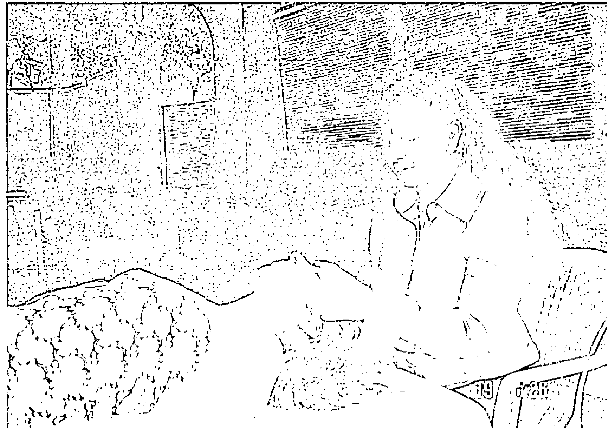

**第二手位**
自療：手指併攏蓋住太陽穴。
治療他人：拇指保持在眉毛上方和眉心間（第三眼位置），輕輕移動手掌至蓋住太陽穴，觸感要穩而輕柔。
益處：有助於放鬆顎骨連到頭蓋骨的肌肉，這裡常積存許多壓力和緊張。

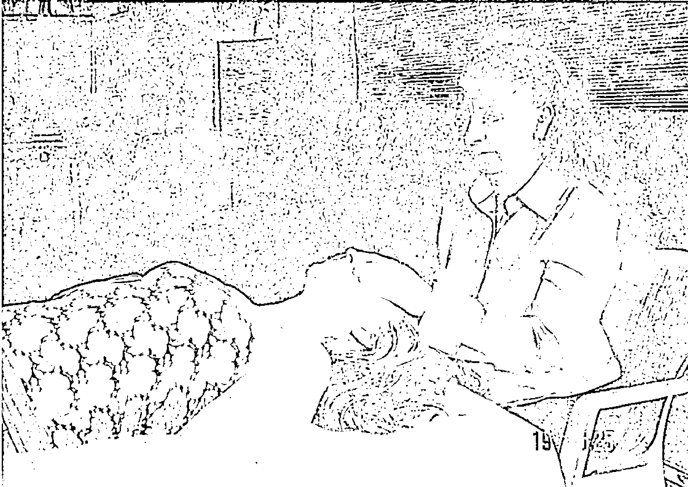

**第一手位**
自療：可以坐下或躺下，用雙掌輕輕蓋住眼睛。
治療他人：站或坐在頭部上方，指尖貼著顴弓（眼睛下方微微突起的骨骼）。雙手拇指稍微相碰，蓋住眉毛上方和眉心。食指不要太貼著鼻子，免得壓到鼻孔，這樣就能避免刺激甚至堵塞呼吸道。
益處：紓解眼壓，產生整體放鬆感。此外，所有頭部手位都能維持松果腺和腦下垂體正常功能。

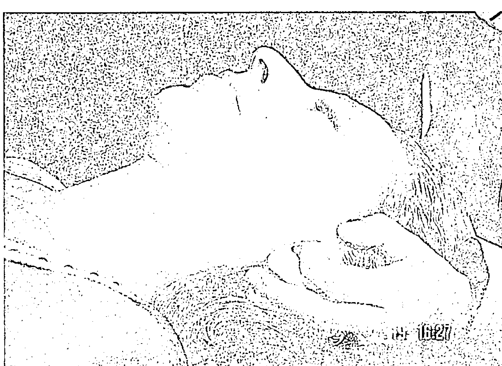

**第三手位變化式**
自療：雙手食指同時輕輕插入耳內（要小心），完全堵住聽道，其他手指和掌心則仍然罩住耳朵。
治療他人：同自療。進行時要靈巧準確，以免對方覺得自己的空間遭到侵犯。幾分鐘內，這個手位能帶來深沈的安寧感。
益處：有立竿見影的奇效，讓所有經絡的流動平衡穩定，你會立刻覺得充滿活力。有時感覺似乎拋開了一切世俗煩擾。

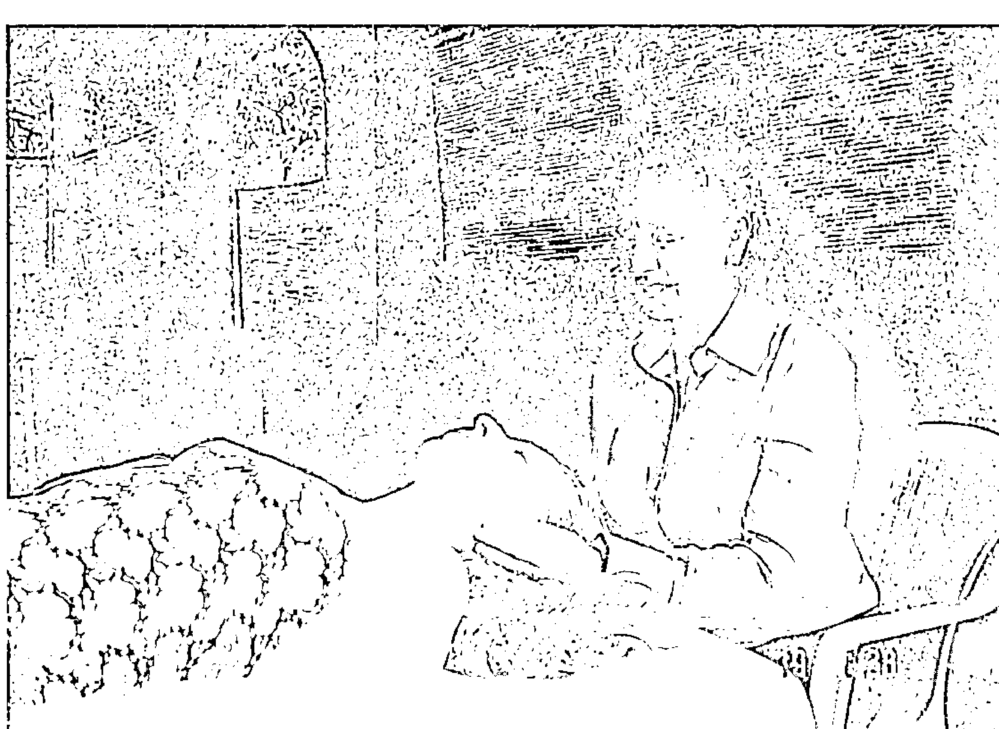

**第三手位**
自療：手指併攏成杯狀，搗住耳朵。
治療他人：同自療，手輕蓋著耳朵。換位置時一定先抬一隻手，然後再另一隻手。
益處：治療耳朵時，自然會補充全身能量。耳朵許多能量點與身體主要能量管道及各器官對應，因此和手腳的主要能量點一樣都會產生反射。正因如此，耳針和按摩耳朵周圍及內側能量點會如此有效。

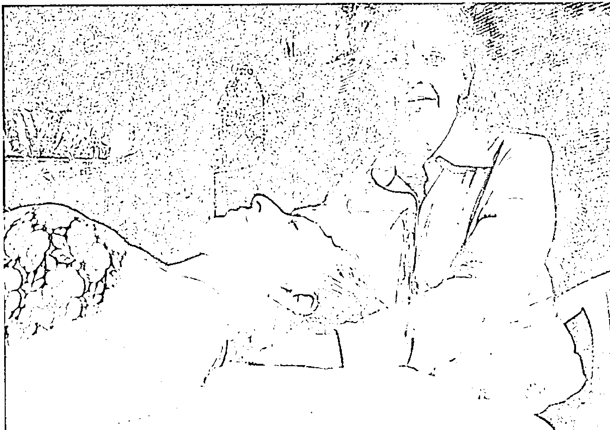

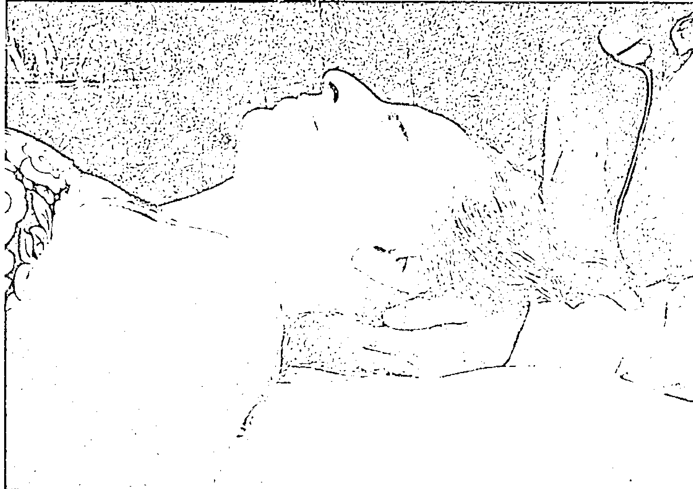

**第五手位**
自療：最好躺下進行。在頭一側放置枕頭，上臂擱在枕頭上，手掌放在額頭上。另一隻手如前一姿勢般，繼續托著後腦。
治療他人：如自療，一手放在後腦，另一手放在額頭。
益處：適合紓解頭痛，特別是過度緊繃造成的頭痛，另外也有整體放鬆的效果。

**第四手位**
自療：雙手舒服地托著後腦突出的部分。
治療他人：雙手合捧對方後腦，手指輕勾頸旁的頭骨邊緣。因為我們完全支撐著對方的頭，在心理上能產生呵護的效果。手就定位後手指完全放鬆。
益處：能深入放鬆頭部周圍凝聚的緊繃感。

**第七手位（無圖）**
自療：現在開始雙手沿身體中線「爬樓梯」：首先放在喉嚨上方的手保持原位，但稍微轉動，變成向前傾，朝著喉嚨下方，讓靈氣能量流向喉嚨下方的甲狀腺。將另一隻手貼著這隻手下方，兩手相碰（下方的手拇指碰到上面那隻懸在喉嚨下方的手的小指）。這樣也可以覆蓋到位於甲狀腺和心臟之間的胸腺。
治療他人：同自療。
益處：特別能強化全身細胞的新陳代謝，調節血液循環。由於胸腺和免疫系統關係密切，這個手位也能提升對入侵微生物的抵抗力。和一般看法相反，胸腺在青春期後並未停止作用，而是如新近研究所顯示，仍持續負責維持良好的免疫系統，特別是身體自然防禦機制，尚未被過多藥物和預防接種所破壞時。

**第六手位**
自療：放在後腦的手向下滑到後頸。另一手懸在喉嚨上方，手掌外側靠在鎖骨下方。
治療他人：同自療。確定手掌外側輕輕靠在對方鎖骨上，不會粗心滑到氣管上。治療這個位置時要非常專心。
益處：對喉嚨痛、喉炎和類似狀況很有幫助。

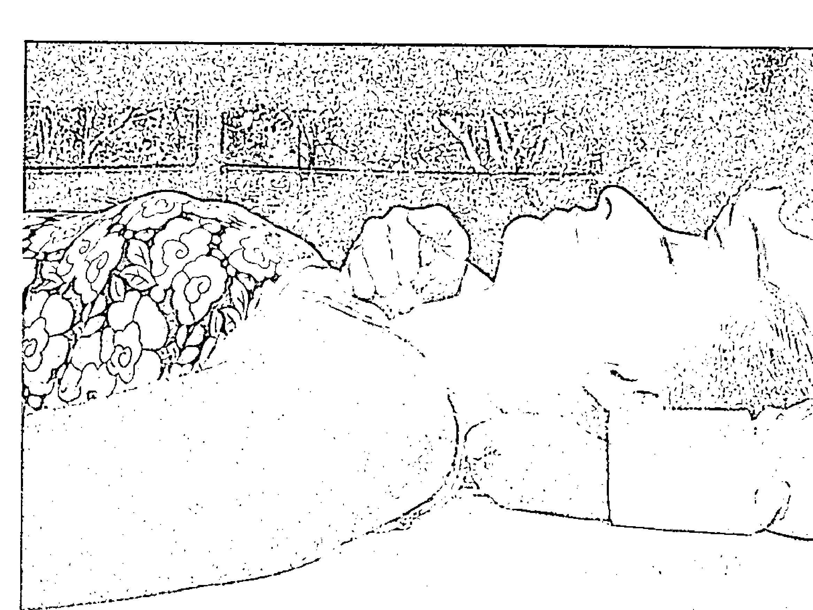

**第八手位（右圖）**
自療：雙手微成杯狀蓋在心臟部位。
治療他人：同自療。注意：治療女性時，可一手放在雙乳間，一手稍微下面些，形成「丁」字型。
益處：心理上，這個手位適合處理關於認同的課題和「缺乏愛」的感受。通常這代表內心深處排斥愛以及（或）自愛。至於身體層面，這個手位適合處理各種心臟問題。

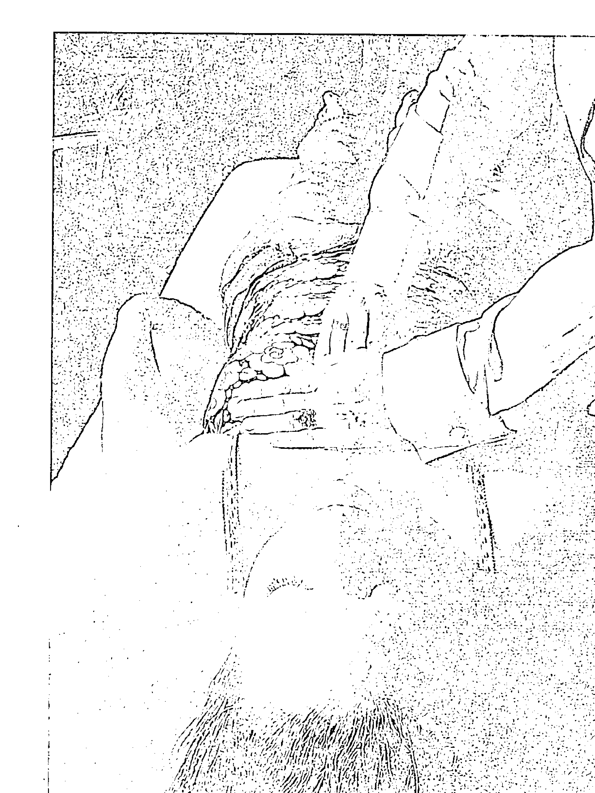

**第九手位**
自療：雙手放在太陽神經叢上（就在心臟下方）。
治療他人：同自療。
益處：幫助紓解胃痛或神經緊繃的狀況。在能量層面，此手位也可加速清除各種有關信任個人既有力量和智慧的課題。

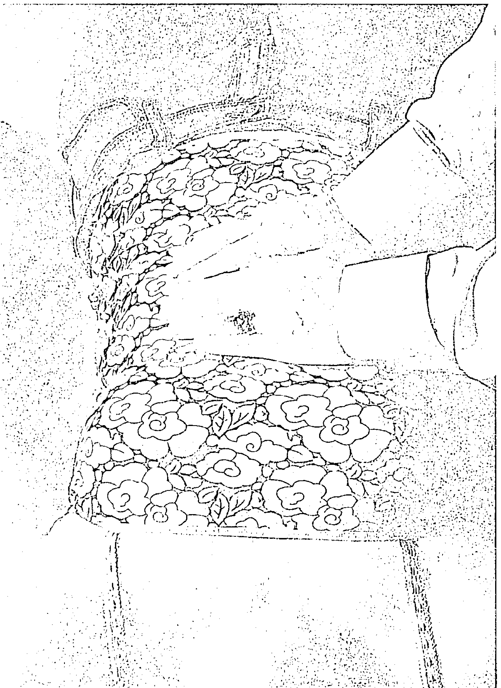

## 附錄 A 靈氣全身療程及不同治療手位對內分泌系統的影響

### 第十手位

自療：這裡要偏離身體的直線，覆蓋所謂的「四角」位置，從太陽神經叢右邊的肝開始。一隻手放在右胸廓右端下方，另一隻手等高併排，蓋住肝和膽囊。

治療他人：同自療。

益處：怒氣持續時間過久，或是覺得承受大量怒氣時，肝膽是治療重點。此外，這個手位有助於避免全身毒素積存過多，造成系統負擔。

### 第十二手位

自療：兩手分別放在兩側肺的上方。

治療他人：同自療。

益處：如果吸菸或住在有空氣污染的地方，這個手位非常重要。同理可證，這個手位對氣喘也同樣有幫助。

### 第十一手位

自療：蓋住第十手位對側，也就是一手放在左胸廓下方，另一隻手放旁邊，這樣就能覆蓋脾臟和胰臟。

治療他人：同自療。

益處：對糖尿病特別重要。

### 第十三手位

自療：將手放回身體中線，一手直接放在肚臍上，另一隻手併排放在下方。

治療他人：同自療。

益處：心理上，這個手位很重要，能幫助你觸及尚未察覺和壓抑的感覺。通常男性這個部位會導入大量能量，因為他們習慣壓抑感覺。治療這個部位，也有助於將需要感受的內在情緒帶到表面。這個部位以及心，都有助於處理憂鬱症。在身體層面，這個部位的能量大量進入，表示有消化問題或腸道病變。

### 第十四手位（女性）

自療：手掌成V字形擺放，雙手指尖朝內互觸，手掌放在恥骨枝上緣，也就是私處上方的骨頭，這能確保覆蓋到子宮和卵巢。

治療他人：雙手沿著腹部下緣曲線形成彎月形，靠在恥骨旁。

益處：有助於避免日後發生卵巢囊腫和子宮肌瘤。長期重複治療這個部位，也能平衡各種性事不協調的問題。這些問題都貯存在這個部位的細胞記憶庫中。

### 第十四手位（男性）

自療：雙手蓋著生殖器。

治療他人：可以將手懸空放在對方生殖器上方。比較理想的作法是，把手放在腹股溝淋巴結處，也就是位於大腿和軀幹連接處。最簡單的作法是，手掌相對，分別放在身體兩邊的腹股溝上。

益處：有助於防範日後的攝護腺問題，維持強壯正常的男性機能。幫助化解執著於隨時大展雄風的不正常心態，那其實是種尚未察覺的對軟弱的恐懼心態。

### 第十五手位

自療：如果之前躺下，現在要坐起身來，雙手分別蓋住膝蓋。坐在桌前或公車上也可進行。

治療他人：雙手同時蓋住對方兩膝。

如果使用治療床，這時可舒服地坐著治療，對方保持仰躺。

益處：對生活在現代充滿壓力環境的人來說，這是重要手位。根據身體心理學，膝蓋代表害怕改變，包括害怕肉體和自我的死亡。現代我們經歷變化的速度快得驚人，該多照顧膝蓋。

### 第十六手位

自療：雙手分別放在腳背。

治療他人：同自療。

益處：腳有對應全身的能量點。根據許多不同的能量醫學體系，腳是許多能量管道（經絡）的起點和終點，因此全球不同文化的民俗療法都會包括腳底按摩和足部按摩。

### 第十七手位

自療：雙手分別握住整個腳底。

治療他人：同自療。

益處：治療足部是全身治療的簡短版。這也能支持個人在直接的內在在外在體驗中有種落實感，支持個人掌握自己的人生。

### 第十八手位

自療：雙手放在肩膀上，指尖相觸，手蓋住脊椎上方第七節頸椎。有的人手臂交叉比較容易做。

治療他人：雙手成彎月形，一手指尖觸及另一手掌根，一手略偏，讓放在頸背的雙手略成V形。

益處：對傾向凡事一肩扛的人特別重要，尤其是女性，比男性更容易擔負起支持的角色。如果習慣性承擔照顧者的角色會造成許多緊繃和痛苦，或是肌肉產生硬塊，進而經常引發偏頭痛。

### 第十九手位

治療他人：雙手放在後心。

益處：心在背部加強治療並不為過。許多過度緊繃常積存在這個部位的棘肌中，治療此處是預防情緒創傷造成背部問題的好方法。

### 第二十手位

治療他人：手放在太陽神經叢後面。

益處：這個區域的緊繃通常和控制的問題有關。長期治療太陽神經叢背面，有助於更加放鬆，找回對自我才智的信任。

### 第二十一手位

自療：雙手放在後腰。

治療他人：雙手在腰部成直線打橫放置，一手指尖觸及另一手掌根。

益處：幫助舒緩腰痛以及釋放這個部位儲存的壓抑情緒。

### 第二十二手位

自療：雙手放在腎臟和腎上腺部位。把雙手叉在腰的最細處，向上約一掌寬處就是腎臟。腎上腺連在腎臟上，就在腎臟上方。

治療他人：同自療。雙手分別放在兩邊腎臟上，在腰上方一掌寬處，兩手排成一直線。

益處：承受許多壓力時，這個部位特別需要治療。腎上腺也支援腎臟、骨骼、骨髓以及脊椎的功能，因此治療這個部位能支持這些器官的功能。

### 第二十三手位

自療：雙手放在薦髂上（骨盆最頂端）。

治療他人：雙手在腰下方打橫成一直線，位於薦骨高度。手應該略成V形或彎月形，以配合臀部肌肉起點微彎的曲線。

益處：幫助紓解脊椎下端薦骨周圍的壓力。

### 第二十四手位

治療他人：結束療程並平衡脊椎能量時，一手在薦骨上方一兩吋處（二至五公分），感覺能量進入最強處，將手放在這個部位上。接著另一隻手懸在頸部基部第七節頸椎上方，找到能量感覺最強處，將手放在這裡。傾聽雙手，直到感覺兩邊溫度、振動、刺麻感、跳動完全一樣，或直覺感到兩邊能量已經平衡為止。接著在不驚擾被治療者能量場的情況下，緩緩將手抽離身體。接著一手比V字形（見後圖），將V形的手指放在第七節頸椎兩側，手指輕快地向下劃幾次，刺激血液循環，並喚醒個案。如果個案在治療過程中睡著，可以輕輕進行。

益處：平衡整個脊椎的能量流。由於脊椎是身體的中軸，具有平衡整體身心的效果。

靈氣作用的方式始終如一：提升生命能量，安定心神。換言之，靈氣能磨練能量，同時帶來平衡。全身愈常沉浸在靈氣中，振動頻率就會愈高愈平衡，也愈不容易失去協調、衰老退化。讓靈氣分布到全身的關鍵，就是特別重視內分泌系統。

內分泌系統和密不可分的神經系統，是身體主要調節器。內分泌系統包括多個內分泌腺體，產生的荷爾蒙掌管我們從小到大的生長，控制性功能發育。它和保護人體對抗疾病的免疫系統，也有密切關係和互動。這些系統和產生的荷爾蒙指揮各種身體功能，從呼吸、消化、生殖、乃至對抗疾病。它們讓人身體能應付冷熱、壓力和飢餓，避免脫水、感染、創傷和出血，同時還掌控體液量及其化學成分和平衡。

內分泌腺或稱無管腺，包括下視丘、松果腺、腦下腺、甲狀腺和副甲狀腺、胸腺、腎上腺皮質和腎上腺髓質、胰臟、卵巢（女性）和睪丸（男性）等。它們製造大部分控制人體多種功能和節奏的荷爾蒙，但有幾個其他器官也會分泌荷爾蒙。胃、肝、腸、腎和心都有細胞群分泌荷爾蒙進入血液，因此也是內分泌系統的一部分，不過嚴格說來，它們本身並非內分泌腺。

這篇短文無法詳述內分泌系統的整個運作，在此舉兩個實例就足以貼切說明。這也許能讓你更明白內分泌系統的重要，進而有心多了解，並導引更多靈氣進入內分泌系統。

### 松果腺的作用

自古以來，松果腺就被認為很重要，雖然在大部分歷史中，特別是西方文化，對這個因松果狀外型而得名的小構造了解並不多。法國哲學家兼數學家笛卡兒認為，松果腺是身心交會的神祕地帶。如今我們有更清楚的認識，知道松果腺像是內在時鐘，調節人體二十四小時的節奏，確定我們順應每日和季節的變化。松果腺調節人體清醒與睡眠的週期，與地球日夜循環一致，讓我們能與自然同步。

調節人體清醒和睡眠週期只是松果腺諸多工作之一。根據最近的研究，松果腺更重要的功能，類似體內終身的定時器。在這方面，松果腺扮演人體老化時鐘，控制老化過程，釋放荷爾蒙褪黑激素，傳送訊息給體內其他系統，告訴它們如何和何時變老。

換言之，人體發育、成熟和衰老都是由松果腺中的褪黑激素含量所指揮。成年人褪黑激素含量高峰是在二十歲左右，到了六十歲，含量只剩一半，而且還會大幅下滑，持續加速衰退過程，也就是一般所說的「老年」。

問題是，這個松果腺功能的新發現能否提供線索，讓我們減緩老化過程？很有可能。有些人甚至建議，給與人體荷爾蒙補充劑，不但能停止，甚至能逆轉老化過程。就靈氣而言，另一個問題應運而生。如果真能透過補充人體的褪黑激素，重新設定松果腺的老化時鐘，經常對松果腺做靈氣治療，能否達到同樣目的，以強壯健康的人體維持生命，即使到老年亦然，讓人能沒有典型的老病痛而終？歷史記載，道家、譚崔大師和得道者，修行時會導引並運用宇宙生命能量，在在說明這是事實。

這讓我們不得不承認，高田女士畢生強調內分泌系統是多麼高明的創見，因為大部分現有的內分泌系統知識，在一九八○年高田女士過世前都尚未問世。事實上，一直到七○年代末期，大部分研究人員仍認為腺體和器官系統是各自運作，彼此毫無關係。後來才證實，內分泌系統的腺體和免疫系統的細胞一直有聯絡和互動。更後來才發現人體一定有某種主管機制，專門協調資訊交換，以執行所有功能。

松果腺就是這個主管單位。只要松果腺產生足夠的褪黑激素，免疫系統就能保持活躍，人體就能繼續保有大量淋巴球（能產生抗體，壓制入侵者），甲狀腺的荷爾蒙也能維持高標，提供相對的活力，很可能到了晚年，我們還能一直保持健康，也不會罹患和老邁相關的癌症。所以經常以靈氣治療松果腺，不只能促進長壽，還能大幅提升生命品質。

### 靈氣紓壓效果

靈氣最重要的特質就是釋放緊繃和壓力。靈氣作用在於安定心神，提升生命能量，它以這種方式對免疫系統發揮強大的療癒效果，也許因此預防了許多壓力導致的疾病。

壓力會對免疫系統造成嚴重傷害，許多相關研究證實，壓力的確會導致疾病，而且至少是許多疾病的成因之一，更常常是實際誘發疾病的原因。人類壓力有許多形式，例如家庭衝突、工作焦慮、睡眠剝奪、現代常見的感官過度刺激，同時加上缺乏運動、照顧久病親人等等。免疫抑制和壓力因此可被視為同義詞。

換言之，生活壓力愈大，愈認同這個壓力，視自己為受害者，免疫系統愈會受到抑制，也愈可能罹患壓力導致的疾病，特別是面對外在壓力會產生更多內在衝突和壓力的人。

基本上，壓力會喚醒「打或逃」的反應，刺激交感神經系統，壓制在休息、放鬆、靜心和熟睡時掌管身體功能的副交感神經系統。我們都知道，副交感神經系統發揮作用時，免疫系統功能會比較好。相對地，人體在準備打或逃時，應付入侵的微生物絕對不是第一優先。

壓力會引發腎上腺素分泌，抑制白血球功能，降低淋巴球產量。持續受到外在和內在反應的壓力影響，甚至可能導致免疫系統的主要腺體胸腺萎縮。免疫系統活動顯著降低，是立即而長期的結果，顯而易見，壓力真的會傷害免疫功能。

經常對內分泌系統的所有腺體做靈氣，特別是胸腺部分，能抵銷這個趨勢，進而改變大腦的神經傳導物質，因為你會逐漸接受更正面的想法，例如愛、慈悲、和平、個人勇氣、承諾和自我覺悟。

我們從個人經驗知道，負面思想會讓人低落，換言之，會抑制免疫系統。相對的，清楚感受正面思考時，能激勵免疫系統。探討正面思考對大腦神經傳導物質影響的研究，每年都在增加。將研究焦點從引發疾病的機制，轉向促進健康的機制，本身就是很健康的轉變。

藉由治療他人或自療時，強化人體內分泌和免疫系統間的互動，以及這些系統與大腦的連結，主動支持神經免疫機制，靈氣已迅速成為溫和的身心療癒方式。經常使用宇宙生命能量，人生各方面都能受惠。

只要不時做靈氣，身體、情緒、心理和靈性四大表達層面，都會因為經常使用宇宙生命能量而改變。日常生活中，你會發現嶄新、相互提攜和有益成長的平衡。你會直覺地知道工作多久算適當，何時該玩耍，何時和何處可以敞開接受愛，以及表達對自性深刻的信賴。

## 附錄 B 選擇靈氣療法的理由

自然療法主張，其實只有一種療癒力量存在，就是自然本身。靈氣稱這股療癒力量為宇宙生命能量，包括不限於一般人體對抗和克服疾病的天生復原力。宇宙生命能量的另一個附帶益處，是觸及並包括在時時刻刻的覺察中究竟開悟的可能。因為靈氣直接運用能量，本身被視為是一種能量醫學。

和其他自然療法一樣，靈氣也強調保持健康和預防疾病的重要。對追求身心健康而言，這比一般著重治療既成疾病的方式，更便宜有效。就連對抗醫學的細菌之父巴斯德，晚年也這麼承認。終其職業生涯，巴斯德極力宣揚其理論，認為所有疾病都是各種具有感染力的微生物所造成。他秉持這個看法，和同儕法國科學家伯納德（Claude Bernard）對立，後者認為個人對病菌的抵抗力，要比微生物本身更重要。雖然巴斯德最終說服大眾認定他的理論正確，但他自己卻坦率認錯，因為他在死前不久親口說過：「伯納德是對的。病原體算不了什麼。土壤（人體）才是最重要的。」這表示就連巴斯德最終也了解，人體內部環境好壞，要比病菌和病原體更能左右一個人是否容易生病。

雖然抗生素治療嚴重感染和危及生命的疾病非常有效，但執著於殺死入侵微生物，而非透過保持良好健康和身心平衡，以強化並支持免疫系統的普遍態度，自然而然導致許多濫用情況發生。濫用強力抗生素，例如不假思索就開始一般感冒或流行性感冒的情形，在世界許多國家已經很猖獗。過去四、五十年來的濫用，這些抗生素面臨失效的威脅，因為愈來愈多病菌已經產生抗藥性。許多專家認為，我們已經活在「後抗生素時代」，許多傳染病再次猖獗，幾乎就像「前抗生素時代」時那樣藥石罔效。

因此以自然療法或靈氣保持健康，對於個人身心健康，還有建立整體上更健全的醫療體系，都非常重要。為了能有更健全的醫療方式，許多醫學先驅一直在找尋更整體的體系。

雖然他們仍屬弱勢，但人數正穩定增加。由於保險公司根據所謂「管理照護」架構，強制規定醫師可以採行的治療方式，醫師開始痛苦地意識到，現代醫療產業混亂又毀滅性的作風，傷害了真正的醫療照護。

老實說，目前認為身體沒生病就是健康的主流體系，幕後有太多糾葛。基本上我們再也無法承擔會讓身體和財務破產的作法。我們別無選擇，只能支持讓我們能學會保持健康的技巧和療法。下列數據不言而喻：

〈美國健康促進期刊〉（American Journal of Health Promotion）報導，美國一九九四年花了一兆美元治療疾病，美其名為「醫療照護」的支出，在過去十五年狂飆百分之三百。疾病顯然是個大生意！目前疾病治療支出占美國全國生產毛額百分之十五以上，而且以通貨膨脹率兩倍的速度持續成長（一九三○年時只占百分之一．九）。

顯然其中大有問題。因為美國人不止花更多錢治病，而且平均而言，也比過去醫療費用只有今日百分之十的時代更不健康。這究竟是怎麼回事？

原因很多，可以總括為兩個：一九二○年代，大型利益團體開始推動立法，嚴禁醫療院所使用輔助療法，至今此風仍盛，不斷限制甚至施以恐嚇。與此同時，藥廠透過各種假慈善為名的基金會，捐輸鉅款到醫學院，慢慢讓課程走向變得對他們有利。簡言之，疾病開始有商業價值，健康則被棄若敝屣。

六○和七○年代，政府介入讓情況更糟。聯邦和州政府單位補助，讓畢業的醫師人數暴增，在一九六五年到一九八○年間增加一倍。一九九二年時，每十萬名美國人有兩百四十五名醫生，而一九七○年時不過是每十萬人有一百五十一位醫生，成長率高達百分之六十二！而且大部分新出爐的醫師並非家庭醫師，而是開立並使用最昂貴醫療程序的專科醫生。

乍看這也許是現代醫療之福。現成的專科醫師愈多，不正表示美國人享有更好的醫療照護嗎？不見得。八○年代後期一份研究發現，在同時期中，每十萬人有四．五位外科醫生的地區，做了九百四十次手術，而每十萬人有二．五位外科醫生的地方只有五百九十次。說白一點，外科醫生人數加倍，結果手術量也加倍。這下問題來了：這些手術都是必要的嗎？

絕對不是。〈美國醫學協會期刊〉（Journal of the American Medical Association）刊載的另一份報告，針對一百六十八名預定或被建議接受冠狀動脈繞道手術的病人研究，結果發現其中八成不是沒必要就是不適合。換言之，一百六十八名預定動手術的病患中，只有不到三十四人真的需要。

我們對疾病治療和醫療體系的看法有許多錯誤。醫療產業靠疾病大發利市（而非靠健康和身心健康），難怪再也沒人說治療是種藝術。照現在的遊戲規

The request was rejected because it was considered high risk

# 健康種子系列 23

# 靈氣108問——以雙手傳遞宇宙生命能量的新時代療法

原著書名/Exploring Reiki : 108 Questions and Answers
作 者/萊絲蜜·寶拉·賀倫 (Laxmi Paula Horan) 博士
譯 者/欣芬
執行編輯/郎秀慧
總 編 輯/賈寶敏
發 行 人/許宜銘
行銷經理/陳伯文
出版發行/生命潛能文化事業有限公司
聯絡地址/台北市信義區(110)和平東路三段509巷7弄3號1樓
聯絡電話/ (02) 2378-3399
傳 真/ (02) 2378-0011
網 址/http://www.tgblife.com.tw
E-mail/tgblife@ms27.hinet.net
郵政劃撥/17073315 (戶名：生命潛能文化事業有限公司)
郵購九折，郵資單本50元、2-9本80元、10本以上免郵資

總 經 銷/吳氏圖書有限公司·電話/ (02) 3234-0036
內文排版/普林特斯資訊有限公司·電話/ (02) 8226-9696
印 刷/承峰美術印刷·電話/ (02) 2225-7055

2006年11月初版
定價：240元
ISBN-13: 978-986-7349-37-8
ISBN-10: 986-7349-37-7

EXPLORING REIKI © 2005 Dr. Laxmi Paula Horan. Original English
language edition published by Career Press, 3 Tice R., Franklin Lakes, NJ
07417 USA. All rights reserved.
Chinese Translation © 2006 by Life Potential Publications.
行政院新聞局局版台業字第5435號 如有缺頁、破損，請寄回更換
版權所有·翻印必究

# 國家圖書館出版品預行編目資料

靈氣108問/萊絲蜜·寶拉·賀倫 (Laxmi Paula
Horan) 著；欣芬譯. -- 初版. --臺北市：生命潛
能文化, 2006 [民95]
面； 公分. -- (健康種子系列：23)

譯自：Exploring Reiki : 108 questions and answers
ISBN 978-986-7349-37-8 (平裝)

1. 治療法—問題集 2. 健康法—問題集
3. 能量—問題集

418.9022 95019863

靈氣是來自宇宙的生命能量，透過雙手接觸身體來傳遞，使用精微的靈氣能量能預防疾病，為身心帶來每日的和諧，同時能對抗特定的急性和慢性病症。

《靈氣108問》以淺顯平易的文字，解釋一百零八個修習靈氣時最常見的問題，藉此介紹這個日益流行的雙手撫觸療法。書中涵蓋所有初學者想知道的實用問題，兼顧了深度及廣度。本書由經驗豐富的靈氣老師，為好奇的入門者提供靈氣的第一手資料，也為熟練的修習者解答靈氣運用上的相關疑惑。

二十多年前靈氣傳入西方後，修習者從美國、加拿大零星的數百人，已經成長到遍及全球各國數百萬人口。靈氣傳播的速度既快且驚人，而且相當成功。由於靈氣屢受肯定，一些國家的保險公司已經將靈氣治療列入醫療保險給付的項目；書中附錄的三篇文章，說明靈氣為何與整合醫療以及更合理的醫療體制契合。相信日後靈氣學習勢必會成為一股風潮。那麼在此之前，先閱讀這本坊間少見的介紹靈氣的書，你會比一般人更快速容易地接收到這股優異的能量，並為你的生活帶來微妙的改變。

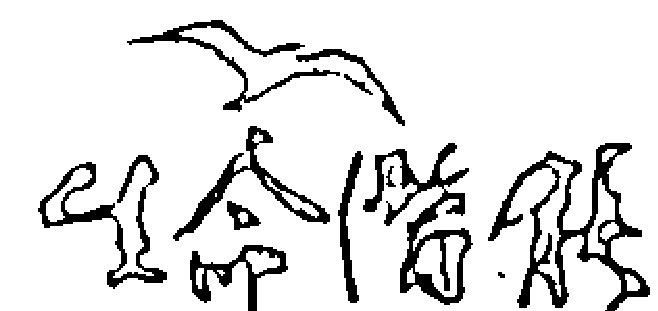

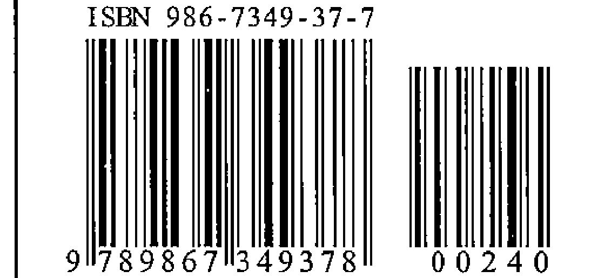