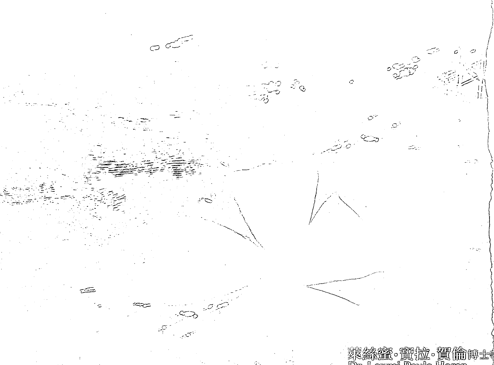
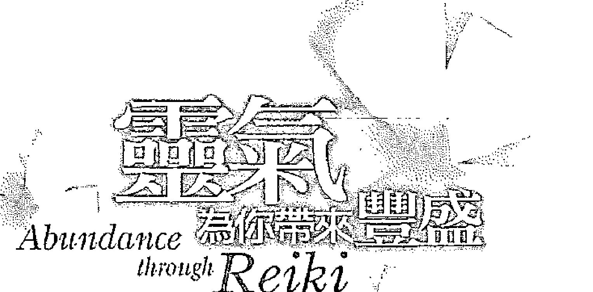
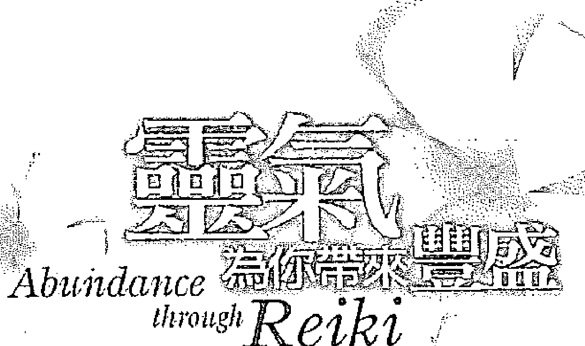
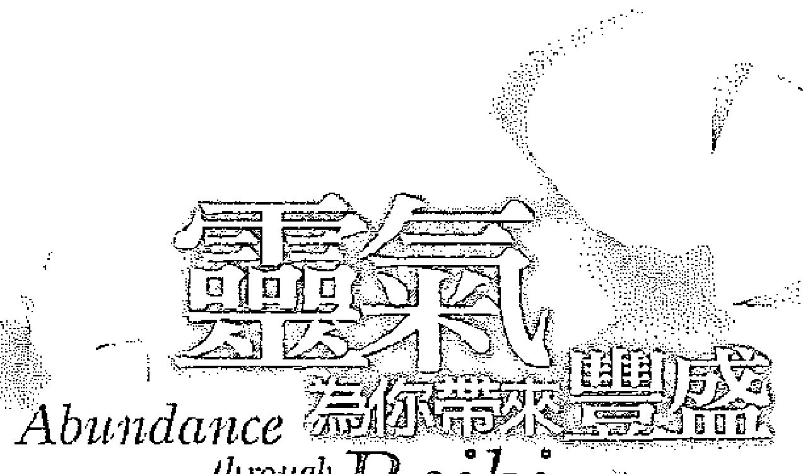
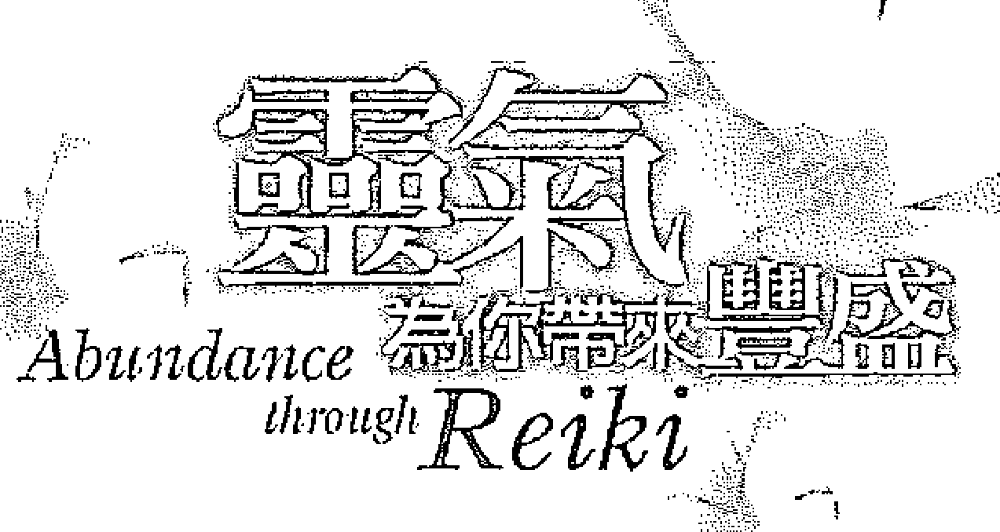
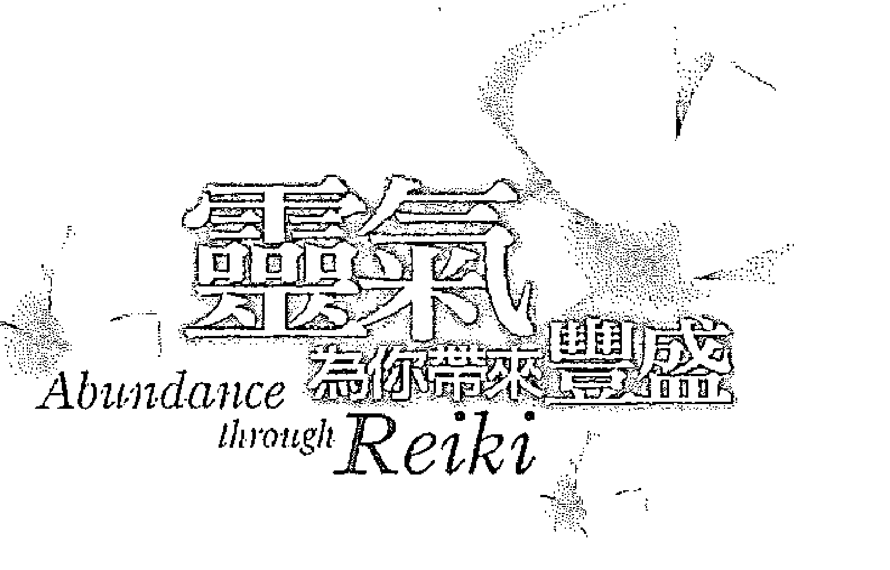
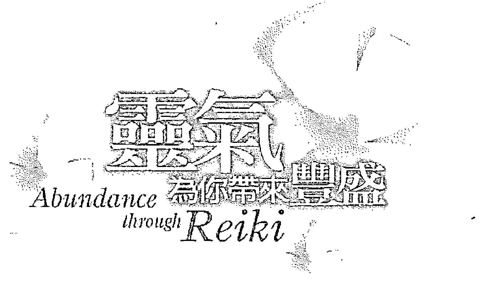
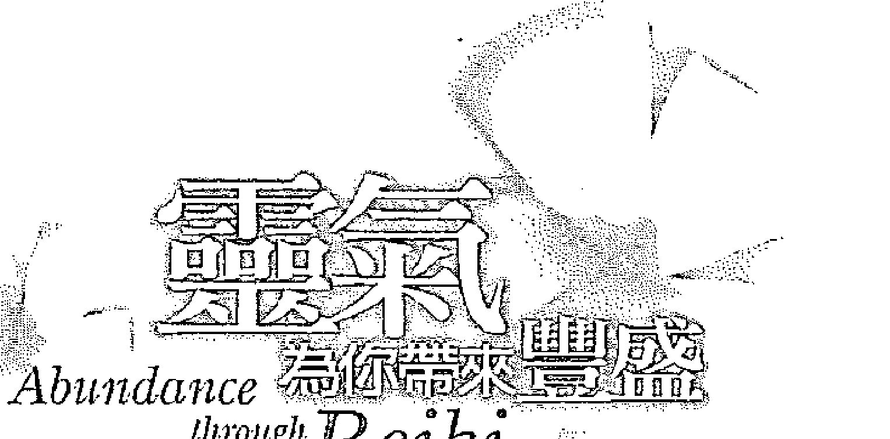
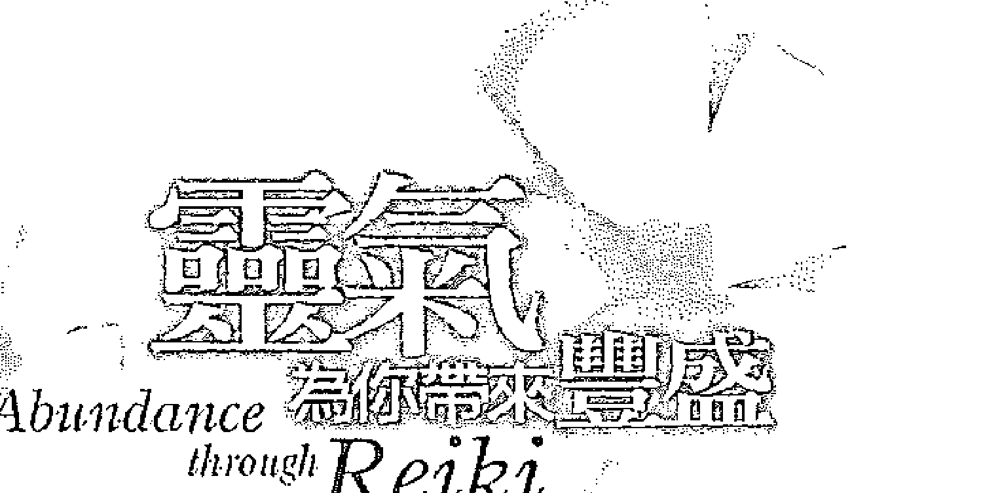
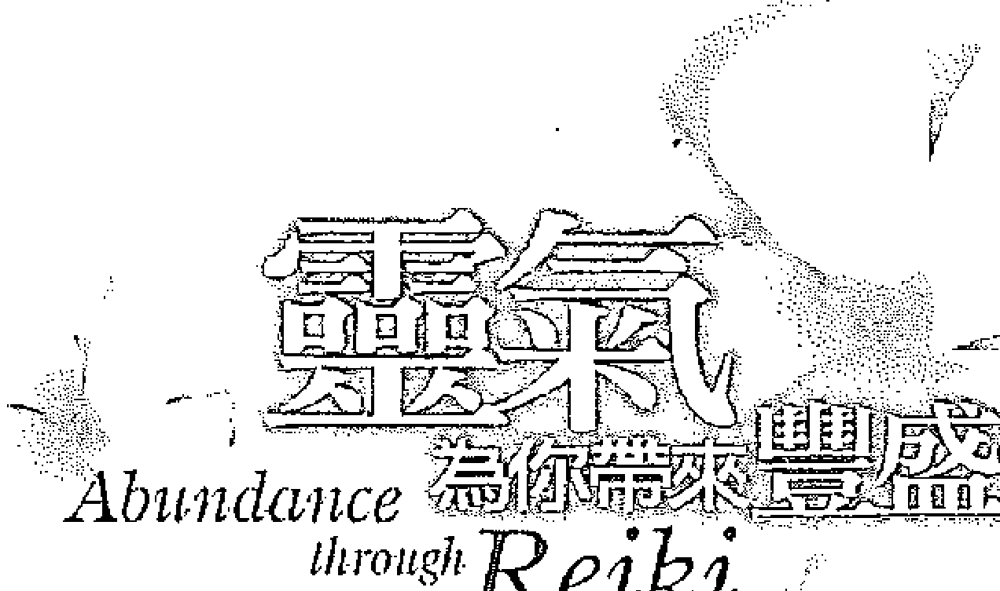

# Health Seed 健康種子 25

## 靈氣為你帶來豐盛

# Abundance through Reiki

遠離匱乏、體驗豐盛的42天靈氣方案

萊絲蜜·寶拉·賀倫博士 著
Dr. Laxmi Paula Horan
胡澤芬 譯

~獻給彭加（H.W.L. Poonja）~

他開啟我的心

接受超乎智識的真我光輝

# 目 次

中文版序 尋找深刻的平靜感

推薦序 宇宙法則的自然律動 莫雪子

本書介紹 21

第一章 關於靈氣能量的介紹 29

第二章 豐盛的意識 41

第三章 進入豐盛之旅 59

第四章 四十二天核心豐盛方案 107

二十一天消除匱乏計畫 121

二十一天完全豐盛計畫 156

第五章 四十二天豐盛方案經驗談 177

## 第六章 實現目標九部曲

- 一、投入真心的願望 196
- 二、設定優先順序 198
- 三、展望目標 199
- 四、愛你的選擇 200
- 五、感恩 201
- 六、願意領受該得的 202
- 七、以言語宣告 204
- 八、採取行動 206
- 九、臣服於真我 207

## 第七章 體驗意識的轉變

# 中文版序
尋找深刻的平靜感

很高興能為《靈氣為你帶來豐盛》的中文版作序。自從本書的原始英文版，以及後續其他語言版本發行以來，我收到讀者來信，說他們從書中得到有用的見地。但最讓我開心的，還是那些完成書中四十天方案的人所告訴我的故事。大部分貫徹到底的人，動機都是因為人生面臨重大危機。

透過實踐這個方案，他們發現問題和常見的匱乏感，都是自我作崇。一旦放下對自我的執著，問題也隨之放下。他們依照方案的指示，感受自我不斷在欲求和抗拒之間的擺盪，因而得以超越自我的機制，發現自我之外的平靜。實相不二分的本質是不受問題罣礙的，因為基本上發生問題的「一」並不存在。

他們的經驗無法透過尋常感官去認知，只能靠體驗。而其成果頂多只能描述成體驗者（自我）消融，生命變成「體驗當下發生的一切」時，所感受到的喜樂。各位會在本書中讀到這種描述，但唯有透過實際演練，才能將之內化並充分具體化。就像修習靈氣，只要簡單地擺放雙手，加上某種「傾聽」能力，注意正在自行發生的一切；本書的方案也只需要差不多的時間和關注。

和十年前本書剛出版時相比，如今世界整體狀況更為快速浮動。在這每個轉折似乎有著大大小小危機的世界，本書的方案更加有其必要。我們更需要找到自己內在深刻的平靜感，以度過周遭的混亂。我們需要調整自己渴望迅速「解決」問題的看法，那正是我們分散注意力的一大主因。

現在最需要的，是認知到必須放慢腳步，達到一種放鬆的狀態，幫助我們找到自己天生的平衡，進而影響周遭的環境。要做到這點，必須培養全新的態度，願意去感受既有的狀況，而非老是用頭腦去理解事物。我們真正的悟性存在於內心，而非頭腦或智力。頭腦的才智雖然有用，但只是輔助工具。當我們有意識地決定臣服於更偉大的悟性時，生命會變得更有效率和喜悅。一旦學會與這種悟性同步，我們會發現內心的智慧在各種狀況中反應更得體，而且更敏捷。

四十二天豐盛方案的淵源為東方古代傳承。這個實驗性的方法能讓參與者一瞥實相的不二本質。這個方案受到知識瑜伽（Jnana Yoga）影響，知識瑜伽是印度一些偉大成就者所傳授，克服頭腦的方法，其要素可見於道家的「道」，還有藏傳佛教的大圓滿和大手印教法。

常常，靈性的追尋起於我們認知到自己面對生命的老方法，在現實中並不管用。我們也許終於開始注意到，同樣的老問題一再重演，只是換個樣子而已。似乎在生命給我們重大挑戰時，我們才願意花時間深入探究自己的真正本質。但聰明的作法是在生命順遂時就開始探究，這樣我們既有支持，也有時間靜思，因此能有更充分的準備，面對對生命的起起伏伏。

靈氣的療癒，是由修習時產生的寂靜心念所喚起。白井先生的主要動機是分享靈氣，幫助人們提升覺知力，以開悟的終極療癒為目標。同樣地，我也希望這個方案能讓參與者對實相有足夠的體會，受到啟發，繼續思索覺知本身，而非外在的形式。

火豬年五月十五日

# 推薦序
宇宙法則的自然律動

你會拿起這本書，是因為你已經準備好要進入豐盛富足之旅。信任你的直覺，這個契機將為你展現豐富的健康、豐富的愛、豐富的財富以及豐富的體驗。

現在你只要敞開心胸，保持覺知的順著流走，在本書作者——寶拉女士睿智的引導中，你將依循宇宙法則的自然律動，與內在的神聖本質融合。你將毫不費力的在美麗優雅的詩意中，醒悟到真我的本源，讓自己依循內心的願望，進入豐盛的源頭。

無論從什麼角度來說，人類都處於進入新的思想意識與新活動的時代。舉凡能量運用的新技術，新能源的啟示，或是將能量運用在人類的進展上，已經在全球掀起一片熱潮。千禧年帶來了超越物質的靈性意識及宇宙能量的運用，使地球進入新的文明，但也為宇宙萬物帶來巨大的衝擊。

本書中諸多論述值得我們深入體驗與沉思，誠如一個人或團體在紊亂與負面思想的感受中時，這股能量將在他個人或團體的周圍環境中放大其混亂與負面的作用。反之，如果你熱忱的將愛、喜悅、勇氣與信心充分表達在自己的生活中，你自然會吸引源源不絕至善的能量。

就在人們接受了量子物理學的概念，理解所有物質都是能量的不同呈現，而各種情緒的反應及身體的健康與否，也是以不同頻率的能量在傳遞著之後，你會認知所有發生在你身上的任何事件都其來有自，但卻苦無對策。

# 宇宙的三個法則

我的靈性導師：安東尼·莫珍（Antoinette Moltan），在傳遞給人類的訊息中，曾明確的闡述宇宙的三個法則，第一個法則是『愛的法則』。一個人的心中是否有愛，決定了他是否能接受到宇宙大能。每個人必須超越個人的偏見與自私，進入愛的交流與共享中，進入事奉與內省中，並看到自己是神聖計畫的一部分，才能從中汲取使意識擴展、使靈性成長的力量。愛必須經由個人的力量來彰顯。

宇宙的第二個法則是『真理的法則』。真理使人們在任何時候都能識別一切行為是否正確。每個人都需要從經驗與靈性的領悟，選擇如何學習自己生命的課題。愛與真理必須同時存在於表達中，愛使識別真理的力量更加擴展、茁壯，使識別不致固化成批判。人們以為愛是接受一切，真理以敏銳的認知修正這種接受，使愛的能量不致因不正當地利用而徒然耗損。

由前面兩個法則所延伸出來的是第三個『維護能量循環的法則』。從任何一個能量中心點所導引出來的能量，將回到其中心點，以完成它的循環。同時，任何收到能量的地方，都必須從它的核心以同等的能量付出，才能獲得平衡。宇宙聖愛的能量，將在循環的法則中，無條件地給與任何需要的人。

既然靈氣是宇宙生命的能量，而每個人也都是宇宙生命能量的化身，當我們對宇宙法則有了深切的認知，我們即可從容自在以感恩的態度，與靈氣的能量一起運作，並賦予它生命的動力，開始進行「四十二天核心豐盛方案」。

在第一個二十一天的核心方案中，寶拉女士巧妙的結合了身體的七個能量中心，並對每個脈輪相對應的功能與要素，有著精闢的闡述。我個人在方案進行的過程中，每進入一個脈輪，將意念集中在能量中心點時，其脈輪的色光，就會自然的被啟動，當下我不做任何觀想，只是讓色光輕盈的如是存在，之後就全然的隨著書中的引導，觀照自己所有的抗拒、一切的欲求，以及深切的感恩我所擁有的一切，並熱忱的接受任何被激發的情緒。

每做完一個練習，在無意亦無念的當下，整個身心猶如晶瑩剔透的水晶，純淨明亮。感受宇宙大愛在我的生命核心中流動。

當你進入第二個階段的完全豐盛計畫，每一天我們都有機會敞開自己，當下接受自己完全的富足。尤其是在宣讀「核心宣言」時，我們不僅會被無垠的宇宙大能感動，那如是存在的真我，也昇華了我們的振動頻率，一念之轉直驅無盡富饒的源頭。

誠摯的為你推薦這一本《靈氣為你帶來豐盛》，它將隨著你自由意願的開展，循序漸進的引領你進入「無為而為」的豐盛喜悅與幸福之中。

感恩靈氣導師——萊絲蜜·寶拉·賀倫女士，無私的分享與教導。感恩你與我們一起進入豐盛富足之旅。

現在讓我們共同感恩宇宙給予我們的一切，及每一個機緣。感恩大地之母，讓我們具有力量的屹立在地球上。

# 莫雪子

- 十五年來持續探索著新時代的訊息，及宇宙能量的研修與運用，致力於國內外帶領「靈氣傳授」、「光的課程」
- 台灣靈氣文化研究協會創辦人，現任喜馬拉雅生活空間執行長，國際卡魯那靈氣台灣分部負責人，白井靈氣、卡魯那靈氣認證教師
- 網址：http://www.reiki.org.tw http://www.hlspace.com

# 致謝

這本書和我前一本書相隔將近七年。當時我覺得自己對於靈氣的表達已夠完整了。但之後發生了許多事，開啟我接觸更深入的知識，「存在感」也更深入強烈。我很慶幸有機會修習靈氣，並在全球教學。

過去幾年和精神導師彭加（H.W.L. Poonja）的關係，成為我最大的靈感來源，因此我懷著深深謝意，將本書獻給他。他無條件的愛和敞開的心靈，讓我見到真我（Self），也就是宇宙生命能量的本源。

我也要感謝印度夥伴烏朋（Upen）及安加那·丘西（Anjana Chokshi），因為某方面來說，是他們促成我寫出本書。他們兩人都是成功而認真的靈氣師父，鼓勵我探索真我和宇宙生命能量間的一致性，並將成果和大家分享。

我也要感謝父親羅伯·賀倫，他再次提供家中的安靜空間，讓我能在將想法形諸文字。感謝外子馬太德奈 (Matthias Dehne) 給我的幫助、靈感和合作。從第一次討論本書構想，一直到寫作和多次改寫的過程，他都全程伴著我。

我的第一本書《靈氣給你力量》(Empowerment Through Reiki) 已經翻譯成十五種語言，在許多國家大受歡迎，被視為靈氣的基本參考書。

> (編註：《靈氣給你力量》目前沒有中文版本，由生命潛能出版的《靈氣108問》是寶拉較新的著作)。我要感謝出版商的熱誠及孜孜不倦的努力，讓本書得以付梓。

對於所有把自己獨特的「豐盛大餅」分享給我的人，我衷心感激，願你們順利邁向更豐富的旅程。

# 豐盛之歌

每個當下／就在這一刻／置身此時此地
不過是一涓滴／流入大海

每個當下／就在這一刻／「作為」停止
就此罷休／自會開花結果

每個當下／就在這一刻／心即是愛
在愛中得到撫慰／永不止息

> ——那拉揚 (Narayan)

# 本書介紹

如果靈氣是宇宙生命能量，你我都是同樣的宇宙生命能量，那就能明白白井自然療法是輕鬆自如的過程，給予自己和他人更多我們的既有本質。

《靈氣為你帶來豐盛》以非常實用的方式，介紹宇宙生命能量和真我之間的連繫，讓你覺醒，深入認識豐盛——你的真正本質。我個人的實例和其他人的經驗證明，透過使用宇宙生命能量，可以擺脫情緒的糾纏和堵塞。除此之外，練習的文字和說明，點出透過自我探索讓自己實現圓滿（fulfillment）的方式。透過深入傾聽和體察自己，你會發現這種圓滿和真我無分軒輊。換句話說，靈氣——白井自然療法，最終將帶你體會到，自己就是靈氣，或說宇宙生命能量。

過去幾年靈氣在世界各地盛行。愈來愈多靈氣修習者完成全部三級的點化。我的第一本書《靈氣給你力量》在一九八九年出版後，發生了許多變化，有更多報章雜誌和書籍談論宇宙生命能量。大部分出版品都著眼於身體和（或）心理療癒。不難了解為何這部分會被強調，因為良好的身心健康是每個人都希望實現的圓滿。

但是成為靈氣師父近二十年，我對靈氣的體驗和教學稍有不同，而是帶著童真的開通，還有存在的總體感，一種智識無法理解的能量流過一切，改變人生各個領域，以豐富嶄新的洞察力和經驗，讓一切更充實。靈氣是種生活的藝術，就最深的層次而言，靈氣就是「合一」（Oneness）。

我們對自己真正面目的宇宙生命能量臣服得愈徹底，就愈能敞開接受其轉變的力量，愈加鑽研，就愈覺得神秘莫測。這一切變得愈來愈難以解釋。幸好有靈氣，讓一切不再是問題，因為在多年修習過程中，我們常拋棄對理智解釋的耽溺，轉而開始活在當下。我們以立即自發的感受，從直覺層次體驗生命，不再靠頭腦還有搞分裂、區分彼我的念頭。

# 本書介紹

本書基本上分為兩部分。前三章說明靈氣的一些屬性和特質。我也以自己的靈氣經驗，說明靈氣如何成為我實現完全圓滿（absolute fulfillment）的途徑。第四章起為第二部分，解釋實現完全圓滿的四十二天方案，提供方便使用的提示，並說明完成方案後的正面改變。

事例和練習都是要幫助你敞開接受豐盛和圓滿，還有你本質內在難以想像的富有。由於本書的重點是豐盛，我並不會深入探討宇宙生命能量的其他層面。如果想多了解點化、治療手位，還有宇宙生命能量的療癒層面，可以參考我的其他靈氣相關著作。我建議最好是上靈氣課接受點化與學習手位，上課前要慎選老師。

並非一定要上靈氣課，才能成功實現完全圓滿的四十二天方案。在邁向豐盛的路上，不一定要使用靈氣才會有好成果，但靈氣能在路上支持你。如果你想將靈氣整合到四十二天方案中，就要修習靈氣，表示你起碼要接受過第一級點化。無論如何，實際練習是讓靈氣發揮效果的不二法門。閱讀靈氣相關文章雖然有趣又有啟發性，但要有實際成效，唯有充滿愛心地經常使用靈氣才會管用。施行靈氣最好採用全身療程，也可自發地將手放在身體需要宇宙生命能量的部位。要用特殊手位處理的特殊狀況少之又少。

因此，《靈氣為你帶來豐盛》適合所有想透過直接體驗真我來體會深入圓滿的人，也適合所有靈氣修習者，把靈氣視為包羅萬象的途徑，以源源不絕的宇宙生命能量充實生命。

本書的目的，在於讓讀者有機會了解個人匱乏的模式。我要讓你覺察這些模式，以便最終加以化解。匱乏的信念和感受會局限你的發展，而且有很多不同形式，例如缺乏愛、缺乏理解、缺乏喜悅，或是你人生面臨的各種匱乏。你可以將這些匱乏視為鏡子，映照出你讓自己與真我（你的活力、生機和豐盛的本源）疏離的面向和程度。

我也打算說明靈氣無所不在又有益身心的本質。靈氣只會有正面療癒效果，因為靈氣是透過合格師父點化重新取得，從實相層面，在宇宙生命能量的萬有合一中，化解所有兩極性。靈氣不受「好」、「壞」或類似的兩極對立影響，因此能幫助我們擺脫對二元性或兩極化意識的執著，引領我們進入意識之海。

# 體驗實相之旅

透過四十二天方案的體驗，你也許會領悟到，自己來自同一個本源，你其實「就是」這個本源。說明和練習能幫助你體驗這個實相，協助你敞開接受真我的豐富，於是最終你會體驗到一切朝你而來，流過你，因為在你本源永恆的當下，你就是萬有。你將不再是渺小局限的自我（ego），有著各種抗拒和欲望。你會融入兼容並蓄的我是（I AM）狀態，讓所有正面負面的經驗發生、流過，沒有執著，沒有糾纏。

書中有些文字可能會以粗體呈現，表示這些字指的是超越和涵蓋所有兩極的「實相整體」。這些關鍵字並沒有全部採用粗體，只是偶一為之，喚起你的覺察。這些字表示你無法「成就」或「達成」真我或是宇宙生命能量，因為你過去是、現在是、未來也一直會是真我。因此你無須額外練習或進階練習來「提升」宇宙生命能量。（你怎能增強已經包羅萬象、無所不在、無時不在的東西？）你可能需要的，是偶爾的激勵或刺激，讓你能充分覺察，有意識地感受並欣賞自己深刻的真實。就這方面而言，靈氣師父菲莉絲·古本（Phyllis Furumoto）曾說過：「師父傳授的，無非是學生原本俱足的；而師父取走的，原本就是不存在的。」真我並不能增強或減損真我。

正如「致謝」文中所提到，本書獻給我的師父彭加。他讓我毫無懷疑地看到，沒有要覺悟的事，一切就在此地，一切就發生在此刻，我們只需張開眼睛片刻，真正看見並領受我們本來面目的豐盛生命和愛。書中有些說法取法於他和拉瑪那瑪哈希（Ramana Maharshi）的偉大傳承。他們受印度不二分論（advaita）的啟發，認為除了真我之外萬物皆空。就這點而言，他們和所有世界其他重要靈修傳承一樣，本質上強調「認識純一的真我」（Knowing One-Self）。

所有靈修傳承的本質，就是要支持人們，讓他們能直接體驗和活出自己本貌，超越小我或個性的制約。靈氣讓我們逐漸敞開接受宇宙生命能量流動的存在，正是這些偉大傳承之一。

因此這四十二天方案的過程並非增強靈氣的技巧，而應該視為加深意識覺察力的踏腳石。這些過程真的能產生具體成果，正如第五章和其他章節的經驗分享所提到的。認真實行四十二天方案的這兩個二十一天計畫，能化解許多恐懼，敞開接受更喜悅的存在感。你也更能充分體會「活著」的真義。

在達到這個境界前，你有機會和內在造成抗拒感的所有層面和解。這個方案會引導你，提供方法幫助你深入感受並化解讓你處於匱乏的諸多執著。完成這個過程後，你就能著眼於生命中固有的豐盛，還有原本具有的喜悅。

貫穿全書的重要觀念，就是領悟到要達成豐盛，就必須了解「我」（I）或說自我本身無能為力，儘管自我會催眠我們，以為它會很有作為。能向內觀照真我或是宇宙精神，才能讓豐盛在生命中不斷流動。正面肯定句能發揮一定效果，但必須是發自真我。如果是由小我或虛假的「自我」來陳述，自我負面的陰暗面會浮現，對同樣肯定句產生的進展造成混亂。

我們需要先處理這些根深柢固的負面信念，或至少（最好）同時配合正面信念，以體驗真正的成功。在接下來的章節，我希望幫助你做到這點。願這本書帶給你真正回歸神聖本源時，所流動的內在平靜。

> 譯注 ❶ 印度教哲學家和瑜伽行者。
> 譯注 ❷ 心理學名詞，原文為conditioning，也可稱為條件化。例如讓狗接受不同刺激，並配合餵食，狗會分泌唾液。久而久之，當狗接觸刺激時，即使沒餵食，也會自動分泌唾液。

## 第一章 關於靈氣能量的介紹

靈氣是宇宙生命能量的日文名稱。對大部分剛認識靈氣的人來說，靈氣是大約一百年前，由臼井甕男先生重新發現的古老療癒技術。由於本書所談的焦點是豐盛，我並不會太強調靈氣的療癒層面，而是建議參我的其他靈氣著作。更好的方式，是實際參加靈氣課程，獲得第一手體驗。

在繼續探討靈氣和豐盛的主題前，也許應該至少納入靈氣的簡短梗概，還有說明如何將這股轉化能量當成療癒工具來使用。前面提到，靈氣是宇宙生命能量的日文名稱。「靈」、「氣」的漢字望文生義，意思是玄妙的精神、神秘力量、本質。在上一本書中，我提到人人都有靈氣能量（宇宙生命能量），因為這是我們與生俱有的權利。精確一點的說，我們就是靈氣或是宇宙生命能量，因為這正是構成我們的本質。就連科學也已經承認，所謂固體物品只是緊密的振動能量，事實上沒有固態物質。煉金術科學也說「一切都是能量」。

> 叢雲消散
泥土發出夏雨芬芳
翠葉上水珠
猶自徘徊
在偉大神秘的太陽底下
從內心閃閃發光
>
> ——那拉揚

在臼井自然療法系統中，參加靈氣課程的人會接受所謂的點化（attunement），透過擺放雙手，幫助他們敞開接受更多的靈氣能量。能量強化分為不同階段，所以靈氣分為三級。在臼井先生時代，學生會跟著他旅行，在幾年的時間內透過點化，進入不同的能量層次，直到成為靈氣師父。到了現代，點化分級便於傳授不同階段的入門。在學習下個級別前，最好能給自己充分時間，適應更高的振動頻率，讓舊有模式隨著每日練習靈氣而蛻除。另一個重點是給自己足夠的時間掌握各級技巧，再行進階。最理想的是第一級修習至少三個月再上第二級（或者更久），第二級後至少修習二年，再考慮第三級（師父級）。

近年來不少人對靈氣的驚人效果大感興奮，趕著上完三級，取巧只會讓自己錯過靈氣極其豐富的過程。靈氣有如好酒，應該慢慢品味體驗，而非「牛飲」，錯失其精髓。

另一個關於匆忙行事的愚昧故事，是有對現代年輕情侶墜入愛河（或該說墜入慾海），跳上床瘋狂做愛，然後面對尷尬事實：他們甚至還沒開始作朋友。大部分有過幾段感情關係的現代西方人已經學到，必須先互相認識，再發展深入的親密關係，這樣接下來的性愛會成為關係深入的表達，而非次日的阻礙。靈氣也一樣。我在訓練靈氣師父（第三級）的歲月中清楚發現，等得最久，使用靈氣並發展出自己流程的人，對靈氣的運用感到更豐富快樂。他們也比較不像趕進度的人那麼容易淪入自我的陷阱，反而在成長方面暫時退步。

靈氣經過長期品味使用，將不只是簡單的療癒方法，用在我們愚昧地重拾惡習前，暫時減輕不快的身體症狀，而是能實際幫助揚棄舊有的負面行為模式，例如暴食、吸菸、工作狂等，讓我們不再造成疾病或吸引怪異的事故。簡而言之，假以時日，靈氣能加速我們靈性成熟的過程。

我之前已經說過，人人都有靈氣能量，事實上，我們就是靈氣——宇宙生命能量。靈氣和其他療癒方法不同之處，在於靈氣課學生體驗的點化過程。任何人都能將手放在別人身上，轉移電磁能量幫助加速療癒過程。但接受靈氣點化的人，體驗到的是能輕易將身體和以太體微調到更高振動頻率的古老技法。

在點化過程中，靈氣師父就像是鏡子，幫助學生接通靈氣能量，而靈氣能量能建立通暢管道接收宇宙能量。治療時，靈氣透過這個管道，從學員頭頂進入，流過身體，從雙手出來。此外，身體的振動速率增強，會引發二十一天的淨化期，個人能量模式能更快讓負面模式和阻礙脫落。點化非常精確，而且只有受過臼井療法訓練的靈氣師父才能授予。最好能多尋訪幾個靈氣師父，找到你覺得彼此有連結或共鳴的人。

### 靈氣的三級點化

點化的影響因人而異，視個人首次接受點化時的振動頻率而定。換句話說，如果你已經花時間努力開發自己的覺察力，穩定提升自己的振動層次，點化會提供非常快速的大躍進，讓你進入更開拓的境界。對於剛開始自我探索的人，這也是一次大躍進，但能量的拓展和你起步的層級對應。因此你只會接收自己所能負荷的程度。靈氣的一大好處，就是在點化帶來的大躍進後，你還是能透過盡可能的每日治療自己和他人，繼續提升自己的振動頻率。

第一級點化似乎具有強大力量，能開啟身體接收（導引）更大量的靈氣能量。第一級的四次點化也會影響以太體或能量體，但在這個入門層級，似乎對比較粗糙的肉體作用最大。一旦點化接通靈氣能量，就永遠不會失去，即使多年不用，也依舊存在，不過管道會隨著使用而變得愈加強大。

第二級點化讓振動頻率有另一次大躍進。第二級傳授的三個遠距治療符號，也在點化時啟動。第二級點化似乎對以太體的作用比較大。由於所有脈輪（能量中心）都位於以太體，通常會有大量能量釋放。在第二級點化過程後不久，特別是在二十一天淨化期中，人們常覺得海底輪有大量能量，因為這個生存和性慾中心，還有其他堵塞的部位受到刺激。第二級點化比較明顯的效果，就是直覺力會提升，因為「第三眼」或眉心輪似乎也受到刺激。

我自己感應以太體的能力，就是在學習第二級後出現的。這些年來我發現，每個學生在這個領域都各有擅長，有的傾向耳通，有的是超覺知能力，有的則是眼通。不管個人天生能力是哪一種，通常都會在第二級之後提升。深入修習第二級，似乎能讓人進一步的放下，並產生更深沉的平靜感。

> 不管我要探索哪個內在世界
不管感官變得多麼微妙縹緲
不管我旅遊的時空多麼遙遠
以求得療癒
「我是」前往無處之處，無事發生
在這統一的靜默歡慶中
>
> ——那拉揚

第三級點化用於讓學員成為師父。這似乎同樣能擴大振動層次，並啟動師父符號，以便用符號幫助別人自我授能。這是重點，因為人們必須明白，接受點化是他們自己的決定。靈氣師父對學生沒有主宰權。靈氣師父只是選擇更進一步精通此治療藝術，去承擔人生中更大的責任。他坦然接受自己造的因所結的果。透過承擔這個責任，靈氣師父獲得能力，使用特定程序幫助他人進一步得到能力。靈氣點化過程相當獨特，能讓你接觸到自己的真實本質。我們在人生中有時會感受到這種本質（或說真我），就是處於高度覺知狀態時。靈氣能提供助力，幫助你發展這種覺知感，透過每日進行自我治療，讓這種覺知成長。

對靈氣的一個重要認識，就是靈氣絕不是送出的，因此沒有「做」這回事。靈氣都是透過管道導引進入。即使是第二級，能穿越時空傳送能量，靈氣仍是被引入的。符號能讓你和他人搭起橋樑，導引能量，因此你不可能給別人或自己太多靈氣。例如我把手放在你身上進行治療，你的身體自然會引入恰好的能量，傳到適當的部位。在過程中我根本不會耗損，因為給與療程時，我自己也在接受治療。

根據史丹福的研究，能量似乎是從頂輪（頭頂）進入，通過心輪到我的手，再到你的身體。在過程中我不會耗損，因為通過的能量，有一部分是被我吸收，讓我自己也同時接受治療。在此同時，接受者並不會沾染我的任何負面能量或障礙，因為靈氣通過的是點化過程在我身上開啟的淨化管道。

靈氣的一大優點，就是能自我治療。接受點化後，只要動念為自己或他人做靈氣治療，能量就會立刻引入。自我治療是放鬆和紓解壓力的有效方式，能擴大體內的生命能量，幫助達成身體和以太體的平衡。自我治療也有助於釋放壓抑的情緒和能量堵塞。

每個人都只會引入剛好的靈氣量，釋放、啟動或轉化身體及以太體的能量。靈氣不只能造成身體化學結構的改變，幫助恢復器官生機，重建骨骼和組織，也能達到精神層面的平衡。靈氣療程帶來的和諧平衡是自行發生，不會因為施行者期望有特定結果而受到影響。每次療程的結果都不同，被治療者才是決定最終成效的因素。

### 敞開即能啟動靈氣

靈氣並非宗教或教理，沒有教義或信條。這是種非常古老的療癒技術，隱藏數千年後，才由臼井先生重新發現。靈氣也不是信仰體系，接受療程無須任何精神準備或指示，只要單純願意接收和接受能量。從施行者的觀點來看，由於靈氣不是信仰體系，無須儀式，一旦明確動念要開始療程，靈氣就會啟動。關鍵在於被治療者要敞開接受能量。靈氣的接受者無須相信靈氣，只要真心願意嘗試，而且最重要的，是對自己的療癒過程有某種付出。例如當事者必須主動要求治療，而非被迫接受。求助行為本身就是伸出手來，表示當事人願意接受。有時能量交換也很重要，必須列入考慮，因為這表示願意為個人健康負責，也解除當事人對你的虧欠。最終應該鼓勵當事人學習靈氣，讓他開始為自己的健康和健全負全責。

靈氣其實是種精神紀律，因為明白要為自己在人生中造成的一切負責，正是靈氣的一個要點。靈氣不該在第一級或第二級課程後就結束，每個人都必須對自己負責，繼續自我治療。你就是自己的師父，只有你能決定自己的成長速率，就看你對真我有多投入。隨時間過去，每個境界的覺知揭露時的興奮感，會讓一切努力值回票價。

由上述可以看到靈氣的一些獨特面相。和其他療癒方法一樣，靈氣幫助個人找到身心靈的平衡與和諧。靈氣其實是給自己的禮物，讓你能慢慢放下身為「作為者」(doer) 的執著和認同，回歸存在的本源。不再執著於作為者，你就能自在單純地存在。

## 第二章 豐盛的意識

如果靈氣是宇宙生命能量，你我都是同樣的宇宙生命能量，那就能明白井自然療法是輕鬆自如的過程，能給予自己和他人更多我們的既有本質。深思這個說法，其實意味深長。神秘主義者早就領悟到，個人就是宇宙生命能量的化身。

在今時今日，這個知識終於成為大眾文化的一部分。但目前並沒有太多人將這個知識真正內化。人們輕而易舉就接受量子物理學的概念——一切都是能量，沒有真正固態的物質。但這個見地對他們的人生是是否有任何改變？大部分人的回答都是否定的。這個概念並沒有讓他們得到新車、新的或更好的感情關係、更健康，或是任何他們想要的事物。

所有關於能量的新資訊還沒能觸及重點。大多數人並沒意識到，能量是我們生活中最基本的商品。我指的不是車子用的汽油或是電費。如果我們是能量，所有固體物質也是能量，那麼我們的汽車、住家、金錢，甚至是人際關係也都是某種形式的能量。

當我們來到這個密集振動的世界時，就已經決定要體驗限制。我們的角色都已經事先決定，剩下的就是一場追求超越的遊戲，看哪種信念能讓我們最快回到「起點」。人生就像是場大型的大富翁遊戲，只是我們蒐集的不是大量事物（雖然那有可能是一大重點），而是許多經驗，幫助我們學會如何拓展能量場。這種拓展讓我們能穿越物質限制造成的分離感，恢復我們真實的統合狀態。如果只是要應付人與事，這場遊戲也還不算複雜。我們在遊戲中最大的阻礙，就是執著於所有信念和批判（就是我們本來應該只是淺嘗即止的那些）。

### 放下舊有模式

所有構成日常生活背景的念頭，都是因我們所執著的批判和信念而成形，或是被其滲透，進而擁有自己的振動頻率。正向思想能讓我們的意識充滿高頻振動能量，幫助我們將能量向外拓展，這對這場「遊戲」來說是必要的。負向思想是很密集的能量，讓我們向內收縮，影響圈變得很小，遊戲中的其他人會覺得被這股能量排斥。而當你處於低潮循環時，會覺得自己身邊突然都是振動頻率同樣密集的人，需要格外的意志力和能量才能脫離這個循環。

> 譯註：心理學名詞，個體吸收整合別人或團體的意見、外在標準和價值觀，形成自己內在價值體系的過程。

檢視歷史，會發現一個又一個的悲慘故事都是人們為了能量，爭奪領土、宗教信仰、金錢、財富、感情關係等。參與者後來太習慣在這個密集的地球物質世界相互接收能量，於是有人本身能量層次上變得密集，再也無法直接從本源接通比較精細的能量時（因為他們已經認同自己的負面信念或批判），其他人也會跟進，開始吸收同樣密集的能量，進而接受匱乏的觀念。

我們捲入虛假的倚賴循環已經有段時日，學習並施展其各種形式。基本上在這個漫長費力的循環中，人們已經忘記自己就是生命能量，還一心一意向自身之外追求這股能量的各種皮相。我們每個人都已經能直接取用想要的能量，只要向內覺察到人人皆有的真我，馬上就能達成。

我們所能想像的，乃至於更多，都能得到。聽起來很簡單，事實上確實是如此，但由於我們全然地昏昧，完全徹底認同集體意識，讓這件事顯得一點也不可能。

遊戲的玩家認同了各種想法，像是身分、「必須擁有的」各種事物、還有「非做不可」的事情，讓他們已經看不清真相——念頭並非意識，不是他們的本來面目。我們「選擇」或被催眠的想法會助長意識，而我們所專注的念頭和情緒則會塑造意識。

意識其實是你的覺知，還有對一切體驗的了解。除非是向內在形成你的宇宙力量取得一切所需，否則你會受到集體意識的影響，也就是榮格（Carl Jung）所說的人類「集體潛意識」（全人類經驗的總和）。

> 譯註② 瑞士心理學家，創立獨特的分析心理學，認為集體潛意識是構成個人心理的真正基礎。

對大部分人類而言，意識是媒介，讓宇宙生命能量流貫，在物質世界創造出每個人想法或信念的映像。在這個階段，人們大多是機械化的運作，渾然不覺自己毫無掌控能力的事實。大部分人在外在物質世界的經歷，完全是其信念體系的複製品。這個信念體系包括所有無意識深植的文化信念。對於還在「沉睡」的人而言，意識的作用是導管，讓創造能量流貫成形式和經驗。對這樣的人來說，一切似乎是人生「造成的」，因為這個意識的作用，會產生類似效果。換句話說，你常會吸引頭腦所熱中的事。

等到你眼界變寬廣，放下對各種信念和認同的執著，才會生起一種真正的駕馭感，開始與本源及真我合作。你不會再感到和世界分離或格格不入，因為二元意識開始失去控制力。我自己的這段過程因為修習靈氣而得到支持。

### 讓施與受持續流動

如果靈氣就是施與更多形成我的「東西」，當然久而久之，我的能量場會自然擴展（自我治療愈多）。由於意識也在能量場中，所以也會拓展，讓我自己平常執著於念頭的狹隘眼光，進入比較寬鬆的「全視角」覺知。隨著覺察力拓展，在這種覺知下，我在外在世界的可能性也隨之拓展。我逐漸發展出更廣的影響圈，而如今能坦然接受的萬有豐盛，自然地流向我。

> 我的所有細胞
津津有味地品嚐生命之水
這水來自無形的光之手
狂喜流過
打開內在的寶藏箱
>
> ——那拉揚

靈氣實在是這個時代最強大又簡單的工具，能幫助大家敞開接受人生各方面更寬廣的可能性。要獲得靈氣的真正益處，就必須先敞開接受豐富的生命能量之流。

臼井甕男先生在京都乞丐窩的經歷，說明我們必須坦然接受現成的豐沛供給，但也需要以某種形式報答宇宙，回報我們的領受。和乞丐共處七年後，臼井開始明白能量交換——施與受持續流動的重要。臼井先生第一次有能力進行他夢寐以求的奇蹟治療時，就決定秉持真正的「基督徒」作風——到乞丐窩服務窮人。他決定用強大的生命能量管道治好乞丐，讓他們能成為有擔當的百姓，能找到工作養活自己。七年後他發現，許多人體驗過外面生活後又回來，決定不想擔起照顧自己的責任。

換句話說，臼井大部分的努力沒人感激，因為乞丐並沒有真正敞開接受他所要分享的。只是「給予」治療，他反而強化了許多乞丐模式。臼井開始體認到，人們需要為所得付出回報，才能充分感激所得到的。人們需要投資自己的療癒或成長。

另外臼井也領悟到，自己想「治好」乞丐的傳教士熱誠，是他沒能讓乞丐回歸所謂尋常、負責的生活方式時，強烈挫折感的根源。原來他陷入重大的「自我陷阱」，要替別人決定孰優孰劣。他也開始明白，基督的治療如此成功，不是因為基督是偉大的治療師，而是在於他不會執著於治療成效，才會這麼成功。最終臼井可能想起，基督對自己的治療毫不居功，事實上基督說過：「你的信救了你。」

臼井先生終於體認到，儘管他本身有導引生命能量的非凡能力，但對方是否準備好領受能量，決定了真正的成效。而且他對治療成果的執著，讓對方產生抗拒，無法充分得到他協助的益處。臼井的自我執著於得到某種成果，很可能阻礙了對方接受的能力。

現在很清楚，最後結果完全取決於被治療者是否完全願意（意識和無意識）接受治療結果，實際引入能量。

臼井因此發現兩個很重要的因素：一是人應該要求治療（治療師沒必要在沒人求助時試圖幫忙）；二是治療者的時間該得到能量交換（不能讓人對得到的服務感到虧欠，因此被治療者透過各種方式分享能量，讓自己不會欠人恩惠）。

臼井在乞丐窩待了約七年後離開。他開始一段深入的自我評量期，在靜思下一步行動時，他接收到新資訊，知道七年前在那次改變人生的震撼幻境中體驗的符號，應該如何使用。他明白能以某種方式使用這些符號，幫助已經敞開接受這股能量的人，給與他們力量。

臼井先生設計方法點化人們接通靈氣，讓每個人能夠自用，也能和人分享。從這時候起，他只對願意為自己人生進程負全責的人下功夫。過去他試圖「全部代勞」，現在他開始教人為自己負責的重要性，特別是感恩的態度。現在他使用七年前在預知幻境中見到的符號來點化人們，讓他們能為自己的福祉負責。幫助人們強化自身能量，他們就能朝駕馭「自我」邁出一大步，進而更接近人人都具有的真我。

### 疾病多源於對自我面目的誤解

之前臼井太過強調治療身體。現在他了解治療精神層面也同樣重要，事實上還更重要，因為身體問題的根源，就是精神與實相脫節。老實說，疾病的肇因就在於大部分的人對我們真正面目粗淺的誤解。大部分人相信自己是孤獨的，不屬於整體，在能量上經歷的痛苦分離，會以不同形式體現。如果我覺得和丈夫、妻子、孩子、家庭、朋友或同事是離異的；如果我在任何狀況下生氣，感覺失控；如果我擔憂，這一切都會歸結到一個重大錯誤：完全認同有個「我」與整體離異，或說脫離「我是」所屬的宇宙精神之海。

對於從未有深刻的萬有合一感的人來說，這也許很抽象。事實上，只要「卡在頭腦中」，就不可能體驗這種合一，因為頭腦太過認同「自我」體現的「我」，而非真我，加上有形身體伴隨的限制，讓這種分離感一直存在。正因這種「我」的想法取得主導地位，詮釋我們的感官體驗，進一步強化我們與真我的分離感。

對於難以平靜頭腦、跳脫思考的人來說，靈氣是放鬆和放下的有力工具。有了靈氣，身體不適和症狀會因心思平靜而消失，因為能量趨於平衡。大部分人接受過幾次靈氣治療後，在後續的療程中每次都會迅速

## 第2章 豐盛的意識

### 提升創造能量

愈常使用靈氣，宇宙生命能量流通的管道就愈強。能量的流動能消除堵塞，避免疾病的形成，或讓我們無法領受真正屬於自己的豐盛。靈氣能強化我們的創造能量。由於金錢是外在世界創造能量的表徵，難怪靈氣也能幫助提升內在和外在的財富流動。

靈氣提升創造能量的一個好例證，是我剛學完第一級後為人做的一次療程。那是我加州的一個藝術家朋友，她感到很沮喪，因為幾個月來都沒有新靈感。她接受療程後次日興奮地打電話給我，想知道在例行的按摩療程外，我還替她做了什麼樣的「能量治療」。

她興奮地告訴我，回家後感到相當放鬆，於是小睡片刻，醒來後就動手完成一幅全新的畫稿。而且她還徹夜不眠，在帆布上畫了至少三分之一。我告訴她這是靈氣，是一種化解身心靈阻礙，創造平衡的古代療癒技術，她興致勃勃地又排了幾次療程。後來她自己去學靈氣，成為藝術圈的靈氣推廣者。之後我全球各地的藝術家朋友，對靈氣也都有類似反應。

我在第一級課堂上多次講述這個例子，以強調靈氣不只能減輕身體疼痛和症狀。這個工具能幫助你打開人生所有領域。靈氣能幫助你提升創造力，幫助你破除給與和領受豐盛的阻礙。靈氣帶來的身心健康，還有產生的身體療癒，只是附加好處，因為靈氣對意識溫和卻持續的作用，讓覺知的障礙消融了。

另一個有關靈氣和豐盛意識的重要故事，在法蘭．布朗（Fran Brown）和海倫．哈伯莉（Helen Habely）各自所寫的高田哈瓦優（Hawayo Takata）生平故事中都有提及。高田是日裔美國女子，在一九三○年代將靈氣帶到西方世界。她的老師林忠次郎是臼井先生的傳人。

臼井離開京都的乞丐窩後，遊歷日本各地，過著浪跡天涯的生活，一面教授靈氣；林醫師則將靈氣中心化，在東京開設診所。

高田哈瓦優最初就是在一次訪日行程中，來到診所接受治療。經過三個月治療，高田對自己奇蹟般地康復感到振奮，決心學習這種有效的療癒技術。起初林忠次郎很排斥將這個療法傳給「外人」。幸好高田有個很有影響力的朋友，最後得以說服林忠次郎教她。經過漫長的見習，將所有時間都奉獻給靈氣後，高田哈瓦優終於要回到夏威夷的家了。

高田離開日本前，向林忠次郎請教了一個困擾她很久的問題。她在診所期間，還有隨林忠次郎出診時，從未遇過窮人，就連藍領工人或勞工都沒有。高田想知道老師是否拒絕治療這些人。林忠次郎先是哈哈大笑，但隨即以理解的表情答說，高田問了一個好問題。

林忠次郎解釋，其實他吸引的人確實都是上流階級，甚至是有頭銜的人，聰明、學識好而且多半有錢。這些人負擔得起最好的醫生和醫院，但體驗過靈氣後，他們追求的不只是手術和藥物。這些人本身有靈氣意識，因此會受他吸引。沒接觸過這種豐盛或知識的人，無法有同樣的見解。當生病時，他們覺得需要顯眼光采的醫院、醫生、護士和藥物。他們向外在效果世界尋求慰藉。林忠次郎向高田哈瓦優解釋，如果有人找他治療，不管對方多窮，他都會去，但由於窮人的信念不同，他們不太可能接受他或是他不使用藥物的治療。林忠次郎表示，等高田成為成熟的治療師時，很可能也會發現這種狀況。

林忠次郎在一九三〇年代告訴高田哈瓦優的，大致上到今日都還很正確。大多數人還是向外在效果世界尋求解決痛苦的速效劑。雖然靈氣現在比五十年前更普遍，許多人基本上還是用看醫生的心態看待靈氣課。就像吃藥立刻見效般，他們常希望靈氣能在一次療程後就能立刻治好病痛。雖然這些年來，我有幸碰過這種立即見效的奇蹟療癒，但是通常不多，而且是偶爾才會發生。通常要幾天或幾星期，處理了肇因，治療才會完成。身體累積多年的毒素通常無法在一夜之間消失。

林忠次郎時代之後確實發生改變的（特別是一次世界大戰後），是大眾教育，特別是在西方世界。財富在五〇、六〇和七〇年代較為平均分配，許多人有更多閒暇，不只追求外在的生活樂趣，也向內尋求更深層的滋養。

過去十年來，靈氣已經成為全球現象。隨著進入二十一世紀，在這個成長和改變加速的時代，宇宙生命能量成為必需品，就像食物、水，以及呼吸的空氣一樣重要。我們再也承受不了停留在匱乏的意識中，相互搶奪自己的「那塊大餅」，或是為了能量，爭奪領土、宗教信仰或財富。能量一直在等著我們，只是我們忘了如何取用。

臼井自然療法讓我們重拾取用方法，再也不必忍受匱乏。靈氣意識就是豐盛意識。正如高田哈瓦優的外孫女菲莉絲。古本說的：「靈氣的贈禮，是讓你的記憶還有天生的力量甦醒。」從這個完整和平衡的狀態，一切都變得有可能。豐盛會成為一種生活方式。

闊別亙古
或感覺如此久遠
我仍記得你
那被我遺忘的力量
我一直存在
在這個認識的時刻
我在重新甦醒
覺察沒有分化的存在

——那拉揚

## 第三章 進入豐盛之旅

### 成功模式

我這個世代有許多婦女，在開放的七○年代選擇投身工作生涯。和她們一樣，我一開始採取非常陽剛的行事風格。最主要是因為我們的母親通常似乎不像父親那麼享受生活，因此我們選擇最可能讓自己達成目標的模式。在解放諸多世代受壓迫婦女的過程中，當時許多年輕婦女和我一樣，開始以成功男性為榜樣。基本上在陽性或陽剛的做事方法中，你決定自己要什麼，不管要付出多少代價都全力以赴，許多人都興高采烈地這麼做。

在這段期間許多婦女發現，自己確實有非常強悍的男性內在性格，表現不遜於男性同儕，甚至還要更好。婦女現在有機會體驗事物的男性面，在這個過程中我們也發現「另一邊的草不見得比較綠」。我們開始注意到，陽或陽剛的做事方法常會涉及許多爭鬥。因為重點都傾向於「得到」或是獲取外在的事物，二元意識變得更加凸顯，讓人覺得與整體漸行漸遠。陽剛的做事方法非常強調在外在世界中得到滿足。許多焦點都放在獲取財產上，因為許多過去的歷史中，生存常取決於物件的積蓄，讓人理所當然地推斷，圓滿一定要靠物質財富的累積。

一個人要成功，就得知道如何有效運作，以陽剛方式增加許多知識。從笛卡兒①時代直到最近，鮮少有人重視知識較為陰柔、直覺的一面。在老式男性統治世界（現在轉向較為平衡的陰柔／陽剛），理性和邏輯主導一切。

過去女性直覺不受信任，導致艱苦掙扎，大家演變得用辛苦方式了解事理，但常常你需要做的，只是接通自己內在既有的正確答案。莫非定律說：「如果事情要出錯，就一定會出錯。」正說明了陽剛心態固有的掙扎。不但沒有培養對宇宙或是個人內在認知力的信任，反而太過強調個人決策要以「專家」的外在建議當靠山。基本上，你最容易被哄騙聽命於家人、朋友、同事，還有社會，因為有你在身邊，他們可以得到既得利益。

> 譯注① 十七世紀法國哲學家及數學家，「我思故我在」為其名句。

所以當前褪色的「成功」模式會讓你與本源疏離，無法帶給你隨時可得、包羅萬象的豐富。另一方面，如果你選擇豐盛，敞開接受其流動，成功自然會找上你。你將能融合直覺和理智，陰柔的接納作風與活力十足、全力以赴的陽剛作法。

### 為錢掙扎

在舊式成功模式中，相當強調積蓄金錢或物質，而獲取過程通常沒什麼樂趣。抱持這種心態的話，你注定會掙扎，因為你開始認為金錢本身很重要。你無意識地開始相信，金錢本身具有實質價值，沒能認清金錢只是結果的真相。其實真我是唯一的「真正本源」，能給你天生該享有的豐盛。金錢只是能量交換的象徵，因此沒有實質價值。事物的價格或價值（包括你的勞務）只是情緒性的決定，因此愈早斷絕對金錢的情緒，就愈有機會吸引金錢。

大多數人從小就接受了各種有關金錢的負面教誨：「要為錢辛苦工作」、「人生不輕鬆」、「人生並非事事如意」、「錢多就能隨心所欲」、「錢是萬惡根源」、「有錢人賺錢不老實」等等。這些及其類似的說法深植在我們的潛意識中，而自我因其職責是幫助我們在這個世界求生，故會對這些說法很認真。如果你相信自己得辛苦賺錢才能存活，保證你的自我會讓你這麼做。另一方面，如果你在意別人對你的看法，需要他們的認同，如果賺得「太多」，或比圈內人賺得多時，你大概會感到內疚。

因此可以看到，自我是所有豐盛計畫的一大障礙。就算你有大把金錢，大概暗地裡也會擔心失去。基本上，只要你認同自我及其黑白兩極化的金錢觀，就會感到害怕，儘管你否認或試圖忽略那種感覺。自我一直在守護你的平安。在你接觸真我，對財富真正本源產生信任感之前，你勢必會過著不安定的日子。

要找到圓滿，就得遠離人生的兩個極端。在陽剛面，競爭成了一大焦點，不管是生意，或是爭奪資源、或名聲。競爭自動地暗示了有所缺乏，不夠分配，不管是缺乏客戶、缺乏金錢，或是缺乏愛。事實上一切一直都很充裕。在生意上，即使有許多和你類似的公司，你只要用點創意，讓自己的公司獨樹一格，賦予你本身的獨特能量，就能吸引穩定的客源。

反正有形世界其實也沒有平安這回事，因為人體非常脆弱。因此浪費人生寶貴光陰支持平安的全然假相，實在很愚昧。只有信任不會受有形死亡影響的真我，才能帶來平靜感。

如果仔細觀察自然，就資源而言，其實食物和金錢都綽綽有餘，可讓大家富有（只是有嚴重的分配問題）。至於愛，則是宇宙實際的能量。與其追求自身之外的愛，我們需要了解，我們已經和無限供應的愛有直接連繫。

接通人人具有的真我，就能讓自己接通愛的無窮水庫。愛只有在我們向自身之外尋求時才會感到缺乏。沒錯，人們會將愛反映到我們身上，我們也需要別人的愛以感受被支持。但事實上她們只是回應從同一個本源，透過我們流出的愛。接通豐盛的過程只是要放下，讓愛通過你。

另一方面，實現圓滿的陰柔作風，就是認知到已經存在的一切，任其流過。再也沒有需要追逐或爭奪的。不分男女，對大多數人來說，發展這種導引的陰柔能力，還有享受豐盛的祕訣，就在於領受愛的能力。

我呼吸的空氣
被大量地供給
讓我的心跳動的生命力
是時時刻刻更新的贈禮
對真實無數的領悟
呈現在持續的流動中
到最後
我臣服
接受愛的邀請
接受無盡的生命

——那拉揚

大部分人其實渴望愛，因為我們常抗拒自己最需要的。我們抗拒愛，因為我們必須敞開心房接受。為了領受愛必須培養的坦然和脆弱，會危及自我建造的防護牆。當我們阻擋愛流動時，反而會緊抓住匱乏不放，這只會讓愛離得更遠。由於這種可怕的分離感，我們常會建立更多阻礙，保護自己的脆弱，於是我們的匱乏更形增加。

要打破這個極為常見的模式，首先就得鼓起莫大勇氣。有時我們只需要懷抱信心奮勇一躍，突破恐懼，開始培養對宇宙遺忘許久的信任。我們需要的一切已經存在於內在，等著我們轉移覺察力，讓一切流動。要這麼做，就得放下自我想操控的意圖（那最終會造成自我破壞），轉向內在一切知識和滿溢能量的要塞——核心自我。

### 平衡實現圓滿

要能以真我生活，內在男性面和女性面必須達成某種平衡或和諧。但如我們所見，在今日西方社會，還有世界大部分地區，男性面——理智、主動、進取的力量很強勢。如今要反制這個傾向，就是開始培養較為陰柔的特質，如直覺，還有更強的感受力和覺察力。女性面較為柔順的特質讓我們能單純地存在，不會一直強調作為（doing）。

最終要在這兩者間達成平衡。大部分男性和成功的職業婦女忽略女性面的需求，採取較為陽剛的行事作風。這些人會發現，如果能較為陰柔、平靜的存在狀態，從事人生所有的必要活動，他們會得到莫大滿足。

採取較為陰柔姿態，卻認同男性「較優等」的女性，現在也許敵開來，學著如何主動追求她們想要的，利用自己的男性面能量。這在東方社會也一樣。東方社會以陰柔面觀點，直覺、被動、同情的心智力量為主導，因此在世間可能需要採取較為主動的「有所為」角色。地球的未來取決於這兩種心智的結合：意識與無意識，理智和直覺，主動和被動。

要超越成功，最終體驗自我圓滿，就要善用「有所為」的男性作風，以及「有所在」(being) 的陰柔態度。兩者結合能讓我們進入至一的狀態，讓豐盛的自然秩序和自我圓滿發生。

### 感恩的態度

發展豐盛意識最簡單有效的方式，就是培養感恩的態度。靈氣五大守則中有一條，已經成為我人生的有力工具之一，讓我快速從匱乏的意識進入豐富的愛、健康、友誼、知識和財富。在我接觸靈氣後沒多久，人生產生許多美妙的變化，各種事物和經歷要好幾本書才說得完。

當時我正在學習並教授幾種不同的療法，有些並沒有我們所認知的具體實相可參考。我非常希望能明白自己在觀察什麼。在學習第二級靈氣後，我從未想像到的某些能力突然開啟，我得以體驗另一個層次的實相。

當時我對這種驚人拓展感受到的驚奇和感激，似乎無窮無盡。我發現自己不斷向老師（內在和外在的）還有整個宇宙道謝。似乎我愈感激，就洋溢更多體驗、更多挑戰，還有更多我尋覓已久的知识。我需要的所有驗證突然間唾手可得。

和陌生人的「巧遇」剛好給我完成某個計畫所需的資訊。我愈感激，愈加體會到一種事件的同步性②，將我人生所有的拼圖湊在一起。在我表達這種感激時，會感到一股平靜和滿足，帶著溫暖酥麻的光輝充滿全身。在這些時候，我發覺自己想一直處在這種狀態。顯然專注於感恩讓我一直聚焦在「有」的狀態。透過感謝自己所擁有的，宇宙會不斷獎賞我更多。

> 譯注② Synchronicity，由瑞士心理學家榮格提出，指事件之間有意義的巧合。

這時我也開始明白，我所領受的所有財富，別人不見得會認同是財富，但因為這是我所追求和感恩的財富，所以會持續流動。透過感到富有，置身於豐盛的流動中，我不斷體驗到更多財富。有時我舊有的制約模式會出現，對某些意外狀況產生反應。這會中斷流動，這時我得更加努力，讓自己回到感恩的正軌。有時我利用那句老格言：「一直佯裝就會成功。」很快我就回到感恩的心態。我很快就學到，處於「沒有」的心態過久，只會讓我更陷入沒有的狀態。

有時我的某些陰暗面會浮現，讓我忍不住發牢騷抱怨。我會給這些情緒十五分鐘「盡情發洩」，然後恢復感恩的態度。我開始明白，對人生中所謂的負面體驗也必須同樣感恩。這種全面感恩的態度，讓我遇到一些比較艱困不悅的體驗時，也能看見其益處。這都是人生中重要的功課。儘管我無法全部都懂，我把一些比較不愉快的情境當作是過去惡業「還諸己身」，現在至少能感謝一切總算了結。如果我的業伺機而起，再次發生，就當作是考驗，確定我真的完成學習。

### 學會正面詮釋

回顧直到目前的人生，我發覺不知怎的，不管事情衝擊性再大，我都能輕鬆克服，在每個經歷中找尋正面角度。我學到發生什麼並不重要，重點是你怎麼詮釋發生的事。如果我以負面角度詮釋某事，因而開始抗拒，就會吸引更多同樣事件發生。但另一方面，如果我能細察體驗的肇因，好比母親在我六歲時忽略我，並非她不愛我，而是因為她忙著照顧另外兩個孩子；或是丈夫今天鬧彆扭，不是因為我做錯事，而是因為他當時工作過度，就不會對生活的事如此在意。

詮釋體驗的方式，關係到你對自己的看法。如果我愛自己，感謝自己能成為宇宙豐盛展現各種面貌的媒介，就有機會體驗到這種豐盛。如果我覺得自己是環境的犧牲者，人們不可靠，而且永遠也脫離不了這個狀況，很可能無比大方的宇宙就會證明這些信念正確無誤。你勢必會一再淪為犧牲者，人們會一再證明他們完全不可靠，而你也永遠無法從這個情境脫身！

如果有一天你決定嘗試新的信念。如果你開始對自己產生新的感覺，就有機會體驗到完全不同的實相。一般人想不到信念對外在體驗的影響有多大。要是我們大家都懂，世界就會大不相同。這些所謂「負面」經驗的一個優點，就是會一再吸引同樣經驗，直到你某天終於覺醒，注意到自己的模式。於是你開始進入人心的存在層次，不再產生負面吸引力。

轉向嶄新正面實相的一個簡單方式，就是定期為自己做靈氣，培養感恩的態度，對你見到的每個人、你所做的每件事，特別是對自己來到地球，產生愛的感覺。如果我將念頭放在想做的偉大美好事物上，那麼假以時日，我會發現自己無意識地把握需要的機會，實現願望。如果我在心中描繪出理想中自己能幹、經驗豐富的模樣，這個想法會不斷改變我，讓我成為那麼特別的人。

煉金術說過：「一切存乎心，萬物皆振動。」我從個人經驗發現，如果保持正面心態，專注於所有狀況好的一面，人生就能產生同樣的正面振動，進而吸引更多同樣振動。就如阿爾伯特斯兄弟（Friar Elbertus）說過的：「正確的思考就是創造。一切來自願望，每個真心的祈禱都會得到回應。我們會成為自己的心所投注的模樣。縮下巴，頭抬高，我們是等待蛻變的神。」

### 提升自己的振動層次

身體健康的祕訣，在於有健康的心理及免於壓力的振動頻率、沒有

> 譯注③ 本名阿爾伯特·哈伯德（Elbert Hubbard），十九世紀後期美國著名作家與出版社發行人。著有多本勵志和探討企業精神及員工特質的書籍，包括《致加西亞的信》、《找對自己的定位》、《走對路，做對事》、《態度決定人生的高度》等，作品譯成十餘種語言。哈伯德藉化名「阿爾伯特斯兄弟」，用中世紀修道院院長般的口吻，批判當時風俗和工業文化的

## 第3章 進入豐盛之旅

無意識壓抑的負面念頭和連帶引發的情緒。要解放自己，為人生帶來豐盛的健康，就需要提升自己的振動層次。我們正處於地球進化的重要轉捩點。一切都在加速，因為出奇強烈的愛的振動正橫掃地球。

當愛的能量接觸到體內氣惱、悲傷、恐懼或憤怒密集或說「凝重」的振動，就會發生淨化過程。如果你不讓自己表達悲痛或哀傷，這種淨化可能會以一般感冒形式出現。癌症腫瘤通常是內在對自己氣惱或強烈憤怒的結果。另一個例子是關節炎，通常是孩提開始，一直延續到成年的強烈克制（控制議題）所造成。觀察疾病的肇因，通常可以追溯到感受的阻塞，伴隨毒素廢物堆積。

身心所有不適（dis-ease）背後都有一種被否定的感受。如果某種感受累世被否定，也許會以疾病顯現，乃至於我們可能得一輩子體驗這個疾病，以便加以清除或使之平衡。另一方面，有很多挑戰醫學常識的奇蹟痊癒案例，愛滋病或癌症患者本以為命在旦夕，卻完全康復。這只是表示疾病的肇因已經從深層清除。

光是想到要接觸不受歡迎的感受，可能會讓你退避三舍，但如果想在這新層次的能量中撐下去，你沒有太多其他選擇。隨著地球振動頻率提高，和宇宙一致，你必須充分體會自己的感受，才能和周遭升高的振動保持平衡。你有意識或無意識發出的所有念頭，都會在日常經歷中吸引一模一樣的表現。讓你覺得與真我離異的負面制約，也讓我們每天將壓力、傷心、各種疾病和悲痛吸引到自己身上。

### 接納自己的所有感受

所有情緒動盪都是對受到制約的思想模式所產生的反應。我們需要觸及這些情緒反應之下愛的感覺，還有對愛的需求。要這麼做就要學會直接深入情緒化的感受，充分體驗，充分感受其能量，直到消散。基本上，我們要直接穿越，直到我們觸及另一端的愛。

當你終於接納自己所有感受（不管有多不愉快），人生就會大轉向，變得平衡和諧。我在全球各地教授的「核心能量強化訓練」，就是在培養這種技巧。我們必須學會跳脫頭腦思考，回歸與情感的接觸，如此保持健康會更為容易，因為你再也不需要透過生病來表達負面情緒。

重點是，了解不同情緒各有不同的振動頻率是很重要的。我們一般所說的「負面」情緒，其實是非常密集的「正面」情緒。這種情緒之所以會不舒服，是因為太過強烈。你本身的振動帶有磁性，你的能量做什麼，就會吸引到什麼。正面思想或情緒就像透過廣角鏡看東西，可以看見全貌。振動既輕盈又輕鬆，因此視角比較寬廣，能量非常放鬆。至於恐懼就像用顯微鏡看東西，視野非常集中。因此你為了化解恐懼所投注的能量，會比投注於正面想法的能量還多。因為恐懼非常集中，當你抗拒時，你本身的能量會吸引你最害怕的體驗或感受，儘管你對此毫無覺察。

拒絕接納某種感受，卻因為別人反射給你，讓你無意中觸及時，典型反應就是建造更厚的牆加以包圍，這樣就不必去體會。當你選擇不去接納自己的感受時，無形中會吸引這種被否定的感受，到頭來你還是得去體驗。如果這些感受還是受到排斥，通常就會變成疾病。有時你甚至會吸引意外事故，逼迫你好好面對自己的感受。

我曾發生過的唯一一次車禍，當時我承受巨大壓力，違背自己的深層覺知，做出糟糕的決定。與其坐等這種痛楚的起床號發生，還不如一開始就接受自己的感受來得輕鬆，因為這能讓你的能量快速回復平衡。

於是強烈情緒再也無法控制你，你得到解脫，再也不必把力量交給這些情緒或是一組情境。

最後，在面對疾病時，你可以培養的一個重要感受，就是愛自己的病痛。我不是指臆想症患者對疾病的那種愛，而是愛病痛帶給你的訊息。人生中不同病痛讓我體認到，病痛像是溫度計，讓我知道自己的念頭或想法在哪些方面與實相脫節。所有情緒不管其正面負面，都是對念頭產生的反應。真實深刻的感受就藏在表面情緒之下。如果能學會愛自己的病痛，感謝痛苦或不適點出你不願接納的部分，也許病痛很快就會消失。

> 譯註 24 過度關心自己健康，動輒懷疑自己罹患嚴重疾病，疑神疑鬼的精神疾病。

愛的能量總能大幅降低你對感受的抗拒。當感受能自由流動，就能有朝氣蓬勃的健康。當你容許豐盛的愛流過自己，就能活在豐盛的健康中，並與人分享。

見到心胸開闊的你
我的心更形開敞
成為一致的平原
仇恨融化成愛
愛是純一
混然天成

> ——那拉揚

### 觸及愛的源頭

要領受真正屬於我們的豐盛，就必須接通在我們周遭的愛。可惜大部分人沒能觸及這源源不絕的愛，而是把太多時間花在取悅別人上。大部分人無意識地想取悅家人、朋友和同事，以便換取我們深深渴望卻又不肯承認的愛。

我們所尋求的外在認同，絕對無法取代已經存在於我們內在、等著我們去體驗的愛。對認同的強烈需求，可追溯到自我的發展。自我是心念創造的虛假身分，讓我們用來縱橫於物質世界。對自我（人格）的強烈認同，讓我們弄不清自己的本來面目——宇宙生命能量的媒介或管道。

如果你就是這股能量，你只需覺察這個事實，讓能量在人生中運作。一切只是意識的簡單轉換：從匱乏之意識（就是亘古以來，許多自我認同匱乏，產生無意識集體催眠，對你進行的洗腦），轉換到覺察自己無盡的存在。你不只是自己所有的念頭、感受和情緒；不只是所有對自己的想法，或是滲透到實相體驗的信念。你就是宇宙的本質（或說能量），因此早已與宇宙生命能量有直接連繫。只是你執著於對自己和周遭世界的信念，蒙蔽了你的深層內在覺知，讓你無法有這個領悟。

突破這種匱乏意識的唯一方法，就是讓自我（那只是你頭腦的產物）臣服於你的本來面目——更偉大的宇宙生命能量。你無須對抗你的自我、壓抑它、或甚至是除掉它，只要給與自我正確定位。自我只是我們穿越有形世界的地圖。自我的存在是為了幫助我們生存，因此會因每個人的狀況和過往環境，沾染某些特定的習氣。

不論那些生存行動對小時候的你是多麼合適，現在可能已經沒有必要了。但是，自我對此並不知情。自我就像是電腦程式，機械式地對生活產生反應，根據過去經驗，做出它認為最適合目前狀況的舉動。問題就在於，自我常會先入為主的認定過去最好的做法（也許現在已經不見得合用），阻礙你感覺當下的貼切作法。好比你現在會排斥親密關係，趕走他人，形同將人擋在門外，因為五歲時你用同樣方法，保護自己的脆弱（被感覺遲鈍的父母或手足一再踐踏）。自我要保護我們的癮性，正是我們堅持己見的真正原因。

有時我們必須堅持己見，才能做出正確決定生存下來。但是在日常人際關係中，堅持己見的需求可能變成愈演愈烈的習性，讓我們失去感情關係中非常需要的親密，帶給我們更多痛苦和折磨。為了讓自己對，你多半會說別人錯了。但我們都知道，沒人喜歡被當成是錯的。結果就是你把別人推開，落得孤伶伶，感覺有隔閡。

我們傾向把小時候感受到的遲鈍，不斷投射在目前往來的對象身上。我們也許會責怪他們，說他們錯了，因為我們感到貧乏。無意識中他們會「配合」我們，真的表現出我們預期的同一種負面行為模式，儘管那並非他們天生的毛病。

不斷把過去的實相投射到現在，束縛了我們，讓我們不斷重演同樣的悲慘模式。我們自動認定別人會以我們預期中的方式對待我們，而因為我們被調整到某種行為頻率，通常就會吸引恰當人選配合演出。一個極端例子是受虐的孩子日後找到同樣會施虐的伴侶。小時候我們極度渴望愛和注意力，甚至會把負面注意力當作是愛的表示，如果那是唯一能得到的。

追根究柢，我們的人生經歷，正是心中所描繪的光景。改變心念和期望，整個人生也會隨之改變。你吸引的人和情境，直接反映了你對自己的想法。

### 坦然表達需求

要反制因為舊有過時信念，不斷吸引不需要事物的模式，有個很簡單的對策。我在人生中學到最意味深長的一課，就是只要求自己要的。扮演完全自給自足的「獨立」職業婦女後，我花了好幾年時間，才讓自己脆弱到能只要求自己所要的。早年把叛逆青少年的角色發揮得淋漓盡致後，我還是繼續著這個模式，一直確信自己能照顧自己。在所有和男性交往的關係中，我從來都說不出「我需要你」。在我看來，這麼說會暴露我當時所不能承認的弱點，讓我感到非常脆弱。結果我的好幾段感情最後都以僵局收場，因為雙方都不肯投入，或甚至承認需要對方。

大家對愛的不可思議的需求，若是不予理會，會演變成嚴重的匱乏感（sense of neediness）。如果我們讓自己走到匱乏的地步，千方百計只想找個伴侶，滿足自己對愛的渴望，就會發現這種匱乏感會趕跑所有可能的伴侶。沒有人會對匱乏的人感興趣，因為匱乏的人施與受的能力已經枯竭得很厲害。會被吸引的只有拯救者型的人（本身也同樣匱乏）。

只要容許自己感受需求，坦然向對方表達，需求就會突然消失。弔詭的是，超越匱乏的唯一方法，就是坦然表達需求，而非抗拒。就像疼痛會在你全神貫注時消失一般，當你容許自己感受需求時，匱乏也會消失。

可以這麼想，在最深（或最高）的境界中，我們其實並不需要別人，因為「別人」只是真我的不同面貌。他們只是幫忙映照我們內在深處的本來面目，因為他們本來就是我們的本來面貌。你怎麼能需要自己本來就是的東西？從一開始你就不會離開過！從有著「個別」身體的人的角度看，這似乎令人摸不著頭腦，為了幫助了解這個事實，就要看看頭腦如何處理經驗。

我們經歷的一切其實全是透過頭腦進行。頭腦由我們對事物應有面貌的所有想法和信念組成。我們以頭腦詮釋所有置身的情境。因此我們真正在處理的（我們的想法），是完全無形的。我們對其他人的體驗也只是存在於心念之中，因為就算我們實際碰觸到對方，也是在用頭腦解讀觸感。因此不難領會，我們的本質完全無形，也毫無限制，就像我們用頭腦體驗的所有「別人」一樣。真我只是一再以各種型態展現自己，人體因為是整個頭腦比較密集的振動，才會產生和「別人」離異的假相。

自我，或說人格面具，是頭腦體驗世間的媒介，開始認同身體是和整體分開的「自己」。認同離異的「我」，會讓人急轉直下落入物質世界。我們執著於所有支持我們是分離「個體」的想法，認定其他人也都一樣互不相連。

頭腦執著於自我，自我則執著於身體。由於我們感到嚴重隔閡又孤獨，陷入感官的糾纏，於是找上其他同樣感到落單的人，一起透過全然無意識的合作，讓隔閡的假相更形惡化。

### 不間斷的自我探問

擺脫這團混亂的唯一方法，就是內省，就如阿波羅神殿神諭所說的「認識自己」(Know Thyself)。當我們逐漸認清自己的假相，最終就會發現真我——那個執著於無物的恆常本質，也是萬有流動的源頭。

自我認知 (Self-Knowledge) 最快（最短）的途徑，就是直接自我探問。不斷內觀自問誰在生氣？誰想知道？誰感到挫折？誰在傷心？誰在愛？誰在笑？我們會發現根本空無一物。在搬出所有你自以為是、習慣自居的標準標籤後，你會發現一個寂靜的存在，那是最終我們唯一要打交道的。

> 譯注⑤ Persona，心理學名詞，源出希臘文「面具」之意，指因應社會不同情境和對象所戴上的角色「面具」。
> 譯注⑥ 位於希臘中部的Delphi。這句話刻在阿波羅神殿上。

我們與這個本質相通，就能連通別人內在的這個本質，不管他們當時外在是何表現。當你能以這個平靜的存在度日，就再也不會把自己（或別人）的人格面具看得太認真，也鮮少會執著於凡事堅持己見，或是責難、內咎、恐懼、還有習慣性將我們束縛於生活轉輪的無數思想模式。

最終，我們要在感情關係中體驗豐盛的愛，就需要把「別人」看成是本來面目「真我」的真實鏡子。每個人生來自由，都和其他人一樣能取得愛和隨之而來的豐盛。

為了能這樣看待別人，我們首先得看看自己。覺察真我就是充滿愛的關係的本源，讓我們能置身充滿愛的關係中。要得到這種覺知，就必須學會充分感受自己的需求。注意自己真心的需求，真我自然就會展現。

### 解除負面設定

真正的財富是種心態。就像我們把對別人行為的看法投射出去，吸引別人做出同樣行為一樣，我們體驗的財富或是表面上的匱乏，也反映出我們所投射的看法。吸引豐盛的能力，只是從負面匱乏意識轉換新焦點，專注於財富。

大多數人完全沒察覺到，在財富和豐盛的議題上，自己有多負面。有太多負面設定一直對你可憐的頭腦灌輸金錢的害處，因此不難了解為何大多數人覺得自己匱乏。這些對於金錢的負面信念，讓匱乏成了普遍的感受。由於感受是人生中最大的動機，匱乏的感受只會吸引更多同樣的匱乏。在我教授的「核心豐盛」講習會中，我們第一堂會花很多時間找出每個人對財富抱持的負面信念。發掘自己的負面信念，讓它們暴露在真理之光中，是放下並讓豐盛開始流動的重要步驟。

在本書前半的二十一天進程中，每天要花五分鐘，專注於自己對人生各種豐盛議題的抗拒。當你感受自己的抗拒，同時思索支持這種抗拒的信念時，就能創造出讓願望實現的空間。接下來的五分鐘則是全神貫注於真心的願望上。

真心的願望是直覺感受到的願望。這些願望會一直跟著我們，直到被滿足為止。這裡要清楚劃分，幻想或不切實際的欲望是外在刻印在我們腦中（並沒有滿足我們最深層的需求），真心的願望則是真我透過個人所發聲。人人具有的真我敦促你成為更真實的自己，幫助你圓滿今生的角色，傳遞能激勵你更加成長的願望。但真我對於願望是否實現完全保持中立，因此就看個人是否要將精力投注於這些願望，付諸行動實現。

其實真我是每個人個體化之後的本質。每個「個別」的真我所吸引或創造的願望，都能產生最適合這個人所要學習的外在課題，使他（她）進步並提升其生命能量。

追隨我們的願望，或如喬瑟夫．坎伯所說的，追尋我們的至樂（bliss），就能完成我們來到世間的工作。當我們依至樂行事時，就會踏上一直等著我們的正軌，於是就能過著自己原本該過的生活。當我們投入能圓滿自己的活動時，所產生的正面感受會拓展我們的能量場。隨著能量場提升，我們的影響圈也會擴大，豐盛也隨之增加。於是我們開始遇見和自己同一個至樂圈的人，他們能為我們開啟許多門道。

要變得豐盛，只需感覺豐盛。我們必須穿透自己所有的負面制約，觸及自己本相的無窮本源。我們只要說服頭腦，自己是豐盛的，就能開始吸引同樣的豐盛。

一開始也許有些困難，因為世上似乎有太多「證據」顯示「人生艱苦」、「辛苦工作才能賺錢」等。光是改變心念怎麼可能變得富足？周遭的「實相」明明都在唱反調。

> 譯註 Joseph Campbell，美國當代神話學大師。他以「至樂」形容內心深處熱切想實現的理想。

### 放下對匱乏的恐懼

真相是，目前大多數人還被匱乏想法的集體意識（榮格稱之為集體無意識）所催眠。雖然你觀察自然時，明明看見無比的豐饒，但對匱乏產生集體歇斯底里的人類共同自我，忙著要摧毀地球，以便在大餅「分光」之前先搶一塊。

正是這種對匱乏的恐懼在扼殺我們、摧毀環境。貪婪的根源在於害怕不夠分配。最近我在華盛頓州自家社區，就看到充分的寫照。人們瘋了似地猛砍樹，因為他們害怕新訂的保護法令一旦生效，就無法隨意採收木材。在地球史上的這一刻，我們需要集體帶著信心跳出去，進入已經存在、等著我們建立連結的豐盛。

> 當我年輕時
> 以為生命是棵樹
> 我在眾多枝椏的樹蔭下
> 享受其果實
> 如今
> 我想起一切
> 大門突然敞開
>
> ——那拉揚

認為貧窮在所難免的信念，被社會結構頂層沒有覺知的人們進一步強化。他們出資透過大眾傳播媒體，讓匱乏的信念更形肆虐。除此之外，每個宗教的虔誠信徒都被鼓勵要布施窮人。我們被教導要同情窮人，卻忽略了同情或可憐某人，是世界上最病態的自我陶醉行徑。當我們可憐某人時，是認為自己高人一等。我們相信對方沒有我們那麼聰明、那麼有學識或那麼幸運。遺憾的是，大部分窮人也接受這種信念，於是循環持續下去。對同胞的不幸狀況感同身受是一回事，你真正有所感，給予必要的協助，讓他們能重新站起來。但陶醉於同情中所包藏的高人一等心態，又是一回事。

要幫忙緩和這種狀態，為自己創造全新的實相，最好的方法就是跳脫主流社會的信念。我們要肯對豐盛的實相投以強烈關注，讓頭腦採取全新的思考方式。我們需要擺脫對金錢和財富的所有負面情緒，開始聚焦於自己和別人的所有潛能上。本書的兩個二十一天豐盛計畫若能用強烈的專注和意念完成，就能確保意識產生改變。

由於集體意識非常強烈，我們身邊其他人的負面想法不斷滲透潛意識，我們必須定期強化自己對豐盛概念新產生的覺知。如果發現計畫中某些部分讓你比較排斥，最好能定期檢視這些排斥的議題，強化你新產生的理解。另外也建議你閱讀其他關於豐盛的書，進一步強化自己新生的覺知。

關於這個主題，我最喜歡的一本書是史都華．懷德（Stuart Wilde）的《有錢真好》（The Trick to Money Is Having Some）。他以逗趣手法描述我們如何身陷庸庸碌碌的日常生活，忘了賺錢並非正經事，而是玩耍的遊戲。他讓你看清，雖然賺錢看似是與外在力量（就是市場體制）周旋的遊戲，其實你會發現，這是和自己玩的一場遊戲。韋恩．戴爾（Wayne Dyer）的《真實魔術》（Real Magic）也很有幫助，另外約翰．普萊斯（John Price）的《富足之書》（Abundance Book），在七年前讓我改變自己對匱乏的看法，並啟發我創造出自己的豐盛計畫。

在人生中創造財富、培養富裕意識最重要的一點，就是決定信任宇宙。如我們所見，這並非易事，因為社會大多數人嚴重缺乏信任感，經常採取完全相反的擔憂態度。

靈氣五大守則之一：「就在今天，我不擔憂。」是保持對信任的專注時，很好的依循綱領。只有在我們忘記萬物有其神聖或宇宙目的時，憂慮才會產生。當我們保持與真我的連結，以寂靜的心念盡力過好每一天時，就會覺悟到自己凡事都已盡力而為，剩下的就要靠宇宙生命能量。

擔憂的思想模式會讓人覺得與真我脫離，與宇宙整體的「我在」離異。擔憂起於認同假相的「我」，還有其複雜的批判和信念體系。要根除這種認同，最好進行直接的自我探索。要進一步了解這個過程，彭加的《覺醒怒吼》上、下冊（Wake Up And Roar, Vol. 1 & 2）是非常好的入門書。

### 無需擔憂過去與未來

擔憂過往是白費功夫。要記得每個人（包括我們自己在內）在每個人生情境中，都是根據自己當時的知識或智慧盡力而為。我們都是自己制約的產物，經常根據過去經驗自動做出反應。如果你對過去的行為感到悔恨，要知道你是根據自己當時的資源採取反應，所以就對這個教訓心存感謝，然後繼續向前。重要的是你也要明白，過去你所受的不公平待遇，是別人受到他們的制約所造成的。睿智的作法是祝福他們（以原

## 第3章 進入豐盛之旅

諒對方和自己，相信他們也已經從自己的行為中學到教訓。擔憂未來也同樣浪費時間。我奉行一句座右銘：期待人生最好的降臨。要是得到出乎意料之外的，知道並相信那是當時最好的安排。就算事情發生時看似非常負面，那只是功課。不知什麼原因，我吸引了這個情境（即使是在潛意識層面），以便學習。我有意識地選擇感謝事情發生，現在我自由了，然後繼續向前。

我很受用的方法，就是對真我臣服，儘量不去干預人生中宇宙的時機掌握。我知道在順暢的流動中，當我遵循自己的真心願望時，某種機緣巧合就會發生。只要完成我在這個格局中的角色，其他的自然會水到渠成。擔憂起於不合邏輯和不理性的思考模式，完全是以恐懼為基礎，會造成更多限制，進而讓意識的隔閡感更深。

我剛成為靈氣師父而開始教學時，要對宇宙抱持莫大信心的投入才能辦到。當時我才剛唸完研究所，接收到強烈的內在指引，說我的角色就是分享一路上學到的一切。我已經累積很多知識，被指示要走入世界，「把我的杯子倒空」。我被告知，重要的不是我的教學內容，而是教學方式。重點是不管我教什麼，都應該發自肺腑。人們不會記得多少我說的話，而是會記得話語背後心的能量。

當我帶著幾個最初支持我的人脈資料，開車橫越美國時，根本不知道一切會如何演變。有時我以為會額滿的課卻開不成。有時因為「偶然」的相遇，「意外」開成別的課，讓我得以還債。這些年來我真正學會，不管事況如何演變都要放輕鬆。顯然某些人注定要在某個時刻聚成特定團體。團體有時小，有時大，但不管怎樣都完全適合當下狀況。我開始注意到各個團體會從我身上「導引」出某些教誨。學員發問時，我也從引出的答案中學習。

我愈臣服於教學過程，愈放下對一切「應該」要如何的預設立場，人生就變得愈加豐盛。緩慢而穩定地，我放下對金錢的擔憂。不知怎的，帳單都能付清，甚至還有餘錢在需要犒賞自己時揮霍。不久後，我決定回到度過許多童年時光的歐洲，我的人脈也愈來愈多。最後我發現正扮演著不知不覺中準備好的角色，就是教導並串連各種文化。

## 從事自己所喜愛的

透過從事自己真正喜歡的工作，我似乎也能夠為其他人帶來許多喜悅。在周遊世界的旅途中，我發現這是致富關鍵：做你喜愛的，而且好做。不管你做的是什麼，如果能從工作中得到滿足，別人也會感受到你的正面能量，而且希望能一同分享。

這不只適用於個人，也適用於大公司。記得我有兩年在一艘郵輪擔任水療部主任。頭兩個船長是親切有教養的人。他們心思細膩，卻又自信，能輕鬆授權，信任船員和員工能做好工作，沒有太多干預。他們在船上時，船員和員工都很開心，而乘客感受到我們的同心協力，也介紹他們的朋友來搭我們的船。

在這兩位優秀的船長之後，遇上兩個很沒用的船長。第三位船長是個不折不扣的酒鬼，因為肝硬化而辭職。第四位船長聽信一個討人厭又愛掌權的客房領班說該「訂規矩」，制訂出各種不公平又不必要的規定。員工和船員的士氣急轉直下，生意也一落千丈。這簡直像「愛之船」（Love Boat）版的「叛艦喋血記」一樣。我一等累積到一趟阿拉斯加之旅就辭職，其他幾個重要幹部也一樣。

船上的經驗讓我學到幾件事，最重要的一點，就是人們最需要的是認可。船員需要船長認可他們。相對的，乘客需要感到船員重視他們。只要認可從上而下傳遞，一切都流動順暢。一旦船員開始不滿，就再也無法耐心應付偶爾愛找碴的旅客，沒多久所有旅客開始看來就像是當週要處理的「牛隻」一樣。一個不安全感只會引發另一個不安。我從這個經驗學到，任何行業要成功，就必須找出人們的需求，然後予以滿足。

人們除了認可，還需要感到安心。如果你能讓他們感到安心，即便是順口幾句療傷的話，只要樂於為他們服務，你就能在業界成就非凡。創造出輕鬆、正面的環境，人們會湧向你。接著你就是向他們收費。對女性來說，這一開始也許比較難，因為我們已經受到洗腦，要免費提供服務，但練習之後就會變得比較簡單。當你明白自己的價值時，人們會感覺到你的自信，也會相對地回應。

要真正感受自己的價值，最終必須放下爭取別人認可的需求。如果你心裡還想要取悅爸媽、配偶或家人，你就無法自由。你會難以真心地服務別人，因為你還陷在自己的匱乏中。你不但無法服務客戶，還會無意識地尋求他們的認可，而他們很容易就會察覺。這也適用於你人生中其他關係。即使和你最親近的人，也會無意識地利用你對認可的需求，以取得當下他們想從你這兒得到的東西。

長期而言，人們其實比較喜歡和不需要他們認可的人在一起，因為安定的人比較能真心付出。安定的人和真我（存在的真正核心）極為同步，因此能在同樣層次與人連結。

> 譯注⑧ 美國七○年代後期至八○年代知名電視喜劇影集，以豪華郵輪為背景。
> 譯注⑨ 西元一七八九年四月二十八日，英國軍艦邦提號（Bounty）大副等人不滿艦長作風，在大溪地近海發動武力叛變，將艦長和十八名船員放逐海上。這個叛變事件後來多次被改編成小說。

當一個人對你毫無算計，僅僅因為你就是你（真我的另一個層面）而接受你的既有面目時，你會感覺得到。你自然而然會想回報這樣的人，因為他們喚起你與生俱來卻暫時遺忘的天生慷慨。不難看出這樣的人為何能輕鬆吸引財富，因為他們完全敞開接受當下的一切。要有豐盛的財富，坦率開明是必要條件；要領受財富，只需時時刻刻都坦然接受。這只是個豐盛的抉擇：要活在當下，還是不要？這問題讓人思量。

## 豐盛的經驗

當你接受財富就是宇宙生命能量單純的流動，就是為自己開啟無數的可能。在各種靈修傳統中，常會看到大部分證悟的上師，在放下最後的對「我」的執著之前（這個「我」讓他們一直無法接近追尋已久的道），會先體驗過各式各樣的人生經歷。要讓自己準備好化解諸多執著，放下欲望，也許得先滿足這些需求。

佛陀曾是體驗過許多人生享樂的王子。穆罕默德雖然是獨一無二的真神先知，終其身是個善於處世的人。耶穌也很入世，到處遊歷，還有人認為他在埃及神祕學學校上過課，追隨過多位東方上師。阿西西的聖方濟是另一個見多識廣的有錢貴族，後來放棄對金錢的執著，過著儉樸生活。我自己的導師彭加，是個圓融世故的人，在認識自己和真我的合一之前，有過許多不同經歷。

這裡要注意一個重點，金錢本身並非求道之路的阻礙，因為這些上師多半超越了對金錢的需求。他們既不贊成也不反對金錢。耶穌講道時會告誡有錢人別追逐或覬覦金錢，並鼓勵窮人，財富和豐盛俯拾皆是。所有教誨中既有的訊息很實際：尋求平衡，無須贊成或反對金錢。

為了能達到真正放下執著，讓執著主動消失，你也許得完成某些人生經歷。有時要完成這些經歷可能需要錢。秘訣在於將意念集中在你想實現的經驗（而非金錢本身），資金或需要的資源就會產生。重點是接下來要採取行動，完成心中所願。

> 譯註 ⑩ Assisi，義大利北部城鎮，是天主教方濟會創始人聖方濟的出生地。

## 清楚自我的真心想望

一旦建立豐盛的意識後，就必須把心念專注於人生想完成的目標上。你必須清楚自己的真心願望，按部就班完成需要的步驟，讓願望成真。關鍵在於決定自己要什麼，然後著手進行。你也需要投入百分之百的精力。

可惜大多數人都有我所謂的「決策恐懼症」。他們把一輩子都浪費在舉棋不定上。「啊！要是能這樣多好」、「要是能那樣多好」。許多人把整個人生浪費在不切實際的希望和一廂情願的想法上，一長串沒完沒了的「要是」不斷讓他們分心，偏離自己真正的潛力，直到一切真的為時已晚，眼看大限將至。

希望是我們被設定的另一種無用的心理狀態，常讓我們遠離自己真正的潛力，助長決策恐懼症。當我們把精力投注於希望更好的未來時，心態上是不斷把自己的利益擺在前面一步——放到未來中。結果我們總是和自己想要的差了一步。我們要明白，其實並沒有過去或未來，只有永恆的現在。如果現在過得不好，大概過一陣子也不會好。豐盛只發生在當下，我們必須不斷在現在再創豐盛。

透過聚焦於人生中想要的，全心全意地對抉擇付出經歷和行動，我們就能放下對希望假相的需求，因為我們已經完全投入當下喜悅的過程。

當我們見到，實現有形實相中想要的一切是如此簡單，進而放下對希望的需求，就能讓自己朝脫離慾望或是「缺乏」的狀態更近一步。

有個好例子能說明實現想望有多容易，就是我最近和澳洲一個學員的討論。這個學員參加了「核心能量強化訓練」，那也是我在世界各地教授的課。在課程一開頭，我們強調必須明白自己的人生要什麼，做出抉擇，然後擬定行動方針以確保獲致成果。但我們的終極目標，是超越對目標的需求。不過你首先必須體驗自己實現人生需求的能力。為了超越一般人對生存的恐懼，人生必須體驗過豐盛持續自然的流動。

和我交談的女士有一本五年目標畫冊。她很有系統地每天規劃目標，使用雜誌和其他來源的圖畫，和志同道合的支持團體一起不斷觀想她希望實現的目標。在五年之間，她已經按部就班創造出自己夢想中的濱海住家，賣掉原本從事的生意，創辦新事業，完成清單中的許多其他目標。由於有過輕而易舉實現具體目標的經驗，她現在能夠放下，真正信任宇宙每一刻都會給自己最適合的事物。她不再執著於自己的欲望或自我，而能夠放下，讓宇宙生命能量透過她運作。

她的經驗還有領受宇宙豐盛的意願，讓她對真我有更深的信任。也許你必須體驗這股流動，才能面面俱到。我們也許需要追尋真心的願望，加以實行，直到它們自然而然消失。累積足夠經驗和冒險後，你一開始感受到的衝動會開始失去魅力。隨著滿足每個欲望，到頭來你會發現，一個欲望完成後又會出現另一個。

當你開始意識到欲望不斷在心中流動，就比較容易放下，任欲望通過，沒有任何罣礙。要達到既不支持也不抗拒欲望，你也許需要廣泛的經驗，讓「體驗」一事也不再成為罣礙。於是我們學會只是活在每個當下，不再執著於任何特定結果。當我們不再執著於任何特定結果，就能自在地對當下全心讚嘆，就像兩三歲的孩子，著迷於每個瞬間置身的一切。再也沒有過去或未來，只有當下全然的驚奇。

要置身完全的豐盛，就要培養活在當下的能力。讓自己敞開以接受各種不同經驗，也許是邁向這個目標的有效步驟。帶著驚奇感體驗人生的許多情境，勢必能讓我們更進入當下，進入自己真正的豐盛。

## 第四章 四十二天核心豐盛方案

擬定二十一天計畫的實際步驟，以便在連續四十二天內一氣呵成後，我興奮地發現，這些數字湊在一起，也符合數字命理學（Numerology）的道理。兩個二十一天計畫恰好呼應接受靈氣點化後的二十一天淨化期，還有白井先生在山上獨自求道的二十一天。每個二十一天計畫是三個七天循環，根據神秘學法則，將來自本源的事物陳述三次，就會變成真理（三的法則）。

四十二這個數字本身在一些傳統中被視為吉數。根據琳達·古曼（Linda Goodman）對卡巴拉（Kabbalah）數字命理學的詮釋，四十二是最幸運的數字之一。這是愛、金錢和創造力的數字，象徵業果。四十二表示你終於能收成過去的耕耘。四十二最重要的屬性，就是賦予許多祝福，幫助你實現前世所準備的一切。操作四十二這個數字（人生也是一樣）的重點，就是別對現在輕鬆到手的一切沾沾自喜。建議你應該把握機會，進一步和宇宙生命能量的恩典融合。

在中國的易經中，四十二代表增加。第四十二卦的卦辭提到「利於有目標，利於跨涉大川。如這個意象所說的，你超越尋常限制，學會信任人生的大川。「跨涉大川」指出一個進入更美好人生的進程：你離開舊有河岸，在全新的地方立足。另一個意思是所有障礙已經清除，上天大量給與，大地有富饒的收穫。豐盛的時候到了，而且就是永恆的當下。

另一位作者史帝文·安得雷（Stephan Endres），率先研究各種神話中的數字，他認為四十二與四十有關，後者在許多靈修傳統中具有重要地位，如基督教和伊斯蘭教的神秘主義教派蘇菲派。安得雷提到，和耶穌在沙漠中四十天相似，傳統的蘇菲閉關也要超過四十天。這些和許多其他例子指出，四十（或四十二）天一直被認為是提升生命能量，對意識進行重大改變的理想時間長度。

> 譯注① 猶太神秘學，包括對神性本質、萬物創造、靈魂的起源和命運，以及人類角色等探討。
> 譯注② 易經四十二卦為風雷益。原卦辭：「利有攸往，利涉大川。」

## 消除匱乏

為了體驗豐盛，首先必須探討讓你匱乏的原因。四十二天方案的前半段二十一天，目的是幫助你消除人生各方面的不足感。方案前半段的目標，是幫助你克服各種矛盾情緒，找出讓這矛盾情緒存在的兩極化意識。每天都是以感恩結束，幫助減輕同樣的兩極化思考。

欲求和抗拒是推動我們日常體驗的基本動力。我們渴求感知能帶來樂趣和幸福，排斥我們認為會造成反效果的一切。

每天都先處理抗拒，因為抗拒會讓我們無法向自然流動的豐盛敞開。接著再處理另一個極端的欲求。只要有欲求，就會有抗拒；有抗拒，也就會有欲求，兩者互為表裡，而且都意謂著匱乏。抗拒擺明迴避能展現豐盛的創造力，欲求則是暗地表達匱乏，因為欲求就是在暗示自己，你還沒有，你有所缺乏。因此對某種特質的抗拒和欲求必須先消除，才能讓這個特質體現真實的面貌。

在前半段的二十一天計畫中，你會體驗到自己對七種基本特質的抗拒和欲求。這些特質呼應七個精微能量中心，也是左右你人生的那些模式的藍圖。消除讓你困在匱乏狀態的藍圖，你就能敞開自己，充滿感激地接受過去渴望和排斥的那些特質，讓人產生轉化的存在。

## 完全的豐盛

後半段的二十一天提供前所未有的機會，讓你能直接接觸「合一」。你不再渾渾噩噩，感到匱乏，而是透過專注於七項有力的「實相」宣言，融入浩瀚豐盛的意識之海。

這些宣言經過修改，以指點你有機會體驗超乎頭腦的寂靜。藉由深究簡單又基本的問題：「我是誰」，我們得以進入寂靜而且一直存在的神聖存在，也就是真我（Core Self）——既是「無物」（no-thing），也是我本相萬物的供應者。當我們進入這種內在寧靜，豐盛的問題不再重要，因為我們已經了解，自己就是豐盛。擾亂我們平靜的各種思緒儘管仍舊存在，卻再也無法引起我們的注意。就算一時分心，現在也能輕易回到本源。

## 專一的心識

你的意識有百分之九十九的時間不專一，有成千上萬個念頭隨意湧上心頭。這些並非原創的想法，而是來自過去的記憶和未來的計畫。只要你執著於這些念頭，它們就會一直抓住你的注意力，榨乾你的力量。這些念頭總是進一步強化你過去的制約，勢必要讓你處於被設定的匱乏狀態。

如果想擺脫束縛你、讓你失去寶貴精力的作用力，你就要臣服於在宇宙生命能量中所產生，從容專一的自然流動。要促進這種流動，你可以在前半段的二十一天計畫中，每天專注於感受時，對相應的能量中心施予靈氣。在後半段的二十一天計畫中，則建議你對心輪施予靈氣，或是隨當時的意向而行。不一定要受過靈氣點化，才能進行這個方案，靈氣只是幫助凸顯這個過程的有力工具。

前半段二十一天計畫探討的議題和第一級靈氣類似。第一級靈氣化解偏向於身體和情緒層面的失衡。同樣地，前半段二十一天計畫在於清除邁向豐盛時，較為粗糙的阻礙。它能幫助你化解抗拒和欲求，免得你的意識被困在二元性的藩籬之內。只要你的心思還糾纏在抗拒和欲求的極端之間，你就勢必會在這兩者間擺盪，始終無法實現願望，因為你有意識或無意識的抗拒，卻又渴求著自己覺得無法擁有的一切。透過感受抗拒和欲求，將所有覺察力放在這兩者上，我們就能幫忙化解。

帶著愛和熱忱去感受（即使是負面的也一樣，而且更要這麼做），我們就能幫助突破各種層次的情緒化抗拒，讓它們無法抓著這兩者不放。你也處理了讓自己在抗拒及欲求的旋轉木馬上迴旋起伏的關鍵假設，直到它們對你的掌握放鬆，最終脫離。接著用五分鐘專心感恩，進一步提醒你生活中已經擁有的豐盛。

後半段二十一天計畫幫助加深你對豐盛的體驗，讓你接觸更精細的能量。在這部分你專注於不二分的實相。某方面而言，你是將自己投射到毫無分別的境界。核心豐盛方案後半段二十一天計畫的目的，可和第二級靈氣相比擬，後者超越時空限制，促成更深的一體感。進一步練習能讓你落實在弔詭的全新實相中，這裡沒有目標，卻有無數（而且極為自由）的結果。不管你做什麼，都會實現——因為你就是那個。對一般人來說這也許像魔術，事實上這不過是不二分法則的簡單應用。

## 如何進行四十二天方案

你需要遵守一些基本要領，並顧及四個因素：欲求、投入、貫徹和超然，這樣你在核心豐盛兩個二十一天計畫上下的功夫，才能真正開花結果。

最重要的因素是「欲求」。欲求是棘手議題。一方面你想超越或是拋棄不屬於你，而是被制約植入的欲求。另一方面你需要強烈的欲求動員力量，幫你脫離讓你一直感到匱乏的制約。要敞開接受你被賦予的生命能量是多麼豐盛，你需要強烈渴望活在這種豐盛中。況且你已經「配備」了一些非常特定的欲求，能引導你面對來到世間所要學習的課題。但最重要的是必須培養追求自由的渴望。沒有這個強烈渴望，就不可能解脫，因此要覺察你的欲求。感受你想活在真我豐盛中的渴望，並善加利用。

第二個因素是「投入」。這個方案任何階段以半調子心態行事，都會破壞成果。「哦，好吧，也許我來試試看就知道管不管用，反正不管用也沒損失。」這種態度並不能讓你快速有成。這種心態無法幫助你在人生中有任何收穫，或是讓你覺醒，認清目前處境的冷酷事實，還有控制你一舉一動的黑手：長年的制約。要賦予這個方案活力，讓方案對你真的有效，你就得做出明確決定，貫徹到底。

某方面而言，這些計畫和你人生中想實現的其他計畫一樣。要起頭就必須做出承諾。你必須宣告：「完成！」一旦你向自己或別人宣告，重要的是實踐諾言，否則你就會削弱自己實現目標的能力。於是你就消耗

## 第4章 四十二天核心豐盛方案

了自已的力量，到頭來連你自己都不相信自己的話。如果你都不能相信自己，又有誰會相信你？

第三個因素是「貫徹」。一旦投入，為了能體驗成果，你必須完成兩個二十一天計畫，一個步驟也不能遺漏。如果因為某些原因，你一時忘了做豐盛練習，就必須從頭重新開始整個四十二天方案。這兩個計畫必須一氣呵成，連續四十二天進行！就算漏了一天，成果就無法保證，因為破除習氣和制約作用力所需的衝勁會被打斷。這兩個計畫是按部就班的規劃。如果漏掉一步，就會從整個梯子上摔下來。

第四個因素「超然」也很重要。這意謂著你不會執著於豐盛該在人生中如何體現。你徹底領悟到自己不是要改變什麼，而是信任宇宙，允許宇宙生命能量以數不盡的途徑供應。超然具有某種吊詭。一方面你可以明確擬定目標。你清楚自己要什麼，什麼樣的關係、職業、收入、住家等等。另一方面，你不堅持一切照計畫進行。你敞開自己，領受可能比目前想像中更好的。之所以要清楚自己的欲求，在於你會自動發出正

確能量，吸引到自己的最佳利益。而你的超然態度會產生某種信任，確保你得到你想要的。你也會自然敞開領受。豐盛總是青睞那些清楚自己要什麼（而且某個程度上來說已經擁有），也不會執著於體現方式的人。

認識欲求、投入、貫徹和超然，你現在就可以沉浸在這兩個二十一天計畫中，完全改變自己對人生的認知方式。

## 展開二十一天消除匱乏計畫

為了活得豐盛，你需要了解那些讓你脫離豐盛的想法。你必須非常清楚，是什麼讓你無法享受與生俱來的權利，安住於「存在」的狀態。

「為何我常做出違背原意的事？」
「我對某樣東西的欲求為何常讓我感到匱乏？」
「為何我常破壞自己最好的打算，傷害自己的最佳利益？」
「我該怎樣消除匱乏？」
這些問題的答案很簡單：你並沒有覺得豐盛。

你必須覺得豐盛，才能過得豐盛。為了能覺得豐盛，我們首先得處理自

已對豐盛的無意識抗拒，也必須處理助長這種抗拒、任其滋長的欲求。問題的根源在於我們迷失在兩極化的意識中，但真正的豐盛超越兩極化。那是超越兩極化的存在狀態。真正的豐盛兼容並蓄，所賦予的滿足感，是特定實體（例如人和事件）所辦不到的。另一方面，生活在日常制約的人心，完全捲入兩極化，那正是心智無法創造豐盛的原因。要進入豐盛狀態，我們就得超越心智。朝這個方向進行的一大步驟，就是跳脫頭腦思考（那只會讓你處於想弄清事理的狀態），專注於你的心，內心的感受會讓你接通你該知道的一切。

人類心智（我們的批判、信念和求生手段）築起了牆，讓我們無法享受真正的豐盛。那正是匱乏的溫床。但無須絕望，因為它的存在必有原因。在成長過程的某個階段，例如童年或青春期，我們需要這些批判和信念才能生存，只是現在它們也讓我們感到匱乏。但只要我們內在的召喚夠強烈，就有能力清除通向豐盛的一切阻礙。我們並非注定永遠受限，因為限制只是暫時的學習工具。我們能做的，就是以濃厚的熱忱，

培養感恩的心態。

熱忱是我們化解對批判、信念、情緒和經驗的執著時，不可或缺的要素。我們天生傾向於迴避讓自己難過的痛苦回憶或情緒。這些思想形式會在體內具體化，但當我們處於真正濃厚熱忱或狂喜狀態時，就能予以消除。

史丹福大學有個令人興奮的研究，科學家發現當我們滿懷熱忱時，大腦會釋放出某種化學物質，破壞黑色素（由刺激反應機制所產生）。黑色素大概是每次我們批判時，具體化並阻塞細胞的東西，進而阻礙讓包羅萬象的知識無法流通。也許凡人和悟道者的唯一差別，就是悟道者的細胞完全暢通，可以讓所有知識和豐盛流過，我們的則被批判和信念所堵塞。

接下來的二十一天必須滿懷熱忱地進行整個過程。你要帶著熱忱充分感受所有感覺，不管是正面的還是負面的。每天都會面對簡單的三階段過程，以基本形式：（一）對豐盛的抗拒；（二）對豐盛的欲求；以及（三）對

豐盛的感恩，探討人生七大領域，恰好跟七個主要脈輪的議題相呼應。
進行這七個步驟時，必須依照指示練習。第一天進行步驟十五分鐘，第二天進行步驟二十五分鐘，依序到第七天，完成第一個循環。第八天進行七步驟的第二循環，第十五天進行第三循環，直到二十一天全部完成。在第二十二天，立刻開始後半段的「二十一天完全豐盛計畫」。
在整個四十二天期間，你必須寫日記，在練習後立刻記下自己的感覺和反應，特別注意自己格外排斥的部分。等四十二天方案完成後，最好不時重複你最感排斥的步驟。這能讓你避免在這些方面，受到有限信念的集體意識。
為確保你不會漏掉任何練習，建議你於固定時間選擇長期來說對自己最好的時段。每天早上起床後是很理想的時間，因為這能讓你一整天都帶著感恩心態，以及濃厚的熱忱。

## 二十一天消除匱乏計畫

### 步驟一
——第一天、第八天、第十五天進行

體會第一脈輪（海底輪）
阻礙豐盛流動的思緒
和隨之而起的情緒

舒服地坐著，背脊自然挺直，頭擺正，
用五分鐘
感受你對豐盛的所有抗拒。

以全然的熱忱充分體會你對豐盛的所有負面想法，例如「人生是艱苦的」、「要辛苦工作才能賺錢」或是「錢是萬惡根源」。現在，體會隨之而來的情緒通過全身，擴大，然後消失。

回想有哪些事件證明你的想法「正確」。現在，體會隨之而來的情緒通過全身，擴大，然後消失。

現在，用五分鐘感受你對人生中想要的一切的欲求。

以全然的熱忱去充分體會，回想你所有的欲求、願望、還有對未來的所有目標。現在，體會隨之而來的情緒通過全身，擴大，然後消失。

最後，用五分鐘感恩你目前人生所擁有的富有。

感恩自己人生中已經實現的豐盛。你所擁有的事物、個人體驗、朋友和親人。以全然的熱忱充分體會。

完成練習後，將這種感恩心態發揮在日常作息中。在這美好光輝的一天中，對你所做或完成的每件事，都抱著感恩的心態。

### 說明

所有豐盛的議題都和海底輪的堵塞特別有關，因為海底輪是精神和物質相連的能量中心，對應的是有形的實現。海底輪位於脊椎底部，主要作用是顯現宇宙生命能量的有形面貌，如同其梵文muladhara的字義，海底輪是「萬物的基礎」（mula為根本，adhara為支持）。當這個基礎失常時，一切都會失常，因為豐盛必須有支持才能開展。

我們可以反過來，讓自己真實的念頭和情緒浮現，作法就是全神貫注。透過承認我們的感受，我們不再否認對豐盛的強烈抗拒。藉由接受這些感受，抗拒會消失，我們就能脫離掙扎的傾向。

這時我們就能擁抱真心的願望，這些願望流過我們，循序引導我們走向這一生要學習的功課。在此同時，我們也能覺察到如果不小心，就會開始認同這些願望的危險。一方面來說，欲求對我們的成長，就像呼吸的空氣一樣必要，但另一方面，如果我們執著於自己的欲求，無疑就會走向痛苦煎熬。

最後我們放下兩極化的對立，感恩已經擁有的豐盛，以這種心態消除抗拒和欲求。感恩的心態能化解所有恐懼感和需求感，感恩本身就貼切地表現出自然的豐盛。

透過積極感受對豐盛的抗拒和欲求，我們準備好讓豐盛自行發生的環境。如今我們敞開自己接受不要爭奪的智慧。現在我們能夠喜悅地接受生命賦予的一切，因為我們直接體會到，生命是透過我們的意識而成形。

### 步驟二
——第二天、第九天、第十六天進行

體會第二脈輪（臍輪）
阻礙豐盛流動的思緒
和隨之而起的情緒

舒服地坐著，背脊自然挺直，頭擺正，
用五分鐘
感受對性，以及表達自己感受的所有抗拒

以全然的熱忱充分體會，體驗有意識結合的性多麼難得。也探究你
對自己感受的恐懼，以及表達感受的難處。

回想有哪些事件清晰地喚起你這些感受，並加以強化。現在，體會隨之而來的情緒通過全身，擴大，然後消失。

現在，用五分鐘感受你對性、情感和表達感受的欲求。

以全然的熱忱充分體會。注意性慾在你的日常生活中多常出現。檢視有哪些特定事件，讓你強烈想表達感受，卻覺得受到制止。體會全身的感受，直到感受消失。

最後，用五分鐘感恩生命中曾有過的所有性經驗，包括你認為是「負面」的。

同時體會能深入向對方表達自己時，那種由衷親密感產生的喜悅。感恩過去的所有性經驗，感謝曾經有過的感受，以及自己表達感受的方式。

完成練習後，將這種感恩心態帶入自己的感受以及對感受的表達。在這一天之中，當你有所感受或是表達感受時，帶著感恩的心態。

### 說明

所有和性有關的議題，還有和感受以及表達感受相關的議題，在某方面都和這個能量中心有關，因為這是感覺的水元素開展之處。因此臍輪掌管感覺，特別是性和感情關係的感受。當感受被阻塞，我們就失去創造力的自然流動。

生命從水開始。當生命的河流失去平衡和諧，生命本身也面臨威脅，自然的豐盛就找不到適當的途徑展現力量。水的元素也象徵淨化。因此性如果能像無條件的愛一般真誠無邪，且感受真摯時，都會有淨化效果，讓人活在豐盛中。它們是生命能量真實無欺的表現，能消去僵化的情緒，還有停滯的其他作用力。

我們要在生命中產生真實的感受並表達出來，就得學會沉靜和傾聽。我們得學會分辨基本感受的真正從容，和情緒需索迫切的貧乏感，兩者有何不同。情緒的貧乏感會築起抗拒的高牆，阻擋我們渴望擁有的性慾及其他感受。

不過能誠實深入地體會對性和真實感受的抗拒時，我們的專注就能化解這種抗拒。

對性和真實感受的抗拒和欲求，到頭來會造成內分泌系統失衡，轉而在心理上，演變成感情關係沒完沒了的難關。所有難關都映照出，直到目前為止我們自身還渾然不覺或不肯承認的情緒模式。

充分體驗這些抗拒和欲求，我們最終就能脫離其掌握，也讓自己有機會發展真實的感情關係。

### 步驟三
——第三天、第十天、第十七天進行

體會第三脈輪（太陽神經叢）
阻礙豐盛流動的思緒
和隨之而起的情緒

舒服地坐著，背脊自然挺直，頭擺正，
用五分鐘
感受你對自身力量和智慧的所有抗拒。

以全然的熱忱充分體會你和自身的力量及智慧共處的困難，還有對肯定它們所具有的恐懼。也想想自己有多常說「我不知道」或是「我知

道」。

回想別人試圖控制你時，你對他們的怨恨，或是你控制別人的事件。感受這些經驗中的情緒通過全身，擴大，然後消失。

現在，用五分鐘感受你想表達自己力量和智慧的欲求

以全然的熱忱充分體會這種欲求，充分感受你想接通自身內在力量和智慧的欲求。回想有哪些特定事件，你對自己的能力沒有把握。現在，體會隨之而來的情緒通過全身，擴大，然後消失。

最後，用五分鐘思量你人生中所有曾經肯定並發揮自身力量和智慧的經驗

深深感謝所有過去的經驗、你已經擁有的力量和智慧，還有你所能表達它們的方式。

完成練習後，每天將這種感恩心態發揮到自己力量和智慧的展現上。在一天之中，當你感覺到或表達自身的力量和智慧時，帶著感恩的心態。

### 說明

所有力量和智慧的議題，都和這個能量中心的堵塞特別有關，因為太陽神經叢是我們「內在的太陽」，或說力量中心發光之處。太陽神經叢支持著以太體和肉體。

宇宙生命能量在這個脈輪開始與外界互動，因此在這個能量中心，規劃、建構、打造的欲望必須得到滿足。這種欲望需要找到許多的不同途徑表達自己，因此顯而易見的，這個能量中心的任何堵塞，也自然而然會擋住生命的豐盛流動。

要過得豐盛，我們需具有絕對毅力的陽剛特質。要享受生命的充實

圓滿，我們也需要透過接納，滿足內心深處真心願望的陰柔特質。這兩者都是太陽神經叢的特質。兩者聯手能幫助我們睿智而自信地行事，實現轉化。

能自然流過太陽神經叢的能量愈多，我們就愈能以自身特有的力量和智慧，積極投入人生。而我們能表達的力量和智慧愈多，也就愈不會排斥自身和別人的力量和智慧。

要打破和內在智慧及力量的顯著僵持，我們只需有勇氣面對自己真實的感受。我們必須願意以全然的熱忱充分體會對自身力量和智慧的強烈抗拒。

認出抗拒並不難。抗拒會化身為控制和玩弄的衝動，千方百計地追求名聲和物質所得，結果卻適得其反。想要控制一切的人，最後反而被徹底控制。就如道家哲人莊子說的：「以（情緒預設）算計行事者，讓自己受制於世界，受到匱乏之苦。不會意氣用事的人，能擁有全世界，享受豐盛。」

在第二部分，我們也接受自己對力量和智慧的欲求。這個欲求能激勵我們，正是同樣的欲求刺激了進化。每個人都有獨特的場合和重要關口，需要我們真正遵循自己真心的願望。我們的願望不見得要「形而上」才能實現，因為真心感受時，每個願望到頭來都會遠超過其自身的限制。

就這角度來說，你對力量和智慧的欲求如果是由衷的，就會變成獻身。真正的獻身不需要行動或是行動的淨化。就如彭加說的：「獻身時你向至高存在臣服。你什麼也不做，只是臣服於至高存在，祂會看顧一切，就像現在一樣。」

臣服時，豐富的力量和智慧開展，但不會有人主張：「這是我做的。」感恩你生命中所有力量和智慧的展現，是進入這種豐盛的第一步。不過最終來說，進入豐盛並沒有後續步驟。豐富的力量和智慧本就存在，你只需縱身投入一探究竟。

### 步驟四
——第四天、第十一天、第十八天進行

體會第四脈輪（心輪）
阻礙豐盛流動的思緒
和隨之而起的情緒

舒服地坐著，背脊自然挺直，頭擺正，
用五分鐘
感受你對無條件的愛的所有抗拒，
感受你認為自己不配領受愛的所有感覺。

以全然的熱忱充分體會，感受無條件的愛有多麼困難，你又是多麼

害怕無條件地愛人。

回想人際關係中有哪些事件，你因為害怕受傷害，將別人拒於門外。感覺你體會到的所有情緒通過全身，擴大，然後消失。

現在，用五分鐘
感受自己對認同還有無條件的愛的欲求。

以全然的熱忱充分體會，感覺你對認同的需求，還有你多麼想體驗真正無條件的愛。

回想有哪些事件，你為了得到認可而委曲求全。感受隨之而來的情緒通過全身，擴大，然後消失。

最後，用五分鐘
思索生命中體驗到真實又無條件的愛的所有場合。

深深感謝過去所有對無條件的愛的體驗。在那些時刻，愛的施與受

並沒有想到「我會有什麼好處」。
完成練習後，把這種感恩心態發揮到感受和表達愛的方式上。在一天之中，當你感受到或表達愛時，帶著感恩的心態。

### 說明

我們現在所處的時代，被驚人豐沛的愛的能量包圍著，讓我們接通萬物的一體性。這股愛的能量必須內心坦然開通，體驗時才不會痛苦。
當遇到閉鎖的心房，這股彌漫地球、滔滔不絕的愛之能量，會以混亂、衝突和疾病的形式呈現。世界上許多內戰正顯示我們的心還不夠敞開，無福消受這股想進入地球家族生命的豐富愛能。心臟和免疫系統的疾病也顯示出我們集體面臨的這個治療危機。這一切顯示我們在抗拒愛，而化解這種抗拒最簡單的方法，就是承認。
豐盛沒有愛就不存在。就像第四脈輪是所有能量中心的中樞，愛的

能量也是宇宙的中心能量。如果想體驗豐富的愛，首先必須願意感受自己對愛的所有抗拒。真正深入探究所有自慚形穢的感覺，對認同的強烈需求，還有否定愛的所有想法。檢視自己對脆弱還有敞開心房可能受傷害所具有的恐懼。

體會當自己面對真實的愛時，感覺是多麼的尷尬迷惘。感受那些生疏、阻礙以及一種危險將至的感覺。感受自己多麼抗拒愛，又是多麼缺乏愛，因為你不敢敞開接受愛。

如果你能坦然感受自己對愛的抗拒和欲求，真實無條件的愛自會顯現。你會和愛水乳交融。愛並不會發生。你並不是靠外在來源給與一份份的愛，因為透過感覺愛，你領悟到自己就是無盡的愛的源頭。

所有和真實的愛以及對有情眾生感同身受的議題，都和心輪的敞開有密切關係。因為心輪是「較低」能量中心較為「實體」和「情緒」的作用力，與「較高」能量中心較為「細微」的作用力交會之處。

當「較高」和「較低」的能量中心交會時，真實無條件的愛就會開

展，擁抱並穿透存在的所有層面，將世俗化為神聖。過去的批判現在有了接納，認知力和辨別力也隨之提升。

負面情緒無法凌駕愛。當你充滿愛地觀照憤怒、絕望或悲傷時，充分地去感受，它們就會迅速消散，消失得無影無蹤。愛自己的病痛也能促進康復，當你因為病痛傳遞訊息或課題給你而愛它時，療癒很快就會發生。

充分體驗對愛和認同的抗拒與欲求，感恩生命中有幸經歷過的愛，最終你將能敞開接受無條件的愛降臨。無條件的愛是豐盛的最高等形式，也充滿療癒力，因為愛是最肯定生命的一種特質。

### 步驟五
——第五天、第十二天、第十九天進行

體會第五脈輪（喉輪）
阻礙豐盛流動的思緒
和隨之而起的情緒

舒服地坐著，背脊自然挺直，頭擺正，
用五分鐘
感受對真實溝通的抗拒。

以全然的熱忱充分體會說實話對你來說有多困難。
回想這一星期以來，你有哪些事件沒說實話，不管是省略還是撒

謊。感受全身受到的影響，任其擴大，然後消失。
現在，用五分鐘
感受你對真實溝通的欲求。

以全然的熱忱充分體會，感覺你多麼想要真實的溝通。充分感受說出真相會有多麼輕鬆。

想想你希望向哪些人表達自己的真實感受，想像自己正這麼做。現在體會隨之而來的情緒通過全身，擴大，然後消失。

最後，用五分鐘
想想生命中過去和未來能夠傳達真實的機會。

感恩自己人生過去、現在和未來能真實溝通的經驗。
完成練習後，把這種感恩心態發揮到每次溝通上。在一天之中，當你要表達真實感受時，帶著感恩的心態。

## 第4章 四十二天核心豐盛方案

### 說明

所有溝通的議題都和這個能量中心特別有關，因為第五脈輪位於喉嚨，是發聲部位。喉輪的作用類似橋樑，銜接頭和身體，讓你能用聲音表達想法和內在感受。

為了替豐富的真實騰出空間，你首先必須處理自己對真實溝通的抗拒。回想有哪些例子你不想直言無諱，沒能說出當時內心的話，例如感覺的調性、觀察及當時你的心理狀態，表達出當時的你。體會你對自己真實面的抗拒。感覺你溫吞推托搪塞的語氣，還有閃爍的眼神。注意浮上心頭的小謊言。

觀察自己在保護誰？你想對別人隱瞞什麼？你想對自己隱瞞什麼？這個目的不是要讓抗拒消失，你並非針對先入為主的既成真相。用五分鐘時間，傾聽自己對內在聲音的抗拒。

> 古印度有段祝禱詞，優美地道出真實溝通的純淨：「……以太元素，來自天界，半透明，如水晶般純淨無瑕，以這等美麗優雅照耀世界，有如銀白月光驅散黑暗。」當你體驗到溝通是宇宙生命能量的一種姿態，你就能傳達出內心的知識。就像「月光」一般，你的溝通驅散黑暗。由於內心的知識就是你的真實面，你的表達除了真實之外別無他物。

真實的溝通只有在你知道如何傾聽時才會發生。要學會傾聽的方式，就要注意讓你無法傾聽內在聲音的習氣和傾向。一旦你接觸到自己本源的真實，就容易適時以正確方式貼切地說出真相。

溝通是在物質世界實現豐盛的重要因素。當我們發自真我說出目標，宇宙就會回應。在物質世界中，豐盛也是我們和其他人互動的直接結果。雖然其他人絕無法成為我們的豐盛源頭（只有真我才是本源），我們向別人展現和傳達自身豐盛時的從容自如，決定了豐盛實際體現的難易和規模。

因此，透過處理對真實溝通的抗拒、欲求和感恩，我們敞開自己接受生命中豐盛的自然流動。

## 步驟六
——第六天、第十三天、第二十天進行

> 體會第六脈輪（第三眼）
> 阻礙豐盛流動的思緒
> 和隨之而起的情緒

舒服地坐著，背脊自然挺直，頭擺正，用五分鐘思索你對內在覺知的抗拒。

以全然的熱忱充分體會信任自己直覺的難處，還有對內在覺知的指引所產生的恐懼。

回想有哪些事件讓你事後後悔沒聽從自己第一個直覺行事。體會隨之而來的情緒通過全身，擴大，然後消失。

現在，用五分鐘思考你對內在覺知的欲求。

以全然的熱忱充分體會，感受你多麼想要這種內在覺知，你多麼想信任自己的直覺，和直覺合而為一。

體會這種感覺通過全身，擴大，然後消失。

最後，用五分鐘感恩生命中過去、現在、未來成為知識流通管道的所有機會。感謝自己過去、現在和未來對內在覺知的所有體驗。

完成練習後，把這種感恩心態發揮到直覺認知事物的方式上。

### 說明

所有關於直覺和內在覺知的議題，都和這個能量中心特別有關，因為五種感官加上覺察力的「第六感」，是透過所謂的「第三眼」，穿透外在與內在的世界。這個脈輪是內在覺知的智慧眼，在生命的開展上能喚起更廣泛且持續的參與感。這種內在覺知以平衡的方式涵括生命各方面。

內在覺知、直覺和有意識的覺察力，是示現的種子。因此這個能量中心打從遠古以來，就被認為有能力示現物品和事件，甚至到了能使實體化和消失的地步。

意識覺察能夠創造新的實相，或是化解支撐我們既知實相的結構，它能讓牛頓物理學的定律停擺。

這個能量中心的梵文是「指揮和控制」。實相比較尋常的層次，由海底輪、臍輪、太陽神經叢、心輪和喉輪代表，由「第三眼」控制和發號施令。雖然這個能量中心通常對應的是松果腺，但這裡和腦下腺關係密切，更形凸顯「指揮和控制」的功能。腦下腺主管內分泌系統，而內分泌系統恰好是各脈輪的生理對應。

豐富的直覺和內在覺知，能讓人體驗常理上不屬於這個時空的「當下」，這種能力說明在真我中萬物原為一體。因此我們享有的直覺和內在覺知，說明我們和自己真正本性連結（或脫節）的程度，因為連結愈深，就有愈多的知識流通，透過我們示現。

提醒聰明人一句，敞開讓愈來愈多知識流過我們的這個過程，不像尋常小我蒐集、積蓄資訊那般可以左右，而是要突然或逐漸向已經存在的知識臣服後，才會發生。這個臣服徐緩進行，自然而然避免你因為大量心靈感應的輸入而不勝負荷。直覺只會恰如其份透露當時所需要知道的一切。因此你無須刻意做什麼，甚至無須保護自己。

由於直覺一直存在，開啟直覺潛力唯一要「做」的，就是感受自己對直覺的抗拒和欲求，充滿感激地接受等著你的一切。有了這項天生賦予的能力，你可以延伸並超越過去被設定的實相限制，享受豐盛。

## 步驟七
——第七天、第十四天、第二十一天進行

> 體會第七脈輪（頂輪）
> 阻礙豐盛流動的思緒
> 和隨之而起的情緒

舒服地坐著，背脊自然挺直，頭擺正，用五分鐘感受對真我的所有抗拒。

以全然的熱忱充分體會你向真我臣服有多麼困難，感覺自己有多害怕讓真我決定人生路線。

回想有哪些事件讓你真正覺得需要神聖的支持，但因為你的信念，你無法察覺到神性已經存於你的內在。感受你的需求通過全身，擴大，然後消失。

現在，用五分鐘思索你對真我的欲求。

以全然的熱忱體會這種欲求，充分感覺你多麼渴望開悟，多麼想要和真我合而為一。

體會感受通過全身，擴大，然後消失。

體驗自己多麼愛向外尋求更偉大的知識或經驗，回想有哪些特定事件，體會感受通過全身，擴大，然後消失。

最後，用五分鐘感謝你本來面目的開悟。

深深感激你過去、現在、未來的開悟體驗。

完成練習後，在你無限生命中明心見性的每一天，根本用不著發揮這種感恩心態。你不再認為真我之外還有要感謝的對象，只是活在當下。

### 說明

所有和開悟有關的議題，都和這個能量中心特別有關，因為在這個無形的「頂輪」，只有無窮無盡、尚未體現的神性存在。

開悟能說的不多。有一回，佛陀保持沈默，微笑拈花，只有一位弟子明白其意，這就是禪宗的起源。

這個完美狀態最終必須在人心中實現，虛假的自我終於消失，當下明心見性，無意亦無念。

我有位老師說過一個很棒的故事。有個奇人，他無意無念。有天他在樹下打盹。一小時後醒過來，準備繼續孤獨的旅程，卻發現身邊圍著許多神和天人。他們向奇人鞠躬，感謝他的教誨。奇人不明就裡，滿臉困惑地說：「我一句話也沒說，只是在打盹，你們全圍在這裡做什麼？」

「或許只是打盹吧，」有個天人回答，「但我們在天界從沒受過這樣的教誨。天上許多妙樂，還有各種要做的事，佔據了我們的注意力。我們想轉換氣氛靜一靜，結果就遇見你。和你共處真是太美妙了，因為心中無念的人散發出和平與愛的能量。」

「活在當下」只需向存在臣服。敞開空間，無一神妙 (nothing holy)，但每個小小的「無」(no-thing) 都聖潔無比。

## 展開二十一天完全豐盛計畫

在前二十一天中，你已經體驗到抗拒和欲求怎樣影響我們人生中的重要議題，還有我們對這些議題的反應，如何反映在整個身心上。先覺察在這自我表達的七大領域中，有哪些抗拒和欲求，然後在練習未了，探索對生命中的體驗所抱持的深深謝意。你也許甚至會清楚感覺到，在感恩的心態中，抗拒和欲求同時消失。在這種感恩的狀態中，過去你覺得匱乏的部分，現在終能體驗到始終存在的豐盛。

現在你可以完成最後步驟。在接下來的二十一天，你有機會敞開自己接受完全的豐盛。藉由直接進入「合一」，你可以達成近乎奇蹟般的轉變，從尋常的匱乏心態，轉為意識之海（或說宇宙生命能量）無所不在的豐盛。透過全神貫注於這個過程，你讓自己能接觸，甚至品嚐到生命固有而根本的萬有合一。

我們是人類，人類身心具有不可思議甚至令人敬畏的能力，如果能覺察並善加利用，就能讓我們充分活在當下，充分參與宇宙生命能量之舞。本質上，我們是真我的源頭和本質。真我就是我們的本來面目，但和我們平常以為的自己不同。我們可以選擇，可以聽從那些訊息、模式、認同和假象，讓自己和本相的本源疏離；也可以直探本源，臣服於生命的清新流水。

接下來的七個步驟並非正面肯定，或是想像力的無稽之談。而是既有實相的宣言。它們能喚起真我、神我、原始的存在、宇宙生命能量，或者看你要怎麼稱呼這種「萬有合一」。這種萬有合一甚至容許離散和二元化的假象存在。

雖然這些宣言要怎樣進行都可以，但有兩個要素不能更動。第一：必須一天一個宣言，至少十五分鐘。第二，必須進行三個七天循環，一連二十一天。第一天，你用十五分鐘進行第一個宣言，第二天花十五分鐘在第二個宣言，依此類推，持續到第七天完成第一個循環。第八天（整個四十二天方案的第二十九天），你開始第二個循環，第十五天（四十二天方案的第三十六天）進行第二個循環。重複三次有助於將宣言的真理落實於你個人的實相中。同時建議，一開始先發自真我重複當日宣言三次，讓宣言對你來說變得真實。有個神秘學的法則說，凡事重複三次就會變成真理。

除了這兩個基本規定外，你可以用自己喜歡的方式專注於這些宣言，看是要正式還是不正式，要坐著、站著或行走都成（別躺下，因為你常會變得昏沉）。要是你能專注於手邊的主題而非能量的流動，甚至可以在過程中為自己做靈氣（不過自我治療在內在淨化期的效果比較好，如果要分開進行，最好是在晚上）。

要達到最好的效果，用比較正式的方式進行宣言或許會有幫助。別忘了你要用這些發自真我的宣言，抵銷幾千年來，將你關在有限的匱乏意識中的負面制約。你有機會讓人生從頭到心完全改觀，並找到隱藏許久、始終存在的豐盛。只要一點點不費力的聚精會神，加上從容專注於自己正在進行的事，就能受用無窮。因此我建議下面（或類似的）的方

## 完全豐盛的準備步驟

進行這個計畫的理想時間，是早上開始一天活動前。這樣你能先重新設定自己，不讓外在世界有機會代勞（為了它自己而非你的利益）。

舒服地坐在椅子或是地上的坐墊上，背脊自然挺直，頭擺正，覺察自己的呼吸，只要觀察自己的呼吸一陣子，不要改變呼吸，不要做任何改變，只要保持呼吸自然輕鬆。

享受安靜坐著的平靜，享受獨自一人，認知此刻自己多麼清醒，覺察力多麼清楚，多麼有精神。放鬆時，你的認知力會變得平靜清晰，猶如山中湖泊。感受你將覺察力轉向意念時，能量開始集中。將注意力轉移到心，讓自己變得開通又有接受力，足以吸收成果。知道這個過程會感動你，改變你對人生事件的詮釋方式。你的本質不變，但一切都不再相同，因為你的眼光會不一樣。

現在開始過程。閱讀今天的宣言，在內心重複語句時，感覺語意透入你的整個存在。重複整個宣言至少三遍。不要思考！讓自己被感動。讓自己昇華，讓自己感受宇宙生命力直接對你發言。真理在對你說話。真我在向你發言，逐步喚醒你發現亘古以來就屬於你的，從混沌時代以來與生俱有的權利。透過沉思這些「核心宣言」，你積極探索宣言中所描述的實相。

## 二十二天完全豐盛計畫

### 宣言一
——第二十二天、第二十九天和第三十六天進行

宇宙生命能量我是（I AM）是真我的本源和本質。
那就是我。
我的形體是泉源，
真我的振動由此流動；
我的整個宇宙由此實現。
我現在轉向無盡富饒的源頭，
那是萬有真正的本源和本質。

### 說明

豐盛無法外求，而是你心智體驗到的存在狀態。相信自己天生吸引豐盛的能力，你就能讓自己在外在世界體驗豐盛。要活得豐盛，我必須記得並肯定自己的本質，那是我的豐饒源泉。

我必須記得自己不是抱著求生者心態的自我，為錢打拚，或是煞費苦心要抓牢已經擁有的一切，我比那個還崇高。

實現豐盛的第一步，就是醒悟到真我，也就是我們內在的神聖本質，是我們的真正面目。當我們覺悟到自己的本源，就不難讓虛假的小我向我們內在更崇高的力量伏首稱臣。藉由將覺察力轉向真我，讓自己能依循內心的願望，我們很快就會明白，我們一直就是那個，只是「我是一」的本質經過個體化的媒介。

有了這種覺察，在我們和外在世界打交道時，真我就能自由公開的表現。在這個狀態下，我體驗到開通、空無。內在沒有人，只有真我，甚至也不是我轉向本源，因為本源一直存在，安住於無盡可能中。只要將注意力轉向我是的無盡本源，我也會有能力體驗自己無窮的可能。於是我跨越日常生活的尋常限制，坦然接受豐盛的諸多可能。

### 宣言一
——第二十三天、第三十天、第三十七天進行

現在我將所有「我」的想法內轉，
朝向個體化成為我的宇宙力量。
我認識到以自我取向的「我」的所有想法，例如：
「我來做」、「我決定了」、
「我不要這個」或是「我想要這個」，都只是頭腦遊戲，
只會造成更多痛苦，
因為它們讓我脫離真正本源或說真我。
因此我現在轉向我是的宇宙生命能量，
全心信任，
我的一切需求都會得到照應。

### 說明

在第一段宣言中，我們宣告真我至高無上，並加以承認。身為真我，我們發現自己就是無盡豐饒的本源，是萬有的本質，還有什麼能比這個本質更豐富？

在第二步驟中，我們認知讓自己和本源離異的原因。我們承認，老是專心於和宇宙本源離異的「我」上，這種舊有模式先是樹立屏障和界限（雖然只是假象），阻斷能量的自然流動。這個不斷謀畫定奪（而且貪得無厭）的「我」，並無法賦予真正的豐盛。豐盛和阻斷自然流動水火不容。每個「我要」的聲音都暗示我沒有。要讓真正的豐盛實現，就必須停止阻斷本源的行為。

有了新找到的信任，現在我可以說出自己的需求，確信需求會得到滿足，因為宇宙本源就是我的本來面目。

我轉向內在，放下所有離異的念頭，朝向我是的宇宙力量，這股力量讓萬有實現，給與太陽光亮，給與地球力量，由這股力量看顧我的所有需求。

### 宣言二
——第二十四天、第三十一天、第三十八天進行

我接受所有真心願望
是神聖的宇宙本源，
透過我運作，指引我——
讓我在地球上的任務開花結果。
因此「我」放下，
讓宇宙本源透過我運作。
我不執著於這些願望，
充滿感激地臣服於流過我的宇宙生命能量，
充滿愛意地接受一切豐盛，
那才是我的真實狀態。

### 說明

欲求其實沒有好壞之分，它們只是媒介，指引我們履行自己在世間的角色。欲求具有重要作用。欲求是必要的，因為它是導引的動力，帶我們走向該去的地方。

如果放棄一切欲求，我們該如何完成，以這個身分來到地球時所要進行的一切？欲求是我們的導航燈。欲求帶我們走向該遇見和體驗的人與地，以學習我們該學的功課。要不是一開始有欲求，你怎能成為醫生？要不是渴望愛，我們怎麼會和別人或真我建立關係？要不是宇宙渴望成長進化，我們怎會長大成熟？

也許看待欲求的最佳辦法，就是單純觀察欲求的推演，任其自生自滅。要學會欲求的課題，最好的辦法就是不要執著，而是讓欲求流過我們的體驗，毫無牽絆。你可以把真心的願望當成是宇宙本源透過你在運作。就像沒得到認知的需求會變成匱乏一樣，欲求會變成陷阱，是因為遭到壓抑，或被濫用來支持虛假的認同。因此聰明的作法，是放下對人生角色的一切執著，只是任角色的欲求自行發揮。最終你會開始了解莎士比亞也明白的：「世界是舞台，男男女女只是演員。」我們是來扮演角色的。重點是不要去認同角色。到頭來你無法解釋或了解生命，只能去體驗，心領神會地參與其奧秘。

### 宣言四
——第二十五天、第三十二天和第三十九天進行

我要在日常行事中將過去的執著，
全數讓渡給「作為者」或是「作為」。
現在讓一切行事從本源流動，
亦即我是平靜專一的存在狀態。
我的人生不再因過去執著於結果的習慣，
而有任何抗拒衝突。
因為這種意識轉變，
如今我行事的流動，
平衡、優雅又充滿恩典，
讓更多的豐盛可流過我。

### 說明

每個人都有行事流暢、順利完成工作的經驗。一切的發生似乎全是巧合，你根本不必費心去想是誰在操作。事實上你根本不費心力，甚至不必刻意作為。這是種弔詭，全然的謎團。一方面你覺得似乎參與了正在進行的事，另一方面你又立場超然，幾乎像置身事外，好像是覺知在替你代勞。

在某些靈修傳承，這稱為「無為之為」(doing without doing)，被視為覺悟的朕兆。這不是刻意成就，而是自然天成。這是自然的存在狀態，在我們放下所有「罣礙」（我們執著或認同的一切）時，就會體現。

我是平靜、專一的狀態，好比電影院的銀幕。銀幕並沒有留存影像，而是讓影像在表面活動。但是影像結束後，銀幕依舊存在。因此這個兼容並蓄的銀幕所代表的豐盛狀態，遠勝於影像的天生限制。

聰明人會像銀幕，不會因為掠過的經驗而有情緒罣礙。不管上演過什麼影像或情境，都仍然保持同樣的空白銀幕。同樣地，如果你只是讓人生的事件不受阻礙地流過，就會得到一種包容一切的自由感和豐盛感。

在內心深處，你知道這是真的。你在人生中至少已經嘗過一次自由（否則你根本不會買這本書）。你記得那些豁然開朗的特別時刻，還有完全在場卻又出奇超然的時候。你記得自己既非自命不凡，也不是傲慢，或是興趣缺缺。恰好相反，你體驗到那種平衡、優雅的開展方式，這是我們放棄當「作為者」和一切作為，讓自己單純「存在」時，所感受到的無條件的愛。

## 宣言五

——第二十六天、第三十三天、第四十天進行

我不斷向內觀照
豐盛的神聖本源，
我透過深入的自我探究發現，
「我」的諸多面貌並不存在。
當我認真自問：
「我是誰？」
我體驗到寂靜。
我體驗到的寂靜狀態揭露真相
我是無物，
因為「我是」萬有流過的空無。

## 第4章 四十二天核心豐盛方案

### 說明

我是浩瀚的意識之海，過去還以為「我」是個波浪，有別於其他「波浪」，和我是的海洋毫不相干。
當你開始有這種覺悟，就很容易把一切擔憂當成是徹底浪費時間精力。隨著你對無盡的「我是」神聖本源有更多信心和知識，過去阻礙你豐盛流動的煩惱，會在你的信任加深後消失。
一切是如此簡單輕易，讓人想不透你為何會讓自己相信另一套。當你擺脫對信念的執著，放開受到的局限時，隨之而來的覺察力會顯露你的真正本質。擺脫虛假認同的重擔後，你可以深入追問那個緊要問題：
「我是誰？」這個問題隨之而來的寂靜，讓你會從經驗上發現，自己不是特定的事件、物品或實體，而是更加浩瀚的存在。你是無窮的，由於你不受任何限制拘束，一切都能流過你，透過你示現。你的放下愈能深入沒有時空的實相領域，喜悅也愈深刻。

你的責任可以輕鬆得到照應，自我現在為別人效勞，一切再也沒有混淆，現在由直覺當家。自發的覺知透過你的心念和大腦運作，表現得比過去假裝替你代勞的虛假身分更好。你現在已經從「人力」操控轉換為神聖動力了。

## 宣言六

——第二十七天、第三十四天、第四十一天進行

我從本源得知，
憤怒只是表示，
我認同過去的批判，
倚賴對結果的執念。
現在我容許自己充分感受憤怒，然後放下。

### 說明

在這個宣言中，真我道出擺脫無謂的情緒化時所涉及的吊詭。讓自己不受制於情緒的竅門，既非控制和壓抑，也不是發洩。控制或壓抑會讓人僵化，讓你變成被動的侵略性，最後甚至讓身體生病。發洩只是助長情緒化，局限對整個實相的認知。與其選擇這兩種方式，現在你能有意識地選擇充分體驗你的情緒。透過充分體會，你能夠穿越並走出另一頭，就是無條件的愛的無上喜悅。

隨著和真我愈來愈親近，我認識到憤怒的發生，都是因為我還在認同小「我」。這個小「我」拘泥於結果，不管是某個情境，還是另一個人，當一切不順我的意時，我就會生氣。

我並不排斥這種怒氣，而是選擇以全然的熱忱充分感受，直到怒氣顯露真正來源——還拘泥於某種結果的小「我」或自我。隨著我願意充分體會憤怒，我想對別人發洩的欲求也會減弱。我開始看到「別人」根本不是我的怒氣的真正起因。

隨著意識提升，我輕而易舉放棄控制他人的需求。我不再把自己的怒氣投射給「他們」，反彈的怒氣也愈來愈少，因為我不再吸引其他人將怒氣投射到我身上。隨之而來的是對真我的心悅臣服，帶來豐富的喜悅平和，讓你因為放棄受控制又愛指揮的自我，得到百倍的報酬。

## 宣言七

——第二十八天、第三十五天、第四十二天進行

覺察到宇宙生命能量
就是我所有需求的本源和供應後，
我以所有言語和行動
感恩眾生，
優雅地接納別人給與的，也加以付出，
不抱特別的期望。
我現在明白每個「別人」
都同樣是豐盛的管道，
就像是意識之海中其他浪頭，
和我一樣都是真我。

### 說明

我們受到制約，倚賴自己的自我，還有倚靠特定的人或環境滿足我們的需求。這種「供應者」先天的限制，也局限了他們所能給予的供應。採行這種受限的信念和資源，你就會被訓練成相信制約，有意識或無意識地局限了原本的無窮無盡。如果想活得豐盛，就必須敞開接受一切可能性。你必須明確停止期待能從任何特定來源有所得，不管那來源是工作、人還是一個情境。

相反地，透過對宇宙生命能量的覺知，你看見並體驗到所有外在「來源」都是同一個真實本源。它們是意識之海的其他浪頭，也是傳導真正豐盛的管道。還要記得，期待帶有情緒，會產生抗拒，轉而阻礙豐盛流動，讓豐盛無法以眾多奇妙驚人的方法展現。比較好的作法，是了解並信任，該是你的就會在適當時機以適當方式提供給你。

簡而言之，豐盛之道就是感受和喜悅的接納。你承認你並非是自己認為的樣子，而是你直覺覺受到的面貌。你像是包羅萬象的容器。不是你在身體內而是身體在「你」之中。因為你包羅萬象，一切都會歸向你。讓這個成為你的實相，實相就會給你報酬。
溫柔而包容地，你以言語和行動感謝眾生，知道那是真我，你全然地活在感恩的心態中。你不可能犯錯，就連看似逆境也會變成祝福；當你相信真我，臣服於宇宙生命能量時，你不可能走錯路。你已經到達彼岸。

## 第五章 四十二天豐盛方案經驗談

四十二天實現完全圓滿方案，讓你藉由真我的力量和智慧，結合主動追求幸福的陽剛面，和喜悅接納既有一切的陰柔面。完成方案後，你的內在覺知會更強，知道其實只有一個我，而你和眾生及表相都是這一個「我」。在後半段的二十一天計畫中，直接向自我探究的過程讓你明白，我就是那個（I AM THAT），既能容納和認知萬物，卻又不拘於一切。

這個強大的「我是」不同於你自以為的自我或個性。而是你自問：「我是誰？」時，所體驗到的不可言喻的寂靜。當你全心全意深究這個問題時，最終就會穿透那個，上演人生戲劇的寂靜背景（或銀幕）的「我是」就會開展。

弔詭的是，你對本來面目的真我愈坦然，同時停止認同「以為」是「正面」或「負面」的角色及體驗，你的日常生活就會愈滿足。一旦敞開接受真我，一切都會流通。你今生所要體驗的角色，還有受到吸引而要從中學習的體驗，會讓你更為豐富，因為你不會被糾纏，它們會讓你快樂，因為你不會執著，而且會讓你自由，因為你不再認同。你將能自在平靜地活在當下。
本章的四篇故事是學員所寫，他們參加「核心豐盛講習會」後，完成了四十二天方案。這些故事讓人對這個方案的許多具體成效，能有很好的概念。
仔細研究也會發現，這些成效本身並不是結局，而是一趟結局未定的旅程中，充實自由的段落。這趟旅程召喚你漸行漸遠，更深入豐盛。
當然，人名和特定狀況都經過更動，以保護學員隱私。

隨著我的覺知擴展，
我在外在世界的可能性更形擴大。
我逐漸發展出更大的影響圈，
我如今坦然接受的
萬有豐盛，
自然地流向我。

### 核心豐盛講習會

為了讓四十二天方案能快速上手，「核心豐盛講習會」提供強而有力的一天課程，目的是幫助每個人體驗自己的真實身分和潛力，深入個人豐盛議題的核心。

如前面所說，豐盛不在於擁有的多或少，而是自己感到有多圓滿。藉由帶你認識真正無限的自己，「核心豐盛講習會」使你斷絕幾千年來，對匱乏和無止境貧乏的不健康認同。在這一天的課程中，學員學習如何把自己看待成圓滿的源泉。在早上的課堂中，我們探索讓人無法履行真心願望的信念模式。到了下午，學員認識在生命中實現豐盛的方式。

課程中有許多淚水和歡笑，我們發現對自己造成的嚴重破壞，還有曾經相信的荒誕信念，讓我們無法體驗真實的豐盛狀態。我也分享了許多自己的可笑經驗，它們似乎能幫助許多學員在短短時間內，整合我幾個月或幾年才學到的功課。不過並非一定要參加講習會，四十二天方案才能成功。和你一樣，這些學員最終必須深入四十二天過程，透過直接自我探究，覺悟到自己早已擁有的。講習會是個序言，並非捷徑。

### 接二連三的驚奇

羅伯：「我練習的是早期的四十二天方案。雖然過去我也用過寶拉的一些教材做練習，但有許多體驗讓我大吃一驚。
開始方案時，我毫無期待。我是感興趣，想投注應該有的努力，但我並不認為這能引發不得了的成果，或是帶來這麼意外的成長。
在前半段二十一天計畫的每天早上，我覺察到從未這麼清楚洞見的模式。我心想，怪了，我是個成功的商人和靈氣師父，也是多種意識技巧的老師，怎麼還會執著於刻板又設限的行為？
好比說，我發現到儘管自己很成功，卻仍然迴避全面成功，因為我不想傷害父親。他本身也是成功的商人，卻從沒能達成他為自己設定的高標準。我感覺自己在無意識中認為不該比父親強。其他模式也變得明顯：我要變得有用，執迷不悟的追尋等，一切都以非常新鮮自發的方式變得清楚。幾天後我變得期待這些練習，而且花的時間常常超過介紹中建議的十五分鐘。我從沒失望過。

四十二天結束後，我覺得更輕盈、自由，更有活力。我對自己了解不少，在提升覺察力方面也有所進展。就我而言，這個方案給我超乎想像的收穫。

接著大約兩星期後有天早上，我接到一通電話。一位電視製作人的助理打給我，問我是否願意在一個一小時的靈氣特別節目中受訪。她提醒我別太過期待，因為還有其他靈氣師父，以及醫生的專家看法。事實上第一次會議只是互相認識，看我上電視是否自在。我願意試試看嗎？

我不假思索就答應了。

和節目製作人及導播會面的那天早上，我坐下進行抗拒、欲求和感恩的練習。我先感受自己對炫耀的抗拒，然後是分享靈氣經驗的欲求，最後是感謝機會自行發生。我花了將近半小時完成。事後我覺得很舒坦，根本沒去想開會和該說的話。

一切都比我想象的還好。大家坐下討論時，我根本不去刻意證明什麼，我沒有試圖推銷靈氣，只是分享自己的經驗和實話。會談愈來愈生動，我完全忘了開會目的是要確定我是否適合上電視。但讓我訝異的是，他們最後不僅選我上節目，還問我是否願意做一個更詳盡的節目，讓我當唯一的來賓。因此我得以上電視三十分鐘分享我的看法。這對我的活動來說是一大助力。」

### 放下對創傷的認同

薇拉蕊：「我接受治療多年，要療癒童年的創傷經驗。儘管我花了許多時間處理這個議題，但還是難以放下。雖然我已經努力讓自己擺脫這段記憶，但仍會對創傷有所認同。直到不久前，我還是難以放下負面心態的束縛，讓自己被這輩子深惡痛絕的事件綑綁著。

幾個月前有個朋友建議我參加「核心豐盛講習會」，以有趣的方式實現願望，同時幫助放下這段負面記憶。講習會本身是美妙的體驗，大家都興致勃勃地投入夥伴練習。關於豐盛的不同議題討論非常熱烈，團體中有些互動給我很大的啟發，因為它們映照出我自己不曾注意到的事。離開講習會場時，我覺得很棒，甚至有些飄飄然。

在進行四十二天方案的第二天，危機發生了，看到指示時我很震驚。我極力抗拒感謝負面經驗的想法，這超乎我能力所及。但我逼自己做這個練習，因為講習會是那麼具有啟發性。我真心想相信這個過程，看是否真的有效，我自以為已經拋諸後的強烈情緒浮上檯面。

我記得在多年的治療中，我試圖接受並感覺自己有多痛恨童年強暴我的男子。當我終於跨越恐懼的門檻時，我大喊大哭多次，直到再也不會大叫和火冒三丈……但現在我卻被要求要感謝這個負面的性經驗！

在這個練習後我覺得坐立不安，開始鑽牛角尖，覺得這個練習多麼像強暴。這不是在逼迫我去想那些自己不願思考的念頭，完全違背我的感受嗎？我覺得被侵犯。那個經驗的回憶又讓我覺得太接近。面對我難以招架的陳舊記憶，我一度受不了迷失無助的感覺。
最後我打電話給寶拉。我們只談了幾分鐘，我記得她堅持，要感恩人生中的所有經驗，不管是負面還是正面，我就能取回自己的力量。這正是我想要的。我不想繼續從過去可怕經驗的角度，來界定自己的一生。寶拉告訴我，重點不是感謝被侵犯這個經驗，而是感謝這是這種經驗的最後一個功課。她幫助我認清，如果繼續認為這個經驗反映出自己不夠好，或是認定自己是個受害者，我就一直會是個受害者。
我決定完成四十二天方案的所有步驟。除了放下這個舊束縛外，我沒覺得有什麼戲劇化的轉變。我真的覺得自己終於放下了。也覺得今後我的過去再也不能決定我的現在。」

這個故事說明前半段二十一天計畫處理抗拒、欲求和感恩的強大效果。只要像薇拉蕊這樣以堅強的意念投入過程，充分感受自己的感覺，你會體驗到深刻的放下。感受抗拒、欲求和感恩，會化解你認同早年可能經驗和悲劇的傾向。你再也不會覺得自己是受害者，儘管你過去覺得自己因被害人的角色而憔悴。

薇拉蕊小時候遭到性侵害，當然會排斥感恩那次的侵犯。但是我點醒她，不是要她感恩性侵害這件事，而是性侵害在她人生中扮演的「角色」。這次性侵害儘管悲慘，卻也驅使她追求意識覺醒。透過深入的自我努力，她已經成為非常成熟的女性。

如果受到肢體或心理虐待的人，一直認為這個經驗反映出自己不夠好，或認定自己是受害者，他（她）就會一直留在這個角色固有的痛苦中。感恩幫助我們超越這個惡性循環，透過感恩人生的每個時刻，薇拉蕊取回自己的人生和力量。

另一個值得思考的想法，就是在處理完自己的痛苦後，也讓自己充分體會施虐者的痛苦，就能了解他們也受到虐待。這讓我們最終不會把虐待當成是針對自己。明白了如果不是受過虐待，沒有人會去虐待別人，我們就能從很深的層面斬斷虐待的鎖鏈，進一步給予自己的人生力量。

### 能弱方能強

卡爾：「我曾經是飛官。年輕的時候開戰鬥機，後來以上校退伍。退休後，我很難找到其他工作讓自己忙碌。我的妻子還在全職工作，管理一間大辦公室。由於有很多時間，我開始注意到自己多麼想念妻子。多年來，她一直告訴我，有多麼想我，現在角色互換，我覺得自己受到嚴重排斥。我很想加強和妻子的關係，但不管我做什麼，似乎只是將她推得更遠。

那天參加『核心豐盛講習會』時，我滿腦子都是這類想法和感受。現場並沒能減輕我多少疑惑。在豪華五星級飯店耗一整天，和一大群人聽著一連串空乏談話，有什麼用？幸好講習會中與會後的體驗，證明我的預期是錯誤的。

在早上的夥伴練習中，我所有的恐懼和批判浮現。我無法迴避。我的眼眶含淚，但我試圖忍住淚水，克制住情緒。出乎意料的，有人點我的名字，要我坐在妻子對面，然後我被指示向妻子說出我的需求。一開始我保持沉默，說不了幾句話。但沒多久，堤防崩潰，我長久以來壓抑的一切傾巢而出。儘管當時感覺像永恆，但其實只是幾分鐘的時間，我終於向自己和妻子承認，我有多需要她。

說出這些讓我感到脆弱，但並非軟弱。恰好相反，我從脆弱中得到力量，這是我的深刻體會。就像我同世代的其他男性一樣，我一直扛著力量和獨立的虛假形象。後來在四十二天方案中，我更深入探討這個形象所有衍生出來的狀態。我得以感受到這個形象讓我無法接通感情關係的豐盛源泉。

現在我了解自己和妻子之間根本沒問題。由於我的制約，我接受了某些信念，讓我相信有一些想像中的「問題」存在。我的日常環境沒什麼改變，但生命的流動更為順暢。妻子和我享受共同生活與分享，兩人都意識到生命原來一直這麼豐盛。這就是我說的至高喜悅。」

### 無意識欲望的障礙超越賽

蘇珊：「完成四十二天方案的幾星期後，我接到每個房地產經紀人夢寐以求的工作。如果敲定了，下半輩子就不愁沒著落。我可以只為樂趣工作，因為我喜歡和人群相處。

一個有錢的建商考慮讓我全權負責市中心幾棟新辦公大樓的銷售和租賃。想到我們這個城市的快速發展，這是萬無一失的良機，特別是海外的高科技公司似乎都聚集在這裡，不在乎費用要多高。

一連串的前置討論都相談甚歡。每開一次會，我的未來夥伴似乎就愈加殷勤和善。我不想顯得太冷漠，因此也讓自己更加討喜，嚴守友好生意關係的分際。如果一切進展如開始時那麼順利，我們很快就會簽下合約，讓我大發利市。這個想法似乎愈來愈誘人。

一星期後我們共聚晚餐，沒帶同事。在敲定這次會面時，我有幾秒鐘覺得不自在，但我沒理會那些感受。目前為止一切順利，而且我相信自己並沒有發出讓人誤會的訊號。我確實很期待那晚在城裡一家頂尖餐廳用餐。上甜點時，那顆炸彈終於引爆，這個男人以悅耳的聲音和開心的笑容，說他很想跟我上床。他說我們會是好情人，就和生意上的合作一樣棒。雖然他沒說出實際的威脅，但已經呼之欲出：不上床，沒生意，下定決心吧，小姐。

那天晚上我靠許多微笑和虛與委蛇的眼神，從非常棘手的狀況脫身。我回到家時感覺想吐，旋即感到憤怒、受傷和完全的絕望。過去缺乏自信的心態湧現。為什麼女性就得忍受這種騷擾？為什麼要視我們為玩物，不能欣賞我們的才能或本事？這讓我倒胃口，我覺得自己成為受害者，沉溺於自艾自憐中。

第二天我指示秘書，別把他或他辦公室打來的電話轉給我。一星期後我們又開了一次會，但現在變成我得和其他幾個房地產經紀共享這份賺錢合約。我立刻認定這個改變是要懲罰我「不夠合作」，特別是因為收買我「合作」的條件似乎已經含蓄提出。或者是我想太多了？
我決定利用這個混亂的局面，好好觀察自己的一生。我很幸運，寶拉來這裡十天，我決定報名她的五天密集班「核心力量強化訓練」。課程保證「不再壓抑，接受一切」，聽來正合我意。
在團體面前討論這個問題並不容易，我等到最後一天，最後一個可能機會，內在壓力累積到我再也無法按捺。當我開口時，許多事變得一清二楚。
我的整個人生都呈現出來，不只是當下的「問題」。我決心再也不要有受害的感覺，我要找回自己的行動自由。因此我自問：我對這個狀況有何貢獻？我馬上看見自己一直在壓抑和否認的部分：我強烈的女性性慾。我是個有魅力的女性，我熱愛生命和生命賦予的一切。我很成功——而成功具有性魅力，但我多年來過得和出家人差不多，主因是我曾在感情關係中失望。我變得過度謹慎，或許也是因為我不肯讓自己有豐富的感受或表達。

當我覺悟到，如果否認自己的身體慾望，身體就會發出暗示的性訊號，因為我的身體會顯示出它的需求。我的準生意夥伴接收到訊號，根據他自己的慾望來解讀。我這麼說不是替他的行為找藉口。濫用權力或用任何手段取得他人的性回報，都是很惹人厭的。另一方面，我應該有意識地覺察自己的慾望，而非壓抑，這樣整個混亂局面就不會發生。這是我從經驗學到的：當我完全釐清自己，其他人也會清楚自己的尺度。寶拉提醒我的是，我們本能地就能察覺別人的底線。

這時我把整個故事看成一次學習的經驗。我覺悟到，生命也許為我安排了更好的，因此我不再執著於這個可能是我職業生涯最大的買賣。我也學會接受自己的性慾，知道自己終會找到理想男性來滿足這部分。

對於我的迴避模式，寶拉也提議我表明立場，讓這個男人明白知道，我仍然是他生意上的最佳人選，但在能量方面讓他知，其他的事我無法奉陪。我接受這個挑戰，目前我還不知道結果如何。不管怎樣，澄清一切讓我覺得好多了。」

## 第5章 四十二天豐盛方案經驗談

回想起來，整個過程是從我進行四十二天方案開始。新的開通為我吸引到一筆非常誘人的房地產生意。但我為了一步登天，破壞了自己的機會，因為我變得執著於這筆生意，而且多年來不肯適切表達自己的感受。另一方面，事件的整個推演，讓我對自己認識不少。現在我毫無疑問地知道，滿足私生活和追求事業成功同樣重要。

## 第六章 實現目標九部曲

### 一、投入真心的願望

要讓生命中所需要的人物、環境或物質條件實現，首先就是要了解自己最大的真心願望。別被虛假的希望和一廂情願的想法牽著走，或是朝出於虛假的責任感而定的目標努力，你必須感知到是什麼能讓你的存在在觸發真正熱烈的迴響。什麼能打動你的心？如果只剩一年壽命，有什麼是你非做不可的？或者只剩一星期壽命呢？

可惜太多人把一輩子浪費在從長計議各種「有朝一日」會投入的體驗。我們沒做出抉擇，將精力投注在堅定的決定上，而是浪費大量時間，困在平凡無聊的舉棋不定中。我們在欲求和抗拒間翻來覆去，發現根本無法跳脫頭腦，觸及內心最深處的需求。

要打破這個模式，就必須願意：

- 1. 感覺自己的需求
- 2. 決定實現的方式

### 3. 投入使其發生

要知道什麼能真正滿足你，也許需要用點時間讓自己安靜獨處，實際將手放在心上，問問心需要什麼。你也許還能同時給予心靈靈氣。我們常常迷失在頭腦中，忘了撥時間給自己充電，滋養我們內在的孩童。內在的孩童非常清明，知道自己要什麼（還有需求），我們只需傾聽。

常常我們內心最深處的願望，和自己先入為主、認為自己「應該」想要的不符。事實上，最好把「應該」從你的字典中刪除。這個字自動暗示在你之外的某人某事，在對你投射需求或欲望。最常見的例子，就是那些父母、師長和家人深植於我們內在的「應該」。要是我們能卸除這些「應該」的負擔，決定行動路線會更容易。做出堅定的決定，我們就能在能量上產生電流，推動各種事物。

我們的決定就像磁鐵，吸引我們需要的所有環境，創造出我們追尋的實相。把「試圖」也從字典中刪去，我們的行動就再也不會被半冷不熱的投入所破壞。只要是投入任何行動路線，當我們決定做某事時（不只是試圖），就更有機會實現自己真心的願望。

一個有幫助的作法，是認知到最強烈的欲求，是宇宙意志流過你，敦促你要更像自己本來面目。這些欲求是經驗的命脈，我們直覺感受到的欲求，會帶我們進入需要經歷的環境，以學到最重要的功課，履行在世間的任務。

> 譯註 Inner child，心理學理論，認為人有三種自我狀態：父母、成人、兒童。

### 二、設定優先順序

知道真正打動自己的欲求後，重要的是決定行動路線，讓欲求實現。清楚展望實現目標需要的籌備工作，就是向最終的實現邁出有力的一步。決定若沒有伴隨採取必要實行步驟的明確決心，就只是空想，那廢空想消耗體力和創造力的速度比你想像得還快。一旦設定優先順序，明確承諾採取必要步驟，有助於驅散欲求和抗拒。

有時你需要採取的步驟相當明顯，有時你也許只知一二。常常在進行新計畫時，第一個步驟就是研究。讓自己投入一兩個選擇，然後切實貫徹，就能讓後續步驟自動顯現。

### 三、展望目標

在許多古代靈修傳承中，會用各種觀想練習幫助入門者學習集中精神。有各種技巧專門用來平靜頭腦，因為頭腦不斷被周圍各種情境轉移注意力，始終無法專一，沒什麼機會體驗無念（no-mind）的喜悅寂靜，讓一切流過（包括豐盛）。

從更世俗的角度來說，觀想是實現特定目標時非常有力的工具。稍早在書中，我提到一個澳洲學生的經驗，她在五年內帶著很明確的目標手冊，配上清楚的視覺照片，設定自己理想的模樣。由於她的目標非常明確，而且每天花一定時間觀想，在相當短的時間內就成功實現目標。最好能將自己想要的列出明確清單，然後從雜誌或其他來源剪下圖片，輔助說明你希望實現的。清楚的觀想有助於集中能量，帶到物質領域。對於「天生」不是視覺型的人，記得只要練習就做得到，只是可能要多下點功夫。如果你是動覺比較靈敏的人，可以感覺自己想實現的事物已經存在。

### 四、愛你的選擇

你必須愛自己所做的事，對生命各方面都培養濃厚的熱忱或忘我。愛和熱忱讓你能轉化不同層次的情緒。

要體驗豐盛，就得放下對金錢和生存的所有情緒。在「核心豐盛」的四十二天方案中，你能全神貫注於所有關於豐盛的情緒議題。透過聚精會神於你的感受，你成功地消除許多舊有模式，開始意識到過去視為理所當然的模式。要進一步促進豐盛流動，就必須對所有真心願望灌注愛。

當你愛自己做的事時，是在用能量支持你的無上喜樂。宇宙的能量是愛的能量，如果你愛自己做的事，宇宙就會亦步亦趨地相隨。重要的是享受朝目標努力的過程，因為決定目標只要一秒，但通常要花幾星期、幾個月甚至幾年才能實現。目標總是在未來，比你早一步，但生命本身只發生在永恆的當下，只有一連串的現在、現在、還是現在，就像圓形的珠串，看似一個又一個的現在，其實只是一個漫長無盡的時刻，值得好好享受。

### 五、感恩

要明白你心中所欲求的，其實你都已經擁有，只是還沒在有形實相中體現。透過專注感謝你已經擁有和即將擁有的一切，你會一直處於「有」的狀態。你必須感恩，才能領受願望的實現，因為感激的心是開放的心，才能敞開領受。

同時，透過感恩自己既有的，你進一步讓自己的心念處在「有」的狀態。我們的整個實相體驗，是所有念頭的直接結果。如果想著匱乏，就會收到匱乏。另一方面，如果你專注於豐盛，當然會體驗到更多豐盛。

感恩就是知道在你的核心內在，萬有合一，離異只是假象。感恩會削去離異的假象，讓你不會專注於自我。當你是自己的宇宙中心時，就不難了解自我如何開始認同所有流過它的體驗，好像是「它」的作為一般。當你說「謝謝你」時，你自然而然會將注意力由自我及愛居功的習氣轉移，並把其他人納入。當一切順利，特別是如果我在某個情境沒得到滿足時，我謝謝愛的力量，或說流過我的能量，還有把豐盛傳給我的人，以及我能為自己和別人傳導能量的這件事。我謝謝所有遭遇的一切。

在生命中練習感恩時，孩童時代所體驗到的驚奇會逐漸回到你身上。這種童真的敬畏，加上成年人的智慧，讓我們能感染沒來由的喜悅，不管人生充滿多少挑戰，這種喜悅都會存在。

### 六、願意領受該得的

實現目標過程最重要的一個步驟，就是願意接受生命給予的一切。可惜人們深植於潛意識中的一個常見信念，就是覺得自己不配。就連人生非常成功的人，也常是為了讓自己覺得有價值，才會這麼做。他們常發展出「我自己來」的症狀，覺得難以接受別人的給予。這種人常需要證明別人錯，以彰顯自己對。這會讓人生充滿了掙扎感，因為沒有輕鬆的施與受。

我多年來帶領情緒釋放課程，很訝異地發現，認為自己不配得到愛的深切感受有多麼普遍。當我們覺得自己不值得時，會傾向用各種方式得到別人的注意力，證明自己「夠好」。

「我不夠好」是我們必須充分感受，然後放下的信念。地球上每個人都值得得到愛。自貶身價的深刻感受創造出希特勒和史達林。這兩個人和許多其他類似但情況沒那麼極端的人之所以存在，主要是童年時受到嚴重虐待。愛麗絲·米勒（Alice Miller）②後期的書就痛批這些施虐者的嚴苛童年，以及人類對孩童的不人道對待。

我舉的例子雖然極端，但每個人總有覺得自慚形穢的時候。為了打開接收的管道，你必須跳脫頭腦，專注於你的心。你也要再次將手放在心上，感受自己對接受愛的所有欲求和抗拒。前段二十一天方案的步驟四，也能幫助你處理這個議題。最終你的頭腦不該懷疑自己不配得到豐盛。接受自己值得。以感恩的心領受所有該得的，你就能得到豐厚的報酬。

### 七、以言語宣告

當你投入堅定的決定，灌注愛和感恩後，重要的是用言語宣告。清楚知道自己已經盡全力對選擇實現的目標投注能量，接著你可以宣布已經完成。「就是這樣」的簡單宣告，或是以現在式說出的明確目標宣言，在這時很貼切。與其說「我要做什麼什麼」或是「我想有什麼什麼」，你說的是「我的計畫在某年某日完成。」重要的是深入內心並感覺（用直覺）在現實中多久能實現願望，然後設定日期。最好是選擇一兩年內能完成的目標。如果你有長期目標，可以將必要的中間步驟當成目標宣言，這樣能進一步給與目標能量。當你發自內心說出目標時，注意自己的感受。如果浮現懷疑，讓自己去感受，直到懷疑消失，然後再次說出宣言，直到你完全確信，清楚說出實話。

最好不要把計畫（或目標宣言）告訴有負面心態的人。大部分人的腦海浮著許多「是啊，但是」的想法，或是「他（她）辦不到的」，這些想法會驅散你蓄積來實現計畫的能量。我通常等到新計畫已經奠定穩固基礎，才會和別人分享。

一旦出口，就要遵守。許多人會告訴你「我要做這個」、「我要做那個」，然後沒有貫徹。當你沒有履行自己的話時，是在削弱自己，剝奪自己的力量。我們常在許多小地方這麼做。我們對別人做出許多看似不起眼的承諾，然後遺忘，沒有貫徹。如果不確定自己能夠履行，最好拒絕別人。特別是個人目標，如果不能絕對確信自己能完成，就根本不要說出口。

說出口的言語若是發自真實內心，會具有無比力量。你為自己注入對宇宙的信心和信賴，真正「讓它發生」。當你用言語確立承諾時，也會對周遭的能量造成磁鐵效應，進而吸引實現豐盛所需的一切。

> 譯註② 瑞士著名心理學家，專門探討兒童內心世界，主張成人的困擾，大多與童年經驗有關，著有《幸福童年的秘密》（天下雜誌出版）等書。

### 八、採取行動

一旦向自己（或他人）宣告，重要的是以行動配合。你的行動進一步將目標注入周遭的能量，幫助吸引你的拼圖所需的碎片。你和真我的離異感愈大，行動也得愈大，才能讓目標實現。

一旦開始採取行動，注意自己穩定的進展，就會產生一種如釋重負的感覺。這能讓你放鬆，敞開接受洞見，進一步在過程中支持你。

### 九、臣服於真我

一旦開始採取行動，自我很容易又會執著於要當主事者。讓自我當家，可以讓目標實現到某個程度，正如你在今日世間所見的一樣。但你同樣會發現，只要由自我作主，就不會有平靜感，我們又會淪入求生競爭的陷阱，帶著匱乏的強烈恐懼。受害者角色勢必會再次出現，讓我們再次面臨向下落入「永遠不夠」的假象。

簡單的解決方法，就是「放下，讓神接手」。在你充分為目標灌注能量，觀想、注入愛、表達感恩，採取行動後，剩下的就是放下對計畫的執著，相信最完美的結果會因至高至善的良善而發生。事實上，你現在讓自我臣服於真我——人人都具備的神聖豐盛大我。

這個神聖層面現在能夠透過你而運作，因為你有意識地命令人格或自我站到一邊去。你持續採取行動，但現在你沒有擔憂和壓力。再也不用去認同主事者，你現在可以單純地活在當下。

## 第七章 體驗意識的轉變

豐盛之道不是透過刻意的作為，而是透過存在（being）。讓事物和事件自然開展，比左右實相以符合自己先入為主的目標，來得更重要。一旦確立想實現的目標，敞開領受，要比單向失衡的「向外取得我們要的」來得更重要。

簡言之，融合陰柔的接受和較陽剛的一馬當先，才是豐盛之道，而非刻板而男性化的一頭熱實行目標。這個小小的心態改變，表示有更大的改變正在發生。

### 放掉匱乏的模式

在當今時代，我們處於地球歷史的重要關頭，這是個改變的時代，正在進行迫切需要的意識轉變。突然的轉變引發對滅絕的恐懼，所以現在在末日大火的看法大受歡迎。以個人而言，我不太在意這些末日看法。對一切生命滅絕的恐懼，比較像是來自人類有限的眼光，而非宇宙生命能量的選擇。事實上，害怕末日不過是我們自己有限信念的投射。由於我們的信念設限，很容易就會認為生命也同樣有限制。雖然對末日的恐懼並不實在，但我們生活在戲劇性改變的時代，改變之深遠，讓一百年前的人完全無法想像。這些改變不過是模式的全面轉變。不久之後，我們全都會以不同眼光看待生命。

過去五千年來，世界都是根據一些假定的基本規則在運作，例如神比人高等，男人比女人高等，男人好，女人邪惡；生命是爭鬥，是匱乏。因此觀察到目前為止所教導的歷史，不難看見生命天生的豐盛，幾千年來並沒有得到太多感謝。過去五千年來，豐盛就算沒被壓抑，多半也遭到忽視，其存在遭到否定。

文字歷史充滿爭執、衝突和戰爭。我們甚至在歷史課上學到：「戰爭是萬物之父」，認定戰爭驅使我們發明必要的事物求生。這個宣示非常露骨，因為展現了我們整個作法有多麼貧乏。幾千年來我們停止和別人一起生活，反而為了生存相互爭鬥。

這一切都將改變。我們即將體驗豐盛意識的復興，因為舊有匱乏模式已經技窮。敞開接受生命固有豐盛的轉變，會伴隨許多其他轉變，例如：從支配者變為夥伴的社會模式；從絕對男性主控變為兩性平等；從基於恐懼內疚的動機，變為以「存在」的創造力和玩心為出發點的動機；從剝削環境變為與大自然的力量合作；從普遍的離異感，變為兼容並蓄的不二分體驗；從不屑萬物之美，變為衷心讚賞；從焦慮不安的感受，變為無條件的愛；從二分法變為真我的合一。

這也許聽來好得令人難以置信，但其實這是唯一的真理，甚至就是在此時此刻。我們在「核心豐盛四十二天方案」的練習中體驗到，對這種完全正面昇華的真相體驗會有質疑，是過去的制約所直接造成。我們的制約認為匱乏是既定事實，迫使我們繼續經驗匱乏。如果你肯改變，放下對制約的執著，就能改變整個經驗。

其實目前發生的一切改變，過去就有前例。歷史上曾有段時期，生命固有的豐盛受到珍視而非否定。幾乎所有文化都有黃金時代的故事，當時一切完美無缺，人類和其他生物和平共處，壽命近乎無限。黃金時代也類似聖經中的伊甸園，或是印度教和佛教傳承許多傳說中描述的第一個永世。黃金時代或是樂園代表無盡生命的花園，人類從那裡走入歧途，以體驗物質界的局限，並成長超越對這種體驗的需求。

> 生活在這個豐饒的地球上
> 在海豚領船入港之境
> 我的愛人狂喜起舞
> 智慧之蛇有如手鐲
> 環繞在她雙腕
> 我放開所有這些思緒
> 投入內心
> 在此時此地的心
>
> ——那拉揚

為了了解黃金時代的傳說，明白這個傳說如何促成前面所提到更健康的價值觀，我們必須了解一些鮮少被提及的奇妙考古發現。這些發現認為在八千到四千年前，集體意識曾發生重大轉變。那次轉變和我們如今要體驗的恰恰相反。之前的轉變是由夥伴模式轉為支配者模式，從合作變為高壓統治，從兩性平等變為男性主導。

許多線索指出這種轉變。例如東歐和中歐的考古發掘顯示，在歷史早期，男女安葬的墳墓大小相同，殉葬品一樣多，男性和女性下葬時都受到同樣照料。較為晚期的發掘則有了顯著差異：男性墳墓變大了，而且地位重要的男性會有妻子及奴僕陪葬（在主子過世後被殺殉葬，以在陰間服侍他）。沒有跡象顯示早期墳墓有這種殘酷作風。另一個例子是堡壘，較早時代的考古發掘中並沒有發現堡壘，在較晚的時代，堡壘則是標準設施。

也許有人會辯解，這種改變不過是工藝進展，根本不是什麼模式轉變。但在克里特島、近東地區還有印度河谷，發掘出整座沒有堡壘的城市。在這些地方，特別是印度河谷文明的城市，發現複雜的灌溉系統、公共和私人浴室、舒適的住屋、糧倉、海港，還有其他非常實用的設施。

沒發現的東西也值得一提，就是會被認為是宮殿或廟宇的建築。沒有堡壘，沒有宮殿和廟宇，只有許多設施可讓生活更方便，提供充足的水果、穀物、用水和舒適，印度河谷文明一定近似完美的伊甸園，人們過著和諧的生活。就連豐盛的靈性面也不缺，從刻畫女神和男性擺出瑜伽姿勢的泥像和印章就可見一斑。

就某方面而言，我們遙遠的過去喚起我們的未來，只要我們運用必要工具來完成目前已經開始的意識轉變。我們發現的全新無邪會更加豐富，因為五千年来，我們已經整合與超越許多設限的體驗。

你不必坐等舊意識轉變為新意識。現在就能進行這個轉變。一個重要步驟，就是讓自己帶著熱忱進行四十二天方案消除匱乏，敞開自己接受完全的豐盛。

在我自己的人生中，豐盛多年來一直引導著我。一切從我成為靈氣師父，接受指引投入全球教學開始。當我學會信任宇宙生命能量固有的良善和豐富，我所發現的豐盛也逐漸體現。

我仍在工作，有時甚至選擇辛苦工作，但當我接通靈氣能量內在的覺察力時，我覺得工作如同遊戲。有種自在、流動和優雅，我所做的一切在宇宙生命能量中開展。

我只有在身體疲憊透支時，才會覺得和這股流動離異，退回到「可憐的我，工作沒完沒了」的舊有模式。當我有充足休息時，不管做什麼，感覺都像是我得到的禮物，以回報生命沒有止境的分享過程。

對我而言，宇宙生命能量是一個持續的進展，許多充分享受生命的自發啟蒙並非一夜之間發生，而是循序漸進。我遇見的每個人都對這個過程有所貢獻。我的每個體驗都珍貴，我親愛的導師一度為我徹底闡明豐盛的議題，給我一個新名字。他替我取了印度教富饒女神的名字，並說：「我為你取名萊絲蜜（Laxmi），因為今生你會實現所有願望。」我覺得他也實現我最大的願望，就是消除所有願望，因為我最大的願望就是自由。他也提到，為我取這個新名字，是要讓我擺脫所有舊有的匱乏設定還有童年制約。

回顧我的人生，我能清楚看到，全然的自由一直是我的目標，也是我選擇和他人分享的道路。當我更接近這個狀態，我看到就連自由也是終究會消失的願望，因為這並非我所成為的狀態，而是我已經是的狀態——親愛的讀者，對你們來說，那也是你們的本來面貌。

## 作者介紹

萊絲蜜・寶拉・賀倫是心理學家、靈氣師父、作家，也是工作坊講師。她親切而發人深省的教導，幫助推動學生實現生命中與生俱來的豐盛。一九九○年代，寶拉用數年時間師事印度大師彭加（Shri H.W.L. Poonjaji），彭加是位自我開悟者，也是知名印度教大哲及瑜伽行者拉瑪那馬哈希大師（Shri Ramana Maharshi）的弟子。彭加於一九九七年過世。寶拉受其啟發，將重點從自我提升轉向自我探索，將覺知帶到當下。一九九八年之後，寶拉透過藏傳金剛乘佛教繼續修行。

寶拉生於美國，童年住在義大利和德國。她在英國取得社會學和英國文學學士學位，在美國加州聖地牙哥取得碩士（研究舞蹈治療）以及心理學博士學位。

寶拉一直是美國、歐洲和印度的廣播電視節目常客。她的第一本書《靈氣給你力量》被翻譯成十五種文字。後來一九九五年出版《靈氣為你帶來豐盛》，之後又陸續推出《核心授能》(Core Empowerment)、《靈氣心世界》(The Ultimate Reiki Touch)、《自療九大原則》(The 9 Principles of Self-Healing) 以及《氧氣治療自己》(Heal Yourself With Oxygen)、《靈氣108問》(Exploring Reiki) 等書。

寶拉・賀倫博士目前定居印度，主持身心治療訓練中心Taosomatics Institute。若對本書有任何疑問，或要安排方案及講習會，請直接聯絡寶拉本人：paula@taosomatics.net。

對於有心深入探索不二覺知 (non-dual awareness) 的人，寶拉每年兩次在印度或尼泊爾提供為期五日的靜修。如需進一步資訊，請查詢寶拉的網站：www.paulahoran.com 和 www.taosomatics.net

## 靈氣學習中心訊息

- 喜馬拉雅生活空間
  負責人：莫雪子
  網址：www.hlspace.com

- 創見堂身心靈整合中心
  負責人：李瑪琍 (Vismaya)
  網址：www.enlightcenter.com.tw

- 奧修花園
  負責人：羅翠英 (Amana)
  網址：www.oshogarden.org

- 棄緣得止靈氣課程研修中心
  負責人：王宇謙
  網址：www.reiki-masters.com

- 安達卡拉那
  負責人：陳姬妙
  網址：www.wretch.cc/blog/antakarana

- 秘密花苑
  負責人：楊素霞 (Tanha)
  網址：http://hk.geocities.com/tanha93/

- 愛和光靈氣屋
  負責人：王靜蓉 (Mahita)
  網址：www.Angel-Light.idv.tw

- 示如全人成長網
  負責人：林世儒
  網址：www.samasati.org

- 荷田靈氣工作坊
  負責人：荷田 (Jila)
  網址：www.jila.idv.st

## 靈氣 REIKI

靈氣可以讓生命更完美。

靈氣可以預防疾病，保健身體。

靈氣可以消除緊張，減緩壓力，幫助睡眠。

靈氣可以淨化身體的乙太網以及生活空間的能量磁場。

靈氣可以治療生理的層面，更可以運用在心理層次的療癒。

靈氣可以碰觸到你自己生命的核心本質，幫助提昇靈性的修持。

## 靈氣 REIKI

靈氣是寧靜的智慧。

靈氣是保持清明與覺知的工具。

靈氣是讓我們對宇宙萬有的生命心存感恩。

靈氣是讓我們敞開心胸，去經驗更多的愛與慈悲。

靈氣是源源不絕的生命能量，是改變舊有模式的力量來源。

靈氣是神聖的、莊嚴的，它是屬於真誠尋求與渴望學習治療藝術的人。

> 靈氣的『真』在於它是宇宙生命的能量，它無所不在而又永無止境的流動著。

> 靈氣的『善』在於它包容所有差異，任何人都可以接受它。

> 靈氣的『美』在於它的自然、純正、簡單，其深遠的療癒效果，讓人能經驗到更多的愛和慈悲。

## 台灣靈氣文化研究協會

電話：(02)2503-6563 信箱：shell@hlspace.com

地址：台北市民生東路3段19號四樓

## 為你帶來幸福的白井靈氣

靈氣是「宇宙生命的能量」，是天地間無所不在、永無止境的生命之氣。
每個人都能在自己的身體中，啟動這浩瀚的源頭並與之融合。
靈氣一旦學成，就能終生受用；當你想疼愛自己或是別人有需要時，
都可以透過靈氣給予最直接有力的支持。
你可以跨越時、空的侷限，將充滿光與愛的靈氣，導引到世界的每一個角落。

## 白井靈氣課程介紹

在課程中，學員將經由神聖的點化儀式，成為宇宙生命能量的管道，並學習靈氣的技巧與手法。從點化儀式的那一刻起，終其一生，源源不絕的靈氣能量將在學員的身體之內流通。任何時候，只要將雙手放在自己、他人或是動、植物身上，靈氣的能量就能即刻被啟動。
白井靈氣不僅有改善體質，防治肉體疾病的能力，並會幫助您了解在病痛背後的心理及精神因素。靈氣的運用，也可廣泛的延伸到工作、家庭、及人際關係中，進而碰觸到生命的核心本質，提升靈性的修持。
臺灣靈氣文化研究協會，長期在國內外舉辦靈氣課程，多年來持續推廣靈氣「真、善、美」的理念，也長期培育靈氣志工，以期成為安定社會，促進地球村和諧的一股力量。

想要更多靈氣課程資訊，請點閱『台灣靈氣文化研究協會』網站
http://www.reiki.org.tw/

## 靈氣為你帶來豐盛
—— 遠離匱乏、體驗豐盛的42天靈氣方案

原著書名／Abundance Through Reiki:Universal Life Force Energy as Expression of The Truth That You Are The 42 Day Program to A Absolute Fulfillment

作　者／萊絲蜜・寶拉・賀倫（Laxmi Paula Horan）
譯　者／胡澤芬
執行編輯／夏君佩
總 編 輯／黃寶敏
行銷經理／陳伯文
發 行 人／許宜銘
出版發行／生命潛能文化事業有限
聯絡地址／台北市信義區(110)和平東路二段300巷7弄3號1樓
聯絡電話／(02)2378-3399
傳　真／(02)2378-0011
網　址／http://www.tgblife.com
E-mail／tgblife@ms27.hinet.net
郵政劃撥／17073315（戶名：生命潛能文化事業有限公司）
郵購九折，郵資單本50元、2-9本80元、10本以上免郵資

總 經 銷／吳氏圖書有限公司・電話／(02)3234-0036
內文排版／普林特斯資訊股份有限公司・電話／(02)8226-9696
印　刷／承峰美術印刷・電話／(02)2225-7055

2007年 8 月初版
定價：220元

ISBN: 978-986-7349-54-5
Abundance Through Reiki: Universal Life Force Energy as Expression of The Truth That You Are The 42-Day Program to Absolute Fulfillment by Paula Horan
Copyright© By Lotus Light Publications
This edition arranged with Schneelowe Verlagsberatung Verlag
through Big Apple Tuttle-Mori Agency, Inc
Complex Chinese edition copyright© 2007 by Life Potential Publications
ALL RIGHTS RESERVED
行政院新聞局局版台業字第 5435 號 如有缺頁、破損，請寄回更換
版權所有・翻印必究

## 國家圖書館出版品預行編目資料

靈氣為你帶來豐盛：遠離匱乏、體驗豐盛的42天靈氣方案／萊絲蜜・寶拉・賀倫（Laxmi Paula Horan）作；胡澤芬譯. -- 初版. --臺北市：生命潛能文化，2007〔民96〕
面； 公分. -- (健康種子系列；25)

譯自：Abundance Through Reiki: Universal Life Force Energy as Expression of The Truth That You Are The 42 Day Program to A Absolute Fulfillment

ISBN 978-986-7349-54-5 (平裝)
1.治療法 2.健康法 3.能量
418.9 96010931