# 灵气情绪平衡疗方

# 推薦語—現代靈氣的治療秘笈

這本書鉅細靡遺的將靈氣的療癒層次，擴展為生活的藝術。從出生到臨終，由嬰幼兒到青少年，從結婚生子到步入中年、老年的每一個生命階段，舉凡你生活中所碰觸到的種種情境，此書都有立竿見影的對應方法，協助你從容自在的遊走在這瞬息萬變的人間劇場。

> ——莫雪子，臺灣靈氣文化研究協會創辦人，網址：www.reiki.org.tw

國內能夠參考的中文靈氣臨床文獻與資料非常貧乏，本書的問世能夠為國內的靈氣治療師與靈氣導師們提供更多的資訊與參考資料，作者坦瑪雅無私的將自己與學生多年來的治療經驗編輯成冊，小從青春痘與痤瘡的治療，大致臨終時的靈氣治療經驗，完全鉅細靡遺的記錄下來；使得在中文的靈氣相關書籍中，終於出現了一本正統的治療工具書！

> ——王宇謙，靈氣導師，網址：www.reiki-masters.com

坦瑪雅將靈修經驗帶入靈氣，除了令人苦惱的情緒對應手法之外，也有生活、家庭、工作以及生命各階段的靈氣應用技巧。如同「正念靈氣」重視人的品質更勝於技巧，書中自我鍛鍊的方法，讓習修者能尋回「本來面目」，而能完全發揮靈氣的功效。

> ——林世儒，靈氣導師，網址：www.samasati.org

# 作者介紹

坦瑪雅·侯內沃是靈氣師父／教師、作家、治療師和工作坊講師。她以英國和德國為家，到處旅行演講和帶領訓練課程。

她隸屬靈氣創始人臼井甕男（Mikao Usui）創建的靈修傳統，傳承可直接追溯到源頭。她師事的靈氣師父，是高田哈瓦優（Hawayo Takata；她在一九三〇年代將靈氣引入西方世界）點化的少數靈氣師父之一。

坦瑪雅一九九五年在英國Devon成立「臼井靈氣學校」（School of Usui Reiki），提供一系列傳統臼井療法的授證課程。她非常樂於收到靈氣學生和讀者來信。聯絡坦瑪雅可透過網站www.tanmaya.info，或寫信至：School of Usui Reiki, P.O. Box 2, Chulmleigh, Devon, UK, EX18 7SS.

# 自序

本書大半內容都源自我十五年來在世界各地教授的靈氣課程。我一再的發現，大眾非常需要某種幫助，來處理人生中的情緒和靈性議題。畢竟我們都會發現自己有時會置身尷尬或痛苦的情境，體驗到艱難的人生轉折，還有必須學會面對的情緒問題。

在書中我試著分享自己對於人生各種難關的看法——不管是生病、失去親人、進入更年期或是中年危機，應有盡有。我在書中提出的指引，是根據自己過去三十年來，在自我探索的靈修路上所得到的經驗和學習。

我有幸在生命的引導下認識靈氣和靜心，得見奧修等靈性導師和當代神秘學家，讓我的內在大為開通，更接近自己的本來面目。我們都渴望克服與本來面目的分離感，回歸本質，重新發現不曾失去的一切，找到能深深放鬆，體驗合一的境地。這種渴望是不斷的冒險，我很慶幸能夠參與。

希望各位閱讀和練習書中內容時有所啟發，也願你們對人生有更深入的見地，特別是對自己的「真正面目」——擁有珍貴人類體驗的神聖存在。

# 本書介紹

靈氣是古老的按手療癒技巧，十九世紀末由日本僧侶臼井甕男從古代佛教典籍中重新發現。這是種簡單自然的療癒方法，讓我們能透過雙手，將具療癒力的宇宙生命能量傳送給別人身上。

「靈氣」是日文，意思是「宇宙生命能量」，就是作用並存在於萬物中的力量。「靈」形容這股能量無邊無際，無所不在；「氣」則是流動於所有生物中的生命能量（生命力）。

一旦透過點化（見右側）成為這種能量的管道，你會感覺到集中的生命能量自行流過手臂和手，這個豐盛的資產會持續終身。所有思想開通，願意接受這股療癒能量流貫的人都能學習靈氣。

的療癒與和諧》(Healing and Harmony Through the Hands)。

# 點化

要成為宇宙生命能量的「管道」，就要接受所謂的「點化」。點化時，靈氣師父使用古老的藏傳技巧（也稱「能量轉移」或「灌頂」），將能量傳給學生。點化通常是簡單的儀式，靈氣師父會使用秘傳的靈氣符號和咒語。這能刺激並啟動體內的療癒管道，以強化能量的流動。能量由頭頂進入學員（或說接受者）體內，經過稱為脈輪的能量中心（見138頁），流到手臂，最後由雙手出來。點化是靈氣體系的特殊關鍵，也使得靈氣與其他按手療癒技巧有所不同。

# 靈氣的起源

靈氣可追溯至古代佛教典籍，臼井甕男從中發現靈氣符號和咒語（即符號的發音），此乃靈氣療法的獨特關鍵。臼井在日本京都附近的聖地鞍馬山斷食靜坐廿一天。在最後一天，他發現自己進入意識擴展狀態，得見符號的意義和用法。在此同時，他覺得受到符號的能量加持，充滿強大的治療力。臼井靈氣療法於焉誕生。靈氣的完整歷史可參考《靈氣：雙手帶來

# 靈氣的分級

點化分為三級：第一級、第二級和第三級。要了解的是，靈氣符號和咒語只傳授給第二級和第三級的學員，因此無法在本書中展示或解說。但我們可以說的是，第一個符號啟動能量；第二個符號能帶來和諧及平衡感，專門用於心理療癒（見22頁）；第三個符號開啟直覺，用於遠距治療（見137頁）；第四個符號強化開啟更高能量的能力並幫助靜心。不過靈氣的初學者不該洩氣，因為書中的所有治療和練習，無須符號和咒語也能進行。如果受過正式靈氣訓練，效果會更強。

# 關於本書

本書旨在指導初學者乃至最高階的各級靈氣修習者，使用靈氣和其他療癒技巧，讓人即使面對最棘手的狀況，也能以更專注、輕鬆和有創意的方式應對。不管是要做影響一生走向的關鍵決定，還是面對工作、家庭或人際關係的挑戰，靈氣都能幫上忙。透過靈氣進一步接近內心，有助於敞開自己，發揮你內在的正面特質，例如諒解、慈悲和寬恕。這是因為心能將負面能量反轉。

# 心的療癒力

大部分人常與內心以及心的療癒力脫節。社會和教育制度偏重訓練頭腦，而非內心，因此大多數人只認識表面的自己，鮮少接觸到自己或他人真正的內在深處。重新連結心中內在智慧的第一步，就是學著在日常生活中，給自己一點時間和精力靜默片刻，你就會更了解愛與祥和。

# 正面觀點

本書也要幫助你發展與生俱來的能力，以正面態度將看似艱困的狀況，視為內在成長的踏腳石。這能鼓勵你發問，檢視自己生命中的價值觀，覺察到你給自己設下的限制。就這方面而言，靈氣技巧可作為自我探索的工具，改進你與他人的關係，促成幸福感的擴展，讓你的人生更圓滿，有更強烈的讚頌感、覺察力和滿足感。

這種愛與祥和來自你存在的本源。要連結本源，只需放鬆你的身體、精神和情緒。本書集結的療癒技巧能幫助你更有自知之明。你愈了解自己、愈重視自己的獨特性，就愈容易以更和諧的方式與他人建立關係。

# 照護的藝術

本書著眼於照護從嬰兒乃至老人，各年齡層面臨人生各種挑戰的人。現代社會愈發需要情緒療癒，不管是對自我或是他人。沒有侵入性，能豐富生命的靈氣，正具有這種功用。這是簡單實用的工具，有助於身體、心理、情緒和靈性問題的療癒。本書包括各種自我療法，還有替他人治療的方式，因為你必須認知到，要先愛自己、療癒自己，才能對他人付出愛及給予療癒。

# 靈氣與靜心

靈氣和靜心是天生拍檔。因此你在書中除了靈氣療法外，還會發現各種有用的靜心和觀想技巧。這些全都能幫助你集中心神，加深身、心、靈的連結。這些練習能讓你放鬆，支持療癒過程，並增進你的幸福感。

# 治療反應

你要知道，給予或接受靈氣治療時，身體和情緒可能產生「治療反應」。這是很自然的，而且常是療癒過程的必要一環，因為體內積存的「有毒能量」和壓抑的情緒必須浮到表面，才能釋放。例如在身體方面，治療過程中或之後感覺發冷，一段時間後也許會變為舒適的溫暖；頭痛在好轉前可能會更劇烈，或是你會想上廁所。而在情緒層面，過去發生的強烈情緒可能會浮現。這些「症狀」可能會持續十分鐘到長達廿四小時。重點是接受這些反應，任其自然發生，知道它們很快就會過去。於是你朝內在和諧又邁進了一步。

# 如何使用本書

你大可隨意自發的使用本書。你可以隨便翻開感興趣的一頁研究，使用你選擇的靈氣療法或練習，因為每個療法和練習都能因應個人需求和了解而調整。章節標題和副標題提供指引，讓你知道哪些章節對自己最貼切合用。

最有幫助的方式，是每天進行靈氣治療和其他療癒練習，或至少一週四到五次。持續治療和練習至少三星期，以體驗其充分效果。

接下來的十頁是靈氣全身治療的基本手位。這些手位施用於自身和他人時稍有不同，因此我們提供「靈氣全身治療」用於他人（見10-15頁），還有全身自我治療順序（見16-19頁）。書中建議改善特定議題的短版靈氣療程，其實是組合基本手位，加上一些變化，讓療程更完善。不過多加練習，這些手位的各種組合都能在自己和他人身上發揮莫大作用，所以請放鬆，聽從本能，享受靈氣莫大的療癒好處。

> 「無須作為，
只要安住於熟知大道的力量中。」

羅伯·亞當斯 (Robert Adams)
當代神秘學家

# 靈氣主要功能

- 恢復人體自然的能量平衡，維持人體自癒力。
- 促進深層放鬆，產生祥和幸福感。
- 活化身心靈，達到全面性的治療。
- 強化免疫系統。
- 減輕疼痛和壓力。
- 改善各種急、慢性小病痛。
- 重新建立心靈平衡和精神的安樂。
- 疏通堵塞的能量，淨化身體毒素。
- 補充並可搭配其他療法，包括傳統醫學治療、按摩和心理治療。
- 非侵入性，靈氣能量可穿透衣物、繃帶、石膏繃帶等。
- 可依接受者需求而調整。

# 靈氣全身治療

本頁和隨後的五頁，介紹為他人進行靈氣全身治療時的基本手位。建議每個手位維持三到五分鐘，所以至少要一小時才能完成。

通常靈氣治療從頭部開始，然後是身體正面、背面、腿和腳。給與靈氣治療的是「施行者」，接受的是「接受者」。

施行者和接受者在療程中都必須保持放鬆、舒適，以收最大效益。因此，遵照本書方針固然重要，但也可隨意調整躺或坐的姿勢，以達到最舒適的狀態。建議穿著不會造成束縛的寬鬆舒適衣物，選擇療程進行時不會受到打擾的安靜場所。

全身療程最好採用躺姿，接受者可以躺在柔軟、舒適、方便施行者作業的表面，例如床、沙發、堅固而有足夠襯墊的桌子、鋪在地上的墊子，或是治療床。

施行靈氣時，相信自己的直覺。有時你也許會覺得接受者身體某個部位需要給與更多關注，這時可將手放在這個部位，直到感覺能量的流動正常為止。

# 頭部手位 1

雙手蓋住接受者眼睛，手指併攏，這能放鬆眼睛，進而放鬆全身，是治療壓力或疲倦的好方法。

## 正面手位 4

兩手分置肚臍上方和下方。可鎮定強烈情緒，如恐懼、沮喪和驚慌。有助於恢復身體力氣和活力，也可改善消化不良和新陳代謝失調。

# 正面手位 5 (V形手位)

雙手成V形擺在恥骨部位。若對方為男性，雙手拉開置於鼠蹊；若為女性，則讓雙手在V形頂點相觸。此手位可治療生殖器官。

## 背面手位 1

雙手放在接受者肩膀，分置於脊椎左右側，雙手朝同一方向。此手位可紓解肩頸緊張，幫助釋放阻塞的情緒。

## 背面手位 2

雙手放在肩胛骨，一手指尖觸及另一手掌根。此手位可改善上背痛，促進愛、自信和享受生命的能力。

## 背面手位 3

雙手放在胸廓下方，蓋住腎臟。這能讓背部中段放鬆，幫助身體排毒，促進接受者放下壓力和過去的痛苦。

## 背面手位 4

如果接受者的背較長，將手移至背部較低位置（後腰高度）。此手位可紓解腰痛，強化淋巴及神經系統，維持創造力和性能力。

# 背面手位 5A (T形手位)

一手打横放在薦骨，另一手垂直放在尾骨上，形成T形。此手位可改善既有的恐懼，也有助於改善痔瘡、消化問題、膀胱失調和坐骨神經痛。

# 背面手位 5B (V形手位)

將手在接受者下背擺成V形，V字頂點直接對到尾骨。此手位可促進脊椎能量流動順暢，協調神經系統，增進自信。

# 膝窩手位

雙手蓋住兩腿膝蓋彎。此手位可治療各種膝蓋問題或運動傷害。在情緒面，此手位可治療恐懼，特別是對死亡的恐懼。

# 腳掌手位 A 或 B

掌心貼著接受者的腳掌。如果你用指尖蓋住腳趾(A)，接受者會體驗到能量釋放。如果指尖朝向腳跟(B)，接受者會感到強烈的能量從腳流向頭。

# 自我治療順序

靈氣的一個妙處，在於自我治療和治療朋友、同事或家人一樣容易。本頁和隨後三頁介紹自我全身治療的基本手位。從頭開始，接著是身體正面，最後是背面。建議每個手位維持三至五分鐘，所以你需要長達一小時，讓自己享受靈氣全身治療的贈禮。

盡量常做自我治療（可能的話每天做），會有莫大好處，讓你整體更平靜、快樂、敏捷和生氣勃勃。

找一個自我治療時不會被打擾的時間和場所，讓你能完全融入當下進行的一切，從中獲取最大的療癒效果。記得對自己好一點，不要期望靈氣「應該」產生的效果。還要記得，你體驗到的各種症狀，不管是身體或情緒面的，可能會先增強，之後才會平衡、改善，或是你可能會對治療產生強烈的情緒反應。這是療癒的自然過程，因為毒素或造成問題的壓抑情緒必須先浮現，才能從身體釋放。

**頭部手位 1**
雙手蓋住眼睛，手掌貼著顴骨。此手位有助於降低壓力，讓思考清晰，提升直覺。

**頭部手位 2**
雙手置於耳朵上方，手掌靠著太陽穴，手指平貼頭部。此手位能平衡大腦兩側，增進記憶力，改善憂鬱和頭痛。

# 頭部手位 3

雙手輕輕蓋住耳朵。此手位非常舒適，對治療感冒、流行性感冒或全身乏力的症狀很有幫助。

# 頭部手位 4

雙手貼著後腦，指尖向上。此手位能增進安全感，減輕恐懼和憂鬱，鎮定精神和情緒，幫助安眠。

# 頭部手位 5

雙手環繞喉嚨，手腕在中央相觸。此手位可調節血壓和新陳代謝，改善頸部疼痛，增進自我表達的能力。

## 正面手位 1

雙手放在胸口兩側，指尖在鎖骨下方相觸。此手位能強化免疫系統，調節心跳和血壓，增進愛與享受生命的能力。

## 正面手位 2

雙手蓋著胸廓下方（腰的上方），指尖在身體中央相觸。此手位可調理消化能力，提升能量層次，促進放鬆，減少恐懼和挫折。

## 正面手位 3

雙手放在肚臍兩側，指尖在身體中央相觸。此手位可調整新陳代謝，幫助消化，紓解強烈情緒，例如恐懼和憂鬱，並提升自信。

## 正面手位 4

雙手向下成V形擺在恥骨上。若為女性，雙手指尖相觸；若為男性則雙手稍微打開，放在腹股溝（見13頁）。此手位能治療性器官，帶來落實感。

## 背面手位 1

雙手放在肩膀基部，脊椎兩側。此手位能促進放鬆，改善肩膀緊繃、上背和頸部疼痛，也有助於釋放壓抑的情緒。

## 背面手位 2

一手放在胸口中央，另一手置於背部同樣高度，掌心朝外。此手位能平衡胸腺，調節心臟，刺激免疫系統，增進自信。

## 背面手位 3

雙手放在後腰腎臟高度，指尖朝向脊椎。此手位可強化腎臟、腎上腺和神經，促進排毒，紓解背痛，增進自尊心。

## 背面手位 4

雙手向下擺成V形，指尖碰觸尾骨。此手位治療性器官，幫助消化，增進創造力，帶來落實感。

# 第1章
建立與自身的關係

> 「自我乃是一片無邊無際的海洋。不要說『我找到了真理』，而該說『我找到了一個真理』；不要說『我找到了靈魂的道路』，而該說『我遇見在我路上行走的靈魂』……靈魂自行綻放，宛如一朵千瓣蓮花。」

——摘自紀伯倫《先知》，1923年

我們降生世間時，是完整的存在，沒有成見和期待，且天生具有宇宙生命能量。這股能量維持我們的生命，還能加以調整，以達到健康幸福。我們不會先入為主的認定事態應該如何，沒有固定的看法，沒有批判，而是心胸敞開，願意探索並學習周遭的一切。

行為、價值觀和人生態度，從而建立自己的信念體系。這一直延伸到成年，產生沒必要的自我設限，可能形成自尊心低落、負面行為模式，乃至於整體上和自身的關係不健全：我們試圖過著別人認為該過的生活，投注大量心力在個人成就上。就像我們想當好孩子一樣，現在我們想當好學生、好丈夫、好妻子、好父親、好母親、好員工。這帶來很大壓力，讓我們不勝負荷，難以充分享受人生。難怪我們到頭來會覺得自己無足輕重又不快樂，因為我們覺得實現這麼多要求的壓力太大，無法相信光是身為自己就值得被愛。

## 社會制約

但沒多久，我們的純真、天生好奇，還有和自身的正面關係，都被我們所成長的社會「秩序」所削弱。我們天生聰明，所以會控制自己的行為、取悅他人，以求生存。在這個過程中，我們內化的各種理想和信念，和我們的本來面目毫不相干。於是我們創造出和內在本質抵觸的實相。孩子常被告知哪裡「錯了」，無意中被周遭的人「設定」成相信這些「錯誤」一輩子都是他們的。塑造我們早年人生的人，如師長、父母、其他親戚或同儕，深深影響著我們看待自己的方式，還有對自己的想法。

## 體驗生命奧祕

等我們到了青春期，常會強力制約自己的

化解社會制約造成的內在衝突，需要大量時間和療癒，而靈氣正是理想途徑，因為靈氣不只處理我們的身體層面，也處理精神與情緒層面，觸及所謂「情緒體」的精微能量層。不管是自己還是他人給予的靈氣治療，都能幫助我們覺察到潛在的負面信念體系，鼓勵我們轉

化負面模式，重新和與生俱有的宇宙生命能量連結，提醒我們生命並非需要解決的問題，而是要去經歷的奧秘。

本章的療程在於支持我們找到勇氣和信賴，表達並進而療癒自己的憂慮、不安全感和傷痛。透過療程所發展出的覺察力，能鼓勵我們質疑自己的界線、限制，還有那些認定自己沒有價值、軟弱、缺乏魅力、不可靠、不聰明，或其他投射在自己身上根深柢固的信念。進行療程時帶著幽默感會有幫助，因為我們常在有意無意間，演出自己編寫的劇本，扮演法官或受害者的角色。

## 聆聽內在智慧

要是我們能透過靈氣打開心房，學著聆聽內心想說的話，就會發現我們的心一直在引導我們走向內在祥和與滿足的境地。

本章分為六節，在建立與自身的健全關係上，都不可或缺：覺察自己的信念體系（第22-23頁）、培養自愛（第24-27頁）、學習信任（第28-29頁）、練習寬恕（第30-31頁）、連結喜悅（第32-33頁）和自我認識（第34-35頁）。你可依順序練習，也可隨意選擇你覺得最切合當下的主題。

## 覺察自己的信念體系

打從我們出生，社會和周遭的人就不知不覺地在「設定」我們。我們得到名字，學會我們有身分定位——不管是男是女，基督徒還是印度教徒，美國人還是日本人，並很快學到要如何表現，才能符合我們被認定的樣子。

在大約兩歲半時，我們開始覺察到自己是個別的存在，有了「我」的概念，對某些事情說「不」，從而形成自己的信念和判斷。但在此同時，我們也很容易受影響，表示在我們受到責備或貶抑時，很容易覺得自己「達不到」人們的期望。無意識的作用力很強大，因此對自己的負面信念很容易跟著我們直到成年。

只要我們沒覺察到這種制約，生命就會一直是我們認定的面貌。我們緊抓住根深柢固的負面信念不放，一直無意識地在生命中創造狀況，強化童年的負面模式。另一方面，要是我們覺察到自己抱持的信念體系，就能看見其限制，最終放下，朝情緒安康邁出第一步。靈氣能將這些深植的信念和自我批判帶到意識層面，讓我們探知並加以轉化。

## 靈氣精神療癒（自我治療）

這個療癒技巧通常是在第二級傳授，但在此介紹給所有人，而且有更進階的選擇，讓你能向無意識和超意識（或說「高我」）請求指引，透過靈性帶來療癒。全程約要十到十五分鐘。

1. 坐在椅子上，雙腳貼地，或是躺下。用手掌蓋住眼睛片刻。第二級靈氣修習者請參考左側方框文字。
2. 右手放在頭頂的頂輪（見138頁），指尖向後，左手放在後腦，掌心蓋著頭頸交接處的延髓。閉上眼睛，觀想一道充滿愛的光從雙手進入體內，持續幾分鐘。
3. 默唸「讓我覺察……（填入自己的問題）的起因，告訴我該怎樣愛自己、接納自己，並完全療癒自己。」重複三次，想像這段話從頭頂進入體內。注意身體產生的任何感覺，或是無意識所產生的任何回憶或影像。
4. 再次透過雙手傳送愛與光到體內，然後慢慢將手放下。雙手互搓，切斷連結。

> 如果受過第二級靈氣點化，在步驟 2 放置雙手之前，可使用老師教的符號，在後腦先畫第二個靈氣符號，然後是第一個，同時唸誦對應的咒語（譯注：即符號的發音）和自己的姓名三次。

## 培養自愛

我們都聽過「愛能療癒一切」的說法，但是只有無條件的愛才有療癒力量。我們常說的愛多半都有條件：我們愛某人，是因為不想落單，或是以為能從對方身上得到需要的。我們期待對方讓我們快樂，而對方也期待我們能讓他們快樂。諷刺的是，這正是許多不愉快關係的肇因。為了能無條件地愛，我們首先必須著眼於和自身的關係，學著去接納、尊重自己，無條件地愛自己，當自己最好的朋友。

要達成這個目標，首先是檢視對自己的看法（參考覺察自己的信念體系，22-23頁）。要是你認定自己不夠好，就無法客觀看待自己，而會批判自己，期望自己十全十美。現在，該拆除自我限制和負面信念的高牆。原諒自己不夠「完美」，還有過去不夠愛自己，就從現在重新開始接納自己與愛自己。

你只能當自己。打開心房，你就會再次體驗到這種愛，感到這種愛給你無比的情緒自由。當你找到內在這股愛的源頭，就能接受自己的既有面貌，也接受別人的既有面貌，因為你要先愛自己，才能真正愛別人。

## 「傾聽內心」練習

重新與自己連結，學習愛自己的關鍵存乎內心——所有愛與慈悲安住之處。這個練習能幫助你更覺察最深處的感受。需時十到十五分鐘。

1. 採坐姿或躺下，做幾次深呼吸放鬆。要是覺得身體緊繃或是內心沈重，試著用嘴巴吐氣紓解。
2. 雙手放在心上，與心輪連結，感覺自己的心跳，持續幾分鐘。繼續吐氣，讓每次吐息釋放心頭壓力。
3. 對自己的心說話，把心當成老朋友一般。你可以發問，例如「你好嗎？」、「我能為你做什麼嗎？」讓湧現的感覺自然存在，沒有必要去處理。

## 「連結內在祥和」練習

這個練習是開始和結束一天的理想方式。但你也可在因為某種原因而對自己感到不自在時進行，因為低哼聲能調節心輪這個中心，讓你接觸內心發出的愛與祥和。

1. 坐著，閉上雙眼，雙手放在大腿上。自然地呼吸，每次吐氣時，發出深沈的低哼，持續約五分鐘，保持同樣的音調。
2. 雙手胸前交叉，放在對側腋窩，露出拇指。如果你願意，仍可繼續發出低哼，但並非必要。將注意力集中在胸口，讓心平靜，產生愛與祥和的感覺。享受這種感覺，持續約十分鐘。
3. 片刻後說（默唸或出聲）：「我對自己有耐心、愛和諒解。」重複幾次，看是否覺得更能接納和愛自己。

## 傳達療癒肯定信念

回想並有意識地承認自己天生的內在力量，能強化你對自己的愛，進而幫助化解情緒衝突。這個練習結合靈氣心理療癒技巧（見22-23頁），以及療癒肯定信念以達到效果。

1. 選定一兩個適合自己的正面肯定信念。你可以用右頁方框內的範例，或是自行創造。
2. 舒服地坐著或躺著，閉上眼睛，深呼吸數次，吐氣時放掉身體的緊張。將手蓋住眼睛片刻，掌心靠在顴骨上。放鬆眼睛能讓全身放鬆。第二級靈氣修習者請參考右頁方框。
3. 左手放在後腦，掌心蓋著延髓，右手放在頂輪上，指尖朝後。保持這個有舒緩效果的姿勢，直到療程結束。
4. 觀想一道光從手掌進入體內，讓全身從頭到腳充滿這道光、愛和能量，持續兩到三分鐘。
5. 默唸肯定信念三遍，引導信念從頭頂進入體內。充分覺察進行時自己的感覺，讓情緒自然浮現。
6. 再次透過雙手傳遞光和愛到體內，然後慢慢放下手。輕鬆伸展身體，回到平常的覺知狀態。

> 第二級靈氣修習者在步驟 3 可先在後腦畫上心理療癒符號，再放置雙手，也可觀想符號出現在後腦。這兩種方式都要唸誦符號的咒語三遍。療程後搓揉雙手，切斷和符號的連結。

## 療癒肯定信念

療癒肯定信念幫助你重新連結內在原本俱足的正面特質，最好是一個肯定信念進行七天，再換另一個。你可以選用下列內容或自行擬定。

- 我接受並愛自己既有的樣子，因為我就是我。
- 我是重要的，我重視自己。
- 我願意原諒自己。
- 我現在這樣就很完美。
- 我宣告並接受自己的力量。
- 我值得被愛。我值得生命中最好的一切。
- 我放下要求完美的需求。
- 我敞開心胸，接受並給予愛。
- 我對生命中擁有和領受的一切感恩。
- 我關心自己內在的孩童，也知道他被我深深愛著。

## 學習信任

信任出自於愛。信任自己就表示愛自己；而當你愛自己時，就會信任自己。這不同於「信念」必須相信某事或別人，而是自己的經驗、自己的成長，讓你產生信任。幼年時，我們自然而然產生信任感，但大部分人逐漸喪失這個能力。如果想過情緒圓滿的生活，就非常需要重新找回這份信任，因為在恐懼和懷疑中，沒有人能過得幸福快樂。

受，也就是給與我們真正生命喜悅的部分，我們就得從頭腦向下移，與心的能量連結。

心（或說心輪，見138頁）是我們靈魂的中心。心真實而真誠，代表愛和接納。當你歸於中心時，就能信任生命和自己。放鬆和情緒療癒都來自這個「心的空間」。

靈氣可以幫忙將我們的能量焦點從頭腦轉向心，這樣就能重新連結心天生的能力，享受生命、表達關愛、信任，對我們的行動和感受產生情緒的和諧。

現代社會的要求常讓我們陷入頭腦思考中。頭腦處理邏輯問題雖然有用，但說到感

## 從頭腦到心（自我治療）

這個治療能強化內心，刺激免疫系統，增進對愛、信任和享受的能力，將軟弱、恐懼、挫折或憂鬱的感覺，轉變成喜悅和快樂。治療心輪（見132-133頁）能產生慈悲，治療臍輪（第二脈輪）能讓你覺察最內在的渴望，增進自信。

1. 舒服的坐著或躺著，閉上眼睛，深呼吸幾次然後放鬆。
2. 雙手放在胸口中央心輪位置。吸氣，讓肺跟著擴張，想像吸進的空氣都是愛。當肺部充滿這股愛時吐氣。持續這步驟約五分鐘，然後讓心輪蓄積的能量深深沉入體內。
3. 將雙手移到肚臍左右兩側。吐氣時，想像空氣從胸口流到腹部，在腹部放鬆。雙手在此停留約五分鐘。
4. 一手放在肚臍下方，一手放在胸口中央的心輪。這能連結並平衡腹部（臍輪）和心（心輪）之間的能量。同樣保持這個姿勢五分鐘。

> 「靈氣是我的庇護所，我的身心因靈氣而放鬆，煩惱和恐懼消失無蹤。」
蘇西，34歲，靈氣學生

## 練習寬恕

佛教教誨提到，萬物與眾人相互關連，相互依存，所以我們對別人的作為，其實都會反諸作用在己身，這個因果道理稱之為「業」。要是我們沒察覺這種相互的關聯性，還有自己有害的行為所造成的後果，就會粗心大意地互相傷害，對自己的作為毫無覺知。

因此當你發現自己怨恨別人時，向內誠實的觀照自己的動機和行為。一旦認知到自己的軟弱和過失，儘管出於無心，卻也難免會傷害到別人，你又怎能對別人生氣和怨恨？

所以原諒自己和原諒別人是一體兩面。我們需要原諒別人，因為我們不想每次想起他們的作為，或是自己的反應時，就再次受煎熬。當我們對自己的作為感到不妥時，就會潛意識地懲罰自己，感到內疚、羞愧或不中用，進而讓我們覺得不自在，無法安適。到頭來，原諒表示對自己慈悲，願意讓舊有創傷癒合，而非潰爛。所以現在就開始原諒自己和周遭每個人過去所做的一切。寬恕讓我們能回歸自己的心，療癒情緒，清除讓我們沈重的情緒包袱。

## 原諒自己
（靜心練習）

這個靜心讓你能認知並放下自己過去緊抓不放的內疚感和責難，進而敞開接受更大的情緒自由、輕鬆和接納。

1. 舒服地坐著，閉上眼睛，深呼吸幾次然後放鬆。單手或雙手放在肚臍周圍，注意呼吸時肚子的起伏。試著更深入放鬆到這個部位。
2. 回想一個你希望原諒自己的情境。例如你可以原諒自我批評：在人生中造成的創傷和剝奪，或對自己的愛和支持不夠。
3. 將手從腹部轉到胸口中央的心，感覺和心的連結。現在告訴自己：「我原諒自己（填入適當的話）……」大聲重複三遍，讓自己能清楚聽見。這可能會帶起這個情境的強烈回憶或影像。要是情緒浮現，任其自然發生，沒有必要去處理。對自己感到悲憫，要是浮現更多想原諒自己的情境，以全新的對應句子重複這個過程。
4. 練習後休息片刻，然後回到正常意識。

# 第 1 章 建立與自身的關係 31

> 「吾昔曾饒益某人，並且深心寄厚望，
彼雖非理妄加害，願視為聖善知識。」

藏傳佛教朗日塘巴尊者《修心八偈》

## 原諒別人

原諒別人和原諒自己一樣重要，因為緊抓憤怒和怨懟，無濟於事。別人的所作所為和你沒有太大關係，而是和他們自己的劇礙、困惑及反應的世界有關，映照出他們舊有、未曾承認的創傷。知道這一點，我們就能停止把一切當成是針對自己，這樣我們對自己和別人，就能更有慈悲心和諒解。

當我們放下內在的傷痛，就能敞開讓生命充滿慈悲和諒解，而非內疚、責難和羞愧。我們也許還會發現看似敵人的人，其實豐富了我們的生命，幫助我們的心更為柔軟。

使用原諒自己（見左頁）的同樣技巧來原諒別人，只是這次用的句子，和你想原諒的對象有關。例如：「我原諒母親在我小時候沒有足夠的時間陪伴我。」和之前一樣，確定練習結束時有充分的休息。

## 連結喜悅

喜悅是種內心的特質，在身體、精神與心靈和諧運作時才會出現。喜悅帶有歡喜快樂的成分，但不僅於此，就像孩子有時沒來由的歡笑。喜悅的時候，身體放鬆，心神平靜，內心洋溢能量、愛與祥和。要找到這種喜悅，關鍵就是深入和心連結，因為心自然而然就知道如何放鬆、享受和讚頌生命。對心施予靈氣能敞開心房，幫助療癒能量流過這個區域。

這個靜心練習是由古代藏傳佛教尊者阿底峽所創。阿底峽發現我們能將造成苦痛的一切吸入心的虛空，恐懼、煩惱、焦慮、爭鬥、自慚形穢、批判等這些「幽靈」都來者不拒。當它們在我們吸氣時進入心輪，就會在內心的虛空中消失無蹤。等心吸收轉化這些負面能量後，我們就能呼出正面能量，送回身體／精神／心靈的機制。

## 阿底峽尊者的歡喜心
（靜心練習）

這個靜心的基礎，是了解我們愈融入內心（或說心輪），就愈沒有分別心的「我」。將靈氣與這個靜心技巧結合，能加深療癒的體驗。

1. 舒服的坐著，閉上眼睛。深呼吸數次，吐氣時以口吐出氣息。
2. 將手放在胸口中央心輪，回想過去或目前讓你痛苦或煎熬的某個情境。吸氣並接受這種感覺。如果想流淚，順其自然。接受所有生起的情緒，讓自己深入這種感受的單純能量中，別讓頭腦替這種感受貼上標籤或批判。
3. 吐氣時，與祥和、愛或喜悅的感覺重新連結，讓吐氣帶著祥和、喜悅和愛的祝福。

> 「不斷敲打，
直至裡頭的喜悅推窗察看。」

伊斯蘭神秘主義詩人魯米（Rumi）／巴克斯（Coleman Barks）英譯

> 「靈氣對精神和心靈具有無比放鬆作用，讓人能深入自身。」

大衛，29歲，靈氣學生

## 自我認識

我們一生都在找尋快樂，認為得到想要的就會快樂，但這只是假相，讓我們無法體驗此時此刻就存在的快樂。有欲求的是頭腦，訂定目標和期望的也是頭腦，但頭腦並非「真實」的你，只是一堆你過去蒐集的想法和信念。你所有的期望只會讓你遠離自己，朝挫折更靠近一步。

你只需要認識這一點，願意發現自己的真面目：深入內在找尋真我。這個真我安住於靜寂中心，遠離人生所有的表象事件。

你以為身體、頭腦和情緒就是你，但實際上，你不僅於此。你是神聖的光靈，內在有靜默、祥和與無條件的愛。你現在就已經很完美，你只需要認識這一點，願意發現自己的真面目：深入內在找尋真我。這個真我安住於靜寂中心，遠離人生所有的表象事件。

認識並臣服於自己的本質，表示你再也不會抗拒生命帶來的一切，也不會因為想讓一切和既有面貌不同而感到難受。一切既有的樣子就很完美，你本來的樣子就很完美。你會放下所有過去讓你不快樂的信念和批判，讓靈氣引導你走上認知的大道，停止掙扎，開始單純地享受生命既有的面貌。

## 與神性連結練習

這個練習能幫助你敞開接受自己內在的神聖力量（「高我」或「靈性指引」），並加強其連結，讓你再也不會阻礙自己的愛、快樂和療癒。建議時間為十五至二十分鐘。

1. 躺下閉上眼睛。深呼吸數次放鬆，吐氣時放下所有思緒和身體的緊張。雙手蓋住眼睛，停留約五分鐘，可平衡內分泌，降低情緒壓力，幫助靜心。第二級靈氣修習者請見左側方框。
2. 右手放在後腦，掌心蓋著延髓，左手放在頂輪，指尖朝後。保持這個姿勢約十分鐘。
3. 觀想一道光從手掌進入體內，讓全身充滿這種愛和能量，持續幾分鐘。對身體較灰暗區域加送更多的光。
4. 想像你身處的房間大門打開，一個比你高等的力量（神聖能量）走進來。禮貌地請求這股力量給予你療癒。願意的話可向祂請教問題，例如「我人生的下一步是什麼？」等待答案浮現。持續約十分鐘，然後感謝這股高能。
5. 觀想更多光、愛和療癒透過雙手進入體內，然後慢慢放下手。輕鬆伸展軀體，幫助自己回到正常意識狀態。

> 若接受過第二級靈氣點化，可在步驟2使用心理療癒符號，將符號畫在後腦，再放置雙手，或者可觀想符號。不管用哪種方法，都要唸誦符號的咒語三遍。療程後搓揉雙手，切斷精神連結。

> 「靈氣讓我的人生改觀。透過每天對自己、家人和朋友施行靈氣，我找到真正的滿足和樂趣。我不斷學習認識自己，建立自信。」
> ——湯瑪士，24歲，靈氣學生

# 第2章 家庭生活靈氣分享

> 「應人請求而給予，固然是好；但若能善體人意，在人開口前就給予，自是更佳。對於樂善好施的人而言，尋找需要幫助的人，要比施予更加喜悅。有什麼好保留的？你的一切遲早都得割捨；現在就給予吧，把握施予的時機，別留待後人。」
> ——摘自紀伯倫《先知》

我們一生中的生活方式會有所變化：首先是和父母同住，然後離家自己住，或和夥伴同住；最後我們也為人父母，生下自己的孩子，整個循環從頭開始。不過現在同住一個屋簷下的人有各種可能：同性伴侶、單親親子、和繼子女共組的新家庭，或是和朋友或意氣相投的人同住。

同時，也隨之交出改變局面的機會。這對我們的人生會有深遠影響，因為我們所嚮往的安寧和樂的家庭，會從眼前消失，我們想擁有一個避難所，躲避擾攘世界的需和欲望也就連帶無法滿足。幸好有許多方式可改善家庭中不健全的人際關係，甚至能讓良好的生活環境及關係錦上添花。

## 放掉受害者心態

我們從經驗中知道，和別人同住會產生衝突和問題。我們不難發現，自己置身於我們認為複雜、不快樂的情境中。儘管我們渴望和身邊的人共享充滿愛的關係，但到頭來別人常會「惹我們心煩」，因為他們的表現和我們想要或期望的不同。但我們向自身之外投射，責怪別人某些事時（我們常會這麼做），就是在替自己設圈套。

努力覺察自己個性的各種面向，如信念和看法、批判和習慣，乃至於好惡等，是個好起點。靈氣能讓這種自我覺察更深入，通常能去除許多讓你無法和身邊人們關係和諧的阻礙。透過使用宇宙生命能量，我們得以擴展並提升自己的意識，平衡強烈的情緒，讓身體系統和諧，思考清晰。

事實上，認為一切不盡人意都是「別人的錯」，不是我們的責任，這種想法會讓我們成為受害者，無路可逃。我們把自己的力量交出去的同時，也隨之交出改變局面的機會。

## 傳送靈氣禮物

本章談的是如何擁有最充實的家居時光。內容分為八節，讓你可選擇和自己及生活最相關的練習。前四節：與人和睦相處（第38-39頁）、維持親密關係（第40-43頁）、分享（第44-45頁）和接納（第46-49頁）能幫助你更注意自己的行為，如何影響你和同住者之間的關係。本章後四節——療癒孩童（第50-53頁）、安撫嬰兒（第54-55頁）、治療老年人（第56-57頁）、給寵物和植物靈氣（第58-59頁），鼓勵你把靈氣當成禮物，送給和你住在一起，還有你所關心的人。

## 與人和睦相處

你和同住者相處的方式，關係到家庭生活的快樂程度，還有你和每個人連繫的強弱。

一個好方法是，將你和別人的相處關係當成鏡子。如果誠實客觀地檢驗別人令你心煩或生氣的行為，就會發現那些特別惹你心煩的事，通常反映出你對自己不喜歡而且（或）還沒接受的部分。

不管你討厭對方什麼，通常在自己身上也找得到。重要的是認識並承認這部分的自己，這樣才能把自己當成完整的人來愛及接納，進而以同樣方式接納別人。當你發現自己對別人心生批判時，就可以做下列練習。

只要我們沒覺察到自己的創傷，就可能一再吸引相似情境和人，引發過去同樣的受傷感覺。要療癒，就得把傷口暴露出來，否則只會潰爛，等待下次機會引起我們注意。

靈氣有助於安排讓療癒發生的環境，因為靈氣能舒緩種種強烈的情緒，調和身體系統，使思考更加清晰，這些都能讓你以更和諧的方式與別人相處。

## 洞悉自己的投射

要覺察自己對別人的批判，找一個不受打擾的安靜場所，用十五到三十分鐘完成練習。身邊要放紙筆或是筆記本。

1. 坐下，深呼吸幾次，回想你對親密的某人感到傷心、煩惱或憤怒的場合。
2. 大聲說出讓你難過的事，確定對自己完全誠實，毫無批判。例如：「你老是這麼（倚賴／苛求／低聲下氣……），從來就沒有（尊重過我的空間／在乎我說的話／給我機會證明我能獨立）。」
3. 把「你」改成「我」，再次大聲說出同樣的話：「我老是這麼（倚賴），從來就沒有（尊重過你的空間）。」保持心胸敞開，真心去感受自己話中的真實含意，注意自己有什麼感覺。
4. 重複步驟3的句子三遍，看是否會產生任何情緒。如果產生強烈情緒，任其自然發生。
5. 練習未了，寫下自己的想法，以加深這次體驗的覺知。

## 維持親密關係

親密就是指對另一個人敞開，不設防，願意分享你的想法、感覺和能量。這通常說比做來得容易，因為許多人害怕敞開心房，唯恐自己受傷，因此選擇安全地待在自己封閉的外表內。只有心胸敞開的人，才能在生命中領受愛與和樂。

用靈氣治療心輪能增進內在喜悅和滿足感，鼓勵你更愛自己，進而加強與身邊所愛的人之間的關係。靈氣在言語不足以表達愛意之深時特別有用：撫觸可用來提醒我們，在內在核心深處有所感的一切，提醒我們要愛別人本來的樣貌。

靈氣也可用來治療性關係可能產生的問題，例如性無能或是冷感。這類問題可能起因於害怕親密，害怕坦然「暴露」自己。每天為自己做靈氣治療，像是下列的療程，會有莫大好處。這也可能表示你們關係的其他部分需要關注（見43頁的雙人奧修那達布拉瑪靜心，還有44頁的訴說與傾聽）。但你應該先請教醫師，確定是否有生理方面的問題。

### 性能力問題（自我治療）

這個治療有助於平衡第一脈輪（對應生殖器官）、第二脈輪（生命力和性慾中心），以及第三眼（對應松果腺、腦下腺、下腦）之間的能量。每個手位停留約三到五分鐘（脈輪位置見第138頁）。

1. 雙手蓋著眼睛（見16頁頭部手位1）。
2. 雙手在後腦蓋著延髓（見17頁頭部手位4）。
3. 雙手移至正面手位1，雙手朝內放在胸口（見18頁）。
4. 正面手位3，雙手放在腹部（見18頁）。
5. 正面手位4（見13及18頁）。
6. 背面手位3，指尖朝向脊椎，放在中段後腰（見19頁）。
7. 最後手放在尾骨，指尖朝內向下，放在薦骨上（見19頁背面手位4）。

> 「靈氣幫助我和伴侶建立情緒的連結，解開我們關係中膠著的某個面向，讓我們的性生活再現生機。」
> ——蘇，38歲，靈氣學生

> 「靈氣是兩人之間美妙、平靜、祥和的能量結合，兩人融為一體，置身當下，療癒修復全身。」
> ——琳達，31歲，靈氣學生

## 培養親近感

如果你和伴侶吵架，現在準備和好，試試這個練習。這個練習也可用於你們覺得最近兩人共處的時間不夠多，或覺得彼此有些疏遠時。練習時可以播放輕柔的音樂。

你們甚至可以在做愛時嘗試這個練習，從更深入的層次體驗性愛，充滿愛、溫柔、信任、關懷與一體感。

1. 兩人面對面坐著，距離要能順手地碰到對方胸口。可用坐墊讓自己更舒適。
2. 各自將右手放在對方的胸口中央，左手蓋著對方放在自己胸口上的手。收下巴，呼吸保持輕鬆，讓靈氣能量流入胸口，溫柔地凝視對方的眼睛。
3. 一兩分鐘後兩人都閉上眼睛。保持這個姿勢，時間隨意，大約十五到二十分鐘。你也許會感到強烈的愛意和一體感。

## 雙人奧修那達布拉瑪靜心

這是第135頁的靜心練習變化，由當代神秘學家奧修所創。這個靜心以古老的藏傳技巧為基礎，能維持施予受之間的平衡（親密關係的一個重點）。這個靜心約需一小時，只要不會受到打擾的時間就能進行。如果伴侶是異性，這個靜心會因兩性能量的交流而更形強化，但同性伴侶同樣能獲益良多。

1. 面對伴侶放鬆的坐著，握住對方另一邊的手。眼睛和嘴巴閉上，一同低吟「嗡」的聲音三十分鐘。「嗡」的聲音有助於兩人的能量合而為一。當「嗡」的振動充盈全身時，感受自己的能量與對方合而為一。
2. 眼睛保持閉著，放開伴侶的手，把手收回來，掌心向上，放在肚臍前方。雙手分別向外水平畫圓（從肚臍向外，回到身體側邊）。手的動作要非常緩慢，同時保持覺察，持續七分半鐘。感覺自己將能量送往伴侶的方向。
3. 現在掌心朝下，雙手改為向內畫圓（帶向肚臍），同樣持續七分半鐘，感覺自己在接受能量。
4. 眼睛保持閉著，安靜躺下不動，持續十五分鐘。也可側躺，和伴侶一腿在上、一腿在下的交疊。輕輕握住伴侶腿部，你們覺得最順手之處。

> 建議：如果你和伴侶感覺自在的話，可以裸體進行這個靜心，身上蓋著床單，有如帳棚一般。如果喜歡，也可點蠟燭和薰香。

## 與孩子連結

培養親密感的練習也可用來加深與孩子的連結。進行時可以如之前所說的坐著，但兩人面對面躺下進行更佳，因為這是非常溫馨的姿勢。

## 分享

大多數人渴望擁有充滿滋養的關係。我們能輕易和所愛的人分享能量和快樂，但我們也必須分享眼淚、憤怒，或其他被我們壓抑的潛在負面感覺和想法。當我們能傾吐受傷的感覺，即使在悲傷、痛苦或憤怒時也坦然流露，這種分享本身就具有莫大的療癒力量。坦率展露自己，也向伴侶表示我們信任他們。光是知道伴侶在傾聽，就能讓我們覺得自己被了解。這能在我們和伴侶間建立深度的親密感。

## 訴說與傾聽

和朋友或伴侶起爭執，需要討論，澄清狀況並（或）分享感受，又不希望到時吵起來的時候，這個練習格外有用。用「發言工具」代表發言者的角色，任何東西都可作為發言工具，其用意只是給與持有者暢所欲言的權力，提醒聆聽者還沒輪到自己發言。雖然這個練習並未涉及實際的靈氣操作，卻是和對方建立深度連結的好方法。建議練習時間不要超過一小時。

1. 先商量好發言時間，最好兩人時間均等，例如各五到十分鐘，並決定發言順序。
2. 先發言者拿著「發言工具」，開始說出心裡的話，不管是挫折、不滿，還是對最近兩人互動的感覺。

> 如果受過靈氣第二級點化，可使用第一個符號，增進對話的覺察力，並強化能量。在你和伴侶之間比劃或觀想靈氣符號。

例如：「我常發現自己受不了要處理家中許多瑣事，感覺壓力好大，又不受重視。」或是「我很想和你一起消磨時間，卻發現我們各忙各的。」另一方只要發自內心的傾聽，不要插嘴或回應。只要發自內心地傾聽，理解對方所說的話。就算腦子裡很想辯解，溫和地阻止自己去想輪到自己時要說什麼。

3. 發言者說完之後，把發言工具放在兩人中間，讓對方拿起工具，成為發言者。新的傾聽者現在要專注並全心全意地聆聽。若有需要，一次練習中，發言／傾聽的角色可以互相交換兩三回。

**建議：** 通常由傾聽者計時，效果最好。

## 接納

在人際關係中，我們常對自己和所愛的人有所期待。大家都期望對方能讓自己「快樂」。也許是陪著自己；當我們需要時就在身邊；或在和別人打交道時，支持我們。

不管期望是什麼，一切「期望」到頭來都會變成失望，因為別人就是那個樣子。當我們設定條件，卻沒能實現時，就會覺得受傷。通常的反應就是怪罪他人，因為對方沒能滿足自己的需求，對他們生氣或失望，卻沒向內觀照，找出自己不快樂的根本原因。

當我們把生命中的事件視為學習和內在成長的良機時，就不會再成為受害者。當我們為這些事件負責時，也許會發現接納事物和人們既有面貌有多麼簡單，其實無須改變什麼就能讓自己快樂滿足。富足在每個時刻都唾手可得。

此外，憤怒和其他強烈情緒是生命自然的一環，重要的是認知到這些情緒出現，否則情緒會層層堆積，造成壓抑，甚或造成莫大的悲傷、痛苦和憂鬱。靈氣有助你認知潛在的情緒，再平衡並轉化這些感覺為正面。

## 處理憤怒和挫折感

接受這個治療能讓你放鬆，讓情緒能量恢復平衡。治療腎臟和腎上腺（步驟4）也能鎮靜並強化神經，讓你能更容易放下。如果會流淚，只要順其自然，把手放在湧現情緒的位置，直到感受消失。否則每個手位停留約五分鐘。也可播放讓人放鬆的音樂。

1. 讓接受者舒適地躺下，眼睛閉上。建議他們深呼吸幾次，吐氣時放鬆。
2. 雙手放在接受者頭頂，兩手之間留一條縫，避開敏感的頂輪部位。這能幫助接受者集中精神，釋放壓力。
3. 將雙手圍著接受者的喉嚨，但不要直接碰觸。這能改善壓抑的憤怒和挫折感，促進平衡的自我表達。
4. 一手放在胸廓左下方，另一手放在身體底下，腎臟和腎上腺的位置（左側背部中段）。這能鎮定強烈情緒，釋放壓力和痛苦。繞到另一邊，以同樣方式治療接受者右側——一手放在胸廓右下方，一手放在右側背部中段。這有助於降低恐懼和挫折感，平衡憤怒和憂鬱等情緒。
5. 一手放在胸骨，另一手打橫放在鎖骨下方的胸腺上，兩手形成T字形（見12頁正面手位1）。這個手位能促進放鬆，讓情緒能量回復平衡，增進愛和享受生命的能力。
6. 兩手分置於肚臍上下方。這能鎮定並釋放強烈情緒，例如恐懼、憂鬱和驚嚇。
7. 雙手呈V形放在下腹。治療女性時，手放在恥骨上（見18頁），男性時則擺開一些，放在鼠蹊部（見13頁）。這個手位能帶來落實感，幫助紓解既有的恐懼。

### 處理憤怒和挫折感（自我治療）

這個治療是第46-47頁的變化式，可用於自身。

1. 一手放在額頭，另一手蓋住後腦的延髓。
2. 雙手環繞喉嚨，手腕在前方相碰，指尖朝後。
3. 左手放在左側背部中段，腎臟和腎上腺的位置，指尖朝向脊椎。右手放在正面胸廓左下方。如果是躺著，右手肘可用小枕頭墊著。然後換右邊，右手放背後，左手放前面。
4. 一手放在胸口中央，另一手放在鎖骨下方的胸骨上。
5. 一手放在肚臍上方，蓋住太陽神經叢，另一手在肚臍下方，蓋住肚子。
6. 雙手呈V形放在下腹，女性的話指尖在恥骨相觸（見18頁），男性則打開些，放在鼠蹊部（見13頁）。

## 療癒孩童

所有孩子出生時都充滿生命能量，意思是他們比成年人更接近「本源」，也就是神，不像成年人已經忘記他們的神聖連結。孩子還沒時間築起像成年人的那種屏障、信念體系和自我防衛機制。

但孩子聰明又敏感，會學習周遭的一切，因此必須讓他們在安全的環境，由有愛心又可靠的父母養育，這輩子才能擁有穩固健全的基礎。因此身為父母，我們的首要責任，就是尊重並了解孩子，信任他們、支持他們的潛力和創造力，讓他們能自由地當自己。

當我們接受孩子是經我們而來，卻不屬於我們所有，就是明白他們有自己的命運。透過尊重孩子，我們能向他們學到很多，就像他們向我們學習一般。

靈氣是很有效的方式，可幫助孩子釋放壓力，平衡過動的精力，扶持各種學習困難，並幫助他們處理強烈情緒，如挫折、憤怒、悲傷或情緒動盪。在身體層面，靈氣也有助於增強他們的免疫系統。

### 安定過動精力

在孩子睡前給予靈氣，對你和孩子都會是寶貴的儀式。因此只要孩子肯讓你送他們上床，就該進行這個練習。這有助於紓解晚上夢境中浮現的恐懼和擔憂，讓他們覺得舒服又受到保護。你也可以為孩子唱歌，說讓人安心的故事，或是播放輕柔的音樂，讓他們進一步感到祥和安全。

1. 孩子躺在床上後，要他閉上眼睛，雙手在孩子身體略高處緩緩移動，撫順其氣場，從頭頂開始，經過全身到腳。

## 改善專注力和學習困難

這個治療能幫助孩子更專心（在考試前特別有用），並活化長期和短期記憶。這也能紓解壓力和用腦過度。可以安靜進行，或是播放舒緩的音樂。持續十到十五分鐘，或視感覺調整時間。

1. 讓孩子躺下或坐著，將手蓋著眼睛、前額和臉頰，幫助能量回到內在。眼睛睜開時，許多能量常會由此流出，因此放鬆眼睛就能放鬆全身。
2. 將手放在孩子頭部兩側，指尖碰觸太陽穴，掌心貼著頭。這個手位能平衡右腦（直覺）和左腦（邏輯），幫助改善學習和專注問題。
3. 最後將雙手捧住後腦，以釋放壓力，紓解強烈的情緒，例如恐懼。

## 治療情緒動盪和憂鬱

用靈氣治療孩子的頭部，有助於增加腦內啡——身體的「快樂荷爾蒙」。對太陽神經叢和背部中段施予靈氣，則能增進自信和自尊心。約需十五到二十分鐘，或視需要而調整時間。

1. 將手放在孩子頭部兩側，指尖碰觸太陽穴，掌心貼著頭。這個手位能安定精神，幫助孩子重新連結生命中喜悅的感覺。
2. 用手掌捧住後腦，指尖蓋著頭頸之間的延髓。這個手位能強化直覺，讓頭腦清晰。
3. 手分置於正面胸廓下方。這能治療太陽神經叢，增進活力，促進放鬆，減少恐懼和挫折感。
4. 要孩子翻身俯臥，手放在後腰腎臟高度，強化腎臟、腎上腺和神經。這能幫助接受者放下壓力、恐懼和痛苦。

## 安撫嬰兒

用靈氣治療嬰兒非常有效，因為嬰兒充滿能量、滿足，和「本源」連結。事實上，光是盡量觸摸和抱嬰兒，就是一種靈氣治療，「餵」給嬰兒光與能量，也敞開你自己的心輪能量。

你也能每天給嬰兒簡短的靈氣療程，就如接下來所介紹的。替孩子做靈氣能加深你們之間的連繫，進而也增進你個人的情緒福祉。

通常沒必要給嬰兒全身治療，十到二十分鐘通常就已足夠。嬰兒得到足夠能量時，通常會轉向一側，或是爬開。信任自己的直覺決定擺放位置和時間。

如果覺得嬰兒不喜歡直接觸摸，就將手放在孩子身體上方略高處，能量同樣能被吸收。嬰兒緊張或不安、脹氣、出牙疼痛，或是無法入睡時，靈氣鎮定的效果特別有用。你也能在嬰兒睡著時給與靈氣治療，例如嬰兒似乎有些焦躁不安時。

## 幫助入眠

一手放在寶寶前額，另一手放在腹部，幫助寶寶更快入睡。

## 簡易療程

- 如果寶寶側躺，一手放在後腦，另一手放在背後，這樣就幾乎涵蓋整個軀幹和所有能量中心，平衡並協調能量。
- 如果寶寶仰躺，一手放在寶寶背部，一手放在腹部。
- 如果寶寶俯臥，一手托著肚子，一手放在背上。這個手位能協調能量。

第二和第三個作法是讓孩子躺在你的兩手中間，透過全身接受療癒能量。這也是在治療所有器官，可改善消化問題，例如脹氣或腹瀉。

> 個案研究
> 寶寶托比亞斯罹患腦膜炎後正在復原，但他的高燒和身上的斑點久久不退。接受靈氣治療的次日，他的體溫下降，三天內就恢復往常的活力。他的父母還說，托比亞斯似乎出現「成長衝刺」，要追回生病時所損失的時間。

> 「你的孩子並非真是你的，
> 他們是生命出於自我渴望所生的兒女。
> 他們經你而來，
> 而非從你而來，
> 雖然他們與你同在，
> 卻不屬於你。
> 你可以給他們愛，
> 卻不能灌輸你的思想，
> 因為他們有自己的想法。
> 你們可以給他棲身之所，卻關不住他們的靈魂，
> 因為他們的靈魂住在明日之屋中，
> 那是你們作夢也無法造訪之境。」
> 摘自紀伯倫《先知》

## 治療老年人

過去幾十年來，生活狀況大幅改變，而且大概會持續下去。傳統家庭結構逐漸式微，面對現代社會的快速步調，老年人可能會無所適從。老年人最感受傷和煩惱的，就是覺得自己不受重視、不中用，特別是社會愈來愈崇尚年輕，一味求「新」。西方文化極力忽視人們都會變老，有朝一日會死去的事實。只要我們不肯接受死亡是現實，也是人生的一部分，我們就會對老邁和死亡深懷恐懼。

經常的肢體接觸能使老年人獲益，包括按摩和靈氣治療。身體感受的手溫有助於減輕疼痛或不適，特別是如果他們獨居，或住在養老院，沒有太多身體接觸的機會。因為這個原因，現在有愈來愈多專業看護知道並接受靈氣訓練。

替家中老年人做靈氣，能滋養他們，讓他們有活力，因為靈氣能在兩顆心之間建立起無聲的連繫。為父母或祖父母做靈氣是項特別的贈禮。靈氣不受衣物阻礙也是一項優點。

## 簡短療程

老年人接受靈氣治療時，以坐姿最為舒適。頭兩次療程應該簡短，約二十到三十分鐘（見右方治療範例），以讓對方習慣靈氣能量。

長時間療程可能讓老年人感到有些負荷，所以相信自己的洞見和直覺，決定療程長度，並時時注意接受者狀況。兩三次簡短療程後，你也許會想進行全身療程（見10-15頁），通常需一小時。

## 關節疼痛

關節炎為老人常見病痛，就是關節發炎，典型症狀為腫脹、發紅、疼痛和極度僵硬。骨關節炎是常見的「磨損」型關節炎，造成許多疼痛；風濕性關節炎則常見於女性，是自體免疫失調，免疫系統把身體關節當成細菌或病毒來攻擊。但還有各種關節炎，其中有許多是因細菌或病毒所引起，例如傳染性關節炎。

重要的是請教醫師，看他們能怎樣幫忙改善症狀。但值得注意的是，病痛部分可能起因於情緒失衡，例如太過僵化的思想，過度批評自己，或覺得不被愛。靈氣對於身體和情緒的因素都有助益。

1. 請接受者坐下或躺下，找出覺得最痛的地方。雙手直接放在這些部位。最好能將有問題的關節夾在中間，一手在上方，一手在下方。
2. 如果接受者感覺舒適，接著可進行全身治療（見10-15頁全身療程）。
3. 接著一手放在臀腿交接處，另一手放在腳後跟。接受者最好俯臥，但要他們覺得舒適才行。
4. 最後將雙手貼著接受者腳底，指尖朝下。這能治療腳底的全身反射區，讓腳有活力。

## 給寵物和植物靈氣

大部分動物似乎喜歡接受靈氣。當寵物不舒服時，只要把手放在牠們身上給與靈氣，就能讓牠們覺得舒服些，提升其免疫系統。寵物會立刻察覺接收到某種特別的東西，也會喜歡得到的關注。

包括人類在內，所有哺乳類動物的器官配置都很類似，因此某些治療手位也很類似。如果動物認識你，通常會藉由姿勢讓你知道該把手放哪裡，例如狗會翻身要你把手放在牠肚子上。能量足夠時，寵物通常會改變姿勢或起身離開讓你知道，通常差不多是十到三十分鐘。

> 個案研究
> 一名靈氣學員的愛犬注射疫苗後，打針部位嚴重發炎，腫大部位如網球大小。獸醫建議以手術切除，但狗主想先嘗試其他方法，於是每天晚上對愛犬的患部施行靈氣半小時，持續三星期，最後，發炎部位恢復正常，無須動手術。

## 治療寵物

- 治療耳後，或一手放在頭頂，一手放在喉嚨下方，安撫寵物。
- 治療胸部、腹部、背部和（或）髖部以處理各種病痛，從腸胃不適到關節炎。
- 直接治療痛處。骨折時施行在石膏上。
- 魚類：雙手環繞魚缸，或放在水塘上方。
- 鳥類：雙手環繞鳥或鳥籠。
- 在獸醫候診室時抱著寵物，透過雙手傳送靈氣能量，通常能幫助寵物安定，紓解恐懼。可能的話，在獸醫進行檢查時也把手放在牠們身上。

## 治療植物

我們都喜歡自己的植物和花卉健康而生氣蓬勃，因為植物能讓我們的生活環境大為改觀，將自然和生機帶入家中。室內或戶外的植物花卉都能接受靈氣治療，就像人一樣，可以保持健康，生長快速，或是從某種問題中復原。只要把植物捧在手中，或把手放在植物上方，或是環繞它們片刻，想著將宇宙生命能量傳送給它們。

- 播種前先用靈氣處理種子。播種幾天後，將手放在泥土上方，再次給與靈氣。
- 種植幼苗或植物前，用手包覆著根部。
- 治療盆栽植物的根部時，用手捧住花盆。治療葉片時，用手合捧葉子。
- 替植物換盆時，先治療根部，再置入新盆。
- 處理切花時，先將手環抱花莖，然後捧住花瓶。
- 要讓香草和蔬菜長得更茁壯快速，用手環捧。
- 治療整座花園時，使用遠距治療技巧（見137頁），在度假遠行，或是剛播種，期待豐收時特別有用。

> 如果無法直接治療動物，第二級靈氣修習者可使用遠距治療技巧（見137頁），給寵物療癒和安撫。如果你想治療動物園或收容所內的動物，這個技巧特別有用。

> 個案研究
> 馬是很敏感的動物，而且似乎喜愛靈氣能量。靈氣學員理查養馬，他說當馬有問題時，例如關節酸痛或是肌肉拉傷，他就直接用手包覆著患部十到二十分鐘。他也將手放在馬的額頭和耳後。當理查這麼做時，他注意到馬明顯變得平靜，似乎是在享受療癒能量。

# 第3章 職場生活紓壓

> 「當你懷著愛工作時，就會和自己、和別人緊緊相繫。怎樣才是懷著愛工作？就是從你的心抽絲織布，彷彿是給愛人穿的一般。就是將你所做的一切，都灌注你精神的氣息。」
> ——摘自紀伯倫《先知》

我們生活在變化快速的時代，過去幾十年來的科技發展，改變了我們大半的工作環境，也改變我們互相溝通的方式。而幫助我們工作的科技和電腦，也帶來新挑戰，讓我們受到彷彿沒完沒了的大量資訊轟炸，表示我們幾乎得「隨時待命」，不管是透過手機還是電子郵件。我們被迫保持時間彈性，要能同時應付許多活動，這種多工作業讓人吃不消。

主管是否喜歡我們……等。

大多數人會發展出無意識的因應機制，處理壓力狀況。有人飲食過量；吸菸過多，或覺得無精打采，停止運動。還有人出現各種症狀，如緊張、恐慌、疲憊、心情低落、情緒波動、冒冷汗、健忘、侵略性、抑鬱、沮喪或不滿。有些症狀甚至演變成病症，如皮膚炎、氣喘、偏頭痛或胃潰瘍，就連高血壓、心臟疾病、糖尿病和不孕也都起因於壓力。

問題是我們常無法立刻發洩工作上承受的壓力。例如和上司爭吵時，我們不能帶著怒色，或是掉頭就走。或許我們想這麼做，但人類的制約並不容許這種行為發生，我們也可能擔心會被開除，所以通常會保持沉默，忍氣吞聲，這樣一來壓力和怒氣積存在體內，可能演變成身體的緊張、疼痛，甚至是疾病。

靈氣是減輕壓力和疼痛的一種方式，還能直達壓力症狀的根源，支持我們找到方法，及早避免壓力成為問題。例如靈氣鼓勵我們更信任自己，重新連結自己的創造力、喜悅感和對生命的熱愛，進而讓我們以更輕鬆、更有生產力的態度工作。

其他生物並不會有這種壓力和緊張。例如兩隻鴨子打架，事後牠們會立刻排除緊張，拍打翅膀兩三次，然後去游泳，彷彿沒事一樣。但人類會積存壓力。我們擔心各種問題，從擔憂能力與才智能否完成被託付的新工作，到新

靈氣也能幫助我們改善與同事的關係，讓溝通更深入。靈氣也讓我們工作時能保持在當下，不會想太多，杞人憂天，因此能增進工作滿意度。

這些主題可用本章的三節來處理：預防壓力（62-67頁）、增進溝通（68-71頁）和工作滿意度（72-77頁）。有些練習可在工作場所進行（主要是動作小，可坐著或站著進行的練習），其他的最好是在家進行，可作為上班前的準備，或是下班後的放鬆。

## 預防壓力

壓力狀況在工作場所中很常見，不管起因是緊迫的期限；看似不講理的同事；我們在開始新專案時，對自己和他人的要求；或是一切不盡人意時，我們覺得該承擔的責任。所有壓力狀況都會讓腎上腺素分泌荷爾蒙到血液中，流遍全身，造成嚴重的害處。

現代有愈來愈多人出現壓力的相關症狀，從頭痛、偏頭痛、肩頸疼痛乃至於胃腸不適、失眠和焦慮發作等。

靈氣可用於各種壓力或可能的壓力狀況，因為每個人的手都有療癒能量流動，只是要加以接通並學習使用方法。

在身體層面，靈氣能強化免疫系統，平衡能量，讓你神采奕奕，迅速恢復活力。在情緒面，靈氣讓你回歸祥和感受生命的喜悅。靈氣能反制憂慮、恐懼、焦躁不安感或是心情低落。在精神層面，靈氣讓你連結自己的直覺、信任和創造力，讓你的決策更為明智。

## 頭痛和偏頭痛

這個療程有助於排除造成頭痛和偏頭痛的緊張，鎮定用腦過度，幫助澄清思緒，刺激身體的「快樂荷爾蒙」腦內啡產生。每個手位最好維持三到五分鐘，所以整個療程要十五分鐘左右。接受者可坐著或躺下，看怎樣比較方便舒適。

1. 一手放在前額，一手放在後腦肩頸交接的延髓，此手位有助於降低壓力，加速靜心。
2. 雙手放在頭部兩側，掌根碰到太陽穴，指尖朝上。此手位治療眼部肌肉和神經，平衡左右腦。
3. 雙手放在後腦，指尖朝上。此手位能減輕恐懼，鎮定頭腦和情緒。

建議：沒人能幫你治療時，可自己採用同樣手位。

## 全身自我治療

每天替自己做靈氣全身治療（見16-19頁），恢復精神的效果會很顯著。你的外表和感覺都會更有朝氣，也比較不容易受到職場壓力的影響，你會有深刻的美好感。建議的自我治療程序，需要五十分鐘到一小時。

## 背痛和腰痛

背痛和腰痛最常見的原因，就是腎功能低落、飲食習慣不良、缺乏運動、姿勢不良、人生缺乏適當的支持，壓力和緊張也是原因之一。

壓力會擾亂全身系統的能量，特別是背部肌肉，當腎臟和相關的下背肌肉軟弱時，會開始痙攣。

這個療程可大幅減輕背部疼痛和緊繃，也可用於治療宿醉。每個手位最好維持三到五分鐘，因此全程需時二十到三十分鐘。接受者應該俯臥，必要時用墊子和毛巾增加舒適感。

1. 雙手放在肋骨下方，比腰稍高處（第19頁背面手位 3），讓手蓋著腎上腺及腎臟上半部。然後將手下移一個掌寬，蓋著腎臟。這兩個手位有助於平衡腎上腺、腎臟和神經系統的功能。
2. 雙手放在後腰髖部高度，讓靈氣能量流入。
3. 雙手分置於脊椎下方兩側，蓋著薦骨。一手指尖朝下指向尾骨，另一手指尖向上。這個手位和步驟 2 的手位，能減輕坐骨神經痛和腰痛，強化淋巴和神經，保持創造力和性能力。
4. 最後一手放在尾骨，另一手放在脊椎頂端的頸部，還能平衡沿整條脊椎流動的能量。

建議：沒人幫你治療時，步驟 3、4 可在相同部位以手背自行治療（見21頁）。

## 肩頸疼痛（結合靈氣與按摩）

肩頸肌肉緊張的原因，通常是壓力、姿勢不良（特別是整天坐在辦公桌或電腦前）、缺乏運動，或是肝臟功能失調。感覺肩負的責任不勝負荷，也可能造成這些部位疼痛。

這個療程結合按摩與靈氣，可放鬆頭部和肩頸緊張，協調全身能量，整個療程約需十五到二十分鐘。接受者可以自己覺得舒服的姿勢或站或坐，但要能讓施行者方便觸及肩頸。

1. 一手放在前額，另一手放在頭頸相連的延髓。持續約三分鐘，幫助紓解疲憊感和壓力。
2. 按摩頭側和後頭幾分鐘。用力要輕柔，用指尖畫圓，一直畫到後腦的延髓部位。鼓勵接受者以嘴巴吐氣，釋放體內積壓的緊張，然後按摩肩膀基部，和接受者確認使力輕重。
3. 雙手掌根放在上脊椎左右兩側，手貼著肩膀，讓靈氣能量流入此處幾分鐘。
4. 按摩肩胛骨一帶，以中指和食指畫圈。大多數人在肩胛骨後方積壓許多緊張。
5. 最後，一手放在上背肩胛骨之間，另一手在胸口中央，持續幾分鐘。這個手位可強化免疫系統。

## 增進溝通

我們意識到的溝通，多半是和別人的交談與傾聽，屬於心智活動。但研究溝通動態的研究人員發現，70%的溝通其實是非語言的。這麼說來，肢體語言變得很重要。不管我們是否意識到，我們所有的動作、手勢和臉部表情，都在透露訊息。言語只占了溝通的30%。

在職場上必須知道如何有效溝通——要能清楚的陳述，以免被誤解。在此同時，也要能傾聽並理解別人的話語。我們的頭腦常裝滿自己的思緒和想法，以致難以置身當下，專心聆聽。靈氣能幫助你集中心神，保持輕鬆，頭腦更清晰。

同事間給予或接受靈氣，能讓你們在許多不同層次連結，而非局限於心智層面。充滿愛心和療癒的撫觸是無言的溝通，讓你們能共享特別的感受，在工作關係上開啟另一個境界。這是珍貴的體驗，能讓你們更親近、更了解彼此，發展出更友好、更有生產力的工作關係。

## 澄清思緒
（自我治療）

頭部自我治療手位（見16-17頁）在你覺得想法、構想和問題太多，無法有效排定先後順序時，可以用來澄清思緒。而右邊的手位更有助於確保思考功能處於最佳狀態。

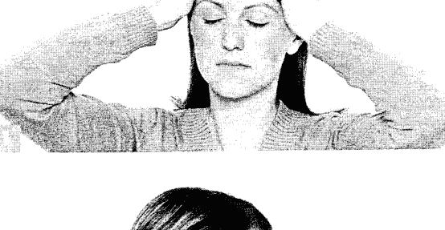

1. 工作面臨大腦力挑戰時，好比商業簡報、帶領團體討論，或是從頭開發新專案，先將手放在頭部手位 2（見16頁）。
2. 雙手放在頭部手位 4。這些手位可活化短期和長期記憶（見17頁）。

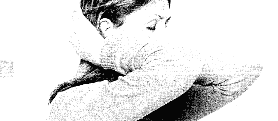

> 「靈氣能連結
我的高我，
開發我的療癒技能
和理解力。」

威廉，25歲，靈氣學生

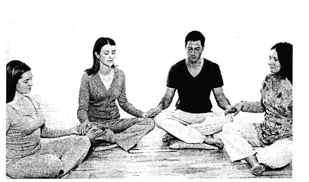

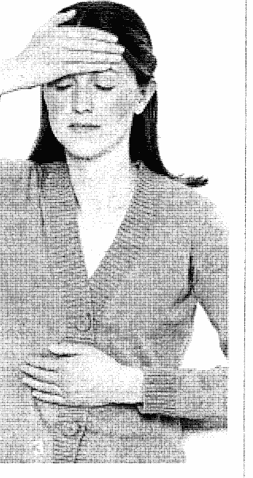

## 團體靈氣能量圈

靈氣可自然有效地傳送宇宙生命能量，表示我們可用來和同事建立更好的連繫。
例如我們可以在團體會議或討論的開頭或結束時，請他們做「能量圈」練習，幫助大家更置身當下及相互連結。這能讓參與者更能以冷靜清晰的立場提出意見。團體能量圈常能在參與者間建立緊密連繫，每個人都覺得是圈子的一份子，與更大的整體連結。

1. 圍成圓圈坐在地上或椅子上。深呼吸幾次，放鬆肩膀，讓肩膀隨著每次吐氣而更加放鬆。
2. 牽著旁邊人的手，右手朝下，「給予」你右側的人；左手朝上，「接受」左邊的人給予。確定雙手保持舒適的姿勢。
3. 讓左手接受的能量透過左臂、胸口和心輪（第四能量中心），沿著右臂從右手出來，流入右邊的人手中，這樣你們就共同建立了一個能量圈。
4. 在給予和接受這股充滿愛和療癒的能量時，注意雙手有什麼感覺，體會在圈中連結的感受。

3. 要安定神經，進一步澄清思緒時，一手放在太陽神經叢（第三脈輪），另一手放在前額（第六脈輪）。這能將頭部過多的能量帶到太陽神經叢，化解恐懼感。

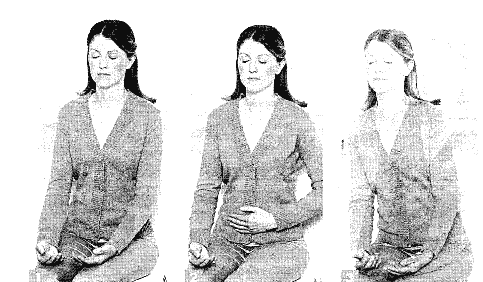

## 「丹田居正」練習

丹田是日文對臍輪的稱呼，也是東方傳統最熟悉的能量中心。丹田位於臍下五公分（兩吋）處，是我們從宇宙接收生命能量之處，因此是很重要的能量中心。

這個練習可用於覺得自己有點偏離中心時，例如對工作上承接新任務感到緊張，或是擔心要和上司或同事進行重要會議。你也可以在午休或是上下班時進行，因為這能讓你和別人應對時，具有無比的安定感和自信，而且只需二十到三十分鐘。

1. 採取舒適的坐姿，背挺直。如果坐在椅子上，確定雙腳踏穩在地上，身體不會後仰。閉上眼睛，雙手掌心向上放在大腿上。
2. 觀想丹田（臍下五公分或兩吋處）有條線，連到眉心的第三眼脈輪。一手放在丹田，幫助你保持專注。
3. 上半身逆時針畫圈擺動十至十五分鐘。移動時，軀幹要維持丹田到第三眼間的直線。
4. 讓畫圈動作逐漸變小至完全停止。坐直休息五分鐘，專注於丹田的能量。
5. 躺下五到十分鐘，手腳略微打開，掌心向上，嘴微張，下顎放鬆。

> 建議：靜心時可使用舒緩的音樂幫助放鬆（見140頁）。

## 提振與恢復精力
（自我治療）

我們每天的活動都要消耗精力，特別是面對工作上許多要求，或行程緊湊時。這個簡短的靈氣療程能迅速補充精力，讓身體、精神和情緒恢復活力。非常適合午餐後或是傍晚，精力可能耗盡時。全程約需十到十五分鐘。

1. 找個舒適場所坐著或躺下，閉上眼睛休息。
2. 雙手蓋著眼睛，手掌靠著顴骨。放鬆眼睛就能放鬆全身。
3. 一手放在太陽神經叢，另一手貼在下面，放在腹部，恢復精力和活力。

建議：可用同樣手位治療感覺精力低落、需要提振的人。

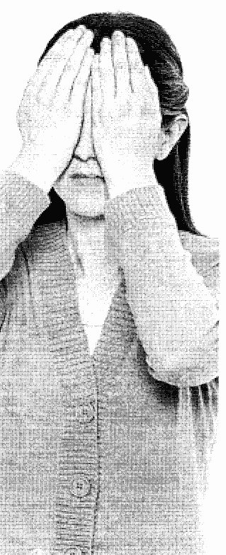

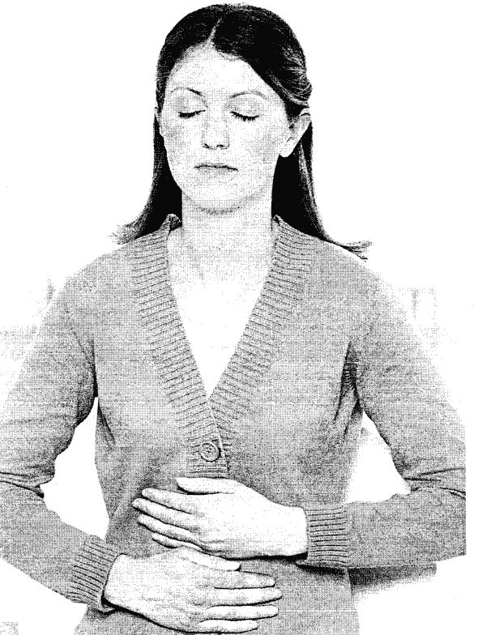

## 工作滿意度

許多人（即使是從事自己喜愛工作的人）都對工作不滿意。這可能會讓人感到挫折，自尊心低落。當然，有時是需要改變角色或工作，或是直接處理和某人或某個工作的狀況，才能發生改變。

但重要的是要認知到，有時問題可能不在於你做的事情本身，而是在於作法。

靈氣能幫助你在日常工作中更置身當下，鼓勵你放輕鬆，放下許多莫名的緊張。這能大幅改變你對自身角色的看法，因而提升工作滿意度。

## 靈氣自我治療

每星期替自己做幾次全身自我治療，能大幅增進你輕鬆面對混亂的能力。手位詳細說明請見16-19頁。

1. 五個頭部手位（見16-17頁）能安定思緒，讓你覺察正面特質，例如信任、安全感和直覺。
2. 正面手位 1 能轉化負面能量，增進享受生命的能力。
3. 正面手位 2 能減少恐懼感和挫折。

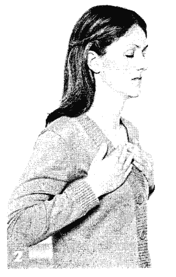

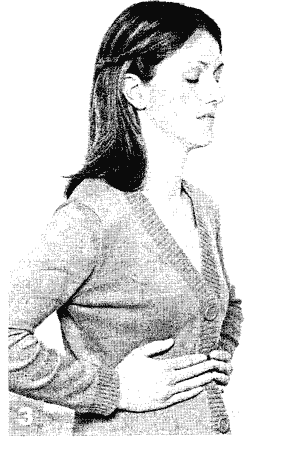

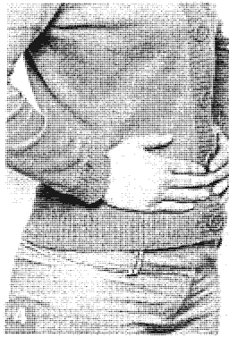

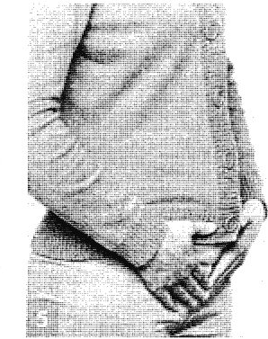

4. 正面手位 3 能增進自信。
5. 正面手位 4 帶來落實感，幫助消除恐懼。
6. 背面手位 1 能排除堵塞的情緒，改善和責任感有關的問題。
7. 背面手位 2 有助於減輕擔憂和抑鬱。如果手無法伸到肩胛骨之間，就將雙手放在胸口，如正面手位 1（步驟 2）。

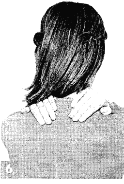

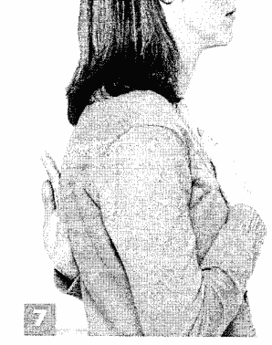

8. 背面手位 3 能強化自尊心和自信。
9. 背面手位 4 能增進創造力、自信和落實感。

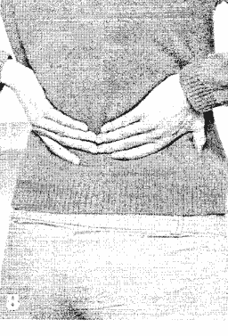

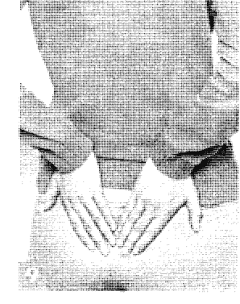

> 「開始每天做靈氣後，我清理了大量的情緒和精神問題。現在我更平靜，覺得在職場和家中都更具包容力。」

莎拉，33 歲，靈氣修習者

## 自信、力量與平靜
（自我治療）

這些手位可用於特別需要感到安定和自信時，例如展開新專案，或是接受新職務。你也可以在每天上班前做，讓自己處於正面心態。坐著或躺著皆可，每個手位維持三到五分鐘。

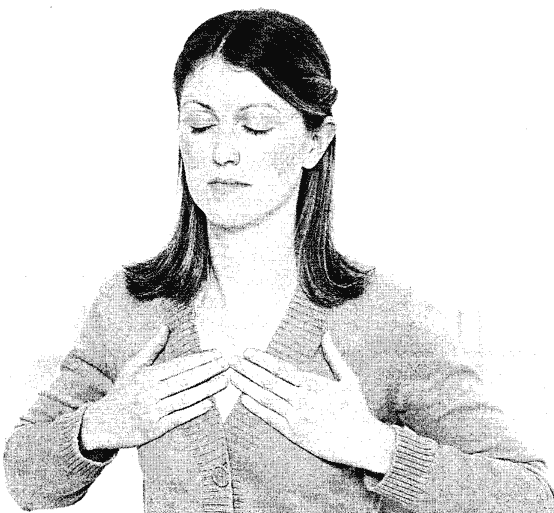

1. 雙手分置於胸口左右（見18頁正面手位1）。此手位可刺激心輪中心，轉化負面情緒，讓我們更具包容力，而非屈從於征服或對抗。也可強化免疫系統，增進享受生命的能力。

2. 雙手放在胸廓下方。此手位能給予能量，促進放鬆，減少恐懼和挫折，讓你更信任狀況，更善於適應變化（見18頁正面手位2）。
3. 雙手放在肚臍兩側，指尖相觸（見18頁正面手位3）。此手位能平衡強烈情緒，例如恐懼、憂鬱和挫折感，還有助於增進自信。
4. 雙手放在背後腰部高度，指尖朝向脊椎（見19頁背面手位3）。此手位能強化腎上腺、腎臟和神經，減輕壓力，增強自尊心和自信，這時你大概會覺得比較平靜輕鬆。

建議：同樣的手位可用來治療憂慮或缺乏自信的人。如果時間不夠，只要進行步驟2和3，有助於恢復力量和自尊心，使你更堅強。

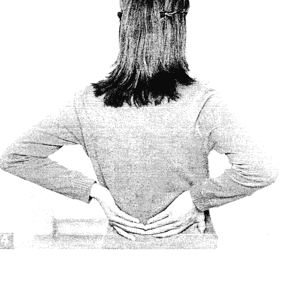

## 幫助面試

靈氣遠距治療技巧通常在第二級傳授，可用來傳遞正面想法和療癒能量，給遠方或未來的某人、特定情境、主題或問題。例如你可以用靈氣傳送正面能量給近期內要面對的情境，例如新工作的面試。

靈氣第二級修習者使用第三個靈氣符號（見第 6 頁），將療癒能量有如「透過光的橋樑」，送給遠方的人或情境。這個符號和對應真言的作用，類似廣播和電視訊號的振動，並非肉眼所能見。靈氣初學者也可使用無須符號和真言的遠距治療技巧（見下面方框）。約需十五分鐘，先確定不會受到打擾。

1. 閉眼，雙手蓋著眼睛，與自己連結。此手位能刺激第三眼，增進直覺和思緒清晰。
2. 想著要傳送療癒的情境，在這個練習中是你的工作面試。觀想時儘量清楚正面的景象。
3. 用適當的句子為這個情境定標題，例如「（時間）在（某地）與（面試者與你的名字）的工作面試」。
4. 舉起雙手，在觀想的情境或「標題」上畫第三個靈氣符號，然後在上面畫第一個符號，給這個過程更大的力量。唸誦這兩個符號的真言三次，保持雙手抬起，讓療癒能量從雙手流入這個影像。
5. 想像自己置身工作面試場景。觀想你想表現的所有正面特質：自信、輕鬆、有問必答、聰穎、有見解等等。觀想後說：「給相關人等最好的安排」。讓存在來決定，對你和其他相關者來說，怎樣才是「最好的安排」。
6. 最後可觀想色彩包圍整個情境，有如包在粉紅色或金色氣球中一般。放開氣球，任其升到空中。藉由放開影像，你也放下整個情境，相信如果工作該是你的，就會錄取。
7. 結束時感謝靈氣療癒能量的祝福。搓揉雙手，切斷和靈氣符號的連結。

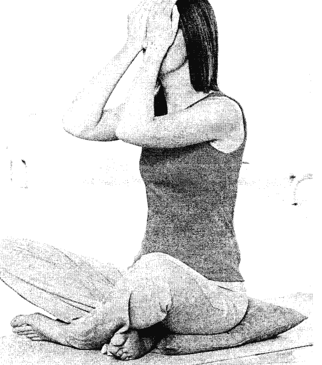

> 靈氣初學者做遠距治療時，只要用觀想方式，透過舉起的雙手，將愛的念頭和正面能量傳送給想送達的情境。效果雖然不如第二級靈氣修習者來得強，但值得一試。

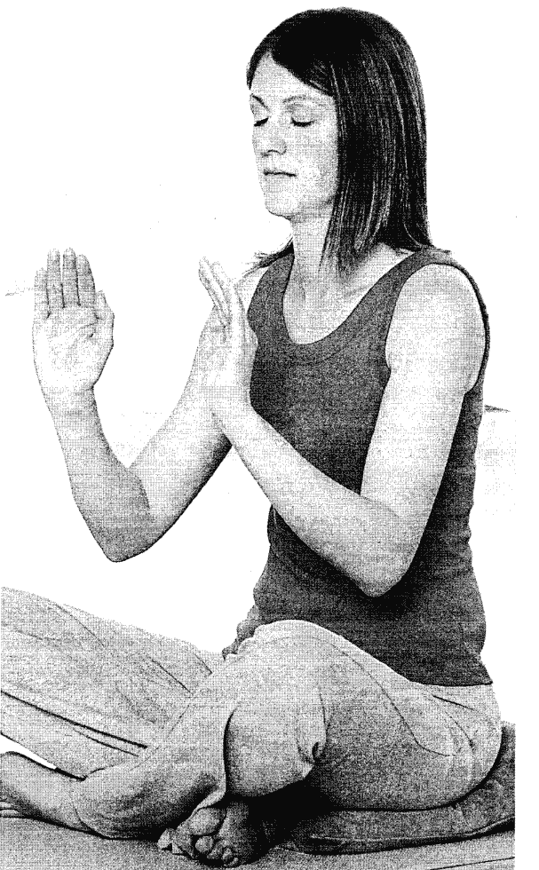

> 個案研究

安得魯得到面試機會，但知道自己在有壓力的狀況下常會緊張，擔心會因此表現不佳。他請一群朋友為他和面試者進行靈氣遠距治療，觀想他置身正面的光中，得到正面結果。

安得魯後來報告，他面試時從未感到如此平靜自信，最後他得到這項工作。

# 第4章
增進活力

> 「把你最美好的與朋友分享吧。如果你要他了解你的低潮，就也該讓他明白你的高潮。朋友豈可只是找來打發時間的？和朋友一起共享生命吧……讓甜美的友誼充滿歡笑，共享樂趣。因為在細瑣事物的甘露中，心才能找到自己的清晨，振作煥發。」
——摘自紀伯倫《先知》

找尋並安排時間和場所放鬆身心和情緒，是恢復精力、保持健康的必要條件。但每個空閒夜晚或週末呆坐著看電視，通常不是最佳的放鬆方式，因為電視會轟炸感官，將許多社會的期望強加於你的身上。通常比較能充實和滿足情緒的，是將寶貴時間用來獨處或和他人共處，加深與自己和他人的關係。例如你展開週末的方式，也許是晚上用有鎮定效果的精油沐浴，放鬆肌肉，排解身體的緊張。接著你也許想花點時間和好友及家人共處，與孩子在公園

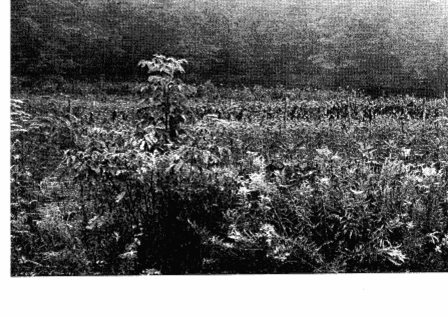

嬉戲，或是林間漫步。記得留些優質時間給自己，讀本好書，或是練習靜心冥想。

找出平衡和消磨閒暇的最佳方式，能讓你覺察並清楚在身體、情緒和精神層面，自己最需要和最適合的一切。靈氣能幫助你覺察自己最深切的需求，也是留時間給自己，真正欣賞、珍惜自己的好方法。你也可以在朋友及家人閒暇時，用靈氣充實他們的生命。

閒暇時充足的運動也大有幫助，因為這能排除體內毒素，疏通生活緊張所累積的堵塞能量。有時你需要做些肢體活動來消耗精力，才能放鬆。例如早上開始一天的活動前，可以做伸展運動和瑜珈，讓身體充滿活力。戶外活動如慢跑、騎自行車、健行或和朋友走遠路散步，都是活動身體的好辦法，同時又能置身大自然中，對身心靈特別有滋養和安撫的效果。

本章分為五節，讓你決定各種時刻最適合自己的練習或療程：平衡運動能量（80-81頁）、連結自我（82-85頁）、與朋友連結（86-87頁）、與大自然連結（88-89頁）和放鬆（90-93頁）。

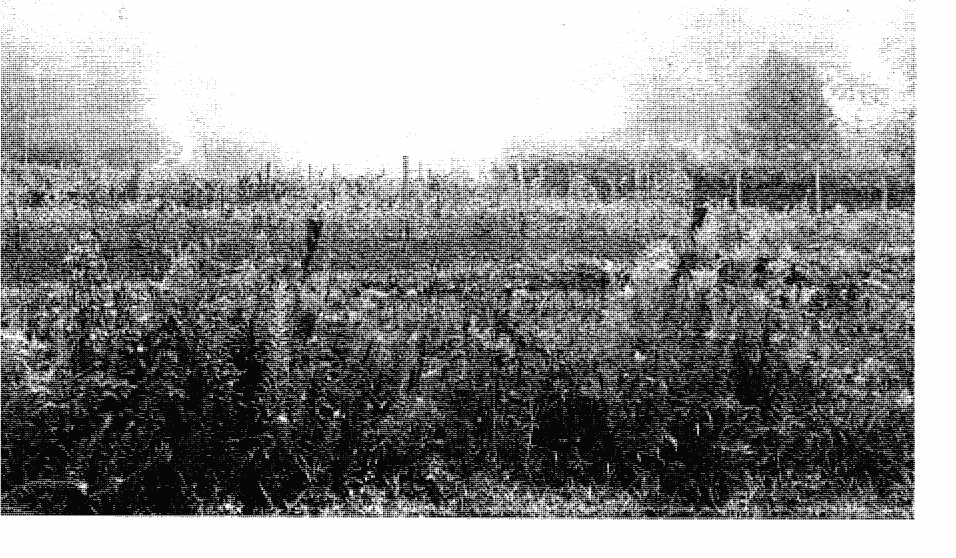

## 平衡運動能量

現代的生活方式和工作環境，常讓我們大半時間都坐在桌前或車裡，缺乏足夠運動保持健康。這真是可惜，因為身體（特別是心臟）很喜歡運動，而且我們的身體天生就是要活動。身體每個系統，從循環和淋巴系統乃至肌肉、骨骼和器官，在我們經常活動伸展時運作得最好。因此要保持健康和體力，就要顧及活動的需求。

心臟喜歡蹦蹦跳的活力，心肌如果有足夠運動，就能釋放全身緊張，我們的呼吸也會增強，吸入更多氧氣，幫助我們排除毒素。事實上，研究人員發現，適度運動能刺激保護人體細胞的酵素產生。即使是小活動，如大笑、跳舞或走路購物，都能讓我們維持活動的精力，保持健康。因此找個喜愛的動態活動在閒暇進行，很快就能有顯著效果。

靈氣當然無法取代運動或休閒活動。但是經常自我治療（見16-19頁），可以激勵我們走出去，參與更活躍的活動，而非只是安坐在沙發上，操作著遙控器。

## 運動時運用靈氣（自我治療）

從事慢跑、健行、瑜伽、伸展、有氧運動、打網球等運動時，也可以用靈氣來平衡能量，保持活力。

1. 運動感到疲憊時，使用頭部手位1，雙手蓋著眼睛以集中心神。
2. 用正面手位2，雙手放在太陽神經叢，幫助恢復活力。

> 建議：如果慢跑時覺得喘不過氣，跑步時將手放在胸口中央，以鎖定胸口能量，支持肺部。

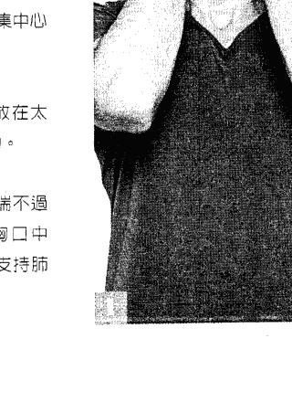

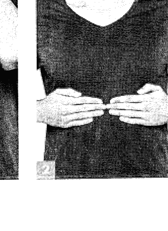

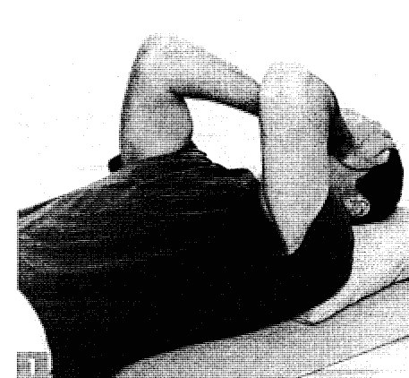

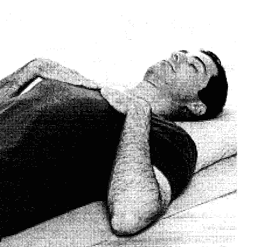

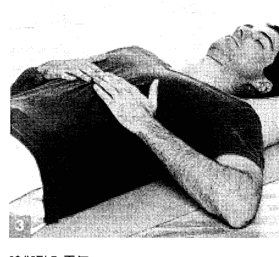

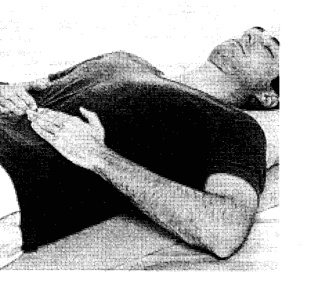

## 瑜伽融入靈氣
（自我治療）

有些瑜伽老師融入靈氣手位，大部分學生說做瑜伽練習時覺得能更深入放鬆。做瑜伽時接通宇宙生命能量，也加深瑜伽練習恢復活力的效果。如果在家做瑜伽，在結尾放鬆階段躺下時，可嘗試加入靈氣。

1. 用頭部手位1，把雙手蓋著眼睛讓自己放鬆。
2. 用正面手位1，雙手放在胸口，強化心肺。
3. 用正面手位2，雙手放在太陽神經叢，給自己更多力量和堅強。
4. 用正面手位3，雙手放在腹部，幫助消化。

## 連結自我

在忙亂的工作步調和各種生活壓力之餘，我們必須運用閒暇來真正放鬆和恢復精力。用優質的時間為自己做靈氣，能讓我們更了解自己，知道什麼最適合自己。

適合自己。只要我們敞開心胸仔細傾聽，就能從內在智慧的源頭得到指引。

靈氣能平衡能量，表示我們可用靈氣來鎮定自己，放下一周來的事件，重新連結自己的真正本性——我們的「內在本質」。接通這個內在本質，我們會直覺地知道生活各方面哪些最

> 「歷經生命的來去與平衡，照耀存在的根本本質，是可敬可愛的神。願眾生透過微妙靜思的智慧，感知開悟的光輝。」
—— 讚頌梵咒 (Gayatri Mantra) 譯文

## 讚頌梵咒
內在療癒十一步驟
（自我治療）

這個自我治療讓你能深入連結並療癒自我。每個手位最好能維持約五分鐘，所以整個療程約要五十分鐘。如果需要，可以配合輕柔放鬆的音樂，或是進行引導療癒，聆聽讚頌梵咒（見140頁）。

1. 平躺，雙手置於身體兩旁，深呼吸。
2. 雙手蓋著眼睛，手指併攏。大聲唸誦讚頌梵咒數次。不必太在意梵語發音是否正確，只要保持全心的正念：
*Ohm bhur bhuvah svah*
*Tat savitur varenyam*
*Bhargo devasya dhimahi*
*Dhiyo yonah prachodayat*
3. 唸完梵咒，雙手放在胸口中央，讓心中升起平靜感。敞開自己接受愛和喜悅，能強化心臟和免疫系統。
4. 雙手併排放在右邊肋骨下方和腰。有助於平衡恐懼和抑鬱等情緒。

古老的讚頌梵咒起源不詳，其聲音頻率據說能淨化我們周圍的氛圍。聆聽讚頌梵咒時，也許神經系統會感到平靜。認真練習梵咒（不管是唸誦或聆聽），可淨化思緒和情緒，油然生起一種內在的平靜和清明感。

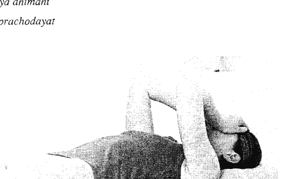

5. 雙手換到左側，可改善消化不良，安定免疫系統。

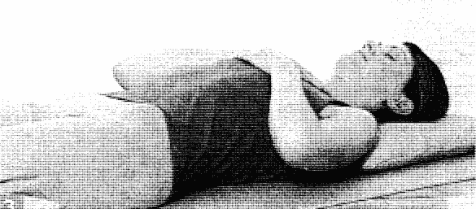

6. 兩手分置於肚臍上下方，放鬆，融入這個部位，讓療癒能量流遍全身。
7. 接下來兩個步驟男女稍有差異：
    - 女性兩手分置於雙乳，接通心輪正面能量。
    - 男性將手放在胸口中央，連結內在女性能量。

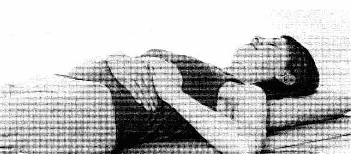

8. 女性將手擺成 V 形放在恥骨上，連結內在男性能量（見18頁）。
    - 男性將手擺開些，放在鼠蹊兩側，連結骨盆區域海底輪的正面能量（見13頁）。

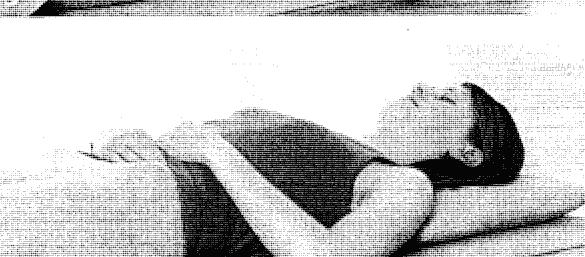

9. 右手放前額，左手在肚臍下方，讓平靜感由此邊及全身。

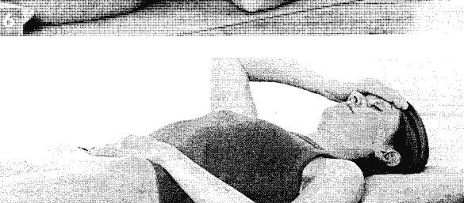

10. 捧住後腦，讓手靠著底下的枕頭。放下所有思緒和緊張，讓頭腦放鬆平靜。
11. 放下雙手，置於身體兩側。花點時間享受在當下放鬆的感覺。覺得差不多時，動動手指腳趾，輕柔伸展身體，緩緩回到平常的意識狀態。

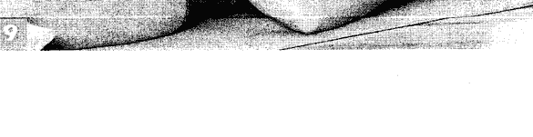

## 旋轉靜心

旋轉是蘇菲神秘教派最古老的技巧之一，方式是站在定點，全身繞著這個中心轉動。這個技巧能讓你拋開身體的緊繃、負面和堵塞的能量。經常可見到小孩出於好玩，自然而然地這麼做。

練習旋轉時最好空腹。你可以在開始一天活動前進行，恢復並振作自己的精力。你也許會覺得能量如溫暖的浪潮由心中湧出，從手臂流到手掌。睡前作旋轉也有益處：能清除身體的憂慮，讓你一夜好眠。

1. 雙腳併攏站立，赤腳或穿襪子皆可。
2. 雙手抬起與肩同高，掌心朝上。或者也可一手高，掌心朝上；一手低，掌心朝下。這樣雙手可在天地間建立連結。
3. 開始緩慢旋轉，方向隨意。逐漸加快速度。保持身體柔軟，眼睛睜開。
4. 旋轉時看著其中一隻手（上面的手），專注於其中一根手指，以免頭昏。剛開始只要進行兩三分鐘。但之後你也許會想將時間延長到五、十，甚至是十五分鐘。
5. 要停止旋轉時，減緩動作，雙臂在胸前交錯，頭部放鬆。這個姿勢能保持能量回歸中央，以免頭昏。保持姿勢至少三十秒。
6. 停止後，俯臥，閉上眼睛，感覺身體融入底下的表面。維持五到十五分鐘。如果是晚上做旋轉，可以就這樣入睡。

> 建議：舒緩的音樂能讓你更放鬆地融入旋轉。

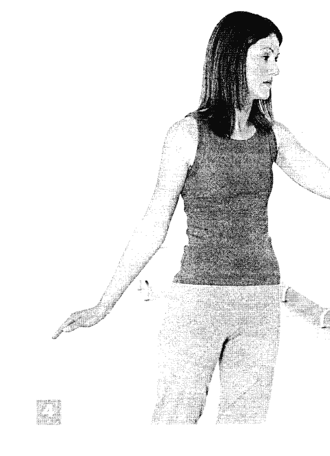

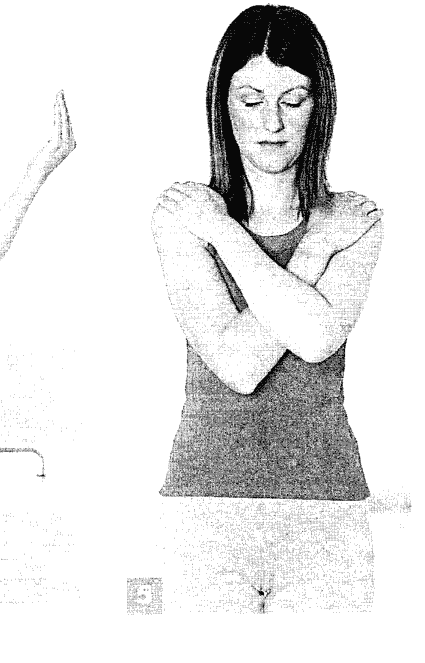

## 大笑靜心

歡笑是心的良藥，能改變身體化學作用，影響腦波和思考。此外，大笑時呼吸節奏會改變，讓你的心臟和身體排除緊張。大笑也讓你重新連結內在的孩童，讓你再次感到年輕、朝氣蓬勃，充滿生命和喜悅。

有些禪寺的僧侶每天早晚會進行大笑靜心。他們相信大笑能改變日子的品質，讓他們看待事態時沒那麼嚴肅。對自己和遇到的許多狀況好好笑一笑，能在你和你的問題間製造空間。在日常生活中找尋值得一笑的情境和經驗吧！

這個靜心能幫助你早上醒來沒來由的歡笑。每天進行五到十分鐘會有最大效益。眼睛睜開或閉上都行。

1. 早上醒來時，先伸展身體。
2. 一兩分鐘後，開始大笑。一開始你得用假裝的：即使心裡不想，也要揚起嘴角笑。但很快地，你的笑聲會變得真實又自然。
3. 你可以移動身體刺激大笑：雙腳向上踢，或是滾來滾去——看怎樣最適合自己。

建議：這個靜心隨時都能進行。如果和朋友一起做，你們可以互相搔癢，或是說笑話，逗人發笑，但記得別本末倒置，而是要保持自己的笑聲，只是一開始用對方來刺激自己大笑。

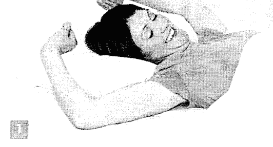

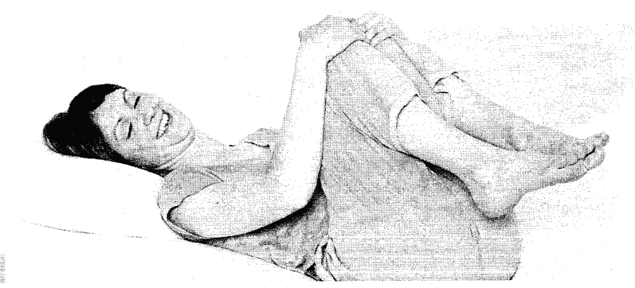

## 與朋友連結

許多人的閒暇時間都是和朋友及家人共度，因此讓這段時光能充實情緒，就變得很重要。畢竟我們不只是想和人消磨時間，更希望共度的是優質時光。

當我們用交談溝通時，總會有誤解的可能。另一方面，靈氣無須言語。這是種非語言的溝通方式，可在施行者和接受者之間建立親密感，是一種實質卻又非侵入性的方式，和別人深入連結。做靈氣時，我們接通對方，憑直覺決定雙手擺放位置和時間長短。朋友間共享靈氣能讓關係更充實。

> 「療癒都是發自內心——那是我們所共享，關愛包容的空間。」
——坦瑪雅·侯內沃

## 靈氣夾心餅

這個療法以三人一組進行。一人坐在中間，由前後方的施行者同時治療。其中一個施行者先梳理接受者的氣場，從頭頂滑撫到地上。然後兩個施行者依直覺將手放在接受者身體的不同部位。結束時再次梳理氣場，然後交換，讓每個人都能接受到治療。每人療程約二十分鐘。

## 團體靈氣

團體治療時，靈氣能量流動更強。接受者躺下，接受其他人的靈氣能量。團體人數可由三到七人不等，每人正面和背面各接受十分鐘靈氣。

以團體形式給予和接受靈氣，是種特別的體驗，因為能同時覆蓋多個手位，而且能量更強。其中一個施行者可集中治療膝蓋和腳底，因為腳底有對應全身和器官的反射區。

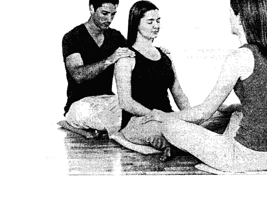

## 「施與受」練習

這個練習能讓你和親密的人以非語言方式共享正面能量。這會是很溫馨滿足的體驗。時間最好是五到十分鐘。需要的話，可以配合放鬆的音樂。

1. 和夥伴面對面站著或坐著，眼睛睜開，柔和地互相凝視。
2. 雙手前伸，右手朝下，左手朝上。把手伸向對方，讓兩人的手輕觸。感覺彼此的手之間的能量連結，保持眼睛睜開，看著對方。
3. 想像每次吸氣時，從夥伴那兒接收能量到自己的心輪，吐氣時則從自己的太陽神經叢把能量給對方。如此一來，你們就形成一個施與受的能量圈，以圓形或扁平的8字型流動。

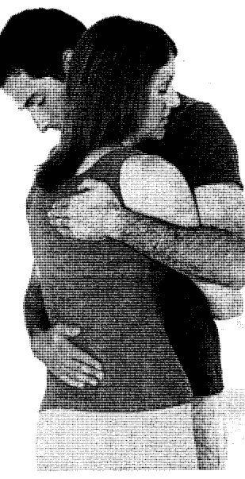

## 靈氣擁抱

「靈氣擁抱」適合用來感謝別人給你靈氣治療，或是與朋友深入連結，因為這是兩心交流能量的溫馨方式。上身相連，讓你的左胸與對方左胸相碰觸，這樣能量流動會更順暢。自行決定這個令人放鬆的擁抱要多久。雙手可放在對方的上背或後腰，視兩人方便而定。

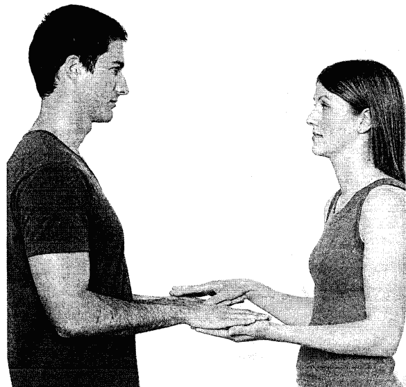

## 與大自然連結

花點閒暇時間到戶外去，不管是在自家庭院放鬆，在附近公園看本好書，在湖裡游泳，林中漫步，或是健行登山，都能讓你連結自己屬於大地的根，接通本能，連結自己直覺和富創造力的一面，更親近內在真正的自己。

能遠離每日生活中眾多機械設備的膚淺，擺脫人工外牆的實質限制，會感覺無比自由自在。沒有外在壓力，只要在大自然中享受盡情奔跑的感覺，呼吸新鮮空氣，充分的活在每一個片刻裡。

有些靈氣練習可用來增進與自然的連結，還有你和內在真實自我的連結。許多其他練習可增進覺察力，讓你知道盡量常到戶外，接納自然，感覺真正的生氣蓬勃，對身、心、靈是多麼的滋養。

## 「與樹連結」練習

在戶外的庭院、公園或樹林中，找一棵你覺得特別順眼的樹。任何樹都行，不必管喜歡的理由。每棵樹都有不同的振動，有時吸引你的，可能是樺樹輕盈細緻的能量，或是老橡樹落實集中的力量。這個練習能清理你的脈輪，恢復全身的活力。

1. 背靠著樹。一手放在太陽神經叢，另一手放在背後同樣高度，掌心碰觸樹。閉上眼睛，接通樹的能量。
2. 另外，你還能觀想從樹根沒入的大地中導引能量上來。吸氣時，想像能量從腳底進入你的體內。讓能量流到頭頂和更高處，一直到樹頂。
3. 吐氣時，觀想能量從樹上下來，從你頭頂進入體內，流到腳，回到大地。

> 其他方式

除了背靠著樹，你也可嘗試正面靠在樹上。你可以雙手觸摸樹皮，或伸臂抱樹，視樹圍而定。找個舒服的姿勢，讓自己和樹以擁抱的姿勢融為一體。

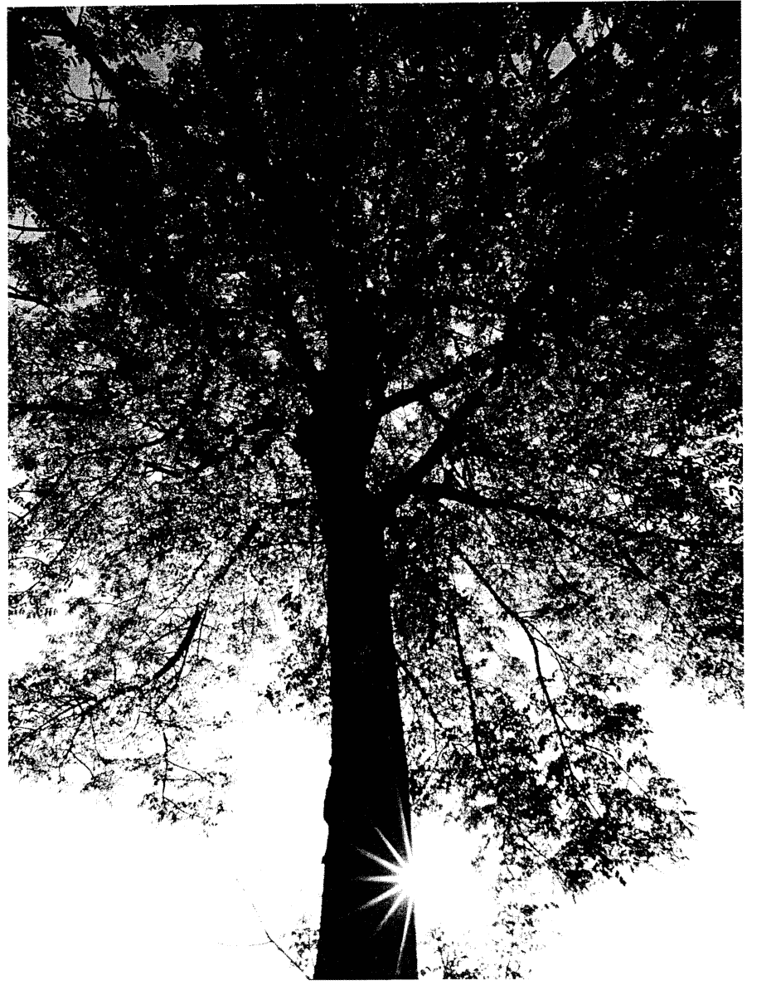

## 放鬆

許多人發現難以完全放鬆，這著實叫人遺憾，因為放鬆很重要，能幫助我們保持快樂健康。放鬆不能強求，必須自行發生，就像花苞的綻放一般。

放鬆時，你只是單純地存在，安住於自己的能量中。頭腦變得靜止，你的思緒（連帶你的能量）不會流向未來或過去。感覺當下就已足夠，不必要求有什麼不同；不必希冀自己所沒有的東西。因此放鬆能讓你的能量從目標取向轉化為活在當下。

我們常哄騙自己相信，只要達到目標就能放鬆。但這種能量會主宰我們的人生，因為總有其他事，是我們覺得「必須」達成的，因此從沒能自然而然地「停機」放鬆。

放鬆技巧和靜心練習非常有用，能為你的生活帶來寶貴的寂靜時刻。靈氣就是其中一種能讓你更放鬆的工具，靈氣能量的流動能放鬆身心，同時提振全身，恢復活力。

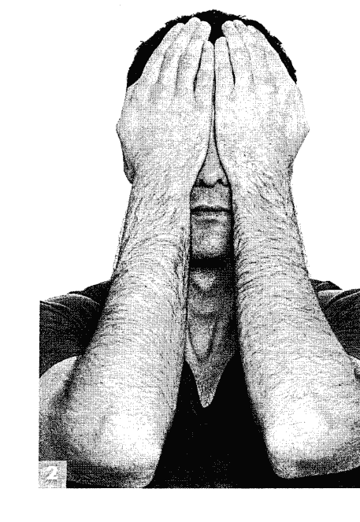

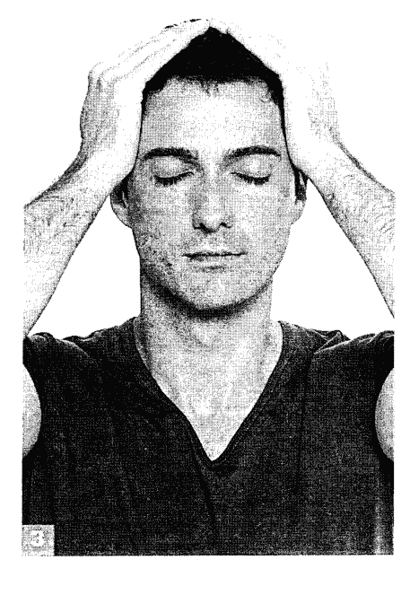

## 增進幸福感
（自我治療）

當你感到緊繃、疲累或擔憂時，花點時間放鬆，和自己連結。這個治療能讓你感到滋養、祥和，充滿活力。每個手位保持兩到五分鐘，所以全程約需二十分鐘。你可以搭配輕柔放鬆的音樂，或者也可以進行導引式的治療（見142頁）。

1. 坐在椅子上或舒服躺下，眼睛閉上放鬆。深呼吸幾次，吐氣時讓身體向下沉。
2. 雙手蓋著眼睛，手掌靠著顴骨，手指併攏。放鬆眼睛就能放鬆全身。
3. 手放在耳朵上方的頭部兩側，掌根碰觸太陽穴。這能協調大腦兩側，鎮定意識思考，紓解抑鬱。
4. 雙手蓋著後腦，指尖朝上。這有助於鎮定強烈情緒，如恐懼、擔憂、焦慮和震驚。
5. 雙手放在胸口上方兩側，指尖在鎖骨下方相碰觸。此手位能讓你在感到軟弱消沉時，放下負面感受。也能增進愛和享受生命的能力。
6. 結束時花點時間輕柔的伸展全身，再緩緩回到正常意識。

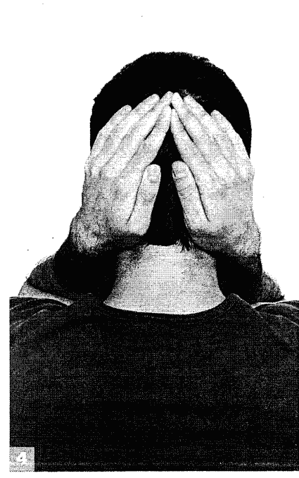

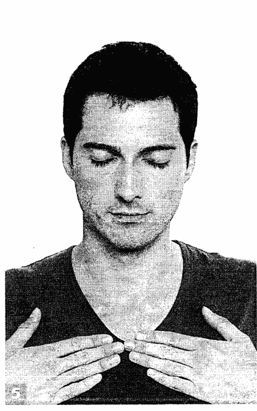

## 睡前靈氣助眠
（自我治療）

這個療程能在你睡前安定身心靈，也調和所有脈輪。如果在療程中睡著也沒關係，次日早晨完成即可。每個手位保持三到五分鐘。你可以播放輕柔放鬆的音樂，或是採用導引式的治療搭配（見140頁）。

1. 雙手蓋著眼睛，手掌靠著顱骨。這能讓你連結自己的直覺。
2. 雙手放在胸口中央，心輪所在位置。這能強化免疫系統，增進愛和享受生命的能力。
3. 一手放在太陽神經叢，另一手並排放在下方的腹部，讓自己放鬆，融入這個部位，讓療癒能量流通全身。
4. 雙手成V形放在下腹，指尖在恥骨上相觸。這能帶來落實感，讓你更信任生命，進而更容易入睡。

建議：覺得需要增進平靜祥和感時，可隨時使用這個練習。

> 「靈氣治療時我覺得無比舒暢，非常享受那種全然的放鬆。」
麗莎，43歲，靈氣學員

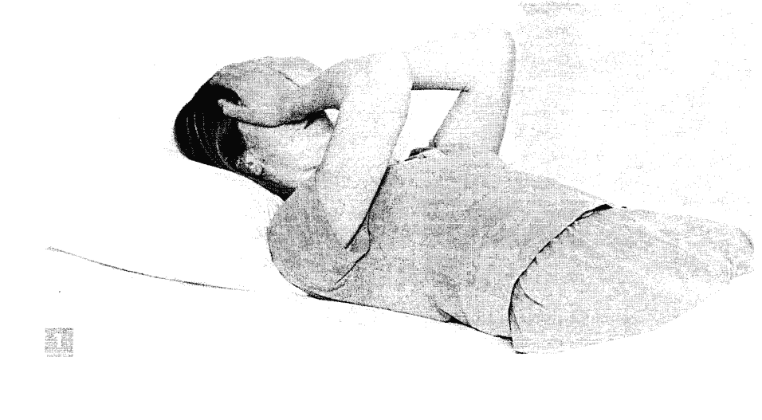

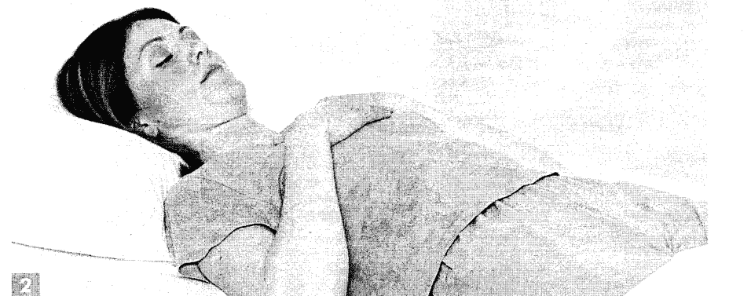

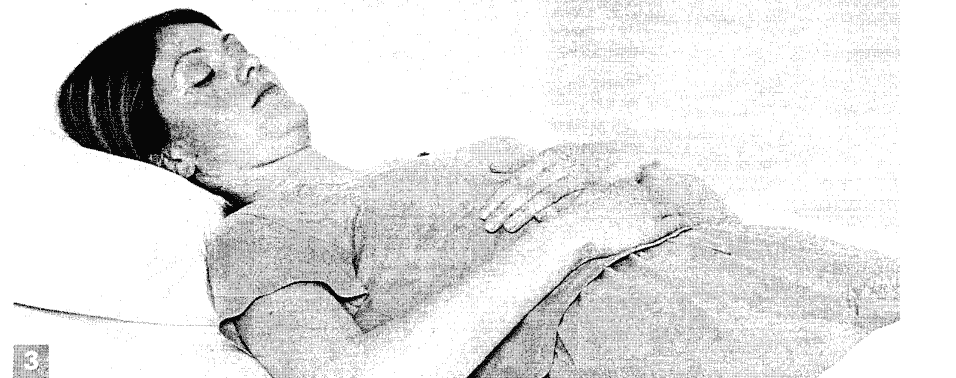

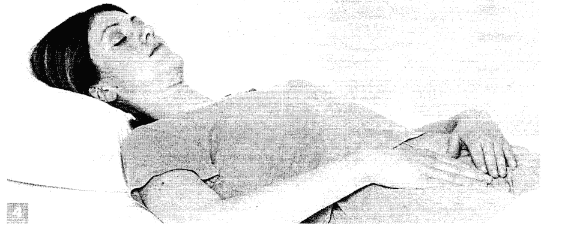

# 第5章
## 維繫身心健康

> 「若你的心能讚嘆每日生活中的奇蹟，你的痛苦帶給你的驚嘆並不遜於你的喜悅。你將能接受心的季節變換，一如接受野外的四季更迭，於是你就能靜觀心裡哀戚的冬日。你的痛苦多半是自找的，那是你內心的醫師治療你心病的苦藥。」
——摘自紀伯倫《先知》

了解疾病、療癒和健康之間的關連，是生活健康、快樂、和諧的一大關鍵。每個人都是「完整」的，由身、心、靈所組成。每個「完整」的人都有緊密依存的兩面：肉體和精神。肉體是屬於大地、物質的部分，是靈魂的外在體現；精神則是靈魂。

潰瘍，或是心臟病發作，因此我們必須聆聽身體微弱的訊號。

我們需要愛、尊重、照顧自己的身體，以保持身心健康。要是我們忍略，就無法找到內在和諧與幸福。我們也必須培養對身體以及自身的感情和覺察力，這樣才能認清自己的真正需求。

## 聆聽身體的訊號

生病表示身體運作並不完整：失去協調和平衡。這種混亂通常先出現在心智上，然後才演變成身體症狀。每個疾病都是要給我們特定的訊息，因此我們必須認知並接受這個訊息。如果我們一開始就能察覺，失衡狀態就不太可能到身體層面。但要是我們沒能聆聽和了解一開始的訊息，身體就會試圖採用更直接明顯的語言，表現出不適或痛苦。

在今日社會，我們多半活在「頭腦」中，切斷和身體感覺的連繫。但身體和本能的感覺，能讓我們重新連結自己的能量本源，也常是讓我們覺得真正生氣勃勃的原因。當我們有生氣、充滿喜悅和活力，身體不適就不易在體內生根，日後演變為嚴重的疾病。

例如被迫出席社交場合，其實寧可在家度過寧靜的夜晚；或是覺得非常低落，卻逼自己上班時，身體會替我們找方法休息，像是感冒、頭痛或偏頭痛。嚴重時，身體甚至會形成

## 整體性的療癒

靈氣能作用於身體、精神、情緒和靈性各個層面，預防和治療各種疾病。靈氣能讓我們恢復常在日常活動中消耗掉的精力，並強化免疫系統。靈氣能改善許多急慢性狀況，也可配合其他療法。許多輔助療法治療師，用靈氣輔

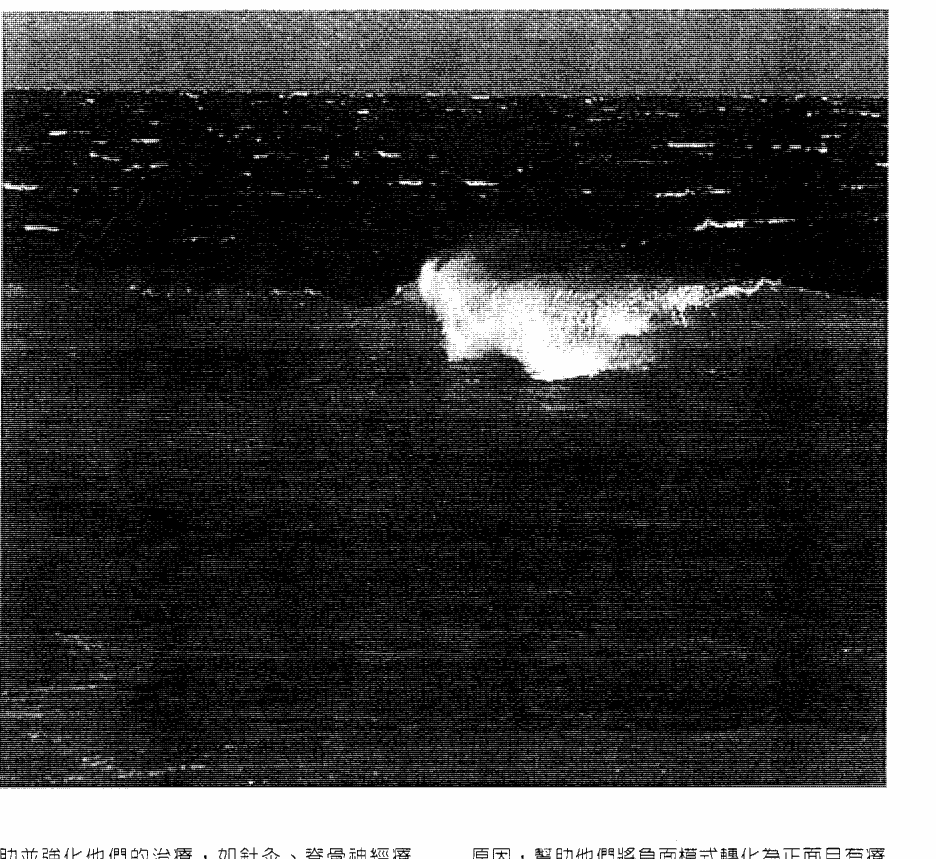

助並強化他們的治療，如針灸、脊骨神經療法、按摩、同類療法、顱薦骨療法、芳香療法或反射療法如腳底按摩等。靈氣也能增強傳統療法的效用，因為靈氣能淨化身體毒素，維持身體自療能力。

人們有時會潛意識地依戀著疾病，雖然在意識層面想擺脫病痛，但在他們的潛意識中也許疾病已成為身分認同的一部分，讓他們捨不得放下。靈氣治療能讓罹病者覺察病痛的潛在原因，幫助他們將負面模式轉化為正面且有療癒力量。

本章分為數節，探討保持身心健康的五大要素：健康飲食（96-97頁）、維持心的能量（98-101頁）、處理病痛（102-109頁）、接納（110-111頁）與平靜（112-115頁）。這些標題能讓你找到各種時刻最適合你或是親友的靈氣療程和練習。

## 健康飲食

在今日忙碌的世界，許多人都有飲食失調的問題。速食、含糖飲料、甜食、白麵包、薯條、乳製品、紅肉和罐頭食品，無法提供身體保持健康所需的均衡營養。通常營養失衡的最初徵兆，是精力減退、消化不良、疼痛、體重過重和思考模糊不清。如果忽視，可能很快就會演變成更嚴重的健康問題。

個案中，也和飲食直接相關。因此良好的飲食加上適度運動，不僅是保持理想體重，也是整體身心健康的關鍵。

研究人員發現，吃健康的食物，吸收最佳營養，能防範許多問題於未然。就連嚴重的健康問題，如糖尿病、癌症和心臟疾病，在某些

靈氣能開發我們的直覺，讓我們更了解身體在飲食方面真正的需求，以保持或變得健康。靈氣也能用來傳送正面能量給我們吃的食物，讓食物更營養，有益靈魂和身體。我們要為自己的健康負責，做必要的飲食改變，才能保持強壯健康。

## 靈氣斷食

斷食是古老的身體排毒方式，能讓身體感到更自由輕盈。若是配合靜心，還能增強靈性淨化。斷食通常會在幾天之內，有限度地攝取某些食物。

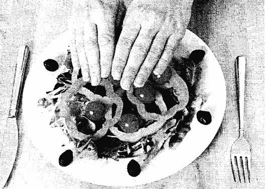

斷食可改善多種病症，但應該在營養專家指導下進行。如有重大疾病，請徵詢醫師意見。

靈氣可有效支持斷食，因為靈氣能加速斷食引發的排毒，減輕不舒服的副作用。靈氣可強化免疫系統。由於免疫系統在斷食時不像平時「吃」得那麼多，因此斷食期間最好能每天做全身治療（見16-19頁）。

## 增添食物能量

你能充實、淨化和活化所吃的食物，只要將手放在食物上方或周圍三十到六十秒，送出正面能量。第二級靈氣修習者可進一步，在食物上方畫第一個靈氣符號。釋放的靈氣能量能讓食物帶有正面能量和意念，增進營養價值。

## 飲食失調
（自我治療）

許多飲食失調（如厭食症和暴食症）的潛在因素，通常是情緒。可能的話，最好能為這種患者每天做全身靈氣治療（見10-15頁），以培養他們的內在力量，加強安全感和自信。或是你發現自己有飲食失調問題，也可以每天給自己做治療（見16-19頁）。不管是哪種情況，建議多花點時間在右邊介紹的手位。

你也可以用靈氣精神療癒技巧（見22頁），找出飲食失調問題背後的真正原因。

> 個案研究

蘇珊在接受心理治療，因為她常把食物當成應付工作壓力的替代品。只要她覺得自信心低落，就會飲食過量。短短四次靈氣治療後，她已經覺得比較平靜，更了解自己的身體。現在她覺得更能認知自己的需求，察覺事物對她有益或無益。靈氣為她做了些整合，因此她覺得身體更健康，思路更清晰。

1. 用頭部手位 2（見16頁）。
2. 用頭部手位 4（見17頁）。
3. 用正面手位 3，雙手放在肚臍左右兩側（見18頁）。
4. 用背面手位 3，雙手蓋著腎臟（見19頁）。

> 「靈氣讓我再次找到自己，回歸真我。」
貝提娜，30歲，教師

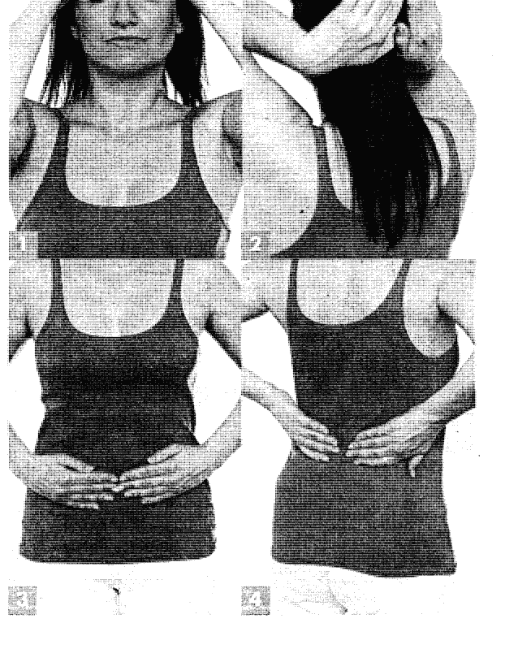

## 維持心的能量

現今許多人發現，自己的生活方式總是忙碌不堪，不管在職場或家裡，都一直承受壓力。因此他們覺得焦躁不安，對自己和身邊的人都沒耐性。這些狀況常會造成整體健康的負荷，特別是心臟。

和一般看法恰好相反，心才是我們智慧和理解的本源，而非頭腦。在心的廣大空間中，我們能找到自然而生的祥和、愛、喜悅，不論任何時間、任何理由。

當心能輕鬆地以自己的韻律跳動時，是最健全滿足的狀態。你愈了解自己，愈貼近自己的心，就愈能以平靜祥和的態度看待生命中的事件。能將人生的挑戰和經驗視為贈禮時，你就能找到內在的力量和勇氣，以平靜接納的心境應對各種狀況，這將能大幅地充實你的整個人生。

## 吐氣寬心
（自我治療）

這個簡單又有效的練習能排除心的堵塞和緊張。當你發現自己在擔心，或覺得卡著某種情緒，揮之不去時，這個練習特別有用，因為用口吐氣能非常輕易地卸除心的壓力，釋放憂慮、恐懼，或其他惦記的一切。負面能量會在你吐氣時自行排除。

1. 深吸一口氣，吐氣時嘴巴張開，下巴放鬆，重重吐氣出聲。重複幾次，隨每次吐氣完全放鬆。
2. 吐氣時，手蓋著眼睛，幫助和自己重新連結。
3. 觀想過去發生至今仍耿耿於懷、縈繞心頭的事件、想法或感受，請它隨著吐氣，在精神層面將其呼出去。
4. 雙手放在胸口。仔細觀察自己的心，注意是否感覺不同，例如更輕鬆或更自由。

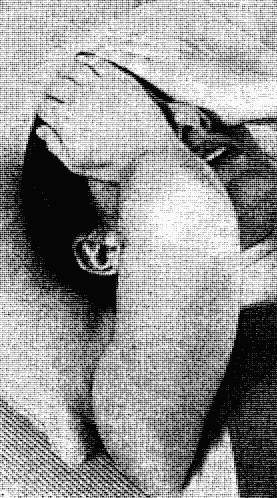

## 與心對話
（自我治療）

這個練習能幫助你重新連結最深處的感受，也是就寢前排除一日憂慮緊張的好方法。心直覺地知道你的需求，你可以請教心，是什麼在煩擾自己，或是問題的對策。光是把心當成可靠的老朋友般對話，就是具有深度療癒力的體驗。

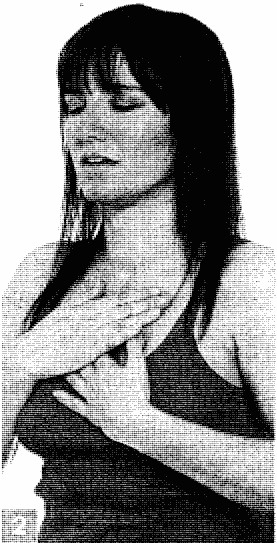

1. 靜靜坐著或舒服躺下不動，對眼睛施予靈氣。在此同時，專注於自己的心。如果感覺沉重或有束縛感，試著張嘴吐氣抒發。
2. 進一步與心連結，雙手放在胸口中央的心輪所在。
3. 開始和心對話，有如和老友交談一般。你可以發問，如「你好嗎？」或是「我能為你做什麼？」然後等著接收內在的回答。

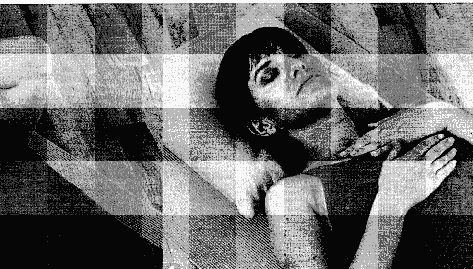

## 強心練習
（自我治療）

中醫以經絡為基礎。經絡是能量線，能供應器官（其實就是全身）活力。中醫醫術如針灸和指壓，包括刺激經絡不同穴點，以活化某些器官或身體系統的能量。例如心有問題，不管是身體或是情緒面，還是兩者兼具，都能利用心經的「神門」和「少衝」穴，排除這個部位的緊張。

### 神門穴

1. 舉起左手，掌心朝自己。右手拇指置於左手小指側的手腕，掌根稍低處，有個凹陷處，對這個點稍微施力。
2. 右手拇指按著不動，左掌朝身體彎曲，然後回到原位。進行十到十五次。你也許會覺得手有些麻，這是健康的現象，表示堵塞的能量正在移動。
3. 右手重複同樣過程。治療這個穴點能放鬆心經，移動堵塞的能量，讓心跳恢復規律。

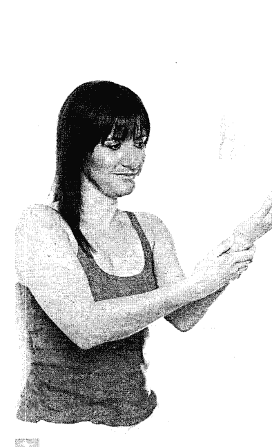

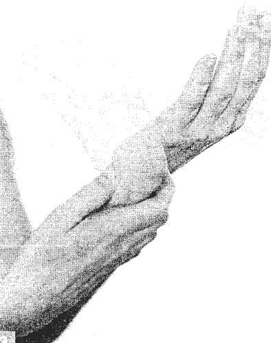

## 少衝穴

1. 左手掌心朝下，用右手拇指和食指抓住左手小指，用力扭轉施壓。這個穴位在小指指甲根外側角落，是心經的末端（起自腋窩）。刺激少衝穴能滋養心並平衡其能量，所以如果按壓時感覺不太舒服，或甚至有點痛，就表示有能量堵塞。

2. 對其他手指的同樣穴點施壓，以刺激並平衡全身能量。中指尖連結心包（包覆心臟的組織），因此對這個穴點施壓可維持心臟功能。

3. 對右手手指重複同樣過程。每天這樣扭轉按壓手指，一段時間後你會發現不會再不舒服了，表示現在經絡的能量流動更順暢。如果沒時間所有手指，只要做小指和中指。

建議：如果醫師要採取血樣，最好要求不要從中指取血。根據中醫醫理，這會讓心變弱。

## 處理病痛

靈氣幫助治療急慢性病痛的方式，是增強體力，穩定免疫系統，在許多病例中，還能減輕疼痛。建議一開始每天持續治療至少四天，以累積療癒能量，進而加速療癒過程。

先和接受者聊聊他們的症狀，說明靈氣療癒能量會依接受者需求自行調整。告知會有自我療癒反應，例如想上廁所、飢餓或口渴、發冷、發熱、頭痛，甚至是一開始疼痛加劇等狀況，可能會在頭幾次療程後發生。這是療癒過程必經之路，因為身體的「有毒能量」必須達到某個高峰，才能離開身體。

有的接受者也可能有強烈的情緒反應。這是身體在釋放堵塞的能量和壓抑的情緒。只要照常繼續療程，直到恢復平衡感即可。建議療程至少要進行六到十二次。

如果是極度疼痛，最好是以頻繁的間隔，對患部施予短暫的靈氣治療，例如每天兩次各二十分鐘。為中風或受傷者（如骨折和燒燙傷）做靈氣治療時，小心疼痛一開始可能加劇，然後才會減退。

## 治療耳鳴

如今我們的感官常飽受各種刺激。科技發展太快，我們還無法充分了解我們用的各種裝置（如手機）對人體的影響。愈來愈多年輕人有聽力問題，還有耳鳴，這種病傳統上是老年才會發生。

耳鳴患者會覺得耳朵幾乎一直嗡嗡作響，情況由輕微到極度嚴重不等，最糟的會像飛機引擎聲一般。每天兩次作這個簡短療程，能帶來莫大紓解。每個手位維持五到十分鐘。

1. 用頭部手位 3（見17頁）。
2. 用正面手位 1（見18頁）。
3. 直接治療耳朵，雙手小指放在耳孔。
4. 手掌貼在接受者耳後，拇指在上，比耳朵稍稍突出。

建議：如果還有時間，可將這些手位整合到全身療程中（見10-15頁）。

## 肩膀和手臂疼痛

除了減輕肩膀和手臂疼痛，這個療程也能改善筋骨不適，增進循環。每個手位最好維持約五分鐘，所以整個療程約要二十到三十分鐘。

1. 請接受者俯臥，頭轉向一側。
2. 雙手並排放在接受者右邊肩部上方。掌根觸及脊椎，指尖觸及肩膀肌肉。
3. 以同樣方式放在左邊肩膀，但掌根觸及肩膀肌肉，指尖朝向脊椎。
4. 請接受者仰躺。雙手放在兩肩弧線頂端，指尖朝下，碰到接受者上臂。

建議：下臂疼痛時，一手放在肩膀，另一手放在手肘。手部疼痛時，一手在肩膀，另一手放在手腕。

> 個案研究
安娜七十四歲，因為耳鳴十四年，尋求靈氣治療。接受一連四次療程後，她已經覺得耳鳴慢慢減輕。進一步的四次療程後，耳鳴在白天完全消失，有時晚上也一樣。她決定自己學靈氣，現在每天至少做一次自我全身治療。八星期的自我治療後，耳鳴完全消失。

## 頸部和背部疼痛

這個療程特別適合背部或頸部疼痛，例如甩鞭式傷害（頸部前後甩動造成頸椎過度屈伸的傷害，常見於由後方撞擊的車禍），也適合一般的「筋骨酸痛」和發育期疼痛。

上背和頸部疼痛的情緒因素，可能包括被抑制的情緒，或是覺得責任過重。中段背部藏有壓抑的感覺，如內疚、擔憂，還有無法坦然接受。下背部的疼痛常和生命中缺乏情緒支持、缺乏富足、難以表達性慾等有關。每個手位最好維持三到五分鐘，所以整個療程約需三十分鐘。

1. 請接受者舒服地俯趴。
2. 一手放在後頸，另一手放在最上面的頸椎上。
3. 雙手並排放在左肩，掌根觸及肩膀肌肉，指尖朝向脊椎。
4. 將手移至右邊肩膀上方，掌根在脊椎，指尖朝向肩膀肌肉。
5. 重複步驟 3 和 4，每次下移約一掌寬，直到完成整個背。
6. 一手水平橫置於薦骨，另一手垂直放在尾骨上，形成 T 形。這讓能量沿脊椎而上。
7. 最後一手蓋著尾骨，另一手放在頭部頂端。雙手保持這個位置，直到雙手的能量流動感覺一樣為止。

## 坐骨神經痛

坐骨神經從腰部高度的脊椎兩側，延伸到臀部和腿。坐骨神經痛通常是因為神經的某處被周圍肌肉擋住。這可能造成劇烈疼痛，有時腿還會發麻或麻木。但情緒因素如抑制情緒，或覺得人生沒得到支持，也可能造成坐骨神經痛發生。

靈氣配合脊骨神經療法來治療坐骨神經痛特別有效，但靈氣本身也能大幅減輕疼痛。每個手位維持三到五分鐘，所以整個療程約為二十到三十分鐘。

1. 請接受者俯臥，一手輕輕放在腰部高度的脊椎上。
2. 一手蓋著薦骨，指尖朝下，另一手並排，指尖朝上。
3. 一手直接放在較痛側的臀部，或蓋著薦骨，另一手以每次一掌寬的幅度，沿同一條腿逐步向下，直至膝部。
4. 一手放在膝窩，另一手每次一掌寬逐步向下，直至腳跟。
5. 一手放在腳掌，另一手放在膝窩下方。
6. 以同樣方式處理比較不痛的腿，以平衡身體能量。

> 個案研究
三十四歲的伊芳有椎間盤突出，兩年來造成下背痛和坐骨神經痛，包括右腿麻木。接受靈氣治療後，腿的僵硬疼痛消失。每次療程她都覺得腿逐漸恢復知覺，也更有朝氣活力。

## 排毒和消化不良

這個療程透過治療程透過治療腎臟、腎上腺、肝、膽和消化器官（如十二指腸、脾臟、胰臟、胃和小腸），可改善各種排毒、消化和新陳代謝問題，同時也能平衡情緒，如憤怒、抑鬱、恐懼，或緊急事件及意外造成的驚慌。每個手位維持約五分鐘，所以整個療程約要四十到五十分鐘。

1. 請接受者舒服地仰躺。需要的話，在頭、膝蓋和（或）後腰墊枕頭。
2. 請接受者閉上眼睛，深呼吸三、四次，每次吐氣時嘆氣，放掉身體的緊繃。在此同時抓住接受者雙腳，和其呼吸同步。
3. 移到接受者一側，梳理氣場：雙手在身體上方，以輕撫的動作從頭移動到腳。重複三次，這能讓接受者放鬆。
4. 將手放在正面手位 2（見12頁），一手在右邊肋骨下方，另一手直接並排，放在腰部高度。這能改善肝炎、膽結石和新陳代謝失調。
5. 在左邊肋骨下方和腰部用正面手位 3（見12頁）。這能改善糖尿病、感染、貧血和血癌，也有助於安定愛滋病及癌症患者的免疫系統。
6. 雙手放在正面手位 4（見13頁），兩手分置肚臍上下方。這能治療腸胃不適、反胃、消化不良和胃脹感。
7. 移到接受者右方，左手放在接受者右背腰部高度的腎臟位置。右手放在正面胸廓下方。有助於平衡腎臟，對過敏特別有效，例如花粉熱，也可治療背痛。
8. 移到身體左側，右手放在左背，左手放在正面胸廓下方，同樣是腰部高度。
9. 左手蓋著脾臟部位（胸廓左下方），右手打橫放在鎖骨下方的胸腺。這個手位能刺激免疫系統，改善自體免疫失調。
10. 用正面手位 1 的 T 形手位（見12頁），強化免疫和淋巴系統。
11. 最後再次梳理接受者的氣場，兩次向下，一次從腳到頭頂。最後一次向上的輕撫可重複，因為能幫助接受者更容易回到正常意識狀態。

建議：播放輕柔的音樂，常能讓接受者更容易放鬆。

> 「生病的人只是在自身和整體間出現阻礙，造成某些部分失去連結。」
——奧修

## 接納

接納發自於對生命深度的信任。當我們接納事件既有的狀況時，不管發生的是什麼事，我們都能讓自己擺脫好惡的束縛。接納和歡迎生命中的開心事通常不難，但接納不開心的事就沒那麼容易。畢竟人天生就會拒絕痛苦。但培養接受情緒和身體痛苦的能力，讓我們能開始從經歷的一切遭遇中學習。

當我們學會把生命中的事件視為內在成長的良機時，就不再是受害者。我們為發生的一切負責，而且能明白，既然狀況是自己（至少某方面）造成的，只要願意，我們也同樣有力量去改變。例如經歷重大疾病、痛苦或親人過世時，我們也許會覺得沮喪、無助，不明白人生為何會有這種遭遇。但我們必須臣服於更高的意志，相信這更高的力量知道我們人生的神聖計畫，到頭來一切都是最好的安排。

靈氣能幫助你培養接納的能力，先是讓你更能覺察憤怒、挫折、無助和絕望等感覺潛藏的痛苦，其次是幫你平衡並轉化這些情緒。

## 處理無助感
（自我治療）

經歷人生中感到全然無助的階段時，每天為自己做全身靈氣治療（見16-19頁）會很有幫助。多花點時間做頭部手位2、4和5。正面手位3也很重要，因為能平衡並活化太陽神經叢（力量脈輪）。背面手位3則能安定腎上腺，維持腎臟功能。

## 痛苦聚焦
（自我治療）

不管是身體或心理上的痛苦，都可以視為生命成長過程的一部分。當受到傷害時，我們要接受這種感覺，加以靠近而非壓抑。所有傷口都得暴露出來，才能癒合。

這個練習能幫助你專注並接受痛苦。最好先將這個技巧用於身體疼痛，如頭痛或胃痙攣，然後再用於情緒性的痛苦，例如遭到遺棄或寂寞的感覺。

1. 安靜坐著，全神貫注於痛苦，強化這個感覺。
2. 確認痛苦所在位置，試圖「傾聽」痛苦，並進一步專注其上。
3. 保持警覺，注意痛苦開始縮小，如果不見任何改變，試著在心中觀想疼痛縮小，讓疼痛變成針頭般的銳點，保持專注。
4. 注意疼痛的感覺變化。當你只是觀照和接納時，疼痛大概會減輕，甚至完全消失。

## 處理挫折
（自我治療）

挫折感表示我們有某種期待沒能達成。這個練習能讓你放下原本的期望，乃至於失望感。

1. 雙手直接放在情緒感覺最強烈之處，也許是心、頭、胸口、背部、太陽神經叢，或其他地方。
2. 用頭部手位 1（見16頁）。
3. 用頭部手位 2（見16頁）。
4. 用頭部手位 4（見17頁）。
5. 平衡心和喉嚨間的能量，一手放在心輪（胸口中央），另一手輕輕圍住喉嚨。這能鼓勵你表達感到挫折的事。

建議：如果是極度或持續的挫折感，最好是給自己做全身治療（見16-19頁）。另一個有用的方法是在做靈氣前，找個安靜的地方，揮打坐墊或大喊大叫，發洩壓抑的情緒。

## 平靜

我們常會評估生命中的一切，給與「好」或「壞」的標籤，不是喜歡就是討厭。但如果我們眼光能放寬，就會意識到生命循環本身毫無好壞之別。一切只是生命的過程，就像自然的季節變換，還有生與死的奇妙。一切都是挑戰，讓我們成長，發現自己的真面目。

我們常低估自己精神力的力量，輕忽想法會創造實相的事實。如果我們有負面情緒和想法，就會在當下產生負面的實相，招來負面感覺，例如憂慮、恐懼、抑鬱、內疚、憤怒等。

稱為靈氣的宇宙生命能量，能把這些頻率較低的負面感覺，轉化成頻率較高的正面感受。這樣說來，靈氣的作用就像愛——最偉大的療癒力，不只能療癒身體，也能療癒精神和心靈。因此靈氣能幫助我們學會愛自己、信任自己，更深入徹底地放鬆，讓我們連結自己存在的核心，更加安詳平靜。

## 感到恐懼
（自我治療）

這個靈氣治療能讓你放開感受到的恐懼，鼓勵你連結信任和喜悅的感覺。這個治療也能強化神經系統，放鬆腎上腺。每個手位維持至少五分鐘，因此整個療程約要四十分鐘。也可將手直接放在你或別人恐懼感最強烈的部位。

1. 頭部手位 1（見16頁）。
2. 頭部手位 4（見17頁）。
3. 正面手位 1，胸口上（見18頁）。
4. 正面手位 3，肚臍左右兩側（見18頁）。
5. 背面手位 3，蓋著腎臟（見19頁）。
6. 一手放前額，一手放後腦。
7. 一手保持在前額，另一手放在太陽神經叢。

# 第5章 維繫身心健康

## 擔憂
（自我治療）

如果常會過度擔憂，每天替自己做全身治療（見16-19頁）。這能強化你的信心和自信。不過如果沒時間做全身治療，這個簡短療程能減輕你的憂慮。

1. 頭部手位 1（見16頁）。
2. 頭部手位 2（見16頁）。
3. 正面手位 1，胸口（見18頁）。
4. 背面手位 3，蓋著腎臟（見19頁）。

> 「遇到問題時，我向宇宙和靈氣請求指引。對我而言，靈氣是最佳良藥，能治療一切。」
安，25歲，靈氣學員

## 感覺抑鬱
（自我治療）

這個療程能減輕憂鬱症狀，增加身體的「快樂荷爾蒙」腦內啡，增進自信和內在力量感（見16-19頁的進一步說明）。

1. 頭部手位 2（見16頁）。
2. 頭部手位 4（見17頁）。
3. 手放在正面手位 1 的胸口上（見18頁）。
4. 手移至正面手位 3，肚臍左右兩側（見18頁）。
5. 背面手位 3，蓋著腎臟（見19頁）。

# 第6章 人生不同階段的運用

> 「你們有些人說：『喜悅勝過哀傷。』有人則說：『不，哀傷更勝一籌。』但我告訴你們，這兩者密不可分。它們一同來到，一個與你同席時，莫忘另一個正在你的床上安眠。老實說，你就如天平般在哀傷與喜悅間擺盪。唯有空無一念，你才能靜止平衡。」
——摘自紀伯倫《先知》

人生是從生到死的持續過程：我們從出生的那一刻起就開始老化。因此人生中凡事瞬息萬變也很自然。我們經歷許多「死亡」和「重生」，例如第一次離家獨居；生下第一個孩子；經歷艱難的人生階段，如青春期、更年期或中年危機；與伴侶分手；孩子離家或親人過世……人生中沒有篤定的事，有形物質沒有恆久不變的。

幫助這個過程，從身體、情緒、精神和心靈層面，療癒最需要關注的部分，進而轉化我們對痛苦的反應。

在人生每個充滿挑戰的階段，保持情緒平衡和健康，關鍵就是學會在當下放鬆，不排斥或抗拒事物改變的事實。人生有許多時刻讓我們能學習優雅地放下物品、事件或人，加以切割，在自己的真正本性中放鬆。人生的痛苦和愛都是踏腳石，讓我們成長，從苦痛中解脫。

## 把握每個成長機會

人生中經歷的一切失落和變化，給我們寶貴機會成長，訓練自己放下舊習氣、模式和思考過程。人生發生意外事件，如遭到裁員、失去人生伴侶，或是住家或生活水準突然改變時，我們常會有負面反應，但這些負面情緒就像身體的毒素，如果不用建設性的方法處理，就會造成不適。

## 不變的神聖本質

但如果我們心中某處，對這個切割還潛伏著「應該」的想法，例如我們不「該」對事件有負面感受，那就會堆積層層的否認和壓抑。只有願意體會伴隨經驗而來的痛苦和哀傷，還有喜悅，才能讓我們覺悟到，永遠不會失去的，是我們自身存在真實又深刻的本質。經驗來來去去，但我們的神聖本質恆久不變。真正了解我們的真實面貌（不管稱之為良心、光、神或是真理），能讓我們脫離痛苦、困惑、負面

因此我們需要覺察這些負面感覺，將之轉化為正面的理解、耐心、堅忍、彈性和寬恕，以療癒我們和自己及他人之間的關係。靈氣能

情緒和恐懼（另見34頁的「自我認識」）。本章分為八節，提供人生常會面臨的重大挑戰時期：青春期（見118-119頁）、懷孕（見120-121頁）、分手（見112-113頁）、更年期（見124-127頁）、中年危機（見128-131頁）、空巢期症候群（見132-133頁）、喪親（見134-135頁）和臨終關懷（見136-137頁）。最後一節能幫助我們面對自己死亡的實相。

## 青春期

青春期是孩提與成年之間的過渡期，還是身心經歷重大改變的艱苦時期。這時我們得放下童年，找到力量和勇氣界定自己對人生的個人立場。我們彷彿有了新的定位：興趣從遊戲和玩具變成感情關係和性慾。這可能是個很孤立的時期，為我們人生的新角色帶來許多未知數。青少年也常會對自己的外表缺乏自信，同時因為身體在相當短的時間內經歷巨大改變而感到無助。

青春期另一個特色，是非常渴望自由和自主，因為青少年覺察到未來有各種新的可能性有待探索。這也許會讓親子關係出現裂痕，因為青少年常覺得要反抗父母，或在情緒上與父母隔絕。

靈氣能大大幫助青春期的青少年，增進他們的自我信任和自我安全感、減輕孤立感、紓解成長期疼痛（見104頁頸部和背部疼痛）、情緒不穩和痤瘡等問題。靈氣也能支持荷爾蒙變動，幫助身體排毒，促進在各種動盪和未知中放鬆。

### 治療痤瘡

痤瘡常見於臉部、上背部和肩膀，在青少年中很常見，因為這多與荷爾蒙活動旺盛有關，但也可能是食用大量精緻食品、乳製品、高脂高糖食物，如巧克力和氣泡飲料，血液過酸所造成（另見96-97頁的健康飲食）。

如果懷有壓抑的憤怒、恐懼或其他強烈情緒，痤瘡常會更嚴重，因為沒表達出來的一切可能讓皮膚爆發。為青少年做這個靈氣治療可幫助痤瘡消退，也有助於增進他們的自信。每個手位維持至少五分鐘。

1. 用頭部手位 1（見10頁），因為此手位能改善過敏，平衡掌管身體內分泌的松果腺和腦下腺。
2. 用正面手位 1（見12頁），因為這能治療胸腺，強化免疫系統，幫助身體排除造成痤瘡的毒素。
3. 用正面手位 2 和 3（見12頁），因為這能治療肝和膽，幫助排毒。
4. 用正面手位 5（見13頁）治療生殖器官。注意，如果接受者會不自在的話，沒有必要碰觸這個部位。你可以將手稍微懸空。
5. 如背面手位 3，雙手放在腎臟部位（見14頁），幫忙改善過敏，讓身體排毒。

> 建議：在皮膚發炎部分運作靈氣時，最好能蓋上消毒紗布，再把手放上去。

### 青少年憂慮和壓抑的情緒

為青少年做這個治療，可幫助他們放下強烈的情緒和負面感受。這些手位有助於強化神經系統，放鬆腎上腺。每個手位至少五分鐘。

1. 用頭部手位 1、2、4（見10-12頁）。這能安定頭腦和情緒，刺激被視為身體「快樂荷爾蒙」的腦內啡產生。
2. 用正面手位 1（見12頁）。這有助於放下負面感受，連結自己的心，增進愛與享受生命的能力。
3. 用正面手位 2 和 3（見12頁）紓解強烈情緒，例如恐懼和挫折，幫助增進自信。
4. 把手放在背面手位 3（見14頁），蓋著腎臟。這能放鬆並強化神經，增進自尊心和信心。

## 懷孕

懷孕是很特別又珍貴的時期。對婦女來說，能在體內孕育生命，將一個新人類帶到世間，真是一項贈禮。除了讓發育中的孩子舒適放心外，懷孕時做靈氣可幫助準媽媽更深入連結體內的生命。在懷孕初期接受靈氣也有助於紓解體內荷爾蒙和身體變化造成的不適。懷孕後期做靈氣則能減輕對生產過程的擔憂。

如果你是準媽媽或準爸爸，光是經常把手放在媽媽肚子上，加深你與寶寶的連結，就有莫大好處。有些準父母會因這種體驗的奇妙而感動落淚。你也可以對肚子裡的寶寶說話，默唸或出聲都行。

> 個案研究
凱瑟琳為懷孕的朋友做靈氣治療。她覺得寶寶變得很安靜，且會把頭轉向能量來的方向。這個懷孕五個月的朋友很喜歡靈氣，顯然寶寶也一樣。

### 懷孕時（自我治療）

懷孕初期可以為自己做全身治療（見16-19頁），或接受別人替你全身治療（見10-15頁）。將大部分時間用於接受者要求的部位。

這個療程適合整個懷孕過程，相當具有放鬆和安定效果，會讓生產併發症的擔心、顧慮或恐懼都消失無蹤。

1. 直接對肚子最能感覺到寶寶的部位施行靈氣。
2. 雙手放在胸口中央心的部位，強化你和寶寶間的一體感。
3. 將手放在後腰，紓解可能感覺到的痠痛。

建議：為懷孕中後期婦女做靈氣時，最好不要超過半小時，主要集中於孕婦感到不舒服的部位。

### 生產過程的遠距治療

遠距治療技巧通常靈氣第二級才會傳授，可傳送療癒能量給親友的生產過程，即使不知道陣痛時間也沒關係。但在進行前要先徵求接受者的許可。

在面前隔空畫出遠距治療符號，接著畫第一個靈氣符號，加強療癒力量。重複每個符號的咒語三次，然後將孕婦姓名以及所處狀況重複三遍。

**建議：** 你也能在自己寶寶出世前，預先傳遞遠距治療給自己。陣痛開始時觀想靈氣「管道打開」，持續進行直到分娩結束後兩小時。

> 靈氣初學者要將手向前伸出，觀想懷孕的接受者，大聲說出他們的名字，將療癒能量和愛的念頭導向他們。

### 個案研究

瑪莉為一個懷孕後期的朋友做靈氣。這個朋友對此非常喜歡，變得非常放鬆，放下對生產的所有恐懼，不久後生下健康的女娃兒，而且覺得靈氣讓她在生產過程心情更輕鬆。

## 分手

結束感情關係或是解除婚姻關係，常會對人生帶來莫大的改變和未知數。對於自己無能維持關係的焦慮、失望和悔恨，讓我們產生強烈情緒。我們會覺得被遺棄、苦澀、憤怒、內咎、哀傷、痛苦和害怕未來。但這些痛苦失落的深刻經驗，也能鼓勵我們，朝靈性成長之路邁出第一步。

靈氣能幫助我們以正面心態度過這段改變，讓思考更清晰，幫助我們做出好決定。靈氣可安定過多的思考活動，例如我們內心一再播放的喃喃自語。靈氣也能支持我們，在痛苦的環境中找到更深刻的意義，在心態和生活方式上做必要改變，促進更快樂健康的生活。

靈氣不見得能幫我們避免分手狀況，但能在這個過程給與支持，讓我們以充滿愛的方式分手。要能放下對方，我們就得放下心中所有可能還存在著的責難和憤怒。我們必須原諒對方所做的一切，也請對方原諒我們傷害他們。靈氣的宇宙生命能量，能幫助我們轉化負面感覺，願意連結伴侶的美好、愛和獨特。

### 分手時給與支持（自我治療）

如果分手無可避免，靈氣能在你傷心難過時給予支持。可以對自己好一點，每天進行全身治療（見16-19頁）。但如果沒時間，試試這個簡短的療程。

1. 正面手位 1（見18頁），支持你寬恕的能力。
2. 正面手位 3（見18頁），紓解強烈情緒。
3. 頭部手位 1（見16頁），讓想法和直覺更為清晰。
4. 頭部手位 4（見17頁），放下恐懼和進一步的情緒。

> 「靈氣幫助我踏上新的道路，給我精力和新的見地，幫助我放下舊有比較不健全的生存方式。」
山姆，35歲，靈氣學員

### 心靈防護（自我治療）

玫瑰是愛情的共通符號，在許多秘典中也是心靈防護的象徵。觀想玫瑰可用於抵擋別人的負面情緒和投射。

這個觀想能讓你的心保持敞開，卻不會受對方負面能量影響。這也能讓你更意識到要保有自己的空間和定位，但又充分和對方同在，所以在經歷分手時特別有用。因為處理自己錯綜複雜的想法和情緒就夠辛苦了，不要再受到伴侶／前伴侶的情緒和投射的影響和拖累。

1. 不希望和伴侶／前伴侶的能量混雜時，觀想兩人之間有朵玫瑰，或是觀想對方氣場邊緣有朵玫瑰。你也可在電話交談時進行觀想。

建議：「防護玫瑰」也可在每晚睡前使用。觀想玫瑰出現在面前，白天的一切事件都在裡頭，然後讓影像慢慢消失。

## 更年期

更年期也被稱為「大改變」，恰好說明這段時期發生許多人生變化。嚴格來說，更年期是婦女月經週期和生育能力的終止。這個轉變多半發生在婦女四十多歲到五十多歲間，荷爾蒙平衡開始變化。

更年期症狀包括熱潮紅、盜汗、情緒不穩定、陰道乾澀、睡眠不穩，還有記憶力減退。血液脂肪含量增加，也可能是更年期變化所造成。有些婦女怕會失去性愛樂趣，擔心罹患骨質疏鬆症。因此這個人生階段除了身體問題外，還伴隨心靈和情緒問題。

研究人員現在發現，有些中年男子也會有類似婦女的更年期症狀，原因是男性荷爾蒙睾固酮減少。

### 替代療法與輔助療法

醫生常會對有更年期問題的婦女，給與荷爾蒙替代療法。這些療法補充雌激素和黃體素，能減輕某些症狀，但是發胖、水腫甚至癌症的風險也會提高。德國婦科醫師林可斯（Dr. Volker Rimkus）發現，中年男女攝取某些化學結構與人體荷爾蒙相同的天然荷爾蒙，也有助於緩解症狀。

現在有很多其他方法可治療更年期症狀。天然草本療方如野山薯、黃荊、黑升麻和大豆異黃酮，因為含有天然雌激素和黃體素，可平衡荷爾蒙，維持天然的內分泌系統。有些人也能受益於其他輔助療法，如同類療法、中藥、巴哈花精療法，還有靈氣等。

一些東方國家和發展中國家的婦女，進入更年期似乎沒什麼問題。這也許和傳統飲食有關，像美國、墨西哥和巴布亞新幾內亞等國家的原住民傳統食物，包括野山薯等；而亞洲國家的日常飲食則有大量大豆製品。

### 探索自我新階段

在某些原住民文化中，更年期被視為值得慶祝，表示婦女到達女性的巔峰。她完成生兒育女的循環，進入自我探索的新階段，被尊為族群中的「女智者」。

另一方面，西方社會的更年期可能是情緒高張的時期，尤其是如果我們拒絕接受老化過程。靈氣能幫助我們正面看待這個人生新階段，當成是機會，讓我們修正不再適用的心態，揚棄成為阻礙的舊習性，戒除不健康的癮頭，或不再適合我們的生活方式。靈氣鼓勵我們以新角度看自己，找出自己對問題的對策，以不同方式排定優先順序，找到更深入的生活目標，肯定內在那個成熟睿智的女性。

為了幫助這個改變階段的身體，最好保持健康的飲食，採低脂高纖，讓身體更能適應荷爾蒙含量的變動。最好能少吃肉、糖和精緻食品，多吃新鮮魚類和蔬果。攝取適合的營養補充品，經常伸展運動也有好處。

### 治療更年期症狀

靈氣能從身體、情緒、精神和心靈各層面，幫助更年期婦女。在身體層面，靈氣有助於平衡控制體內荷爾蒙的內分泌系統。在情緒層面，靈氣能協調對身體不適症狀產生的反應。在精神層面，靈氣讓我們連結直覺、內在力量和勇氣。

在心靈層面，靈氣給我們更多空間，去適應並接受自己進入人生新階段。靈氣第二級傳授的精神療癒技巧（見22頁）特別有用。

### 治療生殖器官

這個靈氣治療可用於治療男性或女性生殖器官，紓解這個部位的任何不適，並改善膀胱或尿道失調。如果接受者不喜歡這些部位被直接接觸，請施行者將手稍微懸空。

1. 用正面手位5，手以V形放在恥骨上。若治療女性，手應在底部相觸，若男性則要擺開一些，放在鼠蹊（見13頁和18頁）。
2. 雙手並排放在右下腹，下方的手掌緣觸及恥骨。
3. 雙手擺在同樣高度的左下腹。

> 「我體會到很深刻的安詳平靜感，覺得自己進入內在極為特殊的空間，也確信靈氣是我了解人生相當棒的補充力量。」
蜜雪兒，52歲，靈氣學員

### 處理性慾與壓力

這個治療能刺激腎上腺。腎上腺調節壓力反應、新陳代謝和性慾，因此可用來降低壓力，處理體重問題，或提升性慾。

1. 雙手置於背面手位 2 下方一掌寬處（見14頁），一手掌根觸到另一手指尖。
2. 用背面手位 3（見14頁），手放在肋骨下方的腎臟上。

### 新陳代謝與體重問題

這個治療對甲狀腺、松果腺、腦下腺和下丘腦有益。能平衡新陳代謝，幫助改善體重問題，不管是過重或過輕。

1. 一手直接蓋著喉嚨前方的甲狀腺，另一手放在頭頂中央。

建議：覺得自己的新陳代謝緩慢時，可用同樣手位治療自己。

### 熱潮紅、情緒煩躁和睡眠問題

松果腺和腦下腺連結下丘腦，以神經脈衝控制大部分荷爾蒙的釋放。這些靈氣手位能平衡這些腺體，改善情緒煩躁、睡眠不規律和體溫問題。

1. 用頭部手位 1（見10頁），蓋住前額、眼睛和顴骨，以放鬆身體。
2. 雙手水平放在頭頂，讓下面那雙手的外側觸及後腦弧線。

## 中年危機

所謂「中年危機」，是我們多少都會面對到的，一個充滿挑戰的人生階段。中年危機會在四、五十歲左右發生，這時我們意識到人生已經過了一半，開始回顧一生，重新評估自己的生活方式。這個轉變讓我們有機會改變觀點。我們想更為真誠，決定如何運用人生所剩的時間和精力，做一直以來真正想做的事。

中年絕對是個轉捩點。以覺知誠實的方式面對這個階段，能讓我們找到自己的力量，新的定位，提高自覺。如果我們夠開通，願意尊重自己人生的智慧，就會發現嶄新而令人興奮的可能性，讓人生變得有趣，更值得活下去。

進入中年的人會找尋新方法激勵自己，把生活打造得更滋養。因此許多人會對靈氣等另類療法感興趣，因為他們認知到投資自己是很值得的。

靈氣的幫助在於，讓我們得到所需要的力量和信任，來進行人生的改變。靈氣第二級傳授的精神療癒技巧，可用於這個階段，尋求內在指引（見22頁）。

### 增進幸福感（自我治療）

如果一早醒來覺得心神不寧，立刻為自己做靈氣，改善情緒和對當天的看法。這些手位也適合平常睡眠型態錯亂時。除此之外，這些手位能刺激消化。每個手位維持約五分鐘。

1. 用正面手位 4，雙手放在恥骨上（見18頁）。
2. 正面手位 2，雙手放在胸廓下方（見18頁）。
3. 用正面手位 1治療心（見18頁）。
4. 用頭部手位 4，手放在後腦（見17頁）。
5. 用頭部手位 1，雙手蓋著臉，手指併攏，蓋著額頭和眼睛（見16頁）。

### 治療失眠（自我治療）

中年和更年期開始時，睡眠模式常會改變。當我們大清早醒來，無法繼續入睡時，可以把握機會，用靈氣提振身心。這個簡單技巧對頭腦和神經系統有很強的作用。

在做這個靈氣練習時，要注意自己的呼吸，讓注意力偏離過度活躍的頭腦。你只要觀察呼吸的進出，每個手位維持約五分鐘。

1. 覺察到自己脫離睡眠狀態時，就將雙手放在下腹部給與靈氣。
2. 雙手不動，覺察腹部的起伏。開始觀察呼吸的進出。為了保持對呼吸的專注，你可以在吸氣時默唸「吸」，吐氣時默唸「吐」。
3. 雙手放在太陽神經叢、肋骨下方左右處，指尖在中間相觸。讓靈氣能量流入這個區域，繼續注意呼吸，用「吸」「吐」二字幫助自己專注。
4. 雙手放在胸口，讓靈氣流入。注意雙手的感覺，繼續觀察呼吸。
5. 一手放在額頭，另一手在肚臍下方。這個手位能讓你深深的放鬆。在此同時繼續專注於呼吸，覺察身體所產生的任何感覺。

建議：這個練習也可用於早上醒來時提振精神。但如果晚上本就難以入睡，最好是做92頁的睡前靈氣自我治療。

## 空巢期症候群

空巢期症候群是指某些父母在成年子女離家後的感覺。他們發現難以放開「孩子」，覺得現在的生活出現缺口。這樣的父母常覺得，自己一直忙著將所有時間精力投注在孩子身上，結果失去了部分的自己，再也無法把自己視為個別獨立的實體，有著自己的欲望和需求。特別是女性，常把自我價值感與被需要劃上等號。因此，挑戰在於覺悟到自己很重要。

為人父母者最好能將這個改變視為良機，放開自己以為失去的東西，開始找尋人生的新方向。夫妻必須把重心回歸到自己和彼此的關係上，例如他們也許需要找到新方式和配偶和睦共處，甚至是一起進行的新事物，因為眼前他們所有的時間都是兩人共處——這可能不太容易。不過最好記得，所有的體驗只是要讓我們知道，如何過得更充實真誠。

靈氣能幫助你在這個艱難階段保持落實，對自己感到自在。可能的話，最好能每天為自己（或請別人）做治療（見10-19頁）。更年期療法在這個時期也很有用（見124-127頁）。

### 平衡脈輪（自我治療）

用靈氣平衡能量中心（或稱脈輪），能有效地讓你覺得滋補、平靜與和諧。這能讓你的能量流動更順暢，讓你更快樂健康。每個手位維持約五分鐘，整個療程約需二十五分鐘。如果你願意，也可以配合輕柔放鬆的音樂。

1. 坐在椅子上或舒服躺下，閉上眼睛放鬆。深呼吸幾次，吐氣時，讓身體深深下沉。
2. 左手放在前額，蓋著眉心的第六脈輪，右手蓋著恥骨，也就是第一脈輪（海底輪）的位置。這能平衡頭部和下半身的能量，讓你更貼近自己的性能量。
3. 左手蓋著喉嚨，右手放在肚臍下方的腹部。這能平衡第五和第二脈輪的能量，讓你覺得和情緒及欲望更加聯繫，也能讓你更容易表達和溝通情緒和欲望，覺得充滿朝氣活力。
4. 左手放在胸口中央心輪的位置，右手放在太陽神經叢。心代表愛和慈悲，太陽神經叢則代表你的力氣和力量。當這兩個能量中心平衡時，你就能發自愛和理解，做出正確的決定。

## 喪親

摯愛的伴侶或父母等至親過世時，我們可能在事後好幾週或幾個月，都處於震驚的狀態。雖然我們會感到難過，但可能還沒完全明白這個失落和其定局。喪親的情緒痛苦似乎難以承受，我們會潛意識麻痺自己，唯恐生活失控，哀慟成狂。

許多人都非常害怕哀慟，覺得哀慟既絕望又無助，而且常拒絕哀悼，因為我們不相信自己能走出這黑暗隧道。但遭逢喪親時，重點不是避免痛苦的感覺。在辦完後事後，重要的是給自己一些時間，處理對這個事件最深層的情緒反應。

一開始你也許會有各種感覺，從被留下來的憤怒怨恨，或是無法改變事實的挫折無助；乃至於深深的悲傷、內咎、痛苦和哀慟。如果我們轉而讓自己保持忙碌，就會封閉心房，用一個痛苦取代另一個痛苦。

## 了解與轉化

我們都需要學會轉化自己的痛苦，才能在精神上準備好面對自己的死亡，還有身邊親友的死亡。例如發現自己得了某種有生命危險的疾病，就需要學會了解並放下這個狀況。這個過程包括進入更深層的理解時，一再面對哀慟。每次這麼做時，我們朝全面接受自己的疾病，乃至於最終安詳地接受死亡，就能更向前邁進一步。

要能放心的度過哀慟期，需要別人的支持——有同情心的朋友和親戚，傾聽並見證我們的難過，以勇氣和愛回應我們的需求，給我們希望，讓我們知道自己能承受痛苦，能放心表達傷痛。不管是什麼狀況，我們都需要感到受尊重和無條件的接納。

靈氣能用來支持家人朋友度過哀慟過程，幫助他們帶著愛完全放下。肢體接觸能安撫他們，就像是關愛、溫馨的擁抱一樣。你也能為自己每天做靈氣治療（見16-19頁），幫助自己度過個人失落傷痛的時期。這能在你內心建立私隱的空間，讓你更了解最深層的感受，最終放下。你會發現多花點時間在頭部手位（見16-17頁）、正面手位1和3（見18頁）還有背面手位3（見19頁），會特別有用。

## 覺醒的良機

疾病、失落、死亡和哀慟都是強烈的過渡期，但重要的是認知到這也是良機，讓我們能覺醒，脫離過去的自我中心、現實或不健全的模式。喪親雖然會引發絕望感和不知所措，但也是人生更新的時候。靈氣能在我們最深刻的痛苦中給予庇護，並提供方法，發現人生意義的新深度。

## 奧修那達布拉瑪靜心
（自我治療）

這個靜心以古老的藏傳技巧為基礎，鎮定和療癒的效果強大，能平衡能量、協調心輪中心。古時候，西藏僧侶每天清早會做那達布拉瑪（Nadabrahma）靜心，但你在一天之中只要運用一小時空檔的時間，何時都可以進行。有特製音樂可幫忙引導你進入靜心的不同階段（見140頁）。如果沒有音樂，無聲進行也可。

1. 輕鬆地坐著，眼睛和嘴巴閉上。發出低呼「嗡」三十分鐘，音量要能讓自己聽見。想像身體中空如管子，充滿「嗡」的振動。一陣子後，「嗡」會自行持續，你成了聽者。這無須特別的呼吸技巧，發出「嗡」時你可以改變音調，或輕微移動身體。
2. 眼睛保持閉著，雙手放在肚臍前方，掌心向上。雙手緩緩分別由內向外水平畫大圓。手的動作要非常慢，同時保持覺察，持續七分半鐘。感覺自己把能量送向宇宙。
3. 掌心朝下，反向畫圓，雙手由外而內，同樣持續七分半鐘，感覺自己在接受能量。
4. 眼睛保持閉著，坐著或躺下，保持靜止無聲，持續十五分鐘，然後恢復正常活動。

## 臨終關懷

臨終是一個人在過去和未來實相間的存在狀態，這個時期充滿重大變化和未知數，因為我們已知的世界開始消融，而下個存在還沒示現。死亡，也就是肉體生命的結束，是個人所能體驗最有強而有力的過渡期。

我們從小生長的文化害怕死亡，並加以掩飾。但不管我們是否意識到，死亡一直與我們同在，是生命實相的一部分。每個人都會死亡。我們大多數時間想忽略自己會衰老、生病或失去愛人的事實，不想把這些事件視為自然變化，或承認時間的沙從指間流失。

當親友的肉體死亡時，我們被提醒，自己有朝一日也會死。死亡隨時會來，不限於病人或老人，也許明天就輪到我們。但我們的敵人不是死亡，而是自己的無知和否認。我們愈迴避思考死亡、準備死亡，當我們或親人面對死亡時，就會愈痛苦。重要的是記得死亡並非終點，只是放下肉體的生命形態。

在靈性層面，死亡可視為個人真正本性完全解放覺悟的大好良機。肉體和尋常的頭腦都死去，但我們存在的另一面——最深入的本質，在死後仍然存續。

靈氣是非侵入性的輔助療癒技巧，對臨終者具有放鬆安撫的作用，不管是在家中、醫院或是安寧病房都一樣。靈氣能給予溫柔的支持，創造接納和平靜感，讓所有相關人士都更容易接受臨終過程。接受靈氣能讓臨終者在死時放鬆，保持在當下。當事人會覺得受到保護，更容易放下，安詳地進入下個階段。親眼見到人離開肉體是種很感人的經驗，他們似乎更能覺察自己，還有自己內在的光。

一位西藏喇嘛說過：「重要的是給臨終的親友所有的愛，然後讓他走。告訴他什麼事都別擔心，讓他感覺被愛，安詳地死去。」

> 「因為生與死實為一體，一如江河與大海本為同體。」
——摘自紀伯倫《先知》

## 幫助臨終的朋友

靈氣是微妙有力的方式，可幫助並支持臨終者的旅程。靈氣能從身體、情緒、精神和靈性各個層面發揮作用，因此能療癒舊創，為親人和愛人乃至於臨終者帶來和諧。

1. 為接受者身體最不舒服或疼痛的部分做靈氣。
2. 治療胸部中央，讓心能放下今生，迎接臨終。
3. 用頭部手位（10-11頁）幫助接受者感到安穩，平靜地放下。
4. 握住他們的手，提醒他們是受到關愛珍惜的。
5. 把手蓋著接受者的腿、膝蓋和腳。瀕死的人據說在膝蓋會積存大量的能量和恐懼。對這個部位做靈氣，能幫助他們放下和信任。
6. 也可做全身治療（見10-15頁），特別是在臨終前的日子。如果接受者生病，這可以紓解部分疼痛。

## 遠距治療

當我們無法和臨終朋友或親人同在時，可以用靈氣遠距治療，遠距傳送療癒能量，這也是向他們道別的好方法。

1. 坐在安靜的房間，閉上眼睛，靜靜對眼睛做靈氣，讓自己集中。
2. 腦中觀想病患或臨終者，清楚看見接受者所在的房間。第二級修習者舉手在面前空中畫第一個靈氣符號，幫助過程。
3. 手保持舉著，在觀想中已放大的接受者額頭上，畫第三個靈氣符號，然後加上第一個靈氣符號。
4. 手保持舉著，觀想符號發出金光，唸誦符號咒語三次，然後唸誦接受者名字三次。
5. 接著說：「我用愛送給你這股療癒能量。你可以在現在或任何適當的時機使用。」
6. 把手放在觀想中接受者的頭部兩側（現在接受者回復正常大小）幾分鐘。
7. 在觀想的接受者胸口畫第一個靈氣符號，把手放在這裡三分鐘。然後對腹部、上背部和下背部也以同樣方式進行。

> 建議：你可以透過更高層的意識和臨終親友對話。在你和觀想的接受者間畫第二個靈氣符號，然後向對方道別。

> 靈氣入門者可用同樣程序，但只要把手凌空舉到面前，或放在提到的身體部位，無須畫符號和唸誦咒語。

## 脈輪

## 詞彙說明

身體的能量中心又稱脈輪，分別對應不同特質，不同的靈氣手位有助於讓你接通這些脈輪的特性：

**頂輪（第七脈輪）**
創造智慧、直覺、靈性覺察力和合一感。

**第三眼（第六脈輪）**
強化理解、啟發和靜心。

**喉輪（第五脈輪）**
支持自我表達、創造力、溝通和責任感。

**心輪（第四脈輪）**
增進愛、祥和、信任、慈悲和靈性發展。

**太陽神經叢（第三脈輪）**
提供力量、毅力和堅強。

**臍輪（第二脈輪）**
增進自尊、享受生命、性能力和性慾。

**海底輪（第一脈輪）**
強化生存意志、增進生育力，帶來落實感。

**肯定句（Affirmation）**：描述自我期許的正面狀況的字句。

**點化（Attunements）**：靈氣能量的特殊啟蒙儀式，也稱之為能量傳遞。點化能為脈輪的療癒能量開啟管道。

**氣場（Aura）**：身體周圍的能量場，是種微妙隱形的實質。人體氣場可透過克里安攝影看見。最內層的以太體和情緒體最容易察覺。

**脈輪（Chakra）**：人體精微體上的環形能量中心。共有七個主要脈輪，位於以太體上（見左圖）。脈輪源出梵文Sanskrit，意為「輪子」。在身體層面，脈輪恰好對應人體內分泌系統。

**管道（Channel）**：內在療癒管道接通微妙的靈氣能量的人。能量可通過此人，用來治療別人或自己。

**脊骨神經療法（Chiropractic Healing）**：一種治療技巧，認為疾病和失調起因於骨頭錯位，特別是脊椎。這些錯位讓神經無法正常運作。

**遠距治療（Distant Healing）**：靈氣治療技巧之一，能傳送療癒能量給無法實際接觸的人或狀況。

**情緒體（Emotional body）**：身體能量場的一部分，位於以太體和精神體之間。和情緒狀態有關，據說是我們能脫離肉體的一部分，例如作夢或出體經驗。

**腦內啡（Endorphins）**：人體的「快樂荷爾蒙」。這種化學成分稱為神經傳導物質，在大腦產生，然後透過血液送往全身，被認為有抗壓作用。

**精微體（Subtle body）**：人體的一部分，一般肉眼看不見，具有較高振動，這層能量場滲透並包覆著肉體。精微體據說是由愈漸精細的頻率所構成。不同頻寬的頻率形成多個精微體，每個精微體具有不同特質，對發展成為全人都不可或缺。

**淋巴系統（Lymphatic system）**：分布全身，由狹窄的淋巴管形成的系統。淋巴是清澈液體，循環全身組織。淋巴系統幫助維持血液和組織的液體平衡，並排除細胞廢物和細菌，幫助身體對抗疾病。

**能量傳遞（Energy transmission）**：見「點化」。

**咒語（Mantra）**：讓精微能量振動的文字和聲音，用於靜心和靈氣能量傳遞。

**蘇菲神秘主義（Sufism）**：一群求道者和神秘學家，源於伊斯蘭教。

**以太體（Etheric body）**：肉體的能量對應，脈輪所在處。

**靜心（Meditation）**：無念、無欲、無為的靜止狀態——最高境界的放鬆。

**超意識（Superconscious mind）**：內在有覺知而充滿光的境界。超意識與高我相搭配，兩者都能明察秋毫，也稱為直覺或靈性指引。

**眉心輪（Forehead chakra）**：一般稱為第三眼，和靈視能力、心靈感應及靈性覺醒有關。會受靜心所刺激。

**精神療癒（Mental Healing）**：透過心念發送集中的精神能量，進行療癒，也可以遠距治療形式進行。

**符號（Symbol）**：符號包括圖像和名稱（或稱咒語）。靈氣符號作用於身體療癒管道，使其振動，提升全身的振動頻率。

**丹田（Hara）**：日文對臍輪的稱呼。在東方傳統是最知名的能量中心。

**經絡（Meridians）**：分布全身的能量線，傳送生命能量到器官。刺激經絡可平衡並活化各器官的功能。

**第三眼（Third eye）**：見「眉心輪」。

**高我（Higher Self）**：我們內在神聖崇高的部分，給予我們指引，例如精神療癒時。

**薦骨（Sacrum）**：位於臀溝上方的骨板。

**胸腺（Thymus gland）**：內分泌系統的腺體之一，活化時能刺激身體免疫系統。

**丘腦下部（Hypothalamus）**：位於腦部下側中央，控制不隨意的功能，例如維持體溫，以及釋放荷爾蒙到血液中。

**梵語（Sanskrit）**：古印度語言，是許多現代語言的基礎。印度教聖典是以梵文寫成。

**宇宙生命能量（Universal Life Force）**：構成整個示現宇宙，萬物背後的基本能量。宇宙生命能量讓生物活動時，就稱為生命力。

**克里安攝影（Kirlian photography）**：透過攝影讓氣場看得見的一種特殊技術。1961年由 Semyon Davidovitch Kirlian和 Valentina Kirliana所創。

**太陽神經叢（Solar plexus）**：身體一部分，是力量表達及情緒控制所在。是身體力量智慧中心。

## 作者致謝

感謝彼得·坎伯（Peter Campbell）和凱蘿·尼曼（Carol Neiman）閱讀本書的手稿，提供意見。感謝傑佛瑞·伍德（Jo Godfrey Wood）和凱莉·湯普森（Kelly Thompson）的細心編輯。非常感謝我的靈氣學員和我分享他們的經驗，讓本書更加豐富。最後感謝瑞士奧修國際基金會（www.osho.com）讓我們在書中引用奧修靜心技巧。

要進一步了解閱讀建議、音樂和導引療癒，請造訪 www.tanmaya.info網站。

## 建議音樂和導引CD

坦瑪雅製作了一系列導引靈氣療癒和靜心的CD：
*Heal yourself with Reiki-18 Stages for Self-healing*

*Inner Healing*, Deva Premal 與Miten的音樂，用於「誦頌梵咒內在療癒十一步驟」（見82-83頁）。

*Reiki Wellbeing*, Georg Deuter的音樂，用於增進幸福感（91頁）和睡前靈氣（92頁）。

## 坦瑪雅也推薦：

*Osho Nadabrahma Meditation CD*, New Earth Records，進行奧修雙人那達布拉瑪靜心（42頁）和奧修那達布拉瑪靜心（135頁）。

## 靈氣學習中心訊息

**喜馬拉雅生活空間**
負責人：莫雪子
網址：www.hlspace.com

**棄緣得止靈氣課程研修中心**
負責人：王宇謙
網址：www.reiki-masters.com

**示如全人成長網**
負責人：林世儒（Amano Niten）
網址：www.samasati.org

**愛和光靈氣屋**
負責人：王靜蓉（Mahita）
網址：www.Angel-Light.idv.tw

**安達卡拉那**
負責人：陳姵妙
網址：www.wretch.cc/blog/antakarana

**秘密花苑**
負責人：楊素霞（Tanha）
網址：http://hk.geocities.com/tanha93/

**靈氣人生工作室**
負責人：柯佩如（Lucy）
網址：www.reikilife.com.tw

**荷田靈氣工作坊**
負責人：荷田（Jila）
網址：www.jila.idv.tw

**創見堂身心靈整合中心**
負責人：李瑪莉（Vismaya）
網址：www.enlightcenter.com.tw

**奧修花園**
負責人：羅翠英（Amana）
網址：www.oshogarden.org

注意事項：
本書的練習、手位及靜心，旨在為讀者帶來療癒及和諧。但作者提醒，若有重病，應請教醫生的意見。書中的靈氣手位可自然應用，作為補充療法。對於讀者施行或應用書中所述方法，作者和出版社並不負醫療責任。