# 灵验神符大观

# 前言

張道陵是漢朝張良第八代世孫，字輔漢。身長九尺二寸，目有三角，面頰廣潤，朱頂、綠睛、隆準、雙手過膝，漢光武帝建武十年生，少年得志、太上老君授以正一盟威秘籙，三情眾經九○三卷，符訣七十二道、劍二把、印一枚，俾除邪神惡鬼，後而皇帝令求雨解旱災。一史冊及人間世誌均有詳細記載。

本書是太上老君授之三大符籙符訣的實用部份，是天師直傳弟子報答先師祖在天之靈、付印救天下眾生，願人人平安，添丁生官發財，亦請勿做壞事，免眾鬼纏身。

嗣漢六十代弟子 張作恩

## 畫符秘法

畫符有一定方式，並非隨便可以爲之者，常人不察，以爲胡亂畫畫即成，乃不免貽笑大方。

畫符，首須具有虔誠之心，備辦菓酒香燭，先焚香祝告，禮拜，

### 敕紙神咒

北帝敕吾紙書符打邪鬼敢有不伏者押赴酆都城抬急如律令

### 敕水神咒

此水非凡水北方壬癸水一點在硯中雲雨須臾至病者吞之百鬼消除邪鬼吞之如粉碎急急如三奇帝君律令

### 敕硯神咒

玉帝有敕神硯四方金木水火土雷風雨電神硯輕磨霹靂電光急急如律

九

### 敕墨神咒

玉帝有敕神墨炙形如雲霧上列九星神墨輕磨霹靂糾紛急急如律令

### 敕筆神咒

居收五雷神將電灼光華納則一身保命上則縛鬼伏邪一切死活滅道我長生急急如律令

如下筆書符念此神咒書 書符神咒

天圓地方律令九章吾今下筆萬鬼伏藏急急如律令

### 敕符一宗

神符爐中香烟正奏得玉皇上帝門奏噴玉皇行敕令四邊官將顯威靈奉請

五方敕符帥敕符三帥主三帥將軍童子即奉請何人來書符神師祖師弟子

領其來書符天上書符天也動地下書符地也崩田上書符草也死海內書符

海也乾神廟書符廟也倒對人書符人長生對鬼書符鬼消藏對神書符神遲

離書起神符到東方東方百鬼走忙忙書起神符到南方南方百鬼無處藏書起神符到西方西方彌陀破現身書起神符到北方北方真武大將軍書起神符到中央中央百鬼走忙忙書下神符一道有准准

書符目光注視符紙，聚精凝神，一筆畫下，不可停頓，所謂「誠者靈」矣。如存心不誠，畫符時不能凝聚精神，貫注一氣，則所畫毫無用處矣。

張天師祛病符參看靈驗神符（平安篇）七：...一五頁有詳細說明

### 長生不病咒

咒曰：「天寧即榮，願得長生，五臟君常，自享安寧。」凡人夜臥時，以手撫心，念此咒即得長生，男誦二十一遍，女誦十四遍，永無疾病矣。

文散土神咒（俗稱穀鹽米咒）

散天天青，嚇土，散地地靈，嚇土。散神神靈，嚇土。散人人長生，嚇土，散兇神惡煞盡走出外行，嚇土。散過西土煞不敢來，嚇土。散落南土神煞走落南，嚇土。散上北土神煞走上北，嚇土。散中央土神煞走光光，嚇土。鹽米青青散土神煞過外坑，嚇土。鹽米紅紅散土神煞走去尋別人，嚇土。鹽米白白散土神煞過外宅，嚇土。鹽米黑黑散土神煞過外園，嚇土。鹽米黃黃散土神煞過外埠，嚇土。二送送出庭，嚇土。三送送路上走，嚇土。四送路上行，嚇土。

此敕鹽米咒於每一句嚇土時，按所說東西南北方向每敕鹽米一次，凡身孕婦請離此，常存不良亦請速走，否則由歹人收着。

### 請天兵神將法

天地正氣。日月斗星。乾元亨利貞。青龍白虎。元武奔騰。勾陳朱雀。卦頒行。先天主宰。一氣元君。南宮勅令。五雷天尊。恭請。伏魔

感應天尊。青龍一閃。金鞭火焚。南宮呂帝劍擊奔騰。葫蘆發火。斬怪滅精。魑魅魑魅滅沒無存。唵嘛呢叭呢吽。急急如律令。

### 請福德正神神咒

拜請飲奉福德神。頂天達地出遊行。鎮守方儀爲四正。役衛宅舍人安寧。招財進寶有餘慶。長命富貴福壽全。雞鳴狗吠儀用性。掌管五穀蒼廩盈。凡事祈求皆有應。千災萬禍永不生。弟子好一心三拜請。土治公公降來臨。神兵火急如律令。

### 請哪吒神咒

拜請哪吒三太子。學法七歲顯神通。頭梳雙髻圍腰堵。手執金劍跑繡球威風稟稟性思切。四海龍王誰敢當。太乙真人親敕化。蓮花化身變成人。刀鎗戰如雲雨。代天巡狩鎮乾坤。腳踏火輪朝北斗。騰雲駕霧遍遊行。八萬七千尺兵將。斬妖縛邪爲人間。弟子信女壇前三拜請

一三

### 請陳夫人神咒

中壇元師降來臨。神兵火急如律令。急急如律令。

謹請行罡作法陳夫人。統領天兵救萬人。百花橋上渡男女。鼓角吹來

臨水宮。父是陳家陳長者。母在西宮葛夫人。甲寅元年正月半。亥時

養母外家親。南海觀音來渡法。老君助法救萬人。天上渺渺隨娘轉。

地下茫茫隨娘來。手執寶劍步虛空。左手提角遊四方。腳踏祥雲由我

聲。五湖四海顯神通。頭戴道冠金光現。滅盡魑魅妖鬼藏。受敕世間救

難產。三請信香速到房。夫人若被虎吞胎。謹誦我咒我徘徊。受命謹

急護善德。我察娘身雖轉胎。五方五土聽吾命。四煞邪魔被離開。孕

婦速念吾神咒。朝息三遍吾亦來。靜守婦道朝齊界。心無集毒孝順裁

。社中鄰近婆嬭姆。擇步端宗四德偕。善原善向無災害。堂中護宅奏

金階。臨頭上有三司察。水飲思源果自裁。夫

人當尊我妙語。人人請我我也來。弟子信女一

一四

心專拜請。陳乃夫人降臨來。神兵火急如律令。

### 請玄天上帝神咒

拜請拜請。混元六天。傳法教主。修真悟道。濟渡群迷。普惠眾生。消除災障。八十二化。三教祖師。大慈大悲。救苦救難。三元都總管。九天遊變使。左天罡。北極右坦大將軍。鎮天助順。真武靈應。福德衍慶。仁慈正烈。協運真君。治世福神。玉虛師相。玄天上帝。金上帝。金闕化身。蕩魔天尊。急急如律令。

### 請伏虎尊者神咒

拜請伏虎神尊者。三寶萬佛帶慈悲。聖慈尊者小神仙。行前路上聖菩薩。伏虎尊者典威靈。上天成佛伏盟將。鄧都典刑斬奸精。收心救者去成佛。十八尊者萬世尊。岩中修行神通佛。開明正法真無邊弟子信女一心拜請。伏虎尊者。降臨。神兵火急如律令。

一五

### 請普唵神咒

拜請普唵祖師公。佛法無邊顯神通。救度眾生行符法。修橋補路結善緣稽首禮拜神加護。兇神惡煞織如風。千處祈求千處現。萬家拜請萬家靈子信女一心拜請。並唵祖師降來臨。神兵火急如律令。

### 請神總咒

香氣沉沉應乾坤。燃起清香透天門。金烏奔走如雲箭。玉兔光輝似車輪。南辰北斗滿天照。五色彩雲鬧紛紛。紫微宮中開聖殿。桃源玉女請神仙。千里路途香伸請。飛雲走馬降來臨。拜請本壇三恩主。列聖金剛眾諸尊。玄天真武大將軍。五方五帝顯如雲。香山雪山二大聖。金吒木吒哪吒郎。扶到乩童來開口。指點弟子信女好好甚分明。神兵火急如律令。

### 請關帝神咒

拜請本壇關聖帝。堪稱五虎第一尊。身騎赤兔駒龍馬。威手執青龍刀

一六

。桃園結義揚千古。誅戮魏吳顯全功。起居剿滅黃巾賊。燭拔桓禮可欽。顏良文醜統兵團。筵酒未冷可酬曹。千里尋兄忠義氣。五關斬將誰敢當。古城集會表忠義。雷鼓之中斬蔡陽。單刀赴會真豪傑。水淹七軍沙慶梁。三國之中龍虎將。敕封為漢壽亭侯。奉請關帝龍下降。指點弟子信女甚分明。神兵火急律令。

### 請北方黑煞將神咒

拜請北方黑煞將。化身真武獨毛尊。身長萬丈救凡間。統領天兵數千萬。左有泰山康元師。右有玄壇趙將軍。三十六員諸官將。腳踏騰蛇八卦龜。手執降魔七星劍。破頭慘髮典神通。玉虛師相受帝敕。威靈顯現隨上蒼。無量壽佛欽帝賜。飛駕天曹朝玉皇。永鎮北方為上帝。禍福無疆大神通。黑旗展開天地動。寶劍閃閃法毫光。迎差天兵八卦將。出在閻羅度眾生。功曹六甲眾星君。大領朱總八卦兵。隨吾下降親敕符。歸動壇前對法門。吾今鎮守天門口。大關天門閉地戶。弟子

一七

信女一心專拜請。黑煞將軍降來臨。神兵火急如律令。

### 請三教聖人神咒

三教聖人。羣駕凡塵。勸世行道。以心通神。孔聖一筆。獲現麒麟。道祖號令。雷電降真。釋尊一念。金剛現身。文昌梓潼。道宰三皇。純陽呂祖。寶劍輝煌。葫蘆背出發起毫光。觀音大士。隨降道場。甘露法水。普遍十方。顏帝治世。順雨調風。民安國泰。進展大同。五雷神將。五斗仙翁。藥又大將。八大金剛。諸天聖眾。四大天王。日月星宿。四海龍王。值日功會。土地城隍。急急如律令。元始敕。

### 請呂祖神咒

志心皈呂祖救脫人間苦。疾病無纏綿。安寧天擁護。拾干十二支。二十八宿主。天神玉女聞。盡皆降吉杵。寶劍自光忙。殺妖妖魅阻。葫蘆貯靈。丹度盡凡夫苦。穿獄枷鎖災。水火並瘟毒。刀兵急厄臨。路中逢險阻。一切若相索。持此化成土。隨念隨時來。降我吉星輔。過

去盡生方。現存賴恩主。一聲誦永寧。全家伏龍虎。有此聖靈咒。萬魔咸束首。太上呂帝君。急急如律令。

### 請爐君神咒

拜請九天。司命灶君。一家之主。五祀之神。詞候舌於。北斗之中。察善惡於。東廚之內。賜福赦罪。移凶化吉安鎮陰陽。保佑家庭。禍災必滅。何福必增。有求必應。無感不通。大悲大願。大聖大慈。九天東廚。司命灶王元皇定國。護宅天尊。急急如律令。

### 請觀音佛祖神咒

謹請觀音大慈悲。善才良女到兩邊。左手捧來甘露水。右手執來楊柳枝。頭頂五佛彌陀冠。口中念出阿彌陀。腳踏蓮花千百葉。身坐蓮花團團圓。身穿竹葉百景衣。坐落蒲團一團圓。千手千眼化獻身。十八尊者朝觀音。有人念出觀音咒。火坑化做白蓮池。朝念觀世音。暮念觀世音。念念從心起。念佛不離身。

一九

千手千眼觀世音。香山會上觀世音。
天竺靈山觀世音。普陀山上觀世音。
朝雲洞裡觀世音。南海岸上觀世音。
北海河頭觀世音。座蓮送子觀世音。
風波浪上觀世音。本草靈山觀世音。
花化魚籃觀世音。白衣素頭觀世音。
紫竹林中觀世音。增福明王觀世音。
三十六願觀世音。層層焰焰觀世音。

或是虛空雲裡見。或是下界救良民。或是房中救生產。或是牢中救罪人。

壓煞大元帥實詰。志心皈命禮。三稱

位居北極。職統雄兵。威鎮乾坤乾坤壓煞寰區。魔群皈正。猜怪亡型。

邪崇葬魄。鬼神清爭。護庇群黎。保衛眾生。隨請隨到。無不代應。

上山驅猛獸。入水斬蛟龍。旋轉幽冥。超拔亡魂祥祥光普造。常轉法輪。至仁至義。廣佈慈雲。大慈。大願。大眾。大悲。皈命
北極統兵大元帥。壓煞大天尊

### 畫符心得

敕水。敕紙。敕硯。敕墨。敕筆。後始得畫符。應念密咒。燒香
爭心祈禱。取筆以雄姿勢。開眼光全光力視注符紙心。開始畫符。畫
符時不可與人說話或不定神者。此符畫得亦不應驗而無效果。始學者
應在口含水亦是一種修鍊。符畫後將姿勢威靈人膽。將符念神咒在
香爐前之打舉時其姿應更展雄姿以降龍伏虎鬼神伏藏法是畫符的心得
矣。

### 發毫光神咒

天蒼蒼。地蒼蒼。仙童聖佛。為我發毫光。發起毫光。炎炎光。發起
毫光照五方。發起毫光。照戰童。步步來接引。處處來扶童。扶童身

扶童人。扶起戰童。看分明。神兵神將。急急如律令。

### 制十二太歲星君符安排法

凡命運所遇之十二太歲星之吉凶。其安排要訣。現人不知其理法。亦於置之不理。致未得配合行用。如有逢吉星臨命不以迎合。自然難得逢吉運適合。不信其命。或是算不準不驗等等。反之遇到凶星入宮。不理排解更受其災厄之苦惱等事。因此亦無人說其法致失去其信心。

茲擬列記十二太歲星君安排要訣簡明如左：

- 以五命宮算起。一、太歲。二、太陽。三、喪門。四、太陰。五、五鬼。六、死符。七、歲破。八、龍德。九、白虎。十、福德。十一、天狗。十二、病符。

### 制破骨法

如有破骨年月破日時可用符一道安棺上又用新碗二個。一個寫太極誅書在碗內念咒三遍後打破一個誅寫八卦念八卦咒當天制化。念咒應三遍。

又應用新碗四個碗內寫「百子千孫」放在四角頭棺木可保平安。左樣式寫之用。

### 關於風水所用秘符

蓋聞葬者。是指風水坟墓的事。而葬乘旺相不與。或發凶查看是不是有害之處。應修封之必要若甚修封應用何種事。何種物。現在大部份的堪輿人不知道此方法亦是不計其數。只好改換或再築等等而且該地不壞的處強以遷位實有損之實。為此對風水的修封適用符咒及其他用法列以參考。

> （此符類法是極珍寶法是異人傳的秘法也）

◇符錄如左

此符風水祠宇龍身崩破砂水反出。樹木傷害時先安后土之處

### 安龍身

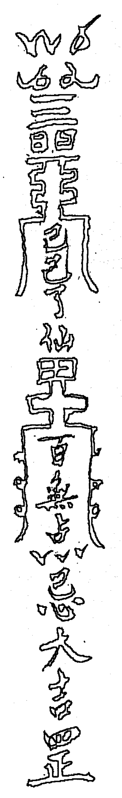

以上三道專鎮風水廟宇龍身崩破砂水反出等用符

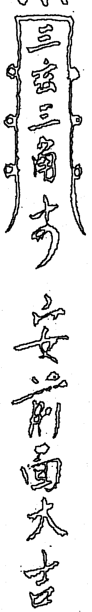

制穿山化水桶用符

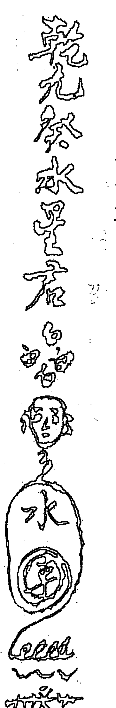

### 制山安中宮一道化水一道

二四

### 鎮三殺靈符

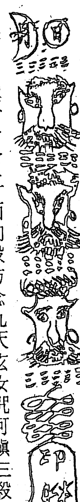

此符用桃枝二尺三寸面向殺方念九天玄女咒可鎮三殺亦保平安。

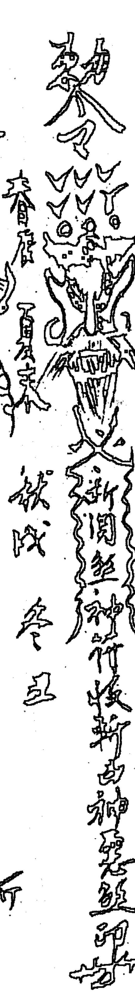

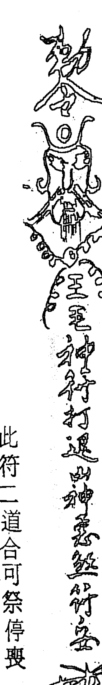

此符二道合可祭停喪

二五

合用

## 延平王

鄭成功取臺灣，此其功績所以萬世不朽也。臺灣士民懷情莫已，建廟以祀造成專祠，每年春秋二祭，各項經費，由省政府核發，行迎神禮由主祭官行上香禮，慎重將事。

## 玉皇上帝

玉皇上帝，簡稱「玉帝」，俗稱「天公」，為一切神佛之最高者。道教信徒家中皆祀之。其祀，無神像，懸吊香爐於正廳，俗稱「天公爐」，以上香致敬。農曆正月初九日，為玉帝誕辰，俗稱「天公生」，祭祀須在黎明以前拜完。各家備辦五牲（豬肉、雞、鴨、魚、卵）還有甜粿、紅龜，並放爆竹，燒香、金紙（天金），行三跪九叩禮，祈求平安。這一天上午，不可以倒馬桶，或在屋外晒女人的褲子。

## 太上老君

太上老君，俗稱「李老君」，為道教之祖，二月十五日為其誕辰。

## 三官大帝

三官大帝，即天官、地官、水官，俗稱「三界公」。其地位，次於玉帝。其稱號為「天官一品賜福之紫微大帝」、「地官二品赦罪之清虛大帝」、「水官三品解厄之洞陰大帝」。三神奉玉帝之命，管轄三界。神誕：天官為農曆一月十五日（上元），地官為七月十五日（中元），水官為十月十五日（下元）。臺灣正廳的天花板均掛有一對提燈（天公燈），祭祀時點亮。三界公生，在燈下設桌供奉五牲與紅龜。

二七

## 釋迦牟尼佛

釋迦牟尼佛，俗稱「如來佛」，為佛教之教祖。農曆四月初八日為其誕辰，俗稱「浴佛節」。此日佛教徒均舉行盛典慶祝。

## 觀音佛祖

觀音佛祖，即佛經上之「觀世音菩薩」，俗稱「觀音媽」。農曆二月十九日為其誕辰。觀音媽生日，祭祀以水果、菜碗（冰糖、糕仔、壽桃、壽麵等），燒壽金。

## 阿彌陀佛

阿彌陀佛，又稱「無量壽佛」。農曆十一月十七日為其誕辰。

## 地藏王

地藏王，又稱「地藏王菩薩」、「幽冥教主」。統率陰間十殿閻羅王，檢察人間善惡，予以獎懲。農曆七月二十九日為其誕辰。

## 天上聖母

二八

康熙二十三年，就鄭氏時寧靖王之一元子亭園，改修為「大天后宮」，即今臺南市大天后宮，相傳當時並乞安平開臺媽祖宮的香灰以塑鎮殿媽祖金身。爾後，天上聖母，俗稱「媽祖」。北港之朝天宮、北投之關渡宮、馬公之天后宮，被稱為五大媽祖廟。三月二十三日，為媽祖生辰。媽祖生日結綵懸燈，演戲遊街，非常熱鬧。各地有廟，也有在家裏奉祀。備辦牲醴（三牲或五牲），放爆，焚香、燒金，三跪九叩，祈求家內平安，家運隆盛。載北港各地之媽祖也多乞求安平媽祖宮的香灰雕金身的，故安平媽祖宮每次建醮祈安，而各地的媽祖神像也來鑑醮，臺南市大天后是正「開臺媽祖宮」

## 城隍爺

城隍為護土佑民之神，又為司法神，故信徒遇病患災厄，輒詣城廟祈禱，求神庇護，如有疑難，亦輒往求告。本省城隍大祭，每年農曆五月十三日舉行。臺北霞海城隍廟，香火最盛，善男信女，拜拜

不絕。

## 福德正神

福德正神，即土地之神，俗稱「土地公」。農曆二月初二日，為土地神誕，到處演戲盛祀，以謝神恩。土地公亦為商人崇拜之財神，商家例於每月朔望之翌日，具饌祭祀土地神，日做迓。二月二日日頭迓，十二月十六日日尾迓。農家於二月二日及中秋，以紙錢（俗稱土地公金）繫竹枝，插立田間，奉獻土地神。

## 玄天上帝

玄天上帝，一稱「玄武大帝」，俗稱「上帝公」，屠戶祀之。又為保護小兒之神。農曆三月三日，為其誕辰。

## 呂純陽祖師

呂純陽祖師，又稱「妙道天尊」、「孚佑帝君」。理髮業者奉之為先師，俗稱「仙公」。農曆四月十四日，為其誕辰。

## 九天玄女

九天玄女，即「女媧娘娘」，農曆九月初九日為其誕辰。

## 靈官大帝

靈官大帝，又稱「五顯大帝」、「五行大帝」，為巫者所祀之神，農曆九月二十八日為其誕辰。

## 保生大帝

保生大帝，又稱「吳真人」、「大道公」。農曆三月十五日為其誕辰。

## 五雷元帥

五雷元帥，又稱「雷公」，為撲殺惡人及暴殄五穀者，農曆六月二十四日祭祀之。

## 水仙宮（祀水仙王）

## 張天師

張天師，臺灣各地道士壇均祀之。農曆五月十八日，為其誕辰。

清水祖師，俗稱「祖師公」。閩屬之安溪人奏祀之，農曆正月初六日，為其誕辰，各祖師廟演戲拜拜。

關聖帝，即「關公」，俗稱「關帝爺」，為商人之保護神，農曆五月十三日，為其誕辰。

至聖先師，即「孔子」，農曆八月二十七日為其誕辰。

神農大帝，亦稱「五穀大帝」，又稱「藥王大帝」。農曆四月二

十五日為其誕辰。

七星娘娘

## 七星娘娘

七星娘娘，俗稱「七娘娘」。農曆七月初七日，為其誕辰。

## 廣澤尊王

廣澤尊王，乃泉州移民守護神，俗稱「聖王公」，農曆八月二十三日，為其誕辰，信者攜牲醴香燭到廟參拜。

## 開漳聖王

開漳聖王，乃漳州移民守護神，農曆二月十五日，為其誕辰，漳州人祀之。

## 三山國王

三山國王，乃潮州移民守護神，農曆二月二十五日，為其誕辰，潮州人祀之。

## 文昌帝君

文昌帝君，俗稱「文昌公」，其誕辰為農曆二月初三日，文人及塾師祀之。

## 靈安尊王

靈安尊王，俗稱「青山王」，乃為司法之神，農曆十月二十二日為其誕辰。

## 東嶽大帝

東嶽大帝，乃陰間檢察，其聖誕為農曆三月二十八日。

## 中壇元帥

中壇元帥，乃鎮壓邪鬼之神，農曆九月初九日為其誕辰。

## 法主公

法主公，乃法力之神。

## 臨水夫人

臨水夫人，安胎保產之神，婦人祀之。

## 司命灶君

灶君是竈神。農曆八月初三日為其誕辰。供奉壽麵、清茶、香燭、燒壽金。

## 註生娘娘

註生娘娘，保育之神，婦女祀之。

## 有（萬）應公

在山地、鄉村、田園、路旁等處，建有有應公廟，係祭祀無主孤魂。

## 祭祀禮儀

祭祀，乃為人神相接之具體表示，用意固在敬神，而亦重在求神。所謂敬神，即敬天尊祖，崇德報功是也。求神，不外乎祈禱，個人方面，所祈禱者，在消災降福，富貴長命。集體方面，所祈禱者，則在風調雨順，合境平安。

祭祀，必有其禮儀。禮儀，必有其方式。其內容與方式，大致如下：

1. 神前擺列牲饌祭品。
2. 燃點神案蠟燭。
3. 神前獻茶三杯。
4. 焚香迎神。
5. 敬酌第一次酒。
6. 擲杯筊以問神明之降臨。
7. 神明既降，進第二次酒。
8. 有祈禱於神明者，擲杯筊以問神明之諾否。
9. 雙手捧持冥紙與爆竹，拜供神明察看。
10. 焚燒冥紙，燃放爆竹。
11. 進第三次酒。
12. 擲杯筊，問神明已否饗畢。
13. 持酒潑灑冥紙灰燼，以防紙灰飛散。

禮儀中，有五項須略加說明：

一、牲饌 牲醴有三牲五牲之分。三牲：為豬、雞、魚三品。五牲：為豬、雞、鴨、鵝、魚、卵（或他物）。三牲五牲之外，更有羅列山珍海饌之屬者。

二、茶酒 祀神必獻茶、酒，尤以酒為不可缺。俗云：「拜神無酒擲無筊。」意謂非酒不得神之滿意也。偏僻地方，一時買不到酒，則以生米泡水代之，稱做「米酒」。

三、香燭 俗稱燒香點燭。可見香與燭，為拜神所必需之供物。

四、冥紙 俗以紙製各種錢幣焚化之，以供神明及死亡者應用，謂之冥紙。冥紙種類繁多，大別之，可分為「金紙」、「銀紙」兩類。

茲列表如下：

### 金 紙

- 盆金：玉皇上帝，三官大帝。
- 頂極：分大極小極二種，用於諸神。
- 天金：分頂極天金、大天金、中天金、小天金四種，拜獻玉皇大帝、三官大帝。
- 壽金：諸神。
- 福金：福德正神等。
- 中金：中壇元帥、玉皇大帝、三官大帝。

### 銀 紙

- 銀紙：分大小銀兩種，大銀用於祭祀祖靈，小銀用於鬼差。
- 高錢：謝神祭祀時燒用。
- 白高錢：行喪時，懸掛門戶。
- 庫錢：納入棺內，俾死者冥界使用。
- 外庫錢：放逐小鬼時，給與零用。
- 燈坐：謝神祭祀時，裝入六甲。
- 經衣：作為鬼衣。
- 金白紙：諸神部屬零星費用。
- 替身：白虎、黑虎、天狗、五鬼。
- 婆姐衣：註生娘娘及其部屬十二婆姐。

五、擲杯筊 筊以竹木斲削，如彎月形，有兩具，外突內平，外稱陽，內稱陰。占時，則擲於地，一陽一陰為聖筊，表示神明許諾之意；兩陽為笑筊，表示神明冷笑，吉凶未明；兩陰為怒筊，表示神明怒斥，凶多吉少。禱者有所祈求，先示答謝條件，擲杯筊以問神。及至如願獲償，乃擇吉履行條件，備禮告祭，俗稱謝神。

## 請 天 神 文

焚香拜請。伏以日吉時良。天地開張。當空結座高臺。立案焚香。香煙沉沉。神必降臨。香煙繞起。神通萬里。拜請年值功曹。月值使者。傳香童子。奏事童郎。為民傳奏。傳奏 昊天金闕玉皇大帝陛下。無極瑤池王母娘娘。金闕化身。玄天上帝。各請降臨。再來拜請。東極青華大帝。西極浩靈大帝。南極長星大帝。北極紫微大帝。中極無量大帝。再來拜請。上元一品賜福天官。中元二品赦罪地官。下元三品解厄水官。三元三官大帝。再來拜請。大慈大悲觀世音菩薩。曰文曰武。乃聖乃賢。大成至聖先師孔夫子。五大聖人文昌帝君。關聖帝君。孚佑帝君。蒼頡至聖。五穀神農皇帝。五顯靈官大帝。九天東廚司命真君。概道正神。門徒等眾。各請降臨。再來拜請。日宮太陽星君。月府太陰星君。金木水火土五星君。本命元辰星君。值年太歲星君。各請降臨。拜請南斗星君。北斗星君。註福註祿星君。消災降福星君。各請降臨。拜請本省府縣城隍爺爺。五方福德正神。上至溪源。下至水口。里社真官。井灶龍神。門神戶位。各帶隨來香火將神。直日虛空過往見聞等眾。各請降臨。有事通請。無事不敢亂請。今有合庄（家）信士人等。為某某事。愛本月某日。六神通利。四道開張。虔具誠心齋戒。在於當空結座高臺。點起爐內清香。清油火燭。煎起高山綠水。清茶美酒。香花果品。高（長）錢一對。表文一封。燈座酒筵。列在臺前。下界備有全豬全羊。牲饌齋筵果蔬品。香楮清酌之儀。伏望天神爺爺收領。謹具奉申。一從上連請三次。再來拜請天地神明。在天者。騰雲駕霧。在地者。推車駕馬。在水者。搖船駕槳。在宮者。離宮出殿。宮宮須到。殿殿通聞。揭開雲頭。含香降臨。請得眾神。到在臺前坐位。一聖杯證明。第一巡酒漿。開壺酌酒。到坐以吉。到坐以遇。請得東來東坐。西來西坐。南來南坐。北來北坐。中央架起蓮花寶座。請得眾位天神一來到座。二來領受。領受爐內清香。高燈寶燭。香花菓品。綠水清茶米酒。高（長）錢一對。燈座一副。領受得已。領受得過。第二巡酒漿。開壺酌酒。（讀表文）拜請諸位天神。寬寬飲酒。寬寬領受。祈求庇佑。庇佑合庄（家）信士人等。星辰高照。祿馬扶持。腳踏四方。方方皆利。身高映大。萬事清吉。行在人前。座在人上。保護老者。老如青山不動。幼者幼如江水長流。男添百福。女納千祥。求福者。福如東海。求壽者。壽比南山。讀書者。名標金榜。耕田者。積谷千倉。做工者。百藝精通。生理者。萬商雲集。再來保佑。六畜成群。大興大旺。第三巡酒漿。開壺酌酒。以週加爵。再來酌上尾滿巡酒。尾滿漿。再祈庇佑合庄（家）信士人等。各各名字。上在表文。百凡好事。重重庇佑。庇佑平安。現奉表文一封。燈座一副。金紙高（長）錢。一概焚燒變化黃金。伏乞諸位尊神收領。一化財後送神復請（小小酒筵。不敢久留。退下口牙。稽首奉送。香花迎送。迎送諸位天神爺爺。在天者歸天。在地者歸地。在宮歸宮。在殿歸殿。各歸原位。來則施恩。去則降福。保庇弟子等各各昌盛。大興太旺。不敢多言。不敢多語。奉送一禮。稽首奉送。香花迎送。三跪九叩。禮畢

## 天神表文

昊天金闕玉皇大帝陛下

伏以

天德巍峨 萬彙均沾化育

神恩浩蕩 四民共賴維持

故感戴之有年。斯報酬於是日也。士庶咸頌。稽首頓首。百拜上言。為叩求酬良願事。今據臺灣省某區某鄉居住信士某某為某某事。合庄（家）人等。依叩蒼穹之下。對揚碧落之中。瀝誠上瀆泥首陳詞。竊念生居下士。忝值人倫。承乾坤覆載之深恩。有求必應。荷日月照臨之厚德。感而遂通。愧無片善。答謝恩光。茲逢吉日。奉道酬恩。統合庄（家）人等。誠心齋戒。當空結臺。虔備上界齋蔬菓品。燈座酒筵長錢金紙。又具表文一通。上奉玉皇大帝陛下。又備下界全豬全羊。牲饌酒筵齋蔬菓品。香楮清酌之儀。伏乞府鑒下情。表微忱於此日。宏施大德。更申錫于他時。行見螽斯蟄蟄。瓜瓞綿綿矣。下民等。不勝感激。靡涯之至。謹拜表以聞

天運

某年月日

某某百拜上申

## 請 眾 神 文

伏以日吉時良。天地開張。低頭下拜。躬身焚香。香煙纔起。神通萬里。香煙沉沉。神必降臨。拜請傳香童子。奏事童郎。為民傳奏。今有臺灣省某縣某鄉某村。吉宅居住。信士某某。點起爐內清香。高山綠水。清茶美酒。齋蔬菓品。紅龜粿粽。三牲酒筵。金銀財寶。排在座前。一為因某某事。一一或為某某神聖壽誕。一躬身拜請。拜請南無大慈大悲觀世音菩薩。五顯靈官大帝。五穀神農大帝。三界伏魔大帝。天上聖母娘娘。梅溪助國國王。三清靈應公主。拜請楊大福德正神。值日功曹。日月三光。門神戶位。簷前使者。居家香火。井灶龍君。本境土地。福德正神。眾位神祇。古跡靈神。到座領受。歡心受納。一請理當二請。二請當三請。三請以週。請得在天者。騰雲駕霧。在地者。推車駕馬。在水者。搖船駕槳。在宮者。離宮出殿。宮宮須到。殿殿通聞。撥開雲頭。含香降臨。到在堂前座位。一聖杯證明座。南來南座。北來北座。中央結起蓮花寶座。大神座高。小神座下。神多盡少。俠座相容。千神共盞。萬神共杯。一來到座。二來領受。香煙茶酒。齋蔬菓品。紅龜粿粽。三牲酒筵。金紙錢財。排在臺前。眾位神祇。同來領受。再來酌酒巡漿。二來領受。三來保佑信士人等平安。百凡以意。萬事清吉。保佑以吉。保佑以週。再來酌上第三巡酒漿。信士某。具有一分金紙銀紙。打開金箱玉庫。炳燈烘火燒化。重重領受。重重保佑。再來酌上尾滿神酒。尾滿神漿。開壺酌酒。高興飽醉。含笑喜歡。酒在壺中。自斟自酌。自把自飲。一點落地。萬神皆醉。紙錢過化。神不久座。小小酒筵。不敢久列神前。來有名香三請。去時禮當奉送。奉送天神歸天。地神歸地。有宮歸宮。有殿歸殿。神神有送。惟有本家祀奉香火無送。整頓金爐。信士每朝晚祀奉。不敢多言。不敢多語。香花迎送。稽首奉送。

## ○ 太 歲 符

俗稱：「太歲當頭坐，無喜必有禍。」如有男女逢太歲星君之年，須要安奉此年太歲星君，可保平安無事。安時用紅紙寫當年太歲星君姓名，擇正月中吉日吉時安之，以用四菓清茶香燭供奉自安。謝時是十二月二十四日。每月逢十五日奉拜，自然安吉。

## ○ 天空符

年逢天空星（太陽），主人虛花不聚財，休管他人事，自免是非破財。並防家庭風波，與人不和之害。每月逢二十七日晝間，向東方叩拜太陽星君，將此符和金紙燒化，即保平安。

## ○ 喪門符

犯喪門星，主孝服、損財、不吉之事。不利探病，送喪休看，以免受災禍。宜制凶殺星，以保平安。

## ○ 太陰符

犯太陰星，作事恐有糾纏，男人且有色情破財之憂，並防家庭風波。每月二十六日之夜，向西方叩拜太陰星君，將此符和金紙燒化，即保平安。

## ○ 五鬼符

五鬼星入命，有無故平地起風波之虞，故須慎防災憂，官符更須防，交友應注意，不慎則招官訟、牢獄、破財之災。如能將此符與替身（銀紙）焚化，五鬼自然運財到家。

## ○ 死符符

有死符星，主爭鬥、疾病、官刑、破財、不吉之事。此年勿探看病人，並宜制化凶星，以保平安。七月中元前，用此符和替身一銀紙一焚化，即保平安。

## ○ 歲破符

歲破星，凡事欠吉，事有麻煩，破財招災之憂，凡事忍耐，安份守己，拜神叩祈，自可無憂。將此符在五日節前制化，可保合家平安。

## ○ 病符符

有病符星，恐身體欠安，此年勿入病人家，勿食喪物，注意小心保護身體。若犯者，用此符與藥方治者，快癒也。

## ○ 破邪符

有人想謀取人家之房屋，以邪符引鬼入內，使房內常有怪聲，或有怪物出現，或使其家人常生疾病，或演出種種不祥之事，可將此符在正門內焚化，加酒三杯，以中指沾水遍灑屋內外，口念咒語，即可破之，而保平安。

## ○ 天狗符

天狗星入宫，有損傷之患。在中元前，用此符制化天狗凶星，自可保平安。

## ○ 護身符

將此符帶身，可保富貴平安。（又看靈驗神符平安篇第一五至四五頁）

## ○ 白虎符

白虎星入宮爲害，恐傷人口、血光病難、外傷、孝服及其他不測凶事，或有官事，或破財難免。但有喜則可破災，無喜百事來，故宜制化。用此符和生三牲祭送可保安寧。

> 以上咒曰：「天靈地靈，無私神明，逐邪祛怪，祟化無蹤，急急如律令敕。」

## ○ 五雷平安符

凡家內不靜以黃紙硃筆書符貼不寧處以保平安，使府上百無禁忌，五路財神全來並能招財進寶。小孩日夜普唵佛令，唵嘛呢叭咪吽保護，並有日月星辰互照。

## ○ 鎮宅平安符

將此符用黃紙硃書，貼於門上或屋中，可鎮宅保平安。

## ○ 五方神平安符

此符五彩紙書之貼於五方顯明之處即安之。

咒曰：天地自然，穢氣分散，洞中玄虛，晃朗太元，八方威神，使我自然靈寶符命，普告九天，乾羅答那，洞罡太玄，斬妖縛邪，度人萬千中山神咒，元始玉文，持誦一遍，卻病延年，按行五嶽，八海知聞，魔王束手，侍衛我軒，凶穢消散，道氣長存，急急如律令太上老君律令敕

## ○ 破穢平安符

凡家內不靜以黃紙硃筆書符貼不寧處以保平安。咒曰：「謹調破穢，清水生名吾雷使者，動得妖精，復水國去，速去萬里，摧得奉行，不得久停，急急如律令」。門上貼一道大吉 佩一道大吉

## ○ 鎮宅逐怪破邪符

用紅紙書御祀奉其圖，貼於顯明之處即安之。

## ○ 白蟻驅除符

化水各處散之其蟻自滅。

## ○ 鎮宅平安符

此符專用辟邪，五雷令人將軍親來收斬妖斬凶神消衍官符。

## ○ 鎮宅驅犯符

用紅紙書御祀奉其圖，神則不犯之。

## ○ 鎮宅平安符

## ○ 鎮煞平安符

此符紅布寫，新居上樑或人口不安鎮之

## ○ 避大禍鎮煞平安符

貼門上

## ○ 避竊盜靈符

此符以黃紙硃書之貼於前門，若遇樑上君子光顧，進門後就心不自主，不盜而走，保留屋內各物，非此符不可。此符忌存不良，傷天害理請勿用此符否則損人口不安寧。

## ○ 保平安鎮宅符

此符黃紙硃書，廳中貼之，諸事平安，用此符必誠心，不做害利傷天事，永遠靈驗。

## ○ 動工開工符

## ○ 開工吉利符

## ○ 閨房靈符

結婚前將此符黃紙硃書之貼於房門諸事如意

（請閱三元備用百鎮符有詳細說明）

## ○ 完工解

拜家神灶神畢用神前淨水以柳枝遍洒門柱各處口誦云：「天地陰陽日月星光，凡有鬼魅俱變吉祥吾奉太上老君律令不住口誦俟洒完止。」

## ○ 中岳符

凡屋宇參差不齊或長短濶狹門路不合間架不勻主出孤寡人丁稀少一宜以此符鎮中堂，若城市店房不能合吉亦以此符鎮中堂吉一

## ○ 辟鼠符

值寅月子日子時硃書此符於灶上勿令人見鼠即無矣。

## 救度魚鳥咒

凡遇人捕魚鳥點念南無寶勝如來七遍魚得脫又見人垂釣布網日虔誠默念揭諦咒七遍可使終日獲。

## 豎柱上樑

選一上吉日豎柱上樑但要在一日又宜在上半日太陽光照時最能伏治諸煞不可用夜間時刻，豎柱時要選大吉上樑即次吉亦不妨豎柱樑預防匠人將柱之上下樑之左右安放掛棄頭髮斷筋壞墨及諸獸魚毛骨魅物件上樑時不許匠人用斧鑿墨筆則不能魅止許用木榔頭敲上最妙，預用大紅紙橫寫六字真言俟上樑時即貼在正樑上再用硃書鎮宅符一道貼於樑下以鎮凶煞魅樑之頂上將板物遮蔽不可爲風雨損壞符字。

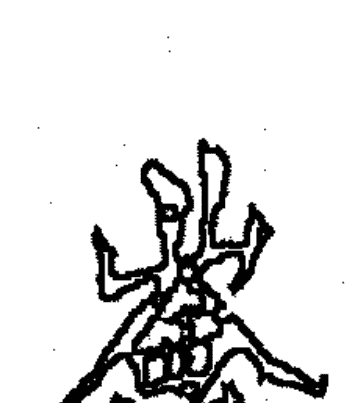

## ○ 解 鎖 符

取啄木鳥之血合硃砂書符其鎖自然解脫。

## ○ 止 百 虫 飛 入 灯 咒

每夜初上灯時先執灯草在手誦咒曰：利瑟吒護救衆生離煩惱。

一氣念九回，然後將灯置盞內之諸虫不入。

## ○ 除 木 虱 咒

張三賢買了木瓜不還錢，一去三十年書于紙上貼床腳自能消除或

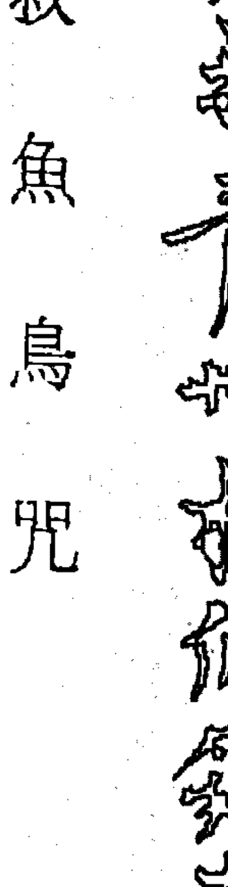

書欠我青州木瓜錢七字貼床腳亦驗。

## ○ 救 魚 鳥 咒

見人捕魚鳥者一人專注其人不起別念默念佛號十聲或百聲愈多愈効一念南無多寶如來南無寶勝如來南無妙色身如來南無廣博身如來南無離而畏如來南無甘露王如來南無阿彌陀如來。

## ○ 蚊 符

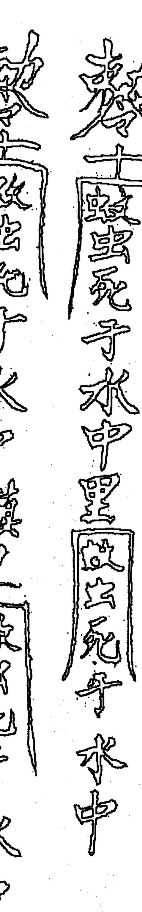

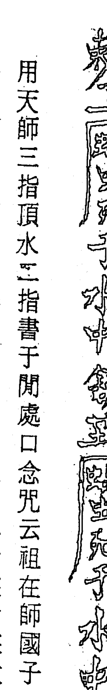

用天師三指頂水三指書于閒處口念咒云祖在師國子孫在界州原來是水性生成老蚊頭吾今奉帝令令敕爾水中浮姑蘇姑蘇姑蘇敕法書符吾今日念咒爾歸湖天靈靈地靈靈蚊虫之類不得留停盡歸一角不得動 謹奉太上考君急急如律例速速。

## ○ 放 蚊 咒

放蚊咒曰放蚊虫速速上天宮准吾法令此咒此扇不是凡扇此水不是凡水長腳蚊公短腳蚊母我今晚與你同我睡盡皆化爲塵樑虫放你歸山尋祖宗急遵老君急急律令。

## 收 驚 秘 法

用小碗盛滿白米，取小兒所穿衣服一件，將碗米包起，點香禱告（收驚文），禱畢燒金，然後將衣服解開給小兒穿。鄭重其事者，則在祖師面前擺設四菓收驚。

## 收 驚 文

香煙通法界。拜請收魂祖師降雲來。四大金剛降雲來。天摧摧。地摧摧。金童玉女扶同歸。收到東西南北方。收到中央土神公。本帥來收驚。本師來收驚。不收別人魂。不討別人魄。收你信女子某姓某名一本命宮幾歲一魂魄回。備辦魂衫魂米。拜請列位尊神助我來收魂。三魂歸做一路返。七魄歸做一路回。（燒金）燒錢燒化江湖海。毫光發現照天開。收魂祖師下金塔。神仙兵將降雲來。（急咒）神兵神將火急如律令。仙人爲我敕白米。祖師爲我敕白米。衆神爲我敕白米。白米敕起起。敕離離。消災改厄身無病。（停頓）香煙纔起通世界。三魂七魄收返來。收魂三師三童子。收魂三師三童郎。勿食黃泉一點水。萬里收魂亦着歸。三魂飄飄歸路返。七魄茫茫歸路回。魂歸身。身自在。魄歸人。人清采。收你某某三魂七魄回返來。（急咒）吾奉太上老君敕，神兵神將火急如律令。急急如律令。又

## 天師爺收驚符

着驚大體幼兒孩童多。此符能起煞收驚，應驗極速。若有着驚，可將符貼於案前，神案前點臘燭，施術（男女均可）時燒香。茶杯。鹽米。在患者前告神諸病症，後念收驚咒三篇。

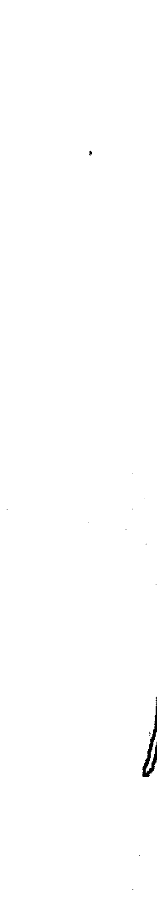

## 天師爺收驚咒

祖師助吾來收驚。本師助吾來收驚。仙童玉女助吾來收驚。合壇官將助吾來收驚。王仙元師助吾來收驚。太老老君助吾來收驚。王仙老祖助吾來收驚。清水祖師助吾來收驚。普庵教主助吾來收驚。觀音佛祖助吾來收驚。齊天大聖助吾來收驚。騰麒麟聖者助吾來收驚。保生大帝助吾來收驚。謝府元帥助吾來收驚。中壇太子助吾來收驚。五府千歲助吾來收驚。菩薩祖師助吾來收驚。現壇官將助吾來收驚。黑虎大將助吾來收驚。空中元帥助吾來收驚。三百六員官將助吾來收驚。拜請三師三童子。三帥三童子。弟子爐前獻香念咒請，仙師到壇前助吾來收驚。

驚無驚。九戊十亥驚無驚。三辰四巳驚無驚。五午六未驚無驚。七申八酉正寅二卯驚無驚。

鼠驚無驚。牛驚無驚。虎驚無驚。兔驚無驚。龍驚無驚。蛇驚無驚。馬驚無驚。羊驚無驚。猴驚無驚。雞驚無驚。狗驚無驚。豬驚無驚。東方路頭。西方路尾。跌倒驚無驚。南方路頭。北方路尾。跌倒驚無驚。中方路頭。五方路尾。跌倒驚無驚。庭頭庭尾。巷頭巷尾。床頭床尾。路頭路尾。路邊路角。跌倒驚無驚。爬上高。跌落低。爬上坎仔頂。跌落坎仔下驚無驚。眠床頂。跌落眠床下。椅子頂。跌落椅子腳驚無驚。大驚。小驚汝無驚。男驚。女驚汝無驚。父驚母驚汝無驚。公驚。婆婆驚汝無驚。厝邊隔壁。大大小小驚汝無驚。

正月失一娘，二月會二娘，搶治無驚。

三月李三娘，四月阮四娘，搶治無驚。

五月王五娘，六月蔡六娘，搶治無驚。

七月錢七娘，八月印八娘，搶治無驚。

九月陳九娘，十月狄十娘，搶治無驚。

十一月溫十一娘，十二月搶治無驚。十二青驚娘搶治總無驚。

收着頭，好離流，收着耳，好離離。收着眼睛，好細膩，收着面，好到無記認。收着肚，好好無事路。收到清清氣。怜 無事至。食飽餒，睡飽覺。百病消除，順手好離離。

## 天師爺收土神符咒

收土是用於屋裡欠安，如損財，病痛，傷亡，家庭不和，小兒着驚均可用之，以黃紙硃字畫符乙道，施法時，求收土神，唱收土神咒，並以勅鹽米於東西南北中五方，勅之三次，誠心求之必應。

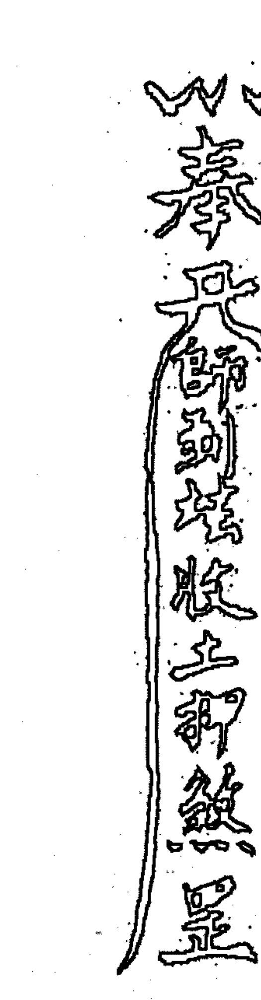

## 天師爺收土神咒

祖師助吾收土來收煞。本師助吾收土來收煞。仙童玉女助吾收土來收煞。合壇官將助吾收土來收煞。王仙元師助吾收土來收煞。太上老君助吾收土來收煞。王仙老祖助吾收土來收煞。清水祖師助吾收土來收煞。普庵教主助吾收土來收煞。觀音佛祖助吾收土來收煞。騰麒聖者助吾收土來收煞。保生大帝助吾收土來收煞。五府千歲助吾收土來收煞。黑虎大將助吾收土來收煞。空中元帥助吾收土來收煞。三百六員官將助吾收土來收煞。

拜請三師三童子，三師三童郎，弟子爐前獻香念咒請請仙師到壇前助吾來收煞。

要收一點，東方甲乙木，木神木煞，飛土飛煞，東方土神青面陳貴仙，土煞周信，犯着青面煞神，犯着飛土土煞星君，二點到南方，南方丙丁火，火神火煞，飛土飛煞，南方土神紅面蔡子連，土煞池天林，犯着紅面煞神，犯着飛土土煞星君。三點到西方，西方庚辛金，金神金煞，飛土飛煞，西方土神白面張子貴，土神孝旗，犯着白面煞神，犯着飛土土煞星君。四點到北方，北方壬癸水，水神水煞，飛土飛煞，北方土神黑面林正宗，土煞楊文輝，犯着黑面煞神，犯着飛土飛煞。

頭壓屋，有人起厝做尿斛，開水溝栽樹林，頭前後壁，有人圍籬圍隙，有人蓋厝抹壁，開溝填隙，犯着飛土土煞星君，有人擔土厝地，有人疊田菁置牛犁，撈鋤頭捆菜宅，犯着飛土土煞星君，有人出肥糞堆，掘土捆做高疊，有人拆舊厝土壁，蓋厝頂塔總鋪，滾乾鑿巷路，有人糊灶，庭頭庭院，有人徒缸徒甖，徒輕徒重，開箱開籠，張門張窗，犯着飛土土煞星君。天煞地煞，陰煞陽煞，耍煞喜煞，妖煞魔煞，火煞水煞，三十六天罡，七十二地煞，總共一百零八煞，收收清氣，憐無事到，無燒熱，無飽氣，食飽飯，睡飽眠，百病順手消除好離離。

## ○ 收驚符

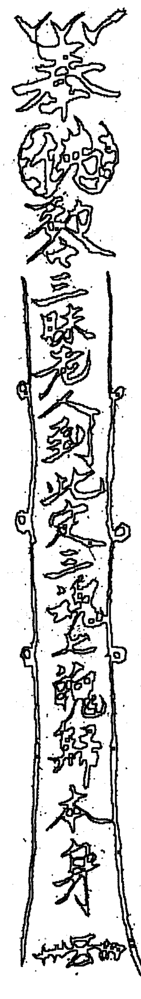

收驚咒：「本師來收驚，本師來收驚，收驚三師三童子，收驚三師童子郎，不收別人魂，不討別人魄，收你某某三魂七魄，收來顧本命，吾奉太上老君敕，神兵神將火急如律令，急急如律令。」

## ○ 收驚符

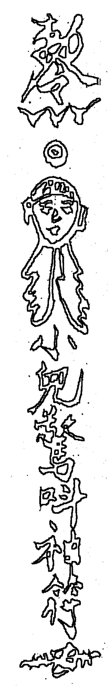

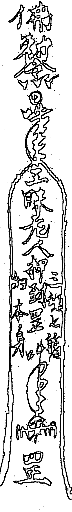

此符貼在移動之處即靈驗。貼之前用二次清米水將有動之處用水散之，後貼之更驗。

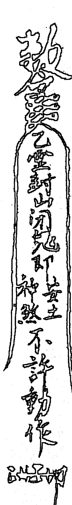

○ 小兒犯新娘殺符

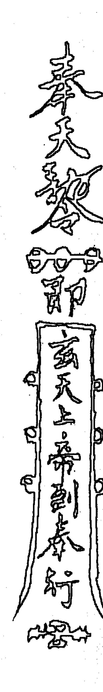

○ 鎮煞符 冲犯洗用

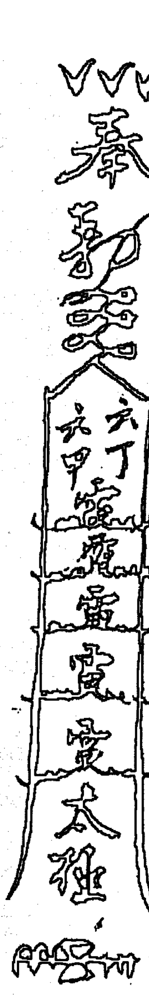

## ○ 小兒夜啼符

小兒驚叫收魂，宜用香三支，金七張符一道合共門外叫魂回本身可用收驚三夜即驗。

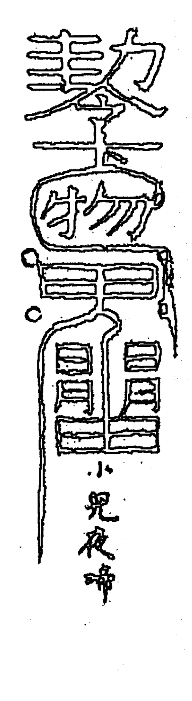

## ○ 小兒夜啼符

此符和壽金一千在床前燒化即効。

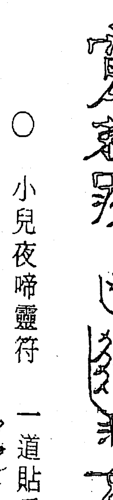

## ○ 小兒夜啼靈符

一道貼房中，一道燒化。

## 關飛煞

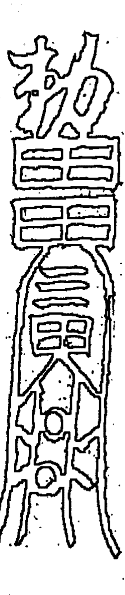

○ 小兒關煞符

甲己巳酉丑。庚辛亥卯未。壬癸庚午戌

乙戊丙丁子。不過三日關。

◎勿看殺生。童限難養。夜生不妨。

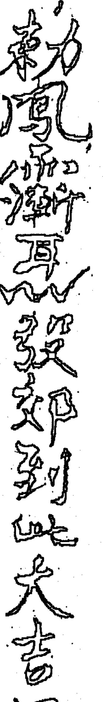

○ 小兒沖犯新娘靈符

化食

一道帶

一道泡餅食

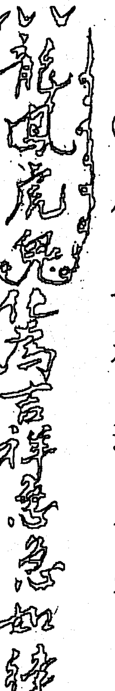

○ 小兒夜遺尿符

此符化服即効。

## 落井關

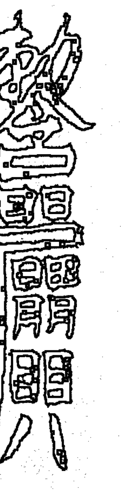

甲己見蛇傷。乙庚鼠內藏。丙辛猴見果
丁壬犬吠汪。戊癸愁逢兔。孩兒有水殃
◎勿近井水邊渡舟游泳有水厄之災。

## 浴盆關

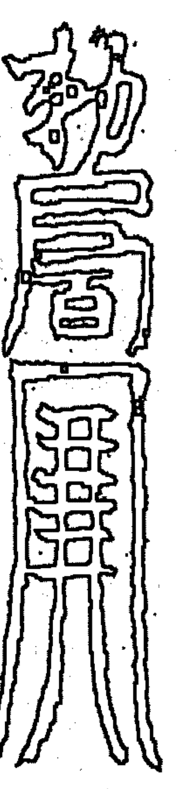

浴盆之煞四季論。春忌龍兮夏忌羊。
三秋忌犬冬忌丑。小兒初浴要提防。
◎小兒初次洗浴時小心。解厄平安。

## 鐵蛇關

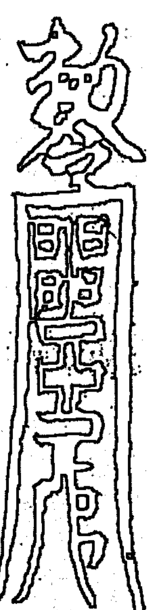

金戌化為鐵。火向未申絕。木辰枝葉枯
水土丑寅滅。鐵蛇來侵害。
◎出疹痘小心。出疹痘前宜制化。

## 將軍箭

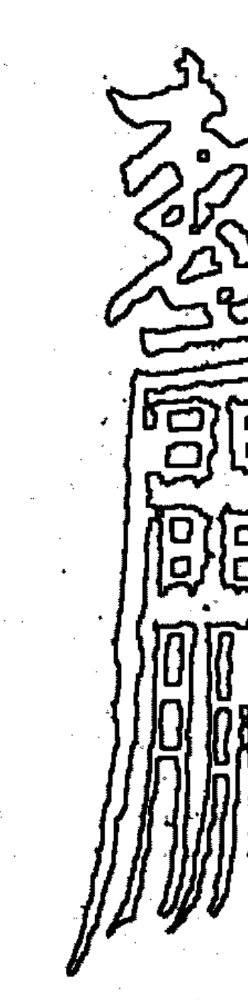

酉戌辰時春不旺。未卯子時夏中亡。
午寅丑時秋並忌。冬季亥申已為殃。
◎一箭管三歲柱中遇沖災禍臨至勿入將爺廟

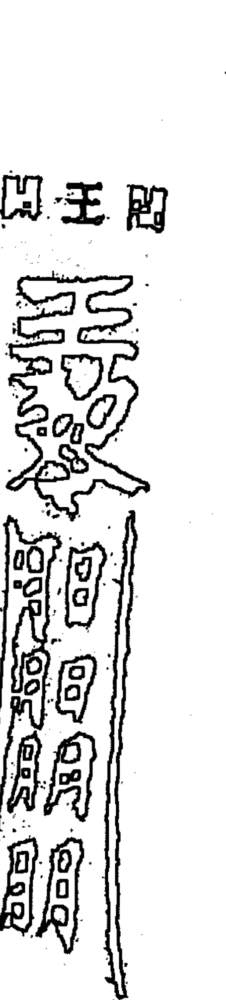

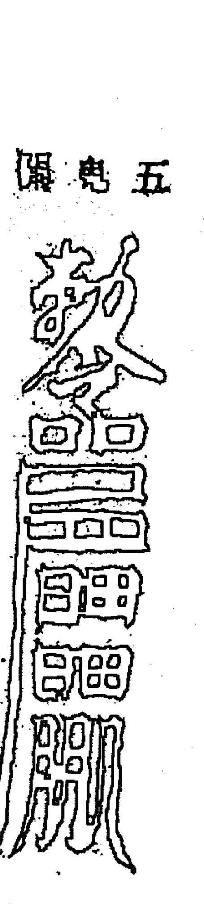

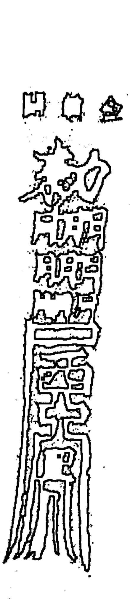

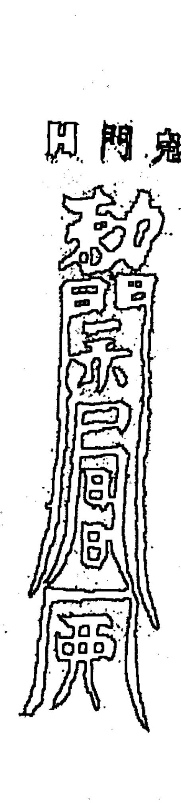

春忌牛羊水上波。夏逢辰戌見閻王。
秋怕子午當迴避。冬季生人虎鬼磨。
◎勿看功果做佛事。日主弱宜制化。
子忌龍丑忌蛇。寅忌馬卯忌羊。
辰忌猿巳忌雞。午忌犬未忌豬。
申忌鼠酉忌牛。戌忌虎亥忌兔。
◎限內勿過冢埔。勿近棺木板。
正七月申時。二八月酉時。三九月戌時
四十月亥時。五十一子時。六十二丑時
◎童限忌帶金銀鎖片錢索等物。
子嫌酉年午嫌丑。寅未申卯不須安。
亥怕辰兮戌怕巳。古賢立號鬼門關。
◎不過遠行或勿入陰廟宮寺。

## 急腳關

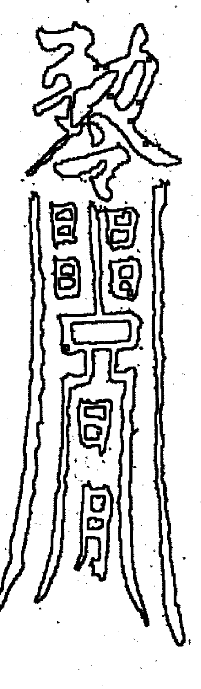

## 百日關

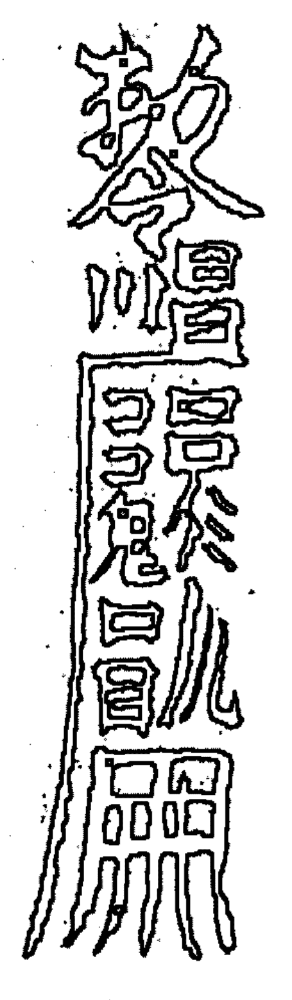

## 短命關

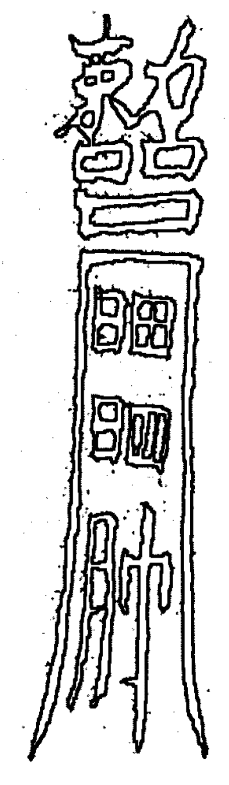

## 撞命關

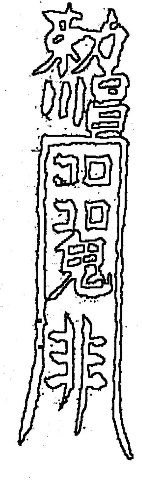

二春亥子難過關。夏逢卯未實堪傷。秋寅戌位還須忍。冬丑辰宮死不難。

◎修造、動土勿看。限內宜制化。

寅申巳亥月忌辰戌丑未時。子午卯酉月忌寅申巳亥時。辰戌丑未月忌子午卯酉時

◎童限犯之初生百日內勿出大門外。

寅午戌龍當。巳酉丑虎郎。申子辰蛇上

寅卯未尋羊。時上見主驚叫夜啼。

◎限內主小心看護。宜制化方可平安。

子蛇丑羊寅巳宮。卯鼠午未俱怕牛。

辰巳申生同忌馬。酉亥怕豬戌忌羊。

◎犯此關主難養夭壽。生後宜過房圖解

制化。

## 天狗關

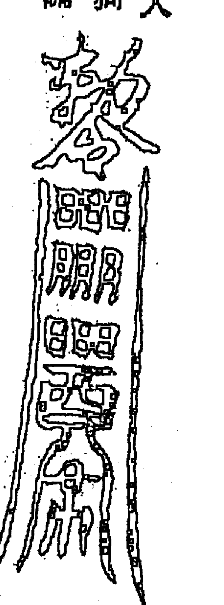

## 白虎關

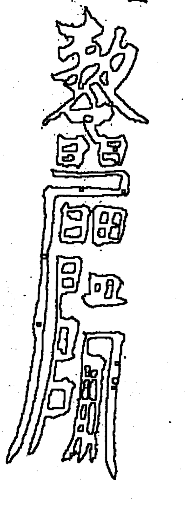

## 千日關

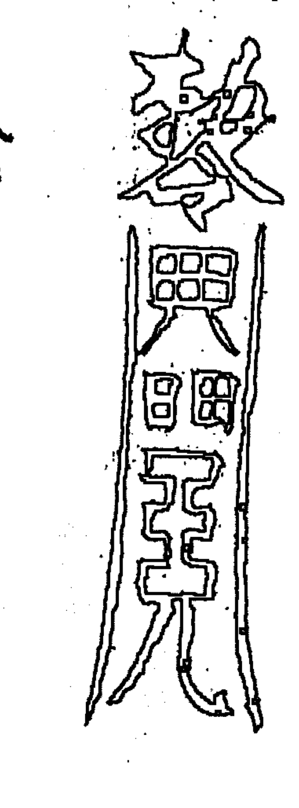

## 和尚關

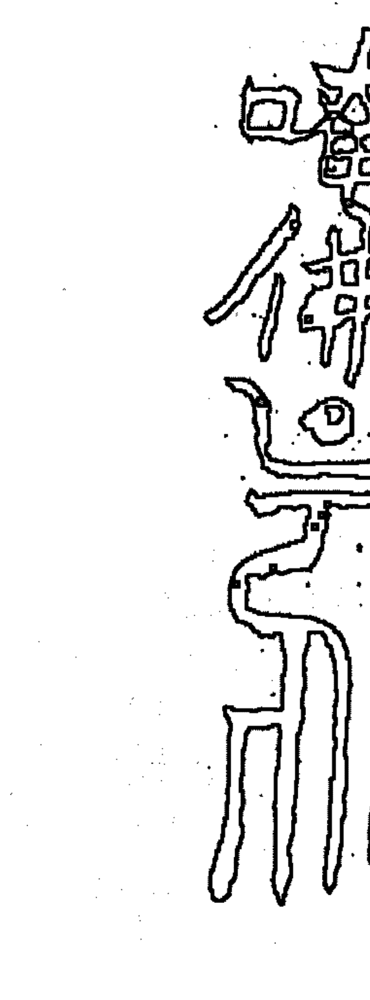

子見戌丑見亥。寅見子卯見丑。辰見寅巳見卯。午見辰未見巳。申見午酉見未。戌見申亥見酉。

◎此關有血光傷害破相等宜制化。

正二月犯申酉時。三月犯子怕戌時。四六月犯卯丑時。八十月犯卯時當。

◎出麻小心。

甲乙馬龍頭。丙丁猴雞山。庚辛虎林下。戊己蛇藏草。壬癸丑亥時。

◎未千日勿往外媽厝主驚風殃乳制化即安。

子午卯酉怕辰戌丑未辰戌丑未怕子午卯酉寅申巳亥怕申寅亥巳。便是休庵和尚關。

◎勿隨母入宮廟寺觀燒香拜佛。即可解。

## 埋兒關

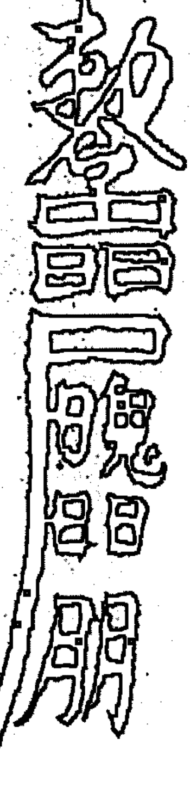

子午卯酉逢野牛。寅申巳亥山猿群。
辰戌丑未兔驚鬧。此關埋兒驚凶喪。
◎勿看出山凶喪保平安。

## 天吊關

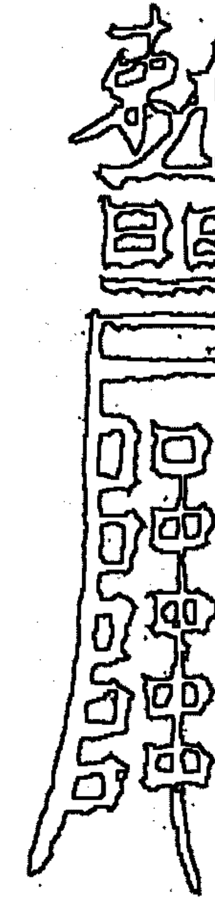

申子辰怕巳午時。寅午戌怕辰午時。
亥卯未怕申午時。巳酉丑怕卯子時。
◎重拜父母或過房。若私生子無妨。

## 水火關

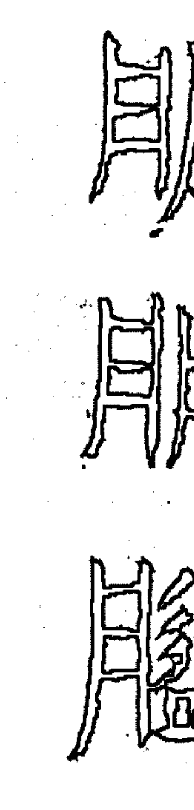

春月生人見戌未。夏月生人見丑辰。
秋月生人見丑戌。冬月生人見未辰。
◎須防水厄火湯油之災。解化保平安。

## 深水關

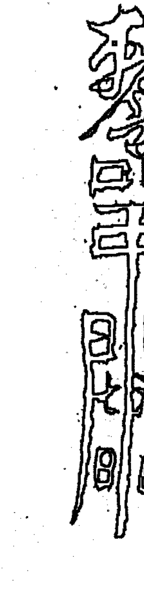

春忌寅申時。夏怕未時當。
秋季嫌酉時。冬天勿丑時。
◎清明七夕之日主不拜多病多災。

## 夜啼關

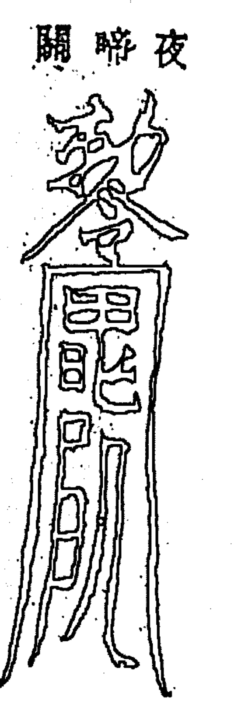

辰戌丑未虎雞當。子午卯酉單怕羊。寅申巳亥羊又忌。兒命犯之定有殃。

## 湯火關

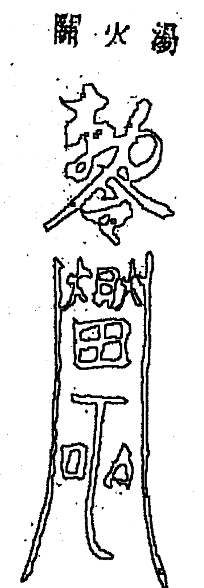

子午卯酉莫逢馬。寅申巳亥怕見虎。辰戌亥未若遇羊。湯火傷身切是防。

## 四柱關

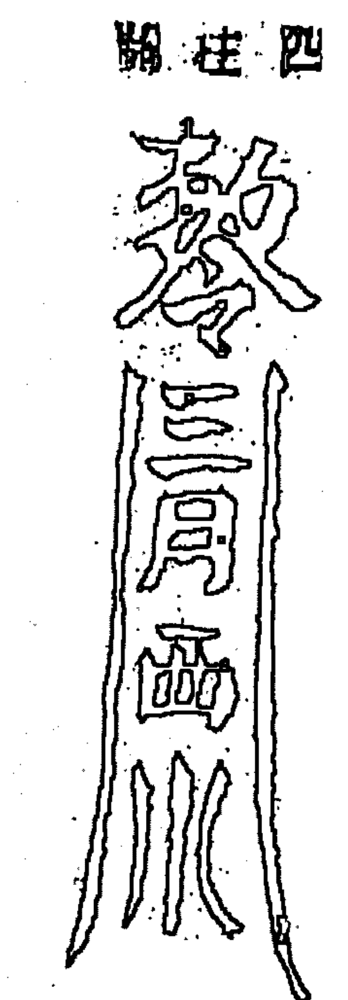

正七巳亥時。二八辰戌時。三九卯酉時。四十寅申時。五十一丑未。六十二子午。

## 取命關

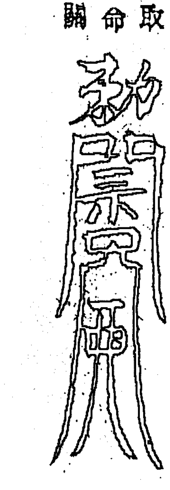

甲乙丙丁申子辰。戊己庚辛寅午戌。生兒祇怕不成人。

○與父母暫分離，俗稱忌坐轎子而已。

○限內湯火油小心。宜制化保安寧。

○限內夜間不要火。逢者制化自安。

○勿入中元壇內。勿看普渡。

## 雷公關

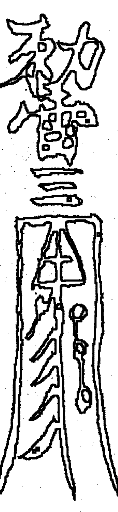

甲己逢馬。丙丁忌鼠。戊乙生犬。庚辛遇虎。壬癸鷄鼠。災見閻王。○勿抱高空。額處弄跳。注意踐倒。

## 斷腸關

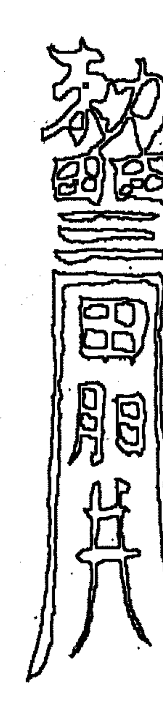

甲乙怕見午未時。丙丁生忌辰巳逢。庚辛秋金怕寅虎。壬癸冬水怕逢牛。○勿看殺豬羊。勿入屠宰場。

## 斷橋關

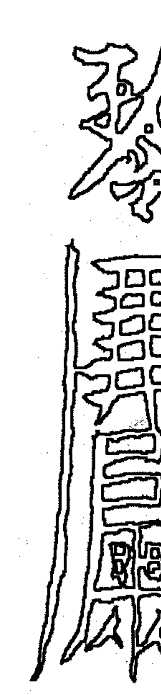

一虎二兔三猿子。四牛五犬六鷄闘。七龍八猴九馬丁。十羊十一亥二鼠。○勿渡舟過竹橋竹搖籃幼時難養壯年亦忌

## 無情關


春生忌逢寅酉子。夏生忌見戌亥巳。秋生忌遇申與丑。冬生忌值子午時。○父無偏呼。重拜亦可。以四季論斷。


春忌牛與蛇。夏生龍猴差。秋怕豬羊位。冬犬虎交加。◎四季小心。苗而不秀。必然難養多疾。


命逢血刃最難當。血氣臨身定主殃。服藥無功身體瘦。時區吐空空若還不請明人解口須教一命亡。此符鎮


巾客流年生大定傷財口舌是非來六畜提防人竊走謹防非患悲哀命犯此星須早早破不破之時有殃。此符鎮


命犯白虎神腰足十臨女病常叫苦手足不能伸請師忙解去漸漸得安若是不鎮解命在夕中。此符鎮

## 夜啼煞


春午時夏酉時秋子時冬卯時小兒日夜焦啼哭罵駭父母形勞祿明人退去花關煞才得安然方閉目。此符鎮

## 勾絞煞


命中勾絞不堪言常打官司又使錢靜坐百般閑事至終朝受牽連此煞若還不斷送經折本禍頻延 此符鎮

## 撥亂煞


命犯撥亂最無情撥亂婚姻不得成夫見妻時伴不妻見夫時怒氣沖此煞若不斬送夫妻一世不安 此符鬼字人和合字

## 沖天煞


命犯沖天煞最強五刑注定有牽張生月對時人命短生年對日壽非長有人值此須解破不解必主少年亡 用此符鎮之

## 興旺星


八字生來氣喜昌
生男育女定成行
攢有金銀并財寶
更兼招取貴兒郎
長大為妃后男兒
個個貴榮昌
此符鎮

## 迷魂煞


有金有水休犯火
四柱相刑迷魂鎮
前世命中帶將來
今生災難無處躲
明師斬斷造修
蘊父母才得心
此符鎮

## 狐狸煞


命犯狐狸實可憐
或男或女定遭愆
不怕黃昏並白晝
有行步步被他纏
不請明人忙破
解端然一命喪黃泉
硃書鎮之

## 官符煞


官符人命是凶神
披枷帶鎖入牢門
好細小人來害已
提防財散是飛塵
頂缸受氣生煩惱
斬送方才命運亨
此符解

## 氣勞煞


命逢血刃最難當血氣臨身定主殃服藥無効身體時時嘔吐，咳若還不請明人解日久須教一命亡 此符破

## 暗矢煞


命犯暗算實堪傷交結友少賢良自古明鎗容易躲黑暗前總難防犯此星須破解不破之時定有殃 此符破

## 投河煞


命犯投河不可言預防暗鬼在身邊不是路溪井水潤便逢過渡與登船此星不破殘生喪兒叫妻子哭皇天 此符鎮

## 五鬼星


五鬼臨身最是凶錢財六畜總成空終朝口舌臨門下夜逢盜賊小人侵去財若氣經官間若還不解禍重重 此符鎮

甲壬戌旬逆申起。庚丙旬人數起寅。若逢三六九為真。斷然難望長成人，限內刀器。利器。應小心容易殺傷難養

命逢華蓋少人知此星定是眾人妻，戊巳怕巳壬怕子祿馬相隨作路陂任是富貴官女牆前月下約佳期 此符鎮

四柱生來是縉紳少年獨步上青雲只因犯此硯台煞終朝惚睡，沉昏若還不解功名廢破解一躍過龍門 此鎮解

三刑大害怎生看五行四柱犯傷害寅巳相刑胎有損子息初年定不安只等臨運生旺理晚年二十奉君情 此符鎮


## 耗財煞


命中帶處花錢財不住家安排千條計天明還是他積鬼照來扒去勸君忙解送方得享榮華 用此符鎮

## 走跳煞


駟馬名爲走跳星逢時定是不良人男逢決不家中半出外貧花不定神女逢此煞多逃走月下星前設誓盟 此符解

## 九女星煞


命犯九女星連生卻不成一連生九女個個受星必須快解送九女三個成若還不解只落一場空 此符鎮

## 五鬼化胎


化胎五鬼命中安阻其經脈不完全若還懷孕隨風化生兒又被鬼來搬解送須用符來鎮方纔養子得平安 此符鎮

## 飛廉星


## 埋兒煞


## 白虎煞


## 暗害煞


命犯飛廉不可言 恰似江心駕漏船 稍之
搖折 齊齊拍手叫皇天 取取明人忙解送
方才得保命年堅 此符解

埋兒煞在命中纏 猶如生上桂棋盤 縱然有
子難字住 若要存住十分難 命有此星須早
被兇叫兒走鬼關關 此符鎮

白虎入宮未是主兒女 不怕生得廣須向
土中埋此煞須早破存得兩三胎若還不早
迭又恐聲哀 此符鎮

命犯暗害此星此殺本非輕小人常暗算財
破禍來侵不是強盜劫便火來焚若還不解
迭到老也伶仃 此符鎮

## 懸梁煞


懸梁煞在命中存身邊常在鬼來纏手命諸物偏生氣一心只想變黃泉頂纏繩索尋梁去不破須命不堅
此符解

## 死骨投胎


死骨投胎實是可傷三個五次腦人腸養得三並四歲忽然生病見閻王若要壽長須斬送不破十個九兒亡
此符禳

## 投井煞


命逢投井煞堪憐時時防備鬼來纏不是與人相吵鬧便尋妯娌自相煎此煞若還不斷送終須一命見黃泉
此符解

## 硬眼煞


四柱生來八字差日時相併不須誇兄弟姊妹都剋蓋不傷父母剋自家勸君急急來解送免若爺娘淚如麻
此符送


命犯惡煞與凶神臨人必定主 殃不是頭
痛並腦熱或然不語鎮精神十字街前忙
斬送死教一命喪幽冥 此符鎮


投崖命裡懸暗暗鬼來纏任君能計較推你
下崖前不斬崖頭鬼難免耍黃泉勸君忙斬
送方得壽命延 此符解


連年耗財命中逢經營買寶一場空恩人不
足反招禍左手尋財右手空任君積畜金滿
時時消化也無蹤 此符鎮


命裡犯 神四季病纏身肚中常想飯口內
怕沾 做事多顛倒合眼婆魂驚若不解送
日命歸陰 此符鎮

## 鎮胞胎相沖無子

如兒女稀少，鎮用七家麵作人井，女手足指甲同人麵和成一己，埋入水魚食。有子之時，婦人有孕也。用戊子日迭吉。又雞子一雙，一陽一陰，用放硃砂煮熟食之吉。用十一月壬子日。又用臥房長生床下同鎮寶物，男女歲零錢、柏木四定、桃杏仁匙節、五姓麥豆稱一升迭之，大吉。

偷生命招兒亡，實虛輕剛剛生下子，又被鬼來邀。或長三五歲，難免人陰曹。若不斬迭去，十子九兒空。此符鎮。

| 月 | 甲己之年丙作首 | 乙庚之歲戊為頭 | 丙辛便向庚寅起 |
|---|---|---|---|
| 例 | 丁壬壬寅順行流 | 惟有戊癸何處起 | 正月始從甲寅求 |
| 時 | 甲巳還生申 | 乙庚丙作初 | 丙辛生戊子 |
| 例 | 丁壬庚子居 | 戊癸推壬子 | 時元定不虛 |

命不問男女，每從子上是正月，逆數至十二月住，却從本生月再起生時，順行見卯字便爲立命官。

## 附關煞符法斬送鎮物經咒

雞飛落井關、浴盆關、鐵蛇關，鎮俱用雄鷄一隻、新瓦盆一個，將鷄合在盆內，打碎其盆，外用符貼一張、鬼王馬子一炷香燭祭祀，則吉。

將軍箭一鎮，用弓一張、箭三枝，去十字路口用斧斬斷其弓箭，燒化香燭祭祀，用十種香安之，大吉。

走跳星、華蓋星、三刑六害、撥亂煞，鎮用大年初一門神一對、五月五日艾虎人一對、七月七日歲谷艾五兩、靈芝一兩，五十字路口燒化併三香燭祭之，大吉。

閻王關、五鬼關、金鎖關、鬼門關、急腳關、五鬼星、五鬼化胎、迷魂煞、冲天煞、遊魂煞、耗財煞、飛財煞、飛財星、勾絞星、投河煞、懸梁煞、硯台星、投崖煞、抹頭煞，鎮俱用五色紙、硃砂、靈禽眞王、黃桃仁七十個煎湯酒之、十二精藥調水與戊前帖帶符。書符用五鬼勾絞星名書於符上，大吉。五鬼名。

百日關、短命關、撞命關、天狗關、直難關、偷生鬼、埋兒煞、九女星、硬眼煞、死骨投胎煞、暗算煞、暗害煞，鎮俱用河石八斤安在中庭下、無鼻針七個、亂頭髮少許、生銅錢各四兩、磨石四兩，埋入門戶下深二尺二寸。又用雄雞二隻、銅錢二十四個、匙一張、筋一雙、乾地取土七種、香七，祭祀大吉。

白虎關、水火星、雷公關、斷橋關、白虎煞、虎神煞、梟神奪食、飛廉煞、凶惡煞、氣血煞、吊客煞、官符星、氣勞煞，鎮俱用城土、十字路口土、河邊土、教場土、寺廟無根土、井水十三斤、藥七種、香、硃砂、炙禽血、東南桃木舊車輻、三牲香燭祭之，大吉。

凡小兒命犯關煞而鎮物不及者，用此符一樣三張，將一張燒灰用無根水與小兒服之，將二張縫小兒衣上，百日取下，用本命家宅竈神錢紙自己送之，則吉。凡精於此經者，先推四柱有無神煞，或值何煞入命，或用錢紙斷送，或三牲祭之，亦要看神煞輕重破解斬送，則無懼矣。勿貪索賄，先治其事，後可取禮，以免傷其性命。故星衡以愛救濟人，又不可苦索，半積陰功半養身，則主家亦不可贅客，須重自己兒女生命，慎勿自悔云云。

## ○ 押 煞 符

咒曰：另入百煞潛藏罡獄內急走伏藏。

## ○ 制 八 座 煞 符

命中犯之或冲犯可用。

## ○ 駁車符帶

用硃砂寫男左女右帶鎮邪符治。

## ○ 鎮邪安符

## ○ 鎮煞靈符

## ○ 犯煞靈符帶粘用

## ○ 工人犯殺（雜殺）燒後水飲

## ○ 犯煞靈符（帶粘用）

## ○ 喪車符

## ○ 喪車符

## ○ 救工人犯煞符 帶身平安

## ○ 冲犯心必定用符

## ○ 制鼓輪殺符 犯者用之即驗

## ○ 鎮邪靈符

此符能起殺制壓土殺神穢胎神，極驗極速。若有觸犯胎神，可將符貼於動土之處，大吉。

## 敕鹽米咒

「拜請本師為吾敕鹽米，祖師為吾敕鹽米，七祖先師為吾敕鹽米，玉女為吾敕鹽米，鹽化銅鐘，米化鐵子，凶神惡煞，光歸千里去！天殺歸天去，地殺地當，凶神惡煞，共歸西方，押送退身出外方，神兵神將火急如律令，急急如律令。」

## 敕咒

敕符洋洋，萬里精祥，敕符赫赫，萬里精光，敕起靈符一道，化十道，十道化作百道，百道化為萬萬道。道道帶兵將，帶一百二十四凶神惡煞，低頭伏地，不敢亂動，吾奉太上老君敕會。神兵神將急急如律令。

（參閱靈驗神符平安篇第 頁詳細說明）

## 安胎符

此符貼在移動之處靈驗，貼之前用二次清米水有動之處，用此水散之更驗。

咒曰：天催催，地催催，催生男，催生女，快降生，麒麟左降生，凤凰右降生，降生凡間好安程，十二生相面迎來，生落地，生落地，喜哀哀，吾奉十二婆姐敕明，大急急如律令。

## ○ 催生符

## ○ 催生靈符 用二道催橫生倒生化飲即驗。

## ○ 催生符

如孕婦因犯胎神未能順利生產，催生符化火調水飲之，並念咒語：「天催催，地催催，催生男，催生女，快落地，麒麟左降生，鳳凰右降生，降生凡間好安程，十二生相面前迎來，生落地，生落地，快生落地，吾奉十二婆姐敕命，火急如律令。」

如孕婦有犯胎神甚危時，將此符化火調水食，則胎自安。

## 安胎符

## 安胎符

## 安胎靈符（帶用）

## ○ 安胎產符

如孕婦有犯胎神甚危時，將此符化水調水食，則胎自安。

## ○ 安胎符

一般用（參開靈驗神符平安篇）

## ○ 保胎符

化火調水飲

## ○ 安胎符

制流霞杀贴在身及床中

## ○ 安胎符

（参阅桃花镇书周公秘法）

## ○ 安胎灵符

## ○ 安胎符

## ○ 清净破秽灵符

## ○ 清净符

## ○ 清净符

洗和合用

## ○ 清净符 洗犯用

## ○ 清净符

如有男女不清净或冲犯杀气，将此符用盐米花心和阴阳水净洗身上即安。

## 【驱鬼辟邪符】

凡遇邪气或鬼魅作祟，硃书此符。

## ○ 清净咒

咒曰：天清清，地清清，净符通法界。千里愿遥开，十方清净来，四方洗净中央清净起，清净天尊降来坛，天无昏秽，地无昏秽，洗木木茂榮，器塵洗清淨，神兵神將火急如律令。

## 保身符

此符佩帶，保身平安，百事無禁忌。

## 富貴、長命、避邪靈符

黃紙此符請小心將符用以保閤家平安，有災禍定能辟災禍，無災禍即能保平安發財大吉。

## ○ 保身靈符

此符黃紙書之，夜行暗路，帶此符即保身平安。

## ○ 鬼谷祖師保身平安符

鬼谷祖師先生之裹災解厄真經內云之：世風日下人心不古，時有左道傍門之徒，利用邪法，不顧天理道德，以借陰魂之力，或以死骨棺木，用人生辰八字，以邪符魔咒使人精神失常，家宅不安，或因此死亡，破家蕩產者，當以此符破邪救之，則平安矣。

將此符書於黃紙，以此符時時帶在懷中可保平安過日。

## 六畜平安符

將此符貼在飼六畜處，可免遭瘟，且六畜興旺成群。

## 治猪瘟符

如有猪遭瘟時，將治猪瘟符此符貼於飼猪處，可望治癒。

## ○ 治猪鸡瘟符

如有猪鸡遭瘟时，将此符贴于饲猪鸡处，可望治愈。

## ○ 保猪胎灵符（参阅灵验神符平安篇）

## ○ 治猪狗瘟灵符

## ○ 治 六 畜 災 瘟 符

春瘟張天作，夏瘟劉元達，秋瘟趙光明，冬瘟林子貴

## ○ 鎮 雞 鴨 瘟 符（貼時放炮）

## ○ 制 六 畜 瘟 符

## ○ 鎮六畜瘟疫符（貼欄立効）

## ○ 治牛瘟符

如有牛瘟時，將此符貼於牛欄上，可望治癒。

## ○ 避嗅虫

遇歷上畢除日農墨蔗筆干黃紙書「大將軍在此」五字貼床下勿虫盡滅。

## ◎ 吉利（逢年終各貼謀財、富貴、長命、避邪順利）

開門見喜
開工大吉
福在拱照

出門見財
開磅利市
姜太公在此百無禁忌

對我生財
開爐大吉

招財進寶
開市大吉

天官賜福
六畜興旺

## 祝由神符

## 祝由科之規則

祝由科創自軒轅黃帝，統治內外諸症，概括大方脈、風科、禁科、外科、瘡腫科、口齒科、眼科、傷科、耳鼻科、產科、金簇科、小兒科、砭鍼科等十三門。不用方脈，可用誤辨溫涼；不用針灸，可免誤刺穴道。攷其原始，軒轅氏因見醫學深邃，率爾操觚者，往往以人命爲兒戲，於是仰觀天文，俯察人心，授意左史蒼頡，創造祝由，一種祝由秘字，一種五雷符章。秘字，以雨字爲君，鬼字爲臣，各字爲佐使。符章，以尚字爲將，食字爲兵，各字爲先鋒，以作治病驅邪之用。秘字符章造成，天爲雨粟，魅爲夜哭（見循蜚紀）。軒轅氏憬然有悟，知文字有靈，足以格天心而懾鬼魅。遂與岐伯咨商，於各個秘字之下，標以主治病名，配以相當引藥；試以治病，百發百中。由是歷代相傳，稱爲祝由神科，活人無算。

但是秘字符章之用法，雖由軒轅氏分科訂定，而分別病症，援用引藥，在在須臨時審慎明辨，庶無咒不對症，誤用符章等流弊。於是學習祝由家，有五要十戒應守之規則。五要者：一、要明白藥性。二、要略知醫理。三、要審察病狀。四、要心靈眼快。五、要記憶強固。十戒者：一、戒貪財無厭。二、戒遲疑不決。三、戒鹵莽從事。四、戒借公濟私。五、戒驕矜三光。六、戒無故殺生。七、戒好色酗酒。八、戒鋪張揚厲。九、戒朋比爲奸。十、戒濫收學徒。

然而人非聖賢，誰能一戒不犯？惟有捫心自省，觸犯幾戒，先於軒轅老祖前一祝由醫室中，倒須懸掛軒轅像，奉爲老祖，焚香設誓，痛改所犯各戒，並設重誓，以束身心，方可終身不渝。

至於五要，普通人往往缺少一二要，故必須購置適用醫書，有暇即閱。擇重要者，親加圈點或評語，庶可記憶不忘。欲知藥性，須閱本草綱目，或本草從新。欲知醫理，須閱靈樞素問及內經。莫嫌卷帙浩繁，但求得空披閱，經常不輟，自能融會貫通。

至於秘字符章，例須預先練習。應備硃砂、毛筆、白石硯、清水、表黃紙，將紙裁成橫闊一寸二分，直長三寸六分之紙條。每日於東方日出時，置案於南方，盥洗焚香，南向稽首，恭立案前，取秘籙底本置左首，加水磨硃砂於硯，執筆蘸硃，向東方呵氣三口，然後伏案習書三十字，不得增多減少。凡取水、磨硃、執筆、取紙、書符時，例須默念咒語（各種咒語見後）。初習時咒語不熟，可以照底本默誦。所當注意者，每寫一紙，須誦書符咒一遍，並須默誌此符主治何病，該以何種藥品為引。符紙上不能任意附註，祇可另用白紙書明，用繡花針拼於符紙上，臨用時拔去繡花針，自無誤用之弊。如遇雨雪雷電，例宜停止。惟晴天旭日初昇時，方可練習。習至不看底本，能將全數符章秘字，一一寫出；且能將各字之主治病名及引藥，一一另紙附註無誤；各種咒語，亦能一一寫誦如流，方為成功圓滿。

此種練習期例定四十九日，苟能持以恆心，勤習不輟，屆期必能告厥成功。但不可以率爾行道治病，宜擇家屬或親友有患病者，先行試驗，辨明病症，如法給以符籙及引藥，如果應手奏效，方可懸牌行道。倘試驗無效，務須研究何以無靈？或則辨症不明，陰症誤作陽症；或則犯戒未除，誓必立志改革，重加練習，成功可立而待也。

## 祝由科之避忌

祝由科為精神感召之神秘醫術，合符力藥力為治病之基本，與其他國術醫科，絕然不同。苟能參透個中奧妙，一切疑難雜症，皆能符到病除。所當注意者，倘誤犯重大避忌，則醫者從此失卻功效，永久無靈，祝由家不可不特別注意。避忌有八，分述如下：

- （一）避忌婦女血污。此為最大而易觸犯之避忌。例如婦女下部患疔瘡或其他陰症，急欲求治，倘在天癸期內，而謊稱經期剛正告終，祝由既不能臨症檢驗，往往誤施五雷符章，觸犯血光，而喪失數十年神異苦功。
- （一二）避忌見色動心。遇有美貌女子患乳癰等病症來求治，切忌妄動邪念，當視作帶肉骷髏一例看。
- （一三）避忌神志昏瞀。醫者或遇悼亡喪明之痛，或在疾病酒醉之時，神志必然昏亂，不能為人治病，以免貽誤。
- （一四）避忌新婚蜜月。此指祝由家自身而言，病家不在此限。
- （一五）避忌借術斂錢。所定診金，倘廉不尚貴，貧病不計較。若欲賴術以起家致富，必干神怒，其術必致失靈。
- （一六）避忌見死不救。祝由家當以普救眾生為天職，登門求治者，不論有無診金，皆當為之盡力療治。倘在路途，遇見投河，上吊以及凍死路斃等，皆當駐足睇視。倘有一線生機，務須盡力救治。

（七）避忌療治盜匪。倘遇盜匪登門求治，一概婉言謝絕。

（八）避忌高抬身價。祝由家既以普救眾生爲天職，萬不可沾染時醫之惡習。

## 祝由科之設備

祝由科雖忌鋪張揚厲，然欲爲人治病，亦不可室如懸磬，一無所有。茲將應行設備之事項，分論如下：

（一一）祝由科之治病室，不求廣大華貴，但求寂靜清潔。惟須坐北朝南，南向有窗戶。在住宅中設診所，須遠離臥房、灶間、及廁所，以避穢氣。

（一二）懸掛軒轅老祖像。祝由科以軒轅爲老祖，書符禱告，均須在老祖前施行，故治室靠北中央，當懸軒轅老祖畫像，像前當遮以黃布神幔，平時下垂，遇祝告治病時，當將神幔左右鉤起，祝畢，仍將神幔放下。

（三）設備物件：軒轅像前設長几一，方桌二。几上供奉仙茶鮮花，方桌上供符籙、紙、筆、硃硯、淨水。方桌南向，掛一黃布怡幔。桌上設香爐燭台及淨水鍾。台前設蒲團二，以備祝由及求治者跪拜之用。蠟台上終日常點素紅燭，爐中常焚檀香。靠東壁中間，懸太上老君畫像，前面設半桌一。桌上供奉仙茶香燭蠟台。靠西壁粘貼十三科醫神，可用紅紙墨書十三科醫神姓名一神名分載十三科召神咒後一用漿糊粘貼壁上。面前不必設半桌及香爐蠟台。出入口宜置半桌一張，單靠椅四隻，桌上放著號簿和紙筆，以備求醫者掛號及書寫病由之用。治病室前宜有庭心，愈大愈妙。庭中宜栽種樹木花草，遇有患癰疽療瘡來求治，便可施用移療法。

以外在設備上應當注意者，每年陰曆八月十六日，為軒轅老祖成道紀念日，例須在治病室中做功德致敬。祝由科男女兼治，若診務發達，男女混雜，宜另闢一女病室，設備不妨簡單。祝由書符可在男病室中舉行，只招待婦女到女病室中候治，此亦是設備上不可或缺之要點。

## 祝由疏之程式

祝說病由，不勞針灸，故曰祝由（見靈樞素問祝由附註）。可見祝由治病，重在祝告病由。但是任求醫者各人各寫，非僅有瀆神明，並且令醫者審察難周，貿然代為祝由治病，當然難收效果。因此擬定一種祝由疏程式，求醫者依式書寫，祇須將姓名及病狀填入，即成為合式祝告文。茲將程式擬定如下：

> 大慈大願。至聖至靈。紀定陰陽。德參天地。察明堂以究息脈。洞性命以作內經。為萬代之宗師。作後人之模範。伏維上古大聖軒轅老祖。闡明醫術。創作祝由。符章玄妙。功蓋參茸。秘字神通。效逾針灸。子民賴以盡年。邪鬼知而號哭。功垂不朽。道衍無疆。弟子某某仰叨聖祖之威靈。得領祝由之餘緒。仰體宏願。普救斯民。今有「某省某縣信人某某。緣因感受熱毒。忽於某年某月某日。猝生毒疔於口唇間。無膿無痛。祇覺腫脹不食。一。特來求治。用特瀝情具疏。代為叩禱。懇請老祖大發慈悲。神靈速應。降敕主科醫神。扶助弟子援救病人。臨疏不勝惶恐之至。謹疏。

某年某月某日

弟子某某代病人某某具。

【說明】遇有病人親來，或託家屬來求符治病，給以紙筆，令將病人之姓名籍貫年歲性別，及患病若干日，初起及現在之病狀若何，向來身體之強弱，有無夙疾與嗜好，均須詳細寫出。倘來人不能動筆，令其口頭報告，由醫者照錄於簿，然後刪繁擇要，填入疏文。上列程式首尾照寫，祇須將括弧中之姓名籍貫及病狀隨時更換。此種疏文，猶如內外科所開之脈案。祝由者憑疏中病狀，以定該用何種符章。蓋符章秘字，雖無溫燥寒濕之分，而功用與藥石無異，一符治一病，全在引藥得宜，方能立見奇效。又當注意者，疏文中之某字，正式具疏時，須一律改正。疏文用黃紙墨書，不可添註塗改，倘有誤寫，用紙貼沒改。

## 治病時之次序

醫者向病人或代表，詳細問明病原病狀以後，當即洗手漱口，繕具疏文既畢，導引病人或代表同至老祖神像前焚香行四叩禮，俯伏蒲團。醫者向老祖前行一稽首禮，跪誦疏文一通。病人復行四叩首禮，起立稽首後退，肅立參觀，不得與任何人談話，並不能咳唾。此種禮節，求治者不知，須寫明揭示掛號處。醫者讀疏既畢，起立唸咒書符，先誦祝水咒，二誦祝墨（一作硃）咒，三誦祝筆咒，四誦祝紙咒，五誦書符咒，六誦各科召神咒。此時須胸有成竹，決定求治者係屬何科病症，若決定其為療毒，當誦外科召神咒。決定其為喉症，當誦齒科召神咒；依此類推。病分十三科，只在此時斷定其為何科症候。凡有經驗之祝由科，當填寫疏文時，早已決定為何科病症，當用何種符章秘字，何種引藥，臨時不可用思索，誦過召神咒，即在神案右側，提筆書寫對症符章，口中默唸黃帝治病神咒。書符畢，加敕令二字於其上（字樣見後），置香案前。手托淨水缽，向老祖行一稽首禮，向左轉，緩步至太上老君像前，早有助手焚香點燭。祝由者左手執淨水缽口，向爐煙上旋轉三迎，置右手掌中，以大姆指屈一節托住，四指上伸圍繞，向老君像行一稽首禮。轉身緩步至右邊十三科醫神前，以左手兩指執楊枝，洒三滴淨水於咒召醫神位上，然後退至軒轅座前，口含淨水，向所書符章或秘字上噴之，然後放去淨水缽，口誦醫神咒（見後）。上香於爐，行四拜禮。咒畢起立，叩齒三通，行一稽首禮。遂告禮畢，手取符章下退。到掛號處，取白紙包裹，言明用何藥煎湯為引，符章如何化灰吞服。授給求治者，左手接受持歸，路上不能換手，且不能納入衣袋中。攜帶到家，宜置淨室中桌上，切不可被婦女兒童玩弄。吞符方法見後。

## 祝由科普通神咒

祝由科有幾種普通咒語，凡遇治病，皆須順次先誦，然後接唸分科召神咒，對症書符，為人療治。茲將各種普通神咒，順次論列於下：

### （一）祝水咒

天以一生，地以六成。一六既合，活潑澄清。在天為雨露，利萬物而不窮。在地為江湖，合一元而統合。請為法水，道氣歸中。噀灑齋壇，邪穢滅跡。滋研翰墨，書符定功。

【說明】此咒用以咒淨水者。每日清晨須將潔淨清水（河水污穢不可用）換入淨水鍾中，置軒轅老祖前，然後焚香點燭，遇有病人來求治時，醫者衣冠正肅，將淨水鍾從長几上移置香案前，稽首肅立，右手捏定文訣（以大姆指頭捏定中指中節），足踏丁字步（左足橫踏於前，右足豎踏於後，成丁字形），以左手按桌邊，目光準對淨水鍾，閉口咽氣三口（醫者晨起須茹素，誦咒前須用清水漱口），即用捷音唸祝水咒，既畢，接唸下列各咒，順次遞誦（目光當注視所誦之物，並非盡注視於淨水鍾也。例如誦祝墨咒，將硃墨移置香案前，目光準對硃墨而唸咒，餘可類推）。每次唸咒畢，須叩齒三通，上三枚檀香於爐，再取第二物如法誦咒，練習者須注意。以下誦各科召神咒，皆須踏罡步，捏文訣，咽氣叩齒，用捷音唸咒，不再註明，幸勿忽略。

### （二）祝墨咒

色正質純，精英結成。磨書入符，萬道光騰。

【說明】軒轅時代，書符概用松烟墨。自漢代方術家發明祭咒科書符用硃不用墨，祝由因亦改用硃砂。

### （一三）祝筆咒

兔毫象管，烈日飛霜。精神筆下，道氣滋祥。書符療病，捷如影響。

【說明】書符，例用新羊毫筆，既經蘸硃書符，該筆不能移作他用，治病告終後，須用清水洗去積硃，安放老祖前筆架上，再用移置香案前，用後仍置原處。

### （一四）祝紙咒

取竹之英，天地生成。龍章鳳篆，資之以陳。書就神符，却病延生。

【說明】書符例用表黃紙，即道教中用以繕寫天表者。預先裁成闊一寸二分，長三寸六分之紙條，四十九條為一束，臨時預算書符幾道，抽取幾張，壓於香案上，如法對之誦咒一遍，然後接唸分科召神咒。

### （一五）書符咒

天圓地方，律令九章。捻筆在手，萬病除殃。急急如律令敕。

【說明】書符咒，當繼召神咒後宣誦。論理當先錄召神咒，祇因召神咒各科各別，計分十三種，分載於十三科治病欄之首，因其非普通性質，故錄於後，而先錄書符咒。惟誦咒時，須先唸召神咒，後誦書符咒，練習者宜特別注意。凡書符一道，不論字數多少，祇須誦咒一遍，若書兩道，則須誦咒兩遍。

### 【六】書敕令咒

一圍天地動，二圍主病動，三圍不求血，四圍不求膿，五圍不生疽，六圍不生癩，七圍大神咒，急急隨咒滅。

【說明】凡書秘字符章，必須用敕令二字蓋其上。不妨預先書於符紙，則臨時祇須寫秘字於其上。惟書時，須四十九張全書，誦咒四十九遍，間有單寫秘字於患部，不用敕令，不必唸敕令咒。

### （七）軒轅治病神咒

天地既判，五雷初分，三元悠列，八卦成形。人有病患，皆由五行，按病序藥，方在皇農。先天有道，內循五臟，外平七情，人有誠念，無感不應。山有五獄，斗有七星，隨我所指，病魔遁形。軒轅帝道。雷厲風行，速消速癒，頃刻通靈。急急如太上元始慈悲勅。

【說明】凡遇當場為人治病，或以手指憑空書秘字於患處，或不用黃紙，書符於患部，皆須口誦此咒。

### （八）送神咒

迎禮神慈，恭迎聖駕。祝由藏事，稽首歸穹。謹敬焚香，虔誠叩謝。後有所求，還當泥首叩請。

【說明】此咒於祝由完畢後，誠心朗誦，用以恭送諸神，放唸至虔誠叩謝，即當上檀香於爐，行四拜禮，咒畢肅立。

### （九）送疏文咒

適繼弟子，欽承老祖聖慈，具疏祝由，書符療疾，今已功成圓滿，謹敬焚香，送文叩謝。

【說明】送疏文咒，係向老祖報告治病告竣，故於送神後接唸，唸至謹敬焚香，上香於爐，行四拜禮，咒畢焚疏於爐，然後起立，行一稽首禮而退。

## 十三科治病符咒

祝由科包羅萬象，統治百病。但是病狀種種不同，病名亦因之各異。苟無明確之分類，則符章秘字，散如亂絲，病症不上數百種，醫者對之，何從着手治療？由是依據歷代國醫分科法，別祝由爲十三科：

- 一曰大方脈科，主治傷寒痰喘，及一切內症。
- 二曰內科，主治麻木癱瘓，及一切中風。
- 三曰禁科，主治鎮邪驅鬼，及避毒截瘧。
- 四曰外科，主治癰疽疔毒，及淋濁病。
- 五曰瘡腫科，主治癩疥頑癬，及無名腫毒。
- 六曰口齒科，主治牙痛骨鯁，及一切喉症。
- 七曰眼科，主治青盲白翳，及流行目疾。
- 八曰傷科，主治壓傷斷骨，及跌打損傷。
- 九曰耳鼻科，主治耳聾鼻衄，及一切耳鼻病。
- 十曰產科，主治胎前產後諸病，及一切女科異症。
- 十一曰金鍼科，主治箭傷槍傷，及刀斧鐵器傷。
- 十二曰小兒科，主治驚風潮濕，及一切幼科雜症。
- 十三曰針灸科，主治癱瘓，及筋骨疼痛。

以上分科，雖有方脈針灸等名稱，不過表明該二科病症，祝由科亦能療治。至於治病方法，十三科一律用符章秘字和咒語。每病當用何種秘字療治，何種引藥送服，上列符章秘字中，記載詳明。練習者符時，一一牢記勿忘，則為人治病，辨明症候，當用何種秘字療治，一思即得。但是病名繁夥，未必盡有主治之符章秘字，祇可臨時酌定，用同類之符章療治，謂之借符治病。例如喘急欲死症，並無主治符章，可借用化痰平氣符治之。總之，病名異而病原相同者，皆可借用。是故練習祝由，必須兼閱本草、內經，及湯頭歌訣諸書，方能略知病情藥性，可以臨症審察病狀，借符治病。

所得注意者，祝由最忌婦女血污，上文已詳悉言之。凡遇婦女下部生外症，不問其是否在經期內，概以不能療治謝絕之，以免妨害祝由家之苦功，宜於治病室壁上，粘貼「婦女下部外症，概不醫治」字樣，免貽噬臍之悔。

當此破除迷信時代，一般科學家偶聞祝由書符治病，必作噬鼻笑，甚至當作禁咒治病一例看，殊不知祝由創自軒轅黃帝，歷朝列入國醫科目，安有虛妄欺人之理。試觀後列符章秘字，一病有一病之引藥，便能曉然於祝由治病，不專憑符咒，兼借重對症之藥品為引，合藥力神力為人治病，故能立起沈疴。蓋醫者意者，借着祝由符咒，激動病人之信仰心，再用一二味獨煎之對症引藥，自可收事半功倍之效果。

## 一、大方脈科（兼傷寒雜醫科）

### 大方脈召神咒

陽光一炁，日月合形。咒至應降，內外通靈。攝

黃光卿、藍守道、張梓、周范卿、楊志學。

### 召大方脈符

【說明】唸咒畢，焚符於爐。按此符並非軒轅老祖所創，由周朝陶真人練習祝由，參透三昧，分祝由爲十三科，增添召神符錄及治病各符。今將召神符分列於十三科之首，各種治病符與符章秘字性質各異，另附於十三科之後。此符焚化後，即可對症書符治病。

【疏解火熱符】一切火熱症，硃書此符焚灰，用柴胡一錢半，薄荷八分，煎湯送服。

【通利小便符】凡遇小便不通，硃書此符焚灰，用車前子二錢煎濃湯，空心送服。

【立愈諸氣符】凡遇肝氣、胃氣、及諸般氣痛，均可用此秘字，上蓋勒令，以香附一錢半煎湯送服。

【祛濕旺食符】南方多濕，每屆黃梅天氣，濕滿中焦，飲食不進，書此秘字化灰，用平胃丸五錢，用開水一次送服，立見奇效。

【鎮驚安神符】凡患心悸怔忡，精神恍惚者，書此秘字，加勒令焚灰，用好黃酒送服。

【立止食噎符】凡遇食噎不化，硃書此符焚灰，用香櫞錢半，煎湯送服。

【立解酒醉符】凡遇飲酒過多，狂醉不醒，速將此符焚灰，以葛根一錢煎湯送服。

【立止痰喘符】凡遇多痰咳嗽，或痰火哮喘，或氣急痰喘等，硃書此符焚灰，用生蘿蔔搗汁送服。

【立止脾泄符】凡遇脾泄不止，硃書此符化灰，用桃仁二錢煎湯送下。

【立消痞塊符】凡遇腹中痞塊，時常發脹作痛，書此符焚灰，以當歸二錢，煎湯送服。

【解悶長力符】凡遇傷力氣悶，久臥不思飲食，書此符焚灰，用萊服子煎湯，或蘿蔔湯送服，俱有效。

【急救猝暈符】凡人猝然頭暈倒地，不省人事，用此符焚灰，以熱姜湯灌下即醒。

【六道祛病符】凡遇寒熱病，硃書此符焚灰，用柴胡錢半煎湯服，能治傷寒、邪熱、瘧疾等症。

【治療遺精符】凡遇夜夢遺精，硃書此秘字焚灰，用燈草一束，煎湯送服。

【統治咳嗽符】凡熱咳，用石膏三錢，煎湯送服符灰。寒咳，老蘇梗煎湯送服。痰咳，萊服子煎湯送服。

【急救痰厥符】痰厥，拿符焚灰，用半夏二錢，生姜三片，煎湯送服，痰迷不醒者，生萊服搗汁送服。

【平胃止吐符】凡嘔吐不止，書此秘字，分作三道焚灰，於早午晚，用生姜三厚片，煎湯送服。

【立止胃痛符】凡遇胃脘痛，胃气痛，书此符焚灰，用木香一钱煎汤送服，呕吐者加生姜两片。

【主治膨胀符】凡遇胸膈胀闷，不思饮食，书此秘字三个，分早午晚焚灰，用厚朴一钱，泡汤送服。

【立愈中暑符】炎夏中暑，书符三道焚化，用扁豆二钱，煎汤分三次送服。

【立止头痛符】凡遇头风头痛，用此符分三次焚灰，以川芎钱半，煎汤送服。

【统治泻痢符】如遇泻痢不止，书此符分作三道，早午晚焚灰，用木香一錢煎湯送服。紅白痢用黃芩白芍各一錢煎湯送服。白痢用白芍。紅痢單用黃芩，皆有奇效。

【立止腹痛符】腹中劇痛，書符化灰，用吳茱萸錢半煎湯送服。如有食積或嘔瀉者，神麴二錢煎湯送服。

【立止吐血符】凡遇吐血，硃書符字四道，每字一道，分兩日焚灰服，每早晚各服一道，用當歸二錢煎湯送服。

【通便化積符】凡遇大便閉結，書此符焚灰，輕症用瀉藥三分煎湯送服。閉結至二三十日者，用一錢或五分瀉藥煎湯，閉週時必得暢通。

【治療癆病符】凡傷於七情六慾而成虛癆者，書此符分七日焚灰吞服，每日用吉林參二錢隔水煎濃湯送服。若兼帶外感而閉氣發斑者，改用乳香二錢煎湯送服。

【十全補虛符】凡遇先天不足，後天失調，以致發育不全，或因好色過度，變成虛怯症，可書此秘字治之。惟寫時須查明本日天干，若係丙子日，當從第三字寫起，週而復始。服法，每日清晨剪一字，焚化杯中，用人參二錢，隔水煎濃一渣可代茶飲。當歸一錢，另器煎湯，混合送服。

## 二、風科

### 風科召神咒

紫氣清靈，朗朗大照。元真召降，感應俱臨。攝孫康中，陳道安、鄭勉功。

【說明】唸畢召神咒，即將此符焚化於老祖前香爐中，然後書符治病。召神符預先書就。

【收禁鬼箭符】人行山澤曠野間，猝覺腰背手足等一部，忽覺疼痛，兩腿更易發生，相傳為鬼箭所傷，硃書此符，上蓋勅令焚化，用穿山甲一錢，炒黃澤蘭葉三錢煎濃湯，加酒少許送服可愈。

【糾正移風符】凡遇中風，口眼歪斜，速用硃書此符焚灰，用麻子三錢去殼，冰片五分與符灰共同搗爛，口眼向右歪者敷左，向左歪者敷右，以移正為止。

【疏風止痛符】如受風濕，兩腳作痛，不能履地，硃書此符兩道，以松毛二斤，連符焚灰，以布分作兩包，以一包藏鍋內，保存熱度，以一包乘熱熨痛處，冷則更換，熨至止痛為度，便能行走。

【立消風痰符】肥人多痰，兼挾風濕，以致阻滯中焦，不思飲食，神志昏迷，手指劃怪，形似發癲，硃書此符三道，分三次焚灰，用生蘿蔔搗汁一大杯，分次送服，立見奇效。

【立愈癱愈癱瘓符】癱瘓，即是中風後手足不能活動。硃書此秘字二十道，用具梧桐二兩加清水煎濃湯，取一杯加陳酒少許，焚符一道於內，早起空心吞服。餘湯焚符灰於內，以之洗拭手足等癱木之部，日行六七次，洗時須煮熟。

## 一四六

【立愈中風符】倘遇中風猝倒，迅速書此符三道焚灰，用竹瀝薑汁三杯，分三次送服。口噤不能言者，用荊芥穗二錢，同符灰研成極細粉末，用好黃酒溫熱送服。

【祛風散寒符】凡遇風寒入骨，四肢麻木，筋骨疼痛者，硃書此符六道，分兩日灰，用紫蘇煎湯，分早午晚三次送服。

## 三、禁科

禁科召神咒 天宗真火，發降成行。書禁應化，大勅真尊。攝應道周，袁替。

## 召禁科符

【說明】召神咒祇有四句。應道周，袁替，爲禁科神姓名，十三科召神咒攝字下俱屬神名。

【陸地神行符】欲求日行百里而不倦，登山越嶺而不喘，祝由者，以右手捏劍訣，中指上伸，大指與小指向拳心搭住，無名指與食指向中指根部搭住，即成劍訣，又名靈官訣，道家常用之一，向行路人之兩鞋邊上，憑空各寫此七個秘字，即見奇效。

【禁壓夢魔符】凡人於睡夢中，常作夢魘，不得穩睡，精神因之委頓。殊書此符三道，上蓋勅令，一壓枕下，夫婦同睡者粘貼房門，二道化灰，分早晚兩次，用茯神一錢煎湯送服。

【驅鬼辟邪符】凡遇邪氣或鬼魅作祟，硃書此符三道，攜歸家中，一道化灰，用乳香五分，煎湯送服，兩道於夜間同雄黃焚化於病人臥室中，邪鬼自絕。

【避免瘟疫符】疫癘流行，最易傳染。未染者，書此符秘字佩帶，已染者，用雄黃酒沖符灰服。

【辟疫符】硃書此符呵氣七口，佩帶身上，免染疫遇鬼。

【神秘截瘧符】凡患瘧疾，硃書此符三道，隔夜服一道，清早服一道，臨發前服一道，將符焚化於好黃酒內，用醋炙鱉甲一方寸，研成細粉，和符灰酒同服，忌酒者開水代。

【軒轅避瘴符】雲南兩廣，山林曠野間，有一種特異香昧，謂之瘴氣，嗅之重者死亡，輕者患病。未觸者硃書此符焚灰，用好黄酒送服，山行可避免瘴气。已触者速将此符焚灰，用生熟大蒜各七片，和灰同服，吐出恶血或排泄畅解，即可恢复健康。

【阳九降妖符】倘古屋有鬼怪出现，或夜行必经有鬼之地，硃书此九字於黄纸，粘贴古屋中，鬼怪自绝，左手握之夜行，鬼祟远避。

## 四、外科

外科召神咒 九天上帝，垂光真灵。一呼急至，天然合真。摄张忠、江光先、高应和、张天威。

【治療淋濁符】一切淋濁症，硃書此符三道，每日焚灰服一道，用銀硝一錢，煎湯送服。

【治療流注符】凡患流注，硃書此符焚灰，用米湯調服。

【治膝部外症符】膝部生外症，硃書此符焚灰，用紫金錠加水磨敷患部自愈。

【治療乳癰符】婦女患乳癰，可用此符兩道，分早晚焚灰，用生蒲公英搗汁半杯，沖酒送服。渣敷患部。

【治全身發斑符】全身發斑，目赤氣喘，書此符焚灰，用滑石一錢，白礬五分，煎湯送服，並用吳茱萸末熱醋調敷兩足心。

【神秘消瘤符】凡生瘤於任何部分，將櫻桃核好醋磨濃，焚符此內，磨和敷患部即消。

【治走黃疔符】疔毒腫痛不消，謂之走黃，書此符焚灰，用芭蕉根洗净泥垢捣汁一杯送服，即愈。

【神秘移疗符】凡患一切疗毒，硃书此符焚灰，取白菊花连枝叶根部去泥四两，捣取自然汁一杯，加热黄酒少许送服。白菊花渣涂患部，留疗头不敷，疗即移去而肿痛全消。

【治风湿热符】凡患湿疹，硃书此符焚灰，用巴豆五十粒去皮煎水加符灰，以布蘸搽作痒成疮者，用鳖沙一升，加水五斗煎浓，去渣加符灰洗浴，一日三次，连行两日可愈。

【治疗肿火毒符】初起用好烧酒，磨硃墨，书符于疗毒间，已成，用水化紫金锭和灰留头涂敷。

【上肢外症符】如遇手指、掌腕、臂肘等任何部分生外症，硃书此符五道，分五次焚灰，以太乙紫金锭加水磨浓，连同符灰涂患部，乾則再敷。

## 五、瘡腫科

瘡腫科召神咒 茲科應靈，天德合成。真光大德，化應萬行。攝 倪道、曹仲成、張光卿。

【治人面瘡符】生瘡生於膝蓋或手彎，能食能動，書此符焚灰，用貝母末和好醋調敷。

【治痔瘡符】十人九痔，痛癢難忍，速書此符焚灰，用木鱉子好醋磨濃，和符灰敷患部。

【立愈疥瘡符】被傳染膿窠疥瘡，硃書此符焚灰，用真川樸同真香油磨濃，加醬和枯礬少許，連搽數日必愈。

【胎腿脛腫痛符】腿脛紅腫作痛，硃書此符用鳳仙花葉，枸杞葉煎濃湯，焚符於內，薑洗患部，分早晚兩次。

【陰囊腫大符】睪丸連陰囊發腫，速書此符焚灰，用棉子煎湯，和符灰薰洗，早晚兩次，連洗數日自愈。

【治足底瘡符】足底生瘡破爛，寸步難移，硃書此符焚灰，用真紅芽大戟，去心嚼爛，連符敷患部。

【治濂瘡符】凡遇腿面生濂瘡者，速書此符焚灰，用樟腦三錢，銅綠一錢，豬板油一塊，連符灰共同搗爛，日分早晚兩次塗患部，連塗四五日，瘡必告。

【治惡瘡頑癬符】治惡瘡，用劉寄奴調符灰塗敷，治頑癬用酸醋調符灰塗敷有效。

【收腫毒火丹符】凡患火丹腫毒，可用筆蘸銀硃，書此符於患部七遍，腫毒即消。

【神效無名腫毒符】凡患無名腫毒，硃書此符焚灰，用薑花根搗汁和灰塗敷。

## 【收膿止血咒】

凡遇瘡腫疔毒，不堪收功，可誦此咒，惟誦咒時，目光須注視患部，方可收精神感通之功。

咒曰：日月星斗真，風霜雨露神，隨吾收疾病，即減不留停，吐山山崩，吐地地裂，一收不出膿，二收不出血。急急如律令敕。

一若用此咒，誦筆誦墨等咒語，概不必宣誦也。

## 【治足腫難行符】

全足腫軟不能行步，此係腎水乾涸所致，用板栗一又稱奎栗，須揀兩面俱扁者一二十二枚，每二枚書上列同様秘字一個，每晚於五更雞鳴時，細嚼緩咽兩枚，不可囫圇吞咽，須細嚼融化，運氣送至丹田，每服限定兩枚，計共十一日服完，必能下床行走。

## 六、口齒科（兼咽喉科）

口齒科召神咒 朝元真靈，元真命靈。動光合真，急降急臨。攝 周達、林和、徐光孟、孫靈。

【立止牙痛符】如遇風火牙痛，硃書此符焚灰，用石膏五錢煎湯送服，兼含口中，立見功效。

【立愈口舌瘡毒符】凡遇口舌生瘡，將此符化灰，用吳去梗錢半研末，臨睡調醋敷兩足心，次日必愈。

【立止冷呃符】冷呃竟有連續二三日不止者，將此符焚灰，用一滿杯熱開水送服，須一起喝完，即止。

【立止普通喉風符】普通喉痛，初起時將此符化灰，用青橄欖白蘿蔔煎湯送服。

【立愈喉風符】喉風屬險症，硃書此符焚灰，用萬年青根去泥三錢，搗汁一杯，加好醋半杯，符灰含口內，嚥下亦無妨，連含幾次，吐出毒痰愈多，告痊愈速。重症用神龜治白喉法。

【神龜立愈白喉符】白喉為喉症中最險之症，宜預先托捕魚人炙取小夾蛇龜一隻，其形與常龜無異，惟腹板中斷，不動則合，故能夾蛇，用硃筆書符於龜背，令病人仰臥，將龜置口唇間，頭對內，閱片時龜頭伸入喉間，以舌舔患部，舔一半毒去一半，舔數次腫消痛止，嚥物不梗，將龜取出，寶貴畜養之。

【移消然離符】然離生口之上腭，硃書此符化灰，用食鹽五分燥燒紅，加枯礬三分研細，以筷頭點患部，一日五六次自愈。

【立消人中腫大符】人中在上唇中央，低陷若溝，忽發浮腫，不為毒虫所咬，定係熱毒，速將此符化灰，以生蒲黃二錢川連冰片各一錢，共研細末，用麻油調敷，自愈。

【立消單双乳蛾符】乳蛾生於咽喉，或單或双，亦屬危險，速將此符化灰，用土牛漆草絞汁一杯，將符灰加入，含口中徐徐嚥下即愈。一土牛漆草，又名雞腳骨郎草，春夏間隨地都有。

【水龍下海化鯁符】凡遇魚骨魚骨鯁喉，硃筆書符五道，以四道化灰，用大蒜塞鼻孔，一道化灰，同白糖含口中，口涎徐徐咽下，魚骨自消。如遇雞骨卡喉，用新苧麻根去泥洗淨搗汁送服。或雞毛燒灰與符灰用開水沖服亦效。惟服符時，須向送符湯唸九龍下海咒。咒曰：「此碗化作東洋大海，咽喉化為萬丈龍潭，九龍歸洞，鯁化喉空。吾奉太上老君急急如律令敕。」

## 七、眼科

眼科召神咒 靈光普照，九天清真。斗罡應極，萬象俱遵。攝孟叔安、趙康中、葉天恭，會福。

【立止迎風淌淚符】迎風淌淚，日久不愈，將此符化灰，用熟地二錢，煎湯送服。

【黃帝清盲復明符】眼無白翳，而視物不明，謂之清盲，書此符化灰，以川芎二錢，煎湯送服。

【立止大眼腫痛符】雙目因受熱而發腫痛，書此符化灰，用川連二錢，煎湯送服。

【移消雙目腫痛符】雙目不赤，忽發浮腫而作劇痛，書此符化灰，以蔓荊子煎湯送服。

【立愈爛弦風符】上下眼臉發紅，翻轉作奇癢，書此符九道化灰，以荊芥防風煎湯和灰洗眼，洗三日，每日三次。

【立退白翳符】一眼或兩眼生白翳，若不速治，日久便成失明，書此符化灰，用枸杞子一錢煎湯送服。

【立愈赤眼符】凡遇流行赤眼，發腫作痛，書此符化灰，以蔓荊子、川連各一錢煎湯，分早午晚送服。

## 八、傷科

傷科召神咒 天真元應，合應天真。助吾道法，元合元真。攝趙通、繆道、柯中。

【治癒狗咬傷符】凡遇瘋狗咬傷，通檢頭頂，若有一根紅髮，宜速拔去，坐於無風靜室，硃書此符三道，一道化灰入冷茶中，洗淨傷口汙血，一道化灰，同杏仁一錢搗爛，塗敷咬傷處，一道化灰，用生韭菜一束，去泥搗汁一碗送服，隔七日再書符，再用韭菜汁一碗送服，共七七四十九日，餘毒自盡。

【治毒蛇咬傷符】被毒蛇咬傷，將此符化灰，同竹木桿煙筒內煙油，塗敷揉擦，除去蛇牙，腫痛即止。

【治人口咬傷符】吾人之牙齒含有毒性，被人咬傷，容易腐爛，速將此符化灰，先用淘米泔水洗淨傷口，次以甘草入口嚼爛，連符灰塗敷患部即愈。

【治牆壁壓傷符】凡被坍牆倒壁壓傷者，書此符用好陳酒調敷傷處。

【治水火熨傷符】凡遇熨傷，書此符化灰。火熨用井泥麻油調敷，並服白糖湯一碗。水熨，用隔幾日之腐敗漿糊調敷，亦須服白糖湯。

【立愈蜈蚣咬伤符】蜈蚣咬伤，不论任何部分，将此符化灰，以人指甲磨水，调符灰敷之，立愈。

【立愈壁虎咬伤符】遇壁虎咬伤，将此符化灰，用桑叶煎汤，调白矾末敷之。

【急救蛇钻七窍符】蛇钻入七窍，一时不能退出，将此符化灰与胡椒末点入蛇尾小眼内，蛇即退出。

【统治虫伤兽咬符】不论虫伤兽咬，将此符化灰，用湿泥和灰涂伤处，均有功效。

## 九、耳鼻科

耳鼻科召神咒 天帝运灵，日月合形。天道敕降，急急如律令。摄曹迪、孙应之。

【治耳流濃血符】病中病後，耳中忽流膿血，且作劇痛，將此符化灰，以金絲荷葉搗汁，和灰滴入耳中。

【立愈耳鼻脹痛符】耳閉脹痛，取大田螺一個，撥開掩頭，加入麝香三厘，移時自化為水，傾入小杯中，焚符灰於內，以銀針攪和，即用點眼藥水玻璃管，吸收田螺水，頻頻滴入耳中，每隔一小時一次，滴後用蔥管塞住，至告痊為度。

【治諸蟲入耳符】凡被活蟲竄入耳中，不可挖取，以防愈挖愈向耳底避匿，速用硃筆書此秘字於兩掌心，以一掌緊按兩鼻觀，一掌緊按無蟲耳孔，閉口，惟有蟲之耳不按，越時，蟲自退出耳外。

【立愈耳聾耳挺符】凡生耳聾耳挺，書此符焚化，用硃砂一錢，輕粉二錢，冰片三分，同符灰研細，水油磨濃，以谷草細梗咬碎一端如毛筆狀，蘸藥點入耳中患部，一日五六次，點至告愈爲度。

【立愈耳錠符】耳錠，形如棉子大小，生在耳中，時作劇痛，書此符焚灰，用入指甲一寸，瓦上焙乾存性加冰片少許，與符灰研細，用筆管吹入耳中，以愈爲度。

【神效治聾符】兩耳暴聾，或耳中日夜常如雷鳴，將此符化灰，同全蠍一個，去毒研和調酒，滴入耳中，以愈爲度。

【急治鼻衄符】鼻中出血不止，謂之血衄，此係受熱所致。速將此符化灰，以生韭菜搗汁沖服。如深夜覓不到韭菜，可焚符於冷水中，水約一面盆，將病人頭髮梢浸入水中，鼻即止，頭髮梢宜即離水拭乾。

【統治鼻病符】此符統治一切鼻病，無分男女，一律有效。書此符化灰，用木筆花苞五個，除去肉與毛子，以芭蕉煎水泡一夜，取起焙乾研末，加麝香一厘，連符灰研和，以葱白蘓點患部，一日五七次，以愈爲度。

## 十、產科（兼女科）

產科召神咒　九天監生，注生應靈。禱之急應，普告真尊。攝範仲夷、康和伯、趙凱、王鎮。

【調經止帶符】婦女月經不調，或赤白帶下，若不治癒，永無生育之望。速書此符焚灰，以香附一錢半煎湯送服。

【急救橫生倒產符】產婦若遇橫生倒產，令產婦不必憂急，將此符化灰入好黃酒中，以鐵秤銃燒紅淬酒送服。治難產，取灶心土一錢，水煎去渣，冲符灰服下，即能順產。

【神秘保胎符】婦女久慣流產，得胎後須服此符，保固胎元，可免小產。服法，硃書此秘字，分作七道，分七日空心服，用砂仁一錢，煎湯送服。

【神秘催生符】凡遇懷孕足月，理該瓜熟蒂落，若延至十個月以外不生產，硃書此符，分作九道，用當歸二錢煎湯送服，一日服三道，三日服完，定卜呱呱墮地。

【統治婦女百病符】婦女胎前產後，體質瘦怯者，極易發生病症，上列九個秘字，能統治女科一切疑難雜症，及胎前產後病。惟須隨症酌定引藥，不可忽略視之。

## 十一、金鍼科（即刀槍箭傷）

金鍼召神咒 都天恩光，菩提慈恩。南北二斗，羅列真光。攝鍾仁暴、徐安道。

【說明】本科老祖所傳秘字符章甚少，行道時如嫌不敷應用，可取後列陶真人所創之天醫神書符錄爲人治病，惟須配以對症之引藥，能方應手奏效。

【治刀槍箭傷符】此符能治一切武器，用蜣螂三個，巴豆四粒，連符灰共用搗爛，塗敷傷口即愈。

## 十二、小兒科

【移消入肉針刺符】凡遇鐵針刺入肉中，將此符焚化，另用烏鴉翎五六根，瓦上焙黃，與符灰共用研和，好酒調敷。如入肉過深，一時不得出，用真磁石同符灰研和，真菜油調敷離針入處半寸，漸漸上移至針入口，鐵針即退出。

小兒科召神咒 乾元法象，一無流明。合真應感，真元降靈。攝賀從輝、戴同心、何、明晦迪。

【出痘安全符】小孩出痘，最為危險，硃書此符化灰，用乳汁送服，可保安全。

【神秘疳積符】小兒食物不慎，生硬油膩冷食雜投，腸胃間變成疳積，面黃肌瘦，難望生長，書此秘字六道，分三日早晚兩次服，每日用茯苓一錢煎湯送下。

【統治慢驚急驚符】急慢驚俱屬險症，如遇小兒患急驚，速書此符化灰，用生車前，草蓮子各等分搗汁一酒杯，加白密開水，送服符灰。慢驚，將符化灰，先用灶心土二兩，煎水澄清，去渣，加胡椒、炮薑、肉桂各一錢，煎湯送服，小兒不肯服苦藥，另加紅糖少許亦可。

## 十三、針灸科

針灸科召神咒 元明真訣，與應合明。大無從法，萬應急靈。攝張鑄。

【統治五癇符】凡患羊頭癲，心邪，五癇等症，可皆用此符化灰，用酸棗仁一錢煎湯送服。

【移消氣塊符】腹中有氣塊，時常發脹作痛，不思飲食，硃書此符，用紫蘇木香各一錢，煎湯送服。

【疏風祛濕符】風濕入骨，全身作痛，四肢不能隨意運動，硃書此符化灰，用桂枝錢半煎湯送服。倘患者係屬陽虛體且有吐血沖血等症者，不可用桂枝爲引。

【腰背止痛符】右腰主腎，凡腎虧或風濕入骨，遇陰天節氣，腰背便作酸痛。書此符四道，分四日服，每日以羌活一錢煎湯送服。

【移消臂痛符】凡遇兩臂酸痛，不能屈伸，書此符化灰，以桂枝錢半煎湯送服。患者如素有吐血鼻血等血症者，桂枝減去一錢，或者另取他藥爲引，宜臨時酌定。

## 天醫神書符籙

東周時有陶立修真人信奉祝由，以符章秘字代藥餌，博施濟眾，活人無數。晚年入終南山修道，得遇太玄仙翁（即鬼谷子師父），授以天醫神書符籙，以補祝由秘字之不足。真人拜而受之，重行下山行道，以此符籙，為人治病，果然百發百中，功效與祝由秘字相等。嗣後真人道成昇天，此種天醫神書符籙，幾乎失傳，直至致和元年，始由陳治邦搜得陶真人手書秘本，刊印行世，方得相傳至今。

神書符籙，不論白紙墨書，與黃紙硃書，一律有效。書符時不必唸咒，祇須淨手焚香。所致十三科醫神，與祝由科相同，祇須在十三科醫神姓名之前，添設太玄仙翁之紙位，前面放一牛桌，設香案水茶。每遇用神書符籙時，先在仙翁焚香點燭，行四叩禮，具疏祝說病由，及病人姓名籍貫年歲，然後起立上香於爐，就香上焚化信香符一見後一，並唸召神咒（見後一），然後運氣三口，向東叩齒三道，澄心一志，對症書符。通例用黃紙硃書，每道符所用引藥，隨手取白紙寫明，用針併牢於符紙下，以免遺忘。總之，此種符篆，專為補助祝由秘字之不足，故所用引藥等，大致彷彿。蓋符篆與符章，二而一者也，故可與祝由並行不悖。治病次序，先焚香，次唸召醫神咒，最後照底本書符。亦可預先將治病符篆，一律寫就，置太玄仙翁紙位前，臨時焚符唸咒以後，將符檢出，置香爐前，手執楊枝，灑淨水三滴，置爐香上旋轉三匝，取白紙包裹，稽首退下，授給病人，說明用某種引藥煎湯，焚符於湯內吞服，以免貽誤。

## 信香符

祝請十三科醫神咒 太極肇判，二氣交並。日月光照，五星降臨。三光下降，眾神感臻。天筆天醫，疾速應靈。恩神煉液，口舌正倫。炁神引津，心神丹元。常清常靜，天醫（某某科）承香降臨。急急如令。唵茲吒咧拑。

【說明】十三科召神皆誦此咒，所換者括弧中某某二字，例如召針灸科醫神，當改為針灸科醫神張鑄，餘可類推。十三科醫神姓名，參看祝由十三科召神咒。又後列符錄，一律焚化，用引藥醫服。

## 一、大方脈科符篆

【心痺痛符】蛤粉三分，調湯送服。

【喘滿符】款冬花一錢，煎湯送服。

【氣塊痛符】紫蘇木香各五分，煎湯下。

【傷寒不汗符】麻黃湯水煎送服。

【痰疾符】金鵝納霜三釐，研和同服。

【痢疾符】石榴皮等分煎湯送服。

【霍亂吐瀉符】白礬二錢，沸水融化送服。

【頭風符】白乳香等分調灰，開水送服。

## 二、針灸科符篆

## 三、產科符篆（兼女科服）

【安胎符】白芍砂仁各錢半，煎湯送服。

【腰腎痛符】赤甘草白薑湯送服。

【鎮心寧神符】乳香湯下。

【治青盲符】川芎湯送服。

【治赤眼符】川連二錢，煎湯送服。

【調經符】川芎錢半，煎湯送服。

## 四、小兒科符篆

【治吐乳符】白术五分，煎汤送服。

【伤寒杂症符】引药随症酌定。

【治久泄符】罂粟花叶三分，煎汤送服。

【头痛符】白芷一钱，煎汤送服。

【五痫符】酸枣仁汤送服。

【治惊符】用枣汤送服。

【妇女杂症符】当归一钱，煎汤送服。

## 五、眼科符篆

【虚损符】丁香藿香各一钱，煎汤送服。

【立退障翳符】枸杞子一钱，煎汤送服。

【泪眼复明符】熟地汤送服。

## 六、口齿科符篆

【治牙肿溃烂符】荆芥防风汤，送服并含漱。

【治牙龈溃臭符】用雷丸和符灰涂擦。

【治喉风符】生橄榄萝卜煎汤送服。

## 七、外科符篆

【治舌上生疮符】枣仁同符灰敷患部。

【治风虫牙痛符】管仲煎汤送服含漱。

【治喉症符】七星鱼胆水调送服。

【治木舌符】蛇床子同符烧烟薰之。

【治齿痛符】薄荷煎汤和符灰含漱。

【治毒疔符】石灰敷调，或用菉豆汤送服。

## 八、耳鼻科符篆

【治下部漏符】用茴香研调送服。

【治耳中恶疾符】韭菜汁同符灰滴入。

【治膿鼻符】麝香少许，和符灰吹入鼻中。

## 九、瘡腫科符篆

【治惡瘡符】紫金錠水磨調符灰塗敷。

【治乾濕頑癬符】蒼耳草磨搽調服。

【治破潰瘡毒符】魚膠鉛粉和灰塗調符灰塗敷。

## 十、金鐵科符篆

【治無名腫毒符】萱花根搗爛調敷。

【治利刃傷骨符】蜣螂三個，爛敷創口，首斷不治。

【治槍筋傷符】金槍藥調灰搽敷。

## 十一、傷科符篆

【治硬物傷符】血竭草搗爛和灰合搽。

【治一切損傷符】松香白礬和符灰搽擦。

## 四季消災降福符

## 統治百病五雷符

【說明】四季符黃紙硃書，須在太玄仙翁位前，焚香叩首，然後叩齒三道，手執硃筆，目光注視書符紙，不可左右顧，四道一起寫成，置仙翁之仙茶邊，用符壓壓住，以備佩用。

【說明】硃書七字一統治百病五雷符一，然後書平上去入於四方，以詫起事，春季從平方起筆，夏季從上方起筆，秋季從去方起筆，冬季從入方起筆。凡遇求治者係怪病，前例十三科中無此類似之病症秘字符篆，便書此五雷符給之。此符統治男女一切疑難雜症，惟引藥隨時酌定，先向求治者問明病原病狀，例如：腹脹腹痛有食積者，當用山查炭煎湯送服；多痰者，用蘿蔔汁送服；水瀉腸滑者，桃仁湯送服；嗜好鴉片，數十日不得大解者，瀉藥煎湯送服，餘可類推。靈不靈全在引藥，安可不審慎引用乎？

化骨符 二道化陰陽水（用井水與溪水）立効。

化猪骨靈符 化水立効。

吞錢符。

諸骨符 又唸暗咒化骨咒。

吞錢化水立效。

開平安篇有詳細說明。

○化魚骨靈符一（化水飲之即驗）

○化骨符一（請骨硬喉者用此法有効）

一魚刺上字（骨用中字獸骨下字）

法曰用清水一碗面向北方念「奉請雪山童子到」數遍將上面三字用右手已指與中指合直寫在碗水面，寫完給硬者飲三大口有自効。

○化骨符

咒曰：。門雪山童子到，木殺長流鬼，阿查吞五鬼，吞去萬物化成水，化爲東洋大海，吾奉太上老君勑，神將神兵，火急如律令。

## ○化骨符

清水一碗，左手捧之，右手捻剑诀，向水面书此符後饮下，诸骨悉化矣。


## ○治百病


## ○大吉符


## ○治腹痛风火咒

住痛各念七遍


大门贴上大吉


## ○止鼻血符


## ○目痛靈符


## ○狗咬符塗之立効


## ○大便不通符泡茶服之立効


## ○治癒疾符


## ○五雷符統治百病


## ○金刀氣 用燒香爐用燒之


## ○太陽瘡 用


## ○除寒靈符

此符佩用。


## ○寒熱靈符

（粘在床上即効）


## ○治寒靈符


## ○鎮寒熱符（頭日即用男左手女右手帶之一）


## ○肿物符　白纸书之用井水与符贴在肿处自愈


## ○治病符　白纸书之用青竹挟符在家南方即安。


## ○治腹痛


## ○治头风火咒各七遍加持

## ○治吐瀉符 參閱靈驗神符（平安篇）詳細說明


葉天士止血符（刀傷刺傷流血不止宜用此法）
青樹葉一葉（不拘何種樹葉）取在口裏念自嚼後貼在傷處自止。

咒曰：日出東方一點油乎執金騎白牛。三聲喝住長流水，禁止洪門不准流。雪山童子來，雪山童子到。雪山童子止。

## ○齒痛符

白紙書之含在痛處自癒


## ○腹痛符

白紙書之燒化水飲

## ○眼熱肚痛靈符
此符用清水化眼熱洗肚痛食。


## ○治發冷靈符
此符或食或佩即好


## ○治萬病痛靈符
該符豬有病貼在豬棚即癒。


此符專治牙痛各痛將符化火調水服之即癒。

## ○能招財進寶大有利市如神符


尚諷七月 尚錯八月 尚節九月 尚餕十月 尚餬十一月 尚餉十二月

又方

一凡遇人患自自洗手焚香誦咒一遍吹在筆頭上才寫先寫三字不消再寫一字又寫七字具完瘡自消矣

神咒

神筆揚揚上至天庭神筆一下萬病除根急急如律令奉

## ○財利符


尚餔正月 尚餈二月 尚餅三月 尚飯四月 尚餱五月 尚餈六月

## ○福運符 家中東南方懸之


## ○繁榮符


## ○財寶符 黃紙書朱字帶身，諸事小心自有財神到。


## ○人緣符 二張合帶身自得人緣。


## ○人緣符


## ○封虫符


## ○是非符白紙書之佩用


## ○除凶符


## ○失物符


白紙書之置灶內花二張念光明真言七遍自然失物歸還。

## ○決勝符

字寫在掌中

## ○勝訟符

字寫於掌中必勝

## ○移居符

## ○合格符

用白紙書橫從各四字「日」試驗時常之即合格。

用紅紙書之貼在屋裡後遷入自平安。（參閱三元白鎮符）

## ○探病符

字寫於掌中探病自得平安

## ○埋古符

用白紙書之插於竹裡沈落井中後埋之

## ○除邪符 白紙硃書佩用。


## ○防驅符 用紅紙書之貼。


## ○夜行符 白紙書之佩身平安。


## ○夜行怕鬼符 書我是鬼字於掌中即順利。


## ○乳符

乳生水
鬼隱
急急如律令

## ○咒咀符


隱
急急如律令
白紙書之貼家中四方柱即効。

## ○咒咀符


白紙書之帶身中即驗

## ○盜人出符


白紙書之貼犯人足跡三天可見賊人返。


## ○和合洗净符

咒曰：。靈靈清清。六甲六丁。左調北斗右調七星淨止一歲五方清淨和合心晴天無礙地無妖塵。九鳳破穢大將軍吾奉太上老君勅神火急如律令。


## 和合符


## 和合心情符


咒曰：和合神和合仙，萬回聖宗今下來，專管人間和合事，和合來，和合來，時利市，來眼觀梨園舞三台，撲掌呵呵常喜喜，天鼓冬冬金鼓滾地來，男女相逢心和合，六親相遇心相同，任見是破軍折不散，萬回聖僧急急如律令勅。念三次。

## 一 請閱靈驗神符平安篇


## ○和合符
夫妻帶身


## ○和合符
紅紙書之帶用


## ○和合符
白紙書之藏身中


## ○愛情符

## ○雙合符


## ○男女和合符

此符專為失戀，或交女友（男女）不成想自殺者及單戀男女始能用，用黃紙書之將男女雙方姓名寫好。再寫生時辰，最好以農曆。用法：男方針對女方生時辰將符燒之咒曰：和合神，和合仙弟子今某某與某某和合任千軍馬折不散吾奉和合祖師急急如律令。一女方用法與男方同一每逢燒符必按生時辰連續四十九日始能成功。是符對寡婦失效，存心不良亦失效。


用白紙書之護符


封符

## ○良緣符


## ○情通符


## ○厚緣符


## ○必願符


（帶身）

白紙書之安置枕下自得意（並註明對方年歲）

## ○鎮鐵掃帚

女犯貧夫男犯貧女家三十六年住各輕重鎮用帚一把佛殿廟中土三升搬在住宅財物自然堅實一不虛耗又法女家五穀五升將到自己門前放在地用新帚一把掃入自自家倉門符貼之財物五穀與旺吉利


## 六害

寅巳相穿子與未
申亥相穿酉共成
丑午相穿卯與辰
犯者須知損六親

## 鎮男女破家

女生三合局屬井車剋男性命大凶主離別不存兒女不利用閨女分臥鋪草燒灰淋汁當頻人沐浴身體又用乳香水展又用符水吞之吉


## 鎮退財井月無祿命財

男女犯退財井月無祿命身財者漸漸貧乏破財損六畜也事非官災男犯貧妻女犯貧夫家凶鎮用女家井水三升男犯用男家井水米半升麵同和處處當牛欄馬廄羊棧雞栖六畜宿處散埋或倉前庫房門埋之生財物畜產漸漸增福貴大吉


## 鎮妻食夫祿

夫食妻祿凶則夫家貧窮不利鎮用妻之父母家五穀一斗去糠延蒸飯至旦

寅申向斗獻過合家老幼食之則大富利

## 鎮望門繇寡

男女值望門妨娶後即有死亡亡甲鎮宿木四根刻人形八卦在門房正東名

四百鎮寶百無妨害也

男妨剋月

男妨妻金木水火土命

多厄五六二三八九十一十二六五

望門繇

女妨剋月

女妨夫金木水火土命

多厄八九十一十二三三二三三

望門寡

## 鎮白衣殺

十月正月四月四月四月

七月四月十月正月七月

男犯妻女犯妨夫白衣者即孝服也鎮用繼孝針七個關符放壁上或床上吉


## 鎮宮命二符

如犯五鬼主男女啾唧不和鎮用各人本命時辰土作人二個床前供獻一宿不利兒女難存鎮用五色石五塊安放四角按四方黃石居中即免禍殃又床送在廟中門後吉犯絕命主男女重病上貼符則吉利也


## ○鎮軌神符


## ○鎮夫婦不和靈符


## 鎮大敗狼籍八敗生人
男女犯者主啾唧不和不聚財貧窮鎮
用青石三千勅書天雄地雌埋在臥房
門下吉又用七種香房內焚之大吉

## 符瘟鎮

