# 灵魂占星笔记

## 何谓灵性占星学

灵性占星学是利用分析诞生图所得的点滴洞见，作为个人灵性发展与转化的帮助。灵魂占星学提供基本的资讯，让你能藉由占星图了解个人生命的最高目的。

你将学习解读占星图，从中获得线索，来了解你的个人力量、天赋和能力，以及在哪一个特定的领域将发生宝贵的学习机会。透过月亮的南北交点，你能发现此生的灵魂目的。在这本占星学简单的介绍指南中，你也可以学到如何：

1. 专注于自己本质上的美德和正面的潜能
2. 转化负面态度和恐惧
3. 发展对别人的包容与谅解
4. 发现自己最佳的直觉资源——心、头脑或太阳神经丛
5. 找到终于志业或人生途径的最佳选择，以充分发挥自己的独特才华、兴趣和技能

## 序

遇见玛格丽特.库曼之前，我对占星学的认识和一般大众的认识一样，把它当作一种外来的、可作为生活指引的权威知识。我看到太多人相信：行星的位置是他们生活上所有问题或机会的源头，因而否定他们内在的原本具足、可以选择生命方向的力量。
无论如何，占星学只是工具，这个工具的价值完全倚赖占星者的目的和技巧而定。
我了解也喜爱玛格丽特卓绝的灵性觉醒，看得出她是透过占星学来分享她的高层次意识，帮助人们找到他们自己同样具足的更大觉知。我们必须了解，诞生星盘并非造成所有事情的原因，它只是一面镜子，如实映照出我们过去的经验以及现在面临的选择。玛格丽特帮助我们明白：每一个经验的片段如何带领我们与精神体合一。
她的星象学诠释，支持我们成为一个寻求物质经验的精神体，引导我们在目的选择和机会的觉察上，保持更高的觉知。
我我眼中，她不管选择什么形式，都是一个具有高度觉知意识的良师。
<灵魂占星笔记>是一本兼具她的觉知以及占星技巧之美的具体展现。

> ——琳达.卡本特（Linda Carpenter）
> <奇迹课程>讲师与<觉醒对话录>出版者

## 译者两三言

这是一本十分精彩的灵魂占星学。因为评价本书而开始和库曼女士互通电子邮件的时候，我可以感觉作者对每一个人都看作上天瑰宝的敬畏和谦怀。这是一个看见神用宇宙的繁星点点编织生命角色和剧本的人，不期然流露的内在品质。

当她陈述一切观点时，总是尽可能地从一种起源的角度娓娓道来，于是黄道的星座变成了精神体旅行的计划，一次又一次的经历，只为了灵魂的体验和成长。读这本书，你仿佛能从一切万有的眼睛去看。

我是个喜欢冷眼旁观别人的蝎子，只是从不明白为什么许早便失去追逐世俗认同的兴趣，飘荡无措地追逐生命的意义。

翻译这本书是一种自我观察与剖析的过程，对照自己的占星图更常拍案叫绝。一切矛盾和纠结，原来只是无意识地任由诸般能量以其原始的方向行进。明白这点，所有的能量将能彼此合作，为蓝图的所有人创造更有趣和更正面的人生经验。

我想这是库曼女士用一生研究，为世人做出的贡献。愿你也能藉由书中“星星的游戏”，在人生舞台上做更精彩的演出。

## 前言

祖母过世后，父亲把她的一些旧书送给我，从这些书里面我发现祖母曾经是一位占星师。那时候我正沉浸在过往伟大哲学的研究当中，我喜欢从发掘人们思考模式的瑕疵中，找到一种隐约的乐趣。当时的我非常喜欢批判讽刺，决定也从占星学中寻找瑕疵。我知道要扳倒任何一个系统，必须先对它研究透彻，在锐利的检视下它的弱点自然无所遁形。所以我开始研究基础的星象学，而且拿朋友的诞生图来演练占星原则。

在这些过程中，我发现了很多朋友从未告诉我的事，突然之间我意识到，虽然有瑕疵，星象学仍是一门很有用的学问。那时候，这个发现对我来说不啻是生命中的“大地震”，我停止反驳哲学，开始踏上了解自己和别人，伟大且乐趣横生的探索旅程。

解读星盘是一件奇妙而有启发性的经验，透过解读，当事者可以全然的接纳自己，可以打开通往无限机会的大门，预先为自己痛苦的情绪找到转化成正面思考的动力，找到乐观的经验或信念，找到自己，感觉自己被整个宇宙认同。

一个冷漠无情的星盘解读可能造成当事者的惊吓，让他们对自我价值怀疑，对未来惊恐不安。此时若能在生命全貌中看见自己，并了解生命的每一个课题是负面或正面，完全取决于我们对生命的态度，认为它是“半个空杯”或是“半个满杯”，是封闭自卫或是开放、成长，如此开阔的视野便可以冲淡、驱散错误的印象。

本书介绍谈的是我在哲学上对生命全貌的研究，它本身并非星象学定律的一部分，但是却是我为何运用星象学回答诸如“如何”和“为何”生命是完整存在的一部分，其背后的基础。先阅读介绍并非绝对必要，初学者也许可以从第一章的“星象学的哲学观”或第二章的“黄道”开始。

整本书中，黄道十二星座、行星以及星室的原则，会以多次不同的方式来介绍。从不同的角度来看，一个完整的风貌会逐渐浮现，初学时模糊不清的画面，将会被越来越细致的清晰度所取代。本书探讨基本的占星原则以及利用这些原则获益的方法，其中有许多例子说明。

你对别人的直觉。
即使只有些许的了解，只要聪明运用，也有高度的价值。
就像在黑暗中的小火炬，也许无法照亮全景，但是至少让你免于被无用的习惯羁绊，并帮助你看到你正要前往的去处！

## 介绍——乐在占星

作为一个降生地球的精神体而言，个人最重要的时刻，就是诞生的时刻——我们分别的，为个人量身定做的配备——肉体的出生。我们徘徊在母亲的周围，以精神体的形态形成胎儿，作为器皿或工具，以感受并诠释我们的体验，并在某个特定的时刻，承诺自己进入下一个生命。
在诞生的时刻，这小小的躯体从子宫——代表宇宙的合一——剥离，跨越人间的门槛，开始了世俗的经验，这生命开始时的一切特质反映在它周围的每一件事。
这个开始设定了随后的场景。记录每一个人、团体或计划诞生时的天空，我们便能了解即将展开的内容与特质是什么。这些图象是三维宇宙的二维表达，而“占星学”便是根据一定的法则去诠释或解读这些图象的学问。

我们周遭的一切反射我们，整个世界跟着我们不断地运动、改变与反应。唯一规律且可被预测的是“天体的光”的运动。因此，占星图能提供可靠的天体资讯，在千百年后逐渐形成解读它的诠释体系。一般而言，占星学家所选用的天体是太阳、月亮和行星，有时候也包括遥远的恒星、银河和某些小行星。包含太阳、月亮和行星的带状星空，被分为十二黄道星座以标定行星的位置。

对于一个观察星象的人而言，每一个当下的天象完整地表达了那个时刻的存在，展现成某种模式，以矩阵表达一切可能的经验，一切相关的面相，每个次元的关系，从灵性的源头到物质的展现。诞生图上的图示，代表我们作为一个分离存在的生命矩阵，它提供所有层次的资讯。

因此，个人在不同纬度的经验，都能在诞生图上找到，而诠释的内容端赖诠释者关注的焦点在哪里。
解读物质世界的现象，占星学家用行星代表事件、关系中的人和身体的状况。
我们把从地球看出去的环形天空分成十二区间，称之为星室，代表生活的不同领域。
例如：事业看第十星室，是星图上最高的位置，金钱收入看第二星室，伙伴关系看第七星室等等。

从生命能量的观点来看，行星能量分布的模式显示，我们如何组织自己的能量系统，而造就我们的健康，以及我们会吸引什么样的经验。
从情绪的层次来看，占星图可以解读我们的情绪反应和倾向。什么样的人或事会引发情绪的波潮，分析星室可以提供这方面的讯息。
在心智方面我们可以观察态度，哪些是预设的无意识态度，哪些是学习与养成的人格特征。
在灵魂的层次，我们从行星连接的排列上，观察人格的最高潜力，以及此生所选择的特定目的。

就灵性的观点而言，每一个行星都代表某种能量的原形，主导人的某个生活面相。黄道本身就是神借着人心中的光所展现的十二种风貌；精神体在我们的每一生选择一个太阳星座来发光。

几乎我们所有的意识经验都随着时间开展。也许在某个心跳与心跳之间的片刻，我们体悟到时间不存在的永恒无限，然而一般而言，每个人透过不同的感官频率来诠释这个世界。我们的每一个体验都会引发回应——一种内在活动，而有可能在后来相似的环境中，变成无意识的反应。以前曾发生的，期待它再度发生，而且为自己预备它的发生。我们用自己的方式解读这个世界，事实上，我们之察觉自己预期的事，并对它反应。在时间之中，我们经历一次又一次的人生，每一次都增加体验。结果，我们总是用那些被制约的期待来诠释大多数眼见的事。

如此我们所认为的环境，只是反射了我们的制约。灵性很难有机会干涉这一切，有时候，即使警觉到事情可能与我们看起来的不同，要我们不以旧有的方式来回应，仍有巨大的困难。然而，与自己精神体的接触，让我们的视野更清楚，因为事实上一切都是灵性的展现。精神之光在这个世界的反射，让我们一瞥实相合一的光穿透诸般展现，在某个层次将一切消融与光中的浑然完整、深刻价值与真实意义。与精神之光的清明照见保持接触的方法，是去熟悉我们遮蔽清明视野时的反应和回应。当我们能够察觉生活经验乃源自人格的观点，我们将会了解是自己遮蔽了我们所见的事物。带着这个观点，我们能够清明地看，而能有意识地认出一切事物都是灵性的展现。

## 善用诞生图

重要的是明白——我们并非占星图所构成，并不会被占星图影响，就像土地并非由描绘土地特征的地图所构成，并不受影响一般。诞生图可以被诠释为一张用我们的人格观点描绘的世界地图。它提供我们对自己所认为的生活十分个人化的描绘，那张图确认了我们的经验。我们也许可以理解，当别人从不同的诞生图观点去看，许多事情可能不同。诞生图对我们个人经验的肯定，帮助我们认识并接纳自己人格本来的样子；并了解是更高层次的我在接纳——即人格并非我们的全部。

借由检视诞生图，我们成为一个观察者。诱发经验的情绪暂时退出，让我们有机会看出自己是包裹在人格之中的精神体。在关系上，一旦我们了解自己对别人的认知有其预设立场，我们会开始想知道他们真正是谁，并与他们发生真诚而直接的关系。

我们可以利用诞生图找出自己的负面态度和感受。当我们开始了解这些地方，人格对他们产生的抗拒，正可以显示它们本质上的优点，如此整合得以发生。我们也可以把焦点放在诞生图上的正面潜力，如此可以更有意识地栽培自己开展全方位的优点，而非将能量发挥在我们习惯的小地方。另一种利用诞生图的方法，是认识星象学上的人格架构后，常让自己与大我认同，让精神体的光穿透人格，使人格自然呈现最佳的发挥。

星象学能帮助我们拥有宽大的胸襟与包容力，因为它显示人们的人格差异有多么巨大。诞生图提供线索去观察这些差异，以及这些差异所导致的经验感受；诞生图就像是一面面镜子，反射出来的是各个不同的人格。我们会照镜子去看看头发是否整齐，或是牙缝中有没有菜叶，观察诞生图可以让我们看看我们是否“做自己”，或是基于过往的压力，诸如求生的需要、成功的追求或是墨守成规，而陷入临时的角色扮演。

透过占星图，你可以检测自己的直觉是否准确，找出你比较能够以来的讯息来源，是头脑、心还是太阳神经丛的反应；也可以发现自己在什么环境中比较容易犯下错误。

你能够决定发挥特殊天赋与技能的最佳职业，发现它是否能带给你想要的满足，或者需要另外一种更带个人特色的服务形式。

你可以发现，人们如何依照自己对别人的动机和意见的想法，来选择行为，以及如何创造你和这些人对整个世界的经验。假如你的关系总是出现类似的结果，你会知道为什么。

## 儿童——出生的过程

对照占星图的镜子去看孩子的人格，你更能知道该给孩子什么样的鼓励。儿童虽然在许多方面很相似，但是他们在出生之后就有非常不同的人格特质。我们依据几项不同的出生资料绘制诞生图，可能的组合就有无限多种。让两个人拥有相同诞生图的唯一可能，是他们在同样的时间和地点出生。就算是双胞胎在相近的时间诞生，几分钟的差距就会产生不同。比较在相近时间出生而在不同地方成长的人，可以发现他们几乎在同时发生特定的生命事件、拥有名字的巧合，和其他奇特的相似性，然而基本上他们仍然是不同的人。

儿童在出生前便拥有基本人格的潜能，以及与父母互动模式的特殊倾向，这些在诞生图上有所显示。然而他们各自继承的基因和DNA、父母的环境和经验（诸如财富状况和国籍）所带给他们的成长过程等等，则无法在占星图上预见。

在死亡与重生之间的过渡时期，虽然我们仍然保有存在的个体性，但是抽离了物质世界的分别观点，很容易看出分离并非究竟的实相。许多精神体透过对记忆中某些经验的渴求吸引彼此，而创造物质性的重聚；有一些人带着维持精神性关照的目的，来到物质次元，为了帮助其他的人也能这么做。或许被吸引，或许是选择，我们在特定的时间进入地球的生命中，让我们的精神体能圆满那些时刻的需求，同时也圆满我们父母的需求。这世界上有多少人，就有多少种轮回转世的目的。诞生图也许可以显示大量资讯，却无法显现每个人的灵性。

在精神体创造物质次元的生命时，会选择那些帮助我们完成此生目的的能力。

每个人都拥有极大的经验库，我们从经验中培养能力。然而，在那些我们发展能力的生命中，可能还有尚未解决的困难或需要平衡的关系，加上那些未必与此生相关的态度和习性，以及那些伴随我们所选能力必然出现的一切。我们揉合的人格特质不一定会是我们现在的意识，即一种相对狭隘的观点会做的选择。

精神体伸展，透过生命目的的振动频率和所需的人格特质，吸引特定条件的父母和生长环境，以满足我们在生理、情绪和心智上的需求；那即将进入地球的振动频率，会创造一个能接纳他的物质环境。

那个新生儿，在他回应经验的时候，吸引了所需的特质，依照精神体的设计予以规划，并逐步地将人格拉进肉体之中。

这些回应未必是经过选择的，因为都是针对当下的情况；在某些时候，它们可能很糟，但却是预设配备的一部分。孩子对某些状况的过度反应，常是因为情景触发了久远之前的记忆，这反应是针对之前而非现在。人格反映在孩子世界的每一部分，基因、DNA、掌纹、周围的人，以及其他许多生命的镜子——诞生图是描绘一切的地图。

检阅孩子的诞生图能帮助父母更了解孩子的行为。孩子应该以自己的方式存在，真实表达每个当下的感觉。

如果我们能帮助他们更有觉知、更有技巧地运用人格的配备，将使他们获益；如果我们想要改变他们的基本人格，那只是埋葬了他们实现灵魂目的所需要的工具。作为父母——帮忙开展孩子性格的环节的我们，也需要尽力成为自己，宽厚地接纳自己，让孩子学会接纳。如此，我们即能够以可能的最好方式，帮忙孩子开展他们的潜力。

## 透视伙伴关系

另一个占星资讯可以提供帮忙的部分是伙伴关系。你认识的每一个人都有一张诞生图；也就是说，在来到地球之前，他们的精神体也为他们选择了一组人格特质，他们有需要完成的理想、达成的目标和发掘的目的——很有可能与你不同。

你周遭人们出生时的求生行为，将根据他们的人格工具，而他们的先天气质也将创造他们的独特经验和对生活的决定。这一切都可能与你不同，即使你很受他们吸引。

从出生时的行星位置，可以看出他们所选择的人格和生命途径是什么。和你自己的图作比较，能指出你们彼此的关联。问题可以清晰地显现，而被建设性地看待。每日生活中的化学反应十分复杂，也许看起来根本无解，除非我们能够退回到观察者的位置，用抽离的观点去看看发生什么事。占星学能提供这种抽离的观点。

## 冥想占星符号

占星学的书面语言是符号。符号就象一扇门，即使在不同的哲学中，一些基本符号的意义却往往类似。基本符号是生命结构本身的一部分，因此对着一个或一组星象符号安静地冥想，能够对它的意义有所领悟。

基本上所有占星学的著作，都是不同的人写下自己沉思和运用星象符号的心得，并将其应用在感兴趣的地方，诸如人格特质、世界大事、问题的解答或事件时间的预测……等等。如果你对着星象符号静思冥想，会发现自己对于基本原则的理解增加了不少。

你可以赏玩占星学的想法，享受占星学看待生活的观点。你第一次观察出生时水星经过的星座，可能很兴奋，至少，它反映出你头脑工作的模式，以及你谈论什么最容易。水星座落的星室可以说明，在所有的事物中，为什么某种特定的经验最吸引你，而其他的事却显得索然无味或是难以理解，它也显示你在学习上的特殊需求。

金星反映我们与人们交往的方式和喜欢的环境。

许多人习于调整自己对沟通与关系的期望，以符合社会和团体的行为规范。这些行为也许对某些人而言有用，但不见得对每个人都适合。别人根据他们的人格工具选择他们的行为，我们可以有所不同。因此，当我们知道出生时金星所在的星座，我们至少可以认出在我们的关系中，缺乏了什么对个人而言是最重要的部分。当我们接受这个部分，就能够开始改变行为，并在未来的关系中将其吸引过来。

检视诞生图，确认自己的个性和方向，能帮助我们释出自己的潜能。一旦接纳自己，就会开始聆听并信任内在的指引。

如果能学会完全地接纳自己，并且无条件地爱我们所有的经验，那么我们就不需要再探索自己的人格彩妆——我们的世俗配备；我们将融入与一切合一，而人格的需要自然消失。当我们对全然的接受感到困难时，明白事物运作的功能，能帮助我们了解并处理人格的惯性陷阱，并协助我们信任和运用自己的更高品质。

有意识地认知自己的预设和期待，是取回它们掌控我们行为力量的开始，我们会了解是我们创造自己的生活，而能选择用不同的方式应对事情，这让所有人更容易成为自己本来就是的敞开和充满爱的状态。

生命的体验，就是对我们而言为真实的事。诞生图显示的是生命经验的地图，却非经验本身。周围发生的事情，提供各式各样的角度，让我们获得对自己更完整详尽的认识，知道自己在做什么。

诞生图有用与否。端赖诠释者的品质，因此，它无法对任何状况盖棺论定。

在做任何生活的决定之前，我们需要看看自己的整个世界，并看看我们的心底深处，那个内在真知所在的地方。

诞生图也许可以对事件的意义提出建议，帮助我们接纳。它可以提供我们观察的方向，帮助确认听见的内在声音是我们的指引。然而，我们不能仰赖占星学来为我们作决定，或告诉我们真相。占星学本身永远不能给与我们答案。

## 第一章 星象学的哲学观

### 圆圈的中心

圆圈和十字常用来表达疗愈的意思。圆圈与十字的整合与和谐，代表全方位的健康。
圆代表一切万有，一切的可能，所有的潜能，超越时间的范畴。
圆圈中间的一点是创造的起点，时间从这里开始——潜在的能量从这点开始成为真实，分离也同时发生。
在星象学上，圆圈和中间的一点代表太阳，伟大的光，存藏一切生命的源头，太阳是创造地球上一切光热生命的源头。
如果我们从圆心延伸垂直和水平的直径，形成一个十字，将圆四等份，便成为星象学中地球的符号。

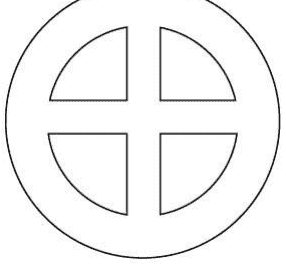

当代代表物质生命的四个元素达到平衡，两直线的交点将落在圆心，此时圆心能够通往超越时空的合一。
换言之，当我们达到平衡，我们得以接近源头，获得喜悦与智慧并转变我们的俗世经验。
想要过一个有力量、有效益的快乐人生，我们必须连结存在的核心，连结我们内在的圆心。如果用一个圆来代表星象学的所有资讯，那么把它切割为水平和垂直的两个半圆，就可以找到它的圆心。
星象学能被切割为科学与艺术，提供通则的资讯或供个人使用。
如果我们在水平的位置切割它，将圆分成上下两半，一半显示了通则，提供有关人类共通性的观察；另一半则提供属于个人层面的应用。就个人层面而言，诞生图是告诉我们与他人不同之处的工具。

### 我们有所同 亦有所不同

坊间有许多书籍和工作坊，帮助我们剥去洋葱一般的人格表层，抵达核心。
这些资讯因为必须同时应对许多人，往往针对人们的共通性而设计。我们相同的地方是我们都是人类，都有父母，经过童年和青少年时期而成长，容易受家庭或社会环境所影响，拥有多面向的人格，用同样的字眼描述某种感受，例如罪恶感、愤怒、高兴，以及我们都有能力达到内在核心，触及核心的真理。许多有关自我发展的文章和演讲着重这些共通性，告诉我们要为自己的生命负责、接受人们本来的样子、以正面思考创造正面的经验、透过静心冥想接触生命的核心……等等。
我们都需要这些教导，并且一起合作，用相同的方法学习自我成长，增长彼此合

然而，在人格的层次，也就是一般的生活状态，每一个人都不相同。因此合乎个人灵性开展的方法与我们的独特性一样，也是人人不同。在生活中，每一个正朝着新的、更有觉知的生活方式迈进的人，当他碰上一些潜意识而难以形容的内心障碍，或一再重复的行为瓶颈时，需要专属而独特的帮助。寻求治疗师、朋友的帮忙或独自面对，也许都有用，然而，如果没有清晰公允的指引，仍可能迷失。

星象学是一门和人类历史一般古老的学问，提供每个人一张专属的地图。这张地图依据个人的出生时间和地点，提供科学的数据，如同镜子一般反映真实的图象。图象本身没有批判，只是真实的记录而已。

最吸引人的星象学派别是诞生图的分析，它提供个人最高的观点，显示每个人在地球的生活与独特的个人特质。诞生图如同一面镜子，反映个人的特质与潜能，同时显示潜意识压抑潜能发挥的倾向。

一般人并不了解星象学的宽广视野。我们观察黄道星座——天体和十二等份的天空来描述人的际遇和状况。报章杂志的星座资讯常让人迷惑，因为它们经常以针对个人的资讯来解读总体环境，这种仅依行星与星座的关连所作的片面的判读，容易误导大众。

星象学的通则用来说明全体人类的潜能，每一个人都能展现所有黄道星座的特质，每一个人的生命力都拥有所有行星所代表的功能。如果把全人类当作一个人，那么星空便是这个人的完整投射。所以如果我们想要看见自己，只需在夜晚抬头看看星空，就会发现所有的神奇。即使如此，我们看见的朗朗星空也仅显现了一半的投射，因为还有另一半落在地球的下方。

请记得我们不但需要接纳占星图所反射的独特自我，也必须学习接纳每一个籍占星图上反射的独特他人，来帮助自己进化。籍由认出我们如何以人类全相图谱中的一小块，来记录全体人类的所有经验（第二章的黄道将叙述），我们得以进化。

每个人都拥有全人类的经验，而每一个人也都是全体的个别独特展现；换句话说“我即一切”、“一切由我反射”。

我们都是人类，不同之处在于对生命的个别认知，而我们都是合一（Oneness）的一部分，也都是创化展现的途径。

请记住，当我们明白在两个半圆中取得平衡的需要，便能循着通过核心的直线，进入存在的核心。

## 逻辑与直觉

我们若以垂直分割星象学的大圆为左右两半，科学方法在左半边，执业的艺术则在右半边。

星象学的科学部分是以地球为观察点，记录固定星与行星的运动，画下它们之间的二维的图形，佐以千古以来人们观察星象的经验，来诠释它们的意义，并形成许多原则。就本命占星学而言，占星图描绘某人出生时间合地点的星空，说明它就是一份人格分析，输入正确的资料给电脑，用软体程式来画图，印出图便是一份好的分析资料。

星象学的艺术则是用星象学的原则，对占星图予以直观和整合的理解，提供星图拥有者有益与适当的诠释。即使针对相同的诞生图，也会有完全不同的解读，因为每个人的生活经验不同，而其根源于他们对生活的信念。解读占星图是借着对个案直观的反应，以他们认同自己的角度来说明这张图。

这样的解读，一方面肯定人们对自己和生命的经验，一方面能告诉人们如何在工作关系和其他各方面创造更为喜悦的经验，让人们对自己的资源和潜能有更清晰的体认，给人们值得自我接纳的感受。一个好的解读将能帮助人们在未来的行动上得到最大的满足，并建议下一个专注的目标。

星象学的科学部分用到左脑，而艺术部分则为右脑的表达。星象学若缺乏艺术的面相，一个人可能成为星象科学的专家，却做出无用甚至有害的分析。然而，缺乏精确的计算，即使以治疗的形式发挥占星的艺术，给出的也可能是错误的资讯。只有左右半圆的平衡，能让我们沿着直径直达核心。

## 星象学指引我们到达核心

做占星咨询时，占星者需要就人们的个别性（有所不同）和社群关系（有所同），帮助人们平衡他们看自己的观点，让个人的发展不致与社会脱节。这种平衡让个人成长与觉醒，提升人类的集体意识。因为每一个人的进步，尽管微小，都将反应于整体。

接下来的每一章都有两部分，先谈星象学的通则“我们相同的地方”，然后再谈第二个部分“我们不同的地方”，阐述星象学法则在个人的自我认知、关系和成长上的应用。

利用科学精确计算的诞生图与古老的星象学原则，来联系诠释占星图的艺术，可以加强双脑的连结。当你用循序渐进的语言，对你的左脑说话，并用符号和观念对你的右脑说话，久之你会明白星象学的艺术特质。

每章所附的“星星的游戏”，让你在左脑的文字与右脑的理解间跳跃，你会迷上这些游戏。

为了同时存在于垂直与平行的半圆直径上，使你自然地落入圆心，这中心的小洞将把我们带往存在的核心，进入一切万有。占星图的解读帮助人们进入那个核心，而让转化的经验有机会发生。好的占星解读，必然是我们能结合大脑理性与直觉的功能，并透过心来表达的时候。

我们从精神太阳的符号——中间有一点的圆圈，旅行到地球——圆圈与十字的符号，是占星图的结构图形。

这张图告诉我们如何平衡我们的个人经验（地平线下方）及与全体的连结（地平线上方）；如何在自我表达（左边）与自我接纳（右边）之间取得平衡。所有的资讯都在黄道十二个星座与星室的图中显示，表达了一切可能的人类经验。

## 星象学概说

## 月亮南北交点

## 生命目的或方向

一张出生占星图包含以下的内容：

- 1、行星——代表不同功能的生命能量流。
- 2、黄道星座——行星能量作用的形态或方式
- 3、星室——行星所在的地方，描述鼓励我们运用行星能量的生活领域是什么，以及什么类型的活动能让这些能量自由发挥。
- 4、相位——当行星所夹的角度为某些特定度数时，会产生特定的关系。相位指的是行星之间的关系，不同的度数造成不同的反应。为了计算的简化，我只用30度的倍数。因此包括合相一共有六种不同的相位，描述不同的关系。
- 5、南北交点——基本上，以上已经是所有必须了解的。然而我喜欢再加上南北交点，它们提示最令人满意的生活方向并达成的方法。找到此生的生命方向或目的，能帮助我们整合星图上的所有元素，及整合所有人格特征的分歧。它创造感觉对于满足的生活“故事”，帮助我们接纳自己。

一张典型的占星图(图 1.4)

横过中间的是出生时的地平线，和南北向标示天顶（MC）的直线，将星盘分为四个象限和十二个星室。

星室中有诞生时行星所在的星座，行星与行星的几何关系，被经验为内在的人格反应，以连结两者的直线表示。

月亮的南北交点则在相对的位置。

重点是记住占星图并不能让我们成为什么人，也不能创造我们的生活经验。诞生图描绘我们，就像地图描绘土地或是镜子反射影像一样。我们的人格是精神体的选择，在这个生命中要做些什么，还是要靠我们自己决定。

## 造成转化的占星解读

我们必须温和地接纳并关爱我们所解读的人和我们自己。了解自己的星盘并不容易，因为我们对自己有很多预设的认知。

所以，如果你能开始想象未知的自己坐在旁边，再来看自己的星盘，比较容易创造一种态度，让你能够更了解自己。

解读诞生图时，有两个必须牢记的信念：
首先，每一个人的生命都有意义；
第二，每一个经验都是有用的，只要我们学到了一些正面的事物。

再加上你对生命的喜悦感受与对人们的爱，那么不管你的星象学知识渊博或浅薄，你和被咨询者相聚的时光，都会成为一种疗愈的经验，帮助人们在解读中敞开自己面对改变与成长。作占星解读最有价值的成效之一，是它提供我们抽离影响人格的能力，让我们有机会看见自己。

在一个解读开始的时候，你可以花点时间轻松地和个案谈谈星座和行星的概念，让你的个案能开始用抽离自己的态度看自己，甚至看见自己的人格在图上的什么地方反映。

然后你必须针对他在生活中遇到困境的地方解说，那是他因着某些原因，对事物或关系放弃了自主能力的地方。你可以利用星象学的原则来观察，行星间负面的相位可以指出这些痛苦区域，而你的个案可能想要拒绝或排斥这些经验。然而因为星图上的能量始终都在运作着，那些被否定的能量并未消失，相反地它会在家人、同事和上司的行为上出现，造成相处关系的困境。你可以解释这些落于不同星座和星室的行星，来描述这些被投射在别人身上的能量。

在你找寻适当的方式描述星图上的行星时，不错的做法是先给对方一些关于行星感受起来如何的概念，然后让他们谈谈自己的感受或在生活上发生的事。你也许可以问他们为什么想要批判或排斥某些感觉或行为，以发现他们处理这些能量的困难。人们远比星图上的天体资讯来得复杂许多，占星师可以在每一次的解读中学到一些新的东西。

解读进行到这里，依照你的咨商能力，可以去谈谈这些困境开始的地方，或许起因于早年的生活。

然而最好避免埋怨或责怪父母，因为这加深了受害者的感受。或许可以一起探讨前世影像，因为过去的经验可能在今生重演。前世究竟发生过什么事并不重要，重要的是对你的个案而言，感觉是否正确。

利用前世作为某些反应或行为的源头是有用的，因为这么做是帮助人们从未来取走我们对某些人或事的恐惧，将它放在一个与今生不同的过去时间。那些我们害怕的事件早在过去已经发生，我们现在拥有的只是创伤的记忆。有可能现在让我们起反应的人，只是提醒我们曾经有过深刻伤痛经验的某人。

一旦了解我们对记忆中的事所生的恐惧与期待，确实参与创造现在的经验，我们便能自由地放掉那些期待。了解任何反应背后可能都有个好理由，就更能够接纳自身的痛苦。

运用你对星象意义的知识，不管你所学多么有限，都可以在这个点上告诉人们那些被拒绝和否认的能量，如何能够被正面地用来创造想要的成果，它所指出的能力是什么。一旦你的个案接纳这些能量的形式，他们会开始感觉到它。

他们也许对这些能量感觉很自然，或是发现它所伴随的能力，确实已经开始在特定的环境下，创造正面的结果。

当你的个案将这些人格特质的想法整合后，你就有机会用他们可以接受的方法，去描述占星图上显示的潜力。当然，解读占星图不一定需要依照这些步骤。

你与个案的互动和你的直觉，才是最好的引导。许多负面经验的课题也许会在解读中浮现，需要正面和有益的观点加以平衡。人生的真相是每一样能力都必须小心地运用，而每一个困境都教导一种技巧。如果你发现不容易找到正面的观点去平衡个案的负面情境，那么相信它一定存在，也足以让你保持稳定。

后面的章节将谈到黄道星座、行星与星室，希望给读者全貌的了解，让占星解读成为一种转化的经验。

随着占星解读的进行，受咨商者的内在被打开；他们的心智结构、信念与期待在过程中改变。伴随这些开展，可能有情绪的释放。有时候因为突然改变了内在的观点，而深深一叹、哭泣或大笑，这些都象征着内在的转变。这些情绪或身体的改变，使得荷尔蒙腺体和整个身体的能量系统，经历一场巨大的变化，疗愈因之产生。

最终会影响基因与 DNA 的生命图谱，因为肉体乃根据能量系统而建构。当人们接受自己真正是谁而被带入很深的当下感——转化便发生。这种过程像是同类疗法，咨商师在产生转化的解说中，说出精确的处方字眼，声音和振动频率启动了疗愈的潜能。

当基因被改变，所传递的遗传讯息将中止。我们并不需要把祖先传给我们的每一件事都传给孩子。改变出生的身体结构，透过释放那些限制性的信念，让更细致、睿智的精神体诞生在这个世界，而不迷失在俗世负面的能量结构中。我们需要这样的精神体。

## 第二章 黄道

### 我们相同的地方

## 四大元素

四大元素是描述一切万有（All That Is）的古老方法。主要的观念是所有的事物皆由四大元素——地、水、风、火的混合所组成，也像 DNA 的四个基本单元。有一首流传的诗句是这么说的：

> 土地是我的身体，水是我的血液
> 空气是我的呼吸，火是我的精神。

加成在一起，四种元素形成了“乙太”，或称为生命能。当一个人的四大元素完美而平衡，便能拥有身体、情绪、心智的健康与灵性的连结。每一个元素有三种特性，或是存在的状态。主要（cardinal）是外在的呈现、固定（fixed）是内在的成分、变动（mutable）是可变的性质。

- ↑ 处于**主要**状态的元素，外显于世界。
- ■ 处于**固定**状态的元素，在它自己的原始状态。
- 〰️ 处于**变动**状态的元素，能适应环境与压力。

如果以正三角形来表示每个元素，三个顶点分别代表主要、固定与变动的不同特性。将四个元素均匀地放在一个圆上，那么四个三角形的十二个顶点会在圆周上，与黄道的十二个星座相呼应。

每一个元素都代表一种人格特质，依据它的意义列表如下。每个元素的三种特性——三个状态，都有象征的符号来帮助大脑在直觉或观念面的理解。这些象征符号在后面的“黄道”的故事会作更清楚的解释。符号能触动新的理解，每一个星座的符号都是一把打开星座大门的钥匙。当你用钥匙开门，你的直觉将透过十二道门中的一个进入一切万有之中。

🔥 火——掌管转化。火象的人具备高度的热忱，有爱心，热情洋溢，很温暖。有可能是狂热份子或过于理想主义；运用生命能量来破坏或创造，容易愤怒与展现热情；需要燃料。

- **主要**——牡羊——营火花
- **固定**——狮子——碳火
- **变动**——射手——火焰

☁️ 风——掌管思维和想法。风象的人清晰，变动快，善言语，逻辑强，很优雅。有时候会表现冷淡或无情；理性逻辑凌驾一般情理之上；需要自由。

- **主要**——天秤——山丘上的微风
- **固定**——水瓶——冰块中的气泡
- **变动**——双子——一阵风

💧 水——掌管情绪和超自然经验。水是非理性的，洁净，流动，敏感，温和，是孕育的子宫。有时候声势惊人，造成压力或泛滥；需要流动。

- **主要**——巨蟹——拍岸的浪
- **固定**——天蝎——高山湖水
- **变动**——双鱼——大海中

⛰️ 土——掌管物质的效益。土是实际，沉重，缓慢，厚实，认真严肃；支持与滋养。有时候阻塞不通，僵固。压抑；需要时间。

- **主要**——魔羯——山
- **固定**——金牛——田地
- **变动**——处女——泥土

## [星星的游戏]

- 1、冥想每一个元素的三个状态，注意每一个符号所表达的特质。
- 2、用其他的符号来表达每一个元素的不同特质。

## 黄道星座是过程中的十二个步骤

你不妨这么看，黄道的经历像是切蛋糕的过程，你选择一个地方下刀，把蛋糕切为十二块。为了切第一块，你必须鼓起勇气划下前所未有的第一刀。牡羊座是第一刀，它刚被切开，新鲜，预备开始新的事物，充满能量，迫不及待看到结果。依序切完其他的十一刀，直到第十二块双鱼为止，完成了蛋糕的“解体”。
每一个黄道的星座都有一个呼应这个过程的特殊意义，从开始的牡羊，到最后的双鱼。

你当然可以将蛋糕分成不同块数，例如十三或十块，那么每块蛋糕的大小将不同，也就是说，每块蛋糕所占切割过程的意义便不同。当你切开一样东西，要拼回原貌，每一块都不可或缺。

## 黄道星座跟随季节的循环

黄道的循环与季节的循环相若。因为每个季节的特质符合那些时间太阳所座落的星座。黄道的四季为春、夏、秋、冬；每一个季节都由一个主要星座开始，然后经过一个固定星座标定季节特性，之后连接一个变动星座转换进入下一个季节。

- 1、牡羊 ♈
  ——春季的主要星座。能量从地面喷出，等不及从严冬的禁锢中解脱。是做年度新计划的时间。始于春分，大约在每年的三月二十一日。

- 2、金牛 ♉
  ——春季的固定星座。大地充满成长的气息，处处新鲜翠绿，生意盎然。五朔节花柱（五月的庆典装饰）随处可见，公年提醒我们丰收的仪式。

- 3、双子 ♊
  ——春季的变动星座。凉风阵阵，善意地提醒人们溽暑未至。预备夏天的到临。

- 4、巨蟹 ♋
  ——夏季的主要星座。始于夏至，大约在每年的六月二十一日。是能量提升的时期，最大的生长期。大地滋养所有的子民。

- 5、狮子 ♌
  ——夏季的固定星座。炎热的天气开始，绿叶在枝头待得够久了，等待化为尘土。孩子们放暑假，享受欢乐的时光。

- 6、处女 ♍
  ——夏季的变动星座。绿叶开始改变颜色，白天开始变短。人们感觉果实不会在枝头永远停留，开始准备收割的工作。

- 7、天秤 ♎
  ——秋季的主要星座。开始愉快地享受收成，始于秋分，大约在九月二十三日。我们奉献部分的收获，以达成平衡。

- 8、天蝎 ♏
  ——秋季的固定星座。我们显然必须预备寒冬的到临，以保护自己。天气冰冷潮湿。万圣节的烟火环绕着夜晚的营火。

- 9、射手 ♐
  ——秋季的变动星座。我们穿上暖衣，预备迎接圣诞节。灯火通明，大家一起围聚在火堆旁度过最长的夜晚。

- 10、魔羯 ♑
  ——冬季的主要星座。始于冬至，大约在十二月二十一日。隐藏于地下的力量明显。辛勤耕耘的人或继承丰富的人，提供圣诞节丰富的食物和礼物。

- 11、水瓶 ♒
  ——冬季的固定星座。冬天已降临，冰天雪地，地面坚硬除了落雪外没有别的东西可以穿透，所见一片冰封雪白，洁净无比。

- 12、双鱼 ✱
  ——冬季的变动星座。冰雪消融，花朵开始绽放，偶尔还有冷锋扫过。空气中嗅得出变化的味道，谁知道新的一年将带来什么？

每个国家的季节不一样，然而开始、成长、成熟、消化、消散并重新开始的生命循环却相同。缺乏任何环节，过程便无法完成。

## 人格的十二块拼图

就像黄道循环的过程，十二星座缺一不可。
我们用黄道来描述人格时。缺少任何一个星座，人格便不能完整。每个人都需要每个星座的特质，让我们成为完整的人。
因为人格拥有每一个黄道星座的特质，因此重要的是去看每一个星座最好的一面，而非仅注意它的问题。有时候人们谈论起某些星座，像是如果没有它们，生命会更美好，然而如此生命将不完整。学会运用每个星座最好的一面，我们会成为诚实、有用、快乐而圆融的人，并且更能了解和认出别人内在的珍贵价值，不论他们的星座是什么。
学习透过每一个星座表达爱，是一种觉察神性自我，存在核心的最高表达的方式。就像耶稣的十二个门徒，共同展现耶稣的精神；或像琴键的八度音程，由十二个连续半音组成，每一个都是同一种本质，十二种面相之一的独立表达。
下面说明星座所反射的人格特质。有一些你或许感到熟悉——某些你知道自己拥有的特质。另一些是你羡慕别人的特质，也许有一两个是你从来不知道的。
括弧内的文字，是以意象的方式点出星座的本质，后面的文字则表达星座的特质中，能帮助我们享受生命或展现价值的部分。星号后的文字则建议开展这些星座特质的方向。我们列出特定星座特质善于从事的活动，虽然大部分的活动常常不止要求一种星座特质。

**牡羊座（营火火花）**——勇气，新开始，新鲜，准备好尝试新事物，充满能量，等不及看到结果，常处于出击状态，不喜欢受挫或停滞，企图心明显。适合用来开始新的事物，或做自我激励。
* 学习控制用在每件事情上的能量。

**金牛座（田地）**——务实，可倚靠，实际，世俗的。帮助人们接近土地的能量而获得健康，缓慢，安静，要求安全感，可能固执而抗拒改变。在园艺和烹饪方面很在行，能够在别人需要时提供稳定的支持。
* 学习与自然保持宁静的接触。

**双子座（一阵风）**——能与每个人交谈，喜欢发现事物告诉别人，善于想象或构想，常展现两种以上的风貌，时而活跃，时而安静，在两种人格间变换。两个家，两种工作，也许不大可靠。当你需要资讯，让气氛放松，或写作时，双子是很有用的。
* 学习去使用双脑——平衡直觉与逻辑。

巨蟹座（拍岸的浪）——情绪反应敏感，心情上下不定，予人如家人般的关怀，一半像个孩子，一半像有爱心的父母，很懂得照顾人也需要被照顾，滋养，可能很缠人，对于建构家庭、安慰朋友和给孩子高品质的照顾很在行。
- 学习在情绪波动的环境中保持稳定与提供支持。

狮子座（碳火）——心胸开放，很有爱心，戏剧化，喜欢鼓励人，喜欢领导或取悦人们，自傲，很阳光，可能会太招摇或爱出风头，自尊很容易受伤。宴会或人们心情不好的时候很能派上用场，对演讲和教学很在行。
- 学习不管别人怎么想，都保持爱心与正面。

处女座（泥土）——让事情更好，帮助人，追求完美，有效率，希望做得正确，可能会太吹毛求疵、自我挑剔或过分讲究。在整顿事物的秩序，谨慎从事或挑选重点上很在行。
- 学习接纳人们和事物本来的样子，明白那是人们改善生命的基础。

天秤座（山丘上的微风）——外交能力强，和人们愉快地相处，平衡自我的利益与众人的利益，和事佬，弱势支持者，能听冲突两方的各执一词，常因害怕破坏事情而迟疑。在与人会面的场合或选择颜色、衣物、装饰等方面很在行。
- 学习收集必要的资讯做正确的决定。

天蝎座（高山湖水）——情绪上的体谅，能深入地感受事物，坚强，明白生活困难的一面，渴望了解事物的核心究竟是什么，很强烈，有时候对人严酷而报复心强。当你需要果断坚定或了解别人内在深处的痛时，天蝎是很有用的。
- 学习利用痛苦成长与体悟。

射手座（火焰）——热忱，乐观，永远的正面，对什么都感兴趣，充满乐趣，喜欢讨论人生、旅行、教导、探索。常在匆忙中，没听清楚你的意思。当你需要热忱时，找射手准没错。
- 学习籍由分享你的兴趣，让别人扩展他们的想法。

魔羯座（山）——工作以达成目标，尽力，小心，重视成效不怕伤感情，强壮，可信赖，有时候承担太多责任，有可能太严肃或跋扈。对于组织群众或设想执行面的工作很有能力。
- 学习使用意图而非辛苦的工作，达成想要的目标。

水瓶座（冰块中的气泡）——拥有全方位的观点，知道最好的方法去组织群众，知道什么会有用，希望每个人都获得平等的机会；感觉无拘无束，喜欢观察人，有时可能看起来冷漠无情，当人们惊惶或孤立无援的时候，水瓶便能发挥作用。
- 学习每个人都会有自己的贡献。虽然每一个人拥有同等的价值，但是人人并不相同。

双鱼座（大海中）——以众人为优先，明白人们真实的身份是停留在世俗身体中的光的精神体，非常情绪化，可以体会他人的感受，期望让别人感觉好些。偶有忿忿不平的感受，有时候会忘了呼求帮忙。双鱼善于沉思、冥想或咨商。
- 学习保持精神的喜悦，并分享给每一个碰见的人。

## 星星的游戏

1. 你所从事的所有活动都需要一个或一个以上的星座特质——想一想你正在做的事，需要哪个星座特质的帮忙可以做得最好。
2. 如果你有诞生图，看看在这些星座中有什么行星在其中。
3. 不管你有没有诞生图，当你做这些活动的时候，尽力去表达这些星座的特质。

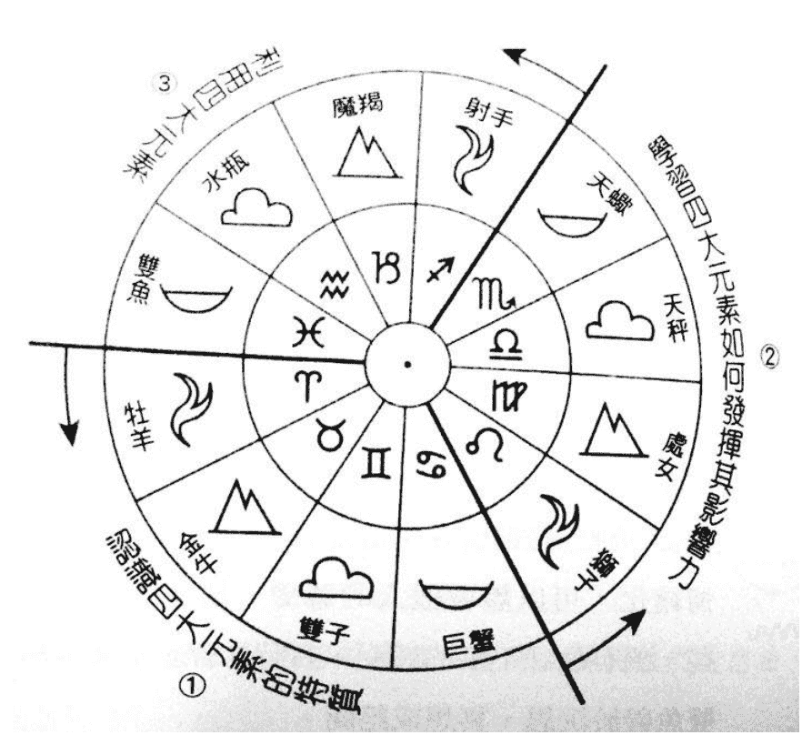

## 黄道的故事

黄道的意义根深蒂固地存在一切创造之中，因为它是所有的循环过程。
我想把黄道的十二星座，看成精神体透过地球经验，开展清明完整人格的过程。所以它是每个人的故事。每个星座可以代表人生的一个阶段，一种经验的特质，一个体验这个世界的方式；我们在生命的过程中，体验了每一个星座。让我们发挥一下想象力，那包含一切的[一]，逐渐开始变成了所有生命的[源头]，以延续神圣火焰的扩展。而这些扩展体开始感受到自己的个别性（牡羊），于是产生了第一个错误的认知，感觉他们与源头分离。
这些个别的火花或是精神体，像它们的创造者一样，再次向外推进，创造了环境（金牛），让它们能够体会和了解。
这个环境就是地球，以作为经验的焦点，而黄道星座所描述的便是这十二个成长课程的经验。
在这个故事中，精神体绕行十二个黄道星座，创造完美的人类原型，以体验一段完美的成长。
精神体并再次地回到双鱼，觉察它与源头的合一。

绕行十二星座的运动可以比喻成呼吸。吐气时对应火与风，吸气时对应土与水。
这产生[吐——火，吸——土，吐——风，吸——水]的模式运动，再重复两次，总共是六次呼吸。现在让我们说说这个大生命周期的故事。

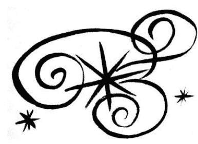

## 牡羊——营火火花

生命火花，虽小但极度明亮，勇敢，对未来从不挂心，引人注目，启发希望。
最初只有合一状态的无意识海，某一个瞬间，海中一水滴，运用其能量，奋力一跃，离开原始的波浪，进入自由的空间；这就是牡羊的经验：第一念，因自我的存在而与其他的存在分离。巨大的能量驱使精神体前进，探索“自我”是什么。
在牡羊的人格特质中，你可以发现对生命的好奇，一种感受惊喜的能力，因为这是他们第一次看见这个世界。这种急于探索世界的赤子之心和充沛精力，有时令人绝倒。
牡羊的能量常被人们认为太积极，太好斗，带着竞争性，这可能来自对于消失融入空无之中的双鱼经验的模糊恐惧。竞争力对于探索这个新自我的极限而言，较之凌驾他人的能力更为必要。他们面对眼前障碍所表现的攻击性，则来自受挫后累积的生命能量。
当对手拿起武器面对他们时，牡羊自信的立场立即瓦解。他们的自私往往是因为不假思索或对别人的需求缺乏体谅。与他们讨论或解释能让他们补救错误。
毕竟，牡羊掌管头部；脑干的形状就像山羊的角，而山羊也就是牡羊座的象征。
在牡羊座，精神体学习的是让新的能量流动，为自己或别人的想法注入生命能量，开始新的计划并进入新的领域。它意味着火的发现——代表能量的元素，并展现为活动、幽默与热情。
之后，在第二个火象星座狮子座，优先考量的是火的控制。在射手，最后一个火象星座，火必须被建设性地使用。

## 金牛——田地

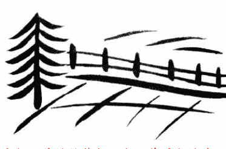

守护甜美的牧草与阳光下草原上的美丽花朵，呼吸着甜美与令人慵懒的温暖。

已具有个别意识与能量的驱动力，精神体预备好在它的周围形成物质性的环境。金牛座是精神体首次接触土元素，透过金牛座的特质，土地的力量自然地流动，散播一种轻松的氛围给周围的人。也因此，金牛座的人是天生的身体疗愈者，只需要用他们的手接触对方，拍拍别人的背或简短的拥抱，就能带给人们一种和谐的感受和身体的舒适。当金牛的能量充分发挥，一个触碰就足以移开人们的能量阻碍而完成身体的疗愈。

土象元素代表物质世界并呈现稳定、坚固与可靠的特性。金牛座的象征是公牛。我们最常想起的公牛印象就是它平静满足地待在土地上，或许有一只母牛在它的周围。仿佛它拥有这块小天地，在它的围篱外，整个世界做什么都不会干扰它。

公牛的生殖力和肥沃丰盛也就是金牛座的象征，行动的迟缓和容易获得感官愉悦的满足，也约略是金牛的气质。在金牛的人格特质中这可能显现为固执、胶着的态度和懒惰；金牛座的人有一种胆小和不安，来自于对围篱外世界的无知，与担心环境骤变时的生存能力。如果金牛座的人陷于焦躁不安或因事烦恼，接近自然可以疗愈他们。

在金牛座，精神体学习元素的能量流，了解肉体的限制和能量，以及生理需求的范围。在第二个土象星座——处女座，学习的功课是物质世界如何运作；而在魔羯——第三也是最后的土象星座，这些知识被运用在追求这个世界大多数人的利益。

## 双子——一阵风

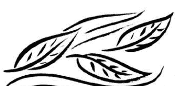

一阵风带来最近的消息，尽兴地与树叶玩耍共舞，然后离开。

带着对自我的意识与聚合成物质实相的能力，精神体已经准备好在心智层面探索它所看见，不是它的一切。透过双子，精神体第一次与风接触，它是代表意念世界的元素。
风以思想和思想的交流表达它自己。双子的心向外寻找想法与事物，以充分了解它们，为它们命名，并将这些了解与其他的人沟通。

双子并不喜欢深究事物或花很多的时间研究一个主题，快速地捕捉要点，对于它们传递资讯并移向下一个资讯而言，已经足够。它们甚至不觉得必要花时间累积资讯以明白更大的画面——那是射手的任务。对于双子而言，累积资讯的时间它宁愿花在发现更多讯息上。

你可以想象它的心智看起来像是一只忙碌的蝴蝶，总是在碰触新点子，却不深入去看清楚它的方向。但是这些意见的交流对众人而言是无价的，而双子的特质里存在着与每一个人沟通的能力。他们的兴趣，以及表达的弹性，给予他们一种本领去吸引形形色色的人加入谈话，而他们多变善巧的头脑也正适合解读各种不同的肢体语言。当然另一方面，这种交流的需要有可能导致难以停止的空谈。

双子的象征是一对双胞胎，一个代表二元性的符号，也许表示了大脑的两边，左半球具备逻辑思考与语言表达的能力，右半球储备瞬间理解、直观、想象的能力。双子的行为，常见双重的人格表现，其中一面外向，充满沟通的魅力；另一面神秘，有时沉默，甚至沮丧或阴郁。

也许这双重性格的秘密便在于大脑两半球的融合。那沉默的一半需要透过创意表达想象的部分，不透过语言。不管真正的答案如何，众所周知的是，通常双子对每样东西都喜欢拥有两种以上，也许这便表达了他们内在的差异。
在双子座，精神体伸展它的心智肌肉，建构聪明多变的头脑，好利用这个美妙的逻辑工具，追寻宇宙的奥秘。在第二风象星座——天秤座，这工具用于探索人与人之间的关系；在第三也是最后一个风象星座——水瓶座，所得到的宏观视野，则用于整体的社会组织。

## 巨蟹——拍岸的浪

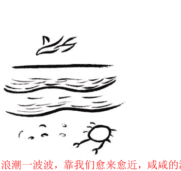

浪潮一波波，靠我们愈来愈近，咸咸的海水弄湿了我们的双脚，当期待它更靠近，退潮的力量却让它远离。

最后，精神体终于预备好经历水的洗礼，四大元素的最后一种。水，作为星象学的元素，代表情绪的世界，心灵世界。巨蟹座的符号，负面的联想是螃蟹的双爪；正面地看则代表母亲的双臂和胸膛。巨蟹座是母亲也是小孩，母与子紧密结合，一起作着相同的梦，生活在共同的情绪中。母子关系始于子宫，如此我们也可以说精神体在巨蟹座，吸引物质层面的材料形成胚胎，居住在所选母亲的子宫中，被温暖的羊水所包围。

精神体选择母亲，因为母亲提供的基因以及养育的过程，创造出完成这一世生命功课需要的人格。这个人格是某种混合体，为了能够处理前世仍需清理的困境，以及获得此生必须发展的新能力，并将精神体推向自我实现道路的下一步。
水的元素透过感觉来表达。情绪的海如同水泽般将我们包围，充满在人与人之间的超感应空间，让我们能分辨人我之间的感觉。在这心灵的情绪海中，巨蟹的人格经验满足、悲伤、厌恶、快乐等等接续无穷的情绪波浪，完全无法有所控制。这些情绪来来去去如同拍岸的浪涛，如波潮，有起有落，会再度高涨。

巨蟹人不觉得有掌控情绪的需求，他们的想法是“如果今天我的心情低落，可能明天就好了；如果明天不好，后天可能就好了。”
巨蟹的愤怒比较难以消失，生活在他周围的人，会感受到整个空间充满了怒气。相同的，他们的欢乐容易感染别人，他们的满足是很温暖的。

巨蟹他们的情绪与人们互动，以照顾、滋养和提供母亲般的呵护，而同时也接受别人对他的一切。他们很强烈地需要去感觉并给出母爱的安全感。因为这种需要，巨蟹情绪上非常倚赖需要他的人——不管是孩子或是母亲。这就是为什么巨蟹常常给人粘人的感觉，然而这也显示他只有一半是醒着的。

巨蟹真正的需要是去照顾他们内在的小孩，那么他们才不会对这个世界表现出他们的空虚与对爱的渴求。每当需要别人的强烈感受出现，把内在的小孩当作一个独立的个体，把这些感受视为这个虚拟内在孩童的感受，那么我们会知道该怎么让他感觉好些而自然地抱抱他，爱这个正在受苦的小孩。

当这个想象的内在孩童被爱、被照顾，他会开始忘了那种对别人强烈的需要，而最后能被疗愈。带着这个小孩去每一个我们去的地方，我们的内在需要开始能相信这个长大的我们，有一天这个小孩子会消失，因为他已经整合进入大人的一部分。

当这种安全的感受出现，巨蟹才能够自在地奉献他们对别人的爱，不再倚赖他们的孩子；而能在孩子不需要哺乳时，能自由地来去，而不用绳子将他们栓在身边。哺育内在的小孩，要求一种对事情全然接受的态度，不批判它们的好与坏。

当我们批判我们的内在小孩，就是用反对或排斥的恐惧冻结了自己的成长。
我们现在拥有的情绪，也许在过去曾是攸关存亡的必要反应，是一些必要的感受。唯一需要的判断是在此时是否适当？如果我们认为那个情绪是错的，我们便冰封了自己的内在。如果我们能问它在什么情况下是对的，并允许自己不去否定它，那么我们就能在此时再次看待它，并将它看得更清楚。藉着这样，内在的小孩能够逐渐成长，我们也才能够如实地应对真正的人事物。
在巨蟹，精神体学到情绪虽然会变化、涨大、并像月相或潮汐般逐渐消退，却有一个稳定的核心不受任何环境影响。月亮是一个球体，改变的只是月貌；海水的总量固定，改变的是移动边缘的形状，和受月亮影响的行进方向。认出那个稳定的中心，要求的是对大地之母的信任，如果我们赞许她对人类各个成长阶段的爱与关怀，相信她将滋养我们。

在巨蟹，精神体学习在变化中与面对强大情绪时保持放松，因为明白生命本身的创意与丰盛的滋养而心安。在第二个水象星座——天蝎，精神体探索关系中的情绪面，并尝试不同的方式去保护自己柔软的一面。在双鱼——第三也是最后一个水象星座，运用长期累积的感觉敏锐度来服务全人类，并致力于世界的改善。

## 狮子——炭火

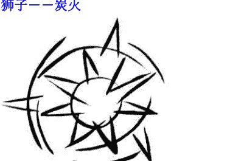

> 就像寒夜中的温暖，烤熟坚果以分享众人，内在的热吸引一群温暖的人，千万不要熄灭了火种！

精神体开始廓清对别人的倚靠，像在牡羊座一样想确认自己的个别性，但它现在已经能够运用这种火的驱动能量来影响环境。这个阶段好比是孩童已经大到可以用微笑和动作，吸引他的仰慕者，只要这些仰慕者能明白他想要的是什么，就会满足他——当然他必须很有效率地表达他的欲望，此时唯一的问题是如何有效地表达。

通常一个灿烂的微笑便足够了，但有时候也许需要诉诸喊叫或是强烈的情绪表达。这让狮子的特质发挥得淋漓尽致——除非他的家人完全无视于他的光芒。

那么这个孩子便学会发光对生存无益，结果是他停止尝试，变得安静而悲伤。
他们上了盔甲和肩膀是为了保护受伤的心，此时已经没有任何快乐可言。
我们要知道当精神体透过狮子表达，耀眼的光芒是他唯一沟通的工具。学习如何沟通而不刺痛别人的眼睛是很难的。如果那耀眼的光芒不被接受，狮子的自信与自我便会完全丧失。当被误解或被批评时，他那孔武有力的外表只是一层薄如纸张的保护，保护那个需要不断鼓励的小孩。光芒四射需要极大的能量，当狮子生病或受挫，他们常会躲避最亲近的朋友而独自舔伤，好像除非他们能够再度发光，否则他们无法忍受与人们相处。

狮子的另一个困难是接受观众的回应。发光是能量的放射，狮子觉得愈需要付出心力发光的地方，就愈无法注意人们的回应。因此他们很容易做得太多，过分发散他们的能量，像是话说得太多，笑得太夸张或是忘了倾听。除此之外，谁又能够不以微笑回应他们的温暖、忍受他们的压力、享受狮子幽默的爱与笑声呢？

大概只有深陷某些问题需要改变方向的人——或者是另一个狮子吧！
在狮子座，精神体培养太阳般的勇气，不管周围的人好恶如何，尽管发光，照亮别人的生命。挥舞火炬散发温暖需要勇气，那给与生命与爱，但需要混合观察与敏感，以免烧焦了他所关心的人。

## 处女——泥土

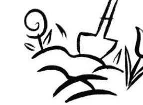

搅动土地的潜力，让生命成长。泥土，潜在可用的胚陶容器。轰鸣中充满大地之声，忙碌。

想象这个孩子又大了一些，可以到处乱爬，爬上碗橱，弄乱东西；可以站起来走路，伸长小手抓取头顶上的东西，包括炉台上的长柄锅把。好奇心驱使他探索这个物质世界：东西到底是什么样子？如何组合？是什么材料组成？多重？探索是心智能力的展现，发问，检查，一切的最终目的是为了使事物更美好，也许在开始的过程中会产生相当的混乱。

此星座的特征是擅长注意细节并指出瑕疵，以获得修正。多数黄道星座都看待世界为它本来的样子，然而完美主义的此星座，总是被认为过分挑剔、喜欢批评。此星座的人认为自己有说出真相的使命感，因此可以创造最大效益而避免浪费。
我们多少可以利用此星座的特质，帮助自己保持健康和维持平衡的生态环境，然而它确实是精确而不讨好的工作，所以此星座常感觉负担沉重又遭人误解。
最糟的是，此星座的行动与人格特质，总是优先在内在批判自己。他们常常被自己折磨得最惨。他们的内在总是有一种声音，纠正并责怪自己不够正确、总是犯错，因为他们觉得自己应该是完美的。别人的抱怨更让他们确定自己的不完美。

此星座人格常犯的错误，是认为物质世界可以有完美，认为结果必须是完美的。他们看到的是未来的完美，但是我们此刻不可能知道什么是真正的完全合适，除非未来变成现在。需要追求的完美是做的过程：我们可以尽力而为，那便是完美的努力，在做的时候依循对的感觉而行。不论行动如何，其结果都完美地反应了我们做的风格。如此，当我们成长，我们会改进做事的方法。精确、清晰的焦点和分辨的能力，是此星座人格不可或缺的部分。

有时候此星座的人会忘了考量人们的情绪状态、成熟度，甚至体能限制，而错误地估算人们的能力。设定不可能达到的目标是没有生产力的，因为成功才能鼓励我们，失败未必能激发更大的努力。更大的努力未必能够导致更大的成功。

也许放松才是必要的，放自己一天假，或对自己已达成的小小成就予以鼓励。

在此星座，精神体学习了解人类世界的复杂面具与运作规则。观察时的冷静，一定不能冷却内心对痛苦的体谅，或在狮子座所学习的游戏价值。当你记住在前面星座所学习的功课，那么此星座便是智慧的星座，是人类在物质世界、健康和大众福利上的助益，以及说出真相的勇气。

## 天秤——山丘上的微风

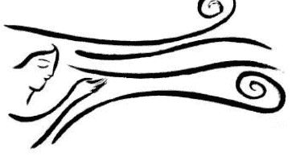

> 探询的风不断地吹着，用温暖的呼吸在你我之间搭起桥梁。

现在那孩子更大了，或许进了小学，交了新朋友，学习如何和别人交往，在意别的孩子怎么想。在这个成长阶段，对于穿什么才会被接受和喜欢极端重视。

天秤人重视的是事情如何运作以臻至完美；因为它属于风象，掌管的是思想和沟通，而非处女座物质实现的属性。所以天秤重视关系，寻找观察人事物的不同角度。

因为天秤重视的是观点的平衡，许多人误认为天秤人应该做决定。天秤人做决定的方式是，收集意见、事实、态度、可能性，将一切在脑海中加总。最后，当他们能完全地感受整个情况，正确的决定会变得很明显，而他们也会依循决定当下的力量行动，并创造最适合的改变。无法决定和迟疑的困境，常因为被行事风格不同或不了解天秤下决定过程的人，要求做太快的决定而发生。人们会有种误解，是因为天秤人看起来无法作决定，事实上，一旦到了决定的时刻，他们是非常清楚的。

另一个让天秤经验他的困难的原因是——他们相信关系的平衡意味着永远的愉快。只要我们在地球上，平衡中必然有诚实、有甜蜜；有黑夜、有白天；有吸气、有吐气。只有白天或只有甜蜜，并非地球生活，它否认了成长的可能性。

我们透过关系成长，关系帮助我们看清并学习改变不合宜的惯性反应和行为。成长代表我们能够脱去老旧的皮肤，完全不受伤并非人类世界的经验。与其称冲突或痛苦为失败，天秤人必须了解它们都只是过程中的一部分。在讨论的时候，人们常常听见天秤人对于正在陈述的事项发表相反的意见，这让天秤人看起来像是在唱反调，但其实他们只是想提供另一个角度，让讨论更完整。

## 天蝎——高山湖水

潭水深如高山，幽静的表面，注入一股清泉，净化了深潭并向外涌出，灌溉了整个山谷。

从天秤进入天蝎的感觉，如同进入了青春期，一头栽进了情绪的世界。当情窦初开，男性和女性的面相各自发展，波涛汹涌的情欲世界首次被有意识地探索，常常透如薄纱的男女关系是经验的主要范畴。在天蝎，至少感觉被完全承认，那是天秤为了表面的和平所极力压抑的。在巨蟹——第一个水象星座，情绪因为需要母亲、舒适和滋养而波动。在天蝎，情绪因为对关系的深入与情感分享的需求而起伏。然而浓烈的情感容易让人受伤。

透过天蝎，我们放大了体验情绪的能力，仿佛情绪的容器被膨胀了。膨胀的过程是痛苦的，为了增加容纳情绪的能力，让我们满而不溢，而像其他星座一般正常。想象你在郊外欣赏此生所见最壮丽的夕阳，那是你生命日落的景观。天蝎人能够专心一意地存在于巨大的喜悦之中，而让这专注将自己带进与源头的合一。

其他星座的人，在这时刻可能会说话、哭、笑、开玩笑、突然想起来早上要做的事等等……做任何除了让自己与那个经验合一的事。另一个天蝎人常引人注目的是，他们总是用特有的烟雾来隐藏自己的情绪。有些人会无所不谈，除了他们自己；有些人总是非常沉默地观察别人；有些人对别人的问题非常关心，对自己的问题却避而不谈；有些人善于搅和别人的情绪，以避免自己成为焦点。这一切是因为天蝎人比我们想象的更容易受伤。对于免于情绪的伤害，他们最后的自我保护装置就是关闭所有的情感；他们可以看起来完全地冷漠无情，然而在这种情况下他们也没有快乐而言。

对天蝎人而言最安全的时，是维持谨慎的关系。当一段经得起时间考验的友谊发生，他们才可能放心地表达情感。有时候某些特定的治疗师，是一个受伤的天蝎人唯一选择信任的人。天蝎人的朋友也许不多，但那些少数的友谊都是深入而持久的。在关系中最深的分享是性关系。对天蝎人而言，他们需要的是情感和谐所带来的满足。性本身是不够的，比较世俗取向的金牛才容易在性欲上得到满足。

高山湖水用来形容天蝎的性格，显得高深寂定。人们难以从表面看穿底部，看来无害的平静表面，意味着落入沉下了无痕迹。但是当那扰乱者毫无警觉地再度扰动那湖水，之前造成的伤害便会以出其不意的形式出现，并予以痛击。这便是天蝎人著名的报复行为的来源。高山湖水可能淤塞不堪，杂务丛生。然而若有活水注入，湖水可以保持甘甜并灌溉下方的山谷。天蝎人如果能够记住他们灵性的家，并从这个源头获取勇气和力量，谅解与爱将由他们涌出，支持那些正在痛苦中的人。

在天蝎座，精神体学习情绪的深度，并且接纳它们，以形成转化生命的内在改变。他们对于人性的了解与智慧，能够用来协助那些无法处理自己情绪的人。

## 射手——火焰

从庆典盛大烈炎的余烬中爆出的闪耀火花，照亮谈话的兴致。现在，精神体经历了两次四大元素的周期，体验并且学习因应之道。你以为射手能够压抑展现学习成果的冲动吗？你可以在这里发现宇宙学生的特色，他们选择研究的科目，随心所欲地工作，不断分享讨论治理这个世界的方法，或是他们对于世界的抱负。第三个火象星座的能量，必须作用于人性的进化上。火的温暖变成了热忱。

射手对于任何能带来成长与扩大视野的事物感到兴奋。利用对面双子收集的一切资讯，拼凑成对宇宙万事万物的了解，拼图中缺乏的一角，正是探索物质与精神世界的触媒。射手是冒险犯难的探险家与哲学家，是生命的学生。他们的心灵站在已知世界的边缘，和人马一样凭着直觉向前奔进，寻找下一个踏脚的岩石，并回头建立桥梁，让头脑能够跟随。

射手运用抽象思考与创意的想象，探索形而上的世界。他们永不满足的学习欲望和要命的幽默感，让他们成为有趣而令人难忘的教师，用探索的喜悦启发他们的学生。他们全神贯注地想要探究实相全貌的同时，很可能不经意地践踏了别人的情感；他们急欲显现聪慧与乐观的幽默感，却可能事与愿违地变成冷笑话或带有嘲讽味道的故事。他们也许对别人的感受漫不经心，但决非蓄意伤人。

射手带给其他星座的启示是无忧无虑，提醒人们游戏能自然地平衡严肃的责任感。在射手座，精神体学习看待各种知识为生命提示的艺术，并以之为人们点燃生命的热忱——将生命之火以实用的方式传递下去。

## 魔羯——山

坚实广袤的大地上，各色的物种结实累累；经历沧桑的田中小径，堆满了令人满意的收成；远远望去，好个丰收年。

当故事中的学生离开学校，负起照顾自己生活的责任，精神体便从射手进入魔羯——最后的土象星座，在这里经验物质世界，并学习为自己而非他人的生活负责。

魔羯座的重量感在童年时最为沉重。面对一个你可以立即知道自己角色的世界并非易事。一开始也许魔羯对于拥有把事做好的能力与责任感感到快乐，然而魔羯的孩子很容易扛起照顾家庭的责任，于是，责任便常常落在他们的肩上，而没有考虑到这个孩子玩乐的需要，他们的个性、他们喜欢什么。

在学校，有些魔羯的小孩很自然地得到领导者的地位并且受人欢迎；其他人则因为了解纪律的重要性和老师管理班上的不易，常常不愿意加入小孩的游戏，或者表现得太认真、太乖而被玩伴排挤。也因此他们的童年可能过得很寂寞，充满沉重的工作。当他们渐渐长大，魔羯人需要了解的是，他们只为自己的行为负责而非他人的人。事实上，负起别人的责任可能会剥夺了人们的自尊。当一个人没有能力经营自己的生活，很难感受被尊重，即使那个人是自己。现在是天平世纪，我们都在学习做自己的主人和为自己的生活负责，因此我们能为别人做的最好的事，是不接手但鼓励他们处理自己的生活。

进化的魔羯人会了解物质世界跟随能量的脉动，而能量跟随思想。用这种方式，透过有目的地应用思想和意图，让事情确实达成；这需要对事物的极限有所了解，而使得各种努力发挥得当。

为了达成目的，必须循序渐进地执行每一步，仔细地完成一个步骤，让下一个步骤被稳定地执行。遵守所有的自然律，加以适当的目的，成功是必然的事。在我们看来魔羯的成功似乎是天赋，或认为他们是魔法师；那是因为我们不明白他们所付出的心力。毕竟，魔法师是一个用别人看不到或不明白的方式完成事情的人。

魔羯喜欢在人世间寻求成就，以满足自己做一个有益社会的人的需要，家庭常常是他们的目标。工作是为了孩子的温饱，孩子需要被照顾。他们常把为他们工作的人视为家人，在一家公司自然而然满意的角色是作为一个“大家长”。但是魔羯是非常勤奋的人，他们也会期望“家人”生活认真，和他一样勤奋，所以他们常常是要求很高的老板。

在魔羯的工作表现上，情绪面常常不被认同。魔羯对于自己能放下情绪，不让生活的起伏影响工作的能力感到自豪。魔羯座的图腾是羊头鱼尾的动物，意味着魔羯性格可能展现的坚毅与野心勃勃。而鱼尾部分，代表他们的基本智慧和对生活需要的了解，并非他们选择展现的部分，或许是因为它带着易受伤害的敏感与情绪回应。

魔羯人把责任视为重量，像是一件他们在出生时披上的大斗篷。只有当他们长大，学习当家做主之后，才会发现斗篷的重量虽然保持不变，肩头上的感觉却越来越轻松。难怪人们发现魔羯人年龄越大看起来越年轻，并且越老越有幽默感。山羊登高山以求生存，他们在物质世界里过得很舒服。这座山可以是他们在追求成就的人生道路上全部的累赘。当他们达到顶峰，精神体便获得更宽广的视野和对于物质世界的大量体验。

在魔羯座，精神体学习变成“黑暗世界的主人”。危险的是魔羯人有可能忘记他们与光明世界的连结，也就忘了他们的目的是让他们的工作有价值并感觉愉快，如此阴郁与沮丧可能滋长，而灵性世界的表徵——喜悦却烟消云散。魔羯在此的任务是参与而非认同物质世界，以这种态度，他们能将自然律应用在对全体的服务上。

## 水瓶座——冰块中的气泡

一球球空气被禁锢在固定的关系中，在一起分明而精确地被保留在意识的不同角落。当精神体到达魔羯的成就巅峰后，黄道的途径进入了水瓶。接受照顾的魔羯家人们已经到了可以自立的时候，责任已经完成。由于过去的努力，水瓶在生成了一种笃定的安全感与自由。

在水瓶座，因为更宽广的世界观与过去的体验，精神体对于如何组成最好的社会结构，并照顾每一个人的利益有清晰的见地。每一个人都必须有空间去成为自己想成为的人，能被公平地倾听。游戏规则清晰并公正地执行，没有人占别人的便宜。然而，水瓶人常常不把自己包括在这个完美运作的社会组成中。他们不受规则约束，无论这些规则是如何合理弹性。另一个常犯的错误是，认为每一个人想要的和他们想要的一样。并非所有的人都要求这种空间。事实上，有些人喜欢与别人亲近，去感觉彼此之间的情绪牵扯，不像水瓶人一般独立自足。

或许是了解情绪反映影响社会的正常运作，水瓶人才刻意无视于它们的存在。水瓶人很容易忽略这个事实——每个人都基于过往经验有自己的反应模式——仿佛他们已然超越于情绪海面之上，而即使不慎下坠，他们也不敢向下看。水瓶人，有必要探索过去，发现他们所害怕的情绪在某些时刻正待发作，为了帮助他们更了解别人的行为。惟有了解别人的感受，他们才能学会不在语言上对别人的新点子泼冷水。他们在社会中常常扮演的顾问形象，也只有在他们接受自己情绪中的人性时，才会变得更清晰。

这里是最后一个风象星座，考虑与沟通能力用于以全体人类为一个主题。若能将情绪方面的考量包含在沟通表达时，水瓶人所说的话通常是对的。有时候他们对朋友的期望会破坏他们之间的关系。当他们开始负面的批判，他们往往毫不留情，但是对于他们认为值得的关系，还是会愿意设法去修补。

爱全人类这个想法对于水瓶人而言十分重要。没有爱的表达，生活对于水瓶人而言将十分寂寞，然而他们也发现人们是很努力的。他们需要记住的是每个人有自己的优先顺序。一个射手座的朋友如果忘了送生日卡，他可能在年中的某个时刻，从家中订购一束花来表达他的爱。每个人都不相同，但是从水瓶的超级高度看下去，每个人都是一样的。或许正因为如此，水瓶人用很大的力气让自己与别人不同。

在水瓶座，精神体要学习的是，将世界一家的愿景分享给人们，并传播这个观点，让人们以自己的方式完成这个梦想，并在其中满足各自的愿望。

## 双鱼座—— 大海中

**潜入无垠的大海中，关系是一种流动——我感受的即是你所感受，我所看见的你就是我。** 完成了其他所有的任务，精神体进入了双鱼座，水象的最后一个星座，将必要的事物带入众人之洋。他像一位让位予子孙的国王，隐姓埋名遁入人群中。除非必要，他没有身分。

双鱼人感受的是全体人类的情绪，特别是他们周围的人、心中挂念的人以及在心灵层面有所联系的人。他们在情感的世界游走，接受每一个波动的冲刷，带走原先的痕迹。沮丧的人走过双鱼人的身旁，双鱼人感到沮丧；满面笑容的走过双鱼人的身旁，双鱼人感到快乐。他们必须能够分辨来自自己和他人的情绪。若无范围，他们非常容易受侵入他们空间的人所影响。他们必须明白的是，他们的存在一样侵入了别人的空间。

双鱼对于分辨何时应该有效益地向内观照感到疑惑。能够感觉别人真正的感受，并以最有帮助的方式回应，是一种美妙的能力；然而要能够让情绪穿越并完全释放，才是完整的能力，否则判断力会受他人的影响。必要的是，在情绪到达肉体层次前有所觉知，以避免内分泌系统受到情绪所干扰。

因为双鱼沉浸于感性的气氛中，他们常不自觉地帮助或取悦他人，以改善周遭的氛围。这容易导致他们用尽自己的生命能量来满足别人的绮想或欲望。一旦他们能够分辨别人的欲望与自己成长的需要，那么许多有用的工作正等着他们——例如安慰那些严重受伤的人，或为那些努力在生活中前进的人提供帮助。

在双鱼座，精神体学习在每个当下保持意识的觉知，即使在人类情感世界的最深处亦然。去分辨内在情感与来自他人的情绪有何不同。在所有的创造物中，每一个原子的核心都是意识，因为一切都是那伟大合一（great Oneness）的一部分。通过也许现在更容易理解，精神体为什么能在牡羊座有力量诞生一种新的独特性，因为它带着双鱼如许的记忆，记录那未被定义的庞大能量。

### 我们不同的地方

## 回归法与恒星法的黄道

在报章杂志或西方的星象学书籍上谈到黄道，是指太阳春分，也就是牡羊座0度的位置开始，十二等份的星空。它们并非显示真实环绕地球，被背景星座分割为十二至十三个非等分区间，充满各式星体的带状星空。西方星象学所用的回归黄道，如此命名是因为它与南北回归线有关。在地理位置上，地球上的回归区域，是指赤道两侧北回归线与南回归线之间的区域，它分别是太阳在六月夏至与十二月冬至时直射的地方。

在印度用的印度占星学，是以固定星为基础的黄道，它是由远方的背景星团所形成的十二个相等的星座。和回归法一样，将整个循环分成十二个等分，然而[恒星法]强调的是地球与整个宇宙的关系；而[回归法]则专注于以太阳为生命中心的太阳系中，发生在地球上的生命与太阳之间的关系。在心理上，或许这也代表东西方生活态度以及宗教观点的不同。在东方，人们被视为是一种来自太空——宇宙——的存在，目的是完全去除我执，进入合一。在西方，相对于神，人们视自己为有个性的人，视神为生命唯一的源头，如同太阳。

我喜欢将两个目的合而为一，因此我们先尽力把自我认同（地球与月亮）转换到精神的源头（太阳）；然后再认出每个人内在的[神性之光]，作为意识神圣合一的桥梁。印度或吠陀占星学，因为规则的精确，常被占星师用来作事件的预测；回归法的占星学则作为一种心理学的工具，帮助个人作人格特质的分析与人生发展的规划。我个人诠释的方向是，看出我们的生活经验如何反应我们的人格特质，透过接受与爱，超越人格气质的限制而能进入精神的世界。

回归法的黄道规定，太阳春分点的位置为牡羊座的0度，在北半球正是春天。黄道的其他星座则由牡羊的0度的位置来规定，将整个黄道等分为十二个30度的星座。春分和秋分是一年之中日夜时间相等的日子，因为地球依其地轴旋转，此时太阳会在正东方升起。

春分之后太阳升起的位置，开始北移直到夏至，在巨蟹0度的位置达到最北，此时太阳直射北回归线。秋分之后太阳升起的位置，开始向南方移动直到冬至，此时太阳直射南回归线。因为地球自转轴的转动，春分点牡羊0度位置的背景星团，缓慢地向后移动。每经过大约两万五千年，回归法的黄道与恒星法的黄道将重合。换言之，太阳春分点的位置将从背景的牡羊0度开始，让回归法的牡羊0度从双鱼座进入再一次的周期循环。

上一次两个黄道重合的时间，也就是背景星座牡羊0度的位置。约略是耶稣在世的时间，他开始了双鱼座的时代：耶稣——牡羊座公羊的小羔羊，开始聚集他的门徒，“人类的渔夫”教导他们爱与服务，这正是双鱼座的特征。旅行过完整的双鱼，现在太阳春分点的位置，正对着双鱼与水瓶座之间的天空。人们对于星座间精确的分割点并没有一致的看法，所以水瓶世纪何时开始一直在争议之中。

“新时代”旨在运用“双鱼”的果实，去营造完美的“水瓶”情境。也许过去的理想在于放掉个人的人格属性，因服务彼此而融入双鱼无尽的爱。现在，进入水瓶世纪，每个人都能发现自己属于精神本体的真理。精神无边际，在灵性上一切皆源于一，也许在水瓶世纪，[我]能演变成一种拥有个别的物质身体，却能拥有全生命合一意识的个人。无论如何，我们将有两千多年的时间来探究这个问题。这些是令人屏息期待的讯息，然而对于解读占星图而言并非必要，所以让我们继续回归黄道星座的探索吧！

## 每一个星座皆有自己的难题

我们都知道每个太阳星座的负面特征。牡羊喜欢攻击、金牛懒惰、双子吹毛求疵、天蝎报复心强……每一个星座都有负面的特征。接下来我们提出的是一些小小的观点，一探人们表现负面行为的内在原因。如果我们能够了解他们的内在感受，也许能够选择更有帮助的回应方式。

## 牡羊人 ♈

要学习的是如何运用能量，然而他们常常错用。他们很高兴人们站起来支持他们，因为他们从不有意伤人或破坏。他们需要被鼓励，不然便缺乏信心或容易沮丧。他们常发现新的事物，或让事物起死回生，他们觉得自己必须不断迎向下一件新的事物。

## 金牛人 ♉

内在沉默，喜欢和大自然沟通，与大地的能量十分接近，他们能够运用大地的能量进行疗愈。他们可能看起来迟缓慵懒，事实上他们需要时间感觉安全才能够说话或行动。他们会利用最精简的能量去完成事情，颇能享受休闲的价值。

## 双子人 ♊

对于连结他的左右半脑十分困难。当他们在左脑（理性）模式下运作时，他们能言善道，思考活跃；当他们在右脑（直觉）模式下运作时，又非常沉默，不知该如何沟通，他们必须学会接纳自己想象与创意的那一面。

## 巨蟹人 ♋

天生感受波涛起伏的情绪，需要时间让自己平复、振作。巨蟹人既是父母又是小孩，需要学习照顾自己内在的需求；否则，会有人扮演他们那些内在的角色，而他们又会觉得自己被这些人所占有。

## 狮子人 ♌

展现在外的比他们所感觉的自己大了很多，很容易被冷漠所击倒。要绽放光芒需要很多勇气和能量，他们需要许多的爱和微笑支持他们向前走。他们有倾听和表达的需要，然而同时做到这两件事对他们而言并不容易。他们如果被欣赏，将会为你做一切事情。

## 处女人 ♍

他们批判自己多于别人，事情若不完美便不够好。他们常让自己很难受。通常他们提到的只有缺点，而忘了把欣赏的想法说出来。被认为有用会让他们感到生气勃勃，如果你称赞他们的天赋，让他们感觉自己有用，他们将乐于帮忙。

## 天秤人 ♎

害怕破坏平衡。当他们收集了一个状况的所有资讯后，将会认出最好的行动方向，在此之前则不能。他们唯一能较快做的决定是那些他们认为不重要的，然而确认哪些是不重要的决定，仍然需要花一些时间。他们会拾起别人放下的事物。

## 天蝎人 ♏

比起其他星座的人容易在感情上受深刻的伤害，他们用许多方法来保护自己：沉默、转移别人的注意力，或挑剔而拒人于千里之外。当他们体验并接纳自己的情绪，他们将能了解并支持别人度过最糟糕的景况。

## 射手人 ♐

或许不容易证明他们知道什么或说明他们如何知道。想象力带领他们超越理性，他们的教导是连结的桥梁。他们的热情能启发人们努力的心，而非领导他人达到目的。射手自然的幽默感常常制造一些不经意侵犯了别人的笑话。

## 魔羯人 ♑

披着一件责任的大斗篷，在他们的幼年期显得沉重，随着年纪增长，斗篷的感觉愈来愈轻。他们对物质世界天生的知识让他们的成就如同魔术。辛勤工作后的愉悦，是他们给自己的礼物。

悦成果比情绪的表达更重要。因此即使他们感觉自己负担过重时，也常隐忍不说。

## 水瓶人 ♒

也许看起来冷漠，但是他们感觉自己像是漂浮在情绪海上方，仿佛只要向下看，汹涌的海浪随时都可以吞噬他们。这种抽离让他们拥有很好的视野，然而除非他们曾经看进自己的情绪海，否则如此将把人类的感受排拒于外。对于纪律的强烈要求，常让他们感觉被其他优先顺序不同的人所伤害。

## 双鱼人 ♓

没有范围，这让他们在物质世界生存困难。为了明白什么是自己的感受，他们必须学习划分个人的范围。当他们专注于自己的内心，便能够认出神性的自我——灵性明白自己是没有范围的。

## [星星的游戏]

- 1、检查你的内心，去看看当你表现出日座的负面特质时，你内在的感受是什么？
- 2、请教你的朋友，当你的行为是日座的负面特质时，他们的感受是什么？

## 日座对宫的负面特质

检视你认识的人太阳所在的星座是一件有趣的事。太阳代表的是一个人精神内在的光——如果你让精神体有机会借由展现星座的特质而散发它的光。
当一个人的精神体被表达时，人们会展现出强烈的太阳星座特质；感觉很好时展现正面的特质；遇见困难时展现负面的特质。不管正面或是负面，人格是一体的，即使会让人觉得不舒服，光芒还是闪耀四射。像这样的人，你可以说他们相当整合，你可以在他们的眼睛中发现光芒。
若非如此，那么这个人是涣散的，会感觉每样障碍都巨大地难以突破，而无法以平常心简单应对。有很多方式让我们不作最好的展现，那些是让我们成为人类的原因。然而，如果一个人开始表现出对宫的负面特质，表示这个人对于作他自己——依从自己的心而行——有困难。对宫的位置是在地球的背面，有时也被称为地球星座，表示的是无精神意识的人格，是黑暗的象征。

例如，牧羊人如果不展现他的力量、能力、积极进取，缺乏耐性，或是在开始一项计划时缺乏高度热力，那么他就会变得优柔寡断、难以下决定，表现出负面的天平。一个双鱼人如果不敏感、设法照顾别人、表达他的情绪或反应别人的情绪，那么他会变成冷酷的完美主义者，带着强烈的批判倾向，也就是负面的处女。

当人们处于对宫的负面状态时，常常已远离了他们的日座——精神意识，那么，生活对他们而言将会更形困难，让他们受不需要的苦。占星图的解读可以在这里提供很大的帮助。小心谨慎地告诉人们，如何慢慢地改变行为或思考模式，以反转这个平衡朝日座移动。
当我们想帮助朋友更好的时候，常会让自己感觉更好。每一个日座有他自己的需要。如果你知道朋友的日座，你可以在生活对话中，鼓励他们更真实做自己。这种改变会自然地引领他们向自己的精神之门敞开，让精神意识在他们的人格中展现。当光芒再度绽放，生活就能够轻易流动。

以下是一些对宫的负面特征，以及一些可行的方式将人们带回精神象征的日座。还有许多的方法可行。除了知道一些星座的意义外，你对这个人的人格特质了解得愈多，愈能够用正确的方法帮助他。错误的方式只会让事情变得更糟糕。

## 牧羊

当害怕行动或面对一个已知的攻击闪躲不定时，可能会变成负面的天平——犹豫不决、担忧、怠惰、尝试许多不同的可能性却缺乏真正的热情，表现出“好啊！但是……”等等。
对他们说“做你想做的事！”“用你自己的方式去做！”“你做得到！”，能将他们带回牧羊的核心。

## 金牛

当感觉不稳定、不确定、不安全或损失什么宝贵的物品时，可能会变成负面的天蝎——生气、激动、说话伤人、责备、报复心重等等。
提议一起在公园散步、出去外面吃顿饭、在郊区待一天，或做个按摩等，能将他们带回金牛的核心。

## 双子

当感觉无法思考或沟通时，可能会变成负面的射手——将头埋在云端、懒得解释、讥讽别人的损失、想要逃跑等等。
问他们“有没有听说……（一件热门话题）？”“最近有没有读什么有趣的书？”或者“有什么问题？”等话题，能将他们带回双子的核心。

## 巨蟹

当感觉不被爱或是为他们所爱的人承受沉重的责任，可能会变成负面的魔羯——怒气冲冲地工作，抱怨着“怎么有这么多工作要做？”或是“这世界真的是愈来愈糟糕了！”
只要将手搭上他们的肩膀，问问何事困扰他们，倾听，不要试图纠正任何事，就能将他们带回巨蟹的核心。

## 狮子

当感觉缺乏能量、被冷落或受伤，可能会变成负面的水瓶——离群索居，不表达他们的感受，冷漠无情。
只要告诉他们你多喜欢他们的温暖，用口语赞赏他们的外表和品位，对着他们的眼睛微笑，或是帮助他们笑出来，就能将他们带回狮子的核心。

## 处女

当感觉自己无能为力或帮忙的善意被人误解，可能会变成负面的双鱼——情绪化、不专心、被迫受虐的感觉，哭哭啼啼或感觉自己无用。
问他们“对于……（一些他们在行的事）你有什么意见可以指导我？”“我要怎么帮你？”或是直接点明他们是多么地能干，就能将他们带回处女的核心。

## 天秤

当感觉被挑衅或批评，感到做出决定的压力，可能会变成负面的牧羊——野心勃勃、好争辩等等。
对他们说“慢慢来”“什么颜色可以代表你现在的感觉？”“如何协调这两个不同的观点？”或者放放他们喜欢的音乐，就能将他们带回天平的核心。

## 天蝎

当感觉自己被攻击感到脆弱或深受伤害时，可能会变成负面的金牛——顽固地沉默、到处唱反调等等。
对他们说“这些感觉可能很难说出来，但你可以试着告诉我吗？”或者，如果你能接受，让他们将愤怒、悲伤或痛苦表达出来，或指出事情有趣的那一面，就能将他们带回天蝎的核心。

## 射手

当他们被责任所限制或担负过重的承诺，可能变成负面的双子——轻浮、肤浅、言不及义、烦恼或沉默不语等等。
问他们在其承诺之中什么是最重要的事？然后问其中有没有什么隐藏的冒险？或建议出去走一走或参加聚会，能将他们带回射手的核心。

## 魔羯

当感觉承担过多的责任或得不到支持时，可能会变成负面的巨蟹——闷闷不乐、占有欲强、情绪化等等。
告诉他们“我真的很感谢你所做的一切”“能仰赖你承诺会做到的事，有多么地美好。”“这真是了不起的成就（一件他正在努力的事）。”或者问“什么让你烦恼？”，能将他们带回魔羯的核心。

## 水瓶

当丧失他们对事情中立的观点时，可能会变成负面的狮子——固执己见、盛气凌人、不肯聆听等等。
问他们“你觉得这件事为什么会发生？”“听起来你像是牵涉其中，你能说说是怎么回事吗？”
或者，在一个团体中问大家“你们觉得是怎么一回事？”，能将他们带回水瓶的核心。

## 双鱼

当自己对别人的用心，被视作理所当然或因此感到筋疲力竭，可能会变成负面的处女座——冷漠、批判、完美主义者等等。
问他们“你不觉得好象没有人感谢你哦？”“像你这么敏感，有时候你一定感到很难受。”或是“最糟可能怎么样？”鼓励他们好好哭一场以发泄一番，或问他们需要什么样的界限，能将他们带回双鱼的核心。

## 第三章 行星

我们相同的地方
为了快速与简洁，我们称太阳、月亮及诸星为行星。这一章将针对行星提供不同面相的观点，挑战你的心智并且帮助你记忆。

## 七个神圣的行星——脉轮

精神（Spirit）是一切，是生命原质的来源，[光]是它的波动形式。纯粹的意识是它在心智上的展现，感觉起来像爱——凝聚形式的力量，它也是我们的肉体经验。整个宇宙为光所照透，它的巨大与强度，对大多数人而言，除非有很好的准备，否则在生活中对光的觉察，反而容易让人格失去功能。
当逐渐认同自己为分离的人格，我们害怕人格的毁灭，因此开始保护自己远离光。
为了回应这种自我保护的要求，地球用大气层降低生命能量的振动频率，将它分成光谱上的不同色光，每个色光有其功能。
彩虹般的光进入身体，同时呈现各个层次的存在。在身体的部位形成能量旋涡，形成束状的神经丛，来传导生命过程的必要功能。这些旋涡或能量中心，被称为[脉轮]。不同脉轮，对应生理、情绪、心智、精神以及与生命源头合一的不同层次，展现在我们的身体、生活、世界和体验上。
环绕地球的行星，也代表不同层次的生命功能，如同脉轮。在传统的精神修炼上，炼金术士用来应对七个脉轮的星体，是太阳、月亮和那些在望远镜发明前肉眼所能看见的行星，包括水星、金星、火星、木星、土星。它们看起来像是闪亮的星星，以固定的周期出现并离开。
许多系统对行星在身体和脉轮的应对各有不同的定义。重点是，以你选择的系统为观察架构，透过它来体验；不要简化到认定某一种系统而否定了其他。每个人籍由从所选择的架构解读经验而学习。个人体验为体验者而存在，不同的架构提供不同的观点和表达。在我的系统中，行星与脉轮能量的关系如下（括弧的颜色表示脉轮的健康）

顶轮——月亮
（紫色）：回应精神能量，展现创造力。

眉心轮——水星
（靛色）：视野与沟通的心智能量。

喉轮——金星
（天空蓝）：平衡与创造关系的吸引能量。

心轮——太阳
（绿色）：对于本质存在的意识，了解与爱。

太阳神经丛——火星
（黄色）：情绪能量，有效率的行动与控制。

性轮——木星
（橙色）：扩展的能量，成长与慈悲。

海底轮——土星
（红色）：落实的能量，稳定与坚毅。

创造只有在“与本源分离”时才发生。若无分离——所有的事物都在源头，[创造]与[时间]是没有意义的。让我们模拟创造的过程，想象创造的片刻是时间的流动。
在我们的头和脊椎的创造，是合一的波动穿透顶轮，进入脊柱产生各种不同层次的创造，直到底部的物质世界。
当脊柱是顺畅的能量通道，由月亮接收的本源之光从头顶进入，一路到底，直达土星——路西弗（Lucifer），光的引进者——照亮我们生命的道路，透过体验来教导我们。

## 平衡脉轮

从下到上或从上到下的每一个脉轮，都是彩虹的七个颜色之一，平衡并混合它们，就形成白色的光。当我们平衡的系统产生白色的光，便能与纯然的灵性——宇宙之光，合一，一一共振。

## [星星的游戏]

## 平衡脉轮能量的冥想

给自己一个能独处的地方，安静地坐下，舒服地保持背部的直立；想象七个脉轮像是七个球，在你的身体之内沿着脊柱排列，从海底轮开始，让你在练习上有稳定的基础。专注地观察每一个脉轮，想象它所代表的彩虹颜色。当它们都很清楚时，反复地观察每一个脉轮，直到每一个都发出相同的亮度。如果这不容易，你可以将你的脊柱和能量中心投射到眼前，在这里平衡它们的颜色，效果是一样的。引导精神的光进入顶轮，结束时你会很安全地回到你的身体。

## 行星代表的人格特质

谈到行星，我们通常会从太阳和月亮谈起。它们是生活中的两个光源，照亮白天和黑夜。其他的行星则根据它与太阳的距离和绕行的速度依序来谈。
依照这个顺序，我们用第一人称的角度来说，说话的人是你的精神体。用想象来聆听，你的理智可以把头脑带进行星的更大意义，和它应对的生活法则。

> “在物质生命旅程的开始之前，有一个合一的状态，我就是永恒的存在。一切尚未发生，意志也不存在，没有任何事物影响我的真实状态，因为永恒中没有时间。然而，诞生的决定，让我进入分离的动作，开始了时间、发展、成长、过程、途径……”

> “从受孕的那一刻起，我开始成长，与地球、行星和宇宙星辰的波动起舞。在母亲子宫中的九个月，我以胚胎的方式演化，出生后我将不再以这种方式成长，我有自己的角色，选择此生的个性，这些都记录在我的诞生图上。”

## 太阳（心轮）——我们的本质特性

> “我为我的心选择了太阳所在的星座，我的精神体透过心进入地球的经验。如果我不过度认同人格，这是我能认出我的大我或精神体的地方。开始时它清明而纯净，当我开放与诚实，它散发谅解与爱的光。”

占星图上太阳与其他行星的关系，显示什么经验会让我们的心痛苦，以及什么事能帮助心澄净，之后会有更多说明。

## 月亮（顶轮）——个人的潜意识

> “地球经验始于母亲，我需要她，她是我全部的世界，由月亮所在的星座来代表，它是夜晚黑暗中明亮的光。地球二元与多变的本质，相对于精神体的合一，正如黑暗与光明。”

> “月亮星座是我扮演的小孩，许多前世经验的期待捆绑他。在我长大到能有意识地思考之前，我从中发展求生的能力，我对母亲，对她的感觉和想法的反应，大多数来自这些潜意识的假设和行为。”

> “我需要接触灵性的爱之光，让我发光；我透过母亲与爱之光有了（或没有）第一次接触。但是，当我长大，我开始在外在的世界寻找光，在母亲或其他的事物中发现自己。”

> “不记得在顶轮连结的宇宙之光，我把我的潜意识埋藏在此。我用遗忘的经验、惯性和偏见，在顶轮筑起无名的高墙，遮蔽灵性的光。当我用意识的光照进那些无名的区域而有了自觉，我移开那些阻挡在顶轮的个人障碍，它变成清明的开口，能接受宇宙的灵性之光。”

月亮在诞生图上的位置，显示我们对母亲或外在世界期待并吸引的事物。

## 水星（眉心轮）——心智和大脑前叶的接点

“透过身体和感官我开始学习这个世界，我发现它会回应我，于是我开始和妈妈以及周围的环境沟通。从这个中心，我可以清晰地看见并与一切交流，没有任何批判。然而，思考的习惯和原有的观点，在有意识或半有意识的状态，常常从左边或右边的大脑出现，遮盖了中央的视野。”

“水星，连结月亮和金星，如它的符号所示，连结我们惯有的期望与和对外在世界的关系，所以它代表形成口语或书写的字句，以促成这个连结。当我们觉察当下，它代表清明和有意识的看见与直觉的意念，让我们清晰地了解自己有自由去改变看待事物的看法。”

水星在诞生图上的位置，显示我们接收和给与讯息去沟通的自然方式，以及什么帮助我们清晰地思考。

## 金星（喉轮）——个人的爱

“作为一个婴儿，我就是爱，我依赖爱而活。我的体验就是我的延伸，因此一切都是爱——我认为自己值得爱。这是把人们聚合在一起的吸引能量；如果我接纳人们原来的样子，不思考批判，这个中心的光将带给我社交生活的和谐与美；平衡时，它展现成一种服务。若不平衡，它的能量被用来以虚伪的笑或不实的赞美，遮掩负面或真实的感受。如果我对人们的回应有特定的期待，能量便停止流动，于是我感觉自己有所需求，觉得情感空虚，而这正好吸引其他空虚的人，因为没有人能够满足别人的需求。”

金星所在的星座、星室，与其他行星之间的关系，提示爱如何我们的世界运作，我们如何和用什么扭曲了爱，以及爱需要被表达的方式，让我们认知爱是我们的本质。

## 火星（太阳神经丛）——情绪能量库，让想法有力量，使意图产生效力

“作为一个婴儿，起初我不知道能做什么来求生存。慢慢地，我开始了解不同的行动有不同的效果。我尝试做那些能带来需求的行动，后来，经验教导我去做那些带来我想要事物的行动（对小孩而言，想要的东西感觉起来像是必要的）。这就是火星，欲望的动力，行动为了效益，满足所愿。它时我的动力，帮助我伸展，让我控制在我四周看见的东西。这里是我对心灵力量和气氛最敏感的地方。我小心不被我对别人的想法和感觉影响，因为这样我会看不清楚自己的真实状态。为了帮助和疗愈别人，我必须连结合一的能量。开放的心和清明的头脑能最有效地连接合一的能量，发挥最大的帮助。能量在太阳神经丛较容易被个人的求生欲望同化，而传递给接受者[我想治愈你]的意图。火星中心提供能量，“当我健康，给我必须的能量去完成目的、应对环境变化，散发足够的能量保持我的专注。”

火星在诞生图上的位置，显示我们旧有的求生模式，是有时候让我们坚持认为有效的执行方式，即使实际上未必如此。它也指出在生活中最能点燃我们能量的活动，或是在不自觉的情况下最容易浪费或损失能量的地方。

前面的五颗行星是影响个人的行星，接下来的两颗行星则有关社会化的影响，它们显示我们与他人发生关联时，人们所感受的个性特质，即使其中并无个人利害可言。

## 木星（性轮）——我们的成长，透过享受创造能量的愉悦，扩展至一切

“在婴儿时期，当我逐渐学会控制身体、眼睛和手，我借由伸展扩展我的范围，并且带来新的学习。我发现有许多无法直接移动的东西（它们不是我的身体），利用木星，我探索外面的世界，成长并得到更宽阔的了解。”

“当我长大，我需要在这里放松，让我能自在地享受宇宙的礼物，而不沉溺在期待社会喂养我的迷思中。当我拥有并享受值得的丰盛，我能够对每个遇见的人慷慨地显示兴趣，给予关怀和鼓励。透过性能量中心，我体验个人在物质世界的扩展——生孩子！运用同样的能量在更高的心智活动上，我接收新的想法和观念。当我忘我束缚的恐惧时，我向外伸展并实现我的潜能。”

在我们许多的经验中，有些愉快，有些不然，这与我们的期待有关，这也就是木星在诞生图所显示的，我们倾向追求或退缩而希望别人为我们改善的事物。

## 土星（海底轮）——稳定感，分离的个体或归于整体；它是我们未认出源头时所感受的困境

“早期的某些生活经验教导我，事情是无法改变的，不管我尝试做什么。这些土星经验，让我学习世界的范围。任何架构本质上都是局限的。边界、范围和定义都是有限的能量或思想，以求产生具体的显现。每条路都有它的边缘，然而如果没有路径或指引，人格将徘徊、迷失。”

“我对限制的困境，在于我倾向于认同它们为我现在必须是的样子。我认不出每一种状况都有极限，每种状况的极限又与其他的状况不同。当我认出这个，我明白自己可以自由地设定生活的规则，只要我为每件出现在我的生活中与我有关的事负起完全的责任。此时，我将这些教我纪律的人都当成土星，我感觉他们对我施加束缚与控制。”

“慢慢地，我学会对纪律和自己负起责任。当我了解我的态度影响我对环境的经验，被断然拒绝的恐惧不再，我开始能够从经验中学习。这些知识让我作生活的主人。在这个中心我变得谨慎，目的是在这个世界建立基础，得到最大的稳定与安全。这要求稳定的毅力、理性的坚持和明智的弹性。”

土星和其他行星的关系，显示我们回应规则和法律的态度，包括如何应对制定法律的管理者以及自律。土星也显示我们基于过去经验的行为举止。

这七种能量对我们的生活都不可或缺。例如，就某一面而言，我们总是乐意接受或感觉木星的慷慨大方，然而如果对于掌管基本需要的土星毫不在意，很快的我们就会花光所有的积蓄。另一方面，没有木星的高瞻远瞩、土星的稳定与坚持，可能毫无价值。

同样的，金星掌管个人爱的原则，在人际与社会创造和谐；然而如果没有火星的能量，什么事也做不成，社会可能瓦解。从另一个方向来看，用火星的能量你可以达成一切想要的目标，然而没有金星的协调，当你需要人的时候，可能发现身旁一个人也没有。

水星代表分析思考的能力，但是我们的理解有其极限，除非经由月亮向存在的另一面开放。透过月亮得到的精神联系尽管美好，但要将它转译成生活智慧，则需要水星的功能。

这六个能量似乎涵盖人类所有的经验，然而如果没有太阳——心轮的能量，将光与生命照耀我们所做的一切，我们的人格恐怕会落入应付生活所需的挣扎中。

## 星星的游戏

## 设定脉轮能量目标的冥想

在一个不被打扰的空间，舒服地坐下。花一些时间让自己放松和保持清明，你可以自行开始，例如：轻松地保持背部挺直，吐气的时候让放松的感觉从你的头、颈、肩膀，一路向下直到脚底。吸气的时候，让地球的能量从脚底提升到你的脊柱底部，在向上的能量中，放松背部的每一块骨头，头部轻松地向上微升。
保持这种呼吸，感觉放松而上升。
当你准备好，把注意力放在海底轮，感觉土星的稳定、信赖与内在的力量逐渐溶解所有的恐惧。
将注意力的焦点向上提升到脐轮，感觉木星将你从恐惧中释放，享受创意的无限扩展，别让能量下沉，让它散发成一种对全人类的祝福，然后将它向上提升到更大的太阳神经丛。
感觉火星能量灌注你的能量库，你已预备接受更高的指引，采取适当的行动。
当能量充满，将它向上提升到心轮。
光在此点燃了太阳中心的火焰，它爆发散放无比明亮的金黄光芒。你沐浴在心轮的光中，直到感觉全身和周围都闪闪发光，你明白你的真我已进驻里面。
带着这种知觉，跟着光向上进入你的喉轮，金星在此也许会发出声音或低吟，或是告诉你一些之后必须表达的话，也许是对某个人。感觉金星的温和与美丽，让这道能量变成一股向上流动的能量，进入你的头部。
现在，让水星将这道能量拉引到前额的中心——眉心轮的位置，在那燃烧的火焰之中，带着最大的清晰，感觉自己等待、停留、观察、聆听。
一边和水星停留在你的眉心，一边感觉一道能量从头颅中心向上进入头顶——你的顶轮，在那里放松并等待月亮带给你完成与圆满。银色的光辉布满宇宙，洒落你的全身，唤起你与一切万有的连结。
当你准备回来，慢慢地收摄你对每一个能量中心的知觉到一个小点，舒服地回到你自己的空间中，感觉安全与稳定。记住大地之母和精神体对你永恒的支持。

这个冥想可以和前一个平衡脉轮的冥想一起做。

## 外行星

在土星外围，有时被称为“超个人”或“超土星”的行星，被认为代表生命的法则，它们和身体的七个能量中心并没有对应。在此我们依照它们被发现的时间来说明。我喜欢称它们为伟大的导师，每一个外行星都为我们诠释特定的生命法则，帮助我们从生活体验中整合它们。

## 天王星（1781 年发现）——教导我们自由的法则

天王星隶属太阳系的事实，指出我们不需感受土星的限制——那是我们从小接受的规范。我们可以由过去的模式解脱，可以脱离家庭的基因影响，可以改变自我的期待并且有能力观察情绪的习性。
感觉束缚，人们才会渴望自由。我们常被无用的责任感所框限，或拥有错误的信念，认为当个好人比说出真正的感受有用。我们常认为分离才有自由，但是透过天王星的疏离经验，将发现无论我们多频繁地离开原本外在的世界，我们内在的感受仍是相同的。我们仍陷落于自己对生命的想法，以及因想法衍生的行为中。慢慢地我们学会自由是内在感受，不需藉由分离来达成。自由是涉入而不认同的能力，进入各种情境却不认同任何观点、人、情绪或结果。在个人喜恶的判断中摇摆不定，只是限制了选择的自由。相同地，当我们认同自己是什么，便和其他的事物分离。内在的自由让我们能清晰地观照全局，包括我们自己，这样我们才能发出真正的同情与慈悲。
天王星的带电能量，最适合我们的神经系统。当生活经验骤变时，天王星能唤起新的洞见或让人把事情看得精彩刺激，而吸引我们离开土星的陈旧轨迹。
天王星在诞生图的位置，提醒我们渴望自由的地方，因此被束缚的事物很容易被发现。它和其他行星的相位，显示我们对于分离的舒服感，以及对被遗弃的恐惧。

## 海王星（1846 年发现）——教导我们全生命的合一

与源头分离形成具体的人格之前，我们都是全生命合一的一部分，并且，因为渴慕合一，我们试图与世上的人们融合。海王星消融人事物的边际，因而体验合一。当边际不在，形式的物质世界消失，只有光与精神存在，一切是一。朝灵性的冥想状态前进的过程总是令人迷惑，因为边际的解除是一个层次接着一个层次。包括逐渐了解事情并非它们看起来的样子，以及我们知道的比认为的更多，然而这些知识是无法被证明的。在那些真相披露的曙光中，我们了解自己在批判上犯的错误，并经验低潮、蒙骗与背叛。在某一些层面上我们直觉人际间的一切真相，却不一定总是注意它。
当习惯这种精细层次，我们会变得更有心灵能力、更直觉、更灵性，端赖哪一个层次的薄幕被移开。我们很容易失去与精细层次的联系，而被最简易的融合方法所吸引，例如酒精和药品，或是沉迷于特定形式的冥想或大师。人们探索心灵世界时，很容易陷入这些能力的光环中而无法通过。消融更多的帷幕，我们自当能融入灵性本身的美、爱与喜悦之中。
透过回到合一的努力，最后我们会了解，必须被消融的是我们认为的自己。
我们会明白分离从未真正发生，一切都寂然存在，从过去到未来，于一个整体中。
我们会明白在自己只是一个人格的想法中，我们磨灭了真理。
海王星在诞生图的位置，告诉我们在体验融合的途径上容易踏入的陷阱，同时也是相信自己洞察力的地方。它指示我们如何再次进入合一，并知道什么是真正的自己。

## 冥王星（1930 年发现）——教导我们，让人格核心转化为灵性核心的必要态度。

它的发现显示这种人类心智变化的可能性。
我们面对转化的第一个反应是抗拒，因为我们把转化解释为人格的死亡。我们的恐惧表现在试图掌控、操纵别人或情境，而控制一切的努力上，直到了解我们不可能改变外在的世界为止。然而，我们可以改变自己。
永久的改变必须发生在根源，这意味着内在的某个部分必须死亡，这便是我们所害怕的死亡。我们在知道自己想拥有什么、失去什么，但是无法事先知道什么真的是过时而无用了。所以我们眷恋感觉安全的过去，即使那限制了成长，而正是这种依恋让冥王星的转化如此痛苦。
若我们打开胸怀放下一切，那些在当下没有生命、我们因之成长的种种将脱离。冥王星将我们连根拔起，动摇我们的习性和舒适却无益的关系，斩断那些依附过去的根须，将我们根植于新鲜的环境中开展我们的潜能。
当这些改变完成，那些与我们相关的一切仍然存在，而许多比梦想还好的境遇变得可能。这整个经验可能很激烈，在发生的当时感觉极度重大。所有我们扫到地毯下假装藏得住的一切都被揭开。情绪将无法被掩藏，那些隐忍未发的话语如火山熔岩般涌出。生活被彻底颠覆，但是当旧有行为的模式被摧毁，我们找到真正的力量，将更能够认出自己真正是谁。
冥王星在占星图上和其他人格特质间的关系，显示我们执着于获得控制权的地方，因为那是转化将发生的地方。这个地方像是结构上的洞隙，是当下的片刻，如果我们能够全然地潜入它，就能看见永恒。因此冥王星在占星图上的位置，是我们倾向于隐瞒退缩的地方，觉得自己像是别人力量的牺牲者。

## 奇龙星——教导我们并未与他人分离，在超越自我痛苦为别人付出的时刻，我们的伤口便开始愈合。

奇龙星的轨道很特别，像彗星一样。它是 1977 年在土星（结构）与天王星（自由）之间被发现，这给我们在星象学上运用的意义。
我们能够明白合一，但却是发现自己在现实的生活中分离。精神体知道，在地球上我们必须尽力抗拒受伤的感觉，那让自己与别人分离。奇龙在出生时受到严重的伤害，那创伤可能发生在诞生时或之前。那是我们缺乏自信或自觉根本无用的地方。一开始，比较有爱心的孩子会试图帮助别人平复那些地方的伤痛，但有时候当他们的帮忙被拒绝，旧伤反被触发。
感觉起来像是每个人都在算计着让我们难受，我们会严厉地反击。在痛苦中说出口的话将成真，并直揭别人的伤处，不管我们有意还是无意。在某种程度上，我们似乎期待被伤害，让我们有保护自己的需要，避免带来伤害的人或环境出现。
人们用无能为力的负面观点为自己筑墙，开始时确实有安全感。仿佛只要不招惹事情，就不会失败。我们逐渐地在自己设定的范围中成长，直到感觉禁锢的那天。害怕一旦踏出了范围，就会受伤，但最终必须了解，并非别人故意伤害我们，而是我们自己诱发了伤害，因为本身不断地向内攻击自己。
因为如此敏感，奇龙星能看见每个人的这个部分。我们知道人有多容易用自损和对自己负面的想法囚禁自己，而我们能够说些关键的话来帮助别人找出墙上的缝隙。借着关心他人，我们转移对自己伤口的注意力；借由处理别人相同的伤痛，我们的视野扩大了。人格的创伤无法由外在疗愈，因为它是我们自己引发的；然而缺乏外在的助力或激励将难以停止这创伤。
奇龙与人类的真理有关，它出于本能地说出这个真理。它的诚实帮助我们在自身的潜能中再生。挥舞着真理，这个宇宙的接生婆，让人从有限的信念牢笼（土星）中解放（天王星）。人们也许能也许不能欣赏真理之音，然而有意识地在对的时间说对的话，是一种最高的疗愈。我们必须鼓励拥有这种正确敏感度的人，告之人们他们所知道的真理；而他们需要学习在适当的时间带着爱这么做。
弗德瑞克·贝里斯（Frederick Bailes），在他的一本有关正面思考的书《人类问题隐藏的力量》（Hidden Power for Human Problems）中，把这种最高形式的疗愈称为“将人们从他们负面的梦中唤醒”。
奇龙星在诞生图上的位置显示出，我们极度缺乏自信的部分，让我们学习；是自己的伤痕使我们痛，而非别人伤害我们。这个位置也指出，我们尽最大力量去帮助或疗愈别人的地方，执行这种形式的疗愈是能量最顺畅的方式。

## 黄道星座与主宰星的关系

传统占星学中，行星和它选择掌管的黄道星座特质之间，有相近的振动频率。一个行星有内在和外在两种呈现。外在的表现常常是风象或火象星座的特质，是较轻而振动较快的元素；而内在的表现常常是水象或土象星座的特质，是比较沉重的元素。
月亮和太阳掌管巨蟹和狮子。从巨蟹到狮子就像是横跨黑夜和白天的时刻，如同黎明。其他的五个行星各掌管两个星座，其中一个星座表达行星的内在，另一个表达行星的外在。土星，距离太阳最远的行星，掌管魔羯座和天秤座，在“两个光源”相反的位置，因此被称为“黑暗大师”（Master of Darkness），黑暗是我们在浓密地球的体验。
当一个行星经过它所掌管的星座，它的能量将增加。当它经过主宰星座的对宫时，它的能量将降低。有一些星座的特质会强化或提升行星的能量，其对宫的特质则会减损行星的能量，使行星不容易有正面的表现。接下来的部分将讨论行星与其主宰星座间的基本关联。在太阳系中，每一个行星以及太阳、月亮和地球都代表整个系统的一部分。

## 太阳 ☉

代表我们的本质——精神之火
它的目的是提醒我们创造的脉动，从圆圈中心散发出的光点，我们一切努力的核心。太阳是光在黄道向外的彰现。
向外主宰狮子座（火），展现精神之火，散发光。

## 月亮 ☽

代表我们的潜意识——反射宇宙精神之光，照亮物质黑夜中的一切，也就是地球生活。
它的目的是透过黄道循环中十二种光谱的体验，将我们浸润在光中。如果我们用满月和新月作为一年的历法，也就是月亮和太阳的关系，每一个月我们都会经历一个黄道星座。如果我们根据的是月亮在黄道上的运动，那么每月二十八天月亮会经过十二个星座一次，一年十三次。月亮是光在黄道内在的表达，平衡太阳的光。
向内主宰巨蟹座（水），回应自然的各种情境，包容。

## ☿ 水星

代表我们的头脑，有意识的想法、知识和沟通。
水星的目的是传递行星间的沟通并将其传达给太阳，因此它们不再被分离的存在所分开。水星透过心智诠释和表达太阳的光。
向外主宰双子座（风），在观察与发现中追求了解；沟通它的发现并带来理解。
向内主宰处女座（土），在实验中追求了解；在多方尝试中追求完美，透过增进秩序来理解。

## ♀ 金星

代表吸引的能量、关系和爱。
它的目的是，去抗衡分离的力量，因此不会失去与彼此的联系。
向外主宰天秤座（风），心智的和谐，外交手腕，协调和人类的爱。
向内主宰金牛座（土），身体的和谐，安全，美丽和对大地的爱。

## ⊕ 地球

是各种形式孵成的巢——孕育生命的子宫。
它的目的是提供它的子民丰盛的食物。

## ♂ 火星

代表意志的能量，动机的力量，动力的源头。
它的目的是确定太阳系的展现（我们的人格）是有效的。
向外主宰牡羊座（火），分离的驱力，活动，展现生命的意志。
向内主宰天蝎座（水），控制情绪的驱力，能量的储备库，决定生命的意志。

## ♃ 木星

代表扩展与成长，目的是去发现系统外的事物，以避免火星的行动魄力毁灭或伤害未知的领域。
向外透过乐趣主宰射手座（火），专注的天赋，慷慨热情，哲学家。
向内透过慈悲主宰双鱼座（水），烈士的天赋（主耶稣在双鱼座的开始就牺牲了），热中服务，博爱学家。

## ♄ 土星

代表结构，必要性的定律。
它的目的是限制创造形式的扩展，以免用尽了能量，同时确定这个成长经得起时间考验且为适当的。
向外主宰水瓶座（风），思考，社会结构，法律，维持社会的传统活动。
向内主宰魔羯座（土），物质世界，劳动，工作，建筑物的坚实基础。
环绕地球的七个行星系统，在西方世界已存在千年。随着科技和天文知识的增加，外行星被发现，每一个发现都反映当时人类的成长，并指定给特定的黄道星座，扩展那个星座的意义以涵括人类相对应的成长。

## 天王星

1781 年被发现，反应工业革命带来的新形态的社会运作能力和电的使用。天王星为天秤（风）意识带来运动的自由，突如其来的变化，一种魔法的特质。

## 海王星

1846 年被发现，反应社会群众精神活动的复苏。冥想和与非实体世界的沟通，对一般没有宗教信仰的人也能发生。摄影或图象美化的技巧开始发展，伪造或装饰实品的能力增加。海王星为双鱼（水）意识带来心灵和情绪的敏感，一种神秘的特质。

## 冥王星

1930 年被发现，反应人类发展原子弹的秘密。当 1945 年的爆炸将此秘密公诸于世，它开始颠覆人类的态度。人类开始了解我们有能力摧毁自己、摧毁世界，而不能再用大自然受害者的角色隐藏自己。冥王星为天蝎（水）意识带来运用最深的情绪，去提升个人最大成就的力量，一种转化的特质。

## 奇龙星

1977 年被发现，反应另类疗法、自然疗法与个人成长工作的兴起，因为许多人在找寻方法疗愈自己各种层次的伤口，并成功地疗愈了自己。我们了解在压抑、操弄和控制下求生存，产生了限制个人真正潜能的牢狱。透过接触并了解在童年时期便深锁在我们内在的潜意识，以及真实地对待我的内心，人类才有办法负起照顾自己和别人的责任，并照顾我们的地球。星象学家对于奇龙星掌管什么星座并无一致的看法，但是我喜欢的观点是它主宰处女座（土象星座），因为它带给处女座意识对服务的专注，与真理的疗愈力量——一种触媒的特质。

## 行星为何形成

## 一个想象的故事

在寻求对我们太阳系的了解时，我在内心要求一种新的方式来表达行星的意义。我用一种新的角度去观察那些已经知道的知识，让创意流动，以找寻新的字眼来表达。而这就是出现在我的意象中的东西：

“开始时在光的空间中充满一切可能性”（我看见一个圆圈）
“一个想法浮上了创造的表面（一个点画上圆圈的中心），而开始吸引让形式显化的一切。当原点产生，一个明亮耀眼的光点出现，凝聚了所有辅散在空间中的光，你可以称那光为太阳。”
“现在，那想法与光分离，在它之内的分离定律，不断重复，分裂再分裂，形成无数可能的潜在形式。每一种形式进行自己的分裂，分裂产生益加复杂与浓密的密度，而引导这些生命的法则则反映行星的形成。”
我问：“哪一个行星最先形成？”

水星在太阳附近出现，以表达光的沟通与诠释。在想法出现之前，一切合而为一，并没有沟通的需要。当形式感觉与彼此分离，便有了连结彼此的需要，水星便是这个连结。这是为何它被称为神的信息者。

金星的想法是，虽然分离的形式存在，它们彼此之间并不会分离太远。金星是爱的吸引力，避免每颗行星渐行渐远。

地球的生成，在这个想象的物质层次上，是新种形式孕育的温床——它是孕育自然生命的子宫。这个子宫，感觉有必要保护它的新生儿，在这里封闭它自己，而用月亮作为与系统间的联系。月亮环绕着它的母亲，依序传达黄道星座的每一个特质，作为与宇宙交流的清晰管道。

火星掌管自信与魄力，一切行星层次的生命都能自由运动并如实地表达自己。加上保护的冲动，它也导致为求生存的攻击。

木星确保生命不会一味地发展成长的形式，而不顾及其他存在的回应。木星向外的扩展去发现其他的创造物，让火星不至于放肆或无意识地破坏，因此它代表较高的意识。

土星是那挚爱的。冷静、清新，让所有的行星成长脱离无知或不必要的冒险。
土星护卫着地球的温床，教导所有在此成长的生命充分地接触自己的真理，并以此态度，当连结发生时，了解整个宇宙其他物种的实相。

天王星是狂放不羁。它从土星守护范围的外部，撼动地球温床，以确保生命不会在土星的保护下，成长得太平顺、太缓慢，因为它们可能因为安全的缘故或对未知的恐惧，而不愿离开自己的温床。因此天王星不时送出关于生活可能的新愿景，利用电力的刺激诱使精神体离开现在看来安全的形式，那是多层分离之后的属性。

海王星安抚解放的生灵，哼唱着宇宙的旋律，用梦般的声音，哄着人们回归无垠浩瀚之境，在那里与宇宙的交流得以发生。海王星掌管融合，它最高的目的是进入一切万有之中，成为伟大合一的一。

冥王星布置改变的场景，为准备好并同意接受以精神替换物质形式存在的人，进行转化，将他们由行星层次的认同转化到宇宙宏观。

“奇龙星做什么呢？”我问。“它象是不驯的初生之犊，为了搅和事情而被抛进系统中吗？”
“是的，奇龙星并非第一个前来搅和的行星，也不会是最后一个，但它是这一次为你们带来成长的一个星。奇龙星的工作是唤醒你们踏出下一步，如此你可以看清楚这些步伐是为了自己的疗愈，而不是来自宇宙的随兴作为。”
“现在已经到了成长进入不同阶段伟大的时刻，虽然比较整体而言微不足道，但是了解你有多种层次的知觉，扩展向前/退后，回到你首次形成的状态，统合的一。奇龙星是一个引导者，抬起你的脚步，一次一步，坚定地踏上成长之路。它是在你痛苦的过程中细心照料你的老师，但是你不会需要它很久的。”
“整个行星系统就是你，它们并未彼此分离。每个行星就像每个脉轮，反射某个完整次元，如果你对准某个行星去接触它所掌管的能量，你便向它开放并能觉察它。请你向它们对焦。你将是帮助自己成长的人，籍由这种扩展意识的方式，你将获得对自己与生命更大的了解。”

这是一个故事，它显示的是：关于我们已知生命中尚未展现的定律。

## 星星的游戏

花一点时间闭上眼睛静静坐着，想着一颗行星，或者是月亮或太阳。向内要求对你所选择的行星有更多的了解。放松你的身体，打开你的心，让想法流动不要阻碍或控制它。
然后，记下发生的事。有时候整体的意义要花些时间才会来到。

### 我们不同的地方

每个人的占星图都由相同的行星和星座构成，其中的规则适用于所有的人。
不同的是，行星可能落在十二星座中的不同星座，星座让行星掌管能量的性质有所变化，就象是增添了色彩一般。行星所在的星座，表示在从事需要那些行星的能量或功能的活动时，我们倾向于行使的行事风格。
遇到行星落在相同星座的人，我们会认出相同的行事风格，觉得很自然，象是一家人，至少就那一部分的天性而言。用占星图比较关系中的人往往令人着迷，也很有用。星图的比较是诞生占星学的一支，称为对照星图（synastry）。
每个行星都会落入十二星室之一，显示生活中什么活动或人会触发这个能量流。在这一章中我主要谈到的是星座与行星的关系，但是星室同样提供许多关于个人的其他资料。

七个行星脉轮的观点，是观想行星在背景的黄道星座运行，亦为连结身体相应脉轮的门户，因此每一个脉轮的开口上方都有一个星座。门户若能满足能量顺畅地流动，感觉就会自在顺遂；然而，有时门户的导流度不足以负荷能量的流动，那么就必须调整个人期待，让最好的结果发生。

例如，书中的观点，火星对应太阳神经丛。如果出生时火星正在牡羊座，那么太阳神经丛能量的功能将透过牡羊座流动，动机与行事表现是牡羊的风格，此人的行动必然快速、直接、清楚。

相反地，如果出生时火星正在双鱼座，那么太阳神经丛能量的功能，将透过双鱼座的门户流动，动机与行事表现是双鱼的风格，那么在行动上这个人可能温和、迟疑、易受人影响。在传统上，太阳神经丛比较期待牡羊的表现；事实上，或许也是一般认定的牡羊座主宰星。双鱼的态度不大容易坚持什么，除非面对的人或情境需要高度的敏感度，这也正是为什么火星在牡羊座的人，特别让人觉得唐突不悦。

火星在双鱼座的人，不会以传统的方式直接坚持自己的意见，但在需要同理心的情况自能展现美德。有这种相位的人需要明白这点，去感觉这种方式是可以接纳的，因而能真正地接受自己。

能量若能自由地在脉轮间流动，可创造脉轮在各种振动层次上的健康，让我们透过身体、生命力和情绪的层次，直达与源头的连结。当我们给自己维持健康、快乐所需要的一切，脉轮在黄道的门户将开启，我们能散发出不同星座所代表的能量。身体的系统愈开放、愈健康，我们就愈能在地球上展现精神的本质，这将在我们的周围产生涟漪效应，而这也是最能帮助别人的方法。

## 行星的相位

占星图中的每一个部分都可以作正面或负面的诠释，相位也一样。有一些相位似乎显示难以想象的困难和痛苦的经验，然而透过它们的学习，会变成我们最大的力量源头，并成为送给世界的礼物。

每一个行星的相位也指出，我们出生时所赋予的一种天赋，但是大部分的天赋都必须被培养，极少数会全然自发开展。每个相位都有优点，然在无意识的情况下运用，也会有所不利。只有人格会被困难的相位困扰，精神体不会。

相位是指在黄道上任意两点间的几何关系，圆有 360 度，其中主要的几个形状是正六边形（60 度）、正方形（90 度）、正三角形（120 度）以及等分圆的直线（180 度），有意义的相位约略是 30 度的整倍数，它们是被发现最有指标性特征的角度，包括一般所称的主相位和 150 度的小相位。

因为相位代表两个行星之间的能量关系，我们用牡羊座为端点，代表向外表达的能量，并将牡羊与其他的星座连结起来，就能针对它们所夹的角度来导引有关相位的性质。

如后所述，主相位是指两个行星之间发生意义特殊的连结，两者可谓一体两面。能量的作用总在同一时间被触动。每一个行星都可以看作生命舞台上独立演出的角色，行星融入所在星座的能量特质，演出它所在星室相关的事物。相位显示行星之间的合作是否容易，或是需要努力，才能呈现组态的最佳表现。

两个演员最初可能不喜欢彼此，不了解对方是什么样的人，但是我们想象他们学习欣赏彼此的细致特质，最后能够合作完成工作。开始有问题的组合，常常会转变为一种特殊的力量或潜力，只要星盘的主人开始了解自己，并调整能量的方向。有时候人们尚未准备好付出这种努力，因此这种冲突性的困难终生不变。

**主要相位**是由 30 度的倍数来定义。传统上占星学家会允许特定的度数作为正负的容许差，当角度偏离特定的度数愈远，特征就愈不明显。在占星图上，我通常用不同的颜色来连结行星，表示特定的角度，让我一眼就能看清它们之间的关系。括弧中是我选用的颜色。之后是我对相位的说明，简明的列表可供后续章节使用。

## 合相 ○

（黄色圆圈）表示两个或更多行星在黄道的同一个位置上出现，并一起表现。虽然它们可能轮流扮演团队中较有力量的角色，但无法独自运作。它们让人在行星合相所在的生活面向有密集的反应。如果行星合相的位置发生的星座的境界线上，会让事情变得更为艰难复杂，因为它们所运用的元素将不在同一种自然的和谐状况，也就是火或风碰上水或土。

## 六分相 ✱

（绿线）表示两个行星夹角 60 度（行星间隔两个星座或六分之一个圆），行星能建设性地运用彼此的能量并处于和谐的状态。人们很自然地在此展现行星所代表的能力和长处。行星所在的星座常为互辅的元素，也就是土和水或风和火，它们以不同的特质支援彼此。

## 四分相 □

（红线）表示两个行星夹角 90 度（行星间隔三个星座或四分之一的圆），因为处于不和谐的元素中，两者各以完全不同的方式表达自己。由于表达方式不同，难以了解彼此，造成冲突不断。它们让人在不同的时间展现完全矛盾的态度和行为，又因盲点就在其中，而对此矛盾浑然不察。这象是两个能量中的一个正作用于某个人或某个事，然而这个人或事却展现另一种能量，导致人事物的冲撞，造成内在的翻搅，这种冲撞并以其他的方式一再发生。而如果这个人能够承认冲突来自内在，这个相位也能够成为能量的源头。

**占星图的了解帮助你用两种方式去包容这个现象：**
其一、想象带着星座能量的行星是舞台上的演员，以一种明显客观的方式演出它们对彼此的接纳。
其二、接纳彼此之后，共同参与一件能够同时运用两者能量的活动。

## 三分相 △

（蓝线）表示两个行星夹角 120 度（行星间隔四个星座或三分之一个圆），通常会落在相同元素的星座，让彼此产生非常流动的能量，合作无间，甚至不感觉它们的存在。让人拥有视为当然的天赋或技巧，并假设别人也有这种能力，风险是别人如果不具备相同的能力，就被你认为是懒惰或愚蠢。
这种能力是潜意识的，与形成角度的行星有关，它有可能是你的弱点，只有当你非常有自信在这个世界运用它时，它才会变成一种长处。对别人的同理心（金星与海王星 120 度）有可能变成过度敏感；强烈的责任感（月亮与土星 120 度）遇上别人对你负起愈来愈大责任的期望，也可能变成寂寞的重担。一旦我们觉察自己拥有的能力，就愈能够谨慎地在需要时睿智地运用，保存而非浪费我们的能量。

## 150 度 ⫠

**（棕线）**表示两个行星夹角 150 度（行星间隔五个星座，两个 150 度和一个 60 度产生一个名为 YOD 的形状，意思是神的手指）。它被称为小相位，因为它的特征只有在左右的度数差为 2 度（148 度-152 度）时才明显。这组行星能量因为位于不和谐的星座元素，倾向在接触时破坏彼此的功能。

感觉起来象是由于负面假设的能量耗损，诸如［没有人会了解，何必解释？］或是［既然不会成功，何必努力！］在这里会有一种倚赖外界来获得个人舒适或快乐的期望，并抗拒去付出努力。不能满足自己的需要，降低我们的效率。
那些否认自我需要的人必须克服罪恶感，花时间滋养自己，而非坐待别人来替他们完成期望。滋养自己给与我们服务他人必须的健康与活力。然后我们能够发现服务的快乐，于是所有我们渴望的爱与支持便会自然来到。
重要的是不要为别人牺牲任何事。服务必须是来自一种内在丰盛的自然能量流动。其他根源于需要感的给与，最后常常对谁都没有真正的帮助。150 度象是精神体装置在人格中的防失误装置，在它下定决心忆起自己为何来到地球时使用。当人格只着重个人舒适和福利时，个人无法快乐；当他转向外在世界去爱和帮助别人时——实现精神的目的，这世界立即给与他所想要的一切。一个人对这个世界必须提供的特殊服务，会显示在夹角 150 度的行星特质上。

## 对相 ⚭

（浅紫色）表示两个行星夹角 180 度（行星间隔六个星座，或半圆），行星能量各自作用于相反方向，但基本上它们会落在互补的元素上。对相让人感受到内在的挣扎，象是对自己不断的争执，因此产生不确定或摇摆的态度。觉察自己有困顿的地方，给与自身度量自我的量尺，是很宝贵的特质，对于内在成长与开展不可或缺。
我不看其他的小相位，我发现前述的相位已提供足够资讯，我喜欢它的简单。其他非六分相半数的相位（精确的 30 度——表示两个行星并不同在一个星座），不是 30 度的整倍数，是我选择进行分析的极限。它们也能提供许多资讯，然而为了简化起见，此刻暂且不谈。

## 相位简表

## 出生占星图的解析建议

**合相（黄色圆圈）——容许差+/-5 度到 8 度**
若两个或更多行星出现在相同的黄道位置，那么每一个行星将无法独立施展能量。而在其星室掌管的生活层面上展现强烈混合的人格特征。
**[ 星星的游戏]**
在占星图上，思考其中合相行星所掌管的特质如何融合。

**六分相（绿线）——间隔两个星座或 60 度，容许差+/-5 度**
两个行星主宰特质建设性地相互合作，强化彼此特质。
**[ 星星的游戏]**
在占星图上，思考其中呈 60 度的行星如何彼此互相帮助。

**四分相（红线）——间隔三个星座或 90 度，容许差+/-8 度**
两个行星以有所冲突的方式或风格挑战彼此，造成不自觉地在两种行为模式间摇摆。当有意识地为了相同的目的工作，则两行星能够创造很强的能力。
**[ 星星的游戏]**
选一个占星图，想象呈 90 度的行星是同台演出的角色，你如何让彼此合作愉快。如果让你给它们一件工作，什么会让它们帮助彼此展现最好的特质。

**三分相（蓝线）——间隔四个星座或 120 度，容许差+/-8 度**
在夹角 120 度的行星间，能量流动自然，意味着某种天赋或技能被视为当然，而认为别人也是如此。
在行星所在的星座和星室中，此种技能为两种行星能量的融合。
**[ 星星的游戏]**
选一个占星图，思考夹角 120 度所展现的技能如何被充分并珍惜地使用。

**150 度（棕线）——间隔五个星座或 150 度，容许差+/-2 度**
两个行星互相抵损或削弱彼此的能量。负面的假设形成能量的消耗, 阻挡行动力。然而当两行星为对方效力时，可以产生良好的合作，此时的 150 度表示某种特殊的能力。
**[ 星星的游戏]**
选一个占星图，想想夹角 150 度的行星如何对彼此产生负面的想法或感受。想想什么是这些夹角 150 度的行星所在星座与星室交融的能量，所指示的特殊服务。

**对相（浅紫色）——间隔六个星座或 180 度，容许差+/-8 度**
是同时采用对立的观点而产生紧张关系的两个行星。伴随而生的内在争议将带来珍贵的自我觉察。

**[ 星星的游戏]**
选一个占星图，想想对立的观点如何带来平衡的效益。

合相、四分相、150 度和 180 度被称为有所挑战或冲突的相位；六分相和三分相被称为支持或流动的相位。
然而，重要的是，形成角度的行星，其所在星座以及星室，可能会改变这些通则的结果。

## 星座与相位分析

接下来的内容是行星落在不同黄道星座的例子，让大家了解星象资讯的用法。
在每个段落之后附带的行星游戏，每个人都可以尝试演练。如果你有自己的占星图，或行星所在星座的列表，你的游戏练习可以更精确。

## ◎太阳——我们的本质特征

心轮（绿）——本质我之意识、精神体、谅解与爱的中心
太阳所在的星座是你[ 做自己 ]，而让心打开的方式。
从心轮所在的星座表达自己，才能让我们感觉位于核心。只有如此我们能够接受自己的人格。如果能量不是从心轮发出，人格无法了解生活中发生的事，感觉象是灯灭般漆黑，生活中的每个问题都象在无尽迷宫中的障碍。当阳光闪耀，而太阳星座出现在我们的光中，每个问题都只会变成一件我们正在进行的事，没有一点负担。第二章谈黄道星座时谈到每个星座的基础特质，解释每个星座的行为原因，基于他们感觉的方式。如果我们知道他们如何感觉，我们就能了解他们的行为，而谅解能够带来包容。
在某些人的占星图上，太阳并不和任何行星相连——不构成相位。这表示他们将自己紧紧包裹，并不透过人格的界面与人们作真正深入的接触。这是因为他们的人格反映在行星上，并未透过心轮保持与精神体的联系；就象是一个轮子，它的轴心与边缘无辐轴相连。它可能感觉孤独，对大多数生活中的活动很难有投入感。如果他们愿意花时间创造内在的关系，明白自己的内心，就能够替自己的转轮创造辐轴。他们会发现自身拥有许多力量与喜悦，就象一个蓄水库，而向人们表达这些力量与喜悦能够改善自己的人生。
与太阳形成相位的行星，代表那些我们整合进入核心特性的品质。困难的相位表示，行星所在的星座或星室相关的事物，需要在过程中被处理或净化。

**[ 星星的游戏]**
安静地坐着，闭上眼睛，感觉呼吸时胸腔的起伏。在胸腔中央，观察你的呼吸正轻轻地按摩你的心。
一种对所有的人都有益，但特别适合火象星座——牡羊、狮子和射手——的观想，是在心轮的位置，也就是胸腔的中央，想象一朵闭合的千瓣莲花或荷花。
每一次呼吸，某些花瓣便随之开启，隐藏在花心的是一团明亮的光，当花逐渐开放，花朵开始散发微微的光芒。随着每一次呼吸，有更多的花瓣打开，发出更为稳定明亮的光。你想观想多久便多久，有无数的花瓣可开启，让照耀出来的光布满你的全身，并散放到你周围的空间。
另一种特别适合风象星座——双子、天平和水瓶——的呼吸，是鸟的观想。
你是一只以慢动作飞翔的小鸟，吸气时，举起双翼；吐气时，挥翅向下。飞到所有你想飞的地方，想飞多久便飞多久。
适合水象星座——巨蟹、天蝎和双鱼——的宁静冥想，是海的观想。在此随着呼吸观想海岸的海浪，吸气时，海潮退下；吐气时，海潮轻拍海岸。
对于土象星座——金牛、处女和魔羯——更适合的观想是，感觉自己是一棵树，用你的呼吸将生命力从土地中吸起，将你的枝干、茎、叶向上伸展进入宇宙。稍后，或者同时，吸引来自宇宙的光进入顶轮，将它透过你的根部送进大地之母。放慢你的呼吸，感觉大地的心跳，让一种与自然合一的深刻感受发展。

## 月亮——我们的个人无意识

顶轮（紫）——回应并与万物互动的宇宙精神能量中心
月亮是个人的无意识部分，包括我们的假设和对生活的期待、偏见、本能的行为，和儿时为求生存而养成的惯性情绪反应。我们的投射多为无意识，因此月亮显示一切所见皆为我们投射而又回归自身的事物。这里是我们对相位高度敏感的地方。困难的相位令我们头痛，帮忙与支持的相位则让我们放松。月亮让我们知道什么是会让我们感觉受伤或获得滋养的地方，如果我们愿意听从，便能帮助自己。我们可以透过梦境或心情连接这个部分的自我。
我们常会做出本能的反应，在长期的关系中尤其如此。我们很难总是对于自己的反应保持清醒与觉知，因此关系常逐渐落入一种惯性的模式。习性由月亮所掌管，因此当比较那些生活在一起的人的占星图时，重要的是每个人都清楚自己的月亮与他人的月亮之间的关系。如果其中有彼此互相欣赏的连结，支持性的相位，即使在无意识的状态下，也可以很舒服地一起经历生活的种种。如果其中有冲突性的相位，其中某个人的习惯可能会和另一个人产生摩擦，他们会需要对于自己的行为更加注意。
如果在这种关系中的两个人都致力欲个人的成长，那么面对发生的问题他们会渴望保持更大觉知。当他们决定对自己的感觉诚实，并接纳对方是自己内在无意识部分的反射，关系一样能够蓬勃发展。否则，他们容易在并非故意的情况下惹恼对方，而不一定能成功脱离那些恼人的困境。
行星和月亮之间的相位，表示那些在无意识状况下始终影响我们的能量。当相位冲突时，能量易于被投射，我们很容易为自己的不如意责怪别人。当行星与月亮呈现好的相位，意味从出生起便开放地接受这些行星的影响力。月亮在巨蟹座的人接受一切毫无疑问，月亮在射手座的人也许会存疑，却仍然接受它们的影响。因为月亮与母亲相关，与月亮连结的行星也代表儿时我们对母亲的感受。最重要的是记得母亲对我们付出与贡献可能多于我们所感受的，而儿时的感受也许在生前便设定了。
认出痛苦的童年经验是个人开展的过程之一，因为我们早期被对待的方式、伤害和环境，为许多不合宜的成人行为种下了成因。观察月亮是否在最快乐的状态，便是顶轮是否拥有最佳能量流的线索，因为快乐可以抵制黑暗的成长，并能消融许多能量阻塞。
即使在不快乐的童年，也有一些让这个孩子觉得快乐自在的体验，不管这些片刻有多短暂。记住这些片段的感受，我们比较能够放掉那些阻塞顶轮的负面情绪反应。诞生图上的月亮星座也显示一些我们童年的经历，诸如你需要什么来让你感受安全。月亮所在的位置常能指出童年感觉挫折不足的地方，而月亮星座本身则指出什么活动让你感觉愉快。
过成人生活的诀窍，纯然是为了享受而从事有关月亮星座的活动，并非为了获得什么。象孩子一样，只想玩个痛快。有十二种不同属性的活动能创造这种快乐。

## 月亮在牡羊座的人 ♈

需要规律地让他们内在的小孩告诉他们想做什么，然后放手去做。他们需要让自己自由以便超越顶轮的限制。常常告诉自己这么做没关系，即使没有人欣赏也要放手去做。做自己最好的朋友，将大大地改善你对自己的信心。

## 月亮在金牛座的人 ♉

需要大自然的环境，或许是自己的秘密花园或到树林里散个步。想象花仙子和树精灵会让他们的内在小孩感到接纳与快乐，想象这种默默的陪伴会带来安全的感受。种植物、养养动物、不为什么特定的目的玩玩木雕、黏土，都能让他们贴近自己的本性。

## 月亮在双子座的人 ♊

是善于表达自己的小孩，喜欢说话。但在成人世界的团体中，倾听往往多于诉说。所以这些人如果写下他们的想法，并在感觉安全的场合发表，会让他们非常快乐。虽然他们和人们在一起时最快乐，纯粹享受阅读的单独时刻，对他们的内在小孩也很必要，而一些创意的表达方式也有助于他们的平衡。

## 月亮在巨蟹座的人 ♋

喜欢扮演父母亲的角色。成人时，月亮在巨蟹的人注意不要被太重的责任感压垮。最适合活动是扮演父母并宠爱自己，而不要期望别人对他们这么做。

## 月亮在狮子座的人 ♌

喜欢成为明星，打扮是光鲜亮丽，并在支持他的观众前演出。他们也许没有足够的爱和支持去从事这些事情，然而了解内在的小孩最能被这类活动取悦，他们便能够去追求。藉由领导别的孩子演出、业余的戏剧或其他愉快的活动，而带出自己内在的孩童，带给他快乐。

## 月亮在处女座的人 ♍

活动可能完全不同。观察着事情并仔细地整顿带给他们乐趣，将凌乱归序、整理银行的帐户、组合一些琐碎的小东西变成礼物、规划清理的工作、维修……等，他们很喜欢能帮助别人。

## 月亮在天秤座的人 ♎

常常觉得自己是一对中的一个，需要一个朋友来平衡或分享。他们需要一次只对一个人付出心意，和同事、伙伴、小孩等他们觉得相处起来舒服的人，发展出具有爱及关心的友谊。玩颜色也能带给他们和谐的乐趣，诸如服装、绘画和室内设计，或是欣赏别人的作品诸如参观展览或是别人家中的摆设。

## 月亮在天蝎座的人 ♏

经验强烈的情绪为生活的自然反应。内在的小孩需要小心拣选故事、电影或电视节目——不管剧情多么艰困复杂，一定要有快乐的结局。戏剧是美好的，能让他们提振、开放而非压抑消沉。他们也许会喜欢画曼佗罗：圆形的图形和颜色比语言文字更能表达他们的情绪，并引导他们诠释自己的感觉。
他们也许喜欢潜水——在个人的控制下进行水底深处的调查。

## 月亮在射手座的人 ♐

对什么事都有兴趣，他们忙得连发问的时间都没有，更别论等待答案。这些人是天生的哲学家，总是在审视生活中找寻意义和目的。为了游戏，他们必须拥有完全自由的时间，去探索眼前让他们发生兴趣的事物，对于后续的追踪或得到答案，他们一点也不在意。烟火、宴会或与朋友间有意义的谈话，那些掌握他们天马行空的注意力的片刻，能带给他们生命值得活下去的感觉。至于坚持完成与责任等等，就留给其他部分的人格吧！

## 月亮在魔羯座的人 ♑

喜欢负责任，但不是那种儿时可能发生的承担父母的责任，或是家庭的困境。这些大人可能喜欢自愿的户外工作，例如打扫小径、建造桥梁，或是裁缝、玩具或家具的制作。

## 月亮在水瓶座的人 ♒

是天生的观察者，在同年的玩伴中属于特别古怪的一个，但仍然属于团体中的一员。这些人需要独处的时间，只作他们自己，享受别人期待不同的自己。他们可能喜欢阅读科幻小说甚至写科幻小说。每隔一段时间他们会想要做一些之前未曾尝试的事，例如玩滑翔翼，一些不寻常但是能替生活带来额外风景的事。为了更

## 月亮在双鱼座的人 ♓

月亮的观点是没有边界的，神仙境地和心灵世界就像家一般自然。当允许内在的小孩去相信这些，他们将自然地朝精神开展的方向成长。这些小孩喜欢奇幻的故事，需要作白日梦去发现自己真正喜爱的事。常常去海边可以帮助这些大人感觉他们属于这个世界：变动不居的海洋就像他们所认识的地球生活的某一面，少了它，他们会感觉失去对地球的归属感。作为一个成人，最好的活动之一是学习与守护天使接近，那是他们童年熟悉的事物之一。诞生图上的月亮代表许多事，消除那些让内在孩童不快乐的习性，能扫除顶轮的障碍，让宇宙的爱自由进入，照亮我们的生活。

> [星星的游戏]
> 找一个你感觉愉快并能表达你的月亮星座的活动，培养它为一个不计收获的嗜好。你会发现内在的小孩仍然准备加入游戏，于是你能够成为更快乐、更有创意的大人。

> [星星的游戏]
> 找一个常常在你脑海中自然反射的经验来观察，看看你是否能发现自己有某个态度或感受是之前未察觉的。

## ☿ 水星——我们的心智

眉心轮（靛色）——洞察和沟通的心智能量。水星意味着一种觉知，存在于缠绕心智的诸多想法之间或之外的空间，它是当我们全然进入当下时，能够获得灵感、明白当下实相的地方。水星座落的地方，是我们学会控制思想时，可以有意识地让自己从错误观点解脱的地方。在解读上，水星代表我们大多时候知觉所在之处，也就是占据我们注意力的地方。这些通常都是关于过去或未来的想法，只有我们对它们的态度可以改变它们。如果水星落在土象星座，那么你所留意的大部分会是较为实际的东西；如果落在水象星座，你就会比较注意情绪——不管是你自己的或是别人的，你的思维会被情绪状态或事件所影响，所以聪明的话，最好不要在沮丧或者忧虑时做任何决定，因为当心情好转时，你会被这些决定所束缚。如果落在风象星座，水星掌管想法的本质元素，你的头脑会非常活跃，充满了文字、想法和对话。如果水星在火象星座，你会长于用想象力解答、思考各种可能的愿景、作多元串联的思考，同时常能乐观地看事情。你常常注意到的经验，往往指出你的问题所在，因为是我们的想法让事情成为问题，而非事情本身。对别人来说，我们的问题可能根本不是问题！

## 水星在牡羊座的人

以自己为中心往外看世界。他们的想法快速、直接而且简单。当状况发生时，他们的第一个想法很可能是：[这跟我有什么关系？] 或是[我可以在这里做什么？] 这并不一定表示他的态度很自私，这只是第一时间个人反应的方向。他们有可能决定为某个特别的人或特殊的原因大方的付出，但是当他们感到焦虑时，想法里很可能只有自己。他们经常未经思索就贸然发表高见，不管那有多么令人反感。但是当他们感觉到自己的话伤了别人时，也会立刻想办法修正。他们的问题通常是如何做他们想做的事，需要空间去达成自己的结论。

## 水星在金牛座的人

他们的想法就像生长中的植物叶片，有条不紊地打开，一片接着另一片，依照顺序逐步成形。某些人的这种思考过程也许缓慢，但有些人也可以快到不晓得自己是如何办到的。他们的过程是逻辑的，任何新的想法都要在基础论点被了解以后，才会被接受。这种思考过程的结果，让过程是可记忆的并且是非常扎实的知识。当感觉紧张焦虑时，他们也许会发现自己的思考过程被冻结，因此感到惊惶失措。只要花少许时间，深呼吸并作树的观想，就能让他们恢复与自然连结的宁静感受，问题自然迎刃而解。他们的焦点通常很实际，所以实际的例子和实际动手的经验，对他们的学习有极大的帮助。他们的问题是倾向太实际，需要有安全感和时间来解决问题。

## 水星在双子座的人

风象星座，水星本来的家，让他们成为头脑灵活、触角广泛的杰出思考家和演说家。因为脑袋里有太多事情在进行，当他们在与人谈话时，常常会忘记注意倾听别人说什么，只把别人当作自己想法的回响板。比较自觉的人会觉察到语言的重要性。他们知道倾听别人的说话风格和重点，能让自己的演说更容易被了解。当他们感到焦虑时，会滔滔不绝的说个不停，没有任何想法能进入他们的脑中让他们平静；或者他们的心思会在许多想法中打转而说不出话来。这时候，把所有的想法写下来协助他们理清模式，恢复逻辑感，使他们的心智活动平静下来。于是左右脑能获得平衡，让灵感可以在头脑的两半球间流动。这些人能创造各种问题，而且需要激发心智的环境，让想法能保持流动。

## 水星在巨蟹座的人

是藉由脑干中不断冲刷大脑的脑液来集中自己的心智。这个流体中含有荷尔蒙，是回应情绪的分泌素，所以我们都体验过它的流动效果对思考的影响。水星在巨蟹座的人，快乐的时候想法正面，沮丧的时候想法负面。想法和决定常与情绪相关，这是他们还在妈妈的子宫中和出生时就预设的。他们对别人的需要很敏感，并付出关怀，尽管自己也很害怕，却能挺身而出地保护周围脆弱的人。家庭的问题是他们最关切的，这里也是问题最多的地方。他们有需要讨论自己的感觉和接受别人安慰的需要。他们常常在需要别人与呵护别人之间摆荡与迷惑，表现出疯狂的嘲讽特质。

## 水星在狮子座的人

狮子是带有太阳特质的火象星座，因此天生有一种很阳光的表达方式。由于缺乏弹性和倾向，他们不易从人们对他的反驳或讥讽中恢复，因此在他们的笑脸后面有着谨慎与小心。然而只要他们能够找到方法处理这种情况，可以立刻恢复明亮与正面。发自内心说真话的人需要决心和勇气，对别人而言听起来象是发号施令或高高在上。其实不需要对他们用力反击，一旦拥有注意力，他们乐于听从任何热心呈现的建言。他们的幽默和真诚能听所有的话。他们的问题常出现在自负和呈现的方式上，不过他们必须欣赏自己的太阳星座，那是他们思考的核心。

## 水星在处女座的人

擅长分析、归类，思考得很精确，喜欢立即纠正他人的错误。他们很担心犯错，倾向于保留所有的想法。也害怕别人给他们惯常给自己的批评，然而人们对他们的想法往往是惊喜、讶异甚至受伤，端赖他们说的内容和用什么态度来表达。源于对于正确的要求，他们说出的话可能听起来冷漠而客观，即使这并非他们的感受。他们的问题在于他们的组织力，会把所有该做的事都囊括在他们专精的项目下，这种焦虑造成了压迫感。他们必须依照生活中真正的需要和渴望重新安排活动的优先顺序，因而在每一刻给出最适当的，这才是最自然也最令人满足的服务。

## 水星在天秤座的人

对关系很在意。他们常常在维持和平，找寻和谐的话题来谈，或用让人愉快的方式说话。他们倾向于至少维持一份困难的关系，让它占据自己的心思。天平维持核心平衡的方式是退一步思考，从善意的观点来判断关系，听从所有的声音，然后让正确的路径变得清晰。

## 水星在天蝎座的人

从情绪的角度思考。不像前一个水象星座——巨蟹的无意识摇摆于不同情绪之间，他们专注于特定的事物，进行一种深刻的沉思——某件事件、某段令人受伤的评论、某件对自己或别人不公平的待遇。他们的思考是会造成具体成果的想法，因为某种稳定的情绪焦点持续着，直到想要的结果达成。密集的思考造成深度的体认，但往往会吓跑那些想要轻松过日子的人。他们的问题在于情绪化或过于执着，需要找出自己如何创造出那些胶着的情况，好让那些情况解套。

## 水星在射手座的人

很难让人耐得住性子听完他们长篇大论的解释。他们拥有广泛的兴趣，而且永远在探究事物的关联性、意义和目的。当行迹被人识破时，他们可能会立刻在口头上以令人意想不到的滑稽玩笑、机智和讽刺话语来反弹、化解。一旦对一件事情着迷，他们就会一头栽入其中，胃口全开、津津有味的大量摄取相关资讯，然后以具有感染力的狂热和幽默感与别人分享。这些人具有宽广的胸襟，唯一使他们受到限制的只有他们的优越感以及某些强烈执着的信念。他们会走避那些让他们焦虑不安的情况，然而不管在心智上或肉体上，他们很难找到一个能够安身立命的所在。他们必须从自己的内在找到灵感的源泉，才能让他们从无止境的追寻中稳定下来，得到休息。

## 水星在魔羯座的人

通常对那些没有实用价值的想法不屑一顾，这些人一心只想着如何让生活更好，他们非常擅长知道如何以及何时采取行动。他们肩负着世界性的责任，然而真正的困难在于，分辨出哪些问题属于他们自己的星球，这些才是他们真正要负担的责任。所以他们经常走到哪、负担就到哪，为自己创造出一个人人都来依赖他们、向他们寻求支持的情况；然而，他们的能力不一定能够完成这些他们视为自己义务的任务。一旦任务失败，他们对自己感到失望，就会用罪恶感来惩罚自己。唯有当他们肩负起可以轻松完成的任务时，他们才能获得解脱。通常，这些人最佳的定位是当一个参谋或顾问，而不是冲锋陷阵的执行者，这让他们从鼓励别人负起责任当中得到成就感。

## 水星在水瓶座的人

他们集中精神在思考的领域，那正是水星如鱼得水之处。他们有能力抱着一种超然、客观的观点来看待生命的结构，因此，他们的评论近乎绝对地正确。这些人的问题是，他们很难融入社会而不牺牲他们的独立性，因为他们虽然痛恨被归类或者被套牢在人际关系当中，但是他们非常需要和别人或社会交流，以获得智力的激荡。这个困境可借由置身于社会公益和全民福祉危在旦夕的环境中获得解决，也就是社会需要有人不畏恐惧地为他们的信念挺身而出，追求社会最大福利的地方。

## 水星在双鱼座的人

他们集中精神在思考的领域，那正是水星如鱼得水之处。他们有能力抱着一种超然、客观的观点来看待生命的结构，因此，他们的评论近乎绝对地正确。这些人的问题是，他们很难融入社会而不牺牲他们的独立性，因为他们虽然痛恨被归类或者被套牢在人际关系当中，但是他们非常需要和别人或社会交流，以获得智力的激荡。这个困境可借由置身于社会公益和全民福祉危在旦夕的环境中获得解决，也就是社会需要有人不畏恐惧地为他们的信念挺身而出，追求社会最大福利的地方。

## [星星的游戏]

试着从你最近所遭遇的问题退出，看看你对这个情况做了什么批判。想象你的水星如果不在同元素的星座，这件事情看起来会怎么样。举例来说，对于这个情况的情绪面相，你所担心的事，风象的水星可能云淡风清地过去了，土象的水星考量的可能是具体的安全问题，火象的水星可能是在找有什么有趣之处……这么做将帮助你用不同的角度看你的状况。

## [星星的游戏]

如果你正面临某个特定的问题，请暂停你的思绪。注意你的环境，你的感官所触及的一切。放松一阵子，把知觉从你的胃移开，从你的胸部、嘴巴，任何你有所感受的部位移开，向上进入头部的中心，然后将它往外投射穿越眉心的一道窗口。然后，再一次定义你的问题，让你的大我能够从你的人格观点看见你的问题，如果你发现自己真的很想解决它，你可以请求帮助。在你要求帮忙的时候，你必须下定决心倾听内在的寂静，直到你明白带来解答的方式，一旦你知道该做什么，请立刻实行它。这个游戏帮助我们清除成见，让我们更能保持对当下的接触。

## ♀ 金星——个人的爱

喉轮（蓝色）——平衡和创造关系的吸引能量。金星代表我们认出以及表达爱和欣赏的方式；它是我们在人际关系中表达自我的方式，以及如何在别人面前发光，个人的品位和阴柔面的感受。在喉轮会发生的危机是，当我们迫切渴望一份似乎永远也盼不到的爱的时候，会形成一种开放的空洞。这时我们只会不断的把这种缺乏爱的感受投射到周围环境中，因此吸引来那些缺乏爱的人。解决之道是让能量从自己流出，而非吸入能量；为此，我们需要为自己创造金星的能量。当我们感觉到内在的爱，从那里给出爱，别人也会回应我们而将爱回送回来。当我们爱上某个人或某件事，我们就是站在自己内在爱的能量流当中，而除非我们站在爱中，我们不可能感受到爱，即使它不断地流向我们。女性可以从她的诞生图中金星星座落的星座来认识自己，然而我们都需要在关系中察觉自己，金星星座落的星座的风格，意味着我们期待中的爱的样子。

## 金星位于牧羊座的人

期待直接和清晰表达的爱；别人认为的争吵，对他们而言却是诚实率直的表现，并借此测量彼此亲密的程度。当另外一方没有为他们挺身而出的时候，他们会觉得没有受到伴侣的支持。

## 金星落在金牛座的人

很喜欢自己的身体，会借着健康的美食来抚慰别人和付出爱，并且以走出户外、接触大自然的方式，展现他们对身体的赞赏。这些人喜欢沉溺在感官物质的享受当中，喜欢身体按摩，老是询问自己的身体需要什么来使它们觉得舒适，上面所提到的任何一件事，都会让他们获得被爱的感觉。

## 金星落在双子座的人

习惯经由语言和沟通来建立亲密关系，他们不但需要和别人交谈，也需要和自己交谈，这种内在的对话，可以在他们身上发展出写作的成就。透过这样的整理，他们能够安静地融入脑中奇幻的世界，这样的经验会比不断地说来塌实而有成就感多了。对这些人来说，心智上的充实会给他们被爱、被欣赏的感受。

## 金星落在巨蟹座的人

金星喜欢透过各种滋润方式——喂食心爱的人，同情、照顾别人或者要求别人的照顾——来表达他们的爱。这种人需要别人照顾他们的情绪需求，而不是试图改变他们。

## 金星位于狮子座的人

是一种忠实而且以温暖的方式来表达爱的人所具有的特质。他们需要被他们的观众心甘情愿且明显的赞扬和称颂，来获取被爱的感受。如果幼年时没有受到呵护疼爱，长大以后视程度而定，他们会需要别人经常保证并肯定他们存在的价值。

## 金星位于处女座的人

关心别人的福利，所以会依据他们认知中的对方的需求，以亲切慈蔼、体贴入微的行动来表达自己的爱慕。他们往往把注意力集中在别人身上，以致于当这个注意力没有得到回报，或者他们的亲切体贴没有获得感恩赞赏时，会觉得没有被爱。

## 金星位于天秤座的人

觉得他们跟每一个人都有关系，他们喜欢借助优雅的服饰、态度以及外交的手腕，来展现自己的魅力。金星天平座的人喜欢取悦别人，当人们肯定他们愿意在创造人们的愉悦经验上花时间时，他们在这些赞赏里感受到了爱。

## 金星座落于天蝎座的人

爱情的关系虽然很有可能演变成痛苦的经验，但在他们的人生阅历中，爱情依然是能够刻画出丰富的生命而不可或缺的元素。对于这些人来说，诚实和承诺远比甜蜜的情绪表达更为重要。要获得金星在天蝎座的人的信赖，你必须要花很长的一段时间，而且务必要设法保持你的忠诚度，因为他们极不喜欢被人背叛。

## 金星位于射手座的人

需要在关系中找到有趣好玩的经验，他们会透过关心伴侣的想法与思考的方式，表示他们的爱。他们在关系当中讲究的是[意义]，一段失去意义的关系，会使这些人整个生命变得暗淡无光。

## 金星在魔羯座的人

要求自己对关系负责、努力维系；对心爱的人会耐心守候、随伺在侧，随时准备提供必要的协助。这些人不会表现出太多的情绪，因为觉得没有必要，但是在他们低潮时，若能对他们的努力表现出一点点感激之情，不但管用而且有助于彼此关系的长久维系。

## 金星在水瓶座的人

会用突然爆发的方式表达爱，这种方式有时候是非常热情的，所以害怕被情绪淹没的水瓶座，经常给人一种[宁可淡出，也不愿意付出]的感觉。他们需要自我空间，也会给予对方自由，以致于那些期待占有更多的人来说，他们是冷漠且疏离的。

## 金星落在双鱼座的人

跟全世界都有关系。因为很容易融入别人的情绪当中，所以会完全开放自己去接收周遭的感觉，然后不自觉的反应出来，以致于往往无法分辨出哪些事是出于自发的行动，哪些事是出于他们的反应。位在这个星座的金星，很容易从别人身上感受到爱——不管它的方式如何，也不管这个爱的表达有多笨拙或多虚伪。

当我们面对一个情况，觉得没有办法适切说出自己的看法时，喉咙经常会有一种不舒服的感觉，就好象[如鲠在喉]一样。既然金星代表的是爱和亲密关系，如果我们可以体恤别人的感受、真挚的关心他们，这个阻塞的能量就会获得舒解。金星代表我们觉得自在、享受以及喜欢的事物，而火星则代表我们如何付诸行动，去得到这些东西。如果一张诞生图中的金星和火星间的关系不佳——或许是星座不合或者是彼此形成四分相——那么当我们很想要获得一个东西时，所采取的行动却是把它推开。举例来说，虽然位于双子座的金星喜欢经由聊天与人建立关系，但当火星位于处女座，与她形成四分相时，当事者极有可能非常注重精确度的要求，以致于和这些人谈话时，人们往往会觉得拘谨无趣，而不想继续跟他们交往。位于金牛座的金星喜欢身体的接触和拥抱，但是如果同一张诞生图的火星，位于水瓶座，与她形成四分相，则经常会由于智识上的争执，使得当事者的亲密关系阻隔在一臂之遥以外。最重要的一件事情是：我们可以透过金星座落在星盘中的位置，了解它在黄道十二星座的哪一种行为风格，是我们认为的爱的方式。金星在诞生图中是我们对关系的态度，以及对别人表达欣赏和爱的方式——尤其是我们的伴侣。而别人表达爱我们的方式，则要看他们的金星座落的星座和星室的风格。

例如：金星位于双子座，喜欢跟喜爱的人聊天；金星位于金牛座，会来个拥抱或揉揉肩膀，对爱人表示亲爱；金星落在处女座，喜欢借着帮助对方整理东西，来表达情意；而位于巨蟹座的金星，则会甘心情愿的为爱人冲杯好茶；由于这是他们表达爱的方式，所以这也是他们由我们身上感觉被爱、获得爱的方式。如果你和你的伴侣的金星分别处于不同的星座，你们两个对于爱的表达可能截然不同。当你俩的金星本质不合，你可能感觉不出你的伴侣对你付出的爱，这个结果将会使双方都觉得自己不断付出，却没有从对方身上收到半点爱。解决的办法是：找出对方的金星星座，用它的方式对你的伴侣付出爱。所以，我们经常以我们希望接收爱的方式去付出爱，当你不知道别人的金星星座在哪里时，你就以他对他所爱的人的方式去对待他。金星星座指出每个人对爱的看法，有一句话要提醒你：不要总是用对方的金星方式去表达你的爱，因为你的伴侣会因此依赖你产生爱的感觉，导致于他不再做爱自己的事。

## [星星的游戏]

找出你的朋友表达爱的方式，问他们：如果别人以他们的方式对他们，他们是否会比较容易感觉到被爱；并以同样的方式问自己。

## [星星的游戏]

在与家人或朋友的互动中，练习想着这个问题：“他到底是怎样的一个人？” 让你的印象打开你对他们的心。

## ♂ 火星——情绪能量的储藏室

太阳神经丛（黄色）——情绪能量，有效率的行动和控制能力。火星代表我们采取行动以及达成目标的能量。诞生图上火星座落的星座，表示我们用什么方式来凸现自己，如何处理事情，如何勤奋不懈，以及我们较男性阳刚的一面是什么感觉。一个位于牧羊座的火星，行动直接、快速，它的表现会与位于双鱼座的火星截然不同，后者感觉仔细以及优柔寡断，除了上述两种，其他还有十种不同的火星形态。

一个有着双鱼座火星或者巨蟹座火星的男人，是一个情绪化且敏感仔细的男性。但如果他的金星位在牧羊座，他可能还会以粗鲁的方式与人互动；如果水星位在水瓶座，他可能无法用言语正确表达自己的情绪，这个星座不喜欢爽爽快快地承认自己的情绪；或者，如果水星在射手座，和火星构成四分相，则它会转变为寻求正面的生命意义，而不是探索痛苦的点点滴滴。而一个火星落在双鱼座的女人，除了情绪化和仔细的感觉之外，也很容易受到具有同样特质的男性吸引。

金星代表每个人人格中较女性阴柔的特质，而火星则代表较男性阳刚的特质。当与异性交往时，我经常会认同与自己同性别的行星能量，而把另外一个行星的能量投射给对方。举例来说，与男性交往时，女性倾向认同她的金星——不管她多么有自觉；她会自然而然的把她的火星能量投射给她所交往的对象，如果对方的个性和她诞生图上的火星星座一模一样，她就会被他深深吸引。如果对方后来变得跟她的火星星座不同，她会觉得他让她失望，已经不再适合自己了。如此一来，他们的关系会在不知不觉之间失去原先那股吸引力。等她觉察出如何在关系中自然地表现自己的火星特质——就像表现她的金星特质一样，她就能够开始看到对方真正的样子，彼此之间真正的关系才会展开。

同样的，一个男人也会把他的金星能量投射到他所交往的女性身上去，他很容易期待他的伴侣用他的金星方式，去和别人互动并扮演她自己，但是他往往还是会依照自己诞生图中的火星星座及星室的风格，继续扮演着男性的阳刚角色；这时候，他很可能会试图掌控她，希望她的表现像她的金星风格一样。如果他能够在亲密关系中爱自己，他就可以表达出自己的金星能量，并开始认同伴侣真正的模样。

偏重金星或火星的能量，有时也会发生在同样性别的人们的交往之中，当其中一人的火星比金星强或者金星比火星强时，这个人在相关的人际关系当中，会偏重较强势主导的行星能量。不管偏重的是金星还是火星，随之而来的结果，都是偏离自己的太阳星座——核心的自我，人格将会掌握完全的控制权。只投射一个行星能量的另一个影响是：感觉自己只有一半。不管如何，这两种影响都会让人在互动关系中，对另外一个人产生依赖感，这对双方都是不健康的。如果投射出来的是我们表达有困难的行星能量，或者是不被我们自己承认的行为，那么，将它投射给对方，则意味着双方的相处会产生困难。把那个投射给别人的特质收回给自己，悦纳它成为自己的一部分，不只能促使我们更清晰的看到别人，同时也可以让彼此的关系更和睦。

不管是什么样的表达风格，如果想要心想事成、达成目标的话，务必要让火星的能量保持畅通。由火星座落的星座，我们可以明白哪些事情会把我们向前推进。点燃我们火星的引擎。所以，当眼前出现一件及待完成但缺乏能量的事情时，我们可以花一点点时间，专注在火星的星座（及星室）所管辖的活动上，火星星座（和星室）的引擎就会启动，一旦它开始运转，我们就能够随心所欲的驾驭它了。火星在双子、天平或者水瓶座（风象星座），代表与人谈过话之后才会展开行动；明白这点之后，当有件事待完成时，这些人可以先打个电话给朋友，花5分钟聊聊他们的构思，然后运用谈话中激发出来的能量，开始进行工作。在工作职场中，我们都需要火星的能量，而火星座落的星座帮助我们选择何种工作。火星位于射手座的人，是不按表操课的人，他们老想到更大的可能性，因此他们的计划总是超前许多，他们最好选择与旅游有关，或者是需要突破创新的工作。虽然水星在双子的人喜欢沟通，但如果他们的火星落在金牛，他们必须借着一些与身体有关的工作，来启动他们所需要的能量。而在太阳神经丛——火星代表的能量中心，能量也会有所损失，那看起来就像是被掏空或耗损一样，尤其是下面这些人特别容易有这种感觉：火星在水象（特别是巨蟹或者双鱼座），或者与海王星形成相位，当他们为某人或某事感到担忧时，会发现到自己的能量渐渐消失。一旦让自己沉浸在负面思考当中，不管是否察觉得出，都在耗用自己的能量，以致于还没做出任何耗尽能量的事情之前，早就疲惫不堪。

另一方面，火星在水瓶座的人，看起来相当能够掌控自己的情绪，但有时候那是因为他们没有正视情绪的存在。位于太阳神经丛上面的是横隔膜，火星位在水瓶座和天蝎座（固定星座）的人，通常很容易让肌肉紧绷，阻挡情绪的感觉传达至上半身——人们产生觉知的部位；知道我们在火星的中心会有什么样的感觉，是极为重要的一件事，因为那是我们情绪生活的真相，如果我们不知道那里有什么，怎么能够诚实面对别人？

## 火星落在牡羊座的人

很可能是冲动、动作迅速的，需要偶尔将能量发泄出来。精力旺盛的运动可以帮助他们燃烧掉厚重的情绪能量，并减少他们在面对这个相对迟缓的世界时，心中升起的挫折感。对别人来说，他们的动作看起来是暴躁或具有侵略性的，但是事实上，他们通常只是很喜欢享受速度感和挑战而已。与其他星座不同的是，他们的怒气爆发之后会立刻消散，回复原来开朗友善的本性。

## 火星落在金牛座的人

以慢条斯理的节奏感处理事情，一点也感受不到催促感，自然成长的方式让他们感到自在。这些人需要与大自然连结，因为大自然可以补充他们的能量，并恢复昂然的生气。一旦打破不动的惯性，他们就会动起来，这些人一旦动起来就会持续；他们同时具有天生的疗愈力量，被他们碰触过的人，情绪都会变得更平稳、流畅。靠近这样的人，让人好像是站在一颗大树旁边一样，感到舒服自在。

## 火星落在双子座的人

会藉着语言和动作的沟通来启动他们的能量，他们的火星表现出一股轻松、令人愉快的能量。然而，如果持续在同一个工作待太久，他们的能量会枯竭，这些人可以一心好几用，同时做很多事情，他们在工作、玩乐和人际关系的转换中会有所收获。这些人需要变化性来维持能量的通畅，否则很容易断然离开一个环境。和人闲话家常对他们而言，是一件很兴奋的事情——只要他们记得「聆听和说话一样重要」。

## 火星落在巨蟹座的人

对家庭的关心颇能激励他们的能量。他们可以从腹部强烈地感受到自己的需求，如果他们尝试且试了没有成功，或试图从别人身上满足自己的需求，而不是自己照顾自己时，都会让胃感到不舒服。就像海上的浪潮一样，这股能量流出又涌进，把时间花在自己的「窝」里面，不但让他们获得滋养，也会获得正面的能量回流。一旦觉得被爱，他们就会拥有无尽的能量去照顾别人。

## 火星落在狮子座的人

是一颗光芒四射的太阳，燃烧的能量。充满爱意的赞扬会让这些人勇往直前，甚至引燃起他们与生俱有的热情。如果他们错把别人真心诚意的鼓励当作罗曼蒂克的示意，明白他们的错误时，通常会使他们像泄了气的汽球一样。积极、乐观，快乐、容易取悦——这些人通常乐于提振别人的精神。然而，如果正面的形象被击溃，这些人会转为一意孤行，变得自私，不顾别人。但是在面对反对力量的时候，这种对自己的强烈感觉是非常必要的，否则他们有可能会完全失去动力与气势。通常，一个开怀大笑就可以唤回他们温暖的本质。

## 火星落在处女座的人

向来行事小心，他们会在照顾自己的实际需求之下，提供别人平衡公正的服务，没有秩序的事情会让他们浑身不自在。一次把一件事情做到完美无瑕，会使他们的能量保持在最畅通的状态；在工作中，他们会以高标准来要求自己，任何一个关于他们能力的审判或批评，都会强化他们天生的挫败感。唯有觉得自己所做的事对别人是有价值的，才会激励他们的能量。

## 火星落在天秤座的人

给人的感觉是优雅、愉悦的，即使置身在一场争辩中，这些人还是能够魅惑对方。当许多不同方向的行动同时出现时，他们企图保持和谐的心思，往往会给他们自己带来困惑，导致他们拖延行动到错过时效为止。如果他们可以集中精神注意整体环境的最佳结果，他们就可以觉察出行动的时间和方式，冷静的把能量保留到那时再发挥。

## 火星落在天蝎座的人

是紧张并具有穿透力的，当他们把这种能量展现在欲望的表达上时，往往会发现别人带有防卫性的回应。与其强迫别人接受他们的事情，而在事后感到后悔；倒不如检视出自己真正的动机，才是众人之福。一旦把能量投注在一个目标，这些人就会透过坚定且不可动摇的决心和意志力来达成它。基本而言，找出事物深处的真相是他们真正的动力，这股动力使他们开放自己去经验人们情绪的黑暗面。由于处理的是生命深层的面相，这些人必须仁慈对待自己，并以宽广的胸怀去了解并照亮他们发现的任何阴暗面。

## 火星落在射手座的人

基本上是个冒险家，在探险未知的领域时，他们的能量会被激发。当他们觉得厌烦，就会变得毫无生趣甚至沮丧。他们很容易对例行不变的生活感到厌烦、受困，这时他们需要找到方法，让生活有趣起来。到户外四处走走，让自己看到更大的画面，可以让他们的能量流动起来，然而通常这些能量适应之后，又会陷入同样的状况，需要重新被点燃。其实，要重燃起他们的热情，需谨记：休息和运动一样重要，不管是多么令人无法抗拒的活动，他们都必须要有歇息的时间，从休息中回复过来的热情会具有莫大的感染力，给周遭的人带来无比的快乐。

## 火星位在魔羯座的人

会利用能量从事物质性的创作。这些人生就成熟干练的才干，可以处理任何艰难的状况，通常会先努力做好自己的定位，好让自己的努力得到立竿见影的效果。在他人眼中看来，这些人的成就得来不费任何功夫。并且因为他们认为自己拥有这些技能是理所当然的，所以对于别人把事情搞砸，他们的容忍度是有限的；只要有必要，他们什么都可以做，所以很容易让自己过度负担别人的难题。这些人务必要认知到什么是他们份内的事，并且限制自己只去完成这些份内的工作，能量才会流通。对他们而言，工作过度是不健康的，那会使他们身心崩溃，日程表上应该要有「休息」和「改变」的安排。

## 火星落在水瓶星座的人

人们不大容易了解他们，因为这些人的精神能量充沛，经常在身心不一致的状态。他们的动机通常是为了公众的利益，但是他们往往把自己的参与局限在「坐而言」，而不是「起而行」。通常会让人们以为他们知道什么是对的——然而，这到底是不是真的，就要参考星盘中其他的人格因素了。有一个可以参考的指标是：如果在一项公开的讨论当中，他们开始愤怒起来或者谈话中带着严重的批判性时，就应该要好好歇一歇了。利用独处的时间放松自己，可以使他们的神经系统回归正常，而他们天然的冷静与超然的态度也可以因此回复。

## 火星落在双鱼座的人

是处在一个没有边界可以保护的脆弱位置：不管如何付出，每一个人都需要把能量运用在维护自己的健康上面，但是火星在双鱼座的人则倾向在毫无警觉的状况下任由能量流出，破坏自己的形象，并且危害自己的健康。不管他们是否觉察，这些人是与万物合一的。他们开放的太阳神经丛不断的接收来自四面八方的印象，以至于使他们搞不清楚自己和他人的界限在何方。他们务必要注意自己的需求并优先照顾自己，才能够更清晰的觉知到什么样的行动能够真正帮助别人。他们不需要为自己的情绪感到不好意思，因为这只是表达并解放别人压抑在心中的情绪而已。

## [ 星星的游戏]

让自己静下来，将注意力集中在你的太阳神经丛，问问它是否有什么话要对你说。你可以运用火星在你诞生图中的位置，依循这个线索，找到你可能需要检验的课题。

## [ 星星的游戏]

当你想要达成一个目标时，先找出当这个成就被达成之后，什么事情能够满足你火星星座的欲望，诱发它的能量。然后，用这些事情刻意的去激发火星中心的能量启动。等到这个能量被唤醒之后，利用它来为你原先的渴望加注力量，使你的渴望变成强烈的企图。因为情绪能量比思想更接近物质世界的振动频率，而且更能将构想化为具体的展现。

## 木星——我们的成长

性轮（桔色）—扩展的能量，成长和慈悲

木星代表我们个别的成长和在世界上的扩展，这个能量必须在生活的喜悦中被触发，不管是在肉体上、情绪上、心智上或者灵性上的享受，都会带给我们超越现况的伸展，而启动这股给与和接受的创造性能量。我们的感官世界透过肢体的碰触、声音或者动作，情绪面透过对他人经验的同理心和感觉，在心智面扩展我们的兴趣，而在精神层面则是经由慈悲心，我们向外扩展自己。因为在那些时刻，我们通常都是无畏无惧的，所以我们会采用新的方式来做事，发现具有新意的答案，并展露出别人早已发现而我们却一直害怕承认拥有的天赋。木星座落的星座，指出我们往外伸展和成长时，所需要的奖励，以及我们鼓舞别人的方式。唯有先接受支持、宽容以及关心，才能把同等的东西给与他人，但是我们往往只有在对自己有信心、认为自己值得拥有的时候，才会接受别人的支持、关心与接纳，自认为不值得的时候，我们往往无法认出别人给予的激励。抱持着会被拒绝和批判这种早先预期的人，为自己创造了一个缺乏接纳和鼓励的童年；务必要先开发出对自己的宽容和爱，允许我们成为“自己”，而不是不断尝试去变成心中认定别人想要我们成为的那个人。当我们允许自己在木星星座（以及星室）中享受快乐时，别人多多少少也会从那样的能量流里面得到助益。每个人都喜欢宙斯——慷慨的「众神之父」的能量，它为世人创造了无限的可能性，给人们丰盛的感受。

## 木星在魔羯座的人

会以较为实际的方式扩展自己，他们喜欢开发具有拓展性的生意，或者为了完美的居住环境而筹策计画；他们很喜欢给别人建议，指导他们做实用性的安排规划；木星在魔羯座的人会为自己创造的情况负起责任，他们随时都预备要在愉快的情绪中做必要做的事，所以跟这些人共事，是相当令人快乐的一件事。

## 木星落在牡羊座的人

由于传统的牡羊座是非常自我中心的，所以他们的特质看起来与木星的慷慨大方形成对比；然而如果童年时，在他们准备好之后，被许可独立并能够以自己的方式做事，而不是被教导必须顺从或者被拒绝，甚至在还没有能力前就必须独自谋生，他们从小就会对自己深具信心。如此一来，当有自主权以后，他们会从中得到快乐，同时也会鼓励别人成为自己、做自己想做的事；这些人具有精神感化力，会因自己的诚实而激发别人也展现诚实的一面。

## 木星在巨蟹座的人

需要母爱的照顾和情绪的支持；但是，情绪的渴求很容易阻碍这些人的成长，他们必须学习以温柔的方式支持、滋养自己，内心有了足够的爱和支持之后，他们才能够给与别人。这些人以体贴的爱以及和蔼亲切的态度鼓励别人。如果需要的话，他们会把自己的空间与人分享，为需要的人提供一个家，他们非常关怀别人的感受。

当一个人诞生图上的木星与其他行星形成相位时；这颗行星的星座和星室能量以及与任何与它有关的活动都会被放大。

如果两者形成对相，木星会倾向对另外一个行星的表现有过高的期望。

如果是四分相，则木星的慷慨仁慈会过了头，会在另外一个行星掌管的领域做太多好事，直到能量耗尽，需要重新修复为止，所有的活动才会暂时停顿下来。这种摆荡可能会很严重，除非我们学会稳定这种摆荡，在能量耗竭之前先照顾自己的需求。

与火星形成四分相的木星，倾向对自己可以成就的事抱持过度乐观的看法；在这种相位中，我们会拒绝接受限制，使尽浑身解数追求一切情况的完美，直到能量耗尽完全放弃为止；我们因而对自己无法达成预期中的结果感到生气、无能，或者表现出冷漠、厌弃的态度。只要我们放慢脚步，这个状况就可以明显改善。

有件事非常重要：不管木星落在何处，我们一定要在那个领域的活动表现活跃，因为在从那个地方获得的欢乐可以打开我们的潜能。

木星的能量能够让我们得到成长以及开展所有的潜能，这里有两个陷阱是我们必须避开的，其一是：毫不保留的付出，冀以获得别人的肯定—这会让我们的能量枯竭；其二是：认为别人的付出都是理所当然的，或者认为自己还处在幼年期，希望别人供应我们所有的需求——这会阻碍我们的成长，并且堵塞施与受的管道；对有这种行为的当事者而言，这两种错误都不好受。当我们不求回报，慷慨付出时，由于施受的管道开放畅通，我们自然会从中获益。其中的诀窍在于：找到自己的快乐，并且在木星座落的星座和星室中探索，找出有哪些活动可以帮助我们得到喜乐。

## [ 星星的游戏]

在你的诞生图中，找出与木星星座和星室能量形态有关的活动，确定你容许自己在探索那些活动时得到快乐；练习让自己带着欢喜心做任何一件事情，在每一个状况当中找到乐趣，并且专注在那上面，注意你处理事情的新方式。当恐惧阻挡了去路，在不莽撞的状况下，看看你能不能鼓励自己勇往直前。

## 24 土星——我们的稳定感

海底轮（红色）——追求稳定和坚毅的落实能量

土星代表我们的平衡点，或者在地球上的主根，我们的基础。它同时也是我们为自己的生活经验负起责任时所得到智慧。幼年时，大人会运用他们的权威来管教、规束我们，以至于我们会自然而然的把我们的土星投射在他们身上。我们向外投射土星的建设和限制的能量投射，形同将那股可以控制自己的能量的操控权奉献给别人，让他们回过头来控制我们一样，因此倾向于以土星或诞生图上其他与土星相关的行星能量，去回应在权威的人士身上。有些人的成长，从来就无法跨越这个阶段，他们老是怪别人让他们的生活不顺遂。而扮演当时这个管束的父母角色的人，后来可能就是他们的老板、政府或是一个讨厌的邻居——除了他们自己之外的任何人。

认为别人给自己带来麻烦，其实就是选择扮演受害者的角色——虚弱无力、无法掌控自己的生活。一旦觉得自己是个被人掌控的成年人时，我们就会再度表现出不负责任的小孩子的样子；或者，在某些可以掌权的小地方，我们会试图使用强迫、严苛、死板的手段和规则来掌控一切。

在透过持续的自我训练，努力建立土星星座的支配权之前，我们会感觉到能力无法施展，不能掌控自己生活的不安全感。我们会害怕具有难度的经验（受害者模式），或者对失败感到焦虑（自找的麻烦）；唯有接纳「生活中的每一件事都是属于自己的；至少它们在某些层面是适合我们的」的事实，我们才能够掌握真正的主导力量。不管怎么说，我们是创造了自己的实相——不管纯粹是为了经验，或者只是要透过自己独有的假设或期望来诠释生命。

作为一个引导的力量，除非我们对自己觉得安心，否则土星不会让我们踏入成功的力量中，具体来说，它会显示在组织结构、环境和生活所需项目上。土星星座落的星座，表示我们内在工作、自我发现的形态，展现在我们如何坚持毅力去有系统的开启我们的无意识，有助于顶轮（月亮）的清理工作。

当内在工作展开，意识的光就会顺着我们的脊椎流下，唤醒蜷伏在海底轮的能量。这股能量升起以后，它的光就会创造出我们可以倚赖的凭仗——我们自身的振动力量以及内在智慧会导引我们。当我们感受到内在力量的存在，就会在生活中负起该有的责任，并具有成熟圆融的弹性。我们知道永远可以面对生活——因为我们容许生活教我们如何应对。

## 土星落在双子座的人

你将会想要学习管理自己的思考过程；例如：假设你的水星落在双鱼座，就不是件容易的事了——因为你天生的思考方式是散漫而没有逻辑的，当你努力训练自己去做清晰的思考时，逻辑的思路还是难以畅通，因为土星讲究的理性标准是很严苛的。土星落在双子的人，若能搭配落在水瓶的水星就会流畅多了，这是一个具有条理性思考模式的人格。

## 土星落在天蝎座的人

是一直被要求在最深层的情绪当中找到自己的根的人；他们要不就是带着这种觉知诞生，要不就是在童年中学习得知，而认为表达自己内在的感觉是不安全的。所以如果可能的话，他们会尽量控制自己的感觉。

为了获得内在的安全感，这些人必须学习觉察出自己真正的情绪，知道如何处理它们，并选择为自己的情绪负起责任，而不是怪罪别人。如此一来，他们会发展出可以让人们信任的才华，让他们担任称职的顾问、心理治疗师或者高位阶的督导或主管人员。

## 土星落在双鱼座的人

这个没有边界的星座时，显示一个接受模糊教养的童年，这些人是没有纪律的，而且对界限的认知毫无概念。长大之后，他们会倾向以独断的方式坚守各种规则，性格因此改变。若能找到他们熟悉的一套有关灵性或者人类福祉的原则，藉以安心立命，这些人的力量会因此增强。他们有时必须把别人驱离自己的空间，以便专心投入在必要的工作当中才能达成目标。若能在一个柔和、美好或者和谐的环境中工作，他们会更有效率。

任何与土星形成四分相的个人行星，显示出有部分人格倾向与权威对立或者为权威所伤，就看那是什么行星以及落在何处而定。那是当事者在自我训练时会遭遇困难的某些领域，但是只要努力做有系统的组织规划，他们一定会获得极大的突破。就像所有的四分相一样，一旦这两个四分相的行星携手合作，必定会释放出新的能量来。举例来说，位于水瓶座的土星和位于天蝎座的水星形成四分相，表示情绪化的把生活视为冷酷无情的权威势力。但是，当这两个功能合并起来，可能会培育出一个可以打动铁石心肠的人道主义宣扬者。土星的相位指出当事者在对他的工作热能生巧之前，所产生的焦虑感以及缺乏自信；这种现象可以藉着轻松悠哉的态度趋缓，因为严密的掌控都是由恐惧的紧张创造出来的。土星与个人行星的合相、六分相或者三分相，很可能反应出一个看起来老成持重而且有智慧的人——甚至打从襁褓时期起。一个没有造成相位的土星，指出一些只能靠自己的力量把事情组织起来的人；明白这一点，对这些人来说非常重要，因为只要他们试图与别人一起工作便会觉得自己完全没有能力把任何一件事整合起来。只要他们的其他人格因素没有被别人触动，这些人做事就此大多数的人有效率多了，因为他们的内心不会自相矛盾。土星的意义在于：对我们在生活中的经验负起责任，认知[ 我们的生活方式是我们对它预期的结果 ]。当我们接受了这一点，并小心不要去认同那些我们创造出来的，或者创造出这些的人格，就能够找到我们那植根在[ 合一 ]的状态里真实身分了。

## [ 星星的游戏]

从你认为你必须遵守的规则、你必须做或不可以做的事情，去检视你的生活。你的土星元素会给你一条线索，指出你在哪一个生活层面觉得受限制。然后，针对这些层面进行有系统的规划和工作，突破你因那些方式而滋生的束缚感。接受这些既有的方式，问问自己：是否有哪些规则可以更改？以及你可以拿哪些其他的规则来代替？

## 外行星与七个内行星的相位

从外行星与它在诞生图中和七颗内行星的关系来解释，我们比较容易了解外行星的意义。这就好像它们透过与脉轮的特殊连结，来告诉大家它们的原则似的。如果一张诞生图中的外行星和脉轮行星之间没有任何相位，那么外行星的原则在这个人的意识当中就没有那么重要。只有当外行星在运行经过或横切过黄道带，引发了某颗脉轮行星的能量时，它们的原则才会成为人们重要的课题。这个课题可能是一个令人意想不到的内在转变，或者生活中的重大事件。

接下来是一些外行星与脉轮行星构成相位的例子，当这些相位让人觉得不舒服时，就意味着我们很难理解这个行星所具有的超个人原则，我们必须做的通常是从另外一个角度去观察眼前正在发生的事。

## 天王星——教导我们自由的原则

天王星掌管人体的神经系统。当它与诞生图中的火星有密切关系时，表示我们使用的能量大部分属于神经系统的能量，那是一种令人兴奋或者害怕的感觉，端视我们对“改变”抱持的态度而定。

当天王星与火星形成四分相、对相或一百五十度时，显示我们的神经能量，有被自己在生活中采取的快速步骤消耗殆尽的倾向，我们会因此变得极端紧张，以致感到精疲力竭。这时我们应该尊重我们的神经系统，把它当作是一棵温室里的植物般，以相关的食物和维他命来补充营养，定期给自己一些自由的时间，借着按摩、阅读或其他休闲活动来释放内在的压力。

天王星与金星形成相位，代表对关系的分离的感觉，而这种感觉通常是孤独或寂寞的。若为三分相或六分相，则显示出对分离抱持轻松自然的态度，这种特质非常适合那些从事心理咨商、辅导的人员，部分是因为与这样的人交谈让人觉得安心，我们不用担心他会被我们说的话所影响；因为具有这种相位的人，不会因为在执业时间以外担心他的个案，而感到焦头烂额、力不从心。

天王星与金星之间的四分相、对相以及一百五十度，指出一个关于遗弃或者损失的课题，这也许是早年或者前世遗留下来的创痛经验，所以当事者很害怕与相爱的人分离。人们如果能够了解在精神及情绪上，我们跟心爱的人是不可能分离的，心里就会感到安全许多。当觉得自己无法孤独过日，而带着这种不自觉的恐惧感固守在一段关系时，也许就必须从那段关系解脱以获得自由。只有在这个释放出来的空间当中，我们才能够发现自己其实够坚强，可以处理正在受苦的人格，藉此解除大部分的痛苦。

和水星有良好关系的天王星，显示在心智活动中带有电力的特质。这种特质会使他们产生出如同脉冲电波般，交杂着空白片段出现的直觉与灵感；如果水星与天王星之间的相位不佳，则表示当事者不知如何处理这些空白片段，无法发挥直觉力，这时如果能够学习向内探询、倾听，静待答案清楚呈现，困扰自然会减轻，直觉会在宁静的空白片段当中自然升起。

不管渴望或者害怕得到自由，我们必须觉察，这两种态度都会让我们在特殊的情绪以及行为选择当中进退两难。唯有透过“无批判的坦然接受一切拥有”才能得到内在真正的自由，才不会被本能的情绪反应左右。

## 海王星——“万物合一”，以及达到合一境界必须具备的“信任”。

诞生图中，海王星与水星、金星、火星、太阳或者月亮形成的相位，显示当事者与别人之间没有分界。意味着说他们很容易感应出别人的想法和情绪而同情别人；这些人有不自觉的背负起别人课题的倾向。

海王星的三分相，指出当事者不认为这是个问题，并期望别人和他一样敏感；而四分相则是说：当事者觉得这是个问题，认为自己过度敏感，被别人侵犯；缺乏边界观念造成的另一个困扰是：当事者很容易侵入别人的领域——因为他觉得到处都是他的空间。

想进入生命、与生命合一，必须完全放松放空，从内在信任生命。当海王星与个人行星形成四分相时，显示出：我们倾向忽视自己的直觉，因而错置了信任感；我们有一个崇高的理想，想以这个标准来过生活，并希望别人也要在这样的标准下过生活。企图在崇高的理想标准下过日子，通常表示拒绝接受自己或别人有不符合自己理想的行为发生。当我们这么做时，很容易吸引那些反射出[不被我们接受]的特质的人前来。我们会在他们面前呈现出不实的印象，而他们也会报以同样的形象来欺骗我们；或者我们会用[合理的怀疑]来误解他们，一旦这些人表现出那些不被我们接受的特质时，我们就会有失望、沮丧甚至被背叛的感觉。这时需要接受自己和别人真正的样子，虽然或许不知道那是什么，这才是一切的出发点。理想之于我们，就像星星之于水手，它引导我们在这世界上做选择。如果拒绝了那条澄静的内心真正向往的路，就会找不到出发点，也找不到方向。接受自己表示：完全坦诚面对自己和世界；当我们这么做时，人们自然而然地会在我们面前揭露自己，使我们得以了解他们真正的面相，而不会在后来的相处中，对他们的行为感到讶异。

当我们说[信任别人]的时候，通常意味着我们期待别人有某些行为，这是不公平的。我们必须信任自己与生活的密切关系，以及可以处理生活中的各种状况，不管别人是否满足我们对他们的期望。做为生命本体的一部分，每个人的本我都是值得信赖的。

当海王星与火星形成四分相时，我们倾向对别人对我们造成的伤害极端敏感，由于火星相当于太阳神经丛；所以我们很容易为了克制自己对别人的情绪超反应，而感到腹部紧张。我们自认为知道别人如何以及为何感觉，所以误用了这个能量储藏室的能量。海王星和火星之间形成四分相，表示虽然我们接收到的讯息是正确的，但由于恐惧，我们经常对这个讯息做出错误的诠释。

我们必须在与人的互动中，对自己的感觉保持更清晰的观照，沉稳下来；如果别人的生气或受伤引起我们的罪恶感，记住我们不是造成这件事情的原因。因为本质上人格是分开的，任何感觉自己与别人的人格融合在一起的想法，都是一种错觉。我们也许把自己的身份投射到别人身上，因为他们反映出我们很想要的东西；或者可能把自己的空间与别人混淆交叠，以至于以他们的感觉为自己的感觉，以他们的想法为自己的想法。我们要很小心，不要在别人的课题中迷失自己，也不要用自己的感觉和想法去扰乱别人的空间。

当介于我们的理解与[万物合一的实相]之间的那层薄纱逐渐消褪，我们会在有海王星元素和它所坐落的星室当中，或者与海王星形成相位的脉轮行星的位置，感觉到困惑以及与日俱增的敏感性。随着运作层次的不同，我们可能经验通灵现象，讯息梦或者高度的灵性自觉。只有所有的存有、精神体或者生命本质都是一致的时候，真正的融合才会发生。

## 冥王星——让自己的身份转化——从分裂的人格转化成宇宙精神所需要的态度。

就好像当毛毛虫转变成蝴蝶时，它的毛毛虫身份在转变的过程中死亡一样。由于它面对的是死亡和转化，所以冥王星很容易让人感到畏惧。从人性的观点来看，转化重生是很难理解的，所以大多数人都渴望能够掌控所有的事情以逃避死亡。个人的恐惧会呈现在冥王星座落的星室和星座上，而与冥王星形成相位的行星，则是那些我们试图掌控的脉轮中心。我们害怕死亡会来自于外，所以认为保持掌控是存活的基本要件，然而事实上，我们形同把自己的力量投射给我们所认知的世界，而不认知它为我们所有，这就是为什么这个世界看起来这么令人害怕的原因了。

我们利用操弄、支配以及形形色色的较劲游戏，把死亡阻隔在外，就如同在火山口加上盖子一样，这是没有用的，压的愈久，最后爆发的程度愈大；冥王星的目标在直达根部彻底透透，把所有我们企图隐藏起来的东西一举掀开，因为在转化的力量之下，没有什么是不被碰触的。转化通常发生在一些依我们现阶段的了解，无法处理的生活状况之中，我们一定要接受它；就像一条成长中的蛇一样，如果能够让外皮——态度、意测、判断一层层剥落，会觉得舒适自在多了。

当冥王星与行星形成三分相，表示冥王星的原则被接受，这时候，转化还是很不舒服，但是当它发生时，可以被当事者理解。冥王星的四分相，显示一场更艰苦的战斗，对过去更深、更绝望的纠缠，当事者某个人格的自我认知非常牢固，使他觉得：如果放手将无法存活。

冥王星与金星的相位指出：着魔似的紧抓一段关系不放，直到另一个人感到窒息离开为止；或者是说，拒绝接受任何关系，以免遭受被拒绝的痛苦；任何一个对灾难的预期，都会让金星制造出预期的灾难来。这里的人格虽然包含着负面的情绪成分，但是女性阴柔的那一面仍然需要别人的温柔呵护和爱，仍然很需要被治疗、被欣赏。

有时候，借着观想金星座落在这个星座的女性特质，观察她如何在那些会引发创痛的生活场景中过生活，我们就比较容易呵护、欣赏以及治疗她。一旦被了解，她就可以诉说自己的痛苦，我们也就更能包容而且爱她了。

任何一个外在的拒绝经验，只是反射出我们向来对待自己的方式而已，如果接受自己——不管多么害怕自己有多么难以被接受，我们就会看到别人真的没有拒绝我们；别人也像我们一样，正以他们仅知的方式处理自己的问题。发现并接纳自己那些充满恐惧的、占有欲的、痛苦的人格，我们就可以看穿它们，这整个过程可能就是转化的本身。

冥王星要求我们做好准备，释放掉过往的记忆以及所有未来的计划。我们必须发展出，一种对当下力量以及它所引发的事件或改变，完全开放的调适力。我们必须放弃对那些自以为是的人格特质的执着，因为在转化过程中，我们自然会有所不同，没有办法预先得知我们以后将会呈现什么样貌。

## 奇龙星——我们与别人是不可分开的，在超越自己的痛苦、对别人伸出双手时，我们也开始治疗自己的伤口。

诞生图中，与奇龙星形成相位的行星，倾向我们那些在过往或者前世被伤害过的人格层面：四分相、对相以及一百五十度，可能是更大的伤痛；而三分相以及六分相也许是痛苦的影响。这种受伤的感觉可以从对那些特质的轻微缺乏自信，到害怕将它们表达出来，因而使能量冻结的程度。由于奇龙星近年来才被发现，所以我提供的笔记是根据它在黄道上的位置，借由阅读别人的诞生图、探索他们的经验而发展出来的。我做这个调查的动机，一点也不令人意外，由奇龙星在我诞生图上占有一个重要位置就可看出。

针对奇龙星座落在黄道十二个星座的每一个位置，可以提出下列四个问题。
第一个问题的答案指出：虽然人们在这里觉得渺小、无助，必须隐藏起被一个无情世界打击的痛苦，但这里是他们能够达到的美好成就。当每一个个体能够认知自己与别人及跟全人类都是一体的时候，他会产生慈悲心，尽管可能遭致讪笑或嘲弄，还是会说出他所知道的；或者尽管违背传统，还是会做他所该做的，他的天赋才华自然浮现。

只要发挥勇气，这些人就具有疗愈人们以及各种状况的能力，事实上，只需循着这条路往前耕耘，生活自然会一路得到支持。唯有把心底那股疗愈人们的渴望带进生活中，这些人不断浇灌在自己身上的负面想法才会止息。

由于牵涉的其他行星相位以及特殊星室的不同，每一个个别案例的答案都会比上面所讲的更复杂。依照惯例，我们还是要记住：每个人的经验都是独一无二的，占星咨询者只能指出当事人可能会有的感觉，但仍然要尊重个人的经验。

## 诞生图上的奇龙星

下面是针对你的诞生图上的奇龙星所提出的四个问题：

1. 你对人类的天赋是什么？你疗愈别人的方式是什么？
2. 你恐惧着的外界对你的伤害是什么？
3. 如果你因为天赋受损而缺乏自信，你会有什么想法？
4. 你如何保护自己免于受到更大的伤害——你的生存模式、自卫方式是什么？

随着奇龙星座落的星座不同，这些问题也会有不同的答案出现。下面列出的是一些建议答案，把你自己以及别人的经验拿来和这些想法作比较，看看有没有不一样。除了诞生图的解读之外，奇龙星的发现也是比较晚近的事，它的意义还有待更进一步的发觉，记住：你的探索跟所有人的探索一样有效。

## 奇龙星位于牡羊座

你的天赋：激励别人独立
你的恐惧：别人对你没信心
你的痛苦：神经紧张
自我保护：保持竞争力

## 奇龙星位于金牛座

你的天赋：稳定、身体疗愈力
你的恐惧：物质的损失
你的痛苦：不安全感
自我保护：占有欲

## 奇龙星位于双子座

你的天赋：讲述你的真理
你的恐惧：被误解
你的痛苦：无法沟通
自我保护：喋喋不休

## 奇龙星位于巨蟹座

你的天赋：情绪的抚慰
你的恐惧：被忽视
你的痛苦：觉得没人关心
自我保护：怒气冲冲的行为

## 奇龙星位于狮子座

你的天赋：积极正面、激励别人
你的恐惧：被讥笑
你的痛苦：觉得自己内心的热情熄灭
自我保护：隐藏或掌控

## 奇龙星位于处女座

你的天赋：不辞辛劳照顾人
你的恐惧：犯错被人批评
你的痛苦：没有用处
自我保护：过度分析

## 奇龙星位于天秤座

你的天赋：外交手法、正直
你的恐惧：拒绝
你的痛苦：孤单
自我保护：过度取悦别人

## 奇龙星位于天蝎座

你的天赋：深层的了解
你的恐惧：情绪化的攻击
你的痛苦：持续困在痛苦的情绪当中
自我保护：隐藏你的感觉

## 奇龙星位于射手座

你的天赋：把别人从传统的想法中解放出来
你的恐惧：想法被批判
你的痛苦：对自由的恐惧
自我保护：好辩

## 奇龙星位于魔羯座

你的天赋：不怕处理变化
你的恐惧：别人不信任你的能力
你的痛苦：觉得无能，自觉受害
自我保护：拒绝投入

## 奇龙星位于水瓶座

你的天赋：相信人类的价值
你的恐惧：被强制隔离或者被羞辱
你的痛苦：梦想破灭
自我保护：愤世嫉俗

## 奇龙星位于双鱼座

你的天赋：透过完全的融入产生对他人的同理心
你的恐惧：被伤害或被吞没
你的痛苦：感觉没有价值
自我保护：害羞

## 我们并未与灵魂分离

每一个行星代表一种精神的品质，这个品质经由它在黄道上的星座和星室位置来诠释，它的能量可以反应出人们部分的人格。当我们心怀错误的信念，认为自己与源头分离时，我们的内疚和恐惧感、攻击和防卫的需要，以及一大群随之而来的负面感觉，会使我们陷入混乱不安的状况。
在分离的感觉中，我们会认为自己的能量是错误、可耻和无法接受的，同时否认我们的精神体可以接受我们的一切。由于某些行星反射出我们某些美好的优点，另外的行星却反射出可怕的缺点，导致我们认为自己的人格是分裂的，我们任由双方在心中互相对抗、争战不已，而这些行星的好坏则由它们之间的关系以及相位来做决定。
要让自己从这场争战中得到解放，我们必须在外表上、精神上如实地接受我们的世界、我们的人格，以及诞生图中反射出来的种种个性层面。永远记住我们“有”一个人格，但它并非我们的[存有]。这个信念会让我们感觉轻松，让生命的爱流贯全身，行星品质自然而然精炼成一座连结我们核心自我的桥。
这个[自我]就是我们无拘无束的精神体，所有存有的[合一]。

## 第四章 星室

**我们相同的地方**

不知诞生的确切时刻，还是可以完美地解读占星图。出生日期可以告诉我们，行星在每一个星座分布的大约位置以及彼此之间的关系和相位。只是无法知道月亮的位置，因为月亮一天移动 12 到 15 度（半个星座）。

占星学家能用这些资讯诠释一个人的能量形态、特殊能力与表现困难的地方，推论他内心对生活和关系的感受，以及一年之内遭遇重大变化的时机。只是无法得知能量会在哪一个面向展现——工作、朋友还是家庭；也无法从月亮精确的位置推算可能的发生月份。

精确的出生时间，让我们能计算上升星座以及天顶的位置，给与十二个星室的资料，让我们清楚行星能量在生活中作用的向度。许多人只知道大约的出生钟点，不知道出生的精确时分。

然而我的经验告诉我：前来咨商的人，用他所给的时间取得诞生图，对于此时的他将提供有益的资讯。因此即使人们不知道精确的诞生时间，用约略的时间来制作诞生图，仍然能提供许多有用的讯息。

**星室在天文学上的实际意义**

地球恒常向东自转。在这颗美丽小球上的人，每天看着天空从东方升起横过头顶。行星们依着自己的轨道缓缓地绕着太阳转动，太阳在太阳系中扮演着静止不动的系统中心。地球在轨道上绕着太阳旋转，用二十三小时又五十六分钟的时间旋转一周。

坐在地球上，如果我们盯着夜间的星辰，例如，天狼星，计算时间，会发现每过二十三小时五十六分钟，它会向南方移动一些。然而事实上我们是对着太阳计算时间。当我们以一天一度左右的速度，沿着地球绕太阳的轨道前进，太阳对我们而言，在黄道的背景上似乎比前一天远离一度。因此，太阳在我们看来，在“地球时间”二十四小时的一个地球日中，转动了 361 度。天空中黄道的十二个星座正好 360 度，也称作“二十四小时”的一周，其中每一个星座占有两小时的宽度。二十四小时的一周称为“星星时间”（starttime）或“希德瑞尔”时间（Siderealtime）：它与“地球时间”有四分钟的差距。解读占星图你可以不知道这些。

当你的精神体“决定”你离开地球上母亲身体的时间，地球必然旋转在某一个点上；而某一部分特定的天空也正好在地平线的位置升起。如果这个时候是晚上，太阳的位置会在下方，因此你若在此时的占星图中间划一道水平线代表地平线，太阳将出现在下方。

绘制占星图时面对的是南方，所以上升的角度在左边。第一星室始于上升点，涵盖即将升起的天空区域，所以它在地平线之下。第二星室以及之后的星室则依序逆时钟排列。

天顶（MC）在海平面的上方，它代表的是假想的南北子午线在黄道区间的角度。在多数占星系统的星室定义中，MC是第十星室的开始，如此十二个星室皆由地平线与该地区的时区线所衍生。这两条线四等分占星图，每一个部分皆涵盖三个星室。
地平线指出我们在生活周遭所发现的关系。第一星室的开端称为上升点，指出我们倾向看待世界的观点、外表、行为及对世界的应对。下降点（第七星室的开端），指出我们在行为中吸引的关系特质，以平衡上升点所代表的特质。天顶（第十星室的开端），表示我们认为理想的事物和努力企及的目标。
天底（IC，第四星室的开端）是我们达成理想，完成世间生活与安全感的基础。

## 十二星室的特质

十二星室分割我们所属世界的圆，描绘我们在生活中不同领域的期望和体验。
接下来会讨论它（括弧是特别在这些生活领域会出现的关系）。

**第一星室**

新的情况、外表、人们看我的方式。
（对象：我刚遇见的人）

**第二星室**

我的东西、私人的金钱和收入、切身的环境，居住的房子、身体、珍惜的事物。
（对象：和我一起生活的人、住在同间屋子的人）

**第三星室**

用演说，文字或动作与周围的人做的沟通、短程的旅行。
（对象：亲戚、兄弟姊妹，同学、邻居）

**第四星室**

家、感觉像家的地方、小窝、根源，土地。
（对象：原生家庭的成员、比较不亲的双亲之一——通常是父亲）

**第五星室**

创意展现的方式与冒险、嗜好、消遣、娱乐、愉悦、爱情。
（对象：小孩、爱人，所有的创意工作）

**第六星室**

生活中的例行事务、职业、工作、健康、服务。
（对象：同事，员工，宠物，个案、我服务或被我服务的人）

**第七星室**

所有关系
（对象：亲近的朋友、伙伴、配偶、另一半、一对一关系中的对方）

**第八星室**

别人的钱、继承的事物、共享的资源、隐藏的关系规则、事业的合伙关系，地球的生态环境、
借由关系转化自己的机会。
（对象：事业伙伴、深刻影响情绪的亲密伙伴、挑战我支配权的人）

## 第九星室

研究的领域、更高的教育、哲学、宗教、教养成的理念、法律、长途的旅行……
（对象：老师、影响我哲学观的人、启蒙我宗教信仰的人、上师、姻亲）

## 第十星室

天职、使命、行业、生涯、公众形象、信誉，名一声。
（对象：双亲中我了解的人——通常是母亲、我所钦羡的人、长宫或老板）

## 第十一星室

社会、外面的世界，群体，社团，观众、社会大众。
（对象：朋友，熟人、团体精神）

## 第十二星室

未知的、梦想、直觉、来自前世的事件或人格影响。
（对象：隐藏的陪伴者、指导者、缺席或隐藏的人、潜意识的入口）

## [ 星星的游戏]

想想你在生活中所关心的活动与人，思考它们分别为哪一个星室所管辖，透过这些窗口去观察。

## 创造自己的经验

生活中的每一面都是窗口，透过它们，我们得以从个人的体验中看到更大的生命，生命本来的样子；然而，如果必须透过窗户去看，窗户理应干净透明。我们常常认为眼睛看到的是真相，然而窗户早被累世的烟尘淤塞——对生活持有的一切负面想法，都是窗户上阻挡实相之光的灰尘污垢——直到最后人们发现生活变得无趣、灰涩。

清除过去的经验对个人的展望有重大影响，当了解开始，也就开始了清理的过程。你可能经由谘商或写日记，忆起那些尘封遗忘的细小思维，它们常在你的想法中盘桓低语，让我们放弃真正的动机，而情绪的反应往往源自儿时或更早的经验；你可能去参加自我开展的工作坊，开始剥开人格的层层洋葱，找寻内在核心的金色光明。然而往往在这些清理的过程中，我们过于专注自己和眼前的困难，让它们占据全部的注意力，而忘记那个透视窗口让光明进入的原始动机。

此时重要的是接纳对自己的发现，而非避开它。我们明白只有负面想法和对失败的预期，让窗户看起来有些污秽。当我们改变态度，由负面转向正面，愉快地带著探险的精神，窗户上的尘垢将消失。我们自然能从对自我的想法转移而发现正在窗边出现的景物。

星象学中的星室代表不同经验层次的窗口，它们是我们对这个世界的各种预期，我们所希望看见的事物，以及我们对待它们的态度、感觉和想法。生活中发生许多事，但我们倾向于只经验那些被我们认出的期待。也就是说，我们用自己的想法去定义甚至限制我们的经验。

认清这点，我们可以从两方面成长。其一是清扫那些窗户，更正面地作自己，让那些美好的体验使生活更愉快。其二是改变焦点，不让窗户的状态影响，那么我们便能以灵性的角度接纳自己，消除负面思考，甚至消融那些窗户。

任一方式或两者皆可。

明白我们如何创造问题可以改善我们的经验。我们必须接纳那些我们用能量创造的事物，接受被投射自我的方式，并练习以不同的方式去运用那些被弃置不用的能量。

学习更有技巧地运用人格的工具，藉著发现自己对于某些行星的能量的不接纳，或无法使用，因而有所投射，来善用我们的人格。我们必须了解每一个能量的优点和运用的方式，并明白自己早已拥有那些我们钦慕别人的特质，如此更能接纳自己人格中的这些部分。

刻意地改变知觉之窗的焦点，看见背后发生的事物，你必须超越对自我的认同——那是精神上的觉醒。由于我们本质上是精神体，理论上可以随时认出它，然而即使我们认同这个想法，仍需发展对於精神体的真实经验。观念上的认同是伟大的第一步。从认知自己为单独的个体开始，直到完整地认知自己为精神体，而进入无个别存在的内在合一。

移向合一的体验每个人不尽相同。对某些人而言，它可能从感受模糊的指引开始，到有意识地连结大我的引导，然后与更高意识合一；对一些人而言，它可能是不断变成熟的过程；对另一些人而言，可能又是不同的状况。

透过这些过程，我们体会灵性觉醒的感受：对原本讨厌的人心生慈悲、从心中浮现没来由的喜悦，对原来缺乏耐心的事物拥有更心平气和的耐性等等。这些感觉存在时，我们正与全生命的内在源头连结，同时想要增力口我们运用人格的能力。

诞生图可以帮助我们了解所选择的人格结构，这是好的开始；然而行星和星座的定律，指出我们能够达到的灵性品质，可以作为让我们看穿窗口的目标。当我们开展各个星室所在的行星和星座的特质，我们能打开这些窗口去看清楚那儿真正有什么。

## [ 星星的游戏]

训练自己思考人们真正的面貌，特别对那些你很了解的。

### 我们不同的地方

为了打开我们面对世界的窗，并看见真实发生的一切，必须开展诞生图上每个星室中所有行星与星座的特质。星室与每个人的独特性的关系在于，我们需要透过星室的窗口去看穿在我们诞生的时刻，窗外的黄道星座是什么？

在星室境界线上的星座有强烈的影响力，其次是该星座主宰星所在的位置。

在星室中的行星，都显示我们投入该星室主管的活动能量。

## 上升星座

每一刻，地球的每个角落，都有黄道 360 度的十二个星座在该地的海平面升起。你诞生的时刻也有一个星座正在升起，那个星座在海平面上对应的角度，就是你的上升星座。它将反映你的精神体选择与这个世界发生关系的方式，你在此生如何看待周遭的一切。

上升星座是你表达自己的方式，你如何进入新的状况，你交新朋友的自然方式。如果因为某些理由你无法自然地表达这个星座，你可能接下来全然无法自在。就像是人格电脑少了使用介面，对方可能看著你，疑惑著不知发生了什么事，而且可能很快失去兴趣。处理这种情况的一个方法是，等待这段时间过去，然后直接利用其他的行星能量，例如水星（管沟通）或金星（管温和地接受），而不要假设你的上升模式是你唯一表达自己的方法。

在诞生图上，你出生的时刻，在上升星座或在第一星室出现的行星，就是正在或将会要在天边出现的星星，它们代表在新的状况中你会碰到的能量。例如火星在上升的位置，它意指一股火星的能量以它所在星座的风格呈现。所以假设此时火星出现在天蝎座，那表示有一股浓密情绪能量升起，让人们因为不知接近你是否安全而感觉退却。然而那些本质中拥有与你相似的能量并且觉得很好的人，可能会被你吸引。

## 上升星座与下降星座对关系的影响

在关系中，我们的欲望与行为风格，影响我们如何与关心的人相处。每一个上升星座都在找寻理想中的人，然而一旦被你找到了，对方的行为会改变，甚至相当戏剧化。当面对那些开始与我们变得亲密的人，感觉他们和刚认识的时候不一样，我们无法责怪他们，因为直觉上知道这是他们的一部分。许多原因让我们与人们发生关系——星象学只是描绘发生的情境，或者，这段关系最好的发展是什么，以及它的目的。我深深的相信我们必须让关系发生，并利用占星学来帮助我们完成这些关系。只与占星学上完美的对象交往，等于否定了灵性层次的选择，它们往往有著灵性成长与疗愈的必要性。

上升星座代表了我们在生活中首要展现的特质。有趣的是，我们渴望符合这个星座特质的人，然而在关系中同时需要互补这些特质的人：也就是说，我们渴望在这个世界表达自我（上升星座）之际，需要一个世界（伴侣）来表达我们的互补自我（下降星座）。这些「下降」的特质是我们选择和别人发生真正的关系时，自然而生的天性表现。当我们不能有意识地了解自己有展现这些特质的需要时，困境就会发生。

在试图获得那些互补性的支持时，我们常常吸引了下降星座的负面经验。一旦了解自己在关系中有需要去展现下降特质，并且正面地这么做，那么便能够找到下降星座的正面特质能充分施展的夥伴关系。

另一个常发生的经验是，人们常被初识时——上升星座——的表现所吸引，然而当关系发展的较为密切时，人们发现我们是恰好相反的人。此时两方可能都颇为震惊，无法继续发展密切的关系。

## 上升牡羊——下降天秤

一般而言，上升星座在牡羊的人，表达上比较直接，针锋相对而且快速，对别人为此的反应一无所察。他们并不是想把别人赶走，他们希望别人和他们一样真诚以待，而能够彼此了解。下降天秤的人，表示他们在关系上希望的是平等的对待和了解。然而上升牡羊的人透过下降星座吸引的伴侣，往往是倾向规避对立竞争的人。上升牡羊的人像是上紧的弹簧，没有适当的回馈反应，让他们觉得缺乏了解自我的满足。所以对彼此而言这种关系显得不安与挫折。

当上升牡羊的人学会找出并欣赏伙伴的观点，而且能够更温和地表达自己的真理，学习和适应是可能的，关系也能变得更为平衡与和谐。

## 上升金牛——下降天蝎

一般而言，上升金牛的人，显得谨慎、亲切而文静；给人总是稳定的感觉、无论何时何地都很谦虚好学，总是在帮忙别人。下降天蝎的人，让他们在关系上需要深刻的感情承诺才会觉得安全，然而他们总是吸引那些需要他们的稳定来平复不安情绪的人。上升金牛的人在亲密层次上要求深刻的感受，因此关系往往风风雨雨，有高度的起伏，又因为对稳定的渴望，他们往往责怪对方是生活的乱源。

上升金牛的人，必须学会以稳健而亲切的方式表达他们真实的感情，让伴侣能明白他们真正的需要。一段能够绽放纯酿的深厚情绪，又不动摇根本的关系，是非常亲密而持久的。

## 上升双子——下降射手

上升双子的人通常能够很轻快地表达自己，很有语言的魅力，他想要和遇见的每一个人聊天。这种倾向会被星图上水星所在位置代表的自然沟通模式所修正。

下降在射手，他希望与伙伴的关系是有意义并充满乐趣的。如果只展现了双子的特徵，他们的谈话往往只会令他们想交往的人生厌，而转向更有趣的同伴，尽管他们总对新奇有趣的人感到兴奋。

需要注意别人在说什么，探索他们的夥伴，听懂他们话语中的含意。当他们对夥伴的想法显出真正的兴趣时，关系将会开出充满创意与乐趣的花朵，他们也能从对方处得到他们所需要的刺激。

上升巨蟹的人，一般藉由关怀、照顾或同情人来表达自己的情绪。由於下降在魔羯，他们希望能找到照顾他们的人，却发现他们总是扛起了伴侣的责任。发生的情况往往促使他们扮演并完成他们所选择的传统角色，而无从享受关系中轻松的一面，因此产生厌倦或负担的沉重感受。

当上升巨蟹的人记住玩乐与工作同等重要，并且让他们的伴侣一起承担家庭的责任，将能与伴侣建立紧密的互助关系，在情绪上和实际的生活上支持著彼此。

## 上升狮子——下降水瓶

上升狮子的人普遍待人真诚、慷慨大方，他们想要维持有趣又温暖的关系，对於那些因著他们下降星座而吸引来水瓶特质的伴侣，他们总是抱怨对方冷淡又疏离。上升狮子的人喜欢被赞美胜於被需要，他们希望伴侣扮演一个赏识自己的听众，这种渴求往往使他们的关系趋于紧张，因而赶走对方。

事实上，上升狮子的人需要在关系中保有自由空间，让他们可以用自己独特的方式去绽放光芒，就像他们的主宰星太阳一样。当他们也容许他们的伴侣拥有空间去作他们自己时，双方就会相互欣赏，他们不只能够拥有欢乐的相聚时光，也可以开心的享受分开时的自我空间。

## 上升处女——下降双鱼

上升处女的人在表达自己的时候，通常十分小心、低调，而且力求完美，他们喜好批判的性格使他们极端厌恶被人抓到错误，对所选择的伴侣也会投以高度的期许，并以自己认定最完美的方式来服侍对方，同时认定对方也会以同样的方式互相对待，这种沉重的压力往往把他们的伴侣压得无法喘息。上升处女的人希望透过无微不至的照顾，获得对方同等的服务，视这个为爱的表示。

如果上升处女的人可以照顾自己的需求，而且在把自己的标准强加在伴侣身上之前，先找出对方真正的需要，他们的服务才会让伴侣感受得到。这种关系才是真爱的表现，才能使双方在精神上感到亲密和浪漫。

## 上升天秤——下降牡羊

上升天秤的人一般会用令人愉悦的方式表达自己，他们永远附和大众共识，并且随时准备要牺牲个人的欲望以成全和平。下降在牡羊，表示他们对那些强势而且知道自己要什么的人具有吸引力。不管如何，一旦上升天秤的人在关系中变得较有主张、真正知道自己的需求时，那些原本被天秤的温和以及表面柔顺吸引来的人，会惊觉到他们一点也不随和，而且想总要用自己的方式去处理事情。

上升在天秤的人必须诚实面对自己的需求，并且相信他们的伴侣会给他们做决定的时间，才会在双方都能给与及接受的情况下，成为可以平等讨论彼此未来的伴侣。

## 上升天蝎——下降金牛

一般说来，上升天蝎的人容易觉得受伤，因此他们的表现常常使他们的伴侣感到忐忑不安。他们的炙烈会搅乱人们的情绪，对任何「值得」交往的人，他们的要求是绝对的忠诚。由于下降在金牛，他们真正寻寻觅觅的对象是那些可以倚靠，并且在他们情绪翻腾的时候保持镇定的伴侣。

上升天蝎的人对生活中的每一件事物都极度敏感，他们必须把内心的脆弱与伴侣分享。只有当他们愿意冒着被伤害的危险敞开心胸时，对方才可能完全了解他们，给与他们所渴求的支持。也只有在他们愿意对一段关系负责时，对方才会有充分的安全感，愿意在其中稳定下来。

## 上升射手——下降双子

上升射手的人总是兴致勃勃且热情洋溢，他们在关系上寻求的是冒险与游戏的经验；他们倾向对许多人、许多想法产生兴趣，深怕在自己厌倦了对方之后，还要被钉死在这段关系当中。由于下降在双子，他们会去注意那些喜欢听他们讲话的人，但是这样的人同样也需要上升射手的人听他们讲话。

当上升射手的人开始倾听他们的伴侣讲话时，他们会发现另一半就像他们遇见的每一个人一样趣味无穷。一旦他们愿意腾出时间，让自己在惊喜交集中，发掘他们的伴侣跟他们的预期不同，就能够从所有的关系当中体验到活泼的生命力。

## 上升魔羯——下降巨蟹

一般而言，上升魔羯的人会以严肃且干练的方式表达自己；基于内在那股对正义的执著，他们对每一件事情都力求小心谨慎。从孩提时代开始，上升魔羯的人就很容易负责过度，希望伴侣能够像理想中的父亲或者母亲一样关心、照顾他们；可是往往发现他们比另一半更容易达成这项工作，所以这些人总是继续扛起所有的责任，使他们的伴侣退缩成「儿童」。

上升魔羯的人，必须学会欣赏他们伴侣的做事方式——即使对方有时看起来很吃力或者没有效率。这份对伴侣做事风格的欣赏，能够在他们鼓励伴侣独立行动时，给与对方情绪支持，相对地，他们的伴侣也会因此愿意关心支持他们。

## 上升水瓶——下降狮子

上升水瓶的人与人初次见面时，总是不喜欢引人注意；这张没有表情的脸，既不会激起人们的好奇心，也不会让人生厌。当他们接受或者熟悉周围的人以后，就会以幽默和温暖的方式来表现自己；然而，因为害怕被拒绝，所以在关系中，他们对另一半总是小心翼翼，生怕惹恼伴侣。这种温暖和关怀的特质往往创造一些关系，吸引每一个需要倚靠他们在生活中创造阳光的人前来。然而，上升水瓶的人最痛恨这种依存关系，他们可能会冷却下来，把自己从这段关系中抽离，徒留一段暖洋洋的回忆给他们的伴侣，有时甚至会导致这些伴侣以胁迫的方式，试图挽回这段关系。

当上升水瓶的人准备好在日常关系上完全诚实以待，能够不担心伴侣的反应，在需要的时候给自己空间；他们就会在充满温馨及热情的气氛中，发展出一段高度成熟并兼有友谊滋润的关系。

## 上升双鱼——下降处女

大致说来，上升双鱼的人，通常不知道他们当下表达出来的情绪是什么，他们对周围的情绪极为纤细敏锐，可能会不自觉地反应出别人试图隐藏起来的心情。他们寻求的伴侣是，那些可以表达出他们试图完成的人类理想的人，但是下降在处女座，这可能会是一个崇高的境界。上升在双鱼的人往往发现，他们的每一段关系都达不到他们的标准，而他们的伴侣也觉察到，自己无法在不伤害或侵犯他们的感觉之下做自己。

上升双鱼的人需要了解：每一个人都在努力，想要展现自己最好的一面——虽然有时候不一定成功；容忍自己和别人都会有的人性弱点是一种慈悲的表现，而下降处女座，在关系中所要表达的是协助与支持，藉由彼此双向的服务，这一对伴侣也服务了所有的人。

我们往往不知道自己在关系中需要的是什么，经常使我们感到困扰的行星是，金星的吸引能量。金星反应出在跟人频繁的互动时，让我们觉得自在的能量，以及我们喜欢的爱情方式。不管如何，想要的不一定就是需要的：从追求全面快乐的角度去发掘、探索并且进化我们的需要，才是更有意义的事。

在关系中，金星的特质仍然扮演著化学作用的一部分，而我们藉由下降星座表现出来的想要被赞赏的需求，才是最大的背景课题。

举例来说，一个上升狮子，下降水瓶而金星在双鱼的人，在与伴侣交往时，虽然渴望拥有金星双鱼的浪漫，但仍希望在关系中保有下降星座水瓶的自我空间。

在这种情况之下，按优先顺序排列：首先需要被满足的就是，水瓶座标榜的自我空间；想要在具有水瓶特质的关系中获得成功，切记：过于积极、投入与密集的互动，会使双方的热忱消褪，而不定期的浪漫插曲则可以添加不少兴奋感。

## 我们与世界的关系

我们很容易根据个人过往的经验、认知和诠释事情的能力，用个人惯有的独特方式来看世界；从人格的角度来看，我们预期透过观景窗看到的东西，决定了我们真正看到的景物。

也就是说，当我们审视自己在这世界的经验时，我们看到的往往是自己人格层面的反射。我们可以用下面两个方式来检视星室的意含：第一、我们的态度以及期望如何创造我们的经验；第二、我们的经验如何反应我们的人格。

十二星室当中，每个星室的开端界线，表示我们在那个世界中持有的态度；位于那个点的星座指出，我们对那个领域最基本的生活感觉；当我们从事那些活动时，我们会有的期望；以及当期望实现时，我们真正的经验；我们有什么样的预期，就会过什么样的生活。

很奇妙地，当知道了这些，我们就可以轻松自在的放掉预期，准备好在生活中发现无处不在的惊奇了。

## 我们的态度与期望如何创造经验

座落于诞生图上每个星室开头的星座，以及这个星座的主宰星落在星盘上的位置，表明了我们对这个星室相关领域的态度；它们表示我们希望在该层面的生活中有什么样的经验（积极能量），以及我们看到的回馈是什么（消极认知）；在每一个例证当中，我们认知的经验通常会证实我们的猜疑。接下来我会在每个星室开端举一个特定的星座为例，并在后面附加的括弧中说明。

## 第一星室

我们对自己的态度，面对世界时会有什么期望；生活看起来是什么样子。
例如，天蝎座：“当我面对生活时，我是脆弱的——在冥王星座落的星室领域，我很容易感到被伤害”。

## 第二星室

对物质世界的态度，认为自己值得拥有的东西、赚钱的方式以及我们如何衡量自己的价值。
例如狮子座：“我享受我拥有的——我用太阳所在星室的活动方式来赚钱，并用我的收入说明我的价值：我在太阳座落的星室衡量我的价值”。

## 第三星室

对学习以及沟通的态度，我们希望人们说话的方式以及如何看待人们的反应。

例如天秤座：“说话应该是一种外交手腕——当我在金星星室管辖的活动中展现这样的特质时，人们喜欢和我交往”。

## 第四星室

我们对早年生活的态度、心目中的家、父亲的样子

例如射手座：“我的家是好玩的——我的父亲以木星所在的星室的方式，显得有趣”。

## 第五星室

我们对自己和别人在创造方面的态度：我们对恋爱和孩子的期许；恋爱的结果以及孩子的行为

例如双子座：“我喜欢运用言语和说故事来制造欢乐；多元变化会激发我的创造力；我也喜欢和孩子们聊天——孩子们喜欢和我聊水星座落的星室所关心的事”。

## 第六星室

我们对日常生活以及健康的态度：我们希望的工作情况、工作种类以及什么影响了我们的健康

例如魔羯座：“有组织是很重要的——我会在土星的星室获得尽心尽力的工作”。

## 第七星室

我们对伴侣或配偶的态度；我们希望他们有什么样的行为；我们在关系中的课题以及伴侣的样子

例如双鱼座：“我的伴侣应该知道我的感觉——我们拥有超强的直觉力，尤其是在海王星座落的星室上”。

## 第八星室

我们对别人财物的态度；我们期望从任何重要关系中获得什么；力量的纠葛

例如水瓶座：“我主张所有权均等——在天王星座落的星室中，所有的事件都要有关于自由的清楚规则”。

## 第九星室

我们对生命、宗教、学习和教育的态度；心目中的良师；我们用什么方式搜集知识和见解来认识生命

例如处女座：“人们应该互相帮助——我在水星座落的星室，努力学习如何服务别人”。

## 第十星室

我们对事业以及最高志业的态度；理想实现时，我们期望的结果：我们尽全力时会发生什么事、母亲的样子

例如金牛座：“我的事业应该是安全的——如果我从事与金星座落的星室有关的行业，我就会感到安全”。

## 第十一星室

我们对群体以及社会的态度；在群体中，我们希望别人如何对待我们；世界如何对待我们；当我们认同一个团体时，会发生什么事

例如牡羊座：“团体中的每一个人都应该为自己负责任——我的贡献是，在火星星座落的星室做我想做的事”。

## 第十二星室

我们对未知以及单独的态度；我们不认为世间会有的东西；看起来在幼年时缺乏，必须从自己内在找到的东西

例如巨蟹座：“独处可以滋养我——当我参加月亮所在的星室的活动时，我会冥想”。

## 星星的游戏

想像每个星室开端的不同星座，会有的不同态度。

> “藉由接纳我自己，并接纳世界和我周遭人们的反应，都是我的反射，我对生活的抗争将逐渐消退。当我愈能享受生活，我对世界的投射就愈接近我的期望，我的经验也会随之改变。”

## 我们的经验如何反应个性

位于星室开头境界线的星座，以及该星座主宰星在星图上的位置，显示我们在面对该星室掌管的事情时，对自己的感觉以及我需要有的感觉。如果我可以接受自己有这样的人格配备，并容许自己表现这样的特质，生活中许多挣扎和困难会立刻消失，旁人也会接受我感觉我自己的样子。如果我允许自己随性，我轻松，旁边的人也会觉得更轻松，更随性自在。

接下来这一章节，以前面举过的星室和星座为例，说明每一种星座特质的人对他自己态度的感觉。

## 第一星室

我认为我是谁、我接近世界的方式：反应在[ 我觉得世界看起来是什么 ]的想法上

例如境界线在天蝎座：深度敏感；“我需要用高度敏感的方式接近生活”

## 第二星室

我对自己的感觉，我的价值观，我认为自己的价值何在；反应在“我做的事情，世界支付我什么”上

例如境界线在狮子座：正面积极、有趣；“我需要感觉积极有趣的品质是有价值的”

## 第三星室

我如何沟通、我的互动方式；反应在[ 人们对我说话时的反应] 上面

例如境界线在天秤座：温和愉悦；“我需要用令人愉悦的方式与人交流”

## 第四星室

私底下的我、童年印象、安全感反应在[ 我的家庭生活] 上

例如境界线在射手座：探索原因“我必须追根究柢才会有安全感”

## 第五星室

我对娱乐的感觉、有创意的自我表达，我如何玩乐；反应在「我的创作」上

例如境界线在双子座：沟通；“我需要与人交流才能感觉快乐”

## 第六星室

对于把日常生活组织起来的看法，我如何整合自己；反应在「我的健康和我的工作状况」上

例如境界线在魔羯座：一个合理的工作状态；“我需要我的工作井然有序、有组织”

## 第七星室

我认为我所缺乏的，以及我需要另外一个人供应给我的：反应在[ 我的伴侣对我的态度] 上

例如境界线在双鱼座：让我的感觉流动起来；“在亲密关系中，我需要有互动的感觉”

## 第八星室

我的深层内在、与人互动时我如何努力转化自己、我对深度交往关系的掌控欲；反应在[ 当我揭露我的深层内在时，人们的反应] 上

例如境界线在水瓶座：超然；“我需要以这种方式对待我最深层的课题时，我必须保持超然的态度”

## 第九星室

我对意义和目标的感觉，对指引方针的搜寻；反应在[ 我的老师] 上

例如境界线在处女座：精确；“我需要精确的引导方式”

## 第十星室

我的最高期许、我希望人们知道的我，我渴望成就的东西：反应在[ 我仰慕的事物] 上

例如境界线在金牛座：我的稳健性；“我需要人们肯定我的稳定特质”

## 第十一星室

我的社交圈、我的朋友、我的希望与梦想；反应在[ 我的团体] 上

例如境界线在巨蟹座：善良、有爱心；“我需要与慈悲的内在指引取得连系”

## 星星的游戏

这些例子是前面使用过的，你可以利用上一个星星的游戏，记住每一个星座的态度，想像当一个人有这样的态度时，他是什么感觉。

我的个性造成我看世界的方式，我的错误是认为生命真的像我们所认知的那样。有时候，当我正要对一件发生在我身上的事有反应时，内在会有一个宁静的感觉，告诉我事情不是如表面所见的样子。这个内在的我，知道那个我正要采取反应的对象只是在作他自己，也许他不是像我认为的那样有意伤我。

这时候我就可以接受世界原来的样子，开始在其间与人们展开活生生的互动关系，而不是只用想法和感觉来面对一切。

## 星室中的行星能量

星室中的每一颗行星，代表我们在该领域的直接能量，以及经验它们的方式。

例如：

a、天王星在第七星室，也许表示：[ 在关系中我需要自由。]
倾向于与一个大部分时间都不在身边的人建立关系，或者是表示关系会有很多变化。

b、一个相位不佳的土星位于第五星室，可能意味著：[ 我不够稳健或成熟，我无法负起责任或者生养小孩。]
这些人很可能把教育子女的责任交给他们的配偶；或者是当不得不负起责任时，他们会采取过度控制的方式来弥补自己的无力感。

c、位于第十星室的金星，也许意味著：[ 我要每个人都爱我。]
他们向世界展现他们的魅力、可爱悦人的举止、天赋的社交能力，是世界的宠儿。

d、第二星室的木星，告诉我们一个讯息：[ 钱！来得容易，去得容易！]
在赚取足够的生活所需（或者更多）、把钱花掉或给与别人方面，他们均不会有太大的困难。

以下是诞生图中，每个行星对它所在的星室产生的影响：

## ☉ 太阳

太阳所在的星室，是个人诞生图中最重要的部分，请记住：太阳代表核心的自我，是我们在日常生活的精神源头。我们不只要活得像我们的太阳星座，还要在太阳所在的地方展现主动积极的精神。

太阳在魔羯、落在第三星室，指出这个人需要传达自己严肃能干、小心谨慎的形象，还要用语言表达出来，让别人知道。

太阳在水瓶、落在第二星室，描述的是一个心系社会全体福祉，需要在这个领域工作并获得报酬，才会觉得自己是有价值的人。

在后面这个例子中，人们倾向在这里否定个人的价值观，因为他们的原则看起来好像无法包容个人需求。了解个人的诞生图之后，对他们是一大解脱，因为这有助于让他们在确认自己的需求之后，以这个观点来看待他们的原则。

与太阳座落的星室有关的人，是我们倾向要把自己的光给出去的对象，所以这些人往往成为我们的光与生命源头、我们的爱恋、我们心的归向等等...

太阳在第五星室，对象是爱人和小孩。
太阳在第六星室，对象是个案。
太阳在第二星室，对象是财物的获取。
太阳在第九星室，对象是老师或宗教领袖。

当从事该星室所掌管的事情的时候，这些人的意见会成就或击垮我们；认为没有这些人就活不下去；所以，必须把力量收回来，在太阳座落的地方作自己、欣赏自己，这样可以帮助我们把光收回到自己的心中——即它原本该在的地方。

## ☽ 月亮

月亮所在的星室，表示我们在该处具有月亮星座的天赋才能，而且自然会涉入其中的领域；除非这个星室有别的行星能量影响我们的意识，否则会认为别人的感受也跟我们一样。

月亮落在第八星室，表示对生活状况总是会有最深层反应的人；如果月亮是在双子座，这个反应可能会以轻松的谈话来抒发；月亮在狮子座，他会从正面、有趣的角度去看待这个状况；他们的母亲可能是个极有洞察力的人，才会吸引这些特殊的灵魂来成为她的孩子，而在抚育的过程中，这个特质也会深深嵌入他们的人格里。月亮在第八星室的人，倾向理所当然的相信他们身边的每件事都牵涉了深层的议题；而月亮相位的好坏，则决定他们是否喜欢这样的信念。

月亮靠近下降点或者位于第七星室，意谓著可能和靠近身边的每个人产生密切关系；有时候，这些人会忘了和伴侣说话——因为他们觉得彼此的关系已经很亲密了，没有必要讲话；别人也许认为这些人有点轻率——因为只要有任何人试著跟他们沟通，他们会立刻接受他人的想法，容易跟人起共鸣。

## ☿ 水星

水星座落的星室，是生活中我们的意识、注意力最常集中的生活领域，这个星室掌管的事件，是那些能够煽动我们想法的事物，我们想多知道一点的问题。

我们思考、沟通和交谈都会回到这些领域上。水星所在的地方，是我们想了解的地方，我们会把焦点集中在那个领域的问题上。

水星位于第八星室，表示拥有侦探般的心思，总想把任何事情都察个水落石出；如果水星落在金牛座，他们会用实际的方式去深入每件事情——也许是找出一个实际的解答。如果位在天秤，他们或许会从建立和谐的观点去检验各种状况。

水星位于十二星室的人，倾向於在独处时思考，这使书写成为他们最自在的沟通方式；如果他们开放自己，能够从梦境或冥想中学习，他们会在其中汲取到意识的领悟。

## ♀ 金星

我们倾向于在金星座落的星室领域中，表达个人的爱，想要在那些活动中与人建立关系；当我们在那些地方做的努力得到别人的赞赏时，就会有被爱的感觉。

可能因为我们在那个领域的表现比较受人喜爱，所以在从事该领域的活动时，会与人有较多的接触。

第十星室有金星的人，会在忙于事业时引人注意，而他从事的事业需要与别人发生关连；金星在第九星室，在旅行中或学习最喜欢的事物时的他，是别人注目的焦点；第四星室有金星的人会被家庭所吸引；当金星落在第十二星室，他们也许会把关系理想化，或者精神化，这些人比自己所知道的程度还要被人喜爱。

不良的金星相位，表示当事人在参与那些金星星室所掌管的事情时，会遭遇到困难的关系。若金星落在第六星室，表示与同事相处困难，或者是发生与喉咙有关的健康问题；如果金星在第二星室，可能会与同居者或共同拥有财物的人不断地发生麻烦事。

不管金星在哪一个星室，只有在当事人努力了解爱的真谛时，这些问题才得以解决；爱，是吸引和接受，而不是获取或占有。

## ♂ 火星

我们会在火星座落的星室领域倾注全力；火星位于第七星室的人会有动力十足的关系；在第九星室，则随著星座和相位的不同，会把充沛的精力花在学习或旅行的追逐上。

以前在观察行星和星座的关系时，一个有用的练习是找出火星的位置，运用它作为在必要时发动我们能量的方法。现在除了星座以外，再加上星室一起参考，可以提供更多的资讯，因为火星在星室中的位置，说明那个地区的活动会点燃我们行动的能量。

举例来说，位于第五星室的火星，也许是描述需要有创造空间的人，这些人在生活变得周而复始、一再重复时，会显得毫无生气。为了使能量流动起来，他们必须设法在工作中发现或创造好玩的一面。

然而，火星在第六星室，你会发现到只要有工作待完成，这个人就会能量流畅，精神抖擞；火星位于第十二星室，最好是独立作业；而在第七星室，则需要常常有人陪伴，哪怕只是一通电话都可以让他们的能量流畅起来。

## ♃ 木星

有木星在内的星室，是我们从早年起就很容易成长和扩展的地方。如果没有从事与这个星室有关的活动，我们会觉得能量窒碍阻塞，因而引起沮丧，挫折或者生病等个人反应。让木星星室的能量活跃起来，可以为生活注入一股清新的气息，让人嗅到生命中充满更多的机会和光明的前途与快乐。

第十二星室有木星的人，需要从事一些与内在有关的工作，这些会让他们连结上守护天使宙斯的能量，独处会带给他们无上的快乐。

木星在第十星室，指出一个因为乐善好施而成就事业的人，他的努力颇受上司激赏；同时也可能表示：勇于追随自己的天职，而不只是耽溺在稳定的雇佣关系中的人，他的使命感将使他造福许多人，因而得到他们的感恩。

当我们在木星星室进行胸襟开阔的慈善活动时，要把焦点放在活动本身，而不是自己身上；木星会给与我们鼓励和机会，去扩展那个星室领域或者其他与木星形成好相位的星室领域来回馈我们。

## ♄ 土星

有土星落入其中的星室，是我们觉得生活必须严谨，克制的地方；也是我们从小接受权威人士锻炼的地方。我们难免会为了曾在该处承受过的测试，而责怪所有与那个星室有关的一人，但是大多数的测试之所以难捱，是因为事先没有做好应有的准备。一旦接受[ 我们的困难多是自己创造出来的 ] 这个事实，就会了解真正发生的是什么。那个内在开发的工作，会变成别人所接纳和赞赏的浑然天成的权威感以及智慧。

例如土星在第九星室，表示一个刚开始时是孩提时代订下来极为呆板严肃的规矩，一个以不变的真理来表达的意识型态；这些人必须在日后重新检验他们对生命的假设，否则可能会像他们的父母一样，继续在某些方面自我设限。第九星室有土星的人，也许会选择一项他们认为很严肃的主题去钻研，而随着土星在生命中的缓慢开展，日后可能把这项主题与别人共享。如果他们在研究学问时经历过严密的锻炼过程，发现了自己的真理，便会成为一个有耐心的好教师。

第三星室有土星，显示无法与人自然交谈的障碍，也许一段艰困的求学生涯，或者无人可交谈；等他们学会沟通技巧之后，必须接受自己讲话听起来很有权威的样子，他们自然会对自己说的话负起责任。

如果土星跟第五星室有任何关连，其所带来在创造方面锲而不舍的毅力，会呈现在伟大的艺术作品上。这种毅力对艺术方面的执著与努力是不可或缺的。

## ♅ 天王星

天王星座落的星室，是生活中人们常常觉得受困的领域，因此，会以追求自由的行为来表达它。

天王星在第六星室，表示一个需要在工作中保持自由空间的人，会不停的换工作，或者自己当老板。很明显的，对他而言，最适当的是那种需要做很多独立选择、创新，甚至机动性高的工作。就看天王星位于哪个星座，以及它在诞生图上与其他行星的相位如何来决定。

有天王星在其中的星室，会让我们在该处显现出兴奋与捉摸不定的能量，而别人对此经常感到不知所措。我们会避免被别人掌握，以保持自己不执著的原则，在这领域的生活中我们会保持超然，这项特质经常使我们产生新的洞见，看到正在发生的事件本质。

天王星位于第三星室的人，大部分时间保持静默，但会突然语出惊人，所说的话也许富含启迪深意，也许纯粹只是危言耸听。

## 海王星

海王星所在的地方，我们会特别敞开心灵，透过参与这个星室领域的活动，与别人或万物产生心灵或精神上的连结。除非带着更高目的投入在这个生活领域中，而不只是把焦点专注在个人自身，否则可能会对这个领域的事物产生迷惑的感觉。

海王星在第一星室的人，完全投入生活，不管从事何事，都会模糊事件的定义。他们必须觉察出人们内在的本质，而且在精神层次分享合一，才不会在与万物融合的过程当中灭顶。

海王星靠近天底（IC）或者在第四星室的人，会觉得自己好像站在不断被海浪冲刷的沙堆上一样，迷糊、不确定且不安——一直要到搞清楚自己是非常敏锐、属灵的人为止。就好像需要一把稳固的椅子去换天花板上的灯泡一样——需要站在根基稳固的天底上，去构著并实现天顶（MC）的志业，那是我们对世界的理想。

一旦这些人把灵性当作生活中的基石，他们就会踩在安全的磐石上，生活将变得更容易些。

## 冥王星

冥王星座落的星室，表示生命中看起来最重要的课题。对冥王星接近上升点或位于第一星室的人来说，所有的生活都感觉强烈的重要。他们的恐惧往往会吸引许多强烈且困难重重的状况前来，使他们必须从每个视之为危险的曲折中设法存活下来，因而蒙受大量不必要的痛苦。由于他们的态度很容易使别人紧张，所以经常必须独自面对难关。

他们需要知道的是：生活是重要的，但不必那么危险，因为我们的灵魂从来只送我们一些可以处理的事情，希望我们藉此成长，到一个更能享受生活的状况。

冥王星在这个位置指出：在放掉令人恐惧的掌控欲之后，这些人具有很大的自我转化能力。他们深层转变的气氛会影响周遭的人，让人们也能够转化自己。

当冥王星落入第十或第十一星室时，人们会强烈感觉到需要以某种方式改变世界；这些人常会不顾一切的做，而他们采取的方式往往激烈到招致众人的否决或反对。但是人们总是需要发生一些状况，寻求这些人来启蒙，藉此改变他们的行为。

## 奇龙星

奇龙星在星室上的位置，意谓著我们从小就没有把握做好的事；可以解读成我们与生俱来的伤，仿佛前世就死于这个伤似的；所以当从事有关奇龙星星室掌管的事情时，人们通常会显得很脆弱。

位于第十一星室时，奇龙星所描述的也许是很喜欢帮助社会、国家或者特殊团体的人，他们可能认为人们会不相信他们，窥视或者误会他们所做的努力，所以无意中，他们早已经验证过被人贬损的伤害。他们可能缺乏自信，但是别人往往看不出来。一旦了解他们所做的努力不但宝贵，而且受人欢迎，值得信赖，想帮助别人的渴望将能帮助他们克服焦虑，他们也就可以运用适合自己星座的方式来疗愈他人。

奇龙星位于第七星室的人，会在合伙关系当中受伤，他们往往吸引会伤害他们的人来此——甚至是在不知不觉当中；他们需要了解的是：别人也可能受到伤害。当他们能伸出双手去照顾别人时，双方都会在这段关系中获得转变和治疗。

## 空星室的主宰星

一个星室掌管的事情，引发位于这个星室中的行星的能量，而这个能量会创造活动。当一个星室没有任何行星时，它所掌管的活动就没有活力。此时，人们在从事这些领域的活动时所需要的能量，则是来自那个包含有其开端界线星座之主宰星的星室。以下是一些有关如何分析空星室的指引：

1、找出位于你正在研究的星室开端界线上的星座，这个星座表示对这个领域的生活态度。
2、找出那个星座主宰星所座落的星室。支持那个行星的星座与星室的能量，就是你正在研究的那个星室的能量。

举例来说，假设你对家庭感到好奇，而位于第四星室开头界线的星座是处女座，那么这个人对家与家人的态度，会像处女座一样——大概有帮助，但是冷静，精于分析；同时可能会有自我批判的倾向，这会影响他们情绪上的安全感。而水星是处女座的主宰星，所以如果水星位于第一星室，那么当你遇见这个人时，他会喜欢谈论他的家，家人以及早期生涯；在帮助他了解内在的情感时，这一点也许具有相当大的效用。如果水星在双子，我们可以期待一场滔滔不绝的谈话的展开；而水星的相位，则决定他是否对这件事情感到自在。

接下来，想像你正在为一个人寻找最佳的学习主题，而他的第九星室开头界线是双鱼座，你可以说除了追寻与精神或宗教方面的学问之外，他的学习态度一概是迷糊的。如果双鱼座的主宰星——海王星位于第十一星室，那么他很有可能会被那种可以跟一群他认为志同道合的人一起学习的事物所吸引。如果海王星位于第五星室，他可能会选择较有艺术性和创造性的事情来学习，而且独自学习对他来说也许比较自在。

如果想知道一个人适合什么样的冥想方式，你可以看他的第十二星室。如果开头界线位于金牛座，你可以建议他在有绿树的大自然中做冥想；或者建议他在冥想时，想像自己是一棵有力量的稳健大树。如果金牛座的主宰星——金星位于第六星室，可以在工作时发展出一种冥想状态，他的工作也许会变得比较容易而且适切；可以说他的工作与跟人互动有关（金星），或者说他喜欢藉著冥想（第十二星室）来获得一些可以帮助个案的讯息（第六星室）。

## 星星的游戏

1、在你自己或朋友的星图中，选一个你最有兴趣的星室；看看它开头界线的星座是什么？它对这个领域的课题或活动有什么意义？

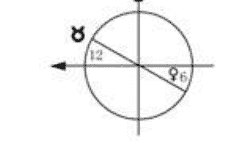

2、找出主宰星的位置。
3、将你的兴趣跟想法，从原始星室扩展到主宰星座落的星室。
4、注意其中的差异。

## 超越自己的窗口看世界

至目前为止，应该明白，我们没有理由认为我们知道什么事使人们感动、什么事使人们好笑，以及什么是他们的优先顺序。人是很复杂的，我们可能要花上好些年做耐心的研究，才得以发掘他们所有的特质可能性；然而，人类一直在成长和改变，而任何一个片段的知识都是静态的。我们真的知道自己的人格吗？再说，什么叫做[人格]？对每一个人而言，我们对世界的感觉是如此个人化，但是我们还是想知道，外面的世界真正发生的是什么事。

这个问题的重点是：必须了解，我们并不真正知道我们是谁、甚至我们的朋友及家人也不知道我们是谁，如此才会打开心胸，把每一个人看成是不断改变的个体，到时我们会比任何一种知识所能教导的，更接近真实的关系。研究诞生图，可以帮我们找出那些由于我们不自觉的假设，而错失的人类个别差异：我们认为自己理所当然拥有的某些特质，就认为别人也一样拥有。

研究诞生图，同时也能帮我们解决关系上的困难，或者减轻做决定时的挣扎；接触我们的诞生图为我们带来的最宝贵福利是：肯定我们对自己的感觉，更能接纳自己的个性，而不试图改变自己成做不到的样子。也许，透过我们不断的自我接纳，我们会在最高的意义中真正认识自己，也认识自己[窗口]之外的世界。

## 第五章 月亮的南北交点

### 我们相同的地方

### 我们的故事

月亮的交点好像是在诉说一个我们从前世、穿越今生……一直到发展出自己潜能的故事；那不是一段我们遗留在前世的前尘往事，我们从来没有舍弃过它；我们是我们的前世，那一段岁月造就了今生的我们，所以无论到哪儿，我们都如影随形的携带著它。月亮的交点告诉我们：接纳完整自我的能力，是朝向吸引我们的目标迈进的第一大步。当我们走上那条路时，生命会变得有意义且充满喜悦；也许走来艰辛，但我们会觉得[这样才对，这才是我一直想要做的事]。当我们顺著月交点的路往前走，一股决心、力量和踏实的感觉会油然而生，我们就不会在日常生活中载沉载浮，患得患失了。我们愈能真实觉察我们的合一，就愈不会受到线性时间的局限。我们的灵魂早就预见了此生会经历什么事，也预见世界将会发生什么事以及所有的过程和变化，知道最适合我们出生的时间。他们从别的次元审视我们这一生，为我们的来临寻找最佳时机；做为灵魂的我们，会考虑选择一个可以早早成就的目标，而不管它对这个世界是否有贡献；或者我们是否可以从中学习，改变我们的经验。

我们可以认为，这意谓着我们必须从无数的前世学习，如果我们已经花了一辈子的时间，努力开发自己的某种属性特质——例如，一种直觉的想像力，或者，某种非常专精的实用技术。为了达成这些目标，我们需要专注在一个特殊领域以累积经验，由于无法时时刻刻对所有的事情保持觉知，我们自然而然地发展出一个可以让自己聚焦在上面的习惯。我们花了一辈子努力得来的，就变成一个天分、一个技术以及一个习惯模式，储存在我们的潜意识当中，在我们想要使用的时候，随时破门而入。

透过许多经验的累积，我们可能已经开发出不可胜数的技能了，但是我们带来的只是那些与今生有关的东西。知道了什么技能与此生有关，我们就会去提取；但随之而来的，是我们根深柢固的习惯、态度、臆测以及任何我们遗留在前世、未被解决的问题。例如：因着一些没有解决的关系所造成的难题；一个应该负起责任的意外；或者在生命结束时，对这个特别的死亡来不及整合的经验。

我们选择的特质集结成一个性格团块，跟着我们的诞生被带到这辈子来，这个性格团块的特质，描述在我们出生时的行星排列中，等待我们在今生将它们整合并作为工具使用。个人诞生图上的行星是彼此相关的，行星间的关系良好，表示拥有该行星的技巧；而不佳的行星关系，显现在彼此间困难的角度上，则指出自己内在的冲突部分。占星家在阅读一个人的诞生图时，很容易发现他身上具有多种不同的性格；我们就是这种分裂的人格体！此生当中，我们必须整合这些分裂的人格，生命才会更加喜悦。

当我们来到这世界，在我们背后的就是我们的过去——一种我们了解与期待的感觉；而立于我们面前的，则是召唤我们去成就的品质和生活——这不是什么特别的东西，而是个人品质的了解与扩展。月亮的南交点代表的是过去，我们面对的是它在黄道带正对面的北交点。如果不要提到前世，我们会说南交点表示[我们觉得最轻松的，我们期望的东西]。

从天文学来说，我们是从地球的角度看太阳和月亮绕行的两个大圆圈，如果我们站在地球的中心看太阳，你可以看到它在一年当中，绕经黄道带的十二个星座，在地球周围画出一个我们称为黄道的圆圈。而月亮的路线走一圈只需四个星期，它绕行地球的角度与太阳不同。这两个圆圈分别在黄道带相对的位置相交，我们称之为月交点。月亮正要穿过太阳的路线往南走的交集点就叫南交点。

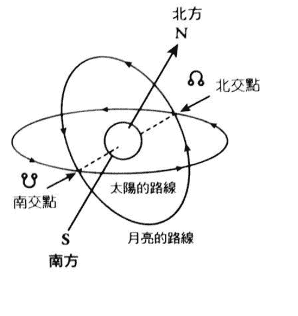

而北交点就是月亮经过太阳路径往北移时的交会点。因为太阳代表精神，月亮代表我们自发的个性，所以月交点代表的就是我们的精神在个性层面所扮演的角色。我们必须在今生整合所有的个性去做一件事情，这一点，月交点提供了线索让我们去找答案。月交点有时也叫龙头和龙尾，把诞生图比喻成一条头朝著北交点，而尾巴结束在南交点的龙。那就好像是一张标示着我们开发过的土地地图一样，前世的早期经验也许标示为星盘中含有南交点的星座和星室——那种我们觉得熟悉，安全但是过时的行为，会给我们带来痛苦的经验。

与它相对的是那些我们一无所知的地方，我们很想去探索，却对那个领域的生活（有北交点的星室），以及那个方式的行为（北交点座落的星座），感到担心害怕或者犹豫不决。因为那是灵魂选择的方向，而我们的人格面却认为为了到达那里，它必须踏出自己的舒适地域才行。对这块新大陆，我们没有地图，甚至即使别人认为简单，我们还是觉得没有安全感——不管我们已经获得多少建议。

无论如何，当人们有冒险或者冲动的感觉时，经常义无反顾地直接投入北交点落在星盘中的星座与星室的活动。他们会在其中努力一阵子，但是由于缺乏该方面的经验和技能，使他们后继无力。运作不顺、失误连连，往往让他们想要逃回南交点的习惯模式和臆测当中，虽然，这不是他们想要的，但至少比较简单。

还好，在每一次的尝试企图中，他们可以攫取鳞光片羽的经验，明白在与灵魂取得连系时，他们需要的是什么。

### 离开和回来

有时候，早年时人们认为北交点所在的地区是痛苦的，因而决定放弃尝试。他们要不就继续以让他们愈来愈无法忍受的旧有模式做事，要不就是失去了所有的方向。然而，不走在北交点的路途上，人们往往会觉得迷惘[我来这里的目的是什么？][我应该要做什么？]任何我们企图去做的事，都无法满足自己，内心深处，我们会有一种说不出的渴望，每当我们北交点形态的经验被人提起，心底都会有一种[真希望我也是……]的感觉油然而生，这种思慕感会逐渐啃噬、腐蚀我们的生命。

造成我们无法成功攀上北交点的原因是，我们为了完成这件工作所带来的工具，放在我们来时路的阶梯上——也就是放在南交点上。要回到北交点的路，我们得再度检视南交点座落处所管辖的生活，找出重要的事，我们必须想办法找出到底是什么习惯，把我们从发展自我的路途中拉回。

行为的习惯和态度属于潜意识的范围，必须被打开；它们是与过去有关，独自运作的机制。只要每隔一段时间检视我们的习惯，做一番调整之后，再带到现实生活中，它们就会成为开展生命时的有用工具，再也不会把我们往回拉了。此外，我们必须调整对每个状况的反应，让它们符合当下真正的情况。

同时，我们必须尊敬自己真的拥有的能力，不要认为那是普天之下人人都会的事，或者把它当作是自己的弱点（例如高度的情绪敏感）。有时候我们必须重新学习前世的技能或者知识——不过，它们常不经学习自然前来，所以我们只要忆起就可以了，这些都是我们在发掘新大陆时，每一步所需要的工具。

知道别人也许不具有我们南交点的能力也很重要，当我们没有意识的使用这些能力，或者只是为了个人利益而使用它们时，我们会把自己封闭在那个人格面相中，而使生命往前推进的力量受阻。但如果我们以任何我们觉得自在的方式，使用南交点的能力去造福别人，灵魂的精神就可以被表达出来，而且我们在北交点的表现也会成功。

我们面对的方向，会呈现在包含著北交点（龙头）的星座和星室中，是那个星座最吸引我们的东西，我们要在心里把那些理想当作引导星，而不是预期它为必须立刻被达成的成就。只要把握住这个理想，当南交点被整理出来，龙尾被解开，我们就会发现所有在北交点的活动和行为自然而然展开。我们的努力吸引了我们需要的援助，教我们如何达到目标。当我们从斗室中拨开云雾，整理出第一步，下一步自然在眼前呈现出来。

### 十二个方位

北交点向后倒退慢慢运行经过黄道带，运转一周需要十九年，在天文历中只画出北交点的位置，南交点通常就在正对面。当你知道自己或者朋友出生时的月交点位置，读出上面的讯息是一件很有趣的事。

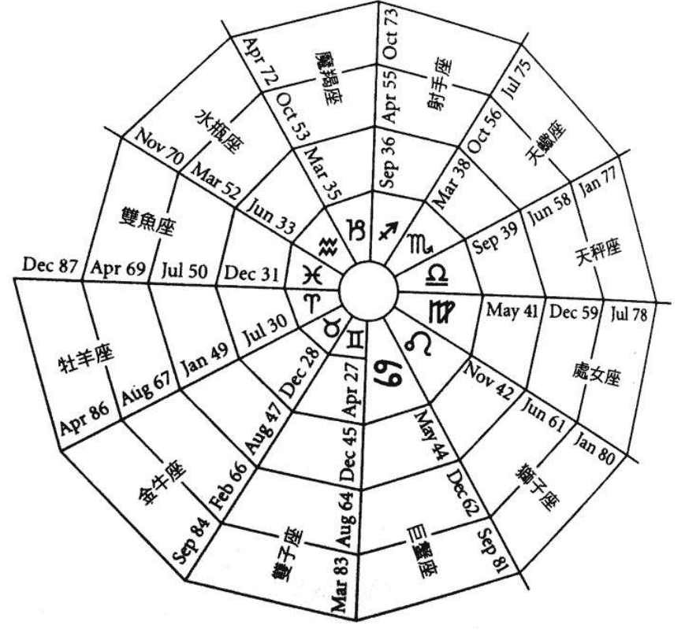

告诉我们，北交点从一个星座走向前一个星座的时间，上面只有月份，所以你必须去查天文历，找到确实的转换日期。

我们将会看到互相面对的两个星座，北交点位于你在地球上面对的星室和星座中，所以在你背后的就是直接与它相对的星座与星室。

描述南交点，或者人们的「来处」，我们需要找到：

1、星座和星室的技术与能力
2、星座和星室根深柢固的习惯

描述北交点，一个人希望展现活跃的地方与方式，需要找到：
1、星座和星室的理想
2、新手可能会在该星座和星室犯的错误

**南交点位于牡羊座（主宰星：火星）**
技能——独立、有能力照顾自己、主动积极、知道自己要什么。
习惯——从来不求助，也不需要同伴，因为他们认为没有人会帮助他们，假设自己必须［独立作战］。

**北交点位于天秤座（主宰星：金星）**
理想——建立关系，推己及人。
错误——以别人为优先，忘了自己的需求，因而感到挫折，最后导致退出或失去关系；失去自我。
这些人需要忆起的是：必要时他们可以独立作业，同时也需要留一点空间作自己，所以没有必要在一个关系中死缠烂打。当关系变得困难时，他们必须停止把人推开，只要用一点点牡羊的勇气，他们就敢冒险把自己的想法像他们的同伴一样表达出来，这时他们的秤子就可以取得真正的平衡而稳定下来。就比较不会做出使他们感到挫折的结论，而朝著天秤［和谐关系］的理想，更迈近一步。

**南交点位于金牛座（主宰星：金星）**
技能——能够与大自然契合，稳定可靠，天生的肉体疗愈力量。
习惯——冥顽不灵，认为时间和沉默可以疗愈一切困难。

**北交点位于天蝎座（主宰星：冥王星、火星）**
理想——深层的情绪连结和了解。
错误——搅动没有必要的情绪，责怪别人让自己产生强烈的情绪反应。
为了获得稳定的人生，这些人必须朝向与大自然连结，而不要把焦点放在与人的连结上。他们可以藉由接纳大自然的宁静，来创造让他们觉得安全的稳定和疗愈的力量，从这个基础上他们会有足够的坚强，可以和缓的表达出自己受伤的情感，而不需要责怪别人，如此一来，他们就更容易达到天蝎所期望的［深层情绪分享］的理想了。

**南交点位于双子座（主宰星：水星）**
技能——沟通；以认知和使用别人的风格、话语来取悦别人的能力。
习惯——喜欢说多过于聆听，以至于学无所成，流于表面的快乐，使人感到不可信赖。

**北交点位于射手座（主宰星：木星）**
理想——了解全貌，可以说明对生命的概论。
错误——想要谈论尚未了解的事，缺乏事实根据就做出肤浅的结论。
这些人必须利用他们双子的魅力去倾听别人谈话，找到可以拼凑出射手想要知道的生命全貌的细节。使用别人的语言与风格跟别人交谈，是他们了解事情的模式，这可以让他们自然的说出感兴趣的事，谈话内容自然富含哲学深度，如此一来，就可以建立自己的生活哲学了。

**南交点位于巨蟹座**（主宰星：月亮）
技能——敏感，具有想要滋养、照顾别人的爱心。
习惯——认为自己还是个小孩子，无法掌控生活，需要被照顾。

**北交点位于魔羯座**（主宰星：土星）
理想——能够有效率处理任何一个实际状况，达成实际的目标。
错误——为别人担负起责任，使别人没有作自己以及获得经验的机会。
这些人可能因为不胜负荷的责任造成挫败感，他们必须学习如何照顾自己，尊重自己的情绪反应。当他们做自己份内的事时不断产生的力量，会使得别人更能了解他们的照顾，他们也就能负起真正属于自己的责任，而不觉得自己渺小，或者是在情绪上感到超过负荷。

**南交点位于狮子座**（主宰星：太阳）
技能——来自内心的、正面的自我表达方式，在艰苦和压力的状况中鼓舞别人的力量。
习惯——受限于别人的反应，需要别人的赞赏。

**北交点位于水瓶座**（主宰星：天王星、土星）
理想——超然和正确的视野。
错误——与人疏离，把自己隔绝在重要议题之外，容易处于状况外，造成不精确的判断。
这是一些为了追求自由、可能在追求过程中与世隔绝的人，因而给人一种没有生气的感觉。他们的假设是：在一个团体之中，他们想要的应该也是别人想要的。他们天生的幽默感和爽朗会为他们带来友谊，当他们付出真诚温暖的关怀，人们会乐于接受他们的与众不同和突兀的变化，这样一来，他们就可以得到一直在追求的自由；而且不管想法如何离经叛道，他们的真挚都会为他们赢得听众，同时鼓励他们保持与众不同的风格。

**南交点位于处女座**（主宰星：水星）
技能——知道在何处改变可以提升他们经验的能力，知道什么是最有效以及最有帮助的。
习惯——喜好批评，过度自我批判，完美主义。

**北交点位于双鱼座**（主宰星：天王星、木星）
理想——对人类无私的奉献，高度的直觉 / 通灵力。
错误——满足他人的要求而不是他人的需要，因承担别人的感受而感到痛苦。
在双鱼座北交点座落的星室当中，这些人渴望与万物合一，但是他们会在通灵的过程中迷失自己，他们必须在为他人服务时，保持明确和清晰的心智，把焦点放在他们所做的事情上。一旦学习到停止无时无刻用要求完美的心态去惩罚自己和别人，并且尽最大的力量去帮助他们遇见的每一个人，就会发现自己与人类整体合而为一；当他们能不受情绪的影响去观照那个看不见的世界时，通灵能力自然会展开。

**南交点位于天秤座**（主宰星：金星）
技能——外交能力，从各个角度看事情的能力，知道在正确时机采取正确的行动。
习惯——拒绝去考虑甚至认知需要行动的事件是什么，为了保持和善而不讲求诚实。

**北交点位于牡羊座**（主宰星：火星）
理想——知道自己的心，在正确时刻采取勇敢的行动，从别人的反应中认识自己。
错误——冲动，独立作业。
这些人渴望以自己的方式处理事情，藉此发现自己，自认为无法与人相处。与其试图去维持和平，不妨运用外交手腕，诚实面对回应的结果。他们会发现，只有透过与别人建立关系，才能有勇气作自己，因为需要从别人的反应与支持中发现自己。

**南交点位于天蝎座**（主宰星：冥王星、火星）
技能——对自己和别人情绪的深度敏感，意志力和自我转换的能力。
习惯——记恨，报复心。

**北交点位于金牛座**（主宰星：金星）
理想——稳定、健康、有安全感。
错误——自己尚未稳定就想支持别人。
这些人与土地的关系密切，对他们来说，大自然是非常重要的。他们追求的是尽可能以如磐石般的稳定性来支持别人，但是别人的情绪却总是可以触动这些人不易保持平稳的本质，让人们对他们感到失望。在完全了解自己藏在情绪深处的记忆之后，他们会发现自己最底层的基础，这就是他们稳定的根基，到时候，没有任何故事，没有任何绝望，能够撼动这个根基。

**南交点位于射手座**（主宰星：木星）
技能——看清任何情势全局的能力，天生的哲学智慧，振奋别人的能力。
习惯——不解释自己的想法，取笑别人。

**北交点位于双子座**（主宰星：水星）
理想——可以和任何人沟通。
错误——当没人真正对他们感到兴趣时，还是一直谈论芝麻琐事。
这些人以不能满足自己的方式和别人闲话家常，必须要和他们与生俱有的哲学思想取得连结，沟通对他们才是有趣的事，当他们一听到与哲学有关的，前世拥有的知识就会自然涌现，立刻被他们忆起。这些人需要把智慧运用在为人服务上面，当他们以更宏观的角度，对当下有关的议题进行沟通，而不是只漫无边际闲话家常，就能够在其中发现真正的快乐，并鼓励别人。

**南交点位于魔羯座**（主宰星：土星）
技能——可以负起责任，能干、有效率。
习惯——期望别人跟他们一样努力，忽略自己。

**北交点位于巨蟹座**（主宰星：月亮）
理想——让世界在他们的照顾下得到滋养。
错误——对他们所在意的人紧抓不放，付出过多。
这些人需要的对自己的经验负责，而不要为了对别人尽责而过度担负别人的问题。一旦了解每一个人都要为自己负责，他们就可以运用自己卓越的能力，以温和慈爱的方式教导人们照顾自己，而不是帮他们做事。他们带给人们最大的礼物，是在学习过程中给与人们情绪上的支持，允许人们犯错、走自己的路。他们会因此拥有轻快的时光，甚至可以享受如孩童般无忧无虑的生活。

**南交点位于水瓶座**（主宰星：天王星，土星）
技能——保持超然，视野清晰。
习惯——认为对自己是正确的事就一定要对每个人都是正确的，不正视自己的情绪。

**北交点位于狮子座**（主宰星：太阳）
理想——做自己，在每个人身上，每个状况中看到积极光明的一面。
错误——在不恰当的时机表达自己，造成别人的反感。
这些人必须在独处时认清自己，才不会为了想要争取[观众]的注意，而失去自己的重心。独处而不找出自己的真理，会使他们在与人相处时，做出肤浅空洞的表演，因为这样的事情会让他们感觉沮丧，致使他们可能再度遁入与世隔绝的状态中。但如果他们可以强忍开放心灵的痛苦，让别人看到他们真正的样子，他们内在那股真诚的光芒，就会激励每个与他们相遇的人。

**南交点位于双鱼座**（主宰星：海王星，木星）
技能——直觉/通灵能力，大体同悲的同理心。
习惯——不限制自己的通灵空间，以致于会受人影响也影响别人。

**北交点位于处女座**（主宰星：水星）
理想——把人类带向一个更美好世界的有意识的工作。
错误——认为世界上有一个完美的方式，而且知道那是什么。
这些人需要运用与生俱来的觉察力，去知道别人的感觉，才能提供恰当的帮助给每个人和每种状况。当他们力求改善一个状况时，往往会批评别人，因而造成相反的效果。一旦将焦点放在对整体状况的印象上，他们会直觉地知道什么是最好的说法和做法。

### 我们不同的地方

月亮的南北交点，或者是月亮和太阳运行路线的交点，不管任何时候都会在诞生图上形成一条中轴线。在一张诞生图中，这条轴线可以被诠释为精神体（太阳）在此生给人格（月亮）指引的方向。当这个方向被活化运转时，人们会感觉到生命是有意义、有目标的。好像说：我们在无意识中吸引了一些因应南交点星室和星座活动和风格的状况前来，而在有意识当中尝试去表达北交点的活动和风格一样。没有接受南交点领域所发生的事和我们在该处所拥有的技能，我们就无法成就北交点的目标。向着北交点前进，必须要在北交点的理想导引之下，运用南交点的能力去帮助别人，这条路所允诺的成就感才可能获得。简单的说就是：我们要运用南交点的技巧，来支持北交点的目标。

## 月交点的主宰星

每个月交点座落的星座都有一个主宰星，这在第三章中已经讨论过。这个主宰星座落在星盘中的位置，透露出更多关于这个月交点对当事人产生何种作用的讯息，不管当事人觉得他在那个领域中的活动艰难与否，也不管它们是否近在眼前，或者就藏在他们浑然不觉的工作背景当中。有月交点的星室同时也被座落于该星室开端界线星座的主宰星所掌管，而这个星座也许跟月交点的星座相同。要了解是什么活动启动月交点的能量，除了月交点星室本身以外，该主宰星座落的星室也是重要的参考指标。

当南交点的主宰星落在北交点的星座上，表示当事者的某些部分，也许已经朝向他渴望发展的目标前进了；就如同把以前使用在熟悉领域中的能量拿来，对准新理想重新定位一样，当他们试图做一些可以实现个人成就愿望的事时，往后拉扯的力量可能比较小。

他们的困难在于，如何集中勇气在一些看起来让人怯步的新状况中使用南交点的能量，尤其是当这个主宰星落在较弱的一方——它所掌管的对面星室。举一个南交点在牡羊、而火星落在北交点掌管的天秤座的例子来说：任何牡羊惯有的莽撞和侵略性都会被天秤座对人的体贴所冲淡，这正是他们渴望发展的。但是在精力的持续和自己可以独立的认定上，他们却感到相当困难。如果火星与北交点合相，则困难度会更加强。

北交点的主宰星落在南交点的星座上，也许指出过去有许多需要被修正与平衡的地方。当状况一再重复发生时，当事者若能调整内在，他所做的努力就会和新目标不谋而合。当不断重复的反应被认出并接受，这些人就会发现它们到底受什么态度和假设的吸引而来；藉着无意识的能量释放，为这些想法解套，它们就可以成为开展人生的一股助力了。

举北交点位于射手而其主宰星木星落在南交点双子座的例子来看：木星的扩展能量可以帮助他们获得内在的成长，让他们得以看到事物更周全的面貌，使他们喜欢忙碌地探索各种想法，或许因此而偏离了追寻的目标。

日积月累下来，也许会发现自己在毫无关连的活动当中，忙得不可开交，无法开展自己的想法。他们或许一直倚赖从这种为别人服务的行动中获得掌声，所以当他们可以接受这个想法，为自己的特质释放掉强迫性的行为时，他们可以带着真正的兴趣去进行沟通，届时学生／老师的关系自然发生，射手座的北交点的格局就有意义了。

## 月交点的相位

行星与月交点形成的相位，代表那些直接影响我们开展人生路途的人格层面，它们会在日常重要事物上带来蓬勃或者停滞的能量。交点的路通常是没有相位的，但还是会依照我们所形容的方式，在生活事件上形成背景环境，产生功能；它并不会对任何一条贯注情绪能量，但是如果偏离月交点的路，我们会觉得受困；而走在月交点所指示的路上，我们就会觉得充满喜悦。

### 合相

一个与南交点形成合相的行星，表示我们必须察觉出的前世能量。当生活中所有的假设都被解开，所有的知识和技能都能重新获得，一切的事物就会各就其位；此时，个人的生命终于有了意义。

自记忆中斩除。如果我们拒绝接受部分的古老时光，或者压抑此生的某些早期经验，我们就没有办法要求拥有那段时间中学到的技能。所以，如果拒绝这段痛苦的记忆，我们也无法使用在这个痛苦过程中形成的人格特质及技能——因为南交点同时代表我们需要的工具，以及处理生活时最有用的技能。
当我们取回那段记忆，就可以使用那些工具和技能，而我们的生命也开始回复意义。
一个行星与北交点合相代表：在对准北交点方向前进时，那个立刻产生作用的能量。我们很容易以为这个能量特质不属于自己，因为第一次尝试运用之后，会觉得无法掌握这个能量，别人很容易做到的事，对我们反而困难重重；所以开始怀疑自己，转而寻求适合做这件事的人，把这个能量投射给他，为了自己无法做得像他一样好而感到无能；然而，如果愿意冒险等待下去，我们会发现这个行星的能量很容易掌握、运用。
在找到月交点的路，整合其他行星的能量以迈向这条路之前，我们会觉得自己无能。最好的方式是，刻意整理出位于南交点的习性并整合它的能力，北交点星座的主宰星以及它的作用行星，会指示我们如何专注在这个领域的活动中，藉以克服我们的恐惧。
让我们看看一个金星与北交点合相在双鱼座的例子，这些人可能缺乏跟人和谐相处的常识。别人都可以相处融洽，但是他们却会在试图表现出符合别人期望的模样时不知所措。为了找回让自己满意的观点，他们必须回到处女座的南交点，去找到他们的意识焦点以及分辨的能力，就会看出人们真正需要的是什么。而海王星——双鱼座的主宰星，所在的星室则指出，在什么领域中可以大展身手，运用直觉力去帮助人们。相较于只是取悦别人，这种与人互动的方式更可以满足他们。

### 四分相（90度）

一个与两个月交点形成九十度相位的行星，就像是一股干扰月交点路线的力量，我们往往受到它的影响而动弹不得。它感觉起来像是一种利益的冲突，像我们挡了自己的路一样。可以从这个角度来看它：走在这条路上，我们需要一个额外的能力，而这个能力并不直接与这条路有关，所以我们必须离开这条路去取得它。当这个任务达成，我们就可以带着丰足的感觉回到原来的路。
每当事情的困难度变高时，我们很容易走到九十度相位的行星所管辖的领域去，直到内在成长的驱策力让我们再度回原来的路途上，我们可能会觉得生活不欢迎这个四分相的行星能量，或者我们在该行星的行为风格以及喜欢从事的活动。
静下心来想，找出四分相位行星在我们迈向月交点路途上扮演何种助力，是很有帮助的事。我们将会发现，一个四分相的火星代表挖掘过去、面对未知、面对将来的勇气——只要我们不要错误使用它的能量的话。而一个四分相的土星能量——通常使我们觉得环境阻挠我们朝着目标前行——会阻止我们太早行动；如果我们坚持目标，接受必须花时间去完成它的事实，那么这一路上将有很多功课可以学习，土星反应出我们具有稳定的意志力特质，有了这股意志力，我们几乎可以成就所有的事情。

### 三分相（120度）

一个与某个月交点形成三分相位（120度）的行星，必定会与另外一个月交点形成六分相位（60度）。与南交点形成三分相的行星，显示一个知道如何运用该行星特质的天生自然的能力，例如：木星与南交点成三分相，表示具有一个前世带来的慷慨大方和胸襟宽大的技能；而它与北交点形成的六分相则显示：木星的特质会吸引那些我们可以选择的成长机会前来，帮助我们开拓生命的方向。
一颗与北交点形成三分相的行星，代表一个帮助我们展开潜能、鼓励我们继续往前进的力量，那是一种给我们信心去迎向未来的特质，而它座落的星室则指出，那些不费任何心思就会在其中获得成长与提升的活动领域。为了找出我们仍然带有的前世技能，我们应该有意识的把这股能量集中在南交点领域，否则可能冒然冲进月交点路途中，不明所以的一再被那些不再适合我们的旧习性绊倒。举例来说，水星与北交点之间的三分相位告诉我们：当事者知道他们的方向在哪，同时也会把意识焦点放在那个地方，找出任何一个他们没有意识到的期待，将可以帮助他们免于重蹈覆辙。

## 个人的生命路途

我们的生命方向赋予我们的生命经验一个目标，也赋予我们所有的努力一个意义。对北交点在诞生图中的意义，我们有许多种不同的诠释方式，不管如何，我们形容的方向要被当事者认为正确而接受，这是非常重要的事。如果可能，最好是采取暗示它可能是什么的方式引导当事者，让他们在喜悦、满意的感觉中发现实情。
对每个人来说，生命路途不只是绝对针对个人，同时也是必须改变，开展甚至完全转化的主题。它是一个方向，不是必须马上成就的目标，但是在路途中，会出现许多让我们感到满意的成就。一旦我们的脚踩上这条个人的路途，我们真正的精神体就会永远陪伴着我们，而所有的生活也会被内在那股自信点亮。
月交点的轴线是我们面对的方向，就好像是站在自己的经验边缘，越过生命的转轮，看着另外一边一样，我们同时也面对着轮轴的中心点。当我们接受了所有在南交点的技能之后，我们为活化北交点能量所做的努力，就会把我们拉进轮轴中心。换句话说，唯有接受我们此时此刻的拥有，才能放松下来，进入光，进入我们的中心，绽放出真正的灵魂光芒。

## 结语

本质上来说，每一个人都是完整、不可分割的个体。一个无法分割成碎片的整体，就好像无法把一个有生命的东西与它的生命本源分离一样。在完形治疗法中，［完整的人］是最终的治疗目标。在占星学中，我们也重视完整的人。为了达成这个目标，所有的系统倾向把人分成精神、心灵、情绪，肉体、方向以及环境等等各个面相。
为了说明我们的经验以及每个人的差异，我们倾向把人分成好几个层面来看。
例如，把情绪视为与肉体分离、单独存在的个体，虽然人对相同的事情有两种表达，直接产生关连的是荷尔蒙，还要加上肌肉的紧张、身体的姿势等等。
我们倾向于把精神与心灵分开，自发性的反应与思考过的反应分开，男人与女人分开，内在的小孩与成熟的大人分开，直到觉得自己好像是各种纷乱的、无法整合的碎片一样。
我们的本质表现在各种不同层面上，无法从其中任一面来描述全貌。必须记住：所有我们正在做的事，都是从许多不同的角度来诠释自己的本质，而在能够从［整体］的角度来看它之前，我们每一个观点都是有限的或者并没有价值。占星学美在它的语言包含了象徵与模式，我们可以用任何一个层面的意义去解读，从中发现不变的本质。
制造麻烦的是我们的人格，并不是我们的精神体，这些麻烦是由对冲星座的负面表达、行星间的困难相位，或者是对北交点的焦虑不安所造成的。我们的人格觉得某些黄道十二星座很难理解，不明白它们如何能彼此相处，但是我们的精神体完全明白，它们会在每一张诞生图中与所有的事件、所有的星座共舞。

## 走向生命核心

每一个人都具有十二个星座的特质、每一个行星的能量以及十二个星座代表的生活面相。记住，所有的十二个月交点方向与每一个人的内在息息相关。

当我们从南交点望向对面的北交点时，事实上是隔着中心点望着对面，所以那是一个由外向内的动作。从我们在生活中拥有的经验走到中心点，在占星学上也就是从行星落在星图上的位置走向核心，走到我们诞生图中［圆周和十字］的中心。这个中心点就是我们的转化点，通过这一点，可以进入永恒合一的生命真理——“一”。

## 谢辞

从最初接触占星学，在占星学的光中，发现生活的种种美妙开始算起，这本书的写作可以说是一段进行了27个年头的过程。我要感谢第一个读本书的人——伯纳·哈尼（Bernard Honey），他随后分享我关于神秘学校所传授占星学的基本法则，他们鼓励精深博大的诠释方式；1996年在考艾（Kauai），我获得许多慷慨的实际帮助，将我的教材整理出来。这里我要感谢奇迹课程的老师——汤姆和琳达·卡本特（Tom and Linda Carpenter），以及许多在那一段时间中给我精神鼓励和情绪支持的人。
回到英国，我的手稿在挚友——莫琳·瑞琪（Maureen Ritchie）的善意建议和敏锐的校对下，获得大幅改善，她协助我完成整本书的初版。我同时感谢葛拉翰·戴维斯（Graham Davis）对我经年提供的稳定支持。我也谢谢大卫·库辛（David Cousins），他的灯火照亮我前行的道路。

我由衷赞美我的两个儿子——豪尔和亚卓安·库曼（Howard and Adrian Koolman），他们的电脑专才帮忙我创造占星的软体和符号。感谢他们的耐心教导和鼓励，他们持久的情谊是我生命中最大的喜悦。
过去几年，我享受与作家凯·斯诺戴维斯（Kay Snow Davis）一起的探索，占星学成为一种可解读的表达方式，让人一窥人类生命永不止歇的美丽进化。此刻，感谢理维林出版公司（Llewellyn Publications）支持我原来的构想内容，并将其润饰成更适合一般大众阅读的作品。
我还要对全球各地的朋友和支持者致上非常的谢意，以及那些在多年工作岗位上砥砺我的个案和学生。
现在我的内心澎湃翻腾，期望能与大家分享更多。扩张我内心最深的感谢来自生命的本身，还有那爱、喜悦和宁静及我们共有真实的存在。

全文完

感谢：台湾生命潜能出版社出版此书　　感谢光之工作者的网店
p.s: 这可能是目前所有星象学书中最有代表性又最能看懂的一本书。大家可以在
http://astro.sina.com.cn/pc/zodiac.html
在线看一下自己的星盘，再结合此书阅读。

为方便大家看，收集了一个常用的占星软件和使用说明，
详见：http://115.com/file/bhyibt1u
astrology 软件使用指南.doc
http://3721up.com/2z9z
astrolog32 占星软件