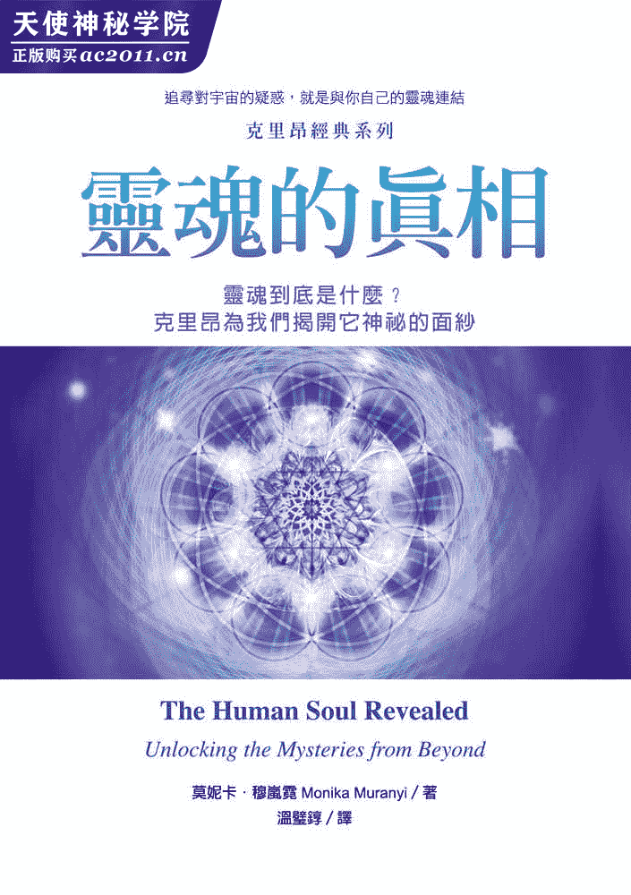
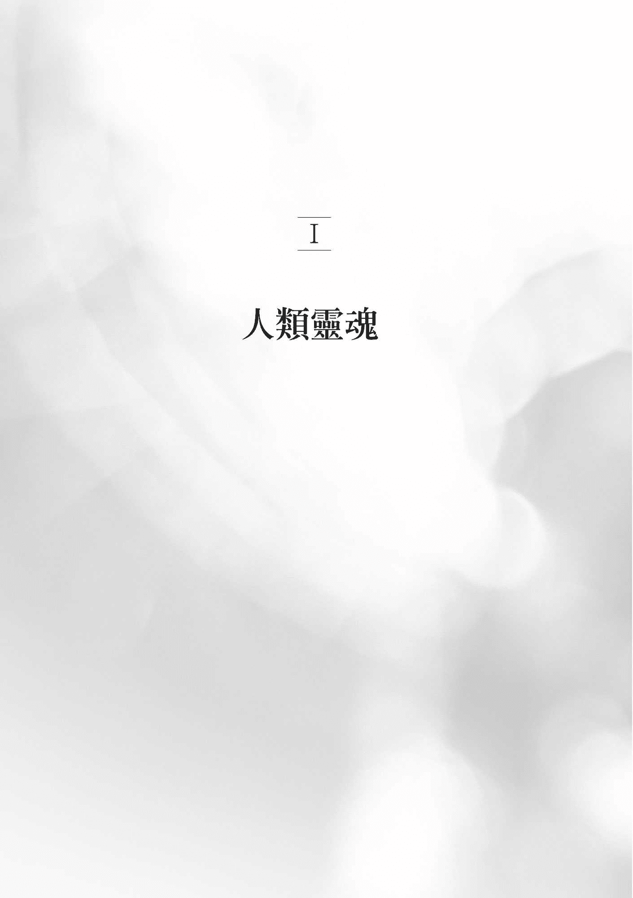
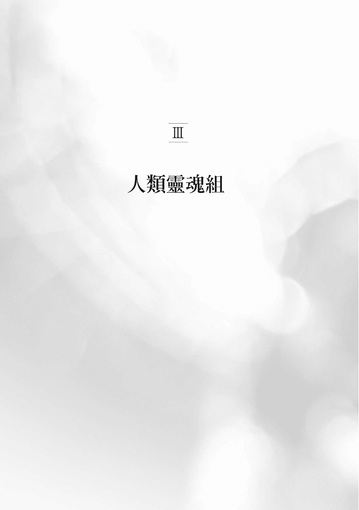

# 目录

1.  封面
2.  献词
3.  作者简介
4.  致谢│感谢选择让这本书影响人生的你
5.  推荐序│人类灵魂，我们未知的国度
6.  自序│追寻对宇宙的疑惑，就是与你自己的灵魂连结
7.  I 人类灵魂
8.  II 盖亚灵魂组
9.  III 人类灵魂组
10.  IV 核心灵魂组
11.  V 灵魂沟通
12.  VI 灵魂之旅
13.  尾声│和灵魂一起展开新旅程
14.  版权页

谨将本书献给一切无所不在的母亲：

盖亚，我们的大自然；

昴宿星人，我们的灵性母亲；

生下我们每个人的生身之母；

也将本书献给所有担任母亲角色的女人，

感谢你们为「需要母亲」的珍贵灵魂肩负起母亲的角色。

# 作者简介

莫妮卡．穆岚霓（Monika Muranyi）

莫妮卡对地球一直有着很深的爱意与连结。她不仅拥有澳洲新南威尔斯州南十字星大学应用科学系学士荣誉学位，更在纽澳地区的几个国家公园担任护林员超过十五年，更是认证合格的电磁场平衡技术（EMF）第一至十三级执业师。莫妮卡热爱摄影，其作品可在李．卡罗的网站（www.kryon.com）、莫妮卡的网站（www.monikamuranyi.com）看到。

莫妮卡曾仔细研究过本书里的资料，也去过许多地方探索盖亚想对人们说的话语，包括：澳洲、纽西兰、南美诸国、墨西哥、夏威夷、俄罗斯、东欧等国、瑞士、西班牙及葡萄牙。曾参与位于秘鲁、智利、墨西哥的原住民萨满仪式，及夏威夷高等女祭司主持的仪式。

她撰写并出版本书的灵感是在智利圣地牙哥生活时出现的，当地与地球拙火能量的振动紧密相应！此外，本书相关的额外参考资料除可在她的网站找到之外，另有作者授权的中译本《克里昂经典系列后传》方便中文读者参考。

# 译者简介

温璧錞

台湾省新竹市人，淡江大学英语系、台湾大学外文研究所毕业，现为大专兼任讲师及特约译者。译有《莱霍森林：爱情与背叛的奇幻之歌》（唐庄文化）、《犀牛的影像：镁光灯下的自然世界》（与金振宁合译，胡桃木，获选中国时报开卷版翻译类年度十大好书奖）、《可笑的结局（第二辑）》（胡桃木）、《多多鸟之歌（下）》（胡桃木，荣获 1999 年联合报读书人最佳书奖），以及由一中心出版的《耶稣的 47 个故事》、《女神战士手册》等书。

# 致谢│感谢选择让这本书影响人生的你

莫妮卡．穆岚霓

本书是「克里昂经典系列」的第三本，特别根据设定的主题选取资料，将李．卡罗（Lee Carroll）传达的克里昂讯息编辑成书。由于李．卡罗和克里昂的合作关系，让我和其他数千人的人生因此大大地提升及改变。李，谢谢你二十五年前答应了克里昂，谢谢你确立了人生目标，愿意将这些深刻的讯息分享给全世界。也特别感谢李，他在我编写「克里昂经典系列」时，带领我、指导我，并提供他的真知灼见和克里昂讯息的人性观点，我非常享受多年来我们那许多高深莫测和发人深省的对话。

在此衷心感谢我那非比寻常的编辑大人劳拉娜．哈沃德（Lourana Howard），她对文法和编辑的热情，就和她对克里昂的热情一样，要是没有她，我一定会迷失方向！

感谢我的出版商亚立安出版社（Ariane Editions）。再次强调，亚立安不仅具有高层次的意识，更渴望助一臂之力，促进目前正发生在地球上的大转换，能委托这样的公司代表我出版新书，真是我的福气。

先前出版的两本书，感谢许多读者批评指教并向我致谢。先前那两本探讨克里昂教导的书，发挥了正面的影响，听到这个，我深受感动。我们每个人都有一种独特的共鸣，会和别人、和地球、和宇宙互动，也会影响别人、影响地球、影响宇宙。你无法想像有多少人为了你的个人改变、自我赋权（self-empowerment）以及开悟之路而欢欣鼓舞。

最后，亲爱的读者，容我给你一个温暖、深情的拥抱，谢谢你在茫茫「书」海中，选择了这一本。这本书让我更了解我的读者，我想藉此机会感谢你，愿你一生都能享有无尽的祝福。

# 推荐序│人类灵魂，我们未知的国度

李．卡罗

太空边界广阔无垠，有太多尚未发现的壮丽奇观吸引着我们。地球上的各大洋也充满了神秘，因为深海中有太多东西还没被发现、还未显现。当我们发现人类文明比我们原本以为的更古老时，历史本身也一再重新改写。我们未知之事，已经变成一个更大的议题，这是任何人始料未及的！

然而，最值得探索的领域，莫过于这股地球新能量里人类的神秘部分。最能充分体悟这个概念的就是老灵魂（Old Souls）。若你此刻正在读这些话，那你极可能是老灵魂；就是因为你今天对这股能量有兴趣，才会读到这非比寻常的一页。

所以，老灵魂啊，如果你已经拿起了这本书，赞叹书中的内容，那我们可以告诉你，人类的灵魂就像是个尚未被发现的国度，我们几乎不知道这个国度是什麽，或者它在哪里，它的运作方式完全是一个谜。克里昂甚至告诉我们，人类灵魂不是真的可以称之为「人类灵魂」！（但我们仍然这样称呼就是了。）

此时，地球正经历一次重大转换，而开始产生变化的就是人类意识。我们会渐渐脱离战争、生存模式，达到睿智的境界，也会更充分推崇生命，建立更善意的社会。这个过程非常缓慢，但二○一五年确实开始了新的时间分配，这也是古人历法的基础，大约是现在开始改变。最重要的是：灵魂要觉醒，并且开始更充分地展现出来。

＊＊＊

近三年来，克里昂提供了我们不少关于人类灵魂的资料，这本独特的书就是开始检视克里昂所提供的全部内容。为了方便读者阅读，所有资料都汇集在此，也就是说，这本书独一无二，是目前最新的资料，不仅揭露了灵魂的属性，更揭露了人类的整体面貌。

本书和一般克里昂书的不同之处在于：克里昂的讯息都会有所评注，作者穆岚霓常会对整体的意义提出解释。这是她的专长，将散乱的资料集中在一起，纵使克里昂讯息发表于世界各地，有时会显得杂乱无章，但在她编排解说之下便有些意义了。另外，书中提到的这些现场通灵，有很多场穆岚霓女士都在。这样一来，即使是隐藏版、没说出来的事，也能让她有所体悟──克里昂现场通灵的时候，常会提供这种感觉到的资讯，也就是所谓的「第三语言」。

你在看这本书的时候，能够理解是很重要的。所有的医生都会告诉你，就算你打算培养某一项专长，也不能只研究一种身体器官。医学上对于整个身体的知识，以及身体所有的化学变化，你都必须要了解。所以，本书涵盖的内容很多，都是克里昂认为我们需要知道的，这样才能使我们更了解整个系统。一切都与克里昂所谓的「灵魂之汤」（Soup of the Soul）密不可分。克里昂常以汤来比喻，他说，如果要了解整碗汤，就不能只研究汤里的某一种成分。研究灵魂时也一样：在这个多次元属性的谜题中，没有哪一种成分可以单独存在。

灵魂无所不在，却也无处可寻，但克里昂提出的灵魂概念，还是可以勾勒、教学、研究。不过要做到这一点，你得充分了解克里昂最新的教学：「人类的九项属性」，以及许多近期的现场通灵。克里昂开始打开知识的罐子，透露灵魂到底是什麽，也说明为什麽在我们意识进化的此刻，大家会觉得灵魂是更特别的东西。

灵魂是不是远远超过你所想的呢？你能和灵魂沟通吗？灵魂究竟是你的一部分，抑或和你是分开的呢？可不可能灵魂在某种程度上是分裂的，所以你带着的不是完整的灵魂？如果是这样的话，那麽你没带走的、剩下的那部分，又在哪里呢？这些问题克里昂才刚刚要开始回答，而本书会把这一切汇集在一起。

# 自序│追寻对宇宙的疑惑，就是与你自己的灵魂连结

莫妮卡．穆岚霓

坊间有不少书籍，是克里昂通灵讯息所促成的，现在你手中这本也是。这些讯息由李．卡罗提供，克里昂讯息最初都是由他通灵传达的，到现在已经有二十五、六年了。克里昂被描述为一个慈爱的实体，将和平与赋权的讯息传递给人类。截至二○一五年，李．卡罗写了十三本克里昂书，也与他人合写了《靛蓝天使Ⅰ：新世代小孩的来临》（The Indigo Children）、《靛蓝天使Ⅱ：新世代小孩捎来的讯息》（An Indigo Celebration），以及《靛蓝天使Ⅲ：新世代小孩十年有成》（The Indigo Children Ten Years Later）^(1)，这些着作在全球已经有超过二十四种语言的翻译本。

李．卡罗曾在世界各地发表多场演讲，解释克里昂所教导的内容。如果你是克里昂的忠实粉丝，看到本书的资讯可能会觉得很熟悉。关于克里昂谈及人类灵魂的通灵讯息，我们只摘录了一部分，在征得李．卡罗的允许后，稍加改写，希望读者可以发觉这些讯息隐含的真相；发现这些真相的目的是为了将之应用在我们的生活中，好让我们的身心变得更平衡、更平静。

本书是「克里昂经典系列」的第三本。第一本《盖亚效应》（The Gaia Effect），收录了克里昂谈论人类与盖亚之间关系的讯息与教导；第二本《人类阿卡莎》（The Human Akash），收录了克里昂谈论我们的阿卡莎层次（包括我们过去的每一辈子）的讯息与教导，并说明要如何唤醒自己的大师品格（mastery）。你手中的第三本书则是克里昂探讨人类灵魂与教导的讯息汇编。此外，克里昂也解答了二十多个与人类灵魂有关的问题，本书也一并收录。这三本书所引用的克里昂通灵讯息，都可以在李．卡罗的网站（www.kryon.com/freeaudio）上找到语音档案。

克里昂教导我们的重点之一是：「你比自己所想的更巨大！」你是上帝的一部分，你的灵魂在诞生时，就裂成了许多零碎片段。这句话是什麽意思？你的灵魂怎麽可能裂开，同时在许多的地方生存呢？我们死的时候，灵魂到哪里去了？我们是什麽时候得到自己的灵魂的？克里昂的答案很奥妙，而且异常复杂。渴望知道、了解这些答案的只有一种人，也就是我所说的追寻者。

过去有很长的一段时间，我很满意自己的生活，也过得很快乐，并不想去追寻什麽，只是应付日复一日眼前的需求。我不想接触任何遥不可及的灵性事物，也不浪费时间问：「人死的时候会发生什麽事？」这类问题，更没什麽强烈的欲望去思索生命的意义。甚至我还认为蒙迪‧派森剧团^(2)在一九八三年英国音乐喜剧片中演绎的「生命意义」还比较精采。我偏爱研究科学，尤其是自然科学，并花时间走出户外，欣赏美丽的澳洲风光。我的所知所学局限在看得到、摸得到的具体事物上，如我们的环境、植物、动物等等。对于宗教、心理学等具有抽象概念的东西，我避之唯恐不及。

我总是有种感觉，觉得前方一定有幅更大的风景，只是我不知道是什麽，也确实没有兴趣把这幅风景找出来。所以，是什麽改变了？是我改变了。在得知自己的婚姻突然触礁时，我经历了一场个人的创伤，撼动了我的世界，失婚之后的痛心与哀伤，改变了我对世界的看法。我开始追寻，想找出自己对宇宙种种疑惑的解答，也想知道我个人在宇宙间的位置，当时我已经有了「开门」的意愿，于是我的高我就在那里迎接我了。

你自己独特的经验及旅程，已带你翻开这本书。你的眼睛会停留在这一页、看着这些字，绝对不是巧合，你选择走到这一步，整个克里昂随行团（Kryon entourage）连同你的高我都欢欣鼓舞，带着无尽的爱、喜悦与荣耀。我想要谢谢你动了意念，要和自己的高我（也就是你的灵魂）连结。但愿本书的讯息可以改变你对事情的看法，丰富你的人生。

本书涵盖的主题很多，每章的标题都会指引你了解该章要呈现的资料种类。如果你才刚刚接触克里昂作品，请你要有心理准备，你可能会读到很多似乎难以置信的东西，但这些就是克里昂在鼓励你运用自己的判断力之处。我们真的有灵魂吗？宇宙之中是不是可能有一股慈爱、善意的能量？指导灵和天使真的存在吗？看到这些问题，你的第一个直觉想到什麽？很多人会马上反应，有些人则可能不太确定，可是我们再次强调，这是你的自由选择。

我们人类家族的灵性正在进化，很多个体正在觉醒，有些人会发现自己深受克里昂讯息的吸引。如果你才刚刚接触克里昂作品，特别是第一次看克里昂书的人，一定会发现有些词汇非常陌生，像是列木里亚（Lemurian）与昴宿星人（Pleiadian）之类。那麽，你或许有兴趣看看我先前的两本书：《盖亚效应》以及《人类阿卡莎》，可以帮助你将克里昂的教导连结起来，并了解这些教导如何应用在你个人的生活上。

最后，我想邀请你阅读附加的章节，这几章是本书的补充，可以在我的网站（www.monikamuranyi.com）上「Extras」的分页里找到。由于出版的局限，在页数上有所限制，不是什麽都能实际印制成书，不过要传达的资料往往超过页数限制，所以我的网站上也能找到《盖亚效应》与《人类阿卡莎》的附加章节。我非常乐意免费跟大家分享，这是我莫大的荣幸。

在此献上我的爱与祝福你。

* * *

注解 1：以上三书由一中心有限公司出版。↑

注解 2：Monty Python，英国的一组超现实幽默表演团体，对英国与美国的喜剧影响至深。↑

老实说，答应撰写「克里昂经典系列」时，我完全不知道第三本该写什麽主题、取什麽书名。当时只是一直在找答案，想更了解人类与大地之母盖亚之间的关系，压根都没想过要写书。我想知道克里昂所描述的地球能量网栅到底是什麽，找资料找了两年多，却一直找不到相关的，不禁大感泄气。当时我住在智利的圣地牙哥，有天早上一觉醒来，心里居然有个声音说：「好吧，要是一直找不到我要的那本书，那我就自己来写！」

当时也不知该如何下笔，只是开始汇整克里昂的通灵讯息，只要和盖亚有关的都不放过（那是我最想知道的），接着就收到了李．卡罗教我如何进行的指导。可以和李．卡罗合作，让我确信自己正走在对的路上。《盖亚效应》写到一半，我就了然于胸，知道写人类阿卡莎这个主题需要用相同的方法。

当我的文稿被拿给预备合作的出版社（亚立安出版社）时，李．卡罗也附了短笺，告诉对方我还要写一本书，主题是阿卡莎层次，已经开始进行研究了。听到出版社说要出版这两本书，并集结成「克里昂经典系列」，我的惊喜可想而知。这个消息固然令人激动，却也让我陷入恐慌，因为我仍未想到第三本的主题要写什麽！然而，套一句我的好友安柏．渥夫（Amber Wolf）博士常说的话：「神灵自有安排！」

二○一四年，李．卡罗开始发表一系列的新演讲，描述许多地方有着人类灵魂的存在。这时第三本书的主题突然清晰浮现──我决定写人类灵魂。可是，无法解释的东西到底要怎麽描述、怎麽解释？多面的资讯怎麽可能用线性的格式写出来？着手进行这个写书大计时，光想到这个计画之庞大，就有点胆战心惊，感觉有点像书写和描述自己曾经看过最美的夕阳，可是读者却是一群看不见的盲人和未曾见过的人！不过，李．卡罗每次坐在椅子上传递克里昂的讯息时，做的就是这样的事。他接收量子的、概念性的资料，即时翻译成线性语言；此人累积了二十五年的实战经验，在我见过的通灵人士里，功力绝对是数一数二的。

让我们来谈谈灵魂吧！即使不谈灵性信仰体系，人类也会用使灵魂这个词。举个例子，古时候的水手经常会报告船上有几条灵魂，而不是说船上有几个人。就算是不相信自己有灵魂的人，也会说灵魂这个词！「灵魂」这个词已经变成日常用语，描述一个人的灵性本质。我想有件事也值得一提：有一种音乐类型被称为「灵魂音乐」，于五○年代至六○年代初期起源自美国，结合了非裔美国人的福音音乐、节奏蓝调，也时常融入爵士乐元素。你对音乐的基本认识是什麽？那些词、曲来自何处？或许「灵魂音乐」这个词可以应用在不止一种音乐类型上。

不只是描述，还着书立说探讨人类灵魂，难度实在是高得不可思议，原因有好几项，撇开「世界上真的没有『灵魂』这种东西」不说，我认为最主要的限制，是我们对于线性的偏见。好吧，我可以听到你说：「等等！你刚刚是说世界上真的没有灵魂这种东西吗？」对，我是这麽说没错，但得让我解释一下。克里昂说过，其他的自由意志行星上也有我们的灵魂，所以我们的灵魂不只是人类灵魂，也曾经是昴宿星人、大角星人、猎户星人和其他的灵魂等等。你正在看这本书，兴致勃勃想进一步认识自己的灵魂，这就强烈暗示你是个老灵魂专家了。什麽意思呢？意思就是，你已经是过来人了，心里清楚得很！现在我就让克里昂来解释：

亲爱的，当年接受播下神性种子、成为人类的你们，为数很少。接受播种的这些人，我会称之为「最初的灵魂们」。这些灵魂在对的时间降生在对的地点，恰好可以接收来自昴宿星人的二元性。他们熬过了列木里亚的体验，更熬过后来地球上的许多变动。经历过这一切，终于到达了某种境界，今天才可能有机会在此聆听这则讯息。

你们已经变成了老灵魂，在这大约几十万年间，你们已转世了好几千次，才走到这一步。目前为止一切都还好吧？现在，让我来重新探讨一下你们从来没问过我的问题：「亲爱的克里昂，当年在这里等着接受播种的人，他们跟别人是否有什麽不一样？可能是某些随机的灵魂选择池，在某个神秘的时刻，挑中了这些灵魂，然后放在那里的吗？」啊哈！要是你们还没有想出答案，我想跟你们说，这里真的有一种共时性！没什麽随机选择。

亲爱的人类啊，如果真的有个系统在进行，而且是这个系统让那些首先接受播种的人最后成为老灵魂，那麽这个系统是在哪里引领你的逻辑的？你们可能想问：「那些人会在此是否为刻意安排，而且跟一般人有所不同？」没错，这些灵魂确实地位特殊：为了抢第一，他们的肉体特别成熟，因此最后可以成为老灵魂。此刻正在看这本书的你们，有很多人都是这样的。你们当年是谁，最初从何处来？让我问问你们：你们为何如此轻易就接受昴宿星的播种？（克里昂微笑）要是我跟你们说，你们就是为此而生，而且你们泰半都是从七姊妹星团降生为人的呢？这点你自己想过吗？

昴宿星人在毕业的阶段准备就绪，要从当时存在的行星，出发到下一个行星去播种了。换句话说，你们就像秧苗，从现存的作物上取下，以便种出新作物。你们当中有些人会马上了解我到底在说什麽，也有些人会毫无头绪。但我刚刚给的答案非常深奥。你们很特别，你们蓄势待发，当年你们就是为此而被选上，这是你们想要的。当年昴宿星人绝不是从银河系中随机挑选灵魂，然后让这些灵魂成为最早的一批人类。不是这样的。

当时的你们，已经是其他地方的老灵魂了，而且准备再度成为老灵魂。你们在宇宙间一直是老灵魂，家谱世系庞大，此刻又来当老灵魂了。所以，请仿效上次当老灵魂的经验，让这次成为美好的经验，别拘泥在「怎麽当老灵魂」这种芝麻小事上头。

老灵魂啊，进入自己生命的核心，好好演自己吧！你们有些人听得懂我在说什麽，也知道这件事没那麽难。就放胆去做吧！时候到了，该这样讲了，因为在这股新的能量里，你们有些人正得到启示，知道自己为何而来。这房间里没有新来的人，你们了解我在说什麽吗？我是克里昂，专门服务老灵魂！那就是我所做的事。这不是我第一次在旧能量的最后阶段进入一个星球，为了鼓励老灵魂。我今天来到这里，就是为了站在你们身边，陪你们跑老灵魂界的马拉松，在你们长跑时试着替你们递杯水。我非常谨慎，除非你们要求，否则我不会碰你们，可是我永远准备周全，等着把你想要的所有答案都告诉你。那就是我们要做的事！

我们已经蓄势待发要迎接这一切，而这一切我们以前都看过。时机成熟了，你们该了解这一点，知道一切绝非意外。这是个帮助、慈善和爱的系统，你们是这个系统的一部分。这系统强大有力，而我们蓄势待发。那你们呢？这是好的讯息，对吧？它是深刻、准确且真实的。

──摘自克里昂于二○一三年七月二十一日在美国奥勒冈州波特兰市进行的现场通灵〈灵性协助的真相〉（The Truth about Spiritual Help），李．卡罗配合本书增补

克里昂已经告诉我们，我们的灵魂是永恒、多次元的灵魂汤（Soul soup），包容一切万有，是造物主的一部分，无始无终。当我们（身为一名单一的、独立的人类）转世到地球上时，会突然变成自己多次元自我的零碎片段，装在一个身体里。我们因此认为自己是一个灵魂，全然独立，自成一格，再来就认为其他人也各有自己的一个灵魂。甚至，还有很多人相信我们的灵魂要经过训练，而且有某种高下之分。如果相信人是「一个身体，一个灵魂」，那麽克里昂的说法就非常有争议了。克里昂解释道：所有人的灵魂组成灵魂汤，一旦你的灵魂离开肉体，就会融入汤里，因此所谓训练、所谓学习、所谓高下之别，根本是胡说八道。这部分是出于我们人类的「线性」偏见，而且试图将神人性化。

我们不是单一的个人，而是一种多次元能量汤，这种概念真的是极端难懂。为了帮助我们理解，克里昂透露了人类的九项属性。克里昂这部分的学说解释了人类灵魂零碎片段的运作方式，说明这些片段产自何处，又如何彼此合作。

# 人类的九项属性

二○一三年六月，克里昂在沙斯塔山（Mt.Shasta）的「克里昂探索避静活动」（Kryon Discovery Retreat）上，初次定义了人类的九项属性。在此之前，克里昂曾在不同的场合提及，只是资料不多，也相当零散，最近十年都被埋没，没有太多人注意，原因是克里昂在等待适当的时机，等我们准备好要聆听、接收讯息时才解释。克里昂选在二○一三年透露这项资料，反映出这一年人类与盖亚正重新校准。克里昂书第十三册《人类的重新校准：二○一三之后》详细说明了人类的重新校准，阐释了当代时事背后的历史。克里昂也说这是新地球的开始。意思是说，我们已经准备好要让新的意识出现在地球上，准备好要让人性演化，准备好要更清楚认识我们自己了。

现在，容我开始解释这个难题。这些东西很复杂，也未必如你们所期望的符合线性的逻辑。这所有的观念，我现在正在发表的每一个观念，本身都很精确。为了各位，它们会被翻译成线性的语言，让你们可以更了解你自己。这次通灵的目的，是为了让人类进化的过程更显宏伟。

你们已经开始愈来愈知道自己是谁了，有些人可能需要一份线性的清单，所以我就提供一份。不过也要先警告大家，把清单给你们之后，或许还是不能满足你们的需求，也无法解说得更清楚明白。我现在拿人类的一餐来比喻好了：你按照食谱做菜，看着它放了所有的材料、调味料。你做好这顿饭之后，开始享用，然后你可能会问：「这餐饭的调味料到哪儿去了？」答案是调味料已经渗透到其他的材料中了，跑到你吃下的每一口饭菜里了，虽说吃饭的时候人们把这顿饭当成一个总体，但煮饭的人知道这一餐里包含了多少东西。

现在，这个东西就坐在你面前，我们称之为人类。可是我还是可以给你材料，因为我知道这道菜是怎麽煮出来的。所有的材料都在你身上，就像所有的材料都在煮好的那道菜里一样。现在我希望可以详细列举这些「材料」，好让各位了解过去你们不曾看过的东西。我给你们的每个数字都有能量，所以当我们说到组或把号码分配给任何东西时，这些数字都代表了比喻能量。你们对于这些数字的认识，我先前已经解释过了（数字学），所以这些数字都有意义，而那些意义你们已经知道了，也能接收到。

人类的九个元素或九种能量，共分三组，每组有三个。数字九代表圆满，所以我要跟大家说的是完整的人类；不能容许任何人添加半点，因为九项元素本身已经完整。将来可能会有人听到或读到这个讯息，并说：「我想要再添加几项，因为我觉得应该要有十项或十二项。」亲爱的，这系统已经完整了，所以如果你又看到什麽能量，或察觉到什麽别的，觉得可以纳入这份清单的，请拿它来提升这九项当中的任何一项吧。

接下来的部分很难解释，因为如果是食谱，你会看到每项单一元素都是独特的；然而在三个一组的三组里，则会有重复的情况。不过，它们并非真的重复，这些「重复」，只是简单地描述相同的项目如何在不同的组别里发挥不同的作用而已。

## 人类的三组属性

三组是指人类组（Human Group）、灵魂组（Soul Group），还有我们称之为支持（也就是盖亚）组（SUPPORT）。对人类而言这三组彼此互补。为了把我的学说讲清楚，我的伙伴（李．卡罗）会将这三组称为「属性」。

人类属性──灵魂属性──盖亚属性

我想要先解释最简单的那组，因为这组和你们目前的状态最接近；接下来会解释最复杂的那一组，最后则解释最受误解的那一组。在解释的过程中，我会告诉你们，这里有一个难题要给你：这三组都有高我属性（Higher-Self attribute）！现在，这是难题所在，因为一般食谱不会发生这种情况，但现在这份「食谱」却会。要看清楚这份「食谱」最好的方法是：想像你将三种东西完全分开来烹煮，煮好之后再充分搅拌，变成另一道菜；在你搅拌之前，烹煮的那三种东西可能都放了盐。

一般认为，高我隶属于这三组的每一组，只是虽然隶属于各组，但它还是独一无二的。这样你们应该更明白什麽是高我了，高我似乎是三组之中唯一重复的元素。

那麽，什麽是高我呢？这个词我已经定义过很多、很多次了，所以现在我也没办法再给你一个更胜以往的定义。高我的真正定义，就看你怎麽看待它，它会随着类别不同而有所不同，因此我们不妨将「高我」想成你神性的核心来源。就算我能解释你现在是谁，你降生在地球之前又是谁，你还是听不懂。因为你能够感知的真相受限于你的经验；你无法理解自己还没看到的事。现在你们还不能在意识层面了解这全部的概念，所以我的伙伴李．卡罗在一一传达我给的讯息时，会把我教导的东西用直线的逻辑表达出来。

如果我刚刚直接对你们说「核心创造始源」（core Creative Source）这个词，你的直觉理解会是什麽？它是神？它是物理学？还是两者皆是？这些常常是人类觉得复杂难解的谜团。所以我即将为你定义这九种能量，让大家不仅了解人类的复杂，也了解人类的恢宏。我会提供资料，从头到尾让大家明白自己的内心有什麽，而不是身外有什麽。我最希望大家明白的就是：神在你内心，不在外面；能否大彻大悟，关键在于你对自己的了解。难以说明的事实是：你就是自己的造物主。现在，当我一步一步解释这些属性时，你们就会稍有进展，更了解自己为什麽不能马上直觉地知道这一切。

我想告诉你们的第一件事是：这九项属性分裂成三组，每组有三个，代表了今天的人类。还有，今天我给的定义，明天可能会改变，因为你们还在进化。我今天介绍的某几个层面，以后可能会混合成一个，随着人类的灵性演化持续进展，这些元素也会开始转换。不过请记住，属性永远都会是九项。

我还会把这个难题弄得更复杂一点，给你一些思想上的问题，之后我也会为你们解答，虽然你们可能仍然不懂，你们也可以选择不去理解。听着：亲爱的，当你享用至高无上的神之大餐时，并不一定要了解这一餐是怎麽发挥作用的；当你在生活中感受到神的大爱，或者接受祂深刻的医治时，也不一定要钜细靡遗地知道祂的爱与疗愈是怎麽发生的。这样你懂了吗？就像享受一顿美食的时候，并不是非要拿到完整的食谱不可，这样你懂了吗？如果你懂，我就可以开始了。

## 人类组

定义最简单的组别就是人类组。你一定懂，因为你就是以三次元的人类姿态行走于世间的。1.蕴含于人类内在的是第一项，高我。从有形物质的层次来看，高我潜藏在ＤＮＡ里。2.你可能猜得到，就是人类意识。人类意识和高我不可分，只是我希望将它分开来讲，毕竟意识还是属于三度空间的。人类意识有些部分愈来愈趋向多次元，这是进化过程的一部分，这部分会决定你最后会变成谁。3.是我之前说过的天性。天性，也就是细胞体的「聪明部分」，这部分是当下可以取用的，只要透过人体工学、身心传讯、敲击、解码及许多其他过程就行。你的智慧会知道你体内的细胞层次到底发生了什麽事，而这些过程全都跨越了有形三次元意识之间的桥梁。

高我、人类意识，还有天性，这三项共同创造了人类，让人类以三次元姿态行走于世间。现在，随着人类不断进化，这三项不但会改变，其中两项还会愈来愈接近。目前我教导大家的内容，有个重要的前提还没说，所以接下来就要说这个：此时此刻，在地球上的人类，只发挥了将近三五％的功能，可以说只有三五％的ＤＮＡ是活跃、有作用的。这意味着你的内在虽然百分之百俱足自己所需的一切，却拜自由意志之赐，人类意识仅达到三五％这种低水平，这就是日后会改变的地方。你怀疑这点吗？要是我说的不对，那麽你又为什麽要追寻高我？高我又为什麽如此难以捉摸？

你的智性和你的意识总是一起努力，企图找出方法接近自己的创造始源；由此可知你的智性、意识和创造始源根本是各行其道，可是，智性和意识根本不该和创造始源分开。事情没有按照当初设计的来发展。你做了肌力测试，是为了弄清楚身体天性要告诉你什麽。你问了许多事情：你会问这个或那个能否做到、你会问你的身体是否出了什麽状况，需要找出原因。可是亲爱的，这样合乎逻辑吗？天底下有哪一套系统不能进入自己？

听着：你的大脑和你的内在分子结构是分开的。此刻你可能坐在椅子上，体内有某种疾病正在蔓延，但你的大脑却全然察觉不到这点。你的白血球细胞可能正冲向特定地点对抗病魔，血液循环系统可能已经警铃大作，可是你的大脑却没发现蛛丝马迹，直到验了血才知道真相。这就是我所说的「各行其道」，你理应感觉到一阵大声疾呼，嚷着你的身体并没有彻底发挥功能，你的大脑断线了。

现在让我跟你谈谈人类组里那些正在进化的人类。天性以及人类意识就要开始携手同行了。你们每个人最后都会变成自己的直觉医疗工作者。这是进化，代表ＤＮＡ已经发挥了几乎四四％的功能。透过直觉，你会知道当下发生了什麽事，人类组两项特质（即人类意识及天性）之间的桥梁会开始彼此靠近。还有，在人类组里，高我会开始显现出来。也就是说，天性和人类意识会开始同心同德，因此松果体觉知（pineal awareness）也会提升，催动直觉。你会开始觉察到生命本身「更广大的风景」。

你会开始了解，也开始接受这个事实：死亡并不痛苦。此刻围绕在你身边的存有们都会同意，因为祂们都是早已离开、此刻又回来的；要是祂们现在可以对你开口，祂们一定会大声对你说──你永恒不朽！那条路（死亡）没什麽好怕的，因为你会比自己所想的更快回来。

讽刺的是：你坐在这里，想着关于「各行其道」这件事，想尽办法要知道更多，可是回过头来，发现你的天性和你的人类意识变得比以前更贴近，你会突然清醒，忆起一切。你或许记不得今天发生的事，却可以直觉忆起生生世世发生过的一切，就像智慧一样展现在眼前！这感觉就像一个小孩子，明明这辈子还没有人教过他，他却因为前世的经验而记起了如何认字；也像个明明还没学走路、之前也没有人鼓励他走路，却突然想起怎麽走路的小孩子一样。这个小孩想起很多实用的事情，明明就没做过，也没有受过训练，可是居然就会了；这些事情就这样自动、本能地降临，关键只在时间！这足以证明ＤＮＡ中的灵性部分正开始提升效能。这就是第一组，很简单吧。

在人类组里，你的阿卡莎层次和天性是绑在一起的，会成为经验之泉，让这个日益提升的桥梁意识汲取。时间到了，该开始在未来的生命里，忆起自己在这一世时已经学到、已经经历过的一切。

## 灵魂组

那些在意灵性的人会认为第二组是最复杂、最具争议的。人们向来习惯把神的所有都线性化，再将神比喻为一切人性的事物。你们一定觉得，不将神「人性化」实在是太困难了。

灵魂组的三个部分是 1.高我，2.你感知的指导灵团队，以及不容易了解的第三项，3.你永远留在帷幕彼端的那部分灵魂。

那麽，现在我再一次为你们定义此灵魂组。

1.高我：人类的属性共分三组，一组三个，高我都占了一席之地，是九项属性的一部分，在三组里各出现一次，一共三次，永远如此。

2.指导灵（Guides）：人类啊，你为了要得到比本来更多的智慧，于是要找指导灵、找天使，或者不管你怎麽称呼祂们。这是你的逻辑。我现在要说的，对你们某些人来说可能不是什麽好消息：这些指导灵其实是你自己的一部分！

指导灵必须从你身上独立出来，是为了在地球上替你指点迷津；这些指导灵其实是你灵魂的更高层次振动部分，是从你身上独立出来的。在你逐渐开悟时，在你渐渐觉醒、体悟灵性真理时，这些指导灵看起来确实是会改变，但这只是人类感受到的而已，真相并非如此。

我先前曾在克里昂的作品里告诉过你，真的有某个时期，这些指导灵会看似消失但其实不然。用你的话来说，真实的情况是：这些指导灵在一场情绪的「灵魂暗夜」之中，技术性地重新启动，重返你身边。

在这个过程中，许多人有时候会在情绪上「归零」，让这个回春过程（rejuvenation process）得以进行，复原时就会得到更丰富的知识、更高深的智慧，意识上也会获得一种前所未有的能量。可是，一般人总会把这些指导灵人性化，以线性方式来感受祂们。当你觉醒，有了新的体悟，感受到更多的光时，就会看到这些指导灵，就会认为祂们是新的。真是太好笑了！亲爱的，这些指导灵只是换了衣服啊！是因为你变了，所以指导灵就变了。祂们就是你。

人类灵魂怎麽可能分离出来，同时出现在很多个地方？欢迎一探量子能量！量子能量一点都不难，而且在多次元状态下很正常。只是你的三次元思考限制了这种可能性，所以很难理解我现在所说的。请开始跳出你自身的实相框架，进入另外一个架构，你在这里才能看到自己不了解的东西。

知性、线性的思维，总是想要知道一切，总是努力「加班」，想把看到的一切都分门别类、找出线性逻辑：指导灵彼此怎样沟通？万一有指导灵跟别人吵起来呢？刚刚你又再度将神「人性化」了！也因为你将神人性化，才会有早先我的伙伴所说的那种神话。你真的非弄个水落石出不可吗？好了，没有这个必要！只要了解这个体系的美就好。其实就算你无法了解，这个体系还是确实地运作着。真是个好概念啊！

如果我问你：「你有多少个指导灵？」你可能会说：「当然是三个啊！」三是数字学上的催化数字；催化剂这种能量，有潜力可以改变其他东西，而本身却不会改变。而这也就是指导灵们的能量。祂们创造了智慧、学习、治疗以及知识。祂们也对灵魂直觉有所帮助，能以宏观的角度看清楚你的整体面貌，认清你是什麽样的人。

3.灵魂组的第三项是最受误解的。亲爱的，请问一位神或创造始源真的可以完整存在于肉体之中，一尘不染地行走于天地之间吗？答案是「只要有一个体系来驱动，那就可以」。这是因为三次元肉身无法支撑这种纯净、神圣的能量；肉体会消失、会烧掉、会爆炸！创造始源并未以完整神圣的创造始源之姿全然呈现在地球。创造始源会碎裂成片，所以你降生到地球时，只有一部分的灵魂同来；与你同来的这部分灵魂，是肉身可以支撑的，剩余的部分则留在创造始源那里。

我已经几次提到希伯来先知以利亚（Elijah），这位宗师自己选择了扬升的时间，历史上没有人类这样，他是唯一的一位。当他临终之日，他请自己的徒弟以利沙（Elisha）记录当下发生的状况，这段叙述在圣经里都读得到。我要你们看的是以利亚扬升那一刻发生的事：他化为光！此时出现了一辆车子，就在以利沙的眼前，是双轮战车的模样，由三匹白马拉着，就这样载着以利亚飞上天。这辆明摆在眼前的双轮战车，有个名字叫「梅尔卡巴」（Merkabah），希伯来文意思是「骑乘」。这段讨论的重点是：并没有什麽东西从天而降，载他升天，他在地上就已经化为光了！在他取得自己全部的力量时，他就已经化为光消失无踪了！

所以你要明白：在这个系统里，你无法带走自己全部的灵魂，因为能量太大了，就算是以利亚那样的大师也没办法。不过你能带着走的那一部分，就藏在多次元的ＤＮＡ里，至于带不走的那部分，则在帷幕的另一端。所以，可以说现在的你有两个部分。你愈听愈糊涂了吗？让我们来把这个说清楚：假如你的另一部分在帷幕的另一端，那麽那部分现在在做什麽呢？答案嘛……那个部分正以一种独特的方式在帮助你。

如果每个人都有一部分留在帷幕彼端，那部分就成了「共时性引擎」（engine of synchronicity）；这样一来，你就会遇到自己不知道会遇到的人，或者在生活上发生出乎意料的妙事。有个委员会一直不断「向上」走，帮忙督促你，导正你的方向，让你遇到需要遇到的人。当你在三次元空间里，为了做该做的事，而遇到自己该遇到的人时，你应该会听到整个「委员会」在欢呼！你了解吗？不在你肉体中的那部分灵魂，正居高临下地在协助你，引导你去做善事。而你的直觉就是沟通管道。

所有人都有这些属性，尚未开悟的人，有一部分零星片段留在帷幕彼端，就像此时此刻的你们一样。你了解这一点吗？这麽说起来，一个尚未觉悟的人类，可以成为你生命的一部分，做你的催化剂，因为未开悟的人，也有一部分留在帷幕彼端，跟神的心在一起。对你来说这不好懂，但了解一下「排除万难」这个词或许会有帮助。因为「万难」奠基于潜能和平均数的系统，而你要打败所有的难关。你懂了吗？如果一切都是计画的一部分，那就不叫「排除万难」！创造共时性、改变你实相的，是你灵魂的某个部分。这种想法对我们来说很正常。这是个美丽的系统，神圣而宏伟。共同创造就是这个意思，你也时时刻刻都在参与整个系统的运作，只是你浑然不知跟你在一起的就是你自己。

该要信任自己不了解的东西了。人类泰半希望留在「逻辑泡泡」里，因为那里比较舒服。但为何不离开舒适圈，信任自己和神相同的那一部分呢？何不告别「逻辑泡泡」，承认自己的某些零碎片段，神圣得足以为你所信任？这些零碎片段所传递的讯息，就是你耳朵里听到的直觉声音。是你在帮助你自己。你会觉得我讲太多，让你吃不消了吗？

## 盖亚网栅组

最后三项属性代表了最被误解的一组。我们会称这一组为「盖亚的合作小组」（Gaia Grid Group），也就是支持组，这一组和人是分开的，但也不是真的分开。我们会称它为网栅，是因为它包围着你，提供支持。

让我先为大家打个底：你现在正置身在一个风光明媚的地方（沙斯塔山），你可以感受到山上有些什麽。但你在山里感受到的东西，是不是也能在林间、在草地、在美丽的天空中察觉到呢？无论你在哪里都感受得到！这东西并不只聚集在山上，对吧？它在湖里、在水里、在空气里。你的身边环绕着一股生命力，只是你对它可能有所误解。你是盖亚的一部分，而盖亚和你有共鸣。

去年我在安地斯山的山顶上进行了一次现场通灵（说的是南美阿空加瓜山）。当时我说：「登山的人没有不信神的。」就是这样。去问问这些山友盖亚有多庄严，他们又是如何感觉到神的存在。有些人和大自然关系十分密切，会到许多地方游历，只为了在那里独处，吸取现场的东西。他们不太了解自己之所以爱上这种感觉，是因为自己也是它的一部分。因此这第三组：合作组，我们也可以称为「盖亚组」。

盖亚组的第一部分，当然不用说，就是你的高我。现在我要问的是：你的高我怎麽会成为盖亚的一部分呢？再说一次，因为高我负责将各组里的三个属性连在一起。在盖亚组里，地球的「磁栅」（magnetic grid）代表了高我。这话听起来是不是很熟悉？二十三年前我介绍过自己是磁力大师（Magnetic Master）了；我也解释过为什麽生命需要磁栅，而我来到地球上就是为了移动它。你用罗盘就能测量这个网栅，你的罗盘还会告诉你，因为我来了（从二○○二年开始），这个磁栅已经大幅移动，就像我当初预告的一样。这一切你未来都会需要。

你也是地球磁栅的一部分，你的ＤＮＡ会回应地球磁栅，只是回应的方式你还不了解而已，但这也解释了星象学为什麽会有用。人类意识受到磁栅的影响，磁栅也受到（人类）意识的影响。我来到地球最完整的原因，就是因为这个网栅现在需要调整，以允许发展更高的人类意识。我现在讲的话超出你们目前的知识和理解范围，但在之后的现场通灵，我会再为各位加强叙述整个观念。

下一个网栅也饱受误解，我们称为「晶栅」（crystalline grid）──这个秘传的无形网栅是多次元的，在人类接受昴宿星人播下神性种子的同时，就已放置妥当。亲爱的，这个网栅包藏、记忆着人类振动。你生而为人经历过的一切，地球永远不会忘记。晶栅是「记住的意识」之栅，受到人类行动的影响，是一种储存形式，装着人类记忆。

你站在四、五百年前的战场上，仍然能感受到战争的能量，就是因为晶栅的缘故，因为情绪上发生过的事，并不会随着战争结束而消失。晶栅一一见证、记住地球历史上千万年来最惊天动地的人类事件……如死亡、忧伤和各种戏剧性场面。「水晶」一词只是一种比喻，比喻这个可以「记住」、可以储存所有振动的奥秘网栅。

而这个网栅马上就要改变了！我们告诉过大家地球的演化，尤其是现阶段的演化，已经开始改变线性或非线性的人类行为。晶栅开始对于喜悦、笑声和慈心更有反应。在人类情绪的层次上，死亡、战争以及惊恐正退到后排。这都代表了地球上的人类意识已经开始转换，关于地球的预言，我的伙伴说过好几次了。

这启动了人类意识的转换，此事我早在一九八九年就预言过了，当时也提醒过大家此事迫在眉睫。当晶栅开始改变记忆方式，就会影响到未来的世代。将来诞生的孩子，走在地球上就会感觉到这个网栅。这个网栅是一个「快速通道」系统，能够帮助人类的灵性演化。你看得到这个特别的网栅怎麽影响你、影响将来的一切吗？当你迈入慈心、喜悦与爱时，就解决了完整性的问题。这些问题会固着在晶栅上，那些跟在你后面的人会接收到它们。这很复杂没错，但人类之所以庄严，晶栅也功不可没。

人类的九项属性，我已经说完八项了。那麽，第九项是非常特别的，我也没办法说太多。不过，无论如何我还是会告诉大家。地球上的哺乳动物体内有一种合作能量，这种能量必须达成一种平衡，但我现在还不能告诉你为什麽或要如何做。我只能跟你说，你确实必须爱地球上的鲸类动物，因为鲸鱼是这个网栅系统的一部分。

我还要告诉你另一件事，这件事我之前现场通灵时只讲过一次：昴宿星人是个早已扬升的毕业生民族，祂们最初来到地球时，带着满满的爱，一切恰如其分，祂们不只把神性的种子播到人类身上，更改变了鲸类动物的ＤＮＡ。也因为这个缘故，你才会这麽爱这些哺乳动物。有些人在外面跟海豚一起游泳，当你进入水中时，有时候会引来一群海豚改变路径朝你游过来！你想过为什麽吗？牠们究竟受到什麽东西的吸引？地球上还有哪一种动物会这样呢？答案我让你自己想。

亲爱的，还有更多资料源源而来，随着地球的演变，我们会更有能力提供更多资料，告诉你鲸类动物的角色。不过现在你们已经知道鲸类的神圣，了解鲸鱼和海豚。鲸类动物就像活着的图书馆，对人类很重要，牠们蕴藏着一种能量，那能量你也有份，牠们就是九项属性当中的一种。现在我们暂时说到这里。

我了解这项特殊的讯息恐怕不是提供解答，而是制造了更多的问题。你们能不能离开逻辑泡泡，好好面对这个讯息呢？能不能不要追问细节？知道全部的细节，对你一点帮助都没有，就像你开车到商店去之前，追问细节也无法帮助你了解自动变速器的运作一样。我要你们逐渐变得平静、中立，朝下一个层次迈进，欣赏自己内在的神，欣赏你自己协助建构的体系。亲爱的，计画是你们订的，你们就是神。这是今晚给大家的讯息。

只要你们需要，就随时参阅这份讯息，需要哪一部分就撷取哪一部分。这所有的内容，都能让你们看清楚真正的人类是多麽地漂亮、多麽地伟大。请开始播下扬升星球的种子吧，因为这正是地球要走的路。

──摘自克里昂于二○一三年六月二十一日在美国加州沙斯塔山进行的现场通灵〈人类的九项属性〉（The Nine Attributes of the Human Beings），李．卡罗配合本书增补

刚刚的内容你看了有什麽感觉？你真的可能在同一时间存在于许多不同的地方吗？假如我们同一时间里可以「无所不在」，那是怎麽办到的？这则克里昂讯息探讨了人类的九项属性，有助于解释这些深层的谜。不过即使是这个解释也并非完全精准，就像多次元能量不可能量化一样。但克里昂和李．卡罗都说他们已经尽力解说了。如果你读过克里昂书第十二册《灵性ＤＮＡ十二揭密》（The Twelve Layers of DNA），就会知道克里昂描写的ＤＮＡ有十二层──可是请你千万不要数！这些ＤＮＡ层次，就像机器的零件一样，只有全部零件都放对位置、合作无间的时候，机器才动得了；要是拆开来，机器就不会动了。不过话虽如此，如果你把机器拆开，把所有零件拿出来放在地板上，一项一项仔细描述它们的话，就会更加了解让机器动起来的各项零件。描述人类的九项属性也是用同样的方法。

人类的九项属性，就像一种能量汤，一旦九项属性都在「汤」里，你就没办法进去找了，就像喝汤时不可能找出盐和别的调味料一样。但是煮汤之前，你可以把材料都列出来，分别辨识，好好看个清楚。这是李．卡罗和克里昂教给大家最好的方法了，可以把这个非常复杂的主题解释清楚。

现在我们先来检视这九项属性的数字学。古代西藏的数字学，认为九代表圆满，而克里昂已经在许多场合清楚地强调人类属性只有九项。将来极可能会有其他人重看这篇讯息，又说他们已经找到了十二项人类属性。克里昂再次强调，属性就只有九项！九项属性已经完整，再没别的了。

九项属性共分三组，每组有三个。如果细看这句话的数字学，你会发现三十三这个数字。你对数字三十三知道多少？同样的，在古代西藏数字学上，三十三是个终极数字（master number），象征慈心行动。在我的第一本书《盖亚效应》里，我提过乔治．毕央齐（Jorge Bianchi）说到的真实故事，这个美丽的故事是说智利有三十三名矿工获救，这是慈心行动的美妙例子。三十三名矿工获救具有深刻的意义。这次事件是首次全球性的慈心事件，歌颂的是生命与喜悦，不是死亡与哀伤。数字三十三，我们还知道什麽别的？根据克里昂的说法，这数字还代表目前人类ＤＮＡ活化的程度，这个比例是大地之母盖亚透过水晶网栅赐与人类的。

听起来很诡异也很不可思议吧？用基本术语来说，三十三这个数字，关系到到克里昂如何描述我们ＤＮＡ的运作。你生生世世经历过的一切，都完整放在你的ＤＮＡ里；你曾经拥有过的一切，和这一切相关的知识也都在里面，包括你的昴宿星人时期也不例外。地球的意识允许ＤＮＡ活化到什麽程度，ＤＮＡ就活化到什麽程度。而地球意识则由人类透过磁栅决定。克里昂曾说过，现在（二○一四年）地球的意识大约发展了三三％到三五％（这也反映出我们的ＤＮＡ只有三三％到三五％在运作）。这也说明了为什麽没有人定义大于三十三的终极数字。虽然我也一直看到四十四这个数字，但我确定我们很快就会知道这个终极数字代表什麽意思了。事实上，克里昂在二○一四年八月的一次现场通灵中，也暗示了四十四可能代表什麽意义。（详情请参阅本书第Ⅱ章「盖亚灵魂组」里谈到鲸类动物的部分。）

好，我们回到「三组，每组三个」这个主题上。根据古代西藏的数字学，数字三代表催化剂──催动人类的慈心。这三组分别是：盖亚灵魂组、人类灵魂组以及核心灵魂组。虽然克里昂已经竭尽所能要详细解释，我也感觉到克里昂会在二○一五年本书英文版出版之后，继续增加更多的讯息。要是克里昂在后来的现场通灵时又申论了这些属性的话，请不要觉得惊讶。

* * *

【克里昂聊天室】

◎当人类灵性开悟，感知增加，振动提升时，就会体验到许多的转换与改变。这些改变会提升地球的振动。当每一个自由意志的行星都在渐渐提升时，其他已经提升的存在体，或已经提升的行星，感觉到的是什麽样的振动变化与体验呢？如果有神灵的话，那麽神灵感觉到的，又是什麽样的振动变化与体验呢？当神和我们的指导灵因为我们顿悟而欢欣鼓舞时，衪们能感觉到能量的改变吗？这会让伟大的中央太阳（Great Central Sun）发生什麽变化吗？

克里昂：

这问题很棒。你可能会问：「生命的意义是什麽？」得到的答案却是「没错，没错。」你现阶段发展的程度还像森林里的婴儿，只知道自己知道的，还在尚未开发的状态里打滚。所有已经扬升的行星都走过这样的路，这一点都不意外。

如果你跑到古代去问山洞里的居民，盘子长什麽样子，他一定摸不着头绪，但最后还是可以在能力范围内弄懂。所以现在这些问题的答案，对你就是没什麽意义。因此我要比照山洞居民，告诉你有一个系统跟我们有关，这系统非常崇高，会把所有灵性的灵魂连结在一起，灵魂发展得愈高，彼此就连结得愈紧密。没错，别人知道这里到底发生了什麽事，圣灵也参了一脚。地球上发生的事，确实影响了整个宇宙。

要你们相信地球上最终不会再有仇恨或战争，实在是太困难了，可是战争、仇恨这些都是基本的「人」事。不过人类会长大、成熟，变成一个全然不同的物种。或许最后会有那麽一天，你们看到这些话会露出笑容，想起当年确实有一个时期，一切大不相同。

◎有些人类带着某些能力转世，可能是生来就有预见未来的超能力，可能生来就是个直觉医疗工作者，或者生来就能与某些存有沟通。据我所知，这些天赋都是从他们的阿卡莎层次里挑选出来的。猛然一看，我会误以为这些能力能帮助人成熟、开悟。可是我却常常观察到，有特殊能力的人许多时候反而对自己内在的神性一无所知，有时候甚至缺乏自我平衡的能力，反而永远在烂戏里兜圈子、出不来。这些例子到底是怎麽回事，您能再跟我们说明吗？

克里昂：

人类常常会以为伟大的能力和灵性觉醒密不可分，但事实不然。你得将这些都分开来看，要知道「身、心、灵结合」才是开启智慧的关键。至于知识本身，以及知识里拾得的天赋，并没有包含半点智慧。

有时候，有些读者、灵媒、医者、通灵人士，他们好像什麽都非常懂，但真正认识他们之后，你会明白，虽然他们可能一直在运用某种神性，但他们自己都不是真的了解那种神性。因为这样，才会有很多人疑惑：为什麽这麽「灵性层次」的人会发出那麽奇怪、偏颇的讯息。

先追求平衡，再追求智慧，行有余力再追寻天赋与知识；同时也不要忽略了「慈心」因素，因为一个「觉察」的人，对别人的遭遇会同理、会悲悯，也会有智慧，可以庆贺别人的胜利。

◎历史上有很多知名的创作天才，「下场」都很悲惨，最后不是自杀身亡，就是发疯或失衡。创作天才是不是比较容易错乱？或者这是全人类共同面临的自由选择？只因为创作天才比较受欢迎，我们才会特别注意到他们的这种倾向？

克里昂：

创造力高的人类，在某些方面可能会失衡──这假设非常有趣，对吧？这个问题我之前没和大家讨论过，可是我的答案你应该会觉得有道理。这些创作天才降世时，已经献给人类艺术、音乐和科学了；换句话说，他们一脉相承，一次又一次转世来做这件事。说到这里，你应该能体会到他们来到世上绝非偶然，而我们却常常看到这样的人在心理层次上缺了「什麽」。

你会注意到这个倾向，真的不单单因为这些人很受欢迎。即使不那麽受欢迎的，也一样常常失衡。所以我的答案是：对，你说得没错，创作天才很容易失衡，他们远比一般人更容易失衡。原因是：除了少数的例外，这些人降生在世上时，就像你们一样，ＤＮＡ的效能很低。我之前写过，大约只有三三％在运作。现在，你可能会说，要是他们的天赋超过大部分的人类，那麽他们为了发挥那些天赋，可能已经「将那三三％用光一大半」，因此其他的部分能用的势必减少。这观点或许过度简化，却是不争的事实。

这样一来，结果就是人格异常。最常见的就是现实感错乱，这样的人就容易自我毁灭。这很常见，但二○一二年以后的新能量却未必如此，因为现在ＤＮＡ会开始进化，能看清楚「失衡」的本质到底是什麽。到时候你们就会看到「身心灵平衡」的艺术家。

◎人类的九项属性，由「三个一组，总共三组」组成。我们的灵魂从诞生那一刻起就裂成片段，这「三个一组，总共三组」描述了这些零碎片段。银河系中的每个人形生物，例如（给了我们神性种子的）昴宿星人，也都带有一样的属性或能量吗？如果是的话，那麽「九项属性」也适用于十二层ＤＮＡ吗？

克里昂：

「ＤＮＡ的十二层」和「人类的九项属性」两者差别何在？这还是第一次真的有人问到这个问题，并要求定义。以前从来没有人直接问过，可是也该正视，这样一来这个真正的问题才能被解答。

ＤＮＡ：ＤＮＡ十二层是人类独有，这是因为你的ＤＮＡ，清楚明白就是人类的。确实，ＤＮＡ这种构造是一体适用的；只要是你会发现的生命里，就一定有ＤＮＡ存在，这是可以预期的。可是，你已经发现你的ＤＮＡ和动物的ＤＮＡ不一样；所以你知道并不是所有ＤＮＡ的结构都一样。昴宿星人就没有人类的ＤＮＡ，只有昴宿星人ＤＮＡ；我给你的ＤＮＡ资料，祂们也只适用少部分。祂们的ＤＮＡ自有分层，每一层也各有名称和定义。

九项属性：这九项既然称为「人类属性」，你当然不难猜测它们就是人类专有的。昴宿星人也有其属性，同样也是九项。而每一个种族的灵性意识发展都不一样，所以属性也会改变，就看你究竟进展到发展计画的哪一步。

提示：二○一二年之前，我告诉过大家人类的九项属性了吗？当年九项属性也一样吗？答案是：没有，不一样。属性永远是九项，但是它们会改变，根据你的发展而定。只有在你们确定要留下的时候，我才会告诉你们这些属性是什麽。

新回答：昴宿星人也有祂们的进展，只是跟你们略有不同。祂们的古文化立刻就能辨别出思考能量，并加以运用，认为思考能量对于现实极有贡献。昴宿星人和地球人类只是发展类型不同罢了。即便到了现在，科学家听到「灵媒」提出的意见时还是会翻白眼，可是昴宿星人却会认真看待灵媒的意见，而且很早以前就将这个运用在狩猎上，控制猎物的行进路线。

这表示昴宿星人在通过最后的里程碑时，确实比你们更辛苦。那是因为衪们一开始就配合「心智影响」，绝对了解心智的力量。万一强者是邪恶力量，弱者往往就没有机会了。这点你能想像吗？暂停一下，赞叹一下衪们如何超越这点，想像一下衪们必然遭遇过的困境。

由此可知衪们的「九项」一定和你的九项属性大不相同。你的「三个一组」当中有一组是人类属性，其中有一项就是天性，以及一些资料，说明你如何慢慢建构天性与自己体内细胞觉知意识之间的桥梁。可是因为昴宿星人强调心智，所以「桥梁」早已建好。

然而，灵魂和ＤＮＡ的发展是分开的，所以我直接回答你的问题：昴宿星人的灵魂同样有三个部分。衪们的播种父母也具有相同的三个部分，也就是说虽然种族不同，「九项属性」就不同，但灵魂属性都是一样的。

也由于各种族的灵魂属性都一样，所以你们才能顺利地和其他种族连结。因为灵性交流是「以灵魂为基础」，而不是「以意识为基础」，更不是「以ＤＮＡ为基础」。

盖亚居然是我们灵魂的一部分，很有趣对吧？（微笑）在灵性觉醒之前，我眼中的地球，和我自己与我的意识是八竿子打不着的。当时我并不知道盖亚，也就是地球，居然也有意识。在体悟到自己内在的神性之后，我就觉察到盖亚了，而这个新的觉察帮助我忆起自己和大地母亲的盟约（不必人教，大地之母我们生来就认识）。其他的人纷纷觉醒，忆起他们和盖亚的盟约，这表示地球的地位会开始空前重要；地球让人更深刻地认识盖亚及盖亚的意识，更创造了盖亚与人类之间的伙伴关系。盖亚与人类的盟约从何而来？为什麽我们会有这麽多人，和盖亚与她的伟大创造产生了这麽深刻的连结？允许人与动物之间沟通的机制到底是什麽？研究盖亚灵魂组时，就能够一一解释这些问题的答案了。

我写第一本书《盖亚效应》一开始的目的，是为了全面描述克里昂所提出的盖亚的三个能量网栅。这三个网栅分别是磁栅、晶栅以及盖亚意识栅。晶栅记录了人类的行动和慈心；盖亚意识栅是盖亚的生命力，也是它的一切动、植物的生命力，当然也包括鲸鱼和海豚（鲸类动物）。和盖亚真正的连结要经过磁栅（沟通网栅），而在量子上，磁栅透过你的ＤＮＡ和高我纠结缠绕。

在讨论盖亚灵魂组之前，我要先强调一件非常重要的事，那就是：盖亚之所以有意识、有创造之穴（Cave of Creation）、有晶栅的理由，全都因为人类内在具有神性。在人类接受昴宿星人播下神性种子之际，盖亚这些属性也同时创造出来了。因此，对人类而言，盖亚是个快速通道系统，因为盖亚为你存在，也与人类共同合作，如果说你有某些「零件」必须住在盖亚内部，不是很合理吗？

你存在于盖亚的三个地点，分别是：

*   磁栅（你的高我所在的那一部分，就是磁栅）──这是你与盖亚的连结。
*   晶栅（晶栅里有你的一些零件）──记录、储存了人类行动，代表了盖亚的振动。
*   鲸类动物（包括鲸类动物，以及你存在于鲸类动物体内的「零件」）──这是众所周知的。不过，克里昂要告诉大家的是，人类的ＤＮＡ改变时，鲸类动物（鲸鱼、海豚）的ＤＮＡ也同时改变了。鲸类动物是盖亚和人类的阿卡莎图书馆，牠们体内有时空胶囊，等着启动、释放。

# 细胞通讯的驱动引擎：磁栅

《盖亚效应》书中详细描述了盖亚的磁栅，磁栅是沟通网栅，会因为人类意识（我们的高我）而修改。大家都知道克里昂是磁力大师，几乎每一段现场通灵，克里昂的开场白都是：

大家好，我是磁力部门的克里昂。

让我们来回顾克里昂和李．卡罗的合作。克里昂在一九八九年时抵达地球，是网栅转变随行团的一部分，而克里昂书第一册《克里昂：现世文明的最后时刻》（The End Times），预言接下来的十年内，磁栅的转换会比过去一百年更大。果不其然，约在二○○二年时，事情真的发生了。许多机场都看得到证据，见证了这次的磁力大转换，有些飞机跑道接收到的竟是全新的跑道磁罗盘航向。这次的磁栅大转换，是人类集体意识直接造成的。人类意识和磁栅有什麽关系吗？关系可大了！

磁栅和晶栅、盖亚意识栅都能交流。对人类来说，磁栅就是输送系统，是个沟通网栅，可以透过你ＤＮＡ周边的量子场域跟你「说话」。磁栅受到太阳吹出的太阳风（heliosphere）而增强，这也是星象学的引擎。克里昂已经解释过星象学的运作机制，说明我们为什麽这麽容易受到行星运行的影响：

太阳是太阳系的支点，也是你生命能量的中心。此处有一套物理机制，让太阳将讯息送给其他的星球，我们称之为太阳风。这股能量流带着太阳当下的多次元能量模组（无论是哪一种），将它送到太阳磁场（也就是太阳风层）可以到达的范围。太阳风永远都在，但强度有周期变化。虽然以科学的角度来看，太阳风是太阳系的能量播放机，但太阳风从太阳爆发出来时，带往其他星球的多次元模组，科学家还没看出来。

这些多次元模组，反应了其他的星球透过重力或磁力（这两项都是多次元能量）拖拉太阳时的姿态。因此，这些太阳的能量模组会一直改变，因为其他的星球提供了新的重力或磁力状况给太阳。

当太阳风带着这个太阳能量模组碰撞地球时，就会把这模组存放在地球磁栅上；磁栅是动态的（随时在变），会灵敏地感应到不断重新变换的模组。而地球的网栅线也会稍稍改变这些模组，这是因为你们的网栅其实并不一致，而且在地球上不同的地点，影响范围也会不一样。

人类的ＤＮＡ本身就是一种磁力引擎，对磁力很敏感。在诞生的那一刻，孩子脱离母体时，会有个指令送到婴儿的大脑，对他说：「现在你的系统活跃了，脱离母亲，独立自主。」就在孩子开始独一无二的生命，呼吸到第一口独立的空气之际，他的ＤＮＡ就接收了地球网栅磁力中的那个模组，开始展现你称之为「星象属性」的东西。

地球上的不同地点都带有这个基本形式，再加上或减去地理位置不同导致的地球磁场差异。这说明了为什麽全世界的星象学都必须把出生地点纳入考量；星象制图学也同样是以这项原理为基础。

星象学是地球上最古老的科学，也确实有其准确性。此外，「通用」星象学对于人文（Humanism）^(3)也有重大的影响，从女性的生理周期，到月圆时分人类行为的重大改变，都和星象有关。你是无法脱离星象的影响的，不相信星象学的人，可能也不相信呼吸，因为星象学对你生命的影响就像呼吸一样。

地球的新能量邀请你改变你的ＤＮＡ，克里昂是这样教我们的。当你改变ＤＮＡ时，便能和自己出生时获得的能量模组的核心共同运作，这样一来，你对于自己星象蓝图上的某些属性就使得上力，实际改变自己的星象蓝图，甚至中和它。这一切，我们在一九八九年时已告诉过你了。这样的事情大师们都做到了，现在你们也将迈入这个崭新时刻，具备和那些大师相同的能力。请审视自己的人生，将那些挑战你的都清除掉，留下支持你的那些属性，这才是真正平衡的人类。

对于你个人星象类型的种种属性，你可以改变自己的敏感度，但行星和月亮运行时的一般性影响，仍会在某种程度上影响你，因为你不是遗世独立的个体。行星逆行和月亮的影响都属于此类。如果你想要的话，你可以说：「我不要再受行星逆行的影响。」说完就坐下来微笑。但这种时刻你还是不该和人签合约什麽的，因为你周边的大小事还是会受到行星逆行的影响。请好好思索这个问题。

──克里昂对于星象学的问答，请参阅网站：www.kryon.com

总而言之，根据各行星的重力反应，透过磁场的交错，太阳发出的讯息会转移到地球上。磁场互动时，会产生电感，让讯息能进行能量交换，即使没有电源，能量也能放大。北极光和南极光，就是太阳和地球磁场交错的最佳例子。太阳的量子模组转移到地球磁场，接下来再转移到我们身上。地球的磁场因此调整、改变我们的ＤＮＡ，如果没有地球磁场，人类也活不了。

「跳脱了磁力环境，肉体就无法生存，自始至终都是如此，即使在人类胚胎发育期也不例外。行星地球上的一切生物，完完全全、彻彻底底倚赖地球的天然磁场。所以地球比我们所认知的，更有资格当我们的生母，我们永远依赖这位『磁母』。只有太空人会离开地球磁场，尽管只是暂时……

……太空计画主持人和太空人都了解离开地球进入太空，对身体功能造成的影响，不只是在太空中失去重力这麽简单。针对地球磁场受到压制的地点进行研究的结果显示，一旦失去我们赖以发展的背景场域（即地球磁场），重大的改变就会发生。」

资料来源：http://drpawluk.com/education/geomagnetic-fields/

我们的ＤＮＡ和地球磁场之间的沟通流，解释了科学家所观察到的现象。科学家已经发现，人类的重大事件，如戴安娜王妃逝世、二○○四年印度洋大地震引发的南亚大海啸、九一一事件，以及智利三十三名矿工奇迹生还等，都会增强或减弱地球磁场。人类意识和盖亚结盟，显然是可以改变磁栅的，而磁栅也扮演着重要的角色，能够调整人类意识，那是一种交互作用。此事的意义，说明地球磁栅：

*   是生命所必须；
*   决定了我们ＤＮＡ的姿态；而且
*   真的和意识共同移动（会回应慈心行动）。

当人类的集体意识修正、改变磁栅时，我们的ＤＮＡ内部也发生变化，影响了晶栅；一个塑造另外一个，反之亦然（就像一个无尽的循环）。过去几十年地球上发生的重大事件，已经重新校准了晶栅，真正改写了我们的过去。这个艰深的观念留待下一段（晶栅）再进一步解释。这整段的意思是：

磁栅和人类意识的结盟和凝聚，直接负责促进地球上的灵性进化。

这是善意设计系统的一部分，帮助我们扬升。另外有件事和我们的太阳系有关，你可能还不知道：

这些观念颇具争议，所以请仔细听，我会请我的伙伴（指李．卡罗）放慢速度，也会要他仔仔细细、一字不漏地传达，不要吓到各位。

如果各位即将造访宇宙，跟那里的高智能生命对话，那麽这个生命，因为早在地球生命起源前几百万年就已经存在了，它会给你一些截然不同的观念，让你思考。不同星球的文化系统，时间要如何测量？你的时间和太阳有关，所以用「年」来计算，但这种计算方式他们不能用。为了帮所有人创造一个有意义的时间基准，你需要找到某些你们共有的东西，找到你们共享的某种一致性，而这样的东西确实存在。

所有的星球和太阳系，在围绕着星群中心移动时，速度真的会一致；无论这些星球究竟位在中心外围环上的哪个位置，它们都会以同一种精确的速度移动，这是一套银河系标准。这个速度始终如一，所有的星球都体验过，所以可以当做你们全都了解的时间基准。当某个星系跟另外一个星系对话时，他们就会以你们称为「宇宙年」（cosmic year）的名词来叙述。不过，因为他们的字汇里没有「年」这个字，所以他们就称之为「转」（revs），这个词代表中心周边的革命。那是个一致的时间测量标准，说明你的太阳系要花多少时间，才能在你的螺旋星系（spiral galaxy）四周完成一次革命。因此这是所有太阳系共有的。亲爱的人类啊，你认为人类看过几转呢？答案是：你们一次都还没看过！以地球的时间来算，完成一次（一转）大约需要二十三亿年。

现在，为什麽我要告诉你们这件事：因为这意味着身为地球上的人类，你们从未接触过的空间部分还很多；既然你连一转都还没经历过，自然也还未能发现自己太阳系的完整「通道」，包括太空中你意想不到的属性。要是我现在告诉你，你即将开始进入一个非常特别的「地带」，而且你即将体验到的一切，是早已经安排好了的呢。亲爱的，不是命中注定，只是早已经安排好，万一你有机会当人类时就能用到。时间早有恰当、完美的安排，而且只为你而安排。

在这个新的空间地带，你的整个太阳系即将移入，这里有一种不同型的物理，呈现方式，科学家认为是某种类型的辐射，是以前没有的。你的太阳系现在就要要进入这个地带了。（真正的事实是，你即将摆脱伴随你千千万万年的一种「云雾」，现在就要开始体验没有「云雾」的生活了。）

面对这件事，你的第一种情绪或反应可能是恐惧，因为这个辐射会先开始切过太阳风层（也就是太阳的磁场），而太阳风层则和地球的磁场相切。你的磁场为你做好几件事，它帮你挡住太阳可能散发出来的有害物质。但除此之外，你的磁场对你的ＤＮＡ而言也是一个沟通过程，会把太阳风层所有的量子成分透过你们集体ＤＮＡ里的磁场，直接注入人类体内。

二十五年前，我就告诉过大家，你要在地球上活命，就需要有磁场，现在这个说法已经成为科学事实。亲爱的，ＤＮＡ分子不是量子粒子，而是量子属性。（ＤＮＡ有个场域，会影响到量子场域的电子自旋）。这个科学事实，或许会多透露一些讯息，让你了解这个极特殊的系统内可能隐藏着什麽样的东西。在你们体内，在我们称为纠缠ＤＮＡ量子场域（entangled DNA filed）的地方，有几百兆个ＤＮＡ分子，全都知晓且聚为一体，这个场域被称为「梅尔卡巴」。

太阳系正在接近这个新的辐射，这辐射就是专为提升你的ＤＮＡ所设计的。「分点偏移现象」（precession of equinoxes）^(4)这个架构所有的古人都谈过，甚至连你的宗教教义都认为分点偏移现象代表艰辛的时代或者「末世」。如果你能克服这点，那麽这新的辐射就是人类文明的快速通道系统。一切的安排都有用意，会创造潜力，让人类能进化得更快，更早进入没有战争的世界。新世界将会允许新的发明，有能力解决目前三次元环境里解决不了的问题，和其他更多问题。那就是第三个系统。亲爱的，别害怕它！来日会有一些科学家看清它的本质，也会有些人惊慌失措。我希望各位看到的时候能够辨别，能够想起我在这里说过的话。恐惧会削弱你的能力，减损你的伟大！

──摘自克里昂于二○一四年六月十四日在美国加州沙斯塔山进行的现场通灵〈快速通道系统〉（The Fast-Track Systems）

* * *

【克里昂聊天室】

◎自古以来，人类就用磁铁来治病。五花八门的产品，如磁疗床垫（帮助睡眠），很容易取得。不过，先前的通灵讯息建议我们要谨慎使用磁铁。新观念、新发明以及新讯息发布得很慢，这样能让我们更了解磁力治疗吗？对于接受磁疗的人，您能给他们什麽建议吗？

克里昂：

你先前得到的资料依然不变：要把磁疗当成药品。头痛需要吃药的时候，你会一直吃一直吃，即使头不痛了也继续吃吗？当然不是。所以，请用相同的方式来使用磁疗，不要因为磁疗好像还不错，就让自己一直曝露在磁场里。磁疗不是……不是时时刻刻都用。好的磁疗师知道你何时需要使用，不需要的时候就要停下来。

你这个问题的答案是：在你终于有能力看到、有能力衡量多次元场域（即量子场域）时，对于当下发生的事就能全面、彻底地了解，这样你就会有能力即时真正看到磁场对于细胞的效果。

到那时候，也唯有那时候，你才有能力建构「专属磁疗」。因为，如果没能力看到量子场域，你根本不知道自己在做什麽。

* * *

# 能量记录器与播放器：晶栅

磁栅很容易用罗盘测出来，科学家可以证明地球磁力和人类意识之间有着直接的关联。可是晶栅非常奥妙，远比磁栅更难解释。晶栅记录、也记忆人类的行动和情绪，因此晶栅是灵性网栅，包覆在地球表面，记下我们所做的一切，记下事发的精确地点。

人类的活动与振动会直接影响晶栅；晶栅负责「记住」人类意识。战场上可以观察到的画面就是很好的例子，足以说明晶栅如何「记录」各种能量属性。欧洲某些地区长年以来战乱不断，战场上发生的事也有能量，将这些能量记录下来，就是一种能量印记（imprint）。旧日的战场即使现在绿草如茵、景色优美，但许多人踏上该地时，依然感受得到当年许多战士阵亡在此的那种死亡恐怖。这就是能量！

晶栅也有助于解释解释某些闹鬼现象。激昂的人类情绪或活动，其能量属性会烙印在晶栅上，这些印记有时候就会被他人看到或感觉到。一般人通常相信闹鬼是灵动，但其实不然，那只是晶栅上单纯的能量纪录一再重复罢了。测量「闹鬼区」的人，可以直接侦测到磁力、重力、光和时间的改变──这四项都是多次元（而且不可见）的能量，全都非常真实。

地球上有些特定地区，会有三个网栅（即磁栅、晶栅、盖亚意识栅）能量重叠的特殊现象，这种现象会创造出「让人有感」的属性。网栅重叠有两种截然不同的方式，第一种重叠方式是让晶栅放大，我们不妨称之为盖亚的能量「节点」（energy node），第二种重叠方式则取消、抽空晶栅，不妨称之为盖亚的能量「零点」（energy null）。

节点指的是能量很强烈的地区，这些地方往往人迹罕至，或根本不适合人类居住。地球上的土着民族往往在这些偏远地区建造庙宇，许多人称这些地方为「能量点」或「圣地」。

零点感觉也很棒，但因为太压迫，无法在这类地方停留太久。零点代表了纯粹的盖亚能量，这类地方更难住人，因为能量太强。零点的磁场特质非常怪异，所以很难有生物存在，大脑神经连结也会有困难。由于这个原因，地球上的零点地区往往是无人地带。

物理学认为一切事物都是两两相对，这意思是说，每个节点必定有一个对应的零点。两个极端（一个节点、一个零点）组成的每一对，都有三个重叠的网栅形成的推拉能量。这是什麽意思？想想节点和零点通力合作，将新的能量拉到地球上，节点慢慢带走人类不再需要的东西，如恐惧、战争、纷乱等等，而零点则负责贮存宇宙能量，在这里新的资讯、观念和发明，都会透过网栅缓缓推向人类。一切新发明和新资讯，会重新定义我们对生物学与物理学的理解，而人类就走在这些新发明与新资讯的尖端。想到将来的无限潜能，想到人类灵性就要成熟，我感到兴奋不已。

关于节点及零点的进一步解说，请参阅我的网站：http://monikamuranyi.com/extras/gaia-effect-extras/nodes-and-nulls/

总而言之，两两一组的节点与零点通力合作，修正晶栅的「记忆」因素，到最后，记住的仇恨、纷乱会愈来愈少，记住的爱与慈心则愈来愈多。还记得我前一段说过，晶栅如何改写我们的过去吗？这是由于人类的重新校准。晶栅并不能改变历史上发生的事，却可以根据赋予它的主要能量，改变它所记得的事。现在晶栅已经变得愈来愈偏向爱。光行者（Lightworkers）和老灵魂做得最好的是什麽事？就是散发他们的光芒，然后去爱。所以，如果晶栅偏向爱，就表示光行者及老灵魂的影响力更大了。这也是为什麽改变地球只需要不到○．五％的人。

重新校准的晶栅还有另一项重大的意义，晶栅重新校准，意味着孩子出生和晶栅接合时，会接收到一股转移的能量，这股能量带有讯息，让孩子知道什麽重要、什麽不重要。换句话说，这些孩子会有一种倾向，就是比较珍视爱与慈心，而不是恐惧与仇恨。

结论是，克里昂要我们知道一件最重要的事：

晶栅（包括地球的节点和零点）是人类的一个回馈与支持系统，这个系统是我们的灵性父母，也就是昴宿星人创造、设立的，目的是为了帮助人类快速进化，到达扬升状态。

希望各位现在已经更了解磁栅与晶栅的角色了。克里昂在二○一四年年底发布了一份深奥的通灵讯息，名为〈未来的能量〉（The Energy of the Future），将所有的资料整合起来。那次现场通灵在克里昂的网站上有免费录音档，很值得一听，在此摘录部分内容。

第一点：你的才气与大师品格，都透过你的ＤＮＡ锁在体内，你大约只用到三四％。

第二点：和你的ＤＮＡ有关的每一样东西，都受地球磁栅的摆布。地球磁栅也大大关系到你所谓的人性、你所要的一切，以及你所创造出来的东西。磁栅看似静止、从不变动，一直以来人人都认定它「就是那样」，可是我们会称它为ＤＮＡ上的暂用锁。你知道，接下来的几年内，你的人类意识和灵性成熟度会开始变动，你的ＤＮＡ也会开始改变；这和化学作用无关，却和ＤＮＡ里存放的能量脱不了关系，而且会改写资料。新的能量会将过去锁住的某些部分打开；其中有些部分我已经在这场通灵一开始就告诉大家了，这些内容和治疗与阿卡莎有关，不太好懂。

## 节点与零点：未来的能量

现在，让我们再向前一步。过去两年，我说过节点与零点的开启，说起地球的时间胶囊，说我们正等待着新的能量。当时我告诉大家时间胶囊是谁放的，告诉大家是创造始源本身要负责，还告诉大家，时间胶囊已经存在超过十万年了，正等着被各位开启，如果你们能够通过里程碑的话，就能够打开，而你们做到了。盖亚的时间胶囊正缓缓开启，我们已经确认，也已经帮大家配出了几组节点与零点^(5)（请参阅 www.kryon.com/nodes）。它们正开始打开。

节点和零点是做什麽用的呢？我会告诉大家的。它们会把资讯倒在磁栅、晶栅与盖亚意识栅上，也就是地球的三个活跃的人际网栅，这三个网栅和你以及你的意识接合，节点和零点的资讯，就是往那三个网栅走。这不是很有趣吗？那些资讯不会直接进入你的意识，而是进入三个网栅里，这样一来你就有了使用自由意志的机会，因为资料不是直接进入你的思维，如果是直接进入你的思维，那就不需自由意志的允许了，所以资讯是进入网栅。

由于自由意志的关系，任何人都可以忽略我所说的任何事，直接走出这个房间。他可以说：「坐在椅子上的那个人是个骗子，他讲的事情太可笑了，简直愚蠢！」但在同时，坐在这家伙旁边的人，这天可能因为听了同样一段话就奇迹似地康复了。差别就在这里。能不能荣耀你的个人意识，关键就在出于自由意志接受或抗拒你身边的事物。

## 新的空间能量即将到来

如果你能看到多次元能量，有能力退后一步，看着自己的太阳系绕着银河中央跑，那你就能看到有一道能量正和你交叉。现在你可能会说，你的太阳系从地球有生命开始，就一直在保护能量的泡泡里。这是天文学测出来的，是科学已知的事实，这个现象甚至还有个名字。所以这不是什麽神秘的事。当这个泡泡散掉，而你移入新的空间区域时，和你交会的这道能量就不一样了。事实上，这个新的能量是比较高的，有人甚至称之为「辐射」。

当太阳系坚定地移入新的空间区域，这种事还是第一次发生在地球的人类身上。太阳系绕着中心完成一次革命，得花上好几百万年的时间，因此，你不是在这种事最后一次发生时才出现在这里的。现在你身上的造物种子意识已经获得认可，于是辐射就出现了，而且时间点刚刚好。这我之前就说过了，也通灵传达过，所以不是什麽新资讯了。只是现在我把资料汇整在一起而已。

这辐射首先拦截的是太阳系里最大的东西──太阳。太阳是核子引擎，是你的系统内最大的能量。新辐射和太阳接合时，太阳会立刻改变能量，透过太阳风，直接将新的资讯发送到地球。在正常状况下，新资讯会立刻被你的磁栅拦截，因为太阳风层发出的任何能量，都会被你的磁栅拦下。太阳风层（也就是太阳的磁栅）和地球磁栅重叠，透过一种叫做电感的东西，资讯传送就完成了。现在资讯传到了你的磁栅里了。复习一下，记得我教过大家，无论你的磁栅具备了什麽样的属性，都会传送到你的ＤＮＡ里。把二十五年前的讯息一点一滴串起来：新的能量影响了太阳，太阳将能量送到你的网栅，你的网栅又将能量传送到你的ＤＮＡ，于是你受到了影响。（请参阅 www.newscientist.com）

## 空间的新「讯息」

让我告诉你我们正在传递的讯息：解锁到四四％！讯息就是这个：人类已经通过里程碑，准备迎向下一阶段的进化了。我现在说的是老灵魂。你们会是率先获得这项讯息的人；不是别人，就是你和你的「老灵魂」子女，他们会开始感受并接受它！

今天这一课，就让我告诉各位，这次解锁会开始创造的第一个东西，就是我们将称之为阿卡莎敏感度（Akashic acuity）的事物。时间差不多到了，你可能会开始想起。你可以为此庆祝吗？时机成熟了，你出生之后，不再需要开始在黑暗中摸索，所有的事情都重头来一遍，而是想起该怎麽做了！

正在会场上听我说话的某些人，我要跟你们谈谈。你们的孙子女有没有那个胆子告诉你，他们以前当过什麽？别举手，我知道你在这里。这些小孩子感觉得到，他们也知道，他们会说出地球史上最深刻的资料。这些孩子知道自己以前是谁！有些孩子可能会指着你说，「你不记得了吗？我是你另一世的妈妈。」听起来有点毛毛的，对吧？

我要你们记住，转世（incarnation）有个前提，那是我一而再、再而三对大家提及的。你会投生到到家族里去。这当然有原因，生在家族里，你会觉得自在、喜悦，这样一来，每次转世你也不必一而再、再而三地重新学习每个相关人士的能量。家人的能量会聚集在一起，而你每次投胎就能成就更多。会有这样的安排，背后一定有个仁慈的原因。无论是你的网栅或你的投胎转世，神秘生命体系的每一项属性都是仁慈的。你听到了吗？这是个美丽的系统，而且一切都不是偶然。非关审判、非关处罚，只是关乎神对你的爱。我要告诉你们的是，变的是能量，不是别的。

## 阿卡莎敏感度

所以，我们已经发现你们正迈入这个新的辐射，也发现这个新辐射和太阳交叉。太阳用这股新辐射（透过太阳风）冲击你的磁场，于是磁场传话给你的ＤＮＡ；突然间就有一股潜力将你的部分ＤＮＡ解锁了。「能够解锁阿卡莎敏感度」的这些属性，会帮助你想起自己曾经是谁。现在，一旦想起自己「曾经是谁」，就能带来能量，不是让你知道自己以前是什麽人，而是将你做过的事产生的能量带给你。我指的不是身体上的力量，而是能量上、心理上的。老灵魂会带着经验走。当你深深注视着孩子的眼睛时，你会看见他眼里的智慧，正蓄势待发。亲爱的，这些孩子不一样，他们不会体验你走过的路！他们有完整、全套的新课题，这些新课题大部分都试图驾驭你为他们创造的旧课题。

我们曾在先前一场叫做〈智慧因素〉（wisdom factor）的现场通灵提过某些事。现在我要说的是，智慧因素就是阿卡莎敏感度造成的。一次一次再世为人，你会开始记起之前转世时所获得的智慧。你不一定会记得自己上辈子是谁，但是会记得自己真的来过，记得自己经历过的一切。你能想像有的孩子一出生就会认字吗？你能想像有的孩子一出生就知道不可以摸烫的东西吗？这种能力是哪里来的？等一下你会更加了解，更能感受什麽叫做「过来人感同身受」。

阿卡莎敏感度就是想起过去几世的经验。随着孩子一天天长大，想起的事就变成纯粹的智慧。当孩子开始觉醒，松果体打开之后，其他的事就发生了。网栅会开始透过ＤＮＡ对孩子说话，网栅里也有我们之前提过的、来自时间胶囊的资讯。时间胶囊开始用日益增加的智慧与知识来喂养地球。你不必重新转世也能更觉醒！阿卡莎敏感度，意味着人类突然比过去的小孩更懂，而且懂得更多。

## 快速通行

这是计画，是快速通道系统，是促进星球扬升的能量系统。亲爱的，这系统要花很长的时间来执行，但现在已经开始了。你们在二○一五、二○一六、二○一七年的时候会看到少许证据，证明这个系统已经启动了。你们会在许多地方看到小小的变化。这些能量要花很长的时间才会成熟，而且它们不会迅速、瞬间发生。你们有些人会深信这个世界即将迈入黑暗期，每个人都逃不掉。你们会这样想是因为你们没看到这些变化的本质，不了解现在到底发生了什麽事。这点我以前已经说过了：你在暗处大放光芒时，这些事物就永远是黑暗的物体。这就是你现在所看到，而你将会看到更多。这些黑暗事物永远在那里，但它们却无法显现你此刻投射在它们身上的光。

──摘自克里昂于二○一四年十二月七日在美国加州纽波特进行的现场通灵〈未来的能量〉

* * *

【克里昂聊天室】

◎在我们通过二○一二年的里程碑之后，您也透露了地球能量节点和零点，以及时间胶囊的相关资料。这是地球快速通道系统的一部分。当我们的意识准备好可以接收时，您还会不会再对我们透露别的善意系统？

克里昂：

哦，会的，光是直觉地预期到别的善意系统这件事，就会让你们有些人为此疯狂。有个更美丽的善意系统，正等着献给人类，这是下个阶段的快速通道系统。所以，你可能要问：「下个阶段是什麽？」

再次重申，意识进化的每一步都像一层帷幕，你们一定要真的穿过帷幕，才能看清楚帷幕彼端有什麽。现在你们还无法预想，因为你的意识还不足以知道这个系统是什麽。

你曾对一个十七岁的人说过他们需要「冷静」，要等到他们大约二十六岁才能去做什麽这种话吗？那你以后会经常遇上这种态度：「我跟你一样聪明……说不定还比你聪明。我知道自己在做什麽，需要做的事我就会去做。」当然了，十七岁的家伙到了二十六岁时，已经可以克制自己的傻气了，想起自己当年说过的话、做过的事，也会不好意思。只是，如果他们是十七岁，你根本无法用正常的逻辑跟他们说话。

人类一样。你现在只有十七岁，如果我告诉你二十六岁才会懂的事，你不但听不懂，也不会相信，因为你的意识还不到那样的程度。

真相是：地球上的鲸鱼带着下一个快速通行的时间胶囊。有兴趣知道吗？亲爱的，请好好爱护鲸鱼、保护牠们的安全。

* * *

# 可以四处行走的昴宿星网栅：鲸类动物

我先前的两本书，《盖亚效应》及《人类阿卡莎》都谈到鲸类动物（鲸鱼和海豚）和牠们在地球上扮演的角色。不过，重要的是，我要在此重复说明部分资料，因为你们的灵魂有一部分是跟鲸类动物连在一起的。鲸类动物是网栅系统活生生的部分，蕴藏着地球进化史和阿卡莎纪录。昴宿星人在人类身上播下神性种子时，也改变了鲸类动物的ＤＮＡ，赋予我们与这些哺乳动物一种非常特别的关系。这种特别的关系是什麽呢？克里昂告诉我们，人类的ＤＮＡ和鲸类很相似，两者的ＤＮＡ都为了量子天性语言认知（quantum intuitive language recognition）而设。克里昂已经透露鲸类动物：

带着牠们所拥有的那种时间胶囊，或者说是未来人类的模板（template），牠们已经改变了昴宿星人赋予牠们的ＤＮＡ，因此你们可以说鲸类动物和地球上任何动物的调整都不一样。

牠们身上携带的一部分是「增强的次元性」（increased dimensionality）。请注意：这种增强的次元性将来并不会普遍为人所知，因为它还没得到认可。目前还没有相对次元性（relative dimensionality）的学说，我们会以非常基本的方式让大家了解。想像一下进化完成的人类ＤＮＡ将来会是什麽样子。「克里昂，我们怎麽会知道那是什麽样子呢？」只要想像一下你觉得它可能是什麽样子。由于你已经带着那个模板，所以你想像的一定正确。进化只是让这些既有的模板活化的过程罢了，因此答案已经在你的意识里，只要想像一下就知道了。可是你早就知道了，不是吗？

想像一下思想转移，想像自己唱歌给别人听，以歌声传情，让对方听到（你的爱），想像自己传送一个纯净的模板到一个生病的模板那里，让症状自动缓解下来。你们跟得上我说的吗？人类ＤＮＡ里早已有这些东西存在，只是等待了几千年的时间才得以实现。

要实现这些，意识也要配合跨越一层障碍，进行些微的次元转换（dimensional shift），这层障碍就是次元与次元之间某种捉摸不定的薄膜（我在之前的现场通灵，谈论早期科学的时候提过）。这种转换过程发生在鲸类动物时间胶囊里存放的资料中，也随之愈来愈多。换句话说，人类ＤＮＡ的特殊属性，鲸类动物已经具备了一部分，但牠们毕竟是鲸鱼和海豚，不是人类，于是只能带着这些属性到处走，希望最后可以展现在你们面前；鲸类动物俨然是活生生、可以四处行走的昴宿星网栅一样。

你们会觉得量子性质很古怪，因为量子思维不遵循你的实相概念。举个例子，世上没有什麽「地方」是所有东西都存在于量子系统内的。事实上，具有量子属性的东西很有可能同时「无所不在」。由于鲸类动物的时间胶囊带着这些未来属性，所以鲸类都有量子残余，也就是一种能量外溢，这些外溢能量会进入某些人类体内，这些人也有着相同的能量外溢。这样的人与生俱来的ＤＮＡ，就比一般人更能随时开始进行未来次元转换。这一切只是生物演化过程的一部分。我之前已经告诉过你们，某些自闭症患者也属于这一类，他们是未来学家、是专才。不过，现在我们讨论的这部分，是人类和鲸类突然可以「听见」彼此了！

想想看，现在有个音乐发送器（如广播电台）稍稍偏离了原来的频率，因为它已经脱离了频道调节器上正常的振动位置，所以就没人听得到了。可是，想像一下，现在刚好有个接收器同时偏离了中心。这时虽然音乐讯号不是非常清楚，却还是有讯号，只是非常模糊，很难听见。但还是可以听到或感觉到别的东西。因为音乐发送器也偏离了原来的频率，却传送了别的音乐，事实上这「别的音乐」还更清楚、更好听。发送器和接收器都得稍微偏离正常范围，才可能发生这种状况。你可能会说，这是因为发送器和接收器同时迈向相对次元性的缘故。在此提供一个新资讯：特定的次元性（也就是对于「实相模式」的叙述）与它要趋近的次元概念有所相关。看吧，我就说过这个会很难吧……

──摘自《人类阿卡莎：阿卡莎是人类的云端记忆库》中的【克里昂聊天室】

……人类ＤＮＡ就像广播接收器接收声音一样。某几种声音，不管听得到、听不到，都可以改变ＤＮＡ的指令组（指资料），可以发送讯息给人类意识。某几种声音，无论听得到听不到，都能发送讯息给海豚。你们也有这种相同的东西，科学家也会开始看到这种关联。

亲爱的，将来会有这麽一天，你一定可以跟地球上的鲸类动物说话、唱歌、或投射出正确的声音。而牠们会把你发出的声音，视为牠们期待已久的结构性语言（虽然对你来说并不是）。一旦此事成真，牠们还会做另一件事，至于做什麽事，我们还不打算跟大家说。牠们正期待着人类送出结构性的语言，因为鲸类将人类「视为」家人。

同时，只要你们出现，牠们就能透过量子智性（quantum intellect）的能量感觉到。有人问，「克里昂，如果你看着猴子的ＤＮＡ，又会如何？这种生物更像人类吧？猴子的ＤＮＡ和人类相似吗？」没错。你们会看到预期的基因发展、地球化学，还有ＤＮＡ的相似之处，但也仅止于此。亲爱的人类啊，地球上的ＤＮＡ，只有两种的结构适用量子智性：那就是人类的ＤＮＡ和鲸类的ＤＮＡ。最后，我要提供你这个资讯：如果你细看海豚的ＤＮＡ，仔细聆听……也会发现海豚不是来自于地球。这一点之后我会讲清楚说明白。

──摘自克里昂于二○一三年四月十日在墨西哥坎昆市进行的现场通灵〈关于海豚〉

克里昂经常会在通灵讯息中留下线索，让我们自己进一步探索、研究。我知道对很多人来说，人类接受昴宿星人「播下神性种子」这种概念，就像科幻电影的脚本一样。现在我们又接到一个概念，说鲸鱼和海豚的ＤＮＡ也被外星民族改过了！还不只这样，鲸鱼海豚体内还有时间胶囊等着释放。克里昂提供的资讯差不多就这麽多，并告诉我们，我们还没准备好要把剩下的故事听完。我想克里昂的意思是，祂所说的某些事，我们这个社会根本毫无概念，要跟我们解释清楚，就像在两百年前的社会解释什麽是网际网路一样难。

然而，克里昂针对鲸鱼、海豚的ＤＮＡ留下的线索，还是让我十分好奇。当我发现一般的鲸类也有二十二对染色体时，想像一下我有多惊讶。二十二乘以二，总共就是四十四！哇──这就是我最近一直看到的终极数字：四十四！我一发现这个，克里昂就发布了通灵讯息，谈到四十四这个数字：

你知道活化到四四％的ＤＮＡ看起来会是什麽样子吗？四十四这数字，在数字学上的定义又会是什麽？在告诉你古老西藏人的说法之前，我先提供一个线索：四确实是个盖亚数字，值得好好看看。或许它跟盖亚的连结是你以前从没看到过的？我问你：鲸类为什麽会在盖亚组里？那只是个小小线索。四加四等于多少？「八」代表显化。当你四十四岁的时候，可能会显化什麽呢？告诉你，你会显化地球的和平。潜在的趋势就是如此。

──摘自克里昂于二○一四年八月二十四日在俄亥俄州哥伦布市进行的现场通灵〈眼见不足为凭〉（Things are not always as they seem）李．卡罗配合本书增补

我猜鲸类所有的秘密，在我们准备好要知道的时候，就会全数揭露了。同时，重要的是认同牠们在地球上的角色，共同努力，确保海洋成为鲸类安全的栖身之地。我希望有朝一日，猎杀鲸豚的念头会永远消失。

* * *

【克里昂聊天室】

◎一般来说，杂交种生物较为罕见，而且往往没有繁殖能力。可是，鲸类却出现了具有繁殖力的杂交种」（无论圈养的或野生的都有）。研究人员说是因为鲸类的染色体数目和很多物种非常相似，比其他的哺乳动物更容易生出具有繁殖力的杂交种。我觉得这个现象，有一部分要归功于昴宿星人改变了鲸类的ＤＮＡ。针对这个问题您有没有什麽要跟大家说的？

克里昂：

当然，你讲的绝对正确。

要知道：杂交种生物能存活下来，应该是以下列这条「生命法则」为基础：「杂交种生物的繁殖，会制造出不健康、不可预料的后代。」大自然一般都会否决这种繁殖，不准杂交种繁衍后代继续存活。大自然处于最佳状态时就是如此，会以更有效率的方式维持生存。

鲸鱼有四十四个染色体，部分原因是因为昴宿星人在鲸类身上播下了种子。鲸类ＤＮＡ里这些额外的「编码」代表了一种规划，可以否决刚刚提到的那条杂交种生命法则，直接作废。鲸类携带的时间胶囊里，也隐藏着「编码」。鲸鱼、海豚必须活下来……不计任何代价。

别误会我的意思，我不是说染色体比较多的动、植物，就比你更好；这些动植物只是带着资讯，具体呈现它们来到地球上的目的而已。甚至有些单纯的食物拥有比你还大的基因组呢。可是你和鲸类的ＤＮＡ里蕴含的是一种多次元补体，这是一般动、植物所没有的。

◎德州农工大学（University of Texas A&M）的大卫．巴斯比（David Busbee）博士在研究海豚ＤＮＡ和人类ＤＮＡ的差异，发现海豚和人类的基因组基本上是相同的；他认为只是几个染色体重新排列，就改变了遗传物质的组合方式。这个研究会不会发现昴宿星人改变了鲸类的ＤＮＡ？我们可以从这类研究学到什麽？

克里昂：

不，这个研究员只是开了一扇革命之门……说地球上只另一种动物可做为人类的镜子，那就是鲸鱼（也包括海豚）。

鲸鱼体内有座图书馆，几乎就像你们物理网栅里的图书馆一样；鲸鱼ＤＮＡ里额外的染色体，有着几百万个化学编码，这些编码就携带着这座图书馆。

现在还没有科学家会「发现」昴宿星人的事，目前所有的科学思想都会认为这太牵强；即使有科学家曾经怀疑过有昴宿星人存在，也不会说出来。得再等好长一段时间，有别的事情发生了，你们的科学才会开始承认你们的星系里确实有别的高智能生命存在。

可是一开始的时候，会有人强烈主张：地球上某些生命形式，包括人类，并不是地球上的任何的东西演化而成的。大部分科学家会提出这项假设的原因是：「既然人类并不是直接从地球上的任何东西演化而成，所以一定是流星和彗星，将别处的ＤＮＡ带来的。」这句话很好笑，因为科学家这样说，他们一定同意「别的地方」也有ＤＮＡ存在！这又开始了另外一个谜。

亲爱的，有朝一日你们会觉得自己很可笑，怎麽会排斥星系里其他的高智能生命。我没有批评的意思，因为真的没有理由要你们相信生命无所不在，毕竟你们没看过。可是也有好几百年的时间，世界上没有细菌这种东西。现在你们懂得更多了，就会因此而去做不一样的事。这只是时机不同而已，对吧？有朝一日你们谈起星系里的生命时，也会这样说的。

* * *

# 深爱人类的大地之母：盖亚意识栅

盖亚意识栅也是善意系统的一部分，专为人类而创造，可是盖亚意识栅独立存在于九种属性之外。不过，透过磁栅、晶栅、创造之穴以及鲸类动物，盖亚意识栅和人类意识关系密切，合作无间。盖亚会提升人类的任何振动，负责许多与地球相关的事，例如物种的生成与灭绝。在人类意识层次很低的时代，盖亚就曾让瘟疫和流行病蔓延。因此，当人类的意识提高时，盖亚就会变得活跃，可以减少甚至终止瘟疫与流行病的发生。这听起来很有争议性没错。但克里昂也解释了盖亚这套运作机制：

我以前就告诉过大家，在你们人类的文明里、在地球上，自由意志已经四度把人类放在生存的十字路口上。那是因为这四个时期是黑暗意识占据了地球。不过这也不足为奇，因为人类在这四个时期，仍然是处于生存模式里，灵性思考依旧相当闭锁，没能发光。

## 盖亚在人类意识中扮演的角色

那些黑暗时期的其中一个你们知道了可能会觉得吓人，因为那次是黑暗意识与盖亚通力合作，要送人类到终点；一场流行病几乎将全体人类消灭。只是一场流行病！现在你会说，「克里昂，那件事跟人类意识有什麽关系？」注意了，亲爱的，因为今天我教大家的内容，是我的伙伴代为传达的，他把人类的九种属性都一起传达了。其中有一组属性就包括了三个盖亚属性，这三项有一项就是地球的意识。所以说，盖亚和人类的意识有关！

你开始把这些点连成线了吗？你和地球是以一种深刻、灵性的方式连结在一起的；人类往哪儿走，地球的意识就往哪儿走。盖亚、大自然，不管你想怎麽称呼它，它都和人类意识合作。如果你们花一千年自相残杀，那麽盖亚也会竭尽全力配合你们的欲望！盖亚会注视着人类意识，无论你看起来想做什麽，它都会设法拔刀相助！你知道这就是盖亚为你们扮演的角色吗？它是你的伙伴，无论你给了它什麽讯号，它都会快速处理。你可能很想复习一下地球上的原住民依旧了解的事：盖亚是伙伴！

流行病：在过去五十年来，地球上有七十亿人口，随时随地都有高达两千架客机在空中穿梭，往返于所有你能想到的地方。可是你们这一生没有发生过什麽流行病，你不觉得奇怪吗？过去二十年，已经有五次可能有流行病开始蔓延，可是后来都不严重。你们有任何人把这些事串在一起吗？亲爱的，几百年以前，地球上的人口比现在少太多了，也没有什麽大规模迁徙可以散播病毒，只因为一场流行病就死了好几百万人。现在人口增加这麽多，交通运量又这麽大，今天人类的处境比从前危险多了，怎麽反而没有流行病了？这不合理，对吧？是什麽事阻止了流行病？

你们既然知道了人类和盖亚的关系，就会明白这没什麽不合理的。盖亚是一种生命力，也是你的伙伴，看着你改变光与暗的平衡，反映出人类的想望。盖亚也有极性！也许时机成熟了，你开始冥想，感谢地球在你的阿卡莎灵性里支持你，感谢她对你不离不弃，生命力永远都在。古人已经开始有冥想仪式感谢大地了，难道你们忘了吗？

## 是震撼也是惊喜的伊波拉病毒

现在，我已经安排好要开始下一个主题了，对吧？伊波拉（Ebola）病毒。你们怕了吗？盖亚是一种生命力，是人类意识的一部分。今天我的伙伴李．卡罗把内容放在萤幕上，所以你可以（在听讲过程中）看到两者的关系。现在是时候了，该把这些点连在一起了。亲爱的，盖亚也在奋战，因为出现了一个可怕的东西，你这一生都没看过，你很害怕──地球可能会出现流行病。

有一部很有名的电影，里面有一段对话，我的伙伴待会儿会引用。你们可能有人知道，有人不知道，但那段话是这样说的：「要点个火吗，稻草人？」你怕什麽？怕黑吗？盖亚和你并肩作战，一直透过光在积极追寻解答。这一仗，地球的能量会与你同在！伊波拉病毒是震撼也是惊喜，视而不见或害怕恐惧会驱动这个病毒，让它愈发活跃。看看这病毒从何处开始，又是怎样一直坐大、延续。如果相信伊波拉病毒是诅咒，那麽它就能轻而易举让恐惧蔓延，病毒的力量也就愈来愈大；可是如果了解原理，病毒就无用武之地了。

有些村子挤满了拒绝离开家人的居民，因为他们相信伊波拉病毒是诅咒！恐惧啊！因为不了解他们应该和病毒隔离，所以全家由于无知、恐惧而同归于尽。这充分显示黑暗力量如何发挥作用。你也准备要害怕了吗？亲爱的，伊波拉病毒最后一定会溃败，请明白这点，平心静气。为村落里那些害怕的人祈祷，让光明降临，让他们更明白如何让病毒不再蔓延，活下来见到他们的家人。

## 你在改变历史

亲爱的，引发这种改变的就是你们自己。恭喜你们散发这麽明亮的光，让黑暗开始奔逃。我刚刚对大家说的每一句话都是证据。在几乎不可能的情况下，你们得到了一种无药可救的病毒；在几乎不可能的情况下，你们面临了一场蛮族运动，其邪恶、黑暗的程度不难想像，而且这场运动似乎是一夜之间就组织起来了；在几乎不可能的情况下，这个病毒组织有着多元的资金来源、财务配置，还有大量的助力，可以吓坏身边的每一个人。此次病毒肆虐的骇人程度，竟然让一些原本老死不相往来、从未产生任何共识的国家同舟共济，坐下来思考如何打败黑暗。这就是邪恶！

光明不是外力创造出来的，同样的道里，邪恶也不是外在力量创造出来的。光明与黑暗是一种平衡，人类有能力将自己拉向光明或拉向黑暗。你们听见没有？你要多黑暗就可以变得多黑暗，要多光亮就可以变得多光亮，你一直有这种能力。这种二元性你们永远可以在历史上看到。只是，你们现在处于刚刚脱离野蛮时代的情况──几千年的征战、杀戮、战争──而且已经扭转局势了。

我再跟你们说一次：别绝望！继续散发你带来的光，抬头挺胸站好，不要怕。「也太简单了吧，克里昂！」哦，真的吗？亲爱的光行者啊，地球这个重大的难关，你觉得是如何度过的？老灵魂啊，你具备的光是一种多次元力量，你不了解吗？这光不是线性的，重要的不是量，而是它的意愿和真相。也就是说，一点点进展也花了好长的时间。在这个范围里，老灵魂是非常强大的。

──摘自克里昂于二○一四年十月十一日在美国宾州费城进行的现场通灵〈黑暗的启示〉（Revelations of Darkness）

我认为这则通灵讯息的两个重点是，邪恶能量是人类引起的，盖亚只是回应人类振动及人类意识。我想谈谈黑暗能量，它代表的就是恶灵、魔鬼和其他的黑暗存有。黑暗存有似乎能介入人群，制造大恐惧，有时甚至引起身体伤害。在先前的现场通灵中，克里昂说地球上最大的邪恶力量，就藏在人类的心智和意愿之中。人类「展现光明」的本领不弱，同理，人类「展现黑暗」的本领同样高强。

结果，地球就接受了邪恶，因为人类意识允许邪恶、创造邪恶，让邪恶成真。如果人类意识可以创造魔鬼，就一定能够驱逐魔鬼，这句话你觉得有道理吗？如果有道理的话，那麽人类意识要怎麽驱逐魔鬼？根据克里昂所说的，答案很简单，只要创造光明就能驱逐魔鬼了。这是我们每个人都能在内心完成的，只要爱自己、了解自己的内在本质（也就是神）就可以了。意识物理学的秩序，不会允许黑暗存在于那些积极爱自己的人类身上。在有光的地方，没有黑暗可以存在。

当你开始爱自己，提升你的自我价值时，你的生命就会开始改变。只要有光明的地方，邪恶就无法存在。爱代表了人类内在纯净无瑕的神之光。幸好，人类的集体意识，包括智慧、聪明、灵性觉醒，都是日渐增加的。不正直、不诚信的行为会开始无所遁形、不被接受。慢慢地，人类会开始改变，人性也会开始改变。

在未来的世代里，我们看到的负面新闻会退到后面，取而代之的是正向的事物。人类故意彼此互相残杀的想法，会被认为是野蛮的，是过去的时代才有的。将来的人会认为这种事不属于现代人类。不仅如此，人类还会爱上自己，战争不再是一个选项。一个人看到另外一个人的时候，会认出两人身上都蕴藏着同样的伟大特质。宽容会成为正常的生存模式，此刻的黑暗容许邪恶存在，将来却会被贬入遥远的过往，再无踪迹。

这些伟大的想法，可有证据呢？我们不妨先看看人类意识和盖亚之间的关联。前提是：人类意识很低的时代，盖亚就允许瘟疫和流行病发生。我将人类历史上最惨的十次瘟疫列在下表中：

|  | 瘟疫或流行病名称 | 年分 | 灾情 |
| 1 | 黑死病（又称黑色瘟疫或鼠疫） | 一三四七至一三五一年 | 亚洲、俄罗斯、西欧及北非的死亡人数，估计约有七千五百万人。 |
| 2 | 第三次世界鼠疫大流行（The Third Pandemic） | 一八五五年至一九五○年代 | 印度与中国超过一千两百万人丧生，疫情还扩散到世上有人居住的各州。 |
| 3 | 查士丁尼瘟疫（Plague of Justinian） | 五四一至五四二年 | 肆虐拜占庭帝国，摧毁了地中海东岸高达四分之一的人口。 |
| 4 | 伦敦大瘟疫（Great Plague of London） | 一六六五至一六六六年 | 死亡人数高达七万五千至十万人，占伦敦全市人口的五分之一。 |
| 5 | 美洲瘟疫（American Plague） | 十六世纪 | 导致北美、中美、南美洲的人口急遽下降，欧洲人到来之前的美洲文化迅速凋零。 |
| 6 | 米兰大瘟疫（Great Plague of Milan） | 一六二九年至一六三一年 | 义大利有二十八万人丧生。 |
| 7 | 雅典鼠疫（Plague of Athens） | 西元前四三○至四二七年 | 约有七万五千至十万人死亡，达到当时雅典人口的四分之一。 |
| 8 | 安东尼瘟疫（Antonine Plague） | 一六五至一八○年 | 罗马帝国的总死亡人数，估计有五百万人。 |
| 9 | 马赛大瘟疫（Great Plague of Marseille） | 一七二○至一七二二年 | 这场瘟疫在法国马赛造成十万人死亡。 |
| 10 | 莫斯科黑死病与暴动（Moscow Plague and Riot） | 一七七一年 | 疫情达到颠峰时，确定死亡人数高达两万人。 |

资料来源：http://listvrse.com/2009/01/18/top-10-worst-plagues-in-history/

上表中各个瘟疫和流行病发生的年分，不知道各位注意到没有？这些时期的历史你知道多少？你觉得这些时期的人类意识是高或低？我的了解是，在这些历史时期，人类意识就要开始分离、开始征服。大量的死亡就这样发生，有时是因为战争，有时则是因为不服从领袖，无论这个领袖是国王、女王，还是皇帝。假如盖亚真的有意识，而且盖亚的意识真的跟人类挂勾，那你认为当时盖亚如何解释人类想要什麽？盖亚的解释，是不是可能引发大规模的瘟疫和流行病？克里昂说，当时发生的就是这样的事（虽然我也能料想到这样的答案一定会引来很多人的争议）。运用你自己的判断力分辨，不过可以确定的是，这些时期瘟疫盛行似乎不是巧合（眨眨眼）。

自一九八○年代起，地球就开始发生一个极大的转换，古人早已预言了这个转换，宣告了新时代的开始，地球因此有了更高的意识。如果真的是这样，为什麽在这个所谓较高意识的新时代里，还是出现了各式各样的流行病，如爱滋病、SARS（严重急性呼吸道症候群）、禽流感（禽类流行性感冒）、猪流感（也就是 H1N1），以及伊波拉病毒呢？

让我们分析一下这些流行病。这些疫情确实造成多人死亡，有些流行病到现在还在持续夺命。可是，如果推算一下可能的死亡人数，跟真正死亡的人数相比，我相信这些流行病蔓延的程度，并不如预测和想像中的严重。有一部分原因是某些国家的教育程度和悟性都提高了（如果其他的国家对疫情一无所知，这些国家还会出手相助）。你觉得盖亚可不可能以某种方法协助降低疫情的冲击呢？跟刚才一样，这个问题我也鼓励你用自己的判断力分辨。我希望思索这些问题的过程，也能改变你对盖亚也就是我们地球的意识的体悟。

你们很多人注意到在（二○一三年以后的）这股新能量里，有太多证据显示地球充满黑暗。克里昂说这是光明与黑暗的最后一搏，而且不必惊讶，是盖亚也在这场战局里。克里昂告诫我们要远离恐惧。只要有光明的地方，就不会有恐惧与黑暗。亲爱的老灵魂，就因为这样，你在地球上出现才有意义。你远比自己想的更了不起。你所做的每件事都是在为盖亚祝福，反之，盖亚也祝福你！

* * *

【克里昂聊天室】

◎鲸类（鲸鱼和海豚）非常独特，和地球上其他动物都不一样，昴宿星人改变了牠们的ＤＮＡ。可是，您能解释为什麽还是有一些非常特别、非常独特的动物，例如大象，会与人类分享一种非常深刻的连结呢？虽然人类也会锺爱其他动物，但大象和人类的关系似乎不太一样。

克里昂：

动物愈聪明，跟人类似乎愈亲近。聪明，就有机会具备较高意识。你看得出，最初发展出来的、超越基本生存天性的，都是一些非常人性的东西：爱、慈心、牺牲等人类特质。大象、马，还有猪（信不信由你），都是地球上常见的最聪明的动物，这些动物也具有这些特质。因为你吃猪肉，所以不愿意往这方面想，但你不吃大象。

所以，你会觉得大象和你「关系」不同，就是因为大象可以爱人类，也可以爱同类，牠们可以展现对彼此、对情况的同情，甚至愿意为了别的大象牺牲自己。其实马也一样，只是马表现得不像大象这麽明显。大象也会深沉哀悼，这点跟人类很像。所以，人和大象的确是有关系的。

◎已经提升的行星所具备的较高意识，是不是可以排除疾病、瘟疫，以及流行病呢？

克里昂：

可以的，不是直接排除而是间接排除。神圣生物具备的较高意识，会传到地球的许多个网栅上，包括自然界里那些携带、散播疾病、瘟疫与流行病的网栅。意识愈高，疾病就愈少。所以，问题不在于怎麽治疗，而在于怎麽不得病。

还好你能看懂这个关联，知道网栅是「活的」，而且网栅知道你是谁。网栅为你而存在，不是为了地球。当年为地球播种的昴宿星人，把很多人放在这里；这麽多人出现在此，绝非意外。

现在，地球上人口众多，随时都有几千架飞机到处飞。你的逻辑会告诉你，这样一来流行病就真的有了培育的温床……会引起严重的生物风暴。那麽现在我问你，为什麽这种事没发生呢？过去的一场瘟疫，可以让一个城市动辄几百万人死亡，是怎麽一回事？过去的人口不多，也没有空中运输，一场瘟疫却可以死几百万人。目前地球上的状况，根本就和你所知的真相和历史完全抵触！或许有另一个力量在运作、协助？用常识来判断吧。如果事情发展偏离了应该有的模式，背后往往是有原因的。

* * *

注解 3：克里昂对于「人文」的定义是「典型人类行为」。↑

注解 4：又称为岁差、分点岁差运动，指黄道与地球赤道的交点，每年会沿着黄道逐渐向西偏移，长久下来会造成恒星位置缓慢的偏移。↑

注解 5：盖亚的时间胶囊是一套十二对的特定节点和零点。盖亚的时间胶囊在哪里？盖亚内的十二对昴宿星时间胶囊，由二十四个地理位置代表。节点和空点是成对的，克里昂只揭示了其中三对！完整的配对，未来极可能披露。↑

人类灵魂组内的属性涉及到你的肉体，会医治你、改变你的ＤＮＡ，挖掘你的阿卡莎层次。这一组的三项属性分别是：

*   人类意识（驱动灵性进化及地球的振动。）
*   高我（松果体与直觉，是人类意识与天性之间的桥梁。）
*   天性（连接你阿卡莎层次的身体智能，以及ＤＮＡ运作的百分比。）

# 人类意识跟你想的不一样

传统上认为，研究人类意识是哲学辩论的主题。几十年来，科学家如果发神经，在严肃的科学圈子里开始谈论人类意识，就得冒着被撤照的危险，可能还会一辈子被贴上标签，说这人有点疯癫，更糟糕的还会被当成江湖术士。幸好，现在有愈来愈多「离经叛道」的科学家，不怕触碰那些涉及到人类意识的大题目，甚至还有一项人类意识研究计画，由一群来自世界各国的跨领域科学家和医师主持研究。他们都有兴趣研究意识的本质、意识与大脑的关系，以及负责居中协调意识的不同面向的神经元突起。以下是这个研究计画的一些资料：

「跟一般通俗的认知恰恰相反，死亡并不是一个具体的时刻，而是一个可以明确定义的过程。从生物学的观点来看，心跳停止等于临床死亡。心跳停止时，临床死亡的三项检核标准会同时出现：心脏停止跳动、肺脏停止运作、大脑丧失功能。随后会有一段时间（持续的时间可能从几秒钟到一小时，甚至更久），这时如果努力急救，可能有机会让心跳恢复，逆转濒死过程。病人在这段急救过程中承受过的体验，开了一扇窗，让我们了解每个人在濒死过程中极可能会经历些什麽。

近年来，一些独立研究者进行的科学研究已经发现，有过心跳停止经验的人，高达一○％到二○％，可以清清楚楚、条理分明地报告他们心跳停止时的思考过程、推理、回忆，有时甚至可以钜细靡遗地述说他们心跳停止的情况。这些濒死经验之所以重要的原因是：大脑的研究结果始终显示，一旦心跳停止，大脑活动也会停止，但鬼门关前走一遭的人，却都能翔实地报告心跳停止时自己感知的事物，这显然说明大脑活动停止、无法测得时，取而代之的是一种高层次的意识。

这些研究显然在告诉我们，在临床判断当事人已经死亡、大脑停止运作的情况下，人类思维和意识其实还是可能发挥作用。如果这些较小的研究可以复制，并透过人类意识研究计画，进行权威性、大规模的研究，来验证这些研究结果的话，那麽不但可能彻底改变垂危病患的医疗照护，改变心智与大脑的科学研究，还能让全球世人对于死亡与濒死过程，有深刻而全面的了解。」

资料来源：http://www.nourfoundation.com/events/Beyond-the-Mind-Body-Problem/The-Human-Consciousness-Project.html

知道有人进行这种研究，令人振奋，我尤其喜欢医疗照护全面革新的概念。我们「现在」所做的一切，正在塑造将来可能的发展，尤其是未来几百年，会有很多新资讯、新观念、新发明，都将带来新的理解、新的觉醒，包括目前看来「无解」的问题。克里昂也曾提出一段预言，说明我们最后会如何看待「人类意识」这个主题：

人类意识很复杂。将来会有一天，你们的科学会把人类意识当成物理学的分支。这是因为你们的科学并未遵循已知的线性物理形式，甚至量子物理形式。意识是一种共时的能量，有其结构。意识有量子图形（最后你们就会发现），可是它没有一套逻辑规则，反而还因为个别人类的阿卡莎层次而有所偏颇。人类意识错综复杂，也是唯一一个共时的、凝聚的能量，据了解人类意识有自己的议题、自己的性格，也有沟通的能力，所以研究人类意识，就是研究「活的物理学」。由于人类意识带有灵魂的属性，所以我们也可以以「灵魂意识」来替代，说的都是同一件事，因为灵魂和意识本来就是一体，是同样的东西。

──摘自克里昂于二○一四年二月二十二日在德州圣安东尼奥进行的现场通灵〈灵魂沟通──第一部〉（Soul Communication──Part I）

如果你正在阅读这本书，你很可能已经有比较高层次的意识了。那麽某些你认识的人呢？有时候遇到意识层次显然比较低的人，你会不会觉得很挫败？是什麽负责掌控人类意识层次的高低差别？人类意识很难研究、测量，那你要怎麽跟别人描述呢？我认为意识层次低的原因引发了不少事，包括：预设的信念系统、有限的三次元觉知、一个人的容忍度（在拥有自由意志的情况下），以及企图超越生存模式，自我提升时，遭遇到多少阻碍与过滤器。克里昂是这样描述人类意识的：

但愿我可以竭尽全力，定义人类意识。现在我提出的定义可能不是你们在学术圈里读到的那种，因为我要说的这些是我看见的东西。人类意识可以区分成好几个部分，但我只打算说其中两个部分：也就是人类的两大部分所驱动的能量。第一部分是突触脑（synaptic brain），这是你的经验仓库；第二部分则是直觉，你相信是这个多次元部分，负责掌管所有的创意、敏感度，还有特殊觉知。意识就是透过你的自由选择将这两部分混合在一起。唯有这两部分平衡，才能创造出一种人，这种人在他人眼中是真正能够掌控人生、满足自我的。当这两部分不能平衡，不论是哪部分出问题，你都会出现功能障碍。

如果人类的意识只是突触脑的产物，这样的人一生都不会信赖神，也没有能力真的创意思考、直觉思考。他们是知识分子，持续不断地陈述只有他们自己知道的事情，藉以按摩自己的小我。我们都看得出来，这样的人有功能障碍，因为这些人的神的部分一直都在，唾手可得，可以提供他们如此多的觉醒和光明，让他们自由取用！可是他们却看不到，因为突触脑只专注于生存，要在社会上生存得靠小我驱动，知道得愈多，你就愈觉得小我很重要。这就是自由意志，让人类可以随心所欲、按照自己喜欢的方式思考。

于是出现了另外一种状况：有功能障碍的新时代信徒，我称他们为游民。这样的人用神秘的学问裹住自己，深陷其中，以至于对真实的生活情况毫无所知，突触脑根本没有机会可以发挥功能。这种人不合逻辑，仗着自己懂几分神秘学问就骄傲自大，是菁英分子，具有足够的能力可以在灵性层次上出类拔萃，却偏偏作茧自缚，对身边的人毫无帮助。同样的，这种不平衡也是小我驱动的结果，这种人就是你常看到的怪诞专家。

这就是人类意识，也就是两端之间的平衡，一端代表着突触的生存，一端代表着直觉、创意的能量。现在，你在这个平衡的哪一个位置呢？我们必须这样开始这次现场通灵。

## 人类的平衡属性

如果你正聆听或阅读这段内容，那你就很有机会知道自己内在的神圣部分。你的神圣部分，是非常神秘、难以捉摸的部分，可是也像你的突触脑一样真实。这两部分和你的能力密不可分，就是真正和自己身体说话的能力。如果读到这段的你是个知识分子，而且只信任你脑子里合乎逻辑的事物（也就是突触），你应该就此打住，别再读下去了。理由是我打算告诉你的事，你是不可能做到的。这两部分的连结如此紧密，大部分的人却看不出来，这不是很有趣吗？

我要你觉知到自己内在的神圣，因为那是你的沟通之路，它可以跟天性（聪明体）说话。好几年前我就给过大家资料，说有朝一日，地球人会用截然不同于今日的眼光，来看待那些非常健康的人。拥有较高意识的那些人，会比一般人长寿得多，却找不出什麽明显的科学原因。我告诉过大家，意识最后可能会在细胞及化学方面驱动人类平衡属性，至于其他的事项如饮食和运动，会退到后面，把最重要的位置让给已经提升的意识。

让你活着的那些属性，就要开始为人类改变了。你不但会开始更了解自己的身体需要哪些三次元属性，也会更知道自己体内发生了什麽事。这是突触与直觉之间的桥梁。所以，如果你已经走了这麽远，而且可以诚实地说：「我相信自己有着神圣的部分」，那麽我们就可以继续说下去，因为剩下的这些资料，是你要先相信我所教的，这样我才能给予。

## 线性方法

从历史的角度来看，人类这种智慧已开的生物，都活在自己的脑子里。一般的认知会觉得发生在真实世界里的每件事，都来自于脑子，似乎也是你的脑子叫你尽最大的努力发挥直觉和创意。最伟大的诗歌、最伟大的曲子、最伟大的画作，都是从脑子开始的。对大部分的人来说，身体的其他部分似乎只是自行「运作」。你偶尔会低头看看自己的身体说：「我真心希望这身体继续努力工作！」但那只是你们的历史与传统。你不会对自己说：「今天我要创造优质的血液状态。」不会的，你只会说：「我真希望我的血液状态没有失衡……我不知道。」

当你看着身边的人一直在生病，这种「无法掌控任何事」的情节会愈演愈烈，于是你开始害怕。这种害怕将会让人变得虑病，变得怕东怕西，认定自己会罹患各种疾病……顺带一提，这种人通常真的会生病！这就表示人的身体会竭尽所能地「聆听」它从意识听到的内容。说到这里，你们应该猜得到我接下来要说什麽了。这就是传统的思考方式──你无法掌控任何事。

但比较重视灵性的人，会更知道自己的身体细胞结构其实有着多次元的、灵性的补体。他们随时准备好对自己的身体下指令，不过，他们接下来做的事很有趣：历史上有很多例子，让我们看到在这样的时刻，人类的成见就会跳出来作怪，就算是那些自认为「智慧已开」的人，也常会展开全然线性的程序步骤，开始反覆念诵或进行仪式。这也不难理解，因为过去的人类只懂得线性的步骤。

新时代充斥着许多程序步骤，这些程序步骤，应该可以让你和自己的细胞对话，而这些程序步骤也充斥着重复和仪式……一而再再而三。有些程序步骤会为细胞创造某种仪式，说你在某种特定气温的状况下，到某个地方去，或者让自己置身于某种平静的能量之中，甚至是面对着某个特定的方向。以上种种，你可能必须做很多次。没错，你是被告知身体要听某些指令，但这里漏掉没说的是：身体不会回应你那个三次元方法。事实是，因为人类的偏见，你才会试着用那些程序步骤来打败疾病、克服恐惧。

亲爱的，现在时候未到，这个中的秘密还不能全部揭晓。用仪式和不断重复的言词来轰炸你的身体，这种方法并不能和你的神性沟通。这些步骤程序等于是认定身体很笨、身体什麽都不知道，身体跟你的意识是彻底、完全分开的。身体本身毫无章法，需要所有的三次元东西出马，用声音、能量、仪式才能唤醒，而且这些三次元的东西还愈多愈好。可是事实并非如此，我要把真相告诉大家。

待会儿要说的内容，最后一定会得到科学上的证实，而且不会让大家等太久。你身体的细胞，尤其是你会称为「天性」的那些细胞，优雅而聪明，超越三次元，也就因为这个原因，所以你才无法诊断自己。细胞活在多次元空间里，也会回应多次元命令。在多次元空间里，你所有的细胞都有个共同点，我们要为这个共同点取个名字：叫做 C─A─L：意思是细胞在听（Cells Are Listening）。

亲爱的，你们就是这样建构而成的。你内在那个神圣、多次元的补体，就这样建构在你身体的每一个细胞里。无论是哪一种细胞都有共同点，都和你的ＤＮＡ（ＤＮＡ里有大师蓝图）连结在一起，每个细胞都有一项共同属性，那就是：每个细胞都是中立的，等待着指令，它们唯一能听到并遵循的指令，是人类意识透过神圣补体发出的那些指令。听到没有？如果不这样的话，细胞就只会在线性世界里竭尽全力，而线性的世界里经常充满着恐惧、不确定、化学物质不平衡……导致你无法传递大师级的讯息。

现在我们来谈一下多次元沟通。所谓多次元沟通，就像每个细胞都有一通电话，随时准备要接，只要你知道号码就可以拨，只要能拨通那个号码，就能立刻跟全部的细胞通话。这些细胞全都会接电话，而电话是你打的！这套沟通是内建的，代表一套系统，这套系统对线性重复是不会有反应的。跟身体细胞沟通，就是一种多次元沟通，你的人类意识也是，它是ＤＮＡ场域的一部分，是你身体梅尔卡巴场域的一部分。你知道直觉型的人可以做到什麽吗？想像一下，现在有个人可以看着你藏在梅尔卡巴场域里的灵魂，他可以告诉你，你是否已经激活了你灵性意愿（spiritual intent）的任何一部分，或你只是在扮演那个角色。

什麽是纯净意愿（pure intent）？当你恋爱时，看着心爱之人的眼睛，你会觉得再也没什麽比得上这个。这时，你感觉到神的存在了吗？你记得吗？这时，你感觉到神的存在了吗？你感觉到了！但你甚至觉知不到这种感觉。你明白恋爱的感觉为什麽这麽美妙了吧？因为恋爱的时候，神就在那里。你知道爱并不是突触脑的功能吗？事实上，你恋爱的时候大脑真的很挫败！它正在说：

「你知道，你应该要好好吃饭。」

你说：「对呀，可是我恋爱了。」

「唔，你的推论能力应该要好一点。」

「可是我推论能力不好，因为我恋爱了。」

「你为什麽把鞋子放在冰箱里？」

「因为我恋爱了，所以我忘了！」

现在，你看着某个人，对他说「我爱你」的时候，那就是纯净意愿。当你恋爱了，将你的爱倾注到对方身上的时候，你们俩就合而为一、难分难解了。没有什麽比得上这个。现在，我要你把这种心情转向自身内部：想想你体内有个神圣的部分，这个部分恋着整个你。这部分永远都在，等着你看见它，对它说「我也爱你！」对了，你说这句话的时候，它知道你是认真的还是骗人的。

如果你没有爱上谁，这种神奇的经验就不存在，连结也不存在，没什麽难分难解，「我爱你」也只是文字而已。意愿并不纯净，你也没有正确的号码可以打电话跟你身体的细胞对话。不过，当你爱上自己时，你就会尊崇自己的身体，尊崇到知道身体是神创造出来的一部分。没有身体就没有开悟，没有更高的意识，没有一切。身体得好好运作，它也想好好运作。它想的！而机会来了。

多年以前，你看过印度的灵性导师居然有能力控制体内理应属于自发性的动作，他们竟然可以控制！他们可以让心率慢下来，让呼吸变得极度缓慢，可以控制自己体内的某些东西，所有人都认为不可能的事，他们却做得到。他们可以跟自己身体的某个部分说话，这个部分会倾听、会调整，他们就是知道如何才能做到。当年看似「不可能的任务」，现在绝对是可行的，而且一点都不足为奇。

──摘自克里昂于二○一四年四月十二日在乔治亚州德尔斐大学进行的现场通灵〈细胞沟通〉（Cellular Communication）

人类意识还有一项重点需要了解，这点我们稍早提到过：人类意识驱动着地球的振动，负责灵性进化。人类意识和磁栅缠在一起，磁栅则会塑造未来。为什麽地球的振动会和人类意识有关？为什麽人类意识会影响灵性进化？针对这些问题，克里昂提供了一些见解，不意外的是，祂的见解和物理学有关，是意识的物理学：

你描述的人类意识，不是人类意识，只是意识罢了。意识只属于人类，那是因为你是人，所以会从人类的角度来看。你们一群人发出了意识的能量，就称之为人类意识，但你们所说的人类意识，几乎等于别的星球上已经历过的那种意识。这种能量真的有实体（这个问题，我们之后会谈更多）。你会将物理学冠上「人类物理学」的名字吗？

对你们来说，意识是生命所制造的体认，唯有生命能创造意识。意识代表着个人或群体的思想价值，会随着时间而改变。星球意识的成熟周期，几乎每个行星都一样，因为银河系是能量的碎片组成的，从最大的到最小的碎片，都代表着同一种东西的重复部分。这是个很美的概念，意思是，整个星系有一套共同的生命系统，而这套系统有着共通性，到处都适用。因为这个原因，所以生命的积木都是一种类ＤＮＡ的结构，几乎走到哪里都一样。进化比较彻底的生命，其ＤＮＡ确实不只带有化学资料，可是无论走到哪里，所有的生物ＤＮＡ都跟你体内的一样，都有着同类的氨基酸结构。这我们以前就明白了。你不觉得很合理吗？因为你已经了解宇宙的源头只有一个，而不是多个，对吗？因此，宇宙的源头带着碎片，那些碎片最后变成我们看到的一切。

亲爱的，你们还是个很年轻的文明，年轻到我很难跟你们解释你们的文明到底多有年轻。你们的文明是太阳系的一部分，而你们的太阳系循着轨道在银河系中运行，却连一趟都还没走完呢！一转的距离，它只走了几分之几而已。绕行银河系一圈（也就是一转），大概要将近两百万年的时间。如果你们知道距离你们很远的地方，在别的世界里，有社会、有文明，已经完成三「转」了，你听了有什麽感觉？昴宿星人（你们的生命种源）也只走了半转而已。说这些只是想告诉你们，银河系里有一些生命是非常古老的，这些古老的生命，有些造访过你们，可是没有半个，没有半个可以影响你们，到你们可以影响自己的程度。银河系里充满生命，顺带一提，你们到目前为止都藏得很好。

我们（克里昂随行团）以前已经看过星球成熟，所以我要更全面地为大家解说。人类降生在地球上的年分很短，可以从这一点开始解释地球为何会经历这麽可怕的时期。你觉得地球文明史看起来很丑，对吗？你们的过去、你们的历史，充满不顾一切只求生存的能量：杀人、丑陋的武器、大规模的毁灭；生命毫不优雅，人对生命也毫无尊重。折磨到处可见，公开处决成了一种运动。亲爱的，其他星球也经历过同样的事！大家都一样，因为文明就是如此；文明有赖时间发展才能建立，成长也不总是遵循着成熟的道路。在一路走来的过程中，文明也有能力自我毁灭，或是毁掉它知识的种子。这种自我毁灭有时会发生，有时不会。如你所知，地球刚刚通过一个关键点，当时「自我毁灭」的情节也可能上演。

总会有这麽一天，人类儿童会变得很有自我意识，完全让小我主宰一切，凡事只想到自己。这种「为求生存不管他人死活」的特质，你可以在学校操场上看到。有些孩子为了生存而霸凌别人，可是有些却不会。有的孩子的自我意识一辈子不成熟，永远在霸凌别人，长大了也一样，一辈子都在打架斗殴，从来没有发现成熟后的智慧所创造出来的优雅与美好。这种孩子往往年纪轻轻就死了。

地球的意识和你称之为「人性」的东西都会成熟，也可能都不会成熟。在人类文明发展的过程中，你们会累积知识和经验，最后就会创造出智慧，这智慧可以产生新思维，想出更好的方法解决问题，取代旧的生存技术（也就是战争）。透过宽容、合作，你们便有机会成长，并开始一起努力，就像你们儿时成长过程中体验到的一样。

如果想要前进，就一定要这样做。小孩子不懂这件事，因为他们没有那样的智性可以看到这一点；还没体验过的事情，他们当然不会知道，而且你也了解，有些孩子一辈子长不大，一辈子反应出来的不是愤怒、暴力，就是脑筋简单只想保命。你真的会看到这整个系统，透过你自己的孩子长大成熟的过程，最能比拟。

当你抚养孩子时，他们的行为与文明的发展是一样的。他们会经历「可怕的两岁」、「欠揍的三岁」，还有青春期。再来，要是顺利的话，他们就长大了。我故意简化内容，将小孩的意识发展应用到人类文明上，可是让我这麽做吧。为什麽？因为你们还停留在小学操场的孩子阶段！你们还在推来推去，看谁可以当老大；你们还是会碰到别人还手；你们还停留在「求生存」的阶段，直到约五十年前才开始稍微转换。

现在你们已经通过里程碑，原本当时应该会自我毁灭的，但却没有。我已经一而再、再而三地把时间表告诉大家，还告诉你们古人的历书都说了什麽。古人的历书也解释了我为什麽会出现──就是为了真心庆祝你们通过里程碑。现在，我要在这场特别的通灵里，为大家进一步说明。

## 不可见的意识能量

我要谈谈深刻、不可见的能量，它代表着一个深刻而尚未获得认可的体系。

有一种能量补体，许多人都很有兴趣。这种能量补体你们看不到，却都很想看，因为它会以非常迷人的方式触动你。这股不可见的能量和新时代的信徒及醉心于宇宙奥秘的人最先感受到的东西脱不了关系。有些人能够在别人的气场（auric field）撷取能量，而真正的直觉医疗工作者真的可以直觉到另一个人的身体究竟哪里出了问题。你周边的能量场域可以散布病痛、健康与喜乐。那个能量是什麽？如何运作？你们如果是凡事讲究科学的人，会不会想拿瓶子把它装起来，带回家好好分析？但你们无法把「能量」装起来带走。

汇整这整件事的研究机构（指西维吉尼亚的阿灵顿研究所）致力研究这些特殊能量──这些看不到、却不一样的能量。看书的人看到的是什麽能量？灵媒感觉到的是什麽能量？未来学家预想到的又是什麽样的能量？这能量是哪里来的，可以称之为能量吗？为什麽这能量如此难以捉摸？稍待一会儿，我会跟大家多说一点，还会稍微透露这能量是未来的关键。

就像刚刚说过的，小孩子不懂智慧之美；小孩子不会想到该如何汇整资源，让身边其他的小孩受益。受小我摆布的小孩，睁开眼睛就只想到自己，只会做利己的事；他唯一的配备就是基本情绪，需要解决问题时，也只能想到非常初步的解决之道。这种小孩为了得到自己想要的东西，会暴冲、尖叫、搥打，用特定的方法来逼迫别人。如果你送一碟智慧给这种孩子，他们只会看一眼，不知道那是什麽，就会当做废物扔掉。

人类正在这样的十字路口，生存意识就要转变成一种更为成熟的思考方式。这股看不到的能量具备某些你们完全不知道的属性。如果我给你一碟能量，你可能也会扔掉，甚至连看都看不到。光行者和老灵魂会最先发现这项改变。这股看不见的能量，我们称为「人类量子意识」，这能量就要开始提升了，如此一来它就会变得稍微明显一点，不再那麽不可捉摸。

如果我现在带你到另外一个文明去，例如去看昴宿星人、猎户星人或大角星人的文明，你将会什麽都认不得，就像小孩去参加诗社聚会一样，你一定会觉得非常迷惘！你会问：我的玩具呢？为什麽这地方这麽无聊？为什麽我都听不懂他们在说什麽？电影几点开始？我们赶得上吗？

首先，这些文明没有你认知的那种科技。怎麽会这样呢？因为他们很久以前就舍弃那些做事的实体机器了。知道人类意识的物理成分可以创造出他们想要的一切时，他们就慢慢舍弃机器了。亲爱的，其他的文明就是这样，只是你不知道到底是怎麽回事而已。你不知道自己不明白的事。

现在我已经提供一些线索了，所以让我们来整理一下。人类意识没有什麽简洁有力的定义，只有通灵一开始时我告诉过大家的，人类意识是一种生命能量。可是，如果我现在告诉你，在其他发展成熟的星球上，人类意识有个可靠的定义呢？为什麽？如果用人类的学校来比喻，就是因为他们可以写在黑板上给你看。那是数学！有规则、有物理现象！不只如此，它还不是三次元的，也不遵循三次元规则。难怪你们会不懂！

我可以告诉你们，但告诉你们也没有意义。这里有个例子，可以说明你们看得眼花撩乱的那些属性：我们已经告诉大家，只有不到○．五％的人类，必须以特定的方式觉醒，然后影响整个地球。现在，你又知道人类意识不是三次元的。有什麽东西这麽聪明，可以影响整个地球？不到○．五％。重点不在你们有多少人属于这一群，因为这只是「小学操场等级的话题」而已。量子能量随时随地都在，而且会遵循量子能量的规则，回应其他的量子能量。

亲爱的听好了，有个体系，是很多个系统的汇集，是你们还一无所知的。我的解释，即使是有学问的耳朵也还听不进去。你们全都还无法了解，也因此你们或许会希望再读一次，或是把这份资料放进时间胶囊里。

要是有个人连「电」是什麽都不知道，你要怎麽跟他解释什麽叫网际网路？你要从哪里开始讲起？要是有个地方连车轮都还没发明，你要怎麽跟当地人讨论各种赛车引擎的微妙差异？我们今天要谈的题目就是这样。你们毫无概念、却又需要知道的事，我要怎麽告诉你们？就让我给你们几块积木，再多给几个比喻吧。

## 智慧障壁

有一种东西叫「智慧障壁」（the Wisdom Barrier），也就是我们之前描述过的「当某些非定量，却能影响甚至改变这个障壁的特定属性产生时，发生在人类意识里的事」。所以问题症结不在于有多少，而在于你意识的物理现象会发生的其他事，而这些事你们还一无所知。可是，为了破除这个障壁，这些事必须以特定方式发生，那是一种分配的方式而不是集中的方式。智慧障壁不是墙壁或障碍物，而是一种能量障壁，就像音障一样，等着有人抵达。一旦有人抵达，智慧障壁就会打破旧有的意识模式，所有的事情就会完全不同于以往。

破除音障的时候，你会回家并说：「太好了！从现在开始我们继续开旧飞机，用以前的速度飞吧！」不会的！你会迫不及待设计超音速的新飞机！一切都会不一样，你也无法再把精灵收进瓶子里。人类已经过了那个阶段，不再走「只求生存」的路；智慧障壁已然破除，进入了一种模式，要开始建构一套前进的过程。你们已经无法轻易退回那种不太了解的状态了。

它是一种量子属性。想想看：有一种智慧可以让全人类的大脑「升级」到一个境界，是大部分的人心里都能认同他们先前从来不知道的事。这一切，人类根本没有真正学过。你听到没有？现在你们还没有预期到这个。智慧障壁已经破除，迸出了「直觉成熟的人类思想」，降临整个地球。

直觉成熟的人类思想是这样包围着人类和人类文明，小孩一出生，崭新的成熟度就会成为他的第二天性，孩子会有智慧，知道如何与人相处、如何宽容、如何解决人与人之间的难题。所谓的智慧障壁，现在你已经抵达了！没有人帮你们放烟火，天上也不会有火光，没有庆祝活动，没有人敬酒、没有气球，除非到我的帷幕这端。所有的老灵魂都能看透这个障壁能量的本质。你们正在窥探它背后的动力，就要准备超越极限了，这极限影响着全体人类，不只影响光行者和老灵魂。你们即将按下你以前也不知它存在的物理按钮了，这得花点时间。

## 失落的片段

现在，我要把之前想跟大家说的部分说完，来谈谈失落的片段。我该怎麽解释？（对李．卡罗说）伙伴，请尽可能讲得非常慢。人类解释事情时，只能从已知的事情开始，不能从不知道的东西说起。这里有个例子：也许有科学家研究太空，发现了自己无法解释的属性，那些属性似乎和牛顿的学说不符，而牛顿的物理学是举世公认的动力学黄金定律，所以人类使尽吃奶的力气也要找出规则，把无法解释的都塞进牛顿的箱子里。请欢迎暗物质（dark matter）^(6)吧！你们以后就会嘲笑自己待过的那个箱子。我们在此之前就告诉过你这件事，但人类就是有这种凡事讲逻辑的习性，所以也不难理解。人类总是观察未知的事情，然后把已知的事情带入，设法把「未知」放进「已知」的箱子里，就算它们是复杂费解的「箱子」、就算完全没有道理、就算「未知」事件非常神秘，也要想办法塞到「箱子」里！现在，请顺应你们已经知道的，别汲汲营营寻找失落的物理定律。

让我告诉你们，碎形资讯（fractal information）有一大片就是你们失落的。你们为什麽要把已知的意识能量，从物质世界分离出来？能量也有碎形，无论大小，它们都会彼此合作。原子结构创造能量！意识是能量，具有量子定律。失落的那一片理解或领会，就是意识的物理现象。

人类如何定义意识呢？有人可能会说：「嗯，意识是一种概念，描述人类自我觉知的状态。意识无法测量，因为它只是个概念而已。」不，不是这样的！你觉得这种说法如何？「重力是一种概念，描述东西为什麽会往下掉。重力无法测量，因为重力只是个概念而已。」现在你更了解我的意思了吧？重力是肉眼看不到、却可以计算的能量，也是一种量子能量。磁性也一样，肉眼看不到却可以测量得出来，也是量子能量；意识也是一样。这就是物理现象，你应该要习惯，因为这会是物理学未来发展的几个领域之一，而这些发展领域将会带大家穿越由三次元迈向多次元的孔洞。而你认定为概念的东西（意识）并非如此。你们还不知道意识有其规则，而且意识是量子物理学的一部分。

规则、假设、数学、图表，以及解答，这些都是意识的物理现象所具备的美丽的属性，只是你还不知道而已。当你开始明白这个道理后，意识的物理现象将会解释即将发生的事情与未来的路；只是，目前你不是这样看待人类意识的。失落的片段，是「知道你可以追踪、测量意识，就算超越人力所及的范围，也可以策划它」。多美啊！想像没有典雅的牛顿定律的情况下，太阳系里大大小小的东西到底要如何移动，但你不必这样。牛顿汇整了一切，现在他的数学让你可以发射火箭，几年后和肉眼看不到的某个小行星相遇！这是纯粹的数学，是可预测的，也能创造出一些美丽的可能。

你在地球上发展出来、而且能够运用的科技，是如此美丽又这般有用，这科技是人类已知的物理学知识带给你的。有行动，就有反应；这个东西你推一下，那个状况就会发生。当你了解物理定律时，就可以让自己的日子过得更好，而且你真的已经如此做了。

现在，人类了解并运用了四项基本的物理学定律。我已经告诉大家，基本物理学定律应该有六项，但就算缺了最后两项，你还是知道怎麽运用前四项。物理学已经改变了人性。真美！要是我现在告诉你，意识也上演着同样的戏码呢？

意识有其定律，就像物理有其定律一样，因为两者都是有原因的（改变一件事，就会让另一件事发生变化）。但在量子世界里，意识运动的定律并不是线性的，所以也会造成不同类型的反应。（再次直接对李．卡罗说）伙伴啊，现在开始，我们的内容更难了。我现在展示一些东西给我的伙伴看，他没办法逐字表达，所以我要说，你尽力就好。他看到个中强烈的情感了：老天爷啊！

## 新型的物理定律

如果你知道意识的物理现象，你就可以建立一个更美好的世界。听听这几个属性：首先，意识不会从甲地跑到乙地，不会直线移动，不会南来北往！意识不是先留在某个地方，再换到另一个地方；意识不会扩张，不会变大或缩小，它就是存在而已。物理的意识就像三次元物理学的属性，因为它就坐在那里，随时准备提升或不提升，端看周边的定律而定。应用特定的规则或定律时，其他的定律也就同时改变了。意识是生命存在的黏着剂。如果意识有公式的话，这就是公式。

意识会造成变动有几项因素，让我说明一下。第一项叫做「善意因素」。探讨意识的物理现象，应用（克服智慧障壁之后得到的）智慧因素，后续的发展就是：人类可能了解并应用意识的规则，而意识会创造一种因素可以产生慈心行动。说得太迂回了，伙伴！你可以说得更清楚一点吗？（李．卡罗摇头）。

我这样说好了：此刻在地球上，不同的能量力正在彼此斗争；因为你发展出了意识，还透过意识物理现象建立起了「定律」，所以地球上有很多东西开始展开斗争，这些东西是我们从来没讨论过的。地球上有邪恶存在吗？没错。某些存有一心一意想进入地球闹个天翻地覆吗？对。很吓人吗？为什麽会这样？这时期不是可能迈入更高意识吗？怎麽还会这样？亲爱的，会这样，是因为你在意识的物理现象里所创造出来的东西，以及你所应用的规则，会推动低等意识，让低等意识脱离常轨！请记住，这是三次元生存模式，所以你认为低等意识会做什麽？当然是会战斗啊！你懂了吗？

物理规则应用在某些特定的情况时，后续发展是你可以控制的，这是已知的三次元物理学之美。意识也是一样的。当你对意识的物理现象理解到某个程度的时候，你就知道它如何运作，也会了解它的机制、它的分配，明白它如何盘旋传送，但这时你将旧能量关在门外了。过去造访过地球的那些存有，也就无法再度到访了。这些存有进不来了！物理现象创造了一重障壁，让那些存有统统进不来。会有一些黑暗的能量、黑暗的念头想进来跟你的意识一起玩，有人将这些黑暗能量称为「邪恶」。它会影响人类。有些人则利用邪恶提升自己的能力，让自己可以控制一切；这些人得到邪恶力量所用的方法都很不优雅。不过，容许邪恶进入的那扇门已经渐渐关上！邪恶会开始缩减。邪恶是一种能量，某些人完全吸收之后，就变成了真正的恶人，那是他们自己的选择，是旧意识。对于未来会发生的事，我们最好的解释就是这样。

现在昴宿星人正跳上跳下，因为祂们知道地球发生了什麽事。如果你们想要，演化可以进行得飞快。一件事导致另一件事发生后，又自行扩大；到最后，你不必每次投胎转世都重头开始，这点今天稍早时，我的伙伴李．卡罗描述过了。灵性进化开始了，你带着今天学会的那几项因素进入地球，你今天学会的因素，也是你来世建立的基础。如果要用一个词，就叫「天生聪明」（born wise）。

之后，意识的物理现象显露在眼前时，你会了解意识可以跟哪些装置一起运作。物理终究只是物理，你们想不到的是，这些「装置」未必是机器，而是生物助力。只是这些助力你们暂时得不到。「还需要等几代啊，克里昂？」我不会告诉你们的。因为我不要给你们一套装置，免得把派对给毁了。说起进化的速度，每个星球都有自己的时间周期。

「那地球怎麽进化？速度多快？几时开始？」其实进化已经开始了！你们已经在智慧障壁前面，而且突破了。一旦你来到智慧障壁前面，我想告诉你，到达这个境界的所有行星，其历程记录都是一样的。它们已经向前迈进，每一个都是，彷佛整个地球的集体意识都牵涉其中；彷佛你扳下开关，就再也没有任何黑暗能量可以阻止你。黑暗能量还是会试图阻止的！我以前告诉过你。一心投入旧有模式的那些人，就像操场上的小孩子，根本不想长大，只想踢人、喊叫、霸凌别人。他们也知道光可以改变一切，而他们还没有机会让自己像过去那样做。

我们现在在说的就是这个。善意因素和智慧障壁的运作，都在意识物理现象的定律范围内，运作的方式都是你确实可以想得出来的。最后你的ＤＮＡ活化比率会提升，而且会一代比一代高，最后就会出现一种人类，能操控物质，还似乎能够「无中生有」。为什麽会这麽特别？其实这只是物理现象罢了！多次元物理会有能力控制较低层次的物理现象，不是很有道理吗？最高层次的物理就是意识，它随时都可以控制三次元物理。

世界和平吗？噢，这很简单。和平是开端，是播下种子，也是再笃定不过的事。看看你们的新闻，以后的新闻永远不会像现在看到的这样，你现在看到的只是一时的。地球的和平不是终极目标──几乎不是！你长大成人后，就不会在操场上对别人扔石头了，你会停止这种行为！那很正常。不扔石头之后，你会开始有更优雅的念头。地球上的和平只是开端，之后地球就会变好。

这是我们所看到的。以前，我从来不曾用这样的方式表达过，那时候都只要你们听到完整的故事。一个没有战争的文明，可以创造自己所需的一切物质，永远不受饥饿之苦，你认为这样的文明会怎麽样呢？如果可以投胎转世三、四次，每次都活得跟现在这辈子一样长，而且每一辈子都很健康，那会是什麽样的情形？只要想要，便随时「随地」都可以置身量子状态的文明，会是什麽样子？这种文明确实存在！想想看，一千年前你在哪里。现在，想想银河系里有些文明，比你们的文明大了一百万岁！这会太难推断吗？它就是物理现象而已！

假如我告诉你，这些文明没有中央控制系统，你听到了吗？你们听说过哪个公司是无人管理的吗？这些文明就像这样。你可能会说：「那样行不通的。」当然行得通！如果这间「公司」里每个人的关系都密切到某种程度，对于显而易见的事都有共识，也都知道自己该做什麽，那就行得通。很多事都可以凭藉直觉，顺其自然。那麽对你来说呢？这不可能！这是你们努力的目标。以后不会有世界政府这种东西，那是如此三次元的事！取而代之的会是全球意识协议。你只会「更懂」。「更懂」什麽？打个比方：如果有一群成年人第一次参加舞会，可是事前谁也没见过谁，那会怎麽样？他们会做什麽？会朝别人丢石头吗？不会。他们对于舞会有个意识，所以会聚在一起，彼此交谈，享用美食，尽欢而散。是谁告诉他们这些舞会规则的？他们有事先排练过吗？没有！只要是成熟、更懂得人情世故的人，自然就会。那麽「成熟、更懂得」的行星呢？它们诞生在自己「更懂得」的状态之下，那就是智慧因素，就是你们正在跨越的障壁。

你们一度认定自己需要的那些体系，最后一定都会抛弃，尤其是将人分组做事的体系，一定会被你们抛弃。成熟会成为第二天性，而你们都会一起知道。这麽好，好得难以置信吗？去问问昴宿星人，或是去问问猎户星、大角星人。去问问任何一个具有自由意志的过去行星，因为祂们现在都正在看着你们，祂们占满了这间屋子，祂们正在点头说：「对极了！对极了，对极了！」

这讯息的美在于：今天无论你信不相信都没关系，因为你们终将在地球上体验到这一切。只要等待，终会到达那个境界。在座的你们，即将让这些预言成真。

──摘自克里昂于二○一四年六月二十九日在西维吉尼亚柏克莱泉进行的现场通灵〈意识的物理现象〉（The Physics of Consciousness）

看完刚刚那一段，你感受到什麽？如果意识是物理现象的一部分，是一种能量，会回应信念和意愿，你可不可能控制自己的实相？我相信意识是物理现象，为了解释得更清楚，我想先讨论大家所知的钟形曲线（bell-shaped curve）。「钟形曲线」这个词来自于这项事实：图表可以预测某个变数最常见的分布类型，也就是所谓的正常分布。钟形曲线运用在统计学上，可以让我们知道某件事的机率，例如：每十个人就有四人得癌症，人类的平均寿命是八十岁等。克里昂说过，天下万事都是这样运作的，要是放着不管，就是你生来无法掌控任何事，偏又希望一切事情顺利运作。除非有外力出现，否则都是这样运作的，所谓的外力和你的信念与意识有关。就是说，你可以创造自己的实相，将人生导向自己想要的方向，因为意识就是能量（外在力量）。

是否听过别人对你说：「哇！你运气真好！」，或你认识的某个人，无论遇到何种环境总能安然脱险。我称这种情况为「你运气好」的因素。了解共时性，你就知道这因素该如何解释。共时性和共同创造，是善意设计系统的一部分，每个人都找得到。只是大部分人的困难点在于：他们的信念让他们看不到共时性的结构。只有极少数的人真正相信：我们可以影响外在力量，展现出我们的实相。如果你从未听过「共时性」或「共同创造」，我邀请你看看这篇〈共同创造你的实相〉（Co-creating Your Reality）可在我网页：www.monikamuranyi.com 的「Extras」分页下免费阅览。

* * *

【克里昂聊天室】

◎请问克里昂，你说过：「人类意识走到哪儿，人类就走到哪儿。」全世界都有光行者和老灵魂，但地球上各文化、各国家还是天差地别，每个地区都有不同的意识层次，许多国家表现出来的连基本人权都没有，还有许多地方允许、容忍凌虐妇孺的可恶行为。您能不能解释为什麽会发生这种两极化的情形呢？

克里昂：

答案你已经知道了。「人皆生而平等」这句话，意思不是你想的那样。它的意思是，每个人类被创造出来时，都带着同样的灵性面向；每个人都带有神的一部分。不管怎麽样，你们每个人都可以取用高我、都可以悟出灵性观念，无论你身在何方，无论文化背景是什麽……人人生而平等。

然而，你用常识判断一下就会知道，出生地是个指标，决定你是否比较有机会享受思想自由、健康或性别平等。地球是一个大汽锅，锅里有各种意识混合在一起，没错，有些地方比较好，比较有机会发展高层次的意识，这些地方也可能比较有能力散发光明或守住光明，但有些地方就比较差。就算你是老灵魂，也没有「优势」可以选择自己的出生地。

老灵魂在地球上并不是随机分布，但也很公平。老灵魂到处都有，有些老灵魂遇到的挑战比较大，因为那是他们降生之前自己要求的。老灵魂也往往会「结」成一群（待会儿回答另一个问题时再谈）。

现在你们了解为什麽我说老灵魂在「更好」的地方觉醒、去上工了吗？你们现在会看到这段文字绝非偶然。你们可能比一般人更有能力守住光明。你明白这一切早有安排吗？没有什麽意外。

◎我已经观察到，拥有大量资源的国家和社区，一般来说都发展得比较好；那些缺乏资源的国家或地区，可能就会停留在「求生存」的意识里。先前现场通灵的时候，您提供了线索，告诉我们可能要怎麽做才能创造资源，例如干净的水源、食物、免费能源等等。我认为这提供了某些国家一个很好的起点，可以启动灵性进化的过程。可是，人类还是有自由意志，而且您提供的这个起点也只是一种可能。您可以跟我们多谈谈这件事进行的方式吗？

克里昂：

这是目前实际发生的事，这件事会改变社会，改变整个世界，但不是你想的那样。就因为过去的「自由意志」，未来才可能有「先进的发明」。诚如我告诉过大家的，这是新地球的一项属性。资源丰富的国家，和「生于豪门」的人的遭遇没什麽不同。他们会和有钱人交际、结党，上他们的俱乐部、餐厅……这种人往往一辈子没有和手头拮据的人讲过话。这就是基本的人性。

如果世人不再需要「资源密集」的国家手上的资源时，这些国家会怎麽样？答案是这些国家会改变、世界会改变。如果有个国家蕴藏了大量的石油，可是别人却不再需要石油，那会发生什麽事？如果有个国家种植粮食的能力很强，而科技却发展到可以随时随地生产大量的食物，又会发生什麽事？

资源丰富的国家会慢慢失去维持富有的能力，整个平衡会开始变得更平均。小区域可以利用网栅创造能源或创造水源，甚至种植粮食。任何形式的集中网栅将会消灭，这是一种模式转换器，一种前所未有的平衡装置。某些会让某国家持续贫穷、容易控制的属性都会慢慢消失。

用常识判断吧。你看见这些属性将会如何改变一切了吗？

* * *

# 松果体是进入高我的大门

人类灵魂组里的高我，以松果体和直觉为代表。松果体（pineal body、conarium 或 epiphysis cerebri），是个小小的内分泌腺，位于上丘脑（epithalamus），接近大脑中央，介于左脑与右脑之间。它会产生褪黑激素，这种荷尔蒙影响着睡眠型态和生理时钟。松果体常和「第三眼」（The Third Eye）这种神秘概念连在一起，这是较高意识的比喻，也象征开悟。

「迷人之处，在于松果体的内部真的有视网膜组织，由视杆细胞和视锥细胞（光受器）组成，在内部排列成眼睛的样子，甚至连线到大脑中的视觉中枢。诚如大卫．克兰（David Klein）博士在《科技日报》（Science Daily）中所说的：『视网膜的光受器，和松果体的细胞非常相似。』松果体甚至和眼睛一样有玻璃体。」

资料来源：http://www.spiritscienceandmetaphysics.com/proof-that-the-pineal-gland-is-really-a-3rd-eye

克里昂说，松果体是大脑的量子部分，结合了大脑突触，是我们通往直觉的桥梁，目前才发挥大约三五％的功能。根据克里昂的说法，当人类ＤＮＡ使用的百分比提高时，也可以改善这些连结，直觉心智也会和智识心智及情绪心智更合作无间，在人类内在创造更大平衡。就是这套机制让人类跳脱「只求生存不顾一切」的意识。

陶德．欧夫凯提斯（Todd Ovokaitys）博士和李．卡罗来往多年，也是克里昂小组的成员。二○○一年时，陶德博士开始记起一个古老神秘的调音法（practice of toning），可以活化松果体，创造深刻而广阔的经验。于是陶德博士开始传授这种松果体音调（Pineal Tones），如果有目的地唱出来，就会有多次元泛音结构，在ＤＮＡ场域里创造光明。唱松果体音调，会创造出一种量子场域，让身体更健康，可以延年益寿，活化松果体的连贯性，可以担当量子发射器。克里昂配合陶德博士主持的一个松果体音调工作坊，针对这个主题提供了大量的资料。

克里昂提供的资料，我称为超高度科学，神秘难解的程度破表！没有一项资料可以找到证据，可是唱松果体音调的人都知道唱的当下，发生了非常特别的事情。如今全世界有很多其他的人，或调音、或吟诵，运用声音和音乐来活化松果体。

我们来谈谈松果体调音，先拆解，再合并。一起来看看为什麽它是这个样子，一起说清楚松果体调音到底在做什麽、为什麽要做这个，最后再讨论松果体调音日后可以做什麽。

不过首先，我要带各位回到列木里亚……你们有些人以前待过那里，不是全部，但有很多来自列木里亚的人，现在都在这里。雅威依（Yawee，即陶德博士）是高等祭司。他不是带领你们进行灵性仪式回去的人；相反的，雅威依是自旋大师（Spin Master）。他们会这样称呼他，是因为他似乎很了解原子结构；他所知道的原子结构，和电子自旋有关，而电子自旋，似乎又密切关系到他能发挥的另一项本领：延年益寿。电子自旋真的可以创造出某种东西，这个我们待会儿再谈。总之，雅威依是量子ＤＮＡ的专家。

现在，回到列木里亚，列木里亚人不知道什麽ＤＮＡ，不知道什麽生物学，他们没有显微镜，这类的工具一种也没有。有些人认为，我们现在使用的工具古代人都有，只是失传了而已，其实这说法不正确。他们没有现代器械，反而有一些你们今天没有、但正在重新学习的东西：比如他们有量子直觉。这是说，他们只要人在现场就能看到东西，不过不是在三次元的环境下。他们和科学牵连，这里说的科学，是指他们眼前的物理现象，他们能凭直觉而全盘了解……难道不是每个人都这样吗？科学和他们是缠在一起分不开的（他们就是科学的一部分）！你可能会说，那是意识和物理会合啊。古人就是知道一切如何运作。

雅威依比别人更胜一筹。他是「生命的祭司」，他比一般列木里亚人多活了三辈子，他知道到底是怎麽回事。虽然那是很久很久以前的事了，但只要知道什麽能力是赐给他的，他就会实际操作，包括量子直觉，这种直觉让他能够「看见自旋」，能够在心里画出双螺旋图。这一切的能力都渗入了他的阿卡莎层次里。

人类啊，事情就是这样运作的：无论你做过什麽事，无论你是谁，无论你对前世的描述是什麽，你学过的一切都会渗入你的阿卡莎层次，从此留在里面。你可以取回你选择取回的部分，那些部分永远不会消失。一世又一世，你的阿卡莎层次始终在那里，随时准备就绪，只等着你真正再次接收、使用。那是你挣来的。

今天，雅威依以陶德．欧夫凯提斯博士的模样出现，在这股新能量里，在还没来到地球之前，他已经知道又轮到他了。如果人类带着够高的能量，再度迎上前来，他就能做他先前在列木里亚做过的事，因为这些事早已建立在他的阿卡莎层次里，随时可以再次产生。

你可能会想问：「当年和现在之间那几辈子呢？当年他是谁？他做了什麽？」所以，我要再度告诉大家：他一直懂得医疗，一直都懂；他并非一直是个训练有素的医师，却一直懂得医疗。他的阿卡莎层次就是覆盖着医疗能力，他的热情也都在医疗方面。这次雅威依回来，还创造了一种「上学并不难」的状况。他非常精通自己碰过（自己有兴趣）的一切事物，并到达他现在的境界。

几年前，雅威依几次在我的伙伴李．卡罗开会时开始调音，我的伙伴根本不知道他在干嘛。而我，克里昂，跳上跳下的，因为雅威依真的在调音了！这件事真的发生了！我的伙伴不知道该怎麽处理这些好笑的怪声，那声音听起来就像一架飞机从陶德博士的嘴里飞出来一样。（众人大笑）

我心想：「这是什麽？为什麽是现在？」陶德博士将他这个举动命名为松果体调音。

所以，让我们来研究一下。

克里昂：雅威依，你来了，确定吗？

陶德博士：（点头表示肯定）

克里昂：松果体实际上是做什麽的？

陶德博士：松果体是受体，将日间的各个脉冲整合为一种信号，这个信号则又进一步将日间和长期的身体各种节奏整合起来。

克里昂：你这个讲法真是太医疗了！所以，如果是量子，你为什麽称之为松果体调音呢？这名称好像很「非生物」。

陶德博士：这里讲的松果体，重点是松果体主细胞的概念，我会开始观察松果体的主细胞，是因为在寻找答案，希望能移开第八次元过滤器（筛选程式），让它不再锁住那八条较高维度的ＤＮＡ链。

克里昂：你将过滤器移开，会怎麽样？

陶德博士：这就暗喻着掀开帷幕本身了。

克里昂：帷幕掀开以后呢？

陶德博士：帷幕如果掀起，原本沉睡的那几条ＤＮＡ链就会先开始发挥作用，剩下的几条则会开始产生语意连贯。

克里昂：我们当初一直在找的就是「语意连贯」这个词！雅威依知道了什麽，你们也一样，只是你们一直没用那个词，因为我不确定你们是否知道它真正的意义。松果体能量形而上的量子凝聚，创造了量子发射器……这以前你们知道吗？

陶德博士：知道……ＤＮＡ一直在发射也一直在接收，你刚刚说的就是从这个观念来的。

克里昂：从形而上的角度，松果体应该怎麽称呼？

陶德博士：一直以来，松果体都被称为「腺体」和「顶轮」以及开悟有关；也被称为「千瓣莲花绽放」。

克里昂：所以，你们需要的所有线索，我们都提供了。请注意，雅威依一开始的松果体音调还是三次元的，因为这样才能为各位创造疗愈力，并延长寿命。所以众人一个一个来到雅威依面前，雅威依则分别把松果体音调传给每一个人。雅威依正在为更崇高、更伟大的事奠定基础，而这件事现在已经实现了。

由于过去的经验，所以直觉知道很多事，雅威依现在慢慢把那些「直觉知道」的事情从自己的阿卡莎层次里挑出来，一块一块组合，建立一间调音室。可是他甚至连这间调音室的形状都还不知道，也不知道门在哪里，却还是把砖块搬来，一项一项……把需要的和直觉记得的东西搬来，一层、一层、又一层。

好，回到（量子）发射器，再一会儿就好，别走开。

松果体音调是多次元的，但只有在三次元的情况下，人类的耳朵才听得到。现在，我的伙伴翻译得不太好，所以我要再给他一次机会……（克里昂要李．卡罗再翻译一次）。这些是新观念，我的伙伴需要慢慢传达。

如果用一座冰山来比喻，冰山露出水面的部分就是三次元，至于藏在水中的那一大部分，就是比喻（其他次元里的）量子。现在我就将这个冰山称为松果体音调。不过，之前我跟大家说过的是，请千万记得：你只知道三次元的音调……也就是冰山顶端那小小一部分。因此你可以说，会有两部分真的在为你提升这个音调：1.会在空气中表达声音的部分，也就是喉轮，也就是你说的声音传输……以及 2.多次元的部分，这部分肉眼看不到，却会做出令你意外的事。

松果体音调的多次元部分，结合神圣的人类意识，创造了量子沟通。好，再说一次，现在这资料，从我第一次以克里昂的身分出现……跟大家说起意愿的力量时，就提过了。除非两个部分（即三次元和多次元两部分）都动用，否则调音也不可行。像现在这样一群人聚在一起的场合，你也知道不可行，因为调音的时候，你得闭上眼睛，采冥想姿势，感受松果体调音对你身体的影响。每一个音调都有其目的，都是为了健康而发展出来的，雅威依已经跟你们说明松果体音调的作用。你感觉得到！可是松果体调音还有别的效果，是你从来不曾预期过的……它沟通的方式会吓你一大跳。

去年我丢了个计画给雅威依执行，现在这项计画开出了美丽的花朵，而且是盛放的花朵，而他现在正在执行。如果妥善运用，松果体音调可以提升人性、延续生命，但它的作用更甚于此。如果我们要开始描述这个……伙伴，速度放慢……（此时克里昂告诫李．卡罗，接下来要传导的内容，是他从未听过的。）这是关于多次元套组的调频（frequency modulation）。不只那样，还要复杂得多。松果体音调最后都要成对使用，也就是说，一个音应该要撞上另一个音……唱一个音的时候，也要唱另外一个音，而且音量和强度要相等。

这样一来你们会听到 1.空气中那个声音，也就是露出水面的那个冰山顶端，再加上 2.某一组所产生的量子意识，这种量子意识会创造出某种我们日后称为「振动响度」（vibrational sonority）的东西，这对于成对成对的音调来说是非常具体的。和该配对的东西配对，这是雅威依最拿手的，将会创造出你很怀疑的某种东西。两个音配对时可以携手做到的事，「落单」的音是做不到的。远远不只是三次元情境下空心五度（open fifths，也就是缺三度音）的补体。远不只如此。现在，我的伙伴，请你放慢速度。

物理学上，信号的三次元播送，你应该略知一二。你知道的是，有好几类的播送方式，无论是空中播送声音或影像，还是你现在听到的……这个麦克风播送出去，由另一间屋子里的接收器接收。（李．卡罗现在使用的是无线麦克风）。用最浅显的话来说，常常会有个东西，我们称为载体，它就像是个磁力层，可以安放实质的声音信号，要是没有这个载体，你也就听不到声音了。所以你现在听到的这个无线播送，真的需要两部分配合：第一部分是载体，第二部分则是信号。

雅威依，现在你明白为什麽发出松果体音调时，要成对成对地进行了。现在这里还有件事，百分之百需要两两成对的音调会合之后，发挥催化作用。现在的状况是，如果你能让两者正确结合，这两者就能对松果体说话（也就是活化它），如此松果体就会变成量子发射器，和银河系难分难解（和银河系合而为一）了。也就是说，你们就要发送某种东西了，而你们要发送的讯号，各地都可以立刻接收到，无论距离多远……这是量子的非常属性。

ＤＮＡ分子很有趣，对吗？现在我来问问雅威依这个自旋大师：ＤＮＡ分子真的可以选择让原子以特定的方向旋转，这很重要，你相信吗？

陶德博士：这真是个异常新颖的科学认知、科学资讯。

克里昂：你要是不知道这个，那他们为什麽叫你自旋大师？

陶德博士：总得花点时间才能想起来所有的事嘛！（众人大笑）

克里昂：重点来了。你们全都已经想起自己在盖房子，房子的地基要打得无懈可击，这样一来，房子盖好时也会无懈可击。所以自旋大师直觉知道在某些情况下，ＤＮＡ可以控制电子的旋转，而如果要建立量子发射所需的频率，电子旋转的方向对你们来说就是必要的。这种频率，用你们的物理学都还无法描述，因为种这频率在量子原子层次（本质上是多次元的）。原子结构的频率，只有极少数的人测量过。原子内部的旋转方向设定，是ＤＮＡ可以改变的，几乎就像编排接收器一样。这也开始解释了ＤＮＡ为什麽会回应松果体，但意义远不只如此。

虽然你们一定还不能理解，但我还是得说，因为现在我得将这个讯息给我的伙伴：假如你们活在一个黑白的世界，看着有颜色的原子结构时，只能看出它的核心距离第一层自旋电子好远好远，只有空荡荡的空间……对你们任何人而言，原子结构没有意义，生活在黑白世界里的人，只看得见空荡荡的空间。可是，在那个空荡荡的空间里，有个你们看不到的蓝色东西（克里昂正在打比方，讲解某个尚未得到科学证实的东西，不过之后大家会发现它和蓝色有关），还有某种东西，是多次元物理尚未发现的一项属性，（在空荡荡空间里的）这东西负责原子自旋本身的调频，让原子结构以不同的方式自旋，这个蓝色就可以调音。如果你能看到颜色（使用克里昂的比喻），这个蓝色是会发亮的！说到这里，你们大概可以了解吗？这「空荡荡的空间」是原子更大的属性，而且你们是可以操控的！

所以，现在你们要同时唱两种音调，这样一来就会开始改变原子结构，而且这同时唱出的音调，还会吩咐松果体改变原子结构，于是松果体被活化了，开始发射信号。现在……单唱一个音调无法发射，非得两个音调同时唱出来，才能发射的讯号是什麽呢？这些事很有趣，对吧？

在列木里亚，人们会在每年的在十二月二十一日（冬至）聚会一次，唱十二组松果体音调；这十二组音调启动了众人松果体内的一切，于是就有好几百个人类量子发射器同时发射。每个人发出一股汇集而成的力量，这不是单一的人类可以办得到的……是一种大规模的意识量子信号，而这个信号会穿过银河系，传给另一个人听，可是亲爱的，只有一双耳朵在听。松果体音调是唱给这些人听的，唱给当初播下神性种子的人听的，也就是七姊妹星人，昴宿星人。

你可能会说，是昴宿星人在召唤我们回家了（克里昂微笑）。每年，列木里亚人都会想起当年为地球播下开悟种子的那些前辈，想起一开始就和自己生活在一起的那群昴宿星人，所以会发送讯息给自己的故乡（即昴宿星或天狼星），这讯息代表感谢，感谢多年来昴宿星人的教导，感谢衪们当年撒下了种子，才让今日你我的ＤＮＡ里蕴含着神性。一年一次，他们都会发出讯息：「我们很好，很感谢你们为我们所做的一切。」那讯息是：「我们来了，我们知道你们是谁，我们爱你们。我们感谢你们给了我们这些前辈，这些前辈现在还和我们在一起。」

──摘自克里昂于二○一一年六月十四日在亚历桑那州赛多纳进行的现场通灵〈列木里亚合唱团排练讨论会〉（Lemurian Choir Rehearsal Seminar）

根据克里昂的说法，这（列木里亚合唱团）讯息，大约在两万六千年前就停播了。在二○一二年十二月二十一日，一共有九百人，在陶德博士的带领下，以各种具体的配对组合，唱出了松果体音调。这支列木里亚合唱团，在夏威夷的茂宜岛，创造了大规模的意识量子信号，穿越银河系，将「感谢」讯息传递给我们灵性的父母，也就是昴宿星人。克里昂描述陶德博士竟能「惊人准确」地记得那些音调，而这次活动转动钥匙解「锁」^(7)，代表人类选择以慈心重新校准晶栅。转动钥匙解锁，刺激了地球的十二个「时间胶囊」，让它们具有能力，准备开启、活化。这次活动，也催动克里昂透露资料，说明地球的节点与零点。

地球的节点与零点代表着时间胶囊，而这些时间胶囊则隶属于盖亚系统，是昴宿星人创造出来的。这也是人类觉醒「快速通道系统」的一部分，陶德博士率领的列木里亚合唱团则扮演着统整的角色。二○一二年列木里亚合唱团让十二个时间胶囊都具有能力，而且打开了第一个时间胶囊。从那一刻起，有进一步的活动与合唱，已经指认并开启了其他的时间胶囊，直到最后，在二○一四年时，依照百分比让需要开启的时间胶囊都开启之后，他们就开始播送源自大中枢太阳的连续传输流。请把节点与零点想成受体，有天线可以接收信号，并将信号广播给人类。

灵性的松果体系统，就像盖亚系统一样，是个觉醒的快速通道系统，代表着和帷幕彼端的沟通。克里昂还透露了更多讯息，告诉我们什麽是松果体：

松果体是进入高我的大门，会用直觉（也就是天性）和你说话。松果体帮助你了解，你是（和神灵）有联系的。现在，好好听一分钟：你们有多少人知道自己是和神灵有联系的？一般人的答案往往是：「克里昂，有时候我觉得自己和神灵有联系，有时候又觉得没有。有时候心情很差，我就觉得不是联系得很好。」如果是一天二十四小时，一星期七天，毫无间断地和神灵连接，你觉得怎麽样？心情不好的时候，你的大脑做不了主，你的心也因为不确定和恐惧而狂跳不已，这时候你反而有着「连贯」的思想，而且沟通更是畅通无阻。你觉得大师们都怎麽处理心理压力？你会想用相同的方式处理压力吗？

我想告诉大家的是，透过人体的松果体，有个「快速通道系统」，准备好让ＤＮＡ发挥更大的效能，也在这样的过程中让你更稳定。我会称它为自我平衡因素。无论遇上什麽情况，人类都可以瞬间立刻自我平衡，他们有能力分析，而且一心不乱。这是进化，是一种灵性系统。亲爱的，这是因为我们称为神的那个无形力量，看见了你的信念，所以开始根据你已经给予的东西来改变事物。这段话听起来像不像本日主题？大自然的每个部分都蕴藏着这个道理。

──摘自克里昂于二○一四年六月十四日在美国加州沙斯塔山进行的现场通灵〈快速通道系统〉

松果体的角色，就是进入高我的大门。松果体的灵性成分和直觉都是难以捉摸的。你要怎麽描述直觉？直觉想到一件事时有什麽感觉？韦式字典对直觉的定义是：

*   一种天生的能力或力量，让人无须证明、也不用证据就能知道些什麽：一种感觉，能引领人采行某种做法，却不是完全了解原因。
*   无须证明也不用证据，就能知道或了解的事情。
*   快速而唾手可得的洞察。
*   即刻的理解或认知。
*   因为直觉而产生的知识或强烈信念。
*   一种力量或才能，可以不必透过明显的理性思考或干预，就直接得到知识或认知。

资料来源：http://www.merriam-webster.com/dictionary/intuition

大部分的直觉思想都是稍纵即逝，难以捉摸的，因此也很难描述最初的直觉思考到底是什麽。有些人比较擅长运用直觉，有些人就不是那麽拿手，还有些人则是根本不知道或不了解自己的直觉能力，也许这是因为直觉的属性之一，就是它并非来自大脑突触思想。你的大脑是一部美丽的超级电脑，会提供你过去的经验，帮助你在未来的困境里存活下来。如果你碰到热火炉，烫伤了手指，那将来有很大的机率，你不会再被火炉烫伤手指，因为只要看到热火炉，你的大脑就会发出信号说：别碰！过去的一切经验都会扩展，让你可以应用在人际上、事业上、职场上等等。凭藉着你的大脑对你的指点，你会过着平衡的生活。

然后，咻，直觉思考进来了，你无法清楚了解它是什麽，也不记得它带了什麽讯息给你。克里昂一再强调直觉思考不能反映突触脑的功能。很多人觉得衪这句话很有争议，认定大脑一定是直觉的一部分。话是没错，但一开始不是这样的。克里昂的讯息指出，我们的直觉来自于松果体（也就是大脑的直觉部分）和突触思想的结合；这两者结合创造了完整的人类，完整的人类可以跳脱「只求生存不计一切」的意识。

地球的意识转换，结果会让人类开始发展直觉思想。直觉就像一道天线，可以接收宇宙智慧与知识的广播。这也解释了为什麽会有很多人在世界不同的地点，同时发展出新科技和新发明。例如莱特兄弟，因为第一次架机升空而闻名，但在同一时间也有很多人已经开始在探讨飞机制造的概念。

## 克里昂对直觉的定义

克里昂对于直觉的定义是这样的：

现在让我们来看一下，研究大脑的人是怎麽说直觉的？直觉是非常难以定义的。有人说直觉就是大脑随机创造出来的随机思想，会透过智性与逻辑随机出现，最好的定义也就差不多是这样了。

主要的人类意识有四项属性：智性、逻辑、情绪，以及直觉。这四项呈现了人类思想与行动的完整策略。心理学家喜欢追踪你的思想群（thought groups），将你的思想群分成这几类：知性的人会根据智性思考做出某几种决定，情绪化的人则完全受到情感的宰制而做出某几类决定。至于超级重视逻辑的人，则只做「充满合乎逻辑的解答」的事。这样说来，直觉适用在哪里？答案是，到目前为止，直觉真的不是太适用。你得仔细看看直觉是什麽，直觉来自何处，你对直觉的感受又是如何……

……直觉应该做什麽？直觉是如何在你体内制造出来的？直觉出现的时候，你为什麽不相信？我们先来看看直觉从哪里来。直觉思想就是松果体的产物，这一点，有些人听到应该不太吃惊。在很多的文化里，松果体都代表第三只眼，是你意识的大门，会回应你的高我。你们可能接收到的小小思想，就是直觉作用，有些人还可以能会错过。这些小小思想来来去去的，匆忙之中，你甚至可能不是很确定它们到底是些什麽。直觉作用会穿越松果体大门，穿越高我而来。

当人类开始重新校准我们之前谈过的细胞结构时，人类体内的ＤＮＡ就会回应正在进化的意识所发出的新指令。追寻真理的人，已经觉醒看到光明的人，松果体大门的尺寸就会开始加大，和高我的沟通也会变广，直觉思想会开始凌驾逻辑和情绪。亲爱的，这样一来，你和周边的人之间的界线就开始出现了，因为直觉思想看起来并不「合理」，特别是用逻辑检视的时候更是如此。

假如你因为短暂的直觉思想，就决定要改变自己的人生道路，你身边的那些人就会说：「等一下！这样不合理，你研究过了吗？这样合逻辑吗？这件事，你的智识心怎麽说？」你回答说没关系，因为「我的直觉思想来自一个地方，在那个地方，我就是神。」现在你开始明白，为什麽对光行者来说，这难题会豁然开朗。你开始从你的神我（God-self）那里得到讯息。亲爱的人类啊，现在请你们听清楚，不是我要批判，而是你们真的极有可能忽略自己的直觉，甚至根本不承认自己的直觉。所以让我们来看看直觉是怎麽样运作的。

如果直觉大部分是多次元的，那就不能以线性方式传达给各位。现在，让我带各位进入艺术家的思维里，此刻这位艺术家正在编曲。现在，有一点是这位艺术家永远无法向你解释的：他正在写的那首曲子，就这样一下子在他的脑中产生了。所有的乐句、旋律，以及衔接曲子各部分，所有的一切产生时，跟你的耳朵里听到的最终版本并不一样；而是迅雷不及掩耳瞬间发生，整支曲子立刻呈现在脑海中，于是这位艺术家就着手翻译脑海中的一切，将这不可捉摸的直觉念头写下来，写成结构完整的乐谱。

什麽样的乐曲会触动你的灵魂？也许该曲子还可能让你眼眶含泪，触动心弦？我要跟大家说一件事：这神奇的音乐，在线性的时间下聆听可能很深刻，但对这个作曲家来说，却可能像闪电一样一闪而过，但还是有强大的力量触动你的内在。这就是现场通灵！

艺术家都知道量子直觉。在画布上挥洒色彩的艺术家，作画时绝不会拿颜色来实验，更不会涂改；你在艺廊看到的大师作品，绝对不是艺术家的色彩实验结果。他们创作时就确实知道自己要做什麽了，不到一秒，直觉就知道一切。美轮美奂的画作，早在画家下笔之前，就已经在他们心里很久了。我以前就说过，雕塑家拿石头来，早就知道这块石头有什麽样貌，所以把所有不属于它的部分去掉，创造出他早已知道的那个样貌，一切都能在顷刻之间创造出来。

现在，不妨把这个带入你的生活。有个新的过程、新的模式，在这个模式里，你必须感受、知道、认同直觉思想。你愈能如此做，收获就愈大。然而，你为什麽不相信自己的直觉思想？这个问题很有趣，若非如此，情绪和智性怎麽回应权威？但是，在那场戏码里，直觉根本称不上是演员。你得跳出三次元世界，开始让直觉来「演」，而且「戏分」得跟别的演员一样重。你要是做得到这一点，那麽智性和情绪都会列队、团结，也会有道理了。

现在，假设有几个受量子直觉引导的直觉人类，如果你问他们，直觉是什麽感觉？他们会给你非常平衡的答案，述说自己的直觉思想。于是制造逻辑的智性，现在就有道理了，因为它会开始奉承直觉。情绪上，智性和逻辑也会觉得平衡，不觉得恐惧……

……让我们来做个测验。直觉来得快去得急，稍纵即逝到你根本不会相信它。好，现在我要请大家把已经学到的东西都丢光，凭直觉作答。当我问问题时，我要你感觉一下问题周边产生的直觉思想，方法是运用第一印象，运用你最初的直觉思想，这样做可以反映你的思维。直觉并不会和你的三次元思想挂勾，所以认同直觉之后，它就会开始显露你真正的想法。通往高我的大门是不会骗你的，它每次都会跟你说真话，你就是这样接受自己的直觉的，这也是难题所在。如果你的直觉和你受过的训练冲突，就表示你的三次元部分已经获胜。

所以，让我们先坐一会儿。我要问的这些问题，有的很简单，有的可能不太简单。我会问问题，请你抓住最初的直觉思想，不是抓住人家告诉你的，也不是抓住你父母教你的，更不是抓住社会强加在你身上的。你完全是独立作答，运用自己的思想。下列这些问题，你的答案是什麽呢？

第一题：神是真的吗？

感受一下，你感觉到了吗？这题简单。神如果不是真的，你就不会在这里了，你也就不会在这个团队里了，对吧？所以这一题的答案你知道了。你最初的直觉一闪而过：「当然，绝对是！」可是你的智性和逻辑知道没有证据显示神是真的。为什麽你这麽确定神是真的呢？因为你在生命中体验过无形之神的存在，这体验足以提供你所需要的一切，让你可以大声说「是的，神是真的」。因此，这就是你最初的直觉思想，你也认出来了。

如果我们开始要求大家定义神，会发生什麽事呢？请大家好好看一看，因为这时候，直觉会开始和智性、情绪冲突。

现在，问题更难了。

第二题：人可不可能跟神说话呢？

最初的直觉闪现。顺其自然吧！你可以跟造物主对话吗？可以还是不可以？现在，这开始抵触到你受过的训练了，对吧？感觉到轻微的冲突了吗？

第三题：神在你身上吗？

这题你们愈答愈好了。我知道谁在现场，而且我是故意拿你们知道的事情为你们上直觉课，这样可以锻链你们的直觉肌，你们就知道这是什麽感觉了。我问的问题，没有一题是可以证明的，所以智性无法给你权威的讯息，它只能根据你受过的训练，给你一个意见……说你是笨蛋，或说这问题不合逻辑，或说你现在太情绪化。这些都不是证据，也不是反证，只是批判！亲爱的，批判会开始指认人类的二元性。神在你身上吗？运用你的直觉吧！不要问大脑有什麽看法。

今天稍早，我的伙伴给了一个答案，那是我的答案，不是他的。你们有些人听懂了，而即使是他自己，也不是很确定为什麽会说出那个答案来。他告诉大家，人类有自我批判的倾向，这就是神圣直觉思想与情绪和智性之间的冲突。智性会说：「你得到了直觉思想，可是直觉思想没持续太久，对吧？所以说，直觉思想就是个迷你版的梦而已，没有意义，根本也不合逻辑。你的直觉说了什麽，你自己也搞不清楚，就别再想这种看不到的东西，赶紧回到地球吧。」你的意识根据各方意见进行了批判，而不是提出结论。

神是真的吗？神会跟你说话吗？答案是肯定的。假如你可以强化自己脑中的直觉肌，就可以让自己的直觉思想更清晰、更持久。

回答这个问题：请勾勒一个画面，想像自己置身森林或丛林，又或许是置身荒郊野外。整个森林完完全全、百分之百只有你一个人，你所在的地点周边方圆百里之内都没有其他人。

现在，回答我的问题：大自然知道你在这里吗？你只是观察大自然，还是因为置身其中，所以参与了大自然？几乎在场的每一位都知道答案。你光是坐着呼吸，都会有人知道；你绝对不是一个人。树上的叶子都在迎接你，你吸入肺部的空气都知道你在这里，地上的泥土也知道你鞋子的尺码，你和大自然惊人地沟通着！现在，你证明给我看。

你需要证明的时候，智性体和情绪体到哪里去了？根本就无法证明，可是光行者总是毫不迟疑地接受直觉真理。所以，你已经把重点和力量都放在直觉思想上了，根本不需要其他的东西来证实什麽。总之在直觉的层次上，你就是「知道」，而且你会让智性和情绪晚一点跟上来。这样的情况下，你是先凭直觉思想知道真理的。上述这些例子，都是为了帮助各位看清楚「好的直觉答案」会给你什麽样的感觉，这样一来你就可以开始运用直觉，解决生命中的难题。

──摘自克里昂于二○一二年十月三十一日在秘鲁库斯科进行的现场通灵〈拙火的第一个字母 I〉（The Letter I in the word Kundalini）

培养直觉最好的方法之一，就是练习。克里昂说我们需要承认直觉、配合直觉、练习直觉、使用直觉。直觉指示随时都在放送，是善意系统的一部分，支持着我们。前一次现场通灵时，克里昂提了一些问题，让你们的直觉可以回应。现在我要多提几个问题问大家。

对于这本书里提供的资料，你的直觉的想法是什麽？是什麽吸引了你的目光，让你翻到这一页？你生命中的人是哪些？这些人是否有些参与过你的生命历史，在你的阿卡莎层次里留下纪录？你相信自己身上有个神，祂是你有形自我的一部分吗？地球上有许多大师都说过这样的话，要是相信，就表示你可以和他们并称大师了。如果神在你身上，请问你们之间的连结在哪里？神、圣灵，或创造始源到底在哪里？克里昂用以下的方式来回答最后一个问题：

大家好，我是磁力部的克里昂。有时候，会有人问出这麽一个和神有关的问题：「神啊，说真的，祢在哪里？祢住哪里？如果我们想敬拜、祷告、冥想，至少得有概念知道祢在哪里吧。」

人们会提出这种问题非常合理，因为这反映了你真实情况下的概念。我们来谈谈大中央本源（Great Central Source），但那不是一个地点。在多次元实相之下，没有地点这种东西，这是因为你处于三次元有形状态，所以这句话才会让你听得糊里糊涂。克里昂也不是一个地点，我们是一种认知实相（cognized reality）的概念，量子物理学家就知道我在说什麽，因为在量子状态中，实相是可变的，意识扮演着举足轻重的角色。无神论者会告诉你神不是真的；就某种层面来说，这句话没有错，因为在这些无神论者的意识里，并没有哪一种认知能够允许神的存在，他们以某种特定的方法，实际创造出了一种无神存在的生活。

我一直在说你们称为量子的东西，但这里所谓的量子不是指原子粒子，而是一个秘传的用字，代表「多次元」的意思。我只是用了「量子」来代表「一种实相，里头的次元性是全面的、完整的」。在这个实相中，所有的次元都会呈现出来，没有半点遗漏。它不是一个地点，而是一个概念。于是你问：「我们在哪里？」从概念上来说，我们无所不在，大中央本源也无所不在。我们会称之为大中央，是因为这个本源似乎是在一切事物的中心。我们在你身上，你也在我们身上。

所以说，意识也是一种概念。如果我问：「人类的意识在哪里？」你会怎麽回答？这问题很难，因为除非你将意识定位在地球上，否则它并没有固定存在的地点。但意识是无所不在的。那麽，爱在哪里？爱是集中在一处，还是到处都有？我为什麽举这些例子？因为我要你们在神面前觉得舒服自在；当你的信念增强之后，神在你生命中也就愈来愈真实。

今天，你们已经听完麦可．汤玛斯和七天使的故事（请参阅克里昂书第五册）了，这故事代表《天使带我回家》（The Journey Home）这本通灵纪录。（克里昂在这场通灵之前，先说了讨论会的事。）这本书里充满了「意在言外，别有所指」的事情，人生也是一样。许多时候，三次元里的生命课题确实是来自于爱的概念；许多事你觉得没道理，却在爱的意识里千真万确地发挥作用，这些事有道理，只是你还没看出来罢了。我要你相信这一点，一步一脚印、扎扎实实地来。

你感觉到神在你身上吗？知识分子，不要试图局限神，更不要帮祂指定位置。请和我一起思考：没有一种事，就像母亲与婴儿初次接触那样。各位妈妈，当你第一次在产房看到自己的孩子，和他四目相接时，你是否因为喜悦而心跳加速？所以我要问你：「那一刻，爱在哪里？是在你身上，还是在孩子身上，还是来自其他的地方？」我会告诉你爱在哪里：当时，爱就在宇宙的天然本质里。你感觉得到吗？我要你了解，你已经开始在生命中培养多次元的概念，而且也要开始应用它们了；这样一来，信任就一定是必要的。找到大中央本源，感受一下那里有什麽，这样，爱就来了。

《天使带我回家》这本书谈到了这一点。你可不可能创造自己的实相？可不可能回头，把你阿卡莎层次里的东西拉出来？阿卡莎层次是你学过的一切汇集而成的能量。你可不可能单单透过自己的自由意志，就放下业力（karma）？你本身的性格，可不可能自己改变？你可不可以改写人生，成为自己希望成为的那种人？所有问题的答案只有一个：「是的，你有权利这麽做。」这些都代表着多次元任务，而且这些事情你都没地方问怎麽做、为何要这麽做，至少现在还没办法。

你在路上走着，就会体验到重力。可是，你要真的在智识层面上知道为什麽会有重力，才有办法走路吗？当然不用。你别无选择，只能在重力状态下行走，重力就是重力，你的每一步都和重力有关，但你不必分析、不必知道重力如何运作或为什麽会有重力。但你还是感觉得到重力的，对吧？你永远知道重力在哪里。所以，为什麽对你来说神的爱会和重力这麽不一样呢？神的爱也是如影随形，你也永远参与其中。以前，你知道每个人身上都带有神的爱吗？神的爱和你们同在，带着一样的美、一样的力量，等着每个人用自由意志来决定要不要看到它。以前，你知道天使用爱包围着你吗？

你们有些人还坐在暗处，因为觉得自己不值得，或觉得自己不配。你看得到爱吗？看不到。你看得到磁力吗？看不到。看得到重力吗？看不到。总有些无形的东西是非常强而有力的──神的爱就是其中一种。我们永远伸长双臂等着你们，邀请你们把自己的脸放在你们所认为的神身上。你需要了解自己在这些事情里扮演的角色，请你开始昂然挺立，看见新的实相。

昨天，我开始了这次聚会，也问了大家「你是谁」。现在，我们进入第二天的尾声，通灵已经结束，演讲终了，这本书的研究也完成了。你们也差不多要起身离开了。有没有任何事发生你们身上？这两天就是很好而已，还是不止这样？有多少人愿意牵着神的手，开始发现自己内在的伟大？

听着：你们每个人都独一无二。有些人恳求我，希望知道如何实践讨论过的那些灵性的事。「告诉我们步骤就好，克里昂，拜托祢，给我们一张清单，告诉我们该做些什麽事。」亲爱的，是时候让你们自己看清真相了：这里没有步骤、没有清单，根本不能有！虽然你们每个人都独一无二，但里头还是蕴含着你们专属的学习。当你开始表现意愿时，就会自己发现下一步该做什麽，这没那麽难。你是不是能够把心放软、放宽，勇敢地说：「亲爱的神，我不知道下一步该怎麽做，可是你愿意牵我的手，告诉我怎麽做吗？让我和祢同在，给我信号和标志，我会注意，但我不会试图理解一切。我只要祢的爱，有爱我就满足了。」

亲爱的，这就是第一步，也可能是最后一步，因为从现在起，你会开始改变自己的实相。神知道你的心，神知道你几时假装，知道你是否只是试试看。在你们准许自己改变前，我要你们明白这一点。很多人离开这里之后会说：「我是了解了一点点，但我真的还没准备好。」如果你是这样的人，我有句话送给你：神是很有耐心的，当你准备好时，我们也会准备好。你就绪时，我们也会就绪。

──摘自克里昂于二○一四年九月七日在瑞士巴赛尔进行的现场通灵〈其实你是谁〉（Who you really are）李．卡罗配合本书增补

有个爱与支持的善意系统，只等待你透过直觉与智能（也就是灵性逻辑）与它连结。克里昂已经告诉我们，这个系统里有指导灵、有天使、有助手、有地球的网栅，还有高我，这些都是觉醒体系的一部分。这意味着你们真的有能力（在自由选择的前提下）改变自己的人生，你所决定的一切，意识的物理现象都会创造出来。也许这有助于解释「你是你所想」（you are what you think you are）这句话。

* * *

【克里昂聊天室】

◎一般认为松果体会分泌一种化学物质，称为二甲基色胺（Dimethyltryptamine,DMT），又称为「灵性分子」（The Spiritual Molecule）。「人类做梦、有灵性体验以及神秘体验，还有死亡时，松果体会释放 DMT」，目前这还只是个假说。地球上许多动植物体内也有 DMT 存在，很多人还会为了体验强烈的幻觉，而摄取化学合成的 DMT。您能跟我们多谈谈这个吗？

克里昂：

对身体来说，二甲基色胺是一种会让人「觉得开心」的化学物质。你可能会说，它是血清素和褪黑激素这个化学家族的一员。人体内有大量的二甲基色胺，不只松果体会分泌。色氨酸（Tryptophan）也属于这一类，它是一种标准氨基酸，是相同的化学物质，只是层级较低；人体分泌色氨酸也是为了让身体「觉得开心」。

事实是，你在探究简单的人体化学，其实这没什麽不寻常或特别的。没错，基于相同的理由（为了植物的幸福），植物身上也有二甲基色胺。

健康、喜悦、平静的身体，会以非常平衡的方式释放这些化学物质。你认为一个平衡、平静的人是一种奇迹吗？当然不是。只是这样的人，他的天性和人体化学配合得很好，可以释放、平衡，帮人类延年益寿。你的身体系统需要这样的物质，才能享有深刻的宁静、喜悦、欢笑与爱。在人类灵性释放与冥想时，化学作用也轧了一角。

较旧的能量经常会阻挡这些化学物质，因为对它来说，「求生存」的意识对它来说是没有用的。你知道有一种人就是毫无半点同情心吗？这样的人无时不刻都在烦恼吗？他们以自己的方式失衡了。现在，你开始了解你可以如何确实地和天性合作，帮自己的身体「重换电线」，决定它如何运作。新能量则会允许这些化学物质更大量释放，使你们成为更平衡的「新人类」。

这些化学物质一旦受到孤立，或让人类以不正常的方式体验到，就会制造出迷幻、失衡、暂时性的感情。这种状态并不会提升松果体，让它分泌更多化学物质而造成失衡的现象。你的大脑或许会认为用不正常的方式体验，可以促进松果体分泌更多「让人开心」的化学物质，可是之后大脑就会明白真相，知道不是那麽回事。这和「狂欢一夜」没什麽不同，当狂欢夜过去之后，你就清醒了。

就让天性自自然然、长长久久且恰如其分地释放这些东西吧。这不是灵性方面的常识吗？

◎我是「人体电磁场平衡技术」（Balancing Techniqu,EMF）的执行师，曾经体验过看不到的能量，更在接收通灵讯息时，觉得和自己的核心、高我，以及创造始源产生了连结。然而，靠生存模式生活的那些人，会有障碍和滤镜，因此很难了解这种经验。在我试图跟某些人描述这种经验时，就显得我好像心理状态失衡，或只是在幻想。光行者的内在和神连结，而化学成分失衡的人类则会产生幻觉，您能解释光行者和产生幻觉的人类，到底哪里不一样吗？

克里昂：

这一点都不难解释。一个是自然而平衡的，一个却不自然也不平衡。然而，在医学专业人士眼里，除非之前就看过，否则慈心行动似乎也是不平衡的。如果这些专业人士习惯遇到事情的反应都是「只求生存」，那麽只要你的反应不如他们预期「正常」，他们也可能认定你是疯子。举个例子：在正常情况下遇到某些紧急状况时，人会感到害怕、焦虑，这些都是「正常」的生存戏码。可是，遇上同样的紧急状况时，如果你够成熟，可以清除恐惧，迈向一种更合逻辑的境界呢？你不会逃、不会团团转、不会呐喊，更不会尖叫，反而可能很平静，自己慢慢沉淀，将所有的问题都想过一遍，然后不带情绪、慢条斯理地想出解决办法。这时候，你身边的人会说你「僵了」、失去平衡了……也许疯了。但真相是：你只是比较成熟罢了。人类为求生存，总是设下许多障碍，能摆脱这些障碍，就能成为一个比较平静的人。

* * *

# 灵性的大脑：天性

用最简单的字眼来说，天性就是桥梁，衔接身体的聪明体，我现在说的不是大脑。「你是说，身体有聪明才智在大脑外面吗？」没错，就是如此！我们进行肌力测试时，就是身体的这个部分在跟我们说话。克里昂甚至称它为第二大脑（the second brain）。地球上的每一个人都有自己的身体智能，称之为「天性」，就像你的直觉、高我以及阿卡莎层次一样，极端难以捉摸。清晰的沟通还是缺了一座桥，不过这个沟已经愈来愈窄了，因为我们已经通过了二○一二年的里程碑。天性是人类体内一项出色的属性，克里昂也已经大大提升了我们对它的了解：

过去，我们一直将天性描述成人体细胞的聪明部分。现在，这句话可能暗示着细胞还有非聪明的部分，让我们这麽说吧，人体细胞有更无知的部分，不管你信不信，这「无知」的部分就是你的大脑。现在，大脑可以觉察很多的事，是最好的计算机，是今日地球上最好的记忆体和相关的计算工具，你体验过的一切都在大脑里。大脑锻链你如何应对进退、告诉你该做什麽事、该怎麽做、该信什麽、该如何觉察万事万物。不过，让我告诉你大脑有什麽不足之处：它对你的细胞以及你的情绪体内部一无所知。大脑可能会发出指令操作你的身体，却看不到之后发生的事，也很容易犯糊涂。

## 你的大脑不「在圈子里」

你可以明智思考这一点思考很久，但你永远无法从大脑找到答案，知道自己的细胞在做什麽。你的身体还没有体验过的东西，你会过敏吗？可能是你从来没尝过的食物，也可能是你从没见过的化学物质。那你怎麽知道自己对这种东西过敏呢？当你开始吃这个食物，或开始摄取这种化学物质的时候，你的大脑不是应该大喊：「别吃那个！你对那玩意儿过敏！吃了得付出代价！」可是大脑不会喊，因为它和细胞结构没有连结，但是天性却有。

天性是聪明的有形身体，知道你整体系统大大小小的事，它其实和你的大脑一样聪明，只是聪明的地方不一样。所以，一个人要怎麽做才能知道自己对某种东西过敏呢？我们这样说吧，如果你就是那个当事人，那麽你可以问问自己的大脑，可是大脑不知道答案。于是你把那种食物或那种化学物质放在手上，做肌力测试，这就叫做人体工学，这个词看起来很深奥，讲的其实是很简单的东西。肌力测试就是利用身体天性给你指令，针对它所知道，而大脑却不知道的某一件事，告诉你到底「要或不要」。

所以，在人体工学进行时，你已经承认自己的身体系统内有个部分比你的大脑知道更多事情，你了解吗？千真万确，人体工学测试已经用了好几百年了，每次都非常准确。

我的朋友，这个天性不但知道你对什麽东西过敏，远不只如此，它还会调整，完全契合你的ＤＮＡ量子部分，了解你灵性与细胞进化的一切真相。天性和你人类灵魂组里的高我握手，这个很难描述。如果用一个圆圈图来表示，那麽你可以在这三组之间画线，就会明白我的意思。天性是你的聪明体，和一切都连结。

亲爱的，让我问你一个问题：有某几种疾病潜伏在你的细胞里，会攻击你，可是你只有在身体不舒服、甚至快死掉的时候，才会知道自己生病了，你不觉得这样很奇怪吗？你的大脑到底是哪一种大脑，居然不会告诉你，你生病了？除了痛苦、不舒服之外，你的大脑没有发出任何讯息，通知你说你生病了！可是，天性在你一生病的时候就知道，它知道疾病是什麽时候进入你体内的。在你的白血球就战斗位置的时候，在你的整个免疫系统开始警戒的时候，天性就知道了。可是你自己却不知道，因为你的大脑只做它一直在做的事：计算以及记忆。但在你生病的时候，大脑实在是很无能，无法帮助你活命。

## 关于天性

天性是什麽？天性在哪里？这很难解释。亲爱的人类啊，我跟大家说过，捉摸不定的阿卡莎层次资料也不在你的大脑里。你上辈子到底是谁，这个问题是没办法到你的大脑去找答案的。天性也一样，它也不在你的大脑里，而是在你身体的每一个细胞、每一个ＤＮＡ分子里。阿卡莎层次和天性的差别是：天性在上面（以你们的直线概念来说），而且时时刻刻都在播送讯息，永远都在。如果你知道如何收听，知道它在哪里，就可以收到。肌力测试就是「收听」天性讯息的方法之一，而且是一种很基本的方法。你们有些人也知道天性如何回应针灸。可是你们知道吗？你的大脑不会回应天性。

## 梅尔卡巴──天性的量子场域

天性知道细胞层次的一切事物，而且时时刻刻都在播送讯息，播送得很好，可以流入我们称为身体梅尔卡巴的地方。这里所说的梅尔卡巴，是身体周边的量子场域，脉动非常强烈，蕴含着奥秘的资讯，包括个人的身体健康状况，许多人有能力可以看到、看懂这个能量场域。

直觉医疗工作者可以站在你面前，判读你的天性所发出的讯息。不同的直觉医疗工作者，判读的准确率也各有不同；这位直觉能力很强的人，无须进行肌力测试，就能知道你的细胞里是否已经产生病变，他们可以在你身边的量子场域内看到或感觉到。你们或许会误以为直觉医疗工作者正在看你的肝脏或心脏，进行某种分析，这是一种非常线性的思考方式，只是你的信念框架用过头了，真正的情况却不是如此。相反的，直觉医疗工作者是感觉你能量场域内的量子能量，它是你的天性所播送出来的，关系到你的健康、你体内的化学状态，以及你体内可能有哪一种病变正在发展。跟你想的不一样，对吧？天性就是这样，而这只是天性所做的事之一……

## 你可以成为自己的直觉医疗工作者

未来人类的属性之一，就是在人类意识和天性之间搭起桥梁；这是人类细胞层次的三要素之一，是属于人类能量的部分，我在九项属性那一课里提过。这需要一个新工具作为桥梁，你才不再需要进行肌力测试。事实上，你可以成为自己的直觉医疗工作者。这话不是很有道理吗？这样一来，一旦有细菌或病毒入侵你的身体（这件事你的大脑是无法示警的），你无论如何就是会知道！这道桥梁会开始完成人类的进化，也让人类可以采取合乎逻辑的下一步，追求长命百岁。我知道你们一定觉得这话有道理，你们以后应该有能力在疾病发生时就感觉到，而不是找医师测试、检查。找医师检查不是件坏事，但这只是为了确认你已经知道的事（也就是细胞内正在发生的病变），而不是为了找出问题。

## 天性是第二大脑

天性为你做了这麽多的事！在座有些人开始更清楚看到这段讨论现在讲到哪里了。这里有一个观念，我们之前真的还没有提过。我们要给它一个名称，可是请各位千万不要误解它。你聪明的控制中心，名字只有一个词，那个词叫做大脑。所以，现在我们要给你一个观念：天性就是你的第二大脑。第二大脑和你的大脑运作方式大不相同，却很聪明睿智，知道你需要什麽。有时候，你的第二大脑甚至可以取代一项逻辑脑的正常功能。

让我先解释一下我的意思。这里有个谜，是道医学难题：一场意外，完全切断了你的脊椎，让你颈部以下失去知觉，肌肉也没了功能。这是因为大脑发送信号给你的肌肉时，已经不能够送达，这些信号的通路已经断了，于是你的余生只能在轮椅上度过，甚至可能还需要别人喂饭。而这谜题就是，你虽然瘫痪了，但体内还是有一些东西在持续发挥功能，一个是你的心脏，另一个则是消化系统。即使你的大脑、你的中枢神经系统，你发送信号和发号施令的器官，已经宣告信号「断线」，不能送达了，却还有很多如心跳和消化之类的事，仍然持续运作。脊椎里信号传递的管道已经断了，那颈部以下那些器官是如何维持运作的呢？

你的心仰赖大脑发出的信号才能发挥功能，需要大脑特定部位发送的电脉冲创造共时的节奏，心脏才能跳动。问题是现在大脑「不连线」了，心脏却还是维持着它的节奏。这是怎麽办到的？现在我告诉你：是天性取代了大脑，将信号送达。天性始终都在，因为梅尔卡巴遍布全身，不像大脑集中在一个固定的位置，所以虽然将信号传送到肌肉的路已经消失了，但器官还是持续运作，甚至还会再生！心脏继续跳动，消化继续进行，一切都不再与大脑相关。

天性很聪明！它是第二大脑。医学对此百思不解，我刚刚已经给了答案。所以说，天性就是你身体的智能，它对细胞的事情知道得比大脑还清楚。现在我要来做个总结。知道了这些资料之后，你应该怎麽做呢？我要你们和天性联系。亲爱的，这就是「心的连结」。高我、天性还有人类意识，是人类的三种能量，需要彼此结合。

当ＤＮＡ的运作效能提高时，这三种能量之间会开始搭起桥梁，你辨认出真相、感受到真相的时候，就会开始感觉到桥梁的存在；你开始洞察一切，认清万事万物的本来面目时，就不会再到处寻找答案了。你不但自己俱足一切，而且你的答案往往和你身边的人一样，这些人和你拥有相同的洞察引擎。这一切都发自内在，而不是源于外在。

──摘自克里昂于二○一三年八月三十一日在美国马里兰盖瑟斯堡进行的现场通灵〈神秘的天性〉（The Mysterious Innate）

对你们某些人来说，上述的通灵讯息，只是把已经知道的资料复习一遍。无论你的知识水准如何，我们多半渴望和自己的天性有更好的沟通。我们如何培养更好的能力，以倾听自己的细胞结构呢？你会担心自己的身体吗？你可能受伤、不舒服、或者生病吗？也许你只是想感受到更强的生命力和活力流过你的血脉？要是偶然找到方法，能帮助我们征服遇到的挑战，不也是好事一桩吗？克里昂说的就是这个，天性就是可以帮助我们征服自己遇到的挑战。

稍早我们讨论人类意识时，克里昂告诉了我们一个全新的前提，教我们如何联系自己内在的神圣部分，如此一来就能创造我们和自己细胞的沟通管道。二○一四年时，克里昂提出了一个新的缩写字──CAL（Cells Are Listening，意思是细胞正在倾听）。从你诞生的那一刻起，细胞就和你在一起，一直在倾听你的需要，等待着人类意识下指令。可是，我们又是怎麽对细胞下指令的？

有些人会用某些方法，例如：大声对细胞结构说话，具体表达自己的要求，说出自己渴望得到的。通常用这种方式会有一套严格的规定，规定那句话到底要说几遍，而且还会强调「一定要每天都说」，认为这最重要。克里昂认为这种方法只是把线性的人类属性，应用到多次元的系统罢了；而多次元系统其实是超越我们所能想像的一切，因为天性根本不会回应单调的重复。「等等，那麽自我肯定的运用又该怎麽说？克里昂说自我肯定的力量很大呀！」没错，自我肯定的力量很大；所以让我解释一下「单调重复」和「自我肯定」的差别，关键在于意愿。

你是不是有这种经验：别人对你说他们很抱歉，你却感受不到「抱歉」两个字背后的能量？同样的，也可能有人嘴上说爱你，他们的行为表现出来的却是另一回事。所以，就算你定期对自己的细胞反覆说着同一套句子，希望可以改变什麽，你的天性也不太可能接收这些句子。尤其是在你有所怀疑或情绪焦虑时，说出来的句子往往伴随着沮丧、不耐烦，因为问题或困难还是存在。相反的，你自己造的自我肯定句，用字都会让你觉得充满力量，如果说的时候带着强烈的意愿，就真的能帮助你改变人生。尤其在你感觉到「得偿所愿」的欢欣喜悦与幸福时，这句子更能帮助你改变人生（当然，要运用你的想像力，去体验那种「大功告成」的感觉）。

克里昂说过，当你清楚知道自己的意愿，并大声说出某个自我肯定句的时候，你的耳朵会听到，你的身体也会了解你在做什麽。怀着意愿说出来的句子带有能量，飘在空气中的每一个字都有频率，而那个频率是天性（也就是你的聪明体意识）可以了解的。当你怀着意愿，刻意对自己的身体说话时，无论说什麽，你的天性都会倾听，而且会开始配合你在做的事。举个例子：如果你渴望让自己的身材更好，那麽当你开始用尽所有的方法运动的时候，你的意愿就会明显改善。

自我肯定句应该要说你有什麽，不要说你渴望有什麽。如果你渴望生命中有爱，肯定句就变成：我就是爱；如果你渴望身体健康，肯定句就变成：我很健康。要用我是（I am）或我有（I have）这类的字眼，绝对不要说我渴望（I desire）或我想要（I want）之类的。自我肯定句是述说真相，不是痴心妄想，如果你造不出自我肯定句，可以先从感恩的事情开始说。你的感谢愈多，愈能够招来值得感谢的事情。

写这本书的时候，我也在持续探索着，看能否开发一个智慧型手机或平版电脑专用的「肯定句应用程式」（Affirmations App）。克里昂已经传了讯息给我们，要我们大声说，我因此得到灵感，想写肯定式的叙述。如果你对于我受克里昂启发而写出的肯定句有兴趣，不妨定期造访我的网站了解详情。现阶段我还不知道这个应用程式几时开发完成、要怎麽开发，可是我会一直说这个肯定句：我感谢完美的团队所开发的这个完美应用程式，让所有的人都能百分之百满意！

克里昂告诉我们，真正的秘密在于：你得创造自己的肯定句，而且那个句子必须是你认为具体的。你在意识清楚下选择说出来的句子，远比重复别人所说的话更能吸引天性的注意。不过最初的时候，使用别人的肯定句也不失为一种起步的好方法。有很多网站专门写肯定句，包括国际知名的作家露易丝．贺（Louise L.Hay）的网站。露易丝被誉为自助运动（self-help movement）的发起人之一，并在生活上力行自己倡导的观点。在确诊罹癌之后，她决定展开密集的自疗计画，以肯定、观想、营养净化，以及心理治疗，来取代药物和手术，六个月后，她体内的癌细胞完全消失了。

我认为露易丝．贺绝对是善用肯定语的一位先驱，她运用自身的知识与智慧，创造了一套肯定冥想应用程式（Affirmation Meditations app），放在 www.supermindapps.com 这个网站上。这套应用程式，刊载了露易丝最有效的「强力思想」。要传达这些思想，需透过「全身性」的学习过程，结合深层放松（配合冥想练习的动画）、先进脑波科技、多重感官学习（包括看、听、说、打字），以及多模输入（露易丝以第一人称和第二人称说出肯定句）等等。各位或许会好奇，我既然打算开发自己的应用程式，又为什麽跟大家谈露易丝的应用程式呢？我认为每个人都该找到最能够帮助自己的工具和技术，因此我很乐意推广别人的作品。我们都能有所贡献，所以绝对没有彼此竞争的状况，只是选择的问题而已（笑）。

说起选择，我想起自己刚开始灵性觉醒时，看过佛罗伦斯．斯科维尔．希恩^(8)写的一本很棒的书（我是到了很后来才发现露易丝．贺的书）。一八七一年诞生的佛罗伦斯，真的是个不平凡的女子，非常了解「有心之言」（words said with intent）的力量，她写过很多书，包括《召唤奇迹的幸福说话书》（Your Word is Your Wand）和《口头语的力量》（The Power of Spoken Word），分别在一九二八年和一九四四年出版。如需进一步了解这位作者，请搜寻以下网址：http://www.florence-scovel-shinn.com/。

佛罗伦斯写的肯定句，我最爱的无疑是这一句：

在恩典之下，凡是神所授权赋予我的一切，现在都释放出来，抵达我手中，大量的财富以奇迹般的方式如雪崩一般堆积。

这句话激起我内心的强烈感受，但并不是每一个人都跟我一样，也就因为这个原因，我才鼓励大家要创作自己的肯定句。没有人会比你更了解你自己──在指导灵、天性、你的高我以及你的灵魂的领域里，你有一整团随行团代表着你。请用文字在心里创造一种强烈、正面的情绪，开开心心地实验一番，再后退几步，看看文字带来的惊人的结果！

好，现在我们回头谈天性，看看克里昂提供的更多资料：

你们正准备好要跟一个系统讲话，可是这系统从来没有听过你，从不曾真正得到你的消息，不像我们现在这样。光行者啊，现在地球上有一个新的能量；老灵魂啊，听我说：你的工具组升级了，所以你们现在才会在这里听我说话。你做得到的，亲爱的，我不会派你去做你们做不到的事情。

## 和细胞「说话」的原则

当你开始和自己的细胞联系时，它们就会有反应，关于这个，稍后我会给你们资料。我只要你们先用直线性的角度来看。你们每一个人都有最好的朋友，这个人可能是你的人生伴侣，也或许只是个老朋友，不过你跟这个人坐下来就能聊，不需要讲求什麽规则，你想说什麽就说什麽，在他面前可以把心事全说出来，他都会听；他对你也一样可以畅所欲言，最好的朋友就是这样。

我要问你一些事：假如你要跟这个最好的朋友相处三天，现在是第一天，你隔天早上起床，跟这个朋友一起坐在餐桌前开始讨论事情，你什麽话都告诉他！下一个早上也是这样，再隔天还是一样──同样的讯息，说了一遍又一遍。你觉得这样会有用吗？没用啊！同样的话你连说了三天，你觉得你的朋友会怎麽想？他会很无聊！

「一直说着同样的话」对你的细胞一样没有用。了解我在说什麽吗？你的细胞就是你，你会对你说什麽话呢？早知道的事情，你会对自己一说再说吗？既然不会，为什麽对自己的细胞一说再说呢？你的细胞在倾听，记得 C─A─L 吧。你的细胞从你出生就开始听你讲话，静静等着你觉醒的可能，知道自己真的可以跟细胞讲话。所以，跟细胞讲话吧，就像你跟最好的朋友吐露心事一样。

你要跟细胞说些什麽？你要怎麽达到跟细胞说话的目标呢？首先我要告诉你，细胞了解你的语言，细胞是你的一部分，你想用什麽方式对细胞说话都可以。大声说也可以，透过思考来说也可以，用写的也可以，透过音乐也没关系──你想用什麽方式都可以。没关系的，因为你有它们的「电话号码」。亲爱的，关键就是爱，你必须够爱你的细胞结构，才说得出「我爱你」三个字，细胞也才知道你真的爱它们。这件事对有些人来说比较简单，但对某些人来说可能就比较难了。坐一会儿吧！你会说什麽？会发生什麽事？

当身体开始听你说话时，就会牵涉到一些步骤。让我先告诉你们是哪些步骤，再举例说明你和身体沟通的方式。首先我要你们知道一些事。你开始对自己的细胞结构说话时、你的号码（以电话号码为例）正确时，会发生的第一件事就是大量的寒意。亲爱的，你就快知道自己在突破了！寒意就是你的细胞在欢呼。欢呼啊！天性，你的聪明体，不管你怎麽称呼它，都是你的一部分，它准备要开派对庆祝了。你听见没有？感觉起了鸡皮疙瘩时，你已经跟细胞在沟通了！

虽然这些话都是比喻，或许听起来还很蠢，但我要告诉你，真实发生的情况就是如此！身体很喜乐。身体健康的人，你们知道身体健康是什麽感觉吗？走每一步路、呼吸每一口空气的时候，你的整个身体都是欢天喜地的。那就是天性在欢呼啊。这麽多年了，天性一直在倾听，一直希望你可以跟它沟通，因为没有指令，它只能暗地里做它能做的事。这点你知道的，对吧？你的整个身体健康状态就是「自动」前进，没有人下指令，而「自动」的结果，往往可能造成失衡。无人指导的情况下，你的身体就是遵守中庸之道，只做它自己的事情。不过如果有人指导了，你就可以控制它了。这样对你来说合乎逻辑吗？

## 时间仍是关键

说起和细胞沟通，你的身体要做的第一件事就是欢呼，下一件事是开始干活。根据你传达给细胞结构的东西，身体也需要一些时间进行。无论是为了保持健康还是为了治疗疾病，甚至为了保持青春，无论是什麽，你都得给身体一点时间。

有个实际情况你必须了解，因为这些事只有透过三次元细胞分裂才能完成，我们称之为回春（rejuvenation）；你的身体生来就会自己回春。你身上大部分的器官，包括皮肤，都会在不同的时间框架内回春，一段时间之后，你的细胞就会完全换新，也因为这样你才能活命。可是，当你开始跟自己的细胞结构说话之后，那些指令就会进入ＤＮＡ内部的资料里，在下一个回春周期之前，你指定的这些事情就会实现。因此，你不会今天说话，明天就得到结果。很有道理不是吗？所以，你会开始感觉到细胞的变化，你所努力、所要求的事情，也会慢慢开始成真。你透过天性真正所做的，是改编ＤＮＡ的程序。科学会告诉你，你的ＤＮＡ从你诞生那一刻开始，终生都不会改变。没错，它的化学状态看起来可能是一样的，但ＤＮＡ内部奥秘的指令却改编了程序，你是真的在改变自己的ＤＮＡ！

我要告诉大家的最后一件事，你也许还没准备好要听。当你开始跟自己的细胞说话时，天性会知道你的意识是否良善，它会知道你想要什麽。可是，天性只会给你你所需要的，不会给你你所想要的。那里会有自动系统出现，到达适当的位置，改善你身体的其他部位，是你从来没要求过改善的部位。你会展开延长寿命的过程。治疗和平衡会开始发生在某些地带，这些地带你的天性都知道，但你的意识却都不知道。你刚刚唤醒了人类意识与细胞结构之间的桥梁。这不难，可是你得先爱上自己，了解「聪明体知道而你不知道的事」，还得允许你的指令照天性指挥的方式来运作。

想像一下，此时你一个人坐着，准备开始展开初次接触。你有多老、有多年轻都不重要，重要的是，你知道你真的爱上自己神圣的那部分。也许你甚至能在自己身上看见神的脸，可以在自己身上的每一个细胞看见永恒，你知道自己的细胞结构，正等着接到你的消息。C─A─L。

于是你慢慢开始，然后知道自己找到它们的「电话号码」了──你感觉得到那个号码！开始感受到鸡皮疙瘩了，因为细胞接听了你拨的电话，现在它们真的在听你讲话了。第一次，你可以说：「我们彼此认识，我爱你们！对不起，我拖了这麽久才弄懂。我要你们开始展开你们所熟知、而我却不了解的过程，我要你们一起进入善意状态，这善意会创造健康和一个活得长久的人类……就是我！我要你们用各种方式跟我说话，让我认出你们。下半辈子我都要和你们手牵手。我体内如果有什麽不适当、不平衡的化学反应，我都希望它随着时间，透过适当的行动消失。我知道自己可能有些习惯会让身体老化，我要改变这些习惯。我知道自己的 BMI 值很不标准。」（哄堂大笑）要我解释吗？我可是既善良又好心的。

「亲爱的细胞结构啊，我要我的代谢呼应我的宏大，帮助我维持最标准的身材，达到最健康的状态，要改变的都改一改，如果需要的话，就把我的阿卡莎层次拉出来看看我曾经是谁吧。需要的话，就把我的饮食偏好改一改，让我的身体渴求它所需要的，而不是渴求我想要的，更不是渴求它所习惯的食物。让我达到平衡神圣的境界，我保证每天跟你们说话，因为我爱你们。」

然后……别挂电话，永远别挂上电话。

如果我要你们分析这场通灵讯息，你们就会知道你的意识从来没有对身体说过任何具体事项。这是因为天性知道该做什麽，它只是等着你打电话来而已。你要求平衡，天性知道该怎麽做，这个身体的聪明部分，甚至知道怎麽联系你的阿卡莎层次，知道该到哪里去找，才能帮助你健康、改变，革除对你有害的习惯；所谓对你有害的习惯，可能只是吃太多，或吃错东西害你代谢降低。你忍不住，因为已经养成习惯了，但这习惯却是可以改变的，而且可以改得很快、很快。

几次细胞回春周期之后，天性就可以创造真正的变化，让你吃你想要吃的，让你不再饥饿。它已经把过去那个没有坏习惯的你给找出来了，等待着你的，就是那个力量。C─A─L。

最后，老灵魂啊，知道自己的内在有个朋友，你有什麽感觉呢？这个朋友跟你很要好，只要有他在，你就可以几年几年地延长生命，而这一切都恰如其分，一切都在计画中，是你降生到地球上的时候就安排好的；这计画牵涉到你下辈子是谁，牵涉到你应该几时来、几时走，关系到你在地球的这段期间要保持健康，跳脱一般的钟形曲线之外，那是你做得到的。

今天的通灵是在非常神圣的地方进行的，要为你们创造新工具，时候到了。

──摘自克里昂于二○一四年四月十二日在乔治亚州德尔斐大学进行的现场通灵〈细胞沟通〉，李．卡罗配合本书增补

你没发现天性这份资料很神奇吗？准备接收更多资料吧！下一场通灵会带你迈向新的层次。原因是，因为克里昂给了我们惊世骇俗的资料，让我们知道天性如何接受编排，灵性才可以幸免于难。这句话到底是什麽意思？我们又为什麽只有现在才知道这件事？用这种方式思考吧：天性和你的阿卡莎能量挂勾，知道你过去经历过的每一世。几千世以来，投胎转世都是灵性成长的引擎，而业力之所以生成，则是为了无论如何都要「督促人类」。业力主要是旧的地球能量所需，希望藉由业力，将地球的震动能量拉高或压低。在人类完全依照自由意志来处理自己的业力时，它就提供了催化剂，让改变发生。

业力涉及到你与他人的状况，关系到未完成的事业，还关系到一套互动的系统。业力能量促使你采取行动，它关系到你身边的群体，关系到你所在的位置，还关系到它所发展出来的情绪能量。它是一种未实现的能量难题，常会驱策我们去做些事情。业力是一种旧的能量驱动系统，在低振动人类身上运作得很好，可是我们这股新能量，已经不需要业力了。

你放下业力之后，就释放了一种旧的控制能量，迎向另外一种能量，那个能量让你可以自由运用自己的光，给予地球更大的帮助。这是你的自由意志，由你的意念来驱动。那些带着纯净灵性意念的新属性而来的人，会开始了解他们不需要前世的业力，免得让自己新的能量决定变得更复杂。这个放下业力的过程，了解「变成多次元」意味着将过去、现在以及未来（的潜能），融合成一种新的实相，称为「当下」，这样一来，ＤＮＡ里就容不下「前世业力指令组」了，我们ＤＮＡ的灵性层次也就日渐提升了。

在旧的能量里，业力促使你到某些地方去见某些人、做某些事。在新的能量里，你不再需要业力将你推向任何地点，因为你有能力知道自己真正命定归属的地方。而这些新的了解会带来一重责任──身边无论发生什麽事，你都会全权负责。不会再扮演受害者的角色，也不会再有什麽「意外」，这就叫「共同创造」，这就是赐与我们全体人类的灵性进化。

这一切的意思是，现在我们可以看到天性，也就是我们的聪明体，正在二○一三年以及二○一三年之后的新能量里运作。提醒一句：克里昂告诉我们，重新校准，进入这股新能量，这件事不会自动发生，特别是天性。这就表示我们要为天性改写编码，幸好克里昂现在可以告诉我们怎麽做：

今晚我要以一种前所未有的方式，向大家透露一个非常重要的系统，我们将称这份资料为〈关于天性的起始资讯〉。之前我们也办过几场通灵，有一场就叫做〈神秘的天性〉。此外，我们也和大家谈过你们身体的一些属性，今晚我们就针对这些再详细说明。

## 无与伦比的天性

亲爱的，我要告诉你们，你体内有个过程，因为不是三次元的，所以非常神秘，不仅如此，还难以捉摸，你甚至无法真正定义它。可是这个过程却全然属于你，甚至可以说它就等于你。你可能会问：「亲爱的克里昂，你说有个东西在我体内，而我居然不知道，这怎麽可能？」我告诉你一次这个问题的答案：这是因为你的ＤＮＡ还没有全功率运作，这是本次通灵的主题。你体内有几种东西在运作，可是你的意识却没能跟上这些运作的真实状态，不过最后一定会跟上的，而且人性的重新校准，包含了你内在那个已然进化的灵性，在这次通灵中，我们就要来谈谈更多一点关于这部分的事。

首先，让我们来定义什麽是「天性」：天性之所以这麽神秘，就是因为它不是一种脑部功能，它也可能是体内唯一一个无中心的系统，你难以想像。目前的医学尚未发现这个系统，所以也还未定义，可是你却一次又一次地看到它。

我们很难跟大家解释你的ＤＮＡ里到底有什麽，你体内几百万兆个ＤＮＡ分子随时随地都能充分地彼此沟通；如果你思考ＤＮＡ的功能，就知道为什麽会这样。你的身体怎麽会知道自己需要哪一类的细胞，又怎麽知道这细胞需要用在哪里呢？从你诞生的那一刻起，就是天性在负责这件事。你可能会说，ＤＮＡ真的是奥秘的控制中心，几百万兆个ＤＮＡ分子周边有个场域，这个场域知道自己与那几百万兆的ＤＮＡ分子是一体的。所有的ＤＮＡ分子组成一套系统，透过这个场域携手合作，而这个系统就称为天性。于是你可能会说，人体内所有的ＤＮＡ分子结合在一起，视为一体──而你称之为聪明体──那就是天性。天性没有中心，天性的运作也没有任何一个单独的器官或腺体来负责，可是身体的每一个部分都和这个聪明体系统脱离不了关系。

虽然天性难以捉摸，但你知道怎麽透过天性找到身体答案，你也经常运用肌力测试或人体工学，还有很多新的方法，例如敲击、身心传讯、解码等等。这些系统会把我们所谓的「聪明体回馈」给你。用这些方法来找聪明体要告诉你的讯息，效果是非常好的，善用这些方法的人，绝对知道他们在跟身体的「聪明场域」说话。这个场域代表了整体ＤＮＡ，而不是某个器官或腺体，更不是大脑。

## 天性是聪明的后备系统

所以，关于天性，我要告诉你的第一件事就是：天性是全身性的系统，比你的神经系统或大脑系统「知道」得更多。天性到处都是，它在你们的脚趾甲里、在你们的毛发里，就像ＤＮＡ一样，只要有ＤＮＡ型态存在的地方，就有天性存在。天性很独特，它就是你。

我告诉过大家，医学研究已经一而再再而三地探究，却还是不了解天性。让我对你们举个例：如果有个人意外受伤脊椎断裂，那麽脊椎就是永远断裂了。这个我以前说过，而且当时我也告诉你们：「脊髓神经不会重新连上，也不会再长出来，这不是很奇怪吗？」身体其他的部位都可以再生，就是这个区域的细胞例外。断肢可以接回去，但切断的脊神经却无法连接回去。我也告诉过大家，将来会有那麽一天，断裂的脊髓可以再生，将来的某些进化人类就具有这样的特质，不过我们还是讨论现况就好。

想像一下：比方说，你认识或看过，半身不遂（或四肢瘫痪）的病人，可能是男的也可能是女的，坐在轮椅上，除了头部之外，哪里都不能动。现在，脊椎大部分的神经都被切断了，导致病人动弹不得，可是，明明体内其他的器官得仰赖大脑的信号，而信号也断了，为什麽那些器官还是可以持续运作？虽然你听说心脏跳动的时间点是由大脑发送出来的，因为信号需要正确的型态，可是这个人的心脏肌肉还在跳动。

科学已经可以解释心脏（以下）这部分，但消化仍然持续进行，细胞也持续再生，颈部以下的各项身体功能并没有中断，大脑却不再发送信号了。你要怎麽解释这点？事实上，医学专家对于心脏的部分，有一套非常好的解释，因为他们随时可以看到心脏跳动。他们告诉你心脏可以独立自主，藉由窦房结（sinoatrial node，心脏中正常心跳产生部位）里的特殊细胞，就能维持自己的跳动。这就是医学专家对天性的描述！他们也看到一个深奥的后备系统在运作。

维持你生命的，就是ＤＮＡ场域里的后备系统，你身体的ＤＮＡ场域其实是和你的大脑相连的，所以脊椎断裂之后，信号还是以量子形式发送（是一种「无线」传输）。窦房结就是一种神经天线，大脑透过ＤＮＡ场域传送的信号，窦房结可以持续「撷取」，而且运作得很好，即使大脑死了，这条神经天线还是可以暂时「记得」这种运作型态，就像备用电力一样，这就是天性的力量。

记住，你的ＤＮＡ量子场域随时都连接全身，即使脊椎断裂也不例外，大脑持续发送信号，由ＤＮＡ场域接收它们，再将信号转送到心脏肌肉、消化系统，这些统统可以，就是送不到其他区域的肌肉。请你仔细看看脊髓损伤后怪异的身体现象，就会知道我说的话不假。所以，对于这个现象，你已经有了真实的证明。

就算连接大脑的线全断了，我们的天性、聪明体，还是可以让你活命。天性很聪明，它比你所谓的生存器官──大脑，还要聪明得多。大脑是大型计算机，专门处理活命和生存，让你有能力可以活在世界上，可是大脑没那麽聪明，假如你的血液里有恐怖的疾病，它甚至无法告诉你，但是天性可以。

## 天性的奇异

时机成熟了，现在你该把ＤＮＡ视为一体，而不是当成几百万兆个东西。科学至今还不承认ＤＮＡ可以自我沟通，因为ＤＮＡ必须自我沟通，才能把你的身体里的一切打理妥当。我现在教大家的，最美的地方在于：大脑所控制的身体，正开始搭桥通往天性。这座桥会透过直觉，最后将达到的境界，是你可以成为自己的直觉医疗工作者！到那个时候，你不但知道自己的身体里发生什麽事，你也会对自己的阿卡莎能量有更高阶的了解。

天性有自己的一种程序，而它的程序是为了你该知道的事情而排的；现在有了这个新能量之后，是时候重新编写天性的程序了。

## 生存程序

人类大脑的程序编排，是为了物质身体的生存而设定，天性则是为了灵性的生存而编写。你可能想问：「有什麽不一样吗？」物质身体的生存，是指你被老虎追的时候有能力逃，有能力找食物、找掩护；你会有逻辑判断能力处理这些事情，让自己活下来。但灵性生存是一件非常不一样的事，它非常奥妙，这种生存比物质身体的生存大得多了，会促进人类灵性进化，让你的ＤＮＡ运作层次提高。我来为大家解释：

天性知道古人知道的事：它知道那个伟大的计画，别忘了，天性和高我是相连的。终有一天，地球不再能够决定自己几时可以「毕业」，天性知道在此之前，人类在地球上还有多少时间；天性知道，你的ＤＮＡ也知道。天性的最高指导原则是什麽？就是为你鞠躬尽瘁，在你想自由选择时，给你许多的选择机会，允许你觉醒，也因此允许人类跨越生存之桥，进入扬升星球状态，这就是天性的最高指导原则。

灵性生存，代表着地球可能进化，一切都是围绕着这个目标而设计的。天性的设计，就是为了用尽一切方法督促你前进，让你在自由选择系统之下，迈入灵性觉醒状态。天性就是为此而生，你明白这一切所蕴含的伟大计划吗？你有一个内建的指导系统，帮助你操控自己的潜能。

在这个过程中，天性也以非常不同的方式跨越肉体的化学反应，它负责自发性缓解。现在你知道自发性缓解从何而来了。以前你真的以为是大脑的功劳吗？怎麽会有一个人的疾病可以一夜之间消失？肉体怎麽可能在一夜之间自行清除这麽失衡的东西？人体组织是如何快速生长，几乎在一夜之间就将疾病治愈？

我刚刚跟你们说的那些事，在医院里屡见不鲜；医生照了 X 光、进行验证、又做了化学检查，他们都说在正常情况下这是不可能的发生。对于那些重视灵性的人来说，这一定是奇迹！凡事讲求科学的人，认为这还是不解之谜。这个例子的美在于这种事真的是可以解释的：这是天性创造的奇迹！是你自己的身体让你活下来的，这是一套伟大的、神奇的后备系统。

这就是你所拥有的力量，当天性终于开始搭桥通往肉体自我时，你今天认识的这种人类就会消失，取而代之的是一种更长寿、自我修复能力更强，甚至连断肢都能再长出来的人类。亲爱的，一开始的设计就是这样，现在你应该明白了吧？

## 天性的旧能量编写

现在你知道什麽是天性了，那我们来谈谈自古以来天性的编写。在克里昂书第一册（一九九三年）里，我就说过天性负责某件事。当时我是这麽说的：「是时候该放下你的业力了。」业力是你携带的一种能量，是你前世经验造成的结果，这能量被拉过帷幕，进入转世之后的身体，是「未竟之大业」的能量。这就是业力，它是真的，也确实是旧能量所不可或缺的。

业力在ＤＮＡ里，由天性负责管辖，所以，当我要你放下业力的时候，就是在告诉你，你必须跟自己的身体对话，而且要跟自己的细胞对话，于是你会这样说：「过去的能量已经过去，我要放下业力向前走。」这是我第一次指导大家如何启动程序，跨越肉体自我，迈向天性，当时，我们告诉大家要运用纯净意愿。

## 细胞转换并非自动

纯净意愿以纯洁无比的方式跟细胞说话，让身体信以为真，并言听计从，业力就是这样放下的；身体听命于你（也理应如此），奉命行事。现在，我要你了解多年前我们没有说清楚的，现在时候到了，该向大家透露了。因为希望大家都能懂，所以我要说明其中的逻辑：无论身体如何编写，都完全受到自由意志管辖，你有权选择到底要不要服从大脑的生存指令，也可以自由选择要不要相信这则讯息。因此，你的身体不会自动自发地完成奥秘的选择，挑中这股新能量。自由意志，意味着你必须运用自己神圣的意识，指引天性进入这股新的能量里。当你以老灵魂的身分，进入一股新的能量里，这股新能能量不再需要业力，于是天性就会自动放下业力，你觉得这番话有道理吗？当然没道理！天性在等待指示，你的意识转换也不会编入你的ＤＮＡ里。自由意志就是这样。

现在，听好了，今天要教的就是这个。天性虽然聪明，但除非得到新的指令，否则会继续维持原状，你得为天性重新编写，因为它带有旧能量偏见。你当了多久的人类，它就这样做了多久。天性的设计本来就是以特定方式做特定的事项，现在是时候改变了。你的意识是改变的关键，以前一直是如此，以后也一直是。现在需要你的自由意志来反编写我所谓的「天性指令集」。所以，放下业力是我给大家的第一道新能量指令，现在还有另一个指令。

立刻为你的天性重新编写吧！透过自由、清明的意愿来进行，并不困难；透过纯净意愿，你的意识就成为身体变化的主人。你一直都知道自己可以改变化学现象，治愈身体，所以跟天性交谈就是关键。现在，我们的内容更复杂了，稍后我会告诉你们天性的旧程序是什麽。

## 你的力量

想想看：你是否会很想触动自己的自发性缓解能力？亲爱的，你们可以办得到的，因为这就是我们的下一步。和自己的细胞结构对话，控制自己的身体化学反应是一回事，控制天性又是另外一回事；能够控制天性，你们便展开了进化的下一步。

在最近那一次通灵，我告诉大家，自我肯定很重要。所谓的自我肯定，并不是毫无意义地重复某些句子，我知道你们了解个中差别。如果别人叫你记住的事，你已经记住了，却心不在焉，重复再重复地说上几百遍，那麽就没有人会听。在神灵的眼中，这只不过是你和自己的冗长对话罢了。可是如果是专注的，怀着纯净意愿的意识，那就不一样了：你是说真的。自我肯定，特别是你发自意识创造出来的肯定语，代表着最高形式的纯净意愿，是你配合规律的时间表，刻意对身体所下达的能量指令，几乎就像是你和天性的约定一样，是个人的。

重新编写的方法是这样：你和天性交谈时，必须将它当成自己最好的朋友，就像有个人和你相对而坐。试想，你正在和自己最好的朋友聊天。这时，你会一而再、再而三地重复讲同样的事情吗？答案是不会。相反的，你有信心，认定以你这好友的聪明才智，一定可以聆听、了解你所说的话。对天性，你也必须要有这样的信心；天性是你的聪明体，它对你的灵性生存自有看法，时候到了，你该为此重新编写，这是因为天性并未与你一起跨越能量里程碑。虽然你的意识已经跨越里程碑进入这股新能量，但你旧有的原始细胞结构并未如此。亲爱的，重新校准是不会自动发生的！

老灵魂啊，有几件事你应该要了解。你有没有发现天性知道你前几辈子的事情，可是你自己却不知道，很有趣吧？一个有效能的系统怎麽会这样？你想知道更多吗？哪一种能量是你上辈子所拥有、累积，而你这辈子可以再度使用的？这个我以前谈过，透过意识的自由意志，我们可以挖掘阿卡莎层次，和我们的天性交谈。肌力测试、敲击、身心传讯、自我肯定、解码等等，所有能避开人类大脑肉体逻辑的事，都会对天性起作用。你必须跳出常规的思考方式，才能够完全实现这种可能性。为了改变自己内在的事物，你一直习惯量化、重复以及种种线性观念，可是之后这些都行不通了。

顺势疗法（homeopathy）^(9)也仰仗天性，因为真的有效！这个，你先前知道吗？整个顺势医学领域就是天性的功能，酊剂（tincture）发送信号给聪明体，指定了改变的样态，要求改变。这就是顺势疗法这麽有效的原因，这些疗法就是专门设计来对天性发送信号的。有效吗？当然有！你看看，你体内就有完整的治疗和生存的概念，潜藏在某个地方，我们要求你连结到那里。如果你能和天性连结，就会开始发现自己曾经是谁，现在又是谁；你需要知道的事，天性都会告诉你，因为它很聪明。你可以问问天性你上辈子是谁，可是天性不会告诉你，除非这个问题攸关你的灵性生存。

所以，现在我们来谈谈你要重新编写的是什麽，这才是天性最重大的课题。

## 重新编写你的身体

第一、放下你的业力；这是第一点，我们再说一次。亲爱的，持续推着你到处走、而且是你性格的死穴的，到底是什麽？你就是不了解的东西又是什麽呢？我会告诉你，那是过去的能量，未来不再需要了，摆脱它吧！天性会做你叫它做的事，如果它知道是合乎灵性逻辑的事，它就会配合办理，因为在这个频道里，天性正和你一起倾听！你知道的事，它都知道，而你是改变自己天性的意识触动机制。

第二、改变天性的最高指导原则：什麽是天性生来就要做，却一点都不合理的事呢？我现在就要告诉大家答案，这是今天要揭露的最重大讯息：亲爱的，有个系统称为「轮回」，目前它是地球灵性提升的引擎。举个例子：你活了一世，学了一些东西之后，你死了，又重新降生在地球上，这时在你ＤＮＡ及阿卡莎层次里，就蕴藏着你上辈子带来的智慧；每多活一世，你的智慧就增加一些，你可以自由选择要不要运用。可是你每次诞生，这些智慧都会伴随着你，成为一种新的潜力。

老灵魂所带有的智慧，比新灵魂更多也更深奥。到目前为止，我说的话你都了解吗？你们身为老灵魂，已经是过来人感同身受了。你们看过地球上的新手吗？他们什麽都看不懂也搞不懂！你每一世都建立一座智慧图书馆，所以今天才会坐在这张椅子上。你知道自己是老灵魂。现在，你猜猜天性会怎麽做？

## 天性的旧程序

在此说明天性因应旧系统要求而学会的事，你们准备好要听了吗？天性学会的就是死亡。为了让你可以毕业，可以拾取智慧，来世可以迈向更高的灵性意识，所以你得英年早逝又多子多孙，然后带着那样的智慧转世。学习周期愈短，地球就愈可能觉醒迈入高振动，即迈入灵性进化。你是否开始了解这会如何发展？天性是故意要让你短命的！什麽系统啊！重要的是你得明白个中道理。在旧意识里，「天性让人短命」这一点，已成了「开悟的引擎」，关键是老灵魂的循环；要先让老灵魂具备经验与智慧，再让他们重回地球，这样一来就有智慧可用了。

重要的是，切记「旧能量」不是真的允许今生的智慧透过地球网栅来实现（运用），智慧的应用唯有透过重生、透过ＤＮＡ，而ＤＮＡ的运作，只达到全功率的三分之一。

在二○一二年，你们突然通过了里程碑（根据分点偏移现象来测量），进入了古代预言提到的一种意识状态。亲爱的，我就是为此而来的！二十五年前我抵达地球时，我们认为可能办得到的事，现在你们已经有能力可以做到了，这是史上头一遭。你的ＤＮＡ已经开始进化。

我要你们所有人开始对天性说：「我不必经历死亡这个过度阶段，也能传承自己已经具备的智慧。」现在有个新程序，跟以前经历过的都不一样：不但以你现在的智慧，就可以传递给地球网栅，你从一开始就学到的每一样东西，也都可以应用。你的整个阿卡莎智慧与一切所学，突然可以即时存取地球的能量了。

你不再需要快速投胎转世，反而可以留下来，因为你的ＤＮＡ效率开始提高了。当ＤＮＡ效能提高到百分之三六％时（算算生命密数），过程就完成了，到时候你就有能力留下来，而且留很久！亲爱的，天性不知道这一点。几千年来，天性一直让投胎的人短命，快速转世，藉由这样的方式来推动地球可能的灵性成长。所以，天性需要知道「未必要让投胎的人短命，才能推动地球的灵性成长」，而你们就是「要让天性知道真相」的人。要让天性知道，较长的寿命才是地球进化的关键！

亲爱的，如果你不必一再重生，不必一次又一次地长大，却可以在地球上有更多的成就，逻辑上你们觉得有道理吗？留下吧！

## 放下业力的其他理由

你们有些人，会特别容易有「濒死经验」，这是一种「可能会死」的时刻，烙印在人的业力能量里；「可能会死」是一种共时性，督促你进入天性认定你需要的境界！天性的推论是：时候到了，这一世应该完结了，因为你需要重新转世，再继续走下去。天性只知道这麽一个过程，认为唯有如此，才能穿过帷幕，再次将智慧带到地球上。

可是现在，当你开始触及新能量里的高我时，也就可以将智慧带到目前这一世。这一点，我已经教了大家好多年了。你们有些人可能会因为深刻的生命体验而下跪，蜕变成截然不同的性格！这个过程几乎等于活着又重生！此刻正在聆听这场通灵的人，真的已经有人发生这种状况了！让我问你们，十五年前，你是谁？十五年前的你和现在的你，真的是同一个人吗？你们想法都一样，做的事也都一样吗？想想看发生了什麽事？

地球上有很多人会说：「这样很蠢。人怎麽生下来，就会怎麽长大。」但这只是旧式传统思维。你几乎可以为体内的一切重新编写！很多人知道自己的性格已经彻底改变，也许连整个人性都改变了！可能连你的身体结构都变了。现在在读这段文字的，可能有些人都已经停止老化，就是这样。证明这些事都是真的。

你今天知道了，要停止老化过程，关键就是为天性重新编写。你的身体就是注定要让你老化的，即使违背常理也在所不惜！而你的细胞体生来就是要回春的，只是做得不太好而已，你明白吗？天性的任务，就是要改变这种「身体注定让你老化」的状态，可是它需要接到信号才会出手。这是自由意志，唯有你自己可以办到，无论谁来推动、谁来医治都办不到，灵媒更办不到。需要学会如何与天性沟通的，是你。

告诉天性：「我不再需要为了灵性成长而死。」这句话，你想用什麽方式说都可以。要学习如何说出正向的肯定语，藉由你所习惯的任何程序，和身体联系。你准备好要和聪明体沟通了吗？

现在……此事的美好之处在于：你无须说服天性相信什麽，因为其实它都知道！它只是一直在等待召唤而已！一旦看到你的意识有所进步，它就会认为大局已定，你们听清楚了吗？天性知道你是谁！毕竟它是聪明体。可是，除非你召唤，否则它是不会知道的。

天性已经准备就绪，一看到灵性有新的、进步的进展途径，它就会合作。这样一来，结果就是你可能会长命很多。有人会说：「我可不一定想长命百岁！」如果你这样说，那就是陷入了旧的思考模式，认定年纪大等于健康差。这两者不一定可以划上等号！所以下一步就是：维持健康，不老化（克里昂微笑）。青春永驻并不复杂！青春永驻可能充满爱吗？没错。青春永驻是新的吗？对。而且它也够聪明，可以好好工作。

亲爱的，我刚刚告诉你们的，只是一项属性，这项属性是我一直以来没办法告诉人类的，今晚你们也是第一次听到。为了要接收今晚的讯息，你们必须先跨越二○一二年的能量，通过二○一三年，进入二○一四年。你们早该知道这个真相：你们能掌握的，远远不只你所学到的那些，你们力量强大，很快就会知道、就会相信了。真的，虽说你们并不是全都有能力以同样的力道唤醒天性，但你们都很独特，那是因为你们每个人都走在自己独特的灵性之路上。亲爱的，我知道你们是谁！

地球上的老灵魂啊，快醒来！醒来接受新过程、新生命吧！你可以让自己的寿命加倍……甚至不只！无论你在身边看到什麽，都别怕。寿命这件事，一定会有人和你意见相左，结果就是他们活得短、老得快。他们不了解。慢慢的，当你不再老化之后，你和那些人的差别，真的会吓到他们。情况不会永远这样，因为总有一天，所有的人类都会明白我今晚教的都是真的。

──摘自克里昂于二○一四年十一月二十二日在奥勒冈州波特兰市进行的现场通灵〈天性的揭露〉（The Innate Revealed）李．卡罗配合本书增补

哇！克里昂送了我们好大一份礼，来帮助我们在人生路上迈步向前！你的天性已准备就绪，等着给你你所要的一切。我计画打破钟形曲线，比一般人的平均寿命活得更久，而且活得身体健康、活力十足。那你呢？开始永不嫌晚，何况我们的身体非常宽宏大量，人们摆脱疾患与病痛的例子，更比比皆是。不小心踉跄跌倒，不必担心，重要的是赶紧站起来往前走。切记：你的阿卡莎世系可是造物主神呢（微笑）。

* * *

【克里昂聊天室】

◎您能提供更多的资料，教我们如何辨认身体对我们说的话吗？您可以描述一下这个环节吗？

克里昂：

不是环节，身体随时在跟人说话，只是人类还不习惯而已。天性会用很多方法吸引你的注意，让你做出正确的决定。

第一个方法是直觉：你这辈子随时会产生各种直觉，直觉不是来自于大脑，它会运用你全然不同的组织部位来帮助你。它难以捉摸，往往也显得不太重要，而且人类通常都弃而不用。

第二个方法是情绪：遇到事情的时候，你是不是会突然有情绪化的反应？注意，这代表你的身体在跟你透露些什麽。

第三个方法是无法解释的鸡皮疙瘩：这是身体吸引你注意最好的方法。鸡皮疙瘩很容易产生，如果你在某些情况下起了鸡皮疙瘩，那就是身体用它的方式在说「所请照准！注意！」

天性永远在听你说话，随时准备回馈你。

* * *

注解 6：天文学的专有名词，指的是宇宙中那些看不见又不会发光的物质，我们得靠重力产生的效应才知道它们的存在。虽然我们目前无法看见这些暗物质，但它们却是宇宙中数量最庞大的物质。↑

注解 7：列木里亚人合唱十二对音调时，会「锁住」晶栅。「锁住」是指晶栅内的时间胶囊。锁住的信息在两万六千年周期结束之前不可以流出。因此，二○一二年列木里亚合唱团合唱的音调是在转动钥匙解「锁」。↑

注解 8：Florence Scovel Shinn。新思潮的灵性导师，毕生推广正面积极思考的力量，认为言语或实质行为可以让人更坚定信念，许多提倡「秘密法则」的作者都受其影响。↑

注解 9：又称「同类疗法」，是根据病人的症状研判，若某物质能引起该病症，将某物质稀释震荡后给病人服用，就能治愈该病症。↑

这一组因为超出三次元范围，所以是最难描述也最难解释的。人类灵魂组与盖亚灵魂组的属性，效果都看得见，例如透过肌力测试、运用天性、检视地球磁栅呼应人类意识发生的变化等等。可是核心灵魂组绝大多数都要超越生存意识才体验得到；有些人则是在前世回溯或濒死经验中，体验到核心灵魂组的属性。

核心灵魂组内有高我、你的指导灵，以及我们称之为你的灵魂片段（Soul-Split）的东西：

*   高我（仍在帷幕彼端）。这是核心自我。
*   你的指导灵（助手能量）。这些指导灵是你的某些部分，勉强超出三次元范围，负责共同创造。
*   你的灵魂片段（永远留在帷幕彼端的那一块）。一部分的你以三次元姿态行走于地球，一部分则留在彼端。这样一来人类就有了「共时性」（synchronicity）。你在彼端的灵魂看得到事情的全貌，会和所有灵魂的多次元能量汤，一起负责共同创造。

所以，核心灵魂组攸关共同创造以及共时性。你和自己的高我、指导灵、灵魂片段，加上其他人类和他们的高我、指导灵及灵魂片段，携手创造了你自己的共时性。

# ＤＮＡ里的神性本质：高我

这组里的高我，就是克里昂所说的核心自我。在三次元里，我们会将高我视为神圣自我，感觉它是内在的神。但你的高我还有一部分留在帷幕彼端。在人类灵魂组内，高我负责沟通，以松果体和直觉为代表；可是在核心灵魂组中，高我是核心，代表着你ＤＮＡ里的神性本质。克里昂书第十二册《ＤＮＡ灵性十二揭密》，将高我放在第六层──也就是「我是我所是」（I am that I am）层。当你藉由祷告或冥想，敞开心扉迎向内心那个神圣的位置时，就进入了核心，可以感觉到隐藏于自己内在的造物主。

还在帷幕彼端那部分的你，有好几层的存在，在你开始打开大门进入高我时，这几层就会联手、合并，这能帮助你和自己神圣的那一部分连结。克里昂经常要求大家「进入你的核心」。我们要如何进入自己的核心？这个问题很难回答，因为我们每个人是这麽独特。要回答这个问题，我能做的就是描述「进入核心」的感觉；感受到自我核心时，会有一股排山倒海的能量（比最强烈的情绪还要强烈），你会完全平静，觉得与万事万物合为一体不再分开。

李．卡罗在克里昂书第十三册《人类的重新校准：二○一三年以后》的第三章里，描述了他的经验；他说每次坐在椅子上准备通灵时，感觉都是一样的。以下这段是从书中摘录出来的，他和大家分享了自己的经验：

「我坐在椅子上，四周很安静。面前的观众到底有几位，都不重要；无论是人挤得满满的大礼堂，或是只有几个人围坐在野外，我都帮克里昂通灵过。那感觉像是就要过桥，而我总是迟疑。

无法描述的真实就像雾一样，而我就要踏入雾里了。噢，你可以学习通灵，但我即将感受到、看到的东西，却没有人可以教你。爱就在这雾里，这里也是你想要停留的地方。当时我那三次元的心智还没准备好，我花了十多年才到达这个纯净状态，才来到这里；在这里，一端是我在三次元世界里知道的事，一端则是我身为神之儿女所『知道』的事，我就悬在中间。

该怎麽描述每个细胞都听到悄悄话时发生的次元转换呢？我在通灵时，我的细胞结构改变了──那种感觉！我闭上眼睛，却突然间发现自己没了眼睛；有些人可以睁着眼睛通灵，但我没办法。

神灵已经移除了三次元的滤镜，也让我脱离自己的真实状态，可是我还在自己体内。这个没有人能教；没有哪一种方法可以教人变纯净，摆脱自己已经学会的一切；你没办法教人回顾，只看二元的其中一面。你已经上岸，正在回顾人性的本质，而那些本质已经与你无关了。

读者啊，读这一段的时候，请感受一下静谧。

我在的地方没有声音，只有一种微风吹过的感觉，像风在低语。风带来的讯息，我不能解释，又能够解释，是一种熟悉的声音，说的是我非常熟知的语言，却不是很记得了。我还没开始通灵传讯，还是正在通灵传讯？这里没有时间基准，而我感觉到更伟大的东西展现出的恢宏，那是什麽呢？我就要遇到的，是哪部分的我呢？

『是谁呀？』

我的细胞接收到的讯息，马上传达出去，而且不是透过声音。我还坐在椅子上说话吗？我是不是还坐在椅子上说话，这很重要吗？我会回到自己的真实状态吗？会不会回到真实状态，很重要吗？突然间，我听到一个声音，这声音又切断了，却是李．卡罗的声音。听起来很怪，因为那是我体内众多声音的唯一一个。我的阿卡莎层次打了电话，告诉我事实真相，原本耳语似的声音变大了。

『大家好，我是磁力部门的克里昂。』」

李．卡罗这段描述，可以让我们更了解「进入核心」大概是什麽感觉。很多人会在冥想的时候体验到这种感觉，有些人则是在祷告的时候体验到。祷告和冥想都是人类和神沟通的方式。克里昂发表过一个通灵讯息，描述祷告与冥想的过程，这个过程能让我们进一步了解祷告和冥想究竟是怎麽回事。可惜因为字数限制的关系，我无法将那段讯息收录在本书里，不过我诚挚邀请大家到我的网站，免费阅读这一篇，就在「Extras」分页底下「祷告与冥想」这一章，网址是：www.monikamura.com。

高我有一项属性，让它愈发难以了解，这项属性就是：高我无处不在，无法在任何一个具体的地点找到它。很多人认为高我比较崇高（在我们头顶），但这个名称只是告诉你，它「振动」的层次比较高。高我是你内在的神的一部分，振动频率比你身上的任何部位都还高，而它可以在你的ＤＮＡ里发现。克里昂进一步解释高我存在的位置：

高我在你的每一个ＤＮＡ分子里，是天性的一部分，它不在你的大脑，也不在你的心脏，却在你体外和体内，弥漫着你身体的量子场域，这个身体量子场域，是因为你的神圣而创造出来的。高我之所以称为高我，是因为它的振动频率，比你肉体结构的振动频率更高，因此它是你的一部分，而这一部分处于较高的振动状态，也是这部分创造了多次元实相。要是你能打开身体的你和量子的你中间的这扇门，也就是我们称为高我的部分，那你就完整了。我们目前研究的就是这个，不是吗？

说到底，我们要知道的是：你有帮手吗？有。有指导灵和天使吗？你自己的感觉是──有。可是，还不只这样。指导灵和天使只代表一种能量汤，这汤一部分是你，一部分则是更高的你、神圣的你。一切神圣事物都和源头有关，而宇宙的创造始源也是你的一部分，连结永远都在。所以，再问一次，你有助力吗？有。你的助力真正来自何方？没错。（克里昂微笑）但你无法在多次元实相里辨认出一个地点。

「为什麽无法辨认出地点，克里昂？那里是天堂，不是吗？那就是个地点。」

如果你希望的话……但它是一个地点，还是存在于每个空气分子里呢？它在大自然生命里吗？它弥漫着整个地球吗？它是你所看见的一切吗？它是光吗？没错。这表示你并不孤单，也意味着「天堂」或许不像你想得那麽遥远。

大师和萨满都了解这一点：

「无论我走到哪里，都有助力，我的助手全都认得我的脸，而祂们是美丽的。我是一部分的神；我是量子；我的指导灵提供无穷无尽的协助，我的直觉来自于创造始源。空气、动物、草木，甚至脚下的泥土都能帮助我。爱弥漫着我周遭的一切，爱是天性的一部分。我不问爱在哪里，因为没有所谓的在哪里。我也不问是谁，因为这个谁就是我。」

这些话可能没什麽道理，因为无法代表你们在三次元状态下的思考方式，不过还是有很多人可以感受到，是什麽样的美和慈心创造了它。你们大多能感受到自己内在那个神圣的部分，只是你能运用吗？现在我们要邀请你来运用。

有一件事是动物能感受到的，不只是三餐饭饱、养育后代、遮风蔽雨，是什麽呢？就是爱。听说动物可以深深注视你的双眼，回报你的爱，这句话是真的还是假的？这句话千真万确。爱可以驯服野马，也只有爱能驯服野马。爱有滋有味、爱很美、爱是量子。

所以，何不把这应用到你自己身上？并说：「我知道自己以一种永恒的方式与神灵连结。我是我所是。」

──摘自克里昂于二○一一年七月三日在加州沙加缅度进行的现场通灵〈直觉、指导灵与天使〉（Intuition,Guides,and Angels），李．卡罗配合本书增补

总之，三组中的每一组都能找到高我，人类的九项属性也包含了高我。你的高我，是「你」可以直接和神沟通的那个部分，那个部分也「连结」了全时间和整个灵魂家族。你「进入自己的核心」时，就是和内在的神连结与沟通。在旧的能量里，人类会需要准备，才能完成这种神圣的沟通，而且未必每个人都做得到。可是在新能量里就不一样了，克里昂已经告诉我们，我们随时可以进行这种神圣的沟通，地球上的每一个人都可以（透过自由意志）进行这样的沟通。无论你在做什麽，你的高我都在身旁（无时无刻都在）。

你的高我已经准备就绪，等着你宣告主权，如此一来，你每天踏出的每一步都能如此喜悦、平静且不同以往，你会因此而拒绝烦乱、愤怒或担忧，无论面对什麽样状况都不例外。每一天、每一刻，即使过着平常的日子，你也会「和家人连结」。所有的大师都是这样过日子，并因为这个因素而改变身边的人。

也许你会怀疑：达到这种境界是可能的吗？也许有些时候遇到的挑战更大，又该怎麽办？在你定、静的时刻，何不开始寻求这样的连结呢？花点时间专心冥想、观想这种连结，告诉你的高我，你想开始这种连结，而且要一直连结下去；然后，好好利用这种珍贵时刻带来的深刻情绪感受，让这样的时刻延续下去！跳脱冥想，让你自己这个三次元世界，在爱的多次元泡泡里运行。你根本不必停止冥想、关掉沟通。

* * *

【克里昂聊天室】

◎地球上大部分的人类，ＤＮＡ运作功率大约只有三三％，但有些老灵魂和刚诞生的新灵魂，ＤＮＡ运作功率可以达到四○％。以前在地球上那些大师，他们的ＤＮＡ运作功率是非常高的。他们的梅尔卡巴（他们身体周边的能量场域）影响着他们接触到的人，常常能奇迹似地治愈疾病。这是怎麽回事，您能多解释一下吗？因为昴宿星人的梅尔卡巴可能改变我们的ＤＮＡ，这样一来就违背了「让人类自己觉醒」的目的，也剥夺了人类的自由意志，是因为这个原因，昴宿星人才不以物质形貌造访我们吗？

克里昂：

这是新的教导：人类ＤＮＡ是一种「觉察能量」（aware energy），因此身体周边的能量场域，称为梅尔卡巴，它也永远「觉察」，进化会依照那样的时间表来进行，也就是因为这个原因。又称为 AE（aware energy 的缩写）。二○一五年一月二十四日，在加拿大西尔万湖，有一场通灵叫做〈进化的揭露〉，就是在谈这个。

当特定的生存系统接触到它自己的进化版（例如人类遇上进化版的人类）时，它会觉察，而且会试着效法这个进化版。地球上生命的进化不只透过「天择」，更会透过 AE 的「快速通道」系统，因此，生命的快速进化，绝不是意外的变化所导致，而是因为有觉察能量的存在：每次只要有什麽显着的进步，整组ＤＮＡ就会「知道」，就会奋力让下一代仿效这个新典范。记住，天性是很聪明的。

二十多年前，我跟大家说过一个「黑暗的房间」的比喻，指的就是这个。如果有很多人待在一个非常漆黑的房间里，这时有人点了一根火柴，那麽不只点火柴的那个人可以看得比较清楚，而是整个房间里的人都看得更清楚。所有人都会爱上这种新的视觉，都会希望自己也有这种能力。因此，就会有愈来愈多的人点火柴。

地球上的大师们，拥有已经进化的ＤＮＡ，有很多人因此想追随他们。平衡产生平衡，甚至连大自然都会回应他们平静的面容。这是最好的例子，说明平衡和智慧如何引人注意和效法，这就是进化的主产品。不过的确，进化必须自己发生，而且，没错……这就是进化后的意识不会直接出现在你面前的原因。它会影响自由意志。

可是，要知道大自然存在着好些「无形」的大规则，不只大自然有，每样东西都有，包括行星也不例外。这只是诸多大规则之中的一项而已。

◎许多的光行者已经与他们的高我发展出非常好的沟通。有时候，会有光行者运用科技，让他们可以连结到别人的高我，藉此促成某种善意的结果。举个例子：有个光行者跟我提过，有一次，她有个应该会很难开的会要开，会议之前，她开始冥想，观想自己和每位与会人员的高我沟通，希望求得最善意的可能。结果超乎她预期的好，每个人都在谈论那个正面的结果，而非预期中的混乱或冲突。您可以跟我们多谈谈这过程吗？

克里昂：

这是真的，也足以证明每个人都有某些片段、某些部分留在「另一边」，和地球上三次元世界里的部分同时存在。

想想看：如果每个人的灵魂都有一部分留在帷幕彼端，意思就是说每个人都有「天使的远见」，或有能力看见实相的全貌。可是，除非这个单独的人类个体可以进入高我的大门与它沟通，否则就无法运用这份奇异的天赋。

因此，某些真正慈悲、善意的事就会发生：能与自己的高我沟通的少数人，允许全体的人受惠。换句话说，有一条「同乐会的共享时间线」产生了！你描述的那个「会议」也可以是真实生活中的「状况」。因为某个人知道了该怎麽做的资讯，就像他帮所有人找到了方法。在某种层次上，所有的人都因为那场会议、或那个情况而受惠了。

要达到这样的效果，需要有共识，而且要自由意志加入才可能办得到，但就算那些对高我一无所知的人，还是有自己的「天性」（聪明体），会在直觉的层次对他们说：「好主意……信任这个人吧！」

这样解释就很清楚了。如果你想想人类互动的神秘现象，想想为什麽有些互动奏效了，有些却不行，就会明白个中的道里了。

◎我经常看到这样的状况：人一旦体验到他和自己的核心自我产生深刻连结时，常会忍不住哭泣。这种连结产生的情绪是很强烈的。人类感受到这种神圣的交流时，为什麽明明不伤心，却控制不了自己的泪水呢？您可以解释一下吗？

克里昂：

这很简单：控制自己的思想很容易，但控制自己的情绪就不简单了。要是你心爱的亡父亡母突然复活，回到你身边，你的身体会无法自我控制，惊讶不已，喜极而泣。你的情绪会泛滥，欢欣的眼泪会流上好几天。

当细胞组成的人类找到自身奥秘的那一部分时，就像你和亡父亡母重逢一样，欢欣之情常会引发止不住的泪水、感激和喜悦。记住：情绪不是真的来自于大脑。

这种现象，我们常称之为个人对于更高层自我（Greater-Self）的「觉醒」，这种觉醒几乎无论何时何处、出于任何理由都可能发生……不只是老灵魂这个层次的人会遇到。有人是遇到紧急状况时觉醒，有人是遇到深刻的个人经验时觉醒，甚至有人只因为愤怒就觉醒了！还有一种状况也经常发生，就是这个人已经了解自己真实的身分，准备好要喊一声「啊哈」了！

* * *

# 你的指导灵

你的指导灵是载体，装载着能量的副产品，这能量是你的意愿所产生的；你的意愿则是能量炼金术的一部分，和宇宙网格（Cosmic Lattice）相连。了解指导灵的运作机制，可以让我们了解，人类改变自己的人生，体验到灵性顿悟（spiritual epiphanies）时，为什麽有机会可以改变地球。

## 指导灵的角色

让我告诉大家能量炼金术发生的事。所有的能力一定要平衡，灵性能量也不例外。我以磁力大师的身分，来此告诉大家永远有平衡存在，即使在你原子结构的中心里，在每一个原子里，平衡也都存在。很多物理学家一直想不通为什麽核子明明这麽小，电子析出物却离核子这麽远。你知道，中央那一小块，居然能创造出这麽大空间的物理现象，这在直觉上是说不通的。这也是我们讨论宇宙网格，汹涌澎湃的力量的原因──永远维持平衡，围绕在你身边。亲爱的，你带着自己的灵性体验生活在地球上也是同样的情况。因为，只要一种能量变成另外一种，就会有一个平衡转换。当你将某种能量转化为另外一种时，在灵性层面上就会生出一个副产品。我会告诉你这项副产品在灵性上该怎麽称呼，我不会给它冠上机械或物理学的名称。

你的指导灵是载体，装载着能量的副产品，这能量是你的意愿所产生的，指导灵就携带着这个能量。有些人已经打定主意放下自己的旧业力，踏上新的道路，这些人会登上振动转换的阶梯，这种振动转换，涵盖了一次又一次的转化，一次又一次的淬链，你带着过去种种，将它转变成未来种种；每次你这样做，你的意愿就会「无中生有」，制造出能量的副产品。亲爱的朋友，你的意愿很伟大，所以另一个指导灵经常会加入，在淬链能量的过程中帮助你！也因为这个原因，第三位才会上线，这一点，大概十年前我就说过了。

## 能量创造

现在你知道了。指导灵存在的原因之一，就是要推动你持续创造的能量；你的能量创造看似无中生，但你在进行灵性决定时，这能量却是平衡的一部分。现在我们来谈谈这三项中的第一项；这里我用「三」这个数字比较恰当。

## 开始一切的意愿

第一项任谁听了都不会惊讶，因为我一直在说，也已经经历过了。第一项就是意愿。意愿产生的时候，也会有能量生成，让业力转化。我认为，任何人都该了解业力转换背后的能量，这绝对不是浪费时间。这能量是很深奥的，透过意愿，这股能量从你身上发出，转化成其他的东西。在之前的几次通灵，我就告诉过大家到底是怎麽回事（为了维持平衡）。这股潜在能量一定得到某个地方去，可能的业力能量代表着完整的人类生命潜能！改变这个潜能时，之前的能量就必须在转化过程中，到某个地方去了。我已经写给大家看了，说明这股能量去了盖亚，去了地球的土地上，地球吸收了那股能量。因此，这能量就从人类的灵性层面，转化为各位称之为地球的那个灵性容器，就是这样。所以这个能量炼金术的副产品，就是地球的变化，这时候的地球之所以如此运行、海洋温度之所以升高，都是因为能量炼金术的缘故。现在的状况就是如此，如果你们仔细看，就会知道多年前我就预言过了。因为人类带着自己的光，结果直接加速了地球气候系统和地质属性的变化。

当人类产生了「前进」的意愿时，还会发生另一种情况：新能量会生成。乍看之下好像是无中生有，但确实会有另外一种能量生成（这能量和宇宙网格握手）之后就由个人的指导灵储存起来，在做决定的时候可以运用。这也说明了愿力是怎麽回事，这我之前已经谈过了。纯净意愿发自宇宙网格，改变了生命；在这个过程中，人类内在的三位一体接收了这股新能量，而人类的能量商数也比从前更高了。

其他人（尤其是灵视者）会突然察觉到了你增长的振动和力量，你的光谱会改变，会发出前所未有的光芒！你带着自己的光行走于世间时，是不是曾经想过你的光「看」在这些灵视者的眼里，到底是什麽样子？让我来为你解答。事实是，我们打个比方，是你的指导灵带着「新能量的载体」，而那些装着能量的载体，代表着你决定让灵性生命向前迈进时，所产生的新能量。为什麽是那些指导灵带着那些载体？也是有原因的。至于原因及整个运作机制，在我说完这段之前会告诉大家。

那麽，要是有人终其一生都不曾做过灵性方面的决定呢？亲爱的，我前就说过，我不批判这个。人类之所以伟大，是因为他历过的旅程，因为他是戏中的一角。剧终落幕的时候，所有的角色都是欢天喜地的，无论是戏里演坏人的、或戏里死掉的，都不例外，因为演员远远不只是他所扮演的角色而已。在这个新的赋权时代，凡是有过灵性意愿的人，都「无中生有」创造了能量，那就是淬链！淬链，就会有行动，生命也就发生变化；淬链，也让我们看到「光的活跃」，这个我以前就谈过。淬链时，人类也开始发生种种事情，促成共同创造。人类就是这样步上新的道路的。在这条新的道路上，人类以新的方式掌控自己的未来，这在从前是绝不可能的。好，这就是三项中的第一项，意愿。

## 物质身体

现在我们来谈谈物质身体，有些人相信天地间有许多个地球，那些地球有许多未来、有许多路可走。这是一种奥秘的想法，认为许多的现实是可以同时存在的。你可能会问：「那又怎样呢？」会这样问，表示你的想法差不了太多。在你们的线性时间里，在某些特定时刻会有能量「快照」产生某些潜在可能，我已经谈过其他几组同类的潜在可能。你知道，地球这些潜在可能是「有纪录」的，亲爱的，这些是非记录不可的，因为我们就活在当下，你的过去和你的未来都在这当下。所以说地球的潜在可能，就是当下的快照，我可以根据你当下的决定、根据当下的能量，告诉你，你的未来可能会如何。这都有纪录，而且永远不会不见。一切都是平衡的一部分。这表示有一个多次元的地方，可以将那些潜在可能全部储存下来，就像天地间同时有许多地球存在一样。不过，只有不同的线性时间测量到的能量，才能储存下来。

地球的物理现象令人震惊，你的实相正在改变，你的未来一直是空白页，几乎每个月都会改写，改写的依据就是你现在所做的事。物质身体和物质地球的奇迹，是能量转化的例子。这不是魔术，这些事会发生，都是灵性智慧与规则的物理现象所导致的。你继续汲取宇宙网格，继续为地球创造新能量，而地球能量就能改变你未来的潜在可能……

……不过，也不只这样。几个礼拜之前（一九九八年二月），你们最优秀的科学家用他们最好的电脑提供了资料，说再过几年，地球就会被小行星撞击。可是两天后，同一群科学家带着同一批电脑，又回来说：「放心吧，是我们有什麽地方弄错了，小行星撞地球这种事根本不会发生。」你不觉得很奇怪吗？亲爱的，你们是否想过，也许这两天你（地球）移到了另一个潜能「轨道」上了？而五个礼拜前的地球潜在能量，现在住在一个黑暗的地方，叫做「曾经的未来」。对某些人来说，这听起来简直像天方夜谭；但对于睿智的人来说，却是理所当然。

数学不证自明；轨道力学（Orbital mechanics）是绝对不会错的，可是，透过某种神秘的过程，只要几天时间，数字就重新设定，答案就改变了（根据科学家的说法，他们第一次并没有算对，但他们还是发表了）。我是来告诉大家，这就是奇迹似的能量转型最好的例子，而这种能量转型是人类的意愿造成的，我称之为「群聚效应」。在淬链的过程中，产生的能量会流动，不过仍然留在地球上，而且仍然是一种潜在可能，可是现在握有这个能量（奇迹的副产品）的，是每个「有意改变」的人类的指导灵。所以地球上的每个人都要注意：这不会是你第一次看到这种事情，这种看似「虚惊一场」的消息以后还会有很多，因为意愿确实会改变现实情况！

## 情绪体

现在，让我告诉你能量炼金术的第三种，也是最深奥的一种。你认为身体痊愈和身体平衡很特别吗？让我告诉你人类情绪到底是怎麽一回事。你知道，人类的情绪是奇迹中的奇迹；一开始的时候是担忧和焦虑，可是透过意愿的淬链，会转化为平静。这点我已经一讲再讲。现在来看看担忧和焦虑所需要的能量。看清楚，当你焦虑或担忧时，身体会发生什麽事？你的身体会改变──生理上会改变。每一个细胞都会知道你的焦虑和担忧，你或许会消瘦，你的皮肤也会产生变化，这一切都是你情绪引起的反应。当你决定以更高的层次振动时，你会知道自己有什麽、会准备好一切，这时就能将焦虑与担忧转化为平静了。在座的各位，有些人已经一而再、再而三地这样转化情绪了。神灵会送上大量的爱，给那些学会转化情绪的人！

我想问大家：「你们知道能量到哪里去了吗？」让我来告诉大家。将情绪反转为平静时，产生的能量就跟制造焦虑与恐惧时一样多，可是将焦虑与恐惧的能量转化成平静的能量时，又会有新的能量产生（我称之为「第三」能量）。那是灵性的能量，指导灵会把它收集起来，当成另一种颜色，汇入你的梅尔卡巴，因为这是胜利的颜色。我告诉过大家，当你穿越恐惧的泡泡面对猛虎时会发生什麽事，现在你知道是怎麽回事了：指导灵会赢得因胜利而产生的金戒指，再将金戒指放进他们的大桶子里（打个比方）。

有些人也曾经把哀伤与痛苦转化为平静，那些坐在这里（还有读到这些话）的人知道我在说什麽。他们会说：「我知道自己之前的感觉，也知道自己现在的感觉，实在是太神奇了。」事情还在，可是哀伤或恐惧的能量已经没有了。转化完成，胜利的能量传到了指导灵手中，为你保留。指导灵就是为此而来，亲爱的，祂们就是为此而来的。

──摘自克里昂于一九九八年在科罗拉多柯尔克里特峡谷进行的现场通灵〈指导灵与天使〉（Guides and Angels）

希望你现在了解你的指导灵存在的目的，以及祂们所扮演的角色。在我继续讨论指导灵的资料之前，想先跟大家分享我观察到的现象。李．卡罗传达克里昂的讯息已经超过二十五年，如果你从一开始就一直追踪克里昂的作品，或者已经读过好几本克里昂书，你可能会发现通灵讯息已经产生变化，有时候甚至会出现资料前后矛盾的情形，克里昂论述人类指导灵的资料就是这样。原因是克里昂所传递的讯息，和在场人士的意识是等量的，而且是在地球的能量（振动频率）范围内发送。二○一二年之前运用旧能量的通灵，以及在二○一三年之后以新能量通灵的讯息，一直差异很大。人类的灵性一直在进化，所以通灵讯息跟着进化也是理所当然。

十多年前，克里昂说人有三个指导灵，但这只是个比喻。克里昂确实一开始就说，人不一定真的有三个指导灵，「三」只是助手能量的识别数字。不过，数字三变成另一个意义的「指标」。克里昂有些比喻甚至将指导灵表达得好像是和我们分开的存有一样。可是，你的指导灵其实就是你自己的一部分。要了解这个属性实在是不可思议的困难，因为没有人想认定自己可以指导自己，总希望有自身以外的指导灵，在我们身边飘来飘去，适时提供协助和建议。

我们的指导灵经常像是身边一个性格独特的人。会有这样的错觉，是因为我们的指导灵了解我们的心态。多次元指导能量汤很难感受到，更难跟它交流；但是看起来像人、穿着特定服装、具有明显特质的指导灵就不一样了，这种指导灵可是贴切多了。如果说指导灵就是我们自己，那我们要怎麽接受指导呢？

让我们从历史的脉络，更具体地谈谈指导灵和助手吧。古人的通灵（指经文）一直契合着你们看到的三个指导灵。可是你应该知道，「三」这个数字要用新的角度来看，因为我现在要告诉你的，是不同于三次元的东西。

二十年前，你们认为「有三个指导灵」，当时我只是配合你们这项认知而已；二十年前，你们有这种认知就够了，而且也没有智慧可以了解别的。不过现在有智慧了，所以我要向大家宣布：你们没有三个指导灵，三只是助手能量的识别数字而已。数字三是「指标」，另有意义。

今天稍早的现场通灵时我说过，当我现场传达讯息时，你们是以第三语言参与的。有些人根本就听不到我和我的伙伴正在做的事（也就是你们正在阅读的通灵讯息），而是早已接收了个人讯息，此时这些讯息正在传送。所以，我们所谓的「第三语言」，是一种多次元语言，具有催化力，可以催化你我之间的能量；当你坐在我面前，打开你的第三只眼时，你的松果体门户大开，催化作用也就开始，于是你便接收到直觉的、沟通式的讯息。

这催化作用，一端是你所说的天性或高我的能量，另一端则是我所在的帷幕这端；第三语言藉由直觉发挥作用，让你灵光乍现，为你指引，牵你的手，给你爱，这就是第三语言。

## 你没有三个指导灵

现在你似乎有三个指导灵，因为有三种截然不同的能量，而这三种能量都很神圣，都是神灵用在人类身上的。希伯来先知以利亚的徒弟以利沙，是第一个看到这三种能量并将事实记录下来的人。宗师以利亚自己选择了升天的时间，他升天的时候，徒弟以利沙亲眼目睹三匹白马拉着车来，以利沙登车而去，直升天际，最后消失在云端。以利沙将这个完整经验称为梅尔卡巴，这是希伯来文，意思是「骑乘」。

以利沙看到的，正是属于以利亚的三种能量，不是什麽身旁的指导灵或天使，以利亚带着这三种能量而来，最后也带着这三种能量而去。亲爱的，你们也同样带着一种神圣的能量降生，这股能量妙不可言，有一部分跟你的生命是分开的，你比自己想的还要伟大。你的指导灵就是你自己的一部分！指导灵跟你并没有分开，也不是从别的地方来的，而且指导灵不会变。「克里昂，你以前的书上说指导灵会变耶。」我确实这样说过，那是为了将神性实相（reality of divinity）简化，让你们更容易了解，可是现在你们毕业了，复杂的内容也能听得懂了。

## 灵魂的暗夜：指导灵明显改变

现在我要说点别的，也是你该知道的。很多人有过这种经验：有时候会遇到某种状况，让你认定你的天使、你的指导灵（总之不管你怎麽称呼）好像暂时离开了。在一开始的克里昂作品中，我就告诉过大家，有长达九十天的时间，你可能会体验到我现在说的重新校准；当时我用的词是「嵌植」（Implant），是「嵌植入你的允许，让改变发生」，这种时刻通常伴随着一种感觉，觉得指导灵和天使离开长达九十天。

每个重新校准的人类，无论重新校准多少次，都会有一段时间看似孤立无援，这段时间，神灵似乎也离开了你的身边。现在我提供你这项资料，是因为有些人即将经历这种过程，有人则早已经历过了，而且事情并不是你们认为的指导灵或天使离开。现在我要你仔细听我说，因为我终于要解释到底是怎麽回事了。

在重新校准的这段时间，如果你觉得你说的话神灵都不听，你觉得你的指导灵已经跑掉了，那麽最好的办法，很简单，就是找一本好书来看。不要试图理解，不要做任何决定，不要换地方住。如果真的很想做点事，那就找一张椅子坐下来，说：「神啊，谢谢祢这麽关心我，才让我有机会可以经历这件事，因为在我经历过这一段之后，一定会脱胎换骨。」你真的就会脱胎换骨！

人类如有意愿，并自由选择更高的振动频率，就能重新校准；重新校准带来更多的神圣见解、更多的直觉、更多的光，让人更认识自己的本来面目。重新校准之后，这些人又回来，带着他们完成的能量转换阶梯，这时候那些指导灵似乎又回来了！可是我要告诉大家真相。你以为那些指导灵变了吗？哈哈，祂们才没有呢！还是同一组能量，那些能量一直都在，只是现在你看得更清楚罢了！你了解我在说什麽吗？不过在三次元空间里，看起来好像是一组能量离开，另一组能量进来，而事实是，是你转换到了这麽高的层次，才会觉得这些能量看起来不一样！你就是改变了这麽多。是你变了，不是指导灵变了。

──摘自克里昂于二○一一年七月十六日在纽泽西托特沃进行的现场通灵〈神的人化〉（The Humanization of God）

提到你的指导灵，还有一件事你需要知道：你心爱的人死亡离开地球时，会成为你的一部分，成为你指导灵团队的一部分。这个很难懂，却真实存在，是人类善意系统的一部分，而且和你的梅尔卡巴有关。在此，克里昂再度强调你的指导灵和你所想的不一样：

我要来谈指导灵。现在我的伙伴已经告诉大家「你就是你自己的指导灵」。我知道这句话对你来说很难想像，我也知道你们不喜欢这种概念。可是，我还要再说得复杂一点。我的伙伴没说错，但我要你用另一种方式理解。

你们有一种东西，是你们称为梅尔卡巴的。粗略定义一下，所谓的梅尔卡巴就是你个人的量子能量场域，大约八公尺宽，是你全部的ＤＮＡ分子（生物层次上全部聚集在一起）创造出来的，每个人都有这麽一个能量场域。每个人的ＤＮＡ都独一无二，所以每个人的梅尔卡巴也都独一无二。你的梅尔卡巴能量场域不等于你的灵魂，甚至不等于你的高我，它就是你！你的ＤＮＡ能量场域有一个完整而且截然不同的目的，为了和肉体以外的一切交流；梅尔卡巴做的就是这件事，它会和你及你的意识交流。

这很复杂也很难解释；梅尔卡巴涵盖了很多与你相关的事物，因为它是「天性」（你身体的聪明部分）的桥梁，承载着你的神性、你的生命力蓝图，甚至是你的阿卡莎层次。因为你的阿卡莎纪录是存在ＤＮＡ里，所以阿卡莎纪录也是梅尔卡巴的一部分。因此，你可能会说，你总是透过自己的梅尔卡巴能量场域播送自己的过去。亲爱的，这也说明为什麽会有那麽多人可以判读你的前世，你的梅尔卡巴的神圣型态里，蕴含着你的整个样版。

组成你阿卡莎纪录的那些零星片段，就在梅尔卡巴里，在你的三次元世界里，你会感觉到这些零星片段有些是你的指导灵，可是实际上，这些片段就是你和你自己一起；只是，你可能会觉得那是过去的你，所以它有着另外一张脸。这样你们了解吗？还有更复杂的：有个善意系统很美，我以前提过。你降生时带来的阿卡莎家族，也就是你称为亲生父母、亲手足，或是你大概统称为家人或亲人，在某种层面上，他们全都是你阿卡莎层次的一部分。

以量子的角度来看，他们有些真实状况是我无法解释给你们听的，因为你们不知道这量子汤是怎样发挥作用的。我打算用「与你的灵魂形成纠缠态」这种字眼来说明，但你们还是不会了解。实在是太复杂了，不过结果倒是可以在此说明。当你失去亲爱的家人时，他们灵魂能量的一部分（或说他们的神性部分）就会进入你的梅尔卡巴，一辈子跟你在一起。然后，你过世时，也会将自己的神性部分留给你的子女、你的手足、你的伴侣，无论是丈夫或妻子。所以，让我来告诉你这是什麽意思：这些亲人永远不会离开！你听到我的话了吗？他们从来没有离开过。这是你从未预期的善意系统。

是真的，亲爱的。现在我要开始将复杂的资料透露给你们知道，因为你们值得。虽然有很多人听了也不了解，但还是可以接收这个概念。这每一部分都是善意设计的一部分，为了让你在神的眼中平静安详、深深被爱。

──摘自克里昂于二○一四年一月二十五日在加拿大艾德蒙顿进行的现场通灵〈揭示新时代〉（Demystifying the New Age）

克里昂的通灵有一点我非常喜欢，就是这些通灵都「长期有效」。二○○五年的时候，克里昂传过一次讯息，阐述我们深爱的人亡故之后，如何变成我们的指导灵：

亲爱的，如果你真的置身在某种多次元空间，而且现在的你不完整，有一部分跑去帮助别人了，那些人在你转世之前曾经是你的家人。假如真是这样，你现在可能会想知道，谁是你的指导灵团队成员。

你过去地球上的家人，已经离开的那些，现在就坐在你肩膀上。亲爱的，千真万确。无论祂们是不是又投胎转世，都留下了零星片段，此刻与你同在。你可能会说「超越时间，超越空间」……可是祂们来了，有母亲、父亲、姊妹、兄弟，还有小孩，祂们全都在这儿。你深爱的亲人离开了，祂们辞世令你痛苦万分，你是否曾经想过，祂们此刻会不会「居高临下」地看着你？唔，祂们不用「居高临下」，只要往右瞥一眼就可以了！祂们都留下了一点零星片段，此刻与你同在。

如果有兴趣的话，我邀请你来感受一下这个，好了解我说的是什麽。神一部分的爱，让你去世的亲人可以留下部分的灵魂能量与你同在，这样一来你就……永远不孤单。这是家庭承诺的一部分，是我之前从未和大家讨论过的，以前从来没有讲过──你此刻带有的能量，有一部分来自于过世的亲人，祂们留了些能量在你这一世。

现在，想一想，你认为是谁在拍你肩膀，要你看时钟上的 11：11 和 12：12 这两组数字？为什麽你会在这样特别的时刻抬头看时钟？为什麽不是时钟展示 11：10 的时候你抬头看？这是因为拍你肩膀的人就在身边，祂很爱你，想告诉你：「我要给你看非常特别、非常有趣的东西，你现在看看时钟！」下次再遇到这种状况时，与其感受一阵「这什麽意思？」或「喔，这很有趣不是吗？」不如说一句「我也爱你……我也爱你。」因为事情就是这样，就是有人在拍你的肩膀，就是你心爱的亲人在跟你说：「我们真的在这里！看看时钟！我们来了，如果你不信的话，我们会让你一而再、再而三地看时钟，直到你明白这一切都不是偶然，我们要你知道我们很骄傲，知道我们很爱你。」

──摘自克里昂于二○○○年在美国新罕布夏进行的现场通灵〈跨次元人类：第二部〉^(10)（The Interdimensional Human──Part II），克里昂书第九册《新起点》（The New Beginning）

多美的讯息啊──我们的指导灵永远与我们同在。这一点，你每天都要记住，我们的指导灵不是只有在我们冥想或遭到不幸的时候才出现，无论在什麽情况下，祂们都很乐意接到你的消息，也会积极参与，创造你所渴望的共时性。沟通之流愈顺畅，你的人生也就愈能流畅进行，事件同步并进，翩然共舞。

克里昂告诉我们，要开始和指导灵沟通，无论用什麽方法，只要有效都可以。如果喜欢的话，也可以帮指导灵取名字，赋予人格，无论白天或夜晚，任何时候都可以召唤你的指导灵，赞颂你的生命。要有心理准备，如此一来，一整天你可能都会出其不意地「听见」新的概念、想法，接收到深情的能量；要知道你的指导灵不只在你的「灵性时刻」出现，在日常生活里平淡无奇的时刻，也与你同在。

* * *

【克里昂聊天室】

◎知道亲爱的家人去世之后，居然会变成我们的指导灵，真是太棒了；可是，失去亲人的悲痛实在太难忽视。我们深爱的人去世、离开地球的时候，我们还在这个物质星球上思念他们，有时甚至觉得没有他们的日子简直熬不下去。随着灵性持续进化，这样的悲痛会减轻吗？

克里昂：

不会。悲痛往往是开悟的催化剂，也是「慈心个人学习」（compassionate personal learning）的一部分，人类要经过这样的过程，度过悲痛，才能有所改变。一个进化的人，悲痛不会少，却可以「看透」整个状况，与神灵合作，以更深刻、更成熟的方式安顿自己的情绪。

不过，思念去世的亲人，这种特质会留下来，成为人性的一种主要成分，日后也会成为你慈心构造的一部分，这份思念就是需要这样。

* * *

# 你的灵魂片段

你的灵魂片段，表示一部分的你留在地球上，留在三次元的空间里，但另一部分却留在帷幕彼端，每一个人都是如此，意思是说，有个集体水池，所有的灵魂片段都在里面，这些灵魂片段能看到事情的全貌，让我们具备共时的能力。你的灵魂片段可以主动「看见」潜在可能，于是你的指导灵就赋予你能力，让你可以根据灵魂片段所看到的东西采取行动。解释这个运作机制时，李．卡罗和克里昂举过最经典的例子就是停车天使。如果你没听过停车天使，请到我的网站阅读免费篇章〈共创你的实相〉（Co-creating Your Reality），网址是：www.monikamurany.com，就放在「Extra」这个分页底下。

现在，我们用停车天使的例子来解释。你的灵魂片段「看见」你视线二十个停车位之外的停车位，而你的指导灵则「告诉」你到那个位置去。这就是共时性和共同创造的差别，是透过天性、松果体还有直觉，和人类灵魂组衔接。它们是这样通力合作的：松果体和直觉活化了灵魂片段，于是灵魂片段看到了停车位，你的指导灵要你到那里去，而你的身体天性允许这一切发生。能量汤如何在九项属性里发挥作用，你现在是不是开始了解了呢？虽然九项属性每一项都有独一无二的特质，但在我们依据自由意志，决定跳出「生存意识」的三次元泡泡时，这九项特质就全部联手了。

## 共时性创造的奇迹

共时性和共同创造，都是善意设计系统的一部分，每个人都能受惠，只是大部分的光行者和老灵魂比一般人更能感受到这个系统。我听过许许多多的光行者述说他们的「共时性」体验，你这辈子可能也听过几十个这种例子。举几个共时性的例子：有人正想到十年没见面的朋友，结果就接到这个朋友打来的电话；有人正准备找工作，结果还没开始找，完美的工作就自己送上门了！

无论你的信念系统、宗教信仰（如果有的话）是什麽，「共时」事件可说是无时无刻都在发生。你的指导灵、灵魂片段以及天性，共时并共同创造，都是「快速通道系统」的一部分，这套系统可以在生活上协助你，重要的是认识这个系统，学习如何跨出去，不受制于直线性，这样一来你就知道共时性何时会发生在自己身上。很多人因为种种原因，无法自然运用这个系统，这些原因包括大人从小灌输给我们的信念、我们的社会结构，以及一些指令，命令我们要实现多少梦想，达成多少目标。

让我们来看看两个人的例子，克莱儿和爱丽丝都很想创业，希望开一家巧克力专卖店，自己管理。

克莱儿评估了自己的梦想，写了一大张清单，列出「为达目必须去做」的事项，还到巧克力学校报名，想成为合格的巧克力达人。她还参加了小型企业训练课程，然后投入毕生积蓄，买下一家巧克力公司，欢喜庆祝自己美梦成真。可是，巧克力公司经营三年就停业了，因为隔壁开了一家百货公司，卖的巧克力价格较低。虽然克莱儿的巧克力品质远比百货公司卖的好，但消费者还是宁愿选择百货公司卖的低价品。

爱丽丝就不同了。她了解共时性，所以创造了强烈清晰的意念，要开创、拥有并管理一家巧克力专卖店。有一次和朋友聊天的时候，爱丽丝听到有位旧识在巧克力店当经理，于是打电话过去，对方要她去面试，当学徒。爱丽丝就这样到店里上班，三年之后，经营巧克力专卖店的大小事项她全都了解了。虽然她还没实现梦想，不过她仍保有当初「想要自己开店」的意念，等待着「共时」的机会，她了解时间是没有框架的。就这样又过了两年之后，巧克力专卖店的经理退休了，爱丽丝当上了经理，在此同时，巧克力专卖店也易主卖给了别人。当爱丽丝第一次见到专卖店的新主人时，空气起了化学变化，两人擦出火花，都觉得「触电」，不禁心头一震。两个人交往半年之后，他们订婚，不久就结婚了，爱丽丝的梦想就这样实现了，她拥有也可以管理自己的巧克力专卖店了！

好，我知道自己任意捏造了两个女生的故事，而且，没错，我这个人带点浪漫的因子，但我希望大家不要因此忽略克莱儿和爱丽丝的差别。克莱儿努力实现梦想，她采行的是合乎逻辑的线性步骤，而爱丽丝却是推了推门，然后等着「共时」来应门。大部分的人对于自己渴望的事物都念念不忘，忙着要试图将它弄明白！你的指导灵、灵魂片段和天性，都已经知道你到底要什麽，在你确立自己的意念时，整个过程就启动了。困难处就在于，你要放手，别满脑子想着这件事该「如何」发生。

在刚刚的例子，克莱儿认为每件事都要亲力亲为，努力往前冲，除了自己的目标之外，别的都不要想太多。爱丽丝就不一样，她等待着「共时」的机会，深信自己的梦想终会实现，但并不试图了解梦想会如何实现，也不订定时间表，规定目标必须在什麽时候达成。爱丽丝绝对没有料到自己展现出的共同创造，还会为她带来梦想的真命天子。有许多许多次，我设下了意念，全心信任神灵，然后等待共时性，之后的成果往往大幅超越我自己所能创造的。

现在，我要你回头想想，记起自己遇过的共时事件，我百分之百确定你们一定遇过。还记得当时的感觉吗？还记得那种不费吹灰之力、完全不必担心的状态吗？我们要相信神灵自有安排，放松心情，去做一些让自己愉快分心的事，这样能加速事情的进展。如果我们担心的话，事情反而进展得慢，而且还丧失了自己的喜悦。你比自己所知道的更强大，所以放轻松，要有信心，你那些神圣的片段一直在帷幕彼端，努力创造最善意的结果。你的高我、指导灵和灵魂片段会通力合作，达成这个目标，怎麽通力合作呢？克里昂的解释是：

人类啊，你们不是全部都在这里！（众人大笑）听到我这麽说，现在你心里怀疑了，对吧？听好：你以为自己是个完完整整的人类，可是其实不然，你有些零碎部分是不在这里的。在我们称为「你的实相」的四度空间里，你把皮肤放在一种生物身上，让它降生在地球上，给它取个名字，然后就称之为完整的人类。但其实这个人不完整，在多次元空间里，它甚至还没开始完整。

现在提供的资料，一直有人存疑。这资料会解释到底有多少事在进行，解释你个人所有的零碎片段之间，又有多少带着磁力的牵牵绊绊。你们没有一位是全部都在现场的！这间屋子里的每一个人，都有一部分扩展到多次元空间里……扩展到多次元空间里的那些部分，有很多的目的。

## 第一部分：你的高我

先来说说住在你体内的第一个多次元成分。称为高我的那种神性，并不是你灵性部分里最重要的，只是一直留在你的体内，让你能感觉得到罢了。那个高我，是你坚守不放的部分，是磁性的，是灵性部分，是你试图对话、沟通的部分。可是你称为「你自己」的，高我也只占了一部分。

现在，我要告诉你别的部分是什麽，还要告诉你这些部分在哪里，但愿也能让你们明白这些部分在做什麽。假如到了最后，你说「这简直难以置信」，那我的目的就达到了。是神的爱，允许我们用第三语言沟通，而且有些人会「看见」。到最后，会有许多人了解今晚在这个舞台上说的一切都是真的，那就是了解你在灵性层次上，比自己想的要大得多了。

## 第二部分：你的指导灵

你有一部分，有一块，留在帷幕彼端，现在成为你的指导灵。「什麽？克里昂，你是故意告诉我，我是我自己的指导灵吗？」对，有一块的你确实是你自己的指导灵。之前我就谈过指导灵了，现在再复习一次。有一块的「你」是能量的一部分，这能量就是我所谓的「指导灵汤」。我要再次告诉大家指导灵和天使的事：你要决定天使和指导灵到底有几位，你得给祂们皮肤和翅膀，帮祂们取名字，然后说：「有三个，有四个，有八个。」事实上，祂们是无穷无尽的，可是又合而为一，就像海洋一样，虽然是一片海洋，却是好几百万部分的水汇集而成的。

你的指导灵和天使是能量的型态，不是你四次元经验里那种零碎片段。我以前就跟大家说过：有一部分的你，在你的指导灵团队里！你就是那个天使，你的零碎片段留在帷幕彼端担任指导灵，请问还有谁可以提供比祂更好的建议呢？无论你走到地球上的哪个地方，这个指导灵都和你紧紧相黏，而且和你最亲密。祂知道你为何而来，知道你的约定，知道你是什麽体质。世上还有哪一种能量，会比你这种能量对你更有帮助呢？要习惯啊！那是你的第二部分。你会跟自己说话吗？说得够多了。很久以前，我甚至描述过一种可能性，就是你的指导灵会暂时从你身边撤离，发生这种事的时候，一时之间，你会觉得天崩地裂！因为你已经感觉到……你了！

## 第三部分：共时性与共同创造

现在来谈你的第三部分；你有一部分留在帷幕彼端，和你剩余的部分一起纳入规划阶段！你现在不禁要问：怎麽可能？好好想一想吧！人类啊，你是否曾经纳闷共同创造是怎麽回事？共时性又是怎麽回事？你知道光靠你自己是不能有共时性的吗？共时性关系到你身边的人。你知道你也是别人的共时性吗？这必须是综合规划的一部分。

共同创造不是关在小房间里进行的，它牵涉到经历生命、发出意愿，还有和碰到过的人（和每一个你接触过的人）能量交流，你的光会散发给这些人。你认为这需要什麽样的规划？以规模来说，是没有时间性，却又是随时进行的。你有个规划部分留在帷幕彼端，不只是你，地球上的每个人都是如此。也许，你以前认为在你降生之前，确实有个规划阶段，而现在的你可以自己作主了？不对。人类（天使）神圣的一位，给你什麽感觉？为了共时性、为了共同创造，也为了你的意愿，你有一块，有一部分，留在帷幕彼端，和别人协调配合。原先你是不是以为自己在真空状态，周边的事情就这样「发生」了？事情不是那样的。指导和规划一直持续进行着，而执行者就是你和你身边的人（你身边所有的人）等着你找上门，带你去那个地方，到了那里，你就会知道冰冷一点都不奇怪。（众人大笑）

我已经告诉大家，生命中的挑战一直在测试你；我也告诉过大家，有个金碟子，里面装着解答也装着挑战；我还告诉过大家，一切都维持平衡状态。早在你走到这一步之前……我就告诉过大家，你创造挑战时，也同时创造了自己的解决方法。现在你知道挑战是四次元的，解决方法却是多次元的！

现在，你已经走到这一步了，这对你有什麽帮助？这件事你怎麽看呢？其他人又怎麽看？有些人会进行这种四次元祷告：「神啊，拜托了，让他们改变吧；让我身边的人改变，让他们改变吧。」现在我用多次元方式做一遍给大家看：不要恳求神改变别人，一切从你自己开始！要求别人改变时，要竭尽所能地改变自己。如果要用这种方式展现你的光，也就同时为身边的人开启了一个规划阶段了！我会告诉你来龙去脉。虽然改变要透过你身边众人的个人选择，但你的改变还是创造了能量。规划阶段里的人，有些人会看见你的改变创造能量，于是会将意愿的选择发送给你身边的人。因为你在创造你自己的实相时，是透过你的神性、高我、指导灵自我及规划自我，你身边的多次元人类都可能受到影响。虽然他们没有改变，却因为你的改变……让他们获得了新选择的能量，有时候还获得了挑战。这样一来，这些人往往会开始追寻，开始有了慈心，你们的生命也因此开始真正改变。

而你还要把皮肤放在人身上，给他取个名字，让他自己在地球上踽踽独行吗？几乎不可能了！亲爱的，因为事情不是这样的，剩下的我还没告诉你们。

## 你也是你前世家人的指导灵

这个听起来可能很古怪、难以置信，还非常陌生。用你的线性思考习惯来比喻，最好的说法是：你离开了你前世的家人，才转世到现在这个身体，你的合约有一部分是和你上辈子的家人订定的。这个你以前知道吗？简单地说，你上辈子死去时，离开了你的家人，变成他们指导灵的一部分！你可能会说：「这下好了，克里昂，时间点说不通啊。」你说得没错，时间点说不通，虽然说不通，但你要习惯。在当下这一刻，这些事都是可能的。「你的意思是说，我可以在同一时间、不同的时间框架里，分处两地吗？我可以同时存在于过去和未来吗？」没错。只要你身为人类的一天，就绝对不会了解。可是，在第三语言的层次上，是神的爱赋予我们能力，让我们可以了解，稍后你会更了解神赋予的到底是什麽。

所以，人类啊，现在的你正在别处忙着帮助你上辈子的亲人！想一想，这是多麽奥妙的事啊！正在听我说话或看我资料的人，一定会有人说：「祂现在讲的话，我还是一个字都听不懂。」可是，那三个（高灵、指导灵、灵魂片段）的语言，会用一种多次元的方式让你了解我所说的话：虽然你人坐在这里，却在做事，而你以为自己什麽都没做。也许有人会想：我来此是为了某个目的，那我什麽时候会得到自己要得到的呢？其实，为了得到自己所要的，你们一直在另一个时间、另一个地方努力着。

因此，以前才会有人做梦，梦见自己正在做的事，你们以为那些梦多半是幻觉，所以丢开了，但现在你知道了，那些梦都是真的。梦境状态往往是多次元的，你的大脑在那里可以自在解放、自由飘浮。当下的能量可能会进来，你看得到也感觉得到。你做过的梦，有那麽多都不合理、不符合线性逻辑，对吗？为什麽会这样？原因就在于梦境是多次元的。这些梦境不受时间、不受空间的限制，剧本一套一套飞快更换，你注意到了吗？其实你做梦的时候，比清醒时更贴近自己真正的实际状况。

## 渴望自身的连结

再告诉大家一个属性，是你们很多人没有想过的，现在该是说给你们听的时候了。我说过，人类的结构不是全部都在这个物质身体里的，人类有一个部分在帷幕彼端，是指导灵团队的一部分，甚至有一部分还留在过去。现在，如果你分裂成这麽多部分，如果你真的分散在这麽多地方，难道都不会有感觉吗？会的。我要告诉大家一个属性，是光行者开始听到、开始认得、开始了解的。你们有些人一直守着、一直在看，一直希望有朝一日你的「双生火焰」会走进来，你知道就在那里的灵魂伴侣，有朝一日也会「回来」。

要是你们知道这是什麽意思就好了！真相是：亲爱的，你们不该期盼另外一个人出现，应该要求你那多次元的零碎片段回来，和你现在的四次元自我结合。你感受到了那份渴望、那份爱，迫切地想要得到！我在此告诉你，你所渴望的，其实是那些零碎片段的你回来团聚！

现在……知道了这一点，能帮助你更了解我过去十一年教你的吗？我一直要大家发现自我，自我是魔法所在，也是爱之所在！现在你就在这股能量里，要促成你和自我团聚，这场团聚非同小可，留在每个地方的每个零碎片段，都可以用多次元方式碰触彼此，这些片段可以彼此问候，说：「时机差不多了，我们该找到自我价值了，该是我们爱上自己的时候了。我们该在地球上抬头挺胸、声势浩大，为我们齐聚一堂而骄傲。」感觉就是这样，事实真相也一直是这样，现在，在这样的能量之下，我可以把这段讯息告诉大家了。渴望你的生命给你爱，往往也等于渴望和你散布各处的片段连结。发现自我的人类有福气了，因为那样的人会享有一种内在之爱──无须依赖、不再渴望，过得满足，拥有一座壮观的能量灯塔。

──摘自克里昂二于○○○年在美国新罕布夏进行的现场通灵〈跨次元人类：第二部〉，克里昂书第九册

你的核心灵魂组还有另一项特质很重要，一定要了解。如果你相信你的灵魂有一部分留在帷幕彼端，那麽，留在帷幕彼端的部分到底在做什麽？你的灵魂竭尽所能地为你掌舵，透过直觉，引领你在对的时间走到对的位置，努力指挥，让你的生命充满善意。我们要怎麽认出这种善意呢？要透过共时性才能认出。你的灵魂（透过共时性）要你遇到你应该遇到的人，为你铺排你该发生的状况，让你的生命因为这些状况而进展得更快。你的灵魂引领你到该去的地方，让你可以展现自己共同创造的实相。

可是，那些完全不了解、对这些神秘概念一无所知（甚至是根本不想知道）的人呢？举个例子，现在有个强暴犯、杀人犯在监狱里，这个人很可能从未想过要追寻自己内在的神性。请问这样的人有高我吗？有的。这种人的高我在做什麽？答案有些人可能不喜欢听：这种人的高我正在找敞开的大门──任何人的大门！如果你通往高我的大门开着，就算只开了一点点，那麽其他人的高我（尤其是大门紧闭，或从来不找自己内在的造物主的人），会走进你的大门，提供你最高层次的善意，让你可以改变地球。你懂了吗？

全人类的高我都在寻找同一样东西：都在找「将高我的大门打开的人」，这样一来，他们才能帮你改变地球。帷幕彼端的助力是指数型的。不是你和你自己，而是每个人和你，这样你才会在对的地方、听到对的话，做出正确的改变，藉此改变这个地球，让全体人类扬升。为什麽克里昂会一再强调这个系统多美丽、多优雅，我想原因就在这里，我也同意祂的说法。

* * *

【克里昂聊天室】

◎我的婚姻突然结束，催化了我的灵性觉醒。我经常觉得，这一切都是我的灵魂计画好的，让我有机会觉醒。我了解觉醒是我透过自由意志的决定。我也觉得，要是我不藉这次机会觉醒，可能也还会有别的机会。觉醒的机会是人人都有的吗？老灵魂是不是可能更有机会觉醒呢？下次转世的时候，我们保证会带着今生的灵性知识投胎，希望不再需要这些催化时刻来个「善意的背后一踹」了（微笑）。您能跟我们多谈谈这种灵魂规划的事吗？

克里昂：

你问老灵魂是否有更多灵性成长的机会，这种问法实在很诈。没错，老灵魂真的比较有机会，因为他们在比较高阶的学习圈里。每个人都有机会当小孩，然后长成大人，同样的道理，每一个人都有机会成为老灵魂，所以没有什麽「特权分子」，只有资格比较老的人而已。

虽然老灵魂有比较多的机会可以灵性成长，但自由意志仍是关键。所以许多时候，就算是最老的灵魂，也可能什麽都没学到，只是熬过一切活下来而已，有些则是生活有些改变。

遇到觉醒经验时，老灵魂学得愈多，他的阿卡莎层次就变得愈成熟，这样下一次，这个老灵魂就可能「觉醒」得愈早一点，因为他带有天性的记忆，带有更大的智慧本能以及成熟的灵性。这里提供给老灵魂一个新观念：一旦学会，就永远都知道。

◎活过二○一三年的人，可以应用这股新能量提供的新天赋和新工具，他们和二○一二年之前去世的光行者，有所不同吗？

克里昂：

对。要知道这股新能量具备了某些一般属性，可以适用于全人类，也允许人类比二○一二年之前更醒悟、更有智慧。但即使如此，我们还是提醒大家，没有人「保证」下次一定可以觉醒，只是觉醒的可能性更大而已。重要的是，读这段文字的人要记住：你做了非常光荣的选择，可是你遇到的的每件事都不是「自动发生」的，一切都必须经过选择。

二○一二年开始，有一种巨大的新能量在地球上发展，旧能量时代就此死亡。现在又回来的人，其实是有好处的。因为对这股新能量来说，这些人就是在这样的新能量里长大的，是「正常」的。

可是，超越旧能量而来的人，面临着更艰难的问题，因为他们会一直试着将新能量调整成自己从小习惯的、自己记得的（旧）能量。所以，你可能会说比较年轻的「老灵魂」才刚来到地球，比较占便宜。

* * *

注解 10：作者注：原先通灵内容的文字纪录，用的是「跨次元」（interdimensional）这个字，可是后来一直用「多次元」（multi-dimensional）这个字来代替，配合目前克里昂通灵讯息里那些冗长用字的演变。↑

根据韦氏字典的说法，沟通的定义是：

*   一种行动或过程，运用文字、声音、手势或行为等，来表达或交换资讯，或对他人表达个人意见、想法、感情等。

    资料来源：http://www.merriam-webster.com/dictionary/communication

传统上认为沟通有口头及非口头两种，而专家认为口头沟通只占了所有沟通的不到一○％！这表示其他的讯息传达都是非口头的，包括脸部表情、手势、副语言（例如声调、音量、抑扬顿挫与音高）、肢体语言、姿势、眼神和容貌。

有一部我很喜欢看的电视影集是美国犯罪剧，叫做《谎言终结者》（Lie to Me）。剧中的卡尔．莱特曼（Cal Lightman）博士是世界级的专家，专门研究肢体语言与微表情（非常短暂的脸部表情变化，只持续几分之几秒）。莱特曼博士协助无数的公务机构进行案件调查，揭露谎言背后的真相。这部影集其实是受到保罗．艾克曼（Paul Ekman）博士的启发，他是加州大学旧金山分校心理学系荣誉教授，是全球公认首屈一指的脸部表情专家。这位卓越的心理学家和同事一起发现了微表情，并与 W．弗莱森（W.Friesen）共同研发出脸部动作编码系统，这是一种全面性的工具，可以客观测量脸部的运动。后来他开始研究欺骗，初期研究一些病人，这些病人为了在不受监控的情况下自杀成功，谎称自己没有情绪低落的情形。

保罗．艾克曼写过好几本书，然而《说谎》（Telling Lies）这本书一出版，就让国内及地区性的执法小组不约而同要求协助。在二○○九年，他获选《时代杂志》全球百大最具影响力人物。他近期的研究计画，有一项名为「发展全球慈心」，以网路剧的形式在网站上播出。在这个系列里，保罗．艾克曼与达赖喇嘛谈论慈心，可以在以下的网址收看：http://www.paulekman.com/webisodes/

保罗．艾克曼无疑增长了我们的知识与理解，不过还有其他类型的非口头沟通，是比较少人了解的，最主要的原因是这些非口头沟通都是量子化的。在灵性刚刚觉醒的那几年，我研究的是佩姬．菲妮斯．杜博罗（Peggy Phoenix Dubro）的作品，她是人体电磁场平衡技术（the Electro Magnetic Field EMF Balancing Technique）的创始人。当时我自己也在实践 EMF，配合一套人类能量解剖学里的系统──也就是人体宇宙能量合轴调整网（the Universal Calibration Lattice，简称 UCL）。佩姬教导我们，每个人都有一个人体宇宙能量合轴调整网，是个人和无垠宇宙能量源头（也就是宇宙网格）之间的连结。我们的能量，时时刻刻都和宇宙网格连结，也和其他人连结。

还有很多别的型态，配合着人类能量解剖学的运作。在我超越「只求生存不顾一切」的意识之前，也不知道自己的能量场域正持续放送着我的言词、思想还有情绪，以及这另类的非口头沟通。我们大部分的人都会知道自己身边的人的「能量状态」；我记得自己曾经感觉到坐在身旁的人心情不好，即使他们的脸上带着笑容，当时我并不知道「坏情绪」是对方的能量场域放送出来的。

每一个人都会持续进行着非口头、量子化的传输；我们的ＤＮＡ、阿卡莎层次以及天性，也都会进行非口头的沟通。克里昂先前提过，这种沟通的桥梁就是直觉，透过松果体进行，这也说明了直觉医疗工作者如何接收讯息，洞悉某个人的健康状态；直觉医疗工作者感受到一个人能量场域内的量子能量，那个人的天性会放送讯息，说明他的健康状态、他体内的化学变化，以及可能逐渐生成的疾病。

还有一种东西，是永远取之不尽的，那就是你灵魂的能量！因此，在你与自己的高我连结时，便能和你的灵魂沟通了。想像你的灵魂是广播接收器，永远在接收，你只需要将自己调到对的频率就可以了。该怎麽调到对的频率呢？答案很复杂，但重要的是，你必须相信自己有灵魂。运用自由意志，当你浮现「要和自己的灵魂连结」的意愿时，你的高我会立刻变成这个连结的导管。

# 高我是连结灵魂的导管

有很多人透过自由意志，决定留在二元世界里，不追求自己和高我的连结；也有很多的光行者有过（或者正在体验）丧失他们的「先前连结」的经验。克里昂说，这是重新校准过程中不可或缺的一部分，祂的建议是不要绝望，因为你没做错什麽事！你的连结一定会恢复，只要尽力让自己远离恐惧，让自己放松就好。克里昂两度强调你的连结一定会恢复！只是重新校准需要时间，而你体内所有的细胞都参与回春过程，让新意识渗入你的旧能量体之中，也就是因为这个缘故，这种重新校准的过程不会一夜成真，可是一定会发生。

和你的高我连结要运用量子能量，以多次元的方式进行，克里昂以「非线性沟通」来描述这种连结。为了了解灵魂沟通，我们必须变得更量子化才行，这样我们才能接收并翻译多次元讯息，李．卡罗每次传导克里昂的讯息时，做的就是这件事。李．卡罗常谈起早年通灵的经验，克里昂会一口气把所有的话都告诉他，他就得努力全部记住，然后再将简洁的讯息转达给大家。然而，经年累月不断练习之后，李．卡罗已经学会如何将克里昂的多次元讯息，以线性沟通的方式表达出来，即一次一个字，现场传输。如果你因为自己和高我没有强烈、清晰的连结而觉得挫折，请对自己好一点，给你自己多一点耐心。

其实李．卡罗花费了四年的光阴，才有能力传达克里昂的讯息，他描述自己和克里昂的第一次接触，当时他坐在椅子上说：「好，克里昂，或者不管你是什麽其他的人，如果你真的在，请让我看见！」说完那一刻，他马上感受到脉动的爱之洗涤，排山倒海而来，让他忍不住在椅子上哭了起来。这是他始料未及的，他立刻从椅子上跳起来，大喊着：「别再这样了！」感谢老天，李．卡罗的好奇心占了上风，他持续要求和克里昂连结。

就像所有的技巧一样，愈常练习就做得愈好。李．卡罗已经学会退开一步，移除自己身为人类本有的滤镜和偏见，只求一心一意。专心致志，才能让美丽的沟通流稳定存在，让克里昂灵性随行团传递深情的讯息，这些讯息充满着深刻的爱与教诲。说起灵魂沟通的类型，克里昂要说的是：

## 灵魂沟通的类型

这个「有生命的物理学」可以接收讯息也可以对外沟通，试着描述这种沟通，实在是超越了目前所知的一切科学界线，让你挑战用不同的方式来设想所有的事。基本上，我们可以用两种方式来思考灵魂沟通：1.从多次元源头对你沟通；2.多次元部分的你对它们的沟通。我马上承认你有能力可以进行多次元沟通，只是你可能还不知道罢了。

线性沟通和非线性沟通大不相同；这一点我早已经说过，并不是每个人都懂，所以我要竭尽全力，用从来没用过的方法再解释一遍。我要你想像一下你有一台很旧的打字机。这种旧机器要装纸，用的是碳粉带，你打字的时候看得到字母。你敲字母键盘时，打字机会透过碳粉带，在纸上留下一排清晰可见的印痕。

让我们想像你正在打字，打字的时候，你会看到字母在纸上一个接着一个，排成一列，不久就会看到字母组成字，然后变成句子，接着合成段落，相似的想法自成一组，这就是线性沟通，对你们来说很正常，事实上，现在这段讯息，也是以这种线性方式写给你看的，你也是以这种方式在读（以非常线性的方式在读）文字在纸上排列成行。

现在，无论你是正在看还是正在听，都是一个字一个字地接收，用的都是我的伙伴的语言结构（也就是英文）。所以这是线性的──一个字接着一个字，这一页就像打字机打出来的。线性沟通就是这样，这也是人类沟通的方式，更是你大脑的运作方式。

至于，非线性沟通则是这样：现在请你们注意，因为接下来的内容，就是我的伙伴所说的「发挥想像力」。想像一下，现在打字机卡住了，你可以整天打字，但无论你怎麽打，打字机的滑架都不会向左推进，不管你打了多少个字母，都只能打出一个不可解的单一影像──其实是一个大墨迹，因为每个字母都会印在前一个字母上面。现在，亲爱的，打完一封长信给朋友之后，你在纸上会看到什麽呢？只看到单一一个字母大小的墨迹！所有的字母一个一个往上堆叠，墨水印到彼此上头，你不知道这封信究竟写了什麽内容。你看着信，心里会遗憾打字机坏了，而你竟浑然不觉。

现在，想像一下这时候有个人出现了，此人精通非线性沟通技巧，可以看着纸上的墨迹，清清楚楚看到整封信的内容！这样的人是概念型、非线性的，看得出讯息里的思想，还有能力可以看到墨迹里。亲爱的，字母和句子都还在里面，记得吗？每一字每一行，都是你自己打的，但它们不是以线性型态出现，而是全部合成一组（合成单一的墨迹）。非线性的沟通者可以看到墨迹，并察觉到整个讯息内容。

现在，这种沟通有一项属性，是很难对各位描述的，因为和你们习惯的逻辑不合，所以让我试着解释。（对李．卡罗说）伙伴，这一段要慢一点，这样大家才会了解。当概念型、非线性的人看着这个墨迹时，看的是已经存在的东西，他会知道那里有个讯息已经打好了，所以不必捏造，也不必瞎猜，只要用一种非线性的方式，读取已经存在的东西就可以了。讯息已经写好，所有的字母都在（很怪异地组成了一个墨迹）不过确实即时发送给你了。

非线性心灵还有一种属性，你们称为自闭症，这个也是你们该研究的。有些罹患自闭症的人，可以说得出一年任何一个月的哪一天是星期几，假如你问他们：「二○三五年五月十五日是星期几？」很多自闭症患者都能马上告诉你正确答案。看起来自闭症患者的计算能力很强，大部分的人都会叹为观止，但事实是，这根本和计算无关。你知道，这个无法套用公式，也不是数学。答案已经存在，不是计算出来的，而是本来就知道。只要找一台具有日历友好功能的个人电脑，几乎都能找到答案，因为这是已经存在的东西，是一种已经发展、制造和储存的概念。

非线性的心灵就是这样运作的，自闭症患者的心灵有能力「即刻」解读这个资料，因为他们看得到概念，无须计算。现在你知道线性和非线性的差别了。自闭症心灵是日后一切事物的先驱，是未来人类发展的异数。这些人是当代的天才，他们过得很辛苦，因为他们无法在线性的世界里发挥所长。

## 运作方式：从非线性到线性沟通

每一种源头都想把讯息传递给你，所以，现在我要开始一项一项说明了，就先从通灵谈起吧！你们现在听到的就是通灵，我的伙伴李．卡罗从事这项工作已经二十三年了，刚开始的时候做得很丑（用他的话说），可是现在做得很好了。不过各位要知道，我跟他说话的时候，并不是依照线性的逻辑，你从他口中听到的是线性的，但我发送讯息给他的时候并不是。你知道，他是非线性概念的大师级口译员，能诠释流过自己松果体的讯息。

现在，我要一口气提供完整的讯息（提供我的墨迹）而他会为大家传译，让这段讯息听起来像顺畅流动的线性文字。但这是单一的一组思想，我一直不断发送给他。你知道，我们一直一起练习，也必须一直自我调整。

一开始的时候，我把概念给他，整段通灵内容都浓缩在一个墨迹里。（李．卡罗发出单音节的声音）就像那样！然后他就得记住所有的内容，再把这内容传达给你们。那时候他记性不太好，于是我们又试了别的方法。我们发现如果是同样的墨迹，一给再给，那麽他就能以线性的方式来传译。对了，我刚刚给大家的，是精通直觉性思想的秘诀：拜托神灵一而再、再而三地重复直觉讯息。如果你不了解那个直觉讯息到底是什麽，就该这样请求神灵：重复几次吧！让直觉讯息重复几次之后，你就能够掌握它，能够看到它的美、它的透澈。「重复」听起来好像一点都不稀奇，但别忘了自由意志可能会限制我们做任何事；除非我们自己要求，否则什麽事都做不到。神灵不会自然地重复什麽。「重复」完全是一个线性的概念，你必须要求才能得到。

亲爱的，我想在线性与非线性之间与你相遇。自盘古开天以来，神灵一直必须透过四行诗和比喻法来对人类说话，现在你知道是为什麽了吗？因为那是我们共有的比喻，可以帮助你看到讯息，因为我们处理的是思想群和墨迹。但是，这些比喻的解释经常成为难题。

有时候，人们读着圣经会问道：「神灵啊，为什麽祢说话不能正常一点？」答案就是，我们不像你们一样线性，对我们来说，我们是以「正常」的方式在说话。即使是这个通灵讯息，也是这样传达的。只要在同一时间把全部的讯息说给我的伙伴听，只是这个非线性的墨迹会一而再、再而三地重复，他再以线性的方式翻译给你们听。通灵一开始，他就会告诉你们这次通灵分成几部分，这个你们听过吧？他会重复好几次。他之所以能传达通灵讯息，只因为他已经知道整个完整讯息，甚至在一开始通灵时就知道全部。你懂了吗？他是在读那个墨迹。

## 何谓通灵？

所以，现在可以开始教大家了：这场通灵的内容是什麽呢？通灵是人类的松果体整个打开，将讯息从你们所谓的源头传送出来。当然了，负责通灵的人，也需要运用人类的文化和经验才能诠释讯息，并将讯息说出来，或是写给你们看。无论是什麽存有、什麽能量，或透过松果体进行的真实沟通，都是来自于源头。这些存有、能量或沟通，可能会有很多名字、很多种个性，但全都来自于源头。因此不同的通灵人士，诠释讯息的方法不同，他们松果体的人类滤镜清晰程度也不一样（这部分，我们留待另一场通灵再谈）。

通灵是一种对人类开放的沟通形式，这种沟通形式也未必要称为通灵，你想怎麽称呼都可以，不过你要知道：只要愿意，每个人都可以学习通灵。自由意志之下，很多人就是没兴趣，但如果纯粹为了自己而通灵呢？通灵不一定要有天使的能量或某种存有才能办到，用你的高我就可以了。很多人说这叫自动书写。

透过松果体开启多次元大门，这沟通就开始了。我以前就说过，资料不是大脑传来的。这是灵魂沟通，而且是多次元的，和突触无关，丝毫无关。直觉就是灵魂沟通，不是大脑功能，也因为不是大脑功能，所以很难「解释清楚」，因为你习惯的是突触的线性思想。你的「电路」就是这样的。

让我们再来谈一下这种难以解释吧。现在起，我要提到的每一点，都是在讨论他人以这种非线性方式对你传递讯息。他人的这种沟通，必须有人以某种方式诠释，才能变成线性的。这种沟通有很多属性，所以我要给我的伙伴一张清单，他可以根据自己有多少时间，选择想谈论的部分来谈。

人：现在我们来谈谈人的沟通。如果不是以线性方式进行，你要怎麽听见神灵或其他多次元存有想对你说的话呢？这很难！今天我的伙伴已经提供了一些答案，主要的答案是：要练习辨认直觉思想，练习了解什麽是你的大脑发出的，什麽不是。一开始并不容易。人类遇到事情，总是喜欢以智性分析或诠释。

亲爱的，别让你的大脑突触挡住了神的路。这点我得再说一次吗？凭着你的直觉，你必须学会将线性逻辑放到一边，让非线性意念的美，在你的意识舞台上尽情展现。这可能和你的生存意识不同调，你的朋友也不相信你会做这种事，但这麽做却可以增强你的生命。人的思考方式是最难改变的。

所以，当年我的工程师伙伴为了学通灵，非学不可的是什麽呢？当年的他，只想要百分之百分析一切！他花了好几年的时间，才察觉松果体和大脑的差别，也才让路给非线性的直觉思想。刚开始他总怀疑自己是不是在「编故事」！怀疑通灵的内容是从他的大脑冒出来的，还是不只如此？直觉也负责你所谓的创意思考，绘画、音乐、诗歌等等。所以难怪他会问这种问题！这是个很站得住脚的疑问。亲爱的，为了你个人，这是你必须做的事，请练习分辨直觉思想与大脑讯息这两者的差别。

现在，不只是通灵，还有更多的讯息来源，你称之为神的讯息的，也是以这种非线性的方式传达（从直觉，而不是大脑突触，向你传达的非线性讯息）。接下来的内容可能会让你大吃一惊。

动物：你很爱动物的，对吧？尤其是你在乎或热爱的动物，你称为宠物的，你对牠们知道多少？牠们也有个性的，对吧？牠们也会对你说话吧！当动物在沟通的时候，听起来像什麽呢？牠们的声音听起来像什麽？「克里昂，你早知道动物不会发出人类的声音。」真的吗？那牠们又是怎麽跟你「说话」的？牠们是透过概念来沟通的，牠们的概念思想群随时等着你接听。所以，猜猜看你是用那个位置「接听」动物的思想的？是透过你的松果体，松果体是你体内多次元事项的口译家。亲爱的，动物放送的讯息，并不是由你的大脑接听的。

有些人非常擅长这类沟通。目前在座的，有些就是能跟动物说悄悄话的人，他们就知道我正在说什麽。为什麽他们称之为说悄悄话呢？告诉你们我的解释：这是因为动物跟人之间的沟通不是线性的，牠们是透过松果体对你说悄悄话的，而不是透过大脑的突触。牠们传达的内容是以思想群的型态出现，非常轻柔，而且同时间一股脑儿说出来，就像墨迹。你接听的时候，会知道那只狗、猫、马、仓鼠或兔子，正在试图表达什麽，你会知道牠们的要求，也许还会知道牠们的苦恼、牠们有什麽值得开心的事，或有什麽样的爱。

现在，这样和动物沟通对你来说是轻而易举了，因为你们都已经感觉到了。相信你们都知道我在说什麽。所以这一课要好好应用，我今天教大家的，和你们真实生活里冥想、倾听神时会做的事没什麽不同，都是一样的步骤。

「克里昂，和动物沟通就等于和灵魂沟通，这是真的吗？」没错，是真的。牠们的就是你的，要是你擅长诠释牠们的想法，又为什麽要怀疑自己的下一步该怎麽走呢？练习就是了。练习和你的高我进行这种沟通吧！你的高我是你的一部分，这部分的振动频率比你的细胞次元性更高，高我也是你「灵魂组」的一部分，这个「灵魂组」隶属于人类的九项属性，而且是你的核心所在，会提供你帷幕彼端的讯息，那是你所称的神发出的讯息。

行动也是沟通。我的伙伴说到晶栅如何记忆人类的行动，例如：过去战场上发生了什麽事，于是战争的能量保留下来，传送给你，因此很多人能感觉到这股能量。你觉得这个运作机制是什麽？过去发生的事所传达的讯息，包括死亡、混乱和恐惧的概念。晶栅直接将当时战场上的能量，传送到你的松果体，而那股能量传给你是透过情绪的概念，而不是线性的沟通；这种能量很多人都感受得到，但也有很多人感受不到；习惯感受能量的人，就能先了解、先感觉到。

有些人擅长此道，这样的人往往很自豪自己无论走到哪里都能感觉到能量；你感受得到群体的能量，感受得到土地的能量、也感受得到晶栅的能量，甚至感受得到各种状况的能量。可是，你感受到的究竟是什麽呢？其实就是灵魂沟通的极致展现！

这是晶栅在跟你的本能自我说话，不是大脑发出的，也不是知性的，而是物理现象。你透过松果体接听、诠释，以非线性的形式接收讯息。以战场的例子来说，你脚下的土地发生过战事，那股能量可能让你不由自主跪下来，那就是沟通！可是，这麽私人的沟通经验，却是最难诠释的，为什麽呢？因为这是你和你的沟通。今天要教大家的就是这个，要努力启发这个概念。

宇宙的沟通：你走入森林，树木对你说话的时候，到底是怎麽回事呢？是盖亚在跟你说话！那个声音听起来像什麽呢？我要传达的，传达给你了吗？你知道我现在在说什麽吗？

你可以用自己的方式听见这些，可是这些都不是突触的。树木有麻烦吗？树木在哭吗？或者是在欢呼？这些资料，听得见的人都能获得。

「克里昂，森林里有你会称为提婆^(11)的东西，这是真的吗？」我的答案是：你在说笑吗？当然有！真的有！你现在问提婆是什麽东西，他们是盖亚的多次元面。人类处理多次元能量的方式，我很喜欢，他们三次元化了它们。只要有人类无法了解的多次元能量，就会把这些能量变成存有，帮它们穿上自己属意的服装（在他们的心中穿上衣服）、帮它们取名字，再把它们放进电影里。你也知道，这些多次元能量都很美！而且无所不在，只要进入森林里，它们就会跟你说话。坐在草地上，让它们跟你沟通吧。它们是盖亚能量汤的一部分，也就是大自然的一部分，这是神之爱展现在自然界，只是我们将它人格化了而已。

亲爱的，你从提婆那里是不会接收到不好的东西的，拥抱大树的时候，你是不会接收到坏讯息的。这一点你是知道的，对吗？这是不是让你体会到盖亚给你的感觉？说到「他人对你传达讯息」这个主题时，重点只有这几项。

## 另一个方向：从线性到非线性沟通

人类具备线性的心灵，习惯的是线性的沟通，因为这个缘故，你就欠缺了多次元沟通的必要工具。现在只要你愿意的话，可以自己培养这些工具，而且有很多人已经开始培养了。只是一般而言，生而为人，你们只能进行线性的沟通。这样你和神灵要怎麽沟通呢？

亲爱的，真相是：我们一点都不难了解你们！这是因为我们是口译大师，知道你们在说什麽，无论你到底是在想还是在说，都不重要，我们知道你们在传达什麽，因为我们一直跟你们在一起。你的高我，振动频率比你的身体自我更高，它知道你思维的内心世界。你坐下来冥想时，我们知道你打算做什麽，因为潜在可能已经存在了，在你冥想之前就已经在思考了，我们看见的就是你思考的东西。我再给你一些线索，让你了解你们和我们的沟通。我们已经知道你们要什麽了，所以请别再拿清单给我们，跟我们说你想要什麽了！只要坐下来，对我们说：「亲爱的神灵啊，你要我知道的是什麽呢？告诉我吧！」

亲爱的，我们已经和你生命中的一切同舟共济了。我必须再说一遍吗？我们已经和你生命中的一切同舟共济了！来找我们，让我们跟你说话吧。就让我们说，你只要试着翻译一开始出现的思想群就好，不要分析，请习惯这样的方式。不过，如果是你跟我们说话，那你要怎麽说都没关系。

现在，一定会有人说：「克里昂，跟神沟通一直都有一些错误的方法啊。」不对，没有什麽错误的方法！「有些宗教团体，非得面对某个方向，要不就是一定要用礼拜毯，或者一定要穿某些特殊服装，才能正确地朝拜，这件事你怎麽看呢？」亲爱的，他们的文化传统要求他们做的事，我们就让他们照办吧，因为这些事会荣耀神！如果能帮助这些人做好准备，有朝一日可以跟我们说话，还有什麽比这更好的方法吗？他们与神沟通时蕴藏的爱，和你的沟通里蕴藏的爱是一样的。对帷幕彼端来说，人与人之间的文化差异并不重要，因为我们认为每个人都是神之片段的肉身代表，所有人都一样！你穿什麽衣服、坐在什麽地方都不要紧。这样清楚吗？无论用什麽方式跟创造始源说话，都是对的。

「克里昂，也许用什麽方法都对，不过有好几次我对神大叫。这种方式呢？这种方式也没有错吗？」亲爱的，我们只听见你说话，没听见你大叫。大叫是线性的，这很难解释。我们听到的是深情的挫折，深情的挫折不是愤怒，你并不愤怒，只是受挫，那样的时刻也是我们最想包围你的时刻；你愈是对神大叫，围绕在你身旁、等着和你牵手的天使也就愈多！下次你决定对神大叫的时候，也请你敞开心扉，让我们将你抱在怀里一会儿，这样好吗？在你最受挫的时刻，在你完全找不到答案，无计可施的时候，是不是可以让自己被抱一会儿呢？这样好吗？我们就是为此而来的。老灵魂啊，你得习惯这种沟通，这种沟通随手可得！

行动是一种真正的语言：你的一举一动都会说话，会说给晶栅听，也说给盖亚意识栅听；至于你的思想，则说给磁栅听，磁栅，就是人类意识的位置。要是你不说半句话，那麽你的行动就是另一种沟通方式，可以对你边的所有人、一切事传信。你用线性方式，从嘴里说出来的话语，你的肉体会听见。有多少传授自助的大师告诉你，只要是你大声说出来的事，都会发生在你身上？虑病的人往往把他们最惧怕、最常讨论的疾病，引到自己身上，这是为什麽？都是因为身体听到了那些话，于是把他们要求的东西奉上。

身体一直在听，网栅一直在听，连你周围的人也一直在听。你把混乱失控的场面卷进来了吗？现在我们再度面临这个问题。你认为这样能吸引其他的人类吗？这件事你想过没有？你想展现给别人看的，是你的信念系统、你的「内在之神」的哪一部分？难道你希望展现出自己有多失衡，让他们认定自己该和你一样吗？好好想想吧。你要怎麽对其他人类展现你的卓越？老灵魂啊，你在累世学到了些什麽，今天才会来参加这场通灵大会？你会到这里来，是因为晕头转向了，还是因为爱？「克里昂，说来容易做来难！你要怎麽停止晕头转向？要怎麽停止反抗这个不公平的世界？」我刚刚告诉过大家，如果你愿意敞开心扉，允许神圣的沟通产生，就会看到平静的面容为你而生，与你同在。这就叫做「觉悟到神灵的存在」，就是摆脱旧习惯、旧恐惧，你会开始宣告自己老灵魂的那个部分，也就是你内在的神，这内在的神，你随时找得到，所有人类和你身边的人，也都随时找得到。

多次元沟通：擅长对动物说话的人，已经发展出了思想群沟通的能力，你们已经开始了最好的那一种灵魂沟通，而且即将要跳脱思想框架了；你会注视着动物的眼睛，给牠们画面，对吗？牠们会看懂，对吧？这样一来你就明白这招真的有用！人类也能培养多次元属性与特质，这些属性与特质完全由意识来驱动，由松果体发送到它们想要的地方去。

你身边还会有助手，这我也谈过，现在还要再列出来吗？你身边会有善意的存有、善意的小组，有些来自地球，有些不是。不只昴宿星人，还有大角星人、哈索尔（Hathors）^(12)，或者从猎户星及天狼星来的那些（列举几个比较受欢迎的）。这些助手数之不尽！你知道祂们的共同点是什麽吗？就是非线性的思想沟通。你可以用你和动物沟通的方式和祂们沟通。

亲爱的人类，在这场通灵结束之前，我要打开完整沟通之门，但愿能让你知道，有些事情我们希望你知道、希望你了解。不要把你的沟通弄得神秘兮兮！不要把沟通弄得很奇怪，我只是跟大家说沟通的属性而已，包括我们怎麽跟神灵沟通，神灵又怎麽跟我们沟通。下一场通灵，我会继续谈另一个主题：阻断沟通的是什麽？什麽是滤镜？要怎麽做才能增进沟通？

为了创造星球的平衡和地球的平静，老灵魂要学东西的很多，灵魂沟通就是其中一项，这项学习此时此地就要开始。第一步是了解你与神灵的关系何其美丽，一点都不神秘；这些神圣事物都有结构，都蕴含一套善意系统，都有灵性常识在里面，请大家自己去发掘，因为这种沟通会带来地球上的灵性进化，而领导地球上灵性进化的，将是目前正在聆听、或正在阅读这则通灵讯息的人。你和神灵本是一家，这是今天的主旨，很美，对吧？真美！

我们要做的事就是沟通，而现在时机已到，该要继续了。这场通灵就是为了解释灵魂沟通如何进行，今天的建议是教你如何沟通得更好。连今天你听到的，我们通灵传达的讯息也不例外。有些人会说灵魂沟通令人毛骨悚然、非常怪异又不自然，可是你眼前的任务就是打破这种迷思。灵魂沟通不是线性的，但「不是线性」并不等于「古怪」。世间最伟大的就是爱，你能解释「爱」是什麽吗？可能解释不出来，但是一定可以群起效法。现在动起来，效法你自己内在之神的那份爱，用这样的爱来对待身边的人吧。

──摘自克里昂于二○一四年二月二十二日在德州圣安东尼奥进行的现场通灵〈灵魂沟通──第一部〉（Soul Communication──Part I）

克里昂提到动物沟通，这非常吸引我，因为我热爱动物又喜欢走进大自然。现在容我介绍安娜．布雷特巴赫（Anna Breytenbach），她是个专业的动物沟通师，在南非、欧洲、美国等地与家畜和野生动物沟通的经验超过十二年，她发布在 Youtube 上的一段影片超过一百万人次点阅。影片拍的是一段不可思议的故事：一只名叫迪亚布罗（Diablo）^(13)的黑豹，和安娜互动过之后，变成（改名）豹灵（Spirit）。你可以点选下列网址，观赏这段十三分钟的影片：https://www.youtube.com/watch?v=gvwHHMEDdT0

这段影片我自己看过不知多少次，每次看都感动万分，看着一个不相信动物沟通的人，转变为截然不同的另一个人，主张自己生来就有能力可以跟自己在乎的动物说话。在安娜的网站上，可以找到这部完整记录片的细节，请连结到 http://www.animalspirit.org，就在「媒体与文章」（Media＆Articles）的分页底下。

安娜在全球各地带过各种工作坊，都很抢手，由此可见世界上有许多人渴望和动物沟通。有非常多的动物沟通师积极投入，教我们如何提升与动物沟通的技巧；即便对动物沟通一无所知，全世界也有无数的家庭饲养宠物，几乎每一个饲主都透过自己无条件付出的爱，体验到自己与宠物之间那种深刻的爱与牵绊。

动物拯救人类、动物具有特性可以治疗人类疾病，这类的故事也不胜枚举。有各种类型的计画，利用动物来协助治疗，例如骑马治疗、与海豚同游，让动物造访疗养院、医院以及残障儿童等等。光看动物那些滑稽的动作，也能感受到动物散发的爱，那种爱是很疗愈的。每次觉得需要有人赶快拉我一把的时候，我一定到 YouTube 上搜寻猫、狗的镜头，那些画面总能马上让我感受到喜悦。

想和自己的灵魂沟通，或许可以从这里开始：和动物接触，好好享受和牠们在一起的时光。和你自己的高我对话，不需要为了确保讯息正确而严肃、紧张，让自己放松，要相信你和高我的连结永远都在，只要你想要，就一定找得到。记住：神灵看得到你的意愿！如果你接收到自己不是很确定的讯息，就要求再说一次。这个进行步骤，克里昂在下一场通灵时透露了更多：

## 灵魂沟通，第二部

你今天来到这里，就是为了了解怎样让自己的灵性提升，可是我们要教的不只这样，我们要透露的，可能是大家以前都没看过的事。灵魂沟通也可以定义为「你和你沟通」，因此我们的主题也就是「和你自己的神性联系」。亲爱的，「如何联系你自己非线性的那一部分」，今天要教大家的这一课，完整的目的就是这个，不是吗？这就是灵魂沟通。

你能否设想一下：自己是否可能分裂成许多个多次元的部分？就像我以前告诉过大家的，确实在同一个时间里，在许多地方都有你存在，不过你有个重要的部分，振动频率真的比你的意识更高，因此称之为你的「高我」。你其他的部分非常神圣，只要能和这些部分连结，就能平衡，就会让自己变得像地球上那些大师一样，这就是灵魂沟通。所以，从现在起我说的每一点，也能应用在这一项上──哪一项呢？就是你和「更高的你」沟通。

## 灵性生存

我让你稍微后退一点。你花了几辈子的时间才挣脱旧能量的？挣脱了吗？你好不容易振作起来，地球的旧能量却又将你打倒。我用这个比喻，告诉你们老灵魂如何觉醒，知道自己和地球是因为神圣的目的而存在，可是觉醒后却故意忽略这个目的，更糟糕的，甚至在「发现」这个神圣目的之后，开始感到害怕。

老灵魂啊，你似乎刚开始迈向灵性之路，而且这条路让你吃尽苦头，于是你又走上回头路，又被征召作战，然后再死一次。你回来，你觉醒；你甚至变得像萨满一样，然后你还没来得及开悟，就又死了；每一世你都可以坚持下去，在思想非常古老、非常黑暗的世界里活下来，这样反反覆覆经过几世了？对老灵魂来说，生存这个字的意义变得完全不一样了。旧能量里的高意识就像圆洞里的方钉，这是老灵魂习以为常的状况。

亲爱的，就要结束了，累世以来这一切的反反覆覆就要结束了，这是地球上的原住民早已预告的。你们来了，蓄势待发。不过，地球的意识是不会突然提升的，只是你们周边的系统，还有你们周边的能量会开始变得轻松，让你们这样的人变得远比以前更容易生存；阻力会小很多，许多人的态度也会比过去开放许多。非常缓慢的转换即将从这里开始。

这也表示你会比较容易达到平衡。「平衡」这个字我们已经一用再用。信奉秘传信仰的人，往往会选择特定的人类生活类型，因为是纯粹的生存问题。隐居很容易，即使是我的伙伴，要隐居也不难。如果不需要展现自己的光，要隐居就更容易了。在过去的年代，如果你的光显露出来，就会遭到追捕！你了解我在说什麽，对吧？因为当你开了门，让光露出来，大家都会看你，因为你不一样。这画面有什麽问题？要是在过去，你开了门，让光露出来，就意味着你死定了。现在这种状况正在改变，但过去的惨痛经验很难忘怀。

## 不介入

所以，在这股新能量里，经过分点偏移现象，我们已经得到了某个消息：我亟欲让大家知道的第一件事，就是「造物主的规则」。这些规则不是你想的那样，让我说得具体一点，我们将这些规则称为神对人类的定律。

这些定律牢不可破，我们也不想打破，而且我们绝不会违背。神灵不像人类，没有什麽线性的意识，神灵的意识更没有规则或定律要绝对遵守、或绝对不可遵守的。律法有各种不同类型，例如：物理定律是绝对的，而且必须关系到你真实状态下的物质运作；物理定律不是意识所要遵守的，它只是物质的定律。同样的道理，世上也有灵性定律，也就是神的运作方式。

所以，让我告诉你几项定律。首先，对所有的人类来说，这些律法都带有敬意、美好而善意。你期望创造始源会给你其他的吗？第一项定律是：除非你邀请我们来，否则我们会离得远远的。这不只是人类的自由意志，而是造物主的律法。我们喜欢这部分吗？我们未必喜欢，因为我们对人类的爱想高喊「我们在这里」，但我们却不能这麽做，我们就是以这样的方式向人类的自由意志致敬。如果你真的知道我们来了，一定会立刻改变，不会测试我们。不会。你一定是自己选择要找到我们的，只有你自己才能这样选择。

亲爱的，地球的旧能量对我们全部来说都太难熬了。你们觉醒了，又处于生存模式，在旧能量里，大部分的人对我们都没兴趣，也不让我们进来。你能想像你的小孩突然性情大变，不认得你了吗？你能想像他们四处流浪，因为眼睛看不到而一直撞墙吗？想像一下，现在只有你能拿到手电筒，而孩子们置身暗处，怕得要命。可是，除非他们要求，你就不能使用手电筒。孩子们不会喊你向你求助，因为他们根本连你的名字都不知道！根本不记得你是谁。你生了他们、关心他们，可是他们根本不知道你的存在。你能想像这种情况吗？我们的定律就是这样！

另一项定律：生而为人，当你张开双臂、敞开心扉，展开灵性追寻时，事情就发生了。你们很多人甚至带有阿卡莎记忆的传承，知道那种感觉是什麽（也知道灵性追寻会为旧能量带来什麽麻烦）。「还有吗？」当你开始回答这个内在的灵性问题时，你就允许我们进来了。从这一刻开始，一切都变了，我们也开始沟通了。这是我们的定律。但如果愈来愈多人这样做，这个定律也会扩充到你身边其他的属性上，然后那些属性也会改变。只要有足够的人类展开这样的过程，地球就会开始转换，这就是所谓的快速通道系统。

现在，好的发展就从这里开始。刚刚说到的转换，也和你们所说的人类内在能量的敏锐度有关。当你走入某个古战场，晶栅记起当年现场发生过的事时，你就感觉到当年的场景了。这就是改变，以前我也跟大家说过。可是，让我们再想像一下，如果你是跟另一个人一起走入古战场，你感觉到了，另一个人却无感，那麽你们之间的对话可能是：

「你怎麽了？」

你可能会说：「你感觉到这里的能量了吗？」

另一个人回答：「什麽能量？你的意思是什麽？」

「以前这里发生过事情，你没感觉吗？」

「没，我没感觉。」

这时候另一个人会看着你，认为你可能在装、可能想引起注意，或者在「扮演」某个过度敏感的灵性人物。你和另一个人哪里不一样？答案是：你让这个意识进来了，可是另一个人却阻绝了这个意识。我稍后会谈这种阻碍。

有些人走进森林里的时候，会感觉到那种能量，感觉这能量用爱和美包围着你，盖亚在对你说话，树木藉着光合作用让善意系统将氧气推送出来，植物给了你氧气，而你给了植物二氧化碳。好一套系统！看看四周吧。科学家会说这个系统的诞生纯属意外，是随机发生的。你相信吗？多美的系统啊！那些树木知道你是谁。你走入森林的时候，感觉到它拥抱着你，但跟你在一起的另一个人可能是带着电锯来的，他不在乎，也没有半点感觉，对这种人来说，森林只是资源罢了。你跟这样的人有什麽不同呢？我无意批判，只是在问你而已。你觉得有什麽不同呢？答案是：你让多次元觉知进入，可是其他人没有。你知道，你变得愈来愈知道什麽叫多次元灵魂沟通。以森林这个例子来说，是你巨大的灵魂能量，和地球上其他的部分沟通，而那些部分也是多次元的。

当你决定要让多次元能量进入时，感受到这股能量，就没关系，这股能量都会在。只是大部分的人类到现在都还没决定要这样做，反而阻碍了这股多次元能量。所以这个定律是只有在你允许之下，多次元灵魂沟通才能进行；你开启大门慷慨允许时，就会开始感受到这股能量。这些是我们的规则。

也不只是允许自己和创造始源沟通，还要允许自己跟我们所说的善意能量沟通，这些善意能量多得令人惊叹，以几个组为代表。祂们的名字你们都已经取好了。除非你允许，否则这些能量也同样无法到你身边，祂们的规则也是如此。你给这些能量取的名字是昴宿星人、大角星人、天狼星人、哈索尔或者猎户星人。当然也不只这些，不过除非你敞开心扉接受祂们可能存在，否则祂们也无法和你沟通。

你和这些能量沟通的时候，大部分的人会冷眼旁观，认为你不对劲，你的行动看在他们眼里就是如此。亲爱的，你们听好了：代表你的ＤＮＡ本质（你的生命种源）、知道你是谁的善意能量组，有很多很多。你在地球上所能得到的助力，大得超乎想像，可是大部分的人类都不允许自己知道这个事实，更不允许这种「可能」变成「真实」。

## 老灵魂

现在，老灵魂就是从这里进来的。亲爱的，你们已经调整好了！如果你正在听我讲话，或者正在看这篇文字，就是在允许多次元灵魂沟通。让我来告诉大家是怎麽回事；虽然允许也有不同的程度，但第一件事就是敞开大门，沟通就会开始。

二○一四年以后的能量就要开始在地球上创造新的模式了，这些新模式是为了让人类发现、觉醒、恍然大悟，喊一声「啊哈」。不过这些新模式未必都和灵性有关。科学家也会发现很多新事物，提出新问题，而那些新问题和答案就会打开大门，乍看之下，这些未必是灵性之门，不过都会将人带往同一个方向。量子物理学以及人类意识的新发现会改变规则，迫使生物学和物理学共同建立一种古怪的关系；如此一来，人类就会重新思考生命本身的意义，最后会证明你身边其他意识的多次元实相。

## 新发现：新实相

医生正在帮病人开刀，从化学的角度来看，病人已经不在了，也许他的心脏已经移除，切开的胸腔正等着植入另一颗心脏，机器维持他的生命，将血液打到全身，他的生命本质在手术台上盘旋，在某种程度上还亲眼目睹手术进行。有些病人可以一五一十说出他们看到什麽，那些事情只有医生才知道；不过有些病人就说不出来。进手术室时，允许自己看见的，就能看见自己在手术台上的样子；那就是「灵魂沟通」；亲眼目睹手术台上的一切的，是他们的多次元部分。

我们还有很多要关注的事情，而有些是时间可以证明的。开始认真研究之后，这些事情就会开始一一揭露。对于生命，人类就要不得不允许一套全新的概念了，其中有个概念就是：多次元生命是永恒的，完全和肉体生命分开。意识是永远的，灵魂真的会一次又一次地回来。可以找到证据证明吗？当然可以，只是很多人不会承认。当愈来愈多小孩开始忆起他们最近一世的死亡，说出大家不知道的事实时，就会有很多主流人士开始研究；愈来愈多的小孩述说自己的故事，你就知道地球上的灵性觉醒已经展开了新页。也有很多人会否定这些发现所透露的秘密，因为不符合他们所认知的真相。

当地球开始看着这个现象发生时，就会开始让所有的灵性信念转弯。转得多远呢？会转得很远很远。不过亲爱的，不要担心，因为无论转得多远，你们一定都会到达的，不要设定时间限制；总之只要事情发生了，你们就一定到得了。下次你再在这（未来）一世觉醒时，在许多层次上你会想起自己是谁；在某种程度上，下次的觉醒会比这次伟大很多，而且不会在你的晚年发生，而是在你童年时发生，你可能会跻身于这些模范儿童之列！

## 灵魂沟通的阻碍与滤镜

现在我们来谈谈阻碍与滤镜。阻碍你，不允许你感觉、相信这些多次元事物的，主要是传统。我们用传统这个词来指「一直以来别人教你的事」。别人教你的事对你可以发挥能量，而你未必真的知道它的力量多麽强大，但它是真的很强大。想改变自己的信仰方式，你必须重新思索你一直认为神圣、珍贵的事物。你之所以认定这个事物神圣、珍贵，是因为你所信任的某个人或某个机构，把这个信念教给了你。这个人、这个机构，可能是你的父母、或你的学校，或是你所爱、所敬、所崇拜的人吗？所谓的真相，就是认可别人教你的概念，这样一来，你的意识就「拥有了这些概念」，只要和这些概念相抵触的，你就认为不是真的。那是你的承诺，这承诺将你装进箱子里，让你受困其中而不自知。

人类要如何挣脱那不可思议的阻碍呢？你怎麽能改变传统？答案是：别人教你的事情，你必须先悬着，而且要允许其他不同的东西进来。这点很难做到，很多人过不了这一关，无论如何都办不到，于是阻碍就成了我们所说的永久性阻碍。专业人士遇到的阻碍通常比较强烈，因为他们受了这麽久时间的教育，才让他们成为专业人士。要让他们接纳这些资讯，挑战他们的所知所学，就算不是绝无可能，也是相当困难的，因为这些资讯会制造混乱，妨碍他们智识层次的生存。

滤镜：有时候，光行者可以允许资讯进入，成为他们的真理，但不是所有的资讯都能进来。例如，让我们这麽说吧，你所学的东西和克里昂教你的神秘系统，有一、两方面抵触了。你愿意敞开心扉接受某些概念，但有些就无法接受。这是个问题吗？当然不是。再次强调，你有自由意志，可以帮自己「擦拭灵魂之窗」，让自己看见需要看见的部分。你的人类心灵分工细腻，是线性的，所以你可能可以全然接纳某一类的事物，却在面对另一类事物时犹豫不决。这就是滤镜，而我们都了解，对人类来说，揭露真相是一种持续进展的过程。

滤镜让你看不到全貌，却允许其他精确的事物进来。所以你可能会说，滤镜会害你偏掉，让你没办法做该做的事，或影响你做事的方式。这种情况在某些治疗者、灵媒和通灵人士身上最常见，因为这些人会将旧能量混入新能量里。

现在我们以通灵为例。（克里昂微笑）通灵的人可能坐在你面前，他感觉自己得到很好、很真实的资讯，可是他走过的轨迹纪录，却清楚显示他某些领域比较强，某些领域就比较弱。他可能帮你预测未来，可是之后预测的事并没有发生；他可能告诉你一个特定的时间和日期，却是什麽事都没有。所以，遇到这样的通灵人，你会怎麽看？你可能会想：「搞不好他不是真的在通灵吧？」确实有很多像这样的人，他是真的在通灵，只是也还在「擦窗户」，还在学习如何把自己看到的翻译出来。

他们有滤镜，而这个滤镜可能是别人教他的，也就是「未来会充满厄运」的这种想法。因此当他进入通灵状态时，就开始看这一点；他们很难甩掉这个念头，他们是真的在通灵，但通灵的过程中却分心去看这个地球上可能会发生的事情，陷入了「可能之汤」，不但看不到最强烈的，反而报告了最戏剧化的讯息，即便那是非常遥远的未来才可能发生的事。你懂了吗？无论如何，他们的滤镜都吸引他们朝负面方向走。

二十五年来，我一直透过我的伙伴告诉大家，地球最可能发生的事情，就是慢慢将一些东西清理干净。如今新的能量已然降临，你们即将迈向平静的星球了。我说过千禧年转换不会有问题，事实证明果然没有问题。我也告诉过大家冷战会结束，现在也真的结束了。早在一九八九年，我就告诉大家，你们会转危为安，事实也真是如此。你们未来最可能的发展方向仍是如此。现在我告诉你，旧能量会反扑，果真如此（看看你们的新闻）。旧能量想把你们拉回去，所以还会主导一阵子，可是它终究无法把你们拉回去。

最可能的发展还是地球的和平，以及更高整体意识的平静，所以我才会来到地球，亲爱的，希望你们要弄清楚这一点。不过，当然也不表示没有别的可能，只是有些事可能要一百年后才会发生，这些也都是旧的潜在可能，只是它们还「在」。而通灵人士透过黑暗滤镜，看得到这些旧的潜在可能，却看不到整体情势。他们的滤镜只看到厄运即将降临，所以无论如何都要回来通知你。这就是滤镜。

另一个滤镜：万一我现在问你一个私人问题呢？我认识你，所以我会问：「你相信这是真的吗？你相信这场通灵说的都是真的吗？」

于是你说：「对，我相信。」

「亲爱的，你自己有阿卡莎纪录，里面的内容代表着你过去的好几辈子，你相信吗？你相信自己是老灵魂吗？」

「是，我相信。」

好极了！你做得很好，你允许了，不是吗？你正开始灵魂沟通。「亲爱的，你准备好迈入下一个阶段了吗？」

「是，我准备好了。」

真的！于是你开始前进，这时候会开始发生的第一件事，就是你的松果体跳出来，给你直觉思想。你开始好好沟通，但这样的沟通会突然停止，滤镜出现了。

这个滤镜就是：你不该得到这份沟通的礼物，你不值得。

人类会仰望大师的生命，而不是倾听大师的教诲，然后决定自己必须仿效大师所经历过的苦难，才能显现自己对那位大师的崇拜和尊敬，这到底是为什麽？这就是滤镜啊！你看到了吗？所以，你没吸收大师提供的讯息，却吸收了「我不值得」的讯息，只因为自己不曾经历大师受过的苦难。

所以，准备好了吗？为了接受神的爱，主张你内在的神性，所以你得吃苦受罪。这是滤镜。亲爱的，我不是批评，只是让大家看看，一直以来人类在旧能量里是怎麽样做决定的，旧能量是不允许资讯进入的。有时人们在看某些事的时候，对于这些事的真正意义，不明其结构、不知其意，也缺乏深刻的认识，因此这个滤镜，会在你朝着灵性之路迈进时，让你做什麽事都带着偏见，让你不由自主想遵循别人教导你的那些。你知道新世纪有多少法门都奠基在「不值得」这三个字上？太多了。也许时候到了，该重新思考一些事情了，可是，也不妨从这一点开始：你是非凡的！所以，请开始创造非凡的灵魂沟通吧，你值得！

重新开始吧。问问自己：我被爱着吗？然后让我们牵起你的手，一切由此开始。如果你是真的带着纯净意愿询问，请感受一下问题答案所带来的鸡皮疙瘩。亲爱的老灵魂，我们一起到灵性幼稚园去，就从那里开始，所有的阻碍和滤镜都会开始消失，智性也不会再挡路。

为了让你听到你今天要传递的讯息，我的伙伴必须学会摆脱自己的滤镜，他的那些滤镜都很强，会对他说：「不可能是这样的，以科学的角度来看根本不合理，在三次元的世界里，事情不是这样运作的。」早年的时候他告诉自己：「李．卡罗，你只是假装在通灵传讯而已；你自己在编故事，这种事根本不可能发生嘛。」后来他所看到的真相，慢慢地压倒了他的滤镜，而他最大的滤镜，就是缺乏自我价值。我的伙伴说：「我要是开口，就会出尽洋相。」他还真出尽了洋相！可是后来他克服了这层障碍，状况就改善了。接下来，他允许我们进入，状况就变得更好了。大家知道我们是怎麽找上他的？我们找上他，是透过他的心，不是透过他的聪明才智；然后，也唯有这样，他才必须衡量他的大脑和他的心有何差别，最后是他的心胜出。

亲爱的，既然你们已经知道规则了，那麽我们就邀请大家。我们随时都在，这句话你们相信到什麽程度？我们准备好随时帮助大家面对所有的事，这句话你们相信到什麽程度？

现在你知道阻碍出现了；这些阻碍是传统、是旧日的教诲、是旧能量思想。你们以前不知道，不该受到批评，因为以前的思想是以旧能量为基础，旧能量是不可能让你知道我们的存在的。我们怎麽能批判人类？你们困在黑暗的屋子里时，我们怎麽能责怪你们看不到光？这次的讯息，不是为了要告诉你们，你们从前错了，现在才对，而是要告诉你们，从前你们置身黑暗，可是现在灯就要打开了！我们还要告诉大家，时候到了，你们认定自己知道的事，该重新开始了，因为你们现在看得到新的事物了，过去你们根本不知道那些新事物的存在！

老灵魂，你带着光。你可能必须重新检视你认定的真理了。医者啊，你听见了没有？我知道谁在这里。所以，你们想知道为什麽事情会发展得不一样吗？我知道是谁在这里看这一篇！那是因为旧能量让你做一些事情，而那些事情现在行不通了。你可以继续维持以前的做法，可是你这麽强大有力，所以我们要你知道结果！翻倍吧！翻三倍吧！你帮助人类的潜能是非常惊人的！

伙计，听好了，不要误译。想认识神，不一定要贫穷，听懂了吗？你可以赚钱谋生，抬头挺胸地说：「我是医者，我是读者。」这种能量交换，你绝对当之无愧。你若是提供服务，可以以物易物，也可以索取合法货币，都很恰当。是谁说你办不到？答案是：传统。如果是灵性层面的事，就应该是免费的。你听见没有？如果你提供某种服务就可以藉此谋生，不会违反任何灵性规则。

请让灵性常识广为流传吧。总有方法可以收支平衡，非营利的事你可以提供免费服务，营利方面的事则可以收费。我在许多年前就告诉过我的伙伴：让克里昂的讯息免费流传吧！让这个能量免费吧。亲爱的，就因为这样，所以你们现在才能免费聆听、阅读这些讯息。我当初如此要求，才有这样的结果。当初我告诉他，如果他要谋生，就得以他「李．卡罗这个人类」的身分来做事，这样才恰当。他的教学和物理产品，用的是他自己的工具和才干，可是克里昂的讯息应该要免费提供给所有人。你看见此事的整体性了吗？你看到个中的平衡了吗？

想认识神，不代表你一定要受苦，一定要贫穷。老灵魂，你可以昂然挺立；时候到了，该让这些事达到平衡了，让别人看看你内在这神圣的平衡。你要开始看见那些阻碍和滤镜一一消除，别让它们挡住你的卓越之路。当你牵起了神灵的手时，你的高我就开始对你说话，这样一来，高我就会提供资讯，让你活得更长寿、更健康。亲爱的，只要能够消灭阻碍，移除滤镜，你就不必再担心旧能量里那些生存问题。

这是今天的讯息，但也是昨天的讯息和明天的讯息。你们人数众多，有很多人是初次接触这个讯息，你们需要听很多次。现在，我再说一次，我知道谁在这儿、谁在听、谁在读、谁在看。我知道人脑很固执，所以我要跟大家说：「如果这辈子不行，那就下辈子。我们很有耐心，地球也很有耐心。」

亲爱的，这一路上可能挑战重重，也可能会有人说「文明在倒退了。」我要各位用常识判断一下。你重新校准整个地球，还包括重新校准人类意识，这时候一定会有很多人受到挫折。挑战是一定有的，因为旧方法已经行不通了，无论看什麽都会看到裂缝，连新世纪都不例外。这个之前我就跟大家说过了。对于旧式教育和传统很投入的人，听到今天这则讯息，一定觉得很刺耳。可是，对愿意允许的人来说，这段讯息却是一项启示。

让你的真理翻新吧！

──摘自克里昂于二○一四年二月二十三日在德州圣安东尼奥进行的现场通灵〈灵魂沟通──第二部〉（Soul Communication──Part II）

* * *

【克里昂聊天室】

◎我了解最好的方式就是问：「亲爱的神灵啊，请把我需要知道的告诉我。」问完之后聆听答案。我们要如何让自己听得更明白呢？我们要怎麽做才能让沟通更顺畅？

克里昂：

你恰好在这里提出了一个重要的问题：「我要怎麽配合新的人道主义模式？」

旧的模式是尽量让人类活得好，让人类运用逻辑、祷告、冥想以及常识来解决难题。除非你知道接下来会发生什麽事……否则这似乎是最理想的做法。而真相是，「新人类」运作的方式是放下逻辑，以不同的方式祷告、冥想，学会信任一种稍纵即逝的东西，这种东西叫做直觉。

新人类不会再遵循逻辑，什麽都要想通，而是信任自己最初的直觉思想，「倾听」自己身体的天性，这个天性能协助创造共时性。这是一种非常、非常不一样的态度，也需要极大的勇气。

人类只是不习惯步入未知的境地而已，总希望能够先把所有的事情都搞清楚，一切准备好了再上。可是新方法的关键是你要「知道」自己受到关爱，要信任那些看不到的东西。「亲爱的神灵啊，请把我需要知道的告诉我。」这句话背后的完整意义就是这样。

我们不妨朝两方面来看。1.你就要放下自己的逻辑和难题了。2.你正在清理你的心灵，容纳一些答案和指引，而这些答案和指引，会变得比较不清楚（一开始的时候是这样），而且是一大堆零零碎碎的片段，不是一口气就完整显现。对人类来说，在行动、计画的时候，最挫折的莫过于资讯不完整。但现实就是这样：现实总是以多次元难题的姿态，慢慢地在你身边铺排，因为这个过程中有很多人使用自由意志，这个多次元难题也就起了变化。这说得通吧？现实不是印好了的地图。

打个比方，在你快速奔向河边的时候，并不知道新的「多次元桥梁」会在哪里。在新的现实状况中，你要到最后一刻才看得到这座桥，而且河上的这座桥还会不断换位置，可能在左边也可能在右边，不仅如此，这座桥还可能因为周遭事物改变，就一直变换位置。

可是，你仍然朝着桥的方向跑，你心里很清楚，要是转错了弯，就可能会出问题。这时候大部分的人都会拿出 3D 的地图，确认桥在哪里……事先计画，留意一般的准备工作，良好的成熟思考就该这样。但你只是加快速度！……你身边的人都觉得你疯了，觉得你做的事不合逻辑！

你拐个弯，眼看就要跑到河边了，这时候桥还在移动，每分每秒都随着周遭事物变动而换位置。突然间，直觉一闪，告诉你：「桥在右边。」于是你右转，看到桥出现，就朝着目标直奔。就在这一刻你及时跨过桥，回头一看，桥已经在你背后，又开始移动、变换位置。

知道这段话在讲什麽的人很有福气，因为你不再需要事先计画了，有些人盼望可以进入这股新能量，以「更接近创造始源」，如果你加入这些人的行列，就必须活在当下。需要的话就计画，如果接到要求，也要有「随时改变计画」的准备，在造物主的怀里呼吸、放松，一切顺利。

◎我们对单一性很执着，所以产生了偏见，认定我们的灵魂和自己的高我、阿卡莎层次与天性都是分开的；它们各自担任不同角色，却又彼此合作。地球上有许许多多的灵媒，替不同的存有传达讯息，可是这些讯息也彼此合作。到底是什麽样的步骤，让某些人可以雀屏中选帮忙传讯？如果有新的意识诞生，是否也能看到新的存有来传讯呢？

克里昂：

首先，我们要先建立一个新观念：克里昂和其他那些灵，并不是「存有」。就像人类看东西喜欢分开看，喜欢分门别类，所以看神灵的时候也一样喜欢分开看，喜欢分门别类。其实我们都在「神之汤」里，所以不可能裂成碎片，变成所谓的「存有」，只是人类不知道个中的差别，因此不管遇到什麽，都会问：「你是谁？」在人类眼中，每一样东西都跟人类一样有个性，都是分离独立的个体。

现在我来问你：想到盖亚或大自然的时候，你认为有几个「大自然」呢？大部分的人会说只有一个，但这个大自然有千百种风貌。为什麽我们和大自然不一样？答案是我们不是大自然，好像是这样吧。

天使、存有，或者你称之为「大师指导灵」，所有的来源都一样，事实上也都是同一个性格，只是有很多面向而已。你们之所以觉得我们不一样，是因为我们每一个都是透过不同的灵媒来传达讯息的，所以是传讯的人类，将我们从帷幕这里传出的能量人格化了。

那麽，我们为什麽会有不同的名字？又为什麽要用这些名字称呼自己？原因是，我们要昭告我们来此的目的，或昭告我们的善意专长，而不是昭告我们的性格或身分。（磁力部的克里昂不是个名字，而是完整描述我来此的目的。）只是人类真的很想要有性格，就像想要交自己个人的朋友一样。所以我们也从善如流，让大家都比较自在。

「雀屏中选」帮忙提供讯息的，就是那些同意帮忙的人。就这麽简单。当你细看宇宙万事万物的恢弘全貌时，会发现根本没有生生死死的循环，只有单一的灵魂一再转换，这种转换是透过回春的过程，透过一套系统让生物组织不断恢复精神，就只有这样一个正常的过程而已，在这个过程中，帷幕那一边发生了很多事，美好而深情。

现在正在帮我通灵传讯的人，明白通灵传讯是他自己要求的，他知道自己很久以前就是个老灵魂，也在其他地方有过行星体验。他觉醒得早，了解灵性思考，但不知道通灵传讯是怎麽回事。不过他的常识和经验，终究还是带领他接下了这个任务，这项任务早在诞生之前他就已经知道了。他现在也认定，在二○一二年之后的这股新能量里，通灵传讯必须多麽纯净。很多通灵传讯的人，并没有认清他们提供的服务，而是把自己的人性混入他们要传递的讯息中，希望能吸引更多的人。我们不在这里讨论这个，也不批评。可是，这些人传达的讯息，对于心灵比较纯净的人来说，可能不太契合，会显得比较简单，而且比较会受到个别通灵人士真正目的产生的偏见影响。

这通灵的整个过程很快就会结束了。例如，我的伙伴下辈子就不会通灵，而是要帮忙带领一个新政府，这个新政府全凭直觉施政；在这个新政府眼中，我伙伴的智慧和看法是非常深刻的。这是「新通灵传讯」，其他的人要了解这种通灵，并不是透过他在恍惚状态下传递的资料，而是看着他的行动产生的结果。他会藉由「亲爱的神灵啊，请把我需要知道的告诉我」这种新过程，就让一切发生，会以一种意识流的形式展现出来，他身边会有一群人，有着同样的意识流。

◎有时候，人们初次相遇时，会马上觉得对方很亲切，好像上辈子有着非常深刻、亲近的关系。有时却恰恰相反，人们会没来由的讨厌某个人，无论怎样努力都无法克服那种厌恶，这也暗示他们前世有着某种深刻或亲近的关系。也有时候，有些人和自己上辈子的亲人，例如父母、手足互动时，却丝毫感受不到双方有任何的连结。为什麽会有这种差别呢？帷幕彼端计画的过程中，是不是也有适当的滤镜，成为我们设定的一部分呢？

克里昂：

这几乎完全是受行星经验及时间驱动的。你说的这些，就是老灵魂的属性。地球上那些较新的灵魂并没有这些，就算再过很久也不会有。所以，不是每个人都知道这个，有些人知道得很清楚，这是在行星上的经验驱动的。

很久以前我就告诉过大家，投胎转世的过程常会集体发生，有些人称之为「共业」（group Karma），但这是旧名称了，现在我们改称为「阿卡莎家族」。我希望你们了解的是，因为投胎转世的过程会集体发生，所以我们的老灵魂分组的时候才会更集中。老灵魂和新灵魂绝对不是随机混合，而是透过家族（出生）或共时性编为同一组，看起来好像是意外，其实不然。没错，老灵魂确实可能跟较新的灵魂通婚，混合在一起，但通常这样的婚约都没什麽作用。

这种老灵魂聚集的过程，所做的事就是把较新的灵魂一起拉进来；只是这样一来，较新的灵魂更难存在，因为经验较丰富的灵魂往往在另一个社会集团里。那麽，为什麽要把新的灵魂拉进来呢？这是为了要让年轻的灵魂快速学习；大挑战往往造就更快速的智慧因素。举个例子，你若祷告，希望你儿子好好上学，他可能不会读得很好；如果之后是他自己祷告，希望可以上学，那他的表现会好很多。此事关系到「自我投资」，这可以让学习进展得更快。

所以，经验较少的灵魂通常需要经历更多，才能够赶上那个速度；这是设计好的，也是大家同意的。你问：「可是这样公平吗？」这就是成长和学习，就像你在学校体验到的一样。比较年长、学得比较多的灵魂，会接受比较成熟的任务；至于比较年轻的灵魂，就要学会生存，慢慢知道老灵魂所知道的事情。这是一个好的系统，将老灵魂集合在一起，能够催化地球的改变。

大人不会陪你在操场上注意提防别人霸凌，也不会站在那里提醒你说有显而易见的同侪压力正在影响你。不会，这些你得自己学。

所以，亲爱的，要是你遇到一个人，让你本能地喜欢、或本能地讨厌，就表示这个过程启动了。你正在感受自己的阿卡莎层次，而你的阿卡莎层次正在提供万无一失的指引，比如「别去那里」……或者「快去那里。」是你的天性在告诉你，你所需要知道的事。

* * *

注解 11：印度教的提婆（Deva），意指比人还高级的存在体，可能是神明、圣人、或半人半神。女性的神称为提毗；佛教则认为提婆乃是居住在天界的有情众生，即是天人众。他们寿命很长且有大能。↑

注解 12：请参阅 http://www.reconnectiontaiwan.tw/viewthread.php?tid=4100↑

注解 13：Diablo，西班牙文为「恶魔」之意。↑

坊间有太多的书描述灵魂的旅程，也许有些书你早就读过了吧？也有很多的书在讨论我们来世会发生什麽事。本章的内容可能和你读过的书籍大不相同。即便是本章的标题「灵魂之旅」，也并未真正传达克里昂揭示的概念，不过却是最好的替代品。为什麽说本章的标题有误导之嫌？因为实际上灵魂并不会到任何地方去，它就只是「在」而已，因此我们这一章真正要谈的，是人类与灵魂相遇的旅程。

诚如第一章所提到的，世上并没有人类灵魂这种东西。只因此时此刻，人类是人类，所以灵魂才属于人类。灵魂是神、神灵、或造物主（看你喜欢怎麽称呼）的一部分，早在地球生成之前就存在了。神这一部分，隶属于你，在此时此刻造访你的肉体。当你咽下最后一口气时，你的灵魂还在；再度降生到地球上时，你的灵魂也在。你的灵魂没什麽特别，也没有什麽值得学习的地方。这个概念非常难了解。

# 人类与灵魂相遇的旅程

二○一四年三月，克里昂在澳洲观众面前，发表了两段非常深奥的通灵讯息，谈论灵魂之旅。李．卡罗先前担任音讯工程师，异常细心地录下了现场通灵的内容，之后发布在他的网站上，供人免费收听。有时会有「无形力量」介入，让录音中断，不过这种情况很少见。澳洲那两场现场通灵就是这样，但下一个周末克里昂又在纽西兰再把同样的讯息说了一遍，讲得比原本那一场更精采。李．卡罗说过，传达新内容时，偶尔会有这种中断的情况发生，这样一来，他才有机会琢磨自己了解的东西，提升传讯的品质。我们接收直觉资讯时，有时也会发生这种情况，只是这种经验稍纵即逝，让我们不禁怀疑是否真的发生过。所以下次如果再发生这种情况，你不妨要求将讯息重复一遍！这样一来，你也会和李．卡罗一样，再一次更了解讯息的内容。

在你阅读灵魂之旅相关的通灵讯息时，可能会发现克里昂提供的资料，对许多人来说是颇具争议的。到底谁对谁错？解答这个问题之前，我认为，重要的是重温通灵的过程，尤其要从上下文来看旧能量与新能量的比较。通灵传讯不算什麽新鲜事，也并不神秘，艺术家作画、作曲家谱曲、雕塑家塑像的时候，他们也都在通灵。地球上所有的神圣经典，无论哪一个宗教的，都有人通灵传达。通灵的定义是：神那神圣、有所启示的文字（或能量），由人类传授给人类。

在旧能量时代，要和帷幕彼端沟通，方法和今天大不相同，要有典礼、仪式，要进行某种准备，这些都是为了对抗旧能量，为了生存。以前的沟通也有一些程序、步骤以及规则，才能让身体知道要向哪里对齐，达到某种平衡，才能运用旧能量。但时至今日，旧能量已经不在了，过去的传统也不再需要了。李．卡罗传达克里昂讯息时，只要坐在椅子上，花一点时间清静自己的思维，就可以开始了。

旧能量的另一个属性就是：打个比方，从帷幕彼端接收的神圣讯息是看得到的，可以藉由不透光镜片看到，用这种镜片看，有时候影像会扭曲。但现在地球上有新的意识、新的能量了，镜片也就愈来愈清晰，可以带来新的洞察与理解。所以，为什麽单一性的偏见，对于「非单一」的多次元灵魂会是一种挑战，你也能明白了吧？

你个人的辨别判断就在这时候出现了，于是你问：从灵性常识的角度来看，这资料说得通吗？你的直觉是怎麽跟你说的？我的直觉告诉我，李．卡罗与克里昂提供的资料，是透过纯净的滤镜，以新的能量传达出来，增长了我们的见识，给了我们很多新观念。也许「谁对谁错」的问题可以换成：「有没有可能是我们先前的了解有限？」如果我们先前的了解有限，那麽答案也未必有错，只是不完整而已。

当你思索这些问题的时候，就是个最好的时机，可以问自己：你对灵魂之旅、灵魂替换（walk-ins）、灵魂伴侣，和灵魂继承了解多少？我对于这些主题，一直所知有限，了解不深，可是上网搜寻之后，找到了许多相关资料。令我悠然神往的是，「灵魂替换」竟是一种古老的概念，记载于印度教的资料里。传统上，所谓的灵魂替换，指的是某个人原来的灵魂离开，身体接收了另一个新的灵魂。这个听起来很符合线性逻辑吧？这又反应了我们对于单一性的偏见。克里昂常用「神之汤」来表达，这种说法也适用于我们的灵魂。所以，想想你的灵魂之汤吧，想像一下你的灵魂有鸡汤味，现在遇到椰奶灵魂汤来灵魂替换，你就变成鸡汁口味的椰奶灵魂汤了！两种灵魂混合在一起，因为两种汤的来源一样（只是口味不同，就像我们的阿卡莎层次一样）。听得糊里糊涂吗？也许克里昂能够用你能了解的方式来解谜：

新能量有些教诲，是一种扩张的意识，你在此更能看清楚自己本来的面目。在那种扩张意识中，不只是发现新的生物组织、新的发明，而是在你思索谁在你身上时，知道那个谁到底是谁。造物主渗入了每一个ＤＮＡ分子里，那是你无法列举、无法计算的。所以，亲爱的，你也数不清地球上到底有多少灵魂，因为灵魂不是单一的，也不准备让人数。

于是能量汤，也就是神，变成了你的灵魂，这就是最困难的部分。在我今天结束之前，要是你觉得很不解，就请等待吧。我必须透露的，不是你能轻易认识的，也不是你真的准备好可以充分了解的，不过我要告诉大家，就算你听得糊里糊涂，我还是要你看到此事的恢宏壮阔。

最恢宏壮阔的事就是，你是创造始源的一部分。亲爱的人类，一旦移除了身为人类的种种限制，你内在的神就开始显现了；你不是神的一部分，你就是神！这是因为神之汤本身并不会分门别类，以不同的身分和名字落入人类体内，这就是我要告诉大家的。

## 灵魂不是单一的

对你的智性来说，这句话很有争议！你宣称是「你的」的那些灵魂，并不是单一的，而是整体里面的某些部分。说起来容易，要掌握却很困难。当你看着另一个人类，说一句「你好」（Namaste）^(14)的时候，就是在崇敬自己内在的神，也是在崇敬对方内在的神。祂们可能代表着同样的灵魂，这点你以前想过没有？祂们是同样的神吗？祂们一定是相同的灵魂！可是你不这样想。你认为你有你的灵魂，他们有他们的灵魂，你就是这样想的，能这样想已经很了不起了，因为如果你要跟他们合而为一，那麽你的线性思维就会发生逻辑问题。

线性的思维，会将你的灵魂看成是你自己一个人的，这种看法会让你无法了解我们在传达的讯息。我要告诉你的是，当你跨越自己的了解之桥时，就会了解它可以扩展视野，不会以任何方式减损你灵魂的非凡。

世上没有单一灵魂这种东西，因为灵魂总是和整体连结在一起。神之汤永远在汤里，如果你愿意的话，可以称之为集合体，因为它不会和整体分开。灵魂之汤的各个部分、各种成分（如果你要这样说的话也可以），常驻在人类意识里，你就认为这些部分就是你自己的，可是事实上这些部分、这些成分要伟大多了。我的伙伴今年要教大家的，是人类的九项属性。这些属性有三项来自灵魂之汤，他还说到核心；进入深层冥想状态时，你就会感受到那个核心；触及到那个核心时，你就以为那是你。喔，不是的！那是每个人，不是你！这也是它让人觉得非凡的原因。我也不要你认定自己的内在住了个陌生的存有。你内在住的就是你，只不过是更大的你。你就是神。

## 灵魂不限于人类──灵魂也不是「正在学习」

我要打破你学过的一些模式。你所谓的人类灵魂，并不属于人类。灵魂，是宇宙万事万物创造的一部分。因此，其他的灵性生物体也跟你们一样有灵魂。在你的星系里，并非所有聪明的生命都有灵魂，只有接受灵性源头「播种」的生命才有，这个我们日后再谈。只要了解「人类灵魂」这种命名法是不正确的就好。

世上也没有灵魂「具备学习力』这回事，灵魂是不学习的。可是有人告诉你，灵魂来来去去，就是为了学习；还有人告诉你，有的灵魂比较聪明。我的伙伴用老灵魂这个词，可能会让你听得更迷糊。你们都很老，那是因为有些人当人类当得比其他人久。老灵魂这个词其实不太合理，因为灵魂根本无所谓时间。灵魂就是神的一部分，过去如此，将来也是如此。所以，真的，老灵魂并不是个正确的名称，但人类还是会继续使用，因为这个词代表的意义，和你在三次元现实里体验到的很不一样；这个词，可以充分描述一个人活了很多很多世。

听着，世上绝对没有「具有学习能力、为了让自己变得更好的灵魂」。灵魂最后也绝不会到达一种境界，成为毕业的灵魂。人类思维如果深受人类实相牵绊，产生了偏见，就会认为灵魂可以学习、灵魂会毕业。亲爱的，人类会学习、会毕业，会从一个境界进展到另一个境界，但是灵魂不会。你们只是把自己的现实状况，拿来套用在另一套系统上，不明白这样就不像你了。所以，灵魂不学习，灵魂还有许多其他的特质，你都要习惯。灵魂没有人类实相，只有神之实相。

万一我告诉你，你的灵魂和地球上每一个灵魂都一样非凡呢？准备好，：谁是你能想到的最差劲的人类？历史上的人物，无论是现在活着还是死了──你认为谁最差劲？你猜怎麽着？这个最差劲的人，有着跟你一样的灵魂──是神完美的一部分；这部分人可以发现，也可以不发现。这充分说明什麽是自由意志，充分说明神这非凡的一部分，唾手可得，分毫不差，任何想看的人类都看得到。

我们曾经进行过一次现场通灵，解释神灵的规则是什麽，当中很重要的一项，就是我们无法干预人类的自由意志。我们可以看着你犯错，看着你背弃自己内在的非凡，却不能介入，更不能提醒你，只能看着你发展罪恶，任其滋长，只能看着你杀人放火，做下可怕的事情，有时甚至是假神之名行作恶之实，可是我们什麽都不能做；选择的必须是你自己。在地球上当人比较久的，做的决定就比较明智，这样的人在某种层次上，都知道自己内在有神。我现在想要揭密的只有这一项属性。灵魂是没有所谓学习「层次」的。

## 没有灵魂层次或进展

这一点，和刚刚提到的最后一点很类似：灵魂不会从一个层次进展到下一个层次。有一种说法是：有灵魂的人类可能最初都是动物，慢慢进步，到最后成为人类。根据这种想法，灵魂会经历好几次转世，为了慢慢进步，变成有智慧的老灵魂，所以刚开始会比较不像人类，甚至可能转世为动物。但真的不是这样的。

亲爱的，我们再次强调，逻辑和你基本的人性，会为你创造出进展层次，而你把这个系统套用在神头上，开始教授这些事。你知道这样做是减损了创造始源吗？「克里昂，你的意思是动物没有灵魂？」我没这麽说。动物有你所谓的那种灵魂，只是种类不同而已，另外，没错，有些动物会投胎转世。这个我们之前就说过了。可是听好了：这套系统从来就无法跨越动物到人类的障碍，从来没有过。

你带着造物主的能量，这能量珍贵而神圣，只属于这个星系里的那些存有──当年祂们接受灵性的播种，获得自由意志，可以让自己进展到扬升状态。人类啊，你内在的就是这种能量，这股能量不在一只海豚、一只狗或一只马的体内，只属于你的灵性人类ＤＮＡ，是伟大计画的一部分，不是从动物开始的。真的有人相信愈低等的动物，灵魂也愈低等，有人认为一开始的时候你是一只仓鼠，某天变成一只海豚，最后成为一名人类。对了，地球上还有某些地方，人们学的是这套说法。我要告诉大家，事情绝对不是这样的，会有这种理论，是因为人类陷入了神话的状态，不以自己真实的身分为荣，也不以自己内在的东西为荣。

所以，灵魂不学习，也没有所谓的进展层次，更没有阶级之分。「等一下，克里昂，那大天使和小天使要怎麽解释？」这个我们已经讨论过了。对于神灵的所有分类，都是人类自己弄出来的。你们按照你们认定的重要性来摆放这些天使、神灵，也是你们帮祂们取名字；亲爱的，那是人类属性，不是神。神没有管理制度，也没有流程图，更没有阶级制度，规定谁该负责管谁。只有一套系统，是帷幕这端的我们才知道的，这套系统出色、神圣并完美。这里有种「一体」。

有些科学家探索宇宙，开始发现这一切绝非偶然。一直以来，人类学到的是：事出偶然，这种偶发事件导致了进化。现在，有些科学家陷入天人交战，因为他们看到的真相，证明生命的进化不是偶然；似乎可能有一套善意设计系统。

这是真的：你们的星系就是这样设计出来的，这个星系是为了生命而创造出来的，它的一切姿态，都是为了允许此刻这一切发生，为了允许你坐在地球上聆听这段话。一切都是为了你，为了让你具备自由意志，可以找到你的神之部分、找到你内在的灵魂，真的是这样。世间万事都围绕着地球上的人类发生，很多动物多多少少都知道这一点，知道生命的进化不是偶然，而是有一套善意设计系统。可是你却知道得很慢，所以你现在的任务，就是要更了解支持你的灵性系统。

## 不是你和全世界作对

当你到外面去，看着你认为自己无法控制的事情，这并不表示你强烈反抗这套系统。事情就是发生在你身上了；有时候天气好像故意跟你唱反调，有时候你会起起落落、天翻地覆的。有些人觉得，这根本就是所有的事情都在跟你作对。你也这样觉得吗？这些事情都是在邀请你改变，你以前知道吗？也许你听过有些人遭遇过很不幸的事情吧？坏事随时发生在他们身上，没有片刻安宁！亲爱的人类，特别不幸的人其实是拥有了最好的机会可以归零、可以牵着神的手，也许还能一而再、再而三地重新开始！可是这种人通常不会这样想，而是演了苦主的角色，最后还昭告天下说他们就是苦主！于是他们真的成了苦主，不幸的事就会继续发生。

很多人运用自由意志，决定不要相信自己可能有能力将人生控制得更好，这种决定只会让更多事情糊里糊涂发生，让人对生命更难以掌控，这条路也是他们心甘情愿选择的；有人深陷人生的悲惨无法自拔，有人则是牵着神的手勇敢向前。

我们会一再给予人类抉择点。亲爱的，学习并不一定要透过哀伤！你了解吗？有时候我们反而会透过喜悦和庆祝来吸引你的注意，至于我们到底用什麽方式，就要看你是什麽样的人、你相信什麽，以及什麽可能引起你的注意。你以前知道「随机」发生的事，只是你实相蓝图的开端而已吗？你以前知道「平均」这种真实状态，必须是「没有别的能量涉入改变」才会存在吗？我要大家先想想这个，也许稍后我们再多谈一点。

你的灵魂永恒不变，它完美、出色。你怎麽称呼自己的灵魂？高我吗？这是个好名字。高我，就是比你振动频率更高的自我，是神的一部分。但你还是希望这个自我上面标注着你的名字，对吧？你以前知道灵魂是没有性格的吗？灵魂没有半点人类属性。要是我能让你看到宇宙的全貌就好了！真希望你们都能看得到！看看你们怎麽在地球上，和每一个人类共享这个完美的宇宙。这完美的宇宙，在内不在外，等着你去发展。你知道已经增强的人类意识到底是什麽吗？增强的人类意识，就是造一座与灵魂连通的桥。真的，唯有在你明白这之后，你们才会统统一样。

## 地球上的宗教，能在新能量里存活下来吗？

以前我们谈过地球上灵性体系（也就是宗教）的发展，讨论过我们该期待什麽，还告诉大家，要看看组织化宗教会如何转换。事实上，事情已经发生了，大家慢慢了解你们的各宗各教，只是反映同一棵树不同枝干的概念而已，并不是彼此敌对，只是各不相同罢了。此刻我们再度描述这个现象，因为这个现象显示集体灵魂在人类觉察的过程中占有一席之地。

所以，问题来了，「宗教可以存活下来吗？」答案是可以。我们以前就说过，人类到底如何找到神，并不重要，真的不重要！各式各样的敬拜、成长方式，代表着人类意识具有许多层次；各种文化无须为了帮助人类开悟而融为一炉；重要的是，将各种不同的步骤流传下来，让刚刚起步的人类有机会经历他们想要的灵性成长过程，让他们有充裕的时间，荣耀他们自己的学习时机。对人类来说，每一个人寻找神的过程，都是独一无二的。

那麽组织型的宗教呢？会怎麽改变呢？组织型的宗教会开始看到连通性，我们也是这样教大家的。地球上的宗教会齐聚一堂，开始对话，最后会发现虽然大家各有千秋，但慈悲的目的却几乎如出一辙，发现这个事实之后，大家都会如释重负，知道能用自己喜欢的方式敬拜固然很好，但也得承认别人同样有权以自己喜欢的方式敬拜，这样一来智慧就扩展了。你会看到地球的灵性意识愈来愈开展，大家的知识愈来愈丰富，也愈来愈能了解、愈来愈能悲悯。不过，只要宗教仍有派别之分，各派仍主张自己才「对」，又拒绝彼此对话，那就不会有所成长。不过，这点你之前就知道了，对吧？

事实上，宗教不会减少，更不会消失，而且还会愈来愈蓬勃！请好好看看各个信仰体系，力求深刻的理解。你看到分裂或激进主义的时候，可能会有所警惕，可是一直以来信仰体系都免不了这些。在这股新的能量里，宗教显现出来的风貌，是较低的意识而非神。改变无所不在。

在地球上，说起一神论的神，大家完全知道，很有趣对吧？地球上大部分的人都会说，有唯一的神，地球上大部分的人也都相信有来世（也就是死了以后的世界）。但你们却将自己切割成几千个「教义片段」，决定谁该用正确的方式来敬拜唯一的神，没用正确方式敬拜唯一的神的人，就被抛下不管了。这种态度会改变，人们会开始了解宗教的连通性，用同理心看待别人的过程。

## 灵魂替换／灵魂共享

现在我要告诉你的话，会空前绝后地挑战你对连通性的认知。现在我们要提出灵魂共享的主题，亲爱的，这种话你不会喜欢听，因为这些话会破坏你传统思想的模式。

刚开始我们说得简单一点，之后再谈复杂的。灵魂共享：你听过灵魂替换吗？很多人都听过。我们来谈谈什麽是灵魂替换，以及你对灵魂替换的了解，也讨论别人教你什麽是灵魂替换，最后来谈谈灵魂替换引发的逻辑问题与单一性问题。你常听到的说法是：有人会死后再回来，可是为了要快点回来，跳过七到十五年的成长阶段，他们就变成「灵魂替换」，为了快点达成灵性的目标，他们会在两相情愿的情况下共享灵魂，大约在八到十三岁时，「暂居」到另一个活人的生命里，这就是你了解的灵魂替换。所以现在，你体内应该有两个灵魂。到这边还听得懂吗？

现在，你一定会问关于灵魂替换的某一项属性。「那麽第一个灵魂怎麽了？它退居附属地位吗？如果第一个人的名字叫莎莉，第二个灵魂以前一直叫亨利，他进去之后要叫什麽？」真令人困惑。「进了另一个不同性别的身体，跟莎莉在一起，亨利会有什麽感觉？他们可以一起生存吗？有一个要退居幕后，一个向前冲吗？会不会有一个受不了，放弃了、不玩了？这过程到底是怎样？」

醉心于灵魂奥秘的人类扭着手，开始讨论，七嘴八舌地争辩着：「这怎麽可能？这件事我们怎麽看？」于是我们坐在旁边，看着大家争论不休，问大家：你们在谈什麽？你们的问题是什麽？

于是你们继续进行三次元的争论，你们的逻辑别有所图，在在透露出你们对于「单一性」的执着。亨利和莎莉两个一点问题也没有！你看看，你不知道的、你现在还不了解的重点就是：根本就没有两个灵魂在同一个身体里！身体里只有一个灵魂，它叫做神。亨利和莎莉这种分法，是你们自己弄出来的。一个灵魂和另一个灵魂合在一起，这种灵魂共享就像神和神合在一起一样，就是你跟你自己在一起，只是变大了而已。一碗汤和另一碗汤倒在一起，变成更大的一碗汤。

我们还会听到这类的论点：「那麽，什麽阿卡莎属性属于莎莉，什麽阿卡莎属性属于亨利呢？」万一我告诉你，这两人把阿卡莎层次结合在一起了呢？万一我告诉你，灵魂替换之后一切都变大了呢？这样可以吗？万一我告诉你，灵魂替换的目的就是为了让阿卡莎层次结合在一起呢？灵魂替换可以让累世的经验结合在一起，全部转到另外一个人身上。现在，话愈说愈玄了，因为你不要两个，你希望只有一个灵魂就好。你知道，这个灵魂比你想的更大。

有了神的威严，没有什麽谜题解不开，灵魂替换很常见，尤其是老灵魂，经常在离开之后迅速回来，进入一个已经长成的身体里。这是个善意的系统，也是快速通道系统，会让事情进展得更顺利，而且省下不少时间。现在我告诉大家，从前老灵魂的灵魂替换是很简单的事，但如果你就已经听得迷迷糊糊了，接下来这些解释会让你更困惑。

## 灵魂伴侣／灵魂共享

下一个主题是灵魂伴侣，事情绝对不是你想的那样。这里举个例子：有个人遇到另外一个人，两人有了来往，至于是不是超出爱情的范围，这不是重点，虽然爱情也不无可能，但在这里讨论会模糊焦点。灵魂伴侣可能是前世的兄弟姊妹或父母，灵魂伴侣彼此知道，两人的想法如出一辙，看着对方的眼睛就可以对话，这种经验会让两人都惊叹不已。他们一定是相处了好几辈子，想法才会这麽相像，也才会不约而同动了一样的念头、有着共同的热情，你会忍不住想跟这个人在一起，只要跟这人共处就好，因为这样的两个人有着非常特殊的意义，你称之为灵魂伴侣。

万一我告诉你，你遇到的什麽灵魂伴侣，其实只是你自己的一部分呢？亲爱的，我早就说过了，你听这些解释会觉得很奇怪。万一灵魂共享只表示你在另一个人类身上遇到自己的一个片段呢？很多人听到这里，会放下资料走出会场，说：「我不是这样。我不能是这样。」亲爱的人类，现在我要你用灵性逻辑好好判断一下，如果神不是单一的，而你只是整体的一部分，所有人都在你身上，你也在所有人身上，为什麽我刚刚讲的话，你会觉得奇怪呢？看到自己的一部分在另一个人身上，为什麽要觉得不寻常呢？灵魂共享，有一部分就是以这种方式进行的。你不是在另一个人身上看到神，而是在另一个人身上看到你自己！就是这种感觉，不是吗？也许你们以前就已经因为灵魂替换的缘故而在一起，共用同一个身体了，对吧？现在你们又拥有各自的身体了，灵魂伴侣就是这样，难怪你会受到灵魂伴侣的吸引，他们也受到你的吸引！

灵魂共享，无论怎麽解释，个位数次元的人类都不会满意，而我现在做的一切，会因为一个巨大的因素，而让整件事更复杂。

## 轮回转世／灵魂共享

让我们先来谈最复杂的一个，再给大家举个例子。我告诉过大家，有一套尊崇家庭的轮回系统，这家人投胎转世时，系统至少会跳过一代，大部分的时候是两代，不过常常是隔代进行，这样一来，新的灵魂才有机会进来学习，老灵魂也才有机会当新灵魂的孩子及父母，这样混合进行对双方都有益。比方说，老灵魂啊，你的小孩可能不是老灵魂，你的孙子才是（或者以后会是），隔一到两代才轮回，这是最常见的。在这些孩子的眼中看到你的父母，根本不足为奇。

你们有些人知道我在说什麽，因为一般说来，你会说你最了解自己的孩子，可是孙子诞生时，你却在孙子身上看到一些不寻常的东西。现在，虽然很不容易，我还是要把这个解释清楚。谈到轮回，谈到轮回会隔代进行，只要祖父母都不在了，其实你很容易了解，这样很好。可是如果他们还活着，问题就来了。他们明明还活着，活生生的父母怎麽可能是你的孙子？这点你有什麽看法？你看着孙子的眼睛，你知道他们是谁，但他们不可能会是！可能吗？

答案是，你的孙子当然可能是你的父母，这就是灵魂共享。如果你父母已经去世了，那麽状况很单纯；要是他们还健在，事情就非常复杂了。这是人类的一个线性谜题，你了解吗？可是对神来说，这没什麽难懂的。在量子物理学上，光可以同时出现在两个地点，这你听说过吗？欢迎进入新实相！只要把这件事从你的三次元框架里拿出来，就不复杂了。

还有更多的内容，明天我们要谈阿卡莎继承和化学基因继承的差别，我们真的会把一切都混在一起。所以，现在我已经放了一根棒子到你学过的东西里，还用力搅拌了，你是谁？你们愈了解彼此，就愈能在所有的人身上看到相同的神，有没有这个可能？连通性可以解决人类差异问题──就因为人类的差异问题，所以你们几百年来都不能好好相处。

亲爱的，将来会有这麽一天，如果你遵循同样的进程，和其他星球上的前辈走过一样的路，你终将承认所有人类身上一定先有同样的神，才有个性的差异。这是地球和平的秘密。

看到其他人，认同他们跟你有着相同的欲望，是一种慈心，这种慈心会创造广大心量，而不是霸凌或征服，你会开始看到人类的共同点，而不是差异。许多人会观察你，观察你日常生活行住坐卧展现的斯文与成熟。这是你手上唯一的工具，透过这个工具，你可以教别人认识神，让他们看看你身上展现了神的属性。

## 伊芙琳，不死之树的故事

现在，我来给大家说个小故事，说完我们就结束。我要说的是不死之树伊芙琳的故事。你知道，有时候寓言没什麽意义，因为就只是寓言罢了，所以你现在得原谅某些三次元的逻辑，静静听我说。伊芙琳并不是真的活在自然界中，但之后你会了解，这个故事最能反应大自然真实的运作方式。

伊芙琳具有树的本质，盖亚的本质也在，而且她知道自己是伊芙琳树，能意识到自己是巨木。她的目的，她唯一的目的，就是尽可能地长高、茁壮，提供她那份氧气给地球上的人类。

伊芙琳和其他的树一样扎根，她感觉得到自己的树根扎得很深，这样一来，根部就会吸收养分，吸收地球土壤资源，供应她成长所需。她长得更高了，随着她愈长愈高，她的树根也分布得愈来愈广，以支撑她高大的体型、她在森林里代表的威严。

现在，伊芙琳真的不太知道自己的树根长了多少了，就像你不会知道人类的每根头发，因为已经太多了！可是，有一条树根很特别，长在距离很远的地方，它居然找到重回地面的路，于是开始往上长，然后萌芽、茁壮，这芽长成另一棵树，这株新苗也开始知道盖亚，开始像伊芙琳一样成长，它也有了名字，玛莎。

现在伊芙琳也知道这个邻居的存在了，因为它长大了。伊芙琳看着玛莎长大，可是，玛莎的树根是伊芙琳的，事实上两棵树是连在一起的！经过一段时间之后，玛莎也扎下了更多的树根，同样的事情也发生在她身上了。在此同时，在另一个方向，伊芙琳的树根又有别的芽冒出地面，这些幼苗都和伊芙琳是同根生，和伊芙琳连在一起，可是却长成别的树，也有各自的名字了。你们知道我要说什麽了吗？

最后这些树会变成一片森林，所有的树根都连在一起，全都连在一起，这些树流淌着地球养分的生命力量，汹涌澎湃。森林里的树根都找不到终点，也找不到起点，因为所有的树根都彼此相连，但每棵树都有自己的名字，以及自己的「树意识」。

现在，我们来访问伊芙琳。「伊芙琳，你是谁？你看看这片森林，你是伊芙琳，抑或你也是玛莎、乔治及莎莉？你是谁？」这时，伊芙琳一定会昂然挺立，并说：「我是他们全部，他们也全都是我，我们的根，从源头就连结在一起。」

我要你看看这个故事，了解我用这个故事来比喻你是谁。在自然界，你看到伊芙琳这类的树木，会赞叹说：「好独特啊。」却不知道你自己也是这样，生而为人，带着各自的性格，过着各自的生活，可是对人类来说，伊芙琳的故事比你想的更真实。知道连通性，体悟到万物为一，才是人类的救赎，可是你一定要开始，要真的开始了解自己内在的灵魂比你想过的任何事物都要大。

刚刚我告诉你灵魂没有性格，跟你想的不一样，不过灵魂确实有属性，就是完美、爱和善意，你接触到核心时就会有这种感觉。灵魂，也就是神，它的手永远为你张开，永远如此。从你诞生的那一刻开始，你就受邀要发现自我，牵着神的手，开始改变自己的实相。现在，请你换个位置，让自己活出觉醒的神圣实相，藉此改变地球。你知道我说的没错，否则你现在也不会读这篇讯息。

最后，要给大家一个建议：这必须是你的自由选择、你的意愿、你彻底了解之后的决定。你会听到自己说：「这就是我要的。」千万不要因为应该怎样，就去做什麽，更不要因为你参加聚会、听到了通灵讯息逼你去做什麽，你就去做。千万不要。我要你自己静下来，自己坐在椅子上，问自己的身体：「还有吗？」诚实一点，倾听答案。身体会打颤回应（起鸡皮疙瘩），它会回应你的第一句话是：「你怎麽拖了这麽久才问？」它会说：「对！还有！」这就是发现的开始。

亲爱的，这真的是无声的邀请，发给地球上的每一个人类。如果你放轻松，开始跟自己体内的天性说话，让它帮忙引导你看到真相，那麽你就会得到。别听我的，别让其他的人类引导你。我要你开始倾听你自己。这场通灵是真的，还是假的？你自己斟酌、判断，藉着你内在的神，判断一下这个讯息的能量。

今晚，我向你们传递爱的讯息，不过时间已经过了，这讯息来自你们每个人内在的源头。你应该能认得出一个小小的声音，不是人声，而是另一种声音，用第三语言，一直在跟你说话，一直低声地告诉你：「听着，听着，听着，你就是为此而来。」真的是这样！亲爱的老灵魂啊，你是地球的希望。听到这一段，而且认取了话中真义的人，就会了解你的时机到了，快跟上吧。

──摘自克里昂于二○一四年三月二十二日在纽西兰奥克兰进行的现场通灵〈灵魂之旅──第一部〉（Soul Journeying──Part I）

昨晚教大家灵魂的事，现在我要继续谈，只有两点还要补充，有些内容你可能以前听过了，我的伙伴教学的时候也会谈到这些，但我要你们听我讲一遍，所以这部分会变成我们灵魂之旅的第二部分。

现在，我澄清一下，灵魂不会南来北往四处走，这里要谈的主题是你，你要怎麽样展开旅程，和你的灵魂相遇，你要怎麽样认出灵魂的真实面貌。基本上，是你要展开旅程和自己相遇。我们会称为灵魂之旅，是有原因的。灵魂之旅不是线性的，你得回头看，才会了解它有多深刻……

## 什麽是人类灵魂？

我要继续讨论你们知道人类灵魂的历程。首先最具争议的，就是根本没有人类灵魂这种东西！我们之所以称之为人类灵魂，是因为我们和大家都在地球上，人类灵魂是你们的说法。灵魂就是造物主。这个我以前就说过，地球高温还没降到可以落脚之前，灵魂就存在了，最后会成为你的一部分。灵魂是永恒的、双向（过去与未来）的。想想：在人类以任何形式存在之前，你就已经有灵魂了，所以根据你的三次元逻辑，你了解为什麽灵魂不能称为人类灵魂了吗？让我带你展开旅程，我们问这个：一直以来，你（核心的你）的灵魂在哪里？你是谁？

昴宿星人降临地球完成祂们的任务之前，你在哪里？有些东西，在地球有生命之前就来了，你和它们有关系吗？很多灵性领袖（你们地球上的灵性事物专家）会跟你说，一切都是你抵达之后才开始的。真的吗？那太奇怪了！我问你，人类来到地球的时候，神抵达了吗？还是神早就已经来了？如果，当时你的灵魂就是神的一部分，那麽，神造物的时候，你就已经来了！

我要给你一些资料，这些资料，可能会让事情变得比任何人告诉过你的还要复杂。在你的世界生成之前，已经有很多个世界，这些世界经历过你现在所走的路，昴宿星人是最直接跟你相关的，祂们是你们的灵性父母。祂们完成了任务之后，像父母看着孩子一样，继续照看着你，而你们这些孩子，不知道父母的存在，行动时有充分、完整的自由意志。这里有善意、爱以及关怀。地球在觉醒，而你们已经通过分点偏移现象，这是专为这个测验而设置的灵性日历。你目前置身于我当年看到的能量中，而且我二十三年前就告诉过你了。现在，我们到了。

星系中有某些部分，正庆祝着地球上此刻所发生的事。你觉得这题目太大了吗？哦，别看今天的新闻，因为我们不谈你们在转换期间如何与旧能量奋战，我们要谈的是世界大事，不是你想的那个会在新闻里出现的世界，而是代表地球从开始到现在的那个世界──这个世界，代表你们的历史上发生过，以及你所做过的一切。此刻，你就坐在巨大改变的悬崖边。你有自由意志，一直都有，以后也会有，但这一点我们以前已经看到了。亲爱的，我们以前就已经看到了！所以现在我要告诉你：你也看到了，你知道吗？

## 你的灵魂一直无所不在！

你的灵魂一直跟别的地方脱不了关系，一直在别的星球上，在别的星座里。你的灵魂体验过这个星系的生活，那种生活跟你现在的生活比，真的是非常古老。好老啊！当某个星球时机成熟、准备就绪，以正确的方式加速的时候，只要几百年的时间，生命就可以完全重新开始，建立它的结构，没什麽不寻常或困难的。科学，你听好了，我预测：当你最后终于在别的地方（这些地方和地球没有关系）找到任何一种生命的时候，就会发现这种生命具备着你熟悉的生物ＤＮＡ结构，这些ＤＮＡ结构是星系共有的，是生命进化的方式。哦，会有一些不同，但你会看到一种结构性的共同性，让你不禁提出更大的问题：难道有银河生物系统存在吗？没错！它会告诉你：你在这个星球上的东西不是唯一的。几乎没有！

当你看着天上的星星，问自己：「那里有生命吗？」问这个问题，就好比站在一处漂亮的海滩上，问别的地方是否有另一个海滩一样。当然有，只因为你看不到，你看不到并不表示不存在。形成星球上多个海滩，跟形成有生命的多个行星，过程都是一样的。

所以这些地方，很多处你都已经去过了。去的不是肉身的你，而是灵魂的你，集合体的那一部分，就是灵魂。这样说，会引出这个问题：「你是谁？」要回答这个问题，最好也最深刻的方式，就是透过松果体，你可以透过自己的细胞结构开始与灵魂沟通，一开始你不会有感觉，可是终究打开了一扇门，只要让门开着，那麽慢慢、慢慢地，能量会渗入，你会知道自己正以非常善意、甜美的方式改变，你不会觉得惊讶，更不会惊吓或害怕，而是一朝醒来，知道自己并不孤单了，你知道自己有帮手，知道自己变得更平静、更健康，这时候你就知道它在发挥作用了。所以你发现了什麽？你发现自己的灵魂不是人类灵魂，而是神的一部分，亿万年来，这一直是星系生命发展的一部分。现在就是一个老灵魂！

我们讲慢一点，免得吓到你或吓坏你。对于自己从前一直没看见、或不曾想像过的事情，人类认知得很慢，所以我们要慢慢讲。世间最美的，莫过于看着觉醒的人类发现他们生命里一直欠缺、却又真的一直存在的东西。我已经告诉过你，你「双向都永恒」，意思是你以前一直都在，以后也永远都在。那麽这是否会提示你，让你知道灵魂来到地球之前，可能去过哪里？

## 你的种源祖代

你一直是更大计画的一部分，也一直是昴宿星人灵魂。听到这话，你震惊吗？地球的生命刚刚开始时，昴宿星人的世界已经足足有一百万年左右的生命。也有一个行星来为祂们播下灵性种子，那个行星比昴宿星古老得多，来自这个星系的另一个星座，形成了你更古老的「种源祖代」群，他们的名字是大角星人。猎户座还比大角星人更早！亲爱的，如果你正在研究这些，想必已经知道祂们来到地球是为了帮助大家，就像祖父母帮助孙子一样，可是祂们来的时候，你也来了！在最大的意义上，你真的是「星星的孩子」！

## 帷幕不是自动掀起的

现在，我希望让你知道，在这股新的能量里，你我之间的帷幕正轻轻掀起，因为你已经拉动了它，这个拉力来自于意识和灵性觉醒的力量，这股力量将拉起分隔你我的帷幕。这帷幕不会自动变薄，只会停在那儿，等着你用意识拉起它，目前的安排就是让你做这件事。

我来换个更好的说法，如果你想觉醒，知道自己身边的人是谁，知道谁是多次元的，必须要用你自己的语言，不是用我们的，亲爱的，一直以来都是这样的，神是否存在，人类得自己去找答案；神不会示现某个情境，给你肯定的证据，来证明你是谁，谁又在帷幕的彼端。这是你要解决的大难题，非这样不可，这样很公平，也尊重自由意志。每个经历过这一切的星球，都是用这种方式解决。因此，现在我要告诉你的，也适用于今天我们教导的内容，那就是：当初你就在那里，就在那里！再说一次，你是自己的祖先，也是自己的种源。让我问你：你可曾想过，你携带的阿卡莎讯息，可能在需要的时候时醒来？

星系的祖先是否延续到你的阿卡莎层次呢？有些是，但不像你在地球上体验到的那麽多。这个我们稍后会多讲一点，但在这里，我想提醒大家两点，都是我们以前讲过的，但现在我们要谈论的是灵魂大致的情况，所以更深刻。

为了毕业，还有两个问题要解决。第一个问题是：虽然昨天（即第一天的通灵）我告诉你，你不能把人类的属性放在神身上，不能认为宇宙的造物主会用人类的方式，但你似乎还是一直不由自主地发生一个问题。这是古老的能量概念，在任何有意义的情况发生在地球上之前，它必须消失，这就是「批判」的概念。

批判是人类属性，是一种旧能量，是一种分裂属性。当一个人看着另一个人，或一个文明看着另一个文明，却认定对方做错事、认定对方在某种程度上干扰现状时，这种分裂属性就产生了。批判是一种生存属性，而非平衡属性。批判无所不在，遍布全球，一直以来都是如此。你有没有观察过自己孩子经历成长的各个阶段？有个阶段就是「你这样做不对！」于是他们隔开那个「做错」的孩子，依附那些「做对」的，这是成长问题。

批判制造了战争，也增加了分裂。然而，你建立自己的宗教架构时，也认定它属于神。其实不是，它完全属于人类。但因为它是如此深植于你的意识，你自然赋予它最高的权力。你也需要「具有分裂能力」的神，把人分成找得到神的，和找不到神的。可是神不会批判，也不会区隔祂自己的片段（每个人都是神的一部分，即「片段」）！

第二个问题是：你行走于天地之间，却觉得自己矮一截。为什麽会这样？为什麽在神面前你要谦卑？我说这话是自找麻烦了对吗？你们学到的是，在神面前谦卑是好事！可是，如果你就是神的片段，又何须在自己面前谦卑？你觉得这话有道理吗？时候到了，该运用你发展中的灵性常识了，如果你是造物的片段，那就不必对自己鞠躬哈腰。

如果你这样说呢？你说：「时候到了，该摆脱我谦卑的姿态，取回属于我的力量了！我要以善意、礼貌、慷慨和正直取回我的力量，而不是自卑！」在神灵面前卑躬屈膝有什麽好处？卑躬屈膝如何帮助地球？我现在发表了这段讯息会给自己惹麻烦，原因就是：「卑躬屈膝」是你自幼就学到的！还记得以前这段话吗？「神至高无上，而你却不是。因此，你该在全能面前低头。」可是这画面不太对。大师们告诉过你，你非凡，他们可没说你不配！如果你应用我昨天和今天的教导，就会开始意识到你是一个非常威严的片段，这威严就是神本身！「全能」就在你体内，在你上万亿个ＤＮＡ分子结构中。它代表了每一个人的高我，此高我具有非常平和、耐心的意识，等待着你去发现其中真相。你真的认为你的高我想要受到崇拜吗？答案是否定的。

我要你开始用不同的方式思考神、思考灵魂、思考你自己的内在。你值得觉醒，然后认识自己的非凡。这说法怎麽样？你也要知道这一点：人类的非凡，展现出来的不是自大。你不会站出来拍着胸膛告诉大家你有多好，那些大师没有人这样做。相反的，你会觉醒，看到内在的智慧和成熟的大师品格。人们会在你身上看到！

大师品格最主要的特质之一是什麽？是静默。你知道了，我们教过你「心如止水，知道自己是神。」这就是静默。静默时，会产生内在的知晓；你睿智得难以言喻，因为在历史上，你已经是过来人，经历过一切事，也许细节不知道，请坐下来安静一会儿，难道你感觉不到自己是谁吗？人类的智性追求太难移除吗？你的三次元逻辑太难移除，所以你甩不掉人家告诉过你的话，无法思考什麽东西对生命更重要吗？

别再将神人格化了，不要再制造人类的属性和情境，强加到神的身上了。有些灵魂被困在某处，这类的话你听过多少次了？人家告诉你，某些灵魂可能受困在两地之间，然后人类开始认定那些地方在哪里。这些都是人造的。你知道，对吧？造物主的部分片段如何能受困？没有所谓单独的灵魂能量，灵魂能量不是三次元的，也不是单数，一切都是整体的一部分，是一个集体，是你的一部分。

你怎麽可能让神的一部分，困在人类创造的层次之间？这种事你是不可能办得到的。这是最好的神话了，所以，下次要是有人看着某个东西，说「这是灵魂受困的结果」，我希望你能更明白事情不是他所说的那样。你不必纠正任何人，亲爱的，只要你能更明白，那就够了。我希望你看到真正存在的系统，那个美丽的系统。听着：有了灵魂，地球就没有问题、没有炼狱。所有的人类结构都适用于神。就像我昨天说的，「灵魂到了另外一个地方，准备要做某件事」，这是绝对没有的事。灵魂界没有等级之分。你的灵魂是神的一部分，神是宇宙的创造者。神的伟大能量不会分割，更不会受困，永远不会！它超越这一切，远远超越，代表了一种连我都无法向你形容的能量。但现在你只要知道，神这股能量，对你的爱无法衡量，为你而准备的一切都是仁慈的。亲爱的，你不必跨越，不必用这样、那样的方式证明自己，只要让你内在的神的本质不证自明，就可以了。

## 灵魂共享

当你的肉体过期（死亡）并移动到下一个能量时，灵魂从你的身体上收回，并再次成为整体的一部分。现在，你感觉到某个人存在，这人已经往生，而且是单一一个（你可能还知道他的名字），这感觉是真实的，而且非常单一。「乔死了，我感觉到祂的存在。」

可是，你记得以前我们告诉过大家的吗？你所爱的往生者，他的零碎片段会终生成为你的一部分（也就是你的灵魂）。亲爱的，这就是灵魂共享。重要的是你要明白它如何运作。如果你的灵魂非单一，那你就有理由相信灵魂内部是复合存在。否则，你的灵魂如何容纳以前活过的那麽多辈子？你明白我的意思吗？你是一个无与伦比的人类系统，不是单一的。「乔的身体死了，但比乔的细胞更宏伟的那部分还活着。我感觉到祂的永恒。」请开始将自己视为神最好的集合吧。

## 崇拜

我们再说一遍：如果你在祷告或冥想的时候，希望以任何方式下跪，荣耀神，那麽我们都在。你应该考虑向高我要求的，真的只有一个，那就是：「亲爱的神，请告诉我我需要知道什麽。」这是最好的请求。再说一次，道理是这样的：你可能会提出的其他请求，可是跟这项请求比起来，都是次要的。「为了解决从 A 到 B 这个问题，亲爱的神灵啊，请告诉我，我需要知道什麽。」亲爱的，你知道自己是谁，也知道自己不是来受苦的。时候到了，该跨过那个概念了。之前确实有人需要听到这一点。苦难已不在计画之内，发生过的往事已不可改变。你完全可以控制自己的细胞结构，而你的细胞结构，希望听到你的意见。

## 灵魂传承

现在我要提出最后一点，这一点还满难的。我们总是把最好的留到最后，也就是那些较难理解的观点，以及那些你也许还不曾多想的概念。现在你要开始思考了。

这个属性和我们所谓的「灵魂传承」有关。看到「传承」这个词，你可能会认为主要是在于细胞和三次元（你的实相）。这一类的传承，我们称为化学继承，但令人混乱的是，你是知道自己灵性成就的，而你这样的人，正在处理这个矛盾──两种继承同时进行。

这一切，都发生在单一的身体里。化学继承是你在学校里学到的，它带有你的父母和祖父母拥有的大部分东西（也就是基因）。你的样子像他们，有着和他们一样的细胞结构属性，而你的ＤＮＡ里，有些东西藉由出生传递给你，可能是某些天赋、直觉、过敏和某个疾病或健康的倾向。有些人甚至可以看着自己的手，就辨认出父母的手。这是化学继承，极为强大有力。

矛盾之处是：现在坐在你面前的男人（李．卡罗）有化学继承，他的化学成分是爱尔兰人，如果追溯他的血源就会发现，不需跳过很多代就能找到他在爱尔兰的亲戚。在那里，他如果追踪自己的名字（卡罗，这名字非常爱尔兰），就会发现这名字属于某个现今仍然存在的家族。有朝一日他甚至可以拜访他的祖宗，这就是他的化学继承。

可是，我们近来才发现他最近的一世不在爱尔兰！而是跨越澳大利亚的深沟！（这是纽西兰人的说法）这说得是什麽啊？怎麽行呢？他到底是谁？是爱尔兰人还是澳大利亚人？答案是，他有一条阿卡莎的路，和一条化学的路。所以他是复合体，是个独一无二的人，检视他的阿卡莎家族记录，会发现他的过去完全不同于化学继承的家族。事实是，两个家族都对。你听得糊里糊涂吗？你们大多数人都具备这相同的属性！

看看我先前讲过的，不死之树伊芙琳的寓言，就不会愈看愈糊涂了。我现在说的，昨晚在场的人就会知道代表什麽意义。人类，你站在森林里，你们的根同出于中央那棵树的同一条根。你有没有你旁边的树的血源？有没有主树的血源？两个都有。

你的化学成分，可以在化学组成上回溯，就会知道你的三次元血统。这是你的肉体血统，可以轻易与不同的阿卡莎血统共存。然而，最强大的血统是上一世，是阿卡莎的，它最折磨你、也给你最多的奖励。令人迷惑的是：怎麽可能有两条这麽不一样的路？你遵循线性思考方式，想在心中区分这两条路，并问：「哪一条路才对？」但其实两条路都对。

要不我们这样说吧，你是一部车，你的车灵魂来自于左驾的车族血统，那是你的因果车血统，可是轮回之后，你成了一辆福特。这不会改变你以前习惯的驾驶方向（道路通行方向），也不会改变你现在要习惯的道路通行方向，你只是以福特的身分做该做的事。所以，你的化学成分是福特，但你的阿卡莎血统却是道路通行方向。

以我的伙伴为例：他知道自己是父母、祖父母、曾祖父母化学成分的一部分，知道自己具备他们全部的化学成分，但他也知道他那神的部分，知道他与其他化学组成一起生活过，有其他的父母和祖父母。我要教大家的是，亲爱的，不要过度分析！我希望你看看自己，歌颂种种化学组合形成了你如今的样子。你是独一无二的人类，绝对独一无二。肉体复合以及难题都超乎你的想像。我刚才解开了一个谜，有些人会听到，会开始意识到这个难题一直存在，它会在你们每个人身上，解开一些你不明白的东西，例如，阿卡莎解读者如何带你走上和你父母截然不同的道路。

别试着想通！我只要你看到创造你的过程有多美好就够了。你只要看看这过程够不够好就行了。你每一方面都是独一无二的。也许你已经得到了你所需的化学强度，以及你所需的阿卡莎人生，足以树立一个老灵魂，能够在现今的地球上有所作为？这个你想过没有？你经历过的每一件事都有其目的。但现在，你已经毕业，不必再上学，你已经完成了「只求生存」的阶段。现在，该走出山洞，看看你是谁，见识见识你一身上下的非凡，昂然挺立，感受仁爱的神光，宣告你的大师品格吧！

简单吗？不简单啊！但你总是可以从小步开始，小步总会变成大步。所以现在，时候到了，该开始了。这就是今天的讯息，讯息会愈来愈复杂的，我保证。（克里昂笑）

──摘自克里昂于二○一四年三月二十三日在纽西兰奥克兰进行的现场通灵〈灵魂之旅──第二部〉

看完刚刚那一段，你有什麽想法？觉得你的脑袋跟着那些资料绕来绕去吗？刚刚那篇讯息解答了一些问题，你现在是不是冒出了更多问题？我猜是吧，你有一堆问题要问，我也一样！李．卡罗的网站上有一整页，列出了五花八门的问题，都是他自己或克里昂回答过的。你可能也有兴趣参阅李．卡罗所做的问答系列影音，这些是要付费才能收看，不过收费很合理，请参阅他的网站，网址是：www.kryon.com。同时，除了我自己的几个问题之外，我也从李．卡罗的网站上撷取了四个问题，收录在书中，这些问题，和「人类如何展开旅程与灵魂相遇」，都有直接的关联。

* * *

【克里昂聊天室】

◎跟我谈谈灵魂替换吧！我相信我就是个灵魂替换，如果真是这样，那我会回家吗？

克里昂：

真正的灵魂替换是很难理解的东西，因为你得先了解另外一件事，就是我以前说过的事实：你不是单数的，你的灵性体有很多部分、很多片段，有时候这些片段，还会再跟别的能量混合。在帷幕的这一边，你是「单数的」，所以你会觉得这话说不通。可是在帷幕的「家」那一边，你是多数的，那是你天生的状态。这又涉及到其他更多的面向，那些面向你看不到，暂时也还没有准备好要了解。

因为一些你还无法了解的理由，有时候一部分的你会降临地球，长大成人。之后，通常要透过某种创伤经验，另一部分的你才会融入地球上的这个你。有些人一直把这「看」成两个不同的存有，一个帮另一个暖身之后就走了。

灵魂替换经验确实有两种不同的类型，一种就像我刚刚提到的，两个真实的存有约好了要一起，一个先来开场，另外一个则等时机成熟时过来接手，这时原先的那一个就会撤退、合并，成为整体生命经验的一部分，我们之前谈到灵魂替换的时候，就是这麽告诉大家的。不过，现在还要补充更多资料，因为你们现在的程度已经到了水准，可能可以接受比较高阶的资讯了。

第二种灵魂替换经验，就是将第一个人的人类意识「提升」到某种境界，彷佛变成另一个人！事实上，这「另一个人」就是第一个人的另一部分；这个要根据时机和生命目的来推论。许多时候，灵魂替换发生之后，这个人就突然有了目标。是真的，但会有目标，是因为这个人的所有部分都聚合在一起，知道要做些什麽。有时候事情会发生得很戏剧性，连那个替换灵魂的人，都会看到自己前一世扮演另外一个人的样子！有时候还连名字都换了！灵魂替换背后的后勤工作和「规则」，无法逐条列举，因为实在是变化多端。有时候还因为时机不对，所以另一个灵永远不出现，有时候却又强势降临，把人吓个半死。

至于另外一个问题，「我会回家吗？」……你可能有点误解了。真正的灵魂替换，在替换之后就回家了！为什麽人类要灵魂替换，说到底就是为了时间增强。不会有哪个存有帮另一个存有「占位置」，恰好相反，是目前可能是「多重」的某一个人类存有，现在要开始把剩下的剧情演完。每一个灵魂替换，都对地球有着伟大的目的，而且绝对是全面需要的（所谓全面，就是所有的部分都补足，包括一出生就开始灵魂替换的也不例外）。

◎灵魂替换的理论，跟解离性人格（dissociative identity，或称多重人格）障碍有关吗？

克里昂：

不，两者无关。灵魂替换是和对方约定好，以你们双方才知道的一种平衡方式，共用你们称之为灵魂的那个空间，这时你们双方，有一方花时间长大，另一方则待时机成熟时进入，这样的系统可以让灵魂迅速地回来，速度比投胎转世的过程要快得多。进行灵魂替换是非常有效率的方法，可以让灵魂回到地球，缩减灵魂转世原本所需的成长时间。正常情况下，灵魂替换都有具体的任务或工作要做，这个系统对你们所有人都有益。

◎你可以解释一下灵魂伴侣和双生火焰这两个词的差别吗？

克里昂：

它们代表着不同的能量，但具备着类似的属性，两者都意味着一种伙伴关系。灵魂伴侣是生活上的伙伴，但不一定是情爱关系，可能是母女、甚至是两个不相干的人因为某种原因组合在一起。没错，灵魂伴侣也可能有爱情，所以说这是一种伙伴能量。

至于双生火焰的能量，则是你的镜像能量，双生火焰是找到它一直刻意追寻的「另一半」，这能量不一定要像灵魂伴侣一样是伙伴关系，反而比较像是找到失落的潜能或目的，聚合在一起，让它完整、圆满。

灵魂伴侣可能是人生中很好的伙伴关系，却不一定有其他的结果。而双生火焰背后有其目的，会向某个目标迈进。现在跟大家说几个现实生活里的例子。已故的美国前总统罗纳德．雷根（Ronald Regan），就有个灵魂伴侣叫南西，但发现ＤＮＡ双螺旋结构的华生与克里克（Watson and Crick），则是双生火焰。

有时候，双生火焰也会相恋相守，不过即使如此，也是为了方便实现更大的愿景……为了两人可以一起成就大业。灵魂伴侣在一起，是为了喜乐、为了延续生命，双生火焰在一起则是为了成就大业，这大业是单方无法独力完成的。也可以两者兼备，既是灵魂伴侣也是双生火焰！这种情况发生时，真的会非常明显，谁都看得出来。（李．卡罗注：类似讨论，请参阅克里昂书第六册，第三百三十三页。另，克里昂谈及双生火焰能量时，也引用了圣哲曼^(15)的作品。）

◎我和两个姊姊是三胞胎，旁人一直说我们是一个灵魂住在三个身体里，我以前一直相信身体就像房子一样，每间房子里都有个独立的灵魂。如果真是这样的话，我想我的自我并不高兴知道我不是一个「个人」。关于这点，你可以开示我吗？

克里昂：

外表看起来是单数的东西，其实可能是很多个，这概念是最难跟人解释清楚的。你有一个身体，所以看起来就是一个灵魂。书上和画上画出来的天使，明明就是多次元的存有，但你还是帮每一个都画了皮肤、添上翅膀，还取了名字！

所以你一直相信「一个身体，一个灵魂」，真实的情况却是，每个活人都是多次元的，都在同一时间分别处在很多个地方，就算此刻你坐在这里看这段文字，你的某些零碎部分，也在别的地方做着别的事情。这样说来，到底是一个灵魂留在很多地方，还是很多个灵魂呢？答案是两种说法都对。你对这件事的概念，受限于你个位数的次元性，因为实际展现在你面前的一切都是单数。

因此你这个问题的前提是无法回答的，因为地球表面上还没有哪一个人是有「一个」灵魂的！比较好的问法是：「两个姊姊是否跟你共有一个单一的目的？」而答案，就像你的直觉告诉你的一样，是否定的。她们可能跟你有着一样的星座方位，但每个人都是神的一个独立片段，都是多次元的，因此也就不是单数的。每一个人，都是神一个不同的片段，来到地球上学习独立的。

这一切，最让人雾里看花的，就是你真的跟两个姊姊共用了某些东西：你们共用了同一条神性的线，这条线，在读者（四次元的情况下）看来，可能就像「一个灵魂」。这条线，是你们的业力连结，因为这个连结，你们才会同时降生成为三胞胎，这连结和潜在可能、过去的能量以及你目前展现的课题都有关系，但绝不是「相同灵魂」。

再说一次，我们可以用一碗汤来比喻，外表看起来是一碗汤，碗里却是流体，你不能问碗里有多少种汤，因为所有的人都难以回答，可是碗只有一个。汤就是神性，千万别让容器给骗了，碗的颜色、大小可能相同，但每个碗里装的汤都不一样，喝起来滋味也不一样，汤是很多成分组成的，才造就它现在的风貌，可能营养丰富，也可能含有毒素，只有汤本身可以决定自己的振动。

跟我一起欢庆吧！你现在正处于美妙的状态不是吗？你和两个姊姊的连结，对人类来说是非常独特的，只有双胞胎和多胞胎的人才会有这种连结，因为你们是三胞胎，所以你有生之年都会和另外两个人「有连结」。到最后，如果你们当中有人离开了，你不妨看看会发生什麽事：到时候你还是会跟人「有连结」的！多次元的事情都是这样。

◎前一个问题，你说过灵魂替换，和那些饱受解离性人格障碍之苦的，两者是没有关系的。那麽，你可以谈谈躁郁症、思觉失调症以及解离性人格障碍吗？这种不平衡是哪里来的，星球开始平衡阳刚与阴柔的时候，这些心理疾患的个案会减少吗？

克里昂：

真正的事实是，你说的那些个案会增加。这些精神疾患会在这个时候发生，真正的原因是人类转换的游戏场上，新旧能量正彼此冲击，这种二元性正逐渐增强。

你们注意到没有，自闭症的比例也在增加？亲爱的，自闭症的起因不是药物、水或特定食物，很简单，就是因为地球上的人类正在经历重新校准的过程。所有重大转换的过程，都会有新能量的先驱，也都会有发展不完全的新能量与旧能量混合，这样的能量因为混合在一起了，无论专家或一般人都无法应付，甚至还会机能失调。

所有的进化都会经历这个，你们的生物学家也会在动物的社会结构里发现相同的情形，这些动物的生存环境都发生了新的、无法预期的重大转换与变动，跟人类在新的能量环境里的状况一样。有些人觉得新旧能量混合会制造混乱，但某些人则觉得是一种祝福。

这一切最后都会达到平衡，所以饱受这些症状折磨的人也会减少，只是，人会罹患这些病症，几乎完全是因为地球能量转换的缘故，所以还有很多这种情况以外的事会发生。

现在……有一个新的重点：我们一直很容易看到「生这个病或那个病」的人，或生来就「有这个问题那个问题」的人，一辈子被贴标签。现在这个状况也会改变，不会再「一辈子怎样怎样」了。新的能量变得普及之后，旧能量时代表现不佳的人……会变得愈来愈好！自闭症患者会突然发现自己所处的世界变得比较和善，比较不具破坏力，对你们来说，这些人就是「变好了」，可是对这些人来说，所有的事情是现在才开始讲得通，他们终于可以跟人沟通了。

躁郁症，甚至精神分裂也可能改善，亲爱的，你要把躁郁和精神分裂想成新、旧的思维混淆。躁郁症患者活在新、旧两种能量里，精神分裂症则是过去和未来两种人格同时并存……都是地球能量重新校准引起的。

◎人类一直很执着于单一性，要摆脱这种执着并不容易，特别是谈到灵魂共享概念时，更是如此。用不死之树伊芙琳的比喻来看，对我来说独一无二的灵魂，也是目前还活在世间的其他几个人的一部分，这也意味着我拥有别人，例如我祖母的灵魂；因此，我们每一个人都是好几个灵魂混合在同一个肉体之中。可是阿卡莎属性，如性格、害怕、恐惧及才能等等，却又是每个人所独有的。而我们的阿卡莎层次和灵魂相连，如果我们的灵魂混合了很多种，那麽我们的生命表现、我们的因果、我们的生命课题，又该怎麽解释？

克里昂：

你要这样想：你的灵魂是个普遍性的阿卡莎层次，而你的细胞结构则有着个人行星的阿卡莎层次。从美丽的奥秘层次来看，你们全都连结在一起，第一层是家庭，而你们来到地球都有着共同的目的，要来帮助整个星系。虽然灵魂的「一体性」想起来就很棒，不过，推动你在地球上种种经验的，是你的个人阿卡莎层次。

不死之树伊芙琳的树根，也是许多树的树根，她也是众多树木的一部分，因为这个缘故，所以伊芙琳具备她那类树木的属性，别的树木也一样，会展现某一种姿态，以某一种方式生长，也会以某一种方式吸收营养，开枝散叶，和她同根而生的家族也会如此，所以她真的是和其他的树木合为「一」体，也跟其他的树木属性相同。

可是，伊芙琳可能会长虫，这种虫别的树都不长；她也可能得应付自己身旁那条河，因为那条河会侵蚀她的主根。她还遇到一个人，想把她砍掉，腾出空间来盖房子！怎麽会这样，你了解吗？因为她虽然和别的树是「一」体，但却有自己独立的空间。

人类也是一样的，只是人类有着更大的目的，人与人之间的能量互动也更复杂。你们全部都和神灵「一」体，透过你们的灵魂分享这个，可是你们各有独特的自由意志以及阿卡莎经验。

◎接续前一个问题，进一步请教。我的灵魂可能在地球上其他几个身体里面，光是想到这种可能，就觉得实在非常困难，当然，这又是因为我们执着于单一。请问，是不是因为我的灵魂可能同时存在于地球上其他几个身体里，所以我的阿卡莎层次才会产生某些感受或情绪，建议我同时住在不同的地点，体验不同的环境呢？

克里昂：

先澄清一下：你的「一体」灵魂可以让很多人分享，但你的个人就只是你而已。其他人也有各自的个人阿卡莎经验、年纪、人生目标。没错，除非你真的了解个中含意，否则分享灵魂确实是一种偏见。

想想你与很多人分享你的「神之部分」，这些人跟你一样，也知道自己和神灵有着美丽的连结。因此，你们共享「创造善意的能量」，那是你的核心所在，也是万物的「一」体。你不是和他人分享你的性格，世上独一无二的你，真的也只有一个。

海是大自然，山也是；山和海完全不同，但有些人可以凝视着山与海说：「盖亚很美，对吧？」也会有人看着你们一群人说：「神灵真是不同凡响，对吧？」一样的道理。你们有着相同的「灵魂组」，可是你们独特的生命也有各自的属性。

别再让这个混淆你，因为事情不像你想的那样是个难解之谜。

◎在安柏．渥夫（Amber Wolf）博士带领的某次列木里亚姊妹会活动（Lemurian Sisterhood event）中，有一场通灵提到昴宿星人生小孩时，可以无痛分娩，但祂们却选择体验生产时的整个能量光谱，包括疼痛。这是因为疼痛创造的独特经验，能够增强母性。人类的死因差异很大，有些人在睡梦中安详辞世，有些人病入膏肓，病痛缠身之下慢慢死去，还有些人则是经历了骇人的创伤与可怕的暴力。这种变化与属性，是否会随着地球的扬升而改变？跟昴宿星人的状况又有什麽不同呢？

克里昂：

人类的进化，终将创造伟大的智慧，这智慧甚至胜过大师们的智慧，你的进化不只在生理上，因为这股新能量会提升ＤＮＡ的效能，主要表现在你的行为和思考上，不只是身体上的改变而已。

随着生命的进展与进化，你对自己的细胞会有更大的掌控力，想要快点解脱的人，可以「决意」让自己安详而终。更大的治愈能力也不无可能，而你的天性会是你的朋友，你会「知道」自己体内的状况，有能力处理。

昴宿星人最后能用自己的心来控制身体，就跟现在地球上有些大师展现给大家看的一样。这不是魔术，只是常识进化，有了常识进化之后，就会产生常识智慧；你刚刚说到的是生产的事，可是，让我给你说完这个知识圈吧：

当你八○％以上的ＤＮＡ发挥功能时，你会很长寿，活很久，活到根本没有想到「死」这档事。该寿终时就会死，可是有时候活的岁数会超过一千岁。会这样长寿，基本的原因是你的细胞回春系统功能比现在要好得太多了，如果身体八○％能回春，那麽寿命就会很长，有人甚至可以让自己真的置身在无死的状态下，知道自己不可以扭转这种状态，只为了无限期地活着。这确实是一种很不一样的文化，你不再需要投胎转世的过程，而且你们全都是老灵魂，有些人甚至可以把死亡的概念架空。

所以，如果可以的话，请让自己置身在这种独特的境地；不需要诞生，不需要用求生存的化学作用让种族繁衍子嗣。当然，还是有人会生孩子，只是不会这麽多了，因为确实还是会有人死，所以种族还是需要把人数补足，延续血脉。很久以前，他们就透过集体智慧，让人口成长低于零了。并没有「规则」决定谁可以生小孩，更没有规定到底可以生几个。只是众人的集体智慧，会直觉地知道该怎麽做，不会有化学的生育控制，女人只在自己想要孩子的时候，才会「决意」自己的细胞制造有受孕能力的卵子。进化完成的身体，可以自我控制，完成内在的沟通。注意：是女性决定人口要如何增加，或不要增加。

为了表示对自然过程的敬重，所以母亲以自然产的方式生下孩子；生产的痛苦是众所渴望、歌颂的荣誉徽章，只有女性能生儿育女，男性虽然也很希望可以，但只能歌颂他们办不到的事。你们的方式和完全进化的民族的方式，两者的差异实在很难描述。

智慧就像这样。从尚未发展完备的地区，仰望进化完成的智慧，往往就像看着汪洋大海一样，通过表面的障碍之后，还得经历种种可怕的过程，其中有着数也数不清的生命，以及你一无所知的系统，最后来到海底深处，那是你的肉眼所无法测量的。只是表面上看起来，不过就是个平静的水面罢了……看不到的东西还是看不到。

* * *

注解 14：梵语，原意是「我向你鞠躬」。↑

注解 15：根据记载，圣哲曼伯爵（St.Germain）是个神秘人物，活了超过三百年，很多人每隔一段时间就会看到他，他的外貌也一直保持着四十几岁男性的样子。他被称为「欧洲奇人」，能讲各种语言，会玩各种乐器，并在朋友面前示范了很多次炼金术。人们都知道他可以在一个地方物质化，在顷刻间又「去物质化」，几分钟后又在几百里外出现。根据奥瑞莉亚的通灵资料，从古至今，圣哲曼就是一直是紫色火焰的守护者。在灵性等级系统里，他的职务是第七道光的霍汗大师，为我们带来净化的紫色火焰。↑

# 尾声│和灵魂一起展开新旅程

莫妮卡．穆岚霓

谢谢你跟我一路走来，一起阐释帷幕彼端灵魂的奥秘，希望本书已经改变你对灵魂的认知，更希望你因此知道自己永恒的存在。就在我整理着人类灵魂所有的相关资料，思索着要如何摘要说明的时候，突然接到李．卡罗的电话，说他正在准备二○一四年的最后一次现场通灵，地点在加州的圣拉斐尔市，他想知道我这本书，有没有什麽地方是克里昂可以帮上忙的！我说：「你在开玩笑吧？」他保证绝对不是开玩笑，于是我表明心愿，说真的非常希望克里昂可以告诉大家，人类的九项属性、灵魂沟通以及灵魂之旅要如何相互配合。我想，你会高兴看到克里昂为本书留下多麽优美的尾声：

人类灵魂我们已经谈了很多，现在来复习一下：灵魂不是肉体的一部分，却在肉体的层次上停留在你体内。所以，灵魂不是化学物质、不是突触（不是大脑创造的），也不等于直觉，不是你研究过的任何东西。灵魂，是你迄今还无法了解的东西，因为，你在三次元科学里创造出来的所有框架，没有一个和灵魂吻合。灵魂是造物主的一个片段，造物主就是创造始源，负责「一切万有」。

很久以前，创造始源设计了一套美丽的善意系统，而这个系统需要有个宇宙来成就。现在，你们有星系、行星以及生命，岁月流转，星系、行星、生命素位而行，恰如其分，但绝非意外。建立地球的创造始源仍包围着你，你置身的星系也以某种方式进驻你的体内，只是隐藏起来罢了，之所以隐藏起来，是因为这是星球测试的一部分，等待你运用自由意志去发掘、一探究竟。为了要藏得更隐密，因此你所能操纵的，只有若干百分比的资料，你甚至没察觉到自己其实不是什麽都知道，你并不知道善意系统有多伟大，也弄不清它是什麽，却本能地知道它的存在，每个人都会本能地「感觉」到一定还有什麽别的。

亲爱的人类，你追溯人类历史的源头，一来到地球上，就开始找造物主，那是一股内在的直觉。这是因为昴宿星人改变了你的ＤＮＡ，还让你知道了光明与黑暗。这是创世纪的故事，因为知道了这个故事，你开始追寻一切事物的源头。

人类灵魂弥漫你周身，无法定位，是纯粹多次元的能量。这种神圣的能量难以测度，无法秤重，无法用文字形容，也不知道它是什麽颜色，因为它远远超出人类感官知觉的范围。不过，灵魂是爱的部分，是你可以感觉到、意识到的，可是无法解释，因为在概念上它是超乎你的思考范围。总之你就是没办法解释灵魂是什麽，也无法解释造物主是什麽，可是你知道它存在。

你的灵魂没有性别之分，它普遍、美丽、璀璨，而且每个人的内在都有。亲爱的，我内在也有灵魂；我不是人，可是我的内在也有灵魂！我抱着敬意与感谢的心情告诉大家，我从来没当过人，有时候简直无法相信你们要经历那麽多事，而你们居然愿意逆来顺受，着实令我震惊不已！可是，灵魂之大，超乎你的想像，它是宇宙的慈心发动机。

## ＤＮＡ连结

那麽，灵魂是ＤＮＡ的一部分吗？没错，当然是。你的ＤＮＡ允许灵魂能量以某种方式进入每个人体内。我曾经详述ＤＮＡ各层，但那还不是全部，它在你体内的每一个化学分子里，以你不知道的方式住在你的意识能量里，它可以亲近，只是你不知道用什麽方法亲近，而它对你的爱无边无际。我没办法告诉你它是什麽，因为你没有概念可以理解它。可是，如果你花点时间，想像一下自己这辈子看过的最美的色彩，那就是灵魂的「外包装」；你这辈子感受过的最善意的力量，那就是灵魂的大门；你这辈子付出过或接受过的最伟大的爱，那就是灵魂给你的开场白。它超越你在这个星球上经历过的一切，昴宿星人知道也理解这一点。在创造始源的许可之下，祂们很久以前就把灵魂赐给了你，你的ＤＮＡ经过了改造，因此你现在的染色体才会是二十三对。

亲爱的，我今天说的话，对很多人来说不只是听来怪异、陌生，简直就是荒诞不经。你们这种反应，我们已有心理准备，可是这些内容，很多人非听不可。我正在跟老灵魂说话，这些老灵魂，有的会聆听这段内容，有些则是亲自到场。你们并不是所有人都认同，但许多人能感受到我所说都的是真的。我要让你们知道自己到底是谁，如果之前你没听我用这种方式说过这种事，现在就需要听一听。

## 拉开序幕

准备好接受昴宿星人播种时，人类充其量只是地球上的动物罢了，遵照安排进入该有的进化阶段，当时，你们确实就在进化阶梯的顶端，超越了穴居人，而且已经准备就绪。当时的你们已经长得和现在一样，行为也一样，不过根据计画，这时你们只是准备就绪而已。从进化的角度来看，这真的不是很久以前的事。当时你们已经是人类，准备好要接受少数星球才有的东西，当时的你们，还是二十四对染色体（和黑猩猩一样，牠们的进化程度仅次于人类）。

这个过程是二十万年前开始的，有十万年的时间用来准备，这样，你们一来就是如今这种人类，而不像其他动物一样有很多种。连你们的科学家都问，为什麽人类不具多样性，不像大自然创造万物那样。但玄之又玄的是，问题来了：要创建列木里亚时，种子就这样播下了，你认为这时是谁在接受种子？你认为是刚刚经历地球生物演化过程的普通人类吗？还是刚好有另外一种动物变成了亚当和夏娃？当然不是。接受种子的就是你，你从昴宿星转世而来，就为了这一刻！

有件事我得告诉你：投胎转世并不限于地球，这一点当初你就知道了，对吧？你得从别的地方来。当人口暴增时，你认为灵魂的供应库存是哪里来的？答案一定是：从别的地方来的。灵性生命并不是无中生有，灵魂等待着，准备好成为地球的一部分。

几百万年来，投胎转世的事一直在其他的星球上进行着，时间比二十万年前要早得多。你源自昴宿星人！你同意放下已经进化完成的部分，退回到基本型态，并接受昴宿星人播种。这是因为你必须成为特定的化学结构，也就是所谓的灵魂记忆。所有你闻所未闻的东西都一定要正确，种子才能播下。ＤＮＡ必须融为二十三对染色体，才可以让你变成某种生物体，来日不会过度负荷。

## 创世故事

正如我们所说，这是个创世故事，现在我们说得简单一点，让你可以跟自己的当代神话连结在一起。亚当和夏娃很特别；祂们就是你。祂们从别的地方（投胎转世）干干净净地来，准备接受光与暗的知识。这过程绝非偶然，你们的圣经也说过。祂们就是你，你不但是老灵魂，而且还是特殊的老灵魂，来自昴宿星，那是你不会相信的星系。你来时万物俱足，却几乎走向虚无，你做到了，因为当年的你已经看到了今日的可能。过去十万年，你活了几辈子？经历过什麽才走到今天这一步？太浩瀚了。

我要告诉你现在发生的事，也要告诉你可能的走向，再描绘时间框架，但不想告诉你究竟要花多少时间，免得吓到你。不过，我想让你知道可能发生的事情，这就是古怪之处了。

## 星系里的生命

你相信自己的星系里还有别的生命吗？如果你也在等待证据，那麽就应该别再读下去了，因为你要好一会儿才能看到想要的证据。不过，有些事是不证自明的。举个例子，你小时候去海边，可曾想过地球上还有没有别的海滩？如果想过，那你会说「除非我可以证明，而且每个都去看过，不然世上一定没有别的海滩」吗？不会的。你知道海就是这麽回事……到处都有，虽然你只看到一个，但世界上有成千上万的海滩，这是常识。好，星系中的生命也一样……到处都有，地球上发生的事，其他的地方也会发生，过程都一样。

如果认定只有地球上才有生命，这种想法绝对违反常识。即使谈到这里了，你可能还是会说：「我还是很难接受这整个观点。」如果是这样，那你就是接受了安排的那群人类之一，要相信超乎科学机率的创世神话。我们不批评创世神话，但它会延误你恢宏的自我认识。

我说到昴宿星人的时候，你想到谁？你脑海中浮现了什麽画面？也许你想的是类人动物的形貌，只是高一点、而且很聪明，是这样吗？祂们可能是搭交通工具来，或者不搭交通工具直接抵达？如果祂们是瞬间移动（真的是这样），那麽你觉得，祂们有而你没有的是什麽？

## 七姊妹星团

我来帮你的种源父母画个像吧：昴宿星，也就是七姊妹星团，其实是九个太阳组成的，这九个，有三个星球是适合居住的（最后都是昴宿星人居住）。这个已开悟的类人社会，已经形成两百万年了。想一想，你才二十万年，而且这二十万年，光是昴宿星人要正确播种，就用掉了一半的时间。列木里亚的相关地区，则是五万年前才开始。可是我刚刚告诉你，昴宿星人已经有两百万年了！

因此，你现在看着的昴宿星人社会，比你们人类社会年长了八倍──八倍！你们经历过的事情，祂们都经历过，几乎是一模一样！祂们跟你一样长大、成熟，也有自己的时程，就像你现在一样，祂们也曾经迈入毕业的阶段，这时一切都变了。这两百万年，有一大部分的时间，大约有一万年左右，祂们都在互相厮杀。互相厮杀！这几个字听起来很熟悉吧？没错，当时祂们就在意识的游戏场上，扔石头、对骂，置身黑暗，没有半点成熟优雅的风范。这些问题都和你们经历的一样，祂们也通过了里程碑，可以接收资讯了，就像你们一样。

## 昴宿星人的属性

亲爱的，祂们的ＤＮＡ结构和你的一样，只有化学位数不一样，这个你可能早就知道了。你会发现整个银河系都是这样，因为创造银河系的原则也适用于其他地方，这是生命的基本星系积木，甚至连你的太阳系里也有，有朝一日，当你能够去到目及之处，就会发现这点。你会发现有ＤＮＡ！然后是「啊哈！」你会开始了解，这是自然的生命过程，走到哪里都一样。

随着昴宿星人的成熟与成长，他们的ＤＮＡ会开始变得更有生机，效率百分比会开始增加，从四四％，提升到五四％、五五％、六六％、七七％、八八％。我告诉你，ＤＮＡ运作达到八八％的时候会怎麽样。到达这个层次，你就真的开始和灵魂结合，你的设计就是要让你神圣！这一点你以前知道吗？我想告诉你：你的设计就是要长生不老，你是可再生生物的设计，每个细胞生生不息，尤其是你内在的神圣更是如此。当身体开始变得更有效率的时候，细胞恢复从主蓝图产生新细胞，而不像现在一样复制原有的细胞。这种细胞结构永不衰老，你永远不会老。「克里昂，你这话听起来不错，可是如果一个文明永不衰老，人口过剩，该怎麽办？」现在我给你个提示：昴宿星人有三个星球！这样你明白了吗？你学会移动，而且你了解宇宙了。这样一来，就没有「永不衰老，人口过剩」的问题了，而是一个美丽、简单的选择。另外，还有永不重现的神圣智慧──终极的自由意志，可以运用集体的智慧，自由控制人口。

昴宿星人是你见过最接近天使的东西了；祂们的ＤＮＡ运作高达八八％，可以控制物质，而且是不需要设备，自然而然地控制。祂们随意与万物形成纠缠态（此处说的纠缠态是物理学名词）。人类灵魂是神圣的，核心是物理，能睿智控制万物。造物主就在灵魂里，创造始源是宇宙的物理学大师。如果你的ＤＮＡ运作达到八八％的水准，就可以控制一切，那是你体内的种子。这话听起来很熟悉吗？地球上某些大师做过什麽令人瞩目的事？运用一下常识吧，大师做的就是控制物质。是奇迹吗？也许那种看似「大师级」的能力，只不过表示ＤＮＡ运作达到八八％的水准罢了。

昴宿星人也是其他人播种的。我们谈过猎户座和大角星，祂们是祖父母辈了，在祂们之前还有另外一个，你听都没听过，想想其中的时间尺度你就明白了。你的星球已经超过四十亿年，这四十亿年来，你在哪里？你是地球上的新新小孩！真的很新。想像一下当年地球冷却的时候，银河系里发生的事。你明白十亿年有多长吗？想像一下当时发生的事，想像一下当时按自己轨道前进的生命。这是常识，涉及到那些自称科学家的人的概率思维。

亲爱的，地球是银河系目前唯一拥有自由意志的星球，每一个获选的星球都有这种属性，一次一个。你才刚刚通过主要的里程碑，而这个星系里拥有神圣ＤＮＡ的生命都知道你。信号在二○一二年十二月传出去了，我想告诉你那信号的作用，它带来了庆祝、希望、访客以及助力。真正的成熟系统启动了。这不是你机率里的必然，事实上，你是到最后一刻才把它形塑出来。

## 灵性进化

我的伙伴已经花了一整天时间在跟大家谈你体内细胞结构的灵性进化，这种进化，会开始让你的ＤＮＡ、阿卡莎层次以及直觉建立起共生关系。其实这三样他都谈到了，只是从来没有真的谈到灵魂，这是因为我们还没告诉他。灵性进化系统要透过灵魂，就这样，不是透过松果体或大脑。松果体会感受到高我，直觉会感受到高我，可是灵魂这种能量却能传递资讯。灵魂和地球网栅相连，你的人类灵魂是催化剂，以前也一直是，能催化你现在准备接收的毕业能量。这种扬升能量并不是透过人类的细胞结构而来，那样不可行，许多星球都失败而且自我毁灭了，因为整个文明的「成长」和成熟，是透过非细胞系统的自由选择过程。

## 不同类型的「忆起」

现在正开启的时间胶囊，是昴宿星人活化的，现在，你有几个部分会「看到」它们。有些时间胶囊是透过地球网栅看到的，有些则是被你的灵魂部分看到。你的灵魂部分只能在你接近四四％的ＤＮＡ效率时，才能接得上，这是让ＤＮＡ完全展开的一个信号。灵性进化，会让某些东西增强，那些东西我们从未讲过，但你已经开始感觉到，我们会称之为「灵魂记忆」。你会开始忆起地球以外的事！

你主要的阿卡莎层次侧重于地球上的经验，这个我再给你讲讲。很久以前，我们就跟大家说过，在你通过帷幕的时候，你的阿卡莎纪录会发生什麽事。它会留在地球上，在创造之穴（the Cave of Creation）里，在记住一切、储存一切的晶状物质里，就像是你拥有自己的水晶，把它留在地球上一样。你的灵魂回来的时候，这「水晶」又吸收资讯，放入你的ＤＮＡ里，于是你又离开，再次投胎转世展开冒险。换句话说，你的阿卡莎层次就留在地球上。

现在我问你：如果阿卡莎层次留在地球上，那为什麽会有人记得自己在别的星球上的事呢？答案是：这些人忆起的是昴宿星能量；有些人甚至想起更早以前真正经历过的事！某些人因此觉得充满希望，因为你知道以前到底发生了什麽事，你会看到很久很久以前，你的ＤＮＡ效能高达八八％，就是因为这样你现在才会在这里。机缘巧合，这里发生过的事真的需要这样回忆，你是不会错过的！谁知道需要多长时间？不过不要紧，因为你一直会在这里。这是灵魂记忆，不是细胞ＤＮＡ阿卡莎记忆。灵魂记忆涉及所有的转世过程，无论是转世到哪里，最后你甚至可能想起自己原来是永恒不朽的。

五百万年前，你是谁？你会记起这个。你真的想知道自己的灵魂是从哪里来的吗？答案是，灵魂从所有已毕业、拥有自由意志的星球而来。灵魂不是从天而来，不是来自创造始源的灵魂泉源（Soul-well）。灵魂来自其他的地方，这些地方也经历过同样的过程。你的身分就是这个。但此刻在这里的，还有正在收听和阅读的人，如果不是灵魂记忆的某个特定属性已开始运作，你们是不可能在这里的。

## 未来的拉力

亲爱的，灵性成熟展现出的属性真的好迷人，你根本不可能置之不理。你会知道一旦达到某种境界，可以跟神在一起，到底会有什麽感觉。你是过来人，早就经历过了，而且你是最早在地球上接受昴宿星人播种的，现在只是开始觉醒，稍稍想起当初那种感觉，就想起一点点。生而为人，你会对抗冲突，但同时也会知道未来可能会怎样、你可以怎麽做。你会有挫折，有时候还会化学不平衡。过去两年里，许多人去世了，有些可能还是你的朋友对吧？你没有心理准备，他们就走了。走的可能是你的伙伴？如果你以前没听过，那我现在告诉你：祂们回来了！祂们离开是为了如今要重新开始，在能量刷新的时刻。亲爱的，当初祂们之所以必须要走，是因为二○一二年发生的事，祂们的离去，就是为了替你把归来的路铺平。祂们排定好要提早离开，铺路迎接你回来。

你知道，这里有个伟大的系统，不只是善意。这里有个系统，散发着创造始源最伟大的爱，你无法想像。这个系统一点一滴展露对你的敬意，等着你与神合一。还不只这样，随着你ＤＮＡ的效率提高，你的灵魂将从中央源头引来更多的创造能量，那就是人类灵性进化。在你跟宇宙的创造始源握手时，就不只是生物进化、不只是意识进化了！

## 时机：永远是关键所在

我简单讲完了灵魂的故事，现在你知道接下来会发生什麽事了。你可能想要复习这句话：「到底要多久？」太久了。（克里昂笑）。亲爱的，这才刚刚开始，你才刚迈向第二年（二○一三是重新校准年；二○一四年则是校准后的第一年）。现在，你会开始慢慢看到人类的灵性成熟。我之前已经一说再说了。今天人类世界里全然失衡的事物，将随着时间开始平衡和成熟，最后，你会在各种事物的各个方面看到改变，连政治也不例外。

人类会开始看到平衡、慈心、智慧。你下一次转世回来的时候，会记得自己是谁，我向大家保证。你可能不记得你的名字、也忘记自己曾经是什麽人，但你一定会记得自己来过，知道自己又回来了。你会重拾自己前世留下的；你会变成一个有智慧的「老小孩」，比如今你见过的任何一个孩子都出色，这一世你犯的错误，下次不会再犯了，一个也不会。

这是新智慧，新智慧将伴随着你，灵魂记忆远比一般的阿卡莎层次，更能保你平安，你的孩子更将继承你的一切，这就是将来的运作方式。基本的灵魂记忆将推进进化，超越地球和平，进入毕业状态！你觉得太不可思议了吗？没关系，我有时间等你理解。跟我一起来──大约再一百万年。就是这样。

──摘自克里昂于二○一四年十二月十三日在美国加州圣拉斐尔市进行的现场通灵〈人类灵魂揭露〉（Human Soul Revealed）

上面那段通灵讯息有个重点：虽然历史已经算不短，但人类除了战争、杀戮、征服之外，还是没学会别的；这情况如果不改变，善恶的末日对决就会毁掉人类。不过，事情确实有了转机，我们真的改变了，也通过了二○一二年的里程碑，于是灵魂挑起了灵性成长的重责大任，敦促我们努力学习，了解灵魂到底是什麽，如此才能推动世界和平。克里昂向我们揭露的是：在灵性成长的下一阶段，人类灵魂将担任要角，这是前所未有的状况。历史显示人类智慧从未进化，「征服与杀戮」持续循环，但现在我们有能力将灵魂与我们的意识合为一体了，我们的灵魂已经成熟。我们手中崭新的天赋和工具是：我们有了整合灵魂的能力，整合的方法是通过里程碑前做不到的。

老灵魂，恭喜你如此非凡、气度恢宏，恭喜你担任要角，创造地球上空前未有的历史！我们真的在觉醒，灵魂已经准备好要和你一起展开新旅程。向你鞠躬！

灵魂的真相：灵魂到底是什麽？克里昂为我们揭开它神秘的面纱

作者：莫妮卡．穆岚霓

出版者：一中心有限公司

电子书制作日期：2019 年 11 月

版权所有‧侵权必究

