# 炼金术完全事典

# 【前言】

# 魅力无穷的炼金术

自从日本漫画家荒川弘的作品《钢之炼金术师》爆红之后，各地掀起了一股研究炼金术的热潮，使得这项失传已久的学问又开始有人关注。

提到「炼金术」这三个字，其实是日本用语，在中国古代称之为炼丹。英文炼金术是用Alchemy这个字，由于炼金术也被归在神秘学方面，因此也有人用Hermetic Art（神秘艺术、赫尔墨斯艺术）、Royal Art（皇家艺术）、Chemical Philosophy（化学哲学）等名词来形容。一八一五年秘密出版的一本炼金术文献的书名《The Lives of the Alchymistic Philosophers》，就有将炼金术和神秘主义画上等号的意味。

Alchemy的文字起源来自于阿拉伯文，因为它和代数学(algebra)、酒精(alcohol)都是al开头的字母，而al是阿拉伯语的定冠词，因此可以肯定地说alchemy这个英文字，是从阿拉伯文演变而来的。另一个有趣的字则是化学（chemistry），chemistry即是把alchemy的字头「al」去掉，再加以改变而成的，显示出早期炼金术被认为是近代化学的始祖，两者从文字上来看也有不谋而合之处。

就定义上来说，炼金术最早是把铅、铜、铁等贱金属，利用各种方式，转变为黄金，也就是点石成金的技术；另外，提炼制造出长生不老的药，也是炼金术的另一个目的，至于在《钢之炼金术师》中爱德华和弟弟艾尔想要让母亲死而复活，想使用在炼金术终被视为禁忌的「人体炼成」，也可以看成是一种广义的炼金术。

就现在的观点来看，炼金术当然是无稽之谈，但在现代化学尚未萌芽之前，古人还不知道金属不可转换，许多炼金术师为了想要炼制黄金，可是费了好大的力气，尝试了各种实验。虽然，这些炼金术师前仆后继的实验并未成功，但炼金术曾在欧洲历史上占有一席之地，也是不容否认的。有关炼金术的著作，有许多也是从阿拉伯翻译而来的，这也证明了炼金术的起源和阿拉伯密不可分。虽然如此，要谈到阿拉伯的炼金术之前，还必须先谈到埃及的冶金，以及希腊的元素概念，没有这两者的启蒙，阿拉伯的炼金术也不会那么成熟、有系统。

# 炼金术师完全事典
Complete Guide to Alchemy

本书从炼金术的来龙去脉谈起，尽可能详细地说明炼金术的内涵及过程，并介绍西方历史中举足轻重而与炼金术脱不了干系的大师级人物，也提及在中古时代欧洲各国的炼金术发展情形，最后还谈到在炼金术影响下所衍生的许多神秘主义学说派系，相信能满足你对炼金术的好奇与求知精神。

译者・炼金达人／2005年9月于台北

## 【奇幻书院】1
中古世纪文明、科学精华之极限挑战

# 【第一篇】

# 炼金术的来源

# Beginning of alchemy

## 一、早期的炼金术

### ◎埃及的炼金术

罗马最有名的博物学家老普林尼(Gaius Plinius Secundus，23～79年)，曾在他最有名的著作《自然史》这本书中，提到炼金术的事。书中提到，有一个金属工人曾向罗马皇帝宣称，可以从雄黄中抽取黄金，后来奥古斯都即位时认为这个谣传是无稽之谈，因此他在镇压埃及叛乱时，顺便将有关黄金的著作全部烧掉。《自然史》虽然是一部不甚精确的百科全书式作品，却是进入中世纪前研究欧洲科学万象的权威作品，因此从老普林尼的描述中，让人发现一个事实，就是埃及被视为炼金术的发祥地。

这点也被许多科学家认同，虽然早期曾有人认为炼金术是从亚述、中国传来的，但后来这个说法没有被证实，后来的研究者对于埃及是发祥地的说法，多半抱持肯定的态度。

# 炼金术师完全事典
Complete Guide to Alchemy

因此，谈到炼金术就不能不提到埃及，至于埃及为何会成为发祥地的原因，可以从以下几点来观察。

从炼金术的发展来看，炼金术不只是一门理论的学问，要炼成黄金前必须经过无数的实验。在埃及，自古以来黄金就被视为神的象征，法老王则是神在地上的代理人，所以黄金跟皇室就画上等号。由于黄金的广泛运用，对黄金加工的技术自然也相当纯熟，一提到运用黄金的技巧，在古代自然首推埃及莫属了，冶金术也被认为是当时埃及所独有的。

西元前三千多年～西元前一千五百多年，正好是古王国进化成新王国的时期，也是皇室产业发达的时期，因此象征神圣的黄金也多半被皇室给独占。

皇室为了展现自己的实力，便找了许多工匠，用黄金打造自己住的宫殿、身上使用的装饰品等，因此有关金属制作的技术，用贵金属、黄金、宝石来制造饰品，以及工匠打造的技巧，都日益纯熟，使用黄金也成为工匠必备的技能。在埃及被希腊统治的时期，更被当成是希腊的宝仓，无论是神像、衣服、装饰在身上的饰品、道具、香油等等，都是由埃及所提供的。一直到后来皇室声势下降，许多皇室的东西才慢慢流落到民间，再加上有些不肖份子为了谋取暴利而制造赝品，或者是有些学者为了研究，开始研发了许多炼制技术，因此有关药剂的调和、染色的技术、人工宝石制造的方法、炼金术等陆续开始发展，后来更渐渐被扩张到医学、工业、宗教、金属加工各方面。其中尤以金属加工的技术，更被希腊时期哲学家们广为运用，哲学家们认为元素是可以转换的，因此进行物质变换的研究，这也开启了炼金术的大门。

由于炼金术脱离不了埃及的技术、希腊的哲学思想，因此，学者们推测炼金术开始的时期，应该是希腊文化向外扩展的时期，就是西元前三～六世纪左右。

此外，金属的染色法也和炼金术有某种巧妙的相关。金属的染色法可分成四个阶段，这四个阶段的颜色更巧妙地和炼金术师做黄金炼制时的颜色变化，不谋而合。

首先，是第一阶段的「黑化」。在埃及，黑被看作是丰饶的象征，可以变换成各种颜色，是所有颜色的基本颜色。而黑色又和埃及古代神秘宗教的主神欧西理斯互相结合，特别是黑色的铅更和欧西理斯等同视之，黑色的铅中含有白色银，用灰吹法可以让它流出来，这就是第二阶段的「白化」。第三阶段则是让它变成黄色的「黄化」阶段，第四阶段的「红化」则是完成阶段。

可以看出炼金术和埃及的赫尔墨斯思想等互相结合之后，再加上祆教、魔术等合并，最后融合成为阿拉伯炼金术。

### ◎希腊的炼金术

虽然希腊的炼金术对欧洲的影响远不及较有系统的阿拉伯炼金术，但希腊仍被视为炼金术的开山始祖。

有关炼金学最早的文献，就是在希腊中部的都市迪拜（Thebai），一位魔术师的坟墓中发现的。这份文献是用希腊语撰写在莎草纸上的，十九世纪初，瑞典驻亚历山卓副领事约翰·达·安娜史塔西（Johann d'Anastasy）在一堆古代文物收藏中发现的。这些莎草纸后来大部分被他在荷兰卖出，小部分则流散于瑞典各处。被卖出的部分以一八二八年荷兰政府买下，现存于莱登(Leiden)，被称做莱登莎草纸的部分最为有名。

但有关莱登莎草纸的翻译和研究工作，却进行地十分缓慢，一直到西元一八八五年才有所成果，其中有一部分更被认为和炼金术有关。由于这份莎草纸的编号为十号，再加上是在莱登发现的，因此被称为莱登第十号莎草纸（Leiden Papyrus X）。

此外，以希腊语写成的炼金术著作，十九世纪后也陆续有人转载。其中最古老的可以追溯到十一世纪，目前在威尼斯圣马可修道院中收藏，其他的则散落各地，像巴黎国立图书馆中也有部分收藏。这几个地方发现的作品，和莱登第十号莎草纸有许多相通之处。

莱登第十号莎草纸除了和炼金术有关之外，更记载了不少有关金、银的作法、金属的精制与分析法、让金属增量的实验、利用黄金之外的金属来呈现黄金的颜色、金的刻印法、染色法等等。还有利用其他金属所做的合金，以及和其他的金属混合，做成宝石的模造品，更有一百零一种制造宝石的方法。

但后期和希腊炼金术有关的手稿内容就更为多样了，不但有制作方法、作业工程、炼金术的预言、解梦的纪录、魔术咒语、炼金术的诗歌、炼金术的象征记号、使用材料等都有记载。除了魔术咒语的部分，从中世纪到文艺复兴时期有关炼金术著作，也都包含了这样的特征。

此外，在西元一九三九年，斯德哥尔摩又发现另一份莎草纸著作，学者研究它和莱登莎草纸出处应该相同。因此推测，这两份莎草纸，当初应该是同放在某一埃及工匠的坟墓中，后来不知什么原因被分散了，其内容则可能是这个工匠平常的工作笔记。

从文句上来推断，这份笔记应该是专供熟练的工匠来使用的。笔记上常常省略了基本步骤，表示这位工匠已经相当熟悉这些步骤，没有必要再记录下来，不过还有不少的术语

# Complete Guide to Alchemy

仍待研究。

斯德哥爾摩莎草紙的內容主要記錄了染色和仿造寶石的配方，其中並沒有發現來自希臘哲學的理論觀念，完全是實際操作，也沒有提到如何使用巫術，只有幾份配方與鍊金術有關，而萊登莎草紙談到的則幾乎全都是鍊金的情況。

## 【奇幻書院】1

中古世紀文明、科學精華之極限挑戰

兩者之間也傳達出一個訊息——鍊金這件事其實早就開始了。埃及工匠們從法老王時期，就已經懂得製造這類合金和染料了。

西元三百年左右，帕諾波利斯的佐西摩斯（Zosimos of Panopolis）編纂了一部鍊金術百科全書，其中就充滿了迷信的符號。化學這個名詞，最早也出現在佐西摩斯的著作中。他的著作還有一項特色，就是出現了諸多的重複性又非凡人所能理解的文字，譬如「自然就是要克服諸多的自然」，又或是「石頭不只是石頭，不是大家所知道的，而是萬人皆知的石頭。」

佐西摩斯的著作中還充滿了帶有寓言意味的夢境與化學混淆的狀況，尤其是帶有寓言意味的夢境，許多都和鍊金術有關，例如用劍把男性的四肢砍斷，頓時那個男人的頭就變成黃金做的了，象徵鍊金術讓人起死復活，其他包括浸泡的容器、擊退龍的方式等也都和鍊金術相關。

# Complete Guide to Alchemy

此外，佐西摩斯還把硫磺的重要性提升，他把硫磺看成是乾的蒸發物，象徵男性，又等於太陽；水銀則是濕的蒸發物，象徵女性，又等於是月亮。其他所有的金屬都是太陽、月亮結合後產生出來的。

鍊金術師認為鍊金就像農夫耕種一樣。（M. Maier, 1618）

## 【奇幻書院】

中古世紀文明、科學精華之極限挑戰

許多古代希臘鍊金術的相關著作也都認為，就像小麥生成小麥一樣，黃金也可以生成黃金，鍊金術師們不斷以各種方法想要鍊成黃金，鍊金術的過程更被認為像生產懷孕一般。有一位化名和埃及艷后一樣，都叫克麗奧佩特拉（Cleopatra）的鍊金術師就說道，哲學家們觀察鍊金術的作業，和人類的生殖、受孕、懷胎、生產等階段類似。

克麗奧佩特拉的筆記

## 【奇幻書院】

中古世紀文明、科學精華之極限挑戰

有關關於鍊金術的一些道具，希臘的鍊金術師大約使用了八十種叫得出名稱的器具，譬如佐西摩斯的三隻手臂的蒸餾器；至於為了讓金屬著色，則會使用讓金屬變成蒸氣的還原裝置。猶太女子瑪麗（Mary）所發明的瑪麗水浴器（bain marie），正是以她名字而命名的。

## 鍊金術師完全事典
Complete Guide to Alchemy

此外，赫密士・里斯梅吉斯特（Hermes Trismegistus）則被稱為是鍊金學之父。他同時也是一位偉大的預言家，但一般認為他應該只是一個傳說中的人物，據說他的父母是赫密士（Hermes）與托多（Thoth）兩位埃及天神。相傳赫密士・里斯梅吉斯特的著作相當多，據說他曾以口授的方式，將他的學問傳給西元前三百年的敘利亞哲學家布里科（Iamblichus）、埃及祭司馬內托（Manetho）。相傳早期最偉大的鍊金術書《翠玉錄》即是他所做的，原書本來被收藏在亞歷山卓的圖書館內，但在西元前九十七年的一場大火讓它付之一炬，還好後來有人陸續翻譯，才得以流傳後世。

## 【奇幻書院】1

中古世紀文明、科學精華之極限挑戰

鍊金術師們不斷的實驗，除了記述這些過程之外，也思考著是否可以利用一些賤金屬，來製作成金、銀等貴金屬，因此衍生出各種製作方式，這也成為後來詐欺的先驅。譬如有人想把黃金增量，利用其他的金屬做成合金，讓重量增加，但純度卻相對降低了，不過當時尚未對純度有所定義，究竟含有多少成分的黃金才叫黃金，並未被明確定義。像萊登莎草紙中就明確記錄了有關製作跟銀很像的白金合金的作法，還說明了「就連專家都應該看不出來」，也透露出他想要的詐騙意圖。

有趣的是，許多有關鍊金術的書常可發現是出自於名人之手，但多半都是假借其名而寫的，譬如埃及的魔法女神伊西絲（Isis），猶太領袖摩西（Moses），或希臘唯物思想的重要代表等知名人士，目的當然就是作者想使這些書籍能享有權威著作的名聲。尤其德謨克里特（Democritus of Abdera，西元前460～370）的著作更是相當多，但其中多半是偽作，作者據推測很可能是西元一世紀門德斯的波洛斯（Bolos of Mendes）所作。

至於埃及的魔法女神伊西絲會被鍊金術師借用，其實還蠻有脈絡可循的。因為伊西絲為了丈夫歐西理斯的重生，努力收集他死後被剁成十四塊的屍體，忍辱與兒子何拉斯一起復仇，讓丈夫復活。由於伊西絲請求天神，為歐西理斯施行起死回生的復活之術，因此伊西絲成為許多研究神秘學或靈魂學人士的精神象徵，再加上死而復生的觀念本來就是鍊金術的一環。

提到希臘時期的鍊金術基地，首推西元前三三二年，亞歷山大在尼羅河口興建的亞歷山卓城（Alexanderia）。

亞歷山卓不只是鍊金術的重鎮，文學、數學、哲學、天文學也相當興盛。特別是古代冶金學是在埃及起源的，因此更造就了相關技術的發達。希臘的哲學家們在亞歷山卓中創造、討論各種理論，形成五花八門學術各領風騷之地。此外包括像泛靈論，也就是天上存在的事物會反映在地上存在的事物中，魔法、占星術或是其他神秘的信仰等等，在此也都相當發達，它們的共同點就是都具有神秘性的傾向。正因為希臘哲學、東方的神秘主義和埃及工藝學在此地的交流與融合，造就了一個讓鍊金術能夠誕生的溫床。

亞歷山卓的工匠們最重視的是金屬，但從斯德哥爾摩莎草紙中可以看出，他們同時也是一批從事實際操作的染匠。他們懂得怎樣使用媒染劑，染出各種顏色。他們認為顏色要按一定順序依次變換，這點也和鍊金術的理論頗為相似。

### ◎阿拉伯的鍊金術

在西元八、九世紀的時候，希臘的鍊金術被傳入了阿拉伯，再加上歐洲進入了黑暗時代，希臘體系的人文科學自此也走向凋零，在伊斯蘭文化的繁榮之下，有關鍊金術的著作大增。

再加上阿拉伯初期的鍊金術師對於古希臘的著名人物都相當崇拜，包括德謨克里特、佐西摩斯、猶太女子瑪麗等等，因此在許多專門用語上也都有所引用。譬如阿拉伯的「蒸餾器」，就是希臘文的「蒸餾器的蓋子」，許多阿拉伯文字的語源也都和希臘文相似。

在訶倫·阿爾·拉希德哈里發（Harun Al Rashid，786～808年在位）和阿爾·馬蒙哈里發（Al Ma'Mun，西元813～833年在位）的統治期間，是巴格達的黃金時代，他們也都是各種希臘手稿的熱心收集者。在阿爾·馬蒙哈里發的領導下，西元八二九年成立了一個名為「智慧之館」的機構，它的唯一宗旨就是翻譯希臘醫學和科學手稿。在最著名的翻譯家胡那因·伊本·伊舍克（Hunain Ibn Ishaq，809～877年）的主持下，翻譯出大量第一流的敘利亞文和阿拉伯文的譯本，亞歷山卓的鍊金術也在其中，因此促成了許多有名的鍊金術家的誕生。

# Complete Guide to Alchemy

此外，阿拉伯的學者乃至從業者在許多技術發明創新方面，也展現了無窮的才能與智慧，他們已經掌握了在當時算是獨一無二的化學技術。譬如由傑拉德（Gerard，1114～1187年）十二世紀在西班牙托萊多翻譯的一部穆斯林學者的書籍《De Aluminibus》，則講述了氯化汞的合成步驟。他們還將化學知識應用於生產與製造，例如當時的製革以及玻璃、墨水、油漆、染料、焊料、粘合劑和人造珍珠等的加工和製糖等，其中許多東西與後來的工業發展都有直接的關聯。譬如，他們將含糖與澱粉的物質發酵後利用蒸餾的方法取得酒精，就比歐洲人早了三百多年；甚至連肥皂的製作方法也是阿拉伯人發明的。

## 二、其他自成體系的鍊金術

雖然歐洲的鍊金術從埃及、希臘、阿拉伯一脈相傳，互相影響，成為鍊金術最主要發展的地方，但其實在印度、中國也都有所謂的鍊金術，來看看這些國家鍊金術的發展。

### ◎印度鍊金術

印度的鍊金術起源於數千年前，和魔術、神秘宗教有關，雖然鍊金術師追求的是把賤金屬變成貴金屬，但提煉的過程同時也是靈魂的進化，和苦行僧在修練的情況一樣。八世紀前用梵語寫成的書籍中，就有人曾經提到用黃金可以讓人延年益壽，西元二世紀到五世紀，也有書籍提到有種藥草可以將賤金屬變成黃金，然而印度的鍊金術其實並沒有統一的系統。

在和阿拉伯人接觸前，印度並沒有所謂鍊金術的名稱，十三世紀在義大利人馬可波羅的記載中曾提到，把印度的硫磺和水銀混合，能製成長生不老之藥，就受到阿拉伯鍊金術的影響。其實，印度在西元前六世紀左右，曾是自然思想旺盛的時期，之後受到希臘文化的影響，印度的鍊金術才漸漸啟蒙，再加上印度佛教的影響，為了達到涅槃的境界，被認為具有長生不老功能的水銀，開始倍受重視；而在此之前，大家則認為用硫磺、鉛、錫調和的藥物具有神秘功效。

再加上，印度佛教本來就相信輪迴的思想，換句話說就是死而復生，這點也和鍊金術不謀而合，因此能互相結合。印度也逐漸開始研究有關金屬鍊成、蒸餾、昇華等實驗。雖然印度鍊金術不像希臘、埃及、阿拉伯等鍊金術這麼有名，反而和中國鍊金術比較接近，同樣對於煉製長生不老藥特別專注，這樣的觀念或多或少影響到阿拉伯的鍊金術，因此讓歐洲中世紀的鍊金術樣貌漸漸有些改變。許多鍊金術師因為在鍊金方面沒有顯著成效，無法向資助自己的王公貴族交代，轉而開始研究長生不老的藥方。所以，印度鍊金術可以說是扮演中國鍊金術與歐洲鍊金術銜接與轉變的關鍵。

## 【奇幻書院】1

中古世紀文明、科學精華之極限挑戰

### ◎中國的煉丹術

鍊金術在中國的發展其實比較偏向煉製丹藥，因此通常稱之為煉丹術，或是金丹學。

中國的煉丹術起源很早，根據《史記》等古籍記載，相傳在黃帝時期已經有金丹修煉的初始活動。據說，黃帝鑄鼎於荊山而煉丹砂，丹成而天龍來迎。《歸藏》則說，后羿之時，其妻嫦娥竊取丹藥服用，飄飄然升上月宮。儘管這些故事僅是傳說，也說明金丹學在中國具有悠久的歷史。至於真正有明確記載的是漢朝時期，《戰國策》記載了方士向荊王獻上長生不老之藥。漢武帝向民間廣求丹藥招納方士，並親自煉丹，從此煉丹便蔚為風氣，後來歷代都出現煉丹方士。煉丹方士的主要任務是尋找長生不老之藥，然而最後總是一無所獲。

道教創始之初，即有金丹修煉活動。道教認為氣是宇宙自然活動的根本，氣再分化成陰、陽兩種，加上金、木、水、火、土，而形成陰陽五行的思想。這和歐洲宗教、形而上學所討論的靈魂與精神雖然不完全相同，卻也是從宗教與哲學的思想孕育出來的產物。從這樣的生命觀，也衍伸出煉製長生不老之藥的煉丹術。煉丹術考慮的是陰陽五行以及天、地、男、女的調和，調和也成為中國煉丹術重要的觀念。

## 鍊金術師完全事典
Complete Guide to Alchemy

相傳張天師入蜀前便在江西的龍虎山修煉大丹，煉丹因此成為道教的一項重要活動，魏伯陽、狐剛子、葛洪、陶弘景等都將精力投入於煉丹活動中。道教傳統金丹學分外丹學與內丹學，外丹是水銀丹砂之類的礦石為原料燒煉而成的；內丹則是以外丹為借鑑，透過燒煉體內精氣而成的。

道士們因此寫了不少相關的著作，最著名的就是東漢末魏伯陽所作的《周易參同契》，它不但是中國現存最早的煉丹著作，魏伯陽更是中國第一個留下著作的煉丹方士。從《周易參同契》的內容可以看出魏伯陽認為易經、道家哲學和煉丹方術三者是統一的，因此就寫出了三位一體的《周易參同契》，這不但是中國煉丹術的理論基礎，也成為道教丹鼎派最早的理論著作。他還發現了汞容易和硫黃化合生成硫化汞；以及黃金可以耐高溫，不易被氧化等化學常識。

唐代以後，外丹學逐漸衰落但內丹學卻趁機興起，有關內丹法門的各種煉丹著作紛紛問世。其中，最有代表性的是張伯端的《悟真篇》。

然而在煉丹過程中因為諸多錯誤嘗試，無意中促成火藥的發明，因為在煉丹過程中使用了一項叫作「火法煉丹」的方法。所謂「火法煉丹」指的就是一種無水的加熱方法，晉代葛洪在《抱樸子》中對火法的使用有所記載，火法包括了：煅（長時間高溫加熱）、煉（乾燥物質的加熱）、炙（局部烘烤）、熔（熔化）、抽（蒸餾）、飛（又叫升，就是昇華）、優（加熱使物質改變特性）。這些方法都是最基本的化學方法，因此煉丹可以說是中國化學的先驅。

煉丹方士很早就知道把硃砂在流動的空氣中加熱，可以讓汞（水銀）還原，溫度降低後汞就會凝結，這也是生產汞的最主要方式。硃砂也被當作長壽的靈丹妙藥，由於硃砂是紅色的，因此也有人認為歐洲鍊金術中提及的紅色粉末，可能就是硃砂，再加上硃砂加熱的過程從紅色變化成白色，這種顏色的變化和鍊金術過程的變化相同。再加上阿拉伯的鍊金術也被認為受到中國煉丹術的影響，其中加入艾略克希爾酵母的觀念，又和長壽的靈丹妙藥有關。

雖然煉丹方士最終沒能找到長生不老之藥，但卻在無意中發明了火藥，也算是一項很重要的貢獻。在歐洲，鍊金也因為始終沒有成功，因此有部分的鍊金術師開始將注意力轉到煉製長生不老的藥，到了文藝復興時期，鍊金術則成為宗教、藝術和科學的綜合體，再加上科學的發展，鍊金術師的研究也被認為是現代化學的基礎，鍊金術師聲名狼藉的形象才漸漸轉換。後來甚至包括牛頓在內的一些著名科學家，都曾進行過化學製取黃金的嘗試，都顯示出鍊金並不算是無謂的嘗試。

晉朝葛洪的《抱樸子》中，也描述了修練九轉金丹術在內的數十種丹法。葛洪一生以煉丹術出名，他的煉丹分內丹、外丹之說。外丹即仙丹，求長生不老，內丹即藥丸，可解除疾病，讓身體強健。據說葛洪死的時候，就像打坐睡著般，容貌膚色還呈現出活人的顏色，身體也相當柔軟，當屍體入殮棺材時，卻變得很輕，宛如只有空衣服般，後世也稱作是「屍解得仙」。他在《抱樸子》中還提到：「變化者，乃天地之自然，何為嫌金銀之不可以異物作乎？」顯示出中國古代的煉丹方士認為，黃金白銀能由其他物質變換而成。

葛洪就把他修行、煉丹製藥的日常積累記錄下來，就成了留傳今世的文化寶典，他所著述的《抱樸子》內容中的《金匱藥方》、《肘後備急方》，更堪稱是中國醫藥史的經典。他一生的著述與修煉，也都呈現出道家樸素的處世觀念，只有注重自身修練，才能達到強身健體，延年益壽的目的。葛洪注重醫藥在延年益壽上的功效，對後世產生深遠影響。

此外，《抱樸子》中還描述了把硃砂加熱即可變成水銀，以及將硃砂還原的實驗。

根據歷史記載，葛洪用鉛、水銀做材料，期望能獲得超自然的神力，時間更從一天半到百日都有，他還講究場所，還要根據星座的位置來鍊製，而且規定弟子不可對外透露鍊製的方式。

此外，西洋鍊金術中艾略克希爾酵母以及賢者之石的概念，也有學者認為是從中國來的。因為賢者等於仙者，賢者之石又被叫作賢者的水銀，這搞不好又和汞合金的鍊製法有所相關，由於水銀具有容易和其他金屬結合的特性，因此可以製作合金，所以在古代才會認為水銀和鍊金有關，也代表賢者之石的概念可能取自於中國。

因為中國在西元二世紀開始，就已經發展出跟鍊金術有關的陰陽二元論，認為萬物是硫磺和水銀相互交融而成的。硫磺代表黃金、太陽、國王等男性的象徵，水銀則代表銀、月亮、皇后等女性的象徵，陰陽理論也成為解讀鍊金術的一個重要概念。

然而，雖然硫磺水銀理論、賢者之石、艾略克希爾酵母這些鍊金術的基本概念可能和中國的煉丹術有關，但傳入阿拉伯後則更重視實驗的過程，再傳入歐洲時又融合了神祕的思想，西方的鍊金術後來的進展相當多元，已非中國煉丹術可以比擬。

# 【第二篇】

# 鍊金術的奧秘

# Mystery of alchemy

## 一、基本概念

神秘的鍊金藝術，畫中有鍊金術師對著上天祈禱、在實驗室實驗的過程，中間的女神肚子裡的小孩，則是象徵由太陽和月亮結合所生下的智慧生命。（Theophilus Schweighardt, 1618）

## 鍊金術師完全事典
Complete Guide to Alchemy

鍊金術一般的目的是鍊成黃金，中間加入賢者之石、艾略克希爾酵母讓它達到目的，有關賢者之石、艾略克希爾酵母的觀念則是從阿拉伯的鍊金術流傳下來的，然後傳入歐洲，最後再經過基督教的影響，成為後來我們所見的面貌。

提到鍊金術，一般會從亞里斯多德（Aristotle，西元前384～322年）的第一元素、四特性、四元素開始談起，另外就是硫磺、水銀的理論，再進一步則談到賢者之石、艾略克希爾酵母，這三個觀點也是談到鍊金術必提的項目，更是研究希臘鍊金術最重要的觀點。亞里斯多德的物質觀更影響了阿拉伯格貝爾、穆罕默德·拉齊斯、伊本·西那等人對鍊金術的觀點，鍊金術傳承自此，在初期已經算是奠定相當根基了，但鍊金術理論要成立，還必須提到水銀、硫磺理論，賢者之石、艾略克希爾酵母，特別是格貝爾除了承襲亞里斯多德的四特性、四元素以及希臘從自然的觀念而來的鍊金術之外，還獨自開發出硫黃、水銀理論，認為所有金屬都是從硫磺、水銀生出來的；倒是帕拉賽斯(Aureolus Theophrastus Paracelsus，1493～1541年)自己又開發出水銀、硫磺、鹽三原素說，也對後世鍊金術師有深厚的影響。

先來看第一元素，又稱為原生元素(Prima material)，指的是物質內在的根源，所有外部的變化，都是從內部的變化

## 【奇幻書院】1

中古世紀文明、科學精華之極限挑戰

開始。第一元素是天地創造時就存在的東西，現在也是所有物質的內在，更是物質今後存在的根本要素，抽取第一元素，便是鍊金術重要的工作。

雖然第一元素是無法用肉眼看見的，但卻可以經過各種形體上的變化讓人發現它的存在，譬如亞里斯多德就把第一元素當成「種子」，第一元素經過變化最初生成的則為火、氣、水、土四元素，這四個元素又是由四特性兩兩配對所組成的，如火（熱、乾）、氣（熱、濕）、水（寒、濕）、土（寒、乾）。根據不同組合而有不同變化，從這樣的理論也漸漸生出鍊金術物質變容的想法，譬如將水加熱蒸發後就可以變為空氣，也就是水的寒、濕性質改變為熱、濕的性質。

由於亞里斯多德認為自然界所有的東西，都是由四元素所組成的，就連金屬都是，因此理論上應該可以變化，因此後來的鍊金術師才會開始想把鉛變成黃金的想法，但事實上後來證明，金屬的本質是無法改變的。

亞里斯多德把世界分成「月下界」和「天空界」，「月下界」包括地球，以及從地球到月球之間的空間。地球由「土元素」構成，表面覆蓋著「水」，水的上方是「氣」，氣的外層為「火」，流星、彗星等現象即「火元素」的作用。從月球所在的地方再往上，即是「天空界」。「天空界」的結構像一個個的同心圓，依序是水星、金星、太陽、火星、木星、土星和第八層的「恆星天球」（stars sphere）；恆星天球即為世界的極限。「天空界」的構成並不是土、水、氣、火四元素，而是超越四元素的第五元素。

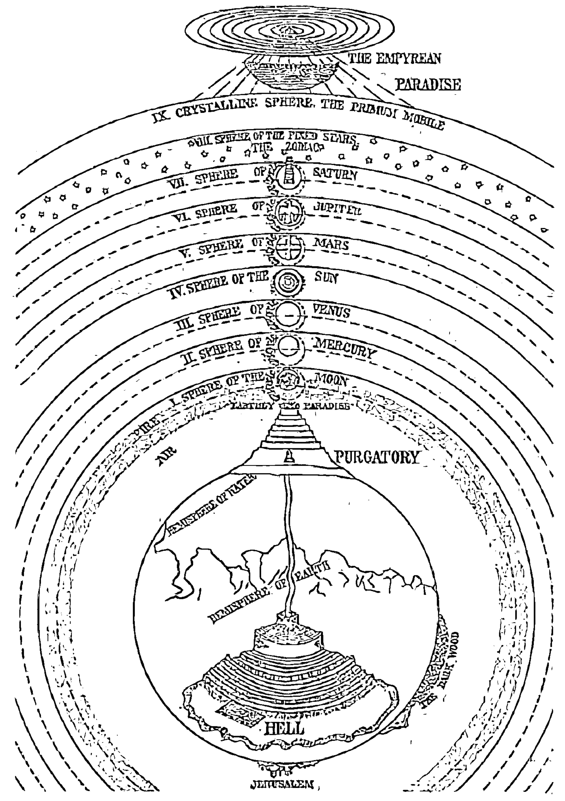

此外，在《翠玉錄》這本早期重要的鍊金術書籍中，也描述到「天空界」和「地上界」，「地上界」就是亞里斯多德所謂的「月下界」，兩者是從同一個「東西」創造出來的，這個東西就是鍊金術師在鍊金過程中，想要抽取出來的賢者之石或艾略克希爾酵母，這不但是鍊金作業的目標，更是「唯一的東西」在某種型態上轉化的物質。在中國，「唯一的東西」代表的是具有天神能量的「氣」，氣的具體凝縮的物質則是「丹」，所以要煉丹。

其實，氣這個概念，不指中國有，西洋鍊金術中也常被提到，希臘文叫「紐瑪」（Pneuma），指的是氣、靈和風的概念，本來是自然科學的用語；在拉丁文中則稱為「精英」（spiritus）。氣存在於萬物之中，能作用於每一個物體，構成物體的組成，主導物體的生長和死亡。在人體中，氣從心臟進入各個器官帶來生命，所以，可以看作是人的靈魂，但卻是一種物質化的靈魂。

另外，氣也是一個種總稱，包含了第五元素等東西。第五元素是什麼呢？亞里斯多德認為是構成「天空界」的東西，也就是乙太（ether），一種透明、固體結晶狀的物質。鍊金術就是為了要尋找天空界的第五元素，而在人間進行的各種嘗試。

在奧斯佛字典中對第五元素（quintessence）的解釋則為，不只是構成天體的重要東西，同時也是隱含在各種物體之中的重要物質，因此要用蒸餾等鍊金方法來抽取出來。

至於艾略克希爾酵母的觀念，則是西元八世紀的阿拉伯鍊金術師格貝爾最先提到的，他承襲了亞里斯多德的四大元素火、氣、水、土，以及四大特性熱、冷、乾、澀的原則，認為金屬也是一樣，只要透過組合改變，即可把賤金屬變成貴金屬，但其中需要加入一種東西當媒介。格貝爾把它當成是類似藥的東西，藥的效果分為三個階段，分別是從不完全體開始變化，完全體的特徵一個個生成，最後變為完成體。

到了阿拉伯則把它稱為艾略克希爾酵母（aliksir），後來這個字漸漸演變為英文的elixir，就是萬能藥、長壽不老之藥之意。但第一個對艾略克希爾酵母做出定義的，則是馬汀·路蘭德斯（Martin Rulandus），他在《鍊金術用語》這本書中，首先將艾略克希爾酵母稱作是一種金屬變容劑，作用類似酵母或藥引。後來的鍊金術師更認為將艾略克希爾酵母投入的瞬間，就會產生質變。

但有關鍊金術的理論，各派觀點不一，早期就連許多科學家儘管並未能完全否認，也抱持懷疑的態度，像化學之父波以耳（Robert Boyle，1627～1691年），在《懷疑的化學家》（The Sceptical Chemist）中，就不認同亞里斯多德的地球是由四元素組成的理論，而認為物質是由分子組成的，分子在液體狀態比在固體中流動速度更快。

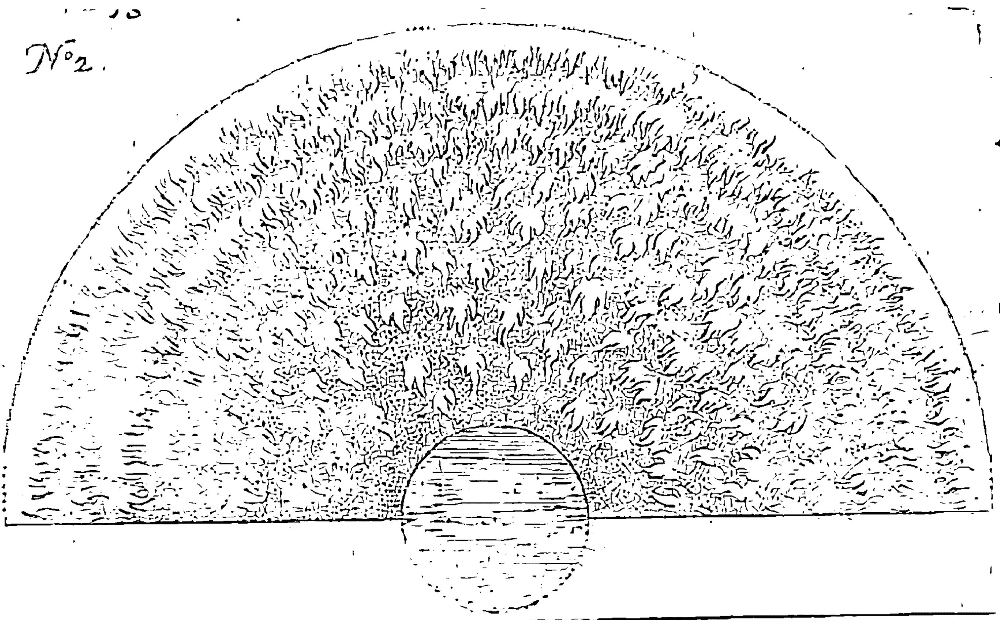

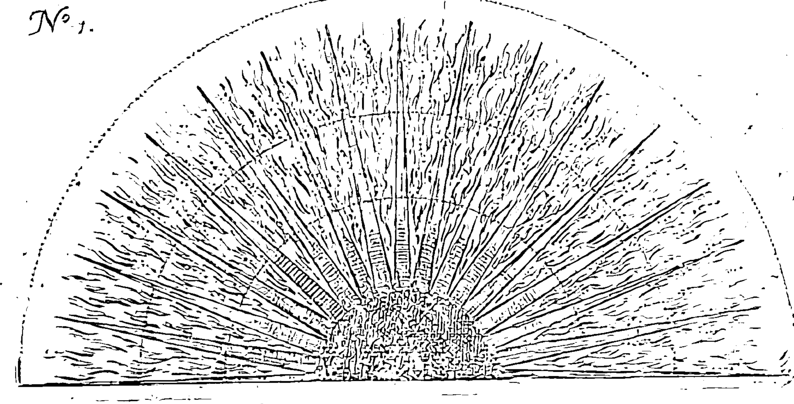

## 二、鍊金過程

### ◎步驟

簡單來說，鍊金的過程就是把原始材料，利用加熱、溶解等各種方式，最後鍊製出黃金等貴金屬，中間可能會投入艾略克希爾等酵母來增加它的效能。

嚴格來說，萬物都是由同樣的單一素材構成的，照理來說任何物質都能用「石頭」當成材料才是，只不過這指的是廣義的石頭，容我們再做敘述。因此，第一個階段必須先準備石頭的材料，然後再將石頭加以淨化，淨化包含了選擇、洗淨、破壞、再加工等過程，在淨化的過程會使用到水、鹽、酸等液體，譬如要把岩石外的土用水洗乾淨，必須把污垢處理掉才能鍊製。

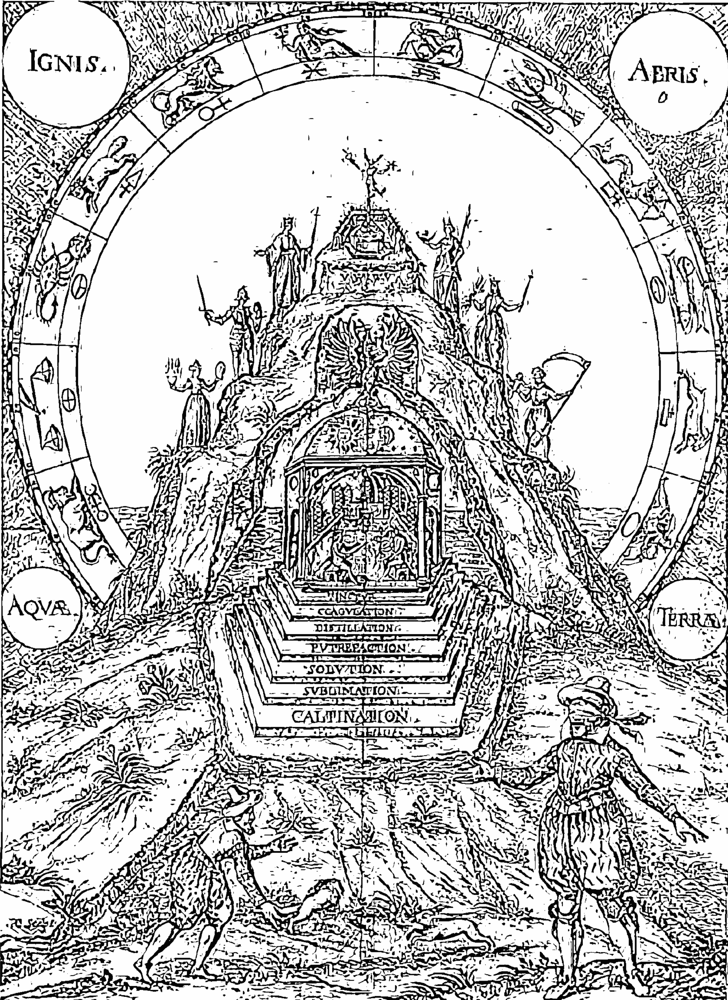

鍊金作業的每一個階段用階梯來作象徵。（S. Michelspacher, 1616）

每個鍊金術師對於鍊金的步驟定義都不盡相同，羅傑·培根（Roger Bacon，1214～1292年）認為是粉末化、固定化、溶解、上昇、蒸餾，蒸餾再混合了昇華、摩擦、禁慾苦行等行為。

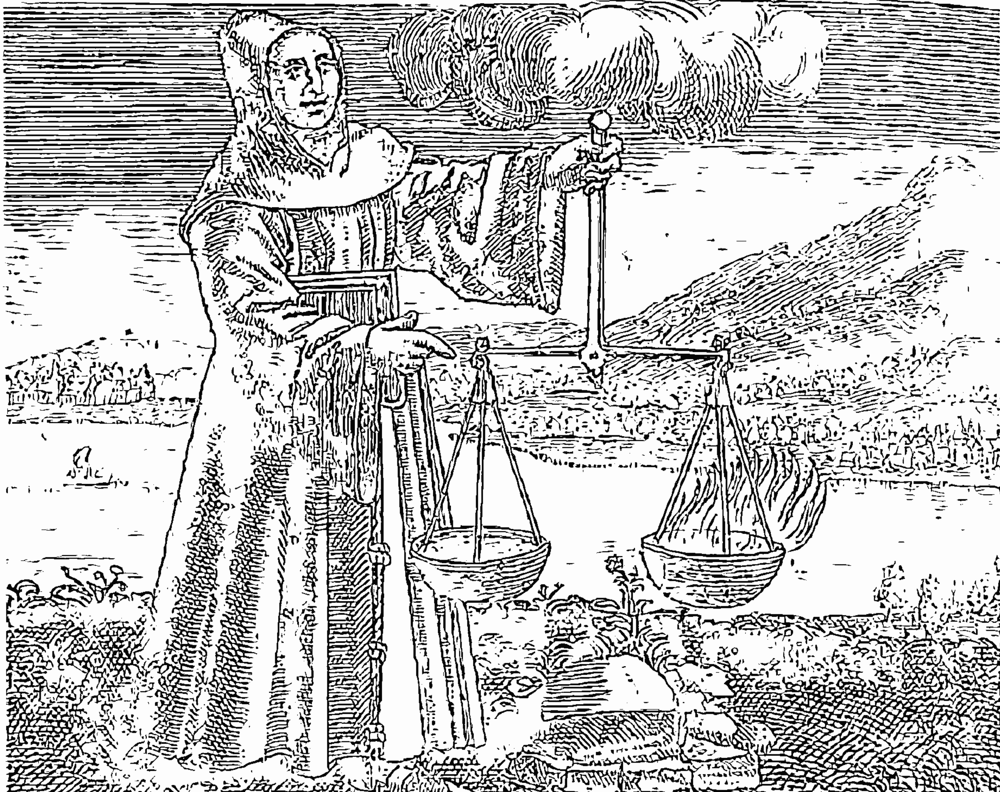

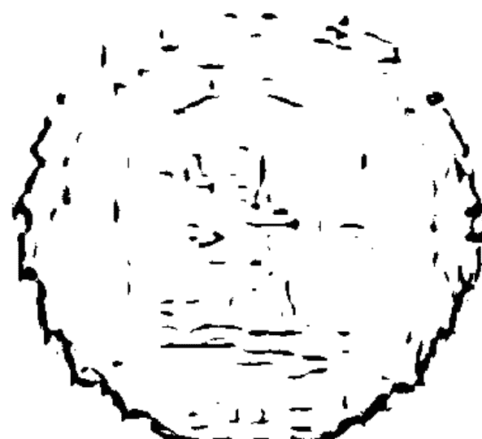

阿爾畢多·馬格努斯（Albertus Magnus，1208～1280年）則認為其過程應該是分解、昇華、固定、煅燒、溶解、蒸餾、凝固七個階段。

阿諾德（Arnald of Villanova）則認為是溶解、淨化、還元、固定等。

喬治·里普林（George Ripley）的則是煅燒、腐敗、溶解、蒸餾、昇華、下降、固定。要達成到化合物的十二個步驟，則包括了煅燒、溶解、分離、結合、腐敗、結晶化、給送、昇華、發酵、升高、增殖、投入。

雖然每個人定義不同，但大致可以分為以下幾個順序：

1. 分解、淨化。
2. 在淨化的過程中將沒有生成的物質作調和處理，也就是不斷地分開、結合，就像身體與精神之間，一直充滿了揮發性、固定性的東西，兩者之間不斷交替。
3. 讓各種金屬轉變成銀，需要在其中加入白色艾略克希爾酵母。
4. 讓各種金屬轉變成黃金，則需要在其中加入紅色艾略克希爾酵母。
5. 增強紅色艾略克希爾酵母的力量。
6. 在投入的瞬間就會變質的萬能藥方，能讓不完全的金屬瞬間變成金。

理想上，在利用紅艾略克希爾酵母將賤金屬變為黃金的過程，就是讓效能增加，在鍊製過程中更需要不斷重複金屬變質的工作，中間再加上水銀讓它發酵，就能產生變質的效力，讓力量增大。此外還可產生增殖的效果，讓鍊成的東西成幾何級數增大。

另外，最初的作業物質要如何選擇，這也是很多鍊金術師們的疑問，究竟鍊金該從單一物質開始，還是要用多樣組合的物質開始，大家都沒有很明確的答案。

格貝爾（Geber，～803年）認為，無論是動物性的物質或是植物性的物質都可以產出「石頭」。對於石頭的定義，格貝爾認為是水銀，羅傑·培根則認為是水銀和硫磺，其他金屬都可以用這兩種東西來鍊成，但他們兩人所指的水銀、硫磺並不是指單一的東西，而是所謂「賢者的水銀」、「賢者的硫磺」。

其中，水銀的重要性更被許多鍊金術師所認同，因為從十四世紀到十五世紀的鍊金術師也都一致認為黃金是由水銀做成的。

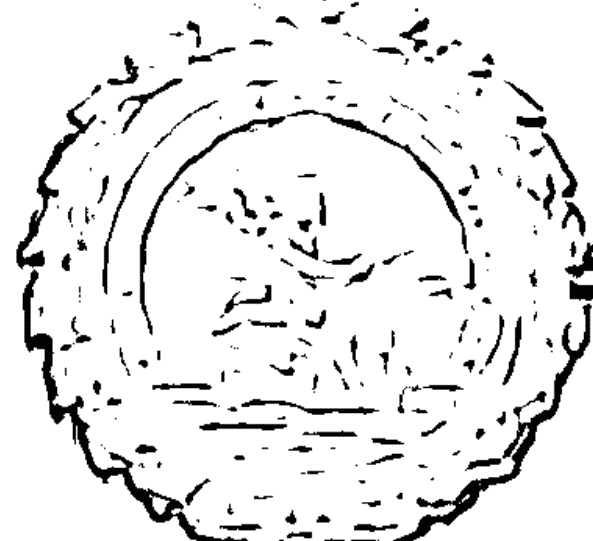

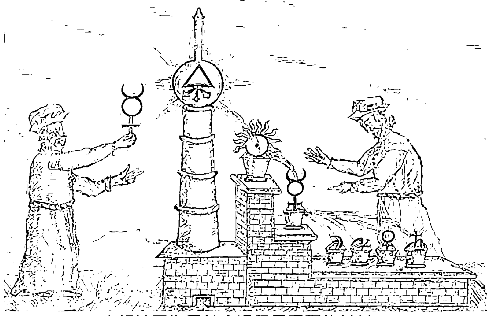

水銀被認為是鍊金過程最重要的材料。

阿諾德還大刺刺表示，假如海洋中有水銀，搞不好還可以把海洋變質，只不過他所認為的水銀並不是我們一般所指的水銀，因此有人稱呼為「哲學者的水銀」。這些被鍊金術師認為是「水銀」、「硫磺」的東西，又或是被亞里斯多德認為是第一元素的金屬，都是鍊金時最重要的物質。

### ◎顏色變換

在顏色的變化上通常分為三個階斷，黑色、白色、紅色。第一個階段的黑色，象徵腐敗，也叫作「黑化」，接著變成白色「白化」，象徵復活，最後變成紅色，稱作「紅化」；也有人認為是四個階段，即在「紅化」前多一個「黃化」的階段。

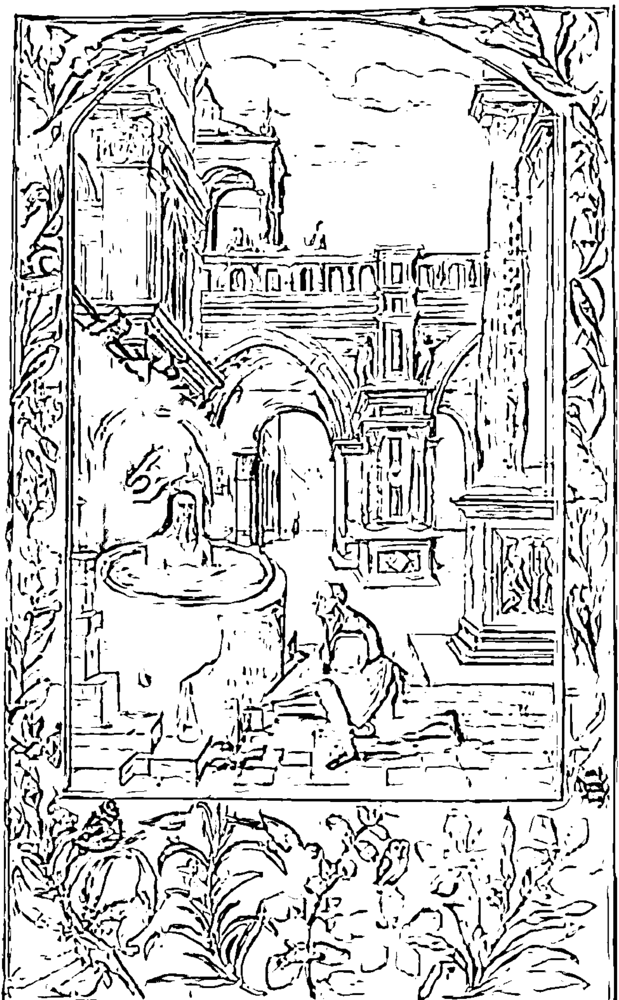

鍊金工程的第一階段，耶穌的洗禮。（S. Trimosin）

顏色順序如果不對，則代表實驗失敗了，譬如顏色太早轉紅，最後又變為黑時，就算失敗了。對於黃、紅色階段的區別，古希臘的文獻中記載得還不完全，因此後來的鍊金術文獻常描述最後的階段並非是紅色，而是淡黃色。阿爾畢多·馬格努斯就認為應該是黑、白、淡黃、紅四色。也有人認為石頭會有兩段變化，合成的第一天是黑色、淡黃色，第二天是黑色、紅色第三天才是淡黃色，最後才變成紅色。

還有人表示在白色階段前，會出現像孔雀之尾或是彩虹一般多樣的顏色，每個人都有一派說法。阿爾畢多·馬格努斯依照的是天地創造的時間，也就是一週七天的七個顏色，喬治·里普林則認為應該宛如一年的週期是十二個顏色，貝魯內提則認為是黃道十二宮的顏色，只有湯瑪斯·諾頓（Thomas Norton，1433～1514年）舉出十四個顏色。

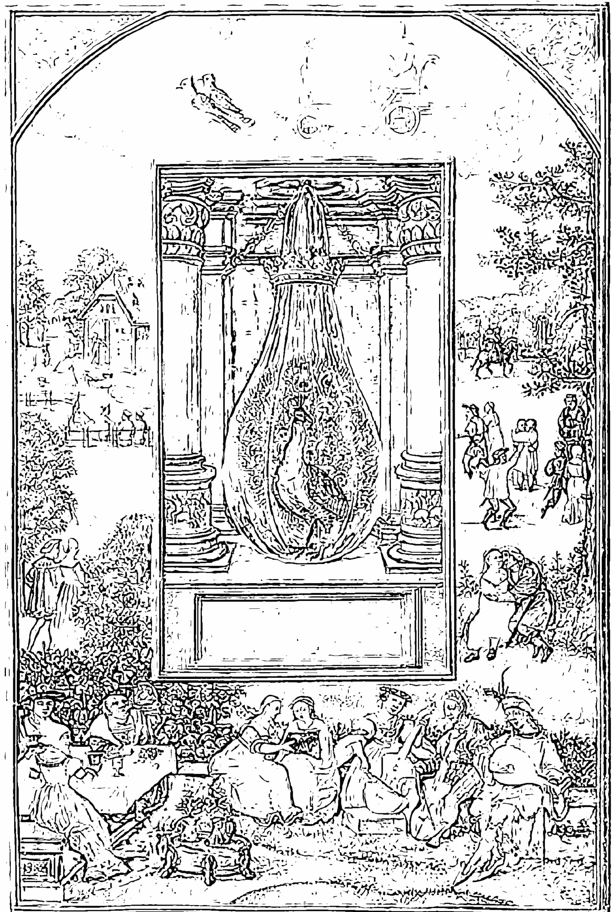

孔雀之尾（S. Trismosin）

### ◎鍊製時間

至於鍊製的時間也是意見分歧，喬治·里普林認為，太陽繞行十二宮要花上一年的時間，因此鍊製的時間也要長達一年；顯示出有關鍊金術的許多想法是根據占星術而來的。

有人則把鍊金中的七大金屬，用來代表一星期的每一天，星期天為金，星期一為銀，星期二為鐵，星期三為水銀，星期四為錫，星期五為銅，星期六為鉛。

十二星座的順序更象徵鍊金過程，白羊座：煅燒、金牛座：凍結、雙子座：固定、巨蟹座：溶解、獅子座：反應、處女座：精煉、天秤座：昇華、天蠍座：分離、射手座：創造、魔羯座：發酵、水瓶座：增殖、雙魚座：演變。

另外，也有人舉出鍊製過程需要四十天的說法，依據的則是聖經中以色列的子民們在荒野間流浪四十年，以及耶穌在荒野間四十天受到各種誘惑，又或是天主教四旬節的四十天，也象徵墮落與腐敗的黑暗階段；四十在哲學中也代表一個月。

以上，都說明了古代鍊金術師在思考鍊金術的問題時，常常會借用占星、神秘學、宗教學的觀點。

## 錬金術師完全事典
Complete Guide to Alchemy

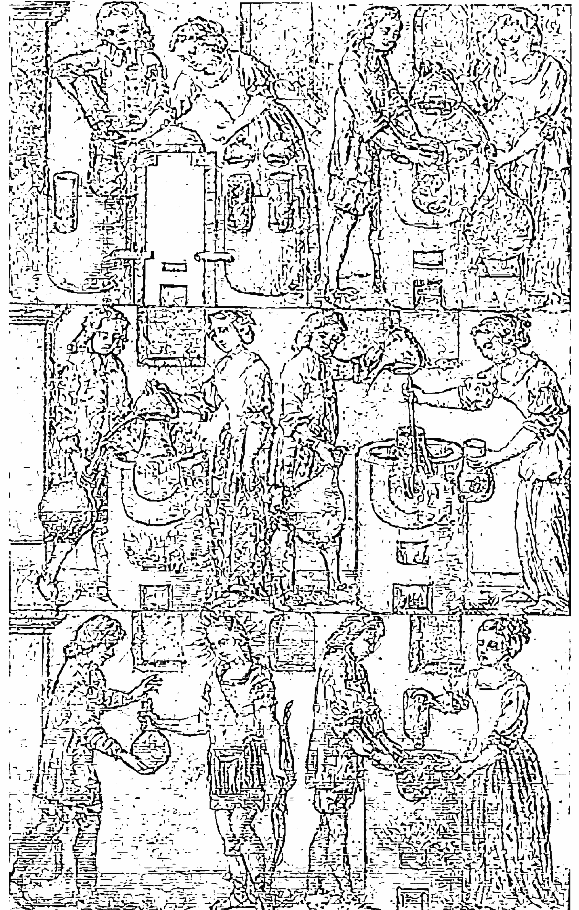

錬金師利用各種道具錬金

### ◎鍊製火候

雖然提煉的過程大家的看法未必完全一致，但基本來說大家都認可是一個很繁複的過程，此外，在這過程中用火加熱的方式又是最需注意的，必須掌控好火候，才能鍊成完美的東西。

火的使用也必須符合自然界長時間生成的道理，必須要是溫和的火，這樣各階段的顏色才能夠慢慢變化，最後變成最完美的紅色。

火可以分為乾熱、溼熱兩種，乾熱就是用火加熱，溼熱則是使用古代鍊金術師瑪麗所發明的瑪麗水浴器，也就類似湯藥煎熬的鍋子。至於熱度方面，有人認為要分四個階段的加熱，首先是六十到七十度，第二階段的加熱溫度則在硫磺的融點與準點之間（約為一百一十三度到四百四十七點七度），第三階段溫度稍低於錫的融點（約為兩百三十二度），最後的加熱溫度則要比鉛的融點（三百二十七點五度）低。

在鍊製的容器方面，一般也認為要一致，以便讓材料與容器融為一體，像喬治·里普林就說自己在鍊製的過程中，使用材料一個、玻璃瓶一個、爐子一個。但是有時候像在將賤金屬轉為不完全體時投入白艾略克希爾酵母之後，又會使用別的容器繼續鍊製過程。

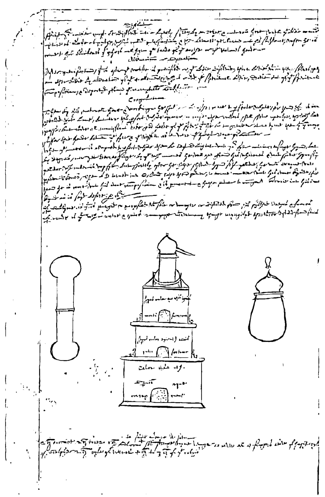

由於在鍊製的過程需要密封，但為了掌握顏色的變化，因此必須使用玻璃容器，才可以看出鍊製過程的變化。

## 三、成功謎團

雖然以現代的眼光來看，鍊金術根本就是天方夜譚、痴人說夢，但是在歐洲中世紀時曾經曾經出現一份叫做「尼古拉的遺囑」的資料中，記載過黃金鍊製成功的文字，雖然真實性也被質疑，但至少曾引起許多討論。（詳見P.88第三篇鍊金術的畫時代大師之尼可拉斯·弗梅一章）

歐洲更有不少國王也對鍊金術非常著迷，如英國國王亨利六世、法國國王查理七世、查理九世、瑞典國王查理十二世、普魯士國王腓特烈·威廉一世、腓特烈·威廉二世，其中像英國伊莉莎白女王，更對鍊金術師約翰·迪非常寵幸，甚至特許他在宮中從事鍊金術活動。

約翰·迪也曾經宣稱可以把鉛鍊製成黃金，後來有許多人也宣稱在融爐中將鉛融化，再加入含有黃色粉末的紙，再加熱就可以製成黃金。在號稱鍊金術中心的布拉格，神聖羅馬帝國的皇帝魯道夫二世，更把鍊金術師邁克爾·梅爾特封為伯爵。

後來也陸續有人宣稱曾得到賢者之石，將它投入鉛之中，就可以鍊製黃金。十八世紀時有一位叫詹姆仕·普萊斯的人，他認為加入某種白色的粉末，就可以把水銀變成銀，加入紅色的粉末則可以製造出黃金，但他的言論後來引起軒然大波，後來便要求他要在大家面前實驗，只不過實驗前他就服毒自殺了，因此鍊金也成為一個傳說。這中間也有許多鍊金術師宣稱鍊成黃金，但事實上只不過是把含有黃金的金屬，在去除不純的成分後，將黃金提煉出來罷了。

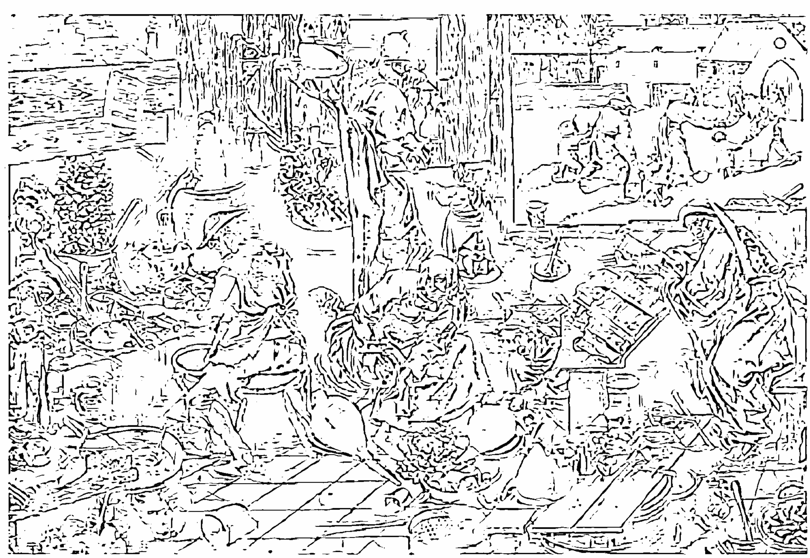

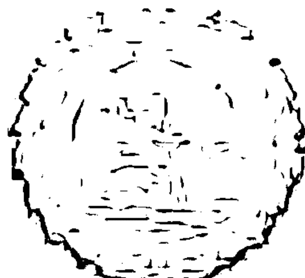

'70'・第三篇・鍊金術的舊時代大師

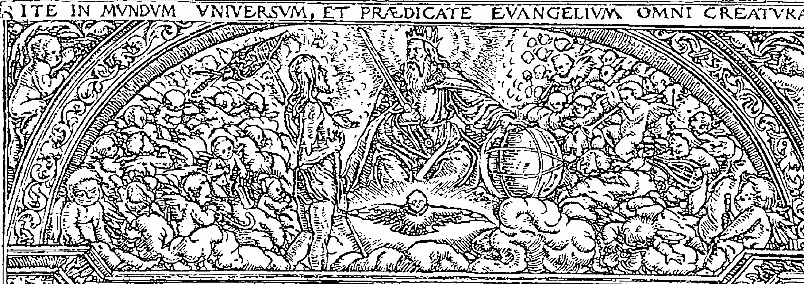

# 【第三篇】
煉金術的
劃時代大師
All-time
masters
of alchemy

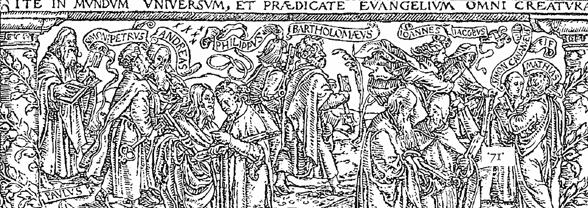

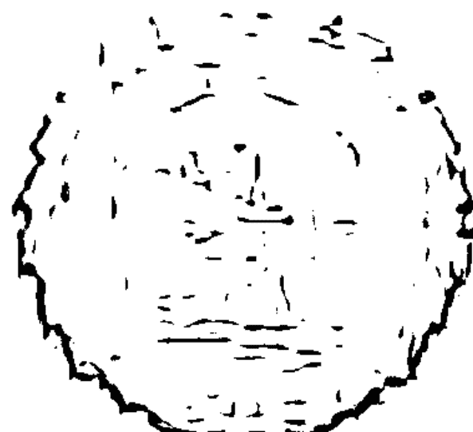

鍊金術的歷史最早可以溯及到古埃及的冶金工匠，再來就是希臘時期，儘管當時的鍊金術尚未真正成形，但德謨克里特的原子論，柏拉圖、亞里斯多德的四元素等，卻深深影響後來的鍊金術師，讓我們來看看這些在鍊金術史中，具有啟蒙、劃時代影響的一代宗師。

## 一、德謨克里特

——啟發鍊金術概念的百科全書式哲學家

德謨克里特（Democritus of Abdera，西元前460～370年）是希臘有名的哲學家，在宇宙原子論的發展方面占重要地位。相傳德謨克里特出生於希臘北部色雷斯的阿布德拉，長大後遍遊埃及、波斯和印度，還與蘇格拉底討論過哲學。

德謨克里特多才多藝，他也是希臘第一個百科全書式的學者，其博學多聞的程度足可和亞里斯多德匹敵。他的著作涉及自然哲學、倫理學、邏輯學、鍊金術、認識論、心理學、物理學、數學、天文、地理、生物學、醫學、政治、法律、軍事、文學、修辭學、音樂、繪畫、技術等許多方面，不僅涉獵廣，數量更是驚人，遺憾的是大多數都已散失，或只剩下零散的殘篇了，其中更有不少是他人冒名所寫的。

他最重要的貢獻是繼承和發展了留基伯（Leucippus，西元前500～440年）的原子論。他認為萬物的本源是原子和虛空，物質能自在變換主要是因為原子的聚合與分開。原子是一種不可分割的物質微粒，它無空隙，不能毀壞和改變，也不能被產生和被消滅。每個原子內部是沒有質的區別的、不變的，所以一部分原子不可能比另一部分原子更堅硬，因而原子不能從內部破碎也不能從外部破碎。

由於萬物都是由原子構成的，原子之間存在著虛空，原子是存在，而虛空則是非存在，但非存在並不是不存在，只是相對於原子來說，是沒有充實性的。原子處於永恆的運動之中，虛空就是原子的運動場所；當原子分離時，就代表事物消滅。

德謨克里特把虛空視為原子存在和運動的根本條件，這也是西方哲學史上首次出現「空間」的概念；他的原子論思想，更是古希臘唯物主義發展的最重要成果。

德謨克里特根據原子論來解釋各種自然現象，其天體演化學說也是以此為根基。他認為在碰撞等原因形成的原始漩渦運動中，較大的原子被擠到漩渦的中心，較小的被趕到週邊。在中心的大原子相互聚集形成球狀結合體，即地球，較小的水、氣、火原子，則在外空產生環繞地球的旋轉運動。地球外面的較小的原子由於旋轉而變得乾燥，最後燃燒起來，變成各個天體。

由於原子可分離的概念，也影響了後來的鍊金術，成為鍊金術發展的重要根據。知識豐富的德謨克里特最後更以一○九歲的高齡過世，由於著作甚豐，不但享受到國葬的待遇，它的銅像更被人們所尊敬。

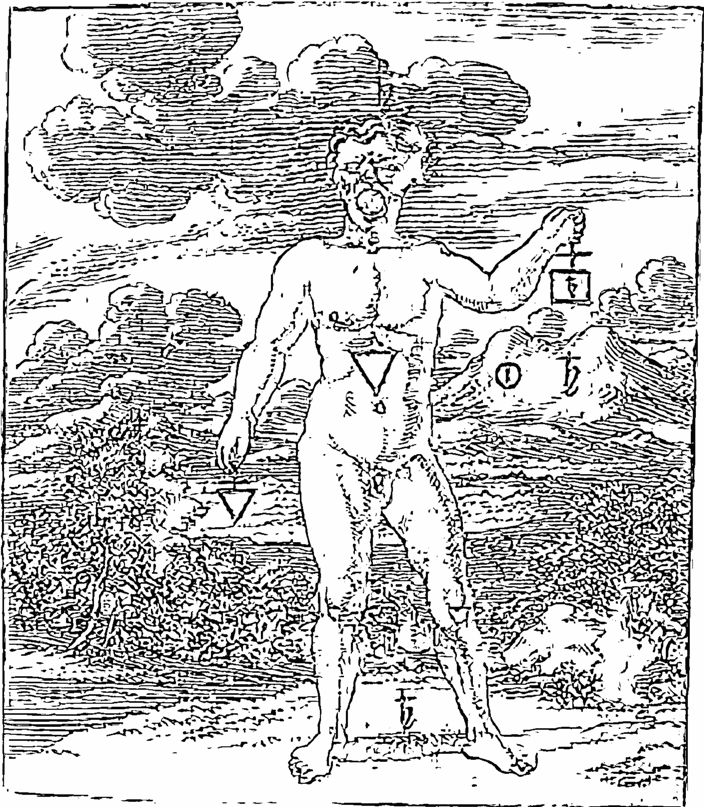

## 二、柏拉圖
——鍊金術的哲學先啟

希臘偉大的哲學家柏拉圖（Plato，西元前427～347年）雖然不是鍊金術師，但因為他的四大元素說法，可以說是促成鍊金術發展的起源。柏拉圖在他的著作《提邁奧斯》中，有相當多篇幅提到了當時被認為是萬物之源的四種要素，也是最早提到元素概念的人。柏拉圖假設宇宙的開頭有兩種直角三角形，一種是正方形的一半，另一種是等邊三角形的一半。從這些三角形中，就能合理地生出四種正多面體，這就組成四種元素的微粒。火微粒是正四面體，氣微粒是正八面體，水微粒是正二十面體，土微粒是立方體。

他認為整個宇宙是一個圓球，因為圓球是對稱和完美的形狀，所以球面上的任何一點都是一樣的。宇宙也是活的、運動的，有一個靈魂充滿全部空間。四大元素中每一種元素在宇宙內的數量都有相對的比例，譬如火對氣的比例，等於氣對水的比例，和水對土的比例。萬物都可以用一個數目來論定，這個數目也就是所含元素的比例。

《提邁奧斯》就某方面來看，可以算是一種理論化學的最早著作，元素的比例，則可視作鍊金術的啟蒙。

## 三、亞里斯多德
——鍊金術的啟蒙導師

柏拉圖的學生亞里斯多德（Aristotle，西元前384～322年）則更進一步，明確舉出四大元素分別是火、氣、水、土。元素是物質構成的最小成分，不能再分割為更簡單的物體了。此外，四大元素具有四個基本的特性，熱、濕、冷、寒，所有物體都是由元素所構成，再依照元素的比例不同，組成不同的元素，所以只要改變比例組合，就能變換出其他物體；但它的變動是有所限制的，受限於其所組成的元素特性。

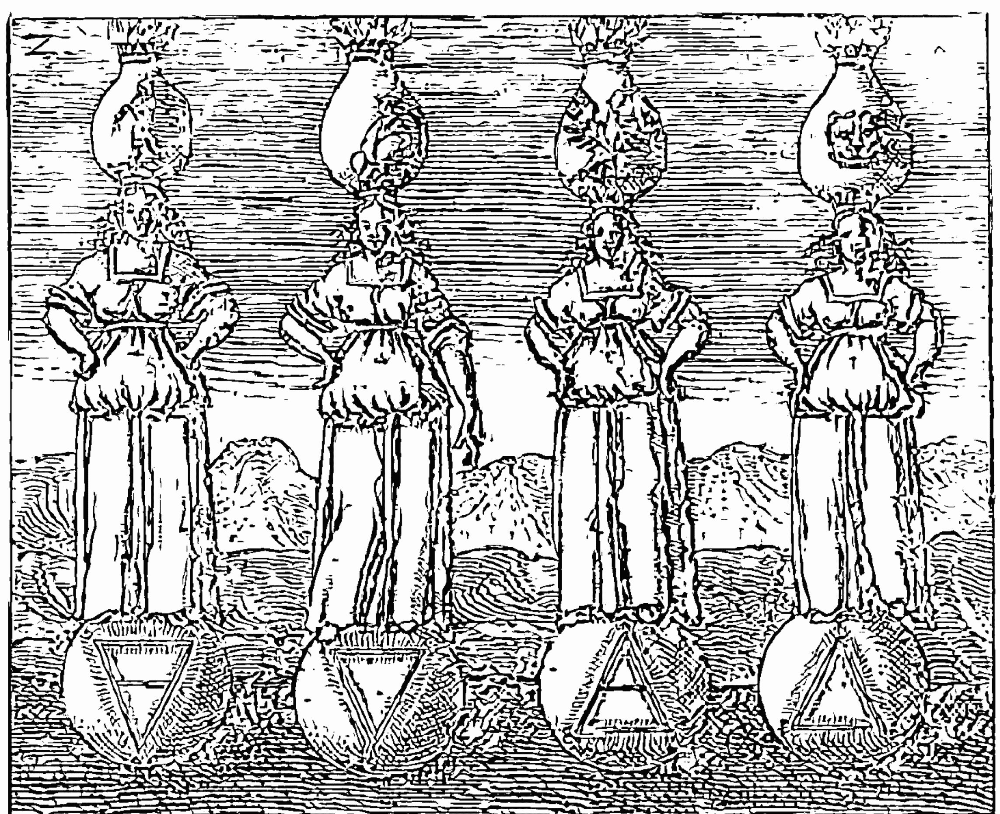

從左到右分別是代表土、水、氣、火四大元素的精靈，她們下方踩著的是地球，其上的記號則是四元素的代表記號。（D. Stolcius von Stolcenberg，1624）

## 鍊金術師完全事典
Complete Guide to Alchemy

亞里斯多德認為每個元素都是由兩個特性組成的，火是由熱、乾所組成的，氣則是熱、濕，水是寒、濕，土則是寒、乾。元素至此的對立關係，也稍微起了變化，變成只是組成成分不同罷了，可以相互改變。例如像同時都具有「熱」的火、氣，或者是同時具有「濕」的水、土，如果彼此之間有共同的性質，想要改變就比較容易。因此，像火、水這兩種元素，彼此之間完全沒有共同的元素，要變換就比較花時間了。古代的鍊金術師則根據這個理論，認為四個元素間形成一個環狀，因此水可變成土，土再變成火，火再變成氣。

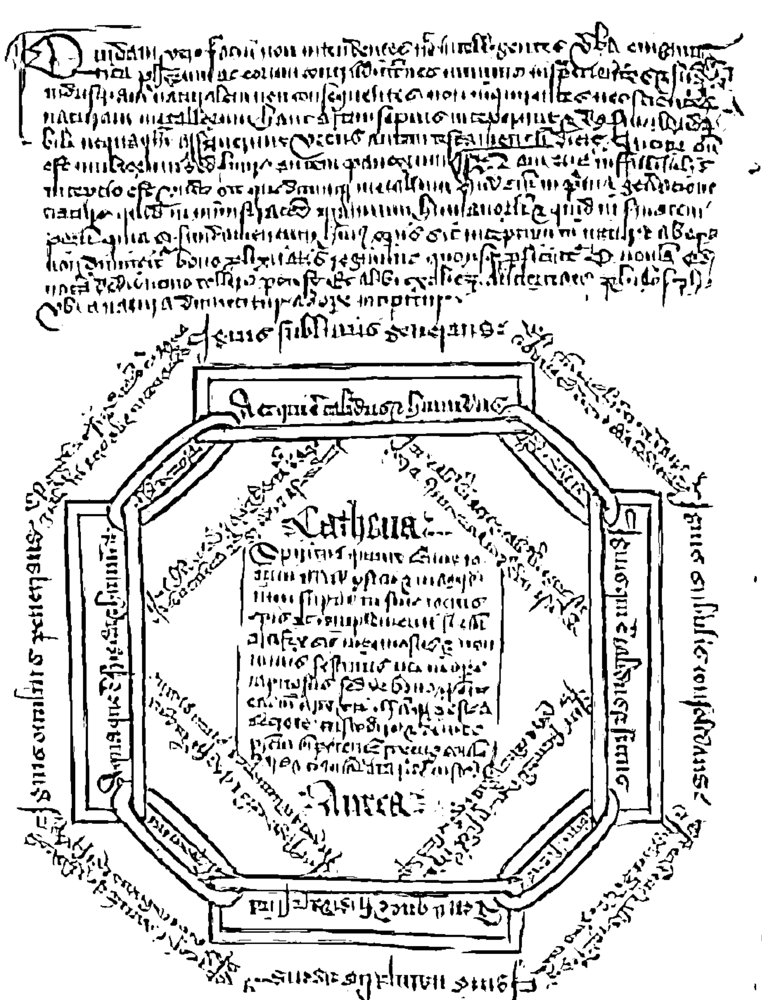

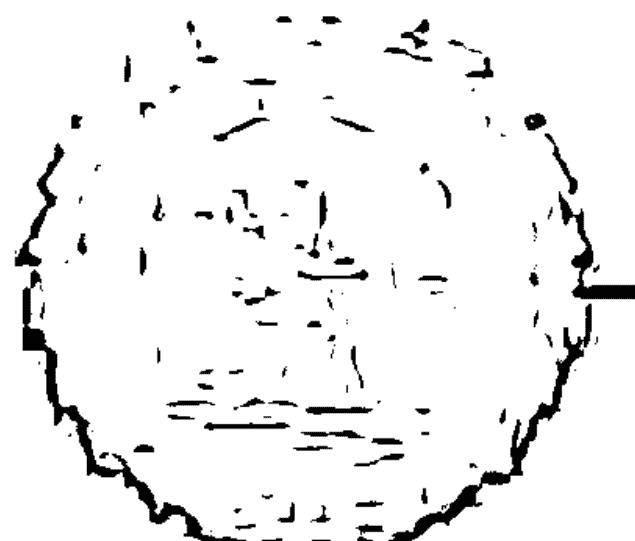

## 【奇幻書院】

中古世紀文明、科學精華之極限挑戰

首先火的本質為熱、乾，氣則為熱、濕，兩者之間只乾、濕是不同的，火和土則是熱、寒不同。氣則是由熱、濕組成，水和氣之間是熱、寒的不同，兩者在濕上倒是一樣的，先不管本質，熱是水所沒有的特性，水是寒、濕所組成的，土則是寒、乾所組成，兩者也是擁有共同的寒，所以彼此都有某些共通點。

同樣的原理當然也可以用於現實的物質中，但有些完全相反的東西，卻是無法直接變換的，譬如把死人變成活人，就是無法直接轉換的，所以像日本漫畫《鋼之鍊金術師》中的「人體鍊成」，當然也是不可能的。

亞里斯多德認為，蒸氣具有濕、寒的特性，大地散發熱、乾，譬如說燃燒的火焰就形成一種散發物，從水變成的蒸氣，和從大地來的乾燥的風，再變成的煙，就是結合的成果。同樣地，這樣的發散物，在地下也可以生成，地下也是礦物的產地。亞里斯多德在《氣象學》中提及，有兩種發散物囚禁在地球內部，一種是蒸氣狀的或溫的，譬如金屬就是由此生成的；一種是煙狀的或乾的，不能融化的岩石和礦物就是由此生成的。濕氣的發散物的金屬，就是將其中乾性的東西凝縮，封在石頭裡面，鐵、金、銅等金屬融化後再加工，即可變成貴金屬。

# Complete Guide to Alchemy

由於礦物裡面沒有濕性，或者說由於濕性的發散物被乾性的石頭給凝縮了，所以在某個層面上來看，金屬其實是具有水的特性，只是其中的發散物在變成水之前凝固了，不過其中有一個例外，就是金，金受到火的影響，也包含土的影響。

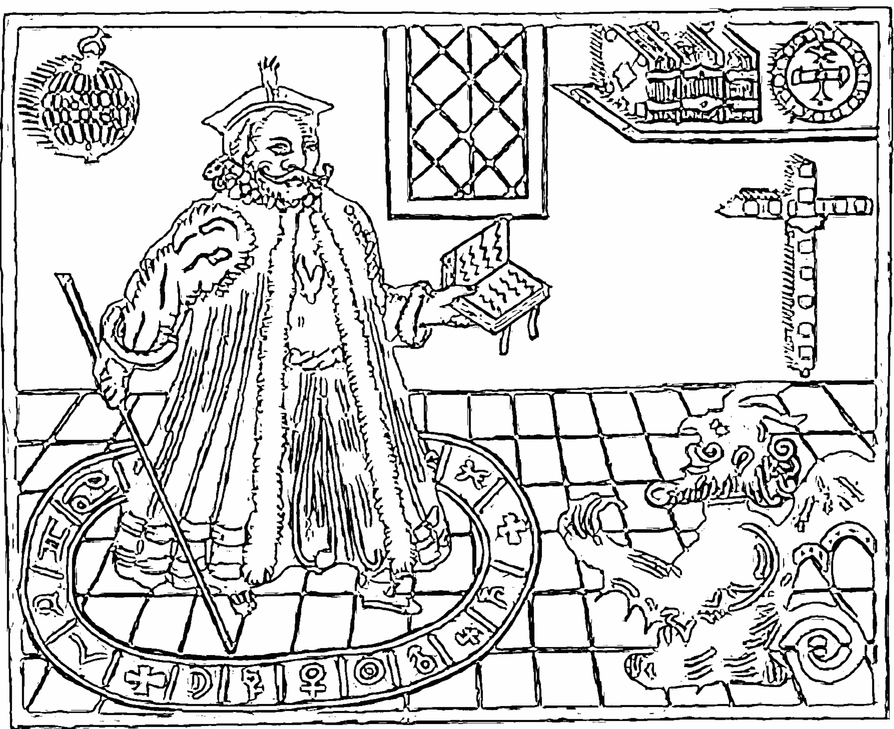

## 四、格貝爾
——奠定阿拉伯鍊金術基礎的化學之父

阿拉伯鍊金術的根源可以追溯到古埃及，最有名的鍊金師首推格貝爾（Geber，～803年），或稱神秘人物（the Mystic），他的阿拉伯原名叫作賈比爾·伊本·哈揚。

格貝爾在鍊金術上的成就，遠遠超過了希臘時期的佐西摩斯。他寫了許多關於鍊金術的著作，雖然這些著作是否全部為他所寫的，還頗值得懷疑，因為後來的鍊金術師常常為了提高他們的威信，冒用其他名人之名來撰寫，以獲得大眾的認同。這是因為在當時，出版都是靠手工完成的，一直要到印刷術發明後，情況才好轉。因此大英博物館中保留有相當多格貝爾的作品，至於何者為真何者為假，就仍待考據。

格貝爾的著作《七十本書》和《平衡書》，被視為阿拉伯鍊金術的基礎理論著作，是用阿拉伯文寫成有關鍊金術最重要的文獻。他對鍊金術最大的影響，在於修改了希臘四大元素，也就是火，氣、水、土的組成方法。

格貝爾在金屬的生成方面，雖然基本上遵從亞里斯多德的理論，但他認為這四大元素化合成兩種不同的物質，也就是硫磺和水銀。硫磺具有易燃性，水銀則具有金屬性，只要

## 鍊金術師完全事典
Complete Guide to Alchemy

將這兩種元素以適當的比例化合，就能形成各種金屬。所以鉛就能分離成硫磺和水銀，用新的比例即可再化合成金，他的假設也被大多數中世紀的科學家所同意。格貝爾的硫磺、水銀說，也漸漸構成了鍊金術的理論。不過，格貝爾所指的硫磺、水銀，並不是一般我們現在的礦物，而是構成鍊金術的主要「原素」。

格貝爾則認為金屬的完全體就是金、銀，都是由水銀、硫磺依照適當的比例，再加上地底下有熱氣，經過長時間而產生的。至於不完全體，也就是錫、鉛、銅、鐵，則是因為比例與純度欠佳，或者是熱度不足才產生的。因此金是由安定的水銀再加上些許紅色的硫磺所構成的，銀則是由水銀再加上白色的硫磺所構成的，其他的金屬則是由水銀、硫磺比例各異，再加上安定度低的混合體，因此純度就下降了。

後來的阿拉伯人認為用一種叫做「賢者之石」的神秘物質，就可以將賤金屬變成黃金，當然這些嘗試始終沒有成功。雖然有嘗試錯誤的例子，但也有許多新的發現，譬如他用綠磐、硝石與明磐蒸餾，得到了硝酸，以及他用其他各種方式製取的鹽酸、檸檬酸、酒石酸，對於後來在歐洲研究溶液而發展了化學的貢獻極大。

他對化學的基礎性貢獻包括發明一些科學的化學實驗方

## 【奇幻書院】1

中古世紀文明、科學精華之極限挑戰

法，如蒸餾、結晶、煅燒、昇華、蒸發等，以及實驗儀器和設備等等。格貝爾之所以被公正地看成是現代化學之父，正是基於他這些卓越的工作。

格貝爾也研究過精煉金屬的方法，並通曉染料和瓷釉，更製造出一種不會被火燃燒的紙，也發明了螢光墨水。這些他都詳細記載於《物性大典》、《東方的水銀》等書中，因此也影響了後來的許多鍊金術師。

雖然格貝爾在某些著作中，他的宗教與哲學觀點飽受批判，但他在化學領域的各種開創性成就，譬如首次製取各種酸，尤其是硝酸、鹽酸、檸檬酸、酒石酸，以及對於實驗法系統性的強調，這些都是非常卓越的。

儘管他也是一位鍊金術師，但他和其他鍊金術師不同的地方，在於他並不熱衷於將賤金屬鍊製成貴金屬，反而是在化學實驗中建立了實驗法的重要地位，也因此被尊稱為化學之父。

他更致力於開創基礎性的化學方法，以及研究有關化學反應本身具有的內在機制，將化學從鍊金術發展成為一門科學。

他一生寫了許多著作，涵蓋魔法、占星、音樂、哲學各領域，相傳有好幾百本，雖然有些不乏別人冒名的，但也說

82 · 第三篇 · 鍊金術的正時代大師

# Complete Guide to Alchemy

明了他是一位相當多產的作家。此外，他對各領域皆有深入的研究，其中更有二十二本是關於化學與鍊金術的，被翻譯成包括拉丁文在內的多種歐洲語言，後來廣被十四世紀的鍊金術文獻所引用。西元十世紀精誠兄弟會（the Brethren of Purity）更把他的觀點、看法記錄下來，他的著作因此才廣為世人所知，還成為歐洲的教科書。

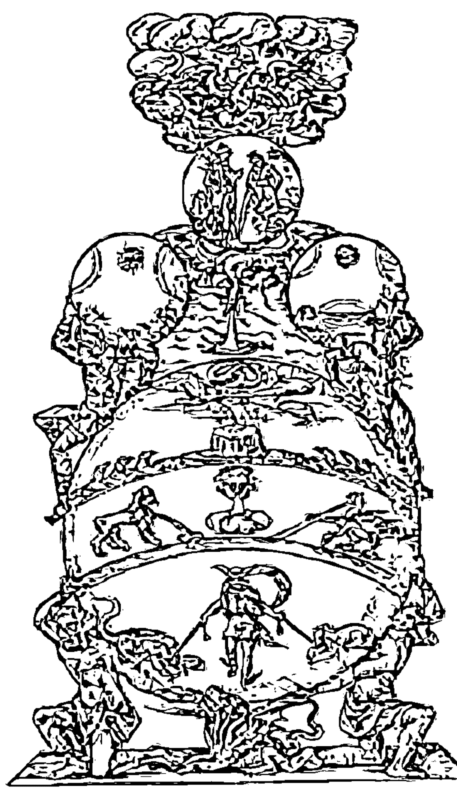

## 五、穆罕默德·拉齊斯
——把鍊金術導向古代化學的奠基者

穆罕默德·拉齊斯(825～924年)的全名為艾卜·伯克爾·穆罕默德·伊本·札克理雅·拉齊斯，他也是阿拉伯著名的鍊金術師，更是一個著名的醫師、詩人，他的醫學著作不但廣為流傳，還成為歐洲醫學院的教科書，因此被稱為化學之父。

出生於德黑蘭附近賴伊的穆罕默德·拉齊斯，和其他在賴伊出生的男子一樣，都具有人高馬大的共通點，他的名字阿齊斯更是取自於「賴伊的男孩」之意。

穆罕默德·拉齊斯長大後勤學醫學，後來成為醫院的院長，在醫學方面的成就相當卓越，一共寫了兩百多本書，其中《曼蘇爾醫書》與《醫學集成》堪稱不朽的名著。《曼蘇爾醫書》包含了解剖學、人體結構和器官功能的研究、營養學、藥物學，養身之道等。這部書受到西方醫學界的推崇，被譯成拉丁文，直到西元十七世紀，一直是歐洲各國科學院的主要教科書。《醫學集成》則是一部醫學百科全書，包羅了從希臘到波斯，再到印度的醫學成果，在文化的交流與融合中，醫學逐漸演變的過程。

## 鍊金術師完全事典
Complete Guide to Alchemy

至於在鍊金術方面，他也做了八篇有關鍊金術的文章，例如《秘典》、《鹽與明礬》、《光與光》等著作中，對化學物質與類別顯得特別關注，因此被譽為是將鍊金術發展為古代化學的奠基者。

例如他在《秘典》一書中，確立了許多化學概念，把物質分為植物、動物、礦物和衍生物四大類，同時介紹了物質的原子構成學說，並講解了鍊金術的原理，還對化學實驗儀器與使用方法做了詳細的記載。此外，他嘗試了許多化學實驗，包括蒸餾、煅燒和結晶等，在實驗過程中發現了熔解金屬的方法、水銀的昇華，以及從橄欖油製取甘油等。

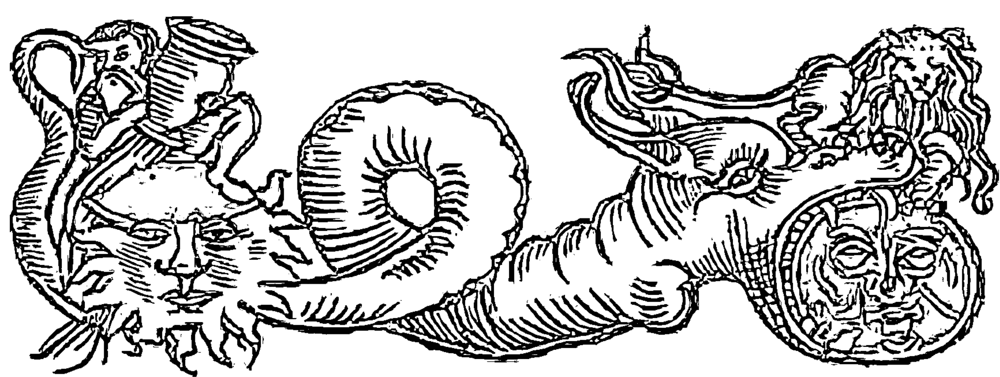

## 六、伊本·西那
——鍊金術的科學實驗者

與穆罕默德·拉齊斯齊名的伊本·西那（980～1037年），更有醫中之王、阿拉伯第一智者的美稱，他的《醫學規範》更被推崇是中世紀相當權威的醫學著作。伊本·西那除了是醫學家之外，也身兼哲學家、鍊金術師，他跟其他鍊金術師最大的不同是，伊本·西那對於質的改變完全不相信。

他雖然遵從亞里斯多德的四元素說，認為萬物是由四元素所組成，但他更重視鍊金術在哲學、科學上的探討，由於他從實驗中並無法將賤金屬鍊成貴金屬，因此他認為金屬的本質是不可改變的。

他的一生著作可觀，共寫了九十九本書，內容泛及哲學、醫學、幾何學、天文學、教義學、語文學和藝術，被認為是百科全書式的人物。最重要的著作是《治療論》內容涉及哲學和科學。還有一部高達百萬字的《醫典》分五卷，這部巨著內容更是包羅萬象，譬如把腦外傷和腦內部原因引起的兩種不同的癱瘓區別開來，確認了肺結核的接觸性傳染，解釋了水和土壤傳播疾病的作用，認為鉤蟲病是一種寄生蟲造成的。這部書對西方的影響很大，十二世紀時即被譯成拉丁

# Complete Guide to Alchemy

文，一直到十七世紀，都被西方人當作醫學指南。

格貝爾、穆罕默德·拉齊斯、伊本·西那三人在中世紀更廣被推崇，在西元十二世紀時歐洲出現了大批拉丁文的鍊金術手稿，多半是從阿拉伯文翻譯為拉丁文的，其中絕大部分都是這三人所做的，促成歐洲中世紀鍊金術的發展。

當時從事翻譯工作的羅伯特·卻斯特（Robert Chester）更是其中的佼佼者，他在《摩利努斯》的翻譯作品中提到：「鍊金術究竟是什麼東西，亦或是什麼性質，你們拉丁世界還沒有正確的認識。」雖然口氣十分狂妄，但也顯示了藉由他的翻譯，後來的人才能漸漸揭開阿拉伯世界神秘的鍊金術面紗。

其他像傑拉德（Gerard，1114～1187年）、阿德拉爾德（Adelard）、羅傑·培根（Roger Bacon，西元1214～1292年）、荷爾曼（Herman）等都是著名的翻譯家。

雖然後期的西方鍊金術士很可能對譯文又作了一些增補，但阿拉伯鍊金術的各派觀點無不備述，對後來的研究者來說，已經相當有系統了。

## 【奇幻書院】1
中古世紀文明、科學精華之極限挑戰

## 七、尼可拉斯·弗拉梅
——中世紀的傳奇鍊金術師

尼可拉斯·弗拉梅（Nicholos Flammel，1333～1417年）生於法國，原本是一個普通的抄寫員，直到有一天他作夢夢到一個天使拿著一本叫《猶太人亞伯拉罕》的書，天使看到他後便把書送給他。經過多年的研究後，他終於洞悉了其中的奧妙，還研發出了一套鍊金術。

他在遺囑中宣稱在一三八二年四月二十五日傍晚五點，製成了一個紅色的魔法石，並利用魔法石再製造出黃金。

一四一七年尼可拉斯·弗拉梅去世後，由於大家發現他生前的住所和所捐建的墓室中，刻滿了各種奇怪的符號和浮雕，再加上他在遺囑中宣稱三次成功鍊成黃金，「我總是逐字確實按照書的指示，根據相同數量的水銀來推演紅石，就真的將水銀變成黃金了，它比普通的黃金更具柔軟性、可塑性。」因此引起世界各地其他鍊金術師們的注意，連盜墓者都虎視眈眈，最後尼可拉斯夫婦的棺材終於被挖開了，當然棺材中一無所有，也沒有魔法石的存在，「尼可拉斯·弗拉梅之謎」也成為歐洲歷史上最著名的謎團。

到了一六一二年，有人聲稱從尼可拉斯·弗拉梅遺留的

# Complete Guide to Alchemy

手稿中整理出一本书——《解说尼可拉斯·弗拉梅刻在巴黎圣婴公墓第四墓室拱墙上的难以理解的符号》，后来这本书又经由牛顿的翻译成了英文，广为大家所知。而且尼古拉的传奇并未在他死后就告终了，从十八世纪一直到二十世纪，各地都陆续传出尼可拉斯·弗拉梅还活着的消息，其中尤以一七六一年，有人宣称在巴黎歌剧院看到了尼可拉斯夫妇，当时他们身上还散发着硫磺的气味，也意味着魔法石除了能炼制黄金之外，也包含了长生不老的功效。

尼可拉斯·弗拉梅的传奇事迹也是许多后世的作家喜欢加他杜撰在小说中，最著名的要算《哈利波特——神秘的魔法石》了，就连佛地魔也对尼可拉斯·弗拉梅的魔法石虎视眈眈。

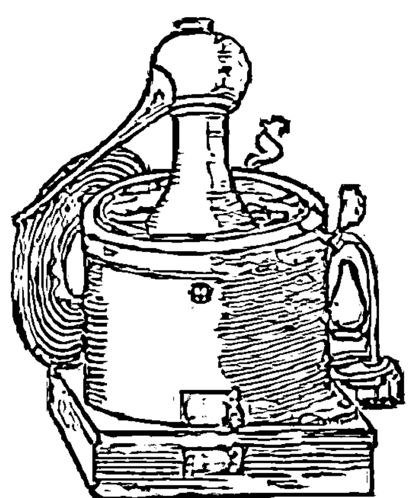

## 八、帕拉賽斯
——文藝復興的鍊金術革命教父

到十六世紀，西方的鍊金術師對亞里斯多德的四元素，以及格貝爾的硫磺水銀說又作了補充，瑞士醫生兼化學家帕拉賽斯(Aureolus Theophrastus Paracelsus，1493～1541年)更在自己的著作中，提出物質是由三原素：鹽、水銀和硫磺，按照不同的比例而組成的「水銀、硫磺、鹽三原素說」。

帕拉賽斯的三原素說，不但代表鍊金術史的一大革新，也讓他成為文藝復興時期相當著名的鍊金術師。他認為金屬的本質是水銀、硫磺、鹽，人的本質也非常類似的，由身體、精神、靈魂所組成。若把三原素拿人來做比喻，水銀代表精神，硫磺則是靈魂，然後鹽就是身體。推之於天上飛的、海裡游的動物，都是如此。

帕拉賽斯早年在南部日爾曼財政家兼鍊金術加西基斯蒙德·富格爾的礦地和冶金工廠工作，後來在瑞士巴塞爾大學學醫，開始教了兩年書，他把醫學和鍊金術結合起來成為一種新的科學——醫療化學。

## 鍊金術師完全事典
Complete Guide to Alchemy

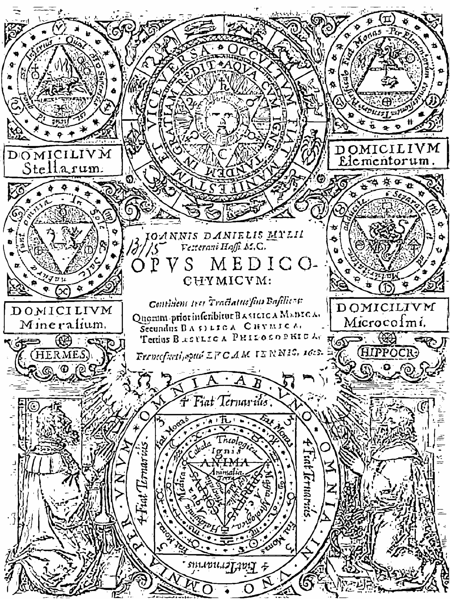

帕拉賽斯的醫療化學理論（J. D. Mylius，1618）

## 【奇幻書院】1

中古世紀文明、科學精華之極限挑戰

自從帕拉賽斯提出新的理論後，承襲阿拉伯的鍊金術也有了新的風貌，漸漸走出獨立的路線，也就是走向新的醫療化學之路。不過，也因為如此，帕拉賽斯遭到許多的批評，讓他在生前的評價並不高，但他的理論卻影響了後來很多的醫生，還形成了所謂的醫療化學派系。

帕拉賽斯認為鍊金術，是把天然的原料，轉變成對人類有益的科學。因此廣義來說，廚師把小麥變成食物，也算是某種鍊金術師。他主張一切物質都是活的，能夠自然生長，人為了實現自己的目的，可以讓這種天然過程加速或改造。

帕拉賽斯年輕時遊遍了歐洲，後來創立了一派醫學理論，並否定了古代亞伯康納、卡雷諾斯的醫學理論，以醫學的根據來寫出重視經驗與觀察的鍊金術醫學書。

在醫學上，帕拉賽斯提出人體本質上是一個化學系統，和其他金屬一樣，由水銀、硫磺、鹽。在帕拉賽斯看來，疾病可能是由於元素之間的不平衡引起的，要恢復的話可以用礦物的藥物。

但帕拉賽斯和以前許多醫生的看法不同，不認為應該服用某種萬靈丹來治療每種疾病，他認為每一種疾病都是獨特的，需要用獨特的化學治療法。這樣一個轉變促進了對於專科疾病的研究，並有助於把有益和有害的藥物加以區別，在

# Complete Guide to Alchemy

十六、七世紀期間，帕拉賽斯的學說有很大的影響。帕拉賽斯也把鍊金術師的三原素應用於醫學中，他認為疾病發生的原因是有機體中缺少了上述三種原素之一，為了醫病就要在人體中注入所缺少的元素。

帕拉賽斯醫療化學的特徵，不只是從自然抽取的藥中來利用的，也重視人類的精神層面。因為人不只是肉體，還包含了靈魂，要維持健康就是兩者皆要維持。帕拉賽斯認為生病的原因包含了天體的因素、有毒的因素、自然的因素、精神的因素、天神的因素五種原因。天體的因素包含了太陽、月亮、星星等天體的影響，有毒的因素則是因為食物無法被胃消化，而變成有毒的物質，讓疾病滋生，他還認為胃在消化食物的過程，有點像鍊金術的作業。自然的因素則包含了個人本身體質的問題，精神的因素純粹指精神的問題，天神的因素當然是因為觸犯神意，或是信仰不夠虔誠才生病。帕拉賽斯醫療化學的目標之一，是要製造艾略克希爾酵母，這不只是要治療肉體上的疾病，也包含了精神上的調和。

帕拉賽斯也不認同傳統醫學所提出的，身體生病的原因是由於體液的不均衡，而認為生病本身就是一個「種子」，在人類的各個器官中都住有一個鍊金術師，這個鍊金術師是根據自然的力量而生存下來的，能夠分解物質有機的部份，

## 【奇幻書院】1

中古世紀文明、科學精華之極限挑戰

特別是住在胃中的鍊金術師，更顯得特別重要。因為胃掌管身體的消化，能把食物不純的部分去除掉，也就是有毒的部分，變成純粹的部份，因此這個鍊金術師也有治療疾病的能力，再加上艾略克希爾酵母，就可以治療人體的疾病。

帕拉賽斯認為大自然中充滿許多奧秘，譬如具有特殊療效的第五元素，不但可以醫治人體的疑難雜症，還和占星有關。除了醫學之外，也包含了神秘的關鍵，雖然鍊金術在聖經中被否定，但卻是研究聖經的一個很好的管道。

然而，雖然無論是亞里斯多德的四元素，或是帕拉賽斯的三原素，都不能經由實驗證明其理論的正確性，但兩者皆在鍊金術史上佔據了相當長的時間，並且皆以變質理論為前提。

## 九、牛頓
——最後的鍊金術師

十七世紀後半，對鍊金術相當有影響力的人，當然首推牛頓（Newton Isaac，1642～1727年）了。

一七二七年牛頓去世以後，他的朋友們發現牛頓生前所留下的，多達百萬字關於鍊金術研究的手稿，還有許多學者認為牛頓臨死之前曾親手燒毀過一些未發表的論文，這些論文也被人認為與鍊金術或魔法有關。還好在一九三六年當牛頓的大批手稿在索斯比拍賣的時候，人們才重新發現了這些鍊金術手稿，但隨後它就不知所蹤了，英國皇家學會後來才在整理手稿的時候偶然發現，也掀起了一陣重新解讀牛頓研究的熱潮。

根據當時牛頓的一個僕人表示，他的主人幾乎每天凌晨兩、三點鐘才會去睡覺，有時候會捱到五、六點，尤其在春、秋兩季時更是特別忙碌。因為，鍊金術師認為春天是鍊金術開始的最佳時間，秋天則是豐收的時刻。牛頓在這兩季特別晚睡，當然是為了要進行鍊金術實驗。

這批手稿經過研究後，學者們漸漸發現，牛頓的光學原理和重力學理論的靈感其實都來自於鍊金術，而一六八七年出版的《自然哲學的數學原理》一書，更有諸多觀點和他的鍊金術研究相同。學者們還發現，牛頓把一生中的絕大多數時間，都用於研究鍊金術，因為牛頓認為鍊金術的著作，蘊藏著遠古時代就保存下來的智慧。

牛頓大約從一六六九年開始鍊金實驗，其後近三十年的時間中，牛頓投入大量的時間與精力從事鍊金術研究與實驗。在他去世的時候，更留下多冊關於化學及鍊金術的書籍，其中鍊金術的資料竟超過上百萬字。

這在邁克爾·懷特《最後的鍊金術士：牛頓傳》中也有詳細的說明，邁克爾·懷特認為，牛頓從鍊金術的研究中獲得了關鍵性的啟示，發現了足以改變世界的科學奧秘。在牛頓及其之前的很多科學家，似乎有多重的信仰和研究興趣，例如克卜勒也是個活躍的占星師，哥白尼則是數字崇拜者，牛頓對鍊金術和上帝的癡迷也是那個時代的產物；這本書也打破了世人把牛頓視為是科學偉人的神話，更扭轉了一般人對牛頓的印象。

此外，邁克爾·懷特認為鍊金術很強調精神的修行，鍊金術是神賜給有智慧的人領悟真理的工具，而真正的鍊金術師必須要有純淨的靈魂，才配叫做鍊金術師，鍊金術中最重要的部分是施術者參與了物質轉化的過程。這種強調靈魂進化的鍊金術，對牛頓而言無疑是非常適合的，再加上他的朋友與競爭對手波以耳也對鍊金術相當著迷，牛頓可能是因為擔心波以耳會有某些新發現，所以自己才熱衷投入。

另外，牛頓也想從鍊金中發現宇宙的真理，因為在近代科學誕生之前，神秘學和科學間的分界線十分模糊，從這個觀點來看，牛頓沉迷於鍊金術，就並非那麼不可思議了。

牛頓對銻這個元素更是特別有興趣，他認為可以從中提煉出賢者之石，抽取方法首先必須將銻中的金屬渣和銀加在一起先溶解，變成賢者之鉛，這樣製作出來的活性水銀，再加上黃金加熱，這樣的黃金就是從帶有「生命力、流動性的水銀」變化而來的。這樣的水銀就是牛頓鍊金術的最終目標，也可以說是賢者的水銀。

牛頓在鍊金術方面研究的心得，再加上對古代神秘學的研究，最後也幫助他領悟萬有引力的革命性學說。然而諷刺的是，牛頓在科學上的成就也讓鍊金術註定畫下休止符，牛頓更成為最後的鍊金術師。

事實上牛頓對鍊金術的熱愛，也反映在他替早期鍊金術著作《翠玉錄》的翻譯上，牛頓除了將拉丁語翻成英文版之外，還做了許多注釋。牛頓認為所有事物都是二元論的，譬如太陽與月亮、父親和母親、地與火，就像上面的世界與下面的世界一樣，讓兩個性質相似的東西，因為消化和成熟程度的不同，產生不同的結果。因此，若把硫磺、水銀結合在一起，經過交互作用，就可以產生高貴的東西。無論是在《翠玉錄》中所討論的「唯一的東西」，或者是從錦中抽取所謂賢者的水銀，亦或是天地創設的原理都是相通的。

100: 第四篇・中古時代歐洲的鍊金術

# 【第四篇】
# 中古時代歐洲的鍊金術
# Alchemy in Middle Age

鍊金術流傳到歐洲後，因為各國文化的不同，其實都衍伸出了一套獨自的系統，以及各有著重的部份。由於歐洲的鍊金術是從阿拉伯傳來的，因此就地域上來看，西班牙、西西里島是歐洲最接近中東的地區，所受的影響也最早。特別是十一世紀，伴隨歐洲十字軍東征，歐洲文化和阿拉伯文化逐漸交流，也讓歐洲人漸漸認識到阿拉伯文化，再加上傳道士的傳播，將古代希臘人的哲學智慧傳送到阿拉伯世界，雙方的交流也更為密切。

其實從西元九世紀開始，古羅馬的奴隸制度漸漸消退，為了取代勞動的人力，漸漸轉向水力、風力、馬力方面，科學也漸漸進步，十～十一世紀時，有關染色、金屬處理的化學技術進步，歐洲也自行發展出一套理論，再加上十字軍東征，讓歐洲人對神秘的阿拉伯世界，有更多的認識，兩者融合之後的文化也更為豐富。十三世紀到十四世紀，歐洲對阿拉伯鍊金術的評價，更達到最高點。

### 一、西班牙的鍊金術

西班牙由於和阿拉伯接近，是歐洲鍊金術最早的發源地，也因為十字軍東征帶來了兩種文化的交流，更讓西班牙的鍊金術得以成長茁壯。多雷多、克魯多伯、西維莉亞等地更是商業、文化活動的精華地，許多猶太人也都集中到這幾個地方。由於歐洲許人不懂得阿拉伯語，阿拉伯人也不太懂得拉丁語，向來很會做生意的猶太人就吃香了，因為漂泊各地的猶太人為了生存，有不少人本來就穿梭兩地作生意，自然而然有較多人通曉兩國語言，後來他們開始設立學校研究醫學、藥學、鍊金術、天文學、數學、宗教、哲學，各種交流也因此展開。再加上有一群猶太人在克魯多伯頂尖的醫學團體中佔有重要地位，歐洲許多有學問的修道者以及一些學者也為了學習阿拉伯語，跑到這來向猶太人學習，開始了將阿拉伯文翻譯成西班牙文的工作。

從十二世紀到十四世紀阿拉伯鍊金術突然大量傳入歐洲，在西班牙的托雷多（Toledo）更設立了將阿拉伯語翻譯成拉丁語的翻譯中心，羅伯特·賈斯特（Robert Chester）就翻譯了一本《鍊金術的構成》的書，此外後來又有人翻譯了《翠玉錄》、《哲學者們》、《明礬與鹽》等書，讓歐洲人大開眼界。

十三世紀時多明尼哥的修道士阿爾畢多·馬格努斯，將中世紀最大的基督教神學者湯瑪斯·阿格納斯（Thomas Aquinas，1225～1274年）思想的鍊金術與實踐的鍊金術分開來；至於法蘭西斯·培根（Francis Bacon，1561～1626年）則強調鍊金術的實踐面。

湯瑪斯·阿格納斯支持硫磺、水銀的觀點，認為地下的蒸汽產生硫磺、水銀。

其他許多有關鍊金術醫療的書籍也被陸續翻譯，十三世紀～十六世紀成為影響最顯著的時期，也奠定了十六世紀帕拉賽斯的醫療化學鍊金術。

其實，從十世紀開始，西班牙已經陸續受到阿拉伯的影響，鍊金術的神祕面紗也漸漸被揭開，許多對鍊金術有興趣的人開始進行各種實驗。十三世紀中葉，被稱為歐洲基督教世界最有影響力的鍊金術師羅門多斯·魯樂斯（Raymundus Lullus，1235～1315年），就是在西班牙最大島馬優魯卡島誕生的，也可以說明西班牙鍊金術在鍊金術史中的重要地位，西班牙鍊金術也扮演了歐洲、阿拉伯鍊金術的媒介。

鍊金術之樹，向西班牙偉大鍊金術師羅門多斯・魯樂斯致敬，由於羅門多斯・魯樂斯同時也是卡巴拉教徒，所以有結合生命之樹的意味。

106 第四篇・中古時代歐洲的鍊金術

### 二、義大利的鍊金術

從九世紀開始一直到十二世紀是勞力增加的時期，生產力也跟著上升，隨著有錢人變多，對知識的需求也增加，各地廣為設立大學。由於到十一世紀初，歐洲人開始要往阿拉伯世界發展，但北方又有諾爾曼的強權掌控，因此掌握地中海之海陸控制權的西西里島，勢力立刻抬頭。

西西里島在諾爾曼的羅貝魯大公的統治下，聲勢日漸茁壯，此外在西西里島是多種語言匯集的地區，無論是阿拉伯語系、阿丁語系、還是希臘語也都通用。

十一世紀偉大的博士康士坦丁・阿弗利卡，雖然是在北非出生的，但長大後常到各國旅行，因此能把東西兩方的文化融合起來，算是貫通東西的博士。康士坦丁後來到拿坡里南方的薩雷魯諾，替羅貝魯大公工作，晚年在修道院度過，為阿拉伯文物拉丁語化投入心力，不過他的主要著作多半是醫學方面的書籍。在他死後，古代希臘著名醫生希波克拉底（Hippokrates）的家鄉，後來羅馬帝國的皇帝斐特烈二世也把它當成十字軍人的醫院，是當時最早的大學的所在地。

薩雷魯諾身受希臘醫學的影響，對阿拉伯鍊金術並沒有深入了解。十三世紀西西里的斐特烈二世的宮殿，更是鍊金術育成的重鎮。

然而，到了十四世紀時，同樣羅馬帝國的教皇，卻對鍊金術下達禁止令，但自己卻投入大量金錢秘密研究蒸餾裝置，由於是遵循承襲自希臘觀念的阿拉伯鍊金術，到最後本來排斥異教的基督教教會，也不得不承認亞里斯多德算是異教的聖者。

十三世紀的基督教學者，多明尼哥會的修道士湯瑪斯·阿格納斯（Thomas Aquinas，1225～1274年），也幫亞里斯多德的書做註解，他也對鍊金術師專注研究的金屬變容非常有興趣，亞里斯多德的《氣象學》中提到的自然之光之說，更被湯瑪斯·阿格納斯所追隨。

從十三世紀開始約三百年間，鍊金術從西班牙、義大利往歐洲其他各地傳播，到十五、十六世紀文藝復興時期，《赫爾墨斯文書》被翻譯過來，費切諾的新柏拉圖主義，尼可拉斯·庫薩努斯的新畢達哥拉斯主義，皮哥·迪拉·米蘭德拉的基督教卡巴拉主義等，都是鍊金術壯大的間接催生者。

### 三、德國的鍊金術

同樣是多明尼哥教會修道士的阿爾畢多·馬格努斯（Albertus Magnus，1208～1280年）更稱亞里斯多德是「基督教徒的亞里斯多德」，他對亞里斯多德的金屬生成理論不只是理論上的支持，還親自作了許多鍊金術的實驗，寫下許多有關礦物的書籍。

此外，他不像一般的鍊金術師，不只從事鍊金，更做了許多模造品，並把鍊金這件事當成信仰來看，相當虔誠。也因為如此，不免也把鍊金術染上宗教色彩。十四世紀就有許多有關實驗的書籍出版，十五世紀初期，班乃狄克派修道院的巴西利斯·瓦倫提諾（Basilius Valentinus），他出版了鍊金術的神學圖案書，還發表了鹽酸的製作。十六世紀蓋洛克·阿古尼可拉作了一本叫《金屬》的近代礦物書，自此鍊金術在技術層面上便向上提升了不少，直到十六世紀帕拉賽斯出來，醫學化學都是鍊金術師們關心的主題。

這個時代也是政治、經濟、思想風起雲湧的時代，宗教改革逐漸進行，世界上呈現一種還未進入科學時代的混亂、朦朧狀態，政治與財政上的混亂，但卻反而是鍊金術興盛的時機，尤其是神聖羅馬帝國皇帝魯道夫二世，更對鍊金術相當著迷。由於魯道夫二世當時遭遇財政問題，因此投下大筆資金想尋找賢者之石，還吸引了許多鍊金術師，來到當時波希米亞的首都布拉格，在那裡，鍊金術師們都得到研究所需的物質及金錢上的援助，魯道夫二世也承諾他們，如果能成功解決問題，所得到的報酬會更多。

魯道夫二世不僅把很多鍊金術師請到皇宮裡面，還讓他們進行各種實驗。在這股「虛擬尋金熱」中，連丹麥的著名天文學家奇哥·布拉耶（Tycho Brahe，1546～1601年）亦來到魯道夫二世的宮廷，他還幫魯道夫二世建立了一所鍊金實驗室。米歇爾·馬雅（Michael Maier，1568～1622年）就是其中相當有名的鍊金術師，他對鍊金術、神話學、音樂都有所涉獵。

可惜的是，魯道夫二世不單未能完成夢想，還使他失去理智，結果被家人遺棄。一般對於他失去理智這件事更有諸多謠傳，若以現代科學的眼光來看，很可能和鍊金術師常接觸鉛、水銀、砷、銻等有毒的重金屬有關，但那個年代的人卻不知道這些金屬會使人慢性中毒。

雖然如此，十七世紀時德國也出了一個化學家葛勞伯（Johann Rodulph Glauber，1604～1668年），就認為能把鉛變銀、銀變鉛，不過這是因為當時並沒有所謂的元素不能轉換的概念。十八世紀時維也納的亞伯拉罕·聖塔克拉拉，就對鍊金術師有許多批評，他在《死者的禮拜堂》書中認為鍊金術師都是在瞎扯，怎麼可能把賤金屬變成貴金屬。但德國醫生兼化學家貝歇爾（J. J. Becher，1635～1682年）和他的學生施塔爾（G. E. Stahl，1660～1734年）共同提出著名的燃素說，來解釋燃燒現象。他們認為燃素是一種很微小的物質，它能穿過稠密的物質，只不過燃素本身既不燃燒又不發光，一旦它迅速運動，就能將它的運動傳遞給接受它的物質粒子，產生火光。

火就是一堆燃素的聚集體，可燃物或多或少都含有燃素，含燃素多的物質如油、木炭，燃燒就劇烈，不含燃素的黃金、石頭則是不能燃燒的東西。

### 四、英國的鍊金術

根據文獻記載，英國的鍊金術大約是從十四世紀開始的，但是其實在八世紀時，從歐洲來的偉大學者阿魯克努斯帶來的，他來到英國之後就設立了大學，還帶了大批學者，對英國人傳授歐洲的文化，後來奧斯佛大學設立之後，柏拉圖數學精神也漸漸被重視。

至於新的阿拉伯科學，則是在十一世紀左右進入英國，雖然說鍊金術在英國明確開始的時期無法追溯，但大約在十三、十四世紀左右，鍊金術確實已經進入英國了，也有人開始研究所謂的賢者之石、艾略克希爾酵母等東西。傑佛瑞·喬叟（Geoffrey Chaucer，1343～1400年）的《坎特伯里的故事》更提及有關鍊金術師的活動，以及柏拉圖與弟子的對話；柏拉圖也被認為是賢者的代表，更證明了鍊金術早就在英國流傳了。

在阿爾畢多·馬格努斯之後，英國的羅傑·培根（Roger Bacon，1219～1292年），他也做了許多有關鍊金術的實驗，還研究了有關長生不老之藥，但他同時也對許多鍊金術的知識加以批判。

然而，十四、十五世紀英國為了解決國家財政問題，也希望鍊金術師能夠「增殖」成功，因此儘管表面上禁止鍊金，私底下其實還頗寄予厚望。一四四七年湯瑪斯·諾頓（Thomas Norton，1433～1514年）就認為鍊金術師根本不配叫賢者、哲學家，只是一群癡狂的人，一四七九年《哲學者們》中更把屢次實驗都失敗的鍊金術稱之為「下層的天文學」，認為只是在耗費時間與金錢罷了。

雖然批評聲浪不斷，但當時卻出了很多卓越的鍊金術師，譬如喬治·里普林，以及也對鍊金術有所批評的湯瑪斯·諾頓，十六世紀更有查諾克·湯瑪斯（Charnock Thomas，1526～1581年）、約翰·迪（John Dee，1527～1608年）的出現，都是在鍊金中逐夢，在鍊金的過程中追求精神上更上一層樓，展現人類的知性。因此衍伸出來很多物質理論，體積、重量的概念就是在這種情況下被重視的。

十七世紀波以耳（Robert Boyle，1627～1691年）的出現，更代表近代化學又往前跨一步了，也註定了鍊金術終將走入歷史的命運。除了波以耳外，牛頓也是讓近代化學發達的另一人，雖然他本身也對鍊金術相當著迷，但無可否認的，他在科學上的成就仍然超越一切。

114 · 第四篇 · 中古時代歐洲的鍊金術

### 五、法國的鍊金術

十二世紀巴黎大學在政府的保護下，成為歐洲的學術中心，在皇室的勢力支援下，阿爾那魯多斯（Arnaldus de Villanova，1240～1311年）也成為當時著名的鍊金術家，和德國的阿爾畢多·馬格努斯、英國的羅傑·培根，並列為當時著名的神秘哲學鍊金術師。

他提出一個觀點，就是賢者之石是在超自然的光之中，由神的恩寵下誕生的，阿爾那魯多斯同時也是卡巴拉的信仰者，相信人類的小宇宙是接受大宇宙星辰的靈氣誕生的。十三、十四世紀，有許多描述這些神秘學的著作出現，尤以《巴拉故事》為代表，巴拉指的就是受到神的恩寵誕生的石頭。

十四、十五世紀偉大的鍊金術師尼可拉斯·弗拉梅（Nicholos Flammel，1333～1417年）就相當活躍，在他的影響下，十五世紀的鍊金術師所探討的題材就相當多樣了，包括液體的凝固，也就是用水銀製造出銀、金，中間再加上金色的液體，就會鍊製出黃金，若加入白色的液體則可鍊出銀。十七世紀更成為鍊金術的光輝時期，直到十八世紀鍊金術才逐漸衰微。

十八世紀末化學家安東尼·拉瓦錫（Antoine Laurent Lavoisier，1743～1794年）的出現，更奠定鍊金術勢必走向衰微一途，鍊金術也不再被視為是化學的一環。

# 【第五篇】
# 鍊金術與其他學說、派系的關係
# Secret societies about alchemy

鍊金術經過古代埃及、希臘、阿拉伯一直傳到歐洲，隨著時間與當代背景的不同，又產生出新的風貌，一直到化學興起前，鍊金術都被視為現代化學的先驅。

由於流轉的時間很長，鍊金術涵蓋的層面也包羅萬象，包括了希臘哲學、赫爾墨斯主義、理智主義、新柏拉圖主義、世界靈、古代密儀宗教、魔術、心理學等等。以下也來談談幾個與鍊金術相關，或受其影響的各種學說風貌。

## 一、神秘宗教、心理學與鍊金術

在科學革命前，鍊金術一直都被視為是現代科學的先驅，無論科學家、研究者對鍊金術的研究，都著重在實驗、金屬變容方面，到了二十世紀後各種學說孕育而生，看法也變得多元起來。

心理學家湯瑪斯·楊格（Thomas Young，1773～1829年），就以心理學的觀點，來研究鍊金術。楊格發現鍊金術的圖像和心理學的夢境有許多相通的部份，他整理了一本叫作《心理學與鍊金術》的書。楊格發現鍊金術的圖像和精神病患者畫的圖案很相似，認為鍊金術本來的根源，並非是哲學的洞察，而是各別自然探究者的自我追求過程。

楊格認為鍊金術的目的可以看作是鍊金術師的一種自我實現方式，如果把鍊金看成是一種無意識世界的活動，鍊金術師的實驗，彷彿是一種心理探究的過程。

楊格的理論後來得到很大的迴響，至此以後，鍊金術也和心理學扯上一點關係，楊格也將鍊金術的研究帶入一種新的領域。但在楊格《心理學與鍊金術》發行後五年，泰勒（F. S. Taylor）則對楊格的鍊金術的解釋不表認同，他認為楊格只顧及了鍊金術師在心理學上的意義，卻忽略了鍊金術其實包含了許多具體的實驗，鍊金術的圖案雖然是心理學者在研究上一個很好的素材，然而若單純當成心理學來研究，則可能造成誤解。鍊金術的真正意義，應該是從人類經驗的角度，來看物質完成的過程。

一八五〇年瑪莉·安·艾德華的《通往神秘儀式的暗示探求》中，則曾試著研究鍊金術與古代神秘宗教的關連。

後來宗教、神秘學家伊里亞德（Mircea Eliade，1907～1986年），更進一步提出新的詮釋。伊里亞德在《鍛冶師與鍊金術師》中，把鍊金術當作一種進入社會的儀式，認為鍊金術物質變容的過程，和古代秘密宗教儀式有所相似。伊里亞德認為，就像有人借助神秘宗教起死回生，以鍊金術來說，也是讓死掉的物質再生的意義。只不過，伊里亞德不只對神秘宗教的儀式有所研究，也研究關於鍊金術的禮儀，以及與神話有關的部份，都有諸多涉獵。

由於這些人從不同的方面來探討鍊金術，讓鍊金術能拓展出一個全新的領域，以新的觀點來呈現。

## 二、卡巴拉與鍊金術

柏拉圖的大宇宙和小宇宙的觀念，在猶太神智學，即所謂卡巴拉（Cabala）的學說裏，也有類似的觀點。另外，卡巴拉宗教中的秘數論，其中神聖數字更和鍊金術互為影響。

卡巴拉一詞源於希伯來的阿拉姆迦勒底語（qabbal），代表以口傳的方式傳承，也就是用類似冥想、打坐的方式，尋求宇宙奧秘的修行法，將秘教傳給弟子。

卡巴拉的思想原理來自聖經，據說摩西在西奈山接受十誡時，由天神或大天使一併傳授的，長久以來一直被認為是猶太思想最神秘的部份，此後便以口傳方式流傳下來，直到一、二世紀才見諸文字。一般推算，卡巴拉教是在八世紀中期成立的，十三世紀因《光輝之書》（Sepher Hazohar）而廣為人知，之後成為鍊金術師、宗教、薔薇十字會等一部份思想的根源。

先來說說卡巴拉大、小宇宙的觀念，卡巴拉思想是以生長於天國的「生命之樹」來象徵宇宙全體，從廣大的宇宙，到身為小宇宙的人體，以及達到神的境界的精神，卡巴拉思想的研究者，據說能夠看到宇宙神秘的因果關係。

生命之樹是神創造宇宙的藍圖，基本結構是三支柱、十個圓、四個世界、二十二路徑等基本結構。人類是處於個別的王國，經過二十二個路徑到十個圓，進行冥想的旅途，直到王冠為止。每個圓都有守護、指導人們的大天使，並同時以不同的屬性，存在於「四個世界」。

現在的卡巴拉生命樹概念，則由中世紀猶太教教士拉比所創，他將古代的知識，以數字和字母的方式結合起來，作為解答宗教哲學問題上之依據。後來的猶太教徒，更進一步將事物的起源區分為經由二十二條路徑環環相扣的十個圓，每個圓都對應一個希伯來文字母，具體的分類圖表則用生命之樹來表示。

對於卡巴拉生命之樹的看法，一般都認為生命之樹中的十個圓代表神的十個面，左邊代表男性，右邊代表女性，而中間則是兩者和諧地帶。對信徒而言，十個圓也代表人類所能取得的能量中心，這是古代宗教發展出來關於神的觀念。以石炭和火焰作比喻，人在黑暗中是無法分辨出石炭的存在的，一旦石炭燃燒放出光芒，人就可以發現它的存在，可是火焰只是石炭所表現出來的性質之一，不是石炭的全部。古代思想家認為神也是如此，於是設計了十種階段神的屬性，稱為卡巴拉，而連接這十種屬性流出經絡的結構，就稱為卡巴拉生命之樹。

### ◎生命之樹的結構

#### 十個圓（The Ten Sephiroth）

- 1. 王冠（Kaether）：超越、神的本性與人類頭頂的大宇宙之間的接點。有創造的泉源、純粹存在、生命力的泉源之意；亦代表著天府。
- 2. 智慧（Wisdom）：智慧、純粹理性、創造原點。別名為「至高之父」，為男性原理及「動性」的象徵；亦代表著恆星天、原動天。
- 3. 理解（Understanding）：執行、實質的理性、創造之泉。有「至高之母」的別名，和至高之父是相對應的關係，賦予所有事物的形體；亦代表著土星天。
- 4. 仁慈（Mercy）：愛、仁慈、恩寵、偉大。意味著純粹神聖的宇宙法則－愛；亦代表著木星天。
- 5. 嚴格（Severity）：法、神的權利、惡的發現、怒。別名是「天使的外科醫生」；亦代表著火星天。
- 6. 美麗（Beauty）：慈悲、調停、美。生命之樹中央的位置，補充所有生物之能源的中心；亦代表著太陽天。
- 7. 勝利（Victory）：永遠、膨脹、勝利。含有「豐饒」之意，數字是七，七是來自聖經創世紀之中上帝「創造的七天」，有堅實、勇氣的意義在內；亦代表著金星天。
- 8. 光輝（Spendor）：尊嚴、收縮、光榮。有物體形態的「鑄形」之意；亦代表著水星天。
- 9. 基礎（Foundation）：基礎、萬物的基礎、神的創造力。也就是靈魂與肉體之中的靈氣，卡巴拉以此表現「前存在物」；亦代表著月球天。
- 10. 王國（Kingdom）：王國、物質、人。「物體的王國」之意，即是物質的存在；亦代表著四元素所合成。

將一到十連接起來的話，則稱為「火劍之路」（Path of the Flaming Sword）。

#### 四個世界（The Four Worlds）

- 1. 原形的世界（the Archetypal World）：位階最高，最完美的世界，其他世界都是由此創造的。象徵純潔的靈魂和思想，代表著神的意志（the will of deity）。
- 2. 創造的世界（the Creative World）：來自亞茲路德（Atziluth）的光開始組織起來，思想和觀念開始被賦予形態。象徵大天使的世界，代表神的心（the heart of deity）。
- 3. 形成的世界（the Formation World）：來自布萊阿（Briah）的組織開始形成物質，形態開始表現。象徵小天使的世界，代表神的心智（the mind of deity）。
- 4. 物質的世界（the Material World）：原始的光分崩離析，開始結晶形成物質、自然界，以及人的存在。象徵抽象的觀念變成具體的事物，代表人的世界。

這四個世界分別代表這十個圓中四個不同的層面；還有一種說法將生命之樹分為另外四個世界：

- 1. 王冠、智慧、理解，組成精神三角（Supernal triangle）。
- 2. 仁慈、嚴格、美麗，組成道德三角（Ethical triangle）。
- 3. 生理、光輝、基礎，組成星相三角（Astral triangle）。
- 4. 王國（Kingdom）。

#### 三支柱（The Three Pillars）

- 1. 慈悲之柱（Pillar of Mercy）。
- 2. 和諧之柱（Pillar of Mildness）。
- 3. 嚴厲之柱（Pillar of Severity）。

三支柱之間的關係，就好像中國的陰陽理論一樣，有正面的力量，也會有負面的力量；有生的力量，也會有滅的力量。右方的慈悲支柱，就代表著生的力量。而相對的嚴厲支柱就代表著滅的力量。慈悲支柱被認為是正面或陽性的，嚴厲支柱被認為是負面或是陰性的。至於中間的和諧支柱，是負責將嚴厲和慈悲兩股力量互相中和、協調，從而產生真正的生命。

#### 二十二個路徑（The 22 Paths）

二十二個路徑是由希伯來字母所組成的，路徑是兩個圓之間的連結，生命之樹代表著精神到物質的產生過程。

卡巴拉數秘術受到希臘化時期新柏拉圖主義、新畢達哥拉斯主義的影響。新柏拉圖主義認為世界是從神之光創造的，在萬物中蘊含強大力量的則首推行星、金屬，金屬不用說，當然是鍊金術最重要的目的、鍊金過程的材料，七大行星更和七大金屬互相對應。

再加上新畢達哥拉斯主義把四、七視為神聖數字，這些東西都和鍊金術有很深的淵源。四被當作神聖數字是因為和四元素、以及四角形的符號有關，這兩者都常在鍊金術中常被使用。此外，1＋2＋3＋4＝10，四個數字相加剛好可以成為一個完整的數字；在方位上也是用東南西北四個方位來表示。其實，四被當作神聖數字可以追溯到埃及，埃及人也因為喜歡四，所以連金字塔底部都是呈現四方形的形狀。

七在柏拉圖的理想國中更是一個重要設定，柏拉圖認為理想的國家中，成年男子的構成數目應該是1×2×3×4×5×6×7＝5040，此外，圍繞著地球的還有七大行星，七也是《聖經》中神創造世界的天數，因此一星期也以七天來計算。

## 三、薔薇十字會與鍊金術

十七世紀，薔薇十字會（The Rosicrucian Society）興起，薔薇十字會所倡導的改變世界的理念，也突然成為歐洲重要的精神活動。古老的鍊金術更和薔薇十字會結合，形成所謂的薔薇十字鍊金術。薔薇十字鍊金術主要和文藝復興中的神秘主義相關，這一部分又牽扯到猶太教的卡巴拉教派、基督教文化。

簡單來說，薔薇十字鍊金術是一種被基督教化的鍊金術，在歐洲的文化史中扮演的角色，是扮演文藝復興運動與科學革命的橋樑。

薔薇十字會這個團體，其實早在十五世紀就已經出現了，相傳是一個名為羅森·克羅茲（Rosen Creuz，1378～1484）德國人所成立的，他的名字在德文裡正代表薔薇十字的意思。傳說中，這個秘密團體中存在著許多實現理想世界的魔法超人。

十七世紀初，薔薇十字會陸續發表了《世界改革》、《薔薇十字會信條》、《化學的結婚》三本書後，它的名稱更廣為世人所知了。

這個團體在一六一四年時出版了一本名為《世界改革》的書中，就附錄了一本名叫《法瑪》（薔薇十字會功績勳章）的小冊子，小冊子封面寫著「薔薇十字會的名聲」的字樣。書中雖然描述了許多神秘奇異的事情，但主要傳達的，是智者為人類現狀擔憂的狀況。它的作者後來推估應該是約翰·瓦倫丁·安德拉伊（1586～1654年），一個年輕的德國路德教牧師。由於他們將這本書寄給歐洲的許多學者和統治者，呼籲大家應該一起為世界改革所努力，推動跨國際的友愛運動，因此聲名大噪，也對歐洲造成相當大的震撼。書中建議，全世界的學者應該聯合起來，為建立一門綜合科學而努力，以獲得神秘知識的傳授。

《世界改革》書中提到了很多有關羅森·克羅茲的事蹟，附錄的小冊子封面也印著「C. R. C.」羅森·克羅茲的縮寫。至於為何要附錄這本謎樣的小冊子於書中，大家都不得而知。但也因為太過神秘，反而吸引不少人想加入，甚至連法國著名的哲學家迪卡爾（R. Descart，1596～1650年）都曾經試圖加入薔薇十字會，但最後還是不得其門而入。

據記載，羅森·克羅茲生於一三七八年，十六歲時他被旺盛的求知慾驅動，和友人一起到聖地耶路撒冷去旅行，但途中友人病死，他也得了重病不得不暫停旅程，卻在此時接觸到神秘主義的思想，和東方來的學者相互交流，打消去耶路撒冷的念頭，改變目的前往連地圖都沒有一個傳說中的小城市——達姆克魯。

達姆克魯相傳也是卡巴拉教徒、赫爾墨斯主義信徒、鍊金術師聚集的聖地。在這段期間他吸收了相當多有關東方秘教、醫學、數學、物理學等知識，後來還寫了一本叫作《M之書》的奧義之書，相傳是他聽到一個聖人的言論記錄下來的，後來此書也成為薔薇十字會的聖典。

接著他又遍遊各國，研究了埃及動植物學、魔術等各類學問，他把這些智慧融合起來，希望能進行世界革命，但當時時機尚未成熟，最後只好失意地返回故鄉德國蓋了個僧院，開始終日隱居、修行。

不過，在他回到德國後，有三個人開始跟隨他的信仰，於是薔薇十字會儼然成立，雖然信徒數目寥寥可數。他就在這段時間寫書、幫病人治療，當時他活動的據點被稱為「聖靈之家」，在此地時又加入了四位弟子，薔薇十字會的活動正式展開，並訂定了以下幾項守則，包括要免費替病人治病，每年團員要到「聖靈之家」集會一次，死亡時要決定繼承者，「R. C」代表團員之間的暗號，一百年內要保守這個團體的秘密，不可向世人公佈等。

一四八四年羅森・克羅茲以一○六歲的高齡辭世，並留下一百二十年後將再度甦醒的遺言，他的弟子遵照他的指示，把他的棺木埋在神秘的地方。果然，他的預言在一百二十年後的一六○四年實現了，當初七名弟子的後繼者中，有人打算改建「聖靈之家」，然而就在要改建時牆壁突然崩落，埋葬羅森・克羅茲隱藏的墳墓出現了，牆壁上還寫著「我將在一百二十年後現身」的字眼。

據描述，埋葬羅森・克羅茲隱藏的墳墓是由七面牆圍成的七角型，中央有圓形的祭壇，羅森・克羅茲的棺材就放在其上，打開時可以發現他的遺體並未腐壞，還是保持得跟生前一模一樣，他的手上正握著羊皮紙寫的聖典《M之書》。

令人驚訝的是，棺材旁邊還放著一疊記載著有關秘藥、鍊金術的智慧之書，以及一個像留聲機般的東西，會不斷發出類似「賢者之石」的言語。因此後來的許多鍊金術師，也受到薔薇十字會的影響，發展出所謂的薔薇十字鍊金術。

簡單來說，薔薇十字鍊金術的最大特徵，是從天地創造方面來解釋鍊金術，也可看成是一種被基督教化的鍊金術。

可惜的是，這個密室後來又被封閉了，所以沒有人真的見過他，只有在《法瑪》中被記載。因此有人認為羅森·克羅茲只是一種象徵人物，而非真實的人物。

可是，《法瑪》被公開後，仍然引起相當大的迴響，許多高級知識份子紛紛想要加入，但無論「聖靈之家」、發行人、發行住址等皆未記載，大家也不得其門而入，迪卡爾正是其中之一，這也造成它的聲名更為廣佈的原因之一。後來《化學的結婚》出版後，世人對薔薇十字會的好奇心就更為鮮明，它的名聲迅速傳播，引起學者們的熱烈討論，儼然成為一個看不見的秘密結社團體。

而且不只德國，法國等地也都相當風靡，一六二三年某一天夜晚更發現一件怪事，巴黎某條街上，某晚突然出現一張註明是薔薇十字會長老們所發出的聲明海報，表示薔薇十字會目前正在當地停留，雖然眼睛看不見，卻在暗地進行拯救人類的活動。

這張海報立刻引起巴黎市民的狂熱，德國也掀起一陣旋風，許多人試圖加入，樹大招風下引起警察的關注，打算大規模取締，不過最後仍無法找到該社團的任何蛛絲馬跡。

# Complete Guide to Alchemy

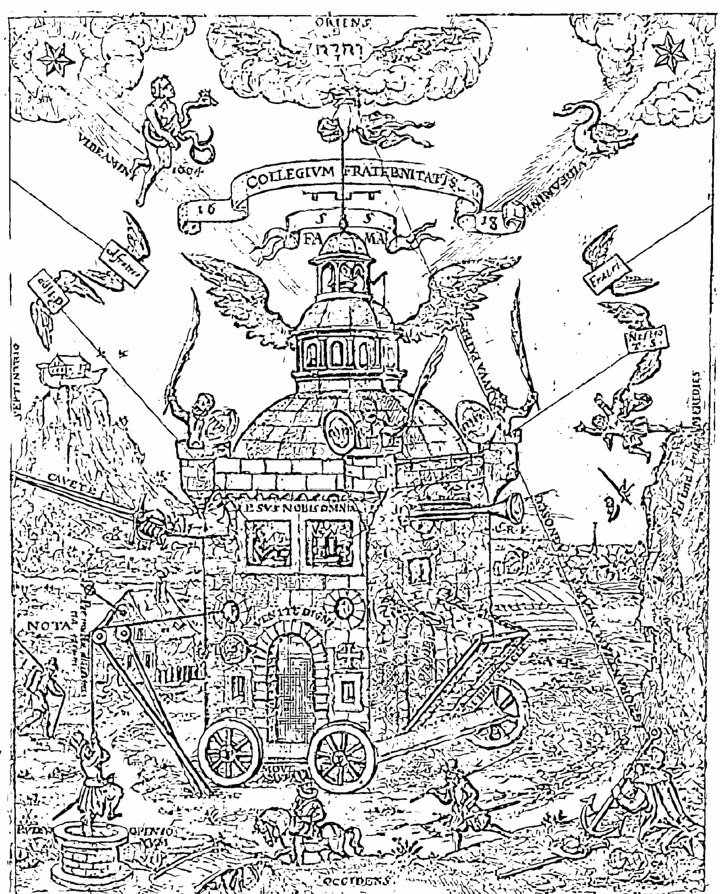

本畫象徵薔薇十字團是眼睛看不見的秘密社團。
（T. Schweighart，1604）

## 【奇幻書院】1

中古世紀文明、科學精華之極限挑戰

相傳薔薇十字會的會員有許多精通魔法、占星術的超能力者，可以幫人治病、預測地震、在空中漫步等等，想要加入薔薇十字會也不是一件容易的事情，據說薔薇十字會會針對想要入會的人，進行一連串的檢視，這過程有點像電影「哈利波特」，可能某一天你會接到一封署名為「R. C」的人寄出的信件，邀請你參加考試，然後經過一連串訓練才成為正式會員。然而無論測驗的地點、還是考試的內容，都被規定不可向外透露，因此薔薇十字會一直被視為一個秘密社團。

但有許多人都受到其影響，包括帕拉塞斯據說就是受到薔薇十字的奧義《M之書》的啟發，而開創了醫療化學。德國詩人哥德（Johann Wolfgang Von Goethe，1749～1832年），就寫下了一篇詩作「秘密」，對是誰在十字架中放了薔薇投下疑問。其實，哥德除了寫詩之外，本來就對神秘學有諸多涉獵。

# Complete Guide to Alchemy

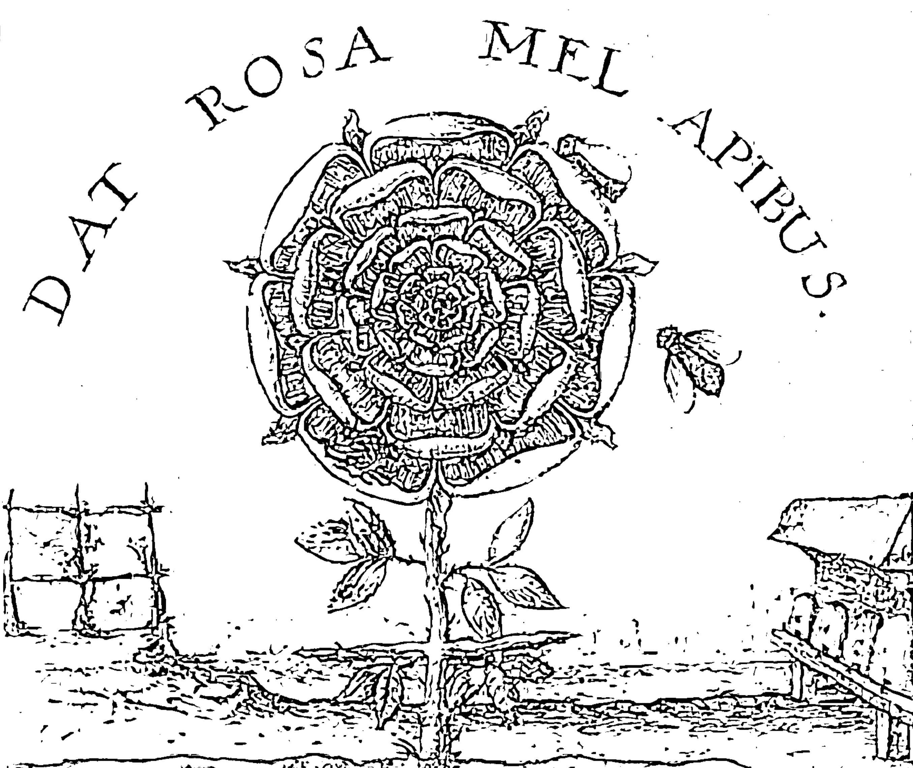

「是誰在十字架中放了薔薇？」（R. Fludd，1629）

## 【奇幻書院】1

中古世紀文明、科學精華之極限挑戰

德國哲學家黑格爾（Georg Wilhelm Friedrich Hegel，1770～1831年），在《哲學全書》的序文中，也寫下「理性與現實的十字架中存在著薔薇」的字眼，都透露出深受薔薇十字會的影響。至於他們本人究竟是否為薔薇十字會的成員，則永遠是一個謎了。

薔薇十字會的標誌象徵來自於薔薇、十字，其來源則有諸多說法。有人說薔薇代表魔法、神秘學，又象徵秘密的保守，源自羅馬神話，愛神艾羅斯將玫瑰送給了沉默之神。也有人說薔薇是早期亞歷山大文化的象徵，代表東方文化；十字則是基督教的十字，代表西方文化，簡而言之薔薇與十字就是東西文化的結合。而十字架在基督教中又代表著死亡、痛苦及重生的意義，也和薔薇十字會的教義不謀而合。

此外，薔薇又有女性陰部的意思，十字則象徵肉體的交流，在《化學的結婚》這本書中形容太陽王與月亮女王結婚時，達到一種極致的歡愉境界，是一種超越了靈魂的體驗，其中的化學就暗指鍊金術。

由此可看出薔薇十字會深受當時流傳的赫爾墨斯主義和新柏拉圖主義的經書的啟發，是個涵蓋了化學、占星、心理學、神話等各領域研究的團體，鍊金術自此開始以各種不同的面貌互相交流。

140 第五篇·鍊金術與其他學說、派系的關係

# Complete Guide to Alchemy

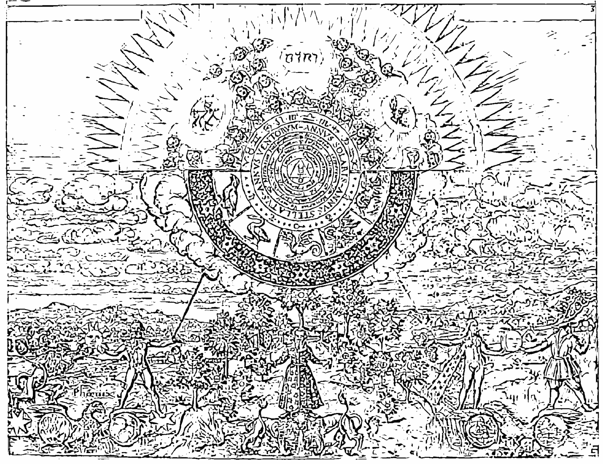

蔷薇十字会炼金术融合了多种元素

由于十六世纪后半到十七世纪，德国政治、经济经过很大的改革、震荡，因此追求精神合一的神秘思想，便渐渐流传开来，蔷薇十字会因为和基督教相结合，渐渐扩展到欧洲其他各地，后来还和英国的友爱运动相结合，而广为所知。

对于蔷薇十字会的狂热也掀起了正反两派的意见，其中最著名的讨论刊物有两本，分别是《名声》、《告白》。

## 【奇幻書院】1

中古世紀文明、科學精華之極限挑戰

經過基督教的洗禮後，包括薔薇十字鍊金術，帕拉賽斯的醫療化學，卡巴拉數秘論的鍊金術等都互相融合了。一直到十七世紀初，薔薇十字會在歐洲一直有相當的影響力，就連學校都出現世界改革、自然研究、教育改革的呼聲。至於最後薔薇十字會是如何銷聲匿跡的，則和它的起源一樣，永遠是個謎團，有人認為它融入了共濟會，也有人說它又傳到了西藏等等，眾說紛紜。

但據說，目前歐洲大陸一些古老貴族的後裔中，仍有「薔薇十字會」的成員存在，所有會員都將薔薇與十字架的結合體，視為自己的標語與符號。其成員大多為歐洲中世紀的貴族知識分子，他們提倡素食、禁酒、禁煙、提倡心理治療，畢生致力於赫爾墨斯神學與鍊金術的聯姻。

## 四、共濟會與鍊金術

鍊金術在十六～十七世紀在歐洲非常風行，極盛時期許多王公貴族也都對此興趣盎然，當時對於賢者之石的研究更接近一種狂熱，尤其從一五七○年開始，一直持續半個世紀都是高峰期，到了十八世紀則是共濟會（Freemason）的興起；兩者可以說有著承先啟後的關係。

由於許多人認為鍊金術師所追求的，不只是金屬的變質，同時也是道德、精神的再生，這點和共濟會的想法上就有許多相似之處。例如在十七世紀前半，薔薇十字會就是將象徵歐洲魔術思想的鍊金術具體的實現，到了十八世紀共濟會的興起，則代表了歐洲啟蒙主義具體的實現；因此也有人說共濟會是從薔薇十字會衍生出來的。一八二四年湯瑪斯·迪·昆西（Thomas De Quincey，1785～1859年）就出了一本叫做《薔薇十字團與共濟會起源的批判與研究》，在研究中他提到共濟會與赫爾默斯主義、艾雷烏西斯密儀、艾塞尼教派等有關，他的起源則是薔薇十字會，而非是源自於阿拉伯的鍊金術，和以黃金鍊成、製作賢者之石為目的的鍊金術完全不同。

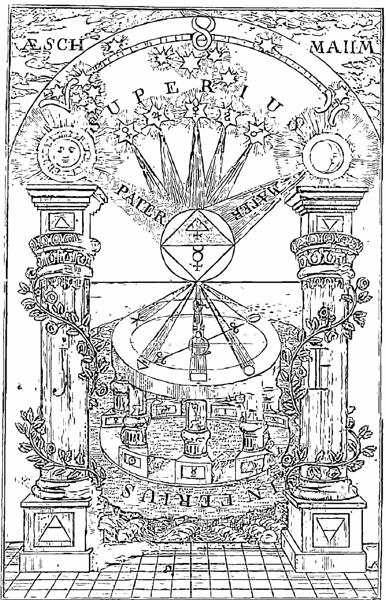

144：第五篇・鍊金術與其他學說、派系的關係

# Complete Guide to Alchemy

他在書中更記錄薔薇十字會進入英國後，一直到共濟會誕生的過程。英國薔薇十字會的運動是以羅伯特·福拉德為中心，至於從薔薇十字會變身為共濟會的契機，則是從法國天文學家皮爾·伽森荻（Pierre Gassendi）等人針對薔薇十字思想的批判，到了一六三三年，大家更不想再使用薔薇十字會的名稱。

共濟會是世界上最大的以互助為宗旨的秘密團體，有關它的起源則有多種說法：

- 1. 起源於人類的始祖亞當夏娃，兩人必須相互扶持。因為共濟會是一個相互協助的團體，《創世紀》中夏娃和亞當先後吃下禁果，才落入了凡間，也是本著「有福同享，有難同當」的精神。
- 2. 起源於建造所羅門的耶路撒冷神殿的石匠們。所羅門神殿，是從西元前九五八年動工興建的，共耗時七年才完成，當時的領導者是海勒姆·阿比夫，他把石匠們組織起來，成立了共濟會，還把成員分成師傅、專家、徒弟，他也被尊稱是共濟會的聖人。海勒姆最後被三個妒忌他地位及技能的上司所殺，而埋於殿內的青銅墓裏，並預告不久後將再度復活。從此以後，凡是新加入共濟會者，都要舉行一場象徵海勒姆死亡及復活的儀式。

## 【奇幻書院】1

中古世紀文明、科學精華之極限挑戰

- 3. 起源於參加建造巴別塔(古巴比倫)的石匠工會。
- 4. 起源於中世紀的石匠公會組合，因為中世紀興建了很多大教堂、宮殿、建築物，常常都是耗時甚久，甚至上百年，因此便成立了組織，按照師傅的指導來進行，也引此孕育出相互扶持的精神。

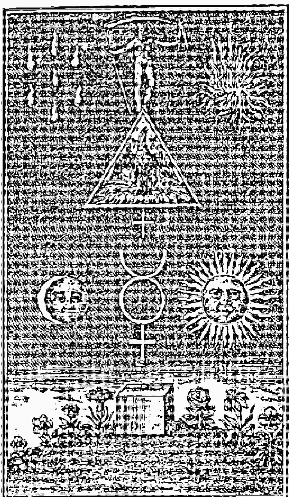

共濟會中加入了鍊金術的概念，中間有硫磺、水銀，再加上太陽、月亮。

# Complete Guide to Alchemy

儘管眾說紛紜，除了亞當夏娃說之外，其他都是跟石匠工會有關，這也可以從共濟會的名稱來看，是以自由（free）、石匠（mason）這兩個單字所組成的，因為中世紀的城堡和教堂需要一大批技術精良的建築工人才得以完成，再加上他們跟王公貴族和教會關係良好，可免除一些應盡的義務。

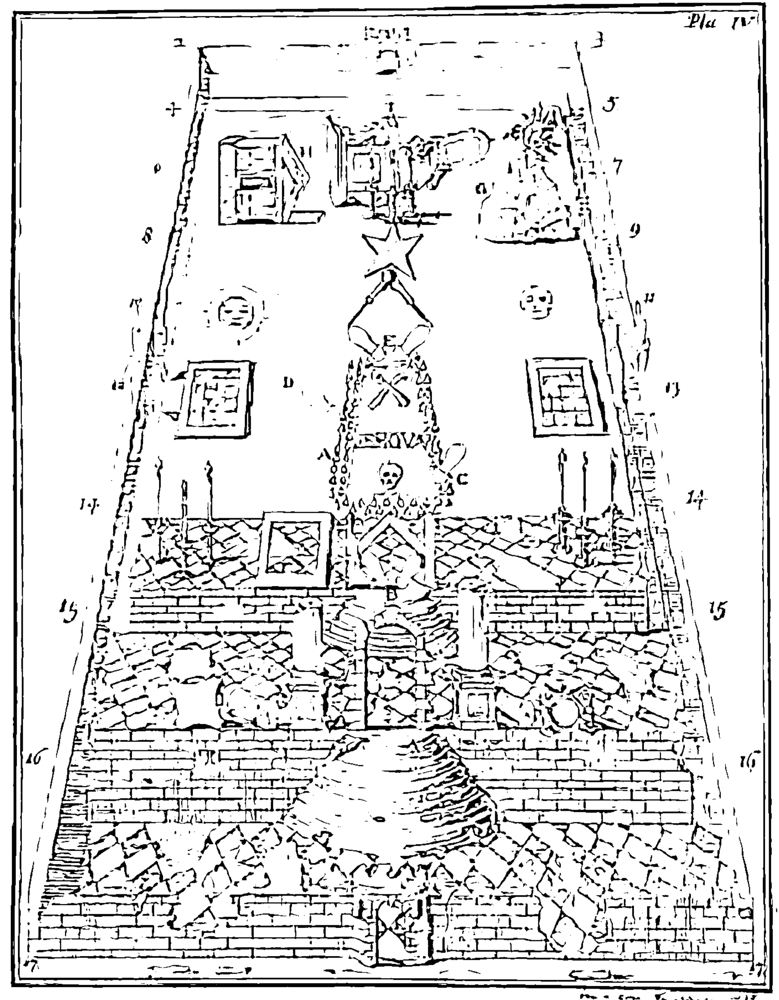

共濟會入會會場(Lennhoff and Posner, 1965)

## 【奇幻書院】

中古世紀文明、科學精華之極限挑戰

一七一七年，共濟會的第一個聯合組織「共濟總會」（Grand Lodge）在英格蘭成立。當時的會員除了石匠之外，還包含各行各業的人士，最後大家共推安東尼謝爾為「大師傅」，領導共濟會。共濟會也形成新的共識，即促進和平、友愛、平等，強調社交、親睦以及個人道德的提升。由於英帝國的向外擴張，共濟會很快的傳播到其他國家，後來法國大革命的口號「自由、平等、博愛」，其實正是借用共濟會的思想。

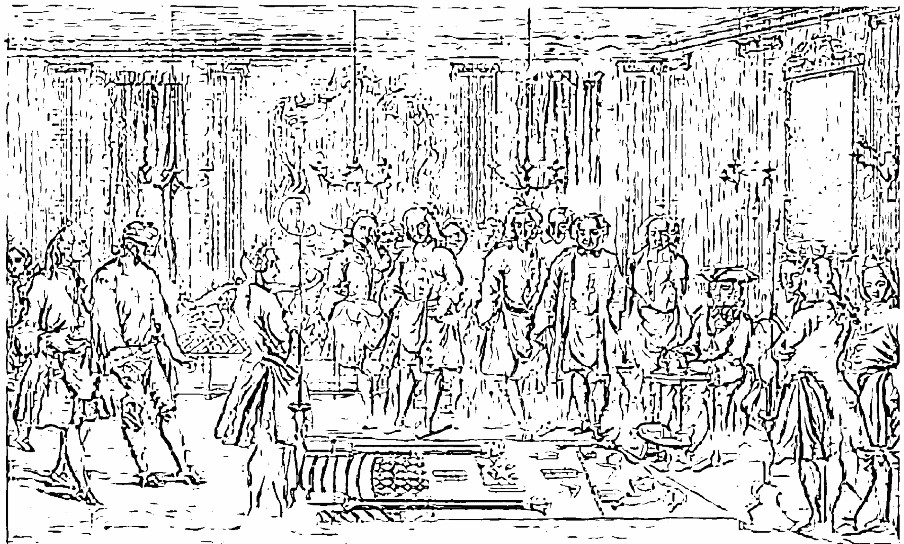

新社員眼睛被朦住

# Complete Guide to Alchemy

再來看看共濟會的入社儀式，首先新成員在入社前，會由一位引導人用布朦住的眼睛帶他進入「反省室」。出來後引導人會在他的脖子套上繩子，拔出長劍抵著他胸部，問他：「你為什麼來這裡？」他便會回答：「我是一位哀傷的盲人，來這是想要脫離黑暗，邁向光明。」最後取下黑布後會看到蠟燭，象徵了讓人歷經死亡後再生的過程，蠟燭當然代表著神之光。這個過程也和鍊金術的過程是相通的，必須先經過黑化的死亡，然後才能鍊出耀眼的黃金。

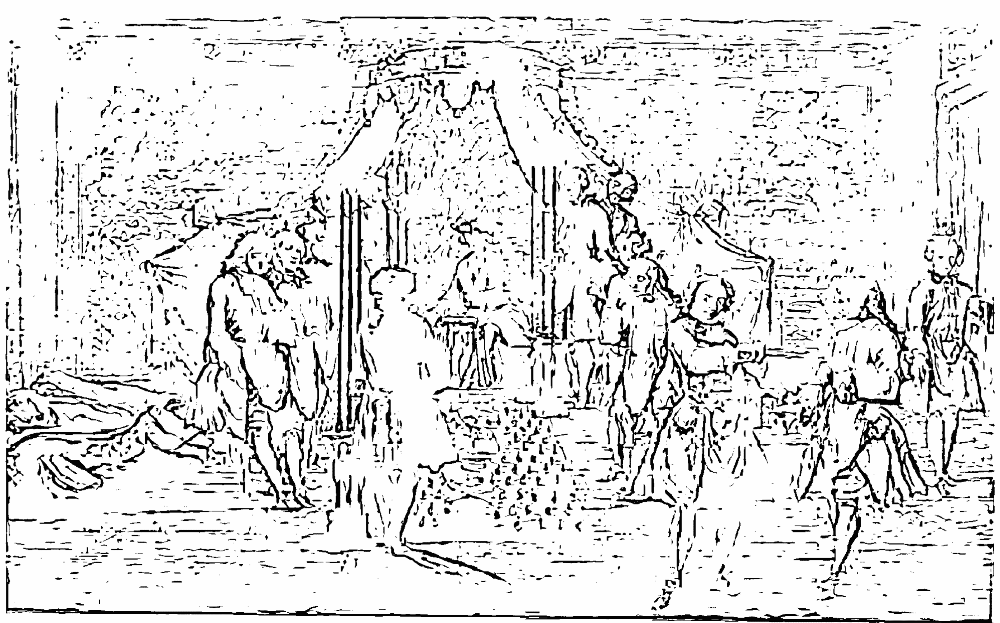

引導者拿著劍指著新社員

## 【奇幻書院】

中古世紀文明、科學精華之極限挑戰

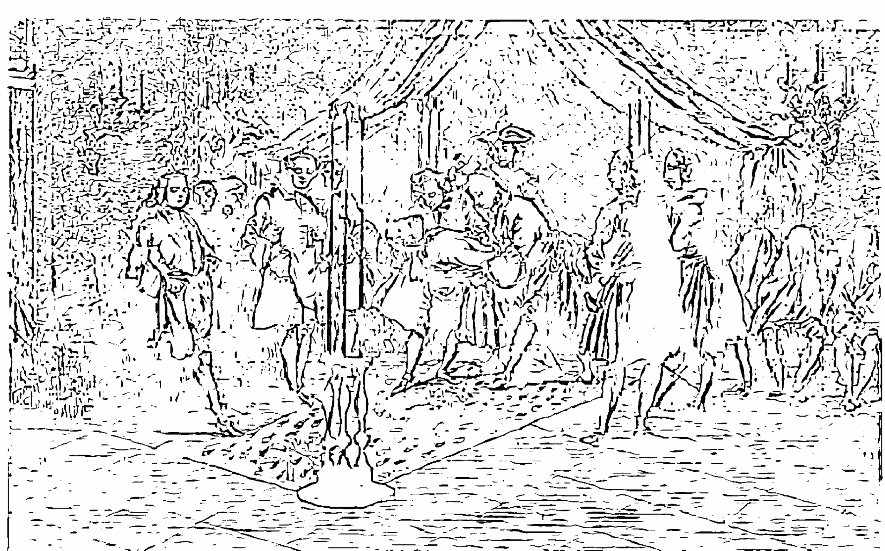

新社員眼睛睜開後看到身旁代表神之光的蠟燭

然而，隨著時間的推移，十六世紀末期歐洲經常發生動亂，所以對於大建築物的需求已不若以往，工會內部也開始往神秘主義發展，例如伊里亞斯·艾許摩爾（Elias Ashmole，1617～1692年）。他不但加入「共濟總會」，還對鍊金術有很深的研究。他認為鍊金術不只是讓金屬變質，還加入了赫爾默斯哲學，他更常參加有關鍊金術師、占星術數、數學家、神秘主義的團體，還被當時知名的鍊金術師威廉貝克，指定為他的靈魂繼承人。

伊里亞斯·艾許摩爾更在一六五二年出了一本《英國的化學劇場》，這本書整理了包含希臘鍊金術的大量史料，是鍊金術史上相當重要的一本書，書中顯現出他受到羅伯特·福拉德的影響，此外包含湯瑪斯·諾頓、喬治·里普林等人在鍊金術上的地位也都一一提及。伊里亞斯·艾許摩爾也對約翰·迪的看法表示支持，他認為真正的魔術師和邪惡、三流的魔術師是不同的，是具備真才實學，並以善良為目的來使用魔術的。

由於《英國的化學劇場》包含了所有有關湯瑪斯·諾頓、喬治·里普林、約翰·迪等人的鍊金術介紹，因此廣被後世討論。因為他的關係，也讓共濟會中染上不少鍊金術的色彩，他更在共濟會內大力推動中世紀和文藝復興的秘教。

伊里亞斯·艾許摩爾對薔薇十字會更有深入的研究，從他翻譯了薔薇十字會的《名聲》、《告白》即可看出。他也和羅伯特·包伊一樣，除了是科學家之外，也對神秘學多所研究，他的《英國的化學劇場》這本書更把大家對鍊金術的認知從物質上的意義，轉變為精神上的意義。

賽璐秋·尤頓在《鍊金術》這本書中，認為鍊金術的本質是與人類精神相關的，是將肉體再組織、經過純化的過程，從各物質中抽取第五元素，將靈魂進化。至於賢者之石，則具有神秘的姿態，就像用鉛變成黃金一樣，也是人類向真善美的境界提升，儼然把鍊金術帶往了道德之路。這樣的想法，影響了十八世紀歐洲的啟蒙主義以及共濟會，鍊金術的基本思想，也在共濟會中得以實現。

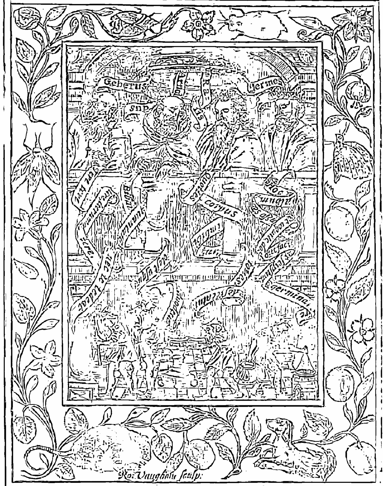

《英國的化學劇場》中提到許多鍊金賢者，包括格貝爾、穆罕默德·拉齊斯、赫爾墨斯特·裡斯梅吉斯特等。

## 鍊金術師完全事典
Complete Guide to Alchemy

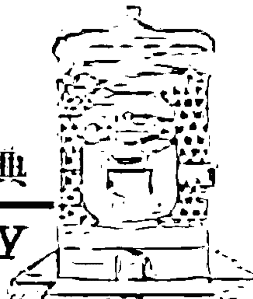

不過，隨著共濟會勢力的日漸擴張，讓梵蒂岡教廷都飽受威脅，於是在一七三八年下達了禁令，規定天主教徒不可參加該會。可是共濟會的勢力似乎仍未消失，現在依然存在，只不過風貌早已經過無數的改變了。

鍊金術與共濟會共通點在於兩者都是經過無數的試煉，成為完美的人類，鍊金術的試煉是將物質內部所隱藏的神秘力量抽取出來，經過精製，達到最終的鍊金作業，鍊金術師在這過程中，也宛如進行一場靈魂的淨化。共濟會的試煉則是在徒弟與專家、父親與母親等相同位階的對應，然後經過特殊的禮儀過程，志願者因此成為象徵所羅門神殿建造的人類、社會的道德完成指標。鍊金術、共濟會兩者都是經過無數的試煉產生自覺，和古代秘密宗教也很類似。

莫札特在歌劇「魔笛」中，更呈現出共濟會的入社儀式，主導者是身為祭司的薩拉斯托，他要求新會員塔米諾必須要有忍耐、勇氣、沈默、勤勉、友愛、善行等德性。此外，托爾斯泰在《戰爭與和平》中，主角皮耶更是共濟會會員，本身也具有謙讓、服從、溫厚、寬大等美德。

## 五、魔術與鍊金術

文藝復興的魔術系譜，在麥迪奇家族的保護下翡冷翠的柏拉圖學院中心的學者，柏拉圖、普羅提諾（Plotinus，205～270年）、普羅克魯斯(Proclus，411～485年)等新柏拉圖主義重要人物的著作，都被保留下來了，並被翻譯成拉丁文。因此結合了赫爾墨斯思想、卡巴拉、新柏拉圖主義、古代秘密宗教、魔術等的文藝復興魔術體系，也更為發達。這一体系認為，致力於為了到達神所在的崇高境界，人類必須實踐許多義務。

在《超自然哲學》這本書中，皮哥·迪拉·米蘭德拉就認為，世界分為月下界、天空界、超天空界三個世界，支配這三個世界的魔術則有自然魔術、數學魔術、天使魔術。不過，提倡這些言論者後來都遭到教會迫害而被放逐。

此外，將鍊金術加入魔術的概念，也可以在許多人的作品中看出，譬如莎士比亞的《暴風雨》普若斯皮羅(Prospero)，以及班·強生（Ben Jonson，1572～1637年）的《鍊金術師》中的詐欺師等。英國著名超自然博士約翰·迪，他同時也是英國女王瑪麗·都鐸（Mary Tudor）的占星師，他精通鍊金術、占星學、數學、卡巴拉等學問，在鍊金術方面更著了一本《象形文字的單子》（Monas Hieroglyphica）的書，其中就融合了各種學說。

約翰·迪不但發現了象形文字，還認為象形文字的單子包涵了月亮、太陽、水星（水銀）跟白羊座的符號，外面被一個橢圓形的卵包圍著，太陽中心的黑點則是大地，太陽與月亮重疊的狀態，就像金、銀兩性原理的結合，加上白羊座所代表的火，把賢者之卵中的水銀變為賢者之石。

象形文字的單子，可以把大地的東西隱藏起來，單子所代表的意義，是藉由神的力量，將物質活性化，當物質被活性化的時候，也就是太陽、月亮本身具有的影響力的結合。太陽、月亮本身具有的影響力，也就是天使的力量，以及太陽、星辰的精髓。約翰·迪的單子是指從大地的物質將神的能量引導出來的同時，也是鍊金術師本身靈魂淨化的過程。約翰·迪將卡巴拉數秘論的鍊金術，以宇宙創造的關鍵來解釋，再透過人類的手將這個夢想實現。

## 六、基督教與鍊金術

由於某些加入魔術的鍊金術理論受到教會排斥，有些鍊金術師便把聖經的理論用到鍊金術中，尤其是《創世紀》中所談到的天地創造，更被廣為運用。

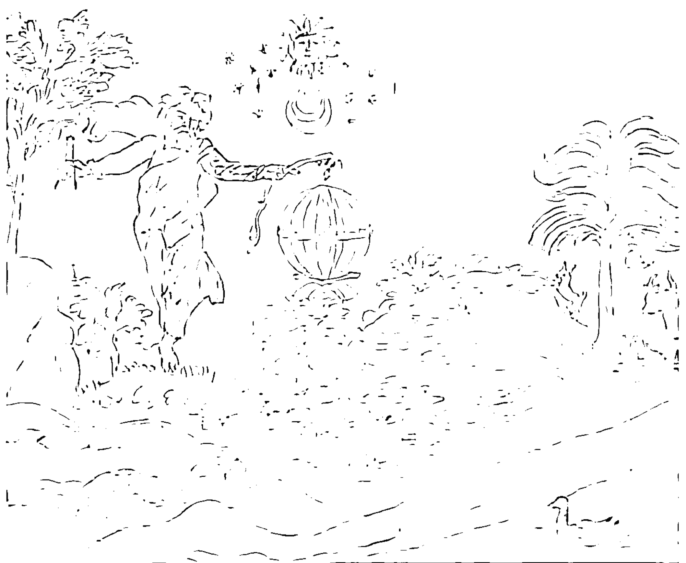

## 鍊金術師完全事典
Complete Guide to Alchemy

在《創世紀》這一章中，談到天地創造時，形容天地創造前，大地呈現一片混沌，就像黑暗的深淵，天主的聖靈在水面上運行。第一天神將黑暗與光明分開，第二天便看到了天的創造，諸水體被分了開來，在上為雨，在下為始初之海。第三天則是將海和陸地分開，地表出現各種植物，第四天則生出日月星辰，第五天天上的鳥、水中的魚也出現了，第六天創造了地上的動物，以及依照自己的肖像創造了人類。

鍊金術對於天地創造的過程則是從第一元素的觀點來解釋，認為第一元素分成四元素，再經由鍊金作業成形。被基督教化的鍊金術的第一元素，當然是由神所創造的。鍊金作業的最初目標是將物質還原為第一元素，因此最早出現的顏色為黑色，在這個過程中，鍊金術師可以將物質還原為神在創造天地時最原始的物質，再以這個為基礎進行「再創造」的作業；這種觀點摻雜了不少魔術的思想。

因此鍊金術在傳入歐洲時，鍊金術師便將《聖經》中的天地創造，用鍊金術的觀點來詮釋，尤其是薔薇十字鍊金術更是如此。鍊金術哲學家羅伯特·福拉德（Robert Fludd，1574～1637年）試圖立足於《聖經》，建立一個自然哲學的體系。他所追求的是物質內部普遍的、根源的物質，在《哲學關鍵》書中，就描述了的小麥的實驗。

## 【奇幻書院】1
中古世紀文明、科學精華之極限挑戰

因為小麥是歐洲人的主食，是神聖的食物，地位就像行星中的太陽、人體的心臟，金屬的話當然就是黃金了，從小麥中萃取出第五元素的過程，就宛如鍊金術師把賤金屬鍊製成黃金。因此在小麥的實驗中，從圓形容器中抽取五個物質，也就是火、氣、水、土四元素，再加上第五元素小麥。

羅伯特・福拉德則認為在天地創造前就存在的「黑暗」，即是鍊金術中的第一元素，也就是鍊金術中「黑化」的過程，鍊金術師只是將天地創造搬到實驗室中進行，再度呈現「黑暗」的過程罷了。

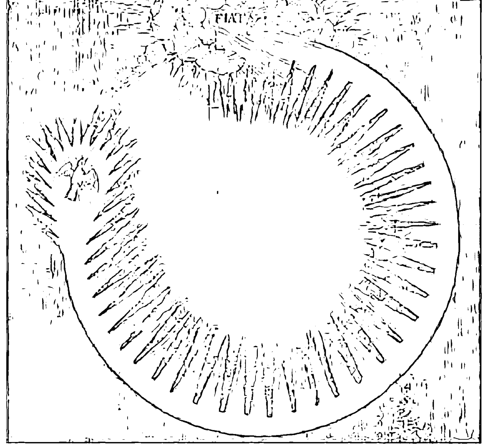

# Complete Guide to Alchemy

儘管在《創世紀》中敘述天地創造時是從「黑暗」轉成為光和水，但羅伯特·福拉德認為兩者本質上是相同的，只是因為墮落人間的人類，用雙眼將它區分開來。因為若從《創世紀》來看的話，首先第一天「黑暗」並沒有特定的形式，接著才是代表光的神之靈登場了，將黑暗與光分開，黑暗就變成「混沌的水」，光則變成為天空，光成圓形的轉動，世界也跟著轉動。

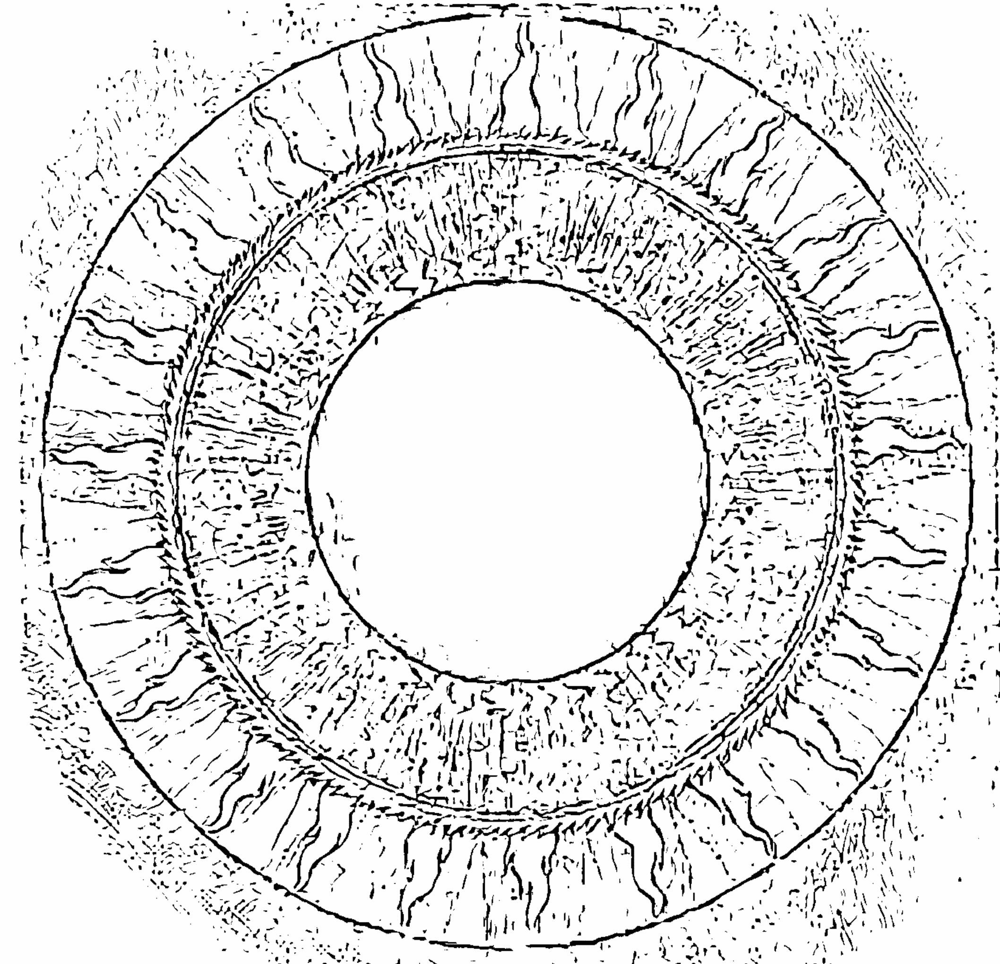

羅伯特·福拉德的天地創造第二天。（Robert Fludd，1617）

## 【奇幻書院】1

中古世紀文明、科學精華之極限挑戰

到了第二天，水分成為上面的水、下面的水，下面的水也就是海，上面的水則是充滿靈氣的乙太與空氣。第三天海洋集中在一起，於是陸地生成，陸地也是被當作「混沌的水」的黑暗殘留物。所以天地創造的過程，上面是充滿光、最高境界的天空，乙太形成天空。第四天在乙太中生出日月星辰，第五天地上的生物也誕生了，神的創造工作至此終於宣告完成。

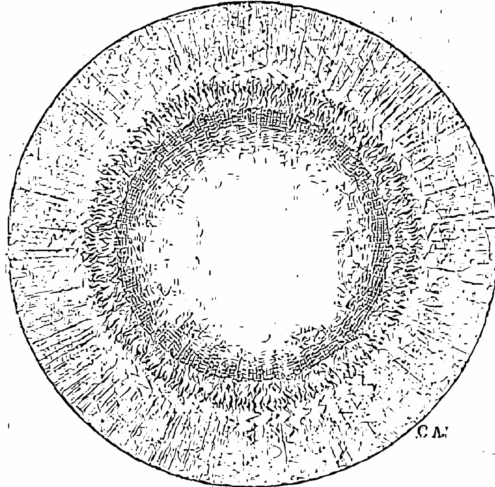

# Complete Guide to Alchemy

羅伯特·福拉德在天地創造的鍊金術中，最重視的點則是光，他認為因為光的登場，也就是靈氣的出現，才讓黑暗的物質沉入大地，宇宙因此形成。在天空界的乙太中則含有各種元素物質，神的能量也包含了光，鍊金術師根據化學的操作，將這些神祕物質抽取出來。從他的想法可以看出似乎深受基督教的影響，反而把鍊金術和魔術牽扯上了關係。

赫爾蒙特（J. Van Helmont，1579～1644年）則對天地創造則又有另一番解釋，他雖然深受帕拉賽斯的影響，可是他對於帕拉賽斯的三原素硫磺、水銀、鹽，以及亞里斯多德的四元素火、氣、水、土並不認同，他認為在《創世紀》中形容天地創造時，應該是以水為中心的，因此認為水才是鍊金術的第一元素。尤其經過著名的柳樹實驗後，更使他確信所有的植物都是由水生成的。此外，他對氣也做過很多實驗，還有不少精彩的論述，甚至自稱為氣體的發明家，這個實驗後來也引起了波以耳的興趣。

赫爾蒙特認為《創世紀》中出現的元素有水、氣、土、火，土接受了水而變成容器的角色。因此，被當作基本物質的水，也就是天神創造時的能量，一直被保留著。在天地創造第三天時海的水集中起來，陸地因而呈現出來，水的一部分潛入了地底，潛入地底的水，後來成為洪水，才再度從地底出現，也就是諾亞遇到的洪水，當洪水退去後，這些水再度潛入地下。因此現在潛入地下的水，其實保留了天地創造的能量，也就是萬物的根源。因此地底下才會有金屬、石頭的生成就是因為這些被保留的能量，再加上水的作用而生成的。地下的水因為具有神力，含有孕育金屬、石頭的種子，經過長時間，這些種子漸漸成長，金屬、石頭也漸漸生成，換言之，金屬、石頭都是從水中變來的，也就是從神的手中變來的，因此藉由鍊金過程將金屬、石頭中的成分抽出，就可以鍊製治療人生病的藥方。

此外，赫爾蒙特認為酵素也是相當重要的東西，水在生成金屬、石頭的過程，需要加入酵素才能生成。除了自然界之外，在人的身體裡也存在著酵素，胃、肝等身體各個器官都有特殊的酵素，引起消化和其他生理變化。

儘管赫爾蒙特關於酵素與消化的理論儘管很粗糙，其基本方向是正確的，有些地方甚至和現代醫學和消化理論差距不遠。另外，更值得一提的是，他在一本著作《論尿結石》（De Lithiasi）中，精確描述了酒精中酒石的形成過程。他把尿精（碳酸銨溶液）和酒精混合，觀察到有白色沉澱生成，這些物質後來被稱為赫爾蒙特丸。赫爾蒙特還從尿中離析出兩種固體鹽，一種是食鹽，另一種大概是磷鹽。他還發現金屬能在酸中溶解，等其復原後品質並不會改變，也就是所謂的物質不滅的定理。

他同時也是最初提到「瓦斯」這一詞彙的人，碳酸瓦斯更是被他發現，而瓦斯的用語（Gas），則是出自於天地創造前「混沌」（Chaos），也可看出瓦斯充滿了鍊金術的色彩。不過，對於赫爾蒙特來說，他所指的瓦斯並不是單一的氣體，而是包含許多東西的神秘揮發物。

順道一提，日本雖然不像歐洲，對天地創造的討論可以從神學、哲學、天文學、藝術等觀點來看，討論的作品也相當稀少，但福永光司的《道教和古代日本》中卻讓人欣喜地看到，他發現《古事紀》中提到天地創設時，有一段文字和鍊金術有關。「時國稚如浮脂而若水母漂於水中之狀，方時若『葦牙』因萌騰之物而成神」。意思是將各種金屬性的礦物放入鎔爐中再加入水，因為高熱的狀態，這些物質會變成凝脂狀。海洋中的軟體動物水母，則被比喻成像是鍊金中的水銀。他認為鍊金術中黃色的物質，其實就是「葦牙」，這也是日本早期少數跟鍊金、天地創設有關的文獻。

# 【第六篇】煉金術在文學、藝術上的呈現
Alchemy in literary and art

由於鍊金術的盛行，在中世紀也有不少畫家在作品中描繪鍊金術師鍊金的過程。

德國畫家阿爾布雷希特·杜勒（Albrecht Durer，1471～1528年）在他的一幅作品「憂鬱者」（Melancholia）中，就畫了些跟鍊金有關的東西，譬如鍊金用的爐子、梯子、天秤、沙漏等器具，畫面的左邊則出現了圓形以及一個多邊形的東西，這可以看作是賢者之石、賢者之卵，右上方則有一個謎樣的方陣圖形，至於中間的主角當然就是鍊金術師了，憂鬱在鍊金術中又象徵鉛、死亡的暗示，也就是所謂黑化的過程，在黑化的過程中精神會跟著改變，也就是靈魂的變容。

荷蘭畫家林布蘭(Van Rijn Rembrandt，1606～1669年)也在作品「看著魔術的圓的浮士德」中，雖然描繪的不完全是鍊金術師，但可以看出他認為鍊金術師與魔術師之間，有許多共通的地方。十六世紀佛蘭德斯最偉大的畫家彼得·布勒哲爾(Pieter Brueghel，1525～1569年)也在他的作品「鍊金術」中，將鍊金術師在鍊金時混亂的情況畫出來。譬如實驗室裡堆放各種器具，在畫面左側鍊金術師在進行融爐、蒸餾的作業，東西擺設凌亂，則象徵鍊金術師的精神狀態，其中還有鍊金術師的老婆拿著空空的錢包，以及一個助手在旁邊幫忙起火，鍊金術師的小孩則是無憂無慮地在玩耍。仔細觀察的話，從大家身上的衣服、鍊金術師老婆拿的空錢包，可以看出鍊金術師的生活並不富裕，而且還很拮据，因為許多鍊金的器材都不便宜，因此鍊金術師們常常散盡家財，只為了能鍊出黃金來。從他的作品中也反映出，當時的社會其實有不少王公貴族們對鍊金術充滿了興趣，因此有些鍊金術師也是在得到這些王公貴族的支持下，才能繼續專心鍊金。彼得·布勒哲爾作品中的鍊金術師形象，後來也成為研究當時鍊金術師生活的最好範本。

雖然在中世紀的歐洲，貪婪的鍊金術師比比皆是，也得到許多王公貴族的支持，然而如果不能夠兌現諾言鍊出黃金，那些供養他們的貴族更顯得冷漠無情，甚至毫不猶豫地砍下鍊金術師的人頭，也因此彼得·布勒哲爾筆下的鍊金術師，常顯得很慌亂的原因，有一部分可能是因為性命不保的關係。從十五世紀一直到十七世紀，也留下了許多有關鍊金術的書籍，但越到後來常可以發現書中的記載越來越故弄玄虛，充滿了奇怪的符號和不知所云的公式。

莫札特（Wolfgang Amadeus Mozart，1756～1791年）著名的歌劇「魔笛」（Die Zauberflote），更和共濟會有相當大的關聯。「魔笛」是莫札特生命中最後一年的作品，也是他最著名的歌劇之一。取材於詩人維蘭德（C. M. Wieland，1733～1813年）的童話集《金尼斯坦》（Dschinnistan）中，一篇名為「璐璐的魔笛」。

當時莫札特生活窘迫、疾病交加，抑鬱不得志，但創作的意願仍然很高，所以當維多劇院的經理席卡內德邀請莫札特為一部德語歌劇譜曲時，莫札特立刻欣然答應。

為了方便莫札特專心創作，席卡內德還將作曲家任性的妻子送到外地療養，並在劇院附近租了一個小房間（魔笛之家），給莫札特居住。

一七九一年九月，莫札特終於完成了「魔笛」的譜曲，而且僅僅排練了兩日，便在維也納郊外的維多劇院首演，由莫札特親自指揮。該年的十二月莫札特便去世了，才華洋溢的他只不過活到三十五歲。

「魔笛」主要描述泰米諾王子為了救出帕米娜公主，中間必須通過許多試煉。劇中有許多內容都和共濟會、鍊金術、古代密儀有關，譬如兩人中途經歷的考驗，又出現了加入共濟會必須通過的儀式考驗，兩人接受四元素的試煉，則和鍊金術不謀而合，四元素的試煉對鍊金術來說不但是金屬的變化過程，更是鍊金術師的淨化過程。

兩人在途中必須忍耐「死亡的試煉」，是共濟會中很重要的象徵，代表死亡後才會重生，這也在許多古代宗教中都出現類似的思想。祭司們宣佈只要通過「火的試煉」、「水的試煉」便可得勝，兩個武士唸起了刻在石碑上的銘文：「帶著苦難而來，受水與火的洗禮，空氣與大地的眷顧，離棄死亡的恐懼，女神伊西絲選中的人，沒有罪惡，可入天堂。」通過試煉時，神殿中的神官便開始合唱「你們通過了危險／伊西絲神的能力也送給你們／來吧，讓你們進入神殿吧」，這又和伊西絲（Isis）、歐西里斯（Osiris）的神話與古代秘教有關。

1618年「魔笛」上演時的夜后之宮一景的插畫。（Karl Friedrich Schinkel）

此外，夜后象徵月亮，也可能代表伊西絲女神，因為她無知、蒙昧、迷信、使用妖術，祭司薩拉斯特羅則是睿智、理性、正義、充滿愛，代表人類，因此最後夜后沒落，祭司薩拉斯特羅獲得勝利，則代表古老的伊西絲密儀宗教畫下休止符，新的密儀宗教成立，也就是共濟會。

據說莫札特一開始創造的動機，就與共濟會有關，因為莫札特本人及大部分劇院成員，都是這個組織的成員。因為一七九〇年，莫札特的保護人奧地利皇帝約瑟夫二世逝世後，瑪利亞女王的政府禁止並且鎮壓共濟會的活動，因此歌劇便以童話的形態來宣揚共濟會的理念，同時也影射當時社會的病態。

除了畫作、歌劇之外，文學上描繪鍊金術師作品的也在不少數，有趣的是，英國的作品多半都將鍊金術師描繪成詐欺師。

英國大文豪傑佛瑞·喬叟(Geoffrey Chaucer，1343～1400年)就在他著名作品《坎特伯里故事集》（The Canterbury Tales）中，將鍊金術師的行徑，描繪成像詐欺師一般，也因為如此，鍊金術師後來在一般人心目中的形象，便永遠被定型了。

到了十七世紀有關鍊金術師最著名的作品，首推就是班·強生（Ben Jonson，1572～1637年）的《鍊金術師》了。主角薩德爾到處吹噓可以將黃金鍊成金，顯然班·強生對於鍊金相當有研究，也非常了解帕拉賽斯的醫療化學的理論，但是他的角色設定，又更加深了後世總是把鍊金術師和詐欺師化上等號的想法。

法蘭西斯·培根（Francis Bacon，1561～1626年）則在《學問的進步》中，討論了鍊金術師的功過。他在一篇預言中說道，有一位老農夫臨死前告訴自己的兒子，在自家的葡萄園中埋有黃金，兒子在他死後為了尋找黃金，挖遍了葡萄園，卻什麼都沒有找到。然而，因為土壤被翻動的關係，第二年葡萄的收成特別好，也就是說老農夫其實只是將黃金當做一個象徵的比喻，希望他的兒子能夠辛勤工作，自然就會得到豐厚的收穫。他也用這個比喻來形容鍊金，認為只是在作夢。

英國詩人多恩（John Donne，1572～1631年）則在他的作品《歌與短歌》中，描繪了「愛的鍊金術」，他說，鍊金術就像鍊製香水與醫藥一般，經由鍊金術師的手，調配出各種東西。鍊金術的作業過程，會產生某種有益的副產物，地上的物質因為加熱，產生黑化現象，然後象徵物質經過死亡，才會再生，鍊金術的意義也就是建立在「死亡然後重新再生」這件事情上。

也有人用太陽的死亡與復活，來比喻鍊金術，譬如像在北歐冬天日照時間比較短，也代表支撐地上生物的太陽生命力較弱，象徵太陽的死亡，到了夏天，日照時間又變長了，也就是太陽的生命力又復活了。

無論是文學作品或是繪畫中所描述的鍊金術師，他們的印象中的都是很刻板地描繪鍊金術師們想把金屬變成黃金的狀態。

十八世紀末期歐洲興起的浪漫主義，也討論了鍊金術中的所探討的自然本質等問題。浪漫主義時期著名化學家漢普利·大衛（Humphry Davy，1778～1829年）一本叫做《化學哲學的要素》的書，就把鍊金術描述成是開啟化學之路的先端，當成實驗科學的化學起源，也對於阿拉伯鍊金術給予正面的評價，更對格貝爾等人的著作給予讚揚，認為鍊金術並非只使單純地想把金屬變成黃金。此外，像瑪麗·雪萊(Mary W. Shelley，1797～1851年)著名的作品《科學怪人》，也是利用電及等各種方式，刺激組織的甦醒，讓死人復活，這也和鍊金術有某種相通之處。

英國浪漫詩人柯立芝（Samuel Tayler Coleridge，1772～1834年），就曾在德國留學時接觸康得的哲學以及自然哲學，他曾在《講義》中描述鍊金術的理論和古希臘唯物主義哲學家赫拉克利特(Herakleitos)的哲學，和現在德國自然哲學相通。所謂自然哲學就是在自然之中從兩極具成的力量，在鍊金術來說就是硫黃和水銀，在這自然之中就可以看見生命，柯立芝認為人的內部和外部合起來是一個生命。

美國學者艾布拉姆斯（M. H. Abrams）、德國哲學家雅各·伯米（Jakob Bohme，1575～1624年）就對鍊金術包含神學的背景提出指責。雅各·伯米在《曙光》這部作品中認為是神展開了天地創造，因此萬物都具有唯一的神性，但鍊金術師想要從中抽取的，卻是看不見的物質，也就是某種能量是不可能的。

艾布拉姆斯認為柯立芝在寫詩概念上受到鍊金術的影響，因為柯立芝曾在《文學自傳》中表示，想像力可以分成兩種，第一想像力是受神無限的創造力影響的精神，第二想像力則是在人類意識領域中，對第一想像力的迴響。詩的形成最重要的不是第一想像力，而是第二想像力，因此第二想像力也就是將第一想像力，透過意識溶解（dissolve）、再創造，溶解這個字很明顯地和鍊金術有關，而再創造也就是「結合」的概念，也是鍊金術中將賤金屬轉變為貴金屬的不斷重複過程，於是第一想像力也可以看做是提供鍊金作業的素材，第二想像力也就是將素材分解、再結合，然後變身為新的東西。

同時期的英國桂冠詩人渥滋華斯(William Wordsworth，1770～1850年)也是深受鍊金術影響的人，在《知的微風》中可以看到他深受希臘哲學中所提到的世界靈的影響，而這也正是鍊金術師們所說的第五元素。從浪漫主義的代表詩人柯立芝、渥滋華斯的作品中，可以看出浪漫主義和鍊金術的關係。

雖然現代的化學把鍊金術視為愚知、無稽之談，但在科學尚未發達的年代，鍊金術的基本想法，其實和自然有著密不可分的關係，想要從神秘的自然中，抽取某些元素加以利用，也是理所當然的事情。因此，不妨把鍊金術看成是一種化學的演變過程，就向鍊金過程中，漸漸改變型態一樣，重新認識它吧！

至於最近的文學作品中，也常有人將賢者之石運用在小說中，譬如J. K. 羅琳的暢銷小說《哈利波特—神秘的魔法石》正是最好的例子。此外，目前日本當紅的漫畫家荒川弘的《鋼之鍊金術師》、秋乃茉莉的《賢者之石》、電玩「惡魔獵人」中，賢者之石也都常被當成其中一個重要元素。

# 【附錄一】記號由來
### Signs

有關鍊金術的書籍中常有許多複雜的記號，其實這些記號是有一定邏輯的。鍊金術的記號有些看起來又跟占星有關，譬如像銅 ♀ 就和金星的記號是一樣的，也就代表了希臘神話中的愛的女神阿芙羅黛蒂有關，其實這個記號正是從希臘文金星的開頭字母，演變而來的。

鍊金術的記號除了和占星學有關之外，還受到他的發祥地埃及文化的象形文字影響，此外和埃及文化相連的美索不達米亞文化等的影響，再加上希臘、羅馬文化的演變，展現出各種風貌。例如占星學與鍊金術之間，就是息息相關的，舉個例子來說，被認為是神聖數字的七，在占星學中就有太陽、月亮、金星、火星、水星、木星七大行星，同樣地在鍊金術中也有七大金屬，分別是金、銀、銅、水銀、鐵、錫、鉛，太陽＝金、月亮＝銀、水星＝水銀、金星＝銅、火星＝鐵、木星＝錫、土星＝鉛。

不過，鍊金術發展到後來，有些鍊金術師為了故弄玄虛、裝腔作勢、或是為了保守秘密，故意創造出許多難懂的艱深符號，來躲避追查。但大體來說，鍊金術的記號可以分為點、直線、曲線、三角形、四角形、幾何圖形、阿法貝塔符號、數字，而且這些符號還和動物、植物、礦物有關，我們只就常用的鍊金記號來做說明。

（一） ● 點是所有記號的最原始要素，代表中心、統一的特性，同時也可以解釋向四面八方擴散，兩種完全不同的原則。

∴，三點最原始的意義代表了父親、母親、小孩，在埃及宗教中 1 代表父親的歐西理斯神，2 則是象徵母親的伊西絲神，3 為兩者結合產生其他的神。在基督教中三則有三位一體的象徵，1 = 存在、2 = 運動、3 = 生命，又或是 1 = 精神、2 = 觀念、3 = 語言。

此外，鍊金術的三原素硫磺、水銀、鹽，也都和數字 3 有關。

在鍊金術中由點所衍生出來的圖案，則包括了太陽、金的符號 ☉，圓圈中有一個點，象徵神從沉睡中甦醒，最早是古代象形文字中的太陽，衍伸到鍊金術也代表了金，太陽代表神的光輝，金則是金屬中最貴重的東西，兩者符號更說明了神存在於黃金中。

鍊金石的記號 ◯，鍊金石的記號是呈橢圓形的，象徵鍊金過程中最先呈現出黑色，就是象徵死亡的顏色，物質先腐化而後再生，也代表著大地的試煉。然後，物質經過蒸發而上升，變成雨落下來，將物質洗乾淨，這也就是水的試煉。最後則用火的試煉，讓物質變成紅色，紅色也是鍊金術最後完成的顏色。

（二）△，三角形是古代埃及的神性象徵，對畢達哥拉斯學派來說，三角形更是重要的象徵；三角形也是柏拉圖四元素構成的基本圖形，因此常被拿來當作神秘學的符號。譬如四元素的記號是由三角形演變而來的。

1・火的記號，△，象徵熱的燃燒，也帶有上升、成長、膨脹的動向，暗示著征服、侵入的行為，火也是男性的象徵，和其他要素組合後，很容易就有破壞的情形發生。

2・水的記號，▽，水的記號和火完全相反，三角形是朝下發展的，代表往下方流動，相對於火代表的膨脹，水則是象徵收縮，水的記號同時也是女性子宮的象徵。

有趣的是水的記號與火的記號相加時，形成一個星星的記號✡，則象徵父親與母親的結合，神與自然的結合，精神與靈魂的結合等等。

3・氣的記號，🜁，這是火的記號中加上代表停止的橫線，也就是說如果沒有氣的話，火就會熄滅，氣是決定火的重要關鍵。此外，氣雖然很輕，會自己上升，但有一個界線，火則可永無止盡地向上延伸。

4・土的記號，🜃，土的記號則是從水衍伸而來的，代表水落下停止的地方。

# Complete Guide to Alchemy

5・硫磺記號，🜍，硫磺是三原素之一，從圖形來看是象徵火的三角形，加上元素的十字所構成的，由於火在元素的上方，也表示火是處於支配的地位，能讓物質成長、變化、發展，也代表了硫磺是大膽、勇敢、熱情、膨脹、勇往直前富運動性、積極等意思。硫磺和水銀是相對的，水銀代表外在的大宇宙，硫磺則是內在的小宇宙。在共濟會中這個記號也代表勞動者。

（三）圓形，圓形象徵永恆、神，在鍊金術中圓形代表宇宙、靈石，象徵全體統一的概念。此外，圓形也代表0，就是無的狀態，但無並不是什麼都沒有，還是有「東西」是存在的，這個東西就要靠我們的五感來體會。譬如在巴比倫神話中，有一個女神叫泰麥絲，她因為太喜歡他的丈夫了，最後自己蒸發掉，和丈夫合而為一，然而她蒸發並不是完全消滅，而是把自己化成微粒子，還原成最原始的本質。

另外，圓形也是明礬的代表記號，在鍊金術中也被當成原始物質，也就是所謂的哲學的鹽，在古代言也是重要的生命食糧，英文的薪水（salary），就是從拉丁語的鹽（sal）演變而來的，古代羅馬士兵的就是配鹽當做薪水。

1・鹽的記號，🜔，不用說自然是從這裡衍伸出來的，因此可以發現鹽是代表宇宙蒼穹的形狀，中間再加上一橫線

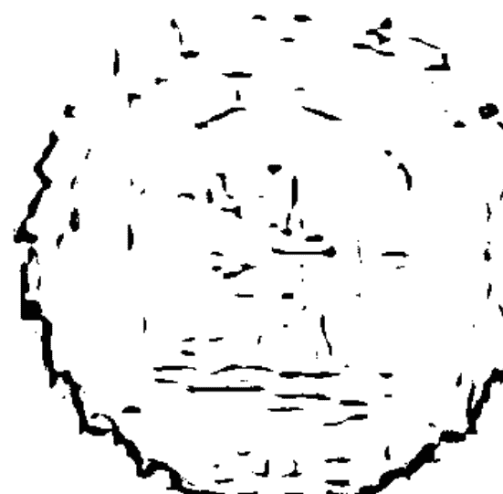

## 【奇幻書院】1

中古世紀文明、科學精華之極限挑戰

來表示，橫線所代表的是被動與靜止的要素，因為鹽被當成第一物質來使用，因此必須和各種物質相結合，再將過火的加熱，最後成為一個固定的東西。

賢者的鹽是從宇宙之海的明礬分解而來，因此圓中間的橫線也代表將水分成天上的水、地上的水，因此言也被認為是充滿智慧的海，也就是賢者之鹽。由於鹽也和水銀、硫磺一樣是一切物質的根本，例如將鹽田中的鹽抽出，就是可供人使用的水，鹽田經過太陽曝曬，留下來的結晶物就是鹽，因此也象徵萬物的基礎，引申出來譬如人類的話就代表母親。然而圓被分為上下兩部分也代表互相對立，一個是具有凝固的傾向，一個則是具有膨脹的傾向，兩兩互相影響，也代表天、地。在共濟會中，這個記號則被當作是測量物體是否成水平的水平儀，代表寂靜、平和、規律、順從。由於鹽在鍊金術中也被認為是介於水銀、硫磺、之間的物質，因此是中性化安定化的象徵。

2、硝石的記號，①，是圓形中加一條直線，則是和代表安定的鹽相反的不安定的硝石。直接從圖形來看，直線代表著上下的律動，象徵進步與退化，在中世紀由石匠公會所組成的共濟會中，則代表了鉛錘線，這個器具可以探究事物的根本，也代表自我的探究，思慮的昇華等意思。

# Complete Guide to Alchemy

（四）十字記號＋，十字代表了上下世界的結合，十字分出了四個方位，四元素交叉形成四季，因此代表了四季、四元素等意義。此外，直線也代表積極、活動的男性象徵，橫線則是女性的消極、被動的呈現，彼此互相交叉形成整個世界。由於男性加上女性的意味，也代表生產的苦痛，因此耶穌背十字架則象徵承受苦難。

此外，也可以從十字相交的點來看，從中心衍伸出四條線，這四條線代表了伊甸園中的四條河，在數學中 X 又代表了無限的意思，象徵神秘中的神秘、無限中的無限、光榮中的光榮，十字中心開出燦爛的花，則是象徵神秘的玫瑰，因此薔薇十字會的記號也是十字。

（五）線，線可以分成橫線－、直線｜，橫線代表靜止、平面、被動、藍色的水平面，同時也是女性的象徵，代表無限寬容、包含。

直線則是動態的，代表天上的神往人間運動，代表創造、生產、生殖，也是男性的象徵，印度的薩巴神、埃及的方尖碑、金字塔都可看到這個記號，此外，向上的直線也代表熊熊燃燒的火餞。

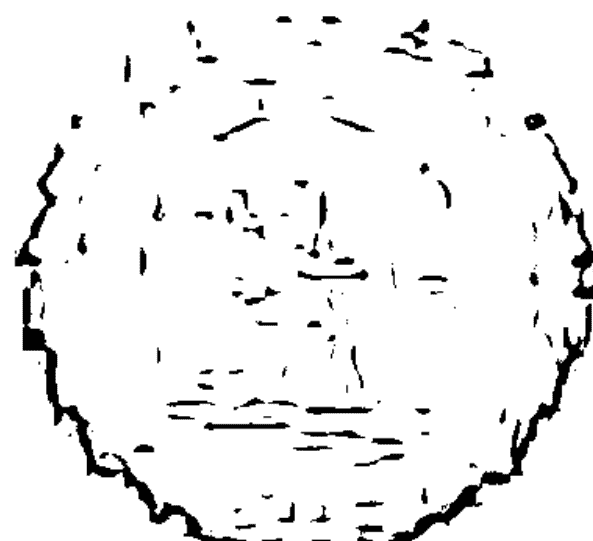

## 【奇幻書院】1

中古世紀文明、科學精華之極限挑戰

### （六）七大行星、七大金屬的符號：

1・太陽＝金的記號 ☉，象徵神從沉睡中覺醒的眼睛，神的啟示也就是光，同樣的金也是土中最光亮的，也就是說神存在於金之中。

2・月亮＝銀的記號 ☽，半月型的記號代表不確定的可能性，可以變成各種東西，在鍊金術中象徵女性的意味。對鍊金術師來說，月亮和太陽是相對的，也可以說月亮是反應太陽的一面鏡子，由於月亮有圓缺，是不穩定的象徵，至於金屬的話指的則是銀了。

3・金星＝銅的記號 ♀，這個記號是代表太陽的圓形，再加上代表元素的十字所組成的，同時也是女性的記號，在非洲迦太基、西班牙處女的記號，就和這個記號很像。

金星、女性以及銅的相關還可以從一個地方來看，金星既然象徵女性，在占星學中掌管愛情，因此和希臘神話中的愛維納斯相關，維納斯就是在陽光充沛的賽普勒斯島誕生的，因此金星的符號中才會有一個代表太陽的圓圈，賽普勒斯希臘原來叫Cypros，銅的學名Cuprium則是由此演變而來的，所以兩者的記號才會相同。

既然這也是女性的記號，和他相對應的男性記號，當然也就是維納斯的宿敵戰神馬爾斯了，因此，等下要提到的男

# Complete Guide to Alchemy

性記號也就是戰神、火星的記號。

4・火星＝鐵的記號 ♂，這也是古代羅馬軍神馬爾斯戰鬥象徵的標記。從圖形來看圓形算是代表太陽、男性、活動的象徵，而箭頭則是活動的表現，如果箭頭向上其實就是男性的象徵符號。其實，英文的三月 March，就是羅馬舊曆的一月，就是根據戰神 Mars 而來的。此外，如果把白羊座的符號 ♈ 顛倒過來，就可以看成是一個箭頭的符號，白羊座誕生的三月，也是深受太陽光熱影響的月份，彼此都是互為相關的。

火星也是金星的戀人，具有旺盛的運動力，所以必須適當地釋放出來，當金星提供火星愛的力量時，火星就能變得更為活潑，如果沒有金星愛的力量火星則會萎靡不振，金星如果沒有火星的活力刺激，也會變得平凡無奇。

5・水星＝水銀的記號 ☿，從圖形來看，這個記號是象徵四元素的十字，加上太陽的圓圈，以及和月亮有點類似的半月形，也可以看作是金星頭上頂著一個上弦月，可以解釋成力量再向上進化，源源不絕地改變。更可以看做是十字再加上鹼鹽的記號 ♄，鹼鹽就是乙太液體化的東西，可以自在地變化，產生無限的可能，不僅包含有形的生命，無形的靈魂也都涵蓋進去，如果自我能夠進化，就能將精神層面的東西引導出來。水銀在鍊金術中又被當做中間物質，能和其他

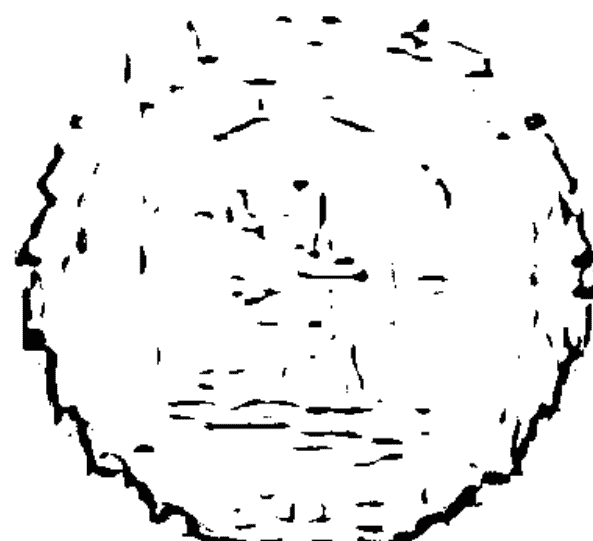

## 【奇幻書院】1

中古世紀文明、科學精華之極限挑戰

金屬相結合，屬性相當中性。水星也被當成是蘊含生命秘密的行星，在醫學上早期水銀更被認為可以提煉出長生不老的藥方。

6・木星=錫的記號 4，這是代表萬物之神的宙斯Zeus的頭一個字母，再加上象徵閃電的記號重疊而成的，也可以看作是十字加上朝左邊的上弦月記號，或是月亮加上代表元素的十字記號，此外上弦月在十字的符號上方，又代表上弦月是優於十字的意思，而且上弦月本身就具有上升、發展的意思，因此木星的意義，包含了成長、發達、活潑、生命等等的意思。至於會代表錫的符號，則是因為錫本身也是輕金屬，象徵它和空氣一樣輕。

7・土星=鉛的記號 5，扣除上方一橫線的符號，在古希臘代表著鐮刀的意思，也象徵拿鐮刀把自己父親閹割的宙斯父親克羅諾斯。克羅諾斯在羅馬神話中，指的是農神薩汀諾斯Saturnus，因此也可以看出英文的鉛、土星Saturn這個字，是從希臘、羅馬神話演變而來的。另外，還可以從別的方向來解讀，土星的記號可以看作是十字的下方，再加上向左的上弦月。

土星、鉛被認為是和木星、錫是相對的，代表衰退、成熟、死亡等意思，鉛又常被鍊金術師當成是鍊金作業的基本

# Complete Guide to Alchemy

物質，希望用鉛來鍊製出金、銀。

此外，把七大行星、七大元素圖表化的話，更可以看出彼此的關係：

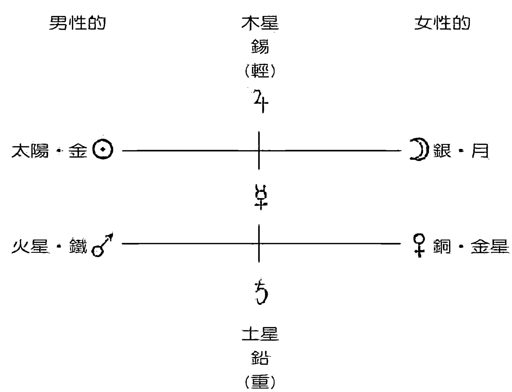

在中間的正式代表中性的水星，其他都是兩兩對稱的，輕盈的錫＝木星，和沉重的鉛＝土星分別是處於上下相對，太陽＝金則和銀＝月對稱，火星＝鐵則和金星＝銅相對應。

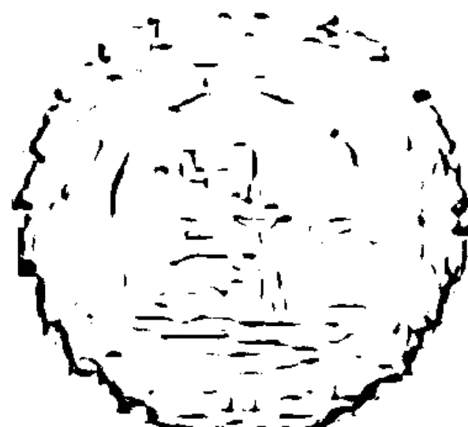

## 【奇幻書院】1

中古世紀文明、科學精華之極限挑戰

188· 附錄2· 用語解釋

# 【附錄二】

# 用語解釋

# Keywords

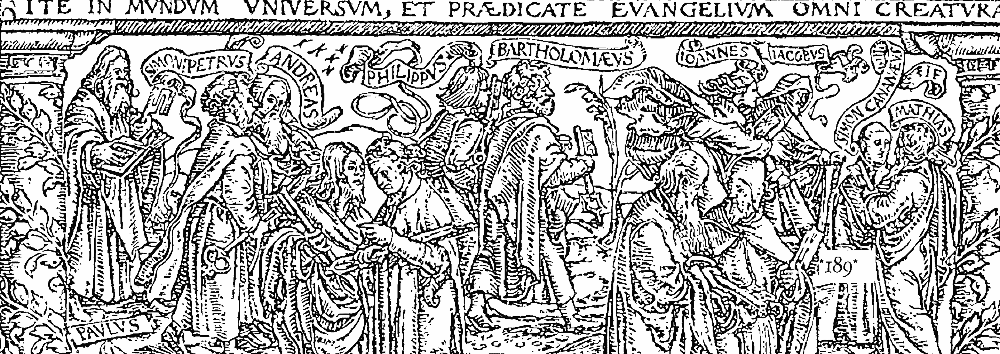

## 【奇幻書院】

中古世紀文明、科學精華之極限挑戰

◎ablution：洗淨，指鍊金過程中先以某些液體將物質洗淨，這些液體通常是指水，先用水將礦物洗乾淨，才進行鍊金的過程。

◎adustion：燃燒，可指過程或是最後變成燒焦的狀態，也可指物質具有可燃性，很容易燃燒。

◎albation、albification：白化狀態。

◎alchemy：鍊金術，簡而言之就是將賤金屬利用各種方式轉變為貴金屬的一種技術，在科學革命前鍊金術師並不知道金屬是不可以轉變的，所以利用各種實驗，希望把鉛、鐵等賤金屬鍊製成貴金屬。鍊金術也指將不純的物質變成純粹的物質。

◎alchohol：在阿拉伯語中本來是指眼睛著色的金屬粉，後來引伸出來變成酒精。帕拉賽斯就曾解釋「酒的酒精」，就是從不純物中分離得來的純淨之物。

◎alembic：蒸餾器，指的是整組的蒸餾器。

◎alkali：這是從阿拉伯語植物的灰alqali這個字演變而來的，是指燃燒海草後剩的灰是帶有鹽性的物質，從灰中可以引出鹽。

◎aludel：昇華用的容器，長得像梨子形狀的陶器或是玻璃器皿，兩端開口，在昇華過程能夠讓昇華物呈現的器皿。

# Complete Guide to Alchemy

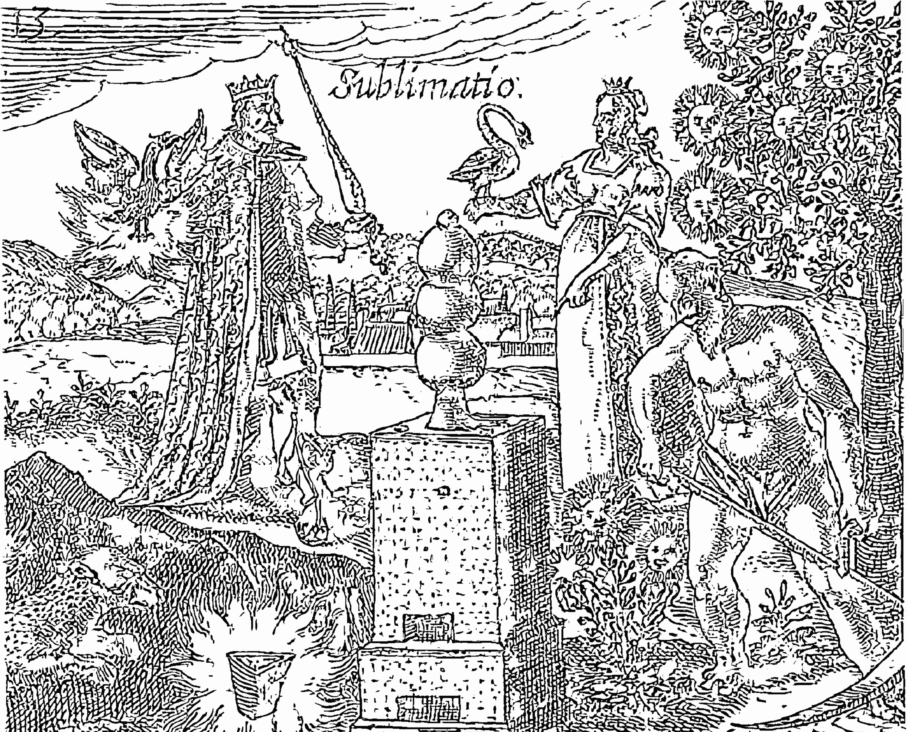

◎amalgamation：金屬加入水銀化合後的合成物。

◎ambix：在希臘語中代表一種加熱的器皿，早期鍊金術師多半是在鐵的器皿上把硫化銀加熱得出銀。

◎antimony：錒，古代人的錒是從輝安礦中抽取出來的，是一種易碎的金屬，也被稱為是「金屬之狼」。

◎aqua fortis：硝酸，當成強力的溶劑。

## 【奇幻書院】1

中古世紀文明、科學精華之極限挑戰

◎aqua regia：硝酸、鹽酸的混合物，被認為具有讓金融化的效力，所以又叫王之水。

◎aqua vitae：火酒，水性的酒精，被蒸餾的酒。

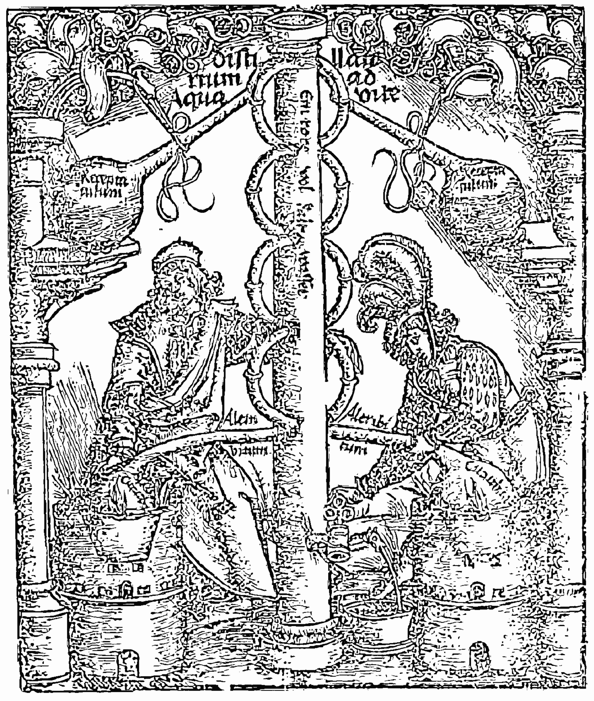

◎argent-vive mercury：在鍊金術中代表水銀。

◎arsenic：砒霜，又叫硫化砒素、雞冠石、雄黃。

# Complete Guide to Alchemy

◎ascension：上昇，指蒸發與蒸餾的過程。

◎assation：煎焙，鍊金術中指的是把素材用乾燒的方式，讓它變成灰燼的狀態。

◎athanor：鍊金爐，鍊金術師用來進行蒸解的爐子，下方可以放煤炭，有點像一個孵化爐。

◎atrament：黑色的東西，不純的硫酸銅。

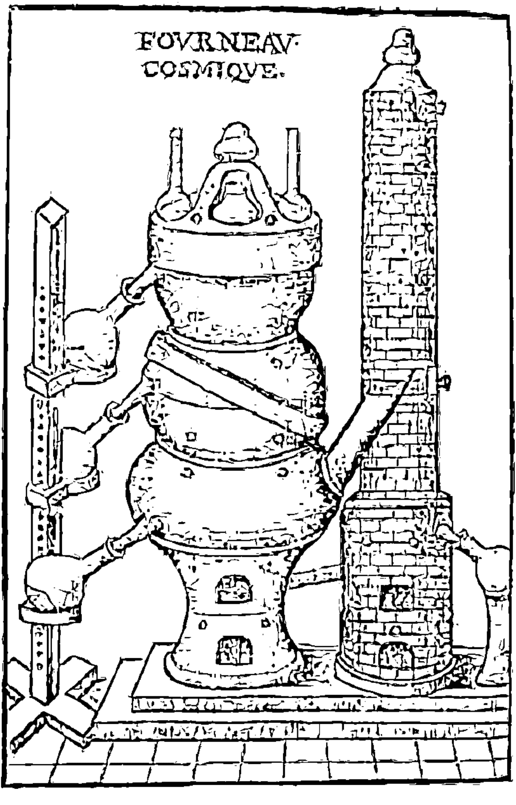

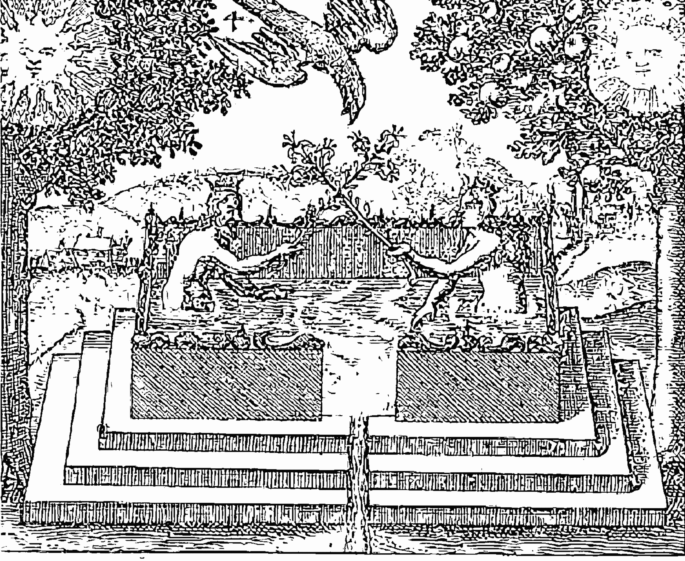

◎azoth：水銀，是從阿拉伯字alzaqu演變而來的，水銀在鍊金術中被當作第一元素。

◎balneum：鍊金過程中使用讓溫度提高的裝置，由於最早是一個叫瑪麗的鍊金術師發

## 【奇幻書院】

中古世紀文明、科學精華之極限挑戰

明的，因此叫瑪麗水浴器。

- ◎bolt-head：脖子長長的蒸餾瓶，特別會使用在火酒的蒸餾。
- ◎borax：硼砂，在鏈金術中也可指其他白色的礦物。
- ◎calcination：煅燒，讓材料經過火的烘培變成灰狀物的過程，也包括加入腐蝕劑的過程，由於這一階段顏色會變成黑色，象徵腐敗、死亡。

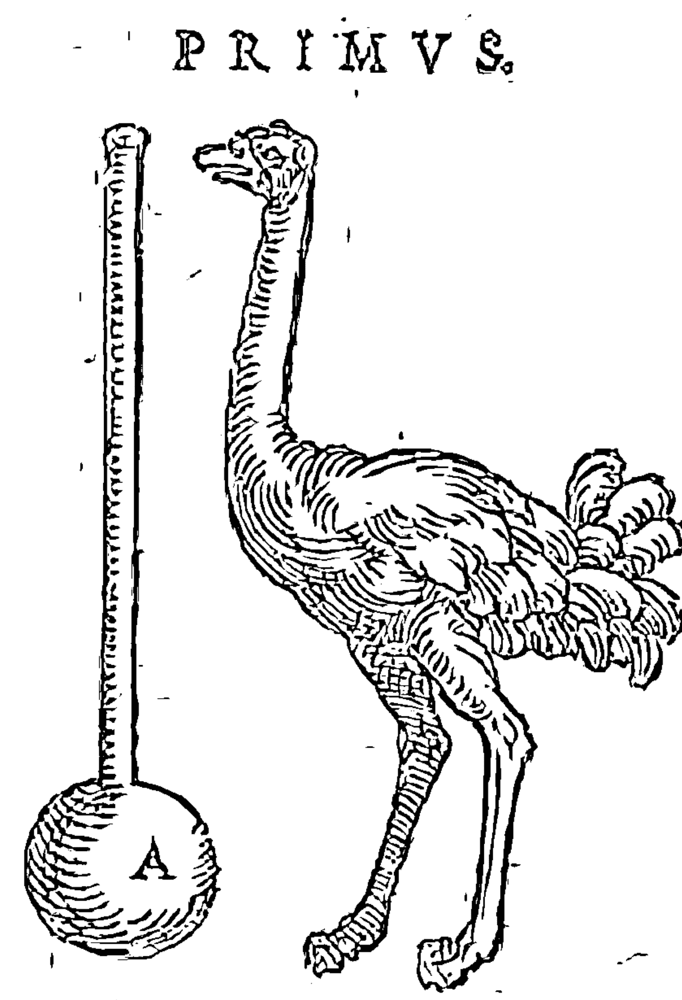

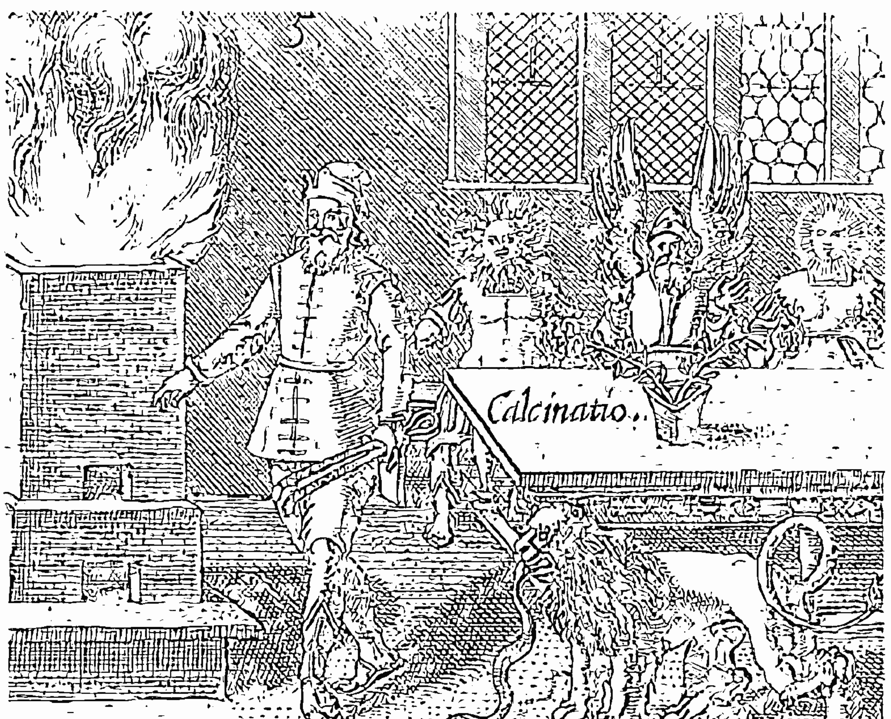

# Complete Guide to Alchemy

◎calx：煅燒的產物，也就是哲學之土。

◎calx vive：石灰。

◎caput mortuum：蒸餾與昇華之後的殘留物。

◎cement：把有浸透性的礦物物質，精煉變成粉狀的東西。也可以指複數的材料，讓它互相重疊的情況。

◎ceration：軟化，物質變軟的狀態，多半是把素材浸泡在某種液體中。

◎cibation：給送，代表物質的供給。

◎cinefaction：灰化，指物質變成灰的狀態。

◎cineritium：類似煙灰缸的東西，用來盛裝鍊金術過程中的廢棄物。

◎cinnabar：水銀的原礦，朱砂。

◎circulation：讓液體持續蒸餾的狀態，也就是精煉，為的是讓物質的效用更強，包含了蒸解、昇華、蒸餾的過程。

◎circulatory：用來蒸餾的密閉玻璃容器。

◎coagulation：凝固，液體變成固體的狀態，也就是結晶作用，讓物質冷卻再固體化的現象。

◎cohobation：再蒸餾，將液狀的蒸餾物再反覆蒸餾，要因為吸了水分後而膨脹變大，也象徵養育小孩漸漸長大的過程。

## 【奇幻書院】

中古世紀文明、科學精華之極限挑戰

- ◎comminution：粉末化，物質變成細細的顆粒狀。
- ◎congelation：結晶化，液體變成固體狀的狀態。
- ◎conjunction：結合，素材的混合，也代表男女結合。
- ◎copperas：在鍊金中指鐵、銅、亞鉛、硫酸化合物。
- ◎crosslet、crucible：坩鍋，非常耐熱的容器，能夠讓金屬在其中溶化，外表看起來底部狹窄，中間比較寬廣的容器，鍊金術師用來鍊金之用。
- ◎cucurbit：蒸餾瓶，放在蒸餾器下部的瓢形容器，多半是陶器或是玻璃製品。
- ◎cupellation：精煉，在金屬提煉爐中提煉東西。
- ◎dealbation：白化的狀態。
- ◎descension：下降，蒸餾時溶融一種方法，在燃燒時將火放在接近瓶蓋的地方，然後把蒸氣狀的物質再把它倒入另外一個容器中。
- ◎descensory：下降爐，盛裝材料變成液體後、落下來的爐子。
- ◎digestion：蒸解，宛如食物在腹中消化的過程，在鍊金過程中指的是物質經過緩和地加熱，將純粹、不純粹的物質分開的過程。
- ◎dissolution：融解，讓物質的部份要素分解，也就是進

# Complete Guide to Alchemy

行解體、分解。

◎distillation：蒸餾，蒸餾的過程主要包含三種，分別是上昇、下降、過濾，在加熱容器中物體變成液體蒸發，這就是上昇的過程，然後再讓它冷卻下降，最後經過過濾的過程。用蒸餾器加熱時固體先轉變為氣體，然後再冷卻凝縮，鍊金術師可以從中抽取有用的物質。譬如在將水加熱時讓水變成蒸氣，經過冷卻凝結後，再一滴一滴萃取，就是水的淨化。也有鍊金術師認為，蒸餾是將物質的本質抽取出來。以現在的東西來比喻的話，就有點像是利用毛細管作用，讓液體從A往B移動，也包含了某種過濾過程。

◎elements：亞里斯多德指的四元素火、氣、水、土。

◎elevation：高上，因為熱而氣化的狀態；其所形成乾的物質則讓它昇華，濕的物質則讓它蒸餾。

◎elixir：艾略克希爾酵母，賢者之石，能讓物質變容的重要東西。

◎essence：本質，從蒸餾得來的抽出物所不可欠缺的特質，也就是將物質還原。

◎exaltation：高揚，增強「高上」的效果。

◎fermentation：發酵，指的是鍊金過程中石頭經過艾略克希爾酵母的作用後發酵，變成其他的東西，譬如投入金的

## 【奇幻書院】1

中古世紀文明、科學精華之極限挑戰

艾略克希爾酵母就會變成金。

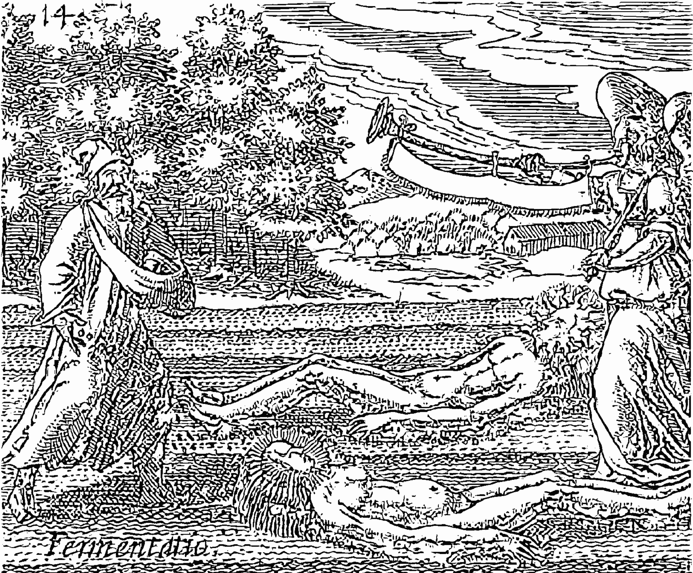

( D. Stolcius von Stolcenberg, 1624 )

- ◎filtration：濾過，用毛織的布，把不純的成分過濾。
- ◎fixation：固定化，就是把物質的揮發性、流動性、移動性去除，多半是用火煅燒或煎焙，讓其揮發性漸漸不見。
- ◎fixed：固定性，物質固定化的狀態。
- ◎helm：蒸餾器上部讓液體停留凝聚的部份。

# Complete Guide to Alchemy

◎horse-dung：馬糞，指的是鍊金過程中用來保持溫度的東西，又叫作馬之腹。

◎imbibition：物質浸在液體中後吸水膨脹的狀況，也叫再蒸餾。

◎inceration：轉化。

◎ingression：再蒸餾。

◎inhumation：埋藏，為了讓可溶性的物質融解，而使用了動物糞便之類的東西，就像埋藏在地下讓它腐敗一樣。

◎kerotakis：讓金屬蒸氣化的還流裝置，過程包括黑化、白化、黃化。

◎lac virginis：處女之乳，指金屬融化成液體的東西，又叫作哲學之醋，水星之水、智者之水、龍之尾、哲學者的水銀。

◎lute：封泥，為了讓器具的開口接合處能夠封緊，所使用的東西。

◎magisterium、magistery：指的是鍊金術中有變形或治療能力之自然界中的菁華，也叫作靈藥、賢者之石。

◎magnesia：氧化鎂。

◎marcasite、marchasite、msrkasits：白鐵礦、黃鐵礦、硫化金之類的東西，是一種不完全金屬，含有各種物質。

## 【奇幻書院】1
中古世紀文明、科學精華之極限挑戰

◎mercury：水銀，鍊金術中重要的物質，也是帕拉賽斯所指的三原素之一。

◎merds：糞。

◎minium：鉛丹。

◎mollification：軟化，在鍊金過程中讓金屬變軟。

◎multiplication：增殖，也可以看作是變質，鍊金術師認為石頭具有變質力，能夠透過鍊金過程讓它質量增加；但這裡的石頭不是普通的石頭。

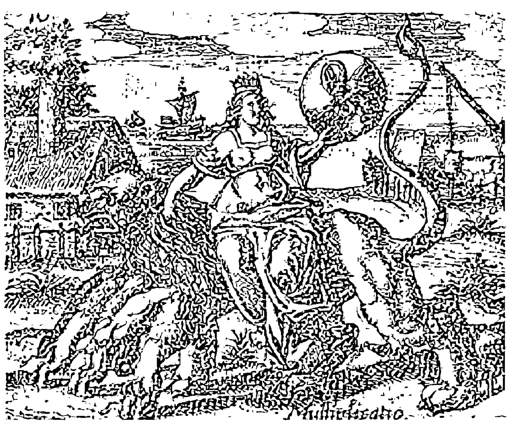

◎orpiment：雄黃，早期鍊金術師認為雄黃中含有黃金的成分。

# Complete Guide to Alchemy

◎pelican : 鵜鶘型蒸餾器，指外形像鵜鶘鳥一樣，肚子大的，還有兩個像翅膀一樣的把手，液體透過兩個把手可以循環，是一種循環式的蒸餾器。

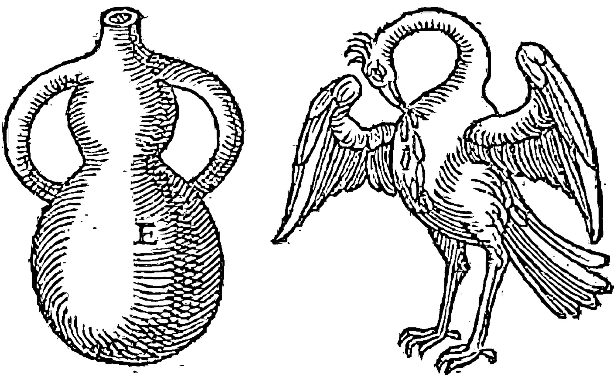

◎phial : 小玻璃瓶、小藥瓶，多半是玻璃容器下方大大地，上方是一條細細的小管，在凝固、溶解階段常使用的東西。

◎philosopher's egg : 賢者之卵，卵象徵圓形的宇宙，在鍊金術中指的是讓鍊金作業完成的容器，這也是希臘神話中赫密斯說的被封印的容器，或者是婚姻的房子、監牢、墳墓、雛鳥的巢等等。由於早期鍊金術承襲硫黃、水銀說，因此鍊製的過程宛如硫黃、水銀的結婚（結合），然後把鍊金的材料一個個放進容器中，經過許多道手續，最後終於鍊成賢者之石。由於在第一階段呈現出黑色，象徵死亡的腐敗，也就代表墳墓，第二個階段的白化則被比喻為變成白鳥的階段，最後則鍊出紅色的賢者之石，在埃及又代表象徵不死鳥的鳳凰。

## 【奇幻書院】
中古世紀文明、科學精華之極限挑戰

◎philosopher's stone：賢者之石，賢者之石的名稱很多，又被稱作哲學者之石、天上之石、第五元素等等，賢者的概念主要是因為鍊金術基本承襲自希臘哲學家柏拉圖、亞里斯多德的四元素概念，因此這些偉大的哲學家也被稱之為賢者，再加上亞里斯多德在《氣象學》中提到的礦石金屬生成論，更深深影響後世的鍊金術，因此能鍊製貴金屬的重要物質，被稱作賢者之石。

賢者之石的概念，是西元八世紀時阿拉伯鍊金術師格貝爾最先提到的，他承襲了亞里斯多德的四大元素火、氣、水、土，以及四大特性熱、冷、乾、溼的原則，認為金屬也是一樣，只要透過組合改變，即可把賤金屬變成貴金屬，其中需要加入一種東西當媒介，這就是在阿拉伯語中稱為艾略克希爾酵母（aliksir）的物質，這個字後來漸漸演變成英文萬能藥、長壽不老之藥的意思。

最早，在埃及的鍊金術中，鉛被當成鍊金術的基本物質，可以自在變換，到了阿拉伯則認為水銀才是基本物質，但四世紀時佐西摩斯則把硫磺的重要性提升。至於所謂的賢者之石，就是從所謂賢者的水銀、賢者的硫磺製造出來的，再加上靈妙的粉末，也就是艾略克希爾酵母，即可鍊成貴金屬，這樣的觀念後來更一直影響到歐洲的鍊金術發展。

但到了現在，英語俚語中的「賢者之石」(Philosopher's Stone)，則是用來形容迷幻藥。

202 附錄2 · 用語解釋

# Complete Guide to Alchemy

◎prima material、prime matter：第一元素，哲學家對他通常有許多不同名字的稱呼，例如第一質料等。

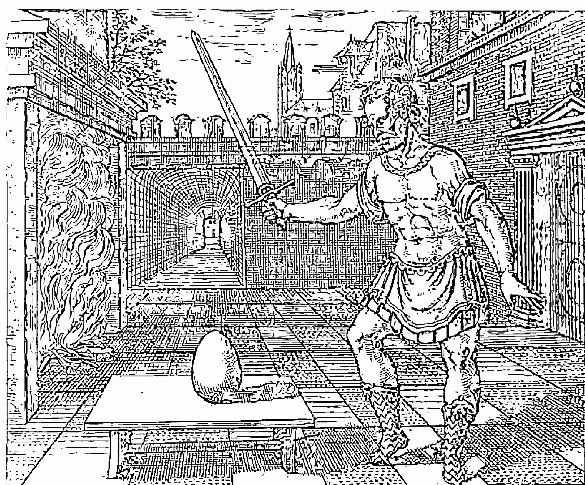

蛋象徵第一元素，拿寶劍將它破壞象徵鍊金術的成功必須先經過死亡才能再生。（M. Maier，1618）

## 【奇幻書院】1
中古世紀文明、科學精華之極限挑戰

◎principles：原素，帕拉賽斯所指的三原素硫磺、水銀、鹽。

◎projection：投入，鍊金術最後的手續，在最後的作業中投入某種東西，讓賤金屬變成貴金屬。投入的東西有人稱之為艾略克希爾酵母、賢者之石、靈藥，投入的瞬間就會立刻改變。

◎putrefaction：腐敗，物質進行解體、分解的過程。

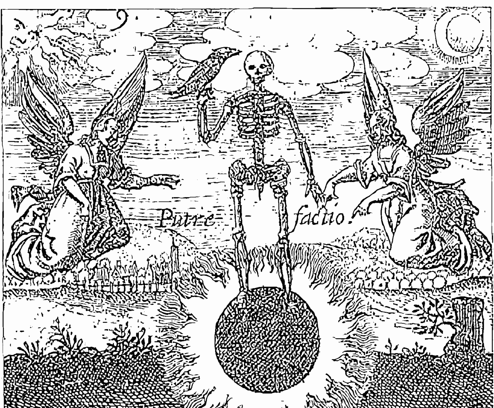

（D. Stolcius von Stolcenberg, 1624）

# Complete Guide to Alchemy

◎quintessence：精髓，指的是從物質的本質中精煉出來的東西，鍊金術師認為從植物、動物、生物中抽出包含精神的東西，也就是將不純物質分離後，得到純度較高的東西。

◎receiver：容納蒸餾產物的容器。

◎retort：脖子長長的玻璃容器，有點像煙斗形狀的球形容器。

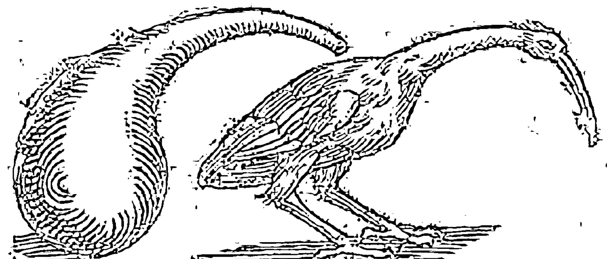

◎royal water，王水，指的是濃鹽酸與濃硝酸的混合液，為了讓金屬之王的黃金溶解，阿拉伯的鍊金是大師格貝爾在《鍊金術大全》中就描述，王水和硝酸和鹽化的阿摩尼亞混合，金的溶解力就會增強。這是格貝爾最早製作的王水，後來十四、十五世紀又被其他鍊金術師們改良。

◎rubification：紅化，物質在鍊金過程中變紅的過程。

◎sal ammoniac、sal armoniac：洗淨、淨化工程所使用的鹽化阿摩尼亞。

## 【奇幻書院】1
中古世紀文明、科學精華之極限挑戰

◎sulphur：硫磺，三原素之一，古代也被當作水銀的凝固物，別稱包括賢人之醋、黃金之木。

◎salt：雖然是指普通的鹽，但對鍊金術師來說，卻是不可或缺之物，攸當您在鍊金的成敗。

◎sandifer：從溶化的金屬中出現的浮起物。

◎separation：分離，將純粹與不純粹元素分開的行為。

◎solution：溶解，固體變成液體，或者是固體在液體中融化，亦或是乾性的東西變成濕性的東西。煅燒之後的物質可溶於水，也就是煅燒之後的物體經由水而還原。

◎spirt：加熱後揮發性物質會昇華的東西，例如鹽化的阿摩尼亞。

◎spirts：主要指的是七種鍊金術師常用的材料，其中四種更為多數鍊金術師所認同，這四種分別是硫磺、水銀、雄黃、鹽，但其他三種則是因人而異，包括砒霜、氧化鎂、鉍、白鐵礦、黃鐵礦、氧化鋅等。

◎still：蒸餾器，顧名思義就是蒸餾時使用的器皿，鍊金術師使用的蒸餾器可分為三個部份，第一部分是讓材料加熱，第二部份是收集加熱後昇華的蒸氣，

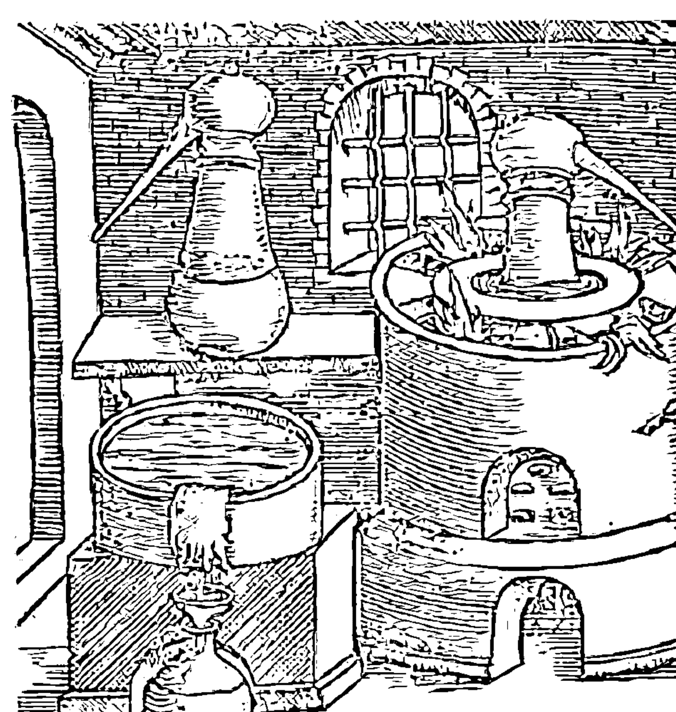

# Complete Guide to Alchemy

最後是盛接凝縮的物質。

◎sublimation：昇華，固體變成蒸氣，然後經過冷卻形成固體化凝縮物的過程。鍊金術師認為乾的物質經過火加熱產生揮發化，然後在容器的表面形成凝縮物；昇華對鍊金術師來說也象徵靈魂的升級。

◎tincture：染色液、艾略克希爾酵母、賢者之石。

◎tutia、tutis、tutty：不純之氧化鋅、粉狀之氧化鋅。

◎usifur：辰砂，從阿拉伯語（zanjifar）演變來的。

◎vessel：在其中製作艾略克希爾酵母的容器，也叫作哲學之卵。

◎volatile：揮發性，代表氣化上升的傾向。

◎white arsenic：三酸化砒霜、白砒霜。

◎white water：指水銀。
