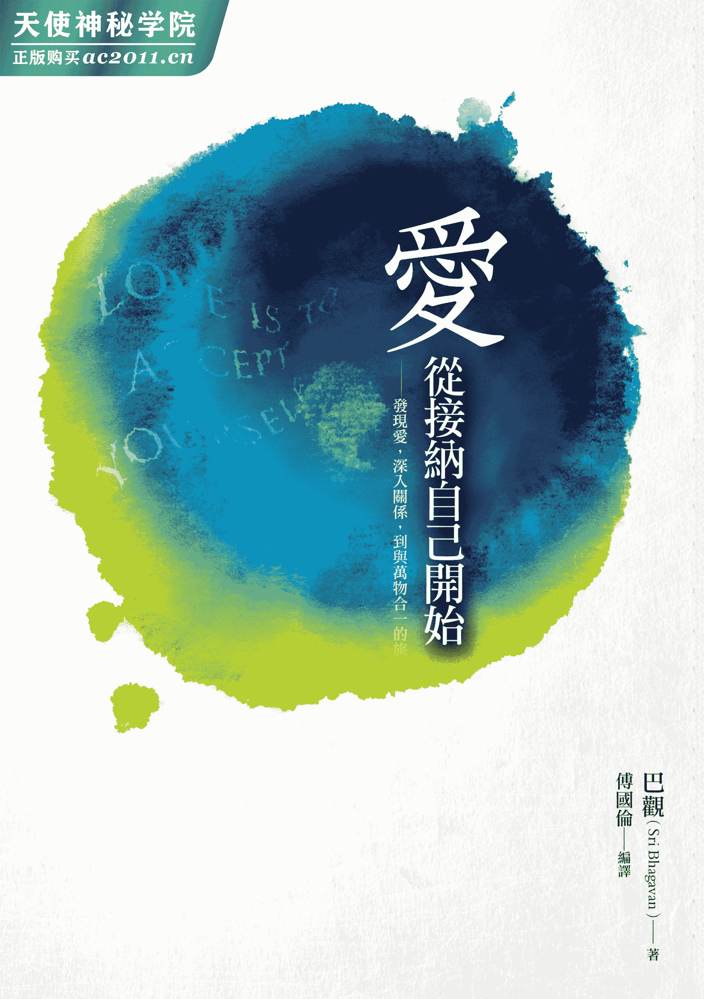
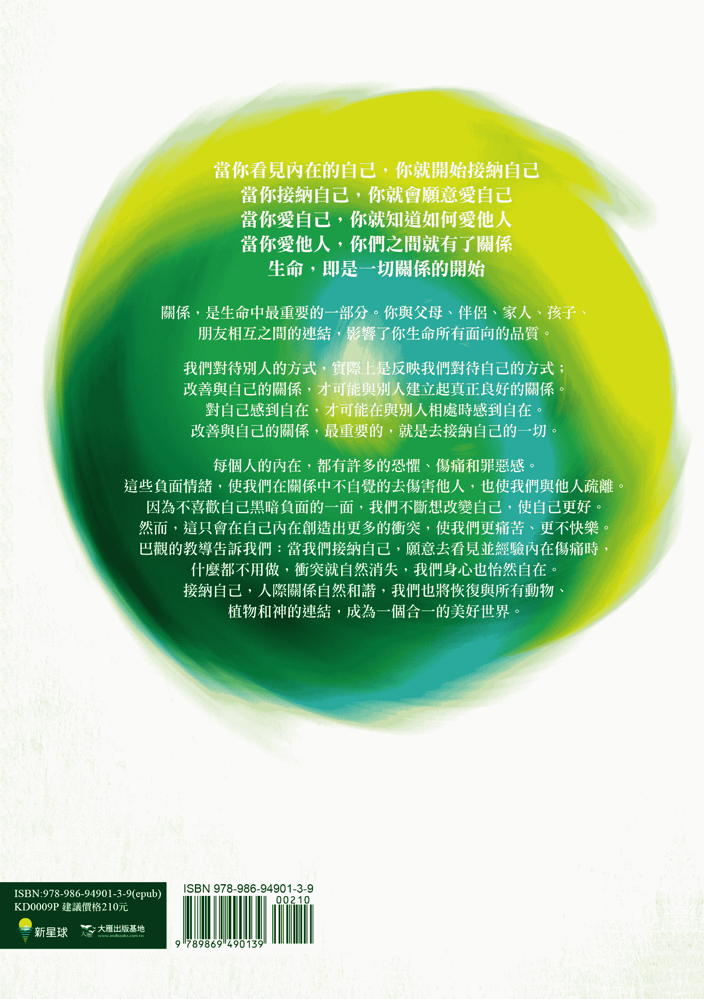

## 推荐序一没有任何问题的发生，只有受苦与否的存在

王庆玲／身心灵辅导工作者暨两性专栏作家

有人说，我们活在一个最富饶的时代，却也是心灵最受苦的时代。小至个人的关系与生活、工作与金钱，大至社会国家与世界的所有现象，都能够牵动我们每一刻的心灵品质。

每个人都在找寻一个能带来身心平衡的幸福人生，于是，每个追求的背后都有着深层的迫求与期待，伴随着不曾中断过的恐惧，缠绕着所有面向的自我。

仍记得二〇〇八年一度想要寻短，那一年是我人生、事业、家庭最高峰的时刻，而我却非常痛苦于一切关系。带着一颗崩坏的心和“死马当活马医”的最后心情，我与先生踏上了合一之旅，并前后五次在印度合一大学里深度的疗愈和提升自己，同时也书写三本以合一教导为基础的关系疗愈系列书籍。

因此，收到国伦这本《爱，从接纳自己开始》，我非常的欣喜与感动，每个字句间充满着印度合一大学的生命真理，更甚的说，我又被带回到印度最神圣的醒悟过程之中。每读一篇章，更加深的意识到生命最奥秘的仍是经验的本身，而我们都是最奥秘的经验者，也是没有任何需要被“换掉”的完整体验者。

诚如书名：爱，从接纳自己开始！这也是我在广播与杂志专栏中，最有共鸣与分享的观点：如实的成为自己，如实的经验每个自己，爱与喜悦是自动发生的转化过程。

很荣幸能成为合一生命教导的管道，更荣幸能推荐这本精准细腻又容易阅读的灵性之书，并合十感恩生命每一刻的美好！

## 推荐序二先爱自己，才更有能量去爱别人

夏韵芬／电视、广播节目主持人

也许因为是长女、长媳，又或者打小就是班长，出社会就是组长、总编辑、主持人，我很早就学会要爱家人、朋友、同学、同事。我学习爱，也学习承担，从不觉得累。我的脑袋清楚的告诉自己：无论是为了工作或家庭，我都不能倒下去！父亲突然生病、母亲面对癌症的威胁、公公去世，我都要含着眼泪撑住悲戚的身躯，认为只有我才能够处理这一切。回想起自己第一次的去职，不舍痛哭，因我认为自己的离职，一定会让报社关门倒闭。事实上，我这些忧虑并没有发生！

一场车祸发生，我终于倒下。经历开刀、住院、复健的长期疗程，原本以为复原了，却没有想到钢钉断裂，我又再度陷入无助的深渊中，所有的苦痛都必须重来一次。我怨天尤人、哭喊老天没眼，然而长达两年的休养，让我见证到，我过去根本没有好好爱自己，以至于爱人的能量也是短暂且气虚，容易变换。在等待身体复原的阶段，我的心灵也修复了。

我发现，太多现代人跟我一样，就算人生经历丰富，但还没有学会爱自己。本书一开始，映入眼里的那几句话：“当你看见自己，你就会接纳自己；当你接纳自己时，你就会爱自己；当你爱自己，你就会爱别人……”我现在才知道，以前以为自己很博爱，事实上很虚幻。现在的我，更有能量爱别人，因为，我学会了爱自己！期待您也早日有这样的体认。

## 推荐序三踏上爱的灵性之旅

杨克平／美国密歇根大学哲学博士

我们的一生，打从出生开始，就在学习爱。学习如何接受爱，如何给予爱。没有爱，生命根本不存在，我们也无法存活。巴观，我挚爱的生命导师，透过他的谆谆教诲，让我们见到爱的本质、见到我们与自己的关系。“生命就是关系”，所有的关系都源自与本身的关系，“爱”亦源自于爱自己。爱既不神秘，亦不难懂；祂就是你、是我、是整个宇宙，祂就是接受。感谢国伦的悉心整理。翻开这本书，准备好踏上这令人赞叹的、爱的灵性之旅吧！

## 推荐序四从疗愈到觉醒之路的旅程

颜德松／中华民国国际宇宙能健康协会理事长

从年轻时，生命是一场疗愈伤痛的过程，生命是不断面对过去伤痛的恐惧，不断宽恕放下，不断净化释放内在的伤痛，寻求内在的宁静与和平。于是，我参加了十多年大大小小的心理疗愈工作坊。直到七年前，有机缘去了几趟印度合一大学，才了解到内在表意识和潜意识的合一，内在身心灵的合一，可以透过宇宙能量合一祝福（Deeksha）的传递，以及内在觉醒的发生而轻易达成。当你觉醒时，你可以自由自在的活在当下，你可以如实如是经验生活的每个片段，你可以不受思想或头脑控制的生活着，你可以无条件的爱，感受无条件的喜悦；也可以在喜悦中与自己和每一个人链接，更可以与大自然和神全然的合一。

巴观说：“生命就是关系。”当你改善你和父母的关系时，你与自己的关系、你与伴侣、孩子、亲友的关系就会自动改善。“改善”意味着接受他们原来的样貌，当你全然接受你的父母，就表示你也能全然接受你自己，接受生命中每个人，然后，你就会谦卑的接受大自然、接受神。当你与父母的关系改善了，恩典自会透过他们流向你，所有的事情也会跟着改善；你的生命中，变成只有爱，只有喜悦，只有恩典和祝福……

巴观不仅是一位推动人类觉醒的伟大开悟导师，同时也是一位很有见地的心理学大师。这本书从心理学的角度、从觉醒的角度，很详实记载印度灵性大师巴观的教导和印度合一运动的精神。这是一本给去过印度合一大学的学生，不可多得的参考书；也是给没有去过合一大学，有心改变自己，追求内在和平喜悦的求道者；或是寻求身心灵合一，不再受苦于混乱关系，不再受苦于内在创伤的一般读者。这是一本很重要的书，能够帮助你改变并提升你的意识。

编译傅国伦是我多年来在印度合一大学，一起学习成长的同学。多年来，我一直看到他对印度合一教导的执着和热情，也看到他的成长与成果。这本书翻译的精准，源自于国伦兄对巴观教导的深刻理解。在此，我给予这本书以及巴观对推动人类觉醒的愿景最大的祝福。

## 编译序当内在的冲突消失了，你才能创造爱与喜悦的关系

在我们每天的日常生活中，几乎无时无刻不在与人接触，从家人、同事、朋友，到司机、厨师和各行各业的服务人员。借由许许多多人的帮助，我们才可以过着顺利、舒适的生活。我们生活在一个群居的社会中，人与人之间关系的品质很大程度决定了生活经验的水准，因此与人们拥有良好的关系显得非常重要。

一旦关系卡住了，我们在人生的旅途上就会感到孤单。在快乐的时刻，没有人可以一起分享喜悦；在艰困的时刻，也没有人相伴，共同走过人生的低谷。在工作中，常常觉得孤立无援，无法成就更大的事情；我们需要集结许多人的不同专长，才可以创造出美好的成果。

当我们想改善关系时，会试着对别人说好话，做出友好的行为，表达善意。但我们对待别人的方式，实际上是反映我们对待自己的方式；除非改善与自己的关系，才可能与别人创建起真正良好的关系。除非对自己感到自在，才可能在与别人相处时感到自在。改善与自己的关系，最重要的，就是去接纳自己的一切。

### 压抑不是解决负面情绪的方法

每个人或多或少都有一些对自己感到不满意的部分，可能是外表、能力、财富、地位、经历或背景等，每当我们一想到这些不喜欢的部分时，就会觉得极不舒服，于是尽可能的想去避免这种不舒服的感觉。

我们努力打扮自己，增强能力，获得更杰出的表现。有时，觉得自己成功了，别人开始用迥然不同的态度对待我们，让我们也觉得自己变得不太一样了。但在某个时刻，又经历了失败，因为人不可能永远维持完美的表现。我们发现自己内在的那种痛苦又浮现了，原来它一直都在我们的内在。痛苦一直在内在啃噬我们，侵蚀我们。每当外在的情况不尽完美时，内在的伤痛就会再次浮现。我们似乎始终逃不出内在痛苦的魔爪。

### 化解内在的伤痛，用正面方式满足自我

接纳自己，是去看见与面对我们内在那些不舒服的情绪，它可能是恐惧、羞愧、伤痛、孤独。我们多多少少都意识到自己内在这些丑陋的部分。因为害怕别人看见我们丑陋、难堪的真实样貌，以至于害怕与人亲近，害怕有太亲密的关系。我们对内在那种不舒服的感觉，感到不知所措，不晓得该如何处理。

这些负面的情绪，是在我们的生命过程中，不断累积形成的。每一次，我们被别人批评、嘲笑时，由于不喜欢这种不舒服的感觉，于是去压抑感觉到的伤痛、恐惧或羞辱。但这些负面情绪并没有因为刻意的压抑与忽略而消失了，相反的，在我们的内在不断累积。于是，你发现随着年岁渐增，内在所背负的痛苦也越来越沉重了。由于你对负面情绪的压抑，你其实一直在麻痹自己的感觉，渐渐的，你也丧失了敏感度，不再能感受到单纯的喜悦，也完全看不见世界的美。

接纳自己，就是去拥抱自己内在的黑暗面，面对自己内在各种不舒服的感觉，面对自己的负面情绪。当你去看见自己内在的伤痛时，一开始，你会觉得非常痛苦，很想再次逃开；但如果可以试着与这种不舒服的感觉待在一起，它就会逐渐的化解了。每一次你经验自己内在的痛苦，它就会一点一滴的消失。直到不再害怕看见自己的负面情绪，越来越能够面对它、觉知它、经验它，与它待在一起时，这些负面情绪就会逐渐离开，不再困扰我们。

内在的伤痛逐渐消失后，你会发现对自己感到越来越自在；因为你再也没有什么需要去隐藏的了，也没有什么需要去闪躲的了，你就能自在的做自己。当可以自在的和别人相处时，你很容易就可以与人们有链接，和他们创建良好的关系。

你的每一份关系都会自然的获得改善。并不是因为你刻意去做什么来改善关系，而是你的喜悦扩散开来，使得原本关系中存在的问题，不再是问题了。许多关系发生问题，都是由于对彼此的批评，造成了关系之间的伤痛。当我们接纳自己时，自然就可以接纳别人。对人有更多的宽容，能欣赏他们的独特性，不再去批评别人。如果你细心观察，会发现你批评别人的地方，总是来自于你对自己的批判之处，也就是还没有接纳自己的部分。别人的特质或行为，一再唤起了你内在的某些恐惧或伤痛。因为你内在那些不舒服的感觉，导致你转而想去批评别人，这举动也造成了别人的伤痛，更破坏了彼此之间的关系。

### 用正面方式满足自我

接纳自己的另一个部分是：人都有许多的渴望，希望可以得到所想要的一切事物。我们总是为自己着想，希望美好的事情都可以发生在自己身上。有时我们很快乐的去满足自己，但“自私自利”的负面评价却忽然闪过脑际，于是又开始批判自己，觉得这么做实在太自私了，便不断压抑自己的渴望。

但是如果我们能接纳自己的渴望，并用健康的方式去满足这些渴望；当渴望得到满足时，渴望就消失了。奇妙的是，我们很自然的就会开始想去帮助别人，对人类、对世界会有更多的关怀。

有时候，我们会用负面的方式去满足自我、表达自我。这是因为我们内在有一些伤痛；伤痛使我们用破坏性的方式去满足自我，并造成自己与别人的伤害。面对与经验内在的伤痛，将伤痛化解后，自然就可以用正面的方式来满足自我。

### 用力改变只会耗尽能量

透过接纳自己，我们并不会如许多人担心的就是停留在“原本的状态”。当接纳自己时，内在的冲突就消失了，我们变得喜悦。随着喜悦，爱就在内在绽放了，智慧就在内在绽放了。只有当自己有了爱和喜悦时，才能与别人分享。

越是努力去改变自己、批判自己，只是在自己内在制造更多的冲突，使自己卡在“原本的状态”中。因为内在的冲突不断，于是耗尽了能量，而使我们变成痛苦、不快乐的人。

巴观说：“快乐的人创造快乐的世界，不快乐的人造成别人的痛苦。”

当你接纳自己，你内在的冲突就消失了！会对自己感到很自在，也会自然的接纳身边的每一个人，和别人的关系也跟着改善。当你在家庭和工作场所中都拥有更和谐美好的关系时，你的生命也会更加满足、具有意义。

# 前言对爱的追寻

在关系中有两种主要的需求，也就是“爱”与“被爱”的需求。我们在生命中所做的一切，所有的成就、地位都是在追求这两种需求。

## 会无条件爱你的人在哪里？

让我们先来看看第二种需求——“被爱”的需求。看进你的心，从你意识到自己的那天开始，你就在寻找会无条件爱你的人。无论你是或不是什么、漂亮与否、聪明或愚笨，你都在寻找会热情的爱你，而且只爱你的人。

小时候，你从父母亲或养育你的人寻求这份爱。你希望从生命一开始，就是被父母全然与热情的爱着，希望他们在这世界上最爱的就是你。你很快乐的相信这一点。在你流了口水、对着餐桌打嗝、吐出食物时，每个人都笑着说，你是多么可爱啊！有天晚餐时，你看到父母亲更注意年幼的弟弟，一个忧伤的念头闪过脑际：“他们不是我独有的了，也许爸爸妈妈更爱弟弟。”于是，你再次发出笑声、打嗝、将果冻吐到地板上，试探着。这次，母亲却告诉你要长大了，她厌倦清理你的烂摊子。但你的弟弟这时打嗝，打翻了豌豆，每个人都依然拍手和大笑。你对爱的追求，痛苦的失败了。你了解到要父母只爱你一个人是不可能的，于是你到其他地方寻找爱。

你到学校中，寻找爱你、而且只会全然爱你的朋友。你找到了她，她是你最好的朋友。但有一天，你看到她拥抱着自己的妹妹，她们丢下你，两人一起去看电影。你再一次看到追寻失败了。于是你转向老师，成为他最优秀的学生；直到有一天你得了丙，老师狠狠的骂了你，对爱的追求又再次走进死胡同。后来，你遇到了生命伴侣，你对自己说：“是的，他会热情的爱着我，至死方休。”有一段时间，你在那份爱里很安全；直到你们结婚了，在家庭纷争中，他却站在自己母亲那一边；而且他越来越喜欢待在办公室，而不是在家里。

你生一个孩子。“啊！”你心想：“我会以爱灌溉他，然后他就会完全的爱我，而且只爱我一个人。”你快乐了一段时间。但当你抱起婴儿时，他放声大哭，而且显然更喜欢被你丈夫、你妹妹、杂货店的陌生人，或几乎其他任何人抱着，但就是不喜欢被你抱。所以你又生了另一个孩子，这次一切都很好；直到他八岁了，不再喜欢父母的陪伴。后来，你的孙子诞生了，有一天他也不再肯花时间与你在一起。也许你开始养宠物，继续追寻爱。不断的追求那个爱你，而且只爱你的人。

全然去爱与被爱的这种需求，不断的驱使你。然而不知怎么的，你从来没有遇到全然爱你的人。有一、两个时刻你仿佛经验到了，但当你想永远保有这份爱时，心却又破碎了，爱就这样悄然的滑过指间，消失了。我们永远无法从别人经验到全然的爱。

## 失去的恐惧，让你不断乞讨爱

看一看你生活中所有的渴望，想变得更漂亮、更聪明、更强壮的渴望，想变成最好、最完美的渴望，想要成为有爱心、善良、能服务人群的渴望，想把事情做得尽善尽美的渴望，或是想成为富翁、有钱捐助别人的渴望……如果你看得非常深，会发现，这些渴望基本上都是一种想要被爱的渴望。**“如果你成为你所渴望的这些特质，你就会被爱”的信念利用了你，使你处在“真实的样子”与“想成为的样子”的不断冲突之中。**

看看你今天刚买的那件美丽衣裳，你多么小心翼翼的装扮，梳理你的头发。这行为背后的想法是什么？你是不是觉得如果你更漂亮一些，就会得到更多的爱？你为什么去上那些心灵课程，收集一张张灵修证书？你是不是觉得如果你成为更好的人，你就会得到更多的爱？当超市收银员请你捐款给一个你不曾特别关注的慈善团体，而你也真的没有闲钱，却还是点头说“好”时，这是出于慈悲？还是认为收银员和排在你后面的人，会因你的善行而给你一个爱与尊重的眼光？

就是去看见这些。

奇怪的是，虽然我们一直是在追求与渴望爱之中；如果你真的看进你的生命，可能会发现你从来没有全然被爱的经验。在这世界上，没有人可以说他们被另一个人无条件的爱着；因为，**在你内心深处有股空虚，拒绝相信你是被爱的。即使当你真的被爱时，那股空虚感，那种对失去爱的极度恐惧，使你仍旧保持在乞讨爱的状态。**

你需要不断的感觉被爱，因此你往往在关系中怀着占有欲。当爱是占有时，就会恐惧丧失爱。你破坏了自己与其他人的自由；控制或占有别人，就像把别人视为一件物品，这导致了彼此的痛苦。你经常为了所谓的“真爱”而去测试亲近的人，最后只感到不满与愤怒。真相是：你不爱自己，关系是爱自己的手段，你试图透过关系来满足自己。

## 爱只能透过接纳自己发现

巴观说：“**良好的关系从自己开始，而不是从别人开始。**”一切的爱都只能从爱自己开始。了解到你只能对别人做你对自己做的事情。沉思其中之道，就会明白你与自己链接的方式，正是你与别人链接的方式。如果你谴责、批判自己的每个思想、话语与行动，必然也会对别人做出相同的事情。如果你被自己的缺点所困扰，也会因为人们的缺点而折磨他们。

要有良好的关系，非常重要的是：一个人，必须先接纳自己；接纳自己的身体、童年、过往、能力，以及所有的情绪和人格面向。除非你能够接纳自己，否则你无法接纳别人。除非你能够爱自己，否则你无法爱别人。一旦你可以与自己和平共处，你几乎在所有的关系中都能找到平静。当你可以看见自己，接纳自己真实的样子，爱自己真实的样子时；很自然的，别人就会看见你真实的样子，接纳你真实的样子，爱你真实的样子。

# 第一章发现爱的旅程

爱不是依赖，爱不是占有，爱不是控制某人，爱不是利用某人……爱不是一切你所认为的。你无法知道爱是什么，但你可以经验爱。

巴观说：“生命就是关系。”这意味着，正是“关系”赋予了我们每个人存在的意义与目的。你可以有钱、有名，你可以是聪明与慷慨的，但没有了关系，你生命中就会有缺少了什么的感觉；无论你拥有什么，你都会感到很贫乏。

良好的关系不仅是相处，而是没有恐惧与罪恶感的链接。在没有这些负面链接的关系中，你可以如你所是的做自己，也能让别人可以完全的做他自己，如实的接纳对方，让彼此有做自己的自由。

当我们在关系中发现更深的链接与合一时，生命就会成为更令人满足的经验。

## 清楚觉知到你缺乏爱

在我们的每一段关系中，都有一种奇怪的不安，有时是罪恶感，那是因为在内心深处我们都知道自己是自私的，知道我们为了自己的空虚与需求，而利用了别人。

◆　◆　◆

一位朋友在周末打电话给你，“你在做什么？”他问道。你告诉他正将一台钢琴搬上五楼。“我可以过去吗？我会帮忙。”他说。他很孤单，所以宁愿在七月中旬的大热天里，把一台沉重的钢琴搬上五楼，而不是独自一个人。你说：“当然！很高兴看到你。”默默的松了一口气，因为你可以利用他，帮你搬钢琴。

看看你的生活。你为什么像个仆人一般的服侍你家人？忙着做饭、清理、接送，而且一直保持微笑。你为什么加班？买漂亮的东西送给妻子。这是真实的吗？

母亲不断鼓励孩子成为伟大的人，她透过孩子而生活，希望透过孩子经验到在自己的生命中没有经验到的部分。父亲唆使孩子在运动上有杰出表现。老师希望学生成为最优秀的。**在内心深处，我们都知道我们在利用别人的生命，满足自己的需求。**母亲没有在自己的生活中实现的愿望，她希望孩子能为她实现。我们希望我们的孩子带给我们荣耀。在内心深处，我们都知道这一点，即使我们拒绝接受这点。我们知道自己在关系中是自私的，也知道尽管别人多么美好，我们都无法全然、彻底、完全的爱着那个人。这些关系或看似无条件的爱，其实往往因为一项过失、一句话语、一个动作、一次怠惰，就立即变调了。每个人都谨慎行事，使关系成了一场费心经营的表演。

我们内心深处有个疑问：“为什么我不能全然的爱着这个人？原因是什么？即使我那么努力，为什么我还是不能融入别人？”你纳闷道：“为什么一段时间之后，我的每段关系都会变得烦闷？为什么我开始视别人为理所当然？”

这份对爱的需求，根深柢固持续的存在于内心之中。尽管有伴侣、孩子、孙子，在一起经历了十年、二十年、三十年……有些人还养过三只狗、五只猫，这股匮乏仍然存在。因为这份爱还是没有被完成，心中的空虚依然存在。

问自己以下的问题：我可以对此做些什么吗？对于这缺乏爱的内在情况，你可以对它做些什么？如果你决定透过努力来爱，这可能吗？你能将爱装入你的心，再发自内心去爱吗？如果你决定今天要开始实践爱、假装有爱，直到成为那样，这有可能吗？**“实践爱”是一个死的东西，就像“实践美德”一样，是个恐怖的表演，它来自于头脑、产生于思想，而不是源自于你内心的情感。**政策性的实践宽恕，理念性的实践和平，有教养的实践爱，这些都是没有生命的、无用的。而且如果练习的时间过长，你可能会变得高度改造过了。你会觉得自己是觉醒的或灵性进化的，因为你不再感到愤怒、憎恨、嫉妒等负面情绪。但事实是，在高度改造的状态中，你几乎什么都感觉不到，你变得像行尸走肉似的，麻木不仁。你为什么要削减情绪的经验？情绪是活生生的。

巴观说：“我们所说的爱是无法被形容的，它必须被经验，谈它是没有用的，因为你所知道的一切都是有条件的，而我所说的爱是完全没有条件、没有理由、没有原因的，爱就是存在。**当你发现爱时，你也会发现链接**，你感觉与父母、兄弟、姊妹、朋友，以及世界上的每一个人都有链接。现在你并没有这种链接，这就是为什么我说‘每个人都是孤儿’。”

清楚觉知到你生命中缺乏爱，觉知到你现在的状态，这对于发现爱，是至关重要的。你看见它，与它在一起，不要离开它，与现在这种缺乏爱的痛苦状态在一起。最重要的课题，是爱的课题。当你发现爱时，爱才会松开你。除非你通过了这项测验，否则你无法前进。没有发现爱的生命，会变得像一滩泥泞；发现爱的生命，就会变成一股流，这是无始的开始，也是无终的结束。

## 伤痛毁坏关系

你经验到的快乐，与你关系的状态成正比；你的关系越好，你就会越快乐。快乐的人散播快乐，不快乐的人只会造成别人的伤害，往往为家庭和整个社会带来麻烦。关系中所有的问题，基本上都可以追溯到伤痛。你不是伤害别人，就是被别人伤害。

有人曾经告诉印度合一大学的指导老师：“起先我们夫妻的关系是‘我说，他听’；之后是‘他说，我听’；现在则是‘我们俩说，邻居听’。”这似乎是大多数关系的共通现象。有的人说：“我和另一半是灵魂伴侣。”在追求伴侣时，他感觉与伴侣有神圣的链接；然而在新婚六个月之后，他们的婚姻关系就破裂了。为什么会发生这种事情？除了与伴侣的关系，会变成如此之外，还有与朋友的关系，或是任何深交的关系，也会改变。为什么任何关系总会随着时间恶化？

在许多原因中，最重要的是伤痛的累积，在伴侣关系中尤其是这样。伤痛是如何开始的？它可能以很无害的方式发生，也许起初只是一点点的意见不和，或轻微的争吵。你感觉到不舒服，或不被重视。无论那是什么，你经验到不安与不和谐的感觉，这是冲突的第一个征兆。然而，人们不知道如何处理这份不安，于是任它与日俱增。

在第二个阶段，头脑会对事物创造出既定的印象，它倾向于对所有的人事物都创建起印象。头脑总是需要得到结论，并从中得到确定感。印象，基本上是固定的。你把一个活生生、一直在变化的人放进一只箱子中，并假定这就是他。于是，印象开始起作用，真正的人退到了背景，彼此的关系就产生了距离。人们依然不知道如何处理逐渐增加的距离。

在第三个阶段，这些印象变成很强的批判。不可避免的，你的行为、态度、话语中，都流露出批判。之后，你就会开始质疑对方的意图。一旦到了意图的层次，要疗愈关系就会变得非常困难。如果仅是行为的问题，处理起来还算容易。但一旦质疑起对方的意图，伤痛就非常深了。人们还是不知道该如何处理这样的情况。

在下一个阶段，你们不是分开了，就是对彼此漠不关心。冷漠是关系中最糟糕的情况。你筑起一道石墙，把自己隔开，保持沉默，漠视你经验到的任何痛苦感觉。因为你是如此害怕对方，很害怕对方造成你的痛苦，所以选择忽视对方。

现在可以说，这段关系实际上已经结束了。有些人，在他们进入的许多段关系中不断重演这种模式，每六个月、每一年、每三年就重演一次。看起来似乎是你一直没有遇到对的或适合你类型的人，于是你重新出发去寻找新的伴侣。虽然有的伴侣可能真的有问题，但大多数的情况，不过是因为人们不知道该如何处理自己的伤痛、情绪、恐惧和抗拒。除非你处理了这些情绪，学会处理的技巧，否则很难拥有长久与滋养的关系。

## 全然经验伤痛，伤痛就会化解

当你感到受伤时，该如何处理内在的伤痛？例如，某个人伤害了你，造成你的痛苦，因为他批评错不在你的事情、指责你并没有做的事情，或不感激你的贡献，也许是不爱你或不重视你。你该如何处理这些伤痛？化解这些痛苦？你能对痛苦做什么？我们总是试图管理痛苦，为痛苦辩解，将它合理化。

你尝试管理痛苦，将它堆到地毯底下，但你并没有因此免于痛苦，你只是在管理痛苦。当你又看到让你联想起曾造成你痛苦的人时，整出剧情就会再次重演，你就会再做一次和当初相同的事情，任何让你可以逃避这份痛苦的事情，例如吃东西、聊天、静心、工作、跑步等等。这就是当我们感觉到痛苦时，所做的事情。无论做什么事来逃避痛苦，伤痛仍然存在，它会不断的发展，并且在一天后、一星期后或一个月后，再次浮现。当你正轻松的度假，吃着冰淇淋时，痛苦又不期然的再次浮现。

当伤痛消失，不再有恐惧时，人们才可以与彼此有很好的链接。

该怎么处理痛苦？你有几个选择：

1.  管理痛苦。
2.  逃避痛苦。
3.  面对痛苦，与痛苦待在一起，全然的经验痛苦，接纳它，拥抱它。

管理痛苦或逃避痛苦，并不是解决痛苦之道。当你面对痛苦，全然的经验伤痛时，它可能会让人不舒服一段时间，但之后你就会发现自由了，因为伤痛移动，转化了。

下一次你感觉到伤痛，在指责别人或经验伤痛之间犹疑不定时，试着将注意力放在伤痛上，不要忽视它，也绝对不要延迟，就在当下行动。请记住，每次当伤痛浮现时，都是一个让你去清理伤痛的机会。把握机会，在那一刻与伤痛接触，不要延迟。你可以尝试使用一幅影像，利如一面网子，抓住伤痛，围绕它，感觉它，看着它，拥抱它。

如果当伤痛浮现时，你没有在那一刻抓住机会，它可能就会再次深深的沉入内在，停留于内在很长一段时间，而且有可能不会再浮现，但依然在无意识中影响着你的生活。

**当伤痛来临时，将注意力放在伤痛上，首先觉知到它是什么：伤痛、恐惧、罪恶感或羞耻，然后全然的接纳伤痛，感觉它，最后伤痛就会消失，转化为喜悦与自由。**

就像你突然看到一条蛇在你面前，你吓坏了，但当你往前一步，更近的再看一次时，发现它不过是一条绳子。恐惧，要过多久才会消失？其实，在你看见的那一刻，恐惧就消失了。

相信你确实能从伤痛中解脱，可以支持转化。

◆　◆　◆

有次在合一的课程中，有名学员突然大喊：“成功了！成功了！”每个人都很好奇，他在叫什么？

他向大家解释，在此之前，当痛苦的时候，他总是需要证明别人是错的。这是他处理问题的方式，总是在支配别人，去证明别人是错的。他是一位非常成功的人士。有一天，他温柔纯真的家人，非常出乎意料的造成他的痛苦，伤害他很深。他非常震惊，他很容易就可以用过去支配家人的方式来反应，但他并没有，这次当他受伤的时候，从合一的课程中学会与痛苦待在一起。

在看着痛苦，拥抱它时，他看见痛苦就消失了百分之八十，直到突然有场董事会会议要出席（他在办公室），当他回来再次拥抱痛苦，以清除其余的百分之二十时，他自发性的经历了一阵喜悦。现在他不再害怕痛苦或受到伤害了，因为他可以像是一只母鸡，坐在蛋上面，直到蛋孵化。

这是信任，一旦你拥有了这美丽的、神圣的经验，你就不会再退回去了。而**能从经验痛苦，产生信任，并发现喜悦。有了这层新的信任，你就不会再害怕痛苦了。**

生命不断的带给你痛苦，除非你知道如何处理痛苦，否则你的内在会变得僵硬、死亡。当内在死亡时，所有的疾病就产生了，所有的痛苦都是从内在开始的，所有外在的问题也是从内在开始的。

巴观说：“无论发生了什么，假如你能够全然去经验，你就会发现无限的喜悦。有这么多的喜悦时会发生什么？喜悦不会停在那里，喜悦会转化为爱。只有快乐与喜悦的人，能真正去爱；不快乐的人无法去爱，那样的爱只不过是依赖、占有。**真爱，只能源自于真实的喜悦。**唯有当你经验内在所发生的一切时，真正的喜悦才会来临。这并不会很困难。”

所有的挑战和危机都是信任的机会。你看到挑战，做出努力去回应它，最后超越它，绽放就发生了。

## 接受别人的独特性

我们一直都想改变别人，试着让别人符合我们的概念。即使我们成功改变了一个人，生命中还有许许多多的其他人，需要我们去改变，因此，这是个徒劳的努力。

**我们永远无法借由相互了解来稳固一段关系。这是一个很大的迷思！我们永远无法真正的了解别人，因为我们甚至无法完全的了解自己。**我们不了解自己为什么以这样的方式行动。全然了解，这是不可能的。

首先你必须了解你是什么，许多因素决定了你是怎么样的人：例如，受孕时父母的意图，诞生的时刻与地点，在母亲子宫内的经验，你进入世界的那一刻所听到、看到与感觉到的，你身体的体质，幼儿期的经验，宗教、政治与社会的制约，以及所受到的教养。甚至你与父母看过的电影与书籍，以及学校、老师、朋友、前世。所有这些因素组合在一起就是你，它们共同创造了你。你的谈话、观点与关系，是所有这些因素的结果。你看待与经验神、大自然以及宇宙的方式，取决于这些因素。所有这些因素创造出你透过它来经验生命的滤镜；就像戴着绿色的滤镜，绿色成了“你的观点”，因为你透过它来看生活。

而对你的伴侣而言，随着他所有的因素，他就像戴着橙色的滤镜。当你说：“这张桌子应该放在这里，你看不出来吗？这么明显！”那是因为你是透过绿色的滤镜在看。而你的伴侣说：“噢，不，它应该放在那里，你看不出来吗？桌子显然应该放在那里！”对他而言，桌子显然应该放在那里，因为他是透过橙色的滤镜在看。谁对？谁错？你不断的感到沮丧和抱怨：“为什么他看不出来应该放在这里？这么简单。”

你们两人都以各自的“显然这样”来沟通，对你来说“显然的事情”对他却永远不是如此。你必须了解与意识到，你与他是不同的，因为你们都受到无数因素的影响。对你而言，看来真实与显然的，别人看来却是不同的。我们浪费了许多时间与精力，试图让别人看到我们所看到的，努力向别人解释我们如何了解与看待事情，希望获得他们的同意。既然我们的观点是透过这些滤镜，就永远看不到彼此的现实，那如何了解彼此呢？有时，你假装你能了解，“是的，我了解你的意思”。但你无法一直都能了解别人，只在某些时候可以。

如果我们试图透过了解彼此来改善关系，这方式永远不会有效。试图了解别人，你只是不断的伤害自己。当我们被误解时，我们变得不快乐，别人接收了我们痛苦的感觉，于是又造成我们更加不快乐，成了恶性循环。

要接纳别人，首先你必须先接纳自己。知道你透过自己的滤镜在经验世界，你也知道别人透过他们的滤镜在经验世界，没有谁对谁错。随着这份了解，你就会接纳别人。学习欣赏他的观点，他就会欣赏你的观点。

**巴观说：“当你接纳与经验别人真实的样子，这就是爱的诞生。”当你不再想去改变别人时，关系是美丽的，因为你了解了每个人的独特性。当你让别人做自己，不试图使别人符合你认为他应该是什么样子的概念时，你就给予别人在关系中做自己的空间。唯有当关系中有自由，允许彼此真正做自己时，喜悦与友谊才会存在。**

**巴观身边的小故事**

在巴观和阿玛过去共同创办的吉梵希然（Jeevashram）学校中，有一次聚会时，老师请孩子们分享生活中最难忘的经验。有个孩子分享了他最美的经验，就是他真的在内在里对自己有很好的感觉。他清晰的记得，这是非常独特的感觉，他觉得自己很好、很自在。

每个人都一直被其他人评价，听他们说：“你还可以更好。”即使他们不是你的父母。不是你希望评价别人或被别人评价，而是头脑在评价，这是头脑的习惯，这习惯就是头脑。你也在做完全一样的事情，你知道自己一直在评价别人，你也不太喜欢这样，但头脑一直在评价，你也一直被别人评价，这就是人的头脑。

那孩子说，在巴观身边是很不同的，因为巴观让每个人都完全的自在，他“所是”的样子是被爱的。这个孩子对自己的良好感觉，正反映如此。

## 关系是一面镜子，反映你内在的伤痛

在我们的整个生命中，我们与许多的关系链接，例如与父母、伴侣、孩子、朋友、同事及其他人的关系。在关系里，我们全部的情感都会展现出来，无论是正面的或负面的，快乐的或不快乐的情感，关系都会反映出我们的内在，帮助我们觉知到自己。

我们总认为自己在关系中的伤痛是别人造成的，尤其是当你觉得自己受到批判时。你一定遇过激怒你的人；你的伤痛确实在影响你，创造出你所有的情况。如果它已经成为你生命中的模式，如果你觉得有一个伤痛一而再、再而三的出现，那它肯定与其他人无关。无论你喜不喜欢，你的成功与失败，特别是你的人际关系，都被你的过去所限定。

被我们刻意忽略或压抑的伤痛，或者我们没意识到的，但确实在内在影响着我们的伤痛，往往都会在关系中浮现。这就是为什么关系是认识自己非常有效的工具。巴观说：“生命是认识自己的探索。”要认识自己，你需要一面镜子，**关系就是你的镜子。每一段你与别人的关系，都反映了你自己的某个面向**，它要不是反映出你真正的样子，就是反映出你有伤痛的面向，或你所憎恨的面向。

当你与亲爱的人、伴侣、子女、父母、朋友或商业伙伴起了争执时，你真正在对抗的是——你自己的阴影自我，你将它投射在那个人身上。你有没有注意到人们会批评朋友或工作场所的同事：“我讨厌他这么做，我讨厌他做事的方式。”其实，我们真正讨厌的是我们无意识阴影自我的那一面，也就是我们内在的创伤；这部分通常是被压抑的，现在被激发了。每当按下这颗“按钮”，我们的阴影部分就被刺激了；我们身边的人反映了这点。通常我们不希望看见它。

你越是忽略创伤，你就越被它耗尽；因为它会一直缠扰着你，让我们一直被思绪所占据。如果你可以将注意力放在创伤与痛苦上，倾听它、经验它，它就会消失了。举例来说，你现在感到悲伤，觉知到悲伤的存在，接纳它，允许自己去经验那份悲伤。除非悲伤被认出来并且承认它，否则就不会转化与移动。

巴观说：“**当你面对自己的阴影自我，接纳自己时，你内在的冲突就消失了。当冲突消失时，就会有能量。当有能量时，就会有喜悦。**”消除持续的冲突是一项内在的工作，这是我们每个人都必须不断在自己内在进行的。

## 接纳自己，你就会发现爱

每个文明、每种文化、每一宗教，都会创造一幅“完美的人”的图像，我们都不断的想达到其勾勒的理想画面。当我们长大时，我们意识到自己内在的这场战争，在我们真实的模样与我们想成为的典范之间，总是冲突不断。

我们在生命中都有一些价值观；由于种种原因，我们无法遵循这些价值观。我们都有幅对自己的影像，创造了一个“理想的我”，并不断试着使自己的行动与思想符合这些影像。当我们真实的样子与这些影像不同时，因为无法接纳它们，我们就创造出谎言，并开始相信这些谎言是真的。

◆　◆　◆

两名新结识的商人在完成一笔生意后，决定一起用餐，进一步讨论。聊起他们的大学时代，其中一人说：“我在大学时，曾是网球比赛的州冠军。”另一人刚好是网球爱好者和业余选手，对于发现另一位网球爱好者感到很兴奋。于是决定在体育俱乐部会面，进行一场比赛。

会面是在接下来的一周后。当比赛时，这位说自己曾是州冠军的商人，漏接了几个简单的球。“噢，天啊！我怎么会失误？”他惊讶的说道，在宣称曾是州冠军后，他显然对自己的差劲表现感到很难为情。随着比赛的展开，看到对手挥出一些经典的击球，他说：“我想我已经将近七年没打网球了。”比赛继续，他无法回击扣球，说道：“如果你没有持续练习，就会失去比赛的手感，你知道的。我应该由下往上去挥拍回击那一球。”他带着尴尬的笑容。在输了第一场比赛之后，他很不知所措，“奇怪！也许我老了，我的柔软度变差了！”

尽管事实仍然是他悲惨的输了，他对于他这个前州冠军，为什么那天表现的那么差劲，建构出了许多的理论和解释。因为无法面对与接受事实，他借由掩盖事实来安抚自己。

今日的人类就是生活在这样的恐惧中，在每件事中都感到恐惧，尤其是害怕失去长期创建的形象，害怕别人的想法，害怕别人发现关于我们的事情。但每当我们撒了一个谎，我们所害怕的事物就会增强。有没有想过潜伏在你心中的未知恐惧是什么？就是这个。

**接纳自己的第一个步骤，就是面对自己的真实。接纳自己，意味着友善的对待你真实的样子，自在的与你真实的样子在一起。**我们没有与自己和自己的本性自在的在一起，**我们总是试图成为什么，这就是问题所在。**成为你真实的样子，接纳你真实的样子，就是问题的解决方法。当你接纳自己时，会发生什么呢？当你接纳自己是个情绪化、敏感的人时，你就不再是这样的人了。转化自然会发生，你不用寻求它的发生，这就是接纳的力量，证明你已经接纳了自己。

唯有当我们面对自己的另一面时，内在才会自由。当我们知道自己真实的样子时，内在的冲突就消失了，平静就会来临。当你接纳了自己没被接纳与压抑的部分时，负面能量就释放了，问题就消失了，模式就化解了；于是，外在情况也会变得顺利，成功道路上的障碍跟着化解——因为外在世界仅是内在世界的显化。

你一直感到恐惧，在你所做的每件事情中都有恐惧，害怕失去长期创建的形象。当你第一次可以清楚的看见自己，看见自己所有的丑陋，然后对自己说：“这就是我真实的样子。”这时，你就免于恐惧了。当你可以接纳与拥抱自己真实的样子，你就从恐惧中解脱了。

当你有机会看见自己的全貌时，看见一切你害怕看见的，去接纳一切，甚至肮脏的自己。当机会来临时，如果你能感觉到你的恐惧，如果你不害怕看见它，如果你愿意去看见它、接纳它，甚至拥抱它，那就是自由，那将是你生命中第一次没有恐惧。当你如实的看见自己，不试图隐藏任何事物时，必定是个伟大的奇迹。

如果我们没有爱，试着去爱是没有意义的。我们不会借由改变自己而变得完美，我们是借由觉知与接纳自己真实的样子才变得完美。**爱的诞生，是去看见与接纳我们没有爱的事实，与这事实在一起。**在试着去爱之中，我们摧毁了自己与别人。人类的痛苦不是因为渴求名声或金钱，真正的痛苦是没有成为他真实的样子。如果我们不试着去变成什么，所有的冲突就消失了，能量就不会浪费，能量会一直保存着。

鼓励自己看见你真实的样子，然后当机会来临时，你就可以无所害怕的诚实看见自己。喜悦，并非如我们想像的，是个要去达成的事物；而是成为我们所是的样子。当我们是自己真实的样子时，转化就会发生，奇妙的平静就会来临。

巴观说：“**接纳自己是第一步，也是最后一步。无论你是谁，你都是独一无二的，宇宙将你创造成这个样子，神将你创造成这个样子。**”唯有当我们面对自己真实的样子时，我们才有可能对自己感到自在。当你内在的冲突消失时，你不仅接纳了自己，也接纳了别人；你不仅爱自己，也爱你周围的人。你会发现他们对你的行为也改变了。

**巴观身边的小故事**

巴观与阿玛创办的吉梵希然学校是一所非常特殊的学校，大多数的学校都将焦点放在职业生涯的训练上，但他们的学校专注于创造一个完整的人类。大部分的学校致力于创造出一名良好的医师或优秀的工程师，却有一个问题，就是当他们感到愤怒或恐惧时，他们不知道该怎么办；于是他们只能压抑这些感觉，因为他们不知道该做什么或如何处理它。这所学校与众不同的是，它能帮助孩子们学习到这些非常重要的事情，也让他们学会与人们的链接——这是大多数的人在离开学校时所丧失的。

有个男孩刚入学时，很容易就能交朋友、与人分享。他在学校的形象很好，是一位好学生、好孩子，老师视他为模范生。但当男孩到十四岁时，经历了从儿童过渡到青少年的阶段，这对他而言是非常困难的阶段。因为他看见自己的纯真消失了，他突然变得很有自我意识，想知道别人是怎么看他的，别人对他有什么感觉。他对朋友感到嫉妒，暗地里希望他们的成绩不好，他不断与别人作比较。小时候，他并不会这么想。他对自己的形象是一个优秀、慷慨的好学生，但他可以看见内在的自己并不是那样，他内在充满了贪婪、批判与淫秽的思想。他看见越多，就越痛苦。

他该说出真相吗？男孩开始在脑中与自己谈判，既然他与外在形象不符，那他该怎么办？他要独自在内在承受冲突，保持沉默，维持好形象？还是告诉大家真实的情形，告诉人们他是什么样子？他不知道哪个比较好。拥有美好的形象让他觉得快乐，但当他不是那样时，却必须以那个形象活着，让他非常痛苦。如果说出来，人们对他的美好形象都将消失，他该这么做吗？他非常害怕失去这一切。最后他决定和学校的校长巴观说，告诉巴观这是他真实的样子，他不是大家所认为的那样。

男孩一次又一次的走向校长办公室，想说出这一切，但他充满了恐惧，在到达之前，就放弃了。每次尝试时，他都认为自己是勇敢的，他都告诉自己这次他就会说出来。他想告诉巴观，却做不到，他不断的拖延。在第四次时，他发现校长办公室的门是敞开的，巴观看到了他，问道：“孩子，有什么事情吗？”他不能再拖延了。

男孩走进校长办公室，在改变心意之前，一鼓作气的告诉巴观，他多么嫉妒，多么自我意识，一直将自己和别人作比较，批判别人，而且思想很淫秽。巴观静静的听着他说话，仿佛他是告诉巴观：“我今天早餐吃了煎饼。”巴观是如此冷静。男孩原本以为说出这些丑恶的事情，巴观会很震惊、生气、不高兴。最后，巴观对他说：“既然你知道自己是什么样子，何不到大岩石那边，大声唱出‘这就是我真实的样子’？”

这是一座美丽的校园，到处都有许多的岩石与石块。

于是，男孩就这么做了。他爬到校园最大的岩石上，大声的、钜细靡遗的唱出关于他的丑陋自我的美丽歌曲。男孩记得那是他最后一次内在感到冲突。令人惊讶的是，他的思想并没有改变，他仍然有同样的思想，但不知何故，他对这一切感到很自在。巴观的回应促进了他的转化，那是他所接受到的祝福。从那之后，他不记得自己内在有任何的冲突了。并不是从那一刻起，一切都改变了！不是所有都立即转化，或是他的思想变得不同，而是他不再抱怨自己了。巴观让他看见了他一直无法看见的，他感到自由与放松，内在的这场战争因而停止，他现在对自己真实的样子感到很自在。

在那之后，男孩有了相当美好的体验。他以前对每个人都有很多抱怨，觉得他们为什么要那样说、那么穿！他一直在抱怨别人。在这次经验之后，他甚至停止了对别人的抱怨，他开始觉得仿佛自己与每个人都是朋友。他也开始更亲近的看着每个人，像是注意他们的耳朵、鼻子、眼睛，仿佛他是第一次看见他们，虽然他已经认识他们许多年了。就在这时，男孩心想，这就是爱吗？当朋友与他说话时，只是聆听朋友说话就是如此的美好。他心想：“哇，这一定就是爱。”他拥有了去经验别人、爱别人、经验关系的一个新层面的自由，这个转化是内在的平静与喜悦的感觉。

**接纳自己，是看见自己现在所是的样子，是看见自己所有的丑陋。我们是谁或我们是什么并不重要，重要的是我们是否知道自己内在的真实，并准备好去面对它**；还是我们一直对自己说谎，用合理化掩盖它。真正的挑战不是你能否达到你所希望成为的美丽存在、那个圣人般的人，而是你能否就是接纳自己现在真实的样子，并成为那个样子。甚至没有必要唱一首歌！这是选择性的。就是对自己感到自在。如果你能做到这一点，生命将永远不再相同。

## 与巴观同在的夜晚

### 真爱是什么？

在了解什么是真爱以前，让我们先认识现今人类的状态。今日，基本上大多数的人都是爱的乞讨者——你希望别人给予你爱，而你却不付出爱。**你所认为的爱，实际上是对爱的渴求。**这是为什么当人们彼此相爱时，实际的情形却是：“她需要他对她的需要，而他需要她对他的需要。”当然，你也给予爱，然而这是什么样的爱？这是有条件的爱。假如你的丈夫对你照顾得无微不至，你就会爱他。假如他酗酒或亏待你，没有满足你的期望，你还会爱他吗？不会。假如你的父母对你很好，你就会爱他们。同样的，假如你的孩子很成功，你就会爱他。

有时我遇见一些孩子的父母，他们的孩子在美国，是软件工程师，他们对此感到很兴奋，认为孩子是优秀的人；然而孩子若是火车站或机场的搬运工人，他们就会瞧不起他。因此，你对自己孩子的爱是什么？除非儿子很成功，否则父亲不会尊重他。同样的，如果妻子很好、很漂亮，丈夫就会爱她。然而，如果她罹患天花或癌症而变丑了，丈夫就会难堪不安。这样的爱，发生了什么？因此这是有条件的爱。

但还有其他人认为他们在爱，例如某些社会福利工作者，他们认为自己是慈悲的，为人们甚至放弃了自己的生命。但他们所不了解的是，他们所认为的慈悲与爱是出自于概念、制约与创伤。这些人可以说是自以为是的人。

因此，**当你乞讨爱时，这并不是爱，这只是依赖、占有与利用别人。这不是爱，出自于概念与制约的爱并不是爱。**你所知道的爱是有条件的爱，你可以在自己的关系中看见这样的爱。

然而，**还有一种没有原因的爱；没有任何的理由，爱就是存在**——这就是我所谈论的爱。你爱妻子，只因为她存在，仅此而已，不是由于她生得美丽、是富翁的女儿、或她关心你，或是出于责任而爱她。这是自发性的，这是没有原因的爱。实际上这是你的真实本性。爱，并非你要去获得的事物；你从未获得任何事物，你只能做自己，这是你真正的本性。你们有些人已经偶尔在生活中经验到这样的爱，然而不幸的却被头脑接管了。当你发现了这样的爱，这世界将不再相同。

### 如何让心充满爱？

你必须明白事实是你的心没有觉醒，你没有适当的感觉，你失去了与感觉的连系，心是紧闭的，因为这是事实。你不用说我希望我的心觉醒，或者我该怎么做才能使心觉醒，我必须变成这样，我必须变成那样。**不用去做任何努力来改变情况，如果你试图改变它，你将一无所获。与事实在一起，接受你的心是死的、心是紧闭的、没有感觉的事实。**不要离开事实，看着它，接纳它，与它在一起，这样就可以了，你的心很自然就会绽放。但如果你试图做些什么让你的心绽放，你可以做很多年，却什么都不会发生。

最快速、最简单的方法是，留在事实中，不要离开事实，一直都只有这个事实。告诉自己：“是的，我看到没有心，没有感觉，没有适当的情感，什么都没有，心是枯竭的。”这样就好了，这就是静心，待在你所在的地方。离开你的情况不是静心，留在你真正所在的地方就是静心，其余都是自动的，你不需要做任何事情，你也不能做任何事情，这是自动发生的。

### 如何爱别人？

我所谈论的爱是无条件的，是无法透过努力获得的。但你们谈论的爱，可以透过努力获得。如果你做出适当的努力，你就可以得到。因为你们所谈论的爱是依恋，是有条件的，这并没有什么错。我所谈论的爱只会随着觉醒而来，但在你到达那之前，你必须拥有一般的爱。对你父母的爱，对你伴侣的爱，对你孩子的爱，对你朋友的爱。你必须拥有这个，我会帮助你。

### 当错的是别人时，为什么我要宽恕他？

如果你无法宽恕，你就会毁坏自己。所以宽恕别人，不是为了别人，而是为了自己。大多数外在世界的问题，都是你的伤痛所引起的，内在的伤痛会造成外在的问题。**如果一个人没有宽恕，他的内心会一直承载着另一个人，那个人就控制了他的生命**，尽管他们离得很远。当一个人无法忘怀某个情境或人，无论他试着做什么，过去都会持续萦绕在脑际，他会一再失去头脑的平静，无法有效率的工作。此外，当一个人有强烈的伤痛，奇妙的是，无论他去到哪里，都会遇见同类型的人，直到伤痛消失为止。举例而言，你讨厌易怒、爱挑剔的人，因为你有一份伤痛。在你的生命中，你就会遇见脾气不好、爱挑剔的人。直到你完成了这个学习，生命都会持续发生类似的情况。

一个人一旦全然经验了痛苦与伤害，伤痛就会消失，宽恕就会发生。这要如何做到呢？不是逃避痛苦，合理化伤害，对痛苦冷漠，而是去经验痛苦。要经验痛苦，就要去经验痛苦的一切，它在那里，那就是痛苦。对于痛苦在生命中的存在，完全没有任何借口或理由。唯有透过这样的观点，一个人才可以实际经验痛苦。当一个人全然经验痛苦时，宽恕就会发生。

宽恕是个内在的过程，它不应该与一个人在外在世界可能采取的实际行动混淆。你需要做的是去经验内在的伤痛与愤怒，当你经验时，你就会得到平静，于是你就可以没有任何内在的怨恨或批判的，对外在情况做出自发性的反应。你必须记住，任何出自于伤痛或批判的行动，只会导致更悲惨的情况。因此，当一个人在内在经验痛苦的情况时，他在外在世界也可以很有行动力。

仅在心智上了解这点是不够的，合一的教导必须落实在生活中。最初可能有一点困难，但是你必须找到窍门，你就会很享受做这件事。因为外在世界仅是反映了内在世界。**强烈的情绪，例如伤害或仇恨，会导致财务问题、健康问题与人生中的失败。当一个人了解缺乏宽恕所导致的严重损失，他就会了解宽恕的必要性。**当你宽恕时，奇迹就会自然发生，恩典之门就会打开。

### 你对依循自己的心行动，却伤害别人的人有什么看法？

如果你真的发自内心，如果你真的依循自己的心与真诚行动，你是不可能伤害别人的。如果你的真诚伤害了别人，这意味着你是从头脑行动，所以别人会受伤。但如果你是发自内心，无论你多么坦率、多么真实、多么真诚，都不可能伤害到另一个人。

这是你必须练习的，**你必须检查，看看它是出自于你的心或你的头脑。**你很容易就会把头脑和心混淆，发自于心是非常困难的，这需要很多的练习、很多的真诚，如此你才会知道是不是发自于心。如果你的心有美好的感觉，那就是发自于心。当你确实感觉到美好的感觉时，就不可能伤害到另一个人。你对他当面说出真话，他也不会受到伤害。但问题就在于你常常是出自于头脑。

### 我很努力成为有爱心的人，却一再失败。

你无法试着去爱，那永远不会发生。对于爱，你知道什么？你所知道的是，你有嫉妒、任性、愤怒、憎恨；缺乏爱，因此渴望爱。这是你真实的情形。你不是圣雄甘地、苏达斯（Surdas）、拉马奎施纳．帕拉玛汉沙（Ramakrishna Paramahamsa）。你仅是你所是的样子，不是吗？所以你必须做的是，觉知到你没有爱，爱就会自动开始发生。你一直试着去爱，但你改变了什么？你和过去完全一样。因此停止尝试改变，成为你所是的样子，成为你真实的样子，看见你心中糟糕的事物。

当某人来到你面前，你微笑着说：“先生你好，欢迎。”这是不真实的，因为你心里想着：“他来干嘛？”实际上你戴着一副美好的面具，你没有面对真实的自己，没有面对事实。真实已经被抛在脑后很远了。面具的存在，是由于社会、教育、文化等因素。人们认为那是生存唯一的方式，不得不这样。

我要告诉你的是“觉知你的游戏”，就是这么做，仅此而已。我没有要求你成为一位圣人或贤者。你是个可怕的人、糟糕的人，不是吗？接纳这个：“是的，我很可怕、很糟糕。”爱上这个，爱你自己，然后你就会看到伟大的奇迹发生，你就会发现爱。

如果你做任何事情来增加你内在的爱，你永远都不会发现爱。**如果你了解你对此无法做什么，这就是爱的开端。在灵性中，当你了解你什么都无法做时，那一刻它就发生了。只要你继续努力，你就不会到达那里，因为努力就是问题，正是努力将你带离你所渴望的。**如果你想发现爱而做出一些努力，你就会远离爱。如果你渴望平静而做出一些努力，你就会远离平静。因为那份努力就是打扰与噪音，你必须了解努力是徒劳的。如果你可以明白这点，这就像是给你的一记当头棒喝，所有的努力就停止了。当努力消失时，爱与平静就会存在。

### 为什么当我在爱中，就会害怕失去所爱的人？

你在爱中，正是因为你有失去的恐惧。如果你没有失去的恐惧，你永远不会去珍惜一个人。

这宇宙中的一切都是自相矛盾的，如果有前面，就有后面；如果有高，就有低，宇宙就是这么建构的。如果你没有失去你的朋友、伴侣或孩子的恐惧，由于某些原因，你就无法爱他们，你就会寂寞，因此你必须去爱。

这种爱之所以持续，是因为你受到疾病或任何可能的原因而失去这个人所威胁。生命就是如此，**生命的美在于如果你能看见这个情况的不可避免性，你就会开始接受它，事实上，你会爱上它。**

实际上，特定的情况是没有问题的，问题在于你无法接受“所是”。“所是”，是在那个时间点在那里的，你无法对它做什么。一旦你明白这一点，你就会接受它；当你接受它时，爱自然就会从你的心升起。

### 我一直觉得自己比别人差劲。

**比较，基本上源自于你不接受自己的生命、父母、身体、能力、思想与情绪。当你抗拒事实，试图成为某个你所不是的样子时，你受苦于破坏性的情绪**，如愤怒、嫉妒、憎恨、沮丧，这些情绪使你丧失智慧。

所有的问题都源自于丧失智慧，接纳可以使你从这些问题解脱。但要如何接纳呢？不是去了解、解释或辩护某个状况，而是去经验这个状况背后的痛苦。当你经验了依附于状况的未化解情绪时，所有的抗拒就消失了，你自然就会接受事实。内在接纳带来智慧的觉醒，自卑感就自然消失了。

当我们谈到接纳时，不是说你做了一些努力，然后就接受它；而是当你不再抗拒，接纳就发生了。

### 如何阻止别人一再伤害我？

如果你有伤痛，而你真的经验了伤痛，别人就会停止伤害你。我遇过一个印度当地农村没有受过教育的妇女，她来上我们的课程。这个妇女告诉我，她一直与丈夫争执不断，生活很可怕。不久前她弄丢家里的钥匙，丈夫外出了，她进不了家，她很害怕告诉丈夫她弄丢了钥匙，因为他会殴打她。于是她找来一个邻居，撬开锁，然后将锁放在邻居的家中。

然后她开始纳闷：“为什么会有这些问题？每次我惹了一些麻烦，这男人就会责骂我、殴打我，为什么会发生这种事？”于是她应用了合一的教导：“发生在内在的，创造了外在的事件。”她询问内在发生了什么？她发现她内在非常害怕他，这恐惧不断创造出丈夫被激怒，粗鲁的对待她的情况，这影像在她的内在。她想：“我有恐惧，我很害怕，而这似乎在他内在唤起了暴力的行为。”

于是她丈夫回来时，她对他说：“你看，我弄丢了钥匙，我撬开了锁，因为很怕你，所以我将锁藏在邻居家中。”丈夫奇妙的笑了，给了她一个拥抱，说：“没关系。”她很清楚的了解到，是她自己唤起了那种行为。这个事件后，她完全不再恐惧丈夫了。在这之后，他们有了生活中最好的时光。

这发生在一个没有受过教育，也没有很大的理解力，但对合一的教导有简单的了解，并非常有系统的应用的妇人身上。当恐惧突然出现时，她持续的觉知到恐惧。在她觉知到恐惧的那一刻，恐惧就消失了。这个妇女与丈夫不再有问题，活在巨大的喜悦中，一切对她而言都非常好。因此，你必须明白一个事实，**你创造了这个影像，你激怒了对方，对方也激怒了你，但我们不必担心对方，我们可以从自己开始。所以你要做的是，你必须了解到你正在创造这些事物。**

我知道在印度和西方国家中，有些人会与刚接触的狮子、老虎嬉戏。这些人是怎么办到的？他们因为某些原因完全不害怕这些动物，当你不害怕时，动物就不会扑向你。印度的拉玛那．马哈希（Ramana Maharshi）经常接触豹，有时甚至是老虎，据说他会与眼镜蛇在一起；他从来没被勐兽或毒蛇所伤。但他在接触勐兽时，会与其他人保持十五英尺的距离，当人们跨越了十五英尺的界线，动物就会攻击他们。所以如果人们害怕动物的话，就会被要求保持距离。

同样的，我们创造了这一切，你可以迅速看一下自己，看见相关性，**在别人被激怒，做出不良行为前，你内在发生了什么。**如果你知道这么做可以得到利益，你就会这么做，头脑就像一个精明的生意人。你可以看到这对你是不是有任何的帮助，它带来利益或损失。如果你可以清楚看见没有任何利益，那就放下它。如果你看见有利益，那就紧抓着它。你必须依据利益或损失来看见它。如果你像这个农村妇女那样看见它，那它就会非常容易。

因此，请这么做，然后看看会发生什么。这些事情必须去做，思考或猜测是没有必要的，那是没有用的。这不是一种教导式的谈论而已，而是教你自己去做。去做，然后看看。

### 如何处理关系的问题？

关系的问题必须在三个层次上处理。在第一个层次，你可以使用合一的教导。很多时候，我们的关系不良是因为我们被错误制约，我们缺乏某种了解。因此，合一的教导可以帮助你。例如，合一的教导说，为了拥有良好的关系，从自己开始，而不是从别人开始。看见自己，接纳自己，爱自己。当这发生时，很自然，别人就会看见你，接纳你，爱你。

曾有对伴侣前来与我们会面，他们的关系很糟糕。女人说：“他是个酒鬼，我无法与他一起生活。”男人说：“她是个轻浮的女人，我无法与她一起生活。”这就是他们的问题。于是我告诉他们：“在这里，我们不处理别人，我们处理自己。”因此，我们与女人讨论了轻浮的情况，我们说：“我们不会去改变他的酗酒，我们要改变你。因此你要做的是，看进自己，看见轻浮的原因。看见这个，接纳这个：‘是的，我是个轻浮的人。’接纳它。一旦你接纳了自己，你就会开始爱自己。‘是的，我是个轻浮的人，这就是我。’你就会爱上自己。”

当这发生时，很自然的，她开始看见那个男人，看见他为什么会有那样的行为，她接纳了他，爱上了他。她没有要求他放弃喝酒，因为她接纳了自己，爱上了自己，所以她就接纳了他，爱上了他，这发生在她身上了。

另一方面，酒鬼看进自己，看见他为什么喝酒，看见他是个酒鬼，他接纳了这个，他爱上了自己。一旦他这么做之后，他就可以接纳她是个轻浮的女人，接纳她与爱她。我们没有将轻浮改变为别的东西，也没有将酒鬼改变为别的东西。**他们接纳了自己，因此他们可以接纳对方。**但在这之后，某些奇妙的事情发生了，在这之后，她不再是个轻浮的女人，他也不再是个酒鬼。我们的目标只是帮助他们接纳自己，爱自己。因此，合一的教导可以有这样的帮助。

另一个问题是，在关系中，我们创建印象。假设你结婚了，你开始创建对你妻子的印象，妻子开始创建对丈夫的印象，这可以在任何的两个人之间发生。此后，**印象开始链接，你不再经验对方，然后，关系就死亡了。**因此，在很多方面上，合一的教导可以帮助你，但这还只是第一个层面。

有时候无论你做什么，头脑都会卡住，纪录一次又一次的播放，二十年来，你重复同样的事情，没有任何的改变，这也破坏了关系。你会说：“十年前，你这么做；二十年前，你这么做。”纪录持续下去。要停止这个，你必须得到一个强烈的合一祝福，这可以**将头脑转换到另一个层面**。合一祝福开始起作用，帮助你。

这么做也不是一向都有效果的，在这种情况下，你必须进入无意识中的程序。程序是指受孕时发生的事情，当你在母亲子宫内时她的想法，子宫内发生的事情，分娩时的情形，分娩后六小时内发生的事情，有时你必须进入前世中。在这层面，我们就可以解决任何问题。

这就是处理关系问题的方式，你必须一步一步的进行。

### 改善关系的关键是什么？

**首先，别人是如何，一点也不重要；重要的是你内在发生什么。其次，你不应该努力去改善关系，那是你所犯的错误。**

你所必须做的是，你必须只在自己身上下功夫。实际的问题在你内在——就是你不知道自己真正是谁，你从自己逃离。当你可以逐渐开始看见自己的内在，接纳它、爱上它、不去谴责它、评论对或错，就是看见它。然后，没有任何的努力，你与人们的关系就会自动改善。并不是你对此做了一些事情，而是它自动改善了。

所以你必须去深入自己内在，在自己身上下功夫，不是在你妻子身上下功夫，不是在你儿子身上下功夫，也不是在你女儿身上下功夫。

**在自己身上下功夫，接纳自己你不喜欢的部分，去接纳它。**不用做什么，很自然的，别人下一刻就会改变，因为别人反应了你的内在。

### 我知道发脾气不好，但还是无法克制。

通常，人们尽量去控制自己的脾气，但**努力克制愤怒，只会加剧感觉。无法抑制的愤怒，基本上是储存在你无意识中根深柢固的伤痛的症状。**伤痛是你过去的不完整经验，那会不断重复出现。

被伤痛所驱使的人，对生活会发展出非常狭隘的观点。在每个情况下，关系成了他们的伤痛表达或展现的平台，因而他们很容易就会受到别人的反应影响。如果你要摆脱愤怒，那就试着使你意识中咆哮的恶魔安静下来。

化解你的过去、你的关系或你未处理的问题，你一定会感觉到你的回应有所改变。

### 我的内在有很多冲突，无法平静。

基本上有什么情绪并不重要，无论是比较、嫉妒、挫折、愤怒或憎恨，重要的是：你有看见它吗？在看见它之后，你有接纳它吗？譬如嫉妒，首先你必须意识到嫉妒存在的事实，大多数的人甚至没有意识到造成许多痛苦的嫉妒。下一个层次是，你接纳了嫉妒；因为它存在，这是事实，你不能对它做什么，你可以做的只有观照事实。如果你将嫉妒塞在地毯下，它就会开始发臭，因此，接纳它。

**当你接纳任何事物时，就没有能量的浪费，能量就会保存，因为它没有被浪费掉，这就是喜悦，这就是快乐。**这并不仰赖于情况，不是得到一栋房子、一辆车，或任何给予你欢乐的事物。喜悦或快乐并不取决于这些因素；它只取决于一个因素，就是能量的保存。当你接纳时，能量就会保存。

在你接纳之前，你必须知道有情绪的存在。是什么情绪完全不重要，这就是为什么我告诉你，神不会批判你。如果神没有批判你，你为什么要批判自己？情绪都是在人类头脑中的，而人类头脑已经发展数百万年了，它是个古老的头脑。头脑存在着，它不是你的头脑或他的头脑，它只是人类的头脑。这些情绪和感觉，都是人类头脑的一部分，这是它基本的性质。如果你以糖为例，糖有特定的味道与颜色，它是个结晶体，这些是糖的特征。与此类似的，这些情绪是人类头脑的特征，人类头脑的某些方面流过了你，你无法对它做什么，你也不应该对它做什么。

你所应该做的是，看见它在那里。接纳它，与它成为朋友。当你这么做时，所有的冲突就结束了。当冲突消失时，能量就没有浪费；当能量保留时，就有喜悦与快乐，就是这么简单。

### 如何停止批判别人？

要做到这一点，你必须做的是，站在妻子、丈夫或父母的立场，并试着以别人的方式来看待事情。你有自己的观点，但那是不够的；还**必须站在别人的立场，以他们的方式看世界，或看自己。**

这可以很容易就达成，一点也不难。一旦发生，批判就停止了。批判消失，爱就会出现。你没有爱，是因为你不断的在批判。以过去的知识、过去的印象，用这一切来评判丈夫、妻子或父母。头脑不断的批判。当有批判时，就没有爱。批判必须停止。没有人应该被批判。只有你以别人的观点来看事情时，才可以达成。一旦如此，批判就会自动停止；这发生时，你就会很美丽的充满爱。

### 如何练习接纳自己？

你必须从外在世界开始，觉知到身体的感受，觉知到外在世界所发生的事情。如声音、触觉与味道。简单的说就是，你必须**深刻觉知到身体上的感受**。

**然后慢慢的进入内在世界，你会意识到内在所发生的事情，这会带给你我们所说的“看见自己内在”。当你深入自己的内在时，你就会发现自己是谁。真实的你与你所认为的自己，实际上是很不一样的。**当你进入内在时，你会发现你内在有许多糟糕的东西。你有恐惧、欲望、愤怒、嫉妒、羡慕，缺乏爱与链接，你会看见很多糟糕的东西。你的心中没有爱，但你努力让自己看起来是个充满爱的人；当你看见自己心中没有爱时，那就是看见内在。你可能不喜欢你所看见的，但你必须持续看见内在有什么。

每个人都想感觉自己“很好”，对自己有好的感觉。你不喜欢内疚和不好的感觉。所以一切都被“很好”装饰着，你内在所有的垃圾都被“很好”装饰着，这一切都被藏在里面。就是看着你的丑陋，很快的，你就不会叫它丑，甚至还可能看起来很美。

一旦你在**第一步发现自己是谁，下一步是如实的接纳自己，第三步就是如实的爱自己。**你需要做的是，开始练习看见自己内在。我建议从外在的觉知开始，然后进入内在。这就是你必须练习的，你会看见巨大的改变发生在你身上，内在大多数的冲突都会慢慢消失。冲突一旦消失，某些事情就会逐渐发生。

### 我一直在抗争，很难接纳。

当你无法接纳某个事物时，首先了解到它存在的事实，你无法期待它消失。当你与它抗争时，你就会创造许多的冲突。因为冲突，许多的能量就耗损了。当能量流失时，你就会变得不快乐，也会成为一个失败者。

另一方面，如果你接纳存在的事物，就不会有冲突；没有冲突意味着没有能量的耗损。当能量保留时，就没有能量的浪费，这成了喜悦与快乐，带来更大的成功。如果能看见这整个过程，你很自然就会接纳，因为这对你而言是比较好的选择，你不会做对自己不利的事情。

不知为什么，你总是想像与它抗争是好的，才会去抗争。**当你观察到，抗争不利于自己时，头脑自然就会放下它。**你必须清楚看到抗争对你不利，然后这就结束了。这是很简单的，但因为你还不习惯这样的观察，才觉得困难。一旦你学会了，这就与呼吸一样简单。不过在这之前，你会觉得：“噢！我该怎么做？”这需要一些努力与了解。

### 我无法接纳自己，怎么办？

我们说：“在外在世界，你必须是积极的；而在内在世界，你必须是消极的。”现在的情况是，**你意识到你无法接纳自己、无法爱自己，到这个点就可以了。但问题就在于你试着去接纳自己、试着去爱自己；因为你谴责了你不接纳自己的事实，你谴责了你不爱自己的事实。**这不是合一的教导，合一的教导是说：“觉知到你不接纳自己的事实，强烈觉知到你不爱自己的事实。”如果你去谴责它、改变它，什么都不会发生。

就是这样的觉知，你甚至不该认为它是不好的，如果你说：“噢，这很不好，我不接纳自己，我必须接纳自己。”这并不是觉知，这来自于思考。觉知只是去看见发生了什么，发生什么并不重要。正在发生的是你不接纳自己，如果你真的看见时，你甚至不会说：“我不接纳自己。”因为它发生于当下，它不是一个概念，不是发生在过去的事情。它是在特定时刻在那里发生的事情，你只是觉知到它。当你这么做时，某些事情就发生了。

只要觉知到正在发生的一切，除此之外就没有了。当你觉知到发生了什么，这是第一步，也是最后一步。不能再做更多，也没有什么可以做了。但你在做的是，你将它贴标签为：“啊，我不接纳自己。”你已经将它贴标签了，你已经谴责它了，你想去改变它，问题就是从这里出现的。截至这点，你所做的是正确的。现在你必须了解没有什么要做的，甚至不说：“我不接纳自己。”不，这意味着你没有看见，你做了思考，但你没有真正看见。只要看见发生了什么。当你看见，这一切就完成了。**看见，是唯一可以做的事情。**当你这么做时，我们一直在谈论的所有事情都是自然的结果。

# 第二章家庭是爱的基石

当父母与孩子之间的关系改善时，这代表他们的家庭将觉醒，并会影响全球的意识。整个世界，就像是一个大家庭。一旦关系改善，每个人都会受益，也会带来极大的喜悦。

不健康的关系，阻碍了我们享受生命，不但消耗我们的能量，也在生活中制造出很多问题。许多人都过着不快乐的生活，因为他们缺乏应对别人的能力。尽管他们了解到拥有成功的关系非常重要，却做不到。这对于一个人而言，是个巨大的挫折来源。他所有的能量都流失了，尽管使尽了最大努力，关系的问题仍然没有获得解决。

要改善家庭关系，可以从自己与父母的关系开始。透过接纳、宽恕父母，就会与父母有更好的关系。当与父母的关系疗愈了，其他的关系就会自动改善。你会发现自己与家人生活在更多的和平、爱与彼此的接纳中。因为你内在与父母关系的转化，与同事之间也有了更好的关系，办公室的气氛也会更加和谐。

## 疗愈与父母的关系

如果有人问你：“你是谁？”你会告诉他们什么？你会说：“我是某人的孩子、某人的朋友，我住在哪里、职业是什么、有哪些兴趣以及生命经验。”你不就是这样思考自己吗？我们只能在与某些人事物的关系中思考自己。移除了这些关系——与人们的关系、与名声的关系、与每件事物的关系之后，你是谁？你在哪里？当移除圆周时，圆心在哪里？这就是为什么巴观说：“关系不是生命的一部分，生命就是关系。”

如果有一段关系是不良的，那你对于生命的经验就会不良。如果任何一段关系有冲突，那你对于生命的经验就是分裂的，感知就会开始扭曲，于是你就失去了链接、失去了合一。

在所有的关系中，最重要、意义最重大的关系，是我们与父母的关系。与父母的关系决定了往后我们与其他人的关系。如果可以疗愈与父母的关系，其他关系中的问题就会消失，无论是与伴侣、孩子或同事的关系。

巴观说：“改善与父母的关系是最重要的，因为所有的关系都反映了你与父母的关系。你与家人、朋友、同事的关系，都取决于你与父母的关系；一旦你与父母的关系改善了，一切都会改善。如果你与父亲之间的关系很糟糕，你很可能就会有财务问题。如果你与母亲之间的关系很差，你就会有不必要的障碍。生命会反映出关系中的问题，因为生命就是关系。”

如果你不是由自己的亲生父母抚养长大，那这关键角色就是在你心中占据这个位置的其他人，也许是伯母、叔叔、养父母、哥哥、姐姐、和蔼的老师、像母亲般照料你的人，或实际上承担父母位置的人。

你与父母的关系是非常重要的。如果在与父母的关系里感到不满意，你就会在往后带着那种不满意的感觉。如果对与父母的关系感到感激，你就会将相同的赞赏与感激带入你生命中的其他每一段关系中。因为，所有的关系基本上都是我们与父母关系的翻版。我们生命中所有的关系，大多是复制小时候与父母的关系。

假如你厌恶父亲的权威，讨厌他威权的性情，当你长大后，往往会吸引那些权威的、掌控的、或是会使你恐惧的人。同样的经验会不断出现。假如你敬重父亲，尊敬他的仁慈与爱，那你很可能就会吸引相似特质的人来到你的生命里，例如仁慈的丈夫、老板、孩子。另外，还有一种可能，就是你会成为你所憎恨的人或你所喜爱的人。如果你很爱父亲，那么你很可能就会像他。如果你因为某些原因憎恨或害怕父亲，你也可能会变成跟他一样。

我们经常看到孩子抱怨父母：“你非常专制、控制欲很强。”这些话可能是他们的父母在小时候也曾对自己的父母说过的。我们会变成我们的父母，一再的体现我们与父母之间的关系。

◆　◆　◆

曾有位女士来到合一大学，她对自己的生活很不满意，因为她无法与喜爱的男性有稳定的关系。她大多数的亲密关系都只能维持三、四个月，最长的一段是六个月就分手了。她长得很美、条件很好、个性也很和善，任何人都会想去追求她，但她就是没办法与任何男性拥有长久与滋养的关系。在课程中，她发现问题是源自于她与母亲的关系。

小时候，她觉得母亲是个暴躁的女人，常常发脾气。母亲造成父亲很多的痛苦，还是小孩子的她对母亲感到非常生气，于是她内在一直带着这股愤怒。她与母亲的关系没有得到疗愈，在无意识中，她与母亲关系中的那股伤痛使得她与“较低意识”对应。

较低意识是破坏性的，这会使她进入自我破坏的行为模式。她往往会脱口而出一些明知会伤害自己、会伤害关系的话语。她会发飚，虽然一直都知道不应该这样。她会尽力去克制，至少在意识层面上；但却克制不住。因为在她内在与母亲关系的伤痛，让她每次都与较低意识对应。虽然她不希望这样，但这破坏性的模式一再的发生，仿佛内在有股力量驱使她这么做。当她在一段关系中两、三个月后，就无法避免的在关系中呈现出自己最糟糕的一面，而人们就会想从她身边逃离。

关系中的伤痛，会使你与较低意识对应。如果你与父母的关系没有得到疗愈，就有可能发生这样的事情。

如果在小时候受了伤害，自然只有很少数的孩子知道如何消化痛苦，大多数的孩子都不知道该如何处理这样的伤痛。如果小时候受了伤，就会透过某种方式，把伤痛发泄到我们生命中的人身上。

我们许多人都相信，处理一段伤痛的关系，最好的方法就是切断关系。相信分开是处理这段关系最好的方式。但你的父母并没有活在你的外在；他们活在你的内在，而你也活在他们的内在。

你对父母的愤怒和抱怨也许情有可原，因为他们对你不好，或没有满足你的需求。但你必须了解，**每个人都只能给予他们所拥有的，他们无法给予他们所没有的。如果你的父母也没有从自己的父母那里得到爱，他们肯定也无法给予你爱。**如果父母拥有爱，他们就会给予你。如果父母拥有美丽，他们就会给予你。如果父母拥有教养，他们就会给予你。父母会给予你他们所拥有的，父母给予你他们“所是的”。除了他们“所是的”之外，他们还能给予你什么呢？

**我们常常没把自己的父母视为“人”，看见他们也是渴望爱、对生命有自己的期望、觉得没安全感的人。**不知何故，在孩子眼中，往往没把父母视为“人”。对其他的关系，或在大多数的关系中，我们都更包容；但却无法包容自己的父母，我们往往将父母视为理所当然的。

巴观说：“如果你无法宽恕，你可以做的最好的事情是：像抱着新生婴儿般抱着你的伤痛，不去批判它、谴责它、或为它辩护，就是温柔抱着它，抱着伤痛与经验痛苦。奇妙的是，你会发现它非常痛，它成为在你胸口的痛苦，但渐渐的，你就会发觉你发现了自由与喜悦，而喜悦就会转化为爱。”

宽恕父母对待你的方式，全然的经验伤痛。现在是这么做的时刻了！是你内在的那些冲突、愤怒、沮丧与憎恨，一直在伤害你。当你全然的经验伤痛、宽恕父母时，你与他们的关系就改善了。如果我们能透过接纳与宽恕，疗愈和父母之间的关系，这就会强烈的改变我们的内在，我们就可以在生活中吸引更多的喜悦与丰盛。

**巴观身边的小故事**

有一天，一个婚姻美满又富裕的女士带着小孩来到合一大学。她的生活很美满，经营一间成功的公司，一切都很好，除了她的孩子从来不对她表示任何的爱，孩子对自己的母亲总是不太友善。她在课程中试图解决这个问题——没有得到孩子爱的回报。

在课程之后，她与巴观会面。她给巴观一幅画，巴观问她这幅画的含意是什么。这幅画里一名年轻女士抱着一个新生婴儿。她解释说这是她，她抱着她的痛苦。第一次，她拥抱了她的痛苦，这是她第一次细心抱着一个新生婴儿。

三十年来，她内在一直怀着对自己母亲的痛苦，一辈子都在避免这种痛苦。在合一大学的课程中，她细心的抱着痛苦，痛苦就消失了，她觉得对母亲有很多的感激。她之前没有感觉到与她孩子的链接，而现在她的孩子也可以回报爱了。她告诉巴观：“将痛苦像个新生婴儿般抱着是个奇迹，我希望所有人都可以在我的画中看到这个奇迹。”

## 拥有亲密的伴侣

生命中有许多的关系。其中，有一种关系，不是给你最大的痛苦，就是令你获得最大的喜悦。这段具有重大意义的关系，就是你与伴侣的关系。在这段关系中，你所有的情绪都会浮现出来，无论是正面或负面的情绪，愉快或不愉快的情绪。这段关系会反映出你的内在，引领你真正觉知到自己。

在这段与伴侣的关系中，你没有面对与接纳自己的各个面向，会比在其他的关系中更轻易、更经常的浮现。所有你忽略与压抑的情绪，或你没有认出但确实在内在影响着你的情绪，也更容易在这段关系中浮现。如果你能化解关系中的冲突，让冲突越来越少，同时有更深的链接与合一，你就可以拥有一份亲密的伴侣关系。

首先，来谈谈如何选择合适的伴侣。

◆　◆　◆

有一次，大约有四百名年轻人来到合一大学与巴观会谈。会谈是在夜晚举行，这些年轻人提出了各种问题，巴观一一回答。有个年轻人起身问巴观：“如何确认谁是我的人生伴侣？我可以培养什么方法，帮助我更准确的认出我的人生伴侣？”巴观告诉他：“**选择伴侣，你需要培养倾听的艺术，你不仅要倾听别人，也要倾听自己。**你在与可能是你人生伴侣的人交谈时，意识到你内在发生的一切，意识到你内在感觉到愉快还是不安。”巴观接着说：“如果在与人交谈时，你感到不安或不舒服，那很可能这个人就不是你的伴侣。另一方面，**如果在交谈时，你感到很愉快，那这个人可能就是适合的对象，然而你必须自己去探询。**”

会谈结束后，有两、三个年轻人站在门口等待指导老师，他们向其中一位指导老师说：“我们还是很困惑。”指导老师问：“对什么困惑？”他们说：“假如我们与很多女孩谈话都感到愉快，该怎么办？如果只对一个女孩有这种愉快的感觉就没问题，但如果对很多女孩都感觉不错，就是个大问题了。”指导老师回答道：“巴观所说的倾听，并不是只跟一个人交谈一、两次，也不是一见锺情，而是在长期互动的关系。在长期互动之后，你才能真正开始在你的中心。经过一段时间之后，你才能将觉知与注意力转向内在，以观察这段关系是使你感到愉快，还是不愉快。这就是做这件事的方式。”

第二件你要学习的事情是：接纳自己。**要拥有一段良好的关系，接纳自己是非常重要的。**除非你能够接纳自己，否则你无法接纳伴侣。除非你能够爱自己，否则你无法爱伴侣。当你对自己感到自在时，你在大多数的关系中都能感到自在，尤其是与伴侣的关系。这是你在选择伴侣时所必须学习的第二件事情。

在选择伴侣时，第三件必须谨记在心的事情是：**你要能尊重对方，而不仅是爱对方。**要维持一份关系，给予对方很多的尊重是很重要的。吸引力可能在一段时间之后就逐渐消失，因为吸引力是基于某些很表面的事物，某些很快就会改变的事物。**如果你寻求的是一段长久的关系，是一段带给你人生意义、为你的存在增添喜悦的关系，那你就必须将许多的尊重带进关系里。**

因此询问自己，探询自己的内心：别人的哪些方面，是你真的能够长期尊重的？这些总是与你的价值观有关。每个人都有一套自己的价值观，是我们真正尊重与欣赏的。除非你对自己的价值观非常清楚，否则你就会仍然感到困惑，因为你只会被与你相似的人，或符合你标准的人所吸引。你要在别人内在认出的这些特质，可能是你自己所拥有的，或者是你想要拥有的。这些价值观因人而异，因此完全由你自己决定。

我们也发现，如果你内在有冲突，你就会吸引那些助长你内在冲突的人。如果你活在合一状态中，你就会吸引到可以使你增加链接、爱与合一的感觉的人。因此，在达成人生这项最重要的任务之前，自我成长是最重要的。

## 学习倾听伴侣

**唯有当你学会了倾听的艺术，你才能在日常生活中以建设性的方式，处理伴侣关系中的伤痛。**无论你的伴侣有什么样的性情，如果你学会了倾听的艺术，你就能够将这段关系提升到一个更好的状态。除非这段关系充满伤害，或十分不正常，那就另当别论。但如果关系是在正常的范围内，疗愈伤痛，将关系带到相当美丽的状态是可能的。

◆　◆　◆

在吉梵希然学校中，阿玛会与孩子谈话。有一次谈话中，阿玛问孩子：“你们的愿望是什么？你们有多少愿望？”每个人都讲了长长一串愿望，在听完所有的愿望之后，阿玛告诉孩子：“**如果你观察你的每一个愿望，你就会发现最根本的愿望只有一个，就是对爱的渴望。所有人的生命都被两个主要的需求所支配着，就是爱与被爱的需求。**”

阿玛说：“如果你能够意识到这两个不时在你内在浮现的需求，生命将是更高觉知的经验，你将有更高的智慧。”

我们不是都需要去爱人吗？我们不是都需要被爱吗？你必须了解到你的伴侣也有同样的需求，你们之间并没有很大的不同。或许你们的表达、文化制约、要求爱与给予爱的方式是不同的；然而，在核心，你们是相同的，没有什么不同，你们都有对爱的需求。

要如何练习倾听？当关系是愉快时，倾听很容易。而当关系变得不愉快，或谈话变得有点激烈时，倾听就会变得困难。这时就可以运用以下这个特别的方法：

**第一步骤：**了解双方在核心本质上是相同的，只有爱与被爱的需求。唯有带着你与伴侣在核心是相同的深刻洞见，才有可能倾听。

**第二步骤：**祈请临在，与更高的意识链接，并设定帮助对方、疗愈对方、与对方链接的意图。

**第三步骤：**绝对不要将视线从对方脸上移开，要持续看着他。因为在混乱、冲突与痛苦的时刻，如果你不看着对方，他可能就会觉得没有受到尊重。一定要注视着对方。

**第四步骤：**放慢呼吸。当放慢呼吸时，你就会放松，大脑状态也会平静下来。当大脑状态平静下来时，就能有更高的智慧与观点。放慢呼吸，并开始观察你内在发生了什么，对方在你内在激起了什么样的反应。无论对方说了什么都不重要，重要的是这些话对你有什么影响、触发了什么记忆、引发了什么反应、唤起了什么感觉，意识到你内在发生了什么。

**一旦你清楚意识到自己内在发生了什么，你立即就会注意到平静与镇定的感觉。你不会用失望或伤痛来“反应”，而是真的去“回应”他。**在这样的状态下，你开始与对方链接。从觉知到自己内在所发生的一切，以及带着帮助对方的渴望，来回应对方。如果可以的话，问问对方，你要怎么做才能帮助他。因为你与更高的意识有了链接，你会看见爱自然的流动，你的伴侣也会清楚的感觉到。

以上就是倾听的步骤。练习倾听，你就可以用更好的、更明智的方式，来处理伤痛。

在健康的关系中，仍然会有争执与意见不和，但情绪却不会持续存在。你无法总是体贴、对彼此充满爱。充满爱的时刻、没有爱的时刻，和谐的时刻、不和谐的时刻，不断交替着。和谐、爱、喜悦的状态不会持续存在，但当你开始真正经验伴侣时，你们就会有一段更健康、更滋养彼此的关系。

## 婚姻造成框架

造成关系中痛苦的原因之一，是你对于“理想的关系”应该是什么样子的固定框架。宗教、故事、神话与整个社会给予我们这些“理想”。理想始终是理想，它不是真实的。当你试着将理想放到实际的关系上时，你就看到了不完美，而导致了不满与纷争。

我们常听到这样的故事：“我们认识八年了，我们很快乐，彼此相爱。在一年前我们决定结婚，从那一刻开始，一切都不对劲了。结婚前，我们有这么多的爱与链接。我们为什么要结婚？现在我们在人间炼狱中，我责备他，他也责备我，我们甚至讨厌彼此的父母，这一切都一团糟。”

这是一个标准故事，究竟哪里出了问题？

**一旦结婚，成为人夫或人妻，你们对于妻子应该有什么行为，丈夫应该有什么行为都受到制约。**妻子期待丈夫负起照顾家庭的责任、充满爱、在情绪上很坚强。另一方面，丈夫期待妻子很会照顾人、有耐心、有仁慈、善解人意、能承受痛苦。在结婚之后，你们就会以这个框架来与彼此链接。

婚姻将许多隐藏的概念与期望带了出来。在结婚的那一刻，你们成了夫妻，你们之前的“朋友”角色改变了。现在你必须符合新的角色：丈夫与妻子的框架，以及你对这角色的概念，还有对方的概念与期望。

在婚姻前后有很大的差别，因为**你的框架改变了，有着完全不同的制约与期望。这些制约开始影响你的生命，他戴着丈夫的面具与你的妻子面具链接。**真实的人撤离了，矫揉造作与内在死亡取代了自发与爱。

我们要使**友谊成为关系的基础**。未婚伴侣往往对彼此都在健康的关系中，但在结婚后，开始认定了彼此是丈夫与妻子的角色后，关系因而进入枯竭的过程。他们减少或遗忘了关系中的友谊，期待对方应该有什么样的行为与表现。

如果在成为丈夫与妻子时，依然保持是朋友，这将是最美的事情；尤其再加上与孩子的关系。**友谊没有框架，因为它让对方成为他们真实的样子。**你无法决定成为朋友的角色，只能决定成为所有其他的角色：丈夫、妻子、父亲、母亲。这是一个简单的选择。而真正的朋友，是接纳别人真实的样子。

婚姻应该将关系带进新的经验层次，而不是将对方套上一个角色，期待他应该如何。友谊是任何关系的真实形式。

## 养育孩子的艺术

成为父母是个神圣的责任，你不能只因为你着迷于孩子，就说你想要一个孩子。这是一份责任，你将一个灵魂带到地球上。养育是一项必须学习的神圣艺术，成为父母是如此重要的经验，你会将生命里二十一年的时间都奉献给你的孩子。事实上，巴观希望全世界的人们在怀孕前，都先接受养育孩子的学习。

巴观说：“**最有资格成为父母的人，是发现爱的人。**”如果你发现了爱，你就会知道究竟该如何生活、该如何养育你的孩子。你自然就会知道该如何回应孩子生命的各个成长阶段。如果缺少了爱，你就会从恐惧或伤痛对孩子做出“反应”，而不是“回应”他。然而，如果你还没有发现爱，最好至少将养育当作一门艺术来学习。这是最难学习的艺术之一，因为这不仅需要头脑，还需要心。

养育不是从孩子诞生时才发生的，养育早在受孕前就开始了。伴侣必须从自己身上努力，他们必须在彼此的关系中发现爱。母亲要学会尊重自己、爱自己。每个女人都渴望被尊重、被爱。巴观说：“**如果你爱自己，整个世界都会爱你。**”你无法要求别人尊重你，一旦你在生命中发现爱，你自然就会被尊重。

你的小孩有自我毁灭的倾向，或是喜悦的经验生活，不仅是由他的后天所决定，也由你将生命带进这世界的意图的那一刻起所决定。你找一个吉祥的时刻，带着想创造孩子的强烈意图，去创造小孩。你为彼此创造爱！受孕不是一个沮丧的行动。如果你是出自于沮丧而创造小孩，种子就不会充满爱，孩子必然就会在生命中受苦于缺乏爱。如果父母不是在挫折或恐惧中，而是在一个吉祥的时刻，在对彼此的爱与神圣感中孕育孩子，就会将一个超凡的人带进这个世界。

◆　◆　◆

曾经有一个女孩来到合一大学参与课程，她很聪明、很有能力、智商很高、也很活泼。有一天，指导老师有个机会与她说话，女孩敞开心扉，告诉指导老师，她的勇气只是表面的，内在一直活在没有安全感与确定感的状态，毫无理由，也不知道原因。她想要摆脱这种不安的状态。

在课程中，她看到当母亲受孕怀她的时候，母亲处于一个极度没有安全感的情况。因为那时父亲与祖母都告诉她，她已经为他们家生下三个男孩，至少这次得生下一个女孩。对这个女孩子的母亲来说，这听起来就像是最后通牒，因此她在受孕的过程中处于一个极度没有安全感的状态。女孩就这样被生下来了，在长大之后，没安全感的种子仍在她的内在。

当胎儿在母亲子宫内成长时，母亲的经验与感觉，形成了孩子心理构成的一部分，这将一直持续到成年与以后的生活。在母亲子宫内的任何一个时刻，如果有不被父母想要的感觉，这名孩子终其一生都将受苦于巨大的无爱之中。从种子进入母亲子宫的那一刻起，母亲必须在快乐的头脑状态中，让这份快乐影响子宫内的孩子。如果母亲有做灵性练习，她的意识就会在较高的层次。甚至在子宫内成长的小孩都会拥有不同的意识层次，他在母亲子宫内的经验将是不同的。

如果母亲怀孕期间一直看恐怖电影，或对生命感到挫折、不快乐，认为这世界是可怕的，活在世上就是受苦，小孩也会得到同样的结论。

◆　◆　◆

有一个男士受过高等教育、非常聪明，但他尝试去做的每件事最后似乎都失败了。在合一的课程中时，他看进自己内在，看到当他在母亲子宫内时，家庭经历了非常严重的经济问题，这让他母亲很烦恼。她心想：“这世界多么可怕，每件事都不顺利。”孩子吸收了她的思想，于是得到一个结论，他即将进入的世界是他无法平静生活的地方，要赚到钱非常困难。

诞生的过程与诞生后的六小时内也非常重要。**每个孩子，都要被当作是神的孩子来到世界一样的受到欢迎**。当小孩刚出生时，母亲的触摸是很要紧的。在诞生时，也就是他进入世界的第一刻，孩子有着扩张的意识。扩张的意识会持续一小时左右；在那时刻，爱孩子的人必须围绕在孩子身边。世界如何接纳孩子很关键。如果人们的反应是：“噢，神啊，这孩子是我生命的光。”那孩子肯定会是个快乐的小孩，长大后也往往会是名成功的人士。如果小孩出生时感觉被拒绝，例如人们说：“噢，又一个男婴。”或者“噢，又一个女婴。”“噢，他好黑喔。”他往往会在生命中感觉被拒绝。她可能有三段婚姻，但无论她得到多少的爱，都不会满足，她会一直感觉不被需要、没人爱，甚至走上自杀一途。

孩子的未来，从诞生起到六岁的期间就奠定了，这几年是孩子以后人格形成的关键时期。他成功或失败，拥有友谊或孤独的模式，都在这个阶段创造出来。孩子对生活不完整的了解，形成了无意识中某些非逻辑的结论；此后这些无意识的决定，就操控了他的生命。

**在孩子六岁前，让你的孩子沐浴在爱中，永远不要让他觉得自己被拒绝。**用尊重对待孩子，仿佛他远远优于你。将他当作国王、皇后般对待。你敢对国王说苛刻的话，或对他不礼貌吗？当然不会。将孩子当作国王与皇后般的对待，意味着父母不应该占有孩子，父母应该成为孩子的朋友。要有礼貌、友善、温柔的对待孩子，即使有时候你也必须严格。以朋友的身分，父母可以说：“请不要做那个，这对你不好。”小孩回答：“好的，爸爸。”这是父母的态度，这是父母与孩子接触的方式。小孩对你的情绪、观点和态度很敏锐，你的行动本身反而是次要的。

直到六岁，小孩不应该面对太多的“不”。如果你无法给予什么，就不要让小孩看见什么。如果你负担不起什么，就不要带小孩到那里。孩子必须感觉被尊重，孩子必须感觉被欢迎，孩子必须感觉自己是位国王。孩子的未来在这时期创建。在六岁之后，如果父母有点动荡不安的时期，孩子可以承受它。但是前面六年，不应该让小孩看到父母的争吵、不应该让小孩看到憎恨，父母必须学习清理这些。

**从六岁到十二岁期间，孩子要像个王子般被对待。**父母必须在自由与纪律之间保持一种微妙的平衡，你可以说“不”，这是你可以严格的时期。孩子必须不带谴责或侮辱的得到纠正。侮辱或谴责孩子，有时可能使他变得具有破坏性。占有孩子，与试图透过孩子满足你没满足的需求，都可能对孩子造成伤害。小孩需要你的注意力、友谊与无条件的接纳。

**从十二岁到二十一岁期间，对父母与孩子而言，都是强烈的情感波动时期。**孩子在这个阶段经历了许多生理与情感的变化。当他十二岁时，你们就是平等的；他已经有自己的生命经验了。**十二岁之后，你要像个朋友般对待他，你的孩子不再是个孩子，而是你的朋友；他的感受与意见都应该受到尊重与重视。你不能“向”你的孩子说话，你必须学习“与”你的孩子说话。**你的孩子在这个阶段脱离你，试图创建自己的身分，他们想在某些方面找到与你不同的自我认同。在这个时期，他们可能对你所建议的每件事情都说“不”，这是自然的。身为父母的你，不用害怕他的这种行为，给他有拒绝你的空间。如果父母学会了倾听孩子的艺术，关系就会更好。不谴责、不批判的去倾听你的孩子，你就会了解他需要的是什么。如果你允许孩子对你说“不”，让孩子看到你对他们的同理心，那当他二十一岁时，就会成为一个有同理心的人。

**身为父母的你，需要意识到孩子内在的变化，透过了解来回应他。**没有任何孩子，会被父母出于爱的坚定所伤害。大多数的人类都是自己的父母缺乏爱的受害者；因为如果一个人没有得到爱，就很难去表达爱，大部分的父母都不知道怎么去爱自己的孩子。一个在他童年时经验到爱的人，自然会成长为一个充满爱的伴侣、朋友、善解人意的父母，而且往往是一个成功的人。

在为人父母的过程中，有几件事你必须记住。首先，每个父母一开始都是自己父母的孩子。如果你与父母的关系很好，如果你对父母有关心与爱，你的孩子也会对你有关心与爱。你留给孩子的不仅是你的遗产，还有你的态度与人际关系。如果你希望孩子爱你，先学习爱你的父母。

第二，每对想要为人父母的夫妻，都必须先了解他们是否有资格成为父母。他们有健康的身体吗？他们解决了相互之间的情绪伤痛吗？他们彼此相爱吗？他们是否愿意分担要持续二十年以上的责任？你用了超过十年的时间准备好成为一个医师或工程师。但是，你准备好成为父母了吗？去了解这件事。

◆　◆　◆

在一次与巴观的会面中，一位女士对巴观说：“我的儿子被我深深伤害了，因为他成长时，我没办法与他在一起，那时我正在经历自己生命中的创伤。现在他无法原谅我，他对我的不谅解让我感到受伤。这也同样伤害了他，因为他无法把我当作他的朋友。他生命里有这样的缺憾，我要如何帮助他？”巴观告诉她：“如果身为一个母亲，你能经验到你孩子的痛苦与伤痛，如果你可以在一些时刻变成他，给予他合一祝福，你的孩子就很有可能得到疗愈。”

如果你过去因为种种因素，无法给予你的孩子这些，或是感觉对你的孩子做错事，你不需感到沮丧或有罪恶感。巴观说：“如果父母的意识提升到无条件的爱的状态，这些伤害一定会在孩子的生命中被改正。”爱能在任何阶段疗愈一个人，它从不嫌晚。就算你的孩子现在已经是快要五十五岁的中年人了，而你将近八十岁垂垂老矣，你依然能爱他、疗愈他。**疗愈，可以发生在任何时刻。**

## 与巴观同在的夜晚

### 家庭对人的身心健全，有什么重要性？

除非家庭保持完整，否则个人就会破碎，因为你会失去母亲的爱、父亲的关注，以及家庭可以提供的关怀与安全。如果你没有从父母得到注意与关心，你就会觉得非常孤独、丧失对自己的认同，并用种种方式保护自己免于孤独。因为无法忍受孤独与痛苦，你就会寻求不健康、退化的逃避形式。当你内心很孤独时，你就会透过各种形式的娱乐、药物、酒精、性、犯罪来逃避。这一切最后都会导致个人的破裂，这样的人最终将导致社会与文明的破裂、以及社会本身的分裂，因为社会或文明就是由每个人所构成的。

如果你想与你的妻子或丈夫链接，你必须学会经验你伴侣的艺术。唯有人们学会了经验彼此，家庭才可能保持完整；否则家庭就会破碎，也导致了文明的死亡。如果你学会经验彼此的艺术，无论对方与你的期望有多么不同，关系都会刺激你、滋养你。当你学会了经验别人，你就学会了经验自己；事实上，你就学会了经验生活本身，所有的经验都是喜悦。

### 为什么改善与父母的关系这么重要？

当我们谈到改善与父母的关系时，我们真正要传达的是，如果你改善了与父母的关系，所有的关系都会自动改善，其他的关系都是以这段关系为基础。不一定是你的亲生父母，任何在你小时候抚养你的人，他们是在你一生中引导你的人。这关系渲染了所有其他的关系。所以如果你与他们有非常良好的关系，无论是你的亲生父母，或抚养你的人，就会自动改善了你与其他人的关系，包括与子女之间的关系。

你与父母的关系形成了所有其他关系的模子，包括与神的关系。例如，你受到父亲伤害，讨厌他盛气凌人的态度，你肯定会遇到许多这样对待你的人，这些人反映了你的父亲。他们可能是你的朋友、伴侣或上司。每当你遇到这样的人时，你就会怨恨他们的权力，而伤害了自己。如果你受到母亲伤害，觉得她比较喜欢你姐姐，这伤痛就会持续在你整个生命中存在，渲染了其他每一段关系，因为母亲的缘故，你感到不被爱。

与母亲的关系问题，会造成你不必要的健康问题与成功道路上的障碍；与父亲的关系问题，会导致你财务的损失。如果你处理了与父母的关系，克服你的伤痛，寻求他们的宽恕，突破就指日可待了。带着感恩寻求父母的祝福，恩典就会透过他们流向你。

### 与父母保持良好关系，最重要的因素是什么？

改善关系，意味着接纳别人真实的样子，不试图去改变他们。如果父母过去伤害了你，宽恕必须发生。不是你宽恕了他们，而是**你发现没有什么要宽恕的；你明白他们无法为自己的所作所为负责。**这是由很多因素造成的，由整个宇宙造成的。你看到父母是完全无辜的，不管他们做了什么，因此宽恕就发生了。

你必须记住父母也曾经只是个孩子，他也被他的父母伤害过；因此，伤害一代接着一代。可能你的曾祖父身上发生过伤害，再到你的祖父、你的父亲，然后传到你身上。伤害就是这么转移的。同样的行为、态度，一再继续下去。最终，如果你深入探讨，没有人有责任。

基本上，你必须知道，无论你的父母对你做了什么，无论你赞不赞成他们做的，他们都不是蓄意造成的；他们被促使去做那些事情，因为他们被许多的因素控制。你必须了解你不过是个机器人。你是个机器人，你的父母也是个机器人。如果你可以看见这一点，你就不会再责备你的父母。他们对待你的方式，源自于他们在自己母亲子宫内发生的事情、他们的根本童年决定、前世的习性与后天的制约等等。

如果你了解了这一点，接纳就会来临，爱就会来临，关系就改善了。当你与父母的关系改善时，所有的事情都会改善。

但唯有当你真正接纳自己时，这一切才是可能的。没有接纳自己真实的样子，你就无法接纳其他的人，所以永远从你自己开始。接纳自己，然后一切都会自动的发生。那份接纳会指引你，它会成为你的老师、你的师父。

### 我与父母的关系很糟糕，要如何改善？

改善与父母的关系，最简单的方法就是开始经验他们。就像是你去到海边，看着海洋中的波浪起伏、微风吹来，你会怎样经验它？或者你在吃一盘美味的佳肴，你会怎样经验它？同样的，当你的父亲大声咆哮时，将它当作狮子吼叫般的享受它。

你必须开始经验这些事情，那些对你而言，可能是痛苦的时刻，你必须开始经验它们。这不是个困难的练习，我在印度见过成千上万的人在一个月内就做到了。之后，别人没有改变，但你改变了。

这就是我们必须开始练习的方式，**抱怨你的父母是没有用的，你必须开始处理自己。**人们总是有处理别人的习惯。如此一来，你将一事无成。**你无法改变别人，你所能做的就是改变自己。奇妙的是，当你改变时，别人就会自动改变。**你只要等待一段时间。举个例子，有个女人从美国到印度来找我们，她有与伴侣相处的问题，女人来到这里，而她的丈夫远在纽约。我们甚至没有看到她的丈夫，他们的关系就产生了变化，因为每个人都是相连的。

在所有的关系中，别人并不重要。你只需改变自己的态度、感觉，与对他们的看法，并以这个方式改善你们之间的事情。与父母的关系，你唯一需要做的就是处理自己；因为你还没有接纳自己，还没有爱上自己。当你这么做时，你就会开始经验你的父母，你就会接纳他们，爱他们真实的样子，而不是你希望他们成为的样子，之后亲子关系就会改善。

### 如果父母已经过世了，如何疗愈与他们的关系？

如果你的父母已经过世了，你只需跪在他们的遗照前，对自己做过的所有伤害父母的事情，向他们**道歉**，并为所有父母曾对你做的好事，表达你的**感恩**。尽管他们过世了，这都会传达给他们。你对他们说的话必须是发自内心深处的。当你这么做时，一次就足够了。

### 如果父母彼此关系不好，子女可以帮助他们的关系吗？

当你开始以更多的爱与关心和父母链接时，奇妙的，你会发现他们开始以更好的方式与彼此链接。因此，子女借着改善自己与父母的关系，就可以使父母彼此的关系更和谐。

你不应该谴责或评断父母。如果你爱、尊重他们，你会发现事情就会自动解决。父母希望你做他们的孩子，你不该试图建议、争论或命令他们。如果你不带抗拒的经验着父母对你的支配，这会带给你巨大的喜悦，这本身就会转化你的父母。过一段时间之后，你就会看见父母彼此的关系改善了。

### 有时我觉得与父母的关系疗愈了，问题却又再次出现。

生命就是关系，**关系是很活生生的东西，我们并不是在处理一些死的过去。**因此我们必须了解的是，当我们谈论与父母的关系时，并不是说你做了一些工作后，这就痊愈了。并不是这样的，教导必须被正确的了解。

意思是你必须意识到问题，有问题存在；但人们没有觉知到问题，没有意识到问题。觉知并不是指单纯的知识，而是像你手中握着一条蛇，觉知是非常强烈的。我们谈的就是这种觉知，当你这样握着某个东西时，它就痊愈了。这并不是说问题永远消失了。如果你丧失了你的意识层次，它很可能会再次回来。

因此，当你越来越在意识层次时，疗愈就在适当的位置上了，这是正确的。但是当你从觉知滑落时，问题就会再次回来。并不是说有个问题，你将它疗愈，然后你就解脱了，并不是这样子的，它是个活生生的事物。关系是个活生生的事物，生命是个活生生的事物，而生命就是关系；没有关系，就没有了生命。因此这一直都在进行着，它出现、消失，一段时间后它又会再次回来。它会一直出现又消失，就像是你内在的每个人格。每个人格轮流，出现、停留、消失，然后换其他人格出现。

**你必须放弃说“我痊愈了”的概念**，事情并不是这样子的，你必须强烈的去觉知。**即使你觉醒了，如果在某个时候你丧失了觉知，问题就会再度出现。只是觉醒的人很快就会恢复觉知，觉醒会再次回来、觉知会再次回来，它会再次回到它美丽的状态**，而你可能会一直滑落跌倒。

同样的，你不应该假设一切都痊愈了。不，也许卡住的情绪减少了一些，仅此而已。如果你没有觉知，它就会再退回来。所以**你必须学习在越来越大的觉知中待更久的时间**。也许刚开始时是几分钟，接着是几个小时，后来可以连续几天。它会这样进行下去，然后觉知就会几乎成为永久性的。它几乎是永久性的，无论什么问题都不会困扰你。当你有觉知时，虽然问题存在，但它们不会困扰你。当你没有觉知时，问题才会困扰你。

所以你永远不能说：“是的，我现在痊愈了。”也许你暂时觉得痊愈，那些卡住的情绪，或类似的感觉消失了。但如果你没有觉知的话，它又会再次出现。

### 我常觉得无法了解我的伴侣。

人们关系的问题不仅在于夫妻，而是每个人都不断试图去了解、分析、评判别人，同时努力改变别人。在每一段关系中，我们都试图去了解彼此，这到一个程度是好的；但再深入下去，你真的无法了解任何人。原因很简单，因为有无数的因素在每时每刻创造一个人，从前世发生的事情、在母亲子宫内发生的事情、成长过程中发生的事情、邻近地区的人们、宇宙能量，一切都作用在那个人身上。他每一刻都在诞生与死亡，所以你怎么了解那个人呢？这是不可能的。去了解的努力是徒劳的，因为在你了解某件事情时，它就改变了。

试图了解就像是在剥洋葱，什么都不会留下来。如果你看见了了解的徒劳，它就会自己停止，取而代之的是经验别人的艺术。**就像是吃东西，你不会试图去了解食物，你只是经验它。**一旦你开始经验别人，无论你的丈夫是谁，无论你的妻子是谁，这都无关紧要，只有喜悦、喜悦与喜悦，经验的本质就是喜悦。因此，**在关系中最好的方式是去经验那个人。**当丈夫回到家发现妻子在对他大叫，他必须像是观赏电影或喝果汁般的经验她。发生了什么？她为什么会这样？她为什么有这样的性情？这些是无法被了解的。请记住，试图去了解就像是剥洋葱。

就是经验那个人的变化。现在他很平静，下一刻他变得暴力，再下一刻他又变得很善解人意，再下一刻，他说了一些谎言，所以他一直都在改变。

无论发生什么，你只须经验所发生的，放下判断与批评，经验别人，你自然就会了解该如何回应。

### 为什么伴侣之间的爱会随着时间变淡？

你说的爱与我说的爱是非常不同的。当我说“神就是爱”，这个爱与当你说“我爱我的妻子”大不相同。头脑所提出的，都会受某些法则所支配；我说的爱不是源自于头脑，因此它们是非常不同的。你说的爱是“我的妻子、我的儿子、我的女儿”。自我牵扯了进来，自我会受某些法则所支配，这些法则是什么？

一个基本的法则是，你会因为让你上升的相同东西而坠落；因此透过这个“爱”上升、茁壮、成长的链接，必然会逐渐消散，瓦解。它无法逃脱这个法则。这个“爱”和吸引力将不再有吸引力。依恋将成为一种负担。它必然会发生，它会消亡。

就像一颗种子长成一棵树，树也成为种子。也就是说，树在一个季节开出花朵与结成果实，然后它就枯萎了，所有的事情都有周期性。如果你透过狂热增强，你也会透过狂热消亡，这一切都具有周期性。因此当你被一个女人吸引时，那种吸引力是依恋、占有、利用，这就是你所说的“爱”。它发生，开花，然后也必定会自然消亡。

这一切都是没有问题的，我没有看到有什么不妥。但如果你发现我们所说的那种爱，那是永恒的，当然它就不会受到这些周期所支配，因为它不是自我中心的。**你们的爱是自我中心的，任何自我中心的都会在周期中循环，它们的阴阳会替换，它们会不停的打转。**这就是为什么当人们告诉我：“我们曾经相爱，但是现在我们不爱彼此了。”我只是问他们：“多少年？”“两年，四年，七年。”“我们可以做些什么让爱不会结束？”这完全不令人惊讶。当然我们可以做某种具有伤害性的控制，但魅力还是消失了，除非你很成熟，就可以用不同的方式看待对方。

现在，你必须找到其他的理由来依恋这个人，你必须在这个人中找到一些更新的东西，那你就得到了新的延长方式。但旧的东西消失了。旧的东西必须消失，因为头脑已经习惯了，一旦头脑习惯了，就不会再有兴趣，头脑就将它抛弃了。头脑需要持续“变成什么”，持续的挑战。唯有如此，头脑才能生存下去，这是头脑的性质。这性质在过去两百万年来都没有改变，它是完全相同的，必须持续“变成什么”。而现在我们所说的是“如是”（being），这是非常不同的。你卡在更多的“变成什么”中，就是不断的“变成什么”、“变成什么”、“变成什么”。

你必须确实的适应这个改变，现在你爱你的妻子，是因为她年轻、美丽。你爱她，是因为她很聪明。你爱她，是因为她很有钱。你爱她，是因为她一直服侍你。因此，你必须持续有智慧的改变，这就是处理这整个情况的方式。

### 如何拥有完美的伴侣关系？

毫无冲突的关系或完美的关系，在现实中并不存在。生命是个动态的力量，它提供了每个人广泛的经验。一段从来没有争执、口角或愤怒、一直都是表达爱与情感的理想关系，只能在一个人的想像中找到。

你已经试了许多方法来改变你的伴侣，透过保持沉默、反击、建议，或是透过表示爱与关怀，甚至透过离开，但可悲的是预期的改变往往没有发生。**试图改变你的伴侣，你是在无意识中暗示他没有好到可以被爱。**这种伤害导致了关系中的距离。

如果你幸福的关键在于希望看见别人改变，那么你将有一个非常困难的代价要付出，如果不是不可能的话。试图透过改变伴侣，打开的幸福之门，不过是个幻想。

相反的，**允许别人做自己是和平关系的典范**，这唯有当你明白试图了解彼此是徒劳时，才有可能。

你的观点和想法可能对你看起来很好，但期望你的伴侣也必须采取同样的框架就会导致了问题，没有两个人可以一直都是意见一致的。你是多种因素的合成经验，例如你出生的过程、童年、天气、你吃的食物。对你的伴侣来说，也是一样的。每个人都是独一无二的，因此期待你的伴侣有同样的看法是不明智的。当你明白这个真理时，你就会开始经验你的伴侣，这带来了喜悦。

例如当你的妻子对你生气，如果你可以真的与她链接，并且如同享受清晨散步或喝一杯咖啡般的去经验她的愤怒时，将会是你婚姻生活中最令人满足的一刻。**当你接纳与经验你的伴侣所是的样子，这就是爱的开始。**

### 关系可以透过改变行为而改善吗？

我们的目标并不是改变行为，而是改变你经验事物的方式。我们每个人的头脑中都携带了很多操纵与控制着关系的故事。它们必须被经验，然后伤痛就消失了，不再干扰着你。当伤痛消失了，关系自然会变得和谐，对方看起来就会很不一样。

有许多人来向我抱怨，说他们想跟老婆离婚。他们说：“我真的很不喜欢她，我不喜欢她的外表，我不喜欢她的肤色，我不喜欢她的牙齿。”一旦他们倾听了头脑中的故事，并接受合一祝福，相同的人就会与老婆坠入爱河，关系就被疗愈了。

### 生命初期的经验对我们的人生有什么影响？

你的整个生命都一直被程控着。你只是一部电脑，你没有意识到这一点，你是部电脑。一般的电脑进行线性处理，而你的大脑以慢得多的速度进行平行处理。电脑快速许多，你比较慢，但你的优势是进行平行处理。当电脑进行平行处里的那一天，它们就会变得像人类一样有意识。因此你不过是部被设定程序的电脑。

你的程序从受孕的时刻开始，在母亲子宫内发生的事情，一直到你六岁，就是所谓的初级程序。这里有你生命的秘密、你的寿命、你将与谁结婚、你将拥有什么样的生活，是冒险或平庸的生活，是伟大或平凡的人生，一切都在这里决定。

六到十二（或十四）岁之间是次级程序，这期间你得到一些价值观。从十四岁到其余的人生是三级程序，这期间只是你所学习的。初级程序是最强大的，次级程序次之，三级程序再次之。

这三项程序加起来，控制着你的生活。如果你希望在生活中有真正的改变，你必须改变初级程序，然后次级程序与三级程序就很容易处理。

假设你与伴侣的关系有问题，你可以做一定程度的心理学练习，你可以要求丈夫更体贴他的妻子、更爱他的妻子。如果这是他程序的一部分，他也许就会这么做。否则的话，再多的心理学、再多的教导，都不会有用。在这种情况下，我们必须进入你的程序，将它改正。没有问题是不能解决的；如果它不能解决，至少可以化解，不再影响你。

要解决这些问题非常简单。你所要做的是进入昏昏欲睡的身体状态，在清醒与睡眠之间的状态，这是你睡眠时必须经历的中间状态。你进入昏昏欲睡的身体状态，然后才进入睡眠。与此类似的是，你刚起床，离开睡眠，也是先进入昏昏欲睡的身体状态，然后才进入清醒状态。在一天中的任何时刻，借着放松身体，你就能进入这个状态，然后你要接受合一祝福。

接受合一祝福时，对你的神说：“请告诉我，我卡在那里？”你的神会将它像影片般播放给你看，告诉你卡在哪里、你怎么了、在什么时候、以什么方式，以及为什么发生这种情况。如果你看得很清楚，问题就得到解决了。有时候即使你看到了，问题依然没得到解决。那你就请求：“我的神，请改善它。”你的神就会给予你一个全新的体验。当程序改变时，你就能在现实生活中得到效果。有时效果会在二十四小时内发生，有时是四十八个小时，有时则是一个月。随着程序改变，你的生活就会改变。

### 身为母亲，要如何爱孩子？

在谈论你的孩子之前，想成为一个慈爱、善良、正确类型的母亲，你必须先导正自己的程序。要如何办到呢？借着运用看见自己内在的这个工具。为了导正你自己的程序，最好的方法就是看见内在。如果你看见自己的内在，你就可以导正自己的程序。

一旦你看见自己的内在，你就会知道自己是谁，然后你就会知道你的孩子是谁。**除非你知道自己是谁，否则你不会认识你的孩子。除非你知道自己是谁，否则你不能接纳自己。**如果你不能接纳自己，你就不能接纳你的孩子。你认为自己接纳了，但实际上并没有，这是你与孩子之间的问题。如果你接纳自己，你就会爱自己。如果你爱自己，你就会爱你的孩子。

一旦你发现对你孩子的爱，并开始给予孩子爱，无论孩子的程序是什么都会被改正，孩子就会改变，你就会有个很棒的孩子。因此，你必须从自己开始。

### 当胎儿还在母亲子宫内，身为父亲可以做什么？

父亲基本的角色，是必须**让妻子非常快乐**，而妻子必须对丈夫有很好的想法。

我遇过一个很喜欢嘲笑别人的女生，假如她与你说话，她就会嘲笑你，让你觉得自己很糟。后来我们发现这个人会这样，是因为当她在母亲子宫内时，她的父母关系不好，于是她母亲心想：“我一定要生下一个会伤害这男人的孩子，因为我伤害不到他。”于是这个孩子诞生了，父亲如往常一样暴力，他的言语很暴力，但孩子经常嘲笑他的父亲，父亲的信心就被摧毁了。

所以你看到丈夫与妻子的关系，如何影响在子宫内的孩子。现在孩子长大了，成为一个喜欢嘲笑人的女生，她常与人发生摩擦，与别人的关系不良。她是个很好、很聪明的人，但就是喜欢嘲笑别人。人们无法容忍她，因而她的生活在某些方面被毁坏了。

这就是为什么丈夫首先必须要使妻子快乐，一个不快乐的妻子会生出一个有问题的孩子，因此她与丈夫的关系是非常重要的。她与其他人有良好的关系，也同样重要。另外一点是，**即使孩子是在子宫内，父亲仍然可以与孩子说话。他可以每天坐下来对孩子说良好、正面的话**，像是：“你是多么棒的孩子啊！你将成为一个伟大的人。”“我等待着你，欢迎来到这个世界！”这些话将被孩子记录下来。孩子可能不记得了，但这将塑造孩子的生命。孩子在未来将做什么，可以在子宫内决定。父亲在此时是更重要的，如果你想决定孩子实际的未来，你必须坐在妻子旁边，与孩子说话。

### 你对孩子刚出生的那一刻有什么建议？

当孩子出生时，可以用意图给予孩子合一祝福。周围的人可以对孩子说好话，像是：“你好美啊！”“你多令人赞叹啊！”“你多么幸福啊！”你们可以对孩子说这些好话，仿佛这些事情已经发生了。譬如你们可以说：“噢，你是如此美好！”“噢，你是最棒的！”“噢，你真是富有！”你们可以对孩子说出这些正面的陈述，仿佛他是个完全长大的成人。你可以说出这些话，或只是在心中想着这些事情。你可以在心中想着：“你是多么美好的孩子啊！”“你是多么棒的孩子啊！”“你是多么美丽的孩子啊！”“你真是伟大啊！”

无论想对孩子说什么话，可以实际说出来，或者只在心里说。当这么做时，这些话语将成为孩子生命的程序，孩子的人生将依循这个程序，确切的依据你对于孩子的想法展开。

### 当小孩在青春期时，如何与他们在家庭中有幸福的生活？

每个父母都必须知道一些小孩生命发展的基本心理学，当小孩在五岁、十岁、十五岁、二十岁时，他们有不同的思考、感受和行为方式。每个人都必须有这方面的知识，因为很多的谜都是源自于此。小孩叛逆，不听你的话，不服从你，不与你说话，这一切都是受到生理所控制的。

当你知道这点时，一半的问题就消失了。另外一点是，**对待小孩时，你必须成为一个小孩，将自己放在小孩的角色中。**想想当你五岁、十岁、十五岁时的日子，你就会知道如何对待你的小孩。与孩子链接最好的方式，就是有时自己成为孩子。

另外一点是，**不要将小孩当作小孩来对待**，把他看得渺小、微不足道，或是看扁他，而**要将他视作与你平等的**，以这样的态度对待孩子，这点非常重要。

你必须做个好父母，意味着你内在必须没有冲突、恐惧和焦虑，你必须是个整体，你内在绝不能是分裂的，你必须保持完整。你必须看见自己本来的样子，爱自己本来的样子，接纳自己本来的样子，这是你可以对自己做的。之后无论你做什么，对小孩都是完美的，小孩会忠实的回应你。但如果你内在不和谐，你可能会做些努力，但你只是做做样子、假装、做出某些行动，这是不会有任何成果的。小孩会成为你内在的样子，你骗不了小孩。你必须转化自己，才可能对小孩创造奇迹。

# 第三章自我造成冲突

自我创造出分离感。你内在的问题、家庭的问题、国家的问题，以及世界上所有的问题都是分离感造成的。唯一的解决之道是觉醒，当你觉醒时，分离感就消失了。

巴观说：“分离感是一切痛苦的根源。”自我（self）所形成的分离感，在人类的内在创造出恐惧，随着恐惧而来的是嫉妒、憎恨、比较、愤怒等负面情绪，往往在家庭与工作场所中的各种关系里如实的反映出来。因此，我们总是努力证明别人是错的，努力控制与支配别人。只要有分离感，恐惧、不安与内在冲突的感觉就会存在。

当一个人觉醒时，他的意识就会扩展，不再感觉自己与周围的人事物有所不同。

## 以建设性的方式表达自我

个人的所有努力都可以归类为两种类型，一种是**表达自我**的努力，另一种则是**满足自我**的努力。巴观说：“表达自我没什么不好，实际上，这是必须的。”每个人都有表达自我的持续需求，我们表达的爱、表达创造力、表达真正的感受，这就是为什么在我们的生命中，关系与工作如此重要，正是透过工作、艺术、成就与自身的关系，我们才可以真正的表达自己。

工作、艺术，每一项都是呈现我们内在事物的途径。这些表达要不是破坏性的，就是建设性的。**每当我们是以破坏性的方式表达自我时，那是因为我们无法消化自身的伤痛，无法与自己有良好的关系，我们还没有整合了自己的各个面向。**生命一直在给予我们挑战，如果我们无法承担生活中的挑战，我们的内在因而破碎了，表达自我的方式是来自于还没有被消化的面向，我们的表达就倾向于具有破坏性与伤害性。

当我们感到愤怒时，我们不知道如何处理愤怒，于是在关系中将愤怒表达出来，对我们的家人、亲近的朋友、甚至陌生人发怒，结果却伤人伤己。因此，学习以建设性的方式表达自我非常重要。

建设性的表达自我，不是压抑我们痛苦的面向，而是**学习以全面性的方式处理痛苦，表达自然的就会变得建设性**，甚至能以不造成伤害的方式表达不愉快，能以和谐的方式传达不舒服。而当你真的是表达爱时，你能以同时满足自己与别人的方式来表达爱。这是关于表达自我的部分，另一部分则是满足自我。

## 以健康的方式满足自我

我们内在总是有股空虚感，这使我们感到不安全。每当我们失去任何事物，无论失去的是身分、地位或是一段关系，或仅是对失去任何事物的恐惧，其实我们真正感受到的是自己变得没有价值、微不足道、无足轻重。我们持续与变成“零”的恐惧抗争，一直与变得没有价值的不安感抗争。这就是为什么我们总是有满足自我的需求。

自我是自然的发生。一切诞生的，最终都会消亡。自我出现后，为什么它在整个生命中依然存在？为什么没有自然消失？

这类似于当你饿了，你总得找到一个方法来填饱肚子，满足饥饿感。忽视自己的需求，不给身体食物，会导致身体的问题，最后身体可能会死亡。当自我被满足时，当它成为一个健康的自我时，它会发生什么？健康的自我的未来是什么？得到满足的自我，健康的自我最终会消亡，消亡是它的未来。

与此相反的，一个生病的自我就会永远存在。采取自然过程的万事万物，只要实现了它的目的，最终都会死亡。就像一朵花，它生长、绽放、然后枯萎。

在巴观小时候，他对朋友说：“我们有这么多的假设。这是不好的，那是错误的。”“自我中心是不好的与错误的。”当你有自我时，你要如何摆脱自我中心？你要怎么做？这是很自然的事情。

否认越多，**与你的自然自我不断抗争，它就会持续越久**，因为它会拼命的想生存。亘古以来的问题，一直是不断努力想结束自我。我们被自身的文化与宗教制约，相信我们需要消灭自我，或至少让自我屈从。**自我一直被描绘为邪恶的，所以在无意识中，我们都想结束自我。**

我们不断的监测自己，监测自己是无私还是自我中心、自己是对或错、完美或不完美……我们认为“无我”，才是好、才是正确，我们都被制约要与自我抗争，最终成为无私的人。我们一直都在勤勉努力想去结束自我，这样做的结果是什么呢？自我会持续下去，自我会做任何它生存所需要做的。于是自我变得更加强大，这造成了更多的痛苦，更多的受苦。

相反的，如果你允许自我表达出来，不去否定它，那么你就会有一个健康的自我，能够拥抱生活、享受你所拥有事物的自我。因此，**如果你让自我自然的生活，不去抗争与否定它，它就会像一朵花，绽放与最终枯萎。**

我们透过工作、透过伟大的成就、透过各种形式的生命经验、透过享乐，来满足自我。当我们努力满足自我时，我们也可以站在别人的位置上，以对他们有益的方式来满足自我。你永远无法结束自我，因为那渴望正是让自我持续的燃料。努力与不断的抗争，使得它不顾一切的求生存。健康的自我才不会搞怪，它不会给别人造成麻烦。当你有了这份了解，你就再也没有理由去与自我抗争，你不会对它感到羞耻，你允许自我经历自然的过程。这就是自我成长与消失的方式，这是自我自然的演化。

## 自我的形成

我们所有的经验都是透过自我，自我是个强烈的存在感，使我们与其他的人事物分离。因为自我是不断成长与演化的，自我经过很长的时间发展成现在的状态。

我们可以从两个方面来谈自我的形成：

1.  生理自我
2.  心理自我

#### 生理自我：

当你刚诞生进入这个世界，经验生活时，当时你所经验的现实与你现在所经验的现实非常不同。对婴儿而言，并没有别人，他完全没有分离感。无论孩子看到什么、听到什么，或经验到什么，都是他的一部分。这不是他的观点，而是他实际的体验。如果他经验到一棵树，他认为自己就是树。这是孩子的世界，与一切合一。

**到了两岁左右，分离感就产生了，也有了“自我”的感觉**，这对小孩而言是非常痛苦的。孩子在那一刻失去了天堂。当自我产生时，觉得一切突然与自己分离，是个严酷的经验。

你现在经验到一个连续感，有个“人”存在的感觉，这是你现在所经验到的。你的经验是仿佛有个“人”存在，在过去几十年的时间中，这个“人”一直持续存在。我今天早上在家，现在我在这里。感觉到一个连续的自我感。我当时在那里，现在我在这里，之后我将又在那里。这连续的自我感造成了世界上的分离感。

这种生理自我是如何产生的？这是大脑的顶叶所造成的，这是一个促进因素，**感官协调速度的增快造成了自我**。当感官以非常高的速度协调，也就是当它加速时，你就会感觉到自我。当它减慢时，你就感觉不到自我。就像你开车到某些大城市，你会看到“畅饮可口可乐”这类字眼的广告跑马灯。这些字母看起来是移动的。但当你越开越近时，你会发现实际上没有什么在移动，只有灯光在闪烁，它给了你字母仿佛在移动的错觉。

这类似的情景也发生在我们看的电影，一辆车以非常快的速度奔驰着。譬如《〇〇七》电影中，一辆宝蓝色的保时捷跑车，在机场跑道上高速追逐一架即将起飞的飞机。英雄突然跳下跑车，攀上飞机的车轮，设法进入机舱内。最后他开始与飞机上试图征服世界的坏人打斗。他解救了被绑架的总统，在杀光飞机上所有的坏人后，他与总统一起以降落伞跳出飞机，降落在海上。当船抵达时，英雄又继续在海上与坏人搏斗。

无数的画面形成电影，因为电影以每秒二十四格的速度放映，所有这一切都以连续的动作发生，跑车、飞机与打斗。如果电影只以每秒三格的速度放映，你会看到什么？你会看到车子、马路、车子、英雄、飞机、车轮、英雄、飞机。你只会看到片段，而不是连续的动作。但看电影时，你却有连续动作的幻觉。当感官也以很高的速度在运作时，你就会感觉到一个连续的自我。当我们将感官协调减慢时，就会突然经验到自己为片段。

巴观说：“真实的情况是，当我们看时，我们就听不到；当我们听时，我们就看不到；当我们闻时，我们就触摸不到；当我们触摸时，我们就尝不到。因此感官其实是独立运作的，但是它们快速的协调着，看起来好像它们都同时运作，分离的幻相就是这样造成的。**在觉醒过程中，感官协调的速度放缓了，当它稍微放缓时，自我就消失了，分离感就消失了，存在的只有‘一’。**”

这是生理自我，生理自我是心理自我的基础。

#### 心理自我：

心理自我有几个面向，让我们来看看它的四个面向：

*   控制者
*   思考者
*   想变成什么
*   自我意识

巴观称这一切为自然的自我，因为它是自然产生的，不是一个错误，它是进化的过程。我们不能防止孩子大约在两岁左右时产生自我。头脑的自然状态是，当一个人诞生时，自我是不存在的。但之后自我出现了，唯有当自我出现时，生存所需的学习才可以发生。当孩子长到十八、十九岁时，自我应该消失，人们应该自然活在觉醒的意识状态中，但由于种种的原因，这没有发生。在十八岁时，不满足的感觉浮现了。你是否曾注意到，当你在那年龄时，生命看起来很虚假，某些事情很令人恼怒。在这之前，这问题是不存在的，然后你开始质疑：“生命的目的是什么？我为什么活着？我为什么不能死？”

在十八到二十三岁之间，自我应该消失掉，因为周期完成了。它自然的产生，又自然的消失。问题就在于自我没有消失，使得人类卡在分离感中。分离感是世界上所有问题的根源，从你的家庭、人际关系中的问题，到歧视、恐怖主义与战争，分离感在所有的层面（家庭、国家与国际），影响我们。“我”与“非我”的感觉，是所有问题的根源。

什么阻碍了自我的消失？

**◎“控制者”自我**

这是每个人内在的需求，追求享乐、避免一切痛苦的需求。我们一直在计划如何不惜一切代价避免痛苦。在每段关系、每个情况与经验中，我们都在计划如何避免痛苦，找到快乐与幸福。这是追求快乐、避免痛苦的内在需求。

**◎“思考者”自我**

是否有个在思考的思考者？有个人真的在思考吗？你有见过他吗？你确实感觉到好像有个“人”真的存在，但你曾看过任何在思考的人吗？有个容器吗？有经验与思想存在，对吧？或者它仅是思想的“流”？让我们想像一下，有个“人”在思考，经历这个过程，仿佛“人”真的存在。如果你突然受到一个强烈的冲击，思想消失了，你就会察觉到“你”也消失了。当思想存在时，“你”也存在。因此，当“你”不存在时，思想也不存在了。假设你画一个圆圈，圆心就会自动出现。思想发生时，它自动创造一个思考者的幻觉。没有思考者，只有思想在发生。这是一个巨大的幻相，我们往往相信真的有一个思想围绕着“他”发生的思考者。

**◎“想变成什么”的自我**

这种自我有对于重要性、成为重要人物的渴求。我们在家里，工作上，社区中，都希望成为重要人物；我们都有成为某人的渴求。这种对于重要性的渴求，就是“想变成什么”的自我。

**◎“自我意识”的自我**

“自我意识”的自我玩着六种游戏，这六种游戏分别是：

*   **支配**：支配别人是一种使自我生存的自然游戏。我们通常借由说“我们是父母、伴侣、领导者、雇主、管理人员、一家之主”等来支配别人。我们作为家长或身处领导者的位置，提供了我们经常支配别人的借口。我们的头脑常以关心我们所属的组织或以关怀别人作为借口，巧妙的让我们去支配别人。在许多的关系中，常常都没有意识到自我这种微妙的干预。
*   **拒绝被支配**：我们必须清楚的了解到是自我在拒绝被支配，这是自我所玩的另一种微妙与危险的游戏。
*   **我是对的**：我们的自我总是想证明：“我是对的。”一次又一次的，我们会争辩或试图证明自己是正当或正确的，我们做很多的解释来证明这一点。
*   **你是错的**：这是上述方式的另一面。正如我们证明自己是对的，我们也证明对方是错的。这不过是自我在我们内在所玩的游戏。
*   **掩饰**：我们经常借由评论别人或挑剔别人的过错来掩饰自我。我们要清楚觉知到是自我在挑剔别人的过错。我们在这里谈的不是实用性和功能性的错误，而是批判与指责别人的特征，或将别人贴标签。
*   **为生存抗争**：最终，自我意识为了生存，会使我们认为它并没有在玩上述的游戏。自我总是会自圆其说，使我们认为自己并没有受到自我的约束，或这种自我中心的方式是绝对正确的。

## 觉知自己对重要性的渴求

◆　◆　◆

一只爱说话的乌龟听到两个猎人说，他们计划隔天去捕捉乌龟。当猎人离开后，乌龟请求两只鹤帮助它逃跑。“美丽的白鹤，”它说：“如果你们咬着一根长棍子，我就可以紧紧咬着棍子中间。然后你们飞起来，带我到安全的地方。”

“好主意。”鹤说道：“但是要让计划成功，你必须持续紧紧咬着棍子，不能说话。”乌龟同意了，紧紧咬着两只鹤中间的棍子，让鹤带它离开。

当两只鹤咬住悬挂着乌龟的棍子在天上飞翔时，有些在地面上的人抬头看到天空中奇妙的景象，说道：“多么聪明的鹤啊！它们想出了运送乌龟的方法。”

骄傲、爱说话的乌龟大喊：“这是我的主意！”然后，乌龟就摔到地上了。

这就是对于重要性的渴求，因为你是个“无足轻重的人”，所以你想被家人、朋友与社会接纳。当有人注意你时，你就觉得自己是个重要人物。基本上，事实上你是“零”。**当你意识到自己是“零”时，就是自我的死亡。**而自我不想死亡，透过寻求重要性，自我就可以存活下来，它被加强了。

其实，没有“人”存在。**自我认同事物，试图去感到重要。它认同名誉、声望、地位、技能、才华与美貌等，这认同给了你力量的感觉，一切都在我的控制之中的感觉。**

过度渴求重要性，也可以称为权力狂热。权力狂热者不希望权力下放，他想拥有所有的权力，总是“我”、“我”、“我”。此外，当家庭中有这种人时，是一种折磨，因为大部分的对话都会转为争执。你想要取得一个和平的对话，激烈的言辞却马上就出现了。他们只能视之为权力斗争，谁是重要的？谁的决定被认可？不是“什么”决定，而是“谁的”决定。

另一方面，也有假装脆弱、假装没有力量的人。你会发现总是在自怜的人，“哦，我真可怜，我从来没有得到任何东西。”“我牺牲了这么多。”等等。他们借由假装没有力量来成为有力量的。还有一些人巧妙的努力成为具有重要性的人，例如，他们觉得自己在价值观与文化方面优于每个人，特别是关于灵性方面。有些人觉得他们较了解教导，比其他人更了解哲学。有的人认为他们的状态比其他人更好。在静心时，他们试图传达自己多么真诚。你也会遇到夸耀自己参加过几次静心营、阅读过多少本灵性书籍的人等。人们试图以各种方式显示自己是多么的特别。

当你没有重要性，或没有以你希望的方式成为重要的人时，你更无论如何想成为重要的人。你通常借由伤害别人、操控事物，或以流言蜚语和散布谣言来满足这个渴求。在这种情况下，你的内在世界承受着痛苦和冲突。由于大多数的时候你都是自我迷恋的，你变得无法与别人链接，变得不敏感、不明智。

这种**渴求的其中一个原因是，在内心深处，你并不爱自己，因此你寻求别人的接纳。**你希望别人来告诉你：“嘿！你看起来很棒，你太棒了！”当别人欣赏你、赞美你，注意你的美丽、技能与能力时，你就觉得“还好我内在有东西是值得被爱、被关注的”。有一个短暂的片刻，你对自己感觉很好。这种需求基本上是因为你没有接纳自己的样子。这就是为什么你希望别人承认你，这可能从选择你的领带，到在会议中提出一个想法，或建议度假的适合地点，或做出任何贡献。你做的所有事情，都是在寻求别人的认可。

巴观说：“你必须觉知到对重要性的渴求，请注意，不是你必须免除这种渴求，你只是必须觉知到你对于重要性的渴求。”

你无法阻止这种对于重要性的渴求。你可以做的是，觉知到这种渴求。当这种需要浮现的时候，将注意力放在它身上。直到你觉醒了，觉知是唯一的解决方法。

## 自我意识破坏关系

为什么人们经常在指责彼此？是什么阻碍了我们，没有把关系视为促进转化与成长的学习经验？是自我意识（ego）。我们称它为“严重超载的邪恶”，因为它不断破坏你的关系。说它严重，因为它绝不是轻微的，它运作的方式是很明显的，但要克服它似乎很困难。说它超载，因为它渗透了我们生活的各个面向。

什么是自我意识？巴观说：“自我意识指的是自我的六个特定游戏。自我意识是自我的功能属性。”自我意识也是自我的表达，是特别沉溺于六个自我意识游戏的自我的复杂形式。自我意识的六个游戏是：“支配”、“拒绝被支配”、“我是对的”、“你是错的”、“掩饰”、“为生存抗争”。

现在，让我们看看在我们的关系中许多“自我意识”的分枝。

#### 支配

◆　◆　◆

肖布哈纳对于结褵二十年的妻子感到很沮丧和生气。他的妻子是一位个性温顺的女人，将自己的生命奉献给丈夫与孩子。丈夫的话就是他们家的规则。肖布哈纳习惯每件事物都依他的方式进行，无法容忍任何的不顺从。但现在出乎意料的，他的妻子想要独立，说她也想过自己的生活。她追求自己的利益，并开始表达她对每件事情的意见。这几乎就像她不想再听从丈夫的话了。他越坚持他的观点，妻子就越是争论和反抗。他不再感觉在控制之中，他一点也不喜欢这样。

很多时候，唯有当我们控制关系时，我们在关系中才会感到安全。我们希望别人一直都听从我们的，我们希望自己的想法和意见一直都被接受。我们一直都觉得需要“被需要”，这导致我们在关系中有支配别人的倾向。

人们借由各种的方式支配别人：

◎直接支配

这种支配没有会伤害到别人的顾虑，或是去顾虑别人的感觉与意见。它透过暴力来支配，会威胁到别人的安全与生存。我们是不是听过父母对他们的孩子说：“只要你和我生活在一起，你依赖我，你就要听我的话。我是你爸爸，我知道什么对你最好，所以你要听我的话，不然你就磙出去，过你自己的生活。”我们不是都听过伴侣一直为了鸡毛蒜皮的问题争吵，发出最后通牒：“我是一家之主，如果你不喜欢，那你可以离开。如果你想要和我一起生活，你就要照我说的去做。”在面对威胁时，让别人屈服于权威，但你可以想像这种关系脆弱的状况。

◎以卑躬屈膝的方式征服

有些人喜欢每个人欣赏他们的谦虚、善解人意与富有同情心。实行这些谦逊，是另一种自我的游戏，其实是用卑躬屈膝的方式来征服对方。你利用说服、操纵和控制，一直维持着你只关心别人福利的形象。

◎透过罪恶感来支配

当你无法直接控制别人时，你就运用“微妙的罪恶感”当武器，达成你的支配。借由让别人感到内疚，让别人必须为对你造成的严重伤害感到懊悔和遗憾，因此对你的愿望低头。我们不是都听过人们怒气冲冲的说：“我为大家做了这么多的事，却没有人听我的话。”或“我在这里只是个奴隶，没有人尊重我的话。”等等，而后离去。

#### 拒绝被支配

一方面，我们希望支配别人；另一方面，我们反抗别人对我们的支配。我们希望在每个议题中拥有控制权，并在别人做同样的事情时反抗。同样的，我们透过操控或施加罪恶感，运用直接拒绝或微妙拒绝的相同策略。

#### 我是对的，你是错的

当你和某人链接时，你特别可以看见这个。在谈话过程中，你不是试图比别人好，就是不允许别人比你好。你会以各种的理由、逻辑、例子与资料，证明你是对的，而别人是错的。你不愿意从别人的观点来看事情。

但当冲突没有友好的解决时，会发生什么？当一个人坚持获胜，另一个人屈服，只为了维持和平时，会发生什么？你不是个赢家，就是个不情愿的输家。在这两种情况下，你都认为别人是错的。毕竟如果你认为别人是对的，那一开始就不会有争执了。不幸的是，以这种方式结束的争执，阻碍了我们想从友谊与家庭关系中得到的东西，也就是亲近、爱、尊重与了解的感觉。但如果我们让对方赢，只因为那个人是苛求的，或我们不知道如何更好的表达自己，使我们的立场被了解，那我们之间的距离一定会增加。即使赢了，后果通常是惨痛的，爱与友谊的结构会出现裂痕。一旦出现裂痕，它只会有越来越多的裂痕，直到关系完全的破裂。

#### 掩饰与为生存抗争

当有人指出你的错误时，你会有什么反应？当有人试图改变你的想法时，你会有什么反应？你会马上变得没安全感，接着就是一大堆的戏剧。

这种为生存的抗争一直都在发生着。最后如果事情不依你的方式发生，你就会说一大堆的理由掩饰错误，将事情合理化，不承认事实。“我这么做是因为我爱他。”“我这么做是因为……”都是各种合理化。你可以在你的关系中看到这个。

最后你的自我失控了，你不断的受伤，又无法宽恕别人，你变成了一个不敏感的人。当你不断受伤时，你的想法就会变得自我中心。在你内在有很大的冲突，这导致能量的丧失，最后你就会失去平静。

自我意识也会导致丧失智慧。一个自我中心的人无法倾听别人，因此无法学习。他无法看到别人的观点，无法得到新的洞见。随着时间的推移，他将变得越来越愚蠢。换句话说，就是丧失智慧。一个自我中心的人无法得到洞见。

自我主义者往往也会对每个议题变得固执己见。最后，谁对谁错，谁的意见被接受、谁的意见没被接受，成了突出的议题；最初的重要议题就遗失了。自我主义者没有改变立场的自由，而没有自我的人可以依据他们得到的清晰了解，改变立场。

一个人要如何从自我意识解脱？巴观说：“当你觉知时，就可以从自我意识解脱。”觉知到自我的活动就是从自我解脱，因为自我意识是如此的有害、有毒、危险、无益，当你觉知到它时，它就会自动变弱。你不会做任何对你有害的事情，这是每个人的天性。所以如果你可以看到自我意识是如此有害，自我意识就不存在了。如果你可以看到自我中心的活动是有害的，你就不会再从事自我中心的活动，你就会停止做这些事情，因为你知道它对你没有好处。如果你看到某个事物对你有好处，你就会继续沉溺于它。这一切就是如此，这是自然发生的。问题在于你没有“看见”自我意识对你是有害的，没有“看见”自我中心的活动对你是有害的。如果你能“看见”它，你就自由了。

这就是为什么巴观说：“看见就是解脱。”你看见了什么？你看见它对你是有害的。谁会伤害自己？这些活动就是这样停止的。另一方面，如果你没有看到自我意识是有害的，无论你想做什么来从自我解脱，你也只会延续它。没有“看见”，这游戏是不会结束的。

## 透过觉知，自我就会消亡

当你觉知到你的“思考者自我”，它就会逐渐消亡，你就会开始经验事物真正的样子。然后带着觉知观察“控制者自我”，这也会使它自然的开始消亡。

在生命中，拥有观点是必要的。我们用观点去沟通，以及对事物采取立场。尤其当你的观点、意见与立场是正确时，你会以所有的努力去捍卫这个想法。你在你的人际关系中总是可以看到这个。

**观点＋自我＝固执己见。**如果你能觉知到它，对它一笑置之，固执己见的自我就能够学习。你就可以开始观看与观察，自我使别人感到罪恶感与支配别人的所有计划，是如何玩它的游戏，证明别人是错的。是什么驱使你去证明别人是错的，想去支配别人？是恐惧。恐惧自己不够好，恐惧失败。就是恐惧而已。

接着也观察到对于重要性的渴求，因为它一直存在。带着这新的了解与认识，观察自我总是努力想成为某个东西，然后你就可以开始越来越活在当下，越来越去经验事物。

自我很自然会想在别人之上，自我会“想变成什么”，一切它所知道的就是“变成什么”、“变成什么”、“变成什么”。如果你观察自己的生活，所有你想做的就是成为重要人物。你想在家庭、工作场所、邻里、城镇、国家中，或在世界上成为重要人物。

你的心理生存就在这个不断的“变成什么”的追求中。在这“变成什么”的过程中，你变得无情、冷酷。既然你没有喜悦、没有爱，你就追求这个从“变成什么”中得到的小小乐趣。

你无法阻止它。不要试图阻止它。如果什么都没发生在你身上，那么你就会努力成为灵性的人，努力成为特别的人。这没有什么错，这是自我的本质。它想成为某人、在某个位置上，这没有什么错。你无法阻止它。不要试图阻止它。但你可以觉知到这一点，你可以知道“这就是我的样子”。

这都是更高的智慧所引导的，当生理自我最后消亡时，所有的分离感就会终止了。觉知到这一点，带着接纳去了解它，不对它感到羞耻。与自我抗争等同于痛苦。你越想结束自我，实际上就越延长了它的生命。带着对自我全然的觉知来生活，这最终就会自然的使自我消亡。允许自我自然的到达它的目的地，不须努力使它发生，你就会自然的经历自我发展的各个阶段。

## 接纳自己所处的成长阶段

人类的生命就是我们的生活。我们在许多世中经历了许多阶段，这实际上是个巨大的成长与学习的过程。我们经验到许多不同的阶段：以自我为中心的阶段，变得负责任的阶段，慷慨的阶段，充满美德的阶段时，然后是超越这一切的阶段。

人的成长有四个阶段，分别是：

第一阶段：自己

第二阶段：自己与身边的环境

第三阶段：服务远比你的家庭更大的理想

第四阶段：一切分离的终止

在第一个阶段，我们只关心自己，一切都围绕着自己。这是很自然的，因为我们都被设计成这样。对此没有什么不自然的，没有什么错。如果你没有被别人谴责，或者你不评判自己，创造出罪恶感，或觉得自己不好，你就可以很轻易的进入下一个阶段。但我们一直在批判自己、分析自己，我们就卡住了，无法移动到下一个阶段。如果经历过这个阶段，我们就会进入下一个阶段，不再局限自己，而是扩展到你身边的环境、朋友与家人。

在第二个阶段，你变得负责任。你不再只想着自己，而是加上身边的环境、家庭、伴侣、工作、同事。你想与别人分享你的快乐、痛苦、信念与看法，不再局限于自己身上。一旦你经历了第二个阶段，你在关系中就被满足了。在关系中，你可以没有痛苦与伤痛的做自己。与身边的每个人有链接，你的关系改善了，你进入下一个阶段。边界进一步扩展，你的自我也将持续扩展着。

在第三个阶段，你倾向于服务比你与家人更远大许多的理想。为自己而活或为家人而活，对你不再有意义了。你有比这更远大许多的理想，开始服务于更大的理想。它可能是一间新公司，你可以为许多人创造就业机会。或是能利益于更多人的任何理想。

在第四个阶段，所有的分离都结束了。不再有服务别人的事情，因为你真的成为别人，与人合一了。这是自然而然的发生。如果可以觉知自己正处于演化的哪个阶段，是在第一阶段、第二阶段或第三阶段？即使仅是觉知到你在哪里，就会帮助你前进。

看看你的自我有多大？包括了你的家人、邻居与社区吗？你现在处在什么阶段？了解并欣赏你在这个当下所经历的，为你所在的地方，爱你自己。你可以带着对第三阶段的瞥见，在第二阶段；或带着对第四阶段的瞥见，在第三阶段。有时，你可能着迷于对第四阶段的瞥见，但没有进一步的成长。这就是为什么改善关系如此重要，改善关系之后，就能持续下个旅程。

**巴观身边的小故事**

吉梵希然学校招收的学生，从三年级到十年级。当孩子们在这所学校中学习时，与创办人巴观与阿玛生活在一起，得到相当多的学习经验。

你观察过小孩吗？小孩子讲话往往有夸大的倾向。有时，他们甚至不知不觉就说过头了，完全在说谎。有一次，有一个家庭非常富裕的孩子吹嘘说，有一位特殊的师父亲自来找他。另一次甚至说，有个夜晚，星星从天上掉下来，被他抓住了，他想办法将星星放在自己家里。小孩还讲他可以飞翔的故事，他是如何飞到太阳，甚至摸到太阳；又声称在家里有这趟太阳之旅的照片。

学校里的每个人很快的就对这爱吹牛的孩子感到泄气，孩子们很不高兴，他们一起去找巴观，问可以对这不断说谎的孩子做什么。巴观回应道：“他说谎，那又如何？”孩子学到了：“是啊，那又如何？”学校有个制度，学生会到一个指定的区域，与巴观在一起，大家围成一圈，一起解决问题。每个人都会去思考和提出解决问题的方法。有一天，孩子们聚在一起讨论这个一直说谎的小男孩，每个孩子都在抱怨他。

巴观问这些孩子，有多少人曾经夸大，或吹嘘过？巴观解释整个生命的演化是如何重现在人的一生中，数百万年被压缩进七、八十年的生命过程里。从开始爬行，在沙地玩耍，对别人丢东西，像史前石器时代的穴居人那样拿着棒子乱晃；或没有理由的突然有暴力倾向；甚至与你的兄弟姐妹争吵，追逐或吵架；或是殴打某个人，也许是路上的陌生人。你会觉得自己有点问题。

巴观解释说：“在另一个阶段，心随着大脑绽放，进入做梦与幻想的阶段。”巴观说：“夸大和说谎没有什么问题。”他解释说：“如果一个孩子没有这些行为，其实才更该给予关注。更重要的是，如果你阻止孩子的这些行为，你会打断他的过程，而就不会经历过这个过程。实际上，你可能会干扰他的过程。”

随着孩子们的新了解，这个爱吹嘘的孩子的行为不再造成困扰了，他们反而开始期待听他说故事，开始为了娱乐去找他。孩子喜欢这些故事，因为他的故事如此充满创意又神奇。

## 与巴观同在的夜晚

### 为什么我们都渴望被爱？

自我是个虚幻的东西，自我并不是真正存在的，它是感官协调，与一切的心理内容同时产生。自我没有真实的存在，因此必须不断的被提醒：“是的，是的，你在这里，你确实在这里。”当某人爱着你时，就是发生了这样的感觉，你自我持续的感觉被增强了，于是你仿佛感觉到你存在的实体。你是被某人想要的，因而你存在。这给予你安全感，产生了很好的感觉，因此你期待爱。

一旦你发现了爱，当你真正被爱时，你就不再乞求爱。年轻人所谈论的爱，不过是在乞求爱。一旦你发现了真正的爱，你就会给予爱，不再乞求爱了。拥有真正的爱，几乎是觉醒。一旦你觉醒时，你就不存在了。当你不存在时，存在的就是爱。在这种情形下，当然就不再乞求爱了。但只要还没发生真正的爱，就有不安全感、恐惧；因为你的每一刻自我都在瓦解。

**自我必须拥有什么。**这些财产是我的，我有这个学位，我有这份工作，我有这项事业，我有这个名誉，我有这等声望……**这一切都强化了你，因此你想要拥有这些事物。而最强的强化就是爱。如果某个人爱你、如果某个人关心你，他就会维持住你，因此你一直持续追求爱。**当某个人不再爱你，而是与另一个人坠入爱河的那一刻，你就完了。这意味着你不再被想要了，你就开始瓦解。这就是为什么总在报纸上看到一些社会新闻，男孩爱上一个女孩，女孩没有回应，之后男孩杀了她，或残害她。

我的问题是，这是哪一种爱？你告诉她，她是世界上最棒的人，你爱她，然后你杀了她。她说爱上其他人的那一刻，不是庆祝她找到了比你更好的人，你却瓦解了。因此不要走那条路。这种爱是什么？当你说你爱某个人时，意味着你爱自己。一切就是如此。你永远不能爱任何人，你如何爱任何人？你只能爱你自己。当你说：“我非常爱他们。”意味着你非常爱自己。

你要知道我不是在谴责爱，我只是描述实情。我没有说不要坠入爱河，这是生命的事实。我自己持续祝福每个来这里说想要结婚的人，他们都拥有我全部的祝福。每个人都必须依据他的层次来运作。

### 我们需要去满足自我的什么需求？

自我追求财富、享乐、丰盛、名誉、声望。一个人不应该与自我抗争。自我存在，你无法对它做什么，你必须防卫自我、满足自我、接纳自我，不去控制它。假设自我说“我想要钱”，就去追求钱。假设自我说“我想要重要性”，就去追求重要性。如果你不与自我抗争，而是与自我成为朋友，去满足它；逐渐的，你会发现自我得到了满足。

自我到一个程度是好的。去满足自我，不要对此感到羞耻。去表达自我，享受自我，不与自我抗争。然后，逐渐的，你就会发现自我变安静了、消失了。但如果你与自我抗争，自我就会摧毁你。

我们必须满足自我的六个需求，它们分别是：“**确定性**”，例如确定我们要搭往马德拉斯的火车将会准确的开往马德拉斯，而不是加尔各答。“**多样性**”，人需要各种不同的食物、服饰、发型。“**重要性**”，每个人都喜欢被称为一个伟大的人，无论是好球员或好工程师。“**爱与被爱**”，我们从身边的每个人寻求爱。以及“**贡献**”和“**成长**”的需求。

我们可以以正向或负向的方式来得到前面四个需求，例如，借由说谎可以得到重要性、爱。但如果我们以正向的方式，例如努力工作，也可以获得这些。成长与贡献是主要的基本需求。**如果我们专注于成长与贡献，其余四个需求就会自动到位。**举例来说，如果你是为了自己而去赚钱或想要致富，只想享受这种状态，那么你可能会失去所有六个需求。不过，如果你的致富意味着成长，它是利益人类或你周围的人，也就是意味着贡献。在这种情况下，你其他的四个需求也会到位。如果你只专注于其他四个需求，那么你很有可能会失去所有六个需求。因此，试着专注于成长和贡献。

### 如何建设性的表达自我？

我们一直都在表达自我，自我可以用建设性的方式或用负面的方式来表达。例如，自杀是以负面的方式来表达自我，发怒与破坏关系也是。

自我是存在的，它必须表达。唯一的问题是，它是以正面的方式或是以负面的方式表达。为了用建设性的方式表达自我，你必须先知道你是如何以负面的方式来表达自我。很多时候我们都是以负面的方式来表达自我，这是为什么我们会有财务问题、健康问题、关系问题与各种类型的问题。

当你意识到这些时，它就会自动改变，不需要努力以正面的方式来表达自我。当你意识到它是负面的时，它自动就会成为正面的。举例来说，我们对于最终转化的关键教导是：“时间是不需要的，能量是不需要的，努力是不需要的。”只有在早期阶段，你才必须做这些。假设在大厅的一处黑暗角落突然发现了一条蛇，所有人都很惊恐万分、害怕不已。有人拿出手电筒，照亮黑暗的角落，才看见那根本不是一条蛇，只是一条绳子罢了。**当看见时，恐惧就消失了。它不需要时间，不需要能量，也不需要努力，它瞬间就发生了。**内在的工作也是同样的，负面的事情正在发生，当你觉知到它时，这就像是看见这条蛇其实是一条绳子。你实际看见了它时，看见就是解脱。从那里，你不用做任何努力来成为正面的。当你看见负面时，负面就停止了，恐惧就消失了，它自动就转变成正面的。

在一开始时，你必须学习。**我们总是拒绝看到负面，在内在有这么多负面的能量、负面的思想、负面的信念、对别人负面的想法，这就是我们在隐藏的所谓阴影自我。你必须学会面对它，不去谴责它**，只需要说：“哦，这就是我。”不说它的好坏，或是提出一些解释。不要做任何评论，头脑习惯会说：“噢，这真是糟糕，我不应该这么做。”“噢，不，不，这不是问题。”“它会这样，是因为那样。”去解释和辩护。

如果你在生气，就说“我很生气”。如果你有嫉妒，就说“我在嫉妒”。如果你有欲望，就说“我有欲望”。如果你想伤害别人，就说“我想伤害别人”。你如实的看见事物本来的样子。看见绳子是一条绳子，而不是一条蛇。最奇妙的是，无论有什么存在，当你真的看见它时，它就不再困扰你了。困扰来自于你没有真正看见它。你只是评论它，假定有东西存在。当你真的看见时，它不过是个单纯的小东西，它就不再困扰你了，压力就离开你了。

### 有时，我会在帮助人或为自己赚更多钱之间感到冲突。

假设你有一些工作要做，但你饿了，那么最好先填饱肚子，再去工作。同样的，你有自己的需求，在帮助别人之前，先满足自己的需求是比较恰当的。满足你的需求是很自然、正确和恰当的。

如果你不这样做的话，那么你做的不过是被培养出来的。美德必须是自然的，而不是被培养出来的。这就是为什么我们教导：“如果你没有开悟，不要表现得像个开悟的人。如果你还未觉醒，不要表现得像个觉醒的人。”你有你的需求，为什么要专注在别人身上？这是行不通的。你的存在必须被表现出来，你的饥饿必须得到满足。

最奇妙的事情是，当你满足了你的需求，你会发现自己自然的有帮助别人的渴望。并不是你强迫自己，或者是矫揉造作，不是你使用你的意志力，不，很自然的你就会想帮助别人。在这时候，你就会想帮助人们，成为无私的。

在此之前，成为“自我中心”的也无妨。**自我中心并没有什么错，只有当自我以危险的方式来表现时才是错的**，也就是不应该是“利己主义”的，只为自己的利益行动。有时你可能认为是在表现自己，但不能是自私自利的，这是你必须小心注意的。表达自我，同时也帮助别人，没有什么不可以。因为你很满足，欲望就消失了，你就到了下一个阶段，就会开始成长。但**绝对不要否定自己的存在，而去帮助别人。**如果你这么做的话，迟早会有大麻烦。所以请自在的表达自我。

### 了解自我的特性，对改善关系有什么助益？

对於单纯的问题，你可以使用简单的心理学来改善事情。举例来说，人类都有六个需求，譬如一对夫妻有问题，你必须了解自己有没有满足你妻子的六个需求。在一般人的情况中，第一是“**确定性**”，每个女人都需要某种安全感。你有没有给她安全感？第二是，你在她的生活中有没有给她“**多样性**”？给她喝不同的饮料，带她去看不同的电影。你有没有满足她这个需求？第三是“**重要性**”，你的妻子需要感觉她的重要性，你有没有满足她这个需求？丈夫也是如此，需要感觉到他的重要性。这是第三件事情。第四是“**爱**”，她有没有感觉到你的爱，或你有没有感觉到她的爱？第五是“**贡献**”，你对于社会是否有贡献，否则的话你会不快乐，你必须有影响性。第六是“**成长**”，你有没有从生命中学习？

当这六个需求都得到了满足，关系就可以改善。这是自动发生的。

再来是**避免自我的游戏，就是“支配”、“拒绝被支配”、“我是对的”、“你是错的”、“掩饰”、“为生存抗争”，这六个自我的游戏。**

当你满足自我的六个需求，不去玩自我的游戏时，关系就有机会改善。

### 自我是如何造成固执己见的？

你采取一种观点：“这对我来说是非常好的药。”。然后有人来说服你：“这可能不是正确的药喔！你为什么不试试顺势疗法或阿育吠陀？”你答道：“好，没问题，我会试试这些东西。”这就不是固执己见，而是采取了观点；但如果你被说服了，你就会改变你的观点。

你的自我会介入，对给你建议的人说：“不，不，我不会是错的。如果我同意他所说的，我会觉得自己不如他，而他会感到优越。因此，不，只有这个是正确的。”自我加上观点，就变成了固执己见，而不会改变。可以称这些人为傻子，因为他们在生活中永远不学习。**一个人必须是柔软和有弹性的。他不是个一直在改变想法的疯狂家伙，但当他被说服时，他可以改变自己的观点。**

这就是为什么我们说有不同的观点，你可以从这个观点改变为那个观点。因此，你了解事情，你可以学习，也可以忘却。一旦你的自我进来了，玩着那六种游戏，把这些游戏添加到你的观点中，你就会变得固执己见。这意味着你会抗争，可能是与伴侣的抗争，或是父子之间的抗争。

当你变得固执己见时，就会发生抗争的事情。无论你是父或子，儿子必须了解父亲属于另一个世代，不能这么快的改变他。父亲也必须了解儿子属于另一个世代，他的看法是不同的，因而父亲必须愿意适应儿子。但如果儿子因为他的自我，变得固执己见，他会认为父亲在支配我，而父亲会认为儿子在抗拒被支配。就会发生冲突。

如果你内在觉知到这些事情，头脑就会自动变成不去固执己见。你不需做出任何努力，这很自然的就会发生。

### 想要受欢迎或成名的动机是错的吗？

只要对你是自然的，我不会说有任何事情是错的。我相信两种教导，一种是头脑的教导，另一种是心的教导。

如果你的心尚未绽放，这表示你在头脑的架构内运作。当你在头脑的架构内生活时，因为头脑围绕着自我运作，而自我需要表达。自我喜爱拥有金钱、名誉与声望，这对自我而言很自然。自我甚至会制造牺牲，“我不想要金钱，我不想要名望，我不想要声誉……”这也只是自我的表达，因为你希望人们爱你，认可你的伟大，你放弃一切并对此感觉很好。无论你对拥有金钱或放弃金钱感觉很好，无论你对拥有名望、声誉或对放弃名望、声誉感觉很好，这都取决于你。但这都是相同的事情。无论你是放弃或追求，这都是自我的表达。只要你在头脑内运作，追求名望、声誉是很自然的，对此诚实。

而那些心已经绽放的人，他们很自然不会执着于事物。不是他们对此练习，而是他们的心已经绽放了，这对他们而言是自然的，知足与满意是他们的自然状态。并非他们比较没效率，或比较不积极，他们只是为了更大的理由去做，而不是满足自己的自我。

### 我该如何面对我的自我中心？

没有“如何”面对，你只要觉知到你的自我中心，它在那里，仅此而已，你不会谴责它。基本上，一直以来，你不是将它合理化，找理由解释为什么这样，就是谴责它。

它就是个事实。如果你这样看待自我中心，某些奇妙的事情就发生了。你不必做什么，就是面对你的自我中心，觉知到这就是你真正的样子，你从来没想过自己是这样。它是这样，它在那里，仅此而已，仅仅看见就足够了。

### 当免于自我时，我还可以在这竞争激烈的社会中生存吗？

事实上，当你免于自我意识时，你会相当成功。我们对这两者的区别是“自我”与“自我意识”。**自我是有雄心，去争取、去达成的意志。另一方面，自我意识使你固执己见。**当你变得固执己见时，你就无法了解别人所说的话，你就没有倾听，于是就没有学习，所以你很有可能失败，很有可能丧失一笔生意的订单，很有可能失去一名好员工，很有可能丧失良好的洞察力。自我意识，证明对于企业的成功是很有害的。

在这里，你必须知道我们不是在谈论自我。如果你想要在世界上取得成功，自我有存在的必要。我们不是在谈这个，我们谈的是自我意识与它的游戏，在取得成功的过程中有害的这些，你必须学习去区别两者。

### 为什么恐惧一直缠绕我？

你无法免于恐惧，因为以你现在的样子，不是人“有”恐惧，而是人“就是”恐惧。为什么我们不说人有恐惧？你是什么？“你”就是恐惧。你一直都害怕失去妻子、失去儿子、害怕生病、担心生意、担心健康……担心这个，担心那个；害怕因为你的恶业，会下地狱。无论你转向哪里，都是恐惧。

因为人有自我，自我本身就是恐惧。因为自我说：“我是分离的。”当你分离时，别人就会形成。别人会对你做什么？自我诞生在恐惧之中，你一辈子都在管理你的恐惧。因此我告诉你，**如果可能的话，就跳入恐惧中，去经验恐惧，唯有那时你才有超越恐惧的希望。**

只要你逃跑，恐惧就会存在。面对它，正视它，看看会发生什么。在泰米尔纳德邦，有妇女与老虎对抗的例子。她们真的没有恐惧了。有时猫会和狗打架，猫面对狗，勇敢的搏斗。因为你不面对，恐惧就会猎杀你、追逐你。只要面对它看看，突然之间，恐惧就不存在了。

恐惧还会再次回来，但在你面对它的那一刻，恐惧是不存在的。

觉醒的整个目的就是要移除“自我”。第一次，你没有恐惧的生活。因此，在教导中有一点你必须了解的是，你不是“有”恐惧，你不是“有”愤怒，你不是“有”嫉妒；将“有”换成“是”——你就“是”恐惧，你就“是”愤怒，你就“是”嫉妒。如果你了解了这一点，你就了解了这个教导，准备好觉醒了。实际上，觉醒就是使你如此。

### 如何使我们的自我扩展？

合一的基本目标是满足感，它的第一个焦点是获得财富，获得财富可以帮助你实现你的愿望。实现你的愿望之后，你的自我就会开始扩展，而不仅是自我中心的。你会关心你的家人和朋友，你会关心整个社会。当它进一步扩展时，你会关心你的国家。当它再进一步扩展时，你会关心整个世界。当它再更进一步扩展时，你会关心动物和植物。

但是你从内在的合一开始，你会变得很有接纳性。在获取财富和实现愿望之后，你的自我就会扩展。满足感是通往灵性成长的一种方式。并不是你必须受苦和挣扎才能在灵性上成长。你可以满足自己，然后成长。满足自己，让自我得到充分的表达。以那样的方式，它就会扩展到只有你存在的程度。也就是说，你成为了一切。

### 在自我消失后，观照存在着，是谁在观照？

我们说没有自我存在，但我们并没有说没有灵魂。在死后，灵魂离开身体了。身体是暂时的，而自我只是个幻相。**你的灵魂在你的生活中观照着你一切的活动，因为那是永恒的真实意识。**

**意识观照着思想，它没有认同，只是看着思想、头脑与你所有的行动，你就是那纯净的意识。**现在你认同头脑，这就是为什么你活在头脑中。一旦你跳出头脑，你就从头脑的紧抓中解脱了。你所做的就是观照，看见它是什么样子。

# 第四章与万物合一

当你发现了爱，你也会发现链接。首先，你感觉与亲近的人链接了；接着与你的朋友、与整个世界、与植物和动物链接了；最后，则是你与神的链接，你与神合而为一。这就是我们所说的合一。

当你觉醒时，你自然就可以经验身边的一切事物，包括你的各种关系。你感觉与每个人、以及与每件事物之间，都有着深刻的链接感。如果你与伴侣达到了合一，你也会与神合一；因为爱神与爱你的伴侣、孩子、父母，或甚至爱自己都是相同的。

整个宇宙造化就是喜悦的流露。一旦你觉醒了，就会发现只有喜悦、只有爱。

## 向万物表达感恩

在我们的日常生活中，要感谢许许多多的人，但却很少了解到其他人在我们的生活中扮演的重要角色。举例而言，我们每天透过阅读报纸知道世界各地发生的事情。有多少人曾经想过这点？曾经对每天的送报生表达过一次感激？订送的羊奶也是每天清晨送到我们的家门口。有多少人曾经感谢过送货员？他们无论寒暑、任何气候，都定时送来每一天早餐的羊奶。我们都忘了感恩。甚至直到今日，有多少人曾经想过这点？请记住，如果没有每日送达的羊奶或报纸，我们就不能开始愉快的一天。同样的，还要感谢许多在这个世界上帮助我们每天日常活动的人，无论认识与否，举凡公车司机、汽车司机、服务生、十荒者、店员、警卫等等。我们却往往习惯性的认为反正这些工作是他们的责任，视他们的付出为理所当然的。

巴观说：“**感恩，是让心绽放的黄金钥匙。**”

当我们细心观察时，就会发现万物都要为他所接受的一切，感谢地球。当孩子诞生时，他要感谢母亲抚育他，要感谢父亲所提供的安全环境。学生要感恩从教师所学得的知识与智慧。每个人也要感谢从祖先获得的生活经验里的知识。我们甚至要去感谢植物、动物与所有神的创造。

感恩是认出我们所经验到的无数帮助与关怀，这使我们了解如果没有这些人、这些机会与帮助，生命绝不会如此。**人类头脑的倾向之一是，总是过分强调痛苦与不幸，往往忽略了所得到的帮助、爱与仁慈。大多时间，都专注在我们所缺乏的，却忽略了我们所拥有的。**当你认出这些年来你获得了多少，了解到你之所以为你、你的成功、喜悦，以及你在生命中的位置，都是无数因素的共同结合，而不是你一个人独自努力的成果时，你就会对生命谦卑。认出万物之间的相互依存，即是感恩。

对家人、朋友、同伴与所有成为我们生命一部分的人，表达感激。他们曾在我们生命中，也许是以单纯的行动，或是在看似不重要的时刻，对我们主动亲近。让我们认出他们在我们生命中的无价存在。

当我们拥有认出这些祝福的敏感，当我们的心在感恩的状态中，我们就会了解到，这个宇宙是丰富的，我们生命的每一刻都是被神的恩典所引导着的。**感恩，是人类情感的至高表达，因为它标志着一个人意识的成长。**

巴观身边的小故事

有时巴观会到某个班级，问学生一些很简单的问题。有一天，他走进一间教室，指着学生的衣服，问他们：“你穿的衬衫是你的吗？”每个人都回答：“是啊，当然是我的。”

巴观说道：“你究竟要如何说这件衬衫是你的？你的意思是你是农夫，曾播下棉花的种子、辛苦收割了这些制作衬衫的棉花吗？你也是运输棉花的司机吗？你设计了纺织的机器？或者你是设计衬衫的人？……但你却说这件衬衫是你的？试着在你穿在身上的衬衫中，看见参与其中的所有人，看见帮助棉花成长的耀眼太阳与充沛的灌溉，看见它之中蕴含的整个文明，以及整个太阳系和宇宙。然而，我们觉得这件衬衫是我们的，只因为我们付钱买了它。”

## 生命共同体

世界是一面镜子，我们所经验到的世界，它的问题、我们所遭遇的情况、困难、冲突、战争、贫困、犯罪、恐怖主义与突破，这一切都是我们内在意识状态的显化。如果你内在经验到冲突，必然在世界上也是相同的冲突不断。

我们一直在某处寻找解决方法。等待政府、宗教或经济改变，认为必须等到改变了社会结构和制度后，才能有一个更美好的世界。也许有些事情是这样的，但真正的改变只能发生在个人层面，真正的原因在我们每个人的内在。我们是一个集体意识，我们与彼此之间不是真的分离。我们都像是气球上一个个的点，当你将气吹进气球时，气球上最弱的那一点就是最快速膨胀的地方，气球就会在那里爆破。你在一个团体或一个人身上所看到的暴力，实际上是全人类集体暴力的显化。每当我们经验到内在的恐惧、冲突、伤痛或暴力的思想，这恐惧就变成了某处的犯罪、上瘾。我们没有意识到这一点，没有了解到是我们自己造成了这一切。

巴观说：“我对囚犯的感觉是，如果在监狱里的不是他们，就会是我们，某些平衡在社会中维持着。他们犯了某些罪行，因此是他们在监狱里，如果他们没有犯下这些罪行，我们就会是犯下这些罪行的人。这是为什么我对他们有特殊的爱，帮助他们摆脱困境是我们的责任。”

在每个家庭里，夫妻之间与亲子之间的暴力，人所默默承受的理想破灭与失望，这一切都聚集成为暴力、战争、暴动、天灾。如果你真的想要让世界更好，就让自己更好。如果你真的想住在一个没有暴力的世界，就努力清除你自己内在的暴力。因为你的记忆装载着拒绝、受伤、愤怒与憎恨，如果你能从你的过去、伤痛中解脱，如果你能从干扰你生命的关系的伤痛中解脱，你就会成为一个更快乐的人。当我们转化自己、变得更快乐，能够感觉到对家人的爱与链接时，这世界就会转化。这是一个伟大的贡献。

一旦我们的关系变得和谐时，你会发现世界上的灾难减少了，疾病的发生减少了，战争的冲突也变少了。如果我们消除人类内在所有的冲突，就不会有战争或暴力。**如果我们真的想处理战争，我们就必须看见自己的关系，这意味着看见自己。**只看见外在的暴力并没有用，要看见的是你自己内在的暴力。你说出难听的话伤害了别人，有时虽然你很有礼貌的说话，但一样在伤害其他人。

有人问合一大学的指导老师：“我们该做什么来转化世界？”指导老师说：“改善你与家人的关系。”“就这样？”他们问道：“不是做更大的事情吗？”虽然它们看起来那样的微不足道，但一切我们所经验到的，都在世界的某处沉淀。当你有越来越多无条件的爱与喜悦时，世界就会转化。世界与你不是分离的，你的转化就是世界的转化，你就是世界。

人们上街头为世界和平游行，不会得到太多的效果。这些人的理念是好的，“和平、爱与拯救环境”。但概念产生了冲突，无法改变这个世界。这些人所投射出的和平理想是必要的，但上街头呼吁并不是真正的解决之道。**真正的、终极的解决之道，永远回到个人身上。**如果我们每个人都选择和平的生活，世界就会成为一个和平的地方。

巴观身边的小故事

很多年前，在吉梵希然学校中，有个学生突然变得非常坏，开始淘气的伤害其他孩子。于是，有些人逐渐与他保持距离，甚至向巴观抱怨，说他以前是个很好的男孩，现在他的行为却变得让人无法忍受。

巴观安排了一个与所有学生的会议，他问孩子们：“有多少人没有任何负面想法？你们认为这些负面想法都去哪里了？有人必须承担它们，有人必须吸收它们，担任那个角色。在这所学校中，这可能是一个学生，也可能是一位老师，这就像是有人为了你的福祉而牺牲了自己的快乐。”

孩子们终于了解发生了什么。于是那个淘气的男孩突然成了所有人的英雄，孩子们开始每天带吃的东西给他，甚至为他洗衣服。他们很感谢他，每当他们看到那个男孩，他们就看到了自己的延伸。

第二年担任那个负面角色的人，是孩子们的英语老师。他以前很善良，却突然变得很残酷。孩子们都成为他的朋友，支持他经历那个阶段，因为他们都知道发生了什么事。

## 创建与神的链接

在每段关系中，我们都寻觅着无私的爱，我们希望别人接受我们真实的样貌，接纳我们所有的缺点与不足。希望可以找到一个不是因我们拥有美丽的外貌、聪明才智或富有的财富，才爱我们的朋友，他就是爱我们本来的样子。

我们一直渴求真正的朋友，我们想要的并不是普通的朋友，我们希望有一位无论在何时何处，只要我们呼唤他，就会伸出援手帮助我们的朋友。

巴观说：“你的生命中少了神，你就是个孤儿。”万物都有意识，除了人类之外，所有物种都与神的意识链接着。这就是为什么人类在受苦。

**当你与神链接时，你就不需要到其他地方寻找答案了，头脑的冲突自然就会停止。当你开始信任神时，怀疑就会减少，答案就会自动出现。**在你的内在，神会开始引导你。这位神会一直像个温暖的拥抱，或一名亲爱的朋友般，总是支持你。

一般来说，人无法与没有人格的神链接；他必须选择一个“人格”，并与那个“人格”发展链接。巴观说：“没有了与神的链接，什么都不会发生。如果你想要一些帮助，朋友就会帮助你，不是吗？世界上的某个人会帮助你吗？不会。如果你想要一些帮助，你会去找你的朋友。对于神也是相同的，如果神是你的朋友，神就会帮助你。”

如果你想将神当作父母，那就必须是友善的父母，而你就会得到帮助。如果你将神当作不友善的父母，那么什么都不会发生。这就是为什么巴观说：“你创造自己的神。”不是说你创造了神，而是你创造了神回应你的方式。神就像黏土，而你是陶艺家，可以给予神任何你想要的形状。观察自己，到目前为止，你对于神的观点是什么？神在给予祝福时，是很缓慢的吗？神在赐福前，会先要你接受无止境的考验吗？神在给予恩典前，会期待你是纯净完美的吗？你对于神有什么印象，神就会怎么回应你。

选择一个神的形式，因为这是你将体验到的。神会以你所选择的形式显现，祂可以是临在、光、克里希纳、基督、佛陀，或是以任何你所崇敬的神的形象显现。你选择什么形式并不重要，因为只有一个至高的能量流过所有的存在。每个形式都是神的形式。至高意识一直都存在，只是你没有认出祂。唤醒你内在更高的自我，然后请求神的帮助。

闭上眼睛，回忆在某时某处，你在生命中卡住了，看不到帮助，然而帮助还是来临了；或者当你孤军奋战时，有人关心你在做的事情，这就是神的援手。神一直都存在。认出与意识到正在发生的事情，向神表达感恩。你认出越多神的恩典，神的力量就会向你揭示得越多。**当你拥有了那份对神的信任与链接时，某些事情就会开始在你的生命中发生，神就会开始与你合作，这是一个持续展开的奇迹。**

你可以请求神使你的心觉醒，改善你的人际关系，帮助你发现爱，提升意识，觉醒以及与神深刻的链接。依据不同的因素，你的祈祷就会得到不同的回应。你可能会感觉到震颤的能量，事情可能会突然发生，也可能就是你所认为的“内在指引”，神的智慧会依你的需求运作。接着，会有个时间点来临，你可以随时与神沟通或请求任何你想要的事物，这是与神链接的第一步。

当你继续前进时，你就会了解到你与神是合一的。这就是为什么耶稣说：“我与父原为一。”这是最终的与神链接，你发现你就是神。当旅程展开时，这就会发生。

## 神的爱：合一祝福

合一祝福是源自巴观与阿玛的意识的现象。从很小的时候，他们就神圣的遵循深奥的准备方式，透过准备，他们发展出合一祝福的现象。他们帮助人类全然、无条件解脱的强烈愿景与热情，即是启发合一祝福现象的意图。

合一祝福有什么功效？它借着促进大脑神经生理的改变，激发额叶的活动，抑制顶叶的活动，提升接受者的意识，促进喜悦、爱与链接感。合一祝福的神圣能量，可以帮助你打破不健康的关系模式，创建更好的关系。

巴观说：“合一祝福是神试图接近人，它是个流向人的能量的力量，我们称之为神的降临，人也上升到更高的意识领域。这就是合一祝福实际的功效，它拉近了人与神之间的关系。”

合一祝福并不局限于特定的传统或宗教，追随任何宗教或传统的人都欢迎接受这个现象的利益。合一祝福促进接受者对于所信仰的宗教，得到直接的发现与体验。合一祝福现象背后的核心意图，是促进一个人直接经验到自己生命中的真理，无论那是什么。

合一祝福可以促进接受者的意识成长。**你的意识层次决定了你生活经验的品质。**例如，你对于持续的经济不景气的经验；你处理关系中的误解或儿女叛逆性格的能力；如果诊断出健康问题时，你会有什么情绪反应；你与人们链接时所经验到的喜悦的层次；以及你对于工作的热情多寡等等，都取决于你的意识层次。当你的意识提升时，你就会有更多的觉知、喜悦、爱、合作感，以及更专注在你所做与经验的每件事上。

合一祝福的终极目标是使人们觉醒，进入合一的状态。在这状态中，人与自己、周遭的人、大自然与万物都能和谐相处。在这状态中，人经验到与周遭所有形式的生命都有深刻的链接感，并由此创建了通往怜悯与合作的道路。

巴观说：“我们相信合一祝福最终会带来我们所说的合一，你不再有分离感，人们感觉自己仿佛属于同一个家庭，我们相信这世界将成为一个全球性的大家庭，这是最终会发生的。”

在世界各地举办的“合一觉醒课程”中，接受点化与训练的任何人，都可以传递合一祝福。**合一祝福给予者的功能就像是一个中空的管道，将能量传递给接受者。**

**巴观身边的小故事**

合一大学推行了一个颇具成效的“百村计划”，指导老师们致力于改善校园周围一百个村庄村民的生活。在这项计划之前，村庄中有严重的家庭暴力问题，男人常醉醺醺的回到家，殴打自己的妻儿，不然就是经常在街头游荡，不想回家。这对他们的家人而言是个梦魇，家庭中弥漫着不快乐的气氛。

巴观不知道能不能改变村庄的经济与政治，但巴观向村民们承诺，他可以使他们快乐。

指导老师第一次与村民接触时，村民说：“我们不要快乐，我们要其他的东西，给我们工作、教育和漂亮的房子。”指导老师回答：“你们都会拥有这些，但你们要先处理自己的关系。”

指导老师以小团体的方式，处理村民的恐惧，专注于改善他们的关系。人们透过合一祝福经验到转变。他们发现当伤痛消失，不再有恐惧时，就可以与其他人创建关系。村民从因绝望而显现出的烦闷、酗酒和暴力，转化为快乐和喜悦。他们经验到了与彼此的链接，现在男人开始喜欢回家。家人都看到这个意识状态，他们说：“这就是我们想要的。”家庭与整个社区都转化了。随着快乐，更大的物质丰盛与满足感也来临了。

现在人们不再喝酒了，但指导老师从来没有教育他们，或建议他们不要喝酒，这是自然而然发生的。当人们的关系改善时，他们自然就会变得快乐，就不再需要酗酒了。他们的健康也改善了，孩子们对学习也有更多的兴趣。

## 当心绽放，就会经验合一

巴观说：“你批判别人，是因为你没有感觉到与别人的链接。”你会去伤害别人，是因为你无法感觉到他在心理上或生理上所经验到的痛苦。当你去感觉他所经验的，当你成为他时，一切都将转变。

**当你的心绽放时，你就会感觉到链接。所有的人类实际上都是相连的，我们并不是表面上看起来分开的个体。**这个分离只是个幻相。一旦幻相消失，你会真的觉得你就是其他人，你会真的有这种感觉。这并不是一个思想、理念、信念或概念，这是一个真实、活生生的感觉。

当巴观还是孩子时，在他的经验中，整个宇宙是他自己的延伸，他的意识一直是如此。当巴观开始经验人们时，他认知到一个事实，人们并不是以与他相同的方式在经验世界。他看到人们觉得与世界分离，并发现正是这种分离感造成了人类的痛苦。

现在你觉得自己与其他人是分离的，你与墙壁、柱子、门是分离的，与家人是分离的。奇妙的是，当感官协调减慢时，分离感就消失了，你立刻就会发现你与其他人并没有分离。事实上，你就是他人。这不是意味着你成为了墙壁或柱子，而是不再有“我”；存在的是柱子、门、墙壁，这就是一切存在的，这定义了你。当你的心绽放时，当你觉醒时，这情况就会发生。

直到你的心绽放，你都不会知道真实的情形是你感觉与他人是合一的。并不是说你们是相同的。你们是不同的，但你就是他们。虽然你们是不同的，但是你感觉到你们是合一的，就像是有两个人格的一个人。你明白你就是他人。并不是你是一个翻版，不是这个意思，但你觉得你们不是分离的，你是这个，你也是那个。

要实现这个目标，你的心必须绽放。我们要如何着手呢？在内在世界，你必须停止所有的分析、停止所有的努力，这些在内在世界中都是没有位子的。在外在世界，我们必须分析、必须努力，但我们将相同的工具带进了内在，这就是问题所在。在内在世界，我们必须放下这些工具，你不能试着去了解，因为你无法了解，你不能做出任何努力，因为努力就是问题。

事实是，你的心还没有绽放，事实是，你感觉到没有链接，你觉得疏离。这就是事实，没有其他的事实。因此**从你所在之处开始，不要试图到达任何地方，你永远无法到达任何地方，从你所在之处开始，而且第一步即是最后一步。强烈的觉知到你没有链接，你没有经验到无条件的爱，你所有的爱都是有条件的，你所有的喜悦都是有条件的，你所有的感情都是有条件的。**这是事实，不要对它觉得不好，不要回避它，不要试图解释它。这是事实，紧抓着事实，这就是你所必须做的事。

唯一可能的支持，是你可以接受合一祝福，其他什么都不要做，等待，直到某个事情发生，它会很迅速发生。它必须自然发生，如果你试图使它发生，你尝试一百万年，也不会取得任何进展。唯一要做的是“毫不费力的努力”。在这里，“努力”的意思是，你可以带进一些教导，你可以得到合一祝福。此后，一切都是自动的，因为你强烈的觉知到你没有爱、心没有绽放，你没有感觉到链接的事实。不要松开这些事实，可能是两天、三天、四天，尽你所能，就是待在那里，直到这一切发生。甚至不要期待什么，甚至不要等待什么，唯一的事实是，你没有爱，只是待在那里。

◆　◆　◆

曾经有个充满爱意的男人，去敲他所爱的女人的门，当脚步接近门口时，他焦急的心沉重的怦怦跳。一个甜美的声音问道：“什么人？”男人以他所有的热情说道：“我。”女人的声音大声斥责：“这里没有两个人的空间，磙开。”男人被他所深爱的人驱逐，他去沙漠里进行严格的苦修。在十二年强烈的苦修后，他突然明白“他”不再爱她了，因为他已经“变成”了爱。这次当他敲门时，同样甜美的声音问道：“什么人？”他回答：“你。”门就打开了。

**“爱”是从“我”到“你”的移动。随着爱在你的心中绽放，你成为了没有圆周的中心。不是我们在经验爱，而是我们就是爱。**存在的只有爱，那是我们的本质。你的意识开始扩展，你开始觉得与每件你所看见、所听见、所感觉的事物链接。在更深的层次，“你”即是“别人”。这就是合一，这就是合一祝福在你内在打开的旅程。

## 与巴观同在的夜晚

### 我常觉得我为了自己的成就，利用别人。

在这世界上有两种人。第一种人是利用别人来使自己成功的人。第二种人是觉得自己得到生命中所有人事物帮助的人。第二种人是懂得感恩的人。知道你的产生是相互仰赖的，就会发现感恩。

你是你所是的样子，不是因为你选择成为那个样子，而是每个事件、每件事情、大自然、人们、整个宇宙使你成为你所是的样子。你的父母、兄弟、姐妹、朋友、教师、邻居、社会、每个人在你的生命中都扮演着一个角色。你在这生命的庆祝中并不孤单，而是被每个人事物所陪伴着。

### 人类的意识与大自然之间有什么关联性？

人类意识与发生在地球上的物理过程之间，有着紧密的相关性。地球是个活生生的有机体，她就像是个母亲，我们仰赖她。你可以与大地之母对话，你会很惊奇的发现，她是一个可以与你对话的存在。她可以告诉你，她的伤痛，她所经历的事情。她不是个没有生命的地球，或某个没有精神的东西。她是一个存在，一个非常有力量的存在。

当人类意识中冲突的程度减少时，我们就会发现地球层面也有明显的转变。你会发现害虫、病菌、洪水氾漤和火山爆发都减少了。这一切都是人类意识中的冲突减少的自然结果，因为这两者之间有着密切的关系。我们在一些村庄举办课程，当转化发生时，雨水立即滴落，下起了滂沱大雨，而那里已经四、五年没下雨了。接着就有了丰盛的收成，较少害虫和病菌出没，每件事物都会自然的回应。

在过去，人类与自然相当和谐的共存着。那时人类的生存仰赖与大自然的链接。人与大自然非常亲近，因为这对于人类的存在是不可或缺的。今日的人类与大自然非常疏远，这使我们离开了自己的本质。如果这种情况持续下去，将使人类毁灭。需要针对这种情况，采取立即与实质性的措施。

当一个人意识到这个事实时，他就会自然变得敏感，并开始经验到与大自然的合一。当你支持大自然时，大自然就会支持你。发生在树木与动物身上的，也会发生在我们身上。发生在森林身上的，也会发生在我们的身上。对于疗愈地球的勤恳努力，最终会展现为对我们自己身体的疗愈。当你栽种的树苗成长时，你也会在各方面有所成长。

我们是演化的一部分，我们是大自然的一部分，因此我们应该合作。大自然期望我们合作，我们需要对大自然伸出援手。

当你觉醒时，你就会觉得与大自然合一，就会保护大自然，会变得非常谨慎，关切于保护大自然。所有这些事情都会自然发生。这是觉醒的人的特质，不是因为他培养这些特质，而是在你觉醒的那一刻，这些特质都会非常自然的来临。

### 为什么宇宙中有不平等存在？

这有什么不对吗？这样才会有趣。不平等并不是问题，你的自我才是问题。当没有自我时，全人类就会成为一个大家庭。聪明的人可以帮助懦弱的人，富有的人可以帮助贫穷的人，因为我们是一个大家庭。因此，不平等完全不是问题，如果有人在某方面较弱，就会在其他方面较强，这是补偿。问题在于自我，解决的方法就是消除自我。

### 如何与神创建链接？

在你与神之间必须有链接存在，而且这链接必须符合人的已知框架，仅是用“神”这个词是不会真正有用的，因为你看不见神，你要如何与神链接？你要将神放进一个人类的模子中，假设你说神是“合一”，那你就没有办法与祂链接或祈请临在。你是人类，人类只能与人类链接，你不能与无形或光或虚空链接，你必须将神放进人的模子中，如拉玛、克里希纳，或任何你想要的神。由你决定将神放进什么人的模子中。

选择你生命中最好的关系，如果你与母亲的关系最好，就将神放进你母亲的模子中；如果你与父亲非常好，那就放进你父亲的模子中；如果你与兄弟非常好，那就放进兄弟的模子中；如果你与朋友非常好，那就放进朋友的模子中。但无论你做什么，你与神之间都必须有情谊。

不仅如此，你还必须将神放进不是很苛刻、不会使你恐惧、不可怕的人的模子中。**如果你将神描绘为可怕的人，可以很肯定你无法与神链接。你必须将神缩小为非常个人、非常友善，会倾听你的人。**当你将神放进某个关系中，将神当作你认识的人来链接时，你很快就会得到对方的回应。

在印度，有个小男孩想要洗澡，但是水非常冷。他高喊：“神啊，让水变热吧！”什么都没发生。然后他喊道：“父亲啊，让水变热吧！”水立即就变热了。在他将神当作父亲链接的那一刻，事情就开始运作了。

### 与神链接，可以带给我们什么利益？

我们必须运用神来解决我们的问题。如我们可以运用太阳能与风力来满足我们对能源的需求，我们也可以运用神圣能量来处理我们的财务问题、关系问题、健康问题，以及任何我们必须面对的问题。古代人就是这么做的，但后来的人失去了与神的链接。为了让神回应你，你必须与神有链接，无论你将祂视为基督、佛陀、阿拉、某个宇宙能量或普遍存在的能量。如果你与神没有链接，祂可能就不会回应。这就是为什么链接很重要。

你与父母有很好的链接是很重要的。如果你与父母有很好的链接，你自然就会与神有很好的链接。如果你与父母的链接很强烈，你与神也会有非常深刻的链接，你就可以运用神圣能量来解决自己的问题。

### 如何请求神实现我们的愿望？

假设你想拥有足够的财富，我们说拥有意图，付出努力，然后恩典就会接管。有时候你设定了意图，也付出了努力，但恩典仍然没有降临，那你就是还没有臣服于神。首先，你要尽你所能。没有努力的话，恩典就不会回应。意图也必须非常强烈，这就是最初的情况。意图，然后努力。之后你必须说：“好，这就是一切我所能做的。”放下，因为你已经不能再做什么了。“神啊！”或任何你想使用的称呼，“现在请接管并给予我帮助。”这必须是真诚的臣服，如果不是这样的话，某些廉价的臣服并没有用。你明白你已经做尽了一切你所能做的，你无法再做更多了。

比如你从飞机掉下来。如果你有拯救自己的意图，你突然想在海滩、土地或其他东西上降落，那么除了全然臣服之外，你还能做什么呢？然后恩典就会创造出奇迹。

我曾经遇过一个飞行员，他说他遭逢过飞机起火的事故。那是一架战斗机或某种飞机，起火后必然会发生爆炸，但很奇怪的，飞机并没有爆炸。飞行员安全的降落了，毫发无伤。身为基督徒的他说：“我的主耶稣拯救了我。”因此他的祈祷显然非常强大。当你交托出去，当你明白自己不能再做什么时，这才会发生。但只要你可以做些什么，你就必须去做，你不应该寻求神的帮助。只有当你说“我做不到”时，你才要祈祷，寻求帮助，然后恩典一定会来临。

### 当我们以崇高的意图祈祷时，神才会回应我们吗？

**你必须对自己很真实，如果你可以看见自己内在，神就会以各种形式或以临在进入你内在，所以你必须练习的是看见内在。**

我用一个例子帮助你了解。在德里有位相当有名的外科医师，每当他进行脑部手术时，他都会请神来帮助手术顺利，他从来没有失败过。有一次，有名男子因为意外事故造成脑部损伤，情况非常危急。所以外科医师说：“神啊！请帮助我，这个人快死了！”但这次他没有得到神的任何帮助。他又说：“神啊，病患的妻子将成为寡妇，孩子会没有父亲，所以帮帮忙吧！”但神仍然没有回应。然后他想了一下，想起了所有的教导，教导说要真实。

于是他说：“神啊！如果这个人死了，我的名誉就毁了，我担心我的名誉，所以请帮助我！”当他变得真实时，神就回应了，脑伤的男子生还了。因此，如果你希望神以很强烈的方式在你的生活中，你必须非常真实。如果你很真实，它就会发生。

### 我感觉不到神，无法想像神。

**你不需要到其他地方寻找神，你唯一需要做的是去检视你自己的生活，然后你就会看见祂。**透过你的生活，神的手一直在帮助与带领你，只是你没有意识到祂。当你回忆生活，你会发现有一个更高的智慧、更高的能量，总是陪伴着你。当你意识到这个事实，你就发现了你生命中的神的存在。

神一直都在帮助你，你不知道已被拯救了多少次。如果你能以某种方式看见恩典的手，你就会即刻开始爱神。很自然就会爱帮助你的人，不是吗？当你爱神时，神也会开始给予你更多的恩典。当你见到某人爱你，你不会开始爱他们吗？这里的情形也是如此。

起初神的恩典如奇妙的巧合流入你的生命，我用那个词是因为它是温和的。你越认出巧合中的恩典，你对神的爱就会越增加，你就会得到丰沛的恩典，奇迹就会发生。

### 合一祝福如何进行疗愈？

如果你拿一杯水，然后使用特殊的相机，你就可以拍到水的分子结构，看到一些图案。如果你以合一祝福碰触相同的一杯水，然后再拍一张照片，你会发现它有美丽的花卉图案，分子结构本身发生了变化，因为合一祝福进入了水。这是科学，它已被科学所证明。

你的身体是什么？你的身体有百分之八十是水，所以当给予你合一祝福时，合一祝福就会被细胞吸收，然后将能量转移到你身体的水中、血液中。你身体百分之八十的分子结构产生了变化，这百分之八十的水再流向身体的各个部位。

它流进你的心脏，你的肝脏。如果肝脏是健康的，你的嫉妒就会很少。如果你的肝脏很糟糕，你就会有可怕的嫉妒。所有情绪都可以追溯到身体的器官。当变化的分子模式进入大脑，将大脑改正时，它们就会被改正。

这一切的发生都是因为我们碰触了一杯水，让你喝下它。或者我们可以以合一祝福碰触你的头，相同的事情就会发生。不需要水，它就会以同样的方式进入你的身体。

这是科学，试验看看。透过试验，你也可以看到真正的效果。根据经验，你就可以证明这一点。

### 如何以合一祝福疗愈其他人？

当你看着一个病恹恹的人时，你觉得很受触动，想帮助他克服难关，如果接受者也有同样的意图，合一祝福就会变得更加有威力。要拥有强烈的意图，你的心必须绽放，你必须倾听别人，并确实的怜悯他。

如果有人告诉你他有财务的问题，你必须设身处地为他着想，看见他的痛苦与渴望，从容不迫的倾听他、怜悯他，而后你就能感同深受，最后再给予他合一祝福。

你必须发自内心来感觉，因为心扮演了很重要的角色。如果你仅用头脑了解他，心中却没有温暖，那合一祝福就无法真正发挥功效。

如果你想转化一个人，希望对方进入更高的意识状态，在关系中发现爱，那么你自己就必须在更高的意识状态中。你必须看见自己本来的样子，接纳自己本来的样子，爱自己本来的样子。如果你能做到所有这些事情，那么你的合一祝福就会变得非常有威力，你就可以提升其他人的意识层次。

### 如何增强合一祝福的疗愈力量？

要增强你给予合一祝福的力量，你必须非常清楚对方希望什么，向神祈祷时，你必须看见解决方法的画面。当你持续这么做时，你会发现得到更好的效果。一旦看见效果，信心自然就会增加；随着信心增加，力量就增强了。你给予越多的合一祝福，管道就越净化，打开了过去封闭的部分后，合一祝福就变得更加强大。

更重要的是，你必须学会与神对话。当你给予合一祝福时，你必须感觉那个人，知道他的问题，然后告诉神他的问题。当你持续与神对话时，你就会发现合一祝福变得非常有威力。事实上，有时甚至对方没告诉你，你就会知道问题是什么。因此，与神对话是最重要的事情。

你想要什么样的经验，合一祝福都可以帮助你，无论你想要的是觉醒经验，或与神链接，或进入你的前世。借由合一祝福的帮助去看你的前世，会比一般的回溯要简单得多。它是更强烈、更真实的，你能精确的找出问题。合一祝福可以用于任何目的，如果你有财务问题，你可以找出问题是什么。无论在你的前世、受孕时、出生时或剖腹产时有什么问题，这一切都可以被找出来。合一祝福也可以帮助你希望在灵性上达成的。

合一祝福是运用神来解决我们自己实际的问题，它拥有自己的智慧，可以将事情完成。一切都是可能的，你不能说什么是合一祝福办不到的。它取决于你的热情，以及你想要什么，只要接上合一祝福，一切都会成为你的现实。它可以用于任何的教导，这就是为什么我们说合一祝福就像是糖，你可以将它添加到任何的事物上。你可以将它用在基督教、伊斯兰教、佛教或印度教的教导上，这取决于你。

### 我们还可以如何支持身边的人？

除了给予合一祝福，另一件你可以做的是倾听人们，不带批判，就是倾听。当你倾听时，他们就会痊愈七成。人们希望被倾听，而不是被批判和谴责。

**倾听别人最简单的方法之一，是模仿对方的身体姿势，将你的呼吸与他的呼吸同步。**通常当人们在说话时，你会从你的制约来接收他的话，透过你所有的知识、你所有的偏见，但这些都会进来扰乱你确实的倾听别人。现在你必须将所有这些知识和偏见放到一边，用干净的头脑、清醒的头脑、开放的头脑来倾听。

如果有人来告诉你他们的问题，当你倾听他们的问题时，也许是他们生活中的某个悲伤事件。如果你真的倾听别人的故事，如果是真正的倾听，非批判性的倾听，突然你明白实际上是在倾听发生在他们内在的事情，然后，在下一个层次你就会明白你内在发生了什么，某些事情就会在你内在发生，会有个共鸣，你必须倾听那个。可能是个情绪的变化，可能是感知的变化，可能是个新鲜的见解。无论什么发生在你身上，你都必须将这告诉对方、与他分享，你可以说：“当你说话时，我一直在倾听，这是发生在我身上的事情。”一旦你这么做，某个很奇妙的事情就会发生。

有时你会觉得你应该拥抱他们，或握着他们的手。这是自然会从你内在发生的事情。你的心会告诉你，“握着这个人的手”、“碰触他们的头”或“拭去他们的泪水”，任何的反应都有可能；但你的反应将是完美的，这将是自然的反应，而不是来自于思想的反应。这都来自于你的内在，倾听成了一个美丽的经验。当你这么做时，这将是最适当的行动。只是静静握着这个人的手，只是触摸泪水，将它拭去，或只是将你的手放在他们头上，立即就可以解决他们的问题。

当你这么做时，他们就会被大大的疗愈。因此除了给予合一祝福，这就是你必须学会在人们身上做的事情。

### 觉醒是什么？

没有觉醒的生活根本不是生活，仅是为生存而努力。为什么我们无法生活？因为头脑阻碍我们去生活。头脑是如何阻碍我们生活的？头脑不允许我们如实的经验真实。

当你看，你无法不受头脑干扰的去看。如果你可以不受到头脑干扰的去看，这就是觉醒。如果你可以不受头脑干扰的去听，这就是觉醒。这同样适用于嗅觉和触觉。这就是觉醒的状态，也就是感官从头脑的控制中完全解脱。只有这样的人是真正在生活的。**只要是头脑在控制，你就不是在生活。当头脑不存在时，你就是真正在生活。**

当你坐下来吃东西时，你其实并没有在吃东西，你开始担心办公室、家里或各种事情，或评论食物本身，食物并没有被经验。这就是为什么我说，如果你如实经验，你就会经验到喜悦，你就会看见整个宇宙是完美的，它是最美丽的事物，你感觉自己就在天堂中了，但你却使它成了地狱。使感官从思想的紧抓中解脱是可能的。思想在需要时是必要的，否则，思想为什么要介入？思想没有介入的必要，它是一个真正的经验。

当感官不再受到思想或头脑的控制时，我们就可以说，你发现了无条件的喜悦、无条件的爱。在这样的喜悦中，你发现自己与每个人链接，你发现了真正的爱。真正的爱与真正的喜悦不是分开的事情，它们是一体的、是相同的。这是个自然的发生。这就是你被设计成的样子，这是人类应该一直经验到的。

因为你没有经验到这个，你的生活变得痛苦。为了逃避痛苦，你创造了各种逃避的方式，透过这些方式，你一直都在逃避你的痛苦，因为你没有在经验真实。这就是为什么人们沉溺于酒精、毒品、性或任何东西，否则，你的生活有什么，它毫无意义。

我的整个目标，就是帮助你如实经验。当这发生时，你就会发现无条件的爱与无条件的喜悦，你觉得与每个人事物都有链接。你不再只为自己而活，因为你变成了每个人，你为了人类的利益而活。在觉醒中，你不再有分离的幻相，幻相消失了。这不是一个概念或某个想像的事情，当你觉醒时，这是日常生活的现实。

只要有个单纯的转化，使心绽放，我们在此就有天堂，这将是真正的人间天堂。一旦心绽放了，你就会知道究竟该如何行动。

我们所说的爱无法被描述，它必须被经验。这个爱是没有原因、没有理由的，它就是存在。我们想要你到达那里，然后你就会成为一个圆满的人，你就了解了你身为人类的所有潜能。

### 疗愈关系是否有助于觉醒？

**觉醒最短的路径，就是改善你的关系，这必须从与父母的关系开始。**无论你是谁，都有一定分量的伤痛是与父母有关。也许不是在表面的层次上，当你进入更深的层次时，就会发现如此。一旦你与父母的关系改善了，你与伴侣的关系就会改善，然后其他的关系也会受到影响。然而，如果你的关系不良，觉醒将是一项艰钜的任务。

我们已经发现心扮演着很重要的角色，除非心可以合作，否则我们无法达到更高的意识状态。为了使心可以真正与你合作，关系必须被疗愈。奇妙的，我们发现在疗愈关系之后，生理的心本身会以相当不同的方式来回应，仿佛是心将讯息传给了大脑，让大脑开始以不同的方式来运作。如果关系不和谐，心就无法合作，这就是我们卡住的地方。

### 觉醒对关系而言有什么重要性？

基本上，人被四个层面所影响，第一是前世的习气，第二是你在母亲子宫内时发生的事，第三是根本童年决定，第四是制约。你被制约为印度人、印度教徒，这个社会身分或那个社会身分，是个医生、工程师，以及你的父母、学校、社会所给予你的信念，这一切都是你制约的一部分。你被这四个层面所影响，你的关系不是被前世影响，就是被在母亲子宫内发生的事情、根本童年决定或你的制约所影响。我们可以在一定程度上，改正这些事物，然后关系就会确实改善，但关系仍然不会成为它所应该成为的。

只有当“自我”消失了，这才会发生。你与你的妻子存在。你有个“自我”，你觉得“你”存在，这必须消失。同样的，必须发生在你的妻子身上。当这发生时，你就会了解到最好的关系是什么，你就会了解到关系所有的喜悦，无论是亲子关系、夫妻关系或任何的关系。但只要“你”存在，冲突就会存在。短时间也许还没问题，几天、几星期、几个月，但对彼此的印象很快就会形成，印象就会开始链接，之后整个麻烦就开始了。虽然借由清理这些东西，情况可以有所改善，但仅此而已，不会有显著的事情发生，你不会发现巨大的喜悦。

**要发现巨大的喜悦，你必须觉醒，这意味着“你”必须消失。**当“你”不存在时，存在的是喜悦、喜悦与喜悦。你是充沛的喜悦，你的妻子也是充沛的喜悦，**两个充沛的喜悦链接，这样的链接只会是喜悦。**否则的话，你在受苦，她也在受苦，当你们互动时，你们只能产生痛苦。虽然在婚姻生活中，你可以尽你所能的调整，做出妥协，以某种方式处理，这就是你们所做的。你可以去找心理学家、心理谘商师或来找我们，我们会做一些事情，关系就会有所改善。但你到死都不会真正看见什么是链接，这就是为什么你必须觉醒。

### 合一是什么？

人类受着与别人、与大自然、与神疏离的痛苦，更糟的是与自己也是疏离的。为了逃避这个痛苦，他创造出各种的逃避方式，像是参加派对、阅读、看电视与聊天，他成了管理痛苦的专家。除非这根本的问题解决了，否则我们生活与经验生命的方式不会有很大的转变。这就是为什么纵使有法国革命、美国革命、俄国革命与其他许多的革命，这世界并没有更加的和平喜悦；因为人类的内、外在都是分裂的。如果分裂感消失了，世界上所有的宗教问题、社会问题、经济问题与政治问题都会化解。

合一基本上要从自己内在开始，透过内在整合的过程发生。人类的内在是分裂的，他对自己很陌生。从一开始我们就不爱自己，更不用说爱别人了。我们不断被好与坏、对与错、完美与不完美、应该与不应该所分裂着。当我们在基本的层次上达成合一，冲突就消失了。在这之后就有内在的宁静，即使有外在因素也不会被影响。这宁静并不是相对于噪音，这是内在的合一。这个合一会扩展到全世界、扩展到大自然，最终与神合一。

就你而言，你有空间与时间的限制，你觉得自己受限于身体，与别人是分离的。要知道这到底是什么，你必须透过经验，然后你就会了解，你会以完全不同的方式经验真实。你真的可以感觉到动物，可以感受到蚂蚁在想什么，这一切都是可能的。然而由于你不习惯，你就认为这是不可能的。你认为自己是分离的，但没有人与别人是分离的，你们都是一体的。我们最终的目标就是帮助你达到那样的意识状态。

### 当在合一的道路上前进时，我们会经历哪些阶段？

合一有很多层次，首先是自己内在的合一。现在的你并非一个个人，在内在你是分裂的，你内在有一堆群众：你是某人的儿子或女儿、某人的父亲、丈夫或朋友、某人的雇主或员工。有如此之多的身分在你内在，他们一直在对话。除此之外，意识自我与无意识自我，真实自我与虚假自我，也都一直在对话。你就是那个对话。当对话停止时，你内在成为一体。单一意指合一，分裂消失了。当你在合一的道路上前进时，首先你会发现内在的合一。

在下一个阶段，你经验到与全人类的合一，你发现到与家人和朋友的合一。

而在第三个阶段，你发现自己与大地、树木、水、天空合而为一。首先你会发现与动物世界的合一。接下来，你会发现与植物世界的合一。之后，你前进到其他的物理世界领域，像是物质。你会明白你与物质实际上是合一的。你会发现你与一块岩石其实没有什么不同，你们是合一且相同的。当你与大自然合一，会发现你与宇宙是一体的。

当你继续前进时，最终发现你与神合一，你了解你就是神。我会一步步带你到达最终的合一。

# 附录爱的话语

——阿玛

我对你的要求不是你是否是帕拉宏撒（Paramahamsa）或拉玛那．马哈希，我所有对你的要求是，你是不是“你”？

阿玛在一九五四年诞生于安得拉邦本内尔河所围绕着的美丽河岛。她很小的时候，她的父母就知道他们的女儿是一个不寻常的孩子。年幼的阿玛，很早熟的就会关怀别人的需求，将服务人群视为最大的喜悦。在她成长的过程中，阿玛经常聆听一些家庭陷入危机的故事，并以物质和精神帮助他们。

当巴观二十八岁时，朋友介绍阿玛给他。巴观与阿玛初次相遇时，他们立即就认出了对方，知道他们注定要在一起，共同努力。两人在一九七六年结婚。在神圣的结合之后，隔年生下了他们唯一的孩子。

在泰米尔纳德邦的尼门，定期举办阿玛的达显。在达显中，阿玛对聚集的群众倾洒她的祝福，回应他们的请求，祝福他们的愿望。达显在参与者的生命里引发了深刻的转化。

*   爱存在许多的面向，在不同时刻、以不同的方式展现。在亲子关系中，爱以情感展现，允许孩子的恐惧、情结、没安全感与挫折影响你，并以智慧给予孩子帮助；在夫妻关系中，爱是热情与敬重，如朋友般共同渡过艰难的环境；对家庭而言，爱是付出与给予，敏锐的觉察别人的需要；在工作中，爱展现为承诺与追求卓越的热情；对朋友而言，爱是在困难的时刻给予正确忠告，在安逸的时刻一同嬉戏；对国家而言，爱是透过整合创造财富；在生命中，爱以勇气与接纳来临，瓦解恐惧的围墙，允许每个经验流过你，如同河水流过沙地。只有当你滋养爱的各种形式时，生命才是完整的。所有对你的控诉，都是来自天堂的讯息，提醒你攀上更高层次的爱。
*   你真的有可能独立而且完全靠自己生活吗？这是不可能的，因为你的存在仰赖于你身边的人，你的生存与喜悦仰赖于他们。如果你没有任何爱你的人或你爱的人，那么工作、成功或美丽还有什么可鼓舞人的呢？是我们身边的人给予了我们的存在意义。当人们存在时，一切事物才充满着生气，无论是在寺庙、房舍或机构中。这是为什么唯物主义者喜欢与他们的朋友、亲戚在一起；求道者向往追随开悟的师父，并与道友同修，最终神也着迷于皈依门徒的陪伴。
*   如果你希望别人只属于你，不能与其他人说话或链接，强迫别人爱你，这就不是纯粹的爱。如果你爱某人，是因为你在他的内在发现了你无法在自己内在发现的特质，这也不是爱。如果你的心绽放了，无论别人是谁，无论别人是什么类型的人，你都会持续爱，这就是真正的爱。唯有当你拥有了这种经验之后，才有可能。
*   你并没有与家人、朋友分享你的情感与成就，这就是为什么你今日孤独的站着，没有人与你分享你的快乐。为了经验喜悦与满足，你必须在家人与朋友心中取得一个位子。如果生命不是关系的话，会是什么呢？
*   事实是你不爱人们，不是人们不爱你。除非你感觉到自己是成功的，否则不管有多少的爱浇灌在你身上，你仍然感觉不被爱。唯有当你非常努力时，你才会感觉值得你被给予的爱。停止对爱的渴望，专注在你的学业上。
*   在这里我们不谈超然，我们谈爱。你所谓的超然，根本上是对你父母的价值观、行为与生活形态的厌恶与无法忍受。距离真的会使你们分离吗？没有人可以在内在断绝与父母的关系，也许你在生活上并不依赖他们，他们也不依赖你过活，然而你们继续影响着彼此。无论你的年纪多大，无论他们活着或过世了，你与父母的关系都持续存在着。
*   头脑的本质就是对别人挑毛病、批判、指责，以及从缺省的观点对别人贴标签。如果观点是负面的，头脑就会持续的评论：“他很坏、她很唠叨、他不了解我、她太爱猜疑、他们不爱我、我在家庭中没有得到尊重、每个人都利用我等等。”每件事物都被渲染了，所以你持续指责别人，因而产生反感。反感逐渐变成憎恨，憎恨破坏了关系。因为这种破裂的关系，尽管别人是好的，我们都无法“看见”真实。
*   头脑因恐惧而产生逻辑，心散发真实。恐惧在家庭与社会中体现为憎恨、嫉妒、愤怒与暴力。压力不是来自于体力劳动，而是来自于负面的方式。唯有当我们爱别人时，我们才可以看见真实。逻辑摧毁了爱，在你批判之后，爱是不可能的，因此我们受苦。
*   除非我们学会了“看见自己内在”的艺术，否则无法看见真实与发现爱。当我们可以爱时，才能宽恕与寻求宽恕。我们必须发展出极大的耐心，在关系中维持爱与和平。
*   谁没有在假装？每个人都必须假装。诚实是个理想，只有在特殊情况下才可能。譬如，你对某人感到愤怒，你很想用粗言秽语辱骂他，你能这么做吗？情况并不是都允许。有时你大叫，甚至有时有伤痛，你却必须克制它，表现得和善。你无法随时都表达自己，说出你心中的话。这是为什么假装没有什么错，只要知道你在假装。
*   你生了一个孩子，但并不决定他的命运。身为母亲，你的责任是以爱养育孩子，但这并不表示你有权利决定孩子的感觉与情绪。你无法知道他的思想、志向或他的未来，你的焦虑是没有意义的。履行外在的责任，并在内在保持被动，事情就会以它应该的方式发生。
*   沉思片刻，你已经将一个灵魂带到地球上。你如何能够对你带来的生命感到后悔？这是个神圣的责任，仿佛他是神圣的继承般的爱你的孩子。养育这生命就是你的灵性修行，它会帮助你在灵性上成长，促使你觉醒。
*   世界上的女性必须从小就接受良好的教育，在学生时期就必须了解受孕、怀孕、分娩与养育孩子的知识，学习这一切对她们而言是很重要的。为此，她们的心也必须绽放，她们必须透过个人经验学习很多。如果她们学习这点，就会贡献卓越的人类给世界，而可能创造出新的社会形式。这就是女性准备她们的角色的方式。
*   没有人不曾犯错，但是请了解，在表面上接纳自己的错误，却在内心将它合理化与辩解是没有用的。全然的接纳中存在智慧，这样的人将不会再重蹈覆辙。
*   马铃薯是马铃薯，甘蓝菜是甘蓝菜，一个人如何能够像其他人？你们每个人在宇宙中都是独一无二的，你为什么要去比较与竞争？在努力成为别人时，你现在所拥有的甚至都会丧失。在适当的时刻，你的冲动就会自然的离开你。直到那时，做你自己。对我而言，你所是的样貌是美丽的。
*   你在追寻什么？一个完美的组织？只要有人类，就注定有政治与流言蜚语。你对于完美社会的追求反映了你的无知。你所遇到的情况反映了你，看进内在，你就会发现你与那些你所厌恶的人并没有什么不同。
*   每个人在心中都感到孤独，这对其他人的需要，是大自然为了繁殖而灌输的。在更深的层面，欲望显现为孤独。当然你可以用意志力暂时压抑它，或顶多处理你的孤独。唯有当你觉醒时，你才可以超越孤独，因为那时你就可以感觉到与每一人事物的链接。
*   全人类是一个存在，全人类实际上是一个人，你不应该认为“发生在我内在的与发生在别人内在的是不同的、是独特的。”或“我的思想与其他人的思想是不同的。”流经我们的是人类的痛苦；你需要拥有一个内在的灵性体验，以全然了解与感觉这个痛苦，这时爱的状态就会根植于你。你仅能透过经验了解这个，没有其他的方式。因此，发生在你内在的与发生在别人内在的并没有什么不同，万物是一体的。唯有当你拥有这种经验时，慈悲才有可能发生。
*   你感到没安全感是因为你在比较，不断期待、检验你所得到的爱与赏识。将昨天的爱与今天的爱做比较，在你与别人之间做比较，这就是问题的根源。当你从本身也没安全感的人身上寻求安全感时，你如何得到安全感？唯有当你转向神时，才可能有安全感，否则都是缘木求鱼。
*   神的恩典自然流向那些关系改善了的人，尤其是与父母的关系改善了的人。
*   最高的状态是服侍的状态，服侍的精神存在于每个洞见、了解、奥秘体验与解脱中。正是这股精神促使你与这世界分享所给予你的。
*   不要认为自己是个平凡的存在，你们每个人内在都有着无限的神圣力量，你能够在每个人心中看见神。当你开始在每个人内在看见神时，你就能够爱每个生命、每个人。透过你，神的力量就会流进这个世界。

**阿玛身边的小故事**

在许多年前的一个冬天，当一群孩子坐在吉梵希然校园中一块巨大的岩石上看着夕阳余晖时，阿玛对他们说了一个教导。

阿玛告诉他们：

“这世界上有三种人：第一种人甚至伤害爱他们的人，第二种人只爱爱他们的人，第三种人甚至爱伤害他们的人。

第一种人有眼睛，但看不见。他们有一颗持续跳动的心，但依旧无法感觉。对所有给予他们的爱和关怀视而不见。他们饮下洒落于身的爱，却还是伤害、忽视和忽略爱他们的人。对他们而言，关系是拿来利用的。他们没有感恩。他们是大地之母的瘟疫和疾病，不要成为他们的一份子。

孩子们！第二种人只关心爱他们的人。他们的爱是自私，非常有限的。他们的爱只能维持和别人爱他们一样长的时间。他们利用人，也愿意被人所利用，只要这对他们而言是方便的。但他们会逐渐对持续得到的爱与关心变得不敏感。这些是一般的人，他们只是生存着，永远不知道生命的喜悦。我希望你去觉察自己，看看你是不是其中的一份子。

第一种人和第二种人在地球上占了绝大多数，因此你到处都可以看到伤痛与痛苦。

第三种人是一个祝福，正是这些人使这无情的世界保持平衡。你可以在任何地方发现他们，他们活在社会各个阶层中，可能是谦逊、纯真、有势力、伟大、富有或贫穷的。你甚至可以在自己的家中发现他们。他们视生命为一个学习的机会，因此当有人伤害他们时，他们视那些人是来教导他们的神之使者。

伤害你的人，不正是教导你慈悲与宽恕这深刻的灵性课题的老师吗？生命最终是一个认识自己的探索。那些伤害你的人，让你看见了你内在最深的愤怒、挫折和怨恨的情绪，唯有如此才可以使潜伏在你内在的情绪浮现。因此，不要认定自己是对、而对方是错的。谦逊的看见你的真相，并感谢那些伤害你的人带走了你的恶业债务、净化了你。第三种人是最高贵的造化，因为他们以爱回报伤害他们的人。”

阿玛的这个教导，一直伴随着那天聆听到她的话语的每个孩子，指引和塑造了孩子的生命。

Spiritual Life 09

**爱，从接纳自己开始：** 发现爱，深入关系，到与万物合一的旅程 Love is to accept yourself

新星球出版

Spiritual Life　书号 KD0009P

作者／巴观（Sri Bhagavan）

编译／傅国伦

封面设计／斐类设计工作室

内页排版／李秀菊

特约编辑／简淑媛

校对／简淑媛、黄妉俐

**新星球出版 New Planet Books**

行销／郭其彬、王绶晨、邱绍溢

企划／陈雅雯、张琼瑜、蔡玮玲、余一霞

总编辑／黄妉俐

发行人／苏十平

出版／新星球出版

　　　105 台北市松山区复兴北路 333 号 11 楼之 4

　　　电话／（02）27182001

　　　传真／（02）27181258

发行／大雁文化事业股份有限公司

　　　105 台北市松山区复兴北路 333 号 11 楼之 4

　　　24 小时传真服务／（02）27181258

　　　读者服务信箱／Email:andbooks@andbooks.com.tw

　　　划拨帐号／19983379

　　　户名／大雁文化事业股份有限公司

电子书　初版 2017 年 6 月

　　　　建议价格 210 元

　　　　ISBN　978-986-94901-3-9(EPUB)

纸本书　初版一刷 2014 年 8 月

　　　　建议价格 320 元

　　　　ISBN　978-986-90681-2-3

**ALL RIGHTS RESERVED**

