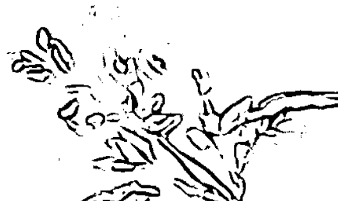
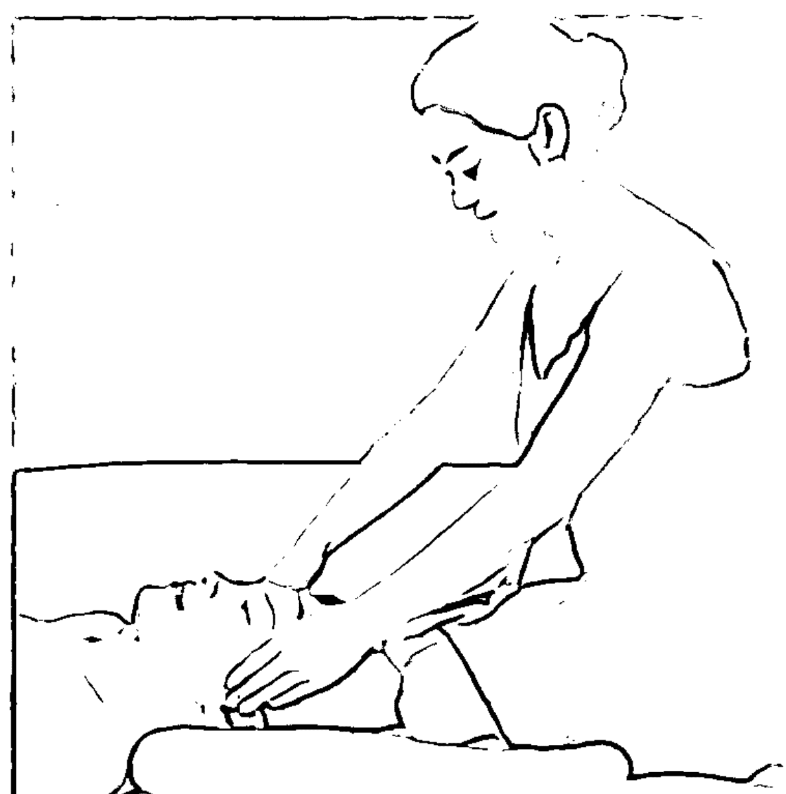
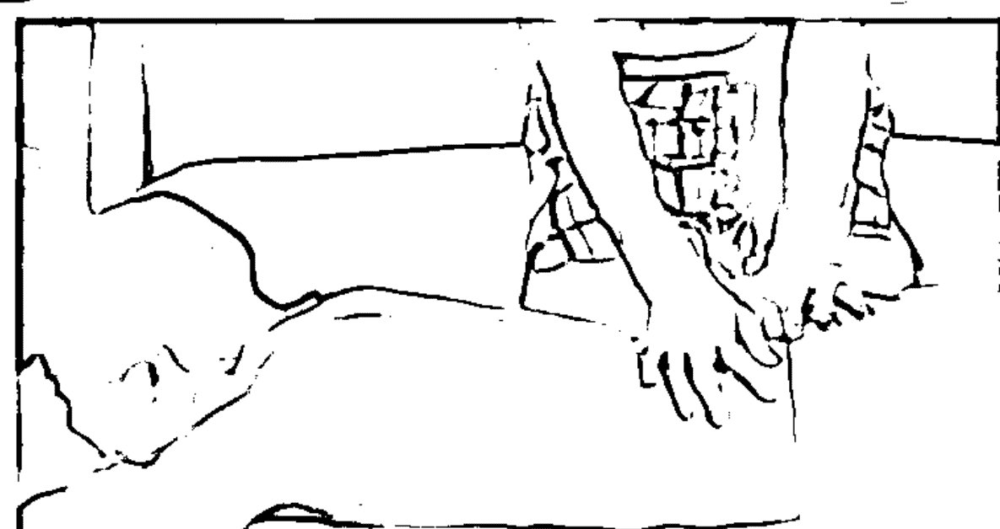
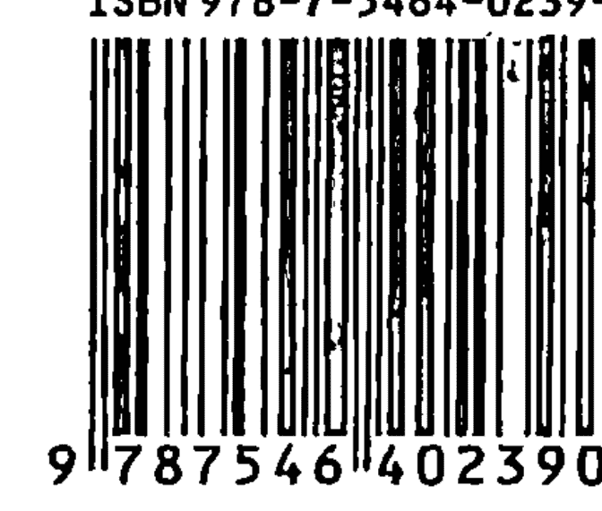

# 爱侣精油的LOVE按摩

## 推荐序 Recommendation Preface

### 用爱感动 Moved Him with Love

你心里的那个他

“玫瑰很适合浪漫气质的人，但要加一点佛手柑，因为你一生都想谈恋爱……” 在天竺葵、鼠尾草、佛手柑、紫罗兰、迷迭香、玫瑰、薰衣草，还有许多不知道名字的瓶瓶罐罐包围中，GRACE很简单地说。这时的她，不像精油精灵，倒很像传说中具有神秘超感能力的女巫，敏锐地发现甚至连你自己都没能察觉的种种心绪。

这么一个有阳光的下午，在茶与咖啡的陪伴下，与GRACE一起探究一下这些心绪的种种缘分，是一件特别有意思的事。不用戴着面具，不用想着措辞，就在不经意间，GRACE的一句话，也许就能帮你打通徘徊于心的纠结症候。用GRACE的话来说，一切都可以归结为“爱”。她说有新书要出版了，要求我讲讲故事，关于爱的，希望有一个爱的诗篇可以成序。

关于“爱”的关键词，我实在想不出几个，只知道：爱是心之所向；是一种难以描绘的音乐，能听到的时候，很喜悦；爱是心心相印，爱不是能相忘于江湖的携手之手。但不巧的是，我的这一份爱要隔着千里的距离，这对于一生都想谈恋爱的人来说，像是一个魔咒：坚守了心灵的方向，双手却难以触及……每当朋友调侃我们不符合经济学时，我会回答说：“真正的爱本身就是不能计量的，能计量的是数学，不是爱的逻辑。” 好朋友疑惑着：“结婚不是为了在一起吗？” “当然，但距离产生美感。” 小别后的重逢，点燃一盏熏香，在爱的氛围里为他按摩，享受爱的亲密。

也许这一点的温存，正是两个人日日夜夜隔着千山万水，仍然可以心存爱意的理由。由于被GRACE定义为一生都想谈恋爱的人，我告诉自己说：那就用一生来珍惜彼此、珍惜现在。

仅以此爱侣之间的对话，推荐GRACE新书《爱侣精油按摩》。爱要动手、动口、动身、动心……用所有爱的肢体语言去感动对方。

## 自序 Preface

### 芳香疗法师的自我期许
Self-Expectation of Therapist

从事芳香美容事业，算来也有近20年的经验，对自己工作的角色扮演来讲，是打从内心深处，十分的喜爱。一个人一辈子，喜欢自己的工作，是件不简单的事情，在多年工作的日子里，深信一个原则：“爱人者人恒爱之。”这句名言，是作为一个芳香疗法师，必须具备的心理建设准则。

现在来谈谈如何做个好的芳香疗法师。首先要懂得保护自己的身体，情绪上常常笑口常开，关心周围人、事、物，细腻品味生活。惟有爱惜自己，才有充足的精力照顾别人。“人生以服务为目的”，我们每个个体不能当做一个赚钱的工具，也许因应现实，我们往往不得已会屈服于环境，但是凡事先替别人着想，再谈自己，施与受的过程中，会有意想不到的收获。从事芳香美容工作，有几个必须选择的环境与客户，譬如一个知人善用的老板，一个懂得珍惜好客户的芳香疗法师，因为芳香美容事业是一个至善至美的心灵事业；另外在环境上我们不做皮肤病人，甚至有隐疾的病人，不从事医疗行为，单纯地从事芳香美容工作。当然自己也必须要有一个健康的身体，因为芳香疗法师的身体与心理是一样重要的。我们不是医生，不扮演医生的角色，客户有疾病，去找专业医生，因为社会上的分工是很专业的，隔行如隔山，此为芳香疗法师的基本原则。心灵的修养靠自己细心品味，惟有懂得释放自己的心情，如此才能做到对客户善尽责任。

阅读，是芳香疗法师很重要的一门修养课程，虽然不用“上知天文，下知地理”，言之有物是必需的，否则在从事美容疗法工作时，对客人疲劳轰炸，是件很不应该的事。不讲客人长短，不道朋友是非，设身处地替人着想，如此才能完美地完成一个好的芳香疗法按摩。

随着时代进步，人与人之间的距离越来越远，只讲表面应酬，忽略心灵沟通，芳香疗法师是客户最好的朋友，客户来到美疗室时碰到好的芳香疗法师，如同找到一个好的倾吐对象，再加上芳香精油的按摩，就能够轻易卸下一天的疲劳，达到身、心灵的完全放松。

人性本善，一个善良的芳香美容工作者，有一个纯洁的心灵，对人以诚，对事关心如己，此为芳香疗法师的基本原则之一，无形中也会影响客人的心情。

芳香疗法的工作就是在学做人，而且就是一种最天然的生活，若是在学习的过程里，了解生命和生活的本能，也就驾轻就熟芳香疗法的学问。技术是不变的，人体的循环也是固定的路线；但是芳香疗法的工作，因为不同心灵的客人，都会有所改变。很多人想学这种对人的认知，却把芳香疗法当做一般美容工作，把芳香植物精油当成美容的保养产品，而没有先学会读懂自己，了解生命的目的。

所以，很多学生问我：为何真正的芳香疗法师要兼具实务案例经验、个人自我充实、不断的阅读、星座哲理的应用生活等等，而最重要的，还是要了解人与人之间心灵的透视度？而且为何要用10年，才能完全熟悉这份工作，从而成为一个芳香疗法师呢？

简单地说：芳香疗法师的工作，就是人生态度的付出工作，要光学做人，而且学会关心生活，当然也要有相当的资历。目前很多国际组织，是以芳疗师个人专业的实际案例和分享为主，因为大家分享了案例的经验，一起为这个神圣的工作研究分享经验。在此我希望自己对国内的芳香疗法工作者，能起到正确的引导和带动作用，分享我的芳香工作经验。

容貌会随着时光消逝，但是一个拥有美丽心灵的人，才是真正不褪色的美人。有句话说：“相由心生。”惟有美化心灵，善待自己的身体，才能拥有一辈子的美丽和健康。这是所有芳香疗法师们，对自己工作的使命，也是我写此书给大家，贡献自己多年芳香疗法工作的一份责任与分享。

GRACE
2010.5

我们彼此靠近，只因心里有你。亲爱的，辛劳的工作，让你的笑容添加了丝丝疲惫的印痕；匆忙的脚步，让我们忽略了生活原有的恬美。其实，爱情需要不一样的振荡与抚慰。来，让我们一起挥洒风起云涌的小甜蜜……萃取自然的芬芳，凝聚温暖的掌心在爱侣身体上游移，为TA解除疲劳舒缓身心……

何谓精油按摩？它是将单方精油加入有机植物基础油中，调配成天然按摩油，适当涂抹在按摩部位，进行按摩。The request was rejected because it was considered high risk

### Point 2 美容塑体，从精油开始

每一种植物的细胞都会分泌出一种独特的芳香分子，这些分子再聚集成香囊，散布在它的树干、枝叶、果实、花瓣中。通过蒸馏法、挤压法、冷浸法或溶剂提取法等将这些香囊进行提炼萃取，就得到了这蕴含自然之精华的“植物精油”。

每一种植物精油都有一个化学结构来决定它的香味、色彩、流动性和它的运作方式，因此每一种精油都有一套特殊的功能特质。具体而言，精油可刺激神经，调节人体神经活动及内循环，舒缓精神压力；可以促进人体血液循环，清除体内水分与毒素，促进细胞再生，恢复肌肤弹性，达到美容美体的功效；还可杀菌消炎，促进人体伤口愈合等。

促进交换：通过亲和作用进皮下组织，又经体液交换进入血液和淋巴，促进了血液和淋巴循环，加快了人体的新陈代谢（减肥和去水肿）。

直接作用：精油分子直接杀灭病菌及微生物，进入人体的精油分子能增强人体的免疫力。

植物精油主要通过以下几个途径作用于人体：

呼吸系统：植物精油分子通过鼻息刺激嗅觉神经，嗅觉神经将刺激传至大脑中枢，大脑产生兴奋，一方面支配神经，起到调节神经活动的功能，另一方面通过呼吸系统进肺泡，通过血液循环进入血液直接输送到全身各部位（减缓感冒、鼻塞）。

神经系统：通过亲和作用直接进入皮下，植物精油分子一方面刺激神经，最终调节神经活动及内循环；另一方面直接改变了内环境等稳定状态，使体液活动加快，从而改善内环境，进一步达到调节整个身心的作用（助眠和修补精力）。

代谢系统：通过亲和作用迅速改变局部组织、细胞的生存环境，使其新陈代谢加快，全面解决因局部代谢障碍引起的一些问题（如便秘、头皮屑）。

### Point 3 精油，您选择对了吗？

精油分为单方精油和复方精油两类。单方精油就是由某一种单一植物萃取，并用这种植物命名的精油，特质明显，纯度为100%，不宜单用；复方精油是由两种以上的单方精油调和植物基础油而成。

非常自然、熟悉好闻；而人工合成的精油则含有刺鼻的酒精味或人工香料味，有时会引起头晕、恶心。

使用精油时需注意两点：一是单方精油通常要和基础油调和才能使用，每次使用不能超过5滴，身体用不能超过10滴。二是每种精油的功效和禁忌要看清楚，精油并不是“万能油”，适用任何部位和所有人群。

此外，也可将精油滴在水中，如果能在水上形成一片片的薄膜或均匀地漂浮在水上，它就是纯度精油。将精油滴在白纸上，如果能完全挥发，不留任何痕迹，它也是纯度精油，否则不然。但是有些挥发性强的精油，某些厂家会加入维E油以稳定精油的氧化作用。

选择精油时也要细选一番，厂牌和信誉都会使其浓度不同，相对使用也会有异，个人按摩用精油最好为天然纯度精油，因为人工合成的精油无法提供任何疗效，而且会引起过敏和不适。挑选精油，我们可以采用眼看、鼻嗅的基本观察法。纯度精油一般会在标签上标上100%，表示它是纯质精油。另外，纯度精油的气味会

选择好按摩精油后，进行精油按摩前，还有必要学习使用几种按摩用的基础油。基础油是取自植物的花朵、坚果或种子的油，用来稀释单方精油。通常5毫升的基础油加上3滴精油，将浓度调到5%以下最适合按摩使用。一般基础用油的功效只是为了增加润滑度，不过，有些基础油本身营养素也很高，也能起到很好的疗效，如橄榄油、荷荷巴油等。

居家常备5种精油：

### Point ④ 特别的你，给你特别的精油按摩

爱侣，是世界上最亲密的关系，可以说，没有哪种方式会如精油按摩般，更贴合情侣之间坦诚的、天然的“爱”的需要。

每一次触碰爱侣的身体时，都是释放“爱”的最佳时机，用灵巧的双手释放爱侣一天的劳累吧。

A. 爱人下班回到家时，准备好一盆热水，滴上5~8滴芳香精油，双足浸泡在含有暖暖爱意的温水中，可解除爱人一天的疲劳。泡完脚，再将2~3滴自选的精油，与5毫升基础油混合在一起为爱人做一个足部与腿部按摩，彻底放松爱人劳累一天的双腿。（建议用油：茶树、薰衣草）

B. 周末了，给爱人准备一个惊喜吧。关好门窗，保持通风，恒定温度，将10滴精油放入半浴缸的水内（水量最好不要超过胸口，以免心悸），稍加搅拌，让爱人先享受一下浸泡的感觉，约15分钟；然后在沐浴液中加入3滴精油，混合后涂抹身上，在水中的无重力环境给爱人一个绝佳舒服的按摩，不管是颈肩的按摩或是背部大范围的安抚，效果将比甜言蜜语更加让爱人动心。（建议用油：玫瑰、檀香木）

C. 夜深时，将数滴精油滴入点燃的熏灯中（熏香灯若是中间要加水，需等灯和火熄灭冷却后方可再加入，以免温差太大而玻璃破裂，也请小心火烛），作为房间熏香用，平均每10平方米滴入3~5滴精油。它能帮助爱人松弛神经，缓解压力；还能起到驱虫的作用，给爱人一个安然的睡眠。（建议用油：冬天可用甜肉桂、檀香；夏天可用橙、薄荷，可以选一种清新的前味如柠檬或橙3滴，再加入2滴檀香或甜肉桂，增加味觉带来的美丽幻想。选择味道时以个人喜好为主，以免因为不喜爱的味道而破坏情趣。）

D. 床上的浪漫，搭配催情的精油按摩，在情人节夜里，永远是压轴的好戏。用温柔的指腹跟指尖以及手掌，让身体的肌肉与神经得到舒缓；在精油的催化中，告诉对方自己的需求，让他摸索你的需要，或许你们将享受到从没有的快感。（建议用油：茉莉、伊兰香水树）

E. 爱人身体不适，如头晕、头痛时，可以试试这样做：在1升冒着蒸汽的热水中，滴入3~5滴精油，用一条毛巾将爱人的头部覆盖，使之靠近盆旁，边蒸边吸5分钟，可快速有效地缓解不适哦。情况紧急时，将1~3滴精油撒在面纸上，用口部或鼻部直接吸入；或将瓶盖打开，直接吸入。（建议用油：尤加利、薰衣草）

### Part four 第四节

### Frequently-Used Ways of Massage for Lovers

### 精油按摩的常用手法

精油的分子十分微小，接近人体的荷尔蒙，能够轻易渗入身体肌肤，迅速进入人体的血液中。通过精油按摩，借由皮肤吸收按压的热力，可促进细胞排水及帮助脂肪细胞代谢，也可作用于深层的肌肉与筋骨，达到舒缓压力、减轻肌肉酸痛及调整身心的目的。

精油按摩是芳香疗法中相当重要的方法，如果能结合人体经络、淋巴的走向来按摩，不仅有助于体内排毒，还有助于疏通气血，提升人体免疫机能。正确的按摩需要借助正确的按摩手法来达到，按摩时手法不拘泥于同一种，需视情况结合运用。不论手法如何繁多复杂，柔和、均匀、持久、有力是共同的要求。

#### Point ① 保健按摩手法

##### 按法

按法是按摩最常用的手法之一，刺激较强，有活血止痛、开通闭塞、理筋整复的功效。指按法适用于全身各部腧穴，掌按法常用于背腰、下肢，肘按法常用于背腰、臀部、大腿等肌肉丰厚部位。按法还常与揉法结合，组成“按揉”复合手法。下按的同时，逐渐用力，做深压捻动，有指按法、掌按法、肘按法三种。

① 指按法：多用拇指、食指或中指的指腹垂直向下按压，也可食指和中指相叠一起用力按压。

② 掌按法：着力点一般是掌根，可单掌按压，也可双掌按，亦可双手重叠按压。

③ 肘按法：将肘关节屈曲，用凸出的肘尖着力按压。

##### 摩法

摩法分为指摩法和掌摩法两种，是指用手指或手掌在体表部位做有节律的环形抚摩的一种手法。

摩法轻柔缓和，常用于胸腹、胁肋部操作，具有理气和中、行气和血、消积导滞、祛淤消肿、健脾和胃、清腑排浊等作用。

##### 揉法

揉法分为指揉法和掌揉法两种，是指用手指、掌根或鱼际部紧贴于体表腧穴或身体部位上，做轻柔缓和的回旋摆动的一种手法。
揉法轻柔缓和，刺激量小，适用于全身各部位，具有宽胸理气、消积导滞、活血化淤、消肿止痛、祛风散寒、舒筋活络、缓解痉挛等功效。

##### 推法

推法是用指、掌或肘里用力按压按摩部位，向一个方向使劲推动的手法。有指推法、掌推法、拳推法、肘推法等多种推法。
推法操作时，着力部位要紧贴按摩部位，将力贯注于指掌或肘部，做有节律、缓慢、匀速的推进。用力一定要稳，速度要均匀缓慢。推法适用于人体各穴位、各部位，具有行气活血、疏通经络、舒筋理肌、消积导滞、解痉镇痛、调和营卫等作用。

##### 拿法

拿法是指用单手或双手的拇指与其他几指相对称地用力，提拿某一部位或穴位，进行一紧一松拿捏的手法。主要有三指拿、四指拿、五指拿三种。拿法操作一般与肌腹垂直，一紧一松，缓和有力，刚中有柔，由轻到重，均匀连贯，不可突然用力或提拿皮肤。
捏拿法刺激较强，多作用于较厚的肌肉筋腱，有舒筋通络、祛风散寒、行气活血、解痉止痛等功效，可防治颈椎病、肩周炎等疾病。

##### 擦法

擦法是指用手掌、手指、大鱼际、小鱼际等部位着力于皮肤表面，进行直线来回摩擦的手法。主要有指擦法、掌擦法、鱼际擦法三种。
擦法操作时可涂抹润滑油，掌擦法温度较低，多用于胸腹胁部；小鱼际擦法温度较高，多用于腰背臀腿；大鱼际擦法温度适中，可用于全身各部位。
擦法是一种柔和温热的按摩手法，适用于身体各部位与穴位，具有行气活血、温通经络、消肿止痛、健脾和胃、温阳散寒等功效。

#### Point ② 加强性欲的按摩手法

**滑揉式按摩** 加上自身的体重，用你的手掌在伴侣的皮肤上滑行。

**指节按摩** 两手作半握拳状，用弯曲的指关节按摩对方的背部、臀部、双腿和脚底。

**揉动式按摩** 用手掌在对方身体上作画圈式的揉动。此种基本的按摩法，可以弄暖身体、松弛肌肉。

**揉转式按摩** 用你的手指的指尖或拇指的指腹，对按摩部位旋转，以缓和肌肉的紧张。

**揉捏式按摩** 可用揉捏的方式按摩肌肉比较紧的部位，拇指的力度可以大些，而且可以用拇指在某些部位作画小圈式的揉动。

**羽毛式按摩The request was rejected because it was considered high risk

#### Point Refresh
② 提振精神

魔法精油：
迷迭香精油：活化脑细胞，使头脑清楚，增强记忆力；改善紧张的情绪、滞闷和嗜睡；具有提振和兴奋作用。

提振魔方：
3滴迷迭香精油、6毫升甜杏仁油混合调匀。

按摩有道：
蘸取按摩油，将双手摩擦生热后，用右手托稳爱人下巴，左手自两颊向上滑移，按至头顶；用力点按头部督脉、胆经和膀胱经，并逐渐向后移动到风池，反复10次。此法有清新提振的气势，可帮助重振过度消耗的心力。

#### Point Nourish Hair
③ 滋养头发

魔法精油：
依兰精油：平衡头部的油脂分泌，使头发更有光泽。

滋养精油：
3滴依兰精油、6毫升荷荷芭油混合均匀。

按摩有道：
让爱人仰卧坐在身前，双手蘸取调好的按摩油，摩擦生热，然后双手十指分开，用力揉搓头皮，形如洗头，按摩约10分钟即可。按摩头皮可舒缓脑部神经，保护脑部健康；此法有助于深层清洁头皮油脂，改善发质，使头发变得有光泽。

#### Point Relax Mind and Body
④ 放松身心

魔法精油：
薰衣草精油：清新舒缓，可减轻压力，减轻忧郁不安及失眠，舒松身心。

减压魔方：
3滴薰衣草精油、6毫升橄榄油混合调匀。

按摩有道：
可让爱人坐着或躺着，将按摩油涂抹在太阳穴、颈部及胸部，用双手食指、中指、无名指自神庭穴向两侧分推至太阳穴，按摩10分钟即可。此法可有效去除疲惫、松弛身心。

#### Point Reduce Wrinkles on Face
⑤ 面部减龄

魔法精油：
玫瑰精油：玫瑰有强壮和收缩微血管的效果，对老化皮肤有极佳的回春作用，还能以内养外，淡化斑点，促进黑色素分解，改善皮肤干燥，恢复皮肤弹性，让女性拥有白皙、充满弹性的健康肌肤，是最适宜女性保健的芳香精油。

檀香精油：适合老化、干燥及缺水皮肤，淡化疤痕、细纹、滋润肌肤、预防皱纹。

减龄魔方：
2滴保加利亚玫瑰精油、3滴东印度檀香精油、20毫升玫瑰果油混合，分多次使用。

按摩有道：
拇指与食指分别按放两眼内眦处，指端着力，做按揉活动，连揉3分钟，换揉两眼外眦；用手指按揉太阳穴，连揉3分钟，有助推迟眼袋的出现；用两手掌轻抹面部，由中间抹向两侧，先是前额部，抹至鬓发处，连抹10次；再是眼鼻部，从中间向两颧抹动，抹至耳部，连抹10次；然后抹口唇下巴面颊，抹向耳根部，连抹10次。此法对于细嫩肌肤、护肤美容，有着重要的作用。

#### Shoulder & Neck Massage Relieve Ache, Beautify Neck
肩颈按摩 消除疼痛、优美颈线

肩颈处聚集了全身一半以上的淋巴腺与淋巴结，它们是输送营养和排泄老废物质的重要渠道，而日常生活中，肩颈又是最缺乏保养的部位，因此特别需要爱侣的互相按摩。运用精油在肩颈部位进行保健按摩，可有效促进肩颈部血液循环，加强肩颈部淋巴系统排毒效果，舒缓肩颈肌肉的紧张与疼痛；还可有效消除颈部细纹，消除多余脂肪，优美肩颈曲线。

##### 重要穴位

大椎穴：背部，第7颈椎棘突下凹陷中。
肩井穴：肩部最高处，大椎穴与肩峰连线的中点。
肩外俞穴：背部，第一胸椎和第二胸椎突起中间，左右旁开3寸处。
肩中俞穴：背部，第7颈椎棘突下，左右旁开2寸处。

#### Point Improve Circulation
① 改善循环

魔法精油：
肉桂精油：舒缓肌肉痉挛及风湿病，改善关节疼痛。
雪松精油：有显著的消炎作用，可舒缓压力，松弛神经。

温暖魔方：
2滴肉桂精油、3滴雪松精油与12毫升小麦胚芽油混合调匀。

按摩有道：
用手掌蘸取按摩油摩擦生热，将调和成的按摩油涂抹在肩关节周围，掌心贴住肩部肌肤，用拇指的指腹按揉肩部穴位，至肩关节发热即可。此法能使关节感到温暖，改善肌肉的血液循环，有效治疗因久坐和空调冷空气引起的肌肉疼痛。

#### Point Reduce Wrinkles on Neck
② 减淡颈纹

魔法精油：
天竺葵精油：促进皮肤细胞新生，修复皱纹。
玫瑰精油：强壮和收缩微血管，对老化皮肤有极佳的回春作用。

抗衰魔方：
5滴天竺葵精油、5滴保加利亚玫瑰精油、30毫升橄榄油混合调匀。

按摩有道：
蘸取按摩油后，以手掌托住脖子，由脖子往肩部方向轻轻擦拭；再由下巴往耳朵方向轻轻擦拭；最后用双手手指，从耳朵下方往锁骨方向进行画圆式的按摩，按摩约15分钟即可。此方可以延缓颈部肌肤的老化，使颈部肌肤恢复弹性，改善颈纹。

#### Point Relieve Ache
③ 缓解疼痛

魔法精油：
尤加利精油：能缓和发炎现象，减轻肌肉酸痛。
杜松精油：排除毒素、帮助循环系统的畅通。

祛痛魔方：
5滴尤加利精油、3滴杜松精油、12毫升葡萄籽油混合调匀。

按摩有道：
用手掌蘸取按摩油摩擦生热，在肩颈部进行轻轻擦拭与按揉式的按摩，然后以拳眼捶击其颈肩部，按摩约10分钟即可。运用尤加利精油按摩可有效缓解关节炎症，缓解因纤维组织发炎引起的疼痛。

#### Point Decompress
④ 舒缓压力

魔法精油：
迷迭香精油：减轻皮肤充血、浮肿、肿胀。
薰衣草精油：有增进细胞活动、解除充血与肿胀、止痛的功效。

舒压魔方：
3滴迷迭香精油、5滴薰衣草精油与12毫升橄榄油混合调匀。

按摩有道：
可让爱人坐着或躺着，用手掌蘸取按摩油摩擦生热，然后用掌拿捏爱人颈椎两侧肌肉1分钟，再用手指拿捏其斜方肌1分钟；然后用双手拇指依次按揉肩井穴、肩外俞穴、大椎穴、肩中俞穴各1分钟；最后在颈部、肩部、肩胛骨部位进行轻擦式的按摩，约15分钟即可。此法能有效软化肩颈部位，舒缓肌肉紧张，促进血液循环，消除肩颈酸痛的现象。

#### Upper Limbs Massage Lose Carnosity on the Inner Side of the Arms, Nourish Hands
上肢按摩 击退蝴蝶袖、滋润双手

手，也可以说是人的第二张脸，尤其对于女性来说，一双手能很直接地揭示女性的年龄、状态，以及对自我的关注程度。相比脸而言，手更经常接触清洗剂、化学剂；相比脚而言，手更经常进行搬运东西、敲击键盘等运动；相比人体其他部位，手更经常暴露在外面，受到阳光照射。因此对手进行保养是非常有必要的。若能为爱人买一双防护手套、偶尔进行一下精油按摩，不仅有助于缓解手臂疼痛，帮助双手保持柔软光滑，也表明了你对爱人的贴心关怀。

##### 重要穴位

| 穴位 | 位置 |
| :--- | :--- |
| 肩髃穴 | 双臂外平举时，肩峰前下方的凹陷处。 |
| 尺泽穴 | 屈肘，肘横纹中，肱二头肌腱桡侧凹陷处。 |
| 外关穴 | 腕背横纹上2寸，桡骨与尺骨之间。 |
| 合谷穴 | 大拇指与食指的虎口间。 |

#### Point Drastically Relax
① 彻底放松

魔法精油：
迷迭香精油：减轻皮肤充血、浮肿、肿胀。
薰衣草精油：有增进细胞活动、解除充血与肿胀、止痛的功效。

放松魔方：
3滴迷迭香精油、3滴薰衣草精油、12毫升橄榄油混合调匀。

按摩有道：
坐着、躺着、站着均可，用手掌蘸取按摩油，摩擦生热后拿捏对方上肢肌肉，从肩到腕，反复10次；然后用拇指与中指按揉手臂穴位，重点按揉肩髃、合谷各1分钟；最后用手掌推擦整个上肢，以发热为度。这是一种能使手臂彻底放松的精油按摩法，能帮助消除手臂的压力与酸痛。

#### Point Lose Carnosity on the Inner Side of the Arms
② 击退蝴蝶袖

魔法精油：
柠檬精油：紧实微血管，去除老死细胞，淡化黑色素。
茴香精油：解毒利尿，很好的减肥妙方。
肉桂精油：紧实肌肉、消脂。

瘦臂魔方：
3滴柠檬精油、4滴茴香精油、2滴肉桂精油、25毫升小麦胚芽油混合调匀。

按摩有道：
涂抹上按摩油，以手捏住手臂外侧，由肩膀至手肘自上而下捏揉；再自手臂内侧至腋下由下而上滑抚；用拇指指腹按揉手臂上的曲池穴等穴道。此法具有消除蜂窝组织中毒素的效果，可排除多余的废液与体液，使手臂肌肉紧实。

#### Point Alleviate Pain
③ 消隐疼痛

魔法精油：
樟树精油：可有效缓解肌肉酸痛，尤其是运动过后产生的肌肉酸痛。
薄荷精油：消炎、解痛、收缩血管。

祛痛魔方：
2滴樟树精油、1滴薄荷精油、12毫升橄榄油混合调匀。

按摩有道：
用手掌蘸取按摩油，先用手掌在酸痛的肌肉部位进行轻轻的擦拭按摩，接着以手指按压肌肉部位，然后用双手手掌夹住对方上肢进行快速搓动1分钟，再用双手握其腕部进行快速小幅度的抖动1分钟，最后用一手握其肘部，另一手五指分开交叉握其五指，分别摇动其肘关节和腕关节各1分钟。此法对于运动过后，如打网球、提重物等产生的肌肉酸痛症状特别有帮助。

#### Point Nourish Hands
④ 细嫩双手

魔法精油：
月见草植物油：皮肤的天然稳定氧化剂，可提升肌肤的免疫力。
乳香精油：细胞活化、回春。

保湿魔方：
5滴乳香精油、10毫升月见草基底油混合调匀。

按摩有道：
先将手洗干净，然后用调好的护手油，温和按摩双手，按摩几分钟即可。按摩后戴上白色的棉布手套，让双手休息并进一步吸收精油的精华。经常使用此方法可保湿肌肤，令双手细嫩。

#### Point Improve Toxin Elimination
⑤ 促进排毒

魔法精油：
杜松莓精油：很好的淋巴腺刺激剂，可刺激组织细胞，控制液体流动，利尿排水。
桦木精油：有良好的杀菌效果，能刺激汗腺，帮助排毒，预防风湿气血不畅。

排毒魔方：
杜松莓3滴、桦木2滴、10毫升葡萄籽油混合调匀。

按摩有道：
以一只手的四手指在另一只手臂的外侧揉搓，由手腕至肩部自下向上按摩；放松力量往下按摩至手腕；再用手指在手臂的内侧揉搓，从手腕至腋下自下向上揉搓按摩，然后放松向下按摩，来回往复。此法可帮助手臂做被动性的运动，促进淋巴排毒，预防手臂病痛。

#### Chest & Abdomen Massage Beautify Chest, Shape Abdomen
胸腹按摩美胸收腹有奇招

胸腹部保健按摩，能宽胸理气、降逆平喘、疏肝解郁、健脾和胃、调理气血、补肾壮阳，促使血脉流畅，激发经络调节内脏功能，加强肝的疏泄功能，全面提高人体免疫力，对腹部减肥也有很好的效果。

##### 重要穴位

| 穴位 | 位置 |
| :--- | :--- |
| 天突穴 | 体前正中线上，胸骨上窝中央。 |
| 中府穴 | 胸部，体前正中线旁开6寸，平第1肋间隙处。 |
| 膻中穴 | 胸部，体前正中线，第4肋间，两乳头连线的中点。 |
| 乳根穴 | 乳头直下，乳房根部，第5肋间隙间。 |
| 中脘穴 | 体前正中线，脐上4寸处。 |

#### Point Firming Skin
① 紧实腹肌

魔法精油：
葡萄柚精油：治疗水肿、蜂窝组织炎，推动淋巴以及排毒利尿。
茴香精油：暖胃、助消化，紧实腹肌。

紧腹魔方：
葡萄柚3滴、茴香3滴、10毫升葡萄籽油混合调匀。

按摩有道：
双手放在腹部，五指与掌根相对，自上而下，从中间向两边捏拿腹部皮下脂肪，手法力量由轻到重，按摩约3分钟；虚掌放在脐部，以肚脐为中心，沿顺时针方向从里到外环摩腹部30圈，再逆时针从外向里环摩腹部30圈。

#### Point Firming Skin
② 紧实肌肤

魔法精油：
依兰精油：平衡荷尔蒙，调理生殖系统的问题，保持胸部的坚挺。
柠檬精油：紧实微血管，去除老死细胞，淡化黑色素，保持肌肤紧实、肤质细嫩。

紧实魔方：
4滴依兰精油、1滴柠檬精油、3毫升荷荷巴油、3毫升葡萄籽油混合调匀。

按摩有道：
取调好的按摩油涂抹在胸腹，双手从胸口往下推，推至肋骨底边时呈扇形向两边分开推滑，滑向腋窝，再回胸口，重复操作两次。依兰精油具有镇静、抗焦虑的功效，而柠檬精油有促进血液循环、紧实肌肉的功效。采用两者调和而成的按摩油按摩，能调节肾上腺素、放松神经系统，还可使胸部肌肉结实丰满，改善松弛下垂的皮肤。

#### Point Lose Fat
③ 分解脂肪

魔法精油：
豆蔻精油：分解腹部多余的脂肪，消除小腹赘肉。

消脂魔方：
8滴豆蔻精油、25毫升橄榄油混合调匀。

按摩有道：
让爱人平躺，用手掌蘸取按摩油，摩擦生热后双手摊开放在腹两侧，用掌斜擦小腹1分钟，以局部有发热感为度；然后用手指拖住腹部肌肉，往上推动，持续约5分钟；接着用手指捏住腹部脂肪最集中的肌肉，往上提起进行顺时针的转动，放松再进行逆时针的转动，持续约5分钟即可。

#### Point Breast Enhancing & Beautifying
④ 丰胸美胸

魔法精油：
依兰精油：平衡荷尔蒙，调理生殖系统的问题，保持胸部的坚挺。
柠檬精油：紧实微血管，去除老死细胞，淡化黑色素，保持胸部紧实、肤质细嫩。

美胸魔方：
4滴依兰精油、1滴柠檬精油、3毫升荷荷巴油和5毫升玫瑰果油混合调匀。

按摩有道：
以两手的虎口对着乳头，然后两手相对用力，相向朝乳头方向合拢，推挤乳房，反复10次；再以指腹轮按膻中穴、乳根穴、天溪穴，每次压5秒，反复6次；然后用指头轻轻揉捏乳头，同时将乳头向前上方轻轻地牵扯拉5次。以上方法均以无疼痛感等不适为宜。

#### Point Improve Digestion
⑤ 促进消化

魔法精油：
茴香精油：暖胃、助消化、降低食欲。

精油魔方：
3滴茴香精油、12毫升橄榄油，混合调匀。

按摩有道：
让爱人平躺，用手掌蘸取按摩油，在胃部的位置，以慢慢画圆圈的方式，顺时针方向进行轻柔的按摩，持续10分钟即可。用茴香精油调制的按摩油，能够有效分解体内因暴饮暴食所累积的毒素，可以促进消化，治疗肠胃胀气症状。

#### Waist & Back Massage Relieve Pain, Shape Waist
腰背按摩 消除酸痛、消脂瘦腰

紧张的情绪，坐姿和走路姿势不正确，以及运动受伤，都有可能引起腰背肌肉劳损，产生慢性或急性的肌肉炎症，从而出现腰背痛。坚持对腰背部进行精油按摩，能借助人体经络系统的功能和精油的特殊功效，调整阴阳平衡，对腰背部各种软组织损伤、劳累过度、经久积劳起到活血止痛的作用；此外，坚持按摩腰背部，还可预防腰部脂肪的堆积，塑造出柔美的腰部曲线。

##### 重要穴位

大椎穴：背部，第7颈椎棘突下凹陷中。
胃俞穴：背部，第12胸椎棘突下，左右旁开1.5寸处。
大肠俞穴：腰部，第4腰椎棘突下，左右旁开1.5寸处。
心俞穴：背部，第5胸椎棘突下，左右旁开1.5寸处。
肾俞穴：腰部，第2腰椎棘突下，左右旁开1.5寸处。
关元俞穴：腰部，第5腰椎棘突下，左右旁开1.5寸处。

#### Point Warm Muscle and Relieve Pain
① 温热祛痛

魔法精油：
黑胡椒精油：能紧实骨骼肌、扩张局部的血管，改善肌肉酸痛和肌肉僵硬问题。

热能魔方：
4滴黑胡椒精油、10毫升橄榄油混合调匀。

按摩有道：
让爱人趴在床上或沙发上，先蘸取调好的按摩油轻柔地按摩整个腰背部，接着用双手拿捏对方腰椎两侧肌肉1分钟；再用手指按揉腰背部的穴位，重点按揉心俞穴1分钟；再用双手掌从腰向上推至颈项部1分钟；最后跪在爱人的腰部，以指或掌按揉其腰背3分钟，可借助上身重力加强手的力量。黑胡椒精油能为肌肤提供热能，对较严重的腰背疼痛非常有效。

#### Point Eliminate Toxin
② 排除毒素

魔法精油：
洋甘菊精油：安抚效果绝佳，可舒解焦虑、紧张、愤怒与恐惧，使人放松有耐性。

排毒魔方：
5滴洋甘菊精油、10毫升小麦胚芽油混合调匀。

按摩有道：
蘸取按摩油，摩擦生热后涂抹于背部，双手伸开，拇指紧压于脊椎两侧沟内，其他手指自然置于背部两侧；由脊椎根部开始，向上均匀地掐压移动，按至肩胛骨处停手；然后双手由肩头滑回脊椎底部，再操作一次。此类重力渗透式的按摩有助于肌肉内的毒素和杂质的排出，舒缓压力，缓解腰酸背痛。

#### Point Relieve Muscle Stiffness
③ 改善肌肉僵硬

魔法精油：
罗勒精油：抗痉挛，杀菌，神经疲劳时舒缓压力，振奋情绪。

改善魔方：
3滴罗勒精油、10毫升橄榄油混合调匀。

按摩有道：
先温和地按揉对方腰背部脊柱中央2分钟，再作竖推，从颈部推至骶尾部1分钟，然后以脊柱为中线，向两旁分推，并从颈椎向骶椎移动1分钟。此法可有效改善肌肉僵硬的症状，对于运动过后引起的肌肉发炎也具有一定的疗效。

#### Point Decompress
④ 舒缓压力

魔法精油：
马郁兰精油：改善肌肉疼痛，也有抑制性欲的作用。气喘者、低血压者、忧郁症者、孕妇应谨慎使用。
迷迭香精油：可减轻皮肤充血、浮肿、肿胀。

舒缓魔方：
3滴马郁兰精油、4滴迷迭香精油、10毫升橄榄油混合调匀。

按摩有道：
蘸取按摩油后，双手斜放于脊椎上端两侧，掌心贴于背部肌肉，拇指用力沿脊椎往下推按；同时注意对肾腧穴、气海腧穴、大肠腧穴和关元腧穴进行推抹，按至腰部底端时双手滑回肩部，操作三遍，以背部出现温热感为佳。此法可缓解腰背压力，使紧绷的肌肉放松，治疗腰酸背痛。

#### Point Shape waist
⑤ 消脂瘦腰

魔法精油：
天竺葵精油：能促进腰背的血液循环，并改善腰酸背痛。
杜松莓精油：是很好的淋巴腺刺激剂，可刺激组织细胞，控制液体流动，利尿排水。

纤腰魔方：
2滴杜松莓精油、3滴天竺葵精油、10毫升基底油混合调匀。

按摩有道：
两手蘸取按摩油搓热，置于左右腰背上，重复滑抚，重复10次；双手扶住腰部，拇指按压肾腧穴，每次压3秒，反复10次。此法既能促进局部血液循环、帮助消脂，还能调理荷尔蒙预防腰酸背痛。

#### Buttock MassageRaise and Shape the Buttock
臀部按摩 提升臀线、减肥收翘

臀部是展现身体优美曲线的重要部位，拥有一个圆翘的美臀不仅性感，而且还能拉长身体线条，诱惑倍增。如果臀部下垂、松垮无弹性，腰部以下就会美感尽失。

运用精油在臀部进行按摩，可使臀部皮下脂肪不断消耗，加强组织代谢，让局部脂肪得以瓦解，使臀部肌肉更为结实、丰满而有弹性，同时可防止臀部脂肪堆积和臀肌下垂，显著提升和紧实肌肤。

##### 重要穴位

八髎穴：又称上髎、次髎、中髎和下髎，左右共八个穴位，分别在第一、二、三、四骶后孔中，合称“八穴”。

长强穴：尾骨尖端下，尾骨尖端与肛门连线的中点。

承付穴：左右臀下横纹的中点处。

#### Point Eliminate Edema
① 消除水肿

魔法精油：
迷迭香精油：具有很强的收缩作用，紧缩松弛的肌肤，减轻肿胀。
茴香精油：排毒、利尿，还有紧实、滋润肌肤的功效，预防肌肤松垮和橘皮组织的出现。

利水魔方：
8滴迷迭香精油、7滴茴香精油、25毫升橄榄油混合调匀。

按摩有道：
双手放置于臀部左右，用手掌包住臀部，然后由外向内以圆形的方向揉搓；然后双手由下向上一边揉搓一边往上提起，按摩约15分钟即可。此法可有效消除臀部水肿的现象，改善虚胖体质。

#### Point Improve Metabolism
② 促进代谢

魔法精油：
葡萄柚精油：治疗水肿、蜂窝组织炎，推动淋巴以及排毒利尿。
百里香精油：促进血液循环，增强免疫力。

消脂魔方：
7滴葡萄柚精油、5滴百里香精油、25毫升葡萄籽油混合调匀。

按摩有道：
采取跪姿，以便双手用力。双手打开，左手横放，抵住尾椎骨；右手竖放，按住臀部，推揉按压，按摩约10分钟即可。此法可有效刺激臀部血液循环，促进多余脂肪的代谢。

#### Point Firming Buttock Muscle
③ 紧实臀部

魔法精油：
百里香精油：促进血液循环，增强免疫力。
柠檬精油：紧实微血管，促进血液畅通。

紧实魔方：
7滴柠檬精油、5滴百里香精油、25毫升橄榄油混合调匀。

按摩有道：
采取跪姿，以便双手用力。五指伸开，置于臀部上；以两手的拇指压在尾椎骨上向左推转，按摩几分钟；当手指感到疲累时，以掌心按摩法做环形按摩。两法可交替进行，这样既可让承受按摩的人感到舒适，按摩者也不至于劳累。

#### Point Raise the Buttock
④ 提臀翘臀

魔法精油：
丝柏精油：相当优越的收敛效用，降低浮肿，改善蜂窝组织炎。
迷迭香精油：具有很强的收缩作用，紧缩松弛的肌肤，减轻肿胀。

提臀魔方：
3滴丝柏精油、2滴迷迭香精油、5毫升葡萄籽油混合调匀。

按摩有道：
双手重叠置于臀部，手指微屈，四指指端着力，自上而下、自中间向两则进行压推；四指并拢，拇指与四指分开，将手掌放在受术者臀部的下方，手掌用力，抓握臀部向上推举并停留片刻，如此反复操作数遍。

#### Lower Limbs Massage Decompress & Shape Legs, Eliminate Edema
下肢按摩 减压瘦腿、消除水肿

下肢是人体中重要的部位，尤其是双脚，脚底布满重要器官的反射区，当双脚疲累时，整个人的精神状态也会变得特别差，长期的久坐或站立都容易使双脚出现水肿现象。

精油按摩能促进下肢血液循环，松解关节粘连，滑利关节活动，增大下肢肌肉的伸展性；外部的刺激还有助于排除疲劳产生的乳酸物质，并帮助组织排除多余的液体，减轻双脚的压力；同时，经常为爱侣按摩下肢，可优美下肢线条、滋润下肢肌肤。

##### 重要穴位

- 足三里穴：小腿前外侧，胫骨外侧约一横指处。
- 委中穴：腘横纹中点，当股二头肌腱与半腱肌肌腱的中间。
- 承扶穴：大腿后面，臀下横纹的中点。
- 阳陵泉穴：膝盖斜下方，小腿外侧，腓骨小头前下方凹陷中。
- 三阴交穴：胫骨后缘，内踝尖直上3寸处。
- 承山穴：小腿后面正中，小腿肚肌肉下方的凹陷处。

#### Point Eliminate Edema
① 消除水肿

魔法精油：
杜松精油：是很好的淋巴腺刺激剂，可刺激组织细胞，控制液体流动，利尿排水。
快乐鼠尾草精油：可促进淋巴液的流动，改善腺体失常，净化循环系统。
迷迭香精油：助循环，激励身体、振奋精神。

去水肿魔方：
3滴杜松精油、4滴快乐鼠尾草精油、3滴迷迭香精油、12毫升橄榄油混合调匀。

按摩有道：
蘸取按摩油，以温热的掌心按摩腿部水肿部分，再以食指或中指指腹分别按揉足三里、阳陵泉、三阴交、承扶、委中各1分钟，然后拿揉跟腱部分，按摩约15分钟即可。此法能有效消除水肿现象。

#### Point Enhance Circulation
② 强化循环

魔法精油：
天竺葵精油：强化循环系统，使循环更加顺畅。
杜松莓精油：是很好的淋巴腺刺激剂，可刺激组织细胞，控制液体流动，利尿排水。

排毒魔方：
4滴天竺葵精油、3滴杜松莓精油、12毫升小麦胚芽油混合调匀。

按摩有道：
以手掌蘸取按摩油摩擦发热，以手指轻轻按摩大腿的根部，接着用手掌轻轻擦拭膝盖表面，手掌慢慢往下，轻轻按摩爱人的小腿肚和脚踝，按摩至发热为宜。此法有助于排除堆积在下肢里的有毒物质，消除双脚肿胀。

#### Point Lose Fat on Legs
③ 消脂瘦腿

魔法精油：
天竺葵精油：促进血液及淋巴的循环，并帮助下肢血液回流。
丝柏精油：相当优越的收敛效用，降低浮肿，改善蜂窝组织炎。

瘦腿魔方：
3滴天竺葵精油、2滴丝柏精油、6毫升葡萄籽油混合调匀。

按摩有道：
抹上调好的按摩油，以单手的虎口由臀部至膝盖来回滑抚3分钟后换腿；以中指指端按压臀部下方的承扶穴、臀与膝盖中点的殷门穴、委中穴，各按15次。此法有消除臀部及大腿的橘皮组织，促进血液循环、淋巴循环，使腿部脂肪消耗，纤细双腿的功效。

#### Point Shape Legs
④ 塑腿型

魔法精油：
罗勒精油：促进血液循环，减轻肌肉痉挛和肌肉疼痛。
葡萄柚精油：治疗水肿、蜂窝组织炎，推动淋巴以及排毒利尿。

瘦腿魔方：
8滴葡萄柚精油、5滴罗勒精油、25毫升葡萄籽油混合调匀。

按摩有道：
抹上按摩油，以掌心按住小腿后部，由脚踝至膝盖后方由下向上进行按摩，按摩3分钟后换腿；以中指指端按压膝盖后方的委中穴、小腿肚的承筋穴、腿肚下方的承山穴，各按15次。此法有促进下肢血液回流、消化腿部肌肉、美化腿型的功效。

#### Point Feet Care
⑤ 足部护理

魔法精油：
茶树精油：净化皮肤，治疗各种皮肤疾病，有效改善“香港脚”。
薰衣草精油：清热解毒，清洁皮肤，祛皱嫩肤。

护理魔方：
4滴茶树精油、3滴薰衣草精油、10毫升葡萄籽油混合调匀。

按摩有道：
将精油均匀地涂抹在脚上，然后一手握住脚跟，另一手的掌根用力从脚心、脚弓，一直揉捏到脚背；然后将手握拳，以四指的背面推按脚心。此法可有效舒缓紧张的双脚，增加脚部血液供给，同时可有效活动脚部关节，保持脚部肌肤的滋润光洁。

### Chapter Three 第三章

### 性福按摩
改善性功能
提高性质量

Erotic Massage
Dredging Meridian
and Enhance Libido

### 和谐的性

生活，是夫妻感情不可或缺的一部分，也是增进夫妻感情、润滑夫妻矛盾的重要成分。然而在当今繁忙的社会里，紧张的工作和频繁的社交活动极度地消耗身体，间接地伤害爱侣的性器官健康。由于某些性问题是由精神因素引起，且爱侣多碍于性的私密性，不愿就医，这就需要爱侣之间能够学习一些基本理疗法，以帮助爱侣缓解症状，增强性器官的功能，提高性能力，增进夫妻感情。

### Magical Meridian
神奇的人体经络

中医认为经络是人体运行气血、联络脏腑的枢纽。通过适当的按摩手法刺激经络腧穴，能起到平衡阴阳、舒筋活血、通络止痛以及调整肺腑功能、提高机体免疫力。

人体中，五脏六腑“正经”的经络有12条（左右对称共有24条）。另外，还有两条特殊的经络纵贯全身，即体前正中线的“任脉”、体后正中线的“督脉”。这14条经络上所排列着的人体穴道，称为“正穴”，共有365处。人体一般疾病与不适，均可通过刺激相应的经络与穴位，达到减轻症状、治疗疾病的功效。

**手太阴肺经**：主要分布在上肢内侧前缘，主治咳、喘、咳血、咽喉痛等肺系疾患，及经脉循行部位的其他病症。

**手阳明大肠经**：主要分布在上肢外侧前缘，主治头面五官疾患、咽喉病、热病、皮肤病、肠胃病、神志病及经脉循行部位的其他病症。

**足阳明胃经**：简称胃经，主要分布在头面、胸腹第二侧线及下肢外侧前缘，主治肠胃等消化系统、神经系统、呼吸系统、循环系统某些病症和咽喉、头面、口、牙、鼻等器官病症，以及本经脉所经过部位之病症。

**足太阴脾经**：主要分布在胸腹任脉旁开第二侧线及下肢内侧前缘，主治胃病、妇科、前阴病及经脉循行部位的其他病症。

**手少阴心经**：主要分布在上肢内侧后缘，主治心、胸、神志及经脉循行部位的其他病症。

**手太阳小肠经**：主要分布在上肢外侧后缘，主治头、项、耳、目、咽喉病，热病，神志病以及经脉循行部位的其他病症。

**足太阳膀胱经**：主要分布在腰背第一、二侧线及下肢外侧后缘，主治泌尿生殖系统、神经精神方面、呼吸系统、循环系统、消化系统病症和热性病，以及本经脉所经过部位的病症。

**足少阴肾经**：主要分布在下肢内侧后缘及胸腹第一侧线，主治妇科、前阴、肾、肺、咽喉病症，如月经不调、阴挺、遗精、小便不利、水肿、便秘、泄泻，以及经脉循行部位的病变。

**手厥阴心包经**：主要分布在上肢内侧中间，主治胸部、心血管系统、精神神经系统和本经经脉所经过部位病症。

**手少阳三焦经**：主要分布在上肢外侧中间，主治头、目、耳、颊、咽喉、胸胁病和热病，以及经脉循行经过部位的其他病症。

**足少阳胆经**：主要分布在下肢的外侧后缘，主治头、项、耳、目、咽喉病，热病，神志病以及经脉循行部位的其他病症。

**足厥阴肝经**：主要分布在下肢内侧的中间，主治肝胆、妇科、前阴病及经脉循行部位的其他病症。

**任脉**：任，即担任。行于胸腹部的正中，总任一身之阴经，与全身所有阴经相连，凡精血、津液均为任脉所司，故称为“阴脉之海”；主妊养胎儿，与女子经、带、胎、产的关系密切。

**督脉**：督，有总督的意思。行于背正中，总督一身之阳经，六条阳经都与督脉交会于大椎，有调节阳经气血的作用，故称为“阳脉之海”；主生殖机能，特别是男性生殖机能。

### How to Find the Points
教您如何取穴

穴位的学名是腧穴，是按摩的主要施术部位。人体周身约有52个单穴、300个双穴、50个经外奇穴，共702个穴位。腧穴是人体脏腑经络气血输注出入的特殊部位，是经络在人体的一扇门户。人的某个脏腑、某条经络有了疾病，就会在某些穴位有相应的表现，按在上面就有疼痛、麻胀的感觉，而要治疗疾病，也是通过穴位调整经络、脏腑的功能而达成的。下面介绍几种常用取穴方法，取穴时可结合使用，以取准穴位，获得良好疗效。

#### 1.自然标志法

这是取穴最常用、最方便、最准确的方法，是利用人体体表角剖学标志来确定穴位位置的方法，可分为以下两种：

- ①固定标志：是由人体各部骨节、肌肉形成的凸起或凹陷、毛发、五官、指甲、乳头、脐窝等相对固定的标志，如在两眉之间取印堂穴、肚脐正中取神阙穴等。
- ②活动标志：指人体各部的关节、肌肉、肌腱、皮肤随人体活动而出现的空隙、凹陷、皱纹等，如曲池穴位于屈肘时肘横纹桡侧端。

#### 2.指寸定位法

指寸定位法又称同身寸法，是根据本人手指比量确定尺寸的取穴方法。

- ①拇指同身寸：一般而言成人拇指指关节的宽度为1寸。
- ②横指同身寸：一般而言成人拇指外的四指并拢的宽度为3寸，食指和中指并拢的宽度为1.5寸。

#### 3.简便取穴法

简便取穴法是某些穴位简易行的取穴方法，如一手拇指指关节横纹放在另一手虎口处的指蹼缘上，拇指尖下为合谷穴。

### Part three
第三节
Massage for woman
女性保健按摩

### 卵巢保养
Ovary Care

卵巢是女性重要的内分泌腺体之一，其主要功能是分泌雌性激素和产生卵子。女性卵巢功能受阻，会引起月经不调、脂肪堆积、皮肤变差等问题。
搭配玫瑰、檀香、依兰、乳香、橙花等精油按摩腹部、腰部的关键穴位，有助于调节卵巢机能，改善各种生殖系统问题，促进女性内分泌，滋补子宫，延缓衰老。

### 按揉神阙穴

**位置：**
即肚脐，又名脐中，是人体任脉上的要穴。

**按摩有方：**
以掌心摩擦按揉此穴，约1分钟。

### 按揉关元穴

位置：
任脉，体前正中线上、脐下3寸处。

按摩有方：
以中指端按揉关元穴两分钟，以有酸胀感为度。

### 按揉血海穴

位置：
屈膝取穴，位于大腿内侧，髌底内侧端上2寸，当股四头肌内侧头的隆起处。

按摩有方：
可以拇指端按揉或以拿法五指拿捏此穴，约1分钟。

### 按揉涌泉穴

位置：
足心，足前部凹陷处。

按摩有方：
妻子仰卧，丈夫用拇指端按揉妻子足心涌泉穴1分钟，以有酸胀感为度。

### 2. 子宫保养
UTERUS CARE

子宫是女性独有的器官，是孕育生命的摇篮。子宫出现问题，首先会直接影响女性的生育功能，还会影响雌性激素的分泌，导致绝经、衰老等问题的出现，严重影响女性的美丽与健康。

子宫需要细致的呵护保养，平日可配备罗勒、鼠尾草、香蜂草、杜松、玫瑰、茉莉等植物精油进行全身的保健按摩，可舒缓和调理荷尔蒙失调，改善子宫衰弱、内分泌异常和经期不顺等症状。

### 点按百会穴

位置：
督脉，头顶正中线与两耳尖连线的交点处。

按摩有方：
以拇指指端点按此穴1分钟。

### 按揉中脘穴

位置：
体前正中线，脐上4寸处。

按摩有方：
以拇指指端按揉此穴两分钟。

### 按揉中极穴

位置：
任脉，体前正中线，脐下4寸处。

按摩有方：
以掌心按揉此穴两分钟，以有酸胀感为度。

### 按揉子宫穴

位置：
下腹部，脐下4寸，旁开3寸处。

按摩有方：
用中指端按揉子宫穴两分钟。

#### 按揉足三里穴

位置：
小腿前外侧，胫骨外侧约一横指处。

按摩有方：
妻子仰卧或坐位，丈夫用拇指端按揉妻子的足三里穴1分钟。

### 乳房养护

女性魅力的重要标志之一，就是高耸的乳房。如何养护好乳房，保持曼妙的身材曲线，是每个女性都关注的事情。然而不少女性缺乏乳房养护知识，结果不仅没有科学地加以养护，反而刺激、伤害了它。

除了饮食、运动这些基础的保养措施外，运用玫瑰、茴香、天竺葵、依兰等精油按摩也是进行乳房塑型、保养的重要措施之一。不过运用精油按摩时需注意，精油会影响到内分泌，重度乳腺增生症和多次纤维瘤病史的患者应谨慎使用。

### 掌推膻中穴

位置：胸部，体前正中线，第4肋间，两乳头连线的中点。

按摩有方：用掌心推揉此穴两分钟。

### 按揉膺窗穴

位置：第3肋间隙，前正中线旁开4寸处。

按摩有方：妻子仰卧，丈夫用拇指端按揉的膺窗穴两分钟。

### 按揉天溪穴

位置：
四五肋间，乳头外延长线上，体前正中线旁开6寸处。

按摩有方：
妻子仰卧，丈夫用食指端按揉天溪穴两分钟。

### 按天宗穴

位置：
肩胛骨岗下窝中央凹陷处。

按摩有方：
用拇指端按天宗穴，以有酸胀感为度。

### 盆腔养护

女性盆腔范围包括生殖器官（子宫、输卵管、卵巢）、盆腔腹膜和子宫周围的结缔组织。在一般情况下，女性生殖道的自然防御机能比较完善，具有一定的抗感染能力。但若生殖道有损伤或机体抵抗力下降，炎症就极易产生，并相互感染，危害很大。

茶树、佛手柑、尤加利精油都具有很强的抗病毒作用，茶树精油的杀菌、抗瘙痒效果更是绝佳。多用这些精油进行按摩，可很好地保护盆腔内的各种组织，减少发病的几率。

### 按摩中极穴

位置：任脉，体前正中线，脐下4寸。

按摩有方：用掌心擦揉此穴两分钟。

### 按摩血海穴

位置：大腿内侧，髌底内侧端上2寸，当股四头肌内侧头的隆起处。

按摩有方：用拇指端按揉此穴两分钟。

### 按摩阴陵泉穴

**位置：**
内膝眼下3寸，向内约两横指的凹陷处。

**按摩有方：**
妻子仰卧，丈夫用拇指端按揉妻子的阴陵泉穴两分钟。

### 按摩地机穴

**位置：**
小腿内侧，膝下5寸胫骨后缘处。

**按摩有方：**
妻子仰卧，丈夫用拇指端按揉妻子的地机穴两分钟。

### 产后缺乳

产后分泌的乳汁少或完全没有，都称为产后缺乳。乳汁的分泌与精神状态、营养情况、休息和劳动直接相关，悲伤、愤怒都会减少乳汁分泌；此外乳腺发育较差、产后出血过多等因素也会引起乳汁过少；感染、腹泻等也可使乳汁分泌过少或运行不畅。

橙花、茉莉、玫瑰、依兰、安息香等精油具有疏通经络的功效，配合按摩，可促进乳汁分泌，有效缓解产后缺乳的状况。此外，家人及丈夫应多给初产孕妇精神上正面的鼓励与肯定，调节产妇的情绪，让其心态放松，并坚持多尝试、多让宝宝吸吮，相信对于改善女性因精神紧张造成的产后缺乳，会有极大的帮助。

### 掐少泽穴

位置：双手小指，关节末节，距指甲角0.1寸处。
按摩有方：妻子坐位，丈夫用拇指指甲掐按妻子的少泽穴10次。

#### 按揉足三里穴

位置：小腿前外侧，胫骨外侧约一横指处。
按摩有方：妻子仰卧或坐位，丈夫用拇指端按揉妻子的足三里穴1分钟。

### 按揉太冲穴

位置：
脚背侧，第1趾骨间隙的后方凹陷处。

按摩有方：
用拇指端按揉此穴1分钟。

### 按揉膻中穴

位置：
胸部，体前正中线，第4肋间，两乳头连线的中点。

按摩有方：
用掌心推揉此穴1分钟。

### 按揉乳根穴

位置：
乳房下缘，乳头正下方，第六根肋骨间。

按摩有方：
妻子仰卧，丈夫用食指端按揉妻子的乳根穴两分钟。

### 痛经
Dysmenorrhea

痛经是指妇女在行经前后或行经期间小腹及腰部疼痛，甚至剧痛难忍，同时伴有面色苍白、冷汗淋漓、恶心、呕吐、全身不适等症状。痛经总会给女性带来许多烦恼，严重的会直接影响正常工作和生活。

除了服用药物外，选用对症的精油加上穴位按摩，也是有效缓解痛经的方法。对症痛经的精油是当归精油和薰衣草、快乐鼠尾草精油。

### 按揉关元穴

**位置：**
任脉，体前正中线上，脐下3寸处。

**按摩有方：**
以中指端按揉妻子关元穴两分钟，以有酸胀感为度。

### 按揉中极穴

**位置：**
任脉，体前正中线，脐下4寸处。

**按摩有方：**
妻子仰卧，丈夫以掌心按揉中极穴两分钟，以有酸胀感为度。

### 按揉血海穴

位置：
屈膝取穴，位于大腿内侧，髌底内侧端上2寸，当股四头肌内侧头的隆起处。

按摩有方：
以拇指端按揉妻子中极穴两分钟，以有酸胀感为度。

### 按揉委中穴

位置：
腘横纹中点，当股二头肌腱与半腱肌肌腱的中间。

按摩有方：
妻子俯卧，丈夫用拇指端按揉妻子腘窝中央的委中穴两分钟，以有酸胀感为度。

### 月经不调

月经不调是指与月经有关的多种疾病，包括月经的周期、经量、经色、经质的改变，或月经周期前后出现的腹痛及全身症状为特征的多种疾病的总称。据统计，我国90%的女性都有月经不调的症状，但极少有人重视它。实际上，根据临床验证，月经不调会导致阴道炎、宫颈糜烂、子宫内膜炎、子宫肌瘤、卵巢囊肿等妇科疾病。

洋甘菊精油和快乐鼠尾草精油可刺激月经来潮，玫瑰则是平衡用油，三者调和成基底油后进行按摩，可有效平衡荷尔蒙的分泌，使经期规律化。

### 按揉关元穴

**位置：**
任脉，体前正中线上，脐下3寸处。

**按摩有方：**
妻子仰卧，丈夫以中指端按揉妻子关元穴两分钟，以有酸胀感为度。

#### 按揉足三里穴

**位置：**
小腿前外侧，胫骨外侧约一横指处。

**按摩有方：**
妻子仰卧或坐位，丈夫用拇指端按揉妻子足三里穴两分钟，以有酸胀感为度。

### 按揉血海穴

位置：
大腿内侧，膝盖骨内侧上缘上2寸处。

按摩有方：
以拇指端按揉妻子血海穴两分钟，以有酸胀感为度。

### 按揉肾腧穴

位置：
腰部，第二腰椎棘突左右旁开1.5寸处。

按摩有方：
以掌根鱼际部横擦肾腧穴，或以两指的指端按揉此穴，以发热为度。

### 性冷淡

据全国妇联发布的最新调查显示，目前中国约60%的职业女性患有不同程度的“性冷淡”，这部分女性的年龄均在30岁到50岁之间。但是，女性性冷淡与她是否爱自己的伴侣并无直接关系，换句话说，心理因素、心理障碍与女性性冷淡并无因果关系。女性性冷淡归根到底，还是因为女性生理方面的病理因素。

因此，夫妻间性关系出现问题时，切忌互相埋怨，而应多体谅。可使用依兰、檀香、花梨木、玫瑰等催情精油帮助唤起爱侣性趣，改善性冷淡，防治性欲低下。

### 按揉中极穴

位置：任脉，体前正中线，脐下4寸处。

按摩有方：妻子仰卧，丈夫用掌心按揉妻子中极穴两分钟，以有酸胀感为度。

### 按揉关元穴

位置：任脉，体前正中线上，脐下3寸处。

按摩有方：妻子仰卧，丈夫以中指端按揉妻子关元穴两分钟，以有酸胀感为度。

### 按揉八髎穴

**位置：**
骶椎，又称上髎、次髎、中髎和下髎，左右共八个穴位，分别在第一、二、三、四骶后孔中，合称“八髎穴”。

**按摩有方：**
用拇指指腹点按八髎穴各20次。

### 按揉归来穴

**位置：**
下腹部，脐下4寸，体前正中线旁开2寸。

**按摩有方：**
妻子仰卧，丈夫一手扶住妻子的腰部，以另一手掌心擦抚此穴两分钟。

### 不孕症

育龄期妇女在婚后夫妻同居两年以上，未采取避孕措施，且爱人生殖功能正常，却未能受孕的，就叫“不孕症”。引起不孕的原因有很多，如丈夫的精子数量不够、活动度差、精液液化时间过长等；妻子的内分泌失调、排卵功能异常、肿瘤、输卵管不通、自身免疫系统等也可引起不孕。

茉莉、玫瑰、檀香精油有温暖子宫卵巢、有效改善女性因子宫血液循环不良导致不孕的功效。长期使用此种精油进行按摩有助于疏通输卵管，帮助受孕。不过，此精油不适合孕妇使用，怀孕后应立即停止使用。

### 按揉子宫穴

位置：下腹部，脐下4寸，旁开3寸处。

按摩有方：仰卧，用中指端按揉妻子子宫穴两分钟。

### 按揉肾俞穴

位置：腰部，第二腰椎棘突左右旁开1.5寸处。

按摩有方：以双手拇指或一手食指和中指端按揉双侧肾俞穴两分钟。

### 按揉膏肓穴

位置：
第4胸椎棘突下，左右旁开3寸。

按摩有方：
用拇指或食指指腹按揉此穴1分钟。

### 按揉阴陵泉穴

位置：
阴陵泉穴位于小腿内侧，膝下胫骨内侧凹陷中。

按摩有方：
用拇指端按揉阴陵泉穴1分钟。

### 推揉命门穴

位置：
督脉，在第二腰椎与第三腰椎棘突之间。

按摩有方：
以掌心推揉此穴1分钟。

### Part four 第四节
Massage for man
男性保健按摩

肾主藏精，为脏腑阴阳之本，生命之源。肾脏精气不足、虚弱，就会出现腰酸痛、乏力、手脚发凉、心烦失眠等症状。
保健按摩能促进肾脏的气血液循环，补益肾气，使肾精旺盛。马乔莲、尤加利、少量肉桂等精油具有温暖肾部、促进肾部血液循环、改善各种肾虚症状的功效。

### 壮阳养肾
STRENGTHEN YANG AND NOURISH KIDNEY

### 按压督脉

位置：奇经八脉之一，督脉总督一身之阳经，有调节阳经气血的作用，为“阳脉之海”。
按摩有方：丈夫俯卧，妻子以双掌的掌心按压对方颈项至腰（即督脉）3分钟。

### 按揉八髎穴

位置：骶椎，又称上髎、次髎、中髎和下髎，左右共八个穴位，分别在第一、二、三、四骶后孔中，合称“八髎穴”。
按摩有方：用拇指的指腹推揉此穴1分钟，以透热为度。

### 按揉神阙穴

位置：即肚脐，又名脐中，是人体任脉上的要穴。

按摩有方：以掌心按揉此穴1分钟。

### 横擦腰骶部

位置：即腰与臀部之间的连接部位。

按摩有方：丈夫俯卧。妻子用手掌在其腰骶部反复行横擦法约两分钟，以有透热感为度。

### 精囊养护

精囊的功能与男性生殖活动密切相关，其分泌的果糖是营养精子和促进增强精子活动的主要物质。精囊功能低下，可造成男性不育；精囊分泌功能异常，可引起男性性功能障碍。

玫瑰精油、姜精油和乳香精油都有催情补身的功效，将此类精油与基底油调和，配合穴位按摩使用，有助于理气活血，治疗性功能障碍。

### 按揉合谷穴

位置：大拇指与食指的虎口间。

按摩有方：用拇指端按揉此穴1分钟。

### 按揉中极穴

位置：任脉，体前正中线，脐下4寸处。

按摩有方：以中指端按揉此穴两分钟。

### 按揉肾俞穴

位置：腰部，第二腰椎棘突左右旁开1.5寸处。

按摩有方：以双手拇指或一手食指和中指端按揉此穴两分钟。

### 按揉脾俞穴

位置：背部，第11胸椎棘突下，左右旁开1.5寸。

按摩有方：丈夫俯卧，妻子用双手拇指或一手食指和中指端按揉丈夫双侧脾俞穴1分钟。

### 前列腺养护

前列腺是人体非常少有的、具有内外双重分泌功能的性分泌腺，它产生的前列腺液，是精液的重要组成部分。另外，它还有营养精子、促使卵子受精的作用。前列腺有病，排尿首先会受影响，进而影响男性的性功能和生殖功能，因此前列腺的功能正常对于男性而言非常重要。

前列腺按摩疗法就是通过定期对前列腺按摩，来引流前列腺液，排出炎性物质而达到解除前列腺分泌液淤积、改善局部血液循环、促使炎症吸收和消减的方法。可以使用玫瑰、广藿香等少量调配进行保健按摩。但不是所有的前列腺病人都适合前列腺按摩。急性细菌性前列腺炎、前列腺结核、肿瘤、慢性前列腺炎急性发作期、前列腺萎缩或硬化者都不适合按摩。在按摩中，如果发现前列腺触痛明显，囊性感增强，要及时到医院就诊。

### 按摩关元穴

位置：任脉，体前正中线，脐下三寸处。

按摩有方：用拇指或中指端按揉此穴100次，以有酸胀感为度。

### 按揉三阴交穴

位置：胫骨后缘，内踝尖直上三寸处。

按摩有方：用拇指端按揉此穴，约两分钟。

### 按揉肾俞穴

位置：腰部，第二腰椎棘突左右旁开1.5寸处。

按摩有方：用双手拇指或一手食指和中指端按揉此穴两分钟。

### 按揉曲泉穴

位置：横纹内侧端凹陷中。

按摩有方：丈夫仰卧，妻子用拇指端按揉丈夫的曲泉穴1分钟。

### 性欲减退

男性性欲减退，表现为对正常的性生活冷漠、失去兴趣、缺乏热情，甚至逐渐产生厌恶情绪。通过按摩，轻揉与重擦并用，刺激性敏感区，可以唤醒爱侣的性欲。依兰、檀香、玫瑰等精油具有很好的催情作用，要善于使用。

### 按揉曲骨穴

位置：任脉，腹下部，耻骨联合上缘上方凹陷处。

按摩有方：用中指端按揉此穴两分钟。

### 按揉关元穴

位置：任脉，体前正中线上，脐下3寸处。

按摩有方：仰卧，用中指端按揉的关元穴两分钟。

### 按揉三阴交穴

位置：胫骨后缘，内踝尖直上3寸处。

按摩有方：仰卧，用拇指端按揉的三阴交穴两分钟。

### 按揉蠡沟穴

位置：络穴，小腿内侧，足内踝尖上5寸，胫骨内侧面的中央。

按摩有方：丈夫仰卧，妻子用拇指端按揉丈夫的蠡沟穴两分钟。

### 按揉中极穴

位置：任脉，体前正中线，脐下4寸处。

按摩有方：以拇指端按揉此穴两分钟。

### 遗精

遗精是无性交活动时的射精，约80%的未婚青年都有这种现象。发生于睡眠状态时的遗精称为梦遗，无梦或清醒状态下动念而精自出者名为「滑精」。成年未婚或婚后分居的青壮年男子每1～2周遗精一次为正常生理现象。在此可以调理荷尔蒙的天竺葵、胡萝卜籽精油进行调配护理。

#### 按摩气海穴

位置：任脉，体前正中线，脐下1寸半处。

按摩有方：用掌根推揉此穴两分钟。

### 一指禅推关元穴

位置：任脉，体前正中线上，脐下3寸处。

按摩有方：用一指禅推法推此穴两分钟。

### 按揉肾俞穴

位置：腰部，第二腰椎棘突左右旁开1.5寸处。

按摩有方：俯卧，用双手拇指或一手食指和中指端按揉双侧肾俞穴两分钟。

### 按揉三阴交穴

位置：胫骨后缘，内踝尖直上3寸处。

按摩有方：仰卧，用拇指端按揉的三阴交穴两分钟。

### 早泄

早泄亦称「见花谢」，是指丈夫阴茎插入阴道后，在女性尚未达到性高潮，而男性的性交时间短于两分钟，提早射精而出现的性交不和谐障碍。一般30%男性均有此情况，问题虽小，但却使性生活质量不高，也可能引起阳痿等其他性功能障碍，后果严重，应引起重视和及早治疗。除了采用技巧性的变化来减缓早泄的问题，也可以进行前戏的按摩，改善问题的出现。建议使用橙花、安息香、檀香等精油进行按摩。

#### 按摩气海穴

位置：任脉，体前正中线，脐下1寸半处。

按摩有方：用掌根推揉此穴两分钟，以有酸胀感为度。

#### 按摩太溪穴

位置：内踝后方，当内踝尖与跟腱之间的中点凹陷处。

按摩有方：用拇指端按揉此穴两分钟，以有酸胀感为度。

### 按揉涌泉穴

位置：足心，足前部凹陷处。

按摩有方：以拇指端按揉此穴两分钟，以有酸胀感为度。

### 按揉肾俞穴

位置：腰部，第二腰椎棘突左右旁开1.5寸处。

按摩有方：用双手拇指或一手食指和中指端按揉此穴两分钟，以有酸胀感为度。

### 阳痿

阳痿是指男性在性生活时，阴茎不能勃起或勃起不坚或坚而不久，不能完成正常性生活，或阴茎根本无法插入阴道进行性交。阳痿又称“阳事不举”等，是最常见的男子性功能障碍性疾病。偶尔一两次性交失败，不能认为就是患了阳痿。只有在性交失败率超过25%时才能诊断为阳痿。

发生阳痿的因素较复杂，大致可分为精神因素、器质因素及其他因素等。对于精神因素引起的阳痿，通过按摩能有效地起到恢复功能的作用；对于器质因素引起的阳痿，按摩可以起到一定的辅助改善作用。

建议用广藿香、玫瑰、茉莉、檀香木等精油按摩。

### 按揉神阙穴

位置：即肚脐，又名脐中，是人体任脉上的要穴。

按摩有方：用掌心以柔和深沉的手法按揉此穴3分钟。

### 按揉气海穴

位置：任脉，体前正中线，脐下1寸半处。

按摩有方：以食指或掌根按揉此穴100次，以有酸胀感为度。

### 按摩中极穴

位置：任脉，体前正中线，脐下4寸处。

按摩有方：用拇指或中指端按揉此穴100次，以有酸胀感为度。

### 擦涌泉穴

位置：足心，足前部凹陷处。

按摩有方：一手握住丈夫足部，用另一手小鱼际在此穴做快速擦法，以发热为度。

### 阳强

阳强又称阴茎异常勃起，是指与性欲无关的阴茎超过6小时持续勃起，或勃起后持续坚硬不衰，触之则痛，或伴有精流不止的一种病症。

近些年来，物质生活的丰富、营养的过盛，加之各种媒体对性产业开发的推波助澜，滥用壮阳助性药和找非法行医者就医的现象普遍存在，致使阳强的发病率逐渐增多。而现代西医对本病的原因尚不清楚，治疗尚未取得更多进展；中医学认为阳强多为阳虚阳亢或淤血阻止所致，多进行按摩促进经络畅通，可有效舒缓此病症。建议用马郁兰、安息香等精油进行按摩。

### 按揉合谷穴

位置：大拇指与食指的虎口间。

按摩有方：用拇指端按揉此穴1分钟。

### 按摩水泉穴

位置：足内侧，内踝后下方，太溪穴直下1寸处。

按摩有方：用拇指端按揉此穴1分钟。

### 按摩关元穴

位置：任脉，体前正中线上，脐下3寸处。

按摩有方：以拇指指端按揉此穴两分钟。

### 按摩肾俞穴

位置：腰部，第二腰椎棘突左右旁开1.5寸处。

按摩有方：以双手拇指或一手食指和中指端按揉此穴两分钟，以有酸胀感为度。

### 不育症

处于生育年龄的夫妻结婚同居两年以上，未采取任何避孕措施，妻子身体健康，生育功能正常，因丈夫生育功能障碍，致使妻子不能受孕者，称为男性不育症。临床上把男性不育分为性功能障碍和性功能正常两类，后者依据精液分析结果可进一步分为无精子症、少精子症、弱精子症、精子无力症和精子数正常性不育。此类不育症目前尚无理想的治疗方法；功能性不育是由于男子精液质和量的异常，通过坚持长期治疗可得到改善或治愈。建议使用茉莉、玫瑰精油按摩，可增加精子数目，另如檀香、橙花精油皆有催情回春的作用。

### 按摩曲骨穴

位置：任脉，腹下部，耻骨联合上缘上方凹陷处。

按摩有方：用中指端按揉此穴两分钟。

### 按摩肾俞穴

位置：腰部，第二腰椎棘突左右旁开1.5寸处。

按摩有方：丈夫俯卧，妻子用双手拇指或一手的食、中二指端按揉丈夫的肾俞穴两分钟。

### 按摩三阴交穴

位置：胫骨后缘，内踝尖直上3寸处。

按摩有方：仰卧或坐位，用拇指端按的三阴交两分钟。

### 按摩关元穴

位置：任脉，体前正中线上，脐下3寸处。

按摩有方：用拇指端按揉此穴两分钟。

## 第四章 保健按摩

做爱侣的私人医师

### 人吃五谷

杂粮，日常生活中就免不了碰到一些小毛病，如感冒、头痛、失眠等等。是药三分毒，为了一些小毛病就经常去吃药、打针，反而会对身体造成一些不良影响，甚至变成药性耐受体质，不利于疾病的治疗和身体的健康。如果爱侣之间能够了解一些经络、穴位的小常识，当身体出现小毛病时，就能帮助对方减轻疾病困扰、加快身体的恢复，更能起到增进爱侣间感情的美妙作用。

### 感冒

凡有恶寒发热、鼻塞流涕等症状者，叫做感冒。大多数人都得过感冒，轻者鼻子不通气、流鼻涕、头痛；重则怕冷、发烧、全身没劲。由于发病率高，有可能并发其他疾病，必须引起足够的重视。推拿按摩不仅能预防感冒，还有治疗感冒的功效。

有许多精油对于降低体温、排出痰液有很好的辅助疗效，如佛手柑、薰衣草、薄荷、茶树、罗勒、尤加利、没药精油等，感冒发烧时，选择这些精油调好的按摩油，在爱人胸口、脖子、面部、背部进行温和按摩，能够帮助爱人的体温快速恢复正常。

#### 推印堂、运太阳

位置：印堂穴位于面部，在两眉头连线的中点处；太阳穴位于耳廓前，两眉梢后凹陷处。

按摩有方：用双手拇指指腹或食指侧面在双眉之间的印堂穴推向太阳穴，往复推动2~3分钟，并按揉太阳穴。

功效：治疗感冒发烧、头痛头晕等。

#### 揉迎香穴

位置：面部，鼻翼左右旁开约1厘米处。

按摩有方：用双手拇指指端按揉此穴1~2分钟。

功效：治疗感冒流涕、鼻塞、嗅觉减弱等。

### 拿肩井穴

位置：肩部最高处，大椎穴与肩峰连线的中点。

按摩有方：双手以五指拿法拿肩中穴10～15次。

### 肺俞穴

位置：背部，第3胸椎棘突下，左右旁开1.5寸处。

按摩有方：用拇指指腹按揉此穴1～2分钟。

功效：主治呼吸系统疾病，如感冒、哮喘、咳嗽、支气管炎等。

### 头痛

头痛是指额、顶、颞及枕部的疼痛，据统计数字显示，有85%的人在一年之内至少会遇上一次头痛，亦有38%的成年人将会在两个星期之内遭受到头痛困扰，由此可见头痛是人体最常见的病症之一，幸好大多数头痛并非因为身体严重的症状所致。不过家庭中若有人出现头痛，首先要弄清头痛是否由疾病引起，抑或只是常见性的头痛。

如果是偶发性的头痛来袭时，尽量不要采取服用药物的方式来止痛，许多精油对于消除头痛有非常好的疗效，如薰衣草、少量薄荷及尤加利精油等。对症的精油加上爱人的贴心按摩是最好的止痛药剂，既天然又不会产生任何副作用。

#### 揉太阳穴

位置：耳廓前，两眉梢后凹陷处。

按摩有方：用两手拇指或食指指端按揉1～2分钟。

#### 点百会穴

位置：督脉，头顶正中线与两耳尖连线的交点处。

按摩有方：用拇指或中指指端点按50次。

The request was rejected because it was considered high risk

The request was rejected because it was considered high risk

### 附：常用精油功能一览表
APPENDIX List of Functions of Frequently-Used Essential Oil

### 常用精油功能一览表

| 功效 | 精油 | 功效 | 精油 |
|---|---|---|---|
| 毛孔粗大 | 柠檬香茅、薰衣草、迷迭香 | 健胸、丰胸 | 天竺葵、柠檬香茅 |
| 疱疹 | 茶树、天竺葵 | 改善脂肪团 | 迷迭香、葡萄柚 |
| 粉刺、面疱 | 茶树、檀香、薰衣草 | 抗橘皮组织 | 丝柏、天竺葵 |
| 干燥、老化皮肤 | 乳香、檀香 | 香港脚 | 茶树、柠檬香茅、薰衣草 |
| 皮肤活化新生 | 玫瑰、天竺葵、薰衣草 | 皮肤过敏、瘙痒 | 檀香、洋甘菊 |
| 清洁皮肤 | 茶树、天竺葵 | 愈合伤口、结疤 | 松树、薰衣草、佛手柑 |
| 美白 | 柠檬 | 烧烫伤 | 薰衣草、茶树 |
| 延缓皮肤衰老 | 茉莉、玫瑰 | 体味 | 尤加利 |
| 消炎、杀菌 | 尤加利、松树、茶树 | | |

| 功效 | 精油 | 功效 | 精油 |
|---|---|---|---|
| 舒缓压力 | 迷迭香、佛手柑、葡萄柚、玫瑰 | 失眠 | 薰衣草、马郁兰 |
| 忧郁 | 佛手柑、橙、葡萄柚 | 冷漠 | 橙、佛手柑 |
| 焦虑不安 | 薰衣草、天竺葵 | 恐惧 | 檀香、乳香、薰衣草 |
| 头痛 | 薰衣草、迷迭香、洋甘菊 | 易怒、暴躁 | 佛手柑、洋甘菊、柠檬香茅、檀香 |
| 颜面神经痛 | 薰衣草、洋甘菊、薄荷 | 沮丧 | 佛手柑、乳香、檀香 |
| 疲倦、筋疲力竭 | 乳香、檀香、薰衣草、柠檬香茅 | 烦躁 | 薰衣草、葡萄柚、洋甘菊 |
| 健忘 | 迷迭香、天竺葵 | 戒酒、醒酒 | 佛手柑、柠檬香茅、葡萄柚 |
| 头晕 | 薰衣草、薄荷 | 情绪低落、失望 | 迷迭香、佛手柑、乳香 |

| 功效 | 精油 | 功效 | 精油 |
|---|---|---|---|
| 肌肉酸痛 | 迷迭香、薰衣草、薄荷 | 疼痛 | 薄荷、迷迭香 |
| 腰酸背痛 | 马郁兰 | 扭伤、拉伤 | 迷迭香、薰衣草 |
| 关节酸痛 | 薰衣草、洋甘菊、迷迭香 | 静脉曲张 | 柠檬、佛手柑 |

| 症状 | 精油 | 症状 | 精油 |
|---|---|---|---|
| 肠胃胀气 | 薄荷、柠檬香茅 | 晕车、恶心 | 薰衣草、薄荷、葡萄柚 |
| 腹泻 | 薄荷 | 下腹绞痛 | 薄荷、迷迭香、洋甘菊 |
| 消化不良 | 橙、鼠尾草、马郁兰 | 痔疮 | 天竺葵、丝柏 |
| 食欲不振 | 橙、葡萄柚、茴香 | | |

| 症状 | 精油 | 症状 | 精油 |
|---|---|---|---|
| 咳嗽 | 茶树、尤加利、丝柏 | 支气管炎 | 茶树、薰衣草、薄荷 |
| 哮喘 | 薰衣草+佛手柑 | 发烧、头痛 | 薄荷、薰衣草 |

| 症状 | 精油 | 症状 | 精油 |
|---|---|---|---|
| 过敏 | 薰衣草、洋甘菊、檀香 | 尿道炎 | 茶树、薰衣草 |
| 解毒 | 橙、橙花、薰衣草 | 增强免疫系统 | 柠檬、茶树 |
| 高血压 | 薰衣草、马郁兰 | 平衡荷尔蒙 | 依兰、茉莉、玫瑰、天竺葵 |
| 痛风 | 迷迭香、葡萄柚 | 促进内分泌 | 檀香 |

| 症状 | 精油 | 症状 | 精油 |
|---|---|---|---|
| 眼睛疲劳、干涩 | 薰衣草 | 口腔黏膜炎 | 茶树、尤加利 |
| 喉痛、喉咙发炎 | 薰衣草、茶树 | 牙痛、牙龈炎 | 薄荷、茶树 |
| 口臭 | 薄荷、葡萄柚、橙 | 鼻子过敏、鼻窦炎 | 迷迭香、薄荷、薰衣草 |

| 症状 | 精油 | 症状 | 精油 |
|---|---|---|---|
| 经前症候群 | 薰衣草、玫瑰 | 更年期症候群 | 乳香、檀香 |
| 经痛、经血不顺 | 天竺葵、迷迭香、玫瑰 | 妊娠纹 | 依兰 |
| 念珠菌、白带问题 | 佛手柑、薰衣草、茶树、依兰、松树 | 强化子宫 | 依兰、茉莉 |

| 症状 | 精油 |
|---|---|
| 催情 | 茉莉、依兰、檀香、玫瑰 |
| 壮阳 | 茉莉 |

### 亲爱的，让我为你按摩吧！

最适于爱侣夫妻的芳香按摩理疗法
应症、应时、应季的精油选配 + 近百种亲密按摩芳疗法
用最贴心的爱，滋养健康和美丽

-   □ 精油按摩必备锦囊
各类精油特质、选配方案、常用按摩手法和时间掌握、环境营造之法……

-   □ 舒压瘦身精油按摩理疗
头面、肩颈、四肢、胸腹、腰背和臀部等部位的全面芳疗按摩程式。
减压解乏：缓解头痛、提神醒脑、放松身心、消减疲劳……
纤体美容：面部减龄、减淡颈纹、击退蝴蝶袖、丰胸美胸、纤手玉足、提臀瘦腰、消脂排毒、改善肌肉僵硬……

-   □ “性福”经络穴位精油按摩
根据中医经络学，选取70多个“性福”关联穴位，通过爱侣间的相互取穴按摩，调情怡趣，增进感情，激发性能量，提高性能力，保护性健康。
调节情趣，提升性生活质量
精油选择和搭配，按摩手法，力度和时间控制……
保护性健康，防治男科、妇科疾病
缓解痛经、月经不调，卵巢、子宫、乳房、前列腺保养，防治不孕不育、性冷淡、阳痿、早泄……

-   □ 催情按摩让爱更甜蜜
最受爱侣推崇的精油按摩法，最具激情魅惑的按摩手法，唤起激情，挑燃热欲，让幸福来得不可抗拒！

-   □ 有效理疗家庭常见病
保健精油按摩，当爱侣的私人医师，防治感冒、头痛、牙痛、胃痛、失眠、宿醉、痔疮等，调整肺腑功能，提高机体免疫力……

[DVD]
中文简/繁体可选字幕
精油按摩理疗师全程示范，全面详解促进夫妻生活和谐的精油按摩技法，以及爱侣精油按摩选配技巧，实景教学，调理身体各种不适与病症，助性燃情。

爱侣精油按摩 = 芬芳 + 激情 + 实效

人民币定价：¥28
港币定价：HK$78