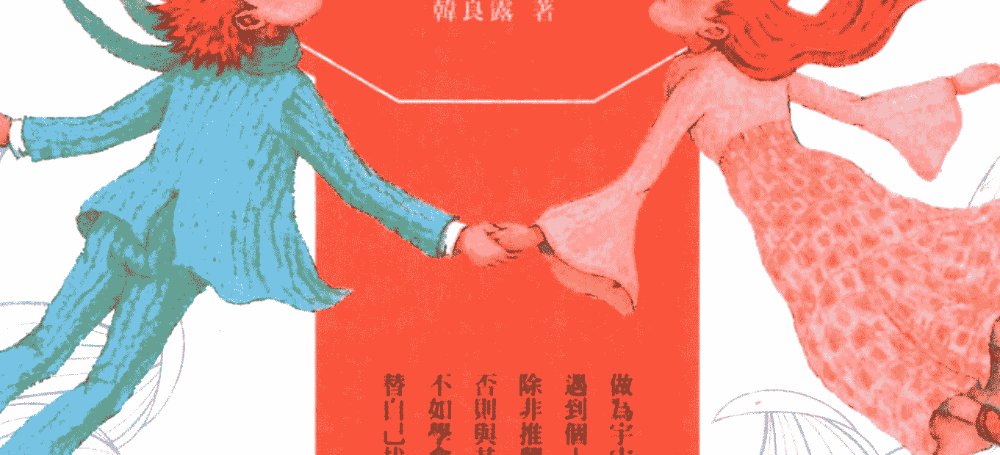
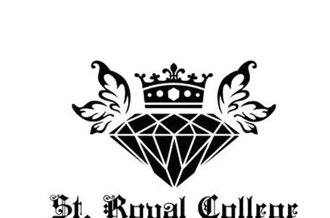
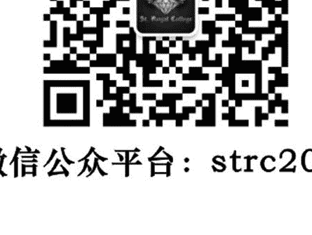
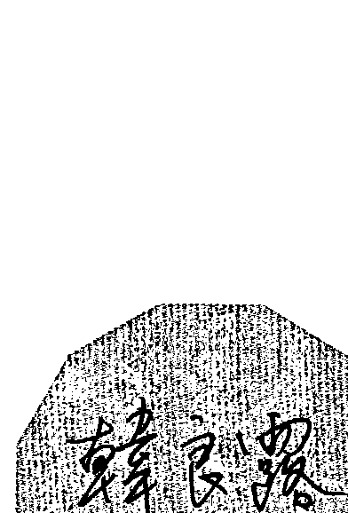

## 韓良露  
— 生命占星學院 —

## 愛情全占星

了解愛情原動力，學習完美的親密關係

韓良露 著

做為宇宙種子的我們，遇到情人星圖的性愛問題時，無非推翻棋局不玩了，否則與其翻黑牌翻雲覆雨轉陣走，不如配合牌面找出較好的配對方式。

## 全新增訂版

## 制作说明

本书由皇家圣学院出重金从台湾购入的原版书籍扫描制作完成。为达到最好阅读效果，特地把原版书全部切开后，再经由专业扫描设备高精度扫描完成，并经过一张张的 PS 后期处理最终成书，其间花费大量的人力、物力以及时间，只为能给大家提供经济并优质的神秘学学习资料而努力。

本学院强力谴责某些机构和个人，把本学院花心血制作完成的电子书籍，包装后直接放在自家淘宝网上低价倾销的行为，以谋取不劳而获的经济利益。如果长此以往最终将无人愿意再为大家花心思制作电子书，那以后可能大家再无新书可读。

为让大家以后能够读到更多的好书，也为了本学院的良性发展。本学院恳请大家尽量做到如下几点：

- 尽量在本学院的网站购买电子书籍。
- 请勿用技术手段把电子书内的水印及加密去掉。
- 在收到电子书后小范围传阅即可，千万不要公开传播，更别挂到淘宝网上低价销售。

同时为答谢广大支持者，学院电子书将做如下调整：

- 学院会把一些早已收回制作成本的电子书折价销售。
- 最新制作的电子书籍会开放打印功能，大家购买后有条件的可自行打印成书。

## St. Royal College  
## 皇家圣学院

- 专业占卜预测机构
- 神秘学培训机构
- 水晶能量研究中心
- 官方淘宝：http://strc.taobao.com
- 官方微博：@皇家圣学院
- 新书发布QQ群：316790219
- 购买更多好书请联系院长大天使

大天使  
皇家圣学院 院长  

QQ：715104687  
手机 / 微信：13641926204

微信公众号平台：strc2011

## 愛情全占星

了解愛情原動力，學習完美的親密關係

韓良露 著

## 本書獻給

所有我愛過與愛過我的人們  
他們都曾和我一起分享過  
人類情感經驗的複雜與奧祕  

更要感謝我的丈夫  
由於他的了解和支持  
我才能兼得心靈孤獨旅行和  
人生有伴相隨的雙重快樂

> 註：本獻詞收於舊版《愛情全占星》，出版日期為一九九八年。

## 出版緣起

興趣廣泛、身分多元的知名文化人韓良露，除了大家熟知的作家、媒體人及文化推動者身分之外，她也是藝文圈中最受重視的占星學大師。

一九九二年起她在金石堂金石書院（現龍顏講堂）開設占星課程，由於口耳相傳、好評不斷，課程一直持續到二○○○年才劃下休止符。在長達八年的四百多堂課中，她以歷史、哲學、心理學、社會學的角度，將占星的深層智慧化為生動的教學內容，讓大家在學習與命運對話的同時，獲得看待人生的更高視野。

這一系列課程不但架構了宇宙法則的邏輯，也融入她對人性與社會的觀察，但因資料整理工程浩大，成書計劃一直未能完成。為避免這些珍貴課程內容成為絕響，南瓜國際透過多年來數量龐大的上課錄音及相關資料，依據當時課程的規劃邏輯，整理成系列書籍，期望能藉由文字重現精彩、動人且充滿智慧的上課盛況。

## 目錄

- 自序｜世界和心靈的旅人 8  
- 新版序｜占星學的文藝復興 13  
- 前言｜閱讀占星人生地圖 23  

## PART 1  
### 伴侶之愛

- Chapter 1 占星合婚之幸與不幸 63  
- Chapter 2 月亮的親密愛人 71  
- Chapter 3 五宮的人生如戲 81  
- Chapter 4 八宮的神祕：人類原欲的煉獄 97  
- Chapter 5 愛神的三種象徵：肉欲、激情、親愛 109  

## PART 2  
### 愛的原型

- Chapter 7 木星之愛：不曾實現的玫瑰花園 — 123  
- Chapter 8 土星之愛：世間緣分的枷鎖與解放 — 133  
- Chapter 9 天王星之愛：顛覆倫理的愛情 — 145  
- Chapter 10 海王星之愛的迷惑、幻滅和救贖 — 153  
- Chapter 11 冥王星之愛：激情與死亡的協奏曲 — 161  
- Chapter 12 凱龍和毀蛇性姿態 — 167  

## PART 3  
### 愛的異形

- Chapter 13 金星愛神與火星性神的戰爭 — 175  
- Chapter 14 土星之性壓抑、冷感與禁制 — 181  
- Chapter 15 冥王星和火星帶來的性暴力 — 189  
- Chapter 16 金錢觀和性愛觀的占星對話 — 195  

## PART 4  
### 家庭之愛

- Chapter 17 八宮的家庭神話 215  
- Chapter 18 太陽父親的榮耀和魔咒 225  
- Chapter 19 月亮母親的偉大和陰影 243  
- Chapter 20 「內在父母」和選偶 255  

## PART 5  
### 另類的愛

- Chapter 21 戀親、陽痿與同性戀、雙性戀 265  
- Chapter 22 青春之愛的悲歌 275  
- Chapter 23 女性更年期的性欲 281  
- Chapter 24 伊底帕斯情結和亂倫禁忌 287  

- 附錄 占星學常用符號 294  
- 附錄1 個人星圖查詢網站 295  

## 自序  
## 世界和心靈的旅人

一九八○年的夏天，當時的我在電視圈工作了近十年，曾經寫過上百齣關於男女情愛、人間悲歡的電視劇本，也企劃製作過近千集討論社會、政治、經濟、生態等議題的每日兩小時新聞節目。我感到身心靈極度疲憊，一直對生命懷有強大熱情的我，驚覺到自己的內心已經被工作掏空了。

我想到古老農業民族的訓示：土地必須休耕和輪耕才能保有生產和創造的活力。於是我結束了所有工作，讓自己放逐一年。

在那一年的生涯出走時光中，我買了三次環遊世界機票，去了五大洲的許多不同國家，完全滿足了我從小就有的旅行欲望。我還記得第一次的「旅行」，是在五歲時一個夏日黃昏，我跟隨著一對推著老式醬菜車沿街叫賣的夫婦，從新北投山上的家出發，走遍了新舊北投的大街小巷。

以為我失蹤的家人在四個多小時後，才等到全身疲倦但滿心歡喜的我返家。雖然被責罵了一頓，但那個黃昏的記憶——街道的形狀、陌生的面孔、各種聲音和味道——一直都讓我念念不忘。

旅行了四十多個國家的我，所得到的快樂，其實和孩童時期那次的經驗一樣，都是源自對新的、不同的、未曾經歷過的世界的好奇。

從小，我一直是個極度好奇的小孩，對自然、環境、動植物、人們都很好奇。十歲的我就曾一個人沿著大屯溪往上行，一心想發現大屯溪的源頭。十歲的我也偷偷知道了街坊鄰居的許多祕密，像誰家的媽媽和誰家的爸爸好之類的事。

也就是這種好奇的動力，讓我十二歲就開始迷上第一次戀愛，十四歲發現文字的魔力而嘗試寫詩，十六歲看了費里尼的電影後開始做電影夢，十八歲時沉迷於杜思妥也夫斯基的小說，十九歲又變成對政治好奇而幫黨外助選。

不管是戀愛、藝術電影、政治或者後來的神祕學，所有的熱情和專注都源於對生命本來的好奇。

因為對人類心靈世界的好奇，我自然對可以描述人類心靈活動的各種藝術形式——像詩、小說、劇本、電影——懷有高度熱忱。但藝術最美妙之處是在呈現「什麼」，而不是解釋「為什麼」；後者是科學、哲學、神學或神祕學的工作。

偉大的藝術當然可以直窺生命的奧祕而讓人有所領悟，但是要解釋這種領悟，還需要更複雜的知識系統。不管是先天或後天的限制，讓我無法進一步發展我對太空物理、生物基因等奇妙科學的志趣，但對於本質上是探討生命科學的神學和神祕學則持續懷有興趣。

這些興趣雖然驅使我接近過不少宗教和東西巫術，但許多宗教活動和巫術研究，都以世俗生活的功利性為主，不外乎去除恐懼、獲得安全感，或健康、愛情、財富等世俗願望的實現。

由於這些較膚淺的應用性與功能性的強調，使我對東方的紫微、八字、鐵板神數或通俗的西方占星學，一直既有興趣卻又常感失望。我不是僅僅希望知道命運的變化，更希望能了解這些變化背後的神祕力量和意義。

就在一年的世界之旅快要結束時，有一天我坐在倫敦的一家咖啡館中，看到了一个占星學研討會的介紹。研討會中有各種嚴肅的論題：像占星學與榮格分析心理學、占星學與生物基因、占星學和神話學等等。這些題目深深吸引了我。

我決定報名參加，而這次研討會的經驗，也影響了我後來四年多的生活。

我在倫敦住了四年多，除了偶爾還做世界的旅人，經驗更多不同風土人情外，大部分的時間都是在做「心靈的旅人」。指引我的羅盤是榮格分析心理學派的占星學，而啟發我最多的人，是被視為英國當代文化重鎮的占星學大家麗茲·格林（Liz Greene）女士。

榮格在研究古代煉金術的知識系統時，領悟了煉金術的奧祕在於它是關於心靈轉化的象徵。其實所有偉大的知識系統的終極意義及領悟都是關於轉化，而不是獲得。

但是人的追尋卻常是迷失的，以為鉛變成金、工作變成名利權勢、愛情變成占有他人等等是追尋的最終目的，而忽略了我們存在的基本價值只是經驗及過程，其間的演化和轉化才是靈魂的課程，而不是任何形式的獲得和占有。

嚴肅的占星學在歐美一些國家中，尤其是英國、瑞士、德國和美國，在經過一九七○年代末期到今日不少占星學家的探討及努力後，逐漸獲得一些主流學界的注意和重視。

有不少業餘的占星學家同時也是著名的太空物理學家、化學家、心理學家、生物學家等等。也有些人開始把占星列在選修的課程中。這些現象顯示了占星學在即將來臨的資訊社會中日趨重要。

但是，對於嚴肅而認真地把占星學當一門學問來研究的人也都知道，占星學在今日的復興似乎只是冰山的一小角而已，距離真正占星學的文藝復興還早。

對許多堅持正統知識系統的人而言，占星學還太極端，也太不符合量化的科學標準，再加上流行、通俗說法氾濫，更加重了某些人對占星知識的誤解。

人生苦短，知識無涯。任何一門知識系統的發展和進化，都需要好多世代的努力。

我們都是時間的旅人，在宇宙大海中航行，各自述說旅行的經驗和故事。我很高興自己發現了一占星學的奧祕，就好像聽到了某處城堡中有個聖杯的傳說。

在四年的時間研究占星學，對我心靈的意義而言，就像神話學大師坎伯所說的「英雄的冒險」一樣。

在前往城堡的旅程中，我經驗了各種形式的考驗和轉化。這本書只是我旅途的札記，我還不曾找到聖杯，但我願意和世人分享關於聖杯的各種知識和想像，以及最重要的心得——得到了我的喜悅。

偉大知識的終極奧祕即在領略及分享狂喜，希望我能不負自己及眾人所託，慢慢地把帶給我許多快樂和啟示的知識系統分享給大家。

> 註：本文為一九九八年版原序。

## 新版序  
## 占星學的文藝復興

有一次我跟一個朋友聊天。

「為什麼我們獅子座的婚姻這麼辛苦？」

她是一個太陽獅子的家庭主婦，她不斷跟我抱怨先生的挑剔與婆媳相處的困難。

「我有個朋友也是獅子座，她的個性跟我都一樣。為什麼我先生每天東嫌西嫌，她先生就很欣賞她？我看她跟我明明就很像，為什麼她的婚姻就比我輕鬆這麼多？」

我問了她先生、婆婆跟她朋友的先生各自的星座，又問她的朋友圈中有沒有獅子座太太與天蠍座先生的組合，如果跟那個朋友相比，誰的婚姻生活比較好過？

她想了想：「好像我比較好過一點。」

每個人都是一個獨立的小宇宙，每個人的宇宙中各自有著許多必須面對的生命課題。當一個人與另外一個人形成親密關係，就等於是兩個宇宙產生了互動。

較之於一個人的自我宇宙，不同宇宙之間的能量流動更有著無數的變化。天時、地利、人和的外在因素，也會對親密關係造成影響。不同的時間與不同的社會環境，會造成每個人能量高低起伏；婚姻裡家中其他成員之間的互動，更是不可忽視的推力或拉力。

每個人的星圖都是獨一無二的，每個人需要面對的問題與進化的方向也都不同。

占星學是一門高度個人化的學問。透過占星學，我們不但可以了解自己獨特的生命旅程，還能透過它獲得身心靈的成長。任何的行星落在不同的星座、不同的宮位，以及彼此間不同的相位，都會造成不同的生命情境。

這幾年由於大眾媒體的推波助瀾，諸如牡羊座很好色、處女座很龜毛、天蠍座很恐怖……很多人對於不同的星座有著不同的形容詞。但這些形容詞並不能讓人分辨出星座能量運作背後真正的本質。

台灣這些年十分流行的星座說，根本稱不上占星學，只擇太陽的十二星座妄想用此占星。這不僅辨不到，更使占星學背上輕信、迷信的污名。

如果我們對於星座的理解僅止於此是很可怕的。這也是很多人占星學了很多年都沒辦法真正學會的原因——因為學來學去都只學到了形容詞。

乍看之下，這些形容似乎讓人能夠快速分辨出星座之間的不同，但是這些模稜兩可的形容詞卻讓人更加混淆。

如果我們想要真正了解一座山，就必須先從這座山是花崗石或者頁岩構成等最根本的知識一步一步著手。如果不先看結構，永遠來回只是去形容這座山「很有力量」、「它的石頭看起來鬆鬆的」、「這座山的石頭摸起來好像比較柔軟」，我們便永遠沒有可能真正地認識它。

唯有了解正確的基本知識以後，我們看到的才是一座真正的山。

## 不斷進化的算命觀

就像人人不可能都成為醫生或心理學家，因此不是每個人都可以或需要成為占星學家。然而這不意味著人就不能擁有一些必要的醫學知識、心理學知識或占星知識。

學習占星學對自己最大的禮物就是，它不會將自己的一生變成兩個小時的算命。

如果一個人的一生被縮減成幾個小時的星圖解讀，這樣的生命就實在太淺薄了。

跟看病一樣，算命也是源遠流長的活動。從原始部落的巫士觀察葉脈、動物的內臟，到各地神官占卜求神諭，以及先民各種觀測星象、面貌、掌相的方法，都是在算各種的命——大至部落國家命，小至君王百姓的命，人類一直很愛算命。

這些算命的活動，自然逐漸累積了不少算命術，也建立了一些命學。但是比起醫學、天文學、化學、生物學等種種學科，命學的發展進步卻一直有其局限性。

基本上可說是「術多道少」——算命活動多，但命理的研究與發展少。

台灣充滿了算命的活動，但算命文化或命學的水準卻相當低落，很大的因素即在於缺少知識分子的參與。

台灣算命界有一種光怪陸離的現象：問命者和算命師都像是在逃難的人一樣。常常是問命者上門，生辰資料一交代，算命師畫好了星圖，就嘰哩呱啦三、四十分鐘講完，之後收費。

好像大家都沒時間好好坐下來仔細研究久一點，甚至分成幾個課程分別談不同的事。

算命界流行的買賣都是吉普賽式的。問者也只關心幾件事：男女婚嫁、事業、金錢、健康。答者也只能說出大概，因此常有人批評算命師誇誇其談、含糊、避重就輕、前後不搭等。

這實在難免。想想看，要任何科學家只用二、四十分鐘去處理、判斷一個實驗過程與結果會如何？

為什麼會造成這種現象？關鍵即在於缺乏對知識應有的足夠尊重。不管問命者和算命師都一樣，當然算命師要負的責任較重。

有的算命師會辯稱是市場機制，就如同常聽人批評醫院門診醫生只花三分鐘看個病人，因此也容易產生誤診的狀況。

其實醫學知識以往也曾經是少數專業人士的特權，直到大量針對一般讀者的相關書籍出版，大家才得以自由地接觸各種與健康相關的知識。

知識是否會被少數人壟斷，可以從兩方面來看：一是外在環境的限制，再是個人的態度。

在人類的歷史中，知識的普及化是文明進展的一大象徵。從印刷術、大眾媒介到現在的電腦網路，外在的環境提供了人類越來越多的工具及機會去接觸知識。

以西方占星學而言，過去不少被占星術士藏為私有的祕笈，在占星書籍的出版與電腦網路的推廣下，二十世紀末可說是人類普及占星學的世代。

就像現代醫學、心理學普及化的潮流一樣，一般人若懂了一些基本的占星學知識，不僅能增進對自我的了解，也可以在尋求專業占星學家的協助時，懂得如何提出較專業的問題，也能分辨遇到的占星學家的良窳。

就像一個好的醫生應當適當地回答病人的醫學問題，以及診斷書應當盡量讓病人看得懂，占星學家也有義務要和詢問者溝通占星學的知識，協助詢問者自我成長。

## 宏觀宇宙與微觀宇宙的對應法則

我常覺得，如果遇不到好的占星師，不如不算命。

因為算命跟買東西不一樣。每一個算命師在算命時，不但在販賣他們對占星知識的精確與嚴謹與否，同時也在販賣他們的倫理、哲學、價值觀等等。

但算命師會因顧客的水準而受影響，顧客也會根據自己的倫理、哲學、價值觀在要求算命師。因此，如果任何一方有道德上的缺陷，都可能造成不好的結果。

算命的目的，是生命的提升，而不是拿它當黑學來用。

從遠古時代開始，人類一直嘗試編寫準確的天文曆，正確記載天上星辰的運動。因為星辰運動才是真正的宇宙時間，比世界上任何人造的鐘錶都準確。

今天人們所習慣的西曆，其實只是根據地球繞太陽公轉的周期所訂出的太陽年曆，而它最早始於羅馬的凱撒曆。

據凱撒大帝在西元前四五年訂的儒略曆，這個曆法的太陽年和恆星年的時間相比，每一年會相差十分鐘。到了西元一五八二年，已經多出了一天，因此新曆只好把一五八二年十月五日到十四日這段時間刪除，並且設立一套繁複的閏年規則，一直沿用至今。

人類曆法的目的無他，不過是和宇宙時間越接近越好。而這也應是研究占星學的原則：只要談的是天體的運行，就不可能離開天文曆法。

占星學和天文學原本是雙胞胎。誕生的年代古老到人類有限的歷史記憶都無法清楚推算。目前最古老的身世記載可遠至三萬兩千多年前的冰河期——從當時留下的動物骸骨上，已發現史前人類刻畫下的月亮運行天際的週期。

至於較近的文明中，關於占星學和天文學的身世資料就豐富多了。

從六千多年前古埃及人繪製在金字塔中的天文圖，到兩千多年前亞述人的天文曆，再到希臘時代托勒密根據各種古老文明的占星學傳統，編撰出人類有史以來的第一本占星書籍。

這期間，占星學也成為人們最看重的學科。它是一切知識的源頭，包含了神話、數學、數字學、天文學、醫學、哲學、靈學、宗教等等，也是古代博學之士不可少的基礎知識。

由於占星學的核心精神在於探討宇宙的法則和人間事物的對應關係，即所謂宏觀宇宙（天上世界）和微觀宇宙（地球上的萬事萬物）之間的關聯，這種超越性的探索精神，自然不容於人間一神論的宗教教義。

從西元四世紀開始，占星學大受獨尊正統基督教的羅馬教廷排斥，使得占星學在西方世界沒落，但卻在阿拉伯世界興盛起來（西元八世紀左右）。

如果沒有阿拉伯人的傳承，今日實用的占星學傳統——諸如許多古代的占星學、天文學、醫學、哲學、數學等等——將無法延續香火到西方的文藝復興時期。

西方世界的文藝復興，是諸多古老知識之光的重現，其中占星學的復興最為顯著。當時許多著名的大學都重新開設占星學研究課程，而許多後世著名的天文學家也曾是占星學家，如哥白尼、笛谷·布拉赫、克卜勒等。

在這段時間內，占星學和天文學仍並駕齊驅，但占星學的腳步也逐漸露出疲態。

尤其從伽利略開始用望遠鏡觀察天空，純粹的宇宙天文學研究成了科學界的新旋風。人們越來越關心看清楚宏觀宇宙的實相，而不那麼在乎這些現象和自身小宇宙的關聯。

唯物科學凌駕唯心科學。即使牛頓篤信神祕學，在發表了《數學原理》後，他卻成為科學至上的代言人。

然而牛頓終其一生最想完成的志業，是證明占星學和神祕宇宙力量之間的關聯。

牛頓晚年曾孜孜不倦地寫下一百多萬字的文稿，其中都在探討關於占星學及《聖經》密碼這類的神祕學議題。

但以牛頓當時的科學條件，用科學研究神祕學比研究物理還難。因此這一百多萬字的文稿並無法解決牛頓的困惑，他臨死前要求燒毀這些神祕學文稿。

上一百年後再公開，因為他相信一百多年後才會有更多人了解他所做的努力。整個十八、十九世紀，占星學陷入前所未有的低潮，原因除了西方的新理性主義排斥一切無法利用科學方法實驗、量化研究的知識系統外，占星學本身也逐漸背離天文學基礎，走向根本不「占星」的各種迷信及假借星象之說。就在這種占星學自身不長進的內憂及效驗唯物科學觀的外患之下，占星學從古老知識的神聖殿堂跌落為市井小民的迷信。

所幸，從二十世紀的下半葉開始，科學發展從確定的古典物理學走進了不確定的量子力學世界。宇宙既然是由無數的質子、中子、原子、電子所構成，它們集合體之間的互相撞擊影響，自然就說明大宇宙和小宇宙（地球、人、萬物）之間的關聯。而這些新的科學觀念，也帶動占星學在西方世界的發展，尤其是英、美、德、瑞及北歐等科學先進國家。從一九八○年代以來，正統、嚴肅的占星學正逐步地進入西方知識系統的核心之中。

不相信命學的人常批評「命學不是科學」，這是有語病的說法。因為科學從來不是一門學科，而是一種研究知識的方法。以今日科學的標準，十九世紀以前的醫學、物理學都有不少漏洞。科學從來不是真理，而是一個嘗試找出更多真相的知識系統。人類目前已經進入了資訊的世紀，命學的精髓就在處理生命的資訊。這些奧祕的資訊可以透過生物基因專家、地球物理學家等等的努力而揭露。

從一九八○年代以來，不少現代西方占星學家也認為，在未來的二十一世紀，占星學有可能成為重要的生命資訊學科。這些占星學家也正結合心理學、生物基因學、電腦科技等知識系統，加速現代占星學的進步。

宇宙奧祕的本質是開放的，人類各自以不同方式去尋求解答。不過，雖然這些事物的本質相通，但演變與水準不一。科學其實從十七世紀才大幅進步，尤其是近二十年。但好消息是，當科學越進步反而越不排斥神祕學，有些神祕現象因而可以藉由科學的工具得以驗證。同樣的，神祕學也應當加緊運用科學的能力。簡單來說，科學應當從神祕學學習想像和直覺（愛因斯坦就精通此道），而神祕學應當向科學多學習方法和理性。

我認為二十一世紀會是人類知識大整合的世紀。生物學、物理學、化學、數學、哲學、靈學、神學、占星學等知識系統的分際將日漸模糊。不同的知識系統將借用對方知識的精華產生互動與影響，進而使得人類觀察自然、了解人類精神和物質現象的能力得到突破性的發展。不同知識系統將形成合作的網絡，而最大的挑戰將是共同去解開宇宙、生命之謎。

譬如說，宇宙學專注於宇宙創始之謎，生物基因學專注於解答生命進化之謎，靈學專注於解答人類潛能之謎，占星學專注於解答人類命運之謎，也就是了解宇宙與個人之間的互動關係。

# 面對生命的全新視野

想要徹底了解生命的豐富，占星學、文學、哲學、宗教、神話、心理學等等都是我們的工具。透過這些工具來閱讀自己的生命時，我們就能擁有一個更寬廣的視野來自我解讀。而在這些工具之中，占星學可以說是一種特別準確的解釋系統。

學習占星的過程中，對我而言最深的哲學省思在於：即使不能改變生命偶然的事件，但我們卻可以改變自己面對這些事件的態度。生命表象中充滿了秩序和混亂，如果能夠從更大的宇宙隱含層面來理解，所有的混亂都可能是更複雜、更難以發現的隱含秩序。

研讀占星學使我經常感嘆造化之妙。不管是秩序或混亂，想想六千五百萬年生物演化的奇蹟，才能使我們今日有意識地去和宇宙的造化對話。即使我們並不了解所有對話的意義，但卻可以因對話的存在而感動。

深信占星學的牛頓曾回答過不信占星學的哈雷一句話。牛頓說：「我研究過占星學，而你呢？」沒有認真研究過任何一門學科的人，信也是迷信，不信也是盲目。

> 註：〈新版序〉內容由一○○五年、二○○七年之相關課程錄音與一九九八年《中國時報》「人間女性」專欄刊載內容集結編訂而成。

## 閱讀占星人生地圖

### 前言

研究占星學，不能不先了解什麼是本命星圖（註）：即根據個人出生的時間與地點繪製的天上星象圖。當個人電腦還不像今日這麼普及的年代，用手工繪製一張星圖往往要用上許多參考書：不僅要查明出生時間換算成格林威治時間及恆星時間，還要計算經度如何影響宮位的配置。這些繁瑣的工夫，往往讓頗有經驗的占星學家也要花上一兩個小時才能製作出一張星圖。但今天坐在電腦前的人，不管懂不懂星圖製作的原理，只要懂得按下正確的鍵盤，三分鐘內就可得到一張星圖。

看著今日電腦繪製出來的精美星圖，我常回想起許多我所看過的古星圖，像從埃及、希臘時期流傳下來的粗糙但充滿神祕想像的考古星圖，或像中世紀修道院中珍藏的祕密星圖，以及我在歌德故居的書房牆上看到歌德的個人占星圖。由於受制於當時科學條件，這些星圖和今日的星圖比較起來當然草率許多。即使這些古星圖如此粗糙，但每回憶起它們，我仍然覺得萬分感動。我彷彿可以看到晚年沉迷占星學的歌德，如何琢磨著他那有限的星圖符碼，企圖去了解他自己以及他和世界的關係。

但是歌德也說過，如果有人能告訴他絕對的真理，他一定會避之唯恐不及。所有對人類知識系統懷有敬意的人都該明白，所有的知識系統都是隱喻。人類用無數豐富、多元的隱喻去建構我們和世界的關係。藝術是最接近「美」的隱喻，宗教是最接近「善」的隱喻，科學是最接近「真」的隱喻。

十七世紀以來，人類運用科學趨近真理的隱喻能力突飛猛進。今日研究星圖的我們，或許比歌德當年更能掌握隱喻的真相，但未必能保證我們一定能得到更多對生命奧妙的感動和啟示。研究占星學不過就是在研究星圖和世界的隱喻。所有的真理都在不斷的變遷下揭露，而永遠有更多的真理等待人們去發現。

我常覺得研究星圖和研究氣象、地圖有一些相似之處。所謂「準不準」都是相對的問題。今日的科學地圖比起古人的航海圖，或今日的氣象預報比起以前的民間氣象，都可以說準確了許多。雖然地圖永遠不等於地球，氣象也永遠涵蓋不了所有的天氣變化，我們仍然從地理學、氣象學的發展中不斷獲益。研究占星學也是同理，任何星圖的解釋都只能代表占星學家對人類現象的描繪與預測。科學占星可以幫我們更接近準確值，但沒有絕對值。

為什麼算過去準，預測未來不準？只要想想氣象學解釋昨天為什麼下大雨不難，預測明天是否一定下雨卻較難，就不難理解其原因。不過，比起我們小時候常笑說氣象不準，今日的氣象預測其實已經準確多了。星象預測也是一樣。今日好的占星學家能掌握的人類現象變化，也比從前要多很多。不過，不管是氣象或星象，都會發生有的事情較好預測、有的較難預測的情形，而這也是人類繼續不斷努力的原因，因為大家都想更接近所謂的「真相」。

畢竟我們手上握有的星圖是平面的二度空間，而人是活在三度或更多度的空間中。占星學不是死的學問，它是有機體，它不斷在成長。

## 學好占星的基本態度

我必須要告訴大家，學占星學沒有「直覺」這件事。所謂「直覺」，通常只是因為不夠了解而產生的主觀認定以及自以為是。當你深入了解知識的本質與真正的意涵之後，就無所謂的「直覺」了。唯有深入了解知識真正的本質，一點一滴從基礎學起，這樣才能累積成我們面對每一張獨一無二星圖時的解釋系統。

當我們對於占星學知道得越少，就會越急著想斷言吉凶；但是當我們學得越多，就越不會心急。星圖裡面蘊藏著宇宙無窮的奧祕，每一個基本知識當中都能讓人獲得對於生命的深入理解。與其急著亂斷吉凶，不如按部就班一步一步將基本知識學好。這樣才有能力透過閱讀星圖更深入地了解生命的奧祕，否則靠著直覺與想當然耳，一切都會是胡說。

對於占星初學者而言，一定要認識星圖中的三大主題：

- 行星：落在什麼星座。  
- 行星：落在什麼宮位。  
- 行星與行星之間有什麼樣的相位。

這三大主題是學習占星學的基本功。我先簡單介紹一下它們各自代表的意義。

## 一、星座與行星

儘管大家對黃道十二星座耳熟能詳，但如果星體不落在星座中，星座就沒有意義。所有的能量都來自行星與星座之間產生的化學變化。一般我們聽到的「牡羊座」、「金牛座」等等，通常指的是太陽落入的星座。太陽落在金牛跟月亮落在金牛的意義是不同的，單單用「牡羊星座」或「金牛星座」等去解釋星圖能量運作，往往有失周全。

在本命星圖中有十個重要星體，各自代表每個人生命中不同的能量：

- ☉ 太陽：一個人的意志與活力，是每個人最重要的陽性能量與生命中的重要男性。  
- ☽ 月亮：感覺、情緒，也代表生命中來自母系的遺傳。  
- ☿ 水星：思想、溝通能力、表達能力。  
- ♀ 金星：情感、價值觀、吸引力，跟物質世界結合的渴望。  
- ♂ 火星：欲望、性衝動、肉體的行動力。  
- ♃ 木星：智慧、機會、社會價值帶來的助益。  
- ♄ 土星：責任、限制、阻礙，社會價值帶來的壓抑。  
- ♅ 天王星：變化，宇宙性的巨大改革力量。  
- ♆ 海王星：直覺、靈性，宇宙間廣泛的融合力量。  
- ♇ 冥王星：摧毀、轉型，宇宙間醞釀的巨大毀滅與新生的力量。

### 行星落入的星座與宮位

從星圖當中我們可以很容易看出每個行星落入什麼星座與什麼宮位。以圖中的星圖來看，當事人的太陽在寶瓶11度，月亮在天蠍28度，火星在天秤9度。第一宮的起點就是上升星座，圖中的上升在處女6度，而太陽落在六宮，月亮在二宮，火星在二宮。

### 行星與行星之間的相位

「相位」指的是行星與行星之間的角度。圖中的太陽（寶瓶11度）與火星（天秤9度）兩者相差122度，為一百二十度和諧相（誤差2度）；火星與木星（巨蟹13度）兩者相差86度，為九十度衝突相（誤差4度）。

## 二、宮位

星圖中有十二個宮位，分別代表十二個不同領域的生命舞台：

- 一宮：長相、氣質、個人形象、童年環境。  
- 二宮：自我價值、有形與無形的資產。  
- 三宮：基礎教育、大眾媒介、兄弟姊妹。  
- 四宮：家庭生活、內心之家。  
- 五宮：戀愛、創作、子女、娛樂與賭博。  
- 六宮：工作、健康、維持生命正常運作的事情。  
- 七宮：伴侶、配偶、合夥人。  
- 八宮：權力、潛意識、與他人相關的金錢與性。  
- 九宮：高等教育、哲學、宗教、旅行及外國事務。  
- 十宮：事業、地位、社會形象。  
- 十一宮：志同道合的友誼及社團關係。  
- 十二宮：前世、業報與無意識。

## 三、相位

相位是行星與行星之間的視角，代表形成相位的行星之間相互的能量。相位的影響就像用耳機聽音樂一樣，越近的能量越大，越遠的能量就會變小。不同的占星教科書對於相位的誤差有不同的容許度，我通常會以六度以內為容許範圍。在占星學中，我們必須認識四種主要相位的意義：

- 合相（0度）：代表兩個行星互相加強的力量，是力量最強的相位，但也可能因力量過強而產生負面效應。  
- 對立相（180度）：代表兩個行星互相對抗的力量，但透過靈性的學習，有可能反而形成互補。  
- 衝突相（90度）：代表兩個行星互相阻礙、互相消耗能量。  
- 和諧相（120度）：代表兩個行星互相協助的力量。

初學者剛開始學習閱讀星圖時，不免從星座、宮位、相位等單一議題著手。循序漸進，一塊一塊打好基礎之後，我們可以試著透過根本學理深入檢視，活化自己的功力，這樣才能從立體的角度讀出星圖顯現的生命意義。就像學游泳一樣，大家一開始多半先學腳怎麼動作，再學手怎麼動作，然後試著手腳並用。當我們熟練到自然而然忘掉手腳時，就算學會了游泳。

任何的知識系統都必須有其結構，必須知其所以然，這樣才能發展出真正舉一反三的能力。否則生命情境有著無限的可能性，與之對應的結論也無限多。如果想要藉由結論學習占星，就永遠不可能有學會的一天。

很多占星書常常會過度簡化，甚至做出一些似是而非的推論。舉例來說，月亮代表情緒，而雙魚又常被形容成「很浪漫」。講到月亮雙魚的時候，許多占星書可能會告訴大家月亮雙魚的人很羅曼蒂克、很有愛心；月亮雙魚的男性當事人可能小時候母親很浪漫，長大之後也很容易選擇很浪漫的女性為結婚對象。由於月亮也與家庭有關，很多人可能就會一廂情願地推論月亮雙魚的人小時候家裡一定過得很舒服，家庭環境很好……

但事實並非如此。

「雙魚」是一個跟現實無關的能量。雖然充滿夢想，但是缺乏行動力，因此月亮雙魚的人小時候家庭生活往往不穩定。當事人童年通常會感受到母親因為某些因素特別軟弱，沒有能力善盡母職照顧好家庭。對於男性當事人來說，他很可能會選擇一個很浪漫、很有愛心的女人作為結婚對象，但很浪漫、很有愛心的人往往沒有辦法好好扮演妻子的角色。因為她們是「眾人的母親」、「眾人的情人」，無法對特定對象提供現實的依靠。

尤其月亮雙魚如果有泡相，當事人小時候家中可能有父母酗酒的問題，也有可能家中有人有精神或其他生活情境帶來的情緒困擾。像我自己就是月亮雙魚，我的母親的確很有愛心，她原本在小學教書，後來選擇去育幼院工作。我常看她工作時對院童們充滿愛心，但她對於照顧家中小孩不太有興趣。再加上我的妹妹良雯一出生就有智力問題，為了幫妹妹尋求醫治，她的情緒也使得家庭生活受到影響。

這些都是一般坊間占星書籍不會寫到的內容。這也說明了，唯有從最基礎的占星學理架構出發，我們才能真正理解這些行星特質所反映出來的生命現象。

## 註

占星學是以地球上人類觀點創造出來的知識系統。在占星學中的「行星」是相對於「恆星」的名詞，包含太陽、月亮、水星等天體，與天文學上的「行星」定義不盡相同。

## 關於本書的閱讀

在本書中，我透過大家很關心的「愛情」議題，讓大家理解在個人星圖中與愛情相關的行星、星座、宮位與相位，是用怎樣的方式去影響著每個人的性格，以及各種星圖可能出現的不同生命情境。

占星學確實有探討陰性、陽性或男性、女性意識的理論，但這種性別並不是完全依照男女兩性的身體器官來決定。事實上，生理對性別的影響力，遠比社會與文化對性別的影響來得小。由星圖來看，一個男性可能陰性元素較多，因此會展現比較多女性的反應；同理，女性也可能較為陽性。

因此，如果有的算命師有男女命不同的看法，基本上是反映了算命師自身或他身處社會的性別文化偏見。不過，有的社會、有的文化確實會對某種陰性或陽性特質較有利或較不利。基本上，人類在過去兩千年大部分時候較壓抑陰性文化的力量，但目前時代之輪已經在轉變，陰性主導的力量正在逐漸上升。

人與人之間都是相對的。一個女人可以本來比較陰性，但是遇到某些人時會特別展現出陽性能量，即使對方是男人；反之亦然。

占星學奇妙的地方在於，命運或許可以決定我們受哪一類型的人吸引，但不能決定我們一定會跟哪一個特定的人在一起。我們或許命中注定會遇到某一類的人，但是隨著我們自己能量的高低，遇到的人也會有所不同。

每個人的能量就像銀行帳戶一樣，都有可能隨著支出或存入而萎縮或成長。當一個人長期處於缺乏愛的環境，或者一直與別人關係緊張，愛的能量就會萎縮；但如果能透過身邊所有我們愛的人讓自己不斷練習愛的能力，愛的能量就能不斷成長。

不管是占星學或者任何經典學問，從書本或課堂上學到的只是第一步。接下來必須將這些知識在生活中驗證，藉此進入生命的內在之後，對這些知識才會產生強烈的感應，這些知識對我們來說才能夠「悲智同在」。

「知道」與「體悟」就在一線之隔。我們常常認為自己知道，可是感覺到愛的時候很少；我們知道自己愛某個人的時候很多，但真正感覺到自己愛某個人的時候卻很少。我們忙著做事情的時候，靈魂就會被占據。如果我們不為自己保留一些空間與時間，就不可能產生這種情感。

透過身邊所有我們愛的人，我們可以從中感受到愛的能量。愛不是只有愛情，還包括對父母、兄弟姊妹、配偶、朋友的愛。當我們愛一個人時，不管是父母、兄弟姊妹或者另一半，都一定要花時間陪伴他們，而且陪伴中不能包含太多世俗責任。因為當我們不在忙著做事的時候，比較容易感受到愛。

我們常將「陪伴」與「陪別人做事」混為一談。當我們陪伴一個人做這個、做那個時，我們的身體狀態很忙碌，但靈魂狀態卻不活躍。如果你老是被雜七雜八的事情占據，當你跟另一半或家人在一起時永遠都在做些什麼，你的一生就很難真正感受愛。

譬如我常常跟我先生在外面奔來跑去，這種時候我根本不會去想愛不愛。但有時候在奔跑之間停頓的片刻，這一剎那我會感受到愛。

即使只是偶爾的瞬間，我們也可能學習到愛的能量。當我們面對恨的人時，如果能在剎那間產生一個覺悟：「天啊！我居然這麼恨他，真是蠢，應該不要再恨他了。」當下放下對他的恨，在這個瞬間，我們就能感覺到能量的轉換。

愛永遠是電光石火的一個感悟。我們一定要在生活中保留一些時間與空間，讓自己有機會去經驗這些剎那間產生的、超越知識的體悟。這樣一來，我們不僅能夠知道知識的架構，透過體悟的經驗，更能真正得到知識的能量。

> 註：「前言」內容由二○○五年、二○○七年之相關課程錄音與一九九八年《中國時報》「人間女性」專欄刊載內容彙整編寫而成。

## PART 1  
## 伴侶之愛

沒有任何社會公定的擇偶條件適合每一個人。人有獨特的靈魂和獨特的宿命，我們可以和自己的天使結合，也可能和自己的魔鬼結合。只要婚姻生活繼續存在，天使和魔鬼都將永遠在其中跳舞。

## 一宮和七宮的婚姻之路

在占星學中，黃道十二宮的第七宮是婚姻宮和伴侶宮（也涉及事業的夥伴）。第七宮也被稱為天秤座宮。天秤座的理想是均衡、公平、不偏不倚、和諧。但和第七宮正好相對的第一宮（也被稱為牡羊座宮），牡羊座的本能是獨斷、搶先、發展自我、唯我至上。天秤座喜歡當協調者，牡羊座愛做急先鋒。

這個設計是很有意思的。任何相對的兩宮都有著相輔相生和互相排斥的兩種作用力。一個人的本命星圖中如果第一宮太強，除非這人太陽或上升星座在天秤座，否則這人容易有自我中心的傾向。相反地，如果第七宮太強，除非此人太陽或上升星座在牡羊座，否則這人容易被別人牽著鼻子走。

這種偏於一端的狀態來自排斥性的作用力。較強的一宮自然要居領導地位，以致造成人生發展的不平衡：或是為了自我而喪失與他人相處的美妙關係，或是為了與他人保持和諧而喪失了自我。

若要彌補這種魚與熊掌不可兼得的處境，就必須有意識地運用相對兩宮相輔相生的力量，調整過強的宮位或強化較弱的一宮，讓自我和他人之間經常處於對話和溝通的狀態，增進彼此的了解，幫助彼此合作，達成一宮和七宮的和諧。

當太陽在一宮時，當事人有極明確的自我意識和意志。他們具有天生的權威，舉手投足間顯現重要人物的風範。他們需要別人的崇拜，因此常吸引仰慕者；而在婚姻生活中，他們要求別人的配合。如果一宮太陽的相位不好，和其他星形成不和諧相位，當事人可能會極端自命不凡，以意志凌駕他人，要求配偶徹底配合，行事風格相當自我中心，也因此常常引起配偶的不悅和不滿，造成婚姻關係的困難。

月亮在第一宮的人，如同情緒的海綿。他們相當敏感、富直覺力，善於接收他人最隱微的情感反應，使得他們能和伴侶建立十分親密、相融的關係。但過度發展的月亮一宮、相位不佳的人，情緒可能十分氾濫。他們的情緒狀態像剛出生不久的嬰兒，渴望一個全能母親或任何照顧者提供無止境的關愛與照料。這種嬰兒狀態的情緒可能一直延續到成人生活中。他們雖然在現實上已經不再有那麼多需求，但心理上習慣於那種無微不至的滿足。他們總忍不住像母親般緊緊黏住配偶，造成相處關係的壓力，成為喜愛有獨立空間伴侶的大麻煩。

水星在一宮的人，是個天生的獨立思考家。他們很小就展露出當記者的天分，永遠在問為什麼。他們會到處收集資料，找出自己的答案，他們不輕易接受別人告訴他們的意見。他們要有自己的主張，當外界的看法和他們不同時，他們總是相信自己是對的。水星相位不好，這種人和伴侶很容易因事爭吵——除非配偶永遠以他的意見為主。

他們又特別喜歡辯論而不喜歡冷戰，常常辯個不停，當伴侶已經累個半死、投降不爭時，他們就自認為自己的意見是對的。如果水星相位良好，有時他們對事物的看法確實獨創、風格創新突出。但若是相位不好，則常常口若懸河不休，伴侶必須極富外交的手腕與才幹（第七宮、天秤座的特長），才能和這種人平和相處。

當金星在一宮時，當事人大多有些自戀，但他們多半真的長得不錯，有自戀的本錢。當金星相位良好時，當事人的個性也會禮貌、優雅。他們愛美，有藝術的天分，喜歡和諧，伴侶很能付出感情，但同時更希望配偶永遠愛他們多一些，因為他們覺得自己更值得被愛。

金星一宮的人天生不會成為單相思者，他們的情感必須由他人對他們的熱情點燃。當金星相位不好時，他們的自戀傾向更強，有時他們談戀愛只因為喜歡感受別人如何愛他們。他們愛的是別人眼中他們的倒影。這使得他們的婚姻關係很容易產生問題，因為在朝夕相處、單調例行的家庭生活中，即使他們再迷人，他們的伴侶也不太可能永遠深愛著他們，使得他們再也無法從別人愛的眼神中看到自己的倒影。這對自戀的人是很大打擊，他們極有可能再去找一個新反射對象，這種情感的自我中心是他們婚姻生活中最主要的危機。

當火星在二宮時，不管相位好壞，都不是個好惹的傢伙。他們是行動的急先鋒，總喜歡搶先一步、爭個高下。當火星相位較好時，他們富有行動力，任何計劃交給他們都可以完成，他們會排除萬難，不達目的絕不干休。他們的配偶當然會欽佩這樣的能幹，但任何人跟他們一比起來，就顯得沒有他們果斷、堅持與迅速了。這使得他們很難和他人配合或齊頭同步。他們喜歡獨立辦事，不愛管轄，也不愛商量，再加上火星的急躁、沒耐性，作為他們的伴侶隨時得承受火星式的不耐及脾氣。

尤其是當火星相位不好時，他們不僅富侵略性，更富攻擊性，脾氣更火爆，還有一意孤行的傾向。凡是他們設定的目標與決定要做的事，不容受到任何阻擾，他們常寧可離婚也不將就別人。嫁給火星二宮相位不良的人，如果不做出氣筒或應聲蟲，日子還真不好過。我看過不少忍氣吞聲過日子的配偶，不管是女人或男人，他們的配偶都往往是在二宮有不良的火星相位。

當木星在二宮時，如果相位良好，當事人就是常人所說的幸運兒，彷彿冥冥之中老是有神在幫忙他們。他們通常都很有自信，個性愉悅而受人歡迎，感情豐富，想像力高，且才智過人。但這些好條件放在平凡的婚姻生活中，有時卻「太好了」。因為喜歡他們的人太多了，除非當事人有其他保守、穩定的星星力量來自制，否則他們並不容易安於一夫一妻的婚姻關係中。

當木星相位不好時，問題更明顯，他們會十分膨脹的自我，即使對人笑咪咪，心裡卻認為自己高人一等。他們無法「降格」或「屈身」在一段平凡的家庭關係中，他們渴望更多、更好、更不平凡的配偶，因此很少人配得上他們的期望。即使他們真的結了婚，過不了多久，他們可能又在幻想另一個更好的對象，而過分樂觀的木星通常不在乎婚姻失敗，他們相信下一個會找到更好的婚姻。

當土星在一宮基本上不是個好相位，即使在最好的相位下，當事人仍逃不掉土星帶來憂鬱、畏縮和易於悲觀的個性。但好的相位會使當事人十分負責、十分忍辱負重、吃苦耐勞。他們看待婚姻關係的態度更嚴肅，想叫他們在離婚證書上簽名可要大費周章，如果他們不是徹底心死，是不會輕易放棄一段即使外人看來很糟的婚姻。也因為這種個性，如果再加上當事人天性較弱，很容易成為婚姻關係的受害者。

當土星相位不好時，當事人更是極端害羞、退縮、害怕親密關係，無法表達感情，行為舉止笨拙不安。不論男性或女性當事人皆然，這樣的配偶雖然可能是好飯票，但常常引不起較為浪漫伴侶的熱情。當婚姻出了問題，雖然表面上是別人的錯，但他們「缺乏感情共鳴」卻不是完全無辜的。如果他們可以遇到「非常木星人」，能自得其樂，又能鼓舞他們同樂，將對婚姻生活幫助良多；但如果碰上「非常土星人」，在彼此都不願意離婚的情況下，則有可能過著相看兩厭且天長地久的生活。

當天王星在二宮時，相位好的時候也許是不凡風采，相位不好時也許是古怪滑稽。當事人的外表或個性一定有其異於常人的獨特之處。他們是天生的獨行俠，喜歡不受別人干擾，自做自的事，但他們並不獨裁也不專制，只是不想和人配合。有人自願配合都會讓他們覺得麻煩而不自在，他們最喜歡的是「leave me alone」。

他們渴望自由，也給別人很大的自由。這樣的人很適合偶爾結婚，有個別的銀行戶頭、朋友、工作、偶爾相聚。但這樣的人為什麼要結婚呢？其實他們通常都不真的想結婚。也有許多天王星在二宮的人晚婚或不結婚，他們最適合的身分就是做自己，最不適合的身分就是當某人的配偶、父母、老闆、情人等等。

他們對人與人之間的 bondage（束縛關係）最難忍受。尤其當天王星成不良相位時，在極端的狀況下，他們會是出門旅行也不告訴配偶，或是那種換了工作配偶也不知道的人。跟這樣的人結婚會像和外星人結婚一樣，奇怪自己怎麼一點都不了解對方。

天王星一宮的人，如果是男人的話，活在古代倒也可以，他可能是上京趕考的秀才，在京城一待就十幾年，也許根本沒去考狀元，留下土星妻子獨守寒窗。但對古代天王星女子而言，大概只有青樓可以選擇，名妓才有生存空間；在現代生活中，天王星一宮的人適合夫妻倆有著共同心智興趣的伴侶關係，例如兩人都是埋首於實驗室的物理學家，但是對親密關係或正常家庭生活沒興趣，吃電視便當就可打發一餐，生孩子也不必了。

這樣的配偶，如果天王星相位良好，會成為造福人類的奇才；但如果伴侶是比較「正常」的人，對婚姻關係有正常的期待，不小心嫁給天王星一宮相位又不好的人時，婚姻生活將變成很大的震盪。因為要天王星自我調適去配合別人是很難的。配偶除非另起爐灶，否則只能發展自我的興趣，善用天王星配偶不干涉的優點，也可以追求一個不平凡的人生。現代女性主義者倒不必排斥天王星一宮的男人，至少此人不會男性沙文主義。

海王星在第一宮的人是迷失自我的人。海王星的朦朧、混沌、無邊界，使他們缺乏一個定義分明的自我意識或自我形象。他們的「自我感」永遠和在他們身邊的「他人自我」相混淆。他們會把別人對他們的需要當成是自己的需要，他們不知道自己在變色龍，以回應他人的期望為天職。

他們比月亮在一宮的人更敏感、更富直覺，但他們不是善體人意，只是分不清「人意」和「本意」。當身邊的人悲傷時，他們或許會以為是自己在悲傷而陷入自憐的情緒中，根本無暇去體恤他人。

當海王星相位良好時，這位海王星一宮的人具有廣大的同情心，樂於助人。他們會願意為配偶犧牲，凡是孤苦的、貧窮的、對人生失望的人，都可從他們那兒得到無條件的慰藉和愛。這也使得海王星在一宮的人很容易被配偶或其他夥伴欺騙和利用。

當海王星相位不佳時，當事人常常是個沒有明確人生目標的迷途羔羊。他們在不同的職業、伴侶、生活方式中晃蕩，從來不知道自己真正要什麼。他們也常常是很有癮頭的人，明知道抽菸有害健康，卻會在心臟病發作後仍繼續抽菸，或帶著割掉了三分之一的胃還執迷不悟地喝酒。他們的自我常常讓伴侶既擔心又生氣，而他們正是藉由這種方法去得到他們想要的愛。

海王星一宮的人經常和母親之間有著很困惑不清的關係。當海王星和上升星座合相時，他們的出生常是個謎團。我看過一個例子，當事人直到二十多歲才知道自己是被領養的棄嬰；他們也有可能是私生子女。在這些異常狀況下誕生的嬰兒，通常覺得自己不被愛或被愛得不夠。

他們逃避人生，缺乏向現實說 yes 的勇氣。這些情況都源於他們靈魂的「無價值感」。他們無意識地覺得自己不值得擁有更好的生活。不能愛自己的人也是很難懂得愛人的人，他們婚姻關係的困境常常在於：他們能給予配偶同情，卻不能給予愛；或者他們要求配偶給予他們愛，而配偶只能給他們同情。

海王星一宮的婚姻關係經常呈現兩種狀況：他們可能會是婚姻中的犧牲者，為了一個「不那麼值得」的配偶喪失名聲、金錢、穩定的生活或正常的幸福等等；也可能會讓別人為他們犧牲。他們可能把生活處理得一團糟，讓配偶收拾爛攤子。但奇怪的是，不管哪一種，他們的婚姻關係都會有種神祕的力量，同情和移情深藏其中，在這個婚姻迷霧中的人往往很難掙脫。

當冥王星在一宮的人是個狂熱分子，對創造和破壞兼具狂熱。他們最不能做到的就是保持中庸，只有兩極，全有或全無。因此他們愛一個人時，會全心全意去愛，絕不保留；但他們不愛時，通常也是他們由愛轉恨的時候。和前夫前妻保持朋友關係不是這種人所擅長的。除非是他們先背叛別人，出於罪惡感只好保持友善；但如果他們過分友善，那可能是他們根本難忘舊情，會和前夫前妻繼續前緣的也有不少是這種人。

當冥王星的位置良好時，他們的狂熱使他們有驚人的原動力去完成某些目標。像在三個月內瘦掉二十五公斤、不眠不休在一個月內寫二十萬字、在三年內修成法律和心理學雙科博士等等。他們的意志力驚人，勇於掙脫舊日，開創新局。他們的人生常像階段性蛻皮的蛇一般，每個階段都會展現新的形象。

但冥王星的相位不好時，他們是可怕的敵人。他們不怕自毀毀人，他們散發著「不要惹我」的光芒，通常他們的配偶對他們都有所畏懼。這種冥王星人控制欲強、猜疑心重，很會吃醋，因為任何輕微的背叛都是對他們自尊的否定，他們絕不容許配偶外遇。不幸的是，他們自己卻是「只許州官放火，不許百姓點燈」。他們強烈的性怒和激情很難在例行重複的婚姻中得到滿足，但由於他們擅長保密，他們的配偶通常很難發現他們的不忠。

一般而言，冥王星在第一宮的人，做情人好過做伴侶。他們的狂熱和激情並不適合婚姻，但如果他們已經結婚了，如何調適狂熱和激情，使其不致擾亂生活，或讓配偶關係緊張得喘不過氣，是他們最大的考驗。麻辣火鍋雖然過癮，但天天吃也受不了。如果你和冥王星一宮的人結婚，想要婚姻不出問題，兩個人都得改變。

當第一宮有行星，而第七宮也有行星時，這些星座之間極容易出現一百八十度對立相（誤差在六度內），代表兩股彼此對斥的力量。這會使得行星的作用力比單獨一顆星相要增強許多，產生的困難就更加棘手。即使這些星星（兩顆或多顆以上）之間的相位超出對立相誤差容許範圍（超過六度），對斥的力量雖然較弱，但仍然比單獨要強。因此在考慮任何一顆行星的作用時，都必須同時衡量位於對宮的行星影響。

## 一宮與七宮行星的對立相位

當第一宮有行星，而第七宮又有其他行星時，這些行星之間極容易呈現一百八十度對相（誤差在六度內），代表兩股對抗的力量。這使得個別行星的作用都比單獨一顆星要增強許多，產生的困難就更加棘手。

## 一宮與七宮宮頭主星

一宮無主星或第七宮無主星時，則要考慮的是上升星座與下降星座帶來的影響。例如左圖第一宮宮頭位於處女，則上升星座為處女座；第七宮宮頭位於雙魚，則下降星座為雙魚座。

一宮無主星或第七宮無主星時，則要考慮的是呈「空宮」的戀宮星座（如上升是天蠍座，第一宮宮頭即為天蠍座，第七宮宮頭則會是金牛座）帶來的影響。有的人結婚的對象「剛好」有他沒有的空宮，這種「嵌入關係」常常是命運設計的「重點學習課程」。

當太陽在七宮時，當事人非常重視配偶和伴侶，他們把「我們」放在「我」之上。「我們」永遠比「我」大和重要。對於這樣的人，生命中若沒有許多的「我們」，如夫婦、合夥人、同事、同學等等，他們簡直不知道該如何活下去。

當太陽相位良好時，當事人重視自己和別人的關係，以人際關係的和諧為己任。也由於這種「看重」，他們喜歡尋找讓他們看重的人，因此他們在尋找及選擇伴侶時，會受那些有「太陽」「獅子座」特質的人所吸引。他們希望配偶重要、有明星氣質、具領導能力，在人群中耀眼奪目。他們不在乎做巨星旁的陰影，他們認同他們的巨星。

但當太陽相位不佳時，這種偶像崇拜不僅會使他們在「膨脹」的配偶旁顯得渺小，而且他們會真的變得渺小，喪失獨立的自我認同，以配偶的價值當成自己人生的價值。妻以夫貴或夫以妻貴，而不在乎自己存在的意義和使命感。他們是自我中心配偶的最佳管家、跟班、隨從、聽使喚者。這種婚姻或伴侶關係中沒有平等的愛與尊重，只有「服從」與「跟從」。他們或許是最佳觀眾，但絕不是最佳配偶。

當他們的配偶厭煩了這種一成不變的偶像崇拜，或他們發現配偶不再那麼重要時，他們關係的魔力就消失了，只剩下電影院散場時的淒涼。

有的太陽在第七宮的人比較厲害，他們會「想辦法」娶或嫁給重要的人，然後讓自己變得更重要。黛安娜王妃的太陽就在七宮，而她確實因查理而知名，再變成比查理更知名。而這也正是他們的婚姻要開始出問題的時候了：當兩個都覺得自己比較重要的人同在一個屋簷下，婚姻就成為競爭而不是合作。

當月亮在七宮的人情緒安全感來自一個穩定和舒適的家。他們理想的家要像孩童時期的家一樣，而配偶應當像個好母親。他們喜歡家中提供的舒適物質滿足，像是好家具、美味的食物、融洽的關係和親密的身體接觸，但他們卻對「性」有遲疑和保留的態度。除非不得已，否則性生活對他們而言總會引起他們的亂倫禁忌。

但由於月亮盈虧圓缺的不穩定性質，他們的婚姻關係也容易有不定期的變化。尤其當月亮相位不佳、呈不和諧相位時，他們的配偶或伴侶可能是情緒不穩定的人，因而帶給婚姻關係很大的麻煩。

當月亮相位佳時，他們則會選擇能保護、滋養他們的人。男性當事人會遇到像他母親一樣的女人；女性當事人會遇到一個有女性特質的丈夫。除了不會生孩子外，這個丈夫具有許多母性功能。

當水星在第七宮的人，對伴侶關係很有心智方面的興趣。他們喜歡發掘、經驗、思索人際關係的意義。他們是熱心的溝通者，是不愁沒話講的伴侶。唯一的問題在於，他們並不只對「一個關係」有興趣，他們需要多元的關係刺激他們的想像力和思考力。伴侶或婚姻關係是他們的田野調查，因此他們很難被鎖定。

基本上，他們喜歡聰穎性的關係。配偶必須有「終身學習」的打算，免得跟不上對方的心智發展。心智落後的配偶會使他們喪失興趣。

若水星相位不佳，這位多才多藝的水星七宮人也可能過著多采多姿的「愛情」生活，而他們的情人多半是從談得來的朋友變成的。他們即使光靠聊天也能聊出感情，愛吃醋的配偶要特別小心那些和他們很有得聊的友人。

有的水星七宮人也許一點都沒有水星的特質，他們可能是將這種特質投射到伴侶身上。他們可能會碰上一個古靈精怪、口才一流、善變又不肯作出海誓的情人，因而惹來無窮煩惱。

一般而言，水星七宮是個容易離婚的位置，尤其水星相位不佳時。但在現代社會，親密而重要的關係並不一定只在婚姻中發生，有些人的同居關係比一般人的婚姻關係更投入。總而言之，有這樣相位的人一生常有兩次以上非常重要的伴侶關係。

### 投親

金星在七宮的人是「情人眼中出西施」和「婚姻神話」的忠實信徒。他們只有在找到理想的情人及山盟海誓後，才會覺得生命有意義。好的金星相位不僅吸引理想的情人，他們自己也是別人眼中的「愛神」。他們懂得欣賞美，也會盡量保持美的形象以吸引他人。他們是寫戀愛小說中的才子佳人，很懂得花前月下的情調。

他們談情說愛的方式相當優雅，不像金星在五宮的戲劇化，或金星在八宮的「性致勃勃」。對他們而言，戀愛或婚姻生活都該像巴哈的賦格曲，而不是柴可夫斯基的悲愴式或華格納的激情型。

但當金星的相位不佳，尤其和一宮呈對沖時，這份對愛的理想卻注定要飽受折磨。他們可能吸引來極端自我中心的人，但因他們對和諧關係的尊重與渴望，使他們常會為和諧而忍耐一切。即使關係變得既不理想又百病叢生，他們的反應通常仍能勉強理智地保持面對。這個追求美、和諧的金星七宮人，可能身陷一個最不美的婚姻生活，到最後也可能毀掉了自己。

火星在七宮的人對親密關係非常衝動。他們會是交往一週就決定進禮堂的人，而這種行動魯莽的個性也表現在婚姻生活中。他們喜歡採取主動，要做關係中的老大，富侵略性，自然是不容易相處的人。尤其碰上另一個火爆分子時，爭吵甚至打架都在所難免。

有的火星七宮會引來這樣一個麻煩人物，婚姻生活變成競技場，充滿意志力和行動的對抗。這種刺激的性質通常也反映在性生活，他們是標準「床頭吵床尾合」的例子，但這種類似春藥效果的爭吵最終卻會大量消耗兩人的愛意。不佳的火星相位是離婚頻率甚高的位置，而離婚的過程也通常很不愉快，也許從警察局一直吵到律師、法官面前。這種火星人最糟的就是他們的脾氣和侵略性。調適火星在第七宮人最好的辦法就像練太極，如果他們記得仍對他們存有幻想，相處之道就是不要硬碰硬，用很有技巧、柔和的方式化解火星的急躁和火爆。

根據占星學傳統，木星在七宮的人，是個婚姻和伴侶關係中的「幸運者」或「受惠者」。他們經常會和有錢、有名、有影響力的人結婚，進而從婚姻關係中獲得物質或社會地位的好處。其實這種說法是相當受限的，而且發生的情形並不多見，除非木星和金星或太陽形成好相位。

通常木星帶來的好處並不一定這麼具象，有時木星帶來的是一種熱情、溫暖、慷慨、樂觀的伴侶，能夠將歡樂和信心帶給這個木星七宮人；有時是這個木星七宮人對別人扮演這樣的角色。他們關心他人精神和物質上的雙重福祉，表達的是無私之愛。

但若木星在第七宮相位不佳，當事人可能是一個永遠在追求完美關係的人。他們認為鄰家的草坪一定比較綠，還沒追上的情人一定比較好。他喜歡做最有價值的單身漢或單身女子，遠勝於某某人的配偶。有不佳的木星相位的人，會和一個「答應一切，但從未守信」的人結婚。他們的配偶表現的是他們投射出去的負面木星特質：眼高手低、浮誇、浪費、不守承諾、三心二意。

木星在七宮相位不佳時還可能呈現一種奇特的現象。因為木星和宗教、信仰有關，因此他們的婚姻關係中，要不就是他們自己，要不就是他們的配偶會扮演「神」的角色。如果木星相位良好，他們會以得到神的寵愛為喜，以膜拜神為樂。他們的神是萬能的、全知的，自己則成為微小的信徒，以謙卑為榮，對配偶的命令永遠唯唯諾諾，奉為聖經。

但通常不是這種人。如果木星相位不佳，他們或許把配偶當作神，或自以為是神，但這種神卻可能像舊約上帝一樣，以懲罰、恐嚇、考驗子民信心出名。他們可能因此會像走進鯨魚腹的約伯；或是遇見一個假神，老是戲弄權威，最後弄得生活大出問題的木星人。這些就像一個吹破的氣球一樣，不佳的木星相位戳破了神聖婚姻的假象。

土星在七宮是不幸的。土星是搗蛋之星、限制之星、困難之星。不管相位如何（相位不佳，問題更不少），當事人的婚姻或伴侶關係總是缺少了一點好運道，或多了一些「倒霉」。他們要不然是碰不到合意對象，以致不婚；或是才結婚就發現對象找錯了；或和極端冷漠、無情的人結合，婚姻生活成了災難。

有時是他們自己造成配偶的困難。土星使他們恐懼親密關係，他們是緊閉的蚌殼，不肯與他人分享珍珠。他們也可能在精神或物質方面極端吝嗇，因此無法與人分享。

有的土星七宮人的婚姻生活正是他父母的翻版。土星帶來了家庭的業障，他們的父母無能建立一個快樂結合的人際關係，而把這個功課傳給下一代，讓子女再次經歷悲傷、憂鬱、束縛、壓迫的婚姻。

很多土星七宮人不明白他們為什麼會陷在一段壞婚姻之中。因為土星是深謀遠慮、小心謹慎的權謀家。他們從不像火星一樣昏了頭，像金星一樣一見鍾情，或像木星一樣充滿樂觀。他們是很保留的，通常對人悲觀，總會盡量比較不同對象的優缺點，小心盤算，選擇對自己最有利或最安全的對象結婚。

而他們不知道正是這種心機、客套、精明反被精明誤。他們把結婚當成買賣，但人不是商品，買錯了退貨難，而且他們寧可錯，也不願意退貨。土星在七宮的人即使婚姻很糟，也少有離婚，因為離婚會帶來損失。

有的土星人用年齡換來一點幸運。他們或許在年輕時，為了物質的安全感和一個年紀相差頗大的人結婚，而婚姻生活讓他們失望。但當伴侶先死，他們有第二次機會去選擇另一個伴侶時，才選到一個較滿意的關係。土星不願意改變，但通常改變帶來的多半是較好的部分。

天王星在七宫就好像婚姻生活中布满了地雷，随时会引爆。这个相位对女性尤其困难，因为传统容许一夫多妻，但却视一妻多夫为大逆不道。但对天王星七宫人来说，婚姻并不应该代表束缚，他们也不受束缚约束，他们最适合开放婚姻或分偶。

当位置良好时，当事人或当事人的伴侣可能有特殊的才智或天分；不佳的相位却带来古怪、离经叛道、乖戾、头脑短路的人。天王星七宫的婚姻生活充满变化。我看过一对朋友的例子，夫妇都是再婚族，他们结了婚后又为了某个原因办假离婚，后来又移民再婚，移居国外后两人又不和而离婚，非常天王星的变幻莫测。

天王星七宫是个容易离婚的位置，离婚时多半是因为一些突发事件，而结婚也不会是从长计议的结果。他们不像火星七宫人因为冲动而结婚，他们心中明明知道自己不适合婚姻，但抱着不妨一试的态度，因为「实验精神」而结婚。他们虽然富有实验精神，但却不打算改变自己的个性，仍期待保有绝对的自由和自主权，他们想改革的对象是婚姻制度和婚姻关系。

有时他们很幸运，当天王星相位良好时，他们会遇到其他天王星人或木星人，因而双方都享有极大的自由。但自由久了，也常常是换伴侣的时候。在这种情况下，不同于金星七宫人，他们也并不太悲伤，因为他们不认为离婚有多严重；也不同于土星七宫人，他们说离就离，反正他们本来就不赞成婚姻制度。有时候他们会离婚的配偶仍住在同一屋檐下，两人各过各的生活，反而比做夫妻时关系更融洽。

海王星在七宫的婚姻常带有很强的宿世缘，彼此缘分深重，但就像「不是冤家不碰头」，「情是欠，爱是债」。海王星七宫的人注定要为感情或婚姻有所牺牲，或让别人为其牺牲。

但这种「讨债」或「还债」的情缘藏在无意识之中，有时候连当事人也不自知。我看过不少例子，有个丈夫一辈子为妻子做牛做马，帮娘家还债，照顾生病的妻子，但妻子似乎把一切当成理所当然，有时还因身体不好、心情意乱而恶言相向。但是丈夫却仍然无怨无悔地付出，外人说「他是上辈子欠的」。海王星七宫的婚姻状况中常显现「无助的依赖者」和「命定的牺牲者」。

海王星七宫的人，对婚姻或伴侣关系充满极高的期望和幻想，但和金星七宫人的期望不同。金星七宫人追求的是一个和谐美好的家，是一种真实发生的婚姻关系；但海王星的幻想常常不切实际、虚无缥缈，他们渴望得到「真爱」，却常把自己受苦或别人的受苦当成真爱的表现。

他们不自觉地吸引或陷入一个混乱、有病（不管是精神或肉体上）、苦难和不幸的关系中，因为他们认为崇高的爱必须来自牺牲。

有时海王星七宫的人会爱上很敏感、很有才气但却怀才不遇的「典型艺术家」。他们同情他们的爱人，认为世界对其不公，他们愿意代替世界补偿他们。有时悲剧就这么发生了。一个辛苦工作、任劳任怨的配偶供养不事生产的另一半，而那个流连于酒吧、咖啡馆或其他情人床上的艺术家，却经常指责配偶妨碍了他们创作的动力。他们写不出东西不是因为懒惰、没目标，而是被平凡琐碎的婚姻扼杀了才气。

海王星的爱最佳表现是「大爱」，也就是付出爱而不求回报，以及爱世上所有受苦受难的灵魂。这种爱若只付出在「特定的对象」身上，当然会带来极大的失望及挫败。海王星七宫的人应该好好想想这个道理，有时要懂得「来得、去得、难得、舍得」。海王星最大的问题即来自对应要的执着。

冥王星在七宫的婚姻常是一趟地狱之旅，但未必是完全不幸的。它或许可以像但丁一样藉由《神曲》获得启示，但也可能像奥菲斯一样看着爱人化成石头。

冥王星七宫的婚姻绝不单纯、平静自然，它总是复杂、狂热、强求的，充满了背叛、不忠、占有欲、激情、仇恨等黑暗情绪。常常冥王星七宫人经验的婚姻生活是童年经验的再现，例如一个年幼的创伤。遭受性侵害的女孩，在婚姻生活中也常有被配偶「强暴」的感受，这些经验都带来一样的创伤。

冥王星七宫的婚姻经常充满黑暗的风暴，但要结束这样的婚姻并不容易。当事人并不像土星一样是为了「现实的利益或考虑」而不愿离婚，也不是像海王星一样「觉得欠债一定要还」，他们就是不甘心放手。冥王星的占有欲让他们不愿放弃即使已经濒死的婚姻。通常冥王星的不忠和背叛会带来婚姻无止境的折磨、纠缠。除非有一方有较强的火星和天王星，否则双方宁愿让婚姻像艰苦的癌症病人一样拖着，也不肯「安乐死」。

有时宇宙律有其「慈悲的安乐死」。从传统占星学来看，冥王星七宫人「容易」克妻或克夫，让一段本该结束却结束不成的婚姻变成了「丧偶」，婚姻还是结束了。

冥王星的权力欲很强，这从不少政治家的星图中有重要的冥王星特质可以看得出来。例如英国前首相柴契尔夫人的上升星座即是冥王星掌管的天蝎座。冥王星七宫人在婚姻关系中也不肯放弃权力，但权力从不能带来真正的合作，只能带来顺服或抵抗。

如果冥王星七宫人由配偶付出这种强大的权力意志，他们被要求做婚姻生活的顺民；如果当事人较有主见，例如有较强的火星和土星，婚姻生活会变成像罗马时代的竞技场。

冥王星有强大的再生力。有些婚姻治疗专家或顾问，或许曾是冥王星在七宫的「婚姻受害者」，他们从自己惨痛的失败中再爬起来。由于他们经验的强度和深度，再也没有别种类型的伤痛是他们不曾体会或不能了解的，所以冥王星七宫是个适合研究婚姻心理学的位置。

婚姻是除了血缘关系之外，人类可以经验的最亲密的人际关系，而又不像血缘是「注定的」。一般人的婚姻都是自己「决定的」。不管是天赐良缘或三生缘定，当事人至少在意识上都必须面对自己的选择，但却很少人真正「有意识地选择」。

没有任何社会公定的择偶条件适合每一个人。人有独特的灵魂和独特的宿命，我们可以和自己的天使结合，也可能和自己的魔鬼结合。没有任何一个婚姻的失败可以完全归咎于「别人」的错。当别人是邪恶的、不忠的、不可靠的、冷酷的、残暴的、专制的……其实那都是我们自己的阴影。因为「我」的排斥，不肯面对自己灵魂中的阴影，只好在现实生活中遇到魔鬼了。神和魔本来就是一体的两面，共生共存的力量。只要婚姻生活继续存在，天使和魔鬼都将永远在其中跳舞。

除了第一宫和第七宫的落入行星之外，占星学中「观察」婚姻的「内在运作」，如同我们观察宇宙星辰运作般，还可从上升星座（第一宫起头，依据出生时间决定的东方地平线出现的星座位置）和下降星座（上升的「一百八十度对位」）观察。

通常上升星座代表我们的气质和喜好，下降星座则是我们欠缺或想要得到的气质和喜好；有时下降星座也代表了我们隐藏的阴影。传统占星认为人会受互斥或互补的性质吸引，因此不少占星理论把下降星座当成「可能的」配偶指标。譬如下降星座在牡羊座，则可能受牡羊座或火象星座特质吸引的人吸引。

但这种「可能」配偶却未必是「较适合的」，尤其当上升星座和下降星座、第一宫和第七宫呈现「困难」的星座和相位时，有的占星理论认为天顶星座（MC）反而容易显现个人较协调的配偶特质。

当第二宫、第七宫中无主星时，观察上升及下降星座及宫位就成了研究配偶和婚姻现象的重要指标。上升星座就是上升点落入的星座，亦即第一宫宫头位于的星座（下降星座亦同理）。但若上升或下降星座的度数十分接近前一星座或后一星座时（如上升点在天蝎二度或二十八度等），则必须考虑前后双重星座带来的影响。

婚姻生活的秘诀即在「知己知彼」，但这不是兵法，不能用来「百战百胜」。婚姻不是战争，如果开战，双方都是输家。婚姻的存在，在世俗功能如经济合作、固定性欲满足对象、传宗接代等等之外，更神圣的功能是让我们更深刻地体验「自我」（上升星座、第一宫）之外的「他人」（下降星座、第七宫）。透过这个婚姻的仪式及祭典过程，我们学习个体的完成与大我的实现。

## 占星合婚之幸与不幸

心理学大师荣格在近代科学界仍反对占星学的二十世纪初期，做过一项占星和配偶的实验。他根据一些随机的采样，从太阳、月亮及上升星座关系来研究婚姻关系的变迁。他发现，当妻子的月亮和丈夫的太阳，或上升星座落入同一星座，或双方月亮都在同一星座时，这样的婚姻关系最能维持长久。

荣格所做的科学实验当然符合古老的占星奥义书，只是没有人能知道占星学古老经典中的合婚制度是谁订下的。但由于荣格只观察了月亮、太阳及上升星座，并无法顾及其他重要的行星对婚姻关系的影响，尤其是土星。

但由于身心心理学界的荣格所做实验，使得占星学再度在二十世纪时展开了中世纪后首度的文艺复兴。目前全世界严谨的占星学派都和荣格心理学派关系密切。

这种根据两个人的行星所落的位置及相位的合婚法是 Synastry（相容性法），传统占星学派都称之为合盘。

传统的合婚法最重视夫妻的关系会不会长久、会不会有小孩、可不可以教养好的下一代以及谁在家中当家做主等等。传统的四柱合婚也以这些功利目的为主，因此不管西方或东方，在男性主导的社会下，合婚法当然以男性的利益为主。

因此两张星图一比较，如果女方比男方先死则可；男方则不可比女方先死，否则表示女方克夫。男方可以从女方得到性满足则可，但女方有没有满足不重要。女方要保证是容易生孩子的，若男方注定无种，也是女方的错。女方即使自己陪嫁带来丰厚的嫁妆，也不可以是喜欢当家做主的人，否则变成妻夺夫权。男人可以风流潇洒，选妻则绝不可挑天性感情丰富的，以免水性杨花。女方以孝顺公婆、持家教子为重，因此最好不要艺术感性丰富、心思细密的才女，难怪许多古代的女人无人娶，只能流落成妓女。

这些种种以男性利益为中心的合婚法，固是顾及了男性当家的利益，但却和夫妇两人快乐、幸福、满足与否完全无关。一个合婚配出来的「好缘分」，可能双方都变成婚姻的买卖双方，婚姻是一桩合伙生意，跟感情、性和心灵的满足根本无关。

在西洋占星理论中，代表婚姻的第七宫也同时代表「合伙人宫」及「生意伙伴宫」，这也显现了占星学的传统见解。根据人类的历史，因自由恋爱而结婚几乎是二十世纪的产物。以前的人类并非没有自由恋爱，只是他们从不认为自由恋爱和结婚有什么关系。

东方的风流才子可能在妓院寻找他们的爱情，西方的贵妇会和爱慕她的骑士秘密幽会。在婚姻关系不容破除的年代，人们似乎也更容许外遇和自由恋爱，但常常只有男性及贵族女性才有这样的特权。

当自由恋爱成为婚姻的前奏时，也是婚姻关系开始产生危机的时刻。第七宫的合伙人式婚姻关系变成第五宫的恋爱游戏、或第八宫的性游戏、或第十二宫的浪漫之爱，难怪很多合伙婚姻经营不下去。

但结婚两年、五年、八年或十二年、十八年后离婚的婚姻关系就等于「失败」吗？在婚姻之路上双方的爱、了解、分享和满足，一定比不上白头偕老的怨偶吗？

今日已经少有人在奉行传统的合婚法了。即使冥顽不灵的父母听信「不够道德」的算命师的意见（算命师的道德必须跟得上时代变迁），叫某某人不能嫁或娶某某人，也少有子女会听从。

但即使没有人为的合婚法则，宇宙仍神秘地进行自己的「合婚」。任何结合的男女的星图中，一定呈现某些「需要」促使他们的结婚。也许是互补的关系，也许是互通的关系，也许是谁欠谁情债、钱债要还的关系，也许是一段可以相互学习、成长的关系。

固然传统合婚法不应以一方的利益为主，或只重视双方的现实利益，而罔顾双方精神及肉体关系的和谐与满足。但这些错误都是人为诠释之错，而非法本身之错。方法是中性的，是人使方法带有各种的偏见及扭曲的价值观。

了解合婚法的基本原理，仍能帮助我们了解我们的伴侣。譬如说，当有一方的月亮与另一方的太阳合相时，通常太阳的这一方在关系中是居于主导地位。传统的合婚法认为男性在婚姻中居龙头，因此排斥了男性的月亮和女方太阳合相的互补关系。但如果男方是现代男性，本身又没有大男人主义的情结，而命盘中又显示男方的性格被动，并不喜欢在关系中主动或当家做主，这样的男性也许碰到女性太阳和自己月亮合相的女性才会觉得满足。这样的男性也常常能成为「夫以妻为贵」的新好男人。

一般而言，当双方的相容性越和谐时（如果有许多行星的关系是六分相及三分相时，双方关系较和谐），尤其当金星、火星有满意的和谐相位，双方的爱情关系或许不是死去活来的激情之爱，却是甜蜜温暖的持续之爱。而当彼此金星和木星呈和谐相位，双方的关系则是互生互利的，两者可以一起创造繁荣。

如果土星也插上一脚，又和太阳或水星呈现和谐关系，双方的「束缚」基本上是良性的，两个人会发展出负责、激励、共同成长的关系。

但理想的天赐良缘太少了，大部分的好姻缘即使有不少和谐相，总还是会有一些相冲或相克的相位。这个「空门」正是双方必须互相学习的地方，而关系中有一些冲突和挑战，也使得双方的关系更有活力。

但当彼此的相容性很差时，譬如说造成吸引的主要力量来自金星、火星、天王星、海王星、冥王星带来的相冲和相克，双方虽然会在肉体上、精神上和对方有一种难以逃脱的致命吸引力，但彼此却是相爱而不能相处。两个人经常要被迫面对自己或对方的各种阴影而无法自拔。

这种诅咒性的关系是艺术中最常歌颂的主题，但却是人间爱情的疾病。染上只有生病受苦，而生病的期限不一，少则数月，长则数年。这种病常把人折磨得丧失了健康、快乐、财富甚至生命。因此相容性太差的情侣或配偶，往往最终逃不过分离的命运。

但是，一曾经沧海难为水，即使巫山不再是云，也是人间情爱历练一场。

不相容的配偶或情侣的星图，当事人常常过度执着爱情的折磨，拼命找对方的缺点或自己的弱点。其实我们会受特别不相容的人所吸引，通常是因为对方包含了一些我们自己压抑或逃避的原型。而通过对方的演出，迫使我们暗夜的旅人看到自己的黑暗阴影而大吃一惊。

不幸的爱情常常提供人从错误中学习、修正及成长的最好机会。如果能借着爱情带来的强大动力，使我们更深地认识自己及认识别人。我们会发现自己在每一次的爱情创伤后，都像浴火凤凰一样得到了灵魂的新生，而每次新生都使我们的灵魂更趋完美，而只有越完美的灵魂才能享有越完美的爱情。

除了相容性的合婚法外，还另有一项新的合婚法越来越受到欢迎，这种方法称为合图法（Composite）。

合图法是从两个人的星图，以星位、相位及宫位找出中点（Midpoint），由中分点再重新制造出一张新的星图。和传统的相容性不同之处在于，合图法认为任何两个人之间有意义的结合（不管有没有婚姻），一定有一些目的必然可以在行星落入的星座、相位及宫位中发现。

合图法中两个人的关系是平等的，不管是男的、女的、你的、我的，谁的星图都不占有主导的地位，谁也不能支配对方，唯一支配双方的就是彼此的合图。如果一个关系很不幸，也是两个人共有的责任，而非单方的错误。

合图法是男女平等时代的合婚法。透过合图法，我们将知道我们和他人的结合绝非是孤岛般的关系。当一个小宇宙碰到另一个小宇宙，势必要改写宇宙的历史，没有人不在一个情爱关系中转型和变迁，只是我们不常自觉或不肯承认而已。

由于合图法创造了一个新的小宇宙（新图），而不像相容性合婚法的片面结合，常能显示出关系中非意识层面所能意会的奥义，那是宇宙的奥义。

透过合图，我们可以看出有人相遇是为了完成一个重要使命，也许是共同创造或帮助某方完成重要的艺术作品，或成就出重要的科学发现；有人相遇是为了教导彼此经历背叛和敌意的折磨，而学习互让互恕；有人相遇只为了昙花一现的激情爱意；有人相遇却可能是无止境的两地相思，却始终不能结合。

合图帮助我们看清关系的真相及自己在关系中扮演的角色。再完美的合图都有其需要补救的缺陷之处，再不完全的合图都有令人留恋之处。

短短的人生数十寒暑，我们常常被迫要做出选择。不管是执着、放弃或重新来过，其实人间没有一段爱情会真正过去，会过去的只是时空的有限性。在记忆的无限时空中，所有的爱情和缘分都可以在合图中保存得好好的。

我们曾经经验过的，以及将来一切可能经验的感情，透过合图，我们可以让它在记忆中复活，重新经验自己和别人曾有过的灵魂交集。

就跟我们会跟所有的朋友合影做纪念一样，我们总会有一定的标准挑选合伙人，面对婚姻也是一样。我们总是根据一些自身的需要去寻找我们的婚姻合伙人，但不合伙的朋友未必是较差的朋友，不合伙结婚的人当然也未必是较差的情人。

开放的社会容许人们有较多的机会学习、犯错及修正。婚前同居能避免许多不适合的婚姻关系，如果同居后不能结婚，总比结了婚再分手简单得多。而社会逐渐接受无子女的婚姻，也使得不当的婚姻关系在结束时少了无辜受害的孩子。

非婚生子女的现象也使得一些渴望拥有子女的女性不必同时接受婚姻的束缚。但同时，开放的社会也有开放的成本：离婚率的增加、婚姻关系的不稳定、两性角色的冲突等，都是我们必须付出的代价。

美好的婚姻仍然是许多人的梦想。这个梦想的完成虽然艰难，却不见得不可能。有时我们要改变的或许只是我们的观念。譬如说，一段七年就结束的美好婚姻并不见得比不上维持了二三十年却痛苦的婚姻；同性婚姻并不见得比异性婚姻差；开放的婚姻不见得一定比不上保守的婚姻。

每个人都应当依据让自己安心快乐的原则及道德行事，而不必管他人的道德是否和自己一样。合法婚姻的幸与不幸，并不能保证生活的真正幸福或痛苦。但是透过婚姻让我们了解自己、了解别人，帮助我们在关系中学习、成长，收获将更大。

我们将视人与人的相遇是一段永远的旅程。这个旅程没有终点，旅程的本身即是目的。享受与经验旅程的一切就是意义。这个旅程可长可短，结束的时候也不等于终点。在每个结束的地方，我们或许会走上另一段旅程，而所有曾经走过的旅程将永远在我们心中。凡是爱过的，没有终结。

## 月亮的亲密爱人

亲密关系有很多种。当我们问别人：「你和他亲密吗？」其实常常问的是：「你们有没有发生过关系？」——这是性的亲密关系。

或我们和异性在交往一段时间后，自己问自己：「到底我对他的感觉有多深？我们之间的感情有多亲密？」——这是爱情的亲密关系。

但有时我们或许会发现，即使我们和一个人的性、爱都有亲密关系，但似乎还是少了一点什么，总觉得情绪上、感觉上好像不够亲密。为什么呢？这是因为月亮在作祟。

人与人之间情绪、感觉的亲密，只有月亮能管。金星管情感，火星管性。好的占星家知道，不能光看金星、火星就可以了解一对伴侣或任何关系的情绪亲密程度。

尽管光有月亮并不能保证一对爱侣「爱、性和谐」，但他们至少感觉很近，能够互相了解，能够亲近对方的情绪。一对月亮不和谐的伴侣，即使性爱和谐，也往往会有一方抱怨另一方：「对方一点都不了解我的感觉。」

会抱怨别人不了解自己感觉的人，通常月亮落在水象星座，尤其是双鱼和巨蟹。因为当代表情绪与感觉的月亮落入重视感觉的水象星座时，正好适得其所。他们拥有的感觉、情绪就是比常人多，而且喜欢「用感觉去感觉」。他们也是在乎、爱亲密、最需要感觉亲密关系的人，否则常常会觉得若有所失。

双鱼由于受海王星的影响，感觉特别泛滥，有时甚至会被自己的感觉淹死（海王星也象征大海）。尤其当月亮双鱼有克相，他们的感觉更容易出问题。因此不要说别人，连他们也常常不了解自己的感觉。

月亮巨蟹的感觉比较有「一定性」，因为月亮落入象征母性的本命星座巨蟹，他们的感觉通常对特定的事、物、人才发生作用。月亮巨蟹相当和谐，当事人比较不需要别人照顾他们的情绪，因为强调保护他人的母性会使他们勇于付出。

但不和谐及受克的月亮巨蟹就很麻烦，他们特别容易「感觉受伤」，像个老爱抱怨和诉苦的母亲一样，觉得「没有人了解她的感觉」。这样的月亮会将自己关在感觉的硬壳中。

月亮在天蝎，是个基本上就已经受克的位置，因为掌管天蝎座的冥王星实在太强悍了，对敏感的月亮会造成威胁。月亮天蝎通常是感觉「非常」丰富，但不肯轻易表现的人。这种感觉的强度让他们害怕自己，也让别人受不了，因此需要在很安全的关系下的人。

月亮在土象的人（金牛、處女、摩羯）都是不太懂得表達感覺的人。月亮金牛好一點，因為掌管金牛的金星和月亮關係和諧，但金牛太被動，他們才懶得表達，他們要不就是等待別人去猜他的感覺，要不然就可能太實際，比如金牛可能把月亮的感覺用在感覺股票市場或一張美麗的椅子上。

月亮在摩羯的人較倒楣，因為他們有時連自己也不知道自己「缺乏感覺」。月亮在摩羯是大落陷，因為代表摩羯的土星等於遮蓋月亮。我看到太多有月亮摩羯的星圖都呈現某種「和母親無緣」的現象——有人是母親早死，因而送給舅舅家領養；有人是父母離婚，被繼母帶大；有人是因為文化大革命，自小和父親住在北京，母親卻在上海工作，一年見不到母親一次；有人是母親特別嚴厲，從小不對小孩流露溫柔的情緒。

總之，月亮在摩羯的人，常常從童年起就缺乏「培養感覺、滋生情緒」的環境，造成他們有的人不會感覺，有的人感覺完全被壓抑了。

月亮在處女的人是有感覺的，但也壓抑得很厲害，他們可能會有一個挑剔型、管教很多的母親，經常告誡他們不要表現「不適當的感覺」，所以他們從小學會很多感覺是不宜表達的、是不對的、是不潔的、是有麻煩的。久而久之，他們變成對大部分的感覺都盡量不表達出來，但有時他們會用很曲折的方式表達，以致顯得很狡猾，所以造成不少人覺得月亮處女的人很有心機。

通常月亮同在水象的人之間，會很自然地彼此有感覺上的親密關係，彼此很容易溝通情緒和親近對方感受。月亮天蠍、巨蟹比較容易包容月亮雙魚的情緒化，而對於月亮天蠍而言，月亮雙魚的人特別懂得讀出他們的感覺，因而最能勾引出他們豐富、強烈的情感。

好的月亮巨蟹會願意「幫助」月亮摩羯的人接近感覺的世界，但現實上，失敗的例子更多——月亮摩羯的人往往可能加強月亮巨蟹的不安全感及挫折感。但月亮巨蟹卻可以配合月亮金牛，這兩者之間可達成某種程度的感覺交流。巨蟹和處女也還好，雖然巨蟹會有周期性（隨著月亮的盈虧）的憂鬱，覺得月亮處女很麻煩，老是像扣留人某一部分感覺。

月亮雙魚碰上月亮處女則是個災難，雖然剛開始彼此的吸引力很大。月亮處女隱藏壓抑的感情，情緒碰上宣洩、氾濫的雙魚，就像一場大雨下在乾地上。但久而久之，乾土就受不了了，處女開始挑剔月亮雙魚各種不宜、不適當、莫名其妙的情緒和感覺，雙魚則大受傷害。兩個人雖然曾經暫時有過感覺親密的時刻，但終究維持不久，而且月亮雙魚最後常常覺得「自己的感覺一直都被誤解」，等於推翻以前曾達到的情感共識。

月亮雙魚碰到月亮金牛時就還好，基本上因為月亮金牛是土象中「較有感覺的」。

有時月亮金牛能幫助月亮雙魚的感覺落實，放在較實際的事上，但他們的實際也常讓月亮雙魚覺得空虛。他們感覺的親密關係需要許多現實的參與，如一起看畫或聽音樂、種園藝等。

而雙魚最需要的「感覺交流」卻是眼對眼，或溫柔的擁抱，或什麼都不做，連性行為都不需要，只讓雙方心靈交通！從這一點來看，月亮金牛不會是月亮雙魚真正有感覺的親密愛人。

當月亮雙魚富有犧牲精神時，他們會想拯救月亮在摩羯的人，因為覺得他們好可憐。月亮雙魚以為「人怎麼能沒有感覺過日子」，卻不知道在現實生活中月亮摩羯常比他們「過得好」。月亮摩羯也會受到月亮雙魚神祕的吸引，這是因為受限的土星對無疆域的海王星有所期待，但除非月亮雙魚在現實生活中要靠月亮摩羯協助，否則這種關係也維持不久。

至少就「感覺的親密關係」而言，月亮雙魚的犧牲，在個人關係中通常會引起很多身心的反彈，例如生病。雙魚經常使用的逃避手法，讓自己受害、崩潰；或出現外遇。月亮雙魚會說：「我必須尋找了解我感覺的人。」月亮天蠍和三個月亮土象星座可以相處，但他們彼此很難擁有感覺豐富的親密關係。

月亮天蠍喜歡隱藏自我，把神祕的感覺世界保留給自己。比較起來，月亮處女的人較容易和月亮天蠍達成一部分交流，但他們交流的方式卻是很迂迴的，一個隱藏，一個壓抑，合起來像演猜謎。但這對月亮處女而言也是頗有樂趣的事情，月亮天蠍的神祕滿足了月亮處女愛猜謎的天性。

純以達成感覺的親密關係而言，月亮水象配水象當然比較適合，但婚姻或愛情關係並不是單純建立在感覺上。朋友關係也有很多種類，有很多不同的價值。如果月亮水象的人想找一個「感覺上談得來」的人，找水象的確比較適合；但若要想「給我一點實際的建議」，就必須找土象。「若想找人替我客觀分析一下我的情緒」，則找月亮風象的人較合適；而當月亮水象的人「感覺低落時」，不妨找個月亮火象的人樂一樂吧！

月亮土象的人若要有較「感覺親密的關係」，必須找水象，但有時土象太實際，怕「感覺帶來一些虛無縹緲的問題」。他們最好和月亮土象的人待在一塊，至少彼此的情緒都一樣穩定，他們通常都能發展出很實際的關係。當月亮土象需要活力時，他們或許會受月亮火象的吸引，但月亮火象的人「感覺老定不下來」，這一點卻讓月亮土象的人不舒服。

月亮火象的人通常不太有時間感覺情緒，他們的感覺太忙了，情緒太跳動了。他們缺乏在感覺親密關係時需要的一種安靜、靜止的情緒狀態。尤其是月亮牡羊的人，常常最不能和別人「感覺親密」。牡羊主導星火星加強了牡羊的自我表達，月亮牡羊相當自我中心，需要別人配合他的情緒，卻沒耐心配合別人的情緒。因此月亮牡羊的情緒相當獨立，不太需要「感覺的親密關係」的支持。

月亮人馬的人，他們的感覺與情緒常在旅行，總是忙個不停，有很多事做：一下子替家裡的家具換方位，一下出門看商店裡最近的流行商品……他們的感覺需要外界的刺激，喜好新人、新事、新東西。但當面對固定的關係，他們會很自信地以為「對方的感覺我早就統統知道了」，幹嘛還要溝通？

月亮獅子的人情緒、感覺十分戲劇化，雖然不深，也不細膩。在舞台上他們是誇張型的藝人，生活中也是。他們喜歡變成注意力的中心。談到感覺，他們若要討論，最好以他們的感覺為主題，而不是對方的，他們不耐煩傾聽。

月亮落在水象星座的人通常不太受得了月亮在火象星座的人，而月亮落在土象星座的人有時會覺得月亮在火象的人讓他們太累。火象感覺配火象，彼此通常較無怨言，坐在一起並不需要達成感覺的親密關係，有別種親密關係就夠了。對他們而言，生活很忙，要上街購物、看戲、用餐、跳舞、談戀愛、交朋友，這樣還不夠嗎？談心、「交換感覺」是閒人的事。

## 月亮火象與風象

月亮火象的人也可以和風象配，至少和月亮雙子的人配沒問題。雙子擅長分析、討論感覺，他需要把感覺知性化，而不是感性化。雙子的感覺變得很快，而且通常受他正在思考的知性題目所影響。月亮雙子和月亮獅子、人馬一樣愛玩。他們可以變成交友上的「親密」關係分享者，一種雞尾酒會式的親密。但當月亮雙子的人改變得太厲害時，月亮火象的人會覺得「對方怎麼變了個人」，但他們不會想去探究，反正月亮雙子自己會調適，下回他們又合了。

月亮天秤的人情緒相當具有彈性，可以配合很多人。他們可以接納水象、火象或風象的人。他們會以很有禮貌的方式去適合不同的人，但談到他們自己的感覺，他們不是隱藏，也非壓抑，也不是沒有，他們會用一種很漂亮的包裝紙包起來。他們會要你看那張包裝紙，而不是他們裡面真正的感覺。

他們太愛配合了，以致認為流露自己的感覺都會造成不平衡。尤其人的感覺中難免有些負面、不快的性質，這些負面情緒月亮天秤就更不肯顯露了。這樣的人，你跟他在一起時很「容易」、很「愉快」，但是談到「感覺的親密關係」，他們連感覺的內衣櫥都不肯脫，怎麼親密？

月亮在寶瓶的人是風象中最難和別人協調的人。月亮寶瓶的人感覺和情緒都讓別人覺得遙不可及和很難溝通。但由於寶瓶主導了十一宮朋友宮，這種人是你們剛認識時會覺得很好相處，因為他們較適合泛泛之交或社團式、俱樂部式的關係。和他們相處久了，你才會發現他們的感覺、情緒相當疏離、客觀和有點冷淡。

如果月亮寶瓶的人知識水準高，你或許可以和他知性討論人類的情緒哲學，他會提出相當具有洞見的看法；但如果你要和他交換私人的感覺和情緒，月亮寶瓶不會把真正的問題告訴你。他們的情緒太獨立了，和社會不同。他們並不是自我中心，只是很介意自己的獨立，因此真正有問題的部分他要留給自己去面對。

基本上，月亮風象的人彼此之間情緒的交流較稀，但這也還不是「感覺的親密關係」，而是一種精神的客觀交流。

在文章一開始，我已經提過感覺為親密關係的一種，有人需要很多，有人只要一點；有人不太需要，有人想把「感覺」換成「精神」或「活力」等等。但畢竟這世界有大多數月亮在水象的人，如果你愛上了他們，那當他們問你「你有什麼感覺」時，你要了解那是他們在表達一種對「感覺親密關係」的渴望。如果你讓他們太失望，那就可能會變成「對你感覺不太好了」。

我們每個人都天生生成不同的月亮星座，這是我們的資源也是限制。但你是什麼並不代表你不能學會什麼。我們也許不能像天生有音樂天分的人變成偉大的鋼琴家，但我們仍然可以學會彈琴，了解更多和我們不同的人所有不同的特質。這正是占星學的價值。我們從了解人的差異，學會更大的包容，也更能和諧地與人相處，也更了解人和生命的豐富多變。

## 五宮的人生如戲

在占星學的設計之中，第五宮管戀愛、小孩、賭博，真是奇怪的組合。這個組合的關鍵即在於五宮的核心意義——「遊戲」和「戲劇」。

這是個有趣的哲學命題，可以參破的人就了解人生的大祕密。在五宮之中，小孩、賭博和遊戲、戲劇連結在一起，就是告訴我們在人生中：戀愛是遊戲、戲劇，小孩是遊戲、戲劇，賭博或投資也是遊戲和戲劇。

這個理論，土星重的人絕不同意。土星人看待戀愛、小孩、賭博很嚴肅：戀愛要有結果，小孩要出人頭地，賭博（或投資）要賺錢。因為土星人要贏不要輸，而遊戲和戲劇的本質是不在乎輸贏的。

這正是五宮的祕密——不在乎輸贏。遊戲、戲劇的意義在參與、經驗、分享、學習。生命的過程是宇宙的遊戲和戲劇。最美妙的戀愛未必有結果，最有潛力的小孩可能早夭，最有賺頭的投資可能失敗。我們從中得到了什麼？又失去了什麼？

如果我們曾經好好珍惜和享用過我們的戀愛、小孩和金錢，我們已經得到過了。失去只是遊戲的一部分，一個遊戲的結束常常是另一個遊戲的開始。而人生的戲劇也是一生一世的交替，一代一代的演變，輪迴是生命的大戲。

但遊戲不是人人會玩或玩得起。也有人喜歡看戲而不喜歡演戲，有人會演得渾然忘我、無法分辨何為自己，有人則創造戲劇讓別人去演。不管如何，五宮都帶來了形形色色「可以玩」的世界。十二宮位當中若無五宮的設計，人生就未免太嚴肅。

五宮是人脫離家庭（四宮）之後第一個大展身手的領域，接著就是六宮的工作、七宮的婚姻、八宮的性、金錢、權力的競技場，九宮的宗教和哲學（對人生的領會），十宮的人生志業（但和工作有所不同），十一宮的大我，十二宮的無我境界。

五宮是獨立人生的起步，通常代表青少年階段，開始談戀愛，脫離了小孩階段但仍相當孩子氣。五宮強的人終生都會展現青少年的特質，特別「好玩」，也特別富創造力。但也有可能忽略了人生其他宮位的完成，只好來世再學。

有時五宮太強的人特別不能適應人生的晚年，也很不喜歡變老。五宮主星獅子座的人必可了解這個感受。這使他們在晚年時變得十分消沉，而不知道人生的晚年是體驗宇宙真理最佳的階段（尤其是十一宮和十二宮的功課）。

### 太陽在五宮

太陽在五宮是個雙重五宮的人。如果再加上太陽也在獅子座又落五宮時，就是三重五宮人了。他們天性愛玩、愛談戀愛、喜歡小孩、敢冒險、大方、有時候浪費、富有創造力，對戲劇和各種表演都有天分。

他們適合需要表演的工作，如演員、綜藝秀主持人、政客、宗教家（他們可以 play God）。當太陽相位良好時，他們通常戀愛順利，和小孩關係不錯，工作表現佳，或成為極富創造力的導演、編劇、演員、政客、領袖。

但不佳的太陽相位卻可能使他們成為無法過冬的愛玩蝴蝶族，或緋聞不斷的花花人物。有時他們會強迫孩子去完成他們想做（明星）的願望，而不顧小孩的天分及性格是否適合；有時他們會為了引人注目而做些驚世駭俗之事而惹上麻煩。

### 月亮在五宮

月亮在五宮的人並不像太陽那樣需要用行動證明自己的魅力或創造力。基本上，他們一出生即具有這種魅力和創造力。也許他們沒有太陽五宮那麼光彩奪目，但同時也不像太陽五宮那樣給人壓迫感。

月亮五宮的人吸引力比較溫和，有一種隱藏的光芒，讓人喜歡親近。良好的月亮相位使當事人對戀愛很在行，他們是甜蜜的情人，但又不招蜂引蝶（不像太陽）。同時非常喜歡小孩，如果環境允許，他們不是節育計劃的支持者，除非月亮和土星、天王星、海王星、冥王星呈不佳相位時才無法如願。

但如果月亮相位不佳，當事人的情緒困擾經常會影響他們的戀愛、小孩及財務處理。有時當事人嚴重的「戀母情結」使他們和伴侶、小孩的相處產生困難。像月亮在五宮的英國演員勞倫斯·奧立佛即是有戀母情結的同性戀者，而月亮的不穩定也使得他們無法維持穩定的婚姻或親子關係。

是以高空跳傘的方式舞行。但當天王星相位不佳時，在社會眼中，當事人的戀情常常既不穩定又不正常，像同性戀、婚外情。因為不佳的天王星相位，特別容易產生「反社會」的行為。我就認識一個三十多歲的單身男子，「專門」和有夫之婦談戀愛。若天王星相位良好，雖然發生機率並不高，除非和木星成吉相，當事人可能有「突發」的好財運，像中獎等；或者有突然的偏財運，像買股票賺了一筆。但若相位不佳，最好避免任何有風險的投資。

良好的天王星相位，會有異於常人的天分的小孩，尤其是在電腦及科學方面。但他們通常和小孩並沒有緣分也不親密，因此他們的小孩很獨立，很早就會想離開家，成人後也不戀家。如果相位不佳，或是受剋情況嚴重，當事人的小孩可能會有一些特別古怪的問題和疾病，像小孩有自閉症或腦性麻痺等。有時小孩正常，但天王星五宮的父母卻未善盡父母之職，他們可能嚴重地疏忽小孩，弄得小孩三餐不繼，或管教小孩的方式很反社會，導致小孩養成犯罪的性格。

當海王星在五宮時，當事人對戀愛充滿幻想和不實際的期望，他們易於暗戀，可以暗戀他人多年而沒有人知道。他們也易於陷入婚外情，但和天王星的婚外情不同：天王星常常見好就收，來得快去得快；海王星的婚外情就總是變成苦戀，一拖好幾年，而對方總是不肯離婚。海王星五宮最「喜歡」的戀情就是「無法完成的愛」。美國作家費滋傑羅的海王星就在五宮，他最出名的作品《大亨小傳》就是一本標準的海王星五宮的戀愛小說。

當海王星相位不佳時，當事人常必須為戀愛犧牲。他們可能為了一個不肯離婚的情人而獻身一輩子，或愛上一個有嚴重酒精或毒癮或精神失常的人。費滋傑羅的妻子 Zelda 確有嚴重毛病，他們幾乎是「為受苦而戀愛」，而受苦使他們愛得更深。

海王星五宮的人，如相位良好時，具有藝術天分，但他們的藝術本質不是金星的宜人「美妙」，而是一種受苦及「幻想」。通常他們是比金星五宮的人更好的藝術家，因為他們處理的題材表現的深度，更能涵蓋人類的集體無意識。有時，這種藝術天分會表現在小孩身上，但這種藝術天分既是祝福也是詛咒。

不管相位好壞，海王星五宮的子女都不太好帶，因為這種小孩天生容易受苦。他們有著過度敏感的個性或身體，容易有皮膚病、氣喘等等問題，而當相位不好時，海王星的子女常遭受肉體的不幸殘障，或精神的不幸如智障，這使得父母注定要為子女犧牲。有時海王星五宮會顯現在私生子女或領養子女的現象，但被領養的子女並不知道自己不是親生的，這是標準的海王星式的困惑。

海王星五宮對投資也不利，有時海王星也顯示投資上受他人欺騙。雖然有時海王星五宮的人會對社會的趨勢有種莫名的「第六感」，他們告訴別人某一支股票會漲，常常很準，但他們就是不適合為自己理財。他們要不是遲疑不敢買而錯過買點，就是臨時又「困惑」而亂挑另外幾支賠錢的股票。

冥王星天性愛控制和操縱，落入五宮自然是占有慾強、會耍手段、心機深沉、毅力與意志過人的情人、父母、藝術家。

冥王星的戀愛和性的糾葛是二體兩面。冥王星五宮的人不像火星五宮的性感那麼明顯或外露，但他們也是很性感的人，只是比較隱藏。而性感的來源不像火星表現在身體或動作，而是表現在精神的神秘和激情。他們雖然喜歡性，但比火星、天王星、海王星忠貞多了，他們只會為另一個深刻的激情而變心，不會輕易為性而性。問題在於變心的冥王星五宮人通常對前任仍有割捨不掉的感情和「性趣」，因為他們愛得深，即使「變心」也忘不了舊情。這使得冥王星的外遇變得很複雜，更難讓三角戀情的任何一方解脫，常常都在受激情的折磨。

冥王星五宮也是有名的秘密戀愛的位置，但這不是暗戀，他們太霸道了，絕不會單相思。他們只是擅長守密，把隱私當成個人的城堡一樣防守。

冥王星在五宮的美國女星芭芭拉．史翠珊即以擅長不讓媒體發現她的秘密戀情出名。

如果冥王星在五宮相位不佳，有時他們的戀愛會遭受「死亡」的打擊。我看過一個例子，一對戀人在準備結婚時，一起買結婚戒指的那個晚上，男方騎摩托車意外喪生。有時候冥王星在五宮的人會因失戀而自殺或殺人報復，愛玩感情遊戲的人要特別小心冥王星五宮的人。

冥王星五宮的人對子女有過度保護的傾向，他們總以為自己知道什麼對孩子最好，插手全權處理子女的一切，這會帶給子女很大的壓力，也造成親子關係的緊張。不佳的冥王星相位有時會顯現孩子有精神方面的問題，如過動兒或患焦慮症，或者有的孩子在童年時會遭受到性侵害。

冥王星五宮的母親在懷孕時要特別小心，因為冥王星容易造成生產的困難，對孕婦及孩子都有危險。我看過一個例子，當事人即因生產失血太多而喪生。而冥王星五宮的男性，有時會因新生兒的誕生而變得極度緊張不安。因為冥王星的「再生」，有時會帶回遺忘已久童年記憶中的鬼魅。新的生命來臨，使他們記起過去一些已經埋藏在潛意識中的創傷，他們被迫再度面對。我有一個朋友，即在二十五歲第一次為人父時，再度被迫面對他親生母親在生他時難產而死的痛苦，使他陷入嚴重的精神憂鬱，長達兩年多。

極好的冥王星相位，有時會從投資賺到鉅額利潤，因為冥王星是一顆巨富星，尤其當投資標的具有冥王星特質，如石油、金礦、寶石等，或軍火、醫藥、生物基因等。但不佳的冥王星相位則帶來鉅額損失，例如遇到經濟大恐慌期的股票崩盤。

冥王星的藝術具有全權、全方位的創造力。他們喜歡重要的工作，喜歡一切由他做主。想想冥王星五宮的芭芭拉．史翠珊拍電影，從製作、導演、編劇、演員都一手包辦，便可了解他們的風格了。也因這種霸道和不信任他人的性格，使冥王星五宮的人很不容易相處，尤其當冥王星受剋時，他們可能是魔鬼型的藝術家，人人恨他，但又不得不佩服他們的才華。

從五宮落入的行星，我們可以觀察到各式各樣的戀愛、撫養子女、投資的遊戲和戲劇。但這並不侷限於表達，經常不會同時在單一星圖上表現出來。在我觀察及研究星圖的實例中，常發現一個有趣的現象：像一位婚前熱衷戀愛遊戲的女人，婚後卻變得十分忠實，是她的丈夫那麼有辦法嗎？其實仔細觀察她的生活，原因就在於她新的戀愛對象是她的兒子。她熱愛兒子就如同從前熱愛愛情一樣，把全部精神花在與兒子遊戲上面，因為她的太陽在五宮。

中國人有句俗話「情場得意，賭場失意」，用來解釋星象現象也滿準的。我認識一個長輩，是個大企業家兼大賭徒，他從台灣賭場一路征戰到拉斯維加斯，他的冥王星就在五宮。但他就告訴我，只要他帶女朋友上賭場，就從來沒贏過錢。我告訴他，是因為他把冥王星的精力和激情在情場上用掉了，自然在賭場上就不靈光。另一位火星在五宮的朋友，是個舞者，卻幾乎過著禁慾的生活，這和火星五宮的特質大相逕庭。但是只要想想他一天練舞十二小時，就不難了解他的性慾都用到哪裡去了。另一位火星在五宮的朋友熱衷做菜，火星五宮的人也以具有烹飪天分而出名，可見性慾和食慾的學生關係。墨西哥電影《巧克力情人》或台灣電影《飲食男女》都不約而同地處理這個題材。

五宮只是十二宮之一，但常常是最引起大眾關注的宮位。我們很少對別人的工作（六宮）有莫大的興趣，除非與自己有關；也很少關心他人的宗教和哲學信仰（九宮）或他人的內心世界（十二宮）。但我們多半對別人的戀愛感興趣。想想看，有多少電影或戲劇以愛情做主題；小孩也常常是人們目光的中心。想想一個宴會中來了個小嬰兒，所有人的注意力是不是都被搶走了。投資股票市場更是現代人，尤其台灣人的狂熱。

五宮也許只是遊戲一場，就像人生，一場遊戲一場夢。五宮只是表現得特別徹底罷了。了解五宮的運作，讓我們能玩得開心些，也不在乎一些。五宮之戀和遊戲，要同時懂得演戲、導戲、看戲和退場。

## 八宮的神秘：人類原欲的煉獄

從一宮至八宮，是以個人為主體的領域。個人經歷了各個不同領域的學習和考驗：如個人和自我形象（一宮）、個人和自我價值（二宮）、個人和早年環境及近親（三宮）、個人和家庭（四宮）、個人和自我之愛、戀愛及孩子（五宮）、個人和健康與工作（六宮）、個人和婚姻或事業伴侶（七宮）。經過了這七個宮的學習與探索，個人到達了一扇神秘門。進入八宮，即進入個人最神秘的領域：個人的潛意識和原欲。所有在前述七宮壓抑的、逃避的、潛意識的困難和問題，都將在八宮以最激烈的方式呈現。

八宮是性、愛、權力、金錢的戰場，是死亡和再生的地獄之門和天堂之門。無法通過八宮考驗的，將如精神已死的行屍走肉，迷失於個人的哲學和宗教之旅（九宮）、個人和人生事業（志業）之旅（十宮）、個人和人類家庭（大社會）之旅（十一宮），最後進入個人無意識的混沌之旅（十二宮）。

但通過第八宮考驗的人，即獲得精神的再生，將在九宮至十二宮的旅程中獲得更高層次的提升和進化的經驗，而為下一次的生之輪迴做了較好的準備。或者是超脫輪迴，直達涅槃，但這種大理想的可能性太稀少了。

八宮是非常難學的課程，因為它涉及了一般人意識無法企及的潛意識（sub-consciousness）。關於人類潛意識的探討直到近代心理學才開始摸索，在此之前，八宮的種種秘密只有透過各種藝術的媒介才可偶窺堂奧。而九宮代表的哲學和宗教也提供了某些線索，以幫助想打開八宮神秘之門的「修行者」。對於無法領悟或獲取八宮秘典的人，通常是跳過難學的八宮，而繼續他們的人生之旅，這些人將面對未來各宮的失敗。

九宮的失敗，是沒有個人哲學或宗教的領悟，只是攀附社會提供的哲學或宗教的依靠，但並無個人的領悟與意識的提升。許多不同宗教的信徒都會穿著哲學和宗教的外衣，而無內在的轉化。

十宮的失敗將是缺乏人生的志業。所謂的事業只是個人和現實交換的工作或職業，或純粹為追求個人功利目的的實現，如個人地位、名譽、權力，而非以社會目標為重的自我實現。

十一宮的失敗，是個人對「人類大家庭組織」如交際圈、各種社團、國際協會的認同只停留在個人利益的滿足，如增加人緣、慈善捐贈增加聲望等等，而非以滿足人類大家庭的希望與願景，以實現博愛的價值。

十二宮的失敗，則是個人停留在黑暗的社會集體無意識之中，受業力（Karma）的牽引，活在佛家所說「苦海無邊」中，而無法超越「無明」。不管是佛陀坐在菩提樹下，或摩西走入沙漠，他們面對的都是八宮的煉獄。他們的悟道即八宮主導星冥王星產生的正面力量：再生與轉化。

這些「新生」的人成為佛教和基督教的使者。佛陀或摩西是人類求道的偉大例子。同樣或不那麼偉大的例子在歷史上其實也發生過無數次，像但丁的《神曲》、歌德的《浮士德》、杜思妥也夫斯基的《卡拉馬助夫兄弟們》，或華格納的《尼布龍指環》等等，都是反映人類面對八宮煉獄之旅的記錄。

在人生旅程中，若個人本命星圖中有一個或一個以上的行星落入八宮或在天蠍座，八宮的議題在其生命之旅中即占有重要地位。當行運（transit）使各個行星落入第八宮，該行星代表的性質對八宮產生影響時，也是八宮課程重點學習的機緣。

八宮是一個「隱秘之宮」，這些深藏在個人潛意識中的課題會盡其所能地自我壓抑、逃遁，盡量不讓自我面對，而以其他形式呈現或轉移，通常是透過身體或精神的疾病或死亡。

八宮也是一個「保密之宮」。除了近代心理學鼓勵「病人」向心理醫生表達八宮的感受外，一般人與人之間的溝通和傾訴很少會觸及八宮的領域。我們或許會向朋友談論自己對性、金錢、權力、戀愛、家庭、伴侶的感受，但有多少人會向別人傾訴自己對死亡的潛意識心理作用？

因此我們在了解八宮現象及作用時，除了透過個人的心理分析外，藝術文學作品往往是較好的樣本。藝術家透過作品重新建構了人類潛意識的地圖。透過一些偉大的藝術作品，我們更深刻地經驗和了解八宮的心理動力，如激情、憤怒、嫉妒、貪婪、懷疑、背叛、出賣等等。

從佛家的理論來看，八宮是「五毒」的發源地，藏在人類的無明（潛意識）中。轉變無明至清明，我們必須先認識這些心理動力的存在，而不能否認或壓抑它們。因為一惡，是不能永久被破壞或驅逐的，它們會找機會再回來；當它們捲土重來時力量會更大。「五毒」只有透過「接納、了解、轉化」才能變成「五德」。

當太陽在八宮時，當事人的個人意志和人格必定和他人因性、權力、金錢的糾葛而有所阻礙、劇變、死亡和再生。當事人的人生如同一個羅馬競技場，無時無刻個人都必須和象徵性、權力、金錢的各種野獸搏鬥。

我研究過一個朋友父母的星圖：太陽在八宮的父親娶了一個豪門之女，但這位父親在外早就有情婦和私生女，娶妻是為了對方家世及豐厚的嫁妝。但太太也不是省油的燈，在她發現真相後，雙方便進入長期的熱戰之中。太太的娘家開始封鎖男方的經濟，先生則開始不和太太同房，讓她成為「活寡婦」。

雙方的對決終於導致悲劇的結果。有一天兩個人又在汽車中大吵起來，開車的丈夫在情緒失控下撞上了高速公路的安全島，丈夫身亡，妻子重傷。這是太陽受剋在八宮最悲慘的例子。

月亮在八宮的人，對他人潛意識中的「心理伏流」有著特殊的感應力，尤其在他們年幼時，對父母的內在心理都有著比其年齡要成熟許多的敏感度。

我有個朋友月亮在八宮，他的母親是個典型中國舊式社會的「賢妻良母」，因媒妁之言嫁給了嚴肅、冷漠、不解風情的丈夫。

我朋友說他從小就感受到母親「失落的心」。每次家中有客人來往或出門遇到一些大人，他都生怕母親會突然愛上別人。他甚至暗中選擇過一些他覺得配得上母親的男人，還考慮過母親如果出走，他也要跟著走。

這些「暗想」使他一方面同情母親，一方面又對父親深懷罪惡感。尤其是他父親是家中經濟的支柱，父親的收入和權力成了他和母親的牢籠，使他們插翅難飛。

由於他從小就對人與人之間的性、權力、金錢這些主題特別敏感，當他長大後，又娶了一個收入比他高的妻子。他發現自己似乎再度陷入了母親當年的處境。唯一不同的是，他的妻子並不是一個嚴肅、冷漠、不解風情的女人；相反地，對方非常溫柔、可愛和迷人，許多朋友都羨慕他的好運道。

但他內心卻一直隱隱地因為妻子比他高許多的收入（他的妻子是開業醫生，他是記者）而不安，而這個不安似乎慢慢地在腐蝕他的男性尊嚴和性能力。他「覺得」妻子在控制他，但是沒有證據；他「覺得」妻子比他有權力，這是標準受剋月亮在八宮的心理。

水星在八宮的人對於人與人之間的微妙關係觀察入微，他們是天生的「偷窺者」，總不放過別人的潛意識。如果水星相位良好，他們很適合做心理學家，也適合寫偵探小說，或以金錢、性、權力、死亡、理事為主題的犯罪小說。

當水星相位不佳時，他們則變成這些小說中的角色，身陷在八宮的糾葛之中。他們尤其要小心和近親，像兄弟姊妹及堂表兄弟姊妹等等之間產生性、金錢和權力的複雜糾葛。

金星在八宮的人，對人與人之間情感的交流具有絕佳的感應力。他們能感受到別人的需要，也知道如何配合。當他們和別人性接觸時，能讓他人放鬆和享受，他們是絕佳的床伴。

但金星在這個位置通常顯示他們在性方面總是和金錢的企圖有關。這個位置以 marry for money 出名，如下嫁歐納西斯的賈桂琳就有此相位。如果金星相位良好，他們通常會嫁給金龜婿或因妻子而躍身上流社會。但當金星相位不好時，則可能在婚後即喪失金錢的安全感，覺得人財兩失，或為錢而從事不正當的行業，像妓女或舞男。

火星落入八宮的人，就如在加油站放火一樣，他們是八宮戰場的戰將。所有八宮潛藏的心理動力都會以行動表現。他們可能是激情的戀人，同時也會和伴侶因為共同戶頭的金錢支出而鬧翻，在臥室中因性嫉妒而演出全武行。

火星的侵略性和衝動使他們成為非常難纏的情人。他會以相當野蠻的方式控制他人的金錢、性和個人自主權。

我有個朋友嫁給火星在八宮的大學同學。談戀愛時雖然就知道對方善妒、脾氣壞和霸道，但是由於浪漫沖昏頭的「小女人主義」，使她誤以為對方的一切缺點只是大男人的熱情。直到婚後，她才真正嘗到苦果。

對方禁止她在未經他的許可下和別人交往；家中大小事都要以他的意見為重；他又性慾過人，當她累了或心情不好時，他便要求；再加上金錢的用度必須隨時申報。壞脾氣和婚前一樣，從此夫妻開始爭吵。

有一次女方忍無可忍逃回娘家，才第三天，她拿著共有的提款卡去銀行領錢時，才知道對方已經把戶頭內的錢全提光了。他們那時甚至還沒談到離婚。我的女友在心灰意冷下決意和丈夫分手。

但想和火星八宮的人離婚可沒那麼容易，對方硬是不簽字。目前他們雙方已正式分居快三年，離婚仍遙遙無期。

木星在第八宮的人，有獲得他人之財的好運道。這個相位以易於獲得父母、配偶或親戚的遺產出名。有時婚姻也會帶來意外之財，但這和金星為錢而嫁不同。

木星嫁娶時，對方可能還是窮小子或窮女孩，但婚後對方突然生意發達了、中獎了或拿到一筆遺產等等。由於金錢來得意外和不費工夫，木星八宮的人也以慷慨出名，尤其是對情人、配偶。

他們喜歡用錢「收買」別人的感情或性愛。受剋的木星在八宮的人對金錢和性的態度相當放縱，他們的「權力」來自他們的慷慨和大方。

土星在八宮時，當事人最大的困難都在於無法和他人分享「性、金錢和權力」。他們可能對性採取相當保守或禁慾的態度，沒能力也不喜歡和他人有真正肉體的親密，只是發洩性慾或盡一份婚姻的責任。

他們對共同戶頭的看法是：「你的可以是我的，但我的還是我的。」這使他們變成十分吝嗇的配偶。

他們對權力的要求不像火星那麼火爆，而是以一種嚴肅、沉默、冷靜的方式向他人表達：「這是我的地盤，不要越雷池一步。」他們不太干涉別人，但自己的事絕對自己做主，沒有商量的餘地。

我有個親戚從小就是個「壁壘分明」的人，從不肯請他人客，她的零用金父母絕不可支配，也從不和親戚朋友同學分享她的玩具、用品和衣服等。

長大後她選了一個十分適合土星八宮的職業──當了會計師，之後嫁了一個律師。但因為土星八宮的人很難滿足配偶，婚後幾年先生就有了外遇。兩個人打起離婚官司，在爭財產時鬧得水火熱。土星八宮人常常非常看重金錢，但又因金錢而有所不快或不幸。

另一個例子是朋友的丈夫土星八宮。父親早年去世，他人在國外求學時，母親又在台北因意外喪生。當他趕回台灣時，對妹妹提出的母親財產分配及遺囑十分不滿。他認為妹妹早就領走了一大筆錢和賣了股票，他一狀告到法院申請遺產重新分配，由此和妹妹形同陌路。土星八宮最容易讓我們和至親因錢傷感情。

天王星在八宮的人，常常因和他人的性和金錢的關係交上好運道或壞運道，端看天王星的位置而定。

我看過一個有趣的例子：有個中年女子因先生事業失敗，也淪落為債務人而一文不名。這女人和丈夫離婚，繼承了一筆「債務」。在和債權人屢次開會討論如何還債的過程中，其中一個債權人居然愛上了她，最後娶了她，並為她還掉了所有債務。天王星的力量真是不可預測。

天王星八宮的人有種特別的性感力。怪不得這個女人會被看上，因為天王星像一架雷達般，把八宮潛藏的性磁力播放而出。他們以一種不費工夫、不著痕跡（不像冥王星八宮人）的方式控制別人，性魅力是他們權力的中心。

海王星在八宮時，性、金錢、權力都可能是當事人有所「犧牲」之處。當事人極易受親密伴侶之欺而遭受金錢損失，或因一時迷惑或性格過分被動而被他人佔了性的便宜。譬如和不想發生性關係的人上了床，或在約會中被強暴等。

他們也可能會因為想和自己所愛的人徹底結為一體，而變成「愛奴」一般的伴侶，任由對方的權力凌駕在個人自由意志之上，完全聽從對方擺布。有不少被虐待狂都出於某種精神的自願。

海王星在第八宮也是個對性的認同相當困惑的位置。我有個同性戀朋友是個羅曼蒂克的男人，一直期盼有一天他的白馬王子會出現，和他共度餘生。

有一次他愛上了一個剛退伍的軍人，對方說服他出資做生意。他滿懷希望投入半生積蓄，夢想生意成功了就可以和男友共組家庭等。天可憐見，他的夢中情人卷款跑了，他人財兩失。

但他一直告訴我，他最難過的不是錢。海王星八宮是不在乎錢的，而是那個男人是不是一開始就存心欺騙他的感情？

冥王星在八宮時，如同定時炸彈放進了火藥庫，不知何時會引爆整個火藥庫。當事人的性驅力和侵略性都很驚人，但他們的侵略作風和火星八宮不同。他們不像火星那般直接及衝動，而是以一種更富集中力和深沉意識的操縱手腕進行。

冥王星八宮的伴侶，一開始或許不自知對方已經布下了天羅地網，等到發現時已經為時太遲，通常只有任憑宰割。

我看過一個例子：一對夫妻的生意合夥人，丈夫因有票據問題，因此太太為了保護雙方的權益，建議公司股票及名下的不動產皆以太太名義登記。長期下來，太太名下已有三棟不動產而先生全無。

花心的先生偶爾在外逢場作戲，但全不敢說真，因為他知道一談離婚，他將馬上變成一無所有的人。這套「馭夫術」其實是夫妻雙方共同默契產生的。金錢成為控制他人最好的工具。這位太太的冥王星即在八宮。

冥王星八宮的人非常深謀遠慮，他們絕不讓自己失去對他人金錢、權力、性 的控制。

但奇怪的是，他們的人生也很少風平浪靜，總是會捲入最複雜的權力鬥爭中，而這些鬥爭經常發生於遺產、稅務、商業交易和離婚財產分配上。通常他們都會贏得金錢，但輸掉幸福。冥王星八宮的問題在於一種深植於動物原始本能中的侵略性和占有欲。他們像是活在野蠻叢林的人，只深信物競天擇和優勝劣敗。他們把自私、殘忍、侵略當成生存法則，使得他們經常活得比一般人辛苦。有時他們這些毀滅性的力量會轉向自身，而使得冥王星八宮的人容易碰上九死一生的危險關頭；不那麼幸運的人則有可能碰上暴力和災難性的死亡。

八宮是個執著之宮、原欲之宮。八宮的主要考驗就在於放下執著與欲求，不再對他人的性、金錢和權力有所「貪」和「癡」。八宮的神祕啟示即在分享而非占有，經驗而非保存。人生苦短，我們對他人性、金錢、權力的占有能維持多久呢？最後一切仍煙消雲散，而到那時，靈魂如果仍沉浸在八宮的苦海之中，勢必要面對靈魂不得超脫的大劫。

宗教勸人向道，最主要的即在勸人放下身外之物，而主要的身外之物即性、金錢、權力的執著和欲求。但要放下名分容易，放下心則難。許多宗教大師仍然以他人、宗教組織的名義爭相建蓋更大的宮廟、教堂、清真寺院，或鼓勵信徒捐獻更多的錢、買更多的功德。這些都是不死的冥王星在八宮的作用。這些披著宗教外衣的偽宗教，只能徘徊在九宮的窄門前，而進不了提升人性、轉化靈魂的哲學和神學的九宮之處。

當冥王星行運行經個人本命星圖的八宮時，經常是個人面對與他人性、金錢、權力衝突的時候。譬如新的配偶有了別的性對象、離婚面對的財產糾紛、親密伴侶的死亡、遺產分配引起爭議，或政客被削權、政治利益大受影響等等。

一般人面對這些衝突和紛爭的反應通常都是憤怒和敵意，總認為別人或命運欠他們什麼。本來擁有的就是屬於他們的，不該失去；誰想奪走他的占有物，就要大家好看。

而這些憤怒、敵意常常使得問題變得更嚴重。分手的夫妻變成敵人，把小孩、家族集體捲入敵對狀態；不滿的政客發起政爭，非要全國百姓一起跟著遭殃。

然而這些行冥王星邪惡之道的人，通常還會認為自己是正義的代表。只有極少數宇宙的選民，才能解脫八宮的考驗。

他們將八宮底層的侵略動力轉移為創造動力。達文西的冥王星即在八宮，他的美學成就已得到了神的祝福。

八宮是人類原欲的煉獄，而這個煉獄即人間。我們所有的修行，不管是透過人生、宗教、藝術或哲學等等，都將透過人間煉獄完成。

透過占星了解八宮，能幫助我們好好走在這個旅程上。

## 愛神的三種象徵：肉欲、激情、親愛

神話學大師坎伯說：「神話是人類公開的夢。」經由神話，人們可以接觸到人類集體意識所做的夢，而這些夢又成為我們私人的神話，指引、影響、塑造我們的日常生活。

西洋星座神話中有三個重要的愛神，各自代表了人類情感經驗中不同層面的愛情。了解這三個愛神的象徵，有助於我們更深刻地體會情感的複雜和奧祕。

每個人一生可能經歷的情感命題都不一樣。有人或許只經驗過一個愛情象徵，有人或許全都經驗過；有人也許在一次戀愛中經驗三個愛神象徵，更有人也許分成好幾次或好幾十年才能經驗這三者。甚至有人一生渾沌，從未能從「神話的層次」去經驗真實情愛，也自然喪失了從自身平凡或不平凡的經驗中去體會、印證神話的宇宙意義。

神話能讓渺小的個人提升至神話英雄的境界，我們「私人的神話」使我們的生存變得豐富、高貴和充滿活力。

## SAPPHO：莎孚的「性」

莎孚是第一個要討論的愛神象徵。照古典神話定義，她其實並非神，而是古希臘的女詩人。但她對於人類性慾的深刻理解和描述，已使她成為古希臘的愛神和性神。

從一首莎孚的詩中——這首詩可能是人類現存最古老的描述情慾的詩——任何一個現代讀者都可以自然地橫跨古希臘和現代的時空差距，而完全體會出詩中那種永恆的情慾經驗。

莎孚寫著：

「我坐在你面前，專心聆聽著你溫柔的聲音和動人的笑聲。我的心在胸前正緊緊怦怦地跳著。我注視著你，已經不知道如何說話了，我只能沉默了。就在那瞬間，一陣熱火傳遍我的體內，我的雙眼朦朧，我的雙耳嗡嗡，我的汗水滴流，我的全身戰慄著……」

莎孚描繪的是什麼？有人會說是「愛」，也有人會說是「性」。關鍵在於你自己私人神話中如何定義愛和性。

莎孚真正感興趣的是肉慾經驗。在受到突發的刺激——可能是一個眼神、笑聲、味道或觸覺——而產生的一種原始的生理本能。羅蘭・巴特寫道：「我一生中遇到過成千上萬個身體，並對其中的數百個產生欲望。」這正是在描述莎孚的欲望。

當男人（也有女人）在看色情裸體照時感受到的也是莎孚的欲望；當人們在街上和某些陌生人偶遇，也許某個眼神或一種特殊的姿態抓住你，這也是莎孚的欲望；或許在某個場合，你的目光不由自主地緊跟著某個對象，你會覺得全身發緊，這就是莎孚的欲望。

每個人誠實面對自己深沉的欲望時，一生中總有那麼些次（幾次或數百次）突然前來、莫名其妙的欲望。但大多數人很少將它付諸行動，我們每個人都根據自己的道德準則來掌控自己的欲望。

莎孚的欲望是火星的欲望，和金星一點關係都沒有。有時在你突然對某個人產生欲望時，根本沒有時間、沒有機會讓你「發現」那個人是不是你會喜歡的。我們多半只是感覺我們喜歡對方，甚至倒果為因地認為：因為我們有欲望，所以應該會喜歡對方。

人和動物不同之處，即在於有人會為純粹的欲望感到羞愧，因此人需要發明許多美麗的藉口來掩飾自己的欲望。

一般而言，火星在土象的人（主要是金牛和摩羯座），或火星在五宮及八宮的人有較強的肉欲。但火星在金牛和摩羯的人相當小心，他們若遇不到「安全」的性伴侶，寧可自慰滿足。至於火星在處女的人，雖然很了解欲望的深沉，但卻很難著火。而火星在五宮的人則很容易起火，但說到對性的沉迷和全神投入，沒有比火星在土象又在八宮的人更強的。

火星在火象星座（牡羊、獅子、人馬）的人是性欲的鬥士。他們不像火星土象的人有那麼深沉的欲望，非要筋疲力盡才能滿足。這是一種征服的欲望，但來得快去得也快。他們也不像土象那麼小心，花花公子或花花公主很符合火星在火象的人。

但是，一般人總以為花花公子或公主是很好的性伴侶，其實並不那麼簡單。我們甚至可以這麼說：花花公子或公主必須不斷換對象，才可保持他的名聲。一則他們貪新奇；二則是他們其實並不是很好的性伴侶。他們如果在一個關係中待太久，當最初火焰般的熱情一過，他們其實缺乏真正滿足對方的能力。

為什麼？因為火星在火象的人太受限於自身欲望的滿足，因此不管男女，只要自己得到滿足，就不太能堅持下去。而糟糕的是，他們滿足的速度通常比一般人快，他的性伴侶很少追得上他。

火星在水象星座（主要是雙魚、巨蟹）的人，很難變成純肉欲的人。他的欲望中總交織了太多情緒、心結、感覺，而純肉欲的經驗（像一夜風流）常常帶給他們負面的感受，例如有罪、不潔、被利用、沮喪等等。

他們也是被動的人，幾乎不主動追逐儀式的對象，但偏偏他們很愛對人說不。尤其是火星雙魚的人，常常「不太心甘情願」地成為別人欲望的征服對象，往往事後感到懊惱及痛苦。他們是「不忠實但受苦」的出軌者。

花花公子、公主最好不要找火星在巨蟹的人，他們太容易受傷害。他們雖然也有強烈的欲望，但總是把和別人發生關係當成「交換」。他們交出自己的身體，目的是換取安全感及保護，因此當然不會是純肉欲型愛人。

火星在天蠍有著非常狂野的欲望，但由於他們的欲望中總有一些神祕的心理介入，使得即使最肉欲的天蠍愛人也無法只把性當成性。莎孚對性的描寫，對他們而言是不夠的，他們必須用下一個章節細細討論。

火星在風象星座（雙子、寶瓶、天秤）的人，也不是欲望國度的標準農民。雖然有時候火星雙子看起來很像，因為他們喜歡不斷換性伴侶，其實這只是他們從事情慾田野調查的一種方式。火星雙子收集的是各種不同身體對性的不同反應，他們是實踐型的金氏性報告調查員。

火星寶瓶則不同。他們或許說起話來很大膽，性思想前進，但說得多、做得少。我常常想 Dr. Ruth（羅絲博士）未必有豐富的性經驗。

火星天秤的人是很迷人的愛人。他們會說好聽話、舉止文雅、衣著體面，懂得燭光、音樂、花朵、美食等等的重要性。人們會享受和火星天秤的人在一起，但別對實際的性活動有太大期望。他們或許擅長調情、前戲，例如親吻全身、溫柔擁抱，但並不真正享受最後性交的熱汗淋漓、氣喘如牛。對他們愛美又纖細的感受而言，太動物性的肉欲會讓他們倒胃口。

莎孚的欲望是超越個人的，不能從一個特定的身體得到滿足。因此當人與人之間的關係奠基在莎孚的欲望時，自然無法持久。莎孚的欲望是客觀的，而非主觀的，不管當事人願不願意，你的欲望就是轉向了。

希臘神話中的女神愛芙羅黛特的意象有時也和莎孚在一起。伍迪・艾倫了解這一點，才拍了《非強力春藥》（Mighty Aphrodite）。Aphrodite 這名詞也被當成春藥的代名詞。電影中的女主角也等於是印度神話中那個滿足人類欲望的神聖妓女神。她相信肉體欲望的滿足有精神治療的作用，春藥可以醫治人類欲望的病。

但伍迪・艾倫在電影中最後仍讓愛芙羅黛特去做良家婦女，說明了我們只能偶爾經歷神話，不能永遠活在神話中。

## Eros：愛羅斯的「激情」

在希臘神話中，愛羅斯是愛神的代表。和 Venus 維納斯愛神不同在於，愛羅斯的愛是 passion，非常強烈而活躍。激情的對象可以是任何事物（這是斯賓諾莎的名言）。

在希臘神話中，愛羅斯為男神，也是宙斯和愛芙羅黛特的兒子。在神話中男神並不等於「男人」，強調的是男性、陽性元素：積極、主動、熱烈；而維納斯則是女神，強調女性、陰性元素：被動、軟化、愛做夢。

維納斯的愛是溫柔的，只愛美好的事物。維納斯不帶給男人威脅，而愛羅斯則會，這也是為什麼文化中許多男性藝術家推崇維納斯勝過愛羅斯。

男人和女人都可能認同愛羅斯而非維納斯，也可能相反。不同的認同自然反映出不同的情感態度。最大的差別就在於是否有性。愛羅斯必須有性，即使不真正行動，至少要有性的幻想。

但愛羅斯不像莎孚，光是性並不夠。性只是愛羅斯的汽油，愛羅斯本身是激情的車子；性讓愛羅斯發動，但跑的是激情本身。維納斯則不同，可有性但不必非有性。對維納斯而言，性只是某種調味料，有的菜需要，有的菜並不需要。

莎孚的欲望很容易轉向，但愛羅斯的激情卻很難轉向。一旦對某個特定對象有了 passion，通常都會持續相當的時間。有的人在換過好多情人之後，其實內心深處仍然只對一個只有他自己知道的人有 passion，其他情人只是這個激情對象的替代品。

激情是人類情感之中最深沉、最複雜、最奧祕、最難開啟的一扇門。有人終生不曾進入這樣的門內；有人進去了就再也出不來；有人出來之後一直想再進去；有人從此不敢再進去。

沒有人知道開啟這扇門的鑰匙在哪裡。從占星學上而言，這把鑰匙在我們星圖的靈魂深處。只有靈魂知道什麼人可以讓我們打開那扇門，在什麼時刻、什麼情況下會突然打開。除了我們的靈魂，我們的意識並不能預知，直到事情發生了，我們才知道——激情——在那兒。

激情是被現代流行文學、流行音樂大量濫用的字眼。很多人總把莎孚的欲望說成激情，例如「一夜激情之後，明天就把我忘記」。激情哪裡那麼容易忘記。

激情是詛咒，纏上了好久都脫不了身。像電影《純真年代》中，男主角終生對女主角都懷抱著無法移轉、磨滅的激情。甚至在他年老後，有機會見上女主角一面，最後都放棄了。因為他知道他的激情仍然沒有機會完成。從窗口中他看到女主角仍有伴侶，而他也老了，妻子也死了。一生能夠藏的事，其實也只剩下他那燒了幾十年的激情。

他做了激情愛人常做的事：把自己再度鎖進激情的記憶之門，不敢面對現實的人世變化。

激情當然要有個對象，但這個對象並不需要永遠在眼前。也許這個對象曾在現實生活中出現過幾週、幾個月，然後激情留住了那個對象。

在記憶中，激情是很專制的。它讓對象「死亡」，好不再改變，好讓激情能不再新生。這也是占星學中冥王星常和激情結合在一起的原因：冥王星的死亡與新生，是激情之火的源頭。

激情是生理的，也是心理的「高潮」。法國人稱性的高潮是「小死亡」。莎孚或許帶來生理的高潮，卻帶不來心理的高潮。只有愛羅斯的激情會讓人們經驗各種的「小死亡」——和戀人靈肉合一後的小死亡、分離的小死亡、相思的小死亡、重聚的小死亡。

## 激情帶給人們什麼？

失眠的夜、焦灼的心、永遠等待「那一刻」、在每一處地方尋找激情的記憶。

對現實的人來說，激情永遠付出太多，得到太少。激情是一個旅程，有方向，卻很少能抵達目的地。

但對於經驗過激情之旅的人而言，激情的詛咒中有著甜美的慰藉。至少這種人不會像某些人一樣活在愛的荒原中，很安全，但也很無聊。

激情也會讓純肉體欲望變得索然無味。一次又一次生理發洩的欲望帶來的只是身體的疲憊和滿足，從來不是靈魂的滿足。

激情是一扇黑暗之門，門的後面是什麼，只有你自己能發現。也許潛伏的恐龍會把你吃了，也許你必須像神話的英雄一樣屠龍，才找得到你的夜明珠。你必須自己嘗試、自己行動、自己探索，這趟旅程沒有人能幫你。

## AMOR：愛摩的「親愛」

愛摩（Amor）是羅馬的愛神，是希臘化了的愛羅斯。拉丁人喜歡稱呼愛人 Amor，有點像英文的 Dear，但比較羅曼蒂克一點。

愛摩的愛是無性的，是一種純淨的、神聖的、昇華的愛。有的人對父母、小孩、牧師、狗或大自然有這種愛——一種最接近中文「親愛的」這樣的感覺。

Amor、Dear 或「親愛的」在我們語言中被大量、重複地濫用，早就失去了愛摩在神話中的象徵。不要以為說 Amor 很容易，我們並不像自己以為的那麼「親愛」。我們的父母、小孩、狗、貓等等，沒錯，我們可能愛「對方」，但也可能只是對方提供了「某些事物」。

Amor 是一種純淨的愛，一定要有靈魂的參與和精神的溝通，以及能毫無保留地欣賞、接納、包容對方靈魂的純淨與美麗才行。所以 Amor 的最終境界常反映在對大自然、對神的愛上。

但這種神之愛和一般世俗宗教中信徒要求神的保護、恩典、賜福等等是不同的。它需要毫無保留地接受神性，即接受宇宙律。

當靈魂之間存在 Amor 時，雖然是美好的關係，卻很不世俗化。因為 Amor 自然解除了一方對性的需要。因為不管是莎孚或愛羅斯的性，都必須有征服感，體驗欲望的生與死。愛摩只有生沒有死，只有光亮沒有黑暗。

愛摩的配偶，用現代語彙而言就是 Soul mate（靈魂伴侶）。他們的結合常來自輪迴的因果律。他們藉由世俗的伴侶關係去體會宇宙的親愛與親密，因此這種靈魂伴侶關係的最終目的，一定是雙方靈性的提升。

當人際關係間存在 Amor，不管是父母、兄弟姊妹或朋友，靈性的提升也都將扮演重要的催化作用。

Amor 是天上之愛，落在人間自然常有其現實限制。本來與 Amor 相近的情感若以負面的 Venus 方式表達時，就像我們日常生活中常用的 Amor、Dear、「親愛的」，使這種純淨之愛有時變得「虛情假意」、「造作矯情」或「詞溢於情」。

正面的 Amor 是金星在天秤，或金星和月亮、海王星形成和諧的相位；負面的 Amor 則是金星天秤受剋，或金星和月亮、海王星形成不和諧的相位。

Amor 是人和人之間可以完成的親愛關係。Sappho 結合了兩個身體，Passion 結合了身體和靈魂，但最終要分離；只有 Amor 帶來的靈魂親愛是永恆的，也不受時空阻絕。

Amor 是永恆之愛，宗教中的涅槃、天堂，就是回歸 Amor 之中。

不管莎孚的性、愛羅斯的激情或愛摩的親愛，都是我們可能面對的愛的功課。這些功課都將帶來學習者的成長。人生若越能開放自身於各種情感經驗時，就越能體會生命的豐富。了解愛神的象徵，即是幫助我們了解愛的豐富。

## PART 2  
## 愛的原型

每一張個人的星圖都代表了一個小宇宙，其中蘊藏了無限的可能性。經由人類文明不斷進化，我們才能逐漸了解大宇宙的神祕和奧祕；只有意識的不斷進化，我們才能接近生命的本源，知道小宇宙的奇妙。

## 木星之愛：不曾實現的玫瑰花園

木星愛人也許會在你生日時忘了送玫瑰花，但卻會答應有朝一日送你一座玫瑰花園。你要相信嗎？你可能永遠見不著你的玫瑰園，可是當你相信你的木星愛人時，他將帶你神遊世上最奇妙、最美麗的玫瑰花園。

如果你的太陽星座、上昇星座、金星落在人馬座，或金星落在第九宮，或木星與金星成相位，你就是或多或少的木星愛人——除非你的星圖中有過強、過重的土星抑制了木星的發揮。

對木星愛人而言，愛情是旅程，是冒險，是無止境的生命追尋。他們是永恆的旅人。

每一段愛情都是旅程上的驛站。旅人如果在某個驛站不走了，那麼他就不再是旅人了。即使有的木星愛人真的停了下來，在某個驛站停了兩年、十年或三十年，那也只是他的身體停在那兒，他的心仍在流浪，他的心永遠在追尋下一個可能的旅程。

太陽星座在人馬的木星愛人是較容易被鎖定下來的旅人。通常他們的愛情冒險只在青少年及前中年才能盡性發揮。他們會是你所知道在大學時期交了最多男朋友或女朋友的那種人。

但奇怪的是，即使分手的愛人也不太講他們的壞話，也不太有被欺騙的感覺。因為他們通常是誠實的愛人——給過你真心，但也告訴你一切不可能太長久。

如果你要鎖定這樣的人，千萬要等他二十九歲之後，在第一個土星回到本命星圖時。這時有些太陽人馬累了，他們已經旅行得太久，渴望有一個溫暖的驛站，每天晚上上床有人溫腳。你也許就是他想「穩定下來」的那個人。

可是別忘了，他還是木星的子民。如果你越不放他，越想用婚姻、責任、承諾的鎖鏈緊緊綁住他，他會越想掙脫。而當他真的掙脫時，誰也攔不住。

如果你發現你的木星愛人開開心心享受旅行、運動及朋友聚會、玩樂時，你大可放心；但當你發現他鬱鬱寡歡、悶悶不樂、什麼都提不起勁時，小心！這個快樂的木星子民如果不快樂了，他一定會要解脫的。人生以快樂為目的，是他們的天性。

法蘭克・辛納屈就是典型太陽人馬的木星愛人。

上昇星座在人馬的木星愛人比太陽人馬更好辨認。他們總是人群中最閃閃發亮、躍躍欲試、靜不下來、隨時興奮、神采飛揚的那個人。即使五官平凡，也會讓人覺得好看。

他們是天生受歡迎的可人兒。從小學一路到大學、到出社會，他們身邊總有許多喜歡他們的朋友。

而這些朋友都不知道，這個上昇人馬的木星人其實是個天生的獨行俠。

（loner），他雖然不排斥偶爾有人做伴，但在內心卻永遠留有一處廣大的空間只容得下他自己一個人，他視自己為宇宙中一個孤獨的使者。

這樣的人在談戀愛時，當然不是為了任何戀愛的「結果」。他們只是為了蒐集資料，就像電影喜集《外星人報到》（3rd Rock From the Sun）中的外星人，他們和人交往，是為了解他人；談戀愛，是為了解愛情的多樣面貌。他們是身體力行的愛情實驗科學家，只要第一手的經驗。所以你會發現，上升人馬的木星子民喜歡交往的愛人種類繁多，他們會有老少、不同職業、不同愛好、不同聰明才智甚至不同性別的愛人，但即使他們曾交往過同性戀人，他們也絕不是典型的同性戀者，充其量只是個「一為之的雙性戀者」。

由於上升人馬的對宮七宮落在雙子座，這個木星子民將比其他木星愛人更容易腳踏兩條船。如果法律允許重婚，他們也將是第一個奉行的人。這個自認為是從宇宙來的外星人從來就不了解，也不願意接受，為什麼地球人要愛得這麼不自由？為什麼人不能同時愛兩個或很多人？

這種熱愛自由的精神，也表現在他們對性的態度上。如果你喜歡有一個狂野的愛人，那麼找上升人馬的木星愛人準沒錯。和他們做愛，將像是小孩玩迪士尼樂園，或更驚險的魔術山樂園。他們不排斥任何性的多樣冒險，他們富有性行為的實驗精神。但如果你是太敏感的水象星座，你可能會覺得在和他們做愛時，他們似乎正在和宇宙某處基地傳送訊息。

要將這個以自由為目的的人安定下來，結婚生子過一夫一妻制的生活，不但困難，而且其實有點殘忍。木星子民通常很晚婚，而結了婚之後也常想離婚，他們需要特別開放的關係，最好可以來去自由。而一個年輕時代冒險得多了的上升人馬，通常性愛的冒險已經不再是他們熱衷的領域了，他們需要更大的自由。所以，如果你的木星愛人對哲學、玄學或靈學有興趣，就讓他去探索人生之謎吧！這一回他們帶給你或世人的，將是他們從宇宙處接收而來的訊息。這個宇宙使者開始向地球人報告了，你會以有這樣的木星愛人為榮的。

和金星人馬的木星愛人談戀愛，就像參加一場嘉年華會。他們喜歡熱鬧、奇觀、戲劇場面、新鮮事物。他們希望自己的愛人能夠和他們一起分享人生的嘉年華會。他們認為生命中充滿驚奇，人只能活一次，何不把握機會，遍嚐從沒吃過的美食，遊覽從沒看過的風景，經驗從未試過的事物，愛上從未愛過的人。對最後一點你可能不同意，但不能否認，如果你也是個愛玩樂、好新奇、生性開放的人，有個金星人馬的木星愛人是很難讓生活變得乏味的。

和他在一起是一件很過癮的事。他永遠會帶你去剛開幕、最時髦的餐廳用餐，去最拉風的舞廳跳舞，送你最拔尖兒的新上市精品，邀你去少有人知的旅遊點歷險。

但是，人生不是嘉年華會。一週的狂歡過去了，天亮了，當你回到每日例行的單調生活之中，帶著冒險和狂歡的記憶，開始面對真實的人生，你可能要求你的金星人馬愛人要有個穩定的工作，開始存錢，計劃結婚！可是他總是猶豫不決，就是不肯承諾什麼。你也許覺得心碎或遇人不淑，尤其當你是個女人時，你會特別奇怪為什麼好女人急著嫁人，而偏偏你的木星愛人都快三十歲了還一點都不急。

除非你的金星人馬愛人有很強的土象星座才會比較實際，或很強的水象星座才會比較感情用事，否則他是真的一點也不急。除非你能保證在婚後他們能擁有相當的時間和空間的自由。所以不少金星人馬的木星愛人喜歡和飛行員、航海人員等結婚，因為這些伴侶總是必須因公出差，留給他們很多的自由。

金星人馬的木星愛人敢愛人所不敢。像珍·芳達當年嫁給有名的美國左派學運領袖，震驚了保守的好萊塢。他們是信仰愛情自由的人。如果你也是這樣的信徒，你們在一起會創造出一個與眾不同的感情世界。開放的婚姻，需要像金星人馬這樣的木星愛人的支持和鼓吹。

當金星和木星形成和諧相位時，當事人絕不是小心眼的愛人。基本上他們喜歡比較自由和開放的關係，也因為受和諧相位的影響，他們追求自由和開放的同時，也追求和諧，包括和他人及社會的和諧。因此這樣的木星愛人不是革命分子，他們不喜歡「極端」、「過度」，不會當開放婚姻、單親家庭、分偶婚姻的急先鋒。他們不喜歡引人側目，要的自由是社會體制框框內的隨性，而不是體制框框外的顛覆。

但當金星和木星成不和諧相位，如合相、九十度四分相和一百八十度對立相時，情形剛好相反。這批木星愛人喜歡過度、極端、顛覆、打破體制、揚棄傳統。然而這些木星愛人是有愛心的革命分子，而不是冷酷的恐怖分子。他們常常出於還不錯的家庭，童年期擁有大量親人的寵愛，使得他們基本的人格是樂觀、親善的。他們相信世界愛他們，就像家人愛他們一樣，而他們也常常有滿腔的愛願意付出。他們可以愛得很狂熱、愛得很多，源自於他們的自信和對人類的信心。他們敢顛覆、打破體制、揚棄傳統，是因為相信明天的世界會更好，人類應該活得更快樂、更自由、更開放。

這些木星愛人常常很早熟，在十五、六歲時已經懂得了愛的滋味。因為木星的擴大作用強化了金星的感受性，而通常同年齡的朋友很少能接受他們特高的情感頻率。因此他們常常在年輕時愛上了年長許多的人，因為那些人因愛情經驗散發出來的情感強度吸引著他們。但當他們到了相當的年齡時，他們卻會愛上比他們小許多的人，因為那些人的無經驗正是吸引他們探索的無人荒島。

就像追逐風車的唐吉訶德一樣，他們終其一生追尋某個理想的愛情。即使換過無數的愛人，他們對理想的愛情仍然信心不減。他們總是相信，在某地、某時，某人具有一切他們渴望的特質，能滿足他們對愛情最大、最深沉的夢想。而那人會送他們一座愛情的玫瑰花園，他們將永遠快樂地生活在那裡。

這些木星愛人很少找到那份理想的愛情，但每一次當他們遇到了某人，愛上了，他們就以為這一次真的中了樂透。他們可以愛得很慷慨，有滿腔的熱情和甜言蜜語。他們會寫給你最熱情的情書和情詩，為你唱最甜美的情歌。你和他都覺得愛情真美妙，就在你們深深陶醉，開始想用世俗的責任套住他時，也是你們夢醒的時候。愛情從天上降落人間化為塵土，這一切消失得多麼快，你的木星愛人可能就此離開了你。

典型的例子像希臘神話中的天神宙斯，他從未被任何一個女人鎖住，甚至連愛神愛芙羅黛特也不行。當然最後他被厲害的希拉鎖住了，還逼著他完婚，但他們的婚姻並不能讓宙斯忠實。他像兩個敵人成婚，而不再是愛人了。

如果你愛上了這樣的木星愛人，就必須有所選擇：選擇要他成為你的愛人，不管多長多短，你一定會有一段美妙的愛情神話；但你必須給他相當的自由，否則你最終可能得到一個敵人。

金星落九宮的木星愛人，是異國之戀的始祖。他們愛的不是那個外國愛人，他們同時是愛上那個人代表的不同文化、語言、生活習慣、風俗和食物等等。一個異國戀人為他們開了一扇窗，讓他們進入一個本來不屬於他們的國家、文化和子民。對這些木星愛人而言，這是比愛情本身更令人興奮的旅程。他們希望自己的愛人能和他一起分享這份豐富的文化和愛情交織的旅程。

金星在九宮的人，比其他木星愛人都容易為一個異國戀人而安定下來。他們常是昏了頭的異國戀追隨者，因為這時候婚姻代表的不再是牢籠，而是屬門。只有走進婚姻的這扇門，他們才真正覺得隸屬於另一個文化之中。在婚後，你可能發現，他們比你更對你的本國文化有興趣。他們可能會去學太極、功夫、書法，比你更愛吃中國菜，比你更愛研究中國的風土民情。直到那時，你才真正了解，他結婚的對象並不只是你，而是你的文化。

要讓金星在九宮的人安心一樁異國婚姻的祕訣，在於絕不要帶著你的異國配偶回到你的母國。因為當他真正生活在你的母國文化之中，成千上萬的人跟你有一樣的文化背景，要不就是他的幻想破滅，要不就是他發現你並不特別，而這時他可能會看上「另一個你」。

金星在九宮的木星愛人，如果沒有機會和異國情人談戀愛和結婚，但他們內心總會偷偷想過。他們也常有可能是在異國遇上一位伴侶。他們愛上的人通常和他們總有些強烈的不同：不是兩個人個性南轅北轍，就是宗教、信仰、家庭背景、生活習慣迥然不同；再不然就是年齡、階級的差距很大。總而言之，只有「不同」才能讓他們心動。如果你剛好金星在九宮，又一直苦於找不到令你心動的情人，試試看離開國內，也許就在某個遙遠的他鄉，你就遇上了你的那顆天上的愛情星星。

金星在九宮的木星愛人，是希望愛侶能和他們分享生命奧祕的人。一般層次的人會希望愛人能有共通的運動、旅行、外國語言的興趣；精神層次較高者則希望愛人能和他們一起分享對異國文化、哲學、宗教的興趣。當然最好彼此的專長不同，木星有著開放容人的大量，任何不同的信仰都不會冒犯他們。他們喜歡從不同中學習別人之長。

## 木星之愛是學習之愛

是成長之愛，是擴展人類心智之愛，是向宇宙豐富的可能性致敬之愛。只是人間是由土星操控的，許多木星之愛都在土星的監控之下，很難不被貶為一文不值。負面的木星之愛是不負責任的愛、不可靠的愛、沒有結果的愛，像唐吉訶德、唐璜、彼得潘、布蘭頓的愛。

但在偉大的土星誓言盟約、養育子女、白頭偕老、共度患難的世間之愛之餘，偶爾有像木星之愛這樣的天上之愛，也許更能讓世人對愛情的想像力飛翔起來。像貝多芬終生追求一份無法完成的愛，像中古世紀的預言家諾查丹瑪斯圖斯的永恆之愛，這些木星子民教導我們：木星之愛雖然就像一座不曾允諾的玫瑰園，可是玫瑰花園一定存在，只要我們相信，我們可以把玫瑰花園種在我們的心田。

## 土星之愛：世間緣份的枷鎖與解放

土星一點都不浪漫，它是占星系統中最實際、穩重、還有點專制的星，它也是掌管「世間緣份」中最有影響力的星。有許多星星都可能讓我們對某個或某些特定的人產生千變萬化的情懷和愛意，但說到和某個人安頓下來，或者結婚、成家、培育下一代等等，卻常常是由土星在擔任關鍵性的作用力。

當人們說婚姻是愛情的墳墓，從土星角度來看，其實並非婚姻埋葬了愛情，而是土星關心的根本不是愛情。如果你結婚的對象，在土星之外恰好還有其他很強的星引導及催生你們的愛情，那是你們的幸運；否則土星可不管當事人星圖中的愛情元素，你就是「緣定」和某個人結婚，不管那個人是不是你最愛的人。

土星也可以培養它自己的感情，一種很堅實、很穩固的情感，但那跟一般愛情小說的男歡女愛可大不相同。土星一決定人與人之間的緣份，不僅在婚姻配偶中很常見，也常常出現在家庭其他成員之間，譬如父母和子女、兄弟姊妹之間，或和其他親屬之間，如祖父母和孫兒女等等。這應了中國的老話「有緣才做一家人」，但這個緣份可以用來幫助當事人，也可以限制、阻礙當事人的發展。

人與人之間有好的土星相位，譬如一個人的土星與另一個人的太陽、水星、火星、木星等等有三分或六分相位，通常土星的那一方會扮演一個支持、指導、提供安全感的角色。這種角色可能由夫婦中任何一方扮演，但若丈夫的父權思想太濃厚，有時也會產生夫婦之間的矛盾。

此外，當父母的土星照顧子女的其他星星時，這種關係也很符合土星的權威性格；但如果是兒女的土星要去照顧父母，通常這種關係對兒女的成長造成了相當的困擾。這樣的兒女通常在年輕時得不到父母的指導及支持，他們必須自己學習快點長大，以擁有土星「老年式的智慧」來幫助、支持、指導他們的父母。

好的土星作用力能教導人們了解情感的「責任」。不管是愛情、親情或友情，一個經常在感情大海中迷失的人，往往在碰到他的土星愛人後，都會有進入了避風港的感受。像電影《鋼琴師》(Shine) 中那位迷失的音樂家，在遇到他的占星學家愛人時所感受到的一樣。

而那位占星學家在電影中說了一句關鍵性的話，我想不少觀眾可能聽不懂那句話的意思，她說：「相信土星的力量吧！」好的土星作用能補足一個人缺少的東西，替他們在人生的缺口部分填補比較實在的基礎，讓他們能站立得更穩牢。

雖然好的土星作用有助於夫妻的關係，但這份關係也有其不安之處。尤其當兩個人的關係純粹建立在單方面的土星照顧另一方時，這會使他們在某種意義上太接近「父母對子女」或「師長對學生」的模式。子女或學生總會有長大成熟離開的一天，當兩個人已經完成「在一起的目的」後，還要維持某種「一成不變」的關係，對雙方都形成了負擔。

婚姻專家常勸夫婦要「互相學習，一起成長」，這也很符合土星正面的特質。如果雙方幸運，命運安排雙方的星圖上相互有土星的作用，譬如一方的土星幫助另一方的水星想得更清楚、更有邏輯，而後者的土星又能幫助前者的海王星讓夢想實踐，這種「天賜良緣」自然有助於雙方的互補，以及互相學習和成長。

天賜良緣的機會不多，更何況即使是天賜良緣也需要當事人有很高的智慧，去處理土星可能有的負面特質。

土星是有智慧的，但這份智慧通常是世界的智慧，譬如怎麼懂得自律、自制，「吃得苦中苦，方為人上人」、「一針磨成繡花針」、「凡流淚播種的，必歡呼收割」等等道理。

土星太自信、太執著於世間的實事求是，有時就變得太權威，太想什麼都管，像一個自信滿滿、專制的「精明」君主。即使是最好的土星作用力，有時也會讓當事人的關係蒙上一層窒息、壓迫性的陰影。

土星丈夫或土星妻子雖然事事都為對方著想，但卻剝奪了對方個體發展的機會。土星父母雖然本意是為了指導小孩走上一條安全穩當的人生之路，卻忽略了每個人的靈性之路是不同的。有的人或許就是需要經歷比別人多的錯誤、失敗及摸索，才能成為更豐富完整的人格。

當土星的負面特質過強，即不和諧的土星相位在兩個人的關係中產生作用，例如一方的土星與另一方的太陽、月亮、水星、金星等有著一百八十度或九十度相位，非土星的一方通常會有人格意志或情感需求被壓抑磨滅的感受。像《鋼琴師》中霸氣專橫的父親就是最好的例子；許多獨裁的君主也是用這種方式統治人民。

土星的一方總認為自己是對的，是「絕對的真理」，要另一方「絕對地服從」。當夫妻之間有這樣的關係，男方當然成為最傳統父權社會的鞏固者，要妻子三從四德；反之女方則可能是強勢的河東獅。

當父母、子女間有這樣的關係，父母往往會用鋼鐵般的紀律，甚至體罰的嚴厲方式管教子女；若子女的土星過強，父母則可能成為精神或肉體虐待的老人。

土星的壞作用力帶來的是威權、壓制、踐踏。當事人的感受可以呈現在人生中不同的層面。例如當土星和另一方的太陽形成剋相時，太陽的一方會覺得自己的個性受到壓抑，例如活潑大方的妻子長年被先生壓制要顯得文靜害羞，好動的小孩被父母強迫要變得小心翼翼。

壞的土星不懂中庸之道，矯枉過正經常造成扭曲的人格。而當土星和另一方的水星形成剋相時，水星一方的心智將明顯受到傷害。妻子或許要求丈夫跟從她信教，而不管先生可能是無神論者；父母要求子女學理工，而不管小孩的性向是文學。

月亮掌控情緒。若土星和另一方的月亮形成剋相時，有時土星會說：「人生本來就是這樣，沒什麼快樂可言，只有責任，不要太浪漫了。」月亮一方的情緒在土星一方純理性的籠罩下，經常會覺得鬱悶、心情沉重，卻不敢表達出這些感受，因為土星的一方會批評他們自尋煩惱、沒事找事、過度情緒化。

夫妻之間若有金星、火星和土星的剋相時，他們的結合通常都會受制於某些社會性因素。譬如指腹為婚、八字合婚、豪門或政治聯姻，或是門第相欠、今生來還等等。這對男女的結婚中最缺乏的元素，即男女之間自然的、化學作用式的愛戀情慾。因此通常土星的一方對另一方很難產生自然的愛意或性慾，他們的結合往往因強烈的責任所驅策。

日後這種關係的維持也常受制於外在因素，譬如家庭的面子、傳宗接代的需要、經濟的考量、不要傷害小孩的顧慮等等。「愛和性」的個人完成，往往被暫時置之腦後，或在婚姻之外另謀發展。

不過土星並不是一顆可以永遠置之腦後、不去想、不去面對的星星。它是屬於世間的，屬於人的意識。不像天王、海王、冥王這些屬於個人無意識或社會集體無意識、離地球很遠的外行星。土星產生的問題人的意識會知道，問題往往清清楚楚地擺在那邊。要逃避它最多只能不說出來、不處理它，卻不可能不意識到它。

土星的業力是人這一世的宿命。凡人可以察覺自己的業障，而不像天王、海王、冥王是靈魂宿命。當問題出現時，當事人往往自己先嚇一跳，因為根本不在當事人的「意識」中。

對於天生具有土星式人格的人而言，例如本命圖中許多星星落在摩羯座、十宮，或和摩羯、十宮形成重要相位的人，面對土星的問題也常常用土星的方式去解決，即防堵、壓制問題，不讓問題出現而影響了現實人生的「利益」和「安全」。

這種方式常常造成很偏執、狹隘的人生。當事人可能成為獨裁軍人、冷漠的科學家、唯利是圖的商人等等。這些人的人格經不起心理分析的探索。他們明知自己活在缺陷的人格面具下，而他們的一生最終將對自己的靈魂造成很大的傷害。

從靈學的觀點而言，這一世他們不肯面對及處理的問題，在下一世將會面對更艱難、更痛苦的處境。對付土星較好的辦法是大禹治水之道，即要用疏通的方法，設法將土星壓抑的能量引出一些交流，流到其他的領域，譬如藝術、宗教、靈學。

不要只相信「人世間的智慧」（入世的），還要敞開心胸迎接「天上的智慧」（出世的）。冥想、靜坐及所有讓身心放輕鬆的技巧對土星也很有幫助。土星是重的、緊的、頑固的，如果能讓意識學著帶著翅膀迎接靈感的經驗，是土星進入天堂之門的最好方式。

對於本身不只有強大的土星人格，而有較多海王星、天王星、冥王星人格而言，處理土星的問題時，遇到的現實困難常常相當棘手。但是從靈魂的角度來說，卻較為容易，因為當事人有時會「自願」面對、製造現實的問題來幫助靈魂學習及解脫。

海王星人格（雙魚座或十二宮較強）面對土星問題時較困惑，無力感也較大。他們常常覺得自己有錯、無法適應現實人生、太理想主義。他們有時表面上會屈服於土星的權威，但內心卻用逃避的方式把自己安全地關在夢境般的私人世界。

我認識一對老夫婦。先生有很強的土星人格，太太有很強的海王星人格，而偏偏先生的土星又與太太的月亮、水星、金星形成剋相。這對夫婦雖然結婚四十年，撫育了六個小孩，但彼此除了家庭責任，從未有過任何心靈及感情的交流。

太太迴避先生的方式是沉浸在宗教世界，以對基督無私的愛（海王星之愛）來彌補一生活在婚姻荒原中的蒼涼。宗教可以提供人的靈性，也可能成為靈性的替代品和迷幻藥。這位太太並不願意或無能力讓她的靈性之愛流入現實生活，使得她和丈夫都活在無可言喻的孤獨中。

如果這位老太太能夠勇於相信自己土星智慧的價值，不要只是為了責任而和丈夫相處，試著在四十年的朝夕相處後開始愛上對方的靈魂，開始真正了解在負面的、霸道的、冷漠的土星人格面具下，她的丈夫也可能有一顆受傷、壓抑、禁錮的不安靈魂。只有海王星悲憫的愛才能化解最頑固的土星的冷漠，當然，這不是一條容易達成的救贖之路。

天王星人格對土星問題就較不客氣了。天王星或許會一時忍受土星的壓制，但絕不能長久。當天王星發揮本性中劇變、混亂、動盪、革命的力量時，土星配偶常會驚訝於另一半怎麼突然就變了一個人，竟然會做出那樣的事，像外遇、辭職不上班、把共同的積蓄賭光、離家出走等等。

或是土星的父母心痛於自己的小孩交了壞朋友影響，竟然開始頂撞父母、不上教堂、吸毒、濫交等等。天王星人可能以最驚人的方式藐視或震撼土星的權威。

在天王星的負面影響下，夫婦分手了，小孩離家出走了，生活保障、工作喪失了，留下土星人哀悼人生的無常。而頑固的土星人面對劇變的反應通常是責怪天王星人。他們會變得更加沒有安全感，更堅信要緊緊握住現有的一切。於是離婚的太太會全力控制自己的小孩，父母更嚴厲地管教子女，怕有下一次。

土星的壞作用又回到個人星圖的軌道上。看似「不同」，但其實類似的悲劇便再度上演。土星人不肯學習生命需要主動改變，無情的命運將一次又一次地逼迫他們被動地接受劇變。

## 天王星与土星的合作

如果天王星完全不听土星的劝告，也会替自己带来不小的灾难。离家的小孩或许变成妓女、毒贩，离开家族的配偶发现他们寻找的第二春维持不了多久就结束了，他们只得面对自己制造出来的混乱而束手无策。天王星和土星需要合作，虽然这两者的合作非常困难，却仍然得试着去做。

天王星是无意识的，因此要让天王星人了解自己无意识的冲动，并不能靠权威的老师、牧师等一般传统途径。天王星很恨权威，因此必须由不具权威性格的心理分析人员（像荣格学派，而非佛洛伊德派）引导天王星人格发展的出口。

土星人格听不进这些“扩展无意识”一类的话，他们需要权威的指导，但这些权威必须慎选，不能选择一些保守、古板的权威人士，这样反而会强化土星的价值观。土星需要开明、改革的意见，以软化他们自定的价值系统，像老师劝父母：“多尊重一点小孩的意见，毕竟他十七岁了，正值青春反抗期。”“不要逼太紧，小孩如果受不了，对他的课业、健康更不好。”婚姻专家指导夫妇：“给对方一点空间吧！路才走得更久。”

“人总有犯错的时候，如果他只是一时外遇，再给你们的家庭一次机会。”“你也必须改变想法了，毕竟时代不同了。”

时代不同了。目前人类文明已经进入了资讯时代，从文明、国家、政治制度、经济制度、科学制度到家庭结构、夫妻关系、人际关系，都将遭受宝瓶座主管的天王星的挑战及颠覆。这股强大的作用力才刚刚开始，未来将以加速度进行。

在这个宇宙进化的过程中，有的灵魂会全力发挥天王星的作用力，有的文明将全力发挥天王星的作用力，有的或许会回头牢牢抓住土星的作用力。如果双方不肯合作，对人类而言都是灾难。

## 冥王星与土星的关系

冥王星和土星的关系最神秘，它是灵学上的奥秘。占星学上描述这两者的结合是“宇宙兑现的支票”，等于中国人说的“业报不爽”。这张支票是“取款”还是“贷款”，是“善报”还是“恶报”，关键在于两者在个人本命星图中及与他人星图产生的相位。

从人际关系的角度来看，两个人星图中若有冥王星和土星的相位，不管相位好坏，两人今世缘分一定很重，而他们前世的关系也一定对这一世影响重大。土星代表世界的责任和枷锁，冥王星则是宇宙的责任和枷锁，两者相结合，谁也逃不掉。

两人的土星和冥王星若呈现纠结，不管双方是情人、配偶、父母、子女，这种关系往往一相聚就是为了分离，中国古占星家会说“彼此相克太重”。通常冥王星一方会主动脱离这个关系，而土星一方会很不甘心，想尽方法阻止冥王星的出走。

然而若土星的力量过大，冥王星在个人星图上的作用太小，冥王星的一方也有可能采取让自己死亡的方式来脱离枷锁，留下的土星当然痛彻心扉，却不知道自己其实是无意中铸成世界的帮凶。

若土星能较愿意让冥王星离开，或至少减少土星的压制及控制，通常两人分开后，关系反而会较好，就像俗话说的“分手是为了更好的开始”。

我手上有一对夫妇的星图，太太的冥王星和先生的土星成九十度克相。先生是一个极端严格、有强大控制欲的人。太太虽然也是职业妇女，但对自己赚的钱、家中的用度、小孩的教育方式、日常生活的安排以及如何和自己的父母、朋友交往都毫无作主空间，先生要求她唯命是从。

从轮回的角度来看，其实这个关系是前世关系的延伸，她只是重复了上一世的课题。但当这一世她的冥王星和对方土星成九十度克相时，命运给了她一个机会。在忍受多年的压制后，她做出和前世不一样的选择——离家出走。又拖了七年，对方才同意离婚。由于女方冥王星是主动者，分手后女方很快地感受到新生的自由，她变成一个有活力的人，开始能享受生命。男方经过七年的拖拉后，也暂时想通了。

男方再婚后的婚姻关系彷佛命运重新洗牌。在新的关系中，对方反而成为土星的一方，男的因而体会到前妻的感受。

冥王星的破坏中永远隐藏着新生的机会。即使克相时表面上关系破裂，但双方都得到了新的功课和成绩。

有时候，宇宙的“恶报”并不那么容易解决。我手上有另一对的星图，当事人是母女。母亲的冥王星对冲一百八十度女儿的土星，这种关系通常显现他们的前世是敌人。由于这一世女儿的智障，冥王星的母亲必须牺牲个人的金钱、时间、能量去照顾女儿，而这个工作往往是终生的，因为这个母亲不能遗弃女儿以获取新生。

在这种情况下，冥王星的课题即不能从破坏中获取新生，而是要从无意识中接纳、包容土星带来的所有窒梏，以得到灵魂的净化。这是个灵魂上极难学习的功课，即“灵魂的不抵抗”。

如果冥王星的母亲能学会这一点，能真正爱、包容，而不是暗生怨恨、常怀不满地与她智障女儿相处，她和土星女儿的业报就可在这一世化解，而不会到下一世再作祟。

当两个人之间有良好的冥王星和土星相位时（如一百二十度和六十度），这两个人的关系将受到宇宙的祝福。他们之间不仅可在世间形成强有力的结合（夫妻、同志、盟友、至亲），彼此更是灵魂伴侣。

这种结合通常是超乎个人利益的，常有更高超的宇宙使命，需要这个结合去完成一些对世间有所贡献、价值的工作。他们的结合往往像科学的、艺术的、宗教的、灵学的进化。

人类既然出生了，就带着宿缘，而世间有各种缘分。土星在其间扮演各种“凶”或“吉”的力量，但所谓的“吉凶”都只是相对的、象征的概念。

《易经》的变卦最能阐释土星的吉凶了：“吉中藏凶，凶中藏吉”。土星是一门大功课。这门课不学，以后的功课更难。只有了解、认清土星带来的世间缘分的枷锁后，人的灵魂才可悟得缘尽的解放和自由。

## 天王星之爱：颠覆伦理的爱情

天王星具有打破规律的力量。它可能是调皮的、挑衅的，甚至是革命的。天王星喜欢“改变”“惊奇”“颠覆”。天王星最喜欢挑战的对象就是传统。这个传统可能是人际关系的传统、社会伦理的传统、文明知识的传统。

天王星喜欢不合常规，反对建制。占星学上天王星的管辖范围是宝瓶座、十一宫（也被称为宝瓶宫），以及宝瓶时代。

因此一般而言，若一个人本命星图中上升或有重要的行星落在宝瓶座，或在个人第二、十一、十二宫内有天王星，或者几个宫位落在宝瓶座，这样的人在别人眼中要不有点古怪或自命不凡，要不就是相当具有原创性、前卫性或革命性的人。

当天王星和人类的爱恋情欲产生关联时，它所产生的感情事件就自然会反映出上述那些古怪的、革命性的特质。

这样的感情有可能是白种女孩爱上了黑人（在种族歧视仍然严重的年代）、少男爱上了年纪可以做他母亲的女人、贵族爱上了市场的卖花女、大学教授爱上了在酒店跳舞的女郎……不管是年龄、种族、肤色、性别、知识、财富等等，天王星打破了束缚情感关系的一切社会规范。

天王星制造“不平等”的关系，但这种不平等通常都反映在世人眼中的价值判断。但在当事人自己的经验中，这份不平等的关系却总有一种“平等及公平”的感受，只有当事人自己能体会。

譬如爱上黑人的白种女孩并不觉得自己有种族的优越性，是她大力反对的父母觉得；爱上比自己年龄小的男孩的女人并不觉得自己不够成熟，他只是年龄小，但并不一定比他爱的女人心理不成熟。

爱上贵族女的贫族并不觉得自己的阶级了不起，他可能是痛恨自己阶级的人；爱上跳舞女郎的教授并不觉得知识有什么了不起，跳舞女郎的生命力或许才是他羡慕的。

因此在当事人关系上，所有的不平等都只是社会的“符码”。他们的关系打破了既定的符码，而发展出自己的准则。

当然社会的“不平等”仍然对当事人有一定的心理影响，产生的结果却是不定的。被父母认为应当有优越感的白种女孩，可能对黑人低声下气；被社会认为是被诱惑的少男，可能是一段老少恋中的诱惑者及主动者；贵族女可能对贫族暗示使唤；跳舞女郎可能会嘲笑大学教授对现实人生的无知。

天王星是不能预测的，一切都有可能。它的事件不只让社会、当事人的家庭、朋友惊讶，也同时惊吓到当事人自己。

在个人的本命星图中，当金星落入宝瓶座或天王星落入第五、第七或第八宫，或金星和天王星形成合相、对冲、九十度相位时（甚至一百二十度或六十度的相位也有可能），这种人基本上对感情的看法较不传统。

也就是说，他们比较不会受限于社会既定的“正常化”规范，像门当户对、年龄适当、种族相似、知识水准相配等等。

他们寻求的是个体的独特性。不管是自己或伴侣，他们寻求的爱情关系要在个人自由的星球上完成。

但是本命星图中行星落入的星座及相位必须受到外力牵引才会产生事件。因此当天王星行运和本命的金星产生互动关系时，也就是惊天动地的时刻了。

通常当事人会藉由一段感情事件的发生，释放他们内在世界早就具有、但也许并不自觉的心理能量。

虽然有时必须面对外界的批评或压迫，但当事人通常觉得自己是“对”的，而外界是“错”的。错的不是他们的爱，而是种族歧视、性别歧视、年龄歧视、家世歧视、金钱歧视、知识歧视。

但当个人本命星图并不具有金星和天王星的各种关联，纯粹只是天王星的行运而造成外在事件时，当事人的反应通常会是比较困惑的。

如果当事人本命星图具有较开放的特质，譬如太阳、月亮、水星和天王星形成相位，当事人通常在困惑之余，会开始思考本身价值观和社会价值观形成冲突的意义。通常经由这段“不合乎传统”的感情洗礼，他们会成长为较开放、较自由的人。

但是，如果个人本命星图显示的人格较为古板、保守，当天王星来时，也通常是麻烦、灾难发生之时。这些人通常较易于接受社会价值的衡量，觉得自己一陷入一段“糟糕”的感情事件是邪恶的、不对的。

虽然他们无能力脱身（因为任何外行星的力量都是超乎个人理性控制的），但或许会谴责那些他们爱上的人，认为是别人不正当的诱惑；或者在自我谴责、自我厌恶中认为社会既定的价值是对的，自己反而是错的。

天王星在这种情况下的作用将只有破坏性。譬如“一件事”还是发生了，既定的社会框架还是暂时松绑了，但由于当事人抗拒天王星的意识，因此他们常感到“身不由己”，只觉得被命运拨弄。

但如果他们肯迎向天王星的意识，接纳宇宙无常及剧变的能量，思考为什么他们“被迫”婚姻触礁、事业不顺、感情生变、健康不利等等，反而是把生命危机当成转机。

因为天王星不会去改变一个有活力的局面，只会打击原本就死气沉沉、缺乏生命力及新意的人生。

通常因天王星发生的事件非常突兀，难以预测。就像一个人可能突然在完全没想到的情况下，和一个毫无可能的人坠入情网；或是像革命分子突然冲进巴士劫狱。

没有人能预知、安排、计划天王星的事件，事情就是发生了。

而天王星在个人星图宫位上停留的时间也不长（五至八年），但真正能产生强大作用力的时间可能短至几个月到两年多。

因此老一辈的人劝告坠入情网的天王星爱人们说：“事情不会长久的，这只是一时爱恋，过些时候你就会淡了。”这些话也不是没有道理。

天王星的爱情确实是不稳定。天王星的秘密即在此——它不仅打破外在的规律，也要打破自身的规律。

因此我们说，没有永远的革命。当然，也没有永远的天王星爱情，除非土星在一对天王星爱人的星图中产生了决定性影响。

天王星重视的是对感情价值的转变。天王星开启了人类“意识的革命”。通过经验的人，即进入了人类意识较高的层级，经验更深及非个性的爱。

通不过考验的人，也许回到原先的意识领域中，或者失落在意识的荒原上，等待下一次机会。

因此，当天王星运行和你个人星图产生重要相位时，占星学家通常的建议是：暂时不要做太复杂的现实安排，也不要太快承诺对方或希望对方承诺自己。

任何天长地久的盟约说说就算了，千万不要当真。因为除非土星也同时在作用，否则很快——几个月到两年多——当新感情也落入窠臼时，一段惊心动魄的不凡恋情也许就烟消云散了。

如果在这段时间天王星爱人做了太多现实的允诺，甚至结了婚、生了小孩、一起合买了房子等等，当天王星离开时，收拾善后的麻烦实在令人头疼。

但是，我们也不须逃避天王星。对于勇于改革的人，天王星通常带来的是创造的人生。天王星除去的是人世间古板、守旧、墨守成规、没有创意的价值观。

天王星期待的是正面的转变。除非你紧紧抓住旧有的系统不放，否则天王星是不会制造混乱的。

天王星的灵魂课题是要人们接受“改变”。不管是外在或内在的改变。爱情不永恒，并不等于爱情不存在过。

要相信“爱情”，而不是相信“永恒”。

天王星的爱也可能是大爱或博爱，而非个人之爱。因为个人之爱的本质是建立固定的婚姻、家庭、家族等关系，是私有制的。极端的天王星之爱连这样的建制也无法容忍，最多只能妥协。

这也是许多天王星之爱不容易持久，以及不能落实到日常现实的原因。

当天王星和金星形成困难相位，或当事人的太阳、月亮、水星、金星落入宝瓶座又成凶相时，当事人可能有着过度发展的天王星意识。

他们只相信自己天王星式的爱，视大爱超越小爱，可以博爱而无法私爱。这样的人可能成为“爱人类而不爱个人”的人。

他们可能是过分疏离的宗教家、科学家、社会运动家等，以贡献人类大家庭为己任。

但在私人生活中却可能相当冷漠和无情。天王星人过分的疏离，常造成与他亲近的人的痛苦。

“博爱”与“私爱”之间的平衡，是天王星极大的难题。许多天王星人选择不婚或开放式婚姻，都是尝试找出个人的平衡之道。

置身事外的人很难说谁是谁非，但越开放的社会越容许人们诚实及自我修正。

天王星人出事的特色在于事情常会闹得出乎意料地大，但这其实是很好的机会。

天王星人老是想改变别人、社会、世界，有时他们也应当回头想想自己还有哪些地方需要改变。

天王星之爱就是这样，颠覆了伦理，最终必得颠覆自己。在这种宇宙进化的过程中，个人的伤痛总有时移事往的一天。

这是天王星之爱的“残酷”，也是它的“真理”。

## 第十章  
### 海王星之爱的迷惑、幻灭和救赎

最惊心动魄的爱情是天王星的，最刻骨铭心的爱情是冥王星的，海王星的爱情却是最魂牵梦萦的。

中世纪的骑士爱情是海王星式的爱情。骑士视心爱的贵妇为无上的爱神象征。她温柔、高贵、纯洁，拥有一切美好的特质。骑士并不渴望拥有她，只要能在她窗下吟诗、弹琴，献上玫瑰以崇拜她，他的海王星之爱就得到满足。

骑士的爱是有其限制的。好的骑士知道求爱仪式的各种准则，他们懂得要保有“爱情的幻象”。关键即在于不能拥有爱人的实相。

当骑士和贵妇从花前月下走进卧房，甚至再走入礼堂时，也常常是骑士之爱幻灭的时候了。

罗曼蒂克的爱、浪漫派的情诗、音乐、绘画、电影和浪漫的情人，艺术家都隶属于海王星的国度。海王星掌管的是人类和梦、幻象、艺术、神秘主义之间的各种关系。

海王星的正面特质赋予人类将梦想转化成伟大的爱、艺术或宗教；负面的特质则带来谎言、迷幻药、酒精，让人们活在逃避、自欺欺人的梦土。前者带来了救赎，后者则带来了幻灭。

当一个人的星图中具有强大的海王星特质，譬如说太阳、月亮、水星、金星在双鱼座或十二宫时，这类海王星人通常都较一般人更“不现实”或“不实际”。他们的灵魂总有一部分在做梦。

他们的梦有可能是伟大的梦，例如拯救一切受苦受难的人；也有可能是最平凡不过的梦，例如渴望中一张彩券解决人生所有的问题。

因为海王星爱做梦，这种人的爱情也常常像一场梦。他们通常爱的不是真正的对方，而是爱着“爱情的幻象”，爱上他们心中的爱情之梦。

尤其是个人星图中海王星和金星形成各种相位时。

当海王星和金星成困难相位，如合相、对冲或九十度相位时，当事人对爱情常存有不实际的幻想。他们永远在追寻某个理想的爱人，有时他们把自己心仪对象的理想特质投射在一个根本不具有那些特质的人身上。

他们疯狂爱上了自己的投射，却不管对方真实的存在。直到有一天他们突然发现对方根本不具有那些特质，他们大失所望，而爱情也幻灭了。

他们或许指责对方欺骗了他们，其实真正欺骗他们的是他们的自欺、迷惑和投射心理。

困难的海王星和金星相位有时也会让当事人一直追求某个根本不存在或无法实现的爱情关系。当事人或许爱上某个根本不爱他们或无能为力回报他们的爱的人，像爱上已婚人士、神父、和尚、监狱囚犯等。

海王星的三角关系通常并不会像冥王星一样有杀伤力，因为通常被爱上的人并不真的想卷入关系中。他们或许只是想迷惑做梦的海王星人。他们若即若离的态度却正合乎海王星人的需要。

海王星人继续爱着他的幻象，爱着一份不可能完成的爱，爱着不被现实人生经验的爱。直到海王星离开了他们的星图，他们或许才会从梦中清醒。

海王星有时也会让人们爱上“不该爱”的人。这里的“不该”不同于天王星和金星领域带来的种族、性别、阶级、身份差异等社会价值，而是让我们爱上失败者或无能者，例如酗酒、吸毒、豪赌、惯性说谎者、各种社会寄生虫式的人。

海王星人相信他们的爱人会因为他们的爱而得到救赎，也就是说酒鬼会不再喝酒，吸毒者会戒毒等。

他们“天真”地以为那些需要长期社会、心理、医疗工作辅导的问题，会只因为他们的爱而改变。海王星人其实爱上的是他们自己的救赎之爱，这样的爱当然很容易幻灭。

海王星并非不可能成为“救赎之爱”，但它的出发点却必须是非私人之爱。

海王星的灵魂课题是“不执着”。我们不能希望从中得到私人的回报，不能期待这份爱可以得到私人的结果。

这个课题对于怀抱着无私之爱而从事宗教、慈善工作者也是相当重要的。当人们将自己奉献给神或贫苦生病的大众时，都必须了解不能执着于自己的奉献，不能期待个人的回报，例如会得到神的恩宠或众生的感激。

否则无私的爱如果不再无私，就只是一桩较高尚的买卖。

当海王星和金星形成良好相位时，正面的海王星特质能帮助当事人将心中对永恒、理想之爱的追求升华，移转成艺术的追求。

好的艺术家很少视自己的艺术作品是完美的。负责任的艺术家可以不断修改艺术作品以求较完美的境界。但这种锲而不舍的努力如果投射在身边的爱人身上，肯定会引起灾难。

因此，若一位艺术家的星图显示了困难的海王星和金星相位，那么不光他自己及他的爱人遭殃，他的艺术作品也面临浩劫。

他很可能因而永远写不出、作不出、导不出他理想的小说、乐曲、电影等等。

他永远活在对自己艺术的幻灭中。有的艺术家甚至逃避再创作艺术的机会，把自己封闭在一个“创作封锁”的状态下，最多只幻想自己的艺术作品有一天会脱颖而出，却不能面对蝴蝶变形前的毛虫阶段。

他们或许成为酒鬼、吸毒者而无法创作，就像《远离赌城》中尼古拉斯·凯奇饰演的电影编剧。

海王星的爱是罗曼蒂克的爱。性行为对海王星的爱情而言，只是一种灵魂融合的象征，而不是像冥王星那样有血有肉的性活动，也不像天王星那样追求兴奋、新奇、刺激的性花样。

海王星渴望罗曼蒂克的性：舒服柔软的床、黯淡的烛光、甜美的音乐、温柔的触摸。

海王星的爱情并不太能容忍伴侣的缺点，例如人体身上开过刀的痕迹、奇怪的疣等。海王星不想看到这些缺陷，因此最好是关着灯。在黑暗中，他们永远可以幻想伴侣是完美无缺的——不管是精神或肉体上。

奇怪的是，虽然海王星并不特别渴望性，但由于海王星渴望化解人与人之间的“界线”，海王星的爱情比起天王星、冥王星而言，却最容易在性上面不忠实。

也许付诸行动，也许只是想象。海王星人如果缺少外力引导，往往可能只是想想而已。

一个人若有很重的海王星和金星的相位，常常是天生“说谎的爱人”。海王星的爱喜欢诱惑，也抵抗不了他人的诱惑。但每一次透过性和他人灵魂融合，却常常带来更深的失望，因为又再度证明完美的爱是无法达成的。

柏拉图式的爱或暗恋，例如电影《威尼斯之死》中男主角追寻完美青春象征的美少年那段旅程，就是非常海王星式的爱。

当事人活在自己爱的幻象中，却从不敢表白或表示这份爱。

活在爱的幻象并不可怕，可怕的是当事人不知道自己活在幻象中。前面我们提过海王星的灵魂课题是不执着，而当海王星执着时，就可能带来灾难。

在社会新闻中，偶尔我们会看到这样的报道：某个人对某位明星、公众人物或只是日常接触的人……凡人產生了愛的幻想，他們把對方看成完美愛人的化身，不斷地寫信、打電話、送花、送禮、跟蹤等等，甚至有時候這些人會把自己的幻想當真。他們開始相信對方也愛他，並且和他有過一段非比尋常、美妙無比的愛情。這些人的下場當然是悲慘的，他們的暗戀變成狂戀，他們被當成精神不正常，或因為種種騷擾行動最後被抓進警察局。

就像神話中羅勒萊女妖的歌聲誘惑水手將船駛向危險的礁岩，海王星也永遠蠱惑著人們走向海王星那最溫柔、最神祕的愛情國度。在那裡，愛的靈魂必須解除一切束縛，兩個赤裸的靈魂緊緊地相融成為一個不分彼此的「共靈」，靈魂再度回到了它們原生的生命大海中。這是海王星所能給予愛的最高承諾。曾經體驗過海王星之愛的人會了解到：

愛的源頭是生命的無意識，靈魂回到了原始的狂喜（trance）和極樂（bliss）。這種經驗或許像迷幻藥的化學作用，或像宗教的顯靈經驗。這樣的體驗是稍縱即逝的，執著於這樣的經驗將使人失去現實，這也是為什麼人們常形容失戀的人「失魂落魄」。

海王星的愛也可能是一種回到母親子宮內的衝動。子宮內的胎兒被生命無意識的羊水包圍著，沒有自我的意識，完完全全和母體結合。這樣的愛常常讓人在意識上放棄自我，精神退化到胎兒時期，把愛人當成母親，全面地認同愛人的意識。這樣的愛是非常危險的，認同子宮的愛帶來的不是人格的成長，而是人格的退化。

海王星的選擇需要很大的智慧，要清明，要不執著、不虛妄，要了解一切如夢幻泡影，如電亦如露。但不嘗試去了解海王星的愛也是很可惜的，畢竟最真實、無私的愛也有可能在海王星的夢幻泡影之中。別忘了，海王星也帶來人類的救贖。

偉大的藝術、偉大的宗教都因海王星的啟示而誕生。人類的歷史中，有一些藝術的、宗教的個人，放下了一個人式的「小我」的海王星之愛，而追求群體的「大我」的海王星之愛。他們替人們開啟了更寬廣開闊的情愛經驗。但這種「放下一個人情愛者，必先經驗深沉的個人情愛」。一個無能了解或無能包容個人情愛，只妄想拒絕、剷除人間情愛的修行，終將是沙上築塔。他們追求的大我的海王星之愛終將無法實現，因為海王星之愛是沒有界線的，是同理心，是「一切有為法」，也是「一切無為法」，這才是「大愛」的真諦。

## 冥王星之愛：激情與死亡的協奏曲

《英倫情人》這部電影中有典型的三角戀情悲劇。如果占星家要替片子中的妻子、丈夫和情人繪製一張想像的占星圖，冥王星一定在其中扮演重要的角色。

金星掌管人間的愛戀情慾。當冥王星在個人的本命圖上和金星成相位時，通常當事人較容易成為三角戀情中的出牆桃花。但是有這樣的相位，並不一定表示當事人每一段感情都會變成三角糾紛。情況之所以發生，又跟宇宙神祕的行運有關——通常發生於冥王星的行運和本命的冥王星和金星的相位產生關聯。譬如說行運冥王星和本命冥王星，或金星形成合相、對相、一百二十度或六十度等相位的時候。

三角戀情受害者一的本命圖中，冥王星和金星常常呈對相，這是一種宇宙的投射作用。透過「他者」（伴侶）的外遇，當事人必須經歷到冥王星摧毀人間情愛所帶來的傷痛。但是，受害者的反應並不相同，有人默默忍受、獨自哭泣這一段感情的死亡（冥王星）。

## 冥王星的象徵：死亡

有人卻不甘受害，當他們覺得憤怒，往往會變成「加害者」。像《英倫情人》中的人物同歸於盡、自我毀人；像社會新聞中，戴綠帽的丈夫殺掉有姦情的妻子，或被背叛的妻子對情人潑硫酸，或設計丈夫、小孩和她一起服毒同歸於盡。

這些現象的發生並不單單來自冥王星和金星的糾結，還必須加上冥王星和火星的關聯。當受害者的個人本命星圖上有冥王星和火星的相位時，尤其是合相、對相、九十度等緊張相位時，這種情況較易發生。關鍵即在於當事人本命星圖中冥王星和火星的強弱。如果是弱相或陷位火星落在雙魚或天秤等能量柔和的星座，當事人也許心理想過些自毀或毀人的場面，但在現實上卻不曾採取行動。這些人雖然避開了現實的悲劇，但他們仍然經歷到心理的悲劇。

至於個人本命星圖上冥王星和金星成九十度相位的人，他們就像《英倫情人》中的情人一樣。這種人常常成為別人關係中的第三者，尤其在他們年輕和未婚時。冥王星代表了宇宙的集體意識，這種人受著比他們自身理性更強大的外力牽引。對他們而言，感情經驗總帶有一些悲劇的質素，因而必須體會冥王星所象徵的強烈「占有欲」（因在現實上第三者無法占有對方）、「背叛」（妻子背叛丈夫的同時，也必須背叛情人）、嫉妒與情感的死亡（很多第三者最後放棄了，或被迫放棄不可能的感情等）。

可以說，正是因為對悲劇的渴望，使得這些第三者陷進一份「不被允許」、「不可能有結果」的戀情中。如果這份戀情出乎意料地有了結果，譬如說他的愛人離開了配偶，想跟他天長地久，這種現實的「好結果」卻不一定是第三者想要的，因為他原本魂牽夢縈的悲劇戀情變成了平凡單調的現實生活，這時這位第三者可能又再度進入另一個三角戀情中。

一個人若本命星圖中具有金星和冥王星九十度，當冥王星行運又和他的本命金星合相時，產生的關係常常更複雜。當事人不僅有外遇，而且他外遇的對象可能也是個有配偶的人，這種情況就會形成更難解的四角糾紛。當事人要面對情感糾紛，就如同冥王星一樣神祕難測，他們可能要經歷嫉妒、罪惡感、占有欲、掙脫占有欲、背叛及被背叛種種情感考驗。

當本命星圖中金星和冥王星形成較良好的一百二十度或六十度相位時，上述極端的三角或四角戀情就比較不會發生。宇宙的祕密即在於：良好的相位通常讓當事人較能把自己複雜的情感原動力轉移到較有創造性或建設性的出口上，譬如藝術創作，而成為有創造力的藝術家。他們能處理人類情感中的深層關係，卻不必讓自己或別人成為情感的犧牲品。

雖然宿命是不能討價還價的，但對待宿命的態度卻可以自主。宿命並不等於現實，現實是當事人對宿命採取的態度及反應。如果一個人本命具有冥王星和金星的剋相，是否當事人就一定要經歷各種痛苦、折磨，以償還他對宇宙欠下的業呢？並不盡然。

冥王星這顆星是非常神祕的，它不僅具有摧毀的、死亡的破壞力量，也同時具有幫助意識轉化、新生的建設力量。因此，當事人如果個人靈魂的演化程度較低，而平常又沒有能力也不肯自我修行以增加自我意識的覺悟能力，這樣的人就較容易受控於冥王星中低層次的破壞力量，因而成為殘酷命運的傀儡，演出社會新聞中無窮無盡的悲劇。

如果當事人靈魂的演化程度高，又肯面對冥王星帶來的各種意識的考驗，這樣的人就有可能成為人類情感意識的煉金師。他把人類情感中最原始的各種本能相互融合，提煉出精神的純金。這樣的人可能是偉大的藝術家、心理學家或占星學家。他們走過情感的死蔭幽谷，像但丁走過地獄一樣，帶回了情感的神曲。

宇宙的課程是凡人很難理解的，占星學是一門客觀的人類科學。占星只能說明什麼事會發生、為什麼會發生或不會發生。占星是不管善惡的，了解占星學，同時也逼迫我們學習「不作善惡判斷」的靈魂課程。

我們每個人都同時是神人也是凡人。凡人的我們需要對錯判斷，接受妥當與不妥當、有害或無害等種種世間道德的區分。但世間道德是會轉變的，不同的時空、不同的地點，道德標準也隨之不同。

在中國舊社會中，三角戀情的「姦夫淫婦」要被處死；今日中東極端伊斯蘭教徒仍然執行這樣的事。這時社會扮演了冥王星集體意識的發言人，用「死亡」來推翻我們看不順眼的事情。

我們都知道昨日的道德、今日的道德，但沒有人能真的知道明日的道德會如何，以及我們下一代將面對什麼樣的道德考驗。占星是不處理道德問題的，它只揭露真相。它寬容一切人類的意識和行為，就像偉大的宗教應當如此一樣。我們必須處理自己的道德選擇課題。

因此如果你個人本命星圖上具有冥王星和金星的剋相時，不要認為自己是惡的，我們也不應指責這樣的人是「邪惡」的。但這並不代表你不用做「對」與「錯」的選擇。這個選擇可以根據個人良知、社會法律、文化制約等等而決定。所有的選擇都必須付出不同的代價。

當你選擇「實踐」你的三角戀情，你可能面對社會的攻擊及個人地位的毀滅；但當你努力或盡力逃避一段三角戀情時，你也可能喪失了一段寶貴的經驗，一段刻骨銘心的深沉之愛的機會。你必須做選擇，並接受選擇帶來的結果。

但是，選擇不是盲目地跟隨本能行動，那叫做沒有選擇，那是命運選擇了我們。

冥王星教給我們最重要的課題是轉化自我意識，讓自己的意識可以提升至宇宙的集體意識的境界。在那裡，個人能夠更開闊地面對這一世靈魂的目的，並了解愛和本能的愛是不同的。

冥王星可能教我們最野蠻的肉慾之愛，也可能教我們最激情的真愛。要和冥王星的意識結合，個人必須努力。靜坐、靈修、深層心理學或占星學都可以提供一定的幫助。

但你的靈魂必須願意和冥王星結合。那時，冥王星帶來的愛將是靈魂之愛——深刻、複雜、幽渺的情境，是所有天下有情人的「失樂園」。

## 聖杯和曼陀羅性愛密法

每一張個人的星圖都代表了一個小宇宙，其中蘊藏了無限的可能性，就像廣闊的大宇宙一樣。經由人類文明不斷的進化，我們才能逐漸了解一部分大宇宙的神祕和奧祕。對待我們自身的小宇宙也一樣，只有意識的不斷進化，我們才能接近生命的本源，知道造化的奇妙。

了解生命本源的過程就像中世紀的聖杯神話。出發去尋找聖杯的武士，最多只進入了古堡，看到了聖杯，但是神話從來不曾交代武士帶回了聖杯與否。武士只帶回來了關於「尋找聖杯」的故事，讓世人分享「聖杯存在」的經驗。

我們不曾擁有聖杯的實體，我們只擁有關於尋找聖杯、發現聖杯的旅程。尋找聖杯、發現聖杯的旅程，也可以用來解釋一個人終極的愛與性的追尋。

這個追尋可能只在生命某個階段發生，有的人整個生命過程都以這個追尋為主，也有的人或許花上好幾世的工夫都不曾踏上追尋聖杯之路，而有的人或許剛好這一世就能進入古堡，發現聖杯。

「聖杯」。每個人的生命之旅都是獨特無比的，奧祕就在個人星圖中。但如果不踏上追尋聖杯之旅，星圖中大部分的祕密都無從讓世人了解。因為星圖就像神話的古堡一樣，只有進入古堡的人才能開始探索聖杯的祕密。

聖杯的祕密是什麼？西方基督教認為是盛滿耶穌鮮血的杯子，可洗滌眾人的罪。而世人終極的追尋，是否最終就是發現「自己有罪」才降臨人世？這種「原罪說」也使得西方的性、愛追尋在本質上籠罩著各種罪惡感。神聖的愛只屬於神，世間的愛除非為神服務，否則是不配進入天堂的。

這個道理也有部分真實的意義。畢竟世間的愛受限於一張經常百病叢生的個人星圖。人類的性愛之旅常常是從錯誤中發現什麼可能是對的。我們都是迷失的旅人，大部分的人甚至都放棄了尋找聖杯。

但是，也有可能聖杯神話一開始就說錯了故事，或是我們聽故事的人一開始就解讀了錯誤的訊息。基督教的二元文明分別了光亮與黑暗、上帝與魔鬼、天堂與人間、神聖之愛與世俗之愛、「那裡」和「這裡」……所以我們都以為聖杯在古堡裡，在「那裡」。因此武士要離開家園，十字軍要上東方，基督教徒要向別人傳教，永遠都是「那裡」比「這裡」重要。

我一直是個追尋聖杯的旅人。直到有一天，我突然領悟了聖杯不在我以為的古堡中，聖杯其實是在我內心的古堡中。直到那一刻，我才了解佛陀的曼陀羅（註：其實等於我一直在尋找的聖杯）。

我們的個人星圖就是我們自己的曼陀羅，所有的業報與救贖都在其中。曼陀羅的中心就是欲望。我們因欲望而降臨人世，我們因欲望而生存，因欲望而結緣，因欲望而造業，因欲望而生生不滅。曼陀羅因欲望而存在，要了解曼陀羅，必須先了解欲望。

不了解欲望即揚棄欲望的修行者，根本離開了自身的曼陀羅，不知他們要如何修行？佛陀在菩提樹下的大覺悟只是一個象徵，這樣的覺悟可以在生命曼陀羅中不斷發生。

生命曼陀羅中有無數的考驗，金錢、權力、名望、性愛等都是世人常見的考題。雖然靈魂都知道自己考得如何，但我們卻還是常常在作弊，騙騙自我及世人。向世人宣稱「得道」的修行者中，也常常有最了不起的作弊高手。我們或許不知道，但他們的靈魂知道。

性愛曼陀羅密法的重點跟所有的密法一樣，也跟聖杯之旅一樣，是發現及分享，不是獲得及擁有。因此任何的密法如果教你怎麼贏得全世界，包括金錢、名望、權力、愛人等，你就知道它可能會讓你踏上自己的生命曼陀羅，成為一片荒涼。

魂在其間枯寂。性愛密宗告訴我們怎麼去發現完美的性愛及分享完美的性愛。這個發現永遠是個旅程，只有開始，沒有終點。但我們要如何開始？我們可以試試從個人的星圖來看。

根據星象神祕學理論，行星的象徵符號是以三種基本元素構成，即「十」代表宇宙的物質能量，「○」代表精神能量，「|」代表平衡物質與精神之間的魂。

因此太陽（○）代表一個人顯性的精神能量，月亮（○）代表隱性（潛意識）的精神能量。水星代表物質基礎和魂之間的精神能量（以精神導向為主，因此掌握思考溝通），而火星即是精神基礎之上的物質能量（活動）。

金星則是物質基礎上的精神能量。金星開拓的情感，不僅需要結合物質能量、精神能量，更需要以靈魂為主導。

木星代表向上升的靈魂提升物質能量；土星是下降的靈魂受限於物質能量；天王星是兩個靈魂象徵包圍了火星中的物質和精神能量；海王星即靈魂和物質能量的交纏（由於缺乏精神能量，因此使得海王星的靈魂不易被了解）；冥王星既是靈魂的開門，也是物質能量和精神能量的死亡，同時也是靈魂、物質、精神能量的整合（即新生）。

修煉性愛曼陀羅密法的人，首先要懂得自己星圖中這些行星是如何運作的。只有經過真正的自我了解才能自愛，也就是說，真正能愛自己的人才能愛人，與他人結合。

但自愛是有條件的。我們每一個星星都兼有正面及負面的能量，任何負面的能量都會帶來對自己的傷害，而自我的傷害才會導致他人的傷害。因此，任何星圖中不和諧的部分都必須修煉。

修煉的方法很多，心理分析、冥想、靜坐、宗教、哲學都可能帶來多少的影響。但不管哪一種法門，最基本的修煉之道還是自我覺醒及覺悟。

但人生從來不是完美的。我們不可能等到自己有了完美的曼陀羅才和別人有所接觸，我們需要從和他人的關係中了解自身的曼陀羅星圖。

但完美的曼陀羅關係是無私的，彼此只是不同形式的能量交換，而不能占有或利用對方的能量去滿足自己。

因此完全的性愛曼陀羅中，沒有人是他人的性工具。即使是在世俗承諾的性中，仍有著最高層次的靈魂承諾。沒有人可以欺騙他人，利用性交換愛、金錢、權力、安全感等等。

雙方性愛的接觸是為了發現及分享宇宙最終的生命能量。這些能量只是流過彼此的身體。在那樣的星圖參與彼此的星圖完全開放之中，我們可以用曼陀羅圖形來代表完美性愛曼陀羅力量的源起及變遷。

從宇宙最初毀滅與創造的冥王星開始，探索自己內在最深處的本能；然後進入海王星的混沌，也進入自我內在小宇宙中受海王星影響而對性全面開放的接觸。如同大海包容潮汐一般，接受天王星帶來的改變。一個人必須改變自己才能真正接納別人，讓任何身體進入另一個身體都是自我認同的改變。

接著是土星帶著的力量，讓我們附著在一個固定的對象之上，了解自身及他人肉體的限制，並尊重這個限制。

接著熱情、樂觀的木星帶領我們探索自己及他人肉體的可能性，進入性的旅程。在火星爆發的動力之下，完成了性的高潮，而金星的愛和溫柔帶著火星繼續燃燒。

水星的力量帶給兩人不只是肉體絕對的溝通，也是心靈的契合。在月亮的引導下，兩人的情感回到了保護和孕育萬物的子宮狀態。

而兩人的自我意識在太陽的引導下，達成了與人之間最終的和諧。

這樣完美的性愛曼陀羅，需要一個人先有健康平衡的身與心。這可以經由各種奧祕修法修煉，然後等待另一個完美曼陀羅的出現。

在今日的現實生活中，這樣的企求當然是困難無比的。但只要不放棄希望，越多的人懷著夢想，夢想就越容易完成。

修煉性愛曼陀羅曾是一些奧祕宗教到達涅槃之境的法門，這一切都屬於有緣人。

## 註

「曼陀羅」源自梵文，指的是圓形之物。古老的印度教和佛教視曼陀羅為宇宙的象徵圖案，以一個不斷循環的圓圈表示宇宙的持續變化。冥想曼陀羅的最終目的是要打破所有生、死、輪迴等制約的心物世界。

## PART 3

## 愛的異形

從星圖上來看，有的人比較重視愛情，有的人比較重視性慾，有的人性、愛的天秤較和諧，有的人則像個蹺蹺板一高一低，或上上下下很不穩。

## 金星愛神與火星性神的戰爭

前幾年美國出了一本談愛、性衝突的大眾心理書籍《男人來自火星，女人來自金星》（Men Are from Mars, Women Are from Venus）。這本書用較為偏概全的占星理論，以金星代表女人、重視愛情；火星代表男人、重視性慾，來說明男女結合時的永恆衝突。

這本書暢銷一時，因為符合很多人對男女兩性的膚淺看法。有的女人喜歡強調自己重視愛情，因此大力維護一夫一妻制。其實女生若肯誠實一點，就必須承認一夫一妻制的目的，是在兩性不平等的父權社會體制中較能帶給女性若干保障的制度。但保障並不等於愛情，愛情要付出，保障是獲得。

有時女性要求被愛的對象不僅是自身，還包括了他們的子女。一夫一妻制也較能保證父親擔負起養孩子的責任。這時母親的愛是衝著子女，而不見得是對她的丈夫。

當女性處於較不平等的兩性社會時，愛情對女性常常是很奢侈的事。這也是為什麼不少女性喜歡看羅曼史小說或電影來滿足、補償她們的渴望。

想想中國傳統社會的歷史，付諸行動追求愛情而不是心中默想的女性有多少，而其中又有多少人為了愛情或欲望付出慘痛的代價。

男性的性衝動因為有明顯的生理特徵而比女性外顯。男性也有自然賦予的征服性生殖本能，他們的天文數般的精子必須衝鋒陷陣去找到一顆卵子，而他們不必孕育胚胎，也給了他們更大的自由去追求欲望和愛情。

男人為了想和一個女人上床而娶她，是為了欲望；對一個女孩的容顏一見傾心而娶她，難道不是愛情？

而在過去舊社會中，多少女人是為了和男人上床，或者看上男人的樣子，或喜歡他的聲音，覺得跟他在一起很興奮而跟對方結婚呢？

但這些差異主要都是社會造成的。我們的「社會自我」讓我們在愛與性、保護與冒險時有它的理性運作，但在現實行動上表現出來的取捨，未必能反映真正內在自我的需求。

從占星學的角度而言，每個男性、女性對愛和性的取捨及運作，都有一套獨特的方式呈現在個人星圖上。

從星圖上來看，有的人比較重視愛情，有的人比較重視性慾，有的人性、愛的天秤較和諧，有的則像蹺蹺板一高一低，或上上下下很不穩。

在古代社會中，一個女人若天生重視性，偏偏嫁了一個不能滿足她的人，除非「三貞九烈」（社會壓抑），否則就成了潘金蓮。

或者一個女人很重視愛情，偏偏被許配給一個不懂風情又不討人喜歡的魯男子，又該怎麼辦？這個女人還是必須當生殖工具，只有將愛的飢渴深埋內心。

每一個時代、每一個社會都有它自己獨特的共業。社會集體價值系統、文明準則有意識及無意識地控制及影響生在其中的人。

一般而言，在越傳統保守的社會中，越傳統保守的人通常會好過一些。這也就是中國人說的「時也、命也」，或「天地人和不和」。

今日我們身處的社會，舊有的價值系統崩潰了不少，新的系統也還在改變。在一切不確定的年代，至少對女人比從前公平了一些。現在有的男人受的苦也不見得比女人少了。

現在的女人敢外遇、敢休夫、敢未婚生子、敢做單親媽媽、敢做女同志、敢過無性生活。生活最重要的是，現在越來越多的女人有機會敢做自己，賺一份薪水養活自己，不必靠男人了。

天下變了，再讓我們回頭看看女星圖上愛、性的天秤是如何調整，我們遇到的可能性就更多了。至少較多的內在自我需求有機會反映在社會的行動上。

金星是一種反映我們會受什麼吸引及可能會吸引什麼人、事的狀態，通常代表的是情感的需求，因此金星是類似愛情的一種精神狀態。

火星是一種動力，代表什麼樣的人、事會讓一個人發動（turn on）或被發動，這種類似性慾的狀態。

一般而言，金星是較女性化的力量，較被動；火星是較男性化的力量，較主動。因此一個女人若女性特質較多，她自然會比較認同金星的陰性元素，但當一個女人的男性特質較多（在現代社會中，男人不得不承認，有些女人比有些男人更陽性），則會認同火星的陽性元素。男人也是依此類推。

當個人星圖上火星較強時，譬如星圖中有重要的行星如太陽、火星落在牡羊或天蠍，不管男女，都是一個行動派的人，性慾也比較強。若一個人金星較強時，譬如說星圖中有重要行星如月亮、金星落在天秤或金牛，則較認同情感，性格也會比較柔和。此外，一個人太陽及上昇星座的陰陽性質也會有影響，譬如陽性元素強的摩羯、獅子、人馬，性慾的滿足較重要；而陰性元素強的雙魚、巨蟹、處女，情感對他們則較重要。

但這些都是傳統的說法。真正要細察，必須觀察一個人金星落在什麼星座、宮位，以及火星落在什麼星座、宮位，再加上這兩個星跟別的行星形成的相位才能看得較清楚。用星座擺龍門陣是容易的，一談太陽星座即可說不完。但一說者信口開河，一聽者最好隨便聽聽，真正拿來當金科玉律可不行。星座是可以當作科學的，但必須像對待其他科學一樣用心，即使以普及科學的方式推廣大眾，也必須遵從一定的倫理。

當一個人的金星落在水象星座，必然較重視情感；而火星落在土象星座，則較重視性慾。有時火星在火象星座的人看起來很衝動，但他們並不是重視性慾，只是比較衝動。

火星在土象星座的人，看起來很被動，其實他們才是真正為性而性的人。

金星在四宮、七宮、十二宮及五宮（喜歡戀愛）重視情感。火星在二宮、八宮及五宮（喜歡上床）重視慾望。當金星和火星成相位時，通常愛和性的天秤狀態比較和諧，我們會愛上我們有慾望的人，或愛我們的人也對我們有慾望。但當金星和火星成不和諧相位時，或有慾望的人我們不愛，或別人對我們也可能只是有慾望而不愛我們，或愛我們的人對我們沒慾望。真糟糕是不是？宇宙在設計人類方式時，可真是有著各式各樣的排列組合。

當愛、性在星圖上有衝突時，衝突有大有小，有的可化解，有的則要當事人的命。金星、火星成九十度或一百八十度對沖，如果金星在水象，火星落風象時事情還好辦，靠著思考就可幫助化解，當事人生活也許平靜，也許有感情，但性生活一定不甚滿意，不過當事人也不會太在乎。

而當金星在水象，火星落火象時，當事人的衝動則可能惹來不少麻煩，金星一定怪火星。倘若當事人有其他星星幫助控制衝動，金星仍然佔上風。但當金星在水象，火星落土象時，如果火星保持被動良久不佳，金星表面得勝，火星則內心乾柴烈火般煎熬，而且一旦火星遇狀況著火，兩者都要佔上風，問題就大了。最極端的狀況就是男人「家中供聖女，出門找妓女」，現代社會有的女人或許去找舞男。

如果火星是土象而金星是風象或火象，通常火星是領頭軍，這種人在交朋友時，什麼是純友誼、什麼是性伴侶，分得很清楚。他們除了社會因素，否則結婚的對象一定是慾望至上，情感次之。但當婚姻因為種種因素不能滿足他們時，除了金星在天秤的人之外，他們向外發展的比例最高，也較不會有「對不起愛人」的痛苦。

愛、性的衝突一定會造成人格發展的某種欠缺，許多人在補償這種欠缺時，會用很多「社會鼓勵」的方式來「移情」或「移性」。「移情」的人會把感情寄託在藝術創作或欣賞上面，從事宗教研究或勤做禮拜，或養小動物，從事慈善活動，做孤兒院義工或收養小孩等等。這些「高尚行為」確實解決了不少情感欠缺的問題。比較不昇華的人，則可能以時裝、化妝品、珠寶、跑車等來補償金星。

「移性」的人會把性慾發洩在政治、商業、軍事、運動等競爭與挑戰上面。一個權力慾高張或利益薰心的人可能正是性壓抑的人。而比較不能循這種「社會正道」發洩的人，可能發洩在打架、酗酒、暴飲暴食、賭博，因而頻出意外。

做為宇宙棋子的我們，在碰到性愛衝動或性愛分離的個人星圖時，除非推翻棋陣不玩了，否則不是糊裡糊塗地跟著棋陣走，要不就得學會觀察自己這一盤棋，多研究點棋譜，替自己找出下棋較好的方式。

## 土星之性壓抑、冷感與禁制

佛洛伊德認為性能源是人類生存的原動力，阿德勒加上了權力意志，榮格看得更深，認為「心靈能量」才是人類存在的原動力。從占星學的立場，我是站在榮格這一邊，雖然佛洛伊德、阿德勒都對，但他們只看到表象。

人類確實是因為性而結合（精子、卵子相遇），但造成人類的性結合卻需要心靈的能量，而結合的受精卵也需要心靈的能量才會誕生出嬰兒。今日無性生殖的試管嬰兒，更足以說明不需要男、女的性「活動」，只要心靈能量，人類就能創造出人。

因此，當一個人的性出了問題，不管是性壓抑、冷感或無能，佛洛伊德或許會叫病人蹲下來，以自由聯想的方式回憶童年的父母關係，或從病人的夢中去尋找關鍵性的解夢題，來了解病人的性機制是哪裡出了紕漏。這樣能治好病人嗎？我很懷疑。即使佛洛伊德自己終其一生都解決不了他自己和性的各種難題。

也許病人的情緒、回憶和夢的解釋都對，也許正是某個父親、某個母親的不當方式造成病人的失調，但只要病人還是由自己本身在論述個人的情結、回憶和夢，病人就仍陷在自身架構的「性地圖」中。病人無法客觀地抽離自己，面對那些在自身性地圖上遊走時陷入死胡同或迷失方向的心靈能量。

占星學提供的正是一架在性地圖上探測心靈能量的偵測器，它是一張帶我們由上空俯瞰自己的性地圖，看看自己是如何在性的迷宮中行走。

當我們的性能量受到「阻擾或壓制」時，在現實生活中，我們或許可以說是我們的父親、母親或社會倫理的規範、禁忌造成的。但由於真正的阻擾和制壓力量來自我們內在小宇宙中的行星，只是這些力量藉著外在的角色象徵性地演出，因此我們要達成自我疏通及理解時，必須由內而外。除去父親、母親或其他的惡魔力量並不能解決一切，只有重新調整、定位自己的心靈能量，我們才可能達成性的和諧。

影響性能量的行星力量，是由火星和木星、土星、天王星、海王星、冥王星的關係所決定。木星和天王星會使我們熱衷於性的多樣性及多變性，性解放、雜交、同性性交，甚至戀童、戀獸、戀物，都和火星與木星、天王星的交集有關。如果不是因為社會禮教的制約或懲罰，通常這些人的性活動並不會帶給他們痛苦。不管別人贊不贊成，他們自己是「快樂的」。

在日趨開放的西化社會中，這些人的性活動空間也比前人要開闊得多。除非是戀童還可能被抓起來，否則同性戀、戀物、或戀獸及雜交的傾向，都不再被強而有力的社會機器懲罰及管理。

至於冥王星和火星交集，則可能帶來性暴力和犯罪。當事人或許會受良心的責難而痛苦，但性的本身卻仍是以追求自我的快樂為主，即使是建立在別人的痛苦之上。由於性暴力的相關問題較複雜，我們將另闢一章討論。

這一章我要討論的是「痛苦的性」，或是「性的痛苦」。當事人的性能力就如同無法疏通的水管或便秘的大腸，老是引起麻煩及痛苦。

造成性能量阻礙、阻塞、制壓的行星力量，主要是土星和火星的交集。由於土星是離地球較近的外行星，如果當事人受過心理分析訓練，比較容易識別到問題出在哪裡。譬如童年、父親、母親、長輩的影響等等。而土星所代表的「世間的限制及折磨」問題，當事人也常可以有意識地在日常生活中感知，不像天王、海王、冥王三星的問題這麼來去無蹤、無從捉摸。

當土星和火星交集時，尤其是合相、九十度或一百八十度對立的不和諧相位，當事人對性的態度通常懷有很深的恐懼及不安。在他們成長的環境中，經常得到性是不潔的、有麻煩的、有罪的暗示。

這些人也許在孩童期曾因為性的探索而遭到很大的懲阻，或父母中有一人對性採取十分嚴厲及緊張的態度，不容許小孩對異性有一絲一毫性的興趣。也可能當事人的父母之間關係很冷漠或不愉快，但由於父母之間還是有性生活，當事人學會的人際性關係中即夾雜著拒絕、失敗和不愉快，導致當事人想避免性的介入，以免帶來童年不快的記憶。

當土星和火星合相，或土星在牡羊、天蠍，或火星在摩羯時，當事人通常會有性壓抑的傾向。在他們的童年，父母中一定有一人特別強調「活動的功利性及正當性」，鼓勵小孩將性的動力導向「正途」，像好好念書之類的。任何輕微的性的興趣及好奇，如偷看裸照、自瀆等等，都被嚴格地禁止及監督。

這樣長大的當事人，通常會視性是不妥當的，而把性降格為傳宗接代的工作或婚姻的責任等。

他們很難從性活動中得到完全解放的滿足，總是恐懼伴隨不安，羞慚伴隨害怕。因此他們會盡量昇華性的需要，照小時候父母的指責行事，把性的動力轉移到對工作、事業、權力、名利的追求和實踐。

這樣的人自身雖然受到性的壓抑，但由於他們合理化自己的壓抑，因此他們感受到的痛苦輕微。除非土星、火星合相或互剋，當事人才會感受到一股跟隨著性壓抑而來、無法發洩的憤怒及挫折，同時他們也較易感受性無能及冷感之苦。

即使當他們不想壓抑，也很難和別人建立正常的性關係。如果一個對性有正常需求的配偶嫁給這樣的人，問題就比較大了。由於當事人並不太願意改變他們的模式，所以除非婚姻破裂，否則他們是不會主動想調整自己的。

### 土星和火星成九十度或一百八十度相位時

當事人感受到的性痛苦則較大。當事人通常有較正常的性慾，渴望自然的滿足，但由於土星所代表的阻礙及折磨來自外在，當事人常有慾望不能滿足或受挫的痛苦。

他們有可能會選上一個一直在性上面逃避他們的配偶，也可能當事人過強的控制力（土星、火星九十度）造成配偶把他們的性視為攻擊行為而不願意合作；或者因為當事人過度強調冷酷及功利的土星價值（火星、土星一百八十度），造成配偶無法產生溫暖的愛慾。

### 土星和火星的九十度相位及一百八十度相位

經常造成的是別人對他們冷感，而非他們自己冷感。面對這樣的問題時，陽性特質較強的男人或女人採取的應對方式可能就是硬來。不管配偶喜不喜歡，他們都以強迫的方式來滿足他們的火星，但配偶的反應則必然是更土星了。

當事人會遇上最冰冷、毫無反應、冷感的肉體，而最終也使他們的火星失去興趣，更印證了他們童年時代所得到的訊息：性的失望、挫折及苦悶。

如果是土星較強或陰性特質較強的男女當事人，則通常不會願意勉強配偶，他們會心甘情願地適應無性的生活。由於火星和土星的交集，使得土星的嚴肅及責任意識伴隨著當事人的性活動，這種人是最不可能因性的壓抑、冷感或痛苦而去尋求外界滿足的人。

通常他們也不輕易主動離開自己的配偶。因土星的束縛強而有力，因此一對土星和火星受剋的夫婦，極可能過著長達幾十年的無性生活，而仍然白頭偕老。

但受剋的火星性能量仍然會尋找出口，像是轉向權力慾的滿足。土星和火星成合相、九十度、一百八十度相位的人，常常是婚姻關係中的強者、霸道者、專制者、發號施令者。

他們會傾向於選擇在經濟、社會或個人意志上比較弱的配偶，好讓他們可以加以控制。他們有可能會持續不斷地在關係中貶低對方的經濟、社會條件或減損他人的個人意志。他們在配偶的無能中得到一種替代性的權力滿足，也彌補了自己的無能或報復了配偶對他們的冷感。

如果他們的配偶一直在各種條件上保持無能狀態，他們的婚姻關係將不會因性的困難而瓦解。但當配偶有機會慢慢建立自己的自主性時，性的困難也常常第一個浮現在生活中。

這時土星和火星交集的人，會感受到莫大的憤怒及痛苦，因為任何的離棄及拒絕都引發了他們心底最深的恐懼，讓他們看清了自己因童年遭受父母或環境的制壓，以致喪失了性的原動力。而這也是土星的惡魔力量最大的時候，當事人不能再像浮士德一樣和魔鬼談條件，他必須親身面對和除去自己的惡魔。

在西洋神話中，土星有時象徵禁錮在岩洞中的惡龍，牠嘴中的夜明珠則代表英雄要重獲的生命。土星和火星交集的人最大的功課，就是如何去屠龍，深入意識的根底，找出一切禁忌及鎖鏈的來源。不管是來自父母的、宗教的、社會禮教的戒律，不屠龍是找不回代表性的原動力的夜明珠的。

禁慾是一種心理狀態，也是一種行為狀態。土星和火星交集的性壓抑、冷感及無能帶來的是禁慾的行為狀態，當事人就是不能和「他人」從事性活動了，但仍可能靠自慰滿足，因此只禁了肉體外向的性慾，而無法禁止內向的肉體慾望。

但當禁慾是一種心理狀態時，主要受到的行星影響是海王星和火星的交集。由於海王星象徵犧牲，當事人有可能為了某份「柏拉圖的愛」或「無法結合的愛」而自願保持獨身，或者因為對「基督的愛」或「宗教的戒律」而止絕性慾。

在這種情況下，當事人異化的火星通常是為了一個模糊的、幻想的、不實際的期望，也不祈求任何現實的回報，他們以犧牲完成海王星的大愛。

有時海王星帶來的禁慾並不是來自自願犧牲，而是在長久的失望及傷痛下選擇的禁慾。

海王星和火星的交集，尤其是合相或火星在雙魚座的人，和天王星合相火星一樣，相當有可能難交。但和天王星的不同在於，海王星的人並不知道自己要什麼。他們甚至不是為性的滿足和興奮，這是天王星的人要的；他們只是想和別人毫無阻礙地融合在一起，像「你泥中有我，我泥中有你」。

他們只是透過簡便的性的結合，去達成他們理想中與他人靈魂合而為一的幻想，這樣的幻想當然是很容易失望的。

天王星的人也許會因為再也找不到更新鮮、更獨特的性活動而放棄冒險。海王星的人卻因為很深的失望、空虛和混亂而決定停止性的漂流。

他們或許嘗試過一夫一妻、同性戀、雙性戀、婚外情等等，最後他們說：「我不再相信我的海王星了，它從來不曾帶來我的真愛。」這是海王星和火星交集的另一種形式的禁慾。

海王星的問題要比土星更難治療，因為海王星不著邊際，在我們無意識的心理之海中載浮載沉，很難找到它的位置，更何況要將之定位。

土星的敵人或許是被桎梏而無法自由解放的心靈能量，而海王星的敵人卻是太自由、太解放的心靈能量。因此海王星和土星的合作，對兩者都有所幫助。

土星需要海王星的模糊及接納性，海王星需要土星的分辨及選擇。

海王星告訴土星：性並不可怕，並不髒，接納別人並不代表失去控制；土星告訴海王星：只有找到性的限制才有性的自由，只有找到疆界，才有愛的地點。眼前的愛人即使不是宇宙的一切未知的可能性，但任何一個愛人都是一個自足的宇宙。

## 冥王星和火星帶來的性暴力

當報紙上公布了綁架及殺害白冰冰女兒白曉燕的兩名主嫌的出生日期，我立即去查這兩人的星圖，也果然讓我不幸地查到了性暴力犯罪的最重要指標：冥王星與火星的九十度刑。

陳進興（一九五八年一月二日）的本命星圖中，冥王星在處女二度，火星在人馬六度，而犯案發生的一九九七年四月中旬，又遇上冥王星行運合相本命火星。

當然，個人星圖中若有冥王星和火星九十度的相位，並不代表一定會犯像陳進興等人的滔天大罪。陳的星圖上還有天王星與月亮的九十度剋相（天王星在獅子座十度，月亮在金牛座十度），這個相位顯現了陳和母親的關係以及童年成長的環境均不穩定，造成當事人極度不穩的情緒，容易衝動，又毫無自制力。

這個相位也存在於另外的林春生（一九五九年九月十四日）的星圖中。林春生的天王星在獅子十八度，對沖了月亮寶瓶二十度，這也顯示了林的情緒控制力極差。再加上當時行運的土星和個人的本命圖中的火星又形成對沖，也促使了內心積壓的恨意以毀滅性的暴力行為出現。

而林春生本命星圖中的冥王星和金星合相，這也是一個敢愛敢恨的相位，而恨起來的時候會置人於死地。

當然無辜的白曉燕這一世不曾和這些兇手結下任何深仇大恨。白冰冰說她女兒是祭禮，為這個社會集體的罪而犧牲。同樣地，犯罪的兇手也是被社會集體的罪所挑選的「劊子手」。社會集體的罪，也就是佛學上說的「共業」。

宇宙律是以什麼樣的輪迴法則進行，人類並無法真正掌握。有的俗語說「一報還一報」、「現世報」、「父債子還」、「不是不報，只是時候未到」等等，都只是世人試圖揣摩因果報應的法則。

白曉燕的日本生父是黑道中人，根據報導，白父當年也曾犯下綁架及勒索女星拍照等等案件。他是否也曾像一般日本黑道的慣例一樣刺過別人的小指頭呢？但是，是什麼樣的「天道不仁」要使他的罪由不曾謀面的無辜女兒代還呢？

而陳進興等人犯的罪，除了他們自己要償還之外，還有誰要代還呢？又是什麼樣的「業障」使他們犯下這樣的罪呢？

根據一項美國占星家做過的星座與性犯罪調查顯示，監獄中因性暴力犯罪入獄的人中，有冥王星和火星不和諧相位的比例相當高，而這些犯罪的人中又有高達七成的比例曾在少年時期遭受過暴力的侵害。

「以暴制暴」只會在人格中種下暴力的火藥，隨時可能在某些時刻爆發出來。當一個人長期處於被壓迫與恐懼之中，內心積壓的陰影與憤怒若沒有被理解與轉化，就容易在未來某個契機下以激烈甚至毀滅性的方式表現出來。

因此，社會在譴責罪行的同時，也必須反思造成暴力循環的結構與環境。如果只是單純地以更大的暴力去回應暴力，那麼悲劇往往只會以不同的形式再次出現。

理解人性的陰暗與社會集體的責任，或許才能真正減少悲劇的發生。否則，在因果與報應的想像之中，人們很容易忽略制度與環境對個體命運所產生的巨大影響。

唯有在教育、制度與社會支持上做出改變，暴力的循環才可能逐漸被打破。

能再度引爆。當整個台灣處處都充滿了暴力氣息時，我們的小罪都是社會集體的大罪。白曉燕的慘案是整個社會的共犯結構造成的。只要這個社會還有人嫖雛妓、打老婆小孩、國會議堂公然宣揚暴力英雄、街頭政治暴力抗爭等等，我們就不該在每一次社會有慘案發生時，就自以為是一定站在「白」的那一邊，而只有兇手是站在「黑」的那一邊。社會的共業，必須由社會共同的意識覺察才可能得到救贖。

心靈改革聽起來是頗有道理的話，但任何有道理的話也可能因過度的政治操作而淪為宣傳口號。當社會喪失了道德英雄，只剩下政治強雄、經濟強雄、媒體強雄，民眾如何去尋找心靈改革所需要的道德偶像呢？

研究星相，基本上是和宗教靈修一樣的路，必須相信「人是可以改變的」、「命運也是可以改變的」。但這個改變的工程浩大，必須經由今生今世，甚至好幾生好幾世意識不斷淨化的過程。

人生的奧祕就像有著無數軟體程式的電腦，程式早已設定，只等待輸入指令。要改變運作，只有事先了解是哪些程式在運作，進而修改程式，以及修改輸入的指令，人的業力命運才可能有所改變。

我有個女朋友，長得很美，平常個性也很文靜，卻有著冥王星和火星的九十度相位。她一直深受自己在親密關係中難以控制的暴力傾向所苦。有一次她在發怒中甚至把她男友的手咬下了一塊肉。

我建議她做星座和心理分析的雙重治療，她逐漸發現她的憤怒根源來自從小她父親對母親偶發的暴力行為。但由於她母親一直忍受丈夫的偶爾發瘋，再加上平日她父母仍保持著好夫妻的社會形象，這個女孩一直被要求要尊敬及愛她的父親，使得她童年中埋下的怨恨一直不曾有合理的宣洩。

造成日後在兩性關係中，她只要發怒，就會先採取攻擊的方式來保護自己。

很奇怪的是，同樣在暴力陰影下長大的小孩，也有可能成為被虐者，而非施虐者。我研究過一個個案，一位宣稱曾被女性侵犯的男性，有著冥王星處女五度及火星雙魚四度的二百八十度對沖相位。如果我不是相信星座理論上說明這樣的相位常成為性暴力的受害者的話，光看那男性的尺寸之軀是無法相信男人會被強暴。

是的，男人也會被強暴。許多在童年或幼年遭受過同性或異性侵犯的男童，長大後仍然可能重複著被侵犯的同一模式。

至於冥王星和火星合相，或火星在八宮受剋，或火星在天蠍受剋時，成為性暴力的施暴者或者被虐者的機會，雖然較九十度四分相及對沖相小，但也並非不可能。關鍵即在於整個星圖顯示的共同作用。

如果星圖顯示出強強的侵略性，則還是會成為施虐者；如果星圖顯示出過弱的被動性，當事人就可能成為被虐者。

由於每一個人都是獨特的，因此除了根據個別人格的特性加以輔導外，齊一式的教導對個別的人格不僅無效，還可能有害。想想如果我們教導一個人格較有受虐傾向的幼童…童，「當別人打你的右臉時，把左臉也給他打」，這會有什麼後果產生？或者我們教導一個有侵略人格的幼童要「愛拚才會贏」，又會發生什麼事？

火星和冥王星的問題，在於無法用外力控制，因此體罰或監獄都產生不了真正的作用，只有移轉及淨化才可以解決火星和冥王星的爆發破壞。因此，一個社會若能提供更多的移轉及淨化的「空間」，社會的性暴力問題也會相對減少。

有著冥王星和火星衝突相位的人，如果給予良好的家庭和學校教育，可以成為極優秀的外科醫生、運動員、雕刻家、軍人。這些人的特質即在於能合理地運用自身的破壞爆發力，以不傷人不傷己的方式去達成一個「傷害某物、某事」的目標。但這種藉著外在活動及職業來移轉個人內在的不安動力，終究是治標而非治本，因此一個好的醫生、運動員、雕刻家等，也可能百密一疏而犯下重大刑案。

如果一個社會的淨化空間有足夠的力量，必須幫助內心有衝突的冥王星及火星破壞力導向正面和建設性的目標。如果想要真正提升冥王星和火星衝突的淨化作用，我們需要社會提供什麼樣的「淨化空間」呢？只有從宗教、哲學及藝術去尋找。但是這裡說的宗教是心靈的覺醒，可以是佛、道、禪、基督、阿拉，但不是燒香祝禱、只求保平安、保發財、保升官成功；也不是捐錢蓋廟、造橋修路，或師父作秀、弟子迎師的宗教買賣。

我們社會是否提供了具有心靈覺醒功能的宗教？

淨化空間的哲學是心靈的提升，是一切哲學的根本。從蘇格拉底到孔子、莊子，到斯賓諾莎、康德，試問我們為什麼存在？存在的意義是什麼？人的存在是如何和宇宙達成和諧？這樣的哲學不是用來革命的三民主義哲學或共產主義理論，不是資本主義經濟哲學，不是政治強人嘴上說的心靈改革皮毛。我們社會的哲學是什麼？

淨化空間的藝術是心靈的真善美，是一切藝術的終極。這個美是和宇宙、自然達成終極的理解之後才能完成的。這是創造的本質，是好畫家的動力，不是畫商的哄抬價錢；是好作家的追求，不是市場的導向；是好音樂家的渴望，不是宣傳的魔棒。我們社會還有多少這些真實的藝術家？

當我們社會越墮落，宇宙賦予人性的「惡種籽」就更有機會發芽、茁壯。慈濟勸告白冰冰「兇案的歹徒也是活在地獄的煉獄中，他們一定更痛苦」，這只是象徵的話。所有的宗教都相信靈魂是清明的，是無辜的，靈魂知道自己犯下的罪。但一個墮落的社會卻可能使我們感受不到自己的靈魂，歹徒也可能連他們的靈魂在受苦都不自知。

但在哀悼白曉燕的同時，我們仍然應該憐憫這些犯罪的人，因為他們也是我們這個墮落社會選出來的「犯罪祭禮」。藉著他們的罪，我們更看清了這個社會缺失了什麼。

## 金錢觀和性愛觀的占星對話

每個民族、每個文化都有其獨特的性愛觀和金錢觀。譬如說，你或許可以向一個中國人打聽「你的房子值多少錢」，但不能問「你和某某上床了沒有」。但對美國人而言，情況則相反。在美國社會公開談性是被允許的，想想大部分的雞尾酒派對都在談些什麼就知道了，但社交場合談自己的錢和別人的錢則是很沒禮貌的事。在中國這點也相反。

大部分中國人都承認中國人是個重視錢的民族。其實每個民族都有愛錢的人，只是中國人會公開表現。因此過年會給小孩、長輩「壓歲錢」，婚喪場合給「紅包」、「奠儀」等等。這點猶太人跟中國人也很相像。一般西方人則是很少直接給錢，他們給的是「禮物」。金錢是可以計算出多少的，禮物的價值則難以衡量，貴的禮物未必是你喜歡的呀！

中國人在表達各種「感情」時，方式比起西方人要「隱晦」多了，很少情人會公開在街上擁吻，親人、朋友見面也不會擁抱、親親等等。家人之間更不會在嘴上掛著「我愛你」這句話；朋友、鄰居以至陌生人之間也絕不會 Dating、sweetheart 這樣叫來叫去，「肉麻當有趣」。

歸納中國人和西方人的不同，我們可以說中國人習慣於用金錢的交換來「代替」感情的交換，西方人則是「感情歸感情，金錢歸金錢」。但這只是對一般社會層面中集體行為的觀察和統計。當落實到每個人的日常生活中，不管是中國人或西方人，只要是親密的人際關係——配偶、情人、父母、子女、親人等等——很少人是可以「感情歸感情，金錢歸金錢」的。

金錢和愛的關係，就像一張複雜的社會蜘蛛網，每個人都和「別人」一起陷身網中，而難以自拔。不同的金錢觀和金錢的使用方式，就跟不同的性愛觀及表現行為一樣千變萬化。人與人之間相處，都逃不掉互相交換這些不同的觀念和行為，許多衝突和誤解也就從此產生。

然而一個人也許會為一點小感冒就去看醫生，但大部分的人在生病時，卻幾乎不會為「很嚴重」、「很偏差」的金錢或性愛觀念和行為去找醫生。我們不肯承認金錢和性愛的「病態心理及行為」，對我們人生造成的破壞，遠大於消化不良、偏頭痛等等身體的毛病。

在占星學的「設計」中（這奠基於古代神秘的占星奧義書，沒有人知道這些規則是誰訂定的），金錢和性愛的關係非常密切。掌管安全感及情感的月亮及金星也管理錢（主要是自己的錢）和性愛，冥王星管性也管別人的錢。而落在第二宮（也被稱為金牛宮）及第八宮（也被稱為天蠍宮）的月亮、金星、土星，也都影響了一個人對金錢和性愛的心理能量及物質投射。

月亮反映出一個人對金錢及感情的「情緒」而非「態度」。一般而言，月亮在水象的人，對金錢和感情都很感性。他們很容易把金錢和感情混為一談：錢代表感情，感情代表錢，兩者都等同於安全感。而月亮水象的人對安全感的需求又很高，因此他們對情感和金錢的付出都比較小心翼翼，就怕賠了夫人又折兵。尤其月亮雙魚的人最嚴重，他們常過度濫情，因此要付出的對象眾多。尤其當月亮受剋時，則代表這一世情債、錢債均多。

至於月亮巨蟹的人，則是三個水象星座中最謹慎的。由於月亮入本命巨蟹，因此加強了他們顧家的本性。他們付出的對象常只限於至親。若月亮受剋時，他們會變得很沒有安全感，付出的少，但渴求的多。

月亮在天蠍的人是三個水象星座中對金錢及感情最「保留」的人，但也是對錢及情最「執著」的人。他們的占有慾不像月亮金牛那麼明顯，而是以一種暗地裡觀察、操縱的方式進行。因此和他們有親密關係的人，包括配偶、子女等，會有被監視的感覺。他們也喜歡用錢及情操縱別人。他們有很深的自卑感，尤其在對自己的性吸引力這一點，即使他們是男的英俊、女的美麗，他們還是生怕別人會看不起他們，因此更要確切地掌握對方。當月亮受剋時，當事人的疑心病及操縱慾會強到令人發瘋。

若要說到「小氣」，月亮在土象的人是比較天生腦袋裡有算盤的，但還不至於守財奴的地步，那是土星在金牛及二宮的人。土象星座的實事求是，使月亮土象的人比其他人理性，懂得「感情歸感情，金錢歸金錢」，但金錢至上。金錢等於他們的身分，不能也不必用來換愛。別人要對他們付出感情可以，但別想他們用金錢回饋。他們對感情的付出也比其他人「冷淡」、「小氣」，這倒符合了一般人認為「小氣鬼沒感情」的看法。

而在三個土象中，月亮摩羯的問題最嚴重。因為摩羯的土星影響了月亮，因此月亮摩羯的人出錢時，絕不是因為感情，而是心中一定有什麼盤算。他們是盤算後才付出錢的。因此月亮摩羯的人不是用錢買愛，但會用錢買性。

月亮在處女的人，對金錢的態度是斤斤計較。他們老是心中有一本帳，對感情也是誰欠誰多少。而且基本上，他們寧可自己負人多點，也不要別人負他們。雖然他們對金錢、感情小氣，但他們對付出時間、精力卻一點都不小氣。月亮處女是可以好好「為人服務」的人，尤其在做有酬勞的服務工作時，他們非常盡忠職守。但當月亮處女受剋時，他們會變得神經質，老是覺得別人在占自己便宜，而且很容易疑心他人，因此和他們有金錢、感情關係的人要特別小心。

月亮金牛的人，是土象中最有財運的人，也比較不那麼小氣，這是因為金星的影響。他們深受美的事物吸引，因此願意花錢在追求美的事物，同時也比較願意和愛人一起分享金錢帶來的享受。他們不喜歡單方面付出，而是希望有來有往。當月亮金牛受剋時，他們的感情都很「物質化」。

月亮在火象的人是大頭型的人，他們就是愛出錢——最好他們有錢可出。尤其是月亮獅子座的人，對人慷慨增強了他們的自信，而他們也通常在感情上很大方，但未必很深刻或很長久。他們對感情和錢的態度都是「有就花，花光了再賺」。當月亮獅子受剋時，他們會愛面子到當冤大頭被請客的程度。

標準的打腫臉充胖子的人，這種人碰上土象的人時，一個浪費、一個小氣，只能說彼此不是冤家不聚頭。

三個火象中最「浪費成性」的是月亮人馬的人，因為人馬木星的樂觀讓他們相信不管怎麼花錢，錢總會再出現。因此月亮人馬也可能在破產邊緣又遇到救星出現。而他們真的很幸運，總有一個替他們賺錢的父母、配偶、小孩等等，或分到遺產、中了彩票。

至於月亮牡羊的人，花錢時很衝動，想到就花。但由於牡羊座的自我特質，他們多半是花在自己身上，或要別人和他一起。但說到給別人錢，或表示感情，他們往往心不在焉，因為牡羊的「自我中心」常常使他們忘了別人。受剋的牡羊則以脾氣火爆、花錢也火爆出了名。

月亮在風象的人最沒有經濟煩惱。他們也不是愛花錢，而是他們不重視「私人的錢」，同時也不太重視「私人的感情」。有的人會覺得月亮風象的人也滿冷淡或小氣的，他們可不會主動掏帳單或噓寒問暖。但如果你開口向月亮寶瓶借錢，只要他們覺得你的理由正當，他可能是第一個借錢給你的人，甚至忘了查查你的信用好不好。

但月亮寶瓶由於兼受天王星及土星的雙重作用，因此你除非試過，否則無法知道你的月亮寶瓶朋友是天王星型（衝動型）還是土星型（小氣鬼型）。

月亮對寶瓶的感情態度也分這兩種：一種是世界大同博愛篇，兼愛天下重於親疏遠近（天王星型）；另一種則是冷得像塊石頭（土星型）。當寶瓶受到剋時，有的變成愛人類不愛人，有的變成絕緣體人，完全不和他人親近溝通。

月亮雙子的人，金錢和感情態度最不穩定。他們雖然表面上看來對金錢、感情都有一套看法，卻很少執行。水星的變動使他們常常說一套、做一套。他們花錢的速度、感情不忠實的程度不下於月亮人馬的人，只是他們沒有那麼幸運。受剋的月亮雙子，常成為金錢和感情的雙重騙子。

月亮天秤的人，如果不受剋，是月亮風象人中最懂得平衡的人。由於受金星的影響，使他們懂得欣賞感情和錢各自的價值，也懂得如何平衡開支收入。但當月亮天秤受剋時，他們也可能變成最收支不平衡的人，通常不斷給錢，卻得不到想要的愛。

我有一對朋友，先生月亮天秤受剋，太太月亮人馬受剋。太太是刷卡族，銀行戶頭永遠是赤字。雖然先生是年入百萬的高薪上班族，結婚十幾年，兩人沒有一點積蓄，連房子都是租的。先生由於很愛太太（其實是受剋天秤的不敢衝突），從來不敢干預太太的消費。

但最悲哀的是，太太受到剋的月亮人馬並不滿意她的生活。她當家庭主婦也當煩了（這就是她到處血拚花錢的原因）。而當她的父親去世留給她一筆遺產時，她要求離婚，並決定出國念哲學（又是木星、又是人馬的作用）。

人跟人之間的關係錯綜複雜，誰對誰錯都是如人飲水，冷暖自知。而老天在配置情愛關係和金錢關係時，並沒有一定的譜，每個人的狀況都是獨特的。

情永遠都是不足的，和別人分享就意味著自己會沒有，因此即使是配偶，他們也不准對方花錢，當然他們也扣留著自己的感情。和土星金牛或二宮的人相處是非常困難的事，但那個經由媒妁之言結婚的老太太，即是標準的中國社會「賢慧女子」，重複講述這些令她傷心的老故事是她僅有的反抗。

狄更斯的《小氣財神》中，吝嗇鬼過的是非常不快樂的日子，他們通常連自己都不喜歡自己，也沒人喜歡他們。對他們而言，人生只是個盡義務活著及不斷存錢的悲慘世界，而當他們兩腿一伸，帶不走一毛錢時，他們也不明白這輩子做金錢的奴隸所為何。

吝嗇鬼是只進不出的，但敗家子卻是只出不進。我看過一個極端的例子。我認識一個中年女子，為了替她一向不負責任、遊手好閒的父親還賭債而嫁給了父親的債主，也生了三個孩子。這其間她還不斷地在接濟家人，娘家都靠她過日子。然後歷史又重演了，她父親又因欠賭債而跟地下錢莊借錢，最後地下錢莊還跑來威脅她，說要殺她父親。

這個只可以說是極端不理性的女人，竟然因此開了先生的支票替父親還錢，最後連她自己的家也破產了。

我曾和這個中年女子談過，一般人也許會以為她很「愛」或「尊敬」她父親，但事實剛好相反。她是被他用棒子打大的人，她只是怕他。難道這樣童年的受虐經驗使她在步入中年後繼續「虐待」自己嗎？

我研究了這個女人的星圖，她的金星雙魚受剋在八宮，代表當初她是被迫為了錢而結婚（雙魚的位置指出了她的犧牲）。她的土星在八宮受剋（她因不當使用丈夫的錢而出了麻煩），而最糟糕的是，她的海王星落在二宮，代表她的金錢觀十分混亂、頭腦不清，並容易受利用，導致她錯誤地處理了她的金錢。破產後，她丈夫沒錢了，她自己當然也沒錢了。

不管是只進不出或只出不進，都同樣是金錢和性愛關係上不平衡的人，他們都缺少了一份真正的自我之愛。他們都沒有「自我價值」。一個是藉著別人的犧牲來肯定自己的價值，一個是以犧牲自己來獲得別人的肯定，讓曾經虐待過她的父親承認她的價值。同時，兩者不是在「折磨別人」或「折磨自己」，他們的「破壞行為」都有其深沉的動機，他們都在報復。守財的丈夫看到別人（像他的妻子）因他吝嗇而不快樂，來補償他童年時所受的委屈；為父親還債的妻子藉著「散財」的行為來報復當年受她父親虐待的痛苦。

人們總是自覺或不自覺地在利用金錢，向父母、配偶、子女等等表達我們的愛意、感激、罪惡感、不滿、失望或憤怒。幾乎每一種情緒都可以用不同的金錢行為來表現出來。

金錢是別人操縱我們或我們操縱別人的秘密武器。雖然誰都知道，金錢不能買到真正的愛，但不少人仍然試著用金錢買愛或買愛的替代品。我們也都知道金錢常會傷害人與人之間的真情，但人們還是不斷地製造金錢的不快、怨恨、糾紛、衝突來傷害我們的愛和愛我們的人。

從獎金、致謝金、聘金、遮羞費、離婚贍養費到戰爭賠償金等等，我們以為能從金錢的交換過程中獲得補償受傷害的感情。但我們的靈魂知道，金錢最終仍只是替代品，物質從來不能真正取代精神的價值。施與受本來就是非常難學的人生功課。一般人都認為人性是自私的，因此施比受更難，所以宗教上常常鼓勵世人「施」。佛教說「布施」，基督教說「施比受更有福」，阿拉要回教子民對待陌生人要像自己一樣。

然而從占星學上來看，有的人命「施」得太多，以為滿足別人的要求就是施，或太相信施，以為捐錢替別人贖災就等於愛；或只會施不會受，只肯幫助別人而不肯接受別人幫助的人，即有嚴重的自大及自卑的混合情結。深刻的佛學通常會教人「慈悲喜捨」及「智慧」，而「布施」只是一般佛教子民難以進入其奧義之前的階段。

只受不施或不肯施，或只肯「交換條件」的人，通常對生命本質悲觀。他們不知道「生命的本質是喜悅的」，他們相信「人活著是受苦的」，只有物質的積聚和滿足，才可以帶給他們一點慰藉。他們是基督教所說「賺得了世界，卻失去了自己」的人，是佛教所說深受「貪、瞋、癡、慢、疑」五毒之害的生靈。不管他們受得再多、積得再多，物質世界的「成住壞空」永遠在靈魂的彼岸等著他們，當他們到達生之彼岸，才能了解什麼是兩手空空。

極端的「施者」是「追求不可能的愛」的人。他們希望藉著給予，而讓別人愛他們，他們其實最缺乏的是自我之愛。他們只能愛別人而無法愛自己，而通常這種人最後得不到別人的愛，因為不愛自己的人最終是無法「可愛的」。

而極端的「受者」是一切留住所有的愛的人，他們也是極端缺乏自愛的人，這使得他們甚至不願相信愛。他們自我憎恨，因此也憎恨別人。

我們大部分的人都不在這兩極的狀態。然而我們每天還是都必須面對愛和金錢的交換和抉擇，在施與受之間，尋求平衡的幸福與愛。

## PART 4  
## 家庭之愛

家庭是人類社會結構中最基層的單位，我們在家庭中體驗及學習各種人際關係；家庭生活包容了我們最脆弱的嬰兒時代、最無知的少年時代以及最徬徨的青年時代，我們命運的藍圖在家庭生活中打下了草稿。

## 四宮的家庭神話

「我的家庭真可愛，整潔美滿又安康，姊妹兄弟很和氣，父母都慈祥……可愛的家庭啊，我不能離開你……」

這是一首耳熟能詳的童歌，訴說著對美滿家庭的渴望。家庭是人類社會結構中最基層的單位，大部分的人在青少年或成年之前，家庭都在生活中占有最重要的地位。我們在家庭中體驗及學習各種人際關係，以及金錢、愛、衝突、合作等的道德和價值。我們的人格在家庭生活中形塑，我們的未來在家庭生活中種苗、發芽、開花。家庭生活包容了我們最脆弱的嬰兒時代、最無知的少年時代以及最徬徨的青年時代，我們命運的藍圖在家庭生活中打下草稿。

從占星學而言，由第四宮主管的家庭，意義不單指有形的家庭單位，還代表了一個人的內在的家（inner home）。它是一個人內心中最深處的「基地」，一個讓靈魂安歇、休養、獲得安全感與補充能量的地方。

另外第四宮也代表實質家庭中所提供物質和精神支持的角色，這個角色可以是母親、父親或任何長輩。和第四宮相對的第十宮，則代表一個人外在的家、社會的家，像社會環境、職業、地位等等，代表人們從外在獲得安全感、支持與保護的地方。第四宮和第十宮永遠是息息相關的，具有互相彌補、互相衝突的力量。只有內在的家和外在的家達到平衡的人，才能擁有真正成熟的人格，也才能在人生中找到真正的安全感，在社會大家庭和個人小家庭之間覺得「自我之家」。

第四宮是由月亮及巨蟹座主管的，因此當月亮落入第四宮，當事人的情感和家的糾葛必定強烈。如果月亮落入的星座及相位和諧（如月亮在天蠍、雙魚、巨蟹、金牛、處女，又不和其他行星相剋），當事人的家庭經驗通常是美好的，就像剛剛提到的那一樣。這樣的人由於在家庭中得到穩定的情感及安全感，他們透過內在之家表現出來的情緒及人格也較穩定，日後在成人世界中較能扮演好撫育他人的「父母角色」。

但不見得一定要擁有自己的小孩，也可能表現在社會工作上或任何需要照顧別人的工作上。月亮在雙魚、巨蟹、天蠍的人在「照顧」「撫育」他人時也會付出深厚的情感，他們適合從事需要高度愛心的工作（如孤兒院義工、神職人員、社工人員等）；若月亮在處女、金牛的人則喜歡以實際的幫助去撫育、照顧他人，像醫生、護士。如果月亮在處女、金牛，同時又落入第四宮，這樣的人如果從事醫護工作，將會對病人有莫大的好處。

但當月亮受剋（和其他行星呈九十度四分相或一百八十度對立相）落在雙魚又落在第四宮的現象，則和海王星落在第四宮的情況相似。當事人對家庭有很高的期望，但也常常有很深的失望。他們常終其一生在尋找一個理想的家，以安頓他們飄蕩不定的內在之「家」。這個追尋常是無止境的幻想，也是無止境的失落。通常這樣的組合也代表當事人的母親（月亮在雙魚），或當事人家庭中主要擔任情感撫育的角色，具有很強的海王星特質。這個人本身反映出對理想之家的追求及失望，而這個情結也傳承給下一代。

至於月亮在天蠍受剋又落入四宮，則和冥王星落入四宮的情況相似。通常當事人可能在家庭生活中，曾經因為重要的人死亡或消失，使家庭生活經歷了經濟的或情感上的巨大分離。不管是什麼樣大大小小的打擊，都必然對當事人的心理銘刻下重要的影響。當事人對家的情感通常愛恨交織，又想擁有又不想擁有（all or nothing 的模式）；又想對他人付出又不能付出；又愛自己的親人，又怕受到傷害……這種強烈的兩難心理，也可能透過父母或家中重要的另一人表達出來而傳承給當事人。

當月亮在巨蟹受剋又落入四宮時，當事人有著過度發展及失去平衡的月亮，以致於對家有種過度的依賴性，視家為人生唯一的避風港，不敢真正面對外在世界。這樣的人常常會遲遲不肯結婚，或即使已和伴侶有了「自己的家庭」之後，卻仍然以「童年的家」為安全感來源。他們的老家是不可容許他人批評的神聖之地。這樣的態度常常也反映了家中某個成員對家的態度，也許是過度保護的母親或父親，永遠希望小孩待在家中，因為「外面的世界不好」，更不鼓勵小孩成長及獨立，以致造成小孩「內在的家」的窒息及壓抑，而無法成為一個可以成熟、照顧他人與付出真愛的人格。

若受剋的月亮落入四宮又在金牛，或者金星受剋落入四宮，當事人對家庭的情感及執著就等同於對物質的需要及滿足。當事人常常視家庭就是一個可以好好吃、好好睡、有錢拿，是一個無止境提供物質滿足的地方。因為他們追求的理想家庭常常以物質安全感至上，當家人不能在物質上滿足他們，或他們不能在物質上滿足家人時，他們就會感受到情感的受挫。這種態度可能是從母親、父親或某個重要家庭成員身上學來的，造成他們過分重視家庭的物質安全感，以致無法擁有真摯的家庭生活。

當第四宮月亮在處女受剋，或受剋的水星落入第四宮時，當事人是一個把「服務」當成最主要家庭功能的人。他們可能像一個盡忠職守的「好母親」，或像一個挑剔好批評的「不滿母親」，成天洗衣燒飯、清潔屋子，叫小孩按時吃維他命、服藥等等，卻無法用心關心小孩情緒，或和小孩有情感交流。心靈及肉體的「撫育」角色變成了職業化的管家或護士。在這種環境長大的人，會養成把家庭看成個人的戰場與責任，而喪失了活潑自然的生命力和愛。

當月亮在摩羯落入第四宮，或土星在第四宮，不管受不受剋，當事人的家庭經驗通常是最不幸的；如果受剋則情形更嚴重。當事人的家常既缺乏物質又缺乏精神支持，從很小的時候，當事人就必須經驗孤兒般的命運，無法從身邊的人得到足夠的照顧及撫育。當事人體會到的家是冷酷、痛苦、缺乏愛也缺乏安全感的。當事人的父母可能極端自私、冷酷及嚴厲，以致小孩的「內在的家」完全被摧毀，使他們對人與人之間的溫情及愛不抱任何幻想。

在這樣環境長大的人，有的會變成社會上推崇的「堅強的人」，有著很高的自制力、不感情用事、不需要別人提供安全感，可以自給自足。他們有時成為相當「成功」的生意人、政客或軍人，但只有和他們親近的人才了解這樣的人是如何「非人性」與「自我利益至上」。這是一個心理遺傳的惡性循環：由於他們得不到溫暖及愛，他們日後也無法付出溫暖及愛，做這樣的人的親人將會面對非常困難的家庭功課。

月亮落在雙子又落在四宮，和水星落在四宮的情形相似。若不受剋時，當事人的家庭溝通關係相當不錯，家人之間可以在心智上互通往來，家庭成員也常常一起從事知性的活動。當事人如果是作家（如法國文學家普魯斯特的水星就落在四宮），家庭將是他們非常重要的寫作主題。當事人也適合在職場生涯規劃上選擇和家庭有關的各種工作。

但如果第四宮有月亮落在雙子受剋或水星受剋時，當事人家中成員之間會因為溝通不良而造成情感摩擦。家人之間可能以批評、挑剔來代替關心及愛，就像有的父母太過以批評小孩來表達他們對家庭的責任感，最終造成小孩心智及心靈發展的扭曲。

月亮在天秤落入四宮，跟金星落入四宮的情況相似。如果不受剋，是相當好的相位，當事人的家庭成員間能互相自然地表達情意，彼此關係也很和諧。但如果四宮中有月亮受剋落入寶瓶，或金星受剋時，當事人會有為了家庭和諧而忍耐一切的傾向。他們不懂得為自己爭取應有的個人權益，容易變成不幸家庭關係中的受害者，而他們常常默默受害，也不願面對問題的真相及挑戰別人。這樣的位置常常反映出當事人的父母之間，有一個人是受氣包型的配偶，總是告訴孩子「忍忍就過去了」。小孩承繼了這樣的心理態度，總以為人與人之間不爭吵代表和諧，以致他們退化成為別人不當情緒的垃圾，最終也會毀了他們對美及和諧的夢想。

當第四宮中有月亮在寶瓶或天王星落入時，當事人的家庭成員及環境必然會有某些「異樣」之處。也許是從小居無定所、老是搬家換學校；也許是父母上夜班，晚上總不在家；也許是母代父職或父代母職等等。總而言之，當事人對家庭的經驗常不符合一般社會常規，因此當事人未來對家庭的期望也常常不在乎傳統。例如可以組成家庭而不婚，或夫婦離婚仍能同住一個屋簷下，或單親家庭、同性配偶，或收養許多非血緣子女等等。這種不傳統的家庭觀也未必不好，只要當事人能意識到這種選擇是自覺的，而非不得已的即可。

但當第四宮中有月亮在寶瓶受剋或天王星受剋時，童年時期的不穩定家庭關係常常伴隨一些災難性的後果。例如家中成員常常找不到房子住；父母上夜班的晚上發生過不好的事；或者對代理父職或母職的人不滿意等等。小孩的「內在的家」就像老是被暴風吹襲一樣，很不安全、很不穩定。這樣長大的小孩內在的基地也相當不穩。尤其父母其中一人具有十分古怪的受剋寶瓶或天王星人格，更會使得小孩無法發展出較正常的情緒，以致無法與外在世界正常地關聯及來往。日後和別人組成家庭時，他們也可能重蹈覆轍，像他們父母其中一人成為家中的異端分子，而造成家庭關係困難。

若第四宮有月亮在牡羊或火星落入第四宮，不管受不受剋，家庭關係都不會平靜安詳。不受剋的狀況較好，當事人家雖然不安靜，家中成員老愛爭論及拌嘴，但活動也不少，常常很熱鬧地忙著裝修房子、宴客、辦派對等等。但如果受剋的話，家人間的爭論就有可能變成更嚴重的吵架、打架等衝突，家庭成員的關係也時好時壞。當事人可能有個脾氣火爆的父親或母親，動不動就生氣，還可能體罰小孩，小孩的內在之家慣處在動盪不安的情緒風暴之中，造成日後成人也常常感到內在有一股無法控制的憤怒，隨時要爆發而出；而每次爆發，都可能造成一些人際關係的斷裂與不安。

當第四宮月亮落入獅子或太陽落入第四宮時，當事人的家庭認同常常等於他們的自我認同。若相位良好，當事人常常出身於好門第（如普魯斯特的太陽即如此），也以家庭為榮。他們的家不僅給他們安全感，更帶給他們一種歸屬感，而他們對他人的照顧不是母親式的撫育，而是像帝王君臨天下般的尊榮。他們通常從家中得到很多愛，本身也有很多愛要付出。

但當月亮獅子或太陽在第四宮受剋時，當事人對家的「驕傲」卻常常無理可循。他們可能為一個酒鬼父親、賭鬼母親而驕傲，不准他人批評；也可能會盡一切能力保護做壞事的家庭成員而罔顧社會正義。而他們的父母中也可能有一人極端驕傲、自滿、自大，永遠要別人聽他的，不容一絲反對。當事人在這種獨裁式的環境下長大，內在世界也常常藏著一個驕傲自滿的巨人，使他們難以和他人平等相處。

當月亮在射手或木星落入第四宮時，如不受剋，當事人通常享有一個幸運的童年。不管精神或物質需要都能得到滿足，家中環境充滿快樂、自由及樂觀的氣息。通常父母的教育水準都不錯，也鼓勵小孩在高水準的環境中成長。

但當月亮在射手或木星在第四宮受剋時，當事人的「幸運」也常常變成「不幸」。他們的精神與物質需要不僅被滿足，而且往往被「過度滿足」。父母過分溺愛與放任的態度，會養成小孩內在世界出現一個貪得無厭的怪物，永遠不想長大成人負起責任，永遠想保持孩童時期有人溺愛的狀態。這種渴求太多的態度，將造成他們在人際關係及事業上的困難。

有些人的本命第四宮並無任何行星落入，則需觀察第四宮起頭落在什麼星座，再根據此星座的特質去了解第四宮的現象。例如第四宮起於巨蟹座，則參考月亮巨蟹及月亮落第四宮；若第四宮起於摩羯座，則觀察月亮摩羯及土星落第四宮，依此類推。但即使個人的本命圖沒有重要的第四宮星位，在行運中仍會經驗各種行星的移位。這時正是當事人去了解內在的家及喚起家庭回憶的重要時刻。

沒有人可以理性地「挑選」自己的家庭，但同時我們每一個人在輪迴時卻「挑選」了自己的家庭而誕生。「家庭功課」常常是每一個人一生中最難的功課。即使我們不自己組成家庭，我們仍有「誕生的家庭」要面對。很多人對不幸的家庭採取逃避的方式，有的人對家庭問題採取自我犧牲的承擔，但很少人真正了解他們的家庭究竟在他們的人格形成中扮演哪些關鍵性的影響。

蘇格拉底說：「認識你自己。」其實他還應加註一句：「要認識你自己，必須先認識你的家庭。」每一個人的家庭中都藏有許多神話，訴說著各種尊貴、榮耀、可恥、不幸、真愛、犧牲的故事。這些神話可以幫助我們了解家庭的真相，也常常蒙蔽了某些真相。

「神話」是由誰在說？為什麼而說？說了什麼？都是每一個家庭成員應該自問自答的題目。只有藉著星座的指引，找出家庭的神話，我們才能建構更真實的自我圖像。

## 太陽父親的榮耀和魔咒

在占星學中，太陽象徵一個人的自我、意志、人格、能力、父性的功能與外在的權威，是除了上升星座代表的相貌輪廓和氣質之外最容易被他人辨識的個人屬性。當我們說「某某是牡羊座或××座」時，指的是我們辨認出那人具有某種「自我」「意志」「人格」等等特質。

太陽屬性的發展較月亮為遲。一個人的內在原我（由月亮代表）從胎兒在母親子宮內即開始塑造，直到兩歲達到頂峰之後，持續地和母親互動發展。但太陽的外在自我則要從兩歲之後才開始逐步發展。嬰兒從兩歲多開始有了明顯的自我意識，開始分辨及界定自我與他人的分野，父親所代表的外在權威也開始有了明顯的意義。嬰兒和母親的臍帶關係至此進入第二次象徵性的斷裂（第一次是誕生時實際的斷裂），而開始真正和父親產生互動，父親的影響也慢慢融入嬰兒人格的中心。

在占星學上談到太陽代表的父親（父性功能）或月亮代表的母親（母性功能），基本上只代表象徵性的角色，通常但並不一定指的是個人生活中實際經驗的父親或母親實體。占星是根據一般性的統計而來。在傳統社會結構中，母親通常是哺乳、拿著奶瓶二十四小時照顧嬰兒的人，而父親則是偶爾出現逗小孩、發號施令的人。

因此，如果個人實際生活中是父親握奶瓶、二十四小時照顧嬰兒，嬰兒則會將母性功能的認同及需要轉移到一個父性的角色身上（就像科學實驗中認同雛的小鴨子）。如果父母親都疏於親自照顧嬰兒，那麼取代母親的 surrogate mother（養母、奶媽、繼母……）就成了嬰兒和母性功能認同間最主要的媒介。嬰兒的月亮特質除了受親生母親的影響外，也受「替代母親」的影響。

同理，若一個小孩很小喪父，他的父親認同必然遭受斷裂。如果日後有繼父出現，則必須重新調整他和父親認同間的新關係，這時他的太陽也一定會顯示某種特殊的性質。

星圖上土星和太陽的相位，在父親和孩子的關係中一直扮演著相當困難的力量。土星帶來的是失落、憂鬱、限制、壓抑。即使是土星最好的正面特質，也必須先經歷艱困、阻礙的逆境，以鍛鍊勇氣、毅力和耐心。

即使是土星和太陽的一百二十度或六十度的和諧相位，通常也代表當事人和父親關係中存有某種「困難」，只是這個困難並不嚴重到對當事人造成致命的打擊。通常當事人…人經驗的環境，無論在精神或物質的需求上，絕不會是太舒服愜意的（這和木星正好相反）。不管家中實際環境是否一定貧窮，當事人都會感受到某種程度的「匱乏」。土星父親可能是一個相當節省、克己又不輕易表達感情的人，小孩很難從父親那兒得到物質或精神上的溫暖和慷慨。

或是這個土星父親可能是在事業或社會身分有一定地位的人，小孩從小就被教育著要尊敬父親並學習父親代表的價值，而這個父親也確實十分專注於灌輸小孩各種他相信的生命價值，即土星的價值。像是要重視榮譽、地位、身分、自尊、堅忍、節約、刻苦等等。

通常在和諧相位下成長的小孩，對這套價值也深信不疑，長大後也努力扮演父親替他們規劃好的人生角色。有時經由這些價值的追尋與實現，他們獲得了一定的成功，而通常他們會向世人肯定父親的功勞。但只有在生命某個脆弱的時刻（譬如事業、健康、婚姻生活的打擊等等），偶爾他們才會浮現一種「土星式的愛」。

他們不知道童年喪失了什麼，只得到了等同於權威的父愛，但那是愛嗎？權威等於愛嗎？

當土星和太陽形成不和諧相位時，情況就困難多了。我曾經看過幾個例子，都是土星和太陽的合相。有的是很早喪父，有一個是父親是中學校長，全家住在學校宿舍，父親很忙，他幾乎只有吃晚飯時才出現一下，之後又去學校了；還有一個是父親是軍人，經常很忙，幾乎只常留眷看守。這些例子都有個共通現象，即父親不是實質不見，就是經常消失，不常在家固定扮演父親的角色。

童年喪父的孩子，如果由一個意志堅強、堅忍刻苦的寡母扮演父親權威的角色，通常在日後會得到很大的成就。他們心底由於父親死亡帶來的傷害和欠缺，使得他們很早就接受生命是殘酷的這個事實。在人生的起跑點上，他們已經失去了大部分人擁有的資源（父親），因此他們有堅強的心願要向世界討回公道。

如果加上母親為了補償自己喪夫的傷痛，而把人生的希望寄託在孩子身上，小孩更覺得需要向母親證明，他們可以沒有父親而照樣成為一個權威人士。這樣的孩子通常自願接受母親嚴格的管教、敦促。他們努力讀書、做好工作、力爭上游，而努力的心總是會得到報酬的。

但問題發生在成功之後。他們這才發現無法享受成功的果實。他們不但不能放鬆，仍活在一種恐懼之中，生命似乎會像帶走父親一樣奪回他們的成功。他們不再只是為了成功而努力，現在是為了恐懼而努力。

而這種無法放鬆的工作狂態度，常常使這些人賠上了健康、婚姻或和下一代的關係。有時，他們還會重蹈家庭的宿命：他們因為太忙了、太成功，以致無暇照顧小孩或和小孩相處。他也和他父親一樣成為「消失的父親」了。

當然土星和太陽的合相並不一定會呈現父親死亡或父親消失的現象（通常是很硬的相位，加上行運等其他因素）。如果父親存在，這個父親角色通常會以兩種形象出現。

### 一、正面的土星父親形象

一是正面（但仍是威脅性）的形象。這種父親具有土星的優秀功能，例如堅忍、剛強、刻苦等等，他們也會因這些特質而成功。因此他們相信只有發揮土星的力量才可能成功。

他們不屑那些因木星助陣而成功的人，認為他們不勞而獲。因此，小孩不管多小，都要接受各種磨練，以便為未來在人生舞台上展身手做準備。

所以他們常常極端嚴格，以軍事化的管理方式管教小孩，要求小孩絕對服從，以養成鋼鐵般的意志和紀律。像我認識的兩個朋友的例子，不管是做中學校長或做軍人的父親，只要他們出現，小孩馬上就變得乖乖的。

因為在他們父親心中，管教自己小孩的責任比管學生、帶兵還要嚴厲、重要多了。

我的兩個朋友告訴我，他們等於是沒有童年的，因為土星父親要求他們從小就做「小大人」，不可頑皮、不能偷懶、不要撒嬌、不許胡鬧、不該幻想、不准……他們活在「不、不、不」的世界裡。

但由於父親是他們生活依賴的泉源（父親是家中經濟的提供者），再加上父親具有一定的社會權威，使他們年幼時根本不敢反抗父親。他們對父親的愛已經轉為畏懼了，而這個心理模式也將一直持續到他們年長。

在往後的情感關係中，他們總是不敢愛他們真正愛的人，因為愛永遠帶來畏懼。

### 二、負面的土星父親形象

另一種土星父親的形象是較負面的。通常這個父親顯示了土星的缺點：陰鬱、病苦、悲傷，但仍然是冷漠而刻苦的。

這個父親通常是人生的失敗者，但他們並非不努力。他們像其他土星人一樣，也很辛苦地努力過，只是命運不濟或其他種因素而無法成功——有時是因為他們的個性太不討人喜歡了。

他們恨命運，也恨那些因命運而成功的木星人。他們自己的一生是完了，可是他們還有下一代。這樣的父親經常把自己的憂鬱和痛苦轉化為力量，更加努力鞭策他的下一代。

他們是標準的「望子成龍」或「望女成鳳」的父母，希望藉著子女的成功來補償他們失敗的人生。子女是他們意志的延伸，是他們的副產品，而這些子女有的也確實能不負所望。

然而不是所有土星父親的子女都能不負父望、出人頭地。對那些天生星圖上特別軟弱、敏感、情緒化的子女而言，土星父親的意志經常造成子女人格莫大的傷害。

這些子女可能永遠考試考不好，身體不夠強壯，意志不夠堅定。從很小時，他們就覺得自己注定是個失敗者。他們或許喜愛詩、音樂、文學，但土星父親不認同這些「無用東西」的價值。

他們沒有機會去發展自己的夢想、磨練藝術才能。但他們又無能違背土星父親所重視的世俗價值而得到成功，他們成為失落的文人。

這種狀況以土星和太陽的「一百八十度對立相」最容易發生。有的人會藉酒精麻醉自己，有的人糟蹋自己的健康（胃潰瘍、胃病、肝硬化等等）來懲罰自己。

他們並不能「甘於平凡」，因為土星父親瞧不起平凡的人，他們是父親的羞恥。他們或許會逃避與父親接近，離家遠遠的，但父親的鬼魅卻永遠跟著他們。

他們的生活中永遠迴響著父親的命令和責難的回音。他們活在罪惡感中，因未能完成父親的期望而受苦終生。

土星父親對於男女兩性子女的影響同中有異。男性比較容易「適應」土星父親的意志，因為我們的社會基本上肯定男人要堅強、勇敢、刻苦，因此男性也比較願意依照土星父親的規矩行事，容易承繼「土星式」的人格。

這些人長大後常常顯示了土星的特質：譬如不肯付出溫情、強調競爭的重要、瞧不起失敗者。有些成功而苛刻員工的老闆常常是標準的土星人。

他們不屬於「慈善行為」，認為慈善會導致寄生蟲人格。他們總是嚴以責己，也嚴以待人。這樣的人可能是成功的事業家、政客、軍人、技術官僚、行政人員（這些都是土星適合的職業）。

社會讚揚他們的貢獻和成就，但只有和他們親近的人才能感受到他們內在心靈的荒寂和冷漠。如果他們的配偶和子女有著易感的靈魂，必定無法忍受。

這些人雖然成功了，但永遠不滿足。在他們心底，他們仍然是孩童時期那個「不夠好的小孩」，永遠無法超越父親的標準和權威。他們或許是事業的巨人，卻仍是心靈的侏儒。

由於土星父親總是壓抑情慾的需要、克制情感的流露，這些土星兒子無法和身邊的人建立溫暖的關係（不管是精神或肉體上）。他們或許有性滿足的需要，卻不能將性的表達和愛戀、溫情、親密連結在一起。

他們的人際關係大都建立在權力的展示和交換之上。他們永遠戴著權威的人格面具。

這種人在晚年遭受失勢、失權及疾病的打擊時，會變得異常脆弱，因為他們的靈魂終於等到機會，向人格「報復」長久以來的忽視和傷害。

土星父親的女兒在適應父女關係時特別困難。除了少數的女性，由於有著特別堅強的性格（如很強的土星落在很強勢的星座），會承繼父親的人格，成為「土星式的女強人」。

這些人可以很剛強、勇猛、富競爭心，「不讓鬚眉」，有時比某些男人還無情。

但她們被壓抑的女性本能仍是傷痛的來源。她們會發現一般的男人不需要她們，她們也很難和別人建立溫暖而有感情的關係。她們也努力於學業、事業，但所有的成就都彌補不了她們必須面對的「土星式孤寂人生」。

對於無法發展土星人格的女兒而言，由於父女關係帶來的失望及不快樂，使她們畏懼和其他男性的關係。男性總會讓她們想到父親所代表的限制、冷漠和嚴厲。

她們或許會晚婚或逃避婚姻生活，寧可單身一個人過，或者因為她們對男性有潛在的敵意，使她們和男性相處不易，而這種關係的失敗又再印證了她們的心理模式，即男人都是不好相處的。

有的女性或許敵意壓得更深。或許是因為對父親權威的順從及依賴，她們常常會嫁一個「土星型的丈夫」。

而這樣的婚姻關係成為童年模式的再版。她們是那個常常犯錯、事情做不好、自卑、無能、凡事靠丈夫、沒有主見、絕對服從的妻子。

這些妻子將她們童年的創傷延續到了成人生活之中，而通常和這種土星丈夫的關係是很難掙脫的。

女性主義的自覺對這些人也特別無效。這些女性不僅是喪失了女性的人格，根本是喪失了一個人的人格。

除非有一天她們的土星丈夫讓她們失望，譬如說拋棄了她們，這些女性才有機會將她們潛藏對父親，甚至對男性的敵意和憤怒一股腦表現出來。而這種不健康的情緒，常常反而成為女性運動的沉重負擔。

## 天王星父親

天王星父親的形象也有兩種。

### 正面的天王星父親

正面的天王星父親形象，通常和太陽形成和諧相位。他們可能是傑出的科學家、社會改革家、有創意的發明家，或從事較平凡的職業，卻有著卓越的心智、開放的心胸和積極的創造力。

這種天王星父親對子女的教養很少是「平凡的」。他們也許會送小孩去森林小學，鼓勵子女獨立思考，帶領小孩接觸多變化的學習環境。

他們或許是 Discovery 頻道的忠實觀眾，小孩也會在他們的引導下喜歡科學、自然、生物、宇宙等等。

好的天王星父親和土星父親的不同在於，他們是「師父引進門，修行在個人」。因此他們鼓勵小孩發問、質疑權威。他們要培養的是獨立的個體，而不是他們的「翻版」或「替代品」。

### 負面的天王星父親

但當天王星和太陽形成不和諧相位，尤其是一百八十度對立相及九十度四分相時，這個天王星父親的形象則呈現負面的天王星作用力。

他可能性格極不穩定，思想、行為古怪異常，常有驚人但不合邏輯的想法，相當孤僻、不合群。

我有個朋友正有這樣的天王星父親。他父親很不喜歡人，認為任何正常人都是俗氣又保守的，因此從小到大他都不許帶朋友回家。和同學、朋友交往都必須背著父親。別人打電話找他時，常常被他父親無禮又粗魯地掛斷電話。

另一個朋友的天王星父親曾穿著睡衣去送便當給兒子，讓兒子好久都抬不起頭。

有的負面天王星父親更糟。他們可能老是和上司不和、老是換工作，所以從小到大搬家數十回，小孩也得跟著換學校。

再加上找不到工作的空檔，家中的經濟生活大亂。

天王星父親從事種種不當的冒險行為，譬如著迷於高危險的飆車、不戴氧氣罩深海潛水、高空跳傘等等。他們的小孩常常要活在「父親有一天會不回來了」的驚恐中。

更有的負面天王星父親，可能老是在街頭和鄰人打架鬧事。

子女在負面的天王星父親影響下，很難對人生建立一套穩定、長久的價值系統和目標。

他們在成人後常陷入意志的動盪不安和無所適從的處境，不能決定他該做什麼、要做什麼或能做什麼。

他們可能會重複童年「動盪不安」的生活模式，一再地換工作、換伴侶，心底老是有股騷動，靜不下來的力量拉扯著他們。

他們總想破壞現有的一切，卻不知道如何重建。最糟的情況下，他們可能成為一個只愛破壞的恐怖分子。

這些負面天王星帶大的子女是人生的迷航信使。他們古怪的夢想和念頭可能永遠不能實現。他們像「幽靈族」般遊蕩，但終究變來變去不出結果。

他們沒有能力帶他們上西方取得唐三藏，也沒有象徵土星的緊箍咒來約束他們的野性。

有時候，這些天王星子女將天王星的負面力量投射在配偶身上。

他們可能會和「最不適合」的對象結婚。對方也許是極端不負責任的人，譬如新婚之夜沒回家，或老是在外打牌，或常有驚人之舉。

譬如明明沒錢卻訂了個房子，或突然辭職要一個人去騎單車環遊世界。

他們透過配偶再次體驗人生的動盪不安，重新經驗童年的無助、徬徨和驚恐。

不管是透過自身或透過他人而經驗負面天王星作用的人，只有靠心理治療才能擺脫童年思考和行為模式的制約。

他們必須明白所有的動盪不安都來自錯置的天王星作用力，要在這些不當的作用力中找到其他支點來扭轉錯置力量的影響。

這種靠星座力量靈修的主題太龐大了，這裡不便詳述，只待日後再談。

總而言之，這些深受負面天王星作用力之害的子女們，必須先面對他們的童年和父親，了解自己的心理和行為模式，是自我修正的第一步。

## 海王星父親

當海王星和太陽成和諧相位時，海王星表現的是正面價值。通常代表當事人很有藝術的感性，是個悲天憫人、心慈性善的人。

而這種特質通常繼承自一個有藝術氣質的父親。這個海王星父親也許真的就是從事藝術工作，或是音樂家、文學家、畫家等等。

也可能在銀行上班，但業餘研究戲劇或舞蹈；或者不是藝術家，而是社會工作者、社會慈善的熱心贊助人等等。

總而言之，這個父親教導子女的價值是美、善、同情心和助人。

有這樣的父親是幸運的。在這種價值中長大的小孩，成人後或許是樂於為慈善付出的生意人，有著悲天憫人胸懷的社會工作者，真正肯濟世救民而非為一己利益的政治家，具有人文情懷的科學家，或是表達人類情感與靈魂的藝術家。

但當海王星和太陽成九十度或一百八十度的不和諧相位時，這些海王星父親表現的卻是海王星的負面價值。

通常他們是人生的受苦者。他們通常敏感、軟弱而無能，也許有滿肚子藝術的夢想，卻在做一份自己毫不認同的工作。

從來不能寫出夢想的小說，老是渴望有錢去做慈善工作，卻懶得在下班後去當義工。

他們是不實際、光說不做的夢想家，喜歡抱怨，老是自憐。

有的負面的海王星父親可能會沉迷於酒精或各種麻醉品之中，來逃避他們不願意面對的現實。

這樣的父親當然會造成現實的失敗。他們常常無法賺到足夠的錢養家，或勉強養家但卻身心交瘁或百病叢生，需要小孩照顧。

由於海王星父親感情豐富且氾濫，因此他們的子女很容易感受到父親的受苦。

他們常常會認為父親的受苦和必須撫養子女有關，因此他們對父親的同情中也包括了很深的自責，覺得自己的存在「害了」父親。

有的海王星父親的不幸會顯現在外在環境。譬如說他們的配偶很不負責，留下他們單獨照顧、撫養子女；或者他們有個不講理的母親，經常給他的婚姻生活製造難題。

但由於海王星的心軟和糊塗，他們通常無法妥善處理人生當中的各種情感危機。

他們看起來是受害者，但也可能是加諸不幸的共犯。

但這些道理，海王星子女可能要到成人後才可能發現，甚至終生不會發現。他們對父親的同情太巨大了，因此經常成為父親情感的對象。

有的海王星子女，雖然有著極困難的相位，但因為土星和木星的幫助，成為了不起的藝術家。

他們寫出非常具有情感複雜和深度的作品，但這藝術成就絕對得來不易。

他們不是得到上天寵愛的藝術家，成功絕非唾手可得。他們表現的藝術也多半呈現人類經驗的黑暗面。

但是大部分的海王星子女卻沒這種「幸運」，能透過藝術得到救贖。

他們常常重複父親的模式。他們可能是受害者或烈士，或兩者都是。

他們或許也沉迷在各式的麻醉品、不真實的情愛生活，或各式各樣的幻想之中，比如中獎券、從未動筆寫的小說得到文學大獎等等。

他們可能陷在極糟糕的婚姻關係中不能自拔，或想藉著犧牲去感化一個老是剝削他們感情和金錢的人。

或者將對人生的沮喪、不滿、失落深藏心底後，變成一個老是生病的人，希望能得到別人好好的照顧和愛。

或是把自己的物質或精神生活弄得一團糟，而希望救贖者出現，帶領他們逃離人間。

海王星是朦朧、模糊、不分黑白、難以捉透的。

只有極具洞察力的慧眼，才能看穿海王星的犧牲並不是「真犧牲」，海王星的受苦也不是「真受苦」，海王星的幻滅更不是真幻滅。

因為海王星是欺騙之星，會自欺欺人。

海王星的子女要花很長的時間才能了解，他們的父親必須為自己人生的犧牲、受苦和幻滅負責。

因為他們自己促成了這些狀況發生，是他們創造了自己的實相。

海王星子女要學習客觀的同情，而不是主觀的移情；要懂得「放下」，不要讓父親生命的悲傷成為自己終生的沉重十字架。

## 冥王星父親

當冥王星和太陽成相位時，不管是和諧或不和諧，對子女的影響都有其激烈之處（不和諧相位力量更大）。

通常冥王星的父親有著強烈的意志力，但和土星父親不同之處在於，他們的意志力中包含強烈的生命激情。

他們不像土星父親一樣，只希望兒女依照一套既定的社會模式出人頭地。

他們的期望更高。他們希望子女達到巔峰，完成特殊的使命。

因此他們的價值系統並不全然是世俗價值的灌模。他們看得很遠，希望子女能改變歷史。

這樣的期望當然是太高太強了，因此冥王星的子女感受的壓力不是土星式的嚴紀律，而是一種令人無法透氣的巨大形式的超人意志和激情。

當冥王星和太陽成和諧相位時，子女通常有較大的「空間」可以把父親的意志、激情和自我的發展分開。

因此他們可以一方面接受父親的激勵，同時又可以盡量不讓自己的個人意志被摧毀。

但這個「空間」得來不易，通常也需要子女有同等強大的意志力才能和冥王星父親對抗。

正面的冥王星父親讓子女認識激情的力量，教導他們相信只因為有激情，人類才可以完成許多不可能的事業。

因此有著和諧相位的冥王星子女通常在人生之路上都是勇往直前、具有高超目標、對人生充滿激情的人。

他們不會只為了名利或世俗的價值而放棄了靈魂的追尋，因此常常可以成為非常優秀的心理學家，譬如佛洛伊德即是冥王星之子。

當冥王星和太陽成不和諧相位，如合相、九十度、一百八十度相位時，冥王星的力量更大。

子女和父親的關係往往是生與死的辯證，端看誰能占上風。

電影《鋼琴師》就是這種冥王星父子關係的最佳寫照。

年幼的兒子在對生命及藝術雙重失意的音樂家父親的指導下，被激勵且逼迫要成為「最好的鋼琴師」，要他在不夠成熟的年齡去彈充滿激情與生命悲情的拉赫曼尼夫樂曲。

而父親對兒子的感情也是冥王星式的兩極：愛則欲其生，恨則欲其死。

他會因兒子不按照他的意志行事而怒打，但事後又會以無比的深情去擁抱及安慰小孩。

他的兩極激情就像拉赫曼尼夫的樂曲一樣，對還是青少年的兒子而言都太沉重。

但當兒子掙脫他形式上的管轄逃到倫敦後，父親充滿仇恨的鬼魂仍然跟著他。

這個年少的音樂家卻又投入一個冥王星式的父子關係中。

這回扮演父親角色的人，是他那充滿音樂激情但因受傷而無法表演的音樂教授。

教授期望這個年少學生是個音樂天才，完成他未竟的音樂夢。

在父親、老師和自己的三重期望瘋狂的激情燃燒下，這個學生在彈完他最好的拉赫曼尼夫演奏比賽後就發瘋。

冥王星是會讓人瘋狂的力量。

冥王星和太陽的對立相確實會產生精神失常的現象，因為冥王星象徵死亡與再生，而精神的失常正是精神的死亡。

電影的後半部就是這個發瘋的音樂家浴火鳳凰再生的故事。

他先從平凡的餐廳演奏開始，恢復對音樂和生活的情感。

當他父親再度出現，又要以激情控制他時，他懂得拒絕與保持距離以策安全。

在他父親死亡之後，這時可能土星行運和他的太陽交集，他藉由土星的力量克服了冥王星黑暗的摧毀力。

他再生了，他的音樂和自我都重獲生命。

有的冥王星父親的形象更黑暗。

我有個朋友，他的冥王星父親是台灣的黑道老大。

在他小時候，他對父親崇拜極了，因為跟著父親出門，很能滿足年少男孩的英雄意識。

當他初中時，他的父親就帶他上酒家，讓他經驗到人類性慾的野蠻與黑暗。

他也跟著父親看過黑道的仇殺械鬥。

對這個父親而言，性、權力、死亡都是男子漢越早經驗越好的事情。

我這個朋友本來以為他也注定要變成黑道大亨了。

卻因高中時期父親被仇家所殺，人生有了巨大的改變。

在脫離冥王星父親的控制後，他已被燃起的激情心靈從人生的外在轉向內在的黑暗面。

日後成為研究犯罪心理學的專家，這也是非常冥王星的職業。

冥王星的力量是控制、操縱、摧毀、破壞、狂熱、激情、極端的愛與恨、全無或全有。

冥王星不懂中庸之道，沒有適可而止。

上了冥王星之路，就像上了永不停止的雲霄飛車，天旋地轉，除非飛出車外，否則不能停止。

冥王星是異常危險的。

善用冥王星力量的人，也必須如同走鋼索一樣小心翼翼，就像冥王星的標準職業——外科醫生在開刀。時一樣，永遠要保持高度的警覺狀態。不能善用冥王星力量的人，則像一個不會拆定時炸彈的生手要去解開引信一樣，可能隨時會喪命，而有的冥王星父親正是這樣的生手，他們的子女則是不幸殃及的路人。

只要有冥王星相位的人，終生都像該隱一樣額上刻有標記，他們是眼神熾熱、心中燃火的人。這樣的人通常適合遠觀，並不適合親近相處。想想做佛洛伊德妻子的滋味，就能明白了！冥王星人的貢獻是對世界的，並不以對家庭或私人為重，因此冥王星的人必須懂得控制自己而不是控制別人。操縱激情，而不是讓激情操縱；摧毀黑暗，而不是被黑暗摧毀。這些都需要極大的智慧。

冥王星的智慧藏在老子和佛陀的智慧之中，冥王星的自我在「轉化」（Transform）的過程中，必須先「無我」才能回到智慧的「本我」。

## 月亮母親的偉大和陰影

「母親像月亮一樣，照耀我家門窗，聖潔多慈祥，發出愛的光芒……」這是一首大部分小孩小時候都唱過的歌。世界各地不同的文化傳統，都用月亮象徵母親，這點很符合占星的理論。從個人星圖上月亮的星位、相位可以反映當事人和母親之間的關係。

慈祥、偉大、無私的愛，這些理想化的母性象徵，是世俗歌頌母親的陳腔濫調。沒錯，母親是孕育萬物的本源，承擔了宇宙最神聖的任務，但是宇宙的意識超乎人類理想的意識，宇宙的運行就像月亮一樣有陰晴圓缺。

每個人都希望「愛上母親」，也希望被母親「愛上」。當這份愛不能完成，或愛中有恨，甚至恨取代了愛的時候，當事人絕對會痛苦萬分。不能愛母親就等於不能愛自己生命的源頭，這種和生命之愛的斷裂，必定會對當事人的人格造成很大的創傷。

我有一個朋友，一直和她的母親有著極困難的關係，她一直覺得自己無法正常地愛她的母親。她的母親是個很沒有安全感，也很容易歇斯底里的人。有時我的朋友會很同情她的媽媽，畢竟母親在現實生活中受到許多折磨。但不管她如何同情，只要她和母親一接近，就很「自然」地感受到身體的不快和精神上的壓迫。有時甚至只是接了母親電話後，她就會突然頭痛欲裂或想吐，甚至生病了。

她和母親之間這種折磨人的關係，從她青春期開始，一直到她離家、自組家庭之後都沒有結束。而就在最近，問題變本加厲到她幾乎無法承擔的地步，因為她發現自己懷孕了。她一直想要有個小孩，但等到真的懷孕了，卻突然害怕得要死。她很想去把小孩拿掉，但不知道為什麼會有這種毀滅性的衝動。一次和她母親在電話中爭吵後，她竟然沮喪得想自殺。掛了幾次精神科的門診，醫生說是精神焦慮，但她現在鎮靜劑也不能吃，怕影響胎兒，幾乎完全束手無策。

我朋友一直對占星採取「聽聽好玩，不必當真」的態度。她對自己和別人的太陽星座也略知一二，只當是認識人的簡便法門，反正就跟上超級市場一樣，先看分類標籤。但她也常常覺得「占星不準」，因為她常看到一些人和書上說的不一樣。我們雖然是朋友，但我的態度一向是占星對我雖然重要，但不見得在別人生命中也扮演這個角色，就像很多物理學的研究也很重要，但我們可能連聽都沒聽過。要別人相信你所相信的事情，必須得要靠緣分。

也許緣分到了，她要我研究她的星圖。我先看她和母親的關係。沒錯，她的月亮位置在雙魚四度，正好和她的冥王星處女四度一百八十度對沖，而當時冥王星的行運又正好走到和她的本命月亮和冥王星都成九十度的四分相。這等於火上加油，她和她母親以及尚未出生的胎兒都成為她的壓力來源，而這個壓力自然大到令她難以面對，因而失去了情緒的平衡。

從占星學上來看，一個人的本命月亮和冥王星相對，當事人的無意識（冥王星帶來的）中，母親代表一個破壞大於創造的力量。當受剋情形十分嚴重時（像我朋友的例子），在她無意識中，度數精準的對立相位使她覺得母親想毀掉她，因此根本無法「愛」母親。由於她的月亮在雙魚（第十二宮），代表她這種無意識的恐懼極可能是源自她仍在子宮內的時候（十二宮領域）。又因目前冥王星行運的四分相，使她再度面對她無意識中憤怒、毀滅性的衝動，也連帶和她當時的懷孕狀態產生衝突。

無意識的力量是很可怕的。我們的文化經常為了太多表面的「和諧」，而不鼓勵人們彼此面對面對抗，而提倡一味地忍耐和壓抑，繼續讓無意識的憤怒咬噬身心的健康。

我建議朋友去和母親談談，即使很困難，也問她母親是否在懷孕期間曾經不想要她這個小孩。真相雖然痛苦，但是也可能有治療作用。我的朋友後來帶回來這樣的故事。

她從來不知道母親是被「賣」給她父親的（窮人家的女兒被安排給有錢人）。她的母親在結婚前一直想逃走，但她是家中長女，弟妹都幼小，而她的父母親已經開始花拿來的聘金。再加上那個舊時代的「倫理」，她母親最後沒有逃走。新婚之夜，才十八歲的她幾乎是被一個年紀大她一倍的丈夫「強暴」（她母親有冥王星和火星的九十度相位，這是個很容易在生理或心理上被強暴的相位）。而且很快地，她得知自己已經懷孕了。當時她自然覺得人生更沒有希望了，有了小孩，她更走不了了。

她母親曾試著用過許多奇怪的方法，像大力騎腳踏車、從樓梯上跌下來等，想自然地讓胎兒流產。有一次她還被送進醫院裡安胎，但命運的力量大，她就是必須生下孩子。

冥王星對衝月亮的人，因為曾經有過要被「遺棄」的創傷和恐懼，他們是非常沒有安全感的人。他們渴望愛，但由於太怕受傷，使他們常常「不信任」別人對他們的愛，也不信任自己對別人的愛。母親是人們一生中最原始、最重要的情感習得對象，如果我們在這個經驗中沒學到或沒學好，都會使這一生的情感經驗帶來困難和問題。

因此我朋友雖然想要孩子、想去愛，又不信任自己的愛，才會想拿掉小孩，她等於重複了母親的懷孕經驗。

月亮和冥王星成九十度四分相的親子關係，不像一百八十度對立相那麼極端，但衝突的力量也不可忽視。我認識一個小孩，才七歲就已經在看精神科了，因為他已經表現出很多情緒失控的症狀。他的母親一直責怪自己，當這個孩子一歲半時，她因為和先生吵架離家出走了一個禮拜，從此她的孩子的性格似乎就改變了，變得很容易生氣、憤怒，又特別戀人戀物，連她上廁所都要跟著，用過的破爛小毛巾也不肯丟。

這個小孩就有月亮和冥王星九十度四分相。這種人通常在無意識中覺得人（像他母親）是不可靠的，會把他們丟在危險的處境中。他們被迫要很快學會保護自己，因此他們容易生氣、憤怒，甚至動手打人，都是一種先發制人的防禦行為。

這種心理機制對他日後的人際關係（這個小孩已經無法和同學相處），尤其是情感關係，勢必造成負面影響。

月亮和冥王星的合相，情形則不一樣。因為冥王星強大的力量能吸引月亮，有這種相位的人通常對母親會全面地認同。而這種人在被懷孕時，母親可能非常期待嬰兒的誕生，但由於這是冥王星式的愛，其中一定有一些黑暗的性質。譬如說母親可能是對她自己的生活或婚姻很不滿，希望藉由這個孩子新生帶來的喜悅去彌補她「在這世上所有的不滿」。

根據報導，白冰冰在懷孕七個月時曾想拿掉白曉燕，而白曉燕的星圖上冥王星和月亮正是合相，代表白冰冰在懷孕時，對胎兒的反應是冥王星式的兩極：又想要，又不想要，又愛又恨。

由於月亮合相冥王星，這個小孩認同母親所有的無意識。母親的不幸也是他們的不幸，母親的期望就等於他們的期望。母親是他們的一切，他們也是母親的一切。由於月亮和性無關，這種情形並不會產生亂倫的情感，但他們不僅在精神上戀母，他們其實最依戀的是子宮狀態。他們最想回到胚胎時期和母體不分你我、完全合一的經驗。

這樣的人往往終生和母親保持著極緊密的關係。他們在挑選對象時，也常常以母親的眼光出發，生怕對方不被母親接受。世人或許會說他們非常孝順，但因為冥王星強烈的佔有欲，這種人的母親對子女的配偶永遠不會真正看得順眼，因此他們往往非常晚婚。

但當他們真的結婚後，配偶可能會發現他們很不好相處，因為他們對配偶的期望甚高，總想得到一份完全的愛。他們的所有需要（肉體的、情緒的、心靈的、知性的等等），配偶都該滿足他。他們真正想要的是一份子宮般母體的愛，這種人常為不可能的愛，而傷害了他們現實的情感關係。

冥王星和月亮的負面相位，或者月亮在天蠍座（但力量較弱），會帶來母親和子女關係中最「黑暗」、最具有爆炸力的影響。再加上冥王星是外行星，許多強大的力量是在黑暗的無意識中進行。當事人想走出陰影，只有靠意識之光去面對問題，而不是逃避問題。

月亮與冥王星有相位的人往往情緒上有問題，但他們不知道實際的問題在哪裡。而當月亮和土星形成受剋嚴重的負面相位，或月亮在摩羯座，當事人通常較容易知道問題在哪裡，但由於土星限制了月亮情緒的流露，他們雖然實際上知道問題，但情緒上卻不願意經驗問題。

相較之下，這種人常常經驗到他人說的「不幸童年」，譬如喪母、父母離婚等。他們可能是由父親一手帶大，或母親忙於工作，把小孩交給沒有愛心的保姆帶等。總而言之，他們成長經驗一定意識到喪失母親或失去母親的愛，甚至連替代母親（好的保姆、外婆、阿姨、繼母）的愛也得不到。

這樣長大的當事人可能變成「無情」的人。他們貶低情感的價值，極度冷酷，認為自己根本不需要情感。這種人有時會成為非常成功但吝嗇的商人、專制而嚴厲的政治家、實際而冷漠的丈夫等等。

如果是較不嚴重的剋相（度數距離大），當事人通常會擁有母親，但這個母親可能很冷漠、嚴格而實際。她們是那種 business before love and pleasure 的人，非常「現實至上」。她們重視小孩現實的成功勝過給予小孩情感的支持。

她們心目中的「愛」是嚴加管教、訓練小孩服從，不是溫柔、擁抱和呵護。在這種「軍事化管理」下長大的小孩，內心一直處於情感貧乏的狀態。他們或許渴望愛，卻不知道如何去獲得，也不懂得如何付出。他們的情緒常常烏雲密布，就像陰暗的月夜一樣。

當月亮和海王星形成負面相位或月亮在雙魚時，海王星母親在她子女的內心中通常是一個「受害者」。她們可能是精神上的病人，極度脆弱、歇斯底里；當受到嚴重打擊，則可能真的有精神官能症，或是肉體上的病人（從終日不斷的偏頭痛到各種嚴重疾病都有可能）。

總之，她們的兒女都必須為母親「犧牲」（物質上、精神上或雙重的）。這種月亮小孩從小就得不到母親的保護，反而要很早學會保護母親。在某種意義上，他們成為母親的「罩子」，降臨人世就為了來拯救母親。

我認識一個長輩，從青少年開始就必須照顧纏綿病榻的母親。服侍三餐、洗抹更衣，直到四十多歲母親病逝。將近三十多年的時間，精力、薪水都用在了照顧母親。

另一位由單親媽媽帶大的女兒，母親極度衰弱、神經質，平常連出門都不敢（嚴重受剋的海王星）。女兒已經快五十歲了，卻從未交過男朋友，至今晚上都還跟母親睡一張床（因母親不敢一個人睡，說怕鬼）。她一生的青春、個人的愛戀，都為母親犧牲了。

這兩個人都有嚴重受剋的月亮和海王星合相。即使受剋不嚴重，月亮和海王星的負面相位仍然會讓當事人為母親受折磨。在某種意義上而言，他們都並未真正擁有「母親」。

因為海王星負面相位沒有疆域及軟弱特質。對海王星母親而言，她的月亮子女是她可「附著」的實體，她們向月亮子女尋求月亮「母親」。由於月亮子女受海王星的影響，有時他們也分不清楚母親到底有多弱，需要什麼樣的保護。他們對母親過度的同情有時甚至會被母親「利用」。

母親可能誇大病情，強調她的精神不安，甚至弄一個「假」（海王星的伎倆）成真，讓她自己病得更嚴重。這種依賴的關係其實常常造成雙方的傷害。

而由於這種「受難者—拯救者」的心理模式很早就在月亮子女心中烙下印記，月亮子女長大後，在發展其他情感關係時，很容易再度落入這樣的模式。他們常會受精神、人格、道德上有殘缺的人吸引，而把自己置身於被剝削利用的處境，而一再經驗海王星帶給他們的失望之情。

就像他們的母親一直讓他們失望。如果他們不肯改變自己習慣的人際關係心理模式，他們的愛人、上司、朋友、配偶、小孩都可能讓他們繼續失望。

月亮子女必須學習發展自己「獨立的人格」。犧牲的美德常常被我們社會誇大，但是沒有任何一種犧牲可以偉大到必須賠上另一個個體。月亮子女必須懂得先愛、先保護他們自己，因為這是無法從母親之處得到的。

適度地照顧母親，但也要鼓勵母親獨立。依賴使人軟弱，月亮子女若過度地讓母親依賴，不僅妨礙了母親精神及身體復原的機會（人必須先自救），也剝奪了對方學習自我成長的機會。

月亮子女要遵循月亮的自然規律：月有圓缺盈虧，不要妄想永遠做母親的「圓月」。

當天王星和月亮呈負面相位或月亮在寶瓶座時，子女所經驗的母親常有一點「不尋常」。可能母親很忙，常常不在家。總之，他們會經驗一種「不穩定」的感覺，好像母親一下子出現，一下子又不見了。

或者母親的性格不太穩定，很容易動怒，但一會兒又天下太平。或者母親有一些古怪之處，比如長得像男人，或特別高、特別矮。母親的古怪會帶給他們尷尬的感覺，尤其在青少年時期。

我有個月亮和天王星合相的外國朋友。他是嬉皮母親的小孩，從小就生長在拖車上，在美國西部跑來跑去，連上學念書也不固定，老是換學校。他小時候崇拜母親，覺得母親很特別，思想前進、開放、從不管他，他有著相當自由的童年。

但他上了中學後，卻開始常因母親而感到羞愧。尤其在他母親去學校找他時，同學都奇怪為什麼她母親是個白人，卻打扮得像印地安土著，而且舉止言行像少女。

電影《蓋普眼中的世界》中，蓋普的母親是前進女性主義者，以古怪的方式（她是護士，和一個垂死的羅德病人發生關係）受孕。這個思想開放、舉止獨特的女人和兒子的關係，也很有可能具有天王星與月亮成相位的特質。

當天王星和月亮相位受剋嚴重時，有時母親的人格非常古怪，可能相當不近人情。像是為了某些她相信的理論，而永遠不准小孩看電視；或是某個宗教或運動的狂熱分子，不顧家庭生活，帶著小孩住到某個團體中；或從小過度鼓勵小孩獨立、大膽，把一個三歲小孩放在黑暗的防空洞中。

這些極端、非傳統的養育方式，常常對一些尚未成熟、沒有足夠安全感的孩子造成情緒的創傷。

因為童年缺乏「穩定」、「可預測」、「堅實」的生活，天王星月亮負面相位的小孩，有些長大後會有控制不住自己情緒的感受。他們容易情緒失衡，有時很好，有時很糟，上上下下，連自己都抓不準。情況嚴重的人情緒就像個活火山，一不小心就爆發了，常常連自己都會覺得尷尬。

有的會把母親的形象投射在周遭的人身上。他們常常會受最古怪、最不正常、最反傳統的人或事物吸引。發展好可以去從事革命事業；發展不好可能變成罪犯或成為瘋狂的愛人。

這種人也有可能讓自己變成怪人，也許離群索居，無法和人正常來往；或者變成一個電腦網路上的呆子，跟幾個人用電腦交談，但現實生活中好幾天不開口講話。也有可能是狂熱的保護動物協會的人，但卻實際參與在倫敦公車上放炸彈的恐怖行動。

天王星是不可預測的，讓受剋的月亮子民根本無法預測自己會怎麼樣。有時他們的不穩重、衝動和奇特的行為，也使他們容易碰到或引來意外事件，像汽車出事或半夜走在紐約下城被搶。

天王星使月亮不像掛在天上，而是浮在水面倒影中，一點水花都會使其改變。這樣長大的小孩不用期望去改變他們的母親，也許她自己就活得好好的，但這些當事人卻必須重塑自己的月亮，必須重建自己的心理規律，不能寄望童年做任何的改變。

天王星是改變之星，他們可以藉由改變來改善自己的現狀。至少比起冥王星、海王星和土星而言，天王星和月亮的問題比較不那麼難纏。當天王星肯改變時，常常帶來的是好結果。

歌頌完美母親的人，也許是出於心理補償作用，但一定要人們相信母親完美的人，反而製造了現實中許多失望的親子關係。我們不必恐懼、排斥月亮母親的「陰影」，這是很正常、自然的現實。

當我們能了解母親的陰影時，反而更能接受她真實的存在。當我們能發現自己和母親關係的陰影時，才能開始知道如何去改變我們自己、我們的生活和我們的人際關係。如果一味地逃避，躲在雲層中的月亮就可能讓我們變成一個向天狂嗥的狼人，卻不知道自己狂嚎的目標是看不見的月亮。

「讓月亮出來吧！」你不僅能幫助自己，也許還能幫助母親。在受損的親子關係中，受害的絕對不只一方。

## 「內在父母」和擇偶

有句俗話說：「知更鳥總是唱同一首歌。」這句話常用來說明家庭的遺傳（生理、心理）對個人命運造成的影響。有些人在選擇伴侶時，會刻意挑選或逃避那些像他們父親或母親的人。他們要不是對好的那一半充滿期待，就是對壞的那一半心存恐懼。

但不管怎麼挑選或逃避，許多人最終卻發現自己或多或少地在重複父母婚姻的模式，而他們的配偶則總是變成那個他們喜愛或憎恨的父親或母親。

到底是什麼原因，使這些家庭的模式像基因一樣地傳承下去？行為心理學家會說，因為父母的婚姻是小孩第一個經驗到的婚姻模式。關於兩個人如何在親密關係中合作、不和、爭吵和原諒的種種，都天天在小孩眼前上演。

小孩總是會介入。他們或許學成父方或母方，有時立場轉變，有時兩相為難。而每次的介入都會對他們的人格、思想和情感模式造成影響。他們學習到的對錯原則、愛恨原則、施受原則，都成為日後和配偶互動時依據的參考系統。

在人類的行為互動中，某種行為總是易於激起某種反應。所以一個認同母親原則的男人，即使他自己起先跟父親一點也不像，但可能在婚姻生活中透過妻子，而體會到父親會有的反應。

在個人本命星圖中，太陽和月亮的位置通常代表父親和母親，而太陽和月亮的相位可反映出父母的關係。如果太陽和月亮合相，通常代表父母雙方是頗為相像的人。父母雙方對事物的看法與行為都較接近，兩人因此可能都是嚴父嚴母或慈父慈母。

因此小孩的父性原則和母性原則的學習必有一方欠缺，造成小孩無法學習互補的原則和彈性的關係。這種小孩日後常見的問題，在於無法與和他們不同的人相處。他們認為自己是對的，別人是不對的，最後只好找一個和他們極為類似的對象結婚。

婚後他們也常發現生活枯燥乏味，畢竟和另一個自己朝夕相處並不是一件有趣的事。

當個人本命星圖中太陽和月亮成九十度四分相時，通常父母的關係中充滿衝突。父母親個性極為不同，又無法發展出互補的關係，而形成長期人格和情緒的鬥爭。

父母爭吵、冷戰、熱戰，甚至打架是家常便飯。在這種家庭長大的小孩，會逐漸接受「親密關係等於戰爭」的想法。當他們長大之後，如果和伴侶有衝突，童年的模式立即就浮上心頭。

他們往往不能心平氣和地解決彼此的爭議，昔日童年的經驗從未教導他們如何處理衝突，只會爭吵。而他們攻擊性的情緒也使得即使是好脾氣的伴侶，有時也不得不以激烈吵架、打架、不斷指控對方、歇斯底里或火爆蠻橫來回應。

這些情緒失控的行為都將對小孩的人格和情緒造成極大的傷害，進而使小孩發展出一套沉重的人格和情緒來保護自己。

當小孩長大後與他人建立親密關係時，由於童年父母關係破裂或衝突的陰影，使他們不敢真正展示原有的人格和情緒，通常會否認、掩飾一部分的自己。譬如只強調太陽的性格，而徹底掩飾月亮的情緒。

這使他們變成很難相處的人，而當婚姻或親密關係出現困難時，他們的保護系統也很快就瓦解。內心積壓的人格和情緒的衝突終於浮現，並帶出極大的爆發力。這時他們常發現自己又陷入當年父母關係的暴風圈中。

當太陽和月亮形成一百二十度或六十度和諧相位時，通常代表父母雙方具有協調的性格和情緒，比較能和諧相處。而協調的性質可能是一致性的（例如同在風、火、水、土象星座），或互補性的（例如風象星座與火象星座、土象星座與水象星座）。

這些模式也常成為小孩日後尋找理想伴侶的鑄模。他們較容易和他人建立穩定的親密關係，遇到婚姻難題時也比較能心平氣和。這樣的婚姻並不代表一定像他們的父母一樣太平無事、白頭偕老，還必須參考其他行為指標，但至少代表當事人較容易應對困難的關係。

即使分手，也多半好聚好散，雙方仍是朋友。

除了太陽和月亮之間的相位，第四宮父親宮和第十宮母親宮也反映了父母親的關係及其對子女的影響。

就第十宮內如果有陽性元素的行星（如太陽、水星、土星、天王星），或第四宮內有陰性元素的行星（如月亮、金星、冥王星、海王星），則代表子女的陰陽認同將和傳統的父母角色衝突。

因十宮內的陽性元素代表母親具有強烈的陽性特質，子女從母親身上學習到的是陽性力量；而第四宮內的陰性元素代表父親具有強烈的陰性氣質，子女從父親身上學到的是陰性力量。

因此造成子女在選擇伴侶時產生很大的困惑。

土星在第十宮常被當成判斷男同性戀的指標。因為兒子感受到的女人（母親）是競爭的、壓制性的、拒絕的、限制的，造成他們與女性相處，尤其在性關係上有極大的障礙。由於土星的影響，使他覺得自己在女人面前無論心理上或生理上都很可能無能。

而當女性的第十宮內只有陽性元素時，則代表當事人的母親認同是以男性形象出……现，当事人在发展个人的女性特质时必然会遭遇到困扰，通常这样的女儿常变成比较中性或阳刚的角色。当她们的阳性认同过分强大时，就可能会去找另一个女性来弥补她们自身缺乏的阴性特质。

而第四宫内只具有阴性元素时，情况刚好相反。父亲通常是软弱的、阴柔的或具有优秀的女性特质，如会做菜、照顾女儿等。男性通常在发展个人的阳性特质时有困难，他们常成为父亲型的好男人，敏感、体贴、温柔；他们欠缺的阳性特质则会以寻找一个具有阳性特质的女性来弥补。

女性在适应第四宫中的阴性元素时比男性问题大，因为父亲的软弱及阴柔的特质，常使得女性不知道如何接受这个父亲。她们常常心中怨恨自己不曾拥有像别的小孩那样有个强壮、勇敢、强悍的父亲，而这份失落感将延续到成年。她希望自己和一个比父亲更强的男人在一块，却不知如何相处；而如果她选择和父亲一样的男人，她又回到了童年的不满中。

除了第四宫和第十宫，阳性元素行星靠近 IC（第四宫宫位起头）和阴性元素行星靠近 MC（第十宫宫位起头）时，造成的影响也和四宫、十宫相同。当第四宫（或 IC）和第十宫（MC）中同时具有不同的行星，而第四宫（IC）是阴性元素，第十宫（MC）是阳性元素时，不仅子女有认同的困难，如果这些行星又形成一百八十度的对立相位（误差值在五度内），则代表当事人因父母角色的互换而产生极大的冲突。譬如说女强人式的阳性妻子十分怨恨阴性丈夫的无能，而丈夫也不满妻子的霸道。这种冲突使得子女在适应未来的伴侣时产生更大的问题。譬如说娘腔的儿子怕女生不喜欢他，而男人婆似的女儿总认为男生一定会排斥她。

即使四宫（IC）中是阳性元素，而十宫（MC）中是阴性元素，如果两者对立（度数五度内），则虽然双方父母代表的阴阳特质符合传统规范，使得子女的学习较明确，但由于阴阳相对，通常代表当事人的父母不能阴阳互济，而是阴阳对立。譬如说阳性父亲十分霸道、强悍，一点都不懂得温柔体贴，而阴性妻子又过分软弱，总是逆来顺受、委曲求全。这样的冲突模式也会对子女产生不好的影响：子女要不认同阴性的父母，而变成一样的混蛋或懦虫；就可能不认同自己同性别的父母，而产生性别认同的困惑和性别身份的迷失。

在人际关系中，两人之间常常不是一加一等于二，而是二加二等于六。除了双方自己外，双方的父母都卷入了这种关系。一般人较常感受到的是通过外在的关系，例如两个人结婚后常常牵涉到彼此父母相处的问题。但真正影响两人关系的，并不一定是这么一回事——有时双方或某一方父母早已不在人间，或远在国外等等——但是两人“内在的父母”常常影响关系的本质。有时当双方的关系出现大的危机而无法解决时，光靠两个人开诚布公坐下来谈都不够，必须让“内在的父母”现身，才能看得清楚问题症结。

父母对我们的好影响、坏影响就像一个铸模，形成我们人格和情绪大部分的原型。我们虽然不能改变我们的父母，但我们却可以改变我们的“内在父母”，使他们不再成为困扰我们、妨害我们的恶魔。

改变“内在父母”的过程十分艰难，也不是短时间内可以达成的工作。但对于因父母关系错误模式而深受其害的人而言，这个努力绝对值得。要改变“内在父母”，首先就必须学习原谅：视父母为凡人而不是权威，承认他们也有犯错的“权利”，不要对他们期待过高；要客观地看待他们，重新检讨自己的童年，不要企图在父母的关系中做一个裁决者。

要相信人要为自己负责。如果一个不幸的母亲或父亲选择了一个坏的配偶，那是他们“自己做的选择”，他们的受害或受苦都应该只由他们自己承担，而子女不应成为替罪羔羊。如果彼此不能相处的父母分手了，别当成是自己的错或哪一方的错。人与人不能相处而分开，并不见得是一件坏事，要学会接受生命中的失败。

如果父母双方没有分手而继续维持恶劣或痛苦的关系，即使他们口口声声说是为了孩子牺牲，也不要接受这份情感的勒索。他们或许可怜，但他们的可怜不在于牺牲，而在于不成熟地担起成人的责任。不过要记住，是他们选择了留在婚姻里，小孩不须为此负责。

当我们清除附着在“内在父母”上的许多情绪障碍之后，就须开始为自己塑造一对能指导、照顾、保护我们的理想“内在父母”。他们将是阴性元素和阳性元素平衡的发展，是一个和谐的、相辅相成、共生共荣的联盟。而这样的“内在父母”将带给我们一个真正和谐、满足、完整的亲密关系。

## PART 5 另类的爱

## 阴魂、阳魂与同性恋、双性恋

根据柏拉图的理念，人有三种原型：男人、女人和阴阳人。当神把这三种人一分为二时，世上就出现了少了一半男人的男人、少了一半女人的女人、少了一半男人的女人和少了一半女人的男人四种人。这四种人终其一生都想寻回他们失落的一半，这种追寻我们称为爱。

异性恋的拥护者一定反对柏拉图的理论，因为按照这个“神话”，同性恋者是多数，占人口的三分之二，异性恋则变成少数，而双性恋变成是找错另一半原型的人。

荣格根据柏拉图的理念，发展出较完整的阴阳两性理论。荣格也承认中国道家《易经》的影响，认为人类集体无意识中存有两种原型：一是阿尼玛（anima），这是女性之魂，即阴魂；另一是阿尼姆斯（animus），这是男性之魂，即阳魂。

由于每个个体的无意识中都继承了人类的集体无意识，因此存在于人无意识中的阴魂和阳魂，将对我们的性别认同产生极大的影响。一个男人（根据性器官的定义）虽然具有男性化的身体，却可能主要认同的是无意识中的阴魂。因此这个男人便可能表现出传统认为属于女性的特质，例如多愁善感、脆弱温柔、体贴细心。

而一个女人（根据性器官的定义），如果主要认同的是无意识中的阳魂，这个女人可能变成男性化的女人，例如勇敢、刚强好斗、缺乏柔情等等。

按照荣格的理论，由于大部分的人都不曾让自己无意识中的阴魂和阳魂得到充分的发展，因此我们会把“未发展的原型”投射在伴侣身上。传统上，一个女人若主要认同她的阴魂，她便会希望找到一个代表她无意识中隐没的阳魂的男人，因此传统上女人喜欢男人刚强、勇敢、好斗，要像个“男子汉”。同样地，一个男人若主要认同他的阳魂，便会把自己无意识中压抑的阴魂投射到一个女人身上，因此传统男子要的女人是温柔、体贴、细心的“美娇娘”。

但人对无意识中的阴魂、阳魂的认同，并非出于理性的选择，而常常受无意识作用的影响。这些影响可能与灵魂的选择（轮回说）、胎儿在子宫受到的暗示（胎教理论）、婴儿受到的教养（学前理论）或幼童受到的两性制约（社会化理论）有关。

因此，一个“投错胎”的灵魂，可能有着男性的身体却强烈认同自己的阴魂。母亲怀孕时一直想要儿子而生下的女婴，可能会无意识地认同阳魂；婴儿期被当成女儿带大的男孩可能认同阴魂；幼童期总是和小男生一起玩骑马打仗、没有什么女性玩伴的女孩，也可能认同阳魂。

这些与自己身体性别认同不一致的人，在长大之后寻找另一半时必然会产生许多认同的困惑。如果一个认同阴魂的男人遇上的女人却非常女性化，他便无法让自己的阳魂投射出去，因此他就需要找一个带着阳魂的男子当他的爱人。对于认同阳魂的女人而言，寻找她自身失落的阴魂，则可能必须在另一个女人身上找到。

有的人或许受制于社会对同性恋禁忌的制约，或因为他们逆转的认同倾向强度不够。有的认同阴魂的男子也许找的不是男子，而是一个带着阳魂的女人。在社会容许的范围下，一个娘娘腔的男人也许娶了一个强悍勇猛的女人。

按照心理成长的理论，一个人越能将无意识中的阴魂与阳魂均衡发展，越能达成完整的人格。而这样的人在寻找伴侣时，找的不是投射和补偿自身的对象，而是一个能够一起分享阴魂和阳魂双重之美与力量的人。

从占星学上，要看出一个人是否有同性恋或双性恋的倾向，也有一些秘诀。很多同性恋者都强调他们成为同性恋是“天生的”，也许因为荷尔蒙的化学作用或基因的影响；但也有许多社会卫道人士强调同性恋是“后天的”，像受到不当教养的影响或因特殊环境（住宿学校、军队或监狱）的催化。

依照占星理论，“天生的”或“后天的”不必争论。“天生的”在星图上一定看得出来，而“后天的”也可以从流年的行运和本命图产生的作用看出。因此，在某种意义上，同性恋是无法矫正的，但在占星更高等的原则下，同性恋又是可以改变的。

如果同性恋者积极发展自己无意识中被压抑的阴魂或阳魂，使其达到统一的阴阳魂，许多同性恋者可能变成双性恋；同理，对异性恋也成立。如果异性恋者积极开拓无意识中的阴魂或阳魂，异性恋者也可能变成双性恋。

天王星和海王星这两颗外行星，是造成同性恋或双性恋最主要的动力来源。尤其当天王星和海王星与金星、火星产生某些特殊相位，或天王星、海王星落在八宫时，最能产生这种颠覆传统、颠龙倒凤、性别倒错的力量。

天王星或海王星型的同性恋者是迥然不同的。一般对同性恋的刻板印象，包括个性大胆、作风前卫、性生活糜烂、任意更换性伴侣、性关系不长久，其实是天王星的特质，而非海王星。

天王星型的同性恋或双性恋者，通常会有天王星与金星、火星的不和谐相位，如合相、九十度四分相或一百八十度对立相，或天王星在八宫。他们是天生的性解放者，无法按照社会既定的性别规章谈情说爱。越是不合传统、不合道德、不被允许、无法长久、不能结合的爱，越能吸引他们。

他们是性爱冒险家，在同性恋酒吧中夜航寻找一夜风流的人，也必须要有这样的星座相位，才敢面对一夜风流带来的各种危险。但有这种相位的人，并不完全是受到同性爱或双性爱的吸引，颠倒性别的爱只是他们的人生实验之一，其他禁忌的爱也可能成为他们狂爱的领域。有些理论认为同性恋常常是被压抑的乱伦之恋的转移，这也正符合天王星与金星交集的理论。

有着这样相位的人是不是一定就会成为同性恋或双性恋者？也未必。基本上要看金星、火星及天王星落入的星座相位及宫位。如果落在较重视性爱、满足或较大胆开放的星座或宫位，如天蝎、金牛、牡羊、狮子，或当事人的太阳星座或上升星座落在双鱼、双子、天秤、人马，当事人把潜藏的性爱表达出来的机会就较大。

如果再加上行运的天王星与金星、火星成相位，或落入五宫、八宫，当事人就更可能从原本一夫一妻的关系变成“暂时”的同性恋或双性恋者。只要想想寄宿学校、军队和监狱中，并不是每个人都会在那样的单一性别环境中变成性取向异常者，就知道人一定是先有“定时炸弹”，才会在碰上引信时爆炸。

海王星型的同性恋或双性恋者却是另一种。一般说来，藏在衣柜中或站在灰色地带的，就是这种海王星型的同性恋或双性恋者。他们常常偷偷摸摸，也不敢公开承认自己的性别取向，又容易觉得自己有错，对不起家人、朋友或社会。

他们的性别倾向常成为柏拉图式的同性或双性恋：他们喜欢上同性别的人，却没有足够的性冲动或性能力让他们打破性别藩篱。但如果遇到他人主动的情况，他们或许会偶一为之，却很少会成为固定的同性或双性恋性爱实践者。

若当事人只有天王星和火星的相位，而没有天王星和金星的相位，他们的同性恋或双性恋基本上只是性冒险的延伸，谈不上真正的爱恋。有时他们会沉溺于某个特定的性关系，享受它带来的刺激，但由于缺乏金星带来的认同，他们的性伴侣并不见得是他们寻找的另一半，他们常常寻找的是自己。

这种自恋型的同性恋或双性恋者，与他人性交基本上只是另一种形式的自慰。有时他们可能爱的是异性，但只对同性有性欲。

基本上，天王星型的同性恋或双性恋者，对自己的性别身份都较敢公开。他们认为社会不能接纳，那是社会的问题，他们并不认为自己有错。因此，他们也较常成为同性恋运动的鼓吹者，这也使得绝大部分人对同性恋者的印象都是天王星型的，主要因为他们比较活跃。

海王星型的同性恋或双性恋者则常把自己的性别倾向视为宿命的十字架，注定要为其牺牲。这也是海王星的课题。

虽说海王星型的同性恋或双性恋者喜欢自欺欺人，但探究这种“欺骗”的底层，也确实怪不了他们。因为海王星的混沌不明，使得他们真的无法确定自己是不是真正的性别倾向异常。这个现象尤其以海王星在八宫的人最为严重。

在我收集的星图中，同性恋者或双性恋者，或者那些看起来像但还未出柜的同志，以海王星在八宫的人最多。因此传统占星学上把这个位置看成是辨识同性恋或双性恋者最准确的角度。

海王星在八宫的人，通常代表他们自子宫期起的性别意识就很混乱。他们的母亲可能正期待生个女儿，却来了个儿子，或者刚好相反。他们可能诞生于一家都是女生而他是独生子的家庭；或许他们年幼时同性的家长死亡或离开家庭，使得他们缺乏同性的角色认同。

这种认同困惑及迷失，常常造成当事人很大的痛苦。如果他们刚好有天王星和金星、火星的交集，反而是幸运，因为他们会比较敢去尝试及打破传统规范，为自己找到较确切的性别认同，而天王星的不在乎也可以减轻他们的罪恶感。

但当他们的星图缺乏天王星的引导力量时，这些海王星在八宫的人最可能过着自欺欺人的双重生活。通常他们会随波逐流娶妻，也许内心偷偷幻想和某个心仪的同性对象，或是电影、电视上的同性偶像发生关系，以满足他们标准的海王星式爱的幻想。

或者他们可能在外界引诱下，偶尔发生一段不正常的“爱恋”，却从不敢公开，只能深藏心底，让痛苦和有罪的记忆折磨自己。

海王星型的同性恋或双性恋者常是被动的“猎物”。他们只会被引诱，也需要被引诱。一般情况下，他们变成双性恋者比单纯做同性恋者要多。并不见得是他们真的两种人都爱，而是无能选择，不会拒绝。但也只有这种人最容易让死心眼的异性恋者受伤或发狂。

海王星和天王星最大的不同在于：天王星会分清楚，也肯说清楚，中间没有朦胧地带。因此天王星人是天生的猎人，他们不喜欢对特定的人或事承诺。天王星人认为一切都随时在变，不可能“你眼中有我，我眼中有你”，而是“你走你的路，我过我的桥”。

但海王星却是朦胧派高手。他们永远待命，随时和看对眼、心动的对象相融在一起。他们是同盟会信徒，愿意对每一次的爱许下永远的诺言。但海王星的爱情伤人之处也在于此，因为海王星型的爱人朦胧、混乱、无界而又无所不在。

他们像向所有人开放的公共空间。如果你的海王星爱人没有睡在你床上，而刚好又有人看上他，海王星人往往很难拒绝别人。

尤其当海王星和火星形成不和谐相位时，这些海王星人更可能经常性出轨。因为他们被动与朦胧，对两性都有吸引力，因此常常变成身不由己的双性恋者。如果他们自身没有海王星和金星的影响或天王星的影响，这类双性恋者常会觉得自己“被强暴”。他们会在明明不见得喜欢某些人的情况下和对方发生关系。

一般而言，天王星型的同性恋或双性恋者阳魂较强，因此形象较雄性（macho）。而一个雄性的男人为什么找一个雄性的男人，常让一般人百思不解。这正是天王星的奥秘。常常雄性的同性恋者会找上另一个雄性的男人，是为了满足天王星喜好的爆发力。只有雄性与雄性产生的性斗争，才可以满足这种欲望。

而海王星型的同性恋或双性恋者阴魂较强，因此形象较雌性（feminine）。在自然界中，多以雌性追逐雄性为主，这也说明他们在性行为上较被动的原因。

不管是同性恋、双性恋或异性恋，都只是人类行为与性倾向坐标上的一个标准。而人类行为与意识的复杂程度，直到今日我们也只看到冰山的一部分。在越开放的社会，我们越能看到更多的冰山浮出海面，也更有机会探测海底冰山的奥妙。

从埃及时代、希腊时代、中世纪直到今日，对同性恋、双性恋、异性恋的价值评判从未一致。同性爱曾被认为是最高、最完美的人类性爱经验，也曾被认为是最无耻、最下流的性犯罪。

在今日的社会，人类又慢慢走向一个什么都可以、没有高低的性别取向自由时代。

由于受到赛博时代天王星的影响，将会是一个新的性启蒙主义时代。也许人类可以不再执着于划分或争辩同性、异性或双性恋者的差异或对错，而回到开放的“原性”人。也就是说，我们或许终于可以让身体和无意识的阴魂与阳魂对话，在自身达成阴阳的和谐，进而实践社会两性的和谐。

## 青春之爱的悲歌

罗兰·巴特在《恋人絮语》中提到：“恋爱在时间上有个圈套。当少年维特‘发现’夏洛蒂时，她正在切面包和黄油，一片一片地分给她的兄弟姐妹。这是多么平凡的景象，但在恋人的眼中却不同。维特被这景象迷住了。在他心中，夏洛蒂就像一块面包（基督的象征）分给大家，夏洛蒂因此代表了‘爱’。维特坠入了情网。这是一见钟情的开始。”

夏洛蒂并不特别，有时还显得平淡，是维特把夏洛蒂“魔幻”化了。维特会亲吻夏洛蒂送给他的绸巾，她写给他的书信，以及她碰过的手枪。甚至当维特不能亲自去见夏洛蒂时，他差遣仆人前往，因为夏洛蒂的目光曾落在仆人身上。对维特而言，这个仆人也成为了夏洛蒂的一部分，他甚至想把仆人的脑袋捧在手心里好好吻一下。

维特自始至终对他和夏洛蒂的关系并不抱希望，“但他仍然要”。他一心痴情。当他看到一个失恋的疯子在寒冬中为了爱情去采山谷里的鲜花时，他立即歌颂那个疯子。对维特而言，恋爱就是发疯。

当维特明白自己不可能在夏洛蒂的生活中再扮演任何角色时，他选择自杀。他以为死亡将使他和夏洛蒂紧紧结合，因为他是为她而死。维特的悲剧从未停止发生，命运总让维特一再重生、再死亡。台湾近几年发生的国中男生为女童军老师自杀的新闻，就是维特悲剧的重演。

青春之爱是最不世故的。恋人的灵魂第一次迎向爱的神秘世界，所有因爱产生的经验都令人心旌摇曳。第一次的手指接触、第一次的拥抱、第一次的亲吻，对恋人而言，都是永恒而神圣的一刻。初恋在我们的灵魂中烙下永远无法磨灭的印记。

“初恋”并非只是第一次喜欢上某个人，或第一次和某个人发生关系。“初恋”是第一次真正爱上。这个时刻可以发生在小学、中学、大学甚至中年之后，但它只会在年轻时显得最令人失魂落魄。

命运给人不同的“恋爱功课”学习，有人容易，有人困难。假设用占星学倒推少年维特和夏洛蒂的恋情，我们可以说维特的金星和夏洛蒂的海王星必有相当的关系。金星把海王星对象看成爱情的完美化身，而天王星在其间也必然参与，因为两个人的年龄、身份背景都不适合，最后冥王星一定插上一脚，使得维特因爱而死。

文学“可能”是虚构的，却经常在世间改变形式上演。

我有个女朋友最近很烦恼。她要求我把她正值青春期的儿子的星图说给她听，因为她已经不知道该怎么处理。问题是这样的：她发现儿子“突然”爱上了她的朋友，一位年纪足以做他母亲的已婚女人。当然他们之间并没有发生什么事。

但她身为母亲，与儿子灵犀相通，她感受到儿子一直为这份无法完成的爱而痛苦。她不知道这种痛苦会维持多久，更不知道该如何帮助她的儿子。

我制作了这位十六岁少年的星图，以及那位三十五岁已婚妇女的星图，然后我才了解，也再一次惊叹宇宙力量的奥秘和“美丽”。星图中呈现出来的秩序与人间秩序并排时，对我而言只能用“美丽”来形容，即使这种美有时与人间善恶无关。

这个少年的金星在宝瓶，与天王星成六十度相位，代表当事人对感情本来就有比较不传统的看法，至少他认为爱情不应受限于年龄差距。

而他的金星与女方的海王星成九十度。按照荣格的理论，他将自己灵魂中的阿尼姆斯（女性原型）投射在这个海王星女人身上。当他“亲近”这位海王星女人时，很自然地涌出一种罗曼蒂克、温柔、甜蜜的感受。

而这种感受当然很像“爱”。虽然金星的一方单相思居多，但当金星投射到海王星身上，海王星的无意识接收——海王星是有容乃大、什么都容许的——却让金星男方感受到一种被理解、被包容的情绪。

海王星的力量往往是柔软而渗透的。它不像火星那样直接表现欲望，也不像土星那样带来限制，而是以一种朦胧、感性的方式影响人的心灵。

因此在某些关系里，金星与海王星的相位常常会让人产生理想化的投射，把对方看成一种带有神秘与美感的存在。

这样的情感并不一定会发展成现实的关系，但它在人心里留下深刻的印象，也可能成为一种成长的契机。

对那位母亲而言，她所面对的其实不是一场真正的恋情，而是她儿子在成长过程中一次深刻的情感投射。

這種期待也自然帶來愛的感覺。

這兩位星圖中最大的作用發生在男方的天王星和女方的金星合相，這種星圖配置是除了金星火星合相外，在所有星圖合盤中最能讓雙方產生強大的性吸引力和愛的迷戀的相位。天王星代表的突然、無法預測的性質，更加深這種迷戀的力量。

而這個力量的主導是男方的天王星，天王星必須讓自己的力量附著在金星身上，因此代表金星的女方自然成為男方迷戀的出口。

從這兩個人的星圖看來，雖然我不認識女方，但可以猜測出她的感受。女方並非全然無知，某種程度她知道而且接納男方的愛意。但她的海王星只象徵著接納男方的情感，並不肯真正接納真實的對方。

海王星擅長逃避，她不像電影《畢業生》中的母親一樣，會願意演出一段「非世俗之戀」。

這是兩個人的關係星圖，但事情要發生，都有一定的「行程表」。從行運來看，男方陷入情網時，正是行運天王星合相本命的金星（即代表一段突然發生、不合傳統的戀情）。

土星又和金星成六十度的六分相（代表他會愛上年紀大的人），但土星也讓他的感情無法真正付出。冥王星又和金星成六分相（不管戀情有沒有開花結果，對這個少年的影響勢必重大，也可能是他這輩子第一次經驗到的深刻之愛）。再加上海王星也正要開始和他的金星成六分相了，這份愛的幻象恐怕一時還結束不了。

這個少年目前本命月亮正和行運的天王星對衝，代表他和母親的關係很緊張，他們之間顯然有重大的分歧和衝突。朋友說，她當然要反對，她還傷心極了。我只能勸告她，她兒子「不會真正發生什麼事的。這是上帝的旨意，而非道德的旨意。」但朋友仍堅持這種心理的迷戀會對人格造成傷害，她想糾正他。

怎麼糾正呢？重新改寫出生年月日時地點？我告訴她，他兒子目前需要的是了解及容忍，讓他知道他的感覺並不等於有罪。他只是因為受神祕的影響，在不應該的年齡愛上了「不應該」愛的人。

只有世俗成見的罪惡感會使他的人格扭曲，而不是這份心中的情感。或許是老天幫忙，目前她兒子的行運大都是吉相，他的愛戀其實對他整個人格長期看來還是有所幫助的。他如果有藝術天分，目前正是他從自己的人生情感經驗中吸收養分的時候。

他真正的麻煩反而是和母親之間的關係。他母親讓他老覺得自己「有錯」，再也不配得到母親的愛了，這種母子情感的疏離和斷裂才是更大的問題。

我希望朋友聽得進我的勸告。占星學幫助我們「發現一個問題」、「了解一個問題」，並不能讓我們「阻止」問題或「糾正」問題。

她兒子這份迷戀的愛的「問題」，將在未來三、四年後結束，屆時所有正在運作的星都將離開作用相位。但這並不代表以後就沒有別的人出現，帶來別的感情問題，或者他自己說不定會變成別人的感情問題。

只是因為他現在是青春少年，這首愛歌才特別令人煩惱和擔心，也更需要親人及世人的了解和接納。也正因為年輕，他才能全神投入這種純真的愛情渴望，也許這是他這一生最難忘懷的情感啟蒙經驗。

## 女性更年期的性欲

不管女性主義者怎麼反對，上帝創造男人、女人時根本是不平等的，至少男人沒有更年期。男人六十歲的精子仍能孕育健康的下一代，女人六十歲已經沒有卵子了。

然而，現代社會大部分的愛和性活動都和「生殖本能及目的」無關，但許多女性仍然深受經期的影響。對不少女人而言，停經等於是宣告性愛活動結束。

社會有一套符合社會結構、家庭結構的性愛規範。譬如說：

- 青少年最好不要發生性行為，因為萬一懷孕了，他們沒有能力照顧下一代，社會就必須付出代價照顧的社會成本。  
- 二、三十歲的男女最適合有穩定、安全的性關係，以保障生出健康的下一代。  
- 老年人，尤其老年女人則不必鼓勵做愛活動，反正已經沒有生產價值了。

這一套社會價值體系，也許符合社會的利益，但有時卻和占星學的客觀立場大相逕庭。

在我研究過許多的星圖中，有的人一生中可能出現的最令他滿意的性關係，或許發生在他十五歲到十九歲之間，如果被禁止，就失去了體會生命中一段難得的經驗。

同理，也可能一個人最深刻、靈肉合一的經驗會在五、六十歲左右來臨。這時，如果他已婚或不再對自己身體有信心，他也可能被迫放棄這個經驗。

社會價值總是不斷地在改變。想想二、四十年前的台灣和今日的中東社會，或今日的美國或北歐，每個國家在不同年代都在經歷不同的演化。

從占星的立場而言，演化程度高的國家就越給個體較多自由選擇的機會，人的個體化也較易完成。至今人類社會沒有一個已經演化完成的國家或社會，我們仍然在繼續演化中，個人的演化也是一樣。

我有一個長輩兼忘年之交的女友，是個離婚的單親媽媽，離婚十四年來都過著無性生活。就在更年期來臨時，完全違反了一般世俗認為女人更年期會喪失性欲的觀念，她反而開始經歷到她這一生最強烈的性飢渴。

我這個女友的火星落在寶瓶座，這種人基本上會是個冷靜而客觀的人。他們對性的態度是疏離而不執著的，寧願用心智去理解性行為，而不喜歡有血有肉地去體驗。他們相當獨立，害怕過度的親密會影響個人的自主性。

他們或許對性有開放的看法，譬如女同性戀或開放婚姻，但多半是理論派。他們有興趣討論開放的性，但並不熱衷實踐開放的性。

再加上火星和土星形成合相，更使得本來就不強的性欲被土星限制住了。她土星式的父親從小對她管教嚴格，生怕她犯錯，常常提醒她做女孩子不要隨便被男人欺負。自小她對性就懷有很深的恐懼和焦慮，而壓抑的性欲也造成她和前夫婚姻生活不能協調的一個重要因素。

離婚後，她更覺得自己缺乏性吸引力。土星給她一種無能和自卑的情結。在離婚後十幾年的歲月中，性仍是她的禁地。

再加上土星的謹慎和疑心，她不肯輕易交男友，更別說發生關係了。土星害怕失去控制，火星雖渴望擁有，對她而言，單身無性生活，但有一大群女友和滿意的工作已經足夠。

但當行運天王星和她的本命火星合相時，事情突然變了。

有一天她去參加一個社交餐會，在席上她突然覺得鄰座一個四十多歲的男士似乎對她很有興趣，而她也對那位男士有種特別的感覺。從那一刻起，她蟄伏多年甚至一生的性欲突然爆發了。

從來不自慰的她開始會自慰，而她性幻想的對象竟然是那個餐會上交換了名片、但了解不多的男士。

其實除了天王星發生作用，冥王星這時也和她的火星形成六十度相位。根據占星理論，通常這期間有可能發生的關係，將帶來一種非常強烈、衝動、盲目又令人著魔的性吸引。

我沒有那男士的星圖，她也不能去問。我只能告訴她，單從她的星圖上來看，這時她的性需要非常強，光靠自慰並不太有用。雖然天王星和冥王星帶來的關係並不穩定，也可能有些麻煩，但人生總是有得有失，就看她自己怎麼選擇了。

後來，根據她按時來電報告，那個男人藉著公事名義邀她外出用餐。她決定順其自然，他倆發生了關係，而她也經驗了一生從未有過的滿足和樂趣，她覺得自己在性的禁忌完全打破。

起初她對自己不夠豐腴的肉體還有所顧忌，一直不敢袒裎相對，但兩人性的緊密結合卻把她對更年期女人的自卑打破了，她在滿意的性關係中重新認識了自己的吸引力。

他們的關係並未維持太久（九個月）。但我的女友說，她反正不想結婚，也害怕跟一個不適合的人長久在一起，而那個男人有許多她無法接受的特性，但她一點都不後悔發生了這一段關係。

因為透過性的解放，她克服了從小至今的性恐懼。這是她珍貴的一刻。

之後，我當然要到了那個男人的資料，也做了星圖。那個男人是很典型的花花公子，並不可靠，但絕對是絕佳的性伴侶。火星在金牛座，又落在五宮，既懂調情又懂真刀實槍。

加上天王星和女方的火星形成和諧相位，女方的火星有了新奇、刺激的出口。木星和女方土星成和諧相位，解除了女方土星的不少禁忌。

但他們的關係缺乏土星的強有力支撐，月亮和金星的參與也不夠，因此只能成就一對好的性伴侶。

而這種性關係一日重複久了，自然就失去了天王星帶來的新奇和刺激。當然也是天王星（男方）先主動退出這個關係。

從世俗的角度而言，這種花花公子最怕遇到癡情女（不管老少）。還好我的女友不是，因此從頭到尾很「自覺」，知道自己在幹什麼，也不期待一個天長地久的關係。

後來她甚至說，其實她也覺得累，因為太沉迷於性事讓她都荒廢了工作。這是她行運的天王星相位稍離，本命的土星又在發號施令了。

我的女友做了選擇，但並非每個人都能做同樣的選擇。就如蘇格拉底所言：「認識自己。」

不管從事任何活動，例如要不要介入一段性關係，最重要的就是「自我覺察」。

占星學可以幫助人類「自我覺察」，但它不像有些也強調自我覺察的宗教一樣，會告訴你什麼可以做，什麼不能做。

占星沒有通用的戒律，每個人要自己找到自由和限制。

占星關心個體的完成，自我覺察幫助我們走向自我完成。性愛合一的經驗自然可貴，但有愛無性、有性無愛的經驗，對人性的體驗和成長也有其貢獻。

## 伊底帕斯情結和亂倫禁忌

伊底帕斯（Oedipus）生下來不久，預言家宣稱他未來將弒父娶母。悲傷恐懼的國王（他的父親）下令將王子殺掉，但心軟、對國王心懷憐憫的手下只把王子拋棄，並未殺他。

王子被鄰國國王撫養長大，果然如預言所示，在攻打他父親的王國時殺了國王，娶了皇后（他的母親）。

在伊底帕斯知道了真相後，他挖掉了自己的雙眼，因為他的眼睛並不能讓他「看到」真相。眼盲的他成為一個自我放逐的人。

這則希臘悲劇是標準的宿命悲劇——「人不能逃脫命運的安排」。

佛洛伊德根據這個故事，提出他有名的「戀母情結理論」（Oedipus Complex）。根據他的理論，許多小孩在四到六歲開始發展初期的性別意識時，都會對另一性別的父或母有排斥的欲望，希望將他們「除掉」，以獨占自己的父親或母親。

佛洛伊德的理論是否「一定正確」，或「適用於大部分或很多」的小孩，很難用一般心理科學證明。

在星座理論上，戀父、戀母情結是可能的，但絕不至於十分普遍。因為造成小孩「愛戀」父母，必須要有一些星座、相位、宮位的配合，而這種「機率」在人口中是很有限的。

也就是說，亂倫的禁忌對某些人而言是特大的威脅及考驗，而某些人則可平安躲過。

哈姆雷特在經由他父王的鬼魂（或他自己的無意識）的傾訴中，得知他的叔父弒兄娶嫂。而這個憂鬱型精神分裂的王子卻一直舉棋不定（to be or not to be），不知該不該殺了叔叔替父報仇。

我認為哈姆雷特的遲疑不決在於他的自覺，在於他知道他所害怕的是自己潛意識中的戀母情結。他怕他為父報仇殺叔，其實只是想奪回母親。

他甚至可能自我懷疑，他父王的鬼魂所說的話只是他潛意識編出來的一種謊言——亂倫也有合理的動機奪回母親。

這是多麼複雜的心理狀況。不管是戀父、戀母，或愛戀任何和我們有血緣或非血緣的親屬，甚至包括伍迪．艾倫和養女的關係，都是人類各種愛戀關係中最令人難以啟齒、最讓人覺得「有罪」、最讓我們不敢面對的問題。

我們文明中的各種「合理化機制」（優生學、家庭倫理、家族秩序、社會制度等等）自然視亂倫為人類最大的禁忌。為什麼是「禁忌」？因為它就是可能發生。

在占星學中，不管是父母、子女、兄弟姊妹或其他血緣或非血緣的親屬關係中，只要這些「合理化機制」存在，很多情感與衝突也就被壓抑與轉化。

人類最大的禁忌為什麼是「亂倫」？因為它就是可能發生。

不幸地，若兩方的占星圖顯現彼此或單方對另一方有強烈的心理和生理吸引力時，「亂倫之戀」即使不在日常生活中表現出來，在心理上卻很難避免。

當事人總是會對自己的情緒感到不安、不快、緊張或憤怒。他們也許會逃避引起他們非分之想的對象，離家或遠遠離開特定的圈子；也許會藉著別的方式，譬如強烈的占有慾，或以受害者姿態等等來控制他「愛戀」的對象。

在性行為上他們沒做什麼，但他們的「性意識」早已投射在別的領域上了。

通常在星圖上若只有一方對另一方有亂倫之戀，事情有時比較不棘手，尤其是產生「愛戀」的小輩，他們比較無能力做些什麼。

戀父和戀母的多半必須掩藏自己的感受。男孩長大後，常有可能愛上或娶到一個年紀大他許多，或者年齡差不多，但可以在關係中扮演象徵性母親的伴侶。

有的男孩由於對母親有太深的愛戀情結，以致天下的女人都讓他想起母親，令他害怕母性的象徵。他們也有可能變成某種類型的同性戀，但絕非所有的同性戀都是戀母的，也有可能戀父或其他因素。

女孩則常常嫁給年紀大或父親形象的男人，或成為女性戀，但這種情形較少見。

但不管是什麼情況，他們終生對他們愛戀的父親或母親都有著不尋常的關係：要不就是非常疏離、仇恨，以恨來代替愛之「罪」；要不就是特別的依戀，像結了婚的男人或女人還跟母親、父親撒嬌等。

但是當長輩對小輩有愛戀感覺時，尤其是父母對子女，或叔叔阿姨對子侄，以及堂表哥姊對弟妹等等，問題就比較棘手。

尤其是對那些動物本能強的人，或因本命星圖中相位很不平衡，又和另一方的星圖互剋得很凶時，就是悲劇發生的時候。這常是社工人員的噩夢和當事人一生的悲劇。

但如果當事人控制得好，他們會試著轉移欲望。譬如父母可能會對某個小孩有特別的依戀，甚至不願他們和別人結婚，在兒子、女兒婚後還和他們的配偶爭風吃醋等等。

當兩個人的星圖彼此都有相關的行星、相位及宮位時，我們可以說這種關係比較「公平」。至少在心理上，沒有哪一方比較無辜，但長輩仍然必須要有比較大的克制力。目前從社會標準而言，年長的總要理性些，雖然有時未必。

從星圖上看，當有一方的金星和另一方的火星或金星，以及火星和另一方的天王星、海王星、冥王星形成相位時，尤其是合相、九十度及一百八十度對立相時，金星及火星的一方總覺得對方很有「性吸引力」。

這種吸引力發生及持續的時間不一，但一生中一定有某些時刻特別強烈，有時行運更推波助瀾這種力量。

有時個人宮位也會造成這種性吸引力。譬如當其中一方的金星落在另一方的五宮、八宮，或火星落在對方的一宮、五宮、七宮時，金星和火星的一方也會對宮位的那一方產生強烈的性吸引力。

而當雙方互有行星及宮位的關聯時，如A的金星落在B的五宮，而B的火星落在A的七宮；或A的金星和B的火星合相，B的金星和A的天王星合相等，這種性吸引力則是互相的。

亂倫是人際情愛關係中最大的煎熬。尤其當有一方是「無辜」被「宿命上無罪」但「理性上犯罪」的另一方強迫發生亂倫關係時，無辜的那一方通常都會對人生、人際關係徹底絕望。

「犯罪」的一方也不好過。如果還有良知，亂倫是精神上的殺人。

如果雙方都有「犯意」時，實際發生的亂倫仍然是害人終身的十字架，永遠在靈魂的黑暗處折磨人。他們這些人是天上星星的囚犯。

就如莎士比亞說的：怪天上的星星吧！他們是命運的祭祀羔羊，他們只是演出了一齣最不被我們目前文明接受的星際情愛行為。

沒有人知道未來的文明是否會改變對「亂倫禁忌」的看法。想想看五十年前社會對同性戀的看法。

但「禁忌」畢竟永遠藏在陰暗的角落，沒有人談論，沒有人反對，沒有人處理，只是一味壓抑。黑暗的力量躲在黑暗中將獲得力量，黑暗的力量怕光。

對於「相信」占星學的人（這是印證科學，你必須先去研究，像榮格一樣拿星圖做實驗，才有資格決定你要不要理性地相信或反對），占星學可以帶給「亂倫之戀」一點光芒。

占星不能阻止「犯意」的出現，卻能「發現」當事人意識或潛意識的意圖。如果能趁早發現，就像發現癌症初期徵兆一樣，能有機會和當事人討論，讓理性之光照進意識及無意識的幽冥，也許能讓當事人和命運盲目的力量有所對抗。

宿命永遠不是絕對論，否則我們不必研究占星學。宿命只對不肯自我覺察的人有其力量。

「佛」的本意是「覺」，基督和上帝帶來「光」，所有宗教都相信人可以得救。

但當人只信教，不學習自我覺察，沒有人可以得救。

占星學也相信，了解占星、幫助自我覺察、實踐高層無意識的靈修，才有可能讓人得救，對抗命運煉獄的試探。

法律可以制裁犯下亂倫之罪的人，但法律不能阻止犯罪發生。占星不見得一定可以阻止悲劇，卻可以「防範」悲劇的發生。

占星可以幫助那些只有犯意而無罪行的人，幫助他們覺知自己，免於活在自我的罪惡感中。占星也應幫助我們寬容世人世事，不要以自設的道德標準衡量他人是否有罪。

誰知道命運是否替你預定了別的罪，有待日後他人的寬容？

我們人類都是乘坐在同一艘地球諾亞方舟上，在無盡蒼涼的宇宙中航行。占星學是我們目前發現的指南針，讓我們明白兩股力量如何運作。

沒有人明白宇宙為什麼設下某種方式讓亂倫之戀存在於世間。但只要人間有這樣困難的情欲功課，就需要人們以不同的宗教、不同的靈修法門去解脫。

占星學的「覺悟」只是其中一法。

## 附錄1 占星學常用符號

### 主要行星

| 符號 | 名稱 |
|---|---|
| ♇ | 冥王星 |
| ♆ | 海王星 |
| ♅ | 天王星 |
| ♄ | 土星 |
| ♃ | 木星 |
| ♂ | 火星 |
| ♀ | 金星 |
| ☿ | 水星 |
| ☾ | 月亮 |
| ☉ | 太陽 |

### 十二星座

| 符號 | 名稱 |
|---|---|
| ♓ | 雙魚座 |
| ♒ | 寶瓶座 |
| ♑ | 摩羯座 |
| ♐ | 人馬座 |
| ♏ | 天蠍座 |
| ♎ | 天秤座 |
| ♍ | 處女座 |
| ♌ | 獅子座 |
| ♋ | 巨蟹座 |
| ♊ | 雙子座 |
| ♉ | 金牛座 |
| ♈ | 牡羊座 |

## 個人星圖查詢網站

- 1. Astrodienst: Horoscope and Astrology  
網址：http://www.astro.com/  
點選首頁右上角的「My Astro」免費註冊，輸入出生資料後就可以排出本命星圖。若需中文化，登入後點選首頁右上角「中文」按鈕。

- 2. astrotheme.com  
網址：http://www.astrotheme.com/  
在首頁左側的「Free Astrology」點選「Horoscope, Sign, and Ascendant」進入填寫出生資料頁面，輸入資料後點選「next」，確定無誤後再次點選「next」，即可排出一張包含小行星的本命星圖。如果不需要顯示小行星，可以在下方「Display Parameters」欄位中「Display asteroids」項目的打勾取消。

- 3. 占星之門  
網址：http://astrodoor.cc/  
全中文占星網站，進入首頁後直接點選右上角「選單」，並選「星座命盤」，就可以輸入資料排出中文化星圖。

## 愛情全占星（全新增訂版）：  
了解愛情原動力，學習完美的親密關係

作者／韓良露  
撰述委員／朱峰祥、李幸宜、曾麗美、廖沛倫、韓沁林、羅美華  
特約主編／廖沛倫  
美術設計／蔡怡欣、林家琪  
校對／呂佳真  

創辦人／朱金城  
董事長／施俊宇  
社長／許梅之  
營運長／李長軒  

編輯出版／南瓜國際有限公司  
地址：110 台北市信義區東興路 45 號 8 樓  
客服電話：（02）2795-3656  
傳真：（02）2795-4100  

總經銷／紅螞蟻圖書有限公司  
地址：114 台北市內湖區舊宗路二段 121 巷 19 號  
電話：（02）2795-3656  
傳真：（02）2795-4100  
網址：www.redant.com  

ISBN 978-986-92916-1-3  
增訂初版一刷 2016 年 04 月 01 日  
定價／320 元  
版權所有・翻印必究 Printed in Taiwan  
（如有缺頁或破損，請寄回更換）

韓良露生命占星學院  
https://www.facebook.com/LuluAstrology

國家圖書館出版品預行編目（CIP）資料  
愛情全占星：了解愛情原動力，學習完美的親密關係／韓良露著．— 增訂初版．— 臺北市：南瓜國際，2016.04  
304 面；14.8 × 21 公分  
ISBN 978-986-92916-1-3（平裝）  
1. 占星術  
292.22

獲取更多好書，請加微信：13641926204 或 QQ：715104687

## 占星大師蘇飛雅的第一本著作  
暌違經典全新修訂版

你是哪一種情人？你會受哪一種情人吸引？  
為什麼總是愛上不該愛的人？  
天雷勾動地火可不可以長久？  
細水長流到後來會不會一無所有？

每個人都是一個獨立的小宇宙，各自有著許多必須面對的生命課題。當一個人與另外一個人的能量頻率相似，就容易瞬間產生互動。較之一個人的自我宇宙，不同宇宙之間的磨合與吸引有著無數的變化。沒有任何公式能解釋適合每一個人，我們可以和自己的人融合，也可能和自己的靈魂結合。

成功的親密關係祕訣在於「知己知彼」。每個人的星圖都是一張客觀的生命地圖，透過占星學，我們不但可以了解自己與他人獨特的生命旅程，還可以了解推動生命情境的內在能量，進而獲得身心靈的成長。

全新增訂版特別收錄占星學大師韓良露文章，透過生動易懂的說明，以文學、哲學、宗教、神話、心理學的角度，引領大家由淺入深進入占星學的奧妙世界。

- 本命盤圖像與符號的解讀方式，了解生命中的優勢與陷阱。  
- 靈魂伴侶的象徵，找出自己真正的靈魂伴侶。  
- 自己與他人關係中的不同面向，進而找到更好的相處模式。