## 愛情塔羅  
## 魔法心測占卜書

跟他在一起會幸福嗎？與暗戀的他未來會有結果嗎？未來能和分手的他重修舊好嗎？該如何發揮我的個人魅力？

兩性塔羅專家 安格斯 著

- 愛情召喚魔法  
- 破鏡重圓愛情魔法  
- 提昇人際關係魔法  

一本最愛情的塔羅占卜書  
初學者也可以輕易上手  
原來塔羅也可以這樣玩！

---

## Angus 安格斯

太陽射手、月亮雙魚的靈感派作家安格斯，依賴著先天的讀心天賦加上後天的心理學背景，寫了十年的兩性、星座、塔羅、解夢，是擁有二十本著作的雅痞系靈學實踐者；喜歡流浪在不同國度的城市角落，找尋與閱讀不同人們的故事；墨綠咖啡與鋼琴，是安格斯始終不離不棄的創作好夥伴，而這樣的自己，正試圖努力成為每一個流浪心靈的依靠站，好讓每個你都不再孤單。

### 安格斯的臉書
http://www.facebook.com/Dr.angus

### 安格斯的部落格
http://tw.myblog.yahoo.com/wcp1221

---

## 愛情塔羅  
## 魔法心測占卜書

安格斯

---

# 目錄

- 前言 安格斯聊塔羅 …… 7  
- 第一話 塔羅牌義傳達的祕密 …… 11  
  - 塔羅牌的歷史由來 …… 12  
  - 理解塔羅牌義才能精確占卜 …… 12  
- 第二話 如何進行塔羅占卜 …… 59  
  - 如何開始洗牌 …… 60  
  - 塞爾特十字占卜法 …… 61  
  - 二擇一占卜法 …… 65  
- 第三話 神祕塔羅 Fun 心測 …… 69  
  - 安格斯的小叮嚀 …… 70  

## ☆ 愛情篇
- 最近有人暗戀你嗎？ …… 72  
- 與暗戀的他未來會有結果嗎？ …… 74  
- 他對我是認真的嗎？ …… 76  
- 跟他在一起會幸福嗎？ …… 78  
- 他對我的感覺如何呢？ …… 80  
- 感情中的你最在乎的情人條件是？ …… 82  
- 未來能和分手的他重修舊好嗎？ …… 84  
- 我的異性緣好嗎？ …… 86  

## ☆ 學業及工作篇
- 最近我的讀書運氣好嗎？ …… 88  
- 最近的我適合換工作嗎？ …… 90  
- 未來的你適合做哪一方面的工作？ …… 92  

## ☆ 人際篇
- 最近可能會在背後捅你一刀的人是誰？ …… 94  
- 該如何發揮你的個人魅力？ …… 96  
- 你在人際關係上的相處缺點為何？ …… 98  

## ☆ 個性篇
- 你所潛在的驕傲個性為何？ …… 100  
- 你在哪個部分心機特別重？ …… 102  
- 潛藏在你內心的慾望是什麼？ …… 104  

## ☆ 生活篇
- 你最近容易為了何事煩悶呢？ …… 106  
- 你邁向成功的潛質有多高？ …… 108  
- 我今天一整天運勢如何？ …… 110  

## 第四話 塔羅魔法牌卡的神奇力量 …… 113
- 女祭司牌定心魔法 …… 114  
- 甜蜜愛情召喚魔法 …… 116  
- 破鏡重圓愛情魔法 …… 118  
- 提昇人際關係魔法 …… 120  
- 提昇財運塔羅魔法 …… 122  

---

## 前言

為了瞭解塔羅，您能從書中了解每張牌的感受。好的牌未必真的就有好運，不好的牌也不一定會帶來壞運。重點是感應與隨後的問題，你是否能看清感受。

### 安格斯聊塔羅

和塔羅接觸的過程中，印象最深刻的，是有一次發生在我自己身上的經驗。

那時我與當時的女友交往了四、五年，兩人的交往遇到了瓶頸。雖然我內心很清楚，這段感情應該走不下去了，但還是使用《塞爾特十字法》為自己占卜了一次。

我清楚地記得，牌陣中代表「結果」的那個牌位，赫然出現了「死神牌」。牌面上哀滅的氣氛雖然呈現某種不祥的預感，不過看到死神我反而鬆了口氣。一方面這也印證了我的想法，另一方面，只要略懂塔羅的人就可以理解，死神牌或許可怕，但其實它也代表了「重生」的意味。當感情讓人傷心，又何必勉強拖延？死神的出現意味這段感情將走入尾聲，也暗示另一段新感情的誕生。

塔羅牌中有惡魔、有死神，還有感覺充滿毀滅的「塔」。就像人生有歡樂就有悲傷，沒有人生的命運會完美。於是我們根本不必害怕未來可能會多倒楣、多不順。很多事早點知道就能早點準備，也能更踏實安心地走穩每一步。塔羅牌就是一份穩定力量的泉源。愈了解塔羅，愈能從占卜中了解每張牌的啟示。好的牌未必真的就有好運，不好的牌也不一定會全盤皆輸，重點是藏在問題背後的問題，你是否能看得見。

我鼓勵大家，就從自學塔羅開始，向塔羅聊聊自己有關的所有問題。不管最後有沒有得到你要的答案，與塔羅交朋友，透過塔羅帶來的不同角度看自己、看人生，很快你將會覺得，人生真的很有趣，而塔羅，也真的真的很有趣。

---

## 第二課  
## 塔羅牌義傳達的祕密

當初忽略塔羅背後傳達的深層意義，有時候它的暗示訊息就變得難以解讀。如何能正確判讀每張塔羅牌隱含的意涵，了解牌義，就變成極重要且基本的課題！

### 塔羅牌的歷史由來

說到這些圖案繁複的紙牌究竟從何而來？只能說，塔羅牌的發明創造過程至今仍是個「謎」。儘管全球各界學者提出不少研究論述，但都只能算是片面的證據與臆測，確實的源流至今尚無定論。有人認為塔羅在十四世紀現身於世，也可能是更早期的吉普賽民族或是克爾特人代代相傳的占卜紙牌。

塔羅牌剛開始只有22張的大阿爾克納牌（也就是本書中所介紹的22張主要牌卡）。後人為了讓大阿爾克納牌能有更具體的推論輔助，才又加上56張的小阿爾克納牌。對於一般初學者來說，大阿爾克納牌簡潔有力的圖示易記易懂，非常適合初階學習者。

無論塔羅的版本或歷史來歷如何，藉著塔羅牌卡的圖像來進行占卜，如今早已成為全球同步運用的顯學。透過塔羅牌的這扇窗，我們將能用更客觀的角度窺視未來。

### 理解塔羅牌義才能精確占卜

在開始進入塔羅世界前，安格斯建議所有初學者，和塔羅牌交個朋友吧！對於占卜師來說，塔羅或許只是一個工具、一個占卜道具，但請別忽略塔羅背後帶來的深層意義。有時候它的暗示可沒表象來得簡單。如何能正確判讀每張塔羅牌隱含的意涵，「了解牌義」就變成極重要又基本的道理。

就像交朋友一樣，你必須花些心思了解它、關心它，有朝一日它才能給予回饋。每張塔羅呈現的圖像、色彩、暗藏的符號與景物，其實都藏有許多暗示。每張塔羅也可能代表某個古典故事。就算想要快速上手，了解牌義的學習工作也是半點馬虎不得。只有完完全全熟悉塔羅，也才能完全為自己及別人解惑。

而當我們在洗牌時，有時會出現擺放方向相反的牌。這種擺放位置相反的情形，我們稱之為「逆位」。逆位牌在解釋的時候，會有許多不同於「正位」牌的解釋。所以想要精準了解牌義，也不可忽略理解「逆位」牌的詮釋。

---

### 0 愚者 The Fool

### ☆ 牌面意涵

天真無邪的愚者，一副悠哉模樣，總是表現著無厘頭的搞笑形象。夢想與現實雖然只有一線之隔，但卻有著很大的差距。追逐著不切實際的夢想，不顧一切地往死胡同跳，在都市叢林的現實世界中，背後確實會帶來隱藏的危險。

然而，這種精神也令人不得不豎起大拇指。守住這樣純真的理想主義，也許會意外獲得許多貴人相助。「塞翁失馬，焉知非福」，只要勇敢找尋心中的理想世界，就算是別人眼中的愚蠢行為，能獲得精神上的自我滿足，也是一種幸福。

### ☆ 正位解釋

正位的愚者，表現出一種大無畏的精神。即使成為眾人的笑柄，他也要為了自己的夢想不斷前進。

- 勇氣、無拘無束、沒有邏輯、隨性、理想主義份子。  
- 自由的愛情、情感漂泊、不願意接受婚姻束縛、擺脫傳統的戀愛方式。  
- 不重視金錢、隨意揮霍、沒有理財概念、把錢集中在同一個地方。  
- 有自我調適之道、體魄強健、注意神經方面疾病。  
- 自由工作、SOHO族、貴人的幫助、目標不明確、偶有突發奇想的靈感。  

### ☆ 逆位解釋

當執著成為固執，夢想變成不切實際的空想，那麼一切的行為就可能只是缺乏智慧的決定。

- 盲目、好高騖遠、錯誤的判斷、幼稚的行為、不負責任。  
- 害怕愛情、輕率的戀愛態度、不願意負責任、只重視外表、被感情欺騙。  
- 過度的金錢需求、容易安於現狀、安逸、缺乏警覺心、沉迷於物質生活。  
- 生病不就診、生活作息不正常、生理時鐘錯亂、容易頭暈、營養不良。  
- 無法肩負重要工作、能力不足、半途而廢、沒恆心、無法展現企圖心與魄力。  

---

### 1 魔術師 The Magician

### ☆ 牌面意涵

上通天文、下知地理的魔術師，在人們的眼前施展著神奇的法術，彷彿世間一切事情都在他的掌控之中。他憑藉著豐富的知識與智慧，加上巧妙的運用手法，展現無與倫比的創造能力。

要明白魔術師使用的並非法術，而是智慧與純熟的技巧。那讓人無法看出破綻的魔術，其實暗示著潛藏的力量。堅持的意志才能培養出這樣的潛能。若使用在正途上則威力無窮，反之，會讓自己的努力換來不利的結局。

### ☆ 正位解釋

知識就是一切能量的源頭。匯集所有思想，能盡情發揮出前所未有的創造力，這就是魔術師最大的精神。

- 運籌帷幄於千里外、聰明、創造、冷靜的思考、過人的耐性、活用知識。  
- 求愛高手、善於製造浪漫、初戀、訂婚、展開新的戀情。  
- 投資理財高手、獨具慧眼的判斷、加薪、額外的收入。  
- 注重健康、病情有轉機、出院、需要適度休息、喜愛養生之道。  
- 創意工作、企劃、新的投資、創業、升遷、轉行機會、媒體工作。  

### ☆ 逆位解釋

將聰明的頭腦與智慧運用在不正當途徑，就可能成為邪惡與狡詐的代言人。即使是無心的行為，也可能讓自己成為助紂為虐的狗頭軍師。

- 狡猾、充滿心機、勾心鬥角、說謊、欺騙、心術不正、缺乏信心。  
- 互相猜疑、不信任的關係、沒有新的突破、不夠浪漫、缺乏情調。  
- 喜愛賭博、不正當投資、投機取巧、騙錢、被詐財、亂花錢。  
- 用腦過度、容易焦慮、脾氣暴躁、沒有耐性、全身痠痛。  
- 事業上的糾紛、做超過能力的事、沒有宏觀眼光、同事互相排擠。  

---

### 2 女祭司 The High Priestess

### ☆ 牌面意涵

象徵知性與洞察力的女祭司，指引我們正確的道路。正義與邪惡、光明與黑暗是一體兩面的，是宇宙萬物不變的定律。但充滿七情六慾的人性卻容易讓人迷惘。

女祭司的睿智與無私，能給予最明確的指引，並教導與傳達智慧與真理。代表知性與學問的她，也擁有女性獨有的感覺與觀察力，充滿愛、知識與理性的特質，也是女性智慧的最佳代表。

### ☆ 正位解釋

追求完美就是人生的目的。所謂的完美，是無論大小芝麻蒜皮的事情，都要求做到最好。

- 知性、卓越的洞察力、理性、潔身自愛、追求完美。  
- 柏拉圖式愛情、精神滿足、理性選擇、務實的愛情與婚姻。  
- 很會省錢、善於存錢、累積財富、智慧型理財家、物質慾望低。  
- 注重飲食、保持好身材、重視個人衛生、氣質魅力。  
- 女強人、全心投入工作、傳遞智慧的職務、研究分析工作。  

### ☆ 逆位解釋

不要讓過度的完美變成負擔，也造成別人的困擾。偶爾放鬆自己，也是人生哲學。

- 吹毛求疵、大女人主義、只會要求別人、緊張、缺乏愛心、過度潔癖。  
- 眼光很高的女人、晚婚、不需要愛情、冷漠態度、養小白臉。  
- 放縱揮霍、敗金主義、喜愛奢華、過度物質享樂。  
- 女性疾病、神經質、自閉傾向、不孕症、營養不良、血氣不順。  
- 喜歡道人是非、心胸狹隘、總覺得不受重視、曲高和寡。  

---

### 3 皇后 The Empress

### ☆ 牌面意涵

溫柔婉約的皇后給人一種幸福的美感，滿載希望與期待。她與女祭司形成對比：女祭司代表理性與智慧，而皇后則代表女性蘊藏的母愛與溫暖。

她象徵物質的豐收與喜悅，生活富裕並擁有幸福婚姻。但過度奢華與安樂也可能讓人缺乏危機意識，因此必須在幸福與奢侈之間找到平衡。

### ☆ 正位解釋

愛讓世界充滿溫暖，看到別人的笑容，也能感受到自己的幸福。

- 幸運、成功、幸福感、心地善良、博愛、帶給別人快樂。  
- 戀愛有結果、好對象、幸福婚姻、嫁入豪門、受到寵愛、浪漫呵護。  
- 富裕環境、投資回報、高消費、喜愛名貴物品。  
- 懷孕、精神充足、健康寶寶、良好飲食習慣、注重保養。  
- 人際關係好、受主管喜愛、下屬擁戴、女性顧問、高薪受僱。  

### ☆ 逆位解釋

若沒有自我節制，高位與權力可能變成濫權與傲慢。

- 忌妒、猜疑、極端女性主義、仇視男人、自我、高傲態度。  
- 一心嫁入豪門、縱慾過度、喜新厭舊、不忠、婚外情。  
- 揮霍無度、債台高築、貸款、散盡家財。  
- 暴飲暴食、不良嗜好、肥胖、流產、逐漸失去美貌。  
- 拋頭露面的工作、性交易、不願努力工作、抱怨薪水太少。  

---

### 4 皇帝 The Emperor

### ☆ 牌面意涵

至高無上的皇帝象徵權力、穩定收入與安定生活。他掌管物質世界的一切，以卓越的領導力帶領他人。

然而極端的權力也可能帶來剛愎自用與自以為是的危機。

### ☆ 正位解釋

天生的領導者，清晰的思考與邏輯判斷能帶領自己走向成功。

- 領導力強、卓越能力、受人尊重、自我控制、責任感強。  
- 成功的戀愛、擊敗競爭者、以男性為主的關係、成熟關係。  
- 經濟條件良好、收入優渥、穩定成長、家境富裕。  
- 強壯、常運動、重視健康、聽從醫師建議。  
- 對工作有信心、高階主管、創業、家族事業、企圖心強。  

### ☆ 逆位解釋

過度自信變成自負，能力也可能演變為獨裁。

- 傲慢、目中無人、獨裁、沒有責任感、愛出風頭。  
- 大男人主義、暴力、不體貼、好色。  
- 出身清寒、經濟困境、打腫臉充胖子。  
- 不重視健康、過度操勞、不聽醫師指示。  
- 普通工作、沒有表現、缺乏管理能力、事業失敗。  

---

### 5 教皇 The Hierophant

### ☆ 牌面意涵

如果皇帝是物質世界的領導者，那麼教皇就是精神層面的指標。他象徵宗教、道德與傳統的力量。

教皇代表智慧與道德的結合，也象徵守舊與傳統。在快速變化的時代中，既要自我革新，也不能忽略原則與規範。

### ☆ 正位解釋

高道德與高標準，透過溝通與教化來影響他人。

- 寬容、善良、追求真理、受人尊重、不求名利、無私奉獻。  
- 長久的愛情、單一對象、與初戀結婚、負責任、年長異性。  
- 來自他人的金錢幫助、固定收入、重視精神滿足。  
- 規律作息、精神愉快、重視健康。  
- 宗教家、教育工作、心理醫生、服從上司、責任感強、受賞識。  

### ☆ 逆位解釋

信念動搖時，內心的不安也會隨之而來。

- 愛碎碎念、保守、心胸狹窄、不信任、運氣不佳、偽君子。  
- 不忠誠、忽略伴侶、彼此缺乏關愛。  
- 缺錢、借錢收不回、金錢使用不當。  
- 相信密醫、亂吃藥、迷信不可靠醫療、吸毒。  
- 傳遞錯誤觀念、墨守成規、不願學習新事物、違背主管。

## 6 戀人  
The Lovers  

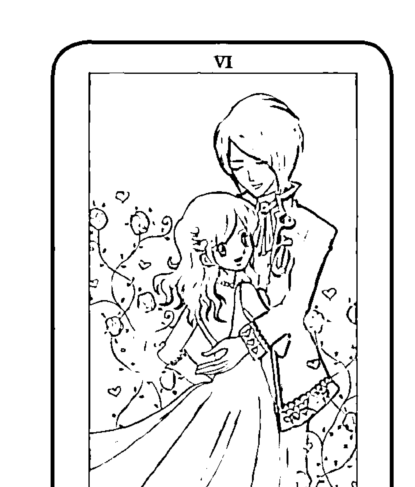

## ☆ 牌面意涵

戀愛是幸福的泉源，同樣也會帶來相對的痛苦，而戀人則反映著愛情中千萬種的思緒。成雙成對的戀人在一起時，總是洋溢著幸福的氣氛，畢竟戀愛是一件喜悅而浪漫的事，但是想得到對方的親睞，往往也得經過一番競爭，所以它也代表著某些層面的殘酷。除此之外，浪漫戀情可能也只是花言巧語，短暫的快樂或永恆的情感，都是無法預料的事。

## ☆ 正位解釋

人人都喜愛受到祝福的戀情及得到眾人羨慕與關注的眼神，熱戀的感覺是快樂而興奮的，若能將這樣的心情持續到永恆，那該有多麼好。

- 吸引、魅力四射、幸福洋溢、心有靈犀、感性的、浪漫。
- 戀愛開始、圓滿結果、順利的愛情、受到祝福、朋友慢慢轉為戀人、結婚。
- 富有、得到外來的金援幫助、合作投資得到回報、經濟上的充足。
- 精神飽滿、病情有逐漸好轉趨勢、更加愛惜身體、重視美容、改變外型。
- 喜歡的職業、有好的合作夥伴、合作創業、沉浸在工作的喜悅、豐富收穫。

## ☆ 逆位解釋

幸福的戀人背後，可能隱藏了無數的複雜情感，有猜疑、迷惘、謊言……能得到最大快樂的事物，往往也能帶來相同的悲傷。逆位的戀人正在偷偷暗示我們，愛情信仰不見得是一種永恆。

- 背叛、猜疑、疲憊感、對事情厭倦、優柔寡斷、沒有恆心、得不到結果。
- 分手、三角戀情、被情人背叛、感情慢慢變淡、貌合神離、無法信任對方。
- 亂花錢、無法累積財富、不適合長期投資、收入不穩定。
- 神經緊張、悶悶不樂、作息不正常、不把健康當一回事、容易生病。
- 合作破裂、提不起勁、工作不愉快、無法專注工作、受到私事影響。

---

## 7 戰車  
The Chariot  

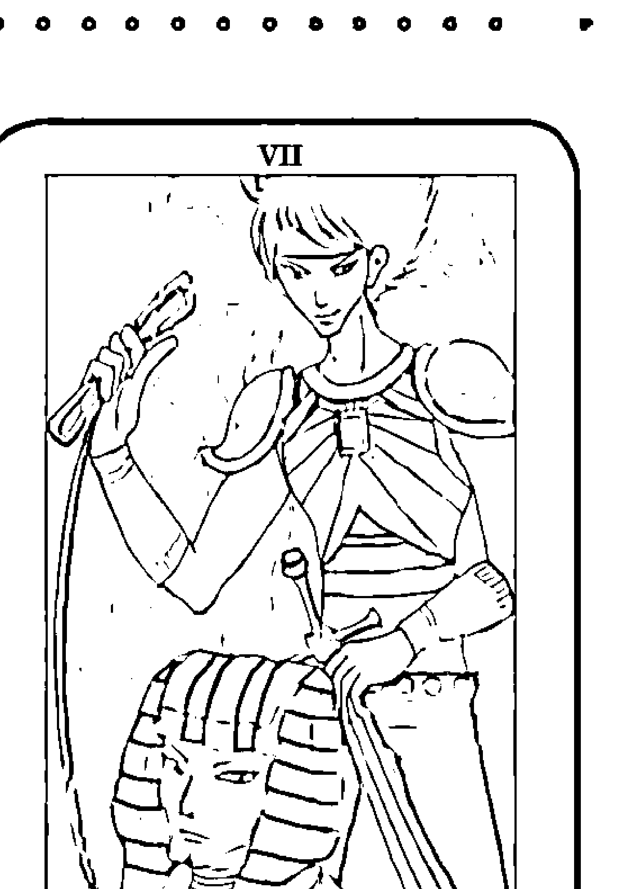

## ☆ 牌面意涵

勇往直前的戰車，為追求勝利而永不停止。喜愛勝利是人類先天的本能，完成目標的原始慾望，總能激發出前所未有的能量。可是當思考不甚周延時，這樣的能量就會變成躁進與阻力。競爭是人自古以來擁有的天性，而戰車代表著征服的野心，也反映一種努力作戰的鬥志。若能善加運用這種力量，加上細心的思考，成功的道路就在我們眼前；反之，若不妥善使用這樣的精神，就會成為魯莽的力量。

## ☆ 正位解釋

戰車陪伴著戰士們，在沙場上不斷地創造勝利，帶領大家以最快的速度邁向勝利的康莊大道。即使再多危險也不害怕，最後終將凱旋歸來，享受勝利的喜悅。

- 衝勁十足、勇氣、大膽、勝利、掌握機會、搶先一步、克服困難。
- 打敗情敵、感情進展神速、熱戀、共患難的一對、喜歡有衝勁的對象。
- 積極規劃錢財、賺入可觀金額、做高風險性投資。
- 喜愛運動、精神非常飽滿、體力旺盛、健康寶寶、健美的身材。
- 打敗競爭對手、創業、完成任務、業務工作、行動力強、積極進取。

## ☆ 逆位解釋

失去控制的戰車，是最危險的事物。當一切勇往直前的力量轉化成相互矛盾的障礙，將會讓人遭遇到前所未有的艱難處境。

- 魯莽、自我膨脹、貿然前進、不受控制、靠不住、實力不足。
- 被橫刀奪愛、追求失敗、婚姻暴力、不負責任、被拋棄、口角造成誤會。
- 大破財、奢靡度日、投資失敗、好賭、散盡家財。
- 暴飲暴食、運動造成的傷害、生活懶散、過度肥胖、交通意外。
- 缺乏恆心、遇到挫折、被競爭對手擊敗、工作遇到瓶頸。

---

## 8 力量  
Strength  

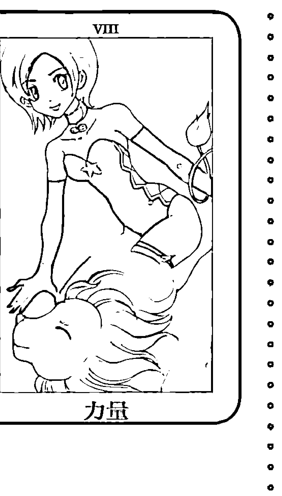

## ☆ 牌面意涵

在這裡，我們可以感受到力量中的平衡。發自內心的本能啟動我們的爆發力，而學習成長中所吸取的則是忍耐力。人們為了達到自己心中的願望，常常會產生一種無懼、無畏的精神，即使眼前有巨大的危險，也仍然要勇往直前。

在大環境裡，團體的互助與相處，是另一種力量的來源。我們面對大環境的生存法則，學習服從和忍耐，能造就更強大的能量。若是沒有自我激發的潛能，加上忍耐力與服從的環境力量，就無法擁有往前進步的動力。

## ☆ 正位解釋

善加運用智慧，才能激發出與生俱來的力量，那是一種從內心散發出的光芒。當遇到困難時勇敢面對，碰到挫折時，則能以巧妙的方式迴避危機。剛柔並濟正是最全面的力量。

- 不屈不撓、自信、藝高人膽大、充滿智慧、高尚人格、能屈能伸。
- 風光的戀愛、熱情、不畏流言、義無反顧、積極追求的成功。
- 長期投資的回報、買賣基金、獲得退休金、憑實力賺到的錢。
- 靠意志力戰勝病魔、治療慢性病、減肥成功、充沛的體力、疲勞逐漸恢復。
- 對工作有耐心、全力以赴、克服困難、能力得以發揮、事業強人、運動員。

## ☆ 逆位解釋

當面對困難時，無法堅持意志，終將連求勝的信仰也不復存在。失敗的命運將會圍繞在身邊，以往的智慧與力量，隨著困難灰飛煙滅。

- 剛愎自用、害怕失敗、缺乏定力、沒有勇氣、容易受誘惑、不安。
- 單戀、無法表達情感、不敢告白、被另一半欺壓、疑心病重、缺乏魅力。
- 投資沒有回報、財務窘境、未經規劃的消費、金錢慢慢流失。
- 體力透支、病魔纏身、慢性病無法根除、不配合醫生治療、亂吃藥。
- 能力無法伸展、計畫沒有實現、無法在逆境中生存、有能力強而霸道的主管。

---

## 9 隱者  
The Hermit  

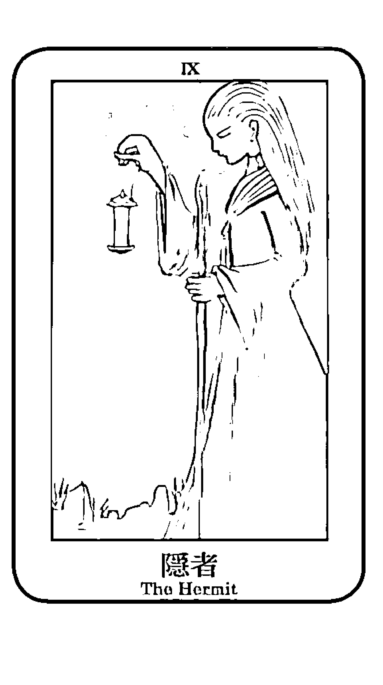

## ☆ 牌面意涵

不追求榮華富貴，默默觀察世事變化、心如止水般的隱者，追求的並非俗世中不切實際的夢想，而是一份單純卻不易看透的真理。人生就如同一盤棋局，所謂「當局者迷，旁觀者清」，往往事情的真相近在眼前，人們卻仍舊身陷其中。

然而隱者指引的是一條務實的路，沒有外力、沒有慾望，自然也就沒有迷惑。如果我們能拋開不切實際的思想，活在當下，自然就能更明瞭一切事物的道理。因此，隱者也象徵著找出解決之道，看破問題的關鍵。

## ☆ 正位解釋

隱藏自己，是為了找尋出最正確的真理。唯有高尚的人格以及自我修養，才能在追求正道的路途上獲取智慧，並且受人尊敬。

- 冷靜、擅長分析、小心翼翼、深思熟慮、不務實、曲高和寡、善於觀察。
- 柏拉圖式的愛情、沒有激情、感情平淡、重視精神層面、知心的伴侶。
- 開源節流、細心處理錢財、節省開銷、不追求物質享受、低利率儲蓄。
- 清心寡慾、粗茶淡飯、情緒壓抑、注重食療、懂得自我調適。
- 穩定的工作、以分析為主的職務、個人工作室、與人互動較少、穩紮穩打。

## ☆ 逆位解釋

追求真理是一件高尚的使命，然而當這樣的善念變了質，道德崇高的隱者就會變成道貌岸然的偽君子。

- 自卑、孤僻、小心眼、自命清高、俗氣、不切實際。
- 嫉妒心強、不夠成熟、神經質、不相信愛情、缺乏誠意。
- 消極的花費、過於小心、不敢投資、不積極賺錢、詐騙錢財。
- 躁鬱、精神疾病、容易緊張、消極面對病情、營養不良。
- 做事不專心、錯失良機、欺騙主管、過度謹慎、做事沒有方向。

---

## 10 命運之輪  
Wheel of Fortune  

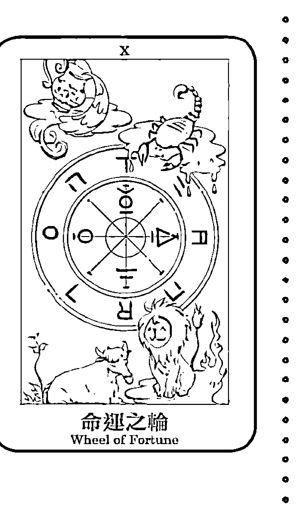

## ☆ 牌面意涵

掌握著命運的運轉，如同生命的輪迴一般。命運之輪牽動著每一個人的「因果」，凡事都有定數，命運則隨著「前因」轉到「後果」。跟隨著命運向前進的人們總是感到不安，而有些人則能操控自己的命運。

當每一次這個巨大的輪子轉動時，就是命運的大型變動，所有相關的一切都會隨之受到影響。明瞭命運如同輪子一樣，就知道所有事情都有固定的輪迴。如何掌握每一次轉動的契機，如何不迷失在人生漩渦中，將抉擇一個人永恆的快樂與痛苦的輪迴。

## ☆ 正位解釋

命運之輪的運轉停留在幸運的休止符上，對每一個人來說都是上天賜予的一種恩澤。只要能把握今朝，抓住開啟命運之輪的鑰匙，就能將生命帶向另一個幸運輪迴。

- 把握時機、擺脫宿命、當機立斷、絕處逢生、好運降臨、改變人生觀。
- 破鏡重圓、圓滿的結局、天賜良緣、命運的邂逅、相親、一見鍾情。
- 穩定的收入、中大獎、獲得意外之財、賭博贏錢、突然的進帳。
- 身體漸漸好轉、打扮自己、心情狀態良好、靠著不斷運動達到減肥目的。
- 升遷、工作轉換、有出差的機會、工作順利、遇到貴人、有效率。

## ☆ 逆位解釋

命運之輪開始運作，有時也會停留在厄運以及困難之中。若是無法靜下心來看清局勢，很有可能會讓自己陷入萬丈深淵，以及永無止息的動盪局勢。

- 無法預測、錯誤判斷、失敗、霉運、不如預期、不盡理想。
- 關係逐漸惡化、走到盡頭、錯誤的緣分、感情不穩定、失戀。
- 遺失錢財、被騙、父母遺留的債務、循環利息、積欠貸款。
- 病情不穩定、循環系統疾病、積勞成疾、對病情沒信心、皺紋。
- 工作進度延遲、轉換跑道失敗、實力累積不足、與同事有心結、錯誤判斷。

---

## 11 正義  
Justice  

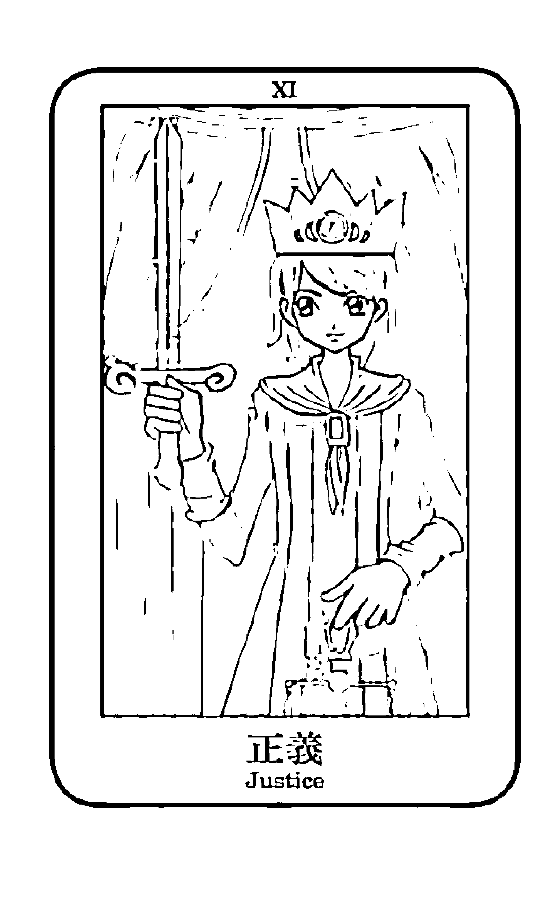

## ☆ 牌面意涵

牌中的人沉靜地凝視著前方，表現出公正而平等的態度，告訴人們何謂公理正義的標準，同時也透露著賞善罰惡的莊嚴氣息。

追求正義與公平，是為了讓人們站在天秤兩端，享受平衡與協調的關係。然而在五光十色的物質社會中，人們難免會受到慾望與利誘的影響，做出有違公理道義的決定。

因此，牌中的人物警惕我們：無論身處什麼樣的環境，心中都要有一把衡量的尺，提醒自己該堅守的原則與規範。敞開心胸面對成功或失敗，是正義最大的意義。

## ☆ 正位解釋

正義存在的最大意義，是為了維繫世界的一種平衡。若能遵從這種公正、公平的原則，不但能看清一切障礙，更能以不偏不倚的精神邁向成功的道路。

- 中庸之道、正直、公正、信任、光明正大、平衡。
- 真心相愛、門當戶對、結婚、互相照顧、個性相合、追求得到回應。
- 收支平衡、努力工作得到獎勵、信用良好而貸款成功、存款增加。
- 飲食均衡、標準身材、體能狀態正常、工作休息成正比。
- 身兼二職、兼顧工作及家庭、法務工作、同事間的和事佬。

## ☆ 逆位解釋

正義呈現相反的時候，代表公正與公平將不復存在。檢視自己以往的一舉一動，若無法走在公理的平行線上，懲罰隨之而來。

- 特權主義、忽略道德、左右為難、不公正、法律糾紛、背離正道。
- 經常吵架、腳踏兩條船、婚外情、個性不合適、欺騙對方、橫刀奪愛。
- 借貸失敗、信用不良、非法取得錢財、罰款、金錢與權力掛鉤。
- 作息失去平衡、晝伏夜出、過胖或過瘦、偏食、精神耗弱、慾求不滿。
- 無法照顧家庭、工作不專心、心術不正、與同事勾心鬥角、工作的糾紛。

---

## 12 吊人  
The Hanged Man  

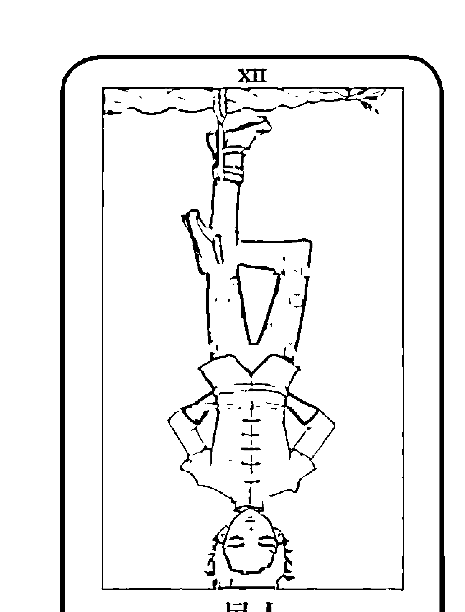

## ☆ 牌面意涵

沉靜而無聲無息的倒吊人，懸浮在宇宙之中毫無怨言。雖然在肉體上受到了最大的折磨，但是其精神卻不曾幻滅。他象徵了自我的犧牲，以及精神上的滿足。

因為受盡痛苦的他，臉上卻是安詳寧靜的表情，彷彿告訴我們犧牲是值得的。這一張牌告訴我們，對於眼前的困難，只要耐心冷靜應對，自然能夠迎刃而解。

當面臨更大的挑戰時，有時候完成「大我」的精神，需要的是無私與「小我」的犧牲，才能成就。

## ☆ 正位解釋

痛苦只是一時，但成功卻是永恆的。追求心中理想的目標，其努力的過程遭遇困難險阻，也是在所難免。專心、無私、奉獻，換一個角度看世界，就能避開世俗的眼光，讓自己獲得更高境界的收穫。

- 自我犧牲、無私、積功德、面臨考驗、得到啟發、找到答案。
- 願意為對方犧牲、愛情長跑、被反對的姻緣、互相檢討、夾在三角關係。
- 捐錢、樂善好施、花錢消災、財務困難的過渡期。
- 受傷、健康檢查發現疾病、慢性病初期、自殺未遂、接受治療、挑戰病魔。
- 突破長久的瓶頸、放棄升遷機會、工作能力測試、服務業、被懲罰、加班。

## ☆ 逆位解釋

堅持的信念得不到合理的解答，就等於是在鑽牛角尖，犧牲變得不值得，在精神上也是一種折磨。畢竟生存在物質世界裡，精神層面的滿足與現實眼光的考量，是同樣重要的。

- 缺乏耐性、閉門造車、害怕失敗、缺乏冒險犯難精神、杞人憂天。
- 忽略對方感受、感情不夠堅固、任性、自私、沒有好的結局。
- 投資策略失敗、小氣、沒有偏財運、浪費的應酬、不自覺流失金錢。
- 醫療失敗、病情惡化、相信祕醫、被傳染、腳部關節疾病。
- 不願配合公司作息、我行我素、工作態度惡劣、努力白費。

---

## 13 死神  
Death  

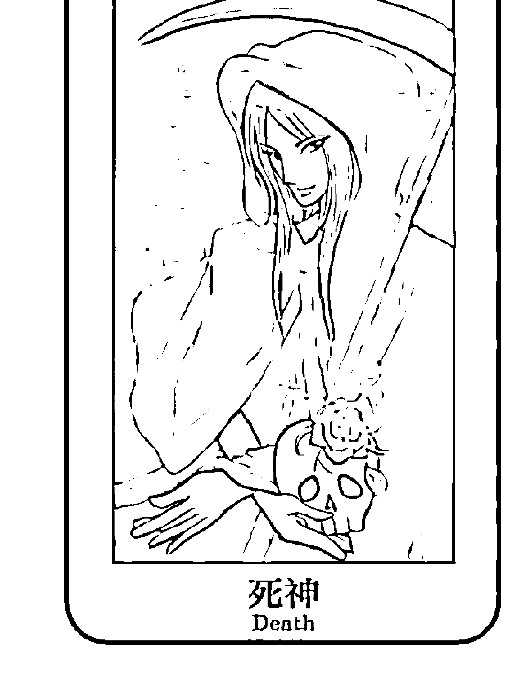

## ☆ 牌面意涵

不祥的數字「13」彷彿就是死亡的代言，而牌中的死神散發出一股冷肅的氣息，告訴大家一切都將要結束了。

死神並不邪惡，但總是被人們所畏懼，那是因為人總不願接受難逃一死的結果。無論如何，死亡就是最後的終結，也是必經之路。

然而死亡也是生命運轉的步驟之一，有開始才有結束，有結束自然才有開端，因此死神也象徵了新的契機。這張牌告訴我們，一件事情總會告一段落，而下一個新的開始也在等待我們到來。若是面對人生的低潮時，「置之於死地而後生」的道理也千萬不要忘記。

## ☆ 正位解釋

死神，是來終結一切舊有的事物，是一種無法避免的結果。坦然面對終結，才能擁有新的開始。

- 結束、不通人情、重新改革、告一段落、死亡、失去、絕望。
- 分手、離婚、生離死別、不幸運、感情的冷淡。
- 破產、坐吃山空、沒有存款、窮困潦倒、沒有收入、錢財遺失。
- 死亡、發生意外、住院、流產、長相醜陋。
- 沒有活力、長期失業、公司倒閉、解約、退休、計畫落空、創業失敗。

## ☆ 逆位解釋

死神的離去象徵新的開始，但也可能代表無法結束的舊事物。審慎檢視自己現在的處境，才能向下一個里程碑前進。

- 重新開始、失而復得、自我改變、脫胎換骨。
- 新的戀情、重修於好、爭吵後得到共識、再婚、第二春。
- 開始有存款、收入增加、景氣復甦、找回遺失的錢財。
- 懷孕、出院、重病痊癒、整形手術、接受新的治療、嘗試新藥。
- 東山再起、從頭開始、轉換跑道、擬定新的目標、公司合併。

---

## 14 節制  
Temperance  

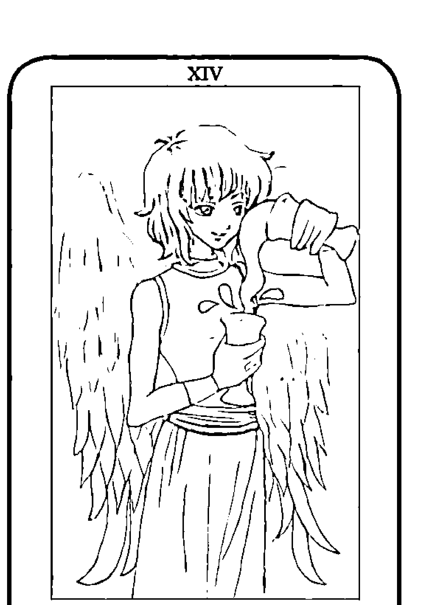

## ☆ 牌面意涵

控制著「物質」與「精神」的平衡，掌握「理想」與「現實」的協調，是牌面上的人要傳達給我們的旨意。

前往人生目標的過程，宛如懸崖上走鋼絲一樣驚險。左手憑藉著物質與現實，右手則拿著理想與精神，唯有小心翼翼維繫這樣的關係，才能讓我們達到最後的目標。

因此「節制」的力量，是人生必修的一門學問。它最大的意義在告訴我們，如何取得一切的平衡，教導我們如何掌控自己的人生。

## ☆ 正位解釋

對於自己的行為負責，將物質與精神層面的需求拿捏得恰到好處，開源節流，朝著目標徐徐前進，小心翼翼注意每一個細節，就是「節制」最大的精神。

- 開源節流、自我要求、控制、拿捏恰當、了解輕重緩急、節省。
- 純潔的愛、心靈相通、患難與共、愛情長跑、感情漸入佳境。
- 節省預算、小心投資、收支平衡、憑判斷獲取額外收入。
- 飲食均衡、戒除惡習、減肥成功、消化道功能佳。
- 循規蹈矩、逐步升遷、財務性質工作、善於利用時間。

## ☆ 逆位解釋

當一個人不懂得節制的時候，再美好的事物都會得到反效果。過度的享樂以及暴飲暴食，都是隱藏在快樂背後的危機。所謂「物極必反」，正是這個道理。

- 浪費、不知節制、信用破產、自相矛盾、偏激分子。
- 縱慾過度、誤會加深、感情生活受到外力影響、過度依賴、感到厭倦。
- 過度奢侈、生活過於糜爛、無法控制金錢流失、缺乏理財觀念、積蓄流失。
- 暴飲暴食、酗酒、染上毒癮、厭食、內分泌失調、挑食、體能下滑。
- 懶散的工作態度、過度疲勞、工作不規律、公司策略不明確。

---

## 15 惡魔  
The Devil  

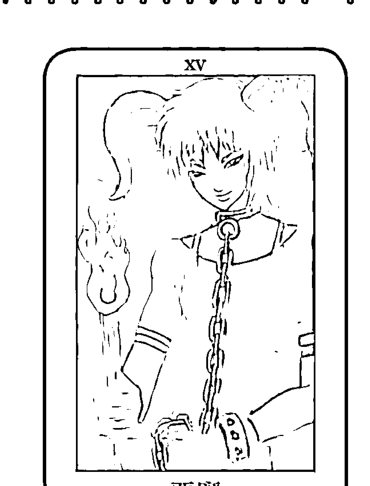

## ☆ 牌面意涵

人人心中都有一個天使與一位惡魔。如果說「節制力」是天使給我們的力量，那麼惡魔則是慫恿我們濫用「放縱」的力量。

牌中的惡魔充滿讓人坐立難安的詭異氣息，彷彿在誘惑人們前往黑暗的迷途。他會運用強大的力量完成人們的私慾，悄悄地將邪惡的耳語深植在人們的腦海中。

這張牌警示著人們要堅持自己的信念，不要誤入歧途以至於萬劫不復。對抗自己的心魔，就能戰勝惡魔的誘惑；光明磊落的思想，終究能指引我們走向成功的道路。

## ☆ 正位解釋

善與惡、光明與黑暗，這世界上所有的事物都是一體兩面的。惡魔並不可怕，他只是反映出人內心潛藏的慾望。一旦將這種感覺過度解放，惡魔將會從內心慢慢侵蝕到思想，而本來並不存在的惡魔，也讓你成為了他的代言人。

- 禁不起誘惑  
- 狡詐  
- 霉運  
- 貪婪  
- 善變  
- 背叛別人  
- 喪失人格  

- 亂倫、未婚生子、偷情、沉迷於肉慾、不忠貞、不良性癖好。
- 被詐財、欠下巨額債務、取得不義之財、股票套牢。
- 性病、精神憂鬱、生病需藥物控制、失眠、身材姣好。
- 不正當職業、玄虛性質的工作、應徵陷阱、對薪資不滿、爭權奪利。

## ☆ 逆位解釋

擺脫內心的惡魔，或許正是好運的開始；相對地，當內心缺乏追求慾望的本能，也可能導致一個人產生消沉的意志，喪失競爭的原動力。

- 自由、擺脫惡習、獲得解放、缺乏勇氣、改變現狀、降低慾望。
- 結束不愉快的戀情、看破紅塵、恢復平靜、中斷孽緣、順其自然。
- 掌握投資時機、轉虧為盈、降低成本、排斥風險性投資。
- 身心愉快、不喜歡化妝、接受心理醫生治療。
- 重振旗鼓、離開不喜歡的職務、需要適度壓力、運氣慢慢好轉。

---

## 16 塔  
The Tower  

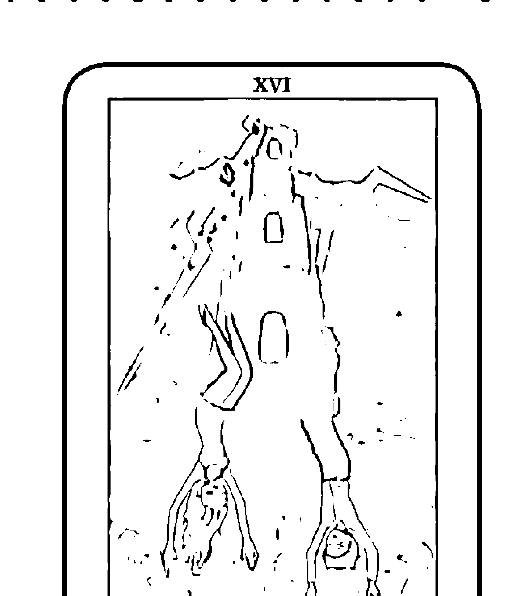

## ☆ 牌面意涵

遭受雷擊而即將坍塌的高塔，遠遠望去就讓人感受到無比的危險。即將毀滅的高塔，沒有任何人能憑藉自己的力量去挽救，這裡暗示著我們不要不自量力挑戰自然的力量。

除此之外，這張牌告訴我們，眼前即將要發生的危險是無法避免且無力解決的，是一種不能再更糟的危機。然而，高塔的危險只要不去靠近，自然能夠全身而退。

因此，高塔也提早預知了危險的到來，提醒人們災禍並非完全無可避免。

## ☆ 正位解釋

即將倒塌的高塔，濃濃地散發出不祥的預兆，暗示著即將發生一連串的噩運。這是塔羅中最不受歡迎的牌。然而正位的塔，卻是一種可以避免的災禍：明顯的危機徵兆出現時，可以事先加以防範。

- 危險、自然災害、面臨重大危機、遭到破壞、逆境、情勢緊迫。
- 不被對方信賴、長期冷戰僵持不下、第三者的出現。

現、離婚協議中。

- 破產、巨額賠償、損失慘重、因物品損壞的花費。
- 天災造成的傷害、手術、病情急速惡化、建議做健康檢查。
- 公司大規模裁員、工作不斷出錯、因受傷無法上班、忠誠度受到質疑。

## ☆ 逆位解釋

當這張牌呈現反位時，代表災難已經發生且無法避免，而且已經存在一段時間。因此，解決問題，或者是選擇重新出發，也許是幫助自己走出困境的最佳方式。

- 無法避免的災害、重新建設、徹底的毀滅、陷入困境。
- 壓抑的感情、第三者出現已久、離婚、隱藏的危機爆發。
- 持續流失金錢、瀕臨破產、重新累積財富。
- 長期休養、晚期發現的慢性病、身體略有不適應儘快就醫。
- 公司即將倒閉、工作進度延後、任務迫在眉梢、背水一戰。

## 17 星星
The Star

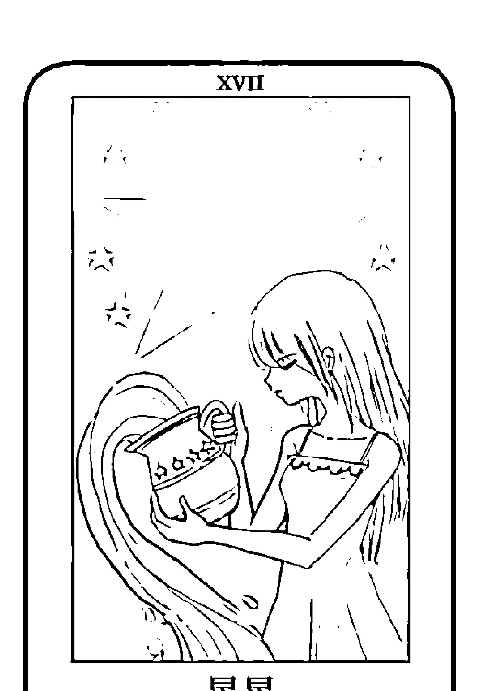

## ☆ 牌面意涵

沒有了星星的點綴，再美麗的夜空也會有些淒涼。耀眼閃爍的星星，讓黑暗中的大地與海洋，也能感受到光明的喜悅，使得夜色裡的世界更能孕育出無限的生命。因此，這張牌象徵了生命與愛，希望我們能像星星一樣，閃耀光輝並且互相輝映。保持這樣的精神，即使在黑暗中也能看到曙光，不但照亮自己的前程，也帶給周遭的人希望，將這種永恆的光芒不斷地傳遞下去，就是愛與生命最有價值的意義。

## ☆ 正位解釋

在黑夜裡，抬頭看一看天上的星星，即使是微弱的光芒，也能讓人感受到那種最純淨的力量，在黑暗之中帶給人們希望。

- 希望、期待、追求理想、美麗、找尋目標、放開心胸、純淨無瑕。
- 愛情的憧憬、攜手共度未來、遙遠的思念、情人眼裡出西施。
- 可獲取意外之財、願望得以實現、投資敏銳度提升。
- 魅力四射、病情出現轉機、注意眼睛疾病、不可熬夜。
- 實踐目標、感興趣的工作、發揮創意、藝術工作者、前程似錦。

## ☆ 逆位解釋

天上的星星固然是美麗的，然而夜空的黑暗卻會給人們帶來不安。當希望只是空想，就如同沙漠中的海市蜃樓一般，成為永遠到達不了的終點。

- 虛幻的夢想、好高騖遠、希望落空、無法回歸現實面、期待過高。
- 不切實際的愛情、過度要求另一半、擇偶標準過高、缺乏安全感。
- 過度分散投資、零星的收入、沒有投資遠見、破財的徵兆出現。
- 消逝的青春、妄想症、忽略自身的疲憊、缺乏精神食糧。
- 缺乏創意、工作與理想有落差、迷失自我、能力不紮實、拖延進度。

## 18 月亮
The Moon

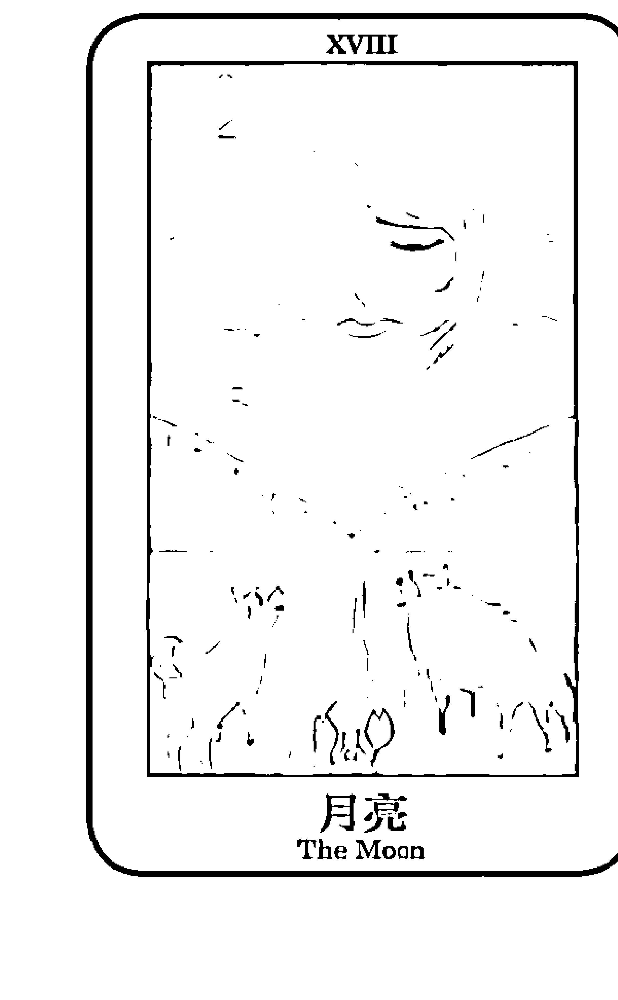

## ☆ 牌面意涵

皎潔的月光象徵了人類的思想意志。一輪明月高掛夜空，反映的卻是人生的無常。月亮的陰晴圓缺對照了人生的旦夕禍福，說明了事事多變的道理，也代表了人內心裡的不安。

這張牌的出現，透露出隱藏在內心裡的焦慮，以及無法預測的變化，也暗示著一種曖昧不明的情形。無論是人、事、物上面，都必須時時刻刻小心提防這種關係。另外，她也代表著穩定中潛藏的不安因素，暗示我們隨時要讓自己保持憂患意識。

## ☆ 正位解釋

月亮象徵著迷惘與不安，因為它有陰晴圓缺、善變的思緒、曖昧不明的情事，會讓人陷入一種永遠無法解開的迷思。

- 不安、曖昧不明、善變、迷惘、情緒的起伏很大、潛意識、內在的直覺。
- 關係曖昧、變心、胡思亂想、對感情不信任、遭流言中傷。
- 私房錢、金錢的危機意識、收支不穩定、遇到詐騙集團。
- 月事不順、神經衰弱、不確定的病因、日夜顛倒、注意用藥過量。
- 陷入低潮、詭異的工作氣氛、目標不明確、夜班工作、臨時性職務。

## ☆ 逆位解釋

逆位時的月亮，呈現的是她穩定的一面。雖然本質上的善變並沒有因此而消失，但是這種象徵女性潛意識的直覺，在這裡能得到比較理性的控制。

- 化解誤會、看穿謊言、冷靜、局勢逐漸穩定、心情平復。
- 結婚、結束搖擺不定的感情、受到保護、誤會冰釋、戀母情節。
- 損失的金錢逐漸拿回、景氣復甦、盈餘、有餘力規劃未來。
- 預防勝於治療、重視自我心情調適、檢驗報告得到結果、接受心理諮詢。
- 女性主管、把事情簡單化、突然開竅、等待時機、發現問題的癥結所在。

## 19 太陽
The Sun

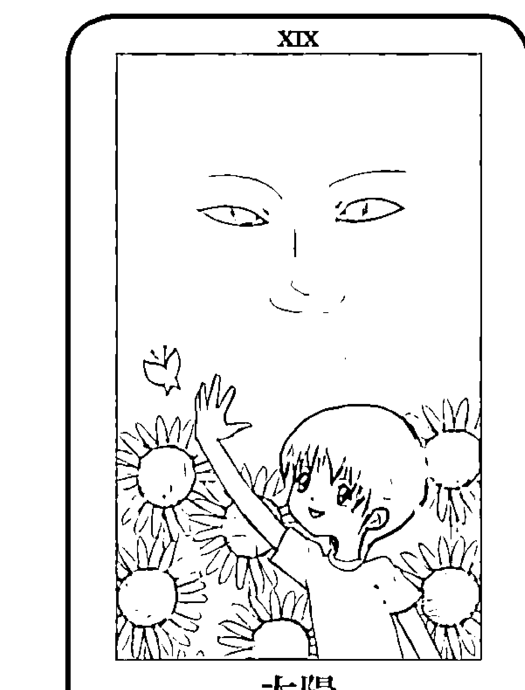

## ☆ 牌面意涵

陽光是世界上最溫暖的力量，帶給人們豐收的喜悅，還有光明的希望。同樣是孕育大地的生命元素，太陽展現的是一種昭確而實際的力量，立即性的溫暖與隨之而來的豐收，象徵著「物質的滿足」。

這張牌表達的是豐富收成，以及新生命的來臨，傳遞給我們最光明且強勢的太陽光芒。只要肯努力不斷地耕耘，就能得到繁榮的結果，獲取讓大地生生不息的能量。

## ☆ 正位解釋

溫暖的陽光帶給人們舒適的感覺，所有的迷惑都會像陽光般得到解答。藉由太陽的能量獲得最大的活力以及自信，帶著愉悅的心情完成一切的任務。

- 得到滿足、欣欣向榮、熱情、喜悅、充滿活力、新生命誕生、清楚明瞭。
- 戀情受到祝福、愛的結晶、找到夢中情人、建立美滿家庭、陷入熱戀。
- 收入增加、有耕耘就有收穫、崇尚名牌、物質不虞匱乏、賭運奇佳。
- 精力旺盛、自然生產、皮膚黝黑、不容易生病、食用健康食品。
- 升遷、帶給同事希望、得到貴人相助、能力受到肯定。

## ☆ 逆位解釋

威力無窮的太陽，若沒有得到妥善的運用，就會變成一種傲慢和自大，即使是到手的成功，也可能因此而喪失。記得，當擊敗對手時，別忘了給對方留下後路。充滿慈悲與寬容的勝利，才是真正令人佩服。

- 暴力、衝動、不聽他人勸告、自我膨脹、自負、目中無人。
- 婚姻暴力、大男人主義、不平等的關係、盲目的愛情。
- 愛慕虛榮、將錢財浪費在無用的事物上、錢財露白、擺闊、被當成凱子。
- 流產、中暑、做超出體力負荷的事、暴飲暴食。
- 我行我素、與同事發生衝突、不聽從主管命令、談判破裂。

## 20 審判
Judgement

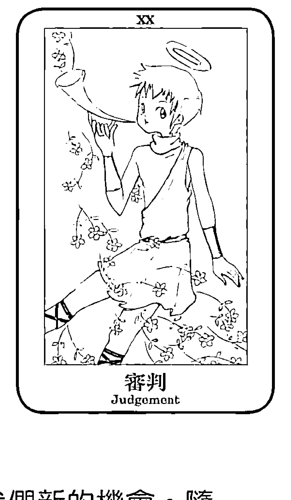

## ☆ 牌面意涵

是非善惡的公理，都會得到上天的審判。從這張牌中我們可以得到許多啟示，最重要的是在提醒我們唯有真理，才能導引我們走向正確的道路。

不管過去的種種如何，只要能悟出未來必須尋求正道，博愛的天神仍然願意賜予我們新的機會。隨時檢討自己的每一個行為，除舊佈新、擺脫惡習，接納別人傳遞給我們的新觀念，這樣一來，人生隨時都有新的開始，前途永遠都有嶄新的希望。

## ☆ 正位解釋

審判的目的是為了喚醒心靈，一切事物在這裡都會得到公平的結果。若能秉持善念，則好運隨之降臨；若能革除惡習，自然也能得到相對的寬恕。

- 得到領悟、最後判決、自我的覺醒、啟示、下定決心、徹底改革。
- 公開的戀情、訂婚、公開結婚、表白得到結果、堅持到底。
- 拾金不昧、獲得獎勵、債務得以清償。
- 檢驗報告正常、疾病初期、積極配合治療、結束痛苦。
- 公司內部考核、升遷機會、簽約時機、勇於接受懲處、獲得轉機、音樂家。

## ☆ 逆位解釋

不公平的審判，不願意接受事情的結果，都是反位呈現時所要表達的意境。可能只是一時的惱羞成怒，或是根本沒有把狀況搞清楚。總之，無法自覺就會將自己帶往失敗的道路。

- 錯誤判斷、冤屈不平、推卸責任、墨守成規、思想不求改變。
- 離婚、感情告吹、沉溺過去的回憶、無法坦白、不肯認錯、心碎。
- 必須負擔龐大費用、巨額罰款、信用破產、收入比以前還少。
- 檢驗結果不理想、手術失敗、惡習造成的身體不適、不按時吃藥。
- 考核不過、績效欠佳、失敗後一蹶不振、被對手以不正當方式擊敗。

## 21 世界
The World

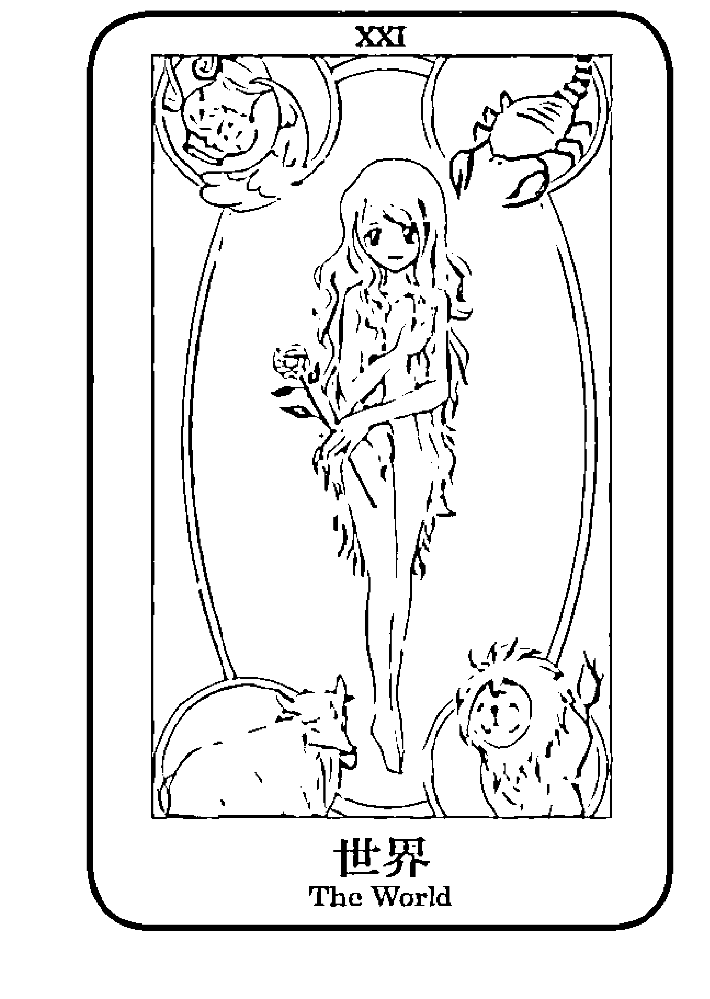

## ☆ 牌面意涵

世界包含了深遠的意義。最廣大的思想、萬物的起源以及所有的生命元素，都在這裡面。天神創造世界，需要無比的耐心、愛以及能力，最後給予了人類生存的這片天地。祂教導人們和平、慈愛的精神及孕育與繁榮的喜悅，讓這個世界不停地運轉。

這張牌象徵著成功與幸福，但也提醒我們唯有像天神一樣，充滿耐心、愛以及真正的努力，才能找尋到心目中的烏托邦。堅持信念、把握今朝，就能成為最優秀的夢想實踐家。

## ☆ 正位解釋

敞開心胸，就能得到最大的自由。完美的結局，在此張牌畫上最美的休止符，告訴我們一切的成功，都已經掌握在我們手中。閉上眼，用力去感受這個屬於你的世界。

- 圓滿結局、胸有成竹、終於完成目標、成功、事情告一段落。
- 互相包容、幸福美滿的婚姻、天作之合、共同為理想努力、一起打拚、蜜月旅行。
- 大筆金額進帳、運轉成功、理財高手、全面性的投資獲利。
- 保持在最佳狀態、定期健康檢查、心靈的滿足、長壽。
- 出差、為公司創造業績、成就非凡、受到主管重用、旅遊相關行業。

## ☆ 逆位解釋

無法配合世界的運轉，就是與成功背道而馳。事情終將無法得到圓滿的結果，當我們不再有把握時，誰還能信心滿滿地挽回局勢？

- 事情無法掌握、不理想、停滯、遇到瓶頸、半途而廢、無法持續。
- 戀愛得不到結果、關係沒有進展、感情充滿變數、熱情退卻。
- 周轉不靈、財務運作不良、現金不足、收入大幅減少。
- 便祕、不了解身體狀況、缺乏休息、壓力過於沉重。
- 任務忽然中斷、不受器重、舊方法不實際、不求上進、公司遭併購。

## 第三課  
## 如何進行塔羅占卜

想要熟練地運用塔羅牌占卜，除了熟悉牌義外，還需要透過「牌陣」這種將幾張牌排列組合的形式，來幫助我們釐清問題的關鍵，找出正確的解答。

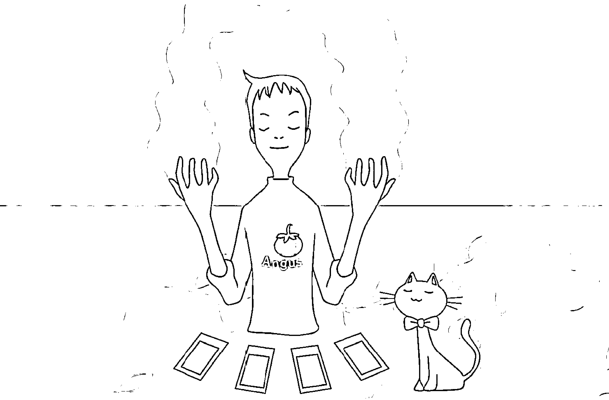

在塔羅占卜之前，首先必須選擇一個安靜、不受打擾的環境。這關係著判讀塔羅需要絕對的專注力，因此環境的選擇將決定占卜的準確與否。

再者就是選擇一副自己所喜歡的塔羅牌。目前市面上流通牌款版本極多，其中有兩種版本較為大宗。一是全世界最普遍使用的【萊德偉特】塔羅牌，也就是本書中所介紹的版本；另一種為【馬賽】塔羅牌，源自十五世紀末的法國南部，雖然較為小眾，卻也是另一種塔羅的占卜版本。

### 如何開始洗牌？

1. 選一個不被打擾的空間，將整副牌背面朝上。
2. 將牌卡打散鋪開，兩手以順時針方向不斷畫圓，盡量讓牌打散開來，同時在洗牌時默想自己想知道的問題。
3. 將洗好的牌堆疊整齊，橫放在面前。
4. 用左手取適量的牌，將牌切成兩部分再疊好，切下的牌置於下方。若是幫別人占卜，則必須請當事人切牌一次。
5. 由於塔羅牌正位和逆位的意義並不相同，因此抽牌前需先決定紙牌擺放方向。一人占卜時，請抓住紙牌的右前端，將牌靠近自己；如果是幫別人占卜，請抓住紙牌的左上端，將牌靠近自己。
6. 接下來就可依你所選擇的牌陣抽出塔羅牌，擺放在適當位置，並開始占卜。

## 【塞爾特十字占卜法】

這裡的塞爾特十字占卜法，相傳是在吉普賽民間非常盛行的一種占卜方法。這個陣型著重事情的「分析」，藉著牌陣十字展開的方法，清楚掌握對方的心態，並了解自己內心的想法，總括來看整個事件的走向。

### ☆ 牌陣

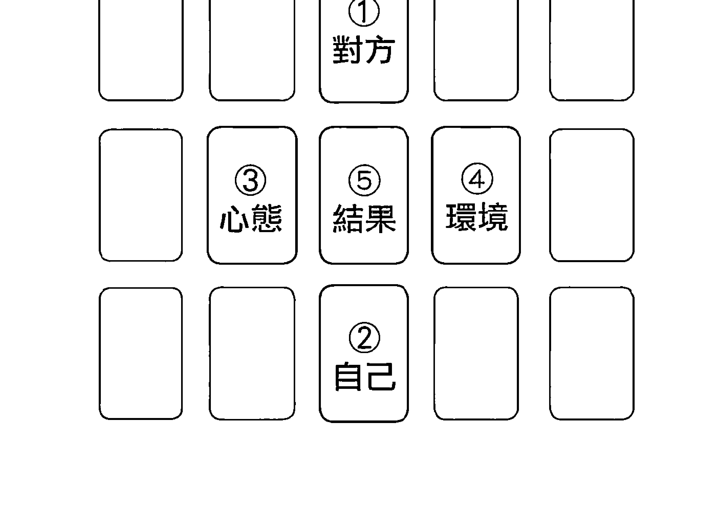

### ☆ 占卜方式

1. 以左手拿牌，在心中默想一次自己想問的問題及對象的樣子。
2. 如圖，從上面那排的最左邊開始放置（牌正面朝下）。
3. 再從下一排由左至右排列五張牌。
4. 接著再排中間這一列的五張牌，剩下的牌整理好放在旁邊。
5. 在心中再默想一次自己的疑問，依序打開①～⑤張牌。

### ☆ 牌陣位置說明

1. 《對方》：對方此刻的心情、想法，以及對這個問題的觀點。
2. 《自己》：自己目前的心情、想法，以及對這個問題的觀點。
3. 《心態》：自己的對應方式、處理方法。
4. 《環境》：整個問題的情勢、周圍可能發生影響的人、事、物、是否有情敵出現。
5. 《結果》：關係的最後預測。

### ☆ 占卜問題範例

緯婷今年就讀大一，在社團活動中暗戀著社團的學長。由於對方的態度不是很明顯，自己也不敢表明心跡，目前想知道學長對她的看法，如果向他表白會有好的結果嗎？

## • 所抽出的牌卡

1. 正義（逆位）  
2. 月亮  
3. 教皇  
4. 戰車（逆位）  
5. 星星  

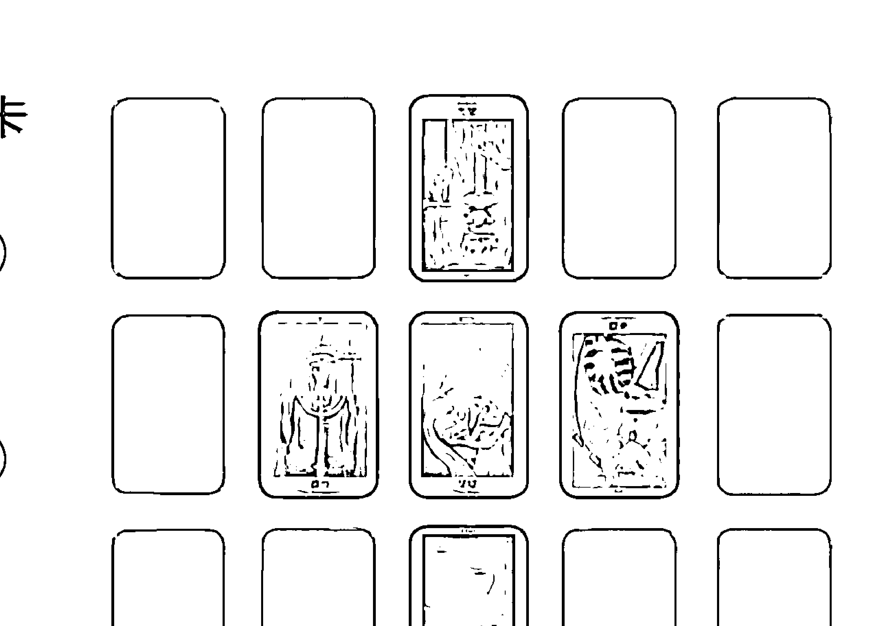

## • 牌義解析

① 學長現在的心情  

這是一張「逆位」的正義牌，這代表他的心就像失衡的天秤一般左右搖擺不定。目前的他有更重要的事情要處理，可能是學校課業，也可能是社團或工作等，使他並沒有把心思放在感情上。他自己也還不想投入感情，以免分身乏術。

② 你此刻心情  

這是一張有著陰晴圓缺的月亮牌，顯示你很容易在這件事上患得患失，也會因為學長對你的態度而有某些情緒上的起伏。或許他只是無心的稱讚或叮嚀，都可能讓你的心情產生很多不同的變化。但月亮是晦暗不明的，你的內心儘管熱烈，卻一直無法付諸行動。

④ 周圍的人事物  

「逆位」的戰車看來並不那麼樂觀。這顯示他的周遭有很多誘惑，而且身邊有強勁的情敵。幸好他有心要擺脫感情，專心於他的課業、社團，因此始終不採取回應。

③ 你的因應方式  

這個位置顯示的是一張代表援助的「教皇牌」。你最需要的就是來自朋友的助力。建議你多與他身邊信賴的朋友建立友誼關係。由於他目前並沒有什麼心思談感情，即使告白他也未必能接受，不如表現得若無其事地接近他，對他展現溫柔關懷，也讓他熟悉並習慣你的存在。

⑤ 事情的結果  

星星正位代表著無限的希望、愛苗滋生。你們未來的關係仍是非常樂觀的，他的確是你理想的對象。只要你不要操之過急，用更多的耐心與愛心等待機會，他必定會心動的。

## 【二擇一占卜法】

根據多年幫人占卜的經驗，最多人想知道的往往是抉擇之後的結果，例如「該選A君還是B君，選了之後會怎樣？」或者「該選A科系還是B科系會有好發展？」這時候我最愛用的，就是既簡單又清楚的二擇一占卜法。

透過這個占卜方式，就能預先了解兩個選擇可能的結果，以幫助你做出正確的選擇。但如果事情的答案是多面向的，例如「我該如何提升異性緣？」「我該從事何種行業？」這種答案涵蓋較廣的問題，這裡較不建議使用。

### ☆ 占卜方式

1. 在抽牌之前，請清楚描述當事者的問題，並將A、B兩方的選擇作明確定義。
2. 洗牌完成後，由上往下數第六張牌放至1號位置。
3. 再往後抽出第六、七張牌，放至牌陣的2號與3號位置。
4. 同樣再往後抽出第六張及第七張牌，放在牌陣4號與5號位置。

### ☆ 牌陣

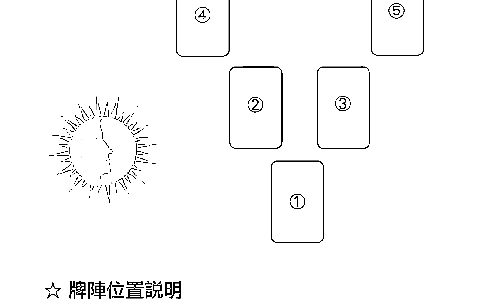

### ☆ 牌陣位置說明

1. 整體情勢分析：也就是當事者此刻內心的想法。  
2. 選擇A：代表A方此刻的態度和你的想法。  
3. 選擇B：代表B方此刻的態度和你的想法。  
4. 選擇A可能會得到的結果及對你的影響。  
5. 選擇B可能會得到的結果及對你的影響。  

### ☆ 占卜問題範例

我和男友家豪交往多年，最近感情進入停滯狀態，結婚也一直沒有共識。最近我和公司同部門同事大明走得很近，他頻頻對我表達好感，在公司也處處照顧我，該如何選擇呢？

## • 所抽出的牌卡

1. 死神（逆位）  
2. 女祭司  
3. 正義  
4. 皇后  
5. 月亮  

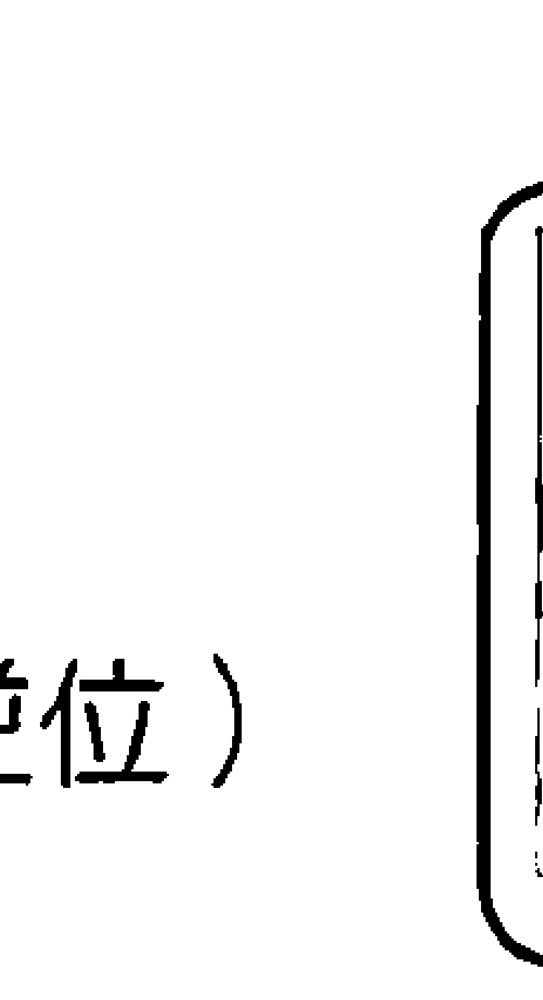

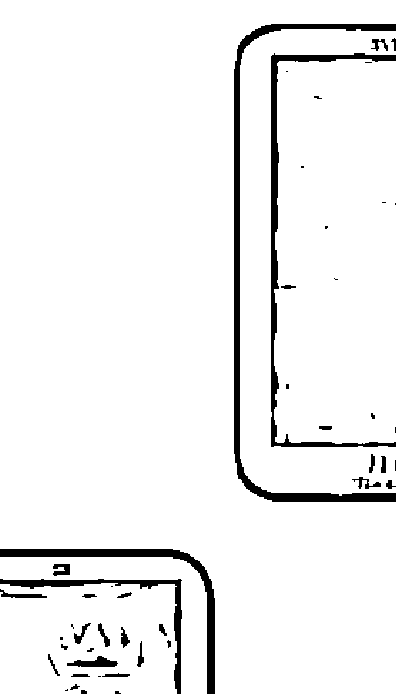

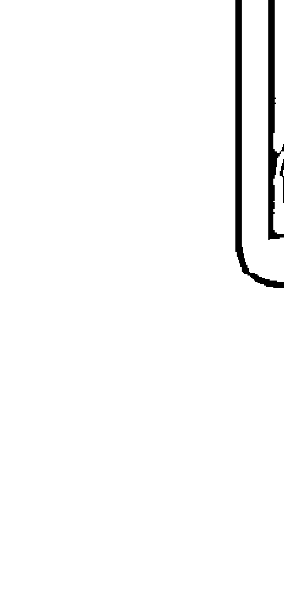

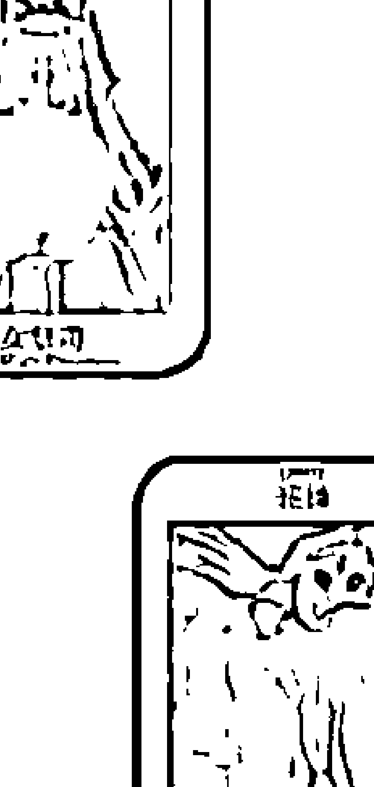

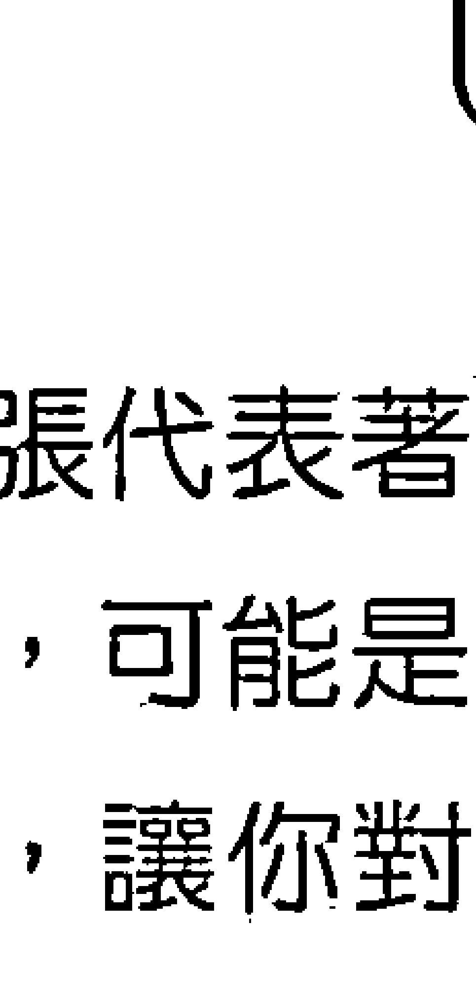

## • 牌義解析

① 死神（此刻你的心境）

「逆位」的死神牌仍是一張代表結束、死亡的牌。此刻的你對感情其實有些悲觀，可能是自己過去在愛情中的體驗，或是朋友的失敗例子，讓你對感情始終抱持懷疑的態度，也很難真正投入。不過死神牌的另一意義是變化與重生，「結束」意味著另一個開始，你將開始一場新的體驗，這會讓你完全顛覆過去對於感情的固著想法。

② 女祭司（大明的心態）

女祭司帶來的愛情能量是耐心與包容。他也知道你內心其實另有所屬，但他懂得等待。因為同事的關係，他總是常常關照你，又擔心太直接的表白會給你壓力，因此總是小心翼翼地呵護著這段情感。他目前對你的愛意極深，然而因為你的態度不明，他也不敢太貿然行動。

③ 正義（家豪的心態）

正義牌代表著平衡、判斷等理性因素。家豪對你的情感目前來說是平淡的，但好在這張牌並沒有看出他心中另有其他心上人的跡象。他對你的觀感如何，很大程度取決於你對他的態度。這段感情是有機會的，但前提是你得再主動一點。正義牌象徵公平的原則，只要你對他真心付出，他會有所回應。

④ 皇后（選擇大明的結果）

皇后牌在愛情中帶有非常甜美幸福的意味，代表著收穫、享樂與浪漫。你和他從陌生到熟悉、相愛的過程中，會慢慢體會到戀愛的美好。這樣幸福的滋味會一掃過去你對感情的陰霾。這是一張非常感性的牌，你們對彼此的愛意將愈來愈濃，但要小心因為戀愛而忽略了工作。

⑤ 月亮（選擇家豪的結果）

月亮牌的本質是「敏感」。就像月有陰晴圓缺的起伏變化一般，你們兩人會進入比較詭譎多變的狀態。這份不安定感可能來自於你對他的信心。或許對於他的社交情形你總是難以掌握，但基於尊重他的原則也不便多問，常常會胡思亂想、疑神疑鬼。你內心潛藏的恐懼，在未來可能會對兩人的關係造成很大的影響。

## 第二章  
## 神秘塔羅 Fun 心測

很多時候只要一個圖像或一個簡單的符號，就能啟發事情的走向。我們可以將塔羅當成一種直覺的訓練，透過圖像的引導，預測未來的端倪，探索解決方向。

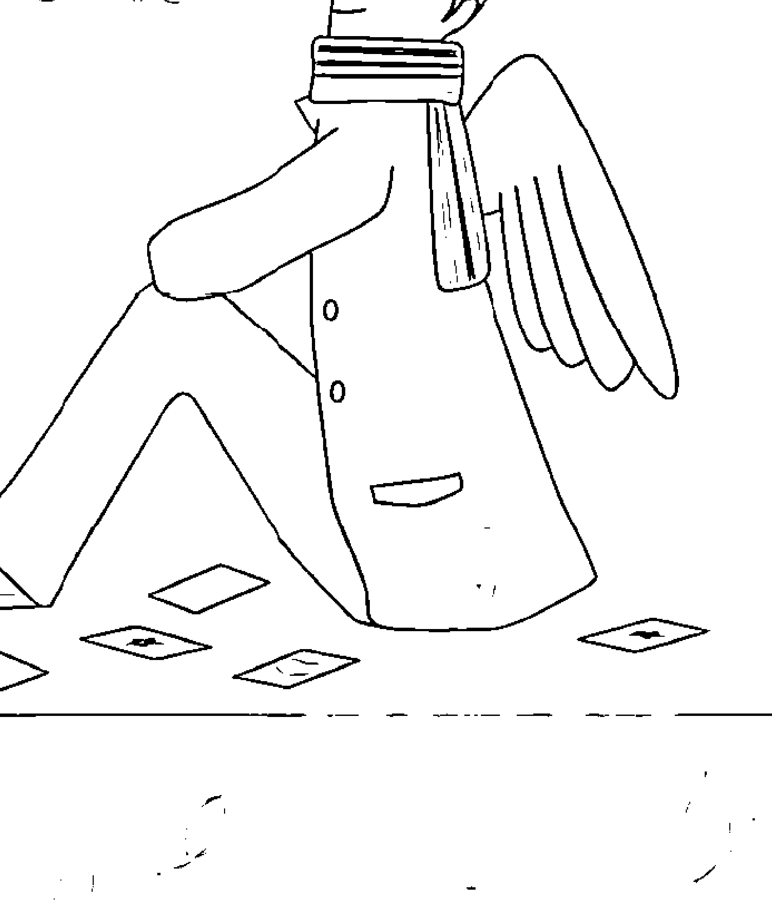

### 安格斯的小叮嚀

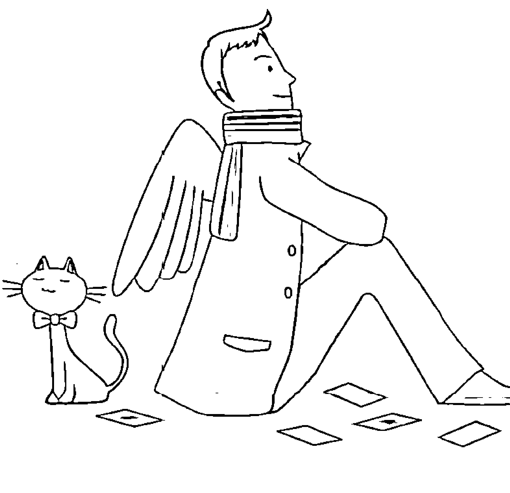

對於初學者來說，想要一口氣像個專業占卜師一般，使用繁複的牌陣來解牌似乎有點過於困難。況且複雜的牌陣所得到的解答又未必能一針見血地給占卜者滿意的答覆，搞半天只會讓自己陷入愈來愈糊塗的境地！

以安格斯多年的占卜實際經驗來說，很多時候只要一個圖像或一個簡單的符號，就能略知事情的走向。我們可以將塔羅化繁為簡，從直覺的抽取、選擇動作中，預知未來的端倪。

現在，就讓安格斯簡單地以選擇題的方式讓讀者直接選擇。透過四選一的選牌方式雖然只能窺之一二，卻也能看出一個主要的方向，不妨參考看看！同時安格斯也建議您，除了在書上做平面選擇（請先把答案蓋起來選牌），也可以準備真正的塔羅牌，選出心測題目中所列的四張牌，以抽牌方式進行。如此不但能增加準確度，也能提升您認牌、解牌、記憶的功力喔！

安格斯提醒您，使用抽牌方式時，請排除正、逆位的問題。抽牌之前，請先進行洗牌的動作，其步驟如下：

- 1. 選一個不被打擾的空間，將整副牌背面朝上。
- 2. 將牌卡打散鋪開，兩手以順時針的方向不斷畫圓，儘量讓牌打散開來，同時在洗牌的過程中默想自己想知道的問題。
- 3. 將洗好的牌堆疊整齊，橫放在面前。
- 4. 進行抽牌動作。

安格斯祝福大家都能透過神祕的塔羅心測，讓自己舉棋不定的疑惑得到適切的指引與解答。

## 【愛情篇】

#### 1. 最近有人暗戀你嗎？

請從下列四張牌中選出一張

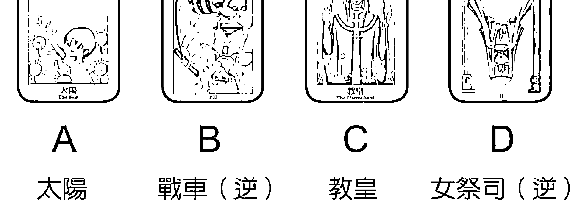

- A 太陽
- B 戰車（逆）
- C 教皇
- D 女祭司（逆）

##### 答案解析

### A. 太陽牌

其實有沒有人暗戀你，你的心中早有譜了。就算那位愛慕者還沒現身，你的感情最近也會有小小驚喜，未來美好的戀情也是可以預期的。照太陽牌看來，對方會是個充滿活力、相當浪漫的人，未來的你們將會充分享受愛情的樂趣，生活也不再乏味無聊，只不過他有時候非常孩子氣。這個部分如果你可以接受並喜歡他這份單純，相信兩人未來會非常開心甜蜜。

### B. 戰車牌（逆位）

目前的確有人正心儀於你，只不過你們兩個的發展似乎不如預期中的順利。他看起來是個較為衝動的人，一旦心中有了目標，就會為達目的不擇手段，只要他確定了自己的感覺，就會非常高調地對你表白。不過戰車牌逆位帶來的是三分鐘熱度，他的熱情似乎沒有持續力，注意力很容易被別的事情吸引。如果他向你表白，最好要考慮清楚些，不要太輕易答應他的邀約，千萬別隨著他的熱血而衝動付出感情。

### C. 教皇

原本是有人暗戀你的，不過可能因為某些緣故暫時打消了心意。目前的你感情運勢平靜無波，你也不用因為愛情空白而覺得著急。感情順其自然，你會更開心一些。此刻也不是陷入愛情的好時機，不如把握時間努力充實自己，在工作、學業或是專業技能上更進一步。認真的人最有魅力，等到你完全準備好了，屬於你的愛情機會也就不遠了。

### D. 女祭司（逆位）

是的，最近有人正傾慕於你。可能是你與眾不同的氣質，或是在某個場合的巧遇邂逅，讓他對你的印象特別深，並且想進一步認識你。不過，這個對象是否真的出自真心，你可能還要好好觀察。雖說對方並不是有心欺騙，不過他自己可能都還不了解自己的情感走向，甚至上一段感情都還沒有完全釐清。為了避免走上感情的不歸路，勸你最好深入了解他之後，再思考與他交往的可能性。

#### 2. 與暗戀的他未來會有結果嗎？

請從下列四張牌中選出一張

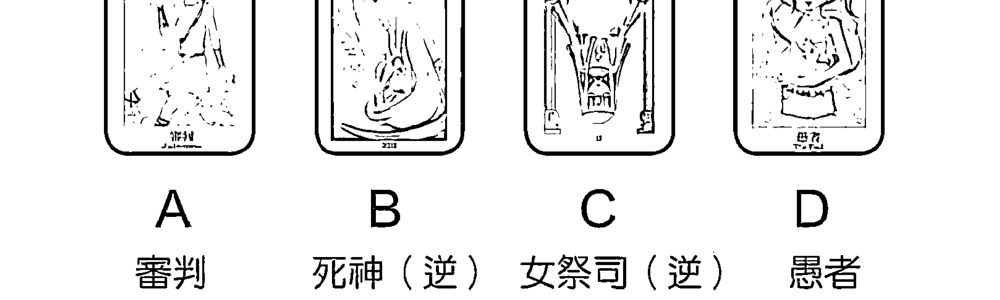

- A 審判
- B 死神（逆）
- C 女祭司（逆）
- D 愚者

##### 答案解析

### A. 審判

塔羅牌圖中號角響起，讓你七上八下、天天擔憂的感情煩惱，將在不久的將來水落石出。他對你的感情及關懷，過去總是裝作不在乎，但事實上，他的心一點一滴地慢慢轉移向你。你的溫柔貼心會讓他愈來愈喜歡你，此刻不需急、不需慌，只要多點耐心，就會發現他愛你的程度與你愛他的程度不相上下。

### B. 死神（逆位）

放棄吧！你的這份暗戀若執著下去將會非常艱苦。對方若即若離的態度其實表明了一切，他並不是那麼在乎你，而且糟的是他自己也另有喜愛的對象。你的付出很可能都會付諸東流。建議你冷靜一下，就算他偶爾會關心你，那都只是出自一種朋友的感情，真正的對象並不是他。

### C. 女祭司（逆位）

你的感情眼光還不夠精準，不是那麼懂得挑選真正適合自己的情人。你可能過於重視外貌了，以致於你總對於 Mr. Wrong 付出真情，最後傷心收場。目前你傾慕的對象並不如你想像中完美，可別被他的外在沖昏頭了。多聽聽週遭朋友的意見，或多認識對象吧！你需要提升自己識人的能力。

### D. 愚者

選到愚者牌的你要恭喜了！這張牌暗示著你的暗戀很快就會化暗為明，對方也正為你蠢蠢欲動著。只不過個性較單純的他對你純粹是一種好感，對未來並沒有想太多。如果你想要這段感情確定，那麼就得更主動一些，找個好機會對他提出邀約，或是固定和他聊聊天，相信他總有一天會懂你的心意。

#### 3. 他對我是認真的嗎？

請從下列四張牌中選出一張

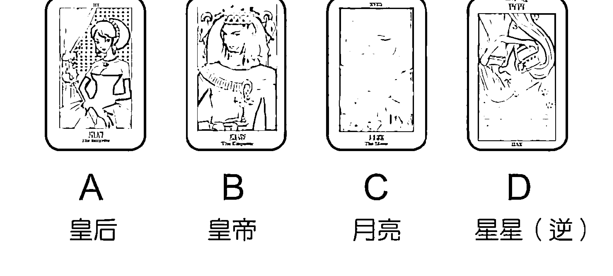

##### 答案解析

### A. 皇后

實在不用懷疑他的真心，你在他心目中早已是不可或缺的重要角色。只要你需要他，他絕對會排除萬難地陪在你身邊。雖然他的甜言蜜語有時真的言過其實了，不過說真的，他很在乎你。如果你可以少耍點任性，多一點溫柔，未來他一定會愛你更多更多。

### B. 皇帝

選到皇帝牌的你真是非常幸運！此刻你與他的愛情濃得化不開，甜蜜得不像真的。他對你是真的好，甚至好到有點寵溺的程度。你對他來說是唯一讓他那麼在意和牽掛的人，你的喜怒哀樂都牽動著他每根神經。只不過他的佔有慾相對很強，若你能讓他安心，感情會更加如魚得水。

### C. 月亮

你們兩個人的相處看起來並不像表面那麼甜蜜。月亮牌背後其實含著深不可測的未知，就像月有陰晴圓缺一般，其實不是那麼絕對的。若問到他是否對你真心，可能答案也不見得肯定。他心中有許多煩惱和祕密，也不像表面那麼開朗，你還需要再好好觀察，勸你不要輕易付出全部。

### D. 星星（逆位）

他有點憨厚又很直接的個性氣質的確很吸引你，感覺上有啥說啥的他，實在不需懷疑他的真心。但愈是這樣，對於感情你愈要保留一點。他沒有表面來得那麼可靠，對你也可能另有企圖。唯一保護自己的方式就是多認識他身邊的朋友，或是多觀察他，相信你會找到答案。

#### 4. 跟他在一起會幸福嗎？

請從下列四張牌中選出一張

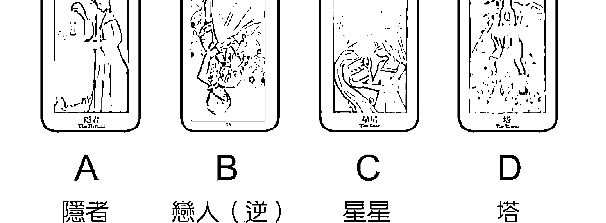

- A 隱者
- B 戀人（逆）
- C 星星
- D 塔

##### 答案解析

### A. 隱者

他憂鬱而深沉的性格讓你對他充滿莫名的崇拜。然而，這張牌說明了未來兩人的感情路還有得走，得經過長久的磨合，或許才能達到幸福的正途。你們兩人的差異頗大，生活上、個性上的價值觀也各自不同。由於你愛他更多一點，總是會試著對他讓步，但讓步的時間久了，小心吃虧的還是自己。

### B. 戀人（逆位）

未來和他在一起會幸福嗎？只要你靜下來問自己，這個答案就會水落石出。說真的，你的內心似乎還沒有準備好迎接和他的這段感情。你自己上一段感情還沒有完全清空，對於舊情人也好像還有期待。在這種情況下，對他來說是不公平的。不如沉澱一下，等你真正拋開過去再接納他，才有幸福的可能。

### C. 星星

他的個性很單純，對你的情感也非常直接。他的熱情能給你帶來很多感動，他對你的呵護也讓你傾心。基本上你們是很有緣分的一對，未來他也會繼續扶持著你。與他在一起最大的好處是很有安全感，全心全意地信賴他吧！兩人未來將會非常幸福喔！

### D. 塔

你和他的感情來得很奇妙，他根本不是你心中設定好的對象，卻又闖入你的感情世界。你們是有緣的，也注定發展出一段感情。只不過未來困難重重，阻礙很多。與其勉強維繫兩人薄弱的感情，不如抱著學習的心態，了解他、了解自己。或許未來是沒有結果的，但兩人至少都好好上了一堂感情的課。

#### 5. 他對我的感覺如何呢？

請從下列四張牌中選出一張

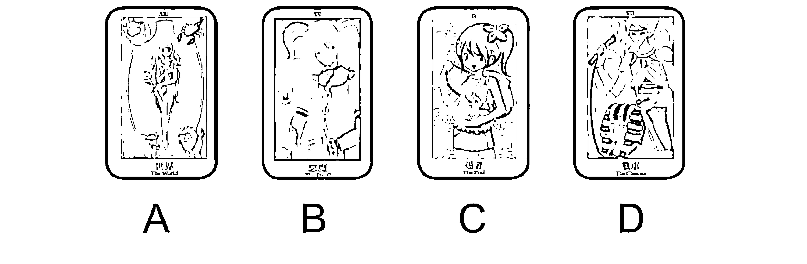

##### 答案解析

### A. 世界

實在不需要煩惱、思考太多，你們根本是天生一對。打從一開始，他的眼睛就完全跟定你的身影。說穿了，你其實就是他一直尋覓的對象，這是一段超完美的戀情！此刻他百分之百地傾心於你。你不但是他的菜，還是他尋覓已久的完美情人。兩人默契十足，少了你，他的世界只剩黑白。你在他心中的地位無可取代！

### B. 惡魔

你和他算是棋逢敵手的一對。他渾身充滿了令人難以抗拒的魅力，而你也不遑多讓。他對你也算是一見傾心，對你既好奇又喜愛，很難不去注意你。不過要提醒你，你們兩人目前對於彼此的迷戀很可能只是一種表象，有可能因了解而分開。目前只是一場肉體情慾的吸引力而已。

### C. 愚者

與其說你與他之間有祕密情感，不如說這只是你一廂情願的單戀罷了。他對你固然很友善溫柔，不過他對其他異性朋友也是同樣親切可掬。而只有你，誤把他的禮貌當成感情的暗示。別再深陷下去了，此刻的他或許另有喜歡的人，對你沒有太多感覺。

### D. 戰車

他對你的體貼與細心，相信再也找不出第二位了。不過，這只是他階段性的任務罷了。你的才華和工作方面的長處一直是他想學習的。對他而言，你只是幫助他前進的夥伴。他目前全部注意力可能都放在課業或工作上。或許你覺得他好像對你有感覺，說真的，你誤會了。

#### 6. 感情中的你最在乎的情人條件是？

請從下列四張牌中選出一張

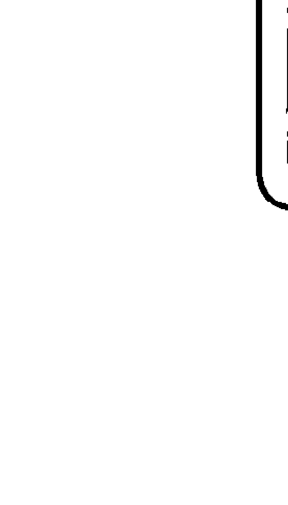

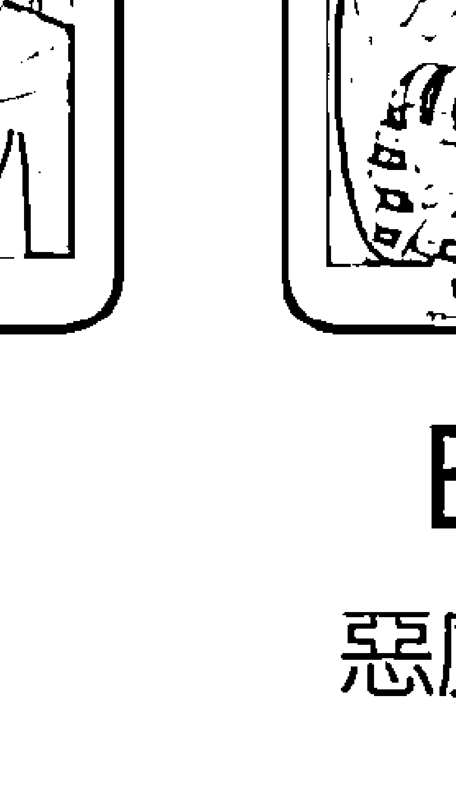

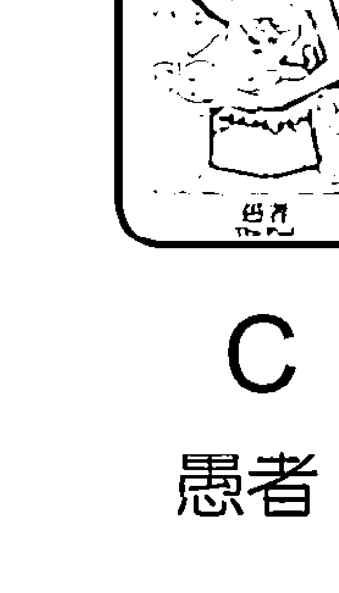

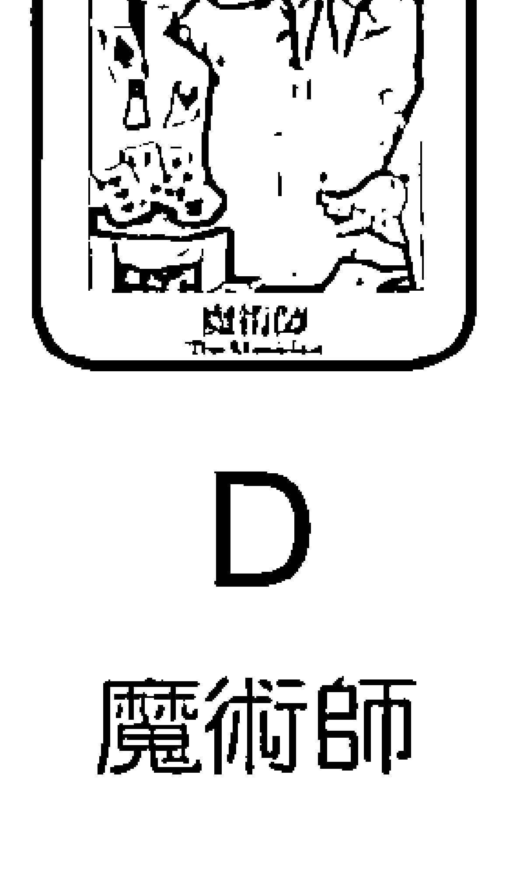

##### 答案解析

### A. 皇帝

你對於感情抱著比較務實的態度，認為麵包比愛情重要，也不想天天風花雪月為愛情傷神、傷心。對你來說，愛情對象就像是一個可以倚靠的避風港，能隨時給你經濟上的金援，讓你在物質需求上不虞匱乏。如果對方財力不夠雄厚，你是一點安全感也沒有的。

### B. 惡魔

表面上你說你重視感覺、重視第一印象，但說穿了，你根本是個不折不扣的「外貌協會」會員。有時候你會覺得「窮」不要緊，學歷好、氣質高才是重點；又或者是學歷不重要，談得來才重要；談不來也沒關係，只要帶出去有面子就好。你很注意對方的相貌，也往往會因別人的外表而愛上一個人。

### C. 愚者

太油、太成熟的對象只會讓你覺得他像個長輩，談起戀愛一點也不自在。你喜歡活潑、充滿男孩子氣息的對象。對方最好是個陽光男孩，能帶著你到處趴趴走，或者是個有點孩子氣、可愛、長不大的小男生。總之，愛情就是幸福的泉源。你不要壓力，也不想擔心未來，只要有人能滿足你的娛樂需求，就能贏得你的心。

### D. 魔術師

你對於感情的憧憬實在很不實際，就算說幼稚也不為過。你欣賞浪漫、多金又風趣的對象。就算對方條件遠遠比你優異，你也會努力高攀。你挑情人的眼光比101大樓還高，平時不易動情，一旦動情就勇往直前。偏偏這樣認真衝刺的你，真的很容易找到讓別人都羨慕眼紅的完美對象。

#### 7. 未來能和分手的他重修舊好嗎？

請從下列四張牌中選出一張

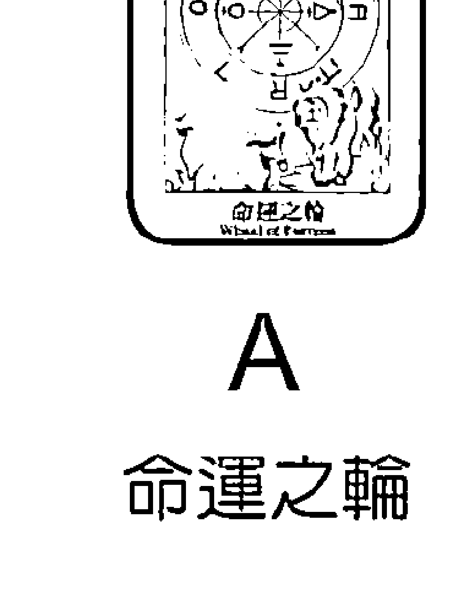

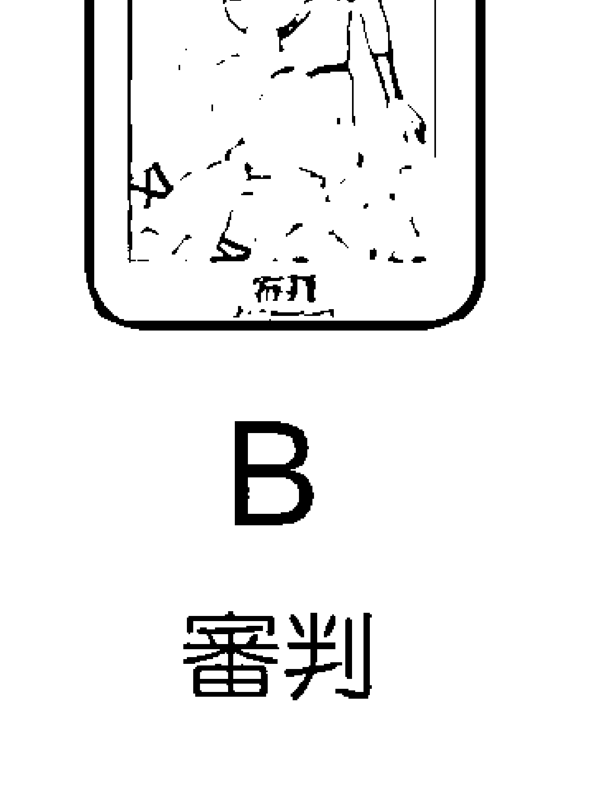

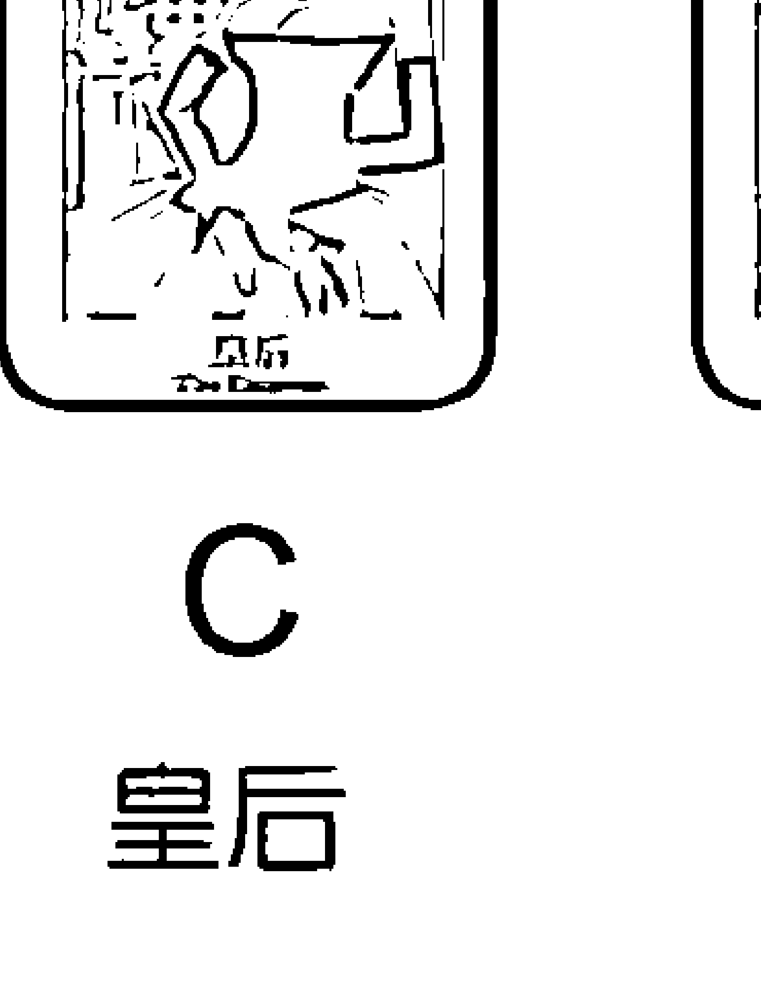

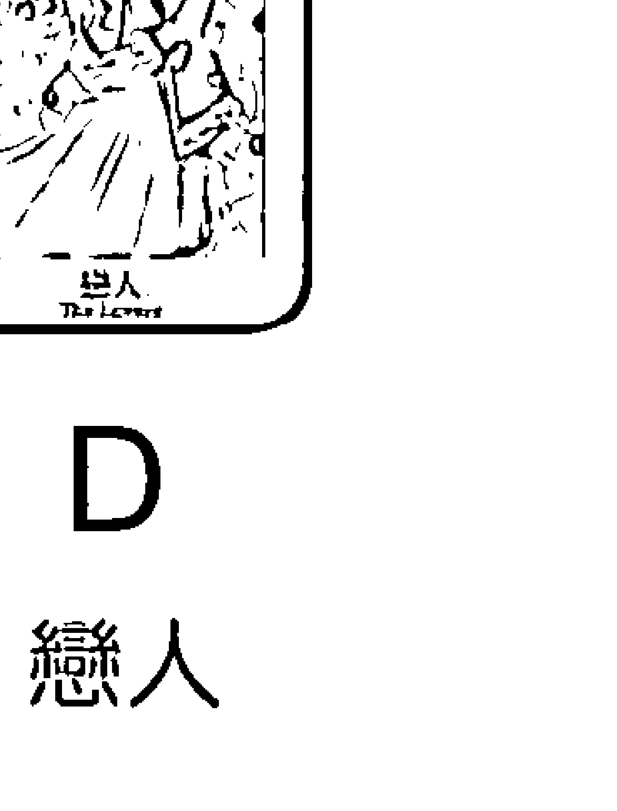

##### 答案解析

### A. 命運之輪

看到這張牌就不難發現「風水輪流轉」的情節在眼前上演。不管過去誰是誰非，如今想要復合，整個局面就會出現翻轉。若當時痛苦的是你，那麼他就得重新經歷你曾經經歷的一切；如果當時狠下心分手的是你，那麼你想要重修舊好就要看他對你剩下多少情分。就算復合了，背後隱藏的問題也不是短期能解決的。

### B. 審判

想要與他重新來過，恐怕任務十分困難喔！審判代表的是一種對過去的反省與檢討，也可以說是一種「翻舊帳」的展現。只能跟你說，想要復合的你勢必得經過一個較為辛苦的過程。當初的你們是如何分開，他是如何傷心，若要復合，你就得接受同樣的折磨。

### C. 皇后

當初分開的這個決定，其實兩人都有點衝動。在彼此都拉不下臉來的結果，就是得忍受分開的寂寞。儘管當初全都說開了，然而你們之間那股無形的吸引力還在。只要你出現的地方，他的眼神就無法從你身上移開。你們彼此又愛又恨的火熱情感，重修舊好的機率很高。感情的傷還要靠時間平復。

### D. 戀人

你們兩人的緣分很深。就算過去曾經歷了無數風雨，然而彼此那些回憶是兩人放也放不掉的行李。就等其中一人主動拾回這些感情，另一人將會全心依隨。其實兩人早已原諒對方了。

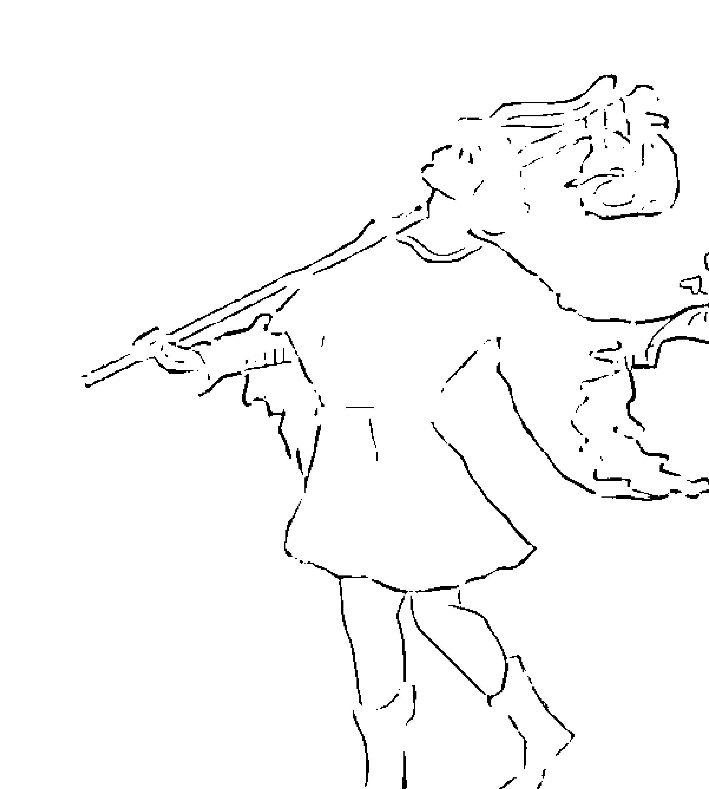

#### 8. 我的異性緣好嗎？

請從下列四張牌中選出一張

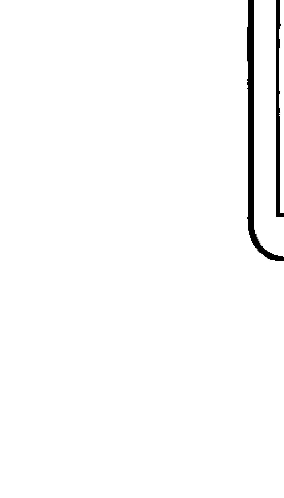

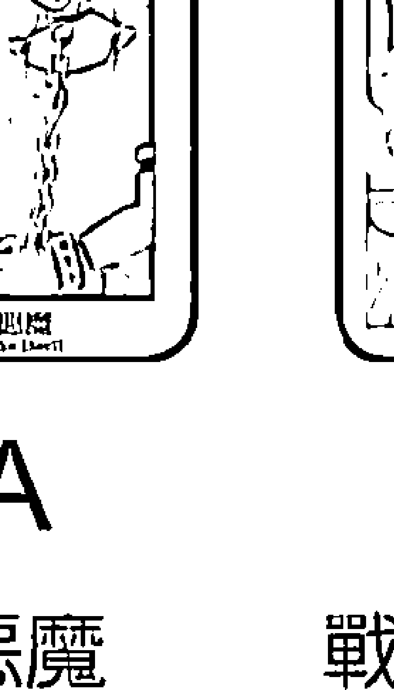

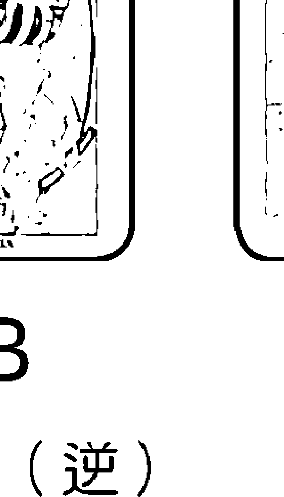

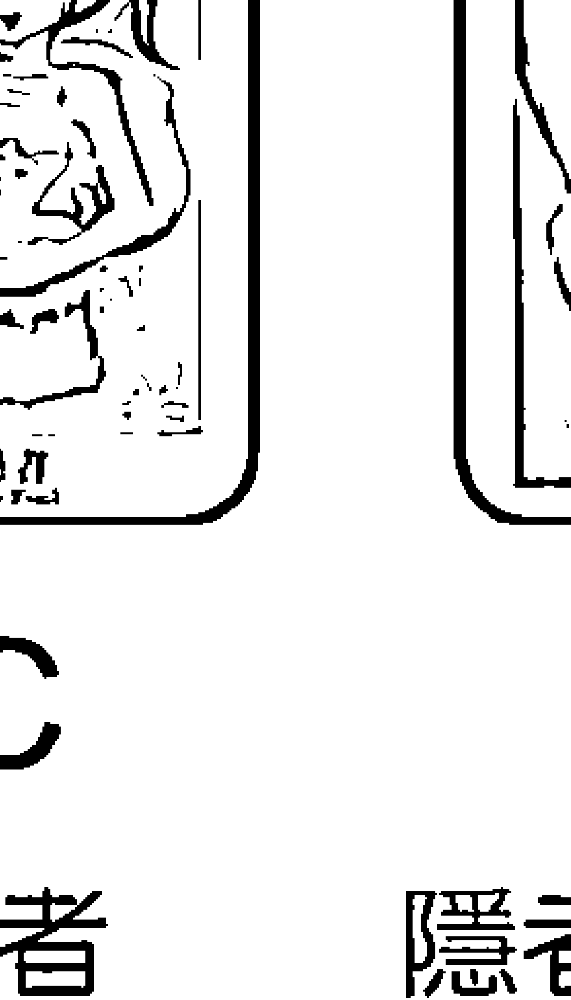

##### 答案解析

### A. 惡魔

惡魔牌帶有一種邪氣，也是一種致命的誘惑力。或許連你都沒發覺，你的舉手投足間擁有著無限的魅力，而這種潛在的吸引力就在於你一個不經意的眼神，或是有意無意的注視。一般來說，這樣的魅力在異性間幾乎無人能擋。對你而言，與異性的相處也比同性之間更來得輕鬆。

### B. 戰車（逆位）

你在團體中就是一個很大剌剌的大姐頭，很有領導作風，也很有想法，很容易在短時間裡和大家打成一片。在長輩眼中也是個相當討喜的孩子。不過對於感情，或許是率真的個性讓你低調不來，而這股熱情有時也會嚇跑異性。建議你不要像無頭馬車一樣橫衝直撞。

### C. 愚者

扭捏作態、故作矜持你怎樣都做不來。不管在男孩或女孩面前，你總是很有自己的個人風格。這樣自然不做作、有話直說的特性，讓異性眼中的你，就像天真可愛的小弟弟或是麻吉好友一般，可以無話不談。這樣的你雖然很受歡迎，但大家往往對你缺乏了一點女人味的想像空間。

### D. 隱者（逆位）

雖然感情就是順其自然，不過你對於愛情也未免太消極了。尤其有異性在的場合中，你總是「閉俗」得像變了一個人似的。你本身的個性其實已經很內向了，對於異性，你往往抱著敬而遠之的想法，以致於異性眼中的你存在感極低，也經常被忽略。說到異性緣，只能說還有非常大的進步空間。

## 【學業及工作篇】

#### 1. 最近我的讀書運氣好嗎？

請從下列四張牌中選出一張

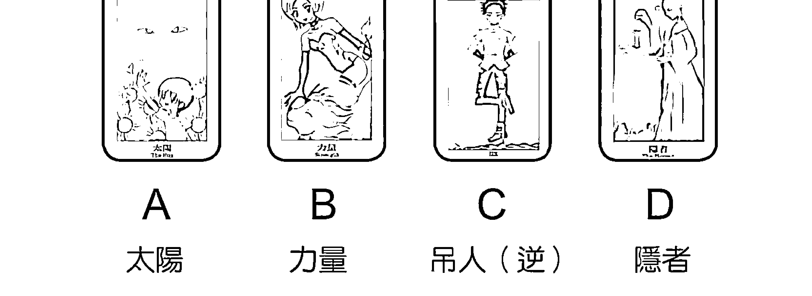

- A 太陽
- B 力量
- C 吊人（逆）
- D 隱者

##### 答案解析

### A. 太陽

太陽牌中小男孩揮舞著手中的旗幟，暗示著成功。選到太陽牌的你最近在課業上幸運得有如神助，只要稍微努力，就會得到加倍的成果表現。連老師及同學都會對你大聲喝采，而你認真專注的結果，將會讓你在考試中獲得理想的成績喔！

### B. 力量

讀書真的不是件簡單的事，不過你的勇氣和爭取佳績的企圖心很強。儘管考試時偶爾出槌，不過現階段的你很有通過考試的爆發力。只要把全部精力花在讀書理解上，相信你就會得到理想的成果。

### C. 吊人（逆位）

抽到吊人逆位牌的你最近最好能腳踏實地地讀書。你的心很不安定，想要好好念書，卻又像吊人吊在半空那般無力。最近是你讀書的低潮期，感覺上努力了很多，但進步的空間卻很有限。別給自己太大壓力，保持輕鬆的心情，壓力與挫敗也會讓你慢慢磨出耐性。

### D. 隱者

雖然在班上，你的表現一直不像風雲人物那般受人矚目，不過對於課業，你很有一套自習的方式。對你來說，考試的成績好壞無所謂，重要的是自己是不是真的了解其中涵義。抱著這份認真的心，你在學業上可是無往不利。

#### 2. 最近的我適合換工作嗎？

請從下列四張牌中選出一張

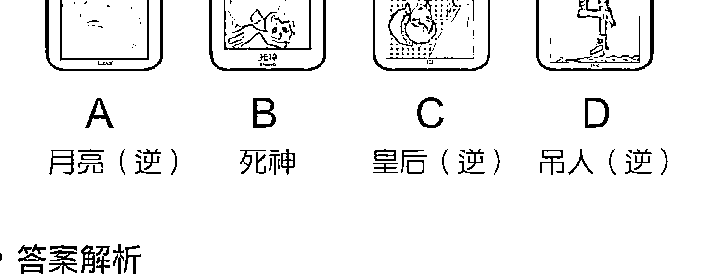

- A 月亮（逆）
- B 死神
- C 皇后（逆）
- D 吊人（逆）

##### 答案解析

### A. 月亮（逆位）

現階段的工作和你想像的實在差太多，無論收入、工作內容、合作夥伴都令你覺得索然無味，但同時又對新工作充滿疑惑，讓你難免恐懼憂慮。月亮逆位指的是麻煩，換工作會為你帶來許多麻煩，小心受騙，不要輕易信任他人。如果可以，還是忍著點做好份內工作。

### B. 死神

別以為看到死神就是絕望、失落。某方面來說，死神代表的是惡夢的結束、幸運的開始。現在對你來說，是一個換工作的好時機，可以暫時騎驢找馬般地邊工作邊找尋更適合你的工作。你的人生新階段就要開始。剛開始新工作或許有些適應期的痛苦，以後你就會發現不如你想像的困難。

### C. 皇后（逆位）

目前工作雖然有點差強人意，不過換工作也不見得有多好！你的新工作會讓你失去你所珍惜的事物，例如感情或是家庭生活。這份新工作也許因為工作性質的關係，使你無法照一般人的日常作息，因此不能跟伴侶或家人分享正常的家庭生活。即使剛開始還能夠接受，但是久了問題就會接踵而來。

### D. 吊人（逆位）

或許現在有新工作向你招手，也可能你暫時想休息，但你換工作的結果可能比原本的狀況還糟，問題比你想像的還要多。一般來說，辛苦的工作卻只有微薄的報酬，會讓你感到失望。你的精力會用在錯誤的地方，還不如留在原本的工作崗位。就算索然無味，但至少不會被人欺騙。

#### 3. 未來的你適合做哪一方面的工作？

請從下列四張牌中選出一張

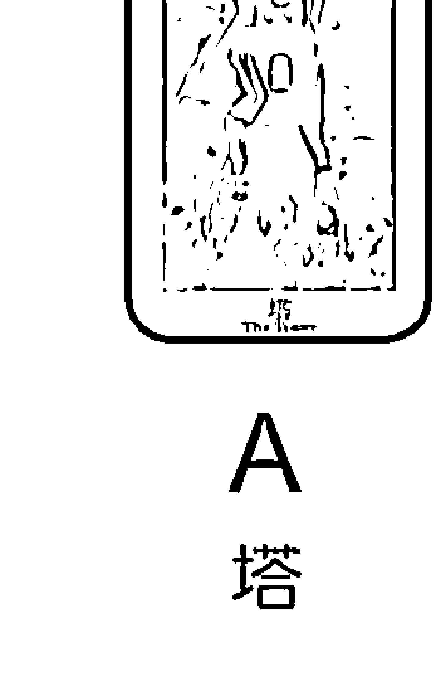

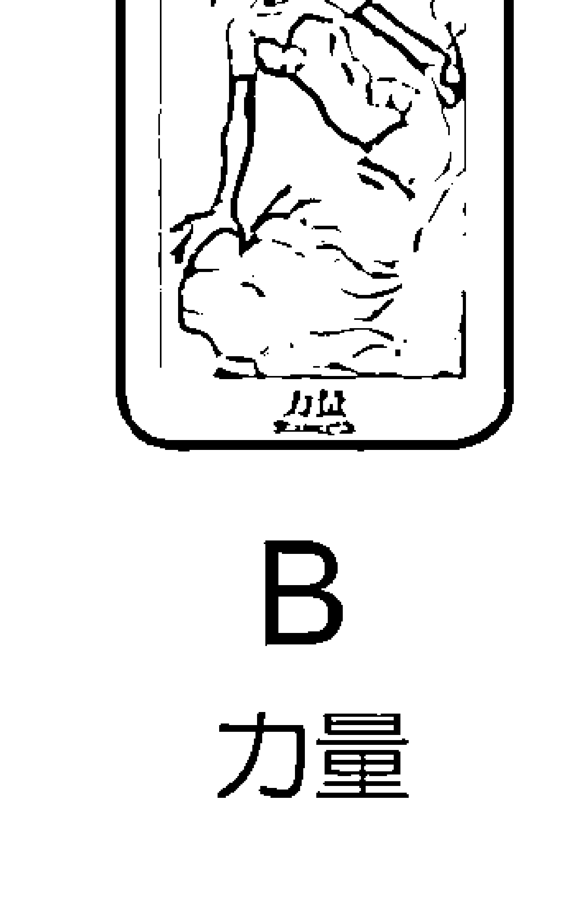

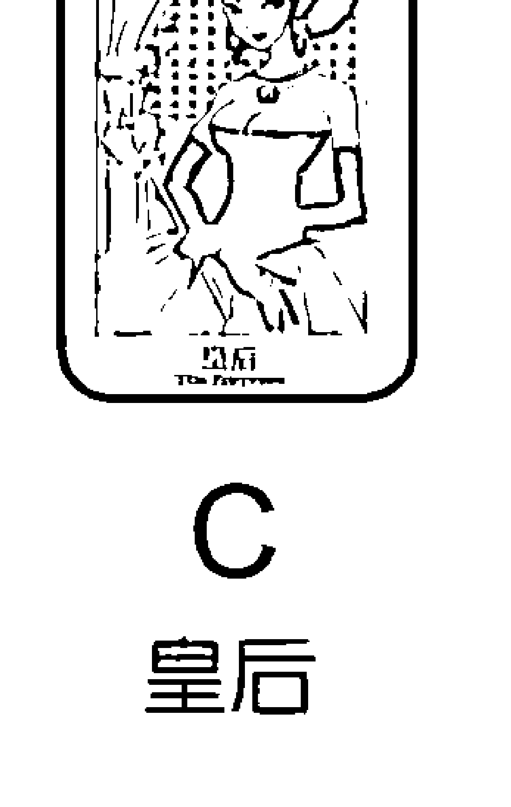

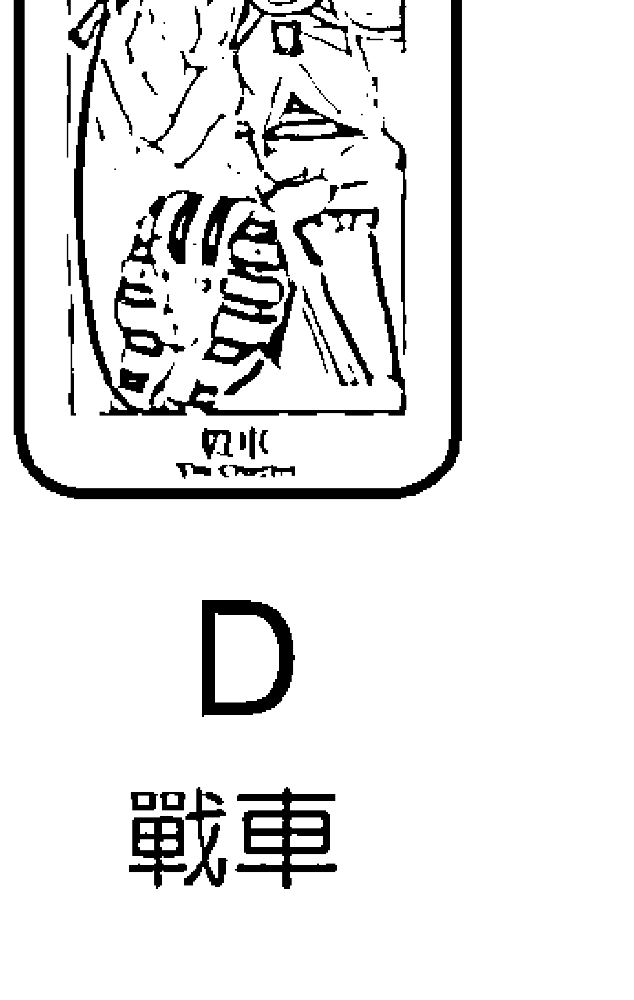

- A 塔
- B 力量
- C 皇后
- D 戰車

##### 答案解析

### A. 塔

塔代表的是一種先破壞後建設的工作性質。抽到此張的你，可以試試破壞型的事業。不要被字面誤導，破壞不是指違背法規的行為，而是指改變現狀的行業。例如建築業、爆破技術人員之類，拆除舊有的建設，就是屬於破壞性的工作。只有把舊的破壞，新的事物才能出現。這是一份具有使命感的工作，能促進自我提升。

### B. 力量

力量代表意志力與體能。你的精力十足，適合從事運動類型的職業。如果你是一名運動員，你能發揮絕佳的體能。

力，得到好的成績。你對控制體力與活力很在行，建議你尋找需要力量作為工作主要訴求的行業，對你可達到事半功倍的效果。例如運動選手、救生員、護衛。

## C. 皇后

皇后代表富饒與物質的安全感。你有較高的機率會繼承家庭的事業，而你也有能力去達到工作的要求，並得到相當的利潤。你會在工作中得到情緒與物質雙方的滿足感。你非常幸運，能在工作的同時享受愉快的家庭生活，你的工作與傳統有相當大的關係。

## D. 戰車

戰車牌象徵一種代表英勇的表現。你適合從事需要在激烈的競爭中，發揮意志力、勇氣及決斷力的工作。你的精力得以在快速爭鬥的環境中發洩，你具有冒險性的天性會幫助你贏得先機。例如證券交易事業、業務員、旅遊業等的工作，可以滿足你的速度感及成就感。

## 【人際篇】

#### 1. 最近可能會在背後捅你一刀的人是誰？

請從下列四張牌中選出一張：

- A 隱者  
- B 戀人（逆）  
- C 月亮  
- D 教皇  

##### 答案解析

### A. 隱者

小心過去與你有衝突的對象。最近的你要格外注意有心人士的伺機報復，尤其要特別提防你的宿敵死對頭。不管是你私人的感情事件或工作上的抱怨、人際關係的微詞，都不要大肆地宣揚，以免話柄落入對方的手中，讓他逮到機會去說你壞話，刻意破壞你的形象！

### B. 戀人（逆）

小心你的前任情人。還跟前任情人糾纏不清嗎？最近的你請跟對方劃清界限吧！因為他似乎是不懷好意，不但刻意擾亂你的生活，而且還想要藉由刺探你的內心來破壞你未來的感情運，使你身邊的朋友與愛慕者遠離你，而讓你陷入孤立無援的境地。

### C. 月亮

小心你的同學、同事。因為彼此競爭的關係，最近的你要特別保持警戒與觀察力。不管是坐在附近的同學或同事，都有可能借題發揮讓你難堪，或故意陷害你去背黑鍋，而讓對方成為既得利益者。如果不及早防範的話，事發時你是跳到黃河也洗不清哩！

### D. 教皇

你的好脾氣與高EQ實在很難讓人聯想到想報復你的小人。事實上，最近的你人氣大旺，不但沒有小人，反而處處有貴人相助喔！在學業上，老師看你越看越順眼，不知不覺就給你分數多打幾分；工作上也頗得上司長官的青睞，更別說其他生活層面了，舉手之勞幫到你的人非常之多喔！

#### 2. 該如何發揮你的個人魅力？

請從下列四張牌中選出一張：

- A 魔術師（逆）  
- B 正義（逆）  
- C 世界（逆）  
- D 戰車  

##### 答案解析

### A. 魔術師（逆位）

魔術師牌說明了你在潛意識中渴望能發揮個人魅力，希望成為大家注意的焦點。但是逆位卻暗示你始終不得其法，不管你怎麼做，似乎大家的反應都不佳。與其這麼積極卻達不到效果，不如靜下心來。你的內心那種患得患失的意識已經影響你的人際魅力，最好能夠自然輕鬆一點；表現出寬大的一面，不要那麼在乎別人的看法。偶爾有些自己的建議，你會更有存在感。

### B. 正義（逆位）

逆位的正義牌代表你似乎對人的標準過於嚴格，容易帶著有色眼鏡評判一個人，也容易因為偏見而不公平地對待別人。建議你要時常以更客觀的立場來判斷所有人事物，一視同仁地與所有朋友交往，這樣才不會引人反感。你也要克服自己因緊繃而顯得僵硬的態度，否則大家會被你既嚴肅又急躁的個性嚇跑，根本看不到你的個人魅力喔！

### C. 世界（逆位）

你似乎對世界的感覺很悲觀，對人性很絕望，因此經常難以打起精神去面對周圍的朋友，在人群中的互動也特別少，給人看起來很悶的印象。由於你的內心重視的只有自己，也很少關心他人，甚至還有些防備他人，不喜歡太多近距離互動。如果不獨處就很難自在。建議你打開心胸，用更正面的角度看別人，塑造你的個人魅力。

### D. 戰車

戰車代表勇敢前進，也象徵一種向前衝刺的特質。這說明你最大的個人特質就在於自信。你的意志力與決心使你總是處於順利的上位，別人很難與你競爭，而你的無往不利所培養出的自信，能夠吸引許多身邊的人接近你。團體中的你其實很有領導能力，在決斷事情上也格外具有魅力。你其實不用擔心魅力不足，只要做你自己就行了。

#### 3. 你在人際關係上的相處缺點為何？

請從下列四張牌中選出一張。

##### 答案解析

### A. 教皇（逆位）

在人際關係中，溝通上的問題一直是你心裡的痛。儘管你具有舌燦蓮花、講話頭頭是道的本領，但是遇到需要彼此溝通時，你的表達能力反而成為敗筆。你容易聽不懂、也聽不進去別人說什麼，而自己又失去重點地滔滔不絕。如果硬是要與你爭辯的話，最後往往會失去焦點，彼此的情誼也會大大受傷。人身攻擊、翻舊帳、扣帽子等行徑只會讓你的人際關係大受打擊。

### B. 隱者

你在人群裡顯得格外低調，表面上不主動、不拒絕、不負責，其實是因為你缺乏主見。很多事情無法決斷，卻又自命清高，高喊著不同流合污、不愛人云亦云。內心世界與外在表現呈現出強大落差。這樣的性格在團體中其實有社會適應不良的傾向，偏偏你又容易自我掩飾，會覺得是別人的問題。

### C. 皇后

你的朋友很多，經常呼朋引伴、帶頭吃喝玩樂的就是你。在一片歡樂友情洋溢中，其實你內心是有些空虛寂寞的，因為無法與自己獨處，只好總是寄託他人帶給你快樂。只要一落單，你就開始有很多灰色想法。這種依賴成性的個性，時日一久就會造成他人的壓迫感，因此你必須不斷找新朋友、新團隊。對人人都好、人人也都關心你，一直到大家發現你的強迫傾向為止。

### D. 魔術師

在光鮮的外表下，你個性小心翼翼，常常容易過度緊張。其實你是個極度缺乏自信的人，從小可能在學習上處處不如人，或是創造力與表達力總是受阻，而讓你在人際關係上顯得膽怯退縮。隨著年齡漸長，你學會用強大的自尊心武裝、防衛自己，以小聰明來假裝自己高人一等，企圖掩飾你心中的不安。

## 【個性篇】

#### 1. 你所潛在的驕縱個性為何？

請從下列四張牌中選出一張。

##### 答案解析

### A. 皇帝

你個性中潛藏著自我放大、目中無人的「大頭症」個性；眼中只有自己，既自大又自戀，好像別人都要遷就你才行。自己任何的行為表現，都自動放大來觀看與欣賞，並且自我稱讚一番。不管別人是明示或暗示你的行為舉止過度誇張與不合宜，你總是看不到也聽不見，就是盲目地覺得自己一切都很不錯。

### B. 戰車（逆位）

你的個性較羞澀，經常選擇隱忍，驕傲放縱在你身上幾乎找不到影子。不過偶爾你也會有小女孩般的任性舉動。一旦出現讓你在意的人、事、物時，你就會整個人專注在那些人、事、物身上，完全聽不進他人任何的勸說話語。直到有一天你不再執著，才會恢復正常。

### C. 皇后

你潛在著頤指氣使的驕縱個性，經常表現出「大女人」般高高在上的姿態，把自己當作「女皇」一樣，要求身邊不管男生或女生都要聽從你的指示，主觀隨意地指派他人為你做事，還不准他人有任何意見或反對。一心認定自己所決定的一切都是對的，只要與你意見不同，你就會嚴厲批評與排斥，任性地拒絕他人的建言。

### D. 女祭司

你有著超越年齡的成熟穩重，平時很能為他人設身處地地著想，總是會隨時隨地付出你的關心，照顧著身邊的人。你的情緒EQ很高，對周遭人、事、物的包容心也很強。親切隨和、溫文有禮的態度，使你身上看不出任何潛在的驕傲與放縱任性的個性，有的反而是一種熱心為人的服務精神。

#### 2. 你在哪個部分心機特別重？

請從下列四張牌中選出一張：

- A 力量（逆）  
- B 皇后（逆）  
- C 吊人  
- D 惡魔  

##### 答案解析

### A. 力量（逆位）

「不鳴則已，一鳴驚人」很像你的個性寫照。你不是個愛耍心機的人，除非有人惹到你！一旦觸犯你的禁忌地雷，你就一定會不留情面，在心底把對方畫個「X」，放大對方的缺點，用極有偏見的角度看他，甚至會鼓吹其他朋友一起把這種反感情緒傳播出去。幸好你不是容易被惹毛的人，真的會承受到你這樣恐怖報復的人其實不多，你的蛇蠍指數高達90%。

### B. 皇后（逆位）

你很重視別人的目光，因此在外貌打扮上也很用心。不管任何時間場合，你一定都習慣精心打扮自己。對你來說這不但是一種禮貌，也是一種博取好感的小技巧。因此你在外貌上花的心機特別多，懂得不著痕跡地保持好妝容。你隨身都帶著化妝保養品，各種小飾品也會隨時拿出來補充；姐妹問你打扮的意見時，你也總是稍稍有所保留，因為你希望自己永遠是群體中最閃亮的人。

### C. 吊人

你很愛到處去「比較」、去「計較」，心中藏有一種莫名的自卑感。你喜歡追求光鮮亮麗，卻又不太滿足，經常覺得別人的比自己好。你愛計較、愛比較的範圍非常廣泛，例如別人用的東西似乎比你好、別人似乎比你更受歡迎、別人怎麼老是能拿到很好的折扣、別人的男朋友總是比較優……然後把自己身邊擁有的人、事、物統統否定，經常把自己困在嫉妒的死胡同中走不出來。

### D. 惡魔

說真的，太陽底下其實沒有什麼新鮮事，除非有人能吹皺一池春水。你關心朋友，其實也很喜歡看周遭朋友的好戲，好像看不得天下太平的生活似的。你喜歡闖一些八卦，把別人的境遇當成茶餘飯後的娛樂話題，滿足自己好玩、愛惡搞的癖好。你經常到處散播消息與風聲，設計一些擾亂人心的橋段，惹得大家互相猜忌懷疑，最後再繞好大一圈去化解一切。

#### 3. 潛藏在你內心的慾望是什麼？

請從下列四張牌中選出一張：

- A 皇帝  
- B 魔鬼  
- C 魔術師  
- D 星星  

##### 答案解析

### A. 皇帝

你是一個控制慾很強的人，通常喜歡表現出主導的模樣，希望身邊的人、事、物都跟隨你的意志去進行。許多事情你說了就算，旁人最好俯首稱臣。如果稍微違背你的想法，你無論如何都要扭轉回來。有時你甚至會太雞婆，連家人、情人、朋友的事情你都要搶著決定。說好聽是好心幫忙，其實根本就是強烈的控制慾在作祟。

### B. 魔鬼

你的潛意識中有著重口味的傾向，在感情中相當重視性生活的美滿與否。如果現在的你擁有穩定交往的對象，你的所有精神都會專注在對方身上，並渴望更深入的親密交往。但單身的你在感情上最好保持理智，不要被一時的浪漫沖昏頭，分不清真實與假象。這樣的你通常也是「嫁不對人」的高危險群，總是被感覺牽著走，一直到了解之後才分開。雖然那方面的生活情趣在生命中不可或缺，但謹慎可以避免更多錯誤。

### C. 魔術師

你是一個非常在意物質的人，有著視錢如命的傾向。累積財富一直是你的夢想，為了滿足你的金錢物質慾，你可以不顧一切拼命努力地賺錢。即使被說成錢奴、守財奴、鐵公雞也在所不惜。物質慾旺盛的你當然也有精明的一面，買東西你絕對會貨比三家不吃虧，即使銀行轉帳手續費與提款手續費也非省不可。

### D. 星星

你的個性就像星星牌中的小孩一樣，潛藏著一份孩子般的純真感。相對而言，也暗指你其實有著好逸惡勞、喜歡享樂的傾向。坦白說，你的個性較缺乏進取心與企圖心，也自認天下沒有百分之百完美的事，因此不太計較細節，一切以眼前的快樂為主。明天的事情，明天再說！有玩樂或好康的事情，你總是跑第一。表面上看起來樂天知命又超隨和好相處，實際上今朝有酒今朝醉的你，抗壓力其實很低，需要多加注意。

## 【生活篇】

#### 1. 你最近容易為了何事煩惱呢？

請從下列四張牌中選出一張。

##### 答案解析

### A. 星星（逆位）

物價居高不下，東西愈變愈貴，工作愈來愈辛苦！最近的你會為了帳單、卡費煩惱到不行。東花一點、西花一點，存款就愈來愈少！如果原本財務狀況還不錯，也要特別小心意外支出。不要大手筆刷卡血拼，若透支了原有的預算，接到帳單的那一刻，也就是你醒來的時候了！

### B. 力量

或許是相對兩無言，讓彼此的心距離越來越遠。最近雙方都對感情產生落寞與失望，而溝通不良的結果，讓彼此都只能用逃避來面對問題。沒有情人的你，不管是落花有意、流水無情，還是對方遲遲不表態，都讓你有苦難言、進退兩難。如果愛情真的到了前進無路的時候，不妨轉個身、換個方向吧！

### C. 月亮

最近的你EQ特別差，什麼事情都很容易引發你的暴怒情緒，整體呈現憂鬱低落的狀態，凡事都往壞處想，誰也不想理。雜亂無章的思緒就像打了無數個死結的毛線，一層一層纏繞你的心靈。感覺諸事不順的你，當然看任何人、任何事都不順眼，生活裡盡是烏煙瘴氣。勸你好好睡個覺或看看電影，別再深陷情緒泥沼了。

### D. 正義

工作中的你責任感超強，只要能完成任務，把自己一個人當作十個人用也不足惜。不過這份拼命的鬥志最近會有點鬆散。每天睜開眼、頭腦一開機，就是工作、工作、工作，完全無暇顧及其他。這樣繁忙又疲於奔命的生活，還真不是人過的！眼看著愛情、娛樂、朋友、睡眠、健康都可能漸漸離你而去。

#### 2. 你邁向成功的潛質有多高？

請從下列四張牌中選出一張：

- A 審判  
- B 節制  
- C 魔術師  
- D 正義  

##### 答案解析

### A. 審判

本來已經沒有什麼希望的事情，突然意外地好轉。最近的你常有意外的好運。雖然你對成功看得很淡，不過或許正是這份順其自然、沒有太多條件要求的心態，讓「審判」這張牌充滿一層神秘感。你的外表隨和溫柔，其實很有自己的見解，想法也很聰明，未來很有機會邁向成功之路。

### B. 節制

心靈的力量得以發揮，足以改變一切。牌卡中的水在兩個杯子中相互流動，代表你較高的自我與較低的自我可以和平共存，或是現實與未來的緊密聯繫。它也是一種療傷止痛的過程。在這緩慢的改變中，你的身心逐漸被淨化、被治癒，衝突也被調和。

### C. 魔術師

思想清晰且富有創意，人生會不斷出現奇蹟與希望，而且你也能掌控先機，發揮自己的潛能。魔術師一手指天、一手指地，像極了佛陀所說的「天地之間，唯我獨尊」，這就是創造者的氣勢。善用魔術師的力量，成功或失敗，都在你的一念之間。

### D. 正義

你應該跳脫原本的角色去思考，權衡各方利益，便可以得到公正超然的答案。正義是一手持劍、一手拿著天秤的瑪特女神，象徵人間的公平與正義，也有付出多少就會得到多少的意思。這裡指的正義比較世俗性，以律法為主。你之前做的事情決定了現在的結果，而你現在所做的，將會成為未來的收穫。

#### 3. 我今天一整天運勢如何？

請從下列四張牌中選出一張：

- A 節制（逆）  
- B 月亮  
- C 戰車  
- D 魔術師  

##### 答案解析

### A. 節制（逆位）

今天的你要當心一些預期之外的變化，尤其是規劃了好一陣子的事情，今天可能會出現逆轉的狀況，讓你稍微亂了陣腳。其實船到橋頭自然直，這些意料之外的狀況也是考驗你臨危不亂的本能。最後的結果還是會很樂觀，其實不需要想太多。你只需要多一點耐心與信心，就會發現事情沒有那麼嚴重。

### B. 月亮

你內心隱約的不安時時刻刻都影響著你的情緒。工作上的不安其實來自於你的信心不足，你必須告訴自己盡己所能地去完成，剩下的就交給老天。過度擔心也不會讓事情變得更好。愛情方面則意味著你內心的不安來自情人的冷淡。敏感的你遇到問題就自己煩惱，但其實如果兩人充分溝通，也許可以避免很多困擾。

### C. 戰車

今天的你無論做什麼事，都一定要專心投入。抽到戰車牌的你今天熱血無比，似乎想在工作上贏得成就、贏得旁人讚賞的目光。不過要當心忙中出錯，最好還是謹慎一些。另外你今天小有偏財運，身邊的發票記得收集起來，最近很有機會發筆小財呢！

### D. 魔術師

恭喜你！如果出門前抽到魔術師這張牌，那麼你今天的運氣將好到不行。感覺幫助你的人很多，事情也都能如預期般達成。最主要的是，你今天的心情將決定一切。只要心情開心愉快，就很容易招來一整天的好運。試著把笑容久久掛在臉上吧，微笑的神奇魔力將讓你奇妙地遇到許多好運。

## 第四章  
## 塔羅魔法牌卡的神奇力量

塔羅魔法是結合牌意和意念的顯化魔法的一種，透過祈禱、儀式、符號的能量與冥想的力量，召喚出你想要得到結果的一種魔法。只要你信念堅定，奇蹟就可能發生。

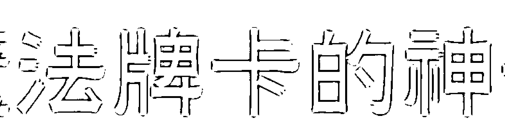

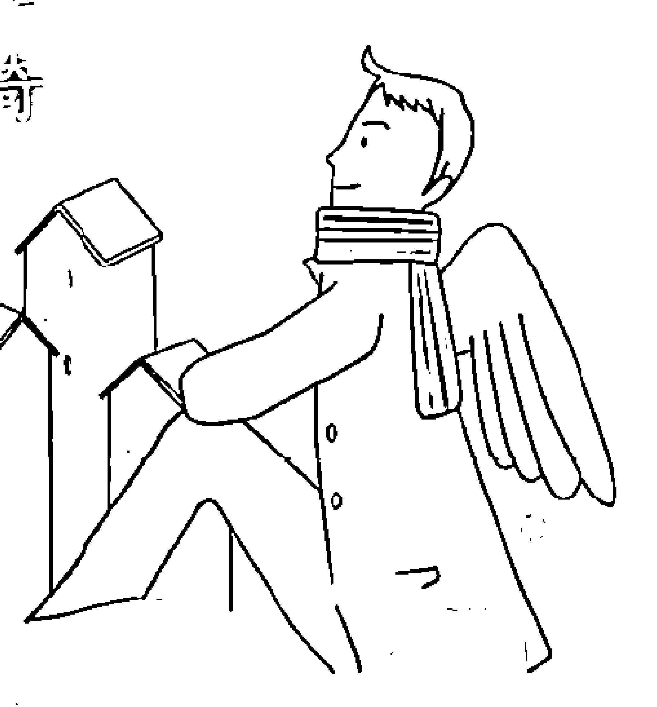

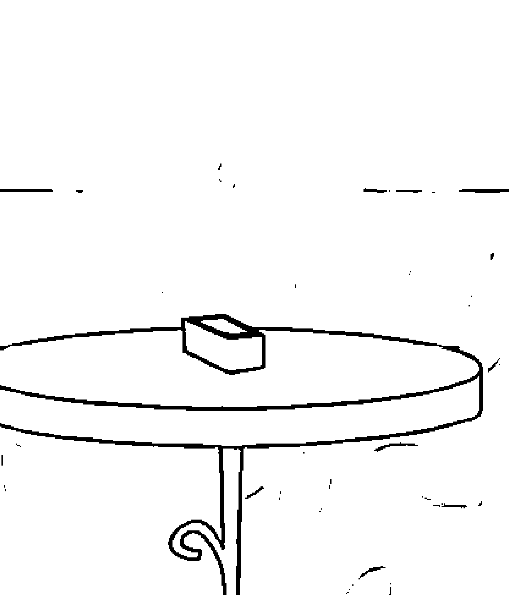

西洋神祕學中，魔法這一環往往最讓人覺得不可思議，其實魔法憑藉著「信任」的能量，在無形中「召喚」要得到的結果，這與「冥想」有著密不可分的關係。而塔羅魔法也算是西洋魔法中相當普遍的一種，經由塔羅牌的助力，時時刻刻提醒人們要往設定好的目標前進。不管你相信與否，都不妨嘗試看看。

---

### 女祭司牌定心魔法

- 主牌卡：女祭司  
- 輔助牌：魔術師  

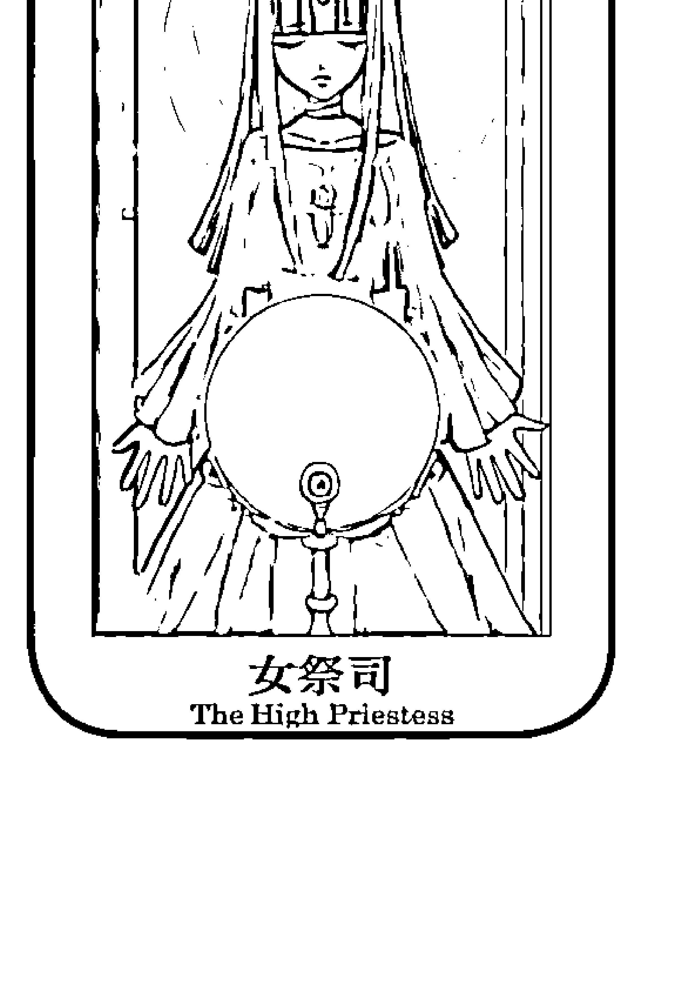

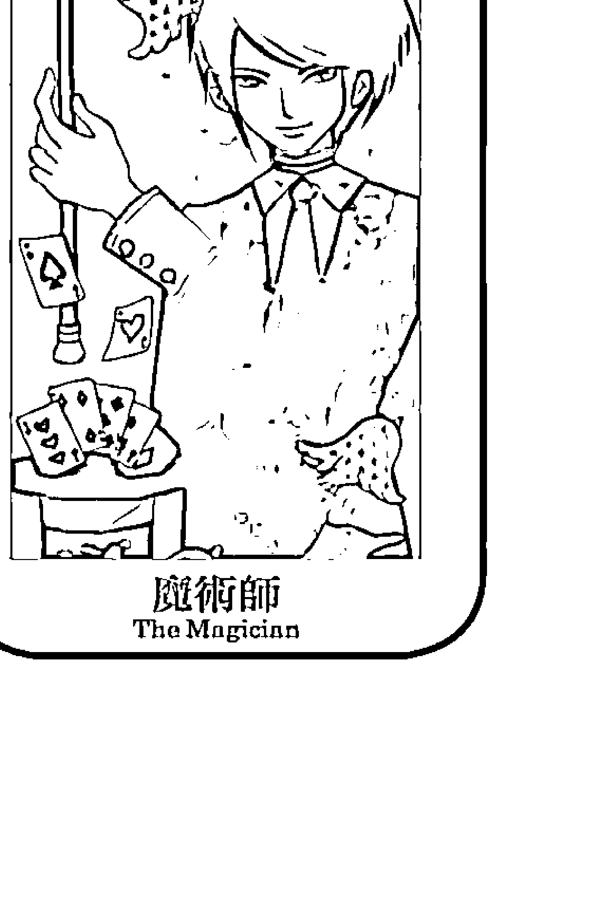

### ☆ 魔法小語

這是一款能用於考試、讀書、考公職、進修的祈福魔法，請選擇一個安靜、不受打擾的場所獨處來施行魔法。

### ☆ 施法步驟

1. 在乾淨的桌子上鋪上深色桌布，並從塔羅牌中取出女祭司牌，另外取出魔術師牌備用。  
2. 仔細端詳女祭司牌卡，口中持續唸著自己的名字，想像自己安靜端坐，手上拿著一本書專注用功，充分吸收知識；再擺放「魔術師牌」，口中持續唸著自己的名字，想像自己在考試時發揮實力，作答無往不利。  
3. 將兩張牌以牌背對牌背的方式交疊，對著兩張牌徐徐吹氣三次，之後再擺放於筆盒中，或包包內袋隨身攜帶。

---

### 甜蜜愛情召喚魔法

- 主牌卡：戀人  
- 輔助牌：星星或皇后  

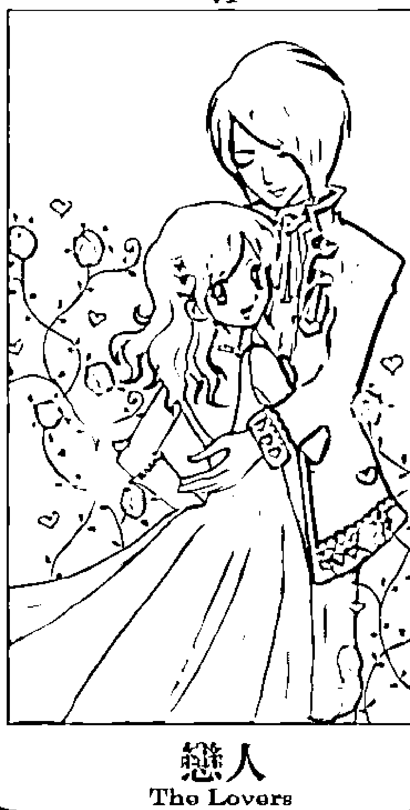

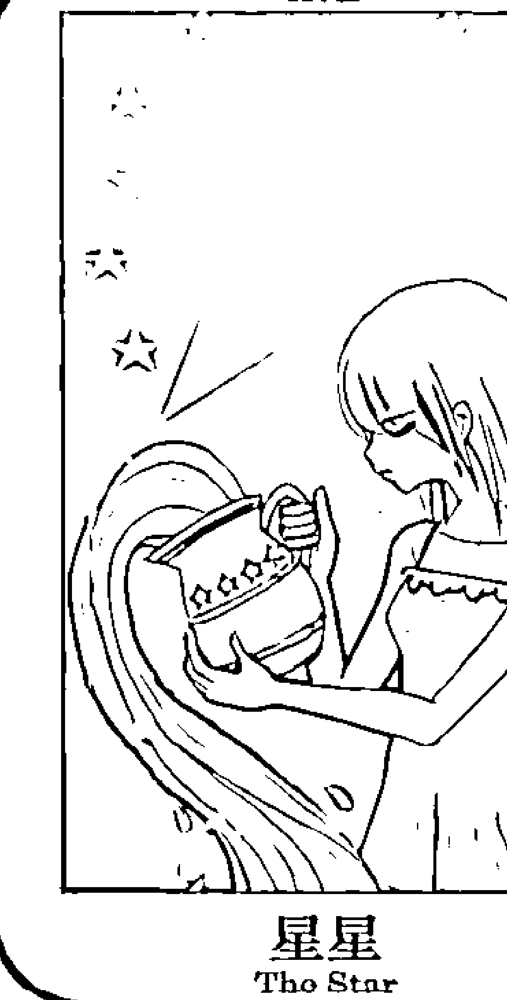

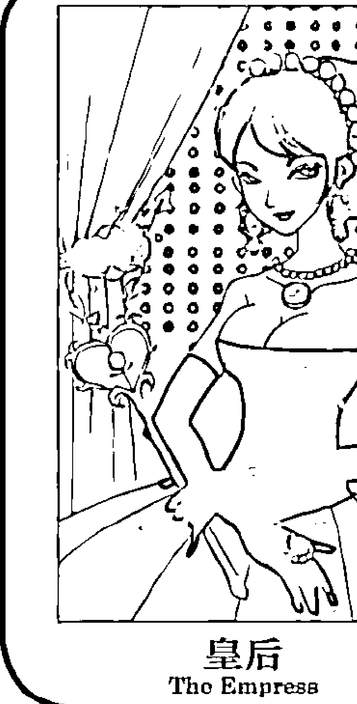

### ☆ 魔法小語

戀人牌本身就帶有濃濃的戀愛意識，不過單獨使用要小心招來第三者的可能。對於已有對象的人來說，可另準備星星牌為輔助牌；尚未有對象、想提升異性緣、增加桃花者，請準備皇后牌為輔助牌。「皇后」牌能為你帶來強大的魅力，也能提升你的好感度。

### ☆ 施法步驟

1. 已有對象者，請仔細端詳戀人牌卡，將戀人牌的牌背對著星星牌的牌背，冥想自己與他在愛情中的幸福模樣，最後在交疊的牌面上以手指輕輕劃出自己與對方的名字無數次，之後再夾於皮夾中隨時攜帶。  
2. 尚未有對象者，一樣先仔細端詳戀人牌卡，然後將戀人牌的牌背對著皇后牌的牌背，默唸自己的心願，想像自己的魅力吸引來心儀的對象，愛情非常順利地展開，再將兩張牌夾於皮夾中隨時攜帶，即會在短時間遇到不錯的對象。

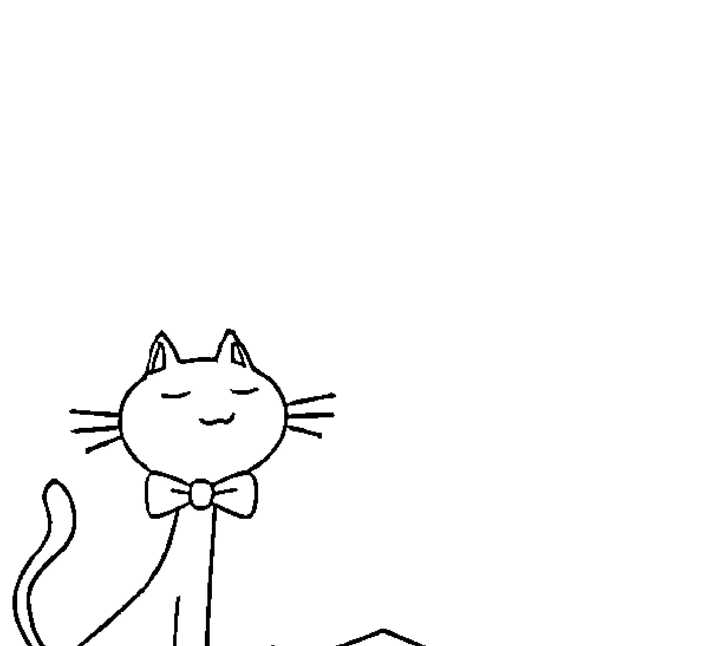

---

### 破鏡重圓愛情魔法

- 主牌卡：戀人  

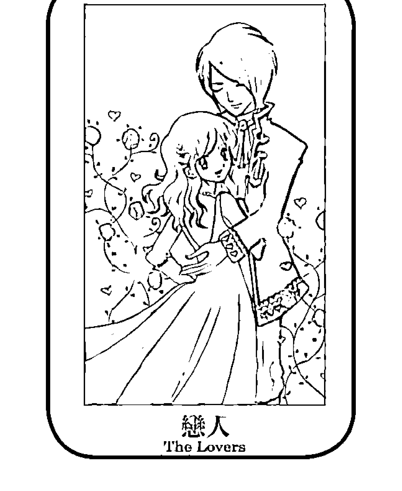

### ☆ 魔法小語

這個魔法是針對感情走到瓶頸、難以有新進展的情人們所施行的魔法，它可以幫助你和情人在感情上有新的著力點，兩人的心能重新凝聚在一起，幫助兩人緣分可以更加穩定，長久持續地發展下去，對於外來的誘惑也能有某種程度的阻斷。

### ☆ 施法步驟

1. 坐在鋪好紅色、桃紅色系或粉紅色系（最好是素面）桌巾的桌子前面，靜下心來，然後翻開戀人牌，凝視著戀人牌畫面。  
2. 冥想兩人初相識時的狀況，或是共同經歷過的難忘回憶，同時深深去感覺自己與情人之間沒有任何阻礙，對彼此的情感都能直接又熱情地展現出來，兩人的心將會愈相處愈緊密。  
3. 持續冥想這樣一個甜蜜溫馨的情境，讓心境維持在一個浪漫感動的狀態，當你內心感受到強烈愛情感動的能量時，就可以結束冥想。  
4. 將這張戀人牌放在枕下睡滿28天，你與情人的關係將會有好的變化。

---

### 提升人際關係魔法

- 主牌卡：力量、節制、世界  

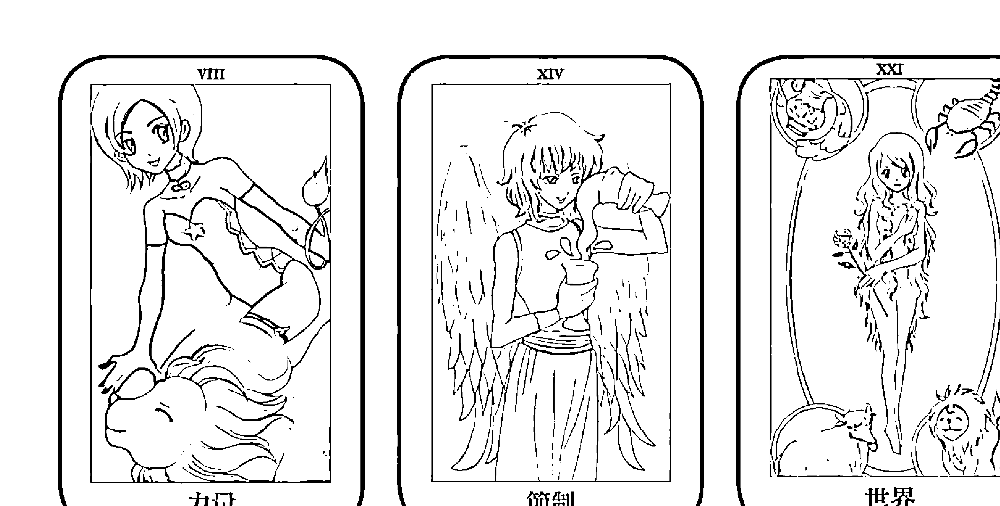

### ☆ 魔法小語

請準備好力量、節制、世界三張塔羅牌，這三張塔羅牌分別帶有三種不同的意義，能提升自信、圓融度及人際吸引力。尤其世界牌代表一種能量的開啟，能夠幫助你在需要的時候有好的人際關係。

### ☆ 施法步驟

1. 施法時請處於一個安靜的地方，準備一張乾淨的桌子，鋪上深色的桌布，再將這三張牌依「力量、節制、世界」的牌卡順序，由左而右地擺放於桌上。  
2. 擺放「力量」牌時：想像自己全身充滿了魅力和能量，而且因為你的真誠，在人群中將會受到注意和歡迎。  
3. 擺放「節制」牌時：想像排除所有發生摩擦的可能，與朋友能有良好的溝通，你的談吐不但合宜而且充滿協調的智慧，不用擔心禍從口入的問題。  
4. 擺放「世界」牌時：請默默冥想以上兩張牌所描繪的美好狀態將會持續下去，並且還會愈來愈好，朋友愈來愈多。冥想完之後，再默唸一次你的名字、生日、出生地，再將三張牌依順序排列放置在平常可看見的地方，如書桌下……等。不間斷地冥想七天，你就會發現不一樣的人際改變。

---

### 提升財運塔羅魔法

- 主牌卡：太陽  

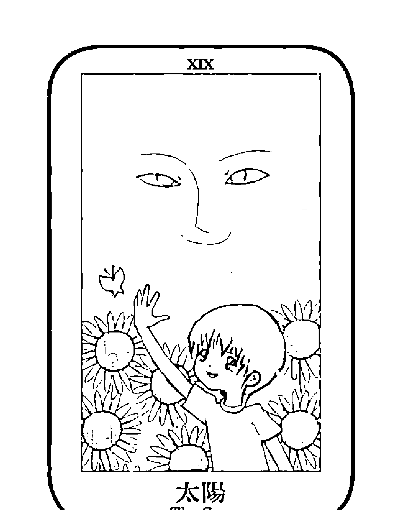

### ☆ 魔法小語

這個魔法能運用念力幫助你提升偏財運。雖然錢不會從天上掉下來，但還是可以透過念力加強獲得財富的能量。

### ☆ 施法步驟

1. 準備一個黃色或綠色素面桌布，整整齊齊鋪在適當大小的桌面上。  
2. 靜下心來，然後翻開太陽牌，凝視著太陽牌畫面。  
3. 閉上雙眼，冥想自己充滿信心，樂觀地打工賺錢。你喜歡你的工作，你的主管上司也很器重你。  
4. 持續冥想著樂觀積極的正面思考景象，讓心境維持在一個高昂快樂的狀態。當你內心湧現出蓬勃熱烈的能量時，就可以結束冥想。  
5. 將這張牌放於皮夾內，或作為書籤使用，經常觀想就能提升好運。

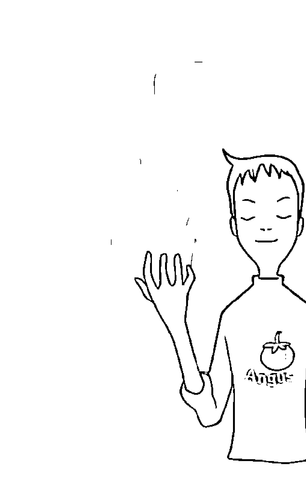

---

### 魔法筆記

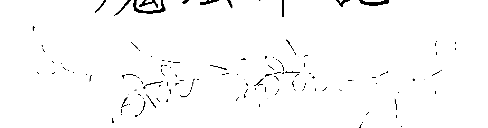

---

### 魔法筆記

-  
-  
-  
-  
-  
-  
-  

-  
-  
-  
-  

---

### 魔法筆記

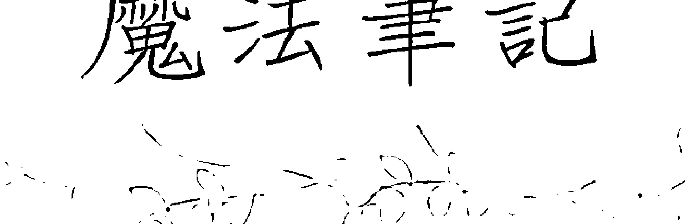

---

### 魔法筆記

-  
-  
-  
-  
-  
-  
-  
-  
-  
-  

---

## 國家圖書館出版品預行編目資料

愛情塔羅魔法心測占卜書／安格斯著．— 初版  
— 臺北市：采竹文化，2010.02  
面；公分 —（占卜屋；9）  

ISBN 978-986-197-249-7（平裝）

1. 占卜  

292.96 99000488

---

## 占卜屋09  
## 愛情塔羅魔法心測占卜書

- 作者：安格斯  
- 發行人：周心慈  
- 文字編輯：簡玉雪  
- 美術編輯：謝瓊瑩  
- 封面設計與插圖：米栗  
- 出版者：采竹文化——心田書房  
- 地址：台北市民權東路六段266號6樓  
- 劃撥帳號：19483681  
- 戶名：采竹文化事業有限公司  
- E-mail：tsaichu.tw@yahoo.com.tw  
- 電話：(02) 2630-5085  
- 傳真：(02) 2630-7442  
- 總經銷：朝日文化事業有限公司  
- 電話：(02) 2249-7714  
- 傳真：(02) 2249-8715  
- 地址：台北縣中和市橋安街15巷1號7樓  
- 製版：上鑽數位科技印刷有限公司  
- 印刷：上鑽數位科技印刷有限公司  
- 初版一刷：2010年2月  
- 定價：169元  
- ISBN：978-986-197-249-7  

【版權所有・翻印必究】PRINTED IN TAIWAN  

本書如有破損、缺頁、裝訂錯誤，請寄回本公司更換。

---

將星座分成火、水、風、土四星象，每一冊都有精闢的解析。內容豐富多元，剖析每個星座在人際、愛情、事業的不同面向，讓讀者從星座的角度更了解自己，也能了解他人。