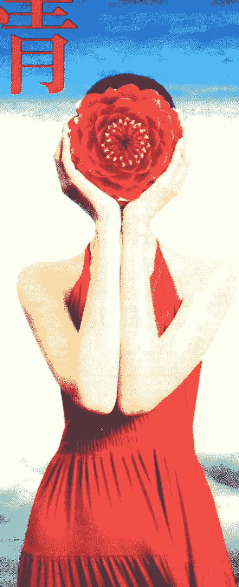

## 爱情觉醒地图

> 让你受苦的是你对爱情的错误信念  
为何心想爱不成？

李欣频

## 自序——  
不必在乎有没有收到花，  
爱是在彼此的心底生了根！

记得上一本《爱欲修道院》似乎已经是十年前的事了，本来不打算再写爱情书，但在二〇二二年三月写《为何心想事不成：秘密里还有十个你不知道的秘密》时，许多关于爱情的体悟欲一一冒出来，在有些篇章里已经显露出了一些苗头。当时先克制自己不再旁枝末节谈爱情，一些关于爱情的想法就先写在另一个档案之中，直到累积成熟了，在二〇二二年十月开始动笔写这本书。

在过去，我一向在其他领域很顺利顺遂，唯独在爱情这块一直被留级。我一向自圆其说为「女作家的爱情魔咒」，就是古今中外许多女作家的爱情，通常比较戏剧性而且特别坎坷，如此才有情绪血泪可写故事，让读者有阅读的快感，但作者往往却没命了，也真的有不少女作家早逝。

后来自己的书写焦点转向创意、修行、旅行、世界学……于是自己就跳出了爱情的自我折磨磁场，把小爱扩大成博爱，也咀嚼过去自己的爱情多所坎坷，问题就在「头脑太聪明，过度理性导致蒙蔽了心的感性流动」，所以爱情这一块与我其他面向落差极大。如果事业部分是博士班毕业，那么爱情这块就连幼幼班都还不够格。

我很感谢现任男友让我有补修爱情的机会，他是我既温暖又可靠的伴侣，也是生命修行境界极高、对我十分严格的老师。当他察觉到我的依赖时，就会跑得比谁都快、都远，直到我自己重新站起来，直到我学会自己站得稳、走得直之后才又再回来。当他发现我开始索爱，他就会两手一摊笑着说：「我无爱可给，我很自私，妳若要爱就要自己去想办法！我什么都无法给妳，也无法承诺妳，我只能帮助妳从爱之苦海中解脱，这就是我在妳旁边唯一能给妳的礼物！」

所以我就在这次的两人关系中，彻底学会以前单身时都没学会的独立自主，学会本质比形式重要，学会不必在乎有没有收到花，爱是在彼此的心底生了根。

当我爱情轮回的旧模式被硬生生地打破，自己从「爱」中解脱的我变得比以前更自在、更开心、更开阔，不再罹患惶惶不可终日的爱情焦虑症，不再担心失去对方，能随时享受独处自在，这就是二〇一二年他所带领我的巨大蜕变。

这本《爱情觉醒地图》是我二〇一二年爱情觉醒之旅的心得报告书，把亲身观察与体悟记叙给自己看，也是我对爱情感动与感悟的真实分享，更是我从2D框线受困的牢笼中，跳到3D卫星空照地图上，俯瞰广大爱之海的全景视野——希望这样的故事分享，能让更多人有了翻转爱情迷障的新观点！

## 让你受苦的「爱情错误概念」第一条  
为什么我老是遇人不淑？  
如何摆脱这样的烂桃花？

王子与公主的童话，害死了二十一世纪的大众男女。这世界上根本不应该存在「好男人」、「好女人」的标准，每一个人都是独一无二。这世界上没有「烂男人」、「烂女人」，只有「烂的自己」。所有你嫌弃对方的问题，在自身上一定也有，否则不会感觉这么刺眼、刺耳。

## 让你受苦的「爱情错误概念」第二条  
我如何摆脱剩女的成见？  
我怎么找到真爱？  
我要如何许愿才能得到我真命情人？

人类怎么会有「剩女」这个词？爸妈也傻傻教，孩子念书、恋爱不是物品，所以不是用找的。真爱无真假，所以必须先放掉分别心。眼前的状态就是你学习的最好时刻，所以你还要努力千方百计「吸引」真爱吗？许愿就像头脑介入的开始，与爱的本质背道而驰。

## 让你受苦的「爱情错误概念」第三条  
他是我的 Mr. Right 吗？  
她是我的 Miss Right 吗？

你没有「真命天子」与「真命天女」，只有自己是不是处在「真命状态」！当你在「真命状态」，你的对象就会变成真命情人！爱情只是让我们体验一回究竟是谁的心灵之旅。

## 让你受苦的「爱情错误信念」第四条  
我该怎样抓紧他更爱我？该如何让他离开旧爱？

恋爱是必须要学习的功课。对方和你虽然成为感情联系的一方，但每个人都要为自己的人生负责，还给对方自由的空间。无论你再怎么努力，对方也没有义务爱你。不害怕失去爱情，你才能与人相处成为真正的自己，而不是变成两个人的束缚。

## 让你受苦的「爱情错误信念」第五条  
我应该选择我爱的人？还是爱我的人？

大多数人谈恋爱，只是要找一个人陪伴自己，以为跟这个人就是爱的全部。你是爱一个人？还是把自己想要的爱投射在对方身上？在「爱」之中没有吃亏与占便宜这样的概念。只要你心中没有度量衡，就分不出你爱的人与爱你的人。把爱化为风，向风学习何谓爱、如何爱。

## 让你受苦的「爱情错误信念」第六条  
在爱里受了伤该怎么疗愈？

完整地在「爱」之中，你是不可能不受伤的。从自己抱怨的话语与悲伤的文字中，找到疗愈的解药，让自己完整，做自己的榜样。

## 让你受苦的「爱情错误信念」第七条  
在爱里失去了自己，失去了自信、自由，该怎么办？

爱情是哈哈镜，让旁人忍不住哈哈笑，但却能让你看到自己的真实面目。你的不同态度，决定了你不同的人生。即使是同一套剧本，你的态度与演法不同，也会决定人生不同的结果。

## 让你受苦的「爱情错误信念」第八条  
我该离开他吗？如果离不开，我该怎么办？

要离开不是因为某一个特定对象，而是因为自己的境界与满足度不同。你和他的差异不是分开的理由，而是扩张你包容度与生命弹性的引子。不必急着改变负面思考的性格，你只需以正面的眼光看待它即可。负面思考其实也能带来正面的改进力量。

## 让你受苦的「爱情错误信念」第九条  
你们会更好吗？我真的可以跟宇宙下订单，许一个自己想要的情人？

你不可能变成他人，因为那不是真实的你。若只是一味期待与愿望，就只会落入幻想。无论你遇见谁，他都是对的人，只要你在对的状态。

## 让你受苦的「爱情错误信念」第十条  
如何找到相伴终生、白头偕老的伴侣？

把眼光投向未知的永恒，但别忘了眼前当下的每分每秒才是真实的关键。让爱情的巅峰经验自动延长爱情任期。常常问自己：如果有一天对方不在了，请问我是谁？爱是一趟渡轮，重点是沿途风景，别急着上岸。了解爱情的十条错误，请你跳脱「2D的线性思维」，进入3D的爱情观地图。

## 让你受苦的「爱情错误信念」  
### 第一条  
为什么我老是遇人不淑？  
如何摆脱这样的烂桃花？

### 王子与公主的童话，害死了一大票凡夫俗女

在感情的世界里，很多人经常会遇到的课题是「被伤害」，包括被骗、被劈腿、被暴力相向，或是对方不闻不问、不负责任，留下一堆烂摊子等着收拾，或是遇到对方死缠烂打，恐吓曝光亲密照或威胁伤害的危险情人……所以为何电视上经常讨论的题目就是：为何我老是遇人不淑？我该如何摆脱这样的烂桃花？

我们都忘了一件事：每一个人都是独自来到世界上的（即使是双胞胎也有先后）。从第一口呼吸到第一次喝奶水、从爬到走到跑……都是得靠自己亲力亲为，别人都无法替我们吃奶。

### 「王子与公主」的童话故事

「王子与公主」的童话故事从小在我们脑里生了根，于是每个男人都在找公主，每个女人都在盼王子，而王子、公主的标准早已写在童话里，蔓延到了时尚杂志、娱乐名媛圈……光这一点就已经非常违反大自然法则：你无法在大自然界里定义哪一朵花是名模之花、哪一朵花是花王。

于是原本应该拿来自许的成长标准，全部套在爱情的对象上，包括：金钱、安全感、成就、身心灵的安定与疗愈……就像拿一个模特儿的身形往对方套，过胖或过瘦、过高或过矮，只要不符合标准的，就会永远感到失落与挫折。

父母把我们保护得好好的，让我们专心读书、努力考进好学校，毕业后进入好企业工作……于是把十多年最宝贵的成长机会都剥夺了；在我们学会生活独立之后，却一直没有机会学习心灵独立，于是很多人即使到了十八岁还是无法自主，大小事都得问人，四处要标准答案，情感上依赖父母兄弟姐妹，依赖老师同学，依赖朋友同事，到依赖爱情……

如果大自然里真的有「公主花」或「王子树」，所有的玫瑰都会以那朵公主花为标准来美容、整形、塑身；所有的树都会以那棵王子树的高度为标准来努力增高。大自然就只剩下「标准之美」与「不标准之丑」的二元性，于是大自然中绝大多数的植物都会开始扭曲变形，无法呈现多元之美。

知名女星张曼玉回答记者关于「女人的年纪」时说：「亚洲人比较在意『老』这件事情。我小时候在英国长大，然后在巴黎生活了十年，那里的没有这种观念。为什么非要年轻、没有皱纹才是美呢？人不一定要美，美不是一切，它很浪费人生。美要加上智慧，加上开心，加上别的东西，才是人生的美满。」（引自：天女网）

也就是说，每一个在大自然里的生物，当然也包括人，都应该有自己独特之美。

### 这世界上根本不应该存有「好男人、好女人」的标准，每一个人都是独一无二

很多人拿着这个「普世标准」来衡量眼前的情人：他够不够高、够不够帅、够不够有钱、够不够健康、够不够专情、学历够不够好、家族事业够不够大……或是她脸蛋够不够美、身材够不够好、家里够不够有钱、能不能干、有没有帮夫运……

但我们都忘了，每一个人生来都是独一无二的，又不是工厂统一生产的量贩商品，岂有「合格良率」可言？

所以当你抱怨怎么都没遇到好男人、好女人时，问题就在于：这世界上根本不应该存在「好男人、好女人」的标准。

### 这世界上没有「烂男人」、「烂女人」，只有「烂的自己」

市面上许多爱情书，不乏在谈「那些烂男人、坏男孩教会我的事」。坦白说，这个世界上没有谁天生就是坏男孩、烂男人。

我在《为何心想事不成：秘密里还有十个你不知道的秘密》中写过：你所面对的人事物并无正负，让你受苦的是你对这些人事物的负面信念。

这世界上没有谁先天是好人或坏人，只有你看待他的方式与对待他的态度，决定了他在你面前成为怎样的人。

也就是说，这世界上没有烂男人、烂女人，只有你自己在「烂」的情况下——当你的自信、自立的中心支柱崩塌，当对方无法成为你坚实依靠时，你就会指责他是个不负责任的烂人。

每个人都应该为自己负责，照顾好自己，活出自己的茁壮与强大，不应该成为别人生活与精神上的负担。否则软弱无力的你，靠山山倒、靠人人跑，一连串的抱怨与哀怨，只会让你不断重蹈覆辙。

### 想要摆脱烂桃花？你得从自己的旧模式调整起

相反地，有些男生很容易吸引一哭二闹三上吊的女生；有些女生很容易吸引到「玉石俱焚」的恐怖男友。若你无法坚定摆脱他，就要先检讨自己：为何会吸引到这样的人？当初为何选择跟他在一起？是因为怕寂寞吗？

否则接下来还会有更多类似的人出现，因为你就是这个模式的磁铁。你得从内在改变起，否则你用什么方式斩烂桃花都没有用。

如果要列举情人的缺点，很多人都可以如数家珍、滔滔不绝。我的建议是：把历任情人的缺点全部列出来。你可能会惊讶地发现，即使是不同国籍、不同年龄、不同职业、不同文化信仰的情人，他们的致命缺点却惊人地一致。

例如我的好友 H，她的几任男友分别是基督徒医生、伊斯兰教建筑师、信仰藏密的地产商、无神论艺术家……无论对方富有或小康、来自哪里，她都觉得他们的共同问题是：小气。

于是问题就出现了：她与这些男人相处时的金钱模式是什么？她是否也对自己或他人「小气」？

只要一个人内心真正感到丰足，她的付出就不会去计较回报。就像大海不会计较蒸发了多少水。

### 所有你嫌对方的问题，自己身上一定也有

我有一位朋友 B，经常抱怨她老公是控制狂，每小时都要打电话查她行踪；她又抱怨婆婆是控制狂，连小孩念哪所学校都要管；后来她又说老板也是控制狂。

我跟她说：如果你身边所有人都是控制狂，那么只有两种可能——你是被控制狂，或者你自己也是控制狂。

她马上否认，说自己最爱自由。结果下一分钟餐厅服务生来点餐，她这样点：「给我一个总汇三明治，吐司要烤焦一点，大概是巧克力色那样的焦度，然后吐司要切边，里面不要放汉堡肉，改放鸡肉，蛋不要煎的要水煮的，七分熟，不要放洋葱，不要胡椒……」

讲了二十分钟还没讲完。

这不是控制狂是什么？

### 所有你嫌对方的问题，自己身上一定有，否则不会感觉这么刺眼、刺耳

我以前在广告公司有个同事 M，是单亲妈妈。离婚后她爱上一个已经有女友的男人。她经常抱怨这个男人在一起时总是接不完电话、不专心；一旦不在身边就完全人间蒸发。

在她眼里，这个男人既懒惰又不专情。

我只好直说：「所有你嫌他的地方，你自己身上一定也有。否则不会感觉这么刺眼、刺耳。」

事实上，M 本身就是工作狂。她和女儿在一起时几乎一直在讲电话，很少注意女儿在做什么。

旁观者清，但我们每个人的眼睛却总是只盯着别人的缺点。

放大而且反覆批判，卻很少照鏡子，省思自己是不是在某些時候也是如此？

同理可證，例如：悲觀、懦弱、自私、自戀、花心、暴力言行、不負責任、遇人不淑、對我不夠好……都是「相對」名詞，也就是說沒有一個人對所有人都是如此。我最經常舉的實例就是導演馮小剛的電影《天下無賊》：一個腦中從沒有「賊」這個概念的傻男孩，後來被扒手盯上，而他帶著一筆辛苦工作存了很久的鉅款返鄉。整列火車上有許多扒手，而他身邊正坐著一個老練的賊。傻根的錢就這樣輕易被扒走，然後又被轉扔了好幾手。最後傻根旁邊的賊被他的純真與溫暖感動，於是就把錢從別的賊那裡再扒回來，在傻根下車前不動聲色地把錢再放回他身上，而傻根自始至終都不知道曾經有段時間錢不在他身邊。

這部電影給我很大的震撼，讓我思考在「二元對立法則」下，我們該如何從自己身上改變「相應」的模式，就像皮筋的兩端，一端放開了，張力就自然消除。以上的觀點只適用於自我反省與調整之用，絕不是加害者拿來自圓其說的藉口。

所以當你又陷入「遇人不淑」、「爛桃花」這樣的腦魔障時，不必再找兄弟幫或是姐妹淘訴苦了，請拿面鏡子端詳並反思自問，看看所有你嫌棄或抱怨對方的那些罪狀，自己是不是共犯？抑或自己就是你所指責的那款人？

## 讓你受苦的戀情  
其實的幕後黑念

### 你看待情人的方式，決定了他是好人或壞人

- 每一個在大自然裡的生物，當然也包括人，都應該要有自己獨特之美。否則追逐表相的數字，大家都忘了「愛情」的本質究竟為何，這就是絕大多數人在愛情中不滿足與痛苦的主因。  
- 這世界上根本不應該存有「好男人」、「好女人」的標準，只要一天不放下這個「有病」的想法，就無法根絕因錯誤的「愛情信念」而受苦。  
- 到大自然重新上課，用畫一棵樹的時間好好詳看一棵樹（最好是老樹），想像一下從種子至今的生命歷程，看到它每一分每一秒的變化，看到它被風搖動的美，看到它與旁邊樹的差別。  
- 這世界上沒有誰先天是好人或是壞人之別，只有你看待他的方式，與對待他的態度，決定了他要在你面前自然而然地成為好人還是壞人。  
- 每個人理應要為自己負責，照顧好自己，深根入地扎實活出自己的盛開與強大，不應成為別人生活與精神上的負擔。

## 讓你受苦的感情  
變你的錯誤信念

- 你要先檢討自己，為何會吸引到這樣的人出現？當初為何選擇她／他作伴侶？因為「怕寂寞」還是為了什麼原因？這就是自己要改變與調整的部分。  
- 先把歷任情人的缺點都列出來，你可能會驚訝地發現，即使是不同國籍、不同教育背景、不同職業、不同文化信仰的人，怎麼連致命的缺點、言行都如此一致？  
- 所有你嫌棄或抱怨對方的問題，你自己身上一定有，否則你不會感覺這麼刺眼、刺耳。我們每個人的眼睛都只盯著別人的缺點，放大而且反覆批判，卻很少照鏡子，省思自己是不是在某些時候也是如此。  
- 當你感到豐足無缺，你的付出自然就不會去計較是否有回報，就像大海不在乎蒸發了多少水蒸氣，跟人計較被取走了多少水。  
- 我們該如何從自己身上改變「相應」的模式，就像皮筋的兩端，一端放開，張力就自然消除。

## 讓你受苦的「愛情錯誤信念」  
## 第二條

我如何擺脫剩女的身分？  
我該怎麼找到真愛？  
我要如何許願才能吸引到我的真命情人？

### 人類怎麼會有「剩女」這個詞？

我還記得第一次聽到「剩女」這個詞時非常匪夷所思。「人」又不是物品，又不是剩菜剩飯，怎麼會有「剩」這樣的概念？說「剩女」這個詞的人，基本上把女人視為物品，因為只有物品才有「過期」與「滯銷」的概念。但很奇怪的是，經常說這個詞的人不是男人，反而多半是女人自己。

在大自然裡沒有「剩」這個概念。你能在森林裡找出「剩鳥」、「剩花」、「剩樹」嗎？當一隻鳥在飛行，人們往往會把自己的孤獨投射在上面，覺得這隻鳥好可憐，沒有伴。但其實牠也好得很，完整、獨立且自由自在。

是人們把自己割裂了。亞當、夏娃的神話讓我們以為人自己生來只有一半，必須找到另一半才算完整。於是沒有愛情的人就形同精神殘障，不但自卑，而且遭到歧視與同情，這就是人類社會的怪現象。

### 爸媽忙徵婚，孩子急嫁娶

我曾經在新聞看過一件非常奇怪的現象：在一個公共空間裡，許多父母拿著白牌，上面寫著自己孩子的條件，包括年齡、長相、個性、學歷、職業、財產……忙著幫子女們配婚。然後就看父母們在彼此較勁、談判、示好、努力成交。

我完全不懂人們為何把自己的孩子貶為「家畜」，來論斤計兩、亮血統書般地拿到市場去叫賣？為了面子，難道一找好對象結婚這一件事，比孩子真正的幸福快樂更重要嗎？

特別是「好對象」也已被規格標準化了：年齡、長相、個性、學歷、職業、財產……就像所有人穿進同一尺寸高度的玻璃鞋，把愛規格化之後進行組裝。但我們都忘了，愛的本質究竟是什麼？

而這些現象也將在未來日益增高的離婚率中，越來越清晰地突顯出這些想法與觀念的荒謬。但我們其實不需付出這麼大的時間代價，只要停止往外看、向外比較，反個方向直指生命核心的本質去校準，重新回到自己的真正感覺，這樣才不會偏離生命之軸，把荒謬帶進自己的命運裡。

## 真愛不是物品，所以不是用找的；  
愛亦無真假，所以必須先放掉分別心

坊間充斥著許多「尋找真愛」的書、影片、電視節目，讓我們所有人被灌輸「何謂真愛」、「必須找到真愛才幸福」的謬誤。這也就是這本書取名為《愛情覺醒地圖：讓你受苦的是你對愛情的錯誤信念》的原因。

然而，人類的荒謬自陷已久而不自知。只要把一些「概念」放回大自然，就可以立即檢驗出這樣的價值觀、這樣的想法究竟有沒有問題、有沒有病、有沒有毒。

當人們千方百計尋找「真愛」之前，請先重新審視「真愛」這兩個字有沒有問題。愛就是愛，是一種非常單純的能量狀態。例如母親對孩子的愛是非常本能的，所以我們不會說這是一種「真母愛」還是「假母愛」。

同樣地，在大自然界的愛，例如配偶之間、親子之間，你沒辦法說這孩子的愛是真的，那孩子的愛是假的。因為愛就是一種再簡單不過的狀態，無法用「頭腦」去分類，更別說是「辨別」。

所以當人們界定出「真愛」兩個字時，就等於把「愛」放在一個錯誤的框架裡。就像你透過有限的窗口看出去，世界永遠都很小、很局限。

這就是為何「真愛稀有」、「真愛難尋」的原因。

當我們一心想要找「真愛」，那意味著我們還得從一堆「不是真愛」中挑出「真愛」。一旦開始用「頭腦」去辨認時，我們純粹的心就失去了信任的直覺導航功能，把自己放在痛苦的源頭，最終一定是導致痛苦的結果。

也就是說，當我們願意「洗腦」，洗掉那些關於「真愛」的書、電影、歌詞、商品廣告、媒體報導……我們才能洗掉讓我們頭痛、煩惱、憂鬱、悲傷、孤獨的緊箍咒。

真愛不是具體有形的物品，所以不可能用「找」就找得到。充其量你只能找一個「可以愛與被愛的對象」，但那絕對不是「愛」的本身，也不是「愛」的最終範圍。

愛是一種純然的狀態，與有沒有對象無關。就像花香也是一種狀態，與有沒有人聞它無關。我們沒辦法說：「這朵花香很真，那朵花香很假。」

「真愛」不是物品，所以不是用找的，而且也找不到。你只能自己在愛的狀態之中。旁邊可以有很多人、一個人或是沒有人分享你的愛，都完全不會影響到你愛的品質。

就像德蕾莎修女，就算一個人在家，她依然是處在愛的狀態。

## 讓你妥善的愛化解愛情的錯誤配色

愛亦無真假，所以必須先放掉頭腦的分別心。這是讓我們解脫出「愛的牢籠」、離苦得樂的關鍵一步。

當我們重新體驗何謂「愛」的真正本質，認知到「愛」只與自己現在的狀態有關，與他人無關時，自然就不會被社會上光怪陸離的「愛」的信念逼瘋，也就不會有一堆情殺、殉情、自殺這樣的社會事件發生。

就像一朵花不會因為旁邊的人沒有聞她，她就氣得不想綻放馨香，更不會氣得想殺人或自殘。

### 眼前的狀態就是你學習的最好時刻，所以你還要努力千方百計「吸引」真愛嗎？

很多信仰「吸引力法則」的人，會以「正面思考」的方法，在愛情這一部分努力地許願。《秘密》書中，在「關係的秘密」這一篇舉了一位電影製片的例子：他畫了許多背過身的裸女畫放在家中，結果現實生活中，他身邊都是不怎麼搭理他的女子。

於是他聽從蘿莉·戴蒙的建議，開始改變自己真正想要的愛情狀態。沒多久，他就如願地享受被多位女子愛戀的關係，到最後安定結婚……

「秘密」裡的故事如同許多童話故事的結尾：王子與公主從此過著幸福快樂的生活。但敗給大幕關起後的真實生活，我們就無從得知。

### 讓你受苦的是你對愛情的錯誤信念

在《祕密》出版後的這幾年，身邊的姐妹淘各自也經驗了不同階段的愛情課題：有的是愛上已婚男人（以下簡稱 A），有的是論及婚嫁的男友意外過世，有的是自從跟前男友分手後整整十年再也沒談戀愛，有的是遇到一個要求她全然犧牲自己事業與生活、全心照顧他的男人……

她們的共同點就是：都努力以「吸引力法則」來吸引「真愛」到眼前，或是企圖以「吸引力法則」來改變眼前這個讓自己很受苦的男人。但她們也都犯了相同的錯誤——她們都企圖想要改變現況。

看過《為何心想事不成：祕密裡還有十個你不知道的祕密》就知道，如果不能徹底地接受現況，從現況中學會該學的課題，那麼就算願望成真，可以如願跳到新的狀態，也不過是換一套不同題型的考卷，但考的內容還是一樣的。

舉愛情為例，A 的願望就是希望她的已婚男友能與妻子離婚跟她在一起，但她等了五年都沒等到。於是她改變了她的願望：希望下一個男友是單身、沒有女友。沒多久她真的如願。

她以為換了男友的「型態」，之前的問題就能迎刃而解，結果卻帶來相同的課題：他無法一天二十四小時地專心跟她在一起。因為他是個工作狂，每天忙到半夜，假日也都在工作，連兩人去度假也是手機不離身地接一連串電話……

當她又想再更改「許願單」，想要換一個「沒那麼工作狂」的男友時，我忍不住跟她說：

「妳有沒有發現：妳從前任已婚男友，到現在這個單身男友，都讓妳有一種共同的感覺——妳感到不被重視、不被專心對待。無論他是被老婆佔去，或是被工作佔去，意思不是一樣的嗎？」

她才恍然大悟。原來愛情無論是哪一種形式，所帶給每一個人專屬的課題都是換湯不換藥。

也就是說，對於 A 而言，問題在於她「無法自處」。她把重心全放在對方身上，於是當對方有了自己的重心，無論那重心是人、事、物，意思都是一樣的。

她永遠都不滿足、不高興，她再怎麼更改願望設定都是一樣的。

所以 A 必須學會找到自己的生活重心。無論有沒有男友，或是男友是否在身邊，對她而言都不應該有太大的差別。

她可以愉快地獨處，做自己喜歡的事，也能夠隨時享受兩人在一起的時光。這樣她就不會再要求男友改變，也不會要求男友隨時跟她報備行蹤。

因為她能在自己生命與生活的基礎上站得很穩，活得很充實快樂，所以就不會失去重心地繞著別人轉。

這種自在與餘裕，反而會讓對方與她相處起來自由自在。甚至讓工作狂的男友忙到一個階段後，發現女友怎麼都沒 CALL 他，反而會主動找她，問她在幹嘛。

也就是說，問題不在 A 男友的狀態，而是自己面對愛情的方式，正突顯出自己的問題。

愛情是最好的修行道場，也是最快的修行方式。一個人在山上閉關獨修，是看不出自己的問題在哪，就像不照鏡子一樣，永遠都有盲點或視覺死角。

我常跟「全心在等待真愛」的姐妹們說：

「不要以為有了愛情，人生就圓滿了。」

剛好相反，往往是等到愛情出現了，人生課題的肉搏戰才正要開始。所有過去妳討厭的、躲避的人事物，都會打包進這位「看似完美」的情人身上，讓妳無所遁形，如社會寫實片般地每分每秒面對它。

所以我的建議是：你在單身時所感覺到的問題，例如孤單、空虛、沒安全感、沒自信……最好趁單身時一次處理完畢。否則愛情來了，等到蜜月期一過，一個人的孤單、空虛、沒安全感、沒自信……就會放大成雙人份的。

套句股神巴菲特的名言：「當大浪退去時，我們才知道誰在裸泳。」

同理，等愛情的糖衣退去，所有內在的苦澀就會一一現形。

> 「靈性煉金術」（The Jeshua Channelings）裡有一段話很棒：  
> 「一旦你為了愛和安全感而依賴他人，就是在索取對方的能量，通常會導致衝突。在這觀點中，你們假定痛苦原因與解決辦法都在自己之外。」

> 當你愛著的是你對愛情的想像時。

如果以這心態開始一段關係，最終會要求別人為你內在的傷痛負責，把自己當受害者，等於一開始就剝奪自己的權力。

也就是說，愛情不是來解決你的問題，往往是放大了你現在的問題。當一個人與另一個人貼身地交流對話，總能激發自己不平衡的觀點出來，這些就是寶貴的禮物。

自己要勇敢地把心裡的骨刺拔掉，這樣無論誰怎麼頂撞你，都再也碰不到你的痛處。

總結來說，無論你現在是單身或是有伴，都要想盡辦法讓自己在現況中活得愉快、自在、獨立、充實。要做到無論身邊有沒有情人，都不影響到你的喜樂。

因為人生無常，沒有人能保證兩人的天長地久。但自己的生命課題是一輩子的。

如果你能做到「有沒有這個愛情都沒差別」，那麼就表示「愛情」的課題過關了。

同理可證，如果「富有或貧窮」、「有名或沒名」對你而言都沒太大的差別，那麼你也就從「金錢」、「名望成就」的課題中過關了。

### 許願就是頭腦介入的開始，與愛的本質相違背

許多「跟宇宙下訂單」或「愛情吸引力法則」相關的書中，都提到類似的概念：要明確列出「未來愛情對象」的具體條件，而且想像得越逼真、越細膩，就越容易成真。

這樣的說法並沒有錯。你用頭腦列出的條件，的確像藍圖一般，只要你夠專注，就很容易讓你聚焦，並創造出你想要的實相。

但問題是——我們剛剛說過，「愛」是一種能量狀態，無邊無際、無框架、無條款。

那麼以頭腦所列的清單去尋找愛，就如同以管窺天、瞎子摸象，永遠也只能碰觸到皮毛或局部。

愛在這樣的框架之下永遠是不完整的。缺憾感與挫敗感就在這個框架裡，而不在愛本身。

> 願你受苦的地方  
> 變你的榮耀冠冕。

「愛」無法被衡量、被計算、被設計。所以你的許願，只能許到外在條件相符、以及與你頻率接近的人前來。

你自身有哪些問題，對方也會有。他就是你的鏡子，而不是你的補丁。

「真命情人」大都散發致命的吸引力，讓你以為對的人來了。但等到相處久了，就會發現跟前一任的問題也差不多。

所以，許願還有必要嗎？

此外，許願就是把自己想要的交給「神」、「佛」或「高人」來完成，而且通常還會設定時間：我希望在耶誕節、下一個情人節前、我的生日時……出現情人。

但愛既無空間邊界，也沒有時間概念。

例如當一朵花感受到大自然的愛，這愛就是當下的，既與過去無關，也沒有未來的保證。

愛就是此時此刻。

那麼怎麼可能在一個「目前還不存在的虛幻時間點（未來某一天）」設下一個真愛來臨？

在《升起你的靈性天線》一書中，Yantara Jiro 曾說：

「要完成目標所需的時間，就是你把現在的振動頻率，調整到你想要狀態的振動頻率所需的時間。」

這與《靈性煉金術》中提到的觀點相通：

「實現你目標所需的時間，就是改變意識。如果你想讓事情加速，那麼就把注意力集中在自己身上，不要將那麼多心思放在現實的局限上。敞開來接受，甚至需要放下目標（放下遙遠的未來）。」

這聽起來有點自相矛盾，但事實上你必須全然接納你目前的實相之後，才能前進到新的實相。

若不接受目前的實相，又緊緊抓住你的目標，你就前進不了。

因為當現實沒有滿足這些目標信念時，你會覺得失望，有時甚至會絕望。

而絕望往往是因為你對生命中「應該發生什麼事」抱持強烈信念而造成的。

當你放棄了、認輸了，往往是靈魂話語說得最清楚的時候。因為在你放棄和絕望時，你向新事物敞開，你釋放所有期望，真正接納了一切。

你許願單上的「成真項目、成真時間」，反而會成為你當下調頻的最大障礙，也大大與愛的本質相違背。

奧修（OSHO）在《名望、財富與野心：成功真正的意義是什麼？》（Fame, Fortune, and Ambition: What Is the Real Meaning of Success?）中說過一段值得再三領悟的話：

當你開始尋找時，你變得全神貫注，變得封閉狹隘；當你不尋找、不追求時，你向四面八方、所有向度，對整個存在都是敞開的。

這就是愛的真相。

### 愛情來了，人生課題的肉搏戰才正要開始

當人們界定出「真愛」兩個字時，就等於把「愛」放在一個錯誤的框架裡。就像透過有限的窗框看出去，世界永遠很小、很局限。

這也是為何「真愛稀有」一直被當成一種愛情悲劇。

真愛不是具體有形的物品，所以不可能用「找」就找得到。你最多只能找到一個「可以愛與被愛的對象」，但那絕不是「愛」本身。

愛是一種純然的狀態，與有沒有對象無關。

「愛」只與自己現在的狀態有關，與他人無關。

愛情不是來解決你的問題，往往是放大你現在的問題。

不要以為有了愛情人生就會圓滿。剛好相反，當你走進愛情裡，人生課題的肉搏戰才正要開始。

因為所有你不願面對、逃避的人事物，都會打包送到你面前，讓你無所遁形。

無論你現在是單身或有伴，都要想盡辦法讓自己在現況中活得愉快、自在。

> 在「獨立、充實」的狀態中，要做到無論身邊有沒有人，都不影響你的喜樂。

如果你能做到「有沒有這個愛人都沒差別」，那就表示「愛情」的課題過關了。

「愛」是一種能量狀態，無邊無際、無框架、無條款。用頭腦列出的條件，就像以管窺天、瞎子摸象，只能觸及局部。

愛就是當下的。既與過去無關，也沒有未來的保證。

愛就是此時此刻。

「你許願單上的『成真項目、成真時間』，往往會成為你當下調頻的最大障礙，也與愛的本質相違背。」

## 讓你受苦的「愛情錯誤信念」  
## 第三條

### 他是我的 Mr. Right 嗎？  
### 她是我的 Miss Right 嗎？

### 沒有「真命天子」與「真命天女」，只有自己是不是處在「真命狀態」

在愛的關係中修行，許多人總是期盼一次就來一個「對」的真命天子或真命天女，兩人可以一起相愛、生活與修行到老。

但其實就像搭火車：直達車比較少，要等比較久；而區間車很多。你可以藉著多搭幾趟區間車，在每一段關係中，一步一步往自己要去的彼岸前進。

每一個來到你面前的人，都是帶你再跨越一個障礙。

延續第一章〈想要擺脫爛桃花？你得從自己的舊模式調整起！〉的概念：事實上沒有「真命天子」與「真命天女」，只有自己是不是處在「真命狀態」。

也就是能夠「自處愉快」。

### 奧修：愛的陷阱——愛的錯誤概念

奧修在《愛》（Being in Love）裡說：

「人們以為他們必須先找到一個值得愛的伴侶，才能去愛。」

書中提到一個有趣的故事：

有一位男子到了七十歲仍然單身。有人問他：「你不斷旅行，從紐約到加德滿都，從加德滿都到羅馬，從羅馬到倫敦，難道你就沒找到完美的女人嗎？連一個都沒有嗎？」

他回答：「有，我曾遇過一個完美的女人。」

那為什麼你沒跟她結婚？

他很悲傷地說：「能怎麼辦呢？因為她也在找一位完美的男人！」

奧修解釋得很好：

「愛的流動與成長並不需要完美。愛像呼吸、吃飯、喝水、睡覺一樣。你不會說：『除非有完美的空氣，否則我就不呼吸。』在洛杉磯你要繼續呼吸，在拉薩你也要繼續呼吸。即使那裡空氣污染、有毒，你在任何地方都要呼吸……因為信任就是生命。」

> 如果連這一點都沒弄清楚，卻還用各種方法招桃花、覓真愛，無疑就是緣木求魚。

的一部分，是爱的一部分。「的确，所有的婴孩都会百分之百地信任母亲（或是奶妈），不会去挑好喝的、安全健康的母奶，也饿了就喝，这就是本能，不必等到「完美」才去爱，因为在「爱」之中，一切都是本能，一切都是无条件的信任。

所以在《为何心想事不成：秘密里十个你不知道的秘密》书中，我如此建议：别坐在车站里，等着不知何时到站的直达车，勇敢面对每一段感情，不要用「完美高速直达」的标准，等待一个「完美的 Mr. Right 或 Miss Right」。事实上也没有所谓的「完美爱人」，每一个来到你面前的人身上，一定都有你会喜欢的特质，去接受并享受这些特质，并学会包容、接受那些你不喜欢的部分，两人一起成长蜕变，因为每一段关系都是非常宝贵、独一无二的旅程！

> 当你爱的是你对爱情的想象

## 当你在「真命状态」，你的对象就会变成真命情人！

我在一脸书爱情馆里看到一段文字：「关系，并不会导致你痛苦或不快乐，但它会带出早已在你内心里的痛苦与不快乐。所以你不是要去寻找一个完美的人，而是学会用完美的眼光，欣赏一个不完美的人。」

之前我曾写过一篇专栏文章〈剩女、凡女、女神〉：女人对自己的定义分为三种。

第一种是剩女。说「剩女」这个词的人，基本上把女人比为物品，因为只有物品才有「过期」与「滞销」的概念。

第二种是凡女，遵循情人的价值观，以其眼光决定自己的身价，这样的女人活得比较安全，但不一定都很快乐自在。

第三种是女神。她身边有没有情人、是哪个情人，以及她是单身或是已婚，一点都不重要，因为她的美大具神性，所有人一见就被她的气质美慑服。像希腊女神、像佛母、像观音、像圣母玛利亚……她们充满了女性魅力，也具足母性的智慧、爱与勇气，从老人到小孩，从男人到女人都爱她。

这一类女人最有代表性的就属张曼玉。有谁曾在乎张曼玉旁边是谁呢？她已经够完美了，不需任何情人帮她锦上添花。或者我们也会想到英国已故的戴安娜王妃，她的气质与美无与伦比，即使她没有王妃的身份，全世界的人都还是深深爱着她，都自愿成为她的子民。

我身边有几位像这样「女神级」的女性朋友，她们不必嫁入豪门，自己就有本事把身边平凡的男人点石成金：原本薪水不高、个性懦弱多疑的男人，因为她的清明智慧与坚定意志，协助他在决策徘徊的关卡上给予醍醐灌顶的建议，于是他开始身价暴涨，并拥有稳重且自信的新个性。

> 跟你要的是你对爱情的终极信念

最令人惊羡的是，这些女神级的女人从不停止静坐与修行，让她身边的男人也耳濡目染，变得更有灵气，更有智慧了。

——这几年我亲眼看到好多男人，因为跟对了一个好女人而剧烈蜕变中。只要这个男人选对了女人，他就有机会蜕变成一个完美的男人。所以女人要提升自己成为「点石成金」的女神，不要把自己变成物品（剩女），也不必靠相互计算、想找富豪嫁了（一样是把自己变成高档物品顺销出去的概念）。

不要期待对方因为你而改变自己，你只要单纯地、百分之百地接受、理解并享受对方的现况，你们之间就没有缝隙可容纳这些「情感杂质」。所以女神不必找完美的男神，因为她有「化腐朽为神奇」的能力。

换个比喻来说，就像是牡蛎可以把平凡的沙包裹成一颗闪亮的珍珠。牡蛎不需改变沙，不需排除沙，只要百分之百包容，包容它的不完美，最后就能成就出一颗珍珠的完美与光泽。

当有人抱怨她的男友无能时，我会告诉她：爱他的无能，欣赏他的无能，百分之百以爱接纳如实的他，不要改变他，因为她包容的爱，就会把他滋养、蜕变成一颗珍珠。

我还有几位已婚的女神级朋友，一早先把孩子、先生送出门后，就开始写写东西、看看书、听听音乐，要不就是出门上心灵课、画画、上服装课、学瑜伽、练印度舞、看电影、举行读书分享会……到下午就约三五好友一起喝下午茶，谈的不是柴米油盐酱醋茶，而是教育、心灵、地球环保等重大议题。

她们平均每周都会去看一到两次国际级的艺术展演，每两、三个月就帮自己安排短程或长程旅行。她们从不把任何一位单身自由的女子当作竞争对手，反而往往成为老公和小孩的知识顾问。

她们不仅不怕老，也不怕老公跑掉——我从未见过她们打电话追查老公的行程，从不担心老公外遇，反倒是老公追着找她们，问她们人在哪里，在做什么，跟谁在一起等等，怕独立自主、有气质魅力的老婆被人抢走了。

所以女人得把自己提升到女神的层次，身边的男人、女人、老人、小孩……包括全世界都会围着你公转，男人也同理可证。

## 爱情只是让我们体验「自己究竟是谁」的心灵之旅！

「无条件的爱」之智慧，真的是需要一次又一次地受创、疗伤、复原……直到我们彻底领悟：原来爱情只是让我们体验「自己究竟是谁」的心灵之旅。

也如刚才所说，世界上没有谁天生是好情人或是坏情人，只有你看待他的方式与对待他的态度，决定了他要在你面前自然地成为好情人还是坏情人——而你怎么对待他，其实是你对自己的看法与态度。

当你对自己的感觉越良好，你对他自然就会流露出愉快、欣赏、感激、爱与喜悦，因为你从他的眼眸里看到美好的自己，他就像是你眼前的镜子，如实地把你的样子反射回来给你。

所以当你处在爱的「Right」状态时，眼前来的人都对、都美、都好、都善良。所有别人看起来是缺点的，全被你看出缓慢成长的潜力，所以没有「真命天子、真命天女」的概念。

当你还想要找「真命天子、真命天女」的念头，就代表你还不在爱的源头，而还在中下游，甚至是在缺水的支流之末。因为在爱的源泉地，只会被爱的能量淹没、冲到幸福量能，自 high 都来不及了，谁来到面前就分享给谁。况且有本事找到源头，站在你面前的，绝非等闲之辈。

会让人受苦的，从来不是爱本身，而是人对于爱的信念或是成见让自己受苦！所以请先洗掉「Mr. Right」或「Miss Right」的框架，爱才能更广大而自由地流向你！

## 爱情，就是让我们体验「自己究竟是谁」的心灵之旅

- 藉着每一段关系，一段一段地往自己要去的彼岸跨进，每一个来到你面前的人，都是要带你往前再穿越一个障碍。  
- 没有「真命天子」与「真命天女」，只有自己是不是处在「真命状态」（自处愉快）之中。  
- 不必等到「完美」才去爱，因为在「爱」之中，一切都是本能，一切都是无条件的信任。  
- 不要用「完美高速直达」的标准，在等一个「完美的 Mr. Right 或 Miss Right」。事实上也没有所谓的「完美爱人」，每一个来到你面前的人身上，一定都有你会喜欢的特质，去接受并享受这些特质，并学会包容、接受那些你不喜欢的部分。  
- 女神身边有没有情人、是哪个情人，以及她是单身或是已婚，一点都不重要。她充满了女性魅力，也具足母性的智慧、爱与勇气，从老人到小孩，从男人到女人都爱她。  
- 女人把自己提升到女神的层次，身边的男人、女人、老人、小孩……包括全世界都会绕着你公转，男人也同理可证。  
- 爱情只是让我们体验「自己究竟是谁」的心灵之旅。  
- 会让人受苦的，从来不是爱本身，而是人对于爱的信念或是成见让自己受苦。  
- 世界上没有谁先天是好情人或是坏情人之别，只有你看待他的方式与对待他的态度，决定了他要在你面前自然而然地成为好情人还是坏情人。  
- 当你处在爱的「Right」状态时，眼前来的人都对、都美、都好、都善良，所有别人看起来是缺点的，全被你看出未来成长的潜力。  

## 让你受苦的「爱情错误信念」

## 第四条

我该怎样让他更爱我？该如何让他离开旧爱？要怎么抓牢他，让他永不变心？

## 当爱被视为必须要「平等互惠」的交易，对方不知不觉就成了感情诈欺犯。

古今中外，从希腊神话到现代戏剧（例如《歌剧魅影》），从宫廷内斗到民间街坊，从寺庙到修道院……人类对于爱情的设定一直是轰轰烈烈、纠结麻烦的一重重关卡：不是被父母亲友家族干涉、迫不得已违反法律、宗教戒律或道德舆论监视。

在众目睽睽之下，我们的爱不如大自然般自由自在，于是人类的情杀案件，远比大自然界里的争风吃醋多且残酷。这也是新闻、小说、电影……越说越起劲的不败题材。

如果把人类情史翻出来总览，我们会很惊讶：怎么演来演去就是那么几套戏码？特别是三角习题，如果把相关的剧本台词拿出来，其实就跟我们在生活中常听到情人、夫妻之间的吵架没有多大的差别，人来说去就是那几句：「你真犯贱，吃我的、花我的还敢去外面偷人！」

> 当你爱的是你对爱情的想象时

## 三角关系

犹如一面破碎的镜子，看不到真相全貌，却锋利得可以杀人。在三角关系中，每一个人都感觉自己是受害者，于是惯性把罪名加在对方身上。

感情世界中的三角关系，无论三方中的哪一方，都感到不平衡：「我凭什么就不配做你老婆？凭什么下班假日你都得陪她却不能陪我？凭什么我生病就没人来照顾我？我给你的自由还不够多吗？」

「我每天在家忙着帮你洗衣做饭，忙着照顾你爸妈，忙着接送小孩上学、做功课、吃饭、洗澡、睡觉……你居然有时间去约会？」

那么几套戏码？特别是三角习题，如果把相关的剧本台词拿出来，其实就跟我们在生活中常听到情人、夫妻之间的吵架没有多大的差别。

方方面面的问题，特别是投射在感情背叛者的身上。强调自己为对方的付出与牺牲有多大，对方怎么可以这么负心、这么没良心！

就像有的父母会跟子女说：「你怎么可以这么不孝、这么不听话？我工作这么辛苦还不是为了养你、帮你付学费、补习费、生活费……」

当父母要求孩子要说「我爱你」时，他们已经开始学会说谎了。

看出来了吗？只要「爱」沦为一场必须要「平等互惠」的交易，对方很快地就对号入座，不小心就被冠上「爱情诈欺犯」的罪名。

就如同俄国文豪托尔斯泰曾写过的小说《安娜·卡列尼娜》里的男女主角，他们从「爱的责任义务」与「爱的自由随意」之间，严酷地考验二人何谓「爱的本质」。如果大家能从这部经典小说中读透并洞悉「三角关系」究竟要让三方领悟什么时，那么就可以不必再继续轮回上演相同的戏码。

在大自然里，阳光普照、雨水灌溉在花朵上，它们从没要求花要回报什么。就算不开花，阳光也不会感到自己被骗了，雨水也不会感到心里不平衡；采蜜传播花粉的蜜蜂或蝴蝶，也没有一定要对某一朵花专情与负责。

爱很自然且自由地流动，没有强迫，没有责务，一切都是心甘情愿，于是大自然比人类和谐多了。

奥修在《爱》这本书中也提到类似的比喻：「爱不是交易，所以请停止这种买卖的行为，否则你会错失你的生命，错过你的爱以及爱中所有的美。因为所有美好的事物不是交易。树木开花不是交易，群星闪耀不是交易，你无需为此付钱；而它们也不会要求从你那里得到任何东西。

一只小鸟来了，它停在你门前唱歌，它不会要你给它证书或赞美，它唱完歌就高兴地飞走，不留下任何痕迹。」

现在回头再看看这些气头上失去理性的情绪话：「你真犯贱，吃我的、花我的还敢去外面偷人！」——他如果爱她，就会心甘情愿无条件地照顾她。她是人，不是他养的奴隶或是宠物，她有独立人格与决定自己走向的权利，他也不是她的主人。

所以问题出在他对爱的价值观有问题。他以为花了钱就可以买下对方的忠诚，以为结了婚对方就必须为他牺牲自由意志，这些都是「交易」，根本不是「爱」。

他应该要感谢她在前段时间愿意接受他的爱与照顾，愿意分享她的青春岁月，与他共度一段宝贵时光。拥有爱的本质者，会自然而然这样想、这样做。

同理可证，当有人开始抱怨：「我每天在家忙着帮你洗衣做饭，忙着照顾你爸妈，忙着接送小孩上学、做功课、吃饭、洗澡、睡觉……你居然有时间去约会？」那么请问自己，你把自己放在哪里了？

你所为他做这一切，必须是你心甘情愿乐意去做的，必须是你自己能从中得到乐趣与智慧的，而不是你「应该」要做的，也不是对方必须回报你的。

你的付出与否跟他人无关，因为在爱的课题里，最优先要学会的就是「无条件地爱」。从付出爱的过程中，就已经完成了其中的快乐、喜悦与满足。

## 三角关系通常是考验「自我价值」最常用的爱情考古题

在爱情战场中，最普通的就是「第三者」的课题。

「我哪点比你老婆差？论年纪、身材、美貌、性感……你真是眼睛瞎了，没脑子才不离婚！」

「我比她爱你，比她能干，为你打点好事业大大小小的事，凭什么我就不配做你老婆？凭什么下班假日你都得陪她却不能陪我？」

「我哪里不够好才让你这样偷偷摸摸？凭什么我生病就没人来照顾？」

「凭什么是我要体谅你、给你自由？怎么不是要她体谅你、给你自由？我给你的自由和爱还不够多吗？为什么要这样委屈我……」

当爱情被放在「比较」的竞赛场上，你就会「创造」或是不自主地选择「有情敌」的爱情关系。带来的考验就是「不甘心」、「不服输」、「非赢不可」的病态偏执。

你似乎一开始就忘了自己原本的价值——这价值是完全不需要经过「比较」就可以自放光彩的。

也就是说，如果你顿悟了，愿意从剪不断理还乱的三角关系中放手，这个三角习题就能轻易解开。就像是三点组成一个三角形，只要其中一个点放开，剩下的就只是另外两个点之间的直线拉扯，你不必受困于三角形的牢笼中，瞬间跳出窒息的僵局。

从此以后，你的所思、所言、所行就不再被另外两人紧紧牵制着，你才能从「爱情竞技场」中全身而退。

问题是：你甘心就这样放手吗？你不害怕从此就没有人爱你吗？

如果你重新强大你的自我价值，上述两个「心魔」就再也困扰不了你。

所以「三角关系」绝对是考验「自我价值」最常用也是最残酷的考题。如果你跳开宛如《饥饿游戏》般「不是你死就是我活」的幻想，你就会瞬间看到自己怎么这样贬抑自己的价值，把自己沦为沙场武器？

## 拿回自己该负的人生责任，还给对方自由的空间，从「爱应该如何」的信念中解脱！

关于「爱情」这个千古不变的人生考题，无论是贩夫走卒还是达官贵人，无论是平凡样貌还是俊男美女，想要毫发无伤地通过爱的考验，真是自古来征战几人回。

一位印度的心灵老师阿南朵（Anando）讲得很好：

「许多人因『关系』锁住而不快乐，那是因为他们没有发现自己内在的丰富，害怕离开那段关系，必须把自己依附在另一个人身上，于是把自己『锁死了』。我们确实看到很多人把爱人或伴侣当成心灵安全感或是生活经济的依靠，就像拄着拐杖久了，就忘了自己其实可以跑、可以跳，忘了自己其实可以独立一些，可以更自由地展现自己生命的才华与魅力。」

爱就是爱，没有应不应该、如何又如何，没有成不成熟或是对不对的人，这些都是人的头脑所创造出来的自苦悲剧的戏码。

爱不需要疗愈，爱本身是没有问题的；有问题、有病的都是人给自己找麻烦的信念、成见、印记、框架、价值观……这就是受苦的根源。

一旦被放到「关系」中，就引发冲突、戏剧、不可自拔，戏就这样上演了几千年，死伤无数。当这样的戏不再有人想看或是想演时，当受苦的人放下角色、开始清醒，所有的布景、对白、情绪就瞬间失效了。

我在台湾创意人范可钦的脸书上看到这段比较视觉化的比喻，就更清楚明白了：「喜欢」和「爱」的区别是什么？

喜欢花的人会去采花，爱花的人会去浇水。

——的确，真正的爱不是占有，而是愿意维持他的本貌，保持他的自由，不害怕与别人分享他的美丽美好，但会以爱默默地浇水滋养，不会斩断他的根，夭折他的独立，或是企图改变他。

也就是说，爱的真谛其实很简单，就是在无条件的爱之中，才能享有彼此都自由愉快的广大空间。

## 不再以「如何抓牢对方的心」为目标，去美化自己、委屈自己、让自己变成畸形！

很多人终其一生追逐爱、尾随爱，只是把「爱」视为是一种可获取的目标，一个可以相守相随的对象。一旦这个目标、这个对象产生变化，就会立即产生挫败、伤心、痛苦。

爱是一种不分你我、无法分出「给予者」与「接受者」的广大能量。

爱是天生本能，不必学习怎么爱，只需把对爱的恐惧与障碍移除，爱就能自由移动！

当我们领悟到爱的终极真相，就不需要再以「如何抓牢对方的心」为目标去美化自己、委屈自己、让自己变成畸形。

像在大自然中，我们无法说哪些树比较完美，哪些树不完美；无法说哪些鸟比较完美，哪些鸟比较不完美……因为它们都是如此独特。大自然界没有「人类的比较标准」，所以各自美好——完全不必比较而自责、自卑、怪自己不够完美。

事实上并没有「更好的自己」，也没有所谓更完美的自己。

在你眼前，只有等你领悟并享受着：「现在此时此刻的你」就是「最好、最完美的自己」时，你才会从「永无止境的竞争」幻想中觉醒。

所以放掉不当的比较标准，放过自己吧！

当你放掉「如何抓牢对方的心」的想法，你才能彻底从自囚的牢笼中解脱，好好地享受自己的自由。于是对方的自由也就不会伤害到你。

当两个人都不再害怕受伤时，这样的爱才是健全，而不是互相折磨。

## 无论你再怎么努力，对方也没有义务爱你！

所有的人际关系，会产生不满与嫌隙的，绝大多数都是因为觉得「对方」可以再对我们更好一点。

他们心中都有一个天秤，衡量自己的付出与对方的回馈是否等值。一旦不平衡，不是明说要对方再加码，否则两人之间的「逆差」就是日夜分秒折磨自己的心魔。

真相是，每一个人都是独立的个体，自己就是自己的管辖范围。所以不要在别人的领地下命令、订法律、设标准，每个人都无权对另一个人提出要求、告知义务、投射期望。

没有一个人生来就非要「爱」一个人。

即使是你的父母、亲友、伴侣、孩子……他们也可以不理你。也就是说，无论你再怎么努力，对方也没有义务爱你。

一旦你把爱的「理所当然」拿掉，你心中的天秤就消失了，你脑中的度量衡就不再割裂爱的自然流动。这就是幸福的本源状态。

而这本源状态会让你对任何流向你的爱充满感激，你由衷感恩的能量自然而然地流向对方，这就是爱的生生不息。

## 你不害怕失去爱情，你才能对爱人说真话

只有不害怕失去爱情，你才能对爱人说真话，拥有真实的爱。就像是唯有不害怕失去友情，你才会对好友说真话，拥有真实的友谊。

喜欢花的人采花，爱花的人浇水——当你领悟到：「情人是来分享你独有的幸福与爱，而不是施舍给你所要的幸福与爱」时，你就是爱的自由胜利者！

所以我觉得最棒的爱的箴言，不是相守一辈子，而是：

:::writing
我们在一起时的每分每秒，我都会真心爱你；如果以后有人比我更能照顾你、爱你，而你也爱他，那么我会非常开心地祝福你们未来的生活。
:::

他活，並且感謝他願意照顧你的未來——還給情人未來的自主權（這是他本來就該有的，也不是你給他的），是讓你從愛的「應該」信念牢籠中解脫的第一步。就像父母不應將孩子視為自己的財產，父母只負責把他帶到這個世界，你照顧他，但他的人生必須他自己說了算，他自己決定、自己負責——可以想像一下，在大自然中，如果每棵大樹都要為小樹未來的身高負責，每隻鳥都要管另一隻鳥要飛去哪裡，那麼大自然界就會有健身房、補習班、警察局、徵信社……

如果每個人都願意對自己的生命負全責，也允許對方擁有獨立為自己負責的學習機會與成長空間，而不是被別人干涉成不知道未來誰該負責的混亂狀態，那麼這個世界就會減少絕大部分的紛亂。

### 此時此刻的你，就是最完美的你

- 你所為他做的這一切，必須是你心甘情願、樂意去做的，必須是你自己能從中得到樂趣與慰藉的，而不是你「應該」要做，也不是對方必須回報你的，你的付出與否跟他人無關。  
- 愛就是愛，沒有應不應該、如何又如何，沒有成不成熟或是對不對的人，這些都是人的頭腦所創造出來自苦悲劇的戲碼。  
- 愛不需要療癒，愛本身是沒有問題的，有問題、有病的是人給自己找麻煩的信念、成見、印記、框架、價值觀……就是受苦的根源。  
- 愛是天生本能，不必學習怎麼愛，只需把對愛的恐懼與障礙移除，愛就能自由移動！  
- 事實上並沒有「更好的自己、更完美的自己」在你眼前，只有等你覺悟並開始享受「現在此時此刻的你」就是「最好、最完美的自己」時，你才能從「永無止境的競逐」幻象中覺醒。

> 無論你再怎麼努力，對方也沒有義務要愛你。沒有一個人天生就非要可愛你不可，即使是你父母、親友、伴侶、孩子，他們也可以不理你。當你把愛的「理所當然」拿掉，你心中的天秤就消失了，你腦中的度量衡就不再割裂愛的自然流動，這就是幸福的本源狀態。

- 唯有不害怕失去愛情，你才能夠愛人、說真話，擁有真正的愛情；就像唯有不害怕失去友情，你才會對好友說真話，擁有真正的友情。  
- 當你領悟到：「情人是來分享你獨有的幸福與愛，而不是施捨給你所要的幸福與愛」時，你就是愛的自由勝利者！  
- 我願在一起時的每分每秒專心愛你，如果以後有人比我更能照顧你、愛你，而你也愛他，那我會非常開心地祝福你們未來的生活，並且感謝他願意照顧你的未來。

---

# 讓你受苦的「愛情錯誤信念」

### 第五條  
### 我該選擇我愛的人？  
### 還是愛我的人？

## 大多數人因愛受苦的主因，就是以為「愛」有限，以為眼前這個人就是愛的全部！

旁觀者清，當我們看到身邊好友正在為愛而苦，總會覺得她怎麼會愛上那個不愛她或是對她不那麼好的人。有的人會把這種不合邏輯的怪異現象稱為「業力」使然，但業力也是自己創造出來的人生戲碼。

那麼我們想問的是：明明很苦，為什麼還是有很多人要繼續耽溺在這樣的泥淖中，怎麼拉她都拉不出來？真的有那麼好玩嗎？

自己以前也度過好幾段「愛情陷溺的黑暗期」。當初自己跳進水中，陷進漩渦，現在回想起來，坦白說水並不深，不可能致命。如果自己真的想起身，徒手劃一小段也就能上岸；但自己當時的恐懼創造出了一個「水很深、岸很遠」的假象，於是就把對方視為唯一的浮木。沒有他，就會被自己的淚水溺斃，心碎而死。

於是痛苦的根源就在於：你以為眼前這個人就是愛的全部，就是你的命。

所以有不少受過情傷的女子跑去上「愛的療癒課」，以為只要原諒對方，以「更大的愛」包容對方，就能再度贏回他的愛。這又陷入了另一個「交換式愛情」的幻覺圈套裡。唯有把焦點重新對回自己身上，所有的療癒只是讓自己「痊癒」回完整、獨立、自愉喜悅的狀態，絕不是為了贏回對方而逼迫自己去做的一種手段。那麼這「因愛而進行自我療癒」才是根本之道，與他人無關。

談過幾次戀愛的人就比較不會這麼欲生欲死了，因為他知道，每一次雖然都痛徹心扉、崩潰快死，但經過一段時間之後，甚至連那個人叫什麼名字、長什麼樣子大概都忘了。之前的痛似乎就像作了一場噩夢，其實對靈魂而言，只是增加新體悟，而不會留下真正的疤痕。

但唯有每一次傷痕之後更自信堅強，而不是更害怕愛。若對愛更「趨吉避凶」，變成防衛閉鎖的狀態，就無法讓我們對「愛」越來越敞開。

就像以前唸小學時，每到要換座位、換班級、轉學、搬家時，都會大哭好幾天，因為好不容易認識的好朋友就要分開了，總覺得以後再也找不到這樣的好朋友……幾次之後，每次換新環境都很快找到新朋友，所以原先覺得「朋友只有這個，失去了就沒有了」的「有限」想法，也因真實經驗並非如此而慢慢消融。

其實愛情也是如此。每一次失去就天崩地裂，那是因為我們以為自己只能有這個愛人，沒了這個人，這個世界上就沒人再愛我們了。

> 讓你受的委屈  
> 對應的錯誤信念

這樣的焦慮從我們第一天被爸媽強迫送進幼稚園，就開始了漫長的「分離焦慮症」。但每一次崩解的，其實只是自己「愛情有限」、「這個人是我的」、「世界上只有這一個人會愛我」的錯誤信念。

所以我經常勸那些還耽溺於愛之苦的人說：「會離開的都不是你的，會崩解的都不是真的。」

## 你是真愛這個人？還是你把自己想要的愛，投射在對方身上？

通常會思考「我該選擇我愛的人，或是愛我的人」時，其實他的控制慾與改變慾已經在關係裡悄悄挖開了壕溝，生起了戰火。

一般的想法是：  
選擇我愛的人，我就得聽他的，終生受制於他，而且怕他跑掉；  
但如果選擇愛我的人，他就會比較愛我、聽我的，我不怕他跑掉。

所以選擇愛我的人比較安全，至少穩贏不輸、穩賺不賠。

然而這樣選擇的後果，那些他以為的安全反而會成為窒息的理由。因為關係裡沒有愛的主動與自然流動，久了就成了一攤死水。於是隨便一場婚外情，就很容易激起天崩地裂的浪花，因為沒有人能在窒息的環境裡待太久。

所以在選擇「比較愛我」的人時，他其實已經把控制的手伸進了兩人之間。就像父母或老師比較喜歡乖的、聽話的小孩，不喜歡調皮搗蛋、有自己主見的小孩，因為這樣他們就無法掌控。

當這個人有了控制權，接下來就會頤指氣使地對待對方，嫌棄他，而想要改變他的企圖則從來沒停過。

還記得影集《慾望城市》裡，交際花莎曼珊把一個有體味、穿著品味極差的男人，改造成她可以帶得出門的體面男伴嗎？這跟把寵物狗帶去美容、穿上名牌衣服再帶出門，其實沒什麼兩樣。

因為她認為白馬難找，白臉易尋，只要稍加改造，也就成了白馬王子。

這樣的想法就跟買房子一樣——很難買到十全十美的房子，所以就找設計師化腐朽為神奇：  
要採光大窗就敲牆，要開闊空間就拆隔間，要隔音就裝雙層密閉窗。

她改變了他的外在，以為自己就改變了對他的觀感，也能瞬間贏得身邊好友的好感。但如果你把對愛的期望量化成一隻人人見人愛的寵物、一棟夢想的豪宅，那麼你就只能在這樣的美好樣板中，過著人偶般不真實的假面生活。

我很喜歡奧修在《名望、財富與野心：「成功」真正的意義是什麼？》書中的例子：

「出於慈悲，你替蛇裝上腳，因為你認為：可憐的蛇啊，沒有腳牠要怎麼走路呢？  
這就好像一條蛇掉入蜈蚣的手中，而蜈蚣對這條蛇有無限的慈悲。他想：可憐的蛇，我有一百條腿，而牠一條也沒有，牠要怎麼走路呢？牠至少也要有幾條腿吧。

於是他動手術在蛇身上裝了幾條腿，也會殺了那條蛇。蛇原本的樣子是完全沒有問題的，牠根本不需要腿。」

這世界不需要拯救者，每個人唯一要負全責的就是自己。每個人只需要把身心安頓好，天下就太平。

所以當你把自己的眼光標準投在對方身上，你想「拯救他」、「幫助他」、「提升他」的想法與做法，就成了對他最大的謀殺。這道理同樣適用在逼情人或自己去塑身、整形的人身上。

## 在「愛」之中  
## 沒有吃虧與佔便宜這樣的概念！

期待對方為你做某些事、說某些話，就是你用「你心中的他」，把「現在真實的他」隔離在此時此地之外。你期望越大，隔閡就越深。

於是在這隔閡之間開始產生強迫、爭執、誤解、說服、懷疑……各式各樣的人際情感齟齬就充塞其中，這縫隙就變成了戰壕，把彼此推得更遠。

在「愛」之中沒有吃虧與佔便宜，也沒有利用與被利用。

如果你看過正在為孩子哺乳的母親，你會從母親的臉上看到一種很美、很滿足的神情，嬰孩也是。你無法用頭腦去算計，誰在這樣的過程中吃虧或佔便宜。兩者都在過程中享受極大的喜樂，這就是「愛」的本質。

或許是太多受過傷的「愛情專家」，在電視、電影、小說中教了我們很多「方法」：怎樣才不會吃虧、受傷、人財兩失。於是把她們受傷的印記傳染到我們身上。她以為這是「愛的防毒免疫疫苗」，但其實這些才是讓我們害怕愛、遠離愛的原因。

在愛的本源之中，你怎樣都不會受傷，因為那愛的源頭會自然流動。流動的過程就能帶來驚喜與滿足。

想像自己是泉源。無論流經沙漠或綠洲，你的流動本身就帶來生命。你不會去計較哪一段付出比較多，因為你源源不絕。

> 只要你是愛的源頭，你所流經之處就是愛。  
> 因為每個地方都需要甘泉。  
> 只要你是愛的大海，所有河流最終也都流向你。  
>  
> 所以當你正在衡量談這場戀愛是吃虧還是佔便宜，  
> 當你正在評估你與對方誰付出比較多時，  
> 你就注定受傷、注定失敗。  
>  
> 你受傷的來源不是別人，  
> 正是你這樣的想法內傷了自己。

### 只要你心中沒有度量衡，就分不出你愛的人與愛你的人

剛剛在前一章提到：一旦你心中的天秤消失了，你腦中的度量衡就不再割裂愛的自然流動，這就是幸福的本源狀態。

如果你是大海，你不可能分得出哪些水是從天上來，哪些水是從河流來，哪些水被蒸發掉……

當你在真正「愛」的浩瀚之海裡，你無法、也不必分辨出「你愛的人」以及「愛你的人」。既然分不出來，就沒有選擇的問題。

## 把愛比喻成風，向風學習何謂愛，如何愛

所以會問「我該選擇我愛的，還是愛我的人」這樣問題的人，其實問題出在自己身上。他以為愛是固體、有形、有數量可以計算的。

但其實：

- 愛是無法計算的，能計算的是你頭腦裡的度量衡，絕對不是愛本身。  
- 既然愛無法計算，就不存在「誰愛誰比較多」。愛就像空氣中的風，無邊無際、不斷流動。你能拿風去稱重量嗎？你能比較東邊的風與西邊的風誰比較重嗎？

## 關於愛的本質  
### 對情的錯誤信念

當你在愛的泉源上，就不會產生這樣「數字化」的問題。

除了把愛比喻為大海，我們也可以把愛比喻為風。以風作為「愛」的老師。

愛是一種無邊界的能量，沒有特定對象，沒有契約與義務。流動，就是愛。它流經你，也流到其他人身上，像陽光、風、水一樣沒有邊界。

只要如是活在愛的能量中，不用頭腦的理性、條件、標準讓自己與他人受苦，就能活在愛的喜樂之中。

試想，如果世界上所有關於愛的法律條款、道德規範都消失，而每個人都真正理解愛的本質，懂得尊重與照顧彼此，而不是控制與侵犯，那麼人類所有「愛的障礙」也就結束了。

### 只要你是愛的源頭，你所經之處就是愛

- 痛苦的根源就在於：你以為眼前這個人就是愛的全部，就是你的命。會離開的都不是你的，會崩解的都不是真的。  
- 當你把自己的標準投射在對方身上，想「拯救他」「幫助他」「提升他」，其實就是對他最大的誤殺。  
- 你無法用頭腦去算計誰在愛中吃虧或佔便宜。真正的愛是雙方都在其中享受極大的喜樂。  
- 在愛的本源之中，你不可能受傷，因為愛本身是自然流動的。  
- 只要你是愛的源頭，你所流經之處就是愛。

- 當你正在衡量談這場戀愛是吃虧還是佔便宜時，當你正在評估誰付出比較多時，你就注定受傷、注定失敗。  
- 只要你心中沒有度量衡，在真正的愛之海裡，你無法也不必分辨「你愛的人」與「愛你的人」。  
- 把愛比喻成風，以風作為愛的老師。愛是一種無邊界的能量，沒有特定對象，也沒有契約義務。

---

# 讓你受苦的「愛情錯誤信念」

### 第六條  
### 在愛裡受了傷  
### 該怎麼療癒？

### 你完整地在「愛」之中，你是不可能受傷的

書中一再強調：愛不需要療癒。愛本身沒有問題，有問題的是人給自己找麻煩的信念（印記、框架、價值觀）。當這些信念被放進關係裡，就創造出劇情、衝突與毀滅。

《鑽石途徑：現代心理學與靈修的整合》（Diamond Heart Book）提到：

> 當你感受不到自我價值時，你的內心會有一種空洞的感覺。你會感到匱乏、自卑，只想拿外在價值來填滿這個洞。  
>  
> 你會利用別人對你的肯定與讚賞來填補這個洞。  
>  
> 當你和某人建立深刻關係時，你就會用那個人來填補你的洞。一旦關係結束，你感受到的不是失去那個人，而是填補洞的東西不見了。

前面提過：在愛的本源之中，你不可能受傷。

會受傷，是因為你還沒恢復完整。對方不是傷你的人，他只是把你的匱乏與隱疾顯現出來後離開了。

所以此時正是修補自己的最佳時機。

條列出你所有感到受傷的地方，那些就是你原本缺失的部分，你只能自己補回來。

有本電影小說《他沒那麼喜歡你》，很多人寧願相信男人太忙、太膽小、太自卑，而不願相信：其實他沒那麼愛你。

但真正的真相其實是——

你沒那麼愛你自己。

如果你夠完整、夠獨立，就不會被一個人左右。

當你真正完整地活在愛之中，你是不可能受傷的。大自然裡沒有哪隻鳥會因求偶被拒而撞死，也沒有哪朵花會因蜜蜂沒來而自怨自艾。

愛其實像呼吸一樣自然。

唯一需要療癒的，是你對愛的錯誤理解。

我曾有個好友失戀，哭到活不下去，大罵前男友冷血。我跟她說：

「不要罵他。妳下一任男友會很感謝他把妳釋出，就像當初NBA尼克隊感謝勇士與火箭把林書豪釋出一樣。」

所以如果你的朋友失戀，不要只安慰說「下一個會更好」。這只會拖延問題。

真正的幫助，是讓他看見自己的盲點，並感謝這段關係帶來的學習。

總結來說：

只要你恢復完整、源源不絕，你就回到了愛的源頭。那裡沒有愛情問題，只有感謝與感動。

### 從自己抱怨的話與惡毒的文字，找到療癒的解藥

我曾勸一位經常上靈修課卻依然抱怨的朋友：

不用找老師，也不用算命。只要帶個錄音筆，把你今天說過的話全部錄下來，特別是吵架時說的話。晚上再以旁觀者角度聽一遍。

你就會清楚看見關係的盲點。

就像解蛇毒要用蛇毒血清一樣。

自己就是自己最準的先知。如果你能看清自己的現在，未來其實一目了然。

### 讓自己完整，做自己的方糖

《創作，是心靈療癒的旅程》裡有一句話：

「不害怕被拋棄，才能活得隨心所欲；不經由別人的承諾來保障，伴侶才能在沒有負擔的情況下回應我們的愛。」

很多人把愛情當作保障，因此不停索求與抱怨，關係很快變質。

《奧祕之書第五卷》（The Book of Secrets）也說：

> 一個需要你的人無法愛你，他會恨你，因為你成了枷鎖。  
> 只有覺知的人能夠愛，不依賴、不佔有，也允許彼此自由。  
> 兩個完整的人相遇，是一場慶祝，而不是監禁。

健康的關係，是兩個能照顧好自己的人在一起。彼此信任、彼此自由，關係才會長久。

電影《狂愛聖彼得堡》（The Stroll）有一句經典對白：

「把白砂糖想像成一塊方糖。放進咖啡裡，咖啡不苦；放進茶裡，茶也不澀。只要自己夠甜，融入世界，你的世界就會是甜的。」

問題是很多人努力尋找能讓自己幸福的人，但她自己既不幸福，也不甜。即使遇到很好的人，對方也未必會想要她。

定權交到別人的手上，即便得到了一杯甜的咖啡、甜的茶，有可能突然就被人家喝掉了。看看周圍，這樣的事不是天天在發生嗎？如果我們自己有甜的能力，這是沒辦法被取代的，即使這杯茶沒了，還有更多的咖啡和茶可以跟我們配。

> 盤圭大師說：「當你出生時，你擁有的一切是未生的佛心，沒有任何恐懼。你的恐懼是一種錯覺，或是思緒的虛構。它是你來到這個世界後，你自己創造出來的。我喜歡我的一位修行朋友給我寫一句話：『只有純真的心，才能進入愛！』當我們不把別人的眼光與標準，做為自己衡量愛情的尺規與枷鎖，不把自己幸福的責任交給伴侶，我們就擁有了百分之百的幸福自主權。」

我在大陸「晚安心語第七十五期」看到一則轉發率極高的話：「當女人經濟獨立時，她對男人的要求也會從平面的審美上升到立體，這是逐漸發展的過程，因為她離開了任何一個男人，都能活得很好。這種物質上的從容，讓她放慢了對婚姻和愛情的腳步，不再像猴急的大姑娘，拚命想嫁給一口鍋，而不管這鍋是什麼材質。女人，只有經濟獨立，才更有底氣做其他的。當一個女人沒有一失去保障的擔憂與恐懼，整個人活在高度喜悅與滿足之中，那種歸於自我中心的自信魅力，就是一種無法比擬的吸引力，讓她身邊的男人捨不得離開她，而且她會讓整個世界繞著她轉。」

看多了豪門婚姻的分分合合，大家應該已經可以從豪門童話中夢醒了。幸福與否，與嫁入豪門一點關係也沒有。

### 愛，其實就像呼吸一樣簡單

- 對方不是傷你的人，他只是把你的隱疾與匱乏感拉出來後就跑了，讓你獨自面對，所以這時候就是最好「修補」自己的時間。
- 「愛」其實就跟呼吸一樣簡單，不必學、無傷也無害，更無需療癒；唯一要療癒的，只有你對愛的病態誤解、自苦自陷而已。
- 把自己想像成一塊方糖，放在咖啡裡，咖啡就不苦了；放到茶裡，茶也不澀了。
- 不把別人的眼光與標準，做為自己衡量愛情的尺規與枷鎖，不把自己幸福的責任交給伴侶時，我們就擁有了百分之百的幸福自主權。
- 只要你在完整且源源不絕的狀態，你就回到了愛的源頭，那裡就是所有愛情的終極之岸，那裡不會有任何愛的問題，只有愛的感動、感謝與感激！

# 讓你受苦的「愛情錯誤信念」

## 第七條

### 在愛裡失去了自己，失去了自信、自由，該怎麼辦？

## 愛情是哈哈鏡，讓朋友認不出你，但卻能讓你看到自己的真面目！

如果身邊有朋友正在談戀愛，特別是關係比較複雜或是不太穩定的，經常會看到她似乎變了一個人，從很有自信，瞬間變得患得患失，以對方的喜好為依歸。只要情人稱讚她，她就感覺幸福，感覺美；如果情人嫌她胖或醜，整個人就像一朵迅速凋謝的花，怎麼也找不回她原來的自信美。

愛情對她而言就像一面哈哈鏡，扭曲了她看待自己的樣貌，但這也呈現出她看自己的方式。她認同了別人眼中的自己，所以愛情就是一面殘酷的內心明鏡，與你遇到怎樣的情人無關。

也就是說，只要認同你的情人怎麼看你，你內在就是怎麼看自己。愛情就是一個照妖鏡，把你內在很深層的自我認知挖出來，無所遁形。

所以如果你正處在一段愛情的關係中，可以在身邊安排一個敢說實話的好友，或是設一個虛擬的觀察員，或是想像你身邊好友頭上有一架面對著你的攝錄機，以好友的角度觀察你在情人面前變成了一個怎樣的自己。

如果變得不像平常的自己，例如變得擔憂自己的美醜胖瘦，害怕對方不高興所以努力討好對方，為對方改變了自己的生活與做事習慣，甚至感覺犧牲了很多……這些異於平常的「扭曲」，就是你在關係中所顯現出來的「病徵」。

你得在平時就毫不逃避地看到這些差異變化，時時注意身上浮現的小病兆，否則這些「扭曲的自己」，會像歪斜的脊椎，讓你的自信心駝背，讓你生命中柱內的養分輸送有了障礙氣結。等到對方一離開，你就瞬間站不起來，這就是愛情癱瘓症。

在無條件的愛之下，一切都是自由的。如果你在愛的關係之中很自然自處，就如同你自己在家一樣沒有差別，可以放心地做自己，連身邊的朋友也感覺不到你戀愛、單獨和失戀的差別，那麼這段愛情關係至少比較健全。

無論有沒有愛情，都不可能拔掉你的生命地基，也更不可能動搖你的自信、自由與自己。

把愛人當成是自己的明鏡，而不是極欲討好的對象，仔細面對並穿越每一次由他所帶給你的情緒考驗，一一破解在愛情中的「錯誤信念」，從愛中覺醒並回到愛的實相中，這就是我們在地球上最獨一無二的領悟！

> 當你受苦的時候  
受傷的總是你

## 你的不同狀態，決定了你的愛情關係！

《靈性煉金術》把愛情分為「業力關係」與「療癒關係」。

書上是這樣定義「業力關係」的：如果你一見到某人，就覺得他有一種說不上來的熟悉感，你或許就可以認出這是一場業力相遇。通常兩人會互相吸引，空氣中有某種東西在催促著，讓你們不得不在一起。

這強烈的吸引力可能就會發展成一段感情關係或強烈迷戀，通常彼此會捲入由權力、控制和依賴所構成的心理衝突。他們總是會透過對感情的不忠、濫用權力，或是相較之下過於強烈的情感，傷害彼此內在的痛點，並帶來深刻的情緒創傷。

「療癒關係」則是：彼此不會想要改變對方，當對方在身邊時，他們很愉快；但如果對方不在，他們也不會覺得不安、絕望和孤獨。雙方在情緒上都是獨立的，他們的力量和幸福並不是來自伴侶的認可或存在。伴侶不是來填補他們生命的空白，而是加入一些新鮮且充滿活力的事物。這一段關係對兩人而言都是深情、輕鬆且充滿鼓勵的親密關係。

依我自己的觀察，「業力關係」的愛情，通常蜜月期都沒持續多久，兩人就開始陷入痛苦之中。無論是價值觀不合、個性生活習慣不同、與對方的父母親友不和、對方與別人還有牽扯……吵吵鬧鬧、分分合合，而且通常是難分難捨。

說要分開時，簡直跟截肢般非常痛苦；但恢復在一起時，兩人還是一樣繼續吵。這得等到雙方功課悟透了（有時會透過其中一位的人生發生巨變），這關係就能瞬間轉變，從怨偶變成神仙眷侶。

如果硬是分開從此不見，要不就是會面臨非常長的孤獨期，直到自己把前面的功課自修完畢；要不就是換一個情人，但仍然換湯不換藥，一樣面臨巨大的考驗——前者多半是女人，這也就是為何有很多一遇到感情重創的女子都跑去靈修的緣故；後者通常是男人，有些男人一分手就馬上找新女友或新老婆，只要他習性不改，一樣維持不久，一樣留級。

當我看了不少以上的模式，特別是身邊好多因為「感情問題」跑去修補的姐妹淘，有的是很快就在靈修圈中找到伴侶，換個「同修」繼續補考；有的是在靈修圈的各派別、各中心、各道場、各堂上輪轉了好幾處，自己獨修了好幾年，直到她能自處愉快，才遇到了一個同樣有心靈品質的共修伴侶。

所以最終的方法，就是把自己調整成一個完整與圓滿的狀態。當生活開心到不再有「一個伴侶」的想法，就能達到自體圓滿的狀態。白話說，就能創造出一個愛的漩渦中心，所有的愛就會跟隨著風起雲湧。

情緒起伏、分分合合的戲碼都是暫時的，只有愛是恆久的。你靈魂的健全與否，決定了自己愛情關係是否健全；反之亦然，你的愛情關係健全與否，也如實反映了你的靈魂狀態。

## 兩人互動之間的情緒，就是最強的洗滌海嘯，要不就淨化新生，要不就被淹沒！

愛情是最好的修行道場，因為兩人距離夠親密，看得夠清楚，也近到足以激起情緒浪花。即使是雞毛蒜皮的小事，只要能激起海嘯式的情緒，就能讓兩人的關係毀天滅地。

在兩人朝夕相處的時候，要特別特別留意每一次引發情緒的時刻，因為每一次重大情緒襲來，就是一個跳躍並當下立即覺醒的最佳時刻。覺醒機會就藏在每一天、每一分鐘、每一秒，所以不要老是對著情緒做一樣的反應：憤怒、不平、對抗、抱怨、心碎、逃避……

當情緒來，退後三步，注視著情緒，盯著它，看透它，看穿情緒的詭計，然後大笑三聲。

一旦徹悟，這情緒就是你覺醒的關鍵跳板（是讓你跳過心牆的跳板，而不是讓你一再拿頭撞牆的門板）。覺醒不在遙遠的西藏、印度或墨西哥，就在你發生重大情緒的那一刻。

下次遇到情緒襲來時，千萬不要再錯過了。已經錯過了無數年、無數次，現在可以覺醒了！

也就是說，你遭遇什麼樣的外在情境並不重要，重要的是你的內在狀態。當你情緒不好的時候，不要把原因丟到對方身上，你要把主語與賓語都換成自己，要問自己到底對自己哪裡不耐煩？

念頭與情緒、對話與故事，都是人類自古以來運作到現在的集體經驗，是歷史的，不是只有你才感覺到。你的任何一個想法，都是其他人想過的；你的任何一個情緒，都是其他人經歷過的。

所以，不必對你的任何念頭、任何情緒作任何反應，就看著它，讓它自然地來，讓它自然地走。

### 與你愛的對話

愛的靜心詩

讓它自然地走，不必去驅趕它，也不必去抓住它。當你轉化了自己，其實你就轉化了與你接觸的整個世界。

話說回來，這個慈悲不但是你對那個人慈悲，也是你對自己的慈悲。因為你憤怒的時候，那個憤怒的情緒是跟著你的，憤怒一直積在你自己身上，最傷害的是你自己的身體。

所以請記得，就在下一次的情緒海嘯來時，岸上靜觀自己的起伏變化，不要再被捲進去載浮載沉了！

## 即使是同一套劇本，你的態度與過法不同，就會決定人生不同的結果！

不管人生是不是先天命定，態度與過法會決定不同的結果。我最常舉的例子就是電影《今天暫時停止》（Groundhog Day）。

內容講述的是一位憤世嫉俗的氣象播報員，奉命到一個小鎮現場報導當地非常有名的「二月二日土撥鼠節」。這一天，當土撥鼠從洞穴裡鑽出來，如果牠能看到自己的影子，就表示之後六個星期的天氣還會很糟，冬天還會繼續；但如果牠看不到自己的影子，就表示春天就要到了。

男主角一直抱怨這個節日很無聊，報導完就匆匆趕回家。沒想到在路上遇到暴風雪，只好被迫返回小鎮留宿一晚。醒來時，卻發現還是二月二日這一天。

男主角被困在二月二日，被迫留在小鎮，日復一日地過著他最不爽的一天。一開始，他用盡各種辦法試圖離開（包括自殺、犯罪），但都沒有成功；每次醒來，還是在二月二日。

直到他終於「放棄」想離開二月二日的念頭，決定把這一天過得淋漓盡致：他可以在一天之內救很多人（因為他已經熟知幾點幾分有誰會出意外）、幫助很多人、把自己的才華發揮到極限（他學了詩、鋼琴、冰雕……）。

本來他苦苦追求不到的女子，也因為他有足夠的時間去了解她，並逐漸修正自己。到最後，他因忙著照顧身邊所有的人，而不再只是討好她，反而讓她心動並主動倒追他。

於是，他從不解、憤怒、接受，到欣然體驗重複的一天。直到他學會全然地、好好地活在今天，善用今天（因為反正也沒有明天），時間才又開始啟動，繼續運轉下去。

就像輪迴模式，即使時空與朝代更迭，我們仍然可能以同樣的劇本、同樣的模式，在演同樣的人生。直到有一天學會用新的方式、新的心態、新的體悟過相同的日子，就可以瞬間改寫整套輪迴的戲碼，開始過全新的生命。

這部電影對我影響很大，提供了我很多審視生命意義的全新角度。它告訴我們：你以什麼態度過今天，就會決定這一天的版本與結果。

一天之間就可以天差地別，甚至有人就因為這一天，而翻轉了他的一生。也就是說，只有不逃避命運、決定迎面接受命運（特別是人類集體最大利益的命運版本），才能改變命運，跳換劇本。

電影的男主角最後活出了自己所能給那個小鎮居民的最大價值，終於從二月二日脫困，順利進入二月三日的新一天。

一天，的確每天日復一日。抱怨也是過一天，痛苦也是過一天，快樂也是過一天……

回想過去的日子，如果要我重新來過，我會有怎樣的全新過法？假設回到十五歲，我要怎麼重新來過？

### 喜歡這個結局

如果你換一個截然不同的自己重新展演，結果會變成如何？如果你喜歡這個結局，就再換新的態度與對待他的方式，直到那是你想要的。

電影中的男主角，從一開始憤世嫉俗、很討人厭，他追求的女同事也躲他遠遠的……到後來因為他改變了對自己、對「一天生命」的看法而脫胎換骨之後，他身邊的工作夥伴、遇到的老朋友、路邊的陌生人都很喜歡他，連當初不喜歡他的女同事也倒追他。

如果你感到一段關係裡失去了自己、失去了自信、自由一時，你可以比照這部電影，或電影《回到初相遇》（La vie d'une autre）的模式，把你與對方從認識的第一分鐘開始回顧整個「兩人相處」的劇本。

想像一下，如果你換一個截然不同的自己重新演，結果會變成如何？

二十五歲？三十五歲呢？往後我會用怎樣的方式過日子呢？

不同的靈魂、個性、心態，進入同一個身分、同一副身體裡去過同一天，會展現出不同版本的人生成果。

我自己就經常以這部電影來反思。在一天清晨剛開始的時候，我會問自己：我想要創造怎樣的今天？

### 體驗與結果

變換「自己」也許比較難想像，你也可以比照電影《變腦》（Being John Malkovich）來練習「換人附身」的思考。

先簡單介紹一下電影情節：

劇情：一位潦倒的木偶藝人克瑞格，他的太太洛蒂在一家寵物店工作，經常把小動物帶回家照顧。但因為經濟壓力過重，兩人對生活的熱情已經消失殆盡。最後克瑞格決定放棄偶戲的演出，去找一份收入比較穩定的工作。

當克瑞格找到工作，成為一家公司的固定職員。有一天他在公司七、八層之間的夾層裡，發現牆壁有個神奇的黑洞。他好奇地爬了進去，發現自己居然可以直接進入大明星約翰·馬爾科維奇（John Malkovich）的身體，讓他體驗成為約翰的十五分鐘後，才會被踢回原來的身體。

我們不妨借用一下這部電影的創意，再回到這個問題：

在受挫、失去了自己、失去了自信與自由時該怎麼辦？你可以讓一個你喜歡的喜劇演員，以喜劇的方式重新展演你的人生；或是換有智慧的佛陀、慈悲的觀音、無條件愛的耶穌、浩瀚無邊的神、偉大的阿拉，或是智慧版的自己進入你的身體。

那麼這套同樣的劇本，他會怎麼發揮、怎麼展演？

就像固定的琴譜，演奏的方式不同，就會呈現出不同的音樂情緒。當你從被動接受角色的演員，變成主動詮釋的導演，你就不需再害怕失去自己、自信與自由。你的態度足以決定你和情人的新共同命運。

### 你的愛情關係，如實反映了你的靈魂狀態

- 愛情就像一個哈哈鏡，經常扭曲了看待自己的樣貌，但這也呈現出你看待自己的方式，以及你認同了別人眼中怎樣的自己。愛情就是一個殘酷的內心明鏡，與你遇到怎樣的情人無關。
- 只要認同你的情人怎麼看你，你內在就是怎麼看自己。愛情就是一個照妖鏡，把你內在很深層的自我認知挖出來，無所遁形。
- 在無條件的愛之下，一切都是自由的。
- 把自己調整成「完整與圓滿」。當生活開心到不再有「需要一個伴侶」的想法，就能達到自體圓滿的狀態，自 high 也能創造出一個愛的漩渦中心，所有的愛就會跟著風起雲湧。
- 情緒起伏、分分合合的戲碼都是暫時的，只有愛是恆久的。靈魂的健全與否，決定了你的愛情關係是否健全；反之亦然，你的愛情關係健全與否，也如實反映了你的靈魂狀態。

要特別特別留意每一次引發情緒的時刻，因為每一次重大情緒襲來，就是一個跳躍並當下立即覺醒的最佳時刻。覺醒機會就在每一天、每一分、每一秒。

回顧整齣「兩人相處」的劇本，想像一下，如果你換一個截然不同的自己重新演一遍，結果會變成如何？如果你不喜歡這個結局，就再換新的態度與過法，直到那是你想要的體驗與結果。

在一天清晨剛開始的時候，要問自己：我想要創造怎樣的今天？

不管人生是否是先天命中注定，態度與過法會決定不同的結果。你以什麼態度過今天，就會決定這一天的版本。

直到有一天學會用新的方式、新的心態、新的體悟過相同的日子，就可以瞬間改寫整套輪迴的戲碼，開始過著全新的生命版本、愛情版本！

# 讓你受苦的「愛情錯誤信念」

## 第八條

### 我該離開他嗎？  
如果離不開，我該怎麼辦？

## 而你要離開的不是特定的人，而是你不當的愛情信念！

你之所以因愛受苦，是因為你對愛的不當信念，並非是某個人讓你受苦。所以離不離開誰不是重點，重點是離開讓你受苦的信念，才是根本之道。

如果你還帶著這些讓你受苦的信念，即使是跟再好的人談戀愛，也會從天堂掉落，把佳偶變成地獄怨偶！

所謂不當的信念，最常見的句型就是：「他應該……」但他卻……。問題的起因就在那「應該」兩個字，這兩個字可以說是毒化兩人關係最常見的致命傷。

因為當你認為對方「應該」如何時，你就是把自己的要求框架套在對方身上。一旦他不願待在你的框架裡，你與他的緊張拉鋸戰就開始了，然後你便開始受苦。

所以當你腦袋裡再度跑出「他應該如何如何」時，請改成：「他本來可以不必如何，所以我該怎麼做？」

舉例來說：「他應該幫忙做家事，但他卻都沒主動幫忙！」照拜倫·凱蒂「一念之轉」的轉念法四個提問就是：  
1. 那是真的嗎？  
2. 你能確定那是真的嗎？  
3. 當你相信那個念頭時，你是怎麼反應的？發生什麼？  
4. 沒有那個念頭時，你會怎樣？

但你還可以這樣轉念：他沒有應該一定、非要幫我做家事不可。如果我真的做不來，可以請問他有沒有空幫忙我一下。

一旦你把「應該」兩字拿掉，你們在關係之中的頭銜、手銬、腳鐐就鬆開了。彼此再怎麼親密，也應該像你對待朋友般那樣尊重他的自由意願，而非強調他的「義務」（這也是為什麼很多時候友情比愛情長久的緣故）。這樣的方式也適用在親子關係、婆媳關係上。

也就是說，當你真心希望對方有些調整，你必須站在他的角度去想，也要了解他喜歡別人怎麼對待他、喜歡怎麼溝通。

當你用自己的思考方式硬套在對方身上，如果他不喜歡，你唯一能做的就是調整自己的溝通方式，而不是逼他改變與臣服。

這就是我們小時候最常聽的「北風與太陽」的故事：如果你希望一個人脫掉他的外套，不是用盡全力把他的外套吹掉，他只會越拉越緊；換個方式給他足夠的熱度與溫暖，他自然而然、自動自發地會把他的外套脫掉。

所有的人際關係都應該如此，讓一切水到渠成，如沐春風。

還有另一個常見句型是：「我都為他做了……但他卻……」

對我而言，這就是一種受害者要求回饋的思考模式：因為我為他犧牲，所以他應該要回報我。

問題就在於：你為他做的這些事，並非出於你個人的心甘情願。你受了委屈，你要求恢復平衡。但誰叫你先引起自己的不平衡，如今卻要對方為你承擔你的不平衡呢？

就像翹翹板，本來是水平的，你先壓低了自己，卻怪罪對方怎麼高高在上，是一樣的道理。

所以我的方式是：委屈的事就別做。除非你在其中自得其樂，否則對方也可以不領情。

在愛情的不當信念中還有一個常見詞：「背叛」。經常我們會從愛情受挫那方聽到：「我對他那麼好，但他為何要背叛我？」這樣的委屈。

但如果人在愛的本源裡，是不可能有「背叛」這兩個字跑出來。

如果「背叛」這個詞出現在大自然界，那將會有無數的不平衡、糾紛、指責、罪惡感充斥著整個地球生態。

當我們宏觀整個大自然，一個泉源怎麼會指責分流四方的河川背叛它？給予者與接受者往往也不是同一個。

所以當你在愛的範疇裡還有「背叛」這樣的詞，想要消除它，你唯一能做的就是回到你自己愛的源頭。

你會發現，在源頭之愛裡，光是享受並給出愛，就已經非常富足了。你完全不會關注，甚至控制「從你流出去的愛」最終會到哪裡，因為你愛的能力太廣大了。

### 而你要離開的是「無止境的不滿足感」，而不是某一個特定對象

愛是心的天賦本能，欲望是頭腦的幻象。我在一本名為《那一夜，佛洛伊德遇見佛陀聊欲望》（Open to Desire: Embracing a Lust for Life）看到一個來自伊斯蘭教神秘主義蘇菲（Sufi）的有趣寓言故事：

在中東某個市集中心，有個男人坐在地上痛哭流涕，面前放了一大盤辣椒。只見他慢條斯理、有條不紊地拿起盤中辣椒，一根一根送入口中，細嚼慢嚥，同時卻又失控地嚎啕大哭。

他的朋友看著這奇怪的光景，都一頭霧水地問：怎麼回事？

他邊吃邊哭地回答：我在找一根不辣的辣椒！

欲望永遠不會學乖，永遠不會罷休，只會將我們束縛在痛苦的輪迴中。

> 願你愛得足夠深  
變情的落點

如果把這則寓言放在現在的愛情關係裡，許多為愛受苦的人，也正是被自己「無止境的不滿足感」所困。無論對方再怎麼好，他的不滿足感永遠都能找到挑剔的地方，讓自己繼續不平衡地受挫著。

放掉期望，就如同放下自己乞討的碗，你就不會期待對方非得要填補你的空缺，渴求對方要給你什麼回應。於是「怎樣都好」就是你豐足快樂的本源。對方也能從相處的壓力中重獲呼吸的自由，你也能從索求者的角色中掙脫出「討債」的戲碼，重新解放兩個人的自由。

### 你與他的差異不是分開的理由，而是擴張你包容度與生命彈性的弓

很多情侶的分手理由都是「理念不合、價值觀與生活習慣差異過大」。這個理由其實很牽強。兩人一見鍾情，愛的吸引力把兩人拉在一起，但誰說兩人一定要有相同的理念、價值觀與生活習慣呢？

只要有愛，太陽與月亮也能形成完整的一天。如果兩人差異越大，表示兩人之間可以透過對方的截然不同而體驗到另一極的狀態，不是更能拉大靈魂的包容度與生命彈性嗎？

當一個是內向，另一個是外向時，他們不就形成一個完整的圓？當一個想往東走，另一個想往西走時，他們不一定非要把彼此綁在一起待在原地哪裡都去不了，而是可以一個向東，一個向西。地球是圓的，最終他們會在一個點上相遇，看見彼此。

## 此的體悟見聞

我在上一本書《為何心想事不成，祕密裡還有十個你不知道的祕密》裡提到：

「我看到不少教導『如何運用吸引力法則正面思考』的靈修老師，身邊都有一個很負面悲觀、疾病纏身的伴侶或愛人。她們的『正面思考』絲毫改變不了伴侶，但愛情卻讓她們離不開這些伴侶。

正是因為我們處在二元性的地球，有光的地方一定有黑影。一個銅板的兩面無法互相割離，因此一個越光明，另一個就越黑暗。當她們努力只選擇『正面』，對等的『負面』就會直接進她家門躲在她身邊，卻都躲不掉。

越想躲避的議題，包括討厭別人說哪些負面的話，這些往往就是由最親密的愛人當你面直接說給你聽。你無法把他們列為封鎖的黑名單或是絕交，更不容易斷絕關係。

所以直接面對，把被勾起的情緒議題做最徹底的清理。直到有一天，沒有任何人、事、物或話語會勾起你的憤怒或不快時，以前會惹火你的話語現在都能穿身而過。」

當不留痕跡時，你就過關了。

所以我們不必因為「吸引力法則」怎麼改變不了身邊整體的人而感到困惑，那是因為他們沒有站在高處看到全貌。因為得透過正反兩面才能看到事物的全貌，他們就是為你體驗另一極的人生。

你若在北極體驗永晝，自然就有人會在南極體驗永夜，這就是你們在一起的原因。等到換成你悲觀沮喪時，這些原來很悲觀的親友，說也奇怪地轉變來安慰你、為你打氣。這就是兩極反轉、物極必反的原理。

兩人之間的差異與距離從來就不是問題。問題在於：你對愛的定義有多寬廣？可以大到讓對方在地球的彼端與你遠距相戀嗎？大到可以彼此欣賞對方的差異，並打從心底佩服？

我常在想，「對方與自己要有一樣的理念、價值觀、生活習慣與目標」似乎成了很普遍的錯誤愛情信念，就像拿著玻璃鞋找合腳的公主。或是拿了一把尺，把不合規格的情人排除在門口。

很多時候，有人會跟條件很好的單身女子說：「你的條件太高，應該要把眼光放低一點才能找到伴侶。」

### 讓小小的思緒跨越愛情的藩籬

「這句話當然充滿了問題。問題在於：『沒有伴侶』是當時的現狀，無好無壞。『沒有伴侶』從來就不是一個『問題』。

但如果這女子自己想要體驗兩人關係，她可以先檢驗自己對愛情有沒有一個規格設限，或者有沒有受到『身邊親友對她伴侶有所期待』的影響。只要把這些設限、框架、陰影自腦中移出，愛自然而然會流入到她的生活中，與這女子是否高齡、高學歷、高收入、高眼光無關。」

就像之前在我書中提過的電影《心靈印記》（SCREAM OF THE ANTS），也可當作兩極情侶的最佳例證。

一對情侶到印度旅行，兩人手持一台攝影機坐在同一輛人力車上。攝影機對著女子的手裡，鏡頭裡都是鮮花、紗麗、香料；但攝影機一到了男子的手裡，鏡頭裡盡是垃圾、殘障孩童、牛糞……

在同一條路上，兩個人看到的是兩個截然不同的世界。而印度的全貌其實是鮮花、紗麗、香料、垃圾、殘障孩童、牛糞……的總合。

這就是二元對立世界的特徵：每個人只看到自己眼中的世界，看不到全貌。

有人說：樂觀的人發明飛機，悲觀的人發明降落傘。

所以如果之後以「理念不合、價值觀與生活習慣差異過大」為由與對方分開，請先把問題拉回到自己身上做檢測。就像如果房子漏水，你不是要想辦法改變天氣、讓屋外的暴風雨停止，而是想辦法讓自己的房子更堅實牢固些。

> 願你受苦的悲哀  
變成你的驕傲紀念

## 不必改變負面思考的伴侶，你只需要以正面的眼光待之即可！

就在我剛寫完《為何心想事不成，祕密裡還有十個你不知道的祕密》之後，與好友一起去雲南自助旅行。我們在當地的聖山「玉龍雪山」下看了張藝謀的《印象麗江》。

最後一幕就是主持人帶領我們面對玉龍雪山祈禱，他說：所有你們在這裡許的願都會成真！

我當時已經感動到淚流滿面，但我身邊的友伴卻一臉狐疑地看著我說：「哭什麼呀？才這麼一點點雪哪叫雪山啊，你沒看過阿爾卑斯山嗎？」

當時的我突然冒起一陣火，心裡嘀咕著：「哼！這是神聖的雪山耶，你自己感覺不到就算了，幹嘛還潑我冷水啊！」

但自從修行之後，我經常提醒自己：要發射反應前先 hold 住自己的情緒。於是把想脫口而出的話在自己體內消化一下，然後換一個方式說出來：

「你為什麼要這麼負面思考？你能不能正面一點？怎麼來到這麼美的地方，還要把比較帶到這裡來？玉龍雪山有她神聖的美，你拿『阿爾卑斯山』來做比較，不就是很不活在當下嗎？」

他的回答讓一向標榜自己是「正面思考」的我，有瞬間醍醐灌頂的震撼。

他說：「奇怪了，為什麼妳覺得我說『玉龍雪山沒什麼雪』是負面思考？」

——嗯？對喔！

「玉龍雪山沒什麼雪」是一個中立的陳述句。他在陳述一個他眼中的事實：要像阿爾卑斯山那樣才叫雪山。他的經驗創造出了屬於他自己的實相。

這句話本無正負，但因為不符合我的思維，於是我把他的話冠上了「負面思考」的大帽子。所以真正有「負面思考」的是我，不是他。

他的回答讓我瞬間跳出自己「正負二元性」的批判之苦，也讓我從「偏執正面思考、批判負面思考」的框架中解脫出來。

也就是說，如果當初我以「他太負面思考，所以我應該要遠離這樣的人，以保持我的人生正向光明」與他絕交，我就會失去這段非常寶貴、擴展我更包容二元、更加整合的成長機會。

## 負面思考其實能帶來正面的改進力量，所以不要因為對方「悲觀負面」而疏離他！

就在與 Yantara Jiro 對談這段話後不到半年，我與這位好友相約一起去民丹島度假。

我們從新加坡搭渡輪前往民丹島的途中，他一直對我「打預防針」：

「雖然是住在世界頂級的悅榕莊酒店，但因為是在民丹島，不比峇里或不丹的悅榕莊服務那麼上軌道喔，所以妳要有心理準備！」

他這個負面的預設立場一襲擊來，我正面思考的防衛機制就馬上啟動，直接把他的話自動滅弱消音，改以「這次去民丹島的悅榕莊將會超越過去所有的美好經驗」來偷偷更改暗示設定，看看誰的功力強。

結果一到民丹島，那裡開始下起了大暴雨。正面思考的我連遇到暴雨都很開心，在舒服而寬廣的套房裡享受雨聲與涼風。

沒多久就聽到他在背後開始哇哇叫：

「妳看吧，我就跟妳說不要期待民丹島的悅榕莊吧！妳看，這裡漏水啦！」

我一轉身就看到他的「實相」：在他的床邊書桌上方，茅草屋頂破了個洞，於是屋外下暴雨，屋內下小雨，狂淋在他的桌上。

接下來更誇張：無線網路斷線、游泳池比旁邊四星級飯店還小、早餐吧蒼蠅滿天飛。最後一天晚上還突然聽到轟隆聲與煙霧四起，我們以為失火了。

結果竟是飯店派直升機噴灑驅蚊農藥，而且沒有事先通知房客。

我吸了一堆農藥煙後真的生氣了。本來打算拿起電話開罵，他卻冷靜地要我別生氣，交給他處理。

他平靜地寫了一封長信到悅榕莊總部，列出這幾件意外事件，希望他們改進，完全沒有要求任何賠償。

第二天早餐時，飯店經理已經站在門口表示歉意，並告訴我們：四天房費約兩千美金全部免除，還送上一瓶紅酒與一大籃水果。

這件事徹底顛覆了我對「負面」的成見。

其實這封信是中立的，只是陳述不滿意的事實。如果對方願意改進，它就能產生正面效果。

忠言逆耳。只要你不被自尊與情緒蒙蔽，即使訊息讓你不愉快，你仍然能看到它的正面價值。

同理可證，如果你能從引起你負面情緒的伴侶中找到正面的意義，那就是非常寶貴的成長機會。

### 你用喜劇角度看就是黑色喜劇，你用悲劇角度看就是黑色悲劇

因為我是廣告文案，從進廣告圈開始就必須以「樂觀光明」的角度看待自己經手的商品。

但我的家人卻很擔心我。

當我說下週要去西藏，他們說：「妳還敢去？上次去玉山才海拔一千多妳就臉色蒼白被抬下來，西藏拉薩海拔四千多，妳是不是不要命啦？」

當我說我要去印度修行一個月，他們說：「印度？小心痢疾啊，新聞說有旅行團到那裡集體拉肚子。」

當我說我要去墨西哥，他們說：「那裡黑幫橫行，莫名其妙就有人被槍射死！」

以前我每次聽到這些話都很生氣。

但後來領悟二元全貌後，我開始理解：這些話其實不是詛咒，而是出於擔心。

於是我把這些「提醒」轉化為行前更充分的準備，以及旅行時的謹慎小心，但我不會因此放棄旅行。

當我平安回家，雙方都愉快。這才是在兩極對立中雙贏的方法。

當外在的人事物看起來變成黑色時，你用喜劇角度看就是黑色喜劇；你用悲劇角度看，就是黑色悲劇。

### 從父母身上領悟「愛」的本質

每次我看到新聞，一些年輕孩子因為失戀自殺，讓那些辛辛苦苦把他養大的父母痛苦一輩子。我常在想，這些孩子怎麼會把愛情視為人生的全部？

他難道沒有看到這麼浩瀚的父母之愛就在旁邊不離不棄？

我在「Compassion Life Society」網站上看到一段話：

「有一種人，在你成功的時候靠近。  
有一種人，在你失敗的時候離開。  
有一種人，無論你成功或失敗，一步都不會離開你的身邊，那就是父母。」

當全世界都拋棄你的時候，爸爸媽媽一直都在身邊，不願看到你再掉一滴淚。

當爸爸媽媽老了、最需要你的時候，請不要遺棄他們。請陪在他們身邊，好好孝順爸爸媽媽。

沒有爸爸媽媽的愛，我們不可能有今天。

所以當你因為失戀而想去死時，請把焦點重新放在你的父母身上。從他們的角度看看現在的你：他們如何懷胎十月、生養你長大、辛苦工作栽培你。

這麼無條件地愛你、照顧你、擔心你。

當你從父母身上領悟「愛」的本質，你就不會輕易摧毀自己，也不會傷了這麼愛你的父母的心。

「痛」就表示你要蛻變了。

如果你離不開情傷，那個痛不欲生的自己就讓它死去，重新誕生一個有愛的自己——轉移焦點，蛻變出新的你。

好好去愛父母，以及需要關愛的老人或孩子吧。

當你成為「愛」本身，光是付出愛，你就會很滿足。

> 當你愛的是你對愛情的想像

所以我們再回到這篇章的題目：

「我該離開他嗎？如果離不開，我該怎麼辦？」

如果你在愛的泉源之中，就沒有「離開」這樣的詞。你可以自在享受「兩人相處」與「獨處」。

怎樣都好，怎樣都快樂。

當你問出這個問題，其實代表你已經離愛的泉源很遠了。與其去問算命師或朋友，不如重新挖掘自己內在的愛。

當你每分每秒都從愛出發，你播下的種子只會長出愛的結果。

這就是愛的磁場。

### 愛，就是心的天賦和本能

- 你之所以因愛受苦，是因為你對愛的不當信念，並非某個人讓你受苦。離不開誰不是重點，離開讓你受苦的信念才是根本之道。  
- 你用自己的思念與溝通方式硬套在對方身上，如果他不喜歡，你唯一能做的就是調整自己。  
- 愛是心的天賦本能，欲望是頭腦的幻象。  
- 許多為愛受苦的人，正是被「無止境的不滿足感」所折磨。無論對方再怎麼好，不滿足感總能找到挑剔之處。  
- 每個人只看到自己眼中的世界，看不到全貌。  
- 放掉期望，就如同放下乞討的碗。你不再期待對方填補你的空缺，也不再強求回應。於是——怎樣都好——反而更容易快樂。

- 成本源。  
- 如果你能從引起你負面情緒的伴侶中找到正面的意義，這就是非常寶貴的成長機會！  
- 他甚至在他不喜歡的地方，其實也等於向宇宙宣稱他不要什麼，但在另一個極端，他想要什麼也一樣存在。  
- 當你有負面觀的伴侶或家人時，請協助他們專注在可以改變的潛能上。  
- 負面思考其實能帶來正面的改進力量，無論眼前來的訊息可能讓你多不愉快，你依然能看到正面的價值。要從這些看似負面但其實是中性的對話中，汲取正面的意義。  
- 當你感到外在的人、事、物變成黑色時，你用喜劇角度看就是黑色喜劇；你用悲劇角度看就是黑色悲劇！

# 讓你受苦的「愛情錯誤信念」

## 第九條

許我下一個會更好？真的可以跟宇宙下訂單，一個自己想要的情人？

### 又不是在訂製衣服、鞋子，情人豈能以「訂單」形式來許願？

之前在《為何心想事不成：秘密裡十個你不知道的祕密》裡提過：人們不知道自己真正要什麼，於是「心想事成」就成了災難。這樣的例子在愛情上更是比比皆是，特別是在修行圈裡，有許多在愛情路上受了傷的女子，去上修行課，除了療癒自己，也希望一段戀情能更順利，不再遇人不淑，於是不少人開始向她們的上師、神、觀音、媽祖、大地之母……祈求愛情。有些「真愛課程」或相關書籍還會教她們條列未來伴侶的條件、特質，向宇宙下訂單。

就像電影《客製化女神》（Ruby Sparks）裡的那位寫浪漫愛情小說的作家，他每寫下理想情人的特徵，在現實生活中就立即成真。一旦心想事成之後，他卻又受不了這樣的情人，所以最後還是還給女主角自由，讓她做她自己，因為他真的也搞不清楚自己究竟要什麼。

於是我開始觀察身邊好友許願後的結果：好友 H 因為前男友不專情，而且他的父母不喜歡她，所以她的情人訂單是：無父無母、無女友、有錢、對她專情，非常愛她……H 有很強大的心想事成能力，這樣的對象不到一個月就出現了，所有條件完全符合。但最重要的問題來了——她並不愛他，所以瞬間明白：原來愛情不能被量化。就算一切外在條件都符合她的心願規格，如果她對他生不出愛意，一切許願都是枉然，而且捨本逐末。因為愛的不是那些條件，而是那個人的內在本質。但那些本質無法被量化，也無法用語言傳達，所以怎麼可能對愛情下訂單？

好友 B 是位心靈老師，她的同修男友愛上了別人。受挫之餘，她便向她的上師祈求一位新男友。她的上師也很隨善如流，要她列出想要的未來情人條件，越多越好。她每說出一項要求，她的上師都親口允諾她，並要她相信會成真。大概三個月左右，她想要的對象出現了：有心靈修行者的品質、專心愛她、跟她一起生活與修行……

但兩人與高不烈地相處半年後就決定分手了。因為她的新男友還在讀研究所，她得更辛苦工作來維持兩人的生活。久了就感到疲憊，每天被帳單追得身心俱疲，更別說什麼心靈品質了。所以她決定分手，先把自己的生活恢復成原來的狀態。她也才重新審視：原來自己的那些條件，其實就是她自己期許自己想要達到的狀態，但她卻透過許願這種方式，把自己的期望投射在對方身上。於是每一天的相處，那個緊箍咒般的框架就越顯落差，直到完全失望為止。

她終於領悟：原來不能用頭腦來許願愛情，更不能對情人懷抱期望。因為每個人最終只能對自己負責，無法也沒有必要符合別人的期待。所以從 H 與 B 的例子來看，無論許的願是像購物清單還是心靈條件，即使成真，最後自己還是不滿意。

> 其實你愛著的，是你對愛情的想像而已。

好友 C 是個藝術家，他看了《祕密》的影片後，就依裡面一些電影製作人「以畫來設定未來愛情伴侶」的方式，畫了許多未來愛情生活願景，擺滿了家裡四周。但十年過去了，他以無比的信心與希望所「繪製」的伴侶始終沒有出現。於是他開始對這個世界憤怒，對所有的愛情都不再相信。他的憤世嫉俗別說是愛情，連友情都離他很遠。

所以總歸一句話：愛情不是衣服、鞋子，還能用量化與下訂單的方式來許願，打造一個情人。許願後的受挫全是自己造成的，怪不了別人，因為你把未來的自主決定權交出去了，而且自己還不知道交給了誰。

### 如果大自然的動植物全都來許願，那麼鳥界的貝克漢、花界的林志玲，就成了災難

前述「不休止的不滿足感」就是人類愛情的災難。還好大自然界的萬物都很知足，不會去比較，也不會像人類一樣，一窩蜂地追求同一套愛情標準。

如果大自然界的動物、植物都因不滿足而開始許願，鳥界的貝克漢成了偶像後，絕大多數的公鳥就會感到自卑；母鳥開始嫉妒貝克漢的伴侶。花界的林志玲公開她的三圍標準，於是其他的花全都忙著塑身，否則就沒有自信去招蜂引蝶……沒多久整個大自然就亂成一場災難！

既然大自然界動植物不會忙著許愛情的願、訂製自己想要的伴侶和配偶，它們也就少了絕大部分的煩惱，少了很多社會悲劇，更不會因為追求單一標準而讓大自然變得單調無聊。

許願的問題在於：不當的投射所產生的許願。很多時候我們都以為自己還沒有夢，要追夢、築夢、圓夢，但其實都是作繭自縛，限制了愛情所能帶給你的意外驚喜。最重要的是，當你許願，你就剝奪了對方成為他自己的可能。因為沒有人能被量化、數字化，每個人都有獨立完整的人格與特質，而且每分每秒都在變化，是活生生的人，而不是工廠裡的標準機器。所以怎麼可能下訂單來訂貨「真愛」呢？

## 無論你遇見誰，他都是對的人，只要你在對的狀態！

在網路上看到一段名為「印度教導的靈性四句話」：

無論你遇見誰，他都是對的人；  
無論發生什麼事，那都是唯一會發生的事；  
不管事情開始於哪個時刻，都是對的時刻；  
已經結束的，就是已經結束了。

所以請放掉「下一個情人會更好」的想法。現況就是對你最好的狀態。請想一下，如果你未來在有夢想情人的狀態下，會過怎樣的生活，例如一起旅行、一起下廚、一起享受生活……那麼就現在讓自己盡量處在那樣的生活狀態：自己旅行、自己下廚、自己享受生活……直到你能從中找到樂趣，已經不在乎有沒有人陪你做這些事時，你那自得其樂的狀態，就是愛的魅力所在。

我喜歡奧修在《愛》（Being in Love）說的這句簡單的箴言：「地獄被創造出來，是因為你期待天堂。」只要你放下對愛情的不當期待，徹底完整地接受現況、享受現況、感激現況，你的期待就不會創造出讓你落差與挫敗的心靈地獄。

換句話說，如果你現在已經有伴侶，但你不滿意，那麼就請調整自己的眼光與心態，在他身上找到你欣賞的特質，放大這些特質，享受這些特質。少了頭腦的批判，你的愛也就不再像是一場自我鬥爭大會。下一個情人不會更好，只有你眼前的這位才是。

如果你看不出自己的情人哪裡好，可以找一些有心靈智慧的好友提醒你，由他們的觀點來發現你的情人的優點。如此就能掃除你對愛情的斜視與偏盲，也不會再給你帶來一連串的受挫悲劇。

### 接受現況，享受現況，感激現況

- 不能用頭腦許願，更不能對情人懷抱期望，因為每個人最終只能對自己負責，無法也沒有必要符合別人的期待。  
- 不休止的不滿足感是人類愛情的災難。  
- 當你許願，你就剝奪了對方成為他自己的可能，限制了愛情所能帶給你的驚喜。  
- 如果你現在已經有伴侶，但你不滿意，那麼就請調整自己的眼光與心態，在他身上找到你欣賞的特質，放大這些特質，享受這些特質。少了頭腦的批判，你的愛情就不再像是一場自我鬥爭大會。  
- 只要你放下對愛情的不當期待，徹底完整地接受現況、享受現況、感激現況，你的期待就不會創造出讓你落差與挫敗的心靈地獄。  
- 下一個情人不會更好，只有你眼前的這位才是。

# 讓你受苦的「愛情錯誤信念」

## 第十條

### 如何找到相伴終生、白頭偕老的伴侶？

### 允許對方的自由來去，兩人之間還有流動新鮮空氣的開闊空間

還有一個人類經常自苦的「不當愛」信念，就是：想找一個可以相伴終生、白頭偕老的伴侶。於是就以高度的不安全感來要求承諾，但忽略了其實只有當下才是兩人之間的真實片刻。如果此時此刻就恐懼、猶豫、不安，那麼未來不可能是放鬆、安穩、信任。

要求對方得天長地久、專情永不變心，那麼沒多久就會出現動物徵信社、警局、法院、監獄、心理診療所……

愛是非常自然而然的一種能量狀態，就像空氣、風、水、火一樣，說來就來，說走就走，怎麼可以透過道德與法律這樣的人為制度來規範「愛」呢？

奧修在《愛》書中是這樣比喻的：「生命是一種連續不斷的改變，一切都在改變，一切都在變動，沒有什麼是靜止的，也沒有什麼是固定的。」

只要每個人能活出自己當下的生命，對自己負責、對自己誠實，自然而然就會對他人誠實。在彼此誠實的狀態下，自由就是愛的最高前提。

誠實面對愛的風起雲湧，也坦然接受愛的起伏生滅。彼此之間只要在一起，就是真實地在一起，完全不需諾言，自然就沒有謊言。

如果任何一方想離開，無論是短暫的獨處或是長期的別離，另一方都要百分之百尊重對方的決定，因為那是他生命該有的自主權。

這與兩人是否結婚無關。一旦將婚姻視為約束對方的無形枷鎖，那麼忠誠與背叛的課題就隨之興起。如果從一開始就不把對方視為自己的財產或保障的靠山，那麼對方的自由來去，反而能在兩人之間留下可以流動新鮮空氣的開闊空間，這樣兩人的關係才能「活」得久，而不會讓人窒息。

是永恆的。你被灌輸的這個「永恆之愛」的觀念會摧毀你一生。你們彼此期待對方永恆不變的愛，結果愛變成次要的，永恆變成首要的。塑膠花可以永恆存在，但真正的愛是不確定的。所以我們應該重新回歸愛的本質，把「永恆」這個概念從兩人關係中拿掉吧。

## 我們都把眼光投向未知的永恆，卻忘了眼前當下的每分每秒才是真實的關鍵！

我經常看到一種情況：情侶或夫妻兩人總是為了未來而吵，把當下每分每秒的時間都吵光了。那是因為他們以為兩人在一起是無期限的，結果就被兩人不耐煩的情緒耗盡。

當他們把某些未來的擔憂放進現在的關係裡，當下就不再純粹，而被虛無卻有殺傷力的雜質所干擾。只要他們願意活在當下，當下是沒辦法編故事的。

如果我們重新理解「時間」，洗掉「未來天長地久」的設定，你可以把每一年都視為兩人之間創造最美回憶的一年。就像電影《海上鋼琴師》裡的經典對白：是因為琴鍵是有限的，所以才能彈出無限的曲子；如果琴鍵是無限的，反而不知怎麼彈曲子了。

特別是看多了無數曾讓人羨慕的才子佳人，後來卻發生無常的離異變化（特別是娛樂圈），我們更應該珍惜現在能在一起的每分每秒，不要為了還不存在的未來焦慮。

### 讓愛情的巔峰經驗，自動延長愛情任期

如果把每一年都視為最後一年，一年為一個結算點，就可以把這一年的每一個月都找一個值得慶祝的理由。只要兩個人有時間就去度假，不管金錢或時間，及時行樂。

事實上，也只有想盡辦法把今年過到最好，過到兩人認識以來的巔峰。人都是喜歡快樂幸福的，當你們的愛到達巔峰，自然就想延續這種快樂感覺到明年。這是一件非常自然而然的事，完全不必靠許下什麼山盟海誓，比任何白紙黑字的婚約承諾都更牢固。

於是這一年就是可以回味與記憶一輩子的永恆時光。只要把每一天過得淋漓盡致、不留遺憾，不讓對未來莫須有的不安全感與恐懼阻礙了愛的信任與流動，你們的「愛任期」就可以持久一點。

### 在熱戀時要常常問自己：如果有一天對方不在了，請問我是誰？

回到這章的主題：如何找到相伴一生、白頭偕老的伴侶？

剛才已經說了，對方在不在身邊不是重點，重要的是自己是否處在「完整自信」的狀態中。在愛情關係中，我們要修的課題就是「完整」。愛情只是用來檢驗自己是否完整的最好測試，讓自己有機會看到「戀愛中的自己」和「失去戀人的自己」的差別。

如果你不論有沒有戀愛的狀態都是開心的，都沒有很大的差別，那表示你已經徹底完整了。

所以兩人正在幸福熱戀時，你要常常問自己這個問題：

「如果有一天對方離開了、不在了，請問我是誰？我該如何恢復獨處的快樂生活？」

這個問題絕對不是負面思考。因為人生無常，人的壽命也是有限的。所以每一次問自己這個問題，其實會更提醒你好好把握當下。

當你知道兩人相處無論如何天長地久都有盡頭時，你就不會浪費生命時光去跟對方吵一些雞毛蒜皮的事，也不會因為不安全感而去創造一些加油添醋的「八點檔劇情」，吵吵鬧鬧地過完你們的有限期。

當身邊朋友又跟情人吵架、跑來問我該怎麼辦時，我都會問她一句話：「如果他明天就不在了，請問妳會怎麼做？」

我看過一些驟失伴侶的人，幾乎傷痛到快活不下去，得花很長時間才能走出哀傷。所以相愛的兩人平時可以多讀一些生死學的書。即使一方離開地球了，死亡也只能分離身體，卻無法分離靈魂與愛。

兩個人在一起時，可以做一些「愛的心電感應」練習。如果這一天到了，你們依然可以心靈相通、相伴。屆時你們能體驗的愛就更廣大浩瀚，而不是缺失與哀痛。

## 愛是 一艘渡輪，重點是沿途風景，重點在上岸！

> 心靈甘露 FACEBOOK：「小時候，幸福是一件東西，擁有就幸福；長大後，幸福是一個目標，達到就幸福；成熟後，發現幸福原來是一種心態，領悟就幸福。」

在《為何心想事不成：祕密裡還有十個你不知道的祕密》書中，「很多人忘了自己最終到底要什麼」這一篇章提過：

很多人會將「尋找真愛」列為自己修行或心想事成的祈禱目標。過去，我也以為等一位真愛或靈魂伴侶一起渡到彼岸，就像等一艘名為「真愛」的渡船，把自己載到彼岸，那是許多人的終極目的。

但其實很多人死守在港邊，等一艘船把自己載過去。

「靈魂伴侶號」或「雙生靈魂號」的船把自己運到彼岸。絲毫沒看到橋就在旁邊，自己走過去也能到彼岸；也沒去試試水其實不深，只要自己游過去也可以到彼岸。

一堆傻子就乖乖地等在港邊排隊等船，一邊祈禱一邊練習真愛吸引力法則。等船等到忘了自己其實最終只是要渡河。

還有人一上了船就不下船，隨船來回，忘了自己究竟本來想去哪裡，還強佔船不讓船繼續載別人，以為佔了船就佔住了彼岸。

等到上岸後，一切就一目了然。在岸上就清楚看到有人抓著船不放，甚至想與船同歸於盡，忘了當初自己為什麼上船，忘了自己本來要去哪裡。

共修伴侶只是一艘船，一起渡到彼岸，或一起翻船，就看你是強勢掌舵還是放手順流。共修伴侶只是一艘船，到了彼岸後，就無船、無河、無浪。於是你就能從愛的課題中大解脫，離苦得樂。

愛不是給你安全感，而是教你怎麼獨立。所有愛情給你的，終有一天會消失。所以你要活得「有沒有愛情都沒差」。

要跳脫人間愛的課題，其實很簡單。當你想問一對情侶：「你們現在如何？打算結婚生子嗎？」請把這個問題收回，換一種方式問：

「你們學會了愛的本質了嗎？」

如果每個人都換個新思維方式這麼做、這麼想、這麼說，相信很快大家就可以跳脫人類愛情舊模式的八點檔劇本了。

> 當你空白的時候，我們的錯誤總是浮現。

問題在於：你真的有勇氣面對愛的真相嗎？還是要繼續躲在「愛的甜美幻象」裡，繼續對「愛情吸引力法則」抱持希望，繼續自欺欺人、繼續自殘傷人？

現在該是解毒愛情、打破對愛的錯誤信念、戳破帷幕的時候了。

愛很簡單，不必學，嬰兒與動植物天生就會。這是大自然的本能，也是維繫天地萬物和諧之道。

愛之所以產生問題，就在於我們被情歌歌詞、浪漫小說、電影電視、算命占卜、親友言論……植入了似是而非的愛情謬論。人類對愛嚴重扭曲與誤解，讓很多人因「不當的愛之信念」受挫受苦，甚至造成無辜傷害。

## 解開愛情的十條細綱，跳脫2D的線性思維，進入3D的愛情覺醒地圖！

與迷思的清醒時刻到了！

希望你在看完這本書之後，能瞬間掙脫愛情的十條綑綁，翻轉愛情迷障，讓你跳出 2D 的線性思維，進入 3D 俯瞰全景的愛情覺醒地圖！

### 把每一分鐘，都視為兩人之間無可取代的瞬間

- 對方的自由來去，反而能在兩人之間留下可以流動新鮮空氣的開闊空間，這樣兩人的關係才能「活」得久，才不會一下就窒息。  
- 重新理解「時間」，洗掉「未來天長地久」的設定，你可以把每一年都視為兩人之間創造最美回憶的一年。  
- 愛情只是用來檢驗自己是否完整的最好測試，讓自己有機會看到「戀愛中的自己」與「失去戀人的自己」的差別。如果你不論在有沒有戀愛的狀態都開心、差別不大，表示你已經徹底完整。  
- 在兩人幸福熱戀時，你要常常問自己：「如果對方有一天離開了，請問我是誰？我該如何恢復獨處的快樂生活？」  
- 共修伴侶只是一艘船，一起渡到彼岸，或一起翻船，就看你是強勢掌舵還是放手順流。

## 愛情掃毒軟體

李欣頻好友 L.O

十年前，我因為偶然間讀了欣頻所寫的《愛欲修道院》而成了她忠實的讀者。隨著因緣的不可思議，沒想到十年後，我和欣頻已成了無話不談的好友。

認識欣頻多年，我最欣賞與佩服的，是欣頻面對一切人生課題所展現出的無畏勇氣，以及她在親身試煉與體悟後，仍願意與大家分享的無私心量。

既然身為好友，我自然不免在「愛情」這個課題上，或多或少見證到了欣頻的成長。雖然她自稱過去在愛情這塊領域連幼幼班都不夠格，但自從她領悟到愛的真相後，我便親見她在伴侶關係上快速直升博士班，而這一切驚人的轉變歷程，竟也僅僅在這一念之間。

讓我這位在她感冒咳嗽、吐血期間，還是屢屢催促她要快點完成書稿的狠心讀者，也來發表一下讀後感想。

在興匆匆讀完整本書後，我那原本擠滿各種想法而喋喋不休的腦袋，竟然像被清空似的，什麼想法也沒有了。這到底是怎麼回事？

就這樣連續三天，我不信邪地看了又看，終於發現這本書的神奇威力——原來這是一本在字裡行間暗藏著「愛情掃毒軟體」的書。它能偵測出大腦內所有對愛的錯誤信念並將之掃除；被掃除後的大腦煥然一新，不再於黑暗中重複播放自我懷疑的戲碼，也不再投影「未來才是美好」的預告片。

黑暗中，燈亮了，自編自導的劇消失了，清場了。這會兒該是走出關外，在真實耀眼的陽光下深深吸口氣，在當下享受微風吹拂，看樹木花朵自在綻放的時候了。

身為讀者，我個人覺得這是一本能帶給人信心的書。作者對於愛的論點闡述得清澈、清晰又清新，讓人在哈哈一笑中有勇氣清醒。我想，無論此刻有沒有在愛情關係裡，相信都能於作者的真誠分享中，自內心升起愛的力量！

## 這絕對是一本必讀的愛情寶典！

> 台灣知名心靈諮商師／王慶玲

一收到這本《愛情覺醒地圖》，我整個人便無法停止地仔細閱讀這本好書。

幾年下來，我在許多心靈輔導的個案裡發現，「愛情」之於多數人而言，幾乎可以到「見生死」的地步。在愛裡受到傷痛的心，確實是不容易修復的過程。正如這本書不斷指出：那些錯誤的信條，正是讓愛變得困難的主要原因。

我的心一波波感到震撼，頭不停地點著，整個身體都在呼應書裡每一篇「愛的錯誤信條」。這本書不只是寫得好，而且非常完整地闡釋了愛的本質。

記得在欣頻前一部大作《為何心想事不成》裡，有談及部分關於為何心想愛不成的篇幅，當時我們就很期待欣頻能為「愛的本質」，再更細節地道出她很棒的「愛情彼岸觀」。如今她以至高視野與智慧洞見，在愛的旅程裡走來，細膩又溫暖地以自然界最美的真實現象，指出了愛的一切樣貌，必須回歸本質道路。她讓我們看見了人類在愛的歷史苦難裡，龐大錯誤的愛情觀點有多麼「沒有道理」，而我們卻毫無發現地繼續延伸與傳承著。

好幾次我看著書會不自覺地大笑，並拍案叫好，我知道這個感覺就是瞬間呼應對愛明白的喜悅！謝謝欣頻用心靈、用生命，用她在愛裡純熟的歷練，以及她對萬物愛的連結寫出這本書，在這個時刻出現是相當相當重要的！是的，能夠看著一本書而明白「愛的本質」，那麼我們彼此的愛就能更自由了，而這世界會有更多的空間容納更多無限的可能。

## 李欣頻的愛情十誡

《做自己最好的醫生》作者  
香港大學心理學博士 鍾灼輝

幾個月前我偶然看到欣頻的《十四堂人生創意課》，我曾一度懷疑她不是普通人，因她的人生創意學實在太精彩了，從廣告文案到生命藍圖，把人類固有的思維打破，在我們腦海裡開了一扇天窗。後來我更不得不懷疑她可能不是一位地球人，因為她創作的題材領域涉及之廣令人驚嘆：從旅行攝影到建築美食，從量子物理到心靈文學，像是上天下地無所不知、無所不曉的生活達人。

最近兩性關係、「剩女」……又成了新聞話題，媒體開始湧現一群戀愛專家與兩性導師，但內容都只是談及吸引異性的技巧，如何尋找自己的 Mr./Ms. Right，感覺像是教授攻城掠地俘虜人心的計謀。就在我對這些爛話題感到厭倦之時，竟然收到欣頻這本愛情的新書——我看過欣頻十年前寫的《愛欲修道院》，十年沉重的自白式情書；十年後她寫下了這本《愛情覺醒地圖》。我很好奇這些年她在愛情的修行道上得到了什麼樣的證悟，然後我驚訝地發現，這十年的人生讓她從愛欲的強迫症患者變成了戀愛的覺醒達人。我像是回到了一所愛情學院，聽她娓娓道出愛情的本質。她從大自然生命裡引用了大量的例子，告訴我們如何去愛與被愛，重新塑造了愛情的原來面貌。之後，她以強力探射燈檢視我們的思維，檢舉所有錯誤的觀念與迷思，精準地告訴我們愛情「不是」什麼。我一邊欣喜地拜讀，一邊痛苦地遭當頭棒喝，差點掉進思覺失調的狀態。

看完整本《愛情覺醒地圖》後，我有一得亦有一失。得是對愛情的醒悟，失是對愛情錯誤幻想的徹底幻滅。但真的衷心感謝她，這麼勇敢無私地把對愛情的頓悟分享給我們，讓所有人在這心靈蛻變的關鍵時重新相信愛。

愛可說是人生的最大本能，不論種族膚色，不分宗教信仰，不存地域文化，每個人公平地得到這天賦權利。去愛與被愛，這是上帝的祝福，是佛陀的禮物，也是阿拉的恩典。愛的本質就是享受、自在，就像生命中所有美好的事物一樣，不存好壞，不分對錯。愛既不是負擔，也不是責任，是一份分享的愉悅，靈與慾的昇華。但自從人類的始祖「亞當與夏娃」在伊甸園裡被毒蛇引誘偷吃了能分辨善惡的蘋果以後，人便產生了二元對立的思維，開始想要操控世界，分別萬物的同時也判別愛情。從此愛情變成了一種蘊含祝福的詛咒，成了人生的一大課題，若要得到當中的祝福必須先破除其迷思。

我很佩服欣賞這個勇敢的女人，本著大無畏的決心、打不死的身體，一次又一次在愛海中沉淪、獲救，充分體現了「我不入地獄誰入地獄」度人自度的精神。最後她從愛的輪迴中醒覺，從大自然中得到頓悟，學習做自己最好的愛人。她把愛的錯誤信念寫成愛情十誡，精心研製十道解藥良方，讓戀人們從自設的愛的牢籠中得到釋放，解毒愛情。

我在替個案進行心理療癒的過程中，也常要求個案寫下一封給自己的遺書與情書，想像自己就是自己畢生想要尋找的愛人，在體驗愛與被愛的角色互換中，明白什麼才是愛的本質，學習如何去愛與被愛。

這跟閱讀《愛情覺醒地圖》是一樣的，地圖的索引給予座標、指引方向，幫助勇敢的戀人們尋找心中的愛情聖殿。

途中你或會迷失，或會受傷，但只要相信，最後你必定會發現愛情。

> 讓你受苦的是你對愛情的錯誤觀念。  
> 從現在開始，  
> 掙脫開愛情的十條捆綁，  
> 翻轉愛情迷障。  
> 你自己，就是愛情的目的地！

## 國家圖書館出版品預行編目資料

| 項目 | 內容 |
|---|---|
| 書名 | 愛情覺醒地圖：讓你受苦的是你對愛情的錯誤信念 / 李欣頻著 |
| 版本 | 初版 |
| 出版地 | 臺北市 |
| 出版社 | 平安 |
| 出版日期 | 2013.01 |
| 叢書 | 平安叢書；第404種（UPWARD 44） |
| ISBN | 978-957-803-847-9（平裝） |
| 主題 | 1. 戀愛　2. 兩性關係 |
| 分類號 | 544.37 |
| 控制號 | 101024881 |

## UPWARD 44  
## 愛情覺醒地圖  
### 讓你受苦的是你對愛情的錯誤信念

作者：李欣頻  
發行人：平安  

出版發行：平安文化有限公司  
台北市敦化北路120巷50號  
電話：02-27168888  

郵政劃撥：018420815號  

皇冠出版社（香港）有限公司  
香港上環文咸東街50號寶恆商業中心  
23樓2301–3室  
電話：02529-1778  
傳真：02527-0904  

責任主編：劉慧娟  
責任編輯：許婷婷  
美術設計：王英端  

著作完成日期：2012年10月  
初版一刷日期：2013年1月  

法律顧問：王慧光律師  

有著作權‧翻印必究  
如有破損或裝訂錯誤，請寄回本社更換  

讀者服務專線：02-27150507  
電腦條碼：0245044  

ISBN 978-957-803-847-9  
Printed in Taiwan  

本書定價：新台幣240元 / 港幣80元

- 皇冠讀樂網：www.crown.com.tw  
- 皇冠 Facebook：www.facebook.com/crownbook  
- 皇冠 Plurk：www.plurk.com/crownbook  
- 小王子的編輯手記：crownbook.pixnet.net/blog  

我們都被情歌詞、浪漫小說、電影……算命占卜、星座運勢、親友……植入了

### 似是而非的愛情認識

讓我們背著錯誤去經營愛，永遠受挫受傷，老是覺得遇人不淑，讓我們付出龐大的受苦代價。

### 扭曲的愛情觀

### 為何愛情吸引力法則無效？為何心想愛不成？

現在該是解毒愛情、戳破迷思的清醒時刻了！

### 瞬間掙脫愛情的十道綑綁

本書將帶你跳出2D的線性思維，進入3D的

### 愛情覺醒地圖！