# 爱的关系
## 9種數字人特質
×愛情人際關係

對的時間做出對的選擇，解開人與數字的秘密必備推薦
一本讓你對愛情與人生規劃變得很有「數字概念」的書

- 淺顯易懂的數字能量解析，從零開始也能輕鬆上手！
- 讓你看我的天生本事！自我的天賦能量UNLOCK
- 愛情謎題怎麼解？排出心靈圖譜關係一次到位
- 人際關係怎麼提升？抓對各數人溝通技巧，準確攻破心防！
- 超簡單三步驟看合盤，朋友家人到愛人全方位關係大解密
- 獨得先機，2018~2019運勢分析大公開

# 了解自我，是連結外在和內在的重要起點

本書從各類數字象徵的能量意義，帶領大家認識數字裡深藏的能量暗示，西元年的出生年月日相加總和至個位數，便可以得知自己屬於哪一數人，有別於九型人格，生數字有其歸屬的涵義和分析方式。

人的構成與靈魂的歷程，彷彿是細緻規劃的精密藍圖，我們在性格上、情感上，是什麼樣的筆觸，是什麼樣的上色？有些人感情濃烈，像油畫，有些表現起來粗獷不羈，如熱愛自由的 5 數人，有些愛情的表現像重視光影色彩，柔和協調的印象派，像極了心靈細膩和諧的 2 數人。有些人性格柔軟隨和，像水彩的筆觸，透明感中兼具色彩的濃淡有致。有些人像是素描，真實純粹，雖然只有黑與白的變化，卻能夠將物本身的美發揮出來，像 4 數人務實懇切的特質。

要說誰優誰劣，其實並沒有一個確切標準。美麗的事物和人的靈魂，本身不應被規範條件拘束了天賦的特質，有時價值判斷被外在環境和價值觀加諸，然而人的價值不該由外在定義，你的意義與可能性，更多地是被掌握在自己的手心裡。

請記得，你的靈魂從來都不是灰暗不明的。

因此唯有深入理解、探索自我，才能夠使內在更加穩定，至少在迷茫裡你已經不再全然未知，可以從線索裡找到最好的，與自己和他人共處的方法。每個人都是世間上獨一無二的星點，接著才慢慢構成與其他星點的連線，成為各種人際關係和感情的譜面，如同星座般，帶著綺想的色彩，發揮自己身上與生俱來的光。

我覺得生命數字像一塊從不同角度認識自我的敲門磚，在靈魂深邃的隱處，尋找到今生的自我成就該如何滿足，找到生命課題還有人生主題又是什麼。某數人的意義，除了點出我們具備的隱性與顯性特質，也是我們這一生自我成就上追尋的目標。

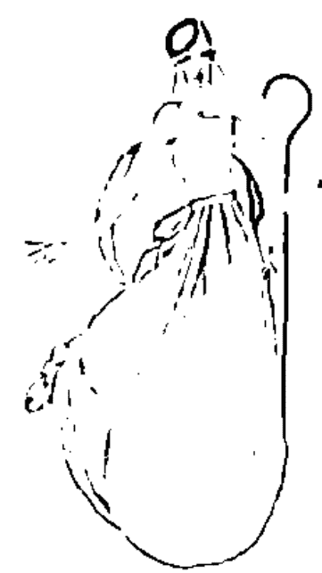

書中引導你先知道自己是幾數人，抓住了大方向後，再細節地用九宮格的方式，分析蘊藏在生日日期裡的數字能量，觀察和挖掘在各種生活面向展現的特質，並分析連線的意義。點線面地連結起人際和愛情關係，透過數字在生命裡的提示，尋找到合適的相處之道，有了感情的緣，依靠良好和細心的經營，才能盼到人與人之間，燦爛的花期盛放。

# 掌握你的幸運密碼

時間也和數字息息相關，透過數字我們也可以知道在什麼時間，適合做什麼樣的事。本書中，作者也為大家提供生命數字學的計算方式，以你的生日作為基準點，算出自己各年各月各日的主題數，適合搭配什麼樣的飲食、穿著，即使面對著挑戰或是需要逆流而上的時機，也可以試圖穩定內在，為自己面對的困難，朝著生命成長的下個階段邁進。

祝福所有閱讀這本書的讀者，無論面對怎樣的變化，都能因為了解自己，迎向不斷蛻變的豐富歷程。

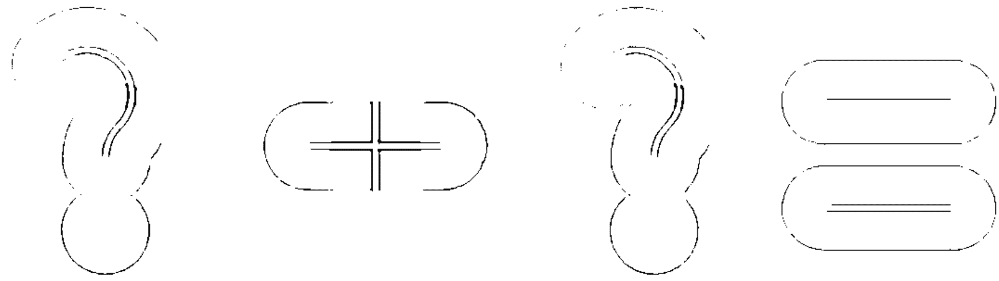

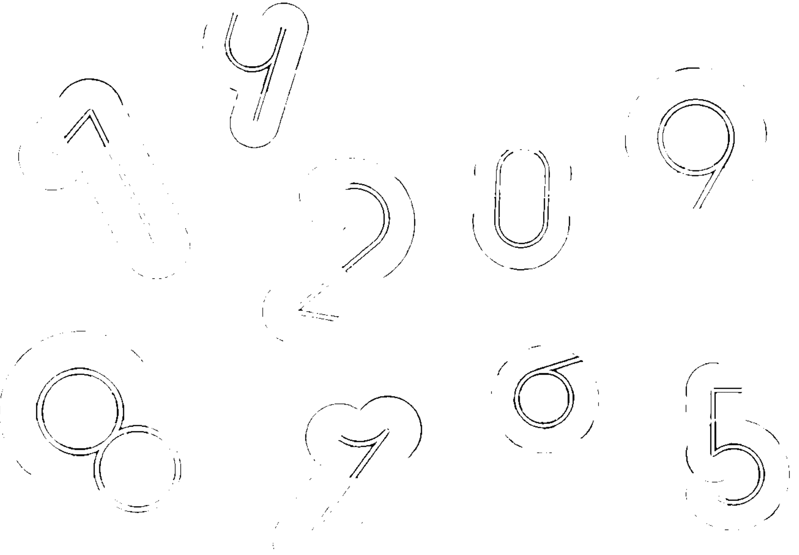

# 人與人之間存在著天賦與緣分的數字

還記得小時候第一次到同學家吃飯時，才發現原來別人家都不是吃一條魚、一隻雞腿配上兩個荷包蛋，頓時體會到自己是在極為幸福的家庭環境裡成長的。在我的記憶中，從小呼朋喚友到家裡吃吃喝喝是常有的事，冰箱總是塞滿東西，隨同學自由享用。

媽媽經常因為不知道同學姓名或他們愛吃什麼而苦惱，我總要她別管了，有甚麼就吃什麼，同學們感情好得像兄弟姊妹，不必拘泥小節。

幸運的是我有個開明好客的父親，或許是女兒的關係，父親對我特別疼愛，不特別管束與過度呵護，即使我到處撒野，甚至翻牆、翹課、開Party直到深夜才回家，父親也不打不罵，給予我信任和自由。

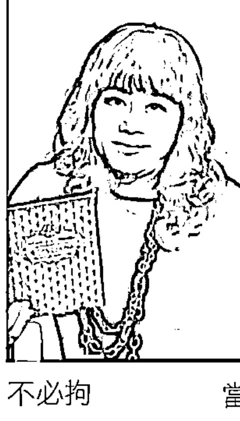

唯有一件事情是父親的堅持—學鋼琴，我足足學了七年之久，直到父親經商失敗，全家由高雄搬至台中才停止學琴。或許如父親所說：「學琴的孩子不會變壞。」即使我的行徑在旁人眼裡看似荒誕，仍能以優異的成績回報父親的期待。

當然，骨子裡的叛逆還是偶爾作祟，曾在學校公佈欄左側的全校前三名嘉獎，有我；公佈欄右側記過處分的名單，也有我。家人出於疼愛的心，總讓我順應性格自由發揮，回想起來，由於自己大膽不羈的性格，烙下許多精彩的記憶，過癮卻也因此吃足了苦頭。

## 潛藏在命運裡的秘密

即使灑脫如我，在某些當下仍會閃過「要是早知道就好了」的念頭，也許可以修正曾發生的錯誤、彌補某個遺憾、修復人與人之間的關係；也許可以不在人生裡跳針，執著於徒勞無功的人事物。

「對啊～要是早知道就好了。」當身旁的朋友這樣嘆息，便讓我忍不住希望有一門學問能夠窺探茫茫人海中相遇的機率，幫助我們抓準「命運交合點」，與對的人開始一段「美好的關係」。

蘇格拉底曾說：「未經思索的人生不值得一過。」這句名言成為我人生重要的警語，因為這樣的特質(7數特質)【7數喜好心智活動，有質疑表象探索究竟的精神，一生思索生命的意義】再加上勇於嘗試冒險的5數特質，我總是認真地感受生命給我的課題。雖然對很多人而言，無法回復的時光，總伴隨著回憶時哽住喉嚨的遺憾。「如果…可能…會不會…」的假設，不斷地在大家的生命裡出現，我們都希望自己有足夠的能力重新展開夢寐以求的嶄新人生。

生命數字的象徵意義，就是潛藏在我們命運裡的數字密碼。

期待你能從這本書找到屬於你特別的答案，相信你能用更好的方式與自己及所愛之人相處。

感謝在我失婚、失業、失去人生方向時，認識了令我浴火重生的生命數字學，也認識了關於這門學問的恩師－陳景德（Peter Chen）。從台灣到中國，這一路上我們為許多迷失方向的朋友釋疑（如當年身處人生低谷的我）。藉由潛藏於每個人身上的生命數字，擴大個人優勢、修正個人缺點，一同練習成為命運安排中應該成就的「最美好的自己」，透過認識、探索與開發來自我提升，唯有讓自己成為更好的人，才能遇見更好的人或是適合自己的另一半。

許多人的疑惑經常是－如果當時的選擇不同，是不是能有不同的結局？

事實上，每個選擇都伴隨著結果與責任，做出選擇的當下，你對自己的想法仍深陷迷霧之中，又怎麼看得清楚前方的道路，也難以辨清路途中的來者，究竟是偶然路過的人還是將為你停留的，甚至成為你生命中的伴侶。

## 重新定位兩人間的關係

每個人都在尋找靈魂伴侶，為失落的一角魂牽夢縈，期盼對的人出現，成就內在與生命的圓滿。「生命數字」總和出更好的機率，讓自己檢視過去、把握未來，體會每個人與生俱來的價值與意義。

「我為什麼會喜歡他？」、「為什麼會對她一見鍾情？」、「他是我命中注定的人嗎？」、「為什麼相愛容易相處難，到最後還是只能分手結束？」關於這些疑惑，每個人在生命中至少都經歷過一次，除了情感的比重，也囊括了職場、商場上合作關係有待解決的各種問題。

生命數字同時也是窺探人與人關係裡的一門學問，當你學會自我解碼，在了解自我的過程便能慢慢走出自己命運的軌跡。

占數療癒師

## 愛是讓你成為赤子的時刻

### 過敏徵兆

愛情像是對某人的細菌感到過敏一樣，他/她的鼻息、眼神像電流般穿過你的身體，首先會讓你心跳加速、說話口吃以外，還會讓你出現妄想症或是受到荷爾蒙驅使的母性氾濫，他亦或她的曲線讓你呼吸困難，更別提最原始的生理反應，讓你為他閃閃發光，而這只是初期症狀，隨後的精神性的佔有、忌妒與反覆焦慮檢查手機的行為等等，當你被愛神射中之時，你的反應連自己都吃驚失控，雖然那是某部分荷爾蒙作祟，但他就是個開啟一段魔幻的序曲。

### 愛情反映出最真實觸動的核心性格

在那個有點癲狂的序曲之後，愛情會「激活」一些你平時沉睡的性格，例如通常吝嗇的人忽然像個慈善家般無條件奉獻，某個剎那間忽然明白什麼叫做「奉獻與付出」，平時無私無所計較的人，也會因為異性友人的曖昧貼圖而心生忌妒的恨意，平時男孩氣的女孩，忽然變得柔媚羞澀起來…而不同性格的人也衍伸出百百種的愛情樣貌。

有人喜歡堅貞的關係，共同計畫未來；也有人不拒絕迎來的火花，毫無牽掛的享受當下，不談論遙遠不定的未知，

在愛情沒有在你內心開花以前你不知道你會是什麼。

愛情就是弄了某種心靈創口，你期待在創口新生發芽，新的感覺與性格讓你煥然一新。像是全然新鮮的活著，一心想與他人的生命產生連結，愛情之所以感到如夢似幻，是因為它讓你展現平日矯飾已久的赤裸。

### 如水似幻的女人

我喜歡描述女人的多樣性，我認為那是一個廣大無邊的宇宙、敏感、纖細浪漫天真同時又可以很邪惡與狡猾、多慮，而這兩極之間擺盪的灰色地帶，在加入愛情不可理喻的參數後，可想而知多豐富的人性衰敗與光芒。

### 大地與生命靈數

許多大地元素與物種特性都讓我聯想到女性的某些特質，例如一號「馴鷹者」的堅毅與專注，在居高臨下的視野，勇敢的開創與追求愛與夢想；而相對的二號較是襯於生活背景的「時間」默默的運行卻很重要，它的守候性代表被動的等待者，一方面也代表著內斂的安靜的小鳥依人的特質；而熱情奔放的三號是個「花朵」，蝴蝶在身旁簇擁，越是激情地綻放色彩，她是個風趣、多變的精靈並隨時準備好芬芳他人，相對於四號就是穩定透明「微風」她在大海中穩穩地推動風帆，讓生命免於暴風雨的危脅，就像是堅毅穩定的生活守護者；而熱愛流動事物的五號「嬉皮士」脫離社會框架並追隨自由，當下就是她最真實的生命，熱切生活與激情的探險家；而與之相反的是代表忠貞的六號「戒指」，從一而終地守候，最堅貞的約定，也象徵互相奉獻生命與責任；而七號則是充滿真理與奧祕的「宇宙」對未知探索的熱切，相信事情的多面向，是生命中的靈性探尋者；而在生活中實在的八號「牧羊人」則是一個實際的付出與照顧者，擅於掌控各生活層面，照顧的無微不至，羊代表財富與資產，眼中容不下任何一隻脫序的羊兒；最後是九號「海洋」，她的包容與成就性，許多海洋生物因她而繽紛茁壯，你很少感受到她的存在，但卻是生命的必需品，像是無私奉獻大地之母般和煦的存在。

這些女性在愛情中的性格透過生命靈數展現出許多樣貌，愛情的確會把你搞得暴躁易怒，甚至妳希望他不曾存在過妳的生命中，但他卻能把你轉化成多樣性的大地與豐富的性格，最終讓你/妳對生命與自我知覺有全新的了解。

## 生命數字，人與人關係的線索

《愛的關係》這本書的出版，象徵我圓了一個夢，儘管我更希望的是圓了更多人的愛情夢。

前些日子，我的小夥伴曾瑋語重心長地說：「婚姻這回事僅佔據人生不到20%的重要性，卻佔據了我們一生80%以上的時間，仍然沒有把握處理好。」朋友是學商和管理的，能運用20/80 原理來說明婚姻(伴侶關係)，已經相當睿智。其實若論起人生當中哪些事情比較重要，諸如金錢、友情、健康、家庭、事業、愛情、進修、名望、自由，以上列舉的這些，各別又佔據多少比例的重要性？！

## 80/20的伴侶論

話說回來，我們從出生開始，無論您擁有什麼樣的經歷與遭遇，都有一個家。沒有人能離開家庭，也許您只是換個地方住，然而那依舊是「家」。家裡面，除了父母小孩，最重要的就是您的另一半。父母小孩總歸有一天要離開我們，但通常另一半要陪我們到老，伴侶能說只有佔據人生20%的重要性嗎？

我想：「家庭與婚姻是開展人生的基石，也是我們能夠分享成功與快樂的目的。」如果有宿命，這就是人類的宿命。

印象深刻的是在國小四年級時，突然某天傻傻地在操場上呆住，停下了玩球的動作，一個聲音不斷地問：「我為什麼來到這世上？！」在那個當下，我忽然覺得被整個世界遺棄了，從此開始了孤獨又迷惘的未來。

依稀記得學校作文考題：「長大立志做什麼人？」，我是全班第一名的學生，但心中一愣，居然交了白卷。師長與全家人為此感到氣憤，問了我好幾次都回答：「我真的不知道將來要做什麼人？」奶奶拉著我的手坐在門口往外，又問：「你說說看你想當什麼樣的人？」迫於無奈，只好看著經過門口的人，胡謅起自己想都沒想過的未來。結果可想而知，奶奶很不開心，卻也拿我沒辦法。

後來長大了，想想那些當年寫得出答案的同學都說他想要當蔣總統，不禁跌倒在地，倒了半天也爬不起來。這件事還沒結束，到了奶奶過世前幾年的家庭聚會裡，老人家此時重新提起我該從事什麼行業？

她說：「你要去當個公務員，或者當老師都好，別像我們一輩子做生意，沒有什麼選擇，什麼樣的人都要往來。當公務員生活清高自在，不用張三李四啥人都得相處」。我想奶奶只是希望我將來過得不要太辛苦，並非很真切地知道我該做什麼。

時間過得很快，一轉眼將近四十。我經歷了大家都走過的人生路，畢業當兵出社會、奮鬥工作、結婚生女，但後來離婚了。

有一回，品牌廠商老闆來找我，很開心地感謝促銷的提案成功地贏得漂亮的成績，他拉著我說：「阿德呀！你腦筋比較好，說說看你想做什麼，我來當投資人，咱們創間公司讓你來操盤。」面對這麼好的機會，我卻仍然愣在當下，吶吶地回：「你把我考倒了，我真不知道該做什麼？」就此喪失了一個事業的契機。

四十歲以前，這種經驗對我而言實在是不勝枚舉，而我也習慣了。

## 數字的交集，「關係」的開始

2005年在偶然的機會下，認識了一位名叫何建燃的朋友，也許應該稱為老師。那時我轉作國外基金與保單住在台中，老師經過台中特意來看我，此次的契機，讓我與生命數字學從此結下不解之緣。

回想當時他僅僅問了我陽曆的出生年月日，便開始在一張小紙頭上計算起來，接著從他口裡聽到有關我的事情，似乎是相識多年般神奇。他還說：「你們做這行，都需要客戶的出生年月日做為費率的計算基礎，你何不也學會了，可以更瞭解客戶來親近他們？」這十多年來，業餘的時間裡，我就這麼一頭栽進生命數字的世界，至今樂此不疲。

我從未想過：「如果我早知道，就聽奶奶的話去當老師。」更不會說：「如果我早知道，就不會離婚了。」大家都明白千金難買早知道的道理。更話說男兒立志要趁早，但是要立什麼志才好？！如果不知道就會像想當蔣總統的那些同學一樣可笑。

「我該如何安身立命？！簡單地說，我該怎麼活下去？您有譜嗎？」有學生問我：「老師，非得學你這一套，人生才有譜嗎？」我說：「條條道路通北京，沒有絕對得如此的道理。」接著我又說：「如果你真要去北京，手上暫時也沒有地圖，那麼，我可以給你一張靠譜的地圖。」所謂勝算大者贏，就是這鐵道理。

你如果不知道到底什麼樣的人適合你，遇到理想對象也不知道該怎麼相處，單憑隨波逐流的價值觀，被人牽著鼻子走，怎麼有辦法走出自己的人生呢？更遑論認出命中注定那個「對的人」。

我設想該如何讓人一點就通？由緣分的數字裡確認彼此關係可能的蛛絲馬跡。

為此，我不斷地從每個相識的新朋友中印證。十多年來，我交過也計算過無數朋友的生命數字。我想：「生命的意義該從生命當中真切地獲取，而不是盲目地讀書作學問。」

我將生命數字學，視為人與人緣分關係的線索，依循著線索通往對方的心裡，相識一場，亦或走進對方的人生，陪伴一段，緣來緣去留下軌跡。相愛了，只因那些難以言喻的吸引；分手了，也能因緣分的消逝淡然處之，從每一段關係中經營出最適合彼此的相處模式。

期望這本書能讓你找到專屬於你的「愛情關係」，拋開那些愛情裡刻板的陳舊，找到對的另一半，兩情相悅地愛下去，或者抱著清醒的理智，心甘情願地走進婚姻的責任裡。

祝福，尋找愛、正在愛、解脫愛的人們，此時此刻，如你。

生命數字研究職人 **陳景德** Peter Chen

# 好評・推薦

南崁台茂購物中心總經理 / 苗延梅
桃源意境文教基金會董事長 / 學者、書畫家 姜一涵
中國書法家協會榮譽理事 / 書法家 周奇
資深美容時尚媒體編輯總監 / 作家 張玉貞
華旻時尚管理學堂 / 原定義・Zer0+ 創辦人 林永慈
姊妹淘兩性人氣專欄作家 / 城旭遠
生活工場品牌總監 / 王迨智
京華城購物中心店長 / 陳澤傳
仲量聯行零售物業部資深協理 / 何碧鈴
紅豆食府餐飲集團食享企業副總經理 / 傅孟琦
資深行銷人 / 講師 / 作家 朱承天
愛爾麗集團愛兒麗產後護理之家執行長 / 王翠瑛
凱信企業集團品藝術經理 / 黃宇泰
澳洲第一天然保養品 朗沛柔台灣區總監 / 蒙淑芬

## CHAPTER

# 尋找自我的能量之旅

面對心靈精神與個人價值時，
我們經常感到迷惘與不安，
然而每個人的存在與經驗，
都是獨一無二的珍貴，
需要自身去親身體會才會知曉生命帶來的禮物。
生命數字將宇宙萬物與人類生活相互融合，
透過數字裡的密碼，
將我們與社會生活與大自然彼此連結，
了解數字，
挖掘自身天賦啟發的數字能量，
尋找到本屬於你的才華與特質。

# 1 數字裡的靈魂原型

「我是誰？」這個問題是人類史上，恆久不變的疑問句，科學家、生物學家、考古學家們從墓穴、洞窟、生物演化的遺跡裡尋找人類的起源，哲學家與文學家們在著作與思辨的書寫中，找尋生命的意義並試圖解決社會性、人性的問題。

時至今日我們對於人是如何孕育出來的，有怎樣的基本情感已經相當熟悉，胚胎成形後長大，從幼兒到成人，擁有喜怒哀樂，身心靈反覆經由時間調和更臻成熟，我們經歷情與慾、生與死的離別和相聚，聽起來像老生常談，實際上每個人的存在與經驗，都是獨一無二的珍貴，需要自身去親身體會才會知曉生命帶來的禮物。

現代人在面對自身精神層面與個人價值時，仍然時感迷惘與不安，從幼兒步入青少年再長大成人，「我」的存在始終未改變，生命轉換與成長是身心一體的，而人的存在如同不變的軸心，向外延展的一切則隨之彈性改變，搜索著自身最舒服與喜愛的樣貌。像是搭乘快速列車前往下一站的旅人，坐在位置上欣賞不斷出現又消逝的風景，外頭的一切變化就是時間與生命的軌跡，許多人對於自我的了解及認識，彷彿深陷五里霧中，即使身在豐饒的土地與花園，也因為霧氣難以看清自我的靈魂，與天賦價值有多少美好的花草蔓生各地。

數字在人類文明史中是古老又廣泛被使用的符號，希臘哲學家提出的萬物皆是數的概念，將宇宙萬物與人類生活相互融合，成為生命靈數的基礎理論。我們可以透過生命數字，跟社會生活與大自然彼此連結，挖掘自身天賦啟發的數字能量，尋找到本屬於你的才華與特質。

在與人相處與交往的過程裡，我們可以練習客觀地去觀察自身的情緒表現與狀態，更加深入的發現自我的個性特質與能量優勢及較弱的地方。唯有你漸漸摸清自己是怎樣的人，才能使內在狀態經由練習趨向穩定與平靜，也會開始明白在愛情、婚姻、合作對象與交友等種種人際關係，自己適合哪些類型的人，對於人生追求的目標又是什麼？吹散迷惘的霧氣，恢復靈魂本源的熱情與自信，能更容易看見人來人往的生命旅途上，你在何處，該前往何處？以及，你命中注定的人又在何處？

現在我們保持著自尊與自信的態度，從自己的生命數字來了解自己。什麼是生命數字？拿出一張紙與筆計算，慢慢透過數字的能量分布，解開寓藏其內的奧秘。

認識自己，找到自己，做自己最快樂，因為走過千山萬水以後，始終是你自己。我們都需要清楚瞭解自己的價值觀來提升自己的人生價值。

> 引用英國作家王爾德所述：「大多數人是其他人。他們想別人的想法，過別人的生活，引用別人的熱情。」根據現代心理學家的說法，不從事生命中想做的事的人，缺乏的是自尊與自信。

# 2 輕鬆計算你的生命數字

- LOVE YOURSELF, LOVE YOUR LIFE.
  愛自己 珍惜你的人生
- BORN TO LEARN
  認識自己認識他人善用天賦終身學習
- DO YOURSELF
  相信自己 做你自己 做自己最快樂

以陳先生為例：
1963 年 10 月 11 日出生，總共 8 位元數位
依照年月日順序排列後，逐一加總為 22，再加總直到成為個位數 4，
如下表：

| 1 | 9 | 6 | 3 | 1 | 0 | 1 | 1 | 2 | 2 | 4 |
|---|---|---|---|---|---|---|---|---|---|---|
| 年 | | | | 月 | | 日 | | 父 | 母 | 我 |
| 天賦的道路 | | | | | | | | 自我啟發數 | 自我成就數 | |
| 改變的起點 | | | | | | | | 後天的努力 | 終極的目標 | |
| 基本性格 | | | | | | | | 心行合一的啟發 | 靈魂的歸宿 | |
| 1 | 9 | 6 | 3 | 1 | 0 | 1 | 1 | 2 | 2 | 4 |
| 時間的推移 | | | | | | | | 主題與劇本的更換 | 人生的歷練與涵養 | |
| 天道平等 | | | | | | | | 啟發有數 | 自我成就 | |
| 不同的道路 | | | | | | | | 不同的努力 | 不同的成就 | |
| 適合的道路 | | | | | | | | 如何做 | 我要什麼 | |

我們可以從表中看出年月日的加法計算是 1+9+6+3+1+0+1+1=22，
然後 2+2=4。由於時間往前推移，因此用加法計算。此一數字方程式
19631011=22=4 即為我們的生命數字方程式。根據最後總數，我們看
到了今生最重要的生命數字，也看到了自己，再從數字的涵義解讀人
生功課，進一步瞭解自己。

自我成就數又稱為命數，自我成就數隨著時間的推移，每年向前
遞增，根據數字的輪迴，自我成就數遞增到 9，又從一開始，每隔 9 年
輪迴轉化一次。這正是所謂十年風水輪流轉。年月日之後，這些原本
不經計算而看不到的數字，是我們後天的潛能與必須的努力。

再以某友尹君為例：陽曆 1976 年 10 月 31 日出生，總共 8 位元數位。
依照年月日順序排列後，逐一加總 1+9+7+6+1+0+3+1 為 28，再加總
2+8 為 10，再加總直到成為個位數 1，那麼，19761031=28=10=1 即為
她的生命方程式。

1 數成為她個人最重要的生命數位。計算出自己的生命數字後，接
著介紹各數字象徵的能量原義和天賦能量。

# 0 到 9 生命數字原義及天賦能量

數字是流傳許久被廣泛使用的符號，
他們的形體與大自然及人類文明有關，
各個數字存在天賦的能量，沒有所謂的好與壞，
但在人性與性格上都有正向與負向的發展。

# 創造

象徵太陽，代表太陽，是能量之源，也是生命中唯一、熾熱的目標，凝聚的起始點，擁有不斷向外延伸的力量。代表領導格局，有創造和前進的能量。

正面：主動、行動、個人英雄主義、創造力、領導力、說服力
負面：衝動莽撞、我行我素、破壞力、侵略性、獨行獨裁

# 合作

象徵陰陽，代表陰陽兩極、正反、男女、是非、冷熱等等具雙面性的二元對立的意義。屬於軍師格局，有合作精神與特質。有合作與平等的能量。

正面：互動合作、追隨主義、老二哲學、親和溝通力、分析力、乖巧柔順
負面：被動反動、內向退縮、優柔寡斷、排外性高、懶散叛逆

## 理想

象徵三角形，代表聖父、聖子、聖靈三位一體。三點匯聚。1+2=3，象徵改變與繁衍，也是權力與能量的極致會合。具有創意格局，象徵理想，有表達和理想的能量。

正面：好動活潑、理想主義、應變表達力、推銷社交企劃力
負面：過動、多話、思考跳躍、不合邏輯、精神渙散不集中

# 安定

形狀符號的意義是四方形，代表天地四方、十字架，象徵大自然的秩序與規律，有堅定穩固的意義。屬於敦厚格局，象徵安定，有安定與流程的能量。

正面：謀定後動、保守主義、組織果斷力、務實主義、忠誠度高
負面：不動如山、謹慎固執、太重程式、欠缺自信、防衛心重

# 自由

象徵五角星，五角星形也有人型的意涵，象徵人類的心臟，代表感知與自由的能量。屬於四海格局，象徵自由，有自由與調控的意義。

正面：觸動、機動、機會主義、包容適應力、行銷業務高手
負面：不安現狀、縱情享樂、遊手好閒、為所欲為、隨波逐流

## Chapter 1 尋找能量的自我之旅

## 愛的關係 x About Soulmate, Love of Numerology

## 責任

象徵符號為六芒星，六芒星又被稱為大衛王之星，同時也有卍字元號的意義，代表包容、治理及保護的意涵。為多情格局，有責任和承受的能量特質。

## 理想

代表九個點，與0形狀相近，是還原數的意思，象徵冥冥之中的靈性光輝與能量。屬於才藝格局，象徵智慧與大愛。

正面：感動、奉動、完美主義、關懷、抗壓、協調力、寬恕同理心
負面：搶動、強動、強行干涉、潔癖愛哭、姑息溺愛、招惹麻煩

正面：想動、要動、利他主義、學習想像力、義氣相挺、無私奉獻
負面：鬆動、懶動、濫做好人、愛批評、沒有耐性、偽善狂熱

## 信任

象徵彩虹七色，7是幸運數字，在大自然中象徵彩虹的七種顏色，象徵自然秩序裡難以窺探的機制與現象。代表理智格局，象徵信任，也代表信任與真理。

## 未知

象徵宇宙大氣與迴圈定律，是肉眼不可見的能量，存在於宇宙萬物間冥冥之中的主宰，代表未知的動能與機運。此數不代表人類，但有增加或加速性格的力量。

正面：靈動、心動、實證主義、觀察直覺力、喜愛研究、注重細節
負面：激動偏執、質疑他人、忽略現實、一針見血、挑剔八卦

## 成長

無限大的符號意涵，8橫放後為數學中無限的意義，具有無限發展的意涵，象徵生死之間無盡的迴圈。屬於富貴格局，代表成長與富足。

正面：策動、實動、資本主義、整合、忍耐、行銷、理財力、誠實打拼
負面：暴動、蠢動、唯物主義、驕傲高姿態、自欺欺人、善於偽裝

## Chapter 1 尋找能量的自我之旅

## 愛的關係 x About Soulmate, Love of Numerology

## 責任

象徵符號為六芒星，六芒星又被稱為大衛王之星，同時也有卍字元號的意義，代表包容、治理及保護的意涵。為多情格局，有責任和承受的能量特質。

正面：感動、奉動、完美主義、關懷、抗壓、協調力、寬恕同理心

負面：搶動、強動、強行干涉、潔癖愛哭、姑息溺愛、招惹麻煩

## 理想

代表九個點，與 0 形狀相近，是還原數的意思，象徵冥冥之中的靈性光輝與能量。屬於才藝格局，象徵智慧與大愛。

正面：想動、要動、利他主義、學習想像力、義氣相挺、無私奉獻

負面：鬆動、懶動、濫做好人、愛批評、沒有耐性、偽善狂熱

## 信任

象徵彩虹七色，7 是幸運數字，在大自然中象徵彩虹的七種顏色，象徵自然秩序裡難以窺探的機制與現象。代表理智格局，象徵信任，也代表信任與真理。

## 未知

象徵宇宙大氣與迴圈定律，是肉眼不可見的能量，存在於宇宙萬物間冥冥之中的主宰，代表未知的動能與機運。此數不代表人類，但有增加或加速性格的力量。

正面：靈動、心動、實證主義、觀察直覺力、喜愛研究、注重細節

負面：激動偏執、質疑他人、忽略現實、一針見血、挑剔八卦

## 成長

無限大的符號意涵，8 橫放後為數學中無限的意義，具有無限發展的意涵，象徵生死之間無盡的迴圈。屬於富貴格局，代表成長與富足。

正面：策動、實動、資本主義、整合、忍耐、行銷、理財力、誠實打拼

負面：暴動、蠢動、唯物主義、驕傲高姿態、自欺欺人、善於偽裝

## 認識自我：9數人大剖析

認識自我，是靈魂、生命一切的基礎。
唯有摸索出自己是怎樣的人，
才能使內在狀態經由練習趨向穩定與平靜，
也會開始明白在愛情、婚姻、合作對象與交友等種種人際關係，
自己適合哪些類型的人，對於人生追求的目標又是什麼？

健康的人生從關注自己開始，關注自己從學習開始，我們知道：知識就是力量。追求新知永遠不嫌晚。

我是誰？今生我有什麼樣的功課？我該怎麼做好我自己？與人相處，我該怎麼溝通？誰聽誰的呢？

眼睛裡看到的，都是別人的短處還是長處？我最擅長的是什麼？通過合作，我能夠善用別人的長處來完成任務嗎？

讓別人感到痛苦容易？還是讓人感到快樂容易？面對苦樂交織的人生，我該怎麼優游其中？你是否常常感到煩惱糾結嗎？

數字會說話，說出你潛藏已久的心聲與理想，為你揭開自我的奧秘。

出生年月日加總起來的個位數意義代表自我成就數，前面提到天賦數位、自我啟發數等等，均會影響性格的不同。數字能量本身是中性的，有正向和負向的發展，當人們引導自己的能量往不同方向做出選擇時，所培育的能量特質也會有所改變，認識自己善用天賦才是最為重要的。

1 到 9 數人的類型，不是要粗略地為人們的性格和數字歸納出絕對意義。各個數字的個性特質並非絕對如此，因為天賦數位也有其他數字能量的牽制、人際互動的關係與時間的影響，但大致上的特質相差無幾。9 數人的類別代表今生人生課題和理想人型，也就是成為具備哪些特質的人，追尋哪樣的人生目標，才會使你的外在際遇和內在靈魂能取得完整，否則將會常陷入糾結煩惱的深淵中。

## 1 數人

### 馴鷹女神＝熱情積極的領導者之風

你們是天生的領袖型人物，個性堅強，熱愛獨立，情感鮮明，充滿主動自發的精神，不惜代價地追求自己的道路，精力十分旺盛且衝勁十足，1 是創造、原始能量的象徵，你們有高度的開創性，不喜歡被別人依賴，也比較不喜歡依賴他人。看待事情的眼光多為二分法，凡事只分對錯，優點是較容易做出決定，有領導人必備的條件及果斷力；缺點則是容易因為衝動走向極端。

性格外向積極，喜歡獨特或新奇的事物，對事物頗有個人主見，寧願自成一派，也不願隨盲目跟隨潮流。處事態度經常開門見山，直來直往，也希望別人能直截了當，不拐彎抹角。

1 數人直接的性格相當適合經商，可是在戀愛與婚姻中，容易讓人感到不夠浪漫、略顯自私。處理事情時通常希望能馬上看到成效，若事情一旦出錯，情緒容易失控，甚至不惜挑戰權威，不計後果。

人生課題及追求，是如何去開闢自我的疆土，找到屬於自己的道路，工作與職場選擇，與開創性、領導相關的工作都相當適合，1 數人經常給人獨立自信的印象，即便偶爾在心中對自己仍然會懷抱質疑，有時也會感到自卑，但展現的外在行事作風及態度依舊自信，足備霸氣的領導者之風。

關於生涯發展，與領導力、表現欲、開創性、說服力、獨立自主、即戰力、天生努力家相關的主題，是 1 數人經常展現出來的特性，因此和這些主題和天賦有關連的工作，如發明家、政治家、工匠、藝術家、演藝人員、公司主管、人資、導演、業務、建築師、服裝設計師、美髮師、運動選手、企業諮詢師... 等等，可以作為參考。

#### 人生藍圖 Blueprint of life

開疆闢土，開創屬於自己的人生道路。
無畏艱難，創造屬於自己的命運軌跡。

## 2 數人

### 智多之星 = 感情敏銳的合作型軍師

你們是天生的外交與公關家，善於溝通，性格溫和謙遜，雖然比較不喜歡帶頭主導或是單獨行事，但與人合作的意願非常高。對事情較不容易下決定，有時會有拖延或順勢而為的狀況。偏好被動地等待邀請參加事務，比較不容易主動邀請別人加入。

對於事物的差異性十分敏銳，具備很好的分析力與辨識力，當對於事情感到不妥時，喜歡發問和思考，有時其他人會因此對 2 數人有挑剔和愛抱怨的印象，但對他們而言，看到問題去改正抓錯，是很正常的事情。

2 數人對於感情特別敏感，即使愛情關係快要走不下去了，也很少主動提出分手，在感情裡要求相對付出，深信在感情裡對方應該多多付出，若別人達不到心中預期的回饋，容易大感受傷。

對感情細膩的 2 數人來說，今生的人生追尋渴望，是尋找到靈魂相知的伴侶及溫暖堅定的依靠。由於具備敏感敏銳及高度分析力的特質，2 數人很適合從事能發揮理解、敏感、親和力、溝通等能力的工作，適合需要分析溝通的工作。說到溝通並不拘泥於高度的口才和辯論力，各種形式的表達如文字、繪畫、音樂都是表達和溝通的一種。

在生涯發展的建議上，作家、美術家、演員、音樂家、命理師、占卜師、宗教家、記者、偵探、心理學家、外科醫生、古董商、導遊、美容師、護士、保母... 等等都是合適的選擇。

#### 人生藍圖 Blueprint of Life

尋找到一個能夠陪伴著你，與你靈魂相知相惜的伴侶。
面對變化多端的生命旅程，擁有一個溫暖堅定的依靠。

## 3 數人

### 絢爛花仙＝注重美感的創意型天才

3 數人在群眾眼裡，是充滿親和力的開心果，性格活潑有趣，喜歡聊天說笑，經常帶給大家歡樂。你們在意美，同時也注重穿著、時尚、化妝打扮、唱歌跳舞等等外在展現。個性常常會改變心意，早上想好的事情，下午可能就會改變，經常讓人有無法果斷和專注的印象，你們其實只是希望好還可以更好，變動性和彈性較高，這樣的特質使 3 數人非常適合從事創意工作。另外，3 數人喜歡聽到來自他人的讚美和掌聲，對批評不能接受，若隨意或直接批評，會關起對外溝通的門。

由於你們經常由事物表面看待事情，十分在意自己的外在和形象，有些人會對 3 數人有膚淺的印象，事實上你們對自己的理想非常清楚，面對不喜歡的東西，會很有意見和個人想法，是所有數字中最難妥協的一群。在人生態度上有時也比較任性，比較孩子氣。對於愛情，一旦遇到夢寐以求的對象，無論有沒有發展的可能性，容易馬上墜入情網，無法自拔。今生的人生追求，是站在絢爛人生舞台上，受到鼓舞與掌聲，對於永生花般不會凋零的愛情亦十分渴望。

擁有個人美感品味和創意的你們，很適合從事與創意、發想等需要大量產出靈感和點子的工作，快速轉動的腦袋帶給你們很好的思考力，與社交、表達、創意、思考、推銷等有關的職業，能讓你們與生俱來的天賦特質獲得很好的發揮，如企劃人員、廣告人、服裝設計師、建築師、公關、銷售員、娛樂事業、音樂家、舞蹈家、繪畫、陶藝、作曲、寫作、演員、創作家、創意自由業、命理師、心理師等等。

#### 人生藍圖 Blueprint of Life

站在絢爛的人生舞台上，受到鼓舞與掌聲，完美演出。
唯有按照自己的理想，才能開創屬於自己的完美境界。

## 4 數人

### 安穩微風 = 解決問題的零風險高手

4 數人凡事喜歡依照常規、倫理或有秩序的方法來進行，性格上比較保守傳統，比較理性，不喜歡有任何風險。雖然不以高度創造力作為性格的主要特質，但不冒險行事，做事重視明確的目標和計畫的你們，是解決問題、設計系統、佈置計畫的天生高手，不僅注重實際資料與效率，對於誠信和約定也是言出必行的類型，同時期望他人能夠遵守信用。

4 數人大多給人誠實可信的印象，為人處事有一份安定感與穩定感，正因為這種特質，你們通常不惹事也不怕事，通常在風險發生之前，已經有高度的自我防備機制去籌備應對之策，面對潛在風險帶來的變動和狀況時，建立好的心理建設和備案早已待機，隨時可以提槍上陣處理問題。

比較保守，規避風險的 4 數人，具備絕佳的穩定性和解決事情的能力，習慣對事情有所計畫，以應萬變的你們，有很好的組織能力、決斷力。在工作上屬於比較穩紮穩打的類型，穩固而堅毅，適合不需催趕、透過紮實基礎的累積而得到成果的職業，例如翻譯人員、會計師、工程師、技師、研究人員、電腦工程師、在大型企業工作、公務員、編輯人員等。也可以朝著自然科學、物理、電子…等理科相關領域發展。

#### 人生藍圖 Blueprint of Life

為人生畫好藍圖的輪廓，一步步實現，尋找安全感是今生重要的課題，4 數人需要了解，唯有自己內心不再泛起漣漪，才能真正享受寧靜。

## 4 數人

安穩微風 = 解決問題的零風險高手

4 數人凡事喜歡依照常規、倫理或有秩序的方法來進行，性格上比較保守傳統，比較理性，不喜歡有任何風險。雖然不以高度創造力作為性格的主要特質，但不冒險行事，做事重視明確的目標和計畫的你們，是解決問題、設計系統、佈置計畫的天生高手，不僅注重實際資料與效率，對於誠信和約定也是言出必行的類型，同時期望他人能夠遵守信用。

4 數人大多給人誠實可信的印象，為人處事有一份安定感與穩定感，正因為這種特質，你們通常不惹事也不怕事，通常在風險發生之前，已經有高度的自我防備機制去籌備應對之策，面對潛在風險帶來的變動和狀況時，建立好的心理建設和備案早已待機，隨時可以提槍上陣處理問題。

比較保守，規避風險的 4 數人，具備絕佳的穩定性和解決事情的能力，習慣對事情有所計畫，以應萬變的你們，有很好的組織能力、決斷力。在工作上屬於比較穩紮穩打的類型，穩固而堅毅，適合不需催趕、透過紮實基礎的累積而得到成果的職業，例如翻譯人員、會計師、工程師、技師、研究人員、電腦工程師、在大型企業工作、公務員、編輯人員等。也可以朝著自然科學、物理、電子…等理科相關領域發展。

> 人生藍圖 Blueprint of Life
為人生畫好藍圖的輪廓，一步步實現，尋找安全感是今生重要的課題，4 數人需要了解，唯有自己內心不再泛起漣漪，才能真正享受寧靜。

## 5 數人

### 嬉皮浪人＝心胸自由寬廣的口才家

你們是天性愛好自由的一群人，喜歡無拘無束的，不喜歡被他人干涉或打擾到你們保有自主彈性和自由的空間。重視興趣，容易受到有趣新奇人事物的吸引，喜歡嘗試新事物，將生活層面拓展得很廣，過得多采多姿。

愛好玩樂、美食、旅遊相關的主題，熱愛冒險的 5 數人，同時也相當重視事業與工作，有的甚至會有工作狂的傾向，或是給人奔忙在外，馬不停蹄的感覺。由於你們口才通常都很不錯，不但善於辯論、口說，懂得人情世故和氛圍的掌握，因此很容易獲得他人的支持和信任，易與人打成一片，特別適合從事時間可以彈性變化的工作，這也是你們今生的人生追求，愛好生命中充滿變化與自由的可能。

在待人處事上，你們比較不喜歡馬上給出承諾，喜好變化和自由的你們，會擔心輕易給出承諾，會限制或讓自己失去自由。若想讓你們對事情付出高度責任，大多都是能夠讓你持續感興趣的事物。在情場上，5 數人容易獲得他人青睞，需要愛情又害怕被束縛的你們在這方面顯得比較矛盾，想要單身的自在，又不喜歡被套牢的感覺。

生涯建議選擇以保有彈性空間，讓你們可以自由發揮的工作為佳。天賦能量帶給你良好的溝通力、表達力、面對挑戰的適應力與調適力，非常適合從事如公關、銷售、金融、廣告傳媒、記者、演員、美食評論家、演員等等，同時具備一些興趣狂熱的你們，也適合在喜歡的領域從事研究工作，如天文學家、科學家、教授等等。

> 人生藍圖 Blueprint of life
無拘無束的靈魂，才能帶來無限的創意，我的世界跟隨著直覺，饒富趣味的人生才有精彩的情節。不當囚徒，不被禁錮，不隨意給予承諾。

## 6 數人

### 愛心響亮 = 街頭型的高貴情感族

6 數人是富有同理心、憐愛之心，喜歡被他人需要的一群人，比較居家充滿責任感，對於家人和朋友常常不遺餘力地盡心付出。你們喜歡處理苦難和家務，對他人的痛苦經常能感同身受，即使自己已經深陷他人的問題中，也常毫無自覺。高度的責任感，讓愛好幫助弱者，具有母性、耐心和愛心的你們，面對他人的苦痛和悲傷，總願意責無旁貸地幫助他們，有時候太過專注，卻沒注意到自己承接的情感和問題，是不是已經超過能力所及的範圍。由於性格中這樣的特性，到了職場上表現得任勞任怨，甚至會不小心為別人多做太多他們本該做的工作。

多情率真的 6 數人，面對喜歡的對象，表現得愛屋及烏，在你們身邊的朋友或家人，經常受惠於你們的照顧和關心。雖然溫暖助人的性格是優點，有時卻也會讓你們在協助他人太多，發生狀況時受到別人拖累的情況，懂得收放自己的善良與溫暖，會是你們很重要的人際課題。

對你們而言，今生最重要的課題追求，是至情至性的真愛，純粹深邃而且美好，也渴望擁有情深任真的家庭。明顯的熱情特質，使你們非常適合從事與愛心、關懷弱勢、照顧他人的工作，不適合與利益有強烈關聯的工作，天賦能量中具有協調力、同情心、善解人意、治癒力的你們，對世界富有熱情和溫暖，適合在社工機構、老人幼兒照護與福利機構、醫護行業就職，演員、畫商、設計師、模特兒等工作也相當合適。

> 人生藍圖 Blueprint of Life
具有療癒的本能，追求家庭生活，愛人與家人是其生命能量的來源，善於經營人際關係，能以溫暖的樣貌融化人心。

## 7 數人

### 宇宙秘線 = 追求真理的科學家精神

7 數人喜歡學習和發問，是愛好追求真相與真理的一群人，看待事情時不只由事物表面判斷，也喜歡自己求證背後的真相。你們有高度的直覺力，做事情看重細節，喜好邏輯推理，試圖挖掘事物的關鍵點，因此常常可以給人說話行事一針見血的感覺，有時也會給人行事作風吹毛求疵、追求完美的印象。

另外你們相當重視精神層面，7 數人是人緣是非常好的一群，但在社交交際場合，不喜歡受到太大的矚目，喜歡暗中觀察他人。與人相處時有隱藏自己的習慣，讓人無法輕易摸透，生活中的獨立空間對你們來說非常必要，在需要一獨自靜一靜，或是回到自己的隱私空間時，對外謝絕任何人打擾，在保有良好社交狀態的同時，也保有自身的完整與獨立，屬於朋友多，能真正進入心裡深處的卻不多的類型。

對事物有科學家精神的 7 數人們，將這樣的態度放到感情中，有時會讓人感到自私無情，事實上你們有真誠待人和人道關懷的精神，願意不求回報的助人。

喜歡動腦思考的你們，觀察力十足，能夠讀得懂別人，卻讀不懂自己，這會影響你們面對人生重大事件時，顧慮太多而難以果斷抉擇，船到橋頭自然直的想法，容易使讓你錯失良機。凡事追尋到明白的真理，擁有生命靈魂的知音，是你們今生的重要課題。

在工作與職涯方面，你們喜歡做動腦的工作，不喜歡勞動力高的活動或工作，散發出書生氣質的同時，也讓人感到有些慵懶。適合選擇需要思考、觀察、敏銳感受、分析、直覺等特質相關的工作，以思考性比例大於勞動或行動的工作為原則，例如心理諮商師、醫師、算命師、宗教家、藝術家、律師、法官、會計、電腦工程師、攝影師、精密技術人員、偵探、研究學者、銷售、營業類等等職業。

> 人生藍圖 Blueprint of Life
講究公平與原則，以牙還牙，以眼還眼，若有人對其付出則會付出更多，一生追求知音，尋找懂他 / 她的人，直率的談吐與作風，喜歡簡單的相處模式。

## 8 數人

8 數人具備 1 數的行動領導力，也具備 7 數的思想領導力，對於數位有清晰的概念，頭腦轉得很快，眼光精準，容易看出哪些事物值得投資，非常在意事物的價值與別人的尊重。

由於良好的商業腦袋與市場眼光，你們通常能自主投資，創業當老闆，事業的發展和實在的擁有是 8 數人今生的追求，你們認為富足的生活是一切的根本及希望，金錢與權力也是你們所追求的目標，是標準的資本主義者，控制欲強的你們不甘於現狀的平淡，相當厭惡怠惰的人生，同時也是絕佳的偽裝高手與強勁的競爭對手，可以用柔順的態度包裝個性剛強的地方，以柔飾剛正是你們的厲害之處。

為人處事方面，8 數人慷慨大方，霸氣十足，常常為人出頭主持公道，對於自己關心的人與利益，遇到狀況時會挺身而出的捍衛他們。另外你們也很懂得用錢或利益收買人心的道理，清楚利益與獎賞是絕大多數人心之所向。

做事態度務實誠懇的 8 數人，有優秀的商業想法，因此適合從事與商業有關的工作，與管理、務實、整合行銷、果斷力、忍耐力有關的能力，都能將你們的天賦能量發揮出來，例如金融業、會計、法律、演藝、娛樂、警政、管理、建築、白手起家的創業者等等，都是在職涯選擇上不錯的選擇。

> 價值取決於心中的感受，習慣性評估人與事物的價值份量，數字對於 8 數人來說是迷人的遊戲，意味著即將到來的美好生活，汲汲營營建造的理想國，金碧輝煌。

## 9 數人

### 海洋女神＝無私奉獻公益的夢想家

你們是 9 類人中，最為早熟且有高度才華的一群人，擁有豐富的想像力和良好的學習能力，思考眼界宏觀寬廣，心胸開放，凡事往往由高處著眼較有遠見，但有些時候容易眼高手低，雖然腦袋有滿滿的點子和想法，卻未必有相應的行動力完成，缺少務實的做法去實踐，在人生中可能因此受到挫折和困難，是需要注意和克服的困難。

然而遇到逆境和挑戰，你們也有天下無難事的價值觀，遇到喜歡或熱衷的事情，懷抱強烈的熱情，如同飛蛾撲火般，無懼任何危險地全心投入，因此人生過程跌宕起伏，充滿戲劇性的色彩，年輕時經常比一般同齡的人，有更多傑出的表現被看到。除此以外，你們愛好熱鬧，對於公眾性或需要由團體共同完成的事務，抱持很高的參與意願。

對於世間 9 數人有充滿大愛的精神，熱心公益，面對他人的痛苦或悲傷，通常會抱持著無私奉獻的精神，為他們兩肋插刀，認為助人為快樂之本，但缺點是不太懂得拒絕的藝術，有時會顯得比較不理智，問題未必能夠解決。關於你們人生的課題是夢想的實踐，並從多彩的人生經驗裡汲取智慧。

由上述特質對應 9 數人適合的職涯建議，與人道主義、關懷性、博愛精神、服務人群、想像力、慷慨大氣特質有關的工作，都很合適。非常適合需要為他人奉獻或服務的工作，例如服務業、醫護人員、銷售員、宗教家、檢察官、演藝人員、音樂家、作曲家、歌手、藝術家、設計師、舞者⋯等等。

> 人生藍圖 Blueprint of life
心是一切依歸，不美好毋寧死。常常許下自己無法完成的美好宏願，卻甘於辛勞奉獻，一磚一瓦打造心中的理想國，付出能讓靈魂獲得滿足，是 9 數人的精神口號。

## 9 數人的大職場 == 找對工作，成為人生勝利組

### 獨立、自信型

人格特質：
領導力、表現欲、開創力、說服力、獨立自主、天生努力家、作戰力。

適合帶頭去開創的工作：
發明家、政治家、工匠、藝術家、演藝人員、公司主管、導演、業務員、建築師、服裝設計師、美髮師、運動選手、企業諮詢師…等。

### 分析、敏感型

人格特質：
理解力、敏感性、親和力、溝通力、軍師格局。

適合需要分析溝通的工作：
作家、美術家、演員、音樂家、命理師、占卜師、宗教家、記者、偵探、心理學家、外科醫生、古董商、導遊、美容師、護士、保母…等。

### 活力、創意型

人格特質：
創新與創意、表達力、思考力、推銷力、社交性。

適合需要提供點子的工作：
企劃人員、廣告人、服裝設計師、建築師、公關、銷售、娛樂事業、音樂、舞蹈、繪畫、陶藝、作曲、寫作、演員、作家、創意自由業、命理師、心理師…等。

### 穩定、堅毅型

人格特質：
保守內向、自製力、組織力、決斷力、穩定性。

適合穩紮穩打不用催趕的工作：
翻譯人員、會計師、工程師、技術師、研究人員、編輯人員、電腦工程師、大企業或公家機關工作、可朝經濟、自然科學、物理學方向發展。

### 公關、自由型

人格特質：
適應力、包容力、公關力、挑戰力、行銷力。

適合工作時間可以彈性調整的工作：
天文學家、科學家、教授、記者、政治家、宗教家、音樂家、演員、銷售業、金融業、廣告傳媒、運動員、廚師、美食評論家…等。

### 熱情、義氣型

人格特質：
善解人意、協調力、承擔力、同情心、關懷力、治癒力。

適合關懷照顧別人的工作：
心理學家、醫療行業、照顧老人、幼兒福利工作、演員、畫商、設計師、模特兒、不適合以利益掛帥的行業。

### 誠懇、務實型

人格特質：
管理力、務實性、整合力、商業性、果斷力、忍耐力。

適合商場上實拼實戰的工作：
金融、會計、法律、演藝、娛樂、警政、管理、建築、白手創業者。

### 直覺、神秘型

人格特質：
直覺力、感受力、分析力、觀察力、神秘性、敏感性。

適合思考性多於行動性的工作：
心理諮詢師、醫師、算命師、宗教家、藝術家、律師、法官、會計師、電腦工程師、攝影師、精密技術人員、偵探、研究學者、銷售或營業有關的職業。

### 博愛、機智型

人格特質：
慷慨大方、博愛性、服務性、理想化、人道主義者。

適合有服務奉獻性質的工作：
醫師、護士、銷售人員、宗教家、檢察官、演藝人員、音樂家、作曲家、歌手、藝術家、設計師、舞者…等。

## 1 分鐘快速掌握 9 數人的人格特質
-- 解放你的靈魂能量

1 開創堅毅的馴鷹女神
勇敢獨立的領導
熾熱美好之愛

2 聰慧多謀的智多之星
善於分析與合作
敏銳細膩之愛

3 多彩絢爛的花之仙子
喜愛注目與掌聲
豐富多變之愛

4 急徐安定的微風之神
務實和謹慎融合
安心生活之愛

5 不羈自由的波西米亞
無懼未知的嘗試
自由率性之愛

6 堅定誠懇的誓言之人
熱於幫助弱勢者
深邃綿長之愛

7 知性神秘的宇宙祕探
理性與知性兼具
靈魂交流之愛

8 財富與管理的牧羊女
商業的天生好手
浪漫的控管家

9 廣闊熱情的海洋女神
熱情無私的奉獻
瑰麗幻想之愛

## Chapter2 認識自我：9 數人大剖析

### 愛的關係 *About Soulmate, Love of Numerology

## 2 影響人類的三大要素

### 環境 Environment

我曾因專案工作的緣故，住在青島的黃島國家新區，金沙灘是每年夏天的旅遊戲水勝地。遠望海上有三座小島，統稱為竹岔島。某日禁不住好奇的我，終於搭著都市人不願意坐的小船到了島上。沿著環島路逛著，看到面向大海的很多座瓦房。瓦房門口與附近有一堆一堆的黃土，走近一看恍然大悟，原來他們是生於斯長於斯也葬於斯的前輩們。近來新聞報導一名老師的辭職信寫著：「世界這麼大，我要去看看。」

有位朋友千山萬水到青島來看我時，她說：「我一輩子都沒有看過大海，所以我來了。」大家或許在交友網上看過擇偶相親的條件裡，有不少人只願意選擇同地區的對象交友，而不願意談異地戀曲。

大多數人都受到環境重大的影響，屬於心靈境界比較低落，比較無意識的層級，終其一生很難掙脫這種束縛。因為環境裡的關係，朋友、家人、工作、收入和知識等等，都是制約性相當高的磁場能量，一旦經營更多的人際關係，就更難從關係中跳脫。我認為人生有無限的可能性，所謂道法自然的意思，應該是要我們勇於接受人生許多的可能性與不可能性。「沒有新環境就沒有新收穫」這句話對於那些打死也不願離開家鄉的人是一個衷心的建議，值得投入終生的對象，放寬人生的視野。

### 性格 Character

很多人聽過性格影響命運這句話，但是到底有沒有命運這回事？當然是有的。在此向大家解釋命運的意義，只要利用二個數學等式即能明白。

> 命運 = 天賦性格 + 家庭背景 + 後天學習 + 人際關係 + 自我覺察

從等式裡面，可以發現命運的構成，參雜了這些變數。

> 命運 = 自訂

沒有任何人可以定義你的命運，命運是一連串的創造與分享的過程，也是機會與選擇交織而成的軌跡。已經成為事實的叫做命運，仍未成為事實的則有待我們去開展。從第一個等式裡面，我們發現前二項是無法改變的，但是後三項，卻是我們可以積極改善的環節。

從第二個等式來看，請在每一項給自己打分數，分成 30 分、60 分與 90 分。打好分數後加總起來，再除以五，立刻知道你目前對於自己命運的好壞有了初步的認識。

有人問我：「什麼是自我覺知？」，是你是否清楚地知道目前該做什麼？是否強烈而積極地邁向您所要走的道路？當我們醒悟了，認識自己、看到自己、想做自己，不因他人的眼光看法，經過深思熟慮後，決心就是要去做，無論對錯地全心投入。

儘管這是一種障礙，但是先排除一些外在環境影響因素，不再執著於現況無法突破的現實，而是安於現實並在許可的範圍內成就自己，先認清，再認命。從了解自己的優勢再去開創自己的道路，必須先拿到生命藍圖後，才能有能力去改寫生命的藍圖，而這一路探索的過程，才能喚醒自我覺知，去應對人生的考驗與變化。

## 時間 Time

我們常聽到有人說，「我們要在對的時間，找到對的人，來做對的事。」相信稍有人生閱歷的人，聽到這句話會莞爾一笑，句子引人共鳴相當有道理，卻讓人感覺無跡可尋。

時間是數字，具有高度的科學依據，數字的流通不分國界，是文明的基石。自古以來，統治者會針對時間做出不同的定義與曆法，只是在時代的變遷之下，大多數人漸漸怠忽了本來固有的科學傳統，農民曆與二十四節氣，都屬於此類，順應自然與時間，人類的作息與耕作，與之息息相關。

時間可以改變一切，毀壞一切，當然也能成就一切，端看你如何理解時間、運用時間。現在的科學家精密到能將一秒切割成毫秒，是因為他需要無比精準的時間來完成任務及研究。準確地說：「我們都須要時間來做自己的人生指導員與導航師。」

如果能擁有一張專屬於自己的時間表，這個表中明列了你該做什麼事、適合什麼飲食、找什麼人，那麼，您願意花多少錢來買？有一次，我與青島壹格調雜誌的陳總，提到了時間話題，我說：「您知道人為什麼會生氣？」又問：「那麼，您知道人為什麼會開心？」

鮮少人會想到我們為何生氣與開心，其實，當我們面對時間束手無策，根本毫無頭緒知道該做什麼時、該說什麼話，那便容易陷入抑鬱的狀態。反之，如果能很清楚知道何時該做什麼、適合作什麼，所有規劃成竹在胸，可想而知有多輕鬆愉快？一個懂得自由可貴的人，都該懂得駕馭時間，不讓時間奴役。既然，時間可以成就一切，站在時間的浪頭，總比沉淪在浪裡的漩渦好。

時間給我們什麼樣的定義與啟發？「在對的時間，找對的人，做對的事情和選擇。」這是全球人類衷心期盼的，我們必須先掌握當下的時間主題，時間推移中年月日的主題，才能知道何謂對的時間，會不會有對的人？深切的認識自我後，當自己終於成為對的人才遇得到對的人，否則你迷失在茫茫人海中遍尋不到出口。

有人問我：「什麼是自我覺知？」，是你是否清楚地知道目前該做什麼？是否強烈而積極地邁向您所要走的道路？當我們醒悟了，認識自己、看到自己、想做自己，不因他人的眼光看法，經過深思熟慮後，決心就是要去做，無論對錯地全心投入。

儘管這是一種障礙，但是先排除一些外在環境影響因素，不再執著於現況無法突破的現實，而是安於現實並在許可的範圍內成就自己，先認清，再認命。從了解自己的優勢再去開創自己的道路，必須先拿到生命藍圖後，才能有能力去改寫生命的藍圖，而這一路探索的過程，才能喚醒自我覺知，去應對人生的考驗與變化。

## 時間 Time

我們常聽到有人說，「我們要在對的時間，找到對的人，來做對的事。」相信稍有人生閱歷的人，聽到這句話會莞爾一笑，句子引人共鳴相當有道理，卻讓人感覺無跡可尋。

時間是數字，具有高度的科學依據，數字的流通不分國界，是文明的基石。自古以來，統治者會針對時間做出不同的定義與曆法，只是在時代的變遷之下，大多數人漸漸怠忽了本來固有的科學傳統，農民曆與二十四節氣，都屬於此類，順應自然與時間，人類的作息與耕作，與之息息相關。

時間可以改變一切，毀壞一切，當然也能成就一切，端看你如何理解時間、運用時間。現在的科學家精密到能將一秒切割成毫秒，是因為他需要無比精準的時間來完成任務及研究。準確地說：「我們都須要時間來做自己的人生指導員與導航師。」

如果能擁有一張專屬於自己的時間表，這個表中明列了你該做什麼事、適合什麼飲食、找什麼人，那麼，您願意花多少錢來買？有一次，我與青島壹格調雜誌的陳總，提到了時間話題，我說：「您知道人為什麼會生氣？」又問：「那麼，您知道人為什麼會開心？」

鮮少人會想到我們為何生氣與開心，其實，當我們面對時間束手無策，根本毫無頭緒知道該做什麼時、該說什麼話，那便容易陷入抑鬱的狀態。反之，如果能很清楚知道何時該做什麼、適合作什麼，所有規劃成竹在胸，可想而知有多輕鬆愉快？一個懂得自由可貴的人，都該懂得駕馭時間，不讓時間奴役。既然，時間可以成就一切，站在時間的浪頭，總比沉淪在浪裡的漩渦好。

時間給我們什麼樣的定義與啟發？「在對的時間，找對的人，做對的事情和選擇。」這是全球人類衷心期盼的，我們必須先掌握當下的時間主題，時間推移中年月日的主題，才能知道何謂對的時間，會不會有對的人？深切的認識自我後，當自己終於成為對的人才遇得到對的人，否則你迷失在茫茫人海中遍尋不到出口。

## 生命圖譜與人際關係 × 愛戀關係

靈魂與生命的深度無法只用單數概括，
利用圖譜詳細解析能量分布與連線，
幫助我們更加了解自我的性格與優勢，
認識自己，了解他人，
比對你與對方的互補與共鳴，
找到最合適的相處方式，
人性如何成就完美，
其實並不是要求彼此的零缺點，
而是在於從彼此的不完美裡通過溝通、磨合，
相互包容與理解的過程。

## 3步驟教你畫出生命圖譜

認識自己的第一步就是畫出專屬的「數字能量九宮星辰圖」
或許稍微熟悉生命數字學的朋友們都只會知道，我是幾號人 !?
某某是幾號人 !? 但這樣以偏概全的說法不足以理解自我存在的
奧秘，唯有透徹解析您的能量分布圖才有機會一窺究竟！

簡單地說，您的出生年月日是天生的 DNA，是您的天賦道
路，加出來的兩位數是自我啟發數也是俗話所說的您的潛能，
若生日中完全沒有這數字，表示這個部分是待開發的，可以讓
您的生命能量更進一級，更接近圓滿，最後才能實現您內心深
處靈魂的目標，也就是最後的數字。

### STEP 1 —將出生年月日畫圈

寫出你的生命方程式，將所有出現的數字在九宮格內都圈起來。
如果你的總和相加後仍是十位數，請繼續相加到個位數。
在這個過程裡，所有出現的數字都要在九宮格上畫圈喔！

### STEP 2 —生日數再畫一圈

出生的當天日期影響最大喔！
如果是兩位數如 18 日生的加總到個位數 9 後也要圈起來，只有一
位數如 5 則需要圈兩圈。

### STEP 3 —代表星座數畫圈

參照 12 星座的生命數字表，將你所屬的星座數字圈起來
有些星座不一定只有一圈，例如：雙魚座 12=3，就要把 1、2、3
三個數字圈起來。

## □ 星座數字對照表

火土風水四象星座依照順序輪流排列，每年的星座起末日期均有所微幅更動，若生日在兩個星座之間則參考自己比較像哪一個星座，摩羯、水瓶與雙魚座的代表數字（如下表中所示）有數字的部分都得畫一圈。

| 星座 符號 | 星 座 | 代表數字 | 日 期 |
|---|---|---|---|
| (Image) | 火 牡羊座 *Aries* | 1 | 3/21 - 4/20 |
| (Image) | 土 金牛座 *Taurus* | 2 | 4/21 - 5/21 |
| (Image) | 風 雙子座 *Gemini* | 3 | 5/22 - 6/21 |
| (Image) | 水 巨蟹座 *Cancer* | 4 | 6/22 - 7/22 |
| (Image) | 火 獅子座 *Leo* | 5 | 7/23 - 8/21 |
| (Image) | 土 處女座 *Virgo* | 6 | 8/22 - 9/23 |
| (Image) | 風 天秤座 *Libra* | 7 | 9/24 - 10/23 |
| (Image) | 水 天蠍座 *Scorpio* | 8 | 10/24 - 11/22 |
| (Image) | 火 射手座 *Sagittarius* | 9 | 11/23 - 12/22 |
| (Image) | 土 魔羯座 *Capricorn* | 10 = 1 | 12/23 - 1/20 |
| (Image) | 風 水瓶座 *Aquarius* | 11 = 2 | 1/21 - 2/19 |
| (Image) | 水 雙魚座 *Pisces* | 12 = 3 | 2/20 - 3/20 |

## □ 占數範例

1980 年 9 月 15 日，數字能量圖譜畫法，
算算看 Jolin 的生命圖譜。

- 1 生命方程式 19800915=33=3+3=6（為 6 號人）
此列出現的每個數字都要圈上。

- 2 生日日期影響我們高達 30% 所以若為二位數必須再相加，再取最後總和的個位數 15/1+5=6，逢單數則畫兩圈。

- 3 星座為處女座，星座數字為 6

- 4 先天數、後天數、目標數分別以不同符號來辨識，圖譜能量先天、後天將更清晰的呈現，特別是後天數代表你成就數達成的潛力或障礙。

Jolin：西元 1980 年 9 月 15 日出生。
處女座 = 6（星座代表數）
完美主義的 6 號人

### Jolin 九宮星辰圖

> “我不想只是談情說愛”
> “感情失敗不代表你失敗”

數字特性描述：
創意美感十足，勇於追求理想，有著極高境界的愛情夢，希望最終能找到完美理想的家庭，有著關愛生命關懷人道的多情性格，最終將成就大愛。

### 解析一

從她的生日數字能量上可以看出她追求充滿變化的人生，也有著很高的自我期許（從後天數 33 而來）及對愛情的純粹性（6 號的多情格局），兩者一直反覆衝擊著她，到最後她依然選擇走上堅持追求「自我成就完美」的人生路。

### 解析二

後天數 33，象徵美感時尚是其最強項，同時追求極致的美，不只是表象，對生活各層面的心靈感受也有著極高的理想性。
再加上兩圈 9 能量相當才華洋溢，如此卓越的女性，果然不想過著僅有小情小愛的人生，勇敢走上自我成就的道路。

我們可以從她的生命能量圖譜中，看見圈數較多和缺空的數字。每個數字都代表一些性格與作為上的特質，圈數多象徵能量比較強烈。有缺空數沒有畫圈的，代表我們在屬於他的數字能量特色上，比較沒有作為，或者表現不顯著、比較不擅長的意涵，同時也象徵我們亟待被互補的能量缺陷處。

## 缺空數的意義：數字缺空者表示缺乏該數字的能量

- 1 數 表示缺乏進取心，沒有追求成就的衝動，對於獨立的需求程度不高。
- 2 數 表示不善於處理人際關係，往往態度極端，不是太過冷淡就是過度熱情。
- 3 數 表示不太知道自己在創意方面有哪些天份，需要培養溝通技巧。
- 4 數 表示容易受到別人影響，而且往往會因而改變太多。
- 5 數 表示不懂得包裝及行銷自己的特長。
- 6 數 表示不善於將心比心，而且不太樂意承擔責任。
- 7 數 表示心胸非常開放，太容易相信，常不能在應該有疑問的時候提出質疑。
- 8 數 表示不想創業當老闆，對於開發新點子或新計劃，沒有強烈的企圖心。
- 9 數 表示不覺得幫助別人是自己的本分，性格上顯得較為自私。

## 多圈數的意義對照：

數字圈數越多，正向能量越強，負向能量亦同。
1 圈為能量平平，2 圈為能量較佳，3 圈以上為能量過多。

- 1 數 此人越想成功，越急於在人生裡得到發展。
- 2 數 此人越會要求得到超出他應得的好處。
- 3 數 此人越會展現出理想性格，對理想的堅持度也越高；但也越有創意才華。
- 4 數 此人的穩定性越高，越是會要求事情要處理得沒有任何風險。
- 5 數 此人越希望人生中能有不斷的變化和自由。
- 6 數 此人越希望多多照顧他人，越是容易扛下過多的責任。
- 7 數 此人越需要發問，並且會質疑周圍所發生的一切。
- 8 數 此人內心迫切想要成功，想知道工作有多少發展潛力，若沒有潛力就會做不下去。
- 9 數 此人想要照顧與服務人群的心意越強烈，內心蓄積想施展天賦才華動力就越強大。

## 28條基本連線意義，感情重點畫起來！

前面介紹了各個數字的能量特質，我們排列出生命數字的生命圖譜後，可以看看是否有連線。當3個數字性格能量連成一線時，在人的習氣上會有所展現，對我們行事風格衍生出不同的行為結果，有很大的影響。

## 1-2-3藝術線

1代表太陽的原始能量，有創造、開創的意義，到有良好分析力與合作力的2以後，充滿豐沛動能的創造力會經過琢磨與調和，接連到象徵理想的數字3，便完成了從創造逐步實踐完美理想的過程，像藝術經由靈感發想產出為作品的演進狀態。這條連線代表獨立、任性與理想，以及藝術的創造力。

## ♡ 2-5-8感情線

2-5-8連線代表感情，數字2的能量對於感情相關的議題非常敏感，而數字5的能量有很好的口才與說服力，同時也有很高的包容與適應力，使感情得以凝聚與闡釋，到了象徵成長的8，感情在心靈的洗鍊與成長後，會產生感動人心的影響。這條連線的意義與表達、溝通、八卦等等有關。

## 3-6-9智慧線

數字3對外在事物抱持興趣與活力，關於理想有清晰的概念與信念，象徵帶有理想主義色彩的思考與創造力。數字6有責任感與同理心，有喜歡被需要的特質，由於富有同理心與體貼、愛照顧人的特質，6居於連線中間的能量數字，在處理與能量轉換上，能做出客製化的調整。數字9熱心公益，關懷周遭，有能夠無私為他人與所愛的人奉獻的特質，作為連線最末的數字，代表能夠提供服務、奉獻的意思，這個連線有創意、想像、空想的意義。

## 1-4-7錢財線

原始能量的數字1經過具備不愛好風險、喜歡安全、可靠特質的數字4，會經過梳理與整頓趨於穩定，連線最末的數字7則代表結果，除非有具體事實證明，否則不會輕易動搖，與數字7本身追求真理的能量特色有關係。這三個數字連成一線代表安全、穩固、務實、拜金等等和金錢主題有關的錢財線。

## 1-5-9事業線

代表原始能量的1遇到5時，因為數字能量5喜歡嘗試與體驗多彩多姿的事物的特性，會經過新的匯聚和重新詮釋，連至常常無私奉獻，用宏觀眼光看待事情的數字9後，一開始的能量慢慢消化與轉換，變作能夠帶來為人服務的力量，這三數連線的意義象徵事業，代表專業、固執與毅力。

## ♡ 4-5-6家庭線

重視安穩，習慣避免風險的能量4，具備安定的力量。5喜歡自由，能夠彈性地將事物重新集結，有闡發新意義的能量，6充滿責任感與同理心，喜歡照顧人、喜歡處理家務事等能量特質。當追尋安定的4數能量經過5數的重新轉換，轉向具有耐心與愛心的母性特質的6數時，三個連成一線便有了家庭、婚姻、成家的意義，代表秩序、完美、組織。

## 3-5-7人緣線 ♡

象徵理想的數字3經過重新匯聚與轉換力量的數字5後，最後連結喜好真相、象徵信任的數字7，三個數字組成的連線意義與人緣、表達、銷售、追求名聲、有小人等等有關，基本上都是與人互動接觸有關係的範疇，因此可以稱為人緣線。3號能量有幽默有趣或是親和等特質，讓人與人在表達與溝通上具備吸引力，而5在連線意義中多為重新聚集能量、轉換為新的能量與想法的作用，最後導致7的結果，代表信任與精神層面，數字能量的變化意喻著人與人之間的見面與相處。

## 7-8-9貴人線

喜愛追尋事物真相的數字7，有高度的直覺且注重內在心靈的層面，當數字7能量經過數字8時，會被數字8對數字敏銳、具有市場行銷與包裝的特性影響，最末的結果連結到熱心服務、奉獻的數字能量9。這一條連線代表權力、靈性與服務，和貴人、受到幫助、提拔的機運也有關係，所以又稱作貴人線。

## 關於愛情重要的三個主連線

### 357 談交友 - 展開彼此的情緣

情感經營的基礎是從一般朋友到更加親密的朋友關係開始發展的，如何好好培養出良好的情誼，是交友與談感情的第一個基本。儘管交朋友有各式各樣的方法和目的，但我想用生命數字學的角度，結合357三種能量來開展人緣或情緣，知道該如何行銷自己，學會說話與溝通的方法。

- 數字3- 情感的表達能力

交友有三大重點，第一個是數字3代表的表達力，第二個是數字5代表的說服力，第三個則是數字7代表的影響力。

交友一開始，我們可以說些什麼，要怎麼說才能讓對方提高興趣和專注？在說話表達時，我們的言語聲調，意義傳達是否清楚明白，都是需要經過事前和當下不斷練習和實踐的成果。我們的表達能力也構成第一印象，所謂言多必失，務求簡潔明白的表達，而非舌燦蓮花的口才，這便是數字3的象徵意義。

- 數字5-- 情感裡的說服力

接下來關於說話內容，在選擇題材和主題上必須有所取捨，雖然良藥苦口，忠言逆耳，但交友之初不宜過度坦率直白，大多數的人不太能接受剛認識的人，說出批評或與自己想法背道而馳的話。說好話的意思，並不是阿諛奉承，說一些違心之論，而應該選擇彼此有共鳴的話題，能夠讓人聽進去、打動人心的話，數字5就是代表了這樣的說服力。

- 數字7-- 情感裡的影響力

最後則是數字7象徵的影響力，指的是說話的目的。講話如果只顧自己說，不給予對方回應的空間，就不能算是聊天互動了。言語具有力量，一句話可以傷害無辜亦可成就眾生，影響力不是指隨意胡說八道或是命令對方，如何說話使對方心中有明確的共鳴，產生了變化與真誠的信任感，是關於說話的一門藝術。

三種能量的連線經過整合、使用，能夠在眾多人之中具備口才表達，交友社交的良好才能，為自己敞開拓人際關係的美好之路。

### 258 談感情 - 經營彼此的情感

在人生道路上，我們經常覺得身邊缺少個人陪伴，尋尋覓覓理想對象或是命定戀人的同時，一面看著光陰快速流逝，一面在迷茫裡載浮載沉，都是很常見的人生煩惱。當我們好不容易遇到了心儀的對象，新的疑惑又開始了。他是我命中注定的對象嗎？浮想聯翩的幻想和擔憂開始在腦中反覆干擾思緒，心中既期待又怕受傷害，患得患失的心情好像無處安頓般蠢動不已。

| 1 | 4 | 7 |
|---|---|---|
| 2 | 5 | 8 |
| 3 | 6 | 9 |

- 數字2-- 啟動情感能量

許多人在追求適合的對象時，往往對於自己渴望和想要的感覺是什麼感到模糊。其實情感問題總結就歸根於258三個數字能量裡。男女最原始的情感源頭，絕大多數靠的是感覺，這便是數字2的啟動，剛萌芽的情愫和初識的一切，只能憑著感覺走，無關太多外在條件。兩人最初、最為原始的吸引力來自性，沒有其他干擾的可能，儘管你的覺知認為感情的對錯、適合與否以及需不需要的問題，都已豁然得到解答，仍需要再走一段路繼續努力。

- 數字5-- 情感投入的力量

當我們受到內在強烈的感召，會自然地願意接近想靠近的對象，假若失去企圖心，感情狀態當然不會有下文。感情從一開始分辨雙方適合與否的是非題，逐步變成選擇題，這時就來到數字5評估與願不願意冒險投入的力量，像是購物選擇衣服、生活用品般，要透過多樣的嘗試和接觸，才知道哪些特質，哪些類型是你所喜歡的。多與人交往，摸索自身的情感價值觀與態度，有助於找到合適的對象。融入對方的生活後，要對自己誠實以待，問自己要不要繼續與他走下去？愛我所擇，擇我所愛變成了一道申論題，在情愛的道路上，兩人都需要各自冒險與成長，沒有經歷成長會難以走到終點，更別說實現令人滿心慕求，執子之手，與子偕老的境界了。

我們都很想要成功達成願望，但是我們卻都先從困難的下手，都不願從簡單點的事開始。所謂簡單一點的事情，就是兩個人需要先想到對方，不是告訴對方說：我想你了，而該是：我想到你了。並非我從你那裡得到什麼，你又從我這裡得到什麼，更不是你付出什麼給我，而我又該付出什麼給你的心態，這是一個重大的開始。

- 數字8-- 傾注靈魂的付出

數字8對價關係出現，代表我有多少想成就這段感情，這關乎你認定對方的價值，然後開始不斷地付出，這裡提到「付出」，不該變成是交易，因為一旦條件破滅，那個付出會變成潑到地上的水。這裡提到的「付出」是一種單純無我的奉獻，不要給我們的付出套上枷鎖與包袱來期待回饋，那會讓我們在付出後變得憂傷，並承受無比的重擔。

## 456 論婚姻 - 完善彼此的恩情

這是一個具有科學價值的數字落點論證法，利用簡單的加法即可作為擇偶的重大參考。數字涵義的婚姻，其實早有相當明確的喻示，在此簡單的敘述一番。

456三個數字涵義的連結，成為人類正面的婚姻觀念。

- 數字4-- 情感的承諾

4是一個不能改變的、共同締結的、有方向有規律有條文的口頭承諾與實際契約，它要求的是穩定的關係，幾近道義般的夫妻關係，夫妻應該將彼此間的關係升等成為父母兄弟姐妹這樣不可叛離，無法解約的自然關係，那麼愛情長存、道義常在，即使沒有了愛，道義仍在情愛復燃，它要有並非兒戲的敬業與相當審慎的態度。

- 數字5-- 充滿趣味的戀愛歷程

5是人類的心臟，它是鮮活的自由心證，也是我們存在的當下，擁有全然融入的覺知能力，講究有意識的共同參與、投入、寬容和經營，簡言之，那是一種不因為締結婚姻而持續一生的經營交往，樂在玩愛，比前項審慎的態度還具有更為深入的境界，通常人性在結了婚以後會產生根本上的質變，以為有了一紙婚約就算有了一生保障，從此王子和公主過著快樂無憂的生活，那是極端無知的觀念，我們得糾正它，讓它進入另一個歷程，必須具有冒險犯難，遊戲般競賽式的心情，玩得好有獎品，玩得不佳也要有罰則，就這麼一路玩下去，不黑不玩。

- 數字6-- 情感持久的耐力與豐收

6是愛與長久的承諾，它是責無旁貸的、長遠的耐力，它可以在經過長期的經營過後，長出一樹堅忍又奪目的梅花，那是需要承受許多重量和準備長期肩負的遠征行為，它站出來舉起球棒時，姿勢不會是準備短打而是預備著擊出一支長打，當一切都準備就緒，就這麼蹲著等著扛著耐著，將心比心地想著對方也是這樣如此守候，它得靠時間來涵養一切必經的路程，就像女性懷孕時，無論如何，在這十個月裡總得抱著一顆球那般，孕育、珍惜著妳們愛的結晶。

以上大致講解了456涵義，將這三個意念綜合連結起來，再簡單地說，一份審慎的契約行為4，經過兩性的參與經營5，才可以自覺責任而行之久遠6，現在終於明白如果某人缺了5和8二個號碼，這兩個缺少的號碼則為某人的擇偶的對象，最好對方擁有某人缺少的號碼，某人也擁有對方缺少的號碼，那麼合拍的機率大增，雙方立即可以在對方身上看到不同的特質，也可以彌補彼此特質上的能量不足。

以上並非命理言論，我不是命理師，僅僅對數字心理學有多年的研究罷了。敬請賢達先進多多指正，祝福大家在一時的決定之後，能夠全然享受當下去參與，接著擁有長久的婚姻承諾，談一場永恆的愛情。

## 456 論婚姻 - 完善彼此的恩情

這是一個具有科學價值的數字落點論證法，利用簡單的加法即可作為擇偶的重大參考。數字涵義的婚姻，其實早有相當明確的喻示，在此簡單的敘述一番。

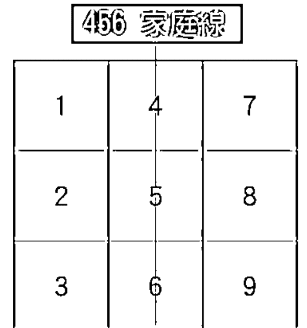

456 三個數字涵義的連結，成為人類正面的婚姻觀念。

## 數字 4-- 情感的承諾

4 是一個不能改變的、共同締結的、有方向有規律有條文的口頭承諾與實際契約，它要求的是穩定的關係，幾近道義般的夫妻關係，夫妻應該將彼此間的關係升等成為父母兄弟姐妹這樣不可叛離，無法解約的自然關係，那麼愛情長存、道義常在，即使沒有了愛，道義仍在情愛復燃，它要有並非兒戲的敬業與相當審慎的態度。

## 數字 5-- 充滿趣味的戀愛歷程

5 是人類的心臟，它是鮮活的自由心證，也是我們存在的當下，擁有全然融入的覺知能力，講究有意識的共同參與、投入、寬容和經營，簡言之，那是一種不因為締結婚姻而持續一生的經營交往，樂在玩愛，比前項審慎的態度還具有更為深入的境界，通常人性在結了婚以後會產生根本上的質變，以為有了一紙婚約就算有了一生保障，從此王子和公主過著快樂無憂的生活，那是極端無知的觀念，我們得糾正它，讓它進入另一個歷程，必須具有冒險犯難，遊戲般競賽式的心情，玩得好有獎品，玩得不佳也要有罰則，就這麼一路玩下去，不黑不玩。

## 數字 6-- 情感持久的耐力與豐收

6 是愛與長久的承諾，它是責無旁貸的、長遠的耐力，它可以在經過長期的經營過後，長出一樹堅忍又奪目的梅花，那是需要承受許多重量和準備長期肩負的遠征行為，它站出來舉起球棒時，姿勢不會是準備短打而是預備著擊出一支長打，當一切都準備就緒，就這麼蹲著等著扛著耐著，將心比心地想著對方也是這樣如此守候，它得靠時間來涵養一切必經的路程，就像女性懷孕時，無論如何，在這十個月裡總得抱著一顆球那般，孕育、珍惜著妳們愛的結晶。

以上大致講解了 456 涵義，將這三個意念綜合連結起來，再簡單地說，一份審慎的契約行為 4，經過兩性的參與經營 5，才可以自覺責任而行之久遠 6，現在終於明白如果某人缺了 5 和 8 二個號碼，這兩個缺少的號碼則為某人的擇偶的對象，最好對方擁有某人缺少的號碼，某人也擁有對方缺少的號碼，那麼合拍的機率大增，雙方立即可以在對方身上看到不同的特質，也可以彌補彼此特質上的能量不足。

以上並非命理言論，我不是命理師，僅僅對數字心理學有多年的研究罷了。敬請賢達先進多多指正，祝福大家在一時的決定之後，能夠全然享受當下去參與，接著擁有長久的婚姻承諾，談一場永恆的愛情。

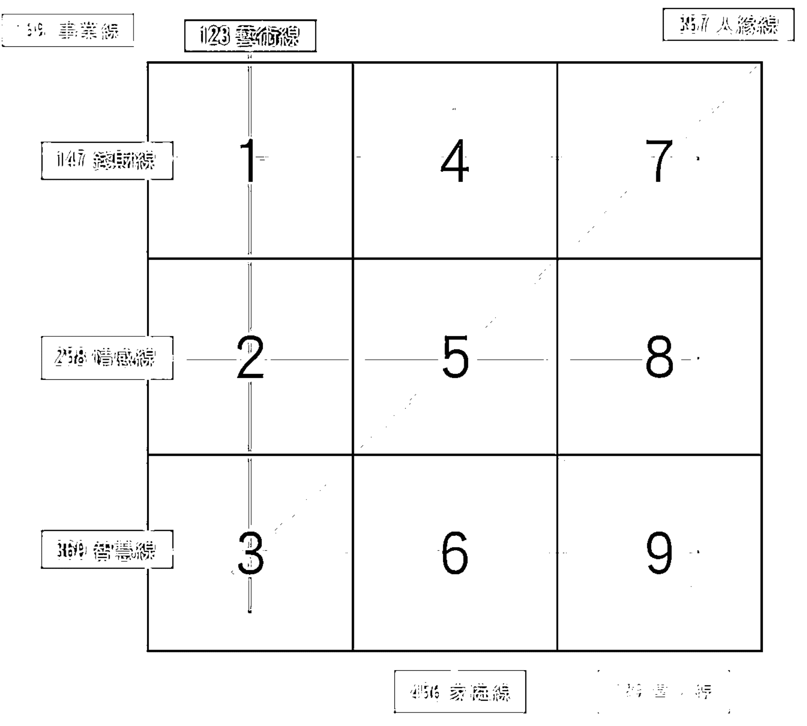

| 數的連線 | 連 線 名 稱 | 基 本 連 線 意 義 |
| :--- | :--- | :--- |
| 1－2－3 | 藝術線 （獨立、任性、理想） | 原始能量（1） 經過調和與琢磨之後（2） 創造了完美理想（3） |
| 2－5－8 | 感情線 （表達、八掛、饒舌） | 感情（2） 經過凝聚與闡釋（5） 產生了感動他人的力量（8） |
| 3－6－9 | 智慧線 （創意、想像、空想） | 理想主義的思考及創造力（3） 經過處理與個人化的調整後（6） 就能提供服務（9） |
| 1－4－7 | 錢財線 （安全、拜金、務實） | 原始能量（1） 穩定之後，經過整理（4） 就不會輕易動搖除非有具體的事實證明（7） |
| 1－5－9 | 事業線 （專業、固執、毅力） | 原始能量（1） 經過了凝聚和闡釋後（5） 能夠提供服務（9） |
| 4－5－6 | 家庭線 （秩序、組織、完美） | 安全穩定的力量（4） 在經過凝聚與闡釋後（5） 可以提供解決辦法和治療效果（6） |
| 3－5－7 | 人緣線 （小人多、表達、爭寵、銷售、好名） | 理想（3） 在經過凝聚和闡釋後（5） 可能可以找到真相（7） |
| 7－8－9 | 貴人線 （權力、靈性、服務） | 事實真相（7） 在經過整理包裝和市場行銷後（8） 能夠提供服務（9） |

| 數的連線 | 連 線 名 稱 | 基 本 連 線 意 義 |
| :--- | :--- | :--- |
| 1－2－3 | 藝術線 （獨立、任性、理想） | 原始能量（1） 經過調和與琢磨之後（2） 創造了完美理想（3） |
| 2－5－8 | 感情線 （表達、八掛、饒舌） | 感情（2） 經過凝聚與闡釋（5） 產生了感動他人的力量（8） |
| 3－6－9 | 智慧線 （創意、想像、空想） | 理想主義的思考及創造力（3） 經過處理與個人化的調整後（6） 就能提供服務（9） |
| 1－4－7 | 錢財線 （安全、拜金、務實） | 原始能量（1） 穩定之後，經過整理（4） 就不會輕易動搖除非有具體的事實證明（7） |
| 1－5－9 | 事業線 （專業、固執、毅力） | 原始能量（1） 經過了凝聚和闡釋後（5） 能夠提供服務（9） |
| 4－5－6 | 家庭線 （秩序、組織、完美） | 安全穩定的力量（4） 在經過凝聚與闡釋後（5） 可以提供解決辦法和治療效果（6） |
| 3－5－7 | 人緣線 （小人多、表達、爭寵、銷售、好名） | 理想（3） 在經過凝聚和闡釋後（5） 可能可以找到真相（7） |
| 7－8－9 | 貴人線 （權力、靈性、服務） | 事實真相（7） 在經過整理包裝和市場行銷後（8） 能夠提供服務（9） |

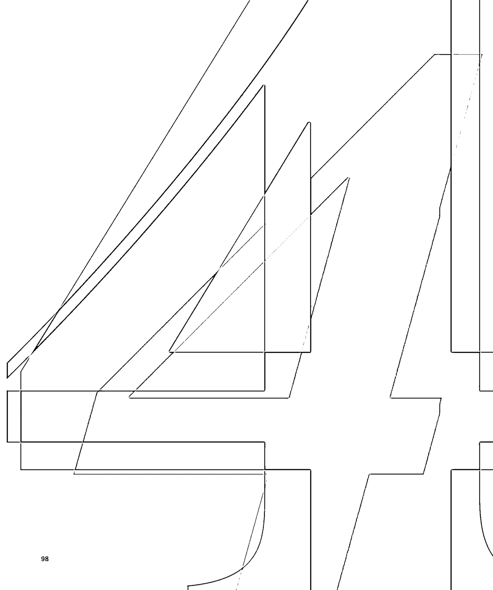

## 你的命定戀人藏在生命數字裡

人與人的關係有時無法用具體的詞彙和原因形容，
抽象的緣分令人難以捉摸，
情感關係容易使我們經常陷入非理性的思索。
到底什麼樣的人適合我？
什麼樣的人會是我的命定之人？
與不同類型的人相處溝通，又該注意什麼樣的事情呢？
這些秘密，數字都會告訴你—

## CHAPTER

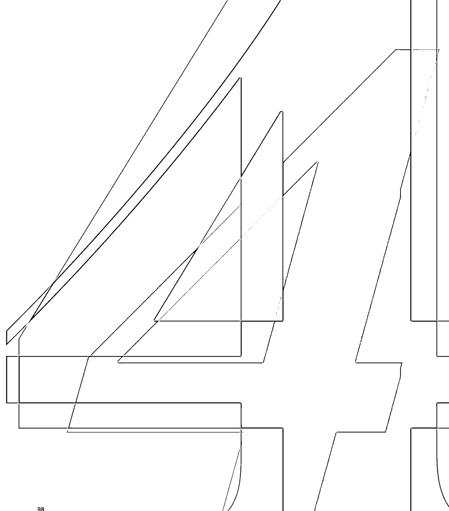

## 你的命定戀人藏在生命數字裡

人與人的關係有時無法用具體的詞彙和原因形容，
抽象的緣分令人難以捉摸，
情感關係容易使我們經常陷入非理性的思索。
到底什麼樣的人適合我？
什麼樣的人會是我的命定之人？
與不同類型的人相處溝通，又該注意什麼樣的事情呢？
這些秘密，數字都會告訴你—

## CHAPTER

## 眾裡尋他，愛情裡的另一半
---- 命定戀人 V.S 完美戀人

我們常聽到金無足赤，人無完美這句話，了解生命數字的意義後，各個能量和性格展現，有優點和缺點，再次印證此道理。人性如何成就完美，其實並不是要求彼此的零缺點，而是在於從彼此的不完美裡通過溝通、磨合，相互包容與理解的過程。

常常在交往或與人相處時，我們會發現對方與自己相似的地方，例如價值觀、習慣、興趣嗜好等等，屬於兩人的共鳴。出現彼此想法和作為完全不同的地方，甚至與自己格格不入，則稱之為互補。在生命數字的能量上，能夠透過畫出兩人的生命圖譜，看出你們能量上共鳴和互補的地方。談戀愛或感情，必看的基本互補又是什麼呢？如何透過生命數字看兩人關係呢？這一章向你娓娓道來。

## 我們合不合？
是契合的戀人還是互補的伴侶？
--- 找出你與他的愛情適性
兩人愛情合盤解析

在空白紙上畫出九宮格，列出兩人生命方程式，依據上一章的生命圖譜教學，把兩個人的數字陣列圖畫出來，接著排在一起看。若你們圈起的數字有相同的，圈數越多代表你們該能量越強、特質相近，意即共鳴性越強；相反地，如果其中一方有空缺數，另一方擁有的話，則是互補。

進入感情或婚姻以前，評估基礎的互補關鍵環節是很重要的。與愛情主題有關的兩個數即是 5 和 8。世間男男女女在感情中，婚姻最怕選錯，交往最怕蹉跎。如果有了心儀的對象，交往前可以注意彼此能量的基礎互補性，若其中一人缺少 5 或 8 的數字，對方的數字圖譜必需有圈，來完成彼此的空缺能量。過了基本的互補條件，就可以深入考慮交往與婚姻的事情了。

## 眾裡尋他，愛情裡的另一半
---- 命定戀人 V.S 完美戀人

我們常聽到金無足赤，人無完美這句話，了解生命數字的意義後，各個能量和性格展現，有優點和缺點，再次印證此道理。人性如何成就完美，其實並不是要求彼此的零缺點，而是在於從彼此的不完美裡通過溝通、磨合，相互包容與理解的過程。

常常在交往或與人相處時，我們會發現對方與自己相似的地方，例如價值觀、習慣、興趣嗜好等等，屬於兩人的共鳴。出現彼此想法和作為完全不同的地方，甚至與自己格格不入，則稱之為互補。在生命數字的能量上，能夠透過畫出兩人的生命圖譜，看出你們能量上共鳴和互補的地方。談戀愛或感情，必看的基本互補又是什麼呢？如何透過生命數字看兩人關係呢？這一章向你娓娓道來。

## 我們合不合？
是契合的戀人還是互補的伴侶？
--- 找出你與他的愛情適性
兩人愛情合盤解析

在空白紙上畫出九宮格，列出兩人生命方程式，依據上一章的生命圖譜教學，把兩個人的數字陣列圖畫出來，接著排在一起看。若你們圈起的數字有相同的，圈數越多代表你們該能量越強、特質相近，意即共鳴性越強；相反地，如果其中一方有空缺數，另一方擁有的話，則是互補。

進入感情或婚姻以前，評估基礎的互補關鍵環節是很重要的。與愛情主題有關的兩個數即是 5 和 8。世間男男女女在感情中，婚姻最怕選錯，交往最怕蹉跎。如果有了心儀的對象，交往前可以注意彼此能量的基礎互補性，若其中一人缺少 5 或 8 的數字，對方的數字圖譜必需有圈，來完成彼此的空缺能量。過了基本的互補條件，就可以深入考慮交往與婚姻的事情了。

我們以一對夫妻的生命方程式來製作生命圖譜，
試著再練習一次。（別忘了數字是一個一個加起來喲！）

女方：
1976 年 10 月 31 日
摩羯座（8）
出生日期相加後為 1 號人

> 女方：1976 10 31=28=10=1
日期加到個位數總和 3+1=4
星座：天蠍 =8

> 男方：1968 07 27=40=4
日期加到個位數總和 2+7=9
星座：獅子 =5

男方：
1968 年 7 月 27 日
獅子座（5）
出生日期相加後為 4 號人

從上二張生命圖譜可以看出，這對夫妻擁有某些相似之處的共鳴能量，也擁有彼此所欠缺的能量，女方 3 號能量彌補了男方，男方 5 號能量彌補了女方。那麼，這對夫妻的關鍵互補分數過關。但這也只是一個基礎分數而已，共同經營婚姻仍然不止於此。女方的 1 號能量太強，自我主觀意識強烈，必須小心互爭主導權。

我們以一對夫妻的生命方程式來製作生命圖譜，
試著再練習一次。（別忘了數字是一個一個加起來喲！）

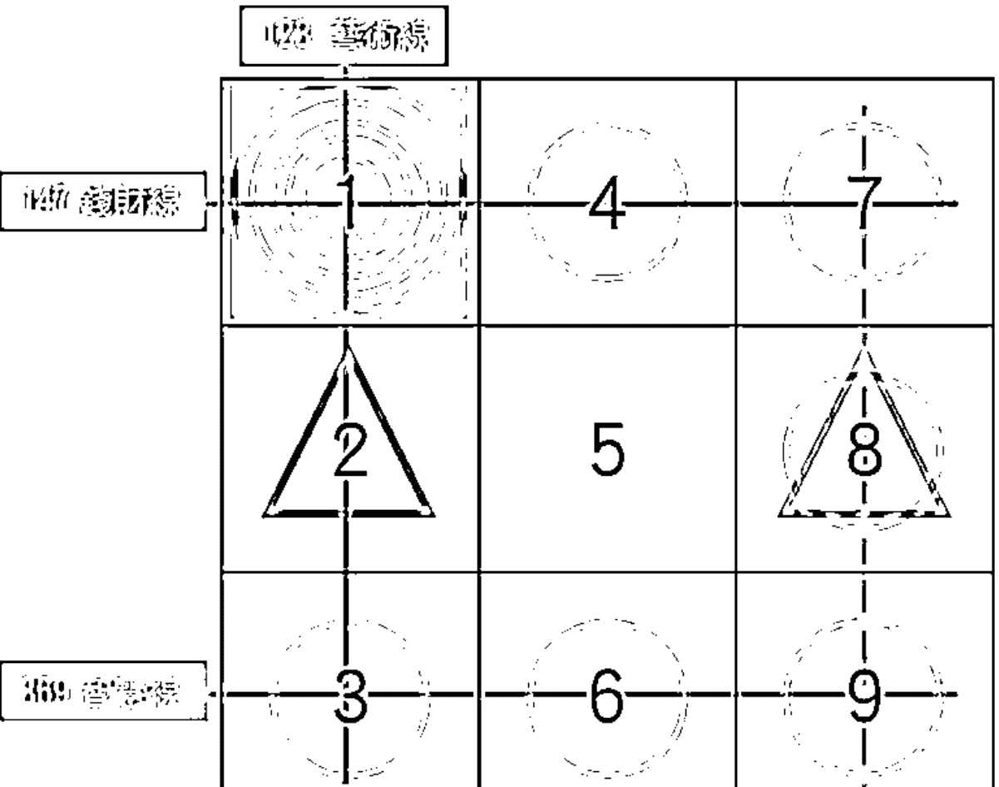

女方：
1976 年 10 月 31 日
摩羯座（8）
出生日期相加後為 1 號人

> 女方：1976 10 31=28=10=1
日期加到個位數總和 3+1=4
星座：天蠍 =8

> 男方：1968 07 27=40=4
日期加到個位數總和 2+7=9
星座：獅子 =5

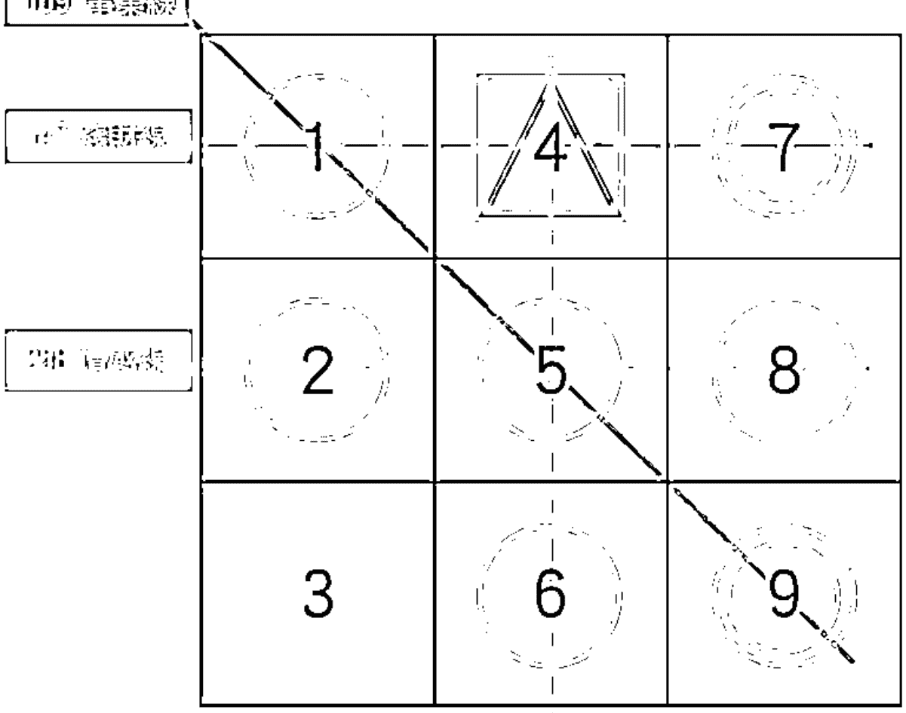

男方：
1968 年 7 月 27 日
獅子座（5）
出生日期相加後為 4 號人

從上二張生命圖譜可以看出，這對夫妻擁有某些相似之處的共鳴能量，也擁有彼此所欠缺的能量，女方 3 號能量彌補了男方，男方 5 號能量彌補了女方。那麼，這對夫妻的關鍵互補分數過關。但這也只是一個基礎分數而已，共同經營婚姻仍然不止於此。女方的 1 號能量太強，自我主觀意識強烈，必須小心互爭主導權。

## 2 命定之人，你與我的關係：教你用圖譜看雙人的感情關係

人與人的關係很微妙，有時無法用具體的詞彙和原因形容，那種抽象的感覺被稱為「緣」，緣分的構成從生命數字的角度看來，是由兩人的數字能量碰撞、磨擦出新火花而來的。特別是戀愛關係最讓人捉摸不透，為何熱戀時說彼此是天生一對，遇到波折和傷害時又說是孽緣冤家？感情使我們經常陷入非理性的思索，在情緒中難以自拔，在情愛的漩渦中載浮載沉，不禁想像著到底什麼樣的人，才會是我的命定之人呢？哪種類型與我可以說是天生絕配呢？

曾有西藏高僧說過，重新定位你的人際關係，可以賦予生命新的意義。透過簡單的方式，看兩人的人際關係和情路方向，能夠幫助我們列出關係中的優缺點、相處需要注意的事項，藉此作為彼此接觸變得親近的最佳輔佐。

-   • 數字能量因人而異

人際關係和感情發展，其中的數字能量受到時間、空間、實際相處的影響，有正向和負向的發展。在人類社會的生活裡，我們無法避免和人接觸，朋友得交、戀愛得談，面對這些人際議題時，利用心靈關係的計算，可以協助我們找到合適的應對之策，也更可以了解自己在兩人裡面扮演怎樣的角色。這層經過研判的關係定義，永遠不會改變，因此需要依照這種關係來定位彼此的角色，看看兩數如何融合，以及融合後產生的變數與數位的意義。

下面給大家一個方向當作參考，找到彼此的關係，從中調整學習，改善相處之道。沒有人天生百分之百合的來，唯有互相補足優缺點和改善，人際與愛情才有機會變得和諧得宜。愛情除了緣分的先天因素外，後天持續性的謀合和努力經營，是與對象相處時最重要的一塊。

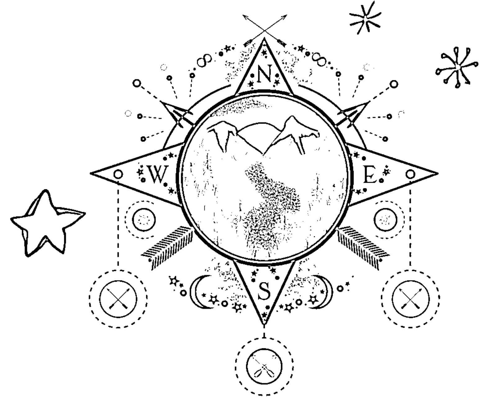

## 命定之人，你與我的關係：教你用圖譜看雙人的感情關係

人與人的關係很微妙，有時無法用具體的詞彙和原因形容，那種抽象的感覺被稱為「緣」，緣分的構成從生命數字的角度看來，是由兩人的數字能量碰撞、磨擦出新火花而來的。特別是戀愛關係最讓人捉摸不透，為何熱戀時說彼此是天生一對，遇到波折和傷害時又說是孽緣冤家？感情使我們經常陷入非理性的思索，在情緒中難以自拔，在情愛的漩渦中載浮載沉，不禁想像著到底什麼樣的人，才會是我的命定之人呢？哪種類型與我可以說是天生絕配呢？

曾有西藏高僧說過，重新定位你的人際關係，可以賦予生命新的意義。透過簡單的方式，看兩人的人際關係和情路方向，能夠幫助我們列出關係中的優缺點、相處需要注意的事項，藉此作為彼此接觸變得親近的最佳輔佐。

-   • 數字能量因人而異

人際關係和感情發展，其中的數字能量受到時間、空間、實際相處的影響，有正向和負向的發展。在人類社會的生活裡，我們無法避免和人接觸，朋友得交、戀愛得談，面對這些人際議題時，利用心靈關係的計算，可以協助我們找到合適的應對之策，也更可以了解自己在兩人裡面扮演怎樣的角色。這層經過研判的關係定義，永遠不會改變，因此需要依照這種關係來定位彼此的角色，看看兩數如何融合，以及融合後產生的變數與數位的意義。

下面給大家一個方向當作參考，找到彼此的關係，從中調整學習，改善相處之道。沒有人天生百分之百合的來，唯有互相補足優缺點和改善，人際與愛情才有機會變得和諧得宜。愛情除了緣分的先天因素外，後天持續性的謀合和努力經營，是與對象相處時最重要的一塊。

## □ 算出你我的心靈投契度

計算關係的方式很簡單，首先列出你的生命方程式，加總至個位數後，得到你是幾號人的數字，接著用一樣的方式算出對方是幾號人。將兩人各自的數字相加到個位數後，經過關係的計算後，可以推演出兩人的心靈關係和情路大方向！所有關係沒有好壞分別，只論是否接受和正面發展哦！

> 計算範例：
男 1964 年 10 月 12 日的人 =1964/10/12=24=6 號人
女 1968 年 06 月 15 日的人 =1968/06/15=36=9 號人

6 號人 + 9 號人 =15=6，6 即是兩人關係的數字能量，
參考右表可以找到人際與愛情的大方向。

| 兩人的人際關係 | 恆愛契合度 |
| :--- | :--- |
| 1 父母、長官 被自己照顧的人 | 1 一拍即合 獨立自主 |
| 2 情人、兄弟 有默契、可互相溝通的人 | 2 親密愛人 相互依賴 |
| 3 朋友、提供資訊 可以互相補足缺失的人 | 3 談情說愛 感性多變 |
| 4 同事、同好 有共同目標的人 | 4 宿世姻緣 安穩平淡 |
| 5 生命中的旅伴、路人 共同分享的人 | 5 無拘無束 各自為政 |
| 6 家人、親戚 有長遠關係的人 | 6 刻骨銘心 情意綿綿 |
| 7 同修同業 一起探討問題的對象 | 7 心靈契合 身心合一 |
| 8 敵人、競爭對手 能共同成長的人 | 8 愛人夥伴 共同成長 |
| 9 大自然、神明 能夠心靈、靈魂交流的人 | 9 激情邂逅 相互奉獻 |

## □ 算出你我的心靈投契度

計算關係的方式很簡單，首先列出你的生命方程式，加總至個位數後，得到你是幾號人的數字，接著用一樣的方式算出對方是幾號人。將兩人各自的數字相加到個位數後，經過關係的計算後，可以推演出兩人的心靈關係和情路大方向！所有關係沒有好壞分別，只論是否接受和正面發展哦！

> 計算範例：
男 1964 年 10 月 12 日的人 =1964/10/12=24=6 號人
女 1968 年 06 月 15 日的人 =1968/06/15=36=9 號人

6 號人 + 9 號人 =15=6，6 即是兩人關係的數字能量，
參考右表可以找到人際與愛情的大方向。

| 兩人的人際關係 | 恋愛契合度 |
| :--- | :--- |
| 1 父母、長官 被自己照顧的人 | 1 一拍即合 獨立自主 |
| 2 情人、兄弟 有默契、可互相溝通的人 | 2 親密愛人 相互依賴 |
| 3 朋友、提供資訊 可以互相補足缺失的人 | 3 談情說愛 感性多變 |
| 4 同事、同好 有共同目標的人 | 4 宿世姻緣 安穩平淡 |
| 5 生命中的旅伴、路人 共同分享的人 | 5 無拘無束 各自為政 |
| 6 家人、親戚 有長遠關係的人 | 6 刻骨銘心 情意綿綿 |
| 7 同修同業 一起探討問題的對象 | 7 心靈契合 身心合一 |
| 8 敵人、競爭對手 能共同成長的人 | 8 愛人夥伴 共同成長 |
| 9 大自然、神明 能夠心靈、靈魂交流的人 | 9 激情邂逅 相互奉獻 |

## □ 數字愛戀能量涵義

### 1 父母、長官的關係

這種關係融合得很快，非合即分，要就要，不要就不要，很快就可以得到結果。有話說一山不容二虎，除非一公一母，兩人的關係若是 1 數，就需要達成一致性的協議，否則只能有一個存在。若雙方爭起主導權，變成負面的發展，會變成鬥爭的關係，像是與長官、父母頂嘴吵架般，鬥爭不息。

如果經過計算發現和對方的關係是 1 數，想知道彼此的結果會如何，請不要猶豫！趕快交往看看，很快地就能得到結論知道適不適合，不會浪費時間。在未來相處上，彼此都需要認清一件事，如果其中一方說得有理，另一方就得乖乖聽話，反之亦然。

### 2 情人、兄弟的關係

這是雙方看起來比較和善、親近的關係，遇到事情有話好商量。當兩人感覺對了，在正面方向看來，發展應該能夠彼此接近，共同合作，或是相互請益的關係。雖然這樣的關係似乎很好，卻來得比較慢，換言之不要著急反而是好的。

若變成負面發展，便是你冷我也冷，等你熱了我再跟著熱，你待我如何我亦如是，變成比較被動的關係。若說鬥爭是不好的兩人關係，那麼冷漠則是最大的暴力。當兩人遇到意見不合時，雙方相互冷眼以待，關係會趨向危險和背叛。建議你們，在這種平等的關係裡面，應該建立在主動善待對方的基礎上，而非被動地以評估對方的作為來當應對之策。

### 3 聊天、朋友的關係

3 數是聊天相處的關係，這樣的關係不好嗎？未必如此。在網路和社會中，因應現代人的孤獨與寂寞，聊天、陪伴成了一種新興類型的產業，有時候人們想找到一個可以好好說話的人，相互陪伴說笑的人，變成一件困難的事情。3 數的關係，便是比較輕鬆愉快的聊天關係，能夠有一個好好說話的人陪伴，是一件很重要的事情。

只是這種關係需要注意，言多必失，有時禍從口出，打打鬧鬧、分分合合在所難免，關係中存在許多變數，需要多加注意，專心以待，否則迎接而來的結果，不是驚喜就是驚訝。

### 4 同事同好、鄰居的關係

有些人我們經常在生活中見到面，在關係上未必有強勁的高潮起伏，相比之下比較平淡長久，火花雖然不多也不特別，卻總能帶來一種平靜的力量，有時甚至會令人感到有些無趣，屬於較穩當牢靠的關係。

而我們在省思自己的交友狀況時，常常出現一種類型的朋友。儘管他們在人群中不太起眼，在最關鍵或是需要幫忙的時刻，他們會出席或是幫助你，遇到麻煩也兩三下就為你解決了，有這樣的朋友或是關係，請務必好好珍惜這種安定與穩當的可貴。注意在關係上，講話算話、重視承諾是非常必要的，若能保持這個原則，你們可以維持長久穩定的關係。

### 5 人生旅伴、路人或是事業的關係

十年修得同船渡，百年修得共枕眠，這類的關係，是我們一生中人數最多的，有時候在人生旅途的風景線上，偶遇的路人、倉促的過客，在飛機上隔壁的乘客等等，茫茫人海中的巧合情況下，邂逅的對象都可算在此列。這樣的對象，有時僅是驚鴻一瞥的瞬間，或許愛就這樣發生了，如果能夠用心的觀察所謂的陌生人，機會或許就夾藏其中，因為所有關係的變化都是由陌生變熟悉的。

### 6 家人與親戚的關係

這是除了 2 數關係外，最容易在初次見面產生似曾認識，有溫馨和親切感的關係。你或他會莫名地想照顧對方，也會注意彼此一舉一動的變化。為所有動作言語的細節，牽動視線與心弦，發展到後來會成為如親人般難以割捨的關係，付出一生從此無怨無悔。

在面對情不自禁想關懷對方，付出關愛的關係中，捨不得放不下的心，有時太過度容易累人，或者令人感覺有壓力、有束縛感。在這樣的關係裡面需要注意，愛一個人，若需要給自己或對方戴上手銬腳鐐般，過度沉重的愛會變成束縛，令人感到很有壓力和重量，因此調適付出後的喜悅，不過度期待回饋是很重要的。

### 7 同修同業的關係

我曾在教學時問過學生，在生命中想尋找到什麼樣的人？其中最令我印象深刻的回答是「能夠在思想上領導我的人」，這說法聽起來，像是渴望找到能夠成為老師的人過一輩子。這樣的關係有時經常有突發狀況產生，或是被有所安排，毫無懸念且無法掙扎的關係。像學生時期學校突然來了新老師任教的感覺，你只能選擇接受或排斥，難以抗拒抗命。

7 數的關係重點在於被安排好的相遇，能夠為我們的生命中帶來怎樣的啟發。重視精神層面的擇偶、戀愛觀，便非常適合此類關係，可以透過相處中的學習，克服種種難關，不斷卓越進步，探究問題使內在持續成長。

### 8 敵人、競爭對手的關係

人生在世，不管在學生時期或是進入職場，除了老師、長官外，同儕同事幾乎都是你的對手。我們在社會中不斷進行無聲的競爭，聰明人騙傻子的事情無可奈何，但又最為現實。

這種關係需要注意彼此的優勢與不足，若能共謀發展，必可切磋出相應的成長，屬正面的發展，達到兩方雙贏的局面。若朝著負面方向發展，則容易爭得你死我活，爾虞我詐。面對 8 數關係時，需要將對方視為可敬的對手，彼此尊敬，避免惡性競爭。有時生活中總會出現莫名其妙，要對你進行管教的人，類似的事情不勝枚舉，但如果懂得尊重、尊敬他，是能夠從中獲得有益的建言和想法，成為精進的養分。

### 9 大自然與神明的關係

精神崇拜是一種難以言喻的關係，靈魂在世間需要寄託，在面對苦痛與困境時，便可以從中獲得強大的力量去支撐自己。9 數的關係與精神有密切的關聯，屬於精神彼此交流的對象，透過與對方的相處，可以擁有安心感，並得到莫大的安慰和療癒，即便只是默默看著他，也可以從中獲得類似力量。

但這樣的關係來得快去得也快，愛到熱烈處如飛蛾撲火，冷到深谷又像急流勇退，慢慢進入無我無私的境界，彼此需要學習互相奉獻，是給予 9 數關係的建議。

## □ 數字愛戀能量涵義

### 一拍即合-獨立自主

這是一個誰說的對，誰就當老大的關係。但是到底如何分別誰對誰錯？就得看當時聽誰的想法比較好。大家都不喜歡多頭馬車，各自為政的組織，兩人關係也是像是一個組織，愛情相處上不要老是檢討成敗、互別苗頭，這會使你們無法同心協力，懂得彼此合作與陪伴，能幫助你們的感情更加溫。

### 親密愛人 相互依賴

這個關係是相當令人嚮往的愛情關係，彼此都樂於體貼對方，給予陪伴和照顧，但這是一個特別容易反射雙方感受的關係，容易因感情濃烈使雙方成為彼此的鏡子，投射出對方的模樣，要注意別因此變得容易小心眼。一旦感情缺少了包容的大度，開始變得疏離的時候，便容易去計算、衡量對方為自己付出多少，再予以等價的回報，這樣的相處關係容易在不好的發展下成為對立，走向分道揚鑣、愛恨入骨的結局。

### 談情說愛 感性多變

這是最適合談情說愛的數字關係，有人可能會覺得，總是一天到晚談情說愛有什麼好，誰說不可以呢？這邊說的談情說愛，可不是指情場高手的甜言蜜語。戀愛時經常會遇到需要溝通的狀況，這可是需要有好情緒才能順利進行下去的，談戀愛不像談公事，要投入感情，不能過度理性，保持趣味、童心，互相分享新鮮事，能夠幫助你們的兩人世界更加擴大，穩固感情的親密，讓相處的甜蜜更加分。

### 宿世姻緣 安心平淡

這是最適合成家的關係，雖然感情沒有跌宕起伏的激情，比較平淡卻很務實。感情發展到最後都將昇華為家人之愛，一開始就已經培養這樣的相處模式，雙方走向紅毯另一端的機率大大提升，畢竟家庭的組成需要感情細水長流才能過日子嘛！只是要注意，平穩雖好，卻別太過一成不變，久了會顯得沉悶無趣，無趣的存在可能會成為破壞感情的因素。千萬別仗著對方不會離開的心態，就讓習慣成自然，太過平板的「習慣」經年累月下來，如同每天都吃一樣的食物般，容易厭倦，或無趣地令人窒息。

### 無拘無束 各自為政

這個關係數是我最為欣賞的，雙方給予彼此充分的自由，互不管束，保有兩人適度的空間。因為在感情上，每個人都需要一些空間，太過箝制控管對方的自由，是會讓感情早夭的。千萬不要好像遇到天菜，就恨不得天天黏在一起，起初或許濃情蜜意，但時間一久會發現要做許多事時，會受到限制，什麼事都要報備，什麼地方都去不了，這樣可是很恐怖的。任何感情關係，尺度的平衡與拿捏都很重要。儘管這個數字關係沒有這樣的問題，卻也要注意別因彼此太過自由而忽略對方，別讓原先保有自由的優點，成為兩人逐漸成為生命過客的分歧點。

### 刻骨銘心 情意綿綿

這個關係數是最為長遠的，若沒碰上則已，一碰上就是一場愛情的耐力賽，像是馬拉松般需要時間和考驗，才能完成一段圓滿的里程碑。用忍讓的愛去經營彼此，容易使你們的愛情關係獲得豐收，否則這個不易切斷的關係，若被抱怨充滿，會造成雙方都很痛苦，最忌諱百般要求，也別抱著愛之深責之切的心，老是對愛人絮絮叨叨，相互關愛和照顧，才能使這段長遠的關係像好酒，越陳越香，韻味難忘。

## 愛人夥伴 共同成長

這是大家最嚮往的靈魂伴侶關係，這個數字關係的愛情，容易在經常交心與互動後，達到心意相通與默契十足的境地，但切記不需要一個勁地故意要神秘，讓人捉摸不透，這會形成心靈交流的阻礙。另外這個數是喜歡獨處的，可是如果掌握不好獨處與陪伴的平衡，長期下去早晚會讓關係相敬如「冰」，成為彼此的身心顧問，理性中帶著感性的去相處，是最為理想的戀愛建議。

## 心靈契合 身心合一

這個關係可以將對方當作人生夥伴或是戰友，當你們能夠共同追求人生最大的價值，像是一起研究理財、投資；一起投入興趣愛好，都將使你們豐富彼此的生命，但切記在這樣的關係中，不要玩謀對謀的遊戲，如果對事情有所隱匿，或是藏匿情緒不好好溝通表達的話，這段愛情可能會讓你賠了夫人又折兵，到最後彼此怨懟，相互責怪到老。

## 激情邂逅 相互奉獻

一開始這個數字的戀愛關係，會像剛升起的熊熊烈火，在炙熱的溫度中充滿戲劇化的色彩。談戀愛是很需要想像力的，這個關係非常具備此特性，不過當絢爛的幻想過了以後，總會歸於平靜的狀態。大家經常嚮往天長地久的愛情，需要很高的心靈智慧，而9就代表著這樣心靈修行的關係，追求著彼此的心靈成長，儘管現實的考驗很多，過程有時候讓人感到折磨，也記得別被折磨的痛苦所限制住，用宗教情懷般的愛心，無怨無悔地去幫助對方，這麼做了即使遇到相處上的磨擦，對方哪裡還好意思去折騰你？掌握這個相處之道，必定能夠成為一對心靈相互成長，追求內在精神卓越的神仙眷侶。

數字的奧義是上天的贈禮，充滿玄妙的色彩，感情像王菲唱的《我願意》，唱出「思念是一種很玄的東西，如影隨形。」的道理，情感上最浪漫的一種，莫過於思念，有了真摯的感情才會產生思念。在大家被問到「你願意嗎？」，希望你們都能由衷回答我願意，打自內心的肯定眼前的人，你們的感情便是正緣了。在這世間上，沒有完全理解對方的伴侶，只有願不願意理解和懂得對方的人，其中的關鍵在於愛存在與否的差異。

## 愛人夥伴 共同成長

這是大家最嚮往的靈魂伴侶關係，這個數字關係的愛情，容易在經常交心與互動後，達到心意相通與默契十足的境地，但切記不需要一個勁地故意要神秘，讓人捉摸不透，這會形成心靈交流的阻礙。另外這個數是喜歡獨處的，可是如果掌握不好獨處與陪伴的平衡，長期下去早晚會讓關係相敬如「冰」，成為彼此的身心顧問，理性中帶著感性的去相處，是最為理想的戀愛建議。

## 心靈契合 身心合一

這個關係可以將對方當作人生夥伴或是戰友，當你們能夠共同追求人生最大的價值，像是一起研究理財、投資；一起投入興趣愛好，都將使你們豐富彼此的生命，但切記在這樣的關係中，不要玩謀對謀的遊戲，如果對事情有所隱匿，或是藏匿情緒不好好溝通表達的話，這段愛情可能會讓你賠了夫人又折兵，到最後彼此怨懟，相互責怪到老。

## 激情邂逅 相互奉獻

一開始這個數字的戀愛關係，會像剛升起的熊熊烈火，在炙熱的溫度中充滿戲劇化的色彩。談戀愛是很需要想像力的，這個關係非常具備此特性，不過當絢爛的幻想過了以後，總會歸於平靜的狀態。大家經常嚮往天長地久的愛情，需要很高的心靈智慧，而9就代表著這樣心靈修行的關係，追求著彼此的心靈成長，儘管現實的考驗很多，過程有時候讓人感到折磨，也記得別被折磨的痛苦所限制住，用宗教情懷般的愛心，無怨無悔地去幫助對方，這麼做了即使遇到相處上的磨擦，對方哪裡還好意思去折騰你？掌握這個相處之道，必定能夠成為一對心靈相互成長，追求內在精神卓越的神仙眷侶。

數字的奧義是上天的贈禮，充滿玄妙的色彩，感情像王菲唱的《我願意》，唱出「思念是一種很玄的東西，如影隨形。」的道理，情感上最浪漫的一種，莫過於思念，有了真摯的感情才會產生思念。在大家被問到「你願意嗎？」，希望你們都能由衷回答我願意，打自內心的肯定眼前的人，你們的感情便是正緣了。在這世間上，沒有完全理解對方的伴侶，只有願不願意理解和懂得對方的人，其中的關鍵在於愛存在與否的差異。

## 如何擄獲她 / 他的心？
9 數人的溝通技巧與愛情建議

- 尋找契合的另一半

愛情是最難修的學分，人與人關係的疏離遠近，除了依靠兩人間的緣分之外，決定兩人是否步向紅毯或者鍾愛一生、亦或終究漸行漸遠的關鍵，需要依靠相愛的默契與溝通。他 / 她是你生命中失落的一角嗎？你與他 / 她契合嗎？這將成為墜入愛河第一步。所謂的「契合」，當然包括個性、思想、興趣以及未來的規劃是否一致。

隨著環境快速驟變，戀愛的節奏也跟著加快，第一眼戀情、閃婚等等名詞提示著人們有多孤單，著急地找尋可以互相取暖的另一半，卻因為「戀愛過程」被縮短了，跨越了某些步驟，忽略了心與心的距離，終將成為戀情宣告失敗的原因。而生命數字裡愛情的關係學，其實就是希望讓想愛的人掌握機會去愛，找到對的人並用「對的方式」相愛。

9 數人有著極其獨特尋覓完美愛情的執著點，善用生命數字的人格特質，啟動心跳的節奏，開始一場美好的戀曲。

你是幾號人？ 你的他 / 她是幾號人？
拿出紙筆演算，找出兩人戀愛關係與戀愛契合度

1+9+9+6+5+1+3=34=3+4=7

## 適合 9 數人的伴侶

| 數人 | 伴侶 |
|---|---|
| 1 數人 | 志同道合的伴侶 |
| 2 數人 | 貼心溫暖的伴侶 |
| 3 數人 | 幽默浪漫的伴侶 |
| 4 數人 | 穩定務實的伴侶 |
| 5 數人 | 享樂品味的伴侶 |
| 6 數人 | 呵護倍至的伴侶 |
| 7 數人 | 心靈投契的伴侶 |
| 8 數人 | 才華出眾的伴侶 |
| 9 數人 | 熱情奉獻的伴侶 |

## 1 喜好控制與支配的愛情強者

1 數人有獨立自主的精神，頗具個人主見，儘管有時候仍會對自己感到沒自信，但在說話與表達時依然可以振振有辭，氣勢十足。1 數人重視面子，感情愛恨分明，凡事習慣親力親為，不喜歡依賴他人，相反地也不喜歡被人依賴。看人經常先入為主或憑藉第一印象判斷。做事風格不拖泥帶水，爽快果斷，喜歡帶頭發號施令，與他們溝通時保持謙和的態度，盡量避免命令式口吻說話或是數落，這會踩到他們的地雷。

- 支配與控制是安全感的來源

他們在愛情中屬於控制和支配的類型，由於天賦性格的部分有比較高的脅迫性和支配傾向，無論是在感情中或是工作上，經常都希望自己可以被視為王者的感覺，希望能夠被對方全心全意地對待和關注。

認真開闢人生與事業的他們，有時候會將愛情視作忙碌之餘的調味。如果生活和事業的開展讓他們充實的忙不過來，愛情對他們來講並不是那麼強烈的需求和心靈的必要。也許就是因為如此，要聽到他們從口中說出我愛你是有些難度的，但是當他們愛上一個人時，猛烈炙熱的激情會讓人難以忘懷，即使要當眾下跪求愛才能得到對方的芳心，也能自帶霸氣控制全場氛圍，告訴大家「你是我的人」，向外宣示愛的主權和情意。

有人說男追女隔層山，女追男隔層紗，如果遇到對你有好感的 1 數人女性，其實她們很少需要等到你發動各種攻勢追求，只要她願意愛你，你也喜歡她時，只要不過度羞澀曖昧，在對的時間點，適度配合表態就可以了！

> ### 愛情秘笈 Love Tips

**培養戀愛耐力與持久力**

由於 1 數人的性格特色，對愛情常常有燒得快，熄得也快的情形，因此弄清楚自己是因為孤單而愛人，還是真心喜歡對方而愛，會成為你們反反覆覆在快速燃起和滅熄的愛火中，錘鍊出感情智慧與成長的重要關鍵，也是 1 數人這生重要的愛情課題。

## 2 外柔內剛的協調高手

2 數人是矛盾且對感情敏銳的一群人，他們的態度經常讓人覺得謙讓和善，事實上對於很多事情的決策和想法，早就在心中有了確切定論，屬於較外柔內剛的類型。他們的行事作風喜歡與人合作，不偏好一人獨衝，也不喜歡成為群體裡領頭羊、發號施令的當家，表現欲相對沒那麼強。處理各類狀況時，常常可以見到他們分析力強、冷靜、注重平等的觀念。

## 善於協調的天賦本事

與他們溝通相處需要注意，做決策或有想法要執行以前，2 數人會希望被徵詢意見，在他們沒有意見或認同的情況下，善於協助的他們，會將主導權重新交與你的手裡，若他們有其他想法和意見，將他們提出的觀點做為好的建議採納、斟酌或是評估是很重要的。和 2 數人有合作或是職場的關係時，他們對互動、回饋和合理的分配是否公平也很重視。

關於愛情，2 數人依然展現配合與協調性高的特質，同時具備矛盾性。對於感情敏感的他們，喜歡細火慢燉的感情，很期盼能與伴侶互相傾聽彼此的想法，儘管腦內很有想法，他們的本性卻又靦腆害羞，即使愛情來敲門，內心欣喜到開小花，還是會因為害怕愛火激烈燃燒，徒留灰燼太悲傷，變得反覆思量猶豫不決。

## 敏感細膩的戀人

擅長配合人們的 2 數人，表面上看起來溫和，內在的心靈起伏可以說是變化萬千，堪稱小型戲劇院，情緒非常細膩豐富。羞澀的 2 數人因為表現欲相對較弱，想將表態的事情禮讓對方優先。如果遇到有主見和領導力的戀人，他們是很願意配合與協助的。

對他們而言，如果你愛我一分，我願意給你兩分；你如果對我壞一分，我就要站在原地不與你繼續走了。千萬不要因此認為 2 數人包容心不夠，重視公平性的他們追求平等的愛，希望兩人在情感上能保持舒服的平衡。

## 化被動為主動才能獲得真愛

害羞可愛的你們，在愛情裡有時比較被動，常常想將表態的機會留給對方，嘗試主動一些是很重要的哦！另外，感情經常充滿變化，有時如果只用當下的內心感受去體會愛意，情緒和想法容易不夠開闊而所囿限，用等待來應對愛的來臨也有風險，學習擇我所愛，愛我所擇，真愛一定能伴你左右！

## 浪漫隨興的愛情精靈

3 數人給人相處上感覺幽默風趣，反應靈敏，性格上比較浪漫隨興，有時會給人一種無法專注的感覺，這是因為他們的愛好彈性變化，不喜歡一成不變的生活，工作可能因自己不喜歡或認為不理想就更換，你可能會注意到他們的名片、住所經常任憑心意變換，他們的思維模式也是如此，不斷跟著腦中出現的想法、點子及靈感激發創意，屬於高度創意的人才。

## 讚美是讓她／他心門敞開的鑰匙

此外他們喜歡與美有關的事物，注重自己呈現出來的形象與外在觀感，對於時尚、流行、趨勢等相關議題非常感興趣。在溝通與相處上，他們是需要也喜愛掌聲的人群，肯定對他們而言很重要，他們喜歡被掌聲、聚焦與肯定包圍，對他們來說這是愉快的。溝通上他們大多接受讚美，批評則比較敬謝不敏。即使有時他們沒有表現出來，內心其實早就已經默默關起繼續溝通對話的大門，就算錯的是他們，對於批評的接受度還是很低，因此在溝通和說話技巧上，需要特別注意這一點。另外若你請他們協助與主持、發表或與美相關的事情，例如打理服裝妝髮的事宜，他們會感到很開心。

在愛情中他們容易吃醋、追求理想，但理想的對象通常不容易遇見，一旦認定對方就是那個人，便會忽然變傻，即使是一段不健康的感情也會勇敢地陷溺其中。另外，3 數人的愛容易飄忽不定，有時顯得難以專心，需要隨時注意他們的變化。他們也認為愛情就該邊愛邊談才有感覺，由於太重視言語姿態，經常會將自己的心弄得七上八下，開心時彷彿置身天堂，悲傷時如同跌入地獄，非常渴望如膠似漆的愛情。

## 試著安居在另一半的心裡，為他／她付出

跌宕起伏太大的生活，容易讓雙方對彼此的感情越來越沒把握，愛情能夠啟動愛的一部份。當兩個不成熟的人試圖努力，去成就真愛時，這樣的愛才會更加歷久彌新，長長久久。

## 務實可靠的忠實愛侶

4 數人性格端正敦厚，凡事力求務實，做事不喜歡誇張、驚喜，講求低風險或是零風險，安全感稍嫌不足，對待人事務都相當謹慎，常常看證據和資料說話，不隨意相信毫無根據的事物。面對承諾和口頭的約定，十分說話算話。他們是具有高度解決能力，懂得避免風險的一群人。

## 不喜變化，一往情深的癡情者

情感上屬於一往情深的類型，若你通過他們心中的擇友門檻，4 數人會將你視為長期可靠，或者可以信賴的朋友。他們這類型的人會注重你的安全，幫你做好規劃，看頭看尾都是為了讓你萬無一失，待人處事相當忠實誠懇。與他們相處時，絕對不能欺騙，也不喜歡被刻意隱瞞事情，若被他們發現你有欺騙或不守信用的情況，4 數人會斷然離開，不再聯繫。

注重穩定的 4 數人，面對感情時，一旦獲得安全感開始交往，就此一往情深，不願輕易改變，只求雙方相安無事，除非遇到重大的轉折和事件，無法再信任對方時才會選擇分開、拆夥。此外由於性格的緣故，他們認為愛情像是安家立業的序曲，比起愛情，過日子有飯吃要更為重要。他們不否定愛情，前提是生活穩定，認為安定下來了再談戀愛也不遲，雖然有絕佳的感情穩定性，有時在生活上略顯得無趣。

## 愛情需要調劑升溫，浪漫是上策

你的愛情經常伴隨著每個月的帳單、繳費單、生活支出等現實層面的事情，跟著平淡沉寂下來了，如果生活只是關注過日子，最後也容易被日子消費掉，回想起來的過程，是否留下了什麼深刻的回憶和感情？偶爾積累一些生活情趣也無妨，與另一半或愛人增加情愛樂趣，生活並不會因此失控的。

## 務實可靠的忠實愛侶

4 數人性格端正敦厚，凡事力求務實，做事不喜歡誇張、驚喜，講求低風險或是零風險，安全感稍嫌不足，對待人事務都相當謹慎，常常看證據和資料說話，不隨意相信毫無根據的事物。面對承諾和口頭的約定，十分說話算話。他們是具有高度解決能力，懂得避免風險的一群人。

## 不喜變化，一往情深的癡情者

情感上屬於一往情深的類型，若你通過他們心中的擇友門檻，4 數人會將你視為長期可靠，或者可以信賴的朋友。他們這類型的人會注重你的安全，幫你做好規劃，看頭看尾都是為了讓你萬無一失，待人處事相當忠實誠懇。與他們相處時，絕對不能欺騙，也不喜歡被刻意隱瞞事情，若被他們發現你有欺騙或不守信用的情況，4 數人會斷然離開，不再聯繫。

注重穩定的 4 數人，面對感情時，一旦獲得安全感開始交往，就此一往情深，不願輕易改變，只求雙方相安無事，除非遇到重大的轉折和事件，無法再信任對方時才會選擇分開、拆夥。此外由於性格的緣故，他們認為愛情像是安家立業的序曲，比起愛情，過日子有飯吃要更為重要。他們不否定愛情，前提是生活穩定，認為安定下來了再談戀愛也不遲，雖然有絕佳的感情穩定性，有時在生活上略顯得無趣。

## 愛情需要調劑升溫，浪漫是上策

你的愛情經常伴隨著每個月的帳單、繳費單、生活支出等現實層面的事情，跟著平淡沉寂下來了，如果生活只是關注過日子，最後也容易被日子消費掉，回想起來的過程，是否留下了什麼深刻的回憶和感情？偶爾積累一些生活情趣也無妨，與另一半或愛人增加情愛樂趣，生活並不會因此失控的。

## 5 憑直覺戀愛的享樂派

愛好自由，充滿高度適應力與包容力的 5 數人，是天生的機會主義者，喜歡刺激新鮮、無拘無束的生活，生活安排中總會保有一部分能彈性改變的空間，隨時有空缺去滿足當下有興趣的事情，要約他們並不困難，特別和美食享樂、旅遊交友有關的事情，基本上對 5 號人而言是很吸引人，且難以拒絕的。

5 數人是標準自由型，當下型。他們需要的是獨立自信，能夠讓他們尊敬與學習的對象，而又能夠給他們充分自由的生活的對象。如果你缺乏安全感，需要別人關注，請別碰他們。

「只要我當下感覺不錯，隨時都能點燃我的愛」愛情是人生的活化劑，在有情的天地裏，萬物處處可愛，時時讓人感受到溫暖，所以愛情比生命還可貴得多，當愛上時全身細胞都活起來，精神充沛、神采飛揚，上 Spa 保養都不見得有此成效。

## 愛情的溫度升降全憑當下

崇尚自由的同時也熱愛工作，適合需要外出洽商，時間比較彈性調度的工作。他們擁有很好的口才，能言善道，擅長和不同類型的人打交道，待人處事圓滑，常常因為辯才無礙的本事，容易獲得他人的激賞與肯定。

他們說話時常常會有「再說」語意的句子和詞彙，自由的他們，不喜歡受到限制，也不喜歡擔當太多的責任，他們卻也是容易被興趣吸引目光的人群，當他對你感到有興趣時，抓住這個一閃而逝的機會，與他們加深關係。

> 戀愛講座 Love Talk
讓愛情慢慢來，先別急著投入與退出
對愛感知極強的你，容易此時愛一場那時戀一回，像全身心投入的演員入戲一般，導致你常疲憊不堪，常吶喊為何每次都愛錯人！燃燒式的愛伴隨著強勢的自我，你又常是個大忙人，閒暇愛得很熱烈，忙碌時又突然熄火，這冷冷熱熱之間如果燉出一道好湯呢？唯有時時讓愛情的火恆常才得以安定！

## 為愛全心付出的奉獻者

6 數人是喜歡被需要的一群，性格相當有耐心與愛心，任勞任怨、抗壓性高，且有高度的協調能力，有很強烈的憐憫心，喜歡幫助弱者，不喜歡強者。喜歡被人感謝的 6 數人有濃厚的責任感，一旦覺得自己被需要，就會責無旁貸地去幫忙，這樣熱心的性格和付出精神，經常讓他們因為別人的事情為自己招惹麻煩，如果遇到麻煩需要有人出面解釋，向他們開口，6 數人會毫無懸念的幫忙，但請求他們的幫助時，記得裝一下可憐，事後向他們表達內心真切的感謝，會使他們感很快樂與滿足，另外由於強烈的憐憫心和付出精神，6 數人容易受到外在條件和環境的影響。

## 愛愈深，責任愈重大

他們對於人事物的愛，經常滿溢而出，豐富的愛會讓他們愛屋及烏。6 數人通常喜歡養寵物或是花花草草，需要他們來照料的事情等等，也注重乾淨整潔、保養相關的事情，如果要送禮給 6 數人，買這類的東西，他們會很高興。

他們的愛是一種責任，只要多付出就會得到感激與回饋。他們會願意苦來樂受，能夠給你和藹溫馨的感受，如果你只是要他一時幫忙而不是愛，就別打攪他了。

> 「有情人本該終成眷屬，否則不配談愛」愛情是以實現為目的，真愛就是終老時互相有個依靠，為此願景愛才得以存在，別拿愛情當幌子來騙 6 數人以身相許，除非你擁有極高的脫逃術，否則插翅也難飛，若是真心相待，保證真愛將伴你一生。

## 以愛自己為出發點，試著讓愛與被愛獲得平衡

6 數人的問題常常是「愛過頭」，卻忘了多愛自己。常常為了所愛的人全心全意付出，當另一半忘了以愛回報，定時澆灌，6 數人便會如同缺乏水與營養的盆栽，逐漸失去了元氣，直到最後一滴愛乾涸，愛情便再也沒有挽回的餘地。這是 6 數人的優點也是缺點，被 6 數人愛上的人猶如處在天堂與地獄的兩端，如何讓另一半與自己回到人間是 6 數人必須思考的愛情課題。唯有 6 數人獲得平衡才能擁有一份也讓自己幸福的戀情。

## 追求身心靈合一的真理者

7 數人有高度研究的精神，追求真理，凡事不以表面所看到的事實作為判斷的依據，遇到未知的情況時，經常可以從他們口中聽到真的嗎？為什麼？之類的話語，他們愛好發問尋找真相的精神，其實並不是他們喜歡懷疑別人，只是喜歡經過自己的求證後，再對人事物有所判定。如果想讓他們相信你，先不要一次把所有的話說完，保留一些他們覺得比較隱私或據私密性的事情，留點空間讓 7 數人自己去印證，看你的話和他們觀察到的依據是否符合。

## 追求靈性的成長

另外 7 數人的人緣相當好，但能真正進入他們心中的人並不多。對他們而言，個人空間的保留非常重要，當他們進入不想被打擾，想一個人安靜下來思考的狀態時，整個人的身心都無形地抗拒外在任何一切的干擾，內在謝絕會客的燈亮時，就留給他們好好休息的空間吧！

他們平時喜歡看書、聽音樂、思考等等，你可以邀請他們去聽音樂會、展覽、新書發表會、專題演講的活動，或是做個人研究，深入探討某些議題或問題，挖掘真理與真相的事情，會帶給他們樂趣和快樂，只是邀約他們時要注意，他們不喜歡需要大量精力的活動。

## 心口合一，才是真愛

在愛情裡注重精神生活的他們，喜歡深談與求證，尤其會提到別人的隱私與秘密。他們是人際關係最好的一群，但是卻過著冷冷清清的日子，他需要你懂他。7 數人嚮往相濡以沫靈性之愛，認為愛情是相知相惜的心靈相伴，當愛可以心靈相通時才得以達到真愛，但為何卻越愛越有距離？他們雖然常需要獨處，並不表示不愛你，互相尊重相濡以沫可是為了走得長久。

> 愛情不能光用想的，要付諸實行才有斬獲

愛情的學分永遠無法修完，常常會因人而異，而擁有不一樣的過程與結局。即使 7 數人從一而終的慣性愛戀，或者自認為早已將愛情與愛的本質研究透徹，卻依舊無法按照 7 數人撰寫好的劇本推演。愛情的迷人之處不是光靠想像與理解，而是付諸實行後另一方的回應與回饋，決定戀人間的愛情的輪廓線。建議拋開過多的揣想，實實在在地愛一場，才能加強自我的愛情體質。

## 職場與情場經營得宜的精明者

8 數人有商業頭腦，精通與買賣、交易等有關的事情，有將本求利，有整合行銷和投資理財的良好才能。對於經濟情勢也有敏銳的眼光，IQ 高又有數字概念，簡直是天生的生意人。

## 尊重，才能獲得青睞

他們待人處事的風格慷慨大器，懂得收買人心來為他們做事，只要待人對己誠實，做什麼事情都容易成功。與他們相處和溝通時，將他們當作老闆或合作對象般尊重、尊敬以待，他們會給予相對應的報酬。談論事情多講講未來的發展性、規劃，或是能夠帶來怎麼樣的效益，容易和他們變得親近或是言語溝通的相處互動融洽。

## 善於創造被愛優勢

關於愛情觀點，他們常常認為「你的就是我的，我的就是你的」，覺得相愛是互相的擁有，佔有才能透過適當的管理維持穩固的關係，注重金錢與利益的 8 數人有時候似乎會將愛情，視為情感中的私有財產，佔有慾有很強。為了確保你的愛和兩人的感情能一直安好存在，他們會用關心、關懷的方式表達展現心意，同時明示暗示對方屬於自己，而自己也屬於對方，這是他們獨特的愛情表達方式，試圖以「管理」的角度作為維繫感情的有效方法，實際與踏實的觀點貫徹 8 數人的生命理念、金錢財富，也充分反映在感情世界裡，正因為他們重視未來可能性、利益的特點，在感情中常轉換為談論兩人關係的遠景或是規劃。

只要 8 數人認為具有潛力和優勢，能夠在相處上有回饋與效益，對方優點中的風度、慷慨、氣質、才華…等等都可能打動 8 數人的心，所謂利益並不只是物質的，情感上受到的溫暖、幸福感都在其列。和他們見面時，不妨帶點小禮物或心意給他們，會讓他們感到很開心。

## 學習別將「管理」的手段，使用在愛情上

人的關係不可能像私有財產一樣，愛的同時要保持彼此的獨立性與自由都是必要的，否則在控制慾之下，你愛的人可能會成為沒有靈魂的軀殼，這樣難道不就違背了愛的本意嗎？如果對方還在你身邊，不代表同意或是臣服於你「管理」上的指示與要求，有時只是缺乏一個合適時機和理由離開。愛情不需緊握得密不透風，讓愛自在呼吸，自由發揮他們的生命力，感情才能長久。

## 天馬行空的超現實主義者

九種生命數字類型中的人裡，9 數人最為早熟，他們喜歡學習，有高度的學習能力和想像力，才華洋溢的他們具有宏觀的思考力和眼光，也有喜歡幻想的特質，雖然天馬行空的想像力，使他們有很多靈感與點子，但發展上若沒注意，會出現比較不切實際的缺點，如果可以克服這個問題，勤奮的工作，將計畫付諸實行，一定可以築夢踏實，達成夢想與理想。

## 在愛裡展現單純與美好的本質

待人處事上，他們有高度的人道關懷精神，很願意為人情義相挺，在所不惜，有無私奉獻的精神，熱心公益助人，常常可以看到他們在公眾場合協助他人的身影。喜歡熱鬧的9數人，對於集體完成的任務和事項配合的意願性很高，在他們的眼裡似乎沒有壞人，容易相信人，有時候會顯得內心比較沒有防備，心比較軟的 9 數人被騙了或是吃虧，甚至會安慰自己是在做好事，如果你的身邊有 9 數人的朋友或愛人，請珍惜他們的熱情與善良。

他們表面上看似難以捉摸，事實上只要你遇到問題或苦難，他們通常都很樂意為你伸出援手，傾聽你的痛苦或感受，並願意相信你告訴他的一切。懂得學習拒絕，適度的說不，是 9 數人在溝通上需要注意的事情。

## 相信愛情宿命

關於愛情，他們認為愛情是無私的奉獻，無論是天堂或地獄，他們都願意奉陪到底。有豐沛想像力的他們，對於感情抱持一些天生的浪漫與夢幻色彩，相信宿命論與命運，如果遇到真命天子，他們會因為認定對方是命中註定的對象而愛得無怨無悔、至情至性。

這樣的狀況會使他們遇到真正對的人時感到幸福甜蜜，但若遇到錯誤的人，會相信命運而常常以淚洗面，接受愛情宿命的苦難。

## 浪漫與實際並存，嚴禁委曲求全

無私奉獻雖然是你們的優點，可是人的心都是肉做的，不求回報的感情付出受到傷害時，仍然會痛得流淚。過度的自我付出，可能會讓你在愛裡有失去自我的風險。

愛情中浪漫與緣分佔了一小部分，卻不代表全部，捨棄太純粹的天真與夢幻的想像，重新冷靜地審視你的感情，真實的日子與困難是感情的挑戰與磨練，委曲求全的愛容易不被珍視，或被對方的習慣逐漸當作廉價品而難以有結果，唯有保有浪漫與實際的兩面性，進入生活時愛才能踏實而有所發展喔！

## 天馬行空的超現實主義者

九種生命數字類型中的人裡，9 數人最為早熟，他們喜歡學習，有高度的學習能力和想像力，才華洋溢的他們具有宏觀的思考力和眼光，也有喜歡幻想的特質，雖然天馬行空的想像力，使他們有很多靈感與點子，但發展上若沒注意，會出現比較不切實際的缺點，如果可以克服這個問題，勤奮的工作，將計畫付諸實行，一定可以築夢踏實，達成夢想與理想。

## 在愛裡展現單純與美好的本質

待人處事上，他們有高度的人道關懷精神，很願意為人情義相挺，在所不惜，有無私奉獻的精神，熱心公益助人，常常可以看到他們在公眾場合協助他人的身影。喜歡熱鬧的9數人，對於集體完成的任務和事項配合的意願性很高，在他們的眼裡似乎沒有壞人，容易相信人，有時候會顯得內心比較沒有防備，心比較軟的 9 數人被騙了或是吃虧，甚至會安慰自己是在做好事，如果你的身邊有 9 數人的朋友或愛人，請珍惜他們的熱情與善良。

他們表面上看似難以捉摸，事實上只要你遇到問題或苦難，他們通常都很樂意為你伸出援手，傾聽你的痛苦或感受，並願意相信你告訴他的一切。懂得學習拒絕，適度的說不，是 9 數人在溝通上需要注意的事情。

## 相信愛情宿命

關於愛情，他們認為愛情是無私的奉獻，無論是天堂或地獄，他們都願意奉陪到底。有豐沛想像力的他們，對於感情抱持一些天生的浪漫與夢幻色彩，相信宿命論與命運，如果遇到真命天子，他們會因為認定對方是命中註定的對象而愛得無怨無悔、至情至性。

這樣的狀況會使他們遇到真正對的人時感到幸福甜蜜，但若遇到錯誤的人，會相信命運而常常以淚洗面，接受愛情宿命的苦難。

## 浪漫與實際並存，嚴禁委曲求全

無私奉獻雖然是你們的優點，可是人的心都是肉做的，不求回報的感情付出受到傷害時，仍然會痛得流淚。過度的自我付出，可能會讓你在愛裡有失去自我的風險。

愛情中浪漫與緣分佔了一小部分，卻不代表全部，捨棄太純粹的天真與夢幻的想像，重新冷靜地審視你的感情，真實的日子與困難是感情的挑戰與磨練，委曲求全的愛容易不被珍視，或被對方的習慣逐漸當作廉價品而難以有結果，唯有保有浪漫與實際的兩面性，進入生活時愛才能踏實而有所發展喔！

## 3 生命數字的愛情小學堂

### Lesson 1 喜歡與適合

談到擇偶和婚姻，每個人的標準不同，經常聽見許多人討論愛情和婚姻議題時，說誰誰誰是我的菜，誰不是我的菜。這些擇偶的標準，是大家心中各自的量尺，只有自己深知自我的需求與條件。有人些喜歡顏值高的，有些人喜歡富裕的，有些人喜歡靈魂契合，情投意合的。在戀愛的主張裡，可以歸納出簡單的兩個方向，即是喜歡與適合。又可針對喜歡與適合，分出身心靈三個層次。

### 身 -- 性是愛的基礎與潛力

屬於身體與現實層面的部分。此處提到的性，範圍廣泛，舉凡性欲、身材、樣貌、財富、能力等等現實條件，在婚姻關係需要長期經營維繫的前提下，這些項目亦屬於這層最基本的擇偶與婚姻考量。

動物之間的配偶關係，源自最原始的自然本能，是性也是繁衍後代的能力，而人類社會中，婚姻、擇偶除了有基本的性，或者更進一步孕育生命的能力外，雙方如何平等地在進入婚姻中，建立彼此的利益和長遠關係，需要考慮更多的因素，以滿足彼此生活物質上的基本需求。

### 心 -- 情感交流的心靈互動

情感交流屬於心靈的互動，人類是群體動物，在每個人孤單地活著的同時，也渴望被他人關注、被給予溫暖。像馬斯洛的需求層次理論，滿足了基本的生理需求，如食欲、性欲、飲水後，接著會想滿足內在與心靈的欲望。在基礎物質的、身體的、現實的條件被滿足的條件下，往上繼續建築兩人內在情感交流的互動關係，是愛從性向上提升的部分，沒有吃飽的愛情容易凋萎，因此情感的流動上也需要將基礎需求的前提考量進去。

### 靈 -- 精神境界的追求

我們的精神層面愈高，對於理想的追求也就會愈清晰，在感情互動滿足後，往更高的境界追求。有些追求高層次精神層面有深度交流的人，甚至會覺得性與情愛只是最基礎，如同動物般的日子。擁有共同目標、話題、培養彼此的興趣，讓雙方的價值觀與生活習慣，彼此陪伴磨合，建立起高度的信任感，無論是苦水或是抱怨都無所忌諱，可以安心地向對方表達深層的內在想法，是更深入的內在交流與相知相惜。

更進階的靈魂愛情，是柏拉圖式的愛情。我認為這樣的擇偶標準，比較適合不需要性愛生活的年紀或族群，著重精神生活更勝一切，超然於基本欲望，像是命中注定般地與你的靈魂缺口，合成完整形狀的對象。

上述幾種愛情層面，並不該特別側重於某一方面，如飲食均衡才健康的原則，感情的各種層面也應保持平衡，讓彼此的身心及關係，處於舒服愉悅的狀態。

### Lesson 2 愛的生命智慧

什麼是愛？此處引用印度禪學大師所述的愛，與大家分享。

愛，很少人知道如此抽象卻遍布各處的詞彙，是什麼意義？有許多人認為性就是愛，其實並非如此。性是動物性、本能性的，它雖然有成為愛的潛能，卻僅僅是潛能而不能被歸類為愛。若你變得很覺知、很警覺、很靜心，那性可以蛻變為愛，若你的靜心能夠變的很全然純粹，愛就能蛻變為慈悲。性是需要，愛是花朵，而慈悲是那個芬芳。

關於愛有3大要點要記得，最低的愛是性，它是身體的，最高、最淨化的愛是慈悲。性在愛之下，慈悲是在愛之上，而愛剛好就在中間。佛陀將慈悲定義為慈悲加上靜心，當你的愛不再只對他人的欲求，不僅僅是一種需要，它成為一種分享，不是乞丐的愛而是國王的愛。當你的愛不求回報，成為純粹為了給予的喜悅而給予，加上靜心，純淨的芬芳便出來了，那是慈悲，也是愛最高的現象。

所謂慈，是你感到快樂時，知道快樂從何而起，而別人也需要快樂時，將此因緣交付予它，或給予你想給予的對象。所謂悲，則是感到痛苦時，知道痛苦由何而生，也想為他人去除痛苦，將此因緣交付出去，或交付給想交付的人。與樂去苦，謂為慈悲，慈者愛也，悲者憫也。用愛與憐憫來使人快樂去除痛苦，即為慈悲。

### Lesson 3 如何愛人與被愛

我們的愛，大多是不得不愛與日久生情的愛，比較缺乏的是懂得去愛。我常在課堂當中詢問學習婚姻經營的女性學生們：「回想過往的戀情，你們都是怎麼被追上的？幾次就被追上了？」，許多答案聽來令人真是不堪回首呀！為何我們對於愛的認識如此粗淺與貧乏？面對愛的態度又總是心急？

我也曾聽到一些學生在感情上說：「我三天內就把她拿下。」不禁思索著：「怎樣叫做拿下？」，現時的愛，已經不是60年代以前，獲得身體就得終生相許的時代。如果單單以獲得對方身體作為輸贏的愛，僅僅是性的層面勉強在一起，在考驗下，常常最終以悲劇收場。

接下來我們再一次來談談在婚姻感情裡面最重大的元素，就是我們常常掛在嘴邊的愛。如果一場沒有愛的婚姻你要嗎？近來我聽到了一句話說：寧可在BMW裡面哭，也不願在摩托車後面笑。這樣的婚姻真的會幸福嗎？可以維持長久嗎？

接著第二個問題是我們要怎樣去愛一個人？每天打電話關心他飲食起居？常常陪他談心講話？送他想要的東西？他想要怎樣就怎樣？這樣好像對又好像不太對，還是說男人都很貪心？給他再多也沒有用？

那麼，什麼叫做愛？我常聽人說他們渴望一個懂我真心愛我疼我關心我的人。可見愛裡面可以擁有這種來自對方付出後所帶來的喜悅，也就是快樂，那當然是幸福了。

那麼，我要提出對於愛的第一個問題是我們都期待對方的付出，這就是癥結所在。大家都知道愛要付出沒有回報，但是大家都不願付出，這時大家要注意的是，渴望愛是心中缺乏愛的現象，就好像乞丐那樣無法給予別人，只能向人乞討。如果我們心中有愛，就好比你手上有糖，很自然地可以分享給別人。

你手上有糖可以分給人吃嗎？那麼對方每次看到你就會感到喜悅與快樂了。愛是我們必須先這樣想這樣做，無需擔心別人是否會不會這樣想這樣做。

我先在這裡簡單說，愛一個人有一個原則、一個目的以及一些方法。
愛一個人的原則是：你願意在雙方自由的意志下，拿出面對一切難關的勇氣去付出給對方嗎？
愛一個人的目的是：妳的愛能令他感到快樂嗎？
愛一個人的方法是：你懂得付出什麼給他嗎？對方渴望接受的是什麼？

在最後與人進入一段情感關係前，我為大家整理出經營婚姻感情的方法，分類為 4W 及 1H 讓大家檢視現在的感情狀態。

- **How** 他是一個怎樣的人，你自己又是怎樣的人？
- **When** 你與他已經準備好結婚了嗎？何時適合結婚？
- **Where** 你知道他與你的共鳴與互補之處在哪裡？
- **Who** 你與他有什麼樣的關係與該扮演的角色嗎？
- **What** 你知道自己與他的人生志向與未來的生活理想嗎？明白與他快樂的共處模式是什麼嗎？

### Lesson 4 戀愛前的能力養成

從一開始找對象，經過朋友家人介紹，網路相親、交友種種管道，直到遇到一位或多位可行的對象，再到約會談心，又經過幾經折騰糾結，終於心思落定了想法，決定選擇了他，接著共處了一段時間，直到時機成熟了，再談婚論嫁。

這是一個必然的過程，然而這個過程卻沒有一個明確的時間表，我們都知道心急吃不了熱豆腐，一旦遇上了，又變得懵懂了。此一過程是男女之間最有趣最值得回味的一段時間。我們該正視此一過程中面臨的問題與事前做出行動與思想上的準備。

具備 3 種愛情能力，培養戀愛強體質：

#### 包容力

（5 數投入的能量，6 數承受的能量）

不論遇上了還是沒遇上，我們心中都該有個他。不會也不能只有自己，必須為對方留下一個位子、一些時間、一個好印象以及一份好心情。當一個人飄飄渺渺，或許是庸庸碌碌地過慣了，總是習慣自己想、自己做，連騰出尋找或等待的時間都沒有。工作之餘，更鮮少注重自己的形象，直到遇到了可行的對象，此時才發現自己變木頭人了。在此，建議你必須要有容人的雅量，你得把他考慮進去你的生活。

#### 克服力

（2 數思考的能量，5 數評估的能量）

每週我該騰出多少時間來約會？我有適當的儲蓄與工作嗎？如果，他住在遠方，婚後你願意跟著他走嗎？對象的年齡大約是多少？他的學識文化應該與我相近嗎？他有小孩，你願意接受嗎？他有老婆了，你也願意接受嗎？你發現他愛賭博，甚至從事非法行當，繼續相處嗎？他說婚後不想要有小孩，你同意嗎？你發現他不孝順父母，可以接受嗎？婚後願意與他父母一起住嗎？我們會遭遇許多問題，儘管每個人的答案都不同，但都得有答案，或者事先考慮過這些問題。

#### 行動力

（4 數規劃的能量，8 數野心的能量）

建議進入婚姻或感情前的準備分成二種，一種是思想上的，另一種則是行動上的。思想上的行動準備如制定目標計畫，每週或每月活動時間表，我要為他留下時間與好心情；每天想想今天做了些什麼，明天預定要做哪些事；聽聽音樂疏導情緒，提升修養，原諒自己放下過去的不愉快，理解別人關住別人。

行動上的準備像是加強生活與工作技能：包括學習烹飪、做家事、茶道、花道、化妝、穿著、儲蓄理財、唱歌跳舞、養成閱讀習慣、文藝方面的培養等等，同時在個人專業上，可以主動接受專業培訓或者研究，不足之處多多請益別人。另外，計畫生活作息，培養寫日記習慣，堅持每天或每週健身，固定安排親友聚會、旅遊，保持適當適度的社交與內心平和，也是非常重要的。

#### 行動力

（4 數規劃的能量，8 數野心的能量）

建議進入婚姻或感情前的準備分成二種，一種是思想上的，另一種則是行動上的。思想上的行動準備如制定目標計畫，每週或每月活動時間表，我要為他留下時間與好心情；每天想想今天做了些什麼，明天預定要做哪些事；聽聽音樂疏導情緒，提升修養，原諒自己放下過去的不愉快，理解別人關住別人。

行動上的準備像是加強生活與工作技能：包括學習烹飪、做家事、茶道、花道、化妝、穿著、儲蓄理財、唱歌跳舞、養成閱讀習慣、文藝方面的培養等等，同時在個人專業上，可以主動接受專業培訓或者研究，不足之處多多請益別人。另外，計畫生活作息，培養寫日記習慣，堅持每天或每週健身，固定安排親友聚會、旅遊，保持適當適度的社交與內心平和，也是非常重要的。

## 抓住好運勢—當個幸運的數字人

關於時間，關於選擇，
順勢而為的「在對的時間，找對的人，做對的事情和選擇。」
像農民曆中的24節氣，
四季農作配合自然循環，春耕夏耘秋收冬藏，
合適的時間應對出合適的事情，
便會有好的結果，迎接好的運勢。

## 1 時間的數字能量

關於愛情，關於時間，關於選擇，前面提到影響人類的三大要素之一是時間，「在對的時間，找對的人，做對的事情和選擇。」像農民曆中的 24 節氣，四季農作配合自然循環，春耕夏耘秋收冬藏，合適的時間應對出合適的事情，便會有好的結果。以生命數字能量的角度切入，將農作的過程當作比喻，來看看各個數字在時間週期上的意義是什麼，如何算出在那些時間點，最適合做什麼呢？

### 時間週期數的意義

- 1. **播種期**：代表充滿活力與新的開始。
- 2. **育秧期**：代表關係的建立或合作關鍵。有貴人或外力之說。
- 3. **插秧期**：代表變動、審視。有機會調整前兩年的生命軌跡。
- 4. **灌溉期**：代表落實、紀律與計畫，象徵機會。
- 5. **茁壯期**：代表成長喜悅、有旅遊以及計畫實現的初期。
- 6. **鋤草施肥期**：代表治療與有機會調整前兩年的生活軌跡。
- 7. **結穗期**：代表豐收前的歡愉，但要預防蟲害（或是舊事件的整合）。
- 8. **收割期**：代表收成結果、有進財機會。
- 9. **休耕期**：代表結束、籌備新局與等待變化。

### 愛情時間週期的意義

- 1. **甦活**：表示愛情復活，會有一段新的感情或對伴侶要求有更專注的對待。
- 2. **蟄動**：代表情動不知所已的思慕關係，具有魅力，在週期易有桃花，有對象者注意出軌問題。
- 3. **催化**：代表心情需要改變、審視。戀愛是活力催化劑，蝴蝶翩翩起舞需要來一嘗戀愛讓自己帶來新鮮有趣的生活軌跡。
- 4. **穩定**：代表愛情到了需要落實的時刻，希望帶來愛的紀律與未來愛的實現計畫。
- 5. **嶄新**：代表充滿冒險的心，願意毫無顧忌的投入感情，以體驗愛的熱情成長喜悅，嶄新、冒險帶來勇氣，不受束縛的去追求想要的愛情。
- 6. **孕育**：代表愛情來到了彼此傷痕需要獲得治療的時期，如果能承受包容或跨越並調整生活軌跡，將孕育生命深刻愛情。
- 7. **契合**：代表愛情來到深刻的心靈相契，又或者期盼與伴侶相知相惜，帶著質疑心將會貌合神離。
- 8. **生長**：代表極欲收穫愛的果實，有情人終成眷屬，一廂情願者種下未來苦果，一時的獲得來日終會幻滅。
- 9. **圓滿**：代表愛情可能結束，進階到彼此靈性圓滿之愛，不管走向何方，都是為了共修今生的因緣。

## 2 算出你的人生時間主題

□ 年主題數：西元年 + 你的出生日期

例如：
1963 年 03 月 21 日出生的人，
經總和得知是 7 號人。
想算出他 2018 年的人生主題數，
只要將欲計算年份和生日列出來，
逐一相加到個位數。

> □ 2018 03 21 = 17 = 8
⑧ 就是他 2018 年的人生主題數

年主題數的起訖點，
是用足歲演算法計算的，
也就是用你計算該年生日到下次生日前一天的期間，
作為開始和結束的時間點。
如上例 3 月 21 日出生的人，
他 2018 年人生數字為 8 的時間點為
2018 年 3 月 21 日至 2019 年 3 月 20 日。

### □ 月主題數：月份数 + 年主題數

想進一步知道本月主題，需要兩個步驟。
首先，在足歲演算法中，以生日的日期作為第一個週期的開始，依序列出每月日期的起訖，總共可以得到 12 個月份；接著將月份数和年主題數相加，直到加總至個位數，就是月主題數了。

如上一個例子，他的生日是 1963 年 3 月 21 日，已算出他 2018 年的年主題數為 8，第一個月的週期，從 3 月 21 日到 4 月 20 日算起，將 21 日作為他每一個月開始的第一天。將十二個月份列出後如右表：

| 月份 | 日期 | 計算方式 | 本月主題數 |
| :--- | :--- | :--- | :--- |
| 1 | 03/21-04/20 | 1(月份数)+8(年主題數)= 9 | 9(這個月的主題數) |
| 2 | 04/21-05/20 | 2+8=10 | 10=1 |
| 3 | 05/21-06/20 | 3+8=11 | 11=2 |
| 4 | 06/21-07/20 | 4+8=12 | 12=3 |
| 5 | 07/21-08/20 | 5+8=13 | 13=4 |
| 6 | 08/21-09/20 | 6+8=14 | 14=5 |
| 7 | 09/21-10/20 | 7+8=15 | 15=6 |
| 8 | 10/21-11/20 | 8+8=16 | 16=7 |
| 9 | 11/21-12/20 | 9+8=17 | 17=8 |
| 10 | 12/21-01/20 | 10+8=18 | 18=9 |
| 11 | 01/21-02/20 | 11+8=19 | 19=10=1 |
| 12 | 02/21-03/20 | 12+8=20 | 20=2 |

□ 若今天是 2018 年 6 月 22 日，判斷他正處在第四個月，月主題數為 3。

### □ 日主題數：日數 + 月主題數

計算方式類似月主題數的算法，也是依據足歲演算法的規則，將自己的生日日期作為每個月的首日，排序到該月份的最後一天（即你生日日期的前一天）。並將順序的日數加上該月的主題數，就能得到日主題數了。

延續年主題數和月主題數的例子，1963 年 3 月 21 日出生的人想算出當天的日主題數，若今天是 2018 年 6 月 22 日，從月主題數的範例已知他的月主題數為 3，是 2018 年足歲演算法的第四個月，週期從 6/21 開始至 7/20。

6/22 為該月週期第 2 日加上月主題數 3，當日的日主題數為 5。

| 第__日 | 日期 | 日主題數 |
|---|---|---|
| 1 | 6/21 | 1(日數)+3(月主題數)=4(本日的日主題數) |
| 2 | 6/22 | 2+3=5 |
| 3 | 6/23 | 3+3=6 |
| 4 | 6/24 | 4+3=7 |
| 5 | 6/25 | 5+3=8 |
| 6 | 6/26 | 6+3=9 |
| 7 | 6/27 | 7+3=10=1 |
| 8 | 6/28 | 8+3=11=2 |
| 9 | 6/29 | 9+3=12=3 |
| 10 | 6/30 | 10+3=13=4 |
| 11 | 7/1 | 11+3=14=5 |
| 12 | 7/2 | 12+3=15=6 |
| 13 | 7/3 | 13+3=16=7 |
| 14 | 7/4 | 14+3=17=8 |
| 15 | 7/5 | 15+3=18=9 |
| 16 | 7/6 | 16+3=19=10=1 |
| 17 | 7/7 | 17+3=20=2 |
| 18 | 7/8 | 18+3=21=3 |
| 19 | 7/9 | 19+3=22=4 |
| 20 | 7/10 | 20+3=23=5 |
| 21 | 7/11 | 21+3=24=6 |
| 22 | 7/12 | 22+3=25=7 |
| 23 | 7/13 | 23+3=26=8 |
| 24 | 7/14 | 24+3=27=9 |
| 25 | 7/15 | 25+3=28=10=1 |
| 26 | 7/16 | 26+3=29=11=2 |
| 27 | 7/17 | 27+3=30=3 |
| 28 | 7/18 | 28+3=31=4 |
| 29 | 7/19 | 29+3=32=5 |
| 30 | 7/20 | 30+3=33=6 |

# 對的時間，做對的事

針對不同的人生主題數，分成年、月、日，提供大家做個參考。不一定要照上面敘述的事情來做，時機到了自然會發生類似的事件，像是四季一般有時序性，時間就是有如此奇妙的能量。

> 在適當的時候做適當的事才是流年最佳態度，十年風水輪流轉，流年是遞延式的，一年接續一年環環相扣，並且要有順勢而為的態度，順最正向的數字情勢，在今年為自己擊出好球以利接續來年更好的運勢.

| 週期數 | 年 | 月 | 日 |
|---|---|---|---|
| 1 數 | 適合創業、開店、換新工作或到新環境。 | 實踐月 | 適合運動、簽約、獨立作業、確立目標、做想做的事，只要不急做什麼都好。破土動工、出行。 |
| 2 數 | 適合男女進一步交往、合夥事業、修繕房舍。 | 諮詢月 | 適合協議、開會溝通、合作合夥、結盟、約會、添購新裝。 |
| 3 數 | 適合戀愛或生子、辦喜事、辦發表會或成果展、遷移新居。 | 宣傳月 | 適合辦理社交活動、親友聚會、演講、提案、調整缺失、閱讀寫作、拓展事業。 |
| 4 數 | 適合成家、守成工作事業、裁減消耗、增加工作量。 | 計畫月 | 適合計畫與執行、檢視、認真工作、節省開支。 |
| 5 數 | 適合出國考察、多角化全方位投資參考。 | 推廣月 | 適合出行旅遊、觀摩巡視、交新朋友、拓展人際、廣告促銷、改變舊生活。 |
| 6 數 | 適合懷孕、主持家務、結婚、養生。 | 輔導月 | 適合整理家務、解決一切問題、陪伴愛（家）人或疏於關照的人、探病訪舊。 |
| 7 數 | 適合進修學業、參加比賽、拜師學藝。 | 驗收月 | 適合締結契約、研發產品、安靜思考與反省、注意細節上變化。 |
| 8 數 | 適合投資理財、開創事業領域、廣納人才。 | 管理月 | 適合慶功、犒賞、開拓新市場、主控局面。 |
| 9 數 | 適合修身養性、終結前一段職務工作。 | 籌備月 | 適合學習充電、休息、前置作業、公益活動、終止以前的活動、結束一切不好的事。 |

# 對的時間，做對的事

針對不同的人生主題數，分成年、月、日，提供大家做個參考。不一定要照上面敘述的事情來做，時機到了自然會發生類似的事件，像是四季一般有時序性，時間就是有如此奇妙的能量。

> 在適當的時候做適當的事才是流年最佳態度，十年風水輪流轉，流年是遞延式的，一年接續一年環環相扣，並且要有順勢而為的態度，順最正向的數字情勢，在今年為自己擊出好球以利接續來年更好的運勢。

| 週期數 | 年 | 月 | 日 |
| :--- | :--- | :--- | :--- |
| 1 數 | 適合創業、開店、換新工作或到新環境。 | 實踐月 | 適合運動、簽約、獨立作業、確立目標、做想做的事，只要不急做什麼都好。破土動工、出行。 |
| 2 數 | 適合男女進一步交往、合夥事業、修繕房舍。 | 諮詢月 | 適合協議、開會溝通、合作合夥、結盟、約會、添購新裝。 |
| 3 數 | 適合戀愛或生子、辦喜事、辦發表會或成果展、遷移新居。 | 宣傳月 | 適合辦理社交活動、親友聚會、演講、提案、調整缺失、閱讀寫作、拓展事業。 |
| 4 數 | 適合成家、守成工作事業、裁減消耗、增加工作量。 | 計畫月 | 適合計畫與執行、檢視、認真工作、節省開支。 |
| 5 數 | 適合出國考察、多角化全方位投資參考。 | 推廣月 | 適合出行旅遊、觀摩巡視、交新朋友、拓展人際、廣告促銷、改變舊生活。 |
| 6 數 | 適合懷孕、主持家務、結婚、養生。 | 輔導月 | 適合整理家務、解決一切問題、陪伴愛（家）人或疏於關照的人、探病訪舊。 |
| 7 數 | 適合進修學業、參加比賽、拜師學藝。 | 驗收月 | 適合締結契約、研發產品、安靜思考與反省、注意細節上變化。 |
| 8 數 | 適合投資理財、開創事業領域、廣納人才。 | 管理月 | 適合慶功、犒賞、開拓新市場、主控局面。 |
| 9 數 | 適合修身養性、終結前一段職務工作。 | 籌備月 | 適合學習充電、休息、前置作業、公益活動、終止以前的活動、結束一切不好的事。 |

## 3 打開潛藏的能量 --- 絕佳運勢的開運提案

學會計算自己的年、月、日的主題數後，接著進一步告訴你如何利用時間週期數字，在日常生活中啟動運程能量，藉由飲食與色彩搭配等等來增強自身的運勢。那麼應該如何啟動運程能量呢？9數人可利用自身數字與所屬色彩、飲食，成為每日的開運參考。

或許許多人會問，屬於9數人的每日開運提案真的能為個人帶來好運嗎？正如同前述時間數字運程所帶來的效應，看不見的自然能量隨處都在，尤其當情緒低落時、生理狀況欠佳時也可藉由此開運提案，讓9數人轉換生理及心理情境，以正面、積極及充滿活力的態度，應對日常生活中的繁瑣事務。

### 1 炙熱飽滿與創造力的火焰

1 數人 / 1 數日開運提案

富有衝勁與力量的數字1，適合的以單一性為準則，能夠帶給人前進的能量與活力的感覺。飲食建議，如包子、水餃、堅果，有濃郁或強烈氣味的、富有口感的食物，例如酒、蜂蜜水、芥末等等也都適合。

服裝選擇上展現秀麗美，以太陽般炙熱，充滿飽滿能量的紅色系為主。掌握獨特豪邁的風格，可搭配寶石、木質飾品，利用單一色彩塑造形象。

### 2 柔美與協調兼具的的流水

2 數人 / 2 數日開運提案

充滿和諧性的數字 2，適合能夠帶給人柔和、和善的氛圍和感覺的物件，具有拉近情感的能量。飲食建議以流質為主，流質、湯水一類的食物具有柔的特性，可以食用粥品、甜品、湯品、果汁、飲料、水等等。

服裝打扮可以選擇能表現柔和美的款式設計，以橙色系為佳。搭配重點以掌握協調性與良好的搭配風格為原則。

### 3 充滿理想與高創意的盛花

3 數人 / 3 數日開運提案

有高度創意和理想的數字 3，適合選擇充滿活力，具有創意能量飲食和服裝。在飲食上選擇零食、漢堡、炸雞、大眾速食、小吃，有鮮豔色彩或是漂亮擺盤的食物亦很合適，只是需要注意攝取量，少量多餐。

服裝打扮掌握流行時尚的風格，展現個人品味，搭配化妝和配飾，選擇黃色系明亮的衣服，給人可愛快樂或是有趣的氛圍。

### 4 端莊沉穩絕佳安定力之樹

4 數人 / 4 數日開運提案

具有安定能量的數字能量 4，在整體感覺上著重穩重、端莊，比較傳統或是正式的風格。飲食選擇主食類食物，如根莖類、米飯、麵條、玉米、花生、定食套餐等可以吃得飽的食物。

服裝選擇上可以選擇綠色系，以整齊整潔作為主要考量，不引人注目，規規矩矩，可以給人安全感，要注意的地方是，若為談戀愛的場合，不適合此提案。

### 5 自由無拘毫無框架的疾風

5 數人 / 5 數日開運提案

整體選擇能保有自由度，較休閒的風格，飲食可以選擇美味的葷食，以蛋白質豐富，熱量高，注重醬汁調味的菜餚或食物為主，可以帶來有人緣的能量。

服裝則把握整體原則，選擇不那麼正式，有休閒感的藍色系服裝，如牛仔褲、丹寧襯衫等等，可以給人自由的感覺。

### 6 純淨情感與關懷心的露水

6 數人 / 6 數日開運提案

有愛心和關懷精神的數字 6，整體飲食與服裝上，可以選擇能為人帶來療癒能量的事物，如蔬果類、素食、清淡的飲食、排毒藥膳等等，對身心有益且清爽的食物。

服裝掌握乾淨純淨的風格，可以選擇穩重和安定感的靛青色系，在視覺與氛圍上能夠給人承擔痛苦、解決問題的感覺。

### 7 知性智慧追求真理的月光

7 數人 / 7 數日開運提案

喜歡思考、追求真理的數字 7，整體適合知性的風格，例如食物可以選擇較原味不多加調味的海鮮、生魚片、燒烤、水等等，注重新鮮度和品質。另外由於數字 7 重視心靈內在，精神食糧如書籍、音樂等等，都是可以為人帶來好運與智慧的能量。

穿著顏色可以選擇紫色系，整體裝扮風格以知性美為原則。選擇品質、做工細緻佳的衣服，或是有學者風格，給人氣質、充滿知識與智慧的穿搭。

### 8 高尚貴氣掌握財富的陽光

8 數人 / 8 數日開運提案

重視管理、財富和成功的數字 8，在飲食上適合選擇高蛋白，提供高熱量的食物，辛香料、刺激性食材、燉補物、大蒜、菠菜、牛排等都很適合，這些能增強精力的食物，能給人金錢權力的能量。

在服裝上選擇金色系，以高貴、高雅的打扮為主要方向，掌握品牌、精品、有價值的配飾與服裝，塑造出給人成功和尊重、高尚的感覺。

### 9 喜愛人群與歡樂熱鬧之森

9 數人 / 9 數日開運提案

喜歡熱鬧和人群的數字 9，適合能給人歡樂與心靈交流能量的食物，如供品、祭品、寺廟的齋菜、火鍋、酒精飲料、下酒菜、點心、團膳、辦桌等等。

服裝建議能選擇白色、黑色、灰色系，掌握戲劇性的風格裝飾，或是純潔穩重的形象，都可以給人帶來放鬆或是深思的感覺。

## 附錄 | APPENDIX

2018-2019 大運勢
剖析流年愛情x財運x工作x健康

## 2018 年 9 數人大運勢

每個人都是獨立的生命靈魂，有著各自不同的出生起點，不管你所處哪一年西元年，都該關注自己專屬的流年。數字能量的運勢，是透過生命數字蘊含的能量意義，提供大環境現象和趨勢造成的影響，如同書中不斷提到的一個觀念，能量有正向與負向的發展，因此不可斷然判別好壞。

2018 年的運勢詳細解析，全方位看愛情、工作、財運、健康。2019 年提供每個月的運勢預報圖，讓大家快速掌握到每個月運勢哦！

## 個人流年運算法

【計算方法】
將你出生年的數字改為當年的西元年數字，再與出生月、日相加至個位數後，即可得到本年的個人流年數字。

例：1987 年 1 月 20 日出生，流年為 2+0+1+8+1+2+0=14/1+4=5。他今年的流年運勢數字就是 5 數流年，請參照 2018 運勢 5 數流年的解析。

## 2018 全球生命數字流年運勢

2018 全球流年是 2 號年 (2+0+1+8=11/1+1=2)，來到全球合作年，國際併購案、國與國的協作增多，2018 年全球進入較祥和的大局勢，由於合作需要時間磨合，所以進度效益也會緩慢些。2 號年猶如一面鏡子，過程中投射著彼此的需求，考驗著彼此的耐心，揣度著彼此的利益，成功的合作需要的是雙贏，要對方如何對待你，你也要如何對待對方，反之將遭遇合作破裂分道揚鑣，利他、接納、配合、禮讓，都是全球 2 流年順利成功的關鍵。

## 個人流年計算區

## 2018 流年數為 1 者—啟航年

流年數 1 代表一個全新的開始，讓你感到旭日東昇，彷彿眼前一片光明，清晰的目標感重新回歸，整個人甦醒過來，你會開始思考關於現在和未來要為什麼事情播下種子，展開新的起始。今年是充滿創造力的一年，能夠用非比尋常的直覺思維來面對一切未知，拿出破釜沉舟的決心去行動去實踐吧！這個新起點會幫助你，讓你果斷些，心態上也會有不一樣的轉變，你會很想要有新的開始、新的舞台、新的感情，會有很多點子及計畫，變得比以往更有行動力及決心，請好好運用，只要記得避免讓自己陷入自我主觀過度、過於急躁而衝動行事，時時提醒自己坐而思不如起而行，單純直接的去做，便能把握住今年的機運為自己開創一個嶄新的局面！

### 關於愛情

今年容易一見鍾情，但也容易有孤獨感而對愛情興趣缺缺，要進行的計畫和創建的事很多，使得你很難悠閒地談場戀愛，有伴的人可能會因此冷落另一半，如果兩人能共同參與創造新局面，能夠加深情感濃度，反之也應該利用閒暇時間，一起相聚放鬆，以免在緊繃過度的流年現象裡影響彼此的感情。

### 關於工作

這是一個適合創業、轉職、提案等活力十足的時刻，工作上要切記別過於自我主觀，團隊協作反而才能實踐想要達成的目標，今年的領導能力顯著，能憑著幹勁與直覺帶領眾人勇往直前，創業者將運用獨特的策略開拓出一條屬於自己的道路，只要沉穩踏實地落實計畫，此刻正是建立市場的好時機。這個數是生存在現實社會上的啟動點，如果生日中帶有 47 或 59 而連線成「147」或「159」，恭喜你工作事業都會獲得圓滿及成功。

## 2018 流年數為 1 者—啟航年

流年數 1 代表一個全新的開始，讓你感到旭日東昇，彷彿眼前一片光明，清晰的目標感重新回歸，整個人甦醒過來，你會開始思考關於現在和未來要為什麼事情播下種子，展開新的起始。今年是充滿創造力的一年，能夠用非比尋常的直覺思維來面對一切未知，拿出破釜沉舟的決心去行動去實踐吧！這個新起點會幫助你，讓你果斷些，心態上也會有不一樣的轉變，你會很想要有新的開始、新的舞台、新的感情，會有很多點子及計畫，變得比以往更有行動力及決心，請好好運用，只要記得避免讓自己陷入自我主觀過度、過於急躁而衝動行事，時時提醒自己坐而思不如起而行，單純直接的去做，便能把握住今年的機運為自己開創一個嶄新的局面！

### 關於愛情

今年容易一見鍾情，但也容易有孤獨感而對愛情興趣缺缺，要進行的計畫和創建的事很多，使得你很難悠閒地談場戀愛，有伴的人可能會因此冷落另一半，如果兩人能共同參與創造新局面，能夠加深情感濃度，反之也應該利用閒暇時間，一起相聚放鬆，以免在緊繃過度的流年現象裡影響彼此的感情。

### 關於工作

這是一個適合創業、轉職、提案等活力十足的時刻，工作上要切記別過於自我主觀，團隊協作反而才能實踐想要達成的目標，今年的領導能力顯著，能憑著幹勁與直覺帶領眾人勇往直前，創業者將運用獨特的策略開拓出一條屬於自己的道路，只要沉穩踏實地落實計畫，此刻正是建立市場的好時機。這個數是生存在現實社會上的啟動點，如果生日中帶有 47 或 59 而連線成「147」或「159」，恭喜你工作事業都會獲得圓滿及成功。

## 關於財運

啟航年仍需要等候時機創建新道路，來財比較慢，若能有所行動加上創新的方案，驚喜之財是會有的，倒是要注意有可能的衝動花費的可能性，雖然今年顯著是行動超過思維的速度，仍需要提醒自己財務上以開源節流、保持戰力為主軸。創業者會因推動事業而較容易開拓財源，但需要注意此財的長遠性，貿然接受投資也容易很快拆夥，造成損失及人情煩惱，這個數帶給你動力，所以錢財雖非偏財，但會有適當的回報，今年不宜投資只適合開拓。

## 關於健康

今年因步調快，活力充沛心神容易耗損，也需要注意性情上帶來的急躁感容易引發心血管及腸胃疾病，或者過於好動損傷筋骨，需要維持一定的健身運動，才能調節好呼吸，來維持應有的續航力，以往身心不適狀態，將會在今年得到緩解並恢復應有的活力。

適度地多吃有益的刺激性食物如辣椒、蒜頭，將會更強化心血管，正常作息，去恢復元氣，可以將因好動而流失的精氣神補充回來。

## 2018 流年數為 2 者－合作年

流年數 2 代表關係的建立或合作關鍵，有貴人或外力之說，生活開始想放慢腳步，因為今年帶給你的是較能細心去體會他人心意的能力，所以凡事能以退為進將收穫更多，性情也較以往柔軟感性，偶而會有些多愁善感，若遇事猶豫不決，但只要存著利他的良善之心將得到化解。

因為放慢腳步也會顯得有些被動，只要別過於拖泥帶水延誤時機，在此刻被動反而是有利的，順應境況接納事實，對事溫婉應對較能帶來祥和，反之若陷入深沉陰鬱、凡事抗拒，會導致脆弱依賴、怨天尤人，心眼將更狹小任何事都將鍛羽而歸。

猶豫不決時多諮詢他人並心領神會多加聽從，同時注意別因過於依賴而失去獨立思考，二元對立的 2 號年，對錯善惡都是自我的投射，想法正面提高合作意願，會讓自己意外地獲得更多人的協助相伴同行。

### 關於愛情

桃花朵朵開的一年，單身的人戀愛機會增多，也要提防爛桃花消耗身心，有伴的人，貼心細膩度增強，讓伴侶心花朵朵開，也會回報你滿滿的關愛，但要防範外面的野花引你攀牆而出，這個數是浪漫柔情的解語花，也是 258 情感連線上的啟動點，如果生日中帶有 58 的人今年會形成 258 連線，情感關係經營也就會比較費心或者順心如意，2 在情感的對價關係上最為敏感，在今年想要對方給你什麼你該主動付出，回收到的也會是等價。

### 關於工作

今年交際能力以及情商度大大提升，在經營人脈上及應對同事、長官頗吃得開，還是要記得今年主題是合作，注意保持低調謙遜、態度配合的狀態，否則在今年將會像鏡子投射的現象，你投出什麼球勢必回彈給自己。
負面深沉的想法，如小心眼、耍手段之類的念頭出現，將為你帶來挫敗或是被排擠的後果，那將會得不償失。接納今年來到身邊的任何一件事，付出自己應盡的責任、配合大局完成任務，你將在今年獲得更多的助力，不管工作穩定或失業，謀職都能在你呈現柔軟謙卑的姿態下順利圓滿。

## 關於財運

謀求雙贏的局面下，財運勢必緩慢，但獲得助力也就省力，來財雖慢但細水長流，要注意的反而是謀私利心過重會帶來失利頻頻，最後帶來的挫折感將會很大，雙贏的來財即使利薄，積沙成塔後也很可觀，今年多吸收、多諮詢，眼光放遠切莫急於追求短期獲利，累積資源人脈對於在未來創造源源流長的財富會有很大的助益，插苗育秧只為豐收。想要投資來財今年請停看聽，多諮詢他人意見作為參考，若沒有把握甚至不懂其中內涵，寧願不投資。

## 關於健康

退縮、懶散、多愁善感容易讓你產生身體厭倦感，注意調整敏感的心思反應，凡事正面思考，再懶散都要勉為其難的維持運動，柔軟的運動與今年的現象搭配起來較為合適，可以多從事散步、游泳、氣功、瑜珈一類的事。也不需要過度付出勞力導致更加疲累，配合能力範圍內該配合的事，適度的多吃軟性食物，如清粥藥膳湯品，讓消化系統在今年緩和休息，也能平和氣息，降低負面多愁的現象。

## 2018 流年數為 3 者—變動年

流年數 3 代表開始想要生活有所變化，對新鮮事物充滿好奇心，有強烈的追求感，追求改變和理想，想追求一切有興趣、有樂趣的事。

因循著這份強烈追求改變的心，變得相當活躍且能言善道，並樂意參與任何能露臉出風頭的機會，蠢蠢欲動想宣傳可以發揮自身才華與獨到專業能力，這是可以破繭而出蛻變成翩翩彩蝶的好時機，就請你勇於改變調整。

若有最好的宣傳請先每天出門前練習好最美的微笑，精心打扮自己，必要的宣傳工具準備完善，只要記得別抱著與人爭風的負面心態，今年的你將會是任何場合中獲得掌聲，最多的主角，絕對會順利將你的理念想法推廣出去，為來年打下紮實的基礎。

### 關於愛情

今年愛情來得快但也去得快，單身者戀愛機會逐步增溫，但保鮮期是一大致命傷。愛情夢較重的單身者要注意，別過於追求浪漫的情愛氛圍，會容易在蜜月期過後，跟另一半自由談戀愛轉變為唇槍舌戰，有伴侶的人在今年愛情的負面破壞力極大，比如特別喜好爭風吃醋，專戳對方的軟肋找盡對方的麻煩，其內心來源是心的紛亂不安。

好的戀情都是成熟的兩個人共同經營出來的，談情說愛就該談彼此能有情趣的話題，說對方愛聽的暖心話，這樣的情感才是愛情最迷人的魅力，成家者還很有機會生小孩，順勢而為，讓自己今年沉浸在最甜蜜的愛情年，來年收穫成果。

### 關於工作

今年你的說服力、表現力都大大地增加，把握住這些利器運用在工作事業上，銷售業績強強滾，企畫提案獲得讚賞連連，魅力值逐月攀升，找工作、換工作也變得非常順利。

要注意別因為過度追求成績以及個人表現而心神紛亂，3 數是 357 人緣線的啟動點，特別是今年生日數形成 357，如果生日中帶有 57 的人今年會形成 357 連線，雖然人緣氣勢如虹，畢竟人怕紅豬怕肥，也會因為交往的人增多，就顯得容易遭小人暗算或破壞聲譽等情事，工作事業上最忌諱的也是這樣的際遇，只要行事合宜，切忌浮誇，就能免除很多是非。

## 關於財運 ☆☆☆☆☆

今年的財運是汲汲營營追求而來，關鍵在於你的說服力、表演力及專業力，因為心思較浮躁，財運也會顯得起起伏伏，如果想要有更好的財運就請好好加強實力。以真才實學贏得紮實的掌聲財運也將隨之而來，反之以吹噓不實、態度隨便應付，財運也會變成過眼雲煙。造成心更浮動，人變得更加虛弱，財運怎能來臨，如果要投資，可以選擇具有趨勢發展潛力的股票，但最好還是減少消費就不需辛苦開源。小心擴張消費的現象，波動的煩躁心容易讓你成為消費狂。

## ☆☆☆☆☆ 關於健康

魅力值增高讓你在今年變得特別忙，有可能穿梭在各種的交際場合，導致心神紛亂說話。演講特別多，經常處在高亢的情緒下，容易讓自己產生睡眠障礙，導致神經衰弱。適度地吃甜食巧克力或酸性零食、料理，可以調和過快的節奏，帶來好心情，多喝水降低身心耗損。

## 2018 流年數為 4 者—計畫年

流年數 4 代表終於一切穩定下來，生活雖平淡但心卻安定很多，日子作息規律的在行進著，日出而作日落而息讓人生得以喘息。此年最有價值的是好好為人生打基礎，似花苗種下後的灌溉時期，好讓未來能開出豔麗的花朵，心思安定後帶來的是凡事謀定而後動，也是最周詳計畫的最佳時機，堅定感讓你的計畫務實精算。

不過每天如此規律的生活也偶而會帶來沉悶感，有時仍須給自己鬆綁一下，否則會變得沉悶無趣，穩定務實雖然是生存上最安全的節奏，但物極必反，安全感反而會帶來更大的不安全感，一旦規律被破壞，會小題大作、手足無措。

面對現實打擊會顯得怯弱甚至無奈的去妥協，再有好的計畫也會因此失去大格局發展的機會。過猶不及都不好，打基礎年還是的最佳時機，來年更寬闊。

### 關於愛情

適合結婚成家的一年。戀情也穩定下來走向平淡期，不再濃情蜜意，若伴侶也同意走向家庭就能攜手向前，今年遇到的對象也容易走向以婚姻為前提，有伴侶者若對方仍無法安定，今年會是安全感的破壞因子，情感經營上會趨向保守固執，情感關係沉悶將引起戀人抱怨。建議需多溝通，否則將分道揚鑣，單身者顧慮生活穩定比嚮往愛情多，就這樣平平淡淡的一個人生活也未必不好，與親人同事相處上較密切，雖偶有落寞卻也不至於惆悵。

### 關於工作

今年當然是工作最穩定的一年，也能成為企業內的中流砥柱，按照制度規範的工作將平順的過這一年，但也會因為過於規律而產生沉悶感以致脫序演出。穩重、計畫周詳是今年平穩的關鍵，創業者今年也能平順地打下好基礎，朝著中程目標建立制度規畫發展策略，守成立業或者守成發展都是必備的態度，工作者也有升遷的機會，只看你的表現是否讓公司感到安心，穩重練達是上策。

## 關於財運

今年的財運是開源節流穩定投資而來，穩重務實能在工作事業上加分並有所獲利，特別是存錢方面，生活作息變得規律正常也就不再有排遣情緒或突然的大花費，若有閒錢今年的開源是屬於穩定獲利的投資工具，如投資上市大企業股票或回收型基金這類較長的報酬，切勿追高殺低投機冒險可能招致被套牢的後果，凡事因為今年的穩定感會讓你更加謹慎小心，就算被批評小氣或守財奴也該穩健理財。特別是出生數有 1、7 沒有 4 的人更要好好把握，今年有比較存得住錢的機會讓自己更加安定。

## 關於健康

作息正常當然會為你帶來健康的身體，保持適度的運動會更加分，只要別因為過度計畫變成精算，會容易帶來腦神經衰弱，睡眠勢必造成障礙。謹記安份守己度過這個平淡年，就算偶而會因沉悶而脫序，但也會很快調整過來。健康的調節需要適度地放鬆，規律的反面會是緊繃，若不知調整將導致鬱悶難解，身心健康就會受到破壞，當吃則吃，當睡則睡，飲食定時定量就是順勢而為，平順度過一年。

### 關於愛情

適合結婚成家的一年。戀情也穩定下來走向平淡期，不再濃情蜜意，若伴侶也同意走向家庭就能攜手向前，今年遇到的對象也容易走向以婚姻為前提，有伴侶者若對方仍無法安定，今年會是安全感的破壞因子，情感經營上會趨向保守固執，情感關係沉悶將引起戀人抱怨。建議需多溝通，否則將分道揚鑣，單身者顧慮生活穩定比嚮往愛情多，就這樣平平淡淡的一個人生活也未必不好，與親人同事相處上較密切，雖偶有落寞卻也不至於惆悵。

### 關於工作

今年當然是工作最穩定的一年，也能成為企業內的中流砥柱，按照制度規範的工作將平順的過這一年，但也會因為過於規律而產生沉悶感以致脫序演出。穩重、計畫周詳是今年平穩的關鍵，創業者今年也能平順地打下好基礎，朝著中程目標建立制度規畫發展策略，守成立業或者守成發展都是必備的態度，工作者也有升遷的機會，只看你的表現是否讓公司感到安心，穩重練達是上策。

## 關於財運

今年的財運是開源節流穩定投資而來，穩重務實能在工作事業上加分並有所獲利，特別是存錢方面，生活作息變得規律正常也就不再有排遣情緒或突然的大花費，若有閒錢今年的開源是屬於穩定獲利的投資工具，如投資上市大企業股票或回收型基金這類較長的報酬，切勿追高殺低投機冒險可能招致被套牢的後果，凡事因為今年的穩定感會讓你更加謹慎小心，就算被批評小氣或守財奴也該穩健理財。特別是出生數有 1、7 沒有 4 的人更要好好把握，今年有比較存得住錢的機會讓自己更加安定。

## 關於健康

作息正常當然會為你帶來健康的身體，保持適度的運動會更加分，只要別因為過度計畫變成精算，會容易帶來腦神經衰弱，睡眠勢必造成障礙。謹記安份守己度過這個平淡年，就算偶而會因沉悶而脫序，但也會很快調整過來。健康的調節需要適度地放鬆，規律的反面會是緊繃，若不知調整將導致鬱悶難解，身心健康就會受到破壞，當吃則吃，當睡則睡，飲食定時定量就是順勢而為，平順度過一年。

## 2018 流年數為 5 者—拓展年

流年數 5 是代表今年能擁有成長喜悅的好時機，也是計畫實現的初期，來自於你準備過個應接不暇的機會年。但機會雖然稍縱即逝，評估慎選才是上策，別過於急著抓住機會，本年機會相當多，後面的機會更看好。從新朋友帶來新視野，新工作機會增多，新領域出現發展機會，出外豔遇等等充滿機會，有什麼好急的呢！

評估與選擇是投出好壞球的關鍵差異，有時會因為機會過多，社交圈擴大而忙碌不堪，反而容易讓人迷失方向。把握機會雖然是要點但毫無警戒心或者愛出風頭，都會讓自己損耗心神，失去判斷力。

今年你將有機會成為社交場合的寵兒，明星般被簇擁，會讓你有些自我膨脹，顯露虛榮炫耀的性情，想要擁有成長喜悅仍然需要節制擴張，那份成長才會實質有利帶來真正的喜悅。

### 關於愛情

雖然魅力提升將為你帶來戀愛機會，但拓展年並非戀愛年，此時的情感偏向一時激情而來，如果只是談談戀愛，增加生活樂趣無妨，選擇對象也要有所評估，風流卻帶來傷害可是會讓未來蒙上一層灰，不涉入更深的感情交往，一起拓展視野豐富生活即可。有伴有對象者要注意今年應付機會、在外忙碌之餘，也要記撥空經營情感，否則將有可能在外風光，回頭面對家庭紛擾產生虛空感，而錯失拓展的機會，更要切記外在的誘惑及貪求一時的歡愉會失去真實的幸福生活。

### 關於工作

不管在職或轉職事業發展節節高升，出差機會增多相對的視野擴大讓工作能力提升，鋒芒畢露的你要收斂光芒，反而要更加謙遜有禮，將為你帶來有利的人脈而不是成為別人的箭靶。把握住有助工作成長的機會，而不是戀棧機會，不節制的追求，事業的拓展機會提升，也是今年創業者擴大市場的好時機，評估及慎選在此時更是主要的關鍵，今年冒險精神及勇氣十足都是一大特質，以往不敢跨入的領域可以去嘗試，但仍須小心駛得萬年船。

## 關於財運

今年的財運來自於勇嘗試而來，有財力的人可以全方位投資，經濟平平或不佳者可以在機會提高時賭一把。在職者如果有穩固的專業工作，只要時間管理得宜可以兼職來財，也在順勢拓展名氣下而帶來財運，生日數有 159 連線者，特別是本來沒有 5 數的人，創業獲得財源也是今年可以實現。

## 關於健康

在外奔波忙碌會讓人相當損耗心神，警覺體力是否透支及節制活躍度才能保養身心。力有不逮時，仍必須做好時間管理，需要配合自然運行原則。適度的運動及學會忙裡偷閒才是上策。推掉無謂的應酬或者應酬時間控制好，保住基本元氣，才能在今年把握機會衝刺，游刃有餘地應付，真正獲得身心健康、前途發展的實質喜悅，反之不知節制地隨波逐流將種下病源，要小心注意心血管疾病及高血壓。

## 2018 流年數為 6 者－調整年

流年 6 數代表有機會調整以往的生活軌跡，不管前一年是成是敗，在今年都可以得到充分的休息，不是無事一身輕的休息，而是心靈沉靜的休息。活動力雖然變得比較差，身體也會出現些狀況，而且喜歡宅在家裡，其實是反映出內心需要寧靜、生活和思緒需要調整的軌跡。身體需要得到充份休憩，現實生活就算未必能如願沉靜安寧。

但今年的承受力提升了，再大的責任壓力反而能在此時能強大心靈力量，養生也是今年的另一個主題。

今年家庭及情感事件問題也會比較多，若能深刻的體會出愛是無私地奉獻，就不會因為問題來臨時的反作用力，造成無處訴說壓力責任之苦。面對人生本是起伏的生活軌跡，會開始有甘願做情願受的態度，如此心態走過這一年，才能真正調整到你希望的人生方向。

### 關於愛情

面對愛情首先會回歸內心的歸屬感，不再三心二意、不滿現狀，戀情在今年有機會加深加溫，也就有機會終成眷屬，單身者今年也會出現知心人，讓你願意投入真情，雙方愛的互動深刻了彼此的心靈。負面的情感問題是前兩年生活軌跡種下的結果，若還能治療修復，就拿出內心的真愛來化解矛盾療癒傷痕，走出愛情的表層，讓彼此擁有更親密的心靈契合，讓彼此更堅定地攜手克服一切生活難題，一起打造未來美好的生活遠景，這樣的愛收獲得必定是甜蜜幸福。

### 關於工作

工作上的責任與壓力加深，可能來自被提拔後的任重道遠，也可能是來自 5 數年轉換跑道後的不適應，有壓力表示能力需要再自我提升，有責任表示有很高的期許，都是很好的現象。工作事業處在盤整期，承受狀況負責盡力不必有過多的憂慮感，反而能在今年培養出耐力、強化應有的能力，特別是生日數形成 369 連線，更要以正面態度面對無謂的憂慮，也決定今年的心情好壞，調整好以往的偏見行事，或者自我意識強烈的性情，跟夥伴們反而能培養出共同孕育工作成果的革命情感，工作起來會相當溫馨一起將壓力化解。

## 關於財運

休養心靈和承受壓力下，野心跟企圖心當然會變得比較弱，也可能 5 數年機會判斷失準導致負債，又或者創業開辦初期需要投入較多的金錢，建構未來事業基礎有金錢壓力，想收穫就要先栽種。這樣的壓力也是該經歷的過程，只要樽節開銷，有良好的理財心態，錢運用在有利前景的事情上，就能為了美好遠景而甘願承受。財運雖然不佳，但平安健康穩步向前，就能順勢渡過。

## 關於健康

今年該好好建立良好的健康觀念，不可諱疾忌醫，出現狀況就該徹底檢查，配合專業醫師指示調整飲食及作息，今年多注意如何養生的訊息，練瑜珈、氣功這類沉靜的調養是不錯的選擇，真正的健康是身心的健康，面對各類生活壓力及責任的處理心情也會成為健康轉壞或真正調養恢復的關鍵要素，就算有些小毛病也就不至於轉變成大毛病，養精蓄銳、睡眠充足才能有更好的承受力，克服一切難關。

## 2018 流年數為 7 者—驗收年

流年 7 數代表在走過壓力後的驗收期，調整得好就會來到幸運的一年，若尚未調整完善也該持續再探索，會漸漸看到不同的風景，體會到柳暗花明又一村的愉悅感。

今年全力整合資源，不管精神與物質都是如此，謹慎冷靜理性的歸納分析、去蕪存菁，但別在過於小心的狀態下變得戰戰兢兢，質疑東懷疑西，反而會遲疑不前，讓前景陷入一團迷霧。

今年特別有貴人出現，抱著接受幸運的態度自在的去迎接他，以期來年豐收，今年你怎麼想就會怎麼呈現，心靈能量的提升會帶給你心想事成的力量。

## 關於愛情 ★★★☆☆

今年的情感運來自於你相不相信對方，有伴侶或家庭者，會希望心靈契合，但反而造成喜歡猜測並預設立場，最後冷漠以對，心越離越遠，成熟理性經營情感關係，自在的說出自己的感受，將大大的提高彼此的契合度。必須經常談心別將質疑悶在心裡，單身者將與今年的對象不期而遇，有可能完全不是你的以往心儀的對象，但會有一種熟悉感存在會很快地拉近你們的關係，互相探索對方的內心，體會對方內心的感受，出現心靈伴侶的機會很高。

## 關於工作 ★★★★☆

今年當然也是工作的幸運年，會意外的被委以重任，或者被欽點為專案的要角，將變得戰戰兢兢嚴謹小心，這樣的心態別過度就好，否則會事倍功半延誤要事的進度。好好發揮最擅長的專業，善用今年被提升的分析力以及解決問題的能力，將會在團隊成為點化困難的重要智囊，所以該時時注意時事資訊，充實知識及邏輯思考能力。在今年培養閱讀興趣，不必侷限領域，深造學習新知，更為工作加分，創業者也會在今年整合出更好的資源，在遇到更多的貴人之下，事業會越走越順利。

## 關於財運

幸運年在財運上會有意外來財，在職場上被拔擢薪水節節升高，投資也會因分析精確而選到很好的投資工具，事業上有貴人相助甚至會有資金挹注，今年的財運與你的專業度息息相關，只要不質疑地自然打開竅門以專業服人，來財就不是難事，反之遲疑不前，自持則會錯失應有的好運，自在豁達將帶給你絕佳的「財運」。

## 關於健康

今年的心境處理左右你的健康狀態，心智活動旺盛越自在健康狀況越好，能解決難解的問題也就能解決健康的問題，本質健康良好者會良性循環，健康狀況不佳者，更是要把握今年心境的輕鬆自在感，讓身體的自然療癒機制打開，就算生活再緊張病情也會迎刃而解，只要注意今年用腦別過度或是注意過度緊張造成精神疾病，當你發現有些神經質時，多接觸大自然，便會緩解情緒恢復健康。

## 2018 流年數為 8 者—收穫年

流年 8 數代表開始邁向更高的階梯，準備收穫成果的一年，也是來到企圖心旺盛，野心勃勃的慾望高峰，慾望使人不斷追求成功，讓人願意不辭艱辛，讓人不經意地隱藏心思只為謀算出最有利的局面，為了達到夢想目標，這股力量的謀略布局，只為將自己推上更高的台階，成功為的都是精神層面成就自我，以及物質層面獲得生活富足。

今年成果能不能穩穩握在手上，就看你慾望把控及情緒管理的能力，前幾年投入付出過程後，成果檢驗就要攤牌了，要注意今年也會是壓力巨大的一年，情緒控管好，才不致使局面失控。 8 數是唯一寫不斷的數字，有著無限發展的意義，象徵永不止息的循環，要為自己帶來下一個九年更富足的發展。

今年也是流年九年一轉的人生高峰，要避免慾望驅動過度帶來的風險，將會影響九年，以利他為前提，成就他人也就能成就自己的大格局思考，如此得到的富足才是真正的富足。

### 關於愛情

今年非關愛情主題，但愛情卻會遭遇強大的壓力。佔有控制盤據你的心，有戀人未婚者想要成家有個結果，有情人可以終成眷屬。但會有股對戀人全面監控的強勢力量出現，弄得雙方關係緊張，若情感關係本來就不好的伴侶，會更加想抓住對方，放不下內心的糾纏，讓情感問題更加惡化。事實上唯有兩個成熟獨立的人才能經營出美好的愛情，愛情始終是來自心靈的運作，所以今年也檢驗著你們愛情的真實性以及品質，單身者無事，已婚者必需注意自己的慾望避免走向出軌的方向。

### 關於工作

恭喜你今年有機會獲得升遷，工作績效也攀上高峰，小心控制自己的情緒，今年你會像個壓力鍋般高壓失控，只要專注你的目標達成效益並提高情商，今年全方位能因為實力展現而獲得喝采。切記不要亂轉換跑道，做生不如做熟，成熟穩健圓融的面對一切事務，轉換壓力為動力，才能為自己收穫努力過的成果，對創業者來說今年也是獲利年，團隊的工作品質及您個人的領導管理能力在此刻全面備戰中。

## 關於財運

收穫年當然是絕佳的財運年，有閒錢者適合積極投資理財，經濟平平者也可以冒較大的風險進行投資，可說是鹹魚大翻身的一年，人人希望財運旺卻也會讓人慾望爆棚，見好就收適可而知才不會失利。消費慾的控制也是跟財運相對應的，小心賺得多、賺得快，花得也快，慾望驅動你冒險，所以今年賭性特別強，所謂十賭九輸，就算實在無法把控好也要願賭服輸，以免樂極生悲帶來遺憾。如果能在財運當道時去回饋社會、利益他人，你的財運就不會只等 8 號年了。

## 關於健康

越接近成功身心壓力越大，今年必須注意自己的心血管，壓力讓呼吸不順暢，情緒常高亢，也容易讓心血管難以順暢運作，積勞成疾。飲食容易變得沒有定律，不是暴飲暴食就是一天都沒吃，胃腸會造成後遺症，陷入惡性循環的健康狀況，適合進行減壓運動，適時抒發情緒，在得以喘息空檔專注呼吸調氣，成功者除了需要有堅強的意志也需要堅強的體魄。

## 2018 流年數為 9 者一籌備年

流年 9 數代表身心靈必須休息沉澱，最後一數績接來年的另一輪九年，也將進入迎接黎明前的黑暗，黑暗未必都是令人恐懼的，黑暗中的未知感反而讓人可以生起力量勾勒真實想要的遠景。今年容易讓你感到疲累昏沉，瑣事雜事特別多，也就是這樣的現象在提醒你該休息一下，如果前一年大豐收今年就把它當作是籌備年，好好籌備你下一個九年要過的理想生活，在這樣的年有機會結束一切不好的事情。

但必須排除現實狀況好好面對自己的心聲，你的理想生活是甚麼？你的人生價值意義是甚麼？你還有什麼想做而沒做的事？內在的聲音若不被你自己聽到，積累下來反而無法面對人生的各種難題，有太多人過於投入現實生存環境，對於這些內心的深層意識嗤之以鼻，認為極不切實際，但最後卻走向死胡同，無意識的麻痺心靈隨波逐流。

9 數是最高的靈性光輝，能引領我們擺脫外在的種種煩惱與困頓無力，是得到真切清淨心的最大能量，所以今年適合修身養性、學習充電、放空心靈，就算你尚在為生活奔波勞碌，仍需要真正讓內在心靈在今年沉靜下來，否則一生都會像陀螺般轉動不休。

年齡漸長體力也會下滑，有一天突然內外的平衡失序，帶來的混亂將更大，找機會觀照自己的心靈，這一年就是鍛鍊心靈內功的絕佳機會。

### 關於愛情

愛情運極端，情感關係經營不佳有可能會走向結束。今年紛擾不休最後雙方筋疲力盡自然會結束，如果仍無法好好結束，也會貌合神離各自為政。好的關係在今年會更加契合，情感凝聚力更穩定，可以結伴旅遊充實心靈。單身者若生活艱難仍是疲於應付，豐收者反而會享受寂寞逍遙過這一年，不管走向哪一端，都該讓它自然發生，該結束就結束吧！

### 關於工作

一切歸於平靜是最好的工作狀態，學習與充電籌備更好的工作能力，雖然會有瑣事紛擾糾纏著你，你越沉著越不爭，這些現象就會消散，反之會被捲入更大的漩渦。身心狀態都呈現無效能的工作感，今年也可以籌備能力爭取轉換跑道或職務的機會。不管你位階多高，今年都不需要太用力競爭，融入團隊協作默默做事不強出頭，自會安然度過低迷的一年。創業者今年該好好讓團隊休養生息，進行例行性的營業推動即可，專注在籌備更良好面對市場的能力，來年開創新局面。

## 關於財運

財運雖然較低迷，心靈得以休息才能守住原有的錢財及富足的生活，反之會因為昏沉而鬼迷心竅，亂投資反而容易失利，生活困頓者賺錢越用力越感到辛苦，人生本就起起伏伏，財運當然也是如此，不是要你放棄，是讓你別逆勢而為，9 數心靈力量大但擾亂力也大，如果有財力今年是反饋社會的好時機，付出越大者心靈會圓滿，自然未來財運也會越來越好。

## 關於健康

今年也是極端的健康狀況，汽車不管多高貴精良都有一天要進廠修護，今年的健康情況也是如此，做一次最徹底的健康檢查，查出自己的毛病醫治好，這樣也能在今年高枕無憂的休息。健康狀況本來就好的人，只要多休息多接觸大自然來一場心靈之旅，身體得到高度的活化，奠定更好的健康狀況，身心靈的相連力量在今年特別明顯。

2019年，随着5G商用的开启，全球移动通信行业迎来了新的发展机遇。各大运营商纷纷加快网络建设步伐，以满足日益增长的数据流量需求。与此同时，物联网、人工智能等新兴技术的快速发展，也为移动通信行业带来了新的增长点。

在技术创新方面，毫米波、大规模MIMO等关键技术取得了重要突破，为5G网络的高速率、低时延特性提供了有力支撑。此外，网络切片、边缘计算等新型网络架构的探索，也为行业应用提供了更多可能性。

2019 年 1 月 1 日起，我国实施新的个人所得税法，将工资薪金、劳务报酬、稿酬和特许权使用费等四项劳动性所得实行综合征税，提高基本减除费用标准，设立专项附加扣除，优化调整税率结构。新税法的实施，对于纳税人而言，既带来了减税红利，也对纳税人的纳税遵从提出了更高要求。为了帮助纳税人更好地理解和适应新税法，我们编写了这本《个人所得税实务操作与纳税筹划》。

本书共分为十二章，涵盖了个人所得税的基本原理、纳税义务人、征税范围、税率、应纳税所得额的确定、应纳税额的计算、税收优惠、征收管理、纳税申报、纳税筹划、涉税风险防范以及相关法律法规等内容。本书力求理论与实践相结合，通过大量的案例分析和操作指引，帮助读者全面掌握个人所得税的实务操作技能。

本书适合广大纳税人、扣缴义务人、税务机关工作人员、税务师、会计师、律师以及对个人所得税感兴趣的读者阅读和参考。由于编者水平有限，书中难免存在疏漏和不足之处，恳请广大读者批评指正。

## 2019 運勢預報

每個數字都有他們在時間週期裡象徵的意義和運勢，像是春夏秋冬彼此相連循環，數字能量也是如此，運勢互相流轉。

流年、流月是指當年度與月份的大環境，提供整體的運勢與外在影響，抱持順勢而為的態度，透過數字的提醒，多注意並選擇合適的事情執行，讓努力與付出搭上時間和運勢的順風車，即便偶爾逆風，也能順利地迎接生命的各種挑戰與成長。

## 2019 年運勢概況

【計算方法】2+0+1+9=3

2019 全球流年是 3 號年，來到全球變動年，2018 年的合作合併或許成效卓著需要改善提升，或許磨合不利破局被迫需要改變，改變可能帶來些許震盪，卻同時會帶來創新的局面，如蝴蝶翩翩起舞般，呈現絢爛奪目的新局面。

全球各國到個人將會大膽地展現各自的魅力，會以不同的觀點說服彼此，反而能融合出更卓越創新的事物。

2019 的活力是充滿歡笑，帶著真善美的理想追求，有著赤子心的純真展現，順應這股力量，個人也該思維自己的新理想生活是什麼？單純不設限的去追求它吧！

## 2019 各月份運勢概況

【計算方法】2+0+1+9+ 該月份 = 當月流月數

例如：
2019 年 1 月 (2+0+1+9+1=13/1+3=4)
全球流月數 4 號流月
一起來看看 2019年各月份整體大環境的運勢趨向如何吧！

### 2019 年 1 月運勢

2019 的第一個月數字運勢為 4，流月數 4 象徵歷經紛擾後迎來的安定局面，全球開始對於秩序、紀律重整有所要求，對任何事開始面對現實考量及實際處境，需要妥協的、應該恢復秩序的，在這個月都有很高的機會回歸到平靜狀態。
重視務實性、安全的數字 4，會使這個月變得誠懇守承諾，大家可以趁環境態勢平穩，內在心象安定的時機，讓各方面的事物基礎更牢固，儲備下個月的資本和能量。

### 2019 年 2 月運勢

流月數 5 代表來到平淡太久一成不變後的掙脫，追求自由及廣大的視野讓人們願意到更遙遠的地區尋找機會，拓展生命的最大可能性，但也會因為這股自由之風帶來彼此互不管束下的散漫感，玩樂心瀰漫，又或者看不慣對方因為自由的自私性而起爭端，全球擴張熱情自由雖會帶來風險，也會帶來更精彩的世界現象。

### 2019 年 3 月運勢

流月數 6 代表養生觀念盛行，醫療科技會有更人道關懷的蛻變，開始回歸重視家庭及拉近與家人的親密感，情感凝聚有了共識，即將在這一個月休養生息調整之前幾個月的生活軌跡，獲得足夠的心靈休息。

### 2019 年 4 月運勢

流月數 7 代表來到了幸運的一年，猶如天上突然掉下禮物令人驚喜，但這份驚喜也令我們質疑，我真的這麼幸運嗎？為什麼是我？於是讓人變得反而戰戰兢兢的，嚴謹小心深怕有什麼差錯，這樣的應對就錯了，只要順應自然的安排自在平常心的去面對每天發生的事，貴人貴事都是該發生出現的，心想事成、理性冷靜應對就好，全球也會在本月投入探索研究新的科技醫學及更新的商業模式。

### 2019 年 5 月運勢

流月數 8 代表一年中發展的高峰，有發展便有競爭，相對而來的緊張壓力也籠罩著你我，為了爭取最佳的獲益，會卯足勁耗費心力抓取任何獲利機會，沒有野心也就沒有發展，但野心勢必帶來高度壓力，控制好壓力而來的失序及過度擴張的欲望，是本月全球的課題，8 號流月欣欣向榮，而繁榮富庶會是必然的結果。

### 2019 年 6 月運勢

流月數 9 代表身心靈需要獲得重整及修復，前一個月的爭戰競爭帶來過度的疲憊，需要進入沉寂養息的階段，降低高壓感，雖偶而感到有些陰暗昏沉，但也是一種提醒，自然運行本有起落，黎明前總是黑暗，也只有在黑暗中才能全然靜心省思，當太陽再度普耀高升時，面對那片光亮的喜悅才會真實，把握這難得的修身養性好時光。

### 2019 年 7 月運勢

流月數 1 代表全面復甦新氣象來臨，新的活力能量來到，行動力強化了，腦袋也清醒了，將藉著這股新能源創造新局面，旭日東昇的一個月方向感更清楚，前進的道路也清晰了起來，向前行便能看到新的風景，開創新樂章。

### 2019 年 8 月運勢

流月數 2 代表合作謙讓取得雙贏，這個月將會一片祥和，全球併購合作開發帶來和諧的世界秩序，講究團隊互信互利的時刻到來，將帶給每個人柔軟堅韌的力量，互相從中學習互補不足以凝聚力量、蓄積資源。

### 2019 年 5 月運勢

流月數 8 代表一年中發展的高峰，有發展便有競爭，相對而來的緊張壓力也籠罩著你我，為了爭取最佳的獲益，會卯足勁耗費心力抓取任何獲利機會，沒有野心也就沒有發展，但野心勢必帶來高度壓力，控制好壓力而來的失序及過度擴張的欲望，是本月全球的課題，8 號流月欣欣向榮，而繁榮富庶會是必然的結果。

### 2019 年 6 月運勢

流月數 9 代表身心靈需要獲得重整及修復，前一個月的爭戰競爭帶來過度的疲憊，需要進入沉寂養息的階段，降低高壓感，雖偶而感到有些陰暗昏沉，但也是一種提醒，自然運行本有起落，黎明前總是黑暗，也只有在黑暗中才能全然靜心省思，當太陽再度普耀高升時，面對那片光亮的喜悅才會真實，把握這難得的修身養性好時光。

### 2019 年 7 月運勢

流月數 1 代表全面復甦新氣象來臨，新的活力能量來到，行動力強化了，腦袋也清醒了，將藉著這股新能源創造新局面，旭日東昇的一個月方向感更清楚，前進的道路也清晰了起來，向前行便能看到新的風景，開創新樂章。

### 2019 年 8 月運勢

流月數 2 代表合作謙讓取得雙贏，這個月將會一片祥和，全球併購合作開發帶來和諧的世界秩序，講究團隊互信互利的時刻到來，將帶給每個人柔軟堅韌的力量，互相從中學習互補不足以凝聚力量、蓄積資源。

### 2019 年 9 月運勢

流月數 3 代表出現一股活力創意的能量，帶動追求一切美好事物的理想生活風潮，如蝴蝶由蛹蛻變，這個月大環境變得奪目迷人到處點綴世界之美，同時也伴隨著不安感，對未知的追求帶著期盼是理想達成的過程，但會帶領我們走向何方？這樣的未知有時確實會讓人反而不安，活力與創意盡情的發揮，到極致就會成為大美，請大家隨心所欲地愉悅體驗。

### 2019 年 10 月運勢

流月數 4 代表來到紛擾擾後的安定，全球進入秩序的重整紀律的要求，對任何事朝向面對現實，該妥協的該恢復秩序的都會在這個月得到平靜，這個月變得務實誠懇、守承諾，趁這平穩的心象讓基礎更牢，儲備下個月的資糧。

### 2019 年 11 月運勢

流月數 5 代表來到平淡太久，一成不變後的掙脫，追求自由及廣大的視野讓人們願意到更遙遠的地區尋找機會，拓展生命的最大可能性，但也會因為這股自由之風帶來彼此互不管束下的散漫感，玩樂心彌漫，又或者看不慣對方因為自由的自私性而起爭端，全球擴張熱情自由雖會帶來風險也會帶來更精彩的世界現象。

### 2019 年 12 月運勢

流月數 6 代表養生觀念盛行，醫療科技會有更人道關懷的蛻變，開始回歸重視家庭及拉近與家人的親密感，情感凝聚有了共識，即將在這一個月休養生息調整之前幾個月的生活軌跡，獲得足夠的心靈休息。

# 9數人的2019數字運勢

## 簡單易懂！9數人的2019數字運勢

算出自己是幾號人，對照欄位，快速看看你2019年各月份分別是幾號運勢數，繼續往下閱讀數字給你在愛情、工作、財運、健康的暗示和提醒吧。

※ 貼心標註數字能量色彩搭配的重點，
更多關於穿搭與飲食的部分，請查閱本書第五章節。

## 9 數人流月運勢

2019 全球月份流月數

9 數人流月運勢
【計算方法】流月數 + 幾號人數字 = 幾號人當月的數字運勢

| 月份 | 流月數 | 1 號人 | 2 號人 | 3 號人 | 4 號人 | 5 號人 | 6 號人 | 7 號人 | 8 號人 | 9 號人 |
|---|---|---|---|---|---|---|---|---|---|---|
| 1 月 | 4 號 | 5 | 6 | 7 | 8 | 9 | 1 | 2 | 3 | 4 |
| 2 月 | 5 號 | 6 | 7 | 8 | 9 | 1 | 2 | 3 | 4 | 5 |
| 3 月 | 6 號 | 7 | 8 | 9 | 1 | 2 | 3 | 4 | 5 | 6 |
| 4 月 | 7 號 | 8 | 9 | 1 | 2 | 3 | 4 | 5 | 6 | 7 |
| 5 月 | 8 號 | 9 | 1 | 2 | 3 | 4 | 5 | 6 | 7 | 8 |
| 6 月 | 9 號 | 1 | 2 | 3 | 4 | 5 | 6 | 7 | 8 | 9 |
| 7 月 | 1 號 | 2 | 3 | 4 | 5 | 6 | 7 | 8 | 9 | 1 |
| 8 月 | 2 號 | 3 | 4 | 5 | 6 | 7 | 8 | 9 | 1 | 2 |
| 9 月 | 3 號 | 4 | 5 | 6 | 7 | 8 | 9 | 1 | 2 | 3 |
| 10 月 | 4 號 | 5 | 6 | 7 | 8 | 9 | 1 | 2 | 3 | 4 |
| 11 月 | 5 號 | 6 | 7 | 8 | 9 | 1 | 2 | 3 | 4 | 5 |
| 12 月 | 6 號 | 7 | 8 | 9 | 1 | 2 | 3 | 4 | 5 | 6 |

# 9 數人全方位運勢預報

## 1 號月運勢數

**愛情**

本月在愛情方面，有容易對人一見鍾情的可能性，有開創意義的 1 號數，會使你忙於發展各類事務，沒有悠閒戀愛的興致及放鬆的心情，同時也可能因為無法克服內在的寂寞，對愛情沒有強烈的興趣。

如果已經有愛人或對象者，不妨利用有空的時間，相邀一起放鬆，舒緩忙碌的緊張感，或是為想完成的開拓事業一起投入，能夠為感情加溫，藉此避免過於忙碌而冷落對方的情形。

**財運**

本月著重於一切事物剛發展的起點，你應該專注於開拓的主題，雖會因事業開創，有機會有投資或合作機會，但必須謹慎評估決定帶來的財源穩定性與長遠性如何，否則容易沒多久就破局。

本月比較不建議投資，在工作與整體氛圍都剛起步的狀態下，比較適合開源節流，若因一時衝動過度消費購物、突然決定投資，容易為你招致不必要的煩惱與壓力。

**工作**

本月工作運勢良好，有利於提案、創業、開展新業務、建立市場、拓展客源等事情，1 號數雖能帶來衝勁、領導力及力量，但工作時必須注意避免主觀意識太強烈，擁有自我主張和見解雖然很好，可是過與不及都不是好事，不可全盤一人獨衝，這個月懂得合作的和諧性，將獨到的策略想法付諸實行，對你想完成的目標會有很大的助益。

**健康**

本月整體狀況的步調快速，你將忙於開展事業、人際關係等等，在生活上不免顯得較為奔忙，活力充沛的能量接近耗盡時，可能會使心神耗損，情緒因忙碌而急躁，容易腸胃緊張或有心血管疾病，透過適度的健身運動，將身心平衡調節好，過去身心不舒服的地方，也能藉此得到緩解與療癒的效果。

## 2 號月運勢數

**愛情**

本月愛情運的部分桃花很旺，單身的人戀愛機會增加，但注意要提防爛桃花消耗身心，有伴的人貼心細膩度增強，讓伴侶心花怒放，感受到你的溫柔後，會回報你滿滿的關愛，數字 2 在情感的對價關係上最為敏感，想要對方給你什麼你該主動付出，回收到的也會是等價。

**工作**

本月交際能力以及情商度大幅增進，在經營人脈上及應對同事長官頗吃得開，這個月的主題是合作，注意態度抱持低調謙遜、高度配合，否則將會像鏡子投射的現象，你投出什麼球便會反彈相同的狀態到自己，負面的、深沉、小心眼、耍手段等等行為，會帶給你挫敗，甚至被排擠而得不償失，接納來到身邊的任何一件事，付出自己應盡的責任配合大局完成任務，你將獲得更多的助力，不管工作穩定或失業、謀職，都能在你呈現柔軟謙卑的姿態下順利圓滿。

**財運**

本月適合多方吸收諮詢建議，眼光宜放遠，切莫急於追求短期獲利，累積資源人脈對於在未來創造源遠流長的財富，有很大的助益，若想透過投資賺錢，這個月適合多觀望，做好評估停看聽，假如向他人經過多方諮詢，仍無把握或不夠了解情況下，不建議冒險投資。
因合作機會增多，財運面謀求雙贏財速度較緩慢，但擁有合作的助力優勢就能為自己省力，來財雖慢但細水長流，注意如果有謀私利益心過重的心態，會帶來許多失利，最後將會帶來很巨大的挫折，雙贏局面贏得的即使是薄利，經過積累也很可觀。

**健康**

本月不要過度付出勞力導致更加疲累，應評估自己能力，配合範圍內該配合的事就好。本月退卻懶散、多愁善感的心情，容易讓你產生身體厭倦感，注意調整敏感的心思反應，凡事持正面思考態度，再懶散也要盡你最大努力維持運動，散步、游泳、氣功、瑜珈這一類較柔軟的運動，都很適合。

## 3 號月運勢數

**愛情**

本月愛情來得快去得快，單身者戀愛機會逐月增溫，但保鮮期是一大致命傷，愛情夢較重的單身者要注意別過於追求浪漫的情愛氛圍，會容易在蜜月期過後跟對方由談戀愛轉變為談兵論戰。

有伴侶的人在本月愛情的負面破壞力極大，比如特別愛吃醋、愛爭執、愛鬧情緒，專戳對方軟肋或找盡對方的麻煩，這些行為來自於內心的紛亂不安，因蠢動使得變化多端，好的戀情都是成熟的兩個人共同經營出來的，談情說愛就該談彼此能有情趣的話題，說對方愛聽的暖心話，這樣的情感才是愛情最迷人的魅力。

**工作**

本月在工作上，你的說服力與表現力增長明顯，把握住這些利器並運用在事業上，銷售業績強強滾，企畫提案容易獲得讚賞肯定，魅力值向上攀升。找工作、換工作開始變得順利，只是要注意別因為過度追求成績以及個人表現，使心神紛亂昏頭轉向。

表現活躍與人交際的緣故，會讓交往的人增多，謹慎提防容易遭小人暗算或破壞聲譽等情事，工作事業上最忌諱小人誣陷，只要保持你的微笑及合宜的對話，不需要自大的銳言利語，就能免除很多是非。

## 4 號月運勢數

**財運**

本月的財運是汲汲營營追求得來，關鍵在於你的說服力、表演力、專業實力，因為心思較浮躁財運也會顯得起起伏伏，如果想要有更好的財運就請好好加強實力，真誠可信才能以實才實學贏得紮實的掌聲，財運也將隨之而來，反之若吹噓不實、隨便應對，財運也會變成過眼雲煙，造成心更浮動，人也變得更加虛弱，如此一來，財運如何到來？

如果要投資來財，可以選擇具有趨勢發展潛力的股票，但最好還是減少消費，就不需辛苦開源，小心擴張消費的現象，波動的煩躁心容易讓你成為消費狂。

**健康**

本月活躍、愛好變化，由於好奇心和魅力值提升，會讓你變得特別忙碌。有可能穿梭在各式各樣的交際場合，導致心神紛亂節奏過快，說話、演講特別多，經常處在高亢的情緒下，容易讓自己產生睡眠障礙，導致神經衰弱，適度的多吃甜食巧克力或酸性零食料理，可以調和轉速過快的節奏，帶來好心情，調和呼吸多喝水降低身心耗損。

**愛情**

本月適合結婚、成家，安定的 4 數象徵穩定發展，也許甜蜜熱戀的感覺變淡了，卻也代表你與愛人能夠進入新的穩定狀態，只要對方有意願跟你一起走入更加穩定的關係，便有成家、同居、結婚的可能。只是在相處上因趨於平淡保守，戀人或許會有所埋怨或不開心，這樣的狀況要多多溝通雙方想法，否則容易兩人從此分離，各走各的路。

至於單身的人在本月容易遇到以結婚為前提、想穩定發展關係的人，但在本月比起愛情，會更加優先考量生活的安定，陪伴身邊的親朋好友，即使沒有戀人多少會覺得寂寞，卻能享受一個人的生活。

## 4 號月運勢數

### 財運
本月的財運是汲汲營營追求得來，關鍵在於你的說服力、表演力、專業實力，因為心思較浮躁財運也會顯得起起伏伏，如果想要有更好的財運就請好好加強實力，真誠可信才能以實才實學贏得紮實的掌聲，財運也將隨之而來，反之若吹噓不實、隨便應對，財運也會變成過眼雲煙，造成心更浮動，人也變得更加虛弱，如此一來，財運如何到來？

如果要投資來財，可以選擇具有趨勢發展潛力的股票，但最好還是減少消費，就不需辛苦開源，小心擴張消費的現象，波動的煩躁心容易讓你成為消費狂。

### 健康
本月活躍、愛好變化，由於好奇心和魅力值提升，會讓你變得特別忙碌。有可能穿梭在各式各樣的交際場合，導致心神紛亂節奏過快，說話、演講特別多，經常處在高亢的情緒下，容易讓自己產生睡眠障礙，導致神經衰弱，適度的多吃甜食巧克力或酸性零食料理，可以調和轉速過快的節奏，帶來好心情，調和呼吸多喝水降低身心耗損。

### 愛情
本月適合結婚、成家，安定的 4 數象徵穩定發展，也許甜蜜熱戀的感覺變淡了，卻也代表你與愛人能夠進入新的穩定狀態，只要對方有意願跟你一起走入更加穩定的關係，便有成家、同居、結婚的可能。只是在相處上因趨於平淡保守，戀人或許會有所埋怨或不開心，這樣的狀況要多多溝通雙方想法，否則容易兩人從此分離，各走各的路。

至於單身的人在本月容易遇到以結婚為前提、想穩定發展關係的人，但在本月比起愛情，會更加優先考量生活的安定，陪伴身邊的親朋好友，即使沒有戀人多少會覺得寂寞，卻能享受一個人的生活。

### 工作
工作從 3 號數的變動走向穩定，對於遵守規矩、克盡責任的人而言，能夠在工作與專業能力，奠定良好的基礎，本月整體運勢平順安穩，對於想升遷的人來說，公司或主管會評估你工作表現的穩定性和安心感，能夠讓他們放心就容易被委以重任。

運勢安定的同時伴隨較少變化，多少會讓人想打破規則，可能會有脫序的行為或想法出現，切記本月適合詳實規劃，面對投資、發展、市場、工作、金錢規劃等等，評估風險守成的態度很重要。

### 財運
財運整體安定，大多是透過開源節流、投資穩定而獲得的財富，身處喜歡低風險、保守的 4 號月，非常適合存錢，身心狀態在本月處於穩定也可以大幅降低衝動購物，或是亂買東西紓解壓力的情況。

投資建議宜選擇穩定獲利、風險低的形式，若貿然冒險可能會被套牢，本月適合定存、投資大型企業股票、回收型基金等等，金錢規劃以穩健為原則。

### 健康
不要因為過度計畫對生活過度精算，容易腦神經衰弱，睡眠品質不佳一定會有所影響而造成障礙，謹記一點，安份守己的過這個月，就算偶而因沉悶而脫序，但很快調整就可以過來。作息正常能會為你帶來健康的身體，保持適度的運動會更加分，只要健康的調節身心，懂得適度的放鬆對健康都有很大的裨益，規律的反面是緊繃，若不知調整將導致鬱悶難解，身心健康就會受到破壞，該吃飯該休息就去做，飲食定時定量讓健康習慣順勢而為平順度過這個月。

## 5 號月運勢數

### 愛情
本月你的魅力提升將帶來戀愛機會，但這個月適合拓展不那麼適合戀愛，此時的情感有很高的機率是一時激情的火花，如果只是談談戀愛增加生活趣味、調劑倒沒有什麼關係，不過選擇對象要有所評估，風流無罪，若帶來傷害可是會讓未來蒙上一層灰，使自己無法繼續涉入更深的感情交往。有伴有家庭者要注意在外忙碌之餘，留些時間空間給內在情感，否則將有可能在外風光，回頭面對家庭因紛擾產生空虛感，兩者失衡會無法有效拓展好機會，更要切記外在的誘惑及貪求一時的歡愉，會讓你失去真實的幸福生活。

### 財運
財運來自於勇於嘗試而來，有財力的人可以全方位投資，經濟平平或不佳者可以在機會提高時賭一把，在職者如果有穩固的專業工作，只要時間管理得宜可以兼職來財，也在順勢拓展名氣下而帶來財運。

### 工作
本月不管在職或轉職，事業發展節節高升，出差機會增多，視野也隨之擴大讓工作能力提升，鋒芒畢露的你要收斂光芒，更加謙遜有禮，將為你帶來有利的人緣而不是成為別人的箭靶，把握住有助於工作成長的機會，但是不可戀棧機會、毫無節制的追求，事業的拓展機會在本月也會提升，對創業者是擴大市場的好時機，評估及慎選在此時更是主要的關鍵，本月充滿冒險精神及勇氣十足的特質，以往不敢跨入的領域可以去嘗試，但仍須小心駛得萬年船。

### 健康
在外奔波忙碌會讓人相當損耗心神，警覺體力是否透支及節制活躍度才能保養身心，有時雖然無法辦到，就必須做好時間管理，仍需要配合自然運行原則，適度的運動，學會忙裡偷閒休息並且節制飲食，推掉無謂的應酬或者控制好應酬時間，保住基本元氣，才能把握機會衝刺前途上，游刃有餘的應付，真正獲得身心健康前途發展的實質喜悅，反之不知節制或隨波逐流將種下病源，其中最需要注意的就是高血壓和心血管疾病。

## 6 號月運勢數

本月戀愛方面有機會感情加溫，或與心儀的人在一起，內在心靈有歸屬感，能夠慢慢克服三心二意或是搖擺不定的狀態。單身的人本月有機會遇到懂你的知心人，讓你願意為對方付出、投入真誠的感情。

有伴的人，無論是現存的負面或正面問題，都應該讓內在回歸愛，不要失去內心的柔軟。彼此的互動使雙方的心靈都有了深刻的影響。如果面對不好的結果，果斷地放下這段感情，祝福彼此下次遇見新的幸福，若還能自癒就用愛來療癒自己的傷口吧，走出愛情的表象，深入進入心靈契合的愛情層面，這也能讓出現問題的愛人們克服困難，使關係走向更深的情感狀態。

工作上的責任與壓力加深，可能來自被提拔後的任重道遠，也可能是來自 5 數月轉換跑道後的不適應，有壓力表示能力需要再自我提升，有責任表示自我有很高的期許，都是很好的現象，工作事業進入盤整期，承受狀況負責盡力不必有過多的憂慮感，反而能培養出耐力，強化應有的能力，更要以正面態度面對無謂的煩惱，這點會決定了心情好壞，調整好以往偏見行事或者自我意識強烈的性情，跟夥伴們反而能培養出共同孕育工作成果的革命情感，工作起來會相當溫馨，一起將壓力化解。

在心靈需要休養，或承受壓力的狀況下，企圖心和野心會相對地變得比較弱，也可能在 5 數月時因為機會判斷失準導致負債，又或者創業開辦初期需要投入較多的金錢，建構未來事業基礎而有金錢壓力，想收穫就要先栽種，這樣的壓力也是該經歷的過程，只要樽節開銷，有良好的理財心態，錢運用在有利前景的事情上，就能為了美好遠景而甘願承受，財運雖然不佳但平安健康穩步向前就能順勢度過較低迷的時期。

## 7 號月運勢數

### 健康
本月應好好建立良好的健康觀念，身體如果有任何不適，千萬別諱疾忌醫，出現狀況就應該徹底檢查，配合專業醫師指示調整飲食及作息，多多注意如何養生的訊息，練瑜珈、氣功這類沉靜的調養是不錯的選擇。所謂身心相連，指的就是真正的健康涵蓋的是身與心的健康狀態。面對各類生活壓力及責任，處理的心情也會成為健康轉壞或調養是否能真正康復的關鍵要素，就算有些小毛病也不至於轉變成大毛病，養精蓄銳、睡眠充足才能擁有更好的承受力去克服一切難關。

### 愛情
情感運來自你相不相信對方，有伴侶或家庭者，希望能心靈契合，反而容易因為喜歡猜測又預設立場，最後冷漠以對心會越離越遠，成熟理性、誠懇的經營情感關係，自在的說出自己的感受，將大大的提高彼此的契合度，必須經常談心，千萬別將質疑悶在心裡，單身者將與遇到的對象不期而遇，有可能完全不是你的以往心儀的對象，但會有一種知心感熟悉感存在，會很快地拉近你們的關係，互相探索對方的內心，體會對方內心的感受，出現心靈伴侶的機會很高。

### 健康
心智活動旺盛需要越自在健康狀況越好，心境左右你的健康狀態，能解決難解的問題也能解決健康的問題，本質健康良好者會良性循環，健康狀況不佳者更是要把握這個月心境的輕鬆自在感，讓身體的自然療癒機制打開，就算生活再緊張病情也會迎刃而解，只要注意用腦別過度，因為過度緊張容易造成精神疾病，當你發現自己有些神經質時，多接觸大自然便會緩解情緒恢復健康。

## 8 號月運勢數

### 工作
這個月是工作的幸運月，可能會意外地被委以重任，或是有成為專案重要決策者的機會，精神上將變得戰戰兢兢，對事謹慎以待，內在狀態要把持得度才能避免因此延誤工作進度的可能性，否則將會事倍功半。好好發揮擅長的專業能力，善用提升的分析力和解決問題的能力，將會成為團隊中重要智謀策智囊團，建議你可以時時注意時事資訊，充實知識及邏輯思考的能力。在這個月多培養閱讀興趣，不必侷限於領域或類別，深造並納取新知，會為你的工作帶來加分的效果。

### 愛情
本月主題於愛情關係較小，但在感情方面要注意控制欲和佔有欲的問題，有戀人未婚者想要成家有個結果，有情人可以終成眷屬，但對戀人全面監控的強勢力量出現弄得雙方關係緊張。
若情感關係本來就不好的伴侶，會更加想抓住對方，放不下內心的糾纏，讓情感問題更加惡化，事實上唯有兩個成熟獨立的人才能經營出美好的愛情，愛情始終是來自心靈的運作，所以也檢驗著你們愛情，單身者、無事已婚者則必需注意自己的慾望擴張，避免走向出軌的方向。

### 財運
幸運月在財運上會有意外來財，在職場有機會被拔擢，薪水節節高升，投資也會因分析精確而選到很好的投資工具，事業上有貴人相助甚至會有資金挹注。本月的財運與你的專業度息息相關，只要不質疑自然打開竅門以專業服人，來財就不是難事，反之遲疑不前、孤傲自持錯失會應有的好運，謙遜有禮、自在豁達將帶給你絕佳的財運。

### 健康
本月越接近成功身心壓力越大，壓力緊張感讓呼吸不順暢，情緒常處高亢狀態，也容易讓心血管難以順暢運作積勞成疾，必須注意自己的心血管疾病，飲食容易變得沒有定律，不是暴飲暴食就是一天都沒吃，胃腸會造成後遺症，陷入惡性循環的健康狀況，適合進行減壓運動適時抒發情緒，在得以喘息空檔專注呼吸調氣，成功者除了堅強的意志，也需要堅強的體魄。

## 9 號月運勢數

### 財運
本月財運絕佳，有閒錢者適合積極投資理財，經濟平平者也可以冒較大的風險進行投資，容易有機會鹹魚大翻身。
只是財運、欲望和管理經常是相關的主題，祈求財運豐沛的同時，也容易使欲望增加，見好就收、適可而止才不會失利，消費慾的控制也是跟財運相對應的，小心賺得多、賺得快勢必花得也快，欲望驅動你冒風險，所以今年賭性也特別強，所謂十賭九輸，就算實在無法把控好也要願賭服輸，以免樂極生悲帶來遺憾，如果能在財運當道時去回饋社會利益他人，你的財運就不會只等 8 號月才來臨了。

### 愛情
愛情運呈現兩極的狀況，情感關係經營不佳的人，會因為爭執不休，雙方筋疲力竭而走向結束。即使沒有結束容易使兩人貌合神離，勉強維持關係的同時各自為政。而好的關係在本月則可以變得更加契合，情感凝聚力更穩定，結伴旅遊充實心靈是有幫助的。
單身者若生活辛勞，疲於應付柴米油鹽的話，容易對愛情不抱幻想，豐收者反而會享受寂寞逍遙地過這個月，不管走向哪種路線，都該無為而治讓它自然發生，該結束就結束吧，結束後能夠等待合適時機，展開新的開始。

### 工作
本月在工作上有機會獲得升遷，績效也攀上高峰，但要注意事業發展時，謹慎控制自己的情緒，只要專注你的目標達成效益、提高情緒控管能力，本月全方位開展能展現你的實力，讓大家看見你的真才實學能夠獲得喝采。
切記不要亂轉換跑道，做生不如做熟，成熟穩健、圓融的面對一切事務，轉換面對壓力為動力，才能為自己收穫努力過的成果，團隊的工作品質及你個人的領導管理能力在此刻全面備戰，接受挑戰與成長考驗。

## 9 號月運勢數

### 財運

本月財運絕佳，有閒錢者適合積極投資理財，經濟平平者也可以冒較大的風險進行投資，容易有機會鹹魚大翻身。只是財運、欲望和管理經常是相關的主題，祈求財運豐沛的同時，也容易使欲望增加，見好就收、適可而止才不會失利，消費慾的控制也是跟財運相對應的，小心賺得多、賺得快勢必花得也快，欲望驅動你冒風險，所以今年賭性也特別強，所謂十賭九輸，就算實在無法把控好也要願賭服輸，以免樂極生悲帶來遺憾，如果能在財運當道時去回饋社會利益他人，你的財運就不會只等 8 號月才來臨了。

### 愛情

愛情運呈現兩極的狀況，情感關係經營不佳的人，會因為爭執不休，雙方筋疲力竭而走向結束。即使沒有結束容易使兩人貌合神離，勉強維持關係的同時各自為政。而好的關係在本月則可以變得更加契合，情感凝聚力更穩定，結伴旅遊充實心靈是有幫助的。單身者若生活辛勞，疲於應付柴米油鹽的話，容易對愛情不抱幻想，豐收者反而會享受寂寞逍遙地過這個月，不管走向哪種路線，都該無為而治讓它自然發生，該結束就結束吧，結束後能夠等待合適時機，展開新的開始。

### 工作

本月在工作上有機會獲得升遷，績效也攀上高峰，但要注意事業發展時，謹慎控制自己的情緒，只要專注你的目標達成效益、提高情緒控管能力，本月全方位開展能展現你的實力，讓大家看見你的真才實學能夠獲得喝采。切記不要亂轉換跑道，做生不如做熟，成熟穩健、圓融的面對一切事務，轉換面對壓力為動力，才能為自己收穫努力過的成果，團隊的工作品質及你個人的領導管理能力在此刻全面備戰，接受挑戰與成長考驗。

### 工作

本月保持內在平靜對於工作狀態是最好的，你可能會面對許多瑣事與紛擾的糾纏，但當你可以沉著不爭的面對，這些讓人煩憂的現象就會逐漸消散，相反地要是內在混亂不堪，受到嚴重影響，可能會被捲入更大的漩渦，身心狀態都會呈現無效能的工作感。

這個月適合學習與充電籌備更好的工作能力，為之後轉換跑道或職務鋪路，不管你位階多高，本月都不需要太用力競爭，融入團隊協作默默做事不強出頭，自會安然渡過身心較低迷，偶而感到昏沉的一個月，專注在籌備更良好面對市場的能力，等待開創新局面的時機。

### 財運

本月財運較低迷，9數心靈力量大但擾亂力也大，財運與心靈狀態有很大的關係。心靈得以休息才能守住原有的錢財及富足的生活，反之會因為昏沉而鬼迷心竅亂投資，反而容易失利，生活困頓者賺錢越用力越感到辛苦。

人生本就起起伏伏，財運當然也是如此，不必過於沮喪悲傷，順勢而為讓內在平靜，不要貿然行事、逆勢而為，如果有財力本月是回饋社會的好時機，付出越大者心靈會圓滿，自然未來財運也會越來越好。

### 健康

這個月的健康狀況也較極端，人不管平時再怎麼健康，都應該定時健康檢查，特別建議本月去做一次徹底的健康檢查，查出自己的毛病醫治好，這樣也能高枕無憂的休息。健康狀況本來就好的人，只要多休息多接觸大自然來一場心靈之旅，身體得到高度的活化，身心平衡帶來的裨益可以奠定健康更好的基礎。

## 附錄 2018-2019 大運勢

愛的關係 ×About Soulmate , Love of Numerology

## 我的生命數字筆記

## 愛的關係

About Soulmate, Love of Numerology

找到生命數字裡的命定戀人 × 愛情人際關係合盤

作 者 何幸蒨
總 編 輯 劉兆媛
編 輯 郭庭慈
創意總監 Adrian Hung
繪 圖 XS Hang 林虹亭
企宣經紀 頂堅娛樂 Tommy
封面設計 Adrian Design
內文設計 廖婉茹
行銷企劃 Chris
特別感謝 Taimall、何幸蒨占數幫
出 版 樂木文化有限公司
電子信箱 themoremuse@gmail.com
地 址 10365 台北市大同區民族西路 76 巷 12 弄 12 號 1 樓
電 話 (02) 25988100
傳 真 (02) 25980258
官 網 www.themoremuse.com.tw
臉書粉絲團「理想的讀書」粉絲團

版 次 2017 年 12 月初版一刷
總 經 銷 高寶書版集團
地 址 11493 台北市內湖區洲子街 88 號 3 樓
電 話 02-2799-2788
傳 真 02-2799-0909
定 價 新台幣 NT$380 元

國家圖書館出版品預行編目 (CIP) 資料

| 愛的關係—找到生命數字裡的命定戀人 × 愛情人際關係合盤 / 何幸蒨著. -- 初版. -- 臺北市 : 樂木文化, 2017. 12 |
| :--- |
| 17*23 公分. -- (人研 ; 07) |
| ISBN 978-986-93643-5-5(平裝) |
| 1. 占卜 2. 數字 |

歡迎團體訂購，另有優惠。
請洽讀者服務專線 (02) 25988100
Printed in Taiwan
【版權所有 翻印必究】
(缺頁或破損請寄回更換)

## 愛的關係

About Soulmate, Love of Numerology

找到生命數字裡的命定戀人 × 愛情人際關係合盤

【 新書分享會 】

解構你的 9 數人人格特質以及
2018 ~ 2019 的流年大運勢、工作運、金錢運、戀愛運

1/13(六) PM 14:00-16:00
桃園 台茂購物中心
桃園市蘆竹區南崁路一段 112 號 / B2 挑空區
(03) 311-1234

1/14(日) PM 14:30-16:30
台北 金石堂信義店
台北市大安區信義路二段 196 號 / 5F 龍顏講堂
(02) 2322-3361

請 沿 線 撕 下 對 折 寄 回

貼郵票格

10365
台北市大同區民族西路 76 巷 12 弄 12 號 1 樓
樂木文化 收

愛的關係—
找到生命數字裡的命定戀人 × 愛情人際關係合盤
About Soulmate, Love of Numerology

## 樂木文化
讀者意見回函

The More Muse

## 愛的關係。愛的好禮

即日起至 2018/02/28 止寄回樂木文化企劃部，即有機會抽中各項豐富大獎，得獎名單將於 2018/03/05 抽出並公布於「理想的讀書」粉絲專頁。

「理想的讀書」

- ◆ 請問你從何處知道此書？ □作者部落格／臉書 □網路 □書店 □書訊 □書評 □報紙 □廣播 □電視 □廣告 DM □親友介紹 □其他 _______________
- ◆ 請問你以何種方式購買本書？ □誠品書店 □誠品網路書店 □博客來網路書店 □金石堂書店 □金石堂網路書店 □量販店 □其他 _______________
- ◆ 請問購買此書的理由是？ □書籍內容實用 □喜歡本書作者 □喜歡本書編排設計
- ◆ 你的閱讀習慣：□文學 □藝術 □旅遊 □手作 □烹飪 □社會科學 □地理地圖 □民俗采風 □圖鑑 □歷史 □建築 □傳記 □自然科學 □戲劇舞蹈 □宗教哲學 □其他
- ◆ 你是否曾經付費購買電子書？ □有 □沒有
- ◆ 你對本書的評價：
書 名 □非常滿意 □滿意 □尚可 □ 待改進
封面設計 □非常滿意 □滿意 □尚可 □ 待改進
版面編排 □非常滿意 □滿意 □尚可 □ 待改進
印刷品質 □非常滿意 □滿意 □尚可 □ 待改進
書籍內容 □非常滿意 □滿意 □尚可 □ 待改進
整體評價 □非常滿意 □滿意 □尚可 □ 待改進
- ◆ 你對本書的建議：
________________________________________________
________________________________________________
- 姓名：____________________ □女 □男 年齡 _______
地址：________________________________________________
電話：公__________ 宅__________ 手機____________________
Email：________________________________________________
- 學歷：□國中（含以下） □高中職 □大專 □研究所以上
職業：□生產／製造 □金融／商業 □傳播／廣告 □軍警／公務員 □教育／文化 □旅遊／運輸 □醫療／保健 □仲介／服務 □學生 □自由／家管 □其他 _______________

※ 請協助填妥：姓名、地址、聯絡電話、e-mail，以供寄送新書資訊。

| 獎品 | 名額 |
| :--- | :--- |
| 全功能精華保養組 | 2 名 |
| # Carry Me 中性淡香水 = 自信 | 3 名 |
| Free Life 靜夜舒眠按摩精油 | 3 名 |
| Enjoy Life 活絡舒緩按摩精油 | 3 名 |

### 全功能精華保養組

- • 市價總值 NT$5,040

淨白雪肌化妝水 200ml / 1,190 元
保加利亞玫瑰精華液 25ml / 1,980 元
南海珍珠滋養霜 50ml / 1,580 元
朗沛柔綿羊脂護唇膏 3.7g / 290 元

### # Carry Me 中性淡香水 = 自信

- • 市價 NT$680 / 60ml

前調：白樺葉、羅勒、小黃瓜
中調：小荳蔻
後調：麝香、雪松

### Free Life 靜夜舒眠按摩精油

- • 市價 NT$400 / 50ml

舒壓、放鬆、心靈享受
沉靜的薰衣草搭配杜松香氣
營造出閒適宜人的氛圍

### Enjoy Life 活絡舒緩按摩精油

- • 市價 NT$400 / 50ml

舒壓、放鬆、心靈享受
鎮靜、經緩緊張所產生的壓力
清新檸檬迷迭香氣

## 樂木文化
讀者意見回函

## 愛的關係。愛的好禮

即日起至 2018/02/28 止寄回樂木文化企劃部，即有機會抽中各項豐富大獎，得獎名單將於 2018/03/05 抽出並公布於「理想的讀書」粉絲專頁。

- ◆ 請問你從何處知道此書？ □作者部落格／臉書 □網路 □書店 □書訊 □書評 □報紙 □廣播 □電視 □廣告 DM □親友介紹 □其他
- ◆ 請問你以何種方式購買本書？ □誠品書店 □誠品網路書店 □博客來網路書店 □金石堂書店 □金石堂網路書店 □量販店 □其他
- ◆ 請問購買此書的理由是？ □書籍內容實用 □喜歡本書作者 □喜歡本書編排設計
- ◆ 你的閱讀習慣：□文學 □藝術 □旅遊 □手作 □烹飪 □社會科學 □地理地圖 □民俗采風 □圖鑑 □歷史 □建築 □傳記 □自然科學 □戲劇舞蹈 □宗教哲學 □其他
- ◆ 你是否曾經付費購買電子書？ □有 □沒有
- ◆ 你對本書的評價：
書 名 □非常滿意 □滿意 □尚可 □ 待改進
封面設計 □非常滿意 □滿意 □尚可 □ 待改進
版面編排 □非常滿意 □滿意 □尚可 □ 待改進
印刷品質 □非常滿意 □滿意 □尚可 □ 待改進
書籍內容 □非常滿意 □滿意 □尚可 □ 待改進
整體評價 □非常滿意 □滿意 □尚可 □ 待改進
- ◆ 你對本書的建議：

姓名：________________________ □女 □男 年齡 ______

地址：________________________________________________________________

電話：公 __________ 宅 __________ 手機 ________________________________

Email：________________________________________________________________

- 學歷：□國中（含以下） □高中職 □大專 □研究所以上
職業：□生產／製造 □金融／商業 □傳播／廣告 □軍警／公務員 □教育／文化 □旅遊／運輸 □醫療／保健 □仲介／服務 □學生 □自由／家管 □其他

※ 請協助填妥：姓名、地址、聯絡電話、e-mail，以供寄送新書資訊。

## lanopearl®
AUSTRALIA

| 獎品 | 名額 |
| :--- | :--- |
| 全功能精華保養組 | 2 名 |
| # Carry Me 中性淡香水 = 自信 | 3 名 |
| Free Life 靜夜舒眠按摩精油 | 3 名 |
| Enjoy Life 活絡舒緩按摩精油 | 3 名 |

### 全功能精華保養組

- • 市價總值 NT$5,040

淨白雪肌化妝水 200ml / 1,190 元
保加利亞玫瑰精華液 25ml / 1,980 元
南海珍珠滋養霜 50ml / 1,580 元
朗沛柔綿羊脂護唇膏 3.7g / 290 元

## WORKINGHOUSE
生活工場

### # Carry Me 中性淡香水 = 自信

- • 市價 NT$680 / 60ml

前調：白樺葉、羅勒、小黃瓜
中調：小荳蔻
後調：麝香、雪松

### Free Life 靜夜舒眠按摩精油

- • 市價 NT$400 / 50ml

舒壓、放鬆、心靈享受
沉靜的薰衣草搭配杜松香氣
營造出閒適宜人的氛圍

### Enjoy Life 活絡舒緩按摩精油

- • 市價 NT$400 / 50ml

舒壓、放鬆、心靈享受
鎮靜、經緩緊張所產生的壓力
清新檸檬迷迭香氣

## Mt. retour 山迴有機

# 滾珠棒系列

## Best seller

山迴頭皮調理洗髮乳 護髮素
含多種有機精油，清爽無負擔，無添加礦物油、香料，搭配頭皮護髮素，為頭髮再次護理，適合每日使用。

清新，安神，安眠
使用有機認證精油
能直接使用
讓您方便攜帶無負擔

玫瑰花水
純露（Hydrosol）改善肌膚缺水晦暗
補水，嫩白，安撫，平衡調理老化膚質
具緊緻毛孔，舒緩肌膚不適感

# 純精油系列

尤加利、薰衣草、薄荷、玫瑰（3%）、迷迭香、檸檬茶樹、甜橙、茶樹、天竺葵、佛手柑、依蘭依蘭、廣藿香、橙花（3%）、中東乳香、羅勒、檸檬、葡萄柚、檸檬草、複方精油

# 臉部精華系列

玫瑰
抗敏淡斑
含有有機認證的草本精華，幫助舒緩、滋潤、恢復臉部皮膚光采。

玫瑰果
乾燥受損
採用含有有機認證的玫瑰果，特別適合缺水、乾燥、老化皮膚以及受損的肌膚

# 按摩油系列

金盞花
眼部抗黑
針對脆弱眼周肌膚打造，以金盞花為基底，可以幫助提升眼周肌膚的明亮度。

玫瑰
好吸收的有機玫瑰精油
滋潤效果極佳
整日散發濃濃玫瑰香

薰衣草
薰衣草精油成分能淨化、安撫心靈，讓肌膚舒緩、放鬆，讓人心平氣和有鎮靜效果

# FRESH AND NATURAL

忙碌了一天，除了想好好放鬆，更想寵愛自己一整夜；挑選適合今晚的香調，讓水氧機透過水霧，釋放出無限小分子水氣，讓精油佈滿室內空間，讓清香的夜晚迎接早晨的到來

# lanopearl AUSTRALIA 台灣總代理

# 朗沛柔國際有限公司

TEL/02-89923619 FAX/02-89923219

朗沛柔網路購物商城

# WORKINGHOUSE 生活工場

# Mt. retour 澳洲山迴有機 everyday organic skin care

## Mt. retour 山迴有機

# 滾珠棒系列

## Best seller

山迴頭皮調理洗髮乳 護髮素
含多種有機精油，清爽無負擔，無添加礦物油、香料，搭配頭皮護髮素，為頭髮再次護理，適合每日使用。

清新，安神，安眠
使用有機認證精油
能直接使用
讓您方便攜帶無負擔

玫瑰花水
純露（Hydrosol）改善肌膚缺水晦暗
補水，嫩白，安撫，平衡調理老化膚質
具緊緻毛孔，舒緩肌膚不適感

# 純精油系列

尤加利、薰衣草、薄荷、玫瑰（3%）、迷迭香、檸檬茶樹、甜橙、茶樹、天竺葵、佛手柑、依蘭依蘭、廣藿香、橙花（3%）、中東乳香、羅勒、檸檬、葡萄柚、檸檬草、複方精油

# 臉部精華系列

玫瑰
抗皺淡斑
含有有機認證的草本精華，幫助舒緩、滋潤、恢復臉部皮膚光采。

玫瑰果
乾燥受損
採用含有有機認證的玫瑰果，特別適合缺水、乾燥、老化皮膚以及受損的肌膚

# 按摩油系列

金盞花
眼部抗黑
針對脆弱眼周肌膚打造，以金盞花為基底，可以幫助提升眼周肌膚的明亮度。

玫瑰
好吸收的有機玫瑰精油
滋潤效果極佳
整日散發濃濃玫瑰香

薰衣草
薰衣草精油成分能淨化、安撫心靈，讓肌膚舒緩、放鬆，讓人心平氣和有鎮靜效果

# lanopearl AUSTRALIA 台灣總代理

# 朗沛柔國際有限公司

TEL/02-89923619 FAX/02-89923219

朗沛柔網路購物商城

pchome

yahoo

# FRESH AND NATURAL

忙碌了一天，除了想好好放鬆，更想寵愛自己一整夜；挑選適合今晚的香調，讓水氧機透過水霧，釋放出無限小分子水氣，讓精油佈滿室內空間，讓清香的夜晚迎接早晨的到來

# WORKINGHOUSE 生活工場

# Mt. retour 澳洲山迴有機 everyday organic skin care

你 / 妳懂自己，懂心愛的他 / 她嗎？
學校老師不會教你的愛情習題
從 1 到 9 的全方位解析，關於愛情你可以成為掌握「數字密碼」
遇見心靈合契的命定戀人！

## 1. 認識自我，讓你的天賦能量適材適用。

我是幾數人？古老的生命數字能量，幫助你解密天賦的禮物與性格密碼。你的生命不缺少才能，只缺少發現，不要妄自菲薄！1到9數人，各自的生命課題與追尋是什麼？我適合怎麼樣的職涯走向？讓何幸蕎引導你挖掘靈魂深處的內在能量，觀察心靈與自我對話，一起通往能量與愛的花園，走出屬於自己獨一無二的路！

## 2. 愛情習題怎麼解？他是不是我的命定之人？

愛上對的人，機率跟中發票頭獎一樣？其實沒那麼困難！教你如何畫出數字圖譜，分析你的性格與戀愛觀點，茫茫人海，有無數的擦肩而過與相遇，誰可能是你的命定之人？我與他之間的數字能量，會引導我們有什麼樣的發展可能？老師說，愛情或許沒有絕對，但是真心絕對！

## 3. 最實用搭配！好運提高的數字能量生活學！

教你生命數字的時間週期，掌握開運技巧，配合何幸蕎特別針對1到9數人設計的能量搭配，我適合什麼色彩，在特殊的時間週期提高好運度，超實用建議指南，不只告訴你自我的探索，還要教你愉快順應能量發展過生活！數字能量色彩運用，飲食穿搭不藏私！

閱讀結束