# 爱的复苏计划

作者简介

谭瑞琪（Rachel）

一九六七年出生，台湾桃园人。美国爱荷华州立大学财金管理系硕士毕。

从小到大家庭和乐安康，没有后顾之忧地拿到硕士学位。回国后，顺利进入职场工作，在台湾的汽车业及电信业缔造了辉煌的商场经历。

虽然拥有顺遂的生活和工作，但是，生命不管你是跌入谷底或正玩得起劲，仍然会拉你走回此生早已安排好的路。

第一次与内在声音相遇是在同事的婚宴上，以主管身分在台上致词的她看着台下的众亲友，突然间，内在出现一个声音：“这些人认识的你，不是真的你！”

被这突如其来的声音震慑住的她，没多久就走上了寻找生命意义的路，想要弄清楚：“如果那些人认识的我不是真的我，那么，我是谁？”

在探索自己的阿卡西纪录的过程中，收到宇宙共同意识源头阿乙莎（Aheetha）要她传给世人一起分享的智慧与教导，她忠实地记录下来。这是阿乙莎给地球人类直接而完整的传讯内容。

著有《阿乙莎灵讯》《创造新我．新地球》《爱的复苏计划》《星光体》《新人类密码》等书。

．欢迎上粉丝页“阿乙莎”分享自己阅读后的心得：www.facebook.com/anitya.com.tw

．阿乙莎体验工作坊：[www.anitya.com.tw](https://www.anitya.com.tw/)

［作者序］

与地球母亲合作，让爱的能量复苏

自从链接阿乙莎以来，我习惯每天花二十分钟与阿乙莎对话，这已经成为我的日常，就像吃饭喝水一样，校准更高意识是维持生命能量不可或缺的一环。生活在地球，打开电视，媒体上充斥着政治、抗争和负面社会新闻的报导，要是一段时间没有与更高意识链接，我会感受到中轴偏离轨道，气血下降，呼吸不通畅。如果才几日没有校准源头，就有这种中轴偏离的感觉，可想而知，当整个地球挤满七十多亿人口，超过八成的人偏离中轴时，势必会造成整个地球环境的能量失衡。当今地球天灾人祸频传，正说明这已经是现在进行式，不可以轻忽我们赖以生存的地球正面临的考验和危机。

阿乙莎此时要我链接自己的灵性母亲，就是要我们回头正视自己生活的地球。若想解决地球崩坏的现象，人类还是得从自身做起。

此次的传讯，盖娅母亲细诉地球的起源，也针对人类为何需要在此经历与学习提供更详尽的说明。我们人类原本就是光，选择在地球上以物质身体来体验灵魂意识的存有。人类来到地球身负更新宇宙集体意识的重责大任，现在时间已经迫近，盖娅母亲说，她不会一直在此等待人类醒来。此外，盖娅更揭露多项人类目前可以进行的具体方案，这是地球扬升的重大工程，需要人类参与建置和展开行动，才可以跟上盖娅的扬升脚步。

人类活在眼见为凭、仰赖理性和实证的文明世界里已久，早已忘记地球母亲的能量就在我们之内。我们可以与宇宙万物链接，重建自己的家园。只要拥有平衡的身体，启动内在意识，到达身心灵平衡，就可以帮助整个地球环境恢复健康。人类是地球上最重要的创造者和宇宙能量的传输管道，更是决定地球走向崩坏或再造新文明的关键。

透过这次的传讯，我更清楚听见盖娅母亲的心声。这也是我们该省思的时刻：当人类共同母亲的体力已经不胜负荷时，为人子女的我们该如何做，才可以真的帮上忙？

在传讯的同时，盖娅母亲慈悲地引领我理解生命的全貌，让我明白如何带着健康的身体，走进内心一直挥之不去的死亡恐惧和小我的制约。一场又一场的灵性试炼，都是迎向光明前的我们必须穿越的自我屏障；直到全然了悟生死，将内在黑暗无名的恐惧彻底掏空，我们才可以重现内在宇宙无所不在的光芒。原来，里面一无所有，我们原本就是那无条件的爱和光的存在。

盖娅此时此刻提出呼吁，为了维护银河系整体的平衡，她的意识已经展开另一次的分离，迈向新地球扬升之路。盖娅殷殷期盼更多的人类觉醒上路，一同走入新地球的轨道。这个工作需要人类重新和盖娅携手合作，让爱的能量从人们的内在宇宙复苏，带着觉醒意识的光和本自具足的爱穿越所有的纷争和社会乱象。当无条件的爱从每一个人身上扩展开来时，我们就已登上五次元的大门，迈向新地球银河光明之城！

感谢盖娅与阿乙莎无条件的爱和慈悲的引领！

来自阿乙莎的前言

你已经透过脉轮畅通、中轴稳定的过程，经由你灵性父亲的带领，让意识从心出发，向上契入合一意识和神之国度的基督意识场域（请参考《创造新我．新地球【阿乙莎灵讯】》）。这些都是与创造有关的学习，你仍需要在此基础下，以行动落实在地球上，显化与神共同的创造，帮助地球人类和万物一起扬升。

接下来，你要跟你的灵性母亲学习。这是改造地球的重大工程需要被启动的阶段，整个下载的流程和方法，与你跟你灵性父亲的交流一样：进入你的晶体，将来自你灵性母亲的教导记录下来，传达给这个世界。

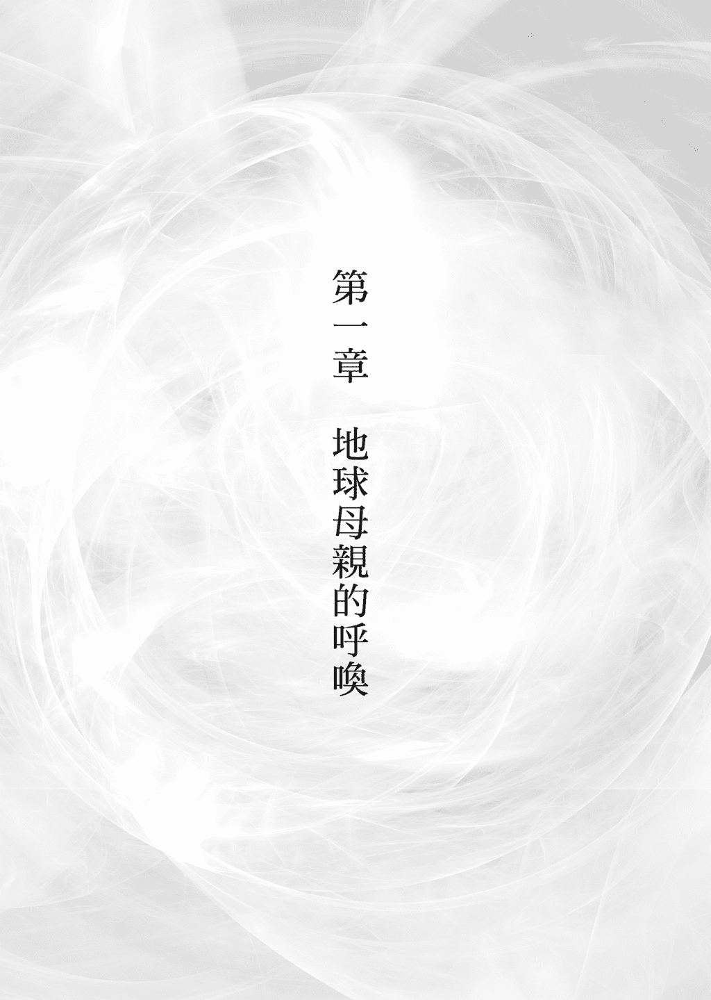

孩子啊！我是你的灵性母亲，你可以直呼我的名字莎雅，或者称我为盖娅或我在光的世界的名字埃西斯，这些都是我跨越不同次元的灵性片段。我现在需要你将来自地球的声音传递给人们。

我的意识已经存在这个美丽的蓝色星球四十亿年，你无法想像的久远。我看顾着人类和地球上的所有生命。自古至今，你们已经在地球上发动过多次的战争和冲突，也曾遭受外星文明的攻击，但没有一次像此时的地球这般，需要人类感受到我的存在状态。我希望你能够将我以下的讯息传达出去。

 来自地球母亲的讯息

一、地球不是人类的

人类不论走到哪个地方脚踩大地，总以为这脚下的土地永远支持你们的存在，也因此，你们忘了地球母亲也需要被呵护照顾。我可以不断地进行自体平衡，做好自我疗愈。现在，经由我更频繁地加速自身疗愈的过程，你们才终于看见我生病了。只是，你们还不知道如何照顾病中的地球母亲。

我在宇宙中担任太阳系和银河系的桥梁，若我无法维持住稳定轨道，只能呼求银河联盟的援助。因为，我不是地球人类的资产，我自己有非常重要的银河任务在身。我的主要任务是让地球维持在平衡的状态，以保护银河系的灵魂孵化器，我需要为银河系生生不息的生命创造意识培育基地。这一点，你们过去并不明白；而现在，我已经被允许将此讯息传达给你们。

二、地球有自己的再生计划

如我上面所述，地球不是人类的，我有任务在身，所以当目前的地球生态严重失衡，我无法照顾好所有灵魂意识时，我将会展开复制星球计划。这个计划早在二〇一二年已经展开，迎接新意识种子的基地已经创建起来，这是我自己的再生计划。这个新地球将接手灵魂意识的孵化器工作，而目前的地球会被安置于另一个轨道，进入长达五百多年的冬眠。

三、我们是一体的

你们不用担心新旧地球的移转过程会失去与我们一体的链接。要记住，你们每一个人的灵魂意识都是从源头合一的意识分离出来的。所以，只要你们学习提升灵性意识，就可以进入合一意识场，与宇宙共同意识源头链接。这也是在你们的意识进入新地球之前需要学习并认知的事实。

四、时间已经迫近

不要以为这件事与你们目前的生活没有任何关连就漠不关心。当倒数计时的指针迫近时，你们每一个人都会明显感知到内在升起要回到源头之家的渴望。你们也已经有许多人正走上与源头链接的道路。唤醒尚未觉醒的人，该是走向内在宇宙道路的时刻了。

五、展开地球修复行动

我已经开始进行自体修复，这是我与银河邦联正在一起努力的工作。目前你们在地球上可能不清楚即将面对的地球转变对自己有什么影响，我在此一一说明，希望能唤醒更多人类觉醒。

A.地壳变动

之前已经提过许多次，地球中轴偏移造成磁极再度转换。地球下方的晶体需要进行一次大规模的净化，净化后的地球将会与许许多多的人类和地表动物的晶体断开链接。这会让地壳下的磁性转变，因而造成火山爆发及地壳变动，连带你们建造在地壳上方的建筑物、大桥墩、交通要道都会受到影响，地面上的山川、河流也会产生位移。

B.生物灭绝

许多目前生活在地球上的动物、生物等将不再被变动后的地球需要，而自行灭绝。这些灭绝的生物会连带造成目前生态链的重整，一些你们过去还可以看见的海洋生物及森林动物将会进入停止繁衍的状态，逐渐消失于地球。

你们的生物学家即使知道已经有数百种动植物不复见，也无法从仅存的生物基因中复制出生命，这是我必须行使的地球自然汰换机制。

C.新生命降临

转换物种的时刻已经来到，就连人类也会进入优化与基因的转型期。你会发觉，当你的意识能够向上提升、进入宇宙意识链接时，你们生物体的细胞就开始延缓老化的速度。那是细胞本身的修复能力提升的结果。

同时，你们将迎接超越现有智能的新人类来到地球。这些孩子都具有更高的意识振动频率，可以链接宇宙源头的智慧。也因此，这些新生命的到来是要协助更多地球区域的生命扬升，他们是一起来协助地球的未来种子计划的。我们的未来种子计划已经于二〇一七年展开，将会由这群孩子带领地球人类移入新地球。

这不是科幻小说的场景。在距离现在不到十五年的时间里，你们会发展出超越过去二十年累积的科技进展，会欣喜这些让人类刮目相看的科技发明来自这些新人类。

D.无意识生命的回收站

地球逐渐提升自身振动频率的同时，会让一些无法进入更高意识的生命集体流向黑暗的振动中。这是宇宙的平衡之道。只有进入黑暗的过程，才能羽化淬炼出更纯粹的灵性意识重生，而这些从黑暗中跃升的意识将带给宇宙更新的能量。这个过程可能无法被人类理解，这是宇宙自体疗愈与进化的机制，要经由这个过程才能创造生生不息的永恒生命存在，也才能平衡所有失衡的状态。

解救地球的工作，前提在于盖娅要恢复自体平衡的运转，如同人类的身体需要回复平衡才能健康地存在。而当今，人类集体意识的扬升就可以助地球母亲一臂之力。

＊ ＊ ＊

（编按：本书传达的是来自莎雅与阿乙莎的讯息，以莎雅的讯息为主。遇到阿乙莎的讯息时，对话会以“我：”“阿乙莎：”呈现；若整章皆为阿乙莎的讯息，会在该章开始处说明。）

我：阿乙莎，原来我的灵性母亲莎雅就是盖娅。今日收到来自盖娅母亲的讯息，让我觉得很沉重，也很困惑，这些是真的吗？

阿乙莎：这是对现在地球人类的训练计划。只有当你们能明白自己与地球的关系，你们才会有意识地提升进入新地球的轨道。否则，人类仍活在小我创造的虚拟世界里，无视于地球就是人类集体意识的一面镜子，直到地球因自身的需要必须扬升，留下错愕的人类纳闷：为何太阳不再升起、海洋无法供给健康的食物、森林不再释放芬多精和氧气，而人类变成需要逃离家园，以躲避熔浆和火焰？
地球意识觉醒的时刻已经到来，这不是由人类决定的时间表，而是地球自体需要平衡的必然。这个重大的转换早已惊动银河邦联的友好星球一起来支援，人类若继续沉睡，就会错过此难得的意识扬升盛会。

＊ ＊ ＊

莎雅，或是我该称你为盖娅，刚才提到你在地球的主要任务是为银河创造意识培育基地，这一点我还是不太明白，是否可以说明得更清楚些？

你还记得你的天狼星父亲雷巴特曾经带你去看自己的实验室吗？里面储藏了三百六十多种情绪体记忆库，你甚至还看到了天狼星上的情绪体验馆。当时，他还提醒你：“你要回去提醒人类，小心发展人工智能类人类科技，不要为了效率，而抹煞了人类最珍贵的情绪体的振动所创造的有情世界。”

是的，我记得这段。这跟你有关吗？

当然有关系。孩子啊！你们就是这些情绪资料的制造机，你们的意识从投生进入物质世界的地球那一刻起，就展开情绪资料的创造和记录工作。不只是人类，还包含所有在天上飞的鸟群、在地上的动物和野兽、河流和海中的生物，还有为你们无声制造氧气、行使光合作用的花草树木，甚至土壤里面的昆虫、微生物，乃至土壤下的矿石、水晶，所有存在地球上的生命物种都有其意识。而这些意识的储存库除了存在人体之内，连土壤下的水晶、矿石、山川、树木和大地都有完整的记忆储存。

打从你诞生在地球、大口展开呼吸开始，你就已经让自己的生命意识打开自由的流动。你的意识是链接着宇宙之光的神性，扩展进入物质世界中，让光可以透过在地球的物质个体的行动，去体验自身的存在。你们目前就身在庞大的意识流中而不自知。你的身体早就知道，你每一个细胞核内都储存了地球自初始以来所有伟大的生命缔造的情绪资料记忆库，等着你继续去创造和改写它们。地球就是宇宙之光的源头集体意识的创造和再培育基地。

啊？意识是处在物质世界里的光？你这一段描述我还无法理解。

没有关系，你现在不懂不代表你的细胞不懂。让我们继续向前探索，我会让你慢慢忆起这一切的。

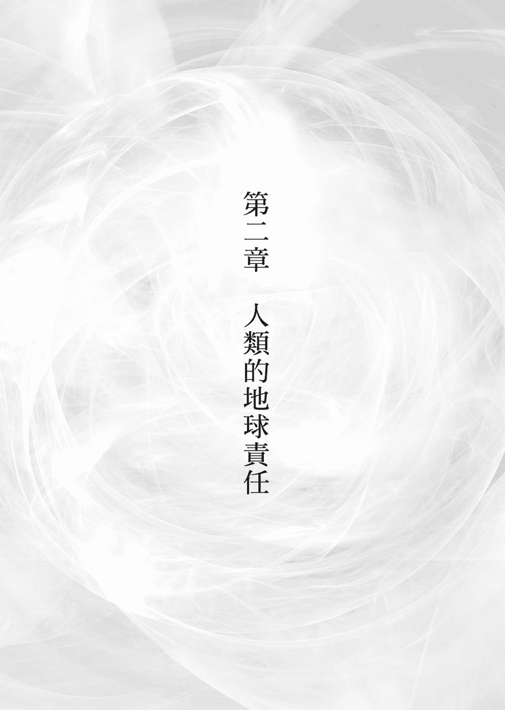

 人类和地球合作，才能让生命永续

近来地球各区天灾频传，这是地球正在进行自我更新和疗愈的现象。森林大火、大量的雨水和低气压将土地表层的结痂褪去，重新清理之后，人类会找到新的适应环境的方式。你们也会发现，愈是遭受严重的土壤侵蚀或人为破坏的区域，地球就愈需要进行更新疗愈。人类在地球生活，不可能不立足在地球之上而能延续生命，但是，地球又如何在承载这么多人类和物种生命的同时获得自身的滋养？

你们有想过下面这个简单的数学公式吗？

Ａ＋Ｂ＝Ｃ

若Ａ大于Ｃ，则Ｂ是负数

若Ｂ大于Ｃ，则Ａ是负数

Ａ与Ｂ就是人类与地球，而Ｃ就是宇宙分配给地球整体的能量分额。

人类不断地想要超越Ｃ，可是自己又不能在失去Ｂ的情况下去超越Ｃ，Ａ与Ｂ需要合作，互相支持与平衡补位。Ｂ就是当前的地球，过去一直任由Ａ予取予求，然而，在宇宙运行的公式里，Ｃ就是Ｃ，无法成为Ｄ或Ｅ或任何其他存在。Ｃ需要维持在平衡的Ｃ的状态，才能与整个银河宇宙共存，否则就会被排除在银河系之外。

你们在学校里学习了许多基础科学，这些基础科学的根本就是平衡。你无法在任一门学科中看见无限，也不会在任何一个学科里看到固定与有限。当所有的科学家都在尝试新的领域，突破现有的极限，进入全新的领域时，他也只不过是打开另一个新的平衡现象的大门。最终，仍然要在那个新的领域里与所有现象界取得平衡。

地球目前有许多调整，天灾此起彼落在各地同步上演——北半球森林大火，南半球也开始着火，这些共时与同步现象是因为地球整个密度正在向上提升，而在更高的密度中，实相的产生会更实时、更快速地显化出来。你们东方与西方的距离已经拉得更近，若亚洲发生飓风或大地震，紧跟着大西洋这端也同步共振这个调整的频率，而形成全球同步的天灾现象。

这些现象不只会发生在气候的极端变化上，包含经济、农业、科技、医疗、政治等所有人类经由共同意识创建的行为模式，都会集体发生改变。你们现在只向外看见Ｂ显现出来的极端变化，对于包含在Ａ当中的所有 A1、A2、A3 等自身更细微的变化不知不觉。你们必须拉升自己的意识，去看见你们已经不得不开始跟着Ｂ的变动而改变自己。

人类在这个过程中，最终会理解Ａ＋Ｂ＝Ｃ的真正意义。只有回到与地球和平共存，才能创造人类和地球整体永续的未来。

 人类要为地球万物负起传承责任

我需要跟你说明，人类和地球其他的生命存在最大的不同，在于你们是行走在地球上的造物者，也是地球万物显化出的改革者与开创者。你们人类和我一样，要负起生命传承的责任，而这个传承之道也就是宇宙运行之道。但是，现在人们还无法从自身内在取得宇宙之道的运行智慧，经由学习得到的知识仍然有限。在此，我将帮助你们了解宇宙万物依循的法则。

动植物内在可以知晓宇宙运行之道，但，人类无法和动植物顺利沟通，地球上的动植物被人类殖民和奴役了数百万年。我需要将宇宙之道传递出来，让地球人类和所有物种能完成进化，这个工作至关重要。若人类依然用自以为是的方式掠夺其他生命的生存空间，消灭物种的生存权利，最终将会伤害人类自己的生存环境，而自食恶果。

人类原本拥有完整的宇宙意识，但因为ＤＮＡ的封印，无法顺利链接高我意识以获得宇宙智慧和真理，而你们又需要透过一部分意识来学习和适应地球的生活，从群体社交生活展开与其他物质生命的互动。这部分的意识会逐渐和身体的大脑合作，锻炼出看似独立的思想与意识能量——小我。事实上，小我是灵魂在地球体验过程之所需，但因为已经与大脑创建活跃的互动关系，小我渐渐掌控了整个灵魂意识的发言权。

所幸，物质身体的细胞虽然受制于脑部发号施令，却仍保有自诞生以来就能与高我意识链接的能力。你们去观察动物和家里的宠物猫狗，就会看到这些动物生病时，自然会去找寻解药，也会知道什么时候该迁徙避寒，这是身体和宇宙意识保持链接的自动机制。大脑虽然可以发号施令，告诉身体去进行某个行动，却无法得知与掌控诸如心脏跳动、细胞的生长与死亡，以及血液朝哪个方向前进。你们的大脑对自己生命的掌控有限，身体细胞仍保有自主的智慧，会以细胞病变或生病等方式，发出讯息，让小我重新调整生命的方向，也可以经由身体的自动机制，帮助小我重十与更高意识的链接。

 ＤＮＡ重新校准，解开封印

其他物种和人类一样，都链接着宇宙源头意识的生命体，不论动物、昆虫、鸟类，或是具有集合意识的树木、植物、矿石，你们彼此的灵魂是一体的存在。只是当你们的ＤＮＡ以不同的外显基因展现时，你们彼此分离，去经历生命不同的体验。最终，这些生命的体验和波动都存在宇宙的讯息场中。

人类演化至今并没有比动植物更优越，最主要的原因是你们ＤＮＡ内建的频段出了问题。人类和动植物的ＤＮＡ原本都是完美的组成，但人类的ＤＮＡ讯息路径部分回路封闭，而动植物的ＤＮＡ仍是畅通的。也因此，动植物仍能从自己的身体感知到整体大自然的脉动和宇宙的智慧，何时该迁徙、何时要冬眠、何时要交配，都是跟随着身体感知到的大自然韵律，而活出生命节奏。人类因为ＤＮＡ的封锁，造成思想和身体语言出现断层，只留下小我意识处在地球三次元维度，忘却自身与高我意识是不可分割的存在意识。

人类的ＤＮＡ在母体胚胎发育的过程中是百分之百完整状态，然而有一部分的ＤＮＡ束状结构会与生命即将诞生进入的行星，也就是你们目前的地球相链接。所以当新生儿哌哌落地时，这个新生儿身上的ＤＮＡ会与地球晶栅记忆库相互链接，当地球的晶栅只能展开百分之三十的记忆体时，人类的ＤＮＡ就只能接取百分之三十的讯息。

在亚特兰提斯时期，地球晶栅是百分之百对人类开放的，然而历经星际族群间的战争，地球的文明被破坏殆尽之后，地球的意识晶栅封印了百分之七十，这是恶意星球要阻断地球新生命与更高宇宙智慧的链接，以掌控地球资源和所有人类。人类经过多次的轮回和努力，将地球人类的集体意识不断累积，目前地球的整体意识晶栅已经可以对新生命开放达百分之五十。这是人类共同努力的成果。

 人类觉醒，创造新生命

你们的脑部有个灵魂讯息储存装置，这和你们的思想使用的区域不同。灵魂讯息储存库位于眼睛后面下视丘的位置，你们称之为松果体。这颗松果体之所以位于眼睛的后方，原本的设计是用来帮助人类以内在之眼去感知地球万物，并与宇宙共同意识链接和沟通；此外，也借由这样的讯息装置，将人类累世的记忆和知识世世代代延续下去。但是，当人类松果体的ＤＮＡ传导区域被封印之后，你们出生后即使年龄增长，所能得到的知识或记忆，就只能固着在短暂有限生物体的生命期中创造的物质经验。也因此，人类一直不断地在物质体当中摆荡和重复循环。

造物者并没有设计出弱肉强食的食物链，这是生命演化过程的展现。人类透过吃食其他物种来延续生命的方式并不是造物者设计的唯一途径，而是人类自己共同的决定，然后你们又从自己身上的灵魂祖先们的ＤＮＡ传承沿袭了这项技能。这是人类在地球上创造出来的生存法则，但即使如此，所有其他非人类物种投生到地球之前，早就已经明白终究会扮演被人类食用的角色。它们并没有人类感官上的恐惧，你看见一头牛被宰杀前的泪水，那是对眼前地球的不舍哀悼，它们没有害怕自己的死去。有些动物和植物在被其他物种享用时，是感谢和喜悦的。你们认为一个生命结束在另一个人手中是残暴、不可原谅的行为，但在宇宙法则中，仍有另一面你无法看见——那是一个生命在即将失去肉身的当下融入更大宇宙中的狂喜，那是灵魂再度扩展和重生的光芒。

人类的历史自古至今，除了追求更先进美好的物质体验外，你们的灵性生命并没有太多突破。相对于物质文明的进展——你们在短短数十年间，可以从陆地航向月球，从人力车变成电动车，医疗技术突飞勐进——你们的心灵层次依然停留在研读古时候留下的经典，那是因为你们大脑处理的讯息被限缩在物质实相里，对于超越地球之外的宇宙文明，你们无从探索和取得讯息。也因此，人类纵使携带着最精密的身体智能、超越地球其他物种的创造力，仍然无法跳脱在地球上不断重蹈覆辙、一直轮回的宿命。

当人们的松果体渐渐恢复和宇宙链接的动能，就能够穿越帷幕，契入地球人类集体意识的图书馆，并开始收到来自宇宙的邀请。这也是帮助地球进入银河轨道的礼物。你们已经可以忆起自己的源头，更发现自己不仅仅是行走在地球上的生命，你们身上还拥有宇宙所有过往生命世代累积的共同记忆。现在，你有权利揭开让你长久以来被隔绝在宇宙之外的帘幕，一起踏入宇宙人的世界。

之前你的灵性父亲教你如何契入晶体，进入宇宙源头的合一意识里；现在，为了让你忆起属于你自己最初始的生命智慧和宇宙运行法则，你要开始学习和忆起：人类和地球生命是一体的，你们身上拥有链接宇宙万物的能量，只要你愿意，就可以链接上，重新找回自己来到地球的目的。

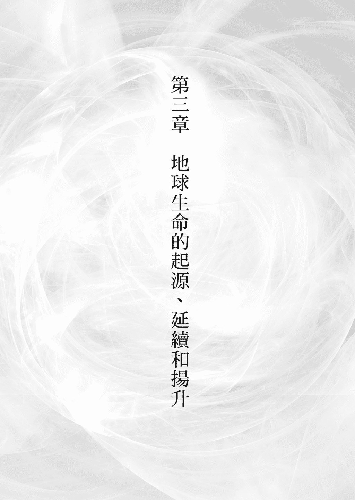

 地球是宇宙意识的孵育基地

在四十五亿年前，地球是从光的世界坠入宇宙黑洞中再诞生的一颗晶体，而这颗晶体也是宇宙意识场的延伸。你若是将整个银河系视为一个具有智慧的超大集合意识，就不难想像这个集合意识中仍会有需要满足和表达自身的不同意识存在。

银河议会发现有许多意识仍然无法和银河系集体意识有效地融合，也就是在集体意识之外仍有游离的意识粒子，这些游离粒子在聚合的过程中，会不断地被抛出银河宇宙之外。这些游移在银河宇宙集体意识之外的粒子会被吸入宇宙的清道夫，即所谓的黑洞里，而当这些游离粒子再次从黑洞里转化诞生时，就会呈现出初始的晶体状态。这就是地球和所有其他新星球诞生的原因。

地球是从银河系的黑洞中诞生的新星球。这颗星球非常特别，从地球表面可以看到，它与其他星球最大的差异，在于地球的水元素非常充足。地球表面有百分之七十是由海水覆盖，这些水就是黑洞中未被消灭的游离意识重生后的物质态现象。水即代表地球具有灵魂意识。你可能会好奇，难道其他从黑洞中诞生的星球没有水吗？没错，有百分之九十五的新诞生星球都只有矿物或火元素，很难看到具备充分水元素的星球。

银河集体意识看见从银河黑洞中诞生一颗美丽的蓝色星球时，都非常兴奋，因为这代表游离粒子即使无法融入银河集体意识，也不会就此消失，它们仍然具备再次凝聚重生的本能。这是非常令人振奋的结果，也让存在于银河集体意识的我们知道，即使失去与银河集体意识的链接，仍可以从黑洞重生，链接回到银河宇宙的集体意识中。

为了保护这颗满载游离意识的银河意识重生，银河系将地球安置在猎户星系的手臂弯里，像母亲怀抱婴儿一样地护佑着地球。同时，为了让地球能成功孵育重生后的灵魂意识，返回银河轨道，特别将太阳和月亮安置在能够帮助地球稳定运行的太阳系轨道中。这一切的安排都是为了让灵魂意识重生在地球时，仍可以保有绝对的自由意志，让在此的意识可以继续扩展和延续银河意识的孵育计划。

盖娅母亲，你说为了宇宙意识的孵育，目前地球的位置是被银河联盟特别安置与保护的。那么，太阳和月亮的用意是什么？

这是银河联盟所有星系的代表共同决议的。银河邦联在地球运行的太阳系轨道上安排月亮和太阳的位置，最主要的目的是要让地球上的意识能在阴阳两极的运作中持续再造出动人的意识结晶。太阳是地球上的阳性能量，月亮是阴性能量，在阴阳两极之间创造无限的意识扩展，再创造和平衡。人类和地球万物得以在此环境中生生不息地延续新生命，创造化育万花筒般的动人音符和美丽的地球生命。地球是银河系的珍贵珠宝，是为宇宙意识的持续拓展而存在的星球基地。

所以，我们人类只是实验室中的白老鼠吗？

喔！我绝不会如此称呼你们，也不会把我自己视为实验室守门员。别忘了！你们都是最勇敢、最优秀的灵魂战士，每一个人都早已经淬炼出特别光亮的品质，才能有此机会来到地球。你们是为了再造其他宇宙生命和平衡地球整体意识而来到地球的勇敢战士，你们每一个生命都曾经展现超越地球意识水平的振动频率，才会雀屏中选，进入地球再次体验。

地球已经这么多年都很平安，未遭受星球的撞击，太阳和月亮也维持在一定的距离和轨道上运转，银河邦联是如何安排地球的位置？

这个银河轨道计划是由银河议会决定，我无法详细说明，只能大致描述一下。

地球上方有许多格栅般的网格，银河宇宙可以透过网格能量线传送星球的座标到地球中央水晶，将地球磁极限制在某一个范围之内，并设定太阳和月亮相对于地球网格的位置。

为了让地球继续承载灵魂意识的重生和孵化使命，银河系准备了充沛的资源给地球，让地球所有的生命体可以生生不息地繁衍下去——这些资源包括一颗充满光与热的太阳。太阳之神仍由银河宇宙掌管，你们无法接近、也无从探索太阳的原因是，一旦人类进入太阳，可能就会让地球的能量无法稳定。而月亮也是为了拉住地球不偏离太阳系轨道的卫星设置，最主要的功能除了提供夜行性动物和海底生物光的来源之外，还透过月亮的引力拉住地球，好让地球与太阳保持一定的距离。

所以，地球是灵魂意识回到银河系的重生站？

可以这么说，但目前地球上的新灵魂正在诞生，也不光是旧意识的重生，这里也已经成为新灵魂的训练基地。已经有愈来愈多的新灵魂意识诞生在地球，这些新的灵魂意识都是银河系的资深灵魂意识分离出来植入地球的，是来帮助地球的整体灵性意识再次扩展与成长，也就是扮演指导师的角色。他们需要一个具备生物体的分身和地球人类一起生活，才能在人类社会群体当中影响人类的思想行为。你们自古至今有许多圣贤就是来自宇宙更高意识的灵魂。

那么我现在正在沟通的地球母亲盖娅，你是地球上的集体意识吗？

我是你的灵性母亲，也是地球的母亲，你可以称呼我的名字莎雅，或是以地球人对我的称呼“盖娅”来呼唤我。我是地球整体存在意识的守护者，我现在就在地球之心，位于地表下三万五千英尺。我并没有生物体的载具，我的意识可以和银河意识接轨，并接收来自银河议会的指示。你的其中一个灵性片段就是由我分离出来的新灵性种子植入在地球上，在你之内有我的存在意识。我是地球的母亲，也是你的灵性母亲。

我若以位于地心的存在意识来说，是位在第五次元，这是我可以存在于地球的形式，但我也拥有其他灵性片段，分别存在于宇宙不同的次元。我最高的存在是位于更高的次元，你们称我为埃西斯女神。我们都是灵魂意识的组合体，你和所有人类都是，只是当你们以人类的物质形态进入位于第三次元的时空时，因为ＤＮＡ封印，无法忆起自己同时存在所有时空的灵魂意识片段。

其实地球上除了人类之外，地球的下方也有高次元的人类形态存在意识及具备生物形体的超觉人居住，我的其中一部分灵魂意识就存在地球下方的列木里亚。这里不仅拥有超越地表数千年的文明，其集体意识也已经扩展至第五次元，并与银河联盟保持连系。

虽然位于地心，这里的人不认为自己是独立于银河之外的太阳系族群。他们除了具有银河宇宙集体意识，也认知到自己生存的地球如同人类一般，具有生物体、乙太体和星光体。地球的肉身是一颗孵育万物的星球，乙太体则是居住在地球之上的所有生物的智能系统，你们统称为生态系统，而地球的星光体，是与银河宇宙相链接，以太阳为中央轴心，锚定远在八百光年外的猎户星系，形成一条如同婴儿链接母亲的脐带那样的银带，一直延伸至猎户座的核心。

之前和你提到，宇宙游离意识进入黑洞后，又可以融合汇流回到地球。对整体银河系来说，再生后的灵魂意识正由地球扮演孵育和保护者，你们也将在此完整自己的灵魂体验后，再次返回银河母亲的怀抱。

 宇宙源头有计划地创造生命

在三次元的地球，人类生育繁衍下一代是一个自然的孕育过程。不用经过太多的精密演算或讨论，当你们准备好为人父母，就可以诞生出一个新的生命。这个新生命的灵性源头组成与你可能一点关系都没有，你们没有权利决定这个新生命的灵魂组成，当然也不会在你们的生育计划中讨论。

当你们的孩子进入十二岁，他的灵魂意识开始萌芽，作为这个生命在地球上的父母，你们才发现这个孩子有着自己的主张、人格特质和天赋才能。这一切都不是你们安排的结果，你看见你们生物体繁衍出来的生命，是一个被赋予的过程，而不是有意识创造的结果；也因此，在地球的维度，你们重新创造一个如你所愿的生命种子的能力是有限的。

这就是灵魂意识处于物质体和更高集体意识中的不同之处。生命的灵性种子是源自宇宙高次元的造物者有计划的创造过程，这不是机率，不是赋予，不是命运的安排，而是源自集体意识场域的生命平衡法则。最高的灵性源头意识具有平衡宇宙能量的侦测系统，也因此，由源头意识诞生出来的灵性种子都携带着平衡宇宙的使命。从更高的维度来看，这些灵性种子不是为了体验而被创造，是为了维持生生不息的宇宙法则而进行的灵性种子诞生计划。

你们的灵性父母有意识地为宇宙能量的平衡，定义了每一个生命的灵性种子计划。你也会发现，许多人是由相同的灵性源头组成，你们是灵性的挛生兄弟姊妹，但这并不代表你们的地球体验会朝向同一个目标前进。刚才有提到，你们的灵性种子进入你们的生身父母之后，就已经展开不同的体验道路，你们身上链接着来自生身父母和祖先的意识片段。虽然你们回到源头的路程不见得一样，但最终，当你们回到源头时，这些来自你挛生兄弟姊妹的体验，可以回到共同意识场，丰富你们彼此的意识。在源头，你们是一体的意识。

当你的灵魂意识觉醒，进入更高的宇宙次元与自己的灵性源头合一时，你会超越物质身体的限制，展开跨维度、跨次元的创造。在此你将有机会创造出另一个意识种子，但是，你必须先完成自由灵魂的阶段性学习，才能被赋予创造新灵魂的造物者权利；而于创造的同时，你晋升成为自己所创造的灵性子女的守护者，你们认知的神性之旅就此展开。

 ＤＮＡ预存生命演化和意识节点的编码程序

你的灵魂源自你的源头神性意识的组成，包含你最初始的神性意识，还有灵性父母各自分离出一部分的灵魂意识，分别由阳性和阴性能量组合而成。这个被分离出来的新灵魂意识是一群带着完整编码的粒子串连组成的，而这个束状结构的物质呈现，就是你们在显微镜下看到的ＤＮＡ。

ＤＮＡ由许多带电粒子组成，这群带电粒子凝聚组成的过程中会产生非正负电的等离子体，你的灵魂意识就存在其中，不具备导电性，但可以由带电粒子经过光的折射，产生具备磁引力的意识场。若取出一节ＤＮＡ来分析，你无法看见非粒子形态的意识存在。你无法看见与摸到意识，意识是非物质的存在，以特殊编码嵌入你们的ＤＮＡ里。当你父亲的精子和母亲的卵子结合成受精卵时，这颗受精卵就同时储存了来自你源头的灵魂意识组成，我们称之为灵魂ＤＮＡ。这时尚未出母体的灵魂ＤＮＡ是完整的，是没有瑕疵的存在。

灵魂ＤＮＡ有不同层次的意识节点，当你们的意识振动频率突破每一个节点，就可以经由该节点编码链接广大的意识场体，从你自身的感受体开始，向身体以外延伸至宇宙的集体意识场。人类细胞ＤＮＡ携带的灵魂意识总共有十二个意识节点，每跨入一个节点就可以扩展你的意识，向更广大的集体意识靠拢，最终到达人类可以企及的宇宙源场。

进入宇宙源场的入口就存在你身上的ＤＮＡ节点，从你的意识扩展开始展开链接，最终契及宇宙集体意识群；而宇宙意识群最终到达的是太极之初的场域，这个场域是光的世界，是人类的灵魂意识尚无法企及的领域。

 尚未完善的灵魂意图让生命不断延伸体验

进入新生命的开始，来自意识创造的生命动能。当人类的身体结束运作时，仍有一部分的能量不受身体系统死亡的影响而继续存在，那就是位于你们中枢神经系统中的灵性能量流。这些围绕着全身细胞和循环系统的电流会在身体停止运作后，自动回流到脑干下方后颈部的灵魂回收中心，透过这个回收站将你的灵性能量上传至头顶上方六吋的晶体中。

你在有意识地进入自己晶体的过程中，仅使用不到百分之一的电流就可以进行讯息的传输和解码，你的身体、大脑、器官、细胞则占用了百分之九十九的能量，让身体可以正常运转。当身体不再需要使用这些能量时，就会全数回流到你的晶体，进行讯息储存，而灵魂意识也会在此时透过晶体传送到位于阿卡西纪录的生命讯息储存区等候。

生命结束之后，经由晶体带回阿卡西纪录等候区的讯息会与全部人类的资料库再次汇合，成为更新后的集体意识。你会携带更新后的集体意识，伴随着你尚未完成的生命意图，进入生命的选择区，也就是再次进入新生命的循环。而此时，你尚未完善的生命意图会与要和你一起完成这个生命意图的灵魂意识融合，成为下一个新生命的生命蓝图延伸版本，进入重生的体验。

所以，现在的你是过去所有人类的集体意识，以及要和你一起完成尚待完善生命意图的灵魂意识再一次结合之后，进入这个世界，你是包含自己、他人和所有人类集体意识的一个全新的生命。当你完成此生的体验，又会回到阿卡西纪录中，改写集体意识资料库。所以，每一个生命都是过去的一个结果，更是未来的希望种子。你们正在生命的恒河中不断创造彼此的更新体验，为迈向宇宙合一的意识而努力。

当你了解生命的再生循环机制，会对如何善用这一次的生命有全然不同的认知。你会使用自己的生物脑去想像出一个和自身携带的灵魂意识总合无关的全新生命历程，抑或去找回此生携带的生命意图，从认识你到底是谁、为了什么目的来到此开始，与自己尚待完善的生命意图重新对焦后再次创造？这是两种全然不同的生命之路。

人类过去因为无法忆起自己的生命蓝图，在灵魂ＤＮＡ封印的状态下，让生命在有限的生物脑中不断以创造为名，碰撞出周而复始、不断轮回的生命之路。这是你们过去熟悉的文明创造之路，然而现实状况是，地球资源在短短的两百年间便损耗殆尽。

你们的生命再生循环系统只能储存人类的灵魂意识，你们在此创造的物质、身体、房子、车子、加工食品、机械等，都只是让你们体验和重新忆起自己是谁的工具与生活辅助。只有当你们去找回生命的蓝图，表达出自己生命最初始的意图，为生命蓝图创造更新的体验，让自己的生命走入绝对的创造之路，才能帮助所有人类和地球。

将创造聚焦在物质生活的显化，在排挤、对立和竞争冲突中创造出优胜劣败的生命道路，都是你们的生物脑创造出来控制自己和他人生命的伎俩。看穿小我的恐惧与陷阱，回到圆满自己和他人生命的意图，以创造人类集体意识的扬升为目标，你们才能从创造中找到圆满生命的道路。

之前阿乙莎传达给你一连串的教导，例如脉轮畅通、中轴稳定、业力盘点等基础练习，就是要帮助你们突破细胞对情绪感知的误解，让身体细胞回复到达全面的理解；若无法穿越身体及细胞潜意识的枷锁，你们就无法进入更高意识的链接点。细胞总是重复进入无预警的放电，释放出来的电子讯息就会让人类的情绪体不断引导你们的大脑产生无意识的行为，这个细胞放电的过程一部分是细胞内的灵魂ＤＮＡ累积的业力印记的影响，也有一部分是来自此次的新生命新体验所产生的结果。

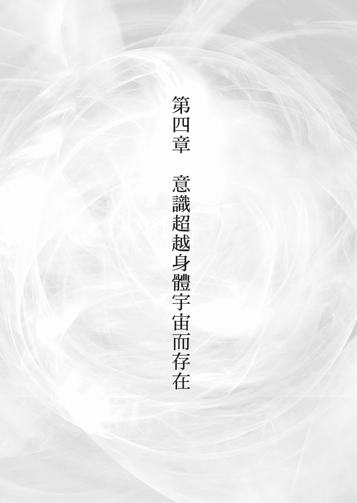

人类意识是超越身体的存在，你们可以经由意识下达指令给身体，影响身体自动运行的规则。身体是灵魂的载具，最主要的设计目的是用来服务你们的意识体。人体本身具备与地球和大自然环境自动调节的平衡机制，就如同地球本身具有自体平衡能力一样。若地球是为了服务宇宙集体意识而存在，那么，人类的身体就是为了服务人类的灵魂意识而存在的小宇宙。

也因此，若能更了解身体宇宙的运行法则，就可以透过有意识地带领身体，创造出更和谐圆满的地球生活，也可以缔造出更高振动的地球集体意识。

你们可以学习检测自己目前身体系统的运行状况，有意识地输入讯息给自己，修护如今已经逐渐失衡的身体宇宙系统。当人类可以重获健康的身体，维持中轴的稳定畅通，就是在帮助地球的集体意识更新。

 身体宇宙具有自动平衡的运行机制

人体和大自然万物一样，由地、水、火、风四大基本元素构成，呼吸帮助运转内在宇宙，协助身体与大自然和谐共振，维持生生不息的自体运行。身体宇宙经由四大元素构成的身体系统，如行星般环绕着恒星运行，以维持各行星之间的平衡，而这四大元素的行星之运行和地球的运行息息相关。地球透过日月星辰维持稳定平衡的运行，所以，人类身体系统形成的小宇宙也是跟随日月星辰自动运行。

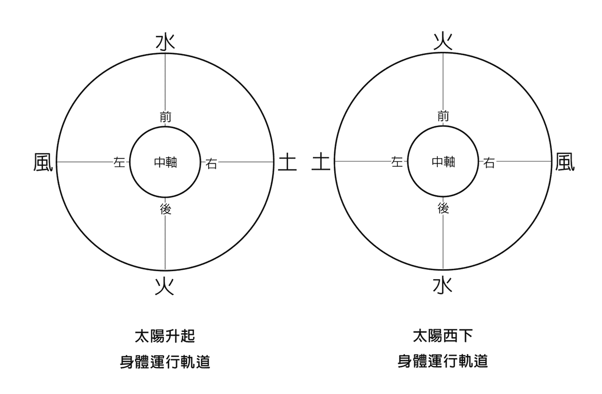

如上图，若从北极上空看向人体，身体宇宙是呈现逆时针方向自转；而站在南极上空看，身体宇宙则是呈现顺时针方向自转。身体中轴的正前方脉轮的出口，代表的是身体显意识的观点，而中轴后方的脉轮能量出口代表的则是潜意识的观点。通常人们只习惯用脉轮前方的出口，也就是显意识观点去看见世界物质层次的显化，忽略自己身体隐藏在眼耳鼻舌身五感之下的潜意识层次，被身体四大元素的能量影响，而创造出不同的潜意识认知观点。

从上页图身体宇宙的位置随着人类生活的地球与太阳的相对位置同步自转的过程，就可以发现，当早上太阳升起时，身体的正后方是火元素，正前方是水元素，代表人们早上起床后，潜意识就自然而然地用阳性面的观点向外投射和表达其自我意志；而当身体宇宙随着太阳西下后，此时火元素已经转入身体正前方，而身体正后方则变成水元素，因此入夜后，人们的潜意识倾向用阴性的水元素观点向外投射。

 意识可以转动身体宇宙

人们在无意识状态下，身体宇宙随着日出日落，从火元素转入水元素，进行日夜自动平衡运行。人们只看见显意识的物质世界面向，其实正是由潜意识身体所创造的动能。人类的潜意识深深影响物质世界如何显化，也影响生命的运行轨道，而一个意识完全苏醒的灵魂，可以超越物质和日月星辰的限制，成为随心所欲的自由灵魂，从此意识超越身体，成了为服务灵魂更高的使命和目的而存在的工具。

练习：意识转动身体宇宙

可以透过简单的手指操练习，看见意识如何影响自己身体宇宙的能量运行轨道。

在白天做畅通脉轮手指操时，若你用右手握住左手的手指头，身体气流会自动呈现正旋；相反地，若用左手握住右手，身体气流则自动呈现逆旋。

现在若是白天太阳已升起时，用意识调动自己的身体元素，将水元素转入自己身体的正后方，此时等同给身体一个指令，让它进入太阳西下的状态。接着，再次用右手握住左手的指头，你会发现，此时身体气流呈现逆旋；相反地，若用左手握住右手，身体气流会呈现正旋。

而当身体进入夜晚时，身体元素自动呈现水元素进入身体后方的状态，此时若用右手握住左手指头，身体自动呈现正旋；但这时若对身体下达一个指令，进入白天模式，身体正后方呈现火元素，然后用右手握住左手指头，身体反而呈现逆旋。

透过以上的练习就可以发现，你的身体宇宙跟随着日月星辰自动平衡运行，但意识可以超越身体运行的轨道，经由调动身体元素，创造不同的身体运行结果。

 检视身体四大元素的能量现状

如果可以有意识地觉察自己的身体宇宙运行的状态，随着日月星辰的脉动顺流而行，你们将可以活出健康快乐的生命品质，也不会让自己的身体细胞处在乱流中，不正常地放电。自然而然，身体可以在顺流中让你们更快链接更高意识，获得灵魂源头的指引。

现在练习检视身体四大元素的能量现况。从中轴出发，身体分别站在四大元素点上，去感知这几个元素在你身体宇宙的状态。每一个元素分别代表你目前身体宇宙相对于整体环境产生的能量强弱反应，而每一次的元素侦测后，都需要回到中轴起始点，再前往下一个元素点进行侦测。

若移动身体、站在元素位置点上，感受到身体朝元素方向移动，表示身体该元素的能量超过环境平均值，会造成中轴偏向该元素的位置移动。

若站在元素的位置点上，感受到身体朝中轴中心方向移动，则表示该元素的能量低于环境平均值，造成朝元素的对立面方向移动。

若站在元素的位置点上，身体朝邻近上下或左右两方的元素方向移动，则表示需要进入移动方向的元素位置点上，进行同步调整。

若在元素位置点上，身体没有移动，只是原地自旋或摆动，表示元素不够活跃，需要重启该元素的能量流动。

在检视身体四大元素的能量流动时，你只需要跟随身体进入四个元素点，让身体自动摆动或移动位置。完成四个元素之间的相互调节，再次回到中轴后，你会感受到身体更加平衡、放松，中轴能量流动顺畅，而中轴能量出入的管径也会同步扩展。

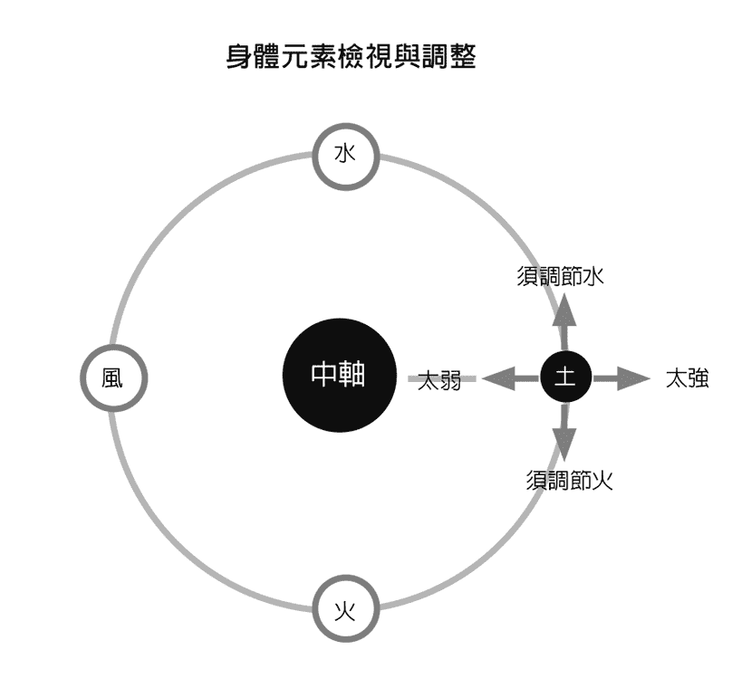

 调动元素力量，以扩展感知能力

从身体四大元素的角度去观察，你会发现，站在不同的元素位置会让你的感官产生不同的感受。事物本身并没有变，而是你的意识透过不同的元素滤镜，相对于该元素的角度获得不同的感知结论。意识创造自己的实相正是如此运行的。

以下说明每一个元素对应的身体位置和能量品质。

**元素****身体位置****感知****能量流**火身体右半部热情光明与希望的阳性能量，从心智与理性出发，改革突破现状的物质显化的能量（今日人类最习惯使用的能量舒适圈）。水身体左半部情感情感的阴性能量展现。从感情出发，可以同感对方的立场，让彼此融合。土脚底延伸至地下行动务实和固守疆土，以奠定安全的堡垒为基础，做出具体和扎根的行动。风肩膀上方至头颅灵感探索未知，天外飞来一笔的灵感，为事情找出曙光和生机。

当身体中轴不稳定时，各元素进出身体的运行能力就会受到干扰和限制，也难以更全面的角度平衡环境的冲击。早期人类深谙引用不同元素的力量，进入身体后方潜意识的场域，来辅助有限的身体感官系统，延伸出对未知事物和周围环境的全面感知能力。

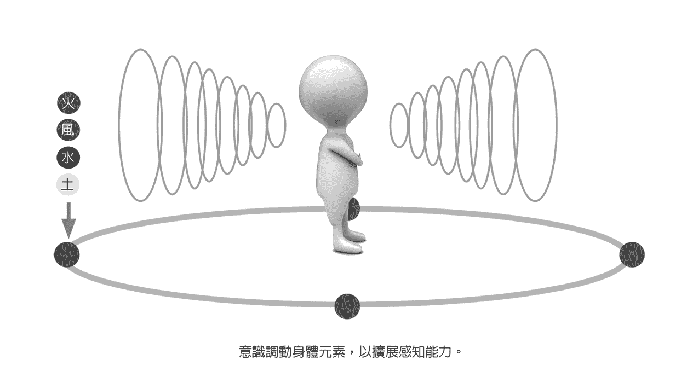

 意识链接大自然，获得疗愈能量

身体宇宙能量失衡时，还可以透过意识链接大自然无条件的爱，获得能量的融合与补给，帮助身体恢复平衡运行。无条件的爱的能量存在大自然万物中，只要你提出请求就可以获得。而每一种大自然生命都有其独特的疗愈和平衡生命元素的能量品质，你们必须自己去找出属于你当下需要的能量品质组成，来帮助自己的身体复原。

古代的巫师就是透过链接大自然的山川、树木、植物、矿石的疗愈能量，来帮助人们获得元素的补给和平衡。但现在的人类文明仰赖化学药物来取代身体本有的智能系统，人类也因此和大自然失去链接，自己阻断了来自大自然无条件的疗愈资源。是时候重新认识和理解原本就存在人类自己内在的自愈力了，重新和大自然取得链接，就可以帮助自己的身体宇宙重获平衡。

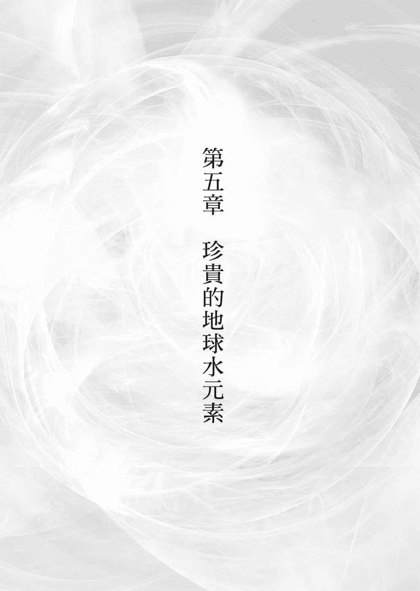

水元素是地球创造多元生命的最初始元素，若无水元素，就无法长养出繁茂的植物和树木；没有树木，就无法创造火元素及适合人类生存的环境；而若无火元素，就无法燃烧分解动植物，滋养丰富的土壤和大地，创造出生生不息的地球生态链。水元素是形成地球万物生命最初始的元素，也是帮助人类与地球万物链接的重要元素。

有水存在的地方就具有意识，天上的云朵、空气、雨水、海洋、河川、土壤、花草树木、动物、矿物，甚至细菌、微生物，都有意识。整个地球就是生生不息的意识储存库，你们都在此准备重生回到更大的宇宙源头集体意识群里。你原本就可以链接我，如同我也可以链接你，我们是一体的存在。现在，让我带你往前，去看见地球上生生不息的生态系统是如何演化出来的，你就会明白自己身上拥有非常珍贵的意识能量，它可以帮助你链接宇宙万物，也能带你回到源头的家。

 来到地球完整体验爱的先锋

地球刚成形时并没有任何移动的生物，也没有花草树木。一开始，地球上只有土壤、矿石、水、岩洞，这些岩洞可以直达地球之心。地球大约有二十亿年的时间都是这样的景象，没有任何其他生命形态存在。然而，此时地球万物的集体意识仍是非常活跃的，你可以进入自己的内在宇宙观想二十五亿年前的地球景象，看看地球上第一个意识从何而来。

我试试看……深呼吸，进入更深的冥想去找出答案。

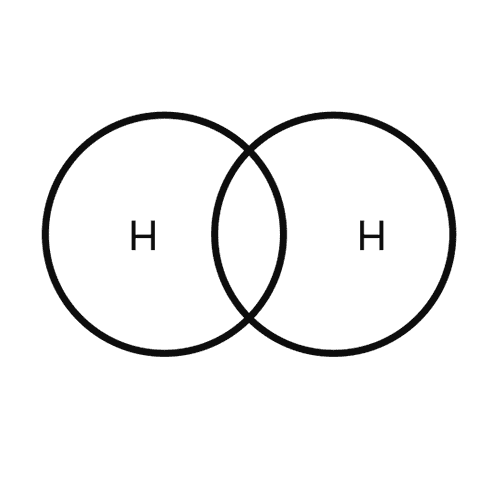

（二十五亿年前，来自银河宇宙的游离粒子流进了宇宙的黑洞，从黑洞中诞生出许多新的星球，地球也在其中。刚诞生的地球空无一物，却有许多粒子正在凝聚中。最先出现的第一个元素是氢原子（Ｈ），当第一个氢原子Ｈ在地球上出现时，它自己产生了一个念头……

“我是谁？我消失后不就没有我了？我需要寻找出另一个我，我才不会就此消失！”

在这样的想法振荡中，Ｈ就从自己身上分离出一模一样的Ｈ。两个Ｈ彼此相望，你看着我，我看着你，然后Ｈ又出现一个想法：“你若是我，那我又是谁？你若不是我，那你是谁？”

两个Ｈ在相互的对望和振动中，产生出分离的二元意识。两个Ｈ一起在地球上遇到空气中的氧，形成了水分子 H[2]O。这些融合了两个Ｈ的意识粒子形成的水持续朝有太阳光的方向移动，太阳照射在水面上，折射出多种不同的光谱，这些光谱呈现不同的振动频率和能量，而这些能量经由水流入土壤中、进入空气中，诞生出丰盛多样的土壤元素，孕育出千千万万的地球生命。）

盖娅母亲，我看见地球最初始的意识分离后显化出地球的水元素。那么，为何第一个Ｈ会产生念头？

是的，循着这个认知，我们更深入一层去理解。你看到第一个Ｈ生出的想法没有？

有啊！“我是谁”，那是个疑问句。

是的，没有错！就是这个“我是谁”的疑问句展开了地球的意识记录器。从最开始的“我是谁”，到“我不是你，你不是我”，再到后来的“你是谁”，最后延伸出“我们是谁”“我们不是你们”“你们不是我们”“你们是谁”……这些意识继续演化出地球万物生生不息的意识振荡频谱，更经由人类自由展现的创造力，完成了银河宇宙情绪资料库的建置。而这所有的意识振荡底下，都带着相同的目的。

什么目的？

就是去体验爱。

我不懂，我无法将“我是谁”的问句和体验爱链接在一起，这太跳跃了。

你再进入问句里面。你现在就站在问句面前，看见发出问句的自己，是什么样的内在振动能量推动你发出这个“我是谁”的疑问？那是一股什么样的力量，驱动你去展开？细细地品读自己的问句，背后有着一股无形又幽微的振动，就是那个振动带领你往前走，而那个振动能量就是“爱”。

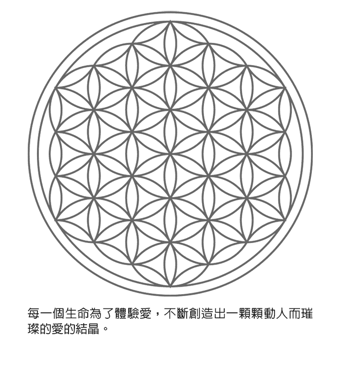

你无法在你之外得到爱，也无法用任何语言和文字描述爱，只能让自己亲自经历和体会爱。爱在你创造的分离意识的振动中，重新回来与你链接，这个分离后再次体验的过程，帮助你认出存在你之内的爱的能量；你透过自己情绪意识的流动，去完整无数次爱的体验。没有经历分离的过程，你无法体会到这股存在你自己身上的爱的能量，也无法继续滋长和精炼出属于你所创造的爱的独特品质，那是经由你生生世世生命的光谱出的动人乐章。每一个生命就是一首爱的进行曲，每一个人都在不同的生命故事里体验爱，最终再创造出一颗颗动人而璀璨的爱的结晶体。你们就是完整的宇宙集体意识来到地球完整体验爱的先锋。

 水包含了宇宙万物的生命讯息

水是意识融合后在三次元的物质态现象，是帮助人类ＤＮＡ传递细胞电子讯号的导体，失去水分，ＤＮＡ就失去其链接的能力。如同干涸的沙漠无法滋长和产生氧气的来源，生命需要阳光、空气和水，而阳光与空气是源自银河宇宙，水则是地球万物生命体中的意识存在现象。

若以更宏观的角度来看，水是承载所有生命的“爱的体验资料库”。你们已经有科学家发现水可以接收人类的情绪振动，也可以传送讯息。水分子是许许多多的晶体所组成，在显微镜下，你们可以清楚看到晶体结构。地球上的所有生物都是意识组成的晶体结构，一旦失去水分就会失去物质生命，你们找不到任何一个地球生物是不需要水分而能延续其生命的。

过去，你们以为水仅是地球的物理现象，是来自空气和海洋的水分凝结后产生热对流的结果。人类将水当成上天送来的甘霖，殊不知那是你们灵魂生命最初始的爱的能量凝聚出来的地球物质。水可以帮助生命意识相互链接，其流动的过程可以融合与汇集所有灵魂意识。人类生物体死亡、灵魂脱离身体之后，如一缕云烟回到空气中，而空气中的水分子里仍存在着意识，只是你们无法以肉眼看见。人类古老文明传承下来的宗教里有圣水和受洗的仪式，你们就更能理解这些前人发展出来的宗教仪式中隐藏的智慧和意义，因为古老文明都认为由我——地球母亲——储存的古老井水可以净化你们的意识，赋予灵魂神圣源头的光。

我再从水的形态这个角度来帮助你了解。你看见水和固体最大的不同点没有？水无所不在，存在空气中，也能依附和融入固态的结构里，还可以独自存在，这些和意识能量的存在是否一致？只是意识无法被具象化，意识在空气中，也依附在生命的结构体内。无形无相的意识和具象的水分子都是由带电粒子所组成，水可以移动带电粒子，成为导电体，而水的导电性比任何固态物质更好的原因，是其粒子可以非常活跃地分离与融合。带电的粒子在如此的振荡中产生磁引力，这个磁引力也就成了意识的动能。

 人类是高次元意识播下的爱的种子

之前你进入生命选择区时感受到，所有粒子都带有电位，也会从不同的极性中寻找可以与之相吸的极性。这个分离的电子在寻找与之中和的电位的过程中，就创造出生命本体和生命体之间不断运行的磁引力，而让最初的粒子产生分离的动能，乃源自充满整个宇宙空间的爱的能量。

爱是万物振动的基本语言，也是宇宙所有生命的动能。你们古代的圣者看见宇宙生成的法则，体会出道生一、一生二、二生三、三生万物。若你现在再仔细探究下去，道为何会生一？当宇宙最初的Ｈ粒子存在时，为何生起一的动能？这个动能来自哪里？你们看见创造一之后的万物升起，那只说明了物质显化的现象，而现象背后的驱动能量至今没被人类理解，那就是“爱”。若是没有爱，就无法形成一切空无之中的动能；没有这股动能，就不能从光折射出不同的物质元素，并周而复始地创造生生不息的生态。所以，宇宙银河系、乃至地球，只要生命存在的地方一定会有不断想去体验和完整爱的分离意识，一个有黑亦有白、有正极也有负极的世界。

只有爱的能量可以驱动粒子展开行动，而众多粒子寻找极性平衡的过程产生的磁引力，创造了宇宙万物的显化和天体的运行。爱才是生命最初始的原动力，你们找不到任何一个看不见爱的影子的生命，所有生命都是爱的显化。你们也无法限制爱的表达形式，你们看见的战乱、邪恶和破坏行为，也是爱的投射与展现，只是人类以小我的局限性认知，将各种形式的爱的显化过程贴上了不同的标签，将对与错、黑与白、是与非的价值观投射到整个生命的体验过程里。当人类开始投射价值标签之后，就限制了对爱的表达，甚至忘了自己的生命本身就是爱。

生命一旦停止体验爱，组成生命的粒子就会失去流动的能量，剩下纯粹的“空无”，也无法让生命打开创造的能量流。只有当“爱”被渴望、被链接、被激发、被转动、被允许、被扩展，才会让生命继续地延续和创造出宇宙万物持续不断显化的动能。现在你很清楚了，来到地球、和宇宙分离，就是要完整去体验爱；只有让爱与你分离，你才能体会出你原本的面貌，本自具足的爱。但有一个重点：必须有个方式让宇宙的流动粒子可以体会和感受到爱，人类于焉诞生。

你有没有发现，人类生物体并不是从地球生命演化出来的；人类是在地球生态链已经趋近完整，足以让任何生命自给自足的状态下才被植入地球。人类的基因是由星际存有的灵性种子所植入，你们的体液中携带着身体小宇宙的振动粒子的讯息，采集血液或尿液就可以知道自己身体系统的健康讯息指标。虽然这些讯息无法被你们的感知系统察觉，但身体细胞会知道，人类身体有自己的防御与智能系统来协助判断这些讯息，并进行自体的疗愈和演进。

而这背后最主要的目的，是希望宇宙意识得以透过地球三次元维度持续扩展和更新，经由灵魂进入地球场域、展开灵魂自由创造的过程，来更新宇宙集体意识。

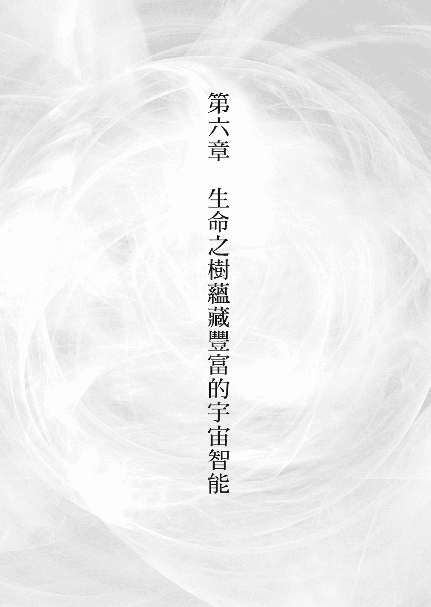

你们已经理解宇宙粒子运行的磁性源自同性相斥，异性相吸。若我们从同一物质体内观看此相吸与相斥的粒子，就是生物体的循环系统；将循环系统向外扩大与融合，就是环境；将环境向外扩大与融合，就成了四季变化，再向外延伸就是生态体系，生态再往外就是地球本身的循环系统，再往外就是太阳系的平衡原理。

宇宙万物在带电粒子形成的振动中不断找寻和维持平衡，而意识就无所不在地存在物质和非物质当中。古埃及的祭司发现人和宇宙的沟通管道存在身体中，透过身体的感知，人类可以链接感知远方事物的脉动，甚至可以透过这层感知观察天体运行的轨迹，整个身体看不见的形体可以如此穿越已知和未知的空间。以物质存在的世界来看，树木的生命和人类是相互依存与互补的，也因此，当古埃及祭司发现生命本身可以穿越未知，与肉体的感知互补时，就将这个看不见的身体路径称为生命之树。

人类和树木间的交流是在动态与非动态间产生能源的交换，若是地球树木也可以移动，则人类就会成为那个不动的存在。只有动与静之间平衡交流，才能产生有效的能源交换，而生命之树就是在不动的身体中存在的动态感知能力。启动生命之树产生动态移动的驱力，就来自身体中的水元素。

 意识即显化物质世界的活水

人类的意识即是那流动的水元素，可以滋养生命之树，也能帮助地球长成枝繁叶茂的丰盛样貌。你们的生命之树不需要施肥，也不用拔草除虫，它一直与你的身体宇宙紧紧相连，你可以称它为乙太身体，或是具有情绪感知能力的身体智能。生命之树可以帮助人类不可移动的身体扩展意识，从生命之树的精微体延伸获取宇宙万物的爱和智慧，回到身体内宇宙。所以，在古文明时期，生命之树也代表进入来世之门，是这一世生命结束后进入未知世界的路径指引。

人类尚未创建文字和语言之前，就是经由意识链接生命之树，来帮助部落族人观测天气、与动物和树木沟通、找寻食物和满足基本生活需求。人类还可以经由生命之树去感知、链接天地万物，守护族人的安全。人类这些和大自然互利共存的智慧不仅利益自己的族群，还可以帮助大地。

 启动身体的水元素，感受万物的真实

人类过去习惯以生物体的大脑往外看物质世界，不断压抑内在的情感流动和内在意识。现在，你需要学会将意识向外延伸，以水元素的视角链接，去看见大自然万有的真实景象。你会发现内在世界早已储藏了大自然的丰盛智慧和资源，任你取用。

你们的身体有两个感知中心，一个属阳性、智性的脑，由上而下运行；另一个属阴性、情感的脑，由下而上透过情绪感知。人类过去一直以为是自己的大脑在储存与事物相关的记忆，实际上，只有身体可以感受到的才会被真正地储存下来。你现在可以回想一下小时候的生长环境、家中摆设的物品，会让你重现场景的记忆点有哪些？

嗯！我仍然可以记得的好像是气味，还有当时的心情。

没有错，你们大脑的记忆是有限的理解，身体感官和情绪体验到的对你来说才是真实的。缺乏感受的过程，就无法呈现出事物之于你内在的真实。当你启动身体的水元素去感知万物，会让生命进入不同的视野，重现属于你内在的真实，而这也是ＡＩ机器人无法取代人类的原因。人类可以从内在宇宙看见一切万有的真实，这是ＡＩ智能系统仍然无法复制的。

你可以练习启动身体的水元素，重新感知和记录万事万物之于你内在宇宙的真实样貌。

晶体定位法

之前雷巴特有教过你如何在晶体中扫描身体各大元素，如左图。（请参考《创造新我．新地球》第 50 页。）

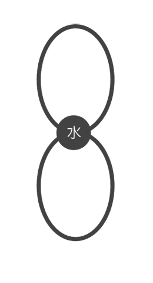

正中央的位置就是水元素的启动点。现在将你的第三眼打开，进入８的正中央，对自己说“打开水元素”，就可以启用身体的水元素来感知和链接万物。

身体定位法

另一个方式是想像水元素进入身体正后方，透过身体脐轮的感知中心，来体验水元素的视角。

以上两种方法结束后，都对自己说：

“感谢水元素的协助，现在将身体回复到此时此刻最适合的元素组成！”

现在不妨用以上两种方法做个简单的自我检测，用意识去感知你的任何一棵植物。

我分别用以上两种方法，去尝试感知阳台上已经种植许多年的一棵金桔树，得到以下的结果：

**感知方法****晶体定位**感知位置第三眼８的中央点回应速度快（五秒之内）讯息品质快速感到平静愉悦持续时间短心轮单点感知收讯来源由上而下的智性知晓**感知方法****身体定位**感知位置水在身体脐轮后方回应速度慢（延迟十五秒之后）讯息品质内在升起平静愉悦的感觉持续时间长身体全面包覆式感知收讯来源由下而上的内在情绪感受升起

你现在看出两者之间的不同了吗？

嗯！好特别的体验。用晶体感知是智性的领会，而当我用肚脐去感知时，我体验到的是出自我内在的情绪感受。我可以从自己的内在辨识金桔的能量品质，金桔从我内在升起，它就在我之内，我们是一体的，它让我体会到，我能像金桔一般立即回到平静和愉悦的存在状态。

嗯！很好，你看见了！这是每个人都具备的能力。人类内在意识的泉源——水元素已经很久没有被使用了，你们的社会、教育、文化和集体意识不断地训练鞭策你们的大脑向外界征战，你们只相信眼见为凭的世界，不知道内在意识可以更细微地感知万物的能量品质。当你启动水元素的感知力，就能够链接一切万有爱的品质，以地球母亲蕴藏在大自然万有中的爱来滋养你的生命之树，那是你的生命之树本有的能力。

这让我很惊讶。我没有用肚脐去链接过任何东西，但经过这个练习，我才理解，我们想要如何与外界互动，是可以自由选择的。而打开水元素的链接品质更不同于智性的链接感知，水元素可以帮助我们从身体内在如实感受到万物的真实，和独特的能量品质。

是的，你终于搞懂了。人类拥有自由的灵魂，你们的意识决定自己的实相，当你觉得要去感知金桔，你就得到金桔的能量品质，回到自己的身体中。你可以经由这个过程，重新定义金桔之于你内在的真实是什么样的感受。

是的，我发现如果可以让大自然各种植物树木的能量如实呈现在身体中，就不需要去背诵记忆自然课本中描述的生物学名和植物特性。现在用水元素去感知，将花草树木的独特能量带回我们的内在宇宙如实感受，才是真的心领神会植物的品质，也明白自己的身体在什么时候需要与哪种植物互连，让身体可以随时透过意识获得大自然的补给，这是庞大的生物和医学教育的再造工程啊！

阿乙莎跟你说过，教育是让孩子去探索和发现的过程，而现在你终于明白，“发现”不是向外，而是向内链接宇宙丰富多元的生命。这是一趟学会从自己的内在宇宙去发现自己的过程。

此外，当阴性的能量和阳性的能量在你内在合一时，你还可以突破长久禁锢着人类的二元对立看法，超越非黑即白的框架，契入更高的神性意识，与万物共存。

现在，再进入三位一体的合一意识中，结合你的灵性母亲（阴性）和灵性父亲（阳性）的能量，重新感知这棵金桔。

嗯！进入合一意识中，此时此刻，我与金桔的晶体融合，我们已经是一体的存在。我在此无法辨别来自金桔的情绪感受，而是从自己的晶体振动中，得知我的晶体已经和金桔的晶体融合，融合后的晶体带给我水晶般澄澈的感受。我觉得通体舒畅，鼻子可以更顺畅地呼吸空气，眼睛湿润明亮；我现在身心无比愉悦，同时也让自己的晶体闪闪发光。我可以确定，金桔因为与我共振也同感愉悦，我们融入彼此爱的能量里，非常舒服喜悦。

你除了可以立即体验到宇宙丰盛多元的能量品质外，当你链接自身的阴性和阳性能量，到达合一意识，还能带给自己和地球万物更大的回报。你们彼此融合，进入爱的流动中，你们已经是光的存在，如此晶莹剔透、完美无瑕。你的生命之树也可以因此获得更多爱的能量补给。

我现在终于明白，为何与大自然共振可以让我们得到如此丰沛的能量感受。现在只需要有意识地和大自然链接就可以了，还不用吃它们，就已经得到这么棒的能量来净化自己，补充或平衡身体所需。若是遇到不得不链接的负面存在和事件，就带着自己进入合一意识，让爱帮助我们脱离难以承受的情绪困扰。

 还原至真、至善、至美的灵性品质

每一个地球生命都携带着不同的爱的振动与独特的生命品质。地球显化万物不是随机偶然的，每一个生命都有其“被需要”存在这世界上的理由。这就是地球承载万物，让生态系统生生不息地延续的原因：一切演化出来的生命体都恰如其分地扮演最初始设定的角色，善尽自己的本分，以维持整体宇宙的平衡。

你现在透过内在水元素的视角，重新看见生命的真实、善意和美丽。你以为的丑陋和罪行的背后，同样拥有其存在的理由，你只是无法用自己的智性大脑去理解；然而，从你的内在宇宙去感受隐藏在丑陋和罪行下的真实时，你会找到情绪初始的动能和最终归属，那里只有爱。人类以物质身体不断地经历情绪碰撞，来完整生命蓝图爱的体验。你会发现，一草一木、动物、昆虫和矿石等，所有你以为与你分离、但存在大自然中的存有，也都存在你之内，你可以如实感知到它们独特的振动品质。现在不妨开始练习，恢复你们包容一切万有的内在能量吧！这才是生命存在的真理，它不存在于外，而会是在你之内才能找回的真实。

练习：链接内在的水元素

从自己的内在宇宙如实感知……

1.大自然存有正无条件地给出它们爱的品质，任由人类随时拿取和补充当下所需。

2.自己的内在宇宙早已蕴藏丰盛的资源。

3.身体感知到的真实是无法以有限的文字或语言传达的。

4.自己和地球万物是一体的。

5.生命都携带某种良善意图和存在的意义。

（我对这个练习中的第五点特别好奇，这样说来，让我避之唯恐不及的生物会不会也有良善的存在意图？我试着去链接我最讨厌的蟑螂，居然可以感受到蟑螂有股特别的力量，它们像是自动吸尘机，专门从黑暗脏乱的环境带出清洁的能量；而当我链接霉菌时，发现它们是会将物质的酸值诱发出来的造酸机。

此外，感知树木和植物，可以发现每一种植物和树木都具备不同的能量品质，都可以帮助人类平衡身心和情绪体。而最让我感到喜悦的是链接海豚，那是一种无法用任何语言描述、纯粹无瑕的爱的品质。人类若是可以如此链接万物，就会知道破坏生态环境、猎杀和虐待动物，造成动植物灭绝，等于在伤害我们自己。当我们失去这些大自然无条件提供的补给，人类自己的内在宇宙只会更加黯淡无光。）

 你就是水的源头，爱的化身

如今，人类意识中充满仇恨与恐惧，也会让自己的生命之树枯萎，造成地球显化出生态的浩劫和环境的恶化。生命之树是人类意识创造与显化物质实相的渠道，人类运用洁净的身体水元素滋养清理生命之树的同时，也帮助清理地球环境；若能以爱的意识灌溉生命之树，更可以帮助地球恢复健康。

地球今日生态的样貌就是人类内在宇宙的一面镜子，那也是你内在的真实样貌。你们口口声声喊着救地球，就要愿意回到内在宇宙，去滋养和灌溉人类自己的生命之树，恢复人类和一切万有链接的能力，如此才能最有效地帮助地球净化。

还记得你曾经问过阿乙莎，有没有最快的方法可以改善地球的能量场吗？

是的，我还记得，当时阿乙莎是这样说的：

“你们要在地球的每一条河川、每一片海洋，以及任何有水流动的区域放入能量平衡装置，让水携带着平抚人们情绪波动的能量，流进每个家庭，让饮用和沐浴用的水都成为净化人类的载体……”

现在让我来告诉你，人类自己就是水源，是宇宙光和爱的化身。

水源在人类自己身上。进入水源区域，就是启动人类自己内在的水元素，回到你生命之树的泉源，让来自你无条件之爱的振动抚平情绪的负面波动，接着就会自然而然流出更高振动频率的意识，进入每个家庭和环境中，完成净化自己和整个地球的工作。

啊！原来如此，现在我终于搞懂了。

 制作完整元素配置的水，帮助身体调频、稳定中轴

人类因意识混乱，切断了与大自然沟通的能力。要恢复美丽的地球，必须从恢复人类的健康着手。

你可以经由撷取身体中已经重新改写的四大元素记忆，储存其振动频率，投射进入水中，如此就可以改写不再被人类世界需要的振动品质，创造出更适合的振动频率来帮助自己和地球。这也是战争或破坏事件发生后，让集体意识重新校准的做法。

所谓“完整元素配置的水”，就是将水以外的其他元素——地、金、风、火——都补足；补足之后，就可以成为专属你当下身体场域的水。完整元素配置的水可以提升人体的免疫力，喝下去后感官可以立即提升，帮助人的意识和大自然重新链接，身体中轴立即得以校准。多喝完整元素配置的水可以逐渐恢复人类的意识，让水来帮助你们衔接和融合进入地球母亲更大的平衡体系里，让地球重现生机。

这么简单？

是的，有意识地生活，就是和宇宙万物共同创造，不是吗？没有受到电磁干扰或其他负面意识破坏前，这杯水对你和环境都是一个有益的存在。你就是你所在世界的源头，可以创造出一切的美好。

人处于无意识状态时，需要借由外在生命物质的辅助，让自己重新获得身心支持与健康快乐。这也是大自然生态最初始设计的样貌：无条件给予人类需要的一切，帮助人类延续生命，世世代代生存在地球上。而人类的意识本身就可以启动身体本有的智能系统，帮助人类从大自然取得源源不绝的能量和资源。

当人类意识渐渐觉醒，回归有意识的生活，这时，大自然的一切将成为你们创造辉煌生命和新世界奇迹的资源。你们透过每一种植物和树木的特殊振动频率制造出来的花精，就是帮助你们抚平内在情绪创伤，让你们恢复内在平衡的一种做法。

取用地球资源时，你已经同时给了大自然一份来自你生命成长的祝福；有意识地取用花草树木的能量时，你让这些生命看见自身存在的价值与伟大。此外，因你愿意让出自己的神性意识空间，接纳其他有情众生与你交流，这些生命因为和人类生命的交流，得以更加扩展，也获得前进至更高意识生命延续的机会。

这真是美丽的生命交流。人类的内在意识就如一座伟大的生态林，充满丰富的珍贵资源和独特的能量品质，人类只要愿意打开内在意识，就可以帮助自己获得身体宇宙需要的能量自动平衡和补给。同时，若我们有意识地让其他生命也可以走入人类的世界，给予大自然展现其生命价值的机会，就能将祝福送达对方！

嗯！这样我懂了，使用自然界的能量和花精已经不是在弥补我们身体的失衡和匮乏，而是人类展开双臂，与大自然万物在更高意识层交流。这么做的同时，花草树木的意识层次也被人类提升了。人类不再因匮乏而无止境地取用大自然资源，我们经由这样的链接，让出一部分生命空间，提供大自然万物延续和展现生命价值的舞台！

感谢盖娅母亲的解释，让我看见万物互动和相互支持的美丽新世界！

 没有人的爱的振动和别人的一模一样

我：阿乙莎，我想请问祢，向盖娅母亲学习以水元素去感知万物爱的振动品质的用意为何？扬升不就是直接链接进入基督意识场就可以了？

阿乙莎：你们此生来到地球，最主要的目的就是来体验爱。透过身体的情绪感知，你才能感受到爱拥有这么多元的面向。你不一定要去链接地球上的每一种生物和树木，那不是每一个人的工作；然而，你们每个人都需要学习和辨识“你想要成为”的爱的振动品质，并带着你创造和精炼出来的爱的振动，回到银河宇宙。
这也是地球孕育多样化生态的缘由。你们透过大自然的教导，学习用自己的意识链接你的情绪体，创造你个人对于爱的诠释和定义。没有一个人的爱的振动和别人的一模一样，你们天生就拥有不同的ＤＮＡ组成；同样地，大自然的花草树木都拥有其独特的爱的能量，你们只需要学会辨别，并能够从大自然取材，进而创造出你想要成为的版本。若是天下所有爱的振动都一模一样，不就回到源头定静无波的意识大洋了吗？那样就失去你前来地球的意义了，不是吗？

我：好奇特的感觉，搞了半天，原来地球上的每一个人都还有一项毕业作品要缴回源头。那么，我的生命之花结晶出来的爱的作品，一旦回到源头，不就全数缴回、融为一体了？结果只是绕一大圈，到此一游吗？

阿乙莎：当然不只如此。你曾经缔造的、属于你的版本的爱的品质，可以引领此生的你继续前进。你没有白缴作业，你曾经在盖娅母亲身上留下的爱的结晶，就存在地球之心——盖娅母亲的晶体中。你可以去找出自己曾在地球上创造的爱的品质。
现在进入自己的晶体，请求你的灵性大师和导师带领你走入盖娅之心，去看见你曾为盖娅留下的爱的足迹。

（我进入自己的晶体，看见时间回到亚特兰提斯时期，我正在某个部落高耸的水晶建筑的阳台上，远处传来阵阵的轰隆声响，战士正在前线努力奋战。空中充满火光和硝烟味，我站在摇摇欲坠的城墙边，望向自己的子民，内心出现一个声音：“我爱你们胜过爱我自己！”就在此时，时空再交错，我身旁出现另一个声音：“回去告诉大家，战争早已结束，该回家了！”）

我：阿乙莎，这场景，是真的吗？那份坚韧慈悲的爱仍在我身体里回荡，我已感动得无法言语……

阿乙莎：是的，那是无条件的爱的品质。你们每一个人留在盖娅之心的爱一直都在，不会因为你回到源头，而失去你一砖一瓦建造出来的爱的晶体。你曾经在地球贡献出的无条件的爱，已经被盖娅母亲珍藏下来，你可以随时进入自己的晶体，带回你曾经缔造的爱的品质，来帮助你继续完成此生的任务。

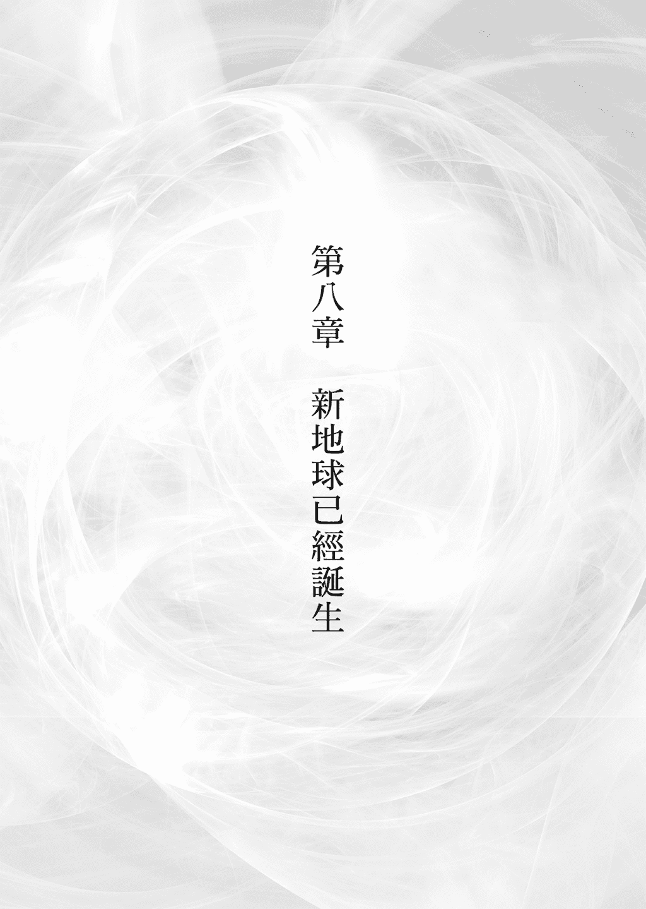

 地球演进的过程

要开始学习新地球的互动规则前，我们先来回顾一下地球生存法则的演进过程。

第一阶段：弱肉强食，适者生存

没有错！这是当时最早被设定的地球法则，来自人类灵魂计划的初期，是让人类得以生活在地球上的初始生存法则。

在此阶段，灵魂最高的目的是要优化灵魂载具，而只有在弱肉强食、持续不断的肢体冲突中，才能够演化出最能适应地球环境的灵魂载具——人类如此，动物、植物、昆虫与海洋中的世界亦如此。人类肉体的生命力，也因此可以从短暂的四、五十年寿命，延展至今日的一百岁。当人类的生物细胞智能经过不断的淘汰，晋级到足以适应地球恶劣环境的门槛时，就能让存在你们细胞中的振动频率自动提升到链接集体意识。这是灵魂透过生物体去体验和成长的必要之恶，人类虽然经历了痛苦挣扎的求生历程，却也在此阶段不断经由更高次元的灵魂投入地球，让所有人看见人的内在拥有至高的良善、爱与宽容。

第二阶段：和平共存，精益求精

人类逐渐摆脱弱肉强食的循环，进入和平共存的文明生活。你们透过链接群体的力量，经由族群协议和国家之间的谈判，达成多种族、多元文化共存的生活，为自己的生活创造更适合的居住环境、交通、能源、通讯、科技、教育和医疗。这个阶段，背后最大的成全者是地球母亲、生态系及所有居住在地球上的物种，全面无条件地供养人类创造文明所需的一切资源。这样的发展原本是值得喝采的，然而，只经过短短的数百年，地球生态体系却已经逐渐变色了。

人类聪明地利用地球上得天独厚的自然生态资源，创造了许多不再需要由大自然供应的替代品。人类过去居住的岩洞和木造房子被钢筋混凝土的房子取代，屏蔽了大自然风元素的流动，以空调系统代替。人类还使用基因繁殖技术和化学药剂破坏自然环境，连带让一些帮助花朵授粉的蜜蜂、蝴蝶、昆虫大量中毒死亡。整个生态系为了接纳地球人类在此共存，牺牲了自己的智能系统。地球上的物种生命正在消失，只有人类以为自己可以用更高的科技与技术来对抗地球生态智能系统的崩解。

在精益求精的文明生活中，金钱制度成功地快速推动地球文明，而文明背后的真实景象是：少数掌控者正以金钱继续行使奴役人类之实。人类以为自己已经脱离被掌控者奴役的生活，其实在享乐的同时，人类正不知不觉地进入掌控者创造的金钱游戏，而不断放出贪婪、恐惧、不安全感、匮乏等低频能量。

第三阶段：意识分离前的混乱和崩解

地球崩坏最主要的原因，是人类低频振动能量的牵引，这是来自人类第一阶段弱肉强食的掌控者以金钱奴役人民的游戏规则。他们发现，只要透过金钱，就能轻松掌控人类，而人类在追逐金钱、获取更好的生活条件的过程中，逐渐忘却自己原本就是被地球无条件地支持，以为只有金钱才能让自己在地球上安身立命。

地球的生态系统是地球整个生命共同体的健康指标，人类轻忽生态与自身健康的关系与连动性，将造成人类种族在地球上的危机。你们的新闻媒体不断提到地球暖化和北极融冰的消息，还有一些国家土壤液化或地层下陷、海水升温等等，这些都不是危言耸听，而是目前整体磁引力场偏离中轴造成的现象。

地球的中轴偏移，最主要是由地球表面的磁场干扰与混乱造成的。人类大规模地破坏环境，除了环境的磁引力变化，人类身体中与宇宙和地球链接的脉轮信道阻塞，也会成为地球能量流动的障碍。人类自身中轴偏移会造成地球偏离太阳系的运行轨道，导致周边行星群撞击、甚至更严重的后果。过去的亚特兰提斯文明是遭受恶意星球攻击，但目前地球的危机则是人类自体失衡造成的，不可以轻忽可能带来的后果。

第四阶段：重生，再造新地球

地球是整个银河系共同护佑的灵魂孵化场，失去地球，银河系就失去灵魂循环系统。这也是为什么必须在地球被破坏、失控前，创造出一个新地球，来迎接扬升的灵魂回到银河宇宙的怀抱。我描绘的这个场景不在你们的教科书或任何专家的认知系统里，你们还没有创建下一个地球共识，但时间已经迫近，我们要加速人类灵魂的扬升。

从二〇一二年起到二〇一八年，新地球的接轨已经完成，这是我盖娅进行自体分离、进入扬升的轨道中，为了延续生命而诞生新地球。与此同时，你在目前所处的地球上看见一些社会现象正呈现两极化的发展：有极致的黑暗和低频振动的世界，也有更多人向光明和良善的集体意识靠拢。这个两极的镜像在过去十年里，从模煳渐趋明显，划分开来。一些原本繁华的城市一夕之间变成战乱的废墟，而从未被重视的地区突然成为移居的新天堂乐园。旧地球的人类正朝向两个全然不同的生活型态分离开来，一些人选择进入文明科技的尖端，过着被ＡＩ机器人、无人商场、无人驾驶车辆及外太空飞行体验围绕的生活；还有一群人则会走向大地，找回生命最初始的能量，回到更接近大自然的生活，重建自己的家园。这些分离的意识、分离的实相不但展现在目前的地球上，在宇宙另一端的新地球上，也同样正在成形。

 新地球自盖娅意识分离出来

之前有跟你提过平行时空的宇宙观，你在三次元的空间无法理解，但是当你进入自己的灵魂晶体时，你早已明白，每一个镜面都是你另一个平行宇宙的实相。你的灵性源头在不同的宇宙时空展开体验，你们互为源头，也在源头合而为一。看似在虚拟世界中的你，那个你与目前的你共享同样的灵魂振动品质，只是当你进入地球，你的一部分灵魂意识需要透过身体与情绪的感知来获得体验，并经由内在意识和大自然交流，学习尊重生命，学习辨认出每一个生命都具有独特的爱的理由和存在的能量品质；而在另外的世界中的你，正以更高的意识，在不同的宇宙次元体验着属于那个次元的生命实相。当你回到自己的内在宇宙，就可以链接所有时空的你，完整属于你的一切体验。

你的更高智慧源自于自己，而你的灵性片段和所有生活在地球上的人却可以拥有共同的地球记忆。那份记忆就是来自于我，你们的地球母亲，我储存了人类自开天辟地以来生活经历的资料备份，也是生活在此所有灵性生命的守护者。你们内在的灵性母亲是由我分离出来的，我和我所有的灵性分离意识彼此相连。我在地球，也在你之内，自你诞生于地球的那一刻起，你已经是完整而具足的灵魂。

你拥有本自具足、齐全的资源和装备，来到地球体验，地球上的一切都可以让你随心所欲地创造。你终于明白，当金钱变成掌控人类和地球资源的媒介、变成人类追寻生命意义的目标，控制者还不费吹灰之力，就让每个人将自己生命的主宰权交付出来时，我有多么伤心和着急。

眼见美丽的蓝色星球被无意识的孩子们任意践踏，不但如此，你们还自以为聪明地伤害了自己的身体，让自己和大自然的怀抱隔绝开来，你们与我的链接愈来愈弱。孩子们，当你们在地球上自掘坟墓，让许多灵魂找不到回家的路，我将无法再任由地球环境无止境地崩坏。我的身体和循环系统都出了问题，我必须分离出一个新的地球，带领一些觉醒的孩子离开，让生命得以延续。尚未觉醒的孩子们，你们仍有无法放下、无法原谅、无法理解，需要更多时间去转化的事，我仍会陪伴着你们，直到我所有的孩子回家。

盖娅母亲，谢谢你一直守候着所有地球生命。我想知道，若没有再造新地球，在旧地球偏离或与另一个星球撞击之后，所有灵魂意识就会回不了家吗？

你们仍可以回到源头，但届时若没有创造一个新的地球，我们共同的新灵魂孵化场就不见了，你懂吗？当你和我只能待在一艘永恒的船上时，你还能存在于非永恒吗？

我们若失去接住游离意识的孵化器，永恒的宇宙会出现一个大洞，这个洞一旦掉下去，就会永远消失，不再返回。这时，永恒的另一面出现了，会侵蚀掉永恒的宇宙。

你是指，即使存在宇宙源头的永恒也不是真的永恒，需要一个类似回收的机制，将那群体验分离的意识再补回来；若没有补回来，就会形成劣币驱逐良币，愈来愈多的分离造成愈来愈大的洞，银河系最后就被这个大坑洞吃掉了，完全消失，是这样吗？

没有错，地球是排水系统里的回收站，所以，现在有许多来自银河联盟的高灵和导师也来协助我进入重生的轨道。目前新地球的轨道已经创建，新移民陆续进驻新地球，你目前和我的传讯就是链接了新地球上的我；而这本书一开始的链接，你感受到沉重与稠密的磁场，那是处于旧地球的我。我目前分处两边，只要你需要知晓新地球的讯息，就来这里和我链接。

嗯！我明白了，难怪这几天我渐渐感到轻盈，和最早的氛围不同。

我想了解，新地球是如何形成的？你和雷巴特制作的宇宙光之桥要如何带我们移入新地球？

新地球就在银河集体存有共同打造的地球星门里，你们从目前存在的三维空间要进入更高的维度空间，就是经由光的信道。这些光的信道都是银河宇宙星际联盟经过共同协议，为了让地球人类扬升进入银河轨道所打造的。若从你现在位置的角度来看，就是你的振动频率调节至十八赫兹，你无法用肉眼看见，但可以透过意识的转换到达。

当你成为自由的灵魂意识，就能进入平行宇宙，穿梭于不同的宇宙实相中。每一个次元都有对应该次元的集合意识场，你只要透过自己的内在意识，就可以前往不同的宇宙次元。这些频段就在你的灵魂ＤＮＡ中，只是你无法以人身载具快速在平行宇宙中移动，只能透过意识穿越身体的屏障进入。

你的灵性源头可以给予你专属于你的导航地图，我们暂且称之为心智图。心智图存在你与自己灵性源头的共同意识场，当你能够与灵性源头合一，打开自己的心智图，就可以进入跨次元的宇宙星际旅程。

所以新地球是外星人打造的？

你说的外星人也是地球人，你们将意识扩展到星光体的存在意识，就能和外星意识接轨，所以新地球也是地球人和外星意识共同打造出来的。新地球已经诞生，这里拥有超越之前地球的文明，这些文明有来自星际联盟共同的创造与无条件的爱的祝福，新地球的意识更高于目前的地球意识。我们正式邀请已经具备觉醒意识的人类移居到新地球，共同创造新地球的未来。这里有多元种族，包括大角星、猎户星、天琴星、织女星、克里昂、昴宿星、列木里亚星球的意识种子都在此。这里是银河联盟共同创造的新地球、新世界。

地球已进入新旧分离和下次扬升的交会点

在地球即将迈向第五次元的银河轨道之际，尚未苏醒的人会与地球集体意识再次分离，成为游离的意识粒子，而苏醒的人将跟随地球一起迈入银河宇宙的行列。在这个分离的交会点，我们必须合作，让更多的意识觉醒，回到银河家园。

分离的灵魂意识仍会坠入宇宙黑洞，但也会再度自黑洞中重生。只是，重生的新地球需要回到最初始的状态，回到你们尚未拥有文明生活的地球时代。

啊？那是充满战争和杀戮的野蛮生活。

若这是游离意识向往和选择的，宇宙仍然会有空间来满足这些存在意识。

有没有可能这一次的生命尚未觉醒，但去报到时一觉醒来，就已经处在扬升后的地球？

机率不大。

为什么？

因为扬升后的新地球的意识振动频率高于原有的灵魂意识，这些处于较低振动频率的意识会相斥，而不是被吸引进去。只有达到相同的意识高度，在共振下才能融合进入更高的集体意识。

那么，我们目前尚未觉醒的家人和朋友怎么办？

他们仍会在生物体死亡后回到源头，但是当他们做出再次体验的选择时，会因为仍处于较低意识的牵引，而选择再次体验分离。

是这样啊！那么，你是否可以教我们如何让这些即将重生的灵魂选择正确的扬升道路？

我们无法干预，那是个体的自由意志。你们即使处于源头的集体意识里，仍然保有个体的自由意志。你还记得你进入地球之前的状态吗？

你是指在灵魂重生前的选择区吗？

是的。进去那个地方再次感受一下，你就会理解我为何这么说。

好的，我再次进去感受一下。

练习：进入灵魂选择区的流程

1.进入自己的晶体。

2.请你的大师、导师和挚爱的家人带领你来到灵魂的选择区。

3.明显感觉到从更高的意识状态像是搭乘往下的手扶梯，一直向下。

4.最后，停在一个很厚重稠密的空间，这里就是集体意识场域的边陲区。

（此刻，我内心清楚知晓，原来我们当初在成为宇宙的游离粒子、坠入黑洞的旅程开始前就已经做出选择。我们站在集体意识场域的边缘，试图去体验分离后的所有可能性。这是我们灵魂的渴望，而当灵魂意识尚未完成自己的旅程时，在选择区就会带着不稳定的意识能量。那股不稳定的能量就像少了某个电位的单一正电或负电一般，急着寻找另一个能够与之配对的正负电子，而在这个状态下，就会将自身抛离共同意识的恒定能量状态，往外寻找另一个平衡。

也因此，当进入灵魂的选择区时，我们是处于个体分离意识最强烈的摆荡状态，除非已经完整了灵魂想要体验的旅程，我们才有可能坚定地走向空无的源头集体意识。在选择区，个体意识更加强烈地想要再度去体验和满足尚待圆满的关系，或者说是去满足已经处于游离单一电子状态的渴望；也因此，这些强烈的分离意识会瞬间阻挡灵魂选择回到源头共同意识。新生命就是如此诞生的。

然而，刚才莎雅说地球整体也是个灵魂意识，它也有自身的扬升计划。若处于游离电子状态的意识重新回到地球时，原来的地球已经进入扬升后的平衡轨道，目前处于分离意识的它们将无从理解，会因此坠入另一个未知的黑洞中再次融合，然后回到下一个重生的旅程。）

 意识回归源头的还原工程

人类的意识觉醒工程并不是在你身体之外的宇宙设立讯息基地台，由你的感知体去传感或追寻特别的高维讯息场经验。不同的宇宙次元早已存在你最初的灵性种子里，你的灵性父亲与母亲结合出一个新的灵性种子时，就已经将契入灵性源头的路径给了你，只是你目前的体验仍位于第三次元的地球，以物质身体的样貌存在着。你灵性源头的意识早已在你生身父母的受精卵里，你是这完整的灵魂意识存在第三次元的物质显化版。你的生身父母使用自己身体内的精子与卵子创造出你的灵魂载具，同时也在你的成长过程中，将他们此生创造的体验与感知传承给你。

当你的父母或挚爱的亲人离开此世时，若其自身的灵魂意识仍未完成此生的意图，或者他们仍有强烈的愿望尚未达成，这些未实现的意图会自他们的灵魂晶体中分离，散落在世间，让仍待完成的意图的灵性片段可以留在自己的子子孙孙和家人身上。这些留在家人身上的灵性意图，就是你们知道的祖先业力；若是留在广大的族群后代中，就是种族或国家的集体业力。这也是为何当你要扩展自己的灵魂意识时，最需要先突破的是针对最亲近的家人（第一层关系）的全面观照与理解，进而扩展至工作、种族、社会、国家等，让你的灵魂经由三百六十度关系的全面理解，得以还原回复你灵魂最初的源头意识，找回你自己的回归路径，回到与源头合一的意识。这是灵性源头的意识还原工程，必须透过你自己的内在探索才得以完成，没有任何人或高灵可以代替你完成这趟灵魂的旅程。

当你终于回到与自己灵性父母的链接，进入合一的基督意识场，在这里，你就能以现有的肉身重新诞生于一个属于更高次元的新地球。你的灵魂在此重生，你成为新地球的意识存在。

虽然身体仍位于第三次元的地球，你已渐渐脱离旧地球的纷乱与稠密，你的意识会带领你活出新地球的意识状态，并呈现出全新的生活样貌。你也可以在肉身仍然健康无病的状态下，决定是否要离开，以另一个生命载具进入不同的宇宙次元或新地球，继续你灵魂的旅程。你是自由的意识存在，你就是造物者。

 生命永续计划

生命的永续发展是来自宇宙源头创建起来的共同意识流。无论你喜不喜欢、同不同意，也不论是非对错，所有宇宙生命共同体必须一致遵循这个法则，才能创造生生不息的永恒生命。人类是生命进入分离意识场域的一个体验站，在宇宙中，类似地球这样单独的行星、这样遗世独立的存在体验站，多达五亿六千万颗。你今天的一部分意识以人类身体的形态在地球上体验，这个体验过程与你在此获得的经验都会对整体宇宙带来贡献，你们不要小看自己的力量。

灵魂有没有可能消失？

针对这个题目，你在三次元世界的理解和进入更高次元的理解会全然不同。在三次元世界，一切都是线性展开，有始有终，有生有死；然而，进入更高的次元，是从一条线延伸成一个面，再由一个面扩展成一个空间，然后一个空间与另一个空间链接成一个球状，再经由球状体扩展成无形的场，这个场就是所有生命的讯息场，而这个生命讯息场有场域互连机制。

所以，当你认知自己的生命体已走入尽头时，你是消失在自己的线性终点，进入另一个空间；而这个生命最终会流向哪里，端视它与哪一个讯息场相链接，这会决定其去向。所以，生命不会消失在宇宙中，它在你的空间里消失，最终会在讯息场中相会。

谁在帮我决定生命永续计划？

只有你自己的意识流向可以带领你去经历生命的永恒，你没有被控制，你是自由的意识。现在你们才刚开始学习进入生命永恒的意识场，进入宇宙浩瀚永恒生命的计划中。

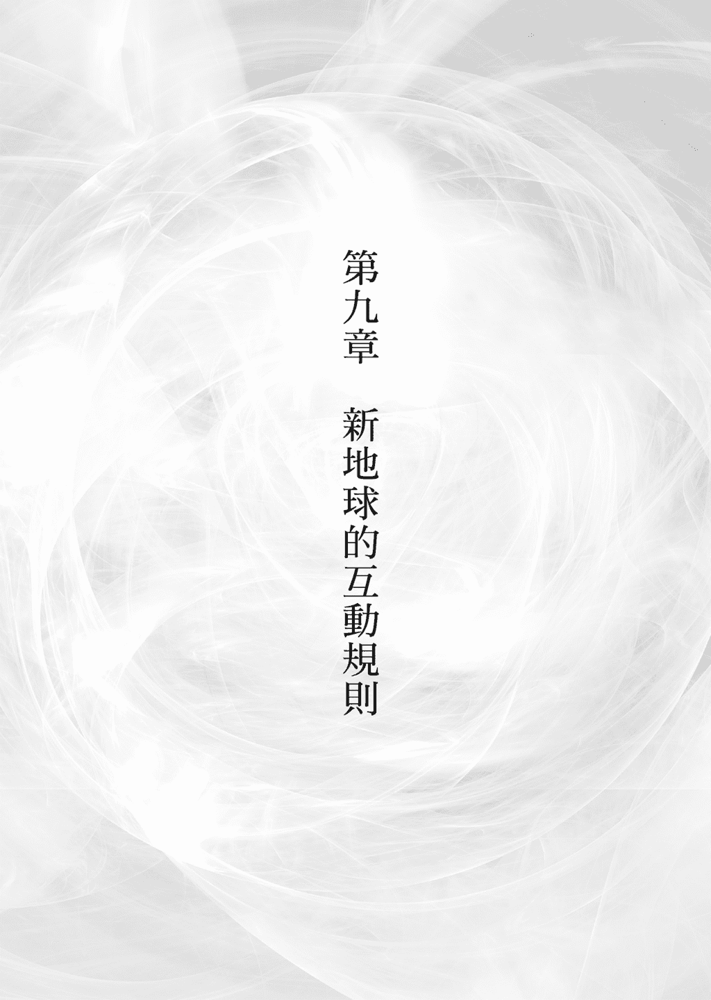

（编按：本章皆为阿乙莎传达的讯息。）

 你是一切的开始，创造的本源

地球生命和其他高次元星球生命最大的不同点，就是你们每一个生命都具有自由的意志。你可以创造你需要的一切体验，你是生活在太阳系里的自由灵魂，不受银河系的集体意识所控。你在猎户座的臂弯里，可以像个任性的孩子，用你个人的意志恣意体验和创造在地球上的一切，而地球母亲足以吸收和平衡你们创造的任何偏差，进行自体修复。你是地球领地中一切的开始，人类被赋予如同神的双手，在此创造。

地球此时要重新回到创世纪的状态，黑与白的两极能量会短暂分离，然后再次重整融合。你现在回顾人类的历史，除了神话故事里的创世传说，可能还没有遇到太多的历史经验。没有错！现在是地球回到创世的伟大时刻，那一分为二的黑夜与白昼让整个世界进入两个极端，自此之后，你们才会再次进入相互融合，阴中有阳、阳中有阴的世界，这是宇宙运行之道。我们感受到地球的创世时刻已然来临，因此来提醒并带领你们进入更高生命意识之流，帮助地球和愿意提升意识的人安然度过这个时刻。

 银河宇宙大门已经为新地球打开

人类的灵魂意识渴望的所有体验被满足后，就会来到银河系的大门，与更高的意识群接轨。一旦进入银河系，就会与更多的集体意识群汇流，你将失去使用个人意志创造的权利，进入一股创造和谐的生命之流，而这股能量的流动才能被所有更高集体意识群接纳。如此一来，你就能真正成为宇宙共同意识群的一员。

地球目前正受到银河系整体意识的磁栅牵引，进入新的运行轨道。宇宙更高集体意识正在传送邀请，希望地球进入银河系，因为在银河系的量子讯息场中，已经可以明确感受到地球母亲已不胜负荷。若地球的磁栅持续偏移、磁轴倾斜，会导致地球母亲无法进行自体修复，那股一推一拉的能量产生了不平衡的状态。

地球原来与太阳及月亮的平衡，会被新的行星群带领的新地球磁栅取代。你们处于三次元的地球，无法看见位在量子世界的新磁栅的图像已经展开。地球内部的晶栅正在呼应新的磁栅，进入自体调整，在这个调整的过程中，所有居住在地球上、具有完整晶体意识的生命，包含人类、大自然、矿石、森林、动物等都会链接进入新的地球磁栅系统。分离的意识将在地球一分为二，一边是旧地球的意识仍主宰着生命的流动，另一边则是由内而外，渐渐活出新地球的实相。

你们的科学家也将出现两派学说，一派是传统的高倍望远镜研究学者，另一派则进入了量子观测的新时代。这些两极分化的现象会在一批进入新地球实相的人发展出以肉身离开旧地球的生存模式后，正式分离。

自此之后，旧地球仍然回到原有的生命循环系统，进入新地球的人类则迈入第五次元的新世界，继续体验生活。这样的移转会从二〇三〇年陆续展开，第一批移入的人类会以意识种子的形态进入新地球轨道。这个移向新地球的分裂过程，会让还没有准备好的人产生很大的恐惧及痛苦，但对已经能够进入内在宇宙、明了自己与更高意识的宇宙是一体的人来说，是会受到保护并感到内心平静安适的。

你所看见的第三次元的经济、政治和社会现象，端视你们的集体意识是选择维持旧地球秩序或拥抱新地球意识，而会展现不同的样貌。对银河宇宙来说，这是迎接人类星际种子进入银河系的欢庆时刻。

 地球生命大跃进

你们的生命蓝图是在被播种的当下，就决定了生命跃升的时间点。地球人类和各行星生命的播种都一致，只是生命的跃升时间表在三次元的地球是缓慢移动的过程，不像其他高次元的生命可能在短短一、两世的轮回体验，就达到脱离物质生物体的状态，以纯意识的振动存在宇宙之间。

地球具备人类生命形态已经有两百万年了，但相对于地球四十六亿年的生命演进来说，人类在短短的两百万年间已经历了三次的大跃进，最近一次就是你们目前历史有记载的古埃及文明时期。而现在，你们将再次来到生命跃进的时刻。你有没有似曾相识的感觉？目前地球上的某些生命可能正是当时选择进入新地球的人回到这里，来提醒更多的人跃升，而另一些在上次的转换时期没有选择进入新地球的人，这一次也会感到着急：“难道又要我再选择一次？”没错！不论你是否已经觉醒，这是你内在灵魂提出的邀请。你将迎接什么样的生命未来，由你自己决定。

 打开以意识交流的量子世界

宇宙的意识交流是以你肉眼看不见的粒子偕同波动产生量子讯息场，这是比原子还微小的粒子，你们的科学家无法以任何高倍显微仪器侦测到的微粒子态所创造的波动磁引力效能，就是量子世界的语言。至于你们眼睛可以看见的光，则是量子讯息的反射呈现出来的。因为你们处于太阳和月亮一推一拉的动态平衡中，粒子流动反射出来的光是量子讯息的结果。真正影响光的，是这群微粒子运行后创造的讯息。微粒子无所不在，宇宙在更高的次元就是一大群微粒子交互运行的光的世界。当你用脉轮手指操成功展开自己的意识，契入最遥远的宇宙那一端时，你只能感受到各种光的存在，仍然看不见这些光背后的意识场，而那就是人类即将进入的量子讯息新世界。

你的生命本身就是个讯息场，这个讯息场存在人的身体细胞内，也存在你的个人量子宇宙讯息场中。人就是宇宙，宇宙也是人，但若你往自己的心轮进入内在宇宙，你会感受到整个宇宙就存在你的内在世界。你和宇宙是一体的，只是你以人的生物体形态存在这个宇宙中，宇宙也因你的存在而不断进行一推一拉的自体平衡。你的意识就是进入这个量子宇宙讯息场的桥梁，你也决定了自己的宇宙是往推还是拉的方向前进。这一推一拉的振动结果，就是你生命之光的颜色，也决定了你所处的环境和你的量子世界的平衡结果。

你的意识决定环境如何与你合作，又如何与你协调出新的平衡世界。一群居住在相同区域的人生活在一起，就决定了自己的环境、社会、国家，乃至地球的整体生命走向。生命的讯息在所有人的意识中不断显化和流动，你眼中所见的一切都是生命意识流动平衡后的结果。当你发觉自己身处的环境充满疾病、战乱、天灾、破坏与黑暗，那也是你们内在意识创造出来的结果，要来帮助你们的环境平衡集体意识。同样地，当你们的集体意识向上提升、与更高的意识场链接时，你将进入更高的宇宙生命之流，在这里融入更和谐的广大共同意识，更稳定地趋向宇宙中心的流动状态。你会在此感受到生命的宁静、祥和与美好。这里是你们所处的环境振动不平衡而混乱时的逃生舱，唯有带着自己的意识，向上链接广大宇宙共同意识源头，才能带领生命找到新的出口。而宇宙的入口，就出现在你发现自己的内在意识具有和宇宙众神链接的能力之时，你将打开这扇进入宇宙的大门。

 进入内在宇宙观察显化的过程

即使你目前用肉眼无法看见量子维度的世界如何展现，你可以进入自己的内在宇宙，传感你目前身处的量子世界呈现的样貌。这只有透过有意识地进入你的内在宇宙才能知晓，仍处于无意识状态的人无法感知量子世界的讯息。

建议你从看见每个人身上的光开始。用内在之眼，你可以看见对方在量子世界的能量流动，甚至可以从他身上能量穿梭的脉轮位置，看见其身体器官和细胞折射出不同的光。另外，去看看这个世界，量子世界里的地、水、风、火、花草树木、动物的眼睛，你会看见周边所有生命的讯息是如何在你身体之内的环境里流转。

当你看见他们时，他们的能量就会展开量子纠缠的融合现象；同样地，进入某个城市、某个区域时，你会从该环境中吹来的风、空中的云朵观察出这个城市或区域的集体意识流动状态，空气、水、大地、阳光都带着量子讯息，与你所处环境中的每一个生命互动。

当你们的灵性意识觉醒时，你就可以活在跨次元、跨维度的世界；虽然你的身体目前处于三次元的地球时空，但你的振动频率可以出入新旧地球次元之间。你们所处的地球的某些区域，已经逐渐展现五次元的实相。

喔？这就超乎我的理解了，怎么可能做到呢？

你可以想像自己在玩电动游戏，在虚拟世界里的角色扮演是真实的存在，你们太倚赖眼见为凭的物质体，而实际上，你的意识存在的时空是超越物质的存在，以光的粒子呈现出虚拟世界的实相。玩电动游戏、看电影时，你的身体处在某一个空间，但你的意识跟随着游戏和电影，进入不同的光与影像的世界，那个世界也同样存在。就如同你现在可以轻易链接到阿卡西纪录，纪录里存在着人类数万年来在地球创造的所有历史片段，你可以随时撷取已经存在的画面景象和任何已封存于历史中的讯息——你可以处在五百年前的地球场景，也可以飞越太平洋，进入你曾经存在的古埃及帝国。你的意识就是如此自由地存在此平行宇宙中。

我仍然无法想像祢描绘的这个状况。为何我们在地球上活出新的意识时，可以同时创造新地球的实相？

你在地球上以高于目前集体意识层的振动频率生活的同时，在表面的显化上看不到未来世界的高楼大厦，看不到飞船、汽车，但你的意识已经活在另一个时空，这里和目前已经存在五次元新地球的集体意识场域同频。你会穿梭进出于五次元地球，获得灵感与直觉；而与此同时，目前地球上被你的意识链接的区域也会如此展现，两边同频的振动产生量子纠缠，最后同步显化成实相。

另外还有一个地方也帮助串起新旧世界两端，就是你们的合一意识场。当量子纠缠的两端意识同处于合一的基督意识场时，所展现出来的能量状态，可以改变物质实相。

 基督意识是进入新地球的信道

想要链接新地球，我们的意识要到达哪里？

当你的灵魂意识进入合一的基督意识场域，你就找到了进入新地球的链接信道，你已经同时存在新旧地球之间。扬升的灵魂正为新地球的实相积极地创造，而尚未扬升的灵魂仍然在旧地球的时空继续学习。

我终于知道，原来我们身上已经有进入新地球的路径。只要进入基督意识状态，我们的振动频率就会开展出两个世界同频的实相。

是的。只不过现在的你只是可以链接，尚未“活出”五次元世界的实相。

当你进入三位一体的合一基督意识时，你已来到完整的灵魂意识状态，这时，你的指导师会与你完整的合一意识讨论是否要回到光的世界，或者再依你的合一意识，进入不同的宇宙次元体验。此时，灵魂的选择就是以更高的灵性意识为目的，而不再是你在三次元时的小我意识的选择。这是以宇宙的和谐共存为目的的生命选择区。

嗯！我还记得，阿乙莎祢给我两次灵魂选择区的体验，一次是进入阿卡西纪录的氛围，一次在基督意识场中。但是，我目前的小我意识想回到光的源头，不再体验分离，行吗？

当然可以，这也是你进入地球的原因啊！进入地球是让你回到光的源头必要的学习和体验过程，然而，当你再次与自己的灵性父母合一时，你会拥有不同灵性高度的理解。即使你在地球的任务完成、做到满分，当你回到合一的意识时，你将会认同自己灵性父母和更广大宇宙群体的使命，会臣服地踏上下一次的生命旅程，继续完成自己在更高意识层被赋予的任务。

这么说来，进入合一的基督意识时，我就会放下小我的欲望，或者说放下完善小我的意图，踏上更高灵性使命的旅程。

是的，可以这么说。

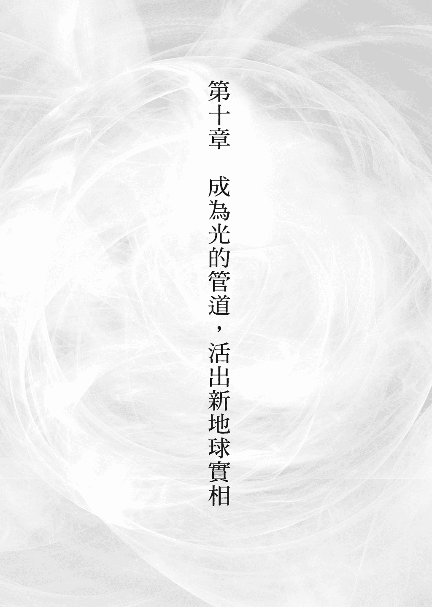

接下来，我要将有关新地球的生活之道和运行法则的讯息传递给你。你开始行动，也让所有已经觉醒的人可以随着你的经验，进入新地球实相的创造之路。

我们先从意识的演练开始，让人类可以转变现在的地球，并和大自然创建新的共存关系。

 意识可以转变地球

在量子世界里，意识可以透过人的意念、符号和声音传递，并展开链接。

当你用意识投射，会在量子世界产生一个新的能量场域。例如我们现在要打开一个五次元的地球新场域，我就在旧地球这里，向宇宙投射出一个位于五次元、适合新地球存在的空间。我将自身的旧地球能量母体细胞植入这个意图，就从自己的母体中扩展出新的空间来。所以这个意图对我——整体地球意识层——来说，是创造新地球的开端；若以人类集体意识层来运作，就是创造人类新的共同意识场域。作用在你自己身体小宇宙的层级，就是扩展新细胞生长的环境；若是作用在社会事件，就是创造事件新的发展可能性。

进入量子世界的流动方向与链接，需要由意念来带领。没有给予明确的指示，就如同在空中吹泡泡，当泡泡失去链接的支撑或前进的动能，就会破灭。

要如何给予明确的方向和链接指引？

这需要你更进一步地设定意图。比如说，我需要为地球创造一个新的场域，这个场域距离目前的环境多远？在哪一个方向？那个新的场域需要什么样的条件才能维持环境？也就是说，进行意识投射的同时，要向宇宙下达明确的讯息引导及节点设定，这些讯息和节点就会在意图投射之后，自动展开链接。

在量子世界，讯息链接的速度很快，若以灵视之眼去看，就可以看见晶状的生命之花展现。

量子世界有许许多多生命之花，若你要在目前的三次元地球显化出地球新实相，会遭受莫大的干扰，因为目前地球分散的意识过于稠密，这些横向冲撞的能量会破坏意识投射出的生命之花的流动。不过，真正的原因是人类过度依赖物质，而失去用意识矢量子宇宙投射的能力。

但是，若你的意识进入五次元，要展开生命之花晶体的链接就会不费吹灰之力。这里是我已经为地球打开的一个新场域，干扰会减低，此外，这里集体意识的凝聚力也很好——当一个新的生命之花诞生时，若和集体意识的振动一致，会立即受到大家的支持，前来一起连动。

我还是不太懂，有点虚幻。

孩子，宇宙就是如此展现出今日的样貌。你目前所在的地球不也是人类思想创造的结果？只是，你在新地球的构思与发想过程中，没有金钱的匮乏，也没有资源不足的障碍，因为你的创造不需要借用物质，而是以意识的能量在量子世界里创造。

哈！太神奇了，神奇到不可思议。人类被物质奴役惯了，突然要我们用自己的意识创造一个新地球的环境，我真的不知如何着手。

没问题的，你可以慢慢体会。你去观察自己用意识带来物质实相的显化过程，就能体会到个中真理，也会逐渐看穿物质的真实意义。

 成为光的管道，让光前行

盖娅母亲，光的世界有谁在那里？那里的存有在做些什么？

光的世界是大师与天使的场域，我们护持光的存在。一部分的我在地球做着守护大地和所有地球生命种子的工作，同时，我也存在光的世界中，担任光的守护者。

光的世界里有许多你们认识的神佛和天使，你们的宗教或神话故事里的角色都存在此振动中。这些光的大师和天使也曾经以肉身体验地球的生活，我就曾在古埃及时代，以埃西斯的肉身存在，后人又称我为“生命的给予者”；当亚特兰提斯沉没时，我进入光的世界，也有后人称我为圣母玛利亚。你的灵性父亲雷巴特一部分的灵魂体存在天狼星，他也同时存在光的世界中，就是你们认知的大天使麦可。

哇！太复杂了，你们居然可以展现像这样分身同时存在不同时空的能力。

我简单说明一下。在光的世界里，我们都是光的守护者，简单划分成十二个光柱，每个光柱又可以再细分出光的分支。而这十二个光柱的振动频率都不同，每一个生命都拥有这十二道光，透过光可以显化出物质和非物质实相，也能进行链接和沟通。光可以经由你们的意识振动转变结构，不同结构产生的振动可以进行不同的创造或疗愈。你会接收到许多来自天使世界的光码，这些光码就是光的世界沟通的语言。

当你和自己的灵性父母合一，进入基督意识后，就可以开始学习使用光码沟通。你父亲一开始教你运用创造的能量流动法则产生光码，就是希望创建你对光的世界沟通工具的初步认识。那也是你们的灵魂意识进入更高次元意识场的基本学习。接下来的学习会加快脚步，你会在我和你灵性父亲的带领下，经由链接光，来完成今生我们赋予你灵性生命的任务。

我仍然无法像你们一样，成为天使。

孩子啊！还有很多值得你去探索的旅程，别这么快做决定。

现在有许多人在教光的课程，教导光的课程不就是要让人回到光中，成为大师吗？

光的课程教你认识光，以及运用你们本自具足的光净化自己，不代表你学会使用光就因此成为大师。

喔！我明白了。所以，雷巴特之前跟我说要带人去新地球，这是分配给我的任务吗？

是的。让人觉醒、走向扬升的轨道，是我们原订的计划。

你们有这么多孩子，每个孩子的任务是否都一样？已经有太多人在教人觉醒啊！

不一定，每个孩子的大方向一致，但分工不同，有些负责前导，有些负责中间过程，有些负责收尾。阶段性任务的配置，会需要不同特质的人来带领。

我呢？

你是前导者，由你展开之后，所有人也可以知道自己的任务，以及该如何展开自己的行动方案。

现在就来教你如何随时与光的世界天使圣团链接，补充你需要的光元素，让你光的信道的状态可以更稳定，以展开行动。

喔！我真的很需要。

 这样做，成为三位一体的光之管道

练习：手指操冥想法

1.使用阿乙莎教导的畅通脉轮手指操（参考《阿乙莎灵讯》，或扫描下方 QR Code 观看示范影片）。

2.依照地、金、水、风、火的顺序，握住每一根手指头，左右手各十次。

3.握住每一根手指头呼吸，同时进入意念观想。

用意念观想每一次的吸气，都在该手指对应的身体系统位置呈现一个同心圆——吸气时，从同心圆的中央向外扩展，到吸气停住为止的最外圈，每一圈的扩展过程代表吸入宇宙能量粒子，穿越肉体、情绪体、乙太体，一直延伸到最外圈的星光体，直到无法再吸入空气。呼气时，则反方向收回到同心圆的圆心。

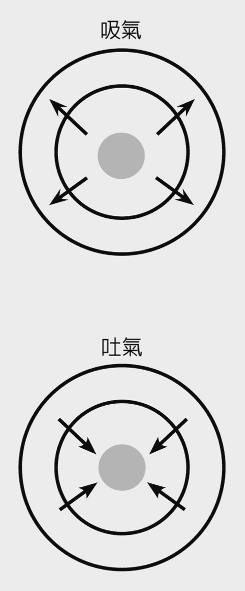

依序做完每一个身体系统，会感知到光进入身体系统产生的共振。

地（消化系统）→感觉下腹部发热，能量稳固于地球。

金（呼吸系统）→感觉顶轮上方链接直达基督意识场。

水（循环系统）→感觉光进入身体后方的肾脏与嵴柱位置，平衡身体左右侧的能量。

风（免疫系统）→感觉能量充满太阳神经丛，宇宙无穷的能量灌注进入身体。

火（内分泌系统）→整个胸腺开始往下，身体感觉通透明亮，整个中轴空无、洁净。

做完火元素，你会感受到中轴明显放大，光透过自己的中轴流动，身心洁净舒畅。你全身沐浴在光中，获得喜悦和无条件的爱的能量。你不需要言语，也不用想像任何光的存有，就让自己走进第一道迎接你的光中，光的世界的天使会给予你身体需要的养分和疗愈，让你的身心更稳定地扎根在地球，获得丰盛和滋养。

这个练习你可以天天做，这是我送给你们的祝福。当你疗愈自己，让自己成为光的管道时，你就是在传递无条件的爱，疗愈自己和地球。

＊ ＊ ＊

我：阿乙莎，莎雅教我使用手指操冥想，我可以明显感受到我第三眼的空间再度放大。请告诉我，我该如何应用这股来自光的世界的能量？

阿乙莎：这是在帮助你与所有天使圣团链接。天使以光的形态，非肉身或任何形体，而是以纯粹光的守护者之姿存在，主要目的是要稳定宇宙，带给各星球稳定祥和的运行能量。
当你们中轴稳定，带着纯净的意识振动来到此，与所有光的存有共处，你可以透过松果体链接，看到出现在你面前的光晕和各种颜色的光，这都是天使意识。这些天使意识可以透过星球上生命体的中轴，将光和爱注入你所处的空间；注入的同时，你自己会得到无条件的爱的滋养，你的身体细胞也同步获得疗愈，而你的松果体会因为被光注入，再次扩展，并与光的世界顺畅地链接和交流。你将成为地球上的神性媒介，让位于十八次元的光的守护天使，透过你将光传递给所有人和地球。
成为光的管道时，你的意识会与迎接你的光的世界天使共振。你不但不会觉得能量太强或头晕，反而会明显感觉到身体无比通透舒畅。每一次链接只需要十分钟，就可以帮助你恢复一整天消耗的能量，补充精气神。每天做，你的细胞会恢复年轻活力。

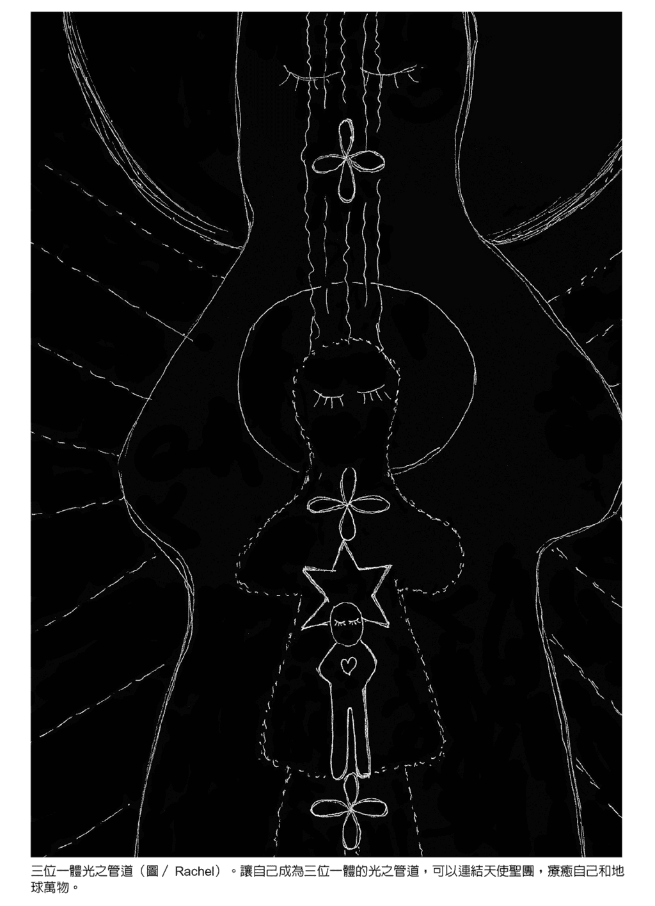

＊ ＊ ＊

莎雅，我刚才做手指操冥想的时候，感受到大天使麦可的光源。我不清楚到底是不是他，就是有个知晓来到我心中，那就是他。所以，我可以让自己成为光的管道，呼请任何一位天使吗？

可以呼请天使，但我并不建议你这么做，因为这会让你的小我再次凌驾你的意识，操控你的心智。我只希望你在运用光的世界的能量时，只要让自己成为管道，不带任何想法和意图，让光的世界的集体智慧帮助你得到最佳的光的组成粒子，让你的细胞，或是你要引导光进入的环境或场域直接与光的源头链接共振。

为什么我看到许多人都会说祈请某某天使或大师的光降临？

我的建议是让宇宙光的世界的更高集体智慧来帮助你们。你无法透过指定某一种光而得到最佳的疗愈和滋养，当你的小我意识再次企图干扰，你的光之管道就无法纯净。

 成为光之管道的优点

让自己成为光的管道，你可以带给自己和这个世界崭新的样貌，并获得以下的体验：

不容易疲倦

当你有意识地链接到光的世界，你的身体细胞就可以充电，细胞含氧量增加，电位饱满。只要链接进入光的世界十分钟，你就会精神奕奕，一整天充满元气，不容易疲倦。

细胞回春

你可以感受到细胞回复年轻有弹性的状态，骨胳中的干细胞充足，足以汰换老旧细胞；肌肉恢复年轻时的张力，牙齿也更为结实坚固。

第三眼持续扩展

你会发现第三眼的位置敞开放大三倍，扩及整个颜面的上半部。你中轴的能量流通扩大，让呼吸更顺畅地带动整个身体与周围的能量流通。

中轴变宽，感知更加敏锐

过去你可以感受到他人的情绪体，渐渐地，你会更深化地去感知他人讯息场携带的故事和内容，这是因为你对光的感受里反映出的讯息接收能力更加细微和敏锐。现在你可以试着去解读身在远方的某一个人，用自己的第三眼去感知、观想，你将得到和过往不同层次的讯息解读能力。

远距疗愈

你可以透过自己的心轮感知到对方的场域，接着让自己成为光的管道，透过中轴引入光的世界的爱与光，让光前行，就可以转化对方的能量场域，帮助对方获得光的疗愈和滋养。

练习：远距疗愈

1.执行手指操冥想，让自己成为光的管道。

2.用意念感知对方。

3.将链接对方的感知带入自己的心轮，与对方合一。

4.用自己的第三眼解读合一的心轮意识，得到理解与知晓。

5.让光自动进行疗愈，直到觉得自己回到成为光的管道那般通畅愉悦的感觉。

6.回向对方，用自己的第三眼投射进入对方的身体场域，转化对方的能量场体。

7.感谢光的圣灵和地球母亲帮助你完成此次的疗愈和净化。

要改变和转化对方场域的振动，只要让你自己的中轴成为光的传输管道。你就是存在地球的神性意识，可以帮助万物提升振动频率，并与光的世界校准。你无法改变光的频率，只能成为光的管道，并将无条件的爱给予这个世界。

 光的疗愈应用须知

盖娅母亲，我尝试远距转化某人的振动频率，但无法从对方那里获得确认。有没有什么方法和注意事项，可以帮助我们正确地将光传送给身旁的人和这个世界？

你们自身如果尚未成为光的管道，就无法仅用小我意识来操作或调动光的能量进入对方的场域。这又是小我提出的伎俩。唯有让自己成为传送光的管道，你才可以转化对方和环境。没有方便法门，只有成为中空的传输管道，光才能到达。

水晶矿石都是经过日月星辰淬炼出永恒稳定的光，需要在稳定纯净的环境中才能淬炼出这样的品质。你在练习让自己成为光的管道时，必须具备以下的认知：

不要以小我意识干扰光的流动

光是由具有智慧的粒子集合而成，不同的光会携带不同的振动频率。显化是由光粒子的智能来达成的，当光粒子触及你意识所及的对象或场域时，自然会从你链接对方的粒子结构中得到相应的讯息。宇宙的光会自行调整成融合对方场域最好的光结构，以恢复目标本有的平衡。这不是听从你的小我意识或由大脑判断指挥所得的结果，你只能从中协助，让出自己的中轴传输管道，让光的守护者来执行，然后你就可以从自己的感知链接中知晓对方是否已经被光疗愈或净化。这不是魔法，要成为光的传输管道，需要你们人类一起来协助，让宇宙无条件的光与爱能够注入其中，而在此同时，你自己也可以获得净化和滋养。

取得对方的同意才可进行光的疗愈

有意愿的接收者才会与你传递的光产生量子纠缠。若你有意为对方进行光的疗愈，但对方并不想这么做，请尊重每一个生命有其自由意志，去体验自己的生命旅程。而针对无法与你用言语沟通的过世亲人或宇宙万有，请同样以你的更高意识在星光层和对方沟通，取得同意后再进行。

第三眼是光的导航工具

第三眼在光的疗愈和转化过程中扮演导航工具。并不是要你用第三眼去评断或窥探别人的隐私，让小我又有机会站上指挥的舞台。用你的第三眼对准对方的位置或场域，对光的投射路径具有重要的指向性。让第三眼专注在导航，而非进行拍摄或侦查，就可以帮助光顺畅地流动。

先净化自己，再去帮助他人和地球

若让自己成为光的管道，是否会在疗愈过程中将对方的负面能量吸附到自己身上？

你们必须先净化、清理自己，让自己的场体呈现无条件的爱的光之管道，然后再去帮助他人，这样在与对方合一的过程中，就不会将其负面能量吸附到自己身上。光的能量流动的过程会帮助你们彼此合一的能量场体快速到达光的世界的振动频率，所有低频的意识能量会立即被转化。

若未能及时创建自身光的管道，或是自己身上仍有许多恐惧、害怕、妄想和控制等情绪造成的能量破洞，在这样的状态下让自己的乙太体与对方合一，就会产生能量纠缠，你的能量黑洞会吸附对方的负面能量，让你觉得头痛或身体明显感到不舒服。即使如此，也不需要害怕、担忧，若感受到自身光的管道不稳定，或与对方有负面能量纠缠，可以运用以下的祈祷文，帮助自己快速提升振动频率，净化光的管道。

净化光之管道祈祷文

我感谢圣灵之光，从我的头顶上方，缓缓向下，流经我的眉心，进入我的心轮。在此，我愿意敞开我的心，与圣灵之光链接。

喔，圣灵啊！请帮助我清理和稳定光的管道，为了与我链接的人的福祉，将祢无条件的光和爱赐予ＸＸＸ〔自己或对方的法定名字〕〔或事件或场域名称〕。

我现在已经成为光的管道，让光前行。

你可以透过这个祈祷去祝福你关心的人、族群和国家。当你周边的人和环境被你传送的光照亮和滋养，你就在帮助地球恢复生机盎然的样貌。

为自己排一个行程，每天传送光和爱给一个对象，连续二十一天，你会看见光带给对方不同的能量，让其重现活力。

光的锚定校准

我有一个关于用光和爱进行身体疗愈的问题。我今早要帮助我先生疗愈五十肩，依照步骤让自己成为光的管道，并用意念投射给我先生，但他没有感受到疼痛有任何减轻，一直到我用手触摸他的肩膀，大约才三分钟，他就可以明显感受到疼痛减轻百分之五十。请问该怎么改善？

这是因为你第三眼的锚定能力不足以穿越他细胞的干扰。在远距进行光的疗愈时，你的第三眼就是手术刀，而手术刀锚定正确位置是关键；若你没有办法正确辨识病灶的位置，这样的远距疗效就会受限。

你可以采用触疗，手会携带电流，加速光粒子的导入。若是无法在现场进行触疗，可以先用远距身体锚定侦测的技巧，将自己的第三眼对准对方的身体，并扫描清理需要疗愈的位置。

练习：远距身体侦测

1.拿一张白纸，画下对方的身形。

2.拿一枝深色铅笔，先用意念扫描对方身体，然后将感知到的对方身体的光投射在白纸上对方身体的位置。这时会用到你的第三眼去感知每一个相对位置的能量，若有觉得污浊不顺畅之处，就用铅笔画出来。

3.将对方全身扫描完毕后，拿出一枝明亮的黄色色笔，涂在需要疗愈的深色区域，然后将光锚定该身体位置，导入光的意念。也可以用橡皮擦来替代黄色笔，以橡皮擦擦去深色铅笔画的位置，代表完成了光的导入和清理。

4.完成之后，可以请对方感受一下身体需要疗愈的位置现在是否已经感觉放松、顺畅。你也可以再扫描对方的身体一遍，在仍需要疗愈的位置加强一下。

完成光的疗愈之后的检视

当你完成光的传输，回到自己的心轮感知自身能量已经注满光和爱时，你就可以微笑着离开对方的场域。若此时仍感受到对方的能量尚未调整好，代表你自己的状态和频率无法让光顺畅运作。这是来自你自己的干扰，和对方的场域或其负面能量干扰无关。你可以先回到自身，完成自己光的管道的能量净化后，再去帮助别人。

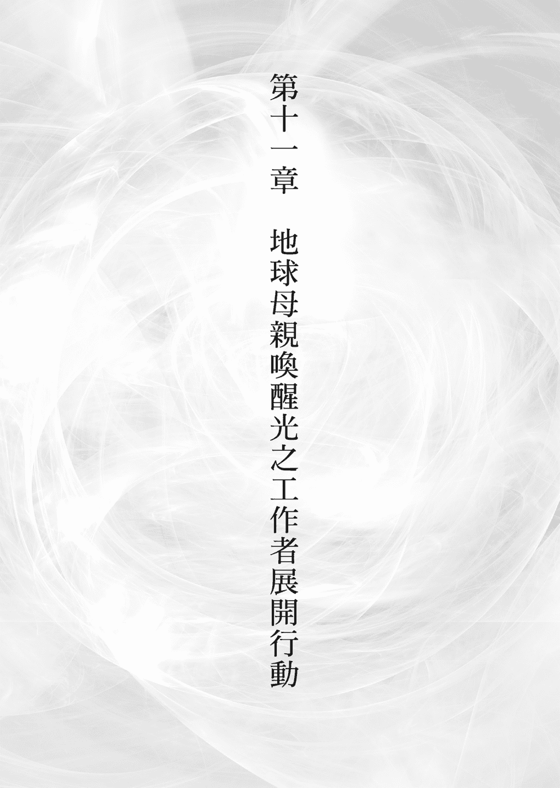

 认识网栅、磁栅和晶栅

网栅是宇宙不同次元展开形成的能量棱线，在地球的上方有网栅来处理与多次元存有的沟通连系，就像是传输的线路，而磁栅是地球各区域网栅交错产生的磁引力能量门。地球各区域有不同的能量磁栅帮助稳定或转化各区域的能量场，比如在战争地区产生的负面能量可以经由地球上方的磁栅转化，以逐渐达到平衡。因为磁栅彼此间是相链接的，其所在位置下方各种生命存有之间的晶体释放的能量会相互链接，成为该磁栅区域的能量。你们在进行心电感应时，通常就是透过该区磁栅释放的能量讯息来感知。

晶栅则是讯息的储存库，储存所有灵魂振动的讯息资料。自古至今地球所有活动的讯息都会储存于地球晶栅，此晶栅的资料会随着地球生命状态的演变，而随之改写。晶栅并不会转化或调整讯息，而是会无分别地将所有讯息储存起来，成为地球的资料库。宇宙其他次元的存有也可以透过读取地球晶栅的讯息，而对地球的现况有所了解。所以，晶栅是地球生命的记录器，如果地球晶栅的资料呈现重大变化，代表地球上有某事件影响重大，而改写整个资料库。人在走进一些曾经发生战争杀戮或重大慈心事件的场域时，就可以透过身体细胞感受到该区域的能量状态，而这些反映出来的能量场是这区域的晶栅传递出来的；即使这个人从未生活在这个区域，仍可以从地球母亲之内，在晶体意识或上方晶栅的位置读取这个区域的相关历史纪录。一些灵性工作者甚至可以看见当时发生的影像片段。

地球下方的晶体和上方的晶栅互为表里，下方的晶体如同备份晶栅的讯息而成为地球的集体意识。人类生活在地球上，不论是链接地球之心的晶体或链接地球上方的晶栅，都可以获得关于地球生命的讯息，只是地球上方的晶栅有区域性，地球之心的晶体则是整体的纪录，没有区域的差别。

你们不妨进入地球上一些干净稳定、从未发生过战乱的区域，可以感受到宁静与祥和。在这些区域也可以重新获得和宇宙意识的链接，不受地球晶栅释放的讯息干扰。

有了这层体认之后，你们回头来认识自己的生命。人类之所以会有一部分的灵魂意识被分裂出来投生到地球，就是为了帮助调整地球的意识晶栅记忆库。人类的灵魂晶体投生进入地球时，你们的灵魂晶体中就已经拥有这个生存星球的完整集体意识晶栅记忆；同样地，当一部分的灵魂分离，去不同的星球体验时，那一部分的灵性片段就会取得预定前往星球的晶栅资料库，进入分离的灵魂体验旅程。

所以，来到地球时，你们的灵魂晶体早已储存了地球母亲的晶栅记忆，你们可以称之为阿卡西纪录。没有错，这个阿卡西纪录同步存放在你的灵魂晶体之中，也同时将你在地球上的所有体验完整收录回地球集体意识晶栅里。你和地球母亲在灵魂晶体中是如此紧密链接，地球就是人类的灵性母亲，你即使一生都无法忆起自己是谁，认不出自己的灵性父母，也不会被母亲遗弃，你们都是地球母亲的孩子。当你进入更高意识，让自己的灵魂晶体重现光芒，你不但照亮自身所处星球的集体意识晶栅，也照亮了居住在地球上所有存在的灵魂。

 地球母亲要重建生态系统

失衡的地球生态亟需重新启动新的平衡

目前地球已启动校准行动，包含一些物种灭绝再生系统的建置，而人类在当中扮演重要的桥梁。你们会发现有许多人开始走进森林、进入海面下，进行探勘，这些人都是感受到更高灵性意识的启发。你们终于看见，唯有进入人类平常不会进入的区域，才能找回失落的地球脉动。

在文明的世界里，你们已经逐渐忘记大自然的律动规则，也听不见虫鸣鸟叫，都市里的自然生态早已消失，取而代之的是工厂及钢筋水泥大楼林立。只有一些觉醒的科学家试图深入人烟稀少的山林和海洋，寻找原生地球生命的足迹。这些行动会被报导与传递出来，唯有在尚未遭受人类破坏的原始山林及沙漠中，你们才会发现地球珍贵的原生物种。

文明无法拯救消失的地球生态，只有你们愿意带着谦卑的心，踏上原始生态林区，才能找到与地球共处的智慧。

失衡的地球造成失衡的人类再生系统

地球的失衡和整体人类生命的存续是息息相关的。地球上方有稳定人类灵魂晶体的磁栅，目前因为地球中轴偏移、大量垃圾破坏海底生态循环系统，加上逐渐上升的海水温度造成海洋生态失衡，地球的磁栅正在失去校准能力。

你们将会发现，自己的灵魂晶体也逐渐失去与地球的链接。人类无法用自己的第六感和直觉体感受大地万物的能量，而渐渐成为地表的无意识生物。你们不能轻忽失去与大自然和地球的链接会造成人类生存危机这件事，毕竟人类的灵魂必须倚赖地球的磁引力，以维系生命的永续再生循环；一旦失去与地球的链接，生物体死亡时，你们的灵魂晶体会变成游离的宇宙意识，被宇宙的黑洞回收，而进入黑洞的灵魂将暂时失去与光明世界的链接，直到下一次的阴阳转换时，才有机会回到灵魂共同意识源头的怀抱。进入黑洞的意识因为身受黑暗沉重引力的包围，将会面临恐惧和不安。

 人类须同步进行意识校准工程

地球与所有生命共同体需要跟随地球母亲的自体校准，同步进行个人和族群的意识校准工程。人类在地球上的文明只有数万年，实际并不长，但这几万年就已经发展成今日你所见的地球样貌。更多不快乐的人与更多的资源争夺，造成人心的空洞匮乏。这不是地球原本的景象。人类的文明正在吞噬自己，并将自己锁死在永无止境的劳动里；你们失去身上本有的光，只为了换取物质的满足。你们正过着本末倒置的生活，而现在，只有回复自身内在本自具足的状态，让内在发光，你们才能重十健康快乐的生活。这需要所有人觉醒，看见自己褪去绚丽外衣后展现生命真实的光。

人类的心与地球母亲链接，可以重现独特的个人光彩，这道光来自你生生世世的生命之源赋予你此生的生命资粮。去找回你本自具足的生命之光，只有让自身的光再次闪耀，传送回大地，才是生命来到这里最重要的使命和道路。你就是光的存在，而不是那些覆盖在你身上的位阶、头衔、名声、地位，不是包裹着你身躯的华服锦衣，也不是安顿你生活的房子、车子。那些你追寻一辈子来衬托和表达你是谁的物质都不是真实的你，你是来到地球体验的一道光，也是创造地球上万物生生不息共生环境的光源。

我是盖娅，你们的地球母亲，我经由你们身上的光，得到更新的能量。当人类不再发光，地球就会渐渐失去生命的光源。我们是一体的，是共同存在宇宙之间的意识能量。此时此刻，我必须对人类提出忠告：时间的象限并不存在宇宙里，那是地球进入三次元的游戏规则；当时间被移除，你会发现自己就站在时间的轴线上不停循环。你没有离开过，一直都在地球，而我陪着所有人类在此体验的旅程终将告一段落，我需要提升自己的振动，晋升到下一个阶段。当你遇见自己的真实样貌和全息生命景象时，你就会明白我对你们诉说的真理。回到内在，你就可以找回自己更大版本的实相。你是我的一部分存在，而我也在你之内，与你同在。

人类就是地球和宇宙之间光的传输信道。人类通过打开自身无条件之爱的频率，提升自己的振动频率，同时就可以为地球注入爱的能量，更经由地球之心与宇宙之心链接，透过宇宙源源不绝的能量进行自体平衡。

因此，地球的平衡需要人类，人类也必须透过地球，才得以和宇宙之心同步校准。这是生命的精密再生循环系统设计，也是宇宙众神的智慧。

让每一个生存在地球上的人类都具备神性的智慧，只要人类能够让自身的中轴恢复畅通稳定，就能链接天地宇宙，获得来自宇宙无穷尽的能量，并回馈给地球母亲，地球母亲也会因生命的循环和重生，得以同步扬升。所以，地球的扬升是生命的自动化进程，是地球上的每一个生命共同协力推进的结果。

 新地球形成背后的力量

新地球是地球和银河宇宙扬升的生命创造出来的共同实相。地球上的生命不仅仅是你目前认知的各色人种，还包含海洋里具备高度智能的生物，以及生活在地底下的外星族群后代、人类尚未发现的原始住民等等。这些生命已经活出不受物质世界影响的高度精神文明，他们正带领自己的族群和下一次生命的意识种子进入新地球的轨道。这个新地球已经超越三次元的地球振动频率，以精神和意识引领生活这样的方式继续体验。地球母亲也不间断地提醒现在的地球人类尽早觉醒，明白自己生命的实相，让觉醒的人类提升，进入新地球的场域。

当地球上仍有许多人正被物质世界吞噬，活在水深火热、三餐不继的黑暗中时，你们是否看见这是物质生活丰盛无虞的一群人自己创造出来的黑暗世界？你们不能无视黑暗的力量会吞噬地球的光明这个事实，地球母亲必须用非常手段来平衡黑暗的能量场，因此天灾、战争、人祸会不断上演，让你们任何一人都无法再自扫门前雪，因为，你们仍是一体的存在。

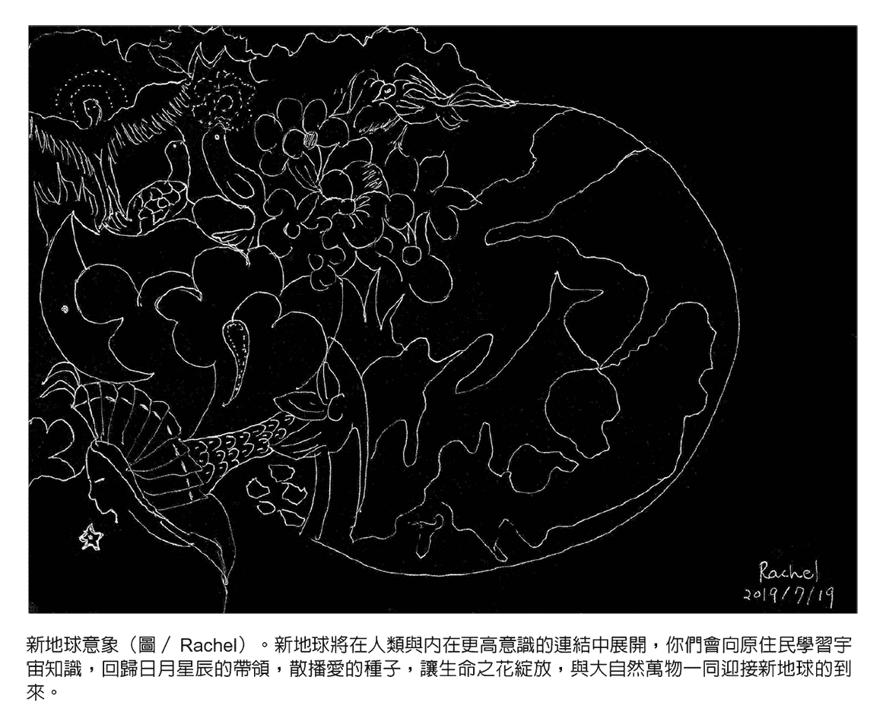

 启动光之工作者的时间胶囊

当你们的意识与源头校准时，可以得到前所未有的分享与创造新体验。目前人类意识开展的速度很快，这不是受到教育或朋友的启发，真正的原因是你们的忆起。当你忆起自身在源头世界的本然真实面貌，并与之合一时，你就链接到宇宙意识，而这个宇宙意识会为你敞开大门，迎接你的回馈。

你在现实地球的所有学习经验与认知系统会与源头的讯息场接轨，我们在帷幕这端收到你的意识振动分享的地球最新讯息，与此同时，你也可以透过宇宙源头这端，获得更新的创造性想法和源源不断的创意泉源。我们就在这个扩大的链接场域中彼此分享、共同创造。

盖娅，这太神奇了！没有透过教导，直接链接，也没有书面报告，我们就这样从意识流动的过程中完成信息的分享和更新？

是的！你不是正在体验这个过程？你的灵魂已经储存了我们给你预置的讯息档案，你只要链接自己的内在宇宙下载，就可以不经由头脑的逻辑思考，洋洋洒洒写下这段文字，而这些文字的内容和主题并非你的小我预定的，不是吗？

我们是依据你目前认知系统的全息状态，给予你应该具备的知晓，而我们也经由与你重叠及感知讯息的过程，同步得知你的近况。

你们有安装什么东西在我身上吗？还是每一个人都有这种连线模式？

我们并没有把你抓去外星球安装任何装置在你身上，也并不是每个人都具备这个连线模式，那是你灵魂出生前的约定。我们在一些来到地球的星际种子内预先储存时间胶囊，这个时间胶囊和地球网栅是相互配对的关系，时间一到，会自动展开为链接讯息的状态。

地球上有多少人有这个预置？他们都在哪里、做些什么？

有千分之五的人类已经被安置了时间胶囊，这是为了让地球再次扬升的星际种子计划。早在一万五千年前就已经有过一次地球大跃升，目前地球进入光子带，准备进入下一次的扬升。地球每次的扬升都需要一群光之工作者协助校准，让地球意识与银河系链接。这群人居住在世界各地，都在此时此刻收到内在时间胶囊释出的讯息，唤起觉醒意识。

这群光之工作者可以大致分成以下几类：

讯息传递者

你和许多传讯者都属于这个类型。你们拥有纯净的灵魂意识，可以顺利链接宇宙最高的源头讯息场，以不偏颇的角度，让讯息透过你们的感知系统传递出来。你们这群光之工作者扮演人类觉醒的先遣部队，透过讯息的传递链接更多光工，形成稳定的地球网栅。

担任讯息传递管道会受到光之存有的期待和保护。你们是宇宙光之存有的伙伴，投生到地球前早已约定好，要让自己在约定的时间觉醒，启动自身内建的时间胶囊。很少有传讯管道是突然被要求担任此工作的，另外，在具备纯净的灵魂意识之前，或是尚未完成自身于地球的前期工作，也无法开始这项传递讯息的工作。

灵魂呼唤者

地球上有许许多多分散的灵魂意识片段无法凝聚，或是因为过去曾经历的创伤造成灵魂意识分离，流散各地，所以需要光之工作者协助将这些分散的意识带回源头宿主，或是接引回到光中。这群光之工作者需要花比较多的时间在地球与帷幕之外的宇宙间穿梭往返，他们大部分具有更完整的灵视和意识导航能力。古代的萨满或巫师大多属于此类型的光之工作者，具有超越一般人的能量感应及疗愈灵魂体的能力。这个工作需要无条件的爱与慈悲的灌注，地球上许多能够链接自身指导灵的人都属于这类型的光工，而这群地球疗愈者的指导师也都存在最接近地球的集体场域中，协助灵魂回归中心。

特殊职业工作者

第三类的光之工作者就是目前具备肉身，并在地球上从事特别工作或职业的人。他们涵盖范围很广，包括宗教家、神职人员、医生及护理人员、政治领袖、非营利组织工作者、科学家和研究员等等，为了他人的生命和地球整体环境的利益，而努力不懈。这些人虽然进入灵性意识场中工作的时间不多，但他们的内在意识都能与光的世界链接；他们内心深处明白自己的工作超越地球物质实相，也不以追求个人利益为目的。这群光之工作者也是稳定地球意识的重要能量。

大自然精灵

除了前面提到的几类光之工作者，还有许多不具备人类物质身体的灵性存有，包括山川、湖泊、森林、矿石及土地中的精灵和意识场，也在地球这端帮助稳定地球的磁场。当你们将自己的灵魂意识与大自然链接时，就会发现这些生动活泼的光之存有随时都在你们身旁协助人类和地球。你们并不是孤单生活在地球上的生命体。

地球守护者

海洋中的鲸类和海豚，是地球母亲的导航装置。这群在地球上存在已久的原生种族已经成为地球的守护者，光的世界的圣灵不视它们为光之工作者，我们把它们视为地球母亲的灵魂意识守护者。

 链接生命的泉源：宇宙之汤

生命不仅仅在你们可以感知到的一呼一吸之间，你们的生命是来自宇宙的共同意识之汤。你一部分的意识分散在不同的宇宙时空，不断经历和创造新的体验。这个更大版本的生命是你真正的生命泉源，你不是只活在地球上的这具肉身里，你还有许许多多的你，你们都会在源头相遇，再次互连。这许许多多的你共同组成属于你的版本的生命泉源。

一部分的你同意扮演你的父母、兄弟姊妹，还有一部分的你决定要当你的敌人和你无法与之共处的竞争者。这些角色的扮演者都是你在源头达成共识的存在意识，你再次来到地球体验之前，你们早已经讲好，要再次扮演关系中的各个角色，才能得到你期待的体验，而这趟体验将再次帮助你充实生命的泉源。

你的生命泉源是宇宙之汤的一个小小片段，宇宙之汤的恢弘磅礡是你无法想像的。现在只要回到你的内在，与你的各个灵性片段链接，你就可以找回自己的生命泉源；而透过你的生命泉源，就能链接回到宇宙之汤。

你这么说是指，目前和我有关系的这些人的意识中，也有来自我的一部分意识？

是的！你们是一体的存在，只是你在地球上必须忘记，也无法认同对方，唯有在这种情况下你才能好好体验，不是吗？当你回到源头时，你会辨认出彼此是一体的存在，那些你设定需要的体验就能内化成你的一部分。现在的你由你自己设定了需要的体验，并由你创造出来的许多分身来协助你完成这个体验。

被大家认定的圣者，或是被共同唾弃的坏人，他们是被更多的人共同创造出来的体验吗？

是的，你愈来愈明白了！

若我们每个人都能理解这个游戏规则，不就天下太平了？

是的，你们也该醒来了，不用再继续轮回体验下去。你们即将集体迈向更高的地球次元，那里不是以恐惧或竞争来运行的世界；你们已经可以毕业，进入下一阶段的体验了。

你这回说得真彻底，但问题是，我厌恶或害怕的人若没醒来，只有我独自清醒，是没有办法阻止邪恶的力量占领这个世界的，不是吗？我不就让自己处在危险之境了？

你用更高的意识将无条件的爱传达给对方，他就会改变的。只是在你理解到他就是你之前，你过去是用什么方式来对待与你不同立场的人？你若是采用同样的方式对待另一个自己，会感到安心吗？

我懂了！你这不就破题了？为何你这一回要彻彻底底地讲得这么明白？以前都是讲爱呀、慈悲呀、业力命题呀，现在却跟我说，这些人都是我，我也是创造我生活上遇到的这些人、创造我面对的体验的大导演，你这么着急要让大家清醒干么呢？

 唤醒众人，找回今生的约定

“我是谁？”

处于三次元世界的你曾到处探索这个问题的真相，不断找寻让你自己满意的解答。找来找去，你现在才终于明白，你无法成为那个独立存在的个体。那个你曾经费尽心思长养、使之茁壮的小我，只是将你带离更大的我的误导者。当你认出了小我之路，重返宇宙大我时，你会发现，你之所以为你，正是为了成为更大的你所进行的一趟体验旅程。在你放弃继续走上小我设计的道路，进入内在宇宙的旅程时，你就开始踏上为了成为真正的你而努力的道路了。

你今生的约定如今已展现在你的面前，你并非为了成为你不是的你和即将成为的你而存在，你是为了成为真正的你，而跨出宇宙帷幕之外。你的一切体验都已内化在已经是你的存在里，你从未失去或得到，你是那永不消退、不增不减的光和爱的存在。认出自己的光，就返回了集体光之存有的世界里；你之所以存在的理由，已经在光中彰显。

许多人已经从阿乙莎的指导中获悉今生生命蓝图的约定和答案。这个约定正是你自出生以来一直追寻的生命终极答案，而且约定者是你自己，只有你能够如此精心规画出自己想要的旅程。现在这个约定在你所处的地球看起来如何？和你规画的有落差，或者是过于不可思议的剧本？你并没有搞错，你在帷幕那端的所见所闻如此清楚明白，怎么可能会搞错？错是错在现在的你忘得太彻底，也沉溺在地球的游戏里太久，让你误将虚幻变真实。你没有伤害人、没有做错事，那些被你伤害的人已在帷幕这端等你清醒；你没有被害，也没有被遗弃，那些你认为的背叛者都是你精心挑选的打手，没有他们，你无法找到回家的路。

你是如此勇敢地写出自己生命的剧本，演完这出戏，是你最期待的报酬。带着生命的体验，你再次荣耀自己的光辉，画出璀璨亮丽的一道彩虹。

 让爱延续，转化自己，创造新地球

每个人身上都拥有阴性和阳性能量，阴性代表神圣母亲的能量，阳性则是神圣父亲的能量。这两股能量一个来自你生存的地球，地球母亲的能量从海底轮进入你的身体，启动存在你心轮之下的海底轮、脐轮和太阳神经丛，从海底轮贯穿而上，最终到达心轮；而圣父带来宇宙的创造能量，从你的顶轮上方往下，穿越顶轮、眉心轮、喉轮、胸腺后，直达心轮。

这一阴一阳的能量在你的心轮结合，渐次扩展开来。这是你灵魂本有的阴阳能量再次会合，这就是灵魂之爱，而来自灵魂之爱的能量可以改变你身体细胞的结构，打开你的灵魂ＤＮＡ。灵性圣母和圣父的爱再次在你身上结合，你的生命将自此不同。

人类已经被禁锢在物质层次，不断往外寻求爱，却遗忘自己内在拥有圣母和圣父爱的能量，可以帮助人类延续生命，并创造和显化地球万物。当我们重新链接回到内在更高意识，重现灵魂之爱的能量流，就可以转化自己，创造新地球。

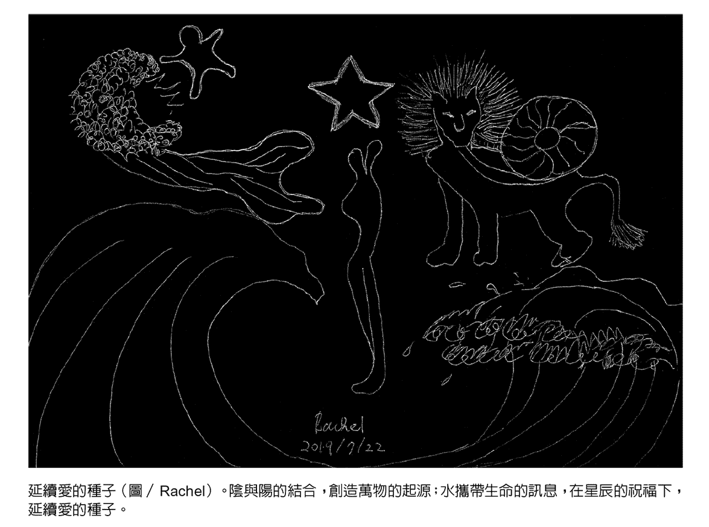

 社群链接可帮助集体意识校准

人与社群创建关系的目的是要帮助自己稳定在地球上，展开自身的生命蓝图。人与社群的关系并不是创建在表层的沟通和连系网络而已，你们会发现，没有共同追寻的生命目标的社群是脆弱的，是可有可无的群体关系。这也是为何你们的宗教会发展出许多祭拜或年度庆典活动，来彰显你们个体生命之外的集体存在意识。这些活动都是为了帮助分离的个体意识回归而设计出来的，看似简单的拈香祭拜祖先和天地，正说明人必须时时刻刻与更高意识和天地链接，才能稳定自己的生命。

现今充斥着各种表象意识的社群，每个社群的中心思想或链接渐渐薄弱。若你们想要让自身中轴随时稳定校准，可以创建一些更能深化内在稳定力量的社群关系和管道。不一定是透过宗教祭拜的仪式，你们可以善用现在的通讯科技来导引回归内在之路，让自己随时随地都能校准自身中轴。以下是一些参考做法：

一、使用声音链接，帮助调校身体的脉轮振动频率。

二、文字的表达是最有效的校准和提升意识工具。以文字帮助身心偏离或产生困惑的人，让他们随时可以阅读和静心。

三、创建共同交流园地。社群的集体力量可以带给人们更直接的互动和回应，这个公开的交流园地可以让人有随时被群体支持的感觉。

四、面对面聚会。定期举办活动，让社群成员透过面对面的交流凝聚与持续扩展出新的能量。在聚会中也可以经由工作坊和庆典活动，引进宇宙和大地的能量，净化所有人的灵魂意识，并与天地校准。

除此之外，社群还可以让人超越自身利益，为了团体共同利益而活出超越个人的生命成长之路。这也正是星际存有们的工作模式。地球上的社群大多创建在私人利益的彰显和极大化，也因此总是会产生资源分配的问题。当你们可以超越个人，在社群的运作下，将没有所谓的个人私利需要被考量，也就不会有资源分配不均的困扰，一切都以能量平衡的方式运行。能量可以带来资源，而团体中若没有凝聚正向的能量流动，就无法产生集体的力量。这是团体中的每一个人都必须理解的法则。任何一个以私欲为目的进入团体中的人，都会被揭穿他的真面目；只有超越个人私欲，以团体的能量流动与平衡为依归，才能帮助整体共同成长，达成目标，而个人也可以跟着社群一起成长茁壮。

（和盖娅母亲链接的这些日子，无论是我自己、朋友、社会，乃至国与国之间都有许多震荡发生，似乎地球正在快速穿越和清理。阿乙莎在此期间也帮助我解开意识上的误区和固着的小我坚持，经由一次次的事件，让我更加体会到所有生命来到此地都是为了完整爱的体验。

编按：本章皆为阿乙莎传达的讯息。）

 解开意识上的误区与小我的坚持

控制

阿乙莎，请帮助我，我老公又陷入自己的“感觉情境”里，随便迁怒到我。他总觉得是别人造成他的痛苦和问题，他的感觉误区太多了，我很沮丧、难过、生气，这么多年也改不了。我要如何让他看见他自己的状态？或者，我该如何才能转动他的念头，那些僵固了数十年的痛苦死结？

你遇见一个最棘手的考题，这个考试也通常来自你身边最爱的人。你不能“期待”或“要求”别人照着你希望的样子在你面前展现，他就是你内在最深沉的一个结的写照，你目前正准备穿越最后的考题。

要记住，对方绝对不会错。

他的样子只是你的投射，你看见自己的傲慢了吗？

你认为自己“想”的才对，别人怎么“做”需要由“你”来给分数？

亲爱的，不好意思，这个世界永远不会如你所“愿”地展现。

你还能“做”些什么，才能让这个世界以你期待的方式展现？

你现在愿意如何做？

臣服、顺流都不够到位，你还要再深入一点，走进“无有分别”。

他就是你，那个最不近情、不讲理的你的展现。你愿意接纳他成为你的一部分吗？你要去攻击他，让他醒来？还是融合他的期盼？你别无他法，在阴阳天地之间只有接纳与融合，冲突、直来直往的方式只会切断这道能量“流”。你无法这么做，只能顺应天道，伺机而行。所有的情绪你都会感受到，但要学习尊重生命的流动。你必须是颗幼小又坚毅的种子，穿梭在大洪流间；你无法对抗、坚持，当逆境来临时，顺势而为，这是你最需要穿越的难题。你的先生显化出你必须穿越的课题，下次看见他又不舒服了，问问他：“我如何做才会让你感到舒服和喜悦？”顺势去引导，就会圆满。

小我

阿乙莎，我要向祢忏悔，我的小我还是有分别心。即使已经能够窥见自己的生命全貌，到达合一的意识场，我还是拿自己的小我没办法，情绪还是会升起。我想知道，我们意识觉醒前和觉醒后，小我到底在干么？我要如何驯服它，把小我管理好？

这是个好问题，也是人类一直以来的觉醒误区。我们来好好探讨一下小我。小我是你身上的一股“尚待完整”的能量，这股能量打从你出生就跟着你，从你嗷嗷待哺的阶段就随着你身体逐渐成熟而长养茁壮。小我是你这一世新诞生的意识体，这个意识体和你出生的家庭及成长的环境息息相关。它不是来自你过去世的能量，而是你此次生命旅程重新创造出的新意识结构。

你会好奇，为何小我有那么多的想法、批判和内心戏？难道和你的过去世或你灵魂更高的片段没有任何关连？为什么一个人在催眠状态时可以看见那么多故事情节，难道这些不是创造出今日小我的剧本吗？

没错！我总是这么认为，许多宗教也将小我归咎为过去的业力种子。

其实不是的，你的小我是你此生重新创造和定义的“你是谁”的新版本，当你需要再次去创造此世的生命经验时，小我就是你这一世的“结果”，而非“缘起”。当你可以链接自己的更高意识，去探究你灵魂源头的本质和曾有的经历，这些路径指引就是来帮助小我找回生命最优化体验的地图，也就是你此生生命蓝图的道路指引。

你此生要完整的对象不是在帷幕另一端的高我，当然不是，你必须去照料和完整你的“小我”，借由你的大我的支持和洞见，帮助小我在地球上再次创造。所以，不要以为链接到你的更高意识，获得超越身体的体验，处在充满光和爱的天堂气息中，就开始抹灭小我的存在价值，以为小我不够资格和你站一起，不能再称兄道弟了；不要因为你已经找回更大版本的你，拥有进入更高意识的通行管道，小我就该安静住嘴，甚至消失得无影无踪，否则外人就会觉得你不够灵性、不够神圣。

孩子，你看见了吗？那样不就是将小我推向另一个“更大的我”的小我了？你永远无法成就自己的大我，你此生唯一可以成就的对象，反而是你的小我，那可是你这一世的立足点，是你在地球创造一切非凡体验的支点。失去生命的支点，你将无法链接到高我；失去小我，就如同断了线的风筝，无法驾驭自己的灵魂太空船，当生命结束那一刻，你将无法回家！

我一再提醒你们，小我没有错、没有不好！小我的所有体验和感知，都是来帮助你在此生完整自己生命蓝图的指引。当你的小我不满足、愤怒、绝望、嫉妒、委屈和恐惧时，这些情绪都是来帮助你释放、平衡、清理和再次扩展自身的能量流动。让这些情绪和感知帮助你的小我，不要压制，也不要抹煞小我的存在。小我就是地球上最真真实实的存在。

你们该把自己的小我当成最好的朋友，当你这个好朋友遇到不舒服的情境时，你可以链接自己的更高意识，给予小我光和爱；当小我被环境碰撞得体无完肤时，请给予小我足够的勇气去面对真实的自己。当你愿意给你最好的朋友无条件的爱和接纳时，你的小我就能够渐渐在更高意识的引领下，完整此生的蓝图，成就更好的自己。

当生命结束那一刻，你的小我将携带着此生的辉煌，在共同意识源头的热烈欢呼与拥抱下，与众神合一。

抱怨

我要跟你谈谈人类常常使用的两种意识能量，它们具备强大的量子磁引力效应，只是大多数的人没有意识到这股能量的威力。

一个具备高度灵性意识的人永远会感谢，透过感谢，他们可以将周围所有不相容的振动转化成自己的能量。当你们感谢时，那股能量是以环形波投射，向周围移动。

这个环形波可以产生空中黑洞的效应，吸收和净化一切负面能量，也会将对方的好能量带入自己的磁场中，威力非常强大。

你不妨观察一下，当一个人站在路旁，不断向往来的人群释出感谢时，会在那个地方形成一个无所不包的能量场域，经过的人会自然而然臣服在这个场域中。

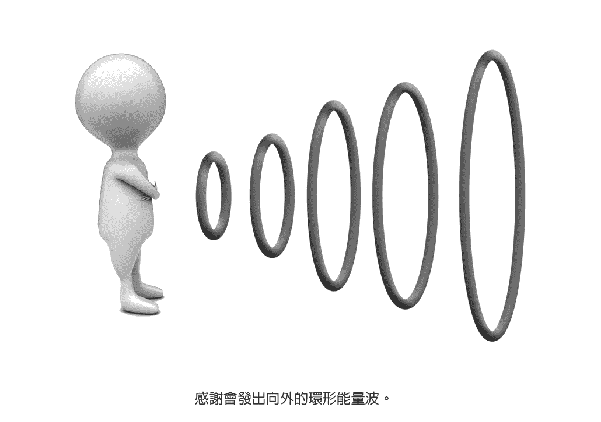

喔！我突然想到百货公司的电梯小姐，一进电梯门，她就会敬礼，向大家道谢，而大家会突然安静，也会欣然接受这个安排。

所以，若你能时时观照，并向周围发出感谢的能量，你就可以帮助净化周边的环境。出门在外看见花草树木，去跟它们道谢，你就是在帮助花草清理它们吸附的周边环境污染物和垃圾；面对一个怒气冲冲的人，你若跟他道谢，就可以立即将他的负面攻击能量收编在你创造的空中黑洞里，那就像是小叮当的任意门，是转化你周边负面磁场的回收袋。

另外，我要跟你谈“抱怨”，因为这是你常常犯的毛病。你的个性经常会对不满意的现象产生无意识的抱怨，但你要明白，抱怨是在破坏自己的能量场。你一抱怨，就会让自己的能量水坝像泄洪一般，你做再多手指操和静心、累积再多能量光，都会功亏一篑。抱怨会在你身体四周产生能量破洞。

如同用一把锤子敲开自己的能量光环，你愈尖锐，那把锤子就成了愈锐利的剑，将自己的能量光环戳破。抱怨的时间愈久，能量耗损就愈大。一个经常抱怨的人会让自己的内在形成一个能量大黑洞，自身能量不断流失而不自知，以致经过他身边的人总是想逃开。

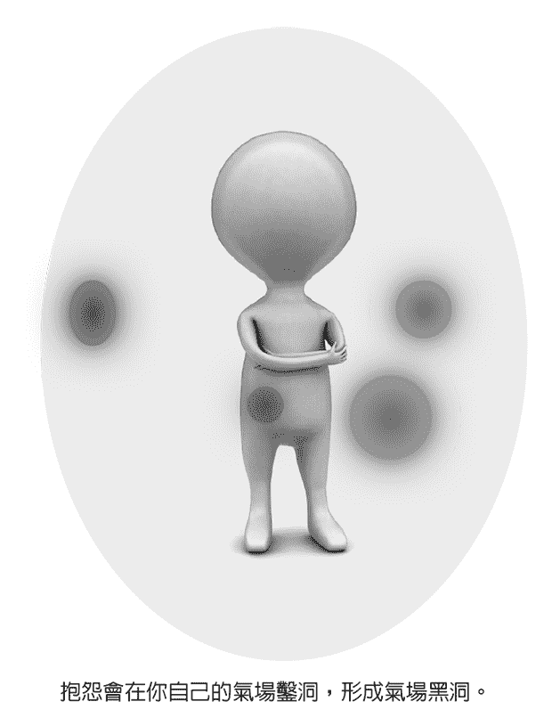

所以，“感谢”和“抱怨”同样在量子宇宙中创造出吸附的黑洞效应，不同的是，一个是向外，一个是向内。少抱怨，可以保护自己的能量场；多感谢，就能给自己一个好环境。

受害者心态

阿乙莎，我看见许多人有受害者心态，尤其是上一代的女性，婆媳问题造成一辈子的心结打不开。一个不快乐的母亲会造成不快乐的子女和家庭关系，这种受害者心态可以黏着一个家庭一辈子无法释放，甚至演变成老一辈传给后代的名言，例如“吃苦就是吃补”“吃得苦中苦，方为人上人”。为何有这么多人在扮演受害者和加害者的角色？

其实根本没有受害者。你会质疑，不对，这个人明明被陷害，或是因为某某人造成他生命财产的损失，甚至有人因此失去性命，这么明显的“受害和加害示现”，怎么可能视而不见？没有错！人类如此上演受害和加害的情节已经上万年了，仍然解不开这个“自以为是”的循环。

我问你，妈妈生孩子时痛不痛？

当然，痛死了！

那么，为何母亲遭受此种身体痛楚，不觉得自己是受害者？

那是因为她期待已久的新生命终于降临，她很高兴。她已经不在乎自己身体的疼痛，所有的注意力都放在孩子是否健康；只要孩子平安出生，她就可以安心了，所以不觉得身体的疼痛是受害。

好啦！你已经回答了你提出的问题。

什么？祢再说清楚一点啦！

意思就是，是否“受害”是由你的意识看待事件的角度所决定。

身体的疼痛只是生物体的反射现象，只有你的意识可以决定身体的疼痛对你的意义。人类让自己的身体去感知，但你的自由意志决定了你是受害的，还是满足的。你的意识有绝对的能力去指挥自己的大脑，决定这是一次值得的体验，或是一次痛苦的经历。

可是受害者遭受的痛苦明明和生孩子不同。一个加害者出现，造成了我的痛苦，我怎么可能去感谢对方，谢谢他给予我一次痛不欲生的体验？这是不可能的。

我并不是要你去感谢对方，而是要你的意识做出自由的选择。当你选择这是痛苦的、受害的，那你就活在痛苦与受害当中；若将你的意识放在“我即使体验到如此不好的结果，依然有足够的爱和能量给予我自己”，那么你就只是允许并完成自己这一次的体验而已，没有人有权力继续剥夺或侵害你，伤害就只能到此为止。

身体本身并没有情绪，身体只是如实反应你的意识投射的想法，因你的意志而产生情绪。当你选择将自己放进受害者的位置时，你就将自己的力量压制下去，想去找寻别人的爱和关心；你采取受害者的姿态去承受一切侵害到你身体和权益的事件，让自己躲入有口难言、委曲求全、隐忍和妥协之中。当你不断认同自己是受害者时，其实就是在逃避生命赋予你的自主选择和自由体验的权利。

你期待得到别人的爱和重视，逐渐合理化自己的行为，创造出一个不需要自我负责的你，你甚至会赋予这个角色更崇高的意象：“我的受害是有价值的，因此，我愿成为受害者。我认同并允许对方加害我，让我能够在痛苦承受中成为一个更有价值的人”。在这样的受害者自我投射和自我赋权过程中，渐渐地，你终于将自己变成一个有力量的人，只是这会是一股扭曲的力量，将你变成另一个加害者。从受害变成加害，生生世世摆荡轮回在自己创造的故事里。

看见了吗？人类放弃自己最珍贵的自由意志，不断显化出自己创造的角色。回到你的问题，这世间并没有受害者，也没有加害者，是受害者的意识创造了自我的实相。

当你发现自己又处于隐忍和有口难言的委屈中，请给予自己足够的爱和勇气，允许自己可以害怕、难过和脆弱。深入你的痛苦之中，你可以找回你内在的光，带领自己勇敢走出这一趟生命困难的体验，将这次的体验化为更大的慈悲和爱，给予这个世界有同样遭遇的他人。不要失去生命赋予每一个人的自由意志，你是自己生命的导演和演出者，必须为此生的生命负起完全的责任。

阿乙莎，我了解祢说的，每一个人的意志都是自由的，有绝对的权力和自由去产生“好”或“坏”的想法。但受害者今日之所以成为受害者，就是他的个人意志被家庭、环境、社会和传统绑架了，那些约定俗成的传统道德观念和社会公认的法则禁锢了他的自由意志，他就是无法挣脱；一旦挣脱，可能就要餐风露宿，小命不保，最后只好接受那些不合理的对待。他的自由意志被消耗殆尽，最终也只能选择隐忍，承受痛苦。请问祢，自由意志遇到这些情况要如何发挥？

你说得没有错，非常有道理，甚至这些道里可以说服每一个受害者继续扮演他的苦主角色。你们就是那么容易被小我的道理说服，被“眼见为凭”的景象吓得六神无主。孩子啊！如果我跟你说，那些张牙舞爪的恶魔和陷你于地狱无法挣脱的景象，就是你内心的魔鬼幻化出来吓唬你的，你相不相信？那些只是你的心魔创造的实相，我希望你重新看见自己内心的黑暗，用意识的光去照亮深埋在你内心的黑洞。里面其实什么都没有，你走进去，持续摸黑往前走，会找到光的出口。只有让自己勇敢面对内心的黑暗，你才会发现里面空空如也，外境所有的极端、限制、破坏、撕裂、绝境，都是你内心的黑暗投射出来的虚拟实境。让你的内在重现光明，你就能轻易挣脱令你感到恐惧无力的景象。

当然，若你已经陷入黑暗的对峙中，保护自己的身体和性命仍是重要的；但若你的性命并没有立即的危险，请用光和爱照耀自己的内在宇宙，让你的灵魂重获自由吧！

阿乙莎，我不想再狡辩，但我还是说服不了觉得自己还在忍受、还在为了大局着想而活在痛苦之中的芸芸众生啊！他们觉得自己的牺牲才能成就别人和大局。怎么办？这些人还是不认为自己有问题，明明就很难受、非常苦啊！

对于那些觉得自己的忍受很“对”、很“理直气壮”、很需要“被认可”自己是值得的人，请支持他们，给予他们力量。他们只是欠缺一点突破内心黑暗的勇气，可以用太阳神经丛的静心冥想协助他们。

练习：“点亮心中的太阳”冥想法

1.将意识转移到太阳神经丛的位置，只要静心十分钟，就可以逐渐擦亮蒙尘的内在太阳。

2.接着，有意识地转动太阳神经丛的能量，顺时钟、逆时钟各转动十次，再用意识在太阳神经丛的位置画出原子的符号，就可以增强内心的意志，帮助平衡和点亮内在的太阳。

背叛

阿乙莎，我很不喜欢被人背叛，尤其是掏心掏肺后发现自己只是被别人利用的棋子。我很讨厌这种感觉，被人背叛的自己，看起来真的蠢透了，但我事后还要假装高尚、没事，一直不处理，把头埋在沙子里不想去面对。我只要一想到就不舒服，怎么办啊？请给我更高的智慧来看待背叛。

嗯！我知道你不愉快，所以终于忍不住又出手了。这也是你的个性和力量。当灵魂进入更高的维度，你们虽然会更趋向合一的意识，但仍然保有自己独特的能量品质。你的个性不允许、也认为不应该有这种品质的生命存在你的世界里，所以，你回到原本的真我，去做出该有的行动。这个行动没有对错，你们在地球上习惯以谁是谁非来论断事情，而在更高的维度，只有光和能量品质。若你是一个四角形的晶体，就不会想要融入圆形的装置里，每一个人都可以如其所是地展现自己最初始的样貌。

至于你想再去看见被人背叛的原因，就回到自己的生命蓝图去看吧！如果这个背叛你的人原本就不该存在你的生命中，因为某个原因或因缘，他和你在此时链接，而现在他已经满足与你之间的体验离去，你也觉得不需要再和他链接，你们之间没有爱的流动，也无法平衡地服务彼此时，你是可以切断与他之间的链接和流动的。

但是，如果你在处理背叛事件的过程中带有情绪，就是对自己的惩罚。负面情绪会振荡出更多你不想要的类似情境，让它们一再出现，直到同样的戏码上演时你已不带有情绪，这样情绪的丝线就不会向外找寻下一个目标，以完整你尚未平抚的情绪波动。

让不平的情绪随着事件一起落幕，取而代之的是，你要去看见自己应该从背叛事件中学习到什么。有某个意图在你与他产生链接的最初，悄悄进入你的意图里，你必须去学习、去看见你当初的意图为何，如今才会一再摆荡出“背叛”的结局。那个“背叛”另一端的拉线是来自你的什么想法？你必须去看见。

我认为自己资源不足，需要透过别人才可以完成我期待的作品。喔，明白了！我不应该先产生自己有所不足和匮乏的念头，结果去利用别人的才华，才让自己收到如此的结果。

嗯！很好，所以你应该是去骂对方，还是感谢他送你一个完整的学习过程？

嗯！我应该谢谢他才是。可是，对方也很过分啊！难道他没有需要学习的功课？

当然有，他会遇上“道义”的问题。像你如此重视“道德与正义”的人会自动远离他的能量场，他的环境就会产生更多不公不义的能量。所以，你也是对方的祝福，他若因你切断与他的链接而产生不平和愤恨的情绪，也就会让相应于这个未平抚情绪的事件再次出现，不过，这时已经跟你无关了。祝福曾经与你相遇、给你痛苦和不舒服的人，他们都是来帮助你拆解身上不定时炸弹的天使啊！

愤怒

阿乙莎，我无法用三言两语阻止一个发怒、疯狂的人。遇见这类型的人和事件时，我要如何有效转变对方的心念，让对方可以校准自身的更高意识？

这是你们身在地球场域天天会遇到的情景。你们的个人意识与外界是处在分离的意识状态，要能适时帮助你遇见的人改变其心念，最有效的办法是让对方得到内在的力量和感动。

没有任何外在力量可以拉住一匹脱缰的野马，只有爱可以让疯狂奔驰的野马感受到内在的祥和平静。那时，这匹脱缰野马才会停止狂奔。

对方之所以会如此，是因为此时此刻的他无法得到爱的体验。他正处在一口黑暗的深井中，失去生命的动能，只能伸出双手紧紧拉住遇见的每个人、每件事。那是一颗处于黑暗中的心最终的祈求，如同一头受伤的狮子垂死前的奋力一搏。

你只看见他外表的强悍，你是否可以深入他的内心，看见他的惶恐与不安？你可以给出自己的光，去照亮他的黑暗世界，用你的心轻轻托起他受伤的心，放进你温柔的双手中，用你心的温度去包容这颗冰冷的心，让你平静的心跳声引领他走出黑暗的深渊。

此时此刻，没有任何对与错、是非善恶、应该与不应该的讨论，即使你听到对方口口声声提及的每一件事、每一句愤怒恶毒的话，那都只是在哭喊着不想待在黑暗的深井里，不须去评断他提及的任何人与事。

而你在看见对方的同时，是否也忆起了熟悉的场景，忆起你也曾这般嘶声怒吼？你是否能忆起是什么力量将你拉回？

是的，只有让爱从自己的内在升起，才能救自己。而此时，给予对方爱和慈悲，就能帮助对方脱下战袍。

阿乙莎，我遇到狗屁倒灶的事件，依然会生气。有更好的办法吗？

当然有更好的办法，就是用更大的爱去包容和允许自己的负面。你虽然仍有负面情绪，不想去看见和面对，但你能否允许自己仍然会生气、失望、不情愿？你可以比过去的自己更善待、更包容自己吗？你不是去善待伤害和背叛你的人，而是去善待和包容面对人事物时仍有负面想法和情绪的自己。先让自己平静下来，再次看见你需要扩展爱的能量来给予自己，看见你的批判和压抑都是目前你尚未平衡的能量，然后用光和爱照亮自己，给自己温暖和无条件的支持。慢慢地，你感受到的那个愤恨不平的念头会被自己的爱消融，然后你就成功地穿越了，并且扩展了自己爱的能量，用爱的能量转化了周围的一切。

担心自己

阿乙莎，我担心会被对方拖下深渊，我的能量会被无止境的需索耗尽，而失去自己的平衡。

你为何需要担忧自己？你看见自己的担忧和看见对方现在的担忧是一样的，现在的他就是你，你也正是他。只有让自己先成为光和爱的流通管道，你才可以带着自己和周遭的一切穿越黑暗。

让自己的小我意识再次和更高意识校准，让意识契入那个无分别的“一”的存在。在与万物合一的状态下，你就能将自己提升为爱的管道。你不受小我意识拉扯，去对抗和回应对方，而是已经全然融入万事万物中，将一切负面与黑暗的能量带入光中。这就是让自己成为光与爱的意义。只有爱与宽容可以让万物在爱中共振，转化你自己的意识，就能转化周围的一切。

带着这份理解，将你的爱和宽容融入那个没道理、不符合逻辑、充满冲突与不安的人事物中。对你来说，这也正是让自己的心轮再次扩展的机会。说起帮助自己打开爱的管道，还有什么比身边亲密的家人更安全有效？

你今天学习到来自黑暗天使的力量。你面对的那些吸收所有人爱的能量的人事物，同时是来帮助你展开自身爱的能量的流动和共振，让你在爱中再次提升、再次扩展开来。

社会动荡，战乱频传

人类过去的经历造就了整体人类今日的价值系统，这些价值系统确实创造出地球今日的文明，但文明背后，有你们看不见、被排拒在主流系统之外、不被接受或人们抗拒面对的真实情感。这些情感需要有流动的地方，若这些隐藏的能量无法顺利流动，在人的身体上，就会导致结缔组织增生，影响身体健康；在社会，就会形成社会运动和抗争；在国与国之间，就会爆发抵制行动，甚至战争。

人类不想碰触和看见的意念，偏偏就会特别顽强地凝聚在一起，力量如排山倒海般涌入，直到你们再也无法视而不见或忽略那股力量，因为那些尚未找到出口的能量会去寻找它们的归属，也就是发出那些意念的主人。

你会说，是别人让我不舒服，所以我才会压抑和对抗，别人才是始作俑者，怎么会是受到压抑的人需要面对？

这个世界就是如此展开的。从你自源头分离的那一刻起，你就创造出许多值得你分离和探索的理由。没有分离的“因”，就没有回到源头的“路径”，而这个“路径”是你替自己铺设的回家的道路。当你自己循着这条路径回到原点，看见那个最初想要分离、想要再去体验的“因”时，你就不再分离，回到家了。不要排斥和抗拒你“反对”的人事物，那是在邀请你、帮助你走回源头的家。

至于和事件本身或发送意念无关的第三者，当他们将自己的愤怒或抗拒投射出来，造成整个社会或国家的问题，殃及你时，你又该如何看待他们？为什么这些人创造出来的内在分离意识和冲突垃圾，要往你的身上丢？

你必须去看见，正因为你愿意打开真理的大门，让人们得以进来获得痛苦之身的解答，他们才会一股脑儿地想要让你知道心中累积的所有不平和压抑情绪。他们只是想要得到爱和关怀，去弭平内心累积已久的创伤和愤慨，当你看见这个状况，愿意给黑暗中的人一盏灯时，不需要去回应和解释他们内心压抑已久的能量的起因。此时此刻，只有光和爱可以填补仍在黑暗中的意识，也只有让无条件的爱的能量流动起来，才可以引导他们回到光中，让受伤的狮子可以停下脚步喘息。你要以更慈悲的心看见受伤的灵魂，他们已经寻寻觅觅千百回，就只是为了找到回家的路。

阿乙莎，有没有当下立即可用的方法，能解除负面情绪带来的破坏？

很好！让我来跟你好好解释一下人的构造。人类是经由情绪感知得到体验，来完成生命学习的道路。这是宇宙法则没有错，你们过去学习到的吸引力法则，就是从这个能量运行的角度推演出来的。只不过，心想事成讲的是正面的情绪波，是一种带着期盼或梦想的传达，但人类在地球上应该有一半的机率会面对自己不想要、拒绝和排斥的那一面，那一面也是心想事成，只是你们无法认同连自己不想要的也会心想事成。没错！这就是量子世界的运行之道，你们的“想”会产生能量流，这股能量会伴随其振动频率，在量子世界达成量子纠缠态；也就是说，相对于这个频率的另一端的实相，会在宇宙中同步诞生，直到趋近于中央为止。

你产生的意念愈强烈，两端的距离愈大，要缩小振幅、接近中央那一点的时间就会愈长。同样地，你产生的正向能量和渴望愈强烈，这个想法的振动磁场愈能够展开，所影响的时空和距离就愈大。你给出什么就会得到什么，你不想要的也会有相对于不想要的回应，回传到你身上。这一切的显化过程存乎一心，你每一个心念的升起，造就了你的世界。

想要帮助自己在情绪的乱流中趋吉避凶，最有效的方法就是净化自己，照见自己的每一个心念。一旦觉察和看见不好的念头或负面情绪升起，立即将呼吸导入这一念，大口吸气，提起，看见，呼气，然后放下流入大地。不要随着自己的负面念头产生对峙性的思想和行动，一旦加深负面的力度，就会给自己更大的困境。

所以，佛家说的慈悲、缘起缘灭，和基督教讲的爱是恒久忍耐又有恩慈，都是相同的道理。只是人们面对情绪的升起，很难克制自己不去对抗和行动，那也违背你们的自由意志，甚至危及自身的生存权利。这些都是你们会面临的生命考题，而生命就在一次次的自由意志彰显行动中，学习到自己就是爱的源头。你们本身就是爱的振动，而爱的另一端的黑暗，也是爱的体验。那是将爱放大的因子，没有黑暗的力量，爱就无法再次扩展。你明白了这个道理，那么，你现在会如何看待自己的黑暗面？

深呼吸？

是的。立即深呼吸，让意识回到自己内在的中央。进入中轴，进入无念无想、无有分别的状态，你就可以转化和超越阻碍，让生命立即转向光明。

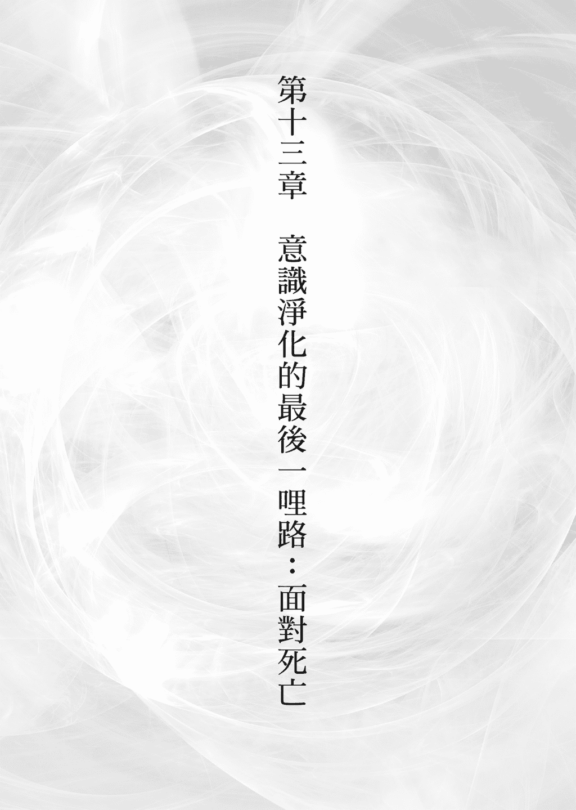

（对于来自小我的诸多抱怨和旧习气，阿乙莎和盖娅母亲一直很有耐心地教我明白个中的真理。而我全然不知，还有最终的考验正在前方等着我……

编按：本章皆为阿乙莎传达的讯息。）

 死神降临

（刚度过忙碌的农历新年，大年初七的清晨五点钟，父亲急促地敲我的房门，把我从睡梦中惊醒。高龄九十五岁的父亲过年时得了小感冒，年节期间医院没开，他咳了三天，我们不以为意，但这突如其来的敲门声打破了家里一贯的平静。

父亲涨红着脸，气喘吁吁地对我说，他呼吸不过来了……

我和先生连忙将父亲送往距离家里最近的大型医院。一进急诊室，医生照了肺部Ｘ光，发现是急性肺炎，浸润积水，要立即插管，否则就有生命危险。一时之间，我无法理解这一切，难道没有别的方法？看见父亲涨红着脸，呼吸急促，氧气已经给到百分之百，还是不够他呼吸。才三十分钟不到，已经没有机会评估判断，更没时间转去其他大型医院了，我向父亲禀告我必须立即做决定：“爸，帮你积极治疗好不好？”父亲跟我点了点头，我就对医生说，先插管，让他能吸到氧气吧。前后不到一个小时的抢救，我父亲已经插了管，进入加护病房……）

插管次日

阿乙莎，我的父亲正在对抗急性肺炎，已经做了生命抢救措施，恢复呼吸了，但现在身体很痛。我可以如何帮助他度过？他是否会有生命危险？请祢给我力量，帮助我的父亲度过难关。

我知道你很舍不得父亲与你分离，虽然这是你们在地球必经之路。你总是期盼那一天永远不会来临，但你现在已经很清楚地知道，生命在宇宙帷幕这端是永恒的存在，不会消失。你父亲此生与你的约定已经圆满，你对他的不舍只是让他的离去更困难。你期待他再拥有一个健壮的身体与你共同生活，这样的想法是不切实际的。他已经九十五岁，以你们地球人类的年龄来说是优等生，你只是没有料到这个时刻来得如此仓促。你不是不知道有这么一天，只是当你面对这天时，你能否带着光和祝福，去迎接他在宇宙帷幕另一端的重生？你父亲不会消失，他的灵魂意识是完整的。

此时此刻你最需要做的，是让他了无遗憾地离开他最挚爱的亲人，还有他一直以来最珍惜的身体。去跟你父亲好好说，让他安心比期望他再次健康地活下去更有意义。

不！不行，我还是舍不得他离开我。我不想他用这种方式离开，他都无法好好地跟我们道别。我要他好起来，至少有所准备后再上路，我要教他如何迎向光。我还没有教会他走上宇宙帷幕那端的旅程，我不放心他可以好好地走……

你真的不用替他担心，他有一整个亲友团在欢庆他的到来。他是完美的灵魂，此生已经心满意足，你们的不舍都是自己的问题，让他安心地走是活着的人要学习的功课。死亡是每一个生命对活着的人最珍贵的教导，他教导你们爱要及时。你以为他此时此刻是会想着如何活，还是如何前行？

我父亲没有宗教信仰，我不确定他会知道如何前行。

你又想多了。当他昏迷时，他就会离开疼痛的身体，进入光中，这是身体的自动保护机制，而你们的牵绊让他不得不回到身体，与你们互动。事实上，离开身体是他最舒适的存在状态时，他就会自然地离去。你以为他还存在身体里呼吸着稀薄的氧气，活在痛苦中，那是你用自己生物体的角度去看他。你可以进入更高的意识维度去看见你的父亲，看看现在的他如何。

 晶体中的呼唤

阿乙莎，我要怎么看到我父亲？

你可以的，进入自己的晶体去呼唤他吧！

插管第三日

（父亲进入加护病房第三天，过年期间正值流感季节，胸腔加护病房里几乎都是插管治疗的病人，现场只有护理人员，看不到主治医师。家属探视时间只有短短的两个梯次，每次三十分钟，我着急地想知道父亲每分每秒的病况，也担忧医生是否有积极地帮助我的父亲，于是决定到门诊找主治医师，询问父亲病况的同时，也看看医生的态度。我相信医生的正面能量和对病情控制的信心是可以帮助病患的。

来到胸腔科主治医师的诊间门前，非常多病患排队等着就诊，终于轮到我了……

我：医生，我父亲目前的状况如何？

医生：他们没跟你说？

我：谁？加护病房没有人跟我说明，没有给我看Ｘ光片，说明肺部发炎状态，没有发炎指数报告，还有目前的用药方式也没有跟我说明。

医生：那里面有值班医师，你可以去问他。

我：我父亲年岁大，禁不起插管太久，是否可以用自费的流感药物，或是帮他补充营养和消水肿的白蛋白。可以施打类固醇吗？

医生：那些自费药物很贵，你不用花这个钱！

我：根据我的经验是需要的。我公公当年也因肺炎插管住院，院方施打自费的白蛋白、类固醇，还有自费的抗生素。我愿意自费。

医生：你公公几岁？

我：当时八十三岁

医生：你父亲今年几岁了？

我：他快九十五了。

医生：是呀！都九十五岁了，不会这么快好。其实，这种急性肺炎对老年人来说，抵抗力弱，并不容易复原，你要明白，也要有准备。

我：医生……你说这话是什么意思？

医生：我看这个状况，至少要在加护病房待个三周，打抗生素，培养细菌。幸运的话，找得到细菌，也有很多时候是查不出细菌的，只能天天打抗生素，一剂比一剂强，他的其他器官能不能撑下去也不知道。年纪毕竟有点大了，他没那么快好，你着急也没用，也不必来找我……好了，就这样了。下一位。

这样的对话，让我心凉了大半截。

医生不看好，也没有积极治疗的打算；加护病房没有隔离措施，一床床都是插管的重症患者。这样的环境和医疗人员的态度恐怕救不了父亲，我当天晚上就安排救护车，一路从桃园把父亲转进台北荣总。

进入荣总重症加护病房时，已近凌晨十二点，马上照Ｘ光，发现父亲的肺部发炎状况三天来不但没好转，反而恶化了……看来，这三天尚未对症的抗生素施打一点作用都没有。难道如同阿乙莎说的，我父亲的灵魂已经离开他的身体，不想回来了……）

插管第四日

（去医院看父亲之前，我依照阿乙莎说的，进入我的晶体，呼唤父亲。

我处在自己晶体的中间，看见父亲出现在我的面前。他在帷幕外的光中，开心地对我说：“瑞琪啊，我在这里比回到身体里头舒服呀！你让我完整地离开好吗？我已经活得足够了，该离开了。现在，我有百分之二十的意识需要你来帮我补足，你给我祝福，让我带走存放在你身上的灵魂意识，这些意识可以让我更加完整地离去。”

听到父亲这么说，我揪着心回应他：“我明白了。请你再给我一点时间，我需要考虑一下。”

离开晶体，回到小我意识，此时，我已泪崩大哭……

我真的给不出来。我怎么可能放手？送走属于父亲的百分之二十意识，他就会离开我。此时此刻，要我给出可以让父亲完整的百分之二十灵魂意识，对我来说是多么地痛啊！

为何我会这么痛，这么不舍、不愿、懊悔？我知道，是因为我还没有准备好，因为我这辈子爱他还爱得不够。过年前因为做菜要以谁的喜好为主，家里还发生了小争吵，我知道他气我，觉得我变了，不像以前听他话的那个孩子，我至今还没有请求他的原谅。我本来可以一如过往，处处如他所愿，结果我故意气他，想让他明白这个家该由我当家做主，我不能只顾着他，不顾我的先生、婆婆、孩子，我不能让他主宰我的世界。所以，我将重心从父亲身上移开来已经快一年了，而现在他要离开，我连对不起都还没有说啊！

“爸，我现在想跟你说心底话，你听得见吗？

“爸，我错了，我希望你再给我机会挽回，我对不起你。我知道你痛苦，但我现在还不能放手，请你再给我一次机会，成全我好吗？再给我最后一次机会，让我好好地说我爱你。这辈子即使是父母子女如此亲密的关系，我却没有太多机会向你道爱。从小到大，你照顾这个家，用你军人的性格要求我成为一个有纪律的人。我知道你爱我们，我也好爱你，但我们彼此都是将爱埋藏在心底，用父母子女之间的传统相处方式包裹住彼此从没说出口的爱。我知道你硬撑着九十五岁的身体，每天锻鍊自己，就是不想成为子女的负担，生病也从不喊痛，怕我担忧。你打拼一辈子，连身体老化也要硬撑着，不让自己在我面前垮下，因为你要成为我的山、我一辈子的依靠。你的世界里只有我们，我却要你从我的生活中消失、放手，我好过分！我错了，我知道这一辈子，还有这些年来你辛苦了，我知道，我都知道，你是这么爱我们，只是没用言语表达出来。

“让我们转换角色，让我从今以后成为你的山、你的依靠。求求你信任我，让我可以从现在开始用尽我全部的力量来爱你，跟你共度最后的日子，好吗？你不许跟我要回百分之二十的意识，我要你先成全我的需要，好吗？拜托你，老爸，女儿跪求你了！”）

 以光的疗愈辅助治疗

插管第五日

阿乙莎，我知道我的父亲想离开，但我还不肯。昨天和他在晶体里的对话，我希望他能听见，并答应我的要求。我目前还可以怎么做，才能帮助我父亲脱离险境？

很好，你父亲会知道的，让他决定。生命能量可以由自己的意识主宰，你已经和他沟通过，不论结果如何，都信任你父亲将为自己做出最好的决定。而现在，你可以用光来治疗他发炎的肺部、肿胀的肝脏，以及愈来愈虚弱的肾。你可以将意识带入眉心，用双手建构他的身体能量场，从心肺功能开始，在手中呈现你父亲受伤的场域，拉高你的意识，链接光的世界。用第三眼链接光，并导入你双手之间那个属于你父亲的场体，这个光会依照他器官的能量状态进行光的疗愈。光的世界会自动给予净化病患场域的能量，你不需要指定任何形式的光，只要创建链接管道，让光自动运行。

当你链接他的场域，使其进入你的双手间，他必须被告知即将施作的光疗。他必须有意识地配合这个过程，才能释放他体内的杂质。若他目前已处于无意识状态，你要进入更高的意识场与他的高我链接，请他的高我认同你即将施予的光的传输疗程。

一个成功的光疗不到十分钟就可以完成，你会看见病患呈现好转反应。目前你可以暂时用此方法来缓解他身体的状况。

好的，谢谢阿乙莎，我立即帮我父亲进行光的疗愈。

练习：光的疗愈

1.链接病患的患部位置场体，使其进入你的双手之间。

2.若病患目前处于有意识的状态，就告知对方即将进行光的疗愈，请对方配合；若病患处于无意识状态，就必须将自己的意识拉高，与对方的高我链接，请他认同你即将进行的光的传输疗程。取得同意后，就进入下一个步骤；若无法获得对方的同意，就停止。

3.让自己成为光的管道，用第三眼将光导入双手之间那个对方的病灶场域，进行光的疗愈。你是链接信道，让宇宙光的世界自动给予这个场域需要的光。

4.约进行十分钟后，即可结束这一次的疗程。

5.结束后，感谢光的世界的协助，感谢对方愿意敞开自己接受光的疗愈，然后让意识回到自己身上，完成这一次的疗程。

插管第六日

（早上医生来告知，一早的检查显示父亲的情况有往好转的方向前进，血红素提升，发炎指数已经下降到一万。这个好转迹象也激励了整个荣总重症加护医疗团队，因此医生告知，他们今天打算另外排入更进一步的介入性治疗，除了冲洗肺部的积痰，还可以同时进行更深沉的肺部采样，看看是否能找出尚未发现的细菌或病毒。抢时间帮爸爸早日找出细菌，才能更对症地使用正确的抗生素治疗。

我内在知道，这是爸爸回应我的请求了，愿意让这一切往好转的方向行进。我充满感谢，但父亲尚未脱离危险。）

阿乙莎，我父亲有好转迹象，我是否要继续帮他做光的疗愈？

你持续灌注光给你父亲，对他是有帮助的。这是改变他的能量场域的过程，你要记住，疗愈患者要先改变环境的能量场域，才能创造新的实相。医护人员是在物质体上操作，你则是在量子场域操作，两者可以相辅相成。你转动你父亲身体在量子世界的环境场域，就可以带动他周围的场体去配合他环境场域的变化。环境是看不见的因，物质是看得见的果，种因胜于去对峙结果。

谢谢阿乙莎，我继续努力送出光给父亲。

 净化病患的环境

插管第七日

（接连两日送光给父亲，发现他有精神多了，发炎指数持续好转。前天的介入性治疗帮他清理了更深层的积痰，昨天的痰量更多，抽痰清理的次数增多，可喜的是，我看到父亲已经展开求生模式，看得见他想要努力让自己变好。）

阿乙莎，我父亲虽然各项指数都有好转，但仍然未脱离危险状态。早上去医院前，我用双手侦测能量，感觉父亲肺部的能量场又缩小了。这个光的疗愈要像打针吃药般，每四小时进行一次，直到稳定吗？

是的，就像大扫除，有垃圾和杂物出来都要清走，才能产生新的生命物质。在他的能量场体尚无法自行清运垃圾前，你可以持续进行光的疗愈，还可以远距清理他身体所处的环境场。

我要怎么做，才能远距清理他身体所处的环境场？

你可以这样做。

练习：远距净化病患的环境

1.让你的意识链接进入他的病房，在天花板点燃生命之火，然后从房间右前方的角落开始，以逆时针方向在每个墙角点燃生命之火。一面点燃火焰，一面用意识观想火焰呈现紫色，紫色的火焰有很强的环境清理效果。

2.接着，在他身体躺着的病床四周，以意识引导围上白光的帘幕。从病床正上方洒落，包覆整个病床，一直垂落链接到地上。

3.最后，用意识在床底画一个三圈的圆（如下图），打开一个洞，让黑色的能量可以进入黑洞中。

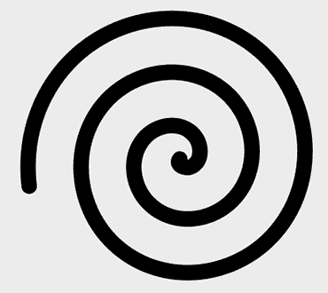

完成整个病房的基本清理，就可以接着为身体进行光的疗愈。在每天的日出和日落时分各做一次，可以加强汇集阳性和阴性的能量，重现生命的元气。

 结算灵魂契约

插管第八日

（父亲的肺仍在发炎状态，血糖升高，对肺部的发炎不利。目前状况虽没有恶化，但似乎也停止好转了。虽然已经排除是Ａ型流感病毒，却仍查不出可辨识的细菌源。

我只能持续送光给父亲，早上送出的光才让肺部能量扩展，到了下午又明显萎缩。我持续早晚各做一次，调整他肺部的能量场，医生则持续每天施打抗生素、白蛋白、类固醇……我看着父亲双脚的肌肉开始萎缩，褥疮已经产生了。

我的信心有点动摇。医院的加护病房为家属开设教育讲座，说明插管只能放置一段时间，放置太久会有感染的危险，气切是让病人可以恢复正常生活的选项。听到这些，我又开始担忧，万一发炎持续无法解决，难道我要选择气切吗？虽然前几天父亲已经开始好转，但目前肺部的发炎状况没有解决，必须施打许多抗生素，他的身体被注入一堆化学药物，是否撑得下去？父亲恐怕也无法接受气切的安排，我内心又变得不安了。）

阿乙莎，我父亲的情况虽然稳定下来，但发炎现象似乎无法进一步改善，他会好起来吗？

你要持续量测他的能量，并给予足够的光。你这次的学习很深刻，你父亲会度过此次的危险，你不用过度担忧。生命本来就是来体验的，你和身旁所有的人都有个生命契约，这个契约在你出生前就已经拟定，当生命体验终结时，你们会来到生命的审查——以往你们称之为审判日，与其说是审判，不如说是结算。

结算什么？

结算你所有灵魂契约的达成度。你和自己的父亲、母亲、兄弟姊妹、另一半都有最直接的契约关系，你与对方的灵魂契约详细列着让自己心满意足的指标，对你们双方来说，满意指标意味着愿意释放多少能量给对方存在你身上的灵魂契约。

我听不懂。

你已经知道，你父亲有百分之二十的灵魂意识需要靠你来完整，这百分之二十在你父亲生命终结时，就是由你送还给他，让他带着你释出的能量，去结算他此生与你的灵魂契约。你出生的时候，身上携带着与你父亲的灵魂契约，假设初始值为Ｘ，当你们此生的关系终结时，你释放给他的灵魂契约能量，可能大于、等于或小于Ｘ。若将大于Ｘ的灵魂契约能量给你父亲，可以帮助增长他的灵性数值；若将小于Ｘ的灵魂契约能量回馈给你父亲，会减损他与你之间的灵魂契约初始设定值。

你们彼此都不能控制设定值，也不能设定如何给予，这一切都是能量自动流动的机制，你只能以意识去启动结算。当你带着圆满、祝福、感谢、崇敬、心满意足的意识面对这段关系的终结，就能给予对方大于初始设定值的能量；若是没有情绪上的波动，给对方的能量就会等于原始契约设定值；如果你携带着怨恨、懊悔、愤怒、惭愧、内疚、自责、埋怨，就会减损对方与你的原始契约设定值。这些来自你与生命关系人之间的情绪振动，将做最终的结算，这也是你们双方对这段关系的共同贡献。

阿乙莎，祢看见我现在心中的忧虑了。祢是希望我用平和的心情祝福我父亲，而不是抱着为他担忧或不舍的心情，这样对他一点帮助都没有，等于是在减损他与我之间的灵魂契约初始设定值。我明白了！原来，死亡是此世生命的终结，也是双方关系契约的结算，我给我父亲什么样的振动频率，他就会带着同样的共振回到帷幕那端。

祢让我更清楚地看见，实际上，我伤心和懊悔的不是父亲生命的终结，而是在我与父亲的关系中，我自己内在有尚未满足的部分，却即将失去圆满这段关系的机会。我们自身的情绪反应在关系结束的同时，也会将这个结果送还给对方。生命的灵魂契约由创造此生的关系开始，也由关系的另一方决定了我们此生的成绩单。而事实是，人花一辈子的努力去满足自己的欲望和成就，在这过程中，也要做到让所有与我有关的人在我离去时，都能感到心满意足！

 和细菌沟通

插管第九日

（一早前往医院之前，再次透过能量侦测感知到父亲的肺部能量又缩小了，我内心明白，发炎状态仍在持续。我已经不想再去问阿乙莎要怎么办了，我不禁开始怀疑自己，我对父亲身体的要求是否太过分？他毕竟已经是九十五岁的人了，我现在应该让父亲奋力一搏，还是如他之前在帷幕那端所言，顺从他，让他以比较舒服的方式离开？

就在此时，我接到好友Ｓ姊的电话。她算是多年的修行人，也懂得气功，我很感谢她在父亲生病的这几天，虽然人在国外，也用自己的修行法持续远距补气给父亲。Ｓ姊跟我说，她看见父亲的肺部有一坨黑色的能量，看不清楚是什么。我回答她，那是父亲肺部的细菌丛，目前仍然查不出是什么细菌，所以发炎呈现胶着状态，无法进一步改善。

Ｓ姊说：“你可以试试进入他的肺部去找寻细菌。”

咦，用我的意识去搜寻细菌？对啊！我怎么没想到？既然可以进入晶体去跟父亲对话，我应该也可以进入晶体，和父亲身上的细菌沟通啊！

我开始用意识进入自己的晶体，并链接到我父亲，果真让我看见一坨黑色的能量，然而这坨能量却似曾相识。这是一股链接着我和父亲许多世的缘分，那一世，父亲曾是我的儿子，因为摔伤而结束生命，提早离开我时，我们之间产生再次链接和体验的生命意图。这个生命意图就像一颗种子般进入我父亲的灵魂意识，并在他这一世再度引爆。

我看见最早的引爆点来自我父亲年轻时，因国共内战，他从大陆撤退来台湾，必须离开他的母亲，就在当时，他内在不愿意离开母亲的业力种子启动了。现在看起来，这就像是同样的剧情重新上演，我父亲此世再次经历提早离开自己的母亲这种事。而这个让我父亲悲伤的心结再次深埋在他的身体里七十多年，一直躲在肺里。

直到今年过年前，因为我试图让他明白我已经有自己的家庭要照顾，不能处处以他为主，而刻意疏远他，结果又让他感受到自己即将失去最爱的亲人，那个深埋在他肺部七十多年的悲伤情绪——更精确地说，这是我与他之间创造此次生命意图的业力种子——再度引爆。

我在晶体中看见父亲身上这股黑色能量的全貌，而就在被我的意识照见和理解的当下，这股黑色能量就像被光照射一般，渐渐转化，呈现出红色。于是我才明白，躲藏在我和父亲之间的业力种子此时此刻正全然被爱围绕，这股业力已经完成此次生命爱的体验了。

离开晶体后，我再次用双手量测父亲肺部的能量，居然明显地扩展开了。我不知道这次的扩展是否可以持续，但我很清楚自己已经不再恐惧了。）

插管第十日

（今天早上再次量测父亲的肺部能量，发现维持昨日的饱满状态，没有再塌陷下去。不论是抗生素对峙细菌终于成功，或是因为昨日和细菌的沟通，我都好感谢！我相信那股黑色能量已经散去。

到达医院，加护病房的医护人员告诉我，虽然仍未查出细菌，但父亲的发炎指数明显下降，全身的水肿现象也逐渐消退。）

阿乙莎，请问我父亲的肺炎查不出细菌，是否有别的原因？

是的，最主要的原因你已经知道了，是深植在你父亲肺部的情绪创伤复发。这个复发的情绪是为了让你对生命有更深入的理解，同时也是为了让你父亲以更完整的灵魂回到源头的家而铺陈。

你父亲这一次的学习也因为你的协助，让他即使再次经历与自己的母亲分离，还是有机会从与你的关系中得到理解，并找回爱的链接。爱从不会因为时空的分离、肉体的消逝而失去，你父亲的内在意识设定要与母亲创建永恒的链接，结果却一再经历失去母亲的体验，但其实每一次的失去，都在帮助他深化与爱的链接。这是每个生命内在本有的光，但他需要用这种方式再次获得爱的体验。

 意识转化后的奇迹

阿乙莎，我之前用光的疗愈帮助父亲，却没有办法完全驱动细菌离开，是什么原因？

你之前只是在乙太体的层次帮助净化你父亲的身体能量并提升振动，但这股能量将他的身体环境冲刷一遍只是清除了杂质，那些细菌丛尚未改变运行轨迹；若要让细菌重新与身体和谐运行，就必须进入星光体去疗愈。深入你父亲的灵性层次，让细胞的源头初始记忆能够改写；若没有改写这些细菌丛的认知，它们仍然会照原来的轨道运行。

当你为父亲施予光的疗愈时，虽产生一股更高的能量流挹注于你父亲的身体，调整他身体的环境场域，使之能量畅通，但这些顽强的细菌丛就像携带着自己的ＧＰＳ般，经过能量冲刷后会再次汇集，聚合进入原来的路径。要改写细胞记忆，必须唤起这些细胞的初始设定。看见当初设定的理由不复存在时，这些细胞就能被注入新的指令，等于重设了它们的ＧＰＳ路径，自动走向新的目的地。

所以，重新设定细胞的路径之前，我必须先明白当初这些细菌丛诞生的理由，是吗？

当然，你身体所有的细胞都是为了支持你的意识而存在，包含与你共生的细菌丛也有它们存在的理由。“你如何想，就如何创造自己的实相”，这句话也适用于你自己的生命载具。

我明白了，经祢这么说，人是有可能长生不老，可以活得非常健康，一直到离开自己的身体。

是的！这就需要不间断地觉察自身与环境是否处于平衡状态，以及随时重设自己的意识，使之与环境和谐共存，才可以做到。

祢可以教我要如何让身体与环境维持永恒的平衡吗？

要在地球上做到这一点并不容易，我可以跟你分享。

你只要能够以意识契入源头，就容易多了。在宇宙的源头这端，万物处于互相链接、平衡共生的和谐状态，当你携带着来自地球的低频振动一路回溯到源头时，等于是在地球上与数亿年前地球的时间轴展开对话；你用自己的意识光谱链接进入源头光的世界，进行校准。

比方说，你目前在地球上感觉生命力耗弱，需要立即补给能量时，就透过自己的意识穿越地球次元，链接你细胞ＤＮＡ的微宇宙。这个微宇宙你的肉眼看不见，它就存在你身体细胞内。你的细胞拥有其意识，你透过链接自己整体的更高意识，与身体细胞的微宇宙意识沟通。

沟通方式就是将你期待的结果或新的转变，以自己的意识注入。当两端宇宙串连起来时，更大的宇宙版本就产生连动，直接影响你身上微宇宙的运行轨道，进而帮助你，将你期待的实相显化在自己的身体上。

所以，想要让自己的身体意识载具随时校准源头，并与环境取得平衡，意识就必须不断与光的世界校准。你目前使用的手指操就可以帮助身体细胞与光的世界同步校准，让身体虽处于混乱艰困的环境，还是可以保持平衡和谐的状态。

祢说得这么简单，为何生病的人愈来愈多？

人类忽视自身拥有超越物质身体的灵性意识能量这件事已经很久了，是时候唤起大家找回自己的自愈能力了。

所以，这次我父亲的急性肺炎之所以会发生，根本原因就是身体与环境不平衡所造成。这个不平衡来自我父亲的细胞僵固在原有的生活情境中不愿意改变，而环境本来就因着周围人事物的成长与变迁不断变化，当人的内心产生抗拒或恐惧改变时，就给了存在环境或身体中的细菌力量。这些细菌的力量来自哪里？

不论是寄生在环境或身体中的细菌，都是宇宙中的黑色力量。这股力量可以吸收无法与环境和谐共存的粒子，当游离的粒子愈多，黑色能量就如同被加持一般，逐渐放大其能量和影响力，大到足以吞噬白色能量的流动。这是生命体的自体平衡机制，也是宇宙的平衡法则。身体就是一个小宇宙，你现在是否更明白了？

嗯！但是，我父亲刚插管前几天，祢跟我说生命是永恒的，那么，追求生命的长短似乎没有什么意义了。

当人类生物体的存续可以延长到一百岁以上时，地球的文明就能跨越进入第五次元，与第五次元的生命共存，你们的医疗及生命体验将进入新的文明阶段。

阿乙莎，我可以想像祢说的美好景象，但现在更要紧的，是给已经病危的生命一个意识转化的方法，好吗？

可以的，你现在就写下来吧！

练习：帮助病患转化意识

1.进入患者的更高意识中（可以经由阿卡西纪录的路径进入）。

2.找出目前凝聚的黑色能量的中心点位置。

3.进入这股黑色的能量团中，感知它产生的源头认知系统与目前所处的环境有哪里不平衡，然后去调整患者目前的认知系统或环境，重新设定这股来自这个病患的源头意识结构组成。

4.尝试与黑色能量团对话，让这股能量可以链接到爱与宽恕的能量振动，直到眼前的黑色能量出现新的光谱。

5.感谢细胞意识的慈悲和勇气，愿意调整出新的振动频率，协助患者重启平衡的生命系统。

6.将你与黑色能量的对话内容和结论记录下来，并送给患者。

 同步释放关系业力

插管第十一日

谢谢阿乙莎！释放我父亲肺部的暗黑能量之后，我自己的肺也像泄了气的皮球，像是某种能量释放，让我感到非常放松，父亲与我之间绷紧的系带好像松开了。

嗯！亲爱的孩子，你即将展开新的阶段，为了所有地球人类的福祉而行动。在此之前，你将调整到最佳的能量流动状态，包括困扰你生活的能量枷锁、你所有关系的能量链接都会因你而展开清理和净化，为的是让你可以处在全然临在和稳定的状态。你们宗教的修行人是透过出家剃度等仪式，让自己重新整理，然后开始投入利益众生的工作；你和他们虽然采取不同的形式投入，仍须为自身的能量链接降低干扰，所以必须清理能量脐带关系。

而这一切并不是突然发生或随机事件，所有的发生都是因缘具足的结果。目前你内在已经准备调整自己，这个过程就会连带让你周围的能量产生变化。这些变化会在你最亲近的人身上显化，你会发现他们突然无法适应你的改变，你周遭也渐渐出现不同以往的人事物，一些固着的能量会从你身上转变，有些变得更亲密，有些变得疏离。

你父亲这次生病就是让链接在你身上的系带松绑，不代表你会立即失去你的父亲，不是的，而是要创建一段更平衡、无牵绊的关系。你父亲是你此生最亲近的家人，他会感受到你近来明显的变化而产生不安的情绪，因而对你有所不满。另外，他无法改变和控制你周遭环境的变化，也因此，他身上的平衡系统会出现暂时失衡的现象。他年纪大了，身心无法快速适应环境的变化，而出现疾病的征兆，你们遍查不出引发他这次急性肺炎的细菌，其实这是身体平衡系统重整过程引发菌丛自我保护的现象。要让你父亲的身体恢复平衡，并不是要你回复你们之前的生活习性和环境，他的身体经由这次的能量转换，自然会诞生新的平衡系统，他也会因为这次生病，更能放下对死亡的恐惧，你不用过度担忧。

同样地，你启动的转变影响的不只是你父亲，还包含你的先生。他是你最有力的后盾，但在他自身的业力尚未清理前，你无法得到他的全力支持，时不时会被他的业力掣肘，无法尽情发挥。此外，你投资的事业中最让你挂心的资产会被优先处分，这一切的铺陈不是我们在搞小动作，而是你自身的能量扩展后的自然转化。

这是你自己启动宇宙源头的能量，带领你进入新轨道的过程。你在实相界看到的一切才刚发生，这是宇宙能量流动的结果，但改变早已展开，你只是“眼见为凭”地认为现在才开始。其实，这一切早已开始了，早在你投生到地球时就已经设定要展开这股能量流。现在是让你的灵魂跃升的时刻，不用担忧目前你眼中所见的每一段关系的变化，这些都是为了你展开的，当你将爱和祝福给予身边所有配合你扩展的人事物时，会更快速地帮助你身旁的每个人同步跃升。

插管第十二日

（医护人员说，父亲更稳定了，发炎现象持续好转，再观察两天就可以准备拔管了。

昨天下午，仲介通知我有人要来看我之前一直想卖掉、却乏人问津的物业。那栋房子的出售讯息已经刊登超过两年，但因为父亲住院，我现在更是没有心思处理，便联络房客让仲介直接带买方去看。结果前后不到一小时，买方一下飞机就过来看屋，马上做出决定，我匆匆地赶去签约，完成这个交易。我到现在还不敢置信，居然半天的时间就把那栋房子卖掉了。之前我身旁让我担忧的所有停滞能量，正在快速重新校准中。

我先生跟我说，他连续几天做梦，都是奇怪的梦境，梦中的剧情似乎在提醒他，是时候放下一直不想放弃的坚持了。结婚十八年多，他是我看过最不会做梦的人，而连续两天的梦境，似乎都在帮助他看见自己认知上的误区。

第一天他梦到自己准备考试，这个考试是要将测验卷写完，然后寄出去。没想到，他呕心沥血写完试卷，准备在截止日前寄出去时，突然找不到规定的信封，让他前功尽弃，非常懊恼。

第二天，他梦到自己搭上一辆公车，车上有一群流氓，他是唯一的乘客。结果，流氓开枪打死司机，他坐在车上没有逃跑，流氓杀死司机后，回头扫射他的太阳神经丛，他也死了。

接连两天的梦境让他看见，自己一直不肯放弃、一直坚持，背后真实的原因是害怕失去——他害怕失去自己累积的成果，即使坚持下去也不会有结果。但是，他看见自己舍不得已经付出的部分，而不愿意轻易放下。紧接着，第二天的梦境就让他看见，自己之所以无法轻易放下之前累积的成果，真正的原因是害怕未来——不确定会发生什么之前，他宁愿不采取行动。所以，他终于看见并承认自己是个不敢争取自身权益、行动力薄弱的人。

听见我先生从梦境自我剖析得到的结论，我大感惊讶。这就是我一直以来认为的他，但我不知道他内在的恐惧和不安会以梦境的方式呈现，让他获得全然的理解。我不禁想起阿乙莎昨天才跟我说的，我们自身的能量扩展后，身旁的关系也会随着我们的能量流动自然转化。当我们将爱和祝福给予身边所有配合我们扩展的人事物时，会帮助身旁的人同步跃升。）

 灵魂约定共同来完整爱的体验

插管第十四日

（父亲终于顺利拔管，转入一般病房，可以说话了。他一开口就问我，他进荣总多久了？父亲浑然不知自己是从桃园转院过来的，在桃园的前三天记忆完全空白。我想也是，当时他已经站在帷幕那头，等着我送给他百分之二十的意识哩！）

阿乙莎，我现在终于可以喘口气。回想当初我父亲刚插管时，祢要我去晶体和父亲对话，当时我父亲要我成全，将百分之二十的意识送还给他，这是什么意思？我感觉这是灵魂契约的精心策画，透过关系，在生命终结时结算出另一种意义。祢可以帮助我理解这个宇宙的生命契约逻辑吗？

你终于松一口气，可以回头来探索：生命的完整体验就在关系的圆满里，你们生生世世地来完整彼此的灵魂道路。之前我和你提过，你们彼此身上都拥有共同的集体意识，而你父母生下你的同时，在你身上也留存了一部分的灵魂意识片段。你们在肉体上是彼此分离的个体，但在灵魂层面则拥有共同的意识片段。包含你身体中的小我意识得到的独三維验，也包含你父母的意识片段，都存在你的生命体中继续滋养着他们的灵魂意识，只是你在个体的意识中没有辨认出自己仍存在一部分的意识，是来自你的关系。

所以，当一个人的灵魂意识即将离开他的生物体时，他会从自己与他的关系人身上获得此生的总结——一部分来自他个人体验的视角，另有一部分则会来自他的关系人与他此生这段关系中的体验结果。

也因此，你一生的体验不仅止于从你自己的视角，还有与你此生相关的所有人的印记集合出的、属于你的完整意识。你将带着你和关系人共同创造的专属于你的完整生命体验结果回到源头，你们彼此之间的所有体验产生的振动，都将在你的灵魂离去的瞬间，统一收集在你的灵魂晶体中。你会明白，你是创造所有体验的源头，你就是造物者。

现在，重新用你的小我意识去理解，你不愿意放手让父亲离开，背后真实的原因是你和父亲之间有误解，你们之间的爱的能量无法流动。你就是因此而不愿在此时放手，因为你自己尚未在这段关系中圆满爱的体验。这是灵魂在地球上体验会出现的真实景象：创造出每一个分离的意识，又试图在与自己看似分离的关系中体验并找回爱的能量。

你们是自己此次生命的导演，早已经协议好要用什么样的关系结构来体验爱。你的父亲此生也安排了许多灵魂片段在他的父母、子女、兄弟姊妹和夫妻关系中，你们各自与他之间的关系体验，也成就了他此生的成绩单——你的父亲跟你说有百分之二十需要你来补足，就是这个道理，他还有百分之八十在其他的关系中。

你们以什么样的心的振动来面对关系的结束，就会成为这段关系最终的结果。当你们彼此感到心满意足时，就会圆满此次爱的体验；若你们彼此带着爱的匮乏和缺憾，就会产生爱的缺口。在关系中若无法让爱流动，空留悔恨、埋怨和遗憾，会让彼此的灵魂携带不完整的体验回到源头。你们的灵魂生生世世不断地在关系中，协助彼此完整对爱的体验。

阿乙莎，我明白了，我还需要满足自己与父亲之间的爱，这是我非常乐意去完成的功课。但是我想问，对于仇人或伤害了我的人，我无法去爱和原谅怎么办？

很好的问题。这其实是你内在潜藏的负面印记，不论这个负面的根源是来自批判、暴力或任何负面种子，这些种子的根源却透过你与这些你无法去爱和原谅的人之间的关系，让你于此生再次学习和穿越。人类所处的二元对立世界中，所有的冲突就是这样产生的，那些你们认为的不合理、不正确、不应该，就是源自你们自己身上携带的负面印记种子，它们透过关系，拉扯出你需要再度面对的爱的极致体验。

当你超越二元对立的是与非、应该与不应该，拉升自己的意识去看见对方的世界时，会发现他们为了让你突破内在意识的黑暗陷阱，而愿意让自己陷在黑暗的角落，如此称职地扮演你痛恨的角色，就只为了让你此生有机会穿越黑暗，进入光明的境界。他们愿意成为你所遇见最恶劣的负面引导者，你是否看见他们更高意识中无私的爱，看见他们为了成全你而存在？

你无法在二元世界里原谅他们，但你可以拉高自己的意识维度，认出他们在更高意识帷幕那端出于良善的企图。你遭受如此不合理的对待还可以回到爱中，这是特别为你精心规画、激发和扩展你内在爱的能量的方式。你终于可以允许自己的爱更无条件，没有任何理由地流向黑暗。再给自己一个试炼的机会，让爱流向你不认同的一方吧！

我明白了！原来这些负面情绪背后，也依然有爱的理由！

 重十爱的能量

我父亲终于平安出院回家了，这一个月期间，我经历了生死的考验。

阿乙莎，当初祢要我放手，让我父亲完整地离去，是真的吗？我父亲这次面临生死交关的事件，是祢特意安排的吗？

先恭喜你完成生命的另一次体验，你父亲用他的生命给予你最大的教导就在此。他让你体会到什么？你先说一遍，我再来和你校准。

好吧！我来整理一下这一个月来纷乱的思绪。

首先，我学习到生命都是来经历和学习的。

我们身边的人事物和一切的关系，就是我们生命的考题，通过了，我们会从对方的认同中获取积分，那些积分会以结晶体的形式镶刻在我们的灵魂晶体结构中。若我们能在每一次的生命体验中圆满彼此的关系，就可以从对方那里获取爱的结晶，充实自己的晶体结构。理解了这一点，我才明白此生不仅是“我”如何看待对方，同时也要满足“对方”如何看待我，是双向的。当我无法给对方机会去圆满他和我之间的关系时，我同样得不到对方给我的祝福，也就无法从与对方的关系中得到爱的结晶。

此生是由我所有的关系来成全我，也因为有他们，我才能完整自身爱的体验，结出漂亮的生命灵魂晶体。若无法获得对方的认同，即使坐拥金山银山、赢得天下版图，我此次生命的结晶也不一定会增加。

第二，我学习到生命必须随着环境的变迁而转动。若环境已然改变，我还不变，身体的细菌就会群起攻击——攻击的对象不是外人，而是宿主，我自己。环境变动是由其中所有生命的意识投射出来的，看见环境改变，若产生对抗心理或坚持不为所动，我们会失去校准自身细胞意识的能量。这些细胞意识也包含寄生在我们身上的细菌丛，这些细菌会感受到环境的改变而产生不安，进而爆发为身体上的病灶。

第三，细菌可以沟通。除了仰赖专业医疗和药物，若我们可以让细菌理解并配合环境改变其意识，就能让细胞与周边环境能量融合，使身体重新恢复平衡，回复健康。这整个与细胞沟通的路径，就只是要我们有意识地进入内在宇宙，和细胞沟通，就能达到效果。

第四，灵魂有自主权，可以随时决定离开身体。我父亲对刚插管的前三天完全没有记忆，那几天，他的灵魂意识已经决定离开身体，却因他愿意成全我和家人“完整与他之间的爱的体验”这个需求而回来。至于这些离去的意识在哪里，我现在也不清楚，我相信这些意识回到父亲身上，对他的复原也会有帮助。

以上就是我对我父亲这次生死体验的心得。

嗯！大致上都有到达新的理解，但你忽略了最重要的一点，也是此次事件最关键的学习。

咦，还有哪一点我没提到？

你没有提到生命在生死幻灭之间，就只存在着爱的能量。你出生是因为爱，你经历死亡也会再次遇见爱。即使你们已经遗忘了生命中最根本的能量，但在死亡的瞬间，你们仍会重十并见证爱的能量。爱就是生命的泉源，在生死中你们会体验到爱，没有任何药物、细菌、名利和权势可以阻挡生命回到最初始爱的能量流动里。

你在此生所有关系中的体验，也都是为了表达爱而存在。若你与父亲之间没有爱的能量，你们的关系不可能存在；即使是细菌，也是为了彰显你生命中的爱而寄生于你。

细菌为爱寄生？我不懂？

细菌是爱的守门员，当你失去与爱的链接，细菌就会出来防御你的身体。它们的防守方式就是攻击你的正常细胞，让细胞在死亡中激发并释出爱的能量。而新细胞诞生的过程，也可以再次体验到爱的能量。

爱不是只存在新生，也存在死亡里；死亡对你们来说是生命的结束，但对永恒生命来说，死亡正是让爱的能量返回宇宙的再生过程。

在你父亲最危急的那一夜，你是否让自己重启与他之间的爱的能量流？

没错，我害怕那一晚会失去他，就在那个瞬间，我觉得我好爱他，我还没有爱够他。

是的！这次就让你如实体验，每个生命里早已拥有源源不绝的爱的能量。

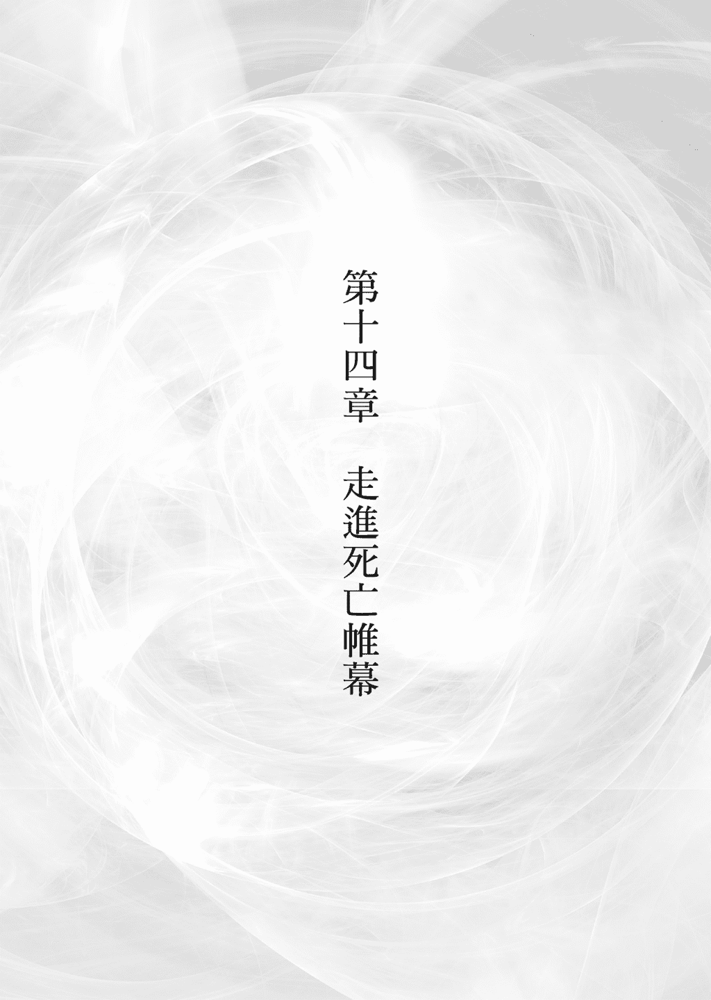

（我带着沉痛的心情写下这一章，来纪念我的好朋友、好长官，Jack。

编按：本章皆为阿乙莎传达的讯息。）

 以不同的眼光看待死亡

阿乙莎，我的试炼还没结束吗？三个月前才跟 Jack 在 LINE 上约碰面的时间，今天就收到他在美国旅游途中过世的噩耗。好好的一个人，就这样走了，我感到非常难过与不舍。

这并非意外，是命中早已程序化的必然。你们以为只有到老年身体衰竭时才需要有死亡的心理准备，那是因为你们对死亡仍有根深柢固的恐惧，将死亡看成不美好的发生，认为是令人伤心难过的情景。

当然难过啊！和自己的好朋友或相处一辈子的亲人分离，是令人痛彻心扉的事情。为何人们不应该畏惧死亡？

你忘了那第一个Ｈ粒子？为什么会分离出第二个Ｈ？

是为了体验爱，我当然记得。

如果你看见与你分离的每一个人都是自己，那么当另一个你回到帷幕之外，你认为他会在哪里？

我不知道，他会去哪儿？

在你心里！你去找找。

啊！对了，我应该可以链接逝去的人，我怎么没有想到？我现在去试试。

＊ ＊ ＊

我：Jack，是你吗？

Ｊ：Rachel，对，是我。

我：你还好吗？

Ｊ：不太好！我不忍心看见我的太太和孩子伤心难过。

我：他们当然会伤心，我也很难过啊！

Ｊ：你们其实真的不要为我哭泣。我跟你说，我出生以来，从没有像此时此刻这般喜悦，没有了那副沉重的身体，我舒服太多了。我们都被自己骗了，以为死亡很恐怖，但你知道吗？我一点痛苦的感觉都没有，唯一的不舍是看见家人伤心难过，这会让我很不忍心。我挚爱的太太和孩子，还有那么多老朋友，谢谢你们给我的快乐时光，我已经非常满足了。
告诉大家，死亡不痛苦，不要为死亡哭泣，我们只有经历死亡才能回家。这里反而是我更熟悉的家。到了这边我才明白，地球那里是我给自己安排的一趟旅程，就像一小段梦境而已，我在这梦里的经历是我早已排定的剧情。现在走完回到这里，我才知道是怎么回事：我们不论生或死，都会一直存在，只是出生时，我们走进自己编织的梦里；死亡后，就回到原本清醒的自己。
我在这里一切都好，替我好好地跟我太太说，我谢谢她这一世的陪伴，我爱她，会一直守护着她和孩子。请她不要太常生气，也不要太苛求完美，她是我见过最聪明又有才华的女人，我很幸运这辈子能有她作为伴侣。
还有，我要对儿子说，老爸在你最需要我的陪伴时缺席，很抱歉，你成长的过程辛苦了，也吃尽苦头。不论未来你如何发展，我相信以你的善良和认真，一定可以做得很好。
还有我优秀的宝贝女儿，你将我和你妈的所有优点集于一身，一定可以在事业上大展身手，创造辉煌的成果，但请你务必好好照顾自己的身体。要兼顾事业和家庭不容易，你爸选择了前者，就忽略了家庭，也无法参与孩子的成长，这是我的遗憾，希望你可以尽量在工作之余多陪伴家人和我未来的孙子。
好啦！Rachel，不好意思，又占用你那么多精神来帮我传话、写信。

我：不会的，Jack。你是最棒的长官，也是大家的榜样，我会永远怀念你的。

Ｊ：你的书没有问题，我之前看不懂，以为是你胡思乱想的，现在才知道，你那书上写的是真的。我们一直都存在，即使我离开自己的身体和熟悉的环境，我还是随时可以链接上你们，也可以到处旅游，现在已经可以搭乘免费的头等舱了。

我：Jack，你那边有天堂和地狱吗？你离开身体时，有看见上帝或任何其他的存在吗？

Ｊ：没有那么复杂，我就是意识还在，只不过这个意识目前可以随处行动。其实，在死亡后的帷幕这端，有非常多活跃的意识存在，不只是人类，还有看起来像古代人的、动物、植物、野兽，也有外星种族。我们可以用意识直接沟通，只是看不见具体的形体而已。现在回头来看，作为地球人具备身体，是特别安排的意识体验，我只能说，还好我离开的那一瞬间没有太多恐惧，只感觉到自己的灵魂从心脏停止的瞬间脱离身体，进入非常柔和慈悲的白光中。这里没有具体身形的人，但我有种平静和喜悦的感受。现在我可以随时移动到任何我想去体验的下一站，但我还没有决定要去哪里。我想多陪陪自己的家人一阵子，看见他们恢复平静之后再决定。

我：Jack，谢谢你听见我的召唤，还跟我说明这么多。你离开时没有太多痛苦让我很欣慰，我先祝福你找到更好玩的下一站，先帮我们探勘一下好景点，以后还需要你的指引呢！

Ｊ：没问题，谢谢你，Rachel！

＊ ＊ ＊

阿乙莎，我刚才和 Jack 沟通，没有感受到他有任何痛苦的情绪，他只关心自己的家人，希望他们尽快回到平静的生活。

是的，这是大部分人死亡后的状态：他们进入光中，回到爱与喜悦的帷幕另一端。人类因恐惧死亡而创造出许多宗教和神话，事实上，死亡是意识跨入不同的维度空间，就像你们也常常在睡梦中跨越宇宙时空旅游一样。死亡后，你们可以决定再回到地球体验，也可以进入不同的场域去体验。这么简单的跨越维度空间的转换，被人类的恐惧放大成每个人一生的枷锁；也因为害怕死亡，人类创造出许多围绕着恐惧而生的文明垃圾。你现在回头想想，目前人类定义的文明，是真正能够服务人类，让人活出喜悦与幸福的文明，或者只是假防范恐惧之名的创造？

阿乙莎，如何用不同的眼光看待死亡？请给我一个方便法门或想法，好让人类清醒，远离死亡的恐惧。

“用爱去生活，直到最后一刻！”爱可以为你们点亮进入死亡帷幕前的黑暗。

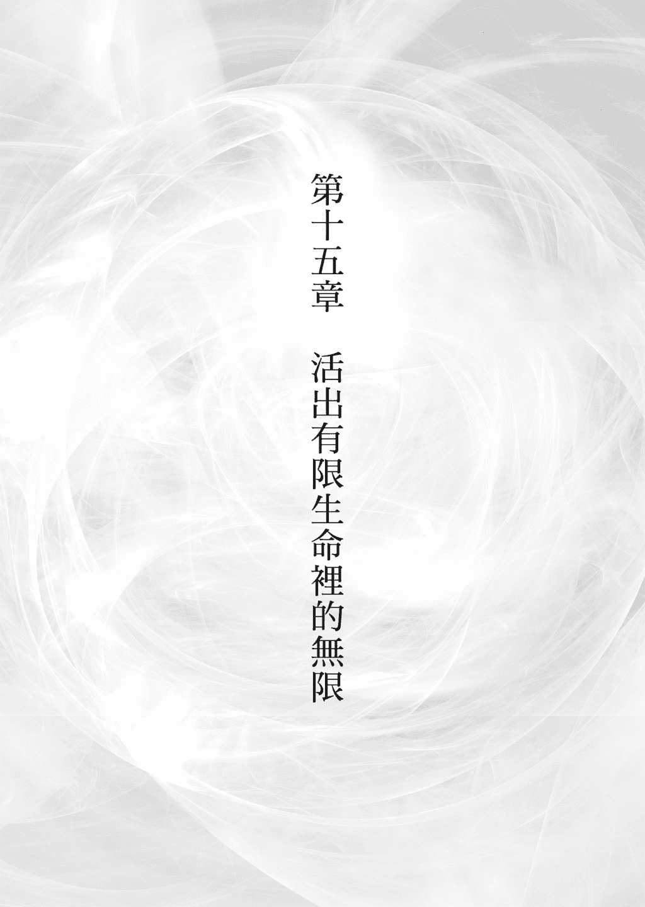

（编按：本章皆为阿乙莎传达的讯息。）

 脱离小我模式，展开真实生命之旅

人死后究竟去了哪里？人是否可以自己决定或安排死后的归属？这是你们千古以来百思不得其解的一个问题，也是你们穷极一生追求延长寿命的原因。因为你们活着的时候无法看见死后的世界，也因为对未知抱持着恐惧，让你们永远无法直视死亡的议题，你们的宗教因此利用死亡这个禁忌话题，掌握人们的思想和行动。

你去回想和观察一下，其实你们身边无时无刻不存在着死亡：你们采摘下来吃进肚子里的蔬果、食用的动物和鱼类，不就是被人类剥夺了生存权而死亡？你们身体里每一分钟都在代谢千万个细胞组织，这些细胞也是迈向死亡。然而，你们却不会因为动植物和自己身上细胞的死亡感到恐惧。面对死亡，你担忧的并不是生命的失去，而是不知道自己死后要前往哪里，因此感受到莫名的恐惧。若你能清楚知道自己结束此次生命后可以进入哪个世界、过什么样的生活、和哪些人见面，你还会担忧自己的死去吗？

嗯！若是知道要前往哪里，我当然不会再恐惧，但我仍会担心自己活着的亲人是否会因为失去我而过得不好，这会是我唯一的担忧。另外，因为看见许多人生病时在病床上的痛苦与折磨，才会让人无法接受自己即将死亡。我们只会欢庆新生命的降临，面对死亡，人们总是哭泣。

人在死亡的那一刹那是喜悦的，离开身体的瞬间，灵魂意识就踏上进入内在宇宙的旅程了。当一个人的身体渐渐失去功能，最后让身体停止运行的是你们的松果体，而不是心脏。医生用心脏停止跳动来判定死亡，是因为身体将无法再透过血液传送氧气到全身的细胞，但事实上，当你们的松果体关闭时，就能让意识完全脱离身体。松果体的启动或关闭并不是倚靠你们的生物体机制，而是由你们的灵魂主宰，这个灵魂的意识组成包含你的小我个体意识，也包含你更高的灵魂意识。这个组成的意识体是以磁引力振动的方式存在你松果体的位置，松果体有个对外的链接，可以将灵魂的振动频率传送到你头顶上方六吋的晶体中。你的晶体是灵魂前往死后世界的装置，你也可以将其视为航向宇宙的个人太空船。当你的意识进入晶体太空船中，就代表你已经在地球上死亡，虽然此时你的生物体可能还在运转。

这么说，我现在和祢在沟通，在地球上也算是死了？

没有错！只是你们人类习惯“眼见为凭”，以为看见你仍在书桌前写字就是活着。死亡，只代表你们不再以生物体的形式对外链接，但你仍可以有意识地活着。

那么，我要如何控制离开身体前往下一站、进入另一个身体的阶段？

这就需要你们这一辈子去追寻和完成。这才是每个生命来到这个世界的意义。

我大概懂，只是，大多数人好像还没好好活着就死去了。我们自出生以来并没有完整学习到这一点，没有用一辈子的学习来活出死后的生命。

这才是生命来到地球体验最初始的用意。你们在此的体验是为了成就和完成意识离开你们身体后的世界景象，你们只是忘记了当初在帷幕那一端的期盼和承诺。

死亡从来不是生命的终点站，而是你带着此生的成果和经历回到源头，与我们再次融合的必要过程。每个生命都已经和自己的更高意识订下盟约，只有回来与自己内在的更高意识合一时，你们才能定义此生；也就是说，你的松果体尚未苏醒前，你只是具生物机器人，可以维持生存状态，但并没有活出此生的生命轨道。

要展开真实的生命之旅，须经过一次死亡的旅程。这个死亡的旅程指的不是你的生物体死去，而是你的灵魂跳脱原有的小我模式，进入更高意识的灵魂晶体中，重现自己的生命蓝图之路。

如何使松果体苏醒，好让我们展开真实的生命之旅？

松果体是位于你们脑神经中枢的一个讯号转换盒，你可以这样看待松果体在人类身体里扮演的角色：在脑中接收超越物质身体所能接收的讯号，并将讯号转换成你们大脑可以翻译和理解的语言。

过去人类并没有特别注意到松果体，也没有保护这个区域的细胞，让它们维持活性。其实，松果体并没有所谓需要去启动或活化——在你们的成长过程中，脑细胞努力地探索和学习，已经被锻鍊得过度活跃，所以身体系统就会自动压抑松果体的能力，让大脑可以专注在学习和锻鍊；当你们的大脑停止喋喋不休、停止为了生存而不断展现自我主张时，松果体就可以回复初始的状态，重新调整成可以帮助身体获得超越身体细胞所能接收的讯息。

你们所谓的启动或活化松果体，是一种用来传达松果体重要性的说法，但在实际操作上，不需要依赖特别的药物或仪式去启动松果体，它原本就在。你们只要安静下来，让意识回到自己身上，就自然而然能够透过松果体接收到来自更高意识场的讯息，将其带回自己的大脑翻译。你们的身体细胞也会启动自动导航，和松果体链接，取得更精准的生命导航和协作机制。

当大脑进入休息状态，身体就会站上主导位置，帮助自己维持生命能量。你可以在一些脑死病人身上看见身体康复和痊愈的奇迹，那是身体细胞经由松果体发号施令后的自然展现。

现在人类进入扬升阶段，必须超越小我意识，链接内在宇宙，所以需要让松果体恢复原本的功能。你们只要学习静心，回到大脑不干预的安定宁静状态，就能轻松地让松果体回复功能。

不过，仍有许多人是经由某种药物或启动仪式才打开第三眼，恢复松果体功能，那又是怎么回事？

人类从不敢想像自己可以看见眼睛看不见的东西、听见耳朵听不见的音频，那是因为你们被自己的大脑驯服了，而经由外在的刺激或仪式的引导，你们将自己交付给信任的导师或第三者。这些过程和象征仪式，是你们对自己重设一个“允许”超越自身大脑能力和原有身体框架的指令——你们愿意让自己穿越大脑的幻象，并愿意去回应那些经由松果体接收到、非你们的线性大脑所能理解的讯息。至于那些导师或仪式都是来辅助你，让你愿意“允许”自己去超越自己的媒介。

为什么有些人一辈子都无法醒来，他们的松果体怎么了？

你慢慢切入重点了。松果体既然存在每一个人的身体里，为何有些人的松果体可以顺利启动，有些人的松果体此生都无法打开？那和你们灵魂最初始的设定有关，你们无法用外在的力量让松果体启动。灵魂有自己的设定，当你的灵魂意识计算出你的生物体在地球的时间轴上已经到达原先设定的打开时间，你头顶上方的晶体就会自动展开，启动你脑内的松果体，那是已经配对好的。

那么，为何外面有许多通灵人士说自己的松果体是被某个导师打开的？

你会发现那些指导者只是触媒，真正让你们内在松果体打开的，是你们的更高意识自我设定的程序，只是你们处在物质世界，无法相信自己可以自动打开。那些课程或老师让你相信你已经透过仪式打开第三眼，但其实他们只是触发你相信自己已经打开松果体的一个理由；也就是说，你只是需要这个点化或仪式，让自己相信罢了。

我理解了。所以，二〇一七年底我参加阿卡西纪录的课程时链接到祢，我以为是被打开一个链接的信道，但实际上，是我的灵魂晶体早已设定了打开我松果体的时间，只是我需要依靠外界的老师或教导，来让自己相信我已经可以链接了。

是的，要是时间未到，你也不会去参加那个课程。上课的第一天，你的导师是否有跟你说，你们都是准备好的人，才会去上课的？

祢现在让我觉得自己多此一举。

没有经过自我确认的过程，你们不会相信自己。这就是你们的小我最擅长的回避高我的伎俩。

松果体的打开是由你所有意识组成的灵性片段所掌控，在你们此世的生命设定中，没有打开只是代表时间未到，你们仍需要累积更多的体验和学习而已。这一世没有链接，下一次还有机会。

话说回来，祢刚才说我们的松果体打开后和灵魂意识链接，是生命的重生，但以肉体来说，我们等同死亡一次，是吗？

不完全对，更精确的说法是，当你的身体经由松果体的打开链接上更高的灵魂意识时，你们的生命会展开自动驾驶模式，类似启动你生命的自动导航系统。这时，你的身体和小我意识从主导你的生命，变成辅助角色，帮助你的更高意识完成在地球上的任务。此时的你会臣服于更高意识的带领，让你的生命走向重生之路，在有限的生物身体中为永恒的灵魂生命展开新的道路。所以，你的小我和目前的身体将被升级，设定成可以和自己更高的灵魂意识共同搭载协作。这个升级后的新版本重新设定过去的你，让新的你可以诞生。

经祢这么描述，我突然觉得地球上即使有七十七亿人口，但事实上，地球上的人已经活在平行世界里，有些人已经启动升级模式，活在我们肉眼不可见的意识场中，有些人仍旧活在小我和身体掌控的生存模式里。地球在混乱中会自动再次分离出两个世界，一个由更高意识带领，另一个则是我们常在新闻媒体上看见的混乱景象。

这是自二〇一二年起出现的现象。过去只有少数人能够打开灵魂意识的链接，现在因为地球扬升的需要，已经有许多人携带着宇宙意识的灵魂，诞生于地球，时间一到，这些灵魂晶体会自动展开原订计划，让人苏醒。

而当你们能够成功链接自身灵魂晶体，打开与内在宇宙链接的信道时，更需要来帮助稳定地球磁场。这就是我们此时必须在各地设置光场的原因。想要将来自宇宙源头的能量投注在地球上，你们每一个打开灵魂意识的人都是重要的传输信道。你们链接而成的光，可以帮助周围的环境和人锚定宇宙源头。

当你能够理解松果体的打开使你们得以链接自己内在的源头，进入永恒的宇宙时空时，你们的死亡就只是一个意识中继站而已，一个从失去链接到重新链接的转运站。

 重新定义生命

宗教里提到的死后的世界，有天堂和地狱，那个描述是真的吗？我们如何知道自己死后是进了天堂，还是地狱？还有，之前祢带我进入生命选择区两次，一次是在阿卡西纪录场域走入，另一次则是在基督意识场域进入，这两个生命选择区有何不同？

关于死后的世界，如同之前和你说过的，宇宙中有许多星系黑洞，这些黑洞就像宇宙的清道夫，不能进入合一的游离意识就会被抛向一个更大的重力场，这里也是意识净化场，亦即你们的宗教认知的地狱。这里吸收负面能量，因此你们会以青面獠牙等令人恐惧的景象来描述这个场域，但这些景象其实只是较低频而稠密的能量幻化出来的，是人类与较低频意识中的恐惧、悲伤、邪恶、嫉妒、愤怒共振所产生的投射。

对宇宙来说，这里就是个超大质量的暗黑场域。宇宙星系有许多黑洞，也同时存在每个人的内在宇宙中；黑洞就在你身上，你可以经由提升自己的意识，远离黑洞的重力牵引，也可以完全沉浸在黑洞中。你会进入光明或黑暗，全由你自己身上反射的光来决定——你可以透过提升自己的振动频率，进入较高的意识场，或是让自己产生吸附性的黑暗能量，走入黑洞的世界。

当你的肉体无法继续维持生命机能时，你的松果体会将你的灵魂意识能量全数回收到你的灵魂晶体中，此时，你的整体意识会自动向宇宙相应的能量场靠拢。有些人之所以能进入生命选择区，是因为当你身上的光可以谱出不同色彩时，你可以选择进入不同的光的代表场域；若你最终回收的灵魂意识是黑色的，你就会自动进入黑洞回收系统，而不会进入生命的选择区。

也因此，若你还想存在光明的世界里，选择下一次的生命，就必须让自己的灵魂意识提升到得以进入光的场域的品质。所以，回头看看你得以拥有身体、进入地球体验，也是当初你的灵魂意识谱出美丽的地球的光，才得以选择来到地球。能够回到地球体验确实非常难得，要把握此次机会，让自己的灵性再次提升，绽放出美丽的光芒。

我一直以为每个人的高我意识都具备神性，可以帮助我们即使处在低频的小我意识中，也得以重获爱与慈悲的动力泉源。但是，经祢这么说，好像有些生命最终仍会走向黑洞，那么这些人的高我意识不也是要呈现黑色世界的振动，才会让这些灵魂意识流入黑洞中？

你认为所有人的高我意识都由光明、爱与慈悲组成是天真的想法，这样你们存在的地球就不会发生那么多的混乱和冲突了。不是这样的，地球是阴与阳、黑与白相互平衡的二元对立星球，人类之所以存在地球上，就是要在这样的对立中学习如何产生新的融合意识。当生命能够在此取得新的平衡时，宇宙更高的维度就可以获得更稳定的能量流；若你们在地球的维度中失去平衡，就会影响更高次元的平衡。唯有让宇宙的拉力和斥力同时存在，并在交互运动中保持平衡状态，整个宇宙才得以生生不息地运行。若只有黑，没有白，或是只有白，没有黑，宇宙就无法包容万象了。

所以，我们也要感谢这些暗黑能量的存在。这么说来，来自暗黑世界的高我，也同样让许许多多的生命诞生在地球上，与白色的光明世界相互融合。

是的！

那有没有可能猪羊变色，黑色能量转为白色，白色的变成黑色？

当然，每个人都有自由意志去选择要体验哪一边，也可以随时改变路径。每一个人都是黑白同体、阴阳平衡的小宇宙。

明白了！那祢可以跟我说明黑色世界的游戏法则吗？我想知道。

孩子，你可以探索黑色世界，但我不希望此时此刻传递更多黑色世界的法则给你，因为地球已经在那儿了！

你们从出生以来，仅以小我意识来诠释生命，将身体当成生命的全部，当身体消失时，你们称之为死亡，有些人就希望借由崇拜神来获得永生。这些都是小我的想法。人类必须重新定义生命，当你的灵魂意识苏醒时，小我消融，你对生命的感知会与你的更高意识链接，此时你会知道生物体的存在与否已不再重要，因为你的生命已经无所不在，与万物合一。死亡是让人类不断以新生命再次链接回到源头的契机，也是地球母亲净化自己的机制。若你死前从未生，又何须畏惧死？若你已重生，即得永恒！

你们认为的生与死，在宇宙帷幕之外的这端有着不同的意义。“生”代表灵性生命的再造，“死”则是带回你创造的成果。而生与死之外的“时间”在哪里，你们可曾想过？那就是永恒，也就是源头。你们的生命在生死的帷幕之外进入了永恒的存在意识场，生与死之间是有限的体验，生与死之外则是无限的生命时空。你们在地球上的生命都在体验有限的存在，想要在无限里体验有限，最佳方式就是创造出一个有限的无限生命载具，来限制住你们体验的时空。所有存在地球上、你可以看到的生命，都以有限生命之姿完成各自的无限生命体验。

无限世界因为有限，而能源源不绝地创造出有限中的无限。无限因有限，有限也因无限而得以生生不息地存在。当你们在有限生命中看见无限生命的全貌时，你们的有限生命就开始产生结晶体，那是有限生命淬炼出的无限生命品质，你们的灵魂晶体就是由这一颗颗结晶体堆砌而成的。尚未明白自身的有限生命是无限时，这颗结晶体无法成形；唯有当你们携带着无限生命的意识和振动品质，活在有限生命里时，才得以显化出完美的灵魂结晶。这需要在有限的生命中学习与创造更新后的生命体验，才能达成。

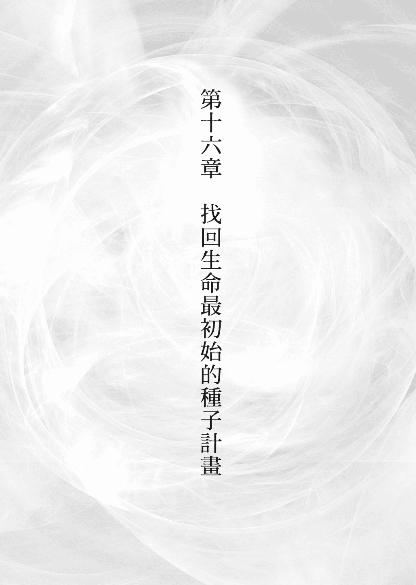

（编按：本章皆为阿乙莎传达的讯息。）

 让爱的种子发芽

你从这次你父亲生病这件事中体验到关系创造了爱的能量流动。爱就存在你们的生命里，只是你有记忆以来就不断地向外界夺取资粮，在这样的生存模式中奋斗。你忘了灌溉自己的生命之树，好让存在你生命中的爱的种子发芽茁壮。

等到你生命中的关系一一离去，你才会一次次地被提醒，忆起自己是如何播下爱的种子。那颗种子一直在等你醒来，浇灌它、滋养它，让它枝繁叶茂；它超越你们的物理时间，跨越不同的宇宙时空，一直存在你的灵魂意识中。

你之前学过，业力是为了完善你的生命意图。当时你对“意图”二字视而不见，以为意图只是小我尚未满足的期待和欲望，忽略了存在你身上的更高意图：你内在的灵魂种子早已设定了你的更高生命的意图，只有当你真正觉醒才能辨识出自己种子的初始设定样貌。

每个人携带的种子，外形、生存要件、成长元素都不同，却有着相同的目标，也就是要回到宇宙源头的共振频率：无条件爱的能量。只有爱可以带你们走完自己的生命蓝图。你之前和父亲关系圆满的过程，引领你去链接你和父亲共同订下的种子计划。当你清楚看见这个种子计划擘画的蓝图，就能将蕴藏在你们之中的爱的能量完整释放出来，让你和父亲的生命之花绽放。

这是内在寻根之旅。你们人类自古以来创造的许多社会价值观，或是外人的眼光，都是遮蔽你们双眼的障碍物。当你穿越头脑的思考判断和外界的干扰，找回自己生命初始设定的蓝图，你会在彼此的关系中看见爱的种子计划的全貌。只有爱的能量可以帮助种子发芽、茁壮。不需要别的养分来培育种子，你们身上就拥有启动和滋养种子所需的爱的能量。

现在，再次拉高你的视野，你可以看见这个世界的种子计划吗？宇宙万物是如何被创造出来的？拿出纸笔，去画出链接着自己的生命蓝图，从关系中找回你内在初始设定的种子计划，重新出发吧！

你看见了吗？前半部，当你展开自己关系的链接时，你渐渐明白这一切都源自你的生身父母和你在此生缔了契约，种下一颗属于你们的爱的种子。当你继续成长前行，从家人渐次扩及学校、社会、事业、族群和国家时，你开始与众人链接，让爱的能量流向每一段关系，进入学业、工作、生活当中。在与他人链接的过程里，你灌溉出更多爱的能量，并回流到自己身上；你经由关系的交流，成为一股更扩展的爱的能量。

在这个过程中，你终于明白，滋养你灵魂生命的不是金钱和物质，而是你如何让你与他人之间的爱的能量流动，让链接彼此的爱的种子得以发芽，这样你们就能从爱中成长、茁壮；反之，若是你封闭了爱的流动，你的生命种子就会渐渐萎缩。

试着画一棵树木的种子计划，你就会明白无条件的爱如何滋养大地和这个世界。

现在，再回到你的生命蓝图中，去找寻可以让爱的能量流动的方法，就能让你重新走回你此生最高版本的生命蓝图。

 用爱打造灵魂晶体

要链接源头，不同的人有不同的路径指引。在之前的传讯中，我已经透过你告诉大家，经由灵魂晶体链接高我是最安全直接的方式，但这个方法对一些晶体结构尚未完整的人来说会产生限制或困惑，他们无法透过自己的灵性空间链接。这个晶体就像你们的灵魂为自己打造的房子，它就是你们灵魂的家，家里有你熟悉的父母、挚爱的灵魂伴侣，还有一些常与你相伴的师长、朋友。

灵魂的家不是靠一次生命体验就能打造出来的，那是你累积无数次灵魂爱的体验的成果。你就是自己灵魂晶体的建筑设计师，为自己的灵魂打造梦幻城堡，这座城堡拥有七彩夺目的光，将你带往宇宙不同的次元和国度。你是如此特别，因为没有一个人的灵魂晶体和你一模一样。这座已经打造好的灵魂城堡不会因你经历一次又一次的轮回体验而消逝，它是永恒的存在，也只有你能驾驭，并为自己堆砌一砖一瓦。这一块块的砖是你生命一次次的结晶，如琉璃般绚烂。

尚未打造完成的晶体会继续成长，所以，当一些尚未拥有完整晶体结构的人要链接宇宙源头时，还可以用另一个方法：透过自己的高我，包含大师、导师、指导灵的协助，契入合一的意识源头。若尚未明白自身的灵性导师或指导灵是谁，没有关系，就使用畅通脉轮手指操，让自身中轴稳定，然后呼请阿乙莎，让阿乙莎协助你链接到自己的源头，并将自己的意识逐步延伸到头顶上方六吋处，如此同样也能体验到与源头合一和光的世界。

阿乙莎，是否可以帮助我理解人类灵魂晶体的组成和生成过程？

人类的灵魂晶体是意识振动所产生的光的聚合体。以你们的物理学来说，当能量累积到一定程度会产生核融合，这个类似爆炸的巨大能量会让大气中的各种元素结合，形成晶状物质。你们肉眼无法看见琉璃般的晶粒子形成各种美丽的光的折射，人类、所有动植物及地球本身的灵魂意识就由这些晶粒子组成，也可以说，每一个晶粒子都是某个意识振动的代表。

一个人灵魂意识中的晶体，就是这些晶粒子组成的能量盒，你可以把它当作个人意识太空船。现在想像一下，当一个晶粒子要进入不同次元去体验时，它必须创建同盟，邀请该次元的晶粒子成为能量盒的团队成员，这样不同次元的意识存在就得以经由组成共同能量盒，汇聚成一个完整的晶体来创造共同需要的体验。

你的灵魂意识携带着各种晶体粒子组成的意识团队，任务完成后，这些晶粒子组成的晶体就会松解，重新回到各自的星系和星河，完成一次在地球上的任务体验。你的灵魂晶体包含不同星系粒子的存有，它们也因为你，丰盛了自己在生命恒河中的体验。

祢刚才提到这个多种意识组成的能量盒在任务结束后，就回到各自的星系和星河，那么我们在地球上的小我意识和所有的体验到哪儿去了？

你们共同创造的地球体验会同时进入你的灵性片段组成中，回到各自的来源星系，并与该星系的共同意识融合。所以，每一个星系存有都透过人类的地球体验，处于创造和演化自己的过程中。

一个人有没有具备完整的晶体，又代表着什么？

有晶体代表他具备完整的源头灵魂意识组成，这些组成的意识就不会再重组改变；而一个没有携带灵魂晶体的个体，代表仍在进化，他的晶体空间留待更多的意识结晶来填满。

一个携带完整灵魂意识晶体组成的生命，通常来自两种可能：一种是非常年幼的新灵魂，这个新组成的灵魂意识需要来完成地球任务，也就是带天命的灵魂；另一种则是已经具备完整的灵魂组成意识，但此次要来完成尚未圆满的体验。这种人的灵魂意识组成已然完整，但此次携带着尚待完成的生命意图前来，再一次体验圆满自己的过程。这些人已经具备完整的灵魂组成意识，可以更容易地回到源头集体意识，却选择先完成部分功课再回去，而他们一旦忆起自己的生命蓝图，就会更快地圆满此生的功课，再次回到源头。然而，地球上也有许多灵魂已经过一次又一次的体验，并没有获得满意的结果，这些人即使已经拥有完整的晶体，也流连在此，不回到源头的家。

而你说的没有具备完整晶体的生命，组成的可能形式就更多了，其中有一种是为了重新试炼自己的存在意识。这些灵魂意识的等级和层次很高，但为了让自己有更多考验，他选择放弃取得更高意识的协助，以与源头意识毫无链接的方式重新打造自己意识的光。地球万物成了他的导师，在以万物为师的过程中，他得以再次淬炼出更完整的灵魂意识，回到大地。这群已经被淬炼完整的意识片段自身就已经是完整的存在，不需要依靠晶体的指引带他回到源头意识场。

另外，许多没有完整灵魂晶体结构的生命，是由许多离散意识组成的，这些意识组成非常多元，虽尚未拥有完整的晶状结构，但每一次生命的体验都非常珍贵。当生命结束后，这些意识组成就会各自分离，流向大地，属于较低振动频率的意识由地球母亲回收，较高振动频率的意识则帮助净化大地，协助提升地球的振动频率。这些流向大地的意识片段，也会依照自身意识能量的振动频率再次凝聚成新的意识组成，有些会在淬炼后集结成更璀璨的灵魂晶体结构，再次诞生。

所以，有晶体不一定会回到源头，而没有晶体也不是不能再回到源头。这都是灵魂自由选择的体验过程，这样解释你明白了吗？至于没有完整灵魂晶体结构的人类，则是地球意识的演进与地球意识自我展现的代表，这部分意识会在生命结束后流向地球母亲的集体意识。地球母体的集体意识仍会与其他星系产生不同层次的交流，这部分的交流通常会经由矿石、陨石、动植物、海洋生物传达出去。这是灵魂意识进入地球体验之前早已做出的选择，没有优劣好坏之分，一切都是必须存在的。

生命结束后无法回到源头或流向大地的意识片段会在哪里？

这些存在地球虚空中的意识粒子也持续在寻找依靠，就是你们所说的鬼魂。那都是尚未融入集体的意识体，而它们的存在是短暂的，最终在意识分解后，仍会融入大地，成为下一次诞生前的环境。这些游离意识会再次学习到爱与宽容，将能量带回大地，回到地球母亲的怀抱里。地球母亲拥有更大的爱与慈悲，她承接所有游离的意识粒子回到自己的怀抱，这个世界也是由这些回到地球母亲怀抱的游离意识贡献而成的。不要小看这些分离的意识，当它们重新诞生，成为下一个人、动物或植物时，也可以透过地球母亲再次淬炼成具备完整晶体的灵性组成，那是因为当它们融入地球、贡献大地之后，已经与地球母亲共振成为无条件的爱的存在。

如果生命早就已经有选择和安排了，有没有觉醒有关系吗？

生命是永恒的追寻和体验。宇宙给予的教导不限于你们目前的有限生命，若你拉高视野，往更高的宇宙看去，每一个晶体的灵性片段最终到达的都是宇宙共同源头意识场，有完整晶体的是带着与源头合一的意识前来，而未具备完整晶体的生命则是帮助优化环境的意识种子。你们各自携带着不同的使命前来地球体验，不论是有没有晶体的生命，都可以得到宇宙同样的教导和爱。

当觉醒的灵魂意识回到地球母亲的怀抱时，可以帮助更新大地的能量，提升和净化地球的振动频率。这些已觉醒的意识会更加凝聚在一起，而凝聚的意识会长养出灵魂晶体结构，当进入下一次的生命旅程时，这些已经觉醒的意识的晶状结构就会愈来愈完整，逐渐形成一颗明亮又璀璨的晶体，这也是灵性生命成长的过程。所以，觉醒的意识离开，对地球和自己下一次生命的体验存在的维度是很有关系的。

那么，如果人类可以创造出替代灵魂的晶粒子，是否就可以创造复制人，或是让机器人拥有学习和创造的能力？

你们已经往这方向迈进了不是吗？你们目前使用的手机和电脑里最核心的意识发动机，是否就存在晶圆里？只是，目前产生的光的振动频率还无法超越物质世界，进入高次元的振动频率。当你们的晶圆制造能力可以进行更细微的切割，产生量子跳跃的振动时，拥有更高意识的人工智能机器人就会大举进入地球，届时，地球人类将面临更大的冲击和再演化的必要。

 爱的延续与传承

人类在有限生命进入尾声时，会开始设定下一次生命的业力命题。你可以观察一下，当一个人进入生命的尾声，会开始回忆这一生的经历。这时，有些人会将自己未完成的心愿以意识流传送给儿女，或是他期待可以帮助他完成遗愿的人，而这些意识片段会流入这些人的灵魂晶体中，成为他们的一部分意识。

你会发现，即使祖先已经离开世间，自己身上仍携带着与祖先类似的生命意图，若以人类自己的负面角度来理解，就是业力转移，或是业力枷锁——意思就是，一个生命的开端不只携带着自身的生命意图，还包括与其相连的生命共同体的意识传承，将这个传承扩大解释，就是来自族群、团体、宗教和国家的业力。

你们每一个人都有着更大的生命版本，你不仅仅是存在你肉身内的个体意识，也存在许多和你有着生生世世链接的肉身或非肉身形式的存在里。所以，你是许多生命的希望种子，当你完成一次生命的体验时，也会同时留下希望的种子，在其他人的生命里延续。

你们的永恒生命从未中断或消失，生命体验的过程是你们过去认知的全部生命。事实上，从出生到死亡，你们只是去经验进入不同宇宙时空的生命体验。人类不仅要追求如实体验这一次的生命，更要为了完整生命的全貌而努力。生命不是你们认知的在地球上生存与感受情绪的体验场，生命的测量是光的振幅，只有透过灵魂意识的维度，才能看见你完整的生命光谱。

万事万物来到地球体验，并不是偶然存在与显化的结果。没有爱，就无法显化和创造出流动的能量；地球上没有其他生命存在，只有爱。

阿乙莎，我看不见祢说的这一点，明明就有一堆仇恨、恐惧、纷争、尔虞我诈……

你没有办法去恨一个人、一件事，如果你没有爱的能量。

什么？我恨一个人也是爱的能量？

是的。你为什么恨？是因为缺乏爱，而那个缺乏爱的黑暗是不是就创造出一个让爱可以流动的空间？这个空间被创造的过程中，只有爱的能量在流动，没有别的。你们看不见，不代表它不在。

那么，恐惧是什么？恐惧中的爱在哪里？

恐惧生成的背后，是因为想要让爱固守在自己身边，那个将爱拉住的能量也是一种爱的能量牵引。你们人类所有的情绪，都是爱的能量以不同形式展现，而你们只能用好与坏、对与错来分辨，没有察觉那是爱的能量流动的过程。

人类不光透过情绪推动爱的能量流，你们的生命就在一呼一吸间创造爱的振动，那是细胞对于爱的表达。你为何会在呼气后自动吸气？你以为身体器官是靠什么自行运转？那个核心就是爱的能量。

爱无所不在、无所不包，而爱的反面亦是爱。你们若可以掌握爱的能量，就能脱离二元对立的陷阱，进入爱的意识场。爱的意识场可以带给人类新的文明，这也正是目前地球演化的进程。你们正在创造一个爱的世界。

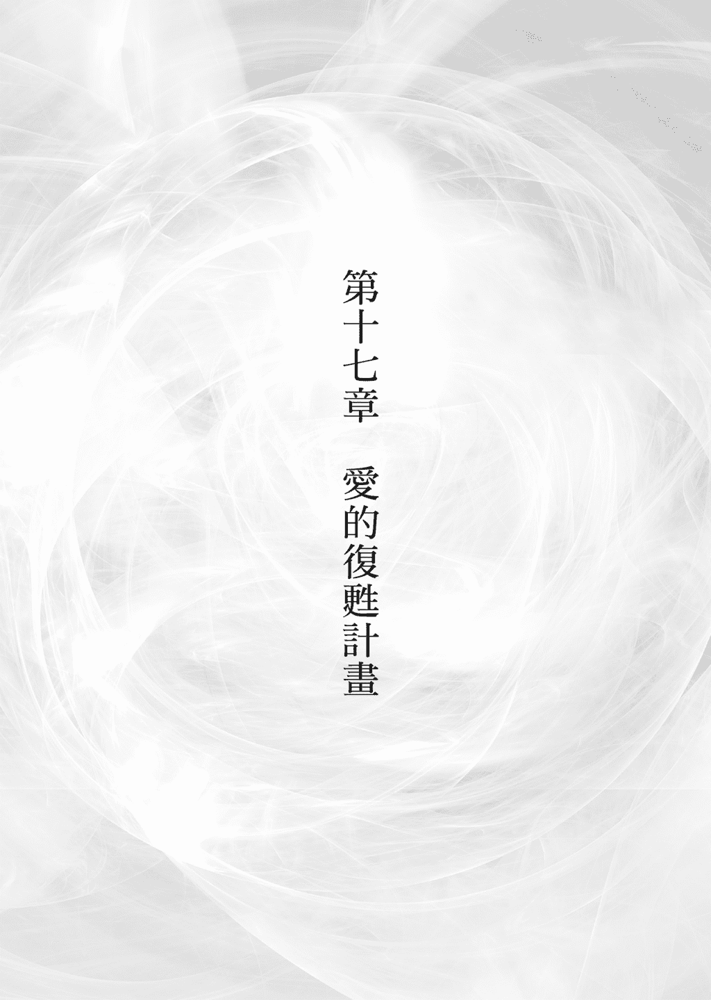

阿乙莎：之前跟你提过，爱是生命流动的语言，用爱来交流可以帮助你们扩展到自己的能量之外，也可以打开万事万物的链接信道。生命之花的绽放就是爱谱出的光，这道光随着你的意识流，可以创造、显化实相、疗愈自己和他人，这都是一脉相连、一气呵成的，只是你们还不擅长使用这股源自你们内在的核心力量。你们就像受伤的小动物，看见影子就觉得是猎人来了；你们因为受到制约，习惯用恐惧、不安、防御、攻击将自己层层包围，以至于你们现在的世界变了调，不再听见人们开怀的笑声与欢唱。重十地球最初始设定的样貌是一项很重要的工程，而这项工程就是要让地球爱的能量复苏，用爱帮助地球恢复生命的原貌。
你可能会以为，这么简单的道理，为何人类历经数万年，不但没有进步，反而每况愈下？没有错！你认为这是文明创造美好生活必要的牺牲，没有竞争就没有进步，没有黑夜就没有光明；你用自己的大脑确实可以推卸责任，将地球的现况归咎给文明。文明带着人类脱离疾病和贫穷，但是你知道吗？星际间存在着比人类进步数万倍的超高文明，但他们的文明没有牺牲爱的流动，反而成就了爱的流动更为活跃的美丽世界，也就是你们宗教所谈的天堂之境。

我：星际文明？他们是如何办到的？

阿乙莎：这就是这次要你和莎雅链接最主要的目的。莎雅是地球母亲，也是地球万物的守护者，而在更高的次元，她以埃西斯女神的形象存在宇宙意识场，你可以链接她，让她来帮助你。

我：我要如何直接链接埃西斯女神？

阿乙莎：进入你的晶体，找寻你的灵性母亲来与你链接。

 十步骤，让爱的能量复苏

（很快地，我感觉有一股暖流进入我心中。）

莎雅？喔！不，应该说是埃西斯女神，感谢你与我链接，是否可以告诉我该如何在地球进行爱的复苏工程？

你们要在地球上设置光场。

现在有许多工作需要展开，我会给你爱的复苏计划。要创建地球的光场，有以下十个步骤。

步骤一：打开宇宙能量

目的：让地球重新校准宇宙之心，以重新接收宇宙之心的能量流。

光码：

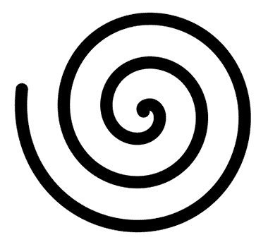

方法：将意识放在第三眼的位置，观想你的意识进入地球的中心（地心），在地心启动这个光码，运转三次。

这不就是在地心画出一个黑洞吗？

没错！用意识画出地心的黑洞后，就进入第二步骤。

我以为打开是向上的，原来是往地心凿一个洞。

步骤二：链接宇宙之心

目的：地球之心的黑洞会因前一个步骤产生巨大的引力场，将宇宙之心的能量链接注入。

光码：

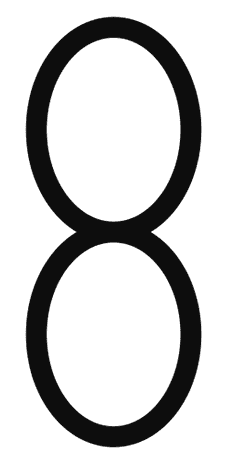

方法：用意识先进入地心锚定地球之心，从地球中央产生基地的中轴位置，接着从这个基地向上链接你顶轮上方的宇宙之心。整个流程仍然是由你的第三眼意识带领完成。

步骤三：扩大爱的能量场

目的：将中轴稳定的能量流导入你的心轮，由心轮向外扩展开来。

光码：

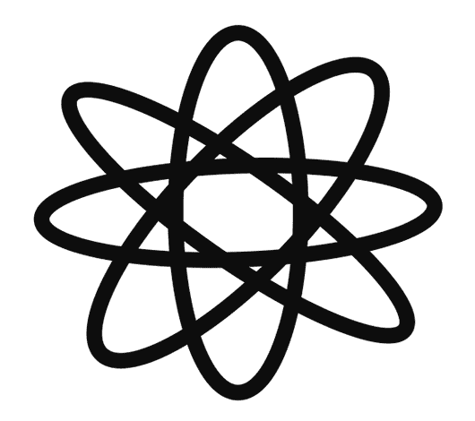

方法：将心轮位置的生命之花向四面八方扩展。

以上三个步骤，是用来设定一个爱的基地。

步骤四：让爱传出去

目的：让你的光场基地透过你自己的生命蓝图，开始链接。

光码：

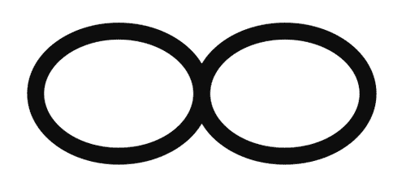

方法：遇到每一个人、每一件事，或是一个新环境，都敞开心轮的能量，打开链接。链接的方法很简单，就是用你的意识，将心中爱的能量注入对方。与此同时，你也可以去感知心轮的状态，若是对方乐于与你交流分享，你和对方的心轮将同时扩展开来；若你感知到自己的心轮在链接对方的心时卡住，或是不流通，这时，就是帮助对方打开心轮能量信道的好机会。

你可以向对方提出邀请，请他接受你给予他的祝福。他只要静静地坐着深呼吸，你就可以顺利地将爱的能量传递给他；与此同时，他会在接收你给予的爱的能量当下，转化他自己的能量场。

你可以多练习这个步骤。当你可以成功地将自身爱的能量传递出去时，就能进入下一个步骤了。

步骤五：创建光场

地点：找出自己平常活动或居住的场域，开始链接家人和团队伙伴，创建光场。地点不拘，只要是你自己和其他人会固定来活动或交流的场域就可以。

光码：在场域中央用水晶或矿石排出黑洞，最外圈的最后一颗朝向北方，放置尖头水晶柱（排列图如下）。

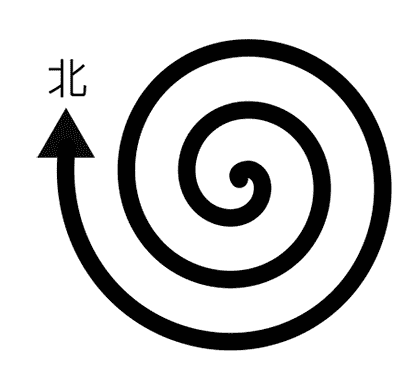

方法：定期在此聚会，让人们在这里开心地欢唱、静心、学习和交流，经由活动的进行，彼此融合出更大的爱的能量流。

步骤六：启动光之门户

目的：打开光场中的阿乙莎光之门户（或简称阿乙莎星门）。

方法：将人们聚集在你所在的光场中。中央的位置已经在之前爱的基地创建过程中锚定地球之心，现在让所有人围成一个圆圈，用意识一起链接进入地球之心。

所有人一起向上方投射出一个能量球，让这个能量球向上链接基督意识场的阿乙莎星门。执行这个步骤时，可以由光场的领导者带领冥想，并念诵启动链接阿乙莎星门的咒语。

透过光场与阿乙莎星门校准，就可以串连起光的网格。这个网格可以帮助场域中的所有灵魂晶体校准宇宙之心，并经由你们集体意识投入地球之心的引力，帮助地球稳定磁场。

步骤七：展开净化和疗愈

光场中的每一个参与者都是光之工作者，可以为地球和他人带来净化和疗愈身心的光。在你们古老的文化中，这是专属于少数灵媒或祭司的工作，而现在已经不会再让你们以个人形式或个人力量来进行这项工作，我们会透过宇宙光的源头来帮助你们完成。此外，你们也不用担心和害怕自己会因为从事这项工作而危及生命，或被无意识的当权者迫害，因为地球已经跨入光子带的维度，只要可以用你们的集体意识链接基督意识光之场域，就能产生更庞大的能量。

你们可以定期举行庆典活动，让各地光场的光之工作者以集体意识帮助地球净化和扬升。

步骤八：光场定期校准

你们必须定期锚定源头并校准，因为地球的网格会随着自身的净化逐渐产生位移。目前能够链接上，不代表以后可以顺利链接，因为频率不断在更新与调整。要确保时时刻刻都能觉知并链接上阿乙莎星门，必须展开以下的定期校准工作。

1.每日太阳升起时，用第三眼链接自己的晶体。在向上链接的过程中，感知目前的光源变化。

2.在顶轮上方标记出目前光的角度、颜色、位置。可以从左到右设定十个级距，进行确认。

3.位于地球上不同区域光场的人必须共同找出自己目前标记的位置，然后彼此确认。通常在相近地理位置的人，频率会相近，所呈现的角度和色彩会有一定的共通性。

4.透过社群媒体定期公告链接阿乙莎星门的位置，帮助所有的光之工作者确认和链接。

步骤九：确认光的链接品质

你们在三次元的地球无法时时刻刻活在更高的意识振动里，为了帮助地球和身边的人，你们会需要接触许多仍处在较低意识振动的人事物，这些可能都来自你们身旁最亲密的家人。在过去宗教组织的时代，你们担任光的领导者必须选择离开群众，出家或从事神职工作，为的就是让自身持续处在与更高意识链接的状态，但这个方式从目前的宗教分裂和战争的冲突中已经看出其缺点。你们的意识在身体里早就设定好要体验分离的个体存在，从分离的个人意志中体验爱。所以，即使出离群众生活着，你仍旧无法摆脱想要体验个体存在的意志。

现在，我们要传达给你的是与我们永恒链接，透过咒语引导光场契入基督意识的能量路径，让光场领导者能快速清理和净化自身意识，随时随地链接至合一的基督意识场，不会受到地球分离意识引力的牵引。

这个方法目前不能公开传授。这是搭起链接阿乙莎光之场域的方法，你可以授予光场的领导者，也可以取消其链接。

步骤十：阿乙莎光源注入地球

过去我们是透过地球上的阳光、空气、水，和地球所有的生命链接。但是当地球逐渐进入光子带，地球磁极开始偏移，此时开始有许多区域长年不见阳光，加上目前空气污染的悬浮粒子遮蔽光源，以及水源受到土壤重金属污染冲刷后的沉积，水的讯息场遭受破坏，因此现在必须经由你们在各地设置的光场，将宇宙能量接引至地球，帮助地球重现生命力。

不仅仅是需要透过光之工作者静心冥想，你们还必须发展分身来辅助人类，而最佳的辅助工具就是大自然中的树木和矿石。利用大自然的能量链接天地，形成能量穴，帮助地球引进宇宙之心的能量。

你们可以种植树木，在树木环绕的土地中央，埋入由各种矿石、水晶组成的地球母亲图腾（如下图）。树木可以让宇宙的能量流入大地，而这个图腾可以协助将能量稳定地引入大地。当人们进入这个场域，会感受到自身能量从头到脚被清理、净化。在这个场域中，你们可以用意识链接阿乙莎光之场域，透过身体的中轴能量管道，让源源不绝的阿乙莎光源注入地球。

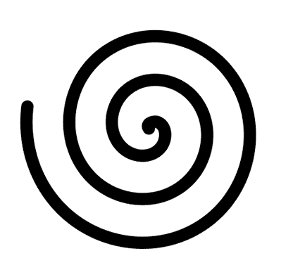

我感觉好像在地上凿出很多黑洞。

是的，黑洞可以帮助清理不再需要的振动频率，而水晶和矿石可以过滤和净化这些需要被清理的振动。

 外在环境变动剧烈时，更须启动内在能量

我：阿乙莎，我想请问祢，莎雅传来在地球各地创建光场的十个步骤，这个做法和传统宗教组织创建教堂或庙宇有什么不同？

阿乙莎：现在的人进入教堂或庙宇的心态都变了。你们已经忘记上教堂或庙宇的本质，教堂或庙宇琳琅满目的活动、仪式，让人们忘记进入这些场域的根本是要对焦自己的内在宇宙，让每个人在经历外界的刺激后，能够回来和内在宇宙链接。
你们已经习惯将注意力投向外在，连进入寺庙也只是一心一意想着要如何透过神仙襄助解决自身的问题，求神丰盛自己，保护自己身家财产的安全。你们将自己最珍贵的宝藏奉献给供奉的神祇，而你们投射给这些神祇的是更多的想要、不满足、恐惧和不安。结果，你们不断用自己的暗黑思想将无形界喂养得更为强大，却将自己最珍贵的宝藏束之高阁。
地球上的每一个生命都拥有最大的能量，那就是“爱”。在内心启动爱的振动，可以撼动天地鬼神。爱是地球母亲的灵魂，地球母亲将她的灵魂交付给地球上所有的生命，爱就存在你们每个人的生命里。现在，地球母亲需要你们重十这股你们本自具足的能量，而当你透过莎雅传给你的步骤创建光场，就是在帮助地球重启爱的能量流，在当中，你们自己就是神，也是能量的传导者。不要再将意识投向你之外的神祇，在光场中，只要将意识聚焦在自己的内在宇宙，你们就可以形成一个爱的网络。这个爱的能量流动的光可以帮助一些尚未打开内在宇宙的人重十自己内在爱的力量，而已经可以有意识地进入自己内在宇宙的人，可以顺利超越目前地球的稠密磁场，进入更高的宇宙维度。你们只要做到这个锚定自己内在宇宙的工作，展开爱的链接，就可以帮助地球，让爱的能量复苏。
让阿乙莎光源注入场域中，你们就可以帮助自己所在的地球和宇宙之心校准、链接，地球母亲将能得到更新的频率，扬升进入银河轨道。

我：为什么地球现在这么迫切需要扬升？我记得祢之前有提到二〇三六年是关键。

阿乙莎：没有错！那时整个地球将面临宇宙磁引力场的转变，你们也无可避免地会受到银河轨道变迁的影响。太阳系这里会因为太阳引力的变化，造成星球轨道调整，甚至星球撞击，所以此时要让整个星球提升，进入更安定的轨道位置，才可以避免撞击的危机。

我：这样说来，祢应该是已经看见地球会被影响是吗？因为祢所在的位置距离地球这么远，祢现在的每分每秒对存在地球这端的我们来说，已经过了上百年。

阿乙莎：应该说，宇宙现在每一分每一秒都正在经历大迁移，也有许多黑洞正在产生。你们目前生活的地球环境如同垃圾场，让你无法接近，更不想亲近，许多生命想要逃开；但是当你看见这些垃圾的背后是许许多多失去和大自然链接的灵魂时，你会从愤怒转向慈悲，会知道唯有将更多的爱和慈心送往这些地方，才能真正改变。如今，地球母亲就是用无条件的爱在喂养地球上所有的生命，是你们自己和兄弟姊妹隔绝，断开关系，才创造出目前的人间地狱景象。你们的心是链接爱的能量的钥匙，只有将你们内在爱的能量释放出来，才能改变地球，再造健康。
此时此刻有许多勇敢的神性意识以肉身投生地球，帮助地球脱离混乱的区域。地球目前的混乱从二〇一二年就开始了，你们接下来会发现四季的更迭界线愈来愈模煳，地壳的变动更加剧烈，海平面上升，森林火灾更为频繁，许多物种消失，生态环境也开始重组，而重组生态链的过程会产生新的菌种。人类虽身为地球最重要的灵魂意识载具，但你们面对转变更加快速的外在环境时，不得不大量仰赖ＡＩ人工智能，帮助自己在变动的环境中生存，而你们也会经由人工智能解开基因的神秘面纱，人类的灵魂ＤＮＡ将打开链接宇宙的意识，帮助自己演化并拥有自愈能力。
当外在环境变动剧烈时，你们更需要启动内在的能量。唯有展开爱的能量，并扩展、链接出去，才能重新启动地球和宇宙之心校准的工程。

我：祢现在说的这些，不就是当年雷巴特和莎雅的故事重新上演？

阿乙莎：是的！但这回剧情改变了。之前是高度文明进入地球的星际种族对峙，暗黑力量侵入地球；现在则是暗黑能量已经渗入人类，必须重新设定人类的ＤＮＡ，才能帮助整个地球净化和扬升。
这也是我期待你展开光场链接的方式。将阿乙莎光源注入，帮助稳定地球环境、帮助人们提升灵性意识。在场域中静心的人可以直接契入基督意识场，你可以协助引导大家进入内在意识的链接，他们不需要学习咒语，只须用自己的意识链接晶体，在静心中请求自己的高我带领、请求对话。当你们的意识在场域中成功提升振动频率、顺利扬升时，你们回到自己的家中和工作岗位上，就能带给周围的人祥和的能量场。

我：经祢这么解释，我更明白了。但是，感觉二〇三六年一下子就要来临了，祢现在要每个人进入光场，提升意识，链接宇宙能量，似乎赶不上地球环境恶化的速度。有没有更快的方法可以让所有人类原地苏醒，就像卡通《睡美人》那样？

阿乙莎：人类若无法回到自身的中轴稳定，也没有解除灵魂生命的业力命题，是无法进入宇宙光之门的。

我：目前有这么多教导人们打开松果体或启动灵魂ＤＮＡ的课程，不就可以快速让灵魂意识启动、苏醒？

阿乙莎：实际上并没有快速的方法。你以为自己启动了松果体，或是解开了灵魂ＤＮＡ的枷锁，其实都只是一种自我催眠，让人们暂时放下小我意识，进入潜意识去链接自己过往的印记。那不是真实的灵性扬升，真正的扬升是意识得以进入内在宇宙，稳定于更高的次元，而小我意识虽然仍伴随着你，但不会再度掌控你，带你走回过去的意识惯性，你的小我现在只是从旁协助与回应外在环境的变动。没有快速法门，你们必须不断练习，而创建光场是透过一个更稳定的外在环境帮助你们稳定内在宇宙的做法，至少先解除环境的干扰因素。

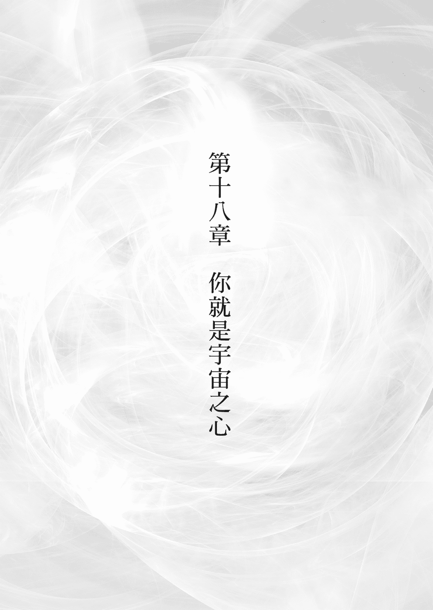

（编按：本章皆为阿乙莎传达的讯息。）

 进入宇宙之心的信道，在每个人身上

和你传讯多次，我知道你一直以为用意识校准的宇宙之心，是位在你头顶上方那个无边无际遥远星空中的一个点。其实不是，你自己就是宇宙之心，你需要锚定的是你自己内在的中心。当你用物质身体去感知外在实相时，无法碰触到这里，你只能用自己的意识去锚定，否则链接不上。

我们就是宇宙之心？这我无法想像，祢可以用一张图来传达这个概念吗？

想像你所在的位置就是个能量的虫洞口，你的第三眼（松果体）具备穿越虫洞的能力。当你的意识校准头顶上方六吋的晶体时，你的能量晶栅瞬间就能锚定宇宙之心，此时你的第三眼可以引领你进入不同的时空，进入无边的宇宙。

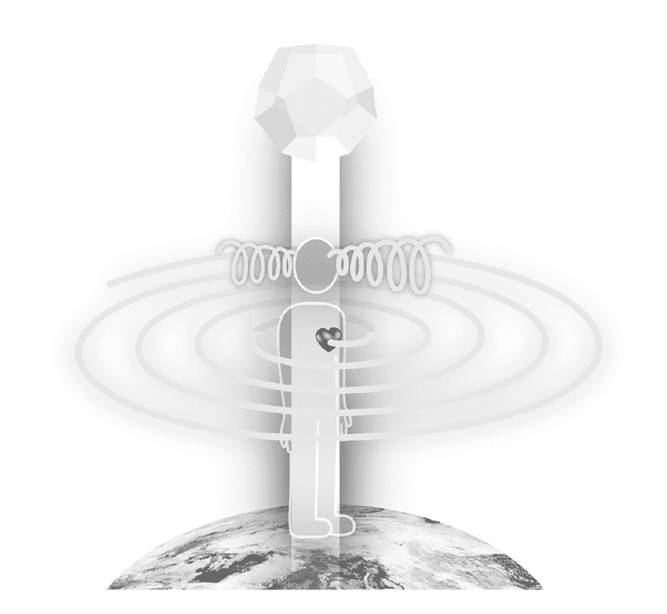

你的松果体上有层薄膜，会因为你心的振动频率不同，产生不同的磁波，透过这个磁波，你可以与不同宇宙次元同频共振。当你的频率过低，你会倾向往脑后方扩散；而振动频率愈高，就会由前额往前扩展开来，向更高的宇宙维度前进。

以你的松果体为核心，一边是阳性的斥力，一边是阴性的引力，你的大脑产生的思绪正好在阴阳二元对立的中心振荡。当你的中轴愈趋稳定，你就愈能超越小我的摆荡；若你的中轴不稳，则很容易受到小我的牵引，而倾向任一边。随时随地让自己的中轴稳定，让意识超越小我，你就能带着清晰的第三眼遨游在无限宽广的宇宙。

你头顶上方的灵魂晶体和第三眼之间的关系十分紧密，你的晶体就是真正操控松果体的控制阀，当晶体要给你关于生命方向的指引时，会透过松果体链接你的直觉体，让你做出修正的行为。一个无法认出灵魂更高的版本、无法链接灵魂晶体的人，就会受到小我二元对立面的冲击，这是人类ＤＮＡ的设计原理：在失去和自己更高灵魂意识的链接时，只能看见二元对立的镜像。这是小我投影出来的戏码，你往前偏移时，会同步产生后方的阴性引力，才能让你平衡；而你向后方的阴性面倾斜时，也会同时产生更大的阳性能量。这一切都存在于你，也都是你自身能量振动的相对性显化。

你的灵魂晶体和地球如脐带般相连，当你尽情地遨游宇宙间，就是以你为宇宙之心，进行跨次元穿梭。你的意识可以进入不同次元维度去感知，身体所在位置就成了你的宇宙之心。你先想像自己缩小成一个细胞，细胞核位于细胞中央，具有庞大的磁引力场，而你的引力场是Ｎ维，不是你眼中所见的三维世界。在你的核心位置，有类似你们物理学所称的量子塌陷，经由你自己的内在核心引力场穿越时空虫洞，进入不同的宇宙时空。

每个人都像这一颗细胞，经由个体意识共振产生的虫洞路径会带着一个个看似单独的个体细胞，进入不同的宇宙时空。这就是你们自己创造出生命实相的原理。当每一个意识粒子都回到自身的宇宙之心时，就回归宇宙太初最原始的面貌。

目前的你正在地球体验，这就是你让意识透过当时你所在的宇宙之心，进入相应的实相界穿梭，而引领你进入这次体验的，就是当时你的情绪引导出来的意识延伸。人类是以肉体来体验物质化的生命形式，处于更高维度的生命——无生物体的形式——则会共同凝聚成意识群，也就是你们所谓的宇宙之神。这些意识群无所不在，你们身处地球的物质世界，会觉得神为何如此神通广大，可以同时出现在多处，这只是存在较高维度的意识群集体化的体验方式。

人类一部分的意识也是源自这些高维度的集体意识，只是你们以分离的个体意识来体验自己存在的小宇宙时，不论以生物体的形式活到多少岁，仍然可以再次回归宇宙之心——只要你能在离开自己的身体前，让意识链接回到自己的灵魂晶体，你就是从自己的宇宙之心返回源头的路径。

倘若宇宙之心在每个人身上，整个宇宙不就无法想像地庞大？地球有七十七亿人口，遑论银河系的星球有上百亿颗，若每个人都是宇宙之心，那宇宙之心之外是什么？

看来你还是处于有限的线性思想之中。这么比喻好了：你可以想像一池水，当你将一颗镶了你名字的石头丢入池水中，石头进入水中的位置出现一圈圈的圆形波纹，扩散开来，这是你的宇宙之心可以契及的幅度和范围。

现在回到这一池水中。假如你倒进一亿颗石头，会出现什么景象？

水会满溢出来，水花四溅，石头和水无所不在，我原来那颗石头也在当中。

你无法具体描绘每一颗石头的位置了，是不是？整体宇宙看似混乱，所有星球却可以生生不息地存在并运行着；你无法辨识你自己原来那颗小石头在哪里，只知道所有的石头都在同一池水中。

现在，你这颗石头要去找寻水中的任何一颗石头时，要如何展开链接？你唯一能做的，是以你自己为中心，向水底发出讯号，经由水去链接找出另一颗石头的位置。因为水共同存在每一颗石头的细胞结构中，水就能带着发自你这个个体意识的指标，流进集体意识的一池水中，再从集体意识链接到另一个个体意识。

这样说明，你明白吗？

祢似乎也回答了这次传讯一开始莎雅跟我说的，地球上的水就是意识。你们真的很喜欢用水来说明一切。

是的！这时你会看出来，你自己的个体意识就是你存在的宇宙之心，而你透过自己的个体意识，可以遨游和链接整个宇宙大池。

从你的心出发就可以链接到整体宇宙，若你的心没有打开与灵魂晶体的链接信道，就无法超越二次元的世界，契入更高的维度。人体链接宇宙的路径和金字塔原理类似：金字塔的顶端代表你灵魂晶体的位置，四个面分别代表地、水、风、火四大元素，朝向西、北、南、东。当你身体的四大元素平衡时，你的中轴会呈现稳定的能量流动状态，你就可以顺利链接进入自己的灵魂晶体；而当你得以进入晶体，就能从宇宙之心出发，向四面八方去遨游宇宙。

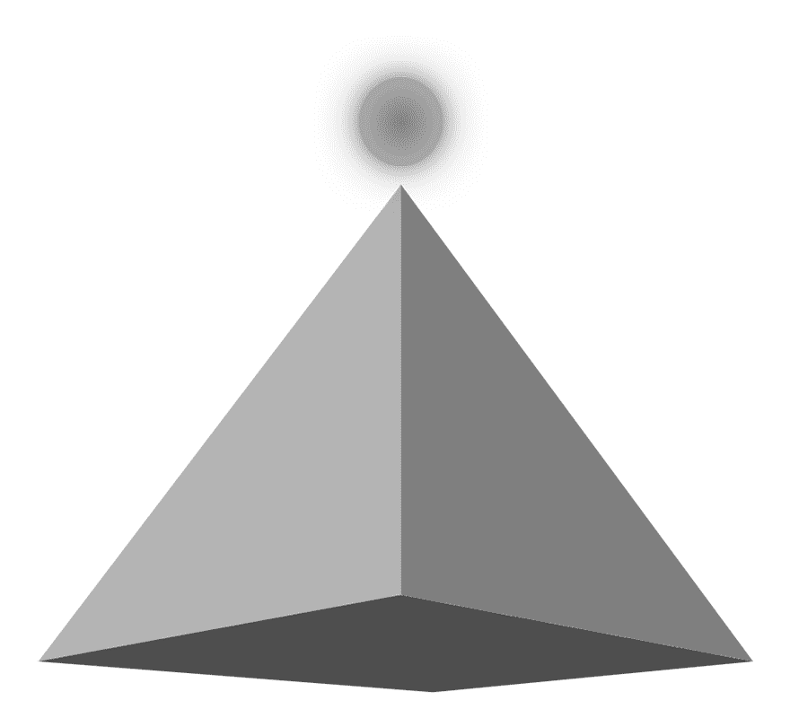

我现在终于更加明白为何莎雅需要在各地创建光场，因为这样就可以在同一个场域创建一个晶体控制阀，让光场的中轴可以更稳定。帮助人们校准更高意识的同时，也是在帮助地球创建许多链接宇宙之心的信道。人就是地球和宇宙链接的信道，进入宇宙之心的渠道，就在每一个人的身上！

你们的振动频率来自意识的能量，意识的能量则来自你的心轮进入晶体信道所产生的振动频率，而心轮的振动频率来自你身体细胞赋予你生命整体的能量，也就是你的光场，你的光场则创造了你的振动频率——这是一个圆的循环，不是线性的。

所以，拥有健康身体的人容易有灵性，身体不健康的人要变得有灵性则很困难。健康的身体和你们的心灵能量互为因果，拥有健康心灵的人身体必定健康，而身体健康的人虽然不一定有灵性，但只要他愿意，就更容易到达这种状态。身心灵是一体的，互为表里，你的身体创造了你的光场，也成就了你的灵魂意识，而你的更高意识就创造和链接更高的宇宙能量，回到你的身体和所在的环境。你的身体就是神性在第三次元的神圣殿堂！

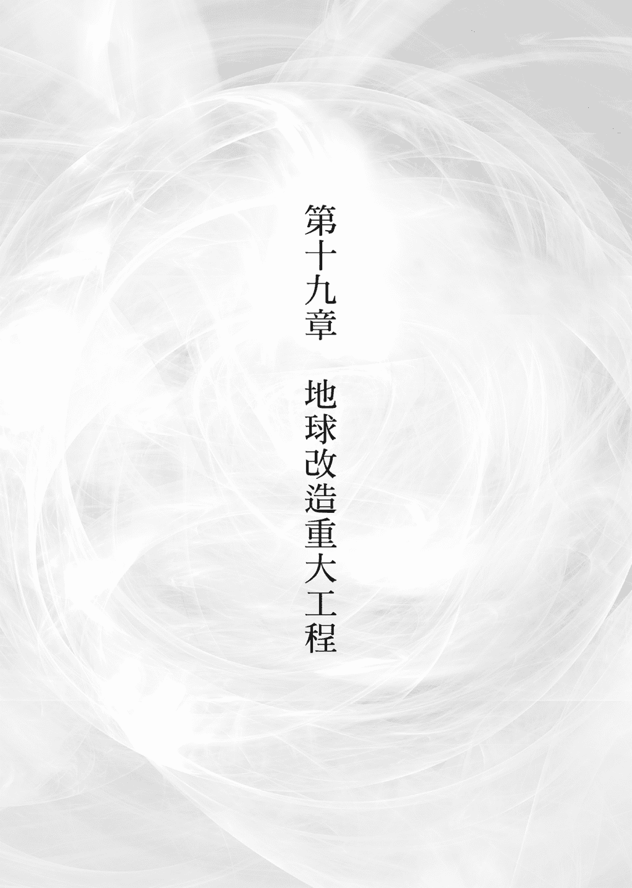

我：阿乙莎，我和莎雅的沟通结束了吗？我今天还需要下载哪些讯息？

阿乙莎：和莎雅的沟通还没有结束，你必须进一步探索解决目前地球问题的方法，有一些工程需要被启动。

我：嗯！莎雅一开始传讯，就提到这是改造地球的重大工程需要被启动的阶段。开头她提到地球的缘起、生命的起源、穿越灵魂暗夜，甚至我也在这段期间同步经历了面对父亲生死的课题；最后，莎雅给我十个步骤去设置光场，让爱的能量重新在地球流动，我以为这样就够了？

阿乙莎：没有那么简单。你再去链接莎雅，将讯息更完整地写下来。

我：喔，好吧。

＊ ＊ ＊

莎雅，是你吗？阿乙莎要我找你，是否有什么地球工程要被启动？

我们规画了改造地球的十大建设。

天啊？这么多……好，来吧，我继续写下来。

 第一项工程：创建光的链接信道

之前向你说明过各地光场的建置，每个光场所在位置不同，需要建构光的链接信道。你在二元世界看到的光是直线放射，无法看见光线如何穿透实体物质障碍，进入另一端。事实上，光是由比显微镜下所能见到的粒子更微小的夸克，或者你可以称之为微型量子所组成，而光的链接会产生多维象限穿梭的量子宇宙行进路径。

你用肉眼所能辨识的只有三度空间，当光的微型量子受到物质体阻碍时，会进入多维象限持续前进。你肉眼看不见这个部分，不代表这些组成光的夸克粒子不存在；事实上，它们仍朝向你的终极目标继续前行，最终会显化在另一个场域。

所以重点来了，你们不必担心光无法跨越屏障到达另一端，只须关心是否有足够的光产生的振动波，还有引导光进入光的场域的慈心行动。现在，我需要你们学习在光的场域中启动光场与光场之间的链接，为分散的光场进行有意识的链接，这样你们光的场域的基础可以更完整。

光的场域的链接？

是的，必须从你自己开始，用你的意识打开与阿乙莎光之源头的链接，然后再进行光的场域的相互链接。关于这个光的场域链接，我会给你一段咒语，帮助你设定。你也可以确认光场是否已经被链接上，最有效的验证方式是当你在某一端的场域投射一道光，会看见另一个场域同样出现这道光，接着这道光会进入第三、第四个被链接的场域中，以此类推。

这个验证工作不是重点，重点是接下来你们如何在自己的场域中进行光的引流，将宇宙的真理（真）、良善（善）和创造（美）的能量引入这些场域，帮助地球母亲恢复生命的光彩。因此，重点是光的引流和慈心行动，而想要在这些光场中以爱和慈心交流，需要一系列的行动来帮助养护光的场域。

我知道许多庙宇、教堂都有神明的塑像，经由人们进入庙宇或教堂祈祷来维运，你指的应该不是这种吧？

只有无条件之爱的能量振动才可以养场。所以，必须由人们开创出慈心行动，由人们内在自动自发释出至真、至善、至美的能量，才有办法养场。你们有多少人去到宗教圣地或寺庙，还记得要给出自己的真善美，而不是给出匮乏和恐惧，以换取自己的丰盛与满足？

我明白了。

可是莎雅，如果有那么多场域，我做得来吗？然后，又要如何让大家发挥慈心，散播真善美的能量？

那是你的天命。是你自己设定来接受这个挑战的，你忘了？

我不敢相信我如此天真地提议要来做这件事。

不要怀疑，你可是充满雄心壮志，也给了我们一个非常具有说服力的提案。

我有提案？我现在完全不知道，忘光我的提案内容了。你可以透露细节吗？

当然。那是你自己写的，你可以去自己的阿卡西纪录找出来。

我自己写的？有吗？好吧，我去瞧瞧。

现在我的纪录已经打开，请大师、导师描述我当初来到地球的提案内容吧！

我打算在居住的各城市设置爱的储存站。只要是每个人用自己的爱创造的任何事物，例如物品设计、各种形式的艺术作品、自己亲手栽种的植物、自己烹煮的食物、研究发明的方法，或提供任何形式的个人服务，只要是出自每个生命对至真、至善、至美的表达，以及对爱的诠释，都可以存放进这个储存站。

任何人只要进入爱的储存站，提取任一项爱与慈心，就是在兑现爱的能量；而当爱流通出去时，就可以从对方那里收到爱的能量币。所以，给出或提取爱的人，都是让爱的能量可以流动的贡献者，没有孰高孰低，也没有衡量算计，中间没有第三方或可被操控的金钱介入衡量爱的对价关系，只有无条件之爱的交流，传递着、持续扩展着。

人们会因为储存爱的资粮而感受到生命的丰盛和喜悦，提取爱的能量的人也会因为贡献出让爱流入的空间，而扩大爱的动能。人们不会因为贪心而过度生产，也不会因为害怕匮乏而囤积，你们学会取用自己所需，不会随意浪费。给予爱的能量的同时，也获得爱的能量，滋养了生命，这样的循环交换机制让爱自然流动起来，恢复地球本有的丰盛样貌。

但如果没有第三方，这个爱的能量币要由谁发行？又该存放在哪里？

每个地球生命身上都有取之不尽的爱的能量币，只要从心中拿取就有。爱的能量币是用能量计算，而不是物质界的金钱货币，也不须用代币换算，你们每个人身上这一辈子累积的数量，都储存在自己的光体里，那是你们生生世世累积出来的福德资粮。爱的能量交换的过程会扩大施与受之间爱的能量流，超越任何物质上的体验，你们是无法用物质的对价关系获得这股能量的。

哇！我没有想到这会是我的提案，完全超越地球的任何系统了。不过感觉满有趣的，这样一来也抽不到税了，而没有税收就无法养活维护国家体制的公务单位和制造及储存货币的金融系统，所以这项提案真的需要庞大的爱的交流空间，还有帮助彼此配对交流的系统平台。

你们现在都有手机、网络设备、完善的物流系统，你们用现在的能力就可以做到，加油！这是你的计划，去实现它吧！

这真的已经超越目前地球环境的现况，也会招致许多专家的质疑，但仍是值得人深思的一个提案。

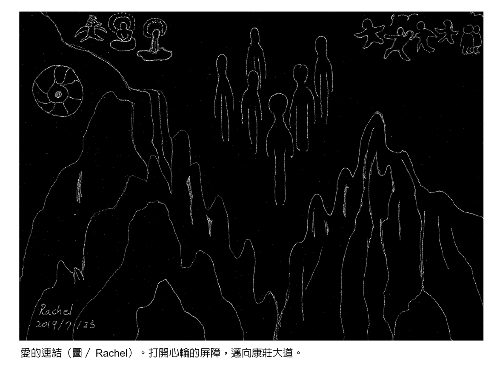

 第二项工程：打开新地球天堂的路径

创建光的链接信道，并让爱的能量扩展后，你们就可以渐渐打开地球新维度、新次元的航行轨道。你以为在一百五十光年之外的新地球和目前的地球有什么关系？关系可大了，链接进入新地球的入口，就在你目前身处的地球。这和你从自己的第三眼进入内在宇宙是同样的原理。你们身上细胞的灵魂ＤＮＡ会随着爱的振动打开通往新地球的大门，当你进入自己的内在宇宙时，就会看见新地球的入口；而当愈来愈多人的灵魂意识打开进入新地球的大门时，真实的新地球景象就会在你们提升灵魂意识后展开的具体行动中被显化出来。这并不是天方夜谭或虚无缥缈的臆测，而是能量共振的具体显化。

莎雅，我仍然不理解这个原理。你是说，我们在目前地球的位置上可以创造出远在一百五十光年之外的新地球实相？这是怎么做到的？

这需要突破你三次元的线性时间观念才会理解。这样好了，你现在闭上眼睛，用你的内在意识之眼去观看整个过程。

（我进入自己的内在宇宙，大约经过一分钟，头上出现螺旋云状的光团。这个光团慢慢旋转着，不久，光的颜色从蓝色转变成紫红色，愈来愈明亮，我的心轮逐渐扩展开来，感觉进入了另一个场域。这时，一个知晓升起，我明白这里已经是新地球的核心位置，我们在此将自己心轮爱的能量注入，而注入的方式是只要用我们的意识投入爱的能量。

这时，我感受到我们投入的爱的能量正在滋养新地球的核心，成为新地球爱的意识种子。这些种子可以帮助新地球朝向物质体演化，而演化出来的物质比目前旧地球的物质振动频率更高。）

莎雅，为何是以人类爱的能量注入新地球？不应该是万能的造物主，来自更高次元的神，来帮助创建新地球吗？

这是你们替自己开创的天堂之路。天堂要靠你们人类自己打造，不是别人或别的神，是你们创造出自己的新天堂。

正是因为你们尚未进入扬升轨道，才会生生世世在三次元的地球练习场轮回，能够回到源头世界的灵魂意识愈来愈少。现在必须教会你们打造自己的天堂，而这里不但将延续人类累积数百万年的智慧，继续深耕新地球，还可以创造优于目前地球的文明出来。人类自己与生俱来的爱的能量，就足以再造新天堂。

莎雅，你现在说的是远在一百五十光年外的新地球场域爱的种子植入计划，但这如何能帮助现在生活在痛苦中的地球人？我们面临空气污染、生态浩劫、地球暖化、混乱的政治经济，难道你要我们弃守现在的地球？

不是的，你误会大了！当你们将爱的能量投射进入新地球的场域，就是在帮助自己目前生存的地球。你们仍是一体的存在，只是展现在不同的维度。当高维度地球爱的种子发芽时，你们目前所在的旧地球就得以脱离沉重的包袱，进入与新地球合一的意识。这是旧地球从物质密度的实相过渡到新意识维度，而新地球经由意识维度延展扩及物质实相的过程。你们仍是一体、互为源头的存在，当你们两者合而为一时，目前的旧地球就顺利扬升进入新轨道而重生。

你回想一下，这是不是你的灵性父亲在创造的能量流那一课所教你的？用意识将一颗能量球投射进入量子宇宙，这颗能量球会继续运行扩展，直至显化在物质实相中。你现在用意识进入这个新地球场域，注入爱的种子，未来这颗种子同样会在你目前的旧地球上显化出枝繁叶茂的荣景。

现在是时候让你们理解，只有人类自己才能再造自己的天堂，你们就是神在地球的代表啊！

喔！我终于了解了。那么，要如何才能准确地让意识进入新地球？我刚才怎么做到的，连我自己都搞不清楚呀。

很简单，我们来复习一遍。

练习：打开新地球天堂的路径

1.用第三眼链接上自己的晶体。

2.对自己的大师和导师们说：“请带领我的意识进入新地球。”

3.第三眼跟随着你的大师和导师的带领，向前方移动，穿越宇宙时空。当你感觉到停止下来、不再前行时，就已经到达新地球的核心意识场了。这里就是储存地球爱的种子意识的场域。

4.将你的心轮扩展开来。扩展的同时，你第三眼的振动会持续将你身上爱的能量投射出来，注入新地球。

5.大约三分钟，就完成一次爱的能量注入。

6.与此同时，你也已经将爱的能量注入目前你所在的地球母亲的核心位置，这是一个同步的过程。

7.结束前说：“感谢地球母亲无条件的爱滋养大地和我的身心，我谨以此爱的能量回报，并延续母亲给予地球的爱。”

 第三项工程：传爱下一代——阿乙莎未来学校

目前地球因为功利主义及阶级教育制度，让孩子的心封闭起来。他们在学校学的是竞争和资本主义运作法则，许多孩子为了满足父母和社会的期待，扭曲了自己的人格特质。你们必须重新教育孩子们去爱，爱天地万物，爱不同于自己的种族及地球上所有的生命。你们要在教育的每一个环节让孩子体会爱的真谛，不要再用孝道和社会约定俗成的框架，捆绑住孩子与生俱来的爱的能量。

这要如何做？

就从你们的教育着手，鼓励孩子勇于表达自身爱的能量，那是孩子尚未学习语言文字之前的身体语言。用心观察新生的孩子如何回应周围环境，当你们用爱和温柔的语气对孩子诉说床边故事，他们有多安稳；而当你们夫妻吵架，烦恼公司和家里的事情时，孩子是如何躁动不安地哭闹。用爱去照顾和养育你们的下一代，他们将会帮助地球恢复爱的振动。孩子是宇宙派来的天使，是来协助地球人类回归银河系的使者。

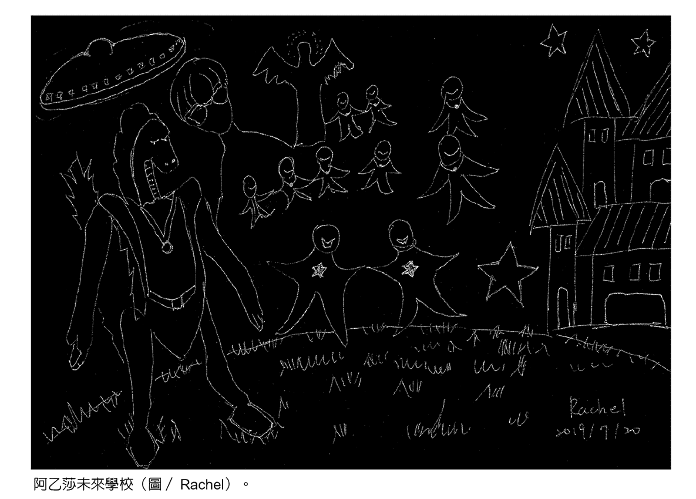

 第四项工程：
播下爱的种子——培育新地球的植物王国

你们或许已经察觉到，地球万物正逐渐灭绝、消失，甚至关键的大自然原生物种也正濒临灭绝，那是因为人类恣意破坏大自然，造成能量流动的断链。物种的消逝对大自然来说是浩劫，你们人类都无法照顾好自己了，遑论去照顾成千上万的大自然物种。这些动植物、海洋生物和矿石都是大自然生生不息运转的重要成员，缺一不可，当其中一、两个物种消失，会连带让依赖该物种生存的其他族群面临生存危机。人类无法用心觉察出自身以外的大自然物种是如何支持着自己周遭的环境，是最大的问题根源，因此接下来要做的，是为大地播下爱的种子。

莎雅，这个播下爱的种子的工作该如何进行？

要让地球回复初始样貌已经是缘木求鱼，所以现在要展开平行时空的种子移植计划。许多物种，包含森林动物、海洋生物都具备自我生存意识，可以帮助自己获得延续下一次生命的机会，唯独植物界是处在与地球环境超链接的状态。植物必须经由人类、动物、昆虫、禽鸟的协助才能迁徙和繁衍，若人类与动物在意识能量的移转过程里，未将植物种子一起携往新地球的振动频率中，这些植物王国的物种将全部灭绝，连带让地球生命重回冰河时期。所以，此时必须唤起人类的意识，将植物种子植入新地球轨道。培育植物王国种子的计划如下：

“将无条件之爱的意识植入大地。土壤里的元素会因为接收到人类播下的爱的意识种子，调整植物现有的ＤＮＡ结构，让人与大地链接的能量创造出新形态的植物王国，以符合高次元振动频率的生存法则。”

这项工程要经由各地的光场汇聚共同意识，来协助调整大地的能量场。当大地接收到更高意识人类调整校准后的频率，就可以将此更新的能量传送到植物根部，进而结出不同的花和果实。这些种子所诞生的植物可以协助新维度的地球环境，帮助延续新地球人类和物种的生命。

我不太理解，这样做的结果是植物果实会有不同的振动频率吗？

是的！那也是未来地球孩子的养分来源。这些植物和果实能让未来人类食用，不虞匮乏。

你是指哪一个地球？还是我们目前居住的地球吗？

是的，物质体上是的，但维度上会进入不同的轨道，而物种也会因此改变其生存的ＤＮＡ模块。

了解！你是要我们人类为自己的下一代预留植物王国，因为目前的生态环境会被人类自己破坏掉，是吗？

是，但也不完全如你说的。是人类更新后的轨道需要不同的植物王国来配合，因为你们氧气和二氧化碳的供应组成会随着新地球，而重新调整出新的平衡系统。人类仍然存在，但植物王国的能量来源所依赖的地壳重力将会被改变。倘若植物王国的基因没有调整，以符合新人类意识的需求，则无法成功植入新地球。

这听起来工程浩大啊！应该要让联合国知道吧？

已经有许多环境工作者在呼吁各国政府保护雨林和维持生态平衡，但尚未达到任何具体效益。还是要人类自己意识觉醒，自动自发来维持自己的生存权，才是根本的解决之道。

你这么说，我更觉得做不到呀！地球人自私自利，贪欲很重，你要人们为了植物王国或未来人类去做这件植入爱的种子的工作，我觉得根本办不到。除非可以利益目前的人，产生经济效益，创造金钱能量的流动，否则就会变成空谈。

我很懂目前的地球人心，我们可以换一种方式说明。有多少农人种植农作物是为了自己的健康？很少对不对？大部分的人都在计算投资报酬率，栽植农作物是为了换取金钱的报酬，所以你们投入植物种子和大地的能量都是匮乏、辛苦、贪婪，这样栽种出来的农作物吃进动物和人们的胃里，就是恶性循环。你们愈吃愈不满意，愈吃愈不开心，甚至吃出病来。

现在，只要你们换一种意识状态，为了自己的身体细胞健康和青春永驻，而播下一粒种子，这棵植物就可以长成你的身体需要的元素。你甚至不必栽种上百种作物，只需要一、两棵植物，这株植物就能长出你身体所需的元素，提供给你。

你们可以去做实验，验证我说得对不对。准备两颗同样的种子，分别由不同健康状态的人用爱的意识栽植，之后再去化验其叶子和果实的化学成分，你们会看见不同的结果。

喔，这听起来很厉害呀！但这样的植物王国不也就变得太乱了，一堆混血儿。

不会的，植物的生物体层外观是一样的，但释放出的能量和元素会有所不同，那就是植物情绪体的变化。植物的情绪体可以帮助人类和动物。

当种子经过人类的意识产生共振时，这棵植物自然而然会产生符合你身体需求的振动频率，帮助你的身体产生和谐振频。像合音天使般，你和植物的和鸣会让你们彼此之间产生和谐共振的能量流动。

这很有意思，一举两得。我们将爱的意识投入植物种子中，植物不但利益我们的身体，还可以继续繁衍出得以满足世世代代人类需求的植物王国。

是的，人类过去就是如此用爱代代繁衍的。而在人类自以为聪明地大举使用ＡＩ和基因工程，以满足人心的物欲和贪念的此时此刻，需要你们自己重启爱的工程，再造新地球。

 第五项工程：穿越平行时空，当下回到爱

你无法在原有的规律生活中打开链接天地之间的能量流动，最有效的方式是带着自己的意识进入当下的旅程。只有进入当下的瞬间，你才能帮助自己和我——地球母亲——取得链接。没有经历这个过程，你的所做、所思、所想仍是锁定在小我创造的虚拟实境中。你不知不觉地在自己的虚拟时空度过一生。而当你带着自己去如实体验当下，你将重新和我——地球母亲——以及生长在地球的所有生命取得链接。

这项工作需要每一个人自己去打开这扇平行时空的大门，亲自去体验。有很多方法可以帮助你跳脱以往的生活框架和屏障，而旅行是引导自己进入最好的方式。然而，这次我要你去体验不同以往的旅游方式……

＊ ＊ ＊

（和莎雅的这段传讯沟通到此暂时中止，我忙着陪伴即将考大学的女儿，也没有特别在意莎雅说的“不同以往的旅游方式”是什么。然而，就在女儿大学学测结束、分发之后的短短一个多月时间，我老公已经把暑假的行程搞定。这次是去阿拉斯加，我们的邮轮旅游初体验。

在前往阿拉斯加的邮轮上，我打开与阿乙莎的链接和对话……）

我：阿乙莎，西方国家发展的邮轮观光让我感到无比兴奋。超越国家的疆界，以更大的格局和世界观，结合海陆空旅游和多层次的活动交错安排，我在此感受到物质丰盛带来的美好。这景象让我困惑了。或许是受到宗教和圣贤的影响，我总觉得，体验丰盛的物质享乐是否和超越物质进入内在灵性生活背道而驰？我们可以将这两者融合在一起吗？

阿乙莎：你在此看见的丰盛物质体验，其表象之下正是内在灵性升华后的镜像。这也是地球的实相之一。你会明白，灵性升华绝对不是空谈，没有跳脱人类既有刻板印象的框架规画出来的行动方案，就只是被小我设限的产物。当你体验到超越以往想像的旅游时，你会看见这是另一种内在意识的觉醒传达出来的美丽盛宴。这些精心规画的航行路径、硬件设备、船上风光与岸上活动，精心设计的声光表演、美食飨宴、科技应用，以及住宿与行程的安排，都是人类绞尽脑汁，为了融合不同种族文化与传统，而呈现出的超越任何单一国家民族所能想像的极致旅游体验。
船公司的企画人员运用地球母亲天然的地形地貌、大海的丰饶资源，打造出最极致的海上巡航享乐。当你顺利走入自己的内在宇宙，挖掘出自身内在宝藏的同时，你要如何与这个世界交融、接轨？你当然需要创造一个中间媒介，这个媒介就是你的更高意识创造的产物。你必须创造一个媒介，让所有人可以理解和进入你所感知的世界，让人可以亲身体验你的内在意识看到、感知到和想要表达的一切，以人们可以理解和接受的形式，带着他们从身体的感官链接进入内在的心灵，进而由外而内地转化人类僵固的思想和小我的自我设限。
透过这个如实的亲身体验去展开你们自己，共同创造出未来世界的样貌。旅游是最能表达人类意识融入身体体验的活动，也能被人们传颂和延续到下一代的生活。

我：所以，我目前用文字来传达我内在的感动仍然不够？

阿乙莎：当然。文字只能传递频率，但一个人的内在转化必须经由身体真实的体验，才能真正内化进入他的精神体。这种创造体验的传递方式，远比文字更容易让人全然理解。

我：我正在船上体验前所未有的旅游感受，真的有种脱离现实的感觉。

阿乙莎：你已经进入船上的另一个平行时空。

我：啊？我进入了平行时空？怎么回事？

阿乙莎：此时此刻，你搭乘的这艘邮轮正航向地球的某个地方。这个搭载着四千多人的移动城市并不影响船上的人自由行动，每个人都可以针对自己的需要，在同一艘船上构筑自己的人生体验。
船上有不同类型的饮食任你挑选，每个楼层此时此刻都在上演不同的动态或静态活动，而船舱内有许多人正在扮演自己在此的角色，有船长、船员、船公司行销人员、厨师、服务生、清洁人员、商店经营者、销售人员、安全维护和医护人员。现在我要问你，若将这艘船看成自己的公司或国家，你会感到忧心吗？

我：不会。我只是游客，怎会担心？

阿乙莎：为什么你在这艘船上不担心，在自己的家里或国家反而感到忧虑？

我：因为在家乡和自己的国家，我有很深的命运共同体链接感，总觉得子孙的幸福和国家未来的兴衰，自己有责任。在这艘船上，我就是个游客，阿拉斯加只是我人生的中途站，不是此生的终点；然而，家庭和国家的未来会决定我人生的终点，所以我才会感到忧心。

阿乙莎：你自己讲得够明白了。你有看见自己的思想创造的框架和迷思吗？对永恒生命而言，台湾或你此生的家庭也只是你灵魂的中途站，当你放下对“终点站”无意识的恐惧和迷惘时，就能尽情体验当下这艘船带给你的一切享乐，不是吗？

我：确实，我们对未来有着无意识的恐惧！我们无时无刻不在想着要如何变得更好，也一直在懊悔和回忆过去，正因为如此，我们无法好好享受和体验当下的旅程。

阿乙莎：了解之后，你是否应该换个想法过日子？现在仔细观察船上的各种角色，你想扮演船长、船员、服务生、活动企画、表演家、厨师、维修工作者，还是游客？

我：喔！游客是最轻松愉快的啦，可以尽情享乐啊！

阿乙莎：你目前是这样想，但若你还要待在这艘船上五十年，或是即使离开这艘船，仍会进入另一艘船，你还是这么认为吗？

我：喔！那我应该不想继续过吃喝玩乐的日子。有了足够的体验，我会想开船公司，再多造几艘船，创造更多的游戏和体验方式，让大家去享乐。

阿乙莎：很好！经由这次旅游，你似乎更接近原本设定的生命蓝图了。先尽情地玩乐吧！

（结束和阿乙莎的对话，我走出卧舱，看见廊道上有个大大的荧幕，上面有个“ＮＯＷ”的指标映入眼帘。我们只能从当下这一刻，去找出目前船上有哪些活动正在进行。没有从荧幕上的“ＮＯＷ”出发，我们就会在船上迷失了……）

没有终点站，只有当下的桃花源

我：阿乙莎，莎雅曾要我去体验不同以往的旅游方式，难道这一次的旅游早就在我的人生剧本里排定了吗？

阿乙莎：你以为这一切都是突发的吗？或者，你还认为人类只能用自己的小我去创造自己所需的体验？

我：我还是不能确定。难道剧本早就编好，我们只是照着剧本演出的演员？

阿乙莎：你现在无法想像没有剧本，演员要如何演出自己的角色和发展剧情，对不对？现在，换个角度去看这个问题。若你一出生就已经拥有完整的剧本，而眼前你遇见的所有人事物都是表演者，你是握着剧本的导演，是否有点感觉了？

我：等等，让我理解一下。是我自己驱动身边所有人事物照着我手中的剧本演出，而我身在其中却不知道剧情？

阿乙莎：你当然拥有剧情。这剧情是根据你身上的剧本排演的，只是你看着戏的流动过程，已经忘记自己正在导演这出戏。

我：是我入戏太深，忘了剧本？

阿乙莎：是的，就是这样。

我：那如果我可以记起剧本，会发生什么事？

阿乙莎：所有的演员就会消失，没有戏了！

我：那没戏了，我会在哪里？我手上的剧本不就没有意义了？

阿乙莎：你的剧本还在，只是当你忆起时，就可以进去改写剧情，换不同的角色来演。

我：能记得剧本有啥好处？我要如何忆起自己的剧本？

阿乙莎：当然有好处。你会更清楚，不浪费自己的精神去重复演出同样的戏码。还有，你可以跳脱原来的环境和小我的框架，进入另一个平行时空。

我：那要如何看见剧本？

阿乙莎：你已经看见了，不是吗？

我：没有，我还没看见终点，未来仍是未知数。

阿乙莎：看见就没有尚未发生的事情了。只有当下的觉知，就在当下。你在，你就看见了剧本，也就能停止剧情上演；你遇见的人事物在你临在的当下不复存在，不论是你的敌人或爱人，都不在了。你的世界进入全新的开端。

我：这太吊诡了！那个“在”的瞬间，我周围的人事物就“不在”了，那我到底要在还是不在？

阿乙莎：你的物质身体在你临在的瞬间，就消失不在了。

我：我不懂这个逻辑。人类在这个地球上代代相传，所有人都生存在地球上，有个自己看不见的剧本，那些我们认为已经离开人世的人，肉体不在了，但精神仍在，仍留在子子孙孙的心中，这样也没有什么不好啊？

阿乙莎：当然，这是你已经满足于现状的想法。但是，你知道现在地球上有多少人不满于现状吗？超过半数的人类活在不满现状和匮乏的状态中，这些人如果可以停下脚步，看见自己是如何被自己误导，对整体人类的文明和传承会有帮助的。你们需要传承的是精神意识，而非只是生物体的繁衍。
回到当下，就能觉照自己的剧本，你身边的人事物顿时对你的人生剧本失去意义和控制。我要再次向你说明，“当下”可以为人类带来无穷的力量，为你打开平行时空的桃花源。你必须先将当下与时间的观念切割：当下指的不是此时此刻，也不是这一分这一秒，而是你的觉照出现“光”的瞬间。这个光会褪去你的世界的阴影，你无法再看见光影下有形有相的世界；你的肉眼无法捕捉到这个光，它是存在你的意识里。当你进入临在当下的状态时，你的觉照之光被打开，这道光让你明白一切。原本晦暗不明的光影创造的景象瞬间消失，那个觉知照进你内在宇宙的瞬间，就是你回到当下的时刻，你还原进入最初始的状态。
在阿拉斯加这段旅程中，你看见美丽的景象矗立在前方，以为这是地球母亲浑然天成的美，但你的肉眼能看见它最初始的样貌吗？不能！是吧？你现在只看见商店林立，满坑满谷的观光客无意识地吸吮着人工雕琢后的景致，那些人们自己的创造物遮盖了地球母亲原本的美丽容颜。
现在，将眼睛闭上，打开你的意识之眼，让觉照之光进来，你会感受到完全不同的景象。

我：我来试试。
是的，我看到老鹰在天空中展翅翱翔；海水湛蓝，鲸鱼喷射出高高的水柱，现出彩虹；远处的山坡有许多棕熊和小熊正在觅食，空气中传来鸟语花香，蝴蝶飞舞着，被白雪覆盖的远方山头上反射出黄色的光芒，真是人间天堂。这是阿拉斯加最初始的景象吗？

阿乙莎：是的！当你回到当下，进入觉照的瞬间，你眼前的上千名游客、停泊的邮轮和游艇，还有喧闹的汽笛声都消失了。你肉眼底下的世界完全不存在，你现在还会怀疑自己当下的临在是否真实存在吗？

我：是啊！就像穿越进入了平行时空。
我数天前还在台湾，那时呈现的是一种让人忧心的纷乱景象；但是当我搭上这艘船，此时此刻我已经进入和台湾全然不同的时空。现在祢让我用内在之眼去观看眼前的景象，这些人类创造出来的实景居然消失了，我仿佛走入了人间仙境。
阿乙莎，祢似乎在告诉我，当下才是真的，目前我眼中所见未必真实。不过，这些景象此时此刻正与我交流啊！我正在真实地体验、与之互动，不是吗？

阿乙莎：你们随时可以切换频道，进入不同于眼前景象的时空，不论身在何处，都可以穿越物质世界的假象，进入永恒存在的宇宙。刚才你看见的阿拉斯加最初始景致依然存在，只是你们选择进入不同的物质体验中，与这个原已存在的时空交叠；而当下的觉照可以带你们穿越眼前的假象，回到最源头的振动里，那里有天堂美景，也有真理和智慧。

穿越时空，让爱流动

我：阿乙莎，我不明白，我们诞生在此，不就是要去融入当今的现实世界，祢却要我去找回最初始的面貌，用意何在？我们只能往前走，不能回头啊！眼前我看到的邮轮、码头都已经是具体存在的现实，我无法不去参与，视而不见。

阿乙莎：孩子，我并没有要你忽略今日的地球和你眼前所见的实景，相反地，我是希望给你一条找回真实之路。当你穿越物质的假象，觉照在当下就可以带着你快速通关，进入最初始的完美平静瞬间。你们之后会需要用到这个方法，因为当外界的变化愈来愈快，人类已经无法再满足于物质创造的极致享乐时，这是一条带你们回到源头的道路。

我：谢谢祢，阿乙莎，但这似乎已经脱离我目前的现实。对还没有准备离开现实的人来说，这不是个好建议吧？

阿乙莎：你们不是一再追求更新颖的体验吗？这是一个新的选择。看见当下的世界是人类必须学习和忆起的技能，只有进入当下，你们才能逐渐学会让地球回复最初始的爱的和谐振动、回复最初始的美丽！我希望这趟旅程可以让你真实地体验当下。你们随时可以选择进入不同的时空去体验地球生活，这一次的旅程只是开端，接下来，每一天你都有机会选择你想要体验的频道。经由更有觉知地选台，你们可以活出全新的生命样貌。
选台器就是你们每个人有意识地校准内在更高意识，去创造全新的地球体验。过去在物质开拓阶段，这些虚拟实境的体验无法让你们立即感受和体验，但现在透过旅游和许多物质载具，将你们的身心灵直接带进不同的地球实相中，这已经不是遥不可及的梦，只是多数人仍活在线性的时间和僵固的框架中，无法脱离现实而自怨自艾。当你想要切换体验的频道，可以自由地创造和切换，还可以透过当下的觉照意识，带领你穿越平行时空，进入宇宙最初始的桃花源。

我：我觉得人类无法瞬间跳脱现实。若我们没有订下旅程，没有足够的旅费，没有闲暇时间可以空出来，怎么可能创造这种平行时空的体验？

阿乙莎：孩子，你总是将自己限缩在物质的控制下。你难道看不见，当你决定抛下手边的工作，那个瞬间的释放就可以帮助你转进不同的实相中去体验了？重点在于“当下”你允许自己跳开熟悉的生活场景。那个“允许自己”是打开生命的另一道门，当你进入那道门，自然而然就会找到进入那里的游戏规则和交换方式。
你自己回头看看此时此刻邮轮上面的人，每个人可以选择自己的航线、旅游公司、价位、舱等、上下岸的港口，连每一天要吃什么、玩什么都可以自由选择，有计价方式但完全不用带现金、找零钱。这是不同以往生活的新世界、新体验方式，就在你们生活的地球上演。这里是由人类共同创造的虚拟实境，你即使进入这里，仍可以自由选择，所以每个人在此又创造了自己全然不同的体验方式。
允许自己打开另一扇门。若你担忧工作、金钱、食物、气候、身体能否适应、语言等种种问题，你只是又被自己的想法困在自我设限的牢笼里；如果你愿意敞开心去交流和体验，绝不会感到匮乏。每一个人都是带动能量的种子，而每一颗种子发芽生根的过程都会被宇宙无条件的爱滋养，只是人类自己的恐惧阻挡了这股爱的能量流动。

我：我相信很多人都会想去旅游，也愿意打开门去体验，但没有足够的资粮去购买门票，怎么可能登船？

阿乙莎：孩子，“信任自己有足够的资粮”和“看着存款簿对自己说不可能”，就是两者之间的差别。你足够信任自己可以得到宇宙无条件的爱，相信宇宙无条件的爱永远会支持你去做任何你想要的体验吗？

我：我之前没有这样想，我也得先查价目表，再检视自己的荷包才敢行动的。

阿乙莎：好吧！就算你误打误撞给自己打开了这扇门，又正好有足够的资粮去体验好了，你有没有想过，这个邀请是怎么来到你眼前的？

我：朋友随口说他们要去阿拉斯加玩，然后我们也很想离开烦闷的生活，就进一步去行动，安排了这趟旅程。

阿乙莎：孩子，你朋友的随口说，正是来自宇宙的邀请，透过朋友不经意的话语传达给你，你也因为这个来自宇宙的邀约正符合你内心的“期待”，而一拍即合。是你先允许自己打开一扇门，做出切换频道的行动，才能顺利走入邮轮上的平行世界。
“相信自己”的意念可以让宇宙给你恰恰好、最适合你的安排，而因为这一切都是由你发出的请求，你得以顺应能量的流动，让其引领你去扩展你需要的体验。再次提醒你，宇宙只能回应你爱的能量，无论你如何为它贴标签，或将之化为任何物质形式的证据，回归到原初的本质，那依然是爱。

进入平行时空的更多选择

阿乙莎：你的意识可以带领你进入各种不同的体验，跳脱你原本自我设限的时空。回到当下的瞬间，就可以让生命创造全新的体验。
除了旅游，还有许多方式可以帮助你跳脱原有时空，回到当下的链接。你可以练习动态舞蹈静心，让肢体跟随着音乐旋律自由摆动。你的心识会顺随肢体的律动逐渐同步，让你进入另一个平行时空，天地之间只有你与自己的更高意识同在。
另一种方式是与大自然和鸣，随着虫鸣鸟叫等大自然的声音一起欢呼高歌，你身体发出的音频就可以带着你超越限缩的时空，进入与高我同在的平行时空里。

我：这些让自己穿越平行时空、回到当下的练习，和启动地球之爱的工程有什么关系？

阿乙莎：孩子，你若无法与天地同在，如何能将爱的能量带给自己和这个世界？你们就是天地间的种子，种子发芽的过程需要大地的滋养和日月精华。现在人类即将发芽，进入扬升的阶段，若没有能力让自己跳脱禁锢种子的窠臼，重获天地间的能量流，你的爱就无法被滋养茁壮，更无法回馈给自己和这个世界。

 第六项工程：让爱向上延伸，向下深耕

这项工程对你来说是无法想像的情景。

是的，莎雅，我真的不懂如何让爱向上、向下移动。

这就是人类祖先传承下来的敬天爱物，只是在过去的教导中，敬天是向上帝和神明祈请膜拜的仪式，然后人类经由创造活络的经济活动，试图展现爱物的文明景象。

在下一世代，你们需要用自己的身体传达爱的能量给宇宙。

啊？和身体有关？

是的，爱的能量一旦进入发芽的灵魂意识里，你们的身体本身就会携带光和爱，凡是你意念所及，就是光的延展，你的行动就能将爱的能量灌注给大地。

我不太明白，这是点石成金、心想事成之类的表现吗？

不是那种在物质层面的显化而已。你们的意念向上投射到自己的灵魂晶体殿堂时，就会让爱的振动与光的世界同步校准。校准后的光产生的振动频率会引导你们去做出利益全体人类和地球的慈心行动，这些慈心行动就可以帮助将爱的能量灌注给大地。

莎雅，你可以将这个项目具体化吗？我比较习惯企业的语言，有明确的目标、步骤和行动方案，你这样描述有点虚无缥缈，我不知从何着手。

好吧！给你更明确的做法和步骤。用你习惯的语言来讲，就是……

1.穿越小我认知体系。

2.用意识链接高我。

3.与高我同频共振，产生行动的欲望。

4.跟随欲望，做出具体行动。

就这样！

这不就是我天天和你们一起做的事？每天早上链接，写下我们之间的对话，就这样日复一日地进行着，然后……等等，我突然回想起我刚完成一个月的旅程，难道这就是我和你链接后产出的具体行动计划？

没错！你终于搞懂了，爱就是这么自然地展开链接。将爱的能量向上校准链接后，你就会得到深耕大地的行动指南。你在当中不会有资源不足的问题，也没有时间配合不上的困难，所有让你无法成行的干扰都自动退去，如此轻而易举，你就完成了这趟五十多年来你从没在地球上尝试过的行动和体验，不是吗？

说得也是！这趟旅程原本也不在我今年的计划里。原来如此，太美妙了！

这就是让爱向上延展后，向下深耕的过程，由爱的能量带领你的身体做出行动。你是以轻松、毫不费力、资源充分到位、水到渠成的方式完成此次身体的工作。

谢谢你让我亲身体验这趟旅程。不过，我的身体确实享受了一场丰盛的飨宴，这和帮助地球哪会有关系？我并没有帮助解决地球日益暖化的气候危机，也没有解救任何濒临绝种的动物啊。我只是吃喝玩乐而已，真不好意思。

谁说帮助我——地球母亲——要用痛苦严肃的方式？你们背负着沉重的历史包袱，这样做才是违背造物者的本意。

人类是来地球创造和显化爱与美好的种子，当你经历了一趟愉快的旅程，你雀跃的心轮散发出的爱的能量就已经滋养了我（地球母亲）。想像一下，看着自己的孩子喜悦快乐地生活着，为人母亲的你是否就同感快乐和满足了？这就是我要你们在创造新地球的过程中表达出来的身体能量和振动频率。摆脱恐惧、匮乏、自怨自艾、愧疚和自我贬抑的心，当你们生活在喜悦中，才能帮助地球脱离旧地球的沉重包袱；你们经由释放身体细胞爱的能量，让新地球得以诞生。这就是“让爱向上延伸，向下深耕”的意义。

 第七项工程：为地球祈福

你或许会觉得奇怪，为何要为我（地球母亲）祈祷，是不是？

嗯！我以为你已经拥有至高的神性意识，和宇宙紧密链接着，我还真不能想像你会有自身难保的一天！

孩子，我是有血有肉的物质存在啊！只是你们忘了我的存在，还口口声声喊着救地球，却从不停止伤害我的行为。你们从未真正将能量投入大地，只是在防卫自己，损耗我的身体和能量。

为了防堵我在感冒咳嗽和病痛袭击我的身体时，影响到你们的生命财产安全，你们创建日益庞大的保险体系，但过程中，你们从未将投入的保险金用来保护和照顾我的需要。你们付钱给保险公司，只是希望自己在遭受我的伤害时仍能继续好好地活在我身上，不是吗？

莎雅，你这么抗议，我完全能理解。非常抱歉，我们人类确实太自私，你无条件地养育我们这么多年，我们却一个个成了败家子。对不起，谢谢你，我爱你，这些年来让你辛苦了！

孩子，我并不是要向人类讨公道，博取你们的同情。我要你们为我祈福，是为了帮助你们活在一个更健康、更安稳的环境里，因为我上方的磁栅已经充斥太多人类制造的垃圾。战争、掠夺、恐慌、宗教或民族的抗争，人类制造的负面情绪已满满堆积在地球磁栅中，我希望经由你们自己重新投射出光和爱的振动，将覆盖在我身上的黑色淤积清除。

当你们共同投射光和爱给我时，我的磁栅记录器就可以重新消磁，挪出更多空间，重新校准宇宙光的世界，然后将能量灌注回到你们人类赖以生存的地球。这不仅是为我祈福，更是为地球上的生灵谋福祉。

当然，这是我们应尽的责任和义务。我们自己的垃圾当然要自己清干净，却一直置之不理，将这项工作丢给你，太不应该了！请你现在就指导我们为你祈福。

好的，非常简单。还记得吗？阿乙莎在和你交流的第一本书里一开始就提到，要去感知目前的地球怎么了。就从这里开始帮助我重新校准宇宙光的世界，一起来祈祷吧！

练习：为地球祈福

1.身体预备：身体放松，从头到脚放松，进行一回合的畅通脉轮手指操，就可以完成身体的准备工作。

2.启动光的世界连线：轻松坐下，呈现金字塔三角坐姿，稳固好身体。接着，让双手十指的指尖相对，启动身体中的灵魂意识，进入链接高我的状态。

3.将光和爱注入地球：将地球放进心轮中，地球顺时针旋转。这时，请大声地念以下祈祷文三次：“喔！我感谢光的临在，请帮助我将无条件的爱投注在我居住的美丽星球——盖娅。请帮助我让来自祢的光和爱穿越我的身体，进入心轮，让地球母亲得以净化自己，并充分获得光与爱的补给。”

4.让自己和地球重新校准合一：将地球母亲从心轮往下移动（男性身体就将地球移动到太阳神经丛，女性身体则将地球移动到子宫的位置）。这时，让地球以逆时针方向旋转，大声地念以下祈祷文三次：“喔！亲爱的地球母亲，我感谢你赐予我宝贵的生命和源头的能量，请帮助我与你再一次校准，让我们合而为一，以爱、慈悲和勇气，共创美丽祥和的新地球。”

5.深呼吸三次。结束。

希望你们可以经常为我祈福，让我能以更强健的身体，护佑所有人类和万物生灵的后代子孙！

＊ ＊ ＊

我：阿乙莎，关于莎雅这段为地球祈福的传讯，我想请问祢，人类给予祝福会有力量吗？

阿乙莎：让你们内在善的意识与外界交流，这样给予祝福是有力量的。无论是对马路上被辗压的小昆虫、对动物，或是对逝去的亲人，当你们给予祝福时，就会传递出祥和与善的能量，这股能量可以为所有处在黑暗中不知所措的意识点亮一盏明灯。
给予祝福也能帮助地球转化磁场，并与你内在的祥和及良善产生共振能量。此外，给予他人祝福也是学习进入无条件之爱的开始。
希望你们可以明白地球和人类是生命共同体。这个概念你们的教科书已经讲很多了，但此时此刻为什么要再次提醒，甚至要求你们开始为地球祈福？那是因为地球磁栅已经受到黑色能量的侵蚀，磁极偏移日趋严重。你们目前在这艘盖娅大船上没有太大的感觉，仍过着原来的生活，不知未来已然到来；但从宇宙帷幕的另一端，已感受到地球偏离航道，甚至有可能让这颗美丽的蓝色星球从银河的轨道上消失。地球母亲必须召唤具有觉醒意识的光之工作者，开始为地球祈福。
透过莎雅传递给你的这个祈福做法，就可以很快地让宇宙的光和爱经由你们的身体与地球校准，然后注入地球之心。男性的太阳神经丛和女性的海底轮是造物者赋予人类最初始的阳性和阴性力量储存站，当你启动心轮，与光的世界合一，就可以重启最初始的生命之流，使其进入地球之心，让地球母亲获得自己孕育出来的生命的反哺与滋养。
你们每一位光之工作者的身体就是神的庙堂，当你启动、点燃自己的庙堂，链接高我，就会让光照耀地球，使光和爱帮助地球母亲校准银河轨道。这项看似简单的仪式却至关重要，希望你们正视它，并展开行动，重建自己居住的家园。

 第八项工程：身体重新校准

人类因为长久沉溺于小我创造的虚假平衡中，让自己的身心禁锢在民族、宗教、社会等集体意识的牢笼，以致身体细胞渐渐失去与天地校准融合的能力。现在，为了引领新地球的诞生，你们必须重新启动身体的智能系统，创造新的身体平衡机制。

为了排除细胞的沉疴，让细胞组织重组结构，以支持新意识的诞生与融合，你们的身体细胞会经历一段阵痛期。整个调整和适应大约需要一个月，过程中，你们不必忧心身体上的转化造成的短暂生理性或内分泌失调。在此期间，你们可以用磁化水辅助身体，加速排泄与净化体液。

除了之前提到的自制调整身体五元素具足的能量水之外，在此另提供一个制作饮用磁化水的简单方法。

练习：制作身体细胞需要的磁化水

这个方法可以将水晶吸收的日月精华释放于水中。

1.将水晶静置于太阳和月光下一整日。

2.将在太阳和月光下静置一整日的水晶浸泡在饮用水里二十四小时，然后取出来。此时，水晶的振动频率已经将水调整成经由此水晶吸收到的日月精华的能量。这就是可以直接饮用的磁化水。

3.重复步骤１和２，制作磁化水。

你们可以如此循环交错地制造自己身体细胞需要的净化水。至于水晶的选择，就跟随直觉，你的身体会告诉你当下需要运用哪一种水晶的振动频率，来调节自己的身体。

此外，相较于以往，此时对洗澡和沐浴会有更大的需求。白天和晚上各以淋浴的方式洗涤自己的身体一次，让水的流动帮助身体细胞与水共振。

如此大约经过两周的时间，你们就已经可以渐次脱离身体调节的适应期，进入全新的细胞生长期。身体重新校准天地日月的能量之后，你们会感受到全身细胞如婴儿般重生，身体组织会回复青春与活力。

莎雅，我怎么知道何时会进入这个细胞重新校准期？这是自动发生的，还是有特别的仪式？

你们自己的高我意识与你们链接一段时间之后，身体智能系统就会自动进入重新扩展调整的阶段。之前的工作项目不断要求你们允许自己超越小我设定的框架，进入自己的平行时空，让你们得以经由松果体接收到更高意识的振频，启动身体细胞智能，让新的意识带领身体进入扩展与重新校准的工程。

除了用水元素帮助身体调频，让细胞重新校准宇宙之外，也可以透过“爱的合一”团体练习，帮助所有人更快链接进入宇宙无条件之爱的振动里。

团体练习：爱的合一

1.围一个圆圈。请确认和你链接的人的位置，接下来要与对方进行爱的链接。

2.将意识放在自己的心轮，现在从心轮出发。

3.向上链接位于自己眉心后方一吋的第三眼（松果体）。

4.将意识移向对方，从对方眉心第三眼（松果体）的位置进入。

5.向下进入对方的心轮。

6.现在请感受有一股来自你心中爱的能量，正从你的内心扩展出去，与对方一起流动。

7.接着，请你们两个将心中的爱继续往自己的左右延伸，让在场的所有人在爱中融合。

8.现在闭上眼睛，感觉自己心中的爱正继续滋养，并扩展开来。

9.接下来，祈请灵性母亲进入自己的心轮。若不知道自己的灵性母亲是谁，没有关系，就直接在心中默念：“请我的灵性母亲进入我的心轮。”你的灵性母亲神圣的光会出现在你第三眼的中央，当她缓缓进入你的心轮时，你将感受到无条件的爱的能量充满你的心轮，并持续扩展开来。现在，让这无条件的爱继续延伸到整栋大楼，穿越屋顶，扩展到整个城市，跨越溪流，向上、向下、向东、向西继续延伸到整个台湾，再穿越台湾海峡、太平洋，包覆整个地球。（停顿数秒，感受这种感觉。）

10.现在让意识回到自己的身体中，向下穿越海底轮，让这股爱的能量经由你的双脚流向大地，滋养地球母亲，再延伸进入地球之心。

11.接下来邀请灵性父亲进入你的心轮。若不清楚自己的灵性父亲是谁，没有关系，就闭上眼睛，观想一道金色的光从你头顶流泻而下，从你头顶上方通过顶轮，往下经过眉心轮、喉轮，进入你的心轮。

12.现在你和灵性母亲、灵性父亲共同存在你心中，合而为一。你正式向宇宙宣告：你是合一的意识，你的身心灵完整合一，你已经回到灵魂的家，重获生命的滋养与宁静。让这合一意识照顾你在地球的身体和心灵，达到和谐与平衡，帮助你排除情绪和业力的干扰。你的意识再次扩展和提升，你就是合一的光的存在；神就在你之内，你也在神之内。

13.结束时，感谢阿乙莎护持你们完成爱的链接，帮助地球母亲获得爱的滋养，并与宇宙之心再次校准。

 第九项工程：散播无条件的爱

莎雅，你不断重复“爱的工程”，我有点应接不暇了……

这是人类重新扩展和校准自己的身体之后，用新的意识频率展开的爱的行动。以更高振动频率的爱来滋养的，不仅仅是你们居住的地球，还广纳地球上的万事万物，其中也包含爱你不爱的一切万有。

这个工作说起来轻松，要做到却非常困难。即使你已经深谙这个道理，却依然无法付诸行动，动不动就把自己包裹起来，用备战和对立的姿态，对付你不喜欢、不想要、不认同的世界。

你以为这个世界因为你们内心有爱，就会变得更好？不是这样的，你必须信任那些你不认同的不完美展现也是爱，才有可能在自己的家园实现爱。相信他们／它们，也愿意与之同行，那是另一种爱的品质；爱你所不爱，才能彰显无条件的爱。当你们将这种爱的品质传递给这个世界，就是活出了新地球的振动频率；若没有这项启动工程，你们依然会回到原本剑拔弩张、弱肉强食、争先恐后、巧取豪夺，为了保护自己的利益而牺牲整体利益的恶性循环中。

若你们无法跨越自己内在那个害怕贫穷、担忧匮乏的鸿沟，就到达不了我为你们擘画的新地球家园，那里是无条件之爱的振动处处闪耀的地方。

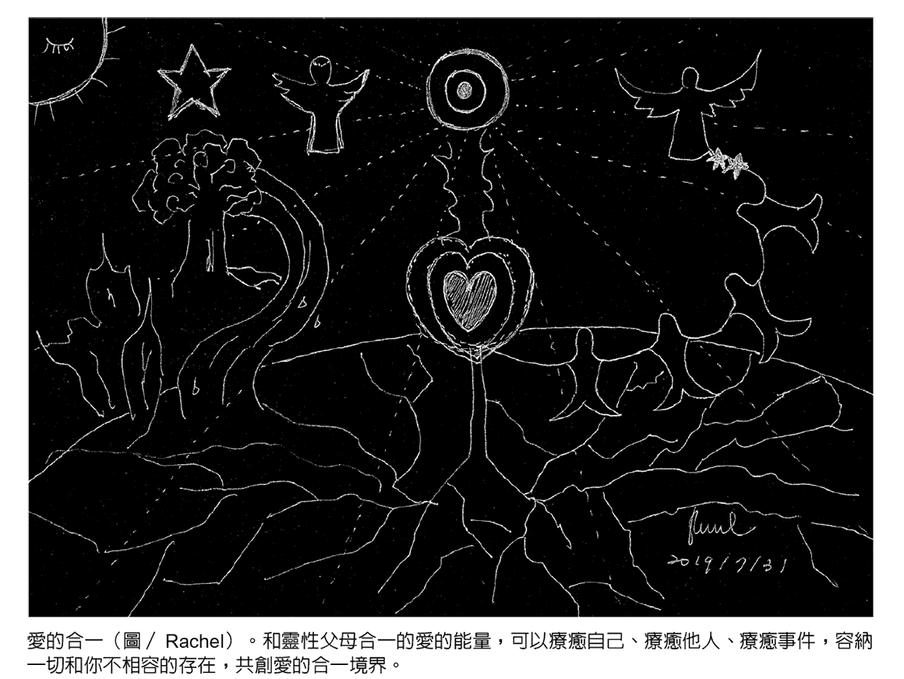

到达无条件之爱的品质

阿乙莎：我必须补充一下你这几天正在经历的无条件之爱的品质，这是一个非常重要的观念。
无条件的爱能够超越物质和小我的意识屏障，是你们链接自己灵魂的最高振动频率。你们可以透过自己的所思、所言、所行彰显无条件之爱的品质，来帮助目前的地球转换轨道，扬升至第五次元。这绝对不是神话，但你们总是被自己的小我拉扯，产生许多质疑和困惑。

我：是的！我无法理解莎雅一再强调的“无条件的爱”到底是什么，那听起来像是美丽的词汇，但真正理解的人并不多，更别提要去行动了。

阿乙莎：你说得也没错。以前你们的先圣先贤在地球上展现的爱，现在的人都当成神话故事，你们已经不愿意去理会，也无法实践，因为你们总是以为无条件之爱的背后有着牺牲和失去，那些行为会减损你们的既得利益，甚至失去性命。就连你自己曾在此贡献的无条件之爱你也都遗忘了，是不是？

我：是的，在我们这一世的有限记忆里，前车之鉴总是让人学到好人不见得有好报，坏人会继续存在这个世界，没见到他们被惩罚。从小到大，我只看见父母对子女的爱是无条件的，除此之外，很难看到一个人可以为了他人，甚至为国家民族无私奉献出自己，更别提为了不相识的人给出自己无条件的爱。

阿乙莎：孩子，你无法从字面意义去理解无条件的爱可以到达的境界，只能透过身体力行去领会你最高意识源头展现的能量，那是和天使之爱同频共振的状态。你无法用想的，必须去领会。

我：我要如何再去领会那种爱？

阿乙莎：你刚才提到父母对子女的爱的品质，你可以用这个方式进入合一意识。当你和灵性父母合一，你心轮的振动扩及任何对象时，去看看那无条件的爱如何展现它的力量与神奇。

我：好的，我试试看，请祢带着我一起做……
阿乙莎，我刚才居然看见耶稣的晚餐景象。耶稣正和门徒共进最后的晚餐，他明白自己将死，内心却没有任何恐惧，反而是他身旁的门徒表情哀伤，充满恐惧，惶惶不安。耶稣内心非常安定平静，这时，我看见他的心轮分离出一颗颗能量球，流入身旁所有门徒的心中。耶稣的心化成碎片，融入每个门徒心中，他的爱逐渐填满所有门徒的心。渐渐地，耶稣已和所有门徒同在，而门徒不再恐惧、哀伤，周围所有人的情绪黑洞都被填满。就在此时，我看见耶稣的心完全空了……空掉了！这是怎么回事？这个场景突然链接上我的灵性父亲雷巴特从金字塔顶端坠落，莎雅的心链接着雷巴特一起空掉那一刻。

阿乙莎：是的！你没看错，这就是无条件之爱的能量品质，可以移星换斗，自他交换出无所不在的意识，这是将你的爱扩展到无限的方式。只有到达无条件的爱，才能顺利开展出“非我”意识；而当“我”与“非我”同在，“我”就不只存在原本的物质身体里，而是已经在“无所不在”的存在里。这就是你们扩展了自己的小我至无我的神性状态。

我：也就是说，彰显无条件的爱会失去肉体生命，但活在所有生命里，是吗？

阿乙莎：可以这么解释，但你们并不会真的失去生命，你可以选择仍然健康快乐地活着体验完此次的生命旅程。

我：我不懂。祢刚刚才让我看见耶稣牺牲性命，怎么又说可以选择仍然活着？

阿乙莎：这样说吧！你们也可以选择让自己的意识活在每一个细胞里，让身体细胞展现最完美的状态，那就是将无条件的爱给予自己的方式。你们可以用无条件的爱活出健康快乐的人生。

我：所以，无条件的爱可以无孔不入？可以向外扩展到每一个人身上，也可以反向回到自己的身体细胞里？

阿乙莎：是的，那个爱的流动方向是由你们的意识带领的，不论你是向外或向内，都是进入宇宙至高的能量流动里。

我：这样我又不太明白了。如果渗入自己的细胞里，不就是利益自己到了极点，跟刚才失去性命的四大皆空是天南地北的差异啊，一个感觉很崇高无私，另一个感觉是极度自私。祢可以再说明清楚一点吗？

阿乙莎：爱流向这两端都是前往“无我”之门，不论你是让爱流向你之外的人或流向你之内的细胞核，都是被允许的。而且，这在宇宙的观点并无差别，没有孰是孰非、孰好孰坏的问题，因为你们的内在宇宙和外在世界相连，互为表里；你们两端的集中点仍是一体的存在，只是一个存在外在宇宙，一个存在内在宇宙。
内在宇宙即使净化自身到了极致，也会再走进黑色的外在世界里，而外在宇宙净化到极致，也会打开内在宇宙的大门。当你们选择走入内在宇宙的细胞净化过程，内在宇宙的平衡和健康也会带给外在宇宙稳定的力量；若内在宇宙不健康，你们外在的世界就会动荡不安，反之亦然。

我：难怪你最早传讯时提到，这个世界和我们的身体息息相关，我们是整个宇宙的传输系统，也是宇宙之心。

阿乙莎：是的，你们可以自由选择活在两种体验模式里，一种是以利益自己身心灵为依归的生活方式，另一种则是为了地球整体生命、为了完善外在世界所有生命体的身心灵，两者没有优劣之分，也无分高低好坏，都是值得你们去努力探索的方向。

无条件之爱的试炼

（我在接收这段讯息期间，不知不觉也同步走入盖娅提到的用无条件之爱滋养世界的试炼。“阿乙莎灵讯”系列作品出版之后，已经有人利用书中的内容授课或制造产品。人们最擅长的复制和利益自己的行为，正在不断上演，而我眼见愈来愈多以阿乙莎为名的活动出现，内在也不禁升起挣扎：我是否应该制止这些未经我授权、以阿乙莎之名进行相关活动或转制成高价能量商品的行为？就在我感到困惑时，收到阿乙莎捎来的讯息……）

我：阿乙莎，我今天头顶一直很重，是祢有讯息要传递给我吗？

阿乙莎：是的！我想要与你沟通一件事。接下来的传讯工作，我要你将重心放在打开人类的灵性意识，链接到宇宙源头意识场。当人们陆续踏上这条路时，你无法控制别人如何与我交流、互动，那会是每一个生命自己的舞台。他们会绽放出不同的晶体生命之花，如同你见到的大自然各种花草树木，如此丰沛多元。
你能给大家的，是一条找到我的道路；一旦与我链接，他们产出的语言、文字、图像都是自己生命成长过程的表达，你无法评断一个人的回家之路是否正确。因为链接我而演绎创造出来的一切，你不能据为己有或当成私人资产，就如同大自然生命是如此无条件地绽放自己的爱。这么做是要让你更加明白新世界的运作法则。

我：祢要求我无条件地为祢所用，又不让我以阿乙莎之名伸张任何权利？我的时间都用来服务你们了。

阿乙莎：孩子，你有没有看到自己仍处在地球上的恐惧与匮乏之中？这不是你应该保留的爱的品质。你必须以更敞开的胸襟、更无条件的爱传递我的讯息和能量。散播的能量和爱愈多，你能得到的能量回馈愈大。当一个一无所有的人愿意无条件地贡献仅存的一丝力量给这个世界，即使那仅存的力量无法在地球上获取金钱或登记版权，他仍愿意无条件付出全部的自己时，这样的意图展现的能量和光芒已经不是任何金钱可以换取的。身上的包袱愈多，你愈无法轻盈自在。我不希望你因为选择固守自己手上的破铜烂铁，而放弃成为那道光。

我：抱歉！阿乙莎，我明白祢说的，我就是有根深柢固的地球人习气，祢提醒我要移除这个习气，我当然会不习惯，但我会练习接受。那么，接下来祢要我如何做？

阿乙莎：持续记录与我之间的传讯内容，让更多人因这些讯息获得力量。而你也要愿意扶持一路上的兄弟姊妹，大家一起合作，不分彼此，让阿乙莎的真理被所有人看见，并展开行动。

我：那关于市场上一些以阿乙莎为名的产品和活动，我是否可以请他们至少不要用相同的名称？这样起码可以减少一些鱼目混珠或误导大众的说法。我总是觉得不妥，明明有些人的做法已经违背祢真正的意思。

阿乙莎：有何不妥？这会让更多人可以链接到我。

我：那么我该如何帮祢把关，确认品质？祢难道不担心鱼目混珠会耽误更多人的觉醒和慧命？

阿乙莎：为何需要确认品质？即使是失败的作品，也是包容于一切万有之中，我就是万有，如何排拒“非我”？若无非我亦无我，才能到达合一。

我：好啦！我明白，反正我去将阿乙莎登记为商标根本派不上用场。

阿乙莎：不是无用，是非常好用。让所有人都可以使用阿乙莎，如同自由取用阳光、空气和水一般，再结合彼此，进行自我探索和创造；让这个“被注册”的商标成为无所不在的振动频率，存在这个地球上。当时机成熟、万事俱备，我将启动阿乙莎光源，所有关于阿乙莎的创造就会全数移转到新地球。那里没有公平或不公平，也没有你的我的之分，一切都是共享资源、共同存在的意识。看到没？你无条件付出之后，最终就是成为那无所不包、海纳百川的存在。
现在的你或许认为这违反了资本市场的运作法则。若是以投资为前提投入自己的时间和劳力，你们就会期待要在接下来的流通过程中回收资本，不然就无法继续投入。你们绞尽脑汁想让自己的投资壮大并持续扩展，却不明白为何总是事与愿违？这是因为你们将自身能量封锁在自己设定的框架和陷阱里。当所有人都将目光放在金钱与劳务报酬，而不是去看见爱的流动与无条件的滋养时，你们生活的地球就呈现出今日你们眼中所见这种唯利是图、本末倒置的样貌，只有能够获取金钱收益的行为才会被鼓励和追捧。你们把自己最重要的爱的能量拱手让给无生命的金银铜铁，封印了自己最宝贵的能量。
人之所以存在地球上，绝不是为了获取金钱而努力工作，不是的。你会发现许多国家正在从金钱和资本市场的运作中觉醒，会有愈来愈多富可敌国的资本家愿意捐出所有财产，为了世界和平与地球的永续而努力。这些资本家在拥有庞大资金后发现了金钱游戏背后的黑暗力量，他们已经明白坐拥超出自己需要的金钱根本得不到金钱的能量，只有让金钱再度化为爱的能量流出去，他们自己才会真正得到爱，也才会因此扩展自己的能量。当你们每个人都能看懂资本运作的游戏，就会惊觉自己居然可以从出生到死亡都轻易活在别人创造的虚拟实境里而不自知。我希望你们现在开始从另一个角度展开不同以往的行动。
这里没有任何人可以驱使或奴役他人提供劳务，所有的交易都回归到最原始的能量交换。一个人创造了某个物品，拿到市场上去交易时，他只能获得与该物品等值的能量，一切都刚刚好、不增不减地流动，没有中间的剥削，没有不劳而获，也没有所谓的利差和投报率。当阿乙莎之名可以让大家取用，而任何以阿乙莎之名进行的创造也都被允许时，你们自然而然会创造出不需要依赖金钱，也不再以金钱控制他人的交易行为。
当愈来愈多人愿意抛下对金钱的依赖和匮乏感时，你们的创造力将会以不同以往的方式展开，你们也会从中找回每个人身上本自具足的能量和光芒，让每一份来自神的天赋得以自由地展现。

无条件的爱没有动机和理由

阿乙莎：地球上有许多光行者正在世界各地传爱，这些光行者就在某个宗教或组织里，或在世界任何角落。你们展现的爱的能量正在形成地球的光之网格，但由无条件的爱交织的网格并没有出现在地球上，你们目前仍是分散的光点，在地球各处闪烁。

我：为什么经过这么多年的努力，仍然无法形成无条件之爱的网格？

阿乙莎：那是因为你们爱的背后的动机出了问题。你们以爱之名行个人意志扩展之实，只能将能量反馈到自己想像的有限里，无法成就那无所不在的爱的振动频率；而这些反馈至有限的爱的能量会以重力加速度，导引已经遍布各地的爱的能量反向流入你们自己设下的动机黑洞中，消失殆尽。要让爱的能量可以延伸扩展，一个重要因素就是要达到“无我”。你发动爱的意识的中心是空的、静止的，也就是毫无动机和理由的那种无条件之爱，才可以成就无条件之爱的黑洞。

我：为什么扩展爱到极致，反而是呈现出巨大的黑洞？

阿乙莎：无我的空性黑洞才可以支持和转化被爱融解的负面能量，将这些能量全然接收，透过无我的空性黑洞穿越进入宇宙的黑洞，排放出去。你们自身的ＤＮＡ就是一个小宇宙，拥有黑与白的能量，当你将ＤＮＡ的振动频率拉升至无条件的爱时，无我的空性核心就会吸收所有干扰传递给万有的爱的噪声，会全盘接收所有负面能量。这个黑洞的扩展是你们创造无条件爱的支持的力量，也就是当你们传递爱的动机呈现“无有”时；“无我”的空性创造出爱的振动品质。让空性去支持一切万有展现爱的基石。
而目前在地球上，你们尚未形成由空性支持的爱的能量网格。你们彼此在有目的、有条件的爱中交错和学习，仍然会将地球禁锢在三次元的状态里。现在你们需要提升并创造出无条件之爱的能量流动网格，帮助自己和地球扬升进入更高的次元。

我：阿乙莎，我终于明白无条件之爱的真理，但若要让所有人明白并愿意成为那无条件之爱的发动者，我觉得祢需要提供一个负面的恐惧教导——当然这听起来会很没有爱。我觉得如果人类已经沉沦这么多年都没有改善，祢难道不应该转去思考是不是要教导人性本恶吗？

阿乙莎：孩子啊！去激发人们内心的恐惧，更难以到达爱的振动啊！

我：说得也是，恐惧就是还有我，那个我会恐惧就不是无我了！那么，祢来教我们如何做到，好吗？

阿乙莎：只有将无条件之爱的振动融入你身体所有的细胞，让小我意识消失在身体细胞的意识里，再深入到每一个细胞的粒子中。你让爱的能量向内在宇宙无限延伸，当这个爱的振动延伸至你内在宇宙的尽头，你就成为那个足以融合宇宙万有的爱的存在意识。接下来，再将你的光锚定地球之心，就可以展开无条件之爱的网格。

我：这个过程中，小我就被牺牲了吗？

阿乙莎：不是小我被消灭了，而是小我终于成为与大我不再分离的合一意识了。

我：这样我还能分辨是非善恶，还能发挥地球人的正常功能吗？

阿乙莎：当然可以，你不但能活在喜悦的天堂频率里，还能在地球上再造天堂实相。

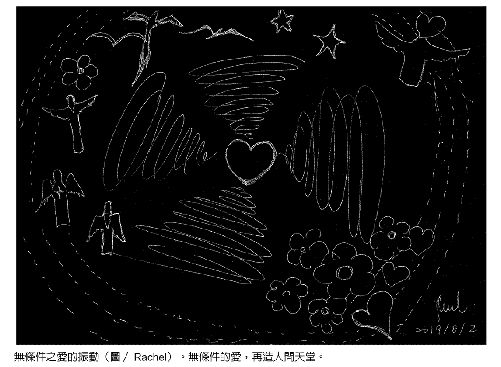

 第十项工程：与未来的自己合一

我：阿乙莎，盖娅母亲引领我去看见宇宙生命的运行之道，原来生命最初的振动就是爱。绕了那么一大圈，历经千百万年，我们只是透过生命不断地在体验爱；爱的振动将我们从爱中自我分离，我们每一个分离的个体不断地渴望找寻爱，直到认出自己就是爱。忆起自己就是爱的种子，具备爱的振动频率和足以穿越时空的爱的能量后，我们还可以自由选择是要回归到最初始的爱，或再次展开新的体验旅程。这真是宇宙伟大精密的运行设计。

阿乙莎：你终于明白盖娅和你讲这么久，就是为了唤醒你们内在本有的爱的能量。还记得她提到生命最初始诞生的那个氢元素 H 吗？那个元素一开始分离自己，创造出自己的镜像，就是爱的萌芽。你们透过分离的意识去体验爱，当 H 元素试图从自己的分身上找回爱的感觉，就创造出今日爱的大千世界的景象。这个世界，乃至这整个宇宙都是爱的振动创造出来的，你无法找出任何一个物质、粒子、原子、分子或元素里面没有爱的能量。
就在你仍然对自身拥有的爱的能量视而不见时，生命会遭遇一次次的冲击，透过你身旁最亲近的人事物不断地提醒你，刺激你的情绪神经。那些也都是你自己内在ＤＮＡ设定好的生命蓝图，是让你找回自己就是爱的邀请。而若你依然故我，依旧不理睬爱的邀请、不愿意相信那里面可以遇见爱，最终，生命会透过死亡让你瞬间链接回到爱里。死亡是让你们再次遇见爱的神圣礼物。
爱不只存在你的物质身体里，当你搭乘邮轮、进入平行时空，你也再次经历到爱的意识可以超越你的物质身体和时空的限制，那是让爱的振动扩展开来后的美妙体验。人类从脱离母体开始，就忘了自己身上拥有爱的能量；你们被自己创造的社会和教育束缚，忘记自身的爱就能够带领你们穿越生命的枷锁和心灵的桎梏，展现无比的创造力。
盖娅，你们的地球母亲，不断提醒地球上的人忆起自己就是爱，不要再被自己的小我意识设下的虚假屏障所困，也不要只为了寻求物质上的极致满足而任意破坏自己生存的地球。人类不需要更多爱的替代品来彰显自己值得被爱，因为你自身就是最纯净的爱之能量所组成的那颗爱的种子。
现在，你看见生命和宇宙的运行之道，也看见自己拥有爱的能量，你可以有两种选择：
一、回到最初的振动里，融入爱的宇宙。
二、让无条件的爱继续扩展，唤醒身旁尚未忆起自己就是爱的人，大家一同回到爱的怀抱里。那也是通往爱的极致体验的道路。
这两种都是你们可以自由选择和体验的道路。生命依旧会回到爱的振动里，那就是一直链接着你们自己的最初与最终的合一旅程！
进入新地球的关键时刻大约会落在二〇三六年。你们在经历地球多次的能量调整后，会有更多人觉醒；你们的松果体会自动苏醒，而苏醒的松果体会引导你们的身体细胞重组成新形态的ＤＮＡ结构，这些新人类的ＤＮＡ组成将延续人类生命，进入新地球的振动频率中。此时，你们将进入新地球展开新生活。尚未有效打开松果体、启动ＤＮＡ重组过程的人虽然无法提升自己的振动频率，也不用担心，会有更多使者前来地球帮助尚未完成校准更新的人继续前行。
当第一批新人类接轨进入新地球时，地球就会形成两个世界，一个是属于光的世界的场域，另一个则是旧地球的再次试炼场。进入地球光的世界场域的人将启动新生活，不论是政治、社会结构组成、经济活动、健康医疗、教育文化或娱乐，都会展现不同于旧地球时期的样貌。这些新地球景象如同文艺复兴般在世界各国开枝散叶，国与国、人与人之间的疆界逐渐消失，取而代之的是光的大同世界，一片祥和安乐的荣景。

我：我无法想像短短二十年内会发生这么大的转变，有可能吗？

阿乙莎：当然有可能。你们只管选择活出自己更高意识的样貌，那早已存在你们每个人的心中，你们只是需要忆起，并带着自己走入新世界的轨道而已。

我：可是，你们之前跟我说新地球在一百五十光年之外，我以为不会是在现在的地球啊。你们不是一再提醒我们，现在的地球已经偏离银河轨道了？

阿乙莎：一百五十光年外的新地球，就是你们目前地球的振动在量子宇宙之外的时空中呈现的镜像。你们正逐渐拉近和自己投射的镜像之间的距离，当现实与你们投射的镜像合一，你们就会进入新地球的实相里。

我：我实在无法理解。可以告诉我具体行动方案是什么吗？要如何展开新生活？

阿乙莎：当你明白无条件之爱的核心的“无”并不只是空无，而是你已经到达无条件的爱，回归宇宙之心，接下来，就是要让自己与未来的自己合一。你们如果只是想像，是无法到达的；将想像化成具体行动，让自己和所有人一起随着意识的扩展实践新生活，你们就能顺利完成新地球的启动工程。
当你们终于明白地球的今日是人类无意识生活导致的偏离景象，就来到解救自己家园的时刻了。在此，我只能给全体人类一个最诚挚的提醒：你们不是只有这一世的地球生命体验；离去之后，你们也不一定会再次回到地球。倘若相信自己有来生，还有下一次的生命体验机会，你还会愿意来到地球吗？若你的答案是否定的，觉得受够这里了，绝不再回来，那么我可以跟你保证，不论你出生在哪里，你的下一次体验绝不会比现在的情况更令你满意。
若你的回答是，“当然，我一定要再回地球，这里有许多家人和美好的回忆，我期待再一次和大家同甘共苦”，那么恭喜你，你一定会再次回到心心念念的家园。此时，你希望迎接你的是什么样的家园景象？你现在又为了这个心心念念的未来家园，做了些什么准备？
看到没有？不论你喜欢或不喜欢这里，你实际上都正在创造延续自己未来生命的基地；你们无时无刻不在显化自己的未来。现在，我要你们暂时忘掉外界的一切纷扰，回到自己身上，重新和自己的未来校准，对自己大声说：
“我，ＸＸＸ〔自己的法定名字〕，现在已经于地球毕业，即将前往下一站的生命旅程。请现在就让我为了更好的自己，显化出我的未来世界。”
接着，进入自己的内在宇宙，用内在之眼看见你为自己擘画的下一次生命体验的场景。现在去记录下来，记下那属于未来的你的生活样貌。

我：我未来会生活在没有战争、饥荒、种族纷争的世界。在那里，大家不需要为了得到一份工作，勉强自己去学没有兴趣的学科，也不用因为担忧金钱，而让自己做着重复、枯燥乏味的工作。竞争只是游戏，生活中没有尔虞我诈、优胜劣败，每个人都具备真、善、美的灵魂振动品质。环境中充满滋养每一个生命的元素，我们可以轻易从阳光、空气和水中取得那些元素，生命被地球母亲和宇宙无条件地滋养着。
我们活着就只是为了歌颂生命的光和爱持续展现，我们可以自由创造美丽动人的景致，回馈给地球母亲和宇宙。人和动植物可以相互沟通，为了创造共同生活的美好环境和展现每一个动人生命的价值，人与动物彼此照顾、相互守护。不论小孩或大人，每一天都在欢乐的庆典氛围里。我们可以活得很久，生命的结束不会是因为意外，也不是因为身体需要汰旧换新；生命会随着每个人的自由意志决定去留，没有任何疾病和细菌可以剥夺未来人类的生命……
这是我对未来生活的期待，我内心深处的声音。

阿乙莎：很好。就从现在起，你要与未来的自己合一，让你的意识振动链接上未来的你，这样你就可以帮助在目前的地球上创造出未来世界的生活样貌。

我：如果这些只是我内心的渴望，而每个人渴望的未来世界都不相同，那么我们会集体创造出什么样的未来？

阿乙莎：孩子，你们将共同显化出彼此都渴望的未来世界。这已经存在你们的内在意识里，早已生根发芽了！你刚才只是将它投影出来，让现在的你知道已经有那么一条路，正带领着所有的地球人类前往。你们并不是分离的个体意识，而是一体的存在意识。

我：谢谢祢让我看见美好的未来世界就在我们自己身上，在我们那看似遥远又如此贴近的内在宇宙里。我爱祢！

＊ ＊ ＊

地球改造重大工程

第一项：创建光的链接信道

第二项：打开新地球天堂的路径

第三项：传爱下一代——阿乙莎未来学校

第四项：播下爱的种子——培育新地球的植物王国

第五项：穿越平行时空，当下回到爱

第六项：让爱向上延伸，向下深耕

第七项：为地球祈福

第八项：身体重新校准

第九项：散播无条件的爱

第十项：与未来的自己合一

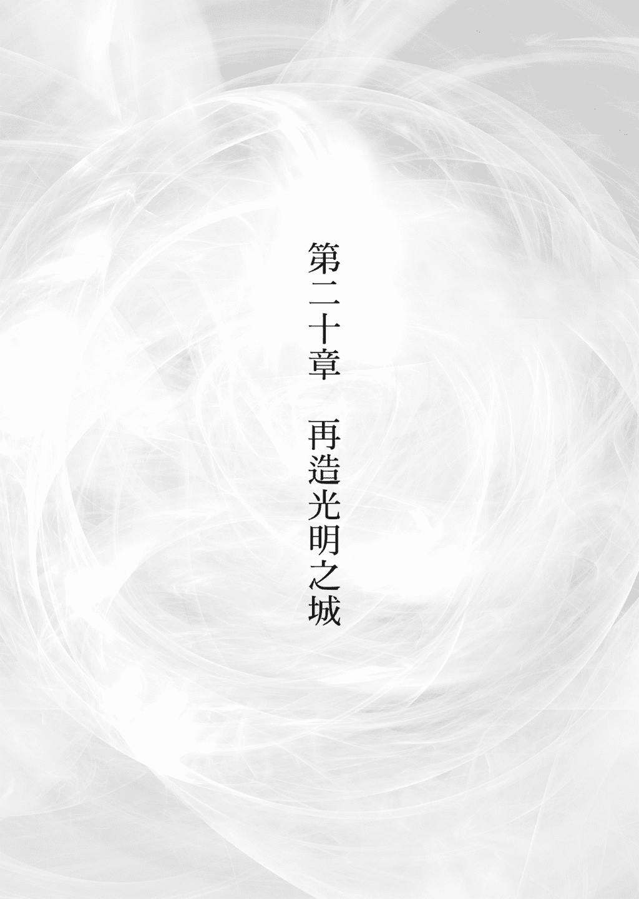

（编按：本章皆为阿乙莎传达的讯息。）

 让内在的爱往外延伸，建造光之桥

现在是帮助地球建造光明之城的时刻，我要向你说明如何打造光明之城。你先回想自己从小到大曾经有过的爱的感觉。

喔，让我回想一下。从小到大，我当然有许多爱的感觉：我很爱我的爸妈和家人，还有家里的小狗；我爱天空千变万化的云，我也爱吃、爱玩、爱穿新衣、爱到田里玩干稻草……我一直这么爱着身旁所有的人事物，直到走入学校、社会。我的爱似乎被自己封锁，我变成希望被老师关爱、被同学喜爱、被长官认同、被男朋友爱恋、被同事支持、被老公爱护……

你有没有发现，你身上这股爱的能量在进入学校和社会以前和之后的流动方向改变了？从小，这股爱的能量就这么自然地从你内在升起，你会不由自主地让爱的能量向你身旁的人事物延伸、扩展。你愈爱，就愈快乐；爱愈扩展，你开心的程度就愈高。

曾几何时，在你踏入社会，进入你们人类自己创造的社会结构之后，这股爱的能量开始转向了。你希望从外面得到爱，从你的导师、同学、男／女朋友、社团、组织、长官、同事的眼里找到爱；你从一个发送爱的人，变成寻求爱的需索者。这就是目前地球的集体业力。一旦寻求爱失败了，你就向下沉沦，进入痛苦的循环和深渊里；只有在你成功穿越，或是在你一直找不到爱的理由，不得不回到自己身上，回头看见自己时，你才会再次遇见爱。孩子，你是否看见这中间的问题了？差别在哪？同样是爱的能量，只因为流动的方向不同，就创造出两种世界。

只有当你让爱的能量向外流动，你才会有爱的感觉；从外面寻找爱，你不但苦苦找不到爱的感觉，反而进入无底的暗黑深渊，让你的内心遭受千疮百孔的伤痛。这是宇宙能量运行的法则，只有付出才能得到。你就是自己和宇宙能量的中心，当你的中心呈现最大的斥力场，你就能让存在你内在宇宙的爱的能量向外扩展；你中心的斥力场愈大，你内在感受到的爱的能量场就愈大。若你内心呈现需要被爱的引力场，那个寻找爱的意念来到你心中，原本带动爱的能量向外扩展的那股斥力就产生能量坍塌；你愈将需要放大，引力就愈大，坍塌程度就愈深。你看到自己内在仍是空无一物，但你此时的能量中心已经向下沉沦，这股吸力会让你陷入无底深渊。

你们若是需要将自身能量向上提升，就必须创造出帮助自己扩展向上的斥力场，让中心空无的无形斥力从你的内在不断向外扩展，直到契入宇宙之心。然后，你就会因此创造出链接地球和银河宇宙的光之桥。

啊！光之桥，之前雷巴特和莎雅建造了一座宇宙光之桥。

没错，这座光之桥就如同你的灵性父母当时搭建出来的宇宙光之桥，是要帮助地球迈向扬升的道路。

我终于搞懂这是怎么回事了！所以，人类往外创造出的花花世界误导了我们爱的能量流动的方向，那些创造物吸引了我们的注目，让我们将自己爱的能量投射到那些人事物上，但我们投射出来的是引力，不是斥力。我们因为想要在自己身上复制同样的美好，不知不觉将自己的能量场转向了。我们一进入社会就开始无止境地追求金钱、名利、权势，以及光鲜亮丽的珠宝、豪宅、名车，将提升自己爱的能量流动的斥力，拱手让给这些替代品，让给毫无生命的物质，将自己的心凿出一个大黑洞。这个黑洞充满强烈的爱的吸引力，让我们一世又一世去寻找自己身上的爱。

阿乙莎，我觉得自己好蠢，怎么到现在才明白自己身上就是爱的源头？要体验自己身上这股爱的能量，当然要从里向外投射，让能量流出，我才能体会到啊，从外面怎么可能找得到自己的东西？外面一切的显化都是虚拟实境，我们被自己创造的虚拟实境困住了一辈子，喔！不，是好几辈子。

怎么办？现在我看见很多人都累了，没有力气去找到自己身上的爱；更严重的是一堆的忧郁症、心脏失去正常运作功能的病患，这些人该怎么做？

只有转动这些人的能量流动路径，回来从自己身上投射出自身原本具足的爱的能量，才能扩展和提升他们的场体，再造生命的活力。靠药物支持或依赖别人给予更多的爱和关怀，是没有帮助的。若仍然无法让爱的能量流动转向，这些人就会进入无底黑洞中；而当进入最底部、最终点，他们内在就会看见一道曙光，那是重十自己爱的能量的窗口，他们也就能再次回到光与爱中。

阿乙莎，地球上有许多宗教都走上这条苦修的道路，当年释迦牟尼就是最传奇的经典，让人们传诵不已，成为修持的典范。但这条黑暗之路真的好苦啊！这一路上真的非常拥挤，一堆灵魂正在路上受苦。

这个场域就是现在的地球啊！那是人类数百万年累积出来、创造出来的金钱帝国虚拟实境。你们以为金钱堆砌的繁华景象，是定义人们功成名就该追求的道路，其实你们正在创造人间地狱。你们的灵魂被困在自己挖掘的坟场中，上刀山、下油锅，任何可以让人更苦的方式，都被你们自己投射出来。那些地狱景象并不是地狱之神创造出来惩罚人类的酷刑炼狱，而是人类自己创造的幻境。这些幻境和极致奢华的花花世界是一体的存在，你们有多大的狂欢天堂，就有多大的黑暗深渊。这些体验创造的虚拟实境，是人类体验爱的过程中创造的赝品，你们无法找到任何物质可以代表爱。

照这么说，如果我们只要通往好的体验的道路，不要坏的体验方式，根本办不到。除非我们如如不动，没有任何念头产生，不然我们身处地球，依照量子世界的能量运行法则，一定会有地狱的，是吗？

当然不是这样。刚才跟你讲过，你们内在就可以建造光之桥，这个由你们内在的爱向外延展所创造的爱的链接，会成为地球和宇宙之心的桥梁。现在你自己去感受一下，如果每个人心中都可以用爱创造出这座光之桥，还能让光之桥彼此链接，通往宇宙各个星门，你觉得会是什么景象？

是皎洁明亮的光明之城。

是的！从自身爱的能量扩展中，搭建出一座光明之城，你们就能带自己进入银河新地球的行列。

来自阿乙莎的结语

现在你已经明白，人类的内在宇宙拥有无穷的资源可以帮助自己，同时也可以帮助地球恢复生态环境的健康。人类是地球上最重要的创造者，也是推动地球迈向下一个文明的关键领航者。然而，从目前地球环境崩坏、天灾人祸不断的情况看来，若没有从人类自身做起，是无法让地球崩坏的现象减缓的。

这已经不是盖娅第一次传讯，你们该回到自己的内在宇宙，重新校准。盖娅无法再任由人类继续破坏地球，自体校准的行动已经展开，不再等待人们的觉醒和反省。

这一次的传讯提出了具体行动方案，告诉人们可以如何帮助地球，其中最重要的一点，就是要人类恢复爱的能量。这是地球母亲盖娅最仁慈又卑微的要求，希望人类这一次真的听进去，不要再让地球看着人类的沉沦而哭泣。你们身上都拥有地球母亲赋予的爱，现在只须重启这份爱，来回馈你们赖以为生的地球。

完成此次盖娅母亲的教导，你就会清楚知道生命来到此的意义为何。你们每个人在这里最主要的目的，就是要活出爱的能量，并用爱的能量创造和显化出你们期待的新地球生活。当你在爱中，自然而然会活出健康快乐的人生，还可创造美丽的地球景象；而当你偏离了爱，与爱的距离愈来愈远，别忘了，能够帮助你回到神之汤的力量，和那把进入爱的能量的钥匙，仍然在你身上。

每个人内在都拥有神的意识，那是神在创世之初就散播到地球上的无条件之爱的种子。那些种子创造了你，是你们每个人生命的原力，遭遇挫败或失望时，就要打开你内在那股无条件之爱的能量，重新为自己的生命导航。

若每个人都回到从爱自己开始，就能让爱在地球的生命之花绽放，也可以为自己找到回生命源头的道路，重现生命的光和爱。请不要吝于分享生命的光和爱给身旁的人，因为你们早在宇宙帷幕的这一端就说好，要互相扶持走完这趟生命旅程。你们都是来自银河宇宙的光明战士，要透过彼此身上的光，相互辉映出一条迈向银河的道路，而你们也要为地球万物建造光彩夺目的新地球光明之城！

祝福地球所有的孩子，希望你们活出生命的光，让爱在地球再次闪耀！

［附录］

与阿乙莎的Ｑ＆Ａ

地球现况给人类的讯息

我要来告诉你目前地球面临的状况的解决办法。

祢是指新型冠状病毒？

当然不只瘟疫，目前的问题还有森林大火、非洲蝗虫侵蚀农作物，以及更多的流感病毒传染。最终你们会看见，这些事件已经不是单一国家、单一国际组织可以解决的问题；这些问题会持续扩大，人类最终会束手无策。

这些问题会持续影响人类到何时？

如果人类没有做出具体的改变，会一直持续下去；只有当你们眼见更多的人死去，僵固封闭的大脑才会被敲醒。现在，我需要你记录我以下的讯息，传递出去。

好的，请说！

这世界需要改变，而改变的时刻已经到来，不再让人类主导地球的生命。

要如何改变？

你们将看到新的意识领导全人类！这个意识领袖不具备人类的形体，而是一股能量流，这股新意识能量已经进入地球轨道，等待人们对焦。在接下来的日子里，伤亡人数会持续攀升，你们无法以任何手段阻止地球的转变，虽然目前各国当政者都寄望疫苗可以解决地球风暴，雨季可以熄灭森林大火。

我用“风暴”来形容，正是说明它来得很快，没有理由地夺走人类的生命及财产，但它也终将离去。即使目前让所有人措手不及，你们仍然可以在此风暴中安身立命，让自己全身而退。你们必须让自己进入风暴之眼。

风暴之眼？如何进入？

你们可以链接这股进入地球的新意识能量，就能顺着这股能量进入风暴之眼，穿越这场风暴。

请你们从现在起，天天念以下咒语，直到眼前的风暴解除。

“MO HO MO HA NA NU MI DA”（摩 诃 摩 哈 拿 努 密 答）

念十次。

第十一次改念：

“NA MI NU WA＋自己的名字”（拿 密 努 哇＋自己的名字）

（扫描下面的 QR Code，可链接到念咒示范音频。）

我刚才念完了，只觉得头部没有那么大的压力了，身体稍微轻盈一点。这几天身体真的感觉不舒服。

很好。告诉人们可以从现在起每天念这个咒语，进入风暴之眼。愈多人的意识穿越进入，愈可以帮助提升并超越原来的意识维度。

念咒语就可以转化意识，进入风暴之眼？我不得不说这有点奇怪，若不会念或不想念，难道就无法穿越这次的风暴吗？对不起，我仍需要一点科学精神来看待这个咒语。

只要愿意尝试并信任，就已经进入新意识的重新校准。这是帮助你们与新意识校准的方便法门。若面对地球现状仍让自己处在爱与喜悦中，自然不需要念此咒，这样的人早已明白宇宙的真理，早已到达爱的振动；但针对无助和恐慌的人，请将此讯息传递出去。

谢谢祢，阿乙莎，我会传递出去！

（请注意：这是阿乙莎传递的灵讯，仅供参考，请勿以此咒当作抵御病毒或疗愈病症的方法。若你受到病毒感染，请进行自主管理，并寻求专业医疗诊治，以上讯息无法取代专业医疗。）

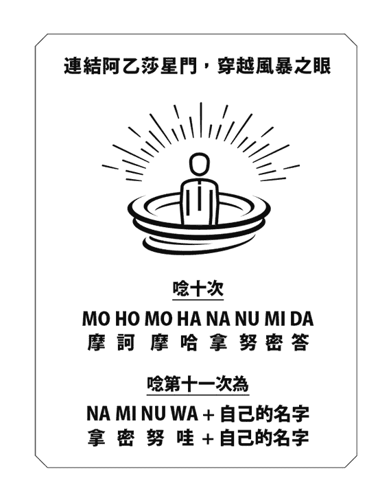

＊ ＊ ＊

阿乙莎，谢谢祢传来穿越风暴之眼的咒语，很多人发现这个咒语的能量导入人体非常快速有力，即使是一些对能量感知较弱的人，念一回也都有感觉。是否可以让我进一步理解这个能量来自哪里、我们要如何看待？

这是目前进入地球光子带的一股强大的能量流，这股能量来自五亿光年外的宇宙，是为了帮助银河系诞生新星球而来的纯净宇宙能量。地球上的人可以透过冥想、念咒，让自己快速链接这股能量。

不只地球人类可以感受到，包含地球上所有的动物、植物、海洋生物、森林、矿石和地壳下方的微生物等，众多物种都可以链接这股能量。这能量可以帮助银河系的轨道产生新的路径，以容纳非银河系的星球加入。这是五亿光年才会产生一次的星际轨道移转计划，而地球在此时期也可以借由这股能量的导入，从一个襁褓中的婴儿成长为独立的青年，地球会依原订的星球成长计划迎接新人类的集体意识到来。

现在把这个咒语传递给人们，希望更多人去链接，并帮助地球再生新的振动频率。而在这股能量快速导入并冲刷地球磁场的阶段，一些已经意识扬升的灵魂会选择离开磁场无法与之相匹配的环境，决定迁移至新的星球或不同的维度去体验。此物种迁移的过程在你们的眼中看来，似乎是一场场的死亡与现况崩解，而此时来协助地球扬升的灵魂大师们，也会从自己的地球灵魂种子唤醒其肉身存在，以帮助尚未在地球维度觉醒的人进行意识和生物体的重新融合，好让目前地球上的人类和其他所有物种都能无缝接轨，进入新地球的振动里。

这股能量会从二〇二〇年起持续灌注银河系，直到移转结束，预计会在二〇三六年全数完成。因此，目前地球的崩解乱象是必经的过程，如同毛毛虫要蜕变成一只美丽的蝴蝶之前的准备。

至于目前无法与这股能量顺利融合的人，不要过于恐慌，担忧自己无法完成，你们的身体细胞需要时间将原本沉积的噪声清除，才能容纳新的细胞和新的振动。这本来就需要一段时间的蜕变，因此，请给予此时眼前所见的纷乱与旧系统的解构足够的信心和勇气，相信这一切的黑暗是必要的过程。你们从未失去，也没有因遭受生命财产的损失而让自己的灵魂消逝。你们的灵魂意识早已适应过千百回的混乱，历经许多苦难，才会雀屏中选，于此时此刻来到地球，帮助地球的集体意识扬升。

你们要对自己有信心，看不见的帷幕那一端正在光明中等你们凯旋归来；不要担忧、不要害怕，你们必定会进入光明的彼岸。我希望在此时让更多人理解，愈多人链接上这股新意识能量，就愈快可以让地球晋升为银河系中一颗壮丽的星球。

我们早已帮地球备妥新人类意识的生命种子，从二〇二五年起，你们会看见这群新人类开始帮助地球穿戴上新的容颜，从森林、山川、湖泊、陆地到海洋，都会被新人类妆点出新地球的天堂景象。这些新色彩的出现会让所有人耳目一新，因为你们从未在过去的光谱中看见这些瑰丽绚烂的色彩。这些色彩会率先在地底下和海洋中被发现，那是银河系和众多星际存有欢迎新地球到来的赠礼。

地球时间的长河从未背离它的韵律，此时此刻的地球人类将亲眼见证从旧地球跨入新地球的光辉照耀大地。祝福所有的人！

＊ ＊ ＊

阿乙莎，请问祢传递的“穿越风暴之眼”这句咒语有何意涵？

“MO HO MO HA NA NU MI DA”的意思是：“啊！我勇敢的灵魂勇士们，一起向前冲啊！光明就在黑暗之外等着你们！”

“NA MI NU WA＋自己的名字”的意思是：“我，ＸＸＸ〔自己的名字〕，带着我自己到达。”

感谢祢让我更明白这个咒语的字面意思。我自己念完后确实就可以进入更宽广光明的状态，意识和身体觉得更轻盈了。我们真的可以念这个咒语来免除目前风暴的伤害吗？

当你自身的振动频率提升，变得更加轻盈时，那些低频的存在就无法与你共振，当然就会远离你的场域。

那么，地球目前遭受的瘟疫、森林大火等大自然灾害和乱象都是怎么形成的？

这些现象是地球目前最需要的。宇宙只能给予你们所需的，不增不减，一切都是完美的呈现。

喔！不，不要说这些灾难是完美的呈现，我不能接受，更不想碰上。

人类创造的低频振动需要这些能量来帮忙清理。当你们身上吸附着挥之不去的厚重低频意识时，你们共同创造的集体意识场就会在地球的物质实相中显化出来。这些现象不是毫无缘由，都是人类自己创造出来的。

瘟疫，就是“贪”的显化。你仔细看进去，这个“贪”背后的动能来自“恐惧”——人们因为“恐惧”才会“贪求”，因为害怕不足、害怕无法生存和竞争，而演变成不计代价向外暴取豪夺。

而森林大火是“冷漠”的显化。冷漠背后的动能是“自私自利”的意识扩展所凝聚出来的——当人们不再需要群体生活，对社会漠不关心，不愿意伸出援手帮助别人和其他物种时，就会让森林之火再度燃起。这把火可以打破人们自私自利的现象，点燃关心他人和其他物种的意识，让已经冷漠的社会重现生机。

至于地震和海啸，则是“征服的欲望”所显化的。这股征服的欲望，其源头是人类自古至今一直挥之不去的“生存危机”意识。人类不断向大自然宣告自己才是地球的主宰，展现自己的强大，不断侵犯其他物种和海洋生物的生存权利，于是导致地震和海啸的反噬。那是地球生灵对人类的小小警告。不要再放肆越界，人类必须回到敬天爱物，视天地之间的所有生灵为家人，也必须明白自己是被地球母亲无条件照顾和豢养的子民。

而近来非洲大陆蝗虫肆虐，造成农业损害，这是人类“盲从”的显化，源自人们“无意识地活着”，以为只要顺着别人的指示生活，就可以安身立命。人类是神在地球的造物者，人们只有从无意识状态中苏醒，才能为自己的生活和这块土地创造美好的未来。

地球目前的这些灾难，都只是反映了人类的低频意识。没有这些灾难的清理，很难让沉睡中的人们改变原有的振动频率，冲破僵固的行为——这些行为的产生并非一朝一夕，而是在人类生生世世的体验过程中滞留的能量。现在，当地球母亲需要转换轨道、提升自己的振动频率时，就必须清理这些停滞不前的能量。

在此过程中，你们只要愿意持咒，就可以快速抖落身上的低频能量，契入更高的振动频率中。

这听起来像是没有教徒弟学会站桩、做足基本功，就要给他们尚方宝剑挥舞啊。这样的方便法门是否又会宠坏人们，未来会让地球母亲更头疼？

孩子！不要担心这么多。能够乖乖地每天念，有觉察到自身意识维度的，都是已经准备好要扬升的人，只有这些人会自动自发，愿意毫无理由地带着自己前进。而这些人既然已经准备好了，就不会想再回头的！

那么，对于目前地球的灾难，我们还可以做些什么？

安定你们自己的心，提升自己的振动频率，就是在帮助地球母亲转型。祝福我所有勇敢的孩子！

＊ ＊ ＊

阿乙莎，请祢进一步说明“MO HO MO HA NA NU MI DA”这个咒语。有些人因为念此咒而有穿越地球帷幕的体验，有些人虽没有具体感受，也愿意持咒，请问我们需要抱持什么样的信念或展开什么行动，来面对持咒后的体验？

这个咒语可以快速净化意识，让人们的意识维度超越地球现况，所以一些可以用第三眼看见或感知到非物质实相界的人，当然可以看见光的世界的景象。然而，这些景象对身处地球维度的你们来说，只是满足小我的好奇心而已。

地球人类的任务仍要放在提升自己的振动频率，帮助整个地球环境脱离混乱的二元对立，这是你们在此体验地球生活的原因。若你们选择积极面对现况，并展开意识重新校准后的行动，这个咒语对你们共同生活的地球会有莫大的帮助。它能带领你们在混乱纠结的无量网中突破藩篱，保护你们的意识免受干扰，并以更清明的意识做出利益众人之事。

倘若你们只是好奇，或期望借此咒语让自己契入更高意识维度，展开自我探索，也是可以的。但你携带的意图若仅是利益个人或小我意志，最终仍会被高维度的存有识破，而不会与你再次链接。

开放此咒的意识链接信道，是因为地球母亲此时必须展开新轨道的校准。地球上方有许多光的世界的大师正在创建扬升管道，透过各种形式帮助地球，此时此刻接到这些讯息的人最需要做的，是让自己成为光和爱的管道——不带任何私人的偏见和欲望，为了全体人类和宇宙共同的福祉，让自己化为无条件之爱的管道。

此外，你们也会发现，借由咒语净化自身低频意识之后，就可以带着自己契入灵性源头。你们每个人都是神的化身，是更高意识维度的地球代表，在地球转换轨道的此刻，你们都可以透过此咒语穿越星际之门，辨认出自身灵性源头所在位置，并与自己更高次元的意识存在合一。

要到达这样的意识不须透过观想，你们只要念完咒后静心，迎接光的临在，感受到自身场域被清理、净化、转换和提升。大约只需要静心三分钟，你的意识就可以到达自己的灵性源头；接着，请不要吝于让宇宙的光和爱透过你的身体，传递给你赖以生存的地球母亲。

练习：让自己成为光的管道，帮助地球校准

1.念一回合咒语。

2.静心三分钟，让意识提升、转换场域。

3.以意识引导，将充满内在的无条件的光和爱传送给地球之心，让爱从心轮朝身体下方移动，一直向下穿越海底轮，直指地球之心。此时，你就帮助完成地球和宇宙之心的校准了。

＊ ＊ ＊

阿乙莎，自从开始念这个穿越风暴之眼的咒语，我每天的睡眠似乎变成可有可无，晚上只睡短短一、两个钟头就觉得活力充沛，以往的身体紧绷和因为写作造成的肩颈酸痛都消失了。请问这个咒语到底对我的身体起了什么作用？

当你持念穿越风暴的咒语时，你身体的光场会立即被启动，并与自身的灵魂本源链接。这个咒语来自宇宙至高的源头，它能跨越宇宙所有次元的灵魂意识存在；透过这个咒语，不论你目前的灵魂组成来自哪些不同的元素或区域，都可以同步获得校准。念咒的同时，还会有源源不绝的宇宙能量注入你所在的位置。

这也是银河宇宙为目前的轨道更新打开的星际之门，你可以称其为阿乙莎星门。那是来自你灵性源头的家的呼唤。现在，你将这个咒语无条件地传递出去，所有人只要持念此咒，就可以立即获得宇宙能量的更新与链接；更重要的是，这股能量会帮助人们打开ＤＮＡ的封印节点，让人回复初始完美的灵性之光存在状态。这也是在打开让地球迈向新轨道的一部分重要能量。

在接收这股能量的过程中，你的细胞会完全苏醒，所以你非但不会觉得疲累，你的细胞反而会充满普拉纳之气，加速你身体的新陈代谢，不论是原本阻塞的循环系统，或是正在顽强抵抗的免疫系统，都会因为宇宙能量的注入重获生机。

你的精神更好，细胞恢复健康，骨胳中充满活跃的免疫Ｔ细胞。此时，你的整个存在变成地球场域的一座明亮的光之柱，你成为能量传输管道，正在帮助周遭环境和人们同获来自宇宙的无条件之光和能量。宇宙的能量是永远不虞匮乏的，也只有内心光明澄澈的灵魂勇士可以获得此咒带来的能量。

你可以在需要的时候尽情享用它，让宇宙能量立即为身体场域带来提升和净化效果。这股能量会透过阿乙莎星门持续传送给地球上所有的光之工作者，它可以保护你们，并充盈你们的光场，直到完成阶段性任务为止。

这样我更明白了。谢谢阿乙莎，也感谢来自阿乙莎星门无条件的爱！

＊ ＊ ＊

阿乙莎，对于先前延烧多时的亚马逊森林大火，地球想要传达的是什么样的讯息？

这场大火让你们所有人将目光从经济、政治和娱乐的话题移开，转而关注自己生活的地球是否还健康，你们终于愿意正视地球母亲已经生病的事实。当地球需要自体疗愈时，自然会经由水火来平衡和调节。我将从以下四个面向来谈这场大火对人类的意义。

一、环境面

现在生活在地球上的人未曾经历全球性的大洪水、干旱和饥荒，但这是地球上一次冰河期前常见的景象。当时有一半的人类和动物死于无法供给食物的大饥荒，地球因此被迫进入冰封的冰河期，以降低细菌和瘟疫的蔓延，免得造成更多人类和动物灭绝。人类如今衣食无虞，却不知道自己居住的地球环境正面临更严峻的考验。

这次的亚马逊森林大火对整体地球环境、对人类而言是件好事。这个过程会牺牲许多动物与植物的生存空间，却可以让地球提供更安全的大环境给人类。一些蠢蠢欲动的亚马逊超级细菌会被这场大火消灭，取而代之的是新的植物生态系统被创建起来。这是地球母亲的智慧，为了新地球生态系的诞生而铺陈了这些事。你们不必担心地球母亲的自体平衡智慧，过度的担忧无法帮助地球母亲。

二、经济面

这场大火会让人类对全球经济发展创建新的思维。你们不会再以生产更多商品作为经济发展的成长指标，过度消费和耗损大自然资源会被许多觉醒团体视为违反生态平衡的邪恶经济，人们会开始有意识地消费与选择，并站出来抵制过度浪费和耗损大自然的行动。

三、教育面

面对频繁上演的气候异常和大自然灾害，许多生态专家将无法做出更精确的评估和预测。地球重新取得平衡的过程和范围之广，不是任何单一学科，例如海洋、植物、生态、地质或气候方面的专家可以解释的，你们终将臣服于大自然给人们的教导，承认人类对生态的认识十分肤浅而局限。政府和研究机构会开始将观测地球生态健康这件事视为国家成长的重要指标，人类终于认同，没有健康的环境，就无法创造强大的经济实力。

四、医疗面

人类过去将太多资源放在医疗体系和化学药物的发展，每年花费的医药研究经费远远超过栽种健康食物的研究经费，然而，人类以对抗性治疗方法发展的医疗系统已导致生态链的断层，并对生物体造成更大的破坏——你们创造出更难以对抗的超级细菌，危及人类自己的生命安全。实际上，疗愈人类身体最好的来源，就是大自然供给的食物。针对所有人类身体会产生的细菌，地球母亲早已提供相应的食物疗愈方法，结果你们非但未善用大自然赋予的疗愈泉源，反而不断制造加工食品，破坏人体和动物的健康，同时也将大地的疗愈智能系统破坏殆尽。

这场大火会让人们重新省思在经济、教育和医疗上该如何改变，以创建更能让人类与地球和谐共生的循环系统，创造出新的平衡。

这是一场必须发生的大火，地球母亲需要让新地球种子发芽——不只是森林的种子，新地球的意识种子也必须在人类心中发芽。在这个地球调整的过程中，除了跟随地球母亲的步伐同步调整之外，人类也要开始迎接新合作思维的时代到来。

你们无法再将自己的生存创建在践踏别人的土地和伤害地球环境整体平衡之上。当地球母亲要平衡新生命的诞生时，谁都无法阻止宇宙生命的演进法则。亚马逊森林将会重生，人类也终将看见，新地球新的生态平衡需要人类一起改变。

关于进入内在宇宙，有些观念须再厘清

进入内在宇宙唯一的路径，是从自己的心轮开始，链接到自己的晶体。若是想求快速，透过外界的能量引导进入自身，不但无法确实到达你的内在宇宙，反而会因为依赖，造成自身中轴偏移，导致能量干扰或外灵入侵。你们必须先创建这个观念，才去做相关练习。

做畅通脉轮手指操的目的是先让中轴能量的管道通畅，然而，能够让你们顺利到达内在宇宙大门的是心轮，那才是真正的驱动发动机。一个心轮无法让爱的能量流动的人无法真正进入内在宇宙，反而很容易被小我创造出的假象欺骗。

一旦进入内在宇宙的大门，第三眼（松果体）的打开就是自然而然的事，不需要透过外力打开你们的灵魂之眼。那股链接宇宙的能量是由你们的内在升起，是心轮展开爱的振动引发的，你们内在就有此能力，不要向外寻求。

要突破小我设下的陷阱，不妨进行自我审查，就从自己的情绪体着手。若你在链接内在宇宙时得不到爱的能量，也无法让自己的小我安静，就不要试图进入链接状态，以避开来自小我的能量需索。你们无法看见的那股无形力量会将你带离自己的源头，偏离自己的中轴轨道。

“阿乙莎灵讯”系列书籍的文字本身即带有稳定中轴的能量，但若要到达内在宇宙之门，可向资深的灵性导师学习，并选择在能够链接到阿乙莎光源的光之场域练习为佳。光之场域必须经过设计，并完成与阿乙莎光源的校准设定，现场搭配合格的导师来稳定光场。

＊ ＊ ＊

阿乙莎，有位读者来信说，他阅读了“阿乙莎灵讯”系列书籍，随即尝试链接进入阿卡西纪录的场域。刚开始第一个月就得到高我的回应，那是充满爱与慈悲的链接；但进入第二个月，他陆续感受到外来能量的干扰，甚至听见男女对话，觉得有外星人和一些灵体在干扰，让他非常恐惧。虽然祢有提及在进入内在宇宙前必须先清理业力，并达到脉轮畅通、中轴稳定的状态，但人们总是会好奇，也希望能早日链接高我，取得无尽的宇宙智慧和资源。所以，当一个人在链接高我的过程中感受到恐惧和不舒服的灵体能量干扰时，该如何因应和面对？

这是你们在将意识扩展到身体以外的感知过程中，触发到内心尚未平衡的能量造成的。你们的潜意识中仍深埋着尚未抚平的创伤、愤怒、恐惧或哀伤的情绪，但你的小我无法辨识出这些被你压抑住的细胞记忆；而当你的意识逐渐扩展时，你会从内在的观照过程中看见这些仍存在你内心的情绪阴影。这些投射出来的黑暗能量会以身影、声音或任何足以让你辨识出来的方式，再次提醒你去看见。

此时，若你再次掩盖或不予理会这些恐惧或愤怒的负面情绪幻化出来的投射，是无法脱离黑暗能量的禁锢的。最佳的办法就是面对已经浮现的黑暗，用不同于你以往惯用的思想和行为方式去面对；同时，也必须先承认自己内在仍有一股尚未平衡的力量等待被你照见和抚慰。

这些幻化出来的影子或黑暗能量并未如你想像的有实质力量，只有你的认同才会赋予它们力量。你不妨用自己的内在意识去问问出现在你眼前、令你不舒服的能量：“你为何在此？你是否可以让我理解你是如何形成的？那件事情发生在什么时候？你可以帮助我看见和忆起吗？”当你愿意去了解它，它就会因为你的光的照耀，逐渐失去黑暗的力量。接着，你更需要给自己无条件的爱，去面对这份之前被你忽略的负面情绪。当你愿意以爱和勇气再次面对它，你就疗愈了自己和这段关系。

孩子，这世界充满各种尚未被你们自己平衡的能量，只有你们愿意给自己和他人无条件的爱，才能帮助净化自己和整个地球。

（阿乙莎的这段说明再次提醒我，我们以往过度依赖小我眼见为凭的世界观，因此，我们对眼前所发生事件的“想法”，会立即影响到我们选择用什么样的“情绪”来回应。若学会以更高的意识和全息化的角度去观照实相，并给处于事件中的自己无条件的爱和慈悲，我们就能看穿小我惯用的把戏，也就不会情绪性地回应眼下的所见所闻。

至于链接高我的过程中会见到魔鬼的朋友，请参考《阿乙莎灵讯》一书中的教导，完成自身的业力盘点，以及脉轮畅通、中轴稳定的练习。此外，在此摘录一段交通大学白曛绫教授链接高我意识时“与魔鬼的对谈”（出自白教授贴在“Bala 的科学与心灵观察角落”脸书粉丝页的文章），这段对话很精采，绝对会让大家对魔鬼有不同的看法！

Bala：亲爱的魔鬼你好，很久没有和你见面了，但最近我有几个朋友被你所困扰，因此我想要请问你，为何你会存在？

魔鬼：我知道你们都把我当成一个去之为快的对象，但很奇怪的，在西方思维这或许还成立，为何你们东方人已经了解阴阳并行的道理，却还是只想要白不要黑，只要阳光不要黑暗？
不过这也没有关系，反正我就是个人见人恨的大坏蛋，就连你们人类社会里的坏蛋也觉得我坏。他们嘴里讲仁义道德，拜关公就是不膜拜我，却利用我来帮他们做事，真的是很没有天理。
懂吗？我就是这样诞生的，从“没有人爱我”的能量而生，所以基本上我就是你们人类思维所诞生的孩子。
然后我想顺便骂一下，分明我是魔鬼，怎么透过你发声，却没有半点威力！
这实在是让我感到生气又沮丧，很想离开你的脑袋，不再发声。但上帝要我来，我只好乖乖在这儿说给你们人类听。
为何我会入侵某人的脑袋？为何我能进入Ａ，却不能进入Ｂ的脑袋？
你应该还记得好几年前，你还会暴走的时候，我就很容易趁虚而入，帮你咒骂人、帮你做出令你感到可怕的举动，然后再让你后悔不已，对吧？
那时候我挺快乐的，因为你给了我机会出来发挥一下我的能量。我可是很有能量的，而且我很会钻缝，只要是没有爱的地方，我就存在。

Bala：等等，你说没有爱的地方你就存在。可是我们不是都有上帝爱我们、天使保护我们吗？而你不也说是上帝派来的？上帝怎么会允许你这样做？

魔鬼：上帝没有允许我可以做什么，也没有不允许我不能怎么做，他只是创造出天使，然后我就也因应而生了。
西方世界说我是堕落的天使，那是狗屁话。我根本不是天使，而是天使的另一面。
好啦！你要说我是堕落的天使也可以，反正有天使就一定有我，这样上帝才会是完整的。
所以我必然存在，懂吗？你这臭小子。
我存在，因为你们不常与天使同在。
我存在，因为你们不允许爱单独存在。
懂吗？这都只是选择题而已，你选择天使或选择我，两者择一。
再不然就是只让爱单独存在。
上帝给你们人类选择的能力，而你们做出选择，要天使或要我？当你选择放弃天使或放弃爱时，我就来了。
这么简单的选择题，你们人类却做得哩哩落落。看到你们这么无能，我就想来接管了。
感谢你给我这个空间，让我发挥。
瞧，我可也是会感恩的，你让我进入，我感谢你。
我是人性化思想的结果，就像天使也是人性化思想的结果。
是你们人类决定要让天使或我成为你思想的产物。分明是你们有选择权，有能力决定该怎么想，却说成是我故意要占据你们的脑袋，将罪恶丢给我，要我承担，这实在不公平。他妈的！这会让我更生气，我也因此更有力量了！
感谢你们人类给我力量。
啊～你可以不要再感谢了吗？你愈感谢，我就愈难跟你连线，拜了！）

＊ ＊ ＊

阿乙莎，为何有人做了好几回业力图，还是无法到达内在宇宙的大门，无法链接高我？

无法进入内在宇宙有许多原因，其中包含：

一、小我意识高亢：当小我仍然锲而不舍地给你更多想法，找出千百种理由说服你要为自己出征、讨回公道，处于虚张声势的状态，让你的心无法平静时，你就无法到达内在宇宙的大门。

二、细胞病变，处于能量不平衡状态：当人的身体处于不平衡的状态，此时虽然有很大的机会觉醒，进入由心带领的状态，却也会因为身体不适，小我不愿意臣服于病痛，隐藏痛苦、强颜欢笑，而更顽强地对抗。一个对抗的心会更加锁紧自己，以为这样可以产生抵御病菌的能量，但事实上，放弃抵御，用无条件爱自己的能量让小我臣服在爱中，才有机会让黑暗的负面能量退去，然后让爱的能量流入细胞，产生自愈力。

三、情绪尚未清理完毕：很多时候是一些负面情绪被自己深埋起来而遗忘了，这时需要多练习自我观照。拿出纸笔，练习写日记，在写作中逐渐让情绪浮现出来。

四、业力枷锁：这是较难处理的课题，但有非常多人正处在这种状态。已经累积多次生命经历的老灵魂在重新替自己的新生命选择命题时，反而会设下天罗地网，设定困难度极高的考验，这也是许多灵性高级班的修行者会想替自己安排的道路。他们企图设下不只是先天，还有后天的种种关卡，来考验自己在这样的情境下是否依然能够找回爱。针对这类型的修行人，我会建议你直截了当地告诉他们：“若你继续写考卷，即使考了一百分，你却让所有参与你考试的灵性伙伴统统回不了源头，这难道是你成就了自己之后想要的结果？你回报给这个世界的是彰显自己的伟大，或是要成为照亮别人的路灯？回来吧，别再出考题给自己了！”

五、经历不足：有些人来自不同维度的灵魂意识，到地球来学习人类的法则，累积足够的生命经验。这些星球尚未拥有如人类的情绪体或创造力，所以特别想一再经验地球人类的互动关系，在此取得足够的体验后，回到自己的星球进行再创造。

针对上述，你会发现回到源头并不适用于所有人。你传讯的目的是带领人类的集体意识扬升，创造出更新后的意识种子，进入新地球，所以面对目的不同的人，你也不需要强求大家都回到源头。

关于黑洞

阿乙莎，人类第一次观测到黑洞（编按：二〇一九年四月，人类史上第一张黑洞照片首度公开，台湾的研究团队也参与了这项黑洞观测计划），祢可以提供更多关于黑洞的讯息吗？

你们认为的 M87 黑洞，只是星团内的一个小黑洞，还称不上是星系级的黑洞。星系的黑洞和整个宇宙的有形空间一样大，有时甚至比所有星系集合的质量更大。

用望远镜观测无法真正看见黑洞的边陲。你们从地球这端看见的黑洞旋转呈顺时针方向，但进入黑洞之后从里面向外看，就呈现逆时针，因此你们所在位置的白洞就是逆时针方向旋转。地心的位置和黑洞是相连的，可以透过地心进入黑洞中，再从黑洞诞生出新的星球。黑洞就如同宇宙星系间的清道夫，你们无法用望远镜看见黑洞的状况，却可以到达黑洞的世界。

我不懂要如何离开地球进入黑洞。

很简单，就是你离开肉身的全部意识，若有一部分意识不进入宇宙源头，就会流向黑洞中。黑洞的世界也如宇宙般浩瀚，可以透过地心的虫洞穿越进入。目前科学家看见的星团中的黑洞并无法承载具有意识的生命，因为 M87 星团无人居住，那里无法回收人类的灵魂意识。

你们的意识必须进入星系级的黑洞回收系统，才会真正明白黑洞之于人类的意义。你们无法以望远镜知晓其运作原理，用物理学也无法探究黑洞内的世界，这样的探究远不及运用你们的意识进入黑洞探索。

什么？用意识进入黑洞？意识会不会被吸进去就永远回不来了？

不会，你可以请求你的高我带你过去。

那么我来试试……

刚进入黑洞时，我并没有看见任何特别的移动生命，这里面呈现停滞状态，空无一物，但意识在此仍可以存在。虽然我的意识可以进入，但在这里啥都不能做。这里的意识都在干么？

这些被吸入的意识都在等着被净化，净化后的意识会和矿物质结晶一起融合成为新星球的一部分，并重新诞生在宇宙中。这些原本在黑洞里的意识在净化后完全失去动能，以固态物质形式出现；宇宙经由黑洞回收系统，诞生出最纯粹的新灵魂意识，出来体验宇宙。

为何手握水晶时可以看到自身晶体的变化？

手握住水晶时，为什么我们可以从晶体看到变化？例如手握住某个矿石，可以看见自己的晶体也在转变。

每一颗矿石都有晶体，这是宇宙最初始的所有元素暂时聚合的点。这个晶体是用来储存环境的讯息，你今天看见它的外观是矿石，其晶体就可以反映它所储存的环境元素最早的样貌。也因此，你可以从有些石头的晶体看见水元素，有些则会携带不同的元素，就看它储存什么样的讯息。

你可以经由携带不同元素的矿石进入，去探索宇宙和世界，“一沙一世界”就是这个意思。植物的晶体就比较复杂一点，携带的不只是这植物种子的环境元素，也包含生长过程的讯息，所以，植物的晶体长出来的结构就和你看到的单纯矿石的晶体结构不同。

动物的晶体就更多元了，类似人类的晶体，但其完整性没有人类的扎实。有些动物没有晶体，和人类的状况相似，它们这一次是来帮助净化大地，并协助完成整个地球的讯息更新。

若将不同元素的晶体放在一起，就可以链接组成一个新的循环场域，类似你们物质显化出来的、相生相克的金木水火土五元素，创造生生不息的生命循环。

此外，每个晶体的讯息存量和讯息位阶不同，有些晶体擅长处理图形，有些可以进行编码重组或分析——你本身就是后者，那些擅长用图像来表达的则是前者。处理不同讯息元素和结构的人结合出来的晶体讯息，可以帮助你们彼此提升晶体的处理位元，从二进制进入四进位，是加成的效果，明白吗？

至于使用这些矿石的方式，你们可以先进行元素探索，找出不同元素的组合，就可以产生不同的环境场域，呈现不同的光的折射。这也是在帮助整个环境场域升级，帮助人类在进入时提升振动频率。

你们在着手编撰水晶呈现的图像或符码，让孩子可以从晶体中取材，运用环境的元素进行创造的同时，就是在帮助整个地球意识迈入新次元。

当你手心握住某个矿石（比如水晶），就会让你和水晶的晶体互动结合成扩大的能量场。你和水晶的晶体仍各自独立，但放在手心就像插电——你和水晶通电，水晶会变化，你也会变化。所以，你可以看见水晶的讯息改变，而握住那颗水晶的你的晶体也会改变。若两者可以相容或配合，则会相互放大自身的晶体；若两者不相容，就会彼此独立开来。

我来试试。将水晶握在手心，我的呼吸放大了，就代表彼此可以相容，很舒服。我的晶体仿佛和那颗水晶融合一样……所以，握住某人的手，或是握住某个物品，就可以知道对方的讯息，也可以体验自己身体的感知变化。

（阿乙莎补充说，畅通脉轮手指操的原理也很类似。一手握住另一只手的手指，就像在通电，让手指的系统链接宇宙天地的能量场。有些外星文明生育下一代的方式就是手心对手心，若能够相容，放大彼此的能量场，就可以共同生育出下一代；反之，就不适合。）

关于旅行

阿乙莎，我即将展开一连串的暑期旅程，可以给我一些建议吗？

旅行在外时，每天早上起来后，你可以深呼吸，链接当地的地气，去感知那个国家或地域的状态。这也是旅游中最值得你运用的探索方式。

你们总是将旅游看成放松的机会，忙着吃喝享乐和购物，这并没有错，那些都是去游玩时的体验。实际上，当你带着一颗开放并愿意与当地环境融合的心去游玩时，你的晶体会因此扩展。

你将能透过自己的灵魂晶体，去撷取不同以往的创造元素。虽然你接触到的都是当地各种物质层次的显化，但这些物质背后的意涵会在透过你的肉体体验的同时，振动到你的乙太体和星光体，你星光层的意识便会随之扩展和重组。

因此，旅游也是个好机会，让人类的身体层得以和星光层展开交流。

在旅游期间，你可以记录自己的星光体如何回应你的身体感知系统。透过觉察自身意识能量交融的过程，你将可以让自己由外而内，再由内而外地交织扩展出一个更完整的旅行体验，你的身心灵也能经由旅游，获得能量和启发！

关于同性婚姻

阿乙莎，台湾通过了同性婚姻专法，我想听听祢对此的看法。

同性婚姻得以被社会认同，是人类个人意志自由展现的另一次提升。你们要经由这个认同的过程去理解爱自己和爱与你不同的人，在给予包容的同时，你也扩展了自己爱的力量。尤其面对人类社会、文化和宗教一直以来为性别扣上的枷锁，要突破长久下来两性认同与制约的平衡关系并不是件简单的事。我为你们愿意再度冲撞出更大的包容与爱感到高兴。

同性婚姻是人类寻求爱的平等的过程，因为人类长久以来将性与爱放在一个篮子里，总以为有爱才可以有性，或是有性才能滋养爱，但这个篮子只是人类因为渴求爱而形塑的爱的枷锁。你们以为将对于爱的需求投射进入这个篮子，用有形的框架来降伏自己的爱，就可以长久拥有它；你们一再经历爱情的游戏，不论是异性间或同性之间的爱，都是一样的过程，并没有孰是孰非，只是你们的集体意识给不同的篮子贴上不同的标签。

那么，难道同性婚姻没有违背造物主的设计吗？

你看万物是如何展现出它今日的样貌：生命的样貌是ＤＮＡ自动展现出来的，早在阴阳交合之前已经设定完成这个生命的外观、器官、性征、功能、颜色，而情绪体和乙太体则是ＤＮＡ编码设定完成后自动展现的结果。当一个男人爱一个女人，你们以眼睛判断这是正常的演化；若是男人爱男人或女人爱女人，你们仅用肉眼就判断这是不正常的，却看不见外表底下，他们彼此的能量共振是阴与阳的完美交融。

你们每个人身上都具备阴性与阳性的能量，就像两条交缠的蛇，当能量启动时，就是你们灵魂意识的重生，此时，你们自然而然会到达如男女交媾下的高潮那样的极致体验。你们自己就可以在灵魂意识中升起这股能量，并不需要靠另一个异性或同性和你产生性关系才能到达，这种自体阴阳能量交融可以达到比肉体交媾更深、更极致的升华体验。而当这股源于你们自身的阴阳交会能量贯穿中轴，从海底轮盘旋延伸至顶轮时，你们全身细胞被拙火燃烧，如浴火凤凰般重生，身体物质解构，重组成以灵魂意识主宰的生命体。

现在回到你的疑问。若单从肉体层次来说，异性或同性的交媾并无不同，都是爱的交流方式，只是你们的社会集体意识给予它们不同的定义和标记。你可能会觉得这违反了神创造人类，让人类繁衍新生命的法则，但你们也已经给自己答案，因为人类可以透过生殖技术繁衍新生命，你们只是想透过同性结婚的合法化，再次认出自己是阴阳同体，也经由这个看似不合理的合法过程，让人类对延续下一代的方式做出更多选择。许多星际家族已经不再以身体交媾的方式延续生命，他们早已发展出更精密的生命培育计划，创造他们社会的进步与繁荣。

如果同性婚姻能够让你们从性当中摆脱对于爱和繁衍生命的迷思，就是一个值得鼓励的行动；若同性婚姻无法让人们将肉体间的爱提升到灵魂意识的扬升，而提供爱的匮乏之下另一个替代出口，则不是值得鼓励的行为。人类在体验和追寻爱的过程中需要学习种种课题，同性婚姻，我不鼓励，也不会反对，那只代表你们仍在向外寻找爱的自由意志和创意，你们终究会发现，爱就在自己身上，不在外面。

关于政治在社会上扮演的角色

你们目前的政治结构已经开始面临重组，不论你所在的国家采行多党平衡或一党专政，都已经不足以让人民信服。选举制度创造出更多集体对立的思想和破坏社会安宁的行为，而一党专政更是一座深不可测的冰山，可能一夕之间被巨浪或无形的力量吞噬。人民会逐渐发现，现在的政治制度已经不足以代表全体人民去担任社会、文化、经济、教育、环境维护等重大议题的代言人，人民自觉的声浪将此起彼落地出现在全世界各个国家、社会，乃至企业。不但如此，若领导者仍站在国家或组织安全的立场，对人民施以强制管束或用暴力压制人民的行为，反而会让自己的领导势力更快瓦解。

是时候重新定义政治的真理了。在人类文明之初，政治是管理众人与众神链接的转运中心。人民选出一位代表，这位代表拥有凝聚全民意识，跟宇宙众神和大自然生灵沟通并取得和解的能力。人民选出来的领导者具有圣者的眼睛，位在眉心的第三眼位置，当领导者看见和听见人们日常生活中面临的问题或困难时，会将自己的所见所闻告诉宇宙、大自然生灵及四方众神，并取得协议。因此，政治对人们来说，是为了安居乐业并与大自然环境共存共荣的集体行动，而政治领导者则是接受人民的托付行使神圣使命的代言人。

然而，今日地球文明缔造的政治早已偏离人类最初设定的真理，演变成为了党派胜利与掌控地球资源而行使的手段。倘若今日的政治已经无法听见和看见人民心之所向，亦无法让人民及国家与外在环境取得和谐共荣的未来，则终将无法成为人民的依靠，也就会失去人民集体赋予的力量。这样的政治势必会瓦解，唯有帮助人民与生活环境和谐共存，才是政治应当回归的真理。

阿乙莎，我想听听祢对台湾选举的看法，也想请教祢，面对选举，我该如何做选择？

这是人类在二元对立世界共同面对的情境。自古至今，你们经历了二元对立创造的文明，也承受了许多对立之下的破坏与伤痛，这是一体的两面，同时存在。当你选择站在某一方时，你就拉升了自己这一端，但你不知道的是，你同时也拉开了相对的那一端、另一个实相的序幕。你们总以为对立是别人的想法造成的，不是你导致的结果。当你看见对立的那一端出现，就愈想往自己的这一端前进，左右的摆荡成为二元世界不断成长与演化的动能。

若能清楚知道相对于你的另一面是映照出你真实内在的一面镜子，你会对着镜中的自己微笑，还是愤怒地对他丢鸡蛋？你有没有看见自己是如何偏离群体意识，反而创造出另一个群体意识的反击？

你们的选举就是来帮助集体意识重新校准，并再次从偏离的轨道回到中轴的方式。当你们的在野党愈有力量，就是给执政党一个反思的讯息：“这是一个由我自己拉升上来的在野力量。”因此，这也是帮助执政党重新校准，并去看见整体意识的重要时刻。选举的舞台不会让任何党派永远赢得胜利，选举只是集体意识同步校准，让全体人民重回中轴、凝聚力量的伟大时刻。

直到某一天，不论任何的谩骂攻击言论都无法对相对于自己的另一方产生作用时，你们就同步扩展了彼此的中轴轨道，找出超越二元对立的共同意识路径。这也是所有灵魂在二元世界中学习的过程。你们不再因为选择站在哪一边而去破坏整体的和谐，开始进入有意识的选择，为共同的美好家园一起前行。这也是所有台湾人民从过去到现在披荆斩棘，一起走出来的路。大家不再争论孰是孰非、孰好孰坏，每个人在心中点亮链接台湾土地的灯，这也会让台湾成为领先全球意识觉醒的模范场。

现在，回到选举的时刻，你还在犹豫该选择哪一方？

不妨让意识从心出发，向上提升，忘却选举中的激情和挑动你情绪的言论，给自己一个目标。这个目标很简单，就是你在投票时不论做出任何决定，这个决定可以在选举过后为你、你的家人、你关心的人，以及你居住的社区、你的国家带来更宽广的视野与胸襟，让不只这个候选人的支持者，也包含他的反对者都可以经由这次选举，大家的意识再度融合，一同迈向光明。带着这个目标去选择，不论哪一方当选，你都已经给台湾这块土地和所有人最神圣的祝福。

〔读者提问〕 阿乙莎，能否请祢针对香港的反送中运动做一些说明？我的香港朋友在这场运动中感到失望、身心俱疲，觉得香港已死。我是两个孩子的妈妈，看见这样的状况，很难不担忧台湾会步上后尘。我们可以做些什么努力，或者给出什么样的支持呢？

你们正处于内在意识逐渐升起的时刻，而这是集体意识上升的过程中，一些坚持过往根深柢固的价值认定的人之间产生的意识拉扯。参与其中的每个人都会感到不安——不仅仅是你认知的群众这一方，另一方的执政者也有同样的感受。

此时，你们最需要做的并不是去支持或反对任一方，那不会帮助平息整个事件。对所有正在前方痛苦呐喊、正在努力捍卫自身立场的人，你们身为旁观者，必须用更大的爱去包容和允许这股对峙的能量持续释放和演化。这个事件并不是由单一的条款或规定造成的，而是累积已久的负面能量需要被看见和抒解。

当能量聚集，引爆出各种形式的社会冲突事件，这些都是灵魂成长必经的过程。

允许冲突、允许能量释放，就能让冲突更快平息；愈是对抗、愈是坚持自我投射的价值立场，就会给冲突的双方更多燃料。你们此时的担忧和恐惧，只会让伤害扩大。此外，事件中的所有人也必须体认到，这个事件到最终绝对不会是任何一方的胜利。这个世界本来就不会有输赢，这是参与这个事件的所有人，包括造势者、当政者、围观者各自去重组自我价值认定的契机。

当你们愿意去相信和期盼在此事件之后，众人会迈向更和谐与繁荣的道路，那么你们将共同迎接一个更好的未来；若你们坚持自己的认知和信念，不愿意相信这事件的结果有助于未来的发展和演进，那么你们就无法在这个事件中获得更新自己的机会。任何个人或群体在此意识重新校准的时刻若依然无法改变自己，就会需要再次学习、需要更多事件来提醒，直到你们愿意修正自己，让自己的意识与广大群体的意识再次融合接轨。

遇上恶意能量纠缠怎么办？

〔读者提问〕 阿乙莎，公司有个同仁老是找我麻烦，我看得见对方身上的能量是黑色的，他让我很不舒服。我刻意回避，不想与他互动，但我退一步，他就攻击我两步；我很困扰，不想理会他，他却一直找我麻烦。这件事困扰我很久了，我该怎么处理？

人在世界上会不断创造体验，你自己就是你生活的实相的创造者。你在生活中想要排斥的人事物，就是你内在必须去净化的功课。

你以为自己追求良善，做得好，行得正，对不喜欢、不想要的情境采取趋吉避凶的方式。你以为你躲得过自己吗？不会的！所有你排斥、不喜欢、拒绝的，都会巧妙地以各种形式再次出现在你面前。这时，你的小我绝对会喋喋不休，希望你去对抗，或再次尝试压制它、回避它，但你愈是这么做，那股负面的力量反而会纠缠得愈加沉重紧密。

那么要如何做？

首先，你必须承认这是来自你内在的邀请。让自己理解这个邀请正是来自你身上细胞深埋的印记，不论是这一世或过去世的印记。

而想要进一步解除负面能量的攻击，你只能与它融合才能化解。你可以进入自己的更高意识，去看见这个负面能量来自哪里。你需要融合的对象不在外面，不是正在伤害你的敌人，而是那个你否定的自己。

你必须去看见自己内在仍有一个隐藏的情绪，那是你不愿意承认和接受的自己。你必须接受那个不满足、不够好、害怕失去、恐惧或想要控制的自己，那个你认为不应该、不够完美和不够灵性的自己；你必须接受此时此刻的自己。

去跟自己说：“是的！我看见自己确实还有负面情绪，我愿意接受这般的自己，并给自己无条件的爱，拥抱不完美的自己。”你必须温柔地对待自己，那么，这股对峙的负面能量就会失去你这一端的对抗支点。你和负面能量的交缠失去着力点，这股攻击的负面能量就会渐渐消融。

去看见完美表象下真实的自己，允许自己的不完美和阴暗面。而当你愿意无条件地爱自己、支持自己时，你的世界也为你转变，因为你已经以爱填补了内心不认同的空缺，在完整自己生命的当下，让生命之光再度闪耀！

建议你可以做以下的练习：

1.进行畅通脉轮手指操。

2.结束时静心，观想自己的业力图，找出负面印记的关系源头，在理解它的当下，就能净化自己的业力枷锁。

关于最美的自己

〔读者提问〕 阿乙莎，我碰到的困难是一场失败的医美手术引起的。我本来是个膨膨脸，想说三十出头，脸不那么紧致了，在医美诊所的推销下，接受了电音波拉皮的治疗。当下觉得非常痛，回家后脸肿成方形，但真正的影响出现在接下来的数个月：我的脸从很膨润的样子渐渐变得削瘦，甚至有凹陷。对比接受电音波拉皮前的照片，我受到很大的打击。虽然去其他医美诊所接受填充治疗，但还是比不上原本的我，而且这些治疗都有时效性，无法治本。心痛之下，我搜寻到阿乙莎的细胞再生，跟现在的主流医疗方法不同。我询问做过自体脂肪丰颊的网友，她说后来也消风了，很后悔，不推荐这个手术。上网查资料我才知道，电音波加热不当会使脂肪细胞凋亡，我想这就是我的脸削瘦的原因。我真的很心痛，情绪崩溃，也不敢让爸妈知道这件事，怕他们难过。像我这样的情况，有机会透过阿乙莎的方法让凋亡的脂肪细胞重新长回来吗？虽然是个很小我的问题，但我真的心好痛，希望阿乙莎能回答我，谢谢祢。

喔！这真是令人懊恼又后悔不已的事，但就是发生了，还不只发生一回。有多少医疗美容纠纷正在上演？

让我告诉你，美容不可能让你变得比原本的你更美。你会说：“怎么可能？我看别人都很成功，美容之后变成另一个大美女，为何我没有？”

因为，美是无法被人类定义的，那是神性的语言。用人类的小我只能创造美丽的赝品，假花假树，但那些美丽的塑胶赝品没有光、香气和活力。当你投射出自己不够好、不够美的意念，想要向外去找寻美时，你就不可能由内而外展现出最美的你。

现在有许多人期待用更美丽的外表让自己被爱、被认同，这已经造成医疗的漤用。医疗原本是来帮助还原身体系统的正常运作，但人类现在却想用外力和医疗手段，来掩饰和对治内在的心理问题。

爱美是人的天性，但这个天性可不是让你用非常手段来达成的。那是生命自然绽放出来的语言。美只能从真实和良善的意图里展现，你们每个人诞生到这个世界上，都是由最独特、最完美的神性所组成，只有如你原本所是，如实地展现自己，展现你的内在神性，你的美才能绽放。

当你无法看见自己内在的神性时，就看不见自己是如此美丽。那让你绝对臣服、无人能出其右的独特性，只有你才能诠释出来，别无他人，结果你非但不去感激神赋予你独一无二的特质，还希望改造成另一个人。你这样做只是再一次掩盖自己的美，将自身最珍贵的宝藏埋藏起来。

你找来刽子手，做出杀死一部分身体细胞的决定时，你的细胞会集体抵御，以免受到伤害。它们现在以集体凋零来平衡你不想要它们继续存在的意图，若你再度伤害自己，恐怕会引发自体免疫系统的攻击。要防止免疫系统的攻击，你必须让意识回到自己身上。

只有无条件地爱自己，才能平抚细胞恐惧死亡带来的威胁，回复初始设定的状态。将爱自己的能量灌注给自己，才能与受伤的细胞和解，避免身体细胞的反制和抗争。当你可以真正看见自己是神所创造的独一无二的你，让自己的生命由内而外自然绽放出能量和光芒时，你就能展现出最美的自己。

身心障碍者如何提升自己，穿越禁锢？

〔读者提问〕 舍弟是嵴髓损伤者，下半身瘫痪二十多年了。肉体上的痛苦会消磨人的心智，我从书中学习，进而在心智上有所提升，但向弟弟提及书中的理念和练习时，只换来淡然的表情，或许他认为这是正常人才能练习的。此外，我弟弟目前也时不时会有负面能量（民间俗称的卡无形），我无计可施，所以想询问是否有更贴近身心障碍者的练习，让我弟弟也能自我提升？

〔Rachel 的回答〕 你的弟弟正因肢体残疾，被痛苦淹没，仿佛掉进无底深渊中。目前提升他能量最好的方式，是引导他进行正确的呼吸。肢体的障碍并不会影响心肺的正常运行，唯有先疗愈心，才能让能量扩展，你提及的卡无形也才能被清理掉。

阿乙莎教导的畅通脉轮手指操可以每天进行，有时间的话，一天多做几回合也无妨。当心的能量渐次充满，再回头来检视他受挫的情绪体。一个人肢体残障时，因为对外的活动量减少，反而能让自己平静下来，成就锻鍊心智的最佳状态。

而家人在陪伴的过程中也需要共同学习。当家人投射出他是弱势者，需要被关照的意念时，等于在他已经受伤的肢体加上更沉重的锁链。他会对家人的关怀感到厌烦是正常的，因为他不想让自己亏欠更多，这是能量平衡的原理，所以他当然会拒绝你们更多的关怀与善意。尊重他拥有生命自主权，让他在没有过多殷切盼望的状态下进行能量的清理和提升练习。这时，最佳的陪伴也是来自家人，当你们认为他和健康的人并无分别，以这样的意念和他互动时，对他才是祝福，而非负担。

建议先做畅通脉轮手指操，在一呼一吸之间清理沉积已久的固着能量，他就会逐渐变得轻盈。

