# 物性飲食

紫林齋主／著

非吃不可與少吃為妙的全食物養生法

搞懂食物的個性和偏性，家常飲食也能勝過珍稀大補

天天吃的食物，就是漸進式種充身體的藥物，善用食物物性不同之妙，趨利避害，護陽氣，不勞醫師開處方。

# 福利公告：

凡在【天使神秘学院】购买任何电子资料赠送实体书，详情请咨询店铺客服！

备注：如客服不知道这活动你可能进了盗版店铺！赠书活动仅在以下正版店铺购买有效哦！

# 【天使神秘学院】淘宝店
手机淘宝扫以下二维码

1、打开手机淘宝：搜索“天使神秘学院”
2、点击“店铺”按钮就是

# 【天使神秘学院】微店
手机微信扫以下二维码

用手机微信扫码进店

# St. Royal College
## 天使神秘学院

- ※ 神秘学资料库
- ※ 神秘学培训机构
- ※ 水晶能量研究中心
- ※ 专业占卜预测机构
- ※ 官方微信：strcdts
- ※ 微信公众平台：strc2011
- ※ 官方店铺网址：http://strc.cr.cx
- ※ 读书交流QQ群：
    - 占星塔罗占卜师交流群：814594478（加入密码：PDF）
    - 神秘学其他综合群：659338717（加入密码：PDF）

微信号：strcdts
天使神秘学院

微信公众平台：strc2011

# 制作说明：

本书由《天使神秘学院》出重金从台湾购入的原版书籍扫描制作完成。为达到最好阅读效果，特地把书全部切开后，再经由专业扫描设备高精度扫描完成，并经过一张张的PS后期处理最终成书，其间花费大量的人力、物力以及时间，只为能给大家提供经济并优质的神秘学学习资料而努力。

本学院强力谴责某些机构和个人，把本学院花心血制作完成的电子书籍，包装后直接放在自家淘宝网上低价倾销的行为，以谋取不劳而获的经济利益。如果长此以往最终将无人愿意再为大家花心思制作电子书，那以后可能大家再无新书可读。

为让大家以后能够读到更多的好书，也为了本学院的良性发展。本学院恳请大家尽量做到如下几点：

- 一、尽量在天使神秘学院的官方网站购买电子书籍。
官网电脑访问地址：http://strc.cr.cx

- 二、在收到电子书后小范围传阅即可，千万不要公开传播，更别挂到淘宝网上低价销售。

同时为答谢广大支持者，学院电子书将做如下调整：

- 一、学院会把一些早已收回制作成本的电子书折价销售。
- 二、最新制作的电子书籍会开放打印功能，大家购买后有条件的可自行打印成书。

天使神秘学院
2020年5月

# 物性飲食

非吃不可與少吃為妙的全食物養生法
搞懂食物的個性和偏性，家常飲食也能勝過珍稀大補

紫林齋主／著

# 目 錄

寫在前面

007

# 第一章
什麼是物性？

1. 為什麼要談物性：哲學高度的差異
2. 我所認識的物性
3. 物性與「藥食同源」
4. 物性與「歸經理論」
5. 由「四性」推展至「物性」
6. 致中和：以中和偏、以偏治偏、以偏害偏

# 第二章
物性的邏輯

1. 五行、五臟與五味
2. 基本特質：從色光談起
3. 五行補充特質：判斷需綜合全面
4. 陰陽簡論與升降
5. 陰陽補充特質

物性飲食・非吃不可與少吃為妙的全食物養生法 （上冊）

## 6. 生物部位的特性原則——植物

- 大、小 072
- 高、矮 073
- 花、果 075
- 果：真果、假果 076
- 果：皮、肉、種 077
- 芽 078
- 枝、葉、莖、莖皮 079
- 根 080

## 7. 生物部位特性原則——動物

- 皮、肉 083
- ◎調理便利貼：鹽漬法 086
- 骨、臟 089
- 血、油脂 090

## 8. 五行補用：真正的「上工治未病」的涵義

# 9. 物性最終的微調方式：食材日烹調，藥材日炮製

# 第三章
物性介紹

介紹範例：本書使用說明

植物類

【禾本科】

1. 稻 —— 附：粳米、秈米、蓬萊米、糙米、糯米、黑米、紫米（黑糯米）、麥芽糖
◎ 調理便利貼：溫粉

2. 小麥 —— 附：麵包、饅頭、麵條

3. 小米

4. 薏仁 —— 附：熟薏米、洋薏米
◎ 調理便利貼：薏仁水

5. 玉米 —— 附：玉米筍

6. 竹筍 —— 附：竹茹、竹瀝

7. 甘蔗 —— 附：蔗糖、黑糖

8. 鳳梨

【豆科】

1. 大豆（黃豆）—— 附：黑豆、毛豆、豆芽、大豆黃卷、豆漿、豆花、豆腐、腐皮、豆干、味噌、醬油

2. 紅豆 —— 附：赤小豆

3. 綠豆 —— 附：綠豆仁、綠豆芽、冬粉

4. 花生
◎ 調理便利貼：花生豬蹄湯

【薔薇科】

5. 葛 —— 附：葛粉、葛根 168
1. 桃 —— 附：桃仁、桃梟 174
2. 李 177
◎ 調理便利貼：糖漬李子 180
3. 梅 —— 附：烏梅、青梅 182
4. 杏 —— 附：北杏、南杏、巴旦杏仁 187
5. 蘋果 191
6. 草莓 197
7. 櫻桃 200
8. 梨 203
9. 枇杷 206

【十字花科】

1. 青花菜 211
2. 結球甘藍 214
3. 蕪菁 218
4. 白菜 221
5. 蘿蔔 224
6. 山葵 228

【葫蘆科】

1. 西瓜 — 附：瓜子、瓜皮 — 231
2. 冬瓜 — 附：冬瓜籽 — 233
3. 甜瓜 — 附：瓜蒂 — 237
4. 苦瓜 — 240
5. 南瓜 — 附：南瓜籽 — 243

【百合科】

1. 葱 — 附：葱白 — 249
2. 蒜 — 251
3. 洋葱 — 254
4. 蘆筍 — 259
5. 韭菜 — 附：韭黃、韭菜花 — 262
6. 薤 — 264

# 寫在前面

我的上一本書——《太極米漿粥：來自桂林古本傷寒雜病論，靠白米就能重拾健康的本源療法》推出以來，受到很多朋友們的喜愛、討論以及實踐，甚至是肯定。做為一個中醫的獨立研究者，這是一件令我感到很安慰的事。最主要的部分在於：我所架構出來的對於「桂林古本」《傷寒雜病論》、《黃帝內經》、《神農本草經》的解讀方式，直接「以經解經」，與一般學界或者是大眾所熟知的，如仰賴「實驗數據」、「成分分析」、「臨床實證」等方法來研究，這之間有著不小的差異。而這樣子一套對大眾來說較為陌生的邏輯，可以受到一定程度的接納，進而實用於有緣朋友們的實際人生，並且有幸獲得信任，這代表我們對於在現代發

> 本書所提及引用之著作，將使用以下代稱：《太極米漿粥：來自桂林古本傷寒雜病論，靠白米就能重拾健康的本源療法》簡稱《太極米漿粥》。「桂林古本」《傷寒雜病論》簡稱《桂本》。《黃帝內經》簡稱《內經》。《神農本草經》簡稱《本經》。

揚老祖先的智慧，其實還存在著其他的可能性，萬不可畫地自限。欲還原古經方中醫的本來面貌，用仿效其原本的研究、操作的方式來進行，或許更能貼近其核心真髓。

在《太極米漿粥》中，有很大的篇幅是說明我對於中醫角度解釋人體的生理、病理、醫理、藥理的想法。這些論述的內容雖然大幅度的偏離時下對中醫的認識，但是我認為卻更能貼合於我在實際操作時的體驗。我以為，透過相比對《桂本》和《內經》，可以看到許多經典之中所呈現出來的哲理與邏輯，甚至可以看出許多在經典字裡行間所隱含的奧義。我之所以獨取精白的粳米做粥，摸索出《桂本》之中所謂「漿粥入胃，泄注止，則虛者活；身汗得後利，則實者活。」等等，對於所提及的「糜粥」、「漿粥」這些食物較為清楚的輪廓，是因為我從經典之中學到：人，必須要有「胃氣」才能活，而「養胃氣」是把人的生理狀態穩定下來所必須做的最基礎，也是最重要的一件工作，無論我們是在平時養生，或是病時療疾。《內經》所謂「五穀為養」，我從方劑與飲食入手了解中醫，自然體會到：我們怎麼吃喝，身體就會產生怎麼樣的反應。而天然的產物，透過適當的方式採集、修治，並且經過配伍與調理之後，就能夠產生力道大小不一的「恢復身體原本的機能」的力道。偏性小而力道較緩者，或

云「養生」，偏性強而力道較峻者，或云「療疾」。所以古來所謂「藥食同源」，本來一物，應是做如此解釋。

從粳米品種的討論、選定精白米的考量，一直到調理的實際做法，在這些環節之中，朋友們除了紛紛關心「我這樣烹煮的結果是不是成功？」之外，對於藉由家常中喝粥所帶來的改變，認識到飲食之於身體調和的重要性之後，再進一步就是關心「我在日常之中還可以吃些什麼？該怎麼吃？」等切身問題。

因此，我再次受到時報出版編輯的邀約，繼續本著同樣對於《桂本》、《內經》、《本經》的解讀邏輯，循著陰陽五行的哲學觀點，把一些個人對於日常常見的食材的特質，做了一些觀察心得的描述分享，於是作成此書。希望讓有興趣隨著這樣的方式來認識中醫藥的朋友們，在自我學習的過程上能有些幫助，也希望這些個人的研究心得內容，可以更進一步的幫助更多朋友們的實際生活。

這本書的內容取向主要還是以家常食用的食材為主。一來，家常食用的食材才是我們容易接觸的物種。從這邊開始學習，因為與生活結合，所以容易「有感」，才容易將資訊與身體感結合起來。二來，依照我自己操作的經驗：就算是幾樣日

常的食材，雖然分拆開來的時候，個別的性質都十分溫和，但是經過適當的配伍與調理，其產生的綜合功效卻遠勝過我們一般所定義的「藥材」、「藥方」。我曾經用「蜂蜜」、「檸檬」、「綠茶」等材料，以特定的比例調和之後，處理了一位朋友眼部長了麥粒腫的小困擾，一個下午就沒事了。但是有另一位朋友在不明白使用與停用的時機之下，自以為「這些都是食材，應該很溫和，多用幾次也沒關係吧」，貿然的仿效，在短時間之內連續大量的使用，結果造成陽氣下陷，胸口悶重，耳部開始出現不適的現象，也幸好在我發現後立即制止，稍加調理，狀況也就解除了。故事中問題的改善與惡化，都是半天、一天左右的時間過程而已，比一般人服藥治療的速度還要快上許多倍。就好比是過去很受歡迎的一部影集《百戰天龍（MacGyver）》一般，清潔劑在你手上可能只會用來刷地板，但是在我的手上就可以合成爆裂物。既然可能「一吃就很有效」，在誤用之下，也很可能會變成「吃了馬上讓人病得很嚴重」，這可不是推說我們只是隨意推薦幾首「日常湯方、茶飲」就可以含糊帶過撇清的。介紹食材的時候，況且需要如此的小心提防，若是把介紹範圍包羅進藥材的時候，我們就更不能不正視這個誤用的可能性了。所以我們在本書裡所介紹的各種食材，可能會提及他的性質，以及比較適當的使用時機與分量，但是對於特定的配伍內容的操作，甚至是有些朋友很期待的「效果」的描述，可能就不會做太多的著墨，而已經提及的部分，也盡

> 本書所有的第三人稱皆作「他」。作者認為，人之所以能夠借萬物為本草，養正祛邪，是因為大家都有正氣，可以彼此引借。動植物可以作藥，礦石流水當然也可以作藥。因此，對作者來說，無論會動不會動的，都是平等的「他」。

可能的挑選較為平和的組合。這一點，是必須要先向各位讀者朋友們說明，並且請求諒解的。

再來，我希望帶給大家的是一種「配伍上的原則」，也就是說，怎麼透過配伍的原則，讓各種食材的偏性獲得修正，可以提升補益的好處，增添食用的風味，也可以盡量避開負面的影響。就客觀的條件來說，每一種食材，隨著取得的來源不同、品種不同、產季不同、種植養殖的方法不同、加工的方法不同，都有可能會產生一定程度的差異，導致我們必須要酌情調整使用的分量。藥材使用的狀況尚且如此，其實做料理的時候亦然。只有掌握了原則，才便於拿捏加減的輕重如何，呈現出你所想要的風貌。另一方面則是，家常食用的食材已經不勝枚舉，我們在本書裡雖然盡可能的依照我個人的生活經驗來羅列，仍然不免出現大量的其他的日常食材成為遺珠的狀況。但是，倘若能夠掌握到原則與研究的方法，對於認識其他未及於介紹的常用食材來說，也勢必能產生一定的協助。換個角度來說：我透過研讀《桂本》和《本經》，整理出這些對於物性的研究方法和配伍的基本原則。在藥方之中能夠適用，在食譜之中當然也能夠適用。透過正確的認識，隨手取用物性合適的食材或者藥材，都能夠組合出當下所需要的效果，靈活悠遊於食、藥之間。所以對我來說，從來就不存在諸如「養生與治病須別論」、「食材與藥

材要分開」的束縛與罣礙。

我曾經提出過「不針不灸不用藥」的想法，並非要各位朋友抗拒求醫或者用藥的協助，而是希望與更多的朋友們一同來認識我們的家常飲食的內容，主動關心自己每天入口的食物以及作息的方法，透過善用日常生活的資源來調養我們的身體，達到「保身長全」的效果，減少生活之中對醫藥資源的依賴，重新享有生命的美好，而更接近我所謂「經方化家常」的目標。

# 第一章

# 什麼是物性？

# 1. 為什麼要談物性：哲學高度的差異

天有天性，人有人性，物，應該也有「物性」。為什麼我們要談「物性」？因為我們發現：我們不能把人拆解至細胞或是染色體大小的層級之後，再來討論一個人的專長、性向、志趣、情感、智慧等的「功能」，同樣的道理，我們也不適合把各種天然產物拆分為元素、基因等的微觀尺度之後，再來討論他們對於我們身體的影響。《周易》寫道：「君子慎始，差若毫釐，謬以千里。」古經方中醫對於天、地、人的認識，有一套獨到的哲學觀和邏輯思維，已經存在至少兩千年的時間，而建立一套「本於對普遍性事實的觀察，建構出有系統的知識體系，並且可以反覆操作與驗證」的中醫學，綜合「山、命、相、卜」，並稱為陰陽五行哲學系統的「五術」。若是以現代對於學術哲理的歸類來說，大致可以用「整體論（Holism）」來代表這樣的思維。而近代的學術研究多採用相對於整體論的「還原論（Reductionism）」，這兩種不同的哲學角度的出發點，很明顯的造成我們對於同樣一個問題有著完全不同的看法，也產生完全不同的結論。

整體論是整個陰陽五行哲學系統的最核心。如果沒有整體論，就沒有辦法繼續走下去。有了整體論，我們才能將性格迥異的二極，都視為在一個整體之下。我們才能包容所有的現象與實況，並在承認這個整體之中的所有元素必須齊全的前提下，去做調整和改善。單獨承認一些局部，就是是否認另一些局部。但是，在一個整體之下，任一局部都是無法單獨成立的。當一個整體的局部被切割獨立出來之後，又必須得視其為另一個整體。而這一個整體，勢必又包含了你所承認，以及不承認的各個局部。也就是說，這個「承認」以及「不承認」的兩個極端，其實是以「你的主觀」為衡量的維度而產生的。但是，自然界之中不會有一種存在體，只由你所「承認」的元素所構成。就像我們永遠得不到純屬N極或是S極的磁鐵一樣。所以，任何的切割都是沒有意義的。

既然我們的日常並不是生活在如實驗室一般，有嚴密控制條件之下的環境裡頭，也不會把一塊牛排切分到我們的五感無法辨識的狀態之下再吃下肚子，那麼，以「在日常與自然界的環境中，透過五感就能清楚辨識的尺度」為界限，就是我們在討論物性的時候很重要的一個指標。我們就是希望在仿照古人的條件之下，用我們的五感，認識自然界的天然產物，來重新檢視古人對於食物、藥物與身體之間的互動關係，找出其邏輯思維的現代表述方式，再進一步的推廣到其他古籍所

未及記載的現代常見自然產物之中。

在實際操作的經驗中，我們發現：如果拿營養成分之類，或用細胞、分子層級的結論來定義食材、藥材的作用，往往會得到操作與結果無法反覆驗證的結果。例如，根據朋友分享的經驗，其人平常雖然素有「多喝水」的習慣，但是當腎結石疼痛的時候，多喝水也無助於病情緩解，反倒是在多喝了太極米漿粥之後，有舒緩的效果。由此可見，光是由「水分子」的含量多寡來解釋飲食影響生理變化的機轉，並不可靠，若想要把所有的營養成分都拉進來談，討論又不能聚焦。有人嘗試用「糊化（Gelatinization）」的澱粉的水溶液來表述太極米漿粥，但是卻無法解釋：食用糊化的澱粉的水溶液，若是由番薯、山藥、馬鈴薯、小麥、玉米、大豆等食材來製作，卻不會產生同樣的效果。簡化的哲理有問題，結果就是到處掛一漏萬。日前報導指出，某位營養師在正式的公開場合說明食材，竟然直指「一般人認知的豆類不是營養學上認知的豆類」，而被簡化成為「紅豆非豆」的新聞標題。令人不禁訝然近代學術研究之間不但彼此矛盾，而且偏離常識經驗或是離自然法則越來越遠，流於如「白馬非馬」一般的詭異論辯。甚至我們可以看到，透過不同的培養或調理的方式來處理食材、藥材，卻又可以得到不同的使用效果。例如從土裡挖出來的新鮮嫩薑，在經過不同程度的曬製、乾燥等處理

過程之後，分別成為中藥之中定義為「生薑」與「乾薑」的產物，兩者在吃進人體之後的效用，也是大不相同。而且，乾製成為乾薑之後，就算經過加水或是其他方法，也無法再令乾薑變回生薑，有如兩種天生不同的物種。這些都是我認為我們必須要採取與古人相近的研究角度與辦法，做為認識物性的研究手段的重要理由。否則，目前人類推估地球上的生物高達八百萬種，但是已經被確認的卻僅一百七十萬種左右，這其中還有甚至是早被關進動物園裡多年的生物，但我們對於他們的生態所知仍是很有限。若是只談少數幾種營養成分的分析，絕對無法充分的呈現出地球生物的多樣性，甚至對於已知生物與人體的交互作用，都無法合理的進行描述。

因此，我們在這裡所討論的所有「物性」描述，完全不討論其「營養成分」或是「有效成分」等分子等級的觀察結果。好比說，我們經常會具有「個子長得高的人必定很會、很喜歡打籃球或者排球」之類的印象，但是對於許多高個子的朋友來說，這卻並不是一個普遍而必然的結論。雖然籃球或者排球的運動員的個子普遍較常人來得高，但是「反之不亦然」是邏輯上很常見而普遍的陷阱。

我們對於所謂的「營養成分分析」的結論謬誤也類似於此。我們常以為含有什麼成分較多的食材或藥材對人體就有什麼樣的作用，但是對於人體來說，這類的結論往往是不夠精準的。以結構或成分來認識物性，實在不夠符合真正的科學的要求。所以就像是：我們不會把粳米、番薯、山藥都說是「富含澱粉」、「熱量較高」的相似食材，或者是以「含有較多的不飽和脂肪酸」來描述某種食用油，又像是，就算馬鈴薯的法文名字是一大地的蘋果（pomme de terre），營養成分再怎麼高，也很少聽到有人吃馬鈴薯時如吃蘋果一般的虔誠。當然，我們也不討論透過所謂「基因轉殖」等「基因改造」手法之後所產生的物種。並非古典的研究方法不能涵括於此，而是基於哲學的高度而言，非於自然界可以產生的物種本身，已經失去了人體可以使用的適切性。

再更進一步來說：我們現代在進行中藥研究的過程之中，所謂的「現代表述」的重點，應該要特別謹慎於研究方法的設計，應當維持使用「整體論」的觀點來設計研究辦法，以力求哲學高度的一致性，避免邏輯思維的論述失去自洽性。而在研究結果的探討之中，只需要以現代語言轉換描述古典說法，以凸顯其實用性質與邏輯性，為主要的重點。我認為，這麼做除了有助於我們將古代經典中，對藥材性質的定義採用了一些以現代來說較難以理解的語彙，像是「能行水上」等，做出更具體的描述，另一方面，我們還可以將現代常見，而古代經典之中較缺乏論述的食物，像是冰淇淋、咖啡，嘗試以古經方中醫的邏輯，定義出其物性的具體內容，並且從中找到全新的藥材組方配伍，或者食材調理養生的可能性。

> ※小知識

**自治性**
(Self-consistent) 指將問題、理論按照自己的邏輯推演，自己可以證明自己不是矛盾或錯誤的，答案才是成立的。科學研究都須遵循自治性並建立在客觀基礎上。反之，則屬於不可證。

## 2. 我所認識的物性

我們所謂的物性，若是用更準確一點的文字來描述，我認為可以是「在自然界能夠自然產生、穩定存在的各種物質，其所持有的普遍性特質。」這般。

所以，我們可以談一個完整的生物個體，像是：豬、牛；也可以談生物的局部，像是：豬油、杏仁；可以談非生物，像是：海鹽、淡水；也可以談天然或人工加工的混合物，像是：蜂蜜、冰淇淋。只要不是透過非自然常見的極端溫度、壓力等物理方式，或用強酸、強鹼等化學手法來提煉、萃取而成的物質，並且是可以用於日常飲食之中的材料，都可以論述。當然，我們在指稱任何的自然物質所加工而成的混合物，像是蔗糖、蛋黃醬，或者習慣上是以加工品的方式呈現的，像是檳榔，如果在製作的過程之中，加入了任何的人工化學添加物，因為那不符合我們的定義，便不能納入討論的範圍。而像是純度很高的氯化鈉、硫酸鈣，在自然界中極少單獨而且穩定存在，嚴格來說不能等同於「自然鹽」以及「石膏」，因此我們就不納入討論。透過人工合成，諸如：麩胺酸（Glutamic acid）為基礎所合成的系列物質，也就是俗稱「味精」等的人工化合添加物，也一概不討論。或者是，如果我們談論的不是混合了各種微量元素之後的「淡水」，而是只有水分子（H₂O）的「純水」，這種自然界幾乎不存在的水的模樣，同樣不視為可以討論物性的食材。我們甚至會發現，類似這樣高度純萃的物質，根本不適合我們日常大量、長時間的使用。雖然納入討論的選材上有所限制，但並不代表我們這套認識物性的方法就完全不能適用於上述範圍外的物質。畢竟在家常的飲食之中，我們還是主張「食必天然」，希望我們在家常的飲食內容之中，盡可能的遠離各種非天然的物產。再者，篇幅有限，自然也不允許我們包山包海的談盡所有食材。

若是更進一步以我個人的觀點來說，我認為：能夠在自然界自然產生、穩定存在的各種物質，對於我們以食用目的所做的研究來說，通常已經足夠分辨出他有沒有毒性、適不適合長期使用。像是藥材炮製，附子在炮製前後所呈現出來的藥效就不相同，而古代並非先知道有「烏頭鹼」這種有毒物質之後才懂得炮製的技巧。並且在至少一千八百年前也已經知道，透過一小時以上的煎煮之後，就算是生附子，不但已經足以去除其致命的毒性，而仍然可以保留其救命於傾危的奇效。若是我們能夠更進一步的熟稔古經方中醫針對物性的理解以及操作的內容，相信許多當前所面臨到的醫療和養生的難題，將出現更多的希望與可能性。甚至以中藥取材於自然物產的模式，避免過度精製加工的生產過程，將可以克服藥物與食物因為工業化的生產方式深度介入，所帶來的高耗能、高污染、高成本、高環境生態破壞等諸多缺點，為地球萬物帶來更利於休養生息的機會，調和人與自然的共存。

雖然這樣的作法看來似乎很排斥所謂現代科技或是現代醫學常使用的研究手法，但是這並不代表我們完全不認同近代的科學研究成果。為了將老祖先的智慧以現代表述的方式來呈現，我採用了類同於近代生物學之中，較為古典的「克朗奎斯特分類法」*，來對各種常見的可食用植物做分類。這兩者的詳細操作方法難以在此簡短的做出說明，不過，概括言之，兩者其中的差異主要在於：新式的被子植物APG分類法透過分子生物學（Molecular biology）的觀點，將生物切分至細胞以下的尺度再進行分類。因為基於前面提到的理由，所以我傾向使用藉由生物的外觀、生態、習性等特徵來做分類的克朗奎斯特分類法，應當更能夠貼近古人認識自然生物的邏輯思維。若是兩種分類法對於同一種生物有不同的分科見解的時候，我會傾向先以物性分析的觀點理解，再判斷採用何者來做認識。通常來說，使用「克朗奎斯特分類法」的場合會佔大多數。

《周易》道：「方以類聚，物以群分。」在生物的分類層級之中，由粗分而至細分，可以列出「界、門、綱、目、科、屬、種」七級。若依我個人的觀察，在高於科的層級，生物彼此之間的特徵較不明顯，也存在較大的落差，對於清楚描述個別物種對於人體的影響時，較為不利。而在低於科以下的層級，物種之間的特徵差異過小，不足以表述對於物種所進行的觀察。所以，在採取生物分類的尺度上，我以「科」這樣的層級為基準，應當較能夠既保有生物之間共有特徵的描述，又能夠將生物之間的差異性表現出來。若是有同科相似的食用物種太少的時候，我們可能會借用往上一級的「目」來找尋類比的材料。反之，當同科的相似食用生物太多的時候，我們可能會借用往下一級的「屬」，比較出人體憑藉以為取捨的差異線索。這樣的作法只做為臨時的補充之用，偶爾為之而已。主要我們所憑藉的，還是以中藥原本對於生物的外觀、生態、習性，做為判讀物性的邏輯。

> 由美國學者阿瑟·約翰·克朗奎斯特於1958年發表的一種對有花植物進行分類的體系，包括64個目和383個科，是常被使用的被子植物分類系統之一，但目前因為分子生物學的發展，學者傾向採納《被子植物APG分類法》。

援引西方的生物分類法做為參考，是希望透過目前已有的學術研究成果，讓更多非屬中醫藥研究者的專業人士，也能夠一同來參與中藥物性的分析研究，加速推動合於古經方中醫邏輯思維的中藥研究工作，僅為進行「現代表述」研究的一環而已。畢竟這些西方植物學的生物分類法，不過是代表某種觀察角度而已，而這些分類法的出發點僅來自於嘗試將所見、所得的生物進行有系統的認識，相對於中醫藥更重視「臨床」、「實證」的經世致用之效的部分，著墨其實不多。我們在郊外接觸到某種原生的植物時，當然不可能馬上得知他的哪一對染色體與哪一株植物的相同，APG分類法明顯不能立刻派上用場。但是我們卻能夠藉由觀察他的花朵、葉子的生長型態、質地，隨即推知他可能與某幾種已知植物的關係更為緊密。而在不能確知其是否含有致命毒性的前提下，也不會貿然的將他塞進嘴裡，來品嚐他的四性五味。

在傳統中藥材的研究之中，也有自己的一套分類。就像是在西方也有數種不同的分類法一般，只要能夠適切的表達出穩定的邏輯性，可以涵括討論範圍，也可以合理的延伸來包容新加入的物種，易於各個研究者操作，都可以成立。傳統中藥材的分類法中，大致上有一草部、木部、果部、穀菜部、金石水土部、禽獸部、鱗介魚蟲部、人部」等八部，所以在這本書裡，我也將談論到的物種，另外以這八部，一併表列，嘗試將同樣的物種做兩種不同的邏輯排序，供各位朋友參考、比較。

在日常生活中，我們通常並不會在先認識食材的生物分類後，才購買或使用食材，所以我們必須要保留更多以五感為基礎所認識到的生物特徵。像是：看起來顏色是黃、是青？摸起來的觸感是光滑、堅硬，或者是有絨毛、柔軟？聞起來清香或者厚重？嘗起來是酸澀或甘甜？甚至，結構上的厚實或者中空鬆散，取用部位是果實或者根莖，甚至其果實是真果、假果，產季是夏季、冬季，這些來自於生態或是習性的資訊，對於食材之於我們人體在使用之後的效應來說，都有可以透過「自相似（Self-similarity）」性（請參考《太極米漿粥》P.45）而帶領我們認識其物性的線索。不靠著實驗數據或是成分分析，只憑著自己對於食材物性的感知，以及與自己的身體感的對話，照樣可以將食材準確的做出對當下的我們最好的調理。

總的來說，我希望在這本書裡頭帶給各位朋友的，不是一組「絕對標準的生物圖鑑」，畢竟就算是在當前的生物學界之中，也並不存在這樣的唯一權威性的說法，我希望提出的，是一套「怎麼透過身體感去認識物性的類比指南」。類比的邏輯與操作方法雖然有一定的秩序可言，但是物性對於身體的反應，基於每個人當下的身體偏性的實況，彼此還是可能有相當範圍之內的不同。一定比例的融合了感性與理性的判斷邏輯，盡可能的呈現出最接近於生物本質的風貌，並且啟發出怎麼運用於人體的可能性，將過去中藥學基於陰陽五行的架構與內容，進行再一次的補充與豐富，啟動新一波的中藥學的高度發展，容我野人獻曝，在此先做個拋磚引玉式的發足。

## 3. 物性與「藥食同源」

在前面的介紹之中，時而帶到食材，時而提到藥材，這是因為自古以來，在中醫藥的認識之中，就認為「藥食同源」，也就是說：我們所吃下肚子的東西，無論是藥物或食物，他們與身體產生關聯以及效應的原理都是一樣的。所以我們當然不必特別把藥物和食物做如此清楚的切割，同樣的，我們也不必特別將治療和養生做出下一般如此涇渭分明的區隔。就像我在前面的故事裡頭所提到的：恰當的運用，食材也可以展現藥方等級的效果。而藥材在透過適當的配伍之後，當然也可以在我們的日常餐飲之中做出廣泛的應用。個別的談論藥材或食材，當然有個別物性上的偏性大或小，甚至必須要認識其過強的偏性所可能帶來的即效的毒性。但是，如果我們經過適當的配伍，以及對於藥材的炮製、劑型的調整，或者是食材的烹調，將類似的偏性予以合作與疊加之後，食材就可以產生大於方劑的綜效。好比太極米漿粥，誰能說他不是純正的飲食料理？但是用了這鍋「清水煮大米」之後對身體究竟有多好，試過的朋友都知道。反之，若是將偏性適當的予以中和或是緩消，藥材入於料理之中，則更增添飲食的精彩與躍動。就像我們在日常之中就經常吃到的藥燉排骨、當歸鴨、肉骨茶、參雞湯、茯苓糕、四神湯，一樣是可以豐富我們餐桌上的樂趣的重要角色，讓我們體驗文化內涵的多樣性的舞臺。比之，從來也不會有人提倡什麼「阿斯匹靈燉肉」、「一類固醇清蒸魚」之類的「西藥入飲食」，這種文化的邏輯，甚至應該說是文明水準方面的落差，在現下被當成普世價值一般，拿來囫圇吞棗的套用，中餐西吃，中藥材從此被清楚的劃開到家常飲食之外，家常飲食對於健康養生的重要性被深刻的忽視。這種在思想上產生的矛盾，格外的突兀，卻正也表現出「藥食同源」的深切可貴。

我常說，文化的極致就在飲食。中華文化淵遠流長，飲食的目的早已經不再局限於吃飽，追求的也不單只是色、香、味，更是在餐飲之間，就能達成對於身體健康狀況的調養，平衡身心與自然的調和感，是「天人合一」這一層文明價值的最佳的展現。

如果我們嘗試清楚的劃分中藥之內的「藥」與「食」，有時候可能只在個別物性的「偏性」上有所不同而已。當然，我們這邊所說的藥，必然是符合前面所提到的「自然產物」而已。至於現代常見的人工化合物、高度萃取物，因為他們的成分過於單純，表現在體內的偏性則會過於強烈，所以我們便直接捨棄不談了。雖然話說我們在攝取藥也好、食也罷，著眼之處幾乎都是在利用其偏性，而單純就這個效果來說，我們用的是天然物質或是人工化合物萃取物，似乎差別也不太大。但是綜觀而論，我們也會看到：在偏性之外，其實每一樣物種，也都具有能夠維持其個體本身得以生長、繁衍的「調和」性質。就算是一般認為不屬於生命體的礦物或者是水，卻也能夠透過天地自然的氣象變動等而持續產生，展現出其於自然之中循環與分佈的節律性質。所以我們在定義之中所提及的「在自然界能自然產生、穩定存在的各種物質，其所持有的普遍性特質。」也就包含了這樣的意義在內。我們常常會看到：人工化合物萃取物一旦排放到自然界中，就是造成自然界其他生物的生存受到威脅。這對於清楚講究「藥食同源」的中醫看法來說，根本就是不可思議的問題。甚至我們可以回過來說：如果藥食不同源，人體攝取之後將有高風險，對於環境生態也會有高風險，會傷害環境自然的物質，必然對人體也有害處。

藥食同源。天天吃的食物，是漸進式補益身體的藥物，而藥物，則是在短時間內，用最高的效率調整身體功能的食物。食物吃得對、吃得好，作息正常，自然就能減少吃藥的需求；而補藥吃得對，吃得有技巧，也能夠幫助人先處理掉日常生活之中不知不覺所埋藏的生病遠因，減輕人體在正常使用下所發生的耗損。當然，縱使我們不懂得怎麼用藥，至少，大口的吃飯，吃自然的食物，「食必天然」，也能平穩過一生。如果能夠懂得配合正確的導引等運動功法，那麼用對的補藥，相信更會有加乘的效果。

## 4. 物性與「歸經理論」

有的時候，我們看一些書籍資料，當裡頭描述到中藥材的特性時，總會附帶有所謂「歸經」的說明。像是「桂枝」可能會寫道歸於「心、肺、膀胱」等經，「大棗」可能就是歸於「脾」經，諸如此類。當然，有了像這樣的說明，清楚而肯定的寫出作用於什麼經絡、臟腑上，讓人在認識這些藥材，以及在運用方劑的時候，或許多多少少能夠幫忙做一些理解上的思考，也比較能夠幫忙人去記住藥材的特性。不過，以我自己來說，還是會把這類的說法放在「參考」的地位來看待。也就是說，我不太敢去依賴這樣的分類結論來運用藥材。這個和我自己研讀中醫藥的一個思考心得有關，就是：一個結果的產生，不一定是單一而直線的作用所產生的而已。這麼說絕對不是要把簡單的事情通通複雜化。而是因為我認為真正「對」的道理，應該都是簡單而容易說明的。只不過在經過簡單化的整理過程中，他看起來就不見得像是在描述一件單一的現象而已。例如說，中醫將人體劃分為五大系統，認為任一系統和其他系統之間，都有唯一的相對關係存在著。因此，最後可能只會傳下「土克水」或是「金生水」這樣的結論而已。但是整個「金」系統，本身就含有很多不同的器官在運作，大腸的收斂會回收水分，肺臟的冷凝也會聚集水分，當他們都被綜合成「金生水」的結論時，可能會被人認為，這樣的描述是不準確而難以運用的。

相同的，就像前面所提到的「桂枝」這味藥材，雖然有的書籍可能記載他是歸於「心、肺、膀胱」，但是，在桂枝進入人體之後的所有一連串反應中，如果我們認為他「只」和心、肺、膀胱的經絡臟腑作用，那可能就會漏失一些訊息了。這類的漏失，如果當我們要理解為什麼在許多治療「關節不利」的藥方中會應用桂枝這味藥材時，將特別突顯這個理解上的斷層，也可能會讓我們在理解《本經》描述「桂枝」能「利關節，補中益氣」的功能時，失去一些推理的環節。就像我在前面也有提到的，「歸經」理論的確是一道方便之門，但就像我一向認為的，中醫的學習除了學習片段的知識，更是在學習一套思考邏輯，一套分析與擬定對策的法則。藉既知得未知，依有窮應無窮，讓人能突破時空與經驗的境界，身體與感知的制限，我認為這個才是「學習」這件事情上，比較好的意義。所以，我們在本書所談到的各種食材，在分析其物性之後，我們並不會加上一般常見的所謂「歸經」的描述。

之所以會提到這一「歸經」理論的說法，主要是因為從元代開始，這個類型的說法漸漸的抬頭，相關的論述也越來越多。時至今日，藥物「歸經」的說法已經被視為是認識中醫藥不可或缺的一環了。有的人認為，《內經》之中有所謂「五味入胃，各歸所喜」等的說法，這就已經是「歸經」理論的前趨了。並且在《桂本》之中，又以「六經」（太陽、陽明、少陽、太陰、少陰、厥陰，請參考《太極米漿粥》P.83）來劃歸受到風寒之後的感病類型，也是一種對於「歸經」說法的用例。所以，我反而在這邊提出「應該要先把歸經理論這個環節，從中醫藥的基礎認識中給抽離開來」的說法，肯定會遭受到許多來自中醫藥學習先進的抵抗與質疑。而「歸經」理論的說法到了元代之後，不但引出了「何種藥物歸何經」的結論，甚至更進一步的引導出「何種藥物專瀉何經之火」的結論。先不論歸經理論在不同的著作之中，對於同一味藥材就有不同的看法，我認為，這麼做，一來，有的藥材很直觀的就被鎖定在「瀉該經火之專藥」的角色上，對於這味藥材在整個《桂本》的靈活運用，很難達到全面性的說明。二來，透過類似這樣「瀉經火專藥」的結論，也錯失了對於「該經是否真的『上火』？上火了是否就應該『瀉火』？若的確有火可瀉、該瀉，是否有其他瀉火辦法？」等等問題做進一步探討與論述的可能性。第三，這些說法根本也未曾在《內經》或《桂本》之中找到直接的佐證或是論述，甚至反倒有明顯不支持的證據。例如：《桂本》在「太陽」、「陽明」、「太陰」、「厥陰」等篇，都有使用桂枝湯，或是其湯方加減的條文，那麼桂枝湯究竟是何經用方？入的是什麼經？若入的是某一經，何以對其他經的病證有效？如果入某經對於他經病證有效，入某經的說法可有其高度的必要性與必然性？若是桂枝湯可以解釋，則其他湯方又可否解釋？對於整本《桂本》是否都可解釋？由此可知，歸經理論其建立的邏輯性上，在推理的過程並不算完整、成熟。

雖然本書探討的主題是食材，但是基於「藥食同源」的思想，認識食材與藥材的邏輯之間必定不可能有所區隔。談到食材的時候，既然我們直接從生物的外觀、生態、習性來歸納物性，用物性來類比出使用之後對於人體功能的影響，反過來說，我們勢必也會需要思考到：「既然有人以歸經理論來認識藥材，那麼食材適不適合、能不能也用歸經來說明？」這樣的問題。我的結論是：食材、藥材都不需要「歸經」理論，也能夠很完整的說明與應用他們的特質，解決人體的問題，並且也便於學習他們，所以在此大膽做出此一論述，供其他學習研究的朋友們做一個比對的參考：直接回歸到漢代，甚至先秦時代的中醫古典論述的時候，我們是否依然能夠準確的利用，甚至定義食材、藥材的性質，以及使用的辦法。

## 5. 由「四性」推展至「物性」

在日常生活之中，歸經理論或許對於大多數的人來說較為陌生，但是所謂的「四性」應當是較為耳熟能詳的。像是我們常聽到的「西瓜比較寒，要少吃」、「花生吃了很會上火，會長痘痘」之類的說法，通常就是應用了「四性」，也就是「寒、涼、溫、熱」性質的歸類法。

在後面物性介紹的篇章，當然也會把「四性」包含在物性的說明之中，但是我認為光是只介紹四性，並不能很充分的說明物性的完整內涵。甚至我們對於四性的定義，隨著不同來源的說法，原本就在我們的生活聽聞之中，具有差異很大的分歧。我就聽說過朋友轉述，據說薑很冷，還說薑只能早上吃，晚上就不能吃，也有人傳說「夏吃蘿蔔冬吃薑」，然後又有人說，炒菜只要有放薑，就可以中和掉所有菜色的寒性，因此他自己也被搞得暈頭轉向，不知道到底該怎麼認識。薑，無論是在《本經》或《桂本》，從來就沒有以上這些類似的說法或用法。這種「直接指稱，卻缺乏足夠的實證或是論述，抑或論述的立基薄弱，缺乏普遍性，也無法反覆驗證的四性傳說，太多、太普遍了。如果要說為什麼我會寫這本書，除了我希望能夠完善我在《太極米漿粥》之中所使用、我對於中醫藥研讀的心得之外，另外一點，恐怕就是要對於這些五花八門、瓦玉集糅的四性說法，嘗試做一些爬梳。

四性在現下的論述之所以難，是因為我們本身對「寒、涼、溫、熱」的定義，就缺乏一個標準來認識。與四性一同使用在《本經》之中的「五味」，相對來說的問題比較不大，因為通常我們對於味覺的感知，比較能夠找到一個最大公約數的描述。或說《本經》記載人參味甘，有的人會說自己吃了覺得微苦，但大致上也還無損於對基本物性的認識。不過應該絕少人會以「辛」來定位，更難有「鹹」的說法出現。再進一步來說，現代的儀器與技術已經足夠進步，可以嘗試對於人體的味覺做出某個程度的測定，雖然這樣的測定還不能準確的描述為何人體在不同的生理狀態下，對同樣的食材或藥材會產生不同的味覺上的反應，但至少總歸來說，通常在一定的範圍之下，也算是能夠客觀的進行描述。然而，對於四性的寒、涼、溫、熱，先不說儀器的測定，光是在定義上面的說法就各有論點。有的人認為四性是「溫度」，但是很明顯的，這樣的說法不能完全解釋在實務上。寒性的藥材就算經過煎煮之後，他的性質還是屬寒。否則所有藥湯一經煎煮，寒性不是去除就是削弱，真正碰到治病而需要用寒涼藥的性質時，又該怎麼處理才能保留其本性？這些論點如果不先進行準確的集約，恐怕連要設計儀器或是檢驗方式都有問題。

我認為，說到四性、提到寒熱，就必須一併提及「六氣」：風、暑、濕、燥、寒、熱（請參考《太極米漿粥》P.94、260）之中的概念。

根據我的想法：所謂的「六氣」，是從對於各種現象的「三層剖析」再乘上「二極成對」所得來的歸納結果。日常常見的能量傳導而反應出熱的變化現象，包含：對流、傳導、輻射，可以透過密度、濕度、溫度的三層剖析來理解與觀測。密度的高低二極成對，決定出「風」與「暑」，濕度的高低二極成對，決定出「濕」與「燥」，溫度的高低二極成對，決定出「熱」與「寒」。但是我們要強調的是：對於溫度的定義，除了可以量測得到的熱能輻射之外，更進一步的定義，則可以說是「分子間的動能」。我們雖然不談分子等級的觀測或效應，但是我們可以知道：溫度的改變，並不只是單純的冷熱上的感受，更進一步的來說，他是揭示了「某種效能」的高或低。由此來定義我所謂的寒熱，主要就是「影響人體局部功能的加強或是衰減」的結果。能夠讓人体局部的功能向「陽的方向」加強，則是屬熱性，反之，若能夠讓人体局部的功能向「陰的方向」加強，就是屬寒性。

回來談人參，依《本經》記載，四性屬微寒。在《桂本》之中，我對於人參的解說是：其具有「以極少的胃氣就能快速增加肺中宗氣」的作用。肺中宗氣能讓身体向外輸送的能量在「打到頂，收到到底」（請參考《太極米漿粥》P.52）之後而回收到體內，作用方向為入裡，屬陰，令肝系統向外疏瀉的力道受克制，但是又不那麼強烈，因此人參表述為「微寒」。但是人參在人體之中，卻能夠透過人體原本的「百脈朝肺」的效果，讓宗氣在所有經脈之中暢行，因此能夠「主補五臟」，同時還能夠具有「安精神」、「定魂魄」等效用。因此，就算把人參放在沸水之中煮上兩個小時，他的屬性還是一致，並不會受到攝氏溫度的影響而變化。如果只說人參微寒，這樣的說法並無法具體呈現他的作用，但如果用我的物性描述，則無論放入到《桂本》之中任何一則條文，都能夠快速、清楚、準確的理解人參的功效。當然，我們若是只單說某樣食材「寒」或「溫」，也並不能就此定義出這種食材屬於「非吃不可」或是「少吃為妙」。

再說到乾薑，《本經》記載為味辛，性溫。在功效上，能夠「溫中」，甚至能夠「出汗」，這都是人體功能提高的表現，還說了「生者尤良」，表示生薑的效能會更顯著的不同。這麼清楚的定義，怎麼會有「寒涼」之類的可能？像這樣與《本經》的藥材性味的說法相左的表述，在坊間實在流傳得太多、太廣了，如果我們一一去反論的話，那再多的篇幅也不夠用。所以我們也只能以一家言的角度，說說自己的看法，請各位朋友們再自己多多參考與體會了。

從前面的引述之中，我們除了討論四性在《本經》裡的描述，我們還知道了：不只單獨描述食材與藥材的四性，更需要對於其「作用在人體的什麼局部或是功能」上，才可以更清楚的知道，所謂的四性的影響究竟是「寒」了人體的什麼，又「熱」了人體的什麼。也就是：人體的功能，在什麼局部產生了什麼樣的加強或是衰減，我們才知道，當我們有什麼調理需求的時候，可以更精準的使用該項食材或者藥材。當然，這樣比較完整的描述，對於還不熟悉的朋友來說，剛開始接觸，很難直接連結到「究竟能不能吃」的結論。不過我們對於一項食材，除了極少數的，如粳米的精白米，是屬於絕對不必區分體質與時機，都能使用的材料，或者如我們常提到的蘋果、黑豆、白蘿蔔，可以說沒有人體需要攝取的機會。除此之外的狀況，我們通常也很難「一刀切」式的，把一種食材或藥材直接劃成「能吃」或「不能吃」一兩種。猛毒如附子、烏頭，卻也有救命於傾危之功。雖然「沒有不能吃的食物」這句話絕對有問題，但是適切的吃，怎麼樣又算是適切，如何能夠適切，這是我們之所以會在這邊做進一步論述的最主要的理由。

總結：「四性」雖然可以說是將六氣條件之一的「寒熱」觀念做進一步的推廣，再放進物性的描述總論，成為其中的一部分而已，但是其核心觀念仍為一致。寒熱的表層觀察結論為「溫度的高低」，深層的意義是「功能的升降」，衍生的意義則是「陰陽的屬性」。若是能夠清楚分辨這三層意義，那麼一碗放涼至室溫的生薑煮湯，以及一碗正在沸騰的白菜煮湯，究竟誰寒誰熱，就不難以區別了。

## 6. 致中和。「以中和偏」、「以偏治偏」、「以偏害偏」

在《太極米漿粥》大致上也提到，為什麼會選用《桂本》也特別挑選入藥方的「粳米」。透過了解《桂本》條文之中運用的機理，詳述了烹調的方法，定義其品象，名之為「太極米漿粥」，來推薦給各位朋友做為日常保養調理之用。

就像前面所介紹的一樣，我們在日常之中，攝取食材也好，藥材也行，總括來說，是為了調節身體的平衡，達到「致中和」的程度。在我們每天的坐臥起居之間的虛耗，外在的六氣影響，甚至是意外的損傷，身體的調和狀態並非是一成不變的。

所謂身體有了狀況，產生疾病，指的是：我們身體的功能發生了超出正常範圍之內的連續性的動態變化。也就是說，我們平常覺得身體很舒適的狀態是「中」，而覺得不舒服卻又無法立即恢復的狀態則是「偏」。身體出現了偏性之後，我們就立即啟動各種方式來導回這個狀態。像是在《桂本》提到的：導引、吐納、針灸、膏摩，以及我們在《太極米漿粥》與本書所提到的：方劑、飲食，就是導正身體的偏性，讓身體重新回到「中」的狀態，也就是「致中和」。相對於使用各種食材與藥材，使用太極米漿粥是一個比較特殊的作法：我們利用了粳米沒有偏性的特質，大量的使用，沖淡所有偏性對身體的影響。我們常說，一般方劑的概念都是「以偏治偏」，所以我們對於病證的辨識，必須要非常的清楚而準確，這樣一來，我們在投入食材或是藥材的時候，才能夠完善的處理病證，卻又不傷到身體的正常功能。但是，由粳米所熬煮化成的太極米漿粥則是仍然秉持了「中」屬性，在養胃氣、護陽氣的同時，讓身體裡頭的偏性能夠如同被沖淡一般，降低了強烈偏性下的身體狀態所帶來的各種不適。爾後，身體的胃氣中和，陽氣轉強，身體的所有功能在胃氣的輔助之下，產生了雙向的調節，各種身體功能的狀況，就進一步的得到了改善的機會。《內經》提到：「五藏者皆稟氣於胃，胃者五藏之本也。」這段話的意思就是說：人體的五大內臟系統，都必定要透過胃氣的機能的協調，才能夠傳達至手太陰，也就是肺，然後開始產生功能，沒有任何的其他可能或是例外。胃氣的正常與否，關係到身體所有的內臟系統是否可以正常的表現功能。所以我們可以請大家放心的嘗試、使用，說太極米漿粥「適合每種體質」、「沒有食用禁忌」，這雖然並非強調療效，但也本於經典，有憑有據。

不過，若是攝取其他的食材與藥材進入體內之後，就並非如太極米漿粥般單純了。我不贊成「是藥三分毒」的說法（可參考《太極米漿粥》P.59），因為中醫認為「藥食同源」，就像我們前面的論述，實際生活中，我們並不會一邊使用食材的時候，一邊害怕他是否含了三分的毒性。但是我認為，食材與藥材基本上的確都有偏性，所以我們透過認識其物性的偏的實況，找出合適的配伍與食用的方法，來確保使用上的安全以及效果。而食材與藥材的區隔是如此的曖昧，至多就是在偏性上略有高低之分而已，但是我們也透過許多飲食文化的內容來證明：食材藥用或者藥材食用的實況極為普遍，並沒有任何的問題。就算我們一再的以事實證明：太極米漿粥只是「清水煮大米」，物性極其和緩，極端趨近於中和，但是對於這麼一項極端中和的飲食，卻仍然能夠在極短的時間內產生非常強大，令這麼多朋友驚豔的感受與轉變。可見得所謂的偏性的強弱，並不直接與所謂的「效果」產生正比。正確與適切的使用及配伍，才是關係到食材或藥材能否為我們所用的核心。

在日常的飲食裡，大量的米麵主食提供了「致中和」最主要的效果，我稱之為「以中和偏」；而「以偏治偏」則是透過巧妙的力度控制與配伍，來決定這樣的入口組合是「養生」或者「治病」。我常打的一個比方是：我們看到一杯化學藥劑，若是知道其酸鹼的屬性、強度如何，就有機會調製出能夠將其中和的藥劑。但是，假使我們在不知道其是酸、是鹼的前提下，又想要把其偏性降低，有一個很簡單又不容易失敗的做法，就是將其徐徐的加入到大量的清水之中。我請朋友們常用、多用太極米漿粥，就是以其「以中和偏」的力道，促成這堪稱「靠白米就能重拾健康的本源療法」的保健家常飲食，成為「在平時、在病時，我們一生都可以倚靠的終極之道」。

中醫用藥，首重辨證。但是中醫說到辨證，又有許多必須要知道的身體的象度做為前提，才能確認應當使用什麼藥材與方劑，像是：六氣、六經、五臟、表裡、陰陽、虛實，此番象度彼此又可以相互交乘、合化，這絕不像是「酸」或「鹼」的二擇一就能夠單純的操作。如果用方不恰當，不管治好病了沒，結果反倒增加了身體的其他的偏性，那只是把病情更複雜的惡化而已。雖然一般食材在烹調的時候，還不至於有這麼複雜或嚴重的影響，但是我們通常多少也知道諸如「咳嗽的時候不要吃橘子」、「喉嚨痛的時候不要吃辣椒」、「呼吸道狀況不好的人不可以吃冰」之類，少許食材就可大幅加重身體偏性的經驗之談。若是談到辨證也好，組方也好，那個別又是另外一番天地，需要更充足的篇幅來表述，並非在本書裡可以含括。但是我們在本書之中，至少先嘗試提出一套對於食材的了解邏輯，並且可以推廣應用到藥材中，那麼至少在家常的飲食之中，就可以避免誤食會再加重身體偏性的不恰當組合。就算不能常興「以偏治偏」之利，也不要多起「以偏害偏」之弊。讓我們以常用大量主食來「以中和偏」的手法做為主軸，體現《內經》所謂「毒藥攻邪，五穀為養，五果為助，五畜為益，五菜為充，氣味合而服之，以補精益氣。」的真意。畢竟天生萬物，有賴人識其物性，則可知孰宜養人，孰常害人，其妙用各有不同。只要是「自然產物」，我們就有發現如何認識他的線索的可能。

說到底，中醫仍是主張「藥食同源」，毒物別論。而「藥毒同源」的窘境，恐怕只能拱手讓給西藥去研究、討論了。

所以我們說，人，每天都要吃飯。吃到熱騰騰的、自然的食物料理，人體才得到健康的基礎。不過，現代人卻常常吃些「濃縮」的、「加強配方」的、「特別添加」的、「精製、提煉」的、「抽取合成」的。這些食物，講穿了，無論廣告上頭說得多好聽，只因為少數成分被集中、加強之後，偏性提高了，因此從結果來說，一律都是對身體造成負擔的。透過人工添加化合物的產物們，或許還保有吃飽的作用，但是高度萃取之後，過於單純的分子成分給身體帶來的強刺激，對於健康反而多半有害。雖然我們不討論此類食品的物性，但是其有害與否，當然是清晰可辨。如果並非單純使用我們看得到的食材來做料理，那麼在飲食的內容上就有更多可以討論的東西了。量是問題，質也是問題。以我自己的標準來說，「不具有原本形狀的食品，往往有可疑之處」。舉例來說，像是速食或者冷凍食品之中的漢堡肉，相對來說往往較不安全，還不如等重的炸雞腿好些。選擇能夠養血、生血的肉類，就算是以燒烤的方式調理，也遠比吃少油少鹽的清水燙青菜，帶給身體的好處更多。當然，說到吃肉，最好要吃到像肉排、魚排、整隻雞腿這樣的狀態。因為無論是炮藥也好，煮食也好，重點就是在加工之後要「存其性」。外觀、氣、味，都不能失去其物性的主要特徵，否則身體不會「認識」他。我在《太極米漿粥》之中也有說過：人工的阿斯巴甜、精白糖、紅糖是不一樣的東西。就是因為他們在物性的辨視之中，很明顯的可以看到外觀、氣、味方面的不同。

健康的飲食內容，需要挑食；不挑食，有時候可能更不健康。因為各種物性的偏性強弱不同，齊頭式的等量攝取並不合理。舉例來說，如果喝到一口蘿蔔煮出來的湯，幾年來所養的元氣就都報銷了。約三百公克的原形狀肉塊大約只能與至多約一百公克的大火、多油、多鹽所熱炒的熟青菜相當，超過這個份量以上的蔬菜，對於身體來說的偏性就顯得過重了。熟的蔬菜的物性看法且如此，而生的就更不用說了，所以大多數的水果也要視為「生的青菜」的一類，甚至就算是熟食，也並非足以調整其偏性，對身體的刺激仍然可能屬於過強。因為水果天生物性就是含有一「從枝頭落下到土裡」的偏性，這，無論我們再怎麼經過烹調、炮製，都是無法改變，也不需要刻意改變的特徵之一。我們所要做的，就是在清楚、詳實的認識食材、藥材的物性之後，善用其長，勤補其短，如此而已。

自古以來，人們就是透過吃熟食、多用油、以鹹味與甘味搭配辛香味來調理食物，吃出味道，才有健康，這也代表了一個地方民族的文化的發展和文明的層次。中醫所擁有的先進優異的醫學成就，與中華料理的博大精深，兩者之間必定有很深的關聯才是。若是我們整天像牛、羊一樣嚼著苦澀的青草，茹毛飲血，好像回到上古時代一般，大開文明的倒車，這樣怎麼有辦法得到健康呢？

## 從枝頭落下到土裡

無論理由為何，果實、種子，除了極少數的例子，在通常的情況下，最後都是會離開枝頭，往下方的地面掉落，生根，發芽，轉化成為新的植株。對於身體基本的運作功能來說，各種食物進入體內，經過反覆多次的運化，最後還是會回歸到土屬性的脾之中，進行後續的利用或是轉化的調控。尤其是當脾系統的發分涵養且高達到某個程度的時候，這些養分就會再往更下方的腎系統集約，朝身體更深層的結構做收藏。而像是水果等，這些「落下」物性較重的食材，就有可能刺激身體過早，或是強力的發動這個傾向的功能運作。稍有不慎，就會損傷了身體的陽氣向上升發的力道。

## 物性的邏輯

# 第二章

## 「物性學說」的邏輯

光依照生物的外觀，是否就能找出他對應到的陰陽五行的特徵呢？或者說，某種生物的屬性，會與他的外觀有這麼直接的對應關係嗎？乍看之下，會有許多人直言斥之：無稽！不過，這一類相關的邏輯思維，其實並非如我之類的後人所首創。早在《內經》〈陰陽二十五人〉的章節之中就已經有這樣的說法了。簡單來說，〈陰陽二十五人〉將人的外觀特徵，根據其主要的五行的屬性，再乘上各有其次要的五行的屬性，則共可分出二十五種，說出了各種特徵的人，他的外觀主要特色、行為、個性的常見表現，以及疾病較可能發生的傾向。像是在談到「土形之人」的時候，經文提到：此類的人在外觀上可能具有「圓面大頭」、「大腹」等特徵，在行為、個性上，可能有「舉足浮安」、「心好利人」、「不喜權勢」等表現，而在疾病上的偏向則可能是「春夏感而病生」。甚至對於血、氣的分佈所形成的外觀特徵方面，更有一「足陽明之上，血氣盛則髯美長」、「手太陽之下，血氣盛則掌肉充滿，血氣皆少則掌瘦以寒」等清楚的定義與描述。所以，關於人體的結構與功能，於先秦兩漢時期之前的古經方中醫的觀點裡，已經有了很直接的看法，並將其延伸到了人體的外觀與個人特質的關係上。這個部分雖然在宋代之後的中醫研究論述裡頭，幾乎已經屬於罕見了，但是我個人認為，結構與功能，必定是相互影響，而且有一定的關聯性。所以，由此看來，無論是單論個人的五行特徵與外觀、行為、體質之間的關係，或者是在這個邏輯之上延伸，轉而討論生物、自然物質的外觀、生態、習性與本質之間的關聯，在陰陽五行的哲學基礎上，並沒有明顯的背反之處。

而在我透過嘗試性的列舉、實證之後，參考了《本經》對於個別藥味的功能描述，再比對藥味在《桂本》之中的用法，我也得到了相似於《內經》對人體的說明結論。當然，這個部分的論述在仲景之後的一千八百年來，就像另外在《桂本》之中也應用到的「五運六氣」學說一般（請參考《太極米漿粥》P.260），後世對於這個部分的研究少，應用也少，漸漸的，就成為了在整個中醫藥學術發展上較為萎靡的一支，直言否定的人也多。但是我們知道，陰陽五行，發展成為「五術」。而在五術之中，除了我們在這裡所談的：「醫」可以治病之外，還有「相」可以藉觀人的形象與行為而知人，以及「命」可以由天生資訊得知個體的發展性向，若是撇去後世才添加上的比較玄怪的穿鑿附會，「物性學說」、「運氣學說」，不只與陰陽五行的本質並無抵觸，並且根本就是在不同的領域之中，獨立發展出了一套很完整且可以高度應用的技術出來。「物性學說」雖然嚴格說來並非由我個人所首創，但是將這類的邏輯看法更直接的應用在對於藥味以及方劑的認識與使用時機的判斷等方面，並且做出專門的整理，這在仲景之後，應該是較缺乏有關方面的研究文獻可考的。

簡單的說，「物性學說」就是觀食材、藥材的「相」術。

我們在談物性的時候，使用的是「以形補形」的觀點，也可以說，這是透過數學之中的「分形（Fractal）」（請參考《太極米漿粥》P.45）理論來認識的思維。透過我們以五感所得知的生物的外觀、生態、習性，來摹畫出物種可能具有的特質。這套理解與類比的系統，也就是我們常聽說的「陰陽五行」的哲學觀點與邏輯。每一種可以分解得知的生物特徵，對於物種本身的物性來說，都有程度高低不等的影響力，因此每一物種縱使以單一的物性來做高度概括，但是並不表示因此否定了其他次要以下的非主要性質。雖然五行分類的方式所採行的元素不多，但是在彼此交乘之下，我認為，仍然足以充分的展現生物的多樣性面貌。若是以主要、次要、次次要的三個階層來看，就算只論五行，不論陰陽，即等於有五的三次方，也就是一百二十五種不同的互異特質，這已經比目前自然界中非人工合成的自然元素的種類總數來得多了，理應足以展現出物質的多樣性。所以，雖然我們在往後的介紹裡面，仍然只會以單一的五行屬性來做高度概括的定義，以方便快速掌握物性的主軸，但是在介紹的內容之中，我們還是會完整的透過陰陽五行的思維，來對於生物、自然物質的物性的局部與細節，進行比較深入的描述。

就像我們人體的五臟俱全一般，生物的特徵表現是來自於多重的陰陽五行的屬性所相乘而來。越是功能與結構複雜、組織層次多、恆定性高的生物，越是如此。

假設我們指稱某物屬土，則並非指其毫無水性、木性等其他的陰陽五行的內涵。若有另一物的物性亦屬土，也並非意指所有屬土的物種之間可以任意取代。同一種如結構等外觀的特徵，也可能是由木、金這兩種看來相克的屬性所共同結合產生的。生物本來就具有多樣性，但是其結構與特徵的產生應非漫無章法，所謂：異中求同，同中存異。各種分析的邏輯是為了更好的幫助我們認識物質特徵的代表意義，而物性最後的總結，則是在綜合、客觀的描述之下，做簡潔的歸納，不單單只是將物質給硬套進幾個窄小的框框之中，企圖便宜行事而已。這一點，也是在進入到真正的論述本體之前，要一併請朋友們先行理解的。

盡可能越完整的收集到能夠描述出其物性的線索，我們就越可能在將物種吃進肚子裡之前，有效的掌握到物性大部分的主要特徵，也可以快速的將不合理的配伍的可能性給大幅刪去，直接找到合於邏輯的分析方法，減少低效率而盲試的猜想與實驗，劍指物體本質的核心。在使用之後與人體之間所產生的互動的可能性，其意義應當比單純的分析其營養成分物質，要來得更為具體而深刻。若是互動的結果不佳，則縱使營養成分豐富如蘋果之流，我們還是不會建議在家常之中吞他下肚。

下面開始，就要進行我個人對於物性與生物外觀、生態、習性的類比原則的介紹，雖然這樣的整理列表仍然無法將所有生物的特徵如數包含在內，不過若是能夠秉持著相同的邏輯，相信對於找出較切確的物性的特徵來說，應當仍有足夠的助益。

## 1. 五行、五臟與五味

五行的基本特徵歸納【第一部分】

| 五行 | 木 | 火 | 土 | 金 | 水 |
|---|---|---|---|---|---|
| 色 | 青 | 赤 | 黃 | 白 | 黑 |
| 味 | 酸 | 苦 | 甘 | 辛 | 鹹 |
| 臭 | 臊 | 焦 | 香 | 腥 | 腐 |
| 數術 | 二、七 | 三、八 | 四、九 | 五、十 | 一、六 |
| 五運 | 丁、壬 | 戊、癸 | 甲、己 | 乙、庚 | 丙、辛 |
| 季節 | 春 | 夏 | 長夏* | 秋 | 冬 |
| 五臟 | 肝 | 心 | 脾 | 肺 | 腎 |
| 能量 | 風 | 暑 | 濕 | 燥 | 寒 |
| 五穀 | 小豆 | 小麥 | 粳米 | 黃黍 | 大豆 |
| 五畜 | 雞 | 羊 | 牛 | 馬 | 豬 |
| 五果 | 李 | 杏 | 棗 | 桃 | 栗 |

* / 長夏：四季相交之時，前後約十五天交接時期。

## 五行的基本特徵歸納【第二部分】

| 五行 | 木 | 火 | 土 | 金 | 水 |
| :--- | :--- | :--- | :--- | :--- | :--- |
| 結構 | 樹枝狀分歧 網狀 | 點狀密佈 鬆散 | 塊狀 叢聚 | 規律排列 單一紋理 | 緻密 不規則 |
| 生態 | 蔓延 | 直挺 | 往覆 | 高聳 | 穿透 |
| 習性 | 開散 | 橫走 | 沈潛 | 攀高 | 滯留 |
| 表層 | 紋路感 | 密佈坑洞 | 起伏不平整 | 尖刺、針狀 | 細軟絨毛 |
| 觸感 | 粗糙 | 顆粒感 | 黏膩 | 光滑 | 油潤 |
| 質地 | 纖維感 | 低彈性 | 高彈性 | 硬、脆 | 濡軟 |
| 輪廓 | 長條 | 心形 三角形 不定 | 圓 橢圓 四方形 | 鋸齒 尖端 多角形 | 腎形 水滴形 |

* / 五行的歸納法眾多，各有出入，此處表述為個人的研究心得。僅供參考。

## 2. 基本特質：從色光談起

在基本的五行的象徵，以及其基本特徵的歸納之中，如果是《內經》已經有提及的部分，我們就會直接引用。雖然《內經》對於五行的象徵，有時候可能會隨著出現章節的不同，而有互異的說法。這對於一本早在南北朝以後就已經逸失大部分內容的著作來說，原本是無可厚非，但是整體而言，如果可以在《桂本》或《本經》找到一定的佐證，我仍然會擇取能夠共通的說法來採用。這些內容基本上都涵蓋在表格的第一部分，因為若是一一將其展開、推導，恐非本書有限的篇幅可以涵括，也因為其事例容易在家常生活驗證，所以這部分我們在此就不特別多加闡述與推論，請讀者朋友在生活之中用心體會，在此姑且只管應用而已。

至於第二部分，主要都是以我個人的研究心得為主，結合對於事物的觀察心得所產生，不過基本上還是可以從表格的第一部分找到聯想的線索，並非憑空捏造。像是：火性的結構的「三角」，與數術的「三」有關、水性的輪廓的「腎形」則是與五臟的腎有關。每一項特徵的關聯性與線索的個別說明，我們會在後面的內容配合實例，做進一步的開展。在各種外觀的分類上，盡量力求避免穿鑿附會、以偏概全，雖然成果並非天衣無縫，但也希望能夠起拋磚引玉之功，藉此邀請更多的先進、同好，在中醫藥的現代發展大業之中共襄盛舉。

物性中，大部分特質的根本可以說主要是來自於「色」。物體之所以能夠呈現特定的顏色，是因為其本身的「質地」能夠反射出特定波長的光而被我們看見。物體本質的變化，也會造成質地的改變，因此能反射出的光會隨著有所不同。影響物體質地的可能因素很多，除了組成物質的變化之外，功能的改變，也會造成質地的改變，如緊密或鬆散、光滑或粗糙。甚至對於組成物質成分的變化來說，如果物體的功能產生了變化，通常也會或快或慢的反應在組成物質的變化上。所以當中醫談到診斷病情，有所謂的「四診」。而四診之首，就是「望而知之」的望診。

這是一種對於病家的侵入程度最少，但是又能夠確實掌握病家病況的一種診斷方式。應用的原理就是：「光」是一種不透過任何實體就能夠純粹傳播能量的現象，傳播的速度也是物質世界之中最快的，可以說是能量之中一種最高級的表現形態。光能夠快速而準確的反映出物體的屬性與特質，所以我們透過色光來認識一個物體的本質以及連續動態變化。甚至在多數的狀況下，單從顏色的不同，我們就可以認定不同物體之間的物性的不同。這個辦法，非常的符合科學原理，也非常的先進。此外，因為也不需要侵入性或是破壞性的探測辦法，不會對於受測者造成損傷，所以更具有仁心、人性。

像是一般來說，我們認知到：當物體被加熱到高溫的時候，會發出紅光，甚至進一步加熱到極高溫的時候，產生白光，也就是俗話中常用到的「白熱化」的現象。由此可知，功能，甚至說，能量含有程度的高低，也會明顯的反映在物體顏色的變化上。透過顏色的變化來認識物體的狀態，這個經驗，早就深植在人人的心裡，成為重要的生存法則之一了。反過來說，透過分析色光，就可以在一定的程度上認知到物體在其質地上的變化，甚至可以認識到功能與屬性上的改變。就像我們經常應用在生活中的：在同樣的條件之下，黑色的物體比白色的物體吸收更多的熱，也更快散失溫度，符合了我們對於「黑屬腎」的觀察：腎系統能夠藏納養分甚至是能量，也比其他的顏色更快接近低溫的狀態，更趨近於「寒」。而在超過兩百公尺左右的海底，基本上已經沒有任何的可見光能夠穿透，既然沒有可見光照射進眼裡，觸目所及自然就是「黑色」而已，因此「腎」、「黑」、「水」則被視為彼此之間有相似性的形象。所以我們在對於食材、藥材的觀察與認識上面，同樣的也會採用這一套「望而知之」的手法，來分析與界定其屬性。盡量的使用望而知之的辦法，以避免任何穿刺、切割、高能量穿透等的侵入式的分析，造成了受觀察物在本質或功能上的變化，妨礙了觀察結果的正確性與客觀性。

在常見的顏色當中，藍色反而很少出現在食材之中。若是要確實的對藍色進行分類的話，較適合歸類至「水」性，即屬於「黑」而力道較淺的狀態，就如天空或是大海在轉為黑色之前，最後可以呈現出的可見光是藍色。而「紫色」在色彩學上因為是「紅」加「藍」的色光疊加，所以可視為火性與水性的綜合，也就是所謂「少陽相火」的特質，例如：紫色的葡萄除了可以直接食用之外，《本經》另外特別指出「可作酒」，可見另有其深意，也表現出東西方古人都對於葡萄釀酒情有獨鍾的不謀而合。同樣的，如果在自然界中有其他的顏色不直接歸類為五色之一的時候，也可以應用色彩學中對於色光或是色料的疊加效果，來嘗試理解其物性是何種五行屬性的混和。例如：養分豐富的土壤呈現出深棕色，可以被個別分解出「黃」、「黑」、「赤」色彩的混合，視為在「土（黃）」屬性之上，再加上「水（黑）」以及「火（紅）」的屬性的組合，相較於單純只含有「土」屬性、顏色為亮黃色的沙漠沙土來說，兩者之間的特質與實際上的生態表現，其差異一目了然。萬物經過冬季腐化於地底，產生黑色的腐化物質之後，古代先民經常還會使用火燒耕地，或者是依靠自然的春雷閃電直接劈打至地面來讓土壤肥沃，這同樣是土加水加火的概念，可謂不謀而合。以同樣的邏輯延伸，各種結構或是外觀上的元素，若是能夠拆解出兩種以上的組合單元時，也並不讓人意外。而人類的文明在透過顯微鏡認識微觀世界之前，其實同樣能夠運用這些五官感知的訊息，來整合自然所賜予的資源，文明的內容照樣飛躍般的大步向前，甚至更多有現代反而不能理解的卓越發明。

## 3. 五行補充特質。判斷需綜合全面

顏色與五行的理解認識，需要謹慎！

在「色光」的疊加特質上，如果物體能夠反射出所有可見光，就會呈現白色；反之，如果完全不反射任何的可見光，則呈現黑色。而「色料」的疊加卻是「減法」式的變化：單純的白色色料，當疊加上越多的色料，顏色的彩度與亮度就變得越加深沉，直到最後形成黑色。這兩者疊加之後完全相反的顏色變化，大抵上也可以視為是能量以及物質在疊加之後會形成的傾向。所以就此觀之，「黑色」可以說是一種「會把所有能量吸收掉」、「不與能量反應」的形象表現，就像是前面所提到的深海或是太空的顏色一般，裡頭可能含有了多量的物質，但是卻含有極少量的光，或者不與能量產生反射等的反應。五行的歸納與類比的哲學觀，除了來自於對自然的細膩觀察之外，還包含了對其本質的呼應，值得我們持續的深掘。雖然就結論而言，白屬金，黑屬水，但是這畢竟只是性質的表述而已，並不帶有好或壞的價值論斷。

一般對於五色最常見的誤解，就是「什麼顏色就『補』什麼內臟或『補』什麼屬性的功能」，諸如「吃黑色的就補腎」、「五行精力湯」、「五色五穀飯」、「五行茶」……等等，族繁不及備載。但是食材的顏色，通常只代表其與人體的什麼系統的能量特質可以類比而已，不能夠直指該種食材可以影響我們身體的何種功能，更不一定能夠確定其究竟具有「補」或者是「瀉」的意義。以中藥的說法，至多也就是「入」什麼系統，僅此而已。所以當看到這種嚴重錯用五行之於物性的意義，只看顏色，不管寒熱，造成誤把許多寒涼瀉下的食材或藥材拿來大鍋煮、長期吃，更誇張的甚至是整個生吞，白色就挑個蘿蔔，黑色的就吃把黑豆，吞服到鼓吹者自己的氣弱體虛，視茫茫而髮蒼蒼，養分大量流失，進而造成下肢嚴重腫脹、皮膚潰爛，失津少氣，像是一般所謂糖尿病的嚴重惡化的狀況，就是因為身體的養分大量的流失，影響到能量無法透過物質而留存於體內，導致人生的最後一程走得非常沒有尊嚴，實在讓人看了感嘆：自誤誤人！

舉個最顯而易見的例子：我們不小心把食物加熱過度之後，食材就會失去原本的顏色與氣味，變成焦苦而帶有黑色的燒焦模樣，而我們在直觀上也都知道：這樣的食材已經不可以再吃了，吃了對身體健康不好，至少，這樣的食材並不好吃。食材轉變為黑色，就他的質地上來說，可以發現到：食材變得又乾又硬、脆，沒有任何的汁液，不具有任何彈性或是柔軟的質地，如果巴附在鍋具上頭，特別難以清理。這在一般被認為是因為「過度脫水」而形成的物體「碳化（Charring）」現象的結果。而這種經過「脫水」才出現的碳化現象，有趣的地方在於：雖然我們說「黑色」帶有水屬性，但是這樣的物質卻是幾乎不含有任何的水分，更與我們提到的「油潤」的觸感、「濡軟」的質地描述，完全相反。這又告訴了我們，五行邏輯對於物質的類比，其含義並非如此粗淺，重視的更是該物體其本質與功能，各種象度都需要一併參照，顏色或是寒熱都不過是其中一支。若以比較極端的例子來說明：具有「吸附」特質的「黑色」物體，「磁石」也是其中之一。而在某些中藥處方之中，的確就使用了磨成細粉的磁石來入藥。另外一種，將生鐵鍛至火紅之後再氧化的藥材「鐵落」，外觀的顏色也是黑色，其所應用的物性原理大致也是仿照如此。

我們從另外一個生活經驗可以知道的是：有的人會在炊煮米飯或是在過濾飲水的時候，裡面放上可能是一「備長炭」或是竹炭之類的炭材，據說可以去除異味以及一些異物。這種「吸附」的特質，也是我們在「黑色」的物體上容易發現到的。當然，也有許多的事例指出：吞服含有這類炭材的食物，對於身體是有害處的，至少，也並不具有所謂「排毒」的效果。或者說，我們經常可以發現：在接受日光照射之後，黑色物體的溫度上升速度比白色的更快。這種吸收了光而不反射，只變成散亂、無用的熱能這件事，也可以提示我們黑色的特性。當然，黑色的物體在低溫的時候，降溫的速度也會相對較快，這代表當初該物體在抵抗光線之後轉變成熱能所上升的溫度，其實是散亂、無用的。黑色的物體雖然在接觸到了光線之後能將其轉變成熱能，但是升溫快，通常失溫也快，對於人體需要經常維持恆定的特質來說，並不是很有利。至少在可以直觀觀察的範圍之中，這些黑色的炭材的確可以「吸附」，但卻是不分「毒素」或者「養分」的一網打盡。如果在思考「黑」色的水屬性的時候，的確需要更加謹慎。

因為近年來五行的觀念受到嚴重的誤傳，讓人錯認為「只要是黑色的食物對於腎都是好的」所致，所以黑米、黑豆等食材突然大為流行，到處不分青紅皂白的瘋狂應用在食材之中。其實黑色的食物雖然可以視為與水屬性相關，但是就像我們一再強調的，「相關」並不能看出是「補」或是「瀉」。雖然並非所有黑色的物體對於人體都是一面倒的有利或者不利，而較屬不利的物體的確也明顯偏多，但就像是我們一直在強調的：必須要配合整個物體全面性的觀察，將所有的特徵都包容進來一同分析，才可以針對個體的物性來做評論。所以，黑色的食物必須要具備至少像是「富含特別大量的津液」的特質，像是足夠的「油潤」、「濡軟」等，達到一種「沒有空間再吸附津液」的程度，才比較有可能對於人體有益。否則，「水」的屬性之一就是會「吸附」、「不與能量反應」。如果食材本身的養分含量不夠高，反而會在我們的體內與內臟爭奪養分，造成內臟養分減少，使得身體更加虛弱。

## 4. 陰陽簡論與升降

陰陽的基本特徵歸納：

| 陰 | 陽 |
|---|---|
| 下行、降 | 上行、升 |
| 下半部 | 上半部 |
| 內側 | 外側 |
| 腹側 | 背側 |
| 水 | 火 |
| 寒邪 | 風邪 |
| 味 | 氣 |
| 氣薄 | 氣厚 |
| 味厚 | 味薄 |
| 酸、苦 | 辛、甘 |
| 鹹 | 淡 |

| 陰 | 陽 |
|---|---|
| 含水量高 | 含水量低 |
| 低溫 | 高溫 |
| 降低效能 | 提高效能 |
| 收斂 | 發散 |
| 背陽面 | 向陽面 |
| 水 | 油 |
| 果 | 花 |
| 核 | 皮 |

| 臟腑 | 陰陽屬性 |
| :--- | :--- |
| 心 | 陽中之陽 |
| 肺 | 陽中之陰 |
| 腎 | 陰中之陰 |
| 肝 | 陰中之陽 |
| 脾 | 陰中之至陰 |

陰陽二字，是中醫哲學觀點最核心的部分，觸及的範圍也廣，更能橫貫五術之本。我們在這裡因為只談物性，所以僅能淺淺帶到一些與物性較為相關的陰陽論述。有一些陰陽學的論述可能已經涉及到診斷以及用方的理論與操作，在此我們且先按下不表。

我們看待任何的事物，都必在「一個整體」的前提之下，去理解其性質。而在「二極成對」的原則之下，我們認識一件事物的本質，都必定要在同樣的一個象度之中，區別出兩者互異合作的部分。這種「二極」的看法，最基本的命名方式，就是稱其為「陰陽」。陰與陽，若是以最根本的性質代表來說，是以「升、降」這樣的象度來看：「上行」屬陽，「下行」屬陰。在這個認知的基礎上進行類比，而後就有其他在不同象度上的對比結論可以延伸。所以，我們在討論屬性是「陽」或「陰」的時候，要先注意到我們是否在討論同一個象度上的觀察。像是說：氣厚又味厚有酸味而走向下行，能不能放在一起比較陰陽呢？這樣是不行的，但是他們可以在與其他所有的陰陽特質一起條列出來之後，做為整體總合偏向陰或是陽的象度之一。所以，如果像是以常見的水果來說，他可能是氣味厚重、甘味為主帶一些酸，又是向下走的傾向，那麼我們還是要以最原始的「升降」象度的條件來看：水果通常含有大量水分，且一律都是往下墜落的，屬於下行的本質，所以水果絕大多數都是屬陰的。至於其他的條件，都是其次，或者再其次的影響力，不能僭越而來抵觸最原始的本質。

大致上的陰陽判別，在《內經》之中也有闡述，主要集中在前面的表格的第一部分。同樣的，因為是經典已經歸納出來的結論，我們在此也只做應用而已，暫不逐一開展、討論。表格的第二部分，同樣是我個人的研究心得以及體驗的歸納。就像我們曾經提及的：陰陽的概念畢竟是在同樣的「一個整體」為前提下，對於不同的象度為劃分線索，進行成對的討論，所以不宜討論「剛挖掘出來含水量很高的生薑」與「曬製脫水至很乾燥的陳年蘿蔔乾」之間，陰陽力道孰高孰低，甚至是一如果把曬製得很乾的乾薑與陳年蘿蔔乾同煮、同食，陰陽屬性是否可以相互抵消」這樣的描述，在人體有五臟、六腑、十二經、陰陽、六氣、虛實、表裡，同時交相影響合化的實況之下，都不是可以一言道盡的，討論的前提實在不夠充分。

在這邊要額外補充一點的是：以人體的基本功能來說，雖然最終目的仍是要達成陰陽、氣血的調和，但是在實務上，主要都是以「激發向上提升」為前提來進行調整。因為舉凡一般自然界的物質或是現象，最終無不是以「下行」為依歸，鮮有但上不下的事物或現象存在。藉由人體後天功能不斷激發的向上，配合先天自然向下的走向，兩相調合，方才形成「獨立而不改，周行而不殆」，在陰陽兩極往復循環的節律，人體的功能與結構才可以「動」起來。所以在我們日常生活的調養之中，對於能夠幫助我們持續產生「激發向上提升」的陽性作為的需求，必然是遠大於直接刺激產生向下走向的陰性作為。許多現下經常被鼓吹的所謂養生保健飲食的方法，其內容經常是使用了大量的苦寒瀉下的飲食，或是藉以刺激造成瀉下功能放大的作為，明顯傷害陽氣，背離了我所認為的「養胃氣、護陽氣」的中醫治病養生法理：胃氣三力、健康八指標（請參考《太極米漿粥》，P.14、P.2），而有害於健康。

所以，我們曾經在《太極米漿粥》之中的〈常見對於「食用精白米」的迷思〉（P.146）內容裡就已經提到過：一般的果實與種籽，天生都帶有「下行」的原始性質。如果我們希望這樣的食材在我們的體內停留得久一些，對身體的補益效果好一些，把他的一部分「拆分出來，只食用局部，就可以降低一些他的原始性質的強度。所以在熬煮太極米漿粥的時候，必定只能使用精白米，而不可使用糙米等其他形態的米粒，並且，認為只有使用精白米，好處才會最大，就是為了要合於陰陽升降的根本原理，透過藥材炮製的技術來達成。

## 5. 陰陽補充特質

### 大、小

若以植物的果實或種籽來說，外觀相較越大的，性質的強度會越弱；反之，外觀相較越小的，性質的強度會越強。像是：檳榔與椰子都是同屬棕櫚科植物的果實，植株的高度差不多，他們兩者在吃進人體之後的某些功能上，會有較多的相似之處。但是檳榔的果實明顯遠小於椰子，再加上氣味較重，結構較少水分、較為緊實，所以，以同樣能夠啟動下墜的力道來說，檳榔只需要較小的體積就可以發生，因此食用檳榔之後對於人體所產生的下墜刺激，會比椰子高上許多。相較之下，在平時椰子可能會偶爾做為水果使用，但是檳榔在使用的時候，通常被認為還有更明顯的刺激人體的生理功能反應，或者是處理身體問題的效果。像是：驅除消化道的寄生蟲，提振精神等等。

### 高、矮

植株的高矮，通常可以被分為較矮的灌木，以及較高的喬木。植株自然的全高能夠長得越高，表示他的氣血功能可以發揮的力道較大，也就是生物的功能可以將養分傳送到較長的距離之外。像是同樣以開花來說，前面提到的檳榔，樹高可以達十五公尺，而他的花因為長在特別高的植株上頭，所以雖然可以做為食用，但是如果不仔細挑選、謹慎處理，有的檳榔花還是有可能因為其偏性較重，在食用後導致中毒的現象。這是在一般食用的花之中比較少見的情形。以另外一個角度來看，像是山藥、葛，這樣的植物雖然說不上什麼「全高」，但是因為他們的地上部分是會攀爬的藤莖，長度往往超過十公尺，葛的主莖甚至可以長達四十公尺以上，對於「輸送氣血」這樣的功能的力度來說，是植物界中少有的，這也是山藥和葛的根，既可以做為日常食材使用，也被用做藥材來治療疾病的重要原因。

## 6. 生物部位的特性原則——植物

通常以整株植物來說，生長在泥土中，土面大致就是陰陽的分界。以上為陽，以下為陰。在藥用上來說，如果是特別希望作用在內臟的藥材，取用的也經常是根部，依此類推。而取用到端點的部分，像是「最底下」的根部，或是「最尖端」的枝、芽、花、果，又因為物極必反，所以就會產生：把這個端點所對應到的人體功能給拉往另外一個端點運作的效果。

植物的代謝循環的速度普遍較動物來得快，受到環境變化的影響也較大，偏性通常也因此更為明顯。在用於入藥的場合中，因為偏性大，所以「以偏治偏」的效果也比較好。再加上因為能夠方便的大量採集或是種植，所以在入藥的材料之中，還是以植物性的來源佔了絕大部分。但也因為植物普遍的偏性較動物來得明顯，所以日常食用時需要格外注意：量要佔少數為宜，調理的手法需要講究。如同藥材組成方劑，對於比例、配伍的講究，是效果的關鍵所在。

### 花、果

花通常會開在植株的頂端。我認為，花是一株植物的氣，也就是能量在走行到陽面最頂端後的總集成，所以我常說「花是氣的極致」、能量的極致，是所謂「陽中之陽」。像是在中藥之中使用的紅花，是促進身體血液運行很有效果的一味藥材。而料理之中使用的番紅花，甚至只取花朵雌蕊的柱頭，價格更加昂貴，而且在過去的西方世界也兼做為藥用。雖然還有不少藥材或食材的取用部位是花，但是因為通常很難大量採集，在技術上也有許多條件限制，像是採集的時機，通常都需要搶在曙光露出之前完成，經常也只取用花蕊柱頭的部分，或是含苞待放的狀態才能使用，所以能供做日常大量食用的花，種類並不算多，也不及取用植株其他的部位來得普遍，但是這仍然不能掩蓋花用於食材或藥材的效力。同樣的，果實是一株植物的血，也就是養分，在走行到陽面最頂端，雄蕊與雌蕊陰陽能量交和之後，凝聚、濃縮而成的變化，所以我又說「果是血的極致」、養分的極致，是所謂「陽中之陰」。但是又因為我所謂「氣行血止」的現象，花在盛開之後，就會由氣帶動到血向上行至頂端，長出果實。而果實在累積到充盈滿的時候，又會開始發動往下墜落的功能，讓種籽入土，以繁衍出下一代。

### 果・真果、假果

果實的形成，通常都是花序結構中的「子房」受粉之後膨大變化而成。一般這種常見的果實生長形態，我們稱之為「真果」，像是桃、李、龍眼。但是有的植物在受粉之後，膨大的部分不是子房，反而是比較接近花序與枝相交接的花萼、花冠，甚至是整個花序，這些不是由子房形成的果實，就稱之為「假果」，像是蘋果、梨、枇杷、草莓、香蕉、鳳梨，還有西瓜等所有的瓜類。有的植物會同時形成真果和假果，但是我們主要還是吃他的真果，或是其種籽的部分，像是腰果。通常我們所指稱的「果是血的極致」，指的是真果而言。假使是假果，因為他的氣走到頂端之後，血並沒有跟著走到頂端，而是在之前就被「倒抽」回頭，停滯下來，在並非端點的部位形成果實。所以對於「假果」來說，這種「倒抽氣血」回頭的效果就會比較明顯，對於人體來說，通常的氣血運行都是我所謂的「打到頂，收到到底」的走法：氣上行到極致之後，引導血接著上行，並且在上行的端點自然引發下行的開始。這種往復的節律一旦在半中間被「倒抽」回頭，造成了功能的循環的中斷。所以除了少數的特例外，對於身體來說，食用絕大多數的假果都會產生負面的影響，應該盡量避免。

### 果・皮、肉、種

一般的果實可以粗分為「皮、肉、種」這幾個大部分。以果實為整體，皮比較接近外側，可以說是屬陽的部分。通常果皮較堅、脆、具有韌性，這都是比較含有「金」的性質的模樣，也可以視為是氣的屬性比較明顯的部分。也因為皮的金性比較重，通常對於人體來說是較不好消化的，所以我們往往會把皮給剝去不吃。但是在少數的例子之中，我們會特別把皮留下來，就是要利用他的這個性質來產生作用——引導血中的氣的功能，像是：橘皮。相對於皮和肉，種的部分才是植物繁衍下一代的主要部分，所以對於整個果實來說，是最具有「陰」屬性的部分，通常具有大量的營養成分，富含油脂，同時這也是下行力道最強的部分，可以說是一「陰中之至陰」（請參考《太極米漿粥》P.98）。以皮與肉或種來說，皮往往會與肉、種的性質相反。像是剛才提到的橘皮，通常我們都知道，咳嗽的時候要避免吃到「橘子肉」，以免病情加劇，但是反過來說，使用橘皮卻往往可以有幫助人們舒緩咳嗽的作用。甚至在《桂本》裡面，橘皮具有很重要的「回陽救逆」的功效，拯救人體的陽氣重度下陷所導致的命危狀況，讓人無法小覷。相對來說，若單用果肉，受到整個果實下行力道的影響就會小了許多，雖然仍然下行，但是形勢較緩，也就是達成我們常說的「緩降」的作用，可以說是「陰中之陰」。我們在《太極米漿粥》一書中，描述胃氣有所謂「緩降」（P.80）、「致中和」（P.96）等的作用時，對照來看，更可以得到呼應。這在使用大棗入藥的時候，必要去除其種籽，以及我們在使用粳米煮成太極米漿粥的時候，必定使用打去種皮、胚芽的精白米，都可以看得到是應用這個原理。

### 芽

種籽落土之後，若是芽點的部位發芽，則種籽的角色從原本屬於在枝頭頂端的極致，便立即轉變成為在土面下的根，是在底部的極致，芽點部位也就可以說是「陰中之陽」。也就是我所謂，人體循行規則之中的「打到頂，收到底」的現象歸納，也是「物極必反」的最好例證。嫩芽的部分，表示還未長至成熟，所以持續具有較充沛的「上行」的能量。這對於我們要刺激人體特定部分的功能重啟作用，特別是在人體與「少陽」的相火屬性的系統*有相互關聯的功能上，往往有較明顯的效果。像是我們會利用將小麥浸水至出芽後，與大量的糯米一同做長時間的熬煮、去水，做成麥芽糖，就能使得原本較不容易消化的糯米變得容易被人體吸收，既能夠補充津液，又能夠提振陽氣。

### 枝、葉、莖、莖皮

除去花、果之外，「枝」、「葉」算得上是植株在一般狀態下的最極致的部位。但是因為植株的枝或者葉，相對於植物的生長形態來說，是並非長時間都保持在「極致」的地位上，所以在食材或者藥材的應用的時候，就會隨著不同的植物而個別判斷其是否具有特殊的性質。使用葉子，有的，像是藥材之中所使用的「側柏」，相反於植物怕西曬的常見生態，反而越長越旺，因此足堪入藥。或者像是「艾葉」，本身的香氣十分特殊，能夠提振人體功能。這些少見的葉類的效果，所以自古就是有名的藥材之一。使用嫩枝最有名的例子，應該是中藥材中的「桂枝」了。通常樹枝是罕見於入藥的，但是因為肉桂樹的全株都有濃烈的香氣，而特定品種的肉桂樹的嫩枝，香氣尤其突出，所以就兼採了其「氣」、「嫩枝」等的特質，用於人體在影響末端結構功能上的效果。而葉的部分，無論是木本或是草本植物，通常生長快速，也容易凋零，其升發向上的性質，稍縱即逝，相較來說並不容易使用。而且葉子經常味偏苦澀，性質又偏寒，對於人體來說，多半是刺激引發下行的。經常使用，對於人體少陽相火的功能提升來說，往往不利。莖、莖皮通常也是較少取用的部位，可以類比到人體的「中段部位」、「中空」的結構功能之上，像是腸道。若不是具有特別濃烈的香氣，或者具有少見的特質，否則也不被廣泛的採用。例如，藥材之中的厚朴、杜仲，或食材之中的肉桂，其他則較不普遍。

> ※小知識
> 「少陽」的相火屬性的系統
> 人體的功能之中，有一個屬性被歸於「火」。但是「火」又可以區分出兩種不同的型態：一種是由心系統直接在體內流轉的，也就是我們在本書中經常提到的「心火」。因為《內經》云「心者，君主之官」，所以又稱為「君火」。一種是透過三焦在體內流轉，層次上是受到心火的主導而運行。既然心火稱之為君，所以這種能夠顯現我們稱之為「相火」。三焦系統與膽相同，在體內三陰三陽的層次之中，屬於「少陽」的層次，所以與同樣能夠傳導火心的膽合併，我都以「少陽的相火屬性的系統」概稱。

### 根

根部的使用是很常見的，無論是藥材或是食材的取用，而其中又以入藥的場合，特別受到重視。植物的根有許多種形態，通常以鬚狀為多見，單純依賴大地土壤的養分。但是某些植物的根部可以發達成為塊狀的結構，甚至還能夠有不斷往下、往橫向擴展的走勢，隨著生長的年月越長，成長的體積越大，那麼，這樣的根部在功能上必定有其可觀之處。像這種別具特色的植物根部，就會被人們取做為食用或藥用。像是豆科的黃耆或是甘草，他們不但可以產生條塊狀的根部，而且還特別能在不利於植物存活的貧瘠沙質土壤生長，對於養分的收藏與保存，特別有宏大的力道，可以想見，如果吃進我們體內，對於身體屬土的系統的津液與功能的補益來說，功效必定顯著。雖然我們特別提到根部的特質，但是並非所有的植物的根部對內臟都是「補益」的效果。像是中藥常見的黃芩，生長年月較長的黃芩植株，其根部卻會出現中間有空洞、腐黑的形態。這種根部中空的形態，對於人體來說，具有刺激臟器組織由內向外掏空的作用，整體來說，並非有補益的效果。所以黃芩在入藥的時機，通常也是在協助調理人體位於大腸的部位有積滯的問題，主要來說，瀉而不補。這樣的結構特質，我們也可以在蘿蔔的身上看到。

在這裡還是再強調一次，我們歸納出來的各種生物的特徵以及對於人體作用的效果的看法，並不足以指出其具有中醫使用方劑的時候，所稱的「補」或者是「瀉」的意義。雖然我們藉由「以形補形」的邏輯，來將我們人體的結構以及功能，類比於不同的生物物種的結構與特質，達成「吃什麼補什麼」的效果。在討論一樣食材或者藥材對於身體的效用，仍然要將該物體所有的特質都列入分析之後，才能夠得到「這樣的物體，對於我們人體的哪個部分的什麼樣的功能，將產生如何的效果」的看法。

## 7. 生物部位特性原則——動物

動物與人類的相似程度，較植物更要來得高上許多。特別是結構、功能比較複雜的動物，像是脊椎哺乳類動物更是與人體高度的類似，具有脊椎、五臟、四肢、五官，所以有更多的共通之處可以假借為用。就算是鳥禽類，前肢與後肢的結構仍然可以視為是人體的上肢與下肢的部分結構特化的結果，縱使是有部分的功能、器官的特化程度較深，與人體的相似程度較低，但是總體來說，在分形結構的邏輯之下仍然可以成立。也因為動物其「五臟俱全」，在五行上面的均衡度要來得較植物為高，也就是我所謂的「偏性」通常較低，相對來說，更適合我們在家常食用，做為進一步加強營養攝取的主要來源，也就是《內經》中所謂的「五畜為益」。雖然動物類的食材還不至於能夠稱得上是絕對的中性，但是在衡量各種物性的取用選擇上，還是能夠盡可能的多起所謂「以中和偏」的效果，不像蔬果的食用很講究配伍、當令，肉類四季隨時都可以大量的吃，一般來說，沒有特殊限制。而且因為動物，特別是我們常見的家禽、家畜，除了已經有長久的馴化，能適應與人類一同生活，偏性更低，從表皮、肌肉到內臟，都可為我們所用。再加上動物普遍對於環境變化的耐受力較植物來得好，對於藏納養分的效果來說，類同於人體一般，屬於較為複雜的代謝循環，也遠比多數不具有塊根結構、無法結出含有高度油脂的種籽的植物要來得好。因此，在條件許可之下，我通常會多建議日常正餐的飲食比例上，除了可以用至多達食量約二分之一的米麵等主食之外，再來就是多吃肉類、蛋，做為主要的搭配食材。

### 皮、肉

人體有絕大部分的身體結構是由肌肉構成，無論是屬於四肢、軀幹等身體主要結構上的骨骼肌，也就是隨意肌，或者是構成內臟等臟器組織的心肌、平滑肌等的不隨意肌。而根據我們在《太極米漿粥》裡頭所做的論述，中醫醫療的各種手法：導引、吐納、針灸、膏摩、方劑、飲食，之所以能夠有效果，就是因為可以透過「溫通腠理」的原理（請參考《太極米漿粥》P.66）來達成所謂「調血氣」的主要治療功效。人體藉由養胃氣來保養肌肉，而肌肉能夠藉由自身的活動效果來達到調理腠理的目的，腠理雙向調整氣血功能之後，又能夠反饋到胃氣的養護效果上，這就是我們能夠做好日常健康調理的基本核心。以吃肉來說，可說就是對人體基本功能最好的照護。除了以形補形的原理，可以讓人体不同部分的肌肉取得津液的涵養，因為《內經》認為脾與四肢的關係特別緊密，所以食用動物四肢的隨意肌，對於人體補益脾胃的效果特別好。而肉類之中，又以含有適量的油脂者，品質為佳。油脂代表的是生物養分最精華的部分，這也是在各種型態的津液之中，相對而言陽屬性最強的一種，在消化力道可以負荷的前提之下，應該直接從熟食的動物肌肉之中吃到油脂，這是很理想的攝取來源。

至於動物的皮的部分，現下提到此處，往往隨之帶來很深的嫌惡，充滿了對健康有害的印象。但其實就像我們前面提到，油脂是動物的津液之中，陽屬性最強的型態之一，皮下的部分油脂較集中，這是常見的現象，實在不必刻意做負面的聯想。以皮的部分來說，其實在《桂本》之中就使用了不少來入藥，像是以驢皮為主所製成的「阿膠」，或者是直接取用豬皮的「豬膚」，都對於身體在生津補血上，有重大的滋養作用。近來常見到有許多人透過「吃肉不吃皮」、「熱水燙去油」的各種做法，把精華的食材反向炮製，去除了值得重用的部分，實在堪憂。動物的皮因為具有明顯的「金」屬性，所以通常不容易調理，就西方的料理來說，除了皮較薄的鳥禽類之外，單獨對畜類的表皮做菜色變化的，比例實在不高。而中華料理之中，常會將動物皮熬出膠質，待凝結後再予以變化，這需要多重的工序，也需要火候掌握的細膩技巧，除了色、香、味等食用的享受，更是善用食材之優的高明之處。豬皮能養津血，更能治病療疾，藥食若不同源，是藥若真有三分毒，拿事實來對照，怎麼也說不通。

### 鹽漬法

料理肉類的時候，有的人會不喜歡肉類的氣味，有的人則是可能不喜歡比較乾柴的瘦肉部位，像是雞胸肉或是豬腰內肉，有的人可能會因為肉中含有的筋感到困擾。其實在許多大廚的食譜中，有個常見又很容易操作的小辦法，能夠讓較不討喜的肉類部位變得可口。我在此引用臺灣知名的飲食作家，莊祖宜女士，於他的大作《簡單．豐盛．美好：祖宜的中西家常菜》之中的一段話：「哈洛德馬基在《食物與廚藝》一書中解釋，濃度超過5.5％的鹽水（brine）能夠溶解部分蛋白質，防止肌肉遇熱緊縮，同時提高細胞間10％的含水量，使之不易燒乾。」我偷偷的學了起來，當家裡頭做料理的時候，也經常使用這個方式來對肉類做前期處理，效果非常好。在這裡現學現賣，請各位朋友不妨也試試看。

### 做法：

1. 準備清水與自然海鹽。自然岩鹽亦可。
2. 以一清水體積：海鹽重量＝一百毫升：五點五公克左右的比例，調製鹽漬水。實際的用量視所配合使用的肉類的大小而定，以能夠將肉塊整個浸泡淹蓋為準。
3. 將鹽漬水在爐火上煮沸，煮開再持續約一至兩分鐘後，關火，放涼，就可以將未經任何調味的肉塊放入可密封的容器，不需事先切塊，並且同時加入鹽漬水，直到完全淹過肉塊為準。
4. 封好容器，放入冰箱之中，最少鹽漬四個小時，最好可以過夜，約八個小時以上。
5. 烹調之前才將肉塊取出，充分瀝乾、擦去鹽水之後，就可以開始切塊、處理，烹調。

鹽漬過的肉類在烹調後，口感很飽滿，肉質纖維感很細緻，含筋的部位也變得比較柔軟而容易咬斷，料理的整體的品質提升很多。雖然使用了較高濃度的鹽水來醃漬，但是其實肉類的味道並不會因此變得偏鹹，在最後烹調的過程之中，還可以再視口味做鹹味的調整。

### 骨、臟

在中醫的觀念裡面，「腎……其充在骨」，骨質要強健，得要讓脾胃的運作強盛，才能把養分「封存」到腎系統之中，然後才是填充進骨質裡。對於動物來說也是一樣，骨或者是內臟，與人體相同，都代表了動物體內在收藏養分最集中的部位。所以我們也很常見到拿動物的骨頭來熬湯，以獲得香濃醇厚的湯頭。雖然骨質與內臟都屬於較不容易消化的部分，但是對於身體取得較能補養內臟的養分來說，同時也是比較有效的部位。顯然，所謂的「營養成分密度很高的食材」，往往同時也是「很不容易消化的食材」。其實所謂的「營養成分密度高」，並不代表那一定就是「好」，他就是代表一種物性的表象，吃進人體之後的作用不同罷了。有的時候，比較容易消化，營養成分看來不是那麼高密度的食材，卻因為吸收的效率高，容易留存在體內，帶動提高內臟的功能，反而更快帶來改善的效果，像是太極米漿粥。只不過對於人體或是動物來說，骨與內臟同時也是累積一些身體難以代謝的物質，像是污染環境、飼料的重金屬、化學藥劑等的部位，特別是對於現代環境與飲食污染嚴重的實況而言，食用這些部位，同時也會提高吃進污染物質的可能性。這是在物性之外，另外一件值得我們注意的問題了。除此之外，所謂的「以形補形」的概念，像是：食用心臟、肝臟，對於人體的心臟、肝臟較有補養的作用，這個邏輯大致上仍是適用的。

### 血、油脂

對於人體來說，血液是高濃度的養分結合上「心火」之後，再進一步進行質變而成，對於動物來說也是一樣。血液是人體的心系統在不具備有形的內臟的狀況下，心火的能量可以穩定存在的載體。所以，藉由食用血的料理來調理血氣，在藥用上也是有類似的做法。而脂肪對於動物來說，是高度濃縮的養分的一種物質，就像植物通常在種籽之中才會富含油脂一般，動物的油脂也是如此，專門在能夠刺激結構與功能做升發的效果的部位之中應用。我認為油脂比較是屬於在三焦系統之中運用的津液，所以他可以遍佈在動物的全身上下裡外，從表皮到內臟，而且他的能量含有量極高、質地輕，也是能量物質化之後長期儲存的形態。油脂類的食物雖然同樣較不容易消化，但是對於人體各種重要的功能來說，都是不可或缺的一種養分。像是我們甚至可以在雞蛋，尤其是蛋黃的部分看到油脂的含量特別豐富，我們更能體會到：身體在激發出新生能量的功能，也就是通常在中醫所稱的少陽系統的功能上，油脂有很重要的補養作用。油脂可以說是提供生命能量很重要的來源之一，在日常的飲食之中，千萬不可缺乏。

## 8. 五行補用：真正的「上工治未病」的涵義

在《桂本》中，有這麼一段話：

> 問曰：「上工治未病，何也？」師曰：「夫治未病者，見肝之病，知肝傳脾，當先實脾。四季脾王不受邪，即勿補之。中工不曉相傳，見肝之病，不解實脾，惟治肝也。夫肝之病，補用酸，助用焦苦，益用甘味之藥調之。酸入肝，焦苦入心，甘入脾。脾能傷腎，腎氣微弱則水不行，水不行則心火氣盛，心火氣盛則傷肺，肺被傷則金氣不行，金氣不行則肝氣盛，肝必自愈，此治肝補脾之要妙也。肝虛則用此法，實則不可用之。經曰『勿虛虛，勿實實，補不足，損有餘。』是其義也。餘臟准此。」（〈雜病例第五．三．七六〉）

簡單的說明這裡的意思。這邊是以肝為例子來說明：如果身體的某個系統機能生病了，這個系統會去克制一個特定系統。當肝虛弱的時候，人們會想要吃酸的東西，因為酸的東西容易與肝發生作用。但是我們還是要重申，酸的東西究竟對於肝是補或是瀉，則不一定，這要配合其他像是四性、五味等物性的特徵來參考。所以，做為一個高明的醫生就要想到，若是想要治肝，也要同時補益肝系統會去克制的脾系統。如果脾系統強盛，腎系統就會被制約；腎系統被制約之後，率制心的力量會減弱，心系統就會相對旺盛。心系統旺盛之後，就會連帶加強制約肺系統的力量；肺系統被制約之後，就有機會讓肝系統強盛了。所以，在表面上是脾系統強固了，但是最後能夠得到修復的系統，卻是肝系統。這才是「上工治未病」這五個字的正確詳細的解釋。

所謂的五行生克。生，是指「能量遞移的秩序」，其詳細的內容是：「木生火，火生土，土生金，金生水，水生木。」克，是指「物質遞移的秩序」，其詳細的內容是：「木克土，土克水，水克火，火克金，金克木。」（請參考《太極米漿粥》p.68）相生，讓身體的「能量」有依循流動的秩序。相克，讓身體的「物質」有依循流動的秩序。因為中醫是一門非常講究秩序的學問，而中醫醫術操作的實際內容，就是「調氣血」，所以當我們先確立了能量（也就是氣），以及物質（也就是血），兩者標準的循行秩序，中醫醫術的操作才有「正確」可言。相克的效果，本質上是以養分物質流動的效果為先，受克系統的機能受到約束則並非必然。所以只要我們在調理、補益的配伍上得宜，相克之後其實也不一定會造成機能的下降。一般坊間流傳的思考常常會把「克」直接連結到某個內臟的「功能受到壓抑」，甚至帶有「破壞」的味道，這樣的理解在實際應用上，會造成有很多現象無法解釋的問題，並不恰當。

我們的身體，無時無刻不用這五個系統與邏輯來讓生命的機能平衡，產生一種連續、動態的變化。生病的時候，這五個系統的任一個部分受到損傷或功能失常時，可能會因為傷、病得較重，養分不足，而沒有辦法單靠自體的機能來扭轉。若不去理會，他們就會維持在「病態的連續動態變化」一下。若是有一方不斷的過於強固，而一方就會不停的被制約，養分被過度的抽取，最後整個動態平衡機制會因為有一方撐不住而垮臺，人就死掉了。一般來說，人的五臟機能只要強度一致，無論是一樣強或是一樣弱，人都不會特別覺得有什麼不舒服，大約就是氣血均旺，人體的功能強盛，而氣血均弱，人體的功能較差，差別至多可能就是「活力充沛」或是「還活著」的不同。有病的人，我們會希望把病治好；無病的人，我們會希望功能更強盛。功能更強盛，人的精神就會更好，耳更聰，目更明，心境更平靜，肌肉更有彈性、更結實，就連身體的結構也會受到連帶影響。

人體能夠表現出的能力，其實可能遠超乎你我的想像。人能跳多高？記憶多少事？使出多大的力量？什麼叫做衰老？在中國廣西的長壽村「巴馬」，八、九十歲叫做年輕人，因為百歲以上的人口有七十幾人，而且人人都還能早起上山幹粗活，力氣不輸給三、四十歲的現代人，也能夠坐下來不戴眼鏡就穿針引線幹起細活來。你我沒有親身達到之前，千萬別說「那不存在」。雖然，我們若是不能適度的舒活筋骨，僅靠吃藥或是吃飯，沒辦法達到那種《內經》之中所謂的「真人」的程度；至少，我們經過正確的飲食作息的調養，也可以達到所謂「平人」以上的程度。既然你我的肉身都是要陪伴自己好幾十年的工具，那麼，不妨就讓他成為「一流」的工具，而不僅是「堪用」的工具而已。豈不快哉？

依照五行與五臟系統的關係，我們可以試著推理出五個補養的原則：

- 1. 治肝：補用酸，助用焦苦，益用甘味。（這是《桂本》中的原文。）
- 2. 治脾：補用甘，助用辛，益用鹹味。
- 3. 治腎：補用鹹，助用酸，益用苦味。
- 4. 治心：補用苦，助用甘，益用辛味。
- 5. 治肺：補用辛，助用鹹，益用酸味。

我們看「治脾」的原則，恰好可知：平常我們吃的正餐中，的確就是以「甘美」的食物為主。這個「甘」，不是單指像蔗糖一般的甜味而已，舉凡新鮮食物所會產生的「甘美」、「香氣」、「令人喜悅的滋味」，也都是進入脾系統的要素。家常正餐的菜色，往往就是以鹹味與甘味為主要大宗的調味手法，輔以少許的酸、辛、微量的苦，對於調理脾胃和腎系統的效果來說，已經足夠，是很自然而然家常的養生手法。

說起甘味，日本人在二十世紀初的時候，自以為發現了「うま味」（鮮味），當成是一種自己在科學上的創見，其實這個正是中醫在兩千年前就提出的「甘」的意味，是使用中華文化的後代子孫丟了老本，只懂得把「甘」當做「甜」味來認識，「禮失求諸野」的嚴重失落。而這種「鮮味」的研究卻引導出「味精」的發明，成為近代家庭餐桌上爭議論戰的濫觴。現代的味精也懂得自身的觀感不佳，引起疾病風險印象難以洗刷，悄悄換了個商品名稱，或曰雞粉，或曰魚粉，又混入了家常餐桌裡。有的「專家」也知道其本質一致，索性直接高喊「作菜用味精」，將錯就錯，直接排除食必天然的必要性。對自然糖、鹽的用量錙銖必較，卻又大方擁抱化學藥劑入菜，不說中醫觀點，更背離西醫藥所謂藥物代謝動力與光學活性等基礎認知：天然混合物一定比人工化合物對人體功能來得友善。家有腎臟疾

病患者的「專家」卻出此驚人之語，實在奇也怪哉。

再舉詳細一點的例子。在炒苦瓜時，有人會放入加了油炒透的鹹鴨蛋，來降低苦味、增添美味。為什麼？因為苦是「火」屬性，而「水」屬性的鹹可以調整他的偏性，相克的屬性能使受克者的功能受到制約，而創造出較為平和的綜效。像是一般常見的葉菜類食材，基本上都是帶有苦味的，而在調理的時候，首先是需要大量的自然鹽來調理，若是可以配合上料理酒，大火、大油快炒，先用鹹味制約苦味，再來用酒、熱鍋、熱油來添加熱性，則較能夠避免掉強烈的苦寒瀉下的物性破壞陽氣的可能。天性帶著苦澀味的巧克力，我們除了會需要加入大量的油脂和甘味的糖之外，有的食譜配方之中，還會加入肉桂、紅酒，甚至是少許的紅辣椒粉、胡椒來調味。此處所使用的「甘」和「辛」，正好可以輔助苦味的效果，調理心火順降到脾中生土，提升對於脾胃的補益效果。這也是在現代的研究發現：許多吃巧克力的人容易有「感到幸福、放鬆的感覺」的原理，也是我很建議使用的甜點零嘴。當然，只有五味，不談四性，還不能完整的描述物性。而以人工化方式製造的阿斯巴甜、糖精，過度精製的精糖，這些在自然環境條件下所無法存在、產生的物質，也不能和純天然的甘蔗粗糖相提並論。這邊說到的，只是一個基本概念的一部分而已，但是就像我們一再強調的：要入口的食物，我們首先

要追求他必須是取材於自然生態，再來，養殖、採收的過程，也要符合自然的原則。越是能夠完整的保留物性，對於我們人體，才是越有攝取的價值。

所謂「上工治未病」，雖然字面上看來玄虛，而其本意，卻正是中醫醫理在各種手法之中無不講究「秩序」的高度概括。對於醫理或藥理的見解，各家或有不同，本也無需特別進行比較或是論辯。不過，人體的基本生理功能與結構，自有一套架構與運行的邏輯，這也是不爭的事實。仲景在《桂本》也提到：「……執迷用意者，乃云神丹、甘遂合而飲之，且解其表，又除其裏，言巧似是，其理實違。」

（一〈傷寒例第四·三·三四〉）對於「上工治未病」這五個字的真義，若將其用來體現於家常飲食的烹調與取用之中，揉合於五味使用聚合進退之據，以身體直接感受，想必更是深刻。

## 9. 物性最終的微調方式：食材曰烹調，藥材曰炮製

對於人體來說，整個化消的過程，除了在口腔之中做大塊的分解，在胃中將食材調和成為食糜之外，在主要吸收的部位，也就是小腸之中，很需要身體的大量的能量來參與過程。所以在中醫的生理觀念裡面認為：小腸與心，都是一「火」屬性的心系統，對於能量的需求特別高。所以，基本上來說，所有的食材都需要經過煮熟之後再食用，對於人體才能發揮較大的好處，同時也能避去較多的害處。我甚至做一個比較大膽的假設：人體在把食材真正化消之前，需要讓食材經過一定程度的能量來處理。而如果食材是以生冷的形態進入體內，人體就需要耗去更大量的能量來補全不足的能量落差。這可以說是我們在提到四性之用時，非常重要的實際操作與變化：身體原本普遍存在溫、熱的屬性，一旦進入了涼，甚至寒屬性的食物，屬性落差過大，則身體必定需要透過大量的耗能，才能重新將身體功能維持於高度的平衡範圍之中。這對於身體的功能或結構生了病，或是較為虛弱的人來說，將顯得非常

不利於身體吸收。而就算對於日常身強體健的人來說，長久如此，經常、大量的耗去身體的陽氣來處理寒涼食物的重大偏性，同樣會容易造成身體的衰弱。特別是我們透過前面的特徵分析，了解食材都各有其屬性之後，對於較偏向寒涼的食材而言，像是絕大部分的葉菜以及水果，更是不適宜生食。而相對而言，屬於較難消化的肉類、油脂，如果未經加熱調理，溫、熱的屬性還不夠強，同樣也不適合直接入口。人類文明花了上萬年的時間，累積出了這麼豐富的烹調飲食文化，以求調和諸食材物性於體內，千萬不要再走回頭路，再度遠離用火的文明，大口的生飲、生食了。

除了爐火的加熱烹調之外，「發酵」其實也是一種在過程之中會生熱的食材處理手法。在精密控制、加工完整的發酵過程之下，同樣是真菌物種的作用，但是明顯有別於「酸敗」。就算整個食材處理的過程之中並沒有特別充分的加熱過程介入，但是也可以視同經過了相當的熱處理的效果，能做程度不等的溫熱屬性的提升。所以，在天然發酵的前提之下，許多傳統飲食之中的發酵食品，我認為也反映出了老祖先們在飲食文化上的智慧。

再來就是善用調味料。就像前面提到的，自然的鹽與糖，幾乎是調理之中絕對不可或缺的角色。中國古代歷朝幾乎都將鹽列為公賣的商品之一，足可見其對於民生的

重要性。不經過調味的食材，對於身體來說，並不一定代表就可以接受到其最大限度的好處。甚至就料理的角度而言，也不見得就是其最佳風味的呈現方式。鹽能夠去除對於日常的身體運作不利的苦味，也能夠去水，降低寒性，明顯增添食材風味，可謂之：興利除弊。無論對於美食或是健康而言，足斤足兩的使用自然鹽，這是絕對不可或缺的條件。鹽與糖，除了我們在前面提到的，在五味補用的手法之中是重要的角色，在對於四性的調整手法來說，也是非常主力的幫手。作菜、調理，若不大量使用自然的鹽與糖，實在令人難以想像。

最後我們要強調的是，烹調也好，炮製也罷，重點都在於「存其性」，也就是說，雖然我們可能會因為許多不同的理由來處理食材或藥材，調整其四性五味，但是總歸來說，必定不能減損到他原本的性質，甚至是讓原本的性質消失了。像是食材如果因為調理的過程不當而燒焦了，吃來帶有苦味，那就完全不可再吃，應該直接予以廢棄。而無論烹調或是炮製的手法如何，畢竟有其極限所在，通常也不至於能夠將物性做完全相反的扭轉。像是我經常與各位朋友提到的「三不沾」：蘋果、黑豆、白蘿蔔，就是在日常飲食調理的範圍之中，絕對無法扭轉其對於人體功能的破壞，應該直接避免為宜。就算蘋果釀酒、烘焙，黑豆泡酒、製醬，或者白蘿蔔醃漬、發酵，對於身體的害處仍然很大，應該毫不考慮的捨棄不碰。

# 第三章

# 物性介紹

# 介紹範例。。本書使用說明

| 生物分類 | 禾本科 |
| --- | --- |
| 本草分類 | 穀菜部 |
| 取用部位 | 種 |
| 建議食用頻率 | 經常 |
| 建議用量 | 無限 |
| 使用季節 | 四季 |
| 四性 | 平 |
| 五味 | 甘 |

〈生物分類〉 植物的部分主要以「克朗奎斯特分類法」為準，此分類法著重的是生物的習性與外觀。近代主流的「分子生物學」是加入基因等分子尺度的觀點，依此而生的新式分類法，對許多生物重新做了分類，因此造成有的物種可能有兩種以上不同的分類說法。又，若是加工食品，則記為「綜合」。有類比意義，非同科但是同目的物種，視情況則一併介紹。

〈本草分類〉 依照傳統常見的中藥本草書籍的整理法分類而成，共分「草部、木部、果部、穀菜部、金石水土部、禽獸部、鱗介魚蟲部、人部」八部。沒有前例者記為「無」。

## 〈取用部位〉

若是主要食用單一部位，就在這標明。若是經常取用的部分有多處，通常植物就記為「全株」，動物就記為「全體」。若是加工食品，則記為「綜合」。

## 〈建議食用頻率〉

「經常」指：每餐，或是幾乎每餐都可用。「偶爾」指：大約一週有六、七餐左右食用。「少用」指：大約兩週有兩、三餐食用。「避免」指：最好不吃。若是該食材的物性對於已經有體質偏性的人易生直接影響，則不在此限。

## 〈建議用量〉

「無限」指：鼓勵多吃。「隨喜」指：按照各類食物建議用量為準，可以自行斟酌。「少量」指：按照各類食物建議用量為準，佔比宜盡量減少。「避免」指：最好不吃。若是該食材的物性對於已經有體質偏性的人易生直接影響，則不在此限。

## 〈使用季節〉

「四季」指隨時適合。「當令」指合於產季時才使用。「避免」指：

最好不吃。若是該食材的物性對於已經有體質偏性的人易生直接影響，則不在此限。

以上的食用原則，都以符合《太極米漿粥》中的建議（P.228）前提為準。

## 《四性》、《五味》

四性指：寒、涼、溫、熱。如遇四性都不足以明確標示者，為「平」。五味指：酸、苦、甘、辛、鹹。如遇實在不夠明顯至足以辨識者，為「淡」。如果有《本經》、《內經》之中亦列出的食材，則依經典內文標示為準。

若在經典內文之中沒有名列，或者有出入者，則表示為我個人的見解。個人的見解僅做為讀者自行體驗時的參考，不代表任何權威的看法或者定論，如與其他見解不同，請讀者自行斟酌。

物性的所有相關標記，若是遇食材項目底下附有主要相關的加工品，或者介紹相關物種時，就不另外標出表格，只以內文描述介紹。

# 禾本科

世界上絕大多數的主食，如：米、麥，幾乎都是來自於禾本科的植物。甚至就連許多我們認為是野生的雜草、芒草，通常是草食性動物賴以維生的食材，其中有多數也是禾本科的植物。這代表了禾本科植物的生命力很強，對於各種土質都有很高的親和性，以及對於氣候的耐受性，能承受的範圍很廣。對人體來說，這種一致中和、「容得下」、「化得消」的性質，很能補益脾胃，的確是非常適合從其中選出主食，供我們經常、大量的食用。無論是低矮的草本形態，或是高大如竹子，禾本科植物的莖，通常會呈現出較明顯的「節」的結構，而且節間多數經常是空心的，葉脈通常呈現平行狀排列。平行的葉脈又透露出相當的木性，木的屬性之一在於「疏洩」，代表其貫通、幫助代謝的特性較為明顯。「節」這樣的結構，反映在人體的話，通常我們會在四肢上看到，代表一種向前延伸並間隔有停留，帶有節律的生長形態，又保留了有「轉折」的彈性。人體的關節與腎的功能有關聯，這代表「節」的部分也帶有水的屬性。較多的禾本科的種籽帶有豐富的澱粉質，也就是與水以及油脂都有很好的親和性，雙向的親和，屬於土的性質。而通常禾本科的植物對於水分、日照、溫度、土壤肥度等的環境變化，能夠

適應的範圍很廣，所以在不同氣候帶的人們都可以種植做為穩定供應的主食。而當稻、麥等的種子在採收的前期，先做採種、留種的動作，保留最強健的種子，令其自然乾燥，在陰涼處保存，不需要特殊的設備，相較於通常隔年之後就無法播種的多數蔬菜種籽，就算經過五年以上，在重新浸水之後，九成的米、麥等種籽還是可以順利發芽、播種。這種能把能量與養分深度的保存下來的特質，與人體胃氣三力之中的「睡得沉」，亦是不謀而合。而禾本科的糧食作物，像是稻、麥的秧苗成長之中，有一個特別的種植技巧：通常植株在成長的過程中，如果受到外力的推倒，往往會影響成長，甚至死亡。但是稻苗或是麥苗在成長的過程之中，如果刻意給予輕度的踩踏，只要不至於死亡，往往反而能夠激發出幼苗更旺盛的生長能力，結穗的質地會更加紮實。這種「雜草」一般的生命力，正是我們需要向這類米麵主食所借用的。我們又可以進一步來看：現今許多主張少吃主食、不吃主食，甚至視主食為影響身體正常功能的因素的說法，不但不合乎天地大道，更可能造成生命力的脆弱，嚴重傷害胃氣，萬不足取。

# 稻 1。

附：粳米、秈米、蓬萊米、糙米、糯米、黑米、紫米（黑糯米）、麥芽糖

| 生物分類 | 禾本科 |
| --- | --- |
| 本草分類 | 穀菜部 |
| 取用部位 | 種 |
| 建議食用頻率 | 經常 |
| 建議用量 | 無限 |
| 使用季節 | 四季 |
| 四性 | 平 |
| 五味 | 甘 |

目前世界上常用的稻米品種，主要分為「粳米」（Japonica）以及「秈米」（Indica）兩大類。包含於糯米的比較，以及臺灣特有種的「蓬萊米」，基本上我們在《太極米漿粥》的書裡，特別是〈粳米究竟是什麼米？〉（p.138）的內容之中，有很完整的比較與說明了，在此不多做細節贅述。高度概括之的結論就是：

- 1. 外觀上主要的差別：粳米較圓短，秈米較瘦長。圓粒較具有土性，瘦長較有木性。所以在補養脾胃方面，粳米的效果明顯更好。
- 2. 水稻或是旱稻並沒有很特別的差異，基本上可以視為稻米在不同的環境之中的適應表現。
- 3. 粳米的產地主要為日本、韓國、中國東北與華北等東北亞地區，佔全球稻米產量三成左右。其餘均為秈米。
- 4. 「蓬萊米」是日治時代，日本人在臺灣以粳米與秈米重新育種而成的臺灣特有品種，物性介於粳米與秈米之間。
- 5. 粳米與秈米之外的品種，特徵不明顯，族群數量也少，生物學上還沒有定論，我也認為不必多談，以免混淆視聽。
- 6. 糯米是稻米之下的變種，主要是質地更為黏稠，而一樣從外觀上可以區分較圓短與較瘦長的兩大品種。圓糯米明顯質地更黏，長糯米較有彈性。
- 7. 對於入藥而言，只適用粳米。秈米不適用。蓬萊米勉強可用。
- 8. **太極米漿粥仿照藥用標準，最好使用粳米熬製。**
- 9. 臺灣的環境氣候因素關係，幾乎無法量產純種粳米，因此市售米種絕大部分都是蓬萊米，這也是日人當年在臺育種蓬萊米的主因。

水稻在種植的時候有一個特別技巧：在稻秧成長到快要抽穗的時候，把田裡原本維持在約五公分左右高的淺度積水一口氣放掉，接著保持連續五天的完全無水狀態，地表會因為極度的乾燥而龜裂。這時候稻秧原本的根也會斷裂，並且在受到刺激之後，重新長根，往耕地的更深處延伸，讓整個植株的抓地能力以及吸收養

分的能力更為提高，以提供接下來抽穗的時候，讓穀粒更加飽滿的準備。通常一般的植株都是喜歡維持在喜好的環境之中，如果一旦日照、水分、溫度等環境條件突然發生大幅度的變化，可能就會很快的死亡。但是水稻並不會太快被突來的反向的水分變化給打敗，而是立即做出順應的調適變化，來提高自己存活的能力。這更證明了稻米是一種具有我常說的「雙向調節」能力的植物，而且，他的雙向調節能力非常的高，這是其他植物少有的現象，這也可以說明，為何地球上近七千多年的人類文明之中，稻米從許多的主食作物之中脫穎而出，成為世界的前三大糧食作物之一。

做為主食，粳米與秈米自然都很適合日常餐餐大量食用。又因為稻米精製成為精白米之後，除了透出白色的金性，代表含有了各種均勻的色光，可以幫助人體在正餐之中同時攝取由各種不同屬性的食材而來的津液，一同收斂肅降，甚至是吸附火屬性的能量，避免紛呈的物性干擾胃氣調和，而達到「致中和」的效果，讓養分更容易被人體所吸收。去除掉大部分的稻米的結構之後，種子的下墜力道也減弱，因而可以讓養分停留在脾胃的時間更長。在緩降之中，不但容易有飽足感，也可以爭取到最大的吸收消化效果，提升養胃的功能。

## 糙米

糙米因為還保留有較粗硬的種皮，所以較不容易為人體消化吸收，光是從需要較長的烹煮過程，就可以得知。又因為糙米保留了更多的稻穀的結構，所以在脾胃之中停留的時間會更短，更增加了消化的難度。縱使有再多的養分，對於人體來說也是「穿腸而過」，看得到但很難吃得到。

## 糯米

糯米也是很重要的食材，不過相較於原種的稻米，拿來做成料理的用途，可能比單純用做主食的機會還要多上許多。這是因為糯米雖然補養脾胃的效果也很好，但是，越是津液濃厚的食材，其實往往更帶有「不易消化」的特質，這兩種的表現通常是呈現正比的。糯米多吃雖然有益於補養脾胃，但是對脾胃比較弱的人來說，不宜多用。為了改善這個問題，先民知道透過使用麥芽促使糯米變得容易化消的方式，讓糯米與麥芽一同熬煮至無水的狀態，成為麥芽糖，對人體來說變得相對容易消化。經常食用，也比較不傷腸胃。《桂本》中非常著名的「小建中湯」湯方，就是使用加減過的桂枝湯來幫助大量的麥芽糖以更高的效率為人體所吸收，是對於保健脾胃來說非常有效的一首方劑。因為這首方子目前被法令規定在「藥方」之中，我們依法不可以隨意對其他人做介紹。但是我在《太極米漿粥》書中介紹過的「桂圓薑棗茶」（《太極米漿粥》P.239）則是以同樣的原理，完全採用食材組成的配方，材料簡單，烹調方便，極具風味，朋友們不妨嘗試使用，感受看看！

## 黑米

黑米是稻米的一種品種，而所謂的紫米，也就是黑糯米，則是黑米的糯米變種，在物性上，我們可以放在一起談。稻米的種籽隨著品種不同，本來就有多種顏色。本來黑米也沒有特別的受到重視，是因為這幾年被一些說法帶動起「只要是黑色的食物對於腎都是好的」的流行，才突然被大量起用。其實色黑的食材雖然與腎相關，但是至少也要含有非常高的津液量，才對身體無害。又因為黑米的津液含量並不夠高，尚不至像是芝麻的含有程度，所以黑米、紫米吃進我們的體內，會造成體內的津液反倒被食材吸收，也就是造成養分的流失或者功能的減損，應該盡量避免使用。

## 溫粉

在《桂本》之中有一種叫「溫粉」的東西，原來的用途是拿來給人在吃了強力的發汗方劑之後，若是因此大汗不止，用來撲在皮膚上止汗的。我們日常當然也可以拿來應用，有些朋友覺得日常有容易出汗的部位，不時的用一些，觸感很好，價格低廉，做法簡單，成分完全天然，對身體沒有負擔，不必看體質，想用就用，用在嬰兒身上也很好。從此我們就完全不需要再使用那些含有化學成分的產品，因為這類的商品不但價格高，可能有的人不適用，又會對環境造成危害。最後還是提醒一下：這不是藥方，也不是用來治療出汗，就是流汗時撲一些在身上，讓人覺得舒爽些的用途而已。

### 做法：

- 1. 取適量生白米（粳米的效果較好），浸清水三小時。
- 2. 篩過、瀝乾。
- 3. 瀝乾後的米粒容易龜裂，便於接著用調理機磨成細粉。

### 用法：

取適量均勻的撲在身上，薄薄的一層。吸收後再適時、適量補充即可。

對任何人都適用，完全沒有限制。

## 2. 小麥 —— 附：麵包、饅頭、麵條

| 生物分類 | 禾本科 |
| --- | --- |
| 本草分類 | 穀菜部 |
| 取用部位 | 種 |
| 建議食用頻率 | 經常 |
| 建議用量 | 無限 |
| 使用季節 | 四季 |
| 四性 | 微涼 |
| 五味 | 苦 |

相較於稻米來說，小麥的耐候性更為良好。就算是在較低溫或是乾燥少雨的地區，小麥也可以順利生長。對於這樣能夠順利表現自己的特性，不受環境的規範與影響等金性而挫折的本質，金性對應五臟為心，因此我認為：心火代表的，就是一個人的特質，而讓個人的特質暢達，也代表了心火的作用可以通達到全身。雖然就提供津液養胃的效果來說，粳米較優於小麥，但是以小麥做為主食的效果來說，除了同樣具有禾本科植物的種籽補養脾胃的好處之外，對於幫助心火透過脾土暢達到全身的好處，會較其他同科的主食更為明顯。也因此，在諸多理由的推動下，小麥成為了玉米、稻米之後，全球產量第三大的糧食作物。

在中國的食用歷史上，稻米與小米的確是先出現在黃河、長江流域文化的社會之中。大約在公元前五千至四千年前於太湖流域一帶建立的良渚文化，持續了有千年左右的歷史，以製作精美的玉器而知名。良渚文化不但已經被發現了完整的大範圍的城牆，有使用文字的記錄，還發現了可以藉由太陽的偏角變化來觀測節氣的建築物遺跡，以及大規模的、有計畫的水稻耕作的遺跡，同時也出土了大量的當時的水稻留種，顯見當時的人們的唯一主食就是粳米，確立了中國人吃米的農耕文化至少流傳了有超過七千年的歷史。一方面，據推測，食用小麥的歷史在五千年前開始，也逐漸由中東地區傳入到中國。雖然是舶來品，但也來之甚早。直到在河南地區發現的，公元前約兩千年至一千五百年前存在的二里頭文化遺址，發現了更具體的「五穀」：小麥、粳米、黃黍、大豆等等，其種植穀物的觀念和技術已經成熟。與稻米相同，較有重大轉變同樣是在西漢時期。人們在這時候開始利用牛耕以及「七輪扇」旋轉式揚穀扇車等的機械工具，大規模的將稻米和小麥進行脫粒、脫殼等的加工，並且在東漢時期到達了普及。因此在應用的範圍上，稻米、小麥也逐漸取代了小米第一的地位，而形成了持續至今的「北麥南稻」的大致分布。

小麥與稻米在性質上另有一個重大的差別在於：小麥加工成麵粉之後，加水揉和成麵團、發酵，會產生「筋性」，甚至連其他如大麥之類的麥種，都無法達到同等的筋性。這一點，我在《太極米漿粥》（p.99）之中也有描述到：這是一種極為類似於人體「筋膜」的結構，可以比做古經方中醫認為的「腠理」。而人體在調和氣血的時候，與筋膜的結構之間更是息息相關，如在《內經》的註解經典《難經》之中亦有一句：「損其心者，調其榮衛」。透過大量使用小麥以及麵粉製品，在加工之後，透過往復折疊＊的手法，產生金的屬性而出筋成膜，對於人體的腠理進行氣血的調和來說，我認為在結構與功能上均會有所幫助。仲景在《桂本》之中調理人的「臟燥」，心氣不安定時，設了一首方子：甘草小麥大棗湯，用的就是「小麥」穀粒來做湯藥，暢達心氣。但是近代流傳的卻是多用所謂的小麥的空殼，稱為「浮小麥」。沒有穀粒，下行力道不足，我認為反而不妥，效果不及老實的使用一般的小麥來得好。

### 往復折疊

語出太極拳的經典《十三勢行功心解》：「往復須有折疊」。我們在前面提及了：對於事物均以「一個整體」來理解，不可切割獨立看待。而一個整體又可以大致以「二極成對」，分為兩個性質互異的組合，稱為「陰陽」。雖然陰陽看來形態對立，但是在陰陽之中，個別又隱約含有佔比不等的另一成分，並沒有「純陰」或「純陽」的單獨、穩定的形態存在。在陰與陽的組成之中，並非一成不變，兩者是呈現動態的流動變化。當陰的走向到最鼎盛，陽的成分佔比極端的低，也就是位於陰的「極致」的時候，又會回過頭來反折向陽流動，反之亦然。如此反覆，其中沒有間斷，彷彿揉疊麵團或是鍛打鋼材一般，形成了「獨立而不改，周行而不殆」的往復節律，生生不息，無始無終。

### 麵包、饅頭

然而，說到麵包或饅頭等麵食類的加工食品，是一種我很不知道該怎麼建議的食物，特別是「麵包」。如果大家要買市面上的成品，光是靠外觀，就要知道用料是不是夠好、夠天然，真的很難去評估，而一些我認為的確不錯的市售麵包，價格實在不便宜，至於有一些光是氣味聞起來就很噁心的麵包，靠著浮誇的虛名，訂出的價格也同樣昂貴，所以價格似乎也不是一個足夠可靠的評量象度。產品好壞的重點在於，麵包若是要在「沒有任何人工添加劑」的前提之下，還能夠做得漂亮、好吃，麵粉、油、糖等等各種原料的精純度一定要夠高，料要下得足，絕對沒有「減油」、「減糖」的可能，而且加工的時間以及工夫一定要做確實，還要考慮溫、濕度的變化影響來微調工序，這就連帶使得價格方面不容易便宜。若是想要便宜，用料品質不佳，又要色、香、味濃烈，還要能夠批量生產，勢必得動用諸多人工添加劑來擦脂抹粉，也就變得不值得一吃了。

如果是中國傳統的「饅頭」，在製作工序上的要求相對簡單。若是麵粉等的原料夠好，加上自己家裡養一點天然的麵種，只需要低度的發酵，隨時都可以做出好吃的饅頭，成功率很高。饅頭成品的結構較密實，偏向土屬性，而麵包成品的結構相對較鬆散，偏向火屬性。以結構的性質分析，饅頭對於脾胃來說，同時可以提供很好的土屬性「夠濕」與「夠熱」的條件，對於脾胃系統的功能來說，相當有利。若是相較於一些不經發酵的麵食，像是麵條，或是麵餅，因為缺少發酵的火性，濕度有餘，熱度略嫌不足，若是對於體質已經較寒、較濕的人來說，恐怕較為不利。饅頭、或是以相似的製法做成的麵點，好做又好吃，正餐、點心皆適宜，朋友們不妨嘗試在家裡多多製作看看。

整體來說，小麥製成的麵粉，可以做出許多麵食，雖然在養胃氣、護陽氣的功效稍弱，但是對於暢達心氣來說，自有一番特殊的好處。相較於稻米集中功效在胃，可謂相輔相成。只要避開加工之中容易被人為添加物上下其手的問題，他同樣也是我們在家常之中可以常吃、多吃的主食之一。

## 3. 小米

小米，正式名稱為「粟」或是「稷」，在中國的先秦時期以來，都是被普遍做為主食的重要食材之一。由「社稷」一詞就可以知道這種主食在當時民眾心目中的地位。

小米主要生長在比較乾旱少灌溉的地方，明顯能夠抗旱。像這樣明顯能夠抗旱的作物，對於津液的保存來說，相對的力道也會較高。相較於也是先秦時期做為主食之一的稻米來說，小米質地比較乾而不黏，人體在消化上比較吃力，甚至小米的莖、葉，一般的草食性動物也難以消化。但是這種難以消化的特性，似乎也能夠對應於早年先民的生活型態比較大量肢體勞動，或者是環境的氣候可能變化較大的狀況。這一類比較需要大的消化力道的食材，如果是在變化較大的氣候型態，或是有較多的肢體勞動的生活型態之中，因為身體的運行功能可以受到這些方面的刺激而提升，對於食材的消化來說，相對較不吃力。對於產生津液養護脾胃來說，稻米雖然是略勝一籌，但是因為小米的顆粒極小，對於令胃氣下行來說，小米的效力自然又比大顆粒的稻米高出一些。而從另外一個層面來觀察：稻米用大量的水煮化之後，比較能產生大量的泔糜，而小米能產生的泔糜量是較少的。所以，就進入胃裡的前期的型態來說，小米比稻米要來得不易消化。在進入胃裡的後期來說，小米較快離開胃，一致中和一的效果，相對來說也比稻米來得差一些。小米既然也是早年先民的主食之一，在食用上自然沒有什麼特別的限制可言，但是對於現代的肢體勞動偏少，胃氣升提力道不夠強，化消力道明顯較弱的人來說，還是應該避免過食為宜。

另外在日常食用的時候需要注意的是：目前的小米並不算是大量而普遍的作物。在外頭常見到所謂的「小米粥」、「小米酒」，很可能並不是由小米製作而成。吃到假貨，比吃錯了，更傷。除非料理上有特殊的口感或風味的需求，否則也不必堅持透過吃小米來達成什麼特別的功效。

| 生物分類 | 禾本科 |
| --- | --- |
| 本草分類 | 穀菜部 |
| 取用部位 | 種 |
| 建議食用頻率 | 經常 |
| 建議用量 | 隨喜 |
| 使用季節 | 四季 |
| 四性 | 微涼 |
| 五味 | 鹹 |

## 4. 薏仁 —— 附：熟薏米、洋薏米

薏仁不只是常見的穀類之一，我們在日常中經常食用，他也是在《本經》之中名列的藥材之一，《桂本》之中也採用入方，可見得他的效力明確，治療疾病亦有奇功。既然是屬於穀類，他同時也是一種不太需要講究體質或是使用時機的食材。雖然尚不到「主食」一般的程度，但是在隨喜食用之下，只要胃氣正常，通常也不會有什麼問題。但是對於胃氣太弱的人，還是需要注意使用。

薏仁的質地較粳米明顯更硬些，也不像粳米般容易煮化，可以視他是一種「不怕水」的食材。再配合種籽下行的特質，性質較涼，所以在某些體內虛燥熱較盛，因為缺乏津液所以胃氣不能順降，而造成身體皮下、肌肉，特別是下半身容易水腫的狀況，適時用一些，對於退去這樣的水腫，能夠有所幫助。任意的湯品或是茶飲都可以隨手加一把，煮出略帶滑稠的湯液即成，隨時都可以做個變化搭配，不須特別禁忌配伍。特別在夏日的時候，偶爾熬煮做為家常飲品，對於消暑止燥，頗有幫助。東南亞一帶常有在天熱的時候飲用薏米水的習慣，不過有的會另外添加檸檬，或是冬瓜，那反倒令整個飲品的偏性過重，有損陽氣了，再熱的天也不宜多用。

| 生物分類 | 禾本科 |
| --- | --- |
| 本草分類 | 穀菜部 |
| 取用部位 | 種 |
| 建議食用頻率 | 經常 |
| 建議用量 | 隨喜 |
| 使用季節 | 四季 |
| 四性 | 涼 |
| 五味 | 甘 |

### 熟薏米、洋薏米

另外在市面上，則是常見到有「生薏米」、「熟薏米」、「洋薏米」等的商品名稱，其實真正在傳統中入藥的，只有本名「薏苡仁」一種而已，原本就是生品，被特別名為生薏米，容易讓人誤以為有品種的不同。平常使用只要鎖定生薏米一種即可，如果其他的品項本來就不熟悉、用不順手，不須特別理會他便是了。
熟薏米是薏仁再經炒製而成，當做一般食材看待即可，不必特別期待什麼效果。
而「洋薏米」是大麥仁，根本就不是薏仁，只有果腹之用，千萬不要搞錯了。

### 薏仁水

有的人常會覺得自己容易水腫，其實這只是脾胃之中津液缺乏，導致胃氣不容易順降的問題。原本只要多吃白米飯，多用太極米漿粥，很容易就可以調理。使用薏仁，也可以做到調理的效果，不過前提當然還是優先把正餐吃對、吃好。雖然我見到不少懷孕的朋友用了之後的效果很好，但是正在懷孕的朋友建議還是於使用之前請教專業的醫療意見。有的女性朋友覺得自己在經期之中容易水腫，那是因為身體的血液缺乏，胃氣不能順降所造成的問題，這種時候應該是要好好吃飯、好好吃肉、好好休息，可以使用我提到過的「桂圓薑棗茶」（請參考《太極米漿粥》P.238）來做調理，反倒不適用薏仁水了，以免虛上加虛，以偏害偏，把胃吃壞了。

### 做法：

- 1. 以體積為準，準備一份薏仁，八份水。
- 2. 以中火熬煮，濃縮成三份水的時候起鍋。
- 3. 去渣不用，以一般日常飲水的方式飲用即可。

## 5. 玉米 —— 附：玉米笋

| 生物分類 | 禾本科 |
| --- | --- |
| 本草分類 | 穀菜部 |
| 取用部位 | 種 |
| 建議食用頻率 | 偶爾 |
| 建議用量 | 隨喜 |
| 使用季節 | 四季 |
| 四性 | 溫 |
| 五味 | 甘 |

玉米是產量世界第一大的糧食作物。玉米的模樣明顯與稻米、小麥等不同：他的主莖非常的直挺，葉子生長有一定的間隔，成圈，呈現出一定的節律。玉米的主莖端頂會生出一叢雄花，而莖桿較低的部位則會生出數叢雌花，藉此承接在頂端的雄花往下掉落花粉而授粉，結成果實。一般在農業上，在摘除過其他雌花結出的幼穗（也就是「玉米筍」）之後，餘下的一株幼穗可以單獨發展成相當大型的果實。玉米的開花非常明顯，而且雄花一支獨秀在植株的最高端。花是氣的極致，而玉米的雄花又居高臨下，這代表玉米的陽氣明顯高出其他的禾本科的物種。在醫理中，我認為「氣動則水動」，氣的運行流暢可以引導身體的水與液體流動。這對於禾本科的植物來說，玉米相較具有格外明顯的行氣特質。玉米穗軸的質地硬，飽滿的玉米粒會呈規律排列，單獨摘下，又有水滴的輪廓，玉米包頂端又有密集的玉米鬚，整體來說，玉米由金生水的力道較強於其他的物種，雖然玉米粒本身濕潤，仍帶土性，玉米的苞葉的纖維排列單一而質地粗韌，也有木性，但是整體來說仍是屬於帶有金與水的屬性較多。所以玉米這種產量最大的糧食作物，除了做為人或畜的食用之外，精製加工後做為各種工業用途，還可以發酵而做為燃料，也是主要的理由。玉米喜歡較高溫的環境，不怕熱，種籽的外皮卻又堅韌，明顯具有金性，這表示要消化玉米的時候，也需要人體較強的消化力道的「熱」來降伏他，因此，胃氣較弱的人需要注意避免過食。

食用玉米的時候，最大的問題不是來自於物性，而是來自於人為的問題。第一就是基因改造，絕大多數的常見食用玉米幾乎都不再是天然物種了。再來是許多透過高溫高壓、強酸強鹼等，極端物理與化學加工之後產生的玉米加工物，像是：玉米油、高果糖玉米糖漿、玉米澱粉，基本上都是不再「存其性」的過度加工，使用的也幾乎都是基因改造的作物為原料，吃入人體，代謝不易，影響難料，後果堪慮，能免則免。

## 6. 竹筍 —— 附：竹茹、竹瀝

竹子在人類的生活中應用很廣，除了可以製作生活器具之外，還可以搭建房舍。碳化之後不但可以做為燃料，甚至愛迪生（Thomas Alva Edison）在研究白熾燈泡的燈絲時發現，以竹纖維碳化之後製成的燈絲，有非常好的效果與持久性。在去水之後能夠生火，這也是一種在木屬性上較明顯的表現。竹莖中空有節卻有高度的韌性，有些品種每天能快速生長四公分，植株高度甚至可以高達四十公尺，在禾本科的植物之中，這種「疏洩」、「升發」的特質非常的明顯，能引導土屬性的津液快速轉出成能量，能量則帶有木，特別是少陽的屬性，最後再轉為規律排列的金屬性結構，能承受大量的能量通過。對於土系統來說，雖然較不能補益，反而有減損養分的影響，但是對於土屬性的津液不能輸佈到五臟的問題來說，還是有幫助的，因此像是竹茹、竹瀝，性味雖然也偏甘、寒，但是仍能被應用在中藥方裡頭，解除燥熱帶來的損傷。但是竹子的生長並非如一般的木本植物一般，只靠最上端的生長點往上長高，而是每一個竹節都在長高，這應當視為是橫向的擴散，而非單純的線性的成長，與單純的木屬性，又稍有不同。竹子另外一個有名的特性，就是：竹子極少開花，但是一開花就會大片死亡。這代表竹子的氣不適合打到「頂」，把能量與養分回收入裡的能力明顯不足。竹子生長的特性，比較偏好光照、濕度較高，但怕燥，喜透氣卻不喜強風。本性帶有土性，但是對於水的需求很高，這與人的脾胃在攝取食物之後，連結到把食物之中所化消而得的津液疏洩出去的力道，明顯類似。竹子的種類很多，但是可供食用的竹筍不多。基本上竹筍都要在尚未日出、還沒有出土的時候，就要挖掘、採收。極嫩的竹筍還帶有鮮甘味，但是再稍成熟一點之後，一出土、受光，火性的苦味就明顯，不堪食用。在烹調的時候，如果只是單純煮熟後食用，可能較傷胃裡的津液。如果採用燉煮的方式，與油脂較多的肉類一同，對於胃的影響就會較為和緩，也可去除料理的油膩感。

| 生物分類 | 禾本科 |
| --- | --- |
| 本草分類 | 木部 |
| 取用部位 | 嫩芽 |
| 建議食用頻率 | 偶爾 |
| 建議用量 | 少 |
| 使用季節 | 當令 |
| 四性 | 寒 |
| 五味 | 苦 |

## 7. 甘蔗 —— 附：蔗糖、黑糖

### 蔗糖、黑糖

雖然甘蔗榨取的汁，性質較涼，但是在經過足夠火力的熬煮之後，去水，結成蔗糖、黑糖，性質就轉為溫熱了。

甘蔗是在熱帶普遍常見的經濟作物。甘蔗與竹子的外觀有許多相似之處，除了甘蔗能耐旱，較竹子更善於保存養分之外，最大的不同點在於：甘蔗的莖為實心，並且含有大量的甘味汁液，而竹子卻是中空的，組織之中能取出的汁液甚少。因為很明顯的，在類似竹子的性質之上，甘蔗能夠自己產生大量的津液，這對於人體來說，當然就大幅提高了他的可吃價值。

| 生物分類 | 禾本科 |
| --- | --- |
| 本草分類 | 木部 |
| 取用部位 | 莖 |
| 建議食用頻率 | 偶爾 |
| 建議用量 | 少量 |
| 使用季節 | 當令 |
| 四性 | 涼 |
| 五味 | 甘 |

糖，就可以去除絕大部分的寒涼與濕性，卻又能夠保持給人體增添津液養胃的好處，所以，特別針對以古法製成的粗蔗糖，像是紅蔗糖或黑糖（就是顏色較深的紅糖），我會鼓勵朋友們，特別是小朋友們，應該要常吃、多吃，全面性的使用在家常的飲食調理之中，不必特別禁忌或限量，因為這是補益脾胃津液非常好的一種天然來源食材。

我們常聽到的說法之一，認為：孩子不應該吃甜食，吃甜食的壞處很多。像是：會容易蛀牙，會發胖，會妨礙腦部發育，會長不高，還會成癮，讓人加速老化，根本就是「恐怖」二字的集合。但是這些說法之中卻沒有告訴我們，究竟是吃了什麼樣的甜食會發生問題？我的孩子離乳之後就大量的吃蔗糖，幾年來持續不斷，也完全沒有前述的問題。其實無論是手搖飲料，或者是包裝飲料，現在絕大多數的工業化生產的食品，用的都是「高果糖糖漿」，極少使用自然製成的蔗糖。這類過度加工或人工合成的甘味劑對於身體所帶來的影響，已經有很多實驗文獻報告可以說明了，我們就不再贅述。粗蔗糖與過度精製、加工的各種糖類，絲毫不能類比。中國食用甘蔗至少有兩千年的歷史，製作蔗糖的歷史，大約也有一千八百年左右，在漢代以後，才逐漸取代糯米製成的膠飴，也就是麥芽糖。老話一句：要是這東西真的那麼有害，人類的歷史絕對走不到今天。孩子天性愛吃甜食，這是絕對沒有錯的。我們所應該做的，是選擇真正的、天然的甜食給孩子，而不是禁止孩子吃甜食，卻又當拗不過孩子的時候，胡亂塞了只有人工甘味劑的食品來敷衍搪塞充數。至於當代蔗糖在製造的時候，以許多化學藥劑或是其他工業手法製糖，究竟又會給人體帶來什麼樣的影響，那就不在本文的討論範圍內了。

## 8. 鳳梨

| 生物分類 | 鳳梨科 |
| :--- | :--- |
| 本草分類 | 果部 |
| 取用部位 | 假果 |
| 建議食用頻率 | 偶爾 |
| 建議用量 | 少量 |
| 使用季節 | 當令 |
| 四性 | 涼 |
| 五味 | 酸 |

鳳梨又稱菠蘿。此物初引進臺灣之時，有人認為果實帶有長葉數莖似鳳尾，取「有鳳來儀」之義，名為「鳳來」，後諧音改鳳梨，其實與梨之間的關係勉強說來只有一個：都是假果。鳳梨在「克朗奎斯特分類法」中獨自分為「鳳梨目」一目，底下只有「鳳梨科」一科，對於同類性的類比意義上太過於稀薄，所以這邊破例採用新式定義為「禾本目」，併入禾本科一同介紹。

鳳梨大約在十六世紀時從南美洲傳出，是很晚近才傳入東方的作物，在中國超過五百年以上的古書就欠缺記載了。鳳梨在外觀上與玉米有一定的相似：莖直挺獨立，最上端的果實能獨自膨大，但是葉更尖長、堅硬，葉子甚至能夠製紙。較大的不同處在於：鳳梨的果實，是由許多花序聚合在一起，長成複果形態的假果，加上果皮帶有顆粒狀，配合多數聚合的特徵，都帶有火屬性。我們在前面提到了假果的特性，而假果這種「倒抽」的特質如果作用在胃，通常對於人體的負面影響是較小的。而心火本來的機轉也是入脾土再進行功能的轉化，順應人體的自然功能，所以較無不妥。胃氣的基本作用即是具有「雙向調節」全身所有功能的效果，也就是說，普遍來看，人體作用機能經常是以「向外」、「向上」單向的運行為主要方向，負責輸出的部分與負責輸入的部分，功能上鮮少重疊，而在胃的基本功能作用之中，有一部分本來就具有「倒抽」的效果（請參考《太極米漿粥》P.73），只要單獨攝取的時候用量不多，或者是好的食材配伍同用，基本上影響不大，甚至可以在搭配得宜的時候，發揮藥劑以上的功用，我也常用鳳梨配伍來調理腸胃或感冒小問題，速度快又有效，但是因為涉及療效，在此不便多作介紹，以免觸法。所以，比起單獨食用，我更建議鳳梨入菜，與大量的肉類一同炒熟、熟食，或者在食用的時候，多沾上好的自然鹽相佐，不但風味更佳，也可以盡量避免單用的缺點。

# 豆科

豆科又稱做蝴蝶花科，顧名思義，這類植物開花的時候，花序就像蝴蝶展翅一般，左右對開、對稱。人體也有這種左右對開、對稱的結構，在軀幹上焦（請參考《太極米漿粥》（P.71））的是肺，在下焦的是腎，在我的定義之中，豆科的植物從人體三焦的中焦開始作用，往上能上達肺所在的上焦，往下能下達腎所在的下焦。花開之後會結果，肺氣強盛至極之後會生腎氣，頗具以金生水的五行相生之義。豆科植物的特徵之一是會生出莢果，也就是果實包覆在彎月狀的莢中，各種豆類則是人類糧食作物來源的大宗之一。彎月狀的外形，或者說腎形，望而知之，會與人體的腎有較直接的反應作用。所以在《內經》的五穀說法之中，也把大豆列為「腎之穀」。豆科植物同時也是中藥用藥之中的一個大分類，納為藥用的植物，為數者眾，甚至有不少為重要的補益藥材，像是甘草、黃耆等，都是取其粗壯的根部入藥。豆科植物還有一個重要的特徵：多數的豆科植物通常根部能夠產生「固氮作用」，也就是把空氣中的氮元素抓取起來，保存在土壤裡，增加土肥。這種反應，自然界通常有兩種現象可以快速達成，一種是藉由豆科植物的根部，一種是來自於閃電直接劈打到土壤之中產生。這與種植植物時，土壤通常會因為養分被植物吸收，而逐漸貧瘠的傾向相反，豆科植物生長過的土壤，反而能夠因此讓土壤變得肥沃而獲得改良。這應該就是許多豆科植物被列入藥用，或者做為多數民族的主要食糧的原因之一，表示這種植物不但可以肥健自然的土地，還可以自肥體內的脾土，協助吸取養分的力道格外強大。

像臺灣在日治時代，全臺土質貧瘠的地方就廣泛種植豆科的相思樹，不但生長快速，大概五年之後就成材，而且樹莖堅硬直挺，適合加工製成多種器具，例如做成砧板，或者鐵道的枕木，堅固耐用。甚至可以製成木炭，燃燒持久。相思樹砍伐之後，經過整地，就可以變為良田，種植各種糧食作物。如果我們的脾土欠缺養分，不能涵養津液，不妨多看看老祖先怎麼善用豆科的食材來幫助我們的身體。

豆類作物的品種繁多，一般說來，只要是少量、當令的偶爾搭配進食，不需要特別講究個別物性的偏性的問題。後面我們介紹的幾種，通常在使用上會有明顯的特徵，我們便在此提出來，做比較深入的介紹。

## 1. 大豆（黃豆）

——附：黑豆、毛豆、豆芽、大豆黃卷、豆漿、豆花、豆腐、腐皮、豆干、味噌、醬油

| 生物分類 | 豆科 |
|---|---|
| 本草分類 | 穀菜部 |
| 取用部位 | 種 |
| 建議食用頻率 | 經常 |
| 建議用量 | 無限 |
| 使用季節 | 四季 |
| 四性 | 平 |
| 五味 | 鹹 |

大豆，古語中也稱作「菽」，是東方人非常常用的一種糧食作物，烹調與加工法更是千變萬化，十分精彩，可以說在東方的文明，甚至是中華的飲食文化之中，不可或缺。現在就中文而言，若是只寫「大豆」，似乎很難清楚指出是使用何種品種。但若是在漢唐時代的中文，大豆直接指稱的就是今日中文所說的黃豆，少有爭議。這個語感在近代的日語之中，仍被保留下來，漢字同樣寫做「大豆（だいず）」，而稱呼黑豆的「黑豆（くろまめ）」或「黑大豆（くろだいず）」則另有其名。近代日文的內容，主要從唐代的遣唐使帶回的漢唐時代的中文資料內容而來，保留至今的內容比例也不少，所以從這裡，多少可以做個相互的佐證。以我個人來說：透過對於日文的認識，是我在研究《桂本》時很重要的資料參考來源。

大豆之名雖為「大」，但是根據我看過的一些大陸地區地方保留的古種，豆粒可能比一些在古中文裡名為「小豆」的紅豆，還要小上一號。不過我個人認為：大豆的品象還是以大顆粒、香氣濃者為佳，這表示其含有的津液較足，下行力道也較緩和。由此可見，地方農業對於地方作物的「留種」工作十分重要，不應該在農業全球化的風潮之中，散失了物種的多樣性這項重要特徵，特別是要避免只向大公司買種，這對於生態系統平衡明顯是不利的做法。大豆的形狀如腎形，豆莢也如腎形，可以看得出來他的物性與腎所屬的水系統的關係密切。目前在習慣上所稱的大豆，實際上包含了黃豆、黑豆、毛豆。三者就物性的觀察來說，最大的不同點就是「顏色」。但也只因為顏色不同，物性就是天壤之別。

黃豆，色黃，黃色屬土性，象季夏，善致中和，所以是「涵養津液」，就等於有滋養中焦脾胃的能力。土系統的天性為善於吸取水屬性的津液，土系統功能旺盛，則水屬性的津液被汲取得更快速、涵養量更大，藉此水消土長，所以我們說「土克水」。不過我們也不必因此擔心脾土會損害到腎的功能，因為在夜間就寢的時候，脾土又會進行雙向調節，啟動太陰下墜力，在「睡得沉」的功能表現下，將大量而質純的津液往下焦送入腎中，一次補足。滋養脾胃，令脾能保存高濃度的津液，接著就能引導心火與脾土結合，變化生血，所以黃豆對於養生的功效是極大的。人體本來就有將水屬性的津液由下焦上輸至脾，讓中焦脾胃運用的功能，所以大豆能夠藉由以本身帶有的津液供給脾土涵養之後，減少直接汲取水屬性津液的需求，改善中焦脾胃津液不足的問題，間接能夠保養下焦腎的津液。所以大豆在五穀之中被列為「腎之穀」。大豆的營養價值如此之高，種籽乾燥保存多年之後還具有發芽能力，所以在一些比較少吃到肉的地方，特別是土壤貧瘠的地方，大豆就是非常重要的作物與營養來源。日本古代幾乎是不吃、也難得吃到畜類的肉，在飲食上格外倚賴大豆與相關製品，在日本的俗語就稱大豆為「長在田裡的肉（畑の肉）」。所以為什麼常有人說，黃豆對於保養婦女停經之後身體的狀況很好。因為女性在停經之後，身體失去原本精血上下的循行動力，而中焦在透過黃豆涵養了足量的津液之後，就能解除偏燥的問題，進而穩定胃氣，調理脾氣，能緩解停經後，在脾到腎這一帶的血虛煩躁。如果只是拿「大豆異黃酮」的成分來解釋，又有人要擔心：男人、孩童吃了大豆製品，是不是可能會引起生理混亂？事實上，這是中國人吃天然大豆食品至少五千年的歷史之中，從來沒有發生過，也絕對不會發生的事情。但是，如果我們吃的是萃取出來的「健康食品」，就不在討論之列了。

### 黑豆

黑豆，色黑，黑色屬水性，象冬，善吸附、阻絕能量。我在《太極米漿粥》中曾提到要避免吃黑豆（《太極米漿粥》P.224），沒想到引發許多讀者朋友的迴響。我就一併在此說明。我們提過：大豆本身含水屬性的津液，是腎之穀。其實豆類本來就有多種顏色，顏色也代表不同的豆類和其相對應的五行系統感應，同氣相求。黑豆本身的津液含量還不達最高，就像是人「沒吃飽」，所以黑豆之類的黑色食物在我們的身體裡頭，很可能就要與我們的內臟搶養分了。大豆又與水屬性的津液親和，若是腎裡的津液被黑豆吸走了，這還得了？腎的功能，本來是要在脾胃反覆利用、化消津液並且有餘之後，才引導津液的精華，變化為最高濃度的津液，也就是水精，以供身體利用，如：結合心火生血，入肝系統藏血。這下子在腎裡頭的水精被吸走了，其他的系統就無精血可用啦！

「只要是黑色的食物對於腎都是好的」可以說是近年來在社會上流傳最嚴重的中醫藥的重大錯誤見解之一，而且根深柢固，難以修改，甚至連討論都有困難。簡言之，穀類進入五臟之中應該是要「補養」，而不該「吸走能量」；色黑能藏，色黑的物體多半善於吸附，像是黑豆、木炭、或是烤成焦苦色黑的肉，他們的特質之中，多半同時也呈現出：少有津液，或者津液的含有量不夠豐富。除非食物本身含有「極豐富」的脂質、膠質等水精，就像是人已經「吃飽了」，才有機會「物極必反」，反向的供出水精來補養人體，像是芝麻、杜仲、海帶等。世人常常不明究理，只叫人吃黑米、吞黑豆「養生」，結果「養」得自己也往往「生」。

### 毛豆

毛豆，色青，青色屬木性，象春，善疏洩、暢達。毛豆只不過就是未成熟的黃豆或者黑豆而已，如果單看營養成分，恐怕與成熟的黃豆與黑豆相去不遠。不過在物性的觀點，顏色不同，作用就不同。毛豆的「木」屬性主疏洩，對於讓身體向下代謝掉水氣、濕氣的效果，則明顯較佳。而未成熟的種籽屬性通常較涼，對於去微熱，也有一定的幫助。在日常飲食之中最佳的利用方式，就是「下酒」。酒性比較偏有濕熱，能暫時提高胃氣發散的效果，刺激肝膽的走勢變強，也是服用中藥丸劑常見的相佐之一。但是如果平素胃氣不足的人又喝了酒，也容易造成肝膽能量與養分耗竭，不可不慎。如果在飲酒的時候，佐以一些鹽水煮毛豆，幫助緩解濕熱之氣，讓酒氣能被毛豆吸附而下，較能避免掉飲酒所帶給身體的強刺激。但這並不表示毛豆能夠解酒，所以飲酒仍要注意不可恃強過飲。

### 豆芽

豆芽嚴格來說不只由黃豆發芽而成，是許多種豆類的幼苗，反而以綠豆製成者更為常見。但是因為在《本經》中有提及「大豆黃卷」，也就是剛冒芽的黃豆，所以在這邊借用，做個引申，一併說明。既然大豆有涵養津液之用，所以當他出芽之後，對於「把津液轉化成為升發的力道」就更顯明了。因此，大豆黃卷在《本經》之中認為能「主治濕痺」，甚至可以治「膝痛」，以其已經吸水發芽，破水而出，發散突破之力，透露出大豆黃卷在活化水屬性的津液通利的效果上，有不凡的力道。豆芽雖然已經出芽甚多，升發的力道已經用去大半，而且一般通常用的是綠豆，在力道上遠不如大豆黃卷了，但是如果在日常適量的搭配食用，對於身體的代謝力道來說，也是可以有小小的助益。

### 豆漿

豆漿是大豆製品的重要加工品，他可以再衍生出豆花、豆腐、豆衣、豆干等等，多彩多姿，從正餐到點心，無一不包，豐富了家家餐桌上的美味體驗。大抵來說，大豆含有較濃厚的津液，從大豆磨製可以出漿的這點能夠證明。豆漿如同乳汁一般，色白。「白」是屬金的顏色，肺屬金，又主皮毛。所以，膚色要白皙，肺機能一定要夠強，肺裡的津液一定要夠多，才能夠吸引心火暢達到金系統之中，所謂的「白裡透紅」，而不是像屍體一般的灰白無光。豆漿能夠補充在胃裡的津液。胃裡的津液足，就能夠依照土生金的機制，促進肺系統的功能變強，津液變多。豆漿微涼，做甘味或鹹味飲用，風味俱佳。有一陣子臺灣流行喝不調味的豆漿，也就是「清漿」。直接喝清漿雖然也很好，但是效果比起適當調味的豆漿來說，因為味太淡，難以歸於五臟，還是會稍差一些。雖然豆漿較不易消化，有些人覺得吃大豆或是喝豆漿容易脹氣、腸胃不適，但是除了可能是因為胃氣偏弱之外，同時也要注意：大豆或豆漿的品質是否夠好。我常見到朋友雖然有痛風的狀況，但是常喝豆漿、吃豆製品都沒事，反倒是吃了幾口有人工添加物的食物，或是多吃幾口冰，流了一身大汗，隨即發病。可見得所謂的某物質容易引起或改善某疾病狀況的研究，往往不見得夠嚴謹，漏洞百出。但是，吃了人工添加物而令身體變差的例子倒可說俯拾皆是，報應不爽。豆漿不但受到數千年來中國人的愛用，都有很好的效果，能促進出藥物達不到的功能改善的效果。無論是做為佐餐或是休閒飲品，豆漿都很適合多用，特別是適合給正在成長的孩子，或是很需要加強營養的孕婦使用。

### 豆腐

豆漿經過滷水或是石膏「一點」製之後，就會凝結成塊，這與我們在體內把津液在下焦透過各種養分與消化的功能作用之後，大腸協助腎將津液高度濃縮起來的效果相仿。豆花是水分含量較多的模樣，而在進一步的擠壓去水後，便製成豆腐。豆花或豆腐的性質雖然仍然微涼，但是因為含水量已經大幅減少，在體內的消化負擔也大幅減輕，很適合調養脾胃津液。只要原料與製法正確，是我非常鼓勵在日常生活之中常吃、多吃的食品之一。但是也因為豆花與豆腐保鮮不易，製作頗需經驗與技巧，經常為大量的人工添加物入侵，應當格外注意。腐皮是煮熟生豆漿過程之中，撈起凝結在生漿表層的副產物。腐皮的生成過程類似身體把津液送至體表後，在體表同時受熱與空氣時，結聚而成的體表結構。以相似性來說，他對於皮膚的滋養，以及收口的效果，都有一定程度的幫助。腐皮的吃法很多，也是妝點餐桌菜色的要角。至於做成豆干，去水的程度更高，口感其實也更近似於肉質，隱約透露出人體在由精血化成肌肉的步驟過程。豆干雖然還不足以完全代替畜類肉品對於身體的好處，但是對於日常的口味變化來說，效果也是很重要的。豆類製品除了要格外注意人工添加物之外，再來就是要注意基因改造製品的問題。大豆在經過基因改造之後，物性盡失，煮食起來也不見豆類獨有的香氣，光是在風味上就遜色一大截，但是在多重加工以及重度調味之下，一般人往往很難發現。

### 收口

我們的體表在平常的狀態下，除了特定的開口以及功能上的需求，基本上是與外界隔絕的。特別是「皮膚以內」到「腸道以外」的部分，上天給予我們的設計精神，就是要保持封閉的狀態。所以，在任何狀態下，人體都應該盡量保持這個區塊的肉體不與外界接觸，不受外來物質的直接入侵，甚至是包含於「醫療」的需求之下。當人體之中，屬於能與外界接觸的組織產生破口的時候，無論是基於外力的破壞，或是體內發分的不足以維繫組織的構成，都會是被視為身體的「氣」有所破洩，因此無法把發分固定在身體的特定部位所造成。也就是我所謂的「氣行血止」的原理。我們體內的發分可以形成的津液有許多不同的形態，我們體表的組織也不是一成不變，在微觀上來說，也是不停的在進行以新代陳的活動。如果我們可以適時的補充這類「可以在特定環境條件下主動凝結」的津液，對於我們身體各種破口的狀況發生，都會起到很好的輔助復原的作用。

### 味噌、醬油

大豆的發酵製品是另外一支精彩的大豆加工食品家族。其中的醬油深深影響了半個亞洲的料理文化，而味噌在日本獲得了深度的愛用與推廣。醬油的概念原本是由肉類來發酵製成氣味特殊而濃厚的醬汁，如《詩經》所云「醯醢（音同一坦海）」以薦，甚至在今日的東南亞等地，還保留了「魚露」，也就是「魚肉醬油」的製作與使用文化。後來經過演變，成為專門以大豆為主來製作，這也暗示肉類與大豆的物性在某種方面的近似。日式的醬油在原料之中加入一定比例的小麥，創造出不同的色澤與風味，也帶入小麥通達火屬性能量的好處，而中式的醬油多以純大豆釀造。臺灣受到對於物性的誤解影響，平地掀起一陣流行黑豆醬油的風潮。聽聞一位朋友家裡長年食用自釀自製的黑豆醬油，嚴選原料，無添加，但是全家人膚色黯沉無光，下身水腫嚴重，甚至陸續傳出有腎系統病變，讓人感嘆不已。而醬油也因為需要發酵的過程，中間加工程序較多，製造的需時較久，也成了廠商好用、多用人工添加物的產品之一。

大豆含有的津液較為濃厚，有水性，而透過發酵的過程則可以添加火屬性，讓水屬性的津液在吃進我們體內之後，具有推動「水點火」，也就是少陽相火系統的作用，這是一種在我們的體內很重要，卻不容易透過飲食，甚至用藥來調理的部分。日常能夠經常多用這一類的大豆發酵食品，無論是對於身體的養分代謝、吸收，以及胃氣調理身體諸多功能的效果，都有很好的幫助。當然，如果在製作過程之中使用了任何人工或是化學的添加物，改變了自然的程序，有益可能瞬間就變為有害。我雖然希望鼓勵朋友們多用，但是又怕朋友們吃進大量有害物質，實在令人兩難。

各式不同的大豆食品，都對身體有不等的好處。農地以種植豆類作物進行間作或輪作，可以增加土肥，讓地力獲得休息，增加額外收入。我認為全面性的推廣多種、多吃大豆，對人、對土地，都好。非常有意義！

## 2. 紅豆 —— 附：赤小豆

紅豆，顧名思義，屬豆科作物的種籽，色紅，顆粒小。中文的正式名稱目前較少稱紅豆為「小豆」，但是現代的日語則仍然保留了「小豆（あずき）」的漢字寫法，可以與漢唐時代的古書用語相映證。在豆類之中，若是又帶有深紅的顏色，也就是赤色，對於通利體內火屬性的能量結合於津液之中下行，格外有益。紅豆色深紅而亮，《內經》認為帶酸味，紅為火色，火屬性喜燥而不喜濕（所以紅豆不耐久煮，一煮就破皮），特別容易與屬金性燥的物質結合，受木屬性能量的助長而推動。雖然是紅色，但是《內經》認為小豆是「木之穀」，帶木性，吃了有益於心，可見五行與用色在物性上的理解與歸納，要有多方的分析才可定論，不是單憑一個線索就可以總結。所以紅豆在豆類中，可說是最不親水、最親血的一種，也對於身體調理血氣來說特別有幫助。若是紅豆加水蒸煮而不令皮破，紅豆所取的豆汁顏色微黃、透亮，極類似人體血清的顏色，可以說是一個紅豆對血有益的佐證，也可以說是在調理上的一個參考：與其煮破了，不如只取其汁，更能潤燥助血。人體的津液有許多不同的面貌，其中的一種就是血清，也就是最接近血液的本質的形態，裡頭含有各種可以溶解於血中的養分。所以紅豆能有去水之功，可以說是借了豆類屬水而紅豆本身卻又不那麼親水的獨特物性。因此，總結來說，紅豆能與人體心、小腸等火屬性系統的功能關聯，透過下行的力道行血，兼著可去水氣。

| 生物分類 | 豆科 |
| --- | --- |
| 本草分類 | 穀菜部 |
| 取用部位 | 種 |
| 建議食用頻率 | 偶爾 |
| 建議用量 | 隨喜 |
| 使用季節 | 四季 |
| 四性 | 平 |
| 五味 | 酸 |

### 赤小豆

在《本經》之中，另有一種「赤小豆」為藥材，認為他能「主下水」。雖然此赤小豆在品種上與本處一般做糧食用的紅豆並不相同，但是在外觀特徵上多有相似，唯赤小豆色澤更深，所以在效能上，我認為可以接受兩者在一定程度內的相互替代用。前面提過的大豆黃卷與赤小豆，仲景在《桂本》方中也都用過，用來行血利水很有效果。從這邊我們可以知道，只一個發芽與不發芽的條件不同，就已經能讓一種物體變出兩種物性；所以要了解物性，必須要從仔細觀察該物做起。

附帶一提，常有人喜歡只拿《內經》其中一句「脾惡濕」就認定脾中不可以有濕氣，喝了一「湯湯水水」的東西就是對脾有害，所以斷言太極米漿粥吃了對身體不好。這是只知其一，不知其二。我們說脾屬太陰，本性之中有「開闔*」，可以進行「雙向調節」。所以脾需要經常有津液涵養，也需要有力道將津液輸送出去，即《內經》所謂「脾為孤藏，中央土以灌四傍」。脾中水精來自四面八方，也需要四通八達，在調理之時，需留意雙向的特性。如果脾長期為燥，那就不能輪轉，會產生《桂本》中所謂的「脾約」的毛病。由此可知，「惡濕」斷然不可做如此偏去的解釋，應當理解為：脾具有雙向調節的功能，所以若是長期單獨呈現出燥或者濕的狀態，都不是好事情。有濕應當要得以疏洩，而有燥則需要適時滋潤。透過靈活運用禾本科穀類主食的雙向調節，以及豆科豆類食材調理津液的功能，就是日常對於脾胃保濕去水很好的調養了。

> ※小知識
> 開闔
> 我認為，以「太陰」來描述一組功能與組織的時候，一個很重要的特質，就是在於「開闔」。我們身體的功能調節了肉體組織的運作與代謝，而功能的正常就來自於遵循節律。
> 天日稱為太陽，月亮則是太陰。太陰規律的進行盈虧的變化，甚至影響到大地各種動、植物的功能運作，以及自然現象如潮汐等的進行。這些變化，全部都是有來有去、有往有返，反覆而規律的變化。這個統括全身功能節律恆定的功能，我們會用「開闔」來給予定義。

## 3. 綠豆
——附：綠豆仁、綠豆芽、冬粉

綠豆，色青入肝，性寒涼，加上使用的是種籽，所以對於涼洩肝系統有較為明顯的作用。肝能藏血，性喜疏洩、暢達。肝系統的特質在於：若有大量的血液可供收藏，則系統運作的時候就不易產生高溫。若是肝系統缺乏血液、津液涵養，少的質量就算沒有高效的運作，也會時時發熱。這就是我經常提到的「大質量分散能量」的原理。綠豆與紅豆相仿，是一種很沒有油脂的豆類，一般人也沒聽過、沒想過要如黃豆、花生一般，從綠豆、紅豆之中榨取油脂來用。所以整體來說，綠豆也如紅豆一般，性質上是屬於「津液含有量較少」的豆類，加上種籽原本的下行特質，在使用的效果上，多半也都是所謂的「走而不守」，補益的效果較少，通利的效果較明顯。若是醫療資源不甚方便的時代或地區，碰到會令人發高熱的狀況或是疫病流行時，往往就用一把綠豆煮水來強制退熱，總是以當下先求不出人命為先。但是這種使用綠豆退熱的做法，很容易造成肝系統功能的衰弱，人體代謝的力道會跟著降低，更不適合長期連續大量的使用。現今在我們家常之中，已經有許多更好的辦法來調理身體，實在不需要再用物資窘迫時候的不得已手段，用綠豆煮水來做所謂的「防疫」、「退熱」的效果。

| 生物分類 | 豆科 |
| --- | --- |
| 本草分類 | 穀菜部 |
| 取用部位 | 種 |
| 建議食用頻率 | 避免 |
| 建議用量 | 少量 |
| 使用季節 | 當令 |
| 四性 | 寒 |
| 五味 | 甘 |

### 綠豆仁、綠豆芽、冬粉

若是綠豆在去皮之後，只用綠豆仁煮食，或者令其出芽，以綠豆芽來做料理，寒涼下洩的性質多少會有和緩，不過仍然建議少用為宜。特別是在加工成為冬粉等的加工品時，很難避免吃進許多人工添加物在其中，這就不是單論物性即可調養的問題了。

## 4. 花生

花生主要常見的品種，種籽色黃，種皮則褐紅，豆莢較其他豆類明顯纖維較粗，紋路也十分鮮明，形狀多變、不定。表示內部的土屬性，外部的木屬性、火屬性，都有一定的強度。而植株高度不高，花生的果莢又是在花序受粉之後，鑽入土中生長，所以花生對於養分收斂肅降的金屬性效果非常明顯，對於補益中焦津液，退去虛火很有幫助。但也因為金屬性較強，在完全不受光處才能結果，象徵「開闔」屬性之中，偏向「闔」、下行的性質明顯，需要人體較強的消化力道來升提、吸收，對於脾胃較虛的人，還是要注意食用。像有的人認為花生是常見的過敏源，但其實只是食用者的脾胃津液明顯虛弱，陽氣不足而已，不應該把帳算在人類已經食用超過五千年的花生頭上，動輒冠稱其為「過敏」，明顯不合邏輯與常識。雖然一般認為在漢代左右已經有中國人食用花生的記載，並且古來就有「長生果」的別名，但是現今常見的品種，應該主要來自於南美洲，現在各地已經有普遍的種植了。

| 生物分類 | 豆科 |
| --- | --- |
| 本草分類 | 果部 |
| 取用部位 | 種 |
| 建議食用頻率 | 偶爾 |
| 建議用量 | 隨喜 |
| 使用季節 | 四季 |
| 四性 | 平 |
| 五味 | 甘 |

有些豆科植物也是食用油的來源，像是大豆、花生。花生的油脂含量約百分之四十八，更高於大豆的百分之十四，含量大約是三倍以上，略低於芝麻的約百分之五十。花生雖然已經含有如此大量的油脂，但是以我個人食用一些種皮或種籽色黑的，如「黑金剛」之類臺灣特有品種的經驗，果然「金剛不壞」，吃多幾口，還是讓人有覺得不易消化的感受，這可能也與該品種的油脂含量明顯低於常見品種有關，所以建議日常飲食之中，仍然以多用傳統品種的花生為宜。

### 花生豬蹄湯

有不少媽媽產後擔心乳汁無法及時分泌，其實一般來說，每個媽媽在產後能夠開始哺乳的速度都不大一樣，從一、兩分鐘到一、兩天的時間，都有，實在不必過度緊張。剛出生的孩子如果還沒有母奶可以喝，就用太極米漿粥來餵食也非常好，我非常推薦。母乳的分泌有一個很大的條件，就是脾胃中焦的津液要足，另外一個，就是需要有引導胃中津液往上走的力道。如果一道料理可以兼顧這兩大需求的話，做為產後調理以及儲備發奶的養分來說，會有很好的幫助。當然，這是一道家常料理，全家大小都能吃，沒有特別禁忌，偶爾來一鍋，都很好。

### 做法：

1. 準備粳米一百二十公克、花生仁一百八十公克、豬蹄尖六百公克。
2. 材料個別洗淨備用。
3. 豬蹄尖先汆過，再與其餘材料一併下鍋，加入四千毫升清水。
4. 大火煮開後，撈去上沫，轉中小火慢燉。
5. 約兩小時後，大約收湯至一千五百毫升左右，湯成。
6. 食用的時候可以隨喜加入適量的自然鹽或粗糖等調味。

## 5. 葛
——附：葛粉、葛根

葛，用的是地下根莖的部分。嚴格來說，葛是中藥材，藥材名為「葛根」，我們在《太極米漿粥》（P.42～44）之中也簡略的介紹過，我對於他的藥力與物性的看法。同時葛也是古來的食材之一，像是馬鈴薯等食材一樣，透過類似的加工手法而製成的食用澱粉，稱為「葛粉」。在中國與日本、韓國都留有製作與食用的記載，大約可以推算至兩千年前左右。在過去，透過食用葛的根，讓許多經常飽受戰亂或天災的黎民百姓有了賴以充飢的食材來源，不但是可吃，還可以說是活人無數。現今在中國多處都可見到食用葛粉的習慣，但是製作與加工普遍較粗糙，吃法單調。日本則發展出了食用葛粉的細膩文化，做成許多點心或者料理，變化多樣。

| 生物分類 | 豆科 |
| --- | --- |
| 本草分類 | 草部 |
| 取用部位 | 根 |
| 建議食用頻率 | 經常 |
| 建議用量 | 隨喜 |
| 使用季節 | 四季 |
| 四性 | 平 |
| 五味 | 甘 |

葛的生長特徵，最主要是地下根莖入土極深，挖掘不易，狀似薑而體積更為巨大，而地上則能夠長出極長的藤蔓，可以達四十公尺之譜。中藥之所以特別從《本經》開始即選葛入藥，名為「葛根」，我認為是著眼於葛藤的根能夠深入土裡，卻又能夠蔓延走莖至遠處，對於身體把津液由脾胃內透過經絡輸送至體表來說，有著格外特出的力道。將葛根洗製出澱粉質，等於只取用了部分的根部物質之後，所升發力道自然不如藥用時這麼明顯，轉為較溫和而傾向能夠補益中焦。但是一般人工種植的葛，年份較淺，一般稱為「粉葛」，雖然製粉之後，色白，產量大，效力卻大不如野生葛。野生的老葛，一般稱「柴葛」。顧名思義，粉葛的澱粉質含量極豐富，但柴葛則極少。往往一千公克的野生柴葛才能洗製出一百公克不到的澱粉。再加上採集需要老經驗的農民，才能找到深藏在樹林之中的葛根，不容易大量採集。良質的葛粉的製作需要精緻的工法，費時約一年，還要配合天候。所以，真正完全使用天然野葛，並以古法製成的葛粉，往往索價相當高昂，較不親民。但是葛粉在補養虛弱體質的人體來說，的確溫和有力，是我在太極米漿粥之外，也經常會使用的一種全方位補益食品，並且融合進各種食方的應用中，多見奇效。所以葛粉也是一種不分年紀、體質，人人皆可大量食用的優質食材。若不計價格高昂、不易取得，以及市面上混假冒充的貨色居多等的問題，我也極力推薦朋友們能夠經常多加食用。

日本人通常將葛粉加工做成夏日甜點，自古即流傳下來多種吃法，受到許多人的愛用。許多食材都可以在加工後產生食用澱粉，將其加冷水調開，加入熱水之後也都會產生半透明而有彈性的半固狀芡汁。若是與一般常見的食用澱粉比較：葛粉的製品在彈性、糯性上勝於藕粉，在透明度上勝於綠豆粉，比使用馬鈴薯製成，一般常稱的日式太白粉效果更好，更是臺灣常用的樹薯所製成的臺式太白粉所不能比。除了在物性上的補益效果極佳之外，做成點心的品相上也相當優秀。通常在製成葛條後，會加上黑糖漿，以及黃豆粉等來食用，無論是在視覺上或口感上，更顯得細緻，補益脾胃津液，更見消暑。

# 薔薇科

蔷薇科的花朵自古以来广受喜爱，果实也是常见的水果来源的一支。蔷薇科的蔷薇或是玫瑰的最大特征就是花瓣很多，团聚而生，称之为重瓣。再加上鲜艳的颜色，很难令人不联想起心脏的形象。至于没有重瓣的物种，像是桃、李、梅、杏、樱，基本上花瓣、花萼都是五瓣，具有金性，也与人体有五脏类同。中医有所谓「百脉朝肺」的说法，也就是：全身的经络都会在肺部交汇，与人体所有功能的连结与传导至关重大。

其他像是叶的部分，一些结构的特征与毛茛科或是茜草科的植物多有类似。毛茛科或是茜草科的植物若是应用在中药的物种，多半也都以调理人体的血相关的结构与功能为主，蔷薇科的水果等食材对于人体的影响，想必也有一定程度的相似。

所以蔷薇科的食材的物性，我认为经常也与人体的心或是心包，或者是与心包直接互动的上焦为主的人体系统，以及所谓的心肺功能有关。

但是这个科目的水果也是假果相当多见的一科。我认为日常之中最需要完全避免食用的水果之一，就是屬於薔薇科的假果水果「蘋果」。相對於特別講究發散、疏瀉力道的心與心包來說，假果特有的「倒抽」物質與能量的物性，格外顯得不利。但是若是以《內經》之中「五果為助」的說法來看，其中的桃、李、杏，卻都屬於薔薇科的真果。

至於「脾之果」的棗，雖然在科目上屬於鼠李科，但是在APG分類法中屬於薔薇目，是較遠一房的親戚，而且植株上下多刺，也與桃、李等的外觀上頗為神似。

至於在《桂本》之中相當有名的「烏梅丸」藥方，主要的藥材同樣是由薔薇科的青梅所熏製而成的藥材「烏梅」。特徵上的微小差異，物性的結果可謂謬以千里，頗值得我們多加留意。

## 1. 桃
——附：桃仁、桃梟

桃的食用歷史很長，也與許多文學或是通俗文化相關聯，早已經深入成為傳統的一部分。桃在《內經》之中是「肺之果」，味辛，雖然辛味屬金，但是對腎有益。當然此處的「辛」，在概念上自然不與我們常吃到胡椒、生薑一般的辛辣相同，若是以《內經》又提到的「辛甘發散為陽」的角度來說，桃的物性的確較容易刺激人的機能往發散的方向加強，這是有的。

桃的生長，既需要白天有充分的日照，夜間又需要涼爽的環境，這樣的環境特徵具有明顯的太陰「開闔」的性質。桃的生長也需要大量的養分與水分，怕燥不耐旱，聚集了大量的津液，最後又能結成大量的果實，歸結到了金屬性的「收斂肅降」的特質。原本果實就是養分的極致，下墜力道是植株全體之中最強的部分，能夠像桃果一樣，既具有金屬性，且富含養分，在引導肺金生腎水的功能上，自然就有很好的輔助作用。桃果產季為春末夏初，這個時候人體的陽氣大致也已經上升到一定的程度，只要夏季平日能避食生冷，少用空調，在日間偶爾吃一些桃子，多少也可以防止暑熱過汗傷肺氣。

| 生物分類 | 薔薇科 |
| --- | --- |
| 本草分類 | 果部 |
| 取用部位 | 果 |
| 建議食用頻率 | 少用 |
| 建議用量 | 少量 |
| 使用季節 | 當令 |
| 四性 | 平 |
| 五味 | 辛 |

### 桃仁

附帶一提，桃子表皮生有細毛，金屬性鮮明，但是果核顏色鮮紅，而果仁味苦，性平，帶火屬性，可以處理血分的問題，又因為有尖頭，偏向下行，表示有瀉下的作用。所以在中藥之中，「桃仁」經常是用來處理血中有淤滯，需要盡快排除的問題，這是將果實分解出了個別的局部之後，再根據局部的物性加以應用的很好的例子。

### 桃梟

桃果另有一種，在果熟之後仍停在枝頭，且經冬不落，名為「桃梟」，反倒可以做藥材使用，調理全身氣血機能不正常的問題。

## 2. 李

| 生物分類 | 薔薇科 |
| --- | --- |
| 本草分類 | 果部 |
| 取用部位 | 果 |
| 建議食用頻率 | 少用 |
| 建議用量 | 少量 |
| 使用季節 | 當令 |
| 四性 | 平 |
| 五味 | 酸 |

李與桃的外觀、生長習性頗為相似，會大量開花，條件良好的環境下亦會大量結果，果實形狀也略似心臟，這說明了李把氣打到頂的力道、血打到頂的量都很足。李、桃深受先民的喜愛，經常在文章之中做很好的象徵、比喻，像是《史記》所謂「桃李不言，下自成蹊」。李與桃之間最大的差別之一在於氣味，李明顯帶酸味，另外則是李的果皮光滑沒有細毛，沒有金生水之象，氣的走向與腎的關聯較少。所以《內經》將其列為「肝之果」，能夠輔助「木生火」的機制。李與桃都在春末夏初結果，趁著陽氣較旺盛、條件恰當的狀況下，適時適量的吃一點當令的水果，較無傷大雅。

李的品種繁多，常見的大致上有青色與紫紅色兩大類。青色為木性的本色，作用點比較接近肝系統的內臟。而紫紅色是水屬性與火屬性的間色，作用點則屬於肝系統外腑的膽、三焦等少陽系統，或是不屬於臟的心包。一般來說紫紅色的品種較有甜味，刺激性較低，直接食用也無妨。青色的品種酸味明顯，如果不經過糖漬之類的加工，通常較難入口。但是明顯有酸味的食材多半對於胃的負擔也會較大，脾胃較弱的人還是不大建議直接食用。

### 糖漬李子

李子的味道較酸，直接食用，偏性稍嫌過強。而每到產季時，結果甚多，一時也吃不完。但若是經過妥善的加工，不但可以保存較久，調整其性味之後，食用則一能增添風味，二能以食養生，好處不少。

### 做法：

1. 準備紫紅色李子一臺斤（約合六百公克），粗蔗糖一臺斤（原則上兩者等量，唯糖可以再稍多，但不可再少）。
2. 李子洗淨，晾乾備用。
3. 在皮上畫刀令皮破，可以用刀背輕拍，令果肉較鬆，容易入味。
4. 放入大罐中，以李子、蔗糖交錯的方式堆疊，醃漬。
5. 約待一週後，出汁完全，整罐移入鍋中，在爐火上略加熱至沸騰。
6. 糖漿與李子冷卻後就可以裝入乾淨的罐中冷藏。
7. 李子基本上可以不吃，重點使用的是李子糖漿。

可以取李子糖漿、杜松子酒、氣泡水，依序以約一比一比十的比例調製，隨喜加上生薑榨汁少許，就是好喝的調酒飲品，兼可調理肝中氣血。

## 3. 梅
——附：烏梅、青梅

梅與桃、李在舊式的生物分類之中被歸類於同一類，外觀與習性上的確也有頗多相似之處。桃、李在《本經》中並未收列，而梅果卻以「梅實」之名列為藥用。到漢代，仲景作《桂本》的時候，梅實還經熏製的炮製，成為「烏梅」才供入藥。有此一說：「烏梅（ウメ）」此物隨著遣唐使帶回日本，直接音譯為「ウメ」，讓日本人先認識了熏製後的梅實。後來隨著引進梅樹，才見到了生鮮梅果的模樣。說來，日語之中漢字「梅」的發音，算是取自漢語的外來語，後來才將用於藥方的「烏梅（うばい）」與生果的青梅兩者予以區分。梅子開花更早，在冬至後就有，表示在冬季，萬物氣血沉降至底的時候，冬至過後陽氣初生，梅樹就能早一步展現較強的木性，將能量上行至頂。所以《本經》認為梅實更能夠「下氣」、「安心」，對於下行的力道，會有相對的明顯作用。透過熏製將

| 生物分類 | 薔薇科 |
| --- | --- |
| 本草分類 | 果部 |
| 取用部位 | 果 |
| 建議食用頻率 | 少用 |
| 建議用量 | 少量 |
| 使用季節 | 當令 |
| 四性 | 平 |
| 五味 | 酸 |

未完全成熟的青梅以煙燻製去水，保留其部分令血上行的力道，而更加強了木生火的特質，讓身體在受到藥材助力之後，自己完成「打到頂」的最後一段路程。對於透過肝系統的功能來推動身體火屬性的能量來說，是一種以加強效能為目的的加工製程。使用在肝系統嚴重受損之後，將肝屬性的能量轉為生火，藉火能生土的相生走向，避免肝系統因為極虛，大量抽用了脾系統的津液，導致過度克制脾系統的功能，藉此調理脾胃，讓病家有機會重新建立起胃氣。

### 小知識 下行

萬物的功能展現，最主要的一個成對現象，就是「升降」。根據前面提及，升為陽，降為陰。上行為升，下行為降。升降（或是上行與下行）的現象之間，往往又有相對的相互影響發生。就像我常提到「氣行血止」，當氣的力道提升的時候，血的迴行就會受到約束。亦如前面梅樹的例子，梅樹的氣的上行力道強盛，提前在冬季展現而開花，屬於血的養分被氣聚集在枝頭，形成梅實，所以梅實的下行力道也會較其他的物種更明顯的展現出來。所以雖然果實一般來說都具有下行的力道，而《本經》特別認為梅實能夠「下氣」。

但是坊間傳說入藥用的烏梅能夠打出肚裡的蛔蟲，我認為，幾個成功的個案可說是一場美麗的誤會，其實只是因為剛好針對了胃氣太弱、陽氣極待重建的病證有效，蛔蟲等寄生蟲在胃氣健全的人體或動物體內極難生存，所以自己順勢逃亡而出，《內經》所謂「正氣存內，邪不可干」，並非什麼「打」出來的特效。反過來說，只要營養條件良好，平日善於養胃氣、護陽氣，其實根本不需要特別做什麼驅蟲預防或檢查，也不容易因為寄生蟲而導致嚴重疾病。《桂本》中所謂「吐蛔」，恐怕並非真的吐出現今所指稱之具有形體的蛔蟲。若是真的單指吐出蛔蟲，表示病家胃氣已經開始恢復，甚至也不需要用藥方了。根據我自己的綜合研究：漢唐時代，民間普遍流傳的道教說法中，謂之人人的體內都有「三蟲」。三蟲平常蟄伏在人體內，有時會出來作亂，引起生理或情志上的不安，在有的說法中，甚至還會向上天報告其所寄生之人的功過。唐代文人柳宗元，作有《罵屍蟲文》一篇，以諷喻時事、抒發憂國之情。文中提及：「人皆有屍蟲三，處腹中，伺人隱微失誤，輒籍記。」、「修蛔恙心，短蟯穴胃。」蓋「蛔」一字，漢唐時亦寫作「蚘」、「蛕」，發音同。東漢《說文解字》，「蛕」解作「腹中長蟲也。」隋代《諸病源候論》則有「三蟲者，長蟲、赤蟲、蟯蟲也。」《本經》描述藥材的效果時，常有「去三蟲」、「殺三蟲」等語，如麝香、吳茱萸等條文中，可見一斑。相傳如果蟲子在腹中作亂不安，人會發生胸口有燒灼感、感覺心煩、噁心、反胃等，甚則從口中泛出酸水，現代常謂之「胃食道逆流」、「火燒心」。這個現象的描述後來隨著遣唐使傳到了日本，便叫做「むしず（Mu-shi-zu）」。漢字作「虫酸」或是「虫唾」，一直流傳到今天，仍使用在當人覺得對某事物感到強烈的不快，而作噁心、反胃的時候，常用語為「虫酸が走る」。而這腹中之蟲，如今在中文裡的表現也還少數留存有「你是我肚裡的蛔蟲」這樣的說法，只是恐怕漸成廢語，因為已經少有現代使用中文者能清楚說出為何句中用「蛔蟲」一物。當代日語中「腹の虫（はらのむし，Ha-ra-no-Mu-shi）」、「弱虫（よわむし，Yo-Wa-Mu-shi）」之類的詞語，同做此解，表示腹中的三蟲能夠反應出人的思緒內容、情志活動或生理反應，亦頗得神髓。這三蟲究竟是否為具有實體之蟲，寄生何處，長相如何，其名稱又是為何，醫家與道家的說法，何者為主，其實並沒有一般性的定論，隨著時代或者出處的流變，版本很多。但是漢唐時代的語感若與日語相對照，則可以推斷：「吐蛔」做此解釋以為諸說之一，亦不為過。

至於青梅的酸味很重，很少直接食用，多半經過大量的鹽或是糖的醃製，成為加工食品。因為酸味重的食物多半都有令身體的氣阻卻、收斂、下行的效果，如果平常陽氣不夠旺盛、胃氣不足，建議還是盡量少用。

## 4. 杏
——附：北杏、南杏、巴旦杏仁

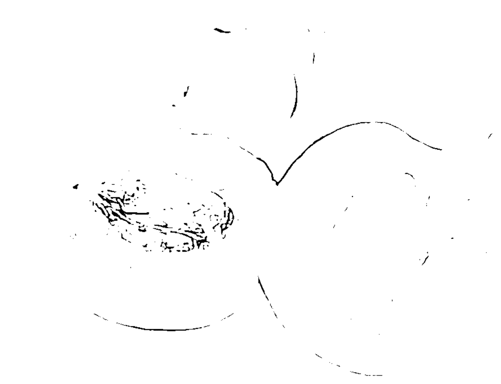

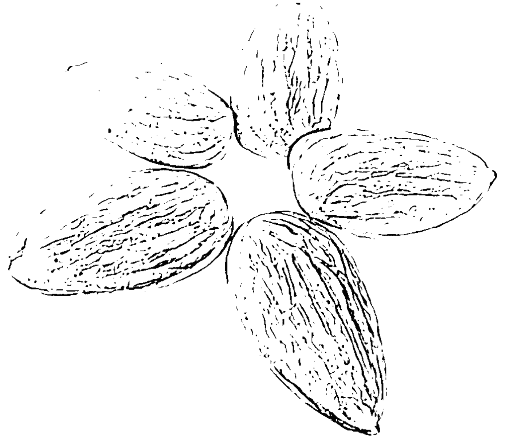

杏在外觀與習性上，與桃、李、梅近似，果實與果仁均可食用。桃、李、杏的產時節相差不遠，在食用的時機與作用上，也頗為近似。如果平素不吃苦寒泄下的飲食，亦極少使用空調，則在入夏時節，偶爾吃一些有助於降氣的果物，對於調理身體不至於過汗失津，其實是有一定的幫助的。但是對於現代人來說，各種苦寒泄下的飲食用量已經很大，再加上鎮日久坐空調冷氣房裡，胃氣、陽氣明顯不足，實在也沒什麼額外的本錢「蔬果五七九」了。在長久、多方的品種改良之下，做水果使用的杏實已經不再有明顯的苦味，多是酸中帶甜，《內經》對於杏味為苦的說法，僅供做參考。目前常見直接用來食用杏果的品種，外皮與果肉主要都是呈橘黃色，雖然《內經》認為，食用杏可以助肺，但是除了直接食用杏果的機會之外，較多的場合是取其核仁，也就是杏仁來使用。就像桃仁能除去血中積聚一般，杏仁多用在去除肺中水氣積聚，作用點兩者都從上焦開始，一走心系統理血，一走肺系統理氣，氣動則水動，對於去除胸中水氣造成的喘、滿等，功效卓越，《桂本》中必用。

| 生物分類 | 薔薇科 |
|---|---|
| 本草分類 | 果部 |
| 取用部位 | 果 |
| 建議食用頻率 | 少用 |
| 建議用量 | 少量 |
| 使用季節 | 當令 |
| 四性 | 平 |
| 五味 | 苦 |

#### 北杏

杏仁又分為幾個品種，通常北杏的外觀較為扁小，氣香但明顯有苦味，只有此品可作藥用，但是也因為藥效明顯，若是自行購得使用，需要講究用量。友人告之：故居在深山中，鄉里每逢季節來到，滿山杏果，村人們便忙著採果，去核取仁。有時傳出鄰人一時想不開，便吞下一大把生北杏自殺。杏仁通常為一頭尖，一頭圓，帶金、水屬性下行，但若是杏仁兩頭均尖，則應除去不用，因為兩頭尖都帶金屬性，破氣力道過強，若食用恐對身體有害，因此入藥者必去皮尖。

#### 南杏

一般煲湯或做點心則用南杏，此品外觀較為圓而厚實，氣香味甜，少了苦味則已經較無藥用價值，只供做調味之用，但是仍應避免長期固定使用，畢竟杏仁只有去邪之功，較少補益之效，多用、過用總是有傷身的疑慮。

#### 巴旦杏仁

另有一種，種皮深褐色，體積大出南、北杏三、五倍，由地中海地區、中亞一帶傳來，名為巴旦杏仁，平常偶爾做零嘴吃吃無妨，但是就別無特效了。

## 5. 蘋果

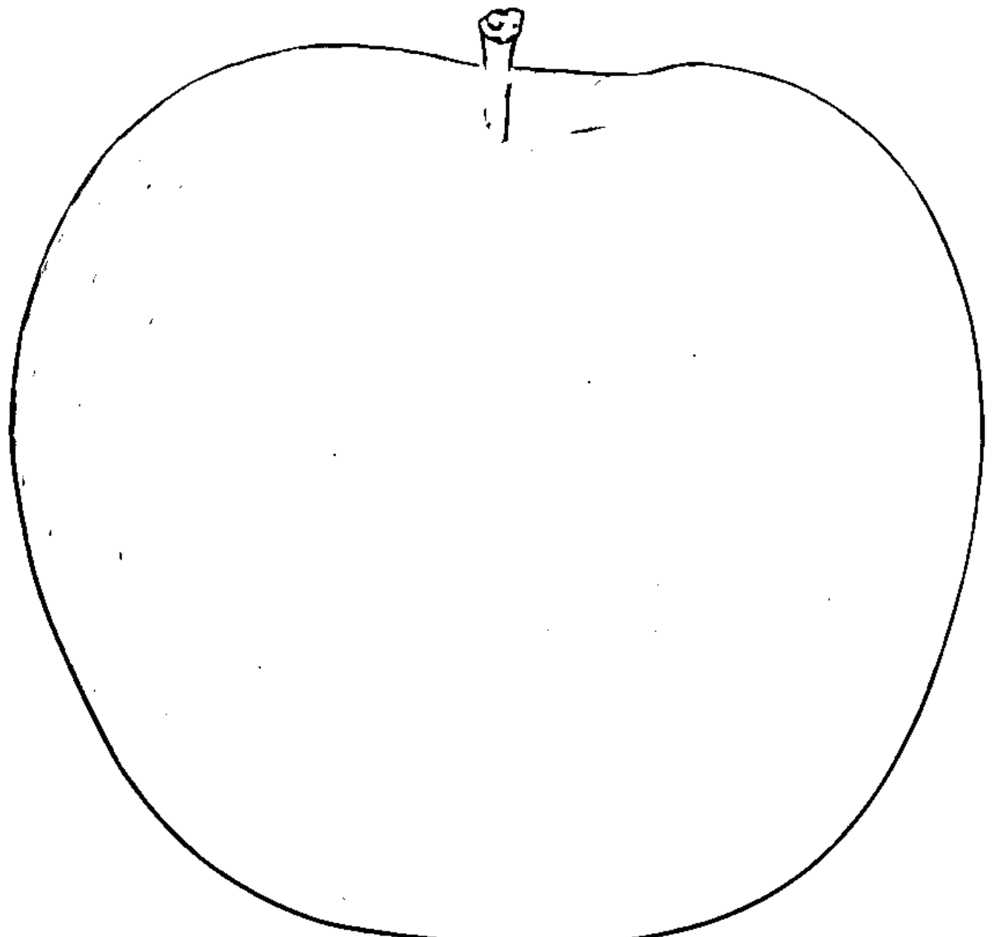

| 生物分類 | 薔薇科 |
|---|---|
| 本草分類 | 果部 |
| 取用部位 | 假果 |
| 建議食用頻率 | 避免 |
| 建議用量 | 避免 |
| 使用季節 | 避免 |
| 四性 | 寒 |
| 五味 | 酸 |

蘋果在拙作《太極米漿粥》中已經簡略提過，此語一出，引起不少讀者朋友紛紛來訊詢問：為何不能吃蘋果？雖然我們曾經在書中（p.225）中已經概略提及，而在這邊，若是以物性為主要的論點來說，我認為比較概括性的綜合理由論述就是：「薔薇科的假果」。

蘋果主要的品種的外皮以紅色為主，也有部分青色或黃色品種。人們食用的蘋果為假果的部分，而真正的果實則是貌似種籽，在果核之中的黑色顆粒，而且帶有毒性，下行力道猛峻，並不適合食用。相較於桃、李等的產季在春末夏初，蘋果的產季主要在秋季，感應的季節能量為金屬性。秋氣的特徵本來就是「收斂肅降」，這對於蘋果倒抽心氣的力道來說，更有加強的作用。薔薇科的植物已經多在心與心包作用，影響到心肺以及上焦的功能。桃、李、杏、梅等的真果，基本上雖然果實多味酸、性平，如果我們能注意用量，卻還不致於談到對於身體的功能有什麼重大的影響。但是假果的特質對於這個很看重透發能量的部位來說，「倒抽」的走法可以說是十足的反向作用——直接的破壞。特別又以紅色的蘋果來說，與心系統的能量同質性最高，如果心火受到了「倒抽」而無法暢達到全身，全身所有的功能將很難隨之啟動，我們大約可以類比這個情形為「身體有一個部分經常缺乏血液流通。」而不同點在於：如果身體的局部組織缺乏血液，我們很容易看到組織的缺氧、壞死。如果身體的局部組織缺乏的是心系統的能量而非物質，身體組織仍然可以存在、活動，甚至能夠成長、擴散無礙，但是這樣的存在與活動，很可能會與該組織周遭相鄰的組織的功能無法連動、配合，不受人體統一功能的支配。以我的說法，這樣的現象叫做「正常組織的癌化」。《內經》之中認為「心主脈」，又提到「心者，君主之官也，神明出焉。」這裡所謂的「神明」並非現代所指稱在宗教之中受人敬拜的對象，而是指「人的意識、情志等非屬物質的存在部分」，屬於人體整體而言的最高中樞，猶如一國之君，號令天下。對於現代普遍只依賴解剖來理解人體的身體論述之中，是很難被接受，但又確實存在的一環。

在我的定義裡面，心系統雖然並無具備有形體的臟，只具備有形體的腑，也就是小腸，但是隨著鮮紅的充氧血液貫通全身，我們的身體還是可以普遍而均勻的接受到心系統的能量傳遞的影響。而這個引導血液到全身周流的人體組織，叫做心包，也就是《內經》提及的「臣使之官，喜樂出焉，可刺心包絡所流。」心火，也就是這個君主，雖然沒有臟可供收藏，但是假借心包這個臣使之官的助力，仍然可以自由流佈全身，日夜不息，也因為心沒有實體的內臟可受邪所傷，所以《內經》又提到：「諸邪之在於心者，皆在於心之包絡。」對於心系統有傷害的影響，則是會改為反映在心包，也就是心臟與心血管、冠狀動脈等實體的損傷上頭。雖然在主要的組織結構之中，只要五臟的其他功能正常，基本的維生功能通常也不容易受阻或中斷，但是對於一個人活著的時候，其意識與情志運作的「品質」來說，心系統的能量，也就是所謂的心火，是否能夠暢達至全身每個組織的角落，就是關鍵所在。輕則夜晚就寢是否能「睡得沉」，睡眠品質是否良好，日間清醒時的意識是否明白，心情是否平靜、喜樂，甚至進一步能影響到人的記憶、感知功能是否正常表現。現代有許多疾病的發生，找不到人體的組織結構上的異常或變化，甚至各種心臟、肌肉的功能表現還很正常，但是在意識、情志方面卻無法如此表述，很單純的就是功能上的不正常，或者意識、情志狀況的不穩定。

人體之中的心火如果有狀況，會在脈之中發現「細」、「微」等呈現病證的脈象，這是很標準的中醫可以清楚掌握的疾病先兆。雖然，單純只有脈細、微，通常也不會立即致命，不得「神明出焉」也沒什麼痛癢，諸如忘事忘得兇、情緒低落或不穩定，在數據上也無法藉量測得知。這一類在陽氣衰微一段日子之後才會逐漸表現出來的功能上的不正常，對於現代普遍只看數據、組織結構來論斷是否健康的現代邏輯來說，實在是不容易傳達的一種概念，但卻是深深困擾許多現代人的健康危機。

清代的「老佛爺」西太后慈禧，他的畫像或是照片的背景上，經常出現一大盤疊得如山高的蘋果。蘋果，中國自古以來就有，擺在老佛爺身旁的蘋果，自然也是中國故有品種。但是這種品種的蘋果，聞起來很香，裡頭的果肉據說是爛如棉絮，吃也吃不得。據史料，清宮某一年大約消費掉十五萬顆以上的蘋果。這十五萬顆平均三百六十五天下來，每天要消耗四百多顆，怎麼想也不太像是做為食用。原來老佛爺是拿蘋果當「室內芳香劑」、「除臭香水」來用，恐怕是只聞不吃。據說過去的老北京人家，年節時候也會擺上幾斤蘋果，這一盤叫做「供果」的蘋果堆是專作為聞香之用。一般的尋常人家不敢說，但是像老佛爺這樣的富貴人，這盤蘋果應當是不下肚。但隨著列強入侵，歐洲品種的蘋果以食用的身分進入中國，聞香的蘋果變得是守舊落伍的象徵，吃蘋果在此後可能似乎還帶了點新潮，甚至是有西化的優越感。中國使用蘋果這名詞，大約是從明代開始，更早之前的古籍大約用的是：林檎、沙果、花紅、柰（音同「奈」）等名，就連日本的蘋果名稱的漢字，也寫做「林檎」。

現在全球消費量數一數二的蘋果品種，其實都是近代才改良而出，而且有好幾種還出自日本之手。但是就如我們在《太極米漿粥》裡頭提到的，日本人最愛的水果其實是香蕉，而日本健康狀況最差、壽命最短的縣，就是蘋果產量第一高，佔日本五成以上的青森縣。日本每年外銷的蘋果約有一萬五千噸，最大的出口地就是臺灣，佔了九成以上。臺灣人瘋狂愛吃日本蘋果，日本人卻早就不吃臺灣香蕉了。無論蘋果的品種在千年來幾番改良，口感、滋味、顏色如何變化，縱使今日已經登錄者有超過七千五百種的變種品種，也無論古籍中這些「林檎」、「沙果」或是「柰」等物究竟是否與其一致，蘋果依舊是薔薇科，仍然是假果，外皮亦紅，細嚼之下味帶酸澀，四性五味等等的基本物性的元素不變，就是有礙於心火暢達，也的確細人百脈。《內經》有云：「得神者昌，失神者亡。」因此我的建議是：能避則避，必須當心，勿謂不然！

## 6. 草莓

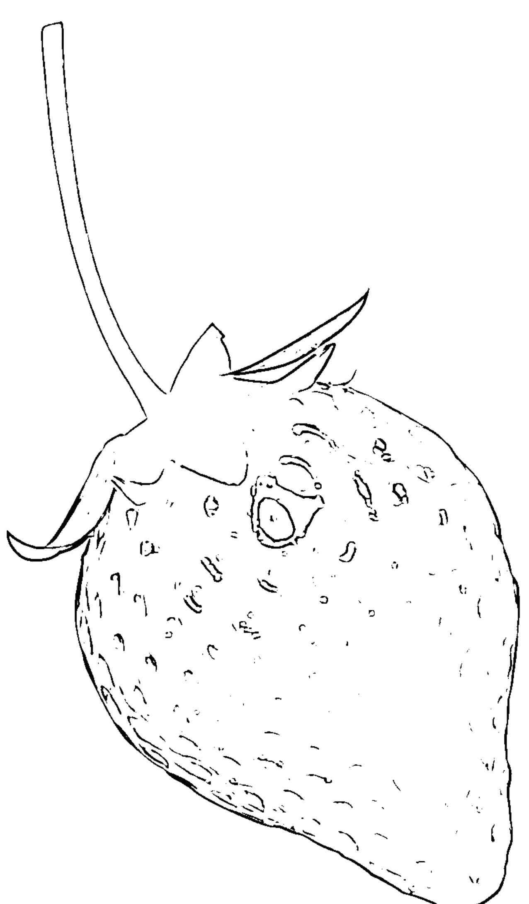

草莓是薔薇科的另外一種常見的假果。草莓的植株很低矮，為草本植物。外觀上除了略呈現三角形之外，偶爾也會出現不平整的外觀，屬於兼有無一定的形狀、外觀容易改變的特質，屬性上偏向帶有火屬性，作用比較偏心、心包系統之中，較屬外層的組織，如果以心臟來說，大約可以說是心血管、冠狀動脈等部分。常見的食用草莓品種，果實是紅色居多，與心火的作用關聯也較多。

因為是假果，所以食用的部位並非是果實，反倒是在食用部位的上頭，密佈著許多小點狀的種籽樣的部分，才是真正的果實。這些真正的果實，體積非常的小，所以下墜的力道更加猛峻，通常一般人來說很難讓人可以在家常食用之中承受得住。

又因為前述，其作用點多在心、心包相關組織的外層，所以一方面假果的部分會將心火能量倒抽而去，一方面果實的部分又能令實體的血液下洩。兩相拉扯，心血管就成為「沒有能量流通」以及「沒有血液滋潤」的真空地帶，無血又無氣，組織結構僵硬，不可屈伸。若是此狀出現在人體四肢的末端，則中醫稱該狀態為「厥逆」，是病情已經垂危狀態的病家才會出現的現象，如今卻出現在血液代謝動力源頭的心臟附近，比起蘋果主要作用在心火的本質，草莓的作用更偏向心包與心包相關的組織上，不禁教人倒抽一口冷氣。因此，就算在營養成分上，草莓的數據再怎麼漂亮，個人建議還是盡量避免食用為上。

| 生物分類 | 薔薇科 |
|---|---|
| 本草分類 | 果部 |
| 取用部位 | 假果 |
| 建議食用頻率 | 避免 |
| 建議用量 | 避免 |
| 使用季節 | 避免 |
| 四性 | 寒 |
| 五味 | 酸 |

## 7. 櫻桃

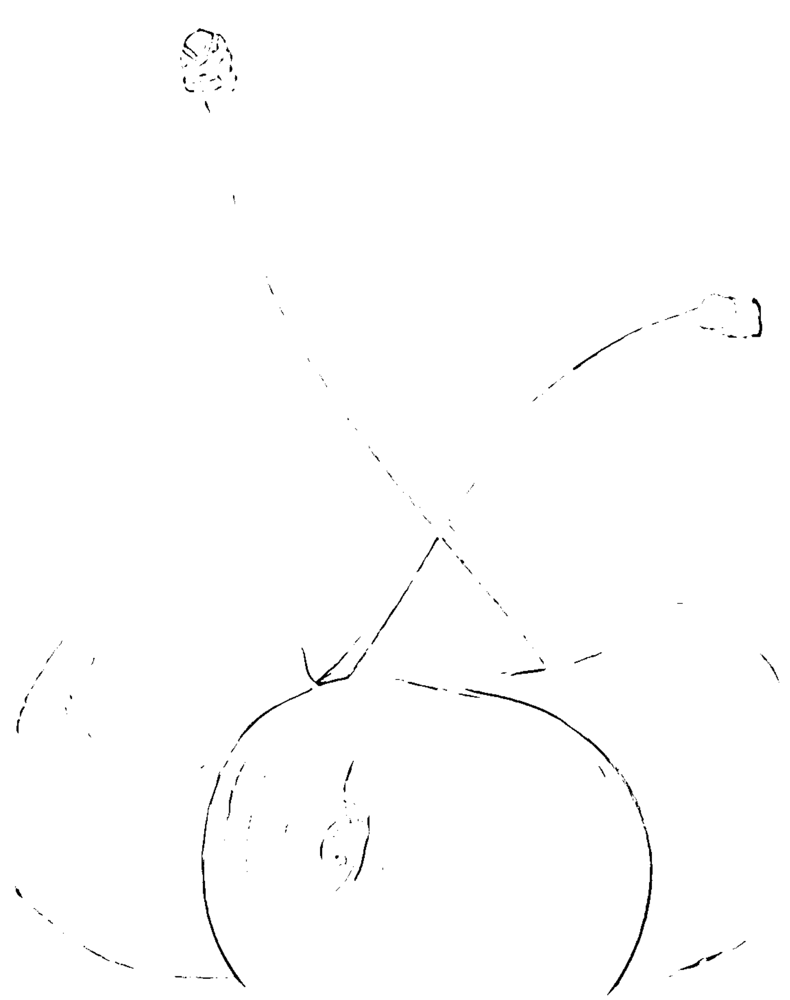

櫻桃是由櫻樹結出的果實。櫻樹的品種很多，有的只做觀賞的用途，部分其他品種的果實才供作食用。櫻樹的開花很早，一入春，就搶在葉子發芽之前開花，代表櫻樹的氣的走行力道很強，感應春季木屬性的能量的傾向顯著。相較於其他一般植物是先長葉才開花，櫻樹能夠直接把冬季深藏的養分一次爆發出來，櫻花在盛開之後普遍的花期也不長，短者大約一週左右就凋謝。這與身體在少陽系統屬性的相火的爆發力道強，持續力卻反而弱，頗為相似。櫻花開花早，結果也早，櫻花開於春而謝於春，櫻桃結於春末，盡得春季東方青木升發之氣，所以櫻桃在春末夏初便已然上市了。

櫻桃初生色黃，熟則淡紅或紫赤，皮薄而肉厚，肉色褐黃。外皮的顏色多偏水火間色的紫色，也是象徵少陽系統的力道。所以櫻桃主要的作用點在於人體的少陽系統，通常以三焦或是膽為主，調控人體的津液與能量交互轉換以及裡外升降的變化。果實天性下行，故櫻桃能得升發之氣，藉由果肉味酸而兼能轉氣為津而下氣。櫻桃味酸性溫，帶有明顯香氣，對於令脾胃之氣因為燥熱而過度外行的狀況，應該有相當的好處。不過也因為櫻桃味酸，獨得木屬性的力道，能夠助長火屬性的能量，對於血偏少所以血中容易鬱積燥熱而妄行的人，恐怕會熱上加濕，而有生瘡發膿的隱憂，值得體型較為乾瘦的人多加注意。

| 生物分類 | 薔薇科 |
|---|---|
| 本草分類 | 果部 |
| 取用部位 | 果 |
| 建議食用頻率 | 少用 |
| 建議用量 | 少量 |
| 使用季節 | 當令 |
| 四性 | 溫 |
| 五味 | 酸 |

## 8. 梨

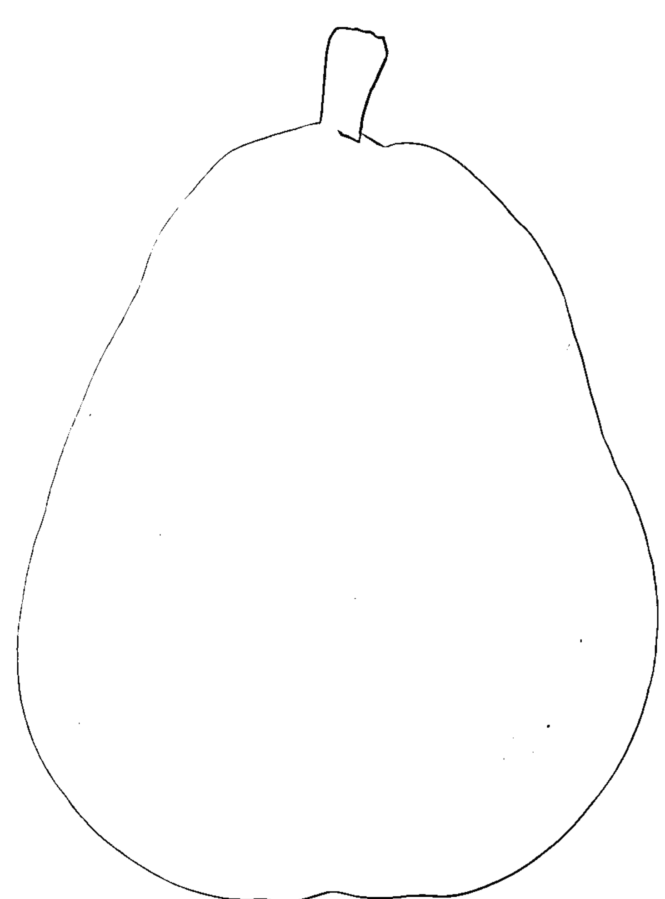

| 生物分類 | 薔薇科 |
|---|---|
| 本草分類 | 果部 |
| 取用部位 | 假果 |
| 建議食用頻率 | 避免 |
| 建議用量 | 避免 |
| 使用季節 | 避免 |
| 四性 | 寒 |
| 五味 | 酸 |

梨的品種亦多，一般常見作為食用的梨果，多是原產於中國等東亞的品種為主，外型較似蘋果，而西洋品種則明顯為上窄下寬的輪廓，類同於水滴狀。梨樹的葉子大致為卵形，邊緣帶有鋸齒，象徵由金氣能夠斂聚生水。梨果外皮多為青綠或是黃褐色，作用力道大約與木或是土屬性有關。果肉是白色，屬金，也偏向金屬性的收斂肅降的力道。原生品種的梨果酸味很重，很難入口，品種改良之後，甘味雖然大幅提升，但是仍然難掩些許的酸澀味。酸味能夠將氣強制轉換為津液，本來就能促進人體功能入陰的傾向。

梨樹結果又在秋季，感應金氣，收斂力道更強。梨為假果，又能倒抽，再加上本性下行。食用梨果，對於人體的升發、代謝的力道，具有很強的抑制作用，與其作為食材，不如視為藥材，講究運用時機與配伍，可能較為適合。

坊間經常流傳吃梨可以止咳嗽，但是一來，咳嗽的治療需要辨證，寒熱虛實的治療方式差異非常大，並非一概而論就能處理。二來，梨果的偏性極強，劑量拿捏不易，很容易就流於「以偏害偏」的弊病，恐怕反而有害於胃氣、陽氣。如果有咳嗽的問題需要處理，建議還是循正規古經方中醫的處理辦法來設想處方，以免自誤。

## 9. 枇杷

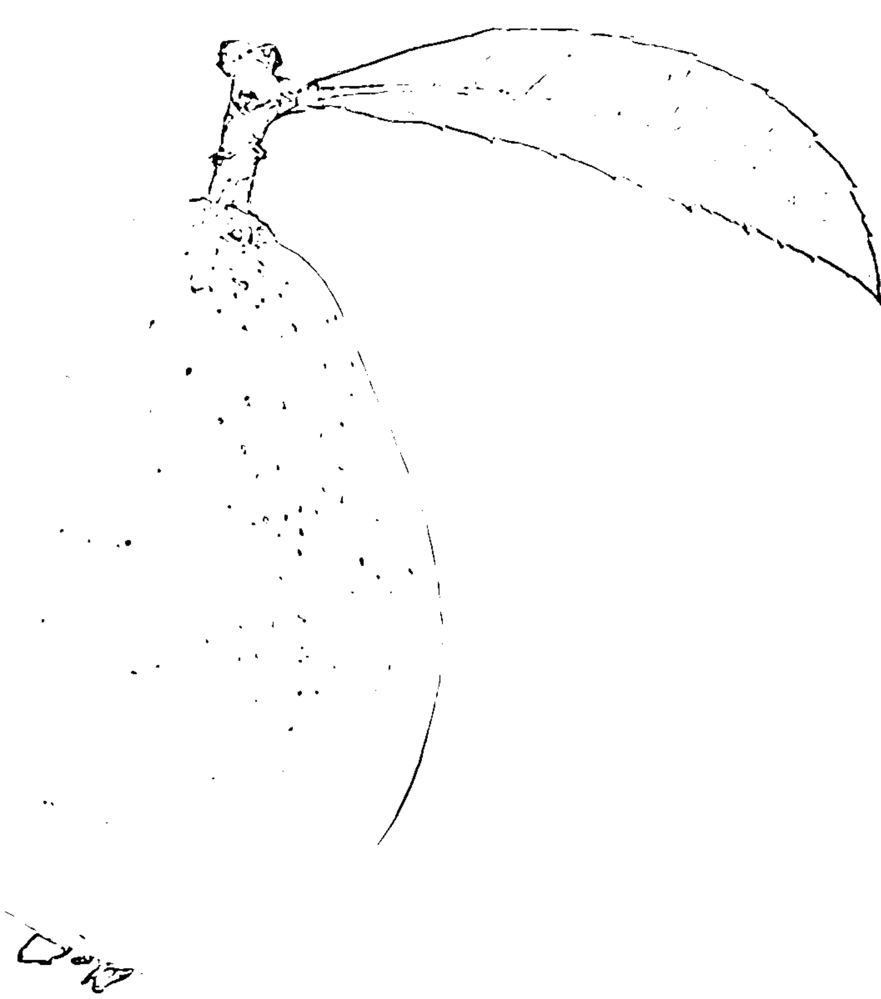

枇杷的外觀很有特徵，因為形似樂器「琵琶」而得名，輪廓同樣也可以說是水滴狀，也類同於梨果等，屬於假果。枇杷外皮顏色橘黃，而最具有特徵的習性在於：枇杷樹於秋末冬初才開始開花，花序可以耐寒，反而到了春末夏初結果才成熟。植株的生長感應的是秋冬的陰氣，落果則是感應春夏的升發之氣，與絕大多數的生物的「春夏養陽，秋冬養陰」的習性完全相反。若是在特定的狀況之下，作為胃氣雙向調節的氣血調和之用，本來或許還有可用之處，但是同樣屬於薔薇科等假果，生長習性又是陰陽倒轉，把氣血藉土屬性的能量積聚在心包，對於人體的陽氣升發來說，恐怕不利的影響還是偏多。一般來說，陽氣停滯則容易化成濕氣，誤食未成熟的枇杷容易導致腹瀉，是因為倒抽氣機的力道太強，造成心包到脾此一區塊的「心下」（請參考《太極米漿粥》P.71）濕氣太盛所致。就算枇杷成熟後，

| 生物分類 | 薔薇科 |
|---|---|
| 本草分類 | 果部 |
| 取用部位 | 假果 |
| 建議食用頻率 | 避免 |
| 建議用量 | 避免 |
| 使用季節 | 避免 |
| 四性 | 涼 |
| 五味 | 酸 |

過食仍可能會導致皮膚泛黃。像這種：體表、眼白、小便等泛黃色的變化，《桂本》稱為「發黃」，這是表示有寒濕之氣累積在脾的病證。諸多過食則會導致發黃的食物，如：胡蘿蔔、橘子，芒果、木瓜、柿子、南瓜等，都有同樣的偏性，也都應該謹慎攝取。有人用「因為攝取大量胡蘿蔔素」來解釋此一現象，但是同樣富含胡蘿蔔素的青花菜、芫荽、菠菜，甚至是含量僅次於胡蘿蔔的韭菜，卻不見有人如此提醒，亦可證明「用單一元素解釋複雜生理變化並歸納出簡化結論」的不合邏輯、不符事實之處。

枇杷也與梨果相仿，都是口耳相傳之中可以「止咳」、「潤肺」的水果，雖然實際在應用時，用的是枇杷葉而非枇杷果，但是深究其理，多半還是來自於「退火」的觀念使然。肺金失去心火的鼓動，機能衰退，氣機不轉，自然也沒有可逆之氣，當然就無氣可咳，但這是犧牲掉人體原本部分的陽氣一同陪葬的效果，所謂的「潤肺」也並非真的幫肺系統增添津液，而是藉由反轉陽氣升發的力道避免津液的減損，甚至化出濕氣。如此使用的思維都並非真正的「辨證論治」，建議還是避免過度依賴，慎用為上。

# 十字花科

十字花科的植物也是餐桌上的主力食材之一，幾種常見的蔬菜都是十字花科的近親。雖然因為商業考量介入，現在多半沒有明顯的產季區別，但是基本上來說，原始的十字花科的植物多半在海拔、緯度較高，或者是均溫較低、日夜溫差較大的地方較適合生存，當令多在秋冬，所以這些蔬菜通常也被稱為「高冷蔬菜」。做為食用的植物的葉或是果，如果生存在日夜溫差大的地方，通常會含有比較高的甜份，吃起來的味道較甜，也因此比較受到喜愛。我認為這種日夜反覆高低溫度變化大的地方，屬於「往復折疊」現象較明顯的環境，與金屬性的肺所謂的「開闔」的生理作用相當一致，連續不停、均勻的開闔而產生了節律的實況，這是一種生物規律活動的表現，所以這樣的「節律」，代表的就是金屬性的「法理」、「規則」，容易產生較多的養分以供收藏，並且隨著金屬性能量的加強到極致，進而轉化出相生秩序之中的「金生水」的遞移流轉。

雖然表面上看來，有這樣的功能節律而含有大量養分的食材值得多吃，但可惜通常入菜的都是植株的地上莖葉等部分，並非實際保存養分最主要的根。莖葉原本的工作是製造與輸送養分，現在變為有養分留滯而甘甜多汁，對照於人體，直觀來看就是代謝力道下降，轉化能量與質量的少陽系統功能衰退了。所以吃這些高冷蔬菜，通常都會讓身體的代謝變差，陽氣越來越弱。不過，對於身體虛燥熱很盛的人來說，因為能夠除熱，可能暫時反而感到很舒服，略收飲鳩止渴之效，但是仍然解決不了內臟缺乏陽氣導引津液入裡補益的問題。就如一般菜園間的蟲子，多半性熱，因此特別愛吃寒性的葉菜，所以十字花科的葉菜通常蟲害較重。

就性味的角度來說，此科的葉菜食材的性味幾乎都偏甘寒，而且極寒。就算是食用地下根莖的部分，也因為個別的物性較為特殊，偏性大相逕庭，若不是一一加以審視，光是憑著一個「吃起來很甘甜」就陷入了以為能夠多吃、常吃的誤區，影響就不可不謂深遠了。若是以坊間盛傳的所謂有抗癌效果的角度來說，與基本的古經方中醫的理論對照，期待與結果的落差恐怕就更大。總括來說，十字花科蔬菜主要作用點在人體的上焦，與肺的開闔功能相關較深。雖然肺的開闔也有幫助產生津液、調節肝系統功能的作用，但是對於陽氣較弱的人來說，在沒有充足的陽氣為前提之下，開不足而闔太過，能夠接受該科蔬菜偏性的容受度也就不高了。

## 1. 青花菜

十字花科的蔬菜在餐桌上不但是常見食材之一，「野生甘藍」（Brassica oleracea）在經過育種之後，產生出許多長相差異頗大的變種。一般來說，我們會認為：生物表現出其獨有的特性，歸於火屬性能量的表現。但是若以部分植物經常容易出現變種的特徵來說，反而可能出現火屬性過強，而極容易受到各種外來因素的刺激影響而產生變異，造成獨特性質變化過多、過快，不遵守原本的生長規律，也就是金屬性的能量規範，而以火克金，形成脫序出軌的結果。對於人體來說，原本的身體組織如果不能維持於既定的型態，運作標準的功能，經常發生變異，也可以算是一種導致身體的正氣不能維持，容易受邪氣影響而發生病證的體質傾向。

| 生物分類 | 十字花科 |
|---|---|
| 本草分類 | 穀菜部 |
| 取用部位 | 花 |
| 建議食用頻率 | 偶爾 |
| 建議用量 | 少量 |
| 使用季節 | 四季 |
| 四性 | 平 |
| 五味 | 苦 |

青花菜是花椰菜的近親，也很容易混淆，雖然稱呼與外觀相似，的確也屬於同科，都是野生甘藍的變種，食用的部位也都是花序，嚴格來說，是即將開花的花蕾。青花菜花序的常見顏色為深綠，代表木屬性，深色偏木的陰面，人體的組織屬於內臟。相較於花椰菜以較粗的花梗為主幹，向旁開出花序，青花菜主要是放射狀的生長、分歧而生出花梗與花蕾，可以說是樹狀結構的外觀，透露出更多的木屬性。相較於花椰菜以食用整個花序為主，青花菜食用的部分主要是花蕾，在花序之中屬於最核心的部位，氣的作用最強。

食用上的建議與花椰菜相仿，而青花菜因為是以木屬性為主，調理的作用則是在於肝系統的肝或是心包。如果能夠配合豬心一同料理，以形補形，借豬心之形加上青花菜花蕾的升發力道，對於心包或是肝較有因為燥熱而容易折損陽氣的人來說，可以起到調理的作用。值得一提的是：青花菜與花椰菜主要食用的部位在於花蕾或是花序，下方的粗梗不但不容易消化，氣機也弱，食用的價值不大，大方的切掉捨去便是，不必覺得可惜。特別是青花菜，因為有木屬性的氣，又屬陰，在較靠近花蕾的末梢的樹枝狀結構，結構的分歧點還兼有由陰出陽的少陽升發的力道，請千萬要吃對重點才好。

## 2. 結球甘藍

此品的別稱很多，各地的慣稱不同，在臺灣，更常見的稱呼是高麗菜，由拉丁語「COLES」等的相關發音而來，所以在這邊統一單取正式學名做稱呼。

結球甘藍是野生甘藍的葉用的特化變種，普遍上的外觀呈現葉子團團包圍的模樣，結成球狀。最外側的葉子顏色較偏深綠，中心部位顏色為淡綠，食用時通常只取核心部分的葉子。食用的部位用的是葉，又是接近核心，陰屬性較重，所以通常比較牽制身體的向外代謝力道。成球的模樣與心臟相似，作用在上焦，而影響到心包的功能。因為寒性很重，一般的熱炒手法，對於去除寒性的幫助不大，所以建議盡可能的少吃。嚴格來說，東方早年比較不吃結球甘藍，像是日本在江戶時代末期，大約一百五十年前，才開始引進，而且只作為觀賞之用。直到一八九〇年前後，才因為社會大舉西化，西洋飲食流行，而開始比較普遍的作為食用。這種流行的變化究竟是否就代表進步，有待觀察。

| 生物分類 | 十字花科 |
|---|---|
| 本草分類 | 穀菜部 |
| 取用部位 | 葉 |
| 建議食用頻率 | 少用 |
| 建議用量 | 少量 |
| 使用季節 | 當令 |
| 四性 | 寒 |
| 五味 | 淡 |

如果偶爾使用，目前市上有一種高麗菜芽——但並非是個頭小卻已經成球、品種關係較遠的「球芽甘藍」（Brussels sprouts）——，而是結球甘藍採收後留根在土裡，又重新長出來的新的幼苗，葉片較少還不成球，與心包相通的三焦系統較相似，可以考慮代用，對於調理淋巴等屬於三焦系統的組織功能，較有幫助，間接來說可以舒緩心臟代謝的壓力。幼苗保留有較多的少陽升發之氣，也較為可用。**大火熱炒**高麗菜芽的時候，除了多油、多鹽，還需要配合大量的蒜頭同用，預防寒性傷到脾胃，造成陽氣受損。

坊間流傳用結球甘藍可以治胃炎、胃潰瘍、十二指腸潰瘍、胃食道逆流等，還可以潤腸通便，其實都是利用了其極度寒瀉的力道，削弱心包功能，連帶使得肝系統的功能停滯，間接造成胃氣的乏力衰弱，使得胃的功能不起反應，這些所謂的發炎現象變得無感，一句話說穿了，就是強力的消炎藥。而所謂的潤腸通便更是因為寒涼瀉下造成的輕度腹瀉，並非我所謂的「太陰下墜力」這種人體正常的排便力道。以上所謂的效果，都是我認為的「胃是心臟的門關」的負面利用，也就是削弱心臟功能後以減輕胃的功能負擔。

結球甘藍不但不適合多吃，更不宜生食，輕則脹氣，重則好發腹瀉，長期損人腸胃，造成疾病抵抗力低迷不張，甚至身體因為陽氣太弱影響傷口可能不易凝血，患糖尿病等疾病而傷口有不易癒合傾向的人，更不能吃，以免意外造成的傷口在嚴重時可能需要截肢。三焦系統如甲狀腺等組織的功能有異常的人也應避免食用，容易導致功能惡化。附帶一提，結球甘藍的葉子很多，通常在種植的時候很怕蟲害，否則還不能成球，就被蟲吃光了，所以一般來說，結球甘藍很難完全不使用農藥，而且用量可能特別大。又因為葉片很多，且結成球狀，清洗不易，這些都是在物性之外還需要更加留意的食安問題。

## 3. 蕪菁

蕪菁是野生甘藍較特殊的變種，食用的部位是特化肥大的球莖，所以正式名稱為「球莖甘藍」。蕪菁也被稱為「大頭菜」或是「蔓菁」，據說古代就有普遍的種植與食用，還有一則傳說：唐代的韋絢作《劉公嘉話錄》提到「三蜀之人，今呼蔓菁為諸葛菜」、「諸葛所止，令兵士獨種蔓菁」這指的是三國時代蜀漢丞相諸葛亮行軍之處，就令兵士種蔓菁為軍糧，因此行軍不帶糧，行動輕快不少。

蕪菁吃的是莖部，屬於植株的中段，可以類比到人體的中焦，或是腸胃。葉莖呈四面八方各自發散的生長，象徵養分開散、疏泄。球莖一頭大、一頭尖，略有下行的走勢，做為食用，大致可以避免消化不良的積滯，有緩降的效果。蕪菁的上部與葉之間的部分通常會帶有紫色，象徵上行的力道與少陽系統的屬性類同。又因為蕪菁的質地紮實，很少水分，幾乎無味，微帶辛、甜，性味較平和，大致上也可以做為充飢的食材來代替主食，提升飽足感。難怪諸葛亮行軍之時，以蔓菁代替糧食，兵士還是有體力打得了仗。其實蕪菁幾乎全株都可吃，有的品種只約四十天就可以收成，棄之又不可惜，對於兵荒馬亂的時代來說，實在是填飽肚子的救命良草，所以部分地方至今還稱此物為「諸葛菜」。

| 生物分類 | 十字花科 |
|---|---|
| 本草分類 | 穀菜部 |
| 取用部位 | 莖 |
| 建議食用頻率 | 偶爾 |
| 建議用量 | 少量 |
| 使用季節 | 四季 |
| 四性 | 涼 |
| 五味 | 淡 |

現代的生活，主食的取用不虞匱乏，蕪菁退下位來，就著各種鹹、甘、辛味的醃料，還可以做成各式的醃菜，提供下飯的滋味與口感，在一般的料理之中適量佐之，也可以發揮稱職的綠葉角色。蕪菁的口感與氣味與蘿蔔非常類似，產季又相仿，調理之後盛上桌，根本很難分辨。但是蕪菁不會空心，沒有掏空人體內臟的疑慮，縱使是同科近親，外觀上諸多特徵相似，只要重要的關鍵數點略有不同，物性仍不可等而視之。否則當年蜀軍打仗，諸葛先生還要全軍吃蕪菁，屆時上場廝殺，全軍氣虛力弱，恐怕早被殺得片甲不留啦！

## 4. 白菜

白菜一般又稱大白菜、包心白菜，與小白菜是近親，不過兩者在外觀上頗有差異。白菜主要食用的是葉，因為形態上仍有包心的結構，所以多半除去大部分的外葉之後，只取內部食用。白菜的莖短小，葉片面積大，對於養分輸送的力道表現較弱，而對於養分的滯留的力道較多。外部葉子顏色較深綠，但核心較偏白，金屬性的收斂肅降的效果跟著轉強。包心結構與人體的心包較有關聯，食用又以偏白色的核心葉為主，基本的特質與結球甘藍相仿，都是對於以金屬性力道收斂心包功能的效果較強。白菜的耐寒能力很好，許多在冬季溫度較低的地方的民眾賴此維生。冬季的時候，人體表層的體溫降低，心臟必須要提高運作力道，才能夠將血液重新送出至體表，因此人體心臟的代謝壓力自然較大。在沒有其他辦法輔佐的情形下，吃些白菜以降低心包過度的運作，也算是不得已中的辦法。

| 生物分類 | 十字花科 |
|---|---|
| 本草分類 | 穀菜部 |
| 取用部位 | 葉 |
| 建議食用頻率 | 避免 |
| 建議用量 | 避免 |
| 使用季節 | 當令 |
| 四性 | 寒 |
| 五味 | 淡 |

白菜含水量非常高，水性本寒，這是白菜寒性很強的因素之一。透過適當的醃漬、發酵等手法大量去水，一方面利於保存，一方面盡量低寒性，以炮製調整性味，多少做一點補救。在臺北有一家具極盛名的館子，招牌料理就是酸菜白肉火鍋。雖然料理美味，白肉無限供應，但是現場個個食客包括我在內，吃了一輪，直感到飽脹得不行，早就鳴金收兵，這與我每餐可以單吃白米飯約四百公克的表現實在是天壤之別。因為白菜本身雖然透過自然發酵，已經去除相當的水分，寒性受到了調整，但是屬性上的呈現仍然頗寒。只消幾口料理和著湯底下肚，脾胃立刻因為寒濕入裡而中滿，氣機停滯。看來店家是有恃無恐，深諳物性，所以不怕大食客上門，敢打出號召讓你吃到飽。而臺灣濕熱的天氣，遠不及大陸東北的天寒地凍，通常不需要由內臟激發出大量的陽氣上升，若是幾口大寒的葉菜下肚，陽氣更是如風中殘燭。俗話說，一方水土養一方人，看來連料理的調理手法也是如此。有的人吃料理，吃的是懷舊、是鄉愁。我這臺灣土生土長的小民，坐擁由大江南北來到臺灣的各式大菜小吃，偶爾嘗鮮，還是點到為止就好吧！

## 5. 蘿蔔

蘿蔔是東方常見的固有品種，與不同科目品種的胡蘿蔔常被誤認為是近親，其實品種差距很大，物性也完全不同。嚴格來說「白蘿蔔」是蘿蔔的品種之一，其他還有青蘿蔔以及櫻桃蘿蔔，但是主要的物性彼此相似，因此不再做另外的討論。蘿蔔是我認為的「三不沾」食材之一，一旦有料理同煮，甚至沾染，就完全捨棄不食，與蘋果、黑豆並列。在拙作《太極米漿粥》之中提出之後，當然也引起許多朋友的關注與討論。甚至有人說，像是清代的中醫「張錫純」就提出吃蘿蔔可以「化氣」，甚至適合與人參、黃耆等同用，「補氣而不鬱」，許多後世的中醫師也都贊同此一論點，甚至身體力行。但我認為，這就是一則很好的「參物性」的標準例題。

| 生物分類 | 十字花科 |
|---|---|
| 本草分類 | 穀菜部 |
| 取用部位 | 根 |
| 建議食用頻率 | 避免 |
| 建議用量 | 避免 |
| 使用季節 | 避免 |
| 四性 | 寒 |
| 五味 | 辛 |

蘿蔔食用的部分主要是根部，冬季的時候固然體態肥大，久煮之後味道甘美，甚至有「小人參」的美稱。但是眾所周知，蘿蔔夏季的時候根部反轉成「空心蘿蔔」，就物性的觀點分析，這等於是掏空內臟的作用，是古經方中醫的生理、藥理觀點之中，補益的大忌。可見得蘿蔔雖然食用根部，但是並不能達成補養內臟的效果。

黃芩也是常用的中藥，亦是取用根部，但是上品的黃芩中心同樣會有中空、腐黑的模樣，所以別稱又有「腐腸」、「妒婦」等，功效在於通利、下積、除熱，而不在補養了。況且蘿蔔隨著夏、冬的季節轉換，還會反覆掏空，與肺部開闔的同質性更高，影響更深。就農業技術來說，有幾種狀況可能造成蘿蔔空心，像是：日夜溫差不夠大、種植密度過低、施用肥料過少或是蘿蔔葉生長茂盛、土壤少水份，甚至在採收後放置一段時間就會自動變為空心。類比於人體的狀況：若是人體原本的陽氣輸出沒有到達極致，足以產生肺部最大幅度的開闔，體內的津液密度沒有達到極致，或是津液向外代謝的作用較強，肺部保持乾燥，甚至脾胃土生金的力道不能維持在鼎盛，都會無法支撐蘿蔔的物性所引起的效應，引發蘿蔔空心的作用，掏空肺中的宗氣，造成百脈不出，形成需要用大量方劑急救的嚴重虛證，所謂的「補氣而不鬱」實為「人參都被蘿蔔吃了一」，珍貴的補養效果付諸東流。

就個人的觀察：長期保持不沾蘿蔔的人，說話發聲宏亮有力，反之，大量食用蘿蔔的人說話氣若游絲，上氣不接下氣，肺氣虛損諸證明顯。

日本是大量食用蘿蔔的國家，雖然長壽，但是根據個人在街頭的觀察：老人家們普遍精神很好，但駝背嚴重、說話發聲不清晰的現象也普遍，採「緣督以為經」的中醫養身觀點來看，身體的結構、功能尚可，但氣機實在是弱了些。蘿蔔究竟能不能吃，究竟是迷信、誤傳，還是確有其事，眾人各持一家言，孰是孰非暫且放下一邊，存疑的朋友們不妨試試：禁食蘿蔔一段時間，特別是需要靠聲音吃飯，或是常有久咳難癒問題，容易感到氣力不足的朋友。

## 6. 山葵

山葵作為單獨食用的機會較少，通常都是用來調味，特別是在日式料理之中與生魚片相佐。山葵的氣味與其說是「辛」，其實更應該說是「竄」，山葵那種可說是直衝腦門的辛竄氣味十分特別，讓人難忘。在物性之中，這種辛味之中的竄走的力道，功效在於「通竅」，像是中藥材之中的「細辛」也有同類的作用。

山葵生長的環境同樣需要日夜溫差較大，除了肥料，對於水質的要求很高，而且需要持續活水的流動。在開闔作用之外，流動的清淨活水也象徵人體三焦之中的水精。莖外皮墨綠，上生葉數莖高挺，葉形呈心形，象徵與火屬性溝通。綜合來看，透過肺系統與少陽系統轉化成本屬性的結構，有助於透發火屬性的能量。食用的部位在莖，加上氣味辛竄，在食材配伍之中，特別適合與富含油脂的食材同用，

| 生物分類 | 十字花科 |
|---|---|
| 本草分類 | 穀菜部 |
| 取用部位 | 莖 |
| 建議食用頻率 | 偶爾 |
| 建議用量 | 隨喜 |
| 使用季節 | 當令 |
| 四性 | 溫 |
| 五味 | 辛 |

不但沒有辛竄造成的不適感，厚膩的油脂更能被轉換為甘美的津液，一方面對於幫助消化、吸收來說頗有建樹，再者增添料理風味來說更有奇效。

除了生魚片之外，朋友不妨試試與多脂的燒烤肉片同用，特別是牛肉片，風味極佳。但是因為山葵很需要趁新鮮食用，市面上非常高比例的山葵製品都不是完全使用純正的山葵為原料，甚至許多是只用化學藥劑調和而成的代用品。前述的食材配伍效果只限使用真品現場磨製的時候才有，必須注意。

# 葫蘆科

葫蘆科也含有很多種類的水果、蔬菜，使用相當廣泛。不過葫蘆科的果實的共通特質也在於：幾乎都是假果。相較於薔薇科的假果作用在心、心包，影響的程度較為深刻，通常都需要完全避免，葫蘆科的果實則多半都帶有「瓜」字結尾，這些瓜字輩的假果也因為多半都呈長圓、橢圓或是圓形，再加上瓜字輩的通常有很長的地上蔓莖，蔓莖又可以在節點處長出新的根部，所以整體來說的作用點較偏向胃，並連帶影響與胃相連結的經絡，以及經絡的津液輸送功能。只可惜相較於同樣有蔓莖的豆科等植物，人體通常只取用其果實，以根部做為食材的例子十分罕見，通常只有藥用，也因此怎麼也稱不上有補益的效果。

瓜字輩的外皮多是綠色，表示作用特徵偏於肝系統，因此對於倒抽肝系統的氣的力道也會比較明顯，果肉通常含有大量水分，帶有不等的苦味，寒性也較強。不過瓜字輩的假果對於身體的影響，尚不至於是一面倒的負面，或者如果善用，偶爾還是可以合得上某些時候、部分狀況下，胃在進行雙向調節時的需求。像是《桂本》做為藥用組方的「栝蔞」，就並非是負面的作用。整體來說，至多就是可起「以偏治偏」之效，但仍不及於「以中和偏」之功。有部分的瓜字輩的果實，如果不即時採收，通常也可以放任成長到很大的體積，像是：胡瓜，所以力道相對可能會比較緩和一些，不過通常是在其體型尚小的時候就摘下食用，因此倒抽的力道仍是格外明顯。無論如何，平常使用的時候要多加注意是否過量，對於配伍，則更需要講究。通常瓜字輩的生長習性都在於日夜溫差變化比較大的環境，收斂肅降的偏性較重。有一句我比較常說的概括性結論，稱為「凡瓜必寒」，家常宜避用。雖然並不是絕對真理，但是基本上總是無錯的。

## 1. 西瓜
——附：瓜子、瓜皮

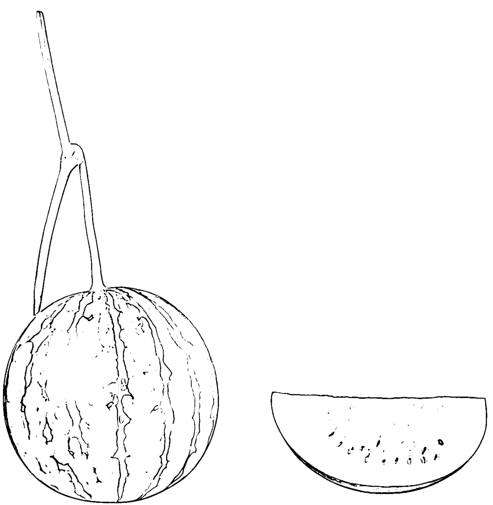

西瓜原產在高溫乾燥的沙漠地區，很怕低溫、潮濕、水氣。最早有記錄的發現地區為非洲，因此也據說在部分的非洲地區，常以食用西瓜來代替飲水。西瓜主要分為兩種，紅肉的體型較大，黃肉的體型較小，如果並非栽培用，而是野生的品種，瓜肉可能是以白色為主，性味更寒。另外一種專門取做瓜子的品種，基本上果肉不做為食用。西瓜的外皮光滑堅硬，金的屬性較重。若是單獨比較體型的部分，黃肉品種的體積較小，所以下行力道也較強，在食用的時候，需要格外留意用量。但是對於胃氣稍弱或是陽氣略有不足的人來說，都應以避免食用西瓜為上。

在西瓜的種植的技巧上，因為一株蔓莖上可能會結出多個西瓜果實，若放任其生長，則每個果實的體積都不大，賣相不好，所以通常會只留兩顆果實，其餘則摘除。留下的果實就可以持續生長到數倍大的體積，就物性上來說，也會變得稍加緩和一些。

| 生物分類 | 葫蘆科 |
|---|---|
| 本草分類 | 果部 |
| 取用部位 | 假果 |
| 建議食用頻率 | 少用 |
| 建議用量 | 少量 |
| 使用季節 | 當令 |
| 四性 | 寒 |
| 五味 | 甘 |

有的中醫書籍上頭寫西瓜是「天生白虎湯」，雖然大方向無錯，但是失之精準。西瓜是藉由在胃作用，倒抽肝系統的能量，讓身體火屬性的能量無以為繼，到達退熱的效果。但是真正出自《桂本》的白虎湯藥方，則是以保留、涵養胃中津液為主，兼有引熱下行至大腸凝結的效果，不破壞正氣，也不似西瓜那麼猛峻。現今多數人並不像古代非洲人，整年都在高溫、乾燥的環境下活動，既沒有空調，也不喝其他冰飲。要說其他的飲品，現代也都不虞匱乏，甚至有其他更適宜的選擇。一來陽氣、胃氣不允許，二來沒有實熱的條件可為攻瀉，西瓜還是少用為上吧。

### 瓜子

瓜子的部分並非種籽，反而是西瓜的真果，做為零嘴食用倒是無礙，略能幫助下氣、令胃氣緩降。瓜皮淡而無味，質地硬脆，略有彈性，寒性最強，有的地方會用來入菜，其實因為寒性太重，通常並不建議做為食用。

### 瓜皮

有的場合中以瓜皮來做為消炎退熱的藥材，不過該品較適用在有大實熱的病證上，一般的虛證恐怕不宜。若是沒有專家指導，又不能明辨虛實，還是不用較好。

## 2. 冬瓜
——附：冬瓜籽

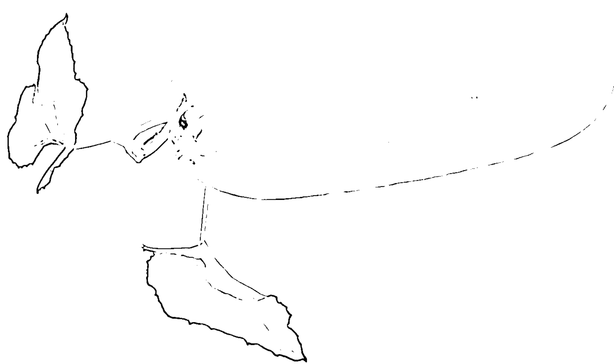

在瓜字輩的果實之中，冬瓜的體積相對較大，長度可達約九十公分，重量則高達十公斤之譜，因此相較來說，倒抽的力道也不那麼猛峻，對於陽氣旺盛的人來說，偶而食之，或可接受。因為瓜類的特徵在於「倒抽」，加上寒性，並非單純的久煮加熱就可以調整，所以有的地方小吃之中有「冬瓜茶」、「冬瓜糖」等物，雖甘美可口，若胃氣、陽氣不達標準強度，還是淺嘗輒止，仍不宜貪食、過食。附帶一提，臺灣非常出名的小點「鳳梨酥」，隨著各家配方不同，但多數的產品，在原料之中其實會用上冬瓜。只是鳳梨酥一口一個，用量那麼少的小點，除非過度貪食，通常也就無需計較了。

| 生物分類 | 葫蘆科 |
|---|---|
| 本草分類 | 穀菜部 |
| 取用部位 | 假果 |
| 建議食用頻率 | 少用 |
| 建議用量 | 少量 |
| 使用季節 | 當令 |
| 四性 | 寒 |
| 五味 | 甘 |

### 冬瓜籽

冬瓜籽性味甘平，色白質軟，有收斂的力道，質地又偏向土屬性，外觀接近水滴形，有水屬性。因為是真果，長度僅約一公分左右，體積小，力道足，所以在《本經》有記載藥效，性味甘、平，在《桂本》中更用為藥材組方，方劑有去除腹腔內組織化膿的功效，力道十分強大，我見過有朋友的家人因此免去腹部內臟的發炎化膿而被宣告必須開刀的命運，躲過一場血光。只可惜時至今日，知用、善用的人不多，使用的技法與經驗不得承傳，碰到這種狀況，往往就是直接推入手術室裡，沒有人敢插手。希望能夠準確駕御古經方的方劑力道的人，在將來能夠越來越多，加惠大眾。

## 3. 甜瓜——附·瓜蒂

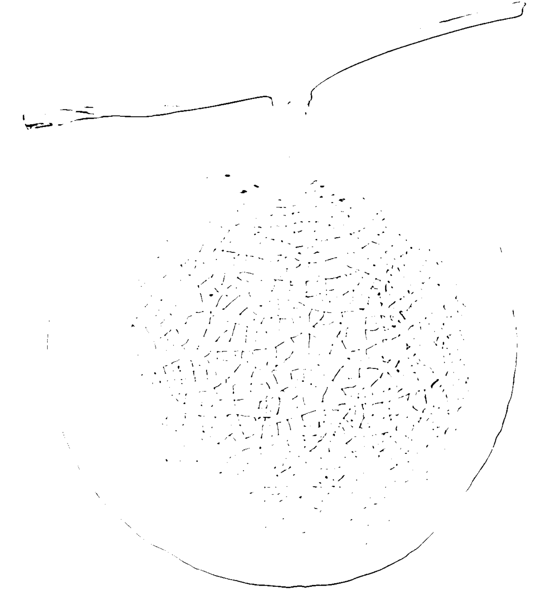

常見的甜瓜品種有數種，因為是高經濟價值的作物，品種改良的痕跡較多，外皮以及果肉的顏色種類繁多。其中，比較受到關注的是網紋甜瓜。與其他甜瓜的外觀相比，網紋甜瓜則是在青黃色的外皮上，有明確的網狀立體凸起的裂紋，樹枝狀結構的木屬性特徵顯著。網紋甜瓜的果肉多半是橘黃色，為赤、黃間色，表示帶有火與土屬性。輪廓比較起來接近圓形，作用點主要在胃。雖然仍是以瓜類的倒抽力道為主，但是因為能夠以倒抽火屬性的力道回收至胃中，所以在適宜的狀況下，可以使得雙向調節功能不足的胃氣獲得輔助的效果。有此一說：因為過食西瓜所以造成的腹瀉，若是能夠適量的吃上一些網紋甜瓜，有機會可以幫助因為受寒而失去涵養津液能力的胃氣挽救頹勢，以為急救。單純就物性的應用來說，是有幾分道理的。

| 生物分類 | 葫蘆科 |
|---|---|
| 本草分類 | 果部 |
| 取用部位 | 假果 |
| 建議食用頻率 | 少用 |
| 建議用量 | 少量 |
| 使用季節 | 當令 |
| 四性 | 涼 |
| 五味 | 甘 |

### 瓜蒂

甜瓜的作用在瓜蒂上也可以看得出物性的不同之处。甜瓜蒂中藥名為「瓜蒂」，《本經》之中有記載，性味苦、寒。在《桂本》之中的作用在催吐，因為瓜蒂在瓜實的生長階段之中，是連接瓜藤供給養分的交界點。瓜蒂略有呈現緊縮的時候，就是瓜實成熟的時候，這個階段的瓜蒂等於是養分開始被掏空的狀態，若是應用在體內，能夠讓胃連帶肝系統也感應到瓜蒂「被掏空」的氣機，產生我所謂「人虛」加「胃冷」的嘔吐生理機制公式，讓身體能夠順勢將位置在胃部以上，並且應該吐出的病灶給處理乾淨。據說瓜蒂入藥的時候，非經口服不可。依照現代研究，如果用所謂的瓜蒂有效成分萃取液進行靜脈或皮下注射等，非經口服的方式攝入，就沒有催吐作用，可見得中藥所謂「同氣相求」的規則十分嚴明，劑型的攝取方式也不可混淆，更不可用簡化的「萃取物」、「有效成分」之說來概括整體物性的作用，經常有失之毫釐而謬以千里的結果。不過，以瓜蒂做為催吐之用，乃是隨證處方的藥用範圍，家常之中不宜輕易使用，請特別留意。

## 4. 苦瓜

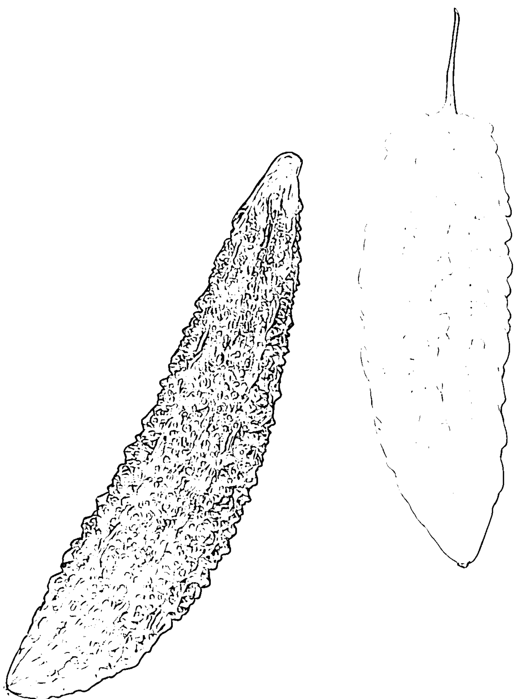

苦瓜，顧名思義，味道極苦。苦瓜的食用品種有數種，但是統一的特徵都是味苦。嚴格來說，葫蘆科的假果果肉都有苦味，或強或弱而已，而苦瓜又是其中的代表性角色，苦味一枝獨秀。苦味通常是能夠把身體的作用機能壓抑下來的味道，就算是在藥用組方的場合，也必須精準使用，所以在在家常食用來說，一般也不建議大量入菜。苦瓜的生態習性喜歡高溫，一旦採收之後，鮮度又容易快速下降，生長的升發力道幾乎完全依靠環境的供給。也因為苦瓜生長在高溫的環境之中，對於生活在同樣環境，平素不吹冷氣、不吃其他苦寒瀉下飲食的人們來說，多少還是有食用的本錢。苦瓜外表有密佈的顆粒帶火屬性，作用的力道主要是倒抽心火的能量。葉子輪廓多分歧，帶有較多的木屬性，整體而言對於肝系統與心系統的功能都有相當程度的抑制作用。

| 生物分類 | 葫蘆科 |
|---|---|
| 本草分類 | 穀菜部 |
| 取用部位 | 假果 |
| 建議食用頻率 | 少用 |
| 建議用量 | 少量 |
| 使用季節 | 當令 |
| 四性 | 寒 |
| 五味 | 苦 |

苦瓜的偏性較強，調理的時候更需要仰賴大量的鹹味調味力道以為修飾，常見的料理手法就是「鹹蛋炒苦瓜」這樣的應用。將醃製得極鹹的食材與苦味極盛的苦瓜配伍，一同大火大油快炒入味，將被苦瓜壓抑下來的功能轉化成收聚出津液的效果，以鹹味引導進入腎系統收藏，藉蛋黃凝聚核心津液以緩降胃氣，頗有以大開大闔之手，而收轉危為安之妙。習廚藝之人若能仿此，善引物性入菜，進一步創造飲食文化的深度，再普及、深入到尋常百姓家中餐桌，將是萬民之福。

## 5. 南瓜
——附：南瓜籽

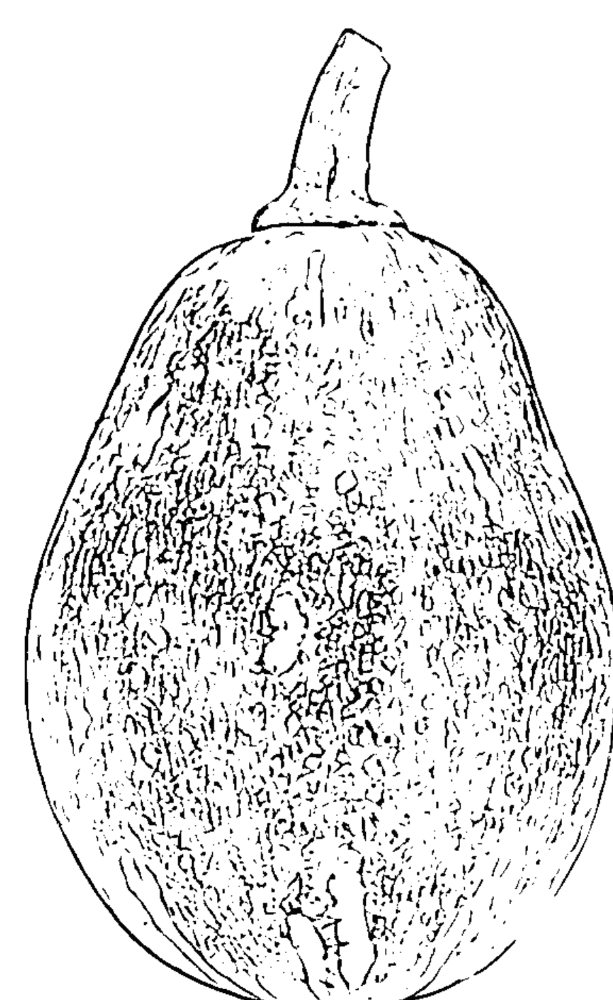

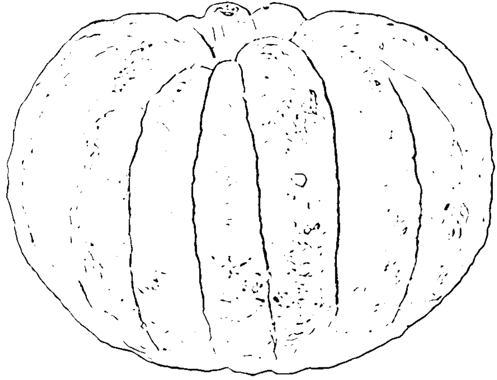

南瓜在葫蘆科的蔬菜之中，綜合來說物性較為平和，主要是因為苦味較不明顯。南瓜的瓜苗如果在栽種的過程中不摘心，一般可以延伸至五公尺長左右，表示南瓜蔓莖的升發力道有一定的強度。農家通常必須在早上九點以前完成南瓜的人工授粉，而凌晨的三點至早上八點之前，大約是在一天的少陽時段，十點以後則進入太陽時段（請參考《太極米漿粥》P.92），這表示南瓜對於少陽升發的力道的需求十分明顯。南瓜的顏色在瓜類之中比較特殊，肉質色黃，表示能量倒抽至胃裡的傾向集中。

綜合來說，南瓜在食用的時候較容易有飽足感，但是南瓜與其他特定的蔬果一樣，在過食之下容易發生皮膚泛黃的狀況，這表示南瓜仍然有令體內脾胃寒濕積滯的傾向，對於脾胃的代謝力道來說，較為不利，所以在食用的量與頻率上，必須要多加留意、調整。

| 生物分類 | 葫蘆科 |
|---|---|
| 本草分類 | 穀菜部 |
| 取用部位 | 假果 |
| 建議食用頻率 | 少用 |
| 建議用量 | 少量 |
| 使用季節 | 當令 |
| 四性 | 涼 |
| 五味 | 苦 |

### 南瓜籽

南瓜籽也會做為食用，功效與西瓜子略同，偶爾少量用之，對於幫助胃緩解下氣，有一定的效果。因為南瓜的作用較偏胃與少陽系統的連結功能，所以也有人認為以南瓜籽去除腹中寄生蟲，可以收到一定的成效。相較於南瓜肉的導致脾胃寒濕，南瓜籽的真果的下行力道，反倒能夠通利脾胃之中的濕氣，能夠下水、利尿，去除一些少陽系統之中的濕氣問題。但也因為較有成效，平常食用的量就更需要節制才好，不可貪圖效果而過食，以免通利太過導致腹瀉，反而造成虛證，以偏害偏，引發更嚴重的疾病。

# 百合科

做為食用的百合科的植物，在外觀上有兩大特徵，有的時候是並存，有的時候是擇一出現。其中之一，是「根莖的塊體很大」。像是百合、洋蔥、蒜，地下根莖的個頭很大，這對於食用或是藥用來說，是很重要的一個特徵。另外一個，是「地上莖葉細長」，像是蔥、韭、金針花。兩者兼而有之的，像是洋蔥、蒜。百合科地上莖葉的細長模樣，與許多禾本科的食用植物相仿。事實上，許多野外的雜草，甚至是藥用植物，也的確是百合科的植物，並與禾本科的雜草外觀近似，例如：天門冬、麥門冬。麥門冬還有個別名叫「階前草」，頗具雜草的風格。這些食用地上莖葉的物種，只要不破壞到根部，甚至往往可以反覆連續採收，再生能力強，也是十足的雜草特性。而大塊體的地下根莖的模樣，則像是薔薇的花朵，或是結球甘藍這類，擁有「包心」、「成團」的結構。

人體在代謝的節律，除了由心包所主導的張縮往復循環之外，還有根據肺、脾做氣與血的裡外交通運輸的調和，結合起來，帶動起全身的功能流轉。而一次最小單位的全體流轉，如《桂本》中所提到的「晬時」，就是一日一夜。在類比於日開夜闌的節律之中，有不少其中的物種也反應出很獨特的物性：生食的時候有辛辣嗆味，但煮熟之後卻又轉為甘甜，具有兩種完全不同的性味的表現。但是在近現代的分類法之下，這種具有雙向變化的物種竟然都被大量的移出百合科，包含：蔥、洋蔥、蒜、韭。百合科在入藥的場合，有的時候也並非與食用如此涇渭分明，像是百合，地下的根莖可食，性味甘淡而平，也是很好的藥材。甚至像是餐桌上常常可見的蔥白，一方面也是救人於傾危的回陽大藥。純粹藥用的物種，像是貝母，則是特別強調與肺部之間的作用關係。天門冬、麥門冬，都與用於滋潤人體的肺、脾有很大的關係。大抵上此科的物種會與太陰的作用，也就是與肺以及脾的開闔有關，強調對於雙向調節功能的調理。

## 1. 葱
——附：葱白

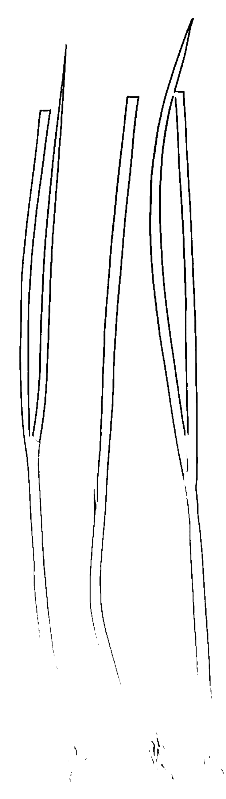

### 蔥白

蔥很早就使用在中華料理之中，歷史超過三千年，當然，一方面他也是很好用的藥材，在《本經》之中有記載，在《桂本》之中也有使用。蔥的生命力極強，只要採收的時候留下根與部分蔥白，不多久又可以重新再生出全新的地上部分，並可以連續再生，隨時都可以採收，充分發揮多年生植物的特點，這象徵蔥在少陽系統的升發力道十分的強勁，所以《本經》謂其功效可以「出汗」。

蔥較有辛辣味的部分在於蔥白，但蔥白的部分的長短並非天生，而是可以人為控制的。在種植的時候，若是刻意將蔥的地上部分隨著成長而持續以土壤或是稻草堆掩埋遮光，則被掩埋不受光的部分就會持續呈現白色。換句話說，蔥在無陽的部分則能出陽，這也是一種「物極必反」的雙向調節的力道的表現。上端青色的部分稱為「蔥管」，氣味較薄，核心部分也較鬆散，經常呈現中空狀，這表示蔥在發散的力道上是較強的，而這種向上、向外的發散力道的末尾進入到青色所屬的木系統之中，還兼有一「掏空」的作用。有的人在處理感冒的時候，會藉由將蔥白煮水，或是在粥等飲食之中，以加入蔥白來刺激發汗。不過若是在配伍、劑量、辨證不準確之下，蔥白容易把身體的津液也一併掏空，反而將導致壞病，引起感冒的惡化，所以這並不是很穩當的做法，我建議使用的時候應該要多加小心病人的變化狀況為宜。

| 生物分類 | 百合科 |
|---|---|
| 本草分類 | 穀菜部 |
| 取用部位 | 葉 |
| 建議食用頻率 | 偶爾 |
| 建議用量 | 隨喜 |
| 使用季節 | 四季 |
| 四性 | 溫 |
| 五味 | 辛 |

另外，若是碰到手腳發冷又下利的狀況，或者是面部無故經常泛紅的情形時，將蔥白取與乾薑同重，加入炙草薑茶（請參考《太極米漿粥》P.235）同煮，而蔥管則大方捨去，萬不可用，應用蔥白質地紮實、可以「由陰出陽」的力道，則是較為適宜的。《內經》稱蔥為「五菜」之一，言其「味辛」，應用於《桂本》之中，可以看得出其妙用所在。

## 2. 蒜

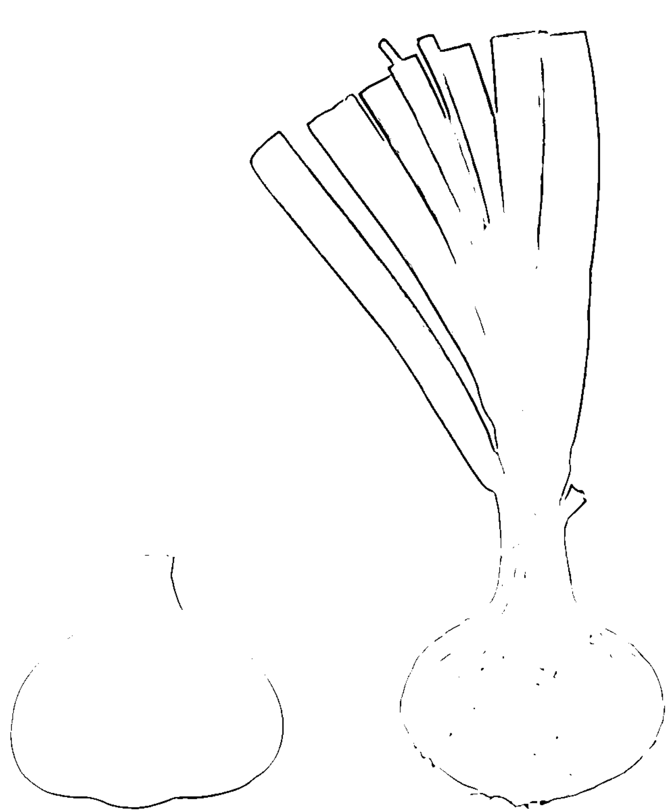

嚴格來說，蒜是舶來品，大約五千年前在埃及就有栽種，而在漢代的時候，中國人才開始使用，所以蒜一開始被稱為「胡蒜」。而也因為個頭較大，被稱為「大蒜」，有別於個體較小，原生的「小蒜」，也就是薤。漸漸的，目前所說的「蒜」，通常指稱的就是大蒜，而「蒜頭」則特指的是根部。蒜的全株幾乎都是可以食用的部分。地上的部分稱為「蒜苗」，一般的使用方式大約與蔥管相仿，只用於料理搭配，不特別強調什麼作用。蒜苗也像蔥管，略帶中空，也有透過少陽系統升發力道發散的傾向。蒜頭的結構雖然大致上是包心結構，不過外觀上除了一頭較尖之外，嚴格來說並不工整、對稱。此種外觀形狀較不具定型的特徵，表現出來的偏性也較具有火屬性。另外，蒜頭帶有的氣味特別強烈、特殊，這種帶有強烈而獨特氣味的特質，通常也帶有火屬性。蒜頭在各種炒菜的場合之中，很適合在熱鍋之後，油溫尚低的時候，先下鍋中翻炒，逼出香氣，至油溫足夠之後，再與其他食材共同拌炒。但是因為一般料理之中的使用量很小，所以雖然蒜的性味辛溫，若非一道料理之中用足一整顆蒜頭，大約五十公克左右，否則也起不到什麼太多去除寒性的作用。

| 生物分類 | 百合科 |
|---|---|
| 本草分類 | 穀菜部 |
| 取用部位 | 全株 |
| 建議食用頻率 | 偶爾 |
| 建議用量 | 隨喜 |
| 使用季節 | 四季 |
| 四性 | 溫 |
| 五味 | 辛 |

真要發揮功效，蒜頭最好生用，直接佐餐，可以起到幫助脾胃消化食物的功效，間接能夠減輕心臟在代謝飲食的時候所產生的負擔，特別是與水屬性的豬肉共用，藉由少陽系統的升提作用，能夠幫助加強水屬性的津液的消化與吸收，效果極佳。

一般飲食習慣之中，常見到吃香腸或是水餃的時候佐上幾顆蒜頭，理由就在於此。香腸雖然因為腸衣難以消化，但是現今多數香腸的腸衣都是塑膠所製，以我的看法，不吃也罷。

至於為什麼餃子比較難消化？因為煮法特別。煮過餃子就知道：下了餃子，鍋水再次煮沸後，得加冷水，令其重新煮沸，此種手法稱為「點水」。如此反覆兩次，餃子才會熟透。若不點水，則餡料在熟透之前，餃子皮很容易就先破皮而「露餡」了。餃子難消化，不在餡料，而在皮。皮，不過就是麵粉和水而已，都經過擀麵手續的往復折疊，但是吃麵條的時候，怎麼就沒聽過有人覺得不好消化？重點就在於「反覆冷卻又加熱」。這個動作在做一種加工的時候也會如此操作——打鐵煉鋼。把鋼材燒到火紅之後，錘打折疊，然後浸冷水，稱之為「回火」。反覆操作之下，鋼材的脆性降低，韌性提高，百煉而成鋼。麵皮在反覆加熱冷卻之後，就漸漸脫離了原本麵粉的物性，轉為較具有金性的特徵。這種有韌性的物性，雖然可以藉此打造出久煮較不易破損的麵皮，但是在脾胃裡頭，當然就會更不易消化。為什麼吃餃子常常搭配生蒜頭？吃香腸的時候也要這麼配？理由就在這邊：生蒜頭可以大幅提升脾的機能，協助化消餃子皮或是香腸的腸衣，而餃子皮與腸衣都具金屬性，剛好可以藉由火克金的機轉抵消。這種特殊煮法，過去在火力調控不易的年代，像是烹調豆類時，主要為了把已經溶出的豆質稀釋掉，以減少湯水起泡，才會有人這麼做。但是時至今日，除了餃子有這個需求，或者有人會將麵條起鍋的時候，沖洗冷水以求增加彈性，也不過就做這麼一次。甚至在做蒸餃、煎餃的時候，因為是用間接加熱的方式，漸近熟透，所以連點水也不必了，一次性的加熱就可以起鍋。

看到有朋友偷工以點水的方式煮太極米漿粥，其實只是把米粒的外層練出金性，讓米粒的內層過度吸水，最後導致碎裂，並非真的以火力逐漸將米粒與水充分調和，等同於把米粒冷凍使其脹碎的「偷吃步」（請參考《太極米漿粥》P.204）。

在此奉勸朋友：千萬不要在未諳物性之下，只求速效、省工，誇大了片面的效果，反倒浪費了材料，可能還賠上健康，損失更鉅。我們常見到藥肆之中寫著：「炮製雖繁，必不敢省人工；品味雖貴，必不敢減物力」，誠然也。

至於坊間還流行過一種黑蒜，已經過度加工，大蒜獨有的氣味盡失，火屬性不復見，最重要的是變成不帶足量津液的黑色食物，明顯已然失去食用的意義，更說不上有什麼特別的保健效果，建議避用為上。值得一提的是，大蒜雖然能夠幫助消化，但是因為辛散力道強，也有掏空的傾向，而掏空的對象是血液。所以，若是過食蒜頭，可能引起血虛，如果引起風氣入裡，與當下體內提高的氣發生作用，內臟可能出現氣滯水腫，引發腫塊。若是與如糙米等，非屬於可助補血的食材共食，看似營養成分滿點，實則糙米被強力化消之後，原本不會被完整化消的米糠因此發生出過於大量的氣，氣滯水腫的問題會更加嚴重，神經系統也會難以承受。

當然，原本就有血少、血熱體質的人，就更需要慎用為宜。在加強消化力道之前，會如蔥白一般，先引發過度辛散之弊害。所謂的「幫助消化」，也不該無限上綱才好，畢竟單純的刺激功能增強只能一時，以中和偏才是正道。

## 3. 洋蔥

洋蔥使用的部位雖然仍是以地下鱗莖為主，但其實也屬幾乎全株可用。同樣是地下鱗莖，洋蔥的結構層次清楚、整齊，帶有的金屬性較明顯。洋蔥在生用的時候也具有辛味，但是稍稍別於蒜頭的辛辣，洋蔥的辛味還帶有少許的辛竄力道。若是與蔥白比較，蔥白同樣具有工整的層次結構，都具有金屬性，而蔥白使用部位的結構呈現柱狀，類似人體的腸道，因此作用點偏向肺系統的「腑」，也就是大腸。洋蔥使用的雖然也是莖，但是因為該部位的外觀為一頭較緩而一頭較尖，反而帶有火屬性。同時挾帶有火屬性以及金屬性，對於生用的時候含水量極大的洋蔥來說，反而不至於偏向寒性。從金屬性的結構透發出火屬性的外觀，象徵肺金受到心火的能量加乘，使得肺中的津液透發而出，所以在各種百合科的辛味物種之中，獨有洋蔥的辛味能夠催人落淚。

洋蔥除了辛散的作用之外，還帶有引導少陽系統在上焦的能量開散的效果，這種特質使用在料理之中，則是可以使得同屬於少陽系統的脂肪類的成分能夠獲得分解。我曾經試驗過，將生洋蔥粒撒在牛奶霜淇淋上，一同食用，則洋蔥粒的辛竄味大幅消退，口感極似水梨，而霜淇淋之中的牛奶的獨特氣味也變得不明顯。兩相組合，產生了全新的食用體驗。在這邊提供出來，或許可以供有緣朋友在創作料理之中，能夠有突破性的發想。

| 生物分類 | 百合科 |
| --- | --- |
| 本草分類 | 穀菜部 |
| 取用部位 | 全株 |
| 建議食用頻率 | 偶爾 |
| 建議用量 | 隨喜 |
| 使用季節 | 四季 |
| 四性 | 溫 |
| 五味 | 辛 |

## 4. 蘆筍

蘆筍通常只食用初生嫩芽的部分，特徵與竹筍的確非常類似。蘆筍雖然在最近被拉出了百合科之外，但是蘆筍在栽培的特徵上，還是與原百合科，現今也是被拉出百合科外的蔥近似：地上莖在遮光的處理之下，外觀顏色為白色，受光的部分才轉變為綠色。所謂的白蘆筍與綠蘆筍之別，其實就像蔥白與蔥管一般，只有栽培的方法不同而已。蘆筍每天可以生長十公分，升發力道很強，但是採摘的時機很短，一旦錯失，植株就變得粗老而苦澀，不堪食用。食用上建議略作汆燙即可，或者快速爆炒，甚至少量生食亦可，能夠約略去除脾與肺燥熱的偏向，提升清氣由三焦系統上行，若是同時搭配適量的蛋黃醬，則更具有滋潤的效果，同時增添美味。

| 生物分類 | 百合科 |
| --- | --- |
| 本草分類 | 穀菜部 |
| 取用部位 | 嫩芽 |
| 建議食用頻率 | 偶爾 |
| 建議用量 | 隨喜 |
| 使用季節 | 當令 |
| 四性 | 涼 |
| 五味 | 苦 |

## 5. 韭菜——附：韭黄、韭菜花

韭菜在中國的使用歷史，可以追溯至三千年前，同時很早就知道如何藉由栽種技巧生產韭黃。韭菜與蔥、蘆筍相似，在不受光的環境下，外觀為白色，而在弱光的環境之下則會略為由白轉為黃色，即為韭黃，氣味反而較為平和，辛散的作用不明顯，偏性較弱。韭菜具有很強的升發力道，與蔥相似，只採收地上部分，就可以再生而連續採收。隨著韭菜生長，地上的部分增高，地下的根莖就會老化而枯死。所以，韭菜雖然可以增強人體少陽系統升發的力道，但是走而不守，對於內臟來說，多用之後還是偏向造成耗損的結果，特別是黃色代表的脾系統，因此也不宜過食。尤其是對於正在懷孕而極需要養太陰（請參考《太極米漿粥》P.217）的母親來說，脾系統的津液外行較不利於養胎。反之，若是在生產之後略有乳汁不夠通利的狀況，可以搭配大量補益津液的食材，適量用之。

韭菜在入春之後就可以採收，第一批生成的葉子最厚實、柔軟。但如果持續種植而不採收，進入夏天之後就可以收成韭菜花。韭菜花感應夏季的四時之氣而生，外觀有尖端，略呈三角形，更添加火屬性。韭菜花因為帶有火屬性，若是料理之中的食材帶有火屬性的獨特厚重氣味者，像是：魚、羊，取適量的韭菜花拌入，也可以收到調和氣味的效果。《內經》在五菜之中提到韭，言其「味酸」。雖然「酸」的定義與實際食用的感受體驗之間，差距頗大，但是如果以功效來說，韭菜取脾土津液生肝木，最後能兼旺心火，要說對於肝屬性的效果有助益，的確無誤。可見《內經》之中對於味覺的描述與功效之間的連結，或許並不如我們在日常飲食中舌尖上的感受一般單純吧。

| 生物分類 | 百合科 |
| --- | --- |
| 本草分類 | 穀菜部 |
| 取用部位 | 全株 |
| 建議食用頻率 | 偶爾 |
| 建議用量 | 隨喜 |
| 使用季節 | 四季 |
| 四性 | 熱 |
| 五味 | 辛 |

## 6. 薤

薤，音同「謝」，又名：蕗蕎、蕎頭。薤的使用起源相當早，在《禮記》之中已經提到：「膾，春用蔥，秋用芥；豚，春用韭，秋用蓼，脂用蔥，膏用薤。」在漢代的時候更是已經入方為藥用，《本經》記載「主治金創，創敗」，《桂本》中的藥用名稱為「薤白」，並有「栝蔞薤白白酒湯」等方劑，用以處理各種急、慢性的胸部悶痛。薤的食用部位也是地下鱗莖，外觀略似蒜，而地上的部分似蔥或韭。但是地下根莖沒有如蒜頭一般的蒜瓣結構，個頭也較小，結構多層次而規律，反倒是比較像是小幾號的洋蔥。薤的氣味強烈，除了辛辣之外，還包含了一些獨特的氣味，很有特徵。我認為這是代表了薤能夠像是洋蔥一樣，從太陰開闔的效果打開氣機外行的力道，而獨特的氣味表示還帶有火屬性，這對於把心火的能量擴展至身體的外層來說，有著直接的效果。人體的諸多功能之中，最需要的就是將心火暢通至全身各處。心火透過百脈流轉全身，很重要的一個環節，就是與肺金結合。《內經》稱薑為「五菜」之一，言其「味苦」，雖然實際吃了薑，只覺得辛辣，但是以「味苦」來帶出薑有帶動心火運行的作用，依結果論來說，亦是言之成理。有的飲食戒律之中，不吃五辛，五辛指的是：蔥、蒜、韭、薑、興渠（即「洋蔥」），但是這五種我認為都是在飲食之中可以幫助陽氣開展的重要食材。至於這中間的用與不用要怎麼取捨，就請各位朋友自行判斷了。

薑的食用方式很多，隨喜加入料理之中，一同拌炒，其中又以與油脂含量多的豬肉配伍，更為合宜。或者以鹽、糖醃漬後，做成醃菜，甚至生吃，直接佐餐食用。因為薑帶火屬性的氣味較重，通常會多加水屬性的天然鹽，就可以調整他的風味，就像前面說到的「膏用薑」一般，料理之中若有呈膏狀的食材，像是蟹膏、溏心蛋黃等，與薑相佐，也有不凡的效果。有日本研究指出，每餐多吃薑，各種煮法都行，可以幫助排出累積在體內的重金屬，甚至排出重金屬後還有利於減重。關於此類的說法的真實度，我不做評論，但是若以古經方中醫的觀點來看，薑的確可以提升人體陽氣於傾危之間。如果這種「排毒」說法可以因此鼓勵現代人在日常多用薑來入菜的話，也算是功德一件啦！

| 生物分類 | 百合科 |
| --- | --- |
| 本草分類 | 穀菜部 |
| 取用部位 | 地下鱗莖 |
| 建議食用頻率 | 偶爾 |
| 建議用量 | 隨喜 |
| 使用季節 | 四季 |
| 四性 | 溫 |
| 五味 | 苦 |

# 物性飲食．非吃不可與少吃為妙的全食物養生法（上冊）

作 者 — 紫林齋主
攝 影 — 二三開影像興業社
美術設計 — 張嚴
責任編輯 — 楊淑媚
校 對 — 紫林齋主、楊淑媚
行銷企劃 — 許文燕
第五編輯部總監 — 梁芳春
發 行 人 — 趙政岷
出 版 者 — 時報文化出版企業股份有限公司

10803 台北市和平西路三段二四○號七樓
發行專線 — (○二) 二三○六—六八四二
讀者服務專線 — ○八○○—二三一—七○五
　　　　　　　(○二) 二三○四—七一○三
讀者服務傳真 — (○二) 二三○四—六八五八
郵 撥 — 一九三四七二四時報文化出版公司
信 箱 — 台北郵政七九～九九信箱
時報悅讀網 — http://www.readingtimes.com.tw
電子郵件信箱 — yoho@readingtimes.com.tw

法律顧問 — 理律法律事務所 陳長文律師、李念祖律師
印 刷 — 勁達印刷有限公司
初版一刷 — 二○一八年三月二十三日
定 價 — 新台幣三五○元
◎行政院新聞局局版北市業字第八○號
版權所有 翻印必究
（缺頁或破損的書，請寄回更換）

時報文化出版公司成立於一九七五年，
並於一九九九年股票上市公開發行，
於二○○八年脫離中時集團非屬旺中，
以「尊重智慧與創意的文化事業」為信念。

物性飲食．非吃不可與少吃為妙的全食物養生法 / 紫林齋主作.
-- 初版. -- 臺北市 : 時報文化, 2018.03 冊 ; 公分
ISBN 978-957-13-7354-6(上冊 : 平裝). --
1. 食療 2. 養生 3. 中醫
413.98 107003390

## ○人有人性，食物當然也有「物性」

物性就是食物的個性，不過並非單純的中醫性味歸經之分，更不是西醫討論的營養成分，而是從食物的外形、味道、科別、生長環境方式、人工製造方式去了解：這口食物下肚，會對身體產生什麼反應。

## ○藥食雖同源，但某些食物非得捨棄不吃，才有恢復健康的機會

【絕對不沾的三種食物】蘋果、黑豆、白蘿蔔
一天一蘋果，醫師真的遠離你？！黑豆被視為健康食品，多多益善？蘿蔔益氣，但只喝一口白蘿蔔湯，就可能讓元氣報銷？就是有這麼些食物，偏性過於強烈，會讓身體的養分大量流失，能量無法透過食物留存於體內！

## ○搞懂物性和配伍烹調原則，廚房灶頭上就有救命良方

薑是回陽的絕佳良藥；益人無數的太極米漿粥，來自尋常的大米與清水；馬鈴薯帶皮烘烤，搭配大量油脂烹調，提高腸道機能；青椒疏瀉肝的濕熱之氣，熟食生食皆建議……
多數食物都有偏性，需合理食用。本書提供一套判斷物性的方法和配伍的原則，讓各種食材的偏性獲得修正。所以任何疾病在未達重症之前，若食物經過適當的配伍，酌量用之，就能取其用，綜其效，避其害。

囊括蔬、果、蕈菇、魚鮮、禽畜肉和加工製品
超過150種常見食物、10大調理便利貼

時報出版
VUU0047 NT$350
ISBN 978-957-13-7354-6 (413.98)