# 物性飲食下

# 第三章

# 物性介绍

# 芸香科

芸香科的果實很常出現在我們的餐桌上，通常芸香科的果實香氣很重，像是以此為科目名的「芸香」一草，古代用來置於藏書之中，一來增添香氣，二來可以驅蟲。體型大一些的就成為水果，小一些的則成為香料。也因為香氣代表了氣的狀態的最佳化，所以有的作為食用，有的甚至可以作為藥用。對於身體的意義來說，有人這麼定義了香，認為香氣是所謂的「氣之正」。以我自己的認識：脾是生氣的源頭。脾系統主要的作用，在於藉由涵養了大量的津液，用以雙向調節其餘四臟的功能，進一步來說，我們經常提到的「養胃氣、護陽氣」，正是從脾系統開始做起。這種由津液之中轉化出身體所需的正氣的變化，就氣味方面的類比來說，就是香氣。芸香科的植物的果實，像是柑橘類的水果，幾乎都是圓形為主的外觀，這也代表土屬性的造型。

芸香科的植株通常多是開小型的白花，香氣重，像是「月橘」，由別稱「七里香」即可顧名思義。花序具有能夠溝通金屬性的能量，葉子既有很明顯的香氣，外觀也是圓形或是橢圓形。透過加強脾系統氣的功能，除了可以整腸健胃，幫助消化之外，對於津液的加強推送，也可以幫助到一部分腎系統的功能，主要是與關節以及神經系統相關，甚至在調和胃氣之後，還能夠幫助到一部分心臟功能的調節。雖然整體而言，功用多半還是在以偏治偏的調整，以中和偏的效果比較薄弱，若是在脾胃津液涵養充足為前提之下，幫助津液的運行，身體的氣機更能夠獲得強化。只是一般來說，柑橘類水果以使用果肉為主，而入藥卻是多使用果皮，或是帶皮整個使用，所以就一般的食用方式來說，好處並不明顯。果肉多是味酸，甚至極酸，對於氣機來說，有阻滯的效果，但是反倒果皮多半帶有辛竄味，這才具有疏理氣機的效果。若是貪圖好處，誤用而過食果肉，反而還有過耗脾胃津血的問題發生，擾亂氣機，那就得不償失了。

## 橘 1.
——附：橘皮、橘絡

其實芸香科柑橘類水果的種類非常多，但是許多是彼此雜交育種之後的經濟作物，大抵上的物性相差不多，或者是幾個品種削弱後兼而有之，像是柑與橘，在現代的稱呼中也很少細分了，雖然各自仍有可辨別之處，但通常混為一談，所以在此不一一列舉。

橘肉吃多了，也與芒果、南瓜等物一樣，會令膚色變黃，這也是基於其物性令人體「寒濕在裡」，脾裡頭累積了寒濕之氣才造成的「黃疸」證，這大抵上就可以說明橘肉對於身體的影響：酸味阻滯了脾系統的氣機之後，氣化為水，運作效能低落的寒，加上氣凝成的水濕，令脾系統的功能處於效能不彰的狀態。尤其是芸香科物種的作用點都以人體的胃為主，若是氣上逆而發為咳嗽的時候，酸味阻止胃氣順降，寒氣與濕氣就會加劇咳嗽的問題，這並非坊間所說，把橘肉烤熟了再吃就能解決的狀況，咳嗽時只有避免吃橘肉一途而已。

| 生物分類 | 芸香科 |
|---|---|
| 本草分類 | 果部 |
| 取用部位 | 果 |
| 建議食用頻率 | 少用 |
| 建議用量 | 少量 |
| 使用季節 | 當令 |
| 四性 | 涼 |
| 五味 | 酸 |

### 橘皮

橘皮在《本經》之中的描述為「味辛，溫」，不但可以主治「胸中瘕熱逆氣」、「利水穀」，還能夠「下氣通神」，效果與橘肉完全相反。大抵上，植物的果實，其果皮與果肉的效用往往是相反的兩極，因為是二極，才能成對，合而為一體。所以《桂本》之中不但會用橘皮來促進脾的功能，而與生薑配伍時，甚至可以救人於四肢厥逆的危急狀況之下，是功效非常強大的藥材。可惜目前柑橘類水果的農藥施用量普遍較大，果皮殘留的農藥多，不適合做為食用。藥肆之中的橘皮通常是經過長時間的乾製，名為「陳皮」，但是辛竄味大減，力道較緩，已經與《本經》或是《桂本》裡所記載的旨趣有異。不過，做為平常飲食之中的香料或是燉湯時的調味，用來提升料理的香氣、助消化，倒是頗為適宜。

### 橘絡

橘皮與橘肉之間，有白色、略帶苦味的纖維，稱為「橘絡」。因為位於皮、肉的表裡之間，外觀又類同於人體各種「網狀分布」的結構，像是神經、淋巴等，且因為色白、味苦，所以通常具有些微的降除氣管、血管燥熱的功效。雖然不必刻意剝除，但是也不至於特意大量食用。只是因為通常橘絡的口感不佳，所以一般來說較不討喜。若真有需要調理氣機，其實，多喝上一碗太極米漿粥，得了。

## 2. 檸檬

檸檬的味道更酸，比較少直接大量食用，而多用於與其他食材的輔助調味。檸檬的花苞或是嫩葉都帶有些許的紫色，這表示除了其作用點在胃之外，還與少陽系統的升降功能*有所連通。

檸檬果實的最大特徵就是「兩頭尖」。通常柑橘類水果的外觀大致可以分為兩種，一部分是圓形、扁圓形、橢圓形為主，另一部分則是在蒂頭的一端帶有程度大小不一的凸起。若是兩頭均有凸起，也就是兩頭尖，物性就從以圓形為主的土屬性或者圓錐狀的火屬性，轉變成為帶有金屬性較多的情況。兩頭尖的果實或是種籽，根據金屬性「收斂肅降*」的能量特性，破瀉的力道也隨之加大。而有的品種的檸檬（不分果皮顏色的黃或綠），果實的外觀就具有兩頭尖的特徵。通常，除非是以大量富含油脂的肉類相佐，把檸檬果肉阻滯氣機與破瀉的力道做相當程度的稀釋，不然都會明顯傷到胃氣往少陽路線連通的升發力道。

| 生物分類 | 芸香科 |
|---|---|
| 本草分類 | 果部 |
| 取用部位 | 果 |
| 建議食用頻率 | 少用 |
| 建議用量 | 少量 |
| 使用季節 | 當令 |
| 四性 | 寒 |
| 五味 | 酸 |

### 升降功能

人體功能帶動結構變化，主要發生在升與降的陰陽調控。少陽系統的特性則是在於：受到陽明系統的影響，會以較快的速度，反應於升降方面功能的雙向變化，進一步的促進身體其他功能系統在升提或降落的功能傾向。胃氣的雙向調節功能，透過少陽系統的升降功能而放大，擴及到全身。

### 收斂肅降

金屬性的功能特性，我用「收斂肅降」四個字來高度概括之。「收」意味「由發散而集中」，「斂」意味「由鬆散而約束」，「肅」意味「由混雜而清別」，「降」意味「由升提而沉落」。身體的這四種功能的發生，通常都是在金屬性的功能，或是在其結構底下出現，展現出金屬性含有的「法理」、「規則」，令功能與結構進行不悖。

之前聽聞有人推薦孕婦多吃檸檬來「養胎」，這真是駭人聽聞的嚴重聞的嚴重謬誤。檸檬酸瀉，不養太陰；養胎首重養太陰，吃檸檬怎麼有可能養胎？還有像是感冒喝檸檬水，不但沒有療效，更恰恰與溫通腠理的治療原理相反，所以還有高度的可能會引邪入裡，讓感冒惡化。這種「感冒要補充維生素」之類背離事實也沒有根據的說法，千萬不要再以訛傳訛了。

不看果肉，檸檬皮的部分也類同於橘皮，對於調理脾胃氣機的效果很好。與橘相同，若是可以找到種植條件較好，果皮無農藥殘留的商品，將果皮直接生用在料理之中，既能增添香氣，又能夠增強身體的氣機，我認為是很理想的調味佐料。

## 3. 柚

柚果的外觀呈現圓錐形，帶有較多的火屬性，在令脾胃之氣緩降的同時，也兼有緩降心火的作用。柚葉雖然大致上呈橢圓形，但是在與枝連結的基部又附有一小橢圓形或心形，結合起來反倒成了葫蘆形，也帶火屬性。所以古時也有以柚葉煮水之後擦拭家具的習慣，除了清香，也藉由具火屬性的香氣，帶些去穢氣的寄託。

柚在柑橘類的水果中，算是體積最大的一種，因此食用柚子果肉對於身體的功能的影響也是最緩和的。雖說是緩和，但是其力道也不容小覷。曾有一位朋友在吃過中藥的感冒方劑後，覺得感冒的狀況已經好了，但是卻微微感到血氣往頭上衝，太陽穴附近有些繃脹感。正好彼刻時近中秋，我隨口問了，家中可有柚子？回答說有，所以就請對方掰出一瓣，吃下，當場就緩解了。對於平素體內津血偏少的人來說，《桂本》的藥方會重新提振人體的氣血力道，不過若是胃氣太弱，無能跟上這個強度，雙向調節的力道無法充分運作，可能會因此發生「血上而不太能下」的狀況。柚子肉略微的破瀉掉這些走行力道較強的血，氣血再次回歸平衡，所以身體就會感到舒適。當然，這是把食材做藥用，也不具有補性，更必須要謹守「中病輒止」的經方服用原則，一旦覺得不舒服的地方緩解了，就要把剩餘的藥物全部丟棄，不可再多用一口。

| 生物分類 | 芸香科 |
|---|---|
| 本草分類 | 果部 |
| 取用部位 | 果 |
| 建議食用頻率 | 少用 |
| 建議用量 | 少量 |
| 使用季節 | 當令 |
| 四性 | 微涼 |
| 五味 | 苦 |

有的人稍微過食柚子，會覺得排氣的狀況變多了，這也是因為柚子破瀉了胃中津血下行，刺激了脾氣跟著下行，開始準備排便，原理是相通的。但是萬不可將這種偏性惡用為「瀉藥」，藉由過食來刺激排便，這是傷身的。

## 4. 葡萄柚

葡萄柚的品種是晚近兩百年左右才育種而成的，除了以酸味為主，還略帶一些苦味。葡萄柚的性味與柚比較相似，外觀也近似某些品種的柚，主要為圓形。與柚相比較，柚的外皮多為青色至青黃色，主要的能量為木屬性或兼夾帶土屬性，但葡萄柚的外皮則多為黃色至橘色，主要的能量為土屬性或兼夾帶火屬性。

應該是土、火屬性的破瀉力道太過導致，影響不容忽視。而一般流傳的「吃葡萄柚能降血壓」，恐怕也是病家心臟收縮無力導致的結果，不計代價的壓低血壓並不見得都是好事。

對於吃西藥的人來說，有幾十種藥物已經確認會與葡萄柚或是柚產生不良反應，其中又以葡萄柚的不良反應比較強烈、廣泛。以西藥的說法，主要是葡萄柚或柚的某些成分讓身體代謝藥物的速度變慢，藥物因此累積在肝、腎不去，血液中的藥物成分濃度攀高，進而引發中毒。吃了葡萄柚再吃西藥會引發中毒現象，這是事實，至於要怎麼解釋，其實就中醫的角度來看，也同樣是能理解的。

## 5. 四季桔 —— 附：枳實

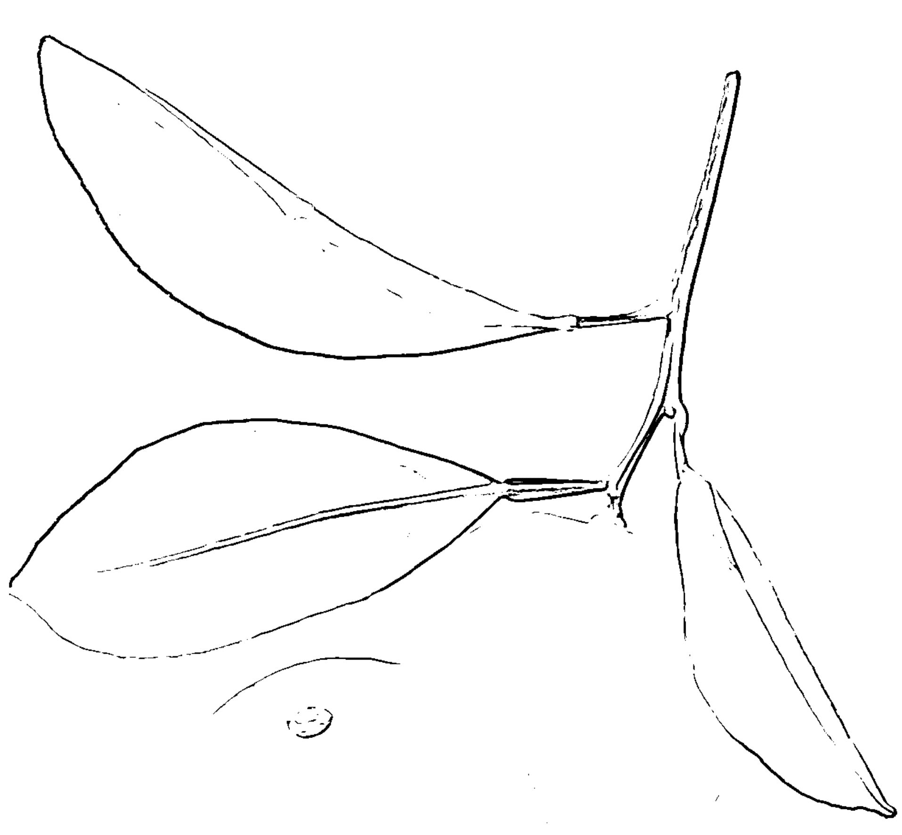

### 枳實

四季桔的個頭極小，酸與苦味都極強。除了食用之外，更多的時候是在園藝觀賞之用，俗稱常稱此品為「金桔」，但其實金桔另有他物，是誤用名稱而混淆了。四季桔的果實外皮較光滑，葉面也光滑，脈絡不清楚，基本上金屬性明顯。再加上果實的體積小，下墜力道相對偏強，所以食用上的偏性也大，建議盡量避免食用為上。

另有一種個頭小而苦味強的相似品種，多做藥用，稱為「枳實」。枳實在《本經》

| 生物分類 | 芸香科 |
|---|---|
| 本草分類 | 果部 |
| 取用部位 | 果 |
| 建議食用頻率 | 避免 |
| 建議用量 | 避免 |
| 使用季節 | 避免 |
| 四性 | 寒 |
| 五味 | 苦 |

的記載為「味苦，寒」，究竟是何品種，也有數種不同的說法。我個人認為，枳實使用的應該是一種別名為「代代」的苦橙。苦橙的果實在秋季結果，但是如果不在當季落果，則在入冬之後，果實會在枝頭再度轉回青色過冬，直到來春後，與隔年度的開花一起並列枝頭，與新結果實一併再轉紅。如此反覆，可以同時累積有三代的果實齊在枝頭上，因此別稱為「代代」。日語之中，也以「代代」的中文發音「Dai-Dai」直接做為漢字「橙」的發音，算是透過漢方認識而以漢語為外來語轉化成日語的又一例。代代橙可以反覆成熟又轉青而不落果，象徵胃氣往復折疊、周行不殆的節律，胃氣先上行而後下行，獨立而不改，所以胃氣可以雙向調節人體的所有功能於一身。在人體發生有胃氣不能順降的問題時，以枳實入藥，將可以刺激胃恢復正常節律的張縮，並且一併帶動相關連的膽以及三焦的升降調控，所以能夠收到通利膽汁等的效果，是《桂本》之中重要的藥材之一。

## 6. 花椒
——附：秦椒、蜀椒、山椒

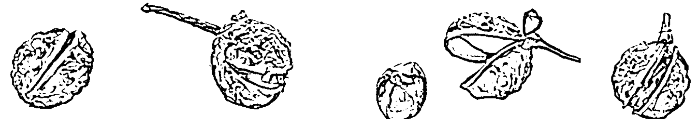

花椒是很常使用的香料，不過也很常與胡椒、辣椒混淆，事實上這三種也的確分屬不同科目品種，仔細品嘗，氣味也不相同。花椒在原本只作「椒」，後來有辣椒等外來品種，所以特別註明，否則在中國原本皆以使用花椒為主，後有胡椒，約至明代末年才有辣椒。甚至應該說：中國人本來不吃辣，吃辣的歷史在中華料理之中的時間相對很短，約兩百多年而已。不說產地的因素，辣味對於人體的功效是弊多於利，的確不宜多用，也應該與辛、竄、麻等味加以區隔。以辛味來說，花椒其實較重「麻」一味，而非目前常指稱的辣味。麻味代表的是氣的走行力道明顯強過血的狀態，可以是氣極強，也可能是血極少，但在使用花椒的狀況來說，是強力行氣的關係。許多中藥材使用之後都有麻的身體感，像是麻黃、附子、細辛、半夏，對於身體打散寒氣、疏通氣機，重新提振身體功能來說，都有奇效。

| 生物分類 | 芸香科 |
|---|---|
| 本草分類 | 果部 |
| 取用部位 | 果皮 |
| 建議食用頻率 | 偶爾 |
| 建議用量 | 隨喜 |
| 使用季節 | 四季 |
| 四性 | 溫 |
| 五味 | 辛 |

但是以上幾種都是藥材，不太允許出現在料理中使用，不過花椒可以，所以我建議日常之中隨喜好取用之。

### 秦椒、蜀椒

花椒有產地之分，在《本經》之中有「秦椒」與「蜀椒」之別，但大抵上都有去除風、濕、寒氣，整腸健胃的效果。

### 山椒

而山椒則是品種上略有不同。花椒在英文中稱為「Sichuan pepper」，山椒則稱為「Japanese pepper」，顧名思義，花椒以出自四川者最聞名，山椒則是日本常見的品種。而日本則稱花椒為「華北山椒（カホクザンショウ）」，政府公告的日本藥局方亦指定山椒才可入藥，而花椒反倒不行，由此可知，兩種不宜混為一談。但是基本上我認為山椒在藥用的用法與花椒大致雷同，應急時可以互換，不過做料理的時候，兩種的香氣不同，還是不可同用。

有一回時值夏日，我走進建物之中，極強的冷氣襲來，我覺得腸胃有些受寒而拘急，便找了間日式料理店坐下，點了鰻魚飯。日本人吃鰻魚飯，習慣會以山椒粉相佐。山椒粉，即是以山椒果皮磨粉而成，與花椒入藥時的製法相同。所以我先要了一杯熱的綠茶，加入大量的山椒粉，喝下，以綠茶提振三焦清氣，用山椒溫中散寒，再吃一碗白米飯，補益中焦脾胃津液，補足胃氣，鞏固陽氣，《桂本》裡頭「建中」的架構已經形成，寒氣散去，拘急感馬上停止。後來，當然是悠閒的享受了鰻魚飯的美味。

隨手食材配伍組合，即時應用而又功效卓越，正是「藥食同源」。若是細細區別：花椒成熟後轉深紅色，力道可通心火，山椒色青，主要走肝系統氣機的疏瀉，本來木就能生火，效果差異不大。《桂本》在急救脾胃中焦的陽氣時，用的也是蜀椒。不過要特別強調，可做藥用的是花椒的果皮，中間取出的果實也就是花椒粒，不宜直接食用。果皮與果實的物性正好有相反之處，若是直接吃下花椒粒，雖然也有辛味，但是反而寒性較重。一般處理良好的花椒加工品是不會摻入花椒粒的，而《桂本》也註明，使用蜀椒應該要去「汗、目」，「汗」指的就是種子的部分。在食用的時候，應該要特別留意才好。

# 唇形科

唇形科的植物在食材與藥材的使用範圍也很廣，在食材的範圍中，又以香草類的調味料用途佔了多數。舉凡像是薄荷、迷迭香、羅勒、牛至、鼠尾草、薰衣草，都是常見的食用香草，同時也有不少人將他們調配作為花草茶來飲用，也具有某種程度能夠舒緩一般生活上的小毛病的功效。

唇形科的物種以花序具有兩瓣花瓣，狀似嘴唇為名。人的口唇為脾系統的開竅，數字二則是具有木屬性，也就是說，土屬性的調和功能結合木屬性的疏洩功能之後，能量會轉化成能夠加強金屬性的功能。唇形科的植物多半都具有一定程度的香氣，這也是在食用與藥用方面的應用甚廣的原因。唇形科植株的葉，通常也都具有明顯鋸齒狀的邊緣。鋸齒狀除了在造型的元素上是由許多三角形的單元所組成，也就是帶有火屬性，而且從整體來看，規律的重複排列又帶有金屬性。若是以刀具來類比，直線刀刃的切割破口平整，但是鋸刃的切割破口明顯較大、較不規則，破壞力道在結合火屬性與金屬性的特徵之後，加乘放大。因此，雖然香草植物們聞起來芳香怡人，但是使用不當的時候，還是可能會產生氣機破瀉太過的問題。雖然用量的標準因人而異，但若是配伍未經講究，還是小心為上，特別是平常胃氣較弱，津血較虛的體質，或是狀況較不穩定的孕婦。

## 1. 紫蘇 —— 附：蘇籽

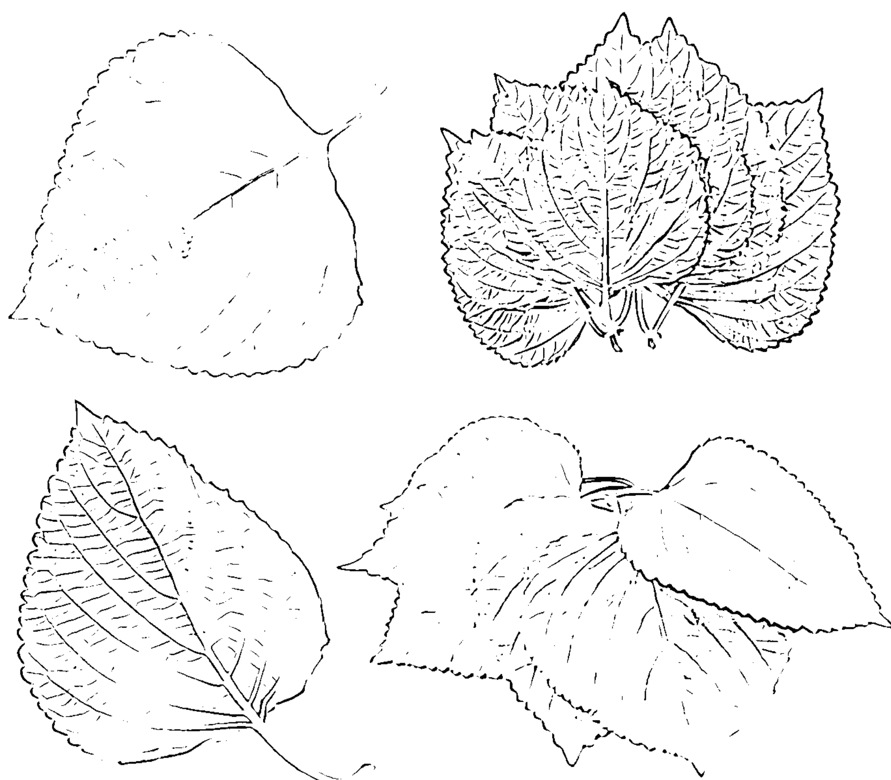

紫蘇在藥用與食用方面的表現，都是非常值得推薦的食材。紫蘇有幾種常用的品種，具有代表性的，是葉子初生時帶青色，成熟後變為紫色或是青紫兼具的品種，一般稱為「紅紫蘇」。另有一種葉子成熟後仍是青色，則稱為「青紫蘇」或是「青蘇」，亦可使用。青色表現出木屬性，而紫色則是火、水屬性的間色，走少陽系統，使用的又是帶有發散效果的葉子，因此紫蘇很能夠疏瀉木屬性的厥陰系統與少陽系統的表裡成對的系統功能。對於肝系統主要表現疏瀉功能的力道來說，有正面的助益。同時對於氣機停滯而產生的問題，也有一定緩解的效果。可說是在破瀉的功能之上，又不會造成負面影響的獨特物性。《桂本》記載紫蘇在方劑中用來消除情志鬱滯造成的功能問題，《本經》稱其具有「下氣」、「除飲食」、「辟口臭」、「去毒」等效果。除了幫助消化之外，對於消除像是食用大蒜等氣味較重的食物時，也有緩和口中氣味的效果。

| 生物分類 | 唇形科 |
|---|---|
| 本草分類 | 草部 |
| 取用部位 | 葉 |
| 建議食用頻率 | 偶爾 |
| 建議用量 | 隨喜 |
| 使用季節 | 四季 |
| 四性 | 溫 |
| 五味 | 辛 |

### 蘇籽

現代的研究也認為紫蘇葉對於魚蟹類食物的中毒現象有緩解的作用，也可以防止一些寄生蟲的感染，所以日本人吃生魚片的時候，不見得人人會吃一旁陪襯的蘿蔔絲，有的人認為吃了反而有失禮儀，或是吃下吸收了血水等不潔物的蘿蔔絲並不衛生，而有的蘿蔔絲因為是工廠大量生產，為了美觀、保鮮，有使用添加物的可能，這就是食安問題的範圍了。但是用來佐餐的紫蘇葉，則必定取用，這可以說是前人的智慧，也是比較正式的生魚片料理的食用方式。

紫蘇的種籽稱為「蘇籽」，也可以作為藥用。而青蘇有一種變種，其種籽的油脂含量與芝麻同高，可以榨取油脂，即是蘇籽油。蘇籽油氣味清新，過去曾是日本地區的主要食用油。現在雖然較少做為主角，但是在調理完成之後，若是能隨意加入一匙，對於調和海鮮料理的氣味、提鮮、去腥，都有幫助。偶爾食用，對於調理三焦系統，升清降濁的效果很好，可以醒腦、提神，值得多加嘗試。

## 2. 仙草

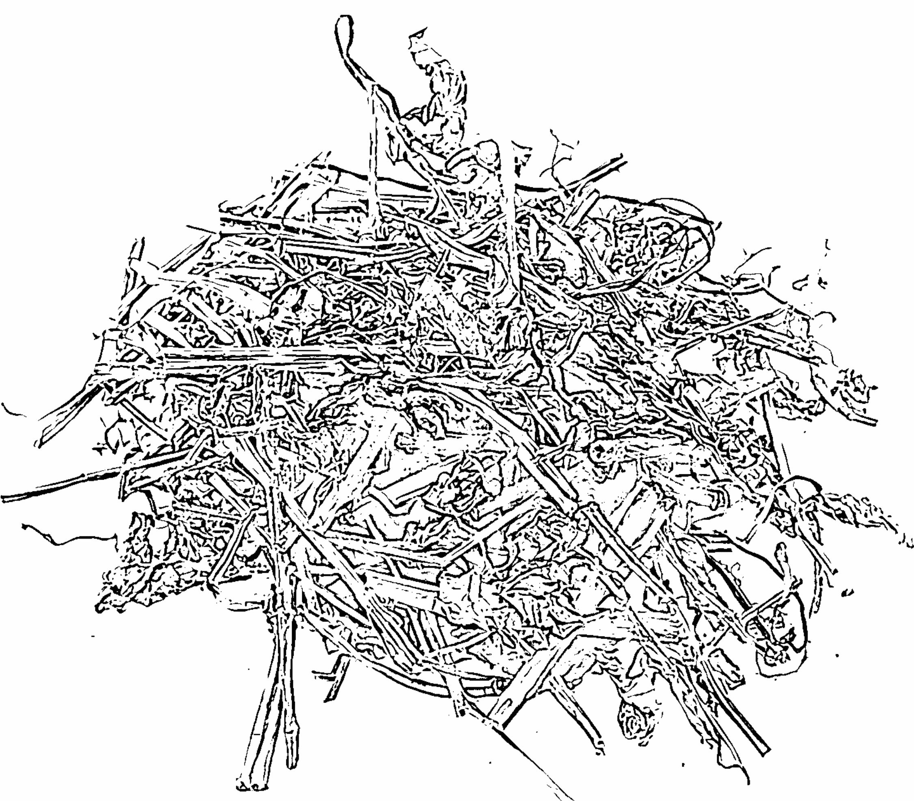

仙草主要的使用方式是將莖、葉乾製之後，加工熬煮出仙草汁，或是再加入澱粉做成仙草凍。生品仙草葉除了擁有一般唇形科物種的鋸齒狀邊緣的特徵之外，葉形相對來說比較狹長，木屬性的疏瀉力道更強，本來就需要慎用。仙草汁的顏色極深，接近黑色，但是又幾乎不含油脂，津液的密度、含量不高，這對於體內的能量可能會造成爭奪的效果，對於日常的保健較為不利。早年人們的生活純樸，食必天然，在物資不夠發達，中醫藥知識不夠普及的情況下，偶爾用仙草來退除發炎、高燒不退、中毒的急性病況，或許較無傷大雅。但是現代生活已經複雜，飲食作息失去自然的準則，整年手腳冰冷的，大有人在。時值今日，就算夏日暑熱極盛之時，絕大多數的人也不再適宜食用仙草，以免更傷陽氣。

| 生物分類 | 唇形科 |
|---|---|
| 本草分類 | 草部 |
| 取用部位 | 葉 |
| 建議食用頻率 | 避免 |
| 建議用量 | 避免 |
| 使用季節 | 避免 |
| 四性 | 寒 |
| 五味 | 辛 |

## 3. 芝麻

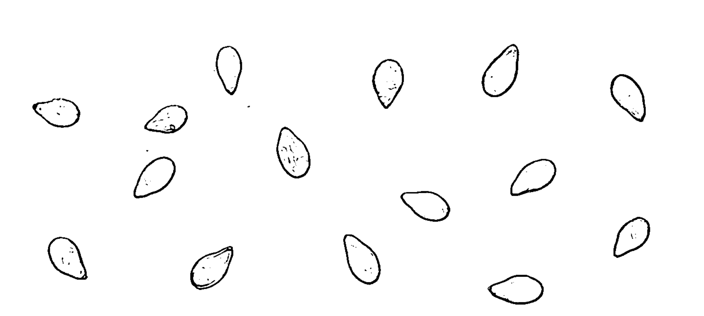

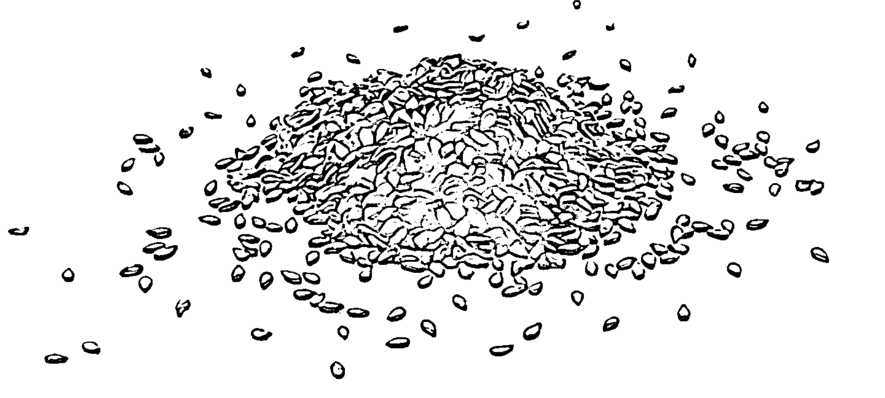

芝麻是唇形目，胡麻科，與唇形科的物種之間具有可供類比的線索，像是：葉緣也會呈鋸齒狀，花序也多是唇形。而相異之處，像是胡麻科的物種較無明顯的香氣，種籽凝聚津液的能力則是更高。所以在此合併論述，便於比較。

《本經》認為，芝麻除了有各種補虛的效果之外，還可以「填腦髓」，這是屬於腎系統的結構，所以芝麻所帶有的津液被認為特別會入腎。

基本上因為生物分類科目相同，所以在身體中會發生作用的區塊也相近，例如，同樣是唇形目的玄參科之中的地黃，也是補益腎系統津液非常重要的藥材。左右分瓣的結構，像是肺，或者腎，一在上焦，一在下焦，就像是引導津液透過木屬性疏洩的力道一打到頂一之後，由肺系統聚集，再一收到到底一，由腎系統回收、藏納。若是香氣較盛，就直接由肺系統透發而出了。所以，唇形目的物種比較容易同時影響到如此成對的臟器系統，而把升提到肺系統中的津液給帶往腎系統的機制，更是補腎的重要關鍵之一。

| 生物分類 | 胡麻科 |
|---|---|
| 本草分類 | 木部 |
| 取用部位 | 籽 |
| 建議食用頻率 | 經常 |
| 建議用量 | 無限 |
| 使用季節 | 四季 |
| 四性 | 平 |
| 五味 | 甘 |

尤其芝麻是種籽，體積極小，本來就有格外強力的下行的力道。以一個富含津液，外觀黑色，肉質白色的種籽來說，黑色代表水屬性，有吸收作用，幫助內含的飽足的津液不至於輕易耗損，白色代表金屬性，具有收斂肅降的作用，的確也有高含量的油分。一般來說，以能夠榨取油脂的植物種籽之中，芝麻的含油率是最高的，達百分之五十四至六十，而出油率也是最高水準，約為百分之四十五。如果是腎中津液不足，黑芝麻正好可以幫助把大量的津液帶進腎裡，這當然就是補腎的效果了。如果方便，每日都可以用上大約一百毫升炒熟的黑芝麻粒，直接口服嚼碎吞下，老少咸宜，也是很好的日常保養辦法之一。

# 薑科

薑科原產於比較溫熱多濕的低緯度地區，通常植株都會帶有一些獨特而明顯的辛散芳香氣，可以說是渾身散發南國的風情。也因為薑科的植物多生長在發散、上行力道較強的環境，所以在此環境下所生成的地下塊莖，就會格外的值得我們重視其獨到的物性。

單片而長形的葉子，與禾本科或是部分百合科的植物一樣，能展現較強的疏瀉的力道和透發的能量。花序多呈繖形如穗，代表其全面開展的力道帶火屬性，花序中像是花冠等結構，也常呈現三，或是三的倍數，也是在數術中帶火屬性的表現。

整體來說，薑科的走行力道較明顯，以帶有火屬性的能量，由土地中藉木屬性疏瀉而出為基本，類比於人體，與胃、肌肉通行火屬性的能量來說，較為一致。所以此科的物種有許多是常用的香料植物，甚至有的也兼是藥用植物，如月桃、豆蔻、益智子、砂仁、鬱金、高良薑等，大抵上都有加強人體氣機、疏筋活血通絡的效果，但畢竟性質仍多是走而不守，基本上功效不在補益，所以不宜貪圖其中一、兩樣好處，就長期、單獨的大量使用，以免因此生害。

### 疏瀉、透發

《內經》提到：「肝者，罷極之本，魂之居也。」肝系統的功能特性，主要掌控了「罷極」，也就是「一件事物走到最弱盡的力道。所以在後來我們也常用「疏瀉」兩個字，來代表肝的功能可以「讓事物暢通、流動不停」，用「透發」兩個字，來代表肝的功能可以「讓事物的表露能達到完全的狀態」。

### 走行

「走行」的傾向，通常主要會帶有「辛」的氣味在其中，同時附帶有「熱」的屬性也較多，但並非絕對。而對於身體的功能或是結構上，有瘀積或是停滯的狀況發生時，通常也會透過有刺激走行傾向的藥物，來幫助改善。

## 薑 1。

附：乾薑

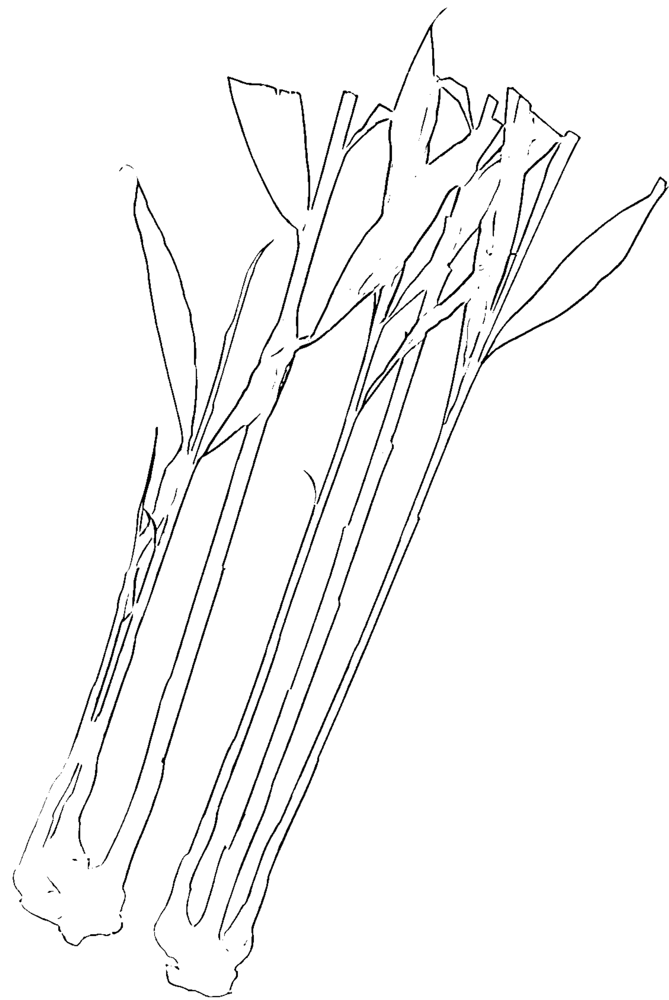

| 生物分類 | 薑科 |
|---|---|
| 本草分類 | 穀菜部 |
| 取用部位 | 塊莖 |
| 建議食用頻率 | 經常 |
| 建議用量 | 隨喜 |
| 使用季節 | 四季 |
| 四性 | 溫 |
| 五味 | 辛 |

在陰濕之處種植時，薑的氣味淡，質地多水而纖維少，在陽光充足的乾燥之地種植，辛辣味較強而纖維多，由此可見薑感應環境而進行雙向調節的功能相當敏銳。薑的塊莖橫向生長旺盛，但是極少開花，可見薑的力道主要在「橫走」，少有上行。而新生的橫走分歧，通常還帶有紅色嫩芽，代表能從木屬性的分歧結構之中生出火屬性。薑花為黃綠色，象徵氣機帶土與木屬性，可以知道，對於利用木屬性而疏通脾胃的能量來說，力道顯著。通常生長良好的薑，塊頭大，橫走的分歧多，水分含量很高。

剛挖起的薑稱為「嫩薑」，皮與肉質都接近白色，辛味淡，纖維少，走竄力道很弱。因為嫩薑的水分含量高達約九成，極不耐運送與存放，市場上相對少見，必須經過曬製，去除一定的水分，稱為「生薑」，才能送進市場。通常，水分含量如此高的蔬菜，像是白菜，性質極寒，不堪多食。但是薑卻仍然能保有相當的辛溫的性味，其發散的力道必有獨到之處。製成生薑之後，皮、肉顏色轉黃，也呈現較多的土屬性，辛辣味增強，纖維質地明顯，以木屬性貫通、走竄的力道跟著提升。若是將生薑切片後再經過曬製、乾燥，皮質顏色轉為褐色，而肉質又轉為偏白，質地也呈現乾、脆，此時稱為「乾薑」。但是藥肆中另有一種，顏色深黑，或名「炭薑」、「炮薑」，原性不存，轉為極寒，不可使用。

一般種植薑的時候，會將老薑分剁成數塊，埋入地中，再由老薑分化出許多新生的地下塊莖，稱為「薑仔」，做種的老薑則稱為「薑母」。薑母的辛辣味通常比較濃厚，若是能得此薑母來製成乾薑，即我所謂的老乾薑（請參考《太極米漿粥》p.236），效果更好。

薑雖然被認為來源自東南亞，但是在中國開始食用的時間很早，用量也大，從春秋戰國時期，孔子就有「不撤薑食」之語，意謂每餐都要有適量的薑來佐餐，可見一斑。

### 乾薑

《本經》也把薑列入藥材，以「乾薑」為名介紹。在這個時期，中原文化的主要活動地區都在華北黃河流域一帶，而一般所認為的薑的原產地多在長江以南的濕熱之地，在秦始皇修築此期人類文明史上第一條高速公路——「馳道」之前，從極南之地要大量、快速的運送生薑供應中原地區，應屬不易。此時中原地區嘗試栽種生薑的活動也可能才剛剛開始，產量還不夠充沛。在新鮮的生薑容易腐壞的因素下，對於當時的人們來說，入手的多半已經是乾製過的乾薑。而生薑對於將胃氣向外貫通而溫暖四肢，加熱骨骼肌的力道，又是乾薑所不及，所以，在特定的作用上，真可如《本經》所謂之「生者尤良」。至東漢末年，仲景作《桂本》時，華北地區的年均溫一般認為已經明顯提高，加上在山東等地栽培生薑的活動應當也已屬普及，生薑、乾薑兩者的來源穩定，選擇自在，至此可謂運用薑功以臻大成。在中華文化使用薑來作保健、醫療，已有超過兩千年的歷史，約七成以上的漢方都用薑。《桂本》善用生薑、乾薑之別，對於從醫治風邪在表，以至於溫裡救逆逐寒邪，可說無一不靠用薑以成功，正為體現「藥食同源」的最佳代表。仲景用薑，不避晨夕，合證則用。近代許多什麼「冬吃蘿蔔夏吃薑」，或是一夜不食薑」等說法，沒有根據，來源不明，甚至違反身體感，至多只構得上念來順口而已，但卻毫無章法邏輯，易遭誤認為是「中醫說法」，其實與中醫藥原理完全不合，也違反物性的表現。以我自己的身體體驗：食用生薑之後，幫助的是提升胃氣走行的功能，其實並沒有加重胃中的虛熱的負面影響，反而在適切的配伍之下，因為正氣的提升而讓虛熱造成的問題獲得改善。這一類的信口胡謅，讓許多人不知如何判辨，跟著人云亦云、以訛傳訛，一不小心就受到愚弄，在當用之時反倒怯用、懼用，甚則誤了大事。就像有的近代醫學研究，患有膽結石的病人不宜用薑，但我當年治好自己的膽結石，就是用薑，而且，還需重用！憑藉的就是本於《桂本》的醫理、藥理進退大法，重視配伍，隨證處方。薑是家常的食材，更是絕佳的回陽的良藥。善用生薑、乾薑不同之妙，養胃氣、護陽氣，這才能夠做到「不勞醫生開藥方」。

## 2. 薑黃——附・鬱金

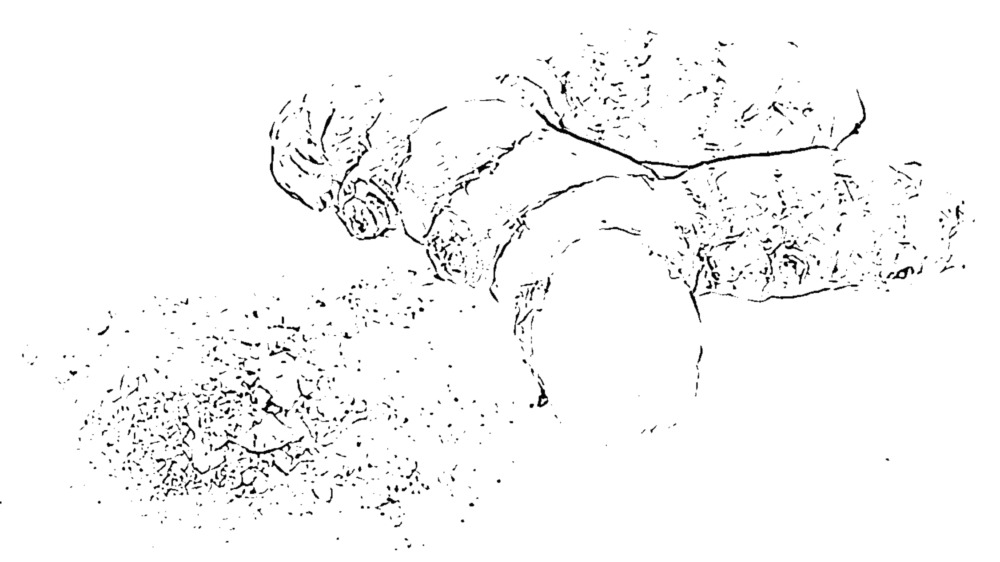

薑黃與薑的名字很像，其實相異頗大。兩者用的雖然都是地下塊莖，但是薑橫走的分歧又多又廣，帶有較多的木屬性。薑黃則幾乎沒有橫走，只見叢生兼有少量分歧而已，土屬性較明顯。由此來看，已經可以知道薑黃較無疏瀉的力道，物性偏向保守。薑黃的局部似薑，生鮮時候的顏色明顯呈現黃色，甚至帶有些橘黃，代表能溝通土、火屬性的能量。但是薑黃不似薑帶有明顯辛辣味，氣味較淡，除了有其特殊的氣味，並還帶有苦味，表示偏向火屬性，則瀉下的力道還是比較多些。

整體來說，如果脾胃血在涵養充足的前提之下，薑黃能幫助血降溫而下行，這是有利於養血的。但是薑黃本身並不生血，如果體內原本的血量不多，又加上寒瀉，

| 生物分類 | 薑科 |
|---|---|
| 本草分類 | 穀菜部 |
| 取用部位 | 塊莖 |
| 建議食用頻率 | 少量 |
| 建議用量 | 少用 |
| 使用季節 | 四季 |
| 四性 | 寒 |
| 五味 | 苦 |

那恐怕會造成脾胃不能涵養血，甚至轉為氣多血少的虛燥熱問題，看似上火，實為受寒。單用、大量用薑黃，嚴格來說很難有穩定的好處，對於血的涵養比較敏感的人，像是孕婦，或是有容易出血、出血容易不止等狀況，更是應該要慎用。

### 鬱金

鬱金與薑黃長相極類似，在入藥時有時可以互換，但仍是不同的物種，看得出物性略有區別。鬱金的地下塊莖的形狀較似帶有螺旋，前有尖端而似紡錘，下行、破泄的力道較強。近年來常有將薑黃或鬱金塑造成萬能健康食品的宣傳，洋洋灑列出數十樣好處，但是概括起來，不脫就是涼血、消炎、退熱而已，其實可能沒有大家想像中的那麼完美，終究是「以偏治偏」，還請多加留意自己是否合用。

比起期待內用的功效，不如輕鬆看待，就當成是原本在咖哩中的香料角色，配伍較多辛香溫熱的香料與大量的白米飯、肉類來同用。或者外用於刷牙、敷臉，多用也無妨，較無適用與否的安全性上的問題。建議不妨換個角度來嘗試看看。

## 3. 薑荷

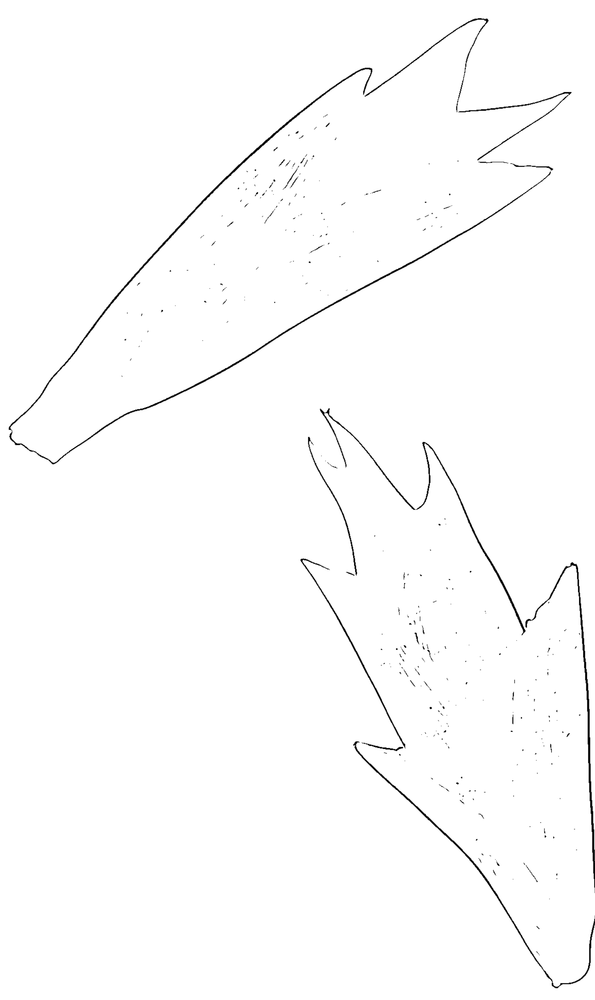

| 生物分類 | 薑科 |
| --- | --- |
| 本草分類 | 穀菜部 |
| 取用部位 | 花 |
| 建議食用頻率 | 經常 |
| 建議用量 | 隨喜 |
| 使用季節 | 四季 |
| 四性 | 溫 |
| 五味 | 淡 |

蘘（音「rang2」）荷的氣味特殊，在微微的辛味與甘味之上，有其獨特的香氣。而其食用部位也較為特殊，主要是未綻放的花蕾，而且採收的時候，花蕾就像竹筍一般，是處在剛從土裡鑽出來一部分的狀態，以花來說，這種由土中升發而出的力道，相當特別。蘘荷當值採收的時候，出土的一部分微帶青色，而在土裡的部分則是下部的白色轉至上部的粉紅色。尤其是當秋季採收時，花蕾呈現最飽滿的粉紅並且略帶紫色，象徵火屬性兼有少陽系統的特徵。在五行相生循行之中，火屬性的能量帶動土屬性的能量。而火屬性的能量如果可以再透過少陽系統從土系統之中透發而出，則能夠達成我所謂溫通腠理，調和榮衛的效果。若是心火的力道不足以完全推動脾土的時候，可能會造成脾系統的功能不完整，像是消化不良，容易對於特定食材過敏等，若是能夠經常以蘘荷生用，如一般的香菜來佐餐，對於調和心火與脾土之間的功能來說，我認為會有一定的幫助。

## 4. 香蕉

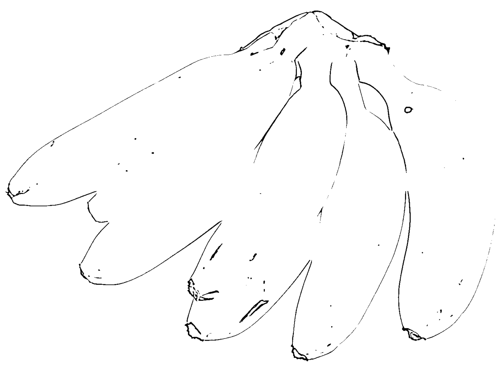

香蕉為芭蕉科，因為芭蕉科的物種不多，只有三屬，所以屬，所以併入「薑目」底下的薑科一同介紹，較利於進行觀察類比。薑目又稱「美人蕉目」，可見得薑科與芭蕉科的物種彼此之間，類同的性質很高，以誰做科目名，都有其道理。有的品種的香蕉在販售時被稱為芭蕉，但在品種分類上，真正的芭蕉是只供做觀賞的，其實都只是香蕉的不同品種，這樣的商品名稱容易造成認知的混淆。薑科的物種在地下塊莖的部分較為發達，香蕉則是在地上的葉、花、果等部分發達。雖然香蕉的塊莖不似薑發達，但是與薑同樣是主要藉由地下塊莖的橫走來繁殖。植株看來高大似樹，其實就結構上來說香蕉被歸於草本植物，在過去的本草分類之中被歸於「草部」，是有其道理的。以草、木都為木屬性來說，木為木陰，則草為木陽，香蕉的植株代表持續升發的力道較多。也可以說，若是將薑的地上植株結構放大

| 生物分類 | 芭蕉科 |
|---|---|
| 本草分類 | 草部 |
| 取用部位 | 假果 |
| 建議食用頻率 | 偶爾 |
| 建議用量 | 少量 |
| 使用季節 | 四季 |
| 四性 | 涼 |
| 五味 | 酸 |

數倍，兩者的葉基部同樣都有反覆交疊而產生出的較堅硬的葉鞘，代替莖的結構來支撐植株，但香蕉的葉子更加大型化，的確薑與香蕉頗多近似。葉子通常需透過莖來與根聯絡，而薑目的薑科與芭蕉科的物種卻可以直接由根部直通葉部，代表其疏瀉上行的力道有一定的強度。香蕉的花序一樣開在葉鞘所構成的偽莖頂端，呈現穗狀，多個花序聚集，個別的體積都比薑放大許多，而薑很少開花。薑在地下的部分，也就是由陰出陽的力道為重，香蕉則是反過來，由陽返陰的傾向明顯。

香蕉為假果，由花序的雌花的部分長成果實，把真正的果實包覆起來，前端留下紫色的雄花花蕾，但無論雄花或雌花，都不具有繁殖能力。假果原本也是向下成長，至中期以後又會反向往上生長，由直線形而轉為圓弧狀，表示在下行偏向的主體之中仍帶有部分升發的力道，也象徵由木屬性再回歸至土屬性，而雄花在這時候由原本的往上生長卻被果實重壓而反轉成為指向地面，象徵少陽系統受脾土影響而反轉下行。果實大宗的外觀顏色以黃色為主，其實桃紅、青、紫等外觀的品種都有。一組花序吐出十至二十個由雌花形成的假果後，整串規律呈螺旋狀排列的蕉群，稱為「一芎」香蕉，每一株植株只生一芎，所以臺語稱呼香蕉為「一芎蕉」。每芎香蕉由一層層「果手」組成，每一層果手中的一個個「果指」，就是我們常稱的「一根香蕉」。花上二至四個月成熟，可以採收，此時該植株也就自

然枯死。

整體來說，香蕉似薑，藉由木屬性橫走的力道生長，木生火，花序含有火屬性。結出的假果呈現出金屬性的排序將氣血收斂肅降回頭，但是在枝頭上還是青色，保有木屬性，直到收割後才開始熟成，將木屬性疏瀉而出的氣、血倒抽回頭，轉化成黃色外觀，象徵金屬性又反轉回土屬性的脾系統。果肉色白，土屬性之中含有金屬性的高濃度津液，而果肉中的小斑點為真正的果實，色黑而體積極小，終歸於水屬性，但因為結構不成熟，沒有繁殖能力，僅有結構而已。植株將全體的氣、血輸入果實內，所以力竭而枯，待母株重新分化，開始另一全新節律。以胃氣的雙向調節機轉來說，藉由肝木、少陽系統的疏瀉功能，氣、血能出能入，都屬於正常的功能表現。香蕉象徵身體疏瀉氣、血外行之後，又能回脾胃收藏，向上生長的模樣加上成熟時的香氣很盛，同樣隱含下一次能往復上行的力道，周而復始，與胃氣的運行的部分功能極為類同，也與鳳梨的物性作用相仿。果肉味澀帶甘，澀歸於酸，所以食用香蕉能令各種津液增加停留在脾胃的機會，對於脾胃上行過度而略偏虛燥熱的狀況來說，有一定的緩解作用。像是大汗之後，身體的津液流失較多，氣機偏向上行而不下，吃香蕉來致中和，令胃氣緩降，是個不錯的辦法。所以在臨床上，偶爾吃香蕉有助於減少肌肉痙攣的發生。香蕉果肉濕潤

但水分有限，所以在四性中雖然屬涼但不至於對胃氣有害，至多能造成緩降的作用而已。如果真的要針對「吃水果」這件事情讓一些人在轉換觀念的時候的衝擊不致於太多，一天吃一根香蕉，並且選在飯後食用，避免空腹、感冒的時候吃，會是個比較折衷的做法。

至於有的傳說指出：吃香蕉傷骨、傷筋，有筋骨傷的人不能吃，或者吃多會容易扭傷、傷腎，恐怕這類的說法也與物性不符。如果真會因食用香蕉而造成筋骨扭傷，恐怕問題並非出在香蕉，而在食用者素有腎水津液不足，脾土又失津血，不能涵養肝木，才容易發生筋骨方面的問題。否則國際網球大賽場上，常見到各國網球好手在場上一面激烈廝殺，一面大口吃香蕉。若食用香蕉確實能引人經常扭傷，恐怕在這種以百萬美元為單位的獎金戰場上，不會有人敢輕易嘗試。

# 茄科

茄科在餐桌上的角色很多變。茄子、番茄、辣椒、馬鈴薯、菜椒，甚至是菸草，以及藥用之中很受到大家愛用的枸杞，都是家常之中經常接觸得到的食用植物。我們在日常生活中不僅很常食用茄科的植物，甚至在部分地區馬鈴薯還做為人們的主食，可見他的重要性。茄科的植物生長速度普遍很快，喜歡高溫多日照的環境，喜燥惡濕，對於環境的變化比較敏感，所以一般我們會認為他們對於人體三焦的中焦段，以及與胃的連通上會有直接的影響，象徵少陽三焦升降變化的特性。這對於我們在日常生活的需求，像是提供增加飽足感、對消化能力進行調節，以及與胃直接連通的器官的代謝機能等等，會產生比較多的影響力道。若是能夠慎選食材，善加搭配，那麼我們可以在這個分類之中的植物身上所吸收到的好處，可能會比我們想像之中的還要多上更多。

## 1. 茄

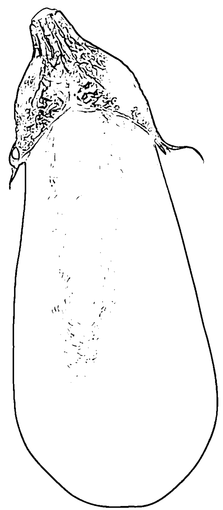

茄同樣適合生長在比較高溫的地區，性涼味澀歸於酸。茄子雖然是茄科的果實，常用的品種又是深紫黑色，帶有水屬性的特徵為主，但是因為津液的含量很低，對於身體津液的補益效果極為有限。

茄常見的品種開紫色的花，象徵透發少陽系統的能量。花序包含一個雌蕊與六個雄蕊，其中的雌蕊要以凸出者才視為健康，這代表從水屬性的能量之中再產生養分的極致而下行。果實中含有約九成的水分，下行的力道強，但是味道偏澀，綜合來說代表物性偏向寒涼，對於少陽系統的升提力道較為不利。茄子在成熟之後必須要趁早收穫，否則很快又會脫水而變得乾癟，象徵茄子對於津液的涵養的力道並不足。

| 生物分類 | 茄科 |
|---|---|
| 本草分類 | 穀菜部 |
| 取用部位 | 果 |
| 建議食用頻率 | 少用 |
| 建議用量 | 少量 |
| 使用季節 | 當令 |
| 四性 | 涼 |
| 五味 | 酸 |

在應用方面，因為茄子原始帶有澀味的性質，若是在調理之中強化津液的添加，那麼對於我們身體的津液的補充，尤其是從中焦到下焦的腸道，都會有較好的溫暖以及滋補的效果，在口感上，也可以提出茄子的香甜氣味。好比說可以是煨煮慢燉，也可以是高溫烹調大火快炒，與較富含油脂的食材一同烹調，像是豬肉，並且再搭上一些能夠刺激消化力道的辛香佐料，像是大蒜、生薑或是羅勒。這樣的性味配伍，較能夠令茄子的性味轉為溫和。不但提升料理的風味，也能夠引導更多食材的津液入裡，幫助身體吸收。所以我們常看到「魚香茄子」，或是「三杯茄子」的菜色設計，道理上大抵符合如此。

## 2. 番茄

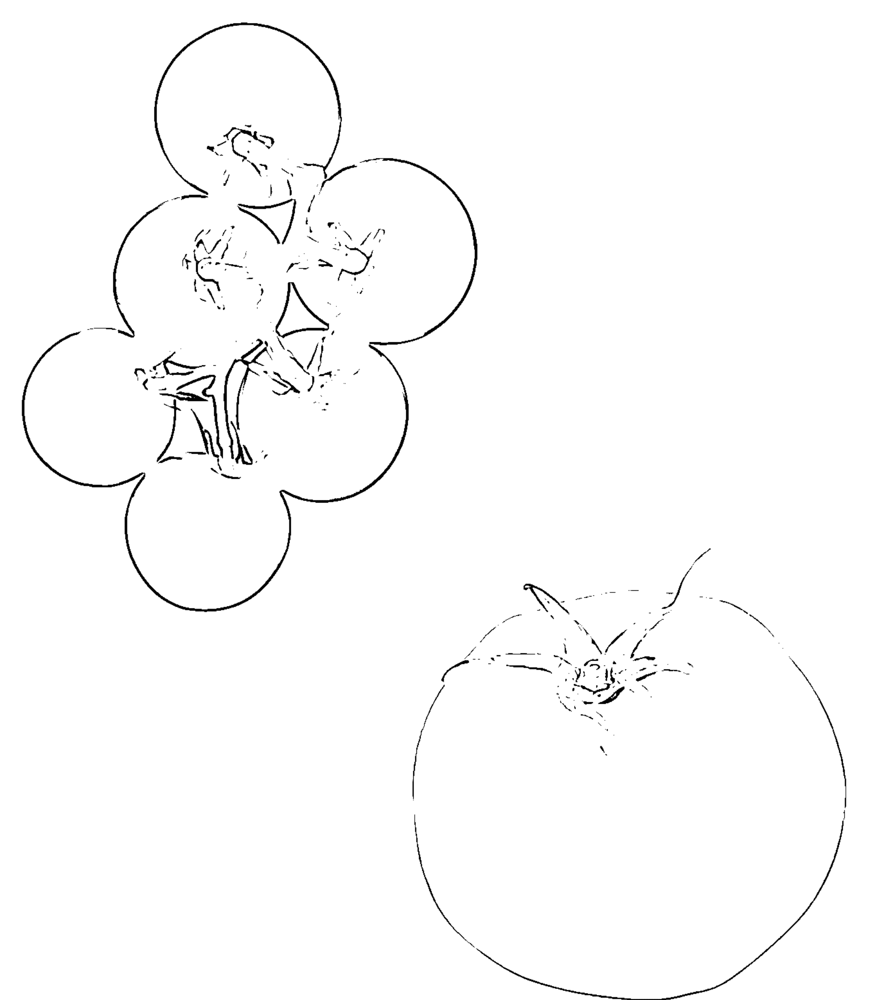

番茄的食用歷史很短，十八世紀之後才逐漸踏入現代社會之中。在這之前，有些番茄的品種有毒性，所以多半只用於觀賞而已。番茄的幼苗生長快速，大約兩個月就能結果，一株番茄苗約可以收穫一千顆的番茄果。番茄果實原本是青色，成熟之後轉為鮮紅，以影響火屬性的系統為主。果皮光滑，代表其金屬性很重，久煮不爛，最好除去不用。番茄果亦含有大量的水分，代表其水屬性較重，又加上味偏酸，氣味淡，將人體的火屬性的能量收斂為水的力道較強。有的時候，這樣的物性特徵會被片面解釋為對於人體發熱、發炎等問題，或是某些重大疾病具有奇效，其實這只是某種程度的抑制人體機能反應之後的效應，疾病並沒有被去除，只是人體某些對於疾病的反應變得不明顯而已，有如掩耳盜鈴，日常不宜依賴這種偏性而誤認為是具有「保健」的作用。

| 生物分類 | 茄科 |
|---|---|
| 本草分類 | 穀菜部 |
| 取用部位 | 果 |
| 建議食用頻率 | 少用 |
| 建議用量 | 少量 |
| 使用季節 | 當令 |
| 四性 | 寒 |
| 五味 | 酸 |

番茄的味酸，將能量回收為質量的作用較顯著，所以在調理的時候，恰好適合與性味甘寒、具有濃厚的油脂等津液養分、可以轉化出大量能量的牛奶搭配，或者直接使用大量的奶油、乳酪，形成一組彼此偏性都很重、以偏制偏的組合。將番茄醬或是番茄汁加入牛奶之後，番茄的酸味減輕，轉為較帶有甘醇的風味，而牛奶濃厚帶有獨特腥味的氣味也被中和，轉為較清爽的風格，也較個別分開使用的時候來得容易被人體所吸收。平日若是不吃什麼苦寒瀉下的食物，少用空調，手腳經常保持溫暖的人，偶爾使用這樣的組合對於涼血、生血亦有助益，只是體質虛寒、腸胃功能不好的人就非常的不適合了。物性彼此之間的交互作用其實有一套固定的邏輯可以推演，但是在加入的元素越多之後，平衡越是不易。再者，中和的結果是來自於多種重度偏性彼此之間的制衡，而非本性即為溫和不刺激。因此，在使用番茄與牛奶的組合的時候，除了注意偏性較重之外，須特別注意這個組合的性味還是偏寒，不宜過用。

## 3. 辣椒

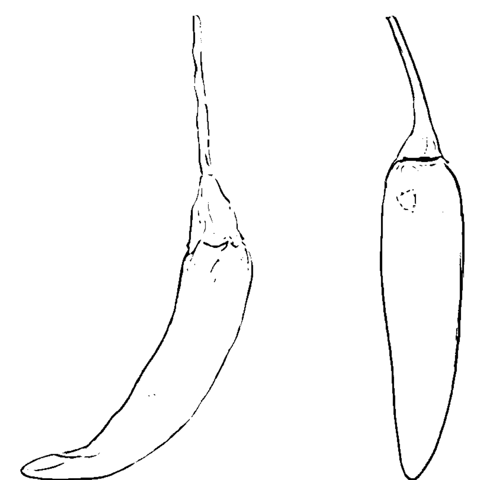

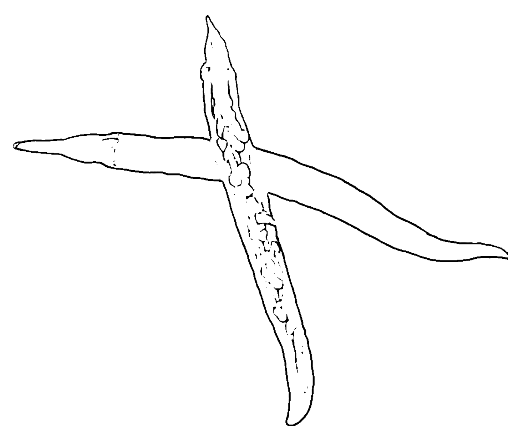

| 生物分類 | 茄科 |
| --- | --- |
| 本草分類 | 穀菜部 |
| 取用部位 | 果 |
| 建議食用頻率 | 少用 |
| 建議用量 | 少量 |
| 使用季節 | 冬季 |
| 四性 | 熱 |
| 五味 | 辛 |

辣椒的生長環境同樣偏好高溫多濕。雖然食用的是果實，但是水分含量相對較低，性偏熱，氣味辛，在下行的果實之中，基本物性偏熱性者的的確是少數。中藥使用了不少溫、熱性的果實或是種籽，但是因為辣椒是茄科，作用點在三焦系統，過於辛散的性質，使得少陽系統需要頻繁的升降調節，協助身體維持恆定，像這般大幅度的單向偏性所產生的刺激就顯得太強烈。而且，三焦系統下行之後則是影響到腎系統，辛熱之氣進到腎系統中，也會抑制腎系統收藏津液，所以辣椒並不大適合在日常的時候多用。

除非是人體在嚴寒之中，需要大量提升腎系統等內臟運作機能來禦寒，三焦系統整日幾乎都處在大幅升提的功能需求下，此時用辣椒，或許造成的負面的影響較小，否則總是不宜多用。

特別是辣椒籽，色黃白，與土及金屬性類同，顆粒特別小，下行力道特別強。在以辣椒入菜的時候，務必先將籽去除乾淨，避免傷了與三焦聯繫的胃與腎，若是平常牙齒、牙齦狀況不好的人，更應該避免食用，以免加重惡化的情況。

### 升提

我們提過，身體許多成對的功能，都以陰陽來表示，特別是升降功能，升提為陽，降落為陰。身體許多功能，特別是在日間，太陽出現在天空中的時候，都在提供各種不同強度或是作用的升提效果，以確保人體的各種功能可以正常運作。因此在夜間，也就是日落之後，日出之前，身體在降落的功能表現上，也可以藉由升提到極致之後產生的往復折疊的效應，而有同等強度的效果展現。

## 4. 馬鈴薯

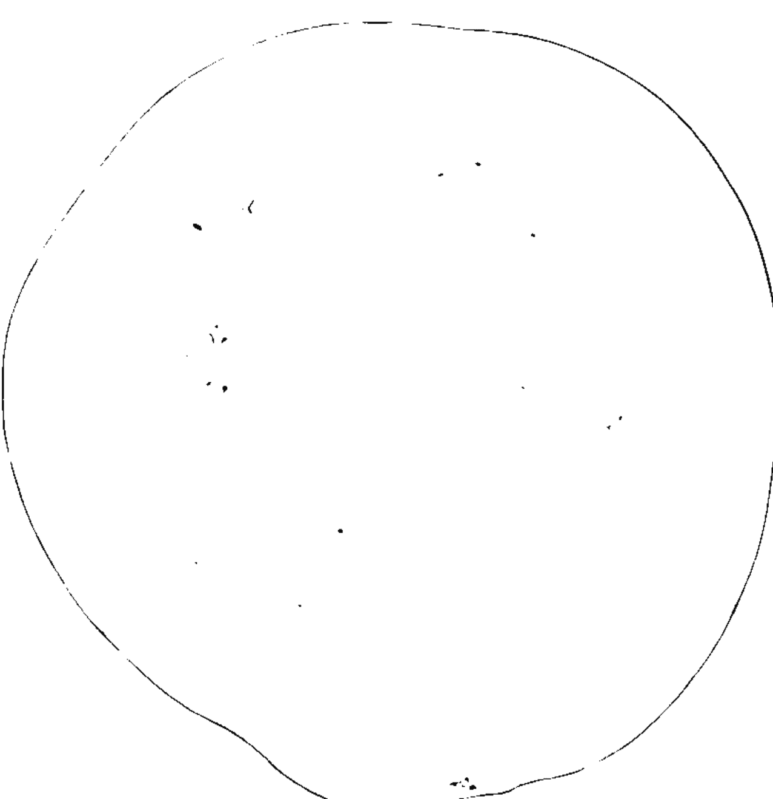

馬鈴薯同是茄科的植物，但是並不像茄或番茄喜歡高溫多濕，反而是適合在乾冷的地區生長。而且因為他的食用部位是地下塊莖，所以對於人體來說，補養的效果相對大些。馬鈴薯被部分地區的人們做為主食，因為他很適合在貧瘠的土地上生長，不適宜種植一般的穀類的時候，就靠他來維生。而且馬鈴薯發育很快，能夠在極缺津液的狀態下，快速鎖住養分，所以在世界各地，他都是一種能夠即時拯救飢荒的重要作物。

仿照薑的概念，馬鈴薯使用的同樣是地下塊莖，帶黃色外皮，肉質黃白，代表其走通的是偏向上系統的能量，帶有土屬性兼金屬性的津液，味澀屬酸，不宜生食，可能令氣機停滯，所以生食有可能會中毒，只宜經煮熟轉為甘味後，才顯補養作用。因為馬鈴薯富含水分，又極容易消化，對於胃較不能涵養津液，也就是有胃

| 生物分類 | 茄科 |
|---|---|
| 本草分類 | 穀菜部 |
| 取用部位 | 塊莖 |
| 建議食用頻率 | 經常 |
| 建議用量 | 隨喜 |
| 使用季節 | 四季 |
| 四性 | 涼 |
| 五味 | 酸 |

較偏燥，容易產生虛燥熱的狀況的人體來說，是一種較為溫和的補養食材，但也不宜忽視其偏性，久服仍有可能傷及陽氣。如果能夠以「蒸煮」，或是「帶皮烘烤」的方式，適度的去除水氣，降低寒性，並搭配大量的油脂，補足馬鈴薯本身津液含量的不足，就比較能夠在人體中發揮其身為茄科植物，在人體的三焦系統之中作用的物性特質——將津液涵養在中焦，並且帶領往下。這對連帶補充下焦津液來說有一定的幫助，將有利於提高腸道的運作功能、大小便的通利，協調腸胃系統的穩定，幫助腎以及其相關系統的運作。

大抵上，味偏酸澀的食材，經常需要重用油脂含量高的食材相佐，較可以相得益彰。若是真藉由營養成分的角度來看，其實馬鈴薯的營養價值很高，吃馬鈴薯絕對對更能讓醫生遠離你，蘋果算老幾？但是現在許多人認為，馬鈴薯所作成的料理會對人體帶來負面的影響，尤其是在「體重」方面。我認為，若是要予以分別，讓馬鈴薯變得不適合人們食用的原因，主要是因為「使用了不天然的食用油調理」、「過度的油炸脫水」造成。若是調理得法，不使用基因改造的品種、不使用人工化合添加物，我認為倒是沒有這方面的疑慮。

## 5. 菜椒

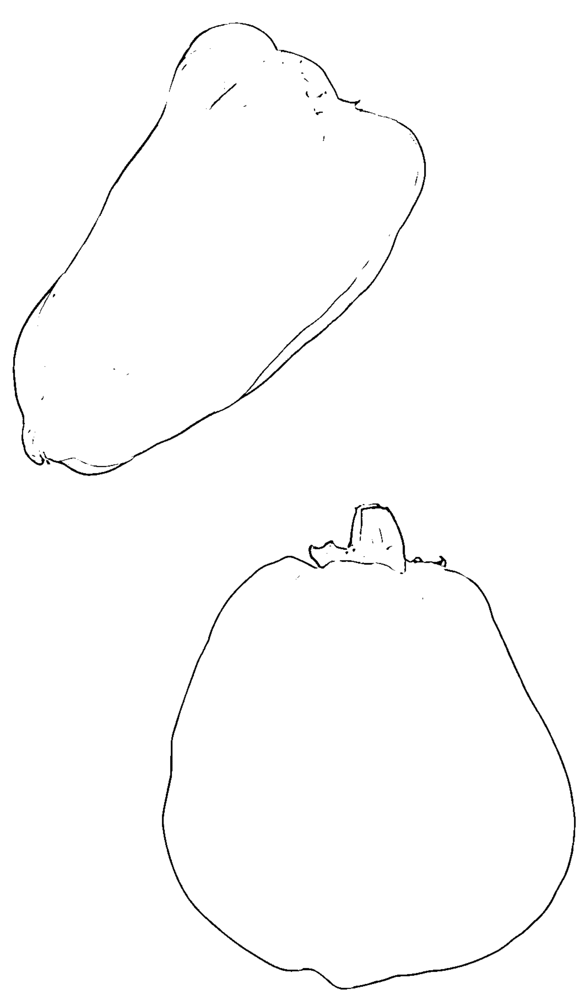

| 生物分類 | 茄科 |
|---|---|
| 本草分類 | 穀菜部 |
| 取用部位 | 果 |
| 建議食用頻率 | 偶爾 |
| 建議用量 | 少量 |
| 使用季節 | 四季 |
| 四性 | 平 |
| 五味 | 淡 |

菜椒的別名又有：燈籠椒、甜椒、青椒。雖然同樣有「椒」一字，品種也與辣椒相近，但是基本上沒有辣味。菜椒的外型有很多種，有長有短，時直時曲，外型不平整，並沒有可以稱得上是主要的特定形狀，這代表菜椒果實的火屬性較強，氣、味上也沒有強烈的特徵，稍微帶一點青味而已，偶爾略有微甜。雖然外觀的顏色多種，但是常見的以青色為主，與木屬性較有關聯。與其他茄科果實的快速成熟不同，番茄從播種到採收只要一百天左右，而菜椒光是從花蕊著果到成熟，就需要三個月以上到一百天左右的時間，就一般的蔬果來說，也屬於時間較長的。而菜椒的果實基本上中央空洞，只有少許的組織以及種籽，雖然在植物學上被分類為漿果，但是並沒有多汁的肉質，能夠食用的部分只有淺薄的中果皮而已。

綜合而言，菜椒象徵中焦以木屬性的能量向外發散到頂之後，透發出帶火屬性的

果實，並且經過長時間的成熟期之後，僅帶有少許津液的果實仍然能夠產生下行的力道。對於肝系統疏瀉特質走到極致的人體功能以及現象來說，很有高度的類同。可以說是在不耗損肝系統的前提之下，協助肝系統的疏瀉功能，略為清理肝系統之中的濕熱之氣，並且引導氣機進一步的「打到頂，收到低」轉化為津液，由陽入陰的功能啟動。因為果實的水分含量極少，性味平淡，生食或是略經快炒，都很適合。這是少數我會建議多做選擇搭配，甚至生食亦可的蔬果之一，建議不妨試試。

### 極致

肝系統是所謂的「罷極之本」，能帶動身體的功能與結構得以「疏瀉透發」。也就是說，身體的功能必須要走向到應該進行的最終點，才能夠算得上正確的施展开來。唯有如此，我們才會又在端點上，同時啟動「往復折疊」，也就是返回到另一個端點的功能。所以人體的諸多功能，必要先求能夠走到極致的狀態，才會得以綿延不絕。

## 6. 枸杞

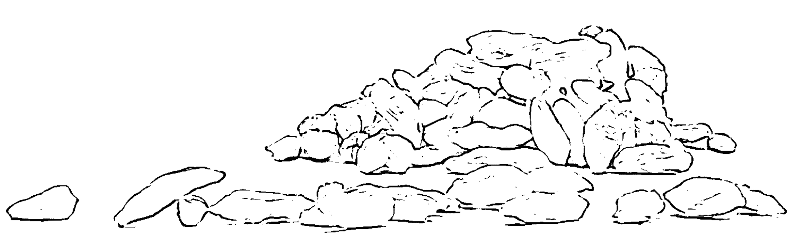

枸杞經常取用的部位是果實，既是中藥材，枸杞子也是經過公告「可同時提供食用之中藥材」之一。枸杞在《本經》中的記載是主治「熱中」、「消渴」。因為性味苦寒，基本上，當身體出現因為功能過度亢進，進而引發燥熱的狀況時，才有可能適用，也就是說，仍然是從「以偏治偏」的角度來使用。用比較中醫的術語來說，使用的時機偏向「陽實」而非「陰虛」。

枸杞子外觀色紅，帶火屬性為主，形狀呈卵形或是長橢圓，介於土與火屬性之間。個頭小，下行力道相對大。種籽外觀略扁，大約呈腎形，表示種籽帶有水屬性。整體來說，能夠將中焦發散到極致之後的能量引導下行再進入到下焦，回收入腎。反過來說：如果不是從中焦區段開始向外的部位有嚴重的過度亢進，枸杞根本有削弱中焦升發力道的可能，對於所謂的「免疫力」，也就是太陽經的強度，更是

| 生物分類 | 茄科 |
|---|---|
| 本草分類 | 木部 |
| 取用部位 | 果 |
| 建議食用頻率 | 少用 |
| 建議用量 | 少量 |
| 使用季節 | 四季 |
| 四性 | 寒 |
| 五味 | 苦 |不利。

但是不知道是什麼時候開始，「加枸杞」變成一種「全民運動」。煮湯加枸杞，花草茶加枸杞，維生素藥錠這種舶來品也加枸杞，甚至西醫也要吃一下中醫的豆腐，自己拿中藥材胡亂湊出來的藥湯，也加枸杞。不管是什麼樣的粗茶淡飯，只要撒上一把枸杞，馬上就晉身「藥膳」、「食療」的殿堂，「抗氧化」、「提升免疫力」的光環加持上身。這種無視中藥物性觀念，不審陰陽虛實的使用法，長久如此，容易損及胃氣與陽氣，還可能種下未來病變的遠因。同理，一般人所深信的「枸杞明目」的功效，也需要先經過辨證，審其陰陽虛實再三，才能論治，並非只顧自的「多吃」就會有好處。在適當的用量與配伍之下，枸杞的確能夠對身體特定的虛勞或不適，有明確的舒緩效果。但是，這種把枸杞當味精，煮什麼都想要撒一把的衝動，還是三思而行吧！

## 7. 薤草

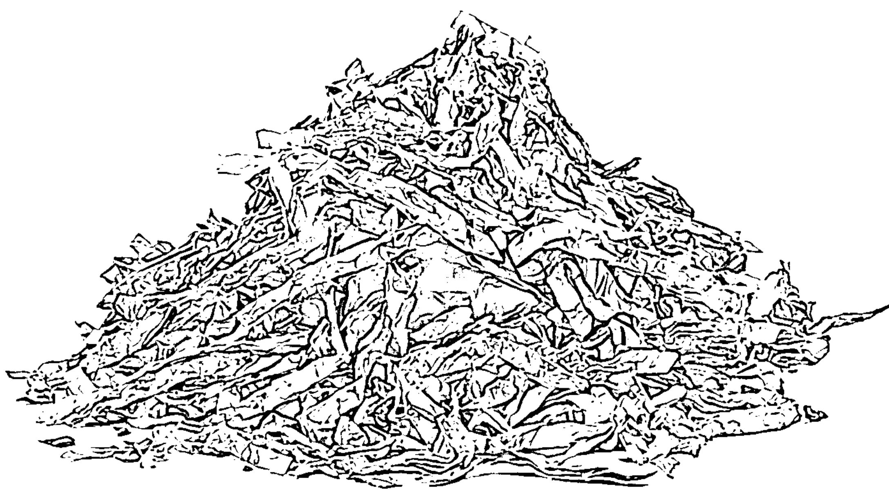

| 生物分類 | 茄科 |
|---|---|
| 本草分類 | 草部 |
| 取用部位 | 葉 |
| 建議食用頻率 | 經常 |
| 建議用量 | 隨喜 |
| 使用季節 | 四季 |
| 四性 | 溫 |
| 五味 | 辛 |

菸草生長喜歡溫暖、日照足的氣候，對水分敏感。水分偏多則生長旺盛，菸草成品的口感可能不夠濃郁，但是過少卻會讓生長不良。總體來說，食用不怕水分的植物，對人體來說是較有助於利水的。

菸以葉入食，在收成、乾製之後，做成捲菸，供人吸食點燃之後的煙氣。取用葉部在物性的用意，主要是「發散」、「走行」，辛味提升了發散的性質，附帶微微的苦味則可以加強燥濕、沈降*的效果。而菸氣質輕卻味濃，在結合了茄科的特質之後，我們可以認識為：吸食菸草，因為質輕，所以能夠幫助人體自中焦升提氣的運作機制往上進入肺中。而後因為味濃，以「百脈朝肺」的原理，再與四肢血脈聯通，產生發散、推行氣血的效果。所以，菸草是一種很奇妙的食品：進入人體之後，會以比較溫、燥的氣體，與經脈作用之後，藉少陽系統的特性，透過溫通腠理的機轉，在體內繞行之後出來。所以菸對於調理身體的濕氣，甚至是痰，都有不錯的幫助。原因有二，其一，因為菸草性質較燥，有利於去濕。其二，菸草性溫，可以擴大肺部的舒張作用，增強肺在舒張與收縮之間的位能差，讓肺系統產生更好的「收斂肅降」的原本的效能。

### 發散、沈降

人體的功能，都需要在充分開展的狀態下，彼此取得調和，才能夠算得上是真正的正常。所以在肝系統的主導之下，許多我們所稱的「新陳代謝」的身體功能，基本上也都得維繫於肝系統的功能是否如常運行。我們提到肝系統屬於「陰中之陽」，功能的特性為「疏洩透發」，而「發」所指的正是「發散」，也就是讓各種功能與結構的存在，可以由內臟為本，走行到身體的每一個外層的角落。而在我所謂「打到頂收到底」的通則之下，走行到外層極致的功能或結構，又會自然的返回到內臟之中，構成一組完整的循行，接連不斷產生往復折疊的現象。如果身體發生了偏性上的問題，一度發散了，卻不容易回收到體內，我們可能就會藉由一些方法，令陰屬性的功能適度加強。而根據「升提為陽」、「降落為陰」的定義，這些不容易入陰的偏性問題因而得以解決。又因為世間萬物通常以降落的傾向較明顯而普遍，所以我們在使用陰屬性的手法時，慣常又多以謹守微量使用為限。

最明顯的例子之一，像是「氣喘」。患氣喘的人，若平常能夠吸食一些菸草（多經人工添加、調整成分的菸品，像是涼菸等的不算在內），就有機會可以利用菸氣在身體裡通行各處的好處，舒緩肺與胃之間的三焦通道，減少可能會被痰梗塞的危險。吸菸不見得「一定」能夠讓氣喘不再發，但是吸菸會讓氣喘的再發率下降，是有可能的。通常小朋友的身體發育都還不成熟，陽氣相對較強，自然不太適合吸菸；但若是滿了十八歲，合於法定年齡後，假使真的找不到好的醫療手段，也不知養胃氣、護陽氣，以「食療」的角度開始吸菸，總是比一天到晚使用藥物來抑止、控制，要來得強上太多啦！

根據日本菸草產業公司（Japan Tobacco Inc.，簡稱 JT）對於日本國內吸菸人口的長期統計（http://www.health-net.or.jp/tobacco/product/pd090000.html）指出：二〇一六年的成年男性的吸菸人口比例是百分之二十九點七，比起一九六六年所得到的同項統計數字百分之八十三點七，這五十年以來，已經大幅下降了超過五十個百分點，減少了約三分之二的男性吸菸人口。由此看來，日本全國的禁菸、戒菸的社會工作推動，看來是頗有成效。但是同樣根據日本厚生勞動省（http://www.mhlw.go.jp/file/05-Shingikai-10601000-Daijinkanboukouseikagakuka-Kouseikagakuka/0000092461_1.pdf）的統計，日本全國罹患肺癌以及因為肺癌死亡的全國人數，從一九七〇年代的不到兩萬人，到二〇一五年為止的統計，已經飆高到：日本全國不分男女，共有十三萬人以上罹患肺癌，是日本全國罹患癌人數僅次於大腸癌的第二高，略高於第三名的胃癌，成長了約六倍左右。而肺癌死亡人數則高達七萬七千多人，是癌症死亡人數的第一名，更是較一九七○年代成長了約有五倍之多。「吸菸人口」以及「肺癌罹患、死亡」的人口比例，不但嚴重不成正比，甚至還有明顯的負相關：越少人吸菸，一手菸、二手菸的發生量越低，罹患肺癌、因為肺癌死亡的人口卻大幅度的暴增！顯見：我們目前對於「吸菸」以及「直接或間接引發肺癌」的關聯性的認識，需要有全面性的重新檢視的必要，在研究的方法以及立論上，也需要有更完善的設計，或是技巧上的提升。至少，在「主要刺激引起肺癌發生」的原因之中，依照對於事實的觀察，首先必要先將「吸菸習慣」予以排除，才是符合科學精神的推測。而各方都不應該再持續宣稱諸如「減少吸菸可以減少罹患肺癌的機會」、「二手菸一樣會造成提高引發肺癌的機會」等不符合事實的說法，否則只會模糊了焦點，反而縱放了真正導致肺癌的主因，非全民之福。根據前面的事實，吸菸會導致肺癌嗎？明顯是沒有正相關的。對於導致其他疾病的說法，同樣的也有待進一步的研究。許多古老民族都有吸菸的習慣，長壽人瑞嗜好菸品者比比皆是。至於所謂菸草含有尼古丁一事，其實茄科的植物幾乎都含有尼古丁，含量多寡雖然略有不同，但是基本上也都是直接吃進體內。個人認為，似乎不必特別針對這單一物質或是單一物種做出如此大的反應，平常心看待即可。最後附帶軼事一則：當年力說吸菸會導致疾病的學者之一，當然也是沒有吸菸習慣的人之一。有一天，在被認為健康表現良好的狀況下，突然抱怨其胸部疼痛，之後竟然在當天就過世了。究竟他的死因為何？耐人尋味。

# 繖形科

繖（音、義同「傘」）形科的命名由來，主要是此科目的物種的花序有如開傘一般，由許多小花所構成，而多個單體的花序又組成複合的花序，好像煙火開花之後又再爆炸開花的模樣。這樣的結構除了帶有木屬性的樹狀結構分歧之外，也帶有火屬性密佈的外觀，可以視為是火屬性的能量隨木屬性的功能而開展的型態，我認為主要對人體的三焦系統，特別是中焦部位的功能，影響較為明顯。如果繖形科中的物種帶有明顯的芳香氣味，表示其在氣機上的作用格外的強，那麼通常就會被作為香草調味，或者同時也做為藥用，例如茴香、芫荽。其他像是中藥之中，柴胡、當歸、蒼朮，都是常見、常用，治療效果卓越的繖形科藥味。有的可以幫助通調氣機，有的像是當歸，還能夠幫助到人體將津液轉化生血的功能，用於我們曾經介紹過的「當歸生薑羊肉湯」（請參考《太極米漿粥》P.243），而且同時亦是作為公告中「可供食品使用原料」的一種。善用「藥食同源」的飲食文化精髓，對於幫助我們在家常養生調理來說，更可以說是如虎添翼。

## 1. 胡蘿蔔

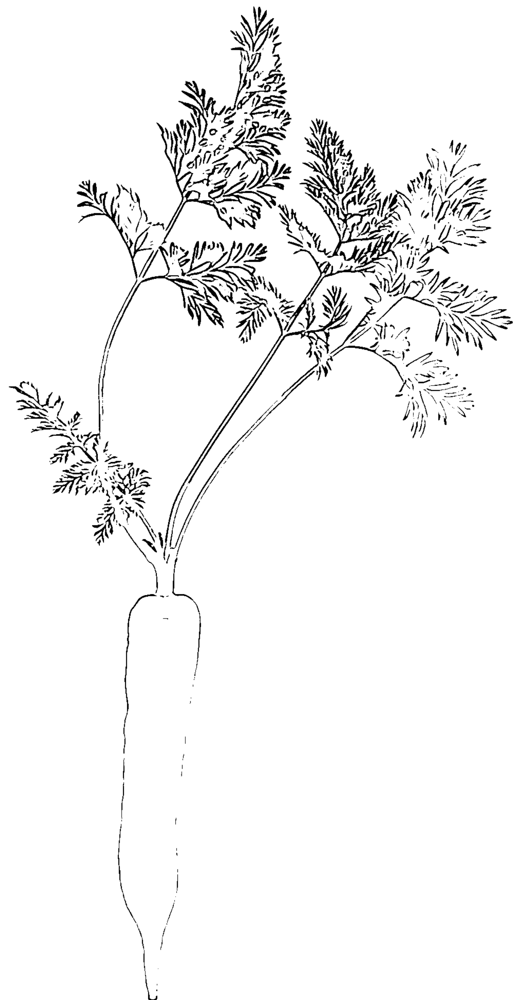

雖然大家所熟知的胡蘿蔔是橘色，但胡蘿蔔的原始物種本來是紫色的，因為後來荷蘭培育出橘色的品種，結果大受歡迎，所以現在市場上多以橘色的物種為主。單就顏色而論，橘色為紅加黃，為火與土的間色，紫色則是火與水的間色，大致上都與火屬性的能量有關。而橘色的品種則對脾胃的影響較多，這一點與過食胡蘿蔔會導致皮膚發黃，也就是《桂本》所認為脾胃有「寒濕在裡」的問題一致。

胡蘿蔔外觀大致呈紡錘狀，視為三角形，帶有火屬性。味道青澀，附屬於酸之下，帶有木屬性。整體來說，胡蘿蔔雖然與火屬性類同的外觀特徵頗多，但是青澀的氣味較有明顯的阻滯氣機的效果，若非經過高溫、長時間的烹調並且以大量的油脂同煮，單獨、長期食用或是生食，通常容易導致「退火」的結果，也就是對於胃氣、陽氣有所減損。換個角度來說，當我們燉煮含有較多量油脂的食材，像是牛腩、豬五花，也可以取適量的胡蘿蔔同煮。一方面可以減少料理的油膩感，增添香氣，胡蘿蔔也會因此去除青澀味，變得甘甜，一舉數得。我吃過燉煮得火候入裡的胡蘿蔔，鬆軟與甜度讓我一度錯認為是吃到番薯。若是搭配適量的馬鈴薯，效果更好，也更加美味。

| 生物分類 | 繖形科 |
|---|---|
| 本草分類 | 穀菜部 |
| 取用部位 | 根 |
| 建議食用頻率 | 少用 |
| 建議用量 | 少量 |
| 使用季節 | 四季 |
| 四性 | 涼 |
| 五味 | 酸 |

胡蘿蔔常與蘿蔔混淆，但是兩者不僅科目不同，物性也大異其趣，只是因為胡蘿蔔由西方傳來中土的時候，形似固有品種的蘿蔔而得名。到了日本，則認為形似人參，便直接以此為胡蘿蔔的簡稱。雖然沒有蘿蔔之害，但還不至於有人參之功。

若是比較起來，在有限定的條件之下，胡蘿蔔做為豐富餐桌體驗與樂趣的食材之一，還是我所推薦的。

## 2. 芹菜

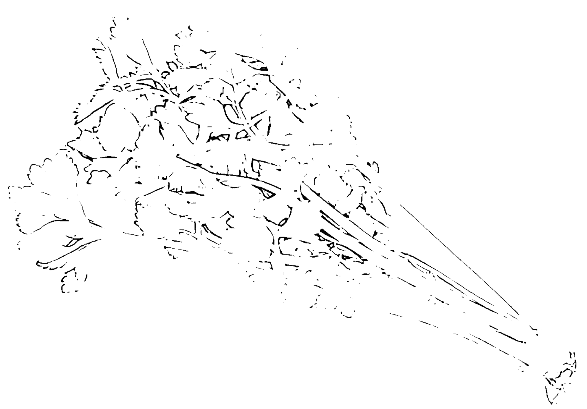

| 生物分類 | 繖形科 |
|---|---|
| 本草分類 | 穀菜部 |
| 取用部位 | 葉 |
| 建議食用頻率 | 少用 |
| 建議用量 | 隨喜 |
| 使用季節 | 四季 |
| 四性 | 溫 |
| 五味 | 辛 |

芹菜有明顯的香氣，有的人可能因此而卻步，但這也是繖形科物種的普遍性特徵。芹菜主要有兩種品種，一種葉柄較粗，香氣較不足而纖維較粗，建議使用另外一種葉柄較細者，香氣較飽滿。另外一個特徵在芹菜的身上也表現得很清楚，就是芹菜的葉柄為中空的結構。中空的結構一般常類比為「掏空＊」的象徵。如果性味是偏寒、苦，像是空心菜，那對於人體的掏空力道就可能會過大，應該盡量避免食用。但是如果性味偏熱、辛，像是蔥或芹菜，那對於提振人的陽氣或許就會有幫助。芹菜的性味雖然沒有如蔥、韭等中空結構的蔬菜那麼辛熱，但是因為仍具有一定的辛、溫的力道，略經快炒就可以食用，甚至於就算生吃，對於人體的影響也不致於太負面。芹菜葉柄切細段就如蔥花般使用，而細嫩的芹菜葉則可以當做香菜，直接點綴在料理上頭。

### 掏空

在人體進行往復折疊的功能循行之時，原則上同時也在進行「以新代陳」的功能。也就是說：身體的內臟應該要時時呈現飽足的狀態，只是差別在其充飽的內容，是新鮮的津液、血液，或者是陳舊腐敗的物質而已。但是有一物種可能會刺激人體，在沒有新鮮的津、血入裡的同時，就先把內臟之中的物質，不分新舊的一律排出。像這樣，跳過新物質入裡，就讓舊物質離開內臟的狀態，就是直接對內臟「掏空」。若非在極端病情之下，通常我們是不會這樣操作身體的功能。

芹菜本於繖形科的基本特徵，淺綠色走木屬性的陽面，從三焦的力道向外走散，長直的纖維又帶足辛香氣，所以對於少陽與肝系統的氣機疏瀉、預防氣滯鬱積來說，有一定的幫助。也因為肝系統的本性在疏瀉，除了在料理的應用上可以搭配一些較含有油脂的食材，或者直接配伍芝麻油來使用，適度的搭配可以推展胃氣的生薑，也可以綜合性的達到協助身體的陽氣運行的效果。若是再搭配前述的胡蘿蔔，可以將肉類的油脂做很好的分解與提香，料理的風味可以更加芳香、清爽，美味與保健同時加分。只是芹菜走而不守，對津液的補益效果不高，如果是單吃，或者沒有配合足夠的肉類來用，對於津血較少的體質來說，還是比較不利，建議避免。

# 菊科

菊科的藥用與食用物種也不少，白朮、茵陳、旋覆花，都是《桂本》中很重要的代表性藥材，是調理脾、肝功能的要藥。本科代表性的物種，就是同時可供食用與藥用的菊花，望文生義，該科物種的開花多如菊花一般，有複數放射狀的花瓣。花是能量的極致，而細看菊花這樣的結構，與人體的瞳孔、角膜，以及周邊的括約肌的結構，十分類同。眼是肝的開竅，也是能量極致的表現，我認為菊科的植物對於肝系統的能量表現，以及養分由脾系統給供而來的功能，都有很密切的關係。

常用的食用葉菜，若是深綠色的蔬菜，像是茼蒿、紅鳳菜，偶爾少量用之，搭配大量的油脂快炒，則多半會有涼血的效果，但是補益方面的效果則不顯著。若是淺綠色的蔬菜，還可能對肝系統的疏瀉功能有所減損，較偏寒性，縱使像現代多在速食餐廳中夾在漢堡裡頭的萵苣這樣，生鮮時的莖、葉切口會有乳汁流出的物種，在日本古名叫做「乳草」，英文名「Lettuce」來自於拉丁語「Lac」，也就是「乳汁」之意，但是因為性味苦寒，不易消化，也不堪多用，更不宜生食。肝系統的鎮靜，主要應該來自於我所謂的「大質量分散能量」，輕度的涼瀉可以有條件的幫助養陰，但是劑量拿捏不易，稍有太過則損及陽氣，應該多加注意。

### 大質量分散能量

依照地球科學現象觀察：同樣的日光照射，小體積的湖泊水溫上升比大體積的湖泊水溫高。由此可知：承受相同能量之下，承受物體的體積愈大，溫度變化愈趨平緩。此我所謂「大質量分散能量」的原則。

在《太極米漿粥》中，我曾多次提及「虛燥熱」的概念，主要就是來自於「體內應有的津液不夠飽足的時候，身體正常功能的運行便會容易呈現出過度高溫的傾向。」的觀察。在多數的狀態下，人體出現發熱的反應，並非是來自於功能過於亢進，反倒是津液的含量不足所導致。在這個前提下，如果貿然使用帶有苦寒瀉下性質的食材或藥材，就可能直接破壞了人體正常的功能，讓情況惡化。違和成有病，小病轉大病，大病變致命。

## 1. 牛蒡——附·白术

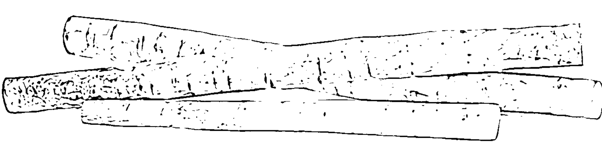

| 生物分類 | 菊科 |
|---|---|
| 本草分類 | 穀菜部 |
| 取用部位 | 根 |
| 建議食用頻率 | 偶爾 |
| 建議用量 | 少量 |
| 使用季節 | 四季 |
| 四性 | 涼 |
| 五味 | 酸 |

我們常吃的牛蒡，是取用他的根。菊科的植物就我們一般的理解來說，通常與脾和肝之間的合作機制，有連帶的影響關係，就像藥用植物之一的「白朮」一樣，能夠幫助增進脾系統的化消力道，並且提供給肝系統比較充足的津液。但是白朮的性味苦、溫，使用的是地下根莖，外觀類同於薑，對於疏瀉、運化的功能較強。苦味能帶動下行力道，溫性又能使能量上行，這對於同時溝通脾與肝系統的養分輸通、雙向調節，很有幫助。

牛蒡雖然用的是根，外觀筆直下行，很有木屬性將養分帶往內臟的力道。但是因為氣味較淡，食感偏澀而歸於酸，對於氣機的幫助較不明顯，本身又缺乏足量的津液，若是長期、大量的單用，對於身體的養分來說，最終還是處在虛耗的狀態，並不適合做為日常的保健方式之一。牛蒡雖然在力道上和白朮略有不同，但是對於有肝系統虛熱問題的人來說，偶爾用牛蒡入菜，大火多油快炒，或是燉湯，可以幫助緩解胃口不佳等問題，提升肝臟收藏津液的效果，也比較不容易覺得疲倦。只是牛蒡纖維太粗，不易消化，建議需控制用量。若是削成薄片，再以油炸去水，增添香氣，藉由芳香的氣味來帶動脾系統的氣機，也是一種不錯的調理手法。

# 旋花科

旋花科中，常見食用或藥用的物種相對偏少，觀察可知，地下較少塊莖或是塊根的結構，對於補養的效果很有限，地上的部分則缺少明顯的香氣，對於氣機的提升幫助不大。旋花科的物種大多開紫色的花，但是花蕾為順時針盤旋生長。根據物理學的右手定理，右手四指以順時針握起，拇指伸直，則旋轉的物體的前進方向與拇指的指向相同。花序雖然是氣的極致，但是卻隱含下行的趨勢，需要留意下行的力道減損陽氣的升提。像是牽牛花平常作為觀賞之用，其實全株有毒，種籽還能夠入藥。有一種「蘿菜」，俗名「空心菜」，雖然常見，但是因為莖部中空，能夠水生，不親土性，所以基本上對於人體來說，是掏空三焦的津液的作用，包含與胃聯通的中焦，以及與膀胱聯通的下焦，所以也有人認為食用空心菜可能會引起尿道結石的好發。無論如何，都建議盡量避免使用為上。

## 1. 番薯

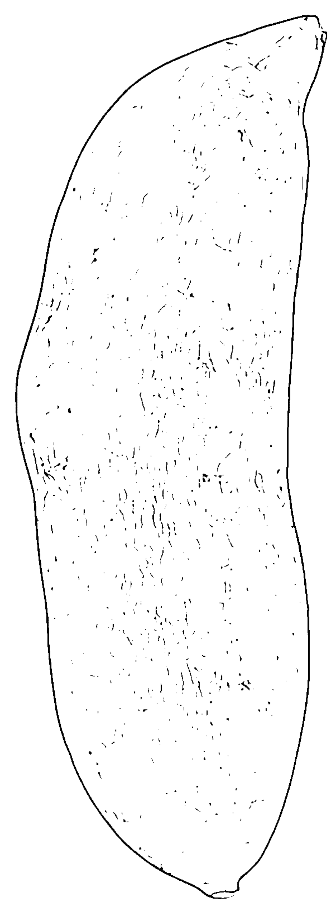

又名地瓜、甘薯。番薯原產自南美，大約至明代的時候才傳到中國，臺灣則是約在十七世紀的時候傳入。旋花科的植物較少做為食用或是藥用，但像是牽牛花則相當常見，而番薯的花與牽牛花的外觀就有高度的類似，花蕾的時候形似尖錐，開花後花序則呈現單一的繖狀，多為紫色，代表火水兩屬性的間色。番薯有地上蔓莖，平均能達到兩公尺以上，橫走能力強，代表能夠推送津液上行的力道也足夠。橫走的蔓莖會生不定根，繁殖很快，代表對於與土地的親和能力很高，具有能將養分回送至土系統的特徵。葉子外觀為心形，部分品種為卵形，也象徵能夠走散的能量大致以火屬性為主。在種植環境的整備上，以高起的土堆、排水良好為宜。根部喜燥而惡濕，這樣的特性較偏向金屬性。番薯的塊根形狀較為不一，有橢圓，也有紡錘狀，不定形的外觀有火屬性的特徵，但是大抵上塊根都帶有兩頭尖，也就是金屬性。這代表番薯以表現金屬性收斂肅降的力道為主，能夠令氣機下行，所以我們常在多吃了番薯之後會有排氣的現象。

| 生物分類 | 旋花科 |
|---|---|
| 本草分類 | 穀菜部 |
| 取用部位 | 根 |
| 建議食用頻率 | 偶爾 |
| 建議用量 | 隨喜 |
| 使用季節 | 四季 |
| 四性 | 平 |
| 五味 | 甘 |

番薯以作為替代性的主食來說，吃了之後能夠將津液帶入脾胃，有確實的飽足感，又能夠推送心火而產生力量，以供應生活所需的勞動需求，再加上在貧瘠的土地也能生長得很好，所以成為世界產量前三大的薯類之一。因為番薯乾燥後更有甜味，所以無論是經過烘烤或是油炸，都很適合。以作為豐富家常餐桌上的變化的功能來說，番薯的效果極佳，而常吃用番薯製作的料理，也能夠略為補足現代人經常在主食方面嚴重攝取不足的問題。

有一陣子時興番薯等各種薯類的特殊吃法，號稱是「排毒」、「抗癌」養生的招數。但是嚴格來說，真正的問題就是出在現代人排斥、抗拒主食已經太過，因此產生胃氣無法正常運作，進而引發各種生理功能不能協調的毛病纏身。其實真正的「排毒」的概念，就是要利用脾胃系統如大地一般的涵養、包容萬物的特性——既能生長新生命，也能掩埋死體、廢棄物，化萬物於一，又能分生萬物。平常我們就有很多可以輕易取得的五穀主食可用，不是非得出怪招才有奇效。胃氣的「雙向調節」功能，應該做此理解。

# 薯蕷科

薯蕷科的物種也有數種作為食用或是藥用，並且頗受到愛用。最出名的莫過於以爲科名的薯蕷，也就是山藥，不但是優質的養生食材，也是《本經》中的上品良藥。因為常用，與其他的塊根、塊莖類的食材也相似，例如本科的參薯，他的塊莖因為有紫色的肉質，所以與天南星科的芋頭或是旋花科的紫薯經常混淆、混用。

本科作為食用或是藥用的物種，基本上都有能夠攀爬的地上莖，也具有肥大的地下塊莖，對於人體由土屬性的脾胃之中，把津液聚集起來並且疏瀉上行，有明顯的幫助。對於作為代用主食來說，也是很好的選擇。但是畢竟是代用而非真正的主食，缺少胃氣最需要的「雙向調節」的特質，用量上還是應該有所斟酌才好。

## 1. 山藥

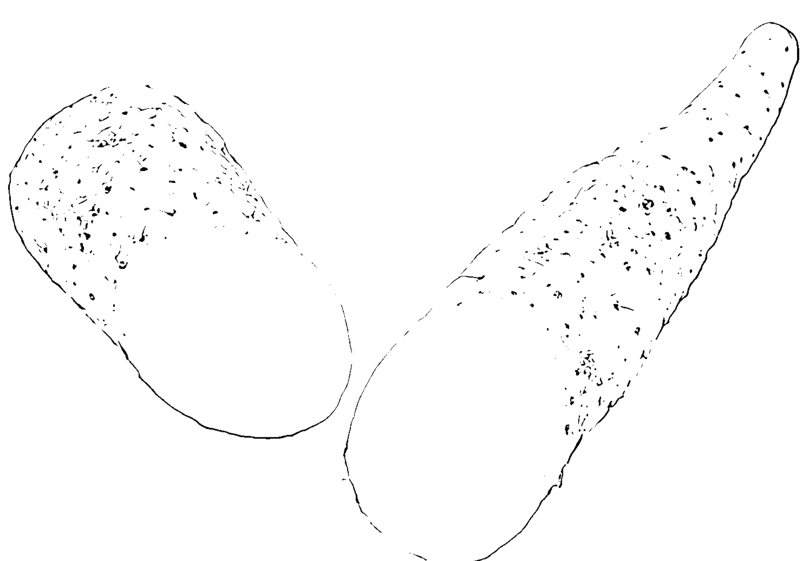

山藥的藥材名稱為薯蕷，古代又以產自懷慶地方者聞名，所以俗名又稱「懷山」。另有一種產自江淮地區的，俗名叫「淮山」。名稱不同，但都是同一物種。

在《本經》之中認為山藥可以調理脾胃的損傷，並且改善虛弱體質，對於脾胃系統的益處很大，在《桂本》之中更是補腎良方「腎氣丸」的組成藥味之一。以「藥食同源」的物種來說，他的補養效果可說是數一數二。山藥食用的部分是地下塊莖，與馬鈴薯相似，直接補養的效果集中在脾胃、中焦，而山藥入土更深，可達一公尺以上，馬鈴薯只在土壤淺層生長，兩者藏納津液的力道之高下，由此可見。

山藥的塊莖生長型態與薑很像。平常我們在菜肆見到的山藥雖然都是長直的棍狀，但那是因為人工種植所刻意造成。其實自然野生的山藥如同薑一般，可以自由分歧蔓延、肥大，能夠達到十數公斤，甚則六十公斤以上，既帶有木屬性的樹狀結構，又具有火屬性的不定形外觀。塊莖的外皮為深褐色，肉質白色，涵養的津液以土屬性和金屬性為主。地上的蔓莖能夠橫走，能夠攀爬，可上至最少十公尺的高處，疏瀉津液的能力與葛不相上下。但是老葛根的質地較乾硬，山藥不但能夠保持濕潤，切開還能夠帶出豐富的黏絲，表示對於津液的涵養密度很高。山藥的葉子外觀呈心形，初生帶紫色，代表能溝通心系統與少陽系統的能量。

山藥的烹調的方式很多，但是我最推薦的吃法還是生食。因為生品的山藥才具有黏絲，這對於補養的效果才是最佳狀態。切絲或是磨泥，都很好。

山藥雖然看來如此完美，但是其津液的型態的濃度較高，不容易消化，也不利於身體回收氣機由陽返陰，補益的津液缺乏產生為陽氣的動力時，反而造成陰陽氣機不能輪轉的重大問題，氣血都會失調。所以《桂本》藉山藥的補益來輔佐地黃的津液進一步補腎，其中也要配伍桂枝、附子來幫助陽氣運行，並非長期、大量、單獨食用就可以成功。

經常傳出有人瘋狂吃山藥而不吃主食，結果導致病變的新聞，應引以為戒：五穀為養，米麵之所以為主食，《內經》已經明確的告訴我們其中的要義了，飲食養生講究秩序，分際千萬不可失所進退。附帶軼聞一則：某天在網路上看到有人分享了一「數代老中醫家傳不外的養生秘方大公開」的圖片一張，娟秀的毛筆字在藥單上龍飛鳳舞，分別接連寫下幾味藥材，其中穿插「山藥」、「薯蕷」、「淮山」各數錢。這好比有人說要請到「諸葛亮」、「孔明」、「蜀漢丞相」三人同台演山對談一般，讓人看了不禁莞爾：都二十一世紀了，中醫藥的常識普及真的不能等；中醫藥的「不傳之秘」故步自封，愚人愚己，亟待系統化的整理。

### 山藥泥料理「快雪時晴」

山藥生食，我認為能夠發揮最大的補養效果。不過，要怎麼吃，這又是另外一門學問。下面提供一則我的建議調理辦法，有興趣的朋友不妨試試。如果還合得上胃口、不排斥，可以偶爾食用，對於強壯體質，很有幫助。

### 做法：

- 1. 山藥磨泥約三百毫升、生雞蛋黃一個，醬油、蔥花、山葵泥、海苔絲各適量。
- 2. 將以上材料依序盛入碗中。使用時，一起拌勻，即可直接食用。
- 3. 不敢吃生雞蛋黃，可以先煮成溏心蛋之後，再單取蛋黃使用。

# 棕櫚科

棕櫚科的植物通常是喬木，而且通常都生長得很高大，有些甚至高度可以超過十公尺以上，很容易表現出高度的金屬性的能量。因為他一莖直上，通常具有很高的木屬性的疏洩力道，又加上這類的喬木的葉子通常簇生在頂部，葉子本身又帶有許多細長的針狀的結構，充分表現出木屬性的能量打到頂之後，再由金屬性的能量收到到底的高度往復循環的功能結構。

此科物種的花序較小，通常呈穗狀排列，或者同樣簇生在頂部，透露出相當的金屬性特質。果實有不少都有堅硬的外殼，金屬性很強，能夠先把氣機聚斂起來再下行。不過，果實因為通常都不是生長在枝葉末梢，而是直接在莖的頂端生成而落果，所以細究起來，雖然氣機上的循行力道很強，但是養分的運行力道相對而言稍微不足，以少陽系統來細分，直上直下的走法在特徵上比較能類比於內環的人體三焦的系統，而非於外環走行的膽系統。

像是以經濟作物用途為主的「油棕」就能夠產出大量的油脂，供做食品等各種工業加工之用。但是因為整體來說，金屬性的表現偏性極為強烈，除了人體有可能不易吸收之外，也有可能因為氣與血不能調和，使偏性較為明顯，所以在食用的時候，配伍與比例就格外重要。畢竟棕櫚科的物種普遍生長在熱帶地區為主，高溫高濕，來自環境的升發力道就很強，但是通常此科的植株的根系都很淺，入土不深，對於脾系統的親和力道都不高，對於脾胃的養護力道畢竟比較低，長期、大量的食用，掏空脾胃津液的可能性還是比較高的，應當留意。

## 1. 椰子
——附：椰油、椰奶、椰糖

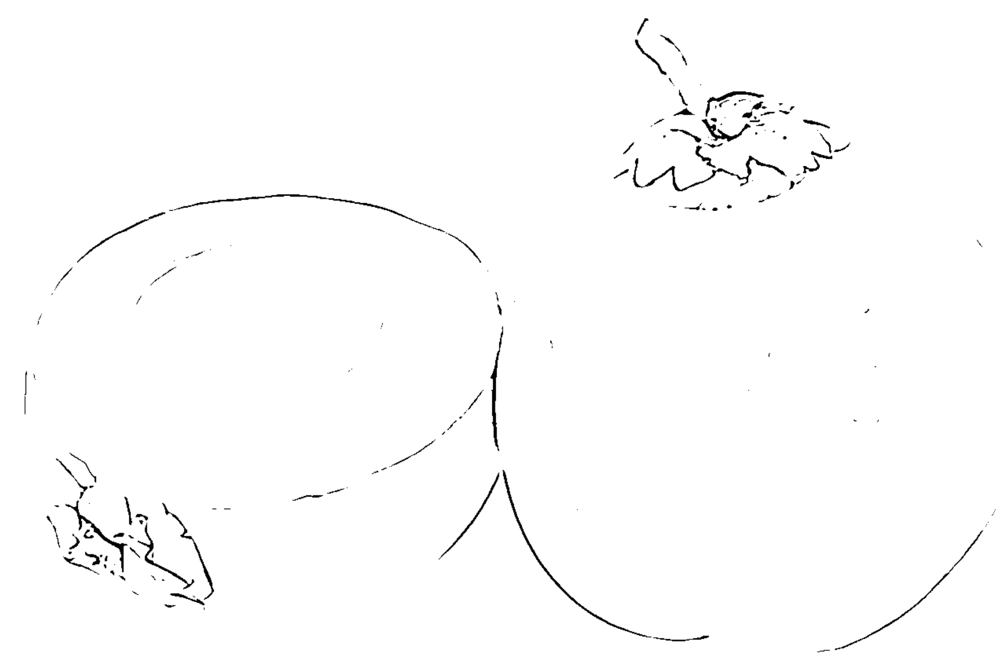

| 生物分類 | 棕櫚科 |
|---|---|
| 本草分類 | 果部 |
| 取用部位 | 果 |
| 建議食用頻率 | 避免 |
| 建議用量 | 避免 |
| 使用季節 | 避免 |
| 四性 | 寒 |
| 五味 | 甘 |

椰子的種類很多，經濟價值也很高，部分品種也可以做為食用。椰子具有大部分棕櫚科植物常見的特徵之外，主要的食用價值集中在果實上。常見的食用椰子的果實相較來說較大、較重，一個果實大約可以到達兩公斤左右，但其實大部分的重量都是來自於椰殼，中間可供食用的部分極小，而且相對來說結構是中空的，對於人體養分有掏空的不利影響，性質偏向寒瀉。以「果是血的極致」的觀點來說，椰子可以說是行氣力道有餘，行血力道不足。

果實中央多有甘甜的汁液，打開就可以飲用。果肉只在果核內壁上薄薄一層而已，分量不多，可以直接食用，也可以再加工而製做出白色濃稠的汁液，稱為「椰奶」，也可以提煉出椰油。汁與肉的比例懸殊，也證明了氣與血的不調和的實況。椰汁還有一個特徵：若是果實摘下後不立刻打開飲用，隨著放置的時間拉長，椰汁自然會逐漸減少、消退。這其實可以說明：任何動、植物來源的食材，只要一脫離其原本的活動狀態的時候，維持其生命的能量，也就是「氣」，就會自動衰減。這是無法透過任何冷藏、冷凍等技術來阻止或減緩的。

除非是長時間身處熱帶地區活動，也不使用任何空調設備，在自然環境與室溫之下，飲用椰汁或許可以幫助回收一些過度發散的氣機，否則以當前現代人的飲食作息環境來說，椰汁實在是沒有足夠的主客觀條件來支持我們飲用。還有一則傳說：「腹瀉病人喝椰子汁也有好處。」但這話以中醫的觀點看來，未免太駭人。腹瀉有分熱性、寒性，治則、禁例完全不同。辯證後如果確實合用，倒也無妨，但是此話「反之不亦然」，若誤解成為「在腹瀉時不分青紅皂白都可以飲用椰汁」，誤用而成壞病，恐怕成災。

### 椰油、椰奶

椰油與椰奶雖然在熱帶地區也是主要的食材之一，但是如前述提及，椰子對於氣的介入力道很強，對血的幫助很少，若非身處在全年如夏的熱帶地區，有環境無限的高熱來輔助陽氣上行的走勢，則僅以椰油做為主要食用油，恐怕身體也承受不住陽氣大幅度被帶動下行的力道。朋友若有機會使用椰油製成的肥皂，不妨感受看看：椰油皂的洗淨去油力道非常強勁，若是拿來洗人體，皮膚會覺得格外乾澀而不適。椰油在瀉下三焦屬性的津液的力道上，具有相當猛烈的性質，如果放進體內，恐怕更需要謹慎為之。若是為了「健康」的因素而用，建議還是三思，避免以偏害偏。一般來說，椰奶如果只是偶爾少量用一些於甜點之類，用量也不大，除非身體的胃氣與陽氣狀況較為不足、虛弱，否則基本上也就不必去計較其偏性。

### 椰糖

另有一種以椰花蜜加工製成的椰糖，如果以做為地方特色料理來說，有其獨道的香氣，是不可或缺的要角。但是因為椰子全株的金屬性都很重，以蜜製糖，稍嫌較不易消化、吸收。雖然在製做地方特色料理上的確是不可取代，但是如果要全面性的替代為家常飲食的主要用糖，如非產地居民，只是為了「健康」因素，倒也沒這個必要。平常能大量的使用主食，養胃氣、護陽氣，各種生理功能得以中和，健康自然跟著來。

## 2. 檳榔
——附：檳榔花、檳榔心

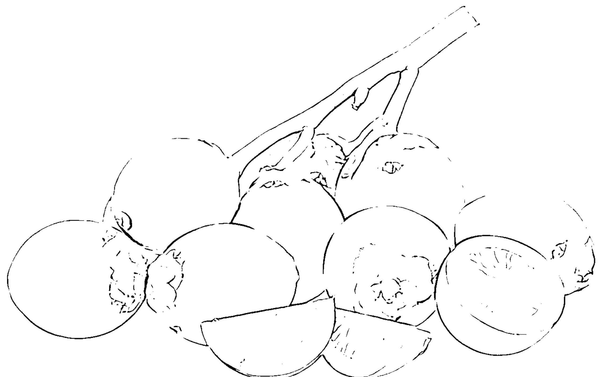

檳榔與椰子同樣都屬於棕櫚科，物種生態也很相似，可以說就像是親兄弟一樣，但是對於果實的形態來說，檳榔的個頭很明顯小得多，而且結構比椰子來得紮實，氣味也強，所以在物性的觀察之中認為：檳榔下氣、降濁、解暑等的力道，要比椰子更來得強大，也因此檳榔自古就是人們去除「瘴癘之氣」的法寶。尤其是在常年氣候濕熱的地區，來自環境的上行升散的力道過大，下行入陰的機能受到阻礙，人容易因此生病，若是偶爾嚼食檳榔，保健功效甚大。但是近年來，檳榔遭到西方式的營養成分分析的詆毀，明明是早年救人的良藥，現代卻被認為是致癌物，有冤難伸。究竟是檳榔本身有害，或者是現代人食用檳榔時一併吃下的添加物有問題，必須要明辨。

| 生物分類 | 棕櫚科 |
|---|---|
| 本草分類 | 果部 |
| 取用部位 | 果 |
| 建議食用頻率 | 偶爾 |
| 建議用量 | 少用 |
| 使用季節 | 四季 |
| 四性 | 溫 |
| 五味 | 辛 |

### 檳榔花

所幸，人們對於檳榔花的觀感並未受到影響，只要確實煮透後熟食，檳榔花對於身體仍然具有提升清氣的作用，令氣機打到頂而收到到底，藉以降濁、去濕熱、消食，燉煮成湯品，不但氣味清淡甘甜，向上能清利頭目，向下兼能整腸潤燥，在暑熱難消之際，若是食慾減退，體弱乏力，少量使用，有調理之功。

### 檳榔心

另有一種，以檳榔樹頂端的嫩芽入菜，稱為檳榔心，也有類同的功效。又因為檳榔樹高聳入天，所以將檳榔花稱為「半天花」、檳榔心稱為「半天筍」。只是檳榔的偏性仍屬較強，對於每個人的影響效果深淺不一，如果不常吃，甚至未曾嘗過，還是建議從少量開始吃起，待習慣了之後，稍微增量亦可，但仍然有過食的中毒問題，應當小心。通常中毒的傾向來自於中焦津液被大量耗盡，所以對於脾胃津液過少的人來說，的確是比較有風險的食材。

### 半天豬肚湯

檳榔花與檳榔心都是清爽的美味食材，可以升提脾胃中焦的機能，連帶的對於身體的代謝力道也會有助益。當然，好食材通常不單用，需要有適當的配伍，美味與健康才能同時加分。結合升提的力道，配合原本較不易消化的豬肚，成為清爽的湯品，是一道很適合炎炎夏日的料理。

### 做法：

- 1. 準備檳榔花約一百公克（檳榔心亦可）、豬肚一副、芹菜兩小枝、清水兩千毫升、純釀米酒兩百毫升、胡椒粉一茶匙（約五毫升）、自然鹽（適量）。
- 2. 豬肚洗淨，以蔥薑水汆燙約三十分鐘，至外形收緊，撈起，切成約食指長、寬的小塊備用。
- 3. 將所有材料煮開後，以中小火燉煮約一小時。
- 4. 加入胡椒粉、天然鹽調味，湯成。

豬肚洗淨後，均勻抹上太白粉，略為搓揉，再以清水沖掉，更可以有效去除腥味。

# 天南星科

天南星科的植物常見於少日照而潮濕的環境。雖然在臺灣相當的常見，也有不少臺灣特有種，但是本科的物種多半也都有大小不等的毒性。主要是因為本科的物種多半能夠產生大小不等的地下塊莖，而地上莖葉的切口會有乳汁流出，這兩種特徵都代表植株對於津液的儲存以及濃縮能力很強。我所謂的「中毒」的定義是「短時間內身體的津液發生大幅改變」，包含在我所謂「容易改變外觀」的功能之中，帶有火屬性。進一步來說，中毒有兩種，一種是津液的「大幅增加」，一種是「大幅減少」，像是天南星科的物種就屬於後者。津液大幅被劫去之後，輕微的狀況會發生苦瘡難耐，嚴重者人體會感到灼熱，局部腫大，有引起呼吸困難、窒息的危險。當然中藥所謂的有毒並非完全碰不得，本科的半夏、狼毒草就是《桂本》之中治療難病宿疾的要藥。一般認為很養生的蒟蒻，也是由本科之中有毒性的魔芋所加工而成。換個角度來說，如果身體的局部有濕氣累積的狀況，或者應用在與較難消化的食材配伍，適切的使用這樣的力道，也可以收到調理的好處。

## 1. 芋

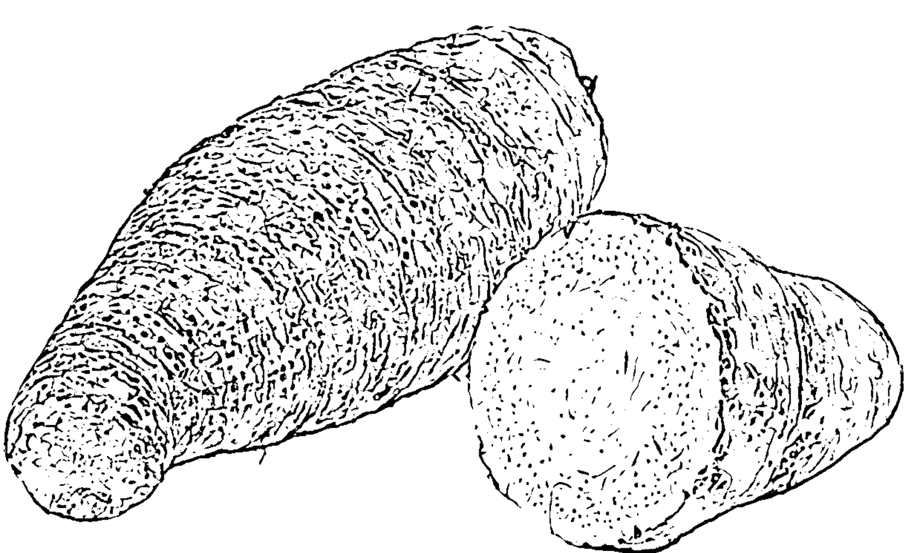

芋，或是俗稱芋頭。芋頭和我們先前談到的馬鈴薯、番薯有些不同，雖然我們也是食用芋頭的地下塊莖的部位，但是芋頭的生長環境，卻是來自於較為濕且熱的熱帶地區。相對於馬鈴薯或是番薯主要在旱脊地生長，物性能夠幫助人體把津液往下焦推送，像是芋頭這樣子的天南星科的植物，反而能夠在濕熱的地區生長，把養分聚集濃縮起來之後，再大大的擴展開來。

芋頭的外觀大致上呈現橢圓形或是卵形，能夠以土或是火屬性的型態儲存津液。地上有高起的莖加上大大開展，呈現心形的葉子，代表對於將火屬性的津液疏洩而出的力道相當明顯。芋頭的肉質多是深度不等的紫色，這代表芋頭的塊莖儲存的，主要是少陽系統的火與水屬性的津液。人體內若是有較容易累積濕氣，不易往四肢、上焦、體表輸送開來的傾向，芋頭在我們的體內，就能夠透過對少陽系統的影響力，產生如此「舒展水氣」的效果。

| 生物分類 | 天南星科 |
|---|---|
| 本草分類 | 穀菜部 |
| 取用部位 | 塊莖 |
| 建議食用頻率 | 偶爾 |
| 建議用量 | 隨喜 |
| 使用季節 | 四季 |
| 四性 | 平 |
| 五味 | 辛 |

雖然這樣的走通性質，使芋頭終究不適合作為主食來大量食用，但是，若是像我們身處在臺灣這樣較為濕熱的環境，偶爾選用芋頭入菜，加入大量的生薑同煮，可以幫助舒通胃氣、健胃、避免上逆而嘔。加入大量的蔥白同煮，能夠調理氣機。

對於氣機停滯，經常有「聞到食物的味道就覺得噁心」問題的人，不妨嘗試看看。

或是與較多量的蔗糖做成甜食，則可以緩解過食甜食所造成的胃中滯膩的感受。

這些料理，都會有助於身體提升中氣，避免濕熱累積在脾胃不散，可能造成食欲不振，或是咽喉有痰、不爽的問題。

# 蓮科

蓮科的物種分類相對來說比較單純，主要分為葉子平貼水面的睡蓮類，以及葉子高出水面的荷花類。

因為蓮科是水生植物，對於排除水氣的力道明顯較強。加上荷花類的葉子能夠高出水面，葉面寬大，表示他在升提津液於濁水之上的功能更加有力。無論如何，睡蓮類或是荷花類的物種，都有可以入菜或是入方的材料，像是睡蓮類的種仁：芡實。

而荷花類之中，就算是不直接食用的荷葉，用來在烹調中包裹食材，都可以增添豐富的香氣，值得多多應用。

## 1. 蓮藕
——附：藕粉、蓮子

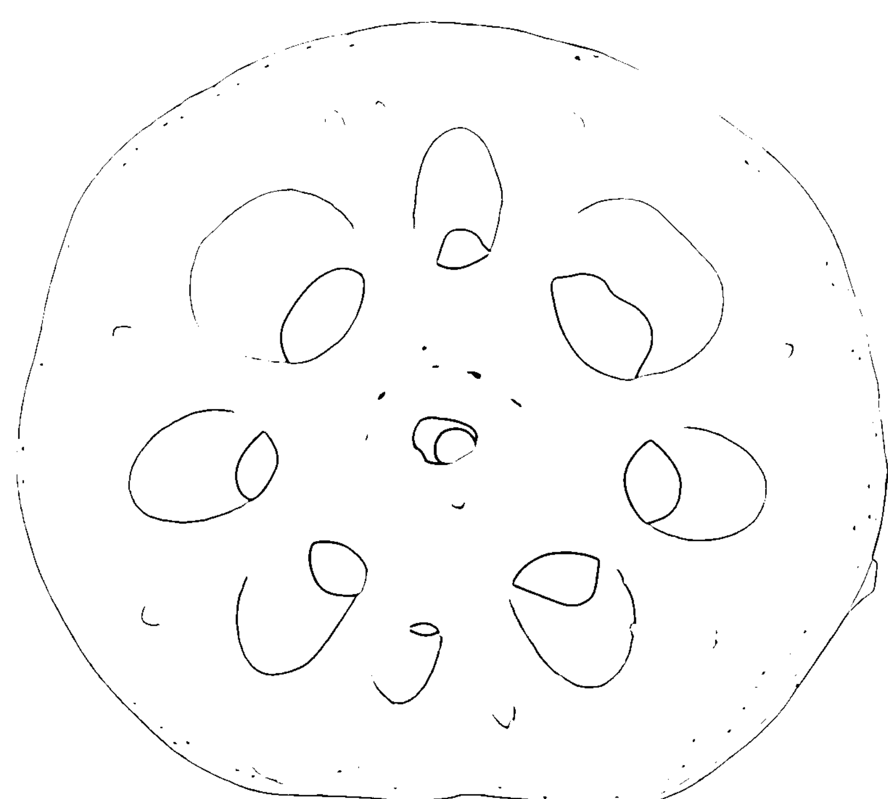

荷花的地下塊莖稱為「蓮藕」，雖說是「地下」，其實他是位在濕地、水池底部的土壤裡，算是水下。蓮藕是在水下橫走的塊莖，對於養分的輸送與涵養都有一定的力道。

蓮藕的結構很有特色，其一是「有節」，其二是「中空」。有節代表對於水屬性的親和力較高，中空代表具有高度的疏瀉力道。以水下的塊莖來說，還能夠有如此明顯輸送津液、排除水氣的結構，這是一般物種之中少見的物性特徵。對於我們所謂「水往低處流」，天性極具下行偏性的水氣與津液來說，蓮藕這樣「由陰出陽」的力道，是身體很需要又不容易維持的重要功能。如果我們的身體已經是涵養一定程度的津液的狀態，能夠再適度借取此類的物性，可謂如虎添翼。

| 生物分類 | 蓮科 |
|---|---|
| 本草分類 | 穀菜部 |
| 取用部位 | 全株 |
| 建議食用頻率 | 偶爾 |
| 建議用量 | 少量 |
| 使用季節 | 當季 |
| 四性 | 平 |
| 五味 | 甘 |

### 藕粉

蓮藕除了生食，與富含大量油脂的食材一同燉煮，或是以大量的蔗糖一同熬製出甜品，都很適合。

除此之外，蓮藕也可以經過加工，洗出澱粉質，稱為「藕粉」，也很具有補養的效果。相對於葛粉，藕粉的力道較集中在三焦，屬於軀幹、內臟的調理，而葛粉的蔓莖橫走攀附的力道強，偏向更能由內臟聯通身體表層的經絡，屬於表裡的通調性能，運動而出的效應更為豐富。雖說是各有所長，但我平常偏好使用葛粉還是多一些。

### 蓮子

蓮藕自水中一莖直上，開花結果，果實則為蓮子。蓮子看似被包裹在蓮蓬之中，但其實蓮蓬是由蓮花的花托變化而成，也就是如同蘋果等一般的「假果」結構。

只是蓮蓬在家常之中極少使用，用的是真果部分的蓮子，問題就不大了。蓮子質地堅硬，中間有心，蓮子的心形如針尖，味極苦，破瀉下行的力道太強，最好去除之後才用，通常也以不用這蓮心為宜。作為蓮藕的相對兩極之一，蓮子能夠將凝聚的津液返送回下焦底部，對於身體經常因為勞動，或是因為炎夏的環境之中的熱氣影響，而引起的津液升散過度，蓮子具有調和緩解的效果。

# 漆樹科

本科的物種除了可供食用，有些可為加工之用，例如據以命名的「漆樹」，從漆樹上取出的樹液則是「生漆」，可以為木、竹等材料所製作的器物提供保護與美觀。

生漆本身也可以做為藥用。生漆剛從樹皮的切口取出時，本為白色，與一般植物流出的乳汁差異不大，但是不久之後會凝固，顏色則轉為暗紅，再經久放之後，則轉為黑色。這如同津液經過人體的功能被高度精練，存放在脾胃之中時，津液大抵上也是呈現乳白色。但是當脾胃的津液與由上焦下行而來的心火相結合的時候，發生質變，就能轉化成為血。血液的紅色，我認為是其具有攜帶了心屬性能量的意義。再接著運行全身上下裡外之後，化歸腎系統之中做長久性的收藏，應於水屬性的特徵，高度吸收了全光譜的能量而不反應，所以最終呈現出黑色。

這是很典型的透過胃氣的作用而「心腎相交」的效應（請參考《太極米漿粥》P.117）。

白色的生漆有一定的黏稠度，轉為紅色之後的質地更加細密，塗佈在器物上則可以保護器物本體不受潮、不腐敗、不受蟲蛀，漆塗層具有相當的鋼性同時又具有韌性，甚至可以做切削雕刻等加工。以這些本科物種的主要物性表現來推測：漆樹科的物種對於高濃度的津液有一定的親和力，而高濃度的津液是能夠排水的，同時也能令所攜帶的津液在吸收了心火之後，與腎系統有較好的引導結合的力道。當然這也並非一面倒的好處。如果使用時，當下脾胃中的津液含量不夠充分，或者食用的時候沒有很好的配伍，血液、津液一同被大量的帶往下焦、內臟，體表反而容易因此缺少津、血的滋潤，就像生漆未經處理的時候，直接接觸皮膚會導致發癢，有的人則是反應芒果吃太多了也會導致身體發癢，這就是《桂本》所言及的血虛而生風、癢為瀉風的機轉。帶有不等的刺激性毒性，可以說是本科物種之中頗為常見的特徵。綜觀來說，就算是有一定好處的食材，若是偏性較強，使用的時候仍然要留意「以偏治偏」的原理為宜。

## 1. 芒果

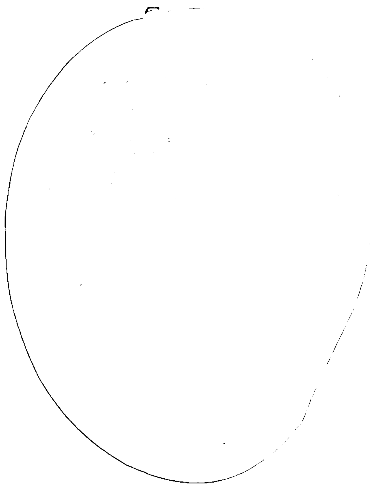

芒果樹的植株相當高聳，可達二十公尺以上，分歧甚多，上行的力道很強，而樹莖也有白色乳汁，表示芒果能夠透過木屬性的走行，對於津液的凝集與疏瀉有很強的作用。果實的外觀多是腎形或是卵形，表示結構上可以同時帶有水或是火屬性。果皮成熟為黃色甚或是橘紅色，果肉色黃，表示凝聚的津液多以帶有土以及火屬性相加後的特質為主。

食用芒果，雖然在盛夏之中能帶給人們消暑的快感，但是芒果肉色橙黃而味酸帶甘，水分較多，津液集中的效果並不如近親的腰果能夠直入下焦吸收，而是多偏向影響脾胃居多，也會間接加重腎系統在濃縮這些水分的功能上的負擔。有的朋友吃多了芒果後，身體會有發癢、發腫的反應，其實是體內的津液原本就偏少了。

| 生物分類 | 漆樹科 |
|---|---|
| 本草分類 | 果部 |
| 取用部位 | 果 |
| 建議食用頻率 | 少用 |
| 建議用量 | 少量 |
| 使用季節 | 當令 |
| 四性 | 溫 |
| 五味 | 酸 |

就像是曾經有位朋友對我聊到，他吃了些芒果，竟然是腳心長了水泡。我的看法是：這有可能是受到芒果斂聚的氣機轉化為水氣而下行至下焦之後，身體不能及時以小便將水氣排出的關係。一般的風氣相搏的證若是停留在身體的外層，則會發為皮膚癢。皮膚癢也分兩種：一種是風偏多一些，會起紅斑疹，甚至有疹塊；一種是氣偏多，會起水泡。水泡問題可用海鹽解決，因為自然海鹽是自然界中的「水」的味道，所以用海鹽引導體內未能及時排出的水氣進入水道之中，問題也就自然平復了。有的人認為腎有發炎問題的人，吃了芒果會加重病情，應該也是這樣的機轉使然。所以我請朋友將芒果改沾些海鹽來吃，再喝點啤酒，下焦將走不通的氣重新拉出至太陽經，表裡順過一回，打到頂再收到到底，小便一通，問題自然就解決了。隨手以家常的食材就能擺平這些小毛病，雖然看來簡單，其實裡面含有的學理，可不簡單。

### 芒果混搭風

調理便利貼

若是對於原本三焦系統之中津液較為缺乏的人來說，過食芒果，可能會形成三焦系統的津液大量收往脾胃之後而生熱，接連引發皮膚有血虛而發癢的過敏現象，甚至可能會影響部分腎系統的運作功能。若是能借用啤酒的力道，將津液重新導出到膀胱經，再以自然鹽的力道，將津液向下導入至三焦。或者也可以借助葡萄的物性，將三焦過多的熱氣回收進來，都有可能得以幫助緩解不適。也就是說：啤酒、自然鹽、芒果配伍共食，或者是葡萄、芒果共食，風味佳，也有調和的作用，值得嘗試。

## 2. 腰果

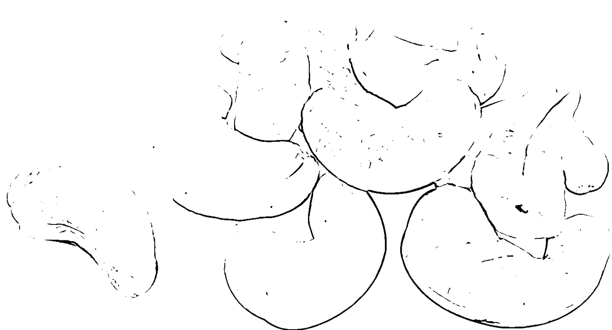

腰果的食用部位是果，但其實他與蓮一樣，在枝頭結出的果實中，同時在外觀上就可以看得見真果與假果並存。甚至在排列上：腰果樹的枝頭末梢先結出了假果，假果的末尾才結出了我們所吃的腰果真果。

在漆樹科這個品種之中，像是我們經常食用的芒果、腰果、開心果，他們的果實多少都會呈現一定程度的彎月狀，也會是像另一個說法之中所描述的腎形。因為這個緣故，所以我們會認為這樣的果實，與我們體內的腎系統有著比較密切的互動關係。尤其是形態最相似的腰果，對於滋潤腸道、腎臟等下焦的內臟來說，頗有益處。以這麼一個外觀腎形，高度富含油脂，體積小，外殼顏色綠色而果仁微帶黃白，能突破假果的包圍之外的真果，他的凝聚津液以及下行至腎系統之中的力道，可以說是非常的特出。

| 生物分類 | 漆樹科 |
|---|---|
| 本草分類 | 木部 |
| 取用部位 | 果 |
| 建議食用頻率 | 偶爾 |
| 建議用量 | 隨喜 |
| 使用季節 | 四季 |
| 四性 | 平 |
| 五味 | 甘 |

胃氣還不至於太差的朋友們，若是能夠偶爾隨手抓取一些腰果吃著玩，我認為是很可以用來滿足不時想動動嘴的需求，所以腰果一直是我很推薦朋友們的核果類零嘴之一。無論是略經烘烤，灑上適量的自然鹽後單獨食用，或者是製做成各式點心，甚至應用於正餐的菜色之中相佐，都非常的理想。以鹹味調味，能夠引導津液更順利進入下焦的腎系統，以甘味調味，則能夠多補益脾胃，減緩腎氣上衝。各有其益。

## 3. 開心果

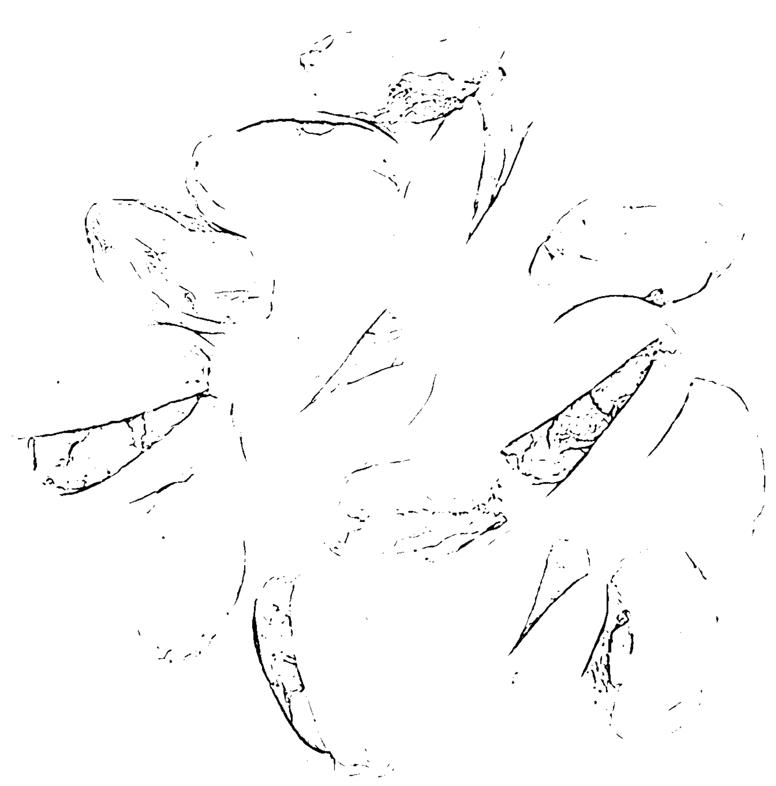

開心果有個很少用的正式名稱——阿月渾子。他與其他漆樹科的近親一樣，喜愛生長在偏高溫、乾燥的環境之中，這類的物種也代表了對於在高溫的環境中將津液凝聚並且下行的力道較強。

開心果的特徵之一，是在成熟的時候會自然裂果，果實外頭的硬殼大開，露出裡頭的果仁。這代表開心果的果仁在聚集津液以及下行的力道來說，獨自就可以完成，加上本科的物性對於透過胃氣而令心腎相交的特質，可以說是補益的效果更加特出。

開心果的外觀主要是橢圓形或是卵形，顏色淡黃，以土屬性的結構與津液表現為主。果仁與外殼之間有紫紅色的種皮，成熟的果仁比較特別，反而是較少見的綠色，表示開心果的下行力道可以聯通至水火並濟的少陽系統，最後引導下行的是木屬性的津液。對照於人體的功能來說：胃中吃進食物而經過一定的消化之後，以大質量分散能量，胃中的功能上升而溫度下降，所以胃的下端端口開放，就像開心果外殼自然裂開一般，令胃中的食糜下行至十二指腸，這時候膽受到刺激而排出由肝事先分泌並儲存於此的膽汁，象徵膽所屬而且代表紫色的少陽系統連動，與食糜一併再下行至小腸，為人體吸收。這部分連結了脾系統、少陽系統、肝系統的運作，與開心果的結構外觀十分契合。可以視為：開心果對於脾胃致中和後緩降，令肝系統津液飽足後也一同下行，引導津液至下焦吸收，有很好的輔助效果。

| 生物分類 | 漆樹科 |
|---|---|
| 本草分類 | 木部 |
| 取用部位 | 果 |
| 建議食用頻率 | 偶爾 |
| 建議用量 | 隨喜 |
| 使用季節 | 四季 |
| 四性 | 平 |
| 五味 | 甘 |

開心果本身又含有大量的油脂，津液含量夠，果仁本身也有一定的香氣，可助脾運化，這些都是開心果有補益作用的象徵。與腰果相同，如果在平時可以隨手吃一把以自然鹽調味的開心果，對於幫助胃氣，調理肝氣，以及下焦的運作、津液的吸收，都有很好的效果，同樣是值得推薦的優質堅果類小零嘴。

# 無患子科

無患子科的物種作為食用來說，雖然種類不多，但是佔有很重要的地位。作為科目名稱的無患子樹，古代認為有殺魔驅邪的能量，所以名為「無患」，對於本科幾種具有明顯濃郁香氣的物種來說，香為氣之正者，的確能夠做此聯想。

無患子的另外一個現代多被遺忘的功能，就是果皮具有天然的洗淨能力，經過搓揉、起泡，從人身到食物、器物都適用。這種所謂「乳化」的能力，就是同時對水與油親和的「一致中和」的能力。雙向調節，是土屬性的代表性功能。植株通常帶有白色乳汁，津液的凝聚力高，帶有部分金屬性的功能，也因此本科的物種多有長壽的特徵，像是無患子的樹齡可達兩百年以上，龍眼的樹齡可達四百年，荔枝的樹齡可達千年而仍然有結果能力，隱含津液入腎系統之後的長壽效果。花序多為聚繖形，多個小型的花序叢聚散佈，則帶有火屬性的特徵為主，兼有部分土屬性。果實秉火屬性結成，不少物種會帶有赭紅、紫紅色的外觀，像是「紅毛丹」、「瓜拿納」，對於心火與脾土的功能較具影響力，甚至瓜拿納因為具有強刺激的效果，除了一般的食用之外，也常被作為興奮、提神之用。

## 1. 龍眼

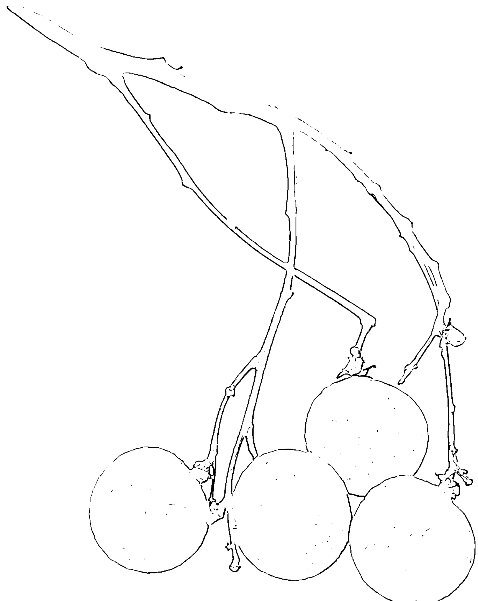

龍眼在《本經》之中就已經收錄，認為性味甘、平，具有能「安志」、「去三蟲」的效果，久服還能「通神明」，代表龍眼的物性以火屬性為主，接引心火進入脾土，並令胃氣緩降、下行，調和三焦系統。龍眼的香氣濃郁厚重，能引導氣機下行。外殼黃褐色，以土屬性中帶有火屬性與水屬性，象徵心火與腎水在脾土中獲得調和。再加上水分含量較少，性味平和、甘美，適合平日常用、多用。做成果乾之後，香氣更佳，四時都能享用。

我所向大家介紹過的「桂圓薑棗茶」（請參考《太極米漿粥》P.238），就是利用大棗大量補益脾胃的津液為基礎，大質量分散能量，再由龍眼調和心腎的能量在脾土的津液之中，並配合生薑引導胃氣通達四肢，利於胃中的津液緩降，達到強化調和胃氣的功能，透過我所設計的配伍，成為具有顯著保健效果的食材組合。我個人又稱他為「小小建中」，繼承了源於《桂本》所提及，「小建中湯」以及「大建中湯」的救急於傾危的結構思想，桂圓薑棗茶更適合於家常之中使用。

| 生物分類 | 無患子科 |
|---|---|
| 本草分類 | 果部 |
| 取用部位 | 果 |
| 建議食用頻率 | 偶爾 |
| 建議用量 | 隨喜 |
| 使用季節 | 四季 |
| 四性 | 平 |
| 五味 | 甘 |

## 2. 荔枝

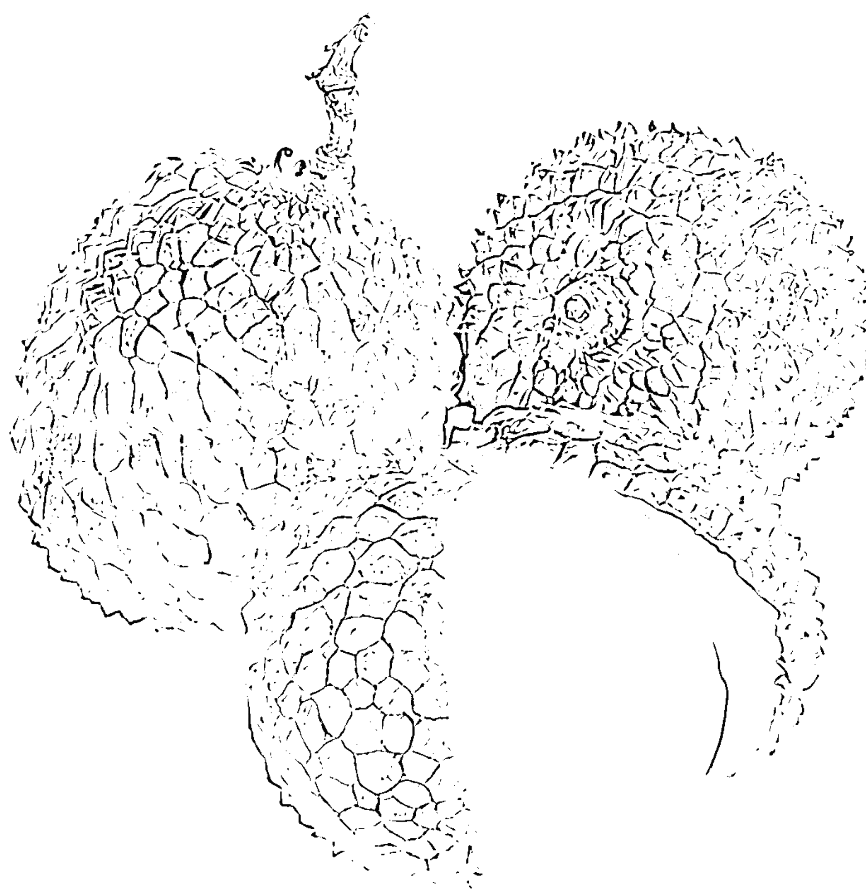

荔枝帶有赭紅或是紫紅色的果皮，凹凸不平、顆粒狀的觸感明顯，以火屬性為主，能夠聯通少陽系統，並結合較少量的土屬性。果肉顏色略白而更加多汁，相較於龍眼，對於引導心火下行的效果更甚，入腎的能力較高。「荔枝」之名的來由之一，據說是因為果實「離枝」之後鮮度快速大減，超過三日則「色香味盡去」的緣故，這與帶有少陽系統屬性的快速反應的物性有關。現代就算使用各種辦法保鮮，仍然是走味嚴重，與鮮品有如雲泥之差，實在不堪入口。可見氣機易於快速上行而消散，維持致中和的力道較弱，相對的也是下行力道較強的例證。一方面，也因為對於心火結合脾土之後的津液下行力道強，如果脾胃之中的津液含量不足，反而有可能造成脾土與心火的能量下行太過，導致原本正常的功能不足，進而發生障礙，一般俗稱的「吃荔枝讓人容易上火」不過就是在這個機轉之下，脾胃津液因而較虛的問題而已。在臨床上，空腹的狀況下過食荔枝，的確有不少血糖過低或是急性癲癇、腦部病變的病例出現，也可以做此理解。

| 生物分類 | 無患子科 |
|---|---|
| 本草分類 | 果部 |
| 取用部位 | 果 |
| 建議食用頻率 | 少用 |
| 建議用量 | 少量 |
| 使用季節 | 當令 |
| 四性 | 平 |
| 五味 | 酸 |

其實知道物性之後，也不必過於驚慌，只要在用過含有大量米飯的正餐之後，適量食用，也不是什麼難題。平時若是已經知道善用太極米漿粥，可以大量、快速的進行脾胃津液的補益，更是不必擔心。

# 葡萄科

葡萄科的物種通常都是藤本植物，有細長、善攀爬的藤蔓，藤蔓的末端有卷鬚，圓弧的走向可以視為土屬性的偏向，表示不只能橫走，還在末端稍帶有返回氣血的能力，有去有回。

本科的物種包含了少數果樹，還包含了一種《本經》有記載的藥材「白斂」。攀爬的藤蔓通常會與身體的經絡做為類比，若是如白斂一般採用根部，則是重視外向疏瀉走行的效果，通暢經絡延線各種停滯或是積聚的問題。若是如葡萄般使用果實，則較重視由陽返陰，回收身體外行的氣、血入裡的效果。本科的物種的花序常呈現繖狀的散佈，或者是圓錐狀的集合，個體較細小，被認為帶有較多的火屬性，在疏瀉的效果上，應與氣的關係較為密切。

## 1. 葡萄

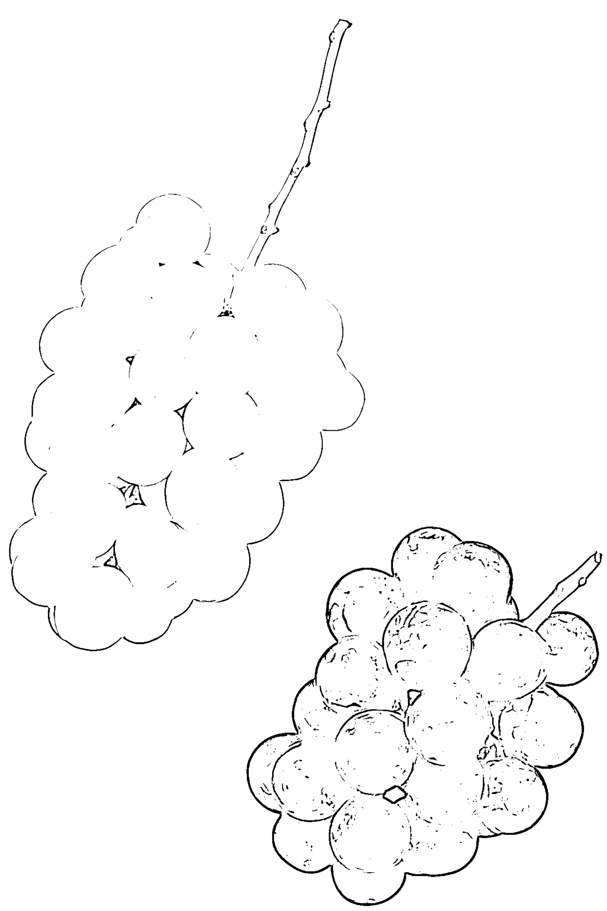

| 生物分類 | 葡萄科 |
|---|---|
| 本草分類 | 果部 |
| 取用部位 | 果 |
| 建議食用頻率 | 少用 |
| 建議用量 | 少量 |
| 使用季節 | 當令 |
| 四性 | 平 |
| 五味 | 甘 |

葡萄的食用記錄很早，在《詩經》中就有記載。至漢代更引進歐亞品種的葡萄以及有系統的釀酒技術，知道飲用葡萄酒。《本經》也記載了葡萄，不但認為可以「主治筋骨濕痹」，能夠「益氣倍力」、「強志」，也提到了「可作酒」。氣來自於肺金，力來自於心火導入脾土，能益氣倍力，表示對於增強氣機與能量有一定的幫助。葡萄的葉子外觀常裂為五瓣，邊緣有鋸齒，主要帶有金屬性，對於氣機的疏洩的作用較多。腎主志，能強志則表示腎系統機能的提高，以蔓莖與果實外觀來推敲，應該是來自於從少陽系統回收津液、下氣的效果。葡萄的蔓莖可達十公尺之譜，在葡萄科之中屬於較特出者，表示對於津液的輸送力道，有其一定的強度。

葡萄對於土壤的適應力強，通常不太挑土質。整體來說的生長環境偏向喜好溫暖，如果加上日夜溫差大，果實累積甜度的效果會更好。適應力強而能夠承受往來寒熱，偏好少雨、乾燥，表示葡萄在結果的功能之中，具有頗高的「日開夜闔」的能力，善於涵養津液而調理氣機，回應了前述的「益氣」的效果。

其他除了葡萄科標準的共通特徵之外，葡萄結果能成串，大致上呈倒圓錐的模樣，而果實單體則是近圓形或橢圓。以脾系統的土屬性而聚成火屬性的外觀，回應了前述的「倍力」的效果。而果實的顏色從紅紫、藍紫、深紫、紫黑不等，還有青色，對於影響少陽系統、木屬性的效果較多，能將疏瀉至經絡末梢的能量以及津液都再回收入脾，有來有往，往復的行程較長，對於人體由陽返陰的力道來說，明顯有益。

有的品種氣、味較濃厚者，可以釀酒。葡萄的果皮自然就帶有酵母，只需要連皮帶肉榨汁，在適當的環境下，就會發酵。發酵是化消的過程的一種，也會帶動出大量的能量，是將甘味的果汁再轉化出能量的手法之一。透過紫色的水火並濟的少陽系統的屬性，對於將人體的少陽相火提振起來，有相當的幫助，好處比生食多更多，日常用餐之中，不妨偶爾搭配使用。若是青皮品種的葡萄，力道則較偏向肝系統，對於肝系統中的津液刺激較強，多少對於肝系統藏津養血的效果來說較為不利，宜慎選、淺嚐，而仍以紫色品種較適宜食用。

農產的葡萄除了大部分用做釀酒，一部分做水果生食，還有一部分做為果乾。有的水果適合加工做為果乾，香氣與味道都會因此而更為濃郁，但是葡萄做果乾之後，香氣與味道較無明顯增加，質地黏滯，對於少陽系統快速切換的特質來說，反而有拖慢功能轉變的疑慮，因此較不宜如此食用。

## 2. 大枣
——附：蜜枣、黑枣、酸枣仁

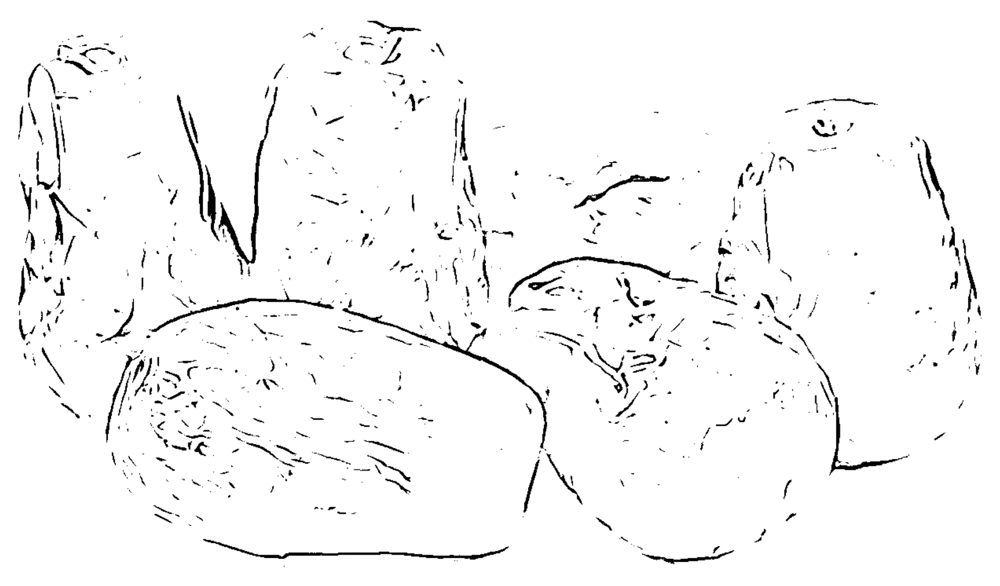

| 生物分類 | 鼠李科 |
|---|---|
| 本草分類 | 果部 |
| 取用部位 | 果 |
| 建議食用頻率 | 經常 |
| 建議用量 | 無限 |
| 使用季節 | 四季 |
| 四性 | 平 |
| 五味 | 甘 |

葡萄科在葡萄目之下，其實是唯一的一科，所以在「克朗奎斯特分類法」等幾種分類法的觀點下，將其合併到鼠李目之下，成為鼠李科的親戚，但在APG分類法中，鼠李科被視為與薔薇科有關。所以在這邊我們據此而將大棗一起合併介紹，對於物性的類比較有幫助。

大棗在《本經》列為藥材，能夠「養脾」、「助十二經」、「平胃氣」，對於脾胃的好處不在話下。我所介紹給大家的「桂圓薑棗茶」（請參考《太極米漿粥》P.238）即是重用了大棗，加強調和脾胃系統功能的效果。

棗樹能夠抗旱、抗癆，對於津液的留存的能力很高。枝幹雖然不粗壯但是很硬實，可以製做加工品，而葉緣有鋸齒，表示地上植株的疏瀉力道中，帶有較多的金屬性。開白花，有五瓣，個體小，香氣濃郁，也帶有明顯的金屬性氣機。果實成熟時為赭紅色，雖然味甘甜但略為有澀感，少量食用就很容易有飽足感，很明顯能夠將津液帶往脾系統收藏，並且能結合心火的能量，象徵火生土的機轉。

加工曬製成果乾之後顏色更加深紅，香氣益盛，質地甜膩細緻，有的品種甚至能夠在掰開果肉時拉出細絲，表示津液的濃縮程度相當高。

大棗的種籽外觀細長，兩頭都有尖端，相對於果肉能夠保留津液在脾胃之中，種籽的物性相反，破瀉力道很強，入藥的時候應該一律去除不用。

另外還有一種作為水果的「蜜棗」，雖然也名為「棗」，但就沒有如此的好處了。藥肆中又有一種黑棗，但是反而有抽取腎水入脾土，助長腎系統津液流失的問題，也應該避免使用。

### 酸棗仁

日本研究漢方很有名的學者「大塚敬節」認為大棗的種籽就是另外一種藥材「酸棗仁」，但是觀察大棗的種籽就知道，與《桂本》用來治療虛勞過度而引起的失眠、著重回收氣機幫助補益津液的目的完全不合，其實酸棗仁是取用自同科的其他物種而來。縱使名滿天下的大學者的見解，也必須經過我們慎思明辨篤行，不宜囫圇吞「棗」。

至於坊間也有說法認為：吃大棗容易上火，更是無根無據，一笑置之可也。說到失眠，「酸棗仁湯」也是很容易被一般人，甚至是絕大多數醫師處方時濫用的藥方之一。一般勞思、煩心所造成的失眠，其實歸屬於寒性，適用熱性失眠的酸棗仁湯完全不對證，越吃只會越糟。這時候，還是不妨試試我所介紹的「清心滑蛋粥」（請參考《太極米漿粥》P.210）吧！

# 樟科

樟科的物種通常都有明顯的香氣，也具有豐富的油分，因此不少物種可以提煉出精油，像是作為科名的樟樹，精油還有驅蟲的效果。有的則是果實之中含有大量的油分，像是酪梨，經常做為食材，應用在料理之中烹調，不過酪梨的氣味偏淡，需要人工採收之後才能熟成，下行力道不強，對於氣機的影響效果極有限。偶爾、少量的使用尚無大礙，但是吃多了恐怕對於化消的功能負擔較重。

有的人或是動物對於酪梨會產生中毒反應，應該多半與脾胃的功能突然被大量的消耗，造成心火不及下行生脾土，導致胃氣大虛有關。油分通常代表屬於少陽系統的津液型態，濃郁的香氣通常代表氣機具有一定強度的表現，開花多呈散佈的狀態，都是與氣的型態，或是火屬性的能量有關。如果缺乏芳香的要素，油或是脂對於身體的功能很有可能產生不利。

## 1. 肉桂 —— 附：桂枝

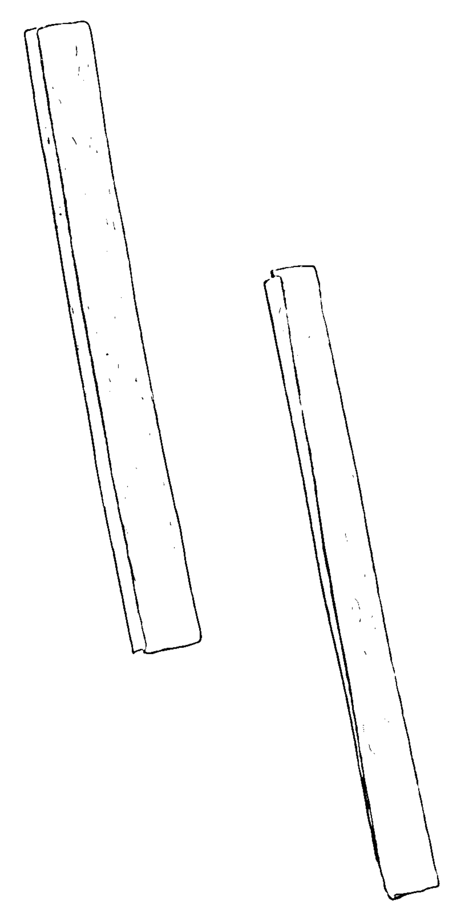

肉桂是很常使用的香料之一，但是，若是由同一物種所取用的桂枝，就是在《桂本》中受到重用的主要藥材。《本經》原本似乎並沒有很確實的指出記載中的「桂」指的是何種桂木的哪個部分。透過經驗的累積，通常把肉桂樹的嫩尖叫做「桂枝」，樹幹上剝下的皮叫做「桂皮」，接近樹根而香氣最濃郁的樹皮叫做「肉桂」。中間各家論說觀點不一，這邊篇幅有限，直接說結論：食品、香料用肉桂，《桂本》之中所用的，則一律為桂枝。

肉桂樹的氣味濃郁，樹幹表皮較為光滑，樹葉的脈絡也少，表面同樣偏向光滑。在近似的物種之中，有的是樹葉的香氣較重，有的是樹皮。肉桂樹除了樹皮的香氣重，就連嫩枝也有一定的香氣，而且，在經過乾製之後，去水的桂枝更具有香氣。

| 生物分類 | 樟科 |
|---|---|
| 本草分類 | 木部 |
| 取用部位 | 皮 |
| 建議食用頻率 | 經常 |
| 建議用量 | 隨喜 |
| 使用季節 | 四季 |
| 四性 | 辛 |
| 五味 | 溫 |

竄的氣味。若是樹葉較香，或是花香較重的品種，反而不能勝任。反觀花序卻既不顯眼，也沒有明顯的香氣，表示真正顯現氣機的升發力道的是位在中間的莖，屬於少陽系統。因為在《桂本》中用「桂枝湯」的目的在於「解肌」，也就是我提到的，要達成「溫通腠理」（請參考《太極米漿粥》P.105）的治療效果，使用還帶有升發力道，又帶有一定香氣的嫩樹枝，來類比人體脾系統最外層的肌肉之中的腠理，藉由富含油分又有香竄氣味的特性，帶動屬於少陽系統的腠理的功能大幅提高，成為把生薑由胃裡帶出的發汗力道轉化成為溫通腠理的能量的主要關鍵。腠理開通之後，氣、血得以進行雙向調節，依據我所謂「陽明過少陽出太陽」的升提秩序，令陽氣能夠開通至太陽層次，就可以逼退引發感冒的邪氣，甚至在我所謂「打到頂，收到底」之後，還可以利小便，幫助腎系統功能的強盛。

至於有的說法認為：有熱的時候用桂枝會「上火」，或者孕婦、經期中不宜。其實就算感冒到熱痙攣的時候，用的還是桂枝湯加減，懷孕初期用桂枝湯處理孕吐等不適，經期中用桂枝湯加減而成的小建中湯更是效果卓越。以上都是《桂本》經過一千八百年的檢驗而來的條文，似乎就不必多做論證了。不過，肉桂使用的是接近根部的樹皮，對於升提的力道是有一些的，但是作用點在類比之下降低到腸道附近，也還不到足以「打到頂」的程度，通常就不特別談什麼效果。或許這就是為什麼人們自然的拿性味辛溫的肉桂，搭配苦寒瀉下的咖啡或是蘋果。但是對於偏性極強的咖啡或是蘋果，再多的肉桂恐怕至多只能減少陽氣的損傷，卻也是無力可回天。

# 食用蕈類

附：茯苓、松茸、牛樟芝、冬蟲夏草、香菇、洋菇、金針菇、竹笙、白木耳、松露、黑木耳

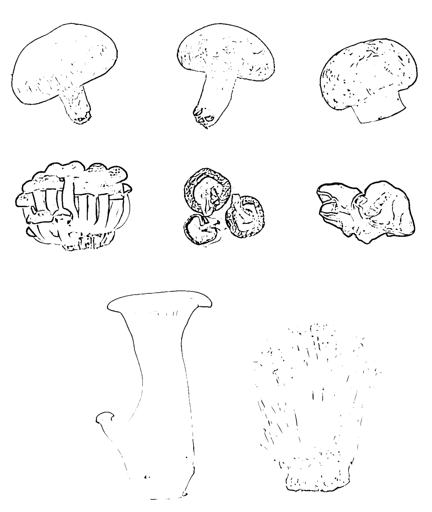

嚴格來說，蕈類在生物分類之中屬於「真菌界」，既不是植物界，也不屬動物界，是另外獨立一個體系的生物。但因為這一界之中，被用於食材或藥材的物種也很多，而肉眼可見、可供食用或藥用的真菌，又稱為蕈類，所以我們一併做高度概括的介紹。

真菌與植物不同，雖然他們同樣不能自主移動，但是真菌對於動物、植物，甚至環境的關聯或是影響，不只有單純的依存，也有主動的互動。像是麵粉團藉由真菌可以發酵，葡萄汁藉由真菌可以釀成紅酒，原來的食品的物性都因此而有較大幅度的轉變，這與單純的加熱等烹調手法是力道不同的效果。這個效果對人體來說，類同於「心火在心系統的小腸對來自胃化消之後的食糜所進行的功能」，多是具有火屬性的物性。但是也因為火屬性的外觀不定，極容易改變，如果有的真菌所感應者（即共生對象的氣）並非正氣，對於人體來說就是具有破壞正常功能的邪氣的具象化物質，所以食用蕈類必須非常謹慎，以免邪氣乘正而中毒。

不同的菌種雖然也有自己的物性，但是部分物種對於生長條件的要求更為明顯。像是藥食同源的茯苓，就必須要採自於寄生在松樹上的，才是正品，在人體內才有「補充津液利水氣」的效果，達到《本經》所謂「安魂魄養神」之功。

松茸同樣也是喜好生長在特定幾種松樹根部的蕈類，就算知道採集上的特徵，但是仍然難以透過人工的環境來栽培，更不能模擬。如果就我基於中藥的原則來對於物性做描述的話，就是「真菌感應於共生對象的氣而生」。藉由松樹在自然環境中所表露的物性特徵，像是：冬不落葉，直挺聳立，也就是「氣」對了，松茸的生長才成立。正因為其中包含了生物生長過程的連續動態變化，所以人工更是無能模仿。雖然現在也有很多藉由人造環境來培育、量產的真菌物種，外觀別無二致，營養成分分析的結果有時候可能還比野生物種的更為漂亮，不過效果就是不一樣。例如在自然環境之中，牛樟芝只生長在牛樟樹上，牛樟樹上只能生長牛樟芝，但是在人工環境中，牛樟芝可以任意在各種樹種上生長，甚至在完全人工的基材上還可以長出子實體，物性發生大幅度的變化，或說是劣化。

冬蟲夏草雖然已經可以透過人工栽培，但是人工栽培的產品實在不能與自然採集所得的物種相提並論，反而更突顯自然採集品的珍貴地位。這又更進一步的證實了：還原論的基礎哲學觀有很大的缺陷，有效成分分析的結果不足以表述事實，所謂萃取提純的物質更是不可用。

一般來說，如香菇、洋菇、金針菇等已經長期由人工培育的食材，沒有什麼產季的區別，其物性最多只是反映了人工培養環境的特徵而已，也別無特別值得一提的部分。因此換個角度來說，越是容易人工栽培的真菌，對於正氣的要求門檻越低，對人體能夠產生的益處自然也就越少。不過，若是在如較有香氣的檜木之類，也就是物種的氣較為純正的椴木上培育出來的香菇，明顯會帶有格外不同的香氣，少量的產生補足正氣的效果。香菇除了鮮品，製成乾香菇之後，香氣更盛。在使用的意義上來說，香氣足的食品自然是對於提升氣機較有幫助。藥材也是一樣，乾燥之後並非只是單純的利於保存，對於提升物性的強度也有一定的效果。松露的氣味獨特而厚重，火屬性的物性較深，經常使用在料理之中，也具有很好的調味以及幫助食材化消的效果。

像是竹笙或是白木耳，原本在野生狀態下，可能具有臭味，或是不忌諱生長在腐穢臭味的環境之中，雖然人工栽培的產品沒有氣味或是清潔上的問題，至多是擔心各種添加物的使用而已，但是也無需因為所謂的「高度營養價值」而刻意多吃，就中醫的觀點來看，也並沒什麼非吃不可的特出理由。

黑木耳在自然生態之中，多共生在接骨木之下。接骨木，顧名思義能夠有修復骨傷的效果，《桂本》之中在傷科藥方「王不留行散」裡所用的「蒴藿細葉」，即是取自於接骨木。西洋接骨木在西方又稱為「猶大樹」（另一說法為「南歐紫荊樹」），相傳猶大在出賣了耶穌基督之後，走至此樹底下，突然悔悟，在良心苛責不已之下，隨即就在樹下自縊而死。後人認為此樹具有浩然正氣，可以驅邪除妖，所以才可以讓被魔鬼誘惑的猶大幡然醒悟。黑木耳在學名之中有「Auriculariaceae」一字，意思為「猶大耳」，即是源於此說。西方人認為黑木耳帶有猶大的詛咒，所以畏懼食用。殊不知黑木耳所憑藉的是西洋接骨木的正氣而生，不說療效，但在料理之中使用是無妨的。食氣補氣，看來並非人人都能識得箇中之妙。

雖然香菇、松露以及黑木耳都具有深色的外觀，但是因為蕈類的生長本來就需要氣對了才能成立，正氣不足的狀態下，蕈類一來無法正常生長，二來，火屬性的作用是最強的能量狀態，甚至「火克金」，可以影響屬於金屬性的固定外觀，沒有自行倒抽的偏向，所以通常不必擔心有一般性「黑色食物」會產生的弊害。

# 動物。禽獸部

動物的結構從簡單到複雜，樣貌與種類十分多樣，分類的方式也有很多種。因篇幅有限，我在這邊選擇了數種家畜、家禽，以及數種水生動物，在此就不特別強調必須選擇同科的物種進行比較的討論架構。

就客觀的原因來說：動物在生物學之中的分類，其實也碰到很多不能認清的部分，發展並不成熟，像是就實際上來說，「長頸鹿」這種大家從小在動物園都看過的生物，一直到二〇一六年初，才確認到其實有四個品種，而非原先認為的一種。而在牛科之下，許多牛與羊的分類仍有模糊地帶。

另外，從數千年前各種家禽、家畜開始馴化而被豢養以來，除了物種本來的物性之外，也受到了人類一定程度的品種改良，雖然整體來說物性的主軸不至於受到影響，但是在細節上，基於動物的結構的複雜度遠大於植物的因素，家禽、家畜化的物種已經與野生物種之間，在結構甚至功能上產生了一定程度的差異，如果太過於專注討論野生物種的特徵，對於我們日常食用的品種來說，難免有些失真。像是：家綿羊的羊毛生長量與速度都遠大於野生種的綿羊，而原始野生種的雞大約是每個月產蛋一次左右，產蛋用品種的家雞則一年可以產蛋約三百次。主觀的原因是：在如此豐富的生物系之中，我們經常食用的仍然以脊椎動物為主，通常只包含了同一科之中的數種物種，而且多半集中在同一物種的少數幾種品種，而品種之間的差異通常已經極小。舉例來說，日本見島牛與美國安格斯牛，除了食用上的感受不同，物性上的差異已經可以忽略不計。

除了從常見的家禽、家畜之中，可以容易應用於我們日常的飲食內容，同時也可以看出我們人類如何透過相似性的原則，借用動物的物性來調和我們自身的功能。同樣的原則，自然也可以應用於其他食用或是藥用的動物物種上，道理都是共通的。通常我會建議在日常的飲食之中盡量多用肉類食材，因為以補血效果來說，肉類食材的效果通常勝於植物食材，而且家用馴化的肉用動物，通常也多為「五臟俱全」的物種，個體的系統結構完整而均衡，不像植物的個體偏性較強烈，肉用動物受到四時環境的影響較小，本身的恆定性較植物更高，偏性較少，所以更適合經常、大量的食用。

## 1. 牛
——附：牛奶

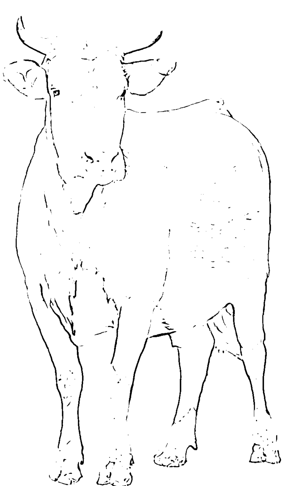

| 生物分類 | 牛科 |
| --- | --- |
| 本草分類 | 禽獸部 |
| 取用部位 | 全體 |
| 建議食用頻率 | 少用 |
| 建議用量 | 少量 |
| 使用季節 | 四季 |
| 四性 | 溫 |
| 五味 | 甘 |

牛肉在《本經》之中屬於「五畜」之一，對應到的是脾系統，味屬甘。草食性而且能夠反芻的動物，大部分都有四個胃。數術中的「四」，除了代表土屬性之外，因為相應了土的性質，所以通常也會附帶有諸如「依據節律」、「往復來回」、「通行兩極」等等的效果，甚至在多數系統結構較複雜的動物身上，也可看到「四肢」的結構——有的是一對前肢加一對後肢，有的是一對翅膀加一對腳，來負責執行既需要穩定、又需要機動性的多重運動需求。

除了少數例子，有反芻功能的動物，大多數擁有四個胃，可以說是把脾胃系統化消食物的土屬性力道發揮到極致。雖然牛與羊為同科，反芻的結構與功能也相同，但是牛的習性與羊差異很大，相較來說，牛的體型高大壯碩，肌肉大塊而紮實，以《本經》中「脾主肌」的說法，牛可以說是肌肉結構發達的代表。牛的視覺、聽覺、嗅覺都很靈敏，對於情感的表現力、感知力強，平時個性穩定但反應強烈。牛會藉由大量的舌頭口腔動作來放鬆自己，穩定情緒，而《本經》認為「脾開竅於口」，口腔的動作也表現了脾胃系統的功能對於牛的重要性。部分牛的品種甚至能夠忍受高地與極寒的環境，為其他有蹄動物所不及。像是分布在中國青康藏的氂牛，或是北美、格陵蘭北極圈中的麝香牛，皆全身覆滿長而濃密的體毛。土克水，水性本寒，能耐得住極寒，就是土屬性的功能的高度表現之一。牛從生理功能上的化消、反芻，到情感與思慮上的敏銳、豐富，還有高度的忍受力，這些與像人類一般屬於土屬性的高級、細膩的功能，都有很高的類同。

牛的土屬性的結構與功能極高，反過來說，若是食用結構如此緊密的牛肉，所需的人體化消功能也極高，雖能補脾，但也能傷脾。牛肉雖然被認為有許多營養成分，但是在不易化消的前提之下，必須有很好的配伍，像是以紅葡萄酒與牛肉同用，能夠幫助胃加速把津液透過三焦系統疏瀉。或者一如我對地黃有「植物界的牛肉」的評語，類比《本經》中使用地黃的方法，藉由燉煮作湯的方式飲用，較能夠避免牛肉因為對人體化消功能的過度需求而耗損胃氣的弊害。在世界各地，有些人們或是因為文化、民俗、宗教等因素而有禁食牛肉的習慣，若是為了健康的因素，特別是脾胃狀況不好的人，我也贊成少吃牛肉為上。

### 牛奶

牛在化消功能的高度強化，也代表可以將高濃度的津液由胃透過木屬性的疏瀉力道而上行，產生大量的乳汁並且泌出。但是因為與各種的津液相比之下，牛乳的濃度可以說是格外的高，性味寒而甘，對人體來說，負擔太大，不適合任何人直接作為飲品飲用。先不論牛奶是怎麼產生的，過程之中是否一定有不人道或是不自然的人為因素介入，我認為，牛奶就像牛肉一樣，看起來含有很豐富的營養成分，但是對於身體來說，其實相當不容易被人體化消與吸收。牛奶這樣「高度濃縮」的津液型態，有人說他是「白色的血液」，在意義上的確也是如此，單獨攝取像這類高度濃縮的津液或是食材，人體會很需要大量的「中低度濃縮」程度的津液來供應身體的運作所需，讓食材在體內自行重新稀釋，調整成類同於太極米漿粥般的濃稠度，以利於脾系統化消、吸收，才能夠再次提煉出具體特質的高度濃縮的津液。然而，在乳汁之中，牛的乳汁又是特別的濃厚，可能耗盡人體內的中低度濃縮程度的津液，都還無法將牛乳完全化消。就算是羊乳或是其他動物乳汁，以人體的消化力道來運作也都稍嫌吃力。

對於長期、大量喝牛奶的人來說，若非內臟的津液耗盡而燥，可能就會容易造成便秘、脹氣等消化道的問題，或者因為牛乳被化消的程度低，在消化道之中留存的時間又長，成為對於身體而言的濕氣，在「脾濕加胃寒」的公式下，透過腹瀉的方式排出，成為他人口中的「乳糖不耐症」。無論是便秘或是腹瀉，傷的都是脾胃裡面大量的中低度濃縮程度的津液。傷了脾胃之氣，就不能把腎裡的津液透過「土克水」的作用，壓制於腎系統之中，腎氣因而大量外洩，由陰出陽的力道異常旺盛，刺激人體的結構快速增生，人會長得「像大樹一樣高」，但是骨頭裡的骨質卻因為由陽入陰的力道不足而疏鬆。如果再加上因為脾胃的津液缺乏而導致四肢肌肉的強度也不足，不能把骨骼的外觀以「氣行血止」的力道，約束在原本應有的形狀之中，異常增生的骨質結構，就變成骨刺了。

對我來說，牛奶應當要視同藥材，「配伍」與使用的「時機」很重要。如果再考慮到：現代牛奶的生產過程，環境與飼料之中的有害物質，都在乳汁中「高濃縮」，以及後續成分過度調整、添加，問題更多。總結來說，牛奶就任何主客觀的條件來看，都是一種不適合大量、長期飲用的食物。行文至此，或許有人會問：牛奶似乎是古代歐洲的常用食品，他怎麼能適合歐洲人的體質和環境呢？因為歐洲等較高緯度的地區，通常秋季極燥，冬季嚴寒，人體容易在秋季之後引發明顯的虛燥熱，環境的嚴峻會刺激人體加大脾胃的運化力道，高漲的脾系統功能產生「土克水」的效應，便透過加強津液的攝取來禦寒，所以若是飲用較難化消的牛奶，或是食用同樣屬於較難化消的乾硬麵包，問題就不大。歐洲傳統的作法中，多將牛奶再製，以小牛胃裡所含有的自然酵素將牛奶加工分解，並且脫去大量寒性的水，做成乾乳酪等製品，以利久藏，物性變得平和，也變得更易為人體吸收，在佐酒與乾麵包共食之下（即我所謂的：炮製、配伍與使用時機的兼顧），牛奶在有限度的條件下，仍是可用。至於透過其他方式發酵的乳類，酸度極高，我認為酸味入陰，對於陽氣的效果本來就是偏向負面，而形態變得比原始的牛奶更加濃稠黏滑，只有加重了牛奶原本的偏性，在化消上更加耗損胃氣，長期、大量飲用，偏上加偏，以家常飲食來說，恐怕很難看得出有什麼好處，與「長壽」的結論似乎也不易扯上關聯。

## 2. 羊
——附：羊奶

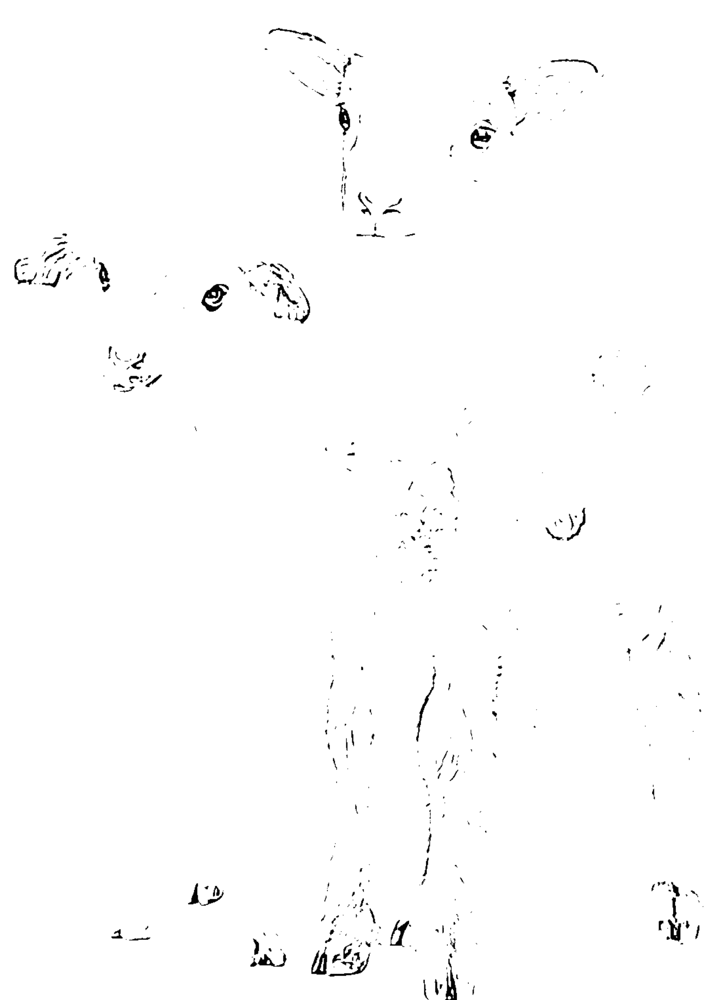

相對於同科的牛，牛的動態偏向沈潛，羊的動態則明顯偏向橫走，例如山羊，不但善於奔跑、跳躍，甚至在崎嶇的絕壁之間一樣能夠來去自如，以火屬性的物性為宗。就同樣有角來說，牛角的生長趨勢多呈現弧度不等的圓弧形，羊角的生長趨勢種類變化繁多，有直上、有盤旋、有複雜曲線、有圓弧、有螺旋，形狀不定，難以歸類。另外一項出現在綿羊的行為特徵則是：個體的羊隻對於環境的反應敏感，但是羊群對於環境的判斷力非常低，傾向盲從，所以經常發生單一羊隻受到驚嚇而墜崖之後，同群的大量羊隻接著一同往崖底跳下的慘事，所以畜牧人訓練牧羊犬作為羊群的領袖，利用此一習性以便於管理。所謂「領頭羊」的說法即是來自於此一習性，群體性的盲從，與個體的率性而為、規律不明顯，在對人類的行為進行分析的時候，也一樣會被歸類於火屬性的特質。綿羊屬於前者，山羊則多屬於後者。羊的瞳孔與馬等的物種相似，形狀都是橫形，進一步來說，貓的縱形瞳孔，也可以歸類於橫走的一種，都帶有火屬性，只是相較起來，橫形的特徵的力道更勝一籌。

| 生物分類 | 牛科 |
|---|---|
| 本草分類 | 禽獸部 |
| 取用部位 | 全體 |
| 建議食用頻率 | 經常 |
| 建議用量 | 無限 |
| 使用季節 | 四季 |
| 四性 | 溫 |
| 五味 | 苦 |

羊的火屬性較強，因此肉質與牛或是豬相比，津液得到火屬性的能量而化成血，以脂肪含量明顯較少，色澤也較為赭紅。以形補形，對於人體的肌肉、血液等組織而言，羊肉也會是理想的補養選擇。我推薦給大家的食方之一，當歸生薑羊肉湯（請參考《太極米漿粥》P.243），獨鍾羊肉，的確是有其不可取代的意義。附帶一提的是，臺灣本產的羊肉屬於臺灣特有種山羊肉，火屬性較高，進口羊肉則可能多是綿羊肉，火屬性較遜一籌，因為綿羊偏向成群，所以土屬性偏向較多些，若是再加上長時間冷凍的因素，平常食用無妨，但是作湯的時候，仍是以本產土山羊肉為上，不宜使用進口羊肉。此外，坊間一直有「羊肉燥熱，夏季不宜食用」、「常吃羊肉容易上火」、「羊肉要搭配涼性蔬菜」等說法，也不知原理為何？相反的，羊肉的火屬性較高，人體消耗能量來化消的負擔反而較輕，在容易因為大汗而流失津液的夏季，同樣合適，比起需要消耗大量津液與能量化消的牛肉來說，羊肉不但是四時皆宜，特別是適合體質虛弱的人使用，更不容易引起虛燥熱。但若是搭配空心菜、白菜等寒瀉力道較重的食材，反而減損羊肉滋養的好處，害其本性，實不足取。

### 羊奶

相較於牛奶的產季偏向在冬季，羊奶的盛產季節在夏季，感應四季氣機來說，羊奶應生於夏季，夏季屬火，雖然奶類仍屬於難以化消的食材，但是羊奶相對可說是較為溫潤。日本在二戰之前普遍是以飲用山羊奶為主，本也無事。在二戰之後，因為「盟軍最高司令官總司令部（General Headquarters；GHQ）」接管，大舉深度破壞、肆意染指日本各方面的固有文化傳統，包括日本全國上下被迫如同美國人一般改喝牛奶，傳統米食用量大幅減少，全面改吃麵食，而麵類必須進口，導致糧食自給率暴跌。現在，日本全國呼吸道過敏的疾病極端嚴重，逐年惡化，從一九七○年代以來近五十年，增加了三到四倍，近年來若是包含未確診的疑似病例，甚至高達全國人口的四成。只要春季到來，滿街都是噴嚏鼻水不止、戴上口罩的人，現在甚至連並非花季的秋季也成為好發季節。有人說是花粉導致，但是戰前出生的老人家至今也呼吸同樣含有大量花粉的空氣，高齡者的病例卻可以說零星少見。倒是從一九四五年以來，六○年代開始密集出現病例，到七○年代開始全國爆發大流行，距離飲食作息習慣的驟然扭轉，大約三十年左右，正好一世。反過來看，東拼西湊，於一九四五年二戰結束之前診察過疑似過敏症的耳鼻喉科醫師，也大約只有百分之四點六。呼吸道過敏當然不是近來才有，但是引發如此排山倒海的流行，卻是前所未見。二戰結束已經超過七十年，大流行開始以來也已經四十年以上，各種近代醫學的觀點以及治療方式推陳出新，仍然找不到可行的方向。若是改由古經方中醫的角度來思考？值得深思！

## 3. 豬
附：豬皮

豬在中國的食用歷史開始得很早，《內經》之中已經列為五畜之一，認為在五味中屬鹹，代表的是水屬性，多食用，對於脾系統有好處。《易經》認為「水流濕，火就燥」，表面上火克金，但是火的運作與金屬性的燥的功能相輔相成；表面上土克水，但是水的流動維持了土屬性的濕，運用了深度的生克的循行秩序的思考。

水屬性的動物，通常也可以在脾系統上看到發達的結構或是功能。在望診的部分來說，鼻子的結構通常反映的是脾系統，所以，例如家豬或是山豬都具有結構與功能表現發達的鼻子；狗同樣被認為以嗅覺靈敏為特色，頭型上也是以口鼻部位特別突出；象的鼻子長而靈活，甚至能夠處理各種工作；而犀牛鼻頭上由毛髮聚集而成的犀角，也被認為是具有療效的藥材。前述幾例，都是可被歸類於水屬性的物種，通常也被認為是在動物之中，智力或是記憶力突出的物種，例如象的記

| 生物分類 | 豬科 |
|---|---|
| 本草分類 | 禽獸部 |
| 取用部位 | 全體 |
| 建議食用頻率 | 經常 |
| 建議用量 | 無限 |
| 使用季節 | 四季 |
| 四性 | 平 |
| 五味 | 鹹 |

### 豬皮

以水屬性的食材為前提來評估，價格便宜，容易取得，調理方便，口味甘美，還能夠藏氣，不害陽氣，總合來看，水屬性又不寒的豬肉，的確是首選之一。雖然造血補陰的效果略遜於羊肉、牛肉，但是因為牛肉不易化消，所以對於腸胃消化能力較弱，虛燥熱較盛的人，豬肉就顯得容易接受得多了。料理的時候不妨借用生薑、大蒜的物性，以大量的生薑或是大蒜與豬肉同用，由生薑、大蒜提高陽氣輸出的力道後，藉由豬肉的藏納來調和，將陽氣藏於水中，平和滋補於無形。

肉的氣血表現會反映在皮上。獸皮，是津液之中屬質輕而清者，才能夠上升至皮毛的部位凝結下來，化成皮膚。用現代的用語來講，就是「富含膠原蛋白」。以常用的食肉動物來說，牛皮、羊皮太難在家常中熬製，但是豬皮則相對容易操作。就中藥學以形補形、同氣相求（請參考《太極米漿粥》P.151）的模式推理，吃下肚的豬皮雖然一定不能直接變為人體內的膠原蛋白，但是豬皮經過一定時間的燉煮後食用，能提升人體產生如同獸皮形成的條件，也就是令津液向外行走到達表皮的功能，因此若想讓皮膚水嫩緊實有彈性，豬皮實在是不可多得的好材料。《桂本》的方劑之中，也多用驢皮所製成的「阿膠」來達到提高由陽返陰，協助身體生血的功能，可謂有異曲同工之妙。

### 白蜜豬皮湯

可能在大家印象中，豬皮是油膩的代表，但其實皮是以膠質為主，並不油膩。而用皮來入藥，更是《桂本》中善用的養血、滋陰的手法。這道湯品，豬皮容易取得，價格便宜，做法不難，口味香甜，值得大家嘗試看看，偶爾當作甜點吃上一回。特別是三焦系統的津液缺乏，時不時容易覺得喉頭痛、癢的朋友，不妨多試。

### 做法：

1. 準備豬皮兩百五十公克（約半臺斤），蜂蜜兩百毫升（約一杯），白米粉一百毫升（約半杯）。
2. 將兩千毫升的水煮開後，放入豬皮，小火慢燉收水至一千毫升，撈去尚未化盡的豬皮不用。
3. 加入蜂蜜與白米粉，再稍微燉煮一下，至熬出香氣即可。完成。

以上為六份，每次可用一份，約兩百毫升。可一天內用完。如果實在買不到現成的白米粉，參考上冊的「溫粉」自製就可以。與製作太極米漿粥相同，白米粉不宜使用在來米、糯米或秈米來製作，蓬萊米可用，但仍以粳米最好。必須使用精白米製成，不可使用糙米等其他加工類型的米粒。豬皮上帶一些豬油沒關係，不必刻意去除乾淨，買來如何就直接用，不過豬毛是必須清除乾淨的。

## 4. 雞

附：雞蛋、烏骨雞

| 生物分類 | 雉科 |
| --- | --- |
| 本草分類 | 禽獸部 |
| 取用部位 | 全體 |
| 建議食用頻率 | 經常 |
| 建議用量 | 無限 |
| 使用季節 | 四季 |
| 四性 | 微溫 |
| 五味 | 甘 |

禽鳥幾項主要的特徵，像是：一對前肢特化成為翅膀而無指，這代表氣在往上部提升的時候，木屬性的偏性較重，不受到金屬性的克制而分歧為指。通常禽鳥無論善不善飛，骨質多半都是質輕而中空的。腎主骨，金生水，這可以視為：禽鳥在木屬性特別發達之下，金屬性的功能並不彰顯，導致水屬性的腎系統一方面不獲得「金生水」的助益，又大量提取轉化為木屬性的功能，水屬性的結構偏弱，形成天生的骨質疏鬆。

金屬性偏弱，所以禽鳥的皮膚結構通常較薄，少有韌性。另外一個特徵在於，鳥類通常都有兩個胃，即「肌胃（砂囊）」和「腺胃」。以數術來說，數二屬木，象徵整體性的結構開始轉化出分出兩極的能量。木屬性的能量能把「升、降」或「輕、濁」做出快速的分離，鳥類會藉由吞食砂石至肌胃（也就是砂囊）裡收藏，與構成砂囊的四塊肌肉一同反覆運作，以應付需要長時間消化的腺胃裡頭，所粗略分化而出的食物的功能需求。所以通常禽鳥在大方向上來說都以木屬性為主，其中又以雉科的木屬性表現較為明顯。

雉科的禽鳥常見擁有較圓潤的體態，但是有修長的尾羽，再加上羽毛通常顏色多變而華麗，像是臺灣特有的帝雉、藍腹鷴，或是孔雀。而長相好看或是相學、命學中所謂的「帶桃花」，都是歸於木屬性，所以被認為木屬性的表徵特別突出。不善飛行的物種較多，雖然能瞬間爆發式的起飛，但不善持久飛行，短期爆發的特徵也歸於木屬性。反而因為足部有力而較善於走跳，足部的骨質也少見的較為紮實、有髓。

雞在《內經》之中有兩種記載。一則在〈金匱真言論〉：「東方青色，入通於肝，開竅於目，藏精於肝，其病發驚駭，其味酸，其類草木，其畜雞」，認為雞是木屬性而味酸。一則在〈藏氣法時論〉：「腎色黑，宜食辛，黃黍、雞肉、桃、蔥皆辛」，認為雞是金屬性而味辛。其實《內經》因為無善本可考，內容細節上偶有矛盾，需要細細推敲。因為主題不同，篇幅有限，我們在這邊不一一詳述推敲的過程，只介紹我認為的結論：我將雞定位為木屬性，性味的部分則是依據《本經》的記載，記為「微溫而甘」。《本經》認為雞肉的功效能夠「主治女人崩中漏下」，還能「止血」，對於鼓動氣機上行，而以「氣行血止」來調理血的問題，很有獨到之處。我認為禽鳥一般以木屬性為主，而雉科的物種的木屬性又較強。馴化後的家雞也保有許多木屬性的特徵，像是外觀上，公雞頭上有高大的肉冠，臉頰有肉垂，這些為了表現性徵而發達的外觀，都是歸於以腎系統為根本，透過木系統的作用而表現出來的特化結構。再加上雞的下肢不但肌肉明顯發達，而且有禽鳥之中少見的，含有較多骨髓的腿骨，這對於禽鳥特化木屬性的結構，因而弱化了金以及水屬性的結構來說，是比較特別的現象。若是木屬性能夠得到「額外的助益」而提升運作的功能，那麼人體對於「水生木」的功能需求壓力就會減輕，水屬性的結構就會獲得比較多的補養機會。

在食用上，雞肉通常屬於較容易化消的肉類，但是又不像魚肉一般質地那麼輕，對於增加質重的津液，以及幫助木屬性的肝系統來說，都能夠產生好處。所以一般常見的藥膳食補，除了燉豬排骨之外，就是燉雞了。

### 烏骨雞

烏骨雞因為從皮至骨都帶灰黑色，全白或是全黑的大量羽毛覆蓋全身，透發出水屬性的能量，而家雞四爪（俗稱第五爪的「距」因為不著地，嚴格來說不計在內），烏骨雞則有禽鳥中少見的五爪，象徵如人體一般，肢體末端的分化完全，以五為極限。的確烏骨雞在外觀的特徵上，較一般的家雞要來得更接近於「五行俱全」一些。古人以「十全」的外觀特徵，也就是「絲羽、藍耳、鳳頭、毛腳、鬍子、五爪、玫瑰冠、烏骨、烏皮、烏肉」來表述烏骨雞的特別之處。動物涵養津液的量普遍遠大於植物，不必考慮色黑而津液含量不足的食材，吃進體內後反而倒抽走人體的津液的問題，就算是黑牛、黑豬，同樣都很好，皆是可吃。在物性上雖然略有不同，但是一般來說我認為不必刻意追求「非黑不吃」，正常足量的食用肉類，對於身體日常的補益來說，已經足夠。不過單以食感來說，黑牛、黑豬或是烏骨雞的確有其特出之處。

### 雞蛋

雞蛋是雞的津液的精華，尤其是蛋黃能夠凝聚高度的能量而轉化成為新生的個體，對於由陽返陰的功能，特別是收聚心火沈潛入裡的效果來說，幫助特別大。各種動物的「黃」雖然也都有類似的作用，但是因為雞表現在木屬性的結構之中，木屬性的特徵格外顯著，所以雞蛋對回收透過肝系統疏瀉出去的心系統能量來說，有更強的效果。《本經》認為雞蛋黃甚至有「可作虎魄神物」，也就是具有能夠凝聚高層次的身體功能的力道。《桂本》將蛋黃做為藥材入方，我們所介紹過的「清心滑蛋粥」（請參考《太極米漿粥》P.210）應用的就是此一原理。雞蛋黃最近才一掃超過百年以上來自於近代醫學上的誤解，回歸中醫超過一千八百年以來的正知，其實蛋黃對於人體諸如膽固醇、血壓之類的數據，根本沒有任何的負面影響，一天用上四、五顆都不是問題。平常多用，反而更有調節身體各種功能的好處。只不過對於蛋黃的使用來說，仍然要把握住「煮熟但不熟固」的狀態，才是他對於人體好處最多的狀態。

### 溏心蛋

吃蛋很好，小孩、老人更应该多吃。但是要怎么吃到最美味又有补益效果的鸡蛋黄，这个就需要一点功夫了。除了后面我们会介绍的蛋黄酱之外，溏心蛋也是一道好料理。白煮蛋要拿捏到蛋黄「煮熟而不熟固」，不大容易，我在这边介绍一种我觉得简单好记的做法，大家不妨尝试几次，微调一下，找出自己最顺手的流程。

### 做法：

1. 准备生鸡蛋数个。
2. 锅子里装有能淹过鸡蛋的清水量，煮沸。
3. 「三三法」：生鸡蛋下沸水浸泡三分钟，关火静置三分钟，取出连续冲冷水三分钟。

如果生雞蛋是從冰箱中取出，需先適度在室溫下回溫，以免突然放入沸水中的大幅溫差導致蛋殼爆裂。如果有喜歡的醬汁，可以將蛋剝殼後，放入正煮沸的醬汁中，略為同煮一、兩分鐘，將調理中帶進來的水氣煮散，就可以關火，放入冰箱冷藏，即為滷蛋，不必再加熱。放隔夜後便可以食用。想吃的時候就可以取用，放得越久越入味。

## 5. 鴨

附：鴨蛋

鴨科禽類在外觀上的特徵，頸部較細長，喙部寬而扁，普遍在趾間有蹼，所以多能飛行，還能游水。也因為能夠游水，尾端有一腺體特別發達，稱為「尾脂腺」，可以分泌出抗水的油脂，禽鳥將其油脂用喙塗佈於羽毛後，游水時就不致於沾濕。家鴨的外觀因經過馴化後較為一致，但野鴨的外觀多變，公、母的長相差異頗大，而公鴨在夏、冬時候的羽毛外觀也截然不同，常在夏季時與母鴨同樣的不起眼，極為相似而難辨，但是在冬季換羽後則變得華美。家鴨在馴化後的外觀較單調，主要是因為野鴨在野外的時候，不同品種的物種會混居，而且彼此雜交，下一代的外觀極為多變化，為了要保留品種，也為了要與野鴨區隔，所以在馴化配種時，強調外觀的差異性也是重要考量之一。這種外觀上的不定形、易變，通常會被歸類於火屬性的特徵。

| 生物分類 | 鴨科 |
| --- | --- |
| 本草分類 | 禽獸部 |
| 取用部位 | 全體 |
| 建議食用頻率 | 經常 |
| 建議用量 | 無限 |
| 使用季節 | 四季 |
| 四性 | 平 |
| 五味 | 苦 |

鴨的尾脂腺發達，氣味很重，如果在食用之前不除去，不容易入口。火屬性的動物肉類，像是羊肉，也有類似的氣味較重的傾向。火屬性也會表現在腺體的發達，腺體通常歸類於三焦系統的少陽相火，而這個功能的傾向也會在結構上發展成為在肝系統的養分容易大量的累積、停滯，像是法式料理常用的肥肝（Foie Gras）本意並沒有特指由什麼動物身上取用，所以除了用鵝，其實有九成用的是來自於鴨的脂肪肝。因為鴨的火屬性更強，形成脂肪肝的速度更快，所以能大量供給。除了產量問題，也因為鵝肝不似鴨肝易有較重的氣味，所以通常價格較高。

鴨肉的質感較雞肉來得有韌性，肉質間的脂肪含量明顯較少，色澤也較為赭紅，與同樣為火屬性的羊肉頗為類同，算是禽鳥類的食材之中，較明顯能幫助人體補益可供造血的津液的肉類。相較於雞肉的腿部肉質較細緻，鴨肉則是胸部的肉質較佳，形成在結構上屬陽與屬陰部位養分聚集的差異。若雞肉的傾向為由陰出陽，鴨則較傾向為由陽返陰。

配合鴨肉的氣味較重，通常會多用辛香料來調理，特別是多用大蔥，以開通肺系統上下對流的方式，運化較厚重的氣味。像是有名的北京烤鴨，捲餅之中片鴨肉的配料就會用上蔥段，而日本的而日本的諺語「鴨が葱を背負ってくる」，講的就是「鴨子自己揹著大蔥來」，表示自投羅網、為他人作嫁的意思。

### 鴨蛋

鴨蛋也是常用的蛋類之一，但是普及方面略遜於雞蛋，造成的因素很多，其中之一恐怕還是鴨蛋的氣味比雞蛋稍重一些，所以較傾向用水屬性的鹼性原料、鉛化物等等的物質做成皮蛋，或是以水屬性的天然鹽來制火屬性，做成鹹鴨蛋等的加工品。而高鹹度的鹹鴨蛋較偏水屬性後，又可以回過頭來制火屬性苦味極重的苦瓜。五行陰陽之妙，盡在家常飲食之中。

鴨蛋與雞蛋外形大抵上都近似橢圓，但是雞蛋的尖端更明顯，而鴨蛋則較不明顯。以雞為木屬性來說，木生火，所以雞蛋在火屬性上的偏性表現較多。鴨為火屬性，火生土，因此鴨蛋則是在土屬性的偏性較多。鴨蛋與雞蛋相同，多吃對於人體都有好處，不需特別禁忌，想吃就吃。只是若用於「清心滑蛋粥」（請參考《太極米漿粥》P.210）之中，則不可使用鴨蛋，因為雞蛋對於脂肪的凝聚力最高，幾乎都集中在蛋黃，對於心火的助益大。而鴨蛋的脂肪則是有一部分會分布在蛋白之中，多助益脾土，對於凝聚心火緩降下行來說，力道較差。順道一提，西藥治療巴金森氏症，使用左旋多巴，但其實後遺症很嚴重，病人變成有嚴重的暴力傾向，所以治療初期雖有一定的效果，最後還是叫人遺憾。使用左旋多巴藥物的時候，必須忌食蛋白，因為蛋白會在腸道阻礙藥物的吸收。其實這就代表左旋多巴對身體造成的刺激，是集中在類同於使身體「產生蛋黃」的效應上，與蛋白的偏性相反所致。又因為左旋多巴只刺激而不補益，當身體有限的津液耗盡，無能再合成「黃」的時候，心火大量爆發上行不得降，脾氣不轉，膽氣不降，後期的副作用就變得十分猛烈駭人。既然如此，何待發病？只要在平時直接大量的食用溏心蛋、清心滑蛋粥，養胃氣、護陽氣就好。百多年來全世界人類糊里糊塗的懼怕食用蛋黃所付出的代價，真不知道還有多高。

## 6. 鵝

附：鵝蛋

東方的家鵝是馴化後的物種，但是仍然保留了不少原生物種「鴻雁」的習性。家鵝馴化後的外觀雖然以白色羽毛為主，鴻雁的外觀則以棕褐色為主，加上家鵝的體型較大，肉質較多，肌肉為脾系統的結構，而透過土屬性的功能支持所強化的相關的木屬性結構，像是頸部特別細長，以及雙腳有力、善走等特徵也同樣明顯，所以基本上家鵝的物性以土屬性為主。如果大膽的拿鵝與同為土屬性的牛做類比，會發現有頗多類同之處：喜歡長時間浸泡在水裡。合群，會彼此照顧相同群體的夥伴。消化道的功能很強，鵝的化消功能比其他常見禽類明顯要高，與牛一樣能夠食用大量的青草。耐寒，耐候能力高，攝氏零度左右仍能夠在水中活動。生活習性愛好規律、閒逸。對於環境的警覺性高，甚至有人專門訓練鵝來做守門之用。也因為土屬性的關係，津液含量高，滋味甘美，所以在普遍屬於易於化消的禽類肉質之中，鵝肉算是較為不易的一種。傳說中鵝肉屬於「發物」，食用之後容易引發痼疾，主要的原因也是在此。至於有的說法更進一步表述鵝肉為「有毒」，這就太過誇張了，無須如此無限上綱。

| 生物分類 | 鴨科 |
| --- | --- |
| 本草分類 | 禽獸部 |
| 取用部位 | 全體 |
| 建議食用頻率 | 經常 |
| 建議用量 | 無限 |
| 使用季節 | 四季 |
| 四性 | 平 |
| 五味 | 甘 |

### 鵝蛋

鵝蛋作為食用上的生產佔比稍少，不過當然也是很理想的蛋類食材之一。與雞蛋、鴨蛋相比，基本體積就大上雞蛋二至三倍左右，蛋殼外觀通常更為潔白，土生金，金屬性較重，油脂含量更高而水分含量較低，對於化消功能的需求與肉類同樣較高，所以脾胃功能稍差的人也是需要斟酌的用量為宜。

# 1. 動物・鱗介魚蟲部

魚 —— 淡水魚、海水魚、洄游魚

就生物學而言，魚類的分科也是很不容易界定清楚的分類之一，屢有更迭，過去生物學中的「魚綱」甚至已經被廢止，因為無法完全排除包含其中的四足類的動物。這個問題，其實也對應了我們所謂的「序中有變，變中有序」。生物之中就算跨越物種，彼此之間仍然具有程度不等的相似性可供關聯，也為「以形補形」這樣的邏輯思維歸納結論，做出了實證。所以這邊我們一樣捨棄複雜的生物學上的意義，避開尚無定論的地帶，直接集中介紹與我們日常使用最有關的物種，以直觀上的「有鰓」、「水生動物」、「缺乏四肢以及肢末端的指」這三項特徵來描述魚類，以及附帶的水生動物等。

整體來說，依照生態習性，魚類可以分為三大類：「淡水魚」、「海水魚」、「洄游魚」。這三項特徵，我認為是最能夠提供我們進行魚類彼此之間物性區隔的重要指標，我們稍後再更進一步的說明。魚類擁有幾項共同的特殊的生物特徵，也就是物性，與其他物種之間的差異較大，我們就在這邊進行集中介紹，先嘗試摹畫出魚類的輪廓。

魚類通常呈現細長的體型，最重要的是，頭尾都有尖端的造型，像是魚頭、尾鰭。有的具有魚鱗，有的全身光滑，都是可以歸類在金屬性的結構特徵之中。但是魚類的外觀並非如同貝介類的生物般堅硬，頂多具有韌性。內部結構的魚肉，骨以及內臟，多帶有偏向相克的火屬性，甚至部分食用魚類的魚肉、內臟等組織結構，苦味非常的重，也可以作為例證。

以體溫來說，絕大多數的魚類都是變溫動物，如果再考慮到魚類外觀特徵的個體差異通常極大，這種「容易改變外觀」的特性，通常也與火屬性有關。魚的呼吸功能使用的是鰓，但是鰓其實並非是水中專用的特化呼吸器官，也就是說，鰓在水面上一樣可以呼吸，只是魚類通常離開水中之後，因為體溫快速上升才造成呼吸困難。

事實證明，只要體表能夠保持濕潤，以及控制環境溫度避免升高，魚類便可以在離開水中之後存活相當的時間，這項特徵也已經應用在長途運送活體漁獲的技術中了。

另外一項特點在於魚類的眼部結構以及功能。魚類的眼部結構與哺乳類動物有極大的不同，可以看得見紫外線，甚至，同一物種的雌性與雄性魚類的眼部結構，對於紫外線產生反應的功能還有所不同。除了紫外線，其他各種特殊的光的類型、頻譜，魚類不但可以大幅度的接收，而且功能優異，像是魚類具有人類所沒有，能夠單獨感受綠色的視覺結構。不談力遠近，魚類對於光的感知力可以說是生物之中

## 魚類

最強。再加上一對魚眼幾乎可以接受全部的周圍環境的景色，魚類的眼部可以說是非常獨特。對於光的感知力來說，五行與五感的類比之中，《內經》提到「心者，五藏之專精也，目者，其竅也。」就像是我們口語所說的「眼神」、「閉目養神」一般，肝開竅在目，而肝木生心火，眼部結構最中心部位感受光線的功能，與心火有很大的關聯。這是我認為魚類在功能上與火屬性之間極具有類比意義的幾項理由。

也因為魚類的「功能上的火屬性」與「外在的金屬性結構」構成了「二極成對」的一個整體，所以魚類反而在結構上，比較缺乏火屬性的相關效應以及能夠有助於生血的津液。也就是說：如果長期大量的食用魚肉，縱使魚肉是所謂的「蛋白質的食物來源」之一，身體的造血功能仍然有極大的機會因為缺乏可供造血的津液而出現偏性。日本過去因為諸多原因而極少吃牛、豬、羊等一般所謂的紅肉，絕大多數的時候只食用魚肉，所以上至將軍，下至販夫走卒，許多人都患有腳氣病，甚至因此喪命。最後是靠著改食用糙米，把偏向上行的津液以更強的下行力道矯正，以偏治偏，問題才獲得控制。這也是對於生血、造血功能來說，必須要有大量的紅肉來支持的另外一個重要而關鍵的理由。也可以說明：目前我們的生活環境，食材來源全面而完整，紅肉的攝取不虞匱乏，不再存在為了避免腳氣病而不得不吃糙米的理由，也不見得與所謂特定的營養素之間有強烈的關聯。反過來說，回到以形補形的類比邏輯：多吃魚肉通常可以提升人體火屬性的功能，特別是屬於偏向上行的眼部功能，這也與一般坊間所認為「多吃魚肉對於視力有好處」的結論，可說是不謀而合。甚至一般認為對於身體保健有好處的「魚油」來說，因為油脂本來也是質輕而上行的高濃度津液，不一定要刻意萃取提純，只需要在食用魚類的時候一併自然攝取，也能夠產生保健益處，畢竟「食必天然」。

因此對於魚肉的物性認知來說，就像是我們常說的「凡瓜必寒」一般，魚肉的屬性普遍較偏向溫熱，甚至高於多數陸地動物的熱性程度，所以在某個限度之中，多數的魚肉以及水生動物算得上是允許生食的肉類，這可以說是基於物性的觀點來看，也會贊同的合理的食用方式。所以反過來說，一般的陸地動物的肉類之中所含有的火屬性不夠高，一旦生食，將需要非常大量的體內的能量來處理消化食物，容易引起心火不能生脾土的問題，反而拖垮消化功能，甚至進一步引起邪氣入侵，引發食物中毒等疾病。建議避免生食陸地動物的肉類，特別是熱性最低的豬肉，一定要確保熟食，以免生弊害。

依照生存環境的不同，通常可以將魚類大致分類為「淡水魚」、「海水魚」、「洄游魚」三大類。同時，因為環境，也就是所生存的水域的鹽分濃度不同，在功能上影響了結構，所以產生了物性的差異。整體來說，淡水魚和海水魚之間的差異稍微小一些，洄游魚的特徵則相對較為明顯。魚類基本上仍然會維持生物常見的恆定狀態，所以，以淡水魚來說，因為生存環境的鹽分較低，所以生理功能以「將水排出體外、將鹽分留存體內」為主。相反的，海水魚的生存環境的鹽分較高，約與一般的血液濃度差不多，所以生理功能反而著重在「把多餘的鹽分排出體外、將水留存體內」的作用。若是進一步的分析淡水和海水的區別，淡水比較類似於人體一般體內循環所運用的津液，而海水的鹽度因為與血液的鹽度相似，所以海水可以在一定程度上，類比為人體的血液。因此一般來說，食用淡水魚的意義，對於人體功能的類比來說，除了魚類普遍性的偏性影響之外，還會另外加上了「幫助身體排除水氣」的力道。若是食用海水魚，則是對於身體代謝血液的力道的效果比較明顯。

日本在烤魚的時候，有所謂「海腹川背」的說法。通常來說，海水魚的肥美部位是腹部，魚皮較厚實不易熟透，所以應該在剖開之後，以魚肉的部分面向爐火，直接活化魚肉之間的肥美的脂肪。來自河川的淡水魚則是以背部較為肥美，魚皮較薄，所以反過來，在剖開後以魚皮的部分面向爐火調理，讓爐火透過魚皮來間接加熱魚肉，以保存容易燒乾或是流失的魚肉津液。藉人體來類比：人體的背部屬陽，腹部屬陰；氣屬陽，血屬陰。從這個經驗談之中發現淡水魚和海水魚個別功能的差異，帶動起結構上特性的不同，可以看成是一種很好的佐證。

我們也可以說，淡水魚屬陽（背部）而入陽（氣），有利於人體藉由氣的功能來排除水氣，像是一般坊間流傳，食用，食用鯽魚、鯉魚或是鱸魚，有益於通利體內的水氣、下水利尿、消炎、幫助恢復傷口癒合等等，在物資不甚普及的年代之中所產生的生活智慧，也有幾分道理。海水魚屬陰（腹部）而入陰（血），有利於人體藉由血的功能來調節血的運行，特別是我所謂「氣行血止」的原理，可以反過來應用為「血行氣止」。對於血行力道較強的海水魚來說，將氣凝結成為脂肪的力道相對較強，所以海水魚的魚肉之中的脂肪含量不但較淡水魚來得高，而且對於幫助人體以少陽系統為主幹的身體組織以及功能，都有很大的益處。像是坊間經常流傳的，多吃海水魚的魚肉、魚油，對於人體的腦部、心血管或是視力有特別的好處，雖然這樣的效果不見得能夠與特定的營養素扯上關係，但是若單就結論來說，也不無吻合之處。特別像是臺灣養殖很有名的虱目魚，具有幾個與眾不同的特徵，舉凡「自由來去淡水、海水之間」、「魚肉細刺特別多」以及「魚肉作湯，湯汁白濃」甚至得名「Milkfish」，再加上其「不耐低溫」，這似乎也可以給我們對於人體產生高濃度的津液，以及強化骨質的功能，提供不少具體的線索。另外，雖然海水魚的魚皮普遍消化不易，但是如果可以經過確實的熬煮透澈，令皮質化為膠質，那麼對於身體的涼血、生血等功能，也會有很好的幫助。我們不但從結構上就可以看出功能所影響的物性，甚至還可以將物性的特徵應用於調理等面向之中。

另外一種「洄游魚」，在這邊特指的是：能夠同時往來於淡水、海水之間，而且通常是在淡水或是海水的其中一方產卵，待魚苗孵出之後，再游往另外一方的水域成長，最後又回到孵化的水域產卵，繁衍下一代。根據這種洄游魚的生態，在常見的食用魚之中，鮭魚、鰻魚、柳葉魚都具有這樣的習性。

這種「依據節律」、「往復來回」、「通行兩極」等等的特徵，與胃氣的雙向調節的特質非常類同。一般來說，我們也會認為食用這樣的魚類，可以幫助身體在雙向調節氣與血的功能上有格外的好處。另外，有的魚類雖然並非具有洄游的習性，但是善於鑽入水底的泥土，或是掘洞而居生息，像是鱔魚、泥鰍，這樣「入土而出」的生態，亦可以在一定程度上類比為「往復來回」的功能特徵，對於所謂的「鑽通一疏瀉身體的氣機或是血路來說，也認為有一定的好處。不過仍不宜過分強調其特徵，就當作是享用美食之餘，談趣調劑的話題之一，較為適切。

## 2. 介——蝦、蟹、蛤蜊、蜆、牡蠣、鮑魚、鱉

### 蝦、蟹

介類的結構雖然包含了當前生物學分類來說的多種分科，像是單以各種一般會被稱為「蝦」的生物為例，可能包含了「真蝦下目」的北極蝦、「枝鰓亞目」的草蝦、明蝦、「無螯下目」的龍蝦。若以「具有十對足」的特徵來說，蝦與蟹確實一致。

總體而言，蝦、蟹兩者都具有堅硬的外殼，明顯為帶有金屬性的結構，而且蟹的外殼的堅硬程度明顯大幅高於蝦，可以推測，蟹的內部結構的屬性對比外觀屬性的差異，要來的比蝦更不明顯，較少受到克制。蝦、蟹的身體都具有多節，也就是兼有水屬性的特質。蝦的軀幹多呈長形，有木屬性，而且仍能夠表現出節的結構，代表金屬性減弱而轉化生水，水屬性的結構支持木屬性的結構。蟹的軀幹多呈圓或是橢圓形，沒有節的結構，代表土屬性生金的力道仍強，加重了金屬性的特質。

蝦的內臟不在軀幹內，反而在頭部，至陰的結構與功能在至陽的部位，陰陽的結構分布與許多的生物相反，代表蝦在由陽入陰、由陰出陽的反轉力道有獨到之處，可以自行調節陰陽功能與結構的轉換。另外，蝦形的水生動物通常具有可以捲曲的多節身體，其中有一部分的物種，更具有能夠藉由全身捲曲而加速倒退行進的特徵。捲曲的結構與人體脊椎尾端所謂「尾閭」的結構十分近似，功能也有類同：位於人體正面，負責引導血下行的「任脈」，在往下聯通肚臍下方，儲存精血的「關元」後，又由此開始反轉，順著尾閭的連結至背面的「督脈」，帶動起從精血產生出的陽氣上行至頭頂。對於調和在這個部分的氣血轉換功能來說，蝦有他與眾不同的效果。

蟹的基本屬性，由外觀到內部大體一致，金屬性的收斂肅降的效果明確，這也可從蟹在中秋時分，感應環境秋季金屬性的能量之後顯得特別的肥美而得知。所以蟹肉對於陽氣的反轉、回收的力道很強，除非是平常陽氣正常運作的人，否則不宜再對陽氣施加反面的影響。至少也等待接近立冬前夕再享用，以免下之過早，傷了陽氣。《本經》中也提到蟹的性味鹹、寒，偏性較強，所以建議陽氣不足的時候，還是慎用為宜。

### 蛤類、蚵類

常見的食用貝類的物種大致可以分為兩類，一種是有兩片外殼可以開闔，一種是只有單一外殼，一側開放。具有成對的外殼的一類，一種是兩片外殼大致上的結構相似，例如蛤蜊、河蜆，以下簡稱「蛤類」。一種則是不相似，例如牡蠣，以下簡稱「蚵類」。至於單一外殼者，通常以螺為常見，事實上，如鮑魚、九孔等也都是同類，只不過單一外殼的形狀較為扁圓，反而與有尖端的螺較不相似。

蛤類與蚵類的物種共通特徵為「濾食性」，就是藉由過濾的方式，將所處環境中的水持續不停的吸入，濾過所需要的食物之後，再將清水吐出，例如牡蠣一日就需要吞吐達四百公升的海水。甚至在有的水域之中，已經被設計安排以蚵類的物種做為水域淨化的天然淨化器，也因此，可供生食等級的牡蠣，其養殖的水域必須要嚴格監控，不得含有重金屬、農藥等有害物質污染，否則一律以熟食為宜。濾食而來自污染較嚴重的水域的水產，受到污染的程度相對更深，也不宜食用。

的功能與我們所說的「分清別濁」、「收斂肅降」類同，都是屬於金屬性的功能。而將清水吐出的這個特點，與身體的「金生水」相生循行的力道也類同，所以通常對於人體來說，食用這些貝類能夠加強肺系統凝聚津液，以及兼有排出體內液態的廢棄物，並將津液送入腎系統的功能。當然，前提是體內必須已經有一定程度的津液存量，也就是已經以攝取了足量的米麵主食為根本，這部分的功能才得以接著發生作用。

以蛤類成對、對稱開闔的結構來說，與人體肺系統的外觀極為相似，通常也視為類同於人體的「太陰開闔」的功能。蛤類的外殼不但對稱，而且外形略呈三角形，表示同時也帶有火屬性，如臺灣花蓮產的黃金蜆，外觀更接近正三角形，火屬性明確。蛤類的肉質外觀，通常形狀比較複雜、不規則，與火屬性也較有關聯。在生態上，蛤類多生長在淡水，或是淡水接近出海口的淺灘沙土中，偏淡水環境的習性與氣機的運作較有關聯，棲息在淡水、海水交接處，則是更加上能夠往復來回的特徵，以及蛤類可以「入土而出」，自行移動出入沙土層裡外，還能夠能分泌黏滑物質來幫助長距離的移動，這些也都表示其具有土屬性，能夠雙向調節人體功能的力道。也因為具有土屬性的肉質特徵，所以一次太大量的食用蛤類，就像牛肉一般，也容易引起消化上的困難。通常會以燉煮的方式，將蛤類的物性的氣與清水融合一體，並收斂至合適的濃度，一次喝下，是理想的攝取方式之一。

《本經》將蛤蜊列為藥用，以殼入藥。《桂本》也用來組方，調理身體「氣與水的處理功能停止」的問題。

蚵類的物性，其外殼不對稱，表層也極不平整，若是以概略的形狀而言，從多種角度來看幾乎都可以視為三角形，就火屬性來說，較蛤類更勝一籌。蚵類的肉質濡軟、濕潤，不耐久煮，極容易脫水，相較於蛤類能自行移動，牡蠣在成熟之後，便附著在固定物體上滯留，終其一生都不再移動，這些習性的水屬性特徵都十分明顯。所以有不少人如果生食牡蠣，往往會有腸胃不適，上吐下瀉的反應，但其實共食同一批食材的他人卻沒有狀況，可見得這與所謂的「食物中毒」、「微生物感染」並沒有什麼關聯，只是單純其人腸胃狀況較寒，陽氣不足，體內的津液含量偏低，無法承受性味較鹹、涼而又專注入腎的飲食而已。不過也的確因為牡蠣肉質的水屬性較重，水滯生腐，對於鮮度的要求非常高。

牡蠣的肉質可以食用，外殼則是良藥，《本經》認為牡蠣能以殼入藥，性味鹹、平。從「久服強骨節，殺邪鬼，延年」的描述中可以得知：牡蠣是以外殼的物性幫助肉質的物性增長，同樣可以有益於人體的水屬性的器官組織等結構，像是骨節。並且令人由陰出陽，正氣足，邪鬼不能入侵，自然延年。而《桂本》也多次使用牡蠣組方，能將人體浮散在外、未受到精煉的津液收斂肅降至內臟之中提純，補益腎系統，加強津液的收藏力道，提高津液的品質。由裡而外，無一不對人體充滿好處。除了一般的烹調法，以油炸的方式，去除多餘的水氣，我認為更能夠提升牡蠣的鮮美以及好處。

### 鮑魚

鮑魚嚴格來說與前述的蛤類及蚵類差距頗大，因為鮑魚能自行補食藻類，也只有單側生外殼，但是因為外觀平緩，多呈橢圓形，以土屬性的結構為主。肉質極為鮮美，不易消化，較易作湯。大致上來說是提供脾胃津液很好的來源之一，但也就是做為滋養之用而已，除了豐富餐桌上的體驗之外，倒是不必刻意追逐高價稀品。

### 鱉

鱉的食用價值其實頗高，不過因為對一般民家來說處理不易，多數只能做為高度加工的工業產品等原料，或是高級宴席中的料理。鱉平常棲息在淡水底層的泥土中，懼怕聲響，膽怯，白天多潛伏，夜晚才出外覓食，大抵上偏向陰屬性較多，與人的津、血有關。雖然潛入水底土中，但因為用肺呼吸，所以定時又會將頭伸出水面，也具有「入土而出」、「往復來回」的習性，加上外殼大致為橢圓形，都屬於帶有土屬性。鱉除了較為人知的，一旦咬住物體，死咬不放，極難甩開，只有聽到巨大響聲才會因為受驚而自動鬆口，鱉的口部可以進食，還兼負責主要的排尿功能。甚至連未孵化的蛋，都可以透過溫度的變化來決定孵化後的性別。可見，鱉的各種功能與結構可以說是將「雙向調節」的特性發揮到了極致。鱉甲也如同龜甲一般，在極度高溫的烹調之下，可以化為膠質。《本經》認為鱉甲性味鹹、平，能夠調理氣機停滯所造成的身體結構的改變，以調氣來理血，《桂本》更有精妙的組方應用。鱉甲入菜，對於身體補養津、血來說，也很有好處。若有機會，不妨嘗試看看。

# 綜合類

加工品及原料：人部

## 1. 蜂蜜

——附：蜂王漿、蜂花粉

蜜蜂的社會階級嚴明，蜂巢的結構工整、規律而緊密，整體而言的金屬性很清楚。所以對於蜜蜂來說，能夠將各種花卉的蜜收集起來，經過自身的酵素分解之後形成的津液，在萃取的效果上頗為獨到。也因為這樣的津液本來就是屬於結構最為單純、精華的狀態，所以對於我們來說，自然也是非常容易立即為人體吸收，益處快速而明顯。

通常食物在經過化消之後，透過脾胃進行運化的各種功能的作用，送入下焦的腎系統，然後又會經由三焦系統，回送到脾胃。如此反覆數次之後，由分解食物所得出的津液就會受到精煉、提純，這些高度精純的津液，於是充滿三焦系統之中，輸送到全身。食物來源的津液的種類繁多，清濁差異也很大，但是蜜蜂只會尋找有芳香、濃度適中的花卉採蜜，像是臺灣多使用龍眼、荔枝作為蜜源，而芒果花雖然香，蜜蜂卻也不愛。郊外野蜂所採集的，自然也是來自於各種不同物種花卉的花蜜，這種所謂的「百花蜜」，食材的來源單一，品種卻又多樣，物性的力道集中、全面而強化。花本來就是我所謂氣的極致，花卉的花粉、花蜜又是氣的極致之中凝聚而出的津液，再經過蜜蜂的化消、提煉、分解而取出精華，對於三焦系統以及直接相關的身體組織的潤燥補虛，特別有效。有的人在感冒，或是即將感冒的時候，喉頭會先感到不適，這就是三焦系統的津液特別缺乏，造成胃氣無法透過三焦系統順利升提進入肺系統化為陽氣的常見現象。除了平時應該加強攝取米麵主食獲取大量的津液之外，經常食用前述的「白蜜豬皮湯」（P.181）也很好。若是一時不能準備，則使用好的自然蜂蜜，直接食用，不必稀釋，以約一調羹的量含入口中，再和著唾液慢慢嚥下，使用數次，對於喉頭的不適頗有益處。

在《本經》之中，蜂蜜列為藥材，《桂本》之中不但用來輔助製作丸劑，更大量的直接用於湯方之中，平補滋潤的效果不容小覷。只是附帶一提，現代的自然純淨的花蜜，取得越來越不容易，造假混充的辦法日新月異，真偽優劣難辨，幾乎沒有消費者可用的可靠辨識法，這是比較令人遺憾的部分。

| 生物分類 | 蜜蜂總科 |
|---|---|
| 本草分類 | 鱗介魚蟲部 |
| 取用部位 | 綜合 |
| 建議食用頻率 | 經常 |
| 建議用量 | 無限 |
| 使用季節 | 四季 |
| 四性 | 平 |
| 五味 | 甘 |

### 蜂王漿、蜂花粉

市面上又有一種「蜂王漿」，但是與蜂蜜完全無關，只是工蜂在養成蜂幼蟲的時候所分泌的漿狀物質，是一種內分泌物，讓幼蟲吃了能夠特化而長成蜂后。因為是能夠刺激身體結構改變而產生新功能的激素，這類的物質與生物個別的物性之間，需要很密切的配合。因為屬於強刺激，而且會對於性徵，也就是腎系統的功能有大幅度的介入，所以蜂王漿對於有的人來說，偏性太強，以偏害偏的可能性非常高，我並不將其視為平常的健康保養品，至多是視為藥材，但是我也不認為有將他作為藥用的必要性。至於蜂花粉，算是未化消完成的蜂蜜的半成品，也因為尚未化消完全，存在有比較強的偏性，隨著不同的來源，偏性也不盡相同，很難掌握，所以我會建議避免接觸為上。

## 2. 太白粉

——附：樹薯

| 生物分類 | 綜合 |
| --- | --- |
| 本草分類 | 無 |
| 取用部位 | 綜合 |
| 建議食用頻率 | 經常 |
| 建議用量 | 無限 |
| 使用季節 | 四季 |
| 四性 | 平 |
| 五味 | 甘 |

太白粉是在以中華料理為主的飲食料理文化之中，很常用到的一種加工食材。各地方都有使用不同的原料來製作太白粉的習慣，目前主要常用的原料物種有二，一是以日本為主使用的「馬鈴薯」，一是臺灣及東南亞常用的「樹薯」，又稱「木薯」所加工而成的澱粉，英文名稱即是「Tapioca」。至於相對更劣質、問題更多的玉米澱粉，恐怕是目前真正在臺灣等地用量最大的澱粉類原料了。

臺灣原本像這樣的調理加工澱粉，用的不是樹薯。因為在日治時期由日本人引進大量的樹薯，因此種植面積快速上升。樹薯耐旱，也耐瘠，反而不耐澇。因種植的方式容易，所以早年的臺灣很容易就在低海拔的山地各處推廣開來。國民政府來臺後，民生凋敝，所以經濟效益大的樹薯又再一次的受到推廣。但是樹薯的耐瘠並非像是豆科植物一般，自己保存養分之餘，還能夠將養分回填到土壤之中，反而比較像是單純具有很強的「搶養分」、「鎖住養分」的能力而已，正如樹薯的莖部折斷後也會流出乳汁，可見得其鎖住津液以耐旱、耐瘠的特質。以樹薯所屬的「大戟科」的物種來說，另外幾種常用的植物其實有一定的毒性，或者偏性極強，像是大戟、巴豆。樹薯本身其實也有一定的毒性，但是其有毒的部位主要集中在根皮以及新生嫩葉上，只要徹底去除，或是完全煮熟，不要生食就不會有事。一般加工做太白粉，用的部位是樹薯的塊根。其實塊根以及葉都可以直接食用，既是人的食物，也可以做牲畜的飼料，在南美或是東南亞的用量都很大，使用普遍。像是今日臺灣名聞全球的「珍珠奶茶」，其中的珍珠粉圓原本即是樹薯加工而成。樹薯的塊根所加工產生的澱粉，除了做為食品加工的添加物，成為在玉米澱粉流行之前所主要使用的「加工澱粉」，還可以加工生產出酒精，以及水飴，也就是類似麥芽糖的膏狀甜味食品，甚至可以高度加工成葡萄糖還有味精，經濟價值很大。與番薯、馬鈴薯，合稱為世界三大薯。

像是前面提到葛粉、藕粉以及番薯，甚至部分如綠豆等的豆科食材，都可以取出澱粉質，廣義來說，皆可做為太白粉之用。但是在實務上，因為馬鈴薯與樹薯的物性都能夠耐旱，鎖水能力很強，因此取出的澱粉質在與水調和之後產生的加工品，質地會因此格外的有彈性、糯性，所以成為各據一方的雙霸天——馬鈴薯粉

### 太白粉

稱「日式太白粉」，樹薯粉稱「臺式太白粉」。馬鈴薯粉的質地較細，色澤較透明，而樹薯則是彈性、糯性最佳，極具口感，只是在透明度上最差，難做為精緻加工之用。但是馬鈴薯用的畢竟不是根部，對內臟的補益效果還是差一些，而葛粉則是在透明、彈性的表現具佳，用的又是根部，補養內臟的效果最為理想。但是野生老葛難尋，加工若不夠細膩則無法取出夠白淨的粉質，因此價格是數種澱粉質之中最昂貴的。番薯粉因為口感較粗糙，除了蚵仔煎等特定的料理指名使用之外，一般較少直接當做太白粉來勾芡。而玉米澱粉加水調和之後，其溶液在冷卻時不像各種太白粉一樣會由稠又變稀，所以玉米澱粉更受到廣泛工業加工需求的喜好，但是玉米澱粉通常是食品加工的「副產品」，直白一點可說是剩餘廢棄物，而且來源幾乎都是基因改造作物，食安風險最高。

太白粉加冷水可以溶解、調開，加熱水可以收縮變稠，冷卻後又會變稀，看來似乎是缺點，但是這對於人體來說，其實是胃氣所謂「雙向調節」功能的另外一種呈現。我曾經提過，《桂本》記載粥的功用時，有所謂「不利進熱粥一杯，利不止進冷粥一杯」等語（請參考《太極米漿粥》P.202），可以做如此的認識。若同樣只是以澱粉、葡萄糖的水解來解釋，也無法說明為何不同的食材來源的太白粉的表現如此不同。一碗平淡無奇的太白粉，經過少量冷水調開，成為了細緻的白濁糊漿，於其中加入適量的自然糖調味之後，沖下滾燙的開水，一面攪拌，便能令其再次變身，立刻成為了晶瑩透明，並且極富彈性的膠凍狀飲品，即可食用。若是不用葛粉，以太白粉替代也行，可以說是一道在炎炎夏日之中，價格平實，而又令人回味無窮的消暑甜品。

### 太白粉去腥

「澱粉質」是吸收「氣」很好的介質，對於我們隨時都在產生能量的身體來說，攝取含有足量澱粉的米、麵類主食，是保全身體的能量得以回收，達成功能的雙向調節的主角。而在料理上的應用可以像是：當我們要處理蝦仁，或腸類內臟的食材，想要適度去腥，又不想破壞食材原本的氣味時，不妨將食材與適量的太白粉或麵粉一同抓拌，然後立即以大量的冷水沖洗，這樣就可以達成去除異味的目的了。

## 3. 酒

附：醋、啤酒、紅酒、白酒、清酒、蒸餾米酒

| 生物分類 | 綜合 |
| --- | --- |
| 本草分類 | 無 |
| 取用部位 | 綜合 |
| 建議食用頻率 | 經常 |
| 建議用量 | 少量 |
| 使用季節 | 四季 |
| 四性 | 熱 |
| 五味 | 辛 |

在《桂本》裡面已經談到，方子用酒來配服或煎煮的用法了，所以酒自然是有他的療效存在。雖然釀酒的原料與辦法有許多的細節不同，但是在釀造之中，都必有發酵的過程。而在發酵之前，有時先將原料做進一步的蒸熟。蒸熟，就是透過「又濕又熱」的環境所催生出的效果。類比到人體化消食物的流程，在胃中發生的，就是這一「又濕又熱」的環境效果。發酵，就是真菌強烈的呼吸作用，會釋放大量的能量。真菌能「感應於共生對象的氣而生」，真菌在蒸熟的釀酒原料之中活躍，令釀酒原料受到來自真菌火屬性能量的作用而轉變部分的物性。最後如我們常說的，腎系統的功能特徵之一是「化一物為他物」。釀酒完成後，酒液帶有水屬性在藏納極深之後，透發出由少陽系統所轉化而成的「水點火」的相火能量。酒成之後，去酒渣而取其清者，代表取消升之物的性質，在身體之中，自然就能起發散能量、先令清升而後濁自降的循環作用。

相較於酒在發酵之中不喜有氧氣的環境，能產生大量的二氧化碳，醋在接續酒進行另外一種釀造過程之中，喜歡在有氧氣的環境之下作用。如果酒能類比成人體在小腸之中化消來自於胃中蒸熟的食糜，醋就像大腸接著處理來自小腸所不吸收的渣滓。小腸與大腸的作用的旺盛與否，基本上是此消彼長的，就像基本上釀酒與釀醋不同，但是一般也都是先釀出酒，再釀成醋。人體用自身的火屬性能量化消食物，一旦小腸的功能衰退，自然會出現許多腸道的問題。如果想要藉由體外補充這種火屬性的功能的效果，等同於放棄讓自身的功能提升，最後這樣的做法一定是讓原本的問題日益惡化。過去一位諾貝爾獎得主，俄國科學家梅奇尼可夫（Élie Metchnikoff）宣稱某種細菌可以改善腸道環境，獲得長壽，事實上這種所謂的「好菌」根本過不了胃酸這一關，也入不了接近無菌的小腸，更別說要改善大腸的功能，最確實的效果，只有讓酸奶大發利市了許多年。日本人「代田稔」又接著宣稱另一種乳酸菌對人體有益，但最後，除了添加這種乳酸菌的「商品」大賣，成為許多家庭婦女有聲有色的副業財源，他的效果在「不擋人財路」的前提下，也沒人敢追究。公元二〇一〇年的歐盟，已經禁止所有益生菌相關的產品在包裝上宣稱對於健康有益的廣告語，似乎已經說明了一切，也是時候讓這則「靠著吃外來的細菌讓身體健康」的神話落幕了。

所以古代不分中外，「酒」的發現與愛用多半都與醫療以及藥效有關係，但是「醋」則較像是酒的後繼產品——先有美酒，才有美醋。如果身體的小腸功能強盛，大腸的功能才會受動的獲得提升。所以「醋」從來就不是所謂養生保健的主角，至多就是調味品之一。今日流傳許多號稱飲醋就能夠健康的說法，恐怕在物性或是古經方中醫的原理上都是站不住腳的。

### 啤酒

酒的氣味辛熱，兼有苦與甘味，而隨著原料與製法不同，又有各種不同氣味上的變化。啤酒以麥為釀造原料，苦味略勝過辛與甘味。麥主要為火屬性，能透發心火的能量，所以較有解暑、消散熱氣的作用，因此極適合在夏日飲用，略加冰鎮後飲用也沒有問題。古埃及早在公元前三千年，就懂得將啤酒應用在醫療，也用來渡過盛暑。蛇麻花屬於大麻科，是大麻的近親，同樣能夠透發心火的能量至體表，當能量「打到頂」之後回收，帶動氣機下行，就能加強利尿的作用。今日的啤酒多結合蛇麻花一同釀成，令啤酒的功效如虎添翼。

### 紅酒

紅酒的甘味勝過苦與辛味，帶有酸澀，這是因為他是以葡萄為釀造原料。葡萄的物性在經過發酵後，添加了火屬性的能量，所以能在少陽系統上溫通血氣、疏濬血道。搭配紅肉，將肉食生血、滋潤的重要物性加乘發揮到極致。白酒採用的原料葡萄，皮青肉白，對於少陽相火的補益之功遜於紅酒，也有消耗肝系統能量的可能。啤酒與紅酒，是西方在五、六千年前就流傳的古老飲品，其中可見包含了高明的養生智慧。

### 清酒

常處在寒冷北國的日本人則視白米釀造的清酒為傳統飲酒，認為冷飲、熱飲皆宜，實則因為清酒秉持稻米的土屬性，四時長夏持平，不寒不熱、不濕不燥之性。清酒本於稻米補益胃氣之性，最為甘甜。陽氣的根本在於胃氣。清酒能強益胃中陽氣，鼓動外行，尤其是在寒冬之中，特別能起溫暖的作用。

### 米酒

米酒在經過釀造程序之後，再加蒸餾，則少陽相火的屬性大增。雖然蒸餾的手法使所有釀造酒變得偏性過重而不適合直接飲用，但是若將米酒應用在料理之中，令與各種食材烹調相合，則對於加強食材的化消而入脾，並且進一步補益腎系統，將有相當的幫助。所以古來坐月子的料理都會選用蒸餾米酒來代替所有用水的部分，其中包含了營養成分分析所不可能理解的物性妙用。

若是能依四季節氣變化，選宜時之酒，適量飲之，誰說酒不是能夠長命延年的保健飲品？

## 4. 咖啡

| 生物分類 | 茜草科 |
|---|---|
| 本草分類 | 果部 |
| 取用部位 | 果核 |
| 建議食用頻率 | 避免 |
| 建議用量 | 避免 |
| 使用季節 | 避免 |
| 四性 | 寒 |
| 五味 | 苦 |

咖啡是來自茜草科的咖啡樹的果實，取用果核再經過乾煎去水，磨成粉末之後沖泡而成的飲品。茜草科的植物有數種物種作為藥用，像是《桂本》使用的一「梔子」，《本經》名為「木蘭」，記載性味寒、苦，用來瀉下脾胃之中導致功能停滯，因而發生虛燥熱浮散在外的寒濕水氣。梔子的顏色很黃，類似瀉下力道同樣猛峻的大黃，甚至可以作為染料，影響的是脾系統為主。咖啡與梔子的性味近似，但外觀的顏色則是大紅，影響的部分就轉變為心系統，瀉下的力道擴及到血的部分。再加上通常都是炮製到焦苦後使用，使用的部位又是果核，下行力道更強烈。

苦寒之品普遍不適合長期、大量使用，咖啡格外具有破瀉脾胃血的力道，甚至損及心火不能藏神。對於我們一直力說「養胃氣、護陽氣」為根本的保健核心邏輯，明訓「精神內守」、「獨立守神」、「服天氣，通神明」的《內經》養身思想而言，完全違背，實在沒有使用的好理由。就算裡頭加上一些格外講究的奶油還是什麼的，也斷不能力挽狂瀾。

## 5. 綠茶——附：青茶、紅茶、茶籽油

茶是透過採收山茶科茶樹的嫩葉，經過炮製之後，再沖泡而成的飲品。茶樹品種多樣，有灌木，也有喬木，而臺灣生產的多是灌木種。說是嫩葉，但是與一般的認知又有所不同。

茶園中的茶樹雖然大約一公尺高，但是野生喬木種的茶樹在未經刻意修剪之下，高度可以達到十五公尺以上，木屬性的升發力道很強。一般木本植物的主幹頂端會有一一生長點，只有此處才有向上生長的結構與功能。如果生長點被砍去，生長的部位通常會由主幹而移往外圍旁枝，造成最後的生長高度降低。許多農業栽培的果樹為了方便採摘，都會使用這種方式做植株的生長管理。但是茶樹的生長點，也就是所謂的「一心二葉」的部位，在反覆經過多次摘除之後，仍然能夠持續重新生長，甚至一年可以重生多次，持續四、五十年。這種生長點可以不斷重生的特殊物性，在自然物種之中非常少見，而類似的物種，像是菊科的「茵陳蒿」，就可以做為藥用。與其說是「嫩葉」，其實取用的部位是「生長點」，也就是升發正氣直上特別強力的部位。所以茶葉對於升提人體的正氣，可以說是很稀有的功能。茵陳蒿是草本植物，主要調理的是木屬性的陽，也就是外層的功能，像是《桂本》用於通利小便。茶樹是木本植物，主要調理的是木屬性的陰，也就是內臟的功能，能夠一方面去除虛燥熱，同時還能保持正常功能的升發、上行的能力。茶樹的生長習性，喜歡向陽而又耐陰，在陰處更能夠刺激其向陽的升發力道。所以，雖然目前世界上茶葉的產量非常大，但必須是按照中國古法種植的茶樹，避免使用化學農藥、肥料，並經過輕度的揉捻，低溫殺菁，避免高溫因素的介入，不經發酵，才能夠保留完整的物性。目前反而只有日本茶之中的綠茶，最接近這樣要求的種茶與製茶法。我用一般市售的日本綠茶與其他的食材搭配，組成調理肝系統的食方，甚至可以改善許多醫療與藥物認為不可能處理的問題，效果卓越，但是不用綠茶便全無效果。

我們提取茶樹強烈的升發之氣，幫助人體陽氣作用的提升。反之，將咖啡的種籽炒至焦燥之後再沖成飲料喝下，則強烈的刺激人體產生下行的反應，很容易把人體內臟所收藏的津液、血液悉數瀉出體外，造成裡虛、裡寒的風險。雖然在營養成分的分析上，兩者都被認為含有「咖啡因」，有提神的作用。但是茶葉能夠引清淨的陽氣上行，咖啡則破瀉津、血下行，對於物性觀點的理解來說，影響差距何止十萬八千里。

| 生物分類 | 山茶科 |
|---|---|
| 本草分類 | 木部 |
| 取用部位 | 葉 |
| 建議食用頻率 | 經常 |
| 建議用量 | 隨喜 |
| 使用季節 | 四季 |
| 四性 | 平 |
| 五味 | 苦 |

### 青茶、紅茶

其他種類的茶葉，像是經過不等的發酵製程而成的青茶或紅茶，只堪作為一般的休閒飲料，略有消暑除煩、調和飲食的效果，但也說不上什麼更多的獨到的好處。

### 茶籽油

茶果的種籽可以榨油，適合用來漱口，調理口腔容易敏感的問題，但性味較為苦寒，不適合作為主要調理油。

## 6. 冰淇淋

——附·蛋黄酱、霜淇淋、義式冰淇淋、雪酪、土耳其冰淇淋

| 生物分類 | 綜合 |
|---|---|
| 本草分類 | 無 |
| 取用部位 | 綜合 |
| 建議食用頻率 | 偶爾 |
| 建議用量 | 少量 |
| 使用季節 | 四季 |
| 四性 | 平 |
| 五味 | 甘 |

寫到這樣的食品，恐怕會引起「傳統」中醫藥界的反彈吧？原因不外乎「冰淇淋這種食品的溫度很低，是寒涼飲食，怎麼會有好處呢？」，或者是「冰淇淋的原料之中使用了大量的牛奶，性質很寒耶！」等等。當然，對於以養胃氣為基本的觀點來看，通常我們會建議大家多吃溫熱性質的飲食，食物的溫度盡量不要低於體溫，略高一些是更好。但是所謂的「溫熱性質」的飲食與「食物的溫度」，其實是兩件事。也就是說：就算你把白菜大火熱炒到攝氏一百五十度，或是放進預熱到攝氏兩百度的烤箱裡頭去焗烤，他也還是寒性的食物。

「寒熱屬性」與「溫度高低」是需要脫鉤來看的兩件事情，這是我在自己研讀中醫之中，很深切體悟到的一個結論。而寒熱屬性的調整與判定，其實是從食品本身的各種特徵來做綜合的理解。入口溫度的高低，當然會有一定的影響，但是也不過就是一個判定的象度而已。所以，雖然冰淇淋需要在低溫之下製作完成，但是我卻並不把他完全歸納於性質寒涼的飲食，其中的關鍵，就在於「水分含量」與「蛋黃」。

我們先了解一下冰淇淋的主要原料。雖然當今市售的冰淇淋多半都含有大量的人工添加物，我也會建議大家避免食用，不過，極少數的市售冰淇淋的確有使用天然食材來製作的例子，我們不一竿子打翻一船人，就算比例再少，也是有人規規矩矩的來做食品加工。或者，自己在家裡動手做，也可以比較準確的避開惱人的人工添加物。而冰淇淋的主原料其實很簡單：

- 1. 牛乳
- 2. 鮮奶油
- 3. 蛋黃

此外，少量的香莢蘭（香草）可以調整口味。適量的自然砂糖的甜度可以更讓人喜愛，同時也是冰淇淋綿密口感的關鍵原料。

原本在天然的牛乳之中就含有大約九成重量的水分了，這也可以說是牛乳之所以「寒」的主因之一：水性本寒。這麼大量的水分，之所以可以與大量的鮮奶油融洽混和，主要就是蛋黃起到了所謂「乳化」的效果。乳化的效果簡單來說，就是一種讓水與油可以均勻共存的作用。像是如果我們手上沾了油，在打上肥皂之後，就可以用水沖乾淨，讓水把油給帶走，那麼肥皂就算是起了「乳化」的效果。當然我們不會把肥皂加到食物裡來吃，因為像蛋黃這般美味的食物，就可以有很棒的乳化效果。我們之所以會需要吃一些經過乳化後的食物，是因為我們可以藉此更輕易的把大量的油脂給吃進到體內。

油以及蛋黃的調和後的影響，變成偏性較小、傾向「緩降」的食物。像是豆漿，他可以產生一些乳化的效果，而我們常用的太極米漿粥，也就是把粳米煮化成泔糜之後，也可以有乳化的效果。我們介紹過的「清心滑蛋粥」（請參考《太極米漿粥》P.210），其實就是應用了這個原理來製作的。喝過清心滑蛋粥的朋友們，對於他助眠的效果紛紛表示「驚艷」！在同樣的原理下，當我們吃下了由大量牛奶、鮮奶、油，以蛋黃乳化而成的冰淇淋之後，也能夠達成近似的效果——幫助胃氣緩降，幫助人「通神」、「作虎魄神物」，將單用雞蛋黃的物性功效再做提升，自然就容易解決因為煩心勞思過度，或是時差等精神壓力所造成，《桂本》中「酸棗仁湯」所不能解決的寒性失眠問題。以同樣的原理所製成的食品，還有蛋黃醬，也就是通稱的「美乃滋」（Mayonnaise）。以雞蛋黃乳化了大量的油脂以及極少的水分，若是能夠經常搭配於烹調、料理之中，也是具有同樣的好處。看看蛋黃醬黃澄透亮的色澤與質感，是否的確與「琥珀」有幾分神似？

在食用冰淇淋的時候要注意的是：不宜在冰淇淋的質地堅硬的時候就食用，不但口感不佳，食材的香氣在低溫下也會呆滯，無法發揮出來。應當讓冰淇淋在室溫下適度的回溫，達到開始融化的狀態時，在半固態、半液態的狀態下，送入口中，和著唾液嚥下，是比較適宜，也是最好吃的狀態。

### 霜淇淋、義式冰淇淋、雪酪

雖然都有類似的口感與製作過程，冰淇淋（Ice Cream）與霜淇淋（Soft Serve）、義式冰淇淋（Gelato）以及雪酪（Sorbet）不可以混為一談，後三者也沒有冰淇淋的效果。主要的原因在於：霜淇淋的乳脂肪含量較低，而義式冰淇淋與雪酪含有的水分太高，也就是「太寒」，缺乏「致中和」的力量，力道偏於洩下。根據日本對於食品的法規定義，冰淇淋要含有百分之八以上的乳脂肪，美國的規定則是要在百分之十以上，由此可以做為參考。

### 土耳其冰淇淋

另外一種常見的則是土耳其冰淇淋（Dondurma），因為添加了蘭莖粉（salep）——由某種蘭科植物的地下塊莖製作的原料，所以比一般所知的冰淇淋更增加了黏稠的口感。但是因為這種原料目前在中東以外的地方不易取得，在海外是否因此使用了其他人添加物來代替這個效果，就不得而知了。在食用之前，應當明確辨認之。此外，工業化大量製造之下，往往由一堆五花八門的「乳化劑」代替蛋黃，而鮮奶油裡面也會加入各種人工合成或是萃取的膠質（如：鹿角菜膠）來維持類似天然食材相的假象，當然我們就一律敬謝不敏了。通常，因為在製造其他口味的冰淇淋的時候，造成原料水分的比例改變，就會需要使用更多的添加物來乳化產品，所以在香草口味以外，我們通常也會看到同時有大量的人工添加物被使用在產品裡，這些，同樣會直接排除在我的入口名單之外。

## 7. 油脂 —— 植物性油脂、動物性油脂

| 生物分類 | 綜合 |
| --- | --- |
| 本草分類 | 無 |
| 取用部位 | 綜合 |
| 建議食用頻率 | 經常 |
| 建議用量 | 無限 |
| 使用季節 | 四季 |
| 四性 | 涼 |
| 五味 | 甘 |

油脂雖然在植物與動物上都可以取得，但是如果我們仔細分析：植物油的取用部位通常都是來自於種籽，而動物油的取用部位則可以是來自於動物各個部位的皮下。因為植物油幾乎都是種籽油，所以本身帶有的物性也幾乎清一色都是由上而下「下行」的特徵。相對來說，動物油則因為取用的部位多元，所以油脂可上可下，嚴格來說，並沒有特別一定的走向偏性。這對於人體的胃氣傾向於「致中和」的需求來說，也比較少刺激、沒有負擔，幾乎適合任何狀況的人來食用。

因為種籽的特徵都是下行，所以從種籽之中取出的植物油，對人體幾乎都有較明顯的下行作用。對於身體「往下」的陰面代謝力道不足的人來說，食用植物油或許有一定的幫助，但是對於「往上」的陽面代謝力道就可能會有妨礙，這是值得注意的一點。其二是：植物的代謝力道與雙向調整的力道，通常比動物來得弱，而在儲藏養分到種籽之中形成油脂的力道與產量上，也都遠不及動物，甚至於就活存時候的基礎體溫來說，動物要比植物高上許多，在性質上明顯是較為溫和的。對於身體需要調理，特別是少陽相火系統需要補益的人來說，食用動物油比較能夠滿足這方面的需求。在過去的年代，重度使用肢體勞動的工作較多，也幾乎沒有各種破壞人體健康的化學合成物質，人體的胃氣、陽氣受損程度有限，有的人長年使用植物油，可能不會感受到什麼弊害。但是現代人基本上肢體勞動的強度與機會都少了很少，各種化學合成的物質從人出生的第一時間開始就侵入體內，身體的陽氣很難透過四肢肌肉的張縮而獲得加強，所以在日常的飲食上，應該特別注意需要攝取溫熱性質的食材，以免苦寒洩下的食材一不小心就對身體的陽氣造成不利。

豬油的「副作用」就是幫助大便順暢，在《桂本》之中也是用於潤滑腸道的重要藥材之一。因為油脂本來就是身體生成各種所需酵素、體液的必要成分，幫助維持身體各種組織活動時的順暢。就物性的角度來說。豬油在動物性油脂中，最親水性，而大腸所產生的金屬性能能量，又是供做津液入腎收藏的動力。豬油獨具了豐富的水屬性。在經過調理之後食用，就成了助腎臟納精氣最好的食物。足量的天然豬油在經過化消之後，一方面能使得中焦含有的津液飽足，又能使得大腸內含有充足的津液以進行活動。上推下拉，大腸的活動順利，大便就能順利排出。缺乏油脂，攝取

# 綜合類

自然混合物：金石水土部

## 1. 水

——附：逆滲透水、蒸餾水、氣泡水

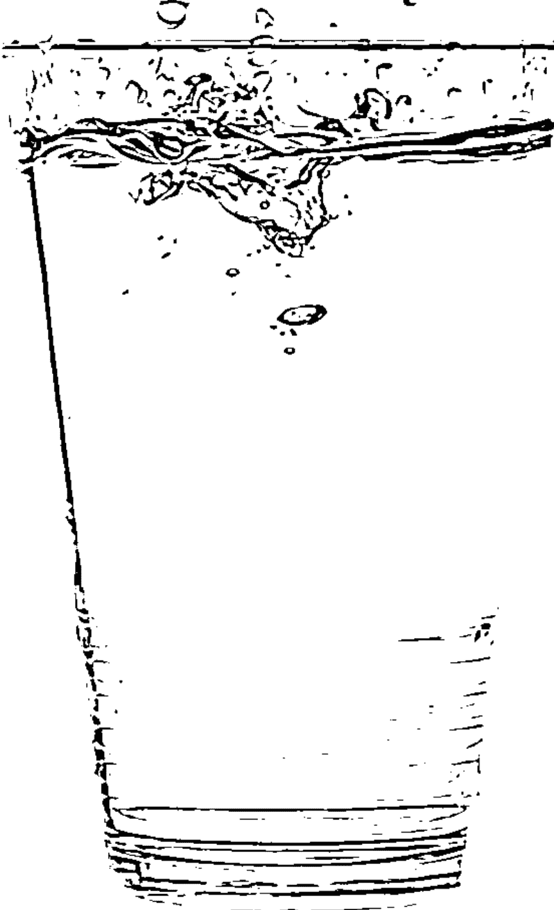

通常我們談到身體裡的「水」，不能只用「氧化氫」的分子式來理解，而要把所有具有一定以上流動性的物質，都涵括在內。當然，體內有許多水分，但是他們並不是這麼純粹的存在，而是溶解了許多不同的物質在其中，形成不同的特性。就某個程度來說，可以視為是濃度極低的一種津液。就像在自然界之中我們極難發現純粹的水，幾乎全是溶解了形形色色的物質，呈現出各有不同的特色。至少在最粗分的大類上，就是海水與淡水的差別。

我們透過水來煮茶、湯，就是因為水能夠把材料的物性「吸」入水中，只要能夠煎煮至氣香、味濃，就可以視為「已經轉變成融合了多種物性的混合物質」，減少一些在體內化消後再融合的負擔，是「液態」的原材料，將有利於直接吸收。

| 生物分類 | 綜合 |
|---|---|
| 本草分類 | 金石水土部 |
| 取用部位 | 綜合 |
| 建議食用頻率 | 偶爾 |
| 建議用量 | 少量 |
| 使用季節 | 四季 |
| 四性 | 寒 |
| 五味 | 甘 |

少量的清水與大量的食材一同熬煮至香濃，才能夠算得上讓水「吸飽了」。色黑的黑豆等於是深海，也就是極大量的水，一般的熬煮方式根本無法讓其「吸飽」。所以，我常說「水性本寒」，這無關乎飲用時的溫度高低，也不包括指稱茶、湯等「炮製」後的混合物質。泡熱清水，對比於泡藥浴、泡溫泉，本質與效果也完全不同。達標的太極米漿粥不能視為「湯湯水水」的食物，而未達標的太極米漿粥因為濃度不足，未能完全去除水的寒性，就像一口氣喝了一大碗的熱清水，必定對於胃氣有礙。

就物性來說，如果水很「純」，完全沒有吸附任何物質的氣，人體難以透過五味判別應該如何處理，極難化消。再來，也會因為純水的吸收藏納的特質被放大到極強，所以在體內把內臟中的高濃度的津液大量倒抽走，造成津液的耗損，近似於吞下黑豆，甚至有過之而無不及。有一位朋友，家裡專門做水處理的生意，經手全臺灣南北許多大型、專業水處理工程的設計與施工，是臺灣數一數二的水處理的專家，過去家裡就是長期拿逆滲透水做家常飲用，若以「化工」的角度來看，認為此舉很安全，毫不以為意。直到有一天，朋友的父親的牙齒突然斷裂，往後便必要先在逆滲透水裡加了海鹽後，才敢飲用。逆滲透水、蒸餾水這類的純水究竟能不能長期、大量的喝？各位朋友們應該心裡有譜了。

自然界中另有一種天然的水質，是二氧化碳溶解在水裡，稱為碳酸水，就是一般所說的氣泡水。舉凡含有氣泡的飲料，像是自然的氣泡礦泉水，或是因為發酵而產生氣泡的飲料，例如：啤酒，多是因為二氧化碳溶解在液體裡所產生。通常因為二氧化碳能夠溶解的量很少，在自然的飲用條件下，通常並不需要在意是否有明顯的酸性影響身體。說起二氧化碳，許多人的印象就是「廢棄物」。當然，人體呼吸空氣，排出的氣體含有較多的二氧化碳，這是基於自然事實的觀察結論。人體雖然排出二氧化碳，但是並非二氧化碳在人體內就一無是處。一般來說，氣體在陰陽分類裡頭，都偏屬「陽」，而我所謂的「四相定位」之中，能與肺親和的氧氣為「陽中之陽」，多與大腸親和的二氧化碳則偏屬「陽中之陰」。人體的腸道內，有高出人體細胞十倍以上數量的真菌存活。真菌存在的環境，無論是接近無菌的小腸，或是存在有較多菌種的大腸，通常是不歡迎氧氣的。許多對於人體的功能有好處的菌種，幾乎都是所謂的「厭氧菌」。也就是說，當腸道內的二氧化碳濃度增加，氧氣減少，這類的好菌才能正常工作。當然，人體腸道中的含氧或含二氧化碳的比例，是連續動態的變化，並非維持一成不變。但是若持續大量的含氧，攝入高濃度的氧氣，對於身體來說，也並非全都是好處。水中溶入一定比例略偏陽屬性的二氧化碳，水溶液的物性轉為微涼略澀而屬酸。在大腸之中，氣壓與水壓因此而獲得適度的加大，便會產生我所謂的「大腸的逆滲透」效應，協助大腸收斂，間接提高小腸運作的效能，而將腸道內的液體養分等流質更順利的送入腎系統之中，做進一步的藏納。如果大腸過於燥熱，收斂功能不彰，人會容易高燒不退。在《桂本》之中，往往就以重用石膏來清理大腸邪熱，加大了肺與大腸之間的溫度位能差，例如「白虎湯」的使用。而且《桂本》特別強調：必須將石膏敲碎了之後，以棉布包裹住再煎，不可混入水中，就是只要石膏敲碎之後，增加與水接觸面積，取用的是「氣」的反應而已，並非要吃石膏的「物質」體。

所以在《桂本》之中，石膏用量很大，常見以半斤、一斤的劑量入方。因為石膏對於人體的偏性影響力，真的不大，一斤才見效力。中藥所用的石膏為生石膏，就是現代所稱的「二水硫酸鈣」，來源為天然礦物。物理性質來說，用於食品加工，則可以點豆漿製作出豆花或豆腐。就像人體的腎系統把與豆漿物性近似的津液進一步分離出水分，單純留下液態的高濃縮津液，整體反應就是體現「收斂肅降」這描述的四個字。生石膏在《本經》中記載的物性為「味辛，微寒」。因為是礦石，所以質地沉重，故知其功並非「解表」，而在除裡熱。仲景亦提到，使用白虎湯的關鍵之一在於「裡有熱，表無寒」。二氧化碳溶於水後會因為吸熱而再回到空氣中，所以與生石膏同樣都會有些微「除裡熱」的效果。裡熱得除，腎系統才能在高效能而低溫度的環境之下養血。當然，大腸能夠藉此保持微寒的狀態，除了有益於腎系統的藏納津液，更有利於清除腸道上面的污垢，這也是大腸「收斂肅降」功能的一環。在生活便利用途上，也常見碳酸水用來去除杯子之中的油垢與污垢，亦為一例。綜合來說：首先，二氧化碳只有在低溫與高壓下，才會大量的溶解在水裡。常溫常壓下，從口鼻攝入的碳酸水，其中的二氧化碳很快就從水裡釋放回到空氣中了，用量很難稱得上大。第二，二氧化碳溶於水之後再釋放回空氣中的過程裡，會吸收熱，而產生反應的位置又多位於下焦的腸道裡，這會有助於人體腎系統精煉、收藏津液。坊間甚至有流傳「飲用含碳酸氣泡的飲料容易導致骨質疏鬆」的說法，想必是有什麼地方產生誤會了吧。我用碳酸水來代替《桂本》中石膏煮水的效果，無論是緩解裡虛燥熱，或是消除暑氣，甚至增益酒類在體內的代謝的效果，非常順手。想來，人類可以推及從公元三千年前就開始在喝啤酒，歷史悠久五千年，直到今天的比利時、德國、捷克都還是啤酒大國，平均全國每人（包含嬰兒）每年要喝掉百公升以上的啤酒。要是有大量碳酸氣泡的啤酒不能喝，大半的人類早就病死光了，更不可能被古埃及人視為藥方之一。若想要避免骨質疏鬆，禁掉咖啡，可能還更為明顯有效。當然，市售碳酸飲料常添加許多人工甘味劑、香精、色素，這些才是真正破壞身體健康的重大偏性物質，避開這些個麻煩的東西，實為當務之要。

## 2. 自然鹽（海鹽、岩鹽）

我們在前面提到過「鹽漬法」的料理技巧。對於這個操作法所帶來的驚喜效果，有不少人嘗試做出解釋。我的解釋的方法是：這個水與鹽的濃度比例，大約是百分之五點五，如果考慮食材在之前處理的過程中會略微脫水，最後的鹽度應該會再高一些。而這個鹽度比例，也與目前地球上的海水，其中較為高濃度的部分相仿。當然，地球上的海水的鹽度（每一千公克的海水中所含有的溶質的公克數），隨著我們觀測的地區會有不同。接近出海口附近，淡水與海水交匯的地區，或者多雨的地區，鹽度的變化大約是百分之三點二至三點七，也接近所謂的平均值百分之三點五，少數極端的地方會低至百分之零點五左右。但是在中緯度的海域，以及海水蒸散的速度較快的地區，海水中的鹽度也會較高，可以到百分之四左右，少數較高的地區可以到接近百分之五。

| 生物分類 | 綜合 |
|---|---|
| 本草分類 | 金石水土部 |
| 取用部位 | 綜合 |
| 建議食用頻率 | 經常 |
| 建議用量 | 無限 |
| 使用季節 | 四季 |
| 四性 | 微寒 |
| 五味 | 鹹 |

至於人體，大約含有體重的十三分之一的血液重量，血液的比重大約是一點零六，而血液之中大約有百分之五十五左右的體積是血漿，血漿的比重大約是一點零二七，血漿之中又有絕大部分都是水，水之外的重量大約只有百分之九。簡單來說，以一個人的體重六十五公斤為例，其血液中除去水與血球之外的溶質的部分的重量，與整體血液的重量比例大致為：

65*1/13=5（血液重量），5/1.06*55%＝2.5943（血漿體積）
2.5943*1.027*9%＝0.2398（血漿之中水以外的物質的重量）
0.2398/5=0.04796＝4.8%（血漿之中水以外的物質的重量與整體血液重量的比例）

鹽漬法的濃鹽水略大於血液的溶質比重，血液的溶質比重又略大於海水的平均鹽度。我的解讀是：血液的溶質比重提高時，也就是所謂的「血氣充足」，肌肉組織變得潤澤、有彈性；反之，當降低的時候，肌肉組織就有如岩石般，偏向僵硬。往復來回的變化，帶動各種肌肉的功能。人體的肌肉以及筋膜，甚至是我們所說的腠理，都需要高度富含養分的血液來保持正常運作。另外，海水的酸鹼值大約是七點四至八點三，而人體血液的酸鹼也大約是七點四左右，又是一個不謀而合。

各種生命體隱約的守著由海水自然形成的一個「黃金比例」，將自體內與整個自然界宏觀調控而成相似的鹽度。就算不由微觀來檢驗，巨觀來說，我們仍然不得不嘆服上天造物之妙，也讓我們再一次從不同的角度，深刻的認識了人體對於攝取天然食鹽的需求的重要性。

在這個料理的操作法中，我們等於透過最容易達成的手段：使用自然鹽，近似將高濃度比重的血液還給了被放血之後乾癟的肌肉組織之中，讓肉塊重新回到了近似於活體時候的狀態，並且能夠趁機以水屬性的津液的吸附，帶走一些我們所不喜歡的氣味。這當然不是直接把鹽水注入到肌肉細胞裡這麼簡單，但是高鹽度的鹽水的確起到接近血液的作用。在他們彼此之間透過四到八個小時以上的時間，大致上取得了一連串的平衡與反應作用的完成之後，肌肉組織獲得了滋潤，自然就能回復到有彈性、柔軟的原本模樣，提高對於熱的耐受度。相較於一般常在醫療之中使用的所謂「生理食鹽水」，其鹽度卻只計算細胞外液的含鹽量，為百分之零點九，我們可以仿照並推論得知：其實對於人體來說，這樣的溶液並不是真正的貼近生理表現的特徵，大量使用，極有可能並沒有什麼好處，也違反人體能夠自然代謝處理的原則，這個計算還不如在廚房裡頭所得出的鹽漬水濃度，更符合生理上的需求。我們也由此可知：人體如果不從體外吃進足量的天然食鹽，身體的體液與血液的產生與代謝，必定發生嚴重的問題。而我們常聽到有的人在身體上發生所謂的「水腫」、「積水」等現象，必然沒有如一般所認定的那麼單純，因為此「水」非彼「清水」，那是一種對於人體來說也具有營養價值的體液，或者是我們所常說到的「津液」。但究竟是怎麼樣的養分在體內，透過怎麼樣的方式進出到身體不同的區域，嚴格來說，如果按照所謂「還原論」的哲學觀來設計實驗並進行探究，在實際上是無法追蹤的。如果無法追蹤，不能完全仿照其機轉，當然就更不可能成功的進行醫治與調理。既然微觀上不可能真正的了解，我們不如退幾步，由巨觀的觀點來做定性上的調控，給予一個反應啟動的正確觸發，反而更能簡單且快速的掌握到平衡的辦法，就像我們在前面所介紹的「鹽漬法」一樣。

也就是說，我們談「鹽」，絕對不是單指「氯化鈉」這個化學分子式而已。更廣義的來說，海水之中的所有溶質，都要視為是鹽的一種，所以在古代的製鹽法之中，大致上分為：以天日曬製的天日法而成的「天日鹽」，以及由鍋釜燒煮的釜法而成的「釜鹽」兩種。這樣的做法，能夠盡可能的只去除水分，而保留下最多的水以外的其他各種物質，是一種天然的混合物。而近代的工業製鹽法，卻是將海水經過高度的精製處理，稱為「電透析法」，氯化鈉之外的其他物質幾乎都無法保存下來。這對於物性來說，改變很大。那就更別提，現代常常會為了一些所謂的營養價值的因素，以人工隨意添加碘之類的純物質到鹽裡。這樣的鹽，與我們人體所最能夠進行吸收與代謝的自然海鹽或是岩鹽，無論是成分以及濃度的表現上，都完全的不同，物性自然也遭到嚴重的改變。如果常吃，恐怕造成身體負擔。其實人類吃鹽也吃上幾千年了，靠內陸的人就吃岩鹽、井鹽，靠海岸的人就吃海鹽，兩邊的人偶爾把鹽運來運去，交換吃一下，就這麼相安無事下來，大家都沒聽說因此出了什麼問題，會讓人寢食難安、危及生命之類的。但就最近這百年來，突然從美國冒出了一個奇妙的論述：鹽裡面要加碘，不然人會生脖子變大的病！一夕之間人人自危，鹽裡面不加碘似乎就不能吞下去，單純開採、曬製出來的自然鹽，沒人要、不敢吃，非得要把鹽弄進到「工廠」裡面，好好用「高科技」進行「加工」、「包裝」一番，才能入得了口。

想來，真的十分詭異！

雖然光就物性來說，我實在不認為光是在鹽裡面加了碘，就是什麼解決脖子變大的毛病的好方法。但是，以子之矛攻子之盾，我單單就以「常識」的觀點，光是從西方的營養學來看，也可以完美破解提倡所謂「加碘鹽」的滑稽、荒唐、反智之處。

臺灣四面環海，放著大量天然的海生動物、植物等，天生富含高量自然碘的生物，從食物中攝取養分的好方法不幹，硬要對著鹽再用人工的方式進行添加，這已經違反了人體最基本的食物攝取的原則——天然。就算我們真的遠離海洋，居家附近完全沒有海產可買，也沒有任何的網購宅配要送到你家，連一片容易保存的乾燥海苔都沒得吃，但是在陸地生物食材裡頭，也有雞蛋、雞肉、牛肉、菠菜等，甚至連小麥，還有馬鈴薯的皮裡頭，都含有天然碘。一整個月裡頭，我們把主食吃足了，再隨便每樣配菜吃一些，也早就足以應付所謂的「攝取標準」了。不多說別的，我們就說「稻米」。每千克稻米之中，平均含有二十三微克的碘；一碗飯大約用一百五十公克的白米，也就是「一杯」米煮成，大約也含有三點五微克了。一天吃三碗飯，大約是吃進十微克的碘。如果你喜歡吃豆腐，一千克的黃豆可以做出約五百公克的豆腐，也含有九十七微克的碘，看你喜歡是做成豆腐或是豆乾、豆漿來食用，都可以。如果你喜歡在豆腐上頭再灑上一點海苔絲來點綴，只要一克就好，就含有四十三微克的碘。而世界衛生組織建議，每個成年人每天攝取一百五十微克的碘攝取量：

10+97+43=150

剛好達標！

我們的日常食鹽裡頭，連一微克的碘，也不必添加。世界衛生組織也具名掛保證，你絕對不會發生飲食裡頭缺碘所產生的所有問題。而且，所有的碘的來源都是直接取自天然，絲毫人工添加、合成的過程，都不必。真要擔心不足？再隨便吃一口海帶，真的，夠多了。臺灣多年前曾經流行大脖子病？應該是說：臺灣早些年前民生凋敝、百廢待舉，同胞們生活在水深火熱之中，許多疾病都是因為人民基本飲食的條件太差、營養嚴重失衡才導致好發。這與鹽裡面加了什麼，根本不具有因果關係。現在臺灣的「大脖子病」要捲土重來？是啦，如果大家不好好、認真的把正餐吃好，老是吞一堆營養補給品、人工化合物，或者飲食內容常常出怪招，什麼疾病的確都可能會大舉來襲。但是你要靠空口說白話，以反智、反科學的方式，來造成民眾無端的恐懼，這個，我絕對不贊同。各種以自然原料與工法製成的海鹽、岩鹽，絕對是你我飲食健康、安全的最佳唯一選擇，快點把各種含有添加物的人工再製鹽，以及莫名其妙令人心生恐懼的不實內容給丟掉，一起挺直了腰桿子過日子吧！以科學的數據證明：食用鹽中加碘，恐導致碘嚴重超量攝取，毫無科學根據，絕對不需要。

法語的大海寫為「La Mer」，而母親則寫為「La Mère」，發音近似。中文寫「海」字，拆開來恰巧為「水、人、母」。有人說，大海是一切生物的母親，陰陽學中的數術說到「天一生水」。不但人需要大量的吃鹽，許多自然界的動物也都需要透過舔食岩鹽等的動作來攝取鹽分，這是生命得以維繫的命脈，有如母親一般。

如此類比，又何嘗不是呢？

# 物性評論

# 第四章

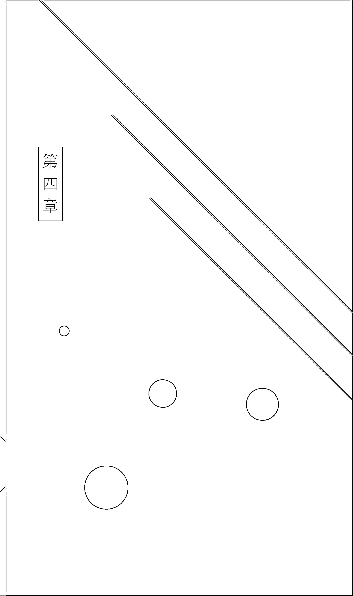

## 飯、麵

穀類的農作物，其種籽的部分，通常都會是我們常見的「主食」。雖然這個「主食」的角色，在不同的地區，會由不同的物種來擔任，但是，無論是米也好，麥也好，這些都是當地人民拿來「當飯吃」的重要食糧。穀類的食物，主要以入脾胃為主。以種籽的部分入食，又能兼有下氣和胃，引導心火入脾而與腎交的作用。這樣的功能也絕對不是單純用營養成分分析「澱粉」這個概念可以包含得進來的，在使用諸如：馬鈴薯、地瓜等等，同樣富含澱粉質的食材的時候，也沒有辦法對於人體達成同樣的效果。同樣屬於禾本科的植物的種籽，米與麥都是作用在人體的胃。米的功能著重在對於胃的涵養；麥的功能著重在對於引導心火沉降並與脾土結合的效果。以米飯為主食，可以明顯強健胃氣，幫助人體對於四肢肌肉的補益，並增加人體的耐力；以麥為主食，可以讓心火加強透過脾土而與全身組織結合，增強肌肉功能的提升，也幫助情志暢達、減少情緒鬱結的問題。這些都是非常重、日常不可或缺，也是沒有其他更好的方法能夠取代的。除了因為人工不當加工、添加物，以及環境污染等的問題之外，完全沒有人體可以不吃米麵主食的理由。

仲景在處理胃氣實熱不降，大汗大熱不休的陽明病患者時，以粳米組成白虎湯。而在遇見心神不寧，五臟失津不調的患者時，又以小麥入方，組成甘麥大棗湯，以安心寧神。不吃穀類，不吃米飯，這不只是對於肉體層面上的健康有負面影響，更會因為脾中虛熱，導致脾氣浮散，而會容易心神不寧，白天健忘，晚上多夢，易怒，暴躁，在情緒上，也可能會導致出許多很嚴重的不良後果。而這些對於身、心的影響，其實更遠超出用純粹的營養成分分析，所能夠理解的。不過，經常又看到新聞會報導許多怪招減肥。有吃柳丁的，有喝檸檬汁的，有不吃油的，有不吃肉的，有更多的，是不吃飯的。在絕大多數不知道該怎麼去辨別正確與否的聽大眾之間，這些爆炸紛雜的訊息，這恐怕是禍不是福。

談到飯、麵等主食，人人聞之色變，猶如洪水猛獸來襲！臺灣近三十年來，每人平均食用白米的用量減少約至一半，每人每年大概只用四十公斤，再平均至每天三餐，一餐用約三十六公克，煮出來的白米飯僅約三分之一碗，距離我推算出的每人每餐使用兩百公克以上的白米飯，實在不在比例。難怪現在臺灣人普遍胃氣十分虛弱不振，動輒發生嚴重的流行性疾病，或者長期慢性疾病，無論看中、西醫都是久久不癒。白米飯吃得過少，人人普遍迷信吃飯、麵主食會變胖，導致人民的健康如風中殘燭，這類的錯誤觀念，是頭號戰犯！

○ 「主食」必為一餐之主。

○ 養脾多吃米，健心常用麥。

## 食品加工・醃漬、發酵

醃漬與發酵，是人類使用最少千年以上的食品加工與保存法。首先我要做下結論：我認為，只要是採用古法，使用天然的原料來加工，就算是日常食用，只要符合一般的攝取原則，也不會對健康產生問題。

醃漬通常有鹽漬與糖漬兩大類。除了調整味道之外，這兩種做法的目的都一樣，就是「脫水」。關於五行的屬性，其實有很多內容可以細說，但是因為牽涉到整個陰陽五行的介紹很深，我們的篇幅有限，所以許多深入的說明在這邊只能割愛。

簡單來說，我們常聽到「流水不腐」這句話，所以要說到「防腐」，必定要「去水」。有水則生腐，這是處理食材的時候不變的道理。如果不使用糖或是鹽，而用其他如風乾或者日曬、煙薰、低溫烘烤等的自然手法來脫水，當然也沒問題。

像是中藥材裡頭，有絕大部分的植物類藥材，都是使用乾製的做法來炮製。甚至是覃類的生物，如藥材中的茯苓，或是食材中的香菇，生鮮的時候食用，反倒不如乾製之後的風味來得好，藥材的效力也會因為乾製而更加提高。所以，我們並不是全面性的反對「食品加工」，我們反對的僅僅是「使用人工化學添加物」、「使用非自然手法加工」的內容而已，這一點，是我們必須要再三強調清楚的。去水的加工，除了提高保存效果，增添風味之外，更重要的一點是：因為加工所去除的是「水」，而我們又說「水性本寒」，所以我們可以透過這類加工，來稍微減低一些食材本身的寒性。就像如果確實的用古法將葉菜類的食材用鹽漬的方法處理過，不但利於保存，也可以透過大量的脫水，甚至引起適度的發酵。雖然無法劇烈的由寒反轉成熟，但仍然能適度的減輕葉菜類食材普遍具有的寒性。

提到發酵，我們知道，通常都是靠著食材之中能產生甜分的成分進行反應。甜度不夠的食材就難以發酵。主要常見的酒類，有很大一部分是由米、麥等禾本科的作物為主來製作的。從發酵的原理與過程，我們會將他視為一種「透過土屬性大量增添火屬性」的加工，對人體來說，很重要，效果也非常的多樣，我們暫先整理出以下的結論：

- 食材具有大量的能產生甜分的津液，才能發酵。
- 甘味屬土，人體對於能量的營養需求也是如此。不吃飯就沒力氣。
- 發酵的過程會產生大量的熱與二氧化碳。對於人體來說，小腸吸收食物的過程之中，也類同發酵，使人體可以產生大量的能量。
- 小腸屬火，發酵的過程也可以讓食材適度的增添火性，減少寒性。
- 發酵的過程讓食材轉化出更鮮美的不同風味。美味是必要的。
- 發酵過後不可以呈現臭的傾向。氣不正則發臭，恐怕只能算是食材的腐敗而已。要知道：糞便也是發酵過後的產物之一。
- 發酵也是一種「同化」的過程。食材再怎麼分解，都是「身外之物」。要讓食材從「體外」的物質，真的成為「體內」的津液，發酵是關鍵。
- 土壤之中進行發酵，可以讓土壤的肥沃程度增加，但是每一塊土地參與發酵的菌種都有所不同。人體腸道的菌，也是如此。外來補充的菌種，助益不大。
- 我們多吃發酵食物，也可以幫助身體在發酵的作用上獲得加強。
- 以大豆發酵而成的自然加工食品，如：醬油、味噌，對於提振大豆能影響的腎系統來說，更有幫助。

## ○人有人性，食物當然也有「物性」

物性就是食物的個性，不過並非單純的中醫性味歸經之分，更不是西醫討論的營養成分，而是從食物的外形、味道、科別、生長環境方式、人工製造方式去了解：這口食物下肚，會對身體產生什麼反應。

## ○藥食雖同源，但某些食物非得捨棄不吃，才有恢復健康的機會

【絕對不沾的三種食物】蘋果、黑豆、白蘿蔔
一天一蘋果，醫師真的遠離你？！黑豆被視為健康食品，多多益善？蘿蔔益氣，但只喝一口白蘿蔔湯，就可能讓元氣報銷？就是有這麼些食物，偏性過於強烈，會讓身體的養分大量流失，能量無法透過食物留存於體內！

## ○搞懂物性和配伍烹調原則，廚房灶頭上就有救命良方

薑是回陽的絕佳良藥；益人無數的太極米漿粥，來自尋常的大米與清水；馬鈴薯帶皮烘烤，搭配大量油脂烹調，提高腸道機能；青椒疏瀉肝的濕熱之氣，熟食生食皆建議……
多數食物都有偏性，需合理食用。本書提供一套判斷物性的方法和配伍的原則，讓各種食材的偏性獲得修正。所以任何疾病在未達重症之前，若食物經過適當的配伍，酌量用之，就能取其用，綜其效，避其害。

囊括蔬、果、蕈菇、魚鮮、禽畜肉和加工製品
超過150種常見食物、10大調理便利貼
