# 猫咪占星指南

致我所有的猫咪好友，

致我所有友人的猫，

致世界上所有的猫，

致万千世界里的猫……

# 前言 爱，使我们有心灵感应

自从 1960 年代开始，随着中产阶级兴起和农村人口外移，饲养宠物才真正地在法国蓬勃发展。

——多米尼加联邦．吉洛（Dominique Guillo）

当名为爱情的飞毯载着我们遨游时，人类能发展出超越感官的认知能力。于是，我们与所爱的生命心意相连，使我们异口同声、心有灵犀、深有同感，对方就像“抢我们的话去说”一样。这个链接仿佛借由一股不可见的讯号荡漾而来，将彼此系在一起，链接逐渐茁壮成长的同时，我们的关系也开花结果、双方合二为一。人类和所爱猫科动物之间的关系也是如此。一旦系紧了线，就搭起沟通的桥梁。随着人与猫情意越浓、对另一方的了解越深，于焉发展出心电感应。对于初次遇见的动物们，我也早就在心中升起一种出于本能的亲密感。我与动物成为“亲密无间伙伴”的方法，便是汲取这种沟通的经验而来，而且这只会随着时间不断增长，以下即是一个真实的案例。

我和奈奈先生（Monsieur Néné）住在一楼的宅院里，它是一只雄壮威武的欧洲灰鼠，有着一双绿色眼睛的双鱼座。我和它一起过着浓情蜜意的生活。我们的互动超乎寻常。为了“真正地”讨它欢心——我任由它走出家门，到外面的花园里，尽管我恐惧一切的陷阱：各种建筑物的大门、电梯、电梯门、访客和它可能遇到的坏心居民。它感应到了我的焦虑，每当我叫唤它，便会拔腿狂奔，马上回家。

某天，奈奈先生早上散步回家后，神气地装模作样——如果能如此形容的话，把一件精美的礼物置于我的脚边：一只活生生、颤抖着的田鼠。礼物才一落地，它就消失在家具底下。令人感到不自在、不舒服。我知道，那是他能赠送最棒的礼物，那是它自己的卡地亚（Cartier）套装……就算不感谢它，也不能对它有任何指责。不过，由于当日稍晚我必须外出，临走前跟它说道：“你看着办吧！不过当我回来时，不想再看到这只野兽了。”

晚上回家的时候，田鼠的遗体就躺在门口的一边。奈奈先生在一旁等着我，仿佛是在说：“你看……我做到你要求的事情了。”

此案作结。我们享用了一颗美丽的苹果，作为交流的象征。因为，没错，奈奈先生也是食果动物。我想不起是谁先开始为了讨对方开心而吃苹果，但我们分享了好几颗……还有番茄、梨子等。

在田鼠事件的几个月后，寿司小姐（Miss Sushi）来了。在八月十五日的周末，我听到外面传来喵喵叫声。可怕的猫叫声从住宅的花园里传来，我在那边发现一只约莫两个半月大的小猫，既愤怒又绝望，从它可笑的娇小身躯全心全意地发出喵叫声。

在这个小东西面前，我的心立刻融化成一片，我穿过花园回到家里，边向它解释：“我举手赞成接待你，但奈奈先生也必须接受你才行。”

这只十分迷人的小猫——而且还是一只雌猫，一出现就对奈奈先生施展了魅惑力，它马上舒适地和我们住在一起。

如今，寿司小姐年届二十岁了，它还是一如既往地喵喵不绝。奈奈先生英年早逝后，它信心倍增。更重要的是，它大幅拓展了领土，再也不需要与奈奈先生共享。

此外，它的沟通能力大幅跃进，这使我意识到，也察觉到——寿司小姐和奈奈先生正好是互补的存在。

自从奈奈先生离开后，寿司小姐就在这安顿下来并成长。它创造一种全新的、多音阶的喵叫声，令人联想到某种不可思议的词汇。当它使用一些奇异的音阶、前所未闻的声音时，它仿佛含煳不清地说着好几种语言。寿司小姐一直很健谈（它是双子座，多话是它的基因！）。毫无疑问，多亏它在当初的花园中展现这个特点，从而得到了救赎——没人知道它是如何办到的。

在一长串连绵不绝的喵声中，每一声或一音节，都至少是一个特定的要求：喂我、抱我、你瞧见我的猫砂盆了吗、饭后哄我一下吧、我还可以叫你做些什么呢？此外，当向它搭话时，它总是会给予回应！发出的声音让人听得一清二楚，我们就像两只双足动物之间无止尽的对话。因此，当宾客还在悠哉地待着不走，它却觉得派对已经庆祝得够久了，就会凭空地冒出来，坚定地发出喵呜声，怒气冲天地要求宾客们离开。绝不妥协。

# 猫占星术简介

猫不归我们所有，我们不过是照顾者。

——霍华．P．洛夫克拉布夫特（Howard P. Lovecraft）

你理解得没错，我是夏尔．波德莱尔（Charles Baudelaire）、业余爱好者、哲学家和灵媒眼中重要的“猫咪狂热者”一员。猫对我们而言好比水、暖气或电一样不可或缺，猫科动物是我们生命中的盐。它们是增进世界和谐的必要幸福补给。单凭它们的存在，一切就被扭转和美化，仿佛施加了魔法。它们是一根神奇的魔杖，赋予和谐感，并加以装饰与衬托、使之变得舒适或奢华，更胜于一件豪华家具。但别以为你错失了后者的价值，因为猫咪也是无价之宝。由于它的要求、独立性与存在，每只猫都是珠宝盒里的一颗宝石，它生来就懂得如何打点自己。不过情况并非总是如此。在中世纪和这几十年以来，出于迷信，欧洲的人们在建造房屋时，把黑猫活生生地徒刑起来，以保护房子远离邪灵的干扰。经过祖先的艰苦抗争，猫科动物占据了人类的家园，接着是侵入我们的心，使人类听命于它，还获得了一些权利（依我来看，这还不够多）。我们人类，则多了些义务。随着时间，我们如今可以说人类已经成为动物，而动物变成了人类，进而诞生了这一对原创又独特、形影不离的伴侣。

从历史上看，很长一段时间以来，猫一直是最亲近人类的动物朋友。最初，一切都是出于偶然，正因为它是公认流行病媒介——啮齿动物（当它曾经的竞争对手黄鼠狼［Belette］被彻底淘汰后）的猎捕者，猫很自然地在社会中、在温暖的家里，找到自己的归属。而狗即使逐渐亲近人类，它们仍待在外面的狗窝里。猫浑然天成的魅力，征服了我们。我们的捕鼠专家同样成为装饰中必要的一部分，像经典和乐家庭画作中所描绘的一般，安详地睡在画面的某个角落里。

然而，自从踏进人类的居所后，猫节节退败。它的狩猎本能被炉火平息了，原本有如军队的主力战将，变成了对苍蝇打呵欠的士兵；只有贴近它嘴边的逗猫玩具，还能挑起些许兴趣。但失去狩猎的功能性后，猫掳获了人类的心。

出于对猫的兴趣——当然，我是爱猫成痴的人，以及身为业余占星术师（我还是个业余的黑色文学小说家、散文家、剧作家和记者），有一天我自问：为什么不写写它们呢？并从我的书页抬起头来，欣赏这只猫躺在我面前埝子上的幸福神情。听说瑜伽源自于人们对猫咪的凝视，但那是另一段故事了。因此，这两个兴趣画下了起点，让我展开一段人和动物之间所能创建的亲密无间、充满爱意和激情的关系。即使这有点牵强，也无所谓！我对这段浓烈的关系甘之如饴，甚至梦寐以求！

对我来说，与动物共处，就是与另一个生命——你的小宠物，分享部分的爱跟生活。唯一与人类间关系不同的是，这美妙的冒险显然时间有限，而遗憾的是最长不会超过二十年……至于两个人类之间的爱情，时而长久、时而短暂。

踏进动物占星术领域的缘由

动物占星术的出发点，是观察某个来到我们生命中的动物，与人类间的邂逅有着相同的征象、身份被“烙印”在我们的星盘里。

对于那些稍微了解占星术的人来说，会知道一张命盘是由十二宫位组成的，其中一个宫位——六宫，掌管了疾病、健康、工作和……小动物。这表示占星专家在过往已经确立了宠物在人类生活中的位置，借由占星术语中所谓的“衍生宫位”，将它们囊括在我们的本命星盘中。

这个重点坚定了我的直觉，并鼓励了我的计划。在人类星盘之中，动物显现出的涵义，与生命中的其他伴侣是一样的，我想要在相同的基础上，来研究人类／动物这一对伙伴。因此，正如预告一场浪漫艳遇般地一目了然，当一只猫出现在人类的生活中时也是如此，我创造一种专有的、适切的解读方式。于是，我成了一名猫咪占星师。

透过发展解读对话、寻找人猫之间的一致性，我构思了这本《猫咪占星指南》。它是根据模拟原则，以及在所有占星术的基础之下，经过深思熟虑（和想像）后编写而成——在某个程度上，一只金牛座的猫类似于同一星座的人类。我希望这本针对特定物种而编成的著作，在具有参考价值的同时又饶富趣味。

本书会让你更懂得如何选择和理解你的宠物；越认识它、就能越妥善地爱护它，或是爱得越深刻。

# 如何确认猫咪所属的星座？

猫咪是种奇妙的生物，我们摸不透它们脑海闪过的所有念头。

——华特．司各特（Walter Scott）

知道猫的出生日期

如果你知道猫的出生日期（大致确切或者接近的出生月份），就可以在下面的星座列表中找到它落入的星座，并能参照对应的章节。

※日期可能因闰年而略有不同

• 牡羊座：3 月 21 日至 4 月 20 日

• 金牛座：4 月 21 日至 5 月 20 日

• 双子座：5 月 21 日至 6 月 21 日

• 巨蟹座：6 月 22 日至 7 月 22 日

• 狮子座：7 月 23 日至 8 月 22 日

• 处女座：8 月 23 日至 9 月 22 日

• 天秤座：9 月 23 日至 10 月 22 日

• 天蝎座：10 月 23 日至 11 月 21 日

• 射手座：11 月 22 日至 12 月 20 日

• 摩羯座：12 月 21 日至 1 月 19 日

• 宝瓶座：1 月 20 日至 2 月 18 日

• 双鱼座：2 月 19 日至 3 月 20 日

不知道猫的出生日期

如果不知道猫咪的出生日期，以下叙述能让你依据它的行为，找出它的行星特征、专属星座或是最接近的星座，然后翻阅至相关章节。

• 当第一眼看到它，最吸引你的地方是：它的野性美。它令你着迷，即使是长相丑陋的猫咪（但在世间上这并不存在）。

• 赖定你的表现：它赖在你面前（或在你家门前），等待你靠近。

• 它的性情：自信且喜形于色。

• 用餐时：善变、口味讲究。

• 你的猫和其他人相处时：无论做任何事情，它总是爱秀。

☉你的猫咪是太阳型／星座：狮子座、牡羊座

它具有令人无可自拔的魅力，向外展露光芒万丈的美丽，却似乎没有自觉。

＊＊＊

• 当第一眼看到它，最吸引你的地方是：它该打理的部分。

• 赖定你的表现：长久以来，它一直在你或你的房子附近打转，一点一滴地任由自己被驯服。

• 它的性情：多疑和疏离。

• 用餐时：一旦规则立下，它就讨厌猫粮的任何变化（无论哪一种猫粮）。

• 你的猫和其他人相处时：一般来说，它总是疑心病重。

♄你的猫咪是土星型／星座：摩羯座

它小心翼翼，百折不挠。时间会为它证明一切。是只按部就班的猫，也是阿宅。

＊＊＊

• 当第一眼看到它，最吸引你的地方是：它的自动自发，能马上与我们创建连系。

• 赖定你的表现：借由喵喵叫声，唤起对它的注意。

• 它的性情：健谈和喜爱参与。

• 用餐时：是位出了名的饕客。

• 你的猫和其他人相处时：它出于本能，聊起天来总是滔滔不绝。

☿你的猫咪是水星型／星座：处女座、双子座

好奇心强、聪明，它能马上听懂你的意思，就好像讲的是猫语一样。它反应极为灵敏，让自己自然而然地成为家庭的一分子。

＊＊＊

• 当第一眼看到它，最吸引你的地方是：它难以抗拒的魅力。

• 赖定你的表现：在腿肚上留下几个爪印，再抛来几个具有说服力的媚眼

• 它的性情：黏人和自恋。

• 用餐时：细致、讲究美食。

• 你的猫和其他人相处时：总是乞求关注和爱抚。

♀你的猫咪是金星型／星座：天秤座、金牛座

它非常深情，是个小黏人精，极度追求感官享受，总是需要触觉接触，但并不乐于和他人分享。

＊＊＊

• 当第一眼看到它，最吸引你的地方是：它一副迷失在辽阔世界的神情。

• 赖定你的表现：拐弯抹角、出乎意料。

• 它的性情：心不在焉、若有所思。

• 用餐时：取决于日子、菜单和其他事物。对于食物反复无常的猫。

• 你的猫和其他人相处时：在众人面前偶尔会恢复活力。

☽你的猫咪是月亮型／星座：巨蟹座

从字面和比喻上来说，它总是处于“栖息”的状态。迷失在它的梦里或是阁楼深处。如果世上的猫都是贪睡之徒，那么它就是个总在梦里耽溺的忧郁小生。

＊＊＊

• 当第一眼看到它，最吸引你的地方是：自动自发地黏在你身上，或把头埋在你的衣服下面。

• 赖定你的表现：它毫无预告就出现了。

• 它的性情：紧张、好斗。

• 用餐时：狼吞虎嚥。在这方面，它也是个很敏捷的窃贼。

• 你的猫和其他人相处时：当有人接近时，它会全速地跑开或是高高弓起背来。

♂你的猫咪是火星型／星座：牡羊座、天蝎座

它非常独立，偏好以武力解决事情。攻击任何移动的东西，并且不回避对抗。

＊＊＊

• 当第一眼看到它，最吸引你的地方是：你从未见过这样的猫咪，极度特立独行。

• 赖定你的表现：令人毫无头绪。

• 它的性情：稀奇古怪、疏远、若有所思。

• 用餐时：它喜欢不太像猫饲料的食物。也很聪明，会自行打开橱柜门享用。

• 你的猫和其他人相处时：要求人们玩抛接玩具的游戏，且再也不放他们走。

♅你的猫咪是天王星型／星座：宝瓶座

它大胆鲁莽、总是在寻找不一定会得胜的新体验。

＊＊＊

• 当第一眼看到它，最吸引你的地方是：第一眼见到它，你就知道彼此是天生一对。

• 赖定你的表现：因为它和你不约而同地做出相同的选择。

• 它的性情：灵活又善解人意。

• 用餐时：它的口味总是变来变去。

• 你的猫和其他人相处时：它会保持距离和观察。

♆你的猫咪是海王星型／星座：双鱼座

是个神秘主义者，给人感觉总是缥缈梦幻。并非是因为外在美貌（像太阳型的人一样），而是出于心灵。它有些自命不凡。

＊＊＊

• 当第一眼看到它，最吸引你的地方是：虽然你不打算收留动物，但你却带着它离开了。

• 赖定你的表现：它从某个暗处现身。

• 它的性情：独立而神秘。

• 用餐时：它很难搞，非常难搞。

• 你的猫和其他人相处时：它会从某个战略性的角度监视人们，仿佛望穿了生命的本质。

♇你的猫咪是冥王星型／星座：天蝎座

它在某个特殊的时刻“偶然”地降临在你的生命中，就像一份有益身心、抚慰和神秘的礼物。你感觉它总是在审判你，而它来自一个不可见的世界。

＊＊＊

• 当第一眼看到它，最吸引你的地方是：它自视甚高的一面打动了你。

• 赖定你的表现：它会从任何一处冒出来，但总之都是从某一条坦途……

• 它的性情：自信和外向。

• 用餐时：是个毫不遮掩的贪吃鬼。

• 你的猫和其他人相处时：它会费尽一切心力吸引人注意，并勾起人们对它的兴趣。

♃你的猫咪是木星型／星座：射手座、狮子座

非常贪玩、活泼，也是个永不满足的吃货，务必留意它的身材。

一旦确定猫咪的星座，你便能在对应该星座的章节中，找到猫咪与你在伴侣关系中所潜藏的优势、和谐或冲突。

此外在各章中，还讨论了每个星座的不同面向和特点注 1。首先是猫咪的主宰行星，和它的性格、气质类型、体格、社交能力，以及它在访客或孩童面前的亲和力有关。再来是每个星座的三个十度区间注 2（Décan）与其主掌的面向，例如它的健康、迁移性、友谊和爱情，以及与它主人的相合性。

“星座猫的云上狂想”是一个番外奇想曲，里头重新塑造各星座猫的世界，一个只有“如果”的世界——如果这是……一个埝子、一首曲子、一首歌、一个品种、一只名猫等。

最后会以一只文学中的名猫为题、一段从占星术的角度重新审视的故事，加以总结每个星座。我们还会针对中华占星术和埃及占星术中的猫咪星宿提出疑问。

即将出生的猫宝宝

猫咪的怀孕周期大约落在五十八天至六十五天。接下来的图表能让你了解：

• 小猫出生的星座，如果你知道猫咪们交配的日期。

• 交配的时间点，如果你想控制新生猫宝宝的星座。

你也可以选择顺其自然。

妊娠期与出生日对应表

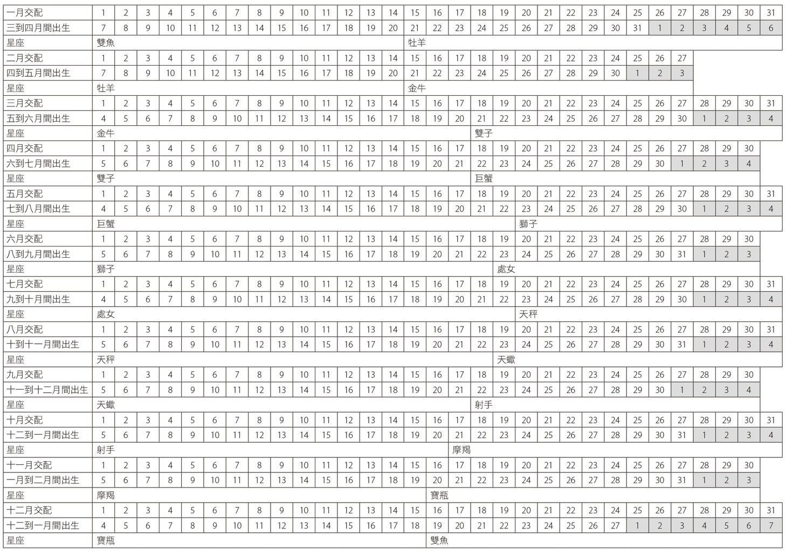

注 1：但对于纯种猫，你必须根据其特性来调整星座。

注 2：译注：黄道十二宫每一宫在星空背景上有三十度跨度，十二黄道星座以每十度等分出来的区间，称为十度区间。十度区间又译作“十分度”、“十度区分”。

# 十二星座的猫咪

根据每个十度区间的特征，你可以对猫咪的性格进行精密分析。每个星座长达三十天，并被分为三个十天左右（太阳进入一个星座的时间可能依年份而不同），每个十天都受到行星的影响。

• 第一个十度区间：星座的前十天，与身体有关。

• 第二个十度区间：接续的十天，与精神有关。

• 第三个十度区间：再接续的十天，与灵魂有关。

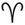 牡羊猫

从 3 月 21 日到 4 月 20 日

元素：火（创始型）

主宰行星：火星（或冥王星）

掌管的身体部位：头部

颜色：鲜红色

活力充沛、勇敢、好斗、狂热分子

它的主宰行星：火星

这是春天的第一个星座，它从植物向上运输的水分中汲取满溢的能量。它代表着生命的抗争、自然选择和最强者的法则。仿佛它的使命是令我们忘却冬天，而牡羊猫带着力量和欲望发现或是重新发现这个世界。它天性快乐且热情。

火星这颗力量之星主宰男性的行动，象征速度和活力。喜爱独立自主，也是火星型男性的特质之一。在这颗行星的影响之下，牡羊猫是强而有力、顽强和果断的。

火星对应一个人生命最旺盛的巅峰期，是人们试图被认可、实现自我的生命阶段——因此牡羊猫天生充满霸气。

它从小就很喜欢运动，甚至喜好争斗。如果可以，最好在你有足够的空间、一座花园，或至少客厅能摆下一座漂亮的猫爬架时，再来接待这个星座的猫，以便它能定期做些运动。

它的性格：外向

牡羊猫淘气顽皮，天生不记仇。它们个性独立，很容易适应各种变化、能承受不稳定性，比方说适应一个作息颠三倒四、放纵不羁的主人。

它是个行动派，因其难以抗拒的魅力而成为受到尊重的领头羊。牡羊猫讨厌被约束并懂得灵活应对任何情况，它心中有股接受挑战、测试自己身手和体力的需求。必要的话，也乐意奉陪打一顿架。速度是它的武器，像个武士一样，以满腔热血和敏捷力摆脱困境。然而，牡羊猫却也很容易受伤，按照它们的生活方式，身上累积的伤口犹如它的满满战绩。

优点

这只热爱运动的猫是个胆小鬼、天生的杂耍演员，从不错过任何展示自己才能的机会，如果世上有猫咪奥运比赛，它一定会参加。即使冒险，也会本能地评估风险。

缺点

这是最易怒的猫咪。切勿尝试以诡计诱导牡羊猫，或是让它违背意愿来完成某件事。如果改用温柔的姿态，能从它身上获得更多东西。

它的气质类型：胆汁质注 3

牡羊猫和它的狮子座以及天蝎座朋友一样属于胆汁质。它浑身肌肉，带着直勾勾而犀利的眼神，充满动感和活力。它同样可以是冲动和好战的，即使在一个身形魁梧的对手面前，它也随时做好迎敌准备……它克制不住自己！

它的嗓音强劲有力，且动作以猫科动物来说是相对粗鲁的。和它的狮子座朋友相同，是一个骄傲而性格暴烈的领导者。

它的外型

牡羊座猫全身肌肉发达、修长，头圆短鼻，尖下巴。

它的社交能力

• 牡羊座雄猫：它是一只运动型且非常讨喜的猫。对自己的主人有独占欲，而招来的嫉妒会造成严重破坏，即使我们试着好声好气地向它解释，偶尔必须分享自己的主人或它的餐碗。但牡羊猫先生也依旧自由，活得无拘无束……

• 牡羊座雌猫：它的身高可能矮于同类的平均身高，但性格坚定且积极主动。它非常爱操心。和牡羊座雄猫一样，它依恋着自己的主人，如果我们把事实摆在眼前并要求它分享主人的话，就会变身成一只嫉妒的母老虎。它绝对会大赌气，至死方休。

• 牡羊座小猫：这是个淘气又暴躁的小恶魔，生性非常敏感，最好是劝阻它不要做些傻事，而不是过于激烈地斥责。牡羊座小猫是一只不断寻找着崭新冒险的探险家。旁人惧怕的事物吓不倒它。

• 面对访客：视情况而定。它会自然而然地接近对其友好的人类。反之亦然。强迫它是没有意义的。

• 和孩童相处：它有青春洋溢的性格，当孩子陪伴在侧时，它感到自在舒适。但如果游戏的时间持续过长，最终可能会惹恼它。所以请多加留意……

十度区间

• 第一个十度区间（3 月 21 日至 3 月 31 日），由火星或冥王星守护：落在第一个十度区间的猫胆大包天，需要在战斗中耗尽自己的精力和挑衅他人。它的血液里流淌着勇气和胆量。

• 第二个十度区间（4 月 1 日至 11 日），由太阳守护：这小个头很自然地令人臣服、视它为领头羊或老大哥，是只居高临下又活力充沛的猫。面对有人臣服于它的气派威严之下，它也会感到欣喜。

• 第三个十度区间（4 月 12 日至 20 日），由金星守护：温和、深情款款、善于交际、心胸宽广，像这样的牡羊猫，只要求被人抚摸的权利。

它的健康

牡羊座与头部有关，这使你的伙伴在脸部和眼睛等处较为脆弱。由于它天性喜好争斗（尤其年轻时），可能容易发烧和受伤。

它可能会感染眼疾。随着年岁增长，要留意牡羊猫的牙齿和肌肉系统。

它的迁移性

这只喜爱冒险的猫天生不惧怕旅行：对它而言，这可是一个全新的研究领域。但是必须让它逐渐地习惯环境。独立的天性，可能会在路途之中引起一些不便。调教得好的牡羊猫，可以跟随你散步或一起“走到世界尽头”，几乎正如布莱斯．桑德拉尔 （Blaise Cendrars）所写的歌一样——《带我走到世界尽头》（Emmène-moi au bout du monde）。它易于生存，适应得了你的各种长短途跋涉，以及任何一种交通工具。

它的友谊、爱情、亲密关系和点头之交

• 谁适合当牡羊猫的主人？

和它同是火象的星座，比如射手座或狮子座的主人，非常适合我们赤裸裸的牡羊座。和射手座在一起时，它喜欢健身锻炼，也需要独立空间；狮子座的审美家会欣赏这只动感猫结实有力的优雅之美。

跟随一位牡羊座的主人时，两者过于旺盛的火气可能会扑灭热情……一种不理解和频繁的权力斗争或许会令它紧张，甚至使它逃家。

在金牛座的主人身边，太过平淡如水的生活会令它心情沮丧。除非有可能在外头“随心所欲”，并且待它翘家归来后，有个温暖的家让它恢复元气。

跟在无忧无虑的双子座主人身边，这个自动自发的猫科动物将会如（长了脚的）鱼得水一样的快活。它能够“不心存怨恨地”提醒这位异想天开的主人所犯下的疏忽：例如，它的餐碗空空如也。

与巨蟹座在一起时，双方在追求感官享受上是一致的，对于这只过着波希米亚生活的猫来说，这是令它安心的因素。相反地，与过于脚踏实地的处女座主人相处，对于这只独立动物而言，沟通上会困难重重。

另一方面，和天秤座主人在一起时，是一股性格截然相反的吸引力。这个强大的诱惑者将完全服从其宠物的意志。除非是相反的组合。

天蝎座和牡羊座根本不是住在同一个星球上。他们的共通点是远离太阳、大海和天堂。

反过来说，宝瓶座主人和牡羊猫的交流将会很美好。两人都喜欢体验：宝瓶酷爱科学、牡羊爱好冒险。

最后，与双鱼座主人相处时，牡羊猫将全然地舒适自在。

• 爱情归宿

牡羊座–牡羊座：立即反应——一见锺情或枕头大战。

牡羊座–金牛座：这两种星座的能量如此截然不同，无法协调。金牛热爱的所有感官追求令牡羊座厌烦。

牡羊座–双子座：飘飘然的吸引力和爱情。喜得猫宝。

牡羊座–巨蟹座：浪费时间。它们之间毫无吸引力。

牡羊座–狮子座：强烈的仰慕、长期的观察。但是，这不能保证什么。

牡羊座–处女座：一拍即合或一拍两散。尽管双方都是处于焦躁不安的状态，但能短暂地相处。建议快刀斩乱麻。

牡羊座–天秤座：犹如磁铁对金银珠宝的吸引力。

牡羊座–天蝎座：理论上没什么不愉快的。只要信任天蝎座的话。

牡羊座–射手座：相爱相杀的关系，但维系顺利，会是拥有后代的美满结局。

牡羊座–摩羯座：随着时间过去，它们会喜欢上彼此。牡羊座须有耐心。

牡羊座–宝瓶座：像朋友的情人，它们的爱情开花结果指日可待。

牡羊座–双鱼座：虽然性格截然不同，但可以尝试碰一次面。

星座猫的云上狂想

如果把猫咪塞进一个瓶子，它会如阿拉丁神灯般，从一片烟雾缭绕的浓雾布幕里忽然现形。我们仿佛置身于动画片中，在一个承载荒诞梦境的世界里，否则这就不是场梦了。就让我们一起航向这个幻想的云之国度吧！

• 它的绵软王座：由于牡羊猫喜欢从事运动，它身处位于卷积云 （Cirrocumulus）顶端的竞赛擂台，安稳地待在鲜红色的坐埝里，这个颜色是战斗的象征。它邀请了马瑟．巴纽（Marcel Pagnol）——《贝克的妻子》（La Femme du boulanger）的作者来自己的派对，他们一起听摇滚乐，跟着查克．贝瑞（Chuck Berry）的一首［约翰尼．B．古德］（Johnny B. Good），试着跳一支狂野炫技的舞蹈……这毛小孩爱极了！

相关品种：日本短尾猫

这只多情且娴熟交际的猫在一九八〇年代抵达法国。日本短尾猫的特色是源自于基因突变的异色瞳和兔子般的短尾巴。要是这只猫身着三色花裙，会被认为是一种幸运的象征。在日本深受欢迎、举着猫爪的招财猫就是它的代表。还有另一个特点是会发出咕噜咕噜的声音，因为它非常健谈。

阿方索——三月的太阳及五月的雨

要能代表牡羊星座的话，就必须是一个运动健将、一只天不怕地不怕，容易适应变化的猫。马歇尔．埃梅（Marcel Aymé）的短篇小说［猫爪］（La patte du chat）注 4 中的主角就是如此坚毅刚强。阿方索（Alphonse）是一只年轻帅气的农场猫，依恋着从田野到阁楼的广阔空间。它在夜里活蹦乱跳——这是一个令人敬畏的捕鼠能手，但在白日里则懒洋洋的，因此被收留它的农家夫妇责骂，他们的脾气暴躁；相反地，他们的两个女儿和雄猫之间有着深厚的友谊和无尽的默契。所以，当德芬和玛妮两姐妹打破一只花瓶的那天，这一家的瑰宝——阿方索竟然告诉她们要保持冷静（是的，阿方索是一只会说话的猫），但为时已晚！女孩们为了避免受到惩罚（去牙齿掉光、长满汗毛的梅娜姨妈家），请求阿方索的帮忙。由于唯有降下一场雨才能取消行程，阿方索便采取行动来终止晴朗的天气。

说到做到，阿方索坚定地将猫爪伸往耳后祈雨，足足有五十馀次。这一招势不可挡。隔天，“豪大雨势把狗淋成了落汤狗”，再隔一天依然如此。日复一日。阿方索每日重复着对雨的颂歌，雨从未停止落下，以致农家夫妇把它当作代罪羔羊，他们决定丢弃它好让太阳回到天上。他们把阿方索塞进一个装有石头的布袋里，打算将它扔进河中。身着短裙的女儿们解救了它——现在她们被威胁要在可怕的梅娜姨妈家里待上六个月。在所有农场动物的帮助之下，它们在集会中想出了一个计谋，好挽救阿方索的生命。要使计划奏效，仍然需要一只同谋的老鼠。最后雄猫和老鼠都顺利获救了。

尽管告密者公鸡试图告密（这家伙最后进了炖锅），父母仍坚信阿方索已经被淹死了。他们实在后悔莫及！因为大雨过后，迎来的是旱灾，农田都在燃烧。他们感到绝望、被悔恨和内疚啃噬，却在某个美好的早晨，发现阿方索快乐地睡在玛妮床上。对他们来说，一切都将回归正轨。但阿方索不以为然，它想代替小女孩们牺牲自己，与可怕的阿姨会合。父母们恳求它不要离开。阿方索最后纡尊降贵地留下来（牡羊座易怒却不记仇），优雅地重十它的祈雨舞。

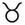 金牛猫

从 4 月 21 日到 5 月 20 日

元素：土象（固定型）

主宰行星：金星

掌管的身体部位：喉咙、脖子

颜色：蓝色

稳定、意志坚定、勇敢

它的主宰行星：金星

金星象征情窦初开的时期、生活的喜悦，带着一股女性气质。让此星座天生充满情感、富有魅力，具有诱惑和吸引力。

在爱与美之星的光芒照射下，金星守护的金牛座拥有绝不可抗拒、难以言喻的特质。爱情“几乎”是它活着的理由。

此外，金星象征自然、丰饶的大地。植物以一种规律、稳定且缓慢的节奏，生长得厚实致密并填满所有的空隙。一切都是为了让大自然在夏天生机勃勃。

阴性的金星赋予雄猫某种程度的敏捷，不论是笨手笨脚抑或是温和圆胖的猫；金星雌猫是迷人、柔媚、匀称有致的，是一种审美的享受。这几乎就是夏尔．波德莱尔写的诗：奢华、魅惑（而不是冷静！）和性感……

如果金星“被冒犯”（受到负面相位的影响），金牛猫就会变得具有攻击性、爱抓人，且举止偷偷摸摸。

它的性格

金星是这个星座的主宰行星，赋予猫咪伙伴优雅的姿态与敦厚的性情。金牛猫无论雄雌都平易近人、善良且深情款款……有时甚至会过头了。它天生多愁善感，出于安全感的需要而表现得忠心耿耿。当金牛猫不寻觅温情时，它是沉着冷静的。它是一只镇定自若的沙龙猫或家猫，如果一不当心，可能会把它与摆饰品搞混。当它心情好时，便任由人们使唤。不过碰上被拒绝时它也不会气馁，坚持不懈直到得偿所愿。

优点

它很殷勤，喜欢接待人类或是动物。这个好客的动物会包容新来的人，只要他们不引起它的不安。

缺点

受到负面的影响，金牛猫会变得暴饮暴食，甚至会设法打开橱柜或冰箱偷吃。当它不被理解时会极度烦躁不安，但只要被安抚，它却又是如此平静。

它的气质类型：多血–淋巴质（sanguin-lymphatique）

同时对应消化和淋巴系统，多血–淋巴质的猫在极度热忱和持续懒惰之间摇摆不定。它天性热情，热爱生活中的愉悦——尤其是食物。它非常深情，热衷性爱。生性敏感且多愁善感，却也稳定、忠实、吃苦耐劳。多血–淋巴质类型的猫头部呈现圆形，以中庭（鼻子、眼睛）或下庭（嘴部、下巴）最为突出。它通常有漂亮浓密的皮毛、大而圆的眼睛、短鼻和一双大耳。

它的外型

金牛猫锻鍊得十分结实，脖子短又粗壮，牢牢支撑起圆状头。它们的步伐缓慢而有节奏。

它的社交能力

• 金牛座雄猫：它是一个喜欢接待来客和被欣赏的宅男，以风度和自然的优雅著称。一个温暖的家就足以使它幸福，尽管它表达的情意，实在肉麻过了头……

• 金牛座雌猫：它散发着和谐与优雅。金牛座雌猫非常依恋它的家，并分享大家庭的所有情绪。它的占有欲很强，彬彬有礼又热情好客，就算非不得以发起脾气……它也只会生闷气。

• 金牛座小猫：不畏惧冒险所带来的后果、做事缺乏条理，假如要原谅金牛小猫的胡作非为，务必要以委婉和圆滑的手腕教导规矩，否则它会爬到你头上！

• 面对访客：金牛猫极具亲和力，它喜欢屋里挤满了人。如果人们还投以关注目光在它身上的话，那么……它会乐歪！

• 和孩童相处：金牛猫与孩童相处融洽，随和的一面使它成为孩童的最佳良伴。它任由自己被当作绒毛玩偶对待——不过谁知道它是不是玩得一样尽兴呢！

十度区间

• 第一个十度区间（4 月 21 日至 4 月 30 日），由水星或金星守护：这类金牛猫好奇又充满常识，但却相当懒惰。此外，它还懂得如何突显自我优势。

• 第二个十度区间（5 月 1 日至 11 日），由月亮守护：此金牛猫爱好美食又追求享乐，对周围的人也很敏感，倾向维持现况。如果它必须分享它的主人或领土，便会显现出强烈的占有欲。适应力强，且总是固守在它的坐埝上。

• 第三个十度区间（5 月 12 日至 20 日），由土星守护：这类金牛猫虽然学习速度慢，但借由强大的自制力、专注力和不屈不挠的耐心，能摆脱自身困境。属于选美冠军的常胜者。

它的健康

金牛星座与喉咙、脖颈有关，小猫对各种蔓延的病毒非常敏感。当成年之后，它的抵抗力会大增。然而，喉咙和颈部这个区域仍然很脆弱。颈背也是它的弱点。必须监控它的饮食，以免它过度进食而变得肥胖。

它的友谊、爱情、亲密关系和点头之交

• 谁适合当金牛猫的主人？

与处女座或摩羯座的主人相处融洽。一如处女座的人类，它们分享对家的爱、创建在安全感基础上的简单幸福，以及平静无波的节奏。和摩羯座亦然，这种融洽很理所当然而且持久。

金牛猫很容易适应牡羊座的主人。一丁点的风吹草动不见得会令它不悦，但务必适可而止……

与同星座的主人在一起时，若是太过按表操课，可能使得日常生活过于乏味。

双子座主人对它来说，太“飘忽不定”及优柔寡断，它可能会因此变得不安稳和焦虑，并产生不必要的痛苦。

反过来说，待在巨蟹座主人身边，双方关系可以达到某种完美的境界。他们互相磨合，直到两人度过热烈又和谐的一生。

跟狮子座相处时，彼此的权力竞争关系，以及想成为最耀眼焦点的心愿，可能会干扰他们之间的宇宙波长，引起不睦。

和同为金星人的天秤座主人相处时，在感官层面上会非常契合。他知道如何抚摸它的小屁股、讨好它的味蕾。对美感有明确的见解。

与它对向的星座——天蝎座的同居生活并不容易。第一次的接触就决定成败，除了施虐与受虐倾向者以外。

对金牛座猫来说，射手座主人是和谐生活的保证。前者乐观，后者带来生活的乐趣，令他们携手终生。

金牛座猫很难适应宝瓶座主人。在这个配置中，这位过于敏感的主人将难以应付这只易怒宠物的冲动。

和双鱼座主人一起生活是没问题的……不过双方都会无聊到轮流打起哈欠。

• 爱情归宿

金牛座–牡羊座：双方在权力的消长中虚张声势，不受期待的组合。

金牛座–金牛座：热情时有时无，有赌气和跷家的风险。

金牛座–双子座：难以想像的一场冒险，但不妨一试。

金牛座–巨蟹座：美好的婚姻，且产出一窝可爱的小猫。

金牛座–狮子座：高拱起背和张牙舞爪的关系。不过一旦算清旧帐，一切皆有可能。

金牛座–处女座：猫版的罗密欧与茱丽叶（但结局较不戏剧化）。

金牛座–天秤座：在魅力和炽热的欲望作用之下，产生全然的诱惑力。引人关注的高颜值组合。

金牛座–天蝎座：毁灭式的激情。可以完美履行伴侣的合约。

金牛座–射手座：爱与和谐，就这么简单。

金牛座–摩羯座：自发的吸引力，交配成功的组合。

金牛座–宝瓶座：错综复杂的开场，但有可能开花结果。

金牛座–双鱼座：阻挠重重的命运，未来渺茫。

星座猫的云上狂想

金牛猫攀上空中飞人的梯子，朝向那个美梦成真的幻想世界，要不然这就不是场梦了……在这里，所有的恶梦都被捕梦网隔绝。一切都完美无瑕。我们身在虚幻的云之国度里。

• 它的绵软王座：它伫立在自己“舒展开的云朵”上，一大片低垂、未成形的云朵，躲开了所有的空中特技。不动如山地待在它柔软的蓝色埝子，这是代表真理和爱情的颜色。它唱着练声曲作为前奏，因为这只沙龙猫总待在它的闺房，重复它最喜欢的曲调：罗西尼（Rossini）的《猫咪二重唱》（Le duo des chats）。当它最喜欢的非正统英雄——格律克注 5（Geluck）的“猫大叔”到来时，它会询问这个喜剧演员，知不知道如何以咏叹调或美声唱法唱出一些动词。

相关品种：沙特尔猫

沙特尔猫（Chartreux）是个可靠的朋友。这是一只温和而深情的动物，带有结实的体格和健壮的胸膛。其柔软的皮毛和橙色眼睛是平静的来源。

拉米那罗比斯——金星猫的和善，并不总是忠诚可靠

在尚．德．拉封丹（Jean de La Fontaine）的两百四十篇寓言中，有两则以猫王子——拉米那罗比斯（Raminagrobis）为主角。其名的词源来自 rominer 和 gros bis，前者为奥依语方言中的猫咪呼噜声；后者是一种粗糙、褐色的面粉，被用来比喻重要的人物。

拉封丹从拉伯雷（Rabelais）的著作《巨人传第三部》（Le Tiers-Livre）借用了这个名字。书中的拉米那罗比斯是一位老诗人，在庞大固埃和巴奴日两位巨人之间充当仲裁者。寓言［猫、黄鼠狼和小兔子］（Le Chat, la belette et le petit lapin）中，拉封丹同样把拉米那罗比斯设定为一位法官，解决黄鼠狼和兔子之间的冲突。这只雄猫假装听不见，示意它们凑上前说才听得清楚……然后漤用它个人无情的正义，扑到两位主人公身上，将之吞噬入腹！

猫是拉封丹寓言中的关键角色——出现了十一次之多，总是被套上相同的刻板印象：虚伪和狡猾。因此，拉米那罗比斯是一个狡猾的大骗子。即便如此，外型还是带有圆润感：毛皮浓密、胖乎乎的。你发现了吗？只要一说出“拉米那罗比斯”，它就在我们身边发出呼噜声。这是人们梦想中的金牛座代表，拉米那罗比斯拥有金星猫的善良天性和金牛座的强健体格，这位讳莫如深的“庄严圣徒”，打从一登场便赢得了一致的好感。

在［猫与老鼠］（Le Chat et le rat）寓言中，那只胖猫则伪装成信徒：“就像所有虔诚的猫那样，每天早晨祈祷。”其隐藏的寓意，是拉封丹尖锐地反映出“圣人”的正义以及当代的风俗，他同样以其影射莫里哀（Molière）笔下的《伪君子》。

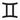 双子猫

从 5 月 21 日到 6 月 21 日

元素：风象（变动型）

主宰行星：水星

掌管的身体部位：肺部、前肢

颜色：绿色

机智、善变、精明、活泼

它的主宰行星：水星

接续在金牛座的金星所代表的丰饶大地之后，双子座的水星象征繁茂植被以及流动性。树叶在风中飘扬，随之变换方向，好比水星型猫咪敏捷的身手和灵活的头脑。

秉持移动、适应与交流的原则，水星主宰行动和扩散。这颗行星的象征是雌雄同体，就像双子座的孪生符号一样。

水星借由呼吸和语言促进交流，在这种影响之下诞生的猫咪非常情绪化。由于不会说我们的语言，所以它会用自己的方式展现“健谈”，并且知道如何巧妙地使人类理解自己。水星是艺术之星，这个星座的猫是非常优秀的喜剧演员，它也可能散发出一股嘲讽感。

如果水星受到不利的影响，就会变得过度紧张和偷鸡摸狗。

它的性格

在这青春活力星座的统御之下，双子猫一生都保有童心。水星以极快的速度对它的呼吸系统与敏捷行动施加影响力，它冲动、顽皮和好奇。一切都让它感到兴趣，但眨眼即逝。这种注意力的不集中可能使得训练小猫变得困难。成年后，它可能是善变、三心二意或不可预测的，但这也造就了它的魅力。

由于此星座的二元性，双子猫的性格很难界定。此外，双子座与猫科动物捉摸不定的形象有关，它们体现了所有猫科会有的的细微变化，可以刹那间由攻击性转为温和（反之亦然）。

优点

适应能力佳。它机灵聪明，以令人刮目相看的天性克服重重困难和陷阱。

缺点

比一般的猫更虚伪。它的反复撒娇带有私欲，在胡须底下总是埋藏某些心思。

它的气质类型：多血质

跟射手座和宝瓶座一样，多血质的猫有一张略长、椭圆的口部。它的双眼和下巴一样窄小；相反地，它的鼻子颇长。它很健谈，带着尖细的嗓音，以及一双炯炯有神且骨碌碌的眼睛。

多血质猫的肥胖身材，散发出一股稳重和活力充沛的气息。它动作迅速、身手矫捷，性情开朗且乐观。双子猫强而有力又灵巧，也是一只勇敢的猫。

它的外型

双子猫的体型高于平均，但身材并不那么结实。看起来又高又细长，但它的胸部发育不良。

它的社交能力

• 双子座雄猫：要双子座雄猫足不出户很困难，它会使出高超本领来克服一切障碍，实现自己的目标。总之，它非常独立自主。

• 双子座雌猫：生来并不具备充沛的母性特质。它可以完成任务，但并非满腔热血。此外，它是个喋喋不休的长舌妇。能娓娓道出自己的人生故事，并且在它想要某件事物时，懂得如何让自己的心声被听见。

• 双子座小猫：早熟、活泼、聪慧。双子座小猫想要上知天文、下知地理。在公寓里它容易恶作剧，好奇的天性总是促使它尝试新的体验。和人类在一起时，它一下子就会感到厌倦，并且知道如何远离那些打搅它的人。

• 面对访客：会出于好奇接见客人，但由于它老是抱持疑心，因此总保持距离。

• 和孩童相处：对于这个象征青春的星座来说，孩童是它宇宙的一部分。它隔着远远的距离容忍他们，因为孩童可能马上就令它不悦。

十度区间

• 第一个十度区间（5 月 21 日至 31 日），由木星或海王星守护：本命是第一个十度区间的猫超级敏感，但头脑敏锐，善于分析。容易陷入浓烈的情感关系。

• 第二个十度区间（6 月 1 日至 10 日），由月亮守护：三个十度区间中最莽撞的双子猫。它精力充沛，但容易分心，任何学习都可能是枯燥乏味的。

• 第三个十度区间（6 月 11 日至 6 月 21 日），由太阳守护：这只双子猫需要被欣赏，以便激励自己。这让它有些自命不凡，或许它就是这样……谁知道呢？

它的健康

双子座与肺部、前肢（骨胳、肌肉）有关。它身体的这些部分有不错的结实度（不过并未特别发达），但不利于它的后肢发展，也让后股较为脆弱。

双子猫不论老少都喜欢蹦蹦跳跳。然而，即使已届高龄，动脉也完全没衰老。

它脆弱的神经很容易“失调”，并产生身心上的过敏反应，猫科行为学家或许可以补救此点。

由于它非常长舌，双子猫的声音容易嘶哑或带有奇怪的语调。

它的友谊、爱情、亲密关系和点头之交

• 谁适合当双子猫的主人？

双子猫的理想主人是牡羊座或天秤座。牡羊座知道如何安抚凭直觉行事的双子猫，给予它极为需要的自由。

待在同为风象星座——飘忽不定的天秤座身边，将会成为一对完美的组合，任由冲动和幻想掌控他们的生活。

如果金牛座主人不会情感勒索的话，他们能创建起良好的关系。

在两个双子座之间，一切情况皆有可能发生，只要主人不过度分心以致忘记同伴基本需求的话。

双子猫与巨蟹座主人能和谐相处，后者跟它一样童心未泯。他们会一起大肆玩乐。

在占有欲过强的狮子座和独立的双子动物之间，他们可能常会意见不合。

跟处女座主人的关系更加微妙而不协调——此二星座脑袋的运转速度根本不同调，话不投机半句多。琴瑟失调的组合。

双子猫与天蝎座主人相处和睦。他们之间存在的是宇宙物质。

跟不拘小节的射手座在一起，这只复杂的猫能得到满足，感受快乐的宁静。

然而，与摩羯座的相处需要许多磨合，除非他们同年纪。双子座代表青春，摩羯座代表老年。他们活在不同层次或不同世界里。

和宝瓶座主人能碰撞出各种火花：炼金术、魔法、吸引力。就是一见钟情吧……

双子猫和双鱼座主人可以像好邻居一样生活，双方都非常独立。双子座的开朗舒缓了双鱼座的忧郁。

• 爱情归宿

双子座–牡羊座：像一段说走就走的旅行。子孙满堂。

双子座–金牛座：性福满满，没多久就会蹦出小猫了。

双子座–双子座：相处融洽而不黏腻。上对下的关系、猫丁兴旺。

双子座–巨蟹座：初次相见就跳起芭蕾的爱情舞剧，可以期待小猫的到来。

双子座–狮子座：不是相敬如“冰”就是天雷勾动地火，没有模煳地带，但不妨尝试一下。

双子座–处女座：由于处女座过度的羞怯，而无法开花结果。

双子座–天秤座：和谐的爱情和可爱的猫孩。

双子座–天蝎座：甜言蜜语说不完的恋人，备好一间房让它们嚎叫吧！

双子座–射手座：双方都懂得讨好，但是太彬彬有礼了。

双子座–摩羯座：一方过于献殷勤、一方漫不经心，最好避免这组配对。

双子座–宝瓶座：柔情蜜意，生一打小猫。

双子座–双鱼座：很难打破僵局，除非雌猫先屈服。

星座猫的云上狂想

飘忽不定、腾云驾雾！在起飞前，双子猫就已经翱翔在风中。像玩跳马背游戏一样地蹦上云端，也会独自玩起捉迷藏。为何不呢？在幻想的云之国度，不存在实现不了的梦想。一起上路吧！

• 它的绵软王座：高高挂在天上、一片非常紧密的卷积云朵，双子猫在上面正倚靠着它的绿色埝子，就像米娜瓦注 6（Minerva）的眼睛——代表希望和青春的颜色。它住在高处，一边观察世界、一边聆听 MC Solar 注 7 的［从这里出发吧］（Bouge de là）。它偏爱饶舌歌，正如它向寿司小姐注 8 解释的那样，这位双子座东道主跟它一样滔滔不绝。寿司小姐请它播放一曲［种下风的人，收获暴雨注 9］（Qui sème le vent récolte la tempête）。全是它青春的回忆……

相关品种：缅甸猫

相对于它生活在亚洲的祖先，缅甸猫（Burmese）出生于美国。在一九三〇年代，一只来自缅甸（缅甸圣猫，英文为 Birman，伯曼猫）、有着深色皮毛的猫，与一只暹罗猫（Siamois）杂交。结果产出了一只热情、容易相处与爱叫嚷的猫，它的声音比暹罗猫更柔和。今日，缅甸猫有两种类型：体格结实的美国缅甸猫，以及英国缅甸猫。

古古和餍餍

一对暹罗猫搭档，就像两个受水星守护的双子星

美国作家莉莲．杰克逊．布劳恩（Jackson Braun）透过三十部侦探小说，让年届四十岁、体型像马克吐温且太阳双子、上升金牛的吉姆．奎尔（Jim Qwilleran）和他的两只暹罗猫——古古（Koko）、餍餍（Yum-Yum），跃上了冒险舞台。

奎尔是一名有酒瘾的记者，他失去了妻子和工作，但从富有的姨妈范妮（Fanny）那继承财产，搬去一个“向北六十公里处”的虚构小镇——麋鹿镇 （Moose）定居下来，为当地报纸撰写专栏。双子座雄猫古古，首先踏进他的生活，紧接着到来的是小雌猫餍餍。夏洛克．奎尔和古古．华生便组成了一对非同凡响的侦探搭档，因为古古是一只洞察力灵敏的猫。

由于天生具有“远高于平均值”的六十根触须，让古古有幸发展出一种非凡的感应能力，即便它只是一只猫！当它感应到谋杀案发生，便会大声尖叫，跳起一支死亡之舞去示意主人。当它不倒着阅读报纸头条时，还能解读人们的想法。在每一回案件中，它都会帮助奎尔：从书架上抓落一本含有线索的书，助他解开谜团。古古十分聪明。它会留意奎尔在打字机上敲打的键盘和推回到滑动架。可以说，它“几乎”会在机器上打字，而且古古是唯一拥有附照片荣誉记者证的猫。这种像水星人一样健谈的猫有时也会和野外的火鸡聊天，或者挖出一条尚未被侦探认可的特殊线索，例如：一把大钥匙。古古的血液中也保有节奏感，会用它的尾巴敲打着节拍。

餍餍，是有着神爪的小猫。它触觉敏感，是个神偷。对坐埝十分敏感，肱骨特别灵活，它可以偷东西、解开鞋带、解扣子和藏匿许多小玩意儿。当犯下了蠢事或是冷战的时候，餍餍会开始斜眼看人，而古古则是装聋作哑。

古古总是背对着北边吃饭，如果餍餍逮到机会就会从左边接近它的盘子。两只猫都喜欢香草奶油，龙虾则是它们最爱的菜，而且从不吃垃圾食物。古古和餍餍喜欢人们为它们朗读——古古还是图书管理猫。它们一定会在冰箱上方的蓝色埝子上互相依偎熟睡。多么奢侈的猫啊！

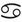 巨蟹猫

从 6 月 22 日到 7 月 22 日

元素：水象（创始型）

主宰行星：月亮

掌管的身体部位：胸部、胃、女性生殖器官

颜色：白色

敏感、浪漫、爱好音乐者、情绪起伏不定

它的主宰行星：月亮

阴性的月亮掌管冲动、感觉和敏感性。这是梦想与潜意识的行星。它对应童年并统御着巨蟹座。

月亮是生命的守护者。它统治着生育和不育，激发母性和保护的本能。

与母亲的分离，是巨蟹座小猫生命中特别脆弱的过程；在不良条件下断奶也是其中之一。

月亮的影响经常使得巨蟹猫温和、害羞、情绪化、内向。

如果这些自然倾向受到阻碍，月亮的负面影响会使它过度紧张、被动、冷漠与善变，一言以蔽之：喜怒无常。

它的性格

对于巨蟹猫来说，主人和房子是一个不可分割的整体。这个梦幻而有些自恋的动物，需要感觉被所爱的人包围，它无法忍受孤独。温柔的表现能安抚杞人忧天的本性，它的安抚需求庞大。

常规和习惯能驯化它。比如一旦受到制约，它在用餐时会变得特别迟钝。

巨蟹猫富有亲和力，在观众面前，它会极力展现自己而不是羞怯。如果它远离同伴的话，那就是因为太吵闹了。相对地，它喜欢音乐。一如它的双鱼座朋友，它对振动声非常敏感。

优点

对自身周遭波长特别敏感的巨蟹猫能理解主人，或更确切地说，比起其他猫，它对你的感觉更敏锐。它也是一位音乐爱好者。

缺点

极度敏感是它的消极面：巨蟹猫可以无缘无故地翻脸如翻书，让人费解。它对自己习惯的依恋癖，有时候令人难以忍受。

它的气质类型：淋巴质

淋巴质的猫主要受消化器官影响。一般来说，口部下缘宽阔、鼻子稍大、下巴短且耳朵大。它以缓慢的步伐移动。

它的外型

与同类或同品种的猫来说，体型较矮小，巨蟹猫容易长得丰满，因为这是一个爱好沉思的猫，而不倾向运动。它的脸总是流露出惊讶的神情。

它的社交能力

• 巨蟹座雄猫：它表现出相对的独立性。比起长时间的单独徒步旅行，更偏爱陪在主人（可能还有它同品种的家人）身边。

• 巨蟹座雌猫：情感丰富，对它的孩子和对人类的孩子一样充满母爱。

• 巨蟹座小猫：敏感、有点害羞。你必须让它先主动，好令它安心。

• 面对访客：理论上它待客殷勤，除非客人很聒噪。如果有人对它感兴趣，它可能满怀感激。

• 和孩童相处：这个对象令它很感兴趣，而且赖定他了。

十度区间

• 第一个十度区间（6 月 22 日至 7 月 1 日），由金星守护：这只巨蟹猫情绪化且非常敏感，也容易受影响。它是运动的跟随者，但不是发起者。

• 第二个十度区间（7 月 2 日至 12 日），由水星守护：头脑聪明绝顶，也善于表达。容易适应环境。

• 第三个十度区间（7 月 13 日至 22 日），由月亮守护：温和且爱幻想，本命落在第三个十度区间的巨蟹猫，也可能变成喜怒无常的动物，有时令人费解。

它的健康

巨蟹座掌管胸部、胃部、胰脏与雌性生殖器官。这个星座的猫容易出现消化系统疾病。必须留意它的饮食，禁止过于丰富的饮食。它可能有轻微的暴食倾向。

要仔细追踪雌性的子宫和卵巢。

这只猫的心灵脆弱，猫科动物行为专家可以帮助你改善情况，甚至解决可能的问题。

它的移动性

对于这个依恋家庭的动物来说，旅行是一种考验。旅行时，如果可以的话，让巨蟹猫待在你身边，会让它感到安心。

它的友谊、爱情、亲密关系和点头之交

• 谁适合当巨蟹猫的主人？

金牛座或狮子座的主人能满足巨蟹座动物。诱人的巨蟹猫迷住了情绪化的金牛座，并勾引爱美的狮子座。

牡羊座主人对这种敏感的动物来说太火爆了。

与双子座主人很难达到协调，这个轻佻而冲动的人类扰乱了巨蟹猫，它眷恋于自己规律的节奏和重复的仪式。

熟谙某种处世之道、礼貌周到是巨蟹座人类和动物同居生活的特点，但是会过得很枯燥乏味。

陪伴在一丝不苟、井井有条的处女座主人身边，可以勾勒出愉快的生活蓝图。双方对自己的许多习惯有着相同的依恋。

如果天秤座主人不认为自己的宠物是绒毛玩具的话，双方可以和睦相处。

与天蝎座主人的交流弥漫一股神秘感。他们共享一个奇妙难解的世界，并以深奥玄秘的事物充实自己的心灵。

乐观开朗的射手座与巨蟹猫能“笑容满面”地和谐相处。

呈一百八十度对立的巨蟹猫与摩羯座主人相处时——尽管巨蟹猫的心血来潮会打乱摩羯座的按部就班，但双方能在安全和忠诚的相同需求上，共筑爱巢。

心不在焉的宝瓶座将考验巨蟹座的敏感神经。不过，同居生活将是一个令人热血沸腾的体验。

一种趣味性和童心未泯的默契，将巨蟹猫和双鱼座人类凝聚在一起。

• 爱情归宿

巨蟹座–牡羊座：相遇的机会渺茫——一方笔直向前走，另一方横着走。

巨蟹座–金牛座：虽然金牛座表现笨拙，但魅力十足。

巨蟹座–双子座：双方都懂得讨好的艺术，有机会彼此取悦和交配成功。

巨蟹座–巨蟹座：只有在共枕眠时，双方才会流露柔情。

巨蟹座–狮子座：如果给它们一些时间，一切都有可能。

巨蟹座–处女座：双方得克服胆怯，处女座也要再机灵一些。

巨蟹座–天秤座：施展魅力、诱惑力，接着就……

巨蟹座–天蝎座：一见倾心，保证生出一窝小猫。

巨蟹座–射手座：很有可能互不理睬。

巨蟹座–摩羯座：自然而然的气味相投，轻松产下后代。

巨蟹座–宝瓶座：讲求科学逻辑的交往方式，不妨实验看看。

巨蟹座–双鱼座：不被理解的双方能心心相印。

星座猫的云上狂想

顺着流星拖曳的轨迹，巨蟹猫数着星辰。虽然它不懂算数。于是，当它等待白昼从黑幕中升起，等待懒洋洋的云朵乘载自己，启航至云端上的国度前，它梦想着另一个世界。

• 它的绵软王座：色调一致的白色坐埝——或许是安放在它飘渺云朵上的柔软羽毛枕……白色之于希腊人是纯洁和幸福的颜色，而对这只爱做梦的猫来说，是一丝丝的天真和微理想主义。它的播放列表中有平克．弗洛伊德（Pink Floyd）的致幻歌曲［回声］（Echoes）。在云端的另一头，这位加菲猫（Garfield）好友，肥硕又懒惰的猫，讨厌猫食却喜欢千层面，深陷在软绵绵的棉絮物中，沉浸在它聆听的音乐里。

相关品种：缅甸圣猫注 10

这只脚掌穿戴着手套的长毛猫，与纤弱、性感以及爱宅在家的巨蟹猫很相似。传说在二十世纪初，一位英国人从缅甸的一座寺庙里偷走一对猫伴侣。雄猫在渡海过程中死亡，但抵达时，人们发现雌猫怀孕了。后来把产下的一只雌猫与暹罗猫杂交，因而生下了第一只缅甸圣猫。

约瑟夫——现在是凌晨五点，全巴黎正熟睡中

乔治．西默农（George Simenon）的小说《被谋杀的猫》注 11（Le Chat assassiné）在一九七一年被皮埃尔．葛尼耶–德菲（Pierre Granier-Deferre）改编成电影《猫》，并由尚．嘉宾（Jean Gabin）和茜蒙．仙诺（Simone Signoret）主演，其名气远远盖过了这部独具质感的小说。

埃米尔（Émile）和玛格丽特（Marguerite）：在暮年结合的两个生命，就像一对承受年老和孤独的拐杖。两人性格截然不同——他是一位退休工人，性情不假修饰而暴躁；她，爱好打扮而吝啬。他们分别来自拉桑特区的工人家庭和地主家庭，该地区正面临拆除。他们原本就是邻居，埃米尔娶了一个开朗的好女孩，玛格丽特嫁给一个优雅而出色的首席小提琴家。阶层不同的两户人家虽能共享同一个社区，但不见得能一起生活。在各自成为鳏夫寡妇后，他们才与对方结婚。但是在新郎的聘礼中，包含他的猫——约瑟夫（Joseph），埃米尔相当依恋它，而玛格丽特却无法接受。结婚第六年，他们的关系急剧恶化。她把他当仆人对待，他把她看作婊子，并在体贴的小桑塞尔酒吧老板奈莉家中，把玛格丽特忘得一干二净。

某天，老男人因流感卧床不起，“那只雨沟里的粗野猫”——被玛格丽特如是称呼的约瑟夫，人间蒸发了。当埃米尔在地窖里发现自己的爱猫被老鼠药毒死时，他立即知道罪魁祸首是玛格丽特，也明白她想透过这只动物来伤害他。他把复仇转嫁到玛格丽特养的鹦鹉可可（Coco）身上，它是算清总帐的无辜受害者。埃米尔拔掉它的尾羽，把它们当成花插在花瓶里。鹦鹉也死去，玛格丽特以稻草塞满它的躯体。这场阴险、沉默的战争爆发了。双方都沉浸在轻蔑彼此的沉默中，两人形同陌路。他们不再交谈，而是在揉成球状的纸片上交换文字，扔到对方的腿上。公猫的谋杀事件令埃米尔使用的字眼变得毒辣，他反复提起“那只猫”，要让玛格丽特背叛的事实永远存在，并无情地激起她的内疚感。

两人维持各自的日常喜剧节奏：把自己的食物柜深锁，生怕被对方毒害；他们“消磨时间”：互相观察、互相躲避、像敌人般互相窥视，被一股永不回头的仇恨所驱使。同一时期，某天埃米尔离开她、到小桑塞尔酒吧避难时，玛格丽特还是会跑去找他。因为无论如何，他们的生活少不了彼此。

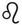 狮子猫

从 7 月 23 日到 8 月 22 日

元素：火象（固定型）

主宰行星：太阳

掌管的身体部位：背部、眼睛、心脏

颜色：橘色

骄傲、充满热忱、自信、热情

它的主宰行星：太阳

太阳是活力之源，产生能量、力量、性格与意志，激发创造力。这个行动和光明之星，主导着狮子座，象征着成年。太阳赋予并维持生命。

受此行星影响的猫拥有结实的体魄。

这只小猫很笨拙，但特别有抵抗力。

当它成年时，其体格非凡、具有威严。雄猫是个领导者，健壮而有保护欲。这只高贵的猫也很勇敢，如果是出于（它眼中）正义的理由，也能做到牺牲奉献。

在太阳的负面相位下，狮子猫有可能成为真正的暴君、傲慢的猫科动物，甚至是彻头彻尾的冷酷无情。

它的性格

作为一个狮子座的猫科动物，就该承担他人的期待。狮子猫是巅峰、庄严和成熟的象征，体现对自我性格的肯定。光是展现自己的形象，就足以让它开心。它喜欢孤芳自赏或受到赞佩。对自己强健的体格深有自觉，并认为人们以它的公允价值来欣赏自己是正常的事。然而，假如表面上狮子猫对所有人都显得高高在上，那是为了隐藏某种羞怯，尤其是在陌生人面前。在居家豢养时的亲密感包围，以及在它们温柔、善良、宠溺的主人陪伴之下，它更能卸下心防。

当狮子猫自信满满时，它是一个令人愉快的伴侣，即使它的占有欲很强，就像个——恶霸一样。

它是征服者和勇者，这是一个忠诚而可爱的动物，但它也知道当自身财产受到侵犯时，该如何展现自己。

优点

狮子猫自动自发和善良，不会记恨。心脏是它掌管的身体部位，它也懂得运用由高至低、各种音阶连奏的响亮咕噜声，去求得原谅。

缺点

所有的猫都很懒惰，但狮子猫比其他猫更懒惰。他根本把自己当作国王，当它被叫唤时，会节省自己体力，宁愿对方移动过去为它效劳。

它的气质类型：胆汁质

胆汁质的猫是标致的帅哥美女，或者身材非常匀称的家伙。它们也是运动健将。拥有强壮、精实线条的体格。它散股一股能量、发出美妙的音调。它的目光笔直、锐利，脸型非常平衡。胡须比起平均来说可能更饱满或更长。拥有一个结实或方正的鼻子与有力的脖子。胆汁质类型的猫是个领导者。

它的外貌

狮子猫当中，存在两种不同的体型：一种身高高于平均、一种低于平均。真正令他们与众不同的是，他们的头部特别宽或大。

它的社交能力

• 狮子座雄猫：它当然知道自己俊美！这个个头娇小的狮子座雄猫自命不凡，需要被崇拜。此外，这个占有欲强的动物不太赞同分享感情（其余事物也是）。

• 狮子座雌猫：它有自己种族骄傲的优雅仪表。当恼火时会赌气，以最强烈的蔑视拒人于千里之外。它再度发起的征服是赋予你的荣誉。

• 狮子座小猫：它总是试图引起注目，使人们对自己感到兴趣。狮子座小猫精力充沛、情绪激动且讨厌孤独。对于这种敏感的动物，与其强加你想灌输给它的规则，不如改成提出建议。

• 面对访客：如果狮子猫屈尊移动，它会保持一定的距离、保留撤离的可能，并在己方处于优势的情况下，把自己看作是一件在台座上展出的艺术品——特别是让自己受到所有人的钦慕。它爱所有人，不在乎其余的事，但最关切的是自己对他人产生的影响……

• 和孩童相处：小孩天生的笨拙会影响它的庄严，狮子猫不太亲近他们。当有好几个小孩时，就更需要勇气了！它会逃到自己众多藏身处之一去避难。但是，如果只有一个娇小又牙牙学语的幼儿，它会更感兴趣，也更善解人意。

十度区间

• 第一个十度区间（7 月 23 日至 8 月 2 日），由木星守护：第一个十度区间的猫行事极端，而且经常能侥幸逃脱，因为它很幸运。是一位难以驯服的领袖。

• 第二个十度区间（8 月 3 日至 12 日），由土星守护：这类狮子猫的任务是保护和让猫族团结一心。

• 第三个十度区间（8 月 13 日至 22 日），由冥王星守护：第三个十度区间的猫散发出一股力量。反应可能很两极化（甚至偶有虐待倾向），但它懂得自我承担。

它的健康

假如狮子猫有股强大的生命财富，它会将其消耗在花费精力的事物中，有时会直到精疲力竭。

狮子座与背部和心脏有关。在最坏的情况下，它发生心脏病的可能较高，那么它也容易患上心理疾病——确实，如果它感觉缺乏归属感（或是并非身处聚光灯之下），可能出现各种行为问题。

另一方面，尽管它体格坚实，仍必须留意它体内的钙含量。

它的迁移性

一如我们所见，狮子猫的心脏很敏感，但它也可能容易恶心反胃，并且在汽车或交通工具中染上重病。些许的镇静剂可帮助它克服旅途中的艰难。

它的友谊、爱情、亲密关系和点头之交

• 谁适合当狮子猫的主人？

与其他火象星座（牡羊座和射手座）在一起时，双方都懂得如何激发对方潜力。牡羊主人将为猫咪的丰功伟业感到骄傲；跟射手座相处时，生活自然地在和谐之中安顿下来，毫不费力。

与金牛座主人在一起，一个支配、一个顺从，犹如骨牌效应。比赛不到最后关头不知胜负，取决于双方表现出来的（性格）明亮与阴暗面。

要与双子座主人达成共识，需要一点耐心。先顺着对方，一旦频率对上后，两人便默契十足，一搭一唱。

狮子猫在与他同个星座的主人陪伴下，感到宾至如归。各自都沐浴在另一方的闪耀光芒中。

与巨蟹座主人在一起，它会感觉受到保护、不受外界干扰，但它会对自我缺乏一些认知。

在天秤座主人身边，魅力发挥作用，生活将融洽和谐。

处女座主人身在阴影中，任由宠物发光发热。

天蝎座男主人跟一只狮子座雌猫的相处很复杂；相反地，天蝎座女主人与狮子座雄猫的相处就容易得多。

与摩羯座搭在一起时，没有一方会处于健康的最佳状态或释出更多的好感。

相反地，与一百八十度对向的星座宝瓶座在一起时，产生的吸引力如梦似幻，他们彼此着迷，却又如此大相径庭。不是大好就是大坏。

如果双鱼座的主人不对它过度呵护或令它感到喘不过气，而是看着狮子猫绽放生命力，那么他们会一起玩得兴高采烈。

• 爱情归宿

狮子座–牡羊座：飞蛾扑火似的爱情，生出一窝美丽的小猫。

狮子座–金牛座：利爪相向的爱情，对感官的追求不同调。

狮子座–双子座：彼此都容易敏感，谈起恋爱有难度。不过狮子猫早已晕船。

狮子座–巨蟹座：相守一天，就是一辈子。

狮子座–狮子座：就如迪士尼动画中，泰山被征服了，而珍妮坠入爱河。

狮子座–处女座：热力十足的太阳配上惊慌的土象星座。这组合最好避免。

狮子座–天秤座：除了调情还是调情，至于爱情的开花结果，如果它们最终能下定决心的话……

狮子座–天蝎座：星体和本能上毫不相容，反复无常、频频较量的爱情。

狮子座–射手座：互相嬉闹的一对，生下幸福的猫宝。

狮子座–摩羯座：错综复杂的关系，迂回的调情拉锯，充满变量的结果。

狮子座–宝瓶座：不是长长久久就是老死不相往来。

狮子座–双鱼座：假如见面时间短暂的话，有可能配对成功。

星座猫的云上狂想

它的狮子吼只顺利召唤了暴风雨，看看它做了什么好事。狮子猫一定是在等待暴风雨中的片刻宁静，好看到云层伸展开来，就像一场午寐过后。这是个不可能实现的梦想吗？当然不是。我们可是在虚无飘渺的国度里。

• 它的绵软王座：想像一个安置在厚厚云朵上的宝座，犹如一顶王冠。座上有一个橙色的靠埝，它的颜色温暖而有活力，唤起情感。这也是广告的色彩，它特别感谢我们为它打广告。在它的天空中转动着一颗七彩霓虹灯，背景音乐是黛莉达（Dalida）的［在艳阳高照之地］（Kalimba de luna），是精心打造又闪亮的迪斯可时期……伴随着必备的几段混音。在舞池中，它的死党“西蒙的猫注 12”（Simon’s Cat）舞力全开。这位冒险家探索猫咪／人类关系的全新体验。它爱死迪斯可了！

相关品种：蓝波斯猫

对于尚．考克多注 13（Jean Cocteau）来说，它是“猫中之王”，无可争议的猫科动物君主。威严的外表，高贵的性格。完全展现君主制度的仪表风范。这只美丽的猫聪明、独立且脾气古怪。它是国王或帕夏注 14（Pacha），一切都由它说了算。

萨哈——正沐浴在阳光底下

在柯蕾特（Colette）的《母猫》注 15（La Chatte）一书中，阿兰（Alain）和卡蜜尔（Camille）订婚并结为连理。这是一个“皆大欢喜”的婚姻安排，即符合两个家庭的经济利益。但这符合他们的心愿吗？年轻人和他的猫选中了彼此，两情相悦……萨哈（Saha）的下巴如勐狮般颤动，并拥有一身“如美人衣领褶边”的皮裘。热力十足的母狮在阳光下容光焕发，或在窗前投下它的剪影。如同“脸颊肥鼓鼓的小熊”或“小蓝鸽子”（这只猫是沙特尔品种），它总是能摆出突显自己优势的姿态：楚楚动人，或是诉说衷情，对它的年轻主人表现得全心全意。似乎没有人能够插手干预这种排他的、充满激情的关系。因为，真正的故事、真正的伴侣、亲密无间、毫无保留的爱等，都是阿兰和萨哈的。

相反地，卡蜜尔和萨哈就像是杵在谷仓中间的母狗和母猫。当卡蜜尔一现身，萨哈就躲起来，阿兰则立即开始寻找它，引起另一方的嫉妒……两个雌性动物发自内心地互相憎恨。萨哈不亲近她，而卡蜜尔把它当作对手，阿兰偶尔会反驳，却表现得唯唯诺诺。婚礼仪式结束后，这对新婚夫妇离开了在纳伊（Neuilly）的家，暂居巴黎的朋友家。难以承受分隔两地，萨哈不再进食，一心等待它的年轻主人——阿兰亦无法忍受分离。他想念和萨哈共度的夜晚。他以萨哈健康日趋衰弱为借口，把它带回了新家，两个雌性动物之间的争端无止无休。无论如何，阿兰越是希望双方关系和缓，就越会为了支持他的猫咪，而使娇妻处于下风。例如，认为“卡蜜尔平凡无奇而萨哈是贵族”，或说卡蜜尔“不理解猫的语言”，萨哈为了让她自在，总是和她保持距离。直到某天猫在本该致命的意外中逃过一劫，这只野兽借着“恐惧的汗水”给出线索，指出杀它的刽子手。阿兰终于宣读出它期盼已久的判决……

在小说里，萨哈一直都在场，无论是当面或是间接的：当阿兰因它的消失而寻找或呼唤它时；当卡蜜尔较长比短、试图拿取或窃取绝不会属于她的东西时（或者它永远不会给予她的东西）。这充分说明了猫咪在一个家、在我们生活中的存在样貌。

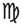 处女猫

从 8 月 23 日到 9 月 22 日

元素：土象（变动型）

主宰行星：水星

掌管的身体部位：腹部、侧腹、内脏、肠道

颜色：灰色

逻辑性强、多变、具直觉力

它的主宰行星：水星

水星对应于青春期，即探索的年龄。这个行星象征着思想、理性和智力。

受其影响的处女猫特别聪明，它拥有土象的、实事求是的智慧；而风象星座双子座的水星，能让其成为常保活跃、不断适应的高手。

身体或思想上的流动性，使水星人有所不同。在猫的语言中，这可能类似于能量、波长的移动。

它天生长袖善舞和忠实，需要沟通并和人类交流。闲暇之余也可以是喜剧演员。

这只猫同样是一个令人怜爱的沉思者，喜欢观察周围的世界。

在负面相位的影响下，它变得恐惧、狂躁、过度在意清洁或对食物吹毛求疵。

它的性格

处女座是一个土象、秩序、睿智和纯净的星座。这个星座的猫咪很平易近人，只要尊重某些基本规则：在持久不变的习惯循环规范之下，维持良好的猫砂盆清洁和生活卫生。

谨慎又相当内向的它们，却好奇心十足，这使它对世界上最意料不到的领域感兴趣。它的分析能力、有条理的思维，使它容易经历各种经验。

处女座的星座与第六宫是相对应的位置，后者是管理——尤其是那些比自己低微的对象，它倾向于保护最弱者：那些迷失或误入歧途者。

优点

处女猫是忠诚尽责的保护者。它可以付出奉献直到牺牲，因为它对主人的忠诚是无止尽的。此外，处女猫是精确的典范，因为当它要做一件事，便会做到尽善尽美。

缺点

过度龟毛。处女猫执迷于秩序和整洁。它有满满的怪癖和习惯。毫厘之差便能让它浑身不对劲：只要一个反常态、稍脏的猫砂或餐碗就够了。

它的气质类型：神经质

神经质者是敏感的、易受影响与易怒的。情绪化的它需要保护自己，避免受到他人伤害；天性杞人忧天的它可以毫无预警地突然失去冷静，也可能忽然表现得呆若木鸡或猜疑。

处女猫相当纤细——甚至是孱弱，精神紧绷。虽然看似脆弱，但却意志坚定且吃苦耐劳。它活动敏捷，带着凌乱的步伐；它的眼神时而忧心忡忡，富有表达力。事实上，它很难适应新奇事物。

它的外貌

处女座对应于男性十八至二十岁的年纪。处女猫较瘦长，有时体型偏小。头型硕大，身材纤细，甚至削瘦。

它的社交能力

• 处女座雄猫：这是个柔情似水的家伙，但不一定会表现出来。虽然它很抑制感情的流露，但当与主人（或其他人）交流时会变得非常大方，因为交流对它来说是必需的。

• 处女座雌猫：它敏感而忠心耿耿，也极度需要分享与交流。它有自己的一套逻辑，并且懂得如何让它被理解。

• 处女座小猫：它大胆鲁莽，也许有些过头了。与其妨碍它体验，不如在它冲动时陪伴在侧。

• 面对访客：假如他们不是过于聒噪以及待得太久，处女猫能容忍他们。经过长时间的观察后，它会小心翼翼地接近，而不让自己被抚摸。

• 和孩童相处：按理来说，他们对它来说过于好动了。然而，当一只小猫和一个孩童一起长大，他们之间的友谊将会长存。

十度区间

• 第一个十度区间（8 月 23 日至 9 月 1 日），由太阳守护：直觉灵敏、敏感。为了对话和交流，它会彰显自身的存在感，并强加见解于他人身上。

• 第二个十度区间（9 月 2 日至 13 日），由金星守护：天性矜持，这区间的处女猫才华洋溢，在实验和探索之中表达自己。

• 第三个十度区间（9 月 14 日至 22 日），由水星守护：良好的分析能力和奉献精神是它的特色。

它的健康

处女座与腹部、内脏和肠道有关。即使它们的体格较低于平均值，但脚却十分结实，虽然外表看不出来。处女猫容易出现消化功能的疾病，需注意是否定期排便。由于它容易因情绪影响积累成疾，因此每个小伤口的治疗务必要毫不拖延，以免恶化扩大。最后一点，这只紧张内向的猫容易染上皮肤病和过敏。

它的迁移性

尽管处女猫是好奇宝宝，但它不爱移动。因此，迁移必须分阶段进行：为它戴上项圈、让它习惯，向它介绍旅行包等。然而，在重要的日子里或许得施展小心计，以出其不意的方式逮住它，否则出发时间可能没完没了地延宕下去。尤其是因为它紧张的性格，要完成这项任务并非易事。遇到搬家的时候，它需要一些时间来适应。

它的友谊、爱情、亲密关系和点头之交

• 谁适合当处女猫的主人？

最理想的主人是和它一样同为土象星座的金牛座或是摩羯座。爱宅在家的金牛座维持令处女猫安心的节奏；跟忠实的摩羯主人在一起亦然，他会尊重它的习惯和约束力，好让这只动物安心。

相反地，它们与牡羊座主人相处较不融洽。这个精力充沛的主人，可能会使恬静的处女猫感觉七上八下。

对于需要主人有固定习惯的处女猫来说，双子座太天马行空了。

跟金牛座一样恋家的巨蟹座，待在这样的主人身边，这段情投意合的关系，让猫咪在甜蜜的家中发出响亮的呼噜声。

与狮子座主人的相处带着一些紧张与害怕。但是，假若他不要太过刺激猫科动物敏感神经的话，某些人（动物）也许喜欢这种小打小闹的爱情。

两个处女座的关系得以维系。前提是这位患有忧郁症的主人，没有让他的猫变得无病呻吟……

天秤座主人和处女座猫的关系如胶似漆，只希望其中一方没有过强的占有欲。

与天蝎座主人相处，害羞的处女座可能会对这个时而古怪的人类感到不自在。

跟射手座主人的配对同样不理想。射手座的好奇心引起处女座的冷眼相待。他们之间的行星排列并不相合。

在宝瓶座主人身边的话，这段关系将非比寻常，但并非不可能，尽管他们的天性大相径庭：一方寻找自由，另一方要求安稳。不过当有股魔力的时候嘛……

与对分向的双鱼座主人之间有强大吸引力。任劳任怨的服务可以成就幸福。只要双鱼座的一派轻松和无忧无虑，没有干扰刻板的处女座。

• 爱情归宿

处女座–牡羊座：只需牡羊座有无限柔情。

处女座–金牛座：白马王子遇到梦寐以求的公主。生出一窝迷人的小猫。

处女座–双子座：对讲究的处女座来说，双子座太不拘小节了。

处女座–巨蟹座：伴随温柔与幸福。

处女座–狮子座：基于义务的结合繁衍。

处女座–处女座：它们的羞怯可能搞砸一切。

处女座–天秤座：契合的伴侣，顺利产下小猫。

处女座–天蝎座：即使是双方出于牺牲奉献的心态，也不建议这组配对。

处女座–射手座：毫无吸引力，没有看对眼的机会。

处女座–摩羯座：全然地依恋共组的家庭。

处女座–宝瓶座：如果处女座不表现得杞人忧天，可以谈场短暂的恋曲。

处女座–双鱼座：长久圆满的和谐关系。

星座猫的云上狂想

两座山峰之间，横亘着一座坚固的木桥。有如草食恐龙嵴背一样的锯齿状山峰上方，流淌着一团焦糖奶油。不可能？不，在缥缈云雾之中，没有实现不了的事。

• 它的绵软王座：在一片扁平且不太高的小云朵上，有一个代表中性和缺乏激情的灰色或是银色软埝。它舒适地窝着，聆听它的大众音乐播放清单，并播放着阿尔及利亚裔的歌手瑞奇．塔哈（Rachid Taha）专辑。当有人敲敲它的云朵之门时，它看见一只逗趣的大耳猫现身，后者自称是犹太长老的灵猫注 16（Le chat du rabbin），真名印和田（Imhotep）。印和田向它描述自己的生活，并和它谈论所有宗教的信仰。为转移注意力，处女猫放了瑞奇．塔哈翻唱的［摇滚吧卡斯巴］（Rock the Casbah）并把音量调高，印和田非常喜欢。更重要的是……当它聆听的时候，我们再也听不到它讲话了。

相关品种：欧洲猫

其纯朴、活跃的性格和作为宠物的优良品质，令人联想到处女座的象征。而且它是受法国民间欢迎的雨沟猫（chat de gouttière）表亲（雨沟猫没有血统，而欧洲猫则记载于 LOOF 猫科血统官方证明书中注 17）。这只猫有银灰（处女座的颜色）和黑色虎纹，有时眼睛是绿色的，鼻子偏红色而不是粉红色。身材非常结实。

穿靴子的猫注 18——水星型的骗徒

当磨坊主人去世时，他的三个儿子中排行最小的一个，得知他只继承了“一只猫”。他的大哥得到了磨坊，而他的二哥继承了驴子，他失望地心想：“当我把猫肉吃完，再拿它的皮毛做成暖袖套，最后我就等着饿死。”

但他并不知道，这只猫拥有处女座水星的机敏和灵光一闪的智慧。猫请求他在把它扔进锅里之前先稍待片刻，并为它找一双适合他的靴子，这样它就可以把计划付诸实行……特别是打理好他的家务事。就像《丛林奇谭》（The Jungle Book）中的蟒蛇卡奥（Kaa），猫对他使出“相信我吧”的伎俩。虽然他看不出它到底要做什么，他也能明白这只猫是一个机敏干练的密探、一个优秀的老鼠猎手。所以他接受了交易，并给它一双靴子。猫再也靴不离身了！有了这项武器，它就可以加倍施展捕捉兔子和野兔的诡计。它的狩猎成绩如此出色，以至于决定代表卡拉巴斯侯爵——这是它赋予自己小主人的新名字，将部分战利品献给国王。

国王很欣赏这位高贵仆人的行为。自此，穿靴子的猫就不断向国王进献礼物、鹧鸪和野味，这些礼物总是来自卡拉巴斯侯爵。一旦创建起信任并获得国王的友谊，它便耍弄手段，让大家相信侯爵是一位富有的男子……经过诸多转折，小儿子最后娶了国王的女儿，真正地晋身上流。

这篇由文艺复兴意大利作家乔瓦尼．弗朗切斯科．斯特拉帕罗拉（Giovanni Francesco Straparola）书写，再由夏尔．佩罗发扬光大的寓言，是一个透过诡计、谎言和“欺骗”来达成目的的猫咪故事！而且穿靴子的猫还凭借超乎水准的智力（即使对于一个猫科动物来说也是如此），既救了自己一条小命，又让它的主人成为富翁。

 天秤猫

从 9 月 23 日到 10 月 22 日

元素：风象（创始型）

主宰行星：金星

掌管的身体部位：肾脏和膀胱。

颜色：粉红色

平衡、爱美、迷人。

它的主宰行星：金星

已经主宰金牛座的金星，也统御着天秤座。这个爱的行星，它赋予你的朋友天秤座优雅与美丽、平衡与和谐——就像金牛座一样。外型上，它气宇轩昂。嗯，它很有自觉。

金星是艾芙洛黛蒂，象征女性气质（有如猫一般的虚情假意？）、青春和情感的觉醒。这就是为什么主人和动物的初次会面显得特别重要，因为当天秤猫将自己献给主人时，就是一辈子。

如果因不得以的形势所逼而更换主人，对于这个情感丰富的动物来说，将是特别难以克服的磨难。再说，谁也没把握它真的能适应得了一个新的人类。

金星猫天生就非常风度翩翩，这种礼貌的鲜明表现是平衡的特征。这只超级感性的猫，连脚掌都无比妖娆。它也是一只非常肉欲的猫，有严重、强烈的触碰需求。

如果它的金星“遭遇负面相位”，它就会变得难以控制和容易猫爪相向。

它的性格

一如天秤座所象征的两个秤，天秤猫在和谐与平衡之中茁壮成长。这是精致、衡量标准的符号。此猫是浪漫、温柔的，它只喜欢惬意和轻松。与它的主人或家人在一起，天秤猫只求创建一个可以持续一辈子的完美平衡。这是它最深沉的需要。在和平与和谐中被喜欢、被爱和被钦佩。最重要的是，一旦找到并创建起这个平衡，就不能被破坏。

善于交际，天秤猫适应身旁环境中的一切：总是被环绕、呵护与安抚。它在本质上相当女性化，总是想取悦他人。如果有时它表现出犹豫不决的样子，那纯粹是出于想要体贴入微的心。

优点

性情活泼。天秤猫讨人喜欢且长袖善舞，热情而随和。它喜欢节日的气氛、游戏和娱乐。除此之外，要是我们也敬重它的话就更好了。

缺点

懒散，它讨厌努力。即使天生的魅力为它提供了某些保障，天秤猫在它迷人的小脑袋瓜里肯定想像一切的根本都归功于它。宁愿生闷气，也不愿付出丝毫的努力。

它的气质类型：多血–淋巴质

多血质主要受到呼吸系统的影响；淋巴质则主要受消化器官影响。多血–淋巴气质型的猫是个贪吃鬼、容易入睡。它直觉能力强，总是受到感性的征服而非理性地采取行动。此外，缺乏攻击性可能使它容易成为猎物。感兴趣的是爱情。对它来说，爱着它的主人、觉得自己被爱是不可或缺的“一切”。它有双睁得大大的眼睛，一个宽大的鼻子（有时是短鼻）和抖动的鼻翼，以及有力、粗壮的脖子。

它的外貌

以任何品种、任何身形的义来说，它都属于中等身材：天秤猫总是比例匀称，是秾纤合度的小个子。

它的社交能力

• 天秤座雄猫：是典型的宠物猫。它爱家而迷人，试图以大量深情表现来取悦每个人。喜欢得到认可，甚至想成为唯一受瞩目的焦点，就像它的狮子座好友。

• 天秤座雌猫：是一只具有诱惑力的猫。必须要爱抚它、疼爱它，周而复始。它可能变成家中的黏人精。天秤座雌猫永远不会明白，为什么我们除了照顾它这小家伙之外，总还有其他事情要做。除了本小姐之外，还会有什么事呢？

• 天秤座小猫：它是一颗温柔的毛球，从年幼的时候，就已经慷慨地对你灌注无孔不入的深情。但是它太可爱了！对争吵毫无兴趣。它需要一个领导者加以训练并随之起舞。它的谈判到最后老是以妥协作结，而不是亲上火线——因为还有别的要紧事等着它处理。

• 面对访客：它是一个小外交官，懂得诱哄最糟的麻烦制造者。和它在一起，轻松的氛围和搂搂抱抱的场面是少不了的……没人抗拒得了它。一切都以符合分寸以及温和的方式进行。

• 和孩童相处：它不怎么热爱小孩。这些吵闹的家伙可能会把它的毛皮弄乱。但是，由于随和的天性，它对他们保持温柔。但不能靠得太近或时间太长。

十度区间

• 第一个十度区间（9 月 23 日至 10 月 2 日），由月亮守护：这类天秤座猫懂得脱颖而出。它需要各种活动，并且对变化很敏感。

• 第二个十度区间（10 月 3 日至 13 日），由土星守护：第二个十度区间的猫在社群中如鱼得水，在团体中创建起权威。

• 第三个十度区间（10 月 14 日至 22 日），由水星守护：它充满自信并散发出生活的喜悦；相反地，它讨厌孤独和孤立。

它的健康

天秤座与肾脏和膀胱有关。在它身上很常发生泌尿系统疾病、肾功能衰竭（发生于高龄猫身上）。此外，必须从小让它习惯饮水。如果你是替代医学的拥护者，它特别能承受这种治疗法。对温度的骤变也相当敏感，温带气候是最适合它的气候。

它的迁移性

它需要被说服，或是抱着满腹狐疑……只要它的主人在它的身边，天秤猫可以忍受踏出家门。如果你不得不离开它几个小时——或几日，它会茫然不已并且非常痛苦。因为它不但不喜欢旅行，而且讨厌孤伶伶或被隔绝在笼子里。

它的友谊、爱情、亲密关系和点头之交

• 谁适合当天秤猫的主人？

天蝎座或射手座主人的家，会是这只细腻猫科动物的理想选择。与天蝎座的相遇将是天雷勾动地火、充满吸引力而如梦似幻；和射手座主人之间的吸引力也是一触即发，他对它展现全然的保护欲，持续终生。此外，射手座主人懂得营造出在茁壮成长中极为需要的、理所当然的舒适感。

它的对宫星座——阳刚的火星牡羊座，能够与脆弱的金星天秤座交流。最好空间够大，这样牡羊座的火爆就不会把敏感的天秤猫搞得七荤八素；和一位金牛座主人在一起时，在两个星座占据重要位置、代表爱情的金星，将感到欢欣雀跃。只不过，金牛座必须尊重天秤座的秘密领域，而不是试图侵犯它。

跟双子座主人相处的气氛无比高涨，他们合得来又意气相投。

在占有欲太强的巨蟹座主人身边，天秤猫会窒息。它需要受人钦佩，因此要保持（相对的）距离；相反地，它在狮子座的主人身上能得到此一满足，他懂得它的眉角，甚至投其所好。因此在这段狂热的爱情中，天秤座会想方设法，让自己从头到脚地被爱、赞赏与渴望！

处女座将被这个魅惑的金星迷倒。猫科动物乐于被献殷勤——有点过头也无妨。

天秤座女主人和同星座的雄猫有可能和睦相处。但相反的组合就不太理想。

嫉妒可以摧毁一切。过于粗鲁、直白的摩羯座，不适合这只娇滴滴和虚无飘渺的猫，哪管释出的善意显而易见也一样。

宝瓶座人类会知道如何安抚他的野兽，而且，他还是带头捣乱的那一位。喔耶！

一只小巧、开朗与活泼的天秤猫，对双鱼座主人来说非常有帮助。前者沮丧、后者抚慰。各有强项。

• 爱情归宿

天秤座–牡羊座：完全的分歧，或是剑拔弩张的爱情。

天秤座–金牛座：迅速燃烧的大火。

天秤座–双子座：出于本能的征服，但双方的反复无常令人害怕。

天秤座–巨蟹座：紧迫盯人的殷勤攻势，很难保证开花结果。

天秤座–狮子座：盲目的爱情，多子多孙。

天秤座–处女座：互补的爱情，融洽的结果。

天秤座–天秤座：可以短暂的同居。

天秤座–天蝎座：令人担忧的糟糕开端，但后续的故事刻骨铭心。

天秤座–射手座：显而易见的好感，长久的和睦相处。

天秤座–摩羯座：平淡的柏拉图式爱情。

天秤座–宝瓶座：友谊般的爱情，最美好的部分在后头。

天秤座–双鱼座：如果双鱼座的抑郁不让敏感的天秤座气馁的话……

星座猫的云上狂想

一片荡着秋千的云朵，你相信吗？不信？那好啊！因为在云端的国度，没有一件事物不会“如此般”地发生！一些我们会不可置信的事！

• 它的绵软王座：在形状最匀称的云朵上有一个粉红色软埝，是与金星有关、安祥死亡（或是因爱情致死）的颜色。玫瑰，一如其名的花，依附于爱情。这种情欲的颜色归因于天秤座，犹如理想女性、天上仙女的象征。这也没什么啦！天秤猫和舒蓓特（Choupette）是闺蜜，后者曾经是卡尔．拉格斐（Karl Lagerfeld）的宝贝“缪斯”明星猫。它跟舒蓓特介绍了许多很棒的爵士经典老歌：“你知道比莉．哈乐黛（Billie Holiday）的［暴风雨天气）（Stormy Weather）吗，舒蓓特？”嗯，就是一些女孩的玩意儿……

相关品种：暹罗猫

相传暹罗猫的斗鸡眼，源于它在暹罗国王宫廷的身分，它是皇家宝藏的守卫。暹罗猫并没有对它的工作掉以轻心，它们如此勤奋地盯着宝物看，以致它变得斜视；另一则传说讲述暹罗猫的尾巴之所以会打结或断裂，是因为皇家公主将戒指挂在尾巴上，以避免丢失并保护戒指免受小偷的侵害。

维纳斯美人——美女小姐

要代表天秤座的话，就得有外貌、女性气质，又美到炸！一袭洁净皮毛的金星猫，有着不可抗拒的魅力和维纳斯的优雅。这个概念的缪斯，再次来自卡尔．拉格斐的雌性继承者舒蓓特，但可惜对于这个关于文学名猫的专文来说，舒蓓特太过时尚了。

不管怎么样，美女小姐（Beauty）都恰如其分。奥诺雷．德．巴尔札克注 19（Honoré de Balzac）的短篇小说《一只英国猫的苦恋》注 20（Peines de coeur d’une chatte anglaise）中的女主角打从一出生，就因它的与众不同和美丽而脱颖而出：它洁白无瑕的皮裘，使它免于与同窝兄弟姐妹一起溺毙。美女小姐被一位在乡下的新教老处女抚养长大，它必须隐藏一切天生的习性，在维多利亚时代教育的严格规范和铁则之下，望穿秋水等着黎明的到来。女主人的侄女阿拉贝尔（Arabelle）受到它的魅力吸引，决定带它去伦敦。小猫说，这就是美好生活的开端。很快，一位阿拉贝尔的追求者、年迈的贵族，为了成婚，提议把他尊爵不凡的安哥拉猫赐给美女小姐。说完就马上招来了帕夫（Puff），这只肥嘟嘟的公猫，已经上了年纪，冷酷傲娇，却又如此俊美而受到英国女王的宠爱。事实摆在眼前，美女小姐找不到更匹配的对象了。某天晚上，当未婚妻的猫咪们跑出去聆听一只灰猫演讲时，猫族集会中出现了布理斯凯（Brisquet）——一只法国公猫浪荡子，一只像无赖一样、喜欢嘲弄的圣像破坏者。它爱挑逗的天性，一瞬间引起这个拘谨、守序的礼教阶层一阵骚乱。对于异想天开的美女小姐而言，这就是“那道”出口！她立即冲进这个出口中，臣服在潇洒不羁的拉丁魅力之下，梦想与法国猫一起在雨水沟上，进行美妙的鱼水之欢。布理斯凯打开了它的眼界，唤醒它采取行动，要不它本该陪伴阴郁而矫揉造作的帕夫，在它的日常生活中日益憔悴地度过余生。

不幸的是，帕夫的侄子帕克（Puck）某天碰见了法国猫。爱吹牛皮又自负的布理斯凯，为自己引起美女小姐的注意而洋洋得意……自此之后，阴险的帕夫就对它紧迫盯人。而在邪恶侄子帕克的圈套之下，这一对准情人在屋顶上被活活逮个正着。这位浪漫多情的美女小姐，梦想着与这位“靴猫的直系后裔”共度一生，对它而言，未来将是悲惨的；而对于布理斯凯来说，它的死期到了。

在这篇小说中，据说是巴尔扎克把自己和英国伯爵夫人奎多波妮．维斯康堤（Guidoboni-Visconti）的秘密恋情搬上舞台，作者描绘并嘲弄英国社会的迂腐和虚伪：指其披着“圣徒的美德”、“来自最幽深的谜团”。这部动物的喜剧和他的《人间喜剧》（Comédie Humaine）相反，较为跳脱，其故事出自《动物的公共生活和私人生活场景》（Scènes de la vie publique et privée des animaux）一书，由葛兰维尔（Grandville）为本作品说计精美的插画。

这里迷人的美女小姐，代表了在维多利亚时代中，困于严峻和烦闷社会里的英国女性。顺从而不食人间烟火的美女小姐，跟随自己的心意，而它深沉的、金星般、敏感的、轻盈的、好奇的和艺术的天性——它对音乐特别感兴趣，指引它走上欢欣的道路，以及行动和思考的自由。但在“这个社会里”的那个时代，对女性来说，在生活露出微笑，是难以想像、也是绝对禁止的。

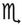 天蝎猫

从 10 月 23 日到 11 月 21 日

元素：水象（固定型）

主宰行星：火星、冥王星

掌管的身体部位：生殖器官、膀胱、肛门

颜色：茜红

秘密、愤怒、神秘

它的主宰行星：火星、冥王星

火星是能量之星，它赋予天蝎猫勇气、好奇心以及使它热爱运动。但这颗火星也象征一个以发酵和分解作为终结的自然循环。这种死亡又重生的分解过程，助长了某种攻击性和破坏性本能。

冥王星——深渊的象征和黑暗王子，激起天蝎猫对于藏匿之物、阴暗处和神秘的兴趣。

在这两个行星的影响下，小猫被赋予了无可抵抗的魅力，但它仍轻挑不羁，粉碎任何在它爪下的一切；尤其强大的冥王星能进一步加强它对破坏的兴趣。还有，记得从小坚定地反复灌输天蝎小猫不可超越极限。

它的性格

这是只古怪的猫。天蝎猫性格坚强，通常看起来与众不同。带有一股挡不了的迷人魅力，与它的主人或家人能以心电感应沟通。它需要真正的情感和思想上的交融才能茁壮成长。没有人理解天蝎猫的运作模式，这就是它的神秘之处。它可以一熘烟消失，躲在其中一个不可能的藏身处，而且只有它自己知晓，仿佛无所不在。此外，它的占有欲和嫉妒心强，如果觉得入侵者占据过多空间，会磨爪霍霍、怒气相向。一边准备复仇、一边伺机而动。然后，继续进行下一回合……

这种高度敏感的猫喜欢舒适的氛围，这有利于它在心灵感应层面的天赋。

在负面相位的影响下，它会变成施虐者，对他人的耳提面命都大唱反调；在卫生方面，也会恶化。

优点

灵媒体质。天蝎猫能感觉可视和不可视的一切。如果能将此优点分享给有狂热信仰的主人，它将是交流惊人体验的最佳媒介；如果它的主人对这些玄秘之事无动于衷，他会很难掌握这只古怪而出人意料的动物。

缺点

极强的占有欲、嫉妒心以及过于敏感。它实在厌恶被踩在脚下，可以的话，请试着谈判和妥协，但要表现得温柔。如果天蝎猫被冒犯，你将会尝到它的反抗，还有可怕的复仇！至于它的嫉妒嘛……

它的气质类型：胆汁质

胆汁质“肌肉型”的猫咪有着肌肉发达的体格，散发出某种活力。这是一只强壮的猫。虽然身形娇小，却流露出强大的力量。它的目光笔直而锐利。这只猫大爷不喜欢受到任何阻挠（玩具或门），遇到前述的情况，它会没耐性地生起气来。这家伙很机灵。户外的生活可以抑制这个帮派老大／探险家／鼓动者，避免激发冲动和好斗的性情。它胃口佳又食量大。

它的外貌

天蝎猫虽然身形矮小，但体格健壮。它可能有双弓形腿，但肌肉发达。

它的社交能力

• 天蝎座雄猫：它能感应众生万物。这只猫有灵敏的嗅觉和直觉力。假如它偶有惊人之举，是因为本能地嗅到或“察觉”到某种东西，驱使它做出如此反应。可以在眨眼间转换自己的情绪。

• 天蝎座雌猫：占有欲强且固执己见，天蝎座雌猫不与任何人分享它的主人，它像一只守护小鸡的母鸡般深情地注视着他。它会接纳他，讲故事给主人听。它无法忍受竞争，或是主人对它这个毛茸茸的标致猫儿失去兴趣。

• 天蝎座小猫：它是如此可爱，又对一切事物极有天份！它的主人终有一天会相信自己真有一只神童猫。确实如此……这个小天才擅长学习生活上的技能。天蝎座小猫在条件许可的情况下，会特别喜爱户外运动。

• 面对访客：一眼定生死，不是一见锺情就是奔去避难处。拐弯抹角那一套天蝎猫做不来，当事人马上就会知道结果了。它会视其需要，画下足够的警戒线。

• 和孩童相处：如果想促成一定得付出努力……又如果他们去找它的情况下，才有机会。因为天蝎猫并不会先踏出友谊的第一步，不是吗？而且，说实在话，它对此事毫无意见。

十度区间

• 第一个十度区间（10 月 23 日至 11 月 2 日），由火星守护：第一个十度区间度的猫特别有反抗力、好胜心强，甚至爱争吵。

• 第二个十度区间（11 月 3 日至 11 日），由太阳和天王星守护：在这个区间出生的猫咪绝不妥协和排他，和这只天蝎猫在任何情感上的竞争都很难应付。

• 第三个十度区间（11 月 12 日至 21 日），由金星守护：深情而情感外放，这只天蝎猫的情绪非常强烈，孤独对它而言是痛苦的事。

它的健康

天蝎座与腹部、生殖器官、膀胱和肛门有关。它容易罹患和这些身体部位相关的所有疾病。由于心血管较为脆弱，必须留意它的体重，以免超过正常标准。

它的迁移性

天蝎猫的天性好奇，任何会动的事物都会引起它的兴趣。那么为何不来一场小旅行呢？它不会感到无聊的。无论是透过窗户观看鸟群，还是看着田野里的母牛，一切都令它着迷。再说，在整个行程中，它看起来都很忙碌的样子。

它的友谊、爱情、亲密关系和点头之交

• 谁适合当天蝎猫的主人？

天蝎猫与同是水象星座的主人——巨蟹座或双鱼座相处得特别融洽。天蝎座奇妙的宇宙世界，与富有想像力的双鱼座或梦幻的巨蟹座能产生共鸣。对于这一对跳脱常规和“窝居高处”的动物跟人类来说，这样的链接能创造出一种独特的氛围。

和牡羊座主人的相处如履薄冰，对这只高敏感的猫儿而言，前者的性格太野蛮也太冲动了。

与它的对向星座——金牛座主人的关系没有灰色地带：不是大好就大坏。

双子座主人带给它的风暴过于强烈。前者坐立难安，而天蝎猫如老僧入定。他们不在同个水平线上。

尽管有爆发性的好感，但是和狮子座主人的同居关系却有点棘手。狮子座喜欢光亮、太阳，而天蝎猫喜欢黑夜的神秘，除非跟它一样是作息与群星一般的狮子座。

处女座也不理想。这位内敛的主人，将无法安抚忧心忡忡的天蝎猫。

强大的链接将天秤座和天蝎座凝聚在一起。他们默契十足，各自被对方不可抗拒的魅力所征服。还有他们都说着相同的喵星语。

天蝎座主人和同星座的动物之间，一样有着如胶似漆的契合感，只有其中一方的嫉妒才会打破这种美好的平衡。

快乐、随和的射手座人类，和这只黑暗、焦虑不安的动物，只要在光线保持柔和的气氛底下，就会非常气味相投。

冷静的摩羯座、冬季型的人类，舒缓了天蝎座紧张的情绪。

和宝瓶座的组合值得一试。前者喜欢精确科学，天蝎座则是神秘学。谁会胜出呢？

• 爱情归宿

天蝎座–牡羊座：相互尊重，但不确定是否彼此吸引。

天蝎座–金牛座：互补的敏感性，性趣相合。

天蝎座–双子座：经过开头艰苦的耕耘后，能顺利的产下小猫。

天蝎座–巨蟹座：自然而然的吸引力，记得佈置好抚育小猫的空间。

天蝎座–狮子座：一切取决于准新郎、新娘的心情。

天蝎座–处女座：胆怯、紧张、难以接近，一切迹象都显得复杂。

天蝎座–天秤座：爱与魅惑的游戏。提前分出胜负的比赛。

天蝎座–天蝎座：在情爱或恨意之中互相吸引。繁育小猫指日可待。

天蝎座–射手座：充满神秘和考古般的爱情关系，在昏暗中孕育出一窝美丽猫孩。

天蝎座–摩羯座：平静、安详、少有感官层面的享乐，但肯定是惺惺相惜的伴侣。

天蝎座–宝瓶座：古怪的姻缘。尽管如此，这个谜团还是让它们像触须掉了般地失去理智。

天蝎座–双鱼座：疯狂享受肉体关系，神奇地孕育出小猫。

星座猫的云上狂想

它从阴影中走出，在紫红的夜色里，听着云朵用只有它们懂的语言闲聊，这些最甜美的字句，是朝向它们攀升而去的电梯钥匙。

• 它的绵软王座：它在圣修伯里（Saint-Exupéry）经过的天空中，闇夜飞行。在一片非常低、部分被层积云注 21（stratocumulus）掩盖的层云注 22（stratus）上，放置着一个深红色的天鹅绒软埝——这是杀手的象征色，传说中，他们是浴血而生的，这也是天蝎猫这只磨人精的代表色。必须说，在中世纪，人们指控它具有夜视能力，参加了巫魔夜会（sabbat）！而且，据称那里的女巫都变成了猫……撒旦又降临了！幸好，天蝎猫有七条命，能在社群和同类里创建它真实的身份！

为了这放纵的夜晚，天蝎猫邀请了贾不妙（Gargamel）的大笨猫（Azrael），它特意从蓝色小精灵村庄前来；还有从劳伯况（Robert Crumb）漫画书里头蹦跳出的怪猫菲力兹（Fritz le chat），为它们介绍地下文化、属于另类摇滚的颓废摇滚（Grunge）。此外，它们正在听超脱乐团（Nirvana）的［仿佛年轻朝气］（Smells Like Teen Spirit）。根据最新的天气预报，似乎所有人都喜欢这首歌。

相关品种：孟买猫

这只有着一袭乌黑皮毛的艳丽猫咪，在同类中简直独一无二。孟买猫由美国的育种专家妮基．霍纳（Nikky Horner）在一九五〇年代后期培育出来。

她着迷于孟买黑豹的美丽，想以它的形象创造一只猫。妮基．霍纳先将一只缅甸猫（黑貂猫）与一只美国黑色短毛猫杂交，但结果无法令人信服。要等到她让一只缅甸冠军猫和美国黑色短毛猫之间的再次杂交，并生下二十七窝小猫之后，才培育出她的居家型黑豹。

黑猫——当火星撼动了冥王星（或是邪恶力量和恶之华）

“啊！愿上帝保佑我，把我从恶魔的手中拯救出来吧！”被蛊惑、被邪的力量推动的主角说……

《黑猫》注 23（The Black Cat）一书是埃德加．爱伦．坡（Edgar Allan Poe）的奇幻小说，法文版由夏尔．波特莱尔翻译，整本书幽暗而冷酷无情。然而，一切的开端却如此美好。叙事者，姑且称他为先生，是一个心地善良的好青年，娶了一个和他性情一致的女人，喜欢动物。他们的家中物品琳琅满目，直到一只猫的到来——一只聪明睿智的华丽黑猫，命名为普鲁托注 24（Pluto）。迷信的女主人后悔这个选择，因为她认为黑猫是女巫的化身……普鲁托憎恶女主人，但完全爱上了男主人，总是以猫爪和鼻子黏着他不放。随着时间流逝，先生变成了酒鬼，对所有人都嫌恶不已——无论是人类或动物。在幻觉的控制下，他对昨日还喜爱的这只可怜野兽，施予残忍的虐待。在精神错乱的时候，他残害它的身体；并在另一次的疯狂之下把它吊死。当天晚上，报复从天而降：他的房子陷入火海，虽然他和妻子勉强逃脱，但他的房屋和财产都付之一炬。

然而，先生拒绝将他的虐猫行迳与房屋的崩坏跟黑暗力量扯上关系，即使他发现房子里仍然矗立的最后一个隔墙上，刻着属于这只猫的印记——那条吊在脖子上的绳索。没多久，他以几乎一模一样的第二只黑猫取而代之，但与普鲁托不同之处在于它喜爱女主人，而先生感到嫉妒。接着，先生再度对它感到厌恶，女主人牺牲自己，从她丈夫——这位再度变成充满恨意和报复心的杀手手中解救了它。而他的自我吹嘘，最终让成为怪物的自己走向灭亡。

这个故事（还有这只猫）完全符合天蝎特质，也让我们迷失在冥王（不是指主角猫，而是行星）地底下的黑暗世界。我们被这个饱受折磨的主角所引导，他在瘾头的控制下与魔鬼达成协议，变成了可怕的海德先生注 25。受到仇恨和毁灭冲动的驱使下，他跨越了界限，把不满宣泄出来，并没有丝毫的悔恨。自此，他深信自己所向无敌，任何事都阻止不了他。

叙述者，这个阴郁的男人，把我们拽往人类灵魂的深处，一切都受破坏性的冲动和恶毒的本能所支配，强行施加他的法律、对所有人采取恐怖的手段。在人与恶梦短暂相会、奇妙而可怕的世界里，这个故事对于深陷恶魔手中的人来说，是多么残酷。

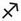 射手猫

从 11 月 22 日到 12 月 20 日

元素：火象（变动型）

主宰行星：木星

掌管的身体部位：后肢（臀部、大腿、脚、坐骨神经）和肝脏

颜色：黄色

外向、乐观、有运动细胞、独立

它的主宰行星：木星

木星掌管膨胀和扩散。这个行星代表慷慨和权威人士，对应成熟与壮年期、正义与幸运。在它的助力之下，你的射手座朋友遇到的任何困难，都会迎刃而解。

这是位探险家、爱好运动者或真正的运动家，在它最喜欢的运动“赛跑”项目中也是个小冠军；还个非常敏捷的猎人（为它不幸的猎物默哀）。

木星型的猫需要扩张、光荣和扩大领土。因为它最喜欢的是空间、自由跟“他方”，还有疯狂地活蹦乱跳。

它的使命也是传播、引导和灌输理念；相对地，雌猫不会加以教育它的小猫，但会做好份内的“工作”。

木星型的猫乐观而自信，它享受一切事物。在小时候会很贪吃。

当行星处于坏兆时，木星猫会出现倒退行为，在所有糟糕的层面都变得毫无节制。

它的性格

外向的射手，因他人给予的任何一点关心感到满足。它平易近人，容易融入和适应。一下子就能赢得一切事物：新房子、新主人或新成员的心——并将他们纳入自已的保护之下。射手猫也可能毫无预警地跑来你家，大摇大摆地进驻下来，建造自己的小窝，然后在美好的某一天，跟来时一样地消失得无影无踪。这只友善的猫，对猫食的品质非常敏感，会突然决定去其他地方寻觅更美味的食物。它就是这样：自动自发和具冒险精神。而当射手猫做出决定时，什么也阻挡不了它。

优点

友善、随和、外向。射手猫是一个令人非常愉快的伴侣，能适应一切，甚至是其他物种的新成员，例如狗、鹦鹉，或是浣熊——有何不可呢？

缺点

在负面相位的影响之下，射手猫会时常离家出走、顺手牵羊。它不再听命于任何人，且也不清楚当下的自己究竟想要和想做什么。

它的气质类型：多血质

多血质的猫——与双子座和宝瓶座一样，讨喜、友善、热情好客、自信……而且贪吃。它生性独立，像个快乐的单身贵族般生活。多血质需要新鲜空气：出去透风、移动与改变……它同样天生就具有当猫帮老大的潜质。这是个靠本能而冲动行事的家伙，不愿付出长期的努力。

它的外貌

射手猫的体型略高于平均值，有运动家的体格，口部较长而不圆润、鼻子长且目光炯炯有神。

它的社交能力

• 射手座雄猫：非常恋（当下的）家。它爱好运动、性格独立。但很需要出门透气，当它感到窒息时，会悄悄地熘走，看看外面的世界是不是比较精彩。不过，由于它很注重自己的舒适度，所以就算是出去闲晃，也不会离家太久。

• 射手座雌猫：外表自信骄傲、举止优雅。它开朗活泼，但同样可以对自己的孩子们表现得专制——以正确地教育它们“基本知识”为荣；不过若是它认为已经教得差不多的时候，便马上失去兴趣。

• 射手座小猫：冲动又胆大包天，喜欢比较、亲自较劲，最爱的游戏是打架。没错，要是你有一片空间或住在乡下的话，比较容易养育射手座小猫。这只外向的小猫很容易与其他动物打交道，或者轻易地接受新朋友的到来。

• 面对访客：理论上，如果气氛让它满意的话，射手猫会努力取悦访客并参与欢庆的活动；否则的话，它会逃离吵闹的环境，没有什么改变得了它的心意。

• 和孩童相处：开朗的性格使它非常适应孩子的陪伴。即使意味着它得变成一只“保姆猫”——它喜爱陪伴在他们身边，胜过一切。

十度区间

• 第一个十度区间（11 月 22 日至 12 月 1 日），由水星守护：具有好奇心与博爱的特质，这类射手猫会给予爱或友谊来安慰他者。

• 第二个十度区间（12 月 2 日至 11 日），由月亮守护：它开朗大方，喜欢探索周围的世界。不过有可能变得暴饮暴食。

• 第三个十度区间（12 月 12 日至 20 日），由土星守护：天性严肃、力量受制。第三个十度区间的射手猫喜欢展现自己的才能。

它的健康

射手座与后腿和肝脏有关。

射手猫通常是一个大胃王，必须从小控制食量，并留意它的消化系统。不过，由于这只猫的运动能力佳，规律的运动可以消耗它摄取过多的热量和维持体态。

这只小猫喜欢做出滑稽动作，容易骨折，就像它的双子朋友一样。

它的迁移性

射手猫喜欢说走就走和长途旅行。之所以能够跋山涉水，找回自己的主人，那是因为它主动采取行动并决定好路线；相反地，要被关在篮子里，乘坐火车或汽车前往一个未知的目的地……这完全不是它的作风。跟其他同类一样，些微的镇静剂能帮助它度过这段难关。

它的友谊、爱情、亲密关系和点头之交

• 谁适合当射手猫的主人？

一位跟它同属火象星座的狮子座或牡羊座主人，会带给它满满幸福。面对这只喜爱运动的宠物猫，狮子座主人会尊重它的独立性；牡羊座则会为它安排一个畅通的空间，让这只健美运动猫可以尽情奔腾。

和金牛座主人在一起时，他们会一起分享对食物的喜好，但是这位太宅的主人可能会让它感到沉闷。

在双子座主人——它对宫的星座身边时，会显得非常志同道合，例如喜欢户外活动，以及洋溢着让他们自在相处的一股轻松氛围。

巨蟹座对它来说有点太爱家，即使相处的契合度和愉悦心情让他们走到了一起。

与天性焦虑的处女座主人相处时，射手座宠物会感到窒息或想远走高飞……或是不常回家。

相反地，与天秤座主人的关系情投意合，他们都很自动自发，玩一起非常开心。

尽管射手猫和天蝎座主人之间有某些分歧（一个喜欢白天、一个喜欢夜晚），但可以一起完成冒险。

爱好独立和不嫉妒的性格，促进了两个射手座的同居关系。他们相处融洽。

射手猫快乐而阳光般的存在，会照亮摩羯座柔和的小宇宙。

与宝瓶座的主人可以一起过着宁静的生活。其中一方对运动的爱好，吸引另一方探索的兴趣。

对于大剌剌的射手座而言，心思过于复杂的双鱼座主人难以接近。

• 爱情归宿

射手座–牡羊座：充满爱与机遇的一场游戏。胜负未定。

射手座–金牛座：令人喜悦和平静的一段爱情。

射手座–双子座：有电光石火般的吸引力，但是爱情急速退温。

射手座–巨蟹座：玩乐的伴侣，不太来电。

射手座–狮子座：走名流路线的恩爱互动，孕育优良血统的小猫。

射手座–处女座：带有禅意的爱情，它们经常共枕眠。

射手座–天秤座：性感和美丽的一对，可以期待生下迷人的小猫。

射手座–天蝎座：天蝎座的威吓性，让惶恐不安的射手座夹着尾巴逃难……

射手座–射手座：拥抱大自然和酷爱运动的一组恋人。子女完全是父母的翻版。

射手座–摩羯座：他们彼此相爱，白头偕老。

射手座–宝瓶座：前景看好，但不见得开花结果。

射手座–双鱼座：彼此许下天花乱坠的承诺。

星座猫的云上狂想

一个崭新的机会、一场全新的冒险来了！是谁在喷射猫干粮？一枚双排的火箭静待射手猫，准备以光速穿越雾幕，降落在云端上的幻想国度。

• 它的绵软王座：一把肩背的吉他，放在它黄色的软埝上——这个颜色代表花心、嫉妒和出轨，射手猫在随风吹拂的云朵上，表演着竞技牛仔。最后，它挑了一根像牛仔夹克上的流苏般延伸的细索，安顿下来。然后它取出肯尼．罗杰斯（Kenny Rogers）的《最佳精选》（Greatest hits）专辑——道地的乡村音乐。它将斯泰森（Stetson）牛仔帽微微向后戴，脖子上围着印花方巾（bandana），等待它的客人——“小不点注 26”（Chibi），这只“漂亮的小猫”（它的确有点大男人主义）。然后点播它偶像的一首流行歌曲给小不点听：［赌徒］（The Gambler）。

相关品种：挪威森林猫

这是一只体型庞大的猫，它中等长度的皮毛像地毯一样浓密，就像围着亨利四世典型的拉夫领注 27 一样。我们的美丽挪威森林猫源自于挪威，看起来充满野性而真实，它的繁衍没有受到人为介入，这很不简单！它在冬天能忍受的最低温是摄氏零下三十度；而在夏天的时候，它会为了呼吸而脱下一层皮裘，只保留尾巴上华丽的羽毛和猫爪的一簇毛。多迷人啊……

贝波——前往木星路途上的旅者

无庸置疑，总是穿着一身条纹的雨沟猫——路易－斐迪南．赛林注 28（Louis-Ferdinand Céline）的贝波（Bébert），既是文学角色，又很罕见地真实存在着，它是一只独一无二的猫。

首先，贝波的体型庞大、胃口也很大。至于它的智商，明显地高人一等。爱发牢骚，但也忠心耿耿。因为贝波很有个性，这只“蛊惑人心、靠电波传情”的猫，成为赛林的续任伴侣，后者现身在他的战后小说中。换句话说，贝波既是赛林作品里的角色、也是他生命里的真实存在，是文坛中名气最响亮的猫之一。

电影演员侯伯．勒．维岗（Robert Le Vigan）从莎玛丽丹百货（La Samaritaine）宠物部为他的爱人缇奴（Tinou）买了这只小猫，缇奴为它取名奇巴罗伊（Chibaroui）。两个恋人的关系时好时坏，奇巴罗伊或多或少适应了……它自食其力、来回穿梭在邻近蒙马特的吉哈东街（rue Giradon），赛林也住这条街上。维根和缇奴离异后，奇巴罗伊被抛下。赛林和他的妻子露赛特（Lucette Destouches）已经在这段艰难的日子里喂养它——收留这只雄猫，并为它取名为贝波，与小说《茫茫黑夜漫游》（Voyage au bout de la nuit）的巴黎病童角色同名。它的另一段旅程于焉展开。

一九四四年六月，德军战败。赛林收到了死亡恐吓信和小棺材。他和妻子、勒．维岗以及贝波一起逃离了首都，带着一些原始手稿离开吉哈东街的公寓，深信这将是场短暂的逃亡。但它持续了七年。这组人马首先前往巴登－巴登（Baden-Baden），接着是西格马林根（Sigmaringen），加入贝当（Pétain）与两千名维琪政府拥护者、民兵同行，他们在维琪法国（Régime de Vichy）垮台的疯狂中企图自保。赛林原本想去瑞士，后来在丹麦找到避难处。由于他不打算带上贝波，于是在出发的前一天，将它托付给了当地的杂货店老板。夜里，贝波撞破了一块窗户玻璃，重新加入它的主人们。问题解决，贝波被“装在一个打了洞的背包里”，和他们一同上路。在历经流放，回到法国默东（Meudon）后，它在年届十七岁时，安详地离世，赴往浩瀚无垠的世界。

这只身形高于平均、机灵、独立和具有好奇心的猫，是名副其实的木星型猫，鲜活地演绎出射手座的形象。贝波总是能自行找寻出路。例如，当勒．维岗和缇奴在家激烈争吵、没人想到要喂食饲料的时候，它还有同街区的蹭食口袋名单，像是善良的仙女露赛特。贝波是个“漫游者”。赛林如此介绍它：“贝波与众不同之处，在于喜爱闲逛、漫步。只要在晚上，当我们要跟它闲聊的时候，它就会跑去熘达。它是个夜游者。”对于赛林来说，在战争期间、这个四处面临死亡威胁的世界里，这只“游走城市的小猫”既代表孩童，也代表了纯真。

在赛林的作品中，贝波是他的揭示者，成为了他的替身，而且叙述者的想法总是跟他的猫很相近。懂得与动物创建沟通的赛林写下这句话：“动物是通往无垠世界的摆渡者……”

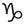 摩羯猫

从 12 月 21 日到 1 月 19 日

元素：土象（创始型）

主宰行星：土星

掌管的身体部位：膝盖、关节、毛发、皮肤

颜色：棕色

坚忍不拔、谨慎、忠诚、勇敢

它的主宰行星：土星

土星象征守恒的定律。这颗主宰摩羯座的行星，使此星座的猫十分顽强，能抵抗疼痛和疲劳。

土星的特点显现为两个相反的类型：一种是占有欲强到甚至会“排外”，极度敏感和喜好沉思；另一种则是超然度外、冷漠和行事低调。

土星型的小猫可能极度敏感、过度紧张和害怕。它是个跟屁虫，必须经过训练才会全力以赴。此外，如果付诸行动了，要庆贺与鼓励它的参与，好让土星小猫克服自己的优柔寡断和缺乏信心，这种与生俱来的不信任感可能会持续很久。

雌猫全心奉献于家庭和孩子。它会在路途中为了执行任务而磨损自己的利爪：拯救小孩，抑或收养遭遗弃的猫孩。真是女中豪杰！

它的性格

摩羯座象征着一位老人：这星座的猫咪依恋它的家，就如一棵橡树依附大地。特点是坚定不移的忠诚，对它来说，只有中意之人才重要。在陌生人眼里，这种情感上的排他性显得冷漠和疏远，这也是为什么摩羯座不信任初次见面的来者。但一旦感到安定，它便全然地卸下心防，把藏在这个距离感背后的热情动物样貌展现出来。

摩羯猫热爱大自然。理论上，乡村生活比城市更适合它，因为这只独立的动物需要离家几小时或几天，这是它静心沉思的时间；在城市里，它会很亲近你的植物。为了避免一再重演“植物屠杀”的戏码，请为它准备一块游戏用的“绿地”。

优点

执着与忠贞。摩羯猫的特色，在于经得起考验的爱，以及奉献精神和坚韧。就跟它良好的身体抵抗力一样，让摩羯猫最有可能成为“百岁猫瑞”之一。

缺点

无论是主人还是餐碗，摩羯猫都不爱分享。即使它的行事作风非常独立，仍会因为突然缺少情感上的专属权，或必须与同类共享生活空间而感到痛苦。

它的气质类型：神经质

摩羯猫和它的处女座朋友一样是神经质型。神经质型主要受到骨胳系统和听觉的影响。

尽管表面上偶尔体弱多病，但这只猫其实很强壮。摩羯猫的特点是拥有庞大的头骨、突出的鼻子以及特别长的脖子。这是个好奇宝宝，偶尔也会杞人忧天。它迈着紧凑而细小的步伐移动。

它的外貌

摩羯猫的体型呈现两极化：比平均身高或是同一品种的猫更高大或矮小。它的毛发通常很浓密。

它的社交能力

• 摩羯座雄猫：结实的冷硬汉子。它具有抵抗力、毫不倦怠，拥有健康的体魄。从本质上来说，很有可能活得长寿。它不擅交际，更喜欢观察和沉默寡言，有时候也会冥想。

• 摩羯座雌猫：当它感到安定和自信时，能在温暖人群的包围下茁壮成长。比起异性同类，它的性格更有亲和力。拥有强烈的母性特质。

• 摩羯座小猫：敏感且反应灵敏的小家伙。尽管它放任自己喧哗吵闹，却仍相当胆小。不擅长炒热气氛，人们对它展现的情感令摩羯座小猫安心，好让它充满自信地迈进。是只可爱迷人的小猫。

• 面对访客：拘谨有礼，但表现得非常疏离。摩羯猫会观察与评估，如果在它看来，得失利弊是在自己的承受范围内，它便会放胆地靠近，静观其变。

• 和孩童相处：他们对它来说太过好动，也引不起自己的兴趣。摩羯猫宁愿避开他们。不要强行对抗它的本能。

十度区间

• 第一个十度区间（12 月 21 日至 31 日），由木星守护：第一个十度区间的猫是个领导者。但对待感情显得小心翼翼，不喜形于色。

• 第二个十度区间（1 月 2 日至 11 日），由火星守护：顽强好斗，这只摩羯猫抵抗力十足，有时显得轻率。

• 第三个十度区间（1 月 12 日至 19 日），由太阳守护：本命在第三个十度区间的猫独立自主，奉行个人主义，总是单刀直入。它可能表现得很记仇。

它的健康

摩羯座掌管着膝盖、关节、毛发，尤其是皮肤部位。它比其他的星座更容易得到各种湿疹，特别是纯种猫，尤其常见于长毛猫。敏感的关节和骨胳使它容易扭伤和骨折。等到年纪渐长时，需留意它的牙齿状况。

它的迁移性

摩羯猫讨厌移动和旅行。乘坐交通工具时，它可能喵喵叫个不停、偷熘出去或是生病。总之，很难开导它。虽然对田野风光情有独锺，但它更爱的是回家以及找回自己的踪迹。因此，它会用责备的语气对你喵喵叫：为什么要离开家，那就是我们最舒适的地方啊！

它的友谊、爱情、亲密关系和点头之交

• 谁适合当摩羯猫的主人？

摩羯猫跟一位单身的主人在相处上更为融洽，而不是一整个大家族。（除非家里有一些空间，或是一座花园）。

天蝎座主人很适合摩羯猫，彼此都尊重对方的独立性和隐居的需要；金牛座主人会为这只循规蹈矩的猫咪注入一丝狂想。

和牡羊座主人的相处平静无波，但缺乏真正的默契。摩羯猫会望着它躁动不安的主人，但自己的冥想丝毫不会受到影响。双方的世界以不同的速度运转。

双子座主人和它话不投机半句多。他们的频率截然不同：一个脚踏实地，一个异想天开。

跟互补的对向星座巨蟹座组合，假如双方一见钟情的话，一切皆有可能。

狮子座主人在这个泼他冷水的动物身边，内心的热情会一点一滴地熄灭。

相反地，一种深沉而隐密的默契，让它与处女座主人链接在一起，后者跟它一样是土象和阴性星座，他们都很爱宅在家。

天秤座懂得运用自己的魅力和手腕，融化摩羯猫冷硬的心，为同居生活注入光亮和突发奇想的点子。是十分吸引人的伴侣。

跟射手座在一起，没有妥协的空间。要是一拍即合，他们就会紧紧相依到永远。

在摩羯座主人身边的生活可能一成不变，但对同星座的动物来说很适合。

宝瓶座主人无法跟这只毫无奇想的动物产生太多的共鸣。

在艰难的前几次相处之后，双鱼座主人能和摩羯猫和睦共处，时间会促进他们同居时的和谐。

• 爱情归宿

摩羯座–牡羊座：它们凑不成一对，太多不合的因素了……

摩羯座–金牛座：性感的金牛座懂得魅惑害羞的摩羯座。

摩羯座–双子座：增加见面的次数，并抱持希望。一切都有可能发生。

摩羯座–巨蟹座：如果周遭无旁人并躲在幽暗处，它们会懂得如何表露爱意。

摩羯座–狮子座：黑暗与光明的相逢，转瞬即逝的幸福。

摩羯座–处女座：双方都具有责任感，能开花结果的组合。

摩羯座–天秤座：共同的兴趣，出于本能的爱。

摩羯座–天蝎座：缺乏耐心和吸引力，令人紧张不安的爱情关系。

摩羯座–射手座：一见钟情或是老死不相往来。

摩羯座–摩羯座：一开始迸发出爱的激情，但接下来可能变成一滩死水。

摩羯座–宝瓶座：毫无好感，互相的嫌恶油然而生。

摩羯座–双鱼座：假如彼此有时间学着如何相爱的话。

星座猫的云上狂想

恶劣的天气延误了起飞。幸运的是，圣诞老人在附近——现在不是节日旺季，他无聊到了极点，大方出借雪橇和驯鹿给摩羯猫，带着它遨游到云端之上。

• 它的绵软王座：属于土象星座的摩羯猫，如一架“少了羽翼的飞机 注 29”飘浮在空中，头晕目眩。它小心翼翼地坐在云朵上掠过乡间，安全带系好、把臀部紧靠在舒适安全的棕色坐埝上。它马上就要停靠了，因为今晚有个访客——来自日本的招财猫。才刚降落，招财猫的手掌一直高举空中，摩羯猫希望这会为它带来好运。因为在听完蓝调音乐，特别是艾瑞克．克莱普顿（Eric Clapton）的［莱拉］（Leila）之后，它必须再跟查理耶．居礼（Charlélie Couture）与他“少了羽翼的飞机”碰个面——假使成功着陆的话。真是行程满档……

相关品种：哈瓦那棕猫

上帝是抽着哈瓦那（Havana）雪茄的瘾居子……富有光泽的棕色皮毛，如杏仁般的美丽绿眼瞳，哈瓦那棕猫最先是在暹罗（Siam，约为现今泰国的中部地区）广泛分布，在当时被视为招财猫，二十世纪初到达欧洲。哈瓦那棕猫很害羞，除非在它主人身边，才会表现得像个软绵绵的玩偶。这是一只喜欢身体接触的猫咪，但只在当它想要的时候。比起其他品种较为寡言，当它出声时，声音通常很奇特。

弥索夫一世和弥索夫二世注 30——源自土星的一对绝世美猫

大仲马年轻时曾养过一只犹如忠犬的猫，十五年后又养了一只猴模猴样的猫……

他的母亲还在世时，大仲马和她一起住在巴黎西街（rue de l’Ouest）。每早，他的猫——弥索夫一世（Mysouff I），一只美丽的虎斑猫，都会护送他到沃吉哈街（rue de Vaugirard）。每晚，当他从圣奥诺雷街（rue Saint-Honoré）或杜马街（rue Dumas）上的奥尔良公爵（duc d’Orléans）府邸，结束一天的工作从岗位上返家时，它都在同一处等着他。“每当我一脚踏上西街时，它都像狗一样地跳到我的膝盖上。”

弥索夫的一举一动真的跟小狗如出一辙，甚至可以说它的鼻子跟狗一样灵敏。对一只猫来说，这不太寻常了。

某几日，大仲马由于突发要事而没回家吃晚餐时，弥索夫失去平日的活力，一动也不动、拒绝外出；相反地，在他要回来的日子里，弥索夫会以爪子抓门让人为它开门。大仲马的母亲很喜爱它，称弥索夫为晴雨表。她写给她的儿子：“弥索夫标记了我美好和糟糕的日子。（中略）当你来访的时候，就是我的大晴天；但你不来的日子，就是我的下雨天。”

时光飞逝，大仲马成了一位富有而声名远播的作家。他在马尔利港（Port-Marly）建造了他的天堂：基督山城堡（château de Monte-Cristo）。围绕在他身边的是一座真正的动物园：狗、秃鹫［朱古达（Jugurtha），住在一个桶子里）、三只猴子、几只孔雀、各种异国鸟类、家禽饲养场……还有弥索夫二世（Mysouff II）。有一天，弥索夫二世把华丽鸟笼里的鸟儿咬死。主人身边的仆从，有的判他死刑，有的投票赞成发起一场审判。在《我的动物纪事》中，我们发现弥索夫二世辩护律师信手拈来的一篇辩护报告，他控诉真正的始作俑者——猴群，它们为猫设下了陷阱。律师把弥索夫二世放在他怀里，证明它的大爪无法打开上锁的鸟笼门；然后他指责厨师“是她在地窖里发现了这只黑白纹相间的公猫”，因喂养它吃各种家禽，以致于吃肉的胃口大开；最后，他引用布丰 注 31（Buffon）的一个参考文献——他把猫看作是个“不忠诚的仆人”。因此，猫的自然本能支配它攻击鸟类，而弥索夫二世无法与之抗争。基于这些论点，律师要求减轻刑罚。大家同意了：弥索夫二世被判关押在猴笼中五年。故事并未交代它是否从监狱中重获救赎。

弥索夫一世、弥索夫二世的故事……所述说的就是土星的贯彻始终，而摩羯座表现了这种跟时间赛跑的延续性和毅力。故事同样反映这位作家在人间天堂里“不甘独自寂寞”的孤寂。我喜欢在人间天堂里的孤寂，也就是“被动物簇拥”的孤寂，多热闹啊！

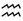 宝瓶猫

从 1 月 20 日到 2 月 18 日

元素：风（固定型）

主宰行星：天王星、土星

掌管的身体部位：对应人类的小腿和脚踝

颜色：黑色

有创造力、理想主义、不可预测、宽容、多愁善感

它的主宰行星：天王星、土星

天王星是代表探险家、冒险家的行星。在此影响之下的猫咪让人捉摸不定，有时候稀奇古怪，但它的性格总是非常鲜明。从年幼的时候，这只猫就显得很自主、相当独立。对天王星的猫来说，要像只普通的家猫是难以想像的。终其一生都在创造“独特的事迹”，因为它不甘平凡，也拒绝停滞不前。

天王星型的猫对于生活和居住的变化适应良好，搬家不会让它感到手足无措，反而提供一个新的探索题材。

雌猫会对自己的猫孩感到惊奇赞叹，但很快地转为忽视它们，把全部心思放在崭新的个人兴趣上；而雄猫如果发现了一个美丽新世界，便会跷家出走。

假如相位不良，天王星的猫会变得极端又具有攻击性。

它的性格

宝瓶座小猫散发出某种智慧。它似乎放下了对物质世界的关注，天使般的神情使它看似翱翔在自己的天地、在梦幻仙境里。

对讨厌单调的这只狂热探险猫来说，生命中的每一刻都是充满惊奇的体验：有如生命中的盐。宝瓶猫非常独立，重视日常生活里的轻快感和怡然自得。

宝瓶猫友好且随和。但在相位受到干扰的情况之下，它可能更加地反复无常、古怪的行径更加失控，从容易满足的猫变得神经兮兮。

优点

它拥有聪明才智。例如，打开一扇门或冰箱门，对宝瓶猫来说不费吹灰之力。喜欢接受挑战、刷新体验，即使在最不寻常、最离奇或最危险的情况下，它通常也能达成自己的目标。

缺点

宝瓶猫讨厌被拘囿、束缚与阻止，就像它讨厌权威和纪律一样，宝瓶猫是最独立的猫科动物。此外，在条件许可的情况下，它还能频繁拜访好几个主人，去品尝居所附近的猫干粮。它也很固执。

它的气质类型：多血质

多血质的猫机灵、精力充沛、适应力强。它可能像双子朋友一样是个话匣子。在某些情况下，它的声音可能很奇特，特别引人注目。它合群、冲动、亲和力也高，重视自主性。

它的外貌

宝瓶猫通常身材娇小但比例匀称。它借由敏锐的才智和强大的创造力来弥补这种劣势。它有一张大嘴和一个非常突出的下巴。

它的社交能力

• 宝瓶座雄猫：平易近人、很独立自主，也很深情，但不能给予过多的爱抚，否则会让它感到窒息，而熘之大吉。此外，它不擅长守着同一位伴侣……它很可能在其他地方另结新欢。

• 宝瓶座雌猫：它温柔可人，可能带点喜感。在母性天职和信任的环境之中，会把自己发挥得淋漓尽致（但时间很短），不过它依旧不忠贞且善变。是心思复杂的猫咪，但十分迷人。

• 宝瓶座小猫：这是一个正在萌芽的探险家，绰号是“蠢蛋之王注 32”（Le roi des bêtises）。它也懂得装作孤芳自赏，特别是因为畏惧那些接近它的人，太多繁文缛节了。待在雌猫身边和独自玩游戏，让它较为自在，宝瓶座小猫在这些游戏里打败了小羽毛、软木塞或枯叶等对手。

• 面对访客：新的到访者总是引起宝瓶猫的兴趣，它对一切都感到好奇。比起待在自己的小世界里远远观察、迂回地接近，它会扑到他们身上，躺卧在陌生人的膝盖上。

• 和孩童相处：宝瓶猫喜欢和他们一同游戏、耍杂技和分享新的体验。他们来自同一个充满幻想且团结一致的世界。

十度区间

• 第一个十度区间（1 月 20 日至 30 日），由金星守护：第一个十度区间的猫与落在其他区间的猫不同，它是一个温柔、好奇心强烈、特立独行的猫。

• 第二个十度区间（2 月 1 日至 8 日），由水星守护：勇于接受新事物和敏捷的智力。第二个十度区间的人适应能力强，并且喜欢不可预期的事情。

• 第三个十度区间（2 月 9 日至 18 日），由月亮和海王星守护：这个梦想家似乎属于另一个世界。总是心不在焉或离家出走，只做它想做的事。

它的健康

宝瓶座对应人类的小腿和脚踝。这不是一个抵抗力特别强的星座，但假如它跨越成年的门槛，就可以长寿一点了。对于体验、偶尔犯险的喜好很明显，它的腿部容易受伤。另一方面，虽然它并不是一个大胃王，但一旦结扎后，这位曾经的运动员和冒险家倾向以食物来弥补自己。

它的迁移性

由于宝瓶猫有逃家的倾向，因此最好将它系好皮带或放在一个关紧的外出笼中旅行。有必要的话，可以给它温和的镇静剂。由于这只猫讨厌束缚，可能会大吼大叫地表达反对意见。因为只有它自己能决定路线时，才会喜欢旅行。在好奇心的助长下，它也可能一有机会就尝试落跑。

它的友谊、爱情、亲密关系和点头之交

• 谁适合当宝瓶猫的主人？

跟宝瓶猫同为风象星座的双子座和天秤座主人，懂得讨它开心。他们之间少有束缚，并拥有良好的交流互动。天秤座会尊重它的个性；而像它一样难以捉摸的双子座也会同性相吸。

假如火爆的牡羊座主人没让脆弱的宝瓶猫感到座窒息的话，他们可以相安无事。

不建议搭配金牛座的主人。对这只飘忽不定的猫来说，他的头脑太迟钝了。

对于喜爱肉体触碰的巨蟹座主人来说，这只猫在短时间内可能很适合他。

与狮子座主人之间存在一股互补的吸引力，他们互相喜爱、彼此着迷。

跟处女座主人虽然可以和谐相处，但对一只热爱挑战的猫而言，有点平淡。

跟天蝎座主人，假如并发出的超自然感应力令他们深陷到不可自拔，是有可能和睦相处的。

与开朗的射手座关系非常良好，尊重对方的空间。以及它对新鲜空气的需求。

在摩羯座主人的身边则恰恰相反，它会无聊地打起哈欠。

跟同是宝瓶座的主人在一起时，两人都活在自己虚无飘渺的世界里，很难降落人间，但这种超脱凡尘的生活也其优点。

与双鱼座主人的关系有点糟，他们不住在同一个星球上。但经过时间的催化和一些磨合，就能够促成这段关系。

• 爱情归宿

宝瓶座–牡羊座：能有进展的一段关系，但未必开花结果。

宝瓶座–金牛座：不太可能相遇的组合，是喵星球版本的“鲤鱼和兔子注 33”。

宝瓶座–双子座：自然的吸引力，相处轻松自在。

宝瓶座–巨蟹座：如友情般的恋爱关系，后续的发展有谱。

宝瓶座–狮子座：互补的吸引力，一切再完美不过。

宝瓶座–处女座：看不见终点的爱情，但友谊关系真诚。

宝瓶座–天秤座：爱情相守到永远。

宝瓶座–天蝎座：不稳定的感情关系，但拥有一些共同点。

宝瓶座–射手座：纯然的吸引力，一窝小猫孩准备到来。

宝瓶座–摩羯座：等着他们轮流打起哈欠吧，马上就能印证了。

宝瓶座–宝瓶座：有趣和具创造力的爱情。

宝瓶座–双鱼座：需要时间的催化，发展可期。

星座猫的云上狂想

它一直着梦想这一刻，而蒂蒂（Titine）实现了！它的雁子朋友背上宝瓶猫，载它起飞遨游。一只飞行的猫！飞吧，飞吧！骑着大雁飞到云之国度里。

• 它的绵软王座：对这只特立独行的猫来说，它适合攀至云深不知处，栖息在一片奇形怪状的云层上。为了激发创造力，在抵达它黑色坐埝（它的专属色）的沿途上，我们可以加入几个障碍物。它戴着无线耳机，听着自己最喜欢的电子流行乐。在这个时刻，四下杳无人烟。当然，除了它的客人——傻大猫（Sylvester），又叫葛里莫（Grosminet），它欣赏后者在诱捕崔弟鸟（oiseau Titi）时源源不绝的想像力。再说回来，崔弟鸟也破天荒地被“友善地”邀请了。在等崔弟鸟的时候，傻大猫的东道主放了流行尖端注 34（Depeche）的［享受孤寂］（Enjoy The Silence）给它听。看到封套上戴夫．加汉注 35（Dave Gahan）的纹身，傻大猫决定在自己耳朵纹上一只崔弟鸟。纹身前，傻大猫着迷于这首节奏饱满的歌曲中，低垂着眼皮在心里嘀咕：“崔弟鸟也懂欣赏它吗？”

相关品种：孟加拉豹猫

这个品种是由一位美国育种学家，在一九六〇年代从一只亚洲野猫开始培育出来的。孟加拉豹猫的与众不同之处，在于高大的身形及超柔软的金色斑纹，还以喜欢玩水而著称。它是游泳好手和渔夫。哗拉一声，冲进浴缸或莲蓬头下！长袖善舞，不喜欢孤独。孟加拉豹猫同样爱爬上爬下和蹦蹦跳跳……这只猫需要空间。

柴郡猫——梦游仙境中的蒙娜丽莎

带着神秘的笑容，柴郡猫（Le Chat du Chester）就好比《爱丽丝梦游仙境》注 36 中的蒙娜丽莎。

这只狡猾的猫注 37（chat-fouin）拥有刻画宝瓶座的所有天王星特质：难以捉摸、具创造力、飘忽不定（这也是作者本人的星座）。

爱丽丝坐在她家附近公园的草坪上，心不在焉地听她姐姐说话，一边逗着她的猫黛娜（Dinah）。突然间，爱丽丝做起白日梦……并启程前往仙境。一个超出尺度、荒诞的世界，一个理智不再当道的非理性世界，里面住着一群如幻似梦的人物，每个人都陷入自身的偏执之中。

当爱丽丝碰见柴郡猫的时候，她对它的态度和超现实的言论，感到又好笑又心烦意乱——她的猫黛娜，看起来正常多了！柴郡猫露出一抹新月般的微笑，用它反复同一套的怪异言谈逗乐和迷惑爱丽丝。因为她“常常看到不微笑的猫，却从未见过没有猫的微笑！”

这个角色代表疯狂。“我们内心的疯狂吗？”它透过谜团、反复述说、遗忘、矛盾或难以理解的话语来表达自己，还加上疯癫的手势和无止尽的捉迷藏游戏。这只猫脸上挂着蒙娜丽莎的神秘微笑，犹如一个心理医生，鼓励我们自省。在这个表面的游戏中，它激励我们跳脱现实，进入一个想像的、与现实脱节、时空错乱的世界。它还向我们传递了一个讯息：宁愿做真实的自己，也不要佯装给别人看。

尽管柴郡猫很疯狂，它还是能给予爱丽丝“实质上”的帮忙。它为爱丽丝指引方向，找到疯帽先生（Chapelier Fou）和三月兔（Lievre de mars），而后建议她去见红心皇后（Reine de coeur），并经由一棵树打开捷径之门。然而，它后来又让她置身于面对皇后的危险之中。

这个故事诞生于一个美丽的夏日，当时刘易斯．卡罗和牛津大学的一位同事及三位女孩游船，其中一位叫作爱丽丝．李道尔（Alice Liddell），时年十岁。作家很喜爱这个机灵的孩子，于是开始讲述许多荒诞不经的故事。游船结束时，爱丽丝请求为她写下所有的故事。两年后，她的愿望实现了。刘易斯．卡罗送给她《爱丽丝地下历险记》（Les Aventures d’Alice sous terre）作为圣诞节礼物，附上亲手题字和绘画的插图。

出于作品激起的热情，他把此书推荐给一位编辑，并以《爱丽丝梦游仙境》的标题出版，这部杰作马上大获成功。

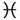 双鱼猫

从 2 月 19 日到 3 月 20 日

元素：水（变动型）

主宰行星：海王星、木星

掌管的身体部位：后腿、手指、血液循环

颜色：紫色

冷静、讨人喜爱、幸运、敏感、多愁善感

它的主宰行星：海王星、木星

幸运之星——木星庇佑你的朋友，海王星带给它幻想和直觉力。这种双重影响的结果是：它处之泰然且胸怀自信——有时候为了考验自己，甚至甘冒巨大风险。

这只猫更像一个喜剧演员而不是吵架王，即使当它发怒而高高弓起背，发出惊天地泣鬼神的喵呜声时，也只是虚张声势。因为尽管表面如此，它知道自己的极限。幼猫尤其胆小。它喜欢表现得大胆鲁莽，但即使如此，这不过就是自我感觉良好而已。

这样挑衅的一面在成年后持续存在，但在幸运之星——木星的保护下，它多半能摆脱困境，优雅地死里逃生。雄猫往往比雌猫冷静，也更多愁善感；前者是宅男，后者是冒险家。

受这两颗行星影响，这只猫兴致一来便异想天开、不可预测，像个哲学家，有时还很滑稽。

假如受到负面的影响，它会极度焦虑不安，其消化系统可能出现问题。

它的性格

受到爱、奉献和牺牲的星座影响，双鱼猫对于主人比自己的家人更为依恋，它对前者的忠诚经得起考验。假如它看起来哀伤或疲倦的话，那是因为它正在冥想，以便达到猫的涅盘世界。

它对自己的舒适和安宁很执着，会为了保有它们而高拱起背，但这些只是试图恐吓入侵者，不是要投入战斗。

和它的朋友巨蟹座一样，对音乐的爱好也刻在它的基因里。

从本质上来说，它更像个观众而不是表演者，喜欢听音乐、在荧幕上看芭蕾舞或演奏会。但有时候如果双鱼猫忘情于音乐的话，会难以自抑地献声一曲。

优点

纤细敏感而忠诚，双鱼猫天生便有奉献精神，甚至牺牲精神。它全然地依恋自己的主人或家人。

缺点

双鱼猫有平和的天性，人们会认为它是只哀伤的小猫。有忧郁的倾向，但它还喜欢悲秋伤春，甚至加油添醋。另外，想要引起它的注意，可以不惜一切手段。

它的类型：多血–淋巴质

同时对应呼吸系统和消化系统（跟它的金牛座和天秤座朋友一样），这只多血–淋巴质型的猫在过动和长期性的懒惰状态来回切换。呼吸系统的影响使它多情与诚挚，而消化系统的影响则缓和了它的自发性。综合以上它会是一只充满活力、情感质朴，谨守尊卑之分的猫咪。喜欢广阔的空间，即使它并非热爱运动。通常有一身漂亮的厚厚皮毛。

它的外貌

虽然体型矮于平均身高，但双鱼猫结实有力。它的脸呈圆形或是菱形，大鼻、短脖，步伐缓慢。

它的社交能力

• 双鱼座雄猫：这是只性格温和、平静而深情的猫。跟主人的友好关系，也让它爱屋及乌，非常依恋自己的小窝。它不爱翘家，不会离自己的地盘太远。短暂的外出熘达足以让它吸满天地精华、满足冒险的瘾。但它需要花上几周的时间才能恢复元气。

• 双鱼座雌猫：体质虚弱，但本性坚强。天地万物的周期交替，比方说满月，将赋予它满满的能量。对于舒适度很敏感，并在这样的环境中和谐地成长。

• 双鱼座小猫：当它专注地欣赏这个世界时，会很容易受到影响，突然舍身犯险——有时候是出自想像，好展现出它的喜剧天赋。这只小猫对周围世界的感受十分强烈，基于这个理由，它年幼的创伤可能会留下不可磨灭的印记。

• 面对访客：双鱼猫热情好客，尽管它会稍微节制。假如它最后主动磨蹭刚认识的访客，那是因为这只猫咪喜欢肢体接触，爱极了被抚摸。

• 和孩童相处：双鱼猫很容易接纳他们，与自己的家人保持紧密的关系。甚至可以教他们有趣的游戏。

十度区间

• 第一个十度区间（2 月 19 日至 28 日），由土星守护：好奇心强，双鱼猫总是试图弄懂一切。它的态度可能让人觉得它对一切都认真以待。

• 第二个十度区间（3 月 1 日至 9 日），由木星守护：本命在第二个十度区间里的双鱼猫，是只专心致志、冷静，有时慢条斯理的猫咪。它坚定而有自信。

• 第三个十度区间（3 月 10 日至 20 日），由火星守护：勇敢而争强好斗，由于对爱情的独占欲，它可能会和新到来的猫争风吃醋。

它的健康

海王星代表的是身体的消融与膨胀。双鱼猫容易超重，甚至有肥胖、罕见或是未知的病状。

双鱼座掌管后腿、手指、猫爪、肝脏与血液循环。因此，它容易患有小腿下部和可能相关的疾病（脱钙、骨折或瘫痪）；其肝脏的脆弱性使双鱼猫易患黄疸。

它对气温变化很敏感，容易感冒。

它的迁移性

虽然它欣赏艺术的生动、舞蹈的优雅，但双鱼猫讨厌居住环境的改变：只能更换地盘的家具……所以，旅行、冒险都不是它的菜！

它的友谊、爱情、亲密关系和点头之交

• 谁适合当双鱼猫的主人？

一个爱家或居家工作的主人对它再完美不过。在巨蟹座或处女座主人身边，相处十分融洽。

巨蟹座主人缓解了双鱼猫的忧郁；而处女座主人平息它的焦虑及平衡它所需的安全感。

与牡羊座在一起，情感将大大受到考验：一个总是坐不住的主人，和一个只渴望安宁的宠物。

金牛座懂得安抚这只胆小的动物，为它安排一个舒适和谐的生活。

对于喜欢固定习惯和单调生活节奏的动物来说，双子座的主人太捉摸不透了。

一种纯然的好感将狮子座主人吸引至双鱼猫的身边，但他们很难合拍。

尽管天秤座主人与双鱼猫共有的感受性拉近了双方关系，但它很难在这位自恋的主人身旁快活成长。

与天蝎座主人的相处不仅奇妙且密不可分，尤其是当他接纳猫科动物的超感官能力时，例如进行转桌子注 38（faire tourner les tables）……或是转餐盘？

相反地，跟射手座主人的生活很煎熬，对它来说这位主人太爱竞赛、太好动。

一位会保护宠物和可靠的摩羯座主人容易令它安心。

它和宝瓶座主人磁场相吸，虽然他会稍微地催促并推动它向前，但他懂得运用机智和正确的节奏做到这点。

对同个星座的宠物来说，双鱼座太过杞人忧天。

• 爱情归宿

双鱼座–牡羊座：精神上的融洽，但毫无激情。

双鱼座–金牛座：关系稳定，猫丁兴旺。

双鱼座–双子座：无可期望或是遗憾。

双鱼座–巨蟹座：盲目、令人沉迷的爱情，蹦出一窝小猫。

双鱼座–狮子座：当狮子猫咆哮的时候，双鱼猫拔腿就跑。

双鱼座–处女座：疯狂的爱，期待小猫的到来。

双鱼座–天秤座：爱与柔情蜜意的游戏。

双鱼座–天蝎座：它们尝试玩在一起，或是吞噬对方。

双鱼座–射手座：争吵不断的组合……

双鱼座–摩羯座：相处和睦，这组配对可以期待。

双鱼座–宝瓶座：哪一方会让对方受苦呢？不过也有些猫喜欢这种关系。

双鱼座–双鱼座：八竿子打不着，它们尽其所能地彼此躲避。

星座猫的云上狂想

虽然水才是它的元素，但双鱼猫不介意在空中兜风。经过无数小时的晴空后，终于来了几片雨层云。突然间，出现了老鼠形状的小小云朵！就这样，它毫不犹豫地踏上云之国度！

• 它的绵软王座：必须是一个极度恶劣磨人的天气、一片能游历各方的云朵，才符合双鱼猫的幻想。这片云就像沙漠中的旅行车，在天空中延伸，像是“在纤维上留下的长长猫爪痕注 39”。一朵美丽、绵长、刚形成的卷云注 40（cirrus），上面铺着紫色的地毯——对优柔寡断的双鱼座而言，这代表不明确和矛盾，以及乐痴的颜色！此刻，它只听着雷鬼音乐（reggae）。猫女（Catwoman）前来拜访了几天，它向她介绍巴布．马里注 41（Bob Marley）的音乐。《猫儿历险记》（Aristocats）的杜洛斯（Toulouse）准备到来，但它得先完成一幅画。人们在派对上等着它。

相关品种：土耳其梵猫

来自亚美尼亚高地、一个极寒地区，土耳其梵猫（Le Turc de Van）在寒冬中长出了非常厚的毛发，在阳光明媚的日子里像雪融般脱毛。它有蓝或绿色的眼睛，有时两眼颜色相异，它的性格跟狗相似。跟它的友人孟加拉豹猫（见宝瓶座的章节）一样，它喜欢玩水、洗澡，天气热的时候跳进水中，甚至在洗手槽里睡觉……

无名之猫——当海王星与木星闲话猫常

一八六八年，十五岁的新日本天皇睦仁（Mutsuhito）即位，日本自此进入明治时代，首都从京都迁往江户（东京）。日本文学经典——夏目漱石（Natsume Soseki）的《我是猫》，背景就是设定在那时瞬息万变的社会中。

主人苦沙弥（Kushami）是个英国文学教师注 42（跟作者一样），收养了坚持闯入他花园的弃猫，这只动物百折不挠地收服了他：在它出色直觉（海王星）的指引下，马上知道自己将在这间房子、跟它的宅男主人共筑生活。虽然这只猫没有名字，但我们可得知它的样貌：“我的毛浅灰中带点黄，有一身漆似的毛皮”。而小说的主角、这位有四条腿的叙述者，带领我们进入它的家以及主人的生活之中，它对两者的依恋，多么具有双鱼座性格。以无名流浪猫的观点（它本质上更像观众而不是主角），猜中（具有经得起考验的海王星直觉）现身在它面前的人物性格，注意到他们可笑的怪癖。它探索和研究世间——人类这个奇怪的事物，观察和批评它所身处的环境。虽然对周围的人保持沉默，但对于它的读者来说，猫咪以其嘲讽和敏锐——尤其是幽默的视角，描绘了一个正走向现代化的日本社会。其中迷人而多采多姿的众生相，以及当时所面临的新社会议题：例如传统与现代之间的对立、社交关系或是女性地位的改变（作者患有严重的神经衰弱，并有明显的厌女情结）。在海王星和木星的星体影响下，这只猫闲暇之余便当起哲学家，跟在主人苦沙弥身边，摇身变成受过教育和有教养的猫——它读索福克勒斯（Sophocle）和亚里士多德（Aristote）。甚至，偶尔读到废寝忘食的时候，还会卖弄起学问来。即使它容易感到愤慨，也不会失去幽默感，好比它决定扮演杀手、窥伺敌人——啮齿动物的一天（它其实未曾抓过老鼠），但最后结尾是它从椅子上跌落，而且老鼠还跳到身上咬它……事实上，它唯一的敌人，是还在苦沙弥主人的花园当饥饿小猫时，那位追捕它的女仆。这就是一本“把猫奉为圭臬”注 43，辛辣嘲讽明治末期日本社会的小说。

注 3：译注：源自古希腊的性格分类，根据人的四种体液分成四种性格：血液（多血质）、黏液（黏液质）、黄胆汁（胆汁质）和黑胆汁（抑郁质）。

注 4：［猫爪］（La patte du chat），《猫咪躲高高》（Les Contes du chat perché），马塞尔．埃梅（Marcel Aymé），1944 年。

注 5：译注：法国饶舌歌手。

注 6：译注：罗马神话的智慧女神。

注 7：译注：法国饶舌歌手。

注 8：作者养的二十岁猫咪，详见前言。

注 9：译注：出自圣经典故，表示“作恶者必定加倍受罚”，近似俗语“玩火者必自焚”。

注 10：译注：即伯曼猫（Birman）、波曼猫，本处取法文翻译缅甸圣猫（Sacré de Birmanie）。

注 11：乔治．西默农（George Simenon），1967 年。

注 12：西蒙．托菲尔德（Simon Tofield）的同名漫画主角。

注 13：译注：法国著名诗人、剧作家。

注 14：译注：奥斯曼帝国行政系统里的高级官员。

注 15：《母猫》（La Chatte），柯蕾特（Colette），1933 年。

注 16：出自乔安．史法（Joann Sfar）的漫画系列和电影《犹太长老的灵猫》（Le chat du rabbin）。

注 17：编注：全称为 Livre officiel des origines félines，是法国出生纯种猫的族谱登记册。

注 18：《穿靴子的猫》（Le Chat botté），夏尔．佩罗（Charles Perrault），1697 年。

注 19：译注：法国十九世纪著名作家，被称作“现代法国小说之父”，现实主义文学奠基者。

注 20：巴尔札克，1844 年。

注 21：译注：体积比较大、比较暗、边缘较为圆润的云，这类云通常以一组、排成一线、波涛状呈现。

注 22：译注：一种扁平的灰色云，低于两千公尺，可引起阴沉的天气或小雨。

注 23：出自《不可思议的新奇故事集》（Nouvelles histoires extraordinaires）。

注 24：译注：罗马神话中的冥王，也是冥王星的拉丁名称。

注 25：译注：在《化身博士》（Strange Case of Dr Jekyll and Mr Hyde）里，主角绅士亨利．哲基尔博士的另一个邪恶人格。

注 26：《从天而降的猫》（Le Chat vient du ciel），平出隆（Takashi Hiraide），2001 年。

注 27：拉夫领（collerette style fraise）：一种用于装饰衣领的丝织品，在十六世纪中期至十七世纪中期流行于西欧地区的上流社会之间。英文为 ruff。

注 28：译注：法国著名小说家，代表作有《茫茫黑夜漫游》等，被认为是二十世纪最有影响的作家之一。

注 29：译注：引自法国歌手查理耶．居礼（Charlélie Couture）的同名歌曲 Comme un avion sans ailes。

注 30：《我的动物纪事》（Histoire de mes bêtes），大仲马，1867 年。

注 31：译注：布丰（Buffon），即布丰伯爵乔治―路易．勒克莱尔（Georges-Louis Leclerc, Comte de Buffon），法国数学家、生物学家、启蒙时代著名作家，被誉为“十八世纪后半叶的博物学之父”。

注 32：译注：引自童书《蠢蛋之王小胡子》（Moustache le roi des bêtises），雅梅勒．何努特（Armelle Renoult）着，梅兰妮．葛杭吉哈（Mélanie Grandgirard）绘。

注 33：译注：原句出自法文的俗谚“鲤鱼和兔子的婚礼”（Mariage de la carpe et du lapin），指家世背景差异甚大的一对伴侣，意同中文“门不当户不对”。

注 34：译注：1980 年成立于英国艾赛克斯（Essex）巴西尔登（Basildon）的电子音乐乐团。

注 35：译注：流行尖端的主唱。

注 36：《爱丽丝梦游仙境》（Les Aventures d’Alice au pays des merveilles），刘易斯．卡罗（Lewis Carroll），1865 年。

注 37：译注：此字由 chat（猫）和 fouine（石貂）所组成，意指狡诈之人，作者在此采双关用法。

注 38：译注：转桌子，英文为 table-tapping，或称 table-turning，是一种通灵的方式：几个人围在桌子边，慢慢念出字母，当字母正确时，桌子便会倾斜，借此拼出讯息，类似通灵板。

注 39：《云的理论》（La Theorie des Nuages），史岱凡．奥德纪（Stephane Audeguy），2015 年。

注 40：译注：在高空形成，有丝缕结构，柔丝般光泽，色白无暗影，多分离散乱。云体常呈丝条状、马尾状、钩状、片状、砧状等。

注 41：译注：牙买加歌手，被誉为雷鬼音乐之父。

注 42：译注：作者这里写英国文学教师，但日本原书是中学英语教师。

注 43：《猫的万种风情》（Le Chat dans tous ses états），尚．路易．休（Jean-Louis Hue），1982 年。

# 十二星座之最

猫咪大约三分之二的时间都在睡觉。在它静脉中循环的不是血液，而是浸泡的椴树花茶。注 44

——尚－路易．休（Jean-Louis Hue）

注 44：译注：睡前安定心神喝的花草茶。

总结来说，以下是针对十二星座最鲜明特点所做的摘要整理：

我们最厉害的是……

最具运动细胞：牡羊座、双子座、狮子座、天蝎座、射手座

最善于交际：牡羊座、金牛座、巨蟹座、狮子座、天秤座、射手座、宝瓶座

最爱当“猫老大”：牡羊座、狮子座、射手座

最宅：金牛座巨蟹座、天秤座、摩羯座、双鱼座

最独立：牡羊座、射手座、狮子座

最具占有欲：牡羊座、金牛座、狮子座、天蝎座

最迷人、最多情、最自恋：金牛座、巨蟹座、狮子座、天秤座、天蝎座

最爱交流信息：双子座、狮子座、天蝎座、宝瓶座

最聪明、最有创造力：宝瓶座、处女座、双子座

最具适应力：牡羊座、双子座、射手座

最具高超手艺和冒险精神：牡羊座、双子座、处女座、天蝎座、射手座、宝瓶座、双鱼座

最质朴或乡野气息：牡羊座、金牛座、双子座、射手座、摩羯座

最敏感：巨蟹座、天秤座、天蝎座、宝瓶座、双鱼座

最神秘和心灵感应：天秤座、天蝎座、双鱼座、宝瓶座

最懒惰：金牛座、狮子座、天秤座、巨蟹座

最内向：巨蟹座、射手座、摩羯座、宝瓶座

最外向：牡羊座、射手座、狮子座

最忠贞不二：金牛座、巨蟹座、处女座、双鱼座

最像喜剧演员：双子座、双鱼座

最喜欢音乐：巨蟹座、双鱼座

最健谈：双子座、处女座、宝瓶座

最具母性特质：牡羊座、巨蟹座

最需要稳定和安全感：金牛座、巨蟹座、处女座

我们最不厉害的是……

最不喜欢运动：巨蟹座、金牛座

最不爱宅在家：牡羊座、双子座、射手座

最不喜欢冒险：天秤座、金牛座、宝瓶座

最缺乏母性特质：双子座、摩羯座、宝瓶座

# 你的猫咪星盘

莫之致而至者，命也。

——孟子

什么是星盘 ？

住家（maison）是用来接待猫咪的地方，也是它生活的所在，而十二宫位（Maison）注 45 构成了它的本命盘。要制作它的星盘，必须知道猫咪的出生日期和时间，这将帮助你设定好星盘、知道它的上升星座，并探索落入十二宫位的行星。

上升星座是生物在诞生的时候，正好位在水平线上即将升起的星座。它提供了关于体格、外貌、遗传和外在行为的讯息。上升决定了第一宫的起点，并由此展开由十二宫组成的星盘。

我把人类的特定数据因应猫科动物做调整注 46，提供十二个上升星座的分析、十二宫位以及落入的六颗行星（太阳、月亮、水星、金星、火星、木星）所代表的意义。

如何找出它的上升星座？

帮你的猫咪计算上升点：

• 注意猫咪的出生日期和时间（尽可能地准确！）

• 参考下列表格确定它出生日期所对应的恒星时间注 47。

• 把恒星时间加上它的出生时间。

• 检查它是否在正常时间或夏令时间出生。如果你的猫在夏令时间出生，请把它的出生时间减去一小时。

• 把全部总加起来，如果超过二十四小时，把数字再减去二十四小时；如果分钟数超过六十分钟，请减去六十分钟后加上一小时。

• 参考上升星座的表格找出猫咪的上升星座。

恒星时刻表

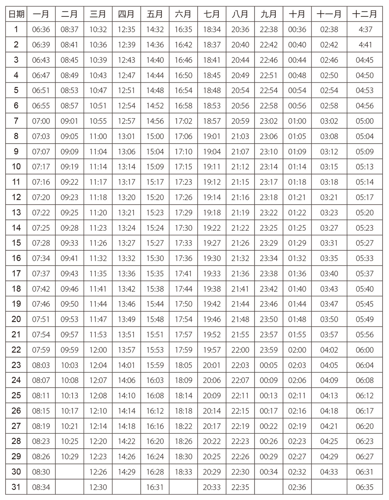

上升星座表

**对应星座　上升星座时间**狮子座　　00:34 至 03:16 处女座　　03:17 至 06:00 天秤座　　06:01 至 08:43 天蝎座　　08:44 至 11:25 射手座　　11:26 至 13:53 摩羯座　　13:54 至 15:42 宝瓶座　　15:43 至 17:00 双鱼座　　17:01 至 17:58 牡羊座　　17:59 至 18:58 金牛座　　18:59 至 20:17 双子座　　20:18 至 22:08 巨蟹座　　22:09 至 00:33

恒星时间＋出生时间－夏令时间（有需要的话）＝上升星座时间

计算出你猫咪的上升星座后，便可依据它的太阳星座获取不同的意义。

上升与太阳十二星座猫组合

上升牡羊座的星座猫

牡羊猫：“体格”特别发达，有时很鲁莽。

金牛猫：坚定、热情，尽管表面上很平静。

双子猫：机智、冲动，也极度敏感。

巨蟹猫：性情反复无常、喜欢讨摸摸的猫。

狮子猫：散发耀眼的光芒！自发性强而且静不下来。

处女猫：外表矜持，但必要的时就……

天秤猫：热情迷人。

天蝎猫：个人主义，选择性地待人处事。

射手猫：自主、具冒险精神。

摩羯猫：孤僻、冷淡，也独立。

宝瓶猫：乐观、活力充沛。

双鱼猫：对同类很有同理心，宽容。

上升金牛座的星座猫

牡羊猫：出于本能的冲动。

金牛猫：外表平静而行动缓慢，非常顽强。

双子猫：好奇心强、多变。

巨蟹猫：耐性十足。谨慎、具保护欲。

狮子猫：爱耍帅、喜剧演员，很讨人喜欢。

处女猫：脚踏实地。保守而平和。

天秤猫：享乐主义者、善于交际、迷人。

天蝎猫：观察者。拐弯抹角。

射手猫：移动性强又恋家的反差性格。

摩羯猫：脚踏实地。耐心、对舒适度很敏感。

宝瓶猫：对稍微有点疯狂的事物都相当执着。

双鱼猫：随和。容易适应。

上升双子座的星座猫

牡羊猫：精力充沛、大胆。

金牛猫：充满宁静力量的小淘气。

双子猫：紧张大师、好奇心旺盛。

巨蟹猫：异想天开、不可预测。

狮子猫：充满威严、风趣。

处女猫：观察者、天性谨慎。

天秤猫：自动自发、长袖善舞、机灵。

天蝎猫：思虑缜密、积极。

射手猫：伺机而动。独立，适应性强。

摩羯猫：矛盾的性格——疏离或黏人。

宝瓶猫：健谈，非常爱参与话题。

双鱼猫：机灵、不可预测。

上升巨蟹座的星座猫

牡羊猫：敏感、大胆鲁莽。

金牛猫：耐性十足，也是个大胃王。

双子猫：好奇心强、贪玩、童心未泯。

巨蟹猫：温柔、恋家、爱睡觉。

狮子猫：具保护欲、奉行个人主义。

处女猫：矜持、待人殷勤。

天秤猫：善于交际、迷人。

天蝎猫：谨慎，且有强大韧性。

射手猫：好奇心强、自动自发，炒热气氛的高手。

摩羯猫：冷淡、敏感与脆弱。

宝瓶猫：容易紧张，但随和。

双鱼猫：敏感、爱幻想、童心未泯。

上升狮子座的星座猫

牡羊猫：热情、韧性强、过动儿。

金牛猫：坚定、耐心、情感外放。

双子猫：外向、无拘无束、神经质。

巨蟹猫：谨慎、温和、敏感。

狮子猫：活力充沛、活泼、善于交际。

处女猫：不爱出风头、谨慎、深思熟虑。

天秤猫：长袖善舞、不受拘束、纤细。

天蝎猫：情感外放、独立独行、具吸引力。

射手猫：好奇心强、具冒险精神、大胆鲁莽。

摩羯猫：冷静、多疑、孤僻。

宝瓶猫：占有欲强、顽固、友善、热情。

双鱼猫：大胆、外向、韧性强。

上升处女座的星座猫

牡羊猫：活力充沛和冲动。

金牛猫：固执、一丝不苟、讨厌冲突。

双子猫：适应力强、好奇心重、神经质却也聪明。

巨蟹猫：谨慎、对压力敏感。

狮子猫：警戒心强、具有韧性。傲娇。

处女猫：紧张兮兮、吹毛求疵。高敏感族。

天秤猫：迷人、可爱，但可望而不可及。

天蝎猫：坚定不移、专制。爱挑衅。

射手猫：热情、具冒险精神。

摩羯猫：庄严而高傲，如磐石般坚定。

宝瓶猫：怪咖、独立。神经质。

双鱼猫：神秘而矜持，具有迷人的魅力。

上升天秤座的星座猫

牡羊猫：性格两极化——充满吸引力又爱惹事生非。

金牛猫：热情、性感。

双子猫：敏捷、善于交际和表达。

巨蟹猫：隐密、对周遭保持戒心。

狮子猫：以诱惑为第一优先。

处女猫：矜持、谨慎。

天秤猫：迷人、讲究。

天蝎猫：善于交际也迷人，但排他性强。

射手猫：积极、进取、灵敏。

摩羯猫：谨慎、深思熟虑。

宝瓶猫：令人感到惊奇、有创造力。

双鱼猫：敏感、犹豫不决。

上升天蝎座的星座猫

牡羊猫：冲动、勇敢。

金牛猫：性感、占有欲强且固执。

双子猫：灵活、轻佻，但情绪化。

巨蟹猫：有魅力、容易接受新事物，防备心重。

狮子猫：精力充沛且情感外放，但一板一眼。

处女猫：谨慎、剖析入微。

天秤猫：好奇心强、善于交际。

天蝎猫：情绪化，情感时常大起大落。是个观察者。

射手猫：过动、善于交际、狡猾。

摩羯猫：神秘、多疑又固执。

宝瓶猫：独立、外向、个性积极。

双鱼猫：直觉力强、高度敏感。

上升射手座的星座猫

牡羊猫：好动、冲动、反应灵敏。

金牛猫：行动缓慢、谨慎，是个观察者。

双子猫：外向、好奇心强，十分有冲劲。

巨蟹猫：温和、平静、具保护欲。

狮子猫：精力充沛、大胆且热情。

处女猫：适应性强、谨慎、充满热忱。

天秤猫：善于交际也乐于合作、外向。

天蝎猫：情绪化的怪咖、好奇心强。

射手猫：独立又活力充沛、善于沟通。

摩羯猫：多疑，行动缓慢、好奇心强。

宝瓶猫：不受拘束、轻佻、不安定，却也迷人。

双鱼猫：爱幻想、适应性强、善于交际但敏感。

上升摩羯座的星座猫

牡羊猫：冲动与耐心的对比性格。

金牛猫：坚若磐石，但也很顽固。

双子猫：昼与夜的两面性格——沉默寡言却善于交际。

巨蟹猫：虽然看起来平静、谨慎，实则情绪化。

狮子猫：绽放光芒与默默行事的对比性格。具责任感。

处女猫：谨慎、冷淡且超然。

天秤猫：事不关己与善于交际的矛盾性格。

天蝎猫：极度敏感、情绪化。

射手猫：静不下来、热情而友好。

摩羯猫：好沉思而孤僻。

宝瓶猫：难以接近、异想天开和充满狂热。

双鱼猫：超然物外，来自另一个星球。

上升宝瓶座的星座猫

牡羊猫：即兴派、冲动且好动。

金牛猫：叛逆、占有欲强。

双子猫：特别爱玩，个性独立。

巨蟹猫：害羞、谨慎到令人费解。

狮子猫：个人主义又大胆，具保护欲。

处女猫：活泼、神经质。

天秤猫：优雅却轻佻、善于沟通。

天蝎猫：极端、喜好惹事生非。

射手猫：热情、善于交际、好奇心强。

摩羯猫：谨慎也不爱出风头。

宝瓶猫：怪咖、灵巧，喜欢探索体验。

双鱼猫：迷人、不可预测。有时很古怪。

上升双鱼座的星座猫

牡羊猫：反应灵敏又冲动，但紧张兮兮。

金牛猫：直觉强且冷静、健谈。

双子猫：灵活、不安定又神经质。

巨蟹猫：爱幻想、出于本能的敏感。

狮子猫：大胆、坚持不懈也不可预测。

处女猫：矜持的观察者。

天秤猫：不受拘束、优柔寡断，讲求和谐的需求。

天蝎猫：情绪化、脆弱。

射手猫：外向、静不下来。

摩羯猫：害羞、内向又内敛。

宝瓶猫：友善、忧郁也迷人。

双鱼猫：矜持，但情绪多变。

十二宫位

计算出猫咪的上升星座，并且链接它的太阳星座后，接着要讨论组成星盘的十二宫位——猫科动物版本的含义。每个宫位都指出关于它性格的某个面相，然后我们将研究落入宫位行星的意义。

• 第一宫：上升星座。动物本身的性格。

• 第二宫：它的生活情况与环境。

• 第三宫：它的智力、生命中的变化与转折。

• 第四宫：它的家庭、遗传基因、生父母与品种。

• 第五宫：它对游戏和爱情的喜好、繁衍和小孩。

• 第六宫：它的体质、健康与疾病。

• 第七宫：它和同族的关系、爱情与社交能力。

• 第八宫：它的危机、性欲、重生与心理的敏感度。

• 第九宫：它唯一的或是多个主人、生活的场所。

• 第十宫：它的地位、对周遭的人和在家里的影响力。

• 第十一宫：它的亲和力、打造幸福的天赋与家庭的和谐。

• 第十二宫：它的生命考验与死亡。

行星

这里将介绍落入十二宫位的六大行星之于猫咪的意义。我只将（十颗中）最接近太阳的六颗行星（太阳、月亮、水星、金星、火星与木星）纳入考虑，以便停留在我们的主题范围里：对他者的了解、人与猫亲密无间的关系（因此省略了土星、天王星、海王星和冥王星）。

• 太阳：生命力、白昼、光芒、心脏、主导性、黄金。之于猫的意义：生活的经历（或考验）。

• 月亮：女性、夜晚、食物、胃、水、人群、金钱。之于猫的意义：直觉、情绪化（或脆弱）。

• 水星：思想、沟通、传播、弟妹、水星。之于猫的意义：智力、移动性。适应性（或不稳定性）

• 金星：感官欲望、艺术、美、嘴巴、静脉、肾脏、诱惑。之于猫的意义：情感、生活的喜悦、社交能力（或各种类型的极端行为）。

• 火星：行动、战争、头部、开端、领导者。之于猫的意义：本能、侵略性、热情、冲动（或破坏）。

• 木星：指导、教导、丰实。之于猫的意义：幸运（或坏运）。

行星落入十二宫位的意义

太阳在十二宫位

• 第一宫：体格强壮。有运气和具吸引力。

• 第二宫：有碰上“好”家庭的机会。

• 第三宫：灵敏的智力。有赖上某个人，或挑选一个主人或一个家庭的倾向。

• 第四宫：良好的遗传基因，对家的眷恋、家猫。

• 第五宫：喜欢玩乐、疼爱子女。

• 第六宫：胆怯、躲在镁光灯之外、对健康的保障。

• 第七宫：与其他同种相处融洽、自带光芒的猫咪、非常适合选美比赛。

• 第八宫：存在感变得薄弱。

• 第九宫：搬迁、心灵感应、与宇宙的和谐共处。

• 第十宫：“家喻户晓”的名声或领导者的地位。跟在七宫一样，对于美感是吉利的位置。

• 第十一宫：强大的社交能力。

• 第十二宫：对伤害的庇护。阻碍。

月亮在十二宫位

• 第一宫：强大的情感、情绪反应强烈但被动。

• 第二宫：舒适程度（或舒适感受）的提升、富裕、幸运。

• 第三宫：好奇心、喜爱学习。被动也胆怯。

• 第四宫：有好的男或女主人。恋家。

• 第五宫：喜欢游戏，跟孩子们的互动良好。

• 第六宫：健康。年幼时可能很脆弱。

• 第七宫：受周围的人宠爱。有个很疼爱自家动物的主人。

• 第八宫：翘家。童年困苦。

• 第九宫：适应性强，喜欢冒险。搬迁。

• 第十宫：命运。

• 第十一宫：强大社交能力。性情古怪。

• 第十二宫：可能遭遇考验。

水星在十二宫位

• 第一宫：整体智力的提升。适应性强。

• 第二宫：重视食物，要留意体重。

• 第三宫：强化性格和它的潜力。有一副好嗓子。

• 第四宫：有位掌握猫咪语言的主人。迁移。

• 第五宫：善于技巧性的游戏。也许有个书呆子的主人。

• 第六宫：智力提升的另一个象征、创造性。容易适应。

• 第七宫：容易与其他猫相处融洽。有利于被领养。

• 第八宫：激发求生本能。

• 第九宫：具保护欲、敏捷，创造性。

• 第十宫：让自己“被听见”的能力、领导者。

• 第十一宫：吸引力、容易与人友好。

• 第十二宫：敌人多。

金星在十二宫位

• 第一宫：吸引力、生活的喜悦。

• 第二宫：有利于被领养，以及拥有它需要的主人。

• 第三宫：对新事物接受度高。极度性感。和兄弟姊妹、同族相处和睦。

• 第四宫：和谐的家庭。特别体贴的主人。

• 第五宫：运气。

• 第六宫：提升身体的健康或是治愈率。有断奶问题。

• 第七宫：感受主人的温暖，与他和谐相处。

• 第八宫：增强性欲。痛苦的分离。

• 第九宫：跨国收养或是迁徙。

• 第十宫：公认的天才猫咪，在某些情况下会出名。

• 第十一宫：有利于舒适的关系。受到庇佑。

• 第十二宫：爱情和考验密不可分，取决于不同面向。

火星在十二宫位

• 第一宫：冲动具侵略性、好斗成性。

• 第二宫：爱争吵、难以忍受同类。

• 第三宫：热情。容易有事故。难以跟同类分享它的主人。

• 第四宫：有可能遇上不适合的主人。

• 第五宫：童年时期大胆莽撞，热情投入自己的情感。

• 第六宫：攻击性。事故的风险。

• 第七宫：逆境、竞争。可能有好几位主人。

• 第八宫：意外事故。好战。

• 第九宫：理想主义者。盲目的本能。

• 第十宫：好斗、猫帮老大。

• 第十一宫：爱好运动。容易结交朋友、表露情谊。有时候是小霸王。

• 第十二宫：考验、引来敌意、危险。

木星在十二宫位

• 第一宫：性情活泼而开朗。外向。

• 第二宫：多么美好的生活！一切都充满了爱与和谐。

• 第三宫：有丰富的才艺、学习天赋。

• 第四宫：对主人的守护和忠诚。

• 第五宫：喜爱游戏，与孩子们相处融洽。

• 第六宫：预防疾病。

• 第七宫：有择偶或是人类的运气。

• 第八宫：良好的遗传基因。优良的品种。

• 第九宫：随和、容易适应变化。

• 第十宫：在条件许可下，可能会拥有名气，或是跟随的崇拜者。

• 第十一宫：容易跟同族分享或是释出友好。

• 第十二宫：在危机时刻受到庇佑。

注 45：译注：法文的 maison 本意是住宅、家，在占星术语指的是星盘的十二宫位，对应生活中的十二个领域。

注 46：必须根据不同品种猫的特性来解读星盘信息。

注 47：译注：以恒星为基准，使用地球自转而测得之时间。

# 月亮落在黄道十二宫

具有象征代表的每只动物，都是我们迷途心灵的一个指引。

——孟子

月亮掌管情绪、母亲、家庭、本能、需要、阴性气质、安全感、无意识、情绪与接受能力。

月球绕地球转如同地球绕太阳转一样。它是阴性的，相对于太阳的阳性。我们的猫咪朋友，与月亮的循环及其象征意义有紧密关系。若要说后者对人类的影响缺乏直接证据，另一方面来说，它们对潮汐、植物和动物的影响却获得了证实。因此，在新月的时候，我们的猫咪朋友更昏昏欲睡、懒洋洋、无精打采：而在满月时，它们更加兴奋、紧张、易怒。

接下来要给大家看的，是二〇二〇年十月至二〇二二年十二月的月相时间表。

月相时间表

满月 2020 年 10 月 01 日落在牡羊座新月 2020 年 10 月 16 日落在天秤座满月 2020 年 10 月 31 日落在金牛座新月 2020 年 11 月 15 日落在天蝎座满月 2020 年 11 月 30 日落在天秤座新月 2020 年 12 月 14 日落在射手座满月 2020 年 12 月 30 日落在巨蟹座新月 2021 年 01 月 13 日落在摩羯座满月 2021 年 01 月 28 日落在狮子座新月 2021 年 02 月 11 日落在宝瓶座满月 2021 年 02 月 27 日落在处女座新月 2021 年 03 月 13 日落在双鱼座满月 2021 年 03 月 28 日落在天秤座新月 2021 年 04 月 12 日落在牡羊座满月 2021 年 04 月 27 日落在天蝎座新月 2021 年 05 月 11 日落在金牛座满月 2021 年 05 月 26 日落在射手座新月 2021 年 06 月 10 日落在双子座满月 2021 年 06 月 24 日落在摩羯座新月 2021 年 07 月 10 日落在巨蟹座满月 2021 年 07 月 24 日落在宝瓶座新月 2021 年 08 月 08 日落在狮子座满月 2021 年 08 月 22 日落在宝瓶座新月 2021 年 09 月 07 日落在处女座满月 2021 年 09 月 21 日落在巨蟹座新月 2021 年 10 月 06 日落在狮子座满月 2021 年 10 月 20 日落在牡羊座新月 2021 年 11 月 04 日落在天蝎座满月 2021 年 11 月 19 日落在金牛座新月 2021 年 12 月 4 日落在射手座满月 2021 年 12 月 19 日落在双子座新月 2022 年 01 月 02 日落在摩羯座满月 2022 年 01 月 17 日落在巨蟹座新月 2022 年 02 月 01 日落在宝瓶座满月 2022 年 02 月 16 日落在狮子座新月 2022 年 03 月 02 日落在双鱼座满月 2022 年 03 月 18 日落在处女座新月 2022 年 04 月 01 日落在牡羊座满月 2022 年 04 月 16 日落在天秤座新月 2022 年 04 月 30 日落在金牛座满月 2022 年 05 月 16 日落在天蝎座新月 2022 年 5 月 30 日落在双子座满月 2022 年 6 月 14 日落在射手座新月 2022 年 6 月 29 日落在巨蟹座满月 2022 年 7 月 13 日落在摩羯座新月 2022 年 7 月 28 日落在狮子座满月 2022 年 8 月 12 日落在宝瓶座新月 2022 年 8 月 27 日落在处女座满月 2022 年 9 月 10 日落在双鱼座新月 2022 年 9 月 25 日落在天秤座满月 2022 年 10 月 9 日落在牡羊座新月 2022 年 10 月 25 日落在天蝎座满月 2022 年 11 月 8 日落在金牛座新月 2022 年 11 月 23 日落在射手座满月 2022 年 12 月 8 日落在双子座新月 2022 年 12 月 23 日落在摩羯座

编注：若猫咪出生日期不在本表收录范围内，读者可将日期换算为农历；每月 1 日代表新月，每月 16 日代表满月。而月亮所落入的星座，则可直接透过出生星盘查询。

新月和满月对星座的影响

牡羊座新月：对于萎靡不振或是沉思者，这是评估和准备的时刻……

牡羊座满月：激发对爱情的倾向——充满冲劲地谈场恋爱！

金牛座新月：追求物质的享受。抱有一丝改变的希望。

金牛座满月：反复无常或是心有不满，除非梦想成真。

双子座新月：一切的沟通都畅行无阻，即便是为了抱怨。

双子座满月：它们最秘密的愿望将被实现。

巨蟹座新月：幸福以及圆磙磙的腿肚——特别是待在家人身边时。

巨蟹座满月：积极解决问题的时期，例如健康。

狮子座新月：智力极度退化、强烈的耍废冲动。

狮子座满月：对居高临下的地位感到骄傲，要小心突然跌落谷底。

处女座新月：即使充满善意，但无暇顾及旁人。倾向于左思右想，而不付诸实行。

处女座满月：虽然有点紧张不安，但散发出正能量。心智状态极佳。

天秤座新月：对同类的兴趣与日俱增（或许过头了）。

天秤座满月：实现目标在望，有一些达成的机会。

天蝎座新月：恶梦大举涌进灵魂之门，无可挽回的反作用力。

天蝎座满月：长期的不满足，但最终会过去的。

射手座新月：锦衣玉食的时期。饭来张口，茶来伸爪。

射手座满月：会受到激怒。一点小事就不快，也爱唱反调。

摩羯座新月：付出了庞大努力，即使看不出来，但是事实明摆着。

摩羯座满月：难以控管。会感应即将到来的变化。

宝瓶座新月：节奏缓慢，不过爱情需要被表达出来。

宝瓶座满月：全然暴露狂和忝不知羞。天不怕地不怕！

双鱼座新月：富有想像力与感应能力。从未犯过的傻事，几乎要走上极端。

双鱼座满月：保持心灵与身体的平衡。

# 中华占星术

中国人在猫眼里看时辰。

——夏尔．波特莱尔

我想谈谈越南的十二生肖，来作为对猫咪的一种友善致意。在这个单纯以动物为代表的占星术中，存在“猫”的生肖，但由于一件愚蠢至极的事情，我们亲爱的雄猫生肖，有时会变成一只庸俗的兔子！故事说来话长，现在向你娓娓道来……

在传说中，最初是新年之际，众神之首的玉皇大帝——或另有一说是佛陀，召集凡间的所有动物，并将表彰前十二名赴会的动物。祂根据它们抵达的顺序，把从二月开始的阴历年份（每年的确切日期有所不同），一个个分配给动物们，每个周期具有所属动物的特性。以鼠为首，然后依序为牛、虎、猫、龙、蛇、马、羊、猴、鸡、狗、猪。

但在另一个传说里，在佛陀去世后，猫的好事被搞砸。当所有动物都聚集在祂的遗体身旁，猫袭击了老鼠并杀死它。于是乎，我们的猫咪朋友变得不受欢迎，遭到报复而被逐出中国的十二生肖，由一只兔子取而代之；但在越南，猫成功拯救了自己的生肖排名。而中华占星术正是经由越南，才传入法国。

中华占星术的每个生肖每十二年回归一次。庆祝猫年的时间为：一九〇三年、一九一五年、一九二七年、一九三九年、一九五一年、一九六三年、一九七五年、一九八七年、一九九九年、二〇一一年，而接下来将是二〇二三年与二〇三五年等。

因此，为了向亚洲伸出友善的猫掌致意，我想把西方的十二星座套用于中华占星术的猫生肖，让二〇一一年出生、本命属猫的主子性格更三維迷人。（对于其他年份的猫就不好意思了，下个周期要等到二〇二三年！）

中华占星学中属猫的生肖

在中华哲学中，阴代表女性的部分、黑夜、无意识；阳则代表阳刚、白昼、有意识。猫的生肖以阴性为主要特质。

在中华占星术里，本命属猫者有谨慎、低调或疏离的性格，敏感、伶俐、很少记仇；但同样很容易被激怒，看起来娇滴滴，以及有过分担忧的倾向。

它的性情

只要没有阻碍的时候，一切都很美好。属猫的猫试着适应变化或规避威胁，而不是突破自己的极限。因为从本质上来说，它不喜欢冲突，并且尽可能高弓起背、虚张声势以避开危险，低吼哈气来吓唬敌人；而不是扑上前。正面对决不是它的作风。

诚如你所知道的，它不喜欢冒风险，偏好判读情况并评估自己的机会。确实，假如刚巧有个胆大包天的同类冲过来，它会看着这只羔羊掉入自己的虎口。

生肖属猫搭配西方的十二星座

• 你的猫咪生肖属猫，星座为牡羊座：这是个过动儿，拥有过人的精力。借着植物向上运输的水分、或一股清新之风的能量，它把所有的兴趣投入在崭新的活动或人类身上，直到把自己摇身变为爱情黏皮糖的那一天为止。

• 你的猫咪生肖属猫，星座为金牛座：属猫的生肖强化了恋家的一面，使它变得更宜室宜家。它只对温暖的壁炉，或是很适合自己性感身形的友好热水袋，产生眷恋之情或发出满足的呼噜声。总之，舒适的享乐终结了它的一切野心。

• 你的猫咪生肖属猫，星座为双子座：它在空地无比自在，四处蹦跳，通常身手敏捷而破坏力不高。这是个善于指挥、懂得自娱娱人的鬼灵精：它们凭借逗乐人的天赋，来施展魅力或避开危险，因此最好从小投资在它的教育上。

• 你的猫咪生肖属猫，星座为巨蟹座：属猫的生肖令它有些内向，假如年幼时期就经历过流浪生活，这种性格会更加明显。这只猫天性孤独，随着时间流逝，能适应更多的社交活动，而由于周遭人的温暖，它的承受度也会变高。

• 你的猫咪生肖属猫，星座为狮子座：尽管气质出众，但它并未特别要求得到猫族首领的地位。因为首先，它当然是一个庄严的沉思者，但不特别好斗。嗯，除此之外，它和其他所有的猫一样：喜欢受人景仰。

• 你的猫咪生肖属猫，星座为处女座：猫生肖和处女座的结合，增强了它对疾病的抵抗力，以及在四足生活中可能遇到的困境。此外，它也非常灵巧地摆脱可能陷入的险境。

• 你的猫咪生肖属猫，星座为天秤座：尽管身材矮于平均值，但它很健壮且耐受力十足。它是飞檐走壁和平衡心灵的大师，但极度的敏感和女性化。它性格多疑，宁愿脚底抹油也不愿面对敌人或者障碍。

• 你的猫咪生肖属猫，星座为天蝎座：它没有意识到，当自己以所有感官和不断加剧的神秘力量接受讯息、变得兴奋激狂的时候，它强烈的目光是如此幽深如潭。它监视你的时候，看似优雅而随意；当它逮住你时，不要轻举妄动，否则它会对你利爪相向。

• 你的猫咪生肖属猫，星座为射手座：天生相当自信，变化或危险对它造成的干扰微乎其微。任何阻碍之于它都是一个新鲜的游戏，而本能驱使它克服困难。因为这只谨慎的猫也是最勇敢的星座。

• 你的猫咪生肖属猫，星座为摩羯座：这只小心翼翼的猫防备心过强。有时带着一股施虐的冷暴力。最关心的是自己的矜持，假如它卸下心防，会保持含蓄、总是疏远的样子。它很难尽情拥抱生活，对于发生及遭遇的事件冷眼旁观。

• 你的猫咪生肖属猫，星座为宝瓶座：早熟而有天赋，这个动物有利他精神，喜欢照顾受苦的同类。此外它也非常独立，喜欢在没有帮助或建议的情况下，自己进行实验。它的星球无疑是个光怪陆离的实验国度。

• 你的猫咪生肖属猫，星座为双鱼座：它极度爱交际的本性会很叨扰人。尽管这只梦幻而焦虑的猫需求庞大，但在激发你的情感之前，可能会先为你带来不便。话说回来，它很容易适应新的事物。它充满狂想、具有原创力，按自己的心意行事。很滑稽或有趣。

# 埃及占星术

猫很幸运，黑暗不妨碍它们阅读。

——刘易斯．斯库奈尔注 48（Louis Scutenaire）

注 48：译注：比利时超现实主义作家暨诗人。

在埃及占星术中，也有猫的星座：芭丝特（Bastet），这是奉献给守护神的十二星座之一。芭丝特掌管的时间为 7 月 14 日至 28 日、9 月 23 日至 27 日，以及 10 月 3 日至 17 日。祂的代表颜色为：灰色和赭色。“……埃及文明创造了一个崇拜狮头女神塞赫麦特（Sekhmet）的宗教。但狮子往往会吞噬那些喂食它们的祭司，由于死亡人数过多，以至于埃及人创造了塞赫麦特的妹妹、一位猫头女神，并将其命名为芭丝特。”于是诞生了夜间女神芭丝特，与掌管昼日的太阳神塞赫麦特相反。

芭丝特也与拉神（Ra）有关：她与阻止太阳星体运行的阿波菲斯（Apophis）展开对抗，这象征着白天与黑夜的战争。在描绘的故事中，芭丝特在一次夜间旅程，以祂爪中的一把刀子，砍断了太阳神的敌人——巨蛇的头。

在埃及、这个被认为是猫咪的摇篮国度，神明化身动物来躲避敌人的现象，说明了埃及人崇拜动物的理由。在打赢胜仗后，他们会把四条腿的救世主神圣化。

希罗多德注 49（Hérodote）讲述了猫的葬礼，主人会剃光自己的眉毛。而猫会被施以防腐处理，就像对待人类一样，接着埋葬在猫的墓地或布巴斯提斯注 50（Bubastis）的墓地——位于今日距离开罗八十公里的塔勒拜斯泰（Tell Basta）。在每年四月底登场广受欢迎的节日，成千上万的人会乘船抵达此地朝圣，纪念猫头女神。

芭丝特的星座

芭丝特是人类的恩人和保护者。这位迷人的猫头女神体现了理想女性的形象，祂是女性的守护者，也是其象征，如同母子一般。拥有激发爱和肉体力量的能力。

芭丝特掌管住家，象征着喜乐、人类和母性的温暖。

芭丝特的性格是以猫的敏捷和灵活度为依据。当猫咪落入芭丝特的星座时，它也可能反过来显得害羞和犹豫不决。跟中华占星术的猫生肖一样，落入芭丝特星座的猫很容易适应，并试图回避对决。它独立又神秘，是可靠而忠实的朋友，也很少记恨。

注 49：译注：原文误植成希律王（Hérod），应为希腊史家希罗多德。

注 50：译注：一座古埃及城市。

# 结语

亲爱的爱猫女子和男子们、亲爱的养猫老手们、亲爱的男女读者们，我希望本书令你们感到有趣、吸引或说服你们，又或者让你们浮想联翩。我希望本书的建议再一次强化了你们之间的链接度、拓展你们对另一方的了解与扩大交流，并在小巧迷人动物和你之间，开辟出崭新的视野。何乐而不为呢？

来自鼻尖的问候注 51

注 51：译注：原文为 Chatmicalement，是“猫”（chat）和信末问候语“友好的问候”（amicalement）的组合，即“来自猫的友善问候”。这里以猫咪常用的蹭鼻子打招呼方式作译。

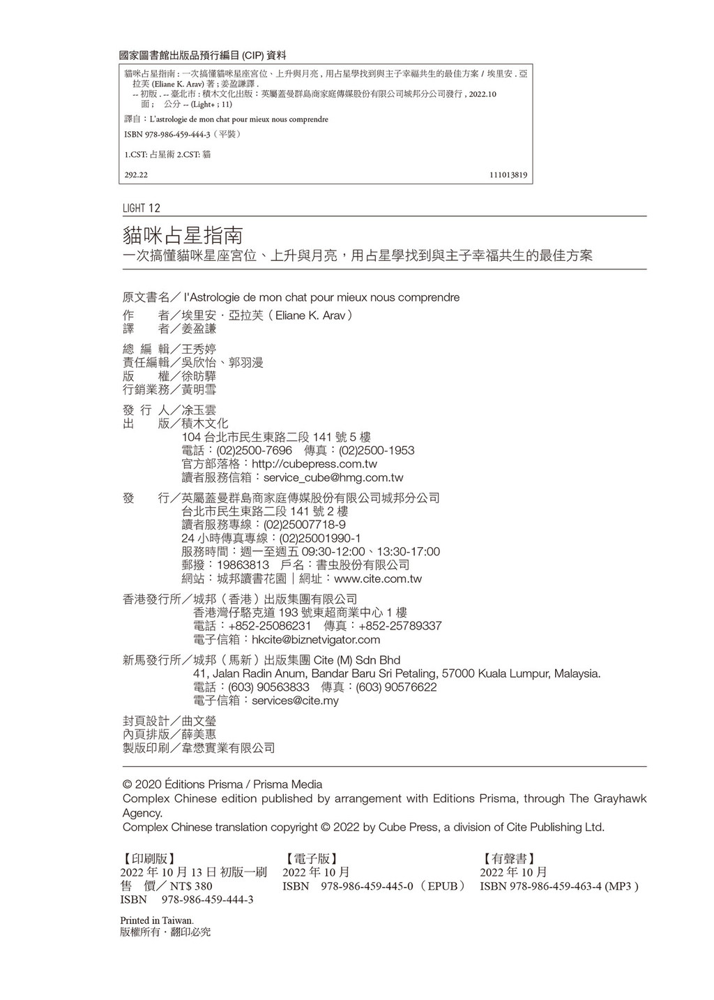