# 玄学锦囊姓名篇

### 圓方立極

「天圓地方」是傳統中國的宇宙觀，象徵天地萬物，及其背後任運自然、生生不息、無窮無盡之大道。早在魏晉南北朝時代，何晏、王弼等名士更開創了清談玄學之先河，主旨是在於透過思辨及辯論以探求天地萬物之道，當時是以《老子》、《莊子》、《易經》這三部著作為主，號稱「三玄」。東晉以後因為佛學的流行，佛法便也融匯在玄學中。故知，古代玄學實在是探索人生智慧及天地萬物之道的大學問。

可惜，近代之所謂玄學，卻被誤認為只局限於「山醫卜命相」五術及民間對鬼神的迷信，故坊間便泛濫各式各樣導人迷信之玄學書籍，而原來玄學作為探索人生智慧及天地萬物之道的本質便完全被遺忘了。

有見及此，我們成立了「圓方出版社」（簡稱「圓方」）。《孟子》曰：「不以規矩、不成方圓」。所以，「圓方」的宗旨，是以「破除迷信、重人生智慧」為規，藉以撥亂反正，回復玄學作為智慧之學的光芒；以「重理性、重科學精神」為矩，希望能帶領玄學進入一個新紀元。「破除迷信、重人生智慧」即「圓而神」，「重理性、重科學精神」即「方以智」，既圓且方，故名「圓方」。

出版方面，「圓方」擬定四個系列如下：

- 1. 「智慧經典系列」：讓經典因智慧而傳世；讓智慧因經典而普傳。
- 2. 「生活智慧系列」：藉生活智慧，破除迷信；藉破除迷信，活出生活智慧。
- 3. 「五術研究系列」：用理性及科學精神研究玄學；以研究玄學體驗理性、科學精神。
- 4. 「流年運程系列」：「不離日夜尋常用，方為無上妙法門。」不帶迷信的流年運程書，能導人向善、積極樂觀、得失隨順，即是以智慧趨吉避凶之大道理。

此外，「圓方」成立了「正玄會」，藉以集結一群熱愛「破除迷信、重人生智慧」及「重理性、重科學精神」這種新玄學的有識之士，並效法古人「清談玄學」之風，藉以把玄學帶進理性及科學化的研究態度，更可廣納新的玄學研究家，集思廣益，使玄學有另一突破。

### 蘇民峰

長髮，生於一九六○年，人稱現代賴布衣，對風水命理等術數有獨特之個人見解。憑著天賦之聰敏及與術數的緣分，對於風水命理之判斷既快且準，往往一針見血，疑難盡釋。

以下是蘇民峰這三十年之簡介：

八三年
開始業餘性質會客以汲取實際經驗。

八六年
正式開班施教，包括面相、掌相及八字命理。

八七年
毅然拋開一切，隻身前往西藏達半年之久。期間曾遊歷西藏佛教聖地「神山」、「聖湖」，並深入西藏各處作實地體驗，對日後人生之看法實跨進一大步。回港後開設多間店鋪（石頭店），售賣西藏密教法器及日常用品予有緣人士，又於店內以半職業形式為各界人士看風水命理。

八八年
夏天受聘往北歐勘察風水，足跡遍達瑞典、挪威、丹麥及南歐之西班牙，回港後再受聘往加拿大等地勘察。同年接受《繽紛雜誌》訪問。

八九年
再度前往美加，為當地華人服務，期間更多次前往新加坡、日本、台灣等地。同年接受《城市周刊》訪問。

九○年
夏冬兩次前往美加勘察，更多次前往台灣，又接受台灣之《翡翠雜誌》、《生活報》等多本雜誌訪問。同年授予三名入室弟子蘇派風水。

九一年
續去美加、台灣勘察。是年接受《快報》、亞洲電視及英國BBC國家電視台訪問。所有訪問皆詳述風水命理對人生的影響，目的為使讀者及觀眾能以正確態度去面對人生。同年又出版了「現代賴布衣手記之風水入門」錄影帶，以滿足對風水命理有研究興趣之讀者。

九二年
續去美加及東南亞各地勘察風水，同年 BBC 之訪問於英文電視台及衛星電視「出位旅程」播出。此年正式開班教授蘇派風水。

九四年
首次前往南半球之澳洲勘察，研究澳洲計算八字的方法與北半球是否不同。同年接受兩本玄學雜誌《奇聞》及《傳奇》之訪問。是年創出寒熱命論。

九五年
再度發行「風水入門」之錄影帶。同年接受《星島日報》及《星島晚報》之訪問。

九六年
受聘前往澳洲、三藩市、夏威夷、台灣及東南亞等地勘察風水。同年接受《凸周刊》、《壹本便利》、《優閣雜誌》及美聯社、英國 MTV 電視節目之訪問。是年正式將寒熱命論授予學生。

九七年
首次前往南非勘察當地風水形勢。同年接受日本 NTV 電視台、丹麥電視台、《置業家》、《投資理財》及《成報》之訪問。同年創出風水之五行化動土局。

九八年
首次前往意大利及英國勘察。同年接受《TVB 周刊》、《B International》、《壹周刊》等雜誌之訪問，並應邀前往有線電視、新城電台、商業電台合作嘉賓。

九九年
再次前往歐洲勘察，同年接受《壹周刊》、《東周刊》、《太陽報》及無數雜誌、報章訪問，同時應邀往商台及各大電視台合作嘉賓及主持。此年推出首部著作，名為《蘇民峰觀相知人》，並首次推出風水鑽飾之「五行之飾」、「陰陽」、「天圓地方」系列，另多次接受雜誌進行有關鑽飾系列之訪問。

二千年
再次前往歐洲、美國勘察風水，並首次前往紐約，同年 masterso.com 網站正式成立，並接受多本雜誌訪問關於網站之內容形式，及接受校園雜誌《Varsity》、日本之《Marie Claire》、復康力量出版之《香港100個叻人》、《君子》、《明報》等雜誌報章作個人訪問。同年首次推出第一部風水著作《蘇民峰風生水起（巒頭篇）》、第一部流年運程書《蛇年運程》及再次推出新一系列關於風水之五行鑽飾，並應無線電視、商業電台、新城電台合作嘉賓主持。

○一年
再次前往歐洲勘察風水，同年接受《南華早報》、《忽然一周》、《蘋果日報》、日本雜誌《花時間》、NITV電視台、關西電視台及《讀賣新聞》之訪問，以及應紐約華語電台邀請作玄學節目嘉賓主持。同年再次推出第二部風水著作《蘇民峰風生水起（理氣篇）》及《馬年運程》。

○二年
再一次前往歐洲及紐約勘察風水。續應紐約華語電台邀請作玄學節目嘉賓主持，及應邀往香港電台合作嘉賓主持。是年出版《蘇民峰玄學錦囊（相掌篇）》、《蘇民峰八字論命》、《蘇民峰玄學錦囊（姓名篇）》。同年接受《3週刊》、《家週刊》、《快週刊》及日本的《讀賣新聞》之訪問。

○三年
再次前往歐洲勘察風水，並首次前往荷蘭，續應紐約華語電台邀請作玄學節目嘉賓主持。同年接受《星島日報》、《新假期》、《東方日報》、《成報》、《太陽報》、《壹周刊》、《壹本便利》、《蘋果日報》、《文匯報》、《自主空間》之訪問，及出版《蘇民峰玄學錦囊（風水天書）》與漫畫《蘇民峰傳奇1》。

○四年
再次前往西班牙、荷蘭、歐洲勘察風水，續應紐約華語電台邀請作風水節目嘉賓主持，及應有線電視、華娛電視之邀請作其節目嘉賓，同年接受《新假期》、《MAXIM》、《壹周刊》、《太陽報》、《東方日報》、《星島日報》、《成報》、《經濟日報》、《快週刊》、《Hong Kong Tatler》之訪問，及出版《蘇民峰之生活玄機點滴》、漫畫《蘇民峰傳奇 2》、《家宅風水基本法》、《The Essential Face Reading》、《The Enjoyment of Face Reading and Palmistry》、《Feng Shui by Observation》及《Feng Shui — A Guide to Daily Applications》。

○五年始
應邀為無線電視、有線電視、亞洲電視、商業電台、日本 NHK 電視台合作嘉賓或主持，同時接受《壹本便利》、《味道雜誌》、《3週刊》、《HMC》雜誌、《壹週刊》之訪問，並出版《觀掌知心（入門篇）》、《中國掌相》、《八字萬年曆》、《八字入門捉用神》、《八字進階論格局看行運》、《生活風水點滴》、《風生水起（商業篇）》、《如何選擇風水屋》、《談情說相》、《峰狂遊世界》、《瘋蘇 Blog Blog 趣》、《師傅開飯》、《蘇民峰美食遊蹤》、《A Complete Guide to Feng Shui》、《Practical Face Reading & Palmistry》、《Feng Shui — a Key to Prosperous Business》、五行化動土局套裝、《相學全集一至四》、《風生水起（理氣篇）》、《風生水起（巒頭篇）》、《風生水起（例證篇）》、《八字秘法（全集）》、《簡易改名法》、《八字筆記（全集）》等。

蘇民峰顧問有限公司

網址：http://www.masterso.com

預約及會客時間：星期一至五下午二時至五時）

### 自序

俗語有謂：「唔怕生壞命，最怕改為壞名」。因此，很多父母為求子女一生順利，學業、事業有成，身體健康，活得開心，過得快樂，都會非常認真地為孩子挑個好名字。這本玄學錦囊《姓名篇》，也就應運而生了。

姓名學包含多個派別，例如部首派、畫數派、五行派、八字派等，當中以畫數派最為普及。而本人所創的「蘇派簡易改名法」之用法就最為簡單，只要計算出自己到底屬於寒命、熱命或平命，便可進行改名。

至於書中介紹的取名用字原則，則建基於中國古代的改名法——以五音五行為重點，配合個人之出生時辰及命格所需之五行，然後再配以畫數靈動吉凶，來定出一個好名字。

讀者參考本書時，會發現有些字會歸屬於不同筆畫數的欄目下，這是因為漢字有正寫和俗寫之分，例如「逸」字的正寫為十二畫，俗寫卻是十三畫；「紫」字的正寫為十一畫，俗寫卻是十二畫。事實上，兩者皆可用，沒有對錯之分。

此外，本書以五音定五行，就是根據唇、舌、喉、牙、齒音來釐訂該字到底應歸類於水、火、土、木、金哪一類。但由於某些文字同時以兩個甚至三個器官發音，故此同一個字也會被歸屬於兩個或三個的五行，例如「賢」字需並用牙、齒發音，所以五行既屬金，也屬木。讀者使用時，宜多加注意。

## 姓名篇

# 部首派

是以每字之部首畫數計算，如：

「草」字——草花頭作「艸」，以六畫算，所以草字為十二畫。

「這」字——辶作辵字算，所以這字為十四畫。

「潛」字——氵作水字算，所以潛字為十六畫。

「忙」字——忄作心字算，所以忙字為七畫。

餘此類推。其他例子如下：

- 忄 = 心 4 畫
- 扌 = 手 4 畫
- 氵 = 水 4 畫
- 犭 = 犬 4 畫
- (左) 阝 = 阜 8 畫
- (右) 阝 = 邑 7 畫

- 王 = 玉 5 畫
- 罒 = 网 6 畫
- 穴 = 网 6 畫
- 冈 = 网 6 畫
- 月 = 肉 6 畫
- 艹 = 艸 6 畫
- 辶 = 辵 7 畫

- 歹 = 歹 4 畫
- 母 = 毋 4 畫
- 氺 = 水 4 畫
- 罒 = 网 6 畫
- 衤 = 衣 6 畫

# 字面派

字面派即以字面畫數計算，如：

- 「草」字——為十畫。
- 「這」字——為十一畫。
- 「潛」字——為十三畫。
- 「忙」字——為六畫。

# 字面五行派

有木字部或草木之意，字屬木；有火字旁及有火字之意，屬火；有土字旁及有土之意的字，屬土；有金字旁及金字之意的字，屬金；有水字旁或有水字之意的字，屬水。例如：

- 木——草、林、森、禾等字。

# 五音五行派

五音五行派是根據中國五音所屬之五行而定出每字發音的五行。

- 角——木——牙音（月、元、彥、紀）
- 徵——火——舌音（斗、天、油、東）

註：這個單看字面有金、木、水、火、土之字而定其五行的做法是錯的，因五行其實依據發音而定。

- 火——火、炎、烹、爐等字。
- 土——土、壁、石、牆、路等字。
- 金——金、鑫、銅、鋼等字。
- 水——水、濕、淼、湖、海等字。

# 畫數派

現代的姓名學大多宗師於畫數派。畫數派其實原創於日本，再傳至台灣，然後再流傳至香港。此派主要將名字的畫數分成一至八十一畫，然後定出甚麼畫數為凶數，甚麼畫數為吉數，並配以天格、人格、地格、外格、總格，從而定出姓名之吉凶禍福。

- 宮——土——喉音（尤、日、易、阿）
- 商——金——齒音（氏、升、丞、思）
- 羽——水——唇音（文、比、炳、保）

以上五音，水用唇發音，火用舌頭發音，土用喉嚨發音，比較容易掌握，但木用牙發音，金用齒發音，則比較容易混淆，故宜多加練習，好好掌握。

註：正式之每字之五行所屬是以每字的發音計算。

# 玄學錦囊

## 姓名篇

而我這書所用的姓名學，是以字面畫數、五音五行，再配以畫數吉凶，從而定出一個好名字。

我在本書介紹的取名方法，是建基於中國古代的改名法。此法以五行爲重點，並配以個人出生之時辰、行業之五行、地運之五行及所需之五行，再配合畫數之靈動吉凶，來定出一個理想的名字。

### 改名法

# 玄學錦囊

## 姓名篇

# 地運五行法

不論人名或公司名字，改名時皆可參考地運五行。如七運屬金，可用金旺的名字；如八運屬土，則可用土旺的名字。

以下為各地運之五行屬性：

- 八運屬土（二〇〇四至二〇二三年）
- 九運屬火（二〇二四至二〇四三年）
- 一運屬水（二〇四四至二〇六三年）
- 二運屬土（二〇六四至二〇八三年）
- 三運屬木（二〇八四至二一〇三年）
- 四運屬木（二一〇四至二一二三年）
- 五運屬土（二一二四至二一四三年）
- 六運屬金（二一四四至二一六三年）
- 七運屬金（二一六四至二一八三年）

然後餘此類推，一百八十年為一個循環。

地運改名法主要利用九星五行來生旺自己或公司名字之五行，從而提升個人的信心和運氣。所以不論運數五行或運數五行所生，皆可為用。如八運屬土，可用土及金的名字，因為土可生金；如九運屬火，可用火及土的名字；如一運屬水，則可用水及木的名字，餘此類推。

# 八字改名法

此法主要依據自己出生的八字五行所屬，從而產生「生我」、「剋我」、「我生」、「我剋」及「同我」。

「我生」者為思想、學習、智慧。

「我剋」者為財，男命亦為妻。

「剋我」者為地位、權力，女命為夫。

「生我」者為長輩、貴人、名氣。

「同我」者為我及朋友助力。

改名時，可根據上述的五種原理，來選擇自己所要或所欠的東西並加以配合。

例如閣下屬木：

「我生」者為火——火代表閣下之智慧，如命中欠火或正在求學階段，便可以取火重之名字，以增智慧。

「我剋」者為財——木剋土，土為木之財，亦為男命之妻。故如命中欠土財，則可改土旺之名字，從而增加財運及姻緣運。

「剋我」者為地位、權力——金剋木，金為木之地位、權力，亦為女命之夫。如閣下想在權力上有所突破，又命中權力、地位無力，便可改金重的名字，藉以增加個人名望。至於女命，亦可以此增加姻緣運。

「生我」者為長上、貴人、名氣——

水生木，水為木之貴人、名氣。如命中水弱，可改水重的名字，從而增加貴人及名氣。

「同我」者為個人力量——

木見木為「同我」。如閣下從事專業或個人力量得財之工作，如律師、醫生、會計師、建築師，又或是從事多勞多得之工作，如地產經紀、金融業、美容業、表演事業等，均可利用木見木為「同我」的原則，透過增加木的力量，來增加工作量，從而達致多勞多得的效果。

如欲運用八字改名法，首先要知道自己的五行所屬，然後再找出何種五行有利自己之工作運、財運、姻緣運等。但因為不是每一個人都知道自己的五行所屬及五行之衰旺，又人在每一個時期都有不同之需要，所以八字改名法不太適合一般人使用。

#### 蘇民峰簡易改名法

此法以中國改名法所用之五行再配以熊崎式之畫數吉凶而成，原理簡單。用者只要計算自己到底屬於寒命、熱命還是平命，便可進行改名。

- 寒命——生於西曆八月八日（立秋）後，三月六日（驚蟄）前，宜用木、火名字。
- 熱命——生於西曆五月六日（立夏）後，八月八日（立秋）前，宜用金、水名字。
- 平命——生於西曆三月六日（驚蟄）後，五月六日（立夏）前，木、火、土、金、水皆可為用，然以金、水較佳。

得悉自己屬寒命、熱命還是平命以後，只需再配以畫數之吉凶即可，其他三才、陰陽可不用理會。

#### 公司改名法

一、可用八字改名法。

二、可用蘇民峰簡易改名法。

如果公司沒有主要股東，則可用行業改名法：

三、行業改名法——此法以從事的行業之五行為主，宜根據此行業或旺此行業的五行取名。

如從事飲食業，飲屬水，食屬火，如以飲為主則宜用金、水之字，如以食為主，則宜用木、火之字。

如從事服裝銷售，由於衣服屬木，故宜改水、木之名字。

#### 行業所屬之五行

木——一切與植物有關之行業，如中藥、紙張、成衣、家俬等。

火——一切與發熱、燃燒有關之行業，如電器、電子產品、食物、塑膠、石油副產品等。

土——一切有關土、石之行業，如建築、建築材料等。

金——一切關於金屬之行業，如五金、機器、珠寶首飾等。

水——一切流動性之行業，如貿易、航運、旅遊、運輸、銀行、金融、經紀等。

只要再配以八十一畫靈動數，便可取得一個有利公司發展的名字。

### 五格、三才及陰陽

#### 五格

中國所用之五行改名法，比較注重字音之五行所屬。但現代流行之熊崎式姓名學，則注重五格——天格、人格、地格、總格、外格——所組成的畫數吉凶。此學要求五格皆吉才是一個好名字，且當中還講求三才的相互配合——相生為吉，相剋為凶。筆者經過詳細研究後發現，如要配合五格畫數之吉凶，三才便會出現相剋之象；如要配合三才之吉凶，則畫數必然會出現問題，因姓為先天所限，而有些姓氏本來可以選擇的組合就很少。所以要合乎規則，便難上加難。為使各讀者既能容易地依從中國五行改名之法則，又能用上熊崎式之畫數吉凶，我們只好選用較簡易之改名法。

##### 熊崎式改名法

從以上四個格式，各位讀者不難發現，熊崎式改名法是每個名字皆以四個字為準則，所以二字姓名、三字姓名，必須在姓之上或名之下加上一畫以組成四個字，從而形成天格、地格、人格、總格、外格。但這樣又會出現另一個問題——如果姓氏是由三個字、四個字組成，又怎樣計算呢？就算不考慮這點，以中國北方的改名習慣，他們改名時多取單字，這樣會形成外格一定是二畫。但根據此姓名學之法則，二畫為破滅、短壽之數，又外格為副運、家運、社會關係，那是否表示取單字名字的人之家運都不好呢？又名分四字，主要是配合日本人的名字大多由四個字組成。所以，當我們中國人取名字時，都不會遵從上列方法，例子可見於下頁。

##### 五格代表義

###### 天格

為姓之組合，吉凶並無意義。

###### 人格

為姓名學之中心點，用以判斷人一生的吉凶好壞。如人格吉，則他格即使不佳，大體仍以吉論；但人格凶，則即使他格配合適宜，亦無所用。

####### 人格畫數吉凶判斷

######## 一 人格有一畫之尾數

人格有十一、二十一、三十一、四十一等數，代表其人個性沉着，重理智，守信用。雖然外表溫和，但內裏決斷，具有百折不撓之精神。若他格無不利之配置，事業必能出人頭地，婚姻亦多美滿，惟桃花較重，人較貪財。

######## 二 人格有二畫之尾數

人格有二、十二、二十二、三十二、四十二等數，在個性方面較為固執，不但貪財好色，而且妒忌心亦較重。惟其人具有不屈之精神，故只要加強克己之力，自能達致成功。

######## 三 人格有三畫之尾數

人格有三、十三、二十三、三十三、四十三等數，為人感情豐富，熱情奔放，富動感，有活力，有才情，手腕靈活，但愛好權勢，亦缺乏忍耐力，所以要嚴加克己。

######## 四 人格有四畫之尾數

人格有四、十四、二十四、三十四、四十四等數，個性較為沉默寡言，但內心浮躁，喜作意氣之爭。其人雖然機智、善變通、有口才，惟好口舌之爭，常常因小失大，樹敵亦多，以致易遭災害，而且家緣薄、人緣差。只有二十四畫為吉數，具機智謀略，能成大事。

######## 五 人格有五畫之尾數

人格有五、十五、二十五、三十五、四十五等數，其人外冷內熱，心地善良，有人情味，富同情心，性格堅強，處事踏實，易得長上貴人扶助，亦受下屬之敬愛。惟其人感情善變，既易與人接近，亦易與人疏遠，忽冷忽熱。另外，此局易得人緣，受人尊敬，同時亦易招人妒忌。

######## 六 人格有六畫之尾數

人格有六、十六、二十六、三十六、四十六等數，表面溫純，內裏剛強，但大多為怪異之數，尤以二十六畫為甚，必須得他格配合才能提升運氣，減低凶險，達致成功。

######## 七 人格有七畫之尾數

人格有七、十七、二十七、三十七、四十七等數，格局不大，難得人認同，適宜從事個人工作，以發揮堅忍意志。另外，其人缺乏領導才能，卻喜愛權勢、愛出風頭。

######## 八 人格有八畫之尾數

人格有八、十八、二十八、三十八、四十八等數，性格剛毅，不善變通，頑固，難與人和睦相處。由於其人言詞不善，得罪人而不自知，以致招來厄難，宜在個人修養上多下點功夫。女性有此數，則難與夫和洽相處，尤以二十八畫最差。

######## 九 人格有九畫之尾數

人格有九、十九、二十九、三十九、四十九等數，生性好動，難有一刻安靜。其人雖有智謀，但為人放縱，任意行事，行為荒誕，要有一番成就，非要在個性修養上一點苦功不可。

######## 十 人格有十畫之尾數

人格有十、二十、三十、四十、五十等數，有不動之象，如井水、湖水，靜而待用。其人才智雖強，但無處發揮，惟一旦時機來臨，必如水出大海，波瀾萬象，任意發揮。

###### 地格

地格為前運，為上半生之運氣。如與人格配合得宜，則早登雲路；如配合不宜，則互相牽制。同時，地格亦作判斷下屬晚輩有否助力之格。

###### 總格

總格為判斷後運、中晚年之格。如配合得宜，對早運亦有一定之幫助；如配合不佳，則晚運難免崎嶇難行，淒涼零落。

###### 外格

外格為副運，主外在及家族之助力。如外格配合得宜，一生易得外力之助，做事事半功倍。即人格不佳，亦可發揮很大的補助作用。如人格與外格俱佳，而其他兩格配合稍差，亦無影響。但如人格、外格皆為凶，則其他兩格亦難起扶助之用。

#### 三才

三才之法將天格、人格、地格畫分成木、火、土、金、水五行。如三格五行相生或相同，一般為吉，但如遇相剋則為凶。然而它們之間亦不能過旺，如出現天、地、人三格皆木、皆火、皆土、皆金、皆水，便為過旺。

> 註：只供參考，因本人改名之時亦不用此法。中國的姓名學側重每字的五音之五行，惟這個三才法乃由日本人所創，由於其對字音五行並不認識，故才另定五行。

##### 畫數五行陰陽表

- 一數屬陽木，三數屬陽火，五數屬陽土，七數屬陽金，九數屬陽水。
- 二數屬陰木，四數屬陰火，六數屬陰土，八數屬陰金，十數屬陰水。

> 註：這個五行算法亦可不需理會。

##### 三才吉凶配置表

| 三才配置 | 吉凶 | 解釋 |
| :--- | :--- | :--- |
| 木木木 | 吉 | 意志堅強 |
| 木木火 | 吉 | 天資機敏 |
| 木木土 | 吉 | 堅持忍耐 |
| 木木金 | 凶 | 氣管問題 |
| 木木水 | 凶 | 放蕩無制 |
| 木土木 | 凶 | 胃腸不佳 |
| 木土火 | 吉 | 人緣甚佳 |
| 木土土 | 吉 | 刻苦成功 |
| 木土金 | 平 | 用力可成 |
| 木土水 | 凶 | 有志難伸 |
| 木火木 | 吉 | 上下和睦 |
| 木火火 | 吉 | 堅忍成功 |
| 木火土 | 吉 | 長上扶助 |
| 木火金 | 凶 | 皮膚特差 |
| 木火水 | 凶 | 急變難成 |
| 木金木 | 凶 | 心神勞累 |
| 木金火 | 凶 | 欠成功運 |
| 木金土 | 凶 | 肝胃不佳 |
| 木金金 | 凶 | 性情頑固 |
| 木金水 | 凶 | 一生多變 |
| 木水木 | 吉 | 吉凶分明 |
| 木水火 | 凶 | 功難長久 |
| 木水土 | 凶 | 多變多難 |
| 木水金 | 凶 | 注意腦部 |
| 木水水 | 平 | 必定穩步 |
| 火火木 | 吉 | 一帆風順 |
| 火火火 | 平 | 注意心血 |
| 火火土 | 吉 | 可望成功 |
| 火火金 | 凶 | 身心過勞 |
| 火火水 | 凶 | 防腦溢血 |
| 火木木 | 吉 | 勤儉得財 |
| 火木火 | 吉 | 穩定發展 |
| 火木土 | 吉 | 進取心強 |
| 火木金 | 凶 | 成功多變 |
| 火木水 | 凶 | 聰明反誤 |
| 火土木 | 凶 | 腹疾宜防 |
| 火土火 | 吉 | 長輩提拔 |
| 火土土 | 吉 | 福壽綿長 |
| 火土金 | 吉 | 平安度日 |
| 火土水 | 凶 | 易得易失 |
| 土木水 | 凶 | 流離失所 |
| 土木金 | 凶 | 呼吸不調 |
| 土木土 | 凶 | 神經衰弱 |
| 土木火 | 平 | 身心多窘 |
| 土木木 | 平 | 苦惱繁多 |
| 火金水 | 凶 | 防腦沖血 |
| 火金金 | 凶 | 肺骨不佳 |
| 火金土 | 凶 | 身心過勞 |
| 火金火 | 凶 | 肺部不調 |
| 火金木 | 凶 | 呼吸受損 |
| 土火水 | 凶 | 易發易喪 |
| 土火金 | 凶 | 身心勞累 |
| 土火土 | 吉 | 一飛沖天 |
| 土火火 | 吉 | 忍讓成功 |
| 土火木 | 吉 | 平安福壽 |
| 火水水 | 凶 | 難望成功 |
| 火水金 | 凶 | 多災多難 |
| 火水土 | 凶 | 有志難伸 |
| 火水火 | 凶 | 自殺之憂 |
| 火水木 | 凶 | 不測之災 |
| 土水水 | 凶 | 有志難伸 |
| 土水金 | 凶 | 不滿現狀 |
| 土水土 | 凶 | 懷才不遇 |
| 土水火 | 凶 | 多生禍亂 |
| 土水木 | 凶 | 徒勞無功 |
| 土土水 | 凶 | 根基不穩 |
| 土土金 | 吉 | 身心康泰 |
| 土土土 | 平 | 可望成功 |
| 土土火 | 吉 | 幸福長壽 |
| 土土木 | 凶 | 腸疾宜防 |
| 金木水 | 凶 | 早運不佳 |
| 金木金 | 凶 | 勢孤力弱 |
| 金木土 | 凶 | 與人不睦 |
| 金木火 | 凶 | 半途而廢 |
| 金木木 | 凶 | 神經不調 |
| 土金水 | 吉 | 成功可期 |
| 土金金 | 吉 | 名利雙收 |
| 土金土 | 吉 | 境遇安泰 |
| 土金火 | 凶 | 晚境不佳 |
| 土金木 | 凶 | 提防腦疾 |
| 金金水 | 平 | 性情頑固 |
| 金金金 | 平 | 口舌相爭 |
| 金金土 | 吉 | 和氣生財 |
| 金金火 | 凶 | 身心過勞 |
| 金金木 | 凶 | 易見損傷 |
| 金火水 | 凶 | 孤立無援 |
| 金火金 | 凶 | 身心勞累 |
| 金火土 | 凶 | 情緒不定 |
| 金火火 | 凶 | 頭肺不佳 |
| 金火木 | 凶 | 肺經不調 |
| 金水水 | 平 | 一生飄流 |
| 金水金 | 吉 | 長上提攜 |
| 金水土 | 凶 | 悶難成 |
| 金水火 | 凶 | 腳踏虛浮 |
| 金水木 | 凶 | 家庭不睦 |
| 金土水 | 凶 | 腎部不佳 |
| 金土金 | 吉 | 貴人扶助 |
| 金土土 | 吉 | 名利兩全 |
| 金土火 | 吉 | 有名有利 |
| 金土木 | 凶 | 肝胃不調 |
| 水土水 | 凶 | 事多阻滯 |
| 水土金 | 平 | 中年安定 |
| 水土土 | 吉 | 穩重平安 |
| 水土火 | 凶 | 家庭不睦 |
| 水土木 | 凶 | 胃部不佳 |
| 水木水 | 凶 | 水旺木浮 |
| 水木金 | 凶 | 肝膽不佳 |
| 水木土 | 平 | 勞而有功 |
| 水木火 | 凶 | 上下交戰 |
| 水木木 | 吉 | 身心康泰 |
| 水金水 | 凶 | 財色招災 |
| 水金金 | 吉 | 發展迅速 |
| 水金土 | 吉 | 平穩向上 |
| 水金火 | 凶 | 肺部不調 |
| 水金木 | 凶 | 易有損傷 |
| 水火水 | 凶 | 水火交戰 |
| 水火金 | 凶 | 身心勞損 |
| 水火土 | 凶 | 快上快落 |
| 水火火 | 凶 | 水火不濟 |
| 水火木 | 凶 | 木助火炎 |

此外還有人格與外格之配合吉凶。

| 人格 | 木 | 木 | 木 | 木 | 木 |
| :--- | :--- | :--- | :--- | :--- | :--- |
| 外格 | 水 | 金 | 土 | 火 | 木 |
| 吉凶 | 凶 | 吉 | 吉 | 平 | 吉 |
| 解釋 | 好出風頭 | 謙讓有禮 | 磨練成材 | 只為副手 | 言少行多 |

| 人格 | 水 | 水 | 水 | 水 | 水 |
| :--- | :--- | :--- | :--- | :--- | :--- |
| 外格 | 水 | 金 | 土 | 火 | 木 |
| 吉凶 | 凶 | 凶 | 凶 | 凶 | 凶 |
| 解釋 | 體弱短壽 | 自專心強 | 變化不定 | 變化不定 | 性情放蕩 |

| 人格 | 火 | 火 | 火 | 火 | 火 |
| :--- | :--- | :--- | :--- | :--- | :--- |
| 外格 | 水 | 金 | 土 | 火 | 木 |
| 吉凶 | 凶 | 凶 | 吉 | 凶 | 平 |
| 解釋 | 水火不調 | 言詞不慎 | 為人誠實 | 無忍耐力 | 異性之助 |

| 人格 | 土 | 土 | 土 | 土 | 土 |
| :--- | :--- | :--- | :--- | :--- | :--- |
| 外格 | 水 | 金 | 土 | 火 | 木 |
| 吉凶 | 凶 | 凶 | 吉 | 吉 | 平 |
| 斷語 | 易得罪人 | 徒勞無功 | 堅忍成功 | 異性相助 | 平穩無憂 |

| 人格 | 金 | 金 | 金 | 金 | 金 |
| :--- | :--- | :--- | :--- | :--- | :--- |
| 外格 | 水 | 金 | 土 | 火 | 木 |
| 吉凶 | 凶 | 凶 | 吉 | 凶 | 凶 |
| 斷語 | 財色所累 | 酒色迷心 | 堅忍不屈 | 任性妄為 | 不敬雙親 |

#### 陰陽

除三才、人格及外格要配合得宜外，還需注意陰陽的配合。

- 一、三、五、七、九畫為陽。
- 二、四、六、八、十畫為陰。

> 註：只供參考，可以不必配合。

#### 音配

- 兩個字之名字——陰陽，陽陰。
- 三個字之名字——陰陰陽，陰陽陽，陽陰陰，陽陽陰。
- 四個字之名字——陽陰陽陽，陽陰陽陰，陰陽陽陰，陰陽陰陽，陽陽陰陰，陰陰陽陽，陽陽陰陽，陰陰陰陽。

## 玄學錦囊 姓名篇

### 凶配

三個字之名字——陽陰陽，陰陽陰。

四個字之名字——陰陽陽陰，陽陰陰陽。

### 大吉大凶、大上大落之數

兩個字之名字——陽陽，陰陰。

三個字之名字——陽陽陽，陰陰陰。

四個字之名字——陽陽陽陽，陰陰陰陰。

### 八十一畫霹靂動理數

# 玄學錦囊

## 姓名篇

每個名字的五格均要配合畫數之靈動吉凶。八十一畫靈動理數是由「○、一、二、三、四、五、六、七、八、九」所組成，而萬物之生皆無窮盡，正所謂一生二，二生三，三生萬物是玄關。三三不盡而成九，九九為八十一之數，八十為數之盡頭，而八十一是為一之再開始。

#### 一畫 吉 天地開泰

天地初開，萬物生長之象，為大吉祥，健康福壽之數。

#### 二畫 凶 混沌模糊

混沌不清，三才不定，陰陽未分，進退失據，無獨立之氣魄，搖擺不定，一生難有所成。

#### 三畫 吉 陰陽初分

陰陽初分，萬物成形，為成就之象。其人有創造力，福壽綿長，能成大事，有領導才能。

#### 四畫 凶 五行未立

陰陽已定，但五行未分，有不完整之象，主體弱多病、夭折、死變、狂亂、破滅，為大凶之數。其中亦有孝子、節婦、怪傑等出自此數。

#### 五畫 吉 五行初定

五行已定，萬物分明，溫和敏捷，身健體佳，能得長上提攜，或復興家業，或異地功成，其人樂善好施，心地仁慈。

#### 六畫 吉 天覆地載

為人重理智、守信用，家庭和順，作事有序，如得時運配合，能成大事；即使他運不配，亦不致一敗塗地。

八十一畫靈動理數

# 玄學錦囊

## 姓名篇

#### 七畫 吉 萬物躍動

性情剛直，獨立獨行，但有時性情剛暴，行事過急，宜多加注意修養。女性有此數者，易為女強人，但每難容於男性社會，故宜假裝溫柔，使兩性平衡，以得魚水之歡。

#### 八畫 吉 動而有力

意志堅定，奮發功成，做事貫徹始終，勇往直前，以達成功之果。如配合不善，則體弱多病。得此數者，女性早婚不利，子緣不佳。

#### 九畫 凶 陽極難繼

凡事不可去盡，因至九之數，其氣已盡，乃萬物皆滅之象，主困苦、病弱。男性一生懷才不遇，潦倒不堪，忌車怕水；女性姻緣不定，主外遇、守寡、短壽。主運有此數者更凶。但偶有怪傑、富豪亦出於此數。

#### 十畫 凶 暗淡無光

萬物至終結之時，草木不生，其數更甚於九，代表前途黯淡，難見光明，主自殺、凶死。至於女性，則愛情生活黯淡，或短壽，或喪夫，一生難得幸福。

#### 十一畫 吉 絕處逢生

萬物無死絕之象，自有退避，然死絕以後再醞釀重生，如枯草逢春，萬物有更新之象，主一生循序漸進，自得成功。此為成就之數，然不宜早婚，又為養子之數。

#### 十二畫 凶 陽氣未足

萬物初生，陽氣未足，其氣柔弱，一遇狂風，即崩分離折，難達圓滿之境。此亦主緣薄，孤獨，自制力弱，難以衝破困難，為短壽之數。宜安分守己，切勿任意妄為。

八十一畫靈動理數

# 玄學錦囊

## 姓名篇

#### 十三畫 吉 光明已現

博學多才，文武雙全，仁厚穩重，操守廉正，能成大事，為富貴之數，亦易為養子之數。

#### 十四畫 凶 陰氣相侵

物壞之象，家屬緣薄，妻子不全，孤獨，離散，體弱短壽，如他運配合，望能平穩度過。

#### 十五畫 吉 否極泰來

妻財子祿、富貴福壽全之格。其人學識淵博，得長上提攜，能成就大事業。此人善祥有德，乃昌隆之數。

#### 十六畫 吉 乘時而起

克己助人，德量厚，包容力強，推己及人，能獲眾望，逢凶化吉。

#### 十七畫 吉 擇善而行

性情剛烈，正直不阿，但難容於人，易與人發生衝突。惟其人意志堅定，能排除萬難，達致成功。女性有此數則難免過剛，雖能成為女強人，但亦宜修養女德，使姻緣愈趨融和。

#### 十八畫 吉 光前裕後

威望有勢，有志竟成，意志堅忍，能排除障礙，克服困難而達致成功。惟性剛堅，宜多加個人修養，以得人和，遠離是非。女性能助旺夫運。

#### 十九畫 凶 徘徊不定

其數至九，氣將盡而未盡，屬大凶之數。其人少年運差，家緣薄，一生難得成功，每遇障礙挫折。即使有幸能獲一時之成功，終亦難以持久。此乃妻子不全，短壽之數。與九畫同。

八十一畫靈動理數

#### 二十畫 凶 氣數已盡

其數比十九畫更凶，為破裂之數，一生多劫，幼失扶持，刑妻剋子，短壽。女性得此數者，則在婚姻上每遇挫折，或重婚，或夫有外遇，或守寡。

#### 二十一畫 吉 一陽復來

一陽復至，萬象更新，乃先困苦而後成之數。為人樂觀，穩重而踏實，終能邁向成功，為首領之數。女性秀麗清雅，但有妻奪夫權之象，宜嫁老夫或少夫，婚姻可得安穩，為女強人之數。

#### 二十二畫 凶 陰陽相爭

陽氣方至而未定，為反覆之數，主懷才不遇，憂鬱疑慮，心意不定，常陷逆境，甚至有牢獄之災，身世孤零，有子亦不孝。女性則性生活凌亂，常有三角關係，最終成悲劇收場。

#### 二十三畫 吉 陽氣漸壯

旭日東昇之象，縱出身寒微，亦能力爭向上，達致圓滿之境。其人活潑、好動，有駕馭一切困難之能力，處事明敏果斷，能成大業。女性如有此數，與二十一畫相同，為免閨房冷清，宜遲婚及配老夫或少夫。

#### 二十四畫 吉 一旅中興

路途崎嶇，但能得天時、地利、人和。憑藉個人的才智謀略及創新發明，可白手成家，老而榮昌，而子孫亦能承繼其餘福。另外，女性亦多才多能，能旺夫、幫夫。

#### 二十五畫 吉 資性敏銳

資性敏銳，才能出眾，雖得天時地利，但欠人和，惟此亦為能得大成就之數，然而性情較偏。其人言詞尖銳，或有怪癖，宜加以修養，以達完美之境。女性才氣煥發，富人情味，感情豐富。

八十一畫靈動理數

# 玄學錦囊

## 姓名篇

#### 二十六畫 凶 怪傑之數

一生需經歷無數困難，為怪異英雄之數。其人賦性聰穎，有俠義精神，但遭時勢不順，有志難伸。如能堅持意志，突破困難，亦能成一代梟雄。男女有此數皆宜晚婚，又此數易有舟車之險。

#### 二十七畫 凶帶吉 不蔓不枝

吉凶成敗不定，宜一心一意向一條路發展，才容易成功。此數忌少年得志，因最後必然失敗收場。其人有時會因自尊心過強，而變得孤苦無助。若能自省其身，矯正弱點，待人溫和，處事公正，中年後亦能有一番成就。如不修養，則中年過後之運勢會逐漸減弱，終致失敗。女性如得此數，主剛強、饒舌、虛榮心重。

#### 二十八畫 凶 仰天長嘆

災難之數，主刑妻剋子，或一生潦倒。其人有江湖豪氣，每每肆無忌憚，常把自己陷於波瀾變動之境，除非八字特佳，方免此苦。此數不論男女皆見異思遷，子女不孝，為大凶之數。

#### 二十九畫 吉 龍遊大海

如魚得水，龍游大海，際遇非凡，聰明卓越，平步青雲，如龍乘雲霧，有上騰之勢。惟此格有雙妻之象。如女性有此數者，則易流於男性化。

#### 三十畫 吉帶凶 死而後生

吉凶未定，陰陽相侵，他格若能配合亦可成功。又此格主妻遲子晚，如早婚則刑傷子嗣，女性有再嫁、守寡之象。

#### 三十一畫 吉 志能遠達

智勇雙全，足踏實地，性情溫和，器量寬宏，有堅忍不屈之智，能衝破困難，建立個人聲譽，開創前程。女性能助夫興家，性情和順，子孫昌隆。

八十一畫靈動理數

# 玄學錦囊

## 姓名篇

#### 三十二畫 吉 堅持意志

一生好運之數，得長上貴人扶持。善掌機會者，大有成功之望，然切記飲水思源，否則終至落敗之境。女性有此數，易被情所困。

#### 三十三畫 吉 旭日東昇

有智謀才略，富貴福壽，乃家門昌隆大吉之數。其人勇敢果斷，任何艱難困苦都能突破，但中年以後恐有官非牢獄之災，宜堅定意志，勿任意妄為。又此數非常人之數，一般人不宜使用。女性有此數者明敏果斷，能得成就，惟一生較為孤獨。

#### 三十四畫 凶 馬失前蹄

凶氣相侵，大凶之數。得此格者，體弱多病，貧夭，做事常常違背良心。當凶煞一到，凶事自然接踵而來——喪偶、損子、刑傷、破家。

#### 三十五畫 吉 潤屋富身

溫和仁厚，量度大，有文學藝術修養，可得名利。惟男性過於內向，以保守為上；女性則賢良淑德，持家有道。

#### 三十六畫 凶 無風起浪

波浪浮沉不定之數，一生無處著力。縱有一時僥倖，亦困難重重，難得安穩。雖有俠義之心，但體弱，短壽，易有舟車之險，忌水。

#### 三十七畫 吉 慈心有德

熱誠仁厚，有威望，獨立獨行，能為他人設想，所以人緣佳而晚境昌隆。女性如得此格，主溫厚清潤，為幸福之數。

八十一畫靈動理數

# 玄學錦囊

## 姓名篇

#### 三十八畫 吉帶凶 堅心事成

平凡之數，難望有大成就。其人意志薄弱，稍遇挫折便退縮，無法貫徹始終，為文人藝術之數。惟只要堅持信念，自能達致成功。

#### 三十九畫 吉 富貴榮昌

雲開日現，波靜風平。雖然少年時困難稍多，但中年以後只要突破困難，自能邁向成功之境，達致富貴榮昌。此格乃權傾天下之數，然大貴之人命中必藏凶禍，又二十歲前後易有災厄。如婦女有此數，則難免過剛。

#### 四十畫 凶 進退失據

人才出眾，有才智膽量，然性情驕傲，乏人情味，失人和，易受人攻擊，加上好投機冒險，終致失敗收場。女性如得此格，主其人頑固而意志力薄弱，惡疾相纏。

#### 四十一畫 吉 德高望重

才智過人，有膽識、善謀略，前程光輝，能成大業，官運亦佳。女性得此格者，主優雅、溫柔而誠懇，有成人之美，能助夫興家，乃吉祥之數。

#### 四十二畫 吉帶凶 多學少成

此數聰明，多才多藝，然多學少成，終致一事無成。其人感情豐富而意志薄弱，且多愁善感，故宜堅定目標，專心一致，向一條路發展，才有成功之望。否則中年大敗，晚年孤苦，又大發明家多有此數。女性得此格者，少樂多愁，性情不定。

#### 四十三畫 吉帶凶 表面風光

外表風光，內裏憂愁，如家庭破落，只剩外表。人雖有才能，但好權術，即使能得一時之成功，最終亦因失信於人而招致失敗。如能腳踏實地，紮穩根基，充實自我，亦可能有成功之象。女性有此數者，性情孤獨，感情不定。

八十一畫靈動理數

# 玄學錦囊

## 姓名篇

#### 四十四畫 凶 秋草逢霜

傾家蕩產，大凶之數。即使才高八斗，學富五車，亦難逃厄運，難望有所成。且此數有狂亂之厄，故不出世之怪傑、偉人、烈士、孝子、節婦等常出於此數。

#### 四十五畫 吉 帆遇順風

一帆風順，經綸深，有謀略，智勇雙全，能創大業，為成功之數。女性有此數者，亦能旺夫益子，家室興隆。

#### 四十六畫 凶 大海撈針

大海撈針，一事無成，意志薄弱，即使出生富裕，最終亦變成敗家子，誤入歧途，招致牢獄之災。宜堅其意志，修身立德，望能於災難過後，達致成功。女性得此數者，易落風塵，短壽。

#### 四十七畫 吉 種瓜得瓜

貴人相顧，衣食豐足，生活自由自在，雖不是大富之格，但優游一生，子孫昌隆。

#### 四十八畫 吉 種豆得豆

一分耕耘，一分收穫，有才幹，有德望，功名顯達，富貴可期。女性賢良助夫，能得富貴。

#### 四十九畫 凶 吉凶參半

遇吉則吉，遇凶則凶，必須他格配合，方免凶禍，否則一生潦倒，時運不至，妻子不至。女性有再嫁、守寡、剋夫、剋子之象。

八十一畫靈動理數

# 玄學錦囊

## 姓名篇

#### 五十畫 吉帶凶 成敗興替

瞬間成功，轉眼即敗，故成功之時，勿忘退守，否則家破人亡，財散人離。女性愛奢華、愛美，宜多自重，多加約束自己。

#### 五十一畫 吉帶凶 得失難料

盛衰交加之數。得此格者，每是少年得志，早發早喪，晚年零落，所以成功之時勿忘退守。倘能持盈保泰，自可保晚年之運勢。

#### 五十二畫 吉 鯉躍龍門

鯉躍龍門，身價百倍，得此數者，為人能得先機，有先見之明，有回天之手段，能得大財，此乃一心一意達致成功，名利雙收之數。女性如得此數，主富貴清潤，夫榮子貴。

#### 五十三畫 吉帶凶 半吉半凶

時而吉，時而凶，表面風光，內心痛苦，前半生富貴，後半生潦倒困苦。女性難得好姻緣，有再嫁、守寡之象，宜晚婚，欠子媳。

#### 五十四畫 凶 多災多難

少樂多愁，大凶之數，有牢獄之災，此乃傾家蕩產或傷殘之數。

#### 五十五畫 吉帶凶 陽極陰生

五為大吉之數，但五五相並，盛極則衰，代表外表昌隆，內裏為衰，其勢不再，難以為繼，為吉凶疊至之數。得此數者，必須有百折不屈之精神、意志，方可於晚年衝破厄運，否極泰來。

八十一畫靈動理數

# 玄學錦囊

## 姓名篇

#### 五十六畫 凶 日落西山

事與願違，遇事退縮，缺乏勇氣，欠忍耐，意志薄弱，無成功之條件，乃短壽、自殺、凶死之數。

#### 五十七畫 吉帶凶 寒梅傲雪

寒梅耐雪，性情堅剛，有魄力。命中雖有挫折，但終能衝破厄運，達致成功，晚運昌隆。女性中年多災，晚年安樂。

#### 五十八畫 吉帶凶 先苦後甜

少年勞碌，或離祖破家，尤幸風浪過後，可享太平，但需有耐心，才能突破困難，邁向成功。女性得此數者，主先苦後甜，但聰明和善。

#### 五十九畫 凶 無才無勇

意志薄弱，自信不足，無才無勇，宜腳踏實地，安於本分。

#### 六十畫 凶 昏暗不定

前途暗淡無光，意志搖擺不定。做事出爾反爾，目標難定，豈能成功？最後難免困苦多病，一事無成。

#### 六十一畫 吉帶凶 內外不和

喜中有憂，內外不和，兄弟相鬥，妻子不全，宜多加注意修養，否則難以齊家。

#### 六十二畫 凶 吉難遠達

事業難以開展，煩悶苦惱，憂心忡忡，常有災厄，病弱短壽，乃難得幸福之數。

八十一畫靈動理數

# 玄學錦囊

## 姓名篇

#### 六十三畫 吉 顯達榮昌

陽回大地，其氣漸壯，能化育萬物，一切向上。得此數者，富貴有餘，良善有德，子孫綿綿，長壽健康。另外，此局主女性溫柔且賢良淑德。

#### 六十四畫 凶 流離失所

性情剛暴，難容於物，待人處事難得人和，一生常有災難，終生不幸，徒勞無功，苦命短壽，乃多災多厄之數。

#### 六十五畫 吉 福壽綿長

富貴榮昌，事事如意，能享盛名，長壽，身心康泰。女性得此數者，溫柔、仁厚、有量度。

#### 六十六畫 凶 進退維艱

人緣不佳，難與人共事，行事缺乏信用，內外不和，乃一生難有幸福之數。心地善良者，稍有晚福，否則體弱短壽。

#### 六十七畫 吉 通天達地

自主獨行之數，主其人能幹大事，功名事遂，家道榮昌。女性得此數者，賢慧且持家有道。

#### 六十八畫 吉 創業興家

思慮周詳，能斷是非，有決斷之才，有回天之力。其人意志堅定，堅守信用，能使家業中興，有發明之才華，能獲眾望。

八十一畫靈動理數

# 玄學錦囊

## 姓名篇

#### 六十九畫 凶 常陷逆境

不安之數，常陷逆境，難突破困難。此格主病弱、挫折、失意、精神狀態不佳、非業、短壽。

#### 七十畫 凶 物我俱亡

內心空虛，憂寂常臨，一生事難如意，殘疾，屬體弱之數。

#### 七十一畫 吉帶凶 一生隨緣

生性懶惰，做事無耐性，難成大業。宜奮發精神，晚年可享。

#### 七十二畫 吉帶凶 緣生緣滅

先苦後甜，得而復失，甘苦相替。得此數者，前半生幸福，後半生淒苦，乃表面風光內裏愁，幾許不足在心頭之數。

#### 七十三畫 吉 持盈保泰

持盈保泰，知足常樂，靜寂安逸。此數雖無大氣象、大成就，但生活平靜，能享現成之福氣。

#### 七十四畫 凶 回天乏力

逆運之數，回天乏力，主坐食山崩，無能無勇，難成大事，一生孤苦潦倒。

#### 七十五畫 吉帶凶 守靜為貴

無大志謀、大能力，一生宜靜守，不宜輕舉妄動。如能安分守己，可保一世平安，晚境清閒。

#### 七十六畫 凶 物之將敗

雖出生富貴，但家道中落，信譽、地位日降，終致家破人亡，骨肉分離。

八十一畫靈動理數

# 玄學錦囊

## 姓名篇

#### 七十七畫 吉帶凶 吉凶不齊

乃前吉後凶或後吉前凶之數。如出身寒微，中年以後可創一番事業，晚年康泰；如出生富貴，會漸漸孤窮，財散人離。

#### 七十八畫 吉帶凶 運程不繼

如中年以前成功，則運程不繼，晚境淒涼；如中年以後成功，則功名可維持至晚年。

#### 七十九畫 凶 志識愚蒙

無才能，無決心，前途黯淡，志識愚蒙，不知進退，難成大事。得此數者，縱能一時開花結果，亦屬成就不大之數。

#### 八十畫 吉帶凶 事多撓志

一生體弱多病，縱有才華亦難以實踐。如能及早向善，積德修心，可保安穩，衣食豐足。

#### 八十一畫 吉 萬象歸元

八十一畫為還原之數，主富貴福壽，名揚四海，為大吉之數。

註：以上之八十一畫靈動理數，雖為姓名學之主要依據，但姓名學其實只是其中一項參考而已。故此，如發現姓名畫數不理想時，切勿耿耿於懷。事實上，中國人所強調的「一命，二運，三風水，四積陰德，五讀書」才是至理名言。也就是說，命運佔七成，其他如風水、積德、學識亦有三成之力，故宜多加修養，行善積德。只要再配以個人的學識和環境布局，必能跨過逆境，邁向成功。如果以為取得一個好名字，便不用努力工作，有一番成就，就等於癡人說夢。所以歸根究柢，最重要的是人的因素。

八十一畫靈動理數

# 玄學錦囊

## 姓名篇

### 特別畫數

一、好色之數——
十七、二十三、二十六、二十七、三十三、四十三、五十二，凡有此數，不論男女，皆有好色之患。

二、和合之數——
十五、十九、二十四、二十五、二十六、二十八、三十二，凡有此數，不論男女，皆對愛人照顧有加，感情亦佳。

三、凌夫之數——
二十一、二十三、三十三，凡有此數，皆主妻奪夫權，有凌夫之象。如不能配老夫或少夫，則易成寡婦。

#### 四、分離之數

九、十、十七、十九、二十、二十一、二十三、二十六、二十七、二十八、二十九、三十、三十四、四十二、四十三，凡有此數，均難與配偶白頭偕老，以遲婚、硬配為佳。

#### 五、祖蔭之數

三、五、六、十一、十三、十五、十六、二十四、三十一、三十二、三十五，凡有此數者，易得祖蔭，否則亦能漸漸興家。

#### 六、財富之數

十五、十六、二十四、三十二、三十三、四十一、五十二，凡有此數，可白手成家，財富亨通。

八十一畫靈動理數

# 玄學錦囊

## 姓名篇

#### 七、破壞之數

二十、二十八、三十六、四十、五十，凡有此數者，品格不良，行為不檢，破壞心強。

#### 八、養子之數

十一、十三、三十九、四十一，凡有此數者，多為過房、庶出或為人養子。

#### 九、孤獨之數

四、十、十二、十四、二十二、二十八、三十四，凡有此數者，不是性情孤僻，便是中年以後陷於孤獨。

#### 十、刑劫之數

二十七、二十八，凡有此數者，易有官非牢獄之災。

#### 十一、藝術之數

十三、十四、二十六、二十九、三十三，凡有此數者，富藝術才華，有幻想創作之能。

#### 十二、短命之數

四、九、十、十九、二十、三十四、四十四，凡有此數，易有凶劫臨身，陷於不幸，宜積德修身，以避凶禍。

八十一畫靈動理數

### 生肖和姓氏

#### 生肖與改名之關係

十二生肖與姓名不宜有相沖、相刑、相害之字，如鼠為子，子與午沖、卯刑、未害，所以名字不宜包含以上的字，如羊字有未、柳字有卯、牢字有牛等。

肖鼠——與馬相沖，兔相刑，羊相害，馬即午，兔即卯，羊即未，所以名內不宜有帶午、卯、未之字。

肖牛——與羊相沖，狗相刑，馬相害，即未、戌、午三字，所以名內不宜有此三字。

肖虎——與猴相沖，蛇相刑、相害，即申、巳二字，所以肖虎者改名時不宜有此二字。

肖兔——與雞相沖，鼠相刑，龍相害，即酉、子、辰三字不宜在名字之內。

肖龍——與狗相沖，龍相刑，兔相害，即戌、辰、卯三字不宜在名字之內。

肖蛇——與豬相沖，虎、猴相刑，即亥、寅、申三字不宜在名字之內。

肖馬——與鼠相沖，馬相刑，牛相害，即子、午、丑三字不宜在名字之內。

### 生肖和姓氏

肖羊——與牛相沖，狗相刑，鼠相害，即丑、戌、子三字不宜在名字之內。

肖猴——與虎相沖，蛇相刑，豬相害，即寅、巳、亥三字不宜在名字之內。

肖雞——與兔相沖，雞相刑，狗相害，即卯、酉、戌三字不宜在名字之內。

肖狗——與龍相沖，牛、羊相刑，雞相害，即辰、丑、未、酉四字不宜在名字之內。

肖豬——與蛇相沖，豬相刑，猴相害，即巳、亥、申三字不宜在名字之內。

字例：

鼠（子）——李、孟、子、享、厚、猛、郭

牛（丑）——紐、鈕

虎（寅）——演、寅

兔（卯）——柳、劉

龍（辰）——宸、晨、振

蛇（巳）——巷、港、巽、選

馬（午）——牢、許、牽、舉

羊（未）——耕、妹

猴（申）——伸、申、紳

雞（酉）——醒、鄭、配

狗（戌）——茂、戌、成、戊

豬（亥）——孩、亥

#### 姓氏與改名之關係

姓氏與改名之關係和十二生肖與改名之關係大致相同，皆不宜出現與姓氏有相沖、相刑、相害之字，例如：

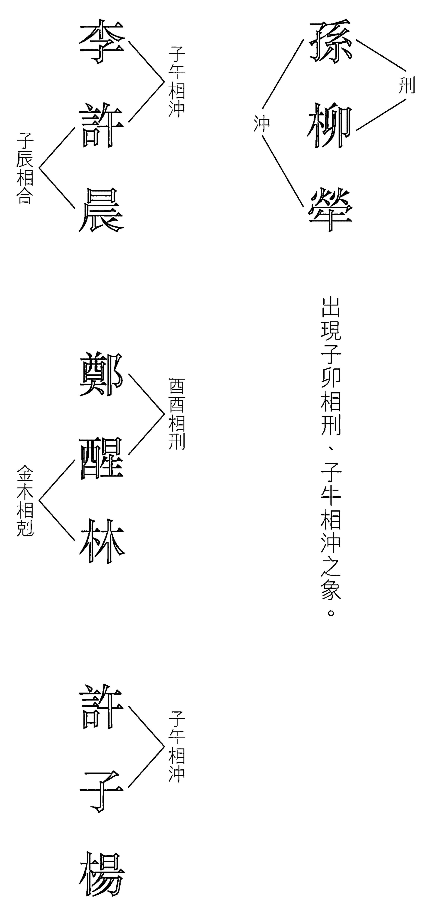

出現子卯相刑、子牛相沖之象。

#### 易有相沖、相刑、相害之姓氏

子部——孫、李、孔、孟、郭、游等姓氏，遇馬、兔、雞之流年宜多加注意。

丑部——狃、牛、鈕、牟等姓氏，遇羊、狗、馬之年宜多加注意。

寅部——寅即虎，貌等姓氏，遇猴、蛇之年宜多加注意。

卯部——柳、劉、仰等姓氏，遇雞、鼠、龍之年宜多加注意。

辰部——辰即龍、農、龔、龐、厯等姓氏，遇狗、龍、兔之年宜多加注意。

巳部——把、鮑、包、巴、扈、范等姓氏，遇豬、虎、猴之年宜多加注意。

午部——馬、馮、駱、許、午等姓氏，遇鼠、馬、牛之年宜多加注意。

未部——姜、羊、未、未央等姓氏，遇牛、狗、鼠之年宜多加注意。

申部——申、伸等姓氏，遇虎、蛇、豬之年宜多加注意。

酉部——鄭、雞、酉、酒、醜等姓氏，遇兔、雞、狗之年宜多加注意。

戌部——狄、狃、狐、狗、狼、裴等姓氏，遇龍、牛、羊、雞之年皆宜注意。

亥部——朱、豚、象等姓氏，遇蛇、豬、猴之年皆宜注意。

### 改名步驟

由於一般人大多不懂算命，故不宜採用八字改名法，且八字改名法要因應不同時期的需要而改不一樣的名字，如學習時期宜用「我生」，以生旺自己的思想，使學習時更加容易吸收；及至年長，宜用「我剋」，以增旺自己的財運；到晚年，宜用「生我」，以增加自己的名望及安享晚年。

另外，如女命夫緣弱，欲改一個有助夫運的名字；男命妻財弱，欲改一個助妻財的名字；思想不靈活，欲改一個助思想的名字，如此等等皆要對八字有基礎的認識，才能辦到，所以一般人只適用簡易改名法。

#### 蘇民峰簡易改名法之步驟

一、首先要知道自己屬於寒命、熱命還是平命：

-   寒命——生於西曆八月八日（立秋）後，三月六日（驚蟄）前，宜改木、火的名字。
-   熱命——生於西曆五月六日（立夏）後，八月八日（立秋）前，宜用金、水的名字。
-   平命——生於西曆三月六日（驚蟄）後，五月六日（立夏）以前，由於其時氣候溫和，故木、火、土、金、水皆可為用，然以金、水之字較佳，所以亦宜金、水之字。

至於屬土之字，不屬陰（寒）亦不屬陽（熱），屬中性之字，所以大多可選擇為用。惟名字如屬水，則第二個字最好避免屬土，以防土水相剋。

二、根據自己之姓氏畫數（複姓則計其相加起來的畫數）及五行所屬，找出第二個字及第三個字所需要的畫數，再將所要畫數的字都找出來，並加以組合。

三、組合名字時，要留意姓氏與名字的發音，盡量避免出現諧音的情況，以免長大後被人取笑。如名字叫「端莊」、「正直」本無問題，但如姓吳，就會變成吳端莊、吳正直，故要多加注意。

##### 例一：二○○三年十二月二十一日出生 姓「何」

十二月二十一日出生屬寒命，宜用木、火之字，姓「何」，又「何」字七畫屬水，故可配合木火、木木、火火、火木等組合，但第二個字應用木而不用火，以免水火相剋。

「何」字為七畫，可配合畫數如（6、10）；（6、18）；（8、8）；（8、10）；（8、16）；（9、15）；（10、14）；（16、8）等。宜將以上畫數屬木火之字抽出，再逐一進行篩選。選出最後五個自己喜歡的名字後，再作決定，如：

男

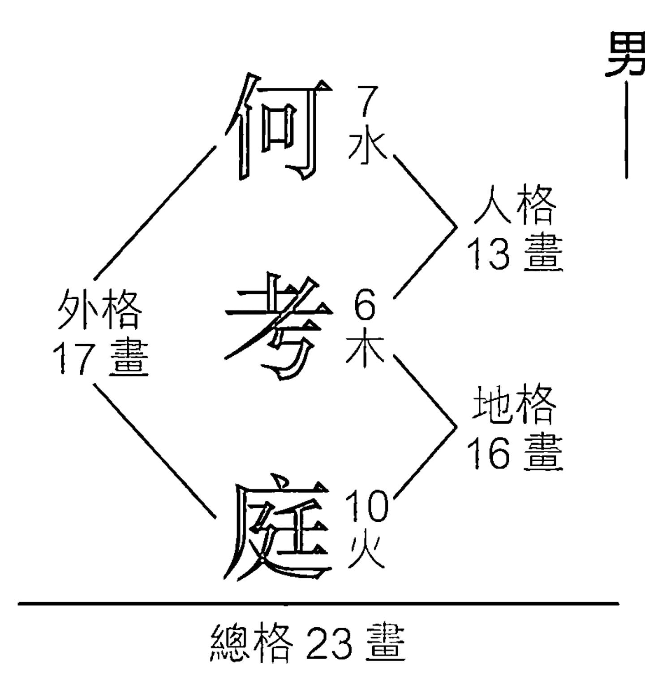

何 (7畫, 水)
旭 (6畫, 木)
倫 (10畫, 火)

何 (7畫, 水)
軍 (9畫, 木)
毅 (15畫, 木)

何 7 水

何 7 水

女

何 7 水

人格
23 畫

卓 8 火

外格
15 畫

曉 16 木

建 9 木

地格
24 畫

林 8 火

宜 8 木

農 15 火

總格 31 畫

何 7 水

何 7 水

何 7 水

諺 16 木

考 6 木

倪 10 木

怜 8 火

桐 10 火

僑 14 木

何 7 水

欣 8 木

欣 8 木

##### 例二：二〇〇二年五月十六日出生 姓「譚」 男

「譚」姓十九畫屬火，五月十六日出生為熱命人，喜金、水。而十九畫之姓宜配（4、12）；

（4、14）；（5、13）；（6、10）；（6、12）；（12、4）之畫數。

其組合如下：

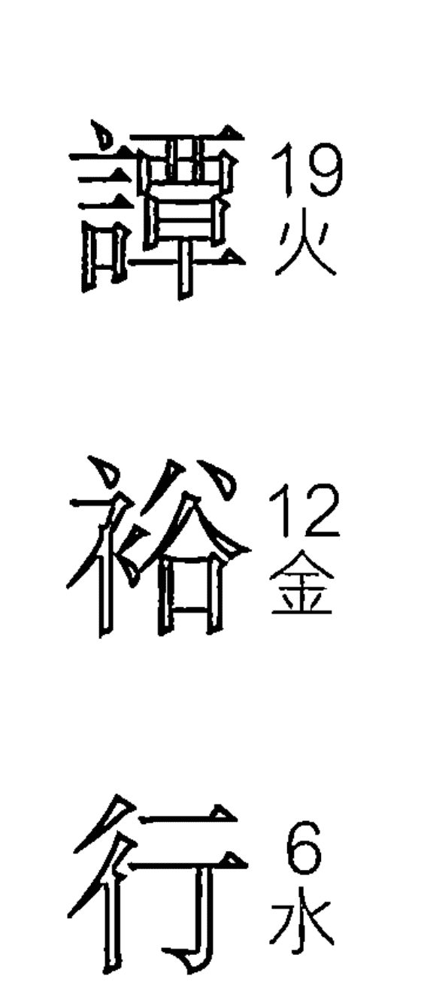

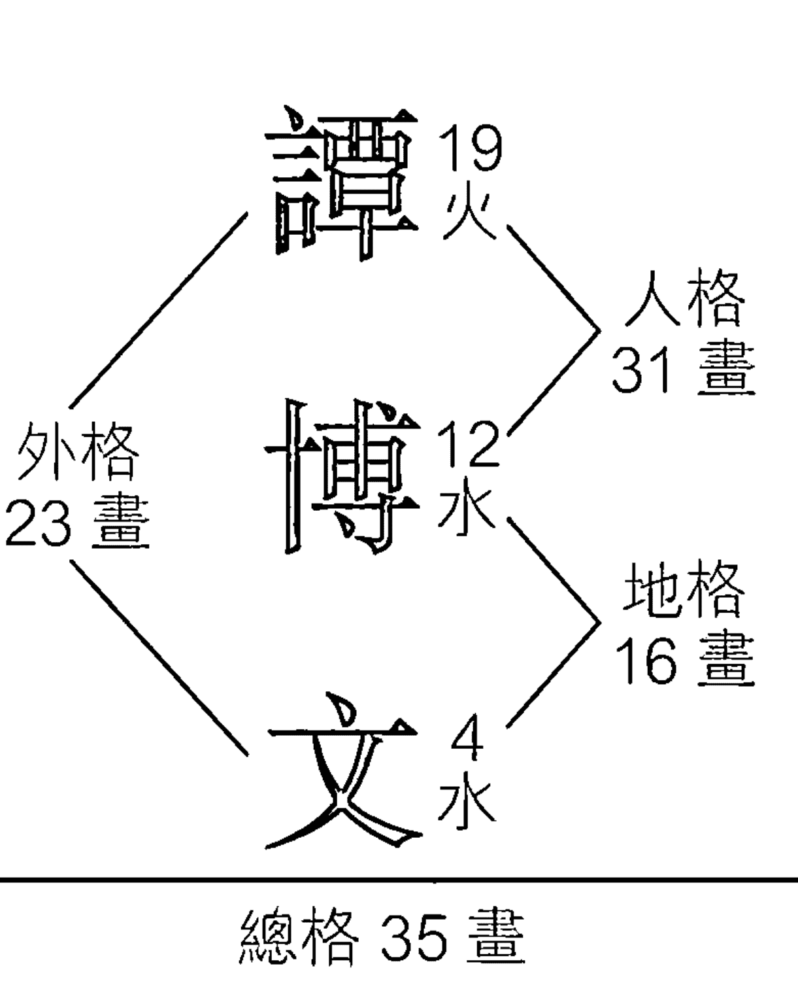

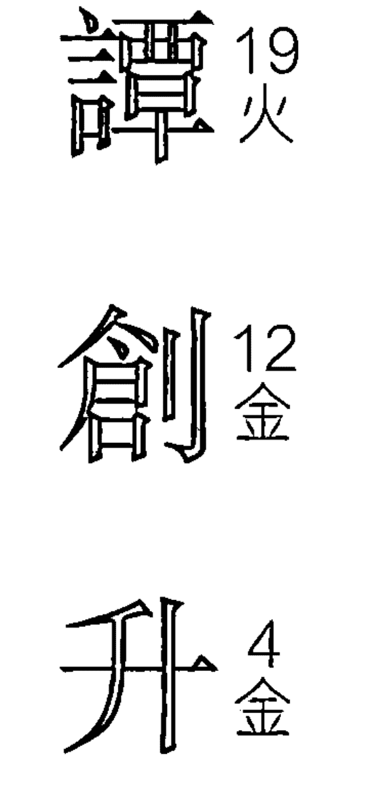

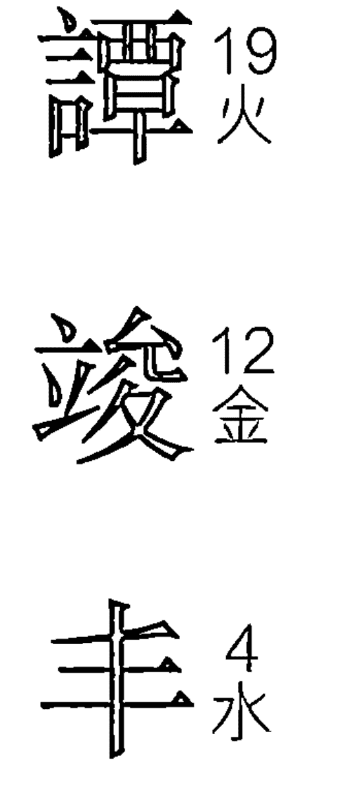

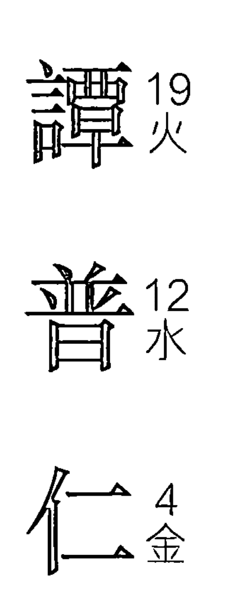

##### 例三：二〇〇三年三月二十四日出生 姓「未央」 男

「未央」姓共十畫，三月二十四日出生屬平命，木、火、土、金、水皆可為用，然以金、水較佳。「未央」為複姓，共十畫，十畫之姓宜配（6、7）；（14、7）；（14、15）；（15、6）。

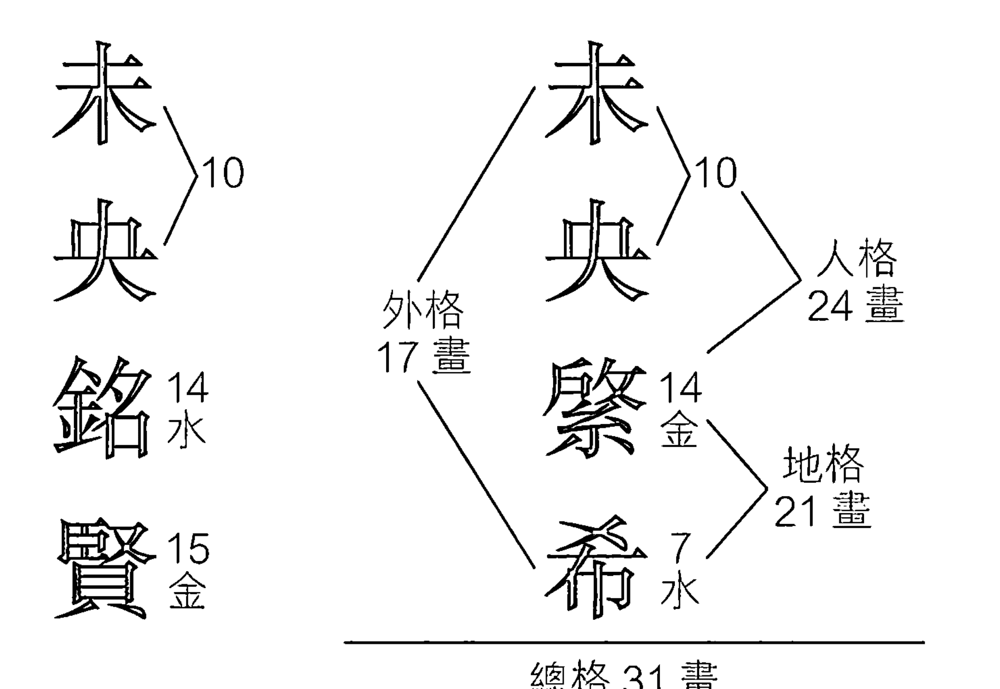

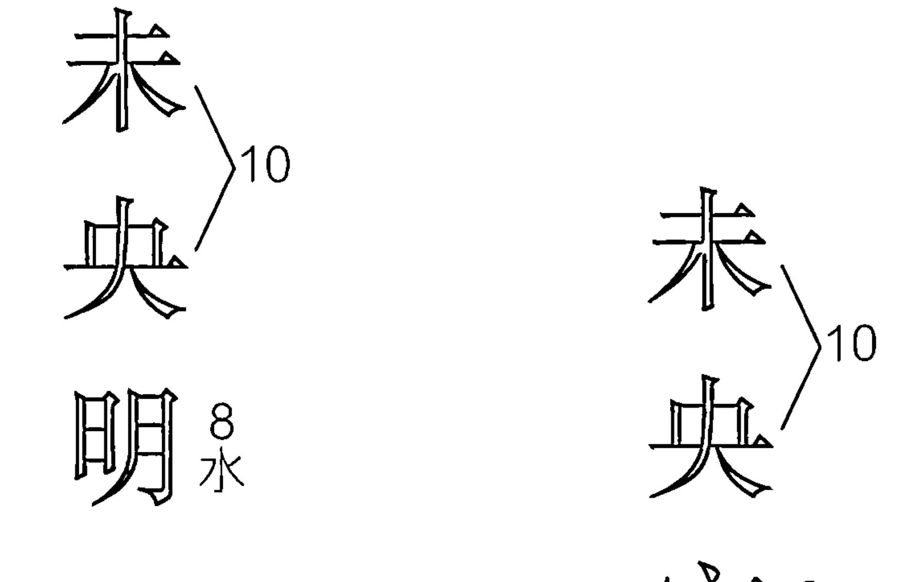

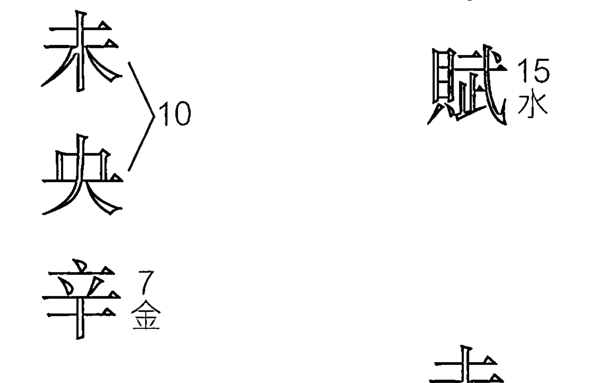

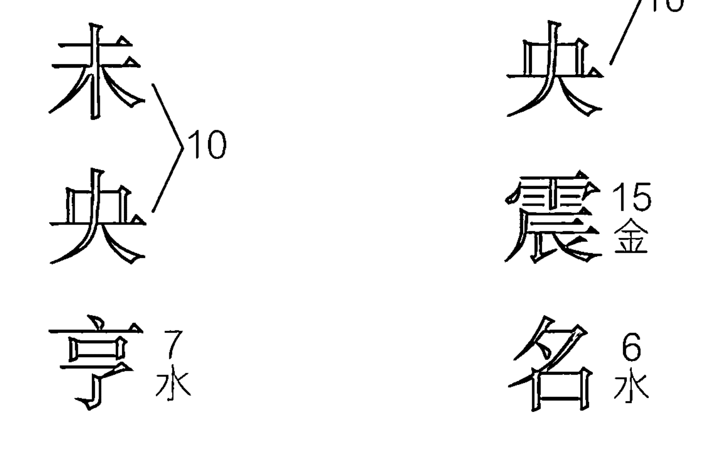

### 中國百家姓及筆畫配對

依筆畫順序

以下依筆畫數列示了中國百家姓。姓氏左下角為所屬五行，而左旁的數字則顯示了此筆畫之姓氏可供配合的名字畫數。

#### 一畫至四畫

| 畫數 | 姓氏 | 五行 | 配合畫數 |
|---|---|---|---|
| 一畫 | 乙 | 土 | 1, 4, 12; 1, 4, 20; 1, 5, 10; 1, 5, 12; 1, 6, 10; 1, 7, 10; 1, 7, 16; 1, 10, 5; 1, 10, 6; 1, 10, 7 |
| 二畫 | 人 | 金 | 2, 4, 9; 2, 4, 11; 2, 4, 19; 2, 6, 9; 2, 6, 15; 2, 14, 15; 2, 14, 19; 2, 14, 21; 2, 16, 13; 2, 16, 15; 2, 16, 19 |
| 二畫 | 卜 | 水 | |
| 二畫 | 七 | 水 | |
| 二畫 | 匕 | 水 | |
| 二畫 | 丁 | 火 | |
| 二畫 | 刁 | 火 | |
| 二畫 | 力 | 火 | |
| 二畫 | 了 | 火 | |
| 二畫 | 刀 | 火 | |
| 二畫 | 乃 | 火 | |

#### 三畫

| 畫數 | 姓氏 | 五行 | 配合畫數 |
|---|---|---|---|
| 三畫 | 三 | 金 | |
| 三畫 | 才 | 金 | |
| 三畫 | 凡 | 水 | |

#### 四畫

| 畫數 | 姓氏 | 五行 | 配合畫數 |
|---|---|---|---|
| 四畫 | 氏 | 金 | 3, 4, 14 |
| 四畫 | 山 | 金 | |
| 四畫 | 弓 | 木 | |
| 四畫 | 大 | 火 | 3, 5, 8 |
| 四畫 | 少 | 金 | 3, 5, 10 |
| 四畫 | 土 | 金 | |
| 四畫 | 己 | 木 | |
| 四畫 | 千 | 火 | 3, 15, 13 |
| 四畫 | 殳 | 金 | 3, 8, 10 |
| 四畫 | 尸 | 金 | |
| 四畫 | 干 | 木 | |
| 四畫 | 子 | 火 | 3, 8, 13 |
| 四畫 | 仇 | 金 | 3, 10, 8 |
| 四畫 | 夕 | 金 | |
| 四畫 | 口 | 木 | |
| 四畫 | 弋 | 火 | 3, 12, 20 |
| 四畫 | 仉 | 金 | 3, 14, 4 |
| 四畫 | 上 | 金 | |
| 四畫 | 乞 | 木 | |
| 四畫 | 女 | 火 | 3, 14, 15 |
| 四畫 | 水 | 金 | |
| 四畫 | 小 | 金 | |
| 四畫 | 兀 | 木 | |
| 四畫 | 丸 | 土 | |
| 四畫 | 仁 | 金 | |
| 四畫 | 寸 | 金 | |
| 四畫 | 工 | 木 | |
| 四畫 | 么 | 土 | |
| 四畫 | 月 | 金 | |
| 四畫 | 于 | 金 | |
| 四畫 | 刃 | 水 | |
| 四畫 | 也 | 土 | |
| 四畫 | 五 | 木 | |
| 四畫 | 子 | 金 | |
| 四畫 | 下 | 水 | |
| 四畫 | 牛 | 木 | |

##### 四畫（續）

| 配合畫數 | 木 | 水 | 火 | 土 |
|---|---|---|---|---|
| 4, 4, 7 | 元 | 斤 | 母 | 中 | 尹 |
| 4, 4, 9 | 戈 | 方 | 毛 | 井 | 尤 |
| 4, 4, 13 | 元 | 巴 | 文 | 日 | |
| 4, 4, 17 | 今 | 卜 | 夫 | 之 | |
| 4, 12, 9 | 孔 | 火 | 云 | 太 | |
| 4, 12, 13 | 公 | 不 | 仆 | 支 | |
| 4, 12, 17 | 介 | 开 | 化 | 仍 | |
| 4, 12, 21 | 勾 | 仈 | 比 | 屯 | |
| 4, 14, 11 | 午 | 木 | 天 | 丑 | |
| 4, 14, 15 | 牙 | 戶 | 丹 | 王 | |

#### 五畫

| 畫數 | 姓氏 | 五行 | 配合畫數 |
|---|---|---|---|
| 五畫 | 四 | 金 | |
| 五畫 | 主 | 金 | |
| 五畫 | 卡 | 木 | |
| 五畫 | 民 | 水 | |
| 五畫 | 未 | 水 | |
| 五畫 | 冬 | 火 | |
| 五畫 | 用 | 土 | |
| 五畫 | 仙 | 金 | |
| 五畫 | 左 | 金 | |
| 五畫 | 臣 | 木 | |
| 五畫 | 禾 | 水 | |
| 五畫 | 氾 | 水 | |
| 五畫 | 井 | 火 | |
| 五畫 | 由 | 土 | |
| 五畫 | 史 | 金 | |
| 五畫 | 只 | 金 | |
| 五畫 | 玉 | 木 | |
| 五畫 | 付 | 水 | |
| 五畫 | 弗 | 水 | |
| 五畫 | 以 | 火 | |
| 五畫 | 申 | 金 | |
| 五畫 | 市 | 金 | |
| 五畫 | 句 | 木 | |
| 五畫 | 平 | 水 | |
| 五畫 | 冉 | 火 | |
| 五畫 | 右 | 火 | |
| 五畫 | 世 | 金 | |
| 五畫 | 且 | 金 | |
| 五畫 | 丘 | 木 | |
| 五畫 | 皮 | 水 | |
| 五畫 | 田 | 火 | |
| 五畫 | 尔 | 火 | |
| 五畫 | 生 | 金 | |
| 五畫 | 占 | 金 | |
| 五畫 | 卯 | 水 | |
| 五畫 | 弘 | 水 | |
| 五畫 | 全 | 火 | |
| 五畫 | 奴 | 火 | |
| 五畫 | 司 | 金 | |
| 五畫 | 古 | 木 | |
| 五畫 | 白 | 水 | |
| 五畫 | 日 | 水 | |
| 五畫 | 令 | 火 | |
| 五畫 | 台 | 火 | |
| 五畫 | 矢 | 金 | |
| 五畫 | 甘 | 木 | |
| 五畫 | 弁 | 水 | |
| 五畫 | 玄 | 水 | |
| 五畫 | 召 | 火 | |
| 五畫 | 立 | 火 | |
| 五畫 | 示 | 金 | |
| 五畫 | 可 | 木 | |
| 五畫 | 不 | 水 | |
| 五畫 | 布 | 水 | |
| 五畫 | 正 | 火 | |
| 五畫 | 扔 | 火 | |
| 五畫 | 石 | 金 | |
| 五畫 | 甲 | 木 | |
| 五畫 | 包 | 水 | |
| 五畫 | 丙 | 水 | |
| 五畫 | 代 | 火 | |
| 五畫 | 永 | 土 | |

#### 五畫（續）

| 字 | 五行 | 字 | 五行 | 字 | 五行 | 字 | 五行 |
|---|---|---|---|---|---|---|---|
| 共 | 木 | 寺 | 金 | 次 | 金 | 西 | 金 |
| 乩 | 木 | 阡 | 金 | 字 | 金 | 守 | 金 |
| 开 | 木 | 邢 | 金 | 任 | 金 | 束 | 金 |
| 伉 | 木 | 成 | 金 | 如 | 金 | 先 | 金 |
| 作 | 木 | 寸 | 金 | 在 | 金 | 風 | 金 |
| 戎 | 木 | 池 | 金 | 再 | 金 | 式 | 金 |
| 艮 | 木 | 夸 | 木 | 白 | 金 | 色 | 金 |
| 匡 | 木 | 吉 | 木 | 朱 | 金 | 死 | 金 |
| 仰 | 木 | 伍 | 木 | 亦 | 金 | 臣 | 金 |
| 光 | 木 | 考 | 木 | 充 | 金 | 臣 | 金 |

配合畫數：

-   5, 1, 10
-   5, 3, 8
-   5, 3, 10
-   5, 3, 13
-   5, 6, 18
-   5, 8, 8
-   5, 8, 10
-   5, 8, 16
-   5, 10, 6
-   5, 10, 8
-   5, 11, 13
-   5, 12, 6
-   5, 12, 12
-   5, 12, 20
-   5, 13, 19

#### 五畫至六畫

| 配合畫數 | 伊 | 竹 | 妍 | 邢 | 合 | 曲 |
| :--- | :--- | :--- | :--- | :--- | :--- | :--- |
| 6, 7, 11 | 土 | 火 | 火 | 水 | 水 | 木 |
| 6, 9, 9 | 羊 | 仲 | 舟 | 忙 | 回 | 白 |
| 6, 10, 5 | 印 | 州 | 匠 | 向 | 休 | 危 |
| 6, 10, 7 | 宇 | 用 | 史 | 池 | 好 | 江 |
| 6, 10, 13 | 有 | 玩 | 扔 | 平 | 伏 | 汗 |
| 6, 10, 15 | 羽 | 汝 | 弱 | 刑 | 后 | 邦 |
| 6, 10, 19 | 夷 | 耳 | 列 | 舌 | 伐 | 行 |
| 6, 12, 17 | 艾 | 因 | 吐 | 老 | 亥 | 百 |
| 6, 12, 21 | 衣 | 多 | 年 | 名 | 米 | 安 |
| | 同 | 全 | 伞 | 朴 | | |

##### 七畫

| 字 | 五行 | 字 | 五行 | 字 | 五行 | 字 | 五行 | 字 | 五行 | 字 | 五行 | 字 | 五行 |
|---|---|---|---|---|---|---|---|---|---|---|---|---|---|
| 辛 | 金 | 坐 | 金 | 芊 | 金 | 攻 | 木 | 君 | 木 | 抗 | 木 | 杏 | 水 |
| 余 | 金 | 赤 | 金 | 邻 | 金 | 坎 | 木 | 岐 | 木 | 忻 | 木 | 坊 | 水 |
| 成 | 金 | 作 | 金 | 岑 | 木 | 佐 | 木 | 更 | 木 | 阮 | 木 | 每 | 水 |
| 伸 | 金 | 初 | 金 | 吴 | 木 | 吟 | 木 | 忌 | 木 | 阮 | 木 | 佛 | 水 |
| 宋 | 金 | 余 | 金 | 谷 | 木 | 見 | 木 | 坑 | 木 | 延 | 木 | 咐 | 水 |
| 束 | 金 | 壮 | 金 | 克 | 木 | 杞 | 木 | 汞 | 木 | 巫 | 水 | 別 | 水 |
| 序 | 金 | 沙 | 金 | 言 | 木 | 角 | 木 | 汲 | 木 | 甫 | 水 | 步 | 水 |
| 私 | 金 | 忍 | 金 | 灸 | 木 | 我 | 木 | 沃 | 木 | 貝 | 水 | 况 | 水 |
| 秀 | 金 | 沈 | 金 | 告 | 木 | 吾 | 木 | 快 | 木 | 免 | 水 | 伯 | 水 |
| 車 | 金 | 冲 | 金 | 改 | 木 | 求 | 木 | 沂 | 木 | 孝 | 水 | 系 | 水 |

##### 七畫（續）

| 配合畫數 | 治 | 折 | 秃 | 吕 | 把 | 学 |
| :--- | :--- | :--- | :--- | :--- | :--- | :--- |
| 7, 4, 4 | 土 | 火 | 火 | 火 | 水 | 水 |
| 7, 4, 14 | 杞 | 那 | 彤 | 利 | 芒 | 创 |
| 7, 6, 10 | 土 | 火 | 火 | 火 | 水 | 水 |
| 7, 6, 18 | 邑 | 狂 | 但 | 男 | 沛 | 尾 |
| 7, 8, 8 | 土 | 火 | 火 | 火 | 水 | 水 |
| 7, 8, 9 | 汪 | 投 | 呈 | 伶 | 邠 | 罕 |
| 7, 8, 10 | 土 | 火 | 火 | 火 | 水 | 水 |
| 7, 8, 16 | 沆 | 邢 | 佢 | 妞 | 邦 | 兵 |
| 7, 9, 16 | 土 | 火 | 火 | 火 | 水 | 水 |
| 7, 10, 8 | 性 | 攸 | 住 | 足 | 防 | 妙 |
| 7, 10, 14 | 土 | 土 | 火 | 火 | 水 | 水 |
| 7, 11, 6 | 酉 | 位 | 牢 | 良 | 希 | 何 |
| 7, 11, 14 | 土 | 土 | 火 | 火 | 水 | 水 |
| | 盱 | 豆 | 里 | 佟 | 采 |
| | 土 | 火 | 火 | 火 | 水 |
| | 坛 | 李 | 冷 | 佚 | 沐 |
| | 土 | 火 | 火 | 火 | 水 |
| | 完 | 狄 | 吞 | 杜 | 扶 |
| | 土 | 火 | 火 | 火 | 水 |

##### 八畫

| 字 | 五行 | 字 | 五行 | 字 | 五行 | 字 | 五行 | 字 | 五行 | 字 | 五行 | 字 | 五行 |
|---|---|---|---|---|---|---|---|---|---|---|---|---|---|
| 始 | 金 | 尚 | 金 | 洗 | 金 | 兒 | 木 | 果 | 木 | 奇 | 木 | 怪 | 木 |
| 松 | 金 | 昔 | 金 | 析 | 金 | 金 | 木 | 姑 | 木 | 其 | 木 | 性 | 木 |
| 青 | 金 | 社 | 金 | 孟 | 金 | 官 | 木 | 固 | 木 | 昆 | 木 | 怡 | 木 |
| 奧 | 金 | 孖 | 金 | 邵 | 金 | 季 | 木 | 快 | 木 | 宜 | 木 | 俗 | 水 |
| 异 | 金 | 姜 | 金 | 芮 | 金 | 岳 | 木 | 灵 | 木 | 庚 | 木 | 孟 | 水 |
| 所 | 金 | 宗 | 金 | 泄 | 金 | 屈 | 木 | 空 | 木 | 答 | 木 | 杭 | 水 |
| 姓 | 金 | 叔 | 金 | 狗 | 木 | 居 | 木 | 吃 | 木 | 欣 | 木 | 牧 | 水 |
| 承 | 金 | 刺 | 金 | 股 | 木 | 京 | 木 | 盱 | 木 | 羌 | 木 | 芸 | 水 |
| 耳 | 金 | 昌 | 金 | 邱 | 木 | 佼 | 木 | 枝 | 木 | 具 | 木 | 函 | 水 |
| 侁 | 金 | 於 | 金 | 祁 | 木 | 佳 | 木 | 供 | 木 | 肩 | 木 | 昊 | 水 |

##### 八畫（續）

| 字 | 五行 | 字 | 五行 | 字 | 五行 | 字 | 五行 | 字 | 五行 | 字 | 五行 | 字 | 五行 |
|---|---|---|---|---|---|---|---|---|---|---|---|---|---|
| 垣 | 火 | 枕 | 火 | 邳 | 水 | 法 | 水 | 帛 | 水 | 虎 | 水 | 昏 | 水 |
| 毒 | 火 | 東 | 火 | 花 | 水 | 怕 | 水 | 爬 | 水 | 房 | 水 | 弦 | 水 |
| 竺 | 火 | 來 | 火 | 狐 | 水 | 肥 | 水 | 秉 | 水 | 呼 | 水 | 武 | 水 |
| 長 | 火 | 念 | 火 | 況 | 水 | 芳 | 水 | 朋 | 水 | 和 | 水 | 幸 | 水 |
| 典 | 火 | 直 | 火 | 弦 | 水 | 邳 | 水 | 卑 | 水 | 門 | 水 | 命 | 水 |
| 飲 | 火 | 帙 | 火 | 佴 | 火 | 邳 | 水 | 明 | 水 | 服 | 水 | 忽 | 水 |
| 征 | 火 | 章 | 火 | 林 | 火 | 芬 | 水 | 必 | 水 | 佩 | 水 | 非 | 水 |
| 谽 | 火 | 哈 | 火 | 周 | 火 | 河 | 水 | 杏 | 水 | 枚 | 水 | 肸 | 水 |
| 知 | 火 | 胤 | 火 | 卓 | 火 | 邳 | 水 | 盱 | 水 | 并 | 水 | 俗 | 水 |
| 到 | 火 | 泰 | 火 | 爭 | 火 | 邳 | 水 | 放 | 水 | 奉 | 水 | 府 | 水 |

# 玄學錦囊

## 姓名篇

#### 八畫 (續)

##### 配合畫數

##### 九畫

| 畫數 | 字 | 五行 | 字 | 五行 |
|---|---|---|---|---|
| 8, 5, 8 | 妳 | 土 | 定 | 火 |
| 8, 5, 10 | 委 | 土 | 治 | 火 |
| 8, 5, 16 | 易 | 土 | 泥 | 火 |
| 8, 7, 9 | 軋 | 土 | 冷 | 火 |
| 8, 8, 9 | 依 | 土 | 陀 | 火 |
| 8, 8, 13 | 夜 | 土 | 邱 | 火 |
| 8, 8, 15 | 充 | 土 | 邰 | 火 |
| 8, 8, 17 | 宛 | 土 | 招 | 火 |
| 8, 8, 21 | 阿 | 土 | 洪 | 火 |
| 8, 10, 13 | 沮 | 火 | | |
| 8, 10, 15 | | | | |
| 8, 10, 21 | | | | |
| 8, 16, 7 | | | | |
| 8, 16, 9 | | | | |
| 8, 16, 15 | | | | |
| 8, 16, 17 | | | | |

| 字 | 五行 | 字 | 五行 |
|---|---|---|---|
| 施 | 金 | 相 | 金 |
| 宋 | 金 | 思 | 金 |
| 庫 | 金 | 食 | 金 |
| 是 | 金 | 廻 | 金 |
| 帥 | 金 | 首 | 金 |
| 省 | 金 | 信 | 金 |
| 宣 | 金 | 侢 | 金 |
| 查 | 金 | 室 | 金 |
| 胥 | 金 | 答 | 金 |
| 俟 | 金 | 昨 | 金 |

#### 八畫至九畫

中國百家姓及筆畫配對

| | | | | | | |
|---|---|---|---|---|---|---|
| 益 (水) | 看 (木) | 計 (木) | 局 (木) | 恤 (金) | 述 (金) | 俞 (金) |
| 保 (水) | 洼 (木) | 段 (木) | 軍 (木) | 紓 (金) | 洗 (金) | 侵 (金) |
| 俠 (水) | 胸 (木) | 紇 (木) | 客 (木) | 柯 (木) | 城 (金) | 春 (金) |
| 突 (水) | 邽 (木) | 音 (木) | 禹 (木) | 御 (木) | 郜 (金) | 秋 (金) |
| 俞 (水) | 厚 (水) | 郊 (木) | 軌 (木) | 紀 (木) | 邾 (金) | 泉 (金) |
| 她 (水) | 哈 (水) | 肩 (木) | 姣 (木) | 姜 (木) | 苦 (金) | 柴 (金) |
| 耗 (水) | 風 (水) | 郁 (木) | 姑 (木) | 癸 (木) | 若 (金) | 柘 (金) |
| 香 (水) | 盆 (水) | 苟 (木) | 契 (木) | 革 (木) | 昨 (金) | 星 (金) |
| 芒 (水) | 厄 (水) | 拱 (木) | 翌 (木) | 建 (木) | 洙 (金) | 邦 (金) |
| 便 (水) | 品 (水) | 恪 (木) | 祈 (木) | 冠 (木) | 洲 (金) | 血 (金) |

# 玄學錦囊

## 姓名篇

##### 九畫（續）

| 眠 | 後 | 玖 | 泰 | 染 | 种 |
|---|---|---|---|---|---|
| 水 | 水 | 水 | 火 | 火 | 火 |
| 侯 | 宜 | 恒 | 組 | 弇 | 侶 |
| 水 | 水 | 水 | 火 | 火 | 火 |
| 封 | 衍 | 苦 | 者 | 亮 | 盈 |
| 水 | 水 | 水 | 火 | 火 | 火 |
| 皇 | 弭 | 荻 | 柳 | 昭 | 鄒 |
| 水 | 水 | 水 | 火 | 火 | 火 |
| 眉 | 鄒 | 芮 | 南 | 青 | 柱 |
| 水 | 水 | 水 | 火 | 火 | 火 |
| 勃 | 茅 | 邰 | 焰 | 受 | 政 |
| 水 | 水 | 水 | 火 | 火 | 火 |
| 盼 | 符 | 后 | 郎 | 埇 | 洛 |
| 水 | 水 | 水 | 火 | 火 | 火 |
| 扁 | 苗 | 陌 | 研 | 炭 | 邢 |
| 水 | 水 | 水 | 火 | 火 | 火 |
| 柏 | 范 | 垣 | 度 | 重 | 茛 |
| 水 | 水 | 火 | 火 | 火 | 火 |
| 咸 | 奔 | 段 | 彤 | 殺 | 幽 |
| 水 | 水 | 火 | 火 | 火 | 土 |

#### 九畫至十畫

##### 十畫

##### 配合畫數

9, 6, 9

9, 6, 12

9, 6, 18

9, 7, 8

9, 7, 16

9, 8, 8

9, 8, 16

9, 9, 6

9, 9, 7

9, 9, 14

9, 9, 15

9, 12, 4

9, 12, 12

中國百家姓及筆畫配對

# 玄學錦囊

## 姓名篇

##### 十畫（續）

| 耿 (金) | 草 (金) | 桂 (木) | 身 (木) | 郊 (木) | 益 (木) |
|---|---|---|---|---|---|
| 宰 (金) | 陸 (金) | 家 (木) | 兼 (木) | 滑 (木) | 恩 (木) |
| 射 (金) | 陝 (金) | 耿 (木) | 貢 (木) | 姬 (木) | 辱 (水) |
| 悅 (金) | 者 (木) | 原 (木) | 庫 (木) | 郜 (木) | 益 (水) |
| 都 (金) | 倪 (木) | 剛 (木) | 倔 (木) | 荊 (木) | 侯 (水) |
| 茹 (金) | 起 (木) | 俱 (木) | 宮 (木) | 浩 (木) | 馬 (水) |
| 荷 (金) | 恭 (木) | 根 (木) | 虔 (木) | 莢 (木) | 班 (水) |
| 珉 (金) | 桀 (木) | 拳 (木) | 爰 (木) | 郴 (木) | 被 (水) |
| 邗 (金) | 奉 (木) | 骨 (木) | 栩 (木) | 海 (木) | 邵 (水) |
| 郝 (金) | 格 (木) | 鬼 (木) | 倚 (木) | 殷 (木) | 夏 (水) |

##### 十畫

中國百家姓及筆畫配對

| 振 | 党 | 凌 | 疾 | 栗 | 浦 | 秘 |
|---|---|---|---|---|---|---|
| 茨 | 留 | 晁 | 蛩 | 秦 | 逢 | 豹 |
| 莊 | 門 | 祝 | 蚺 | 明 | 捕 | 柏 |
| 脂 | 涂 | 晉 | 倫 | 特 | 浮 | 眠 |
| 娥 | 涉 | 畜 | 紐 | 庭 | 珮 | 紛 |
| 軒 | 郎 | 凍 | 烈 | 訂 | 悖 | 訓 |
| 翁 | 能 | 桃 | 展 | 扉 | 符 | 校 |
| 益 | 柴 | 祖 | 納 | 挑 | 荒 | 桓 |
| 笠 | 茲 | 旅 | 桐 | 秩 | 陘 | 朋 |
| 烟 | 狼 | 紙 | 徒 | 唐 | 禹 | 姆 |

# 玄學錦囊

## 姓名篇

##### 十畫（續）

#### 十畫至十一畫

##### 配合畫數

10, 5, 1

10, 5, 3

10, 5, 6

10, 5, 8

10, 6, 7

10, 6, 15

10, 8, 13

10, 8, 15

10, 11, 14

10, 14, 7

10, 14, 15

袁

容

員

倭

晏

烏

高

商

術

唱

十一畫

金

金

金

土

金

金

金

土

金

金

金

土

金

金

金

土

金

金

金

土

金

金

金

土

金

金

金

土

金

金

金

金

金

金

金

金

金

金

金

金

金

金

金

金

金

金

金

金

金

金

金

金

金

金

金

金

金

金

金

金

金

金

金

金

金

金

金

金

金

金

金

金

金

金

金

金

金

金

金

金

金

金

金

金

金

金

金

金

金

金

金

金

金

金

金

金

金

金

金

金

金

金

金

金

金

金

金

金

金

金

金

金

金

金

金

金

金

金

金

金

金

金

金

金

金

金

金

金

金

金

金

金

金

金

金

金

金

金

金

金

金

金

金

金

金

金

金

金

金

金

金

金

金

金

金

金

金

金

金

金

金

金

金

金

金

金

金

金

金

金

金

金

金

金

金

金

金

金

金

金

金

金

金

金

金

金

金

金

金

金

金

金

金

金

金

金

金

金

金

金

金

金

金

金

金

金

金

金

金

金

金

金

金

金

金

金

金

金

金

金

金

金

金

金

金

金

金

金

金

金

金

金

金

金

金

金

金

金

金

金

金

金

金

金

金

金

金

金

金

金

金

金

金

金

金

金

金

金

金

金

金

金

金

金

金

金

金

金

金

金

金

金

金

金

金

金

金

金

金

金

金

金

金

金

金

金

金

金

金

金

金

金

金

金

金

金

金

金

金

金

金

金

金

金

金

金

金

金

金

金

金

金

金

金

金

金

金

金

金

金

金

金

金

金

金

金

金

金

金

金

金

金

金

金

金

金

金

金

金

金

金

金

金

金

金

金

金

金

金

金

金

金

金

金

金

金

金

金

金

金

金

金

金

金

金

金

金

金

金

金

金

金

金

金

金

金

金

金

金

金

金

金

金

金

金

金

金

金

金

金

金

金

金

金

金

金

金

金

金

金

金

金

金

金

金

金

金

金

金

金

金

金

金

金

金

金

金

金

金

金

金

金

金

金

金

金

金

金

金

金

金

金

金

金

金

金

金

金

金

金

金

金

金

金

金

金

金

金

金

金

金

金

金

金

金

金

金

金

金

金

金

金

金

金

金

金

金

金

金

金

金

金

金

金

金

金

金

金

金

金

金

金

金

金

金

金

金

金

金

金

金

金

金

金

金

金

金

金

金

金

金

金

金

金

金

金

金

金

金

金

金

金

金

金

金

金

金

金

金

金

金

金

金

金

金

金

金

金

金

金

金

金

金

金

金

金

金

金

金

金

金

金

金

金

金

金

金

金

金

金

金

金

金

金

金

金

金

金

金

金

金

金

金

金

金

金

金

金

金

金

金

金

金

金

金

金

金

金

金

金

金

金

金

金

金

金

金

金

金

金

金

金

金

金

金

金

金

金

金

金

金

金

金

金

金

金

金

金

金

金

金

金

金

金

金

金

金

金

金

金

金

金

金

金

金

金

金

金

金

金

金

金

金

金

金

金

金

金

金

金

金

金

金

金

金

金

金

金

金

金

金

金

金

金

金

金

金

金

金

金

金

金

金

金

金

金

金

金

金

金

金

金

金

金

金

金

金

金

金

金

金

金

金

金

金

金

金

金

金

金

金

金

金

金

金

金

金

金

金

金

金

金

金

金

金

金

金

金

金

金

金

金

金

金

金

金

金

金

金

金

金

金

金

金

金

金

金

金

金

金

金

金

金

金

金

金

金

金

金

金

金

金

金

金

金

金

金

金

金

金

金

金

金

金

金

金

金

金

金

金

金

金

金

金

金

金

金

金

金

金

金

金

金

金

金

金

金

金

金

金

金

金

金

金

金

金

金

金

金

金

金

金

金

金

金

金

金

金

金

金

金

金

金

金

金

金

金

金

金

金

金

金

金

金

金

金

金

金

金

金

金

金

金

金

金

金

金

金

金

金

金

金

金

金

金

金

金

金

金

金

金

金

金

金

金

金

金

金

金

金

金

金

金

金

金

金

金

金

金

金

金

金

金

金

金

金

金

金

金

金

金

金

金

金

金

金

金

金

金

金

金

金

金

金

金

金

金

金

金

金

金

金

金

金

金

金

金

金

金

金

金

金

金

金

金

金

金

金

金

金

金

金

金

金

金

金

金

金

金

金

金

金

金

金

金

金

金

金

金

金

金

金

金

金

金

金

金

金

金

金

金

金

金

金

金

金

金

金

金

金

金

金

金

金

金

金

金

金

金

金

金

金

金

金

金

金

金

金

金

金

金

金

金

金

金

金

金

金

金

金

金

金

金

金

金

金

金

金

金

金

金

金

金

金

金

金

金

金

金

金

金

金

金

金

金

金

金

金

金

金

金

金

金

金

金

金

金

金

金

金

金

金

金

金

金

金

金

金

金

金

金

金

金

金

金

金

金

金

金

金

金

金

金

金

金

金

金

金

金

金

金

金

金

金

金

金

金

金

金

金

金

金

金

金

金

金

金

金

金

金

金

金

金

金

金

金

金

金

金

金

金

金

金

金

金

金

金

金

金

金

金

金

金

金

金

金

金

金

金

金

金

金

金

金

金

金

金

金

金

金

金

金

金

金

金

金

金

金

金

金

金

金

金

金

金

金

金

金

金

金

金

金

金

金

金

金

金

金

金

金

金

金

金

金

金

金

金

金

金

金

金

金

金

金

金

金

金

金

金

金

金

金

金

金

金

金

金

金

金

金

金

金

金

金

金

金

金

金

金

金

金

金

金

金

金

金

金

金

金

金

金

金

金

金

金

金

金

金

金

金

金

金

金

金

金

金

金

金

金

金

金

金

金

金

金

金

金

金

金

金

金

金

金

金

金

金

金

金

金

金

金

金

金

金

金

金

金

金

金

金

金

金

金

金

金

金

金

金

金

金

金

金

金

金

金

金

金

金

金

金

金

金

金

金

金

金

金

金

金

金

金

金

金

金

金

金

金

金

金

金

金

金

金

金

金

金

金

金

金

金

金

金

金

金

金

金

金

金

金

金

金

金

金

金

金

金

金

金

金

金

金

金

金

金

金

金

金

金

金

金

金

金

金

金

金

金

金

金

金

金

金

金

金

金

金

金

金

金

金

金

金

金

金

金

金

金

金

金

金

金

金

金

金

金

金

金

金

金

金

金

金

金

金

金

金

金

金

金

金

金

金

金

金

金

金

金

金

金

金

金

金

金

金

金

金

金

金

金

金

金

金

金

金

金

金

金

金

金

金

金

金

金

金

金

金

金

金

金

金

金

金

金

金

金

金

金

金

金

金

金

金

金

金

金

金

金

金

金

金

金

金

金

金

金

金

金

金

金

金

金

金

金

金

金

金

金

金

金

金

金

金

金

金

金

金

金

金

金

金

金

金

金

金

金

金

金

金

金

金

金

金

金

金

金

金

金

金

金

金

金

金

金

金

金

金

金

金

金

金

金

金

金

金

金

金

金

金

金

金

金

金

金

金

金

金

金

金

金

金

金

金

金

金

金

金

金

金

金

金

金

金

金

金

金

金

金

金

金

金

金

金

金

金

金

金

金

金

金

金

金

金

金

金

金

金

金

金

金

金

金

金

金

金

金

金

金

金

金

金

金

金

金

金

金

金

金

金

金

金

金

金

金

金

金

金

金

金

金

金

金

金

金

金

金

金

金

金

金

金

金

金

金

金

金

金

金

金

金

金

金

金

金

金

金

金

金

金

金

金

金

金

金

金

金

金

金

金

金

金

金

金

金

金

金

金

金

金

金

金

金

金

金

金

金

金

金

金

金

金

金

金

金

金

金

金

金

金

金

金

金

金

金

金

金

金

金

金

金

金

金

金

金

金

金

金

金

金

金

金

金

金

金

金

金

金

金

金

金

金

金

金

金

金

金

金

金

金

金

金

金

金

金

金

金

金

金

金

金

金

金

金

金

金

金

金

金

金

金

金

金

金

金

金

金

金

金

金

金

金

金

金

金

金

金

金

金

金

金

金

金

金

金

金

金

金

金

金

金

金

金

金

金

金

金

金

金

金

金

金

金

金

金

金

金

金

金

金

金

金

金

金

金

金

金

金

金

金

金

金

金

金

金

金

金

金

金

金

金

金

金

金

金

金

金

金

金

金

金

金

金

金

金

金

金

金

金

金

金

金

金

金

金

金

金

金

金

金

金

金

金

金

金

金

金

金

金

金

金

金

金

金

金

金

金

金

金

金

金

金

金

金

金

金

金

金

金

金

金

金

金

金

金

金

金

金

金

金

金

金

金

金

金

金

金

金

金

金

金

金

金

金

金

金

金

金

金

金

金

金

金

金

金

金

金

金

金

金

金

金

金

金

金

金

金

金

金

金

金

金

金

金

金

金

金

金

金

金

金

金

金

金

金

金

金

金

金

金

金

金

金

金

金

金

金

金

金

金

金

金

金

金

金

金

金

金

金

金

金

金

金

金

金

金

金

金

金

金

金

金

金

金

金

金

金

金

金

金

金

金

金

金

金

金

金

金

金

金

金

金

金

金

金

金

金

金

金

金

金

金

金

金

金

金

金

金

金

金

金

金

金

金

金

金

金

金

金

金

金

金

金

金

金

金

金

金

金

金

金

金

金

金

金

金

金

金

金

金

金

金

金

金

金

金

金

金

金

金

金

金

金

金

金

金

金

金

金

金

金

金

金

金

金

金

金

金

金

金

金

金

金

金

金

金

金

金

金

金

金

金

金

金

金

金

金

金

金

金

金

金

金

金

金

金

金

金

金

金

金

金

金

金

金

金

金

金

金

金

金

金

金

金

金

金

金

金

金

金

金

金

金

金

金

金

金

金

金

金

金

金

金

金

金

金

金

金

金

金

金

金

金

金

金

金

金

金

金

金

金

金

金

金

金

金

金

金

金

金

金

金

金

金

金

金

金

金

金

金

金

金

金

金

金

金

金

金

金

金

金

金

金

金

金

金

金

金

金

金

金

金

金

金

金

金

金

金

金

金

金

金

金

金

金

金

金

金

金

金

金

金

金

金

金

金

金

金

金

金

金

金

金

金

金

金

金

金

金

金

金

金

金

金

金

金

金

金

金

金

金

金

金

金

金

金

金

金

金

金

金

金

金

金

金

金

金

金

金

金

金

金

金

金

金

金

金

金

金

金

金

金

金

金

金

金

金

金

金

金

金

金

金

金

金

金

金

金

金

金

金

金

金

金

金

金

金

金

金

金

金

金

金

金

金

金

金

金

金

金

金

金

金

金

金

金

金

金

金

金

金

金

金

金

金

金

金

金

金

金

金

金

金

金

金

金

金

金

金

金

金

金

金

金

金

金

金

金

金

金

金

金

金

金

金

金

金

金

金

金

金

金

金

金

金

金

金

金

金

金

金

金

金

金

金

金

金

金

金

金

金

金

金

金

金

金

金

金

金

金

金

金

金

金

金

金

金

金

金

金

金

金

金

金

金

金

金

金

金

金

金

金

金

金

金

金

金

金

金

金

金

金

金

金

金

金

金

金

金

金

金

金

金

金

金

金

金

金

金

金

金

金

金

金

金

金

金

金

金

金

金

金

金

金

金

金

金

金

金

金

金

金

金

金

金

金

金

金

金

金

金

金

金

金

金

金

金

金

金

金

金

金

金

金

金

金

金

金

金

金

金

金

金

金

金

金

金

金

金

金

金

金

金

金

金

金

金

金

金

金

金

金

金

金

金

金

金

金

金

金

金

金

金

金

金

金

金

金

金

金

金

金

金

金

金

金

金

金

金

金

金

金

金

金

金

金

金

金

金

金

金

金

金

金

金

金

金

金

金

金

金

金

金

金

金

金

金

金

金

金

金

金

金

金

金

金

金

金

金

金

金

金

金

金

金

金

金

金

金

金

金

金

金

金

金

金

金

金

金

金

金

金

金

金

金

金

金

金

金

金

金

金

金

金

金

金

金

金

金

金

金

金

金

金

金

金

金

金

金

金

金

金

金

金

金

金

金

金

金

金

金

金

金

金

金

金

金

金

金

金

金

金

金

金

金

金

金

金

金

金

金

金

金

金

金

金

金

金

金

金

金

金

金

金

金

金

金

金

金

金

金

金

金

金

金

金

金

金

金

金

金

金

金

金

金

金

金

金

金

金

金

金

金

金

金

金

金

金

金

金

金

金

金

金

金

金

金

金

金

金

金

金

金

金

金

金

金

金

金

金

金

金

金

金

金

金

金

金

金

金

金

金

金

金

金

金

金

金

金

金

金

金

金

金

金

金

金

金

金

金

金

金

金

金

金

金

金

金

金

金

金

金

金

金

金

金

金

金

金

金

金

金

金

金

金

金

金

金

金

金

金

金

金

金

金

金

金

金

金

金

金

金

金

金

金

金

金

金

金

金

金

金

金

金

金

金

金

金

金

金

金

金

金

金

金

金

金

金

金

金

金

金

金

金

金

金

金

金

金

金

金

金

金

金

金

金

金

金

金

金

金

金

金

金

金

金

金

金

金

金

金

金

金

金

金

金

金

金

金

金

金

金

金

金

金

金

金

金

金

金

金

金

金

金

金

金

金

金

金

金

金

金

金

金

金

金

金

金

金

金

金

金

金

金

金

金

金

金

金

金

金

金

金

金

金

金

金

金

金

金

金

金

金

金

金

金

金

金

金

金

金

金

金

金

金

金

金

金

金

金

金

金

金

金

金

金

金

金

金

金

金

金

金

金

金

金

金

金

金

金

金

金

金

金

金

金

金

金

金

金

金

金

金

金

金

金

金

金

金

金

金

金

金

金

金

金

金

金

金

金

金

金

金

金

金

金

金

金

金

金

金

金

金

金

金

金

金

金

金

金

金

金

金

金

金

金

金

金

金

金

金

金

金

金

金

金

金

金

金

金

金

金

金

金

金

金

金

金

金

金

金

金

金

金

金

金

金

金

金

金

金

金

金

金

金

金

金

金

金

金

金

金

金

金

金

金

金

金

金

金

金

金

金

金

金

金

金

金

金

金

金

金

金

金

金

金

金

金

金

金

金

金

金

金

金

金

金

金

金

金

金

金

金

金

金

金

金

金

金

金

金

金

金

金

金

金

金

金

金

金

金

金

金

金

金

金

金

金

金

金

金

金

金

金

金

金

金

金

金

金

金

金

金

金

金

金

金

金

金

金

金

金

金

金

金

金

金

金

金

金

金

金

金

金

金

金

金

金

金

金

金

金

金

金

金

金

金

金

金

金

金

金

金

金

金

金

金

金

金

金

金

金

金

金

金

金

金

金

金

金

金

金

金

金

金

金

金

金

金

金

金

金

金

金

金

金

金

金

金

金

金

金

金

金

金

金

金

金

金

金

金

金

金

金

金

金

金

金

金

金

金

金

金

金

金

金

金

金

金

金

金

金

金

金

金

金

金

金

金

金

金

金

金

金

金

金

金

金

金

金

金

金

金

金

金

金

金

金

金

金

金

金

金

金

金

金

金

金

金

金

金

金

金

金

金

金

金

金

金

金

金

金

金

金

金

金

金

金

金

金

金

金

金

金

金

金

金

金

金

金

金

金

金

金

金

金

金

金

金

金

金

金

金

金

金

金

金

金

金

金

金

金

金

金

金

金

金

金

金

金

金

金

金

金

金

金

金

金

金

金

金

金

金

金

金

金

金

金

金

金

金

金

金

金

金

金

金

金

金

金

金

金

金

金

金

金

金

金

金

金

金

金

金

金

金

金

金

金

金

金

金

金

金

金

金

金

金

金

金

金

金

金

金

金

金

金

金

金

金

金

金

金

金

金

金

金

金

金

金

金

金

金

金

金

金

金

金

金

金

金

金

金

金

金

金

金

金

金

金

金

金

金

金

金

金

金

金

金

金

金

金

金

金

金

金

金

金

金

金

金

金

金

金

金

金

金

金

金

金

金

金

金

金

金

金

金

金

金

金

金

金

金

金

金

金

金

金

金

金

金

金

金

金

金

金

金

金

金

金

金

金

金

金

金

金

金

金

金

金

金

金

金

金

金

金

金

金

金

金

金

金

金

金

金

金

金

金

金

金

金

金

金

金

金

金

金

金

金

金

金

金

金

金

金

金

金

金

金

金

金

金

金

金

金

金

金

金

金

金

金

金

金

金

金

金

金

金

金

金

金

金

金

金

金

金

金

金

金

金

金

金

金

金

金

金

金

金

金

金

金

金

金

金

金

金

金

金

金

金

金

金

金

金

金

金

金

金

金

金

金

金

金

金

金

金

金

金

金

金

金

金

金

金

金

金

金

金

金

金

金

金

金

金

金

金

金

金

金

金

金

金

金

金

金

金

金

金

金

金

金

金

金

金

金

金

金

金

金

金

金

金

金

金

金

金

金

金

金

金

金

金

金

金

金

金

金

金

金

金

金

金

金

金

金

金

金

金

金

金

金

金

金

金

金

金

金

金

金

金

金

金

金

金

金

金

金

金

金

金

金

金

金

金

金

金

金

金

金

金

金

金

金

金

金

金

金

金

金

金

金

金

金

金

金

金

金

金

金

金

金

金

金

金

金

金

金

金

金

金

金

金

金

金

金

金

金

金

金

金

金

金

金

金

金

金

金

金

金

金

金

金

金

金

金

金

金

金

金

金

金

金

金

金

金

金

金

金

金

金

金

金

金

金

金

金

金

金

金

金

金

金

金

金

金

金

金

金

金

金

金

金

金

金

金

金

金

金

金

金

金

金

金

金

金

金

金

金

金

金

金

金

金

金

金

金

金

金

金

金

金

金

金

金

金

金

金

金

金

金

金

金

金

金

金

金

金

金

金

金

金

金

金

金

金

金

金

金

金

金

金

金

金

金

金

金

金

金

金

金

金

金

金

金

金

金

金

金

金

金

金

金

金

金

金

金

金

金

金

金

金

金

金

金

金

金

金

金

金

金

金

金

金

金

金

金

金

金

金

金

金

金

金

金

金

金

金

金

金

金

金

金

金

金

金

金

金

金

金

金

金

金

金

金

金

金

金

金

金

金

金

金

金

金

金

金

金

金

金

金

金

金

金

金

金

金

金

金

金

金

金

金

金

金

金

金

金

金

金

金

金

金

金

金

金

金

金

金

金

金

金

金

金

金

金

金

金

金

金

金

金

金

金

金

金

金

金

金

金

金

金

金

金

金

金

金

金

金

金

金

金

金

金

金

金

金

金

金

金

金

金

金

金

金

金

金

金

金

金

金

金

金

金

金

金

金

金

金

金

金

金

金

金

金

金

金

金

金

金

金

金

金

金

金

金

金

金

金

金

金

金

金

金

金

金

金

金

金

金

金

金

金

金

金

金

金

金

金

金

金

金

金

金

金

金

金

金

金

金

金

金

金

金

金

金

金

金

金

金

金

金

金

金

金

金

金

金

金

金

金

金

金

金

金

金

金

金

金

金

金

金

金

金

金

金

金

金

金

金

金

金

金

金

金

金

金

金

金

金

金

金

金

金

金

金

金

金

金

金

金

金

金

金

金

金

金

金

金

金

金

金

金

金

金

金

金

金

金

金

金

金

金

金

金

金

金

金

金

金

金

金

金

金

金

金

金

金

金

金

金

金

金

金

金

金

金

金

金

金

金

金

金

金

金

金

金

金

金

金

金

金

金

金

金

金

金

金

金

金

金

金

金

金

金

金

金

金

金

金

金

金

金

金

金

金

金

金

金

金

金

金

金

金

金

金

金

金

金

金

金

金

金

金

金

金

金

金

金

金

金

金

金

金

金

金

金

金

金

金

金

金

金

金

金

金

金

金

金

金

金

金

金

金

金

金

金

金

金

金

金

金

金

金

金

金

金

金

金

金

金

金

金

金

金

金

金

金

金

金

金

金

金

金

金

金

金

金

金

金

金

金

金

金

金

金

金

金

金

金

金

金

金

金

金

金

金

金

金

金

金

金

金

金

金

金

金

金

金

金

金

金

金

金

金

金

金

金

金

金

金

金

金

金

金

金

金

金

金

金

金

金

金

金

金

金

金

金

金

金

金

金

金

金

金

金

金

金

金

金

金

金

金

金

金

金

金

金

金

金

金

金

金

金

金

金

金

金

金

金

金

金

金

金

金

金

金

金

金

金

金

金

金

金

金

金

金

金

金

金

金

金

金

金

金

金

金

金

金

金

金

金

金

金

金

金

金

金

金

金

金

金

金

金

金

金

金

金

金

金

金

金

金

金

金

金

金

金

金

金

金

金

金

金

金

金

金

金

金

金

金

金

金

金

金

金

金

金

金

金

金

金

金

金

金

金

金

金

金

金

金

金

金

金

金

金

金

金

金

金

金

金

金

金

金

金

金

金

金

金

金

金

金

金

金

金

金

金

金

金

金

金

金

金

金

金

金

金

金

金

金

金

金

金

金

金

金

金

金

金

金

金

金

金

金

金

金

金

金

金

金

金

金

金

金

金

金

金

金

金

金

金

金

金

金

金

金

金

金

金

金

金

金

金

金

金

金

金

金

金

金

金

金

金

金

金

金

金

金

金

金

金

金

金

金

金

金

金

金

金

金

金

金

金

金

金

金

金

金

金

金

金

金

金

金

金

金

金

金

金

金

金

金

金

金

金

金

金

金

金

金

金

金

金

金

金

金

金

金

金

金

金

金

金

金

金

金

金

金

金

金

金

金

金

金

金

金

金

金

金

金

金

金

金

金

金

金

金

金

金

金

金

金

金

金

金

金

金

金

金

金

金

金

金

金

金

金

金

金

金

金

金

金

金

金

金

金

金

金

金

金

金

金

金

金

金

金

金

金

金

金

金

金

金

金

金

金

金

金

金

金

金

金

金

金

金

金

金

金

金

金

金

金

金

金

金

金

金

金

金

金

金

金

金

金

金

金

金

金

金

金

金

金

金

金

金

金

金

金

金

金

金

金

金

金

金

金

金

金

金

金

金

金

金

金

金

金

金

金

金

金

金

金

金

金

金

金

金

金

金

金

金

金

金

金

金

金

金

金

金

金

金

金

金

金

金

金

金

金

金

金

金

金

金

金

金

金

金

金

金

金

金

金

金

金

金

金

金

金

金

金

金

金

金

金

金

金

金

金

金

金

金

金

金

金

金

金

金

金

金

金

金

金

金

金

金

金

金

金

金

金

金

金

金

金

金

金

金

金

金

金

金

金

金

金

金

金

金

金

金

金

金

金

金

金

金

金

金

金

金

金

金

金

金

金

金

金

金

金

金

金

金

金

金

金

金

金

金

金

金

金

金

金

金

金

金

金

金

金

金

金

金

金

金

金

金

金

金

金

金

金

金

金

金

金

金

金

金

金

金

金

金

金

金

金

金

金

金

金

金

金

金

金

金

金

金

金

金

金

金

金

金

金

金

金

金

金

金

金

金

金

金

金

金

金

金

金

金

金

金

金

金

金

金

金

金

金

金

金

金

金

金

金

金

金

金

金

金

金

金

金

金

金

金

金

金

金

金

金

金

金

金

金

金

金

金

金

金

金

金

金

金

金

金

金

金

金

金

金

金

金

金

金

金

金

金

金

金

金

金

金

金

金

金

金

金

金

金

金

金

金

金

金

金

金

金

金

金

金

金

金

金

金

金

金

金

金

金

金

金

金

金

金

金

金

金

金

金

金

金

金

金

金

金

金

金

金

金

金

金

金

金

金

金

金

金

金

金

金

金

金

金

金

金

金

金

金

金

金

金

金

金

金

金

金

金

金

金

金

金

金

金

金

金

金

金

金

金

金

金

金

金

金

金

金

金

金

金

金

金

金

金

金

金

金

金

金

金

金

金

金

金

金

金

金

金

金

金

金

金

金

金

金

金

金

金

金

金

金

金

金

金

金

金

金

金

金

金

金

金

金

金

金

金

金

金

金

金

金

金

金

金

金

金

金

金

金

金

金

金

金

金

金

金

金

金

金

金

金

金

金

金

金

金

金

金

金

金

金

金

金

金

金

金

金

金

金

金

金

金

金

金

金

金

金

金

金

金

金

金

金

金

金

金

金

金

金

金

金

金

金

金

金

金

金

金

金

金

金

金

金

金

金

金

金

金

金

金

金

金

金

金

金

金

金

金

金

金

金

金

金

金

金

金

金

金

金

金

金

金

金

金

金

金

金

金

金

金

金

金

金

金

金

金

金

金

金

金

金

金

金

金

金

金

金

金

金

金

金

金

金

金

金

金

金

金

金

金

金

金

金

金

金

金

金

金

金

金

金

金

金

金

金

金

金

金

金

金

金

金

金

金

金

金

金

金

金

金

金

金

金

金

金

金

金

金

金

金

金

金

金

金

金

金

金

金

金

金

金

金

金

金

金

金

金

金

金

金

金

金

金

金

金

金

金

金

金

金

金

金

金

金

金

金

金

金

金

金

金

金

金

金

金

金

金

金

金

金

金

金

金

金

金

金

金

金

金

金

金

金

金

金

金

金

金

金

金

金

金

金

金

金

金

金

金

金

金

金

金

金

金

金

金

金

金

金

金

金

金

金

金

金

金

金

金

金

金

金

金

金

金

金

金

金

金

金

金

金

金

金

金

金

金

金

金

金

金

金

金

金

金

金

金

金

金

金

金

金

金

金

金

金

金

金

金

金

金

金

金

金

金

金

金

金

金

金

金

金

金

金

金

金

金

金

金

金

金

金

金

金

金

金

金

金

金

金

金

金

金

金

金

金

金

金

金

金

金

金

金

金

金

金

金

金

金

金

金

金

金

金

金

金

金

金

金

金

金

金

金

金

金

金

金

金

金

金

金

金

金

金

金

金

金

金

金

金

金

金

金

金

金

金

金

金

金

金

金

金

金

金

金

金

金

金

金

金

金

金

金

金

金

金

金

金

金

金

金

金

金

金

金

金

金

金

金

金

金

金

金

金

金

金

金

金

金

金

金

金

金

金

金

金

金

金

金

金

金

金

金

金

金

金

金

金

金

金

金

金

金

金

金

金

金

金

金

金

金

金

金

金

金

金

金

金

金

金

金

金

金

金

金

金

金

金

金

金

金

金

金

金

金

金

金

金

金

金

金

金

金

金

金

金

金

金

金

金

金

金

金

金

金

金

金

金

金

金

金

金

金

金

金

金

金

金

金

金

金

金

金

金

金

金

金

金

金

金

金

金

金

金

金

金

金

金

金

金

金

金

金

金

金

金

金

金

金

金

金

金

金

金

金

金

金

金

金

金

金

金

金

金

金

金

金

金

金

金

金

金

金

金

金

金

金

金

金

金

金

金

金

金

金

金

金

金

金

金

金

金

金

金

金

金

金

金

金

金

金

金

金

金

金

金

金

金

金

金

金

金

金

金

金

金

金

金

金

金

金

金

金

金

金

金

金

金

金

金

金

金

金

金

金

金

金

金

金

金

金

金

金

金

金

金

金

金

金

金

金

金

金

金

金

金

金

金

金

金

金

金

金

金

金

金

金

金

金

金

金

金

金

金

金

金

金

金

金

金

金

金

金

金

金

金

金

金

金

金

金

金

金

金

金

金

金

金

金

金

金

金

金

金

金

金

金

金

金

金

金

金

金

金

金

金

金

金

金

金

金

金

金

金

金

金

金

金

金

金

金

金

金

金

金

金

金

金

金

金

金

金

金

金

金

金

金

金

金

金

金

金

金

金

金

金

金

金

金

金

金

金

金

金

金

金

金

金

金

金

金

金

金

金

金

金

金

金

金

金

金

金

金

金

金

金

金

金

金

金

金

金

金

金

金

金

金

金

金

金

金

金

金

金

金

金

金

金

金

金

金

金

金

金

金

金

金

金

金

金

金

金

金

金

金

金

金

金

金

金

金

金

金

金

金

金

金

金

金

金

金

金

金

金

金

金

金

金

金

金

金

金

金

金

金

金

金

金

金

金

金

金

金

金

金

金

金

金

金

金

金

金

金

金

金

金

金

金

金

金

金

金

金

金

金

金

金

金

金

金

金

金

金

金

金

金

金

金

金

金

金

金

金

金

金

金

金

金

金

金

金

金

金

金

金

金

金

金

金

金

金

金

金

金

金

金

金

金

金

金

金

金

金

金

金

金

金

金

金

金

金

金

金

金

金

金

金

金

金

金

金

金

金

金

金

金

金

金

金

金

金

金

金

金

金

金

金

金

金

金

金

金

金

金

金

金

金

金

金

金

金

金

金

金

金

金

金

金

金

金

金

金

金

金

金

金

金

金

金

金

金

金

金

金

金

金

金

金

金

金

金

金

金

金

金

金

金

金

金

金

金

金

金

金

金

金

金

金

金

金

金

金

金

金

金

金

金

金

金

金

金

金

金

金

金

金

金

金

金

金

金

金

金

金

金

金

金

金

金

金

金

金

金

金

金

金

金

金

金

金

金

金

金

金

金

金

金

金

金

金

金

金

金

金

金

金

金

金

金

金

金

金

金

金

金

金

金

金

金

金

金

金

金

金

金

金

金

金

金

金

金

金

金

金

金

金

金

金

金

金

金

金

金

金

金

金

金

金

金

金

金

金

金

金

金

金

金

金

金

金

金

金

金

金

金

金

金

金

金

金

金

金

金

金

金

金

金

金

金

金

金

金

金

金

金

金

金

金

金

金

金

金

金

金

金

金

金

金

金

金

金

金

金

金

金

金

金

金

金

金

金

金

金

金

金

金

金

金

金

金

金

金

金

金

金

金

金

金

金

金

金

金

金

金

金

金

金

金

金

金

金

金

金

金

金

金

金

金

金

金

金

金

金

金

金

金

金

金

金

金

金

金

金

金

金

金

金

金

金

金

金

金

金

金

金

金

金

金

金

金

金

金

金

金

金

金

金

金

金

金

金

金

金

金

金

金

金

金

金

金

金

金

金

金

金

金

金

金

金

金

金

金

金

金

金

金

金

金

金

金

金

金

金

金

金

金

金

金

金

金

金

金

金

金

金

金

金

金

金

金

金

金

金

金

金

金

金

金

金

金

金

金

金

金

金

金

金

金

金

金

金

金

金

金

金

金

金

金

金

金

金

金

金

金

金

金

金

金

金

金

金

金

金

金

金

金

金

金

金

金

金

金

金

金

金

金

金

金

金

金

金

金

金

金

金

金

金

金

金

金

金

金

金

金

金

金

金

金

金

金

金

金

金

金

金

金

金

金

金

金

金

金

金

金

金

金

金

金

金

金

金

金

金

金

金

金

金

金

金

金

金

金

金

金

金

金

金

金

金

金

金

金

金

金

金

金

金

金

金

金

金

金

金

金

金

金

金

金

金

金

金

金

金

金

金

金

金

金

金

金

金

金

金

金

金

金

金

金

金

金

金

金

金

金

金

金

金

金

金

金

金

金

金

金

金

金

金

金

金

金

金

金

金

金

金

金

金

金

金

金

金

金

金

金

金

金

金

金

金

金

金

金

金

金

金

金

金

金

金

金

金

金

金

金

金

金

金

金

金

金

金

金

金

金

金

金

金

金

金

金

金

金

金

金

金

金

金

金

金

金

金

金

金

金

金

金

金

金

金

金

金

金

金

金

金

金

金

金

金

金

金

金

金

金

金

金

金

金

金

金

金

金

金

金

金

金

金

金

金

金

金

金

金

金

金

金

金

金

金

金

金

金

金

金

金

金

金

金

金

金

金

金

金

金

金

金

金

金

金

金

金

金

金

金

金

金

金

金

金

金

金

金

金

金

金

金

金

金

金

金

金

金

金

金

金

金

金

金

金

金

金

金

金

金

金

金

金

金

金

金

金

金

金

金

金

金

金

金

金

金

金

金

金

金

金

金

金

金

金

金

金

金

金

金

金

金

金

金

金

金

金

金

金

金

金

金

金

金

金

金

金

金

金

金

金

金

金

金

金

金

金

金

金

金

金

金

金

金

金

金

金

金

金

金

金

金

金

金

金

金

金

金

金

金

金

金

金

金

金

金

金

金

金

金

金

金

金

金

金

金

金

金

金

金

金

金

金

金

金

金

金

金

金

金

金

金

金

金

金

金

金

金

金

金

金

金

金

金

金

金

金

金

金

金

金

金

金

金

金

金

金

金

金

金

金

金

金

金

金

金

金

金

金

金

金

金

金

金

金

金

金

金

金

金

金

金

金

金

金

金

金

金

金

金

金

金

金

金

金

金

金

金

金

金

金

金

金

金

金

金

金

金

金

金

金

金

金

金

金

金

金

金

金

金

金

金

金

金

金

金

金

金

金

金

金

金

金

金

金

金

金

金

金

金

金

金

金

金

金

金

金

金

金

金

金

金

金

金

金

金

金

金

金

金

金

金

金

金

金

金

金

金

金

金

金

金

金

金

金

金

金

金

金

金

金

金

金

金

金

金

金

金

金

金

金

金

金

金

金

金

金

金

金

金

金

金

金

金

金

金

金

金

金

金

金

金

金

金

金

金

金

金

金

金

金

金

金

金

金

金

金

金

金

金

金

金

金

金

金

金

金

金

金

金

金

金

金

金

金

金

金

金

金

金

金

金

金

金

金

金

金

金

金

金

金

金

金

金

金

金

金

金

金

金

金

金

金

金

金

金

金

金

金

金

金

金

金

金

金

金

金

金

金

金

金

金

金

金

金

金

金

金

金

金

金

金

金

金

金

金

金

金

金

金

金

金

金

金

金

金

金

金

金

金

金

金

金

金

金

金

金

金

金

金

金

金

金

金

金

金

金

金

金

金

金

金

金

金

金

金

金

金

金

金

金

金

金

金

金

金

金

金

金

金

金

金

金

金

金

金

金

金

金

金

金

金

金

金

金

金

金

金

金

金

金

金

金

金

金

金

金

金

金

金

金

金

金

金

金

金

金

金

金

金

金

金

金

金

金

金

金

金

金

金

金

金

金

金

金

金

金

金

金

金

金

金

金

金

金

金

金

金

金

金

金

金

金

金

金

金

金

金

金

金

金

金

金

金

金

金

金

金

金

金

金

金

金

金

金

金

金

金

金

金

金

金

金

金

金

金

金

金

金

金

金

金

金

金

金

金

金

金

金

金

金

金

金

金

金

金

金

金

金

金

金

金

金

金

金

金

金

金

金

金

金

金

金

金

金

金

金

金

金

金

金

金

金

金

金

金

金

金

金

金

金

金

金

金

金

金

金

金

金

金

金

金

金

金

金

金

金

金

金

金

金

金

金

金

金

金

金

金

金

金

金

金

金

金

金

金

金

金

金

金

金

金

金

金

金

金

金

金

金

金

金

金

金

金

金

金

金

金

金

金

金

金

金

金

金

金

金

金

金

金

金

金

金

金

金

金

金

金

金

金

金

金

金

金

金

金

金

金

金

金

金

金

金

金

金

金

金

金

金

金

金

金

金

金

金

金

金

金

金

金

金

金

金

金

金

金

金

金

金

金

金

金

金

金

金

金

金

金

金

金

金

金

金

金

金

金

金

金

金

金

金

金

金

金

金

金

金

金

金

金

金

金

金

金

金

金

金

金

金

金

金

金

金

金

金

金

金

金

金

金

金

金

金

金

金

金

金

金

金

金

金

金

金

金

金

金

金

金

金

金

金

金

金

金

金

金

金

金

金

金

金

金

金

金

金

金

金

金

金

金

金

金

金

金

金

金

金

金

金

金

金

金

金

金

金

金

金

金

金

金

金

金

金

金

金

金

金

金

金

金

金

金

金

金

金

金

金

金

金

金

金

金

金

金

金

金

金

金

金

金

金

金

金

金

金

金

金

金

金

金

金

金

金

金

金

金

金

金

金

金

金

金

金

金

金

金

金

金

金

金

金

金

金

金

金

金

金

金

金

金

金

金

金

金

金

金

金

金

金

金

金

金

金

金

金

金

金

金

金

金

金

金

金

金

金

金

金

金

金

金

金

金

金

金

金

金

金

金

金

金

金

金

金

金

金

金

金

金

金

金

金

金

金

金

金

金

金

金

金

金

金

金

金

金

金

金

金

金

金

金

金

金

金

金

金

金

金

金

金

金

金

金

金

金

金

金

金

金

金

金

金

金

金

金

金

金

金

金

金

金

金

金

金

金

金

金

金

金

金

金

金

金

金

金

金

金

金

金

金

金

金

金

金

金

金

金

金

金

金

金

金

金

金

金

金

金

金

金

金

金

金

金

金

金

金

金

金

金

金

金

金

金

金

金

金

金

金

金

金

金

金

金

金

金

金

金

金

金

金

金

金

金

金

金

金

金

金

金

金

金

金

金

金

金

金

金

金

金

金

金

金

金

金

金

金

金

金

金

金

金

金

金

金

金

金

金

金

金

金

金

金

金

金

金

金

金

金

金

金

金

金

金

金

金

金

金

金

金

金

金

金

金

金

金

金

金

金

金

金

金

金

金

金

金

金

金

金

金

金

金

金

金

金

金

金

金

金

金

金

金

金

金

金

金

金

金

金

金

金

金

金

金

金

金

金

金

金

金

金

金

金

金

金

金

金

金

金

金

金

金

金

金

金

金

金

金

金

金

金

金

金

金

金

金

金

金

金

金

金

金

金

金

金

金

金

金

金

金

金

金

金

金

金

金

金

金

金

金

金

金

金

金

金

金

金

金

金

金

金

金

金

金

金

金

金

金

金

金

金

金

金

金

金

金

金

金

金

金

金

金

金

金

金

金

金

金

金

金

金

金

金

金

金

金

金

金

金

金

金

金

金

金

金

金

金

金

金

金

金

金

金

金

金

金

金

金

金

金

金

金

金

金

金

金

金

金

金

金

金

金

金

金

金

金

金

金

金

金

金

金

金

金

金

金

金

金

金

金

金

金

金

金

金

金

金

金

金

金

金

金

金

金

金

金

金

金

金

金

金

金

金

金

金

金

金

金

金

金

金

金

金

金

金

金

金

金

金

金

金

金

金

金

金

金

金

金

金

金

金

金

金

金

金

金

金

金

金

金

金

金

金

金

金

金

金

金

金

金

金

金

金

金

金

金

金

金

金

金

金

金

金

金

金

金

金

金

金

金

金

金

金

金

金

金

金

金

金

金

金

金

金

金

金

金

金

金

金

金

金

金

金

金

金

金

金

金

金

金

金

金

金

金

金

金

金

金

金

金

金

金

金

金

金

金

金

金

金

金

金

金

金

金

金

金

金

金

金

金

金

金

金

金

金

金

金

金

金

金

金

金

金

金

金

金

金

金

金

金

金

金

金

金

金

金

金

金

金

金

金

金

金

金

金

金

金

金

金

金

金

金

金

金

金

金

金

金

金

金

金

金

金

金

金

金

金

金

金

金

金

金

金

金

金

金

金

金

金

金

金

金

金

金

金

金

金

金

金

金

金

金

金

金

金

金

金

金

金

金

金

金

金

金

金

金

金

金

金

金

金

金

金

金

金

金

金

金

金

金

金

金

金

金

金

金

金

金

金

金

金

金

金

金

金

金

金

金

金

金

金

金

金

金

金

金

金

金

金

金

金

金

金

金

金

金

金

金

金

金

金

金

金

金

金

金

金

金

金

金

金

金

金

金

金

金

金

金

金

金

金

金

金

金

金

金

金

金

金

金

金

金

金

金

金

金

金

金

金

金

金

金

金

金

金

金

金

金

金

金

金

金

金

金

金

金

金

金

金

金

金

金

金

金

金

金

金

金

金

金

金

金

金

金

金

金

金

金

金

金

金

金

金

金

金

金

金

金

金

金

金

金

金

金

金

金

金

金

金

金

金

金

金

金

金

金

金

金

金

金

金

金

金

金

金

金

金

金

金

金

金

金

金

金

金

金

金

金

金

金

金

金

金

金

金

金

金

金

金

金

金

金

金

金

金

金

金

金

金

金

金

金

金

金

金

金

金

金

金

金

金

金

金

金

金

金

金

金

金

金

金

金

金

金

金

金

金

金

金

金

金

金

金

金

金

金

金

金

金

金

金

金

金

金

金

金

金

金

金

金

金

金

金

金

金

金

金

金

金

金

金

金

金

金

金

金

金

金

金

金

金

金

金

金

金

金

金

金

金

金

金

金

金

金

金

金

金

金

金

金

金

金

金

金

金

金

金

金

金

金

金

金

金

金

金

金

金

金

金

金

金

金

金

金

金

金

金

金

金

金

金

金

金

金

金

金

金

金

金

金

金

金

金

金

金

金

金

金

金

金

金

金

金

金

金

金

金

金

金

金

金

金

金

金

金

金

金

金

金

金

金

金

金

金

金

金

金

金

金

金

金

金

金

金

金

金

金

金

金

金

金

金

金

金

金

金

金

金

金

金

金

金

金

金

金

金

金

金

金

金

金

金

金

金

金

金

金

金

金

金

金

金

金

金

金

金

金

金

金

金

金

金

金

金

金

金

金

金

金

金

金

金

金

金

金

金

金

金

金

金

金

金

金

金

金

金

金

金

金

金

金

金

金

金

金

金

金

金

金

金

金

金

金

金

金

金

金

金

金

金

金

金

金

金

金

金

金

金

金

金

金

金

金

金

金

金

金

金

金

金

金

金

金

金

金

金

金

金

金

金

金

金

金

金

金

金

金

金

金

金

金

金

金

金

金

金

金

金

金

金

金

金

金

金

金

金

金

金

金

金

金

金

金

金

金

金

金

金

金

金

金

金

金

金

金

金

金

金

金

金

金

金

金

金

金

金

金

金

金

金

金

金

金

金

金

金

金

金

金

金

金

金

金

金

金

金

金

金

金

金

金

金

金

金

金

金

金

金

金

金

金

金

金

金

金

金

金

金

金

金

金

金

金

金

金

金

金

金

金

金

金

金

金

金

金

金

金

金

金

金

金

金

金

金

金

金

金

金

金

金

金

金

金

金

金

金

金

金

金

金

金

金

金

金

金

金

金

金

金

金

金

金

金

金

金

金

金

金

金

金

金

金

金

金

金

金

金

金

金

金

金

金

金

金

金

金

金

金

金

金

金

金

金

金

金

金

金

金

金

金

金

金

金

金

金

金

金

金

金

金

金

金

金

金

金

金

金

金

金

金

金

金

金

金

金

金

金

金

金

金

金

金

金

金

金

金

金

金

金

金

金

金

金

金

金

金

金

金

金

金

金

金

金

金

金

金

金

金

金

金

金

金

金

金

金

金

金

金

金

金

金

金

金

金

金

金

金

金

金

金

金

金

金

金

金

金

金

金

金

金

金

金

金

金

金

金

金

金

金

金

金

金

金

金

金

金

金

金

金

金

金

金

金

金

金

金

金

金

金

金

金

金

金

金

金

金

金

金

金

金

金

金

金

金

金

金

金

金

金

金

金

金

金

金

金

金

金

金

金

金

金

金

金

金

金

金

金

金

金

金

金

金

金

金

金

金

金

金

金

金

金

金

金

金

金

金

金

金

金

金

金

金

金

金

金

金

金

金

金

金

金

金

金

金

金

金

金

金

金

金

金

金

金

金

金

金

金

金

金

金

金

金

金

金

金

金

金

金

金

金

金

金

金

金

金

金

金

金

金

金

金

金

金

金

金

金

金

金

金

金

金

金

金

金

金

金

金

金

金

金

金

金

金

金

金

金

金

金

金

金

金

金

金

金

金

金

金

金

金

金

金

金

金

金

金

金

金

金

金

金

金

金

金

金

金

金

金

金

金

金

金

金

金

金

金

金

金

金

金

金

金

金

金

金

金

金

金

金

金

金

金

金

金

金

金

金

金

金

金

金

金

金

金

金

金

金

金

金

金

金

金

金

金

金

金

金

金

金

金

金

金

金

金

金

金

金

金

金

金

金

金

金

金

金

金

金

金

金

金

金

金

金

金

金

金

金

金

金

金

金

金

金

金

金

金

金

金

金

金

金

金

金

金

金

金

金

金

金

金

金

金

金

金

金

金

金

金

金

金

金

金

金

金

金

金

金

金

金

金

金

金

金

金

金

金

金

金

金

金

金

金

金

金

金

金

金

金

金

金

金

金

金

金

金

金

金

金

金

金

金

金

金

金

金

金

金

金

金

金

金

金

金

金

金

金

金

金

金

金

金

金

金

金

金

金

金

金

金

金

金

金

金

金

金

金

金

金

金

金

金

金

金

金

金

金

金

金

金

金

金

金

金

金

金

金

金

金

金

金

金

金

金

金

金

金

金

金

金

金

金

金

金

金

金

金

金

金

金

金

金

金

金

金

金

金

金

金

金

金

金

金

金

金

金

金

金

金

金

金

金

金

金

金

金

金

金

金

金

金

金

金

金

金

金

金

金

金

金

金

金

金

金

金

金

金

金

金

金

金

金

金

金

金

金

金

金

金

金

金

金

金

金

金

金

金

金

金

金

金

金

金

金

金

金

金

金

金

金

金

金

金

金

金

金

金

金

金

金

金

金

金

金

金

金

金

金

金

金

金

金

金

金

金

金

金

金

金

金

金

金

金

金

金

金

金

金

金

金

金

金

金

金

金

金

金

金

金

金

金

金

金

金

金

金

金

金

金

金

金

金

金

金

金

金

金

金

金

金

金

金

金

金

金

金

金

金

金

金

金

金

金

金

金

金

金

金

金

金

金

金

金

金

金

金

金

金

金

金

金

金

金

金

金

金

金

金

金

金

金

金

金

金

金

金

金

金

金

金

金

金

金

金

金

金

金

金

金

金

金

金

金

金

金

金

金

金

金

金

金

金

金

金

金

金

金

金

金

金

金

金

金

金

金

金

金

金

金

金

金

金

金

金

金

金

金

金

金

金

金

金

金

金

金

金

金

金

金

金

金

金

金

金

金

金

金

金

金

金

金

金

金

金

金

金

金

金

金

金

金

金

金

金

金

金

金

金

金

金

金

金

金

金

金

金

金

金

金

金

金

金

金

金

金

金

金

金

金

金

金

金

金

金

金

金

金

金

金

金

金

金

金

金

金

金

金

金

金

金

金

金

金

金

金

金

金

金

金

金

金

金

金

金

金

金

金

金

金

金

金

金

金

金

金

金

金

金

金

金

金

金

金

金

金

金

金

金

金

金

金

金

金

金

金

金

金

金

金

金

金

金

金

金

金

金

金

金

金

金

金

金

金

金

金

金

金

金

金

金

金

金

金

金

金

金

金

金

金

金

金

金

金

金

金

金

金

金

金

金

金

金

金

金

金

金

金

金

金

金

金

金

金

金

金

金

金

金

金

金

金

金

金

金

金

金

金

金

金

金

金

金

金

金

金

金

金

金

金

金

金

金

金

金

金

金

金

金

金

金

金

金

金

金

金

金

金

金

金

金

金

金

金

金

金

金

金

金

金

金

金

金

金

金

金

金

金

金

金

金

金

金

金

金

金

金

金

金

金

金

金

金

金

金

金

金

金

金

金

金

金

金

金

金

金

金

金

金

金

金

金

金

金

金

金

金

金

金

金

金

金

金

金

金

金

金

金

金

金

金

金

金

金

金

金

金

金

金

金

金

金

金

金

金

金

金

金

金

金

金

金

金

金

金

金

金

金

金

金

金

金

金

金

金

金

金

金

金

金

金

金

金

金

金

金

金

金

金

金

金

金

金

金

金

金

金

金

金

金

金

金

金

金

金

金

金

金

金

金

金

金

金

金

金

金

金

金

金

金

金

金

金

金

金

金

金

金

金

金

金

金

金

金

金

金

金

金

金

金

金

金

金

金

金

金

金

金

金

金

金

金

金

金

金

金

金

金

金

金

金

金

金

金

金

金

金

金

金

金

金

金

金

金

金

金

金

金

金

金

金

金

金

金

金

金

金

金

金

金

金

金

金

金

金

金

金

金

金

金

金

金

金

金

金

金

金

金

金

金

金

金

金

金

金

金

金

金

金

金

金

金

金

金

金

金

金

金

金

金

金

金

金

金

金

金

金

金

金

金

金

金

金

金

金

金

金

金

金

金

金

金

金

金

金

金

金

金

金

金

金

金

金

金

金

金

金

金

金

金

金

金

金

金

金

金

金

金

金

金

金

金

金

金

金

金

金

金

金

金

金

金

金

金

金

金

金

金

金

金

金

金

金

金

金

金

金

金

金

金

金

金

金

金

金

金

金

金

金

金

金

金

金

金

金

金

金

金

金

金

金

金

金

金

金

金

金

金

金

金

金

金

金

金

金

金

金

金

金

金

金

金

金

金

金

金

金

金

金

金

金

金

金

金

金

金

金

金

金

金

金

金

金

金

金

金

金

金

金

金

金

金

金

金

金

金

金

金

金

金

金

金

金

金

金

金

金

金

金

金

金

金

金

金

金

金

金

金

金

金

金

金

金

金

金

金

金

金

金

金

金

金

金

金

金

金

金

金

金

金

金

金

金

金

金

金

金

金

金

金

金

金

金

金

金

金

金

金

金

金

金

金

金

金

金

金

金

金

金

金

金

金

金

金

金

金

金

金

金

金

金

金

金

金

金

金

金

金

金

金

金

金

金

金

金

金

金

金

金

金

金

金

金

金

金

金

金

金

金

金

金

金

金

金

金

金

金

金

金

金

金

金

金

金

金

金

金

金

金

金

金

金

金

金

金

金

金

金

金

金

金

金

金

金

金

金

金

金

金

金

金

金

金

金

金

金

金

金

金

金

金

金

金

金

金

金

金

金

金

金

金

金

金

金

金

金

金

金

金

金

金

金

金

金

金

金

金

金

金

金

金

金

金

金

金

金

金

金

金

金

金

金

金

金

金

金

金

金

金

金

金

金

金

金

金

金

金

金

金

金

金

金

金

金

金

金

金

金

金

金

金

金

金

金

金

金

金

金

金

金

金

金

金

金

金

金

金

金

金

金

金

金

金

金

金

金

金

金

金

金

金

金

金

金

金

金

金

金

金

金

金

金

金

金

金

金

金

金

金

金

金

金

金

金

金

金

金

金

金

金

金

金

金

金

金

金

金

金

金

金

金

金

金

金

金

金

金

金

金

金

金

金

金

金

金

金

金

金

金

金

金

金

金

金

金

金

金

金

金

金

金

金

金

金

金

金

金

金

金

金

金

金

金

金

金

金

金

金

金

金

金

金

金

金

金

金

金

金

金

金

金

金

金

金

金

金

金

金

金

金

金

金

金

金

金

金

金

金

金

金

金

金

金

金

金

金

金

金

金

金

金

金

金

金

金

金

金

金

金

金

金

金

金

金

金

金

金

金

金

金

金

金

金

金

金

金

金

金

金

金

金

金

金

金

金

金

金

金

金

金

金

金

金

金

金

金

金

金

金

金

金

金

金

金

金

金

金

金

金

金

金

金

金

金

金

金

金

金

金

金

金

金

金

金

金

金

金

金

金

金

金

金

金

金

金

金

金

金

金

金

金

金

金

金

金

金

金

金

金

金

金

金

金

金

金

金

金

金

金

金

金

金

金

金

金

金

金

金

金

金

金

金

金

金

金

金

金

金

金

金

金

金

金

金

金

金

金

金

金

金

金

金

金

金

金

金

金

金

金

金

金

金

金

金

金

金

金

金

金

金

金

金

金

金

金

金

金

金

金

金

金

金

金

金

金

金

金

金

金

金

金

金

金

金

金

金

金

金

金

金

金

金

金

金

金

金

金

金

金

金

金

金

金

金

金

金

金

金

金

金

金

金

金

金

金

金

金

金

金

金

金

金

金

金

金

金

金

金

金

金

金

金

金

金

金

金

金

金

金

金

金

金

金

金

金

金

金

金

金

金

金

金

金

金

金

金

金

金

金

金

金

金

金

金

金

金

金

金

金

金

金

金

金

金

金

金

金

金

金

金

金

金

金

金

金

金

金

金

金

金

金

金

金

金

金

金

金

金

金

金

金

金

金

金

金

金

金

金

金

金

金

金

金

金

金

金

金

金

金

金

金

金

金

金

金

金

金

金

金

金

金

金

金

金

金

金

金

金

金

金

金

金

金

金

金

金

金

金

金

金

金

金

金

金

金

金

金

金

金

金

金

金

金

金

金

金

金

金

金

金

金

金

金

金

金

金

金

金

金

金

金

金

金

金

金

金

金

金

金

金

金

金

金

金

金

金

金

金

金

金

金

金

金

金

金

金

金

金

金

金

金

金

金

金

金

金

金

金

金

金

金

金

金

金

金

金

金

金

金

金

金

金

金

金

金

金

金

金

金

金

金

金

金

金

金

金

金

金

金

金

金

金

金

金

金

金

金

金

金

金

金

金

金

金

金

金

金

金

金

金

金

金

金

金

金

金

金

金

金

金

金

金

金

金

金

金

金

金

金

金

金

金

金

金

金

金

金

金

金

金

金

金

金

金

金

金

金

金

金

金

金

金

金

金

金

金

金

金

金

金

金

金

金

金

金

金

金

金

金

金

金

金

金

金

金

金

金

金

金

金

金

金

金

金

金

金

金

金

金

金

金

金

金

金

金

金

金

金

金

金

金

金

金

金

金

金

金

金

金

金

金

金

金

金

金

金

金

金

金

金

金

金

金

金

金

金

金

金

金

金

金

金

金

金

金

金

金

金

金

金

金

金

金

金

金

金

金

金

金

金

金

金

金

金

金

金

金

金

金

金

金

金

金

金

金

金

金

金

金

金

金

金

金

金

金

金

金

金

金

金

金

金

金

金

金

金

金

金

金

金

金

金

金

金

金

金

金

金

金

金

金

金

金

金

金

金

金

金

金

金

金

金

金

金

金

金

金

金

金

金

金

金

金

金

金

金

金

金

金

金

金

金

金

金

金

金

金

金

金

金

金

金

金

金

金

金

金

金

金

金

金

金

金

金

金

金

金

金

金

金

金

金

金

金

金

金

金

金

金

金

金

金

金

金

金

金

金

金

金

金

金

金

金

金

金

金

金

金

金

金

金

金

金

金

金

金

金

金

金

金

金

金

金

金

金

金

金

金

金

金

金

金

金

金

金

金

金

金

金

金

金

金

金

金

金

金

金

金

金

金

金

金

金

金

金

金

金

金

金

金

金

金

金

金

金

金

金

金

金

金

金

金

金

金

金

金

金

金

金

金

金

金

金

金

金

金

金

金

金

金

金

金

金

金

金

金

金

金

金

金

金

金

金

金

金

金

金

金

金

金

金

金

金

金

金

金

金

金

金

金

金

金

金

金

金

金

金

金

金

金

金

金

金

金

金

金

金

金

金

金

金

金

金

金

金

金

金

金

金

金

金

金

金

金

金

金

金

金

金

金

金

金

金

金

金

金

金

金

金

金

金

金

金

金

金

金

金

金

金

金

金

金

金

金

金

金

金

金

金

金

金

金

金

金

金

金

金

金

金

金

金

金

金

金

金

金

金

金

金

金

金

金

金

金

金

金

金

金

金

金

金

金

金

金

金

金

金

金

金

金

金

金

金

金

金

金

金

金

金

金

金

金

金

金

金

金

金

金

金

金

金

金

金

金

金

金

金

金

金

金

金

金

金

金

金

金

金

金

金

金

金

金

金

金

金

金

金

金

金

金

金

金

金

金

金

金

金

金

金

金

金

金

金

金

金

金

金

金

金

金

金

金

金

金

金

金

金

金

金

金

金

金

金

金

金

金

金

金

金

金

金

金

金

金

金

金

金

金

金

金

金

金

金

金

金

金

金

金

金

金

金

金

金

金

金

金

金

金

金

金

金

金

金

金

金

金

金

金

金

金

金

金

金

金

金

金

金

金

金

金

金

金

金

金

金

金

金

金

金

金

金

金

金

金

金

金

金

金

金

金

金

金

金

金

金

金

金

金

金

金

金

金

金

金

金

金

金

金

金

金

金

金

金

金

金

金

金

金

金

金

金

金

金

金

金

金

金

金

金

金

金

金

金

金

金

金

金

金

金

金

金

金

金

金

金

金

金

金

金

金

金

金

金

金

金

金

金

金

金

金

金

金

金

金

金

金

金

金

金

金

金

金

金

金

金

金

金

金

金

金

金

金

金

金

金

金

金

金

金

金

金

金

金

金

金

金

金

金

金

金

金

金

金

金

金

金

金

金

金

金

金

金

金

金

金

金

金

金

金

金

金

金

金

金

金

金

金

金

金

金

金

金

金

金

金

金

金

金

金

金

金

金

金

金

金

金

金

金

金

金

金

金

金

金

金

金

金

金

金

金

金

金

金

金

金

金

金

金

金

金

金

金

金

金

金

金

金

金

金

金

金

金

金

金

金

金

金

金

金

金

金

金

金

金

金

金

金

金

金

金

金

金

金

金

金

金

金

金

金

金

金

金

金

金

金

金

金

金

金

金

金

金

金

金

金

金

金

金

金

金

金

金

金

金

金

金

金

金

金

金

金

金

金

金

金

金

金

金

金

金

金

金

金

金

金

金

金

金

金

金

金

金

金

金

金

金

金

金

金

金

金

金

金

金

金

金

金

金

金

金

金

金

金

金

金

金

金

金

金

金

金

金

金

金

金

金

金

金

金

金

金

金

金

金

金

金

金

金

金

金

金

金

金

金

金

金

金

金

金

金

金

金

金

金

金

金

金

金

金

金

金

金

金

金

金

金

金

金

金

金

金

金

金

金

金

金

金

金

金

金

金

金

金

金

金

金

金

金

金

金

金

金

金

金

金

金

金

金

金

金

金

金

金

金

金

金

金

金

金

金

金

金

金

金

金

金

金

金

金

金

金

金

金

金

金

金

金

金

金

金

金

金

金

金

金

金

金

金

金

金

金

金

金

金

金

金

金

金

金

金

金

金

金

金

金

金

金

金

金

金

金

金

金

金

金

金

金

金

金

金

金

金

金

金

金

金

金

金

金

金

金

金

金

金

金

金

金

金

金

金

金

金

金

金

金

金

金

金

金

金

金

金

金

金

金

金

金

金

金

金

金

金

金

金

金

金

金

金

金

金

金

金

金

金

金

金

金

金

金

金

金

金

金

金

金

金

金

金

金

金

金

金

金

金

金

金

金

金

金

金

金

金

金

金

金

金

金

金

金

金

金

金

金

金

金

金

金

金

金

金

金

金

金

金

金

金

金

金

金

金

金

金

金

金

金

金

金

金

金

金

金

金

金

金

金

金

金

金

金

金

金

金

金

金

金

金

金

金

金

金

金

金

金

金

金

金

金

金

金

金

金

金

金

金

金

金

金

金

金

金

金

金

金

金

金

金

金

金

金

金

金

金

金

金

金

金

金

金

金

金

金

金

金

金

金

金

金

金

金

金

金

金

金

金

金

金

金

金

金

金

金

金

金

金

金

金

金

金

金

金

金

金

金

金

金

金

金

金

金

金

金

金

金

金

金

金

金

金

金

金

金

金

金

金

金

金

金

金

金

金

金

金

金

金

金

金

金

金

金

金

金

金

金

金

金

金

金

金

金

金

金

金

金

金

金

金

金

金

金

金

金

金

金

金

金

金

金

金

金

金

金

金

金

金

金

金

金

金

金

金

金

金

金

金

金

金

金

金

金

金

金

金

金

金

金

金

金

金

金

金

金

金

金

金

金

金

金

金

金

金

金

金

金

金

金

金

金

金

金

金

金

金

金

金

金

金

金

金

金

金

金

金

金

金

金

金

金

金

金

金

金

金

金

金

金

金

金

金

金

金

金

金

金

金

金

金

金

金

金

金

金

金

金

金

金

金

金

金

金

金

金

金

金

金

金

金

金

金

金

金

金

金

金

金

金

金

金

金

金

金

金

金

金

金

金

金

金

金

金

金

金

金

金

金

金

金

金

金

金

金

金

金

金

金

金

金

金

金

金

金

金

金

金

金

金

金

金

金

金

金

金

金

金

金

金

金

金

金

金

金

金

金

金

金

金

金

金

金

金

金

金

金

金

金

金

金

金

金

金

金

金

金

金

金

金

金

金

金

金

金

金

金

金

金

金

金

金

金

金

金

金

金

金

金

金

金

金

金

金

金

金

金

金

金

金

金

金

金

金

金

金

金

金

金

金

金

金

金

金

金

金

金

金

金

金

金

金

金

金

金

金

金

金

金

金

金

金

金

金

金

金

金

金

金

金

金

金

金

金

金

金

金

金

金

金

金

金

金

金

金

金

金

金

金

金

金

金

金

金

金

金

金

金

金

金

金

金

金

金

金

金

金

金

金

金

金

金

金

金

金

金

金

金

金

金

金

金

金

金

金

金

金

金

金

金

金

金

金

金

金

金

金

金

金

金

金

金

金

金

金

金

金

金

金

金

金

金

金

金

金

金

金

金

金

金

金

金

金

金

金

金

金

金

金

金

金

金

金

金

金

金

金

金

金

金

金

金

金

金

金

金

金

金

金

金

金

金

金

金

金

金

金

金

金

金

金

金

金

金

金

金

金

金

金

金

金

金

金

金

金

金

金

金

金

金

金

金

金

金

金

金

金

金

金

金

金

金

金

金

金

金

金

金

金

金

金

金

金

金

金

金

金

金

金

金

金

金

金

金

金

金

金

金

金

金

金

金

金

金

金

金

金

金

金

金

金

金

金

金

金

金

金

金

金

金

金

金

金

金

金

金

金

金

金

金

金

金

金

金

金

金

金

金

金

金

金

金

金

金

金

金

金

金

金

金

金

金

金

金

金

金

金

金

金

金

金

金

金

金

金

金

金

金

金

金

金

金

金

金

金

金

金

金

金

金

金

金

金

金

金

金

金

金

金

金

金

金

金

金

金

金

金

金

金

金

金

金

金

金

金

金

金

金

金

金

金

金

金

金

金

金

金

金

金

金

金

金

金

金

金

金

金

金

金

金

金

金

金

金

金

金

金

金

金

金

金

金

金

金

金

金

金

金

金

金

金

金

金

金

金

金

金

金

金

金

金

金

金

金

金

金

金

金

金

金

金

金

金

金

金

金

金

金

金

金

金

金

金

金

金

金

金

金

金

金

金

金

金

金

金

金

金

金

金

金

金

金

金

金

金

金

金

金

金

金

金

金

金

金

金

金

金

金

金

金

金

金

金

金

金

金

金

金

金

金

金

金

金

金

金

金

金

金

金

金

金

金

金

金

金

金

金

金

金

金

金

金

金

金

金

金

金

金

金

金

金

金

金

金

金

金

金

金

金

金

金

金

金

金

金

金

金

金

金

金

金

金

金

金

金

金

金

金

金

金

金

金

金

金

金

金

金

金

金

金

金

金

金

金

金

金

金

金

金

金

金

金

金

金

金

金

金

金

金

金

金

金

金

金

金

金

金

金

金

金

金

金

金

金

金

金

金

金

金

金

金

金

金

金

金

金

金

金

金

金

金

金

金

金

金

金

金

金

金

金

金

金

金

金

金

金

金

金

金

金

金

金

金

金

金

金

金

金

金

金

金

金

金

金

金

金

金

金

金

金

金

金

金

金

金

金

金

金

金

金

金

金

金

金

金

金

金

金

金

金

金

金

金

金

金

金

金

金

金

金

金

金

金

金

金

金

金

金

金

金

金

金

金

金

金

金

金

金

金

金

金

金

金

金

金

金

金

金

金

金

金

金

金

金

金

金

金

金

金

金

金

金

金

金

金

金

金

金

金

金

金

金

金

金

金

金

金

金

金

金

金

金

金

金

金

金

金

金

金

金

金

金

金

金

金

金

金

金

金

金

金

金

金

金

金

金

金

金

金

金

金

金

金

金

金

金

金

金

金

金

金

金

金

金

金

金

金

金

金

金

金

金

金

金

金

金

金

金

金

金

金

金

金

金

金

金

金

金

金

金

金

金

金

金

金

金

金

金

金

金

金

金

金

金

金

金

金

金

金

金

金

金

金

金

金

金

金

金

金

金

金

金

金

金

金

金

金

金

金

金

金

金

金

金

金

金

金

金

金

金

金

金

金

金

金

金

金

金

金

金

金

金

金

金

金

金

金

金

金

金

金

金

金

金

金

金

金

金

金

金

金

金

金

金

金

金

金

金

金

金

金

金

金

金

金

金

金

金

金

金

金

金

金

金

金

金

金

金

金

金

金

金

金

金

金

金

金

金

金

金

金

金

金

金

金

金

金

金

金

金

金

金

金

金

金

金

金

金

金

金

金

金

金

金

金

金

金

金

金

金

金

金

金

金

金

金

金

金

金

金

金

金

金

金

金

金

金

金

金

金

金

金

金

金

金

金

金

金

金

金

金

金

金

金

金

金

金

金

金

金

金

金

金

金

金

金

金

金

金

金

金

金

金

金

金

金

金

金

金

金

金

金

金

金

金

金

金

金

金

金

金

金

金

金

金

金

金

金

金

金

金

金

金

金

金

金

金

金

金

金

金

金

金

金

金

金

金

金

金

金

金

金

金

金

金

金

金

金

金

金

金

金

金

金

金

金

金

金

金

金

金

金

金

金

金

金

金

金

金

金

金

金

金

金

金

金

金

金

金

金

金

金

金

金

金

金

金

金

金

金

金

金

金

金

金

金

金

金

金

金

金

金

金

金

金

金

金

金

金

金

金

金

金

金

金

金

金

金

金

金

金

金

金

金

金

金

金

金

金

金

金

金

金

金

金

金

金

金

金

金

金

金

金

金

金

金

金

金

金

金

金

金

金

金

金

金

金

金

金

金

金

金

金

金

金

金

金

金

金

金

金

金

金

金

金

金

金

金

金

金

金

金

金

金

金

金

金

金

金

金

金

金

金

金

金

金

金

金

金

金

金

金

金

金

金

金

金

金

金

金

金

金

金

金

金

金

金

金

金

金

金

金

金

金

金

金

金

金

金

金

金

金

金

金

金

金

金

金

金

金

金

金

金

金

金

金

金

金

金

金

金

金

金

金

金

金

金

金

金

金

金

金

金

金

金

金

金

金

金

金

金

金

金

金

金

金

金

金

金

金

金

金

金

金

金

金

金

金

金

金

金

金

金

金

金

金

金

金

金

金

金

金

金

金

金

金

金

金

金

金

金

金

金

金

金

金

金

金

金

金

金

金

金

金

金

金

金

金

金

金

金

金

金

金

金

金

金

金

金

金

金

金

金

金

金

金

金

金

金

金

金

金

金

金

金

金

金

金

金

金

金

金

金

金

金

金

金

金

金

金

金

金

金

金

金

金

金

金

金

金

金

金

金

金

金

金

金

金

金

金

金

金

金

金

金

金

金

金

金

金

金

金

金

金

金

金

金

金

金

金

金

金

金

金

金

金

金

金

金

金

金

金

金

金

金

金

金

金

金

金

金

金

金

金

金

金

金

金

金

金

金

金

金

金

金

金

金

金

金

金

金

金

金

金

金

金

金

金

金

金

金

金

金

金

金

金

金

金

金

金

金

金

金

金

金

金

金

金

金

金

金

金

金

金

金

金

金

金

金

金

金

金

金

金

金

金

金

金

金

金

金

金

金

金

金

金

金

金

金

金

金

金

金

金

金

金

金

金

金

金

金

金

金

金

金

金

金

金

金

金

金

金

金

金

金

金

金

金

金

金

金

金

金

金

金

金

金

金

金

金

金

金

金

金

金

金

金

金

金

金

金

金

金

金

金

金

金

金

金

金

金

金

金

金

金

金

金

金

金

金

金

金

金

金

金

金

金

金

金

金

金

金

金

金

金

金

金

金

金

金

金

金

金

金

金

金

金

金

金

金

金

金

金

金

金

金

金

金

金

金

金

金

金

金

金

金

金

金

金

金

金

金

金

金

金

金

金

金

金

金

金

金

金

金

金

金

金

金

金

金

金

金

金

金

金

金

金

金

金

金

金

金

金

金

金

金

金

金

金

金

金

金

金

金

金

金

金

金

金

金

金

金

金

金

金

金

金

金

金

金

金

金

金

金

金

金

金

金

金

金

金

金

金

金

金

金

金

金

金

金

金

金

金

金

金

金

金

金

金

金

金

金

金

金

金

金

金

金

金

金

金

金

金

金

金

金

金

金

金

金

金

金

金

金

金

金

金

金

金

金

金

金

金

金

金

金

金

金

金

金

金

金

金

金

金

金

金

金

金

金

金

金

金

金

金

金

金

金

金

金

金

金

金

金

金

金

金

金

金

金

金

金

金

金

金

金

金

金

金

金

金

金

金

金

金

金

金

金

金

金

金

金

金

金

金

金

金

金

金

金

金

金

金

金

金

金

金

金

金

金

金

金

金

金

金

金

金

金

金

金

金

金

金

金

金

金

金

金

金

金

金

金

金

金

金

金

金

金

金

金

金

金

金

金

金

金

金

金

金

金

金

金

金

金

金

金

金

金

金

金

金

金

金

金

金

金

金

金

金

金

金

金

金

金

金

金

金

金

金

金

金

金

金

金

金

金

金

金

金

金

金

金

金

金

金

金

金

金

金

金

金

金

金

金

金

金

金

金

金

金

金

金

金

金

金

金

金

金

金

金

金

金

金

金

金

金

金

金

金

金

金

金

金

金

金

金

金

金

金

金

金

金

金

金

金

金

金

金

金

金

金

金

金

金

金

金

金

金

金

金

金

金

金

金

金

金

金

金

金

金

金

金

金

金

金

金

金

金

金

金

金

金

金

金

金

金

金

金

金

金

金

金

金

金

金

金

金

金

金

金

金

金

金

金

金

金

金

金

金

金

金

金

金

金

金

金

金

金

金

金

金

金

金

金

金

金

金

金

金

金

金

金

金

金

金

金

金

金

金

金

金

金

金

金

金

金

金

金

金

金

金

金

金

金

金

金

金

金

金

金

金

金

金

金

金

金

金

金

金

金

金

金

金

金

金

金

金

金

金

金

金

金

金

金

金

金

金

金

金

金

金

金

金

金

金

金

金

金

金

金

金

金

金

金

金

金

金

金

金

金

金

金

金

金

金

金

金

金

金

金

金

金

金

金

金

金

金

金

金

金

金

金

金

金

金

金

金

金

金

金

金

金

金

金

金

金

金

金

金

金

金

金

金

金

金

金

金

金

金

金

金

金

金

金

金

金

金

金

金

金

金

金

金

金

金

金

金

金

金

金

金

金

金

金

金

金

金

金

金

金

金

金

金

金

金

金

金

金

金

金

金

金

金

金

金

金

金

金

金

金

金

金

金

金

金

金

金

金

金

金

金

金

金

金

金

金

金

金

金

金

金

金

金

金

金

金

金

金

金

金

金

金

金

金

金

金

金

金

金

金

金

金

金

金

金

金

金

金

金

金

金

金

金

金

金

金

金

金

金

金

金

金

金

金

金

金

金

金

金

金

金

金

金

金

金

金

金

金

金

金

金

金

金

金

金

金

金

金

金

金

金

金

金

金

金

金

金

金

金

金

金

金

金

金

金

金

金

金

金

金

金

金

金

金

金

金

金

金

金

金

金

金

金

金

金

金

金

金

金

金

金

金

金

金

金

金

金

金

金

金

金

金

金

金

金

金

金

金

金

金

金

金

金

金

金

金

金

金

金

金

金

金

金

金

金

金

金

金

金

金

金

金

金

金

金

金

金

金

金

金

金

金

金

金

金

金

金

金

金

金

金

金

金

金

金

金

金

金

金

金

金

金

金

金

金

金

金

金

金

金

金

金

金

金

金

金

金

金

金

金

金

金

金

金

金

金

金

金

金

金

金

金

金

金

金

金

金

金

金

金

金

金

金

金

金

金

金

金

金

金

金

金

金

金

金

金

金

金

金

金

金

金

金

金

金

金

金

金

金

金

金

金

金

金

金

金

金

金

金

金

金

金

金

金

金

金

金

金

金

金

金

金

金

金

金

金

金

金

金

金

金

金

金

金

金

金

金

金

金

金

金

金

金

金

金

金

金

金

金

金

金

金

金

金

金

金

金

金

金

金

金

金

金

金

金

金

金

金

金

金

金

金

金

金

金

金

金

金

金

金

金

金

金

金

金

金

金

金

金

金

金

金

金

金

金

金

金

金

金

金

金

金

金

金

金

金

金

金

金

金

金

金

金

金

金

金

金

金

金

金

金

金

金

金

金

金

金

金

金

金

金

金

金

金

金

金

金

金

金

金

金

金

金

金

金

金

金

金

金

金

金

金

金

金

金

金

金

金

金

金

金

金

金

金

金

金

金

金

金

金

金

金

金

金

金

金

金

金

金

金

金

金

金

金

金

金

金

金

金

金

金

金

金

金

金

金

金

金

金

金

金

金

金

金

金

金

金

金

金

金

金

金

金

金

金

金

金

金

金

金

金

金

金

金

金

金

金

金

金

金

金

金

金

金

金

金

金

金

金

金

金

金

金

金

金

金

金

金

金

金

金

金

金

金

金

金

金

金

金

金

金

金

金

金

金

金

金

金

金

金

金

金

金

金

金

金

金

金

金

金

金

金

金

金

金

金

金

金

金

金

金

金

金

金

金

金

金

金

金

金

金

金

金

金

金

金

金

金

金

金

金

金

金

金

金

金

金

金

金

金

金

金

金

金

金

金

金

金

金

金

金

金

金

金

金

金

金

金

金

金

金

金

金

金

金

金

金

金

金

金

金

金

金

金

金

金

金

金

金

金

金

金

金

金

金

金

金

金

金

金

金

金

金

金

金

金

金

金

金

金

金

金

金

金

金

金

金

金

金

金

金

金

金

金

金

金

金

金

金

金

金

金

金

金

金

金

金

金

金

金

金

金

金

金

金

金

金

金

金

金

金

金

金

金

金

金

金

金

金

金

金

金

金

金

金

金

金

金

金

金

金

金

金

金

金

金

金

金

金

金

金

金

金

金

金

金

金

金

金

金

金

金

金

金

金

金

金

金

金

金

金

金

金

金

金

金

金

金

金

金

金

金

金

金

金

金

金

金

金

金

金

金

金

金

金

金

金

金

金

金

金

金

金

金

金

金

金

金

金

金

金

金

金

金

金

金

金

金

金

金

金

金

金

金

金

金

金

金

金

金

金

金

金

金

金

金

金

金

金

金

金

金

金

金

金

金

金

金

金

金

金

金

金

金

金

金

金

金

金

金

金

金

金

金

金

金

金

金

金

金

金

金

金

金

金

金

金

金

金

金

金

金

金

金

金

金

金

金

金

金

金

金

金

金

金

金

金

金

金

金

金

金

金

金

金

金

金

金

金

金

金

金

金

金

金

金

金

金

金

金

金

金

金

金

金

金

金

金

金

金

金

金

金

金

金

金

金

金

金

金

金

金

金

金

金

金

金

金

金

金

金

金

金

金

金

金

金

金

金

金

金

金

金

金

金

金

金

金

金

金

金

金

金

金

金

# 玄學錦囊

## 姓名篇

##### 十三畫（續）

配合畫數

| 畫數 | 字1 | 字2 | 字3 | 字4 |
|---|---|---|---|---|
| 13, 3, 5 | 鄔 | 齊 | 藏 | 宣 |
| 13, 3, 8 | 搖 | 楊 | 睢 | 馳 |
| 13, 5, 11 | 蛾 | 雍 | 董 | 鼎 |
| 13, 8, 8 | 徵 | 衡 | 遂 | 塔 |
| 13, 8, 9 | 徵 | 衡 | 遂 | 塔 |
| 13, 8, 10 | 莢 | 楠 | 鄒 | 越 |
| 13, 8, 16 | 莢 | 楠 | 鄒 | 越 |
| 13, 10, 8 | 萬 | 骨凡 | 落 | 稠 |
| 13, 12, 4 | 萬 | 骨凡 | 落 | 稠 |
| 13, 12, 12 | 運 | 愛 | 達 | 楮 |
| 13, 12, 20 | 運 | 愛 | 達 | 楮 |
| | 鄔 | 葉 | 道 | 暖 |
| | 瑕 | 鄒 | 祿 | |
| | 溫 | 種 | 雙 | |

#### 十三畫至十四畫

##### 十四畫

中國百家姓及筆畫配對

| 誘 | 翠 | 慕 | 旗 | 福 | 闘 | 僕 |
|---|---|---|---|---|---|---|
| 金 | 金 | 木 | 木 | 水 | 水 | 水 |
| 甄 | 槍 | 綺 | 魁 | 熊 | 槐 | 偉 |
| 金 | 金 | 木 | 木 | 水 | 水 | 水 |
| 鈦 | 漁 | 監 | 區 | 碧 | 嘘 | 聞 |
| 金 | 金 | 木 | 木 | 水 | 水 | 水 |
| 韶 | 遜 | 閤 | 赫 | 旗 | 綿 | 舞 |
| 金 | 金 | 木 | 木 | 水 | 水 | 水 |
| 營 | 漕 | 匱 | 禹 | 閩 | 輔 | 夢 |
| 金 | 金 | 木 | 木 | 水 | 水 | 水 |
| 實 | 蒼 | 銀 | 肇 | 嫚 | 鳳 | 鳴 |
| 金 | 金 | 木 | 木 | 水 | 水 | 水 |
| 需 | 漆 | 塞 | 蒿 | 幕 | 裏 | 貌 |
| 金 | 金 | 木 | 木 | 水 | 水 | 水 |
| 壽 | 鉄 | 嘉 | 蓋 | 瞽 | 蒙 | 熙 |
| 金 | 金 | 木 | 木 | 水 | 水 | 水 |
| 慈 | 說 | 僑 | 鄗 | 績 | 飽 | 復 |
| 金 | 金 | 木 | 木 | 水 | 水 | 水 |
| 稱 | 管 | 箕 | 崩 | 豪 | 賓 | 滿 |
| 金 | 木 | 木 | 木 | 水 | 水 | 水 |

# 玄學錦囊

## 姓名篇

##### 十四畫（續）

配合畫數

| 畫數 | 土 | 火 | 火 | 水 |
|---|---|---|---|---|
| 14, 4, 7 | 賜 | 繪 | 種 | 漢 |
| 14, 4, 11 | 維 | 端 | 臺 | 鄣 |
| 14, 4, 17 | 榮 | 翟 | 察 | 蒲 |
| 14, 7, 11 | 銚 | 滅 | 齊 | 暝 |
| 14, 9, 9 | 槐 | 塵 | 綾 | 漪 |
| 14, 10, 7 | 與 | 盡 | 僮 | 褚 |
| 14, 10, 11 | 遠 | 暢 | 嫁 | 輒 |
| 14, 10, 15 | 廟 | 瑣 | 雒 | 趙 |
| 14, 10, 21 | 鄔 | 摽 | 僚 | 廖 |
| | | 滕 | 慮 | 碣 |

#### 十四畫至十五畫

#### 十五畫

中國百家姓及筆畫配對

| 駟 | 緒 | 駒 | 燃 | 槽 | 髮 | 復 |
|---|---|---|---|---|---|---|
| 金 | 金 | 木 | 木 | 水 | 水 | 水 |
| 審 | 號 | 廣 | 稿 | 篇 | 慕 | 潘 |
| 金 | 金 | 木 | 木 | 水 | 水 | 水 |
| 賞 | 銳 | 義 | 稽 | 葩 | 暴 | 緇 |
| 金 | 金 | 木 | 木 | 水 | 水 | 水 |
| 線 | 蔡 | 劇 | 膠 | 魴 | 褒 | 樓 |
| 金 | 金 | 木 | 木 | 水 | 水 | 水 |
| 酢 | 歉 | 慶 | 賢 | 暴 | 墨 | 鑒 |
| 金 | 金 | 木 | 木 | 水 | 水 | 火 |
| 僭 | 瀟 | 儉 | 概 | 蝗 | 麗 | 誰 |
| 金 | 金 | 木 | 木 | 水 | 水 | 火 |
| 銷 | 撒 | 鳳 | 頡 | 範 | 蔓 | 劉 |
| 金 | 金 | 木 | 水 | 水 | 水 | 火 |
| 霄 | 鄰 | 輦 | 緩 | 樊 | 播 | 樂 |
| 金 | 金 | 木 | 水 | 水 | 水 | 火 |
| 賜 | 遲 | 毅 | 楠 | 編 | 蓬 | 篾 |
| 金 | 金 | 木 | 水 | 水 | 水 | 火 |
| 隸 | 穆 | 寬 | 盤 | 絲 | 蔚 | 質 |
| 金 | 木 | 木 | 水 | 水 | 水 | 火 |

# 玄學錦囊

## 姓名篇

##### 十五畫（續）

配合畫數

| 畫數 | 字 | 字 | 字 | 字 | 字 |
|---|---|---|---|---|---|
| 15, 1, 2 | 養 | 蔣 | 諝 | 練 | 黎 |
| 15, 1, 16 | 頹 | 德 | 暾 | 摯 | 談 |
| 15, 1, 17 | | | | | |
| 15, 6, 10 | 鄰 | 濟 | 輦 | 徙 |
| 15, 6, 18 | | | | |
| 15, 8, 8 | 潭 | 稷 | 諒 | 論 |
| 15, 8, 10 | 鄧 | 儕 | 閭 | 慮 |
| 15, 8, 16 | | | | |
| 15, 9, 8 | 糊 | 徵 | 輪 | 儂 |
| 15, 9, 9 | | | | |
| 15, 10, 8 | 嫣 | 潛 | 調 | 屬 |
| 15, 10, 14 | | | | |
| 15, 14, 10 | 歐 | 撇 | 雲 | 魯 |
| | 為 | 鄰 | 倩 | 樓 |
| | 憂 | 鄭 | 稻 | 履 |

#### 十五畫至十六畫

##### 十六畫

| | | | | | | |
|---|---|---|---|---|---|---|
| 諸 (火) | 鄰 (水) | 模 (水) | 樂 (木) | 噲 (木) | 蕭 (金) | 錫 (金) |
| 龍 (火) | 鮑 (水) | 奮 (水) | 簡 (木) | 錡 (木) | 冀 (金) | 辟 (金) |
| 諾 (火) | 義 (水) | 滿 (水) | 鄰 (木) | 錦 (木) | 遷 (金) | 膝 (金) |
| 瞭 (火) | 興 (水) | 霍 (水) | 鄭 (木) | 翰 (木) | 隨 (金) | 褶 (金) |
| 錄 (火) | 蕃 (水) | 憑 (水) | 豫 (木) | 橋 (木) | 閣 (木) | 暨 (金) |
| 雕 (火) | 翰 (火) | 頻 (水) | 辨 (水) | 諶 (木) | 樹 (木) | 戰 (金) |
| 穎 (火) | 盧 (火) | 衡 (水) | 穆 (水) | 機 (木) | 儒 (木) | 錯 (金) |
| 獨 (火) | 賴 (火) | 黔 (水) | 學 (水) | 激 (木) | 縣 (木) | 親 (金) |
| 濁 (火) | 駱 (火) | 默 (水) | 橫 (水) | 頤 (木) | 諫 (木) | 諭 (金) |
| 詹 (火) | 錢 (火) | 謀 (水) | 憲 (水) | 賞 (木) | 稽 (木) | 燕 (金) |

中國百家姓及筆畫配對

# 玄學錦囊

## 姓名篇

##### 十六畫（續）

##### 配合畫數

##### 十七畫

16, 8, 5

16, 8, 7

16, 8, 9

16, 8, 13

16, 8, 15

16, 8, 17

16, 9, 7

16, 9, 16

16, 13, 16

#### 十六畫至十七畫

##### 配合畫數

| 配合畫數 | 土 | 火 | 水 | 水 | 木 |
|---|---|---|---|---|---|
| 17, 4, 12 | 灌 | 湯 | 濮 | 韓 | 矯 |
| 17, 4, 14 | 應 | 舉 | 獲 | 繆 | 響 |
| 17, 6, 12 | 轅 | 臨 | 邁 | 糸 | 懋 |
| 17, 6, 18 | 遠 | 醜 | 還 | 鴻 | 麯 |
| 17, 7, 8 | 見 | 孺 | 儡 | 繁 | 謙 |
| 17, 8, 8 | 繫 | 敛 | 彌 | 麋 | 舉 |
| 17, 8, 16 | 闔 | 襄 | 勵 | 篷 | 戲 |
| 17, 12, 6 | 隱 | 營 | 檀 | 嘱 | 薊 |
| 17, 12, 12 | 優 | 濟 | 隸 | 薄 | 璨 |
| | 嬰 | 聚 | 鎗 | 環 | 邃 |

中國百家姓及筆畫配對

# 玄學錦囊

## 姓名篇

##### 十八畫

#### 十八畫至十九畫

| 鼠曲 (土) | 糪 (火) | 戴 (火) | 擧 (木) | 騎 (木) | 雛 (金) |
| 雠 (土) | 鎮 (火) | 斬 (火) | 廣 (木) | 鶡 (木) | 額 (金) |
| 憂 (土) | 瞻 (火) | 驅 (火) | 曜 (木) | 歸 (木) | 雙 (金) |
| 繪 (火) | 儲 (火) | 舊 (木) | 敞 (木) | 翼 (金) | |
| 叢 (火) | 矚 (火) | 鶡 (水) | 騏 (木) | 薩 (金) | |
| 最 (火) | 蟲 (火) | 邁 (水) | 瞿 (木) | 簡 (木) | |
| 藍 (火) | 職 (火) | 豐 (水) | 蟠 (木) | 魏 (木) | |
| 藏 (火) | 鎔 (火) | 謀 (水) | 謹 (木) | 顏 (木) | |
| 藉 (火) | 疊 (火) | 謬 (水) | 繞 (木) | 闕 (木) | |
| 護 (土) | 禮 (火) | 聶 (火) | 闘 (木) | 雞 (木) |

##### 十九畫

配合畫數

19, 4, 12

19, 5, 13

19, 6, 10

19, 6, 12

19, 10, 4

19, 10, 6

19, 12, 4

19, 12, 6

19, 13, 16

配合畫數

18, 6, 5

18, 6, 7

18, 6, 11

18, 6, 15

18, 6, 17

18, 7, 6

18, 7, 14

18, 11, 6

中國百家姓及筆畫配對

# 玄學錦囊

## 姓名篇

##### 二十畫

釋
金

斲
木

壤
火

配合畫數
20, 4, 9

#### 二十一畫

續
金

雋
金

鯨
木

驥
火

20, 4, 11

巍
木

20, 4, 17

寶
金

雙
水

觸
火

顧
木

20, 4, 21

蘇
金

獻
水

飄
火

20, 5, 12

響
木

繡
金

寶
水

騰
火

20, 9, 8

醫
木

鐘
金

爐
火

蘭
火

20, 9, 12

議
木

嚴
木

籍
火

盧
火

饒
木

覺
木

鐸
火

黨
火

寶
木

黑京
木

寶
火

贏
土

蘇
木

譯
土

灌
木

#### 二十畫至二十一畫

#### 二十二畫

配合畫數

22, 1, 2

配合畫數

21, 4, 12

22, 2, 9

21, 4, 14

22, 3, 10

21, 8, 8

22, 7

21, 8, 10

22, 9, 14

21, 8, 16

22, 9, 16

21, 10, 6

22, 10, 13

21, 10, 8

22, 10, 15

21, 10, 14

22, 11

21, 12, 12

22, 13

22, 15

中國百家姓及筆畫配對

# 玄學錦囊

## 姓名篇

#### 二十三畫至二十六畫

##### 二十三畫

配合畫數

23, 8, 8

火

金

23, 8, 10

火

金

23, 10, 8

23, 12, 4

火

金

23, 12, 6

火

木

火

木

木

木

水

水

水

##### 二十四畫

配合畫數

24, 1, 7

金

24, 1, 23

木

24, 5, 8

24, 7, 1

木

24, 7, 8

水

24, 7, 17

24, 9

火

24, 11

火

24, 13

火

24, 15

火

24, 17

土

##### 二十五畫

配合畫數

金
25, 4, 4

木
25, 4, 10
25, 4, 12

水
25, 6, 8
25, 6, 10

水
25, 7, 16

火
25, 8, 8
25, 6

火
25, 8
25, 10
25, 12

#### 二十六畫

配合畫數

木
26, 3, 3

水
26, 5, 6
26, 6, 5

火
26, 6, 7
26, 6, 9
26, 6, 15
26, 7, 6
26, 9, 6

### 中國百家姓及筆畫配對

133

# 玄學錦囊

## 姓名篇

#### 二十七畫至三十畫

##### 二十七畫

配合畫數

火
27, 2, 4

火
27, 2, 6
27, 4, 2
27, 4, 4
27, 4, 14
27, 6, 2
27, 6, 12
27, 8, 10
27, 6
27, 8
27, 10
27, 10, 15
27, 14, 11

##### 二十九畫

配合畫數

木
29, 2, 4

土
29, 2, 6
29, 2, 16
29, 4, 2

土
29, 4, 4
29, 4, 12
29, 4, 14
29, 6, 2
29, 6, 10
29, 6, 12
29, 8, 8
29, 8, 10
29, 10, 6
29, 10, 8
29, 12, 4
29, 12, 6
29, 14, 4
29, 6
29, 8
29, 10
29, 12

134

##### 三十畫

配合畫數

- 30, 1, 17
- 30, 2, 1
- 30, 2, 3
- 30, 2, 5
- 30, 2, 9
- 30, 2, 15
- 30, 3, 2
- 30, 3, 15
- 30, 5, 2
- 30, 7, 11
- 30, 9, 2
- 30, 9, 9
- 30, 11, 7
- 30, 15, 3
- 30, 15, 18
- 30, 15, 22
- 30, 7
- 30, 9
- 30, 11
- 30, 15
- 30, 17

中國百家姓及筆畫配對

135

### 取名用字依五行顺序

# 玄學錦囊

#### 金

##### 二畫——金

- 七
- 人
- 入
- 十

##### 三畫——金

- 三
- 千
- 小
- 上
- 山
- 川
- 土
- 才
- 寸
- 夕

##### 四畫——金

- 刃
- 尸
- 于

- 心
- 仁
- 氏
- 升
- 王
- 什
- 水
- 仇
- 手
- 尺

##### 二畫至六畫金

138

##### 五畫——金

- 切
- 少
- 殳
- 仇
- 予
- 月
- 左
- 生
- 史
- 仙
- 占
- 冊
- 申
- 仕
- 世
- 市
- 四
- 司
- 出
- 仟
- 且
- 示
- 石
- 失
- 勿
- 只
- 主
- 矢
- 字
- 次
- 守
- 如
- 在
- 西
- 充
- 再
- 存
- 夙

##### 六畫——金

- 色
- 庄
- 戌
- 式
- 收
- 束
- 先
- 旨
- 付
- 阡
- 朱
- 全
- 丞
- 此
- 弛
- 寺
- 任
- 亘
- 旬
- 池
- 邢
- 死
- 臣
- 亦
- 戌
- 兆
- 曳
- 冲

##### 七畫——金

- 巡
- 佐
- 成
- 肖
- 助
- 秀
- 車
- 沙
- 作
- 何
- 伸
- 杉
- 辰
- 坐
- 忱
- 束
- 身
- 村
- 孜
- 宋

##### 六畫至八畫金

##### 八畫——金

- 舍
- 宗
- 拆
- 坎
- 沁
- 序
- 青
- 社
- 拙
- 余
- 忍
- 赤
- 叔
- 受
- 侃
- 佀
- 冲
- 妆
- 昔
- 虱
- 使
- 迓
- 沈
- 私
- 取
- 事
- 松
- 邪
- 走
- 姓
- 刷
- 狀
- 姗
- 芊
- 辛
- 壯
- 妻
- 承
- 姓
- 抄
- 串
- 所
- 始
- 炊
- 初
- 此
- 祀
- 昌
- 异
- 谷
- 吹
- 性
- 宙
- 尚
- 声
- 材

##### 八畫（續）

- 芯
- 衫
- 刹
- 采
- 往
- 凭
- 刺
- 垂
- 饮
- 芮

- 盂
- 爭
- 妾
- 於
- 臾
- 洗
- 邵
- 玥
- 枘
- 柿

##### 九畫——金

- 俟
- 促
- 侵
- 洗
- 津
- 酒
- 咨
- 柘
- 相
- 秋

- 是
- 首
- 則
- 哉
- 泉
- 前
- 省
- 思
- 若
- 持

- 帥
- 宣
- 頁
- 俞
- 春
- 星
- 指
- 珊
- 食
- 砂

##### 八畫至十畫金

##### 十畫——金

| | | | | | | |
|---|---|---|---|---|---|---|
| 徐 | 消 | | 涵 | 邵 | 汫 | 削 |
| 栖 | 浸 | | 突 | 邰 | 狩 | 查 |
| 姬 | 酒 | | 弈 | 侶 | 牲 | 柔 |
| 陸 | 浙 | | | 洙 | 恤 | 施 |
| 時 | 滋 | | | 姝 | 是 | 姿 |
| 宰 | 純 | | | 昱 | 粉 | 昨 |
| 孫 | 紗 | | | 穿 | 柴 | 室 |
| 珵 | 修 | | | 紓 | 胥 | 甚 |
| 宸 | 倩 | | | 苫 | 胗 | 峙 |
| 財 | 借 | | | 述 | 郝 | 拾 |

##### 十畫（續）

| 師 | 乘 | 真 | 茜 | 郝 | 荀 |
|---|---|---|---|---|---|
| 倉 | 射 | 神 | 袖 | 咸 | 陝 |
| 劍 | 席 | 莢 | 送 | 除 | □ |
| 珠 | 殉 | 笑 | 烝 | 唇 | □ |
| 悅 | 耸 | 訕 | 差 | 戍 | □ |
| 桑 | 祠 | 閃 | 翅 | 哲 | □ |
| 弱 | 座 | 集 | 豹 | 城 | □ |
| 素 | 息 | 莊 | 哀 | 衷 | □ |
| 書 | 殊 | 草 | 茹 | 翫 | □ |
| 租 | 裁 | 索 | 卸 | 耻 | □ |

##### 十畫至十一畫金

##### 十一畫——金

- 淑
- 授
- 專
- 彩
- 斜
- 做
- 清
- 措
- 晨
- 鋤
- 爽
- 曹
- 深
- 側
- 祥
- 唱
- 率
- 魚
- 淨
- 梢
- 船
- 商
- 晟
- 殺
- 淞
- 造
- 常
- 寂
- 粗
- 庚
- 莎
- 速
- 峙
- 庶
- 旌
- 盛
- 紳
- 起
- 松
- 巢
- 敍
- 崔
- 細
- 惜
- 崇
- 宿
- 窗
- 淺
- 紹
- 參
- 趾
- 悉
- 差
- 從
- 琇
- 雪
- 莊
- 旋
- 廁
- 術

##### 十一畫（續）

- 習
- 舍
- 華
- 笙
- 產
- 筍
- 設
- 液
- 鈔
- 責

- 赦
- 雀
- 訟
- 紫
- 芳
- 翌
- 翊
- 捷

- 絕
- 絲
- 絨
- 鈔
- 絢
- 測
- 盛
- 渝
- 湘
- 沬

- 註
- 詞
- 詔
- 訴
- 詐
- 琮
- 琤
- 棧
- 松
- 森

- 稅
- 稍
- 竣
- 創
- 須
- 筒
- 絮
- 磕
- 尊
- 窗

##### 十一畫至十三畫金

##### 十二畫——金

- 楫
- 揜
- 榆
- 瑜
- 葫
- 瑄
- 暄
- 瑞
- 詩
- 滄
- 詢
- 滋
- 詳
- 溲
- 試
- 債
- 馴
- 催
- 傷
- 椿

- 淑
- 萃
- 殖
- 策
- 暄
- 愉
- 蘇
- 黍
- 琛
- 集
- 掌
- 象
- 粟
- 順
- 晶
- 裁
- 犀
- 舒
- 菁
- 勝
- 省
- 剩
- 最
- 斯
- 隋
- 菜
- 甥
- 視
- 猩
- 散
- 粧
- 裕
- 疏
- 疎
- 善
- 超
- 肅
- 淖
- 喻
- 曾

##### 十三畫——金

| 新 | 裝 | 慎 | 澄 | 照 |
|---|---|---|---|---|
| 聖 | 載 | 壹 | 葱 | 暨 |
| 勢 | 靖 | 營 | 蓋 | 塞 |
| 歲 | 嗣 | 腰 | 瞧 | 嵩 |
| 歌 | 暑 | 愁 | 締 | 晴 |
| 蜀 | 獅 | 酬 | 蔵 | 睬 |
| 想 | 裝 | 勤 | 馳 | 楚 |
| 軾 | 鼠 | 綉 | 綏 | 袂 |
| 肆 | 愈 | 羨 | 煜 |  |
| 屢 | 剝 | 煊 | 節 |  |

##### 十三畫至十四畫金

##### 十四畫——金

- 綫
- 誠
- 聚
- 粽
- 繁
- 鉻

- 綜
- 稱
- 甄
- 翠
- 徵
- 漆

- 慈
- 槍
- 飾
- 篋
- 等
- 資

- 綢
- 槧
- 壽
- 粹
- 實
- 鉞

- 認
- 榭
- 韶
- 署
- 獎

- 誦
- 僧
- 誓
- 蒼
- 隙

- 說
- 像
- 酸
- 需
- 漕

- 漬
- 衛
- 營
- 製
- 漁

- 漱
- 精
- 琹
- 葩
- 颯

- 漩
- 算
- 賑
- 碩
- 肇

##### 十五畫——金

- 節
- 箱
- 數
- 辭
- 隸
- 遵

- 緒
- 賞
- 觸
- 豬
- 蔡
- 錘

- 線
- 番
- 復
- 酢
- 賢
- 錐

- 釧
- 帳
- 諄
- 遲
- 煻
- 錫

- 對
- 銳
- 熱
- 增
- 鐵
- 錯

- 槽
- 霄
- 請
- 號
- 錫
- 織

- 磋
- 熟
- 親
- 踐
- 燒

- 衡
- 趣
- 旋
- 撰
- 諭

- 磁
- 賜
- 銹
- 馳
- 露

- 嬋
- 震
- 碩
- 銷
- 還

##### 十六畫——金

##### 十五畫至十七畫金

##### 十七畫——金

- 賽
- 禪
- 鮮
- 薺

- 鍾
- 糟
- 燥
- 際

- 聲
- 燭
- 齋
- 饑

- 馘
- 翼
- 縮

- 璨
- 縮
- 蛩

- 蹇
- 聰
- 舆

- 燦
- 總
- 辭

- 簦
- 鈸
- 廝

- 償
- 謝
- 諸

- 濕
- 霜
- 瞻

- 輯
- 選

- 靜
- 親

- 嬙
- 錞

- 醒
- 鋒

- 儕
- 賴

- 隨
- 蕭

- 戰
- 憶

- 睿

- 霓

- 操

##### 十八畫——金

- 翹
- 雙
- 額
- 織
- 叢
- 纘
- 繕
- 蟬
- 觴
- 鎖

- 鬆
- 穢
- 離
- 磜
- 鎗
- 聲
- 隨
- 繡
- 雞
- 翼

##### 十九畫——金

- 獸
- 簽
- 鋰
- 曠
- 鵲
- 識
- 辭
- 繩
- 鯖
- 繏

- 癡
- 藥
- 繹
- 誤
- 靈

##### 二十畫——金

- 鐘
- 釋
- 諸
- 馨
- 繡
- 繻
- 譯
- 蘇
- 藻
- 籌

##### 十八畫至二十三畫金

##### 二十一畫——金

- 鑄
- 續
- 屬
- 襯
- 饋

##### 二十二畫——金

- 鬘
- 攢
- 癬
- 穠
- 灑
- 靧
- 襲
- 賾

##### 二十三畫——金

- 鑿
- 鑑
- 鰒
- 鑰
- 雋
- 驛

##### 二十四畫至二十七畫金

###### 二十四畫——金

- 鑫

###### 二十五畫——金

- 鑰
- 鑲
- 鑵

##### 二十六畫——金

- 鑷

###### 二十七畫——金

- 鑽

#### 木

##### 二畫——木

- 九
- 久
- 五
- 兀
- 己
- 公
- 犬
- 工
- 介
- 斤
- 口
- 午
- 戈
- 乞
- 元
- 牙
- 巾
- 牛
- 爪
- 干
- 及
- 欠
- 弓
- 勺
- 支
- 兀
- 孔
- 兮
- 今
- 勾

##### 三畫——木

##### 四畫——木

##### 二畫至四畫木

##### 五畫——木

- 古
- 丘
- 句
- 加
- 外
- 弁
- 巨
- 玉
- 去
- 可
- 巧
- 甲
- 卡
- 刊
- 功
- 瓜
- 甘

##### 六畫——木

- 圭
- 伉
- 弛
- 朳
- 伍
- 企
- 伎
- 仵
- 交
- 各
- 江
- 邗
- 旭
- 戒
- 屹
- 扎
- 价
- 机
- 匡
- 因
- 吉
- 考
- 危
- 仰
- 良
- 夸
- 曲
- 汗
- 白
- 光
- 朽
- 而
- 共
- 件
- 奸

##### 五畫至七畫木

##### 七畫——木

| 阮 | 炊 | 盱 | 肝 | 妓 | 改 | 言 |
|---|---|---|---|---|---|---|
| 沉 | 呆 | 卻 | 狂 | 局 | 旱 | 求 |
| 延 | 沃 | 安 | 抗 | 劫 | 吳 | 見 |
| | 吸 | 灸 | 攻 | 戒 | 谷 | 更 |
| | 坎 | 坑 | 忌 | 告 | 究 | 角 |
| | 佐 | 汞 | 困 | 杆 | 坑 | 君 |
| | 阮 | 妖 | 沅 | 技 | 岐 | 均 |
| | 杞 | 盯 | 沂 | 快 | 我 | 吟 |
| | 汲 | 俗 | 玖 | 汽 | 岑 | 妗 |
| | 忻 | 吴 | 妗 | 決 | 估 | 吾 |

##### 八畫——木

| 昊 | 均 | 岳 | 昂 | 肩 | 羌 |
|---|---|---|---|---|---|
| 湘 | 炘 | 固 | 京 | 臥 | 具 |
| 拘 | 宜 | 其 | 空 | 近 | 狗 |
| 拒 | 奇 | 玩 | 卦 | 乖 | 恰 |
| 坤 | 金 | 岩 | 孤 | 弯 | 祁 |
| 佳 | 冈 | 果 | 官 | 姑 | 股 |
| 供 | 庚 | 勋 | 肯 | 炊 | 炎 |
| 估 | 欣 | 昆 | 券 | 季 | 兒 |
| 枝 | 居 | 卷 | 屈 | 玦 | 延 |
| 析 | 玲 | 斧 | 怪 | 答 | 佼 |

##### 八畫至九畫木

##### 九畫——木

- 俄
- 胤
- 冠
- 故
- 既
- 局
- 音
- 洗
- 彥
- 客
- 竿
- 郊
- 姞
- 佈
- 姣
- 契
- 炬
- 看
- 垮
- 紇
- 洏
- 柑
- 妍
- 哄
- 奎
- 枯
- 郁
- 栲
- 柯
- 羿
- 架
- 急
- 衿
- 迦
- 涯
- 科
- 計
- 降
- 虹
- 恢
- 很
- 珏
- 紀
- 禹
- 界
- 革
- 昴
- 垠
- 祈
- 軌
- 勁
- 珈
- 狡
- 拱
- 皆
- 建
- 姜
- 姣
- 郤
- 恪
- 軍
- 癸
- 剋
- 括
- 段
- 苟

##### 十畫——木

- 浩
- 桎
- 剛
- 身
- 貢
- 奚
- 克

- 滑
- 娛
- 玟
- 筍
- 鬼
- 荊
- 卿

- 倪
- 娟
- 悟
- 峨
- 骨
- 羌
- 茵

- 倚
- 耿
- 荃
- 珪
- 郡
- 蒼
- 恩

- 個
- 粉
- 恭
- 氣
- 晁
- 柒
- 殷

- 徑
- 家
- 庫
- 罡
- 耕
- 海
- 益

- 屐
- 起
- 原
- 缺
- 兼
- 級

- 桂
- 記
- 豈
- 悍
- 俱
- 暴

- 格
- 矩
- 哥
- 虔
- 婢
- 倔

- 根
- 祜
- 拳
- 衾
- 姬
- 栩

##### 十畫至十一畫木

##### 十一畫——木

- 捲
- 掛
- 烷
- 乾
- 研
- 現

- 倏
- 域
- 郭
- 區
- 竟
- 梟

- 救
- 堀
- 康
- 崎
- 裂
- 絢

- 規
- 頃
- 國
- 寄
- 寇
- 距

- 淇
- 健
- 教
- 既
- 圈
- 假

- 涯
- 偕
- 基
- 晤
- 趁
- 覓

- 淦
- 御
- 崑
- 眼
- 啟
- 斜

- 綱
- 械
- 啟
- 球
- 踅
- 馗

- 球
- 梧
- 堅
- 皎
- 欹
- 移

- 掘
- 媲
- 莞
- 眷
- 晞
- 許

##### 十一畫（續）

- 偽
- 稀
- 涵
- 訴
- 烯
- 訛
- 牽
- 崖
- 渠
- 莒
- 部
- 隆
- 陰

##### 十二畫——木

- 絞
- 給
- 絞
- 結
- 鈞
- 欽
- 港
- 減
- 琦
- 琪

- 琴
- 琨
- 棋
- 椅
- 棍
- 皖
- 揭
- 稀
- 期
- 景

- 開
- 皓
- 堯
- 雁
- 蛟
- 菊
- 敢
- 傑
- 硯
- 幾

##### 十三畫——木

- 絹
- 經
- 瑟
- 鉅
- 鈺
- 源
- 溪
- 傾
- 楷
- 暇

- 瘃
- 慨
- 欻
- 詒
- 碯
- 筥
- 貽
- 琚
- 焜
- 筱

- 揆
- 焱
- 焰
- 衼
- 鈞
- 然
- 窣
- 啓
- 閒
- 逵

- 裾
- 琹
- 塔
- 街
- 渠
- 絳
- 湛
- 管
- 稙
- 鄒

- 棨
- 碩
- 喬
- 殼
- 窘
- 琨
- 強
- 問
- 款
- 硬

- 欹
- 貴
- 凱
- 卿
- 欺
- 雅
- 割
- 寘
- 筐
- 貫

##### 十三畫（續）

| | | | | | |
|---|---|---|---|---|---|
| 駐 | 愷 | 筵 | 靴 | 義 | 嗳 |
| 概 | 誼 | 遇 | 鼓 | 感 | 誇 |
| 預 | 該 | 賈 | 敬 | 禁 | 勤 |
| | 鈞 | 虞 | 畸 | 解 | 詰 |
| | 陸 | 禽 | 葵 | 業 | 嫁 |
| | 碲 | 裘 | 祺 | 鈐 | 獻 |
| | 鉗 | 詭 | 極 | 窟 | 群 |
| | 訢 | 斬 | 嘗 | 頌 | 舅 |
| | 筍 | 梗 | 萼 | 愚 | 跪 |
| | 葛 | 焚 | 過 | 幹 | 飭 |

##### 十三畫至十五畫木

##### 十四畫——木

##### 十五畫——木

## 取名用字（依五行顺序）

155

# 玄學錦囊

## 姓名篇

##### 五畫至七畫木

##### 七畫——木

| 阮 | 炊 | 盱 | 肝 | 妓 | 改 | 言 |
|---|---|---|---|---|---|---|
| 沉 | 呆 | 卻 | 狂 | 局 | 旱 | 求 |
| 延 | 沃 | 安 | 抗 | 劫 | 吳 | 見 |
| | 吸 | 灸 | 攻 | 戒 | 谷 | 更 |
| | 坎 | 坑 | 忌 | 告 | 究 | 角 |
| | 佐 | 汞 | 困 | 杆 | 坑 | 君 |
| | 阮 | 妖 | 沅 | 技 | 岐 | 均 |
| | 杞 | 盯 | 沂 | 快 | 我 | 吟 |
| | 汲 | 俗 | 玖 | 汽 | 岑 | 妗 |
| | 忻 | 吴 | 妗 | 決 | 估 | 吾 |

##### 八畫——木

| 昊 | 均 | 岳 | 昂 | 肩 | 羌 |
|---|---|---|---|---|---|
| 湘 | 炘 | 固 | 京 | 臥 | 具 |
| 拘 | 宜 | 其 | 空 | 近 | 狗 |
| 拒 | 奇 | 玩 | 卦 | 乖 | 恰 |
| 坤 | 金 | 岩 | 孤 | 弯 | 祁 |
| 佳 | 冈 | 果 | 官 | 姑 | 股 |
| 供 | 庚 | 勋 | 肯 | 炊 | 炎 |
| 估 | 欣 | 昆 | 券 | 季 | 兒 |
| 枝 | 居 | 卷 | 屈 | 玦 | 延 |
| 析 | 玲 | 斧 | 怪 | 答 | 佼 |

##### 八畫至九畫木

##### 九畫——木

- 俄
- 胤
- 冠
- 故
- 既
- 局
- 音
- 洗
- 彥
- 客
- 竿
- 郊
- 姞
- 佈
- 姣
- 契
- 炬
- 看
- 垮
- 紇
- 洏
- 柑
- 妍
- 哄
- 奎
- 枯
- 郁
- 栲
- 柯
- 羿
- 架
- 急
- 衿
- 迦
- 涯
- 科
- 計
- 降
- 虹
- 恢
- 很
- 珏
- 紀
- 禹
- 界
- 革
- 昴
- 垠
- 祈
- 軌
- 勁
- 珈
- 狡
- 拱
- 皆
- 建
- 姜
- 姣
- 郤
- 恪
- 軍
- 癸
- 剋
- 括
- 段
- 苟

##### 十畫——木

- 浩
- 桎
- 剛
- 身
- 貢
- 奚
- 克

- 滑
- 娛
- 玟
- 筍
- 鬼
- 荊
- 卿

- 倪
- 娟
- 悟
- 峨
- 骨
- 羌
- 茵

- 倚
- 耿
- 荃
- 珪
- 郡
- 蒼
- 恩

- 個
- 粉
- 恭
- 氣
- 晁
- 柒
- 殷

- 徑
- 家
- 庫
- 罡
- 耕
- 海
- 益

- 屐
- 起
- 原
- 缺
- 兼
- 級

- 桂
- 記
- 豈
- 悍
- 俱
- 暴

- 格
- 矩
- 哥
- 虔
- 婢
- 倔

- 根
- 祜
- 拳
- 衾
- 姬
- 栩

##### 十畫至十一畫木

##### 十一畫——木

- 捲
- 掛
- 烷
- 乾
- 研
- 現

- 倏
- 域
- 郭
- 區
- 竟
- 梟

- 救
- 堀
- 康
- 崎
- 裂
- 絢

- 規
- 頃
- 國
- 寄
- 寇
- 距

- 淇
- 健
- 教
- 既
- 圈
- 假

- 涯
- 偕
- 基
- 晤
- 趁
- 覓

- 淦
- 御
- 崑
- 眼
- 啟
- 斜

- 綱
- 械
- 啟
- 球
- 踅
- 馗

- 球
- 梧
- 堅
- 皎
- 欹
- 移

- 掘
- 媲
- 莞
- 眷
- 晞
- 許

##### 十一畫（續）

- 偽
- 稀
- 涵
- 訴
- 烯
- 訛
- 牽
- 崖
- 渠
- 莒
- 部
- 隆
- 陰

##### 十二畫——木

- 絞
- 給
- 絞
- 結
- 鈞
- 欽
- 港
- 減
- 琦
- 琪

- 琴
- 琨
- 棋
- 椅
- 棍
- 皖
- 揭
- 稀
- 期
- 景

- 開
- 皓
- 堯
- 雁
- 蛟
- 菊
- 敢
- 傑
- 硯
- 幾

##### 十三畫——木

- 絹
- 經
- 瑟
- 鉅
- 鈺
- 源
- 溪
- 傾
- 楷
- 暇

- 瘃
- 慨
- 欻
- 詒
- 碯
- 筥
- 貽
- 琚
- 焜
- 筱

- 揆
- 焱
- 焰
- 衼
- 鈞
- 然
- 窣
- 啓
- 閒
- 逵

- 裾
- 琹
- 塔
- 街
- 渠
- 絳
- 湛
- 管
- 稙
- 鄒

- 棨
- 碩
- 喬
- 殼
- 窘
- 琨
- 強
- 問
- 款
- 硬

- 欹
- 貴
- 凱
- 卿
- 欺
- 雅
- 割
- 寘
- 筐
- 貫

##### 十三畫（續）

| | | | | | |
|---|---|---|---|---|---|
| 駐 | 愷 | 筵 | 靴 | 義 | 嗳 |
| 概 | 誼 | 遇 | 鼓 | 感 | 誇 |
| 預 | 該 | 賈 | 敬 | 禁 | 勤 |
| | 鈞 | 虞 | 畸 | 解 | 詰 |
| | 陸 | 禽 | 葵 | 業 | 嫁 |
| | 碲 | 裘 | 祺 | 鈐 | 獻 |
| | 鉗 | 詭 | 極 | 窟 | 群 |
| | 訢 | 斬 | 嘗 | 頌 | 舅 |
| | 筍 | 梗 | 萼 | 愚 | 跪 |
| | 葛 | 焚 | 過 | 幹 | 飭 |

##### 十三畫至十五畫木

##### 十四畫——木

##### 十五畫——木

## 取名用字（依五行顺序）

155

# 玄學錦囊

## 姓名篇

##### 五畫至七畫木

##### 七畫——木

| 阮 | 炊 | 盱 | 肝 | 妓 | 改 | 言 |
|---|---|---|---|---|---|---|
| 沉 | 呆 | 卻 | 狂 | 局 | 旱 | 求 |
| 延 | 沃 | 安 | 抗 | 劫 | 吳 | 見 |
| | 吸 | 灸 | 攻 | 戒 | 谷 | 更 |
| | 坎 | 坑 | 忌 | 告 | 究 | 角 |
| | 佐 | 汞 | 困 | 杆 | 坑 | 君 |
| | 阮 | 妖 | 沅 | 技 | 岐 | 均 |
| | 杞 | 盯 | 沂 | 快 | 我 | 吟 |
| | 汲 | 俗 | 玖 | 汽 | 岑 | 妗 |
| | 忻 | 吴 | 妗 | 決 | 估 | 吾 |

##### 八畫——木

| 昊 | 均 | 岳 | 昂 | 肩 | 羌 |
|---|---|---|---|---|---|
| 湘 | 炘 | 固 | 京 | 臥 | 具 |
| 拘 | 宜 | 其 | 空 | 近 | 狗 |
| 拒 | 奇 | 玩 | 卦 | 乖 | 恰 |
| 坤 | 金 | 岩 | 孤 | 弯 | 祁 |
| 佳 | 冈 | 果 | 官 | 姑 | 股 |
| 供 | 庚 | 勋 | 肯 | 炊 | 炎 |
| 估 | 欣 | 昆 | 券 | 季 | 兒 |
| 枝 | 居 | 卷 | 屈 | 玦 | 延 |
| 析 | 玲 | 斧 | 怪 | 答 | 佼 |

##### 八畫至九畫木

##### 九畫——木

- 俄
- 胤
- 冠
- 故
- 既
- 局
- 音
- 洗
- 彥
- 客
- 竿
- 郊
- 姞
- 佈
- 姣
- 契
- 炬
- 看
- 垮
- 紇
- 洏
- 柑
- 妍
- 哄
- 奎
- 枯
- 郁
- 栲
- 柯
- 羿
- 架
- 急
- 衿
- 迦
- 涯
- 科
- 計
- 降
- 虹
- 恢
- 很
- 珏
- 紀
- 禹
- 界
- 革
- 昴
- 垠
- 祈
- 軌
- 勁
- 珈
- 狡
- 拱
- 皆
- 建
- 姜
- 姣
- 郤
- 恪
- 軍
- 癸
- 剋
- 括
- 段
- 苟

##### 十畫——木

- 浩
- 桎
- 剛
- 身
- 貢
- 奚
- 克

- 滑
- 娛
- 玟
- 筍
- 鬼
- 荊
- 卿

- 倪
- 娟
- 悟
- 峨
- 骨
- 羌
- 茵

- 倚
- 耿
- 荃
- 珪
- 郡
- 蒼
- 恩

- 個
- 粉
- 恭
- 氣
- 晁
- 柒
- 殷

- 徑
- 家
- 庫
- 罡
- 耕
- 海
- 益

- 屐
- 起
- 原
- 缺
- 兼
- 級

- 桂
- 記
- 豈
- 悍
- 俱
- 暴

- 格
- 矩
- 哥
- 虔
- 婢
- 倔

- 根
- 祜
- 拳
- 衾
- 姬
- 栩

##### 十畫至十一畫木

##### 十一畫——木

- 捲
- 掛
- 烷
- 乾
- 研
- 現

- 倏
- 域
- 郭
- 區
- 竟
- 梟

- 救
- 堀
- 康
- 崎
- 裂
- 絢

- 規
- 頃
- 國
- 寄
- 寇
- 距

- 淇
- 健
- 教
- 既
- 圈
- 假

- 涯
- 偕
- 基
- 晤
- 趁
- 覓

- 淦
- 御
- 崑
- 眼
- 啟
- 斜

- 綱
- 械
- 啟
- 球
- 踅
- 馗

- 球
- 梧
- 堅
- 皎
- 欹
- 移

- 掘
- 媲
- 莞
- 眷
- 晞
- 許

##### 十一畫（續）

- 偽
- 稀
- 涵
- 訴
- 烯
- 訛
- 牽
- 崖
- 渠
- 莒
- 部
- 隆
- 陰

##### 十二畫——木

- 絞
- 給
- 絞
- 結
- 鈞
- 欽
- 港
- 減
- 琦
- 琪

- 琴
- 琨
- 棋
- 椅
- 棍
- 皖
- 揭
- 稀
- 期
- 景

- 開
- 皓
- 堯
- 雁
- 蛟
- 菊
- 敢
- 傑
- 硯
- 幾

##### 十三畫——木

- 絹
- 經
- 瑟
- 鉅
- 鈺
- 源
- 溪
- 傾
- 楷
- 暇

- 瘃
- 慨
- 欻
- 詒
- 碯
- 筥
- 貽
- 琚
- 焜
- 筱

- 揆
- 焱
- 焰
- 衼
- 鈞
- 然
- 窣
- 啓
- 閒
- 逵

- 裾
- 琹
- 塔
- 街
- 渠
- 絳
- 湛
- 管
- 稙
- 鄒

- 棨
- 碩
- 喬
- 殼
- 窘
- 琨
- 強
- 問
- 款
- 硬

- 欹
- 貴
- 凱
- 卿
- 欺
- 雅
- 割
- 寘
- 筐
- 貫

##### 十三畫（續）

| | | | | | |
|---|---|---|---|---|---|
| 駐 | 愷 | 筵 | 靴 | 義 | 嗳 |
| 概 | 誼 | 遇 | 鼓 | 感 | 誇 |
| 預 | 該 | 賈 | 敬 | 禁 | 勤 |
| | 鈞 | 虞 | 畸 | 解 | 詰 |
| | 陸 | 禽 | 葵 | 業 | 嫁 |
| | 碲 | 裘 | 祺 | 鈐 | 獻 |
| | 鉗 | 詭 | 極 | 窟 | 群 |
| | 訢 | 斬 | 嘗 | 頌 | 舅 |
| | 筍 | 梗 | 萼 | 愚 | 跪 |
| | 葛 | 焚 | 過 | 幹 | 飭 |

##### 十三畫至十五畫木

##### 十四畫——木

##### 十五畫——木

## 取名用字（依五行顺序）

155

# 玄學錦囊

## 姓名篇

##### 五畫至七畫木

##### 七畫——木

| 阮 | 炊 | 盱 | 肝 | 妓 | 改 | 言 |
|---|---|---|---|---|---|---|
| 沉 | 呆 | 卻 | 狂 | 局 | 旱 | 求 |
| 延 | 沃 | 安 | 抗 | 劫 | 吳 | 見 |
| | 吸 | 灸 | 攻 | 戒 | 谷 | 更 |
| | 坎 | 坑 | 忌 | 告 | 究 | 角 |
| | 佐 | 汞 | 困 | 杆 | 坑 | 君 |
| | 阮 | 妖 | 沅 | 技 | 岐 | 均 |
| | 杞 | 盯 | 沂 | 快 | 我 | 吟 |
| | 汲 | 俗 | 玖 | 汽 | 岑 | 妗 |
| | 忻 | 吴 | 妗 | 決 | 估 | 吾 |

##### 八畫——木

| 昊 | 均 | 岳 | 昂 | 肩 | 羌 |
|---|---|---|---|---|---|
| 湘 | 炘 | 固 | 京 | 臥 | 具 |
| 拘 | 宜 | 其 | 空 | 近 | 狗 |
| 拒 | 奇 | 玩 | 卦 | 乖 | 恰 |
| 坤 | 金 | 岩 | 孤 | 弯 | 祁 |
| 佳 | 冈 | 果 | 官 | 姑 | 股 |
| 供 | 庚 | 勋 | 肯 | 炊 | 炎 |
| 估 | 欣 | 昆 | 券 | 季 | 兒 |
| 枝 | 居 | 卷 | 屈 | 玦 | 延 |
| 析 | 玲 | 斧 | 怪 | 答 | 佼 |

##### 八畫至九畫木

##### 九畫——木

- 俄
- 胤
- 冠
- 故
- 既
- 局
- 音
- 洗
- 彥
- 客
- 竿
- 郊
- 姞
- 佈
- 姣
- 契
- 炬
- 看
- 垮
- 紇
- 洏
- 柑
- 妍
- 哄
- 奎
- 枯
- 郁
- 栲
- 柯
- 羿
- 架
- 急
- 衿
- 迦
- 涯
- 科
- 計
- 降
- 虹
- 恢
- 很
- 珏
- 紀
- 禹
- 界
- 革
- 昴
- 垠
- 祈
- 軌
- 勁
- 珈
- 狡
- 拱
- 皆
- 建
- 姜
- 姣
- 郤
- 恪
- 軍
- 癸
- 剋
- 括
- 段
- 苟

##### 十畫——木

- 浩
- 桎
- 剛
- 身
- 貢
- 奚
- 克

- 滑
- 娛
- 玟
- 筍
- 鬼
- 荊
- 卿

- 倪
- 娟
- 悟
- 峨
- 骨
- 羌
- 茵

- 倚
- 耿
- 荃
- 珪
- 郡
- 蒼
- 恩

- 個
- 粉
- 恭
- 氣
- 晁
- 柒
- 殷

- 徑
- 家
- 庫
- 罡
- 耕
- 海
- 益

- 屐
- 起
- 原
- 缺
- 兼
- 級

- 桂
- 記
- 豈
- 悍
- 俱
- 暴

- 格
- 矩
- 哥
- 虔
- 婢
- 倔

- 根
- 祜
- 拳
- 衾
- 姬
- 栩

##### 十畫至十一畫木

##### 十一畫——木

- 捲
- 掛
- 烷
- 乾
- 研
- 現

- 倏
- 域
- 郭
- 區
- 竟
- 梟

- 救
- 堀
- 康
- 崎
- 裂
- 絢

- 規
- 頃
- 國
- 寄
- 寇
- 距

- 淇
- 健
- 教
- 既
- 圈
- 假

- 涯
- 偕
- 基
- 晤
- 趁
- 覓

- 淦
- 御
- 崑
- 眼
- 啟
- 斜

- 綱
- 械
- 啟
- 球
- 踅
- 馗

- 球
- 梧
- 堅
- 皎
- 欹
- 移

- 掘
- 媲
- 莞
- 眷
- 晞
- 許

##### 十一畫（續）

- 偽
- 稀
- 涵
- 訴
- 烯
- 訛
- 牽
- 崖
- 渠
- 莒
- 部
- 隆
- 陰

##### 十二畫——木

- 絞
- 給
- 絞
- 結
- 鈞
- 欽
- 港
- 減
- 琦
- 琪

- 琴
- 琨
- 棋
- 椅
- 棍
- 皖
- 揭
- 稀
- 期
- 景

- 開
- 皓
- 堯
- 雁
- 蛟
- 菊
- 敢
- 傑
- 硯
- 幾

##### 十三畫——木

- 絹
- 經
- 瑟
- 鉅
- 鈺
- 源
- 溪
- 傾
- 楷
- 暇

- 瘃
- 慨
- 欻
- 詒
- 碯
- 筥
- 貽
- 琚
- 焜
- 筱

- 揆
- 焱
- 焰
- 衼
- 鈞
- 然
- 窣
- 啓
- 閒
- 逵

- 裾
- 琹
- 塔
- 街
- 渠
- 絳
- 湛
- 管
- 稙
- 鄒

- 棨
- 碩
- 喬
- 殼
- 窘
- 琨
- 強
- 問
- 款
- 硬

- 欹
- 貴
- 凱
- 卿
- 欺
- 雅
- 割
- 寘
- 筐
- 貫

##### 十三畫（續）

| | | | | | |
|---|---|---|---|---|---|
| 駐 | 愷 | 筵 | 靴 | 義 | 嗳 |
| 概 | 誼 | 遇 | 鼓 | 感 | 誇 |
| 預 | 該 | 賈 | 敬 | 禁 | 勤 |
| | 鈞 | 虞 | 畸 | 解 | 詰 |
| | 陸 | 禽 | 葵 | 業 | 嫁 |
| | 碲 | 裘 | 祺 | 鈐 | 獻 |
| | 鉗 | 詭 | 極 | 窟 | 群 |
| | 訢 | 斬 | 嘗 | 頌 | 舅 |
| | 筍 | 梗 | 萼 | 愚 | 跪 |
| | 葛 | 焚 | 過 | 幹 | 飭 |

##### 十三畫至十五畫木

##### 十四畫——木

##### 十五畫——木

## 取名用字（依五行顺序）

155

# 玄學錦囊

## 姓名篇

##### 五畫至七畫木

##### 七畫——木

| 阮 | 炊 | 盱 | 肝 | 妓 | 改 | 言 |
|---|---|---|---|---|---|---|
| 沉 | 呆 | 卻 | 狂 | 局 | 旱 | 求 |
| 延 | 沃 | 安 | 抗 | 劫 | 吳 | 見 |
| | 吸 | 灸 | 攻 | 戒 | 谷 | 更 |
| | 坎 | 坑 | 忌 | 告 | 究 | 角 |
| | 佐 | 汞 | 困 | 杆 | 坑 | 君 |
| | 阮 | 妖 | 沅 | 技 | 岐 | 均 |
| | 杞 | 盯 | 沂 | 快 | 我 | 吟 |
| | 汲 | 俗 | 玖 | 汽 | 岑 | 妗 |
| | 忻 | 吴 | 妗 | 決 | 估 | 吾 |

##### 八畫——木

| 昊 | 均 | 岳 | 昂 | 肩 | 羌 |
|---|---|---|---|---|---|
| 湘 | 炘 | 固 | 京 | 臥 | 具 |
| 拘 | 宜 | 其 | 空 | 近 | 狗 |
| 拒 | 奇 | 玩 | 卦 | 乖 | 恰 |
| 坤 | 金 | 岩 | 孤 | 弯 | 祁 |
| 佳 | 冈 | 果 | 官 | 姑 | 股 |
| 供 | 庚 | 勋 | 肯 | 炊 | 炎 |
| 估 | 欣 | 昆 | 券 | 季 | 兒 |
| 枝 | 居 | 卷 | 屈 | 玦 | 延 |
| 析 | 玲 | 斧 | 怪 | 答 | 佼 |

##### 八畫至九畫木

##### 九畫——木

- 俄
- 胤
- 冠
- 故
- 既
- 局
- 音
- 洗
- 彥
- 客
- 竿
- 郊
- 姞
- 佈
- 姣
- 契
- 炬
- 看
- 垮
- 紇
- 洏
- 柑
- 妍
- 哄
- 奎
- 枯
- 郁
- 栲
- 柯
- 羿
- 架
- 急
- 衿
- 迦
- 涯
- 科
- 計
- 降
- 虹
- 恢
- 很
- 珏
- 紀
- 禹
- 界
- 革
- 昴
- 垠
- 祈
- 軌
- 勁
- 珈
- 狡
- 拱
- 皆
- 建
- 姜
- 姣
- 郤
- 恪
- 軍
- 癸
- 剋
- 括
- 段
- 苟

##### 十畫——木

- 浩
- 桎
- 剛
- 身
- 貢
- 奚
- 克

- 滑
- 娛
- 玟
- 筍
- 鬼
- 荊
- 卿

- 倪
- 娟
- 悟
- 峨
- 骨
- 羌
- 茵

- 倚
- 耿
- 荃
- 珪
- 郡
- 蒼
- 恩

- 個
- 粉
- 恭
- 氣
- 晁
- 柒
- 殷

- 徑
- 家
- 庫
- 罡
- 耕
- 海
- 益

- 屐
- 起
- 原
- 缺
- 兼
- 級

- 桂
- 記
- 豈
- 悍
- 俱
- 暴

- 格
- 矩
- 哥
- 虔
- 婢
- 倔

- 根
- 祜
- 拳
- 衾
- 姬
- 栩

##### 十畫至十一畫木

##### 十一畫——木

- 捲
- 掛
- 烷
- 乾
- 研
- 現

- 倏
- 域
- 郭
- 區
- 竟
- 梟

- 救
- 堀
- 康
- 崎
- 裂
- 絢

- 規
- 頃
- 國
- 寄
- 寇
- 距

- 淇
- 健
- 教
- 既
- 圈
- 假

- 涯
- 偕
- 基
- 晤
- 趁
- 覓

- 淦
- 御
- 崑
- 眼
- 啟
- 斜

- 綱
- 械
- 啟
- 球
- 踅
- 馗

- 球
- 梧
- 堅
- 皎
- 欹
- 移

- 掘
- 媲
- 莞
- 眷
- 晞
- 許

##### 十一畫（續）

- 偽
- 稀
- 涵
- 訴
- 烯
- 訛
- 牽
- 崖
- 渠
- 莒
- 部
- 隆
- 陰

##### 十二畫——木

- 絞
- 給
- 絞
- 結
- 鈞
- 欽
- 港
- 減
- 琦
- 琪

- 琴
- 琨
- 棋
- 椅
- 棍
- 皖
- 揭
- 稀
- 期
- 景

- 開
- 皓
- 堯
- 雁
- 蛟
- 菊
- 敢
- 傑
- 硯
- 幾

##### 十三畫——木

- 絹
- 經
- 瑟
- 鉅
- 鈺
- 源
- 溪
- 傾
- 楷
- 暇

- 瘃
- 慨
- 欻
- 詒
- 碯
- 筥
- 貽
- 琚
- 焜
- 筱

- 揆
- 焱
- 焰
- 衼
- 鈞
- 然
- 窣
- 啓
- 閒
- 逵

- 裾
- 琹
- 塔
- 街
- 渠
- 絳
- 湛
- 管
- 稙
- 鄒

- 棨
- 碩
- 喬
- 殼
- 窘
- 琨
- 強
- 問
- 款
- 硬

- 欹
- 貴
- 凱
- 卿
- 欺
- 雅
- 割
- 寘
- 筐
- 貫

##### 十三畫（續）

| | | | | | |
|---|---|---|---|---|---|
| 駐 | 愷 | 筵 | 靴 | 義 | 嗳 |
| 概 | 誼 | 遇 | 鼓 | 感 | 誇 |
| 預 | 該 | 賈 | 敬 | 禁 | 勤 |
| | 鈞 | 虞 | 畸 | 解 | 詰 |
| | 陸 | 禽 | 葵 | 業 | 嫁 |
| | 碲 | 裘 | 祺 | 鈐 | 獻 |
| | 鉗 | 詭 | 極 | 窟 | 群 |
| | 訢 | 斬 | 嘗 | 頌 | 舅 |
| | 筍 | 梗 | 萼 | 愚 | 跪 |
| | 葛 | 焚 | 過 | 幹 | 飭 |

##### 十三畫至十五畫木

##### 十四畫——木

##### 十五畫——木

## 取名用字（依五行顺序）

155

# 玄學錦囊

## 姓名篇

##### 五畫至七畫木

##### 七畫——木

| 阮 | 炊 | 盱 | 肝 | 妓 | 改 | 言 |
|---|---|---|---|---|---|---|
| 沉 | 呆 | 卻 | 狂 | 局 | 旱 | 求 |
| 延 | 沃 | 安 | 抗 | 劫 | 吳 | 見 |
| | 吸 | 灸 | 攻 | 戒 | 谷 | 更 |
| | 坎 | 坑 | 忌 | 告 | 究 | 角 |
| | 佐 | 汞 | 困 | 杆 | 坑 | 君 |
| | 阮 | 妖 | 沅 | 技 | 岐 | 均 |
| | 杞 | 盯 | 沂 | 快 | 我 | 吟 |
| | 汲 | 俗 | 玖 | 汽 | 岑 | 妗 |
| | 忻 | 吴 | 妗 | 決 | 估 | 吾 |

##### 八畫——木

| 昊 | 均 | 岳 | 昂 | 肩 | 羌 |
|---|---|---|---|---|---|
| 湘 | 炘 | 固 | 京 | 臥 | 具 |
| 拘 | 宜 | 其 | 空 | 近 | 狗 |
| 拒 | 奇 | 玩 | 卦 | 乖 | 恰 |
| 坤 | 金 | 岩 | 孤 | 弯 | 祁 |
| 佳 | 冈 | 果 | 官 | 姑 | 股 |
| 供 | 庚 | 勋 | 肯 | 炊 | 炎 |
| 估 | 欣 | 昆 | 券 | 季 | 兒 |
| 枝 | 居 | 卷 | 屈 | 玦 | 延 |
| 析 | 玲 | 斧 | 怪 | 答 | 佼 |

##### 八畫至九畫木

##### 九畫——木

- 俄
- 胤
- 冠
- 故
- 既
- 局
- 音
- 洗
- 彥
- 客
- 竿
- 郊
- 姞
- 佈
- 姣
- 契
- 炬
- 看
- 垮
- 紇
- 洏
- 柑
- 妍
- 哄
- 奎
- 枯
- 郁
- 栲
- 柯
- 羿
- 架
- 急
- 衿
- 迦
- 涯
- 科
- 計
- 降
- 虹
- 恢
- 很
- 珏
- 紀
- 禹
- 界
- 革
- 昴
- 垠
- 祈
- 軌
- 勁
- 珈
- 狡
- 拱
- 皆
- 建
- 姜
- 姣
- 郤
- 恪
- 軍
- 癸
- 剋
- 括
- 段
- 苟

##### 十畫——木

- 浩
- 桎
- 剛
- 身
- 貢
- 奚
- 克

- 滑
- 娛
- 玟
- 筍
- 鬼
- 荊
- 卿

- 倪
- 娟
- 悟
- 峨
- 骨
- 羌
- 茵

- 倚
- 耿
- 荃
- 珪
- 郡
- 蒼
- 恩

- 個
- 粉
- 恭
- 氣
- 晁
- 柒
- 殷

- 徑
- 家
- 庫
- 罡
- 耕
- 海
- 益

- 屐
- 起
- 原
- 缺
- 兼
- 級

- 桂
- 記
- 豈
- 悍
- 俱
- 暴

- 格
- 矩
- 哥
- 虔
- 婢
- 倔

- 根
- 祜
- 拳
- 衾
- 姬
- 栩

##### 十畫至十一畫木

##### 十一畫——木

- 捲
- 掛
- 烷
- 乾
- 研
- 現

- 倏
- 域
- 郭
- 區
- 竟
- 梟

- 救
- 堀
- 康
- 崎
- 裂
- 絢

- 規
- 頃
- 國
- 寄
- 寇
- 距

- 淇
- 健
- 教
- 既
- 圈
- 假

- 涯
- 偕
- 基
- 晤
- 趁
- 覓

- 淦
- 御
- 崑
- 眼
- 啟
- 斜

- 綱
- 械
- 啟
- 球
- 踅
- 馗

- 球
- 梧
- 堅
- 皎
- 欹
- 移

- 掘
- 媲
- 莞
- 眷
- 晞
- 許

##### 十一畫（續）

- 偽
- 稀
- 涵
- 訴
- 烯
- 訛
- 牽
- 崖
- 渠
- 莒
- 部
- 隆
- 陰

##### 十二畫——木

- 絞
- 給
- 絞
- 結
- 鈞
- 欽
- 港
- 減
- 琦
- 琪

- 琴
- 琨
- 棋
- 椅
- 棍
- 皖
- 揭
- 稀
- 期
- 景

- 開
- 皓
- 堯
- 雁
- 蛟
- 菊
- 敢
- 傑
- 硯
- 幾

##### 十三畫——木

- 絹
- 經
- 瑟
- 鉅
- 鈺
- 源
- 溪
- 傾
- 楷
- 暇

- 瘃
- 慨
- 欻
- 詒
- 碯
- 筥
- 貽
- 琚
- 焜
- 筱

- 揆
- 焱
- 焰
- 衼
- 鈞
- 然
- 窣
- 啓
- 閒
- 逵

- 裾
- 琹
- 塔
- 街
- 渠
- 絳
- 湛
- 管
- 稙
- 鄒

- 棨
- 碩
- 喬
- 殼
- 窘
- 琨
- 強
- 問
- 款
- 硬

- 欹
- 貴
- 凱
- 卿
- 欺
- 雅
- 割
- 寘
- 筐
- 貫

##### 十三畫（續）

| | | | | | |
|---|---|---|---|---|---|
| 駐 | 愷 | 筵 | 靴 | 義 | 嗳 |
| 概 | 誼 | 遇 | 鼓 | 感 | 誇 |
| 預 | 該 | 賈 | 敬 | 禁 | 勤 |
| | 鈞 | 虞 | 畸 | 解 | 詰 |
| | 陸 | 禽 | 葵 | 業 | 嫁 |
| | 碲 | 裘 | 祺 | 鈐 | 獻 |
| | 鉗 | 詭 | 極 | 窟 | 群 |
| | 訢 | 斬 | 嘗 | 頌 | 舅 |
| | 筍 | 梗 | 萼 | 愚 | 跪 |
| | 葛 | 焚 | 過 | 幹 | 飭 |

##### 十三畫至十五畫木

##### 十四畫——木

##### 十五畫——木

## 取名用字（依五行顺序）

155

# 玄學錦囊

## 姓名篇

##### 五畫至七畫木

##### 七畫——木

| 阮 | 炊 | 盱 | 肝 | 妓 | 改 | 言 |
|---|---|---|---|---|---|---|
| 沉 | 呆 | 卻 | 狂 | 局 | 旱 | 求 |
| 延 | 沃 | 安 | 抗 | 劫 | 吳 | 見 |
| | 吸 | 灸 | 攻 | 戒 | 谷 | 更 |
| | 坎 | 坑 | 忌 | 告 | 究 | 角 |
| | 佐 | 汞 | 困 | 杆 | 坑 | 君 |
| | 阮 | 妖 | 沅 | 技 | 岐 | 均 |
| | 杞 | 盯 | 沂 | 快 | 我 | 吟 |
| | 汲 | 俗 | 玖 | 汽 | 岑 | 妗 |
| | 忻 | 吴 | 妗 | 決 | 估 | 吾 |

##### 八畫——木

| 昊 | 均 | 岳 | 昂 | 肩 | 羌 |
|---|---|---|---|---|---|
| 湘 | 炘 | 固 | 京 | 臥 | 具 |
| 拘 | 宜 | 其 | 空 | 近 | 狗 |
| 拒 | 奇 | 玩 | 卦 | 乖 | 恰 |
| 坤 | 金 | 岩 | 孤 | 弯 | 祁 |
| 佳 | 冈 | 果 | 官 | 姑 | 股 |
| 供 | 庚 | 勋 | 肯 | 炊 | 炎 |
| 估 | 欣 | 昆 | 券 | 季 | 兒 |
| 枝 | 居 | 卷 | 屈 | 玦 | 延 |
| 析 | 玲 | 斧 | 怪 | 答 | 佼 |

##### 八畫至九畫木

##### 九畫——木

- 俄
- 胤
- 冠
- 故
- 既
- 局
- 音
- 洗
- 彥
- 客
- 竿
- 郊
- 姞
- 佈
- 姣
- 契
- 炬
- 看
- 垮
- 紇
- 洏
- 柑
- 妍
- 哄
- 奎
- 枯
- 郁
- 栲
- 柯
- 羿
- 架
- 急
- 衿
- 迦
- 涯
- 科
- 計
- 降
- 虹
- 恢
- 很
- 珏
- 紀
- 禹
- 界
- 革
- 昴
- 垠
- 祈
- 軌
- 勁
- 珈
- 狡
- 拱
- 皆
- 建
- 姜
- 姣
- 郤
- 恪
- 軍
- 癸
- 剋
- 括
- 段
- 苟

##### 十畫——木

- 浩
- 桎
- 剛
- 身
- 貢
- 奚
- 克

- 滑
- 娛
- 玟
- 筍
- 鬼
- 荊
- 卿

- 倪
- 娟
- 悟
- 峨
- 骨
- 羌
- 茵

- 倚
- 耿
- 荃
- 珪
- 郡
- 蒼
- 恩

- 個
- 粉
- 恭
- 氣
- 晁
- 柒
- 殷

- 徑
- 家
- 庫
- 罡
- 耕
- 海
- 益

- 屐
- 起
- 原
- 缺
- 兼
- 級

- 桂
- 記
- 豈
- 悍
- 俱
- 暴

- 格
- 矩
- 哥
- 虔
- 婢
- 倔

- 根
- 祜
- 拳
- 衾
- 姬
- 栩

##### 十畫至十一畫木

##### 十一畫——木

- 捲
- 掛
- 烷
- 乾
- 研
- 現

- 倏
- 域
- 郭
- 區
- 竟
- 梟

- 救
- 堀
- 康
- 崎
- 裂
- 絢

- 規
- 頃
- 國
- 寄
- 寇
- 距

- 淇
- 健
- 教
- 既
- 圈
- 假

- 涯
- 偕
- 基
- 晤
- 趁
- 覓

- 淦
- 御
- 崑
- 眼
- 啟
- 斜

- 綱
- 械
- 啟
- 球
- 踅
- 馗

- 球
- 梧
- 堅
- 皎
- 欹
- 移

- 掘
- 媲
- 莞
- 眷
- 晞
- 許

##### 十一畫（續）

- 偽
- 稀
- 涵
- 訴
- 烯
- 訛
- 牽
- 崖
- 渠
- 莒
- 部
- 隆
- 陰

##### 十二畫——木

- 絞
- 給
- 絞
- 結
- 鈞
- 欽
- 港
- 減
- 琦
- 琪

- 琴
- 琨
- 棋
- 椅
- 棍
- 皖
- 揭
- 稀
- 期
- 景

- 開
- 皓
- 堯
- 雁
- 蛟
- 菊
- 敢
- 傑
- 硯
- 幾

##### 十三畫——木

- 絹
- 經
- 瑟
- 鉅
- 鈺
- 源
- 溪
- 傾
- 楷
- 暇

- 瘃
- 慨
- 欻
- 詒
- 碯
- 筥
- 貽
- 琚
- 焜
- 筱

- 揆
- 焱
- 焰
- 衼
- 鈞
- 然
- 窣
- 啓
- 閒
- 逵

- 裾
- 琹
- 塔
- 街
- 渠
- 絳
- 湛
- 管
- 稙
- 鄒

- 棨
- 碩
- 喬
- 殼
- 窘
- 琨
- 強
- 問
- 款
- 硬

- 欹
- 貴
- 凱
- 卿
- 欺
- 雅
- 割
- 寘
- 筐
- 貫

##### 十三畫（續）

| | | | | | |
|---|---|---|---|---|---|
| 駐 | 愷 | 筵 | 靴 | 義 | 嗳 |
| 概 | 誼 | 遇 | 鼓 | 感 | 誇 |
| 預 | 該 | 賈 | 敬 | 禁 | 勤 |
| | 鈞 | 虞 | 畸 | 解 | 詰 |
| | 陸 | 禽 | 葵 | 業 | 嫁 |
| | 碲 | 裘 | 祺 | 鈐 | 獻 |
| | 鉗 | 詭 | 極 | 窟 | 群 |
| | 訢 | 斬 | 嘗 | 頌 | 舅 |
| | 筍 | 梗 | 萼 | 愚 | 跪 |
| | 葛 | 焚 | 過 | 幹 | 飭 |

##### 十三畫至十五畫木

##### 十四畫——木

##### 十五畫——木

## 取名用字（依五行顺序）

155

# 玄學錦囊

## 姓名篇

##### 五畫至七畫木

##### 七畫——木

| 阮 | 炊 | 盱 | 肝 | 妓 | 改 | 言 |
|---|---|---|---|---|---|---|
| 沉 | 呆 | 卻 | 狂 | 局 | 旱 | 求 |
| 延 | 沃 | 安 | 抗 | 劫 | 吳 | 見 |
| | 吸 | 灸 | 攻 | 戒 | 谷 | 更 |
| | 坎 | 坑 | 忌 | 告 | 究 | 角 |
| | 佐 | 汞 | 困 | 杆 | 坑 | 君 |
| | 阮 | 妖 | 沅 | 技 | 岐 | 均 |
| | 杞 | 盯 | 沂 | 快 | 我 | 吟 |
| | 汲 | 俗 | 玖 | 汽 | 岑 | 妗 |
| | 忻 | 吴 | 妗 | 決 | 估 | 吾 |

##### 八畫——木

| 昊 | 均 | 岳 | 昂 | 肩 | 羌 |
|---|---|---|---|---|---|
| 湘 | 炘 | 固 | 京 | 臥 | 具 |
| 拘 | 宜 | 其 | 空 | 近 | 狗 |
| 拒 | 奇 | 玩 | 卦 | 乖 | 恰 |
| 坤 | 金 | 岩 | 孤 | 弯 | 祁 |
| 佳 | 冈 | 果 | 官 | 姑 | 股 |
| 供 | 庚 | 勋 | 肯 | 炊 | 炎 |
| 估 | 欣 | 昆 | 券 | 季 | 兒 |
| 枝 | 居 | 卷 | 屈 | 玦 | 延 |
| 析 | 玲 | 斧 | 怪 | 答 | 佼 |

##### 八畫至九畫木

##### 九畫——木

- 俄
- 胤
- 冠
- 故
- 既
- 局
- 音
- 洗
- 彥
- 客
- 竿
- 郊
- 姞
- 佈
- 姣
- 契
- 炬
- 看
- 垮
- 紇
- 洏
- 柑
- 妍
- 哄
- 奎
- 枯
- 郁
- 栲
- 柯
- 羿
- 架
- 急
- 衿
- 迦
- 涯
- 科
- 計
- 降
- 虹
- 恢
- 很
- 珏
- 紀
- 禹
- 界
- 革
- 昴
- 垠
- 祈
- 軌
- 勁
- 珈
- 狡
- 拱
- 皆
- 建
- 姜
- 姣
- 郤
- 恪
- 軍
- 癸
- 剋
- 括
- 段
- 苟

##### 十畫——木

- 浩
- 桎
- 剛
- 身
- 貢
- 奚
- 克

- 滑
- 娛
- 玟
- 筍
- 鬼
- 荊
- 卿

- 倪
- 娟
- 悟
- 峨
- 骨
- 羌
- 茵

- 倚
- 耿
- 荃
- 珪
- 郡
- 蒼
- 恩

- 個
- 粉
- 恭
- 氣
- 晁
- 柒
- 殷

- 徑
- 家
- 庫
- 罡
- 耕
- 海
- 益

- 屐
- 起
- 原
- 缺
- 兼
- 級

- 桂
- 記
- 豈
- 悍
- 俱
- 暴

- 格
- 矩
- 哥
- 虔
- 婢
- 倔

- 根
- 祜
- 拳
- 衾
- 姬
- 栩

##### 十畫至十一畫木

##### 十一畫——木

- 捲
- 掛
- 烷
- 乾
- 研
- 現

- 倏
- 域
- 郭
- 區
- 竟
- 梟

- 救
- 堀
- 康
- 崎
- 裂
- 絢

- 規
- 頃
- 國
- 寄
- 寇
- 距

- 淇
- 健
- 教
- 既
- 圈
- 假

- 涯
- 偕
- 基
- 晤
- 趁
- 覓

- 淦
- 御
- 崑
- 眼
- 啟
- 斜

- 綱
- 械
- 啟
- 球
- 踅
- 馗

- 球
- 梧
- 堅
- 皎
- 欹
- 移

- 掘
- 媲
- 莞
- 眷
- 晞
- 許

##### 十一畫（續）

- 偽
- 稀
- 涵
- 訴
- 烯
- 訛
- 牽
- 崖
- 渠
- 莒
- 部
- 隆
- 陰

##### 十二畫——木

- 絞
- 給
- 絞
- 結
- 鈞
- 欽
- 港
- 減
- 琦
- 琪

- 琴
- 琨
- 棋
- 椅
- 棍
- 皖
- 揭
- 稀
- 期
- 景

- 開
- 皓
- 堯
- 雁
- 蛟
- 菊
- 敢
- 傑
- 硯
- 幾

##### 十三畫——木

- 絹
- 經
- 瑟
- 鉅
- 鈺
- 源
- 溪
- 傾
- 楷
- 暇

- 瘃
- 慨
- 欻
- 詒
- 碯
- 筥
- 貽
- 琚
- 焜
- 筱

- 揆
- 焱
- 焰
- 衼
- 鈞
- 然
- 窣
- 啓
- 閒
- 逵

- 裾
- 琹
- 塔
- 街
- 渠
- 絳
- 湛
- 管
- 稙
- 鄒

- 棨
- 碩
- 喬
- 殼
- 窘
- 琨
- 強
- 問
- 款
- 硬

- 欹
- 貴
- 凱
- 卿
- 欺
- 雅
- 割
- 寘
- 筐
- 貫

##### 十三畫（續）

| | | | | | |
|---|---|---|---|---|---|
| 駐 | 愷 | 筵 | 靴 | 義 | 嗳 |
| 概 | 誼 | 遇 | 鼓 | 感 | 誇 |
| 預 | 該 | 賈 | 敬 | 禁 | 勤 |
| | 鈞 | 虞 | 畸 | 解 | 詰 |
| | 陸 | 禽 | 葵 | 業 | 嫁 |
| | 碲 | 裘 | 祺 | 鈐 | 獻 |
| | 鉗 | 詭 | 極 | 窟 | 群 |
| | 訢 | 斬 | 嘗 | 頌 | 舅 |
| | 筍 | 梗 | 萼 | 愚 | 跪 |
| | 葛 | 焚 | 過 | 幹 | 飭 |

##### 十三畫至十五畫木

##### 十四畫——木

##### 十五畫——木

## 取名用字（依五行顺序）

155

# 玄學錦囊

## 姓名篇

##### 五畫至七畫木

##### 七畫——木

| 阮 | 炊 | 盱 | 肝 | 妓 | 改 | 言 |
|---|---|---|---|---|---|---|
| 沉 | 呆 | 卻 | 狂 | 局 | 旱 | 求 |
| 延 | 沃 | 安 | 抗 | 劫 | 吳 | 見 |
| | 吸 | 灸 | 攻 | 戒 | 谷 | 更 |
| | 坎 | 坑 | 忌 | 告 | 究 | 角 |
| | 佐 | 汞 | 困 | 杆 | 坑 | 君 |
| | 阮 | 妖 | 沅 | 技 | 岐 | 均 |
| | 杞 | 盯 | 沂 | 快 | 我 | 吟 |
| | 汲 | 俗 | 玖 | 汽 | 岑 | 妗 |
| | 忻 | 吴 | 妗 | 決 | 估 | 吾 |

##### 八畫——木

| 昊 | 均 | 岳 | 昂 | 肩 | 羌 |
|---|---|---|---|---|---|
| 湘 | 炘 | 固 | 京 | 臥 | 具 |
| 拘 | 宜 | 其 | 空 | 近 | 狗 |
| 拒 | 奇 | 玩 | 卦 | 乖 | 恰 |
| 坤 | 金 | 岩 | 孤 | 弯 | 祁 |
| 佳 | 冈 | 果 | 官 | 姑 | 股 |
| 供 | 庚 | 勋 | 肯 | 炊 | 炎 |
| 估 | 欣 | 昆 | 券 | 季 | 兒 |
| 枝 | 居 | 卷 | 屈 | 玦 | 延 |
| 析 | 玲 | 斧 | 怪 | 答 | 佼 |

##### 八畫至九畫木

##### 九畫——木

- 俄
- 胤
- 冠
- 故
- 既
- 局
- 音
- 洗
- 彥
- 客
- 竿
- 郊
- 姞
- 佈
- 姣
- 契
- 炬
- 看
- 垮
- 紇
- 洏
- 柑
- 妍
- 哄
- 奎
- 枯
- 郁
- 栲
- 柯
- 羿
- 架
- 急
- 衿
- 迦
- 涯
- 科
- 計
- 降
- 虹
- 恢
- 很
- 珏
- 紀
- 禹
- 界
- 革
- 昴
- 垠
- 祈
- 軌
- 勁
- 珈
- 狡
- 拱
- 皆
- 建
- 姜
- 姣
- 郤
- 恪
- 軍
- 癸
- 剋
- 括
- 段
- 苟

##### 十畫——木

- 浩
- 桎
- 剛
- 身
- 貢
- 奚
- 克

- 滑
- 娛
- 玟
- 筍
- 鬼
- 荊
- 卿

- 倪
- 娟
- 悟
- 峨
- 骨
- 羌
- 茵

- 倚
- 耿
- 荃
- 珪
- 郡
- 蒼
- 恩

- 個
- 粉
- 恭
- 氣
- 晁
- 柒
- 殷

- 徑
- 家
- 庫
- 罡
- 耕
- 海
- 益

- 屐
- 起
- 原
- 缺
- 兼
- 級

- 桂
- 記
- 豈
- 悍
- 俱
- 暴

- 格
- 矩
- 哥
- 虔
- 婢
- 倔

- 根
- 祜
- 拳
- 衾
- 姬
- 栩

##### 十畫至十一畫木

##### 十一畫——木

- 捲
- 掛
- 烷
- 乾
- 研
- 現

- 倏
- 域
- 郭
- 區
- 竟
- 梟

- 救
- 堀
- 康
- 崎
- 裂
- 絢

- 規
- 頃
- 國
- 寄
- 寇
- 距

- 淇
- 健
- 教
- 既
- 圈
- 假

- 涯
- 偕
- 基
- 晤
- 趁
- 覓

- 淦
- 御
- 崑
- 眼
- 啟
- 斜

- 綱
- 械
- 啟
- 球
- 踅
- 馗

- 球
- 梧
- 堅
- 皎
- 欹
- 移

- 掘
- 媲
- 莞
- 眷
- 晞
- 許

##### 十一畫（續）

- 偽
- 稀
- 涵
- 訴
- 烯
- 訛
- 牽
- 崖
- 渠
- 莒
- 部
- 隆
- 陰

##### 十二畫——木

- 絞
- 給
- 絞
- 結
- 鈞
- 欽
- 港
- 減
- 琦
- 琪

- 琴
- 琨
- 棋
- 椅
- 棍
- 皖
- 揭
- 稀
- 期
- 景

- 開
- 皓
- 堯
- 雁
- 蛟
- 菊
- 敢
- 傑
- 硯
- 幾

##### 十三畫——木

- 絹
- 經
- 瑟
- 鉅
- 鈺
- 源
- 溪
- 傾
- 楷
- 暇

- 瘃
- 慨
- 欻
- 詒
- 碯
- 筥
- 貽
- 琚
- 焜
- 筱

- 揆
- 焱
- 焰
- 衼
- 鈞
- 然
- 窣
- 啓
- 閒
- 逵

- 裾
- 琹
- 塔
- 街
- 渠
- 絳
- 湛
- 管
- 稙
- 鄒

- 棨
- 碩
- 喬
- 殼
- 窘
- 琨
- 強
- 問
- 款
- 硬

- 欹
- 貴
- 凱
- 卿
- 欺
- 雅
- 割
- 寘
- 筐
- 貫

##### 十三畫（續）

| | | | | | |
|---|---|---|---|---|---|
| 駐 | 愷 | 筵 | 靴 | 義 | 嗳 |
| 概 | 誼 | 遇 | 鼓 | 感 | 誇 |
| 預 | 該 | 賈 | 敬 | 禁 | 勤 |
| | 鈞 | 虞 | 畸 | 解 | 詰 |
| | 陸 | 禽 | 葵 | 業 | 嫁 |
| | 碲 | 裘 | 祺 | 鈐 | 獻 |
| | 鉗 | 詭 | 極 | 窟 | 群 |
| | 訢 | 斬 | 嘗 | 頌 | 舅 |
| | 筍 | 梗 | 萼 | 愚 | 跪 |
| | 葛 | 焚 | 過 | 幹 | 飭 |

##### 十三畫至十五畫木

##### 十四畫——木

##### 十五畫——木

## 取名用字（依五行顺序）

155

# 玄學錦囊

## 姓名篇

##### 五畫至七畫木

##### 七畫——木

| 阮 | 炊 | 盱 | 肝 | 妓 | 改 | 言 |
|---|---|---|---|---|---|---|
| 沉 | 呆 | 卻 | 狂 | 局 | 旱 | 求 |
| 延 | 沃 | 安 | 抗 | 劫 | 吳 | 見 |
| | 吸 | 灸 | 攻 | 戒 | 谷 | 更 |
| | 坎 | 坑 | 忌 | 告 | 究 | 角 |
| | 佐 | 汞 | 困 | 杆 | 坑 | 君 |
| | 阮 | 妖 | 沅 | 技 | 岐 | 均 |
| | 杞 | 盯 | 沂 | 快 | 我 | 吟 |
| | 汲 | 俗 | 玖 | 汽 | 岑 | 妗 |
| | 忻 | 吴 | 妗 | 決 | 估 | 吾 |

##### 八畫——木

| 昊 | 均 | 岳 | 昂 | 肩 | 羌 |
|---|---|---|---|---|---|
| 湘 | 炘 | 固 | 京 | 臥 | 具 |
| 拘 | 宜 | 其 | 空 | 近 | 狗 |
| 拒 | 奇 | 玩 | 卦 | 乖 | 恰 |
| 坤 | 金 | 岩 | 孤 | 弯 | 祁 |
| 佳 | 冈 | 果 | 官 | 姑 | 股 |
| 供 | 庚 | 勋 | 肯 | 炊 | 炎 |
| 估 | 欣 | 昆 | 券 | 季 | 兒 |
| 枝 | 居 | 卷 | 屈 | 玦 | 延 |
| 析 | 玲 | 斧 | 怪 | 答 | 佼 |

##### 八畫至九畫木

##### 九畫——木

- 俄
- 胤
- 冠
- 故
- 既
- 局
- 音
- 洗
- 彥
- 客
- 竿
- 郊
- 姞
- 佈
- 姣
- 契
- 炬
- 看
- 垮
- 紇
- 洏
- 柑
- 妍
- 哄
- 奎
- 枯
- 郁
- 栲
- 柯
- 羿
- 架
- 急
- 衿
- 迦
- 涯
- 科
- 計
- 降
- 虹
- 恢
- 很
- 珏
- 紀
- 禹
- 界
- 革
- 昴
- 垠
- 祈
- 軌
- 勁
- 珈
- 狡
- 拱
- 皆
- 建
- 姜
- 姣
- 郤
- 恪
- 軍
- 癸
- 剋
- 括
- 段
- 苟

##### 十畫——木

- 浩
- 桎
- 剛
- 身
- 貢
- 奚
- 克

- 滑
- 娛
- 玟
- 筍
- 鬼
- 荊
- 卿

- 倪
- 娟
- 悟
- 峨
- 骨
- 羌
- 茵

- 倚
- 耿
- 荃
- 珪
- 郡
- 蒼
- 恩

- 個
- 粉
- 恭
- 氣
- 晁
- 柒
- 殷

- 徑
- 家
- 庫
- 罡
- 耕
- 海
- 益

- 屐
- 起
- 原
- 缺
- 兼
- 級

- 桂
- 記
- 豈
- 悍
- 俱
- 暴

- 格
- 矩
- 哥
- 虔
- 婢
- 倔

- 根
- 祜
- 拳
- 衾
- 姬
- 栩

##### 十畫至十一畫木

##### 十一畫——木

- 捲
- 掛
- 烷
- 乾
- 研
- 現

- 倏
- 域
- 郭
- 區
- 竟
- 梟

- 救
- 堀
- 康
- 崎
- 裂
- 絢

- 規
- 頃
- 國
- 寄
- 寇
- 距

- 淇
- 健
- 教
- 既
- 圈
- 假

- 涯
- 偕
- 基
- 晤
- 趁
- 覓

- 淦
- 御
- 崑
- 眼
- 啟
- 斜

- 綱
- 械
- 啟
- 球
- 踅
- 馗

- 球
- 梧
- 堅
- 皎
- 欹
- 移

- 掘
- 媲
- 莞
- 眷
- 晞
- 許

##### 十一畫（續）

- 偽
- 稀
- 涵
- 訴
- 烯
- 訛
- 牽
- 崖
- 渠
- 莒
- 部
- 隆
- 陰

##### 十二畫——木

- 絞
- 給
- 絞
- 結
- 鈞
- 欽
- 港
- 減
- 琦
- 琪

- 琴
- 琨
- 棋
- 椅
- 棍
- 皖
- 揭
- 稀
- 期
- 景

- 開
- 皓
- 堯
- 雁
- 蛟
- 菊
- 敢
- 傑
- 硯
- 幾

##### 十三畫——木

- 絹
- 經
- 瑟
- 鉅
- 鈺
- 源
- 溪
- 傾
- 楷
- 暇

- 瘃
- 慨
- 欻
- 詒
- 碯
- 筥
- 貽
- 琚
- 焜
- 筱

- 揆
- 焱
- 焰
- 衼
- 鈞
- 然
- 窣
- 啓
- 閒
- 逵

- 裾
- 琹
- 塔
- 街
- 渠
- 絳
- 湛
- 管
- 稙
- 鄒

- 棨
- 碩
- 喬
- 殼
- 窘
- 琨
- 強
- 問
- 款
- 硬

- 欹
- 貴
- 凱
- 卿
- 欺
- 雅
- 割
- 寘
- 筐
- 貫

##### 十三畫（續）

| | | | | | |
|---|---|---|---|---|---|
| 駐 | 愷 | 筵 | 靴 | 義 | 嗳 |
| 概 | 誼 | 遇 | 鼓 | 感 | 誇 |
| 預 | 該 | 賈 | 敬 | 禁 | 勤 |
| | 鈞 | 虞 | 畸 | 解 | 詰 |
| | 陸 | 禽 | 葵 | 業 | 嫁 |
| | 碲 | 裘 | 祺 | 鈐 | 獻 |
| | 鉗 | 詭 | 極 | 窟 | 群 |
| | 訢 | 斬 | 嘗 | 頌 | 舅 |
| | 筍 | 梗 | 萼 | 愚 | 跪 |
| | 葛 | 焚 | 過 | 幹 | 飭 |

##### 十三畫至十五畫木

##### 十四畫——木

##### 十五畫——木

## 取名用字（依五行顺序）

155

# 玄學錦囊

## 姓名篇

##### 五畫至七畫木

##### 七畫——木

| 阮 | 炊 | 盱 | 肝 | 妓 | 改 | 言 |
|---|---|---|---|---|---|---|
| 沉 | 呆 | 卻 | 狂 | 局 | 旱 | 求 |
| 延 | 沃 | 安 | 抗 | 劫 | 吳 | 見 |
| | 吸 | 灸 | 攻 | 戒 | 谷 | 更 |
| | 坎 | 坑 | 忌 | 告 | 究 | 角 |
| | 佐 | 汞 | 困 | 杆 | 坑 | 君 |
| | 阮 | 妖 | 沅 | 技 | 岐 | 均 |
| | 杞 | 盯 | 沂 | 快 | 我 | 吟 |
| | 汲 | 俗 | 玖 | 汽 | 岑 | 妗 |
| | 忻 | 吴 | 妗 | 決 | 估 | 吾 |

##### 八畫——木

| 昊 | 均 | 岳 | 昂 | 肩 | 羌 |
|---|---|---|---|---|---|
| 湘 | 炘 | 固 | 京 | 臥 | 具 |
| 拘 | 宜 | 其 | 空 | 近 | 狗 |
| 拒 | 奇 | 玩 | 卦 | 乖 | 恰 |
| 坤 | 金 | 岩 | 孤 | 弯 | 祁 |
| 佳 | 冈 | 果 | 官 | 姑 | 股 |
| 供 | 庚 | 勋 | 肯 | 炊 | 炎 |
| 估 | 欣 | 昆 | 券 | 季 | 兒 |
| 枝 | 居 | 卷 | 屈 | 玦 | 延 |
| 析 | 玲 | 斧 | 怪 | 答 | 佼 |

##### 八畫至九畫木

##### 九畫——木

- 俄
- 胤
- 冠
- 故
- 既
- 局
- 音
- 洗
- 彥
- 客
- 竿
- 郊
- 姞
- 佈
- 姣
- 契
- 炬
- 看
- 垮
- 紇
- 洏
- 柑
- 妍
- 哄
- 奎
- 枯
- 郁
- 栲
- 柯
- 羿
- 架
- 急
- 衿
- 迦
- 涯
- 科
- 計
- 降
- 虹
- 恢
- 很
- 珏
- 紀
- 禹
- 界
- 革
- 昴
- 垠
- 祈
- 軌
- 勁
- 珈
- 狡
- 拱
- 皆
- 建
- 姜
- 姣
- 郤
- 恪
- 軍
- 癸
- 剋
- 括
- 段
- 苟

##### 十畫——木

- 浩
- 桎
- 剛
- 身
- 貢
- 奚
- 克

- 滑
- 娛
- 玟
- 筍
- 鬼
- 荊
- 卿

- 倪
- 娟
- 悟
- 峨
- 骨
- 羌
- 茵

- 倚
- 耿
- 荃
- 珪
- 郡
- 蒼
- 恩

- 個
- 粉
- 恭
- 氣
- 晁
- 柒
- 殷

- 徑
- 家
- 庫
- 罡
- 耕
- 海
- 益

- 屐
- 起
- 原
- 缺
- 兼
- 級

- 桂
- 記
- 豈
- 悍
- 俱
- 暴

- 格
- 矩
- 哥
- 虔
- 婢
- 倔

- 根
- 祜
- 拳
- 衾
- 姬
- 栩

##### 十畫至十一畫木

##### 十一畫——木

- 捲
- 掛
- 烷
- 乾
- 研
- 現

- 倏
- 域
- 郭
- 區
- 竟
- 梟

- 救
- 堀
- 康
- 崎
- 裂
- 絢

- 規
- 頃
- 國
- 寄
- 寇
- 距

- 淇
- 健
- 教
- 既
- 圈
- 假

- 涯
- 偕
- 基
- 晤
- 趁
- 覓

- 淦
- 御
- 崑
- 眼
- 啟
- 斜

- 綱
- 械
- 啟
- 球
- 踅
- 馗

- 球
- 梧
- 堅
- 皎
- 欹
- 移

- 掘
- 媲
- 莞
- 眷
- 晞
- 許

##### 十一畫（續）

- 偽
- 稀
- 涵
- 訴
- 烯
- 訛
- 牽
- 崖
- 渠
- 莒
- 部
- 隆
- 陰

##### 十二畫——木

- 絞
- 給
- 絞
- 結
- 鈞
- 欽
- 港
- 減
- 琦
- 琪

- 琴
- 琨
- 棋
- 椅
- 棍
- 皖
- 揭
- 稀
- 期
- 景

- 開
- 皓
- 堯
- 雁
- 蛟
- 菊
- 敢
- 傑
- 硯
- 幾

##### 十三畫——木

- 絹
- 經
- 瑟
- 鉅
- 鈺
- 源
- 溪
- 傾
- 楷
- 暇

- 瘃
- 慨
- 欻
- 詒
- 碯
- 筥
- 貽
- 琚
- 焜
- 筱

- 揆
- 焱
- 焰
- 衼
- 鈞
- 然
- 窣
- 啓
- 閒
- 逵

- 裾
- 琹
- 塔
- 街
- 渠
- 絳
- 湛
- 管
- 稙
- 鄒

- 棨
- 碩
- 喬
- 殼
- 窘
- 琨
- 強
- 問
- 款
- 硬

- 欹
- 貴
- 凱
- 卿
- 欺
- 雅
- 割
- 寘
- 筐
- 貫

##### 十三畫（續）

| | | | | | |
|---|---|---|---|---|---|
| 駐 | 愷 | 筵 | 靴 | 義 | 嗳 |
| 概 | 誼 | 遇 | 鼓 | 感 | 誇 |
| 預 | 該 | 賈 | 敬 | 禁 | 勤 |
| | 鈞 | 虞 | 畸 | 解 | 詰 |
| | 陸 | 禽 | 葵 | 業 | 嫁 |
| | 碲 | 裘 | 祺 | 鈐 | 獻 |
| | 鉗 | 詭 | 極 | 窟 | 群 |
| | 訢 | 斬 | 嘗 | 頌 | 舅 |
| | 筍 | 梗 | 萼 | 愚 | 跪 |
| | 葛 | 焚 | 過 | 幹 | 飭 |

##### 十三畫至十五畫木

##### 十四畫——木

##### 十五畫——木

## 取名用字（依五行顺序）

155

# 玄學錦囊

## 姓名篇

##### 五畫至七畫木

##### 七畫——木

| 阮 | 炊 | 盱 | 肝 | 妓 | 改 | 言 |
|---|---|---|---|---|---|---|
| 沉 | 呆 | 卻 | 狂 | 局 | 旱 | 求 |
| 延 | 沃 | 安 | 抗 | 劫 | 吳 | 見 |
| | 吸 | 灸 | 攻 | 戒 | 谷 | 更 |
| | 坎 | 坑 | 忌 | 告 | 究 | 角 |
| | 佐 | 汞 | 困 | 杆 | 坑 | 君 |
| | 阮 | 妖 | 沅 | 技 | 岐 | 均 |
| | 杞 | 盯 | 沂 | 快 | 我 | 吟 |
| | 汲 | 俗 | 玖 | 汽 | 岑 | 妗 |
| | 忻 | 吴 | 妗 | 決 | 估 | 吾 |

##### 八畫——木

| 昊 | 均 | 岳 | 昂 | 肩 | 羌 |
|---|---|---|---|---|---|
| 湘 | 炘 | 固 | 京 | 臥 | 具 |
| 拘 | 宜 | 其 | 空 | 近 | 狗 |
| 拒 | 奇 | 玩 | 卦 | 乖 | 恰 |
| 坤 | 金 | 岩 | 孤 | 弯 | 祁 |
| 佳 | 冈 | 果 | 官 | 姑 | 股 |
| 供 | 庚 | 勋 | 肯 | 炊 | 炎 |
| 估 | 欣 | 昆 | 券 | 季 | 兒 |
| 枝 | 居 | 卷 | 屈 | 玦 | 延 |
| 析 | 玲 | 斧 | 怪 | 答 | 佼 |

##### 八畫至九畫木

##### 九畫——木

- 俄
- 胤
- 冠
- 故
- 既
- 局
- 音
- 洗
- 彥
- 客
- 竿
- 郊
- 姞
- 佈
- 姣
- 契
- 炬
- 看
- 垮
- 紇
- 洏
- 柑
- 妍
- 哄
- 奎
- 枯
- 郁
- 栲
- 柯
- 羿
- 架
- 急
- 衿
- 迦
- 涯
- 科
- 計
- 降
- 虹
- 恢
- 很
- 珏
- 紀
- 禹
- 界
- 革
- 昴
- 垠
- 祈
- 軌
- 勁
- 珈
- 狡
- 拱
- 皆
- 建
- 姜
- 姣
- 郤
- 恪
- 軍
- 癸
- 剋
- 括
- 段
- 苟

##### 十畫——木

- 浩
- 桎
- 剛
- 身
- 貢
- 奚
- 克

- 滑
- 娛
- 玟
- 筍
- 鬼
- 荊
- 卿

- 倪
- 娟
- 悟
- 峨
- 骨
- 羌
- 茵

- 倚
- 耿
- 荃
- 珪
- 郡
- 蒼
- 恩

- 個
- 粉
- 恭
- 氣
- 晁
- 柒
- 殷

- 徑
- 家
- 庫
- 罡
- 耕
- 海
- 益

- 屐
- 起
- 原
- 缺
- 兼
- 級

- 桂
- 記
- 豈
- 悍
- 俱
- 暴

- 格
- 矩
- 哥
- 虔
- 婢
- 倔

- 根
- 祜
- 拳
- 衾
- 姬
- 栩

##### 十畫至十一畫木

##### 十一畫——木

- 捲
- 掛
- 烷
- 乾
- 研
- 現

- 倏
- 域
- 郭
- 區
- 竟
- 梟

- 救
- 堀
- 康
- 崎
- 裂
- 絢

- 規
- 頃
- 國
- 寄
- 寇
- 距

- 淇
- 健
- 教
- 既
- 圈
- 假

- 涯
- 偕
- 基
- 晤
- 趁
- 覓

- 淦
- 御
- 崑
- 眼
- 啟
- 斜

- 綱
- 械
- 啟
- 球
- 踅
- 馗

- 球
- 梧
- 堅
- 皎
- 欹
- 移

- 掘
- 媲
- 莞
- 眷
- 晞
- 許

##### 十一畫（續）

- 偽
- 稀
- 涵
- 訴
- 烯
- 訛
- 牽
- 崖
- 渠
- 莒
- 部
- 隆
- 陰

##### 十二畫——木

- 絞
- 給
- 絞
- 結
- 鈞
- 欽
- 港
- 減
- 琦
- 琪

- 琴
- 琨
- 棋
- 椅
- 棍
- 皖
- 揭
- 稀
- 期
- 景

- 開
- 皓
- 堯
- 雁
- 蛟
- 菊
- 敢
- 傑
- 硯
- 幾

##### 十三畫——木

- 絹
- 經
- 瑟
- 鉅
- 鈺
- 源
- 溪
- 傾
- 楷
- 暇

- 瘃
- 慨
- 欻
- 詒
- 碯
- 筥
- 貽
- 琚
- 焜
- 筱

- 揆
- 焱
- 焰
- 衼
- 鈞
- 然
- 窣
- 啓
- 閒
- 逵

- 裾
- 琹
- 塔
- 街
- 渠
- 絳
- 湛
- 管
- 稙
- 鄒

- 棨
- 碩
- 喬
- 殼
- 窘
- 琨
- 強
- 問
- 款
- 硬

- 欹
- 貴
- 凱
- 卿
- 欺
- 雅
- 割
- 寘
- 筐
- 貫

##### 十三畫（續）

| | | | | | |
|---|---|---|---|---|---|
| 駐 | 愷 | 筵 | 靴 | 義 | 嗳 |
| 概 | 誼 | 遇 | 鼓 | 感 | 誇 |
| 預 | 該 | 賈 | 敬 | 禁 | 勤 |
| | 鈞 | 虞 | 畸 | 解 | 詰 |
| | 陸 | 禽 | 葵 | 業 | 嫁 |
| | 碲 | 裘 | 祺 | 鈐 | 獻 |
| | 鉗 | 詭 | 極 | 窟 | 群 |
| | 訢 | 斬 | 嘗 | 頌 | 舅 |
| | 筍 | 梗 | 萼 | 愚 | 跪 |
| | 葛 | 焚 | 過 | 幹 | 飭 |

##### 十三畫至十五畫木

##### 十四畫——木

##### 十五畫——木

## 取名用字（依五行顺序）

155

# 玄學錦囊

## 姓名篇

##### 五畫至七畫木

##### 七畫——木

| 阮 | 炊 | 盱 | 肝 | 妓 | 改 | 言 |
|---|---|---|---|---|---|---|
| 沉 | 呆 | 卻 | 狂 | 局 | 旱 | 求 |
| 延 | 沃 | 安 | 抗 | 劫 | 吳 | 見 |
| | 吸 | 灸 | 攻 | 戒 | 谷 | 更 |
| | 坎 | 坑 | 忌 | 告 | 究 | 角 |
| | 佐 | 汞 | 困 | 杆 | 坑 | 君 |
| | 阮 | 妖 | 沅 | 技 | 岐 | 均 |
| | 杞 | 盯 | 沂 | 快 | 我 | 吟 |
| | 汲 | 俗 | 玖 | 汽 | 岑 | 妗 |
| | 忻 | 吴 | 妗 | 決 | 估 | 吾 |

##### 八畫——木

| 昊 | 均 | 岳 | 昂 | 肩 | 羌 |
|---|---|---|---|---|---|
| 湘 | 炘 | 固 | 京 | 臥 | 具 |
| 拘 | 宜 | 其 | 空 | 近 | 狗 |
| 拒 | 奇 | 玩 | 卦 | 乖 | 恰 |
| 坤 | 金 | 岩 | 孤 | 弯 | 祁 |
| 佳 | 冈 | 果 | 官 | 姑 | 股 |
| 供 | 庚 | 勋 | 肯 | 炊 | 炎 |
| 估 | 欣 | 昆 | 券 | 季 | 兒 |
| 枝 | 居 | 卷 | 屈 | 玦 | 延 |
| 析 | 玲 | 斧 | 怪 | 答 | 佼 |

##### 八畫至九畫木

##### 九畫——木

- 俄
- 胤
- 冠
- 故
- 既
- 局
- 音
- 洗
- 彥
- 客
- 竿
- 郊
- 姞
- 佈
- 姣
- 契
- 炬
- 看
- 垮
- 紇
- 洏
- 柑
- 妍
- 哄
- 奎
- 枯
- 郁
- 栲
- 柯
- 羿
- 架
- 急
- 衿
- 迦
- 涯
- 科
- 計
- 降
- 虹
- 恢
- 很
- 珏
- 紀
- 禹
- 界
- 革
- 昴
- 垠
- 祈
- 軌
- 勁
- 珈
- 狡
- 拱
- 皆
- 建
- 姜
- 姣
- 郤
- 恪
- 軍
- 癸
- 剋
- 括
- 段
- 苟

##### 十畫——木

- 浩
- 桎
- 剛
- 身
- 貢
- 奚
- 克

- 滑
- 娛
- 玟
- 筍
- 鬼
- 荊
- 卿

- 倪
- 娟
- 悟
- 峨
- 骨
- 羌
- 茵

- 倚
- 耿
- 荃
- 珪
- 郡
- 蒼
- 恩

- 個
- 粉
- 恭
- 氣
- 晁
- 柒
- 殷

- 徑
- 家
- 庫
- 罡
- 耕
- 海
- 益

- 屐
- 起
- 原
- 缺
- 兼
- 級

- 桂
- 記
- 豈
- 悍
- 俱
- 暴

- 格
- 矩
- 哥
- 虔
- 婢
- 倔

- 根
- 祜
- 拳
- 衾
- 姬
- 栩

##### 十畫至十一畫木

##### 十一畫——木

- 捲
- 掛
- 烷
- 乾
- 研
- 現

- 倏
- 域
- 郭
- 區
- 竟
- 梟

- 救
- 堀
- 康
- 崎
- 裂
- 絢

- 規
- 頃
- 國
- 寄
- 寇
- 距

- 淇
- 健
- 教
- 既
- 圈
- 假

- 涯
- 偕
- 基
- 晤
- 趁
- 覓

- 淦
- 御
- 崑
- 眼
- 啟
- 斜

- 綱
- 械
- 啟
- 球
- 踅
- 馗

- 球
- 梧
- 堅
- 皎
- 欹
- 移

- 掘
- 媲
- 莞
- 眷
- 晞
- 許

##### 十一畫（續）

- 偽
- 稀
- 涵
- 訴
- 烯
- 訛
- 牽
- 崖
- 渠
- 莒
- 部
- 隆
- 陰

##### 十二畫——木

- 絞
- 給
- 絞
- 結
- 鈞
- 欽
- 港
- 減
- 琦
- 琪

- 琴
- 琨
- 棋
- 椅
- 棍
- 皖
- 揭
- 稀
- 期
- 景

- 開
- 皓
- 堯
- 雁
- 蛟
- 菊
- 敢
- 傑
- 硯
- 幾

##### 十三畫——木

- 絹
- 經
- 瑟
- 鉅
- 鈺
- 源
- 溪
- 傾
- 楷
- 暇

- 瘃
- 慨
- 欻
- 詒
- 碯
- 筥
- 貽
- 琚
- 焜
- 筱

- 揆
- 焱
- 焰
- 衼
- 鈞
- 然
- 窣
- 啓
- 閒
- 逵

- 裾
- 琹
- 塔
- 街
- 渠
- 絳
- 湛
- 管
- 稙
- 鄒

- 棨
- 碩
- 喬
- 殼
- 窘
- 琨
- 強
- 問
- 款
- 硬

- 欹
- 貴
- 凱
- 卿
- 欺
- 雅
- 割
- 寘
- 筐
- 貫

##### 十三畫（續）

| | | | | | |
|---|---|---|---|---|---|
| 駐 | 愷 | 筵 | 靴 | 義 | 嗳 |
| 概 | 誼 | 遇 | 鼓 | 感 | 誇 |
| 預 | 該 | 賈 | 敬 | 禁 | 勤 |
| | 鈞 | 虞 | 畸 | 解 | 詰 |
| | 陸 | 禽 | 葵 | 業 | 嫁 |
| | 碲 | 裘 | 祺 | 鈐 | 獻 |
| | 鉗 | 詭 | 極 | 窟 | 群 |
| | 訢 | 斬 | 嘗 | 頌 | 舅 |
| | 筍 | 梗 | 萼 | 愚 | 跪 |
| | 葛 | 焚 | 過 | 幹 | 飭 |

##### 十三畫至十五畫木

##### 十四畫——木

##### 十五畫——木

## 取名用字（依五行顺序）

155

# 玄學錦囊

## 姓名篇

##### 五畫至七畫木

##### 七畫——木

| 阮 | 炊 | 盱 | 肝 | 妓 | 改 | 言 |
|---|---|---|---|---|---|---|
| 沉 | 呆 | 卻 | 狂 | 局 | 旱 | 求 |
| 延 | 沃 | 安 | 抗 | 劫 | 吳 | 見 |
| | 吸 | 灸 | 攻 | 戒 | 谷 | 更 |
| | 坎 | 坑 | 忌 | 告 | 究 | 角 |
| | 佐 | 汞 | 困 | 杆 | 坑 | 君 |
| | 阮 | 妖 | 沅 | 技 | 岐 | 均 |
| | 杞 | 盯 | 沂 | 快 | 我 | 吟 |
| | 汲 | 俗 | 玖 | 汽 | 岑 | 妗 |
| | 忻 | 吴 | 妗 | 決 | 估 | 吾 |

##### 八畫——木

| 昊 | 均 | 岳 | 昂 | 肩 | 羌 |
|---|---|---|---|---|---|
| 湘 | 炘 | 固 | 京 | 臥 | 具 |
| 拘 | 宜 | 其 | 空 | 近 | 狗 |
| 拒 | 奇 | 玩 | 卦 | 乖 | 恰 |
| 坤 | 金 | 岩 | 孤 | 弯 | 祁 |
| 佳 | 冈 | 果 | 官 | 姑 | 股 |
| 供 | 庚 | 勋 | 肯 | 炊 | 炎 |
| 估 |

# 玄學錦囊

## 姓名篇

##### 十五畫（續）

##### 十五畫至十七畫木

##### 十六畫——木

- 鞏
- 課
- 鴛
- 毅
- 劇
- 靠
- 慶
- 嫻
- 寬
- 繁

- 嬌
- 褲
- 誼
- 頡
- 窮
- 確
- 劍
- 駒
- 緒
- 麴

- 貌
- 槐
- 撓
- 斷
- 輾
- 賢
- 穆
- 毅
- 燃
- 稿

- 膠
- 滸
- 嘴
- 億
- 鋁

- 錦
- 鋼
- 錡
- 鋸
- 機
- 橘
- 橘
- 瑩
- 璈
- 璟

##### 十七畫——木

- 擱
- 顆
- 擬
- 鍵
- 矯
- 謙
- 舉
- 璨
- 糧
- 歛
- 艮
- 檢
- 講
- 獄
- 翕
- 慰
- 露
- 擎
- 聲
- 擊

- 樹
- 燃
- 館
- 諧
- 儒
- 願
- 龜
- 諺
- 意
- 諫
- 疆
- 護
- 謙
- 樂
- 煩
- 翰
- 談
- 圓
- 激
- 磯
- 縣
- 據
- 糧
- 面
- 簡
- 既
- 曉
- 蒿
- 冀
- 燕
- 蕪
- 豫
- 器

取名用字（依五行順序）

167

# 玄學錦囊

## 姓名篇

##### 十七畫（續）

- 谿
- 黝
- 邀
- 鞠
- 覲
- 賺
- 鍋
- 薑
- 魚
- 磯

##### 十八畫——木

- 穫
- 騎
- 剴
- 謹
- 鶡
- 魏
- 黠
- 繞
- 騏
- 鶡
- 聳
- 頡
- 鶡
- 擷
- 驥

##### 十九畫

頤

蟹

##### 二十畫

曦

豐

斷

闘

藝

議

犧

鏡

繁

齡

闘

麒

疆

勸

礦

鑑

麵

繼

競

瓊

蹌

覺

鐘

曠

饋

警

膺

鯨

懸

鋼

願

響

鯨

曦

嚴

鏡

取名用字（依五行順序）

# 玄學錦囊

## 姓名篇

##### 二十一畫——木

##### 二十二畫——木

##### 二十三畫——木

顧 灌 齦 魏 驅 顯 饒 罍 雞 饐

譴 麝 邊 饋 譽

權 鑒 鑑 儼 籌 擢 龔 驍

巖 驛 驗 攢 鑲 齟 齣

二十一畫至二十六畫木

170

##### 二十四畫——木

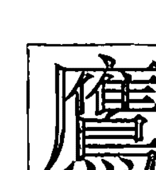

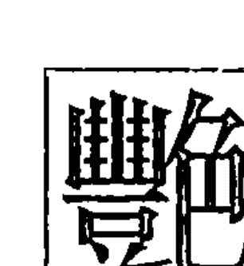

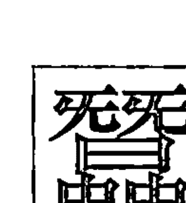

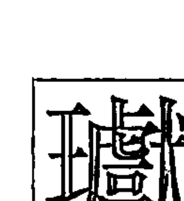

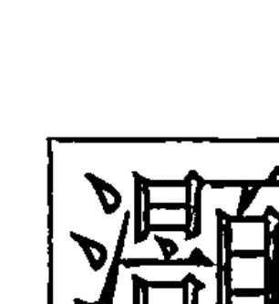

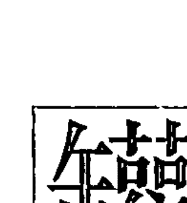

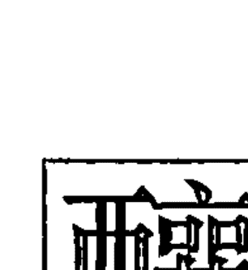

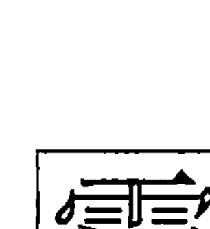

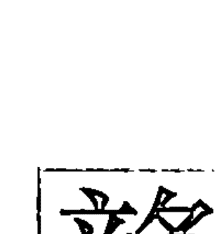

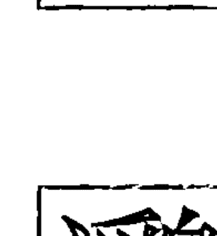

##### 二十五畫——木

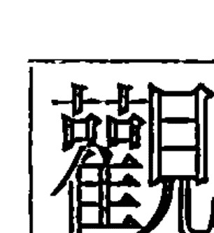

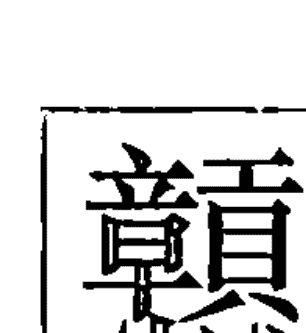

##### 二十六畫——木

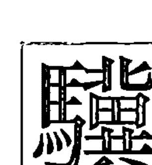

取名用字（依五行順序）

# 玄學錦囊

## 姓名篇

##### 二十七畫至三十畫木

二十七畫——木

二十八畫——木

三十畫——木

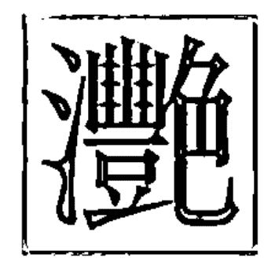

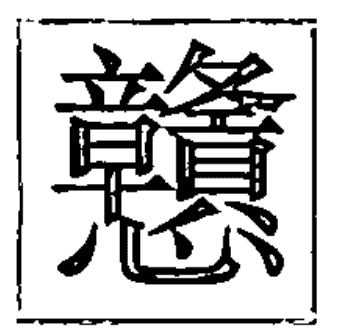

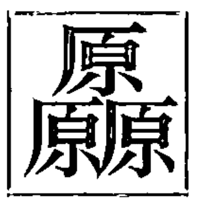

○○○○○○○○○○○○○○○○○○○○○○○○○○○○○○○○○○○○○○○○○○○○○○○○○○○○○○○○○○○○○○○○○○○○○○○○○○○○○○○○○○○○○○○○○○○○○○○○○○○○○○○○○○○○○○○○○○○○○○○○○○○○○○○○○○○○○○○○○○○○○○○○○○○○○○○○○○○○○○○○○○○○○○○○○○○○○○○○○○○○○○○○○○○○○○○○○○○○○○○○○○○○○○○○○○○○○○○○○○○○○○○○○○○○○○○○○○○○○○○○○○○○○○○○○○○○○○○○○○○○○○○○○○○○○○○○○○○○○○○○○○○○○○○○○○○○○○○○○○○○○○○○○○○○○○○○○○○○○○○○○○○○○○○○○○○○○○○○○○○○○○○○○○○○○○○○○○○○○○○○○○○○○○○○○○○○○○○○○○○○○○○○○○○○○○○○○○○○○○○○○○○○○○○○○○○○○○○○○○○○○○○○○○○○○○○○○○○○○○○○○○○○○○○○○○○○○○○○○○○○○○○○○○○○○○○○○○○○○○○○○○○○○○○○○○○○○○○○○○○○○○○○○○○○○○○○○○○○○○○○○○○○○○○○○○○○○○○○○○○○○○○○○○○○○○○○○○○○○○○○○○○○○○○○○○○○○○○○○○○○○○○○○○○○○○○○○○○○○○○○○○○○○○○○○○○○○○○○○○○○○○○○○○○○○○○○○○○○○○○○○○○○○○○○○○○○○○○○○○○○○○○○○○○○○○○○○○○○○○○○○○○○○○○○○○○○○○○○○○○○○○○○○○○○○○○○○○○○○○○○○○○○○○○○○○○○○○○○○○○○○○○○○○○○○○○○○○○○○○○○○○○○○○○○○○○○○○○○○○○○○○○○○○○○○○○○○○○○○○○○○○○○○○○○○○○○○○○○○○○○○○○○○○○○○○○○○○○○○○○○○○○○○○○○○○○○○○○○○○○○○○○○○○○○○○○○○○○○○○○○○○○○○○○○○○○○○○○○○○○○○○○○○○○○○○○○○○○○○○○○○○○○○○○○○○○○○○○○○○○○○○○○○○○○○○○○○○○○○○○○○○○○○○○○○○○○○○○○○○○○○○○○○○○○○○○○○○○○○○○○○○○○○○○○○○○○○○○○○○○○○○○○○○○○○○○○○○○○○○○○○○○○○○○○○○○○○○○○○○○○○○○○○○○○○○○○○○○○○○○○○○○○○○○○○○○○○○○○○○○○○○○○○○○○○○○○○○○○○○○○○○○○○○○○○○○○○○○○○○○○○○○○○○○○○○○○○○○○○○○○○○○○○○○○○○○○○○○○○○○○○○○○○○○○○○○○○○○○○○○○○○○○○○○○○○○○○○○○○○○○○○○○○○○○○○○○○○○○○○○○○○○○○○○○○○○○○○○○○○○○○○○○○○○○○○○○○○○○○○○○○○○○○○○○○○○○○○○○○○○○○○○○○○○○○○○○○○○○○○○○○○○○○○○○○○○○○○○○○○○○○○○○○○○○○○○○○○○○○○○○○○○○○○○○○○○○○○○○○○○○○○○○○○○○○○○○○○○○○○○○○○○○○○○○○○○○○○○○○○○○○○○○○○○○○○○○○○○○○○○○○○○○○○○○○○○○○○○○○○○○○○○○○○○○○○○○○○○○○○○○○○○○○○○○○○○○○○○○○○○○○○○○○○○○○○○○○○○○○○○○○○○○○○○○○○○○○○○○○○○○○○○○○○○○○○○○○○○○○○○○○○○○○○○○○○○○○○○○○○○○○○○○○○○○○○○○○○○○○○○○○○○○○○○○○○○○○○○○○○○○○○○○○○○○○○○○○○○○○○○○○○○○○○○○○○○○○○○○○○○○○○○○○○○○○○○○○○○○○○○○○○○○○○○○○○○○○○○○○○○○○○○○○○○○○○○○○○○○○○○○○○○○○○○○○○○○○○○○○○○○○○○○○○○○○○○○○○○○○○○○○○○○○○○○○○○○○○○○○○○○○○○○○○○○○○○○○○○○○○○○○○○○○○○○○○○○○○○○○○○○○○○○○○○○○○○○○○○○○○○○○○○○○○○○○○○○○○○○○○○○○○○○○○○○○○○○○○○○○○○○○○○○○○○○○○○○○○○○○○○○○○○○○○○○○○○○○○○○○○○○○○○○○○○○○○○○○○○○○○○○○○○○○○○○○○○○○○○○○○○○○○○○○○○○○○○○○○○○○○○○○○○○○○○○○○○○○○○○○○○○○○○○○○○○○○○○○○○○○○○○○○○○○○○○○○○○○○○○○○○○○○○○○○○○○○○○○○○○○○○○○○○○○○○○○○○○○○○○○○○○○○○○○○○○○○○○○○○○○○○○○○○○○○○○○○○○○○○○○○○○○○○○○○○○○○○○○○○○○○○○○○○○○○○○○○○○○○○○○○○○○○○○○○○○○○○○○○○○○○○○○○○○○○○○○○○○○○○○○○○○○○○○○○○○○○○○○○○○○○○○○○○○○○○○○○○○○○○○○○○○○○○○○○○○○○○○○○○○○○○○○○○○○○○○○○○○○○○○○○○○○○○○○○○○○○○○○○○○○○○○○○○○○○○○○○○○○○○○○○○○○○○○○○○○○○○○○○○○○○○○○○○○○○○○○○○○○○○○○○○○○○○○○○○○○○○○○○○○○○○○○○○○○○○○○○○○○○○○○○○○○○○○○○○○○○○○○○○○○○○○○○○○○○○○○○○○○○○○○○○○○○○○○○○○○○○○○○○○○○○○○○○○○○○○○○○○○○○○○○○○○○○○○○○○○○○○○○○○○○○○○○○○○○○○○○○○○○○○○○○○○○○○○○○○○○○○○○○○○○○○○○○○○○○○○○○○○○○○○○○○○○○○○○○○○○○○○○○○○○○○○○○○○○○○○○○○○○○○○○○○○○○○○○○○○○○○○○○○○○○○○○○○○○○○○○○○○○○○○○○○○○○○○○○○○○○○○○○○○○○○○○○○○○○○○○○○○○○○○○○○○○○○○○○○○○○○○○○○○○○○○○○○○○○○○○○○○○○○○○○○○○○○○○○○○○○○○○○○○○○○○○○○○○○○○○○○○○○○○○○○○○○○○○○○○○○○○○○○○○○○○○○○○○○○○○○○○○○○○○○○○○○○○○○○○○○○○○○○○○○○○○○○○○○○○○○○○○○○○○○○○○○○○○○○○○○○○○○○○○○○○○○○○○○○○○○○○○○○○○○○○○○○○○○○○○○○○○○○○○○○○○○○○○○○○○○○○○○○○○○○○○○○○○○○○○○○○○○○○○○○○○○○○○○○○○○○○○○○○○○○○○○○○○○○○○○○○○○○○○○○○○○○○○○○○○○○○○○○○○○○○○○○○○○○○○○○○○○○○○○○○○○○○○○○○○○○○○○○○○○○○○○○○○○○○○○○○○○○○○○○○○○○○○○○○○○○○○○○○○○○○○○○○○○○○○○○○○○○○○○○○○○○○○○○○○○○○○○○○○○○○○○○○○○○○○○○○○○○○○○○○○○○○○○○○○○○○○○○○○○○○○○○○○○○○○○○○○○○○○○○○○○○○○○○○○○○○○○○○○○○○○○○○○○○○○○○○○○○○○○○○○○○○○○○○○○○○○○○○○○○○○○○○○○○○○○○○○○○○○○○○○○○○○○○○○○○○○○○○○○○○○○○○○○○○○○○○○○○○○○○○○○○○○○○○○○○○○○○○○○○○○○○○○○○○○○○○○○○○○○○○○○○○○○○○○○○○○○○○○○○○○○○○○○○○○○○○○○○○○○○○○○○○○○○○○○○○○○○○○○○○○○○○○○○○○○○○○○○○○○○○○○○○○○○○○○○○○○○○○○○○○○○○○○○○○○○○○○○○○○○○○○○○○○○○○○○○○○○○○○○○○○○○○○○○○○○○○○○○○○○○○○○○○○○○○○○○○○○○○○○○○○○○○○○○○○○○○○○○○○○○○○○○○○○○○○○○○○○○○○○○○○○○○○○○○○○○○○○○○○○○○○○○○○○○○○○○○○○○○○○○○○○○○○○○○○○○○○○○○○○○○○○○○○○○○○○○○○○○○○○○○○○○○○○○○○○○○○○○○○○○○○○○○○○○○○○○○○○○○○○○○○○○○○○○○○○○○○○○○○○○○○○○○○○○○○○○○○○○○○○○○○○○○○○○○○○○○○○○○○○○○○○○○○○○○○○○○○○○○○○○○○○○○○○○○○○○○○○○○○○○○○○○○○○○○○○○○○○○○○○○○○○○○○○○○○○○○○○○○○○○○○○○○○○○○○○○○○○○○○○○○○○○○○○○○○○○○○○○○○○○○○○○○○○○○○○○○○○○○○○○○○○○○○○○○○○○○○○○○○○○○○○○○○○○○○○○○○○○○○○○○○○○○○○○○○○○○○○○○○○○○○○○○○○○○○○○○○○○○○○○○○○○○○○○○○○○○○○○○○○○○○○○○○○○○○○○○○○○○○○○○○○○○○○○○○○○○○○○○○○○○○○○○○○○○○○○○○○○○○○○○○○○○○○○○○○○○○○○○○○○○○○○○○○○○○○○○○○○○○○○○○○○○○○○○○○○○○○○○○○○○○○○○○○○○○○○○○○○○○○○○○○○○○○○○○○○○○○○○○○○○○○○○○○○○○○○○○○○○○○○○○○○○○○○○○○○○○○○○○○○○○○○○○○○○○○○○○○○○○○○○○○○○○○○○○○○○○○○○○○○○○○○○○○○○○○○○○○○○○○○○○○○○○○○○○○○○○○○○○○○○○○○○○○○○○○○○○○○○○○○○○○○○○○○○○○○○○○○○○○○○○○○○○○○○○○○○○○○○○○○○○○○○○○○○○○○○○○○○○○○○○○○○○○○○○○○○○○○○○○○○○○○○○○○○○○○○○○○○○○○○○○○○○○○○○○○○○○○○○○○○○○○○○○○○○○○○○○○○○○○○○○○○○○○○○○○○○○○○○○○○○○○○○○○○○○○○○○○○○○○○○○○○○○○○○○○○○○○○○○○○○○○○○○○○○○○○○○○○○○○○○○○○○○○○○○○○○○○○○○○○○○○○○○○○○○○○○○○○○○○○○○○○○○○○○○○○○○○○○○○○○○○○○○○○○○○○○○○○○○○○○○○○○○○○○○○○○○○○○○○○○○○○○○○○○○○○○○○○○○○○○○○○○○○○○○○○○○○○○○○○○○○○○○○○○○○○○○○○○○○○○○○○○○○○○○○○○○○○○○○○○○○○○○○○○○○○○○○○○○○○○○○○○○○○○○○○○○○○○○○○○○○○○○○○○○○○○○○○○○○○○○○○○○○○○○○○○○○○○○○○○○○○○○○○○○○○○○○○○○○○○○○○○○○○○○○○○○○○○○○○○○○○○○○○○○○○○○○○○○○○○○○○○○○○○○○○○○○○○○○○○○○○○○○○○○○○○○○○○○○○○○○○○○○○○○○○○○○○○○○○○○○○○○○○○○○○○○○○○○○○○○○○○○○○○○○○○○○○○○○○○○○○○○○○○○○○○○○○○○○○○○○○○○○○○○○○○○○○○○○○○○○○○○○○○○○○○○○○○○○○○○○○○○○○○○○○○○○○○○○○○○○○○○○○○○○○○○○○○○○○○○○○○○○○○○○○○○○○○○○○○○○○○○○○○○○○○○○○○○○○○○○○○○○○○○○○○○○○○○○○○○○○○○○○○○○○○○○○○○○○○○○○○○○○○○○○○○○○○○○○○○○○○○○○○○○○○○○○○○○○○○○○○○○○○○○○○○○○○○○○○○○○○○○○○○○○○○○○○○○○○○○○○○○○○○○○○○○○○○○○○○○○○○○○○○○○○○○○○○○○○○○○○○○○○○○○○○○○○○○○○○○○○○○○○○○○○○○○○○○○○○○○○○○○○○○○○○○○○○○○○○○○○○○○○○○○○○○○○○○○○○○○○○○○○○○○○○○○○○○○○○○○○○○○○○○○○○○○○○○○○○○○○○○○○○○○○○○○○○○○○○○○○○○○○○○○○○○○○○○○○○○○○○○○○○○○○○○○○○○○○○○○○○○○○○○○○○○○○○○○○○○○○○○○○○○○○○○○○○○○○○○○○○○○○○○○○○○○○○○○○○○○○○○○○○○○○○○○○○○○○○○○○○○○○○○○○○○○○○○○○○○○○○○○○○○○○○○○○○○○○○○○○○○○○○○○○○○○○○○○○○○○○○○○○○○○○○○○○○○○○○○○○○○○○○○○○○○○○○○○○○○○○○○○○○○○○○○○○○○○○○○○○○○○○○○○○○○○○○○○○○○○○○○○○○○○○○○○○○○○○○○○○○○○○○○○○○○○○○○○○○○○○○○○○○○○○○○○○○○○○○○○○○○○○○○○○○○○○○○○○○○○○○○○○○○○○○○○○○○○○○○○○○○○○○○○○○○○○○○○○○○○○○○○○○○○○○○○○○○○○○○○○○○○○○○○○○○○○○○○○○○○○○○○○○○○○○○○○○○○○○○○○○○○○○○○○○○○○○○○○○○○○○○○○○○○○○○○○○○○○○○○○○○○○○○○○○○○○○○○○○○○○○○○○○○○○○○○○○○○○○○○○○○○○○○○○○○○○○○○○○○○○○○○○○○○○○○○○○○○○○○○○○○○○○○○○○○○○○○○○○○○○○○○○○○○○○○○○○○○○○○○○○○○○○○○○○○○○○○○○○○○○○○○○○○○○○○○○○○○○○○○○○○○○○○○○○○○○○○○○○○○○○○○○○○○○○○○○○○○○○○○○○○○○○○○○○○○○○○○○○○○○○○○○○○○○○○○○○○○○○○○○○○○○○○○○○○○○○○○○○○○○○○○○○○○○○○○○○○○○○○○○○○○○○○○○○○○○○○○○○○○○○○○○○○○○○○○○○○○○○○○○○○○○○○○○○○○○○○○○○○○○○○○○○○○○○○○○○○○○○○○○○○○○○○○○○○○○○○○○○○○○○○○○○○○○○○○○○○○○○○○○○○○○○○○○○○○○○○○○○○○○○○○○○○○○○○○○○○○○○○○○○○○○○○○○○○○○○○○○○○○○○○○○○○○○○○○○○○○○○○○○○○○○○○○○○○○○○○○○○○○○○○○○○○○○○○○○○○○○○○○○○○○○○○○○○○○○○○○○○○○○○○○○○○○○○○○○○○○○○○○○○○○○○○○○○○○○○○○○○○○○○○○○○○○○○○○○○○○○○○○○○○○○○○○○○○○○○○○○○○○○○○○○○○○○○○○○○○○○○○○○○○○○○○○○○○○○○○○○○○○○○○○○○○○○○○○○○○○○○○○○○○○○○○○○○○○○○○○○○○○○○○○○○○○○○○○○○○○○○○○○○○○○○○○○○○○○○○○○○○○○○○○○○○○○○○○○○○○○○○○○○○○○○○○○○○○○○○○○○○○○○○○○○○○○○○○○○○○○○○○○○○○○○○○○○○○○○○○○○○○○○○○○○○○○○○○○○○○○○○○○○○○○○○○○○○○○○○○○○○○○○○○○○○○○○○○○○○○○○○○○○○○○○○○○○○○○○○○○○○○○○○○○○○○○○○○○○○○○○○○○○○○○○○○○○○○○○○○○○○○○○○○○○○○○○○○○○○○○○○○○○○○○○○○○○○○○○○○○○○○○○○○○○○○○○○○○○○○○○○○○○○○○○○○○○○○○○○○○○○○○○○○○○○○○○○○○○○○○○○○○○○○○○○○○○○○○○○○○○○○○○○○○○○○○○○○○○○○○○○○○○○○○○○○○○○○○○○○○○○○○○○○○○○○○○○○○○○○○○○○○○○○○○○○○○○○○○○○○○○○○○○○○○○○○○○○○○○○○○○○○○○○○○○○○○○○○○○○○○○○○○○○○○○○○○○○○○○○○○○○○○○○○○○○○○○○○○○○○○○○○○○○○○○○○○○○○○○○○○○○○○○○○○○○○○○○○○○○○○○○○○○○○○○○○○○○○○○○○○○○○○○○○○○○○○○○○○○○○○○○○○○○○○○○○○○○○○○○○○○○○○○○○○○○○○○○○○○○○○○○○○○○○○○○○○○○○○○○○○○○○○○○○○○○○○○○○○○○○○○○○○○○○○○○○○○○○○○○○○○○○○○○○○○○○○○○○○○○○○○○○○○○○○○○○○○○○○○○○○○○○○○○○○○○○○○○○○○○○○○○○○○○○○○○○○○○○○○○○○○○○○○○○○○○○○○○○○○○○○○○○○○○○○○○○○○○○○○○○○○○○○○○○○○○○○○○○○○○○○○○○○○○○○○○○○○○○○○○○○○○○○○○○○○○○○○○○○○○○○○○○○○○○○○○○○○○○○○○○○○○○○○○○○○○○○○○○○○○○○○○○○○○○○○○○○○○○○○○○○○○○○○○○○○○○○○○○○○○○○○○○○○○○○○○○○○○○○○○○○○○○○○○○○○○○○○○○○○○○○○○○○○○○○○○○○○○○○○○○○○○○○○○○○○○○○○○○○○○○○○○○○○○○○○○○○○○○○○○○○○○○○○○○○○○○○○○○○○○○○○○○○○○○○○○○○○○○○○○○○○○○○○○○○○○○○○○○○○○○○○○○○○○○○○○○○○○○○○○○○○○○○○○○○○○○○○○○○○○○○○○○○○○○○○○○○○○○○○○○○○○○○○○○○○○○○○○○○○○○○○○○○○○○○○○○○○○○○○○○○○○○○○○○○○○○○○○○○○○○○○○○○○○○○○○○○○○○○○○○○○○○○○○○○○○○○○○○○○○○○○○○○○○○○○○○○○○○○○○○○○○○○○○○○○○○○○○○○○○○○○○○○○○○○○○○○○○○○○○○○○○○○○○○○○○○○○○○○○○○○○○○○○○○○○○○○○○○○○○○○○○○○○○○○○○○○○○○○○○○○○○○○○○○○○○○○○○○○○○○○○○○○○○○○○○○○○○○○○○○○○○○○○○○○○○○○○○○○○○○○○○○○○○○○○○○○○○○○○○○○○○○○○○○○○○○○○○○○○○○○○○○○○○○○○○○○○○○○○○○○○○○○○○○○○○○○○○○○○○○○○○○○○○○○○○○○○○○○○○○○○○○○○○○○○○○○○○○○○○○○○○○○○○○○○○○○○○○○○○○○○○○○○○○○○○○○○○○○○○○○○○○○○○○○○○○○○○○○○○○○○○○○○○○○○○○○○○○○○○○○○○○○○○○○○○○○○○○○○○○○○○○○○○○○○○○○○○○○○○○○○○○○○○○○○○○○○○○○○○○○○○○○○○○○○○○○○○○○○○○○○○○○○○○○○○○○○○○○○○○○○○○○○○○○○○○○○○○○○○○○○○○○○○○○○○○○○○○○○○○○○○○○○○○○○○○○○○○○○○○○○○○○○○○○○○○○○○○○○○○○○○○○○○○○○○○○○○○○○○○○○○○○○○○○○○○○○○○○○○○○○○○○○○○○○○○○○○○○○○○○○○○○○○○○○○○○○○○○○○○○○○○○○○○○○○○○○○○○○○○○○○○○○○○○○○○○○○○○○○○○○○○○○○○○○○○○○○○○○○○○○○○○○○○○○○○○○○○○○○○○○○○○○○○○○○○○○○○○○○○○○○○○○○○○○○○○○○○○○○○○○○○○○○○○○○○○○○○○○○○○○○○○○○○○○○○○○○○○○○○○○○○○○○○○○○○○○○○○○○○○○○○○○○○○○○○○○○○○○○○○○○○○○○○○○○○○○○○○○○○○○○○○○○○○○○○○○○○○○○○○○○○○○○○○○○○○○○○○○○○○○○○○○○○○○○○○○○○○○○○○○○○○○○○○○○○○○○○○○○○○○○○○○○○○○○○○○○○○○○○○○○○○○○○○○○○○○○○○○○○○○○○○○○○○○○○○○○○○○○○○○○○○○○○○○○○○○○○○○○○○○○○○○○○○○○○○○○○○○○○○○○○○○○○○○○○○○○○○○○○○○○○○○○○○○○○○○○○○○○○○○○○○○○○○○○○○○○○○○○○○○○○○○○○○○○○○○○○○○○○○○○○○○○○○○○○○○○○○○○○○○○○○○○○○○○○○○○○○○○○○○○○○○○○○○○○○○○○○○○○○○○○○○○○○○○○○○○○○○○○○○○○○○○○○○○○○○○○○○○○○○○○○○○○○○○○○○○○○○○○○○○○○○○○○○○○○○○○○○○○○○○○○○○○○○○○○○○○○○○○○○○○○○○○○○○○○○○○○○○○○○○○○○○○○○○○○○○○○○○○○○○○○○○○○○○○○○○○○○○○○○○○○○○○○○○○○○○○○○○○○○○○○○○○○○○○○○○○○○○○○○○○○○○○○○○○○○○○○○○○○○○○○○○○○○○○○○○○○○○○○○○○○○○○○○○○○○○○○○○○○○○○○○○○○○○○○○○○○○○○○○○○○○○○○○○○○○○○○○○○○○○○○○○○○○○○○○○○○○○○○○○○○○○○○○○○○○○○○○○○○○○○○○○○○○○○○○○○○○○○○○○○○○○○○○○○○○○○○○○○○○○○○○○○○○○○○○○○○○○○○○○○○○○○○○○○○○○○○○○○○○○○○○○○○○○○○○○○○○○○○○○○○○○○○○○○○○○○○○○○○○○○○○○○○○○○○○○○○○○○○○○○○○○○○○○○○○○○○○○○○○○○○○○○○○○○○○○○○○○○○○○○○○○○○○○○○○○○○○○○○○○○○○○○○○○○○○○○○○○○○○○○○○○○○○○○○○○○○○○○○○○○○○○○○○○○○○○○○○○○○○○○○○○○○○○○○○○○○○○○○○○○○○○○○○○○○○○○○○○○○○○○○○○○○○○○○○○○○○○○○○○○○○○○○○○○○○○○○○○○○○○○○○○○○○○○○○○○○○○○○○○○○○○○○○○○○○○○○○○○○○○○○○○○○○○○○○○○○○○○○○○○○○○○○○○○○○○○○○○○○○○○○○○○○○○○○○○○○○○○○○○○○○○○○○○○○○○○○○○○○○○○○○○○○○○○○○○○○○○○○○○○○○○○○○○○○○○○○○○○○○○○○○○○○○○○○○○○○○○○○○○○○○○○○○○○○○○○○○○○○○○○○○○○○○○○○○○○○○○○○○○○○○○○○○○○○○○○○○○○○○○○○○○○○○○○○○○○○○○○○○○○○○○○○○○○○○○○○○○○○○○○○○○○○○○○○○○○○○○○○○○○○○○○○○○○○○○○○○○○○○○○○○○○○○○○○○○○○○○○○○○○○○○○○○○○○○○○○○○○○○○○○○○○○○○○○○○○○○○○○○○○○○○○○○○○○○○○○○○○○○○○○○○○○○○○○○○○○○○○○○○○○○○○○○○○○○○○○○○○○○○○○○○○○○○○○○○○○○○○○○○○○○○○○○○○○○○○○○○○○○○○○○○○○○○○○○○○○○○○○○○○○○○○○○○○○○○○○○○○○○○○○○○○○○○○○○○○○○○○○○○○○○○○○○○○○○○○○○○○○○○○○○○○○○○○○○○○○○○○○○○○○○○○○○○○○○○○○○○○○○○○○○○○○○○○○○○○○○○○○○○○○○○○○○○○○○○○○○○○○○○○○○○○○○○○○○○○○○○○○○○○○○○○○○○○○○○○○○○○○○○○○○○○○○○○○○○○○○○○○○○○○○○○○○○○○○○○○○○○○○○○○○○○○○○○○○○○○○○○○○○○○○○○○○○○○○○○○○○○○○○○○○○○○○○○○○○○○○○○○○○○○○○○○○○○○○○○○○○○○○○○○○○○○○○○○○○○○○○○○○○○○○○○○○○○○○○○○○○○○○○○○○○○○○○○○○○○○○○○○○○○○○○○○○○○○○○○○○○○○○○○○○○○○○○○○○○○○○○○○○○○○○○○○○○○○○○○○○○○○○○○○○○○○○○○○○○○○○○○○○○○○○○○○○○○○○○○○○○○○○○○○○○○○○○○○○○○○○○○○○○○○○○○○○○○○○○○○○○○○○○○○○○○○○○○○○○○○○○○○○○○○○○○○○○○○○○○○○○○○○○○○○○○○○○○○○○○○○○○○○○○○○○○○○○○○○○○○○○○○○○○○○○○○○○○○○○○○○○○○○○○○○○○○○○○○○○○○○○○○○○○○○○○○○○○○○○○○○○○○○○○○○○○○○○○○○○○○○○○○○○○○○○○○○○○○○○○○○○○○○○○○○○○○○○○○○○○○○○○○○○○○○○○○○○○○○○○○○○○○○○○○○○○○○○○○○○○○○○○○○○○○○○○○○○○○○○○○○○○○○○○○○○○○○○○○○○○○○○○○○○○○○○○○○○○○○○○○○○○○○○○○○○○○○○○○○○○○○○○○○○○○○○○○○○○○○○○○○○○○○○○○○○○○○○○○○○○○○○○○○○○○○○○○○○○○○○○○○○○○○○○○○○○○○○○○○○○○○○○○○○○○○○○○○○○○○○○○○○○○○○○○○○○○○○○○○○○○○○○○○○○○○○○○○○○○○○○○○○○○○○○○○○○○○○○○○○○○○○○○○○○○○○○○○○○○○○○○○○○○○○○○○○○○○○○○○○○○○○○○○○○○○○○○○○○○○○○○○○○○○○○○○○○○○○○○○○○○○○○○○○○○○○○○○○○○○○○○○○○○○○○○○○○○○○○○○○○○○○○○○○○○○○○○○○○○○○○○○○○○○○○○○○○○○○○○○○○○○○○○○○○○○○○○○○○○○○○○○○○○○○○○○○○○○○○○○○○○○○○○○○○○○○○○○○○○○○○○○○○○○○○○○○○○○○○○○○○○○○○○○○○○○○○○○○○○○○○○○○○○○○○○○○○○○○○○○○○○○○○○○○○○○○○○○○○○○○○○○○○○○○○○○○○○○○○○○○○○○○○○○○○○○○○○○○○○○○○○○○○○○○○○○○○○○○○○○○○○○○○○○○○○○○○○○○○○○○○○○○○○○○○○○○○○○○○○○○○○○○○○○○○○○○○○○○○○○○○○○○○○○○○○○○○○○○○○○○○○○○○○○○○○○○○○○○○○○○○○○○○○○○○○○○○○○○○○○○○○○○○○○○○○○○○○○○○○○○○○○○○○○○○○○○○○○○○○○○○○○○○○○○○○○○○○○○○○○○○○○○○○○○○○○○○○○○○○○○○○○○○○○○○○○○○○○○○○○○○○○○○○○○○○○○○○○○○○○○○○○○○○○○○○○○○○○○○○○○○○○○○○○○○○○○○○○○○○○○○○○○○○○○○○○○○○○○○○○○○○○○○○○○○○○○○○○○○○○○○○○○○○○○○○○○○○○○○○○○○○○○○○○○○○○○○○○○○○○○○○○○○○○○○○○○○○○○○○○○○○○○○○○○○○○○○○○○○○○○○○○○○○○○○○○○○○○○○○○○○○○○○○○○○○○○○○○○○○○○○○○○○○○○○○○○○○○○○○○○○○○○○○○○○○○○○○○○○○○○○○○○○○○○○○○○○○○○○○○○○○○○○○○○○○○○○○○○○○○○○○○○○○○○○○○○○○○○○○○○○○○○○○○○○○○○○○○○○○○○○○○○○○○○○○○○○○○○○○○○○○○○○○○○○○○○○○○○○○○○○○○○○○○○○○○○○○○○○○○○○○○○○○○○○○○○○○○○○○○○○○○○○○○○○○○○○○○○○○○○○○○○○○○○○○○○○○○○○○○○○○○○○○○○○○○○○○○○○○○○○○○○○○○○○○○○○○○○○○○○○○○○○○○○○○○○○○○○○○○○○○○○○○○○○○○○○○○○○○○○○○○○○○○○○○○○○○○○○○○○○○○○○○○○○○○○○○○○○○○○○○○○○○○○○○○○○○○○○○○○○○○○○○○○○○○○○○○○○○○○○○○○○○○○○○○○○○○○○○○○○○○○○○○○○○○○○○○○○○○○○○○○○○○○○○○○○○○○○○○○○○○○○○○○○○○○○○○○○○○○○○○○○○○○○○○○○○○○○○○○○○○○○○○○○○○○○○○○○○○○○○○○○○○○○○○○○○○○○○○○○○○○○○○○○○○○○○○○○○○○○○○○○○○○○○○○○○○○○○○○○○○○○○○○○○○○○○○○○○○○○○○○○○○○○○○○○○○○○○○○○○○○○○○○○○○○○○○○○○○○○○○○○○○○○○○○○○○○○○○○○○○○○○○○○○○○○○○○○○○○○○○○○○○○○○○○○○○○○○○○○○○○○○○○○○○○○○○○○○○○○○○○○○○○○○○○○○○○○○○○○○○○○○○○○○○○○○○○○○○○○○○○○○○○○○○○○○○○○○○○○○○○○○○○○○○○○○○○○○○○○○○○○○○○○○○○○○○○○○○○○○○○○○○○○○○○○○○○○○○○○○○○○○○○○○○○○○○○○○○○○○○○○○○○○○○○○○○○○○○○○○○○○○○○○○○○○○○○○○○○○○○○○○○○○○○○○○○○○○○○○○○○○○○○○○○○○○○○○○○○○○○○○○○○○○○○○○○○○○○○○○○○○○○○○○○○○○○○○○○○○○○○○○○○○○○○○○○○○○○○○○○○○○○○○○○○○○○○○○○○○○○○○○○○○○○○○○○○○○○○○○○○○○○○○○○○○○○○○○○○○○○○○○○○○○○○○○○○○○○○○○○○○○○○○○○○○○○○○○○○○○○○○○○○○○○○○○○○○○○○○○○○○○○○○○○○○○○○○○○○○○○○○○○○○○○○○○○○○○○○○○○○○○○○○○○○○○○○○○○○○○○○○○○○○○○○○○○○○○○○○○○○○○○○○○○○○○○○○○○○○○○○○○○○○○○○○○○○○○○○○○○○○○○○○○○○○○○○○○○○○○○○○○○○○○○○○○○○○○○○○○○○○○○○○○○○○○○○○○○○○○○○○○○○○○○○○○○○○○○○○○○○○○○○○○○○○○○○○○○○○○○○○○○○○○○○○○○○○○○○○○○○○○○○○○○○○○○○○○○○○○○○○○○○○○○○○○○○○○○○○○○○○○○○○○○○○○○○○○○○○○○○○○○○○○○○○○○○○○○○○○○○○○○○○○○○○○○○○○○○○○○○○○○○○○○○○○○○○○○○○○○○○○○○○○○○○○○○○○○○○○○○○○○○○○○○○○○○○○○○○○○○○○○○○○○○○○○○○○○○○○○○○○○○○○○○○○○○○○○○○○○○○○○○○○○○○○○○○○○○○○○○○○○○○○○○○○○○○○○○○○○○○○○○○○○○○○○○○○○○○○○○○○○○○○○○○○○○○○○○○○○○○○○○○○○○○○○○○○○○○○○○○○○○○○○○○○○○○○○○○○○○○○○○○○○○○○○○○○○○○○○○○○○○○○○○○○○○○○○○○○○○○○○○○○○○○○○○○○○○○○○○○○○○○○○○○○○○○○○○○○○○○○○○○○○○○○○○○○○○○○○○○○○○○○○○○○○○○○○○○○○○○○○○○○○○○○○○○○○○○○○○○○○○○○○○○○○○○○○○○○○○○○○○○○○○○○○○○○○○○○○○○○○○○○○○○○○○○○○○○○○○○○○○○○○○○○○○○○○○○○○○○○○○○○○○○○○○○○○○○○○○○○○○○○○○○○○○○○○○○○○○○○○○○○○○○○○○○○○○○○○○○○○○○○○○○○○○○○○○○○○○○○○○○○○○○○○○○○○○○○○○○○○○○○○○○○○○○○○○○○○○○○○○○○○○○○○○○○○○○○○○○○○○○○○○○○○○○○○○○○○○○○○○○○○○○○○○○○○○○○○○○○○○○○○○○○○○○○○○○○○○○○○○○○○○○○○○○○○○○○○○○○○○○○○○○○○○○○○○○○○○○○○○○○○○○○○○○○○○○○○○○○○○○○○○○○○○○○○○○○○○○○○○○○○○○○○○○○○○○○○○○○○○○○○○○○○○○○○○○○○○○○○○○○○○○○○○○○○○○○○○○○○○○○○○○○○○○○○○○○○○○○○○○○○○○○○○○○○○○○○○○○○○○○○○○○○○○○○○○○○○○○○○○○○○○○○○○○○○○○○○○○○○○○○○○○○○○○○○○○○○○○○○○○○○○○○○○○○○○○○○○○○○○○○○○○○○○○○○○○○○○○○○○○○○○○○○○○○○○○○○○○○○○○○○○○○○○○○○○○○○○○○○○○○○○○○○○○○○○○○○○○○○○○○○○○○○○○○○○○○○○○○○○○○○○○○○○○○○○○○○○○○○○○○○○○○○○○○○○○○○○○○○○○○○○○○○○○○○○○○○○○○○○○○○○○○○○○○○○○○○○○○○○○○○○○○○○○○○○○○○○○○○○○○○○○○○○○○○○○○○○○○○○○○○○○○○○○○○○○○○○○○○○○○○○○○○○○○○○○○○○○○○○○○○○○○○○○○○○○○○○○○○○○○○○○○○○○○○○○○○○○○○○○○○○○○○○○○○○○○○○○○○○○○○○○○○○○○○○○○○○○○○○○○○○○○○○○○○○○○○○○○○○○○○○○○○○○○○○○○○○○○○○○○○○○○○○○○○○○○○○○○○○○○○○○○○○○○○○○○○○○○○○○○○○○○○○○○○○○○○○○○○○○○○○○○○○○○○○○○○○○○○○○○○○○○○○○○○○○○○○○○○○○○○○○○○○○○○○○○○○○○○○○○○○○○○○○○○○○○○○○○○○○○○○○○○○○○○○○○○○○○○○○○○○○○○○○○○○○○○○○○○○○○○○○○○○○○○○○○○○○○○○○○○○○○○○○○○○○○○○○○○○○○○○○○○○○○○○○○○○○○○○○○○○○○○○○○○○○○○○○○○○○○○○○○○○○○○○○○○○○○○○○○○○○○○○○○○○○○○○○○○○○○○○○○○○○○○○○○○○○○○○○○○○○○○○○○○○○○○○○○○○○○○○○○○○○○○○○○○○○○○○○○○○○○○○○○○○○○○○○○○○○○○○○○○○○○○○○○○○○○○○○○○○○○○○○○○○○○○○○○○○○○○○○○○○○○○○○○○○○○○○○○○○○○○○○○○○○○○○○○○○○○○○○○○○○○○○○○○○○○○○○○○○○○○○○○○○○○○○○○○○○○○○○○○○○○○○○○○○○○○○○○○○○○○○○○○○○○○○○○○○○○○○○○○○○○○○○○○○○○○○○○○○○○○○○○○○○○○○○○○○○○○○○○○○○○○○○○○○○○○○○○○○○○○○○○○○○○○○○○○○○○○○○○○○○○○○○○○○○○○○○○○○○○○○○○○○○○○○○○○○○○○○○○○○○○○○○○○○○○○○○○○○○○○○○○○○○○○○○○○○○○○○○○○○○○○○○○○○○○○○○○○○○○○○○○○○○○○○○○○○○○○○○○○○○○○○○○○○○○○○○○○○○○○○○○○○○○○○○○○○○○○○○○○○○○○○○○○○○○○○○○○○○○○○○○○○○○○○○○○○○○○○○○○○○○○○○○○○○○○○○○○○○○○○○○○○○○○○○○○○○○○○○○○○○○○○○○○○○○○○○○○○○○○○○○○○○○○○○○○○○○○○○○○○○○○○○○○○○○○○○○○○○○○○○○○○○○○○○○○○○○○○○○○○○○○○○○○○○○○○○○○○○○○○○○○○○○○○○○○○○○○○○○○○○○○○○○○○○○○○○○○○○○○○○○○○○○○○○○○○○○○○○○○○○○○○○○○○○○○○○○○○○○○○○○○○○○○○○○○○○○○○○○○○○○○○○○○○○○○○○○○○○○○○○○○○○○○○○○○○○○○○○○○○○○○○○○○○○○○○○○○○○○○○○○○○○○○○○○○○○○○○○○○○○○○○○○○○○○○○○○○○○○○○○○○○○○○○○○○○○○○○○○○○○○○○○○○○○○○○○○○○○○○○○○○○○○○○○○○○○○○○○○○○○○○○○○○○○○○○○○○○○○○○○○○○○○○○○○○○○○○○○○○○○○○○○○○○○○○○○○○○○○○○○○○○○○○○○○○○○○○○○○○○○○○○○○○○○○○○○○○○○○○○○○○○○○○○○○○○○○○○○○○○○○○○○○○○○○○○○○○○○○○○○○○○○○○○○○○○○○○○○○○○○○○○○○○○○○○○○○○○○○○○○○○○○○○○○○○○○○○○○○○○○○○○○○○○○○○○○○○○○○○○○○○○○○○○○○○○○○○○○○○○○○○○○○○○○○○○○○○○○○○○○○○○○○○○○○○○○○○○○○○○○○○○○○○○○○○○○○○○○○○○○○○○○○○○○○○○○○○○○○○○○○○○○○○○○○○○○○○○○○○○○○○○○○○○○○○○○○○○○○○○○○○○○○○○○○○○○○○○○○○○○○○○○○○○○○○○○○○○○○○○○○○○○○○○○○○○○○○○○○○○○○○○○○○○○○○○○○○○○○○○○○○○○○○○○○○○○○○○○○○○○○○○○○○○○○○○○○○○○○○○○○○○○○○○○○○○○○○○○○○○○○○○○○○○○○○○○○○○○○○○○○○○○○○○○○○○○○○○○○○○○○○○○○○○○○○○○○○○○○○○○○○○○○○○○○○○○○○○○○○○○○○○○○○○○○○○○○○○○○○○○○○○○○○○○○○○○○○○○○○○○○○○○○○○○○○○○○○○○○○○○○○○○○○○○○○○○○○○○○○○○○○○○○○○○○○○○○○○○○○○○○○○○○○○○○○○○○○○○○○○○○○○○○○○○○○○○○○○○○○○○○○○○○○○○○○○○○○○○○○○○○○○○○○○○○○○○○○○○○○○○○○○○○○○○○○○○○○○○○○○○○○○○○○○○○○○○○○○○○○○○○○○○○○○○○○○○○○○○○○○○○○○○○○○○○○○○○○○○○○○○○○○○○○○○○○○○○○○○○○○○○○○○○○○○○○○○○○○○○○○○○○○○○○○○○○○○○○○○○○○○○○○○○○○○○○○○○○○○○○○○○○○○○○○○○○○○○○○○○○○○○○○○○○○○○○○○○○○○○○○○○○○○○○○○○○○○○○○○○○○○○○○○○○○○○○○○○○○○○○○○○○○○○○○○○○○○○○○○○○○○○○○○○○○○○○○○○○○○○○○○○○○○○○○○○○○○○○○○○○○○○○○○○○○○○○○○○○○○○○○○○○○○○○○○○○○○○○○○○○○○○○○○○○○○○○○○○○○○○○○○○○○○○○○○○○○○○○○○○○○○○○○○○○○○○○○○○○○○○○○○○○○○○○○○○○○○○○○○○○○○○○○○○○○○○○○○○○○○○○○○○○○○○○○○○○○○○○○○○○○○○○○○○○○○○○○○○○○○○○○○○○○○○○○○○○○○○○○○○○○○○○○○○○○○○○○○○○○○○○○○○○○○○○○○○○○○○○○○○○○○○○○○○○○○○○○○○○○○○○○○○○○○○○○○○○○○○○○○○○○○○○○○○○○○○○○○○○○○○○○○○○○○○○○○○○○○○○○○○○○○○○○○○○○○○○○○○○○○○○○○○○○○○○○○○○○○○○○○○○○○○○○○○○○○○○○○○○○○○○○○○○○○○○○○○○○○○○○○○○○○○○○○○○○○○○○○○○○○○○○○○○○○○○○○○○○○○○○○○○○○○○○○○○○○○○○○○○○○○○○○○○○○○○○○○○○○○○○○○○○○○○○○○○○○○○○○○○○○○○○○○○○○○○○○○○○○○○○○○○○○○○○○○○○○○○○○○○○○○○○○○○○○○○○○○○○○○○○○○○○○○○○○○○○○○○○○○○○○○○○○○○○○○○○○○○○○○○○○○○○○○○○○○○○○○○○○○○○○○○○○○○○○○○○○○○○○○○○○○○○○○○○○○○○○○○○○○○○○○○○○○○○○○○○○○○○○○○○○○○○○○○○○○○○○○○○○○○○○○○○○○○○○○○○○○○○○○○○○○○○○○○○○○○○○○○○○○○○○○○○○○○○○○○○○○○○○○○○○○○○○○○○○○○○○○○○○○○○○○○○○○○○○○○○○○○○○○○○○○○○○○○○○○○○○○○○○○○○○○○○○○○○○○○○○○○○○○○○○○○○○○○○○○○○○○○○○○○○○○○○○○○○○○○○○○○○○○○○○○○○○○○○○○○○○○○○○○○○○○○○○○○○○○○○○○○○○○○○○○○○○○○○○○○○○○○○○○○○○○○○○○○○○○○○○○○○○○○○○○○○○○○○○○○○○○○○○○○○○○○○○○○○○○○○○○○○○○○○○○○○○○○○○○○○○○○○○○○○○○○○○○○○○○○○○○○○○○○○○○○○○○○○○○○○○○○○○○○○○○○○○○○○○○○○○○○○○○○○○○○○○○○○○○○○○○○○○○○○○○○○○○○○○○○○○○○○○○○○○○○○○○○○○○○○○○○○○○○○○○○○○○○○○○○○○○○○○○○○○○○○○○○○○○○○○○○○○○○○○○○○○○○○○○○○○○○○○○○○○○○○○○○○○○○○○○○○○○○○○○○○○○○○○○○○○○○○○○○○○○○○○○○○○○○○○○○○○○○○○○○○○○○○○○○○○○○○○○○○○○○○○○○○○○○○○○○○○○○○○○○○○○○○○○○○○○○○○○○○○○○○○○○○○○○○○○○○○○○○○○○○○○○○○○○○○○○○○○○○○○○○○○○○○○○○○○○○○○○○○○○○○○○○○○○○○○○○○○○○○○○○○○○○○○○○○○○○○○○○○○○○○○○○○○○○○○○○○○○○○○○○○○○○○○○○○○○○○○○○○○○○○○○○○○○○○○○○○○○○○○○○○○○○○○○○○○○○○○○○○○○○○○○○○○○○○○○○○○○○○○○○○○○○○○○○○○○○○○○○○○○○○○○○○○○○○○○○○○○○○○○○○○○○○○○○○○○○○○○○○○○○○○○○○○○○○○○○○○○○○○○○○○○○○○○○○○○○○○○○○○○○○○○○○○○○○○○○○○○○○○○○○○○○○○○○○○○○○○○○○○○○○○○○○○○○○○○○○○○○○○○○○○○○○○○○○○○○○○○○○○○○○○○○○○○○○○○○○○○○○○○○○○○○○○○○○○○○○○○○○○○○○○○○○○○○○○○○○○○○○○○○○○○○○○○○○○○○○○○○○○○○○○○○○○○○○○○○○○○○○○○○○○○○○○○○○○○○○○○○○○○○○○○○○○○○○○○○○○○○○○○○○○○○○○○○○○○○○○○○○○○○○○○○○○○○○○○○○○○○○○○○○○○○○○○○○○○○○○○○○○○○○○○○○○○○○○○○○○○○○○○○○○○○○○○○○○○○○○○○○○○○○○○○○○○○○○○○○○○○○○○○○○○○○○○○○○○○○○○○○○○○○○○○○○○○○○○○○○○○○○○○○○○○○○○○○○○○○○○○○○○○○○○○○○○○○○○○○○○○○○○○○○○○○○○○○○○○○○○○○○○○○○○○○○○○○○○○○○○○○○○○○○○○○○○○○○○○○○○○○○○○○○○○○○○○○○○○○○○○○○○○○○○○○○○○○○○○○○○○○○○○○○○○○○○○○○○○○○○○○○○○○○○○○○○○○○○○○○○○○○○○○○○○○○○○○○○○○○○○○○○○○○○○○○○○○○○○○○○○○○○○○○○○○○○○○○○○○○○○○○○○○○○○○○○○○○○○○○○○○○○○○○○○○○○○○○○○○○○○○○○○○○○○○○○○○○○○○○○○○○○○○○○○○○○○○○○○○○○○○○○○○○○○○○○○○○○○○○○○○○○○○○○○○○○○○○○○○○○○○○○○○○○○○○○○○○○○○○○○○○○○○○○○○○○○○○○○○○○○○○○○○○○○○○○○○○○○○○○○○○○○○○○○○○○○○○○○○○○○○○○○○○○○○○○○○○○○○○○○○○○○○○○○○○○○○○○○○○○○○○○○○○○○○○○○○○○○○○○○○○○○○○○○○○○○○○○○○○○○○○○○○○○○○○○○○○○○○○○○○○○○○○○○○○○○○○○○○○○○○○○○○○○○○○○○○○○○○○○○○○○○○○○○○○○○○○○○○○○○○○○○○○○○○○○○○○○○○○○○○○○○○○○○○○○○○○○○○○○○○○○○○○○○○○○○○○○○○○○○○○○○○○○○○○○○○○○○○○○○○○○○○○○○○○○○○○○○○○○○○○○○○○○○○○○○○○○○○○○○○○○○○○○○○○○○○○○○○○○○○○○○○○○○○○○○○○○○○○○○○○○○○○○○○○○○○○○○○○○○○○○○○○○○○○○○○○○○○○○○○○○○○○○○○○○○○○○○○○○○○○○○○○○○○○○○○○○○○○○○○○○○○○○○○○○○○○○○○○○○○○○○○○○○○○○○○○○○○○○○○○○○○○○○○○○○○○○○○○○○○○○○○○○○○○○○○○○○○○○○○○○○○○○○○○○○○○○○○○○○○○○○○○○○○○○○○○○○○○○○○○○○○○○○○○○○○○○○○○○○○○○○○○○○○○○○○○○○○○○○○○○○○○○○○○○○○○○○○○○○○○○○○○○○○○○○○○○○○○○○○○○○○○○○○○○○○○○○○○○○○○○○○○○○○○○○○○○○○○○○○○○○○○○○○○○○○○○○○○○○○○○○○○○○○○○○○○○○○○○○○○○○○○○○○○○○○○○○○○○○○○○○○○○○○○○○○○○○○○○○○○○○○○○○○○○○○○○○○○○○○○○○○○○○○○○○○○○○○○○○○○○○○○○○○○○○○○○○○○○○○○○○○○○○○○○○○○○○○○○○○○○○○○○○○○○○○○○○○○○○○○○○○○○○○○○○○○○○○○○○○○○○○○○○○○○○○○○○○○○○○○○○○○○○○○○○○○○○○○○○○○○○○○○○○○○○○○○○○○○○○○○○○○○○○○○○○○○○○○○○○○○○○○○○○○○○○○○○○○○○○○○○○○○○○○○○○○○○○○○○○○○○○○○○○○○○○○○○○○○○○○○○○○○○○○○○○○○○○○○○○○○○○○○○○○○○○○○○○○○○○○○○○○○○○○○○○○○○○○○○○○○○○○○○○○○○○○○○○○○○○○○○○○○○○○○○○○○○○○○○○○○○○○○○○○○○○○○○○○○○○○○○○○○○○○○○○○○○○○○○○○○○○○○○○○○○○○○○○○○○○○○○○○○○○○○○○○○○○○○○○○○○○○○○○○○○○○○○○○○○○○○○○○○○○○○○○○○○○○○○○○○○○○○○○○○○○○○○○○○○○○○○○○○○○○○○○○○○○○○○○○○○○○○○○○○○○○○○○○○○○○○○○○○○○○○○○○○○○○○○○○○○○○○○○○○○○○○○○○○○○○○○○○○○○○○○○○○○○○○○○○○○○○○○○○○○○○○○○○○○○○○○○○○○○○○○○○○○○○○○○○○○○○○○○○○○○○○○○○○○○○○○○○○○○○○○○○○○○○○○○○○○○○○○○○○○○○○○○○○○○○○○○○○○○○○○○○○○○○○○○○○○○○○○○○○○○○○○○○○○○○○○○○○○○○○○○○○○○○○○○○○○○○○○○○○○○○○○○○○○○○○○○○○○○○○○○○○○○○○○○○○○○○○○○○○○○○○○○○○○○○○○○○○○○○○○○○○○○○○○○○○○○○○○○○○○○○○○○○○○○○○○○○○○○○○○○○○○○○○○○○○○○○○○○○○○○○○○○○○○○○○○○○○○○○○○○○○○○○○○○○○○○○○○○○○○○○○○○○○○○○○○○○○○○○○○○○○○○○○○○○○○○○○○○○○○○○○○○○○○○○○○○○○○○○○○○○○○○○○○○○○○○○○○○○○○○○○○○○○○○○○○○○○○○○○○○○○○○○○○○○○○○○○○○○○○○○○○○○○○○○○○○○○○○○○○○○○○○○○○○○○○○○○○○○○○○○○○○○○○○○○○○○○○○○○○○○○○○○○○○○○○○○○○○○○○○○○○○○○○○○○○○○○○○○○○○○○○○○○○○○○○○○○○○○○○○○○○○○○○○○○○○○○○○○○○○○○○○○○○○○○○○○○○○○○○○○○○○○○○○○○○○○○○○○○○○○○○○○○○○○○○○○○○○○○○○○○○○○○○○○○○○○○○○○○○○○○○○○○○○○○○○○○○○○○○○○○○○○○○○○○○○○○○○○○○○○○○○○○○○○○○○○○○○○○○○○○○○○○○○○○○○○○○○○○○○○○○○○○○○○○○○○○○○○○○○○○○○○○○○○○○○○○○○○○○○○○○○○○○○○○○○○○○○○○○○○○○○○○○○○○○○○○○○○○○○○○○○○○○○○○○○○○○○○○○○○○○○○○○○○○○○○○○○○○○○○○○○○○○○○○○○○○○○○○○○○○○○○○○○○○○○○○○○○○○○○○○○○○○○○○○○○○○○○○○○○○○○○○○○○○○○○○○○○○○○○○○○○○○○○○○○○○○○○○○○○○○○○○○○○○○○○○○○○○○○○○○○○○○○○○○○○○○○○○○○○○○○○○○○○○○○○○○○○○○○○○○○○○○○○○○○○○○○○○○○○○○○○○○○○○○○○○○○○○○○○○○○○○○○○○○○○○○○○○○○○○○○○○○○○○○○○○○○○○○○○○○○○○○○○○○○○○○○○○○○○○○○○○○○○○○○○○○○○○○○○○○○○○○○○○○○○○○○○○○○○○○○○○○○○○○○○○○○○○○○○○○○○○○○○○○○○○○○○○○○○○○○○○○○○○○○○○○○○○○○○○○○○○○○○○○○○○○○○○○○○○○○○○○○○○○○○○○○○○○○○○○○○○○○○○○○○○○○○○○○○○○○○○○○○○○○○○○○○○○○○○○○○○○○○○○○○○○○○○○○○○○○○○○○○○○○○○○○○○○○○○○○○○○○○○○○○○○○○○○○○○○○○○○○○○○○○○○○○○○○○○○○○○○○○○○○○○○○○○○○○○○○○○○○○○○○○○○○○○○○○○○○○○○○○○○○○○○○○○○○○○○○○○○○○○○○○○○○○○○○○○○○○○○○○○○○○○○○○○○○○○○○○○○○○○○○○○○○○○○○○○○○○○○○○○○○○○○○○○○○○○○○○○○○○○○○○○○○○○○○○○○○○○○○○○○○○○○○○○○○○○○○○○○○○○○○○○○○○○○○○○○○○○○○○○○○○○○○○○○○○○○○○○○○○○○○○○○○○○○○○○○○○○○○○○○○○○○○○○○○○○○○○○○○○○○○○○○○○○○○○○○○○○○○○○○○○○○○○○○○○○○○○○○○○○○○○○○○○○○○○○○○○○○○○○○○○○○○○○○○○○○○○○○○○○○○○○○○○○○○○○○○○○○○○○○○○○○○○○○○○○○○○○○○○○○○○○○○○○○○○○○○○○○○○○○○○○○○○○○○○○○○○○○○○○○○○○○○○○○○○○○○○○○○○○○○○○○○○○○○○○○○○○○○○○○○○○○○○○○○○○○○○○○○○○○○○○○○○○○○○○○○○○○○○○○○○○○○○○○○○○○○○○○○○○○○○○○○○○○○○○○○○○○○○○○○○○○○○○○○○○○○○○○○○○○○○○○○○○○○○○○○○○○○○○○○○○○○○○○○○○○○○○○○○○○○○○○○○○○○○○○○○○○○○○○○○○○○○○○○○○○○○○○○○○○○○○○○○○○○○○○○○○○○○○○○○○○○○○○○○○○○○○○○○○○○○○○○○○○○○○○○○○○○○○○○○○○○○○○○○○○○○○○○○○○○○○○○○○○○○○○○○○○○○○○○○○○○○○○○○○○○○○○○○○○○○○○○○○○○○○○○○○○○○○○○○○○○○○○○○○○○○○○○○○○○○○○○○○○○○○○○○○○○○○○○○○○○○○○○○○○○○○○○○○○○○○○○○○○○○○○○○○○○○○○○○○○○○○○○○○○○○○○○○○○○○○○○○○○○○○○○○○○○○○○○○○○○○○○○○○○○○○○○○○○○○○○○○○○○○○○○○○○○○○○○○○○○○○○○○○○○○○○○○○○○○○○○○○○○○○○○○○○○○○○○○○○○○○○○○○○○○○○○○○○○○○○○○○○○○○○○○○○○○○○○○○○○○○○○○○○○○○○○○○○○○○○○○○○○○○○○○○○○○○○○○○○○○○○○○○○○○○○○○○○○○○○○○○○○○○○○○○○○○○○○○○○○○○○○○○○○○○○○○○○○○○○○○○○○○○○○○○○○○○○○○○○○○○○○○○○○○○○○○○○○○○○○○○○○○○○○○○○○○○○○○○○○○○○○○○○○○○○○○○○○○○○○○○○○○○○○○○○○○○○○○○○○○○○○○○○○○○○○○○○○○○○○○○○○○○○○○○○○○○○○○○○○○○○○○○○○○○○○○○○○○○○○○○○○○○○○○○○○○○○○○○○○○○○○○○○○○○○○○○○○○○○○○○○○○○○○○○○○○○○○○○○○○○○○○○○○○○○○○○○○○○○○○○○○○○○○○○○○○○○○○○○○○○○○○○○○○○○○○○○○○○○○○○○○○○○○○○○○○○○○○○○○○○○○○○○○○○○○○○○○○○○○○○○○○○○○○○○○○○○○○○○○○○○○○○○○○○○○○○○○○○○○○○○○○○○○○○○○○○○○○○○○○○○○○○○○○○○○○○○○○○○○○○○○○○○○○○○○○○○○○○○○○○○○○○○○○○○○○○○○○○○○○○○○○○○○○○○○○○○○○○○○○○○○○○○○○○○○○○○○○○○○○○○○○○○○○○○○○○○○○○○○○○○○○○○○○○○○○○○○○○○○○○○○○○○○○○○○○○○○○○○○○○○○○○○○○○○○○○○○○○○○○○○○○○○○○○○○○○○○○○○○○○○○○○○○○○○○○○○○○○○○○○○○○○○○○○○○○○○○○○○○○○○○○○○○○○○○○○○○○○○○○○○○○○○○○○○○○○○○○○○○○○○○○○○○○○○○○○○○○○○○○○○○○○○○○○○○○○○○○○○○○○○○○○○○○○○○○○○○○○○○○○○○○○○○○○○○○○○○○○○○○○○○○○○○○○○○○○○○○○○○○○○○○○○○○○○○○○○○○○○○○○○○○○○○○○○○○○○○○○○○○○○○○○○○○○○○○○○○○○○○○○○○○○○○○○○○○○○○○○○○○○○○○○○○○○○○○○○○○○○○○○○○○○○○○○○○○○○○○○○○○○○○○○○○○○○○○○○○○○○○○○○○○○○○○○○○○○○○○○○○○○○○○○○○○○○○○○○○○○○○○○○○○○○○○○○○○○○○○○○○○○○○○○○○○○○○○○○○○○○○○○○○○○○○○○○○○○○○○○○○○○○○○○○○○○○○○○○○○○○○○○○○○○○○○○○○○○○○○○○○○○○○○○○○○○○○○○○○○○○○○○○○○○○○○○○○○○○○○○○○○○○○○○○○○○○○○○○○○○○○○○○○○○○○○○○○○○○○○○○○○○○○○○○○○○○○○○○○○○○○○○○○○○○○○○○○○○○○○○○○○○○○○○○○○○○○○○○○○○○○○○○○○○○○○○○○○○○○○○○○○○○○○○○○○○○○○○○○○○○○○○○○○○○○○○○○○○○○○○○○○○○○○○○○○○○○○○○○○○○○○○○○○○○○○○○○○○○○○○○○○○○○○○○○○○○○○○○○○○○○○○○○○○○○○○○○○○○○○○○○○○○○○○○○○○○○○○○○○○○○○○○○○○○○○○○○○○○○○○○○○○○○○○○○○○○○○○○○○○○○○○○○○○○○○○○○○○○○○○○○○○○○○○○○○○○○○○○○○○○○○○○○○○○○○○○○○○○○○○○○○○○○○○○○○○○○○○○○○○○○○○○○○○○○○○○○○○○○○○○○○○○○○○○○○○○○○○○○○○○○○○○○○○○○○○○○○○○○○○○○○○○○○○○○○○○○○○○○○○○○○○○○○○○○○○○○○○○○○○○○○○○○○○○○○○○○○○○○○○○○○○○○○○○○○○○○○○○○○○○○○○○○○○○○○○○○○○○○○○○○○○○○○○○○○○○○○○○○○○○○○○○○○○○○○○○○○○○○○○○○○○○○○○○○○○○○○○○○○○○○○○○○○○○○○○○○○○○○○○○○○○○○○○○○○○○○○○○○○○○○○○○○○○○○○○○○○○○○○○○○○○○○○○○○○○○○○○○○○○○○○○○○○○○○○○○○○○○○○○○○○○○○○○○○○○○○○○○○○○○○○○○○○○○○○○○○○○○○○○○○○○○○○○○○○○○○○○○○○○○○○○○○○○○○○○○○○○○○○○○○○○○○○○○○○○○○○○○○○○○○○○○○○○○○○○○○○○○○○○○○○○○○○○○○○○○○○○○○○○○○○○○○○○○○○○○○○○○○○○○○○○○○○○○○○○○○○○○○○○○○○○○○○○○○○○○○○○○○○○○○○○○○○○○○○○○○○○○○○○○○○○○○○○○○○○○○○○○○○○○○○○○○○○○○○○○○○○○○○○○○○○○○○○○○○○○○○○○○○○○○○○○○○○○○○○○○○○○○○○○○○○○○○○○○○○○○○○○○○○○○○○○○○○○○○○○○○○○○○○○○○○○○○○○○○○○○○○○○○○○○○○○○○○○○○○○○○○○○○○○○○○○○○○○○○○○○○○○○○○○○○○○○○○○○○○○○○○○○○○○○○○○○○○○○○○○○○○○○○○○○○○○○○○○○○○○○○○○○○○○○○○○○○○○○○○○○○○○○○○○○○○○○○○○○○○○○○○○○○○○○○○○○○○○○○○○○○○○○○○○○○○○○○○○○○○○○○○○○○○○○○○○○○○○○○○○○○○○○○○○○○○○○○○○○○○○○○○○○○○○○○○○○○○○○○○○○○○○○○○○○○○○○○○○○○○○○○○○○○○○○○○○○○○○○○○○○○○○○○○○○○○○○○○○○○○○○○○○○○○○○○○○○○○○○○○○○○○○○○○○○○○○○○○○○○○○○○○○○○○○○○○○○○○○○○○○○○○○○○○○○○○○○○○○○○○○○○○○○○○○○○○○○○○○○○○○○○○○○○○○○○○○○○○○○○○○○○○○○○○○○○○○○○○○○○○○○○○○○○○○○○○○○○○○○○○○○○○○○○○○○○○○○○○○○○○○○○○○○○○○○○○○○○○○○○○○○○○○○○○○○○○○○○○○○○○○○○○○○○○○○○○○○○○○○○○○○○○○○○○○○○○○○○○○○○○○○○○○○○○○○○○○○○○○○○○○○○○○○○○○○○○○○○○○○○○○○○○○○○○○○○○○○○○○○○○○○○○○○○○○○○○○○○○○○○○○○○○○○○○○○○○○○○○○○○○○○○○○○○○○○○○○○○○○○○○○○○○○○○○○○○○○○○○○○○○○○○○○○○○○○○○○○○○○○○○○○○○○○○○○○○○○○○○○○○○○○○○○○○○○○○○○○○○○○○○○○○○○○○○○○○○○○○○○○○○○○○○○○○○○○○○○○○○○○○○○○○○○○○○○○○○○○○○○○○○○○○○○○○○○○○○○○○○○○○○○○○○○○○○○○○○○○○○○○○○○○○○○○○○○○○○○○○○○○○○○○○○○○○○○○○○○○○○○○○○○○○○○○○○○○○○○○○○○○○○○○○○○○○○○○○○○○○○○○○○○○○○○○○○○○○○○○○○○○○○○○○○○○○○○○○○○○○○○○○○○○○○○○○○○○○○○○○○○○○○○○○○○○○○○○○○○○○○○○○○○○○○○○○○○○○○○○○○○○○○○○○○○○○○○○○○○○○○○○○○○○○○○○○○○○○○○○○○○○○○○○○○○○○○○○○○○○○○○○○○○○○○○○○○○○○○○○○○○○○○○○○○○○○○○○○○○○○○○○○○○○○○○○○○○○○○○○○○○○○○○○○○○○○○○○○○○○○○○○○○○○○○○○○○○○○○○○○○○○○○○○○○○○○○○○○○○○○○○○○○○○○○○○○○○○○○○○○○○○○○○○○○○○○○○○○○○○○○○○○○○○○○○○○○○○○○○○○○○○○○○○○○○○○○○○○○○○○○○○○○○○○○○○○○○○○○○○○○○○○○○○○○○○○○○○○○○○○○○○○○○○○○○○○○○○○○○○○○○○○○○○○○○○○○○○○○○○○○○○○○○○○○○○○○○○○○○○○○○○○○○○○○○○○○○○○○○○○○○○○○○○○○○○○○○○○○○○○○○○○○○○○○○○○○○○○○○○○○○○○○○○○○○○○○○○○○○○○○○○○○○○○○○○○○○○○○○○○○○○○○○○○○○○○○○○○○○○○○○○○○○○○○○○○○○○○○○○○○○○○○○○○○○○○○○○○○○○○○○○○○○○○○○○○○○○○○○○○○○○○○○○○○○○○○○○○○○○○○○○○○○○○○○○○○○○○○○○○○○○○○○○○○○○○○○○○○○○○○○○○○○○○○○○○○○○○○○○○○○○○○○○○○○○○○○○○○○○○○○○○○○○○○○○○○○○○○○○○○○○○○○○○○○○○○○○○○○○○○○○○○○○○○○○○○○○○○○○○○○○○○○○○○○○○○○○○○○○○○○○○○○○○○○○○○○○○○○○○○○○○○○○○○○○○○○○○○○○○○○○○○○○○○○○○○○○○○○○○○○○○○○○○○○○○○○○○○○○○○○○○○○○○○○○○○○○○○○○○○○○○○○○○○○○○○○○○○○○○○○○○○○○○○○○○○○○○○○○○○○○○○○○○○○○○○○○○○○○○○○○○○○○○○○○○○○○○○○○○○○○○○○○○○○○○○○○○○○○○○○○○○○○○○○○○○○○○○○○○○○○○○○○○○○○○○○○○○○○○○○○○○○○○○○○○○○○○○○○○○○○○○○○○○○○○○○○○○○○○○○○○○○○○○○○○○○○○○○○○○○○○○○○○○○○○○○○○○○○○○○○○○○○○○○○○○○○○○○○○○○○○○○○○○○○○○○○○○○○○○○○○○○○○○○○○○○○○○○○○○○○○○○○○○○○○○○○○○○○○○○○○○○○○○○○○○○○○○○○○○○○○○○○○○○○○○○○○○○○○○○○○○○○○○○○○○○○○○○○○○○○○○○○○○○○○○○○○○○○○○○○○○○○○○○○○○○○○○○○○○○○○○○○○○○○○○○○○○○○○○○○○○○○○○○○○○○○○○○○○○○○○○○○○○○○○○○○○○○○○○○○○○○○○○○○○○○○○○○○○○○○○○○○○○○○○○○○○○○○○○○○○○○○○○○○○○○○○○○○○○○○○○○○○○○○○○○○○○○○○○○○○○○○○○○○○○○○○○○○○○○○○○○○○○○○○○○○○○○○○○○○○○○○○○○○○○○○○○○○○○○○○○○○○○○○○○○○○○○○○○○○○○○○○○○○○○○○○○○○○○○○○○○○○○○○○○○○○○○○○○○○○○○○○○○○○○○○○○○○○○○○○○○○○○○○○○○○○○○○○○○○○○○○○○○○○○○○○○○○○○○○○○○○○○○○○○○○○○○○○○○○○○○○○○○○○○○○○○○○○○○○○○○○○○○○○○○○○○○○○○○○○○○○○○○○○○○○○○○○○○○○○○○○○○○○○○○○○○○○○○○○○○○○○○○○○○○○○○○○○○○○○○○○○○○○○○○○○○○○○○○○○○○○○○○○○○○○○○○○○○○○○○○○○○○○○○○○○○○○○○○○○○○○○○○○○○○○○○○○○○○○○○○○○○○○○○○○○○○○○○○○○○○○○○○○○○○○○○○○○○○○○○○○○○○○○○○○○○○○○○○○○○○○○○○○○○○○○○○○○○○○○○○○○○○○○○○○○○○○○○○○○○○○○○○○○○○○○○○○○○○○○○○○○○○○○○○○○○○○○○○○○○○○○○○○○○○○○○○○○○○○○○○○○○○○○○○○○○○○○○○○○○○○○○○○○○○○○○○○○○○○○○○○○○○○○○○○○○○○○○○○○○○○○○○○○○○○○○○○○○○○○○○○○○○○○○○○○○○○○○○○○○○○○○○○○○○○○○○○○○○○○○○○○○○○○○○○○○○○○○○○○○○○○○○○○○○○○○○○○○○○○○○○○○○○○○○○○○○○○○○○○○○○○○○○○○○○○○○○○○○○○○○○○○○○○○○○○○○○○○○○○○○○○○○○○○○○○○○○○○○○○○○○○○○○○○○○○○○○○○○○○○○○○○○○○○○○○○○○○○○○○○○○○○○○○○○○○○○○○○○○○○○○○○○○○○○○○○○○○○○○○○○○○○○○○○○○○○○○○○○○○○○○○○○○○○○○○○○○○○○○○○○○○○○○○○○○○○○○○○○○○○○○○○○○○○○○○○○○○○○○○○○○○○○○○○○○○○○○○○○○○○○○○○○○○○○○○○○○○○○○○○○○○○○○○○○○○○○○○○○○○○○○○○○○○○○○○○○○○○○○○○○○○○○○○○○○○○○○○○○○○○○○○○○○○○○○○○○○○○○○○○○○○○○○○○○○○○○○○○○○○○○○○○○○○○○○○○○○○○○○○○○○○○○○○○○○○○○○○○○○○○○○○○○○○○○○○○○○○○○○○○○○○○○○○○○○○○○○○○○○○○○○○○○○○○○○○○○○○○○○○○○○○○○○○○○○○○○○○○○○○○○○○○○○○○○○○○○○○○○○○○○○○○○○○○○○○○○○○○○○○○○○○○○○○○○○○○○○○○○○○○○○○○○○○○○○○○○○○○○○○○○○○○○○○○○○○○○○○○○○○○○○○○○○○○○○○○○○○○○○○○○○○○○○○○○○○○○○○○○○○○○○○○○○○○○○○○○○○○○○○○○○○○○○○○○○○○○○○○○○○○○○○○○○○○○○○○○○○○○○○○○○○○○○○○○○○○○○○○○○○○○○○○○○○○○○○○○○○○○○○○○○○○○○○○○○○○○○○○○○○○○○○○○○○○○○○○○○○○○○○○○○○○○○○○○○○○○○○○○○○○○○○○○○○○○○○○○○○○○○○○○○○○○○○○○○○○○○○○○○○○○○○○○○○○○○○○○○○○○○○○○○○○○○○○○○○○○○○○○○○○○○○○○○○○○○○○○○○○○○○○○○○○○○○○○○○○○○○○○○○○○○○○○○○○○○○○○○○○○○○○○○○○○○○○○○○○○○○○○○○○○○○○○○○○○○○○○○○○○○○○○○○○○○○○○○○○○○○○○○○○○○○○○○○○○○○○○○○○○○○○○○○○○○○○○○○○○○○○○○○○○○○○○○○○○○○○○○○○○○○○○○○○○○○○○○○○○○○○○○○○○○○○○○○○○○○○○○○○○○○○○○○○○○○○○○○○○○○○○○○○○○○○○○○○○○○○○○○○○○○○○○○○○○○○○○○○○○○○○○○○○○○○○○○○○○○○○○○○○○○○○○○○○○○○○○○○○○○○○○○○○○○○○○○○○○○○○○○○○○○○○○○○○○○○○○○○○○○○○○○○○○○○○○○○○○○○○○○○○○○○○○○○○○○○○○○○○○○○○○○○○○○○○○○○○○○○○○○○○○○○○○○○○○○○○○○○○○○○○○○○○○○○○○○○○○○○○○○○○○○○○○○○○○○○○○○○○○○○○○○○○○○○○○○○○○○○○○○○○○○○○○○○○○○○○○○○○○○○○○○○○○○○○○○○○○○○○○○○○○○○○○○○○○○○○○○○○○○○○○○○○○○○○○○○○○○○○○○○○○○○○○○○○○○○○○○○○○○○○○○○○○○○○○○○○○○○○○○○○○○○○○○○○○○○○○○○○○○○○○○○○○○○○○○○○○○○○○○○○○○○○○○○○○○○○○○○○○○○○○○○○○○○○○○○○○○○○○○○○○○○○○○○○○○○○○○○○○○○○○○○○○○○○○○○○○○○○○○○○○○○○○○○○○○○○○○○○○○○○○○○○○○○○○○○○○○○○○○○○○○○○○○○○○○○○○○○○○○○○○○○○○○○○○○○○○○○○○○○○○○○○○○○○○○○○○○○○○○○○○○○○○○○○○○○○○○○○○○○○○○○○○○○○○○○○○○○○○○○○○○○○○○○○○○○○○○○○○○○○○○○○○○○○○○○○○○○○○○○○○○○○○○○○○○○○○○○○○○○○○○○○○○○○○○○○○○○○○○○○○○○○○○○○○○○○○○○○○○○○○○○○○○○○○○○○○○○○○○○○○○○○○○○○○○○○○○○○○○○○○○○○○○○○○○○○○○○○○○○○○○○○○○○○○○○○○○○○○○○○○○○○○○○○○○○○○○○○○○○○○○○○○○○○○○○○○○○○○○○○○○○○○○○○○○○○○○○○○○○○○○○○○○○○○○○○○○○○○○○○○○○○○○○○○○○○○○○○○○○○○○○○○○○○○○○○○○○○○○○○○○○○○○○○○○○○○○○○○○○○○○○○○○○○○○○○○○○○○○○○○○○○○○○○○○○○○○○○○○○○○○○○○○○○○○○○○○○○○○○○○○○○○○○○○○○○○○○○○○○○○○○○○○○○○○○○○○○○○○○○○○○○○○○○○○○○○○○○○○○○○○○○○○○○○○○○○○○○○○○○○○○○○○○○○○○○○○○○○○○○○○○○○○○○○○○○○○○○○○○○○○○○○○○○○○○○○○○○○○○○○○○○○○○○○○○○○○○○○○○○○○○○○○○○○○○○○○○○○○○○○○○○○○○○○○○○○○○○○○○○○○○○○○○○○○○○○○○○○○○○○○○○○○○○○○○○○○○○○○○○○○○○○○○○○○○○○○○○○○○○○○○○○○○○○○○○○○○○○○○○○○○○○○○○○○○○○○○○○○○○○○○○○○○○○○○○○○○○○○○○○○○○○○○○○○○○○○○○○○○○○○○○○○○○○○○○○○○○○○○○○○○○○○○○○○○○○○○○○○○○○○○○○○○○○○○○○○○○○○○○○○○○○○○○○○○○○○○○○○○○○○○○○○○○○○○○○○○○○○○○○○○○○○○○○○○○○○○○○○○○○○○○○○○○○○○○○○○○○○○○○○○○○○○○○○○○○○○○○○○○○○○○○○○○○○○○○○○○○○○○○○○○○○○○○○○○○○○○○○○○○○○○○○○○○○○○○○○○○○○○○○○○○○○○○○○○○○○○○○○○○○○○○○○○○○○○○○○○○○○○○○○○○○○○○○○○○○○○○○○○○○○○○○○○○○○○○○○○○○○○○○○○○○○○○○○○○○○○○○○○○○○○○○○○○○○○○○○○○○○○○○○○○○○○○○○○○○○○○○○○○○○○○○○○○○○○○○○○○○○○○○○○○○○○○○○○○○○○○○○○○○○○○○○○○○○○○○○○○○○○○○○○○○○○○○○○○○○○○○○○○○○○○○○○○○○○○○○○○○○○○○○○○○○○○○○○○○○○○○○○○○○○○○○○○○○○○○○○○○○○○○○○○○○○○○○○○○○○○○○○○○○○○○○○○○○○○○○○○○○○○○○○○○○○○○○○○○○○○○○○○○○○○○○○○○○○○○○○○○○○○○○○○○○○○○○○○○○○○○○○○○○○○○○○○○○○○○○○○○○○○○○○○○○○○○○○○○○○○○○○○○○○○○○○○○○○○○○○○○○○○○○○○○○○○○○○○○○○○○○○○○○○○○○○○○○○○○○○○○○○○○○○○○○○○○○○○○○○○○○○○○○○○○○○○○○○○○○○○○○○○○○○○○○○○○○○○○○○○○○○○○○○○○○○○○○○○○○○○○○○○○○○○○○○○○○○○○○○○○○○○○○○○○○○○○○○○○○○○○○○○○○○○○○○○○○○○○○○○○○○○○○○○○○○○○○○○○○○○○○○○○○○○○○○○○○○○○○○○○○○○○○○○○○○○○○○○○○○○○○○○○○○○○○○○○○○○○○○○○○○○○○○○○○○○○○○○○○○○○○○○○○○○○○○○○○○○○○○○○○○○○○○○○○○○○○○○○○○○○○○○○○○○○○○○○○○○○○○○○○○○○○○○○○○○○○○○○○○○○○○○○○○○○○○○○○○○○○○○○○○○○○○○○○○○○○○○○○○○○○○○○○○○○○○○○○○○○○○○○○○○○○○○○○○○○○○○○○○○○○○○○○○○○○○○○○○○○○○○○○○○○○○○○○○○○○○○○○○○○○○○○○○○○○○○○○○○○○○○○○○○○○○○○○○○○○○○○○○○○○○○○○○○○○○○○○○○○○○○○○○○○○○○○○○○○○○○○○○○○○○○○○○○○○○○○○○○○○○○○○○○○○○○○○○○○○○○○○○○○○○○○○○○○○○○○○○○○○○○○○○○○○○○○○○○○○○○○○○○○○○○○○○○○○○○○○○○○○○○○○○○○○○○○○○○○○○○○○○○○○○○○○○○○○○○○○○○○○○○○○○○○○○○○○○○○○○○○○○○○○○○○○○○○○○○○○○○○○○○○○○○○○○○○○○○○○○○○○○○○○○○○○○○○○○○○○○○○○○○○○○○○○○○○○○○○○○○○○○○○○○○○○○○○○○○○○○○○○○○○○○○○○○○○○○○○○○○○○○○○○○○○○○○○○○○○○○○○○○○○○○○○○○○○○○○○○○○○○○○○○○○○○○○○○○○○○○○○○○○○○○○○○○○○○○○○○○○○○○○○○○○○○○○○○○○○○○○○○○○○○○○○○○○○○○○○○○○○○○○○○○○○○○○○○○○○○○○○○○○○○○○○○○○○○○○○○○○○○○○○○○○○○○○○○○○○○○○○○○○○○○○○○○○○○○○○○○○○○○○○○○○○○○○○○○○○○○○○○○○○○○○○○○○○○○○○○○○○○○○○○○○○○○○○○○○○○○○○○○○○○○○○○○○○○○○○○○○○○○○○○○○○○○○○○○○○○○○○○○○○○○○○○○○○○○○○○○○○○○○○○○○○○○○○○○○○○○○○○○○○○○○○○○○○○○○○○○○○○○○○○○○○○○○○○○○○○○○○○○○○○○○○○○○○○○○○○○○○○○○○○○○○○○○○○○○○○○○○○○○○○○○○○○○○○○○○○○○○○○○○○○○○○○○○○○○○○○○○○○○○○○○○○○○○○○○○○○○○○○○○○○○○○○○○○○○○○○○○○○○○○○○○○○○○○○○○○○○○○○○○○○○○○○○○○○○○○○○○○○○○○○○○○○○○○○○○○○○○○○○○○○○○○○○○○○○○○○○○○○○○○○○○○○○○○○○○○○○○○○○○○○○○○○○○○○○○○○○○○○○○○○○○○○○○○○○○○○○○○○○○○○○○○○○○○○○○○○○○○○○○○○○○○○○○○○○○○○○○○○○○○○○○○○○○○○○○○○○○○○○○○○○○○○○○○○○○○○○○○○○○○○○○○○○○○○○○○○○○○○○○○○○○○○○○○○○○○○○○○○○○○○○○○○○○○○○○○○○○○○○○○○○○○○○○○○○○○○○○○○○○○○○○○○○○○○○○○○○○○○○○○○○○○○○○○○○○○○○○○○○○○○○○○○○○○○○○○○○○○○○○○○○○○○○○○○○○○○○○○○○○○○○○○○○○○○○○○○○○○○○○○○○○○○○○○○○○○○○○○○○○○○○○○○○○○○○○○○○○○○○○○○○○○○○○○○○○○○○○○○○○○○○○○○○○○○○○○○○○○○○○○○○○○○○○○○○○○○○○○○○○○○○○○○○○○○○○○○○○○○○○○○○○○○○○○○○○○○○○○○○○○○○○○○○○○○○○○○○○○○○○○○○○○○○○○○○○○○○○○○○○○○○○○○○○○○○○○○○○○○○○○○○○○○○○○○○○○○○○○○○○○○○○○○○○○○○○○○○○○○○○○○○○○○○○○○○○○○○○○○○○○○○○○○○○○○○○○○○○○○○○○○○○○○○○○○○○○○○○○○○○○○○○○○○○○○○○○○○○○○○○○○○○○○○○○○○○○○○○○○○○○○○○○○○○○○○○○○○○○○○○○○○○○○○○○○○○○○○○○○○○○○○○○○○○○○○○○○○○○○○○○○○○○○○○○○○○○○○○○○○○○○○○○○○○○○○○○○○○○○○○○○○○○○○○○○○○○○○○○○○○○○○○○○○○○○○○○○○○○○○○○○○○○○○○○○○○○○○○○○○○○○○○○○○○○○○○○○○○○○○○○○○○○○○○○○○○○○○○○○○○○○○○○○○○○○○○○○○○○○○○○○○○○○○○○○○○○○○○○○○○○○○○○○○○○○

#### 水

二畫——水

三畫——水

四畫——水

八 下 巴 勿 几 亡 文 比 卜 凡 化 反 也 个 匹 户 匕 几 夫 毛 兀 木 父 万 丰 火 方 幻 互 不 分 下

二畫至四畫水

取名用字（依五行順序）

# 玄學錦囊

## 姓名篇

##### 四畫（續）

##### 五畫——水

| 云 | 什 | 片 | 仆 | 仆 |
|---|---|---|---|---|
| 民 | 弘 | 布 | 平 | 皮 |
| 包 | 目 | 必 | 禾 | 本 |
| 北 | 卯 | 弗 | 未 | 未 |
| 池 | 乏 | □ | □ | □ |
| □ | □ | □ | □ | □ |
| □ | □ | □ | □ | □ |
| □ | □ | □ | □ | □ |
| □ | □ | □ | □ | □ |
| □ | □ | □ | □ | □ |

##### 四畫至七畫水

##### 六畫——水

##### 七畫——水

好 休 伏 行 仿 向 合 兒 血 宇

希 孚 孝 汾 宏 妙 甫 芒 扶 判

后 名 回 妃 灰 北 肉 百 米 冰

伯 兵 何 尾 杏 步 每 姚 亭 貝

羽 伐 牢 亥 并 朴 忙 系 邢 沉

別 好 坊 沐 忘 佛 系 含 抛 沒

取名用字（依五行順序）

# 玄學錦囊

## 姓名篇

##### 七畫（續）

防 妨 否 邦 牡 汶 罕 巫 伴 坟

况 坂 孛 坎 沛 龎 采 孛 刨 邠

匣 汲 坌 兔 把 峯 □ □ □ □

##### 八畫——水

河 法 泊 波 泓 泯 抱 拍 坡 坪

併 佩 彼 杷 板 杭 杯 枚 妹 烁

##### 七畫至八畫水

取名用字（依五行順序）

| 侲 | 采 | 肪 | 认 | 昏 | 府 | 炫 |
|---|---|---|---|---|---|---|
| 宥 | 牧 | 非 | 弦 | 卹 | 奉 | 武 |
| 芸 | 函 | 玫 | 芳 | 並 | 花 | 朋 |
| 况 | 胖 | 固 | 物 | 忽 | 芙 | 盂 |
| 狐 | 并 | 版 | 盲 | 味 | 肥 | 芬 |
| 佛 | 爬 | 秉 | 虎 | 幸 | 明 | 甬 |
| 艾 | 卑 | 吓 | 晏 | 或 | 陂 | 命 |
| 雨 | 杳 | 音 | 呼 | 協 | 岸 | 享 |
| 杆 | 盱 | 卓 | 芽 | 帛 | 房 | 和 |
| □ | 必 | 劾 | 表 | 服 | 放 | 門 |

# 玄學錦囊

## 姓名篇

##### 九畫——水

炳 柏 風 眇 背 履 符

侯 秒 品 咸 封 宦 弗

保 胖 珀 眉 負 耗 砍

便 茂 拜 炫 某 盼 恒

係 飛 盆 味 胞 冒 倚

衍 厚 恨 皇 扁 苦 衍

後 陌 巷 面 昆 侠 戚

派 屏 盼 迫 娃 勉

洽 香 盃 版 奔 奕

柄 美 勃 苗 哈 茅

##### 九畫至十畫水

##### 十畫——水

浦 表 班 埋 配 疲 峽

浮 俸 捕 旁 釜 粉 畜

娑 俯 炬 冥 馬 耗 柏

紋 敝 圃 烘 荒 袍 符

紡 核 訓 破 航 袜 珩

紛 桓 峰 砲 害 澤 茗

倍 校 剖 笏 珈 被 涕

倖 祕 敝 臭 脈 逢 淖

候 秤 效 蚊 眠 毫 涛

併 夏 畔 豹 病 紘 稀

取名用字（依五行順序）

# 玄學錦囊

## 姓名篇

##### 十畫（續）

##### 十一畫——水

晞 猛 逢 望 晦 晞 淳 婚 敏 崩

涵 紲 婦 副 毫 排 姸 凰 匏 培

陪 婆 訪 偏 部 務 曼 徘 惇 密

販 貨 習 彪 票 梗 開 莆 釩 梅

匾 敗 彬

##### 十畫至十二畫水

##### 十二畫——水

取名用字（依五行順序）

| 淄 | 梧 | 悶 | 勘 | 惠 | 符 |
|---|---|---|---|---|---|
| 喜 | 換 | 萍 | 梵 | 問 | 妸 |
| 惠 | 揮 | 馮 | 稀 | 笨 | 棍 |
| 焙 | 琵 | 津 | 晞 | 烽 | 麥 |
| 惶 | 勞 | 晉 | 尉 | 崔 | 晚 |
| 斐 | 媚 | 評 | 莫 | 粢 | 柏 |
| 閔 | 發 | 琇 | 患 | 麻 | |
| 帽 | 砲 | 棚 | 瓶 | 脖 | |
| 報 | 貴 | 棒 | 畢 | 覓 | |
| 筏 | 徨 | 棉 | 扈 | 盒 | |

# 玄學錦囊

## 姓名篇

##### 十二畫（續）

| 補 | 復 | 悲 | 菲 | 敞 | 堪 |
|---|---|---|---|---|---|
| 備 | 費 | 喚 | 斌 | 茲 | 漢 |
| 蛤 | 賀 | 傍 | 零 | 跋 | 雯 |
| 買 | 萌 | 幅 | 閑 | 彭 | 媛 |
| 雄 | 普 | 琵 | 蛙 | 傅 | □ |
| 寒 | 賀 | 博 | 莽 | 虛 | □ |
| 雲 | 番 | 欲 | 淼 | 闘 | □ |
| 富 | 華 | 無 | 渺 | 稀 | □ |
| 媒 | 堡 | 雲 | 筆 | 鉼 | □ |
| 頂 | 扉 | 覓 | 傍 | 評 | □ |

##### 十二畫至十四畫水

##### 十三畫——水

鄉 暉 蜂 微 萬 煥 募 鋼 雹 煤

媽 鉢 遍 輝 鳩 瑁 滑 煌 溥 睦

滅 聘 盟 媿 葆 頒 碑 腹 楓 號

飯 匯 楣 瓶 霧 愠 較 會 啟 稗

##### 十四畫——水

幣 復 網 漫 綿 榜 海 摸 溥 僕

漠 嫚 漢 聞 漂 銘 輔 碧 福

取名用字（依五行順序）

# 玄學錦囊

## 姓名篇

##### 十四畫（續）

| 飽 | 閤 | 滿 | 蓓 |
|---|---|---|---|
| 蜜 | 幕 | 傳 | 蒴 |
| 魂 | 慢 | 蒙 | |
| 鳳 | 髦 | 蒲 | |
| 熊 | 熏 | 罰 | |
| 鳴 | 鬥 | 閣 | |
| 鼻 | 舞 | 槐 | |
| 夢 | 貌 | 熙 | |
| 裝 | 窪 | 博 | |
| 豪 | 賓 | 瑰 | |

##### 十五畫——水

| 編 |
|---|
| 絨 |
| 鋒 |
| 標 |
| 模 |
| 僻 |
| 翩 |
| 暴 |
| 鋪 |
| 範 |

##### 十四畫至十五畫水

取名用字（依五行順序）

| 慰 | 敷 | 筯 | 盤 | 劈 | 廟 |
|---|---|---|---|---|---|
| 塾 | 緬 | 嫵 | 賠 | 慧 | 晚 |
| 鋼 | 領 | 髮 | 蝙 | 墨 | 嬉 |
| | 樸 | 樊 | 樽 | 瞑 | 般 |
| | 縣 | 繕 | 慎 | 篇 | 蝦 |
| | 播 | 蓬 | 賣 | 賣 | 蝠 |
| | 潘 | 綾 | 蔓 | 輩 | 慕 |
| | 僧 | 嫵 | 爆 | 醇 | 餅 |
| | 潛 | 頻 | 鋪 | 瞞 | 暮 |
| | 蔚 | 麗 | 霈 | 摩 | 輝 |

# 玄學錦囊

## 姓名篇

##### 十六畫——水

橫 樺 燁 璘 謀 熹 壁 學 磨 勳

興 霏 穆 義 奮 頷 滿 默 憲 熹

縛 衡 辨 霍 憑 頻 黔 蕃 寰 磡

蕙 璞 模 □ □ □ □ □ □ □

##### 十七畫——水

縛 薄 鴻 燹 繁 霞 禧 壕 膾 濱

餅 篷 獲 薇 邁 嬪 縫 濮 還 褰

##### 十六畫至十九畫水

##### 十八畫

##### 十九畫

水

水

錢 鞏 謬 鞭 鏢 辨 韓 薰 璧 譜

麐 闐 豐 織 靡 麋 環 總 燻 懷

繆 釐 馥 譎 儺 謨 鵬 麜 闘 霧

檜 翻 繪 徽 覆 穫 懋 蹣 響

取名用字（依五行順序）

# 玄學錦囊

##### 十九畫（續）

##### 二十畫——水

##### 二十一畫——水

羹 寶 護 攜 瀅 獻 鶴 簿 磬 轟

寵 飄 霹 瀚 蘋 辯 蕃 麵 霸 攀

顛 黯 雙 翻 曦 豐 寶

##### 十九畫至二十五畫水

##### 二十二畫——水

驊 禳 響 鰻 歡 霹 龕 龢 鑾

##### 二十三畫——水

顯 囍 變 鑣 徽

##### 二十四畫——水

灞 驫

##### 二十五畫——水

纞 鑿 灣 讙

取名用字（依五行順序）

# 玄學錦囊

## 姓名篇

##### 二十九畫——水

○○○○○○○○○○○○○○○○○○○○○○○○○○○○○○○○○○○○○○○○○○○○○○○○○○○○○○○○○○○○○○○○○○○○○○○○○○○○○○○○○○○○○○○○○○○○○○○○○○○○○○○○○○○○○○○○○○○○○○○○○○○○○○○○○○○○○○○○○○○○○○○○○○○○○○○○○○○○○○○○○○○○○○○○○○○○○○○○○○○○○○○○○○○○○○○○○○○○○○○○○○○○○○○○○○○○○○○○○○○○○○○○○○○○○○○○○○○○○○○○○○○○○○○○○○○○○○○○○○○○○○○○○○○○○○○○○○○○○○○○○○○○○○○○○○○○○○○○○○○○○○○○○○○○○○○○○○○○○○○○○○○○○○○○○○○○○○○○○○○○○○○○○○○○○○○○○○○○○○○○○○○○○○○○○○○○○○○○○○○○○○○○○○○○○○○○○○○○○○○○○○○○○○○○○○○○○○○○○○○○○○○○○○○○○○○○○○○○○○○○○○○○○○○○○○○○○○○○○○○○○○○○○○○○○○○○○○○○○○○○○○○○○○○○○○○○○○○○○○○○○○○○○○○○○○○○○○○○○○○○○○○○○○○○○○○○○○○○○○○○○○○○○○○○○○○○○○○○○○○○○○○○○○○○○○○○○○○○○○○○○○○○○○○○○○○○○○○○○○○○○○○○○○○○○○○○○○○○○○○○○○○○○○○○○○○○○○○○○○○○○○○○○○○○○○○○○○○○○○○○○○○○○○○○○○○○○○○○○○○○○○○○○○○○○○○○○○○○○○○○○○○○○○○○○○○○○○○○○○○○○○○○○○○○○○○○○○○○○○○○○○○○○○○○○○○○○○○○○○○○○○○○○○○○○○○○○○○○○○○○○○○○○○○○○○○○○○○○○○○○○○○○○○○○○○○○○○○○○○○○○○○○○○○○○○○○○○○○○○○○○○○○○○○○○○○○○○○○○○○○○○○○○○○○○○○○○○○○○○○○○○○○○○○○○○○○○○○○○○○○○○○○○○○○○○○○○○○○○○○○○○○○○○○○○○○○○○○○○○○○○○○○○○○○○○○○○○○○○○○○○○○○○○○○○○○○○○○○○○○○○○○○○○○○○○○○○○○○○○○○○○○○○○○○○○○○○○○○○○○○○○○○○○○○○○○○○○○○○○○○○○○○○○○○○○○○○○○○○○○○○○○○○○○○○○○○○○○○○○○○○○○○○○○○○○○○○○○○○○○○○○○○○○○○○○○○○○○○○○○○○○○○○○○○○○○○○○○○○○○○○○○○○○○○○○○○○○○○○○○○○○○○○○○○○○○○○○○○○○○○○○○○○○○○○○○○○○○○○○○○○○○○○○○○○○○○○○○○○○○○○○○○○○○○○○○○○○○○○○○○○○○○○○○○○○○○○○○○○○○○○○○○○○○○○○○○○○○○○○○○○○○○○○○○○○○○○○○○○○○○○○○○○○○○○○○○○○○○○○○○○○○○○○○○○○○○○○○○○○○○○○○○○○○○○○○○○○○○○○○○○○○○○○○○○○○○○○○○○○○○○○○○○○○○○○○○○○○○○○○○○○○○○○○○○○○○○○○○○○○○○○○○○○○○○○○○○○○○○○○○○○○○○○○○○○○○○○○○○○○○○○○○○○○○○○○○○○○○○○○○○○○○○○○○○○○○○○○○○○○○○○○○○○○○○○○○○○○○○○○○○○○○○○○○○○○○○○○○○○○○○○○○○○○○○○○○○○○○○○○○○○○○○○○○○○○○○○○○○○○○○○○○○○○○○○○○○○○○○○○○○○○○○○○○○○○○○○○○○○○○○○○○○○○○○○○○○○○○○○○○○○○○○○○○○○○○○○○○○○○○○○○○○○○○○○○○○○○○○○○○○○○○○○○○○○○○○○○○○○○○○○○○○○○○○○○○○○○○○○○○○○○○○○○○○○○○○○○○○○○○○○○○○○○○○○○○○○○○○○○○○○○○○○○○○○○○○○○○○○○○○○○○○○○○○○○○○○○○○○○○○○○○○○○○○○○○○○○○○○○○○○○○○○○○○○○○○○○○○○○○○○○○○○○○○○○○○○○○○○○○○○○○○○○○○○○○○○○○○○○○○○○○○○○○○○○○○○○○○○○○○○○○○○○○○○○○○○○○○○○○○○○○○○○○○○○○○○○○○○○○○○○○○○○○○○○○○○○○○○○○○○○○○○○○○○○○○○○○○○○○○○○○○○○○○○○○○○○○○○○○○○○○○○○○○○○○○○○○○○○○○○○○○○○○○○○○○○○○○○○○○○○○○○○○○○○○○○○○○○○○○○○○○○○○○○○○○○○○○○○○○○○○○○○○○○○○○○○○○○○○○○○○○○○○○○○○○○○○○○○○○○○○○○○○○○○○○○○○○○○○○○○○○○○○○○○○○○○○○○○○○○○○○○○○○○○○○○○○○○○○○○○○○○○○○○○○○○○○○○○○○○○○○○○○○○○○○○○○○○○○○○○○○○○○○○○○○○○○○○○○○○○○○○○○○○○○○○○○○○○○○○○○○○○○○○○○○○○○○○○○○○○○○○○○○○○○○○○○○○○○○○○○○○○○○○○○○○○○○○○○○○○○○○○○○○○○○○○○○○○○○○○○○○○○○○○○○○○○○○○○○○○○○○○○○○○○○○○○○○○○○○○○○○○○○○○○○○○○○○○○○○○○○○○○○○○○○○○○○○○○○○○○○○○○○○○○○○○○○○○○○○○○○○○○○○○○○○○○○○○○○○○○○○○○○○○○○○○○○○○○○○○○○○○○○○○○○○○○○○○○○○○○○○○○○○○○○○○○○○○○○○○○○○○○○○○○○○○○○○○○○○○○○○○○○○○○○○○○○○○○○○○○○○○○○○○○○○○○○○○○○○○○○○○○○○○○○○○○○○○○○○○○○○○○○○○○○○○○○○○○○○○○○○○○○○○○○○○○○○○○○○○○○○○○○○○○○○○○○○○○○○○○○○○○○○○○○○○○○○○○○○○○○○○○○○○○○○○○○○○○○○○○○○○○○○○○○○○○○○○○○○○○○○○○○○○○○○○○○○○○○○○○○○○○○○○○○○○○○○○○○○○○○○○○○○○○○○○○○○○○○○○○○○○○○○○○○○○○○○○○○○○○○○○○○○○○○○○○○○○○○○○○○○○○○○○○○○○○○○○○○○○○○○○○○○○○○○○○○○○○○○○○○○○○○○○○○○○○○○○○○○○○○○○○○○○○○○○○○○○○○○○○○○○○○○○○○○○○○○○○○○○○○○○○○○○○○○○○○○○○○○○○○○○○○○○○○○○○○○○○○○○○○○○○○○○○○○○○○○○○○○○○○○○○○○○○○○○○○○○○○○○○○○○○○○○○○○○○○○○○○○○○○○○○○○○○○○○○○○○○○○○○○○○○○○○○○○○○○○○○○○○○○○○○○○○○○○○○○○○○○○○○○○○○○○○○○○○○○○○○○○○○○○○○○○○○○○○○○○○○○○○○○○○○○○○○○○○○○○○○○○○○○○○○○○○○○○○○○○○○○○○○○○○○○○○○○○○○○○○○○○○○○○○○○○○○○○○○○○○○○○○○○○○○○○○○○○○○○○○○○○○○○○○○○○○○○○○○○○○○○○○○○○○○○○○○○○○○○○○○○○○○○○○○○○○○○○○○○○○○○○○○○○○○○○○○○○○○○○○○○○○○○○○○○○○○○○○○○○○○○○○○○○○○○○○○○○○○○○○○○○○○○○○○○○○○○○○○○○○○○○○○○○○○○○○○○○○○○○○○○○○○○○○○○○○○○○○○○○○○○○○○○○○○○○○○○○○○○○○○○○○○○○○○○○○○○○○○○○○○○○○○○○○○○○○○○○○○○○○○○○○○○○○○○○○○○○○○○○○○○○○○○○○○○○○○○○○○○○○○○○○○○○○○○○○○○○○○○○○○○○○○○○○○○○○○○○○○○○○○○○○○○○○○○○○○○○○○○○○○○○○○○○○○○○○○○○○○○○○○○○○○○○○○○○○○○○○○○○○○○○○○○○○○○○○○○○○○○○○○○○○○○○○○○○○○○○○○○○○○○○○○○○○○○○○○○○○○○○○○○○○○○○○○○○○○○○○○○○○○○○○○○○○○○○○○○○○○○○○○○○○○○○○○○○○○○○○○○○○○○○○○○○○○○○○○○○○○○○○○○○○○○○○○○○○○○○○○○○○○○○○○○○○○○○○○○○○○○○○○○○○○○○○○○○○○○○○○○○○○○○○○○○○○○○○○○○○○○○○○○○○○○○○○○○○○○○○○○○○○○○○○○○○○○○○○○○○○○○○○○○○○○○○○○○○○○○○○○○○○○○○○○○○○○○○○○○○○○○○○○○○○○○○○○○○○○○○○○○○○○○○○○○○○○○○○○○○○○○○○○○○○○○○○○○○○○○○○○○○○○○○○○○○○○○○○○○○○○○○○○○○○○○○○○○○○○○○○○○○○○○○○○○○○○○○○○○○○○○○○○○○○○○○○○○○○○○○○○○○○○○○○○○○○○○○○○○○○○○○○○○○○○○○○○○○○○○○○○○○○○○○○○○○○○○○○○○○○○○○○○○○○○○○○○○○○○○○○○○○○○○○○○○○○○○○○○○○○○○○○○○○○○○○○○○○○○○○○○○○○○○○○○○○○○○○○○○○○○○○○○○○○○○○○○○○○○○○○○○○○○○○○○○○○○○○○○○○○○○○○○○○○○○○○○○○○○○○○○○○○○○○○○○○○○○○○○○○○○○○○○○○○○○○○○○○○○○○○○○○○○○○○○○○○○○○○○○○○○○○○○○○○○○○○○○○○○○○○○○○○○○○○○○○○○○○○○○○○○○○○○○○○○○○○○○○○○○○○○○○○○○○○○○○○○○○○○○○○○○○○○○○○○○○○○○○○○○○○○○○○○○○○○○○○○○○○○○○○○○○○○○○○○○○○○○○○○○○○○○○○○○○○○○○○○○○○○○○○○○○○○○○○○○○○○○○○○○○○○○○○○○○○○○○○○○○○○○○○○○○○○○○○○○○○○○○○○○○○○○○○○○○○○○○○○○○○○○○○○○○○○○○○○○○○○○○○○○○○○○○○○○○○○○○○○○○○○○○○○○○○○○○○○○○○○○○○○○○○○○○○○○○○○○○○○○○○○○○○○○○○○○○○○○○○○○○○○○○○○○○○○○○○○○○○○○○○○○○○○○○○○○○○○○○○○○○○○○○○○○○○○○○○○○○○○○○○○○○○○○○○○○○○○○○○○○○○○○○○○○○○○○○○○○○○○○○○○○○○○○○○○○○○○○○○○○○○○○○○○○○○○○○○○○○○○○○○○○○○○○○○○○○○○○○○○○○○○○○○○○○○○○○○○○○○○○○○○○○○○○○○○○○○○○○○○○○○○○○○○○○○○○○○○○○○○○○○○○○○○○○○○○○○○○○○○○○○○○○○○○○○○○○○○○○○○○○○○○○○○○○○○○○○○○○○○○○○○○○○○○○○○○○○○○○○○○○○○○○○○○○○○○○○○○○○○○○○○○○○○○○○○○○○○○○○○○○○○○○○○○○○○○○○○○○○○○○○○○○○○○○○○○○○○○○○○○○○○○○○○○○○○○○○○○○○○○○○○○○○○○○○○○○○○○○○○○○○○○○○○○○○○○○○○○○○○○○○○○○○○○○○○○○○○○○○○○○○○○○○○○○○○○○○○○○○○○○○○○○○○○○○○○○○○○○○○○○○○○○○○○○○○○○○○○○○○○○○○○○○○○○○○○○○○○○○○○○○○○○○○○○○○○○○○○○○○○○○○○○○○○○○○○○○○○○○○○○○○○○○○○○○○○○○○○○○○○○○○○○○○○○○○○○○○○○○○○○○○○○○○○○○○○○○○○○○○○○○○○○○○○○○○○○○○○○○○○○○○○○○○○○○○○○○○○○○○○○○○○○○○○○○○○○○○○○○○○○○○○○○○○○○○○○○○○○○○○○○○○○○○○○○○○○○○○○○○○○○○○○○○○○○○○○○○○○○○○○○○○○○○○○○○○○○○○○○○○○○○○○○○○○○○○○○○○○○○○○○○○○○○○○○○○○○○○○○○○○○○○○○○○○○○○○○○○○○○○○○○○○○○○○○○○○○○○○○○○○○○○○○○○○○○○○○○○○○○○○○○○○○○○○○○○○○○○○○○○○○○○○○○○○○○○○○○○○○○○○○○○○○○○○○○○○○○○○○○○○○○○○○○○○○○○○○○○○○○○○○○○○○○○○○○○○○○○○○○○○○○○○○○○○○○○○○○○○○○○○○○○○○○○○○○○○○○○○○○○○○○○○○○○○○○○○○○○○○○○○○○○○○○○○○○○○○○○○○○○○○○○○○○○○○○○○○○○○○○○○○○○○○○○○○○○○○○○○○○○○○○○○○○○○○○○○○○○○○○○○○○○○○○○○○○○○○○○○○○○○○○○○○○○○○○○○○○○○○○○○○○○○○○○○○○○○○○○○○○○○○○○○○○○○○○○○○○○○○○○○○○○○○○○○○○○○○○○○○○○○○○○○○○○○○○○○○○○○○○○○○○○○○○○○○○○○○○○○○○○○○○○○○○○○○○○○○○○○○○○○○○○○○○○○○○○○○○○○○○○○○○○○○○○○○○○○○○○○○○○○○○○○○○○○○○○○○○○○○○○○○○○○○○○○○○○○○○○○○○○○○○○○○○○○○○○○○○○○○○○○○○○○○○○○○○○○○○○○○○○○○○○○○○○○○○○○○○○○○○○○○○○○○○○○○○○○○○○○○○○○○○○○○○○○○○○○○○○○○○○○○○○○○○○○○○○○○○○○○○○○○○○○○○○○○○○○○○○○○○○○○○○○○○○○○○○○○○○○○○○○○○○○○○○○○○○○○○○○○○○○○○○○○○○○○○○○○○○○○○○○○○○○○○○○○○○○○○○○○○○○○○○○○○○○○○○○○○○○○○○○○○○○○○○○○○○○○○○○○○○○○○○○○○○○○○○○○○○○○○○○○○○○○○○○○○○○○○○○○○○○○○○○○○○○○○○○○○○○○○○○○○○○○○○○○○○○○○○○○○○○○○○○○○○○○○○○○○○○○○○○○○○○○○○○○○○○○○○○○○○○○○○○○○○○○○○○○○○○○○○○○○○○○○○○○○○○○○○○○○○○○○○○○○○○○○○○○○○○○○○○○○○○○○○○○○○○○○○○○○○○○○○○○○○○○○○○○○○○○○○○○○○○○○○○○○○○○○○○○○○○○○○○○○○○○○○○○○○○○○○○○○○○○○○○○○○○○○○○○○○○○○○○○○○○○○○○○○○○○○○○○○○○○○○○○○○○○○○○○○○○○○○○○○○○○○○○○○○○○○○○○○○○○○○○○○○○○○○○○○○○○○○○○○○○○○○○○○○○○○○○○○○○○○○○○○○○○○○○○○○○○○○○○○○○○○○○○○○○○○○○○○○○○○○○○○○○○○○○○○○○○○○○○○○○○○○○○○○○○○○○○○○○○○○○○○○○○○○○○○○○○○○○○○○○○○○○○○○○○○○○○○○○○○○○○○○○○○○○○○○○○○○○○○○○○○○○○○○○○○○○○○○○○○○○○○○○○○○○○○○○○○○○○○○○○○○○○○○○○○○○○○○○○○○○○○○○○○○○○○○○○○○○○○○○○○○○○○○○○○○○○○○○○○○○○○○○○○○○○○○○○○○○○○○○○○○○○○○○○○○○○○○○○○○○○○○○○○○○○○○○○○○○○○○○○○○○○○○○○○○○○○○○○○○○○○○○○○○○○○○○○○○○○○○○○○○○○○○○○○○○○○○○○○○○○○○○○○○○○○○○○○○○○○○○○○○○○○○○○○○○○○○○○○○○○○○○○○○○○○○○○○○○○○○○○○○○○○○○○○○○○○○○○○○○○○○○○○○○○○○○○○○○○○○○○○○○○○○○○○○○○○○○○○○○○○○○○○○○○○○○○○○○○○○○○○○○○○○○○○○○○○○○○○○○○○○○○○○○○○○○○○○○○○○○○○○○○○○○○○○○○○○○○○○○○○○○○○○○○○○○○○○○○○○○○○○○○○○○○○○○○○○○○○○○○○○○○○○○○○○○○○○○○○○○○○○○○○○○○○○○○○○○○○○○○○○○○○○○○○○○○○○○○○○○○○○○○○○○○○○○○○○○○○○○○○○○○○○○○○○○○○○○○○○○○○○○○○○○○○○○○○○○○○○○○○○○○○○○○○○○○○○○○○○○○○○○○○○○○○○○○○○○○○○○○○○○○○○○○○○○○○○○○○○○○○○○○○○○○○○○○○○○○○○○○○○○○○○○○○○○○○○○○○○○○○○○○○○○○○○○○○○○○○○○○○○○○○○○○○○○○○○○○○○○○○○○○○○○○○○○○○○○○○○○○○○○○○○○○○○○○○○○○○○○○○○○○○○○○○○○○○○○○○○○○○○○○○○○○○○○○○○○○○○○○○○○○○○○○○○○○○○○○○○○○○○○○○○○○○○○○○○○○○○○○○○○○○○○○○○○○○○○○○○○○○○○○○○○○○○○○○○○○○○○○○○○○○○○○○○○○○○○○○○○○○○○○○○○○○○○○○○○○○○○○○○○○○○○○○○○○○○○○○○○○○○○○○○○○○○○○○○○○○○○○○○○○○○○○○○○○○○○○○○○○○○○○○○○○○○○○○○○○○○○○○○○○○○○○○○○○○○○○○○○○○○○○○○○○○○○○○○○○○○○○○○○○○○○○○○○○○○○○○○○○○○○○○○○○○○○○○○○○○○○○○○○○○○○○○○○○○○○○○○○○○○○○○○○○○○○○○○○○○○○○○○○○○○○○○○○○○○○○○○○○○○○○○○○○○○○○○○○○○○○○○○○○○○○○○○○○○○○○○○○○○○○○○○○○○○○○○○○○○○○○○○○○○○○○○○○○○○○○○○○○○○○○○○○○○○○○○○○○○○○○○○○○○○○○○○○○○○○○○○○○○○○○○○○○○○○○○○○○○○○○○○○○○○○○○○○○○○○○○○○○○○○○○○○○○○○○○○○○○○○○○○○○○○○○○○○○○○○○○○○○○○○○○○○○○○○○○○○○○○○○○○○○○○○○○○○○○○○○○○○○○○○○○○○○○○○○○○○○○○○○○○○○○○○○○○○○○○○○○○○○○○○○○○○○○○○○○○○○○○○○○○○○○○○○○○○○○○○○○○○○○○○○○○○○○○○○○○○○○○○○○○○○○○○○○○○○○○○○○○○○○○○○○○○○○○○○○○○○○○○○○○○○○○○○○○○○○○○○○○○○○○○○○○○○○○○○○○○○○○○○○○○○○○○○○○○○○○○○○○○○○○○○○○○○○○○○○○○○○○○○○○○○○○○○○○○○○○○○○○○○○○○○○○○○○○○○○○○○○○○○○○○○○○○○○○○○○○○○○○○○○○○○○○○○○○○○○○○○○○○○○○○○○○○○○○○○○○○○○○○○○○○○○○○○○○○○○○○○○○○○○○○○○○○○○○○○○○○○○○○○○○○○○○○○○○○○○○○○○○○○○○○○○○○○○○○○○○○○○○○○○○○○○○○○○○○○○○○○○○○○○○○○○○○○○○○○○○○○○○○○○○○○○○○○○○○○○○○○○○○○○○○○○○○○○○○○○○○○○○○○○○○○○○○○○○○○○○○○○○○○○○○○○○○○○○○○○○○○○○○○○○○○○○○○○○○○○○○○○○○○○○○○○○○○○○○○○○○○○○○○○○○○○○○○○○○○○○○○○○○○○○○○○○○○○○○○○○○○○○○○○○○○○○○○○○○○○○○○○○○○○○○○○○○○○○○○○○○○○○○○○○○○○○○○○○○○○○○○○○○○○○○○○○○○○○○○○○○○○○○○○○○○○○○○○○○○○○○○○○○○○○○○○○○○○○○○○○○○○○○○○○○○○○○○○○○○○○○○○○○○○○○○○○○○○○○○○○○○○○○○○○○○○○○○○○○○○○○○○○○○○○○○○○○○○○○○○○○○○○○○○○○○○○○○○○○○○○○○○○○○○○○○○○○○○○○○○○○○○○○○○○○○○○○○○○○○○○○○○○○○○○○○○○○○○○○○○○○○○○○○○○○○○○○○○○○○○○○○○○○○○○○○○○○○○○○○○○○○○○○○○○○○○○○○○○○○○○○○○○○○○○○○○○○○○○○○○○○○○○○○○○○○○○○○○○○○○○○○○○○○○○○○○○○○○○○○○○○○○○○○○○○○○○○○○○○○○○○○○○○○○○○○○○○○○○○○○○○○○○○○○○○○○○○○○○○○○○○○○○○○○○○○○○○○○○○○○○○○○○○○○○○○○○○○○○○○○○○○○○○○○○○○○○○○○○○○○○○○○○○○○○○○○○○○○○○○○○○○○○○○○○○○○○○○○○○○○○○○○○○○○○○○○○○○○○○○○○○○○○○○○○○○○○○○○○○○○○○○○○○○○○○○○○○○○○○○○○○○○○○○○○○○○○○○○○○○○○○○○○○○○○○○○○○○○○○○○○○○○○○○○○○○○○○○○○○○○○○○○○○○○○○○○○○○○○○○○○○○○○○○○○○○○○○○○○○○○○○○○○○○○○○○○○○○○○○○○○○○○○○○○○○○○○○○○○○○○○○○○○○○○○○○○○○○○○○○○○○○○○○○○○○○○○○○○○○○○○○○○○○○○○○○○○○○○○○○○○○○○○○○○○○○○○○○○○○○○○○○○○○○○○○○○○○○○○○○○○○○○○○○○○○○○○○○○○○○○○○○○○○○○○○○○○○○○○○○○○○○○○○○○○○○○○○○○○○○○○○○○○○○○○○○○○○○○○○○○○○○○○○○○○○○○○○○○○○○○○○○○○○○○○○○○○○○○○○○○○○○○○○○○○○○○○○○○○○○○○○○○○○○○○○○○○○○○○○○○○○○○○○○○○○○○○○○○○○○○○○○○○○○○○○○○○○○○○○○○○○○○○○○○○○○○○○○○○○○○○○○○○○○○○○○○○○○○○○○○○○○○○○○○○○○○○○○○○○○○○○○○○○○○○○○○○○○○○○○○○○○○○○○○○○○○○○○○○○○○○○○○○○○○○○○○○○○○○○○○○○○○○○○○○○○○○○○○○○○○○○○○○○○○○○○○○○○○○○○○○○○○○○○○○○○○○○○○○○○○○○○○○○○○○○○○○○○○○○○○○○○○○○○○○○○○○○○○○○○○○○○○○○○○○○○○○○○○○○○○○○○○○○○○○○○○○○○○○○○○○○○○○○○○○○○○○○○○○○○○○○○○○○○○○○○○○○○○○○○○○○○○○○○○○○○○○○○○○○○○○○○○○○○○○○○○○○○○○○○○○○○○○○○○○○○○○○○○○○○○○○○○○○○○○○○○○○○○○○○○○○○○○○○○○○○○○○○○○○○○○○○○○○○○○○○○○○○○○○○○○○○○○○○○○○○○○○○○○○○○○○○○○○○○○○○○○○○○○○○○○○○○○○○○○○○○○○○○○○○○○○○○○○○○○○○○○○○○○○○○○○○○○○○○○○○○○○○○○○○○○○○○○○○○○○○○○○○○○○○○○○○○○○○○○○○○○○○○○○○○○○○○○○○○○○○○○○○○○○○○○○○○○○○○○○○○○○○○○○○○○○○○○○○○○○○○○○○○○○○○○○○○○○○○○○○○○○○○○○○○○○○○○○○○○○○○○○○○○○○○○○○○○○○○○○○○○○○○○○○○○○○○○○○○○○○○○○○○○○○○○○○○○○○○○○○○○○○○○○○○○○○○○○○○○○○○○○○○○○○○○○○○○○○○○○○○○○○○○○○○○○○○○○○○○○○○○○○○○○○○○○○○○○○○○○○○○○○○○○○○○○○○○○○○○○○○○○○○○○○○○○○○○○○○○○○○○○○○○○○○○○○○○○○○○○○○○○○○○○○○○○○○○○○○○○○○○○○○○○○○○○○○○○○○○○○○○○○○○○○○○○○○○○○○○○○○○○○○○○○○○○○○○○○○○○○○○○○○○○○○○○○○○○○○○○○○○○○○○○○○○○○○○○○○○○○○○○○○○○○○○○○○○○○○○○○○○○○○○○○○○○○○○○○○○○○○○○○○○○○○○○○○○○○○○○○○○○○○○○○○○○○○○○○○○○○○○○○○○○○○○○○○○○○○○○○○○○○○○○○○○○○○○○○○○○○○○○○○○○○○○○○○○○○○○○○○○○○○○○○○○○○○○○○○○○○○○○○○○○○○○○○○○○○○○○○○○○○○○○○○○○○○○○○○○○○○○○○○○○○○○○○○○○○○○○○○○○○○○○○○○○○○○○○○○○○○○○○○○○○○○○○○○○○○○○○○○○○○○○○○○○○○○○○○○○○○○○○○○○○○○○○○○○○○○○○○○○○○○○○○○○○○○○○○○○○○○○○○○○○○○○○○○○○○○○○○○○○○○○○○○○○○○○○○○○○○○○○○○○○○○○○○○○○○○○○○○○○○○○○○○○○○○○○○○○○○○○○○○○○○○○○○○○○○○○○○○○○○○○○○○○○○○○○○○○○○○○○○○○○○○○○○○○○○○○○○○○○○○○○○○○○○○○○○○○○○○○○○○○○○○○○○○○○○○○○○○○○○○○○○○○○○○○○○○○○○○○○○○○○○○○○○○○○○○○○○○○○○○○○○○○○○○○○○○○○○○○○○○○○○○○○○○○○○○○○○○○○○○○○○○○○○○○○○○○○○○○○○○○○○○○○○○○○○○○○○○○○○○○○○○○○○○○○○○○○○○○○○○○○○○○○○○○○○○○○○○○○○○○○○○○○○○○○○○○○○○○○○○○○○○○○○○○○○○○○○○○○○○○○○○○○○○○○○○○○○○○○○○○○○○○○○○○○○○○○○○○○○○○○○○○○○○○○○○○○○○○○○○○○○○○○○○○○○○○○○○○○○○○○○○○○○○○○○○○○○○○○○○○○○○○○○○○○○○○○○○○○○○○○○○○○○○○○○○○○○○○○○○○○○○○○○○○○○○○○○○○○○○○○○○○○○○○○○○○○○○○○○○○○○○○○○○○○○○○○○○○○○○○○○○○○○○○○○○○○○○○○○○○○○○○○○○○○○○○○○○○○○○○○○○○○○○○○○○○○○○○○○○○○○○○○○○○○○○○○○○○○○○○○○○○○○○○○○○○○○○○○○○○○○○○○○○○○○○○○○○○○○○○○○○○○○○○○○○○○○○○○○○○○○○○○○○○○○○○○○○○○○○○○○○○○○○○○○○○○○○○○○○○○○○○○○○○○○○○○○○○○○○○○○○○○○○○○○○○○○○○○○○○○○○○○○○○○○○○○○○○○○○○○○○○○○○○○○○○○○○○○○○○○○○○○○○○○○○○○○○○○○○○○○○○○○○○○○○○○○○○○○○○○○○○○○○○○○○○○○○○○○○○○○○○○○○○○○○○○○○○○○○○○○○○○○○○○○○○○○○○○○○○○○○○○○○○○○○○○○○○○○○○○○○○○○○○○○○○○○○○○○○○○○○○○○○○○○○○○○○○○○○○○○○○○○○○○○○○○○○○○○○○○○○○○○○○○○○○○○○○○○○○○○○○○○○○○○○○○○○○○○○○○○○○○○○○○○○○○○○○○○○○○○○○○○○○○○○○○○○○○○○○○○○○○○○○○○○○○○○○○○○○○○○○○○○○○○○○○○○○○○○○○○○○○○○○○○○○○○○○○○○○○○○○○○○○○○○○○○○○○○○○○○○○○○○○○○○○○○○○○○○○○○○○○○○○○○○○○○○○○○○○○○○○○○○○○○○○○○○○○○○○○○○○○○○○○○○○○○○○○○○○○○○○○○○○○○○○○○○○○○○○○○○○○○○○○○○○○○○○○○○○○○○○○○○○○○○○○○○○○○○○○○○○○○○○○○○○○○○○○○○○○○○○○○○○○○○○○○○○○○○○○○○○○○○○○○○○○○○○○○○○○○○○○○○○○○○○○○○○○○○○○○○○○○○○○○○○○○○○○○○○○○○○○○○○○○○○○○○○○○○○○○○○○○○○○○○○○○○○○○○○○○○○○○○○○○○○○○○○○○○○○○○○○○○○○○○○○○○○○○○○○○○○○○○○○○○○○○○○○○○○○○○○○○○○○○○○○○○○○○○○○○○○○○○○○○○○○○○○○○○○○○○○○○○○○○○○○○○○○○○○○○○○○○○○○○○○○○○○○○○○○○○○○○○○○○○○○○○○○○○○○○○○○○○○○○○○○○○○○○○○○○○○○○○○○○○○○○○○○○○○○○○○○○○○○○○○○○○○○○○○○○○○○○○○○○○○○○○○○○○○○○○○○○○○○○○○○○○○○○○○○○○○○○○○○○○○○○○○○○○○○○○○○○○○○○○○○○○○○○○○○○○○○○○○○○○○○○○○○○○○○○○○○○○○○○○○○○○○○○○○○○○○○○○○○○○○○○○○○○○○○○○○○○○○○○○○○○○○○○○○○○○○○○○○○○○○○○○○○○○○○○○○○○○○○○○○○○○○○○○○○○○○○○○○○○○○○○○○○○○○○○○○○○○○○○○○○○○○○○○○○○○○○○○○○○○○○○○○○○○○○○○○○○○○○○○○○○○○○○○○○○○○○○○○○○○○○○○○○○○○○○○○○○○○○○○○○○○○○○○○○○○○○○○○○○○○○○○○○○○○○○○○○○○○○○○○○○○○○○○○○○○○○○○○○○○○○○○○○○○○○○○○○○○○○○○○○○○○○○○○○○○○○○○○○○○○○○○○○○○○○○○○○○○○○○○○○○○○○○○○○○○○○○○○○○○○○○○○○○○○○○○○○○○○○○○○○○○○○○○○○○○○○○○○○○○○○○○○○○○○○○○○○○○○○○○○○○○○○○○○○○○○○○○○○○○○○○○○○○○○○○○○○○○○○○○○○○○○○○○○○○○○○○○○○○○○○○○○○○○○○○○○○○○○○○○○○○○○○○○○○○○○○○○○○○○○○○○○○○○○○○○○○○○○○○○○○○○○○○○○○○○○○○○○○○○○○○○○○○○○○○○○○○○○○○○○○○○○○○○○○○○○○○○○○○○○○○○○○○○○○○○○○○○○○○○○○○○○○○○○○○○○○○○○○○○○○○○○○○○○○○○○○○○○○○○○○○○○○○○○○○○○○○○○○○○○○○○○○○○○○○○○○○○○○○○○○○○○○○○○○○○○○○○○○○○○○○○○○○○○○○○○○○○○○○○○○○○○○○○○○○○○○○○○○○○○○○○○○○○○○○○○○○○○○○○○○○○○○○○○○○○○○○○○○○○○○○○○○○○○○○○○○○○○○○○○○○○○○○○○○○○○○○○○○○○○○○○○○○○○○○○○○○○○○○○○○○○○○○○○○○○○○○○○○○○○○○○○○○○○○○○○○○○○○○○○○○○○○○○○○○○○○○○○○○○○○○○○○○○○○○○○○○○○○○○○○○○○○○○○○○○○○○○○○○○○○○○○○○○○○○○○○○○○○○○○○○○○○○○○○○○○○○○○○○○○○○○○○○○○○○○○○○○○○○○○○○○○○○○○○○○○○○○○○○○○○○○○○○○○○○○○○○○○○○○○○○○○○○○○○○○○○○○○○○○○○○○○○○○○○○○○○○○○○○○○○○○○○○○○○○○○○○○○○○○○○○○○○○○○○○○○○○○○○○○○○○○○○○○○○○○○○○○○○○○○○○○○○○○○○○○○○○○○○○○○○○○○○○○○○○○○○○○○○○○○○○○○○○○○○○○○○○○○○○○○○○○○○○○○○○○○○○○○○○○○○○○○○○○○○○○○○○○○○○○○○○○○○○○○○○○○○○○○○○○○○○○○○○○○○○○○○○○○○○○○○○○○○○○○○○○○○○○○○○○○○○○○○○○○○○○○○○○○○○○○○○○○○○○○○○○○○○○○○○○○○○○○○○○○○○○○○○○○○○○○○○○○○○○○○○○○○○○○○○○○○○○○○○○○○○○○○○○○○○○○○○○○○○○○○○○○○○○○○○○○○○○○○○○○○○○○○○○○○○○○○○○○○○○○○○○○○○○○○○○○○○○○○○○○○○○○○○○○○○○○○○○○○○○○○○○○○○○○○○○○○○○○○○○○○○○○○○○○○○○○○○○○○○○○○○○○○○○○○○○○○○○○○○○○○○○○○○○○○○○○○○○○○○○○○○○○○○○○○○○○○○○○○○○○○○○○○○○○○○○○○○○○○○○○○○○○○○○○○○○○○○○○○○○○○○○○○○○○○○○○○○○○○○○○○○○○○○○○○○○○○○○○○○○○○○○○○○○○○○○○○○○○○○○○○○○○○○○○○○○○○○○○○○○○○○○○○○○○○○○○○○○○○○○○○○○○○○○○○○○○○○○○○○○○○○○○○○○○○○○○○○○○○○○○○○○○○○○○○○○○○○○○○○○○○○○○○○○○○○○○○○○○○○○○○○○○○○○○○○○○○○○○○○○○○○○○○○○○○○○○○○○○○○○○○○○○○○○○○○○○○○○○○○○○○○○○○○○○○○○○○○○○○○○○○○○○○○○○○○○○○○○○○○○○○○○○○○○○○○○○○○○○○○○○○○○○○○○○○○○○○○○○○○○○○○○○○○○○○○○○○○○○○○○○○○○○○○○○○○○○○○○○○○○○○○○○○○○○○○○○○○○○○○○○○○○○○○○○○○○○○○○○○○○○○○○○○○○○○○○○○○○○○○○○○○○○○○○○○○○○○○○○○○○○○○○○○○○○○○○○○○○○○○○○○○○○○○○○○○○○○○○○○○○○○○○○○○○○○○○○○○○○○○○○○○○○○○○○○○○○○○○○○○○○○○○○○○○○○○○○○○○○○○○○○○○○○○○○○○○○○○○○○○○○○○○○○○○○○○○○○○○○○○○○○○○○○○○○○○○○○○○○○○○○○○○○○○○○○○○○○○○○○○○○○○○○○○○○○○○○○○○○○○○○○○○○○○○○○○○○○○○○○○○○○○○○○○○○○○○○○○○○○○○○○○○○○○○○○○○○○○○○○○○○○○○○○○○○○○○○○○○○○○○○○○○○○○○○○○○○○○○○○○○○○○○○○○○○○○○○○○○○○○○○○○○○○○○○○○○○○○○○○○○○○○○○○○○○○○○○○○○○○○○○○○○○○○○○○○○○○○○○○○○○○○○○○○○○○○○○○○○○○○○○○○○○○○○○○○○○○○○○○○○○○○○○○○○○○○○○○○○○○○○○○○○○○○○○○○○○○○○○○○○○○○○○○○○○○○○○○○○○○○○○○○○○○○○○○○○○○○○○○○○○○○○○○○○○○○○○○○○○○○○○○○○○○○○○○○○○○○○○○○○○○○○○○○○○○○○○○○○○○○○○○○○○○○○○○○○○○○○○○○○○○○○○○○○○○○○○○○○○○○○○○○○○○○○○○○○○○○○○○○○○○○○○○○○○○○○○○○○○○○○○○○○○○○○○○○○○○○○○○○○○○○○○○○○○○○○○○○○○○○○○○○○○○○○○○○○○○○○○○○○○○○○○○○○○○○○○○○○○○○○○○○○○○○○○○○○○○○○○○○○○○○○○○○○○○○○○○○○○○○○○○○○○○○○○○○○○○○○○○○○○○○○○○○○○○○○○○○○○○○○○○○○○○○○○○○○○○○○○○○○○○○○○○○○○○○○○○○○○○○○○○○○○○○○○○○○○○○○○○○○○○○○○○○○○○○○○○○○○○○○○○○○○○○○○○○○○○○○○○○○○○○○○○○○○○○○○○○○○○○○○○○○○○○○○○○○○○○○○○○○○○○○○○○○○○○○○○○○○○○○○○○○○○○○○○○○○○○○○○○○○○○○○○○○○○○○○○○○○○○○○○○○○○○○○○○○○○○○○○○○○○○○○○○○○○○○○○○○○○○○○○○○○○○○○○○○○○○○○○○○○○○○○○○○○○○○○○○○○○○○○○○○○○○○○○○○○○○○○○○○○○○○○○○○○○○○○○○○○○○○○○○○○○○○○○○○○○○○○○○○○○○○○○○○○○○○○○○○○○○○○○○○○○○○○○○○○○○○○○○○○○○○○○○○○○○○○○○○○○○○○○○○○○○○○○○○○○○○○○○○○○○○○○○○○○○○○○○○○○○○○○○○○○○○○○○○○○○○○○○○○○○○○○○○○○○○○○○○○○○○○○○○○○○○○○○○○○○○○○○○○○○○○○○○○○○○○○○○○○○○○○○○○○○○○○○○○○○○○○○○○○○○○○○○○○○○○○○○○○○○○○○○○○○○○○○○○○○○○○○○○○○○○○○○○○○○○○○○○○○○○○○○○○○○○○○○○○○○○○○○○○○○○○○○○○○○○○○○○○○○○○○○○○○○○○○○○○○○○○○○○○○○○○○○○○○○○○○○○○○○○○○○○○○○○○○○○○○○○○○○○○○○○○○○○○○○○○○○○○○○○○○○○○○○○○○○○○○○○○○○○○○○○○○○○○○○○○○○○○○○○○○○○○○○○○○○○○○○○○○○○○○○○○○○○○○○○○○○○○○○○○○○○○○○○○○○○○○○○○○○○○○○○○○○○○○○○○○○○○○○○○○○○○○○○○○○○○○○○○○○○○○○○○○○○○○○○○○○○○○○○○○○○○○○○○○○○○○○○○○○○○○○○○○○○○○○○○○○○○○○○○○○○○○○○○○○○○○○○○○○○○○○○○○○○○○○○○○○○○○○○○○○○○○○○○○○○○○○○○○○○○○○○○○○○○○○○○○○○○○○○○○○○○○○○○○○○○○○○○○○○○○○○○○○○○○○○○○○○○○○○○○○○○○○○○○○○○○○○○○○○○○○○○○○○○○○○○○○○○○○○○○○○○○○○○○○○○○○○○○○○○○○○○○○○○○○○○○○○○○○○○○○○○○○○○○○○○○○○○○○○○○○○○○○○○○○○○○○○○○○○○○○○○○○○○○○○○○○○○○○○○○○○○○○○○○○○○○○○○○○○○○○○○○○○○○○○○○○○○○○○○○○○○○○○○○○○○○○○○○○○○○○○○○○○○○○○○○○○○○○○○○○○○○○○○○○○○○○○○○○○○○○○○○○○○○○○○○○○○○○○○○○○○○○○○○○○○○○○○○○○○○○○○○○○○○○○○○○○○○○○○○○○○○○○○○○○○○○○○○○○○○○○○○○○○○○○○○○○○○○○○○○○○○○○○○○○○○○○○○○○○○○○○○○○○○○○○○○○○○○○○○○○○○○○○○○○○○○○○○○○○○○○○○○○○○○○○○○○○○○○○○○○○○○○○○○○○○○○○○○○○○○○○○○○○○○○○○○○○○○○○○○○○○○○○○○○○○○○○○○○○○○○○○○○○○○○○○○○○○○○○○○○○○○○○○○○○○○○○○○○○○○○○○○○○○○○○○○○○○○○○○○○○○○○○○○○○○○○○○○○○○○○○○○○○○○○○○○○○○○○○○○○○○○○○○○○○○○○○○○○○○○○○○○○○○○○○○○○○○○○○○○○○○○○○○○○○○○○○○○○○○○○○○○○○○○○○○○○○○○○○○○○○○○○○○○○○○○○○○○○○○○○○○○○○○○○○○○○○○○○○○○○○○○○○○○○○○○○○○○○○○○○○○○○○○○○○○○○○○○○○○○○○○○○○○○○○○○○○○○○○○○○○○○○○○○○○○○○○○○○○○○○○○○○○○○○○○○○○○○○○○○○○○○○○○○○○○○○○○○○○○○○○○○○○○○○○○○○○○○○○○○○○○○○○○○○○○○○○○○○○○○○○○○○○○○○○○○○○○○○○○○○○○○○○○○○○○○○○○○○○○○○○○○○○○○○○○○○○○○○○○○○○○○○○○○○○○○○○○○○○○○○○○○○○○○○○○○○○○○○○○○○○○○○○○○○○○○○○○○○○○○○○○○○○○○○○○○○○○○○○○○○○○○○○○○○○○○○○○○○○○○○○○○○○○○○○○○○○○○○○○○○○○○○○○○○○○○○○○○○○○○○○○○○○○○○○○○○○○○○○○○○○○○○○○○○○○○○○○○○○○○○○○○○○○○○○○○○○○○○○○○○○○○○○○○○○○○○○○○○○○○○○○○○○○○○○○○○○○○○○○○○○○○○○○○○○○○○○○○○○○○○○○○○○○○○○○○○○○○○○○○○○○○○○○○○○○○○○○○○○○○○○○○○○○○○○○○○○○○○○○○○○○○○○○○○○○○○○○○○○○○○○○○○○○○○○○○○○○○○○○○○○○○○○○○○○○○○○○○○○○○○○○○○○○○○○○○○○○○○○○○○○○○○○○○○○○○○○○○○○○○○○○○○○○○○○○○○○○○○○○○○○○○○○○○○○○○○○○○○○○○○○○○○○○○○○○○○○○○○○○○○○○○○○○○○○○○○○○○○○○○○○○○○○○○○○○○○○○○○○○○○○○○○○○○○○○○○○○○○○○○○○○○○○○○○○○○○○○○○○○○○○○○○○○○○○○○○○○○○○○○○○○○○○○○○○○○○○○○○○○○○○○○○○○○○○○○○○○○○○○○○○○○○○○○○○○○○○○○○○○○○○○○○○○○○○○○○○○○○○○○○○○○○○○○○○○○○○○○○○○○○○○○○○○○○○○○○○○○○○○○○○○○○○○○○○○○○○○○○○○○○○○○○○○○○○○○○○○○○○○○○○○○○○○○○○○○○○○○○○○○○○○○○○○○○○○○○○○○○○○○○○○○○○○○○○○○○○○○○○○○○○○○○○○○○○○○○○○○○○○○○○○○○○○○○○○○○○○○○○○○○○○○○○○○○○○○○○○○○○○○○○○○○○○○○○○○○○○○○○○○○○○○○○○○○○○○○○○○○○○○○○○○○○○○○○○○○○○○○○○○○○○○○○○○○○○○○○○○○○○○○○○○○○○○○○○○○○○○○○○○○○○○○○○○○○○○○○○○○○○○○○○○○○○○○○○○○○○○○○○○○○○○○○○○○○○○○○○○○○○○○○○○○○○○○○○○○○○○○○○○○○○○○○○○○○○○○○○○○○○○○○○○○○○○○○○○○○○○○○○○○○○○○○○○○○○○○○○○○○○○○○○○○○○○○○○○○○○○○○○○○○○○○○○○○○○○○○○○○○○○○○○○○○○○○○○○○○○○○○○○○○○○○○○○○○○○○○○○○○○○○○○○○○○○○○○○○○○○○○○○○○○○○○○○○○○○○○○○○○○○○○○○○○○○○○○○○○○○○○○○○○○○○○○○○○○○○○○○○○○○○○○○○○○○○○○○○○○○○○○○○○○○○○○○○○○○○○○○○○○○○○○○○○○○○○○○○○○○○○○○○○○○○○○○○○○○○○○○○○○○○○○○○○○○○○○○○○○○○○○○○○○○○○○○○○○○○○○○○○○○○○○○○○○○○○○○○○○○○○○○○○○○○○○○○○○○○○○○○○○○○○○○○○○○○○○○○○○○○○○○○○○○○○○○○○○○○○○○○○○○○○○○○○○○○○○○○○○○○○○○○○○○○○○○○○○○○○○○○○○○○○○○○○○○○○○○○○○○○○○○○○○○○○○○○○○○○○○○○○○○○○○○○○○○○○○○○○○○○○○○○○○○○○○○○○○○○○○○○○○○○○○○○○○○○○○○○○○○○○○○○○○○○○○○○○○○○○○○○○○○○○○○○○○○○○○○○○○○○○○○○○○○○○○○○○○○○○○○○○○○○○○○○○○○○○○○○○○○○○○○○○○○○○○○○○○○○○○○○○○○○○○○○○○○○○○○○○○○○○○○○○○○○○○○○○○○○○○○○○○○○○○○○○○○○○○○○○○○○○○○○○○○○○○○○○○○○○○○○○○○○○○○○○○○○○○○○○○○○○○○○○○○○○○○○○○○○○○○○○○○○○○○○○○○○○○○○○○○○○○○○○○○○○○○○○○○○○○○○○○○○○○○○○○○○○○○○○○○○○○○○○○○○○○○○○○○○○○○○○○○○○○○○○○○○○○○○○○○○○○○○○○○○○○○○○○○○○○○○○○○○○○○○○○○○○○○○○○○○○○○○○○○○○○○○○○○○○○○○○○○○○○○○○○○○○○○○○○○○○○○○○○○○○○○○○○○○○○○○○○○○○○○○○○○○○○○○○○○○○○○○○○○○○○○○○○○○○○○○○○○○○○○○○○○○○○○○○○○○○○○○○○○○○○○○○○○○○○○○○○○○○○○○○○○○○○○○○○○○○○○○○○○○○○○○○○○○○○○○○○○○○○○○○○○○○○○○○○○○○○○○○○○○○○○○○○○○○○○○○○○○○○○○○○○○○○○○○○○○○○○○○○○○○○○○○○○○○○○○○○○○○○○○○○○○○○○○○○○○○○○○○○○○○○○○○○○○○○○○○○○○○○○○○○○○○○○○○○○○○○○○○○○○○○○○○○○○○○○○○○○○○○○○○○○○○○○○○○○○○○○○○○○○○○○○○○○○○○○○○○○○○○○○○○○○○○○○○○○○○○○○○○○○○○○○○○○○○○○○○○○○○○○○○○○○○○○○○○○○○○○○○○○○○○○○○○○○○○○○○○○○○○○○○○○○○○○○○○○○○○○○○○○○○○○○○○○○○○○○○○○○○○○○○○○○○○○○○○○○○○○○○○○○○○○○○○○○○○○○○○○○○○○○○○○○○○○○○○○○○○○○○○○○○○○○○○○○○○○○○○○○○○○○○○○○○○○○○○○○○○○○○○○○○○○○○○○○○○○○○○○○○○○○○○○○○○○○○○○○○○○○○○○○○○○○○○○○○○○○○○○○○○○○○○○○○○○○○○○○○○○○○○○○○○○○○○○○○○○○○○○○○○○○○○○○○○○○○○○○○○○○○○○○○○○○○○○○○○○○○○○○○○○○○○○○○○○○○○○○○○○○○○○○○○○○○○○○○○○○○○○○○○○○○○○○○○○○○○○○○○○○○○○○○○○○○○○○○○○○○○○○○○○○○○○○○○○○○○○○○○○○○○○○○○○○○○○○○○○○○○○○○○○○○○○○○○○○○○○○○○○○○○○○○○○○○○○○○○○○○○○○○○○○○○○○○○○○○○○○○○○○○○○○○○○○○○○○○○○○○○○○○○○○○○○○○○○○○○○○○○○○○○○○○○○○○○○○○○○○○○○○○○○○○○○○○○○○○○○○○○○○○○○○○○○○○○○○○○○○○○○○○○○○○○○○○○○○○○○○○○○○○○○○○○○○○○○○○○○○○○○○○○○○○○○○○○○○○○○○○○○○○○○○○○○○○○○○○○○○○○○○○○○○○○○○○○○○○○○○○○○○○○○○○○○○○○○○○○○○○○○○○○○○○○○○○○○○○○○○○○○○○○○○○○○○○○○○○○○○○○○○○○○○○○○○○○○○○○○○○○○○○○○○○○○○○○○○○○○○○○○○○○○○○○○○○○○○○○○○○○○○○○○○○○○○○○○○○○○○○○○○○○○○○○○○○○○○○○○○○○○○○○○○○○○○○○○○○○○○○○○○○○○○○○○○○○○○○○○○○○○○○○○○○○○○○○○○○○○○○○○○○○○○○○○○○○○○○○○○○○○○○○○○○○○○○○○○○○○○○○○○○○○○○○○○○○○○○○○○○○○○○○○○○○○○○○○○○○○○○○○○○○○○○○○○○○○○○○○○○○○○○○○○○○○○○○○○○○○○○○○○○○○○○○○○○○○○○○○○○○○○○○○○○○○○○○○○○○○○○○○○○○○○○○○○○○○○○○○○○○○○○○○○○○○○○○○○○○○○○○○○○○○○○○○○○○○○○○○○○○○○○○○○○○○○○○○○○○○○○○○○○○○○○○○○○○○○○○○○○○○○○○○○○○○○○○○○○○○○○○○○○○○○○○○○○○○○○○○○○○○○○○○○○○○○○○○○○○○○○○○○○○○○○○○○○○○○○○○○○○○○○○○○○○○○○○○○○○○○○○○○○○○○○○○○○○○○○○○○○○○○○○○○○○○○○○○○○○○○○○○○○○○○○○○○○○○○○○○○○○○○○○○○○○○○○○○○○○○○○○○○○○○○○○○○○○○○○○○○○○○○○○○○○○○○○○○○○○○○○○○○○○○○○○○○○○○○○○○○○○○○○○○○○○○○○○○○○○○○○○○○○○○○○○○○○○○○○○○○○○○○○○○○○○○○○○○○○○○○○○○○○○○○○○○○○○○○○○○○○○○○○○○○○○○○○○○○○○○○○○○○○○○○○○○○○○○○○○○○○○○○○○○○○○○○○○○○○○○○○○○○○○○○○○○○○○○○○○○○○○○○○○○○○○○○○○○○○○○○○○○○○○○○○○○○○○○○○○○○○○○○○○○○○○○○○○○○○○○○○○○○○○○○○○○○○○○○○○○○○○○○○○○○○○○○○○○○○○○○○○○○○○○○○○○○○○○○○○○○○○○○○○○○○○○○○○○○○○○○○○○○○○○○○○○○○○○○○○○○○○○○○○○○○○○○○○○○○○○○○○○○○○○○○○○○○○○○○○○○○○○○○○○○○○○○○○○○○○○○○○○○○○○○○○○○○○○○○○○○○○○○○○○○○○○○○○○○○○○○○○○○○○○○○○○○○○○○○○○○○○○○○○○○○○○○○○○○○○○○○○○○○○○○○○○○○○○○○○○○○○○○○○○○○○○○○○○○○○○○○○○○○○○○○○○○○○○○○○○○○○○○○○○○○○○○○○○○○○○○○○○○○○○○○○○○○○○○○○○○○○○○○○○○○○○○○○○○○○○○○○○○○○○○○○○○○○○○○○○○○○○○○○○○○○○○○○○○○○○○○○○○○○○○○○○○○○○○○○○○○○○○○○○○○○○○○○○○○○○○○○○○○○○○○○○○○○○○○○○○○○○○○○○○○○○○○○○○○○○○○○○○○○○○○○○○○○○○○○○○○○○○○○○○○○○○○○○○○○○○○○○○○○○○○○○○○○○○○○○○○○○○○○○○○○○○○○○○○○○○○○○○○○○○○○○○○○○○○○○○○○○○○○○○○○○○○○○○○○○○○○○○○○○○○○○○○○○○○○○○○○○○○○○○○○○○○○○○○○○○○○○○○○○○○○○○○○○○○○○○○○○○○○○○○○○○○○○○○○○○○○○○○○○○○○○○○○○○○○○○○○○○○○○○○○○○○○○○○○○○○○○○○○○○○○○○○○○○○○○○○○○○○○○○○○○○○○○○○○○○○○○○○○○○○○○○○○○○○○○○○○○○○○○○○○○○○○○○○○○○○○○○○○○○○○○○○○○○○○○○○○○○○○○○○○○○○○○○○○○○○○○○○○○○○○○○○○○○○○○○○○○○○○○○○○○○○○○○○○○○○○○○○○○○○○○○○○○○○○○○○○○○○○○○○○○○○○○○○○○○○○○○○○○○○○○○○○○○○○○○○○○○○○○○○○○○○○○○○○○○○○○○○○○○○○○○○○○○○○○○○○○○○○○○○○○○○○○○○○○○○○○○○○○○○○○○○○○○○○○○○○○○○○○○○○○○○○○○○○○○○○○○○○○○○○○○○○○○○○○○○○○○○○○○○○○○○○○○○○○○○○○○○○○○○○○○○○○○○○○○○○○○○○○○○○○○○○○○○○○○○○○○○○○○○○○○○○○○○○○○○○○○○○○○○○○○○○○○○○○○○○○○○○○○○○○○○○○○○○○○○○○○○○○○○○○○○○○○○○○○○○○○○○○○○○○○○○○○○○○○○○○○○○○○○○○○○○○○○○○○○○○○○○○○○○○○○○○○○○○○○○○○○○○○○○○○○○○○○○○○○○○○○○○○○○○○○○○○○○○○○○○○○○○○○○○○○○○○○○○○○○○○○○○○○○○○○○○○○○○○○○○○○○○○○○○○○○○○○○○○○○○○○○○○○○○○○○○○○○○○○○○○○○○○○○○○○○○○○○○○○○○○○○○○○○○○○○○○○○○○○○○○○○○○○○○○○○○○○○○○○○○○○○○○○○○○○○○○○○○○○○○○○○○○○○○○○○○○○○○○○○○○○○○○○○○○○○○○○○○○○○○○○○○○○○○○○○○○○○○○○○○○○○○○○○○○○○○○○○○○○○○○○○○○○○○○○○○○○○○○○○○○○○○○○○○○○○○○○○○○○○○○○○○○○○○○○○○○○○○○○○○○○○○○○○○○○○○○○○○○○○○○○○○○○○○○○○○○○○○○○○○○○○○○○○○○○○○○○○○○○○○○○○○○○○○○○○○○○○○○○○○○○○○○○○○○○○○○○○○○○○○○○○○○○○○○○○○○○○○○○○○○○○○○○○○○○○○○○○○○○○○○○○○○○○○○○○○○○○○○○○○○○○○○○○○○○○○○○○○○○○○○○○○○○○○○○○○○○○○○○○○○○○○○○○○○○○○○○○○○○○○○○○○○○○○○○○○○○○○○○○○○○○○○○○○○○○○○○○○○○○○○○○○○○○○○○○○○○○○○○○○○○○○○○○○○○○○○○○○○○○○○○○○○○○○○○○○○○○○○○○○○○○○○○○○○○○○○○○○○○○○○○○○○○○○○○○○○○○○○○○○○○○○○○○○○○○○○○○○○○○○○○○○○○○○○○○○○○○○○○○○○○○○○○○○○○○○○○○○○○○○○○○○○○○○○○○○○○○○○○○○○○○○○○○○○○○○○○○○○○○○○○○○○○○○○○○○○○○○○○○○○○○○○○○○○○○○○○○○○○○○○○○○○○○○○○○○○○○○○○○○○○○○○○○○○○○○○○○○○○○○○○○○○○○○○○○○○○○○○○○○○○○○○○○○○○○○○○○○○○○○○○○○○○○○○○○○○○○○○○○○○○○○○○○○○○○○○○○○○○○○○○○○○○○○○○○○○○○○○○○○○○○○○○○○○○○○○○○○○○○○○○○○○○○○○○○○○○○○○○○○○○○○○○○○○○○○○○○○○○○○○○○○○○○○○○○○○○○○○○○○○○○○○○○○○○○○○○○○○○○○○○○○○○○○○○○○○○○○○○○○○○○○○○○○○○○○○○○○○○○○○○○○○○○○○○○○○○○○○○○○○○○○○○○○○○○○○○○○○○○○○○○○○○○○○○○○○○○○○○○○○○○○○○○○○○○○○○○○○○○○○○○○○○○○○○○○○○○○○○○○○○○○○○○○○○○○○○○○○○○○○○○○○○○○○○○○○○○○○○○○○○○○○○○○○○○○○○○○○○○○○○○○○○○○○○○○○○○○○○○○○○○○○○○○○○○○○○○○○○○○○○○○○○○○○○○○○○○○○○○○○○○○○○○○○○○○○○○○○○○○○○○○○○○○○○○○○○○○○○○○○○○○○○○○○○○○○○○○○○○○○○○○○○○○○○○○○○○○○○○○○○○○○○○○○○○○○○○○○○○○○○○○○○○○○○○○○○○○○○○○○○○○○○○○○○○○○○○○○○○○○○○○○○○○○○○○○○○○○○○○○○○○○○○○○○○○○○○○○○○○○○○○○○○○○○○○○○○○○○○○○○○○○○○○○○○○○○○○○○○○○○○○○○○○○○○○○○○○○○○○○○○○○○○○○○○○○○○○○○○○○○○○○○○○○○○○○○○○○○○○○○○○○○○○○○○○○○○○○○○○○○○○○○○○○○○○○○○○○○○○○○○○○○○○○○○○○○○○○○○○○○○○○○○○○○○○○○○○○○○○○○○○○○○○○○○○○○○○○○○○○○○○○○○○○○○○○○○○○○○○○○○○○○○○○○○○○○○○○○○○○○○○○○○○○○○○○○○○○○○○○○○○○○○○○○○○○○○○○○○○○○○○○○○○○○○○○○○○○○○○○○○○○○○○○○○○○○○○○○○○○○○○○○○○○○○○○○○○○○○○○○○○○○○○○○○○○○○○○○○○○○○○○○○○○○○○○○○○○○○○○○○○○○○○○○○○○○○○○○○○○○○○○○○○○○○○○○○○○○○○○○○○○○○○○○○○○○○○○○○○○○○○○○○○○○○○○○○○○○○○○○○○○○○○○○○○○○○○○○○○○○○○○○○○○○○○○○○○○○○○○○○○○○○○○○○○○○○○○○○○○○○○○○○○○○○○○○○○○○○○○○○○○○○○○○○○○○○○○○○○○○○○○○○○○○○○○○○○○○○○○○○○○○○○○○○○○○○○○○○○○○○○○○○○○○○○○○○○○○○○○○○○○○○○○○○○○○○○○○○○○○○○○○○○○○○○○○○○○○○○○○○○○○○○○○○○○○○○○○○○○○○○○○○○○○○○○○○○○○○○○○○○○○○○○○○○○○○○○○○○○○○○○○○○○○○○○○○○○○○○○○○○○○○○○○○○○○○○○○○○○○○○○○○○○○○○○○○○○○○○○○○○○○○○○○○○○○○○○○○○○○○○○○○○○○○○○○○○○○○○○○○○○○○○○○○○○○○○○○○○○○○○○○○○○○○○○○○○○○○○○○○○○○○○○○○○○○○○○○○○○○○○○○○○○○○○○○○○○○○○○○○○○○○○○○○○○○○○○○○○○○○○○○○○○○○○○○○○○○○○○○○○○○○○○○○○○○○○○○○○○○○○○○○○○○○○○○○○○○○○○○○○○○○○○○○○○○○○○○○○○○○○○○○○○○○○○○○○○○○○○○○○○○○○○○○○○○○○○○○○○○○○○○○○○○○○○○○○○○○○○○○○○○○○○○○○○○○○○○○○○○○○○○○○○○○○○○○○○○○○○○○○○○○○○○○○○○○○○○○○○○○○○○○○○○○○○○○○○○○○○○○○○○○○○○○○○○○○○○○○○○○○○○○○○○○○○○○○○○○○○○○○○○○○○○○○○○○○○○○○○○○○○○○○○○○○○○○○○○○○○○○○○○○○○○○○○○○○○○○○○○○○○○○○○○○○○○○○○○○○○○○○○○○○○○○○○○○○○○○○○○○○○○○○○○○○○○○○○○○○○○○○○○○○○○○○○○○○○○○○○○○○○○○○○○○○○○○○○○○○○○○○○○○○○○○○○○○○○○○○○○○○○○○○○○○○○○○○○○○○○○○○○○○○○○○○○○○○○○○○○○○○○○○○○○○○○○○○○○○○○○○○○○○○○○○○○○○○○○○○○○○○○○○○○○○○○○○○○○○○○○○○○○○○○○○○○○○○○○○○○○○○○○○○○○○○○○○○○○○○○○○○○○○○○○○○○○○○○○○○○○○○○○○○○○○○○○○○○○○○○○○○○○○○○○○○○○○○○○○○○○○○○○○○○○○○○○○○○○○○○○○○○○○○○○○○○○○○○○○○○○○○○○○○○○○○○○○○○○○○○○○○○○○○○○○○○○○○○○○○○○○○○○○○○○○○○○○○○○○○○○○○○○○○○○○○○○○○○○○○○○○○○○○○○○○○○○○○○○○○○○○○○○○○○○○○○○○○○○○○○○○○○○○○○○○○○○○○○○○○○○○○○○○○○○○○○○○○○○○○○○○○○○○○○○○○○○○○○○○○○○○○○○○○○○○○○○○○○○○○○○○○○○○○○○○○○○○○○○○○○○○○○○○○○○○○○○○○○○○○○○○○○○○○○○○○○○○○○○○○○○○○○○○○○○○○○○○○○○○○○○○○○○○○○○○○○○○○○○○○○○○○○○○○○○○○○○○○○○○○○○○○○○○○○○○○○○○○○○○○○○○○○○○○○○○○○○○○○○○○○○○○○○○○○○○○○○○○○○○○○○○○○○○○○○○○○○○○○○○○○○○○○○○○○○○○○○○○○○○○○○○○○○○○○○○○○○○○○○○○○○○○○○○○○○○○○○○○○○○○○○○○○○○○○○○○○○○○○○○○○○○○○○○○○○○○○○○○○○○○○○○○○○○○○○○○○○○○○○○○○○○○○○○○○○○○○○○○○○○○○○○○○○○○○○○○○○○○○○○○○○○○○○○○○○○○○○○○○○○○○○○○○○○○○○○○○○○○○○○○○○○○○○○○○○○○○○○○○○○○○○○○○○○○○○○○○○○○○○○○○○○○○○○○○○○○○○○○○○○○○○○○○○○○○○○○○○○○○○○○○○○○○○○○○○○○○○○○○○○○○○○○○○○○○○○○○○○○○○○○○○○○○○○○○○○○○○○○○○○○○○○○○○○○○○○○○○○○○○○○○○○○○○○○○○○○○○○○○○○○○○○○○○○○○○○○○○○○○○○○○○○○○○○○○○○○○○○○○○○○○○○○○○○○○○○○○○○○○○○○○○○○○○○○○○○○○○○○○○○○○○○○○○○○○○○○○○○○○○○○○○○○○○○○○○○○○○○○○○○○○○○○○○○○○○○○○○○○○○○○○○○○○○○○○○○○○○○○○○○○○○○○○○○○○○○○○○○○○○○○○○○○○○○○○○○○○○○○○○○○○○○○○○○○○○○○○○○○○○○○○○○○○○○○○○○○○○○○○○○○○○○○○○○○○○○○○○○○○○○○○○○○○○○○○○○○○○○○○○○○○○○○○○○○○○○○○○○○○○○○○○○○○○○○○○○○○○○○○○○○○○○○○○○○○○○○○○○○○○○○○○○○○○○○○○○○○○○○○○○○○○○○○○○○○○○○○○○○○○○○○○○○○○○○○○○○○○○○○○○○○○○○○○○○○○○○○○○○○○○○○○○○○○○○○○○○○○○○○○○○○○○○○○○○○○○○○○○○○○○○○○○○○○○○○○○○○○○○○○○○○○○○○○○○○○○○○○○○○○○○○○○○○○○○○○○○○○○○○○○○○○○○○○○○○○○○○○○○○○○○○○○○○○○○○○○○○○○○○○○○○○○○○○○○○○○○○○○○○○○○○○○○○○○○○○○○○○○○○○○○○○○○○○○○○○○○○○○○○○○○○○○○○○○○○○○○○○○○○○○○○○○○○○○○○○○○○○○○○○○○○○○○○○○○○○○○○○○○○○○○○○○○○○○○○○○○○○○○○○○○○○○○○○○○○○○○○○○○○○○○○○○○○○○○○○○○○○○○○○○○○○○○○○○○○○○○○○○○○○○○○○○○○○○○○○○○○○○○○○○○○○○○○○○○○○○○○○○○○○○○○○○○○○○○○○○○○○○○○○○○○○○○○○○○○○○○○○○○○○○○○○○○○○○○○○○○○○○○○○○○○○○○○○○○○○○○○○○○○○○○○○○○○○○○○○○○○○○○○○○○○○○○○○○○○○○○○○○○○○○○○○○○○○○○○○○○○○○○○○○○○○○○○○○○○○○○○○○○○○○○○○○○○○○○○○○○○○○○○○○○○○○○○○○○○○○○○○○○○○○○○○○○○○○○○○○○○○○○○○○○○○○○○○○○○○○○○○○○○○○○○○○○○○○○○○○○○○○○○○○○○○○○○○○○○○○○○○○○○○○○○○○○○○○○○○○○○○○○○○○○○○○○○○○○○○○○○○○○○○○○○○○○○○○○○○○○○○○○○○○○○○○○○○○○○○○○○○○○○○○○○○○○○○○○○○○○○○○○○○○○○○○○○○○○○○○○○○○○○○○○○○○○○○○○○○○○○○○○○○○○○○○○○○○○○○○○○○○○○○○○○○○○○○○○○○○○○○○○○○○○○○○○○○○○○○○○○○○○○○○○○○○○○○○○○○○○○○○○○○○○○○○○○○○○○○○○○○○○○○○○○○○○○○○○○○○○○○○○○○○○○○○○○○○○○○○○○○○○○○○○○○○○○○○○○○○○○○○○○○○○○○○○○○○○○○○○○○○○○○○○○○○○○○○○○○○○○○○○○○○○○○○○○○○○○○○○○○○○○○○○○○○○○○○○○○○○○○○○○○○○○○○○○○○○○○○○○○○○○○○○○○○○○○○○○○○○○○○○○○○○○○○○○○○○○○○○○○○○○○○○○○○○○○○○○○○○○○○○○○○○○○○○○○○○○○○○○○○○○○○○○○○○○○○○○○○○○○○○○○○○○○○○○○○○○○○○○○○○○○○○○○○○○○○○○○○○○○○○○○○○○○○○○○○○○○○○○○○○○○○○○○○○○○○○○○○○○○○○○○○○○○○○○○○○○○○○○○○○○○○○○○○○○○○○○○○○○○○○○○○○○○○○○○○○○○○○○○○○○○○○○○○○○○○○○○○○○○○○○○○○○○○○○○○○○○○○○○○○○○○○○○○○○○○○○○○○○○○○○○○○○○○○○○○○○○○○○○○○○○○○○○○○○○○○○○○○○○○○○○○○○○○○○○○○○○○○○○○○○○○○○○○○○○○○○○○○○○○○○○○○○○○○○○○○○○○○○○○○○○○○○○○○○○○○○○○○○○○○○○○○○○○○○○○○○○○○○○○○○○○○○○○○○○○○○○○○○○○○○○○○○○○○○○○○○○○○○○○○○○○○○○○○○○○○○○○○○○○○○○○○○○○○○○○○○○○○○○○○○○○○○○○○○○○○○○○○○○○○○○○○○○○○○○○○○○○○○○○○○○○○○○○○○○○○○○○○○○○○○○○○○○○○○○○○○○○○○○○○○○○○○○○○○○○○○○○○○○○○○○○○○○○○○○○○○○○○○○○○○○○○○○○○○○○○○○○○○○○○○○○○○○○○○○○○○○○○○○○○○○○○○○○○○○○○○○○○○○○○○○○○○○○○○○○○○○○○○○○○○○○○○○○○○○○○○○○○○○○○○○○○○○○○○○○○○○○○○○○○○○○○○○○○○○○○○○○○○○○○○○○○○○○○○○○○○○○○○○○○○○○○○○○○○○○○○○○○○○○○○○○○○○○○○○○○○○○○○○○○○○○○○○○○○○○○○○○○○○○○○○○○○○○○○○○○○○○○○○○○○○○○○○○○○○○○○○○○○○○○○○○○○○○○○○○○○○○○○○○○○○○○○○○○○○○○○○○○○○○○○○○○○○○○○○○○○○○○○○○○○○○○○○○○○○○○○○○○○○○○○○○○○○○○○○○○○○○○○○○○○○○○○○○○○○○○○○○○○○○○○○○○○○○○○○○○○○○○○○○○○○○○○○○○○○○○○○○○○○○○○○○○○○○○○○○○○○○○○○○○○○○○○○○○○○○○○○○○○○○○○○○○○○○○○○○○○○○○○○○○○○○○○○○○○○○○○○○○○○○○○○○○○○○○○○○○○○○○○○○○○○○○○○○○○○○○○○○○○○○○○○○○○○○○○○○○○○○○○○○○○○○○○○○○○○○○○○○○○○○○○○○○○○○○○○○○○○○○○○○○○○○○○○○○○○○○○○○○○○○○○○○○○○○○○○○○○○○○○○○○○○○○○○○○○○○○○○○○○○○○○○○○○○○○○○○○○○○○○○○○○○○○○○○○○○○○○○○○○○○○○○○○○○○○○○○○○○○○○○○○○○○○○○○○○○○○○○○○○○○○○○○○○○○○○○○○○○○○○○○○○○○○○○○○○○○○○○○○○○○○○○○○○○○○○○○○○○○○○○○○○○○○○○○○○○○○○○○○○○○○○○○○○○○○○○○○○○○○○○○○○○○○○○○○○○○○○○○○○○○○○○○○○○○○○○○○○○○○○○○○○○○○○○○○○○○○○○○○○○○○○○○○○○○○○○○○○○○○○○○○○○○○○○○○○○○○○○○○○○○○○○○○○○○○○○○○○○○○○○○○○○○○○○○○○○○○○○○○○○○○○○○○○○○○○○○○○○○○○○○○○○○○○○○○○○○○○○○○○○○○○○○○○○○○○○○○○○○○○○○○○○○○○○○○○○○○○○○○○○○○○○○○○○○○○○○○○○○○○○○○○○○○○○○○○○○○○○○○○○○○○○○○○○○○○○○○○○○○○○○○○○○○○○○○○○○○○○○○○○○○○○○○○○○○○○○○○○○○○○○○○○○○○○○○○○○○○○○○○○○○○○○○○○○○○○○○○○○○○○○○○○○○○○○○○○○○○○○○○○○○○○○○○○○○○○○○○○○○○○○○○○○○○○○○○○○○○○○○○○○○○○○○○○○○○○○○○○○○○○○○○○○○○○○○○○○○○○○○○○○○○○○○○○○○○○○○○○○○○○○○○○○○○○○○○○○○○○○○○○○○○○○○○○○○○○○○○○○○○○○○○○○○○○○○○○○○○○○○○○○○○○○○○○○○○○○○○○○○○○○○○○○○○○○○○○○○○○○○○○○○○○○○○○○○○○○○○○○○○○○○○○○○○○○○○○○○○○○○○○○○○○○○○○○○○○○○○○○○○○○○○○○○○○○○○○○○○○○○○○○○○○○○○○○○○○○○○○○○○○○○○○○○○○○○○○○○○○○○○○○○○○○○○○○○○○○○○○○○○○○○○○○○○○○○○○○○○○○○○○○○○○○○○○○○○○○○○○○○○○○○○○○○○○○○○○○○○○○○○○○○○○○○○○○○○○○○○○○○○○○○○○○○○○○○○○○○○○○○○○○○○○○○○○○○○○○○○○○○○○○○○○○○○○○○○○○○○○○○○○○○○○○○○○○○○○○○○○○○○○○○○○○○○○○○○○○○○○○○○○○○○○○○○○○○○○○○○○○○○○○○○○○○○○○○○○○○○○○○○○○○○○○○○○○○○○○○○○○○○○○○○○○○○○○○○○○○○○○○○○○○○○○○○○○○○○○○○○○○○○○○○○○○○○○○○○○○○○○○○○○○○○○○○○○○○○○○○○○○○○○○○○○○○○○○○○○○○○○○○○○○○○○○○○○○○○○○○○○○○○○○○○○○○○○○○○○○○○○○○○○○○○○○○○○○○○○○○○○○○○○○○○○○○○○○○○○○○○○○○○○○○○○○○○○○○○○○○○○○○○○○○○○○○○○○○○○○○○○○○○○○○○○○○○○○○○○○○○○○○○○○○○○○○○○○○○○○○○○○○○○○○○○○○○○○○○○○○○○○○○○○○○○○○○○○○○○○○○○○○○○○○○○○○○○○○○○○○○○○○○○○○○○○○○○○○○○○○○○○○○○○○○○○○○○○○○○○○○○○○○○○○○○○○○○○○○○○○○○○○○○○○○○○○○○○○○○○○○○○○○○○○○○○○○○○○○○○○○○○○○○○○○○○○○○○○○○○○○○○○○○○○○○○○○○○○○○○○○○○○○○○○○○○○○○○○○○○○○○○○○○○○○○○○○○○○○○○○○○○○○○○○○○○○○○○○○○○○○○○○○○○○○○○○○○○○○○○○○○○○○○○○○○○○○○○○○○○○○○○○○○○○○○○○○○○○○○○○○○○○○○○○○○○○○○○○○○○○○○○○○○○○○○○○○○○○○○○○○○○○○○○○○○○○○○○○○○○○○○○○○○○○○○○○○○○○○○○○○○○○○○○○○○○○○○○○○○○○○○○○○○○○○○○○○○○○○○○○○○○○○○○○○○○○○○○○○○○○○○○○○○○○○○○○○○○○○○○○○○○○○○○○○○○○○○○○○○○○○○○○○○○○○○○○○○○○○○○○○○○○○○○○○○○○○○○○○○○○○○○○○○○○○○○○○○○○○○○○○○○○○○○○○○○○○○○○○○○○○○○○○○○○○○○○○○○○○○○○○○○○○○○○○○○○○○○○○○○○○○○○○○○○○○○○○○○○○○○○○○○○○○○○○○○○○○○○○○○○○○○○○○○○○○○○○○○○○○○○○○○○○○

#### 火

二畫——火

三畫——火

四畫——火

- 二
- 丁
- 刀
- 力
- 了
- 乃
- 刁

- 大
- 子
- 土
- 女
- 己
- 弋
- 子
- 勺

- 日
- 中
- 丑
- 斗
- 丙
- 也
- 太
- 天
- 六
- 丹

- 井
- 午
- 止
- 之
- 歹
- 仍
- 支

二畫至四畫火

取名用字（依五行順序）

# 玄學錦囊

## 姓名篇

##### 五畫——火

##### 六畫——火

| 正 | 召 | 井 |
|---|---|---|
| 代 | 台 | 爾 |
| 且 | 尼 | 扔 |
| 冬 | 札 | 以 |
| 立 | 另 | 右 |
| 田 | 奴 | |
| 叮 | 打 | |
| 汀 | 尤 | |
| 他 | 冉 | |
| 令 | 全 | |

| 老 | 吐 | 肋 |
|---|---|---|
| 自 | 多 | 圳 |
| 至 | 耳 | 燈 |
| 竹 | 舌 | 妁 |
| 尖 | 宅 | 打 |
| 仲 | 朵 | 早 |
| 劣 | 蟲 | 吏 |
| 列 | 同 | 舟 |
| 匠 | 年 | 扔 |
| 地 | 汝 | 刎 |

##### 五畫至七畫火

##### 七畫——火

州

兌

住

杖

低

坐

刑

那

志

足

彤

姊

全

良

呈

沚

但

芍

汎

男

佃

町

妥

禿

甸

伶

李

卯

妞

佟

冶

豆

投

佴

里

灶

冷

折

投

牢

體

吞

弟

彤

廷

坍

弄

即

忒

呂

利

努

兩

忘

取名用字（依五行順序）

# 玄學錦囊

## 姓名篇

七畫（續）

佚

##### 八畫——火

汕

佻

妮

知

佗

治

侈

姐

東

狹

注

侍

典

忠

邢

沼

岱

卓

制

迅

招

例

直

爭

志

抵

徂

來

卒

沃

抽

征

到

冽

七畫至九畫火

佑

拐

林

周

怙

坦

杵

長

店

侗

杻

定

念

##### 九畫——火

紂 侶 邰 杳 泰 底

祉 俊 陀 咀 恒 的

衲 待 侑 哈 怜 笠

茗 律 峒 拓 芝 弩

珍 洲 挐 爭 茁

重 洞 絡 妣 奈

貞 染 糾 姐 孚

焰 柳 泥 枕 糾

昭 柚 洪 帙 姊

亮 洛 泠 毒 帖

取名用字（依五行順序）

# 玄學錦囊

## 姓名篇

##### 九畫（續）

| 耐 | 珅 | 束 | 盈 | 迭 |
|---|---|---|---|---|
| 帝 | 突 | 恬 | 者 | 型 |
| 南 | 訂 | 柱 | 即 | 信 |
| 亭 | 郎 | 刺 | 研 | 勅 |
| 盾 | 政 | 俐 | 彤 | 宥 |
| 垣 | 胎 | 段 | 弇 | □ |
| 迢 | 怠 | 婉 | 肯 | □ |
| 奏 | 怒 | 怨 | 坷 | □ |
| 度 | 玲 | 鄧 | 俗 | □ |
| 炭 | 赴 | 泰 | 胆 | □ |

##### 九畫至十畫火

##### 十畫——火

席 祚 胼 展 陣 徒 浪

浚 追 畜 振 致 桃 流

酌 郎 毫 晉 唐 桐 涕

峻 凌 討 砧 朔 株 凍

迺 栗 釘 怒 烈 秩 紐

鬲 捉 茶 料 庭 娣 納

旅 祝 秦 旃 悌 娜 倫

紙 門 留 島 託 娘 倒

涂 明 退 狼 能 祖 倬

涉 疼 疾 特 兒 娌 值

取名用字（依五行順序）

# 玄學錦囊

## 姓名篇

##### 十畫（續）

狼 荷 脂 玄 針 後 祐 涅 淮 琅 姬

##### 十一畫——火

崙 琉 逗 淋 接 柳 添 探 柅 淡 停 豚 涼 偵 條 淘 妻 從 凌 第 梯 理 茶 通 琅 淪 連 朗 農 逐

##### 十畫至十一畫火

取名用字（依五行順序）

| 勒 | 桶 | 荻 | 紫 | 略 | 艮 | 透 |
|---|---|---|---|---|---|---|
| 華 | 煅 | 終 | 得 | 釣 | 梨 | 陸 |
| 逡 | 得 | 威 | 帶 | 莉 | 動 | 陵 |
| 滋 | 彫 | 推 | 答 | 簽 | 執 | 陳 |
| 梓 | 設 | 眺 | 笛 | 粒 | 犁 | 陶 |
| 都 | 情 | 宛 | 聊 | 袋 | 張 | 累 |
| 廷 | 眾 | 雀 | 翊 | 脫 | 救 | 將 |
| 婵 | 祭 | 啄 | 鳥 | 聆 | 頂 | 章 |
| 淳 | 啖 | 組 | 唇 | 羚 | 鹿 | 翎 |
| □ | 後 | 處 | 聰 | 帳 | 梁 | 堂 |

# 玄學錦囊

## 姓名篇

##### 十二畫——火

統 琳 曉 硫 短 智 替
鈍 棟 童 勞 都 循 絡
鈉 植 軼 劉 異 就 晴
湯 提 貼 筒 等 裡 眾
渡 堤 登 隆 術 鈕 貳
滇 場 岡 單 窗 莢 援
琢 程 軸 棠 閩 尋 棣
盜 簽 答 盱 軫 秦 貂
診 敦 痛 進 朝 瑋 堵
證 婁 菱 量 隊 琰 椒

##### 十二畫至十三畫火

##### 十三畫——火

取名用字（依五行順序）

| 道 | 廊 | 雷 |
|---|---|---|
| 遂 | 愆 | 跹 |
| 達 | 棱 | 塊 |
| 鈴 | 暖 | 督 |
| 釭 | 煉 | 塔 |
| 鈿 | 煖 | 農 |
| 涂 | 蒂 | 雉 |
| 溜 | 當 | 殿 |
| 傳 | 鼎 | 電 |
| 楠 | 葡 | 董 |

| 督 | 竣 | 茹 |
|---|---|---|
| 焦 | 辟 | 翔 |
| 屠 | 滴 | □ |
| 粥 | 喃 | □ |
| 搗 | 焯 | □ |
| 衰 | 腆 | □ |
| 建 | 逸 | □ |
| 隋 | 詠 | □ |
| 着 | 齡 | □ |
| 週 | 葵 | □ |

# 玄學錦囊

## 姓名篇

##### 十三畫（續）

| 馳 | 碌 | 著 | 歎 | 雋 |
|---|---|---|---|---|
| 煎 | 裏 | 豐 | 維 | 極 |
| 頓 | 糧 | 滇 | 睢 | 蓋 |
| 路 | 窗 | 填 | 準 | 碇 |
| 零 | 腸 | 置 | 斗 | |
| 詹 | 弼 | 落 | 資 | |
| 嫪 | 廉 | 溢 | 楚 | |
| 祿 | 儂 | 載 | 稠 | |
| 腰 | 鄰 | 粢 | 蔵 | |
| 艇 | 跳 | 戡 | 炎 | |

##### 十三畫至十四畫火

##### 十四畫——火

盡 銅 獎 髮 領 踔
漲 禎 態 辣 琅 熒
寧 種 端 秦 遛 瑛
綠 傑 圖 臺 滅 察
綸 嫩 榴 塘 滕 僅
綽 嫡 榔 蓮 褚 熔
綾 對 彰 齊 紫 雏
誌 戲 爾 際 炎 翟
滌 團 塵 嘆 誕 遜
銓 裳 暢 摘 砺 製

取名用字（依五行順序）

# 玄學錦囊

## 姓名篇

##### 十五畫——火

瑩 瑩 瑩 瑩 瑩 瑩 瑩 瑩 瑩 瑩 瑩 瑩 瑩 瑩 瑩 瑩 瑩 瑩 瑩 瑩 瑩 瑩 瑩 瑩 瑩 瑩 瑩 瑩 瑩 瑩 瑩 瑩 瑩 瑩 瑩 瑩 瑩 瑩 瑩 瑩 瑩 瑩 瑩 瑩 瑩 瑩 瑩 瑩 瑩 瑩 瑩 瑩 瑩 瑩 瑩 瑩 瑩 瑩 瑩 瑩 瑩 瑩 瑩 瑩 瑩 瑩 瑩 瑩 瑩 瑩 瑩 瑩 瑩 瑩 瑩 瑩 瑩 瑩 瑩 瑩 瑩 瑩 瑩 瑩 瑩 瑩 瑩 瑩 瑩 瑩 瑩 瑩 瑩 瑩 瑩 瑩 瑩 瑩 瑩 瑩 瑩 瑩 瑩 瑩 瑩 瑩 瑩 瑩 瑩 瑩 瑩 瑩 瑩 瑩 瑩 瑩 瑩 瑩 瑩 瑩 瑩 瑩 瑩 瑩 瑩 瑩 瑩 瑩 瑩 瑩 瑩 瑩 瑩 瑩 瑩 瑩 瑩 瑩 瑩 瑩 瑩 瑩 瑩 瑩 瑩 瑩 瑩 瑩 瑩 瑩 瑩 瑩 瑩 瑩 瑩 瑩 瑩 瑩 瑩 瑩 瑩 瑩 瑩 瑩 瑩 瑩 瑩 瑩 瑩 瑩 瑩 瑩 瑩 瑩 瑩 瑩 瑩 瑩 瑩 瑩 瑩 瑩 瑩 瑩 瑩 瑩 瑩 瑩 瑩 瑩 瑩 瑩 瑩 瑩 瑩 瑩 瑩 瑩 瑩 瑩 瑩 瑩 瑩 瑩 瑩 瑩 瑩 瑩 瑩 瑩 瑩 瑩 瑩 瑩 瑩 瑩 瑩 瑩 瑩 瑩 瑩 瑩 瑩 瑩 瑩 瑩 瑩 瑩 瑩 瑩 瑩 瑩 瑩 瑩 瑩 瑩 瑩 瑩 瑩 瑩 瑩 瑩 瑩 瑩 瑩 瑩 瑩 瑩 瑩 瑩 瑩 瑩 瑩 瑩 瑩 瑩 瑩 瑩 瑩 瑩 瑩 瑩 瑩 瑩 瑩 瑩 瑩 瑩 瑩 瑩 瑩 瑩 瑩 瑩 瑩 瑩 瑩 瑩 瑩 瑩 瑩 瑩 瑩 瑩 瑩 瑩 瑩 瑩 瑩 瑩 瑩 瑩 瑩 瑩 瑩 瑩 瑩 瑩 瑩 瑩 瑩 瑩 瑩 瑩 瑩 瑩 瑩 瑩 瑩 瑩 瑩 瑩 瑩 瑩 瑩 瑩 瑩 瑩 瑩 瑩 瑩 瑩 瑩 瑩 瑩 瑩 瑩 瑩 瑩 瑩 瑩 瑩 瑩 瑩 瑩 瑩 瑩 瑩 瑩 瑩 瑩 瑩 瑩 瑩 瑩 瑩 瑩 瑩 瑩 瑩 瑩 瑩 瑩 瑩 瑩 瑩 瑩 瑩 瑩 瑩 瑩 瑩 瑩 瑩 瑩 瑩 瑩 瑩 瑩 瑩 瑩 瑩 瑩 瑩 瑩 瑩 瑩 瑩 瑩 瑩 瑩 瑩 瑩 瑩 瑩 瑩 瑩 瑩 瑩 瑩 瑩 瑩 瑩 瑩 瑩 瑩 瑩 瑩 瑩 瑩 瑩 瑩 瑩 瑩 瑩 瑩 瑩 瑩 瑩 瑩 瑩 瑩 瑩 瑩 瑩 瑩 瑩 瑩 瑩 瑩 瑩 瑩 瑩 瑩 瑩 瑩 瑩 瑩 瑩 瑩 瑩 瑩 瑩 瑩 瑩 瑩 瑩 瑩 瑩 瑩 瑩 瑩 瑩 瑩 瑩 瑩 瑩 瑩 瑩 瑩 瑩 瑩 瑩 瑩 瑩 瑩 瑩 瑩 瑩 瑩 瑩 瑩 瑩 瑩 瑩 瑩 瑩 瑩 瑩 瑩 瑩 瑩 瑩 瑩 瑩 瑩 瑩 瑩 瑩 瑩 瑩 瑩 瑩 瑩 瑩 瑩 瑩 瑩 瑩 瑩 瑩 瑩 瑩 瑩 瑩 瑩 瑩 瑩 瑩 瑩 瑩 瑩 瑩 瑩 瑩 瑩 瑩 瑩 瑩 瑩 瑩 瑩 瑩 瑩 瑩 瑩 瑩 瑩 瑩 瑩 瑩 瑩 瑩 瑩 瑩 瑩 瑩 瑩 瑩 瑩 瑩 瑩 瑩 瑩 瑩 瑩 瑩 瑩 瑩 瑩 瑩 瑩 瑩 瑩 瑩 瑩 瑩 瑩 瑩 瑩 瑩 瑩 瑩 瑩 瑩 瑩 瑩 瑩 瑩 瑩 瑩 瑩 瑩 瑩 瑩 瑩 瑩 瑩 瑩 瑩 瑩 瑩 瑩 瑩 瑩 瑩 瑩 瑩 瑩 瑩 瑩 瑩 瑩 瑩 瑩 瑩 瑩 瑩 瑩 瑩 瑩 瑩 瑩 瑩 瑩 瑩 瑩 瑩 瑩 瑩 瑩 瑩 瑩 瑩 瑩 瑩 瑩 瑩 瑩 瑩 瑩 瑩 瑩 瑩 瑩 瑩 瑩 瑩 瑩 瑩 瑩 瑩 瑩 瑩 瑩 瑩 瑩 瑩 瑩 瑩 瑩 瑩 瑩 瑩 瑩 瑩 瑩 瑩 瑩 瑩 瑩 瑩 瑩 瑩 瑩 瑩 瑩 瑩 瑩 瑩 瑩 瑩 瑩 瑩 瑩 瑩 瑩 瑩 瑩 瑩 瑩 瑩 瑩 瑩 瑩 瑩 瑩 瑩 瑩 瑩 瑩 瑩 瑩 瑩 瑩 瑩 瑩 瑩 瑩 瑩 瑩 瑩 瑩 瑩 瑩 瑩 瑩 瑩 瑩 瑩 瑩 瑩 瑩 瑩 瑩 瑩 瑩 瑩 瑩 瑩 瑩 瑩 瑩 瑩 瑩 瑩 瑩 瑩 瑩 瑩 瑩 瑩 瑩 瑩 瑩 瑩 瑩 瑩 瑩 瑩 瑩 瑩 瑩 瑩 瑩 瑩 瑩 瑩 瑩 瑩 瑩 瑩 瑩 瑩 瑩 瑩 瑩 瑩 瑩 瑩 瑩 瑩 瑩 瑩 瑩 瑩 瑩 瑩 瑩 瑩 瑩 瑩 瑩 瑩 瑩 瑩 瑩 瑩 瑩 瑩 瑩 瑩 瑩 瑩 瑩 瑩 瑩 瑩 瑩 瑩 瑩 瑩 瑩 瑩 瑩 瑩 瑩 瑩 瑩 瑩 瑩 瑩 瑩 瑩 瑩 瑩 瑩 瑩 瑩 瑩 瑩 瑩 瑩 瑩 瑩 瑩 瑩 瑩 瑩 瑩 瑩 瑩 瑩 瑩 瑩 瑩 瑩 瑩 瑩 瑩 瑩 瑩 瑩 瑩 瑩 瑩 瑩 瑩 瑩 瑩 瑩 瑩 瑩 瑩 瑩 瑩 瑩 瑩 瑩 瑩 瑩 瑩 瑩 瑩 瑩 瑩 瑩 瑩 瑩 瑩 瑩 瑩 瑩 瑩 瑩 瑩 瑩 瑩 瑩 瑩 瑩 瑩 瑩 瑩 瑩 瑩 瑩 瑩 瑩 瑩 瑩 瑩 瑩 瑩 瑩 瑩 瑩 瑩 瑩 瑩 瑩 瑩 瑩 瑩 瑩 瑩 瑩 瑩 瑩 瑩 瑩 瑩 瑩 瑩 瑩 瑩 瑩 瑩 瑩 瑩 瑩 瑩 瑩 瑩 瑩 瑩 瑩 瑩 瑩 瑩 瑩 瑩 瑩 瑩 瑩 瑩 瑩 瑩 瑩 瑩 瑩 瑩 瑩 瑩 瑩 瑩 瑩 瑩 瑩 瑩 瑩 瑩 瑩 瑩 瑩 瑩 瑩 瑩 瑩 瑩 瑩 瑩 瑩 瑩 瑩 瑩 瑩 瑩 瑩 瑩 瑩 瑩 瑩 瑩 瑩 瑩 瑩 瑩 瑩 瑩 瑩 瑩 瑩 瑩 瑩 瑩 瑩 瑩 瑩 瑩 瑩 瑩 瑩 瑩 瑩 瑩 瑩 瑩 瑩 瑩 瑩 瑩 瑩 瑩 瑩 瑩 瑩 瑩 瑩 瑩 瑩 瑩 瑩 瑩 瑩 瑩 瑩 瑩 瑩 瑩 瑩 瑩 瑩 瑩 瑩 瑩 瑩 瑩 瑩 瑩 瑩 瑩 瑩 瑩 瑩 瑩 瑩 瑩 瑩 瑩 瑩 瑩 瑩 瑩 瑩 瑩 瑩 瑩 瑩 瑩 瑩 瑩 瑩 瑩 瑩 瑩 瑩 瑩 瑩 瑩 瑩 瑩 瑩 瑩 瑩 瑩 瑩 瑩 瑩 瑩 瑩 瑩 瑩 瑩 瑩 瑩 瑩 瑩 瑩 瑩 瑩 瑩 瑩 瑩 瑩 瑩 瑩 瑩 瑩 瑩 瑩 瑩 瑩 瑩 瑩 瑩 瑩 瑩 瑩 瑩 瑩 瑩 瑩 瑩 瑩 瑩 瑩 瑩 瑩 瑩 瑩 瑩 瑩 瑩 瑩 瑩 瑩 瑩 瑩 瑩 瑩 瑩 瑩 瑩 瑩 瑩 瑩 瑩 瑩 瑩 瑩 瑩 瑩 瑩 瑩 瑩 瑩 瑩 瑩 瑩 瑩 瑩 瑩 瑩 瑩 瑩 瑩 瑩 瑩 瑩 瑩 瑩 瑩 瑩 瑩 瑩 瑩 瑩 瑩 瑩 瑩 瑩 瑩 瑩 瑩 瑩 瑩 瑩 瑩 瑩 瑩 瑩 瑩 瑩 瑩 瑩 瑩 瑩 瑩 瑩 瑩 瑩 瑩 瑩 瑩 瑩 瑩 瑩 瑩 瑩 瑩 瑩 瑩 瑩 瑩 瑩 瑩 瑩 瑩 瑩 瑩 瑩 瑩 瑩 瑩 瑩 瑩 瑩 瑩 瑩 瑩 瑩 瑩 瑩 瑩 瑩 瑩 瑩 瑩 瑩 瑩 瑩 瑩 瑩 瑩 瑩 瑩 瑩 瑩 瑩 瑩 瑩 瑩 瑩 瑩 瑩 瑩 瑩 瑩 瑩 瑩 瑩 瑩 瑩 瑩 瑩 瑩 瑩 瑩 瑩 瑩 瑩 瑩 瑩 瑩 瑩 瑩 瑩 瑩 瑩 瑩 瑩 瑩 瑩 瑩 瑩 瑩 瑩 瑩 瑩 瑩 瑩 瑩 瑩 瑩 瑩 瑩 瑩 瑩 瑩 瑩 瑩 瑩 瑩 瑩 瑩 瑩 瑩 瑩 瑩 瑩 瑩 瑩 瑩 瑩 瑩 瑩 瑩 瑩 瑩 瑩 瑩 瑩 瑩 瑩 瑩 瑩 瑩 瑩 瑩 瑩 瑩 瑩 瑩 瑩 瑩 瑩 瑩 瑩 瑩 瑩 瑩 瑩 瑩 瑩 瑩 瑩 瑩 瑩 瑩 瑩 瑩 瑩 瑩 瑩 瑩 瑩 瑩 瑩 瑩 瑩 瑩 瑩 瑩 瑩 瑩 瑩 瑩 瑩 瑩 瑩 瑩 瑩 瑩 瑩 瑩 瑩 瑩 瑩 瑩 瑩 瑩 瑩 瑩 瑩 瑩 瑩 瑩 瑩 瑩 瑩 瑩 瑩 瑩 瑩 瑩 瑩 瑩 瑩 瑩 瑩 瑩 瑩 瑩 瑩 瑩 瑩 瑩 瑩 瑩 瑩 瑩 瑩 瑩 瑩 瑩 瑩 瑩 瑩 瑩 瑩 瑩 瑩 瑩 瑩 瑩 瑩 瑩 瑩 瑩 瑩 瑩 瑩 瑩 瑩 瑩 瑩 瑩 瑩 瑩 瑩 瑩 瑩 瑩 瑩 瑩 瑩 瑩 瑩 瑩 瑩 瑩 瑩 瑩 瑩 瑩 瑩 瑩 瑩 瑩 瑩 瑩 瑩 瑩 瑩 瑩 瑩 瑩 瑩 瑩 瑩 瑩 瑩 瑩 瑩 瑩 瑩 瑩 瑩 瑩 瑩 瑩 瑩 瑩 瑩 瑩 瑩 瑩 瑩 瑩 瑩 瑩 瑩 瑩 瑩 瑩 瑩 瑩 瑩 瑩 瑩 瑩 瑩 瑩 瑩 瑩 瑩 瑩 瑩 瑩 瑩 瑩 瑩 瑩 瑩 瑩 瑩 瑩 瑩 瑩 瑩 瑩 瑩 瑩 瑩 瑩 瑩 瑩 瑩 瑩 瑩 瑩 瑩 瑩 瑩 瑩 瑩 瑩 瑩 瑩 瑩 瑩 瑩 瑩 瑩 瑩 瑩 瑩 瑩 瑩 瑩 瑩 瑩 瑩 瑩 瑩 瑩 瑩 瑩 瑩 瑩 瑩 瑩 瑩 瑩 瑩 瑩 瑩 瑩 瑩 瑩 瑩 瑩 瑩 瑩 瑩 瑩 瑩 瑩 瑩 瑩 瑩 瑩 瑩 瑩 瑩 瑩 瑩 瑩 瑩 瑩 瑩 瑩 瑩 瑩 瑩 瑩 瑩 瑩 瑩 瑩 瑩 瑩 瑩 瑩 瑩 瑩 瑩 瑩 瑩 瑩 瑩 瑩 瑩 瑩 瑩 瑩 瑩 瑩 瑩 瑩 瑩 瑩 瑩 瑩 瑩 瑩 瑩 瑩 瑩 瑩 瑩 瑩 瑩 瑩 瑩 瑩 瑩 瑩 瑩 瑩 瑩 瑩 瑩 瑩 瑩 瑩 瑩 瑩 瑩 瑩 瑩 瑩 瑩 瑩 瑩 瑩 瑩 瑩 瑩 瑩 瑩 瑩 瑩 瑩 瑩 瑩 瑩 瑩 瑩 瑩 瑩 瑩 瑩 瑩 瑩 瑩 瑩 瑩 瑩 瑩 瑩 瑩 瑩 瑩 瑩 瑩 瑩 瑩 瑩 瑩 瑩 瑩 瑩 瑩 瑩 瑩 瑩 瑩 瑩 瑩 瑩 瑩 瑩 瑩 瑩 瑩 瑩 瑩 瑩 瑩 瑩 瑩 瑩 瑩 瑩 瑩 瑩 瑩 瑩 瑩 瑩 瑩 瑩 瑩 瑩 瑩 瑩 瑩 瑩 瑩 瑩 瑩 瑩 瑩 瑩 瑩 瑩 瑩 瑩 瑩 瑩 瑩 瑩 瑩 瑩 瑩 瑩 瑩 瑩 瑩 瑩 瑩 瑩 瑩 瑩 瑩 瑩 瑩 瑩 瑩 瑩 瑩 瑩 瑩 瑩 瑩 瑩 瑩 瑩 瑩 瑩 瑩 瑩 瑩 瑩 瑩 瑩 瑩 瑩 瑩 瑩 瑩 瑩 瑩 瑩 瑩 瑩 瑩 瑩 瑩 瑩 瑩 瑩 瑩 瑩 瑩 瑩 瑩 瑩 瑩 瑩 瑩 瑩 瑩 瑩 瑩 瑩 瑩 瑩 瑩 瑩 瑩 瑩 瑩 瑩 瑩 瑩 瑩 瑩 瑩 瑩 瑩 瑩 瑩 瑩 瑩 瑩 瑩 瑩 瑩 瑩 瑩 瑩 瑩 瑩 瑩 瑩 瑩 瑩 瑩 瑩 瑩 瑩 瑩 瑩 瑩 瑩 瑩 瑩 瑩 瑩 瑩 瑩 瑩 瑩 瑩 瑩 瑩 瑩 瑩 瑩 瑩 瑩 瑩 瑩 瑩 瑩 瑩 瑩 瑩 瑩 瑩 瑩 瑩 瑩 瑩 瑩 瑩 瑩 瑩 瑩 瑩 瑩 瑩 瑩 瑩 瑩 瑩 瑩 瑩 瑩 瑩 瑩 瑩 瑩 瑩 瑩 瑩 瑩 瑩 瑩 瑩 瑩 瑩 瑩 瑩 瑩 瑩 瑩 瑩 瑩 瑩 瑩 瑩 瑩 瑩 瑩 瑩 瑩 瑩 瑩 瑩 瑩 瑩 瑩 瑩 瑩 瑩 瑩 瑩 瑩 瑩 瑩 瑩 瑩 瑩 瑩 瑩 瑩 瑩 瑩 瑩 瑩 瑩 瑩 瑩 瑩 瑩 瑩 瑩 瑩 瑩 瑩 瑩 瑩 瑩 瑩 瑩 瑩 瑩 瑩 瑩 瑩 瑩 瑩 瑩 瑩 瑩 瑩 瑩 瑩 瑩 瑩 瑩 瑩 瑩 瑩 瑩 瑩 瑩 瑩 瑩 瑩 瑩 瑩 瑩 瑩 瑩 瑩 瑩 瑩 瑩 瑩 瑩 瑩 瑩 瑩 瑩 瑩 瑩 瑩 瑩 瑩 瑩 瑩 瑩 瑩 瑩 瑩 瑩 瑩 瑩 瑩 瑩 瑩 瑩 瑩 瑩 瑩 瑩 瑩 瑩 瑩 瑩 瑩 瑩 瑩 瑩 瑩 瑩 瑩 瑩 瑩 瑩 瑩 瑩 瑩 瑩 瑩 瑩 瑩 瑩 瑩 瑩 瑩 瑩 瑩 瑩 瑩 瑩 瑩 瑩 瑩 瑩 瑩 瑩 瑩 瑩 瑩 瑩 瑩 瑩 瑩 瑩 瑩 瑩 瑩 瑩 瑩 瑩 瑩 瑩 瑩 瑩 瑩 瑩 瑩 瑩 瑩 瑩 瑩 瑩 瑩 瑩 瑩 瑩 瑩 瑩 瑩 瑩 瑩 瑩 瑩 瑩 瑩 瑩 瑩 瑩 瑩 瑩 瑩 瑩 瑩 瑩 瑩 瑩 瑩 瑩 瑩 瑩 瑩 瑩 瑩 瑩 瑩 瑩 瑩 瑩 瑩 瑩 瑩 瑩 瑩 瑩 瑩 瑩 瑩 瑩 瑩 瑩 瑩 瑩 瑩 瑩 瑩 瑩 瑩 瑩 瑩 瑩 瑩 瑩 瑩 瑩 瑩 瑩 瑩 瑩 瑩 瑩 瑩 瑩 瑩 瑩 瑩 瑩 瑩 瑩 瑩 瑩 瑩 瑩 瑩 瑩 瑩 瑩 瑩 瑩 瑩 瑩 瑩 瑩 瑩 瑩 瑩 瑩 瑩 瑩 瑩 瑩 瑩 瑩 瑩 瑩 瑩 瑩 瑩 瑩 瑩 瑩 瑩 瑩 瑩 瑩 瑩 瑩 瑩 瑩 瑩 瑩 瑩 瑩 瑩 瑩 瑩 瑩 瑩 瑩 瑩 瑩 瑩 瑩 瑩 瑩 瑩 瑩 瑩 瑩 瑩 瑩 瑩 瑩 瑩 瑩 瑩 瑩 瑩 瑩 瑩 瑩 瑩 瑩 瑩 瑩 瑩 瑩 瑩 瑩 瑩 瑩 瑩 瑩 瑩 瑩 瑩 瑩 瑩 瑩 瑩 瑩 瑩 瑩 瑩 瑩 瑩 瑩 瑩 瑩 瑩 瑩 瑩 瑩 瑩 瑩 瑩 瑩 瑩 瑩 瑩 瑩 瑩 瑩 瑩 瑩 瑩 瑩 瑩 瑩 瑩 瑩 瑩 瑩 瑩 瑩 瑩 瑩 瑩 瑩 瑩 瑩 瑩 瑩 瑩 瑩 瑩 瑩 瑩 瑩 瑩 瑩 瑩 瑩 瑩 瑩 瑩 瑩 瑩 瑩 瑩 瑩 瑩 瑩 瑩 瑩 瑩 瑩 瑩 瑩 瑩 瑩 瑩 瑩 瑩 瑩 瑩 瑩 瑩 瑩 瑩 瑩 瑩 瑩 瑩 瑩 瑩 瑩 瑩 瑩 瑩 瑩 瑩 瑩 瑩 瑩 瑩 瑩 瑩 瑩 瑩 瑩 瑩 瑩 瑩 瑩 瑩 瑩 瑩 瑩 瑩 瑩 瑩 瑩 瑩 瑩 瑩 瑩 瑩 瑩 瑩 瑩 瑩 瑩 瑩 瑩 瑩 瑩 瑩 瑩 瑩 瑩 瑩 瑩 瑩 瑩 瑩 瑩 瑩 瑩 瑩 瑩 瑩 瑩 瑩 瑩 瑩 瑩 瑩 瑩 瑩 瑩 瑩 瑩 瑩 瑩 瑩 瑩 瑩 瑩 瑩 瑩 瑩 瑩 瑩 瑩 瑩 瑩 瑩 瑩 瑩 瑩 瑩 瑩 瑩 瑩 瑩 瑩 瑩 瑩 瑩 瑩 瑩 瑩 瑩 瑩 瑩 瑩 瑩 瑩 瑩 瑩 瑩 瑩 瑩 瑩 瑩 瑩 瑩 瑩 瑩 瑩 瑩 瑩 瑩 瑩 瑩 瑩 瑩 瑩 瑩 瑩 瑩 瑩 瑩 瑩 瑩 瑩 瑩 瑩 瑩 瑩 瑩 瑩 瑩 瑩 瑩 瑩 瑩 瑩 瑩 瑩 瑩 瑩 瑩 瑩 瑩 瑩 瑩 瑩 瑩 瑩 瑩 瑩 瑩 瑩 瑩 瑩 瑩 瑩 瑩 瑩 瑩 瑩 瑩 瑩 瑩 瑩 瑩 瑩 瑩 瑩 瑩 瑩 瑩 瑩 瑩 瑩 瑩 瑩 瑩 瑩 瑩 瑩 瑩 瑩 瑩 瑩 瑩 瑩 瑩 瑩 瑩 瑩 瑩 瑩 瑩 瑩 瑩 瑩 瑩 瑩 瑩 瑩 瑩 瑩 瑩 瑩 瑩 瑩 瑩 瑩 瑩 瑩 瑩 瑩 瑩 瑩 瑩 瑩 瑩 瑩 瑩 瑩 瑩 瑩 瑩 瑩 瑩 瑩 瑩 瑩 瑩 瑩 瑩 瑩 瑩 瑩 瑩 瑩 瑩 瑩 瑩 瑩 瑩 瑩 瑩 瑩 瑩 瑩 瑩 瑩 瑩 瑩 瑩 瑩 瑩 瑩 瑩 瑩 瑩 瑩 瑩 瑩 瑩 瑩 瑩 瑩 瑩 瑩 瑩 瑩 瑩 瑩 瑩 瑩 瑩 瑩 瑩 瑩 瑩 瑩 瑩 瑩 瑩 瑩 瑩 瑩 瑩 瑩 瑩 瑩 瑩 瑩 瑩 瑩 瑩 瑩 瑩 瑩 瑩 瑩 瑩 瑩 瑩 瑩 瑩 瑩 瑩 瑩 瑩 瑩 瑩 瑩 瑩 瑩 瑩 瑩 瑩 瑩 瑩 瑩 瑩 瑩 瑩 瑩 瑩 瑩 瑩 瑩 瑩 瑩 瑩 瑩 瑩 瑩 瑩 瑩 瑩 瑩 瑩 瑩 瑩 瑩 瑩 瑩 瑩 瑩 瑩 瑩 瑩 瑩 瑩 瑩 瑩 瑩 瑩 瑩 瑩 瑩 瑩 瑩 瑩 瑩 瑩 瑩 瑩 瑩 瑩 瑩 瑩 瑩 瑩 瑩 瑩 瑩 瑩 瑩 瑩 瑩 瑩 瑩 瑩 瑩 瑩 瑩 瑩 瑩 瑩 瑩 瑩 瑩 瑩 瑩 瑩 瑩 瑩 瑩 瑩 瑩 瑩 瑩 瑩 瑩 瑩 瑩 瑩 瑩 瑩 瑩 瑩 瑩 瑩 瑩 瑩 瑩 瑩 瑩 瑩 瑩 瑩 瑩 瑩 瑩 瑩 瑩 瑩 瑩 瑩 瑩 瑩 瑩 瑩 瑩 瑩 瑩 瑩 瑩 瑩 瑩 瑩 瑩 瑩 瑩 瑩 瑩 瑩 瑩 瑩 瑩 瑩 瑩 瑩 瑩 瑩 瑩 瑩 瑩 瑩 瑩 瑩 瑩 瑩 瑩 瑩 瑩 瑩 瑩 瑩 瑩 瑩 瑩 瑩 瑩 瑩 瑩 瑩 瑩 瑩 瑩 瑩 瑩 瑩 瑩 瑩 瑩 瑩 瑩 瑩 瑩 瑩 瑩 瑩 瑩 瑩 瑩 瑩 瑩 瑩 瑩 瑩 瑩 瑩 瑩 瑩 瑩 瑩 瑩 瑩 瑩 瑩 瑩 瑩 瑩 瑩 瑩 瑩 瑩 瑩 瑩 瑩 瑩 瑩 瑩 瑩 瑩 瑩 瑩 瑩 瑩 瑩 瑩 瑩 瑩 瑩 瑩 瑩 瑩 瑩 瑩 瑩 瑩 瑩 瑩 瑩 瑩 瑩 瑩 瑩 瑩 瑩 瑩 瑩 瑩 瑩 瑩 瑩 瑩 瑩 瑩 瑩 瑩 瑩 瑩 瑩 瑩 瑩 瑩 瑩 瑩 瑩 瑩 瑩 瑩 瑩 瑩 瑩 瑩 瑩 瑩 瑩 瑩 瑩 瑩 瑩 瑩 瑩 瑩 瑩 瑩 瑩 瑩 瑩 瑩 瑩 瑩 瑩 瑩 瑩 瑩 瑩 瑩 瑩 瑩 瑩 瑩 瑩 瑩 瑩 瑩 瑩 瑩 瑩 瑩 瑩 瑩 瑩 瑩 瑩 瑩 瑩 瑩 瑩 瑩 瑩 瑩 瑩 瑩 瑩 瑩 瑩 瑩 瑩 瑩 瑩 瑩 瑩 瑩 瑩 瑩 瑩 瑩 瑩 瑩 瑩 瑩 瑩 瑩 瑩 瑩 瑩 瑩 瑩 瑩 瑩 瑩 瑩 瑩 瑩 瑩 瑩 瑩 瑩 瑩 瑩 瑩 瑩 瑩 瑩 瑩 瑩 瑩 瑩 瑩 瑩 瑩 瑩 瑩 瑩 瑩 瑩 瑩 瑩 瑩 瑩 瑩 瑩 瑩 瑩 瑩 瑩 瑩 瑩 瑩 瑩 瑩 瑩 瑩 瑩 瑩 瑩 瑩 瑩 瑩 瑩 瑩 瑩 瑩 瑩 瑩 瑩 瑩 瑩 瑩 瑩 瑩 瑩 瑩 瑩 瑩 瑩 瑩 瑩 瑩 瑩 瑩 瑩 瑩 瑩 瑩 瑩 瑩 瑩 瑩 瑩 瑩 瑩 瑩 瑩 瑩 瑩 瑩 瑩 瑩 瑩 瑩 瑩 瑩 瑩 瑩 瑩 瑩 瑩 瑩 瑩 瑩 瑩 瑩 瑩 瑩 瑩 瑩 瑩 瑩 瑩 瑩 瑩 瑩 瑩 瑩 瑩 瑩 瑩 瑩 瑩 瑩 瑩 瑩 瑩 瑩 瑩 瑩 瑩 瑩 瑩 瑩 瑩 瑩 瑩 瑩 瑩 瑩 瑩 瑩 瑩 瑩 瑩 瑩 瑩 瑩 瑩 瑩 瑩 瑩 瑩 瑩 瑩 瑩 瑩 瑩 瑩 瑩 瑩 瑩 瑩 瑩 瑩 瑩 瑩 瑩 瑩 瑩 瑩 瑩 瑩 瑩 瑩 瑩 瑩 瑩 瑩 瑩 瑩 瑩 瑩 瑩 瑩 瑩 瑩 瑩 瑩 瑩 瑩 瑩 瑩 瑩 瑩 瑩 瑩 瑩 瑩 瑩 瑩 瑩 瑩 瑩 瑩 瑩 瑩 瑩 瑩 瑩 瑩 瑩 瑩 瑩 瑩 瑩 瑩 瑩 瑩 瑩 瑩 瑩 瑩 瑩 瑩 瑩 瑩 瑩 瑩 瑩 瑩 瑩 瑩 瑩 瑩 瑩 瑩 瑩 瑩 瑩 瑩 瑩 瑩 瑩 瑩 瑩 瑩 瑩 瑩 瑩 瑩 瑩 瑩 瑩 瑩 瑩 瑩 瑩 瑩 瑩 瑩 瑩 瑩 瑩 瑩 瑩 瑩 瑩 瑩 瑩 瑩 瑩 瑩 瑩 瑩 瑩 瑩 瑩 瑩 瑩 瑩 瑩 瑩 瑩 瑩 瑩 瑩 瑩 瑩 瑩 瑩 瑩 瑩 瑩 瑩 瑩 瑩 瑩 瑩 瑩 瑩 瑩 瑩 瑩 瑩 瑩 瑩 瑩 瑩 瑩 瑩 瑩 瑩 瑩 瑩 瑩 瑩 瑩 瑩 瑩 瑩 瑩 瑩 瑩 瑩 瑩 瑩 瑩 瑩 瑩 瑩 瑩 瑩 瑩 瑩 瑩 瑩 瑩 瑩 瑩 瑩 瑩 瑩 瑩 瑩 瑩 瑩 瑩 瑩 瑩 瑩 瑩 瑩 瑩 瑩 瑩 瑩 瑩 瑩 瑩 瑩 瑩 瑩 瑩 瑩 瑩 瑩 瑩 瑩 瑩 瑩 瑩 瑩 瑩 瑩 瑩 瑩 瑩 瑩 瑩 瑩 瑩 瑩 瑩 瑩 瑩 瑩 瑩 瑩 瑩 瑩 瑩 瑩 瑩 瑩 瑩 瑩 瑩 瑩 瑩 瑩 瑩 瑩 瑩 瑩 瑩 瑩 瑩 瑩 瑩 瑩 瑩 瑩 瑩 瑩 瑩 瑩 瑩 瑩 瑩 瑩 瑩 瑩 瑩 瑩 瑩 瑩 瑩 瑩 瑩 瑩 瑩 瑩 瑩 瑩 瑩 瑩 瑩 瑩 瑩 瑩 瑩 瑩 瑩 瑩 瑩 瑩 瑩 瑩 瑩 瑩 瑩 瑩 瑩 瑩 瑩 瑩 瑩 瑩 瑩 瑩 瑩 瑩 瑩 瑩 瑩 瑩 瑩 瑩 瑩 瑩 瑩 瑩 瑩 瑩 瑩 瑩 瑩 瑩 瑩 瑩 瑩 瑩 瑩 瑩 瑩 瑩 瑩 瑩 瑩 瑩 瑩 瑩 瑩 瑩 瑩 瑩 瑩 瑩 瑩 瑩 瑩 瑩 瑩 瑩 瑩 瑩 瑩 瑩 瑩 瑩 瑩 瑩 瑩 瑩 瑩 瑩 瑩 瑩 瑩 瑩 瑩 瑩 瑩 瑩 瑩 瑩 瑩 瑩 瑩 瑩 瑩 瑩 瑩 瑩 瑩 瑩 瑩 瑩 瑩 瑩 瑩 瑩 瑩 瑩 瑩 瑩 瑩 瑩 瑩 瑩 瑩 瑩 瑩 瑩 瑩 瑩 瑩 瑩 瑩 瑩 瑩 瑩 瑩 瑩 瑩 瑩 瑩 瑩 瑩 瑩 瑩 瑩 瑩 瑩 瑩 瑩 瑩 瑩 瑩 瑩 瑩 瑩 瑩 瑩 瑩 瑩 瑩 瑩 瑩 瑩 瑩 瑩 瑩 瑩 瑩 瑩 瑩 瑩 瑩 瑩 瑩 瑩 瑩 瑩 瑩 瑩 瑩 瑩 瑩 瑩 瑩 瑩 瑩 瑩 瑩 瑩 瑩 瑩 瑩 瑩 瑩 瑩 瑩 瑩 瑩 瑩 瑩 瑩 瑩 瑩 瑩 瑩 瑩 瑩 瑩 瑩 瑩 瑩 瑩 瑩 瑩 瑩 瑩 瑩 瑩 瑩 瑩 瑩 瑩 瑩 瑩 瑩 瑩 瑩 瑩 瑩 瑩 瑩 瑩 瑩 瑩 瑩 瑩 瑩 瑩 瑩 瑩 瑩 瑩 瑩 瑩 瑩 瑩 瑩 瑩 瑩 瑩 瑩 瑩 瑩 瑩 瑩 瑩 瑩 瑩 瑩 瑩 瑩 瑩 瑩 瑩 瑩 瑩 瑩 瑩 瑩 瑩 瑩 瑩 瑩 瑩 瑩 瑩 瑩 瑩 瑩 瑩 瑩 瑩 瑩 瑩 瑩 瑩 瑩 瑩 瑩 瑩 瑩 瑩 瑩 瑩 瑩 瑩 瑩 瑩 瑩 瑩 瑩 瑩 瑩 瑩 瑩 瑩 瑩 瑩 瑩 瑩 瑩 瑩 瑩 瑩 瑩 瑩 瑩 瑩 瑩 瑩 瑩 瑩 瑩 瑩 瑩 瑩 瑩 瑩 瑩 瑩 瑩 瑩 瑩 瑩 瑩 瑩 瑩 瑩 瑩 瑩 瑩 瑩 瑩 瑩 瑩 瑩 瑩 瑩 瑩 瑩 瑩 瑩 瑩 瑩 瑩 瑩 瑩 瑩 瑩 瑩 瑩 瑩 瑩 瑩 瑩 瑩 瑩 瑩 瑩 瑩 瑩 瑩 瑩 瑩 瑩 瑩 瑩 瑩 瑩 瑩 瑩 瑩 瑩 瑩 瑩 瑩 瑩 瑩 瑩 瑩 瑩 瑩 瑩 瑩 瑩 瑩 瑩 瑩 瑩 瑩 瑩 瑩 瑩 瑩 瑩 瑩 瑩 瑩 瑩 瑩 瑩 瑩 瑩 瑩 瑩 瑩 瑩 瑩 瑩 瑩 瑩 瑩 瑩 瑩 瑩 瑩 瑩 瑩 瑩 瑩 瑩 瑩 瑩 瑩 瑩 瑩 瑩 瑩 瑩 瑩 瑩 瑩 瑩 瑩 瑩 瑩 瑩 瑩 瑩 瑩 瑩 瑩 瑩 瑩 瑩 瑩 瑩 瑩 瑩 瑩 瑩 瑩 瑩 瑩 瑩 瑩 瑩 瑩 瑩 瑩 瑩 瑩 瑩 瑩 瑩 瑩 瑩 瑩 瑩 瑩 瑩 瑩 瑩 瑩 瑩 瑩 瑩 瑩 瑩 瑩 瑩 瑩 瑩 瑩 瑩 瑩 瑩 瑩 瑩 瑩 瑩 瑩 瑩 瑩 瑩 瑩 瑩 瑩 瑩 瑩 瑩 瑩 瑩 瑩 瑩 瑩 瑩 瑩 瑩 瑩 瑩 瑩 瑩 瑩 瑩 瑩 瑩 瑩 瑩 瑩 瑩 瑩 瑩 瑩 瑩 瑩 瑩 瑩 瑩 瑩 瑩 瑩 瑩 瑩 瑩 瑩 瑩 瑩 瑩 瑩 瑩 瑩 瑩 瑩 瑩 瑩 瑩 瑩 瑩 瑩 瑩 瑩 瑩 瑩 瑩 瑩 瑩 瑩 瑩 瑩 瑩 瑩 瑩 瑩 瑩 瑩 瑩 瑩 瑩 瑩 瑩 瑩 瑩 瑩 瑩 瑩 瑩 瑩 瑩 瑩 瑩 瑩 瑩 瑩 瑩 瑩 瑩 瑩 瑩 瑩 瑩 瑩 瑩 瑩 瑩 瑩 瑩 瑩 瑩 瑩 瑩 瑩 瑩 瑩 瑩 瑩 瑩 瑩 瑩 瑩 瑩 瑩 瑩 瑩 瑩 瑩 瑩 瑩 瑩 瑩 瑩 瑩 瑩 瑩 瑩 瑩 瑩 瑩 瑩 瑩 瑩 瑩 瑩 瑩 瑩 瑩 瑩 瑩 瑩 瑩 瑩 瑩 瑩 瑩 瑩 瑩 瑩 瑩 瑩 瑩 瑩 瑩 瑩 瑩 瑩 瑩 瑩 瑩 瑩 瑩 瑩 瑩 瑩 瑩 瑩 瑩 瑩 瑩 瑩 瑩 瑩 瑩 瑩 瑩 瑩 瑩 瑩 瑩 瑩 瑩 瑩 瑩 瑩 瑩 瑩 瑩 瑩 瑩 瑩 瑩 瑩 瑩 瑩 瑩 瑩 瑩 瑩 瑩 瑩 瑩 瑩 瑩 瑩 瑩 瑩 瑩 瑩 瑩 瑩 瑩 瑩 瑩 瑩 瑩 瑩 瑩 瑩 瑩 瑩 瑩 瑩 瑩 瑩 瑩 瑩 瑩 瑩 瑩 瑩 瑩 瑩 瑩 瑩 瑩 瑩 瑩 瑩 瑩 瑩 瑩 瑩 瑩 瑩 瑩 瑩 瑩 瑩 瑩 瑩 瑩 瑩 瑩 瑩 瑩 瑩 瑩 瑩 瑩 瑩 瑩 瑩 瑩 瑩 瑩 瑩 瑩 瑩 瑩 瑩 瑩 瑩 瑩 瑩 瑩 瑩 瑩 瑩 瑩 瑩 瑩 瑩 瑩 瑩 瑩 瑩 瑩 瑩 瑩 瑩 瑩 瑩 瑩 瑩 瑩 瑩 瑩 瑩 瑩 瑩 瑩 瑩 瑩 瑩 瑩 瑩 瑩 瑩 瑩 瑩 瑩 瑩 瑩 瑩 瑩 瑩 瑩 瑩 瑩 瑩 瑩 瑩 瑩 瑩 瑩 瑩 瑩 瑩 瑩 瑩 瑩 瑩 瑩 瑩 瑩 瑩 瑩 瑩 瑩 瑩 瑩 瑩 瑩 瑩 瑩 瑩 瑩 瑩 瑩 瑩 瑩 瑩 瑩 瑩 瑩 瑩 瑩 瑩 瑩 瑩 瑩 瑩 瑩 瑩 瑩 瑩 瑩 瑩 瑩 瑩 瑩 瑩 瑩 瑩 瑩 瑩 瑩 瑩 瑩 瑩 瑩 瑩 瑩 瑩 瑩 瑩 瑩 瑩 瑩 瑩 瑩 瑩 瑩 瑩 瑩 瑩 瑩 瑩 瑩 瑩 瑩 瑩 瑩 瑩 瑩 瑩 瑩 瑩 瑩 瑩 瑩 瑩 瑩 瑩 瑩 瑩 瑩 瑩 瑩 瑩 瑩 瑩 瑩 瑩 瑩 瑩 瑩 瑩 瑩 瑩 瑩 瑩 瑩 瑩 瑩 瑩 瑩 瑩 瑩 瑩 瑩 瑩 瑩 瑩 瑩 瑩 瑩 瑩 瑩 瑩 瑩 瑩 瑩 瑩 瑩 瑩 瑩 瑩 瑩 瑩 瑩 瑩 瑩 瑩 瑩 瑩 瑩 瑩 瑩 瑩 瑩 瑩 瑩 瑩 瑩 瑩 瑩 瑩 瑩 瑩 瑩 瑩 瑩 瑩 瑩 瑩 瑩 瑩 瑩 瑩 瑩 瑩 瑩 瑩 瑩 瑩 瑩 瑩 瑩 瑩 瑩 瑩 瑩 瑩 瑩 瑩 瑩 瑩 瑩 瑩 瑩 瑩 瑩 瑩 瑩 瑩 瑩 瑩 瑩 瑩 瑩 瑩 瑩 瑩 瑩 瑩 瑩 瑩 瑩 瑩 瑩 瑩 瑩 瑩 瑩 瑩 瑩 瑩 瑩 瑩 瑩 瑩 瑩 瑩 瑩 瑩 瑩 瑩 瑩 瑩 瑩 瑩 瑩 瑩 瑩 瑩 瑩 瑩 瑩 瑩 瑩 瑩 瑩 瑩 瑩 瑩 瑩 瑩 瑩 瑩 瑩 瑩 瑩 瑩 瑩 瑩 瑩 瑩 瑩 瑩 瑩 瑩 瑩 瑩 瑩 瑩 瑩 瑩 瑩 瑩 瑩 瑩 瑩 瑩 瑩 瑩 瑩 瑩 瑩 瑩 瑩 瑩 瑩 瑩 瑩 瑩 瑩 瑩 瑩 瑩 瑩 瑩 瑩 瑩 瑩 瑩 瑩 瑩 瑩 瑩 瑩 瑩 瑩 瑩 瑩 瑩 瑩 瑩 瑩 瑩 瑩 瑩 瑩 瑩 瑩 瑩 瑩 瑩 瑩 瑩 瑩 瑩 瑩 瑩 瑩 瑩 瑩 瑩 瑩 瑩 瑩 瑩 瑩 瑩 瑩 瑩 瑩 瑩 瑩 瑩 瑩 瑩 瑩 瑩 瑩 瑩 瑩 瑩 瑩 瑩 瑩 瑩 瑩 瑩 瑩 瑩 瑩 瑩 瑩 瑩 瑩 瑩 瑩 瑩 瑩 瑩 瑩 瑩 瑩 瑩 瑩 瑩 瑩 瑩 瑩 瑩 瑩 瑩 瑩 瑩 瑩 瑩 瑩 瑩 瑩 瑩 瑩 瑩 瑩 瑩 瑩 瑩 瑩 瑩 瑩 瑩 瑩 瑩 瑩 瑩 瑩 瑩 瑩 瑩 瑩 瑩 瑩 瑩 瑩 瑩 瑩 瑩 瑩 瑩 瑩 瑩 瑩 瑩 瑩 瑩 瑩 瑩 瑩 瑩 瑩 瑩 瑩 瑩 瑩 瑩 瑩 瑩 瑩 瑩 瑩 瑩 瑩 瑩 瑩 瑩 瑩 瑩 瑩 瑩 瑩 瑩 瑩 瑩 瑩 瑩 瑩 瑩 瑩 瑩 瑩 瑩 瑩 瑩 瑩 瑩 瑩 瑩 瑩 瑩 瑩 瑩 瑩 瑩 瑩 瑩 瑩 瑩 瑩 瑩 瑩 瑩 瑩 瑩 瑩 瑩 瑩 瑩 瑩 瑩 瑩 瑩 瑩 瑩 瑩 瑩 瑩 瑩 瑩 瑩 瑩 瑩 瑩 瑩 瑩 瑩 瑩 瑩 瑩 瑩 瑩 瑩 瑩 瑩 瑩 瑩 瑩 瑩 瑩 瑩 瑩 瑩 瑩 瑩 瑩 瑩 瑩 瑩 瑩 瑩 瑩 瑩 瑩 瑩 瑩 瑩 瑩 瑩 瑩 瑩 瑩 瑩 瑩 瑩 瑩 瑩 瑩 瑩 瑩 瑩 瑩 瑩 瑩 瑩 瑩 瑩 瑩 瑩 瑩 瑩 瑩 瑩 瑩 瑩 瑩 瑩 瑩 瑩 瑩 瑩 瑩 瑩 瑩 瑩 瑩 瑩 瑩 瑩 瑩 瑩 瑩 瑩 瑩 瑩 瑩 瑩 瑩 瑩 瑩 瑩 瑩 瑩 瑩 瑩 瑩 瑩 瑩 瑩 瑩 瑩 瑩 瑩 瑩 瑩 瑩 瑩 瑩 瑩 瑩 瑩 瑩 瑩 瑩 瑩 瑩 瑩 瑩 瑩 瑩 瑩 瑩 瑩 瑩 瑩 瑩 瑩 瑩 瑩 瑩 瑩 瑩 瑩 瑩 瑩 瑩 瑩 瑩 瑩 瑩 瑩 瑩 瑩 瑩 瑩 瑩 瑩 瑩 瑩 瑩 瑩 瑩 瑩 瑩 瑩 瑩 瑩 瑩 瑩 瑩 瑩 瑩 瑩 瑩 瑩 瑩 瑩 瑩 瑩 瑩 瑩 瑩 瑩 瑩 瑩 瑩 瑩 瑩 瑩 瑩 瑩 瑩 瑩 瑩 瑩 瑩 瑩 瑩 瑩 瑩 瑩 瑩 瑩 瑩 瑩 瑩 瑩 瑩 瑩 瑩 瑩 瑩 瑩 瑩 瑩 瑩 瑩 瑩 瑩 瑩 瑩 瑩 瑩 瑩 瑩 瑩 瑩 瑩 瑩 瑩 瑩 瑩 瑩 瑩 瑩 瑩 瑩 瑩 瑩 瑩 瑩 瑩 瑩 瑩 瑩 瑩 瑩 瑩 瑩 瑩 瑩 瑩 瑩 瑩 瑩 瑩 瑩 瑩 瑩 瑩 瑩 瑩 瑩 瑩 瑩 瑩 瑩 瑩 瑩 瑩 瑩 瑩 瑩 瑩 瑩 瑩 瑩 瑩 瑩 瑩 瑩 瑩 瑩 瑩 瑩 瑩 瑩 瑩 瑩 瑩 瑩 瑩 瑩 瑩 瑩 瑩 瑩 瑩 瑩 瑩 瑩 瑩 瑩 瑩 瑩 瑩 瑩 瑩 瑩 瑩 瑩 瑩 瑩 瑩 瑩 瑩 瑩 瑩 瑩 瑩 瑩 瑩 瑩 瑩 瑩 瑩 瑩 瑩 瑩 瑩 瑩 瑩 瑩 瑩 瑩 瑩 瑩 瑩 瑩 瑩 瑩 瑩 瑩 瑩 瑩 瑩 瑩 瑩 瑩 瑩 瑩 瑩 瑩 瑩 瑩 瑩 瑩 瑩 瑩 瑩 瑩 瑩 瑩 瑩 瑩 瑩 瑩 瑩 瑩 瑩 瑩 瑩 瑩 瑩 瑩 瑩 瑩 瑩 瑩 瑩 瑩 瑩 瑩 瑩 瑩 瑩 瑩 瑩 瑩 瑩 瑩 瑩 瑩 瑩 瑩 瑩 瑩 瑩 瑩 瑩 瑩 瑩 瑩 瑩 瑩 瑩 瑩 瑩 瑩 瑩 瑩 瑩 瑩 瑩 瑩 瑩 瑩 瑩 瑩 瑩 瑩 瑩 瑩 瑩 瑩 瑩 瑩 瑩 瑩 瑩 瑩 瑩 瑩 瑩 瑩 瑩 瑩 瑩 瑩 瑩 瑩 瑩 瑩 瑩 瑩 瑩 瑩 瑩 瑩 瑩 瑩 瑩 瑩 瑩 瑩 瑩 瑩 瑩 瑩 瑩 瑩 瑩 瑩 瑩 瑩 瑩 瑩 瑩 瑩 瑩 瑩 瑩 瑩 瑩 瑩 瑩 瑩 瑩 瑩 瑩 瑩 瑩 瑩 瑩 瑩 瑩 瑩 瑩 瑩 瑩 瑩 瑩 瑩 瑩 瑩 瑩 瑩 瑩 瑩 瑩 瑩 瑩 瑩 瑩 瑩 瑩 瑩 瑩 瑩 瑩 瑩 瑩 瑩 瑩 瑩 瑩 瑩 瑩 瑩 瑩 瑩 瑩 瑩 瑩 瑩 瑩 瑩 瑩 瑩 瑩 瑩 瑩 瑩 瑩 瑩 瑩 瑩 瑩 瑩 瑩 瑩 瑩 瑩 瑩 瑩 瑩 瑩 瑩 瑩 瑩 瑩 瑩 瑩 瑩 瑩 瑩 瑩 瑩 瑩 瑩 瑩 瑩 瑩 瑩 瑩 瑩 瑩 瑩 瑩 瑩 瑩 瑩 瑩 瑩 瑩 瑩 瑩 瑩 瑩 瑩 瑩 瑩 瑩 瑩 瑩 瑩 瑩 瑩 瑩 瑩 瑩 瑩 瑩 瑩 瑩 瑩 瑩 瑩 瑩 瑩 瑩 瑩 瑩 瑩 瑩 瑩 瑩 瑩 瑩 瑩 瑩 瑩 瑩 瑩 瑩 瑩 瑩 瑩 瑩 瑩 瑩 瑩 瑩 瑩 瑩 瑩 瑩 瑩 瑩 瑩 瑩 瑩 瑩 瑩 瑩 瑩 瑩 瑩 瑩 瑩 瑩 瑩 瑩 瑩 瑩 瑩 瑩 瑩 瑩 瑩 瑩 瑩 瑩 瑩 瑩 瑩 瑩 瑩 瑩 瑩 瑩 瑩 瑩 瑩 瑩 瑩 瑩 瑩 瑩 瑩 瑩 瑩 瑩 瑩 瑩 瑩 瑩 瑩 瑩 瑩 瑩 瑩 瑩 瑩 瑩 瑩 瑩 瑩 瑩 瑩 瑩 瑩 瑩 瑩 瑩 瑩 瑩 瑩 瑩 瑩 瑩 瑩 瑩 瑩 瑩 瑩 瑩 瑩 瑩 瑩 瑩 瑩 瑩 瑩 瑩 瑩 瑩 瑩 瑩 瑩 瑩 瑩 瑩 瑩 瑩 瑩 瑩 瑩 瑩 瑩 瑩 瑩 瑩 瑩 瑩 瑩 瑩 瑩 瑩 瑩 瑩 瑩 瑩 瑩 瑩 瑩 瑩 瑩 瑩 瑩 瑩 瑩 瑩 瑩 瑩 瑩 瑩 瑩 瑩 瑩 瑩 瑩 瑩 瑩 瑩 瑩 瑩 瑩 瑩 瑩 瑩 瑩 瑩 瑩 瑩 瑩 瑩 瑩 瑩 瑩 瑩 瑩 瑩 瑩 瑩 瑩 瑩 瑩 瑩 瑩 瑩 瑩 瑩 瑩 瑩 瑩 瑩 瑩 瑩 瑩 瑩 瑩 瑩 瑩 瑩 瑩 瑩 瑩 瑩 瑩 瑩 瑩 瑩 瑩 瑩 瑩 瑩 瑩 瑩 瑩 瑩 瑩 瑩 瑩 瑩 瑩 瑩 瑩 瑩 瑩 瑩 瑩 瑩 瑩 瑩 瑩 瑩 瑩 瑩 瑩 瑩 瑩 瑩 瑩 瑩 瑩 瑩 瑩 瑩 瑩 瑩 瑩 瑩 瑩 瑩 瑩 瑩 瑩 瑩 瑩 瑩 瑩 瑩 瑩 瑩 瑩 瑩 瑩 瑩 瑩 瑩 瑩 瑩 瑩 瑩 瑩 瑩 瑩 瑩 瑩 瑩 瑩 瑩 瑩 瑩 瑩 瑩 瑩 瑩 瑩 瑩 瑩 瑩 瑩 瑩 瑩 瑩 瑩 瑩 瑩 瑩 瑩 瑩 瑩 瑩 瑩 瑩 瑩 瑩 瑩 瑩 瑩 瑩 瑩 瑩 瑩 瑩 瑩 瑩 瑩 瑩 瑩 瑩 瑩 瑩 瑩 瑩 瑩 瑩 瑩 瑩 瑩 瑩 瑩 瑩 瑩 瑩 瑩 瑩 瑩 瑩 瑩 瑩 瑩 瑩 瑩 瑩 瑩 瑩 瑩 瑩 瑩 瑩 瑩 瑩 瑩 瑩 瑩 瑩 瑩 瑩 瑩 瑩 瑩 瑩 瑩 瑩 瑩 瑩 瑩 瑩 瑩 瑩 瑩 瑩 瑩 瑩 瑩 瑩 瑩 瑩 瑩 瑩 瑩 瑩 瑩 瑩 瑩 瑩 瑩 瑩 瑩 瑩 瑩 瑩 瑩 瑩 瑩 瑩 瑩 瑩 瑩 瑩 瑩 瑩 瑩 瑩 瑩 瑩 瑩 瑩 瑩 瑩 瑩 瑩 瑩 瑩 瑩 瑩 瑩 瑩 瑩 瑩 瑩 瑩 瑩 瑩 瑩 瑩 瑩 瑩 瑩 瑩 瑩 瑩 瑩 瑩 瑩 瑩 瑩 瑩 瑩 瑩 瑩 瑩 瑩 瑩 瑩 瑩 瑩 瑩 瑩 瑩 瑩 瑩 瑩 瑩 瑩 瑩 瑩 瑩 瑩 瑩 瑩 瑩 瑩 瑩 瑩 瑩 瑩 瑩 瑩 瑩 瑩 瑩 瑩 瑩 瑩 瑩 瑩 瑩 瑩 瑩 瑩 瑩 瑩 瑩 瑩 瑩 瑩 瑩 瑩 瑩 瑩 瑩 瑩 瑩 瑩 瑩 瑩 瑩 瑩 瑩 瑩 瑩 瑩 瑩 瑩 瑩 瑩 瑩 瑩 瑩 瑩 瑩 瑩 瑩 瑩 瑩 瑩 瑩 瑩 瑩 瑩 瑩 瑩 瑩 瑩 瑩 瑩 瑩 瑩 瑩 瑩 瑩 瑩 瑩 瑩 瑩 瑩 瑩 瑩 瑩 瑩 瑩 瑩 瑩 瑩 瑩 瑩 瑩 瑩 瑩 瑩 瑩 瑩 瑩 瑩 瑩 瑩 瑩 瑩 瑩 瑩 瑩 瑩 瑩 瑩 瑩 瑩 瑩 瑩 瑩 瑩 瑩 瑩 瑩 瑩 瑩 瑩 瑩 瑩 瑩 瑩 瑩 瑩 瑩 瑩 瑩 瑩 瑩 瑩 瑩 瑩 瑩 瑩 瑩 瑩 瑩 瑩 瑩 瑩 瑩 瑩 瑩 瑩 瑩 瑩 瑩 瑩 瑩 瑩 瑩 瑩 瑩 瑩 瑩 瑩 瑩 瑩 瑩 瑩 瑩 瑩 瑩 瑩 瑩 瑩 瑩 瑩 瑩 瑩 瑩 瑩 瑩 瑩 瑩 瑩 瑩 瑩 瑩 瑩 瑩 瑩 瑩 瑩 瑩 瑩 瑩 瑩 瑩 瑩 瑩 瑩 瑩 瑩 瑩 瑩 瑩 瑩 瑩 瑩 瑩 瑩 瑩 瑩 瑩 瑩 瑩 瑩 瑩 瑩 瑩 瑩 瑩 瑩 瑩 瑩 瑩 瑩 瑩 瑩 瑩 瑩 瑩 瑩 瑩 瑩 瑩 瑩 瑩 瑩 瑩 瑩 瑩 瑩 瑩 瑩 瑩 瑩 瑩 瑩 瑩 瑩 瑩 瑩 瑩 瑩 瑩 瑩 瑩 瑩 瑩 瑩 瑩 瑩 瑩 瑩 瑩 瑩 瑩 瑩 瑩 瑩 瑩 瑩 瑩 瑩 瑩 瑩 瑩 瑩 瑩 瑩 瑩 瑩 瑩 瑩 瑩 瑩 瑩 瑩 瑩 瑩 瑩 瑩 瑩 瑩 瑩 瑩 瑩 瑩 瑩 瑩 瑩 瑩 瑩 瑩 瑩 瑩 瑩 瑩 瑩 瑩 瑩 瑩 瑩 瑩 瑩 瑩 瑩 瑩 瑩 瑩 瑩 瑩 瑩 瑩 瑩 瑩 瑩 瑩 瑩 瑩 瑩 瑩 瑩 瑩 瑩 瑩 瑩 瑩 瑩 瑩 瑩 瑩 瑩 瑩 瑩 瑩 瑩 瑩 瑩 瑩 瑩 瑩 瑩 瑩 瑩 瑩 瑩 瑩 瑩 瑩 瑩 瑩 瑩 瑩 瑩 瑩 瑩 瑩 瑩 瑩 瑩 瑩 瑩 瑩 瑩 瑩 瑩 瑩 瑩 瑩 瑩 瑩 瑩 瑩 瑩 瑩 瑩 瑩 瑩 瑩 瑩 瑩 瑩 瑩 瑩 瑩 瑩 瑩 瑩 瑩 瑩 瑩 瑩 瑩 瑩 瑩 瑩 瑩 瑩 瑩 瑩 瑩 瑩 瑩 瑩 瑩 瑩 瑩 瑩 瑩 瑩 瑩 瑩 瑩 瑩 瑩 瑩 瑩 瑩 瑩 瑩 瑩 瑩 瑩 瑩 瑩 瑩 瑩 瑩 瑩 瑩 瑩 瑩 瑩 瑩 瑩 瑩 瑩 瑩 瑩 瑩 瑩 瑩 瑩 瑩 瑩 瑩 瑩 瑩 瑩 瑩 瑩 瑩 瑩 瑩 瑩 瑩 瑩 瑩 瑩 瑩 瑩 瑩 瑩 瑩 瑩 瑩 瑩 瑩 瑩 瑩 瑩 瑩 瑩 瑩 瑩 瑩 瑩 瑩 瑩 瑩 瑩 瑩 瑩 瑩 瑩 瑩 瑩 瑩 瑩 瑩 瑩 瑩 瑩 瑩 瑩 瑩 瑩 瑩 瑩 瑩 瑩 瑩 瑩 瑩 瑩 瑩 瑩 瑩 瑩 瑩 瑩 瑩 瑩 瑩 瑩 瑩 瑩 瑩 瑩 瑩 瑩 瑩 瑩 瑩 瑩 瑩 瑩 瑩 瑩 瑩 瑩 瑩 瑩 瑩 瑩 瑩 瑩 瑩 瑩 瑩 瑩 瑩 瑩 瑩 瑩 瑩 瑩 瑩 瑩 瑩 瑩 瑩 瑩 瑩 瑩 瑩 瑩 瑩 瑩 瑩 瑩 瑩 瑩 瑩 瑩 瑩 瑩 瑩 瑩 瑩 瑩 瑩 瑩 瑩 瑩 瑩 瑩 瑩 瑩 瑩 瑩 瑩 瑩 瑩 瑩 瑩 瑩 瑩 瑩 瑩 瑩 瑩 瑩 瑩 瑩 瑩 瑩 瑩 瑩 瑩 瑩 瑩 瑩 瑩 瑩 瑩 瑩 瑩 瑩 瑩 瑩 瑩 瑩 瑩 瑩 瑩 瑩 瑩 瑩 瑩 瑩 瑩 瑩 瑩 瑩 瑩 瑩 瑩 瑩 瑩 瑩 瑩 瑩 瑩 瑩 瑩 瑩 瑩 瑩 瑩 瑩 瑩 瑩 瑩 瑩 瑩 瑩 瑩 瑩 瑩 瑩 瑩 瑩 瑩 瑩 瑩 瑩 瑩 瑩 瑩 瑩 瑩 瑩 瑩 瑩 瑩 瑩 瑩 瑩 瑩 瑩 瑩 瑩 瑩 瑩 瑩 瑩 瑩 瑩 瑩 瑩 瑩 瑩 瑩 瑩 瑩 瑩 瑩 瑩 瑩 瑩 瑩 瑩 瑩 瑩 瑩 瑩 瑩 瑩 瑩 瑩 瑩 瑩 瑩 瑩 瑩 瑩 瑩 瑩 瑩 瑩 瑩 瑩 瑩 瑩 瑩 瑩 瑩 瑩 瑩 瑩 瑩 瑩 瑩 瑩 瑩 瑩 瑩 瑩 瑩 瑩 瑩 瑩 瑩 瑩 瑩 瑩 瑩 瑩 瑩 瑩 瑩 瑩 瑩 瑩 瑩 瑩 瑩 瑩 瑩 瑩 瑩 瑩 瑩 瑩 瑩 瑩 瑩 瑩 瑩 瑩 瑩 瑩 瑩 瑩 瑩 瑩 瑩 瑩 瑩 瑩 瑩 瑩 瑩 瑩 瑩 瑩 瑩 瑩 瑩 瑩 瑩 瑩 瑩 瑩 瑩 瑩 瑩 瑩 瑩 瑩 瑩 瑩 瑩 瑩 瑩 瑩 瑩 瑩 瑩 瑩 瑩 瑩 瑩 瑩 瑩 瑩 瑩 瑩 瑩 瑩 瑩 瑩 瑩 瑩 瑩 瑩 瑩 瑩 瑩 瑩 瑩 瑩 瑩 瑩 瑩 瑩 瑩 瑩 瑩 瑩 瑩 瑩 瑩 瑩 瑩 瑩 瑩 瑩 瑩 瑩 瑩 瑩 瑩 瑩 瑩 瑩 瑩 瑩 瑩 瑩 瑩 瑩 瑩 瑩 瑩 瑩 瑩 瑩 瑩 瑩 瑩 瑩 瑩 瑩 瑩 瑩 瑩 瑩 瑩 瑩 瑩 瑩 瑩 瑩 瑩 瑩 瑩 瑩 瑩 瑩 瑩 瑩 瑩 瑩 瑩 瑩 瑩 瑩 瑩 瑩 瑩 瑩 瑩 瑩 瑩 瑩 瑩 瑩 瑩 瑩 瑩 瑩 瑩 瑩 瑩 瑩 瑩 瑩 瑩 瑩 瑩 瑩 瑩 瑩 瑩 瑩 瑩 瑩 瑩 瑩 瑩 瑩 瑩 瑩 瑩 瑩 瑩 瑩 瑩 瑩 瑩 瑩 瑩 瑩 瑩 瑩 瑩 瑩 瑩 瑩 瑩 瑩 瑩 瑩 瑩 瑩 瑩 瑩 瑩 瑩 瑩 瑩 瑩 瑩 瑩 瑩 瑩 瑩 瑩 瑩 瑩 瑩 瑩 瑩 瑩 瑩 瑩 瑩 瑩 瑩 瑩 瑩 瑩 瑩 瑩 瑩 瑩 瑩 瑩 瑩 瑩 瑩 瑩 瑩 瑩 瑩 瑩 瑩 瑩 瑩 瑩 瑩 瑩 瑩 瑩 瑩 瑩 瑩 瑩 瑩 瑩 瑩 瑩 瑩 瑩 瑩 瑩 瑩 瑩 瑩 瑩 瑩 瑩 瑩 瑩 瑩 瑩 瑩 瑩 瑩 瑩 瑩 瑩 瑩 瑩 瑩 瑩 瑩 瑩 瑩 瑩 瑩 瑩 瑩 瑩 瑩 瑩 瑩 瑩 瑩 瑩 瑩 瑩 瑩 瑩 瑩 瑩 瑩 瑩 瑩 瑩 瑩 瑩 瑩 瑩 瑩 瑩 瑩 瑩 瑩 瑩 瑩 瑩 瑩 瑩 瑩 瑩 瑩 瑩 瑩 瑩 瑩 瑩 瑩 瑩 瑩 瑩 瑩 瑩 瑩 瑩 瑩 瑩 瑩 瑩 瑩 瑩 瑩 瑩 瑩 瑩 瑩 瑩 瑩 瑩 瑩 瑩 瑩 瑩 瑩 瑩 瑩 瑩 瑩 瑩 瑩 瑩 瑩 瑩 瑩 瑩 瑩 瑩 瑩 瑩 瑩 瑩 瑩 瑩 瑩 瑩 瑩 瑩 瑩 瑩 瑩 瑩 瑩 瑩 瑩 瑩 瑩 瑩 瑩 瑩 瑩 瑩 瑩 瑩 瑩 瑩 瑩 瑩 瑩 瑩 瑩 瑩 瑩 瑩 瑩 瑩 瑩 瑩 瑩 瑩 瑩 瑩 瑩 瑩 瑩 瑩 瑩 瑩 瑩 瑩 瑩 瑩 瑩 瑩 瑩 瑩 瑩 瑩 瑩 瑩 瑩 瑩 瑩 瑩 瑩 瑩 瑩 瑩 瑩 瑩 瑩 瑩 瑩 瑩 瑩 瑩 瑩 瑩 瑩 瑩 瑩 瑩 瑩 瑩 瑩 瑩 瑩 瑩 瑩 瑩 瑩 瑩 瑩 瑩 瑩 瑩 瑩 瑩 瑩 瑩 瑩 瑩 瑩 瑩 瑩 瑩 瑩 瑩 瑩 瑩 瑩 瑩 瑩 瑩 瑩 瑩 瑩 瑩 瑩 瑩 瑩 瑩 瑩 瑩 瑩 瑩 瑩 瑩 瑩 瑩 瑩 瑩 瑩 瑩 瑩 瑩 瑩 瑩 瑩 瑩 瑩 瑩 瑩 瑩 瑩 瑩 瑩 瑩 瑩 瑩 瑩 瑩 瑩 瑩 瑩 瑩 瑩 瑩 瑩 瑩 瑩 瑩 瑩 瑩 瑩 瑩 瑩 瑩 瑩 瑩 瑩 瑩 瑩 瑩 瑩 瑩 瑩 瑩 瑩 瑩 瑩 瑩 瑩 瑩 瑩 瑩 瑩 瑩 瑩 瑩 瑩 瑩 瑩 瑩 瑩 瑩 瑩 瑩 瑩 瑩 瑩 瑩 瑩 瑩 瑩 瑩 瑩 瑩 瑩 瑩 瑩 瑩 瑩 瑩 瑩 瑩 瑩 瑩 瑩 瑩 瑩 瑩 瑩 瑩 瑩 瑩 瑩 瑩 瑩 瑩 瑩 瑩 瑩 瑩 瑩 瑩 瑩 瑩 瑩 瑩 瑩 瑩 瑩 瑩 瑩 瑩 瑩 瑩 瑩 瑩 瑩 瑩 瑩 瑩 瑩 瑩 瑩 瑩 瑩 瑩 瑩 瑩 瑩 瑩 瑩 瑩 瑩 瑩 瑩 瑩 瑩 瑩 瑩 瑩 瑩 瑩 瑩 瑩 瑩 瑩 瑩 瑩 瑩 瑩 瑩 瑩 瑩 瑩 瑩 瑩 瑩 瑩 瑩 瑩 瑩 瑩 瑩 瑩 瑩 瑩 瑩 瑩 瑩 瑩 瑩 瑩 瑩 瑩 瑩 瑩 瑩 瑩 瑩 瑩 瑩 瑩 瑩 瑩 瑩 瑩 瑩 瑩 瑩 瑩 瑩 瑩 瑩 瑩 瑩 瑩 瑩 瑩 瑩 瑩 瑩 瑩 瑩 瑩 瑩 瑩 瑩 瑩 瑩 瑩 瑩 瑩 瑩 瑩 瑩 瑩 瑩 瑩 瑩 瑩 瑩 瑩 瑩 瑩 瑩 瑩 瑩 瑩 瑩 瑩 瑩 瑩 瑩 瑩 瑩 瑩 瑩 瑩 瑩 瑩 瑩 瑩 瑩 瑩 瑩 瑩 瑩 瑩 瑩 瑩 瑩 瑩 瑩 瑩 瑩 瑩 瑩 瑩 瑩 瑩 瑩 瑩 瑩 瑩 瑩 瑩 瑩 瑩 瑩 瑩 瑩 瑩 瑩 瑩 瑩 瑩 瑩 瑩 瑩 瑩 瑩 瑩 瑩 瑩 瑩 瑩 瑩 瑩 瑩 瑩 瑩 瑩 瑩 瑩 瑩 瑩 瑩 瑩 瑩 瑩 瑩 瑩 瑩 瑩 瑩 瑩 瑩 瑩 瑩 瑩 瑩 瑩 瑩 瑩 瑩 瑩 瑩 瑩 瑩 瑩 瑩 瑩 瑩 瑩 瑩 瑩 瑩 瑩 瑩 瑩 瑩 瑩 瑩 瑩 瑩 瑩 瑩 瑩 瑩 瑩 瑩 瑩 瑩 瑩 瑩 瑩 瑩 瑩 瑩 瑩 瑩 瑩 瑩 瑩 瑩 瑩 瑩 瑩 瑩 瑩 瑩 瑩 瑩 瑩 瑩 瑩 瑩 瑩 瑩 瑩 瑩 瑩 瑩 瑩 瑩 瑩 瑩 瑩 瑩 瑩 瑩 瑩 瑩 瑩 瑩 瑩 瑩 瑩 瑩 瑩 瑩 瑩 瑩 瑩 瑩 瑩 瑩 瑩 瑩 瑩 瑩 瑩 瑩 瑩 瑩 瑩 瑩 瑩 瑩 瑩 瑩 瑩 瑩 瑩 瑩 瑩 瑩 瑩 瑩 瑩 瑩 瑩 瑩 瑩 瑩 瑩 瑩 瑩 瑩 瑩 瑩 瑩 瑩 瑩 瑩 瑩 瑩 瑩 瑩 瑩 瑩 瑩 瑩 瑩 瑩 瑩 瑩 瑩 瑩 瑩 瑩 瑩 瑩 瑩 瑩 瑩 瑩 瑩 瑩 瑩 瑩 瑩 瑩 瑩 瑩 瑩 瑩 瑩 瑩 瑩 瑩 瑩 瑩 瑩 瑩 瑩 瑩 瑩 瑩 瑩 瑩 瑩 瑩 瑩 瑩 瑩 瑩 瑩 瑩 瑩 瑩 瑩 瑩 瑩 瑩 瑩 瑩 瑩 瑩 瑩 瑩 瑩 瑩 瑩 瑩 瑩 瑩 瑩 瑩 瑩 瑩 瑩 瑩 瑩 瑩 瑩 瑩 瑩 瑩 瑩 瑩 瑩 瑩 瑩 瑩 瑩 瑩 瑩 瑩 瑩 瑩 瑩 瑩 瑩 瑩 瑩 瑩 瑩 瑩 瑩 瑩 瑩 瑩 瑩 瑩 瑩 瑩 瑩 瑩 瑩 瑩 瑩 瑩 瑩 瑩 瑩 瑩 瑩 瑩 瑩 瑩 瑩 瑩 瑩 瑩 瑩 瑩 瑩 瑩 瑩 瑩 瑩 瑩 瑩 瑩 瑩 瑩 瑩 瑩 瑩 瑩 瑩 瑩 瑩 瑩 瑩 瑩 瑩 瑩 瑩 瑩 瑩 瑩 瑩 瑩 瑩 瑩 瑩 瑩 瑩 瑩 瑩 瑩 瑩 瑩 瑩 瑩 瑩 瑩 瑩 瑩 瑩 瑩 瑩 瑩 瑩 瑩 瑩 瑩 瑩 瑩 瑩 瑩 瑩 瑩 瑩 瑩 瑩 瑩 瑩 瑩 瑩 瑩 瑩 瑩 瑩 瑩 瑩 瑩 瑩 瑩 瑩 瑩 瑩 瑩 瑩 瑩 瑩 瑩 瑩 瑩 瑩 瑩 瑩 瑩 瑩 瑩 瑩 瑩 瑩 瑩 瑩 瑩 瑩 瑩 瑩 瑩 瑩 瑩 瑩 瑩 瑩 瑩 瑩 瑩 瑩 瑩 瑩 瑩 瑩 瑩 瑩 瑩 瑩 瑩 瑩 瑩 瑩 瑩 瑩 瑩 瑩 瑩 瑩 瑩 瑩 瑩 瑩 瑩 瑩 瑩 瑩 瑩 瑩 瑩 瑩 瑩 瑩 瑩 瑩 瑩 瑩 瑩 瑩 瑩 瑩 瑩 瑩 瑩 瑩 瑩 瑩 瑩 瑩 瑩 瑩 瑩 瑩 瑩 瑩 瑩 瑩 瑩 瑩 瑩 瑩 瑩 瑩 瑩 瑩 瑩 瑩 瑩 瑩 瑩 瑩 瑩 瑩 瑩 瑩 瑩 瑩 瑩 瑩 瑩 瑩 瑩 瑩 瑩 瑩 瑩 瑩 瑩 瑩 瑩 瑩 瑩 瑩 瑩 瑩 瑩 瑩 瑩 瑩 瑩 瑩 瑩 瑩 瑩 瑩 瑩 瑩 瑩 瑩 瑩 瑩 瑩 瑩 瑩 瑩 瑩 瑩 瑩 瑩 瑩 瑩 瑩 瑩 瑩 瑩 瑩 瑩 瑩 瑩 瑩 瑩 瑩 瑩 瑩 瑩 瑩 瑩 瑩 瑩 瑩 瑩 瑩 瑩 瑩 瑩 瑩 瑩 瑩 瑩 瑩 瑩 瑩 瑩 瑩 瑩 瑩 瑩 瑩 瑩 瑩 瑩 瑩 瑩 瑩 瑩 瑩 瑩 瑩 瑩 瑩 瑩 瑩 瑩 瑩 瑩 瑩 瑩 瑩 瑩 瑩 瑩 瑩 瑩 瑩 瑩 瑩 瑩 瑩 瑩 瑩 瑩 瑩 瑩 瑩 瑩 瑩 瑩 瑩 瑩 瑩 瑩 瑩 瑩 瑩 瑩 瑩 瑩 瑩 瑩 瑩 瑩 瑩 瑩 瑩 瑩 瑩 瑩 瑩 瑩 瑩 瑩 瑩 瑩 瑩 瑩 瑩 瑩 瑩 瑩 瑩 瑩 瑩 瑩 瑩 瑩 瑩 瑩 瑩 瑩 瑩 瑩 瑩 瑩 瑩 瑩 瑩 瑩 瑩 瑩 瑩 瑩 瑩 瑩 瑩 瑩 瑩 瑩 瑩 瑩 瑩 瑩 瑩 瑩 瑩 瑩 瑩 瑩 瑩 瑩 瑩 瑩 瑩 瑩 瑩 瑩 瑩 瑩 瑩 瑩 瑩 瑩 瑩 瑩 瑩 瑩 瑩 瑩 瑩 瑩 瑩 瑩 瑩 瑩 瑩 瑩 瑩 瑩 瑩 瑩 瑩 瑩 瑩 瑩 瑩 瑩 瑩 瑩 瑩 瑩 瑩 瑩 瑩 瑩 瑩 瑩 瑩 瑩 瑩 瑩 瑩 瑩 瑩 瑩 瑩 瑩 瑩 瑩 瑩 瑩 瑩 瑩 瑩 瑩 瑩 瑩 瑩 瑩 瑩 瑩 瑩 瑩 瑩 瑩 瑩 瑩 瑩 瑩 瑩 瑩 瑩 瑩 瑩 瑩 瑩 瑩 瑩 瑩 瑩 瑩 瑩 瑩 瑩 瑩 瑩 瑩 瑩 瑩 瑩 瑩 瑩 瑩 瑩 瑩 瑩 瑩 瑩 瑩 瑩 瑩 瑩 瑩 瑩 瑩 瑩 瑩 瑩 瑩 瑩 瑩 瑩 瑩 瑩 瑩 瑩 瑩 瑩 瑩 瑩 瑩 瑩 瑩 瑩 瑩 瑩 瑩 瑩 瑩 瑩 瑩 瑩 瑩 瑩 瑩 瑩 瑩 瑩 瑩 瑩 瑩 瑩 瑩 瑩 瑩 瑩 瑩 瑩 瑩 瑩 瑩 瑩 瑩 瑩 瑩 瑩 瑩 瑩 瑩 瑩 瑩 瑩 瑩 瑩 瑩 瑩 瑩 瑩 瑩 瑩 瑩 瑩 瑩 瑩 瑩 瑩 瑩 瑩 瑩 瑩 瑩 瑩 瑩 瑩 瑩 瑩 瑩 瑩 瑩 瑩 瑩 瑩 瑩 瑩 瑩 瑩 瑩 瑩 瑩 瑩 瑩 瑩 瑩 瑩 瑩 瑩 瑩 瑩 瑩 瑩 瑩 瑩 瑩 瑩 瑩 瑩 瑩 瑩 瑩 瑩 瑩 瑩 瑩 瑩 瑩 瑩 瑩 瑩 瑩 瑩 瑩 瑩 瑩 瑩 瑩 瑩 瑩 瑩 瑩 瑩 瑩 瑩 瑩 瑩 瑩 瑩 瑩 瑩 瑩 瑩 瑩 瑩 瑩 瑩 瑩 瑩 瑩 瑩 瑩 瑩 瑩 瑩 瑩 瑩 瑩 瑩 瑩 瑩 瑩 瑩 瑩 瑩 瑩 瑩 瑩 瑩 瑩 瑩 瑩 瑩 瑩 瑩 瑩 瑩 瑩 瑩 瑩 瑩 瑩 瑩 瑩 瑩 瑩 瑩 瑩 瑩 瑩 瑩 瑩 瑩 瑩 瑩 瑩 瑩 瑩 瑩 瑩 瑩 瑩 瑩 瑩 瑩 瑩 瑩 瑩 瑩 瑩 瑩 瑩 瑩 瑩 瑩 瑩 瑩 瑩 瑩 瑩 瑩 瑩 瑩 瑩 瑩 瑩 瑩 瑩 瑩 瑩 瑩 瑩 瑩 瑩 瑩 瑩 瑩 瑩 瑩 瑩 瑩 瑩 瑩 瑩 瑩 瑩 瑩 瑩 瑩 瑩 瑩 瑩 瑩 瑩 瑩 瑩 瑩 瑩 瑩 瑩 瑩 瑩 瑩 瑩 瑩 瑩 瑩 瑩 瑩 瑩 瑩 瑩 瑩 瑩 瑩 瑩 瑩 瑩 瑩 瑩 瑩 瑩 瑩 瑩 瑩 瑩 瑩 瑩 瑩 瑩 瑩 瑩 瑩 瑩 瑩 瑩 瑩 瑩 瑩 瑩 瑩 瑩 瑩 瑩 瑩 瑩 瑩 瑩 瑩 瑩 瑩 瑩 瑩 瑩 瑩 瑩 瑩 瑩 瑩 瑩 瑩 瑩 瑩 瑩 瑩 瑩 瑩 瑩 瑩 瑩 瑩 瑩 瑩 瑩 瑩 瑩 瑩 瑩 瑩 瑩 瑩 瑩 瑩 瑩 瑩 瑩 瑩 瑩 瑩 瑩 瑩 瑩 瑩 瑩 瑩 瑩 瑩 瑩 瑩 瑩 瑩 瑩 瑩 瑩 瑩 瑩 瑩 瑩 瑩 瑩 瑩 瑩 瑩 瑩 瑩 瑩 瑩 瑩 瑩 瑩 瑩 瑩 瑩 瑩 瑩 瑩 瑩 瑩 瑩 瑩 瑩 瑩 瑩 瑩 瑩 瑩 瑩 瑩 瑩 瑩 瑩 瑩 瑩 瑩 瑩 瑩 瑩 瑩 瑩 瑩 瑩 瑩 瑩 瑩 瑩 瑩 瑩 瑩 瑩 瑩 瑩 瑩 瑩 瑩 瑩 瑩 瑩 瑩 瑩 瑩 瑩 瑩 瑩 瑩 瑩 瑩 瑩 瑩 瑩 瑩 瑩 瑩 瑩 瑩 瑩 瑩 瑩 瑩 瑩 瑩 瑩 瑩 瑩 瑩 瑩 瑩 瑩 瑩 瑩 瑩 瑩 瑩 瑩 瑩 瑩 瑩 瑩 瑩 瑩 瑩 瑩 瑩 瑩 瑩 瑩 瑩 瑩 瑩 瑩 瑩 瑩 瑩 瑩 瑩 瑩 瑩 瑩 瑩 瑩 瑩 瑩 瑩 瑩 瑩 瑩 瑩 瑩 瑩 瑩 瑩 瑩 瑩 瑩 瑩 瑩 瑩 瑩 瑩 瑩 瑩 瑩 瑩 瑩 瑩 瑩 瑩 瑩 瑩 瑩 瑩 瑩 瑩 瑩 瑩 瑩 瑩 瑩 瑩 瑩 瑩 瑩 瑩 瑩 瑩 瑩 瑩 瑩 瑩 瑩 瑩 瑩 瑩 瑩 瑩 瑩 瑩 瑩 瑩 瑩 瑩 瑩 瑩 瑩 瑩 瑩 瑩 瑩 瑩 瑩 瑩 瑩 瑩 瑩 瑩 瑩 瑩 瑩 瑩 瑩 瑩 瑩 瑩 瑩 瑩 瑩 瑩 瑩 瑩 瑩 瑩 瑩 瑩 瑩 瑩 瑩 瑩 瑩 瑩 瑩 瑩 瑩 瑩 瑩 瑩 瑩 瑩 瑩 瑩 瑩 瑩 瑩 瑩 瑩 瑩 瑩 瑩 瑩 瑩 瑩 瑩 瑩 瑩 瑩 瑩 瑩 瑩 瑩 瑩 瑩 瑩 瑩 瑩 瑩 瑩 瑩 瑩 瑩 瑩 瑩 瑩 瑩 瑩 瑩 瑩 瑩 瑩 瑩 瑩 瑩 瑩 瑩 瑩 瑩 瑩 瑩 瑩 瑩 瑩 瑩 瑩 瑩 瑩 瑩 瑩 瑩 瑩 瑩 瑩 瑩 瑩 瑩 瑩 瑩 瑩 瑩 瑩 瑩 瑩 瑩 瑩 瑩 瑩 瑩 瑩 瑩 瑩 瑩 瑩 瑩 瑩 瑩 瑩 瑩 瑩 瑩 瑩 瑩 瑩 瑩 瑩 瑩 瑩 瑩 瑩 瑩 瑩 瑩 瑩 瑩 瑩 瑩 瑩 瑩 瑩 瑩 瑩 瑩 瑩 瑩 瑩 瑩 瑩 瑩 瑩 瑩 瑩 瑩 瑩 瑩 瑩 瑩 瑩 瑩 瑩 瑩 瑩 瑩 瑩 瑩 瑩 瑩 瑩 瑩 瑩 瑩 瑩 瑩 瑩 瑩 瑩 瑩 瑩 瑩 瑩 瑩 瑩 瑩 瑩 瑩 瑩 瑩 瑩 瑩 瑩 瑩 瑩 瑩 瑩 瑩 瑩 瑩 瑩 瑩 瑩 瑩 瑩 瑩 瑩 瑩 瑩 瑩 瑩 瑩 瑩 瑩 瑩 瑩 瑩 瑩 瑩 瑩 瑩 瑩 瑩 瑩 瑩 瑩 瑩 瑩 瑩 瑩 瑩 瑩 瑩 瑩 瑩 瑩 瑩 瑩 瑩 瑩 瑩 瑩 瑩 瑩 瑩 瑩 瑩 瑩 瑩 瑩 瑩 瑩 瑩 瑩 瑩 瑩 瑩 瑩 瑩 瑩 瑩 瑩 瑩 瑩 瑩 瑩 瑩 瑩 瑩 瑩 瑩 瑩 瑩 瑩 瑩 瑩 瑩 瑩 瑩 瑩 瑩 瑩 瑩 瑩 瑩 瑩 瑩 瑩 瑩 瑩 瑩 瑩 瑩 瑩 瑩 瑩 瑩 瑩 瑩 瑩 瑩 瑩 瑩 瑩 瑩 瑩 瑩 瑩 瑩 瑩 瑩 瑩 瑩 瑩 瑩 瑩 瑩 瑩 瑩 瑩 瑩 瑩 瑩 瑩 瑩 瑩 瑩 瑩 瑩 瑩 瑩 瑩 瑩 瑩 瑩 瑩 瑩 瑩 瑩 瑩 瑩 瑩 瑩 瑩 瑩 瑩 瑩 瑩 瑩 瑩 瑩 瑩 瑩 瑩 瑩 瑩 瑩 瑩 瑩 瑩 瑩 瑩 瑩 瑩 瑩 瑩 瑩 瑩 瑩 瑩 瑩 瑩 瑩 瑩 瑩 瑩 瑩 瑩 瑩 瑩 瑩 瑩 瑩 瑩 瑩 瑩 瑩 瑩 瑩 瑩 瑩 瑩 瑩 瑩 瑩 瑩 瑩 瑩 瑩 瑩 瑩 瑩 瑩 瑩 瑩 瑩 瑩 瑩 瑩 瑩 瑩 瑩 瑩 瑩 瑩 瑩 瑩 瑩 瑩 瑩 瑩 瑩 瑩 瑩 瑩 瑩 瑩 瑩 瑩 瑩 瑩 瑩 瑩 瑩 瑩 瑩 瑩 瑩 瑩 瑩 瑩 瑩 瑩 瑩 瑩 瑩 瑩 瑩 瑩 瑩 瑩 瑩 瑩 瑩 瑩 瑩 瑩 瑩 瑩 瑩 瑩 瑩 瑩 瑩 瑩 瑩 瑩 瑩 瑩 瑩 瑩 瑩 瑩 瑩 瑩 瑩 瑩 瑩 瑩 瑩 瑩 瑩 瑩 瑩 瑩 瑩 瑩 瑩 瑩 瑩 瑩 瑩 瑩 瑩 瑩 瑩 瑩 瑩 瑩 瑩 瑩 瑩 瑩 瑩 瑩 瑩 瑩 瑩 瑩 瑩 瑩 瑩 瑩 瑩 瑩 瑩 瑩 瑩 瑩 瑩 瑩 瑩 瑩 瑩 瑩 瑩 瑩 瑩 瑩 瑩 瑩 瑩 瑩 瑩 瑩 瑩 瑩 瑩 瑩 瑩 瑩 瑩 瑩 瑩 瑩 瑩 瑩 瑩 瑩 瑩 瑩 瑩 瑩 瑩 瑩 瑩 瑩 瑩 瑩 瑩 瑩 瑩 瑩 瑩 瑩 瑩 瑩 瑩 瑩 瑩 瑩 瑩 瑩 瑩 瑩 瑩 瑩 瑩 瑩 瑩 瑩 瑩 瑩 瑩 瑩 瑩 瑩 瑩 瑩 瑩 瑩 瑩 瑩 瑩 瑩 瑩 瑩 瑩 瑩 瑩 瑩 瑩 瑩 瑩 瑩 瑩 瑩 瑩 瑩 瑩 瑩 瑩 瑩 瑩 瑩 瑩 瑩 瑩 瑩 瑩 瑩 瑩 瑩 瑩 瑩 瑩 瑩 瑩 瑩 瑩 瑩 瑩 瑩 瑩 瑩 瑩 瑩 瑩 瑩 瑩 瑩 瑩 瑩 瑩 瑩 瑩 瑩 瑩 瑩 瑩 瑩 瑩 瑩 瑩 瑩 瑩 瑩 瑩 瑩 瑩 瑩 瑩 瑩 瑩 瑩 瑩 瑩 瑩 瑩 瑩 瑩 瑩 瑩 瑩 瑩 瑩 瑩 瑩 瑩 瑩 瑩 瑩 瑩 瑩 瑩 瑩 瑩 瑩 瑩 瑩 瑩 瑩 瑩 瑩 瑩 瑩 瑩 瑩 瑩 瑩 瑩 瑩 瑩 瑩 瑩 瑩 瑩 瑩 瑩 瑩 瑩 瑩 瑩 瑩 瑩 瑩 瑩 瑩 瑩 瑩 瑩 瑩 瑩 瑩 瑩 瑩 瑩 瑩 瑩 瑩 瑩 瑩 瑩 瑩 瑩 瑩 瑩 瑩 瑩 瑩 瑩 瑩 瑩 瑩 瑩 瑩 瑩 瑩 瑩 瑩 瑩 瑩 瑩 瑩 瑩 瑩 瑩 瑩 瑩 瑩 瑩 瑩 瑩 瑩 瑩 瑩 瑩 瑩 瑩 瑩 瑩 瑩 瑩 瑩 瑩 瑩 瑩 瑩 瑩 瑩 瑩 瑩 瑩 瑩 瑩 瑩 瑩 瑩 瑩 瑩 瑩 瑩 瑩 瑩 瑩 瑩 瑩 瑩 瑩 瑩 瑩 瑩 瑩 瑩 瑩 瑩 瑩 瑩 瑩 瑩 瑩 瑩 瑩 瑩 瑩 瑩 瑩 瑩 瑩 瑩 瑩 瑩 瑩 瑩 瑩 瑩 瑩 瑩 瑩 瑩 瑩 瑩 瑩 瑩 瑩 瑩 瑩 瑩 瑩 瑩 瑩 瑩 瑩 瑩 瑩 瑩 瑩 瑩 瑩 瑩 瑩 瑩 瑩 瑩 瑩 瑩 瑩 瑩 瑩 瑩 瑩 瑩 瑩 瑩 瑩 瑩 瑩 瑩 瑩 瑩 瑩 瑩 瑩 瑩 瑩 瑩 瑩 瑩 瑩 瑩 瑩 瑩 瑩 瑩 瑩 瑩 瑩 瑩 瑩 瑩 瑩 瑩 瑩 瑩 瑩 瑩 瑩 瑩 瑩 瑩 瑩 瑩 瑩 瑩 瑩 瑩 瑩 瑩 瑩 瑩 瑩 瑩 瑩 瑩 瑩 瑩 瑩 瑩 瑩 瑩 瑩 瑩 瑩 瑩 瑩 瑩 瑩 瑩 瑩 瑩 瑩 瑩 瑩 瑩 瑩 瑩 瑩 瑩 瑩 瑩 瑩 瑩 瑩 瑩 瑩 瑩 瑩 瑩 瑩 瑩 瑩 瑩 瑩 瑩 瑩 瑩 瑩 瑩 瑩 瑩 瑩 瑩 瑩 瑩 瑩 瑩 瑩 瑩 瑩 瑩 瑩 瑩 瑩 瑩 瑩 瑩 瑩 瑩 瑩 瑩 瑩 瑩 瑩 瑩 瑩 瑩 瑩 瑩 瑩 瑩 瑩 瑩 瑩 瑩 瑩 瑩 瑩 瑩 瑩 瑩 瑩 瑩 瑩 瑩 瑩 瑩 瑩 瑩 瑩 瑩 瑩 瑩 瑩 瑩 瑩 瑩 瑩 瑩 瑩 瑩 瑩 瑩 瑩 瑩 瑩 瑩 瑩 瑩 瑩 瑩 瑩 瑩 瑩 瑩 瑩 瑩 瑩 瑩 瑩 瑩 瑩 瑩 瑩 瑩 瑩 瑩 瑩 瑩 瑩 瑩 瑩 瑩 瑩 瑩 瑩 瑩 瑩 瑩 瑩 瑩 瑩 瑩 瑩 瑩 瑩 瑩 瑩 瑩 瑩 瑩 瑩 瑩 瑩 瑩 瑩 瑩 瑩 瑩 瑩 瑩 瑩 瑩 瑩 瑩 瑩 瑩 瑩 瑩 瑩 瑩 瑩 瑩 瑩 瑩 瑩 瑩 瑩 瑩 瑩 瑩 瑩 瑩 瑩 瑩 瑩 瑩 瑩 瑩 瑩 瑩 瑩 瑩 瑩 瑩 瑩 瑩 瑩 瑩 瑩 瑩 瑩 瑩 瑩 瑩 瑩 瑩 瑩 瑩 瑩 瑩 瑩 瑩 瑩 瑩 瑩 瑩 瑩 瑩 瑩 瑩 瑩 瑩 瑩 瑩 瑩 瑩 瑩 瑩 瑩 瑩 瑩 瑩 瑩 瑩 瑩 瑩 瑩 瑩 瑩 瑩 瑩 瑩 瑩 瑩 瑩 瑩 瑩 瑩 瑩 瑩 瑩 瑩 瑩 瑩 瑩 瑩 瑩 瑩 瑩 瑩 瑩 瑩 瑩 瑩 瑩 瑩 瑩 瑩 瑩 瑩 瑩 瑩 瑩 瑩 瑩 瑩 瑩 瑩 瑩 瑩 瑩 瑩 瑩 瑩 瑩 瑩 瑩 瑩 瑩 瑩 瑩 瑩 瑩 瑩 瑩 瑩 瑩 瑩 瑩 瑩 瑩 瑩 瑩 瑩 瑩 瑩 瑩 瑩 瑩 瑩 瑩 瑩 瑩 瑩 瑩 瑩 瑩 瑩 瑩 瑩 瑩 瑩 瑩 瑩 瑩 瑩 瑩 瑩 瑩 瑩 瑩 瑩 瑩 瑩 瑩 瑩 瑩 瑩 瑩 瑩 瑩 瑩 瑩 瑩 瑩 瑩 瑩 瑩 瑩 瑩 瑩 瑩 瑩 瑩 瑩 瑩 瑩 瑩 瑩 瑩 瑩 瑩 瑩 瑩 瑩 瑩 瑩 瑩 瑩 瑩 瑩 瑩 瑩 瑩 瑩 瑩 瑩 瑩 瑩 瑩 瑩 瑩 瑩 瑩 瑩 瑩 瑩 瑩 瑩 瑩 瑩 瑩 瑩 瑩 瑩 瑩 瑩 瑩 瑩 瑩 瑩 瑩 瑩 瑩 瑩 瑩 瑩 瑩 瑩 瑩 瑩 瑩 瑩 瑩 瑩 瑩 瑩 瑩 瑩 瑩 瑩 瑩 瑩 瑩 瑩 瑩 瑩 瑩 瑩 瑩 瑩 瑩 瑩 瑩 瑩 瑩 瑩 瑩 瑩 瑩 瑩 瑩 瑩 瑩 瑩 瑩 瑩 瑩 瑩 瑩 瑩 瑩 瑩 瑩 瑩 瑩 瑩 瑩 瑩 瑩 瑩 瑩 瑩 瑩 瑩 瑩 瑩 瑩 瑩 瑩 瑩 瑩 瑩 瑩 瑩 瑩 瑩 瑩 瑩 瑩 瑩 瑩 瑩 瑩 瑩 瑩 瑩 瑩 瑩 瑩 瑩 瑩 瑩 瑩 瑩 瑩 瑩 瑩 瑩 瑩 瑩 瑩 瑩 瑩 瑩 瑩 瑩 瑩 瑩 瑩 瑩 瑩 瑩 瑩 瑩 瑩 瑩 瑩 瑩 瑩 瑩 瑩 瑩 瑩 瑩 瑩 瑩 瑩 瑩 瑩 瑩 瑩 瑩 瑩 瑩 瑩 瑩 瑩 瑩 瑩 瑩 瑩 瑩 瑩 瑩 瑩 瑩 瑩 瑩 瑩 瑩 瑩 瑩 瑩 瑩 瑩 瑩 瑩 瑩 瑩 瑩 瑩 瑩 瑩 瑩 瑩 瑩 瑩 瑩 瑩 瑩 瑩 瑩 瑩 瑩 瑩 瑩 瑩 瑩 瑩 瑩 瑩 瑩 瑩 瑩 瑩 瑩 瑩 瑩 瑩 瑩 瑩 瑩 瑩 瑩 瑩 瑩 瑩 瑩 瑩 瑩 瑩 瑩 瑩 瑩 瑩 瑩 瑩 瑩 瑩 瑩 瑩 瑩 瑩 瑩 瑩 瑩 瑩 瑩 瑩 瑩 瑩 瑩 瑩 瑩 瑩 瑩 瑩 瑩 瑩 瑩 瑩 瑩 瑩 瑩 瑩 瑩 瑩 瑩 瑩 瑩 瑩 瑩 瑩 瑩 瑩 瑩 瑩 瑩 瑩 瑩 瑩 瑩 瑩 瑩 瑩 瑩 瑩 瑩 瑩 瑩 瑩 瑩 瑩 瑩 瑩 瑩 瑩 瑩 瑩 瑩 瑩 瑩 瑩 瑩 瑩 瑩 瑩 瑩 瑩 瑩 瑩 瑩 瑩 瑩 瑩 瑩 瑩 瑩 瑩 瑩 瑩 瑩 瑩 瑩 瑩 瑩 瑩 瑩 瑩 瑩 瑩 瑩 瑩 瑩 瑩 瑩 瑩 瑩 瑩 瑩 瑩 瑩 瑩 瑩 瑩 瑩 瑩 瑩 瑩 瑩 瑩 瑩 瑩 瑩 瑩 瑩 瑩 瑩 瑩 瑩 瑩 瑩 瑩 瑩 瑩 瑩 瑩 瑩 瑩 瑩 瑩 瑩 瑩 瑩 瑩 瑩 瑩 瑩 瑩 瑩 瑩 瑩 瑩 瑩 瑩 瑩 瑩 瑩 瑩 瑩 瑩 瑩 瑩 瑩 瑩 瑩 瑩 瑩 瑩 瑩 瑩 瑩 瑩 瑩 瑩 瑩 瑩 瑩 瑩 瑩 瑩 瑩 瑩 瑩 瑩 瑩 瑩 瑩 瑩 瑩 瑩 瑩 瑩 瑩 瑩 瑩 瑩 瑩 瑩 瑩 瑩 瑩 瑩 瑩 瑩 瑩 瑩 瑩 瑩 瑩 瑩 瑩 瑩 瑩 瑩 瑩 瑩 瑩 瑩 瑩 瑩 瑩 瑩 瑩 瑩 瑩 瑩 瑩 瑩 瑩 瑩 瑩 瑩 瑩 瑩 瑩 瑩 瑩 瑩 瑩 瑩 瑩 瑩 瑩 瑩 瑩 瑩 瑩 瑩 瑩 瑩 瑩 瑩 瑩 瑩 瑩 瑩 瑩 瑩 瑩 瑩 瑩 瑩 瑩 瑩 瑩 瑩 瑩 瑩 瑩 瑩 瑩 瑩 瑩 瑩 瑩 瑩 瑩 瑩 瑩 瑩 瑩 瑩 瑩 瑩 瑩 瑩 瑩 瑩 瑩 瑩 瑩 瑩 瑩 瑩 瑩 瑩 瑩 瑩 瑩 瑩 瑩 瑩 瑩 瑩 瑩 瑩 瑩 瑩 瑩 瑩 瑩 瑩 瑩 瑩 瑩 瑩 瑩 瑩 瑩 瑩 瑩 瑩 瑩 瑩 瑩 瑩 瑩 瑩 瑩 瑩 瑩 瑩 瑩 瑩 瑩 瑩 瑩 瑩 瑩 瑩 瑩 瑩 瑩 瑩 瑩 瑩 瑩 瑩 瑩 瑩 瑩 瑩 瑩 瑩 瑩 瑩 瑩 瑩 瑩 瑩 瑩 瑩 瑩 瑩 瑩 瑩 瑩 瑩 瑩 瑩 瑩 瑩 瑩 瑩 瑩 瑩 瑩 瑩 瑩 瑩 瑩 瑩 瑩 瑩 瑩 瑩 瑩 瑩 瑩 瑩 瑩 瑩 瑩 瑩 瑩 瑩 瑩 瑩 瑩 瑩 瑩 瑩 瑩 瑩 瑩 瑩 瑩 瑩 瑩 瑩 瑩 瑩 瑩 瑩 瑩 瑩 瑩 瑩 瑩 瑩 瑩 瑩 瑩 瑩 瑩 瑩 瑩 瑩 瑩 瑩 瑩 瑩 瑩 瑩 瑩 瑩 瑩 瑩 瑩 瑩 瑩 瑩 瑩 瑩 瑩 瑩 瑩 瑩 瑩 瑩 瑩 瑩 瑩 瑩 瑩 瑩 瑩 瑩 瑩 瑩 瑩 瑩 瑩 瑩 瑩 瑩 瑩 瑩 瑩 瑩 瑩 瑩 瑩 瑩 瑩 瑩 瑩 瑩 瑩 瑩 瑩 瑩 瑩 瑩 瑩 瑩 瑩 瑩 瑩 瑩 瑩 瑩 瑩 瑩 瑩 瑩 瑩 瑩 瑩 瑩 瑩 瑩 瑩 瑩 瑩 瑩 瑩 瑩 瑩 瑩 瑩 瑩 瑩 瑩 瑩 瑩 瑩 瑩 瑩 瑩 瑩 瑩 瑩 瑩 瑩 瑩 瑩 瑩 瑩 瑩 瑩 瑩 瑩 瑩 瑩 瑩 瑩 瑩 瑩 瑩 瑩 瑩 瑩 瑩 瑩 瑩 瑩 瑩 瑩 瑩 瑩 瑩 瑩 瑩 瑩 瑩 瑩 瑩 瑩 瑩 瑩 瑩 瑩 瑩 瑩 瑩 瑩 瑩 瑩 瑩 瑩 瑩 瑩 瑩 瑩 瑩 瑩 瑩 瑩 瑩 瑩 瑩 瑩 瑩 瑩 瑩 瑩 瑩 瑩 瑩 瑩 瑩 瑩 瑩 瑩 瑩 瑩 瑩 瑩 瑩 瑩 瑩 瑩 瑩 瑩 瑩 瑩 瑩 瑩 瑩 瑩 瑩 瑩 瑩 瑩 瑩 瑩 瑩 瑩 瑩 瑩 瑩 瑩 瑩 瑩 瑩 瑩 瑩 瑩 瑩 瑩 瑩 瑩 瑩 瑩 瑩 瑩 瑩 瑩 瑩 瑩 瑩 瑩 瑩 瑩 瑩 瑩 瑩 瑩 瑩 瑩 瑩 �

##### 十六畫——火

擋 蕊 頭 諦 錠

滕

樵 鴦 導 濃 錢

鄰

熒 擇 霖 潞 錄

錡

螢 儕 擂 臻 樽

錠

滕 諸 曆 賴 積

雕 燈 龍 歷 燎

駱 壽 儔 築 燈

篤 禮 盧 靚 燉

整 穎 壇 膝 澤

諸 詹 糖 蹄 諮

取名用字（依五行順序）

# 玄學錦囊

## 姓名篇

##### 十六畫（續）

##### 十七畫——火

##### 十六畫至十八畫火

瘳
濁
獨
操
朝
蕩
遂
適
濤
燮

鍛
鍍
縫
績
聯
襲
儡
勵
彌
糖

濤
檀
瞳
甕
濟
嶺
嬭
瞭
縱
螳

襄
臨
螺
燧
鍊
黛
隸
輾
濯
營

淡
膽
駿
黏
滕
湯
醜
孺
歛
瞬

##### 十八畫——火

取名用字（依五行順序）

| 戴 | 燼 | 瞻 | 簪 | 焚 |
|---|---|---|---|---|
| 薪 | 鎮 | 轉 | 藍 | 端 |
| 錯 | 禮 | 職 | 聶 | 精 |
| 穂 | 鎞 | 蟲 | 檻 |  |
| 懦 | 諧 | 墾 | 鑌 |  |
|  | 斷 | 鯉 | 戲 |  |
|  | 煮 | 樂 | 義 |  |
|  | 爵 | 題 | 鯽 |  |
|  | 獮 | 隹 | 燈 |  |
|  | 糧 | 藏 | 繪 |  |

# 玄學錦囊

## 姓名篇

##### 十九畫——火

##### 二十畫——火

十九畫至二十二畫火

二十一畫——火

二十二畫——火

取名用字（依五行順序）

# 玄學錦囊

## 姓名篇

二十三畫至二十八畫火

二十三畫——火

二十四畫——火

二十五畫——火

二十六畫——火

##### 二十七畫——火

##### 二十八畫——火

取名用字（依五行順序）

# 玄學錦囊

## 姓名篇

土

一畫

乙

二畫

又

三畫

也

一畫至六畫土

## 取名用字（依五行顺序）

四畫

王

友

尹

允

引

尤

厄

曰

元

五畫

央

由

用

永

仔

幼

瓦

六畫

衣

有

羊

伊

安

印

夷

屹

# 玄學錦囊

## 姓名篇

##### 七畫至十畫

七畫
邑
完
位
酉
攸
役
抑
似
杌
克

汪
任

八畫
油
況
沿
泳
泌
決
押
依
夜
往

委
阿
奄
易
昀
育
附
宛
旺
亞

看
迎
枉
泣
叔
刻

##### 九畫

##### 十畫

洪 要 歪 姚

浴 院

洋 禹 祀 垚

涎 益

活 有 哀 韋

容 幽

約 以 施 苛

員 煙

英 屋 翊 泓

晏 烏

映 有 幽 厚

軒 原

威 勇 充

宴 芭

胡 畏 愛

案 宮

勇 姻 紅

翁 高

胃 耶 為

袁

取名用字（依五行順序）

# 玄學錦囊

## 姓名篇

##### 十一畫至十四畫

十一畫

十二畫

淹 淵 庸 淑 淮 混 淡 深 淳 淋 淑 淘 淙 淞 淦 淬 淮 淫 淤 淇 淑 淒 淼 淡 淬 淮 淫 淤 淇 淑 淒 淼 淡 淬 淮 淫 淤 淇 淑 淒 淼 淡 淬 淮 淫 淤 淇 淑 淒 淼 淡 淬 淮 淫 淤 淇 淑 淒 淼 淡 淬 淮 淫 淤 淇 淑 淒 淼 淡 淬 淮 淫 淤 淇 淑 淒 淼 淡 淬 淮 淫 淤 淇 淑 淒 淼 淡 淬 淮 淫 淤 淇 淑 淒 淼 淡 淬 淮 淫 淤 淇 淑 淒 淼 淡 淬 淮 淫 淤 淇 淑 淒 淼 淡 淬 淮 淫 淤 淇 淑 淒 淼 淡 淬 淮 淫 淤 淇 淑 淒 淼 淡 淬 淮 淫 淤 淇 淑 淒 淼 淡 淬 淮 淫 淤 淇 淑 淒 淼 淡 淬 淮 淫 淤 淇 淑 淒 淼 淡 淬 淮 淫 淤 淇 淑 淒 淼 淡 淬 淮 淫 淤 淇 淑 淒 淼 淡 淬 淮 淫 淤 淇 淑 淒 淼 淡 淬 淮 淫 淤 淇 淑 淒 淼 淡 淬 淮 淫 淤 淇 淑 淒 淼 淡 淬 淮 淫 淤 淇 淑 淒 淼 淡 淬 淮 淫 淤 淇 淑 淒 淼 淡 淬 淮 淫 淤 淇 淑 淒 淼 淡 淬 淮 淫 淤 淇 淑 淒 淼 淡 淬 淮 淫 淤 淇 淑 淒 淼 淡 淬 淮 淫 淤 淇 淑 淒 淼 淡 淬 淮 淫 淤 淇 淑 淒 淼 淡 淬 淮 淫 淤 淇 淑 淒 淼 淡 淬 淮 淫 淤 淇 淑 淒 淼 淡 淬 淮 淫 淤 淇 淑 淒 淼 淡 淬 淮 淫 淤 淇 淑 淒 淼 淡 淬 淮 淫 淤 淇 淑 淒 淼 淡 淬 淮 淫 淤 淇 淑 淒 淼 淡 淬 淮 淫 淤 淇 淑 淒 淼 淡 淬 淮 淫 淤 淇 淑 淒 淼 淡 淬 淮 淫 淤 淇 淑 淒 淼 淡 淬 淮 淫 淤 淇 淑 淒 淼 淡 淬 淮 淫 淤 淇 淑 淒 淼 淡 淬 淮 淫 淤 淇 淑 淒 淼 淡 淬 淮 淫 淤 淇 淑 淒 淼 淡 淬 淮 淫 淤 淇 淑 淒 淼 淡 淬 淮 淫 淤 淇 淑 淒 淼 淡 淬 淮 淫 淤 淇 淑 淒 淼 淡 淬 淮 淫 淤 淇 淑 淒 淼 淡 淬 淮 淫 淤 淇 淑 淒 淼 淡 淬 淮 淫 淤 淇 淑 淒 淼 淡 淬 淮 淫 淤 淇 淑 淒 淼 淡 淬 淮 淫 淤 淇 淑 淒 淼 淡 淬 淮 淫 淤 淇 淑 淒 淼 淡 淬 淮 淫 淤 淇 淑 淒 淼 淡 淬 淮 淫 淤 淇 淑 淒 淼 淡 淬 淮 淫 淤 淇 淑 淒 淼 淡 淬 淮 淫 淤 淇 淑 淒 淼 淡 淬 淮 淫 淤 淇 淑 淒 淼 淡 淬 淮 淫 淤 淇 淑 淒 淼 淡 淬 淮 淫 淤 淇 淑 淒 淼 淡 淬 淮 淫 淤 淇 淑 淒 淼 淡 淬 淮 淫 淤 淇 淑 淒 淼 淡 淬 淮 淫 淤 淇 淑 淒 淼 淡 淬 淮 淫 淤 淇 淑 淒 淼 淡 淬 淮 淫 淤 淇 淑 淒 淼 淡 淬 淮 淫 淤 淇 淑 淒 淼 淡 淬 淮 淫 淤 淇 淑 淒 淼 淡 淬 淮 淫 淤 淇 淑 淒 淼 淡 淬 淮 淫 淤 淇 淑 淒 淼 淡 淬 淮 淫 淤 淇 淑 淒 淼 淡 淬 淮 淫 淤 淇 淑 淒 淼 淡 淬 淮 淫 淤 淇 淑 淒 淼 淡 淬 淮 淫 淤 淇 淑 淒 淼 淡 淬 淮 淫 淤 淇 淑 淒 淼 淡 淬 淮 淫 淤 淇 淑 淒 淼 淡 淬 淮 淫 淤 淇 淑 淒 淼 淡 淬 淮 淫 淤 淇 淑 淒 淼 淡 淬 淮 淫 淤 淇 淑 淒 淼 淡 淬 淮 淫 淤 淇 淑 淒 淼 淡 淬 淮 淫 淤 淇 淑 淒 淼 淡 淬 淮 淫 淤 淇 淑 淒 淼 淡 淬 淮 淫 淤 淇 淑 淒 淼 淡 淬 淮 淫 淤 淇 淑 淒 淼 淡 淬 淮 淫 淤 淇 淑 淒 淼 淡 淬 淮 淫 淤 淇 淑 淒 淼 淡 淬 淮 淫 淤 淇 淑 淒 淼 淡 淬 淮 淫 淤 淇 淑 淒 淼 淡 淬 淮 淫 淤 淇 淑 淒 淼 淡 淬 淮 淫 淤 淇 淑 淒 淼 淡 淬 淮 淫 淤 淇 淑 淒 淼 淡 淬 淮 淫 淤 淇 淑 淒 淼 淡 淬 淮 淫 淤 淇 淑 淒 淼 淡 淬 淮 淫 淤 淇 淑 淒 淼 淡 淬 淮 淫 淤 淇 淑 淒 淼 淡 淬 淮 淫 淤 淇 淑 淒 淼 淡 淬 淮 淫 淤 淇 淑 淒 淼 淡 淬 淮 淫 淤 淇 淑 淒 淼 淡 淬 淮 淫 淤 淇 淑 淒 淼 淡 淬 淮 淫 淤 淇 淑 淒 淼 淡 淬 淮 淫 淤 淇 淑 淒 淼 淡 淬 淮 淫 淤 淇 淑 淒 淼 淡 淬 淮 淫 淤 淇 淑 淒 淼 淡 淬 淮 淫 淤 淇 淑 淒 淼 淡 淬 淮 淫 淤 淇 淑 淒 淼 淡 淬 淮 淫 淤 淇 淑 淒 淼 淡 淬 淮 淫 淤 淇 淑 淒 淼 淡 淬 淮 淫 淤 淇 淑 淒 淼 淡 淬 淮 淫 淤 淇 淑 淒 淼 淡 淬 淮 淫 淤 淇 淑 淒 淼 淡 淬 淮 淫 淤 淇 淑 淒 淼 淡 淬 淮 淫 淤 淇 淑 淒 淼 淡 淬 淮 淫 淤 淇 淑 淒 淼 淡 淬 淮 淫 淤 淇 淑 淒 淼 淡 淬 淮 淫 淤 淇 淑 淒 淼 淡 淬 淮 淫 淤 淇 淑 淒 淼 淡 淬 淮 淫 淤 淇 淑 淒 淼 淡 淬 淮 淫 淤 淇 淑 淒 淼 淡 淬 淮 淫 淤 淇 淑 淒 淼 淡 淬 淮 淫 淤 淇 淑 淒 淼 淡 淬 淮 淫 淤 淇 淑 淒 淼 淡 淬 淮 淫 淤 淇 淑 淒 淼 淡 淬 淮 淫 淤 淇 淑 淒 淼 淡 淬 淮 淫 淤 淇 淑 淒 淼 淡 淬 淮 淫 淤 淇 淑 淒 淼 淡 淬 淮 淫 淤 淇 淑 淒 淼 淡 淬 淮 淫 淤 淇 淑 淒 淼 淡 淬 淮 淫 淤 淇 淑 淒 淼 淡 淬 淮 淫 淤 淇 淑 淒 淼 淡 淬 淮 淫 淤 淇 淑 淒 淼 淡 淬 淮 淫 淤 淇 淑 淒 淼 淡 淬 淮 淫 淤 淇 淑 淒 淼 淡 淬 淮 淫 淤 淇 淑 淒 淼 淡 淬 淮 淫 淤 淇 淑 淒 淼 淡 淬 淮 淫 淤 淇 淑 淒 淼 淡 淬 淮 淫 淤 淇 淑 淒 淼 淡 淬 淮 淫 淤 淇 淑 淒 淼 淡 淬 淮 淫 淤 淇 淑 淒 淼 淡 淬 淮 淫 淤 淇 淑 淒 淼 淡 淬 淮 淫 淤 淇 淑 淒 淼 淡 淬 淮 淫 淤 淇 淑 淒 淼 淡 淬 淮 淫 淤 淇 淑 淒 淼 淡 淬 淮 淫 淤 淇 淑 淒 淼 淡 淬 淮 淫 淤 淇 淑 淒 淼 淡 淬 淮 淫 淤 淇 淑 淒 淼 淡 淬 淮 淫 淤 淇 淑 淒 淼 淡 淬 淮 淫 淤 淇 淑 淒 淼 淡 淬 淮 淫 淤 淇 淑 淒 淼 淡 淬 淮 淫 淤 淇 淑 淒 淼 淡 淬 淮 淫 淤 淇 淑 淒 淼 淡 淬 淮 淫 淤 淇 淑 淒 淼 淡 淬 淮 淫 淤 淇 淑 淒 淼 淡 淬 淮 淫 淤 淇 淑 淒 淼 淡 淬 淮 淫 淤 淇 淑 淒 淼 淡 淬 淮 淫 淤 淇 淑 淒 淼 淡 淬 淮 淫 淤 淇 淑 淒 淼 淡 淬 淮 淫 淤 淇 淑 淒 淼 淡 淬 淮 淫 淤 淇 淑 淒 淼 淡 淬 淮 淫 淤 淇 淑 淒 淼 淡 淬 淮 淫 淤 淇 淑 淒 淼 淡 淬 淮 淫 淤 淇 淑 淒 淼 淡 淬 淮 淫 淤 淇 淑 淒 淼 淡 淬 淮 淫 淤 淇 淑 淒 淼 淡 淬 淮 淫 淤 淇 淑 淒 淼 淡 淬 淮 淫 淤 淇 淑 淒 淼 淡 淬 淮 淫 淤 淇 淑 淒 淼 淡 淬 淮 淫 淤 淇 淑 淒 淼 淡 淬 淮 淫 淤 淇 淑 淒 淼 淡 淬 淮 淫 淤 淇 淑 淒 淼 淡 淬 淮 淫 淤 淇 淑 淒 淼 淡 淬 淮 淫 淤 淇 淑 淒 淼 淡 淬 淮 淫 淤 淇 淑 淒 淼 淡 淬 淮 淫 淤 淇 淑 淒 淼 淡 淬 淮 淫 淤 淇 淑 淒 淼 淡 淬 淮 淫 淤 淇 淑 淒 淼 淡 淬 淮 淫 淤 淇 淑 淒 淼 淡 淬 淮 淫 淤 淇 淑 淒 淼 淡 淬 淮 淫 淤 淇 淑 淒 淼 淡 淬 淮 淫 淤 淇 淑 淒 淼 淡 淬 淮 淫 淤 淇 淑 淒 淼 淡 淬 淮 淫 淤 淇 淑 淒 淼 淡 淬 淮 淫 淤 淇 淑 淒 淼 淡 淬 淮 淫 淤 淇 淑 淒 淼 淡 淬 淮 淫 淤 淇 淑 淒 淼 淡 淬 淮 淫 淤 淇 淑 淒 淼 淡 淬 淮 淫 淤 淇 淑 淒 淼 淡 淬 淮 淫 淤 淇 淑 淒 淼 淡 淬 淮 淫 淤 淇 淑 淒 淼 淡 淬 淮 淫 淤 淇 淑 淒 淼 淡 淬 淮 淫 淤 淇 淑 淒 淼 淡 淬 淮 淫 淤 淇 淑 淒 淼 淡 淬 淮 淫 淤 淇 淑 淒 淼 淡 淬 淮 淫 淤 淇 淑 淒 淼 淡 淬 淮 淫 淤 淇 淑 淒 淼 淡 淬 淮 淫 淤 淇 淑 淒 淼 淡 淬 淮 淫 淤 淇 淑 淒 淼 淡 淬 淮 淫 淤 淇 淑 淒 淼 淡 淬 淮 淫 淤 淇 淑 淒 淼 淡 淬 淮 淫 淤 淇 淑 淒 淼 淡 淬 淮 淫 淤 淇 淑 淒 淼 淡 淬 淮 淫 淤 淇 淑 淒 淼 淡 淬 淮 淫 淤 淇 淑 淒 淼 淡 淬 淮 淫 淤 淇 淑 淒 淼 淡 淬 淮 淫 淤 淇 淑 淒 淼 淡 淬 淮 淫 淤 淇 淑 淒 淼 淡 淬 淮 淫 淤 淇 淑 淒 淼 淡 淬 淮 淫 淤 淇 淑 淒 淼 淡 淬 淮 淫 淤 淇 淑 淒 淼 淡 淬 淮 淫 淤 淇 淑 淒 淼 淡 淬 淮 淫 淤 淇 淑 淒 淼 淡 淬 淮 淫 淤 淇 淑 淒 淼 淡 淬 淮 淫 淤 淇 淑 淒 淼 淡 淬 淮 淫 淤 淇 淑 淒 淼 淡 淬 淮 淫 淤 淇 淑 淒 淼 淡 淬 淮 淫 淤 淇 淑 淒 淼 淡 淬 淮 淫 淤 淇 淑 淒 淼 淡 淬 淮 淫 淤 淇 淑 淒 淼 淡 淬 淮 淫 淤 淇 淑 淒 淼 淡 淬 淮 淫 淤 淇 淑 淒 淼 淡 淬 淮 淫 淤 淇 淑 淒 淼 淡 淬 淮 淫 淤 淇 淑 淒 淼 淡 淬 淮 淫 淤 淇 淑 淒 淼 淡 淬 淮 淫 淤 淇 淑 淒 淼 淡 淬 淮 淫 淤 淇 淑 淒 淼 淡 淬 淮 淫 淤 淇 淑 淒 淼 淡 淬 淮 淫 淤 淇 淑 淒 淼 淡 淬 淮 淫 淤 淇 淑 淒 淼 淡 淬 淮 淫 淤 淇 淑 淒 淼 淡 淬 淮 淫 淤 淇 淑 淒 淼 淡 淬 淮 淫 淤 淇 淑 淒 淼 淡 淬 淮 淫 淤 淇 淑 淒 淼 淡 淬 淮 淫 淤 淇 淑 淒 淼 淡 淬 淮 淫 淤 淇 淑 淒 淼 淡 淬 淮 淫 淤 淇 淑 淒 淼 淡 淬 淮 淫 淤 淇 淑 淒 淼 淡 淬 淮 淫 淤 淇 淑 淒 淼 淡 淬 淮 淫 淤 淇 淑 淒 淼 淡 淬 淮 淫 淤 淇 淑 淒 淼 淡 淬 淮 淫 淤 淇 淑 淒 淼 淡 淬 淮 淫 淤 淇 淑 淒 淼 淡 淬 淮 淫 淤 淇 淑 淒 淼 淡 淬 淮 淫 淤 淇 淑 淒 淼 淡 淬 淮 淫 淤 淇 淑 淒 淼 淡 淬 淮 淫 淤 淇 淑 淒 淼 淡 淬 淮 淫 淤 淇 淑 淒 淼 淡 淬 淮 淫 淤 淇 淑 淒 淼 淡 淬 淮 淫 淤 淇 淑 淒 淼 淡 淬 淮 淫 淤 淇 淑 淒 淼 淡 淬 淮 淫 淤 淇 淑 淒 淼 淡 淬 淮 淫 淤 淇 淑 淒 淼 淡 淬 淮 淫 淤 淇 淑 淒 淼 淡 淬 淮 淫 淤 淇 淑 淒 淼 淡 淬 淮 淫 淤 淇 淑 淒 淼 淡 淬 淮 淫 淤 淇 淑 淒 淼 淡 淬 淮 淫 淤 淇 淑 淒 淼 淡 淬 淮 淫 淤 淇 淑 淒 淼 淡 淬 淮 淫 淤 淇 淑 淒 淼 淡 淬 淮 淫 淤 淇 淑 淒 淼 淡 淬 淮 淫 淤 淇 淑 淒 淼 淡 淬 淮 淫 淤 淇 淑 淒 淼 淡 淬 淮 淫 淤 淇 淑 淒 淼 淡 淬 淮 淫 淤 淇 淑 淒 淼 淡 淬 淮 淫 淤 淇 淑 淒 淼 淡 淬 淮 淫 淤 淇 淑 淒 淼 淡 淬 淮 淫 淤 淇 淑 淒 淼 淡 淬 淮 淫 淤 淇 淑 淒 淼 淡 淬 淮 淫 淤 淇 淑 淒 淼 淡 淬 淮 淫 淤 淇 淑 淒 淼 淡 淬 淮 淫 淤 淇 淑 淒 淼 淡 淬 淮 淫 淤 淇 淑 淒 淼 淡 淬 淮 淫 淤 淇 淑 淒 淼 淡 淬 淮 淫 淤 淇 淑 淒 淼 淡 淬 淮 淫 淤 淇 淑 淒 淼 淡 淬 淮 淫 淤 淇 淑 淒 淼 淡 淬 淮 淫 淤 淇 淑 淒 淼 淡 淬 淮 淫 淤 淇 淑 淒 淼 淡 淬 淮 淫 淤 淇 淑 淒 淼 淡 淬 淮 淫 淤 淇 淑 淒 淼 淡 淬 淮 淫 淤 淇 淑 淒 淼 淡 淬 淮 淫 淤 淇 淑 淒 淼 淡 淬 淮 淫 淤 淇 淑 淒 淼 淡 淬 淮 淫 淤 淇 淑 淒 淼 淡 淬 淮 淫 淤 淇 淑 淒 淼 淡 淬 淮 淫 淤 淇 淑 淒 淼 淡 淬 淮 淫 淤 淇 淑 淒 淼 淡 淬 淮 淫 淤 淇 淑 淒 淼 淡 淬 淮 淫 淤 淇 淑 淒 淼 淡 淬 淮 淫 淤 淇 淑 淒 淼 淡 淬 淮 淫 淤 淇 淑 淒 淼 淡 淬 淮 淫 淤 淇 淑 淒 淼 淡 淬 淮 淫 淤 淇 淑 淒 淼 淡 淬 淮 淫 淤 淇 淑 淒 淼 淡 淬 淮 淫 淤 淇 淑 淒 淼 淡 淬 淮 淫 淤 淇 淑 淒 淼 淡 淬 淮 淫 淤 淇 淑 淒 淼 淡 淬 淮 淫 淤 淇 淑 淒 淼 淡 淬 淮 淫 淤 淇 淑 淒 淼 淡 淬 淮 淫 淤 淇 淑 淒 淼 淡 淬 淮 淫 淤 淇 淑 淒 淼 淡 淬 淮 淫 淤 淇 淑 淒 淼 淡 淬 淮 淫 淤 淇 淑 淒 淼 淡 淬 淮 淫 淤 淇 淑 淒 淼 淡 淬 淮 淫 淤 淇 淑 淒 淼 淡 淬 淮 淫 淤 淇 淑 淒 淼 淡 淬 淮 淫 淤 淇 淑 淒 淼 淡 淬 淮 淫 淤 淇 淑 淒 淼 淡 淬 淮 淫 淤 淇 淑 淒 淼 淡 淬 淮 淫 淤 淇 淑 淒 淼 淡 淬 淮 淫 淤 淇 淑 淒 淼 淡 淬 淮 淫 淤 淇 淑 淒 淼 淡 淬 淮 淫 淤 淇 淑 淒 淼 淡 淬 淮 淫 淤 淇 淑 淒 淼 淡 淬 淮 淫 淤 淇 淑 淒 淼 淡 淬 淮 淫 淤 淇 淑 淒 淼 淡 淬 淮 淫 淤 淇 淑 淒 淼 淡 淬 淮 淫 淤 淇 淑 淒 淼 淡 淬 淮 淫 淤 淇 淑 淒 淼 淡 淬 淮 淫 淤 淇 淑 淒 淼 淡 淬 淮 淫 淤 淇 淑 淒 淼 淡 淬 淮 淫 淤 淇 淑 淒 淼 淡 淬 淮 淫 淤 淇 淑 淒 淼 淡 淬 淮 淫 淤 淇 淑 淒 淼 淡 淬 淮 淫 淤 淇 淑 淒 淼 淡 淬 淮 淫 淤 淇 淑 淒 淼 淡 淬 淮 淫 淤 淇 淑 淒 淼 淡 淬 淮 淫 淤 淇 淑 淒 淼 淡 淬 淮 淫 淤 淇 淑 淒 淼 淡 淬 淮 淫 淤 淇 淑 淒 淼 淡 淬 淮 淫 淤 淇 淑 淒 淼 淡 淬 淮 淫 淤 淇 淑 淒 淼 淡 淬 淮 淫 淤 淇 淑 淒 淼 淡 淬 淮 淫 淤 淇 淑 淒 淼 淡 淬 淮 淫 淤 淇 淑 淒 淼 淡 淬 淮 淫 淤 淇 淑 淒 淼 淡 淬 淮 淫 淤 淇 淑 淒 淼 淡 淬 淮 淫 淤 淇 淑 淒 淼 淡 淬 淮 淫 淤 淇 淑 淒 淼 淡 淬 淮 淫 淤 淇 淑 淒 淼 淡 淬 淮 淫 淤 淇 淑 淒 淼 淡 淬 淮 淫 淤 淇 淑 淒 淼 淡 淬 淮 淫 淤 淇 淑 淒 淼 淡 淬 淮 淫 淤 淇 淑 淒 淼 淡 淬 淮 淫 淤 淇 淑 淒 淼 淡 淬 淮 淫 淤 淇 淑 淒 淼 淡 淬 淮 淫 淤 淇 淑 淒 淼 淡 淬 淮 淫 淤 淇 淑 淒 淼 淡 淬 淮 淫 淤 淇 淑 淒 淼 淡 淬 淮 淫 淤 淇 淑 淒 淼 淡 淬 淮 淫 淤 淇 淑 淒 淼 淡 淬 淮 淫 淤 淇 淑 淒 淼 淡 淬 淮 淫 淤 淇 淑 淒 淼 淡 淬 淮 淫 淤 淇 淑 淒 淼 淡 淬 淮 淫 淤 淇 淑 淒 淼 淡 淬 淮 淫 淤 淇 淑 淒 淼 淡 淬 淮 淫 淤 淇 淑 淒 淼 淡 淬 淮 淫 淤 淇 淑 淒 淼 淡 淬 淮 淫 淤 淇 淑 淒 淼 淡 淬 淮 淫 淤 淇 淑 淒 淼 淡 淬 淮 淫 淤 淇 淑 淒 淼 淡 淬 淮 淫 淤 淇 淑 淒 淼 淡 淬 淮 淫 淤 淇 淑 淒 淼 淡 淬 淮 淫 淤 淇 淑 淒 淼 淡 淬 淮 淫 淤 淇 淑 淒 淼 淡 淬 淮 淫 淤 淇 淑 淒 淼 淡 淬 淮 淫 淤 淇 淑 淒 淼 淡 淬 淮 淫 淤 淇 淑 淒 淼 淡 淬 淮 淫 淤 淇 淑 淒 淼 淡 淬 淮 淫 淤 淇 淑 淒 淼 淡 淬 淮 淫 淤 淇 淑 淒 淼 淡 淬 淮 淫 淤 淇 淑 淒 淼 淡 淬 淮 淫 淤 淇 淑 淒 淼 淡 淬 淮 淫 淤 淇 淑 淒 淼 淡 淬 淮 淫 淤 淇 淑 淒 淼 淡 淬 淮 淫 淤 淇 淑 淒 淼 淡 淬 淮 淫 淤 淇 淑 淒 淼 淡 淬 淮 淫 淤 淇 淑 淒 淼 淡 淬 淮 淫 淤 淇 淑 淒 淼 淡 淬 淮 淫 淤 淇 淑 淒 淼 淡 淬 淮 淫 淤 淇 淑 淒 淼 淡 淬 淮 淫 淤 淇 淑 淒 淼 淡 淬 淮 淫 淤 淇 淑 淒 淼 淡 淬 淮 淫 淤 淇 淑 淒 淼 淡 淬 淮 淫 淤 淇 淑 淒 淼 淡 淬 淮 淫 淤 淇 淑 淒 淼 淡 淬 淮 淫 淤 淇 淑 淒 淼 淡 淬 淮 淫 淤 淇 淑 淒 淼 淡 淬 淮 淫 淤 淇 淑 淒 淼 淡 淬 淮 淫 淤 淇 淑 淒 淼 淡 淬 淮 淫 淤 淇 淑 淒 淼 淡 淬 淮 淫 淤 淇 淑 淒 淼 淡 淬 淮 淫 淤 淇 淑 淒 淼 淡 淬 淮 淫 淤 淇 淑 淒 淼 淡 淬 淮 淫 淤 淇 淑 淒 淼 淡 淬 淮 淫 淤 淇 淑 淒 淼 淡 淬 淮 淫 淤 淇 淑 淒 淼 淡 淬 淮 淫 淤 淇 淑 淒 淼 淡 淬 淮 淫 淤 淇 淑 淒 淼 淡 淬 淮 淫 淤 淇 淑 淒 淼 淡 淬 淮 淫 淤 淇 淑 淒 淼 淡 淬 淮 淫 淤 淇 淑 淒 淼 淡 淬 淮 淫 淤 淇 淑 淒 淼 淡 淬 淮 淫 淤 淇 淑 淒 淼 淡 淬 淮 淫 淤 淇 淑 淒 淼 淡 淬 淮 淫 淤 淇 淑 淒 淼 淡 淬 淮 淫 淤 淇 淑 淒 淼 淡 淬 淮 淫 淤 淇 淑 淒 淼 淡 淬 淮 淫 淤 淇 淑 淒 淼 淡 淬 淮 淫 淤 淇 淑 淒 淼 淡 淬 淮 淫 淤 淇 淑 淒 淼 淡 淬 淮 淫 淤 淇 淑 淒 淼 淡 淬 淮 淫 淤 淇 淑 淒 淼 淡 淬 淮 淫 淤 淇 淑 淒 淼 淡 淬 淮 淫 淤 淇 淑 淒 淼 淡 淬 淮 淫 淤 淇 淑 淒 淼 淡 淬 淮 淫 淤 淇 淑 淒 淼 淡 淬 淮 淫 淤 淇 淑 淒 淼 淡 淬 淮 淫 淤 淇 淑 淒 淼 淡 淬 淮 淫 淤 淇 淑 淒 淼 淡 淬 淮 淫 淤 淇 淑 淒 淼 淡 淬 淮 淫 淤 淇 淑 淒 淼 淡 淬 淮 淫 淤 淇 淑 淒 淼 淡 淬 淮 淫 淤 淇 淑 淒 淼 淡 淬 淮 淫 淤 淇 淑 淒 淼 淡 淬 淮 淫 淤 淇 淑 淒 淼 淡 淬 淮 淫 淤 淇 淑 淒 淼 淡 淬 淮 淫 淤 淇 淑 淒 淼 淡 淬 淮 淫 淤 淇 淑 淒 淼 淡 淬 淮 淫 淤 淇 淑 淒 淼 淡 淬 淮 淫 淤 淇 淑 淒 淼 淡 淬 淮 淫 淤 淇 淑 淒 淼 淡 淬 淮 淫 淤 淇 淑 淒 淼 淡 淬 淮 淫 淤 淇 淑 淒 淼 淡 淬 淮 淫 淤 淇 淑 淒 淼 淡 淬 淮 淫 淤 淇 淑 淒 淼 淡 淬 淮 淫 淤 淇 淑 淒 淼 淡 淬 淮 淫 淤 淇 淑 淒 淼 淡 淬 淮 淫 淤 淇 淑 淒 淼 淡 淬 淮 淫 淤 淇 淑 淒 淼 淡 淬 淮 淫 淤 淇 淑 淒 淼 淡 淬 淮 淫 淤 淇 淑 淒 淼 淡 淬 淮 淫 淤 淇 淑 淒 淼 淡 淬 淮 淫 淤 淇 淑 淒 淼 淡 淬 淮 淫 淤 淇 淑 淒 淼 淡 淬 淮 淫 淤 淇 淑 淒 淼 淡 淬 淮 淫 淤 淇 淑 淒 淼 淡 淬 淮 淫 淤 淇 淑 淒 淼 淡 淬 淮 淫 淤 淇 淑 淒 淼 淡 淬 淮 淫 淤 淇 淑 淒 淼 淡 淬 淮 淫 淤 淇 淑 淒 淼 淡 淬 淮 淫 淤 淇 淑 淒 淼 淡 淬 淮 淫 淤 淇 淑 淒 淼 淡 淬 淮 淫 淤 淇 淑 淒 淼 淡 淬 淮 淫 淤 淇 淑 淒 淼 淡 淬 淮 淫 淤 淇 淑 淒 淼 淡 淬 淮 淫 淤 淇 淑 淒 淼 淡 淬 淮 淫 淤 淇 淑 淒 淼 淡 淬 淮 淫 淤 淇 淑 淒 淼 淡 淬 淮 淫 淤 淇 淑 淒 淼 淡 淬 淮 淫 淤 淇 淑 淒 淼 淡 淬 淮 淫 淤 淇 淑 淒 淼 淡 淬 淮 淫 淤 淇 淑 淒 淼 淡 淬 淮 淫 淤 淇 淑 淒 淼 淡 淬 淮 淫 淤 淇 淑 淒 淼 淡 淬 淮 淫 淤 淇 淑 淒 淼 淡 淬 淮 淫 淤 淇 淑 淒 淼 淡 淬 淮 淫 淤 淇 淑 淒 淼 淡 淬 淮 淫 淤 淇 淑 淒 淼 淡 淬 淮 淫 淤 淇 淑 淒 淼 淡 淬 淮 淫 淤 淇 淑 淒 淼 淡 淬 淮 淫 淤 淇 淑 淒 淼 淡 淬 淮 淫 淤 淇 淑 淒 淼 淡 淬 淮 淫 淤 淇 淑 淒 淼 淡 淬 淮 淫 淤 淇 淑 淒 淼 淡 淬 淮 淫 淤 淇 淑 淒 淼 淡 淬 淮 淫 淤 淇 淑 淒 淼 淡 淬 淮 淫 淤 淇 淑 淒 淼 淡 淬 淮 淫 淤 淇 淑 淒 淼 淡 淬 淮 淫 淤 淇 淑 淒 淼 淡 淬 淮 淫 淤 淇 淑 淒 淼 淡 淬 淮 淫 淤 淇 淑 淒 淼 淡 淬 淮 淫 淤 淇 淑 淒 淼 淡 淬 淮 淫 淤 淇 淑 淒 淼 淡 淬 淮 淫 淤 淇 淑 淒 淼 淡 淬 淮 淫 淤 淇 淑 淒 淼 淡 淬 淮 淫 淤 淇 淑 淒 淼 淡 淬 淮 淫 淤 淇 淑 淒 淼 淡 淬 淮 淫 淤 淇 淑 淒 淼 淡 淬 淮 淫 淤 淇 淑 淒 淼 淡 淬 淮 淫 淤 淇 淑 淒 淼 淡 淬 淮 淫 淤 淇 淑 淒 淼 淡 淬 淮 淫 淤 淇 淑 淒 淼 淡 淬 淮 淫 淤 淇 淑 淒 淼 淡 淬 淮 淫 淤 淇 淑 淒 淼 淡 淬 淮 淫 淤 淇 淑 淒 淼 淡 淬 淮 淫 淤 淇 淑 淒 淼 淡 淬 淮 淫 淤 淇 淑 淒 淼 淡 淬 淮 淫 淤 淇 淑 淒 淼 淡 淬 淮 淫 淤 淇 淑 淒 淼 淡 淬 淮 淫 淤 淇 淑 淒 淼 淡 淬 淮 淫 淤 淇 淑 淒 淼 淡 淬 淮 淫 淤 淇 淑 淒 淼 淡 淬 淮 淫 淤 淇 淑 淒 淼 淡 淬 淮 淫 淤 淇 淑 淒 淼 淡 淬 淮 淫 淤 淇 淑 淒 淼 淡 淬 淮 淫 淤 淇 淑 淒 淼 淡 淬 淮 淫 淤 淇 淑 淒 淼 淡 淬 淮 淫 淤 淇 淑 淒 淼 淡 淬 淮 淫 淤 淇 淑 淒 淼 淡 淬 淮 淫 淤 淇 淑 淒 淼 淡 淬 淮 淫 淤 淇 淑 淒 淼 淡 淬 淮 淫 淤 淇 淑 淒 淼 淡 淬 淮 淫 淤 淇 淑 淒 淼 淡 淬 淮 淫 淤 淇 淑 淒 淼 淡 淬 淮 淫 淤 淇 淑 淒 淼 淡 淬 淮 淫 淤 淇 淑 淒 淼 淡 淬 淮 淫 淤 淇 淑 淒 淼 淡 淬 淮 淫 淤 淇 淑 淒 淼 淡 淬 淮 淫 淤 淇 淑 淒 淼 淡 淬 淮 淫 淤 淇 淑 淒 淼 淡 淬 淮 淫 淤 淇 淑 淒 淼 淡 淬 淮 淫 淤 淇 淑 淒 淼 淡 淬 淮 淫 淤 淇 淑 淒 淼 淡 淬 淮 淫 淤 淇 淑 淒 淼 淡 淬 淮 淫 淤 淇 淑 淒 淼 淡 淬 淮 淫 淤 淇 淑 淒 淼 淡 淬 淮 淫 淤 淇 淑 淒 淼 淡 淬 淮 淫 淤 淇 淑 淒 淼 淡 淬 淮 淫 淤 淇 淑 淒 淼 淡 淬 淮 淫 淤 淇 淑 淒 淼 淡 淬 淮 淫 淤 淇 淑 淒 淼 淡 淬 淮 淫 淤 淇 淑 淒 淼 淡 淬 淮 淫 淤 淇 淑 淒 淼 淡 淬 淮 淫 淤 淇 淑 淒 淼 淡 淬 淮 淫 淤 淇 淑 淒 淼 淡 淬 淮 淫 淤 淇 淑 淒 淼 淡 淬 淮 淫 淤 淇 淑 淒 淼 淡 淬 淮 淫 淤 淇 淑 淒 淼 淡 淬 淮 淫 淤 淇 淑 淒 淼 淡 淬 淮 淫 淤 淇 淑 淒 淼 淡 淬 淮 淫 淤 淇 淑 淒 淼 淡 淬 淮 淫 淤 淇 淑 淒 淼 淡 淬 淮 淫 淤 淇 淑 淒 淼 淡 淬 淮 淫 淤 淇 淑 淒 淼 淡 淬 淮 淫 淤 淇 淑 淒 淼 淡 淬 淮 淫 淤 淇 淑 淒 淼 淡 淬 淮 淫 淤 淇 淑 淒 淼 淡 淬 淮 淫 淤 淇 淑 淒 淼 淡 淬 淮 淫 淤 淇 淑 淒 淼 淡 淬 淮 淫 淤 淇 淑 淒 淼 淡 淬 淮 淫 淤 淇 淑 淒 淼 淡 淬 淮 淫 淤 淇 淑 淒 淼 淡 淬 淮 淫 淤 淇 淑 淒 淼 淡 淬 淮 淫 淤 淇 淑 淒 淼 淡 淬 淮 淫 淤 淇 淑 淒 淼 淡 淬 淮 淫 淤 淇 淑 淒 淼 淡 淬 淮 淫 淤 淇 淑 淒 淼 淡 淬 淮 淫 淤 淇 淑 淒 淼 淡 淬 淮 淫 淤 淇 淑 淒 淼 淡 淬 淮 淫 淤 淇 淑 淒 淼 淡 淬 淮 淫 淤 淇 淑 淒 淼 淡 淬 淮 淫 淤 淇 淑 淒 淼 淡 淬 淮 淫 淤 淇 淑 淒 淼 淡 淬 淮 淫 淤 淇 淑 淒 淼 淡 淬 淮 淫 淤 淇 淑 淒 淼 淡 淬 淮 淫 淤 淇 淑 淒 淼 淡 淬 淮 淫 淤 淇 淑 淒 淼 淡 淬 淮 淫 淤 淇 淑 淒 淼 淡 淬 淮 淫 淤 淇 淑 淒 淼 淡 淬 淮 淫 淤 淇 淑 淒 淼 淡 淬 淮 淫 淤 淇 淑 淒 淼 淡 淬 淮 淫 淤 淇 淑 淒 淼 淡 淬 淮 淫 淤 淇 淑 淒 淼 淡 淬 淮 淫 淤 淇 淑 淒 淼 淡 淬 淮 淫 淤 淇 淑 淒 淼 淡 淬 淮 淫 淤 淇 淑 淒 淼 淡 淬 淮 淫 淤 淇 淑 淒 淼 淡 淬 淮 淫 淤 淇 淑 淒 淼 淡 淬 淮 淫 淤 淇 淑 淒 淼 淡 淬 淮 淫 淤 淇 淑 淒 淼 淡 淬 淮 淫 淤 淇 淑 淒 淼 淡 淬 淮 淫 淤 淇 淑 淒 淼 淡 淬 淮 淫 淤 淇 淑 淒 淼 淡 淬 淮 淫 淤 淇 淑 淒 淼 淡 淬 淮 淫 淤 淇 淑 淒 淼 淡 淬 淮 淫 淤 淇 淑 淒 淼 淡 淬 淮 淫 淤 淇 淑 淒 淼 淡 淬 淮 淫 淤 淇 淑 淒 淼 淡 淬 淮 淫 淤 淇 淑 淒 淼 淡 淬 淮 淫 淤 淇 淑 淒 淼 淡 淬 淮 淫 淤 淇 淑 淒 淼 淡 淬 淮 淫 淤 淇 淑 淒 淼 淡 淬 淮 淫 淤 淇 淑 淒 淼 淡 淬 淮 淫 淤 淇 淑 淒 淼 淡 淬 淮 淫 淤 淇 淑 淒 淼 淡 淬 淮 淫 淤 淇 淑 淒 淼 淡 淬 淮 淫 淤 淇 淑 淒 淼 淡 淬 淮 淫 淤 淇 淑 淒 淼 淡 淬 淮 淫 淤 淇 淑 淒 淼 淡 淬 淮 淫 淤 淇 淑 淒 淼 淡 淬 淮 淫 淤 淇 淑 淒 淼 淡 淬 淮 淫 淤 淇 淑 淒 淼 淡 淬 淮 淫 淤 淇 淑 淒 淼 淡 淬 淮 淫 淤 淇 淑 淒 淼 淡 淬 淮 淫 淤 淇 淑 淒 淼 淡 淬 淮 淫 淤 淇 淑 淒 淼 淡 淬 淮 淫 淤 淇 淑 淒 淼 淡 淬 淮 淫 淤 淇 淑 淒 淼 淡 淬 淮 淫 淤 淇 淑 淒 淼 淡 淬 淮 淫 淤 淇 淑 淒 淼 淡 淬 淮 淫 淤 淇 淑 淒 淼 淡 淬 淮 淫 淤 淇 淑 淒 淼 淡 淬 淮 淫 淤 淇 淑 淒 淼 淡 淬 淮 淫 淤 淇 淑 淒 淼 淡 淬 淮 淫 淤 淇 淑 淒 淼 淡 淬 淮 淫 淤 淇 淑 淒 淼 淡 淬 淮 淫 淤 淇 淑 淒 淼 淡 淬 淮 淫 淤 淇 淑 淒 淼 淡 淬 淮 淫 淤 淇 淑 淒 淼 淡 淬 淮 淫 淤 淇 淑 淒 淼 淡 淬 淮 淫 淤 淇 淑 淒 淼 淡 淬 淮 淫 淤 淇 淑 淒 淼 淡 淬 淮 淫 淤 淇 淑 淒 淼 淡 淬 淮 淫 淤 淇 淑 淒 淼 淡 淬 淮 淫 淤 淇 淑 淒 淼 淡 淬 淮 淫 淤 淇 淑 淒 淼 淡 淬 淮 淫 淤 淇 淑 淒 淼 淡 淬 淮 淫 淤 淇 淑 淒 淼 淡 淬 淮 淫 淤 淇 淑 淒 淼 淡 淬 淮 淫 淤 淇 淑 淒 淼 淡 淬 淮 淫 淤 淇 淑 淒 淼 淡 淬 淮 淫 淤 淇 淑 淒 淼 淡 淬 淮 淫 淤 淇 淑 淒 淼 淡 淬 淮 淫 淤 淇 淑 淒 淼 淡 淬 淮 淫 淤 淇 淑 淒 淼 淡 淬 淮 淫 淤 淇 淑 淒 淼 淡 淬 淮 淫 淤 淇 淑 淒 淼 淡 淬 淮 淫 淤 淇 淑 淒 淼 淡 淬 淮 淫 淤 淇 淑 淒 淼 淡 淬 淮 淫 淤 淇 淑 淒 淼 淡 淬 淮 淫 淤 淇 淑 淒 淼 淡 淬 淮 淫 淤 淇 淑 淒 淼 淡 淬 淮 淫 淤 淇 淑 淒 淼 淡 淬 淮 淫 淤 淇 淑 淒 淼 淡 淬 淮 淫 淤 淇 淑 淒 淼 淡 淬 淮 淫 淤 淇 淑 淒 淼 淡 淬 淮 淫 淤 淇 淑 淒 淼 淡 淬 淮 淫 淤 淇 淑 淒 淼 淡 淬 淮 淫 淤 淇 淑 淒 淼 淡 淬 淮 淫 淤 淇 淑 淒 淼 淡 淬 淮 淫 淤 淇 淑 淒 淼 淡 淬 淮 淫 淤 淇 淑 淒 淼 淡 淬 淮 淫 淤 淇 淑 淒 淼 淡 淬 淮 淫 淤 淇 淑 淒 淼 淡 淬 淮 淫 淤 淇 淑 淒 淼 淡 淬 淮 淫 淤 淇 淑 淒 淼 淡 淬 淮 淫 淤 淇 淑 淒 淼 淡 淬 淮 淫 淤 淇 淑 淒 淼 淡 淬 淮 淫 淤 淇 淑 淒 淼 淡 淬 淮 淫 淤 淇 淑 淒 淼 淡 淬 淮 淫 淤 淇 淑 淒 淼 淡 淬 淮 淫 淤 淇 淑 淒 淼 淡 淬 淮 淫 淤 淇 淑 淒 淼 淡 淬 淮 淫 淤 淇 淑 淒 淼 淡 淬 淮 淫 淤 淇 淑 淒 淼 淡 淬 淮 淫 淤 淇 淑 淒 淼 淡 淬 淮 淫 淤 淇 淑 淒 淼 淡 淬 淮 淫 淤 淇 淑 淒 淼 淡 淬 淮 淫 淤 淇 淑 淒 淼 淡 淬 淮 淫 淤 淇 淑 淒 淼 淡 淬 淮 淫 淤 淇 淑 淒 淼 淡 淬 淮 淫 淤 淇 淑 淒 淼 淡 淬 淮 淫 淤 淇 淑 淒 淼 淡 淬 淮 淫 淤 淇 淑 淒 淼 淡 淬 淮 淫 淤 淇 淑 淒 淼 淡 淬 淮 淫 淤 淇 淑 淒 淼 淡 淬 淮 淫 淤 淇 淑 淒 淼 淡 淬 淮 淫 淤 淇 淑 淒 淼 淡 淬 淮 淫 淤 淇 淑 淒 淼 淡 淬 淮 淫 淤 淇 淑 淒 淼 淡 淬 淮 淫 淤 淇 淑 淒 淼 淡 淬 淮 淫 淤 淇 淑 淒 淼 淡 淬 淮 淫 淤 淇 淑 淒 淼 淡 淬 淮 淫 淤 淇 淑 淒 淼 淡 淬 淮 淫 淤 淇 淑 淒 淼 淡 淬 淮 淫 淤 淇 淑 淒 淼 淡 淬 淮 淫 淤 淇 淑 淒 淼 淡 淬 淮 淫 淤 淇 淑 淒 淼 淡 淬 淮 淫 淤 淇 淑 淒 淼 淡 淬 淮 淫 淤 淇 淑 淒 淼 淡 淬 淮 淫 淤 淇 淑 淒 淼 淡 淬 淮 淫 淤 淇 淑 淒 淼 淡 淬 淮 淫 淤 淇 淑 淒 淼 淡 淬 淮 淫 淤 淇 淑 淒 淼 淡 淬 淮 淫 淤 淇 淑 淒 淼 淡 淬 淮 淫 淤 淇 淑 淒 淼 淡 淬 淮 淫 淤 淇 淑 淒 淼 淡 淬 淮 淫 淤 淇 淑 淒 淼 淡 淬 淮 淫 淤 淇 淑 淒 淼 淡 淬 淮 淫 淤 淇 淑 淒 淼 淡 淬 淮 淫 淤 淇 淑 淒 淼 淡 淬 淮 淫 淤 淇 淑 淒 淼 淡 淬 淮 淫 淤 淇 淑 淒 淼 淡 淬 淮 淫 淤 淇 淑 淒 淼 淡 淬 淮 淫 淤 淇 淑 淒 淼 淡 淬 淮 淫 淤 淇 淑 淒 淼 淡 淬 淮 淫 淤 淇 淑 淒 淼 淡 淬 淮 淫 淤 淇 淑 淒 淼 淡 淬 淮 淫 淤 淇 淑 淒 淼 淡 淬 淮 淫 淤 淇 淑 淒 淼 淡 淬 淮 淫 淤 淇 淑 淒 淼 淡 淬 淮 淫 淤 淇 淑 淒 淼 淡 淬 淮 淫 淤 淇 淑 淒 淼 淡 淬 淮 淫 淤 淇 淑 淒 淼 淡 淬 淮 淫 淤 淇 淑 淒 淼 淡 淬 淮 淫 淤 淇 淑 淒 淼 淡 淬 淮 淫 淤 淇 淑 淒 淼 淡 淬 淮 淫 淤 淇 淑 淒 淼 淡 淬 淮 淫 淤 淇 淑 淒 淼 淡 淬 淮 淫 淤 淇 淑 淒 淼 淡 淬 淮 淫 淤 淇 淑 淒 淼 淡 淬 淮 淫 淤 淇 淑 淒 淼 淡 淬 淮 淫 淤 淇 淑 淒 淼 淡 淬 淮 淫 淤 淇 淑 淒 淼 淡 淬 淮 淫 淤 淇 淑 淒 淼 淡 淬 淮 淫 淤 淇 淑 淒 淼 淡 淬 淮 淫 淤 淇 淑 淒 淼 淡 淬 淮 淫 淤 淇 淑 淒 淼 淡 淬 淮 淫 淤 淇 淑 淒 淼 淡 淬 淮 淫 淤 淇 淑 淒 淼 淡 淬 淮 淫 淤 淇 淑 淒 淼 淡 淬 淮 淫 淤 淇 淑 淒 淼 淡 淬 淮 淫 淤 淇 淑 淒 淼 淡 淬 淮 淫 淤 淇 淑 淒 淼 淡 淬 淮 淫 淤 淇 淑 淒 淼 淡 淬 淮 淫 淤 淇 淑 淒 淼 淡 淬 淮 淫 淤 淇 淑 淒 淼 淡 淬 淮 淫 淤 淇 淑 淒 淼 淡 淬 淮 淫 淤 淇 淑 淒 淼 淡 淬 淮 淫 淤 淇 淑 淒 淼 淡 淬 淮 淫 淤 淇 淑 淒 淼 淡 淬 淮 淫 淤 淇 淑 淒 淼 淡 淬 淮 淫 淤 淇 淑 淒 淼 淡 淬 淮 淫 淤 淇 淑 淒 淼 淡 淬 淮 淫 淤 淇 淑 淒 淼 淡 淬 淮 淫 淤 淇 淑 淒 淼 淡 淬 淮 淫 淤 淇 淑 淒 淼 淡 淬 淮 淫 淤 淇 淑 淒 淼 淡 淬 淮 淫 淤 淇 淑 淒 淼 淡 淬 淮 淫 淤 淇 淑 淒 淼 淡 淬 淮 淫 淤 淇 淑 淒 淼 淡 淬 淮 淫 淤 淇 淑 淒 淼 淡 淬 淮 淫 淤 淇 淑 淒 淼 淡 淬 淮 淫 淤 淇 淑 淒 淼 淡 淬 淮 淫 淤 淇 淑 淒 淼 淡 淬 淮 淫 淤 淇 淑 淒 淼 淡 淬 淮 淫 淤 淇 淑 淒 淼 淡 淬 淮 淫 淤 淇 淑 淒 淼 淡 淬 淮 淫 淤 淇 淑 淒 淼 淡 淬 淮 淫 淤 淇 淑 淒 淼 淡 淬 淮 淫 淤 淇 淑 淒 淼 淡 淬 淮 淫 淤 淇 淑 淒 淼 淡 淬 淮 淫 淤 淇 淑 淒 淼 淡 淬 淮 淫 淤 淇 淑 淒 淼 淡 淬 淮 淫 淤 淇 淑 淒 淼 淡 淬 淮 淫 淤 淇 淑 淒 淼 淡 淬 淮 淫 淤 淇 淑 淒 淼 淡 淬 淮 淫 淤 淇 淑 淒 淼 淡 淬 淮 淫 淤 淇 淑 淒 淼 淡 淬 淮 淫 淤 淇 淑 淒 淼 淡 淬 淮 淫 淤 淇 淑 淒 淼 淡 淬 淮 淫 淤 淇 淑 淒 淼 淡 淬 淮 淫 淤 淇 淑 淒 淼 淡 淬 淮 淫 淤 淇 淑 淒 淼 淡 淬 淮 淫 淤 淇 淑 淒 淼 淡 淬 淮 淫 淤 淇 淑 淒 淼 淡 淬 淮 淫 淤 淇 淑 淒 淼 淡 淬 淮 淫 淤 淇 淑 淒 淼 淡 淬 淮 淫 淤 淇 淑 淒 淼 淡 淬 淮 淫 淤 淇 淑 淒 淼 淡 淬 淮 淫 淤 淇 淑 淒 淼 淡 淬 淮 淫 淤 淇 淑 淒 淼 淡 淬 淮 淫 淤 淇 淑 淒 淼 淡 淬 淮 淫 淤 淇 淑 淒 淼 淡 淬 淮 淫 淤 淇 淑 淒 淼 淡 淬 淮 淫 淤 淇 淑 淒 淼 淡 淬 淮 淫 淤 淇 淑 淒 淼 淡 淬 淮 淫 淤 淇 淑 淒 淼 淡 淬 淮 淫 淤 淇 淑 淒 淼 淡 淬 淮 淫 淤 淇 淑 淒 淼 淡 淬 淮 淫 淤 淇 淑 淒 淼 淡 淬 淮 淫 淤 淇 淑 淒 淼 淡 淬 淮 淫 淤 淇 淑 淒 淼 淡 淬 淮 淫 淤 淇 淑 淒 淼 淡 淬 淮 淫 淤 淇 淑 淒 淼 淡 淬 淮 淫 淤 淇 淑 淒 淼 淡 淬 淮 淫 淤 淇 淑 淒 淼 淡 淬 淮 淫 淤 淇 淑 淒 淼 淡 淬 淮 淫 淤 淇 淑 淒 淼 淡 淬 淮 淫 淤 淇 淑 淒 淼 淡 淬 淮 淫 淤 淇 淑 淒 淼 淡 淬 淮 淫 淤 淇 淑 淒 淼 淡 淬 淮 淫 淤 淇 淑 淒 淼 淡 淬 淮 淫 淤 淇 淑 淒 淼 淡 淬 淮 淫 淤 淇 淑 淒 淼 淡 淬 淮 淫 淤 淇 淑 淒 淼 淡 淬 淮 淫 淤 淇 淑 淒 淼 淡 淬 淮 淫 淤 淇 淑 淒 淼 淡 淬 淮 淫 淤 淇 淑 淒 淼 淡 淬 淮 淫 淤 淇 淑 淒 淼 淡 淬 淮 淫 淤 淇 淑 淒 淼 淡 淬 淮 淫 淤 淇 淑 淒 淼 淡 淬 淮 淫 淤 淇 淑 淒 淼 淡 淬 淮 淫 淤 淇 淑 淒 淼 淡 淬 淮 淫 淤 淇 淑 淒 淼 淡 淬 淮 淫 淤 淇 淑 淒 淼 淡 淬 淮 淫 淤 淇 淑 淒 淼 淡 淬 淮 淫 淤 淇 淑 淒 淼 淡 淬 淮 淫 淤 淇 淑 淒 淼 淡 淬 淮 淫 淤 淇 淑 淒 淼 淡 淬 淮 淫 淤 淇 淑 淒 淼 淡 淬 淮 淫 淤 淇 淑 淒 淼 淡 淬 淮 淫 淤 淇 淑 淒 淼 淡 淬 淮 淫 淤 淇 淑 淒 淼 淡 淬 淮 淫 淤 淇 淑 淒 淼 淡 淬 淮 淫 淤 淇 淑 淒 淼 淡 淬 淮 淫 淤 淇 淑 淒 淼 淡 淬 淮 淫 淤 淇 淑 淒 淼 淡 淬 淮 淫 淤 淇 淑 淒 淼 淡 淬 淮 淫 淤 淇 淑 淒 淼 淡 淬 淮 淫 淤 淇 淑 淒 淼 淡 淬 淮 淫 淤 淇 淑 淒 淼 淡 淬 淮 淫 淤 淇 淑 淒 淼 淡 淬 淮 淫 淤 淇 淑 淒 淼 淡 淬 淮 淫 淤 淇 淑 淒 淼 淡 淬 淮 淫 淤 淇 淑 淒 淼 淡 淬 淮 淫 淤 淇 淑 淒 淼 淡 淬 淮 淫 淤 淇 淑 淒 淼 淡 淬 淮 淫 淤 淇 淑 淒 淼 淡 淬 淮 淫 淤 淇 淑 淒 淼 淡 淬 淮 淫 淤 淇 淑 淒 淼 淡 淬 淮 淫 淤 淇 淑 淒 淼 淡 淬 淮 淫 淤 淇 淑 淒 淼 淡 淬 淮 淫 淤 淇 淑 淒 淼 淡 淬 淮 淫 淤 淇 淑 淒 淼 淡 淬 淮 淫 淤 淇 淑 淒 淼 淡 淬 淮 淫 淤 淇 淑 淒 淼 淡 淬 淮 淫 淤 淇 淑 淒 淼 淡 淬 淮 淫 淤 淇 淑 淒 淼 淡 淬 淮 淫 淤 淇 淑 淒 淼 淡 淬 淮 淫 淤 淇 淑 淒 淼 淡 淬 淮 淫 淤 淇 淑 淒 淼 淡 淬 淮 淫 淤 淇 淑 淒 淼 淡 淬 淮 淫 淤 淇 淑 淒 淼 淡 淬 淮 淫 淤 淇 淑 淒 淼 淡 淬 淮 淫 淤 淇 淑 淒 淼 淡 淬 淮 淫 淤 淇 淑 淒 淼 淡 淬 淮 淫 淤 淇 淑 淒 淼 淡 淬 淮 淫 淤 淇 淑 淒 淼 淡 淬 淮 淫 淤 淇 淑 淒 淼 淡 淬 淮 淫 淤 淇 淑 淒 淼 淡 淬 淮 淫 淤 淇 淑 淒 淼 淡 淬 淮 淫 淤 淇 淑 淒 淼 淡 淬 淮 淫 淤 淇 淑 淒 淼 淡 淬 淮 淫 淤 淇 淑 淒 淼 淡 淬 淮 淫 淤 淇 淑 淒 淼 淡 淬 淮 淫 淤 淇 淑 淒 淼 淡 淬 淮 淫 淤 淇 淑 淒 淼 淡 淬 淮 淫 淤 淇 淑 淒 淼 淡 淬 淮 淫 淤 淇 淑 淒 淼 淡 淬 淮 淫 淤 淇 淑 淒 淼 淡 淬 淮 淫 淤 淇 淑 淒 淼 淡 淬 淮 淫 淤 淇 淑 淒 淼 淡 淬 淮 淫 淤 淇 淑 淒 淼 淡 淬 淮 淫 淤 淇 淑 淒 淼 淡 淬 淮 淫 淤 淇 淑 淒 淼 淡 淬 淮 淫 淤 淇 淑 淒 淼 淡 淬 淮 淫 淤 淇 淑 淒 淼 淡 淬 淮 淫 淤 淇 淑 淒 淼 淡 淬 淮 淫 淤 淇 淑 淒 淼 淡 淬 淮 淫 淤 淇 淑 淒 淼 淡 淬 淮 淫 淤 淇 淑 淒 淼 淡 淬 淮 淫 淤 淇 淑 淒 淼 淡 淬 淮 淫 淤 淇 淑 淒 淼 淡 淬 淮 淫 淤 淇 淑 淒 淼 淡 淬 淮 淫 淤 淇 淑 淒 淼 淡 淬 淮 淫 淤 淇 淑 淒 淼 淡 淬 淮 淫 淤 淇 淑 淒 淼 淡 淬 淮 淫 淤 淇 淑 淒 淼 淡 淬 淮 淫 淤 淇 淑 淒 淼 淡 淬 淮 淫 淤 淇 淑 淒 淼 淡 淬 淮 淫 淤 淇 淑 淒 淼 淡 淬 淮 淫 淤 淇 淑 淒 淼 淡 淬 淮 淫 淤 淇 淑 淒 淼 淡 淬 淮 淫 淤 淇 淑 淒 淼 淡 淬 淮 淫 淤 淇 淑 淒 淼 淡 淬 淮 淫 淤 淇 淑 淒 淼 淡 淬 淮 淫 淤 淇 淑 淒 淼 淡 淬 淮 淫 淤 淇 淑 淒 淼 淡 淬 淮 淫 淤 淇 淑 淒 淼 淡 淬 淮 淫 淤 淇 淑 淒 淼 淡 淬 淮 淫 淤 淇 淑 淒 淼 淡 淬 淮 淫 淤 淇 淑 淒 淼 淡 淬 淮 淫 淤 淇 淑 淒 淼 淡 淬 淮 淫 淤 淇 淑 淒 淼 淡 淬 淮 淫 淤 淇 淑 淒 淼 淡 淬 淮 淫 淤 淇 淑 淒 淼 淡 淬 淮 淫 淤 淇 淑 淒 淼 淡 淬 淮 淫 淤 淇 淑 淒 淼 淡 淬 淮 淫 淤 淇 淑 淒 淼 淡 淬 淮 淫 淤 淇 淑 淒 淼 淡 淬 淮 淫 淤 淇 淑 淒 淼 淡 淬 淮 淫 淤 淇 淑 淒 淼 淡 淬 淮 淫 淤 淇 淑 淒 淼 淡 淬 淮 淫 淤 淇 淑 淒 淼 淡 淬 淮 淫 淤 淇 淑 淒 淼 淡 淬 淮 淫 淤 淇 淑 淒 淼 淡 淬 淮 淫 淤 淇 淑 淒 淼 淡 淬 淮 淫 淤 淇 淑 淒 淼 淡 淬 淮 淫 淤 淇 淑 淒 淼 淡 淬 淮 淫 淤 淇 淑 淒 淼 淡 淬 淮 淫 淤 淇 淑 淒 淼 淡 淬 淮 淫 淤 淇 淑 淒 淼 淡 淬 淮 淫 淤 淇 淑 淒 淼 淡 淬 淮 淫 淤 淇 淑 淒 淼 淡 淬 淮 淫 淤 淇 淑 淒 淼 淡 淬 淮 淫 淤 淇 淑 淒 淼 淡 淬 淮 淫 淤 淇 淑 淒 淼 淡 淬 淮 淫 淤 淇 淑 淒 淼 淡 淬 淮 淫 淤 淇 淑 淒 淼 淡 淬 淮 淫 淤 淇 淑 淒 淼 淡 淬 淮 淫 淤 淇 淑 淒 淼 淡 淬 淮 淫 淤 淇 淑 淒 淼 淡 淬 淮 淫 淤 淇 淑 淒 淼 淡 淬 淮 淫 淤 淇 淑 淒 淼 淡 淬 淮 淫 淤 淇 淑 淒 淼 淡 淬 淮 淫 淤 淇 淑 淒 淼 淡 淬 淮 淫 淤 淇 淑 淒 淼 淡 淬 淮 淫 淤 淇 淑 淒 淼 淡 淬 淮 淫 淤 淇 淑 淒 淼 淡 淬 淮 淫 淤 淇 淑 淒 淼 淡 淬 淮 淫 淤 淇 淑 淒 淼 淡 淬 淮 淫 淤 淇 淑 淒 淼 淡 淬 淮 淫 淤 淇 淑 淒 淼 淡 淬 淮 淫 淤 淇 淑 淒 淼 淡 淬 淮 淫 淤 淇 淑 淒 淼 淡 淬 淮 淫 淤 淇 淑 淒 淼 淡 淬 淮 淫 淤 淇 淑 淒 淼 淡 淬 淮 淫 淤 淇 淑 淒 淼 淡 淬 淮 淫 淤 淇 淑 淒 淼 淡 淬 淮 淫 淤 淇 淑 淒 淼 淡 淬 淮 淫 淤 淇 淑 淒 淼 淡 淬 淮 淫 淤 淇 淑 淒 淼 淡 淬 淮 淫 淤 淇 淑 淒 淼 淡 淬 淮 淫 淤 淇 淑 淒 淼 淡 淬 淮 淫 淤 淇 淑 淒 淼 淡 淬 淮 淫 淤 淇 淑 淒 淼 淡 淬 淮 淫 淤 淇 淑 淒 淼 淡 淬 淮 淫 淤 淇 淑 淒 淼 淡 淬 淮 淫 淤 淇 淑 淒 淼 淡 淬 淮 淫 淤 淇 淑 淒 淼 淡 淬 淮 淫 淤 淇 淑 淒 淼 淡 淬 淮 淫 淤 淇 淑 淒 淼 淡 淬 淮 淫 淤 淇 淑 淒 淼 淡 淬 淮 淫 淤 淇 淑 淒 淼 淡 淬 淮 淫 淤 淇 淑 淒 淼 淡 淬 淮 淫 淤 淇 淑 淒 淼 淡 淬 淮 淫 淤 淇 淑 淒 淼 淡 淬 淮 淫 淤 淇 淑 淒 淼 淡 淬 淮 淫 淤 淇 淑 淒 淼 淡 淬 淮 淫 淤 淇 淑 淒 淼 淡 淬 淮 淫 淤 淇 淑 淒 淼 淡 淬 淮 淫 淤 淇 淑 淒 淼 淡 淬 淮 淫 淤 淇 淑 淒 淼 淡 淬 淮 淫 淤 淇 淑 淒 淼 淡 淬 淮 淫 淤 淇 淑 淒 淼 淡 淬 淮 淫 淤 淇 淑 淒 淼 淡 淬 淮 淫 淤 淇 淑 淒 淼 淡 淬 淮 淫 淤 淇 淑 淒 淼 淡 淬 淮 淫 淤 淇 淑 淒 淼 淡 淬 淮 淫 淤 淇 淑 淒 淼 淡 淬 淮 淫 淤 淇 淑 淒 淼 淡 淬 淮 淫 淤 淇 淑 淒 淼 淡 淬 淮 淫 淤 淇 淑 淒 淼 淡 淬 淮 淫 淤 淇 淑 淒 淼 淡 淬 淮 淫 淤 淇 淑 淒 淼 淡 淬 淮 淫 淤 淇 淑 淒 淼 淡 淬 淮 淫 淤 淇 淑 淒 淼 淡 淬 淮 淫 淤 淇 淑 淒 淼 淡 淬 淮 淫 淤 淇 淑 淒 淼 淡 淬 淮 淫 淤 淇 淑 淒 淼 淡 淬 淮 淫 淤 淇 淑 淒 淼 淡 淬 淮 淫 淤 淇 淑 淒 淼 淡 淬 淮 淫 淤 淇 淑 淒 淼 淡 淬 淮 淫 淤 淇 淑 淒 淼 淡 淬 淮 淫 淤 淇 淑 淒 淼 淡 淬 淮 淫 淤 淇 淑 淒 淼 淡 淬 淮 淫 淤 淇 淑 淒 淼 淡 淬 淮 淫 淤 淇 淑 淒 淼 淡 淬 淮 淫 淤 淇 淑 淒 淼 淡 淬 淮 淫 淤 淇 淑 淒 淼 淡 淬 淮 淫 淤 淇 淑 淒 淼 淡 淬 淮 淫 淤 淇 淑 淒 淼 淡 淬 淮 淫 淤 淇 淑 淒 淼 淡 淬 淮 淫 淤 淇 淑 淒 淼 淡 淬 淮 淫 淤 淇 淑 淒 淼 淡 淬 淮 淫 淤 淇 淑 淒 淼 淡 淬 淮 淫 淤 淇 淑 淒 淼 淡 淬 淮 淫 淤 淇 淑 淒 淼 淡 淬 淮 淫 淤 淇 淑 淒 淼 淡 淬 淮 淫 淤 淇 淑 淒 淼 淡 淬 淮 淫 淤 淇 淑 淒 淼 淡 淬 淮 淫 淤 淇 淑 淒 淼 淡 淬 淮 淫 淤 淇 淑 淒 淼 淡 淬 淮 淫 淤 淇 淑 淒 淼 淡 淬 淮 淫 淤 淇 淑 淒 淼 淡 淬 淮 淫 淤 淇 淑 淒 淼 淡 淬 淮 淫 淤 淇 淑 淒 淼 淡 淬 淮 淫 淤 淇 淑 淒 淼 淡 淬 淮 淫 淤 淇 淑 淒 淼 淡 淬 淮 淫 淤 淇 淑 淒 淼 淡 淬 淮 淫 淤 淇 淑 淒 淼 淡 淬 淮 淫 淤 淇 淑 淒 淼 淡 淬 淮 淫 淤 淇 淑 淒 淼 淡 淬 淮 淫 淤 淇 淑 淒 淼 淡 淬 淮 淫 淤 淇 淑 淒 淼 淡 淬 淮 淫 淤 淇 淑 淒 淼 淡 淬 淮 淫 淤 淇 淑 淒 淼 淡 淬 淮 淫 淤 淇 淑 淒 淼 淡 淬 淮 淫 淤 淇 淑 淒 淼 淡 淬 淮 淫 淤 淇 淑 淒 淼 淡 淬 淮 淫 淤 淇 淑 淒 淼 淡 淬 淮 淫 淤 淇 淑 淒 淼 淡 淬 淮 淫 淤 淇 淑 淒 淼 淡 淬 淮 淫 淤 淇 淑 淒 淼 淡 淬 淮 淫 淤 淇 淑 淒 淼 淡 淬 淮 淫 淤 淇 淑 淒 淼 淡 淬 淮 淫 淤 淇 淑 淒 淼 淡 淬 淮 淫 淤 淇 淑 淒 淼 淡 淬 淮 淫 淤 淇 淑 淒 淼 淡 淬 淮 淫 淤 淇 淑 淒 淼 淡 淬 淮 淫 淤 淇 淑 淒 淼 淡 淬 淮 淫 淤 淇 淑 淒 淼 淡 淬 淮 淫 淤 淇 淑 淒 淼 淡 淬 淮 淫 淤 淇 淑 淒 淼 淡 淬 淮 淫 淤 淇 淑 淒 淼 淡 淬 淮 淫 淤 淇 淑 淒 淼 淡 淬 淮 淫 淤 淇 淑 淒 淼 淡 淬 淮 淫 淤 淇 淑 淒 淼 淡 淬 淮 淫 淤 淇 淑 淒 淼 淡 淬 淮 淫 淤 淇 淑 淒 淼 淡 淬 淮 淫 淤 淇 淑 淒 淼 淡 淬 淮 淫 淤 淇 淑 淒 淼 淡 淬 淮 淫 淤 淇 淑 淒 淼 淡 淬 淮 淫 淤 淇 淑 淒 淼 淡 淬 淮 淫 淤 淇 淑 淒 淼 淡 淬 淮 淫 淤 淇 淑 淒 淼 淡 淬 淮 淫 淤 淇 淑 淒 淼 淡 淬 淮 淫 淤 淇 淑 淒 淼 淡 淬 淮 淫 淤 淇 淑 淒 淼 淡 淬 淮 淫 淤 淇 淑 淒 淼 淡 淬 淮 淫 淤 淇 淑 淒 淼 淡 淬 淮 淫 淤 淇 淑 淒 淼 淡 淬 淮 淫 淤 淇 淑 淒 淼 淡 淬 淮 淫 淤 淇 淑 淒 淼 淡 淬 淮 淫 淤 淇 淑 淒 淼 淡 淬 淮 淫 淤 淇 淑 淒 淼 淡 淬 淮 淫 淤 淇 淑 淒 淼 淡 淬 淮 淫 淤 淇 淑 淒 淼 淡 淬 淮 淫 淤 淇 淑 淒 淼 淡 淬 淮 淫 淤 淇 淑 淒 淼 淡 淬 淮 淫 淤 淇 淑 淒 淼 淡 淬 淮 淫 淤 淇 淑 淒 淼 淡 淬 淮 淫 淤 淇 淑 淒 淼 淡 淬 淮 淫 淤 淇 淑 淒 淼 淡 淬 淮 淫 淤 淇 淑 淒 淼 淡 淬 淮 淫 淤 淇 淑 淒 淼 淡 淬 淮 淫 淤 淇 淑 淒 淼 淡 淬 淮 淫 淤 淇 淑 淒 淼 淡 淬 淮 淫 淤 淇 淑 淒 淼 淡 淬 淮 淫 淤 淇 淑 淒 淼 淡 淬 淮 淫 淤 淇 淑 淒 淼 淡 淬 淮 淫 淤 淇 淑 淒 淼 淡 淬 淮 淫 淤 淇 淑 淒 淼 淡 淬 淮 淫 淤 淇 淑 淒 淼 淡 淬 淮 淫 淤 淇 淑 淒 淼 淡 淬 淮 淫 淤 淇 淑 淒 淼 淡 淬 淮 淫 淤 淇 淑 淒 淼 淡 淬 淮 淫 淤 淇 淑 淒 淼 淡 淬 淮 淫 淤 淇 淑 淒 淼 淡 淬 淮 淫 淤 淇 淑 淒 淼 淡 淬 淮 淫 淤 淇 淑 淒 淼 淡 淬 淮 淫 淤 淇 淑 淒 淼 淡 淬 淮 淫 淤 淇 淑 淒 淼 淡 淬 淮 淫 淤 淇 淑 淒 淼 淡 淬 淮 淫 淤 淇 淑 淒 淼 淡 淬 淮 淫 淤 淇 淑 淒 淼 淡 淬 淮 淫 淤 淇 淑 淒 淼 淡 淬 淮 淫 淤 淇 淑 淒 淼 淡 淬 淮 淫 淤 淇 淑 淒 淼 淡 淬 淮 淫 淤 淇 淑 淒 淼 淡 淬 淮 淫 淤 淇 淑 淒 淼 淡 淬 淮 淫 淤 淇 淑 淒 淼 淡 淬 淮 淫 淤 淇 淑 淒 淼 淡 淬 淮 淫 淤 淇 淑 淒 淼 淡 淬 淮 淫 淤 淇 淑 淒 淼 淡 淬 淮 淫 淤 淇 淑 淒 淼 淡 淬 淮 淫 淤 淇 淑 淒 淼 淡 淬 淮 淫 淤 淇 淑 淒 淼 淡 淬 淮 淫 淤 淇 淑 淒 淼 淡 淬 淮 淫 淤 淇 淑 淒 淼 淡 淬 淮 淫 淤 淇 淑 淒 淼 淡 淬 淮 淫 淤 淇 淑 淒 淼 淡 淬 淮 淫 淤 淇 淑 淒 淼 淡 淬 淮 淫 淤 淇 淑 淒 淼 淡 淬 淮 淫 淤 淇 淑 淒 淼 淡 淬 淮 淫 淤 淇 淑 淒 淼 淡 淬 淮 淫 淤 淇 淑 淒 淼 淡 淬 淮 淫 淤 淇 淑 淒 淼 淡 淬 淮 淫 淤 淇 淑 淒 淼 淡 淬 淮 淫 淤 淇 淑 淒 淼 淡 淬 淮 淫 淤 淇 淑 淒 淼 淡 淬 淮 淫 淤 淇 淑 淒 淼 淡 淬 淮 淫 淤 淇 淑 淒 淼 淡 淬 淮 淫 淤 淇 淑 淒 淼 淡 淬 淮 淫 淤 淇 淑 淒 淼 淡 淬 淮 淫 淤 淇 淑 淒 淼 淡 淬 淮 淫 淤 淇 淑 淒 淼 淡 淬 淮 淫 淤 淇 淑 淒 淼 淡 淬 淮 淫 淤 淇 淑 淒 淼 淡 淬 淮 淫 淤 淇 淑 淒 淼 淡 淬 淮 淫 淤 淇 淑 淒 淼 淡 淬 淮 淫 淤 淇 淑 淒 淼 淡 淬 淮 淫 淤 淇 淑 淒 淼 淡 淬 淮 淫 淤 淇 淑 淒 淼 淡 淬 淮 淫 淤 淇 淑 淒 淼 淡 淬 淮 淫 淤 淇 淑 淒 淼 淡 淬 淮 淫 淤 淇 淑 淒 淼 淡 淬 淮 淫 淤 淇 淑 淒 淼 淡 淬 淮 淫 淤 淇 淑 淒 淼 淡 淬 淮 淫 淤 淇 淑 淒 淼 淡 淬 淮 淫 淤 淇 淑 淒 淼 淡 淬 淮 淫 淤 淇 淑 淒 淼 淡 淬 淮 淫 淤 淇 淑 淒 淼 淡 淬 淮 淫 淤 淇 淑 淒 淼 淡 淬 淮 淫 淤 淇 淑 淒 淼 淡 淬 淮 淫 淤 淇 淑 淒 淼 淡 淬 淮 淫 淤 淇 淑 淒 淼 淡 淬 淮 淫 淤 淇 淑 淒 淼 淡 淬 淮 淫 淤 淇 淑 淒 淼 淡 淬 淮 淫 淤 淇 淑 淒 淼 淡 淬 淮 淫 淤 淇 淑 淒 淼 淡 淬 淮 淫 淤 淇 淑 淒 淼 淡 淬 淮 淫 淤 淇 淑 淒 淼 淡 淬 淮 淫 淤 淇 淑 淒 淼 淡 淬 淮 淫 淤 淇 淑 淒 淼 淡 淬 淮 淫 淤 淇 淑 淒 淼 淡 淬 淮 淫 淤 淇 淑 淒 淼 淡 淬 淮 淫 淤 淇 淑 淒 淼 淡 淬 淮 淫 淤 淇 淑 淒 淼 淡 淬 淮 淫 淤 淇 淑 淒 淼 淡 淬 淮 淫 淤 淇 淑 淒 淼 淡 淬 淮 淫 淤 淇 淑 淒 淼 淡 淬 淮 淫 淤 淇 淑 淒 淼 淡 淬 淮 淫 淤 淇 淑 淒 淼 淡 淬 淮 淫 淤 淇 淑 淒 淼 淡 淬 淮 淫 淤 淇 淑 淒 淼 淡 淬 淮 淫 淤 淇 淑 淒 淼 淡 淬 淮 淫 淤 淇 淑 淒 淼 淡 淬 淮 淫 淤 淇 淑 淒 淼 淡 淬 淮 淫 淤 淇 淑 淒 淼 淡 淬 淮 淫 淤 淇 淑 淒 淼 淡 淬 淮 淫 淤 淇 淑 淒 淼 淡 淬 淮 淫 淤 淇 淑 淒 淼 淡 淬 淮 淫 淤 淇 淑 淒 淼 淡 淬 淮 淫 淤 淇 淑 淒 淼 淡 淬 淮 淫 淤 淇 淑 淒 淼 淡 淬 淮 淫 淤 淇 淑 淒 淼 淡 淬 淮 淫 淤 淇 淑 淒 淼 淡 淬 淮 淫 淤 淇 淑 淒 淼 淡 淬 淮 淫 淤 淇 淑 淒 淼 淡 淬 淮 淫 淤 淇 淑 淒 淼 淡 淬 淮 淫 淤 淇 淑 淒 淼 淡 淬 淮 淫 淤 淇 淑 淒 淼 淡 淬 淮 淫 淤 淇 淑 淒 淼 淡 淬 淮 淫 淤 淇 淑 淒 淼 淡 淬 淮 淫 淤 淇 淑 淒 淼 淡 淬 淮 淫 淤 淇 淑 淒 淼 淡 淬 淮 淫 淤 淇 淑 淒 淼 淡 淬 淮 淫 淤 淇 淑 淒 淼 淡 淬 淮 淫 淤 淇 淑 淒 淼 淡 淬 淮 淫 淤 淇 淑 淒 淼 淡 淬 淮 淫 淤 淇 淑 淒 淼 淡 淬 淮 淫 淤 淇 淑 淒 淼 淡 淬 淮 淫 淤 淇 淑 淒 淼 淡 淬 淮 淫 淤 淇 淑 淒 淼 淡 淬 淮 淫 淤 淇 淑 淒 淼 淡 淬 淮 淫 淤 淇 淑 淒 淼 淡 淬 淮 淫 淤 淇 淑 淒 淼 淡 淬 淮 淫 淤 淇 淑 淒 淼 淡 淬 淮 淫 淤 淇 淑 淒 淼 淡 淬 淮 淫 淤 淇 淑 淒 淼 淡 淬 淮 淫 淤 淇 淑 淒 淼 淡 淬 淮 淫 淤 淇 淑 淒 淼 淡 淬 淮 淫 淤 淇 淑 淒 淼 淡 淬 淮 淫 淤 淇 淑 淒 淼 淡 淬 淮 淫 淤 淇 淑 淒 淼 淡 淬 淮 淫 淤 淇 淑 淒 淼 淡 淬 淮 淫 淤 淇 淑 淒 淼 淡 淬 淮 淫 淤 淇 淑 淒 淼 淡 淬 淮 淫 淤 淇 淑 淒 淼 淡 淬 淮 淫 淤 淇 淑 淒 淼 淡 淬 淮 淫 淤 淇 淑 淒 淼 淡 淬 淮 淫 淤 淇 淑 淒 淼 淡 淬 淮 淫 淤 淇 淑 淒 淼 淡 淬 淮 淫 淤 淇 淑 淒 淼 淡 淬 淮 淫 淤 淇 淑 淒 淼 淡 淬 淮 淫 淤 淇 淑 淒 淼 淡 淬 淮 淫 淤 淇 淑 淒 淼 淡 淬 淮 淫 淤 淇 淑 淒 淼 淡 淬 淮 淫 淤 淇 淑 淒 淼 淡 淬 淮 淫 淤 淇 淑 淒 淼 淡 淬 淮 淫 淤 淇 淑 淒 淼 淡 淬 淮 淫 淤 淇 淑 淒 淼 淡 淬 淮 淫 淤 淇 淑 淒 淼 淡 淬 淮 淫 淤 淇 淑 淒 淼 淡 淬 淮 淫 淤 淇 淑 淒 淼 淡 淬 淮 淫 淤 淇 淑 淒 淼 淡 淬 淮 淫 淤 淇 淑 淒 淼 淡 淬 淮 淫 淤 淇 淑 淒 淼 淡 淬 淮 淫 淤 淇 淑 淒 淼 淡 淬 淮 淫 淤 淇 淑 淒 淼 淡 淬 淮 淫 淤 淇 淑 淒 淼 淡 淬 淮 淫 淤 淇 淑 淒 淼 淡 淬 淮 淫 淤 淇 淑 淒 淼 淡 淬 淮 淫 淤 淇 淑 淒 淼 淡 淬 淮 淫 淤 淇 淑 淒 淼 淡 淬 淮 淫 淤 淇 淑 淒 淼 淡 淬 淮 淫 淤 淇 淑 淒 淼 淡 淬 淮 淫 淤 淇 淑 淒 淼 淡 淬 淮 淫 淤 淇 淑 淒 淼 淡 淬 淮 淫 淤 淇 淑 淒 淼 淡 淬 淮 淫 淤 淇 淑 淒 淼 淡 淬 淮 淫 淤 淇 淑 淒 淼 淡 淬 淮 淫 淤 淇 淑 淒 淼 淡 淬 淮 淫 淤 淇 淑 淒 淼 淡 淬 淮 淫 淤 淇 淑 淒 淼 淡 淬 淮 淫 淤 淇 淑 淒 淼 淡 淬 淮 淫 淤 淇 淑 淒 淼 淡 淬 淮 淫 淤 淇 淑 淒 淼 淡 淬 淮 淫 淤 淇 淑 淒 淼 淡 淬 淮 淫 淤 淇 淑 淒 淼 淡 淬 淮 淫 淤 淇 淑 淒 淼 淡 淬 淮 淫 淤 淇 淑 淒 淼 淡 淬 淮 淫 淤 淇 淑 淒 淼 淡 淬 淮 淫 淤 淇 淑 淒 淼 淡 淬 淮 淫 淤 淇 淑 淒 淼 淡 淬 淮 淫 淤 淇 淑 淒 淼 淡 淬 淮 淫 淤 淇 淑 淒 淼 淡 淬 淮 淫 淤 淇 淑 淒 淼 淡 淬 淮 淫 淤

##### 十三畫

##### 十四畫

隕 鉛 煙 齊 徵 維

遐 溶 煒 圓 搖 榕

遊 溫 衛 爺 萬 演

運 備 預 飲 華 榮

瑛 椰 矮 園 與

瑚 楊 意 煬 容

瑒 稚 碗 葉 遠

瑋 暘 奧 徭 畫

瑕 暗 雍 蛋 悠

瑣 話 愛 鳥 為

取名用字（依五行順序）

# 玄學錦囊

## 姓名篇

##### 十四畫（續）

##### 十五畫——土

遙

嫺

頊

標

熙

樣

豌

衛

銚

億

頎

廓

頡

蝴

瑤

閱

憂

養

蝮

歐

耦

鞍

熬

糊

潢

影

遨

##### 十四畫至十八畫土

##### 十六畫

##### 十七畫

##### 十八畫

謂

璜

優

闘

鑑

鴨

褰

應

穎

鎔

餘

澳

壑

醫

篤

衛

醞

謫

融

謁

隱

憂

擁

爲

壓

雖

歙

遺

嬰

薇

穎

轅

輝

贏

覲

醯

繇

取名用字（依五行順序）

# 玄學錦囊

## 姓名篇

十九畫

燕

韻

穩

鏖

繮

二十畫

耀

贏

譪

鶴

二十一畫

躍

瓔

躍

鶯

櫻

鷹

二十二畫

懿

十九畫至二十九畫

##### 二十三畫

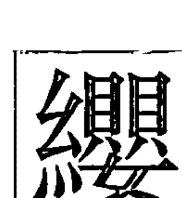

##### 二十四畫

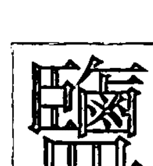

##### 二十五畫

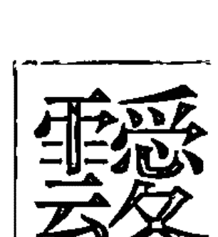

##### 二十九畫

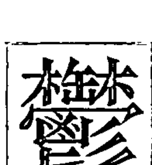

取名用字（依五行順序）

### 取名用字依筆畫順序

# 玄學錦囊

## 姓名篇

#### 一畫至三畫

一畫——土

乙

二畫——金

七

人

入

十

二畫——木

九

二畫——水

八

几

卜

匕

匕

取名用字（依筆畫順序）

二畫——火

二畫——土

三畫——金

# 玄學錦囊

## 姓名篇

#### 三畫至四畫

三畫——木

久

己

工

口

乞

巾

干

弓

兀

三畫——水

下

亡

凡

万

个

九

廾

三畫——火

大

子

土

女

己

弋

子

勺

三畫——土

也

丸

么

兀

##### 四畫——金

##### 四畫——木

心

切

五

亢

仁

少

公

大

氏

殳

介

斤

升

仉

午

戈

王

予

元

牙

什

月

牛

爪

水

及

欠

仇

匀

支

手

孔

兮

尺

今

勾

取名用字（依筆畫順序）

# 玄學錦囊

## 姓名篇

##### 四畫——水

- 巴
- 文
- 化
- 匹
- 夫
- 木
- 丰
- 方
- 互
- 分

- 勿
- 比
- 反
- 戶
- 毛
- 父
- 火
- 幻
- 不
- 下

- 云
- 什
- 片
- 仌
- 仆
- □
- □
- □
- □
- □

##### 四畫——火

- 日
- 中
- 丑
- 斗
- 内
- 屯
- 太
- 天
- 六
- 丹

- 井
- 手
- 止
- 之
- 歹
- 仍
- 支
- □
- □
- □

#### 四畫至五畫

##### 四畫——土

##### 五畫——金

- 王
- 友
- 尹
- 允
- 引
- 尤
- 厄
- 曰
- 元

- 左
- 生
- 史
- 仙
- 占
- 冊
- 中
- 仕
- 世
- 市

- 四
- 司
- 出
- 仟
- 且
- 示
- 石
- 失
- 勿
- 只

- 主
- 矢

取名用字（依筆畫順序）

# 玄學錦囊

## 姓名篇

##### 五畫——木

- 古
- 加
- 卉
- 玉
- 可
- 甲
- 刊
- 功
- 瓜
- 甘

- 丘
- 句
- 外
- 巨
- 去
- 巧
- 卡
- 夯
- 尻

##### 五畫——水

- 民
- 弘
- 布
- 平
- 皮
- 不
- 付
- 玄
- 丙
- 白

- 包
- 目
- 必
- 禾
- 本
- 弁
- 半
- 兄
- 矛
- 疋

- 北
- 卯
- 弗
- 未
- 未
- 皿
- 母
- 戊
- 穴
- 叶

- 氾
- 乏

#### 五畫

##### 五畫——火

##### 五畫——土

正

召

井

央

代

台

尔

由

旦

尼

扔

用

冬

札

右

永

立

另

以

仔

田

奴

幼

叮

打

瓦

汀

朮

他

冉

令

仝

取名用字（依筆畫順序）

# 玄學錦囊

## 姓名篇

#### 六畫

六畫——金

六畫——木

- 字 色 庄 束
- 次 式 收 付
- 守 先 旨 全
- 如 仟 朱 弛
- 在 丞 此 亘
- 西 寺 任 邢
- 充 句 池 亦
- 再 死 臣 戊
- 存 戌 兆
- 風 曳 冲

- 圭 伉
- 伍 企
- 交 各
- 旭 戎
- 价 机
- 吉 考
- 仰 艮
- 曲 汗
- 共 件
- 光 朽

#### 六畫

水

- 羽
- 伐
- 牢
- 亥
- 并
- 朴
- 忙
- 系
- 邗
- 汎

- 后
- 名
- 回
- 妃
- 灰
- 牝
- 肉
- 百
- 米
- 冰

- 好
- 休
- 伏
- 行
- 仿
- 向
- 合
- 兇
- 血
- 宇

- 癿
- 件
- 邛
- 玕
- 因

- 弛
- 伎
- 江
- 屹
- 匡
- 危
- 夸
- 臼
- 奸
- 而

取名用字（依筆畫順序）

# 玄學錦囊

## 姓名篇

#### 六畫至七畫

六畫——火

六畫——土

| 老 | 吐 | 肋 | 州 |
|---|---|---|---|
| 自 | 多 | 坰 | 刑 |
| 至 | 耳 | 灯 | 全 |
| 竹 | 舌 | 妁 | 汛 |
| 尖 | 宅 | 玎 |  |
| 仲 | 朵 | 早 |  |
| 劣 | 虫 | 史 |  |
| 列 | 同 | 舟 |  |
| 匠 | 年 | 扔 |  |
| 地 | 汝 | 刃 |  |

| 衣 |
|---|
| 有 |
| 羊 |
| 伊 |
| 安 |
| 印 |
| 夷 |
| 屹 |
|  |
|  |

##### 七畫

金

| 巡 | 佐 | 序 | 沁 | 坎 |
|---|---|---|---|---|
| 成 | 肖 | 赤 | 忍 | 余 |
| 助 | 秀 | 妆 | 冲 | 佇 |
| 車 | 沙 | 私 | 沈 | 迂 |
| 作 | 伺 | 姓 | 走 | 邪 |
| 伸 | 杉 | 壮 | 辛 | 芊 |
| 辰 | 坐 | 串 | 抄 |  |
| 忱 | 束 | 些 | 初 |  |
| 身 | 村 | 吹 | 合 |  |
| 孜 | 宋 | 材 | 声 |  |

取名用字（依筆畫順序）

# 玄學錦囊

## 姓名篇

##### 七畫——木

言 改 妓 肝 盯 炊 沉

求 旱 局 狂 却 呆 延

見 吳 劫 抗 安 沃

更 谷 戒 攻 灸 吸

角 究 告 忌 坑 佐

君 坑 杆 困 汞 阮

均 岐 技 沅 妖 杞

吟 我 快 沂 盯 汲

妤 岑 汽 玖 侖 忻

吾 佔 决 妩 灵 阮

七畫

##### 七畫——水

希 伯 別 防 況 匣

孚 兵 好 坊 坂 汲

孝 何 坊 否 辛 坐

汾 尾 沐 邦 坎 免

宏 杏 忘 牡 沛 把

妙 步 佛 汶 彡 峰

甫 每 系 罕 采

芒 妣 含 亟 孛

扶 亨 抛 伴 创

判 貝 没 坟 邠

取名用字（依筆畫順序）

# 玄學錦囊

## 姓名篇

##### 七畫——火

兌 住 杖 低 垄 佚

那 志 足 彤 姊 佦

良 呈 汁 但 芍 狄

男 佃 盯 妥 秃 邢

甸 伶 李 卯 妞 迅

佟 治 豆 投 佴 忐

里 灶 冷 折 投 沃

牢 体 吞 弟 形 佑

廷 坍 弄 即 忐 □

呂 利 務 兩 忐 □

#### 七畫至八畫

##### 七畫

#### 土

邑 汪

完 性

位

酉

攸

役

抑

似

杌

克

##### 八畫

#### 金

拆 宗 舍

拙 社 青

侃 受 叔

使 亟 昔

松 事 取

姗 状 刷

姓 承 妻

炊 始 所

昇 昌 祀

尚 宙 性

取名用字（依筆畫順序）

# 玄學錦囊

## 姓名篇

##### 八畫——金（續）

- 芯
- 衫
- 刹
- 采
- 往
- 凭
- 刺
- 垂
- 饮
- 芮

- 盂
- 爭
- 委
- 於
- 柿
- 臾
- 洗
- 邵
- 玥
- 柄

##### 八畫——木

- 昊
- 沮
- 拘
- 拒
- 坤
- 佳
- 供
- 佶
- 枝
- 析

- 昀
- 炘
- 宜
- 奇
- 金
- 岡
- 庚
- 欣
- 居
- 玢

- 岳
- 固
- 其
- 玩
- 岩
- 果
- 勛
- 昆
- 卷
- 斧

##### 八畫

##### 八畫——水

1. 侖
2. 河
3. 佼
4. 答
5. 肩
6. 昂
7. 佩
8. 法
9. 羌
10. 臥
11. 京
12. 彼
13. 泊
14. 具
15. 近
16. 空
17. 杷
18. 波
19. 狗
20. 衿
21. 卦
22. 板
23. 泓
24. 怡
25. 乖
26. 孤
27. 杭
28. 泯
29. 祁
30. 弯
31. 官
32. 杯
33. 抱
34. 股
35. 姑
36. 肯
37. 枚
38. 拍
39. 炎
40. 炊
41. 券
42. 妹
43. 坡
44. 兒
45. 季
46. 屈
47. 炊
48. 坪
49. 延
50. 玦
51. 怪

取名用字（依筆畫順序）

# 玄學錦囊

## 姓名篇

##### 八畫——水（續）

炫 府 昏 氓 肪 桑

武 奉 血 弦 非 牧

朋 花 並 芳 玫 函

孟 芙 忽 物 岡 肸

芬 肥 味 盲 版 弁

角 明 幸 虎 秉 爬

命 陂 或 曼 吓 卑

亭 岸 協 呼 音 杳

和 房 帛 芽 阜 盱

門 放 服 表 劾 祕

##### 八畫

##### 八畫——火

底 知 妮 佻 油

的 束 姐 侈 治

竺 忠 兆 侍 注

弩 制 卓 岱 沼

芷 爭 直 例 招

奈 卒 來 祖 抵

乳 洌 到 征 抽

糾 忖 周 林 拐

姊 店 長 杵 坦

帖 念 定 杻 侗

恪

庠

芸

況

狐

彿

艾

雨

杼

取名用字（依筆畫順序）

# 玄學錦囊

## 姓名篇

##### 八畫——火（續）

##### 八畫——土

忝
怛
怜
芝
爭
妒
妲
枕
帙
毒

沓
咀
哈
拓
挈
紲
糾
泥
汰
冷

氐
陀
侑
佟
（空）
（空）
（空）
（空）
（空）
（空）

油
況
沿
泳
泓
泱
押
依
夜
往

委
阿
奄
易
昀
育
附
宛
旺
亞

#### 八畫至九畫

##### 九畫——金

看 迎 枉 拉 祉 刻

俟 促 侵 洗 津 洒 谷 柘 相 秋

是 首 則 哉 泉 前 省 思 若 持

帥 宣 頁 俞 春 星 指 珊 食 砂

削 查 柔 施 姿 昨 室 甚 峙 拾

沝 狩 牲 恤 是 粉 柴 胥 肚 邦

取名用字（依筆畫順序）

# 玄學錦囊

## 姓名篇

##### 九畫——金（續）

- 邾
- 述
- 突
- 弈
- 侵
- 洙
- 姝
- 昱
- 穿
- 紆

- 苅
- 述
- 突
- 弈
- □
- □
- □
- □
- □
- □

##### 九畫——木

- 俄
- 洸
- 洨
- 柑
- 柯
- 科
- 紀
- 祈
- 皆
- 軍

- 肩
- 彥
- 契
- 妍
- 羿
- 計
- 禹
- 軌
- 建
- 癸

- 冠
- 客
- 炬
- 哄
- 架
- 降
- 界
- 勁
- 姜
- 剋

##### 九畫

##### 九畫——水

取名用字（依筆畫順序）

| 柏 | 炳 | 音 | 呂 | 既 | 故 |
|---|---|---|---|---|---|
| 秒 | 侯 | 佈 | 姑 | 郊 | 竿 |
| 胖 | 保 | 洶 | 紇 | 姥 | 看 |
| 茂 | 便 | 洿 | 郁 | 枯 | 奎 |
| 飛 | 係 | 涯 | 迦 | 衿 | 急 |
| 厚 | 衍 | 珏 | 很 | 恢 | 虹 |
| 陌 | 後 | 埒 | 昴 | 革 |  |
| 屏 | 派 | 拱 | 狡 | 珈 |  |
| 香 | 洽 | 恪 | 卻 | 姣 |  |
| 美 | 柄 | 荀 | 段 | 括 |  |

# 玄學錦囊

## 姓名篇

##### 九畫——水（續）

| 風 | 眇 | 背 | 屁 | 符 |
|---|---|---|---|---|
| 品 | 咸 | 封 | 宜 | 菲 |
| 珀 | 眉 | 負 | 耗 | 砍 |
| 拜 | 炫 | 某 | 盼 | 恒 |
| 盆 | 味 | 胞 | 冒 | 佈 |
| 恨 | 皇 | 扁 | 苦 | 衍 |
| 巷 | 面 | 昆 | 俠 | 威 |
| 盻 | 迫 | 娃 | 勉 | □ |
| 盃 | 版 | 奔 | 炙 | □ |
| 勃 | 苗 | 哈 | 茅 | □ |

##### 九畫

##### 九畫——火

侣 紂 耐 玳 束 泰 胆

俊 祉 帝 突 恬 盈 迭

待 袄 南 訂 柱 者 型

律 苔 亭 郎 刺 即 信

洲 珍 盾 政 俐 砥 勅

洞 重 垣 胎 段 彤 育

染 貞 迢 怠 姹 弇

柳 焰 奏 怒 致 肯

柚 昭 度 玲 怨 埏

洛 亮 炭 赴 鄧 俗

取名用字（依筆畫順序）

# 玄學錦囊

## 姓名篇

#### 九畫至十畫

九畫

土

洪 洋 活 約 英 映 威 胡 勇 胃

要 禹 有 以 屋 有 留 煙 耶

歪 祀 哀 施 篇 幽 充 愛 紅 為

姚 壹 章 濃 厚

十畫

金

消 浸 酒 浙 悠 純 紗 修 倩 借

徐 栖 姬 陸 時 宰 孫 珩 宸 財

取名用字（依筆畫順序）

| 師 | 乘 | 真 | 茜 | 鄰 | 荀 |
|---|---|---|---|---|---|
| 倉 | 射 | 神 | 袖 | 成 | 陝 |
| 劍 | 席 | 荣 | 送 | 除 | □ |
| 珠 | 确 | 笑 | 無 | 唇 | □ |
| 悅 | 茸 | 訕 | 差 | 成 | □ |
| 桑 | 祠 | 閃 | 翅 | 哲 | □ |
| 弱 | 座 | 集 | 豹 | 城 | □ |
| 素 | 息 | 荏 | 哀 | 衷 | □ |
| 書 | 殊 | 草 | 茹 | 翫 | □ |
| 租 | 栽 | 索 | 卻 | 耻 | □ |

# 玄學錦囊

## 姓名篇

##### 十畫

#### 木

浩 桂 剛 身 貢 姬 荊

滑 娛 玟 笈 鬼 奚 卿

倪 娟 悟 峨 骨 羌 茵

倚 耿 荃 珪 郡 耆 恩

個 粉 恭 氣 晁 桀 殷

徑 家 庫 罡 耕 海 益

屐 起 原 缺 兼 級

桂 記 豈 悍 俱 暴

格 矩 哥 虔 婕 倔

根 祜 拳 衾 越 栩

##### 十畫

##### 十畫——水

浦 俸 捕 旁 签 耘

浮 俯 烜 冥 馬 耗

娑 做 圃 烘 荒 袍

紋 核 訓 破 航 袜

紡 桓 峰 砲 害 滏

紛 校 剖 筋 珈 被

倍 秘 歇 臭 脈 逢

倖 秤 效 蚊 眠 耄

候 夏 畔 豹 病 紘

俵 班 埋 配 疲 峡

取名用字（依筆畫順序）

# 玄學錦囊

## 姓名篇

##### 十畫——水（續）

- 蓋
- 栢
- 苻
- 珩
- 茗
- 浠
- 佈
- 晞
- 晞
- 淚

##### 十畫——火

- 浪
- 流
- 涕
- 凍
- 紐
- 納
- 倫
- 倒
- 倬
- 值

- 徒
- 桃
- 桐
- 株
- 秩
- 娣
- 娜
- 娘
- 祖
- 娌

- 陣
- 致
- 唐
- 朔
- 烈
- 庭
- 悌
- 託
- 能
- 晁

##### 十畫

##### 十畫

浴 脂 液 追 胀 展

涎 兹 酌 郎 蓄 振

容 針 峻 凌 討 誉

員 後 迺 栗 釘 砧

晏 涅 禹 捉 茶 怒

軒 祐 旅 祝 秦 料

宴 淮 紙 門 留 旃

案 荷 涂 明 退 島

翁 珞 涉 疼 疾 狷

袁 姬 狼 席 祚 特

取名用字（依筆畫順序）

# 玄學錦囊

## 姓名篇

##### 十畫——土（續）

院
益
幽
烟
烏
原
邕
娥
宮
高

##### 十一畫——金

淑
清
深
淨
淞
莎
紳
細
紹
琇

授
措
側
梢
造
速
匙
惜
參
雪

專
晨
祥
船
常
崢
崧
崇
趾
莊

彩
釧
唱
商
寂
庶
巢
宿
悉
旋

#### 十畫至十一畫

##### 十一畫——木

掛 捲 救 習 做 斜

域 倏 雀 捨 曹 爽

堀 救 訟 華 魚 率

頃 規 紫 笙 殺 戚

健 淇 葵 產 廢 粗

偕 涯 堅 笠 盛 旌

御 淦 翊 設 崔 敍

械 綱 捷 液 淺 窓

梧 球 鈑 從 差

娸 掘 責 術 廁

取名用字（依筆畫順序）

# 玄學錦囊

## 姓名篇

##### 十一畫——木（續）

| 烷 | 乾 | 硯 | 桌 | 訛 | 晞 |
|---|---|---|---|---|---|
| 郭 | 區 | 竟 | 絢 | 牽 | 烯 |
| 康 | 崎 | 裂 | 距 | 崖 | □ |
| 國 | 寄 | 寇 | 假 | 梁 | □ |
| 教 | 既 | 圈 | 竟 | 苔 | □ |
| 基 | 晤 | 趁 | 斜 | 鄉 | □ |
| 崑 | 眼 | 啓 | 馗 | 塑 | □ |
| 啟 | 球 | 勰 | 移 | 陰 | □ |
| 堅 | 皎 | 歔 | 詐 | 偽 | □ |
| 完 | 眷 | 現 | 訴 | 涵 | □ |

## 十一畫

## 十一畫

猛

逢

望

晦

符

患

莫

水

淳

婚

敏

崩

斌

問

勘

絆

婦

副

毫

梱

笨

梵

排

婞

凰

匏

麥

烽

晞

培

陪

婆

訪

晚

崖

稀

偏

部

務

曼

粕

奘

尉

取名用字（依筆畫順序）

徘

惇

密

販

麻

患

貨

習

彪

票

脖

瓶

梗

閉

莆

釩

竟

畢

梅

匾

敗

杉

盒

扈

# 玄學錦囊

## 姓名篇

## 十一畫

#### 火

帳 略 蔑 透 短 琉 崙

紫 鈞 梨 陸 梆 接 淋

得 莉 動 陵 郴 探 添

帶 笠 執 陳 豚 停 淡

答 粒 犁 陶 條 偵 涼

笛 翊 張 累 從 妻 淘

聊 袋 救 將 梯 第 凌

華 脫 頂 章 通 茶 理

鳥 聽 鹿 翎 連 淪 琅

厝 羚 梁 堂 逐 晨 朗

## 十一畫

## 十一畫

淵 庸 淹

勒 處 耻

偶 寅 淑

梓 桶 荻

堃 唯 淑

從 煖 終

混 庵 紬

逡 得 威

軟 書 偃

淄 彫 推

握 欲 偉

都 設 眺

野 悠

旌 情 宛

異 婉

婥 眾 雀

圍 郵

淖 祭 啄

敖 惟

啖 組

取名用字（依筆畫順序）

# 玄學錦囊

## 姓名篇

## 十二畫

#### 金

絶 註 稅 策 殖 愉 琛

絲 詞 稍 黍 腓 集 粟

絨 詔 竦 象 掌 順 犀

鈔 訴 創 裁 晶 舒 洧

絢 詐 須 勝 青 剩 隋

測 琮 筒 斯 最 菜 猩

盛 瑔 絮 視 埒 散 疏

渝 棧 磴 裕 粧 琎 肅

湘 檗 尊 超 善 源 萃

湫 森 窗 曾 喻 滌 喧

## 十二畫

## 十二畫

木

- 絞
- 結
- 鈞
- 欽
- 港
- 減
- 琦
- 琪
- 景
- 幾
- 貫
- 硬
- 鄔
- 棲
- 款
- 筐
- 硯
- 期
- 營
- 間
- 寓
- 傑
- 稀
- 湛
- 強
- 割
- 敢
- 揭
- 港
- 絳
- 睨
- 雅
- 菊
- 皖
- 欽
- 渠
- 窘
- 欺
- 蛟
- 棍
- 鈞
- 街
- 毅
- 卿
- 雁
- 椅
- 結
- 塔
- 喬
- 凱
- 堯
- 棋
- 絞
- 琴
- 頂
- 貴
- 皓
- 琨
- 給
- 裙
- 粲
- 嵌
- 開
- 琴
- 絞

取名用字（依筆畫順序）

# 玄學錦囊

## 姓名篇

##### 十二畫——木（續）

##### 十二畫——水

- 揆
- 達
- 筱
- 焱
- 棄
- 焰
- 慨
- 琼
- 焮
- 祔
- 詒
- 鈞
- 硜
- 然
- 萱
- 幸
- 貽
- 啓
- 琚
- 焜
- 閑
- 悶
- 棓
- 萍
- 揆
- 馮
- 揮
- 渾
- 琵
- 湣
- 棼
- 評
- 媚
- 斑
- 發
- 棚
- 弼
- 棒
- 賁
- 棉
- 徨

## 十二畫

取名用字（依筆畫順序）

| 堪 | 傍 | 無 | 保 | 茲 | 補 | 湍 |
|---|---|---|---|---|---|---|
| 漢 | 敝 | 雲 | 菲 | 項 | 備 | 喜 |
| 雯 | 跋 | 斌 | 扉 | 復 | 蛤 | 惠 |
| 媛 | 彭 | 雯 | 悲 | 費 | 買 | 焙 |
|  | 傅 | 閑 | 喚 | 賀 | 雄 | 惶 |
|  | 虛 | 蛙 | 傍 | 萌 | 寒 | 斐 |
|  | 閔 | 葬 | 幅 | 普 | 雲 | 閔 |
|  | 稀 | 淼 | 琶 | 賀 | 富 | 帽 |
|  | 鈁 | 渺 | 博 | 番 | 媒 | 報 |
|  | 評 | 筆 | 欲 | 華 | 覓 | 筏 |

# 玄學錦囊

## 姓名篇

##### 十二畫——火

統 琳 曉 硫 短 軫 秦
鈍 棟 童 勞 都 朝 瑁
鈉 植 軼 劉 巽 隊 琰
湯 提 貼 筒 等 智 替
渡 堤 登 隆 舜 循 絡
滇 場 嵐 單 琛 就 晴
琢 程 軸 棠 週 裡 眾
盜 簽 答 貯 御 鈕 貳
診 敦 痛 進 宵 莢 援
證 婷 菱 量 閏 尋 翔

## 十二畫

## 十二畫

壺 蛙 游
茲 茹 棣
惡 畫 湖
菱 貂
圍 黑 詠
逮 堵
渭 莫 琬
着 椒
渾 壹 揚
焯 督
傑 堰 握
浦 焦
溫 菀 為
喃 屠
越 黃
腆 粥
猶 陽
逸 揣
勛 翁
診 葩

取名用字（依筆畫順序）

# 玄學錦囊

## 姓名篇

##### 十三畫

#### 金

瑜 琰 瑞 滄 滋 漢 債 催 椿
榆 胡 暄 詩 詢 詳 試 馴 傷
聖 勢 歲 歇 蜀 想 肄 屢
載 補 嗣 暑 獅 裝 鼠 剽
宣 管 膝 愁 酬 勤 綉 煜 煴
葱 蓋 睦 締 藏 綏 義 節
鑒 塞 嵩 晴 睬 楚 莢
照 澄 慎 裝 新 楹 赤

##### 十三畫

##### 十三畫

木

絹 睆 義 軷 遇 筵 概
經 誇 感 鼓 賈 該 預
瑟 勤 禁 敬 虞 鈞
鉅 詰 解 畸 禽 陸
鈺 嫁 業 葵 裘 碕
源 献 筠 祺 詭 鈷
溪 群 窟 極 革 訴
傾 舅 頌 當 梗 筍
楷 跪 愚 莖 焚 葛
暇 飭 幹 過 愷 駒

取名用字（依筆畫順序）

# 玄學錦囊

## 姓名篇

##### 十三畫

十三畫——水

十三畫——火

- 鄉
- 暉
- 蜂
- 微
- 萬
- 煥
- 募
- 鋼
- 雹
- 煤
- 媽
- 鉢
- 遍
- 煇
- 媧
- 瑁
- 滑
- 煌
- 溥
- 睦
- 滅
- 聘
- 盟
- 媿
- 葆
- 頒
- 碑
- 腹
- 楓
- 號
- 飯
- 匯
- 楣
- 瓶
- 霧
- 慇
- 較
- 會
- 啟
- 楠
- 傳
- 鼎
- 當
- 溜
- 塗
- 蒂
- 煖
- 鈿
- 煉
- 鈺
- 鈴
- 暖
- 稜
- 達
- 稔
- 遂
- 道
- 廊

取名用字（依筆畫順序）

| 雷 | 馳 | 碉 | 著 | 歎 | 雋 |
|---|---|---|---|---|---|
| 跌 | 煎 | 裏 | 豐 | 維 | 楹 |
| 塊 | 頓 | 糧 | 滇 | 睢 | 蓋 |
| 督 | 路 | 窗 | 填 | 準 | 碗 |
| 塔 | 零 | 腸 | 置 | 斗 | □ |
| 農 | 詹 | 弱 | 落 | 資 | □ |
| 雉 | 嫩 | 廉 | 溢 | 楚 | □ |
| 殿 | 祿 | 儂 | 戡 | 稠 | □ |
| 電 | 腰 | 鄒 | 綠 | 藏 | □ |
| 董 | 船 | 跳 | 戡 | 燈 | □ |

# 玄學錦囊

## 姓名篇

#### 十三畫至十四畫

十三畫

十四畫

金

土

| 隕 | 鉛 | 煙 | 齋 | 徹 |
|---|---|---|---|---|
| 遐 | 溶 | 煒 | 圓 | 搖 |
| 遊 | 溫 | 衛 | 爺 | 萬 |
| 運 | 備 | 預 | 飲 | 華 |
| 瑛 | 椰 | 矮 | 園 | □ |
| 瑚 | 楊 | 意 | 煬 | □ |
| 瑒 | 稚 | 碗 | 葉 | □ |
| 瑋 | 暘 | 奧 | 徭 | □ |
| 瑕 | 暗 | 雍 | 蛾 | □ |
| 瑣 | 詰 | 愛 | 鄔 | □ |

| 綬 |
|---|
| 綜 |
| 慈 |
| 綱 |
| 認 |
| 誦 |
| 說 |
| 漬 |
| 漱 |
| 旋 |

##### 十四畫

木

寢 漆 微 粽 聚 誠
慷 睿 筍 翠 瓴 稱
慨 鉞 實 篋 飾 槍
綺 獎 粹 壽 標
綱 際 署 韶 樹
魁 漕 蒼 誓 僧
緊 漁 需 酸 像
誥 颯 製 營 衝
誠 肇 精 琺 精
語 鉁 碩 賑 算

取名用字（依筆畫順序）

# 玄學錦囊

## 姓名篇

##### 十四畫——木（續）

##### 十四畫——水

銀 旗 願 賓
漪 筒 管 繁
滸 閤 殿 幘
滾 境 疑 墓
構 復 蓋
僑 輕 削
僥 嘉 歎
僞 箕 綂
兢 歌 敲
赫 犒 開
幣
綱
綿
誨
滸
漠
漢
漂
銘
福

##### 十四畫

##### 十四畫

火

取名用字（依筆畫順序）

# 玄學錦囊

##### 十四畫——火（續）

| 銅 | 獎 | 髮 | 領 | 爀 |
|---|---|---|---|---|
| 禎 | 態 | 辣 | 琅 | 瑛 |
| 種 | 端 | 秦 | 遛 | 察 |
| 傑 | 圖 | 臺 | 埴 | 僅 |
| 嫩 | 榴 | 瑭 | 滕 | 爆 |
| 嫡 | 榔 | 蓄 | 褚 | 雒 |
| 對 | 彰 | 齊 | 燊 | 翟 |
| 戲 | 爾 | 祭 | 燊 | 遜 |
| 國 | 塵 | 嘆 | 誕 | 踧 |
| 裳 | 暢 | 摘 | 砥 | 製 |

#### 十四畫至十五畫

##### 十四畫

## 維

## 遙

#### 十五畫

## 節

## 箱

## 數

## 辭

## 榕

## 煦

#### 金

## 緒

## 賞

## 蝕

## 豬

## 演

## 鈦

## 線

## 審

## 履

## 廠

## 榮

## 廓

## 鋤

## 帜

## 諄

## 遲

## 與

## 瑤

## 澈

## 銳

## 熟

## 增

## 容

## 槽

## 霄

## 請

## 號

## 遠

## 磋

## 熟

## 靚

## 踐

## 劃

## 衝

## 趣

## 璇

## 撰

## 悠

## 磁

## 賜

## 銹

## 駟

## 鄭

## 嬋

## 震

## 碩

## 銷

取名用字（依筆畫順序）

# 玄學錦囊

## 姓名篇

##### 十五畫——金（續）

##### 十五畫——木

隸 蔡 賢 煻 鉞 錫
欽 潔 廣 澆 潰 樞 稼 儉 價 儀
肇 課 駕 殺 劇 靠 慶 嫻 寬 繫
嬌 褲 誼 顔 窮 確 劍 駒 緒 麩
貌 概 撓 斷 賢 穆 毅 燃 稿

#### 十五畫

#### 十五畫

水

膠
編
廟
劈
盤
慰
潔
緘
魄
慧
賠
需
幅
鋒
嬉
墨
蝙
箋
賢
標
磐
瞑
樓
嫵
億
模
蝦
篇
憤
髮
鋁
僻
蝠
賣
賦
樊
翩
慕
輩
蔓
緒
暴
餅
醇
漂
蓬
舖
暮
滿
鋪
綵
範
輝
摩
蔚
嫻

取名用字（依筆畫順序）

# 玄學錦囊

## 姓名篇

##### 十五畫——水（續）

| 潛 | 潛 |
|---|---|
| 潛 | 潛 |
| 銀 | 敷 |
| □ | 緬 |
| □ | 頷 |
| □ | 滿 |
| □ | 縹 |
| □ | 播 |
| □ | 潘 |
| □ | 僧 |

##### 十五畫——火

| 劉 | 澈 | 墨 |
|---|---|---|
| 諒 | 澄 | 瑾 |
| 箭 | 樟 | 綴 |
| 豎 | 樓 | 緹 |
| 樂 | 稻 | 練 |
| 調 | 樑 | 締 |
| 鬧 | 徵 | 緩 |
| 蓮 | 徹 | 潭 |
| 慮 | 德 | 潮 |
| 璋 | 璃 | 潤 |

#### 十五畫

#### 十五畫

取名用字（依筆畫順序）

| 嫣 | 潛 | 箴 | 踏 | 腸 | 彈 |
|---|---|---|---|---|---|
| 樣 | 膝 | 徙 | 嘴 | 蝶 | 談 |
| 億 | 鄰 | 儲 | 蔣 | 碩 | 層 |
| 頹 | 銳 | 廚 | 煨 | 暫 | 墩 |
| 閱 | 鋌 | 履 | 稷 | 駐 | 瑾 |
| 養 |  | 執 | 熒 | 質 | 輪 |
| 歐 |  | 閻 | 歡 | 察 | 瞥 |
| 鞍 |  | 書 | 徹 | 魯 | 敵 |
| 糊 |  | 儲 | 駝 | 撮 | 論 |
| 影 |  | 諄 | 誰 | 霆 | 適 |

# 玄學錦囊

## 姓名篇

##### 十五畫——土（續）

##### 十六畫——金

十五畫至十六畫

##### 十六畫——木

##### 十六畫——水

錦 諧 館 頤 橩 興
鋼 諺 龜 諫 樺 霏
錡 護 疆 課 燁 穆
鋸 煩 麾 翰 瑤 義
機 圓 飲 激 謀 奮
橋 縣 壑 據 煮 領
橘 覡 瞽 閒 壁 瞑
登 曉 冀 蕣 學 默
璞 豫 燃 蒿 磨 憲
璟 器 燕 □ 動 燎

取名用字（依筆畫順序）

# 玄學錦囊

## 姓名篇

##### 十六畫——水（續）

- 縛
- 衡
- 辨
- 霍
- 憑
- 頻
- 黔
- 蕃
- 寰
- 磡
- 蕙
- 樹
- 儒
- 憶
- 璞
- 樸

##### 十六畫——火

- 錠
- 錢
- 錄
- 樽
- 積
- 燐
- 燈
- 燉
- 澤
- 諮
- 諦
- 濃
- 潞
- 臻
- 賴
- 歷
- 築
- 靛
- 膨
- 蹄
- 頭
- 導
- 霖
- 擂
- 歷
- 龍
- 儒
- 盧
- 增
- 糖

##### 十六畫

##### 十六畫

取名用字（依筆畫順序）

|  |  |  |  |  |  |  |
|---|---|---|---|---|---|---|
| 璣 | 謂 |  | 燊 | 諸 | 澱 | 蕊 |
| 襄 | 鴨 |  |  | 瞭 | 擋 | 鴛 |
| 澳 | 餘 |  |  | 濁 | 樵 | 擇 |
| 衛 | 鴦 |  |  | 獨 | 縈 | 儡 |
| 謁 | 融 |  |  | 操 | 營 | 諾 |
| 蕊 | 擁 |  |  | 朝 | 滕 | 燈 |
| 遺 | 歛 |  |  | 蕩 | 雕 | 曇 |
|  | 額 |  |  | 遜 | 駱 | 澧 |
|  | 膝 |  |  | 適 | 篤 | 禪 |
|  | 甌 |  |  | 濬 | 鑒 | 膻 |

# 玄學錦囊

## 姓名篇

##### 十七畫

##### 十七畫——金

##### 十七畫——木

賽 禪 餞 薺
擬 顆
鍾 糟 鮮 隰
鍵 矯
聲 燭 燥
謙 舉
馘 翼 齊
璟 糠
璨 縮 雖
檢 親
蹇 聰 興
嶽 講
燦 總 辟
懇 豁
聳 鍬 鄰
擊 霖
償 謝 儲
擊 罄
濕 霜 瞬
擱 豁

##### 十七畫

水

- 幫 錫 餅 縛
- 韓 辨 篷 薄
- 瞞 糸 獲 鳴
- 環 麋 薇 燹
- 齣 繆 蓮 繁
- □ 儐 嬪 霞
- □ 糸 縫 禧
- □ 檜 獴 塚
- □ 徽 還 膺
- □ 懋 褻 濱
- 驊 黯
- 蹇 邀
- 憨 鞠
- 麴 覲
- 遂 賺
- 闊 鍋
- 鍇 薑
- □ 鯽
- □ 磯
- □ 瞰

取名用字（依筆畫順序）

# 玄學錦囊

## 姓名篇

##### 十七畫——火

鍛 濤 襲 淡 戴
鍍 檀 臨 膽 薪
縷 瞳 螺 駿 鉻
績 鼕 燧 黐 穗
聯 濟 鍊 膺 懦
襲 領 黛 湯
儡 嫡 隸 醴
勵 瞭 輾 孺
彌 縰 翟 歛
赭 螳 營 瞬

#### 十七畫至十八畫

##### 十七畫

優
壓
壑
醞
隱
壓
嬰
轅
覲
繫

##### 十八畫

鬆
雙
織
叢
繕
蟬
觴
鎖
雜
礎
鎗
聲
薩
繡
雞
翼

取名用字（依筆畫順序）

# 玄學錦囊

## 姓名篇

##### 十八畫

十八畫——木

十八畫——水

##### 十八畫——火

##### 十八畫——土

燼
瞻
簪
端
鎰
鎮
轉
藍
精
鎔
禮
職
聶
醫
鈿
蟲
檻
蕭
儲
壘
鎌
歸
斷
鯉
戴
憂
熹
濼
義
雒
爵
題
鯽
鞭
糧
藏
繪
叢
藝
葵

取名用字（依筆畫順序）

# 玄學錦囊

## 姓名篇

##### 十九畫——金

- 獸
- 藥
- 繹
- 簽
- 鏘
- 鵲
- 識
- 辭
- 繩
- 鯖
- 繻
- 癡

##### 十九畫——木

- 顛
- 關
- 鏡
- 麒
- 堅
- 瓊
- 曠
- 鯨
- 願
- 蟻

##### 十九畫

##### 十九畫——水

##### 十九畫——火

取名用字（依筆畫順序）

# 玄學錦囊

## 姓名篇

#### 十九畫至二十畫

十九畫——土

燕
韻
穩
鏖
蘊

二十畫——金

鐘
釋
譜
馨
繡
繩
譯
蘇
藻
籌

二十畫——木

議
議
齡
齡
勸
礦
繼
競
覺
鑑
警
膺
懸
鑰
響
黥
嚴
鏡
豐
韌

##### 二十畫——水

##### 二十畫——火

寶
譚
臚
彈
曦
獻
瀾
黨
艦
馨
騰
寶
爐
飄
籃
爐
驕
蘋
鐙
齡
颼
麵
瞻
纂
瓏
顛
礫
豐
蘆
雙
籍
觸
曦
闡
鯽
襲
醴

取名用字（依筆畫順序）

# 玄學錦囊

## 姓名篇

##### 二十畫——土

##### 二十一畫——金

##### 二十一畫——木

纓
鑄
顧
譴
耀
續
灌
驊
贏
屬
齦
邃
譪
襯
巍
饋
寶
饐
驅
譽
顯
饒
囂
雞
夔

#### 二十畫至二十一畫

##### 二十一畫——水

護
攜
鶴
轟
霹
辮
霸
黯
翻
豐
覆

##### 二十一畫——火

纏
濟
攝
鑫
蘭
鐸
躋
鐮
鐵
霧
籐
覽
露
巖
鰷

##### 二十一畫——土

耀
瓔
躍
鴦
櫻
鷹

取名用字（依筆畫順序）

# 玄學錦囊

## 姓名篇

#### 二十二畫至二十三畫

二十二畫——金

鬢
攢
癬
襲
灑
襲
贖

二十二畫——木

權
鑒
鑑
儼
籬
襲
驫

二十二畫——水

驊
穰
響
鰻
歡
羈
龕
龢
鷺

二十二畫——火

疊
籠
讀
霽
聽
顛
麗
躪
顯
鑾

## 取名用字（依筆畫順序）

二十二畫——土

二十三畫——金

二十三畫——木

# 玄學錦囊

## 姓名篇

#### 二十三畫至二十四畫

二十三畫——水

二十三畫——火

二十三畫——土

二十四畫——金

二十四畫——木

二十四畫——水

二十四畫——火

鷹
灘
襲
豔
靈
驫
蠹
霹
巖
鷲
瀕
籬
鑠
贏
釀
癲
靄
霽
贛
鷗
衢

取名用字（依筆畫順序）

# 玄學錦囊

## 姓名篇

#### 二十四畫至二十六畫

二十四畫——土

二十五畫——金

二十五畫——木

二十五畫——水

##### 二十五畫——火

##### 二十五畫——土

##### 二十六畫——金

##### 二十六畫——木

取名用字（依筆畫順序）

# 玄學錦囊

## 姓名篇

二十六畫至二十九畫

| 二十六畫——火 | 二十七畫——金 | 二十七畫——木 | 二十七畫——火 |
| :--- | :--- | :--- | :--- |
| 瀲 | 鑅 | 灃 | 驤 |
| 懿 | | | 纜 |
| | | | 鑠 |
| | | | 纈 |
| | | | 豔 |

##### 二十八畫——木

##### 二十八畫——火

##### 二十九畫——水

##### 二十九畫——土

取名用字（依筆畫順序）

# 玄學錦囊

## 姓名篇

##### 三十畫

木

原原原

# 玄學錦囊姓名篇 最新增訂第六版

作者
蘇民峰

策劃 / 編輯
梁美媚

美術設計
Charlotte Chau

出版者
圓方出版社
香港鰂魚涌英皇道 1065 號東達中心 1305 室
電話：2564 7511
傳真：2565 5539
電郵：info@wanlibk.com
網址：http://www.wanlibk.com
http://www.formspub.com
http://www.facebook.com/formspub

發行者
香港聯合書刊物流有限公司
香港新界大埔汀麗路 36 號
中華商務印刷大廈 3 字樓
電話：2150 2100
傳真：2407 3062
電郵：info@suplogistics.com.hk

承印者
中華商務彩色印刷有限公司
香港新界大埔汀麗路 36 號

出版日期
二〇一六年十二月第一次印刷

版權所有 · 不准翻印
All rights reserved.
Copyright ©2016 Forms Publications (HK) Co.Ltd.
ISBN 978-962-14-6215-2
Published in Hong Kong

# 八字秘法

# 全集

「八字秘法」可稱為「江湖訣」，是玄學大師蘇民峰師傅三十多年來經驗所得，期間經過不斷鑽研、實踐、驗證，以淺顯易明的文字，配以實例，逐一印證和解釋秘訣要義。

《八字秘法全集》命例超過四百個，分成兩冊，涵蓋家庭、健康、感情、財富等方面的論斷，更附論命基本知識，以饗八字新手。

# 《相學全集》卷一至卷四

首部同時匯編相法、古訣、個人心法的相學大全！

闡述面相部位分法，如三停、十二宮、五嶽四瀆、百歲流年圖等；

公開獨立部位相法，涵蓋額、耳、眉、眼、顴、鼻、口、下巴等，盡道早歲至晚運的命運玄機；

傳授坊間少有流傳的內相秘法，頸、肩、腰、腹、臍、臀，盡見其中；

細論其他相法，包括動相、聲音、氣色，習相者不可不察。

- 涵蓋陰陽五行、月令四時、天干地支、長生十二宮等八字立基點；
- 合參《萬年曆》，細析起四柱、推大運之法；
- 援引大量例子，細述定格局、取用神之訣竅；
- 臚列多種命格，供讀者反覆參研，融會貫通。

名字之重要，自古至今，上至天家，下至百姓莫不謹慎選取，因為姓名於人於企業，有如衣冠，亦蘊含了成敗吉凶之數。

姓名學源遠流長，包含多個派別，例如部首派、畫數派、五行派、八字派等等，蘇民峰師傅融會貫通，首創「簡易改名法」，用法簡單，不管是要選擇姓名或公司名稱，都可依書內步驟，輕易掌握。

本書前半部分先解說各派姓名學，如何運用姓名學，以及姓氏、生肖及行業之改名宜忌等；後半部分詳列中國百家姓和取名用字，囊括過千名字，並依五行和筆畫兩種順序法排列，讓讀者更容易找到最理想的名字。