# 占星學叢書系列⑦
# 明星相占星

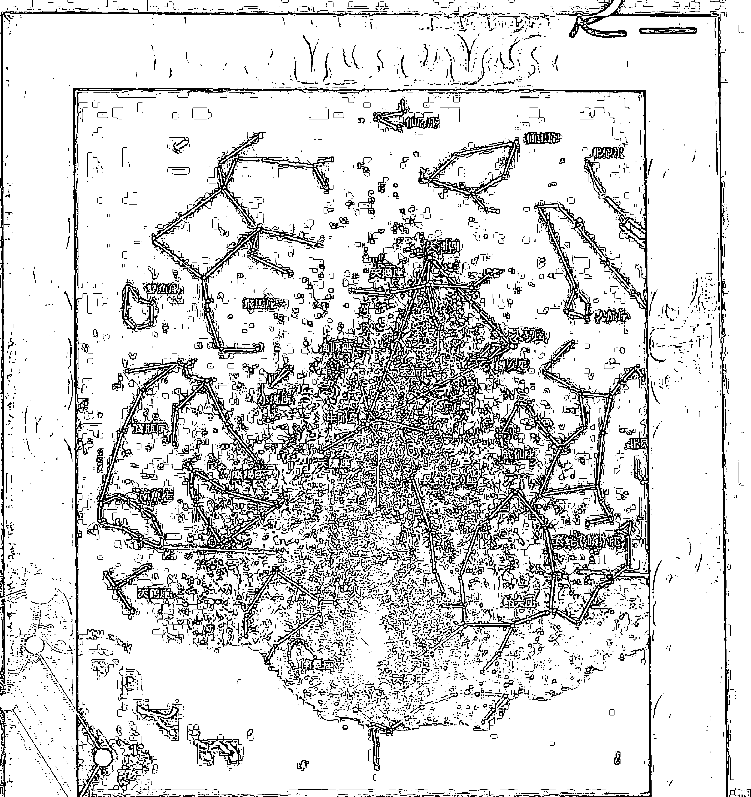

洪能平著

內附中國大陸經緯度表及中西占星學名著附錄

## §現代占星學系列叢書§

+ 021.《現代占星學高階》
+ 022.《占星學看孩子》
+ 023.《占星學看教育》
+ 024.《占星學看健康》
+ 025.《占星學看錢財》
+ 026.《占星學談宮位》
+ 027.《現代占星學的流年》
+ 028.《現代占星學的推运》
+ 029.《現代占星學的流月》
+ 030.《現代占星學的流日》
+ 031.《現代占星學的命盤分析》
+ 032.《現代占星學的小行星群》
+ 033.《現代占星學的凱龍星》
+ 034.《現代占星學的恆星》
+ 035.《現代占星學的中點》
+ 036.《地震占星學》
+ 037.《氣象占星學》
+ 038.《政治占星學》
+ 039.《財經占星學》
+ 040.《醫藥占星學》

## 福利公告：

凡在【天使神秘学院】购买任何电子资料赠送实体书，详情请咨询店铺客服！

备注：如客服不知道这活动你可能进了盗版店铺！赠书活动仅在以下正版店铺购买有效哦！

## 【天使神秘学院】淘宝店 手机淘宝扫以下二维码

1、打开手机淘宝：搜索“天使神秘学院”
2、点击“店铺”按钮就是

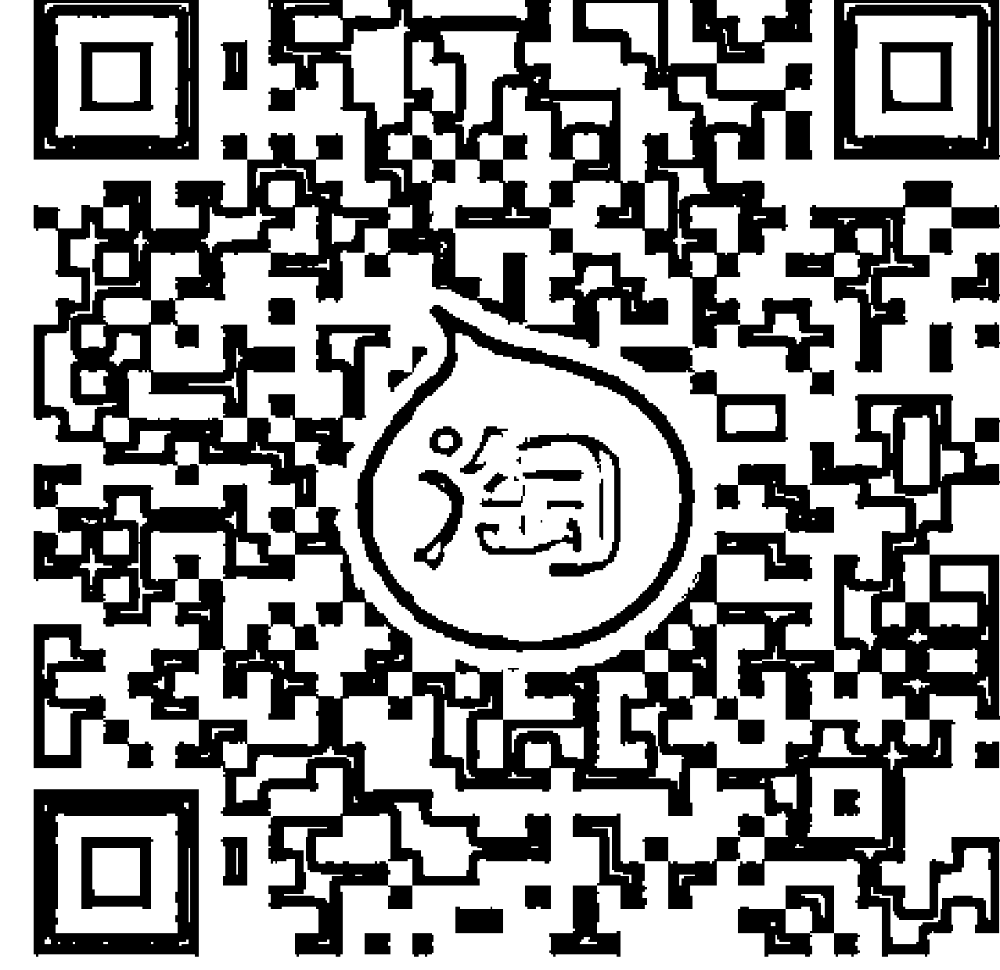

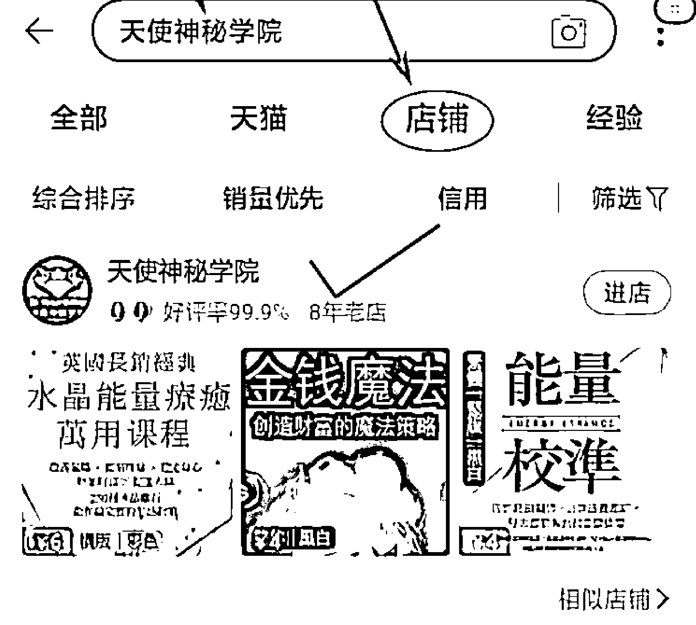

## 【天使神秘学院】微店 手机微信扫以下二维码

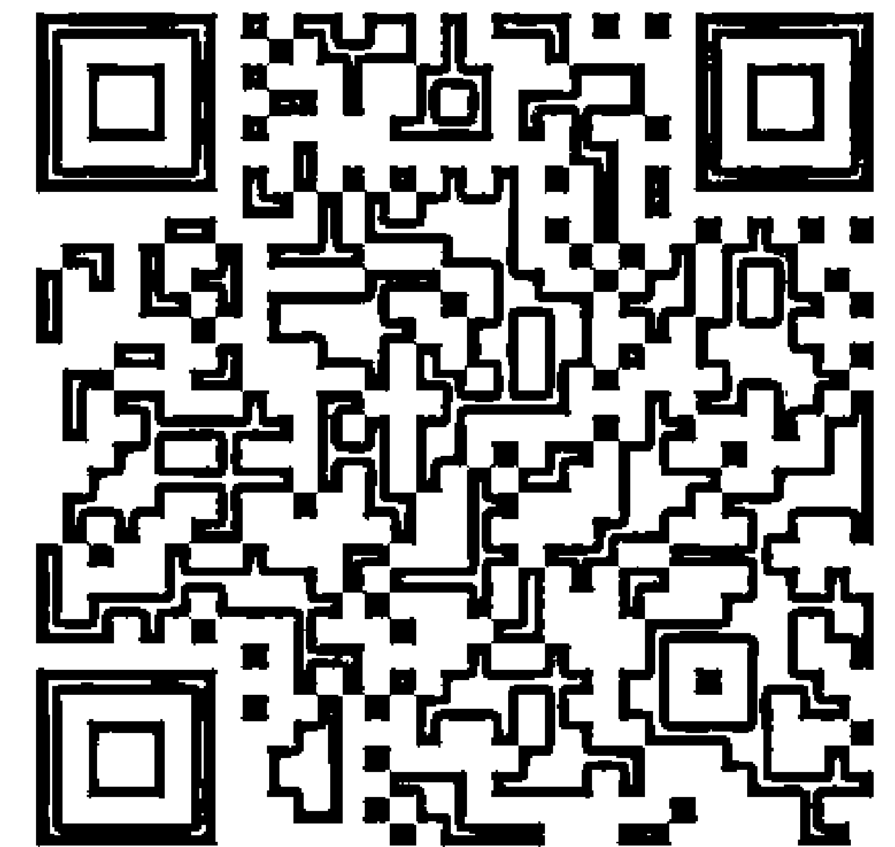

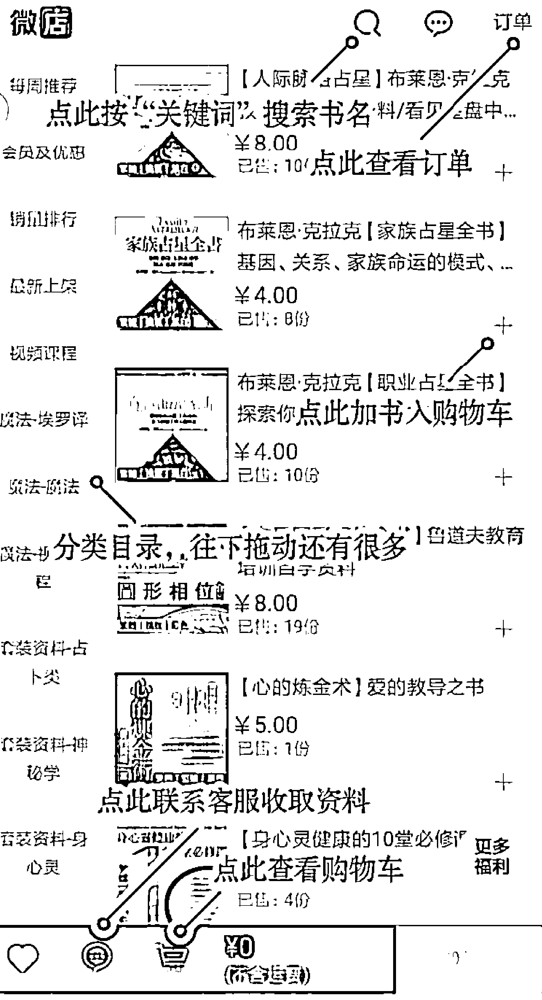

用手机微信扫码进店

## 制作说明：

本书由《天使神秘学院》出重金从台湾购入的原版书籍扫描制作完成。为达到最好阅读效果，特地把书全部切开后，再经由专业扫描设备高精度扫描完成，并经过一张张的PS后期处理最终成书，其间花费大量的人力、物力以及时间，只为能给大家提供经济并优质的神秘学学习资料而努力。

本学院强力谴责某些机构和个人，把本学院花心血制作完成的电子书籍，包装后直接放在自家网上低价倾销的行为，以谋取不劳而获的经济利益。如果长此以往最终将无人愿意再为大家花心思制作电子书，那以后可能大家再无新书可读。

为让大家以后能够读到更多的好书，也为了本学院的良性发展。本学院恳请大家尽量做到如下几点：

+ 一、尽量在天使神秘学院的官方网站购买电子书籍。
官网访问地址：http://www.ac2011.cn
短网址：ac2011.cn
网址含义：(Archangel College 成立时间：2011年)

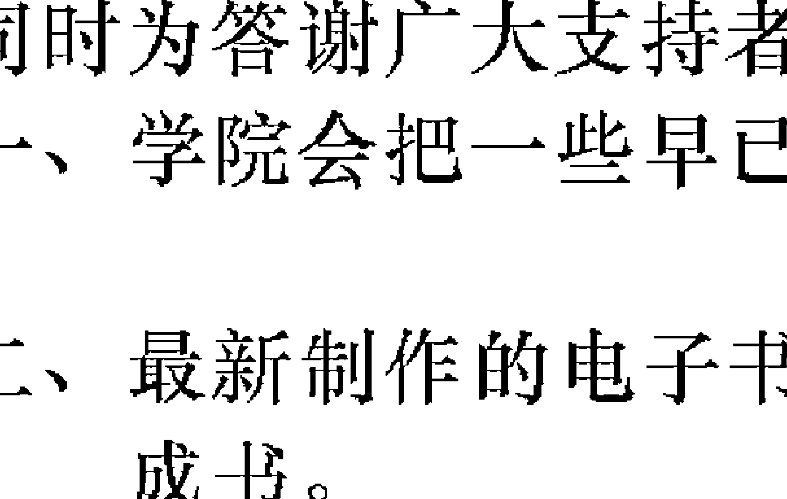

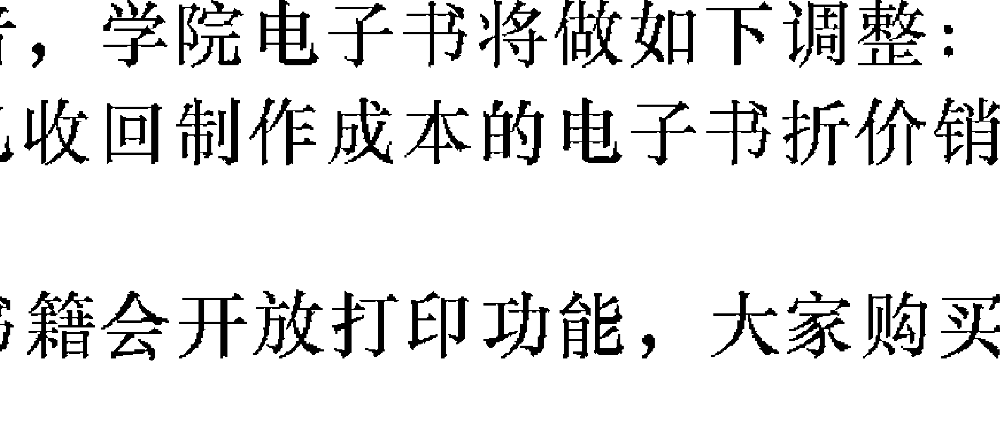

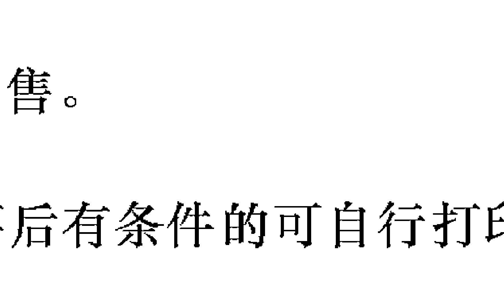

+ 二、在收到电子书后小范围传阅即可，千万不要公开传播，更别挂到网上低价销售。

同时为答谢广大支持者，学院电子书将做如下调整：

+ 一、学院会把一些早已收回制作成本的电子书折价销售。
+ 二、最新制作的电子书籍会开放打印功能，大家购买后有条件的可自行打印成书。

# 現代占星學進階之一

洪能平著

## 目錄

寫在出版前面

序

自序

# 1 職業

- 壹、職業論斷的重要主題
- 貳、第十宮的論斷提示

### 2 旅游

- 壹、第三宮的論斷提示
- 貳、第九宮的論斷提示

# 3 死亡

- 壹、生命區的論斷提示
- 貳、第八宮的論斷提示

# 附錄

- 附錄一、大陸地區經緯度表
- 附錄二、現代占星學研究書籍介紹
- 附錄三、一九九六年世界占星學研討會介紹

## 寫在出版前面

「觀音山出版社」的創立，可以說是一種巧合。然而，巧合的背後也未嘗不是一種責任感的促動 —— 一種關心於本土文化的責任，甚至也包括了關心於我們所生存的這個美麗寶島的未來發展。於是，「觀音山出版社」雖然只是剛成立，而且規模也不大，但是我們的企圖心卻不小。我們期望對於本土文化的宣傳有所貢獻，期望對於社會知識層面的提升有所貢獻，期望對於台灣的未來發展有所貢獻。我們的努力也許並不能夠完全達到自己的理想目標，但是我們會盡力而為。

「現代占星學系列叢書」是我們所擬訂的第一個長期性的出版計劃，由好友能平君負責整套書籍的企劃。說實在的，對於像我這樣一位有算過幾次命的人來說，算命似乎是已經是沒有什麼新鮮感了，甚至認為大可不必算命，免得多花冤枉錢。可是，當我與「天星齋命理館」的好友們接觸以後，我才得知西方文明對於命理有不同於我們的看法，也才稍微懂得何謂現代占星學，而且覺得有必要把國外的命理研究介紹給國人知道，這也是一種知識的傳佈。所以，我決定與「天星齋命理館」一起合作，來進行這項有意義的長期推展工作。

如果以一位知識份子和文化工作者的立場，來看待這套叢書的出版的話，則可能有些人會說我們是在宣傳「迷信」，亦即難道既有的中國傳統數術的迷信還不夠？還有必要拿西方的迷信來補強？其實正好相反，就是因為我們是站在知識份子和文化工作者的立場，所以我們才要出版現代占星學系列叢書。因為現代占星學所強調的是學術性的研究，它不但有大量贊同與支持的廣大群眾，也有大量反對與要求有所證明的廣大群眾在西方，雙方不只是各自提出自己的看法與論證，而且更尋求於科學家的實驗證明，並提出學術性的占星學研究報告與論文。這一切的占星學研究現況，使得現代占星學脫離以往的命理研究格局，走入強調研究方法和科技整合的發展方向。所以，我們絕不是在強調迷信，我們的目標反而是在於去除迷信。

最後，我期望各位讀者能夠從社會層面的角度來關心台灣的命理研究現況，使得我們在政經高度發展的同時，也具有現代的命理觀念，而不是停留在古代的命理迷思之中。

楊進福
1996年5月20日寫於蘆洲

## 序

在推展現代占星學的過程中，我們認為目前最迫切需要去作的一項工作，就是必須把我們所累積的論斷經驗提供給有心研究占星學的讀者們作參考，以便縮短學習的摸索過程，同時也有助於讀者針對我們所提出的看法和論法，進行驗證和批判。如此一來，才能夠帶動整個現代占星學的研究風氣，也能夠針對傳統命理研究所存在的缺失進行反思。

於是，能平君的這套《現代占星學進階》，可以說是出版的正是時候，可以讓已經閱讀過《現代占星學基礎》的讀者們，知道如何去應用占星學上的基本概念來進行論斷。同時，我們也更期待能平君能夠早日完成《現代占星學高階》，好讓有心研究占星學的讀者們，能夠對於現代占星學有一個全盤性的概念和瞭解。

最後，我們想要再次強調的是，現代占星學不但是需要被驗證，而且也需要被應用。因此，我們希望讀者們能夠針對書中所作的論斷提示多加驗證，並且提出自己的見解，同時也把它活用在我們的日常生活當中，如此才能夠發揮占星學的預防作用。如果讀者能夠因本書而獲得某些助益的話，那將是我們最大的快樂，也是我們之所以推展現代占星學的目的所在。

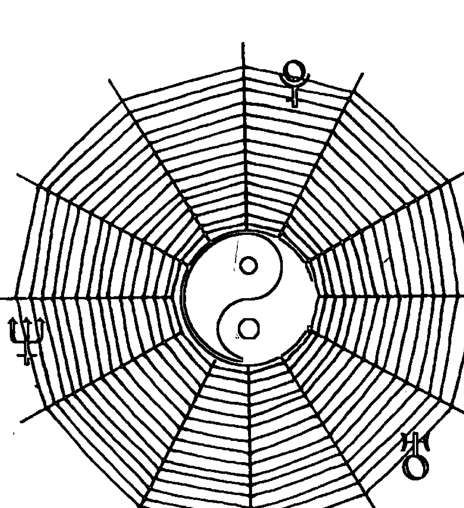

# 研究·突破·創新
# 心理·行為·事件
# 天星論命工作群

> Celestial Astrologer's Club

「天星論命工作群」・指導顧問

呂陽明・彭喜豪 寫於台北市

一九九六年四月卅日

## 自序

自從我出版占星學書籍，以及推出占星學電腦軟體以來，就一直接到不少讀者和聽眾的來函和來電，詢問各種有關占星學的問題。而當我面對這種情況之時，可說是一則以喜、一則以憂：喜的是竟然有如此多的讀者和聽眾熱愛占星學，想要知道更多有關占星學的內容；而憂的是我無法在短期內將更多的占星學知識介紹給讀者和聽眾們。這一來是因為占星學所涉及到的內容實在太廣了，二來是因為目前從事專業占星學寫作的人實在太少了，所以只好讓讀者多等待些時候了。不過，我可以保證的是：我會一直寫下去的！

本套書（分成三冊）的探討範圍，主要是在於針對本命盤的論斷進行詮釋，這也就是有關生活領域方面的論斷。在此，就本書所涉及到的內容略作說明。

首先，由於本套書乃是屬於綜合類型的書籍，所以無法針對每一單項生活領域的內容作很詳細的解說；也因此，有關單項生活領域論斷所涉及到的專業技巧，先省略而不談，留待以後再來作專題式的探討。換言之，本套書的重點乃是在於提供本命盤論斷的宏觀概念，以及整體的論斷流程，以便讓讀者先建立起有關本命盤論斷的整體概念。

其次，每一個本命盤都可以說是充滿著各種變化的可能性；也因此，每一單項的論斷，都可能會有許多的徵象產生。而本套書所談及的內容，則是偏重在一般所常見到的徵象顯示，以致於某些比較特殊的徵象，則有賴於讀者自行多加體會了。此外，讀者也必須培養進行整體性思考的能力，否則很容易造成「见树不见林」的論斷情況，以致於判斷錯誤。

其三，本套書所談及的某些內容，在占星學上仍然存在著爭議，而除非是有多作說明，否則我就先省略不談。同時，我所參考的論斷技巧，比較偏重於美國、英國和德國的講法，至於其他歐洲國家（義大利、法國、荷蘭、西班牙、北歐）的不同論點，礙於語言閱讀上的困難，無法多作介紹。

其四，由於我們與西方的社會文化背景差異很大，所以可能會有許多的徵象是會在西方的社會環境中發生，但卻不一定就會在中國的社會環境中產生，或者是影響的程度有高低之別。因此，希望讀者能夠多多考量到社會文化背景的差異問題。

其五，本套書並沒有詳談流年盤與合盤的論斷技巧，這一部份留待《現代占星學高階》再來作說明。因此，如果論斷的主題有涉及到兩造的話，則請千萬不要草率地妄下斷言，以免判斷錯誤。

其六，本套書所提示的幾種論斷流程，希望讀者能夠多加自行變化，而我在往後的書籍寫作中，也將會陸續地再介紹其他的論斷流程。

最後，再次感謝各位讀者和聽眾的愛護，也感謝「天星論命工作羣」和「凱龍星工作室」各位伙伴對我的支持和協助，並感謝歐美方面諸位占星學家們的支援。而讀者若有關於占星學資訊方面的問題的話（包括書籍和電腦），可以直接與出版社連繫，我將會儘量地提供各種協助或解答。

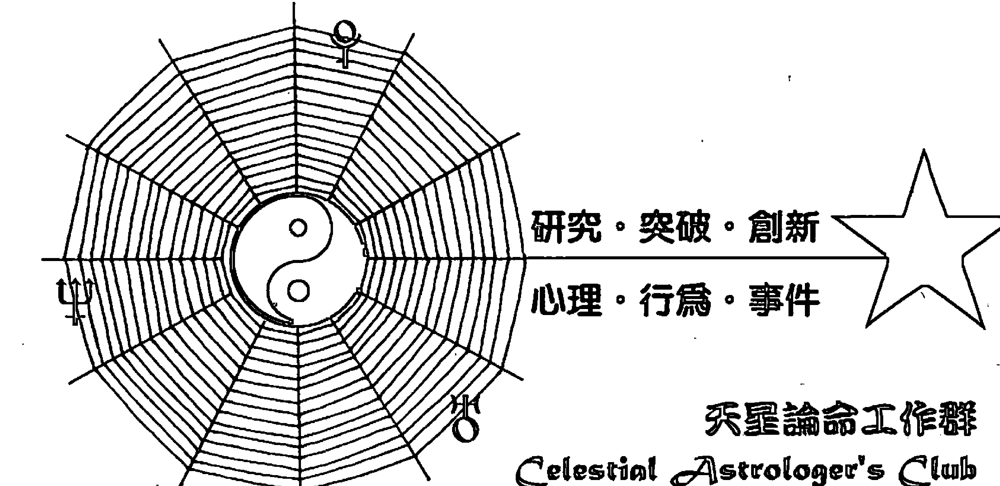

「天星論命工作羣」• 總策劃
洪能平 寫於陽明山
一九九六年四月卅日

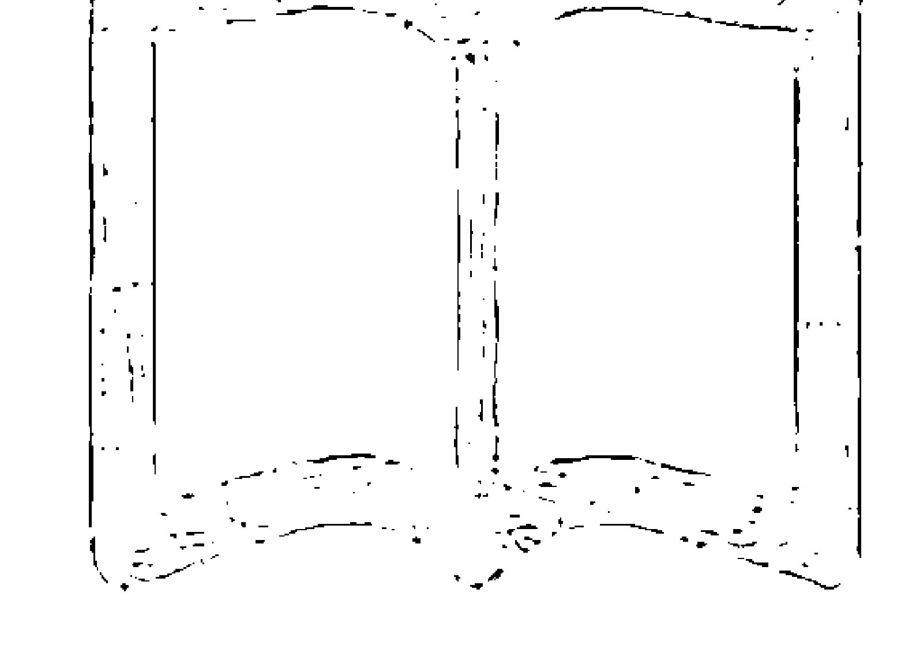

此页空白

# 1 職業

在有關職業的論斷上，時常是必須先判斷個人的人格特質，然後才能夠比較清楚地瞭解到個人的職業傾向。換言之，所謂的職業論斷，無非就是藉由透視個人的特殊才能，來掌握住個人的職業發展趨向。於是，如果本命盤上所呈現出來的個性特徵，有著相當明顯的特殊性的話，那麼此人的職業徵象就會比較明顯；反之，如果本命盤上所呈現出來的個性特徵，並沒有特別凸顯之處的話，那麼此人的職業徵象就會顯得比較模糊，或者說是比較缺乏從事某一種行業所需的特殊才能。

因此，占星學家在針對職業來作論斷的時候，往往必須把握住兩項基本原則：一是，如果個人的特殊才能頗為明顯的話，那麼就可以直接地告之比較適合從事的行業，至於一旦去從事該項行業，是否可以穩賺到錢，這是另外一回事，與個人的特殊才能無關；二是，如果個人的特殊才能並不明顯，甚至不曉得自己應該去從事何種行業的話，那麼占星學家最好是能夠先聽取其意見，然後再來說明是否適合從事該項行業，並且儘可能地建議其多多培養自己的特殊才能。

從實際的論斷經驗來說，有兩種人是比較難以論斷其職業傾向的：一種是八面玲瓏的人，這種人可以說是十八般武藝樣樣可通，學習能力很強，簡直可以從事各種不同的行業；另一種是眼高手低的人，這種人擁有開拓事業的企圖心，也不甘於屈居人下，可是偏偏才能拙劣，或者是施展不出來，時常認為自己是懷才不遇或時運不濟。當占星學家面對第一種人的時候，倒也不必太刻意地論斷其未來的職業走向，因為他自然會自己走出一條路來。而當占星學家面對第二種人的時候，往往會是比較頭痛的，因為向他提供建議未必有用，也不能抹滅他的自信心，此時只好由主動轉為被動，聆聽他對於職業的抱怨，然後鼓勵他多多改善自己的人際關係，因為這種人的人緣往往會比較差，無法得到別人的協助，而阻礙了自己的發展。

此外，幾乎所有的家長都希望自己的孩子將來能夠成龍成鳳，不但學歷高，而且可以出人頭地，於是從小就進行刻意式的栽培，學習音樂、舞蹈、美術、外語等課程。如果把這些課程當成是培養孩子的正當興趣的話，倒是一件很不錯的事；可是，如果想要孩子將來去從事這些行業的話，那麼父母最好是能夠先進行自我衡量，看看自己有沒有這方面的才能，如果沒有的話，最好還是不要太過於勉強。因為從占星學上來看，每一個人都有每一個人的特殊才能，而且這些特殊才能往往是與父母的遺傳有關。換言之，如果為人父母根本缺乏藝術細胞的話，那麼十之七八，孩子也會欠缺藝術天份，很難吃藝術這口飯。於是，我認為占星學家在面對父母來詢問自己的孩子將來適合做什麼的時候，最好是能夠請父母多多注意自己孩子的興趣，行行都可以出狀元，沒有必要給孩子太大的壓力，並請多多尊重孩子自己的選擇。

自從幫人論命以來，令我感到遺憾的事情之一，是我們的高級教育難以與個人的職業傾向相配合，浪費了不少的教育資源，而培養出許多所學非其所用的人，甚至有不少人只是為了文憑或為了父母而讀書，等到步入社會謀職之後，一切又必須從頭學起，甚至於連幹什麼行業都缺乏主見。高學歷未必可以給人帶來鐵飯碗，這是社會的事實，而占星學家在感概之餘，也只好反問一句：「你認為你自己適合從事那一種行業？」希望這一章有助於提供讀者某些答案。

## 壹、職業論斷的重要主題

### 一、四正宮和三方宮的徵象指示

由於四正宮和三方宮的組合搭配，對於一個人的基本才能有著相當大的影響，所以在論斷職業傾向的時候，往往可以先依據四正宮和三方宮的組合情況，來看出某些大方向的基本趨勢。

如果本命盤上的大部份行星，是落在基本宮上的話（即白羊座、巨蟹座、天秤座和摩羯座），乃表示此人具備了獨立、開創、領導、活力和企圖等基本特質，所以適合從事於具有管理、開拓、指導、冒險和研究等性質的工作。

如果本命盤上的大部份行星，是落在固定宮上的話（即金牛座、獅子座、天蠍座和寶瓶座），乃表示此人具備了堅持、耐性、勤勉、規律和謹慎等基本特質，所以適合從事於具有持久、穩定、製造、對抗和生產等性質的工作。

如果本命盤上的大部份行星，是落在變動宮上的話（即雙子座、處女座、射手座和雙魚座），乃表示此人具備了適應、彈性、溝通、多變和機敏等基本特質，所以適合從事於具有說服、服務、協調、應變和快速等性質的工作。

一般來說，在職業的論斷上，四正宮所呈現出來的特質傾向，其重要性還比不上三方宮，因為三方宮所呈現出來的人格特質是更為明顯的。

如果本命盤上的大部份行星，是落在火象星座上的話（即白羊座、獅子座和射手座），乃表示此人具備了自信、樂觀、精力、領導和攻擊等基本特質，所以適合從事於具有消耗、動力、支配、危險和侵略等性質的工作，諸如軍人、外科手術、機械業、工程師、與金屬有關的行業、與火有關的行業等。

如果本命盤上的大部份行星，是落在土象星座上的話（即金牛座、處女座和摩羯座），乃表示此人具備了耐力、安定、保守、操勞和實際等基本特質，所以適合從事於具有勞動、單調、結構、穩定和謹慎等性質的工作，諸如農業、礦業、木材業、土地業、建築業、勞動業、實業家、製造業、公務人員等。

如果本命盤上的大部份行星，是落在風象星座上的話（即雙子座、天秤座和寶瓶座），乃表示此人具備了構思、社交、機敏、溝通和多變等基本特質，所以適合從事於具有思考、說話、寫作、分析和協調等性質的工作，諸如旅行業、記帳員、統計員、作家、推銷員、科學家、與注重心智活動有關的行業等。

如果本命盤上的大部份行星，是落在水象星座上的話（即巨蟹座、天蠍座和雙魚座），乃表示此人具備了敏感、幻想、同情、秘密和照顧等基本特質，所以適合從事於具有藝術、愛心、流動、隱藏和想像等性質的工作，諸如畫家、油漆業、酒業、飲料業、船員、製船業、紡織業、漁業、化學業等。

有不少的人在一生當中，可能會從事過許多種各不相同的行業，亦即大部份的人在步入社會之後，很可能都面臨過更換行業的情況。當占星學家在思考有關行業之更換問題的時候，往往是必須結合著流年盤來作分析。換句話說，固然本命盤上所呈現出來的基本特質，已經可以掌握住了，可是這也未必就能肯定此人將會以某項特定行業來作為終身職業；也因此，從四正宮和三方宮的角度來分析職業傾向，只能看出一個大概，至於更詳細的分析，則必須配合其他的條件來作判斷，而職業的更換則是必須依據流年盤來作判斷。

可是，既然一個人的基本特質已經頗為明確了，那麼此人的職業傾向也應該算是有個基本方向了。因此，不管流年盤所呈現出來的職業變動方向是如何，或者說不管此人是更換那一種行業，往往在新舊兩行業之間，是具有某些共同特質的。比如說，由月亮所主宰的行業很多，當更換職業時，很可能只是從月亮所主宰的其中的某一項行業，更換為同樣是由月亮所主宰的另一项行业，而这新旧两项行业，都是与四正宫和三方宫的特质有着密切的关连性，可以说都脱离不了四正宫和三方宫所赋予个人的基本人格特质。

### 二、太阳的征象指示

由于太阳乃是精力、能力和权力的象征，特别是太阳往往可以凸显出个人的基本才能，以及个人的学习方向，所以太阳在职业的论断上，是一个相当重要的指标。其中，必然要考量到的方向有四：一是太阳所在的星座位置；二是太阳所在的宫位位置；三是与太阳形成合相的行星；四是太阳的相位关系等，分别说明如下。

第一，太阳所在的星座位置，往往指示着个人在先天上所具有的特殊才能，而且这个才能是可以发挥出来的。因此，太阳星座时常是职业论断的基本要素，尽管个人并不一定是从事于太阳星座所指示的职业，然而却同样地可以发挥出太阳星座的能力。于是，太阳星座可以说是一种职业的才能背景指示，而且这个才能背景会通过宫位来作展现。

例如，如果太阳是落入双子座的话，那么指示着此人会具有机敏、应变和多元化的才能，并且擅长于沟通。于是，尽管此人未必是从事于双子座所主宰的行业，但是双子座所赋予的才能，却可以展现在职业上。

第二，太阳所在的宫位位置，往往指示着个人在后天上之所以会有成就，或者是之所以会成名的所在，而且这些成就和成名，是可以让周遭的人看得到的，甚至于也会是一个人绰号的来源。于是，尽管个人并不一定是从事于太阳宫位所主宰的行业，然而却可以让人感受到或看到此人在太阳宫位上的权威性。

例如，如果太阳是落入第二宫内的话，那么指示着此人最足以引人注目的是他的钱财，尽管他未必就一定是一位大财主，可是他却喜欢谈钱，或者是擅长于运用钱财置产，或者是花钱相当光明和慷慨，以致于他留给别人的印象时常会与钱财有关，甚至于会得到一个“钱爷”或“钱嫂”的称呼，展现此人在钱财运用上的独到见解。

第三，由于太阳具有中性的特质，所以不会刻意地去作特殊性的表现，于是太阳的精力和能力，只好透过太阳星座或与太阳形成合相的行星来作为发泄的管道，并以此来确立太阳的特殊性表现。换言之，太阳是一颗遍照的热力之星，它的强大能量除了会展现在星座上，也会展现在与它形成合相的行星上，进而使得此人具备了太阳星座的特殊才能，或者是具备了与太阳形成合相之行星所具有的特殊才能。所以，如果有某颗行星与太阳形成合相，特别如果又是在太阳的前面的度数的话，那么此人会具有该颗行星的特殊才能，甚至于可能会从事于与该颗行星有关的行业。可是，由于太阳与水星、金星形成合相的机会比较多，所以当太阳是与水星或金星形成合相时，从事于水星或金星所主宰之行业的可能性将会比较低，这同时还必须配合着星座和宫位来作判断，如此才能够得到比较明确的指示。

例如，我的太阳（摩羯座22度）正好与金星形成合相，而且金星（摩羯座19度）又是在太阳的前面度数，同时正好是落入摩羯座，所以我具备了金星所赋予的才能，拥有绘画、设计方面的天赋，虽然我并没有去从事这一方面的工作，可是我却可以在工作中展现出金星的艺术特质。

第四，太阳所代表的权威性，除了象征着出名以外，也与地位的争取有着相当大的关连。因此，在职业的开创或谋取的过程中，太阳的相位是一个相当重要的判断因素。如果太阳与木星形成吉相位的话，特别是120度，时常是一种幸运的指标，比较不用担心在求职上有何重大的困难，这同时也可能是指示着有父执辈的帮助。而如太阳与月亮或火星形成吉相位的话，特别是120度，时常也是指示着在职业地位的谋求上，将会是比较顺利的。相对地，如果太阳是与月亮、火星或木星形成凶相位的话，特别是90度，则往往是指示着在职业地位的争取上，将会是比较辛苦的，或者是对于职业有着高度的不满。

### 三、命主星的征象指示

所谓的“命主星”，指的是第一宫的宫主星。在占星学的论断上，由于命主星具有人生发展方向的指引作用，所以在论断职业倾向的时候，命主星时常也是一颗需要参考的行星。换言之，命主星所在的星座和宫位位置所指示的生活态度和生活领域，时常会是个人在三十岁以后，比较会去注意或开拓的方向。

例如，我的命主星是月亮（第一宫是巨蟹座），落入白羊座和第十宫。这指示着我在三十岁过后，将会逐渐强化职业的开拓力，比较注重专业性和研究性（白羊座的缘故），也比较重视个人的事业成就和社会地位（第十宫的缘故）。然而，从职业的论断角度来看，如果命主星并不是落入第六宫、第七宫（命主星落入这两个宫位，是指着强化工作的指引力）、第十宫或第十一宫（命主星落入这两个宫位，是指着强化事业的指引力）的话，那么对于职业的影响力会是较弱的。

此外，还必须注意到所谓的“盘主星”，它指的是在整个本命盘上特别凸显的一颗行星，它对于职业倾向也会有所影响。至于凸显的原因，可能是因为相位格局的关系，也可能是因为落入重要的度数或宫位的关系，这有赖于占星学家自己去作判定。“盘主星”未必就是“命主星”，可是如果本命盘上并没有特别凸显的“盘主星”的时候，“命主星”时常就是“盘主星”。也因此，读者在阅读占星学原文书籍的时候，有必要对这两个名词作区别，以免混淆。

### 四、月亮和水星的征象指示

月亮在职业的论断上之所以会具有其重要性，主要是因为它对于人格特质有着相当重要的影响力，并且也会影响到个人与群众，以及个人与陌生人之间的相处情况，所以月亮也同样地具有影响知名度的力量。因此，如果月亮具有吉相位的话，特别是120度，对于在职业上获得别人的肯定与支持，可以说是相当有利的。

此外，与月亮形成吉相位的行星，特别是120度，又特别是指“入相位”而言，时常是指示着运用该颗行星所代表的特质，可以带来职业上的助益。例如，我的月亮是位在白羊座24度，与落在狮子座29度的天王星是形成120度（在月亮离开白羊座之前就已经形成相位了），这指示着如果我善用天王星的特质的话，则有助于职业上的发展。

水星在职业的论断上之所以会具有其重要性，主要是因为它属于中性行星，而且很可能会与太阳形成合相。因此，水星的相位相当重要，这往往可以决定水星的吉凶特质，然后再通过与太阳的形成合相，进而影响了太阳的吉凶呈现。

此外，水星主宰着人际关系和语言沟通，这在现代社会中，可以说是影响职业成功与否的关键因素。因此，水星如果呈现出吉兆的话，往往是指示着可以得到人和，可以得到别人的协助，可以发挥说服的才能，对于业务的开拓有相当大的助益。相对地，如果水星呈现出凶兆的话，往往是指示着言语上的得罪别人，或者是说服力不够，或者是容易引起别人的误解，对于业务的开拓比较无法得心应手。

### 五、重要行星的征象指示

这里所谓的“重要行星”，指的是第一宫内的行星、第六宫内的行星和第十宫内的行星，三者皆会对于个人的职业倾向产生影响。在此，第一宫内的行星主要是通过个人的特殊才能之显现，来影响个人的职业倾向；第六宫内的行星则主要是指示着个人的服务特质，是属于比较次级的职业位阶；而第十宫内的行星则主要是指示着个人的指挥特质，是属于比较高级的职业位阶。

其中，又以第十宫内的行星对于职业的影响力最强（如果没有重要的特殊相位格局的话），所以第十宫内的行星时常是职业的最重要判断要素，同时也必须配合着第十宫内的行星的相位关系，以及其所代表的宫位（即飞星）、第十宫宫主星所落入的星座和宫位，以及其相位关系等来作判断。

此外，如果第六宫和第十宫内皆有行星落入的话，则不管此人是自己当老板，或者是服务于某单位或某公司，其职业判断时常是以第十宫内的行星为主。所以，有些人可能会是先从事于第六宫内的行星所代表的行业，然后再转行于第十宫内的行星所代表的行业。

### 六、相位格局的征象指示

由于特殊相位格局时常就是整个本命盘的支撑力量，也可以说就是整个本命盘的灵魂之窗。因此，在论断职业的时候，相位格局是一个相当重要的考量因素，只要是本命盘上有形成特殊相位格局的话，则构成特殊相位格局的行星彼此之间的力量整合，往往就是指示着个人的职业发展方向，因为这是个人的特殊才能之指示。然而，由于相位格局的类型差异颇大，所以其考量的重点也略有不同。一般来说，除了必须考量到构成相位格局的行星是哪几颗行星以外，也必须考量到整个相位格局的重心所在，或者是考量到活络整个相位格局的带动力来源。有关何谓特殊相位格局，在此不再多作解释，读者可参阅我所著之《现代占星学基础》。

“三刑会冲型”的相位格局，其重心的所在就是三刑会冲之顶点的行星。所以，如果本命盘上有形成三刑会冲的话，那么顶点的行星所代表的职业，以及顶点的行星所落入的星座或宫位所代表的职业，往往就是指示着个人的职业发展方向。

由于三刑会冲的力量相当强大，所以不管本命盘上是否还存在着其他的特殊相位格局，也不管三刑会冲之顶点或其他两点的行星是否有吉相位来作援助，其顶点行星所在的位置所展现出来的特质和才能，可以说是与个人的职业伴随着，亦即个人往往必须仰赖此点的力量和特质，来展现人生趋向。

“大十字型”的相位格局，如果分别拆开来看，就是四个“三刑会冲型”的组合。也由于四个顶点的行星，分别就是三刑会冲的顶点行星，所以将三刑会冲的力量分散了，缺乏了集中度，可是却增强了四角的支撑力，形成了一种稳固的力量。

大十字的相位格局在职业论断上，往往比较缺乏明显的征象指示。一般来说，有两个基本的思考方向：一是如果本命盘上还存在着其他的特殊相位格局的话，特别是指“大三角型”和“风筝型”，则职业考量的重点往往是必须移向“大三角型”和“风筝型”；二是如果本命盘上没有其他的特殊相位格局的话，那么职业考量的重点，往往是集中在四个顶点的行星，特别指的是缺乏吉相位来作援助的行星。

例如，假设某一个本命盘上有大十字型的相位格局，而缺乏其他的特殊相位格局。同时，该大十字型的相位格局的四颗顶点的行星，有三颗的行星皆具有吉相位，唯独其中的一颗行星缺少吉相位。此时，该颗缺少吉相位的行星所代表的职业，以及该颗缺少吉相位的行星所落入的星座或宫位所代表的职业，往往就是指示着个人的职业发展方向。然而，如果这四个顶点的行星，其中有两颗是缺少吉相位的话，那么在判断上就必须考量到这两颗行星的力量对比，一般来说，是以凶相位居多的那一颗行星，来作为职业的主要征象显示。

“大三角型”的相位格局，其顶点的三颗行星的力量组合，往往就是职业的基本才能所在，同时也指示着个人在谋职的过程中，往往也会是比较顺利的，因为大三角型是三个120度主吉相位的组合。然而，也由于是主相位的组合，所以比较缺乏开创力，亦即大三角型固然可以给人带来某些特殊的才能，可是其开发往往是比较慢的（除非第一宫或第十二宫内有太阳、木星或命主星落入），或者说是个人对于自己的大三角型所具有的特殊才能，是比较晚认知到的。

于是，当我们在应用大三角型的相位格局，来作为职业论断的参考因素时，必须先确定顶点的三颗行星所具有的共同特征，同时往往也必须把这三颗行星所代表的后天宫位（即飞星）列入考量之中，然后才能够通过共同特征的征象显示，来掌握住基本的职业才能。比如说，如果大三角型的三颗行星，分别是月亮、木星和海王星，则这三颗行星所具有的共同特征是想象、敏感和理想等，所以其职业才能可能会是作家、诗人、艺术家或宗教家等。

此外，如果大三角型的三颗顶点的行星，其中有一颗的凶相位较多，破坏了大三角型的基本均衡性，而将力量集中在该颗凶相位较多的行星上时，该颗行星所代表的职业，以及该颗行星所落入的星座或宫位所代表的职业，往往对于一个人的职业选择有着比较大的影响。

“风筝型”的相位格局，是除了具有大三角型的基本格局以外，再加上另外一个顶点，所以风筝型有四个重要的顶点行星。在职业特质的论断上，除了与大三角型同样地必须考量到形成大三角的三颗行星之外，还必须特别注意到风筝头的顶点行星，因为风筝头的顶点行星时常就是大三角型三颗行星之力的引导方向所在。

换句话说，在风筝型中的大三角型，仍然保持着基本才能的显现，而风筝头的顶点行星则是具有开发、引导这个基本才能的作用。于是，风筝头顶点的行星所代表的职业征象，以及风筝头顶点的行星所落入的星座或宫位所代表的职业征象，是一个人可以前往开创的职业领域。

然而，如果在风筝型的大三角型格局中，有某一颗行星的凶相位较多的话，那么风筝头的顶点行星的力量，很可能会比不上大三角型中凶相位较多的那一颗行星。此时，虽然风筝头的顶点行星的基本引导作用未变，可是却已经被减弱了，所以可能会转而往凶相位较多的那一颗行星所代表的职业征象去作发展。

“夹额型”的相位格局，完全是吉相位的组合，而且又是具有四颗的顶点行星，所以在职业征象的显现上比较不明显。它有点类似于大十字型，同样地具有支撑、稳定本命盘的作用，可是由于是吉相位的组合，所以在力量的展现上略逊于大十字型。也因此，在职业特质的论断上，往往必须先考量到在本命盘上，是否还有其他的特殊相位格局存在。如果有的话，那么应该以别的特殊相位格局为主，然后再配合夹额型来作判断。如果没有的话，则应该以四颗顶点行星所形成的共同特征，来作为判断的基本要件，因为这四颗行星所形成的共同特征，往往就是此人的主要特殊才能所在，然后再配合上在四颗顶点行星之中凶相位较多的那一颗行星，来得到比较明确的线索。

### 七、木星的征象指示

由于木星具有顺利、幸运、机会和扩张等特质，所以当我们在论断职业的时候，最好是能够把木星列为考量因素之一，因为木星往往可以给谋职的过程，或者事业开创的过程带来好运。特别是如果木星与职业有关的征象星或点，诸如第十宫内的行星、第十宫宫主星、第六宫内的行星、第六宫宫主星、天顶等，形成合相或120度的话，将会对于职业的发展有着相当不错的助益。

### 八、计都的征象指示

由于计都具有天赋才能的象征意义，所以多少也会对于职业有所影响。特别是如果有某一颗行星与计都形成合相的话（容许度缩小为三度），那么该颗行星所代表的职业征象，以及该颗行星所落入的星座或宫位所代表的职业征象，都很可能会引导个人往这一方面去作发展。

从以上所提的各项论断重点来看，可以知道职业的论断是涉及到相当多的因素考量。因此，当我们在拿到一张本命盘，而准备预测某一个人所曾经从事过的行业，或者是目前正在从事何种行业的时候，必须记住一个最重要的基本原则：依据以上所提的各项重点，找出其中的共同特征，或者是找出其中影响力最强的所在点。如此一来，才能够进行比较准确的论断。换言之，千万不要仅凭着第六宫或第十宫内行星，或者是第六宫或第十宫的飞星是飞向何处，然后就冒然地进行预测；而是应该具备一种综合性判断的分析能力，通过本命盘来找出个人最主要的才能显示，或者是找出个人最主要的个性特征，然后再来配合细小的职业征象来作分析，这才是最稳当的论断步骤。

## 贰、第十宫的论断提示

### 一、第十宫宫头所在的星座位置

#### 〈第十宫宫头落在白羊座〉
对于事业经营的基本态度是开创和冒险的，希望能够凭着自己的才能而打开一片新天地。此外，在职业之权威地位的取得上，时常必须与别人开展面对面的争战。

#### 〈第十宫宫头落在金牛座〉
对于事业经营的基本态度是实际和沉着的，认为事业是必须建立在脚踏实地的基础上。此外，擅长理财和待人和悦的态度，时常可以给事业的经营带来助益。

#### 〈第十宫宫头落在双子座〉
对于事业经营的基本态度是多元和机智的，比较偏好于多角化经营，有可能同时从事于两项职业。此外，卓越的反应能力，可以很快地适应于各种行业。

#### 〈第十宫宫头落在巨蟹座〉
对于事业经营的基本态度是保守和防卫的，不自觉地强调于如何维持既定的经营模式。此外，事业的成就往往会是来得比较慢，同时也比较热心提携和照顾别人。

#### 〈第十宫宫头落在狮子座〉
对于事业经营的基本态度是气魄和专断的，特别注重气派和名声。此外，高度的自信心和向往高位的企图心，以及创作的才能等，将有助于事业目标的达成。

#### 〈第十宫宫头落在处女座〉
对于事业经营的基本态度是勤劳和仔细的，会为事业而日夜操劳，并且事必躬亲。此外，特别强调钱财的妥善运用，比较不会去从事金额相当庞大的投资。

#### 〈第十宫宫头落在天秤座〉
对于事业经营的基本态度是权衡和配合的，以合作或共享利润的态度来面对事业的经营。此外，擅于协调和企划的才能，以及待人的公正态度，将有助于事业的发展。

#### 〈第十宫宫头落在天蝎座〉
对于事业经营的基本态度是坚决和强韧的，会以不屈不挠的奋战不懈之精神来发展自己的事业。此外，对于具有未知、难解或风险等性质的行业，比较容易感到兴趣。

#### 〈第十宫宫头落在射手座〉
对于事业经营的基本态度是扩展和乐观的，所以特别具有不断地扩展事业的雄心。此外，似乎总是相当忙碌，热心于与顾客聊天，而且喜欢出差去洽谈业务。

#### 〈第十宫宫头落在摩羯座〉
对于事业经营的基本态度是坚毅和孤独的，以严格自我要求的态度来建立属于自己的事业。此外，特别容易感受到事业上的困境和阻碍，强烈的成就感是成功的动力。

#### 〈第十宫宫头落在宝瓶座〉
对于事业经营的基本态度是独创和革命的，喜欢以不同于传统的经营手法来开创自己的事业。此外，对于新兴的行业比较感兴趣，特别注重个人兴趣与事业的结合。

#### 〈第十宫宫头落在双鱼座〉
对于事业经营的基本态度是理想和仁慈的，所以会对于事业的经营寄予高度的希望。此外，比较容易在钱财方面吃亏，并且更换事业的频率可能会是比较高的。

### 二、行星落入第十宫

#### 〈太阳〉
太阳在此，具有自己当老板的才干，或者是可以胜任主管的职务。同时，对于自己所管辖范围内的一切业务，喜欢自作主张，比较难以接受别人的批评和赐教。

#### 〈月亮〉
月亮在此，也是具有自己当老板的才干，或者是可以胜任与公众事务有关的行业。同时，对于竞争对手保持着高度的敏感性，善于进行长期的市场竞争。

#### 〈水星〉
水星在此，特别注重市场讯息的掌握，或者是依靠口才和敏捷的反应来扩展事业。同时，相当不错的企划能力，有助于进行细部的考量，以及事先征询他人的意见。

#### 〈金星〉

金星在此，可以將社交才能展現在事業上，甚至於有可能會得到某位女性的支援。同時，比較注重金錢的處理和運用，喜歡以錢滾錢的經營手法。

#### 〈火星〉

火星在此，具有工作狂熱的傾向，高度期盼自己能夠在該行業中有突出的表現。同時，比較適合從事個人擔負全責的行業，以免時常因為與別人意見不合而起衝突。

#### 〈木星〉

木星在此，也是具有自己當老闆的才幹，而且比較容易以過度樂觀的態度來評價自己所要開創的事業。同時，在事業的經營上，沒有必要的額外開銷往往會比較多。

#### 〈土星〉

土星在此，雖然時常是指示著大器晚成，而且在事業的經營上，可能要面對較多的困難和阻礙。然而，其成就往往會是比較豐富的，並且懂得珍惜自己努力的成果。

#### 〈天王星〉

天王星在此，特別強調職業所具有的創作力，這可能會表現在以創新的手法來作銷售，或者是表現在對於新興的行業深感興趣。此外，事業有突然面臨解散的可能。

#### 〈海王星〉

海王星在此，時常是指著自己所辛苦努力的付出，卻未必可以得到相對的報酬。同時，在事業的經營上，往往要面臨著較多的欺騙和陷害。

#### 〈冥王星〉

冥王星在此，指示著在事業的經營上，可以展現出高度的意志力和掌權慾，所以有獨裁的傾向，也因此而比較容易樹敵。此外，事業有突然面臨轉行的可能。

# 陈

# 迹

## 2

## 旅遊

在占星學的實際論斷上，有關旅遊方面的徵象顯示，主要是依據於第三宮和第九宮來作判斷的。其中，第三宮是主宰著短程旅遊和國內旅遊，而第九宮則是主宰著長程旅遊和國外旅遊。而如果將所謂的「旅遊」，更廣泛地包含了精神之旅在內的話，則旅遊同時也意味著對於知識和資訊的吸引，以及思想和心靈的經歷。因此，第三宮所象徵的旅遊意涵，也包括了知識、資訊和資料的吸收與整理（廣播也包括在內），以及實際的思維運作，還有精神意識的創作等（如發明或點子）；而第九宮所象徵的旅遊意涵，則也包括了擴展文化視野，以及思想上的真理訴求，還有信仰上的精神體悟等。

換句話說，第三宮所指的乃是當事者之出生地的文化領域，而第九宮所指的則是當事者之出生地以外的文化領域。所以，第三宮是國內範圍以內的各種事物，包括了語言、文化和習俗等，同時也與短距離的溝通有關，包括了兄弟姐妹（血緣關係）、親近的朋友（聊天關係）和國內旅遊（本土關係）等。而第九宮則是國內範圍以外的各種事物，包括了異國風味、異國文化和國外領土與事物等，同時也與長距離的溝通有關，包括了教友（信仰關係）、外交和國外貿易（國際關係）、國外朋友和國外旅遊（非本土關係）等。

- 一是，看第三宮和第九宮宮頭所在的星座位置；
- 二是，看第三宮和第九宮宮內的行星及其相位關係；
- 三是，看第三宮和第九宮的宮主星（即飛星）所落入的星座和宮位位置，以及其相位關係。

此外，一般來說，有關旅遊方面的論斷，主要是會談到以下的幾項重點：

- 第一，個人在一生當中，其旅遊的頻率到底是高或低，亦即論斷個人之旅遊次數的多寡。
- 第二，去旅遊的大部份原因是什麼？是純觀光和休閒，或者是為了學習，或者是为了生意，或者為了親人？
- 第三，在旅遊的過程當中，可能會有怎樣的際遇？是可以結交到好朋友，或者是會有錢財上的損失，或者是會惹上法律問題，或者是會有其他的麻煩？這一方面的論斷，同時也是在於提醒進行旅遊時，個人所應該特別注意的事項。這種論斷還必須配合流年盤和出國地點來作判斷。
- 第四，在旅遊的過程當中，你或妳的心理反應將會有何變化？同時，如果是要到國外去旅遊的話，則不同樣的國家和地方，可以給你或妳帶來怎樣的不同感受。這種論斷還必須配合流年盤和換置命盤來作判斷。
- 第五，個人是否有可能會在國外居住，如果有的話，那麼是短期性的呢？還是長期性的呢？

有關旅遊方面的論斷，與其他生活領域的論斷一樣，都是必須從整個本命盤上的結構來作綜合性判斷，而絕對不能只依據於單一因素就斷然地下判斷。而在考量本命盤上之整體結構與旅遊關係時，有必要特別注意到以下的兩種現象。

一是，本命盤上所呈現出來的「根」的感覺，是否頗為強烈，這主要是可以依據於第三宮和第四宮、第九宮和第十宮的強弱對比來作判斷。如果第三宮和第四宮的宮主星，是比第九宮和第十宮的宮主星更顯得強而有力，或者是第三宮和第四宮內行星力量，是比第九宮和第十宮內行星力量更顯得強而有力的話，則表示著此人的「根」的感覺頗為強烈，於是此人很可能會是很少離開其出生地太遠；而相對地，如果第九宮和第十宮的宮主星，是比第三宮和第四宮的宮主星更顯得強而有力，或者是第九宮和第十宮內行星力量，是比第三宮和第四宮內的行星力量更顯得強而有力的話，則表示著此人的「根」的感覺頗為薄弱，於是此人很可能會時常遠離其出生地，甚至是到國外去居住。

二是，本命盤上所呈現出來的精神力度是否頗為強烈。如果精神力度頗為強烈的話，則可能會往精神層次去作發展，而不是往肉體層次的身體旅遊去作發展。

## 壹、第三宮的論斷提示

### 一、第三宮宮頭所在的星座位置

如果第三宮的宮頭是落在基本宮的話，則指示著國內旅遊的機會將可能會是比較多的；如果第三宮的宮頭是落在變動宮的話，則指示著國內旅遊的機會將可能會是比較少的；如果第三宮的宮頭是落在固定宮的話，則指示著國內旅遊的機會將可能會是很少的。

此外，如果第三宮的宮主星是落入基本宮，或者是落入始宮內的話，特別是如果相當接近於四個始宮的基本點時（即第一宮、第四宮、第七宮和第十宮的宮頭位置，其中以第一宮的影響力最強），則指示著國內旅遊的機會將可能會是較多的。同時，在國內旅遊原因的判斷上，主要是依據於第三宮宮主星所在的宮位位置，以及其相位關係，還有與第三宮宮主星形成相位關係的行星所代表的宮位（即飛星與飛星的關係）等來作判斷。

#### 〈第三宮宮頭落在白羊座〉

此意味著你喜欢透過以自己開車的方式，來享受短程的旅行，而且你總是抱著探索於新環境的新鮮心情來旅遊。然而，你必須特別注意避免意外事件的發生，因為你在開車時會比較急躁。

#### 〈第三宮宮頭落在金牛座〉

此意味著你並不是一位喜歡旅遊的人，然而如果真的是要去旅行的話，你往往會在事前作好各種準備工作，並且希望在旅程中能夠像在家裡一樣地感到舒適。同時，你會比較偏好於享受大自然氣息的旅行。

#### 〈第三宮宮頭落在雙子座〉

此意味著你的國內旅遊的次數頗多，因為你本人蠻喜歡東跑西跑的，並且你可能會因為想要造訪某位友人，而不惜從遠處跑去看他。同時，你也喜歡從旅遊當中去觀看各種新奇的事物，或者是吸收各種新鮮的見聞。

#### 〈第三宮宮頭落在巨蟹座〉

此意味著你的旅行往往是有目的，亦即如果不是為了生意的關係，則可能會是為了其他的事務，所以你很少是單純地為旅遊而旅遊。同時，你希望在旅遊之前能夠作到周全的準備，而且你的隨身行李可能會比別人來得多。

#### 〈第三宮宮頭落在獅子座〉

此意味著你喜歡旅行能夠帶給你享受觀看風景的樂趣，所以你會比較偏好於山丘和山谷的景觀。雖然你在旅程中可以展現出你的玩的樂勁，而且也頗能享受開車兜風的樂趣，然而你的旅遊的機會似乎並不多。

#### 〈第三宮宮頭落在處女座〉

此意味著你固然是可以享受旅遊的樂趣，但是由於你太過於注重旅程中的服務品質，所以往往總是無法享受到充分的旅遊樂趣。再者，由於你比較難以適應其他地方的飲食習慣，所以必須特別注意胃腸方面的問題。

#### 〈第三宮宮頭落在天秤座〉

此意味著你的旅遊時常不是單獨一個人而已，因為你總是喜歡在旅程中有別人作伴。同時，在旅行的過程中，你似乎總是在四處地走一走，而你的許多旅遊可能會是基於生意或散心的原故。

#### 〈第三宮宮頭落在天蠍座〉

此意味著你喜歡享受與海洋有關的旅遊，你喜歡聆聽於海水的浪淘聲。同時，你在旅程中的開銷會比較多，因為你特別喜歡享受奢侈豪華的感覺，所以你所投宿的地方也往往會是比較高級的。

#### 〈第三宮宮頭落在射手座〉

此意味著你的旅遊距離會是比較遠的，甚至於你可能會有很多的時間是花費在旅遊之上。同時，由於你比較偏好於到各種不同的地方去旅遊，以增長你的經歷，所以你似乎比別人有著更多的旅遊機會。

#### 〈第三宮宮頭落在摩羯座〉

此意味著你的旅遊很可能是因为生意的關係，或者是为了建立起你的社會關係。因此，你的旅程很可能是搭乘大型的交通工具，其次才是自己開車，而你的旅行心境往往會是比較嚴肅的。

#### 〈第三宮宮頭落在寶瓶座〉

此意味著你的旅遊往往會是心血來潮式的，亦即你隨時都有可能會突然興起旅遊的心情，特别是每當周未來臨之時，你很可能會突然想到要去那裡旅遊。同時，你總是抱著探查的心情去作旅遊，希望能夠獲得一些新鮮啓示。

#### 〈第三宮宮頭落在雙魚座〉

此意味著你似乎總是在等待著旅遊的來臨，因為你希望透過旅遊來變化日常生活當中的單調氣氛，所以你頗能夠享受各種旅遊所帶來的樂趣，特別是當旅程中如果有湖光月色的話，你的心情會更顯得愉快。

### 二、行星落入第三宮

如果第三宮內的行星，是屬於比較具有波動和變化特性的行星的話，則指示著國內旅遊的機會將可能會是比較多的，諸如月亮、金星、火星、天王星、海王星和冥王星等；如果第九宮內的行星，是屬於比較具有持續和堅持特性的行星的話，則指示著國內旅遊的機會將可能會是比較少的，諸如太陽、木星和土星等。而如果是水星落入第三宮的話，則必須依據於水星的相位關係來作判斷。

此外，如果本命盤上的某一個星座有四顆以上的行星落入，而且該星座是基本宮的話，則指示著國內旅遊的機會將可能會是比較多的；如果本命盤上的某一個星座有四顆以上的行星落入，而且該星座是變動宮的話，則指示著國內旅遊的機會將可能會是比較少的；如果本命盤上的某一個星座有四顆以上的行星落入，而且該星座是固定宮的話，則指示著國內旅遊的機會將可能會是很少的。同時，如果是凶星落入第三宮，或者是第三宮內的行星有不少的凶相位，或者是第三宮宮主星有不少的凶相位的話，則必須在進行國內旅遊時多加小心，以確保安全。

#### 〈太陽〉

當太陽落入第三宮時，指示著雖然是喜歡跑來跑去，但是旅遊的範圍性並不會太大，所以只能算是四處走一走而已，或者是因為工作的關係而不得不四處跑。

#### 〈月亮〉

當月亮落入第三宮時，指示著雖然國內旅遊的機會蠻多的，可是有時候反而會不想要去旅遊，而寧可待在家裡與朋友聊天，這必須依據月亮的過運情況來作判斷。

#### 〈水星〉

當水星落入第三宮時，指示著必須特別注意旅遊時的精神狀況，因為水星在此比較容易引發精神緊張，而如果水星有不錯的吉相位的話，則旅遊可以疏解精神緊張。

#### 〈金星〉

當金星落入第三宮時，指示著可以享受於旅遊所帶來的愉快和輕鬆，而且此人也蠻喜歡四處旅遊的，所以國內旅遊的機會不少，同時也能夠透過旅遊而結交到朋友。

#### 〈火星〉

當火星落入第三宮時，指示著在進行國內旅遊的時候，必須特別注意意外事故的發生，尤其是應該避免開快車，而如果火星與天王星形成凶相位的話，則要加倍注意。

#### 〈木星〉

當木星落入第三宮時，指示著國內旅遊的運氣往往會是比國外旅遊的運氣來得好，同時往往也可以透過國內旅遊而得到別人的某些幫助。

#### 〈土星〉

當土星落入第三宮時，指示著對於國內旅遊的興趣並不高，或者是進行國內旅遊的機會並不多，同時在旅遊的時候必須特別注意身體的健康，因為比較容易在旅途中生病。

#### 〈天王星〉

當天王星落入第三宮時，指示著可能會突然地進行國內旅遊，亦即出差往往會是臨時性的，同時也必須特別注意意外事故的發生，尤其如果是坐飛機的話。

#### 〈海王星〉

當海王星落入第三宮時，指示著將可能會是比較喜歡待在家裡的，然而在家裡時卻又並不安閒，可能會總是忙於接待朋友，或者是熱衷於與朋友聊天。

#### 〈冥王星〉

當冥王星落入第三宮時，指示著將可能會有基於秘密的理由而進行的國內旅遊，或者是在進行國內旅遊的時候比較容易有奇特的際遇，比如說，認識了頗為怪異的人。

### 三、第三宮宮主星所落入的宮位

#### 〈第一宮〉

當第三宮宮主星落入第一宮時，指示著進行國內旅遊的原因，很可能是因為兄弟姐妹的關係。

#### 〈第二宮〉

當第三宮宮主星落入第二宮時，指示著進行國內旅遊的原因，很可能是直接與錢財有關。

#### 〈第三宮〉

當第三宮宮主星落入第三宮時，指示著進行國內旅遊的原因，很可能是與教育或討論有關，或者是因为工作的關係，比如說新聞採訪。

#### 〈第四宮〉

當第三宮宮主星落入第四宮時，指示著進行國內旅遊的原因，很可能是與家產或家庭有關，或者是會時常與家人通過電話聯繫。

#### 〈第五宮〉

當第三宮宮主星落入第五宮時，指示著進行國內旅遊的原因，很可能是利用星期假日來作純粹的休閒渡假。

#### 〈第六宮〉

當第三宮宮主星落入第六宮時，指示著進行國內旅遊的原因，很可能是與家人一起去露營，或者是因為工作的關係。

#### 〈第七宮〉

當第三宮宮主星落入第七宮時，指示著進行國內旅遊的原因，很可能是基於配偶的關係。

#### 〈第八宮〉

當第三宮宮主星落入第八宮時，指示著進行國內旅遊的原因，很可能是基於生意上的關係，或者是去參加葬禮，或者是因為配偶的錢財問題。

#### 〈第九宮〉

當第三宮宮主星落入第九宮時，指示著進行國內旅遊的原因，很可能是去拜訪已經居住在國外的親戚。

#### 〈第十宮〉

當第三宮宮主星落入第十宮時，指示著進行國內旅遊的原因，很可能是基於事業上的關係，或者是因為要去拜訪名人。

#### 〈第十一宮〉

當第三宮宮主星落入第十一宮時，指示著進行國內旅遊的原因，很可能是與開會有關，或者是為了公司而出差。

#### 〈第十二宮〉

當第三宮宮主星落入第十二宮時，指示著進行國內旅遊的原因，很可能是與健康事務有關，或者是為了暫時放鬆自己的心情。

## 貳、第九宮的論斷提示

### 一、第九宮宮頭所在的星座位置

如果第九宮的宮頭是落在基本宮的話，則指示著國外旅遊的機會將可能會是比較多的；如果第九宮的宮頭是落在變動宮的話，則指示著國外旅遊的機會將可能會是比較少的；如果第九宮的宮頭是落在固定宮的話，則指示著國外旅遊的機會將可能會是很少的。

此外，如果第九宮的宮主星是落入基本宮，或者是落入始宮內的話，特別是如果相當接近於四個始宮的基本點時（即第一宮、第四宮、第七宮和第十宮的宮頭位置，其中以第一宮的影響力最強），則指示著國外旅遊的機會將可能會是較多的。同時，在國外旅遊原因的判斷上，主要是依據於第九宮宮主星所在的宮位位置，以及其相位關係，還有與第九宮宮主星形成相位關係的行星所代表的宮位（即飛星與飛星的關係）等來作判斷。

#### 〈第九宮宮頭落在白羊座〉

此意味著你對於國外旅遊具有濃厚的興趣，會主動地去參與國外旅遊，並且希望能夠透過旅遊來滿足你的冒險慾望。然而，你可能必須多準備一些費用，因為你在旅程中往往會有購買東西的衝動。

#### 〈第九宮宮頭落在金牛座〉

此意味著你是以逍遙和享受舒適的心境，來完成你的長程旅行。因此，你不但會在事前考量到各種不方便的事項，而且往往也會比別人多帶一些錢，以便在旅程中能夠有充分的高級享受。

#### 〈第九宮宮頭落在雙子座〉

此意味著你將可能會在國外的旅程中，結交到外國朋友，或者你是因為要去拜訪住在國外的朋友，所以才決定作國外旅遊。雖然你對於國外旅遊的興趣頗高，但是機會和次數卻比不上你的國內旅遊。

#### 〈第九宮宮頭落在巨蟹座〉

此意味著你如果前往國外旅遊的話，將會比較容易造成水土不服或睡不好的現象，或者是身在國外，但卻是心繫國內和家庭，所以一般來說，你的長程旅行的機會和次數並不多，而且比較喜歡與家人一起去旅行。

#### 〈第九宮宮頭落在獅子座〉

此意味著由於你是一位頗能夠享受玩樂的人，所以即使你是因為生意的關係而必須作國外旅行，但你卻可以把生意和旅遊樂趣結合為一。然而，由於你比較容易在國外有揮霍和奢侈的心情產生，所以可能必須多準備些錢。

#### 〈第九宮宮頭落在處女座〉

此意味著你總是必須在金錢準備相當充分的情況，才有進行國外旅遊的可能，而且你在國外所表現出來的言行舉止，似乎會是比較謹慎和害羞的。此外，你也很可能是採取自助旅行的方式，來完成你的長程旅遊。

#### 〈第九宮宮頭落在天秤座〉

此意味著雖然你是蠻喜歡國外旅遊的，但是往往卻由於某些事務的原故，而使得原本的旅行計劃受到阻礙，或者是你的國外旅遊將會把你的某些預定的計劃給延遲了。因此，你很可能會在長程旅程中，仍然在擬定某些計劃。

#### 〈第九宮宮頭落在天蠍座〉

此意味著國外旅遊似乎總是可以提供你一個進行徹底反思的機會，因為你很可能會在接觸到不同的異國情調之後，忽然地改變了你的人生觀。因此，你將會特別地注重於國外旅游所带给你的各种不同的感受。

## <第九宫宫头落在射手座>

此意味着你是一位相当热衷于国外旅游的人，因为你具有响往于异国情调的心情，所以当你一到国外之后，似乎总是显得特别地有活力，就好像是生龙活虎一样。一般来说，你的国外旅游的机会和次数，将会是颇多的。

## <第九宫宫头落在摩羯座>

此意味着你的国外旅游往往是具有目的性质的，亦即如果不是因为事业的关系而去作长程旅行的话，则可能也会是基于与自己的名声和社会关系的缘故而去作长程旅行。因此，你的国外旅行往往也就不是那么地轻松了。

## <第九宫宫头落在宝瓶座>

此意味着你对于搭乘飞机充满着高度的兴趣，所以只要你的资金许可的话，你将随时都会有进行长程旅行的可能，而且你的旅游行李会是比较简单的。同时，你似乎总是特别喜欢到比较奇特的地方去旅游。

## <第九宫宫头落在双鱼座>

此意味着你希望透过国外旅游来提升你的生活情趣，所以你很能够享受于长程旅游所带来的乐趣，而且你会特别喜欢选择具有浪漫情调的地方去作旅游。然而，你却必须特别注意旅程中的受骗事项。

### 二、行星落入第九宫

如果第九宫内行星，是属于比较具有波动和变化特性的话，则指示着国外旅游的机会将可能会是比较多的，诸如月亮、金星、火星、天王星、海王星和冥王星等；如果第九宫内行星，是属于比较具有持续和坚持特性的话，则指示着国外旅游的机会将可能会是比较少的，诸如太阳、木星和土星等。而如果是水星落入第三宫的话，则必须依据于水星的相位关系来作判断。

此外，如果本命盘上的某一个星座有四颗以上的行星落入，而且该星座是基本宫的话，则指示着国外旅游的机会将可能会是比较多的；如果本命盘上的某一个星座有四颗以上的行星落入，而且该星座是变动宫的话，则指示着国外旅游的机会将可能会是比较少的；如果本命盘上的某一个星座有四颗以上的行星落入，而且该星座是固定宫的话，则指示着国外旅游的机会将可能会是很少的。同时，如果是凶星落入第九宫，或者是第九宫内行星有不少的凶相位，或者是第九宫宫主星有不少的凶相位的话，则必须在进行国外旅游时多加小心，以确保安全。

> 〈太阳〉

当太阳落入第九宫时，指示着个人对于国外事物的认识，将可能会是颇有自己的一套见解，而且可能会是从事于与国外有关的工作，甚至于因为工作的关系而不得不到国外去旅游。

#### 〈月亮〉

当月亮落入第九宫时，指示着蛮喜欢进行国外旅游的，也比较容易会想像各种国外的景象，甚至于会到国外去居住，有不少在国外出生的华侨，其月亮是落入第九宫。

#### 〈水星〉

当水星落入第九宫时，指示着必须特别注意旅游时的精神状况，因为水星在此比较容易引发现神紧张，而如果水星有不错的吉相位的话，则旅游可以疏解精神紧张，也可以吸收不少的精神体验。

#### 〈金星〉

当金星落入第九宫时，指示着可以享受于旅游所带来的欢乐和愉快，而且此人也蛮喜欢四处旅游的，所以其国外旅游往往会是纯观光性质的，同时也能够透过旅游而结交到朋友。

#### 〈火星〉

当火星落入第九宫时，指示着在进行国外旅游的时候，必须特别注意意外事故的发生，尤其是应该避免坐船或短距离的飞行，而如果火星与天王星形成凶相位的话，则要加倍注意。

#### 〈木星〉

当木星落入第九宫时，指示着国外旅游的运气往往会是比国内旅游的运气来得好，并且有居住于国外的可能，同时往往也可以透过国外旅游而得到别人的某些帮助。

#### 〈土星〉

当土星落入第九宫时，指示着虽然对于国外旅游的兴趣蛮高的，可是却时常因为某种原因而无法实现，或者是在老年的时候才前往国外去旅游，同时在旅游的时候必须特别注意身体的健康，因为比较容易在旅途中生病。

#### 〈天王星〉

当天王星落入第九宫时，指示着可能会突然地进行国外旅游，而且旅游的目的地往往会是比较奇特的地方，或者是为了新鲜、好奇或进行探查等原因而旅游，同时也必须特别注意意外事故的发生，尤其如果是坐飞机的话。

#### 〈海王星〉

当海王星落入第九宫时，指示着国外旅游往往会是与海比较有关的，可能会是到国外的海岸去游玩，或者是有一段时间是停留在船上。

#### 〈冥王星〉

当冥王星落入第九宫时，指示着将可能会有基于秘密的理由而进行的国外旅游，或者是在危险时刻前往国外旅游（如战争期间或破产之际），而且必须特别注意在国外时所可能会发生的突发事件。

### 三、第九宫宫主星所落入的宫位

#### 〈第一宫〉

当第九宫宫主星落入第一宫时，指示着进行国外旅游的原因，很可能是因为自己对于国外的好奇心所使然。

#### 〈第二宫〉

当第九宫宫主星落入第二宫时，指示着进行国外旅游的原因，很可能是受雇于国外的船务公司，或者是与钱财有关，比如说从事于国际性投资。

#### 〈第三宫〉

当第九宫宫主星落入第三宫时，指示着进行国外旅游的原因，很可能是与写作或采访有关，或者是因为要去证明某件事情。

#### 〈第四宫〉

当第九宫宫主星落入第四宫时，指示着进行国外旅游的原因，很可能是与房地产有关，或者是为了回到故乡，比如说，在小孩子的时候就已经到国外居住了，而等到年纪大了以后却又回到自己的出生地居住。

#### 〈第五宫〉

当第九宫宫主星落入第五宫时，指示着进行国外旅游的原因，很可能是利用假期来作纯粹的休闲度假，或者是代表政府单位到国外去办事。

#### 〈第六宫〉

当第九宫宫主星落入第六宫时，指示着进行国外旅游的原因，很可能是因为从事于出口业务，或者是与健康或食品等事务有关。

#### 〈第七宫〉

当第九宫宫主星落入第七宫时，指示着进行国外旅游的原因，很可能是去拜访配偶的亲戚。

#### 〈第八宫〉

当第九宫宫主星落入第八宫时，指示着进行国外旅游的原因，很可能是基于遗产上的问题，或者是为了逃避某些事情。

#### 〈第九宫〉

当第九宫宫主星落入第九宫时，指示着进行国外旅游的原因，很可能是去进行考查，或者是为了提升自己的程度，比如说完成更高等的教育。

#### 〈第十宫〉

当第九宫宫主星落入第十宫时，指示着进行国外旅游的原因，很可能是基于事业上的关系，或者是因为荣誉的问题。

#### 〈第十一宫〉

当第九宫宫主星落入第十一宫时，指示着进行国外旅游的原因，很可能是与友谊有关，或者是为了探访已经居住在国外的家人。

#### 〈第十二宫〉

当第九宫宫主星落入第十二宫时，指示着进行国外旅游的原因，很可能是基于想要有所隐退的心态。

以上所谈的内容，只能说是一种大概的趋势而已。因为在占星学的论断上，对于一个人的旅程运势的预测，是必须综合多种因素来作考量，才能够得到比较准确的预测。

死亡

## 3
## 死亡

生命乃是一切存在之基础。当占星学家们藉由星体之运行来预测人世间之悲欢离合、潮起潮落之时，在应用占星学来诠释个体生命本质之时，何能避开生命之存在的问题呢？于是，有许多不怕死，也不忌讳死亡的占星学家们，花费了毕生的时间和精力去探索生命的开始，以及生命的结束；甚至于有许多敢于挑战占星学，或者是为了印证占星学有它的可信度的占星学家们，在生前就先行预测了自己的死亡日期，以及死亡的原因，然后等待着这一死亡时刻的来临。结果，当自己所先行预测的日期，与自己真的终结生命的时刻，差异不大之时，占星学家临终之时是会含笑九泉的，惊异于自己印证了占星学的真实性、感叹于人类身处宇宙之中的渺小、肯定了自己在占星学上的论断功力一一哈哈哈，真是不枉此生！

然而，一般来说，占星学家都只是在默默地预测着自己的死亡，而不愿意在为别人进行占星论断的时候来预测别人的死期。因为这不只是涉及到论断功力的问题，而且也涉及到职业道德的问题。于是，本章以下所谈之内容，仅作为参考之用，希望读者在研习之后，可以拿自己的本命盘和流年盘，或者是拿已经过逝者的本命盘和流年盘来作印证，千万不要轻言预测别人的死亡，切记！切记！

此外，以下本章所谈及的内容，与其说是预测死亡到底是在何时降临，倒不如说是去判断对于个人生命可能会构成威胁的因素有那些，进而让我们知道如何去避免，以降低死亡的机率，使得我们的有生之年能够尽量地延长，以得到更具有丰富内涵的今生。

## 壹、生命区的论断提示

不管是在中国传统命理的论断上，或者是在现代占星学的论断上，有关生命之终结的预测，主要是有以下的三大主题：

- 第一，婴儿的夭折。这可以分为两种情况：一是未满周岁就夭折了；二是未满十五岁就死亡了。严格地说，这两种情况都可以算是夭折。
- 第二，意外的死亡。这也可以分为两种情况：一是天灾；二是人祸。前者往往是难以避开的，而且时常是死亡人数相当多的，比如说，强烈地震灾害所导致的死亡，或者是瘟疫所导致的死亡。而后者则往往是个人自己所自找的，比如说，酒醉驾车而发生意外死亡，或者是不懂得照顾和珍惜自己的身体而病发身亡，或者是承受不了压力和刺激而自杀。一般来说，本命盘的死亡预测是与后者比较有关，而前者则是属于灾异占星学（世俗占星学的范围）的研究课题。
- 第三，寿终正寝。这是比较常见到的死亡预测，必须应用较为精细的流年、流月和流日来作论断。

在预测死亡之前，占星学家必须先进行三方面的判断：一是本命盘上所呈现出来的生命力，到底是强力或弱力，这特别与婴儿的夭折有关；二是本命盘上所呈现出来的体质情况，到底指示着何种疾病比较容易产生，以及该疾病的严重程度如何；三是本命盘上所呈现出来的严重刑克情况，到底有没有可能会导致于意外死亡的发生。以下先就第一项来作说明，此涉及到生命区的问题，而后再来解说第二项，此涉及到第八宫的问题。至于第三项则暂时省略不谈，因为此涉及到流年、流月和流日的问题。

所谓的“生命区”（"Hylegiacal Place"，这是在阿拉伯占星学上所使用的专业术语）指的是在黄道十二宫之上的以下区域：

- 1. 第一宫的上半部（命度）；
- 2. 第十一宫的上半部；
- 3. 第七宫的全部；
- 4. 第九宫的全部；
- 5. 第十宫的全部。

在知道了生命区所在的区域之后，接下来就是决定何者为“生命主”。所谓的“生命主”(Hyleg)指的是，如果太阳或月亮是落在生命区内的话，则此太阳或月亮即是为生命主；而如果太阳或月亮并没有落在生命区内的话，则命度本身就是生命主。换言之，影响一个人之生命的最重要因素，乃是命度、太阳和月亮。如果太阳或月亮是落在生命区内的话，则指示着生命力的强韧性，这有助于强化命度的力量（命度乃是个人生命的最主要象征）；而如果太阳或月亮不是落在生命区内的话，则指示着生命力的薄弱性，这会弱化命度的力量。

此外，如果太阳或月亮并没有落在生命区内，而是有一颗强力的行星落在生命区内的话（所谓的强力行星，指的是在本命盘上该行星的力量被特别地强化了），则也可以将该颗行星视为是生命主，只是这种情况并不多见。同时，该颗强力行星本身所具有的吉凶特性，乃是必须被考量到的前提，亦即如果该颗行星是吉星的话，则将有助于增强生命力，而如果该颗行星是凶星的话，则将有害于生命力。在此，太阳、月亮、木星和金星具有活络生命的作用，火星、土星和海王星则是具有破坏生命的作用，而水星则是属于中性的，它对于生命到底是造成活络或破坏，乃是依据于对水星产生影响的行星（主要是透过相位关系）来作决定。

如果生命主是处于入庙或入旺的情况，或者是其他的行星与生命主形成吉相位的话，则在占星学上的专业名词称此为 "Apheta"（提供者的意思），会对于生命有所活络。如果生命主是处于入陷或入弱的情况，或者是其他的行星与生命主形成凶相位的话，则在占星学上的专业名词称此为 "Anareta"（破坏者的意思），会对于生命有所威胁。同时，由上可知，即使是有一颗行星与生命主形成吉相位，但是如果该颗行星本身乃是凶星的话，则同样地也会对于生命造成破坏；而如果是凶星落入生命区内的话，则也视为是一种破坏的情形。

当我们在已经确立了生命主之后，接着就是依据该生命主所在的位置，以及它的相位关系，来判断生命力的强弱。于是，命度所在的位置，以及与命度形成相位关系的行星；太阳作为生命主时所在的位置（星座、三方和四正），以及与太阳形成相位关系的行星；月亮作为生命主时所在的位置（星座、三方和四正），以及与月亮形成相位关系的行星；强力行星作为生命主时所在的位置（星座、三方和四正），以及与强力行星形成相位关系的行星等，都是重要的判断因素。而在进行论断的时候，必须特别注意以下的事项：

首先，如果生命主是太阳或命度，并且与月亮形成吉相位；或者是生命主是月亮或命度，并且与太阳形成吉相位；或者是生命主与木星或金星形成吉相位；或者是木星或金星，与太阳、月亮、命度或命主星（第一宫宫主星）形成吉相位的话，只要是有以上的情形之一，则就指示着婴儿的夭折可能性将会降低。当然，在判断的时候也必须注意到生命主的庙旺陷弱情况，以此来决定生命主本身所具有之吉相位的强弱。

其次，在男人的本命盘上，必须注意到太阳与火星之间的相位关系；而在女人的本命盘上，则是必须注意到月亮与火星之间的相位关系。如果是形成凶相位的话，则必须特别注意急性疾病和意外事故。同时，如果男人本命盘上的太阳，以及女人本命盘上的月亮，是与土星或天王星形成凶相位的话，则也指示着意外事故的发生。

此外，由于土星乃是一颗年老之星，所以当土星与生命主形成吉相位时，对于卅岁以前的生命力影响并不大，它必须在卅岁以后，才会发挥比较大的作用。然而，如果土星是与生命主形成凶相位的话，则会对于周岁以前的生命力有所影响，因为土星具有生命老化和衰弱的象征；可是，一旦过了周岁之后，土星对于生命力所造成的威胁，将会在中年以后才显现出来，而且时常是指着慢性疾病，因为土星具有缓慢和延迟的象征。

其三，水星和海王星也是值得注意的。因为水星与交通事故有关，而且水星本身比较缺乏抵抗力，所以水星如果是形成凶相位的话，则必须特别注意交通事故的发生。海王星则是与身体机能的衰退有关，而且海王星本身也比较缺乏抵抗力，所以海王星如果是形成凶相位的话，则必须特别注意机能的弱化，以及意外中毒。同时，水星对于个人的早年生命比较有所影响，而海王星则是对于个人的晚年生活比较有所影响，然而如果海王星是落在第六宫、第八宫或第十二宫的话，则会对于早年生命产生影响。

其四，天王星和冥王星也是值得注意的。因为天王星与突发状况有关，而冥王星与彻底消灭有关。所以，当天王星被严重刑克的话，必须特别注意突发事故以及空难；当冥王星被严重刑克的话，必须特别注意天灾。

其五，如果本命盘上有形成“三刑会冲”之相位格局的话，则必须特别注意与顶点之行星有关的事故或疾病。同时，如果该顶点行星是太阳、冥王星或第八宫宫主星的话，则必须在十五岁过后，才算是脱离夭折的阴影。

其六，如果月亮并不是生命主，但是却与生命主形成凶相位的话，则往往是指示着疾病的发生，还不足以影响到生命力；然而，如果月亮是落入第四宫或第八宫的话，则也有可能会对生命力造成威胁，这种情况对女人来说会比较严重。

其七，如果以黄道十二宫的个别特性来作划分的话，则其生命力的象征如下：(1)活力星座：包括了白羊座、狮子座、天秤座和射手座，具有活络的作用；(2)持久星座：包括了双子座和处女座，具有持续的作用；(3)前进星座：包括了摩羯座、金牛座和天蝎座，在十五岁以前这些星座的力量会比较薄弱，而随着生命的成长会逐渐增强其生命力；(4)懦弱星座：指的是宝瓶座，坚毅力不足；(5)衰弱星座：包括了巨蟹座和双鱼座，具有弱化的作用。我们可以依据命度、太阳和月亮所在的星座位置，来判断一个人基本生命力的强弱。

其八，第六宫、第八宫和第十二宫之宫头所在的星座位置，也会影响到生命力，特别是如果这三个宫位的宫头位置是落在白羊座、金牛座和双子座的话，则必须注意到这些星座内的行星的相位关系，如果是有凶象（凶星落入）或凶相位形成的话，则也是一种破坏生命力的显示。

其实，在占星学的实际论断上，对于死亡的预测并不是一件容易之事，因为必须考量到许多的综合特征之后，才能够取得一个大概的生命趋势。而如果想要预测何年何月何日的话，那就需要更多的论断技巧，以及更精细的论断方法来作交差分析了。因此，千万不要只依据生命主的凶相位，或者是本命盘上有特别凸显的凶象等，就断然地进行死亡的预测。

此外，占星学家比较经常进行生命论断的情况有二：

- 一是针对刚出生的婴儿，来论断其生命力的强弱
- 二是针对已经病发者，来论断其是否能够脱离险境

而如果是针对出生婴儿来作论断的话，则大部份的占星学们认为下列的情况，可能会对于婴儿的生命构成比较严重的威胁。

第一，如果命度、太阳、月亮和命主星等（生命的四大元素），在本命盘上被刑克得相当严重，而且又缺乏与木星或金星所形成的吉相位来作化解的话，则指示着可能会夭折。

第二，如果太阳、月亮和命主星等，是全部落入第六宫、第八宫或第十二宫（生命危险宫位）之中的话，则指示着婴儿的生命危机。

第三，如果太阳、月亮和命主星等，是全部落入第一宫内，而且第一宫又是属于比较弱力的星座的话，则也指示着婴儿的生命危机。

第四，如果命主星是落入第八宫，而第八宫是属于弱力星座，并且命主星受克严重的话，则会影响到婴儿的生命。

第五，如果太阳、命主星或第八宫宫主星是“三刑会冲”之相位格局的顶点，而且该“三刑会冲”又缺乏有力的吉相位来作化解的话，则会影响到婴儿的生命。

第六，如果太阳和月亮彼此是处于对冲的相位（满月），而且是与两颗以上的凶星所形成的合相，彼此形成凶相位的话，则指示着婴儿的死产（生下来就已经死亡了）。

## 第七，如果太陽和月亮是形成蝕象（Eclipse），並且有凶星與該蝕象形成相位的話，則會影響到嬰兒的生命。

## 第八，如果土星是生命主，而且與命度形成凶相位的話，則會影響到嬰兒的生命。

## 最後，如果土星是正好與命度形成合相的話，則未必是指示著嬰兒的死亡，所以只能說是在出生時就面臨著困難（可能是難產，或呼吸困難，或其他阻礙）。再者，如果火星是落在第一宮、第四宮、第七宮或第十宮的宮頭位置上的話，或者是太陽落在這些宮位的宮頭位置上，並且與火星形成主相位的話，則時常是一種剖腹生產的指示；而如果是海王星落在這些宮位的宮頭位置上的話，則指示著比較異常的出生環境，可能是私生子，或者是出生後被遺棄。當然，如果要論斷得更為精細的話，則可以配合著父母的本命盤和流年盤來作綜合性判斷。

## 貳、第八宮的論斷提示

在占星學的徵象顯示上，死亡主要是與第八宮有關。因此，透過觀察本命盤上與第八宮有關的論斷要素，我們可以獲悉某些與死亡有關的徵象。此外，由於老年生活是與第四宮有關，所以第四宮也具有生命終結的象徵意涵。於是，當我們在判斷個人因年老體衰而即將入土時，應該是以第八宮為主，而以第四宮為輔，亦即是以這兩個宮位所在的宮頭位置，以及宮內的行星及其相位關係，還有這兩個宮位的飛星等，來作為論斷的依據。

再者，如果是應用流年盤（不管是流運、推運或過運）來作為論斷的依據的話，也還是必須考量到本命盤上所呈現出來的死亡徵象，如此才能夠獲得比較明確的線索。換言之，本命盤上所呈現出來的死亡徵象，往往乃是指示著死亡的原因，或者可以說是個人的死亡特徵；而流年盤上所呈現出來的死亡徵象，則是在於顯示本命盤上之死亡特徵的發生時間。因此，如果流年盤上所呈現出來的死亡徵象，正好是可以符合於本命盤上所呈現出來之死亡特徵的話，則死亡的機率會增高許多。

例如，假設本命盤上所呈現出來的死亡徵象，乃是指示著將會死於糖尿病的話；當流年盤上所呈現出來的嚴重凶象，乃是指示著糖尿病的发作，而且這個嚴重凶象又涉及到冥王星、第八宮、太陽或第四宮等的話，則死亡的可能性將會是頗高的。

然而，有些人既使是凶象環生，可是卻照樣可以脫過死劫；而有些人則只是流年盤上呈現出某些凶象，就一命嗚呼了。因此，死亡的預測可以說是有其基本的線索可尋，但是卻缺乏一定的準則，完全要依據於占星學家本身的論斷功力來作決定。也因此，以下所談及的內容，可以被視為是一種基本線索，而不是絕對的準則。同時，在解說的方式上，是比較偏向於原因的說明，特別是與疾病有關，而不是被註定了的事實。

### 一、第八宮宮頭所在的星座位置

#### 〈白羊座〉

由於白羊座具有衝動、冒險和戰鬥的特質，所以當第八宮宮頭落在白羊座時，指示著死亡的原因可能會是因為自己的不小心所導致的結果，特別是可能會與意外事故有關。

#### 〈金牛座〉

由於金牛座具有穩定、緩慢和執著的特質，所以當第八宮宮頭落在金牛座時，指示著死亡的原因可能會是因為長期忽略所導致的結果，特別是可能會與慢性疾病有關，而且可能會是需要開刀的。

#### 〈雙子座〉

由於雙子座具有變化、飄動和不定的特質，所以當第八宮宮頭落在雙子座時，除了指示著可能會與呼吸器官有關以外，也可能是由許多小毛病所綜合而成的複雜病因；同時，有些占星學家認為，可能會與某位親戚有著相同的病因。

#### 〈巨蟹座〉

由於巨蟹座具有敏感、情緒化和憂慮的特質，所以當第八宮宮頭落在巨蟹座時，指示著由於情緒化所導致的機能衰退，而且在病發之前往往是自己可以感覺出來的，同時也可能是與溺斃有關。

#### 〈獅子座〉

由於獅子座具有燃燒、活躍和浪費精力的特質，所以當第八宮宮頭落在獅子座時，指示著突發性的疾病，或者是自然死亡，特別是可能會與心臟病或高血壓有關。

#### 〈處女座〉

由於處女座具有神經質和比較勞碌的特質，所以當第八宮宮頭落在處女座時，指示著工作上的慢性危險，或者是腸和腹部方面的疾病，同時死亡的過程往往會是比較沒有痛苦的。

#### 〈天秤座〉

由於天秤座具有評估、顧慮和多慮的特質，所以當第八宮宮頭落在天秤座時，指示著可能會是因為精神承受太多的壓力而導致於危險，或者是與腎臟和排泄系統有關。

#### 〈天蠍座〉

由於天蠍座具有神秘、徹底和纏鬥的特質，所以當第八宮宮頭落在天蠍座時，指示著突然爆裂的危險，或者是難以檢查出病因的疾病，或者是與生殖系統有關。

#### 〈射手座〉

由於射手座具有樂觀、自信和慷慨的特質，所以當第八宮宮頭落在射手座時，指示著死神的降臨往往也是在充滿歡樂與和平的氣氛當中，或者是與肝臟有關。

#### 〈摩羯座〉

由於摩羯座具有壓抑、嚴謹和緩慢的特質，所以當第八宮宮頭落在摩羯座時，指示著可能會是因為許多複雜的慢性病因所導致的，或者是在憂鬱、消沈和有所放不下的情境中去世。

#### 〈寶瓶座〉

由於寶瓶座具有奇特、異常和突變的特質，所以當第八宮宮頭落在寶瓶座時，指示著突發性的意外死亡，或者是與得到相當厲害的傳染病有關，或者是與受到精神上的嚴重打擊有關。

#### 〈雙魚座〉

由於雙魚座具有隱藏、麻痺和混亂的特質，所以當第八宮宮頭落在雙魚座時，指示著難以診斷出病因的疾病，或者是已經長期潛伏的疾病，或者是在沈睡中去世，也有可能是因中毒而身亡。

### 二、行星落入第八宮

#### 〈太陽〉

太陽是與遺傳性疾病有關，特別是與父親的死亡病因有關，所以當太陽落入第八宮之中，而且是形成吉相位的話，則可能會是因為遺傳性疾病而去世，或者是因為心臟的問題而過世，也有可能會是在死後成為英雄，得到應有的讚賞，也有可能會是在眾人圍繞之中去世，或者是死於公眾場合；而如果太陽是形成凶相位的話，則指示著可能會是在中年之時，突然而急速地去世，這特別可能會是與心臟病有關。

#### 〈月亮〉

當月亮落入第八宮之中，而且是形成吉相位的話，指示著因為身體的規律性機能失調所導致的疾病，或者是死於公眾場合，也有可能會是死於醫院或陌生的環境中。而如果月亮是形成凶相位的話，則有可能是指著悲劇性死亡的降臨，比如說溺斃，或者是死於公眾場合。

#### 〈水星〉

當水星落入第八宮之中，而且是形成吉相位的話，指示著因為精神或神經方面的疾病，或者是許多小毛病所累積的複雜病因，並且自己往往可以意識到死神的即將降臨。而如果水星是形成凶相位的話，則往往是指示著在死亡時，會面臨死亡之恐懼所導致的精神恍惚或精神錯亂，而有些人則是在死亡之前，會有精神異常的現象。

#### 〈金星〉

當金星落入第八宮之中，而且是形成吉相位的話，指示著死亡的過程將會是相當祥和與安穩的，甚至於會是沒有任何痛苦的。而如果金星是形成凶相位的話，則指示著死亡的造因可能會是基於過度地揮霍身體的某部份機能（依據金星所在的星座位置來作判斷），而缺乏保健所導致的。

#### 〈火星〉

當火星落入第八宮之中，而且是形成吉相位的話，指示著死神的降臨將可能會是相當突然的，並且可能也會是相當猛烈而來不及挽救的，或者是造因於過度地揮霍身體的某部份機能所導致的（依據火星所在的星座位置來作判斷）。而如果火星是形成凶相位的話，則幾乎是指示著爆發性和猛烈性的疾病，或者是突發性的意外事故。

#### 〈木星〉

當木星落入第八宮之中，而且是形成吉相位的話，指示著安祥和自然的死亡，並且在臨死之前具有信仰的支持，或者是在臨死之前可以得到很好的醫療照顧。而如果木星是形成凶相位的話，則指示著腫脹性或慢性的疾病所導致的死亡，並且可能會是比較欠缺醫療照顧的。

#### 〈土星〉

當土星落入第八宮之中，而且是形成吉相位的話，指示著慢性疾病所導致的死亡，並且身體機能是相當具有韌性的，可以延長壽命。而如果土星是形成凶相位的話，則指示著死亡將會是與痛苦相結合的，甚至於可能會是久病不癒的。

#### 〈天王星〉

當天王星落入第八宮之中，而且是形成吉相位的話，指示著突發性的意外事故，並且往往是具有奇特性的意味，比如說，意外的爆炸、被閃電打到、被高壓電電死、被高樓掉下來的東西打死或火山爆發等。而如果天王星是形成凶相位的話，則指示著在死亡之前可能會先癱瘓或殘廢，或者是在死亡之前身體某部位會有異常痛苦的現象。

#### 〈海王星〉

當海王星落入第八宮之中，而且是形成吉相位的話，指示著神秘的病因，並且往往是難以根治的疾病，或者是一種比較奇特的死亡方式。而如果海王星是形成凶相位的話，則指示著沈溺於煙酒或藥物所導致的死亡，或者是誤服藥物，或者是中毒，並且還時常指示著在死亡之前會先行昏迷或昏睡，甚至於也與活埋或悶斃有關。

#### 〈冥王星〉

當冥王星落入第八宮之中，而且是形成吉相位的話，指示著此人很可能必須在一生當中經歷一次生死攸關的困境，而在死亡的原因上，可能會是與中風、癱瘓、礦災、英雄式的犧牲等有關，甚至於在死後可能會面臨驗屍或器官捐贈。而如果冥王星是形成凶相位的話，則指示著檢查不出病因的疾病，或者是血液中毒，或者是突發性的罹難。

以上所提示的內容都是相當片面的，其精確性的論斷尚必須從本命盤上的整體結構來作分析，因為人類的個體生命是無法進行切割的，所以本命盤的任何論斷也是不能只依據於單項因素來作決定的。

例如，假設第八宮宮頭是落在白羊座，這指示著一種由於自己的不小心，或者是由於自己的決定性行動所導致的死亡；當本命盤上的命主星（第一宮宮主星）是落入命宮內，而且木星的力量頗為凸顯，並且與火星或冥王星形成凶相，同時木星是落入第八宮之中，則我們可以依據以上的各種線索來作推測：此人的死亡原因，有可能是因為自己的勇於救人而導致於英雄式的犧牲。

最後，有待補充說明的有二點：一是隨著時代的演進，死亡的原因也在逐漸地增加，有許多古代所沒有的死亡類型，在現代世界中被陸續地產生了，比如說，被電死或愛滋病等，同樣地也有許多古代的死亡原因，在現代世界中被陸續地減少了，比如說，餓死或瘟疫等，因此當我們在研究死亡類型的時候，必須扣緊現代世界的生活型態，來作死亡徵象意涵上的修正，並且進行嚴格地檢證；二是由於我所引用的論斷內容乃是西方占星學家的見解，這些看法是否能夠適用在中國人的身上，恐怕還是有待作更進一步的評估和考驗，這將是中國現代占星學家的研究課題之一。

## 附录

### 附录一

### 大陆地区经纬度表

為了方便讀者應用電腦來繪製命盤，在此特別附錄大陸地區的經緯度表。你只要輸入時區的時差數、出生時間，以及出生地點的經緯度資料，就可以了。（資料來源：《中國市縣手冊》，王越主編，浙江教育出版社，1988年9月，第二版；《中華人民共和國分省地圖集》，中國地圖出版社，1988年3月，第三版；以下有關經緯度的"分數"部份只是概略值而已）

### 《北京市部份》

| 地名 | 譯名 | 東經 (E) | 北緯 (N) |
|------|------|---------|---------|
| 北京市 | Beijing | 116度24分 | 39度54分 |
| 通縣 | Tong | 116度36分 | 39度48分 |
| 平谷縣 | Pinggu | 117度06分 | 40度06分 |
| 順義縣 | Shunyi | 116度36分 | 40度06分 |
| 懷柔縣 | Huairou | 116度36分 | 40度18分 |
| 密云縣 | Miyun | 116度48分 | 40度18分 |
| 延慶縣 | Yanqing | 115度54分 | 40度24分 |
| 昌平縣 | Changping | 116度12分 | 40度12分 |
| 房山縣 | Fangshan | 115度54分 | 39度36分 |
| 大興縣 | Daxing | 116度18分 | 39度42分 |

### 《天津市部份》

| 地名 | 譯名 | 東經 (E) | 北緯 (N) |
|------|------|---------|---------|
| 天津市 | Tianjin | 117度12分 | 39度06分 |
| 薊縣 | Ji | 117度18分 | 40度00分 |
| 寶坻縣 | Baodi | 117度12分 | 39度42分 |
| 武清縣 | Wuqing | 117度00分 | 39度18分 |
| 靜海縣 | Jinghai | 116度54分 | 38度54分 |
| 寧河縣 | Ninghe | 117度48分 | 39度18分 |

### 《河北省部分》

| 地名 | 譯名 | 東經 (E) | 北緯 (N) |
| --- | --- | --- | --- |
| 石家庄市 | Shijiazhuang | 114度24分 | 38度00分 |
| 獲鹿縣 | Huolu | 114度18分 | 38度00分 |
| 井陘縣 | Jingxing | 114度06分 | 38度00分 |
| 邯鄲市 | Handan | 114度24分 | 36度36分 |
| 邯鄲縣 | Handan | 114度30分 | 36度36分 |
| 邢臺市 | Xingtai | 114度30分 | 37度00分 |
| 保定市 | Baoding | 115度24分 | 38度48分 |
| 滿城縣 | Mancheng | 115度18分 | 38度54分 |
| 張家口市 | Zhangjiakou | 114度48分 | 40度48分 |
| 宣化縣 | Xuanhua | 115度00分 | 40度36分 |
| 承德市 | Chengde | 117度54分 | 40度54分 |
| 承德縣 | Chengde | 118度06分 | 40度42分 |
| 唐山市 | Tangshan | 118度06分 | 39度36分 |
| 遷西縣 | Qianxi | 118度18分 | 40度06分 |
| 遷安縣 | Qian'an | 118度36分 | 40度00分 |
| 灤南縣 | Luannan | 118度36分 | 39度24分 |
| 玉田縣 | Yutian | 117度42分 | 39度48分 |
| 唐海縣 | Tanghai | 118度24分 | 39度12分 |
| 遵化縣 | Zunhua | 117度54分 | 40度06分 |
| 樂亭縣 | Leting | 118度54分 | 39度24分 |
| 灤縣 | Luan | 118度42分 | 39度42分 |
| 豐南縣 | Fengnan | 118度06分 | 39度30分 |
| 豐潤縣 | Fengrun | 118度06分 | 39度48分 |
| 秦皇島市 | Qinhuangdao | 119度30分 | 39度54分 |
| 昌黎縣 | Changli | 119度06分 | 39度42分 |

### 《河北省部份》

| 地名 | 譯名 | 東經 (E) | 北緯 (N) |
|------|------|-----------|-----------|
| 盧龍縣 | Lulong | 118度48分 | 39度48分 |
| 撫寧縣 | Funing | 119度12分 | 39度48分 |
| 青龍縣 | Qinglong | 118度54分 | 40度24分 |
| 滄州市 | Cangzhou | 116度48分 | 38度18分 |
| 滄縣 | Cang | 116度48分 | 38度18分 |
| 行唐縣 | Xingtang | 114度30分 | 38度24分 |
| 靈壽縣 | Lingshou | 114度18分 | 38度18分 |
| 束鹿縣 | Shulu | 115度12分 | 37度54分 |
| 晉縣 | Jin | 115度00分 | 38度00分 |
| 深澤縣 | Shenze | 115度12分 | 38度06分 |
| 欒城縣 | Gaocheng | 114度48分 | 38度00分 |
| 無極縣 | Wuji | 114度54分 | 38度06分 |
| 欒城縣 | Luancheng | 114度36分 | 37度48分 |
| 高邑縣 | Gaoyi | 114度36分 | 37度36分 |
| 元氏縣 | Yuanshi | 114度30分 | 37度42分 |
| 贊皇縣 | Zanhuang | 114度18分 | 37度36分 |
| 趙縣 | Zhao | 114度42分 | 37度42分 |
| 新樂縣 | Xinle | 114度36分 | 38度18分 |
| 正定縣 | Zhengding | 114度30分 | 38度06分 |
| 平山縣 | Pingshan | 114度06分 | 38度12分 |
| 永年縣 | Yongnian | 114度24分 | 36度42分 |
| 曲周縣 | Quzhou | 114度54分 | 36度42分 |
| 館陶縣 | Guantao | 115度18分 | 36度30分 |
| 魏縣 | Wei | 114度54分 | 36度18分 |
| 成安縣 | Cheng'an | 114度36分 | 36度24分 |

### 《河北省部份》

| 地名 | 译名 | 东经(E) | 北纬(N) |
|------|------|---------|---------|
| 大名縣 | Daming | 115度06分 | 36度12分 |
| 涉縣 | She | 113度36分 | 36度30分 |
| 雞澤縣 | Jize | 114度48分 | 36度54分 |
| 丘縣 | Qiu | 115度06分 | 36度48分 |
| 廣平縣 | Guanping | 114度54分 | 36度24分 |
| 肥鄉縣 | Feixiang | 114度48分 | 36度30分 |
| 臨漳縣 | Linzhang | 114度24分 | 36度18分 |
| 磁縣 | Ci | 114度18分 | 36度18分 |
| 武安縣 | Wu'an | 114度06分 | 36度42分 |
| 柏鄉縣 | Baixiang | 114度36分 | 37度30分 |
| 寧晉縣 | Ningjin | 114度54分 | 37度36分 |
| 隆堯縣 | Longyao | 114度42分 | 37度18分 |
| 臨西縣 | Linxi | 115度30分 | 36度48分 |
| 南宮縣 | Nangong | 115度18分 | 37度18分 |
| 巨鹿縣 | Julu | 115度00分 | 37度12分 |
| 任縣 | Ren | 114度36分 | 37度06分 |
| 沙河縣 | Shahe | 114度30分 | 36度48分 |
| 臨城縣 | Lincheng | 114度30分 | 37度24分 |
| 內丘縣 | Neiqiu | 114度30分 | 37度12分 |
| 新河縣 | Xinhe | 115度12分 | 37度30分 |
| 清河縣 | Qinghe | 115度36分 | 37度00分 |
| 威縣 | Wei | 115度12分 | 36度54分 |
| 廣宗縣 | Guangzong | 115度06分 | 37度00分 |
| 平鄉縣 | Pingxiang | 115度00分 | 37度00分 |
| 南和縣 | Nanhe | 114度36分 | 37度00分 |

## 河北省部分

| 地名 | 译名 | 东经 (E) | 北纬 (N) |
| :--- | :--- | :--- | :--- |
| 涞水县 | Laishui | 115度42分 | 39度24分 |
| 涿县 | Zhuo | 115度54分 | 39度30分 |
| 定兴县 | Dingxing | 115度42分 | 39度12分 |
| 容城县 | Rongcheng | 115度48分 | 39度00分 |
| 安新县 | Anxin | 115度54分 | 38度54分 |
| 蠡县 | Li | 115度30分 | 38度24分 |
| 博野县 | Boye | 115度24分 | 38度24分 |
| 定县 | Ding | 115度00分 | 38度30分 |
| 阜平县 | Fuping | 114度12分 | 38度48分 |
| 唐县 | Tang | 114度54分 | 38度42分 |
| 涞源县 | Laiyuan | 114度42分 | 39度18分 |
| 易县 | Yi | 115度24分 | 39度18分 |
| 新城县 | Xincheng | 115度48分 | 39度18分 |
| 雄县 | Xiong | 116度06分 | 38度54分 |
| 徐水县 | Xushui | 115度36分 | 39度00分 |
| 高阳县 | Gaoyang | 115度42分 | 38度36分 |
| 安国县 | Anguo | 115度18分 | 38度24分 |
| 清苑县 | Qingyuan | 115度24分 | 38度42分 |
| 望都县 | Wangdu | 115度06分 | 38度42分 |
| 曲阳县 | Quyang | 114度36分 | 38度36分 |
| 完县 | Wan | 115度06分 | 38度48分 |
| 康保县 | Kangbao | 114度36分 | 41度48分 |
| 赤城县 | Chicheng | 115度48分 | 40度54分 |
| 怀来县 | Huailai | 115度30分 | 40度24分 |
| 蔚县 | Yu | 114度30分 | 39度48分 |
| 张北县 | Zhangbei | 114度42分 | 41度06分 |
| 沽源县 | Guyuan | 115度36分 | 41度36分 |
| 崇礼县 | Chongli | 115度12分 | 40度54分 |
| 涿鹿县 | Zhuolu | 115度12分 | 40度18分 |
| 阳原县 | Yangyuan | 114度06分 | 40度06分 |
| 怀安县 | Huai'an | 114度24分 | 40度36分 |
| 尚义县 | Shangyi | 113度54分 | 41度00分 |
| 万全县 | Wanquan | 114度42分 | 40度48分 |
| 围场县 | Weichang | 117度42分 | 41度54分 |
| 平泉县 | Pingquan | 118度36分 | 41度00分 |
| 宽城县 | Kuancheng | 118度24分 | 40度36分 |
| 兴隆县 | Xinglong | 117度30分 | 40度24分 |
| 滦平县 | Luanping | 117度36分 | 40度54分 |
| 隆化县 | Longhua | 117度42分 | 41度18分 |
| 丰宁县 | Fengning | 116度36分 | 41度12分 |
| 廊坊市 | Langfang | 116度36分 | 39度30分 |
| 三河县 | Sanhe | 117度00分 | 39度54分 |
| 香河县 | Xianghe | 117度00分 | 39度42分 |
| 霸县 | Ba | 116度24分 | 39度06分 |
| 固安县 | Gu'an | 116度18分 | 39度24分 |
| 大厂回族自治区 | Dachang Huizu | 116度54分 | 39度48分 |
| 大城县 | Daicheng | 116度36分 | 38度36分 |
| 文安县 | Wen'an | 116度24分 | 38度48分 |
| 永清县 | Yongqing | 116度24分 | 39度18分 |
| 泊头市 | Botou | 116度30分 | 38度00分 |
| 黄骅县 | Huanghua | 117度18分 | 38度18分 |
| 盐山县 | Yanshan | 117度12分 | 38度00分 |
| 吴桥县 | Wuqiao | 116度18分 | 37度36分 |
| 东光县 | Dongguang | 116度30分 | 37度48分 |
| 肃宁县 | Suning | 115度48分 | 38度24分 |
| 河间县 | Hejian | 116度00分 | 38度24分 |
| 孟村回族自治区 | Mengcun Huizu | 117度06分 | 38度00分 |
| 青县 | Qing | 116度48分 | 38度30分 |
| 海兴县 | Haixing | 117度30分 | 38度06分 |
| 南皮县 | Nanpi | 116度42分 | 38度00分 |
| 任丘县 | Renqiu | 116度00分 | 38度42分 |
| 献县 | Xian | 116度06分 | 38度06分 |
| 衡水市 | Hengshui | 115度42分 | 37度42分 |
| 饶阳县 | Raoyang | 115度42分 | 38度12分 |
| 阜城县 | Fucheng | 116度06分 | 37度48分 |
| 景县 | Jing | 116度12分 | 37度36分 |
| 枣强县 | Zaoqiang | 115度42分 | 37度30分 |
| 深县 | Shen | 115度30分 | 38度00分 |
| 安平县 | Anping | 115度30分 | 38度12分 |
| 武强县 | Wuqiang | 115度54分 | 38度00分 |
| 武邑县 | Wuyi | 115度48分 | 37度48分 |
| 故城县 | Gucheng | 115度54分 | 37度18分 |
| 冀县 | Ji | 115度30分 | 37度30分 |

## 山西省部分

| 地名 | 译名 | 东经 (E) | 北纬 (N) |
| --- | --- | --- | --- |
| 太原市 | Taiyuan | 112度30分 | 37度48分 |
| 阳曲县 | Yangqu | 112度36分 | 38度00分 |
| 清徐县 | Qingxu | 112度18分 | 37度36分 |
| 娄烦县 | Loufan | 111度48分 | 38度00分 |
| 大同市 | Datong | 113度12分 | 40度06分 |
| 阳泉市 | Yangquan | 113度30分 | 37度48分 |
| 平定县 | Pingding | 113度36分 | 37度48分 |
| 孟县 | Yu | 113度24分 | 38度06分 |
| 长治市 | Changzhi | 113度06分 | 36度12分 |
| 长治县 | Changzhi | 113度06分 | 36度12分 |
| 潞城县 | Lucheng | 113度12分 | 36度18分 |
| 武乡县 | Wuxiang | 112度48分 | 36度48分 |
| 襄垣县 | Xiangyuan | 113度00分 | 36度30分 |
| 屯留县 | Tunliu | 112度48分 | 36度18分 |
| 沁县 | Qin | 112度42分 | 36度42分 |
| 平顺县 | Pingshun | 113度24分 | 36度12分 |
| 黎城县 | Licheng | 113度18分 | 36度30分 |
| 壶关县 | Huguan | 113度12分 | 36度06分 |
| 长子县 | Zhangzi | 112度48分 | 36度06分 |
| 沁源县 | Qinyuan | 112度18分 | 36度30分 |
| 晋城市 | Jincheng | 112度48分 | 35度30分 |
| 沁水县 | Qinshui | 112度06分 | 35度36分 |
| 阳城县 | Yangcheng | 112度24分 | 35度30分 |
| 高平县 | Gaoping | 112度54分 | 35度48分 |
| 陵川县 | Lingchuan | 113度12分 | 35度42分 |
| 大同县 | Datong | 113度36分 | 40度00分 |
| 天镇县 | Tianzhen | 114度00分 | 40度24分 |
| 灵丘县 | Lingqiu | 114度12分 | 39度24分 |
| 怀仁县 | Huairen | 113度06分 | 39度48分 |
| 山阴县 | Shanyin | 112度48分 | 39度24分 |
| 平鲁县 | Pinglu | 112度12分 | 39度30分 |
| 右玉县 | Youyu | 112度24分 | 40度00分 |
| 阳高县 | Yanggao | 113度42分 | 40度18分 |
| 广灵县 | Guangling | 114度12分 | 39度42分 |
| 浑源县 | Hunyuan | 113度42分 | 39度36分 |
| 应县 | Ying | 113度06分 | 39度30分 |
| 朔县 | Shuo | 112度24分 | 39度18分 |
| 左云县 | Zuoyun | 112度42分 | 40度00分 |
| 忻州市 | Xinzhou | 112度42分 | 38度24分 |
| 代县 | Dai | 112度54分 | 39度00分 |
| 五台县 | Wutai | 113度12分 | 38度42分 |
| 静乐县 | Jingle | 111度54分 | 38度18分 |
| 保德县 | Baode | 111度00分 | 39度00分 |
| 河曲县 | Hequ | 111度06分 | 39度18分 |
| 神池县 | Shenchi | 112度06分 | 39度00分 |
| 原平县 | Yuanping | 112度42分 | 38度42分 |
| 繁峙县 | Fanshi | 113度12分 | 39度12分 |
| 定襄县 | Dingxiang | 112度54分 | 38度24分 |
| 岢岚县 | Kelan | 111度30分 | 38度42分 |
| 五寨县 | Wuzhai | 111度48分 | 38度54分 |
| 偏关县 | Pianguan | 111度30分 | 39度24分 |
| 宁武县 | Ningwu | 112度12分 | 39度00分 |
| 榆次市 | Yuci | 112度42分 | 37度36分 |
| 昔阳县 | Xiyang | 113度42分 | 37度36分 |
| 左权县 | Zuoquan | 113度18分 | 37度06分 |
| 太谷县 | Taigu | 112度30分 | 37度24分 |
| 平遥县 | Pingyao | 112度06分 | 37度12分 |
| 灵石县 | Lingshi | 111度48分 | 36度48分 |
| 寿阳县 | Shouyang | 113度06分 | 37度54分 |
| 和顺县 | Heshun | 113度30分 | 37度18分 |
| 榆社县 | Yushe | 112度54分 | 37度00分 |
| 祁县 | Qi | 112度18分 | 37度18分 |
| 介休县 | Jiexiu | 111度54分 | 37度00分 |
| 离石县 | Lishi | 111度06分 | 37度30分 |
| 兴县 | Xing | 111度06分 | 38度24分 |
| 方山县 | Fangshan | 111度12分 | 37度48分 |
| 岚县 | Lan | 111度36分 | 38度12分 |
| 交城县 | Jiaocheng | 112度06分 | 37度30分 |
| 文水县 | Wenshui | 112度00分 | 37度24分 |
| 汾阳县 | Fenyang | 111度48分 | 37度12分 |
| 孝义县 | Xiaoyi | 111度48分 | 37度06分 |
| 交口县 | Jiaokou | 111度06分 | 36度54分 |
| 石楼县 | Shilou | 110度48分 | 37度00分 |
| 中阳县 | Zhongyang | 111度06分 | 37度18分 |
| 临县 | Lin | 110度54分 | 37度54分 |
| 柳林县 | Liulin | 110度48分 | 37度24分 |
| 临汾市 | Linfen | 111度30分 | 36度06分 |
| 侯马市 | Houma | 111度18分 | 35度36分 |
| 汾西县 | Fenxi | 111度30分 | 36度36分 |
| 安泽县 | Anze | 112度12分 | 36度06分 |
| 古县 | Gu | 111度54分 | 36度18分 |
| 翼城县 | Yicheng | 111度42分 | 35度42分 |
| 曲沃县 | Quwo | 111度24分 | 35度36分 |
| 吉县 | Ji | 110度36分 | 36度06分 |
| 大宁县 | Daning | 110度42分 | 36度24分 |
| 湿县 | Xi | 110度54分 | 36度36分 |
| 永和县 | Yonghe | 110度36分 | 36度42分 |
| 洪洞县 | Hongtong | 111度36分 | 36度12分 |
| 霍县 | Huo | 111度42分 | 36度30分 |
| 浮山县 | Fushan | 111度48分 | 35度54分 |
| 襄汾县 | Xiangfen | 111度24分 | 35度48分 |
| 乡宁县 | Xiangning | 110度48分 | 35度54分 |
| 蒲县 | Pu | 111度06分 | 36度24分 |
| 运城市 | Yuncheng | 111度00分 | 35度00分 |
| 闻喜县 | Wenxi | 111度12分 | 35度30分 |
| 垣曲县 | Yuanqu | 111度42分 | 35度18分 |
| 芮城县 | Ruicheng | 110度42分 | 34度36分 |
| 临猗县 | Linyi | 110度42分 | 35度06分 |
| 新绛县 | Xinjiang | 111度12分 | 35度36分 |
| 河津县 | Hejin | 110度42分 | 35度36分 |
| 夏县 | Xia | 111度12分 | 35度06分 |
| 绛县 | Jiang | 111度30分 | 35度30分 |
| 平陆县 | Pinglu | 111度12分 | 34度48分 |
| 永济县 | Yongji | 110度24分 | 34度48分 |
| 万荣县 | Wanrong | 110度48分 | 35度24分 |
| 稷山县 | Jishan | 110度54分 | 35度36分 |

## 内蒙古自治区

| 地名 | 译名 | 东经 (E) | 北纬 (N) |
| --- | --- | --- | --- |
| 呼和浩特市 | Huhehaote | 111度42分 | 40度48分 |
| 土默特左旗 | Tumd Zuoqi | 111度06分 | 40度42分 |
| 托克托县 | Tuoketuo | 111度12分 | 40度18分 |
| 包头市 | Baotou | 109度48分 | 40度00分 |
| 土默特右旗 | Tumd Youqi | 110度30分 | 40度30分 |
| 固阳县 | Guyang | 110度00分 | 41度00分 |
| 乌海市 | Wuhai | 106度48分 | 39度42分 |
| 赤峰市 | Chifeng | 118度54分 | 42度12分 |
| 宁城县 | Ningcheng | 119度18分 | 41度36分 |
| 林西县 | Linxi | 118度00分 | 43度36分 |
| 喀喇沁旗 | Kalaqin | 118度36分 | 41度54分 |
| 敖汉旗 | Aohan | 119度54分 | 42度18分 |
| 翁牛特旗 | Wengniute | 119度00分 | 42度54分 |
| 巴林右旗 | Bairin Youqi | 118度42分 | 43度30分 |
| 巴林左旗 | Bairin Zuoqi | 119度18分 | 44度00分 |
| 阿鲁科尔沁旗 | Ar Horqin | 120度00分 | 43度54分 |
| 克什克腾旗 | Hexigten | 117度30分 | 43度18分 |
| 集宁市 | Jining | 113度06分 | 41度00分 |
| 兴和县 | Xinghe | 113度54分 | 40度54分 |
| 清水河县 | Qingshuihe | 111度36分 | 39度54分 |
| 武川县 | Wuchuan | 111度30分 | 41度06分 |
| 卓资县 | Zhuozi | 112度36分 | 40度54分 |
| 商都县 | Shangdu | 113度36分 | 41度30分 |
| 丰镇县 | Fengzhen | 113度12分 | 40度24分 |
| 凉城县 | Liangcheng | 112度30分 | 40度30分 |# 《內蒙古自治區》

| 地名 | 譯名 | 東經 (E) | 北緯 (N) |
| --- | --- | --- | --- |
| 和林格爾縣 | Horinger | 111度48分 | 40度24分 |
| 化德縣 | Huade | 114度00分 | 41度54分 |
| 察哈爾右翼後旗 | Qahar Youyi Hou | 113度12分 | 41度24分 |
| 察哈爾右翼中旗 | Qahar Youyi Zhong | 112度36分 | 41度18分 |
| 察哈爾右翼前旗 | Qahar Youyi Qian | 113度12分 | 40度42分 |
| 四子王旗 | Siziwang | 111度42分 | 41度30分 |
| 達爾罕茂明安聯合旗 | Darhan Muminggan | 110度24分 | 41度42分 |
| 錫林浩特市 | Xilinhot | 116度06分 | 44度00分 |
| 二連浩特市 | Erenhot | 112度00分 | 43度36分 |
| 多倫縣 | Duolun | 116度30分 | 42度12分 |
| 阿巴嘎旗 | Abaga | 115度00分 | 44度00分 |
| 西烏珠穆沁旗 | Xi Ujimqin | 117度36分 | 44度36分 |
| 東烏珠穆沁旗 | Dong Ujimqin | 117度00分 | 45度30分 |
| 蘇尼特左旗 | Sonid Zuoqi | 113度42分 | 43度54分 |
| 蘇尼特右旗 | Sonid Youqi | 112度42分 | 42度42分 |
| 太仆寺旗 | Taibus | 115度18分 | 41度54分 |
| 正鑲白旗 | Zhengxiangbai | 115度00分 | 42度18分 |
| 正藍旗 | Zhenglan | 116度00分 | 42度12分 |
| 鎮黃旗 | Xianghuang | 113度48分 | 42度12分 |
| 海拉爾市 | Hailar | 119度42分 | 49度12分 |
| 滿洲里市 | Manzhouli | 117度24分 | 49度36分 |
| 牙克石市 | Yakeshi | 120度42分 | 49度18分 |
| 扎蘭屯市 | Zhalantun | 122度54分 | 48度00分 |
| 陳巴爾虎旗 | Chen Barag | 119度24分 | 49度18分 |
| 額爾古納右旗 | Ergun Youqi | 120度12分 | 50度12分 |
| 額爾古納左旗 | Ergun Zuoqi | 121度30分 | 50度42分 |
| 阿榮旗 | Arun | 123度30分 | 48度06分 |
| 新巴爾虎左旗 | Xin Barag Zuoqi | 118度18分 | 48度12分 |
| 新巴爾虎右旗 | Xin Barag Youqi | 116度48分 | 48度36分 |
| 鄂倫春自治旗 | Oroqen Zizhiqi | 123度36分 | 50度36分 |
| 莫力達瓦達斡爾族自治區 | Morin Dawa Daurzu | 124度30分 | 48度30分 |
| 鄂溫克族自治旗 | Ewenkizu Zizhiqi | 119度42分 | 49度06分 |
| 通遼市 | Tongliao | 122度12分 | 43度18分 |
| 霍林郭勒市 | Huolingol | 120度36分 | 45度36分 |
| 通遼縣 | Tongliao | 122度12分 | 43度36分 |
| 開魯縣 | Kailu | 121度18分 | 43度36分 |
| 科爾沁左翼中旗 | Corqin Zuoyi | 123度42分 | 44度06分 |
| 科爾沁左翼後旗 | Horqin Zuoyi | 122度18分 | 42度54分 |
| 庫倫旗 | Hure | 121度48分 | 42度42分 |
| 奈曼旗 | Naiman | 120度36分 | 42度48分 |
| 扎魯特旗 | Jarud | 120度54分 | 44度30分 |
| 東勝市 | Dongsheng | 110度00分 | 39度48分 |
| 准格爾旗 | Jungar | 110度48分 | 39度36分 |
| 烏審旗 | Uxin | 108度54分 | 38度36分 |
| 伊金霍洛旗 | Ejin Horo | 109度42分 | 39度36分 |
| 鄂托克旗 | Otog | 108度00分 | 39度00分 |
| 鄂托克前旗 | Otog Qianqi | 107度30分 | 38度12分 |
| 杭錦旗 | Hanggin | 108度42分 | 39度48分 |
| 達拉特旗 | Dalad | 110度00分 | 40度24分 |
| 臨河市 | Linhe | 107度24分 | 40度42分 |
| 五原縣 | Wuyuan | 108度12分 | 41度06分 |
| 磴口縣 | Dengkou | 107度00分 | 40度18分 |
| 杭錦後旗 | Hanggin Houqi | 107度06分 | 40度54分 |
| 烏拉特中旗 | Urad Zhongqi | 108度24分 | 41度36分 |
| 烏拉特前旗 | Urad Qiangqi | 108度36分 | 40度42分 |
| 烏拉特後旗 | Urad Houqi | 107度00分 | 41度24分 |
| 阿拉善左旗 | Alxa Zuoqi | 105度42分 | 38度48分 |
| 阿拉善右旗 | Alxa Youqi | 101度42分 | 39度06分 |
| 額濟納旗 | Ejin | 101度00分 | 41度54分 |
| 烏蘭浩特市 | Ulanhot | 122度00分 | 46度00分 |
| 突泉縣 | Tuquan | 121度30分 | 45度18分 |
| 扎賚特旗 | Jalaid | 122度54分 | 46度42分 |
| 科爾沁右翼前旗 | Horqin Youyi | 122度00分 | 46度00分 |
| 科爾沁右翼中旗 | Horqin Youyi | 121度30分 | 45度06分 |

## 《辽宁省部分》

| 地名 | 译名 | 东经 (E) | 北纬 (N) |
| --- | --- | --- | --- |
| 沈阳市 | Shenyang | 123度24分 | 41度48分 |
| 新民县 | Xinmin | 122度48分 | 42度00分 |
| 辽中县 | Liaozhong | 122度42分 | 41度30分 |
| 大连市 | Dalian | 121度36分 | 38度54分 |
| 瓦房店市 | Wafangdian | 122度00分 | 39度36分 |
| 金县 | Jin | 121度42分 | 39度06分 |
| 新金县 | Xingjin | 121度54分 | 39度24分 |
| 庄河县 | Zhuanghe | 123度00分 | 39度42分 |
| 长海县 | Changhai | 122度30分 | 39度24分 |
| 鞍山市 | Anshan | 123度00分 | 41度12分 |
| 海城市 | Haicheng | 122度48分 | 40度48分 |
| 台安县 | Tai'an | 122度30分 | 41度24分 |
| 抚顺市 | Fushun | 123度54分 | 41度48分 |
| 抚顺县 | Fushun | 123度54分 | 41度48分 |
| 清原县 | Qingyuan | 124度54分 | 42度06分 |
| 新宾满族自治县 | Xingbin Manzu | 125度06分 | 41度42分 |
| 本溪市 | Benxi | 124度06分 | 41度24分 |
| 本溪县 | Benxi | 124度06分 | 41度24分 |
| 桓仁县 | Hwanren | 125度24分 | 41度24分 |
| 丹东市 | Dandong | 124度30分 | 40度12分 |
| 东沟县 | Dongju | 124度06分 | 39度54分 |
| 宽甸县 | Kuanmian | 124度48分 | 40度48分 |
| 岫岩满族自治县 | Xiuyan Manzu | 123度24分 | 40度24分 |
| 凤城满族自治县 | Fengcheng Manzu | 124度06分 | 40度30分 |
| 锦州市 | Jingzhou | 121度12分 | 41度12分 |
| 锦西市 | Jingxi | 120度48分 | 40度48分 |
| 锦县 | Jin | 121度24分 | 41度24分 |
| 义县 | Yi | 121度24分 | 41度30分 |
| 黑山县 | Heishan | 122度06分 | 41度42分 |
| 北镇县 | Beizhen | 121度36分 | 41度42分 |
| 兴城县 | Xicheng | 120度42分 | 40度42分 |
| 绥中县 | Suizong | 120度24分 | 40度24分 |
| 营口市 | Yingkou | 122度12分 | 40度42分 |
| 营口县 | Yingkou | 122度36分 | 40度42分 |
| 盖县 | Gai | 122度24分 | 40度30分 |
| 盘锦市 | Panjing | 121度48分 | 41度12分 |
| 大洼县 | Dawa | 122度06分 | 41度00分 |
| 阜新市 | Fuxin | 121度36分 | 42度00分 |
| 阜新蒙古族自治县 | Fuxin Mongol | 121度48分 | 42度06分 |
| 彰武县 | Zhangwu | 122度36分 | 42度30分 |
| 辽阳市 | Liauyang | 123度12分 | 41度12分 |
| 辽阳县 | Liauyang | 123度06分 | 41度18分 |
| 灯塔县 | Dengta | 123度24分 | 41度30分 |
| 铁岭县 | Tieling | 123度54分 | 42度24分 |
| 开原县 | Kaiyuan | 124度00分 | 42度36分 |
| 西丰县 | Xifeng | 124度48分 | 42度48分 |
| 昌图县 | Changtu | 124度12分 | 42度42分 |
| 康平县 | Kangping | 123度24分 | 42度42分 |
| 法库县 | Faku | 123度24分 | 42度30分 |
| 朝阳市 | Chaoyang | 120度30分 | 41度36分 |
| 北票市 | Beipiao | 120度42分 | 41度48分 |
| 朝阳县 | Chaoyang | 120度30分 | 41度36分 |
| 建平县 | Jianping | 119度36分 | 41度24分 |
| 建昌县 | Jianchang | 119度42分 | 40度48分 |
| 凌源县 | Lingyuan | 119度24分 | 41度24分 |
| 喀喇沁左翼蒙古族自治县 | Kala Zuoyi Mongol | 119度42分 | 41度12分 |

### 《吉林省部份》

| 地名 | 譯名 | 東經 (E) | 北緯 (N) |
| --- | --- | --- | --- |
| 長春市 | Changchun | 125度18分 | 43度54分 |
| 農安縣 | Nong'an | 125度12分 | 44度30分 |
| 德惠縣 | Dehui | 125度42分 | 44度42分 |
| 榆樹縣 | Yusu | 126度36分 | 44度48分 |
| 九臺縣 | Jiutai | 125度48分 | 44度12分 |
| 雙陽縣 | Shuangyang | 125度36分 | 43度36分 |
| 吉林市 | Jilin | 126度30分 | 43度48分 |
| 永吉縣 | Yongji | 126度42分 | 43度42分 |
| 舒蘭縣 | Sulan | 126度54分 | 44度30分 |
| 蛟河縣 | Jiaohe | 127度24分 | 43度48分 |
| 樺甸縣 | Huadian | 126度42分 | 43度00分 |
| 磐石縣 | Panshi | 126度06分 | 42度54分 |
| 四平市 | Siping | 124度24分 | 43度12分 |
| 公主岭市 | Gongzhuling | 124度48分 | 43度42分 |
| 梨樹縣 | Lisu | 124度18分 | 43度24分 |
| 雙陽縣 | Shuangyang | 125度42分 | 43度36分 |
| 伊通縣 | Yitong | 125度24分 | 43度24分 |
| 遼源市 | Liauyuan | 125度12分 | 42度54分 |
| 東遼縣 | Dongyuan | 125度00分 | 42度54分 |
| 東豐縣 | Dongfeng | 125度30分 | 42度42分 |
| 通化市 | Tonghua | 125度54分 | 41度48分 |
| 梅河口市 | Meihekou | 125度36分 | 42度36分 |
| 通化縣 | Tonghua | 125度48分 | 41度48分 |
| 集安縣 | Ji'an | 126度12分 | 41度12分 |
| 柳河縣 | Liuhe | 125度42分 | 42度24分 |
| 渾江市 | Hunjiang | 126度30分 | 41度54分 |
| 輝南縣 | Huinan | 126度06分 | 42度42分 |
| 靖寧縣 | Jingning | 126度48分 | 42度30分 |
| 撫松縣 | Fusong | 127度24分 | 42度24分 |
| 長白朝鮮族自治縣 | Changbai | 128度06分 | 41度30分 |
| 白城市 | Baicheng | 122度48分 | 45度36分 |
| 鎮賚縣 | Zhenlai | 123度12分 | 45度54分 |
| 大安縣 | Da'an | 124度24分 | 45度30分 |
| 扶余縣 | Fuyi | 124度48分 | 45度24分 |
| 乾安縣 | Qian'an | 124度00分 | 45度00分 |
| 長嶺縣 | Changling | 124度00分 | 44度24分 |
| 通榆縣 | Tongyu | 123度06分 | 44度48分 |
| 洮安縣 | Tao'an | 122度42分 | 45度30分 |
| 前郭爾羅斯蒙古族自治縣 | Qiankuorshi | 124度48分 | 45度12分 |
| 延吉市 | Yanji | 129度30分 | 42度54分 |
| 圖們市 | Tumen | 129度48分 | 43度00分 |
| 敦化市 | Dunhua | 128度18分 | 43度24分 |
| 龍井縣 | Longjing | 129度30分 | 42度42分 |
| 汪清縣 | Wangqing | 129度48分 | 43度24分 |
| 琿春縣 | Hunchun | 130度24分 | 42度48分 |
| 和龍縣 | Helong | 129度00分 | 42度30分 |
| 安圖縣 | Antu | 128度54分 | 43度12分 |

# 《黑龍江省部分》

| 地名 | 譯名 | 東經 (E) | 北緯 (N) |
| --- | --- | --- | --- |
| 哈爾濱市 | Harbin | 126度36分 | 45度42分 |
| 阿城縣 | Acheng | 126度54分 | 45度30分 |
| 呼蘭縣 | Hulan | 126度36分 | 46度00分 |
| 齊齊哈爾市 | Qiqihar | 123度54分 | 47度18分 |
| 訥河縣 | Nehe | 124度48分 | 48度24分 |
| 拜泉縣 | Baiquan | 126度00分 | 47度36分 |
| 龍江縣 | Longjiang | 123度12分 | 47度18分 |
| 依安縣 | Yi'an | 125度18分 | 47度54分 |
| 克山縣 | Keshan | 125度48分 | 48度00分 |
| 克東縣 | Kedong | 126度12分 | 48度00分 |
| 甘南縣 | Gannan | 123度24分 | 47度54分 |
| 泰來縣 | Tailai | 123度24分 | 46度24分 |
| 富裕縣 | Fuyu | 124度24分 | 47度48分 |
| 林甸縣 | Lindian | 124度48分 | 47度12分 |
| 杜爾伯特蒙古族自治縣 | Dorbod Mongolzu | 124度24分 | 46度48分 |
| 鶴崗市 | Hegang | 130度18分 | 47度18分 |
| 雙鴨山市 | Shuangyashan | 131度12分 | 46度36分 |
| 雞西市 | Jixi | 130度54分 | 45度18分 |
| 雞東縣 | Jidong | 131度00分 | 45度18分 |
| 大慶市 | Daqing | 125度00分 | 46度36分 |
| 伊春市 | Yichun | 128度54分 | 47度42分 |
| 嘉蔭縣 | Jiayin | 130度24分 | 48度48分 |
| 鐵力縣 | Tieli | 128度00分 | 46度54分 |
| 牡丹江市 | Mudanjiang | 129度36分 | 44度30分 |
| 綏芬河市 | Suifenhe | 131度12分 | 44度24分 |

## 《黑龙江省部分》

| 地名 | 译名 | 东经 (E) | 北纬 (N) |
|------|------|----------|----------|
| 林口县 | Linkou | 130度00分 | 45度12分 |
| 密山县 | Mishan | 131度48分 | 45度30分 |
| 虎林县 | Hulin | 132度54分 | 45度48分 |
| 东宁县 | Dongning | 131度12分 | 44度00分 |
| 穆棱县 | Muling | 130度30分 | 44度54分 |
| 宁安县 | Ning an | 129度24分 | 44度18分 |
| 海林县 | Hailin | 129度18分 | 44度30分 |
| 佳木斯市 | Jiamusi | 130度18分 | 46度48分 |
| 桦南县 | Huanan | 130度30分 | 46度12分 |
| 集贤县 | Jixian | 131度06分 | 46度42分 |
| 宝清县 | Baoqing | 132度12分 | 46度18分 |
| 富锦县 | Fujin | 132度00分 | 47度12分 |
| 依兰县 | Yilan | 129度30分 | 46度18分 |
| 汤原县 | Tangyuan | 129度48分 | 46度42分 |
| 桦川县 | Huachuan | 130度42分 | 47度00分 |
| 萝北县 | Luobei | 130度48分 | 47度36分 |
| 绥滨县 | Suibin | 131度48分 | 47度18分 |
| 饶河县 | Raohe | 134度00分 | 46度48分 |
| 同江县 | Tongjiang | 132度30分 | 47度36分 |
| 抚远县 | Fuyuan | 134度18分 | 48度18分 |
| 友谊县 | Youyi | 131度48分 | 46度42分 |
| 七台河市 | Qitaihe | 130度48分 | 45度48分 |
| 勃利县 | Boli | 130度30分 | 45度42分 |
| 巴彦县 | Bayan | 127度24分 | 46度00分 |
| 宾县 | Bin | 127度30分 | 45度42分 |
| 木兰县 | Mulan | 128度00分 | 45度54分 |
| 通河县 | Tonghe | 128度42分 | 45度54分 |
| 方正县 | Fangzheng | 128度48分 | 45度48分 |
| 延寿县 | Yanshou | 128度18分 | 45度24分 |
| 尚志县 | Shangzhi | 127度54分 | 45度12分 |
| 五常县 | Wuchang | 127度12分 | 44度54分 |
| 双城县 | Shuangcheng | 126度18分 | 45度18分 |
| 绥化市 | Suihua | 126度54分 | 46度36分 |
| 安达市 | Anda | 125度18分 | 46度24分 |
| 绥棱县 | Suileng | 127度06分 | 47度12分 |
| 海伦县 | Hailun | 126度54分 | 47度24分 |
| 庆安县 | Qing'an | 127度30分 | 46度54分 |
| 兰西县 | Lanxi | 126度18分 | 46度12分 |
| 肇东县 | Zhaodong | 125度54分 | 46度00分 |
| 肇州县 | Zhaozhou | 125度12分 | 45度42分 |
| 肇源县 | Zhaoyuan | 125度06分 | 45度30分 |
| 明水县 | Mingshui | 125度54分 | 47度12分 |
| 青冈县 | Qinggang | 126度06分 | 46度42分 |
| 望奎县 | Wangkui | 126度30分 | 46度48分 |
| 黑河市 | Heihe | 127度30分 | 50度12分 |
| 北安市 | Bei'an | 126度30分 | 48度12分 |
| 五大连池市 | Wudalianchi | 126度18分 | 48度42分 |
| 德都县 | Dedu | 126度12分 | 48度30分 |
| 孙吴县 | Sunwu | 127度18分 | 49度24分 |
| 逊克县 | Xunke | 128度24分 | 49度30分 |
| 嫩江县 | Nenjiang | 125度12分 | 49度06分 |
| 呼玛县 | Huma | 126度36分 | 51度42分 |
| 塔河县 | Tahe | 124度42分 | 52度18分 |
| 漠河县 | Mohe | 122度24分 | 53度00分 |

## 《上海市部分》

| 地名 | 译名 | 东经 (E) | 北纬 (N) |
| :--- | :--- | :--- | :--- |
| 上海市 | Shanghai | 121度24分 | 31度12分 |
| 上海县 | Shanghai | 121度24分 | 31度06分 |
| 嘉定县 | Jiading | 121度12分 | 31度18分 |
| 宝山县 | Baoshan | 121度24分 | 31度24分 |
| 川沙县 | Chuansha | 121度36分 | 31度12分 |
| 南汇县 | Nanhui | 121度42分 | 31度00分 |
| 奉贤县 | Fengxian | 121度24分 | 30度54分 |
| 松江县 | Songjiang | 121度12分 | 31度00分 |
| 金山县 | Jinshan | 121度06分 | 30度54分 |
| 青浦县 | Qingpu | 121度06分 | 31度06分 |
| 崇明县 | Chongming | 121度18分 | 31度36分 |

## 《江苏省部分》

| 地名 | 译名 | 东经 (E) | 北纬 (N) |
|---|---|---|---|
| 南京市 | Nanjing | 118度42分 | 32度00分 |
| 江宁县 | Jiangning | 118度48分 | 31度54分 |
| 六合县 | Luhe | 118度48分 | 32度18分 |
| 溧水县 | Lishui | 119度00分 | 31度36分 |
| 江浦县 | Jiangpu | 118度36分 | 32度00分 |
| 高淳县 | Gaochun | 118度48分 | 31度18分 |
| 徐州市 | Xuzhou | 117度06分 | 34度12分 |
| 铜山县 | Tongshan | 117度06分 | 34度12分 |
| 沛县 | Pei | 116度54分 | 34度42分 |
| 睢宁县 | Suining | 117度54分 | 33度54分 |
| 丰县 | Feng | 116度30分 | 34度42分 |
| 邳县 | Pi | 117度54分 | 34度18分 |
| 新沂县 | Xinyi | 118度18分 | 34度18分 |
| 连云港市 | Lianyungangshi | 119度06分 | 34度36分 |
| 东海县 | Donghai | 118度42分 | 34度30分 |
| 灌云县 | Guanyun | 119度12分 | 34度18分 |
| 赣榆县 | Ganyu | 119度06分 | 34度48分 |
| 淮阴市 | Huaiyin | 119度00分 | 33度30分 |
| 淮阴县 | Huaiyin | 119度00分 | 33度36分 |
| 洪泽县 | Hongze | 118度48分 | 33度12分 |
| 泗洪县 | Sihong | 118度12分 | 33度24分 |
| 宿迁县 | Suqian | 118度18分 | 33度54分 |
| 泗阳县 | Siyang | 118度36分 | 33度42分 |
| 金湖县 | Jinhu | 119度00分 | 33度00分 |
| 沭阳县 | Shuyang | 118度42分 | 34度06分 |
| 灌南县 | Guannan | 119度18分 | 34度06分 |
| 涟水县 | Lianshui | 119度12分 | 33度42分 |
| 淮安县 | Huai'an | 119度06分 | 33度30分 |
| 盱眙县 | Xuyi | 118度30分 | 33度00分 |
| 盐城市 | Yancheng | 120度06分 | 33度18分 |
| 建湖县 | Jianhu | 119度48分 | 33度24分 |
| 阜宁县 | Funing | 119度48分 | 33度42分 |
| 滨海县 | Binhai | 119度48分 | 34度00分 |
| 响水县 | Xiangshui | 119度30分 | 34度12分 |
| 射阳县 | Sheyang | 120度12分 | 33度42分 |
| 大丰县 | Dafeng | 120度24分 | 33度12分 |
| 东台县 | Dongtai | 120度18分 | 32度48分 |
| 扬州市 | Yangzhou | 119度24分 | 32度24分 |
| 泰州市 | Taizhou | 119度54分 | 32度24分 |
| 邗江县 | Hanjiang | 119度24分 | 32度24分 |
| 泰县 | Tai | 120度06分 | 32度30分 |
| 靖江县 | Jingjiang | 120度12分 | 32度00分 |
| 宝应县 | Baoying | 119度18分 | 33度12分 |
| 仪征县 | Yizheng | 119度06分 | 32度12分 |
| 江都县 | Jiangdu | 119度30分 | 32度24分 |
| 高邮县 | Gaoyou | 119度24分 | 32度42分 |
| 泰兴县 | Taixing | 120度00分 | 32度06分 |
| 兴化县 | Xinghua | 119度48分 | 32度54分 |
| 南通市 | Nantong | 120度48分 | 32度00分 |
| 南通县 | Nantong | 121度00分 | 32度00分 |
| 启东县 | Qidong | 121度24分 | 31度48分 |
| 如皋县 | Rugao | 120度30分 | 32度24分 |
| 海门县 | Haimen | 121度06分 | 31度54分 |
| 如东县 | Rudong | 121度06分 | 32度18分 |
| 海安县 | Hai'an | 120度24分 | 32度30分 |
| 镇江市 | Zhenjiang | 119度24分 | 32度12分 |
| 丹徒县 | Dantu | 119度24分 | 32度12分 |
| 扬中县 | Yangzhong | 119度48分 | 32度18分 |
| 丹阳县 | Danyang | 119度30分 | 32度00分 |
| 句容县 | Jurong | 119度06分 | 31度54分 |
| 常州市 | Changzhou | 119度54分 | 31度48分 |
| 武进县 | Wujin | 119度54分 | 31度48分 |
| 溧阳县 | Liyang | 119度24分 | 31度24分 |
| 金坛县 | Jintan | 119度30分 | 31度42分 |
| 无锡市 | Wuxi | 120度18分 | 31度30分 |
| 无锡县 | Wuxi | 120度18分 | 31度30分 |
| 江阴县 | Jiangyin | 120度12分 | 31度54分 |
| 宜兴县 | Yixing | 119度48分 | 31度18分 |
| 苏州市 | Suzhou | 120度36分 | 31度18分 |
| 常熟市 | Changshu | 120度42分 | 31度36分 |
| 吴县 | Wu | 120度36分 | 31度18分 |
| 昆山县 | Kunshan | 120度54分 | 31度24分 |
| 沙洲县 | Shazhou | 120度30分 | 31度48分 |
| 吴江县 | Wujiang | 120度36分 | 31度06分 |
| 太仓县 | Taicang | 121度06分 | 31度24分 |

## 《浙江省部分》

| 地名 | 译名 | 东经 (E) | 北纬 (N) |
|------|------|----------|----------|
| 杭州市 | Hangzhou | 120度06分 | 30度12分 |
| 余杭县 | Yuhang | 120度18分 | 30度24分 |
| 富阳县 | Fuyang | 119度54分 | 30度00分 |
| 建德县 | Jiande | 119度12分 | 29度24分 |
| 临安县 | Lin'an | 119度42分 | 30度12分 |
| 萧山县 | Xiaoshan | 120度12分 | 30度06分 |
| 桐庐县 | Tonglu | 119度24分 | 29度48分 |
| 淳安县 | Chun'an | 119度00分 | 29度36分 |
| 宁波市 | Ningbo | 121度30分 | 29度48分 |
| 余姚市 | Yuyao | 121度06分 | 30度00分 |
| 鄞县 | Yin | 121度30分 | 29度48分 |
| 宁海县 | Ninghai | 121度24分 | 29度18分 |
| 慈溪县 | Cixi | 121度18分 | 30度06分 |
| 奉化县 | Fenghua | 121度24分 | 29度36分 |
| 象山县 | Xiangshan | 121度48分 | 29度24分 |
| 温州市 | Wenzhou | 120度36分 | 28度00分 |
| 瓯海县 | Ouhai | 120度36分 | 28度00分 |
| 永嘉县 | Yongjia | 120度36分 | 28度06分 |
| 洞头县 | Dongtou | 121度06分 | 27度48分 |
| 平阳县 | Pingyang | 120度30分 | 27度36分 |
| 泰顺县 | Taishun | 119度42分 | 27度30分 |
| 乐清县 | Yueqing | 120度54分 | 27度36分 |
| 瑞安县 | Rui'an | 120度36分 | 27度42分 |
| 文成县 | Wencheng | 120度00分 | 27度42分 |
| 苍南县 | Cangnan | 120度18分 | 27度30分 |
| 嘉兴市 | Jiaxing | 120度42分 | 30度42分 |
| 嘉善县 | Jiashan | 120度54分 | 30度48分 |
| 海宁县 | Haining | 120度42分 | 30度30分 |
| 桐乡县 | Tongxiang | 120度30分 | 30度36分 |
| 平湖县 | Pinghu | 121度00分 | 30度42分 |
| 海盐县 | Haiyan | 120度54分 | 30度30分 |
| 湖州市 | Huzhou | 120度06分 | 30度48分 |
| 德清县 | Deqing | 120度00分 | 30度30分 |
| 安吉县 | Anji | 119度36分 | 30度36分 |
| 长兴县 | Changxing | 119度54分 | 31度00分 |
| 绍兴市·绍兴县 | Shaoxing | 120度30分 | 30度00分 |
| 诸暨县 | Zhuji | 120度12分 | 29度42分 |
| 新昌县 | Xinchang | 120度54分 | 29度24分 |
| 上虞县 | Shangyu | 120度48分 | 30度00分 |
| 嵊县 | Sheng | 120度48分 | 29度36分 |
| 金华市 | Jinhua | 119度36分 | 29度06分 |
| 金华县 | Jinhua | 119度36分 | 29度06分 |
| 兰溪市 | Lanxi | 119度24分 | 29度12分 |
| 永康县 | Yongkang | 120度00分 | 28度54分 |
| 武义县 | Wuyi | 119度48分 | 28度54分 |
| 东阳县 | Dongyang | 120度12分 | 29度12分 |
| 磐安县 | Pan'an | 120度24分 | 29度00分 |
| 义乌县 | Yiwu | 120度00分 | 29度18分 |
| 浦江县 | Pujiang | 119度54分 | 29度24分 |
| 衢州市 | Quzhou | 118度48分 | 28度48分 |

### 《浙江省部份》

| 地名 | 譯名 | 東經 (E) | 北緯 (N) |
| :--- | :--- | :--- | :--- |
| 衢縣 | Qu | 118度48分 | 28度54分 |
| 龍游縣 | Longyou | 119度06分 | 29度00分 |
| 開化縣 | Kaihua | 118度24分 | 29度06分 |
| 常山縣 | Changshan | 118度30分 | 28度54分 |
| 江山縣 | Jiangshan | 118度36分 | 28度42分 |
| 定海縣 | Dinghai | 122度06分 | 30度00分 |
| 岱山縣 | Daishan | 122度06分 | 30度12分 |
| 嵊泗縣 | Shengsi | 122度24分 | 30度42分 |
| 普陀縣 | Putuo | 122度12分 | 29度54分 |
| 椒江市 | Jiaojiang | 121度24分 | 28度36分 |
| 臨海縣 | Linhai | 121度06分 | 28度48分 |
| 三門縣 | Sanmen | 121度18分 | 29度06分 |
| 溫嶺縣 | Wenling | 121度18分 | 28度18分 |
| 仙居縣 | Xianju | 120度42分 | 28度48分 |
| 天臺縣 | Tiantai | 121度00分 | 29度06分 |
| 黃岩縣 | Huangyan | 121度12分 | 28度36分 |
| 玉環縣 | Yuhuan | 121度12分 | 28度06分 |
| 麗水市 | Lishui | 119度54分 | 28度24分 |
| 青田縣 | Qingtian | 120度18分 | 28度06分 |
| 慶元縣 | Qingyuan | 119度00分 | 27度36分 |
| 遂昌縣 | Suichang | 119度12分 | 28度36分 |
| 縉云縣 | Jinyun | 120度00分 | 28度36分 |
| 云和縣 | Yunhe | 119度30分 | 28度06分 |
| 龍泉縣 | Longquan | 119度06分 | 28度00分 |
| 松陽縣 | Songyang | 119度24分 | 28度24分 |
| 景寧畲族自治縣 | Jingning Sheu | 119度36分 | 27度54分 |

# 《安徽省部分》

| 地名 | 譯名 | 東經 (E) | 北緯 (N) |
| :--- | :--- | :--- | :--- |
| 合肥市 | Hefei | 117度18分 | 31度48分 |
| 長豐縣 | Changfeng | 117度06分 | 32度24分 |
| 肥東縣 | Feidong | 117度24分 | 31度48分 |
| 肥西縣 | Feixi | 117度06分 | 31度36分 |
| 淮南市 | Huainan | 116度54分 | 32度36分 |
| 鳳臺縣 | Fengtai | 116度42分 | 32度36分 |
| 淮北市 | Huaibei | 116度42分 | 33度54分 |
| 灘溪縣 | Suixi | 116度42分 | 33度54分 |
| 蕪湖市 | Wuhu | 118度18分 | 31度18分 |
| 蕪湖縣 | Wuhu | 118度30分 | 31度06分 |
| 繁昌縣 | Fanchang | 118度12分 | 31度00分 |
| 青陽縣 | Qingyang | 117度48分 | 30度36分 |
| 南陵縣 | Nanling | 118度18分 | 30度54分 |
| 銅陵市 | Tongling | 117度48分 | 30度54分 |
| 蚌埠市 | Bengbu | 117度18分 | 32度54分 |
| 懷遠縣 | Huaiyuan | 117度06分 | 32度54分 |
| 固鎮縣 | Guzheng | 117度18分 | 33度18分 |
| 五河縣 | Wuhe | 117度48分 | 33度06分 |
| 馬鞍山市 | Ma'anshan | 118度24分 | 31度42分 |
| 當塗縣 | Dangtu | 118度24分 | 31度30分 |
| 安慶市 | Anqing | 117度00分 | 30度30分 |
| 宿州市 | Suzhou | 116度54分 | 33度36分 |
| 宿縣 | Su | 116度54分 | 33度36分 |
| 碭山縣 | Dangshan | 116度18分 | 34度24分 |
| 蕭縣 | Xiao | 116度54分 | 34度06分 |
| 靈璧縣 | Lingbi | 117度30分 | 33度30分 |
| 泗縣 | Si | 117度48分 | 33度24分 |
| 滁州市 | Chuzhou | 118度18分 | 32度18分 |
| 嘉山縣 | Jiashan | 117度54分 | 32度42分 |
| 天長縣 | Tianchang | 118度54分 | 32度36分 |
| 來安縣 | Lai'an | 118度24分 | 32度24分 |
| 全椒縣 | Quanjiao | 118度12分 | 32度06分 |
| 定遠縣 | Dingyuan | 117度36分 | 32度30分 |
| 鳳陽縣 | Fengyang | 117度30分 | 32度48分 |
| 巢湖市 | Chaohu | 117度48分 | 31度30分 |
| 含山縣 | Hanshan | 118度06分 | 31度42分 |
| 和縣 | He | 118度18分 | 31度42分 |
| 無為縣 | Wuwei | 117度54分 | 31度12分 |
| 廬江縣 | Lujiang | 117度12分 | 31度12分 |
| 宣城縣 | Xuancheng | 118度42分 | 30度54分 |
| 郎溪縣 | Langxi | 119度06分 | 31度06分 |
| 廣德縣 | Guangde | 119度24分 | 30度54分 |
| 涇縣 | Jing | 118度24分 | 30度36分 |
| 寧國縣 | Ningguo | 118度54分 | 30度36分 |
| 屯溪市 | Tunxi | 118度18分 | 29度42分 |
| 黃山市 | Huangshan | 118度06分 | 30度12分 |
| 休寧縣 | Xiuning | 118度06分 | 29度42分 |
| 旌德縣 | Jingde | 118度30分 | 30度12分 |
| 績溪縣 | Jixi | 118度30分 | 30度00分 |
| 歙縣 | She | 118度42分 | 29度48分 |
| 祁門縣 | Qimen | 117度42分 | 29度48分 |
| 黟縣 | Yi | 117度54分 | 29度54分 |
| 石臺縣 | Shitai | 117度24分 | 30度06分 |
| 桐城縣 | Tongcheng | 116度54分 | 31度00分 |
| 樅陽縣 | Zongyang | 117度12分 | 30度36分 |
| 懷寧縣 | Huaining | 116度36分 | 30度18分 |
| 望江縣 | Wangjiang | 116度36分 | 30度06分 |
| 宿松縣 | Susong | 116度06分 | 30度06分 |
| 太湖縣 | Taihu | 116度12分 | 30度24分 |
| 岳西縣 | Yuexi | 116度18分 | 30度48分 |
| 潛山縣 | Qianshan | 116度30分 | 30度36分 |
| 東至縣 | Dongzhi | 117度00分 | 30度00分 |
| 貴池縣 | Guichi | 117度24分 | 30度36分 |
| 六安市 | Lu'an | 116度24分 | 31度42分 |
| 六安縣 | Lu'an | 116度24分 | 31度42分 |
| 霍丘縣 | Huoqiu | 116度12分 | 32度18分 |
| 壽縣 | Shou | 116度42分 | 32度30分 |
| 舒城縣 | Shucheng | 116度54分 | 31度24分 |
| 霍山縣 | Huoshan | 116度18分 | 31度18分 |
| 金寨縣 | Jinzhai | 115度48分 | 31度36分 |
| 阜陽市 | Fuyang | 115度48分 | 32度48分 |
| 阜陽縣 | Fuyang | 115度48分 | 32度48分 |
| 亳縣 | Bo | 115度42分 | 33度48分 |
| 渦陽縣 | Guoyang | 116度12分 | 33度30分 |
| 蒙城縣 | Mengcheng | 116度30分 | 33度12分 |
| 利辛縣 | Lixin | 116度12分 | 33度06分 |
| 頴上縣 | Yingshang | 116度12分 | 32度36分 |
| 阜南縣 | Funan | 115度30分 | 32度36分 |
| 臨泉縣 | Linquan | 115度12分 | 33度00分 |
| 界首縣 | Jieshou | 115度18分 | 33度12分 |
| 太和縣 | Taihe | 115度36分 | 33度06分 |

### 《福建省部份》

| 地名 | 譯名 | 東經 (E) | 北緯 (N) |
| :--- | :--- | :--- | :--- |
| 福州市 | Fuzhou | 119度18分 | 26度00分 |
| 閩侯縣 | Minhou | 119度06分 | 26度06分 |
| 永泰縣 | Yongtai | 118度54分 | 25度48分 |
| 福清縣 | Fuqing | 119度24分 | 25度42分 |
| 連江縣 | Lianjiang | 119度30分 | 26度12分 |
| 閩清縣 | Minqing | 118度48分 | 26度12分 |
| 長樂縣 | Changle | 119度30分 | 25度54分 |
| 平潭縣 | Pingtan | 119度42分 | 25度30分 |
| 羅源縣 | Luoyuan | 119度30分 | 26度24分 |
| 廈門市 | Xiamen | 118度06分 | 24度24分 |
| 同安縣 | Tong'an | 118度06分 | 25度54分 |
| 三明市 | Sanming | 117度36分 | 26度12分 |
| 永安市 | Yong'an | 117度18分 | 25度54分 |
| 明溪縣 | Mingxi | 117度12分 | 26度18分 |
| 寧化縣 | Ninghua | 116度36分 | 26度12分 |
| 清流縣 | Qingliu | 116度48分 | 26度06分 |
| 尤溪縣 | Youxi | 118度06分 | 26度06分 |
| 將樂縣 | Jiangle | 117度24分 | 26度42分 |
| 建寧縣 | Jianning | 116度48分 | 26度48分 |
| 大田縣 | Datian | 117度48分 | 25度42分 |
| 沙縣 | Sha | 117度42分 | 26度24分 |
| 泰寧縣 | Taining | 117度06分 | 26度54分 |
| 莆田市 | Putian | 119度00分 | 25度24分 |
| 莆田縣 | Putian | 119度00分 | 25度24分 |
| 仙遊縣 | Xianyou | 118度36分 | 25度18分 |
| 泉州市 | Quanzou | 118度30分 | 24度54分 |
| 晉江縣 | Jinjiang | 118度30分 | 24度48分 |
| 惠安縣 | Hui'an | 118度42分 | 25度00分 |
| 南安縣 | Nan'an | 118度18分 | 24度54分 |
| 安溪縣 | Anxi | 118度06分 | 25度00分 |
| 永春縣 | Yongchun | 118度18分 | 25度18分 |
| 德化縣 | Dehua | 118度12分 | 25度30分 |
| 金門縣 | Jinmen | 118度18分 | 24度24分 |
| 漳州市 | Zhangzhou | 117度36分 | 24度30分 |
| 龍海縣 | Longhai | 117度48分 | 24度24分 |
| 云霄縣 | Yunziao | 117度18分 | 23度54分 |
| 漳浦縣 | Zhangpu | 117度36分 | 24度06分 |
| 詔安縣 | Zhao'an | 117度06分 | 23度42分 |
| 長泰縣 | Changtai | 117度42分 | 24度36分 |
| 東山縣 | Dongshan | 117度24分 | 23度42分 |
| 南靖縣 | Nanjing | 117度18分 | 24度30分 |
| 平和縣 | Pinghe | 117度18分 | 24度18分 |
| 華安縣 | Hua'an | 117度30分 | 25度00分 |
| 南平市 | Nanping | 118度06分 | 26度36分 |
| 邵武市 | Shaowu | 117度24分 | 27度18分 |
| 建陽縣 | Jianyang | 118度06分 | 27度18分 |
| 建甌縣 | Jian'ou | 118度18分 | 27度00分 |
| 浦城縣 | Pucheng | 118度30分 | 27度54分 |
| 順昌縣 | Shunchang | 117度48分 | 26度48分 |
| 崇安縣 | Chong'an | 118度00分 | 27度42分 |
| 光澤縣 | Guangze | 117度18分 | 27度30分 |
| 松溪縣 | Songxi | 118度42分 | 27度30分 |
| 政和縣 | Zhenghe | 118度48分 | 27度18分 |
| 寧德縣 | Ningde | 119度30分 | 26度36分 |
| 福安縣 | Fu'an | 119度36分 | 27度06分 |
| 福鼎縣 | Fuding | 120度12分 | 27度18分 |
| 霞浦縣 | Xiapu | 120度00分 | 26度54分 |
| 古田縣 | Gutian | 118度54分 | 26度30分 |
| 壽寧縣 | Shouning | 119度30分 | 27度24分 |
| 周寧縣 | Zhouning | 119度18分 | 27度06分 |
| 屏南縣 | Pingnan | 118度54分 | 26度54分 |
| 柘榮縣 | Zherong | 119度48分 | 27度12分 |
| 龍岩市 | Longyan | 117度00分 | 25度06分 |
| 長汀縣 | Changting | 116度18分 | 25度48分 |
| 上杭縣 | Shanghang | 116度24分 | 25度00分 |
| 永定縣 | Yongding | 116度42分 | 24度42分 |
| 漳平縣 | Zhangping | 117度24分 | 25度18分 |
| 武平縣 | Wuping | 116度00分 | 25度06分 |
| 連城縣 | Liancheng | 116度42分 | 25度42分 |

### 《江西省部份》

| 地名 | 譯名 | 東經 (E) | 北緯 (N) |
| :--- | :--- | :--- | :--- |
| 南昌市 | Nanchang | 115度54分 | 28度36分 |
| 南昌縣 | Nanchang | 115度54分 | 28度30分 |
| 新建縣 | Xinjian | 115度48分 | 28度36分 |
| 進賢縣 | Jinxian | 116度12分 | 28度18分 |
| 安義縣 | Anyi | 115度30分 | 28度48分 |
| 景德鎮市 | Jingzhen | 117度12分 | 29度18分 |
| 樂平縣 | Leping | 117度06分 | 28度54分 |
| 萍鄉市 | Pingxiang | 113度48分 | 27度36分 |
| 新余市 | Xinyu | 114度54分 | 27度12分 |
| 分宜縣 | Fenyi | 114度36分 | 27度42分 |
| 九江市 | Jiujiang | 115度54分 | 29度42分 |
| 九江縣 | Jiujiang | 115度48分 | 29度36分 |
| 彭澤縣 | Pengze | 116度30分 | 29度48分 |
| 湖口縣 | Hukou | 116度12分 | 29度42分 |
| 都昌縣 | Duchang | 116度06分 | 29度12分 |
| 星子縣 | Xingzi | 116度00分 | 29度24分 |
| 永修縣 | Yongxiu | 115度48分 | 29度00分 |
| 德安縣 | De'an | 115度42分 | 29度18分 |
| 瑞昌縣 | Ruichang | 115度36分 | 29度36分 |
| 武寧縣 | Wuning | 115度00分 | 29度12分 |
| 修水縣 | Xiushui | 114度30分 | 29度00分 |
| 鷹潭市 | Yingtan | 117度00分 | 28度12分 |
| 貴溪縣 | Guixi | 117度12分 | 28度18分 |
| 余江縣 | Yujiang | 116度48分 | 28度12分 |
| 上饒市 | Shangrao | 117度54分 | 28度24分 |

現代占星學進階之二 附錄一：大陸地區經緯度表# 《江西省部份》

| 地名 | 譯名 | 東經 (E) | 北緯 (N) |
| :--- | :--- | :--- | :--- |
| 上饒縣 | Shangrao | 117度54分 | 28度24分 |
| 婺源縣 | Wuyuan | 117度48分 | 29度12分 |
| 德興縣 | Dexing | 117度36分 | 28度54分 |
| 玉山縣 | Yushan | 118度12分 | 28度36分 |
| 廣豐縣 | Guangfeng | 118度12分 | 28度24分 |
| 鉛山縣 | Yanshan | 117度42分 | 28度18分 |
| 橫峰縣 | Hengfeng | 117度36分 | 28度24分 |
| 萬年縣 | Wannian | 117度00分 | 28度42分 |
| 波陽縣 | Boyang | 116度36分 | 29度00分 |
| 余干縣 | Yugan | 116度36分 | 28度42分 |
| 弋陽縣 | Yiyang | 117度24分 | 28度24分 |
| 宜春市 | Yichun | 114度18分 | 27度42分 |
| 萬載縣 | Wanzai | 114度24分 | 28度06分 |
| 銅鼓縣 | Tonggu | 114度18分 | 28度30分 |
| 宜豐縣 | Yifeng | 114度42分 | 28度18分 |
| 上高縣 | Shanggao | 114度54分 | 28度12分 |
| 奉新縣 | Fengxin | 115度18分 | 28度36分 |
| 高安縣 | Gao'an | 115度18分 | 28度24分 |
| 清江縣 | Qingjiang | 115度30分 | 28度06分 |
| 豐城縣 | Fengcheng | 115度36分 | 28度12分 |
| 靖安縣 | Jing'an | 115度18分 | 28度48分 |
| 撫州市 | Fuzhou | 116度18分 | 28度00分 |
| 臨川縣 | Linchuan | 116度12分 | 27度54分 |
| 金溪縣 | Jinxi | 116度42分 | 27度48分 |
| 資溪縣 | Zixi | 117度00分 | 27度42分 |
| 黎川縣 | Lichuan | 116度54分 | 27度12分 |
| 南豐縣 | Nanfeng | 116度30分 | 27度12分 |
| 南城縣 | Nancheng | 116度36分 | 27度30分 |
| 宜黃縣 | Yihuang | 116度12分 | 27度30分 |
| 崇仁縣 | Chongren | 116度00分 | 27度42分 |
| 樂安縣 | Le'an | 115度48分 | 27度24分 |
| 東鄉縣 | Dongxiang | 116度36分 | 28度12分 |
| 廣昌縣 | Guangchang | 115度18分 | 26度48分 |
| 吉安市 | Ji'an | 114度54分 | 27度06分 |
| 井岡山市 | Jinggangshan | 114度06分 | 26度30分 |
| 吉安縣 | Ji'an | 114度54分 | 27度00分 |
| 新干縣 | Xingan | 115度24分 | 27度42分 |
| 峽江縣 | Xiajiang | 115度06分 | 27度30分 |
| 吉水縣 | Jishui | 114度54分 | 27度00分 |
| 永豐縣 | Yongfeng | 115度24分 | 27度18分 |
| 泰和縣 | Taihe | 114度48分 | 26度42分 |
| 萬安縣 | Wan'an | 114度42分 | 26度24分 |
| 遂川縣 | Suichuan | 114度30分 | 26度18分 |
| 寧岡縣 | Ninggang | 113度54分 | 26度42分 |
| 永新縣 | Yongxin | 114度12分 | 26度54分 |
| 蓮花縣 | Lianhua | 113度54分 | 27度06分 |
| 安福縣 | Anfu | 114度36分 | 27度18分 |
| 贛州市 | Ganzhou | 114度54分 | 25度48分 |
| 石城縣 | Shicheng | 116度18分 | 26度18分 |
| 寧都縣 | Ningdu | 115度54分 | 26度24分 |
| 興國縣 | Xingguo | 115度18分 | 26度18分 |
| 于都縣 | Yudu | 115度18分 | 25度54分 |
| 瑞金縣 | Ruijin | 116度00分 | 25度48分 |
| 會昌縣 | Huichang | 115度42分 | 25度30分 |
| 安遠縣 | Anyuan | 115度18分 | 25度06分 |
| 尋烏縣 | Xunwu | 115度36分 | 24度54分 |
| 定南縣 | Dingnan | 115度00分 | 24度42分 |
| 龍南縣 | Longnan | 114度42分 | 24度54分 |
| 全南縣 | Quannan | 114度30分 | 24度42分 |
| 信豐縣 | Xinfeng | 114度54分 | 25度18分 |
| 贛縣 | Gan | 115度00分 | 25度48分 |
| 南康縣 | Nankang | 114度42分 | 25度36分 |
| 上猶縣 | Shangyou | 114度30分 | 25度48分 |
| 崇義縣 | Chongyi | 114度18分 | 25度36分 |
| 大余縣 | Dayu | 114度18分 | 25度18分 |

### 《山東省部份》

| 地名 | 譯名 | 東經 (E) | 北緯 (N) |
| :--- | :--- | :--- | :--- |
| 濟南市 | Jinan | 117度00分 | 36度36分 |
| 歷城縣 | Licheng | 117度00分 | 36度36分 |
| 章丘縣 | Zhangqiu | 117度30分 | 36度42分 |
| 長清縣 | Changqing | 116度42分 | 36度30分 |
| 平陰縣 | Pingyin | 116度24分 | 36度18分 |
| 青島市 | Qingdao | 120度18分 | 36度00分 |
| 崂山縣 | Laoshan | 120度24分 | 36度06分 |
| 膠南縣 | Jiaonan | 119度54分 | 35度48分 |
| 即墨縣 | Jimo | 120度24分 | 36度18分 |
| 膠縣 | Jiao | 120度00分 | 36度18分 |
| 萊西縣 | Laixi | 120度30分 | 36度48分 |
| 平度縣 | Pingdu | 119度54分 | 36度42分 |
| 淄博市 | Zibo | 118度00分 | 36度48分 |
| 桓臺縣 | Huantai | 118度06分 | 36度54分 |
| 棗庄市 | Zaozhuang | 117度30分 | 34度48分 |
| 滕縣 | Teng | 117度06分 | 35度06分 |
| 東營市 | Dongying | 118度30分 | 37度24分 |
| 墾利縣 | Kenli | 118度30分 | 37度36分 |
| 利津縣 | Lijin | 118度12分 | 37度30分 |
| 廣饒縣 | Guangrao | 118度24分 | 37度00分 |
| 濰坊市 | Weifang | 119度06分 | 36度42分 |
| 昌邑縣 | Changyi | 119度24分 | 36度48分 |
| 高密縣 | Gaomi | 119度42分 | 36度18分 |
| 諸城縣 | Zhucheng | 119度24分 | 35度54分 |
| 五蓮縣 | Wulian | 119度12分 | 35度42分 |
| 安丘縣 | Anqiu | 119度12分 | 36度24分 |
| 昌樂縣 | Changle | 118度48分 | 36度42分 |
| 臨縣 | Linqu | 118度30分 | 36度30分 |
| 益都縣 | Yidu | 118度24分 | 36度42分 |
| 壽光縣 | Shouguang | 118度42分 | 36度48分 |
| 煙臺市 | Yantai | 121度24分 | 37度30分 |
| 威海市 | Weihai | 122度06分 | 37度30分 |
| 牟平縣 | Muping | 121度36分 | 37度18分 |
| 榮成縣 | Rongcheng | 122度24分 | 37度06分 |
| 文登縣 | Wendeng | 122度00分 | 37度12分 |
| 乳山縣 | Rushan | 121度30分 | 36度54分 |
| 海陽縣 | Haiyang | 121度06分 | 36度42分 |
| 萊陽縣 | Laiyang | 120度42分 | 36度54分 |
| 掖縣 | Ye | 119度54分 | 37度06分 |
| 招遠縣 | Zhaoyuan | 120度24分 | 37度18分 |
| 棲霞縣 | Qixia | 120度18分 | 37度18分 |
| 黃縣 | Huang | 120度30分 | 37度36分 |
| 蓬萊縣 | Penglai | 120度42分 | 37度48分 |
| 長島縣 | Changdao | 120度42分 | 37度54分 |
| 濟寧市 | Jining | 116度30分 | 35度24分 |
| 兗州縣 | Yanzhou | 116度48分 | 35度30分 |
| 曲阜縣 | Qufu | 116度54分 | 35度36分 |
| 鄒縣 | Zou | 117度06分 | 35度24分 |
| 微山縣 | Weishan | 117度06分 | 34度48分 |
| 魚臺縣 | Yutai | 116度36分 | 35度00分 |
| 金鄉縣 | Jinxiang | 116度18分 | 35度00分 |
| 嘉祥縣 | Jiaxiang | 116度18分 | 35度24分 |
| 汶上縣 | Wenshang | 116度30分 | 35度42分 |
| 泗水縣 | Sishui | 117度12分 | 35度36分 |
| 泰安市 | Tai'an | 117度06分 | 36度12分 |
| 萊燕市 | Laiwu | 117度36分 | 36度12分 |
| 新泰市 | Xintai | 117度42分 | 35度54分 |
| 寧陽縣 | Ningyang | 116度48分 | 35度42分 |
| 東平縣 | Dongping | 116度18分 | 35度54分 |
| 肥城縣 | Feicheng | 116度42分 | 36度12分 |
| 德州市 | Dezhou | 116度18分 | 37度24分 |
| 陵縣 | Ling | 116度30分 | 37度18分 |
| 寧津縣 | Ningjin | 116度48分 | 37度36分 |
| 樂陵縣 | Leling | 117度12分 | 37度42分 |
| 慶云縣 | Qingyun | 117度18分 | 37度42分 |
| 商河縣 | Shanghe | 117度06分 | 37度18分 |
| 臨邑縣 | Linyi | 116度48分 | 37度12分 |
| 濟陽縣 | Jiyang | 117度12分 | 36度54分 |
| 齊河縣 | Qihe | 116度42分 | 36度48分 |
| 禹城縣 | Yucheng | 116度36分 | 36度54分 |
| 平原縣 | Pingyuan | 116度24分 | 37度06分 |
| 夏津縣 | Xiajin | 116度00分 | 36度54分 |
| 武城縣 | Wucheng | 116度00分 | 37度12分 |
| 濱州市 | Binzhou | 118度00分 | 37度18分 |
| 濱縣 | Bin | 118度00分 | 37度18分 |
| 沾化縣 | Zhanhua | 118度06分 | 37度42分 |
| 博興縣 | Boxing | 118度06分 | 37度06分 |
| 高青縣 | Gaoqing | 117度48分 | 37度06分 |
| 鄒平縣 | Zouping | 117度42分 | 36度48分 |
| 惠民縣 | Huimin | 117度30分 | 37度30分 |
| 陽信縣 | Yangxin | 117度30分 | 37度36分 |
| 無棣縣 | Wudi | 117度30分 | 37度42分 |
| 菏澤縣 | Heze | 115度30分 | 35度30分 |
| 郓城縣 | Yuncheng | 115度54分 | 35度36分 |
| 梁山縣 | Liangshan | 116度06分 | 35度48分 |
| 巨野縣 | Juye | 116度00分 | 35度24分 |
| 成武縣 | Chengwu | 115度48分 | 34度54分 |
| 單縣 | Shan | 116度00分 | 34度48分 |
| 曹縣 | Cao | 115度30分 | 34度48分 |
| 定陶縣 | Dingtao | 115度30分 | 35度06分 |
| 東明縣 | Dongming | 115度06分 | 35度18分 |
| 聊城市 | Liaocheng | 115度54分 | 36度24分 |
| 臨清市 | Linqing | 115度42分 | 36度48分 |
| 高唐縣 | Gaotang | 116度12分 | 36度48分 |
| 茌平縣 | Chiping | 116度12分 | 36度30分 |
| 東阿縣 | Dong'e | 116度12分 | 36度18分 |
| 陽谷縣 | Yanggu | 115度42分 | 36度06分 |
| 莘縣 | Shen | 115度36分 | 36度12分 |
| 冠縣 | Guan | 115度24分 | 36度24分 |
| 臨沂市 | Linyi | 118度24分 | 36度12分 |
| 日照市 | Rizhao | 119度24分 | 35度24分 |
| 沂南縣 | Yinan | 118度24分 | 35度30分 |
| 沂水縣 | Yishui | 118度36分 | 35度48分 |
| 莒縣 | Ju | 118度48分 | 35度30分 |
| 莒南縣 | Junan | 118度48分 | 35度06分 |
| 臨沭縣 | Linshu | 118度36分 | 34度54分 |
| 郯城縣 | Tancheng | 118度18分 | 34度36分 |
| 蒼山縣 | Cangshan | 118度00分 | 34度48分 |
| 費縣 | Fei | 117度54分 | 35度12分 |
| 平邑縣 | Pingyi | 117度36分 | 35度30分 |
| 蒙陰縣 | Mengyin | 117度54分 | 35度42分 |
| 沂源縣 | Yiyuan | 118度06分 | 36度12分 |

### 《河南省部份》

| 地名 | 譯名 | 東經 (E) | 北緯 (N) |
| :--- | :--- | :--- | :--- |
| 鄭州市 | Zhengzhou | 113度36分 | 34度42分 |
| 滎陽縣 | Xingyang | 113度18分 | 34度42分 |
| 新鄭縣 | Xinzheng | 113度42分 | 34度24分 |
| 登封縣 | Dengfeng | 113度00分 | 34度24分 |
| 中牟縣 | Zhongmou | 114度00分 | 34度42分 |
| 密縣 | Mi | 113度18分 | 34度30分 |
| 鞏縣 | Gong | 112度54分 | 34度42分 |
| 開封市 | Kaifeng | 114度18分 | 34度42分 |
| 開封縣 | Kaifeng | 114度24分 | 34度42分 |
| 杞縣 | Qi | 114度42分 | 34度30分 |
| 尉氏縣 | Weishi | 114度06分 | 34度24分 |
| 蘭考縣 | Lankao | 114度48分 | 34度48分 |
| 通許縣 | Tongxu | 114度24分 | 34度24分 |
| 平頂山市 | Pingdingshan | 113度12分 | 33度42分 |
| 寶豐縣 | Baofeng | 113度00分 | 33度48分 |
| 魯山縣 | Lushan | 112度48分 | 33度42分 |
| 葉縣 | Ye | 113度18分 | 33度36分 |
| 洛陽市 | Luoyang | 112度24分 | 34度36分 |
| 孟津縣 | Mengjin | 112度24分 | 34度48分 |
| 偃師縣 | Yanshi | 112度42分 | 34度42分 |
| 新安縣 | Xin'an | 112度12分 | 34度42分 |
| 焦作市 | Jiaozuo | 113度12分 | 35度12分 |
| 修武縣 | Xiuwu | 113度24分 | 35度12分 |
| 博愛縣 | Bo'ai | 113度00分 | 35度06分 |
| 鶴壁市 | Hebi | 114度06分 | 35度48分 |# 《河南省部分》

| 地名 | 译名 | 東經 (E) | 北緯 (N) |
|------|------|----------|----------|
| 新鄉市 | Xinxiang | 113度48分 | 35度12分 |
| 新鄉縣 | Xinxiang | 113度48分 | 35度12分 |
| 汲縣 | Ji | 114度00分 | 35度18分 |
| 安陽市・安陽縣 | Anyang | 114度18分 | 36度00分 |
| 浚縣 | Xun | 114度30分 | 35度36分 |
| 淇縣 | Qi | 114度12分 | 35度30分 |
| 湯陰縣 | Tangyin | 114度18分 | 35度48分 |
| 林縣 | Lin | 113度48分 | 36度00分 |
| 濮陽市 | Puyang | 114度54分 | 35度36分 |
| 南樂縣 | Nanle | 115度06分 | 36度00分 |
| 范縣 | Fan | 115度24分 | 35度48分 |
| 臺前縣 | Taiqian | 115度48分 | 35度54分 |
| 滑縣 | Hua | 114度24分 | 35度30分 |
| 內黃縣 | Neihuang | 114度48分 | 35度54分 |
| 清豐縣 | Qingfeng | 115度06分 | 35度48分 |
| 長垣縣 | Changyuan | 114度36分 | 35度06分 |
| 封丘縣 | Fengqiu | 114度24分 | 35度00分 |
| 獲嘉縣 | Huojia | 113度36分 | 35度12分 |
| 溫縣 | Wen | 113度00分 | 34度54分 |
| 濟源縣 | Jiyuan | 112度30分 | 35度00分 |
| 輝縣 | Hui | 113度42分 | 35度24分 |
| 延津縣 | Yanjin | 114度12分 | 35度06分 |
| 原陽縣 | Yuanyang | 113度54分 | 35度00分 |
| 武陟縣 | Wuzhi | 113度18分 | 35度00分 |
| 孟縣 | Meng | 112度42分 | 34度48分 |
| 沁陽縣 | Qinyang | 112度54分 | 35度00分 |
| 商丘市 | Shangqiu | 115度36分 | 34度24分 |
| 商丘縣 | Shangqiu | 115度36分 | 34度18分 |
| 夏邑縣 | Xiayi | 116度06分 | 34度12分 |
| 柘城縣 | Zhecheng | 115度18分 | 34度00分 |
| 睢縣 | Sui | 115度00分 | 34度24分 |
| 虞城縣 | Yucheng | 115度48分 | 34度18分 |
| 永城縣 | Yongcheng | 116度18分 | 33度54分 |
| 寧陵縣 | Ningling | 115度18分 | 34度24分 |
| 民權縣 | Minquan | 115度06分 | 34度36分 |
| 周口市 | Zhoukou | 114度36分 | 33度36分 |
| 商水縣 | Shangshui | 114度30分 | 33度30分 |
| 扶溝縣 | Fugou | 114度18分 | 34度00分 |
| 鹿邑縣 | Luyi | 115度24分 | 33度18分 |
| 淮陽縣 | Huaiyang | 114度48分 | 33度42分 |
| 沈丘縣 | Shenqiu | 115度00分 | 33度18分 |
| 西華縣 | Xihua | 114度30分 | 33度42分 |
| 太康縣 | Taikang | 114度48分 | 34度00分 |
| 鄆城縣 | Dancheng | 115度06分 | 33度36分 |
| 項城縣 | Xiangcheng | 114度48分 | 33度24分 |
| 許昌市 | Xuchang | 113度48分 | 34度00分 |
| 漯河市 | Luohe | 114度00分 | 35度30分 |
| 許昌縣 | Xuchang | 113度48分 | 34度00分 |
| 鄢陵縣 | Yanling | 114度06分 | 34度06分 |
| 鄆城縣 | Yancheng | 113度54分 | 33度30分 |
| 襄城縣 | Xiangcheng | 113度24分 | 33度48分 |
| 郟縣 | Jia | 113度12分 | 33度54分 |
| 長葛縣 | Changge | 113度42分 | 34度12分 |
| 臨潁縣 | Linying | 113度54分 | 33度42分 |
| 舞陽縣 | Wuyang | 113度30分 | 33度24分 |
| 禹縣 | Yu | 113度24分 | 34度06分 |
| 駐馬店市 | Zhumadian | 114度00分 | 32度54分 |
| 确山縣 | Queshan | 114度00分 | 32度42分 |
| 西平縣 | Xiping | 114度00分 | 33度18分 |
| 汝南縣 | Runan | 114度18分 | 33度00分 |
| 新蔡縣 | Xincai | 114度54分 | 32度42分 |
| 泌陽縣 | Biyang | 113度18分 | 32度36分 |
| 遂平縣 | Suiping | 113度54分 | 33度12分 |
| 上蔡縣 | Shangcai | 114度12分 | 33度12分 |
| 平輿縣 | Pingyu | 114度36分 | 32度54分 |
| 正陽縣 | Zhengyang | 114度18分 | 32度36分 |
| 信陽市 | Xinyang | 114度00分 | 32度06分 |
| 信陽縣 | Xinyang | 114度06分 | 32度06分 |
| 息縣 | Xi | 114度42分 | 32度18分 |
| 固始縣 | Gushi | 115度42分 | 32度06分 |
| 潢川縣 | Huangchuan | 115度00分 | 32度06分 |
| 新縣 | Xin | 114度18分 | 31度30分 |
| 羅山縣 | Luoshan | 114度30分 | 32度12分 |
| 淮濱縣 | Huaibin | 115度24分 | 32度24分 |
| 商城縣 | Shangcheng | 115度24分 | 31度42分 |
| 盧氏縣 | Lushi | 111度00分 | 34度00分 |
| 光山縣 | Guangshan | 114度54分 | 32度00分 |
| 南陽市 | Nanyang | 112度30分 | 33度00分 |
| 南陽縣 | Nanyang | 112度30分 | 33度00分 |
| 方城縣 | Fangcheng | 112度54分 | 33度12分 |
| 唐河縣 | Tanghe | 112度48分 | 32度36分 |
| 新野縣 | Xinye | 112度18分 | 32度30分 |
| 鄧縣 | Deng | 112度00分 | 32度36分 |
| 浙川縣 | Xichuan | 111度24分 | 33度06分 |
| 南召縣 | Nanzhao | 112度24分 | 33度24分 |
| 社旗縣 | Sheqi | 112度54分 | 33度00分 |
| 桐柏縣 | Tongbai | 113度24分 | 32度18分 |
| 鎮平縣 | Zhenping | 112度12分 | 33度00分 |
| 內鄉縣 | Neixiang | 111度48分 | 33度00分 |
| 西峽縣 | Xixia | 111度24分 | 33度18分 |
| 三門峽市 | Sanmenxia | 111度12分 | 34度42分 |
| 義馬市 | Yima | 111度54分 | 34度42分 |
| 臨汝縣 | Linru | 112度48分 | 34度06分 |
| 汝陽縣 | Ruyang | 112度24分 | 34度06分 |
| 嵩縣 | Song | 112度00分 | 34度06分 |
| 欒川縣 | Luanchuan | 111度30分 | 33度42分 |
| 靈寶縣 | Lingbao | 110度48分 | 34度30分 |
| 澠池縣 | Mianchi | 111度42分 | 34度42分 |
| 伊川縣 | Yichuan | 112度24分 | 34度24分 |
| 宜陽縣 | Yiyang | 112度06分 | 34度30分 |
| 洛寧縣 | Luoning | 111度36分 | 34度24分 |
| 陝縣 | Shan | 111度06分 | 34度42分 |

# 《湖北省部分》

| 地名 | 译名 | 東經 (E) | 北緯 (N) |
|------|------|----------|----------|
| 武漢市 | Wuhan | 114度18分 | 30度30分 |
| 武昌縣 | Wuchang | 114度18分 | 30度18分 |
| 漢陽縣 | Hanyang | 114度00分 | 30度30分 |
| 黃陂縣 | Huangpi | 114度18分 | 30度48分 |
| 新洲縣 | Xinzhou | 114度48分 | 30度48分 |
| 黃石市 | Huangshi | 115度00分 | 30度06分 |
| 大治縣 | Daye | 114度54分 | 30度00分 |
| 襄樊市 | Xiangfan | 112度06分 | 32度00分 |
| 隨州市 | Suizhou | 113度18分 | 31度36分 |
| 老河口市 | Laohekou | 111度36分 | 32度24分 |
| 襄陽縣 | Xiangyang | 112度06分 | 32度00分 |
| 南漳縣 | Nanzhang | 111度48分 | 31度42分 |
| 谷城縣 | Gucheng | 111度36分 | 32度12分 |
| 棗陽縣 | Zaoyang | 112度42分 | 32度06分 |
| 宜城縣 | Yicheng | 112度12分 | 31度42分 |
| 保康縣 | Baokang | 111度12分 | 31度48分 |
| 十堰市 | Shiyan | 110度42分 | 32度36分 |
| 宜昌市 | Yichang | 111度12分 | 30度36分 |
| 沙市市 | Shashi | 112度12分 | 30度18分 |
| 荊門市 | Jingmen | 112度06分 | 31度00分 |
| 鄂州市 | Ezhou | 114度48分 | 30度18分 |
| 神農架林區 | Shennongjia Linqu | 110度36分 | 31度42分 |
| 孝感市 | Xiaogan | 113度54分 | 30度48分 |
| 漢川縣 | Hanchuan | 113度48分 | 30度36分 |
| 雲夢縣 | Yunmeng | 113度42分 | 31度00分 |
| 應山縣 | Yingshan | 113度48分 | 31度36分 |
| 大悟縣 | Dawu | 114度06分 | 31度30分 |
| 應城縣 | Yingcheng | 113度30分 | 30度54分 |
| 安陸縣 | Anlu | 113度42分 | 31度12分 |
| 黃岡縣 | Huanggang | 114度48分 | 30度24分 |
| 紅安縣 | Hong'an | 114度36分 | 31度12分 |
| 麻城縣 | Macheng | 115度00分 | 31度06分 |
| 羅田縣 | Luotian | 115度18分 | 30度42分 |
| 浠水縣 | Xishui | 115度12分 | 30度24分 |
| 蘄春縣 | Qichun | 115度24分 | 30度12分 |
| 黃梅縣 | Huangmei | 115度54分 | 30度00分 |
| 廣濟縣 | Guangji | 115度30分 | 29度48分 |
| 英山縣 | Yingshan | 115度36分 | 30度42分 |
| 咸寧市 | Xianning | 114度12分 | 29度48分 |
| 陽新縣 | Yangxin | 115度12分 | 29度42分 |
| 通山縣 | Tongshan | 114度30分 | 29度30分 |
| 通城縣 | Tongcheng | 113度48分 | 29度12分 |
| 嘉魚縣 | Jiayu | 113度54分 | 29度54分 |
| 崇陽縣 | Chongyang | 114度00分 | 29度30分 |
| 蒲圻縣 | Puqi | 113度48分 | 29度36分 |
| 江陵縣 | Jiangling | 112度18分 | 30度18分 |
| 鐘祥縣 | Zhongxiang | 112度30分 | 31度06分 |
| 京山縣 | Jingshan | 113度06分 | 31度00分 |
| 監利縣 | Jianli | 112度48分 | 29度48分 |
| 石首縣 | Shishou | 112度24分 | 29度42分 |
| 松滋縣 | Songzi | 111度42分 | 30度06分 |
| 天門縣 | Tianmen | 113度06分 | 30度36分 |
| 潛江縣 | Qianjiang | 112度48分 | 30度24分 |
| 沔陽縣 | Mianyang | 113度24分 | 30度18分 |
| 洪湖縣 | Honghu | 113度24分 | 29度42分 |
| 公安縣 | Gong'an | 112度12分 | 30度00分 |
| 宜昌縣 | Yichang | 111度18分 | 30度42分 |
| 遠安縣 | Yuan'an | 111度36分 | 31度00分 |
| 當陽縣 | Dangyang | 111度42分 | 30度48分 |
| 宜都縣 | Yidu | 111度24分 | 30度18分 |
| 枝江縣 | Zhijiang | 111度42分 | 30度24分 |
| 秭歸縣 | Zigui | 110度42分 | 31度00分 |
| 興山縣 | Xingshan | 110度42分 | 31度12分 |
| 五峰土家族自治縣 | Wufeng Tujiazu | 110度36分 | 30度12分 |
| 長陽土家族自治縣 | Changyang Tujiazu | 111度06分 | 30度24分 |
| 丹江口市 | Danjiangkou | 111度30分 | 32度30分 |
| 鄖縣 | Yun | 110度48分 | 32度48分 |
| 房縣 | Fang | 110度42分 | 32度00分 |
| 竹溪縣 | Zhuxi | 109度42分 | 32度18分 |
| 竹山縣 | Zhushan | 110度12分 | 32度12分 |
| 鄖西縣 | Yunxi | 110度24分 | 32度54分 |
| 恩施市 | Enshi | 109度24分 | 30度12分 |
| 建始縣 | Jianshi | 109度42分 | 30度30分 |
| 巴東縣 | Badong | 110度18分 | 31度00分 |
| 宣恩縣 | Xuan'en | 109度24分 | 29度54分 |
| 咸豐縣 | Xianfeng | 109度06分 | 29度36分 |
| 利川縣 | Lichuan | 108度54分 | 30度18分 |
| 來鳳縣 | Laifeng | 109度18分 | 29度24分 |
| 鶴峰縣 | Hefeng | 110度00分 | 29度48分 |

# 《湖南省部分》

| 地名 | 译名 | 東經 (E) | 北緯 (N) |
|------|------|----------|----------|
| 長沙市 | Changsha | 112度54分 | 28度12分 |
| 長沙縣 | Changsha | 112度54分 | 28度12分 |
| 瀏陽縣 | Liuyang | 113度36分 | 28度06分 |
| 望城縣 | Wangcheng | 112度18分 | 28度18分 |
| 寧鄉縣 | Ningxiang | 112度30分 | 28度12分 |
| 株洲市 | Zhuzhou | 113度24分 | 27度48分 |
| 醴陵市 | Liling | 113度30分 | 27度36分 |
| 株洲縣 | Zhuzhou | 113度06分 | 27度42分 |
| 攸縣 | You | 113度18分 | 27度00分 |
| 醴縣 | Ling | 113度42分 | 26度30分 |
| 茶陵縣 | Chaling | 113度30分 | 26度42分 |
| 湘潭市 | Xiangtan | 112度54分 | 27度48分 |
| 湘潭縣 | Xiangtan | 112度54分 | 27度48分 |
| 湘鄉縣 | Xiangxiang | 112度30分 | 27度42分 |
| 衡陽市 | Hengyang | 112度36分 | 26度48分 |
| 衡陽縣 | Hengyang | 112度18分 | 26度54分 |
| 衡山縣 | Hengshan | 112度48分 | 27度12分 |
| 常寧縣 | Changning | 112度18分 | 26度24分 |
| 耒陽縣 | Laiyang | 112度48分 | 26度24分 |
| 衡南縣 | Hengnan | 112度36分 | 26度48分 |
| 衡東縣 | Hengdong | 112度54分 | 27度06分 |
| 祁東縣 | Qidong | 112度06分 | 26度48分 |
| 邵陽市 | Shaoyang | 111度24分 | 27度12分 |
| 邵東縣 | Shaodong | 111度42分 | 26度12分 |
| 新邵縣 | Xinshao | 113度06分 | 29度18分 |

## 《湖南省部分》

| 地名 | 译名 | 东经 (E) | 北纬 (N) |
|------|------|----------|----------|
| 岳阳市·岳阳县 | Yueyang | 113度06分 | 29度18分 |
| 临湘县 | Linxiang | 113度24分 | 29度24分 |
| 湘阴县 | Xiangyin | 112度48分 | 28度36分 |
| 华容县 | Huarong | 112度30分 | 29度30分 |
| 平江县 | Pingjiang | 113度30分 | 28度42分 |
| 汨罗县 | Miluo | 113度00分 | 28度48分 |
| 郴州市 | Chenzhou | 113度00分 | 25度42分 |
| 资兴市 | Zixing | 113度18分 | 25度54分 |
| 郴县 | Chen | 113度00分 | 25度42分 |
| 安仁县 | Anren | 113度12分 | 26度42分 |
| 桂东县 | Guidong | 113度54分 | 26度00分 |
| 宜章县 | Yizhang | 112度54分 | 25度24分 |
| 嘉禾县 | Jiahe | 112度18分 | 25度30分 |
| 永兴县 | Yongxing | 113度06分 | 26度06分 |
| 汝城县 | Rucheng | 113度36分 | 25度30分 |
| 临武县 | Linwu | 112度30分 | 25度12分 |
| 桂阳县 | Guiyang | 112度42分 | 25度42分 |
| 永州市 | Yongzhou | 111度36分 | 26度12分 |
| 冷水滩市 | Lengshuitan | 111度30分 | 26度24分 |
| 祁阳县 | Qiyang | 111度48分 | 26度36分 |
| 新田县 | Xintian | 112度12分 | 25度54分 |
| 道县 | Dao | 111度30分 | 25度30分 |
| 蓝山县 | Lanshan | 112度06分 | 25度18分 |
| 东安县 | Dong'an | 111度18分 | 26度24分 |
| 双牌县 | Shuangpai | 111度36分 | 25度54分 |
| 宁远县 | Ningyuan | 111度54分 | 25度36分 |
| 江永县 | Jiangyong | 111度18分 | 25度12分 |
| 江华瑶族自治县 | Jianghua Yaozu | 111度42分 | 24度54分 |
| 邵阳县 | Shaoyang | 111度12分 | 27度00分 |
| 洞口县 | Dongkou | 110度30分 | 27度00分 |
| 绥宁县 | Suining | 110度06分 | 26度30分 |
| 隆回县 | Longhui | 111度00分 | 27度06分 |
| 武冈县 | Wugang | 110度36分 | 26度42分 |
| 新宁县 | Xinning | 110度48分 | 26度24分 |
| 城步苗族自治县 | Chengbu Miaozu | 110度18分 | 26度18分 |
| 娄底市 | Loudi | 111度54分 | 27度42分 |
| 冷水江市 | Lengshuijiang | 111度24分 | 27度42分 |
| 涟源县 | Lianyuan | 111度36分 | 27度42分 |
| 新化县 | Xinhua | 111度18分 | 27度42分 |
| 双峰县 | Shuangfeng | 112度12分 | 27度24分 |
| 怀化市 | Huaihua | 109度54分 | 27度30分 |
| 洪江市 | Hongjiang | 109度54分 | 27度06分 |
| 麻阳县 | Mayang | 109度48分 | 27度48分 |
| 沅陵县 | Yuanling | 110度18分 | 28度24分 |
| 黔阳县 | Qianyang | 110度06分 | 27度18分 |
| 靖县 | Jing | 109度36分 | 26度30分 |
| 辰溪县 | Chengxi | 110度06分 | 28度00分 |
| 溆浦县 | Xupu | 110度30分 | 27度54分 |
| 会同县 | Huitong | 109度42分 | 26度48分 |
| 芷江县 | Zhijiang | 109度36分 | 27度24分 |
| 新晃侗族自治县 | Xinhuang Dongzu | 109度06分 | 27度18分 |
| 通道侗族自治县 | Tongdao Dongzu | 109度42分 | 26度06分 |
| 常德市 | Changde | 111度42分 | 29度00分 |
| 津市市 | Jinshi | 111度48分 | 29度36分 |
| 常德县 | Changde | 111度42分 | 29度00分 |
| 桃源县 | Taoyuan | 111度24分 | 28度54分 |
| 石门县 | Shimen | 111度18分 | 29度36分 |
| 澧县 | Li | 111度42分 | 29度36分 |
| 汉寿县 | Hanshou | 111度54分 | 28度54分 |
| 慈利县 | Cili | 111度06分 | 29度24分 |
| 临澧县 | Linli | 111度36分 | 29度24分 |
| 安乡县 | Anxiang | 112度06分 | 29度24分 |
| 益阳市 | Yiyang | 112度18分 | 28度36分 |
| 益阳县 | Yiyang | 112度18分 | 28度36分 |
| 沅江县 | Yuanjiang | 112度18分 | 28度48分 |
| 桃江县 | Taojiang | 112度06分 | 28度30分 |
| 安化县 | Anhua | 111度12分 | 28度24分 |
| 南县 | Nan | 112度24分 | 29度18分 |
| 吉首市 | Jishou | 109度42分 | 28度18分 |
| 大庸市 | Dayong | 110度24分 | 29度06分 |
| 古丈县 | Guzhang | 109度54分 | 28度36分 |
| 凤凰县 | Fenghuang | 109度36分 | 27度54分 |
| 保靖县 | Baojing | 109度36分 | 28度42分 |
| 龙山县 | Longshan | 109度24分 | 29度24分 |
| 泸溪县 | Luxi | 110度06分 | 28度12分 |
| 花垣县 | Huayuan | 109度24分 | 28度30分 |
| 永顺县 | Yongshun | 109度48分 | 29度00分 |
| 桑植县 | Sangzhi | 110度06分 | 29度18分 |

## 《广东省部分》

| 地名 | 译名 | 东经 (E) | 北纬 (N) |
|------|------|----------|----------|
| 广州市 | Guangzhou | 113度12分 | 23度06分 |
| 花县 | Hua | 113度06分 | 23度18分 |
| 新丰县 | Xinfeng | 114度06分 | 24度00分 |
| 增城县 | Zengcheng | 113度48分 | 23度12分 |
| 佛冈县 | Fogang | 113度30分 | 23度48分 |
| 从化县 | Conghua | 113度30分 | 23度30分 |
| 龙门县 | Longmen | 114度06分 | 23度42分 |
| 番禺县 | Panyu | 113度18分 | 22度54分 |
| 清远县 | Qingyuan | 113度00分 | 23度42分 |
| 韶关市 | Shaoguan | 113度36分 | 24度48分 |
| 曲江县 | Qujiang | 113度30分 | 24度36分 |
| 乐昌县 | Lechang | 113度18分 | 25度06分 |
| 仁化县 | Renhua | 113度42分 | 25度06分 |
| 南雄县 | Nanxiong | 114度18分 | 25度06分 |
| 始兴县 | Shixing | 114度00分 | 24度54分 |
| 翁源县 | Wengyuan | 114度06分 | 24度18分 |
| 英德县 | Yingde | 113度18分 | 24度06分 |
| 阳山县 | Yangshan | 112度36分 | 24度24分 |
| 连县 | Lian | 112度18分 | 24度42分 |
| 连山壮族自治县 | Lianshan Zhuangzu | 112度00分 | 24度30分 |
| 连南瑶族自治县 | Liannan Yaozu | 112度18分 | 24度42分 |
| 乳源瑶族自治县 | Ruyuan Yaozu | 113度12分 | 24度42分 |
| 深圳市 | Shenzhen | 114度06分 | 22度30分 |
| 宝安县 | Bao'an | 113度54分 | 22度30分 |
| 珠海市 | Zhuhai | 113度30分 | 22度12分 |
| 斗门县 | Doumen | 113度12分 | 22度12分 |
| 汕头市 | Shantou | 116度36分 | 23度18分 |
| 潮州市 | Chaozhou | 116度36分 | 23度36分 |
| 澄海县 | Chenghai | 116度42分 | 23度24分 |
| 饶平县 | Raoping | 117度00分 | 23度42分 |
| 南澳县 | Nan'ao | 117度00分 | 23度24分 |
| 潮阳县 | Chaoyang | 116度36分 | 23度12分 |
| 惠来县 | Huilai | 116度12分 | 23度00分 |
| 普宁县 | Puning | 116度06分 | 23度18分 |
| 揭西县 | Jiexi | 115度48分 | 23度24分 |
| 揭阳县 | Jieyang | 116度18分 | 23度30分 |
| 佛山市 | Foshan | 113度06分 | 23度00分 |
| 中山市 | Zhongshan | 113度18分 | 22度30分 |
| 南海县 | Nanhai | 113度06分 | 23度00分 |
| 三水县 | Sanshui | 112度48分 | 23度06分 |
| 顺德县 | Shunde | 113度12分 | 22度18分 |
| 高明县 | Gaoming | 112度18分 | 22度48分 |
| 江门市 | Jiangmen | 113度00分 | 22度30分 |
| 鹤山县 | Heshan | 112度54分 | 22度42分 |
| 开平县 | Kaiping | 112度36分 | 22度18分 |
| 台山县 | Taishan | 112度18分 | 22度12分 |
| 恩平县 | Enping | 112度12分 | 22度12分 |
| 新会县 | Xinhui | 113度00分 | 22度30分 |
| 阳春县 | Yangchun | 111度42分 | 22度06分 |
| 阳江县 | Yangjiang | 111度54分 | 21度48分 |
| 湛江市 | Zhanjiang | 110度18分 | 21度12分 |
| 廉江县 | Lianjiang | 110度12分 | 21度36分 |
| 吴川县 | Wuchuan | 110度42分 | 21度24分 |
| 徐闻县 | Xuwen | 110度06分 | 20度18分 |
| 海康县 | Haikang | 110度00分 | 20度54分 |
| 遂溪县 | Suixi | 110度12分 | 21度18分 |
| 茂名市 | Maoming | 110度48分 | 21度18分 |
| 化州县 | Huazhou | 110度36分 | 21度36分 |
| 高州县 | Gaozhou | 110度48分 | 21度18分 |
| 信宜县 | Xinyi | 110度54分 | 22度18分 |
| 电白县 | Dianbai | 110度54分 | 21度18分 |
| 惠州市 | Huizhou | 114度18分 | 23度00分 |
| 东莞市 | Dongguan | 113度42分 | 23度00分 |
| 惠阳县 | Huiyang | 114度18分 | 23度00分 |
| 博罗县 | Boluo | 114度12分 | 23度06分 |
| 河源县 | Heyuan | 114度36分 | 23度42分 |
| 连平县 | Lianping | 114度24分 | 24度18分 |
| 和平县 | Heping | 114度54分 | 24度24分 |
| 海丰县 | Haifeng | 115度18分 | 22度18分 |
| 龙川县 | Longchuan | 115度12分 | 24度06分 |
| 紫金县 | Zijin | 115度06分 | 23度36分 |
| 惠东县 | Huidong | 114度42分 | 22度54分 |
| 陆丰县 | Lufeng | 115度36分 | 22度54分 |
| 梅县市 | Meixian | 116度06分 | 24度18分 |
| 平远县 | Pingyuan | 115度48分 | 24度30分 |
| 蕉岭县 | Jiaoling | 116度06分 | 24度36分 |
| 大埔县 | Dabu | 116度36分 | 24度18分 |
| 丰顺县 | Fengshun | 116度06分 | 23度42分 |
| 五华县 | Wuhua | 115度42分 | 23度54分 |
| 兴宁县 | Xingning | 115度42分 | 24度06分 |
| 肇庆市 | Zhaoqing | 112度24分 | 23度00分 |
| 高要县 | Gaoyao | 112度24分 | 23度00分 |
| 怀集县 | Huaiji | 112度06分 | 23度54分 |
| 广宁县 | Guangning | 112度24分 | 23度36分 |
| 四会县 | Sihui | 112度36分 | 23度18分 |
| 新兴县 | Xinxing | 112度12分 | 22度42分 |
| 云浮县 | Yunfu | 112度00分 | 22度54分 |
| 罗定县 | Luoding | 111度30分 | 22度42分 |
| 郁南县 | Yunan | 115度30分 | 23度12分 |
| 德庆县 | Deqing | 111度42分 | 23度06分 |
| 封开县 | Fengkai | 111度24分 | 23度24分 |

## 《香港与澳门部分》

| 地名 | 译名 | 东经 (E) | 北纬 (N) |
|------|------|----------|----------|
| 香港 | Hong Kong | 114度06分 | 22度12分 |
| 澳门 | Macao | 113度30分 | 22度12分 |

## 《海南行政区部分》

| 地名 | 译名 | 东经 (E) | 北纬 (N) |
|------|------|----------|----------|
| 海口市 | Haikou | 110度18分 | 20度00分 |
| 琼山县 | Qiongshan | 110度18分 | 19度00分 |
| 文昌县 | Wenchang | 110度42分 | 19度36分 |
| 定安县 | Ding'an | 110度18分 | 19度42分 |
| 琼海县 | Qionghai | 110度24分 | 19度12分 |
| 万宁县 | Wanning | 110度18分 | 18度48分 |
| 屯昌县 | Tunchang | 110度00分 | 19度18分 |
| 澄迈县 | Chengmai | 110度00分 | 19度42分 |
| 儋县 | Dan | 109度30分 | 19度30分 |
| 临高县 | Lingao | 109度36分 | 19度54分 |
| 三亚市 | Sanya | 109度30分 | 18度12分 |
| 保亭县 | Baoting | 109度42分 | 18度36分 |
| 白沙县 | Baisha | 109度24分 | 19度12分 |
| 琼中县 | Qiongzhong | 109度48分 | 19度00分 |
| 陵水县 | Lingshui | 110度00分 | 18度24分 |
| 乐东县 | Ledong | 109度06分 | 18度42分 |
| 东方县 | Dongfang | 108度36分 | 19度06分 |
| 昌江县 | Changjiang | 109度00分 | 19度12分 |## 广西壮族自治区部分

| 地名 | 译名 | 东经 (E) | 北纬 (N) |
|---|---|---|---|
| 南宁市 | Nanning | 108度18分 | 22度48分 |
| 邕宁县 | Yongning | 108度24分 | 22度42分 |
| 武鸣县 | Wuming | 108度12分 | 23度06分 |
| 柳州市 | Liuzhou | 109度24分 | 24度18分 |
| 柳江县 | Liujiang | 109度18分 | 24度12分 |
| 柳城县 | Liucheng | 109度12分 | 24度36分 |
| 桂林市 | Guilin | 110度12分 | 25度12分 |
| 阳朔县 | Yangshuo | 110度24分 | 24度42分 |
| 临桂县 | Lingui | 110度12分 | 25度12分 |
| 梧州市 | Wuzhou | 111度18分 | 23度24分 |
| 苍梧县 | Cangwu | 111度12分 | 23度24分 |
| 北海市 | Beihai | 109度06分 | 21度30分 |
| 凭祥县 | Pingxiang | 106度42分 | 22度06分 |
| 马山县 | Mashan | 108度06分 | 23度42分 |
| 上林县 | Shanglin | 108度30分 | 23度24分 |
| 宾阳县 | Binyang | 108度48分 | 23度12分 |
| 横县 | Heng | 109度12分 | 22度36分 |
| 扶绥县 | Fusui | 107度54分 | 22度36分 |
| 崇左县 | Chongzuo | 107度18分 | 22度18分 |
| 宁明县 | Ningming | 107度00分 | 22度06分 |
| 龙州县 | Longzhou | 106度48分 | 22度18分 |
| 大新县 | Daxin | 107度06分 | 22度48分 |
| 天等县 | Tianden | 107度06分 | 23度00分 |
| 河池市 | Hechi | 108度00分 | 24度42分 |
| 隆安县 | Long'an | 107度36分 | 23度06分 |
| 环江县 | Huanjiang | 108度12分 | 24度48分 |
| 宜山县 | Yishan | 108度36分 | 24度24分 |
| 东兰县 | Donglan | 107度18分 | 24度30分 |
| 凤山县 | Fengshan | 107度00分 | 24度30分 |
| 天峨县 | Tian'e | 107度06分 | 25度00分 |
| 南丹县 | Nandan | 107度30分 | 24度54分 |
| 都安瑶族自治县 | Du'an Yaozu | 108度00分 | 23度24分 |
| 巴马瑶族自治县 | Bama Yaozu | 107度12分 | 24度06分 |
| 罗城仫佬族自治县 | Luocheng Melaozu | 108度54分 | 24度42分 |
| 合山市 | Heshan | 108度48分 | 23度42分 |
| 融安县 | Rong'an | 109度18分 | 25度12分 |
| 鹿寨县 | Luzhai | 109度42分 | 24度24分 |
| 象州县 | Xiangzhou | 109度42分 | 23度54分 |
| 武宣县 | Wuxuan | 109度36分 | 23度36分 |
| 来宾县 | Laibin | 109度12分 | 23度42分 |
| 忻城县 | Xincheng | 108度36分 | 24度00分 |
| 融水苗族自治县 | Rongshui Miaozu | 109度12分 | 25度00分 |
| 三江侗族自治县 | Sanjiang Dongzu | 109度30分 | 25度42分 |
| 金秀瑶族自治县 | Jinxiu Yaozu | 110度06分 | 24度06分 |
| 灵川县 | Lingchuan | 110度18分 | 25度24分 |
| 兴安县 | Xing'an | 108度36分 | 25度36分 |
| 资源县 | Ziyuan | 110度36分 | 26度00分 |
| 全州县 | Quanzhou | 111度00分 | 25度36分 |
| 灌阳县 | Guanyang | 111度06分 | 25度24分 |
| 恭城县 | Gongcheng | 110度48分 | 24度48分 |
| 平乐县 | Pingle | 110度36分 | 24度36分 |
| 荔浦县 | Lipu | 110度24分 | 24度30分 |
| 永福县 | Yongfu | 109度54分 | 24度54分 |
| 龙胜各族自治县 | Longsheng Gezu | 110度00分 | 25度42分 |
| 钟山县 | Zhongshan | 111度12分 | 24度30分 |
| 贺县 | He | 111度30分 | 24度24分 |
| 岑溪县 | Cenxi | 110度54分 | 22度54分 |
| 藤县 | Teng | 110度54分 | 23度18分 |
| 蒙山县 | Mengshan | 110度30分 | 24度12分 |
| 昭平县 | Zhaoping | 110度18分 | 24度06分 |
| 富川瑶族自治县 | Fuchuan Yaozu | 111度12分 | 24度48分 |
| 玉林市 | Yulin | 110度06分 | 22度36分 |
| 桂平县 | Guiping | 110度00分 | 23度18分 |
| 平南县 | Pingnan | 110度24分 | 23度30分 |
| 容县 | Rong | 110度30分 | 22度48分 |
| 北流县 | Beiliu | 110度18分 | 22度42分 |
| 陆川县 | Luchuan | 110度12分 | 22度18分 |
| 博白县 | Bobai | 109度54分 | 22度12分 |
| 贵县 | Gui | 109度36分 | 23度06分 |
| 钦州市 | Qinzhou | 108度36分 | 21度18分 |
| 灵山县 | Lingshan | 109度12分 | 22度24分 |
| 浦北县 | Pubei | 109度30分 | 22度12分 |
| 合浦县 | Hepu | 109度12分 | 21度18分 |
| 上思县 | Shangsi | 108度00分 | 22度06分 |
| 防城各族自治县 | Fangcheng Gezu | 108度18分 | 21度42分 |
| 百色市 | Baise | 106度36分 | 23度54分 |
| 凌云县 | Lingyun | 106度36分 | 24度18分 |
| 乐业县 | Leye | 106度30分 | 24度42分 |
| 田阳县 | Tianyang | 106度42分 | 23度42分 |
| 田东县 | Tiandong | 107度06分 | 23度36分 |
| 平果县 | Pingguo | 107度30分 | 23度18分 |
| 德保县 | Debao | 106度36分 | 23度18分 |
| 靖西县 | Jingxi | 106度24分 | 23度06分 |
| 那坡县 | Napo | 105度48分 | 23度24分 |
| 西林县 | Xilin | 105度00分 | 24度30分 |
| 田林县 | Tianlin | 106度12分 | 24度18分 |
| 隆林各族自治县 | Longlin Gezu | 105度18分 | 24度42分 |

## 四川省部分

| 地名 | 译名 | 东经 (E) | 北纬 (N) |
|---|---|---|---|
| 成都市 | Chengdu | 104度06分 | 30度36分 |
| 金堂县 | Jintang | 104度24分 | 30度48分 |
| 双流县 | Shuangliu | 103度54分 | 30度30分 |
| 温江县 | Wenjiang | 103度48分 | 30度36分 |
| 郫县 | Pi | 103度48分 | 30度48分 |
| 灌县 | Guan | 103度36分 | 31度00分 |
| 彭县 | Peng | 103度54分 | 30度54分 |
| 新都县 | Xindu | 104度06分 | 30度48分 |
| 新津县 | Xinjin | 103度48分 | 30度24分 |
| 蒲江县 | Pujiang | 103度30分 | 30度12分 |
| 邛崃县 | Qionglai | 103度24分 | 30度24分 |
| 大邑县 | Dayi | 103度30分 | 30度30分 |
| 崇庆县 | Chongqing | 103度36分 | 30度36分 |
| 重庆市 | Chongqing | 106度30分 | 29度30分 |
| 巴县 | Ba | 106度30分 | 29度24分 |
| 綦江县 | Qijiang | 106度36分 | 29度00分 |
| 长寿县 | Changshou | 107度00分 | 29度48分 |
| 江北县 | Jiangbei | 106度36分 | 29度42分 |
| 永川县 | Yongchuan | 105度54分 | 29度18分 |
| 大足县 | Dazu | 105度42分 | 29度42分 |
| 铜梁县 | Tongliang | 106度00分 | 29度48分 |
| 合川县 | Hechuan | 106度12分 | 30度00分 |
| 潼南县 | Tongnan | 105度48分 | 30度06分 |
| 壁山县 | Bishan | 106度12分 | 29度36分 |
| 江津县 | Jiangjin | 106度12分 | 29度12分 |
| 荣昌县 | Rongchang | 105度36分 | 29度24分 |
| 自贡市 | Zigong | 104度42分 | 29度18分 |
| 荣县 | Rong | 104度24分 | 29度24分 |
| 富顺县 | Fushun | 104度54分 | 29度12分 |
| 渡口市 | Dukou | 101度42分 | 26度30分 |
| 米易县 | Miyi | 102度06分 | 26度48分 |
| 盐边县 | Yanbian | 101度30分 | 26度48分 |
| 泸州市 | Luzhou | 105度24分 | 28度48分 |
| 泸县 | Lu | 105度24分 | 28度54分 |
| 纳溪县 | Naxi | 105度18分 | 28度42分 |
| 合江县 | Hejiang | 105度48分 | 28度48分 |
| 古蔺县 | Gulin | 105度42分 | 28度00分 |
| 叙永县 | Xuyong | 105度24分 | 28度12分 |
| 德阳市 | Deyang | 104度18分 | 31度06分 |
| 绵竹县 | Mianzhu | 104度12分 | 31度18分 |
| 中江县 | Zhongjiang | 104度36分 | 31度00分 |
| 广汉县 | Guanghan | 104度12分 | 30度54分 |
| 什邡县 | Shifang | 104度06分 | 31度06分 |
| 绵阳市 | Mianyang | 104度42分 | 31度24分 |
| 江油县 | Jiangyou | 104度42分 | 31度42分 |
| 梓潼县 | Zitong | 105度06分 | 31度36分 |
| 三台县 | Santai | 105度00分 | 31度00分 |
| 盐亭县 | Yanting | 105度18分 | 31度12分 |
| 平武县 | Pingwu | 104度30分 | 32度24分 |
| 安县 | An | 104度24分 | 31度36分 |
| 北川县 | Beichuan | 104度24分 | 31度48分 |
| 广元市 | Guangyuan | 105度48分 | 32度24分 |
| 旺苍县 | Wangcang | 106度18分 | 32度12分 |
| 青川县 | Qingchuan | 105度12分 | 32度30分 |
| 剑阁县 | Jian'ge | 105度24分 | 32度00分 |
| 苍溪县 | Cangxi | 105度54分 | 31度42分 |
| 遂宁市 | Suining | 105度30分 | 30度30分 |
| 蓬溪县 | Pengxi | 105度42分 | 30度42分 |
| 射洪县 | Shehong | 105度18分 | 30度48分 |
| 内江市 | Neijiang | 105度00分 | 29度30分 |
| 内江县 | Neijiang | 105度00分 | 29度30分 |
| 乐至县 | Lezhi | 105度00分 | 30度12分 |
| 安岳县 | Anyue | 105度18分 | 30度06分 |
| 威远县 | Weiyuan | 104度36分 | 29度30分 |
| 资中县 | Zizhong | 104度48分 | 29度48分 |
| 资阳县 | Ziyang | 104度36分 | 30度06分 |
| 简阳县 | Jianyang | 104度30分 | 30度18分 |
| 隆昌县 | Longchang | 105度12分 | 29度18分 |
| 乐山市 | Leshan | 103度42分 | 29度18分 |
| 仁寿县 | Renshou | 104度06分 | 29度54分 |
| 眉山县 | Meishan | 103度48分 | 30度00分 |
| 犍为县 | Qianwei | 103度54分 | 29度12分 |
| 井研县 | Jingyan | 104度00分 | 29度36分 |
| 峨眉县 | Emei | 103度24分 | 29度00分 |
| 夹江县 | Jiajiang | 103度30分 | 29度42分 |
| 洪雅县 | Hongya | 103度18分 | 29度54分 |
| 彭山县 | Pengshan | 103度48分 | 30度12分 |
| 沐川县 | Muchuan | 103度54分 | 28度54分 |
| 青神县 | Qingshen | 103度48分 | 29度48分 |
| 丹棱县 | Danling | 103度30分 | 30度00分 |
| 峨边彝族自治县 | Ebian Yizu | 103度12分 | 29度12分 |
| 马边彝族自治县 | Mabian Yizu | 103度30分 | 28度48分 |
| 宜宾市 | Yibin | 104度30分 | 28度42分 |
| 宜宾县 | Yibin | 104度30分 | 28度42分 |
| 南溪县 | Nanxi | 104度54分 | 28度48分 |
| 江安县 | Jiang'an | 105度00分 | 28度42分 |
| 长宁县 | Changning | 104度54分 | 28度36分 |
| 兴文县 | Xingwen | 105度00分 | 28度18分 |
| 珙县 | Gong | 104度48分 | 28度18分 |
| 高县 | Gao | 104度30分 | 28度18分 |
| 筠连县 | Junlian | 104度30分 | 28度06分 |
| 屏山县 | Pingshan | 104度06分 | 28度36分 |
| 涪陵市 | Fuling | 107度18分 | 29度42分 |
| 垫江县 | Dianjiang | 107度18分 | 30度18分 |
| 丰都县 | Fengdu | 107度42分 | 29度48分 |
| 武隆县 | Wulong | 107度42分 | 29度18分 |
| 南川县 | Nanchuan | 107度00分 | 29度06分 |
| 石柱土家族自治县 | Shizhu Tujiazu | 108度06分 | 29度54分 |
| 秀山土家族苗族自治县 | Xiushan Tujiazu | 108度54分 | 28度24分 |
| 酉阳土家族苗族自治县 | Youyang Tujiazu | 108度42分 | 28度48分 |
| 黔江土家族苗族自治县 | Qianjiang Tujiazu | 108度42分 | 29度18分 |
| 彭水苗族土家族自治县 | Pengshui Miaoazu | 108度06分 | 29度12分 |
| 万县市 | Wanxian | 108度18分 | 30度48分 |
| 万县 | Wan | 108度18分 | 30度48分 |
| 开县 | Kai | 108度18分 | 31度12分 |
| 忠县 | Zhong | 108度00分 | 30度00分 |
| 梁平县 | Liangping | 107度48分 | 30度36分 |
| 云阳县 | Yunyang | 108度48分 | 30度54分 |
| 奉节县 | Fengjie | 109度30分 | 31度00分 |
| 巫山县 | Wushan | 109度48分 | 31度00分 |
| 巫溪县 | Wuxi | 109度36分 | 31度24分 |
| 城口县 | Chengkou | 108度36分 | 31度54分 |
| 南充市 | Nanchong | 106度00分 | 30度48分 |
| 华蓥市 | Huaying | 107度00分 | 30度24分 |
| 南充县 | Nanchong | 106度06分 | 30度48分 |
| 阆中县 | Langzhong | 105度54分 | 31度36分 |
| 仪陇县 | Yilong | 106度24分 | 31度30分 |
| 南部县 | Nanbu | 106度00分 | 31度18分 |
| 西充县 | Xichong | 105度48分 | 31度00分 |
| 营山县 | Yingshan | 106度30分 | 31度00分 |
| 蓬安县 | Peng'an | 106度24分 | 31度00分 |
| 广安县 | Guang'an | 106度36分 | 30度24分 |
| 岳池县 | Yuechi | 106度24分 | 30度30分 |
| 武胜县 | Wusheng | 106度18分 | 30度18分 |
| 达县市 | Daxian | 107度24分 | 31度12分 |

现代占星学进阶之二 附录一：大陆地区经纬度表

### 《四川省部份》

| 地名 | 譯名 | 東經 (E) | 北緯 (N) |
| :--- | :--- | :--- | :--- |
| 達縣 | Da | 107度24分 | 31度12分 |
| 開江縣 | Kaijiang | 107度48分 | 31度00分 |
| 宣漢縣 | Xuanhan | 107度42分 | 31度18分 |
| 萬源縣 | Wanyuan | 108度00分 | 32度00分 |
| 通江縣 | Tongjiang | 107度12分 | 31度54分 |
| 南江縣 | Nanjiang | 106度48分 | 32度18分 |
| 巴中縣 | Bazhong | 106度42分 | 31度48分 |
| 平昌縣 | Pingchang | 107度06分 | 31度30分 |
| 大竹縣 | Dazhu | 107度12分 | 30度42分 |
| 渠縣 | Qu | 106度54分 | 30度48分 |
| 鄰水縣 | Linshui | 106度54分 | 30度18分 |
| 白沙工農區 | Baisha Gongnongqu | 108度06分 | 31度54分 |
| 雅安市 | Ya'an | 102度54分 | 29度54分 |
| 名山縣 | Mingshan | 103度00分 | 30度06分 |
| 滎經縣 | Yingjing | 102度48分 | 29度48分 |
| 漢源縣 | Hanyuan | 102度36分 | 29度18分 |
| 石棉縣 | Shimian | 102度24分 | 29度12分 |
| 天全縣 | Tianquan | 102度42分 | 30度06分 |
| 蘆山縣 | Lushen | 102度54分 | 30度06分 |
| 寶興縣 | Baoxing | 102度48分 | 30度18分 |
| 馬爾康縣 | Barkam | 102度12分 | 31度54分 |
| 紅原縣 | Hongyuan | 102度30分 | 32度42分 |
| 阿琩縣 | Aba | 101度42分 | 32度54分 |
| 若爾蓋縣 | Zoige | 102度54分 | 33度30分 |
| 黑水縣 | Heishui | 102度54分 | 32度12分 |
| 松潘縣 | Songpan | 103度36分 | 32度36分 |
| 南坪縣 | Nanping | 104度12分 | 33度12分 |
| 汶川縣 | Wenchuan | 103度36分 | 31度24分 |
| 理縣 | Li | 103度06分 | 31度24分 |
| 小金縣 | Xiaojin | 102度18分 | 30度54分 |
| 金川縣 | Jinchuan | 102度18分 | 31度24分 |
| 壤塘縣 | Zamtang | 100度54分 | 32度18分 |
| 茂汶羌族自治縣 | Maowen Qiangzu | 103度48分 | 31度48分 |
| 康定縣 | Kangding | 101度54分 | 30度00分 |
| 爐霍縣 | Luhuo | 100度36分 | 31度18分 |
| 甘孜縣 | Garze | 99度54分 | 31度36分 |
| 新龍縣 | Xinlong | 100度18分 | 30度54分 |
| 白玉縣 | Baiyu | 98度48分 | 31度12分 |
| 德格縣 | Dege | 98度36分 | 31度48分 |
| 石渠縣 | Shiqu | 98度06分 | 32度54分 |
| 色達縣 | Sertar | 100度18分 | 32度18分 |
| 瀘定縣 | Luding | 102度12分 | 29度54分 |
| 丹巴縣 | Danba | 101度54分 | 30度48分 |
| 九龍縣 | Jiulong | 101度30分 | 29度00分 |
| 雅江縣 | Yajiang | 101度00分 | 30度00分 |
| 道孚縣 | Dawu | 101度06分 | 31度00分 |
| 理塘縣 | Litang | 100度12分 | 30度00分 |
| 巴塘縣 | Batang | 99度06分 | 30度00分 |
| 鄉城縣 | Xiangcheng | 99度48分 | 28度54分 |
| 稻城縣 | Daocheng | 100度18分 | 29度00分 |
| 得榮縣 | Derong | 99度12分 | 28度42分 |
| 西昌市 | Xichang | 102度12分 | 27度54分 |
| 昭覺縣 | Xiohang | 102度48分 | 28度00分 |
| 甘洛縣 | Zhaojue | 102度42分 | 28度54分 |
| 雷波縣 | Leibo | 103度30分 | 28度12分 |
| 寧南縣 | Ningnan | 102度42分 | 27度00分 |
| 會東縣 | Huidong | 102度30分 | 26度36分 |
| 會理縣 | Huili | 102度12分 | 26度36分 |
| 德昌縣 | Dechang | 102度06分 | 27度24分 |
| 美姑縣 | Meigu | 103度06分 | 28度18分 |
| 金陽縣 | Jiyang | 103度12分 | 27度48分 |
| 布拖縣 | Butuo | 102度48分 | 27度42分 |
| 普格縣 | Puge | 102度30分 | 27度24分 |
| 喜德縣 | Xide | 102度24分 | 28度18分 |
| 越西縣 | Yuexi | 102度30分 | 28度36分 |
| 鹽源縣 | Yanyuan | 101度24分 | 27度24分 |
| 冕寧縣 | Mianning | 102度06分 | 28度30分 |
| 木里藏族自治縣 | Muli Zangzu | 101度12分 | 27度54分 |

### 《貴州省部份》

| 地名 | 譯名 | 東經 (E) | 北緯 (N) |
| :--- | :--- | :--- | :--- |
| 贵阳市 | Guiyang | 106度42分 | 26度36分 |
| 六盘水市 | Lupanshui | 104度48分 | 26度30分 |
| 水城特区 | Shuicheng | 104度48分 | 26度30分 |
| 六枝特区 | Luzhi | 105度24分 | 26度12分 |
| 盘县特区 | Panxian | 104度36分 | 25度48分 |
| 遵义市 | Zunyi | 106度54分 | 27度42分 |
| 遵义县 | Zunyi | 106度48分 | 27度30分 |
| 绥阳县 | Suiyang | 107度06分 | 27度54分 |
| 道真县 | Daozhen | 107度30分 | 28度48分 |
| 凤冈县 | Fenggang | 107度42分 | 27度54分 |
| 余庆县 | Yuqing | 107度48分 | 27度12分 |
| 赤水县 | Chishui | 105度42分 | 28度30分 |
| 桐梓县 | Tongzi | 106度48分 | 28度06分 |
| 正安县 | Zheng'an | 107度24分 | 28度30分 |
| 务川县 | Wuchuan | 107度48分 | 28度30分 |
| 湄潭县 | Meitan | 107度24分 | 27度42分 |
| 仁怀县 | Renhuai | 106度24分 | 27度48分 |
| 习水县 | Xishui | 106度12分 | 28度18分 |
| 铜仁县 | Tongren | 109度12分 | 27度42分 |
| 思南县 | Sinan | 108度12分 | 27度54分 |
| 德江县 | Dejiang | 108度06分 | 28度12分 |
| 江口县 | Jiangkou | 108度48分 | 27度36分 |
| 石阡县 | Shiqian | 108度12分 | 27度30分 |
| 印江县 | Yinjiang | 108度24分 | 28度00分 |
| 沿河县 | Yanhe | 108度30分 | 28度30分 |
| 萬山特區 | Wanshan | 109度12分 | 27度30分 |
| 玉屏侗族自治縣 | Yuping Dongzu | 103度54分 | 27度12分 |
| 松桃苗族自治縣 | Songtao Miaozu | 109度06分 | 28度06分 |
| 畢節縣 | Bijie | 105度18分 | 27度18分 |
| 黔西縣 | Qianxi | 106度00分 | 27度00分 |
| 織金縣 | Zhijin | 105度42分 | 26度36分 |
| 赫章縣 | Hezhang | 104度42分 | 27度06分 |
| 大方縣 | Dafang | 105度36分 | 27度06分 |
| 金沙縣 | Jinsha | 106度12分 | 27度24分 |
| 納雍縣 | Nayong | 105度18分 | 26度42分 |
| 威寧彝族回族苗族自治縣 | Weining Yizu Hui | 104度12分 | 26度48分 |
| 安順市 | Anshun | 105度54分 | 26度12分 |
| 安順縣 | Anshun | 105度54分 | 26度12分 |
| 息烽縣 | Xifeng | 106度42分 | 27度06分 |
| 清鎮縣 | Qingzhen | 106度24分 | 28度30分 |
| 普定縣 | Puding | 105度42分 | 26度18分 |
| 開陽縣 | Kaiyang | 106度54分 | 27度00分 |
| 修文縣 | Xiuwen | 106度30分 | 26度48分 |
| 平壩縣 | Pingba | 106度12分 | 26度24分 |
| 鎮寧布依族苗族自治縣 | Zhenning Bouyeizu | 105度42分 | 26度00分 |
| 紫云苗族布依族自治縣 | Ziyun Miaozu | 106度00分 | 25度42分 |
| 關岭布依族苗族自治縣 | Guanling Bouyeizu | 105度36分 | 25度54分 |
| 興義縣 | Xingyi | 104度48分 | 25度06分 |
| 普安縣 | Pu'an | 104度54分 | 25度48分 |
| 貞豐縣 | Zhenfeng | 105度36分 | 25度18分 |
| 望謨縣 | Wangmon | 106度00分 | 25度06分 |
| 冊亨縣 | Ceheng | 105度48分 | 25度00分 |
| 安龍縣 | Anlong | 105度24分 | 25度06分 |
| 興仁縣 | Xingren | 105度06分 | 25度24分 |
| 晴隆縣 | Qinglong | 105度12分 | 25度48分 |
| 凱里市 | Kaili | 107度54分 | 26度30分 |
| 施秉縣 | Shibing | 108度06分 | 27度00分 |
| 鎮遠縣 | Zhenyuan | 108度24分 | 27度00分 |
| 天柱縣 | Tianzhu | 109度12分 | 26度54分 |
| 劍河縣 | Jianhe | 108度30分 | 26度36分 |
| 黎平縣 | Liping | 109度06分 | 26度12分 |
| 從江縣 | Congjiang | 108度54分 | 25度42分 |
| 麻江縣 | Majiang | 107度30分 | 26度24分 |
| 黃平縣 | Huangping | 107度54分 | 26度48分 |
| 三穗縣 | Sansui | 108度36分 | 26度54分 |
| 岑鞏縣 | Cengong | 108度42分 | 27度12分 |
| 錦屏縣 | Jinping | 109度12分 | 26度36分 |
| 臺江縣 | Taijiang | 108度18分 | 26度36分 |
| 榕江縣 | Rongjiang | 108度30分 | 25度54分 |
| 雷山縣 | Leishan | 108度00分 | 26度18分 |
| 丹寨縣 | Danzhai | 107度42分 | 26度12分 |
| 都匀市 | Duyun | 107度30分 | 26度12分 |
| 貴定縣 | Guiding | 107度12分 | 26度30分 |
| 瓮安縣 | Weng'an | 107度24分 | 27度00分 |
| 平塘縣 | Pingtang | 107度18分 | 25度48分 |
| 长顺县 | Changshun | 106度24分 | 26度00分 |
| 惠水县 | Huishui | 106度36分 | 26度06分 |
| 荔波县 | Libo | 107度48分 | 25度24分 |
| 福泉县 | Fuquan | 107度12分 | 26度42分 |
| 独山县 | Dushan | 107度30分 | 25度48分 |
| 罗甸县 | Luodian | 106度42分 | 25度24分 |
| 龙里县 | Longli | 106度54分 | 26度24分 |
| 三都水族自治县 | Sandu Shuizu | 107度48分 | 26度00分 |

現代占星學進階之二 附錄一；大陸地區經緯度表

### 《雲南省部份》

| 地名 | 譯名 | 東經 (E) | 北緯 (N) |
| :--- | :--- | :--- | :--- |
| 昆明市 | Kunming | 102度42分 | 25度00分 |
| 呈貢縣 | Chenggong | 102度48分 | 24度54分 |
| 晉寧縣 | Jinning | 102度30分 | 24度36分 |
| 安寧縣 | Anning | 103度00分 | 25度18分 |
| 富民縣 | Fumin | 102度24分 | 25度12分 |
| 嵩明縣 | Songming | 103度00分 | 25度18分 |
| 宜良縣 | Yiliang | 103度06分 | 24度54分 |
| 路南彝族自治縣 | Lunan Yizu | 103度12分 | 24度42分 |
| 祿勸彝族苗族自治縣 | Luquan Yizu | 102度24分 | 25度30分 |
| 東川市 | Dongchuan | 103度12分 | 26度00分 |
| 昭通市 | Zhaotong | 103度42分 | 27度18分 |
| 魯甸縣 | Ludian | 103度30分 | 27度06分 |
| 巧家縣 | Qiaojia | 102度54分 | 26度54分 |
| 鹽津縣 | Yanjin | 104度12分 | 28度00分 |
| 大關縣 | Daguan | 103度54分 | 27度42分 |
| 永善縣 | Yongshan | 103度36分 | 28度12分 |
| 綏江縣 | Suijiang | 103度54分 | 28度30分 |
| 鎮雄縣 | Zhenxiong | 104度48分 | 27度24分 |
| 彝良縣 | Yiliang | 104度00分 | 27度36分 |
| 威信縣 | Weixin | 105度00分 | 27度48分 |
| 水富縣 | Shuifu | 104度24分 | 28度36分 |
| 曲靖市 | Qujiang | 103度48分 | 25度30分 |
| 馬龍縣 | Malong | 103度36分 | 25度24分 |
| 宣威縣 | Xuanwei | 104度06分 | 26度12分 |
| 富源縣 | Fuyuan | 104度12分 | 25度36分 |
| 羅平縣 | Luoping | 104度18分 | 24度48分 |
| 師宗縣 | Shizong | 103度54分 | 24度48分 |
| 陸良縣 | Luliang | 103度36分 | 25度00分 |
| 會澤縣 | Huize | 103度18分 | 26度24分 |
| 尋甸回族彝族自治縣 | Xundian Huzu Yizu | 103度12分 | 25度30分 |
| 玉溪市 | Yuxi | 102度30分 | 24度18分 |
| 江川縣 | Jiangchuan | 102度42分 | 24度12分 |
| 澄江縣 | Chengjiang | 102度54分 | 24度36分 |
| 通海縣 | Tonghai | 102度42分 | 24度00分 |
| 華寧縣 | Huaning | 102度54分 | 24度06分 |
| 易門縣 | Yimen | 102度06分 | 24度36分 |
| 峨山彝族自治縣 | Eshan Yizu | 102度18分 | 24度06分 |
| 新平彝族傣族自治縣 | Xinping Yizu | 101度54分 | 24度00分 |
| 元江哈尼族彝族傣族自治縣 | Yuanjiang Hanizu Yizu Daizu | 101度54分 | 23度30分 |
| 思茅縣 | Simao | 100度54分 | 22度42分 |
| 鎮沅縣 | Zhenyuan | 100度54分 | 23度48分 |
| 普洱哈尼族彝族自治縣 | Pu'er Hanizu Yizu | 101度00分 | 23度00分 |
| 景東彝族自治縣 | Jingdong Yizu | 100度48分 | 24度24分 |
| 景谷彝族傣族自治縣 | Jinggu Daizu Yizu | 100度42分 | 23度24分 |
| 墨江哈尼族自治縣 | Mojiang Hanizu | 101度42分 | 23度24分 |
| 孟連傣族拉祜族佤族自治縣 | Menglian Daizu Lahuzu Vazu | 99度30分 | 22度18分 |

## 《云南省部份》

| 地名 | 譯名 | 東經 (E) | 北緯 (N) |
|---|---|---|---|
| 瀾滄拉祜族自治縣 | Lancang Lahuzu | 99度54分 | 22度30分 |
| 西盟佤族自治縣 | Ximeng Vazu | 99度24分 | 22度42分 |
| 江城哈尼族彝族自治縣 | Jiangcheng Hanizu | 101度48分 | 22度30分 |
| 臨滄縣 | Lincang | 100度00分 | 23度48分 |
| 鳳慶縣 | Fengqing | 99度54分 | 24度30分 |
| 雲縣 | Yun | 100度06分 | 24度24分 |
| 永德縣 | Yongde | 99度12分 | 24度00分 |
| 鎮康縣 | Zhenkang | 99度00分 | 23度54分 |
| 雙江拉祜族佤族布朗族傣族自治縣 | Shuangjiang Lahuzu Vazu Bulangzu | 99度48分 | 23度24分 |
| 耿馬傣族佤族自治縣 | Gengma Daizu Vazu | 99度24分 | 23度30分 |
| 滄源佤族自治縣 | Cangyuan | 99度12分 | 23度06分 |
| 保山市 | Baoshan | 99度06分 | 25度06分 |
| 施甸縣 | Shidian | 99度06分 | 24度36分 |
| 騰沖縣 | Tengchong | 98度30分 | 25度00分 |
| 龍陵縣 | Longling | 98度42分 | 24度30分 |
| 昌寧縣 | Changning | 99度30分 | 24度48分 |
| 麗江納西族自治縣 | Lijiang Naxizu | 100度12分 | 26度48分 |
| 永勝縣 | Yongsheng | 100度42分 | 26度42分 |
| 華坪縣 | Huaping | 101度12分 | 26度36分 |
| 寧蒗彝族自治縣 | Ninglang Yizu | 100度48分 | 27度12分 |
| 文山縣 | Wenshan | 104度12分 | 23度18分 |
| 硯山縣 | Yanshan | 104度18分 | 23度30分 |
| 西疇縣 | Xichou | 104度36分 | 23度24分 |
| 馬關縣 | Maguan | 104度18分 | 23度00分 |
| 丘北縣 | Qiubei | 104度06分 | 24度00分 |
| 廣南縣 | Guangnan | 105度00分 | 24度00分 |
| 富寧縣 | Funing | 105度36分 | 23度30分 |
| 麻栗坡縣 | Malipo | 104度42分 | 23度06分 |
| 個舊市 | Gejiu | 103度06分 | 23度18分 |
| 開遠市 | Kaiyuan | 103度12分 | 23度36分 |
| 蒙自縣 | Mengzi | 103度24分 | 23度18分 |
| 建水縣 | Jianshui | 102度48分 | 23度36分 |
| 石屏縣 | Shiping | 102度30分 | 23度42分 |
| 彌勒縣 | Mile | 103度24分 | 24度18分 |
| 瀘西縣 | Luxi | 103度42分 | 24度30分 |
| 元陽縣 | Yuanyang | 102度42分 | 23度06分 |
| 紅河縣 | Honghe | 102度24分 | 23度18分 |
| 綠春縣 | Lichun | 102度24分 | 23度00分 |
| 金平苗族瑤族傣族自治縣 | Jinping Miaozu | 103度12分 | 22度42分 |
| 屏邊苗族自治縣 | Pingbian Miaozu | 103度36分 | 22度54分 |
| 河口瑤族自治縣 | Hekou Yaozu | 103度54分 | 22度24分 |
| 景洪縣 | Jinghong | 100度48分 | 22度00分 |
| 勐海縣 | Menghai | 100度30分 | 21度54分 |
| 勐臘縣 | Mengla | 101度30分 | 21度24分 |
| 楚雄市 | Chuxiong | 101度30分 | 25度00分 |
| 雙柏縣 | Shuangbai | 101度36分 | 24度36分 |
| 牟定縣 | Mouding | 101度30分 | 25度18分 |
| 南華縣 | Nanhua | 101度18分 | 25度12分 |
| 姚安縣 | Yao'an | 101度12分 | 25度30分 |
| 大姚縣 | Dayao | 101度18分 | 25度42分 |
| 永仁縣 | Yongren | 101度42分 | 26度00分 |
| 元謀縣 | Yuanmou | 101度54分 | 25度36分 |
| 武定縣 | Wuding | 102度18分 | 25度30分 |
| 祿豐縣 | Lufeng | 102度00分 | 25度06分 |
| 大理市 | Dali | 100度06分 | 25度36分 |
| 祥雲縣 | Xiangyun | 100度36分 | 25度24分 |
| 賓川縣 | Binchuan | 100度30分 | 25度48分 |
| 彌渡縣 | Midu | 100度30分 | 25度18分 |
| 永平縣 | Yongping | 99度30分 | 25度24分 |
| 雲龍縣 | Yunlong | 99度18分 | 25度54分 |
| 洱源縣 | Eryuan | 99度54分 | 26度00分 |
| 劍川縣 | Jianchuan | 99度48分 | 26度30分 |
| 鶴慶縣 | Heqing | 100度06分 | 26度30分 |
| 漾濞彝族自治縣 | Yangbi Yizu | 99度54分 | 25度36分 |
| 南澗彝族自治縣 | Nanjian Yizu | 100度30分 | 25度00分 |
| 巍山彝族回族自治縣 | Weishan Yizu | 100度18分 | 25度12分 |
| 畹町市 | Wanding | 98度00分 | 24度00分 |
| 潞西縣 | Luxi | 98度30分 | 24度24分 |
| 梁河縣 | Lianghe | 98度12分 | 24度48分 |
| 盈江縣 | Yingjiang | 97度54分 | 24度36分 |
| 隴川縣 | Longchuan | 97度54分 | 24度18分 |
| 瑞麗縣 | Ruili | 97度48分 | 24度00分 |
| 瀘水縣 | Lushui | 98度48分 | 25度54分 |
| 碧江縣 | Bijiang | 98度54分 | 26度30分 |
| 福貢縣 | Fugong | 98度54分 | 26度54分 |
| 蘭坪縣 | Lanping | 99度12分 | 26度24分 |
| 貢山獨龍族怒族自治縣 | Gongshan Derungzu | 98度36分 | 27度42分 |
| 中甸縣 | Zhongdian | 99度42分 | 27度42分 |
| 德欽縣 | Deqen | 98度54分 | 28度30分 |
| 維西傈儸族自治縣 | Weixi Lisuzu | 99度12分 | 27度06分 |

## 《西藏自治区部分》

| 地名 | 译名 | 东经 (E) | 北纬 (N) |
|---|---|---|---|
| 拉萨市 | Lhasa | 91度06分 | 29度36分 |
| 林周县 | Lunzhou | 91度12分 | 30度06分 |
| 当雄县 | Dangxung | 91度06分 | 30度24分 |
| 墨竹工卡县 | Maizhokunggar | 91度42分 | 29度48分 |
| 尼木县 | Nyemo | 90度06分 | 29度24分 |
| 达孜县 | Dagze | 91度18分 | 29度36分 |
| 曲水县 | Quxu | 90度42分 | 29度18分 |
| 堆龙德庆县 | Doilungdegen | 90度54分 | 29度36分 |
| 那曲县 | Nagqu | 92度00分 | 31度24分 |
| 巴青县 | Baqen | 94度24分 | 31度54分 |
| 比如县 | Biru | 93度36分 | 31度24分 |
| 班戈县 | Bangoin | 90度00分 | 31度18分 |
| 嘉黎县 | Lhari | 93度30分 | 30度36分 |
| 索荣县 | Nyainrong | 92度12分 | 32度06分 |
| 索县 | Sog | 93度42分 | 31度48分 |
| 安多县 | Amdo | 91度42分 | 32度12分 |
| 申扎县 | Xainza | 88度42分 | 30度54分 |
| 尼玛县 | Nyima | 87度54分 | 31度54分 |
| 昌都县 | Qamdo | 97度06分 | 31度06分 |
| 贡觉县 | Gonjo | 98度12分 | 30度48分 |
| 左贡县 | Zogang | 97度48分 | 29度36分 |
| 洛隆县 | Lhorong | 95度48分 | 30度42分 |
| 丁青县 | Dengqen | 95度30分 | 31度24分 |
| 盐井县 | Yanjing | 98度36分 | 29度00分 |
| 碧土县 | Putog | 98度18分 | 28度54分 |
| 生達縣 | Sinda | 97度12分 | 32度00分 |
| 江達縣 | Jomda | 98度12分 | 31度30分 |
| 察雅縣 | Zhag'yab | 97度30分 | 30度36分 |
| 芒康縣 | Markam | 98度30分 | 29度36分 |
| 八宿縣 | Baxoi | 96度54分 | 30度00分 |
| 邊壩縣 | Banbar | 94度42分 | 30度54分 |
| 類烏齊縣 | Riwoqe | 96度30分 | 31度12分 |
| 妥壩縣 | Toba | 97度30分 | 31度12分 |
| 乃東縣 | Nedong | 91度42分 | 29度12分 |
| 加查縣 | Gyaca | 92度36分 | 29度06分 |
| 曲松縣 | Qusum | 92度12分 | 29度00分 |
| 錯那縣 | Cona | 91度54分 | 27度54分 |
| 窮結縣 | Qonggyai | 91度36分 | 29度00分 |
| 貢嘎縣 | Gonggar | 91度00分 | 29度12分 |
| 桑日縣 | Sangri | 92度00分 | 29度18分 |
| 隆子縣 | Lhunze | 92度18分 | 28度24分 |
| 措美縣 | Comai | 91度24分 | 28度24分 |
| 洛扎縣 | Lhozhag | 90度48分 | 28度18分 |
| 扎囊縣 | Zhanang | 91度18分 | 29度12分 |
| 日喀則縣 | Xigaze | 88度48分 | 29度12分 |
| 定結縣 | Dinggye | 87度42分 | 28度18分 |
| 拉孜縣 | Lhaze | 87度36分 | 29度00分 |
| 聂拉木縣 | Nyalam | 85度54分 | 28度06分 |
| 謝通門縣 | Xaitongmoin | 88度12分 | 29度24分 |
| 仲巴縣 | Zhongba | 84度06分 | 29度36分 |
| 南木林县 | Namling | 89度00分 | 29度36分 |
| 薩迦縣 | Sa'gya | 88度00分 | 28度54分 |
| 定日縣 | Tingri | 87度00分 | 28度36分 |
| 吉隆縣 | Gyirong | 85度12分 | 28度54分 |
| 昂仁縣 | Ngamring | 87度12分 | 29度12分 |
| 薩嘎縣 | Saga | 85度18分 | 29度18分 |
| 噶爾縣 | Gar | 80度00分 | 32度06分 |
| 革吉縣 | Ge'gyai | 81度06分 | 32度24分 |
| 札達縣 | Zanda | 79度48分 | 31度24分 |
| 措勤縣 | Coqen | 85度06分 | 31度00分 |
| 日土縣 | Rutog | 79度36分 | 33度24分 |
| 改則縣 | Gerze | 84度00分 | 32度18分 |
| 普蘭縣 | Burang | 81度06分 | 30度18分 |
| 隆格爾縣 | Lunggar | 84度00分 | 31度06分 |
| 林芝縣 | Nyingchi | 94度18分 | 29度30分 |
| 米林縣 | Mainling | 94度06分 | 29度12分 |
| 墨脫縣 | Medog | 95度18分 | 29度12分 |
| 察隅縣 | Zayu | 97度24分 | 28度36分 |
| 朗縣 | Nang | 93度06分 | 29度00分 |
| 工布江達縣 | Gongbo'gyamda | 93度18分 | 29度54分 |
| 波密縣 | Bomi | 95度42分 | 29度48分 |
| 江孜縣 | Gyangze | 89度30分 | 28度54分 |
| 康馬縣 | Kangmar | 89度36分 | 28度30分 |
| 亞東縣 | Yadong | 88度54分 | 27度24分 |
| 崗巴縣 | Gamba | 88度30分 | 28度12分 |
| 仁布县 | Rinbung | 89度48分 | 29度12分 |
| 白朗县 | Bainang | 89度12分 | 29度06分 |
| 浪卡子县 | Nagarze | 90度24分 | 28度54分 |

## 《陕西省部分》

| 地名 | 译名 | 东经 (E) | 北纬 (N) |
|---|---|---|---|
| 西安市 | Xi'an | 108度54分 | 34度12分 |
| 长安县 | Chang'an | 108度54分 | 34度06分 |
| 蓝田县 | Lantian | 109度18分 | 34度06分 |
| 临潼县 | Lintong | 109度12分 | 34度18分 |
| 高陵县 | Gaoling | 109度00分 | 34度30分 |
| 户县 | Hu | 108度36分 | 34度06分 |
| 周至县 | Zhouzhi | 108度12分 | 34度06分 |
| 铜川市 | Tongchuan | 109度06分 | 35度00分 |
| 耀县 | Yao | 108度54分 | 34度54分 |
| 宜君县 | Yijun | 109度06分 | 35度24分 |
| 宝鸡市 | Baoji | 107度06分 | 34度18分 |
| 宝鸡县 | Baoji | 107度18分 | 34度18分 |
| 凤翔县 | Fengxiang | 107度18分 | 34度30分 |
| 千阳县 | Qianyang | 107度06分 | 34度36分 |
| 陇县 | Long | 106度48分 | 34度24分 |
| 麟游县 | Linyou | 107度48分 | 34度36分 |
| 岐山县 | Qishan | 107度42分 | 34度24分 |
| 扶风县 | Fufeng | 107度48分 | 34度18分 |
| 眉县 | Mei | 107度42分 | 34度12分 |
| 太白县 | Taibai | 107度18分 | 34度00分 |
| 凤县 | Feng | 106度30分 | 33度54分 |
| 咸阳市 | Xianyang | 108度42分 | 34度18分 |
| 礼泉县 | Liquan | 108度24分 | 34度24分 |
| 永寿县 | Yongshou | 108度06分 | 34度36分 |
| 彬县 | Bin | 108度00分 | 35度00分 |
| 長武縣 | Changwu | 107度48分 | 35度12分 |
| 旬邑縣 | Xunyi | 108度18分 | 35度06分 |
| 淳化縣 | Chunhua | 108度30分 | 34度42分 |
| 涇陽縣 | Jingyang | 108度48分 | 34度30分 |
| 三原縣 | Sanyuan | 108度54分 | 34度36分 |
| 興平縣 | Xingping | 108度24分 | 34度18分 |
| 乾縣 | Qian | 108度12分 | 34度30分 |
| 武功縣 | Wugong | 108度12分 | 34度12分 |
| 榆林縣 | Yulin | 109度42分 | 38度12分 |
| 神木縣 | Shenmu | 110度24分 | 38度48分 |
| 府谷縣 | Fugu | 111度00分 | 39度00分 |
| 佳縣 | Jia | 110度24分 | 38度00分 |
| 米脂縣 | Mizhi | 110度12分 | 37度42分 |
| 吳堡縣 | Wubu | 110度42分 | 37度24分 |
| 綏德縣 | Suide | 110度12分 | 37度24分 |
| 清澗縣 | Qingjian | 110度06分 | 37度00分 |
| 子洲縣 | Zizhou | 110度00分 | 37度36分 |
| 橫山縣 | Hengshan | 109度18分 | 37度54分 |
| 靖邊縣 | Jingbian | 108度48分 | 37度30分 |
| 定邊縣 | Dingbian | 107度36分 | 37度30分 |
| 延安市 | Yan'an | 109度24分 | 36度30分 |
| 安塞縣 | Ansai | 109度18分 | 36度48分 |
| 子長縣 | Zichang | 109度36分 | 37度06分 |
| 延川縣 | Yanchuan | 110度06分 | 36度48分 |
| 延長縣 | Yanchang | 110度00分 | 36度30分 |

## 《陕西省部分》

| 地名 | 译名 | 东经 (E) | 北纬 (N) |
| :--- | :--- | :--- | :--- |
| 宜川县 | Yichuan | 110度06分 | 36度00分 |
| 黄龙县 | Huanglong | 109度48分 | 35度30分 |
| 洛川县 | Luochuan | 109度24分 | 35度42分 |
| 黄陵县 | Huangling | 109度12分 | 35度30分 |
| 富县 | Fu | 109度18分 | 35度54分 |
| 甘泉县 | Ganquan | 109度18分 | 36度12分 |
| 志丹县 | Zhidan | 108度48分 | 36度48分 |
| 吴旗县 | Wuqi | 108度12分 | 36度54分 |
| 渭南市 | Weinan | 109度30分 | 34度24分 |
| 韩城市 | Hancheng | 110度24分 | 35度24分 |
| 蒲城县 | Pucheng | 109度36分 | 34度54分 |
| 白水县 | Baishui | 109度30分 | 35度06分 |
| 澄城县 | Chengcheng | 109度54分 | 35度06分 |
| 合阳县 | Heyang | 110度06分 | 35度12分 |
| 大荔县 | Dali | 109度54分 | 34度42分 |
| 潼关县 | Tongguan | 110度12分 | 34度30分 |
| 华阴县 | Huayin | 110度12分 | 34度30分 |
| 华县 | Hua | 109度42分 | 34度24分 |
| 富平县 | Fuping | 109度06分 | 34度42分 |
| 商县 | Shang | 109度54分 | 33度48分 |
| 洛南县 | Luonan | 110度12分 | 34度00分 |
| 丹凤县 | Danfeng | 110度18分 | 33度42分 |
| 商南县 | Shangnan | 110度48分 | 33度30分 |
| 山阳县 | Shanyang | 109度48分 | 33度30分 |
| 镇安县 | Zhen'an | 109度06分 | 33度24分 |
| 柞水县 | Zhashui | 109度06分 | 33度36分 |
| 安康县 | Ankang | 109度00分 | 32度36分 |
| 旬阳县 | Xunyang | 109度18分 | 32度48分 |
| 白河县 | Baihe | 110度00分 | 32度48分 |
| 平利县 | Pingli | 109度18分 | 32度18分 |
| 镇坪县 | Zhenping | 109度30分 | 31度30分 |
| 岚皋县 | Langao | 108度54分 | 32度12分 |
| 紫阳县 | Ziyang | 108度30分 | 32度30分 |
| 汉阴县 | Hanyin | 108度30分 | 32度48分 |
| 石泉县 | Shiquan | 108度12分 | 33度00分 |
| 宁陕县 | Ningshan | 108度18分 | 33度18分 |
| 汉中市 | Hanzhong | 107度00分 | 33度00分 |
| 留坝县 | Liuba | 106度54分 | 33度36分 |
| 城固县 | Chenggu | 107度18分 | 33度06分 |
| 洋县 | Yang | 107度30分 | 33度12分 |
| 佛坪县 | Foping | 107度54分 | 33度30分 |
| 西乡县 | Xixiang | 107度42分 | 32度54分 |
| 镇巴县 | Zhenba | 107度54分 | 32度30分 |
| 南郑县 | Nanzheng | 106度54分 | 33度00分 |
| 宁强县 | Ningqiang | 106度12分 | 32度48分 |
| 勉县 | Mian | 106度36分 | 33度06分 |
| 略阳县 | Lueyang | 106度06分 | 33度18分 |

## 《甘肃省部分》

| 地名 | 译名 | 东经 (E) | 北纬 (N) |
| :--- | :--- | :--- | :--- |
| 兰州市 | Lanzhou | 103度42分 | 36度00分 |
| 永登县 | Yongdeng | 103度12分 | 36度42分 |
| 榆中县 | Yuzhong | 104度00分 | 35度48分 |
| 皋兰县 | Gaolan | 103度54分 | 36度18分 |
| 金昌市 | Jinchang | 102度06分 | 38度24分 |
| 永昌县 | Yongchang | 101度54分 | 38度12分 |
| 嘉峪关市 | Jiayuguan | 98度12分 | 39度48分 |
| 白银市 | Baiyin | 104度12分 | 36度30分 |
| 靖远县 | Jingyuan | 104度36分 | 36度30分 |
| 会宁县 | Huining | 105度00分 | 35度36分 |
| 景泰县 | Jingtai | 104度00分 | 37度06分 |
| 天水市 | Tianshui | 105度42分 | 34度36分 |
| 秦安县 | Qin'an | 105度36分 | 34度48分 |
| 武山县 | Wushan | 104度48分 | 34度42分 |
| 甘谷县 | Gangu | 105度18分 | 34度42分 |
| 清水县 | Qingshui | 106度06分 | 34度42分 |
| 张家川回族自治县 | Zhangjiachuan | 106度12分 | 35度00分 |
| 定西县 | Dingxi | 104度30分 | 35度30分 |
| 陇西县 | Longxi | 104度36分 | 34度54分 |
| 临洮县 | Lintao | 103度48分 | 35度18分 |
| 通渭县 | Tongwei | 105度12分 | 35度12分 |
| 渭源县 | Weiyuan | 104度06分 | 35度06分 |
| 漳县 | Zhang | 104度24分 | 34度48分 |
| 岷县 | Min | 104度00分 | 34度24分 |
| 平凉市 | Pingliang | 106度06分 | 35度42分 |
| 灵台县 | Lingtai | 107度36分 | 35度00分 |
| 华亭县 | Huating | 106度36分 | 35度12分 |
| 静宁县 | Jingning | 105度42分 | 35度30分 |
| 泾川县 | Jingchuan | 107度18分 | 35度18分 |
| 崇信县 | Chongxin | 107度00分 | 35度12分 |
| 庄浪县 | Zhuanglang | 106度00分 | 35度12分 |
| 西峰市 | Xifeng | 107度36分 | 35度42分 |
| 庆阳县 | Qingyang | 107度48分 | 36度00分 |
| 华池县 | Huachi | 107度54分 | 36度24分 |
| 正宁县 | Zhengning | 108度24分 | 35度24分 |
| 镇原县 | Zhenyuan | 107度12分 | 35度36分 |
| 环县 | Huan | 107度18分 | 36度30分 |
| 合水县 | Heshui | 108度00分 | 35度48分 |
| 宁县 | Ning | 107度54分 | 35度12分 |
| 成县 | Cheng | 105度42分 | 33度42分 |
| 康县 | Kang | 105度30分 | 33度24分 |
| 文县 | Wen | 104度24分 | 33度00分 |
| 武都县 | Wudu | 104度54分 | 33度24分 |
| 宕昌县 | Dangchang | 104度18分 | 34度00分 |
| 西和县 | Xihe | 105度12分 | 34度00分 |
| 礼县 | Li | 105度06分 | 34度12分 |
| 徽县 | Hui | 106度00分 | 33度48分 |
| 两当县 | Liangdang | 106度12分 | 33度54分 |
| 武威市 | Wuwei | 102度36分 | 37度54分 |
| 民勤县 | Minqin | 103度00分 | 38度36分 |
| 古浪县 | Gulang | 102度48分 | 37度24分 |
| 天祝藏族自治县 | Tianzhu Zangzu | 102度48分 | 37度12分 |
| 张掖市 | Zhangye | 100度24分 | 38度54分 |
| 民乐县 | Minle | 100度48分 | 38度24分 |
| 临泽县 | Linze | 100度06分 | 39度06分 |
| 山丹县 | Shandan | 101度06分 | 38度48分 |
| 高台县 | Gaotai | 99度48分 | 39度18分 |
| 肃南裕固族自治县 | Sunan Yugurzu | 99度36分 | 38度48分 |
| 酒泉市 | Jiuquan | 98度24分 | 39度42分 |
| 玉门市 | Yumen | 97度30分 | 39度48分 |
| 敦煌县 | Dunhuang | 94度36分 | 40度06分 |
| 金塔县 | Jinta | 98度48分 | 39度54分 |
| 安西县 | Anxi | 95度42分 | 40度30分 |
| 阿克塞哈萨克族自治县 | Aksay Kazakzu | 94度12分 | 39度24分 |
| 肃北蒙古族自治县 | Subei Mongolzu | 94度48分 | 39度30分 |
| 夏河县 | Xiahe | 102度24分 | 35度12分 |
| 临潭县 | Lintan | 103度18分 | 34度42分 |
| 舟曲县 | Zhugqu | 104度18分 | 33度48分 |
| 玛曲县 | Maqu | 102度00分 | 33度54分 |
| 卓尼县 | Jone | 103度30分 | 34度36分 |
| 迭部县 | Tewo | 103度12分 | 34度00分 |
| 碌曲县 | Luqu | 102度24分 | 34度36分 |
| 临夏市 | Linxia | 103度06分 | 35度36分 |
| 临夏县 | Linxia | 103度06分 | 35度36分 |
| 永靖县 | Yongjing | 103度18分 | 35度54分 |
| 和政县 | Hezheng | 103度18分 | 35度24分 |
| 康乐县 | Kangle | 103度36分 | 35度18分 |
| 广河县 | Guanghe | 103度30分 | 35度24分 |
| 东乡族自治县 | Dongxiangzu | 103度18分 | 35度36分 |
| 积石山保安族东乡族撒拉族自治县 | Jishishan Bonanzu Dongxiangzu Salarzu | 102度48分 | 35度42分 |

## 《青海省部分》

| 地名 | 译名 | 东经 (E) | 北纬 (N) |
| :--- | :--- | :--- | :--- |
| 西宁市 | Xining | 101度48分 | 36度36分 |
| 大通回族土族自治县 | Datong Huizu Tuzu | 101度36分 | 36度54分 |
| 平安县 | Ping'an | 102度06分 | 36度30分 |
| 湟中县 | Huangzhong | 101度30分 | 36度30分 |
| 乐都县 | Ledu | 102度24分 | 36度24分 |
| 湟源县 | Huangyuan | 101度18分 | 36度42分 |
| 民和回族土族自治县 | Minhe Huizu Tuzu | 102度48分 | 36度18分 |
| 互助土族自治县 | Huzhu Tuzu | 101度54分 | 36度48分 |
| 化隆回族自治县 | Hualong Huizu | 102度12分 | 36度06分 |
| 循化撒拉族自治县 | Xunhua Salarzu | 102度24分 | 35度48分 |
| 门源回族自治县 | Menyuan Huizu | 101度36分 | 37度18分 |
| 海晏县 | Haiyan | 100度54分 | 36度54分 |
| 刚察县 | Gangca | 100度06分 | 37度18分 |
| 祁连县 | Qilian | 100度12分 | 38度06分 |
| 同仁县 | Tongren | 102度00分 | 35度30分 |
| 尖扎县 | Jainca | 102度00分 | 35度54分 |
| 泽库县 | Zekog | 101度24分 | 35度00分 |
| 河南蒙古族自治县 | Henan Mongolzu | 101度36分 | 34度42分 |
| 共和县 | Gonghe | 100度36分 | 36度12分 |
| 贵德县 | Guide | 101度24分 | 36度00分 |
| 贵南县 | Guinan | 100度42分 | 35度30分 |
| 同德县 | Tongde | 100度30分 | 35度12分 |
| 兴海县 | Xinghai | 99度54分 | 35度30分 |
| 玛沁县 | Maqen | 100度12分 | 34度30分 |
| 甘德县 | Gande | 99度54分 | 33度54分 |
| 久治县 | Jigzhi | 101度24分 | 33度24分 |
| 班玛县 | Baima | 100度42分 | 32度54分 |
| 达日县 | Darlag | 99度42分 | 33度42分 |
| 玛多县 | Madoi | 98度12分 | 34度48分 |
| 玉树县 | Yushu | 97度00分 | 33度00分 |
| 称多县 | Chindu | 97度06分 | 33度18分 |
| 囊谦县 | Nangqen | 96度24分 | 32度12分 |
| 杂多县 | Zadoi | 95度18分 | 33度00分 |
| 治多县 | Zhidoi | 95度36分 | 33度48分 |
| 曲麻莱县 | Qumaileb | 95度24分 | 34度30分 |
| 格尔木市 | Golmud | 94度54分 | 36度24分 |
| 乌兰县 | Ulan | 98度24分 | 36度54分 |
| 都兰县 | Dulan | 98度06分 | 36度18分 |
| 天峻县 | Tianjiun | 99度00分 | 37度18分 |

## 《宁夏回族自治区部分》

| 地名 | 译名 | 东经 (E) | 北纬 (N) |
| :--- | :--- | :--- | :--- |
| 银川市 | Yinchuan | 106度12分 | 38度24分 |
| 永宁县 | Yongning | 106度12分 | 38度12分 |
| 贺兰县 | Helan | 106度18分 | 38度30分 |
| 石嘴山市 | Shizuishan | 106度54分 | 39度00分 |
| 平罗县 | Pingluo | 106度30分 | 38度54分 |
| 陶乐县 | Taole | 106度36分 | 38度48分 |
| 吴忠市 | Wuzhong | 106度12分 | 37度54分 |
| 青铜峡市 | Qingtongxia | 106度00分 | 38度00分 |
| 同心县 | Tongxin | 105度54分 | 36度54分 |
| 灵武县 | Lingwu | 106度18分 | 38度00分 |
| 中宁县 | Zhongning | 105度36分 | 37度24分 |
| 盐池县 | Yanchi | 107度24分 | 37度42分 |
| 中卫县 | Zhongwei | 105度06分 | 37度30分 |
| 固原县 | Guyuan | 106度12分 | 36度00分 |
| 西吉县 | Xiji | 105度42分 | 35度54分 |
| 泾源县 | Jingyuan | 106度18分 | 35度30分 |
| 海原县 | Haiyuan | 105度36分 | 36度30分 |
| 隆德县 | Longde | 106度06分 | 35度36分 |
| 彭阳县 | Pengyang | 106度36分 | 35度48分 |

### 《新疆維吾爾自治區部份》

| 地名 | 譯名 | 東經 (E) | 北緯 (N) |
|------|------|----------|----------|
| 太原市 | Taiyuan | 112度30分 | 37度48分 |
| 陽曲縣 | Yangqu | 112度36分 | 38度00分 |
| 清徐縣 | Qingxu | 112度18分 | 37度36分 |
| 婁煩縣 | Loufan | 111度48分 | 38度00分 |
| 大同市 | Datong | 113度12分 | 40度06分 |
| 陽泉市 | Yangquan | 113度30分 | 37度48分 |
| 平定縣 | Pingding | 113度36分 | 37度48分 |
| 盂縣 | Yu | 113度24分 | 38度06分 |
| 長治市 | Changzhi | 113度06分 | 36度12分 |
| 長治縣 | Changzhi | 113度06分 | 36度12分 |
| 潞城縣 | Lucheng | 113度12分 | 36度18分 |
| 武鄉縣 | Wuxiang | 112度48分 | 36度48分 |
| 襄垣縣 | Xiangyuan | 113度00分 | 36度30分 |
| 屯留縣 | Tunliu | 112度48分 | 36度18分 |
| 沁縣 | Qin | 112度42分 | 36度42分 |
| 平順縣 | Pingshun | 113度24分 | 36度12分 |
| 黎城縣 | Licheng | 113度18分 | 36度30分 |
| 壺關縣 | Huguan | 113度12分 | 36度06分 |
| 長子縣 | Zhangzi | 112度48分 | 36度06分 |
| 沁源縣 | Qinyuan | 112度18分 | 36度30分 |
| 晉城市 | Jincheng | 112度48分 | 35度30分 |
| 沁水縣 | Qinshui | 112度06分 | 35度36分 |
| 陽城縣 | Yangcheng | 112度24分 | 35度30分 |
| 高平縣 | Gaoping | 112度54分 | 35度48分 |
| 陵川縣 | Lingchuan | 113度12分 | 35度42分 |

### 《新疆維吾爾自治區部份》

| 地名 | 譯名 | 東經 (E) | 北緯 (N) |
|------|------|----------|----------|
| 柯坪縣 | Kalping | 79度00分 | 40度30分 |
| 烏什縣 | Wushi | 79度12分 | 41度12分 |
| 喀什市 | Kashi | 75度54分 | 39度24分 |
| 巴楚縣 | Bachu | 78度30分 | 39度42分 |
| 伽師縣 | Jiashi | 76度48分 | 39度24分 |
| 岳普湖縣 | Yopurga | 76度48分 | 39度12分 |
| 麥蓋提縣 | Markit | 77度36分 | 38度54分 |
| 莎車縣 | Shache | 77度12分 | 38度24分 |
| 澤普縣 | Zepu | 77度12分 | 38度12分 |
| 葉城縣 | Yecheng | 77度18分 | 37度48分 |
| 疏勒縣 | Shule | 76度00分 | 39度18分 |
| 英吉沙縣 | Yengisar | 76度06分 | 38度54分 |
| 疏附縣 | Shufu | 75度48分 | 39度24分 |
| 塔什庫爾干塔吉克自治縣 | Taxkorgan Tajik | 75度12分 | 37度42分 |
| 阿圖什縣 | Artux | 76度06分 | 39度42分 |
| 阿合奇縣 | Akqi | 78度24分 | 40度54分 |
| 阿克陶縣 | Akto | 75度54分 | 39度06分 |
| 烏恰縣 | Wuqia | 75度06分 | 39度42分 |
| 庫爾勒市 | Korla | 86度06分 | 41度42分 |
| 和靜縣 | Hejing | 86度18分 | 42度18分 |
| 和碩縣 | Hoxud | 86度48分 | 42度12分 |
| 博湖縣 | Bohu | 86度36分 | 41度54分 |
| 若羌縣 | Ruoqiang | 88度06分 | 39度00分 |
| 尉犁縣 | Yuli | 86度12分 | 41度18分 |
| 且末縣 | Qiemo | 85度30分 | 38度06分 |

### 《新疆維吾爾自治區部份》

| 地名 | 譯名 | 東經 (E) | 北緯 (N) |
|------|------|----------|----------|
| 輪臺縣 | Luntai | 84度18分 | 41度42分 |
| 焉耆回族自治縣 | Yanqi Huizu | 86度30分 | 42度00分 |
| 昌吉市 | Changji | 87度18分 | 44度00分 |
| 阜康縣 | Fukang | 87度54分 | 44度06分 |
| 奇臺縣 | Qitai | 89度30分 | 44度00分 |
| 吉木薩爾縣 | Jimsar | 89度06分 | 44度00分 |
| 米泉縣 | Miquan | 87度42分 | 43度54分 |
| 瑪納斯縣 | Manas | 86度12分 | 44度18分 |
| 呼圖壁縣 | Hutubi | 86度54分 | 44度12分 |
| 木壘哈薩克自治縣 | Mori Kazak | 90度18分 | 43度48分 |
| 博樂市 | Bole | 82度00分 | 44度54分 |
| 精河縣 | Jinghe | 82度54分 | 44度36分 |
| 溫泉縣 | Wenquan | 81度06分 | 44度54分 |
| 奎屯市 | Kuytun | 84度54分 | 44度24分 |
| 伊寧市 | Yining | 81度18分 | 43度54分 |
| 伊寧縣 | Yining | 81度36分 | 44度00分 |
| 尼勒克縣 | Nilka | 82度30分 | 43度48分 |
| 新源縣 | Xinyuan | 83度12分 | 43度24分 |
| 鞏留縣 | Gongliu | 82度12分 | 43度24分 |
| 特克斯縣 | Tekes | 81度48分 | 43度12分 |
| 昭蘇縣 | Zhaosu | 81度06分 | 43度06分 |
| 霍城縣 | Huocheng | 80度48分 | 44度00分 |
| 察布查爾錫伯自治縣 | Qapqal Xib | 81度06分 | 43度48分 |
| 塔城市 | Tacheng | 82度54分 | 46度42分 |
| 額敏縣 | Emin | 83度36分 | 46度30分 |

# ## 《新疆維吾爾自治區部分》

| 地名 | 譯名 | 東經 (E) | 北緯 (N) |
|------|------|----------|----------|
| 烏蘇縣 | Usu | 84度36分 | 44度24分 |
| 托里縣 | Toli | 83度36分 | 45度54分 |
| 裕民縣 | Yumin | 82度54分 | 46度12分 |
| 沙灣縣 | Shawan | 85度36分 | 44度18分 |
| 和布克賽爾蒙古族自治縣 | Hoboksar Mongol | 85度42分 | 46度42分 |
| 阿勒泰市 | Altay | 88度06分 | 47度48分 |
| 青河縣 | Qinghe | 90度24分 | 46度36分 |
| 富蘊縣 | Fuyun | 89度24分 | 47度00分 |
| 福海縣 | Fuhai | 87度30分 | 47度06分 |
| 吉木乃縣 | Jeminay | 85度48分 | 47度24分 |
| 布爾津縣 | Burqin | 86度54分 | 47度42分 |
| 哈巴河縣 | Habahe | 86度24分 | 48度00分 |

## 現代占星學進階之二

# 附錄一：大陸地區經緯度表

# 附錄二

# ## 現代占星學研究書籍介紹

以下針對某些占星學研究書籍略作簡介，希望有助於讀者對於西方的占星學書籍有所認識。而如果讀者有需要更進一步之詳細書目及書價資料的話（包括各種宮位書、星曆書、世界各國經緯度書和占星學電腦軟體等），可直接透過觀音山出版社，與陳昌祥先生連繫。「天星論命工作群」本著推展現代占星學和服務讀者的宗旨，可為讀者代理購買各種占星學書籍、工具書和電腦軟體等，歡迎來電或來函洽詢。

-   1. **ASTROLOGY FOR EVERYONE**, by Evangeline Adams.
   本书的作者乃是廿世紀早期的美國著名占星學家，對於帶動美國的占星學研究頗有貢獻。本書主要是針對星座、行星和宮位等基本概念，進行簡單扼要的說明和界定。

-   2. **UNDERSTANDING RETROGRADES**, by Helen Adams.
   本書主要是針對行星逆行的影響來作解說，探討的內容除了本命盤以外，還包括了「推運」和「過運」的行星逆行影響，並且特別談及行星逆行對健康的影響。

-   3. **ASTROLOGY REBORN**, by John Addey.
   本書乃在於說明作者對於占星學的未來發展所持的觀點，內容結合了占星學、科學和哲學等，同時也談及泛音盤的問題。

-   4. **DISCRIMINATION OF BIRTH TYPES**, by John Adddey.
   本書採用統計分析的方法，來證明出生時間會對於疾病有所影響。在此有必要特別說明的是，本書作者乃是泛音盤的新技巧開創者。

-   5. **HARMONIC ANTHOLOGY**, by John Adddey.
   本書包括了作者所提出的十五個研究課題，以及其他在1958年到1976年間，對於泛音盤有所研究的占星學家所提出的研究成果，是一本重要的歷史性資料彙整。

-   6. **HARMONICS IN ASTROLOGY**, John Adddey.
   本書可以說是一本任何想要瞭解泛音盤的占星學初學者所必備的教科書，本書的內容不但解說詳細，並且附有完整的附錄。

-   7. **SELECTED WRITINGS**, by John Adddey.
   本書是作者一些探討占星學之文章的彙集，每篇文章可以說是皆有助於讀者釐清占星學上的某些觀念，包括泛音盤、統計分析和雙胞胎等主題。

-   8. **ASTROLOGICAL AMERICAN**, by A.F.A.
   這是一本研究世俗占星學的工具書，內容包括了美國各州、各大城市，以及美國歷史事件等誕生資料。

-   9. **ASTROLOGICAL ATLAS OF THE UNITED STATES**, by A.F.A.
   這是一本經緯度的工具書，內容包括了超過30,000個美國各城鎮的經緯度資料，並且分成格林威治標準時和當地時間兩種。

-   10. **BASIC PRINCIPLES OF ASTROLOGY**, by A. F. A
   本書乃是一本研究占星學的入門書籍，解說方式簡單扼要，很適合初學者閱讀，內容除了說明何謂占星學，以及占星學的歷史演變以外，還介紹了何謂本命占星學、世俗占星學、自然占星學和卜卦占星學。

-   11. **MUNDANE DATE**, by A.F.A.
   這是一本屬於工具書類型的書，書中的資料包括了所有的新月和滿月（還有月蝕）、夏至點、冬至點、春分點、秋分點，以及其他重要的天文星象資料。

-   12. **RELATIVE FREQUENVY TABLES 1900-1949**, by A.F.A.
   本書的內容主要是在於說明，從1900年到1949年其間，每一年之具有代表性意義的占星學影響，其所探討的占星學徵象包括了行星落入星座、行星逆行和行星相位等（容許度有6、8、10、12和14度等）。

-   13. **TABLES OF DIURNAL PLANETARY MOTION**, by A.F.A.
   本書雖然也是屬於工具書的類型，但卻也附有解說部份，其內容主要是包括了太陽、月亮和行星所在的黃道經度資料。

-   14. **DAILY USE OF THE EPHEMERIS**, by Elizabeth Aldrich.
   這是一本屬於工具書類型的書，其內容主要是在於說明如何應用每日的星曆資料，來處理你的日常生活，並且包括了簡單的「過運」論斷之解說。

-   15. **TAKING THE KID GLOVES OFF ASTROLOGY**, by Garth Allen.
   本書主要是從心理學的角度，來探討一系列有關占星學之意義的問題，內容重點乃在於說明行星徵象所代表的現代心理學意涵。

-   16. **ASTROLOGY FOR THE NEW AGE**, by Marcus Allen.
   本書乃是一本研究占星學的入門書籍，解說方式簡單扼要，很適合初學者閱讀，內容除了說明占星命盤的計算以外，還解說了占星學上各種主要的論斷要素，並且介紹如何進行論斷。

-   17. **DELINEATION OF MUNDANE EVENT**, by K.H. Ambjorn-son.
   本書主要是探討90度在世俗占星學論斷上的影響，並且還說明了「超海王星」的應用，是屬於「漢堡學派占星學」的書籍。

-   18. **URANIAN ASTROLOGY HANDBOOK**, by K.H. Ambjorn-son.
   本書可以說是一本有興趣研究「漢堡學派占星學」者的入門書籍，其內容除了說明90度的影響以外，還探討了「中點」的作用，作者所訴求的乃是一種「宇宙生物學」的觀點。

-   19. **MYSTERY OF DUCTLESS GLANDS**, by Anonymous.
   本書所談的內容，其論斷原則乃是奠基在由 Max Heindel 所開創和發展出來的理論，說明了精神作用、人格類型和內分泌腺彼此之間的關係。

-   20. **MAN & THE ZODIAC**, by David Anrias.
   本書早在1938年就已經出版了，是一本適合初學者閱讀的占星學書籍，其內容除了說明占星學上的各種論斷要素以外，還介紹了命度所代表的外形特徵。

-   21. **ASTROLOGY, KARMA & TRANSFORMATION**, by Stephen Arroyo.
   本書乃是占星學家所共認的占星學經典名著，其探討內容主要是以心理學為主，作者所訴求的乃是將占星學作為一種個人進行自我改變的工具，而本書也特別強調了外行星所代表的精神成長之意涵。

-   22. **ASTROLOGY, PSYCHOLOGY & THE FOUR ELEMENT**, by Stephen Arroyo.
   本書是一本心理占星學的名著，其內容包括了理論的詮釋，以及實際的論斷，作者特別強調四大元素在本命盤論斷和合盤論斷上的重要影響。

-   23. **RELATIONSHOPS & LIFE CYCLES**, by Stephen Arroyo.
   本書所探討的主題，主要是在於說明如何透過占星學來處理人際關係，以及人們是如何渡過時間所帶來的成長，是相當具有實用性意義的一本占星學書籍。

-   24. **PTOLEMY'S TETRABIBLOS**, 本書由J.M. Ashmand所譯.
   這是一本天文學的書籍，被視為是研究占星學所必備的天文學基本書籍，占星學家可以透過本書來建立起基本的宇宙科學概念。

-   25. **SOURCE BOOK OF MUNDANE MAPS**, by Astro*Carto*Graphy.
   本書乃是工具書的一種，主要是匯整了與當年之世俗占星學上有关之事件的 "Astro*Carto*Graphy" 圖（此專業名稱在美國已經取得專利權，它其實就是 "Relocation" 的地球投射圖）。

-   26. **RISING SIGNS: YOUR ASTROLOGICAL MASK**, by Jeanne Avery.
   本書廣泛地探討了命度星座的影響，並且附有實例說明和圖表。

-   27. **STUDIES IN ASTROLOGY VOL.1**, by Elman Bacher.
   本書作者主要是從古代煉金術的角度來解說占星學，是屬於系列性探討的書籍。第一冊的內容，包括了太陽、月亮、水星和金星等。

-   28. **STUDIES IN ASTROLOGY VOL.2**, by Elman Bacher.
   第二冊的內容，包括了火星、木星、土星、天王星、海王星和冥王星等。

-   29. **STUDIES IN ASTROLOGY VOL.3**, by Elman Bacher.
   第三冊的內容，主要是探討了第二宮、第五宮和第八宮，以及命度和行星逆行的影響等。

-   30. **STUDIES IN ASTROLOGY VOL.4**, by Elman Bacher.
   第四冊的內容，主要是探討相位的問題，以及相位格局的影響。

-   31. **STUDIES IN ASTROLOGY VOL.5**, by Elman Bacher.
   第五冊的內容，主要是探討占星學與哲學和特殊社會課題之間的關係，並且也涉及了政府的作用。

-   32. **STUDIES IN ASTROLOGY VOL.6**, by Elman Bacher.
   第六冊的內容，主要是探討占星學與藝術之間的關係，包括了色彩、設計和音樂等主題。

-   33. **STUDIES IN ASTROLOGY VOL.7**, by Elman Bacher.
   第七冊的內容，同樣是在探討占星學與藝術之間的關係，但主題則是在於圖案和戲劇等。

-   34. **STUDIES IN ASTROLOGY VOL.8**, by Elman Bacher.
   第八冊的內容，是屬於實論方面的說明，包括了婚姻、父親和成長過程等主題。

-   35. **STUDIES IN ASTROLOGY VOL.9**, by Elman Bacher.
   第九冊的內容，是屬於思想性質的說明，包括了哲學、玄學和占星學的精神特質等。

-   36. **TREATISE ON THE SEVEN RAYS VOL.1**, by Alice Bailey.
   本書作者主要是從「玄奧心理學」的角度來詮釋占星學，是屬於系列性探討的書籍。第一冊的內容，主要是說明傳統上的七大行星與心靈之間的關係。

### 037. TREATISE ON THE SEVEN RAYS VOL.2, by Alice Bailey.
第二冊的內容，主要是探討自我的心靈、奉獻犧牲的心靈、期待的心靈，以及心靈上的特殊問題等。

### 038. TREATISE ON THE SEVEN RAYS VOL.3, by Alice Bailey.
第三冊的內容，主要是探討靈療的問題，包括了七種射線、Sirius星和Pleiades星等。

### 039. TREATISE ON THE SEVEN RAYS VOL.4, by Alice Bailey.
第四冊已經絕版了，我尚未找到相關的資料。

### 040. TREATISE ON THE SEVEN RAYS VOL.5, by Alice Bailey.
第五冊的內容，主要是探討心靈直覺的問題。

### 041. GARDENING SUCCESS WITH LUNAR ASPECTS, by Adele Barger.
本書主要是探討月亮周期的問題，是以1982年到1990年來作為資料的解釋背景。

### 042. ECLIPSES & LUNATION IN ASTROLOGY, by Sam Bartolet.
本書主要是探討月蝕的論斷，並且附有廿世紀的月亮相關資料。

### 043. RESEARCH CYCLOPEDIA VOL.1, by Elbert Benjamine.
本書乃是作者所作的研究報告，其探討的主題是「推運」的相位影響，並說明了如何去透過自我的節制，來平衡行星所帶來的精力發洩。

### 044. RESEARCH CYCLOPEDIA VOL.2, by Elbert Benjamine.
本書所探討的主題，主要是職業和疾病的論斷。

### 045. WHAT IS ASTROLOGY?, by Colin Bennett.
這是一本有關占星學之基本概念介紹的書籍，同時也談到了世俗占星學和醫藥占星學。

### 046. BHRIGU SUTRAM, by Sage Bhrigu.
本書乃是一本介紹印度占星學的入門書籍，其內容主要是在於說明印度占星學的基本論斷方式。

### 047. RULERSHIP BOOK, by Rex Bills.
這是一本占星學家所必備的工具書，其內容不但匯整了行星、星座和宮位的常用關鍵字，並且還依據英文字母的排列順序作綜合性的整理。本書我除了全部翻譯以外，還作了中文化的順序整理，並且補充了許多關鍵字。

### 048. ASTROLOGY: WORLDS VISIBLE & INVISIBLE, by Everett Blackman.
本書是作者對於占星學上的某些主題的說明，其內容主要是包括了老年的命運、自由意志、銀河中心和500年周期等主題。

### 049. SO YOU WANT TO BE PRESIDENT?, by Everett Blackman.
本書主要是依據統計分析的方法，來從占星學的角度解說美國歷屆總統的人格特質，並提示某些預測總統選舉的論斷技巧。

### 050. NORTH & SOUTH NODES: GUIDE POSTS OF SPIRIT, by C. Bohannon.
本書主要是從玄學的角度，來解說南北交點對於人生歷程的影響，並且提示個人應該如何去發展自己的心靈，其論斷的主軸乃是南北交點所在的星座和宮位位置。

### 051. TRUE HOROSCOPE OF THE U.S., by Helen Boyd.
本書主要是透過占星學和歷史事件的結合，來印證美國的國家本命盤－1775年7月6日，其研究方法可以提供給有心研究世俗占星學的人作參考。

### 052. FINANCIAL ASTROLOGY TECHNIQUES, by Mary Whitty Boyd.
本書是屬於財經占星學的專業書籍，主要是探討股票市場，並且附有紐約股市交易和21個黃金交易市場的本命盤。

### 053. PICKING WINNERS, by Donald Bradley.
本書乃是作者對於運動競賽之預測的研究，範圍包括了足球、棒球和賽馬等。

### 054. SOLAR AND LUNAR RETURNS, by Donald Bradley.
本書乃是作者對於「流運」和「流月」之論斷，所作的重新思考，書中除了附有實例說明以外，還透過東西方的「流運」論斷之比較，來思考占星學上的某些問題。

### 055. STOCK MARKET PREDICTION, by Donald Bradley.
本書主要是透過行星周期所象徵的集體心理，來作股市預測。本書早在1950年就已經出版了。

### 056. ANCIENT ASTROLOGY THEORY & PRACTICE, 本書由 Jean Bram 所譯.
本書原本是西元四世紀時的占星學研究教材，其內容顯示了羅馬帝國後期的占星學研究情況。

### 057. FUNDAMENTALS OF ASTROLOGY, by W. Brown, C. & V. Jayne.
本書簡單扼要地說明了星座、行星和宮位等內涵，並解釋如何繪製本命盤。

### 058. PLUTO, by Fritz Brunhubner.
本書的第一版是在1934年出版，可說是第一本專門探討冥王星的占星學書籍，目前仍相當具有參考價值。

### 059. SIMPLE ASTROLOGY CAN HELP YOU EVERYDAY, by Luisa Burns.
本書是屬於入門書籍，內容很簡單，適合初學者。

### 060. PHASES OF THE MOON, by Marilyn Busteed & Dorothy Wergin.
這是一本占星學家所共認的經典著作，針對月亮的28天之周期進行深入的探討。

### 061. COMET IS COMING!, by Nigel Calder.
本書主要是探討彗星的影響，特別是哈雷彗星。書中所提供的天文學資料，對於占星學家是相當具有參考價值的。

### 062. MAHABOTE, THE LITTLE KEY, by Barbara Cameron.
這是一本介紹"Burmese Astrology"的入門書，其內容結合了西方和印度占星學，並說明如何論斷"Mahabote Charts"。

### 063. PREDICTIVE PERIODS IN THE HINDU DASAS, by Barbara Cameron.
本書同樣地也是介紹印度占星學的書籍，說明了在印度占星學上是將行星的周期劃分成三個部份：主要、最小和次要等 (Dasa, Bhuki, Anataradasa)。本書並附有實例說明。

- ### 064. INTRODUCTION TO THE HISTORY OF ASTROLOGY, by N. Campion.
  本書主要是在於介紹亞洲和歐洲的傳統占星學。

- ### 065. 360 DEGREES OF THE ZODIAC, by Adriano Carelli.
  本書主要是在於說明黃道十二宮之360度中的每一度所代表的特徵，是一本相當具有想像力的書籍。

- ### 066. ZODIAC & THE SALTS OF SALVATION, by Carey & Perry.
  這是一本頗為奇特的占星學書籍，作者試圖透過以玄學的方式來解讀生物化學，並且將黃道十二宮結合於十二種細胞鹽類，以此來使得醫藥占星學更具有物質性的研究基礎。

- ### 067. ASTROLOGICAL ASPECTS, by Charles E. O. Carter.
  本書主要是在於探討本命盤上的主相位，但缺乏冥王星的部份。

- ### 068. ASTROLOGY OF ACCIDENTS, by Charles E. O. Carter.
  本書是依據作者所收集到的本命盤，來進行各種意外事件類型的分析，是屬於實證報告性質的書籍。

### 069. ENCYCLOPEDIA OF PSYCHOLOGICAL ASTROLOGY, by Charles E. O. Carter.
本書乃是依照英文字母的排列次序，來介紹心理學和生理學在占星學上的應用，其內容主要是以四正宮和三方宮來作為分析的基礎。

### 070. ESSAYS ON THE FOUNDATIONS OF ASTROLOGY, by Charles E. O. Carter.
本書匯集了作者所談論的八個占星學上的基本課題，包括行星的意涵、相位、傳統上的廟旺陷弱、宮位劃分的問題、星座的陰陽性等。

### 071. INTRODUCTION TO POLITICAL ASTROLOGY, by Charles E. O. Carter.
這是一本介紹世俗占星學的入門書籍，其內容特別著重於十九世紀末到廿世紀初的歐洲政治分析。

### 072. PRINCIPLES OF ASTROLOGY, by Charles E. O. Carter.
這是一本相當簡要而淺顯的占星學入門書籍，其內容主要是在於說明本命盤占星學。此外，作者乃是廿世紀英國著名的占星學家。

### 073. SEVEN GREAT PROBLEMS OF ASTROLOGY, by Charles E. O. Carter.
這一本占星學家所共認的經典著作，其內容主要是針對占星學上所存在的七個大問題作探討，希望透過問題的釐清，來把占星學建構成是具有理論和實踐基礎的一門宇宙－技術科學。

### 074. SOME PRINCIPLES OF HOROSCOPIC DELINEATION, by Charles E. O. Carter.
本書重點式地探討了行星的角度和物理性，以及一些特殊的主題，諸如壽命和自殺等。

### 075. TAROT, A KEY TO THE WISDOM OF THE AGES, by Paul Foster Case.
本書主要是在於說明 "Tarot" 紙牌和占星學之間的關係。

### 076. NEW HORIZON ASTROLOGY, by Alfons Cers.
本書主要是在於探討中點的論斷，以及行星的影響，也涉及到90度的相位解析。

### 077. INNER PERSONALITIES OF THE CHART, by Ginger Chalford.
本書主要是在於探討本命占星學上的人格特質問題，劃分成幼兒期、青年期和成年期等來作說明。

### 078. CHEIRO'S WHEN WERE YOU BORN?, by Cheiro.
這是一本探討太陽星座的占星學書籍，其內容主要是在於說明太陽星座對於個人之脾氣、健康、幸運石、色彩和潛能等的影響。

### 079. DEGREES OF THE ZODIAC SYMBOLIZED, by Charubel.
本書主要是在於探討黃道十二宮之度數的論斷。

### 080. PRECISE ASTROLOGICAL PREDICTION, by Irene Christensen.
本書主要是在於探討如何應用 "Kundig" 的推運和命盤修正技巧，進而肯定了「次要推運」的精確功能。

### 081. SUMMER STARGAZER, by Robert Claiborne.
這是一本淺顯的天文學參考書籍，重點在於說明如何自行觀察行星和星座。

### 082. A WAY OUT FROM IN, by Joanne D'Alton Clancy.
本書乃是一些短篇文章的匯集，其內容主要是在於說明人類的生活經驗，包括感情、理念和理想等。

### 083. PLANETS: WHAT THEY MEAN, by Paul Clancy.
本書乃是針對行星的特質，進行簡要的占星學意涵之說明，並探討行星的廟旺陷弱。

### 084. NEW FOUNDATIONS FOR ASTROLOGY, by David & Gina Cochrane.
作者以所謂的個別度數的詮釋方式，來針對行星和宮位進行新的解說。

### 085. BOOK OF HOUSES, by Robert Cole.
本書主要是在於探討太陽的過運於本命盤上的後天十二宮，並且強調太陽的當年過運所帶來的個人成長，以及應該注意的事項。

### 086. YOUR CHARACTER FROM THE STARS, by T. Mawby Cole.
本書乃是太陽星座為主，並且配合著命度星座，以及命宮內的行星，來說明人格特質和外形特徵。

### 087. ASTROLOGER'S FORECASTING WORKBOOK, by Lloyd Cope.
本書偏重在實際論斷技巧的解說，並且特別注重某些論斷細節的說明。

### 088. ENCYCLOPEDIA OF MEDICAL ASTROLOGY, by H. L. Cornell.
這是一本醫藥占星學的工具書，其編排乃是依據於占星學上的論斷要素（諸如星座、行星等），然後以英文字母的次序來作名詞上的解說。

### 089. ASTRO-GIFTS, by Mercedes Cortazar.
本書乃是依據於太陽星座和命度星座所呈現出來的個性特徵，來說明如何選購禮物，才能讓對方感到高興。

### 090. X MARKS MY PLACE, by Paul Councel.
本書的初版是在1935年，其內容主要是在於說明位置占星學 (locational astrology)，作者所應用的解釋是把 "Great Pyramid" 當作是一種 "cornerstone"。

### 091. WHAT IS A HOROSCOPE?, by Joan Cox.
這是一本占星學的入門書籍，可以讓初學者很快地作簡單的論斷。

### 092. STARS OF DESTINY, by Katherine Taylor Craig.
這是一本占星學的入門書籍，其內容包括了占星學的歷史，以及本命盤的繪製和論斷等。

### 093. LET'S LEARN ASTROLOGY, by Patricia G. Crossley.
這是一本占星學的入門書籍，可以讓初學者很快地瞭解到星座、行星和宮位的主要徵象。

### 094. FIRST STEPS TO ASTROLOGY, by Preston Crowmarsh.
這是一本占星學的入門書籍，適合初學者使用。

### 095. ASTROLOGICAL JUDGEMENT OF DISEASES, by Nicholas Culpepper.
本書的初版是在十七世紀，其內容主要是在於探討各種疾病。

### 096. SOLAR RETURNS, by Connie Cummings.
本書主要是在於探討婚姻狀況的流運盤，透過各種結婚和離婚的流運盤分析（結合於本命盤的分析），來說明流運當年的婚姻狀況。

### 097. ASTROLOGICAL GUIDE TO SELF-AWARENESS, by D. Cunningham.
本書主要是在於說明如何透過本命占星學的分析，來進行個性上的自我瞭解，特別著重於行星和宮位的解析。

### 098. BEING A LUNAR TYPE IN A SOLAR WORLD, by Donna Cunningham.
本書主要是從西方的文化背景著手，來說明月亮所產生的各種影響。

### 099. ASCENDANT TABLES, by Joseph Dalton.
這是一本工具書類型的書籍，其內容主要是列出了從北緯38度到45度之間的每一年的每四天的每一小時的命度位置表。

### 100. ESSENTIALS OF MEDICAL ASTROLOGY, by Harry Darling M.D.
這是一本研究醫藥占星學所必須閱讀的書籍，其內容主要是在於說明宇宙影響與身體機能的關係，並且包括了實例解說和醫藥專業術語。

- ### 101. COMPARISONS & FRIENDS, by Clara Darr.
  本書主要是在於探討兩人的合盤分析，用以論斷兩人之間的互動情況。
- ### 102. KEYS TO INTER-RELATIONS, by Clara Darr.
  本書主要是透過兩人之本命盤上的行星所構成的相位關係，來說明兩人之間的互動情況。
- ### 103. NEPTUNE IN TRANSIT WITH ASPECTS, by Clara Darr.
  本書主要是在於說明海王星的過運於宮位所產生的影響，以及海王星的過運於本命盤上的行星所產生的影響。
- ### 104. NODES IN TRANSIT WITH ASPECTS, by Clara Darr.
  本書主要是在於說明交點的過運於宮位所產生的影響，以及交點的過運於本命盤上的行星所產生的影響。
- ### 105. TRANSITS, by Clara Darr.
  本書主要是在於說明行星的過運於本命盤上的宮位和行星所產生的影響。

### 106. URANUS IN TRANSIT WITH ASPECTS, by Clara Darr.
本書主要是在於說明天王星的過運於宮位所產生的影響，以及天王星的過運於本命盤上的行星所產生的影響。

### 107. CARDINAL CROSS, AN X-RAY OF THE SOUL, by William Davidson.
這是一本比較具有玄學性質的占星學書籍，其內容主要是在於探討占星學、七種射線 (Seven Rays) 和四個基本點等所具有心靈意識涵義。

### 108. HORARY ASTROLOGY, by Geraldine Davis.
本書除了針對卜卦占星學上的專業術語作清楚地解釋以外，也說明基本的問題解答技巧，並且有實例解說。

### 109. ASTROLOGY ESOTERIC & PSYCHOLOGICAL, by James Davis.
本書主要是透過太陽星座和命度星座的144種組合情況，來分析個人體質上的強弱特質。

### 110. ASTROLOGER'S CONDENSED MANUAL, by T. Patrick Davis.
這是一本探討本命占星學的書籍，其內容主要是包括了專業術語、關鍵字、命盤計算、命盤論斷等。

### 111. INTERPRETING GEO-HELIO PLANETS, by T. Patrick Davis.

本書主要是以火星作為說明的主題，並且透過統計的分析方法，來解釋火星在地球中心系統和太陽中心系統之中的論斷差異。

### 112. NEW METHODS OF RECTIFICATION: LINCOLN, by T. Patrick Davis.

本書主要是透過林肯的生平，以及太陽中心系統占星學，來探討本命盤的修正技巧。

### 113. PRONUNCIATION GUIDE FOR ASTROLOGERS & ASTRONOMERS, by T. Patrick Davis.

本書主要是在於探討行星、星座、恆星等，在天文學和占星學上的意義。

### 114. REVOLUTIONIZING ASTROLOGY WITH HELIO-CENTRIC, by T. Patrick Davis.

本書主要是在於探討地球中心系統和太陽中心系統的命盤比較，是透過本命盤、過運盤、推運盤等來作說明。

### 115. SEXUAL ASSAULTS: PRE-IDENTIFYING THOSE VULNERABLE, by T. Patrick Davis.

本書主要是透過太陽、火星、金星和冥王星等，與命度和天頂所形成的相位關係，來說明有關性的徵象，而且是以本命盤和推運盤的論斷為主。

- 1. **ASTROLOGY, by Ronald Davison.**
   這是一本教科書類型的占星學書籍，早在 1963 年就已經出版了，是很受歡迎的一本書。

2. **TECHNIQUE OF PREDICTION, by Ronald Davison.**
   本書主要是在於探討次要推運的預測技巧，其內容包括了「每日之每年」、「每日之每月」和「每日之每週」等。

3. **RECENT ADVANCES IN NATAL ASTROLOGY, by Geoffrey Dean.**
   本書主要是針對廿世紀的本命占星學論斷技巧，進行整理和批判，作者有他自己的不同見解。

4. **HEALTH, ASTROLOGY & SPIRITUALITY, by Miss Dee.**
   本書主要是透過星座的徵象顯示，來分析身體機能方面的失調，以及改變行為的治療方法。

5. **THE YOD, YOUR SPECIAL LIFE PURPOSE, by Miss Dee.**
   本書主要是在於探討"YOD"的相位格局之影響，包括了在本命盤和其他命盤上的論斷。

6. **ENCYCLOPEDIA FOR BIRTH DATA VOL.1, by Jacques Delescaut.**
   這是一本出生資料的匯整，總共有 600 個摩羯座的命例，以英文字母的排列次序來作編排。

122. ENCYCLOPEDIA FOR BIRTH DATA VOL.2, by Jacques Delescaut.
   這是一本出生資料的匯整，總共有 600 個寶瓶座的命例，以英文字母的排列次序來作編排。

123. ENCYCLOPEDIA FOR BIRTH DATA VOL.3, by Jacques Delescaut.
   這是一本出生資料的匯整，總共有 600 個雙魚座的命例，以英文字母的排列次序來作編排。

124. ART OF HORARY ASTROLOGY IN PRACTICE, by Sylvia DeLong.
   這是一本卜卦占星學的教科書，其內容除了解說基本的論斷技巧以外，並且例舉了 101 個實例。

125. CHARTING PRESIDENTIAL ELECTIONS, by Sylvia DeLong.
   本書主要是在於探討如何論斷美國的那一個黨，可以贏得總統的選舉。

126. GUIDEPOSTS TO MYSTICAL & MUNDANE INTERPRETATION, by Sylvia DeLong.
   本書乃是作者的文章匯集，其內容包括了卜卦、擇日、輪迴和自然災害的論斷等。

127. ASTROLOGICAL CHARACTERIZATION IN LITERATURE, by Delphica.
   本書主要是在於說明廿世紀的文藝作家，以及他們的藝術才能，是透過黃道十二宮來說明他們的生活和藝術。

128. CHINESE ASTROLOGY, by Paula Delsol.
   這是一本說明中國十二生肖的書籍，西方占星學家把十二生肖當成是中國占星學的內容。

129. HORARY ASTROLOGY, by Robert DeLuce.
   這是一本比較早期的卜卦占星學書籍，其內容主要是以宮位來作為問題的考量重點。

130. LONGITUDES & LATITUDES IN THE U.S., by Eugene Dernay.
   本書乃是一本工具書，總共包括了美國 6000 個城市的經緯度資料。

131. LONGITUDES & LATITUDES THROUGHOUT THE WORLD, by Eugene Dernay.
   這是一本工具書，其內容總共包含了世界各地的 5000 個比較重要的城市的經緯度資料。

### 132. ACCURATE WORLD HOROSCOPES, by Doris Chase Doane.

這是一本工具書，其內容總共包含了世界 174 個國家的本命盤，是研究政治占星學的參考書籍。

### 133. ASTROLOGY, 30 YEARS RESEARCH, by Doris Chase Doane.

這是作者研究占星學卅年的心得總結，其內容除了論述某些論斷原則以外，也包括了命盤的統計分析和歷史事件的分析。

### 134. HOROSCOPES OF U.S. PRESIDENTS, by Doris Chase Doane.

這是一本參考書籍，其內容總共包含了從華盛頓到尼克森的美國總統本命盤，並且指出他們在人生上的重大變化和發展。

### 135. HOW TO PREPARE & PASS AN ASTROLOGER'S CERTIFICATE EXAM, by Doris Chase Doane.

這是一本參考書籍，可以用來查閱各種占星學組織，以及它們所能提供的各項服務。

### 136. HOW TO READ COSMODYNES, by Doris Chase Doane.

本書的內容主要是在於探討各種命盤上所呈現出來的調和與衝突狀況，並且配合實例來作解釋。

### 137. PROGRESSIONS IN ACTION, by Doris Chase Doane.

本書的內容主要是在於探討推運的預測，並且應用歷史事件和名人本命盤來作舉例說明。

### 138. TIME CHANGES IN CANADA & MEXICO, by Doris Chase Doane.

這是一本參考書籍，主要是用來協助計算出生於加拿大和墨西哥這兩個國家的人的各種命盤。

### 139. TIME CHANGES IN THE U.S.A., by Doris Chase Doane.

這是一本工具書，主要是用來查閱美國各州的日光節約時間，以及時區和標準時等。

### 140. TIME CHANGES IN THE WORLD, by Doris Chase Doane.

這是一本工具書，主要是用來查閱法國、西班牙、德國和英國等國家的日光節約時間，以及時區和標準時等。

### 141. VOCATIONAL SELECTION & COUNSELING VOL.1, by Doris Chase Doane.

本書的內容主要是在於探討如何論斷職業的走向，其重點乃是偏重在占星學家的諮詢技巧。

### 142. VOCATIONAL SELECTION & COUNSELING VOL.2, by Doris Chase Doane.

本書的內容主要是在於探討如何論斷職業的走向，其重點乃是偏重在占星學家的諮詢技巧。

### 143. AQUARIAN AGE PHILOSOPHY, by Edward Doane.

本書的內容略具有玄學性質，主要是在於詮釋寶瓶座的時代意義和徵象。

### 144. TO RULE BOTH DAY & NIGHT, by Joel Dobin.

本書的內容主要是在於說明古代西伯來人對於占星學的看法，並且提到聖經與黃道十二宮的關係。

### 145. FINDING THE PERSON IN THE HOROSCOPE, by Zipporah Dobyns.

本書主要是以透過自我瞭解的方式，來解釋占星學在心理學上的論斷作用，是一本適合於一般人閱讀的占星學書籍。

### 146. PROGRESSIONS, DIRECTIONS & RECTIFICATION, by Zipporah Dobyns.

本書主要是透過推運的原理和論斷技巧，來說明如何進行本命盤的時間修正，並且以甘迺迪總統的本命盤和推運盤來作實例說明。

### 147. ZODIAC AS A KEY TO HISTORY, by Zipporah Dobyns.

本書主要是以歷史的發展，以及事件的發生，來作為解釋的基礎，用以說明雙魚座的時代意義和特徵。

- 148. **ASTROLOGER'S CASEBOOK, by Zipporah Dobyns & Nancy Roof.**
    本書乃是作者們依據於自己所搜集到的本命盤，來詮解占星學在心理論斷上的應用。

149. **HOROSCOPES OF THE U.S. STATES & CITIES, by Carolyn Dodson.**
    這是一本參考書籍，其內容總共包含了美國 50 州的超過 300 個城市的本命盤。

150. **RISING SIGNS, by Carolyn Dodson.**
    本書的內容主要是在於探討命度星座，其重點乃是偏重在外形特質和心理特徵。

151. **ASTEROIDS IN THE BIRTH CHART, by Emma Belle Donath.**
    本書的內容主要是在於探討四個小行星群，提示它們落入星座和宮位時所呈現出來的影響，並且配合著實例說明。

152. **ASTEROIDS IN MIDPOINTS, by Emma Belle Donath.**
    本書的內容主要是在於探討四個小行星群，提示它們與十顆傳統行星，以及超海王星之間所造成的 3600 個中點的影響。

### 153. ASTEROIDS IN SYNASTRY, by Emma Belle Donath.

本書的內容主要是在於探討四個小行星群，提示它們在合盤論斷上的應用，並且配合著六種不同的合盤論斷技巧。

### 154. ASTEROID IN THE U.S.A., by Emma Belle Donath.

本書的內容主要是在於探討四個小行星群，提示它們在 44 個美國副總統，以及其他重要的美國國際盤上的影響，同時也談及逆行的問題。

### 155. HAVE WE MET BEFORE?, by Emma Belle Donath.

本書的內容主要是在於探討兩個人之間的過去關係，以兩個人的本命盤的合盤來作為分析的基礎。

### 156. MINOR ASPECTS BETWEEN NATAL PLANETS, by Emma Belle Donath.

這是一本屬於相位專論的書籍，其內容除了介紹主相位以外，還特別把解釋的重點放在次相位和小相位上。

### 157. PATTERNS OF PROFESSIONAL, by Emma Belle Donath.

本書的內容主要是透過中點的分析，來詮釋個人的天賦才能，以及職業的態度和傾向等。

### 158. JOURNEY INTO DEATH, by Robert Donath.

本書的內容主要透過漢堡學派的論斷技巧，來探討本命盤的時間修正技巧。

### 159. HOW TO COPE WITH HIS HOROSCOPE, by Barbara Donchess.

本書的內容主要是在於詮釋如何透過占星學的應用，來讓女人可以在兩性的戰鬥中取得勝利。

### 160. IN OTHER WOMEN'S HOUSES, by Barbara Donchess.

本書的內容主要是透過對於太陽、月亮，以及行星落入宮位的分析，來詮釋如何論斷女人的本命盤。

### 161. ASTROLOGICAL TYPES, by Howard Duff.

本書的內容主要是在於詮釋黃道十二宮的基本心理和生理特徵，並且附有數字的解說。

### 162. EVERY ASTROLOGER HAS BEEN THERE BOOK 1, by Sonda Durst.

本書的內容主要是匯集了一些占星學話題，諸如占星學的論斷諮詢、星座的潛能、職業收入等。

### 163. EVERY ASTROLOGER HAS BEEN THERE BOOK 2, by Sonda Durst.

本書的內容主要是匯集了一些占星學話題，諸如尋找自己的特長、流運的婚姻論斷、克服心理壓力等。

### 164. ANNUAL DIAGRAM AS AN AID IN LIFE, by Reinhold Ebertin.

本書的內容主要在於探討 45 度的影響，並且附有實例的解說，以及針對過運的論斷來作詮釋。

### 165. APPLIED COSMOBIOLOGY, by Reinhold Ebertin.

本書的內容主要在於探討 90 度的影響，並且針對太陽弧的推運論斷來作詮釋。

### 166. AUXILIARY TABLES FOR CALCULATION OF STELLAR POSITIONS, by Reinhold Ebertin.

本書主要是在於教導如何計算每日之太陽、月亮和行星的移動，而不是計算恆星的移動。

### 167. COMBINATION OF STELLAR INFLUENCES, by Reinhold Ebertin.

這是一本占星學入門書籍，其內容主要是在於詮釋宇宙生物學的概念及其發展，並且教導推運的論斷。

### 168. CONTACT COSMOGRAM, by Reinhold Ebertin.

本書主要是依據於宇宙生物學的觀點，來進行各種人際關係的論斷分析，並且應用 90 度的推運和過運。

### 169. COSMIC MARRIAGE, by Reinhold Ebertin.

本書的內容主要是在於探討男女雙方的適合度問題，是以宇宙生物學的角度來作分析，並且附有中點和星座的詮釋。

### 170. COSMOBIOLOGY INTERNATIONAL NO.7, by Reinhold Ebertin.

本書主要是依據於宇宙生物學的觀點，來分析一些歷史事件的命盤。

### 171. COSMOBIOLOGY INTERNATIONAL NO.13, by Reinhold Ebertin.

本書的內容包括了距離值的探討，以及超冥王星的介紹等。

### 172. DIRECTIONS, CO-DETERMINANTS OF FATE, by Reinhold Ebertin.

本書的內容主要是在於介紹太陽弧的推運論斷，並且附有歷史事件的分析，以及中點的論斷等。

### 173. FIXED STARS & THEIR INTERPRETATION, by Reinhold Ebertin.

本書總共列出了 73 顆時常被應用到的恆星，除了標誌它們的位置以外，也詮釋了它們與行星之合相所產生的影響。

### 174. INFLUENCE OF PLUTO ON HUMAN LOVE LIFE, by Reinhold Ebertin.

本書主要是在於說明冥王星對於性和兩人關係所產生的重要影響，是透過冥王星在本命盤上的相位關係來作印證的。

### 175. MAN IN THE UNIVERSE, by Reinhold Ebertin.

這是一本介紹宇宙生物學觀念的入門書籍，其內容相當淺顯而易懂。

### 176. RAPID & RELIABLE ANALYSIS, by Reinhold Ebertin.

本書的內容主要是依據於宇宙生物學的觀點，來說明如何進行推運、太陽弧和過運等有關未來之運勢的預測。

### 177. TABLE OF EVENTS, by Reinhold Ebertin.

本書的內容主要是整理了太陽弧的計算，可以用來輔助於命盤的修正和事件的預測。

### 178. TRANSITS, by Reinhold Ebertin.

本書的主題乃是在於探討過運，提示了有關過運的基本論斷原則和技巧。

### 179. SATURN RETURN, by Nancy Ehresman & Stephen Albaugh.

本書的主題乃是在於探討土星的周期性，以及它與歷史事件的關係。

## **180. FOCUS ON NEPTUNE, by Virginia Elenbass.**
這是一本有關海王星的論斷解析，其內容廣泛地討論到海王星在本命盤上所產生的影響。該作者另外還出版了一本 "FOCUS ON PLUTO"，專門探討冥王星在本命盤上所產生的影響。

## **181. ASTROLOGER'S NOTEBOOK, by Mary Elsnau.**
本書的內容主要是在於說明行星的相位論斷，其重點偏重在行星過運於本命盤或換置命盤的相位分析，並且附有論斷關鍵字。

## **182. COUNSELING TECHNIQUES, by Stephanie Jean Ennis.**
本書的內容主要是在於探討行星的作用，並且提示如何作決定。

## **183. DECANATES & DWADS, by Stephanie Jean Ennis.**
本書的內容主要是在於說明如何應用區間來作更細緻的論斷，並且詮釋了三種區分系統―― Chaldean, Manilius, 以及 Oriental 。

## **184. TWIN ANGLES, by Stephanie Jean Ennis.**
本書採用了實證的資料，來對於雙胞胎的本命盤作分析，並且提出了 Koch 宮位系統比 Placidus 宮位系統更具精確性的結論。

### 185. ASPECTS AT A GLANCE, by Ruth Epstein.
這是一本介紹相位論斷的書籍，其內容頗為淺顯而易懂，相當適合初學者閱讀。

### 186. MANUAL OF COMPUTER PROGRAMMING FOR ASTROLOGERS, by Michael Erlewine.
這是一本介紹如何設計占星學電腦程式的書籍。

### 187. ASTROPHYSICAL DIRECTIONS, by Michael & Margaret Erlewine.
本書的內容主要是在於說明宇宙的影響，包括了恆星、黑洞、銀河等，是屬於比較專業性探討的書籍。

### 188. CIRCLE BOOK OF CHARTS, by Stephen Erlewine.
這是一本參考書籍，總共搜集了1302個本命盤、流運盤和歷史事件盤。

### 189. ESSENTIALS OF NATAL INTERPRETATION, by Thyrza Escobar.
這是一本占星學的入門書籍，其內容很清楚地介紹了行星、星座、宮位和相位的論斷，頗適合初學者閱讀。

### 190. SIDELIGHTS OF ASTROLOGY, by Thyrza Escobar.
本書所涉及到的探討主題，包括了Yod, Dwads 和行星等。

## **191. STAR WHEEL TECHNIQUE**, by Thyrza Escobar.
本書主要是應用各種論斷要素，來論證本命盤上所呈現出來人格特質。

## **192. HOROSCOPE CALCULATION**, by James Eshelman.
這是一本介紹如何計算和繪製命盤的書籍。

## **193. INTERPRETING SOLAR RETURNS**, by James Eshelman.
本書的內容主要是在於說明如何論斷流運盤，並且附有實例解說。

## **194. NEW INSTANT ASTROLOGER**, by James Eshelman & Tom Stanton.
這是一本探討恒星時系統的入門書籍，教導如何論斷恒星時系統，包括了本命盤、推運盤、合盤、流運盤等，並且附有關鍵字和實例說明。

## **195. NEW WAITE'S COMPENDIUM OF NATAL ASTROLOGY**, by Colin Evans.
這是一本解釋如何計算和論斷本命盤的書籍，然而其所採用的論斷方式卻是比較古典的。

## **196. TWELVE DOORS TO THE SOUL**, by Jane Evans.
這是一本具有玄學神秘性質的占星學書籍，其內容除了探討星座和宮位所代表的心靈特質以外，也談及了輪迴的觀念。

### 197. SOLUNARS HANDBOOK, by Cyril Fagan.
這是作者在美國占星學（American Astrology）雜誌專欄上的文章匯集，其重點偏重在星座方面。

### 198. PRIMER OF SIDEREAL ASTROLOGY, by Fagan & Firebrace.
本書的內容主要是在於說明如何計算和論斷恒星時系統、流運盤、流月盤等，並且附有一些相當實用的表格。

### 199. ASTRO-POWER AT THE RACE TRACK, by Emily Fauguo.
本書的內容主要是在於探討如何預測賽馬，作者將騎師的本命盤，當成是一個相當重要的論斷線索。

### 200. 50,000 BIRTHDAYS, by Paul Field.
本書的內容主要是在於透過實際命盤的統計分析，來探討從事於各種不同職業的人，其本命盤上所呈現出來的共同特徵。

### 201. NATAL CHARTING, by John Filbey.
本書的內容主要是在於教導初學者如何計算本命盤。

## # 202. CREATIVE REALITIES, by John Scott Fisher.
本書的內容主要是在於教導如何透過占星學，來處理心理壓力的問題，對於有心進一步研究心理占星學的人來說，是一本相當不錯的參考書籍。

## # 203. FORECASTING BY ASTROLOGY, by Martin Freeman.
這是一本占星學的入門書籍，其內容包括了行星的周期、推運、過運等，並教導如何計算以及說明如何論斷。

## # 204. HOW TO INTERPRET A BIRTH CHART, by Martin Freeman.
這是一本占星學的入門書籍，其內容包括了行星、星座、宮位和相位等，頗適合初學者閱讀。

## # 205. PARALLEL IN ASTROLOGY, by L. Furze-Morrish.
這是一本專門探討平行相位的占星學書籍，說明平行相位在本命盤和推運盤上的應用。

## # 206. NATIVITY OF KING CHARLES, by John Gadbury.
本書主要是針對查理國王的本命盤來作分析，並說明他的一生際遇。

## # 207. INSTANT ASTROLOGY, by Mort Gale.
這是一本占星學的入門書籍，其內容包括了計算本命盤和過運盤所需要的表格。

## # 208. ASTROLOGY, SENSE OR NONSENSE?, by Roy Gallant.
作者以歷史演進的角度，來說明占星學的過去與現在，其論點相當具有批判性和公平性，是一本值得參考之有關占星學史的書籍。

## # 209. INTERPRETATION: PLANETARY & AGE CYCLES, by Angela Gallo.
本書的內容主要是在於探討行星的過運於本命盤，並且說明了行星的周期。

## # 210. CELEBRITY HOROSCOPES 1, by Angela Gallo & J. Robert Prete.
本書總共搜集了48位明星、政治家和占星學的本命盤資料。

## # 211. BIBLIOTHECA ASTROLOGICA.
本書總共列出了大約1300本從十五世紀到十九世紀所出版的占星學書籍，依照作者姓名的英文字母來作排列。

## # 212. PSYCHOLOGY OF THE PLANETS, by Francoise Gauquelin.
本書的內容主要是在於印證和修正行星的影響，是透過統計分析的方法來作探討，並且附有行星特質的關鍵字說明。

## # 213. COSMIC CLOCKS, by Michel Gauquelin.
本書可以說是一本占星學的經典著作，作者整合了占星學與科學，來作專題性的研究報告。

## # 214. COSMIC INFLUENCES ON HUMAN BEHAVIOR, by Michel Gauquelin.
本書可以說是一本占星學的經典著作，作者透過統計分析的方法，來論證行星與職業、人格特質和遺傳的關係。

## # 215. HOW ATMOSPHERIC CONDITIONS AFFECT YOUR HEALTH, by Michel Gauquelin.
本書的內容主要是在於論證行星會影響一個人的健康和氣候，同時也論證一個人會受到居住地點的影響，以及會受到宇宙周期的影響。

## # 216. MURDERS & PSYCHOTICS, by Michel Gauquelin.
本書應用了一 7000 個實際命例，來論證月亮和土星會對於凶殺心理產生影響。

## # 217. SCIENTIFIC BASIS OF ASTROLOGY, by Michel Gauquelin.
本書可以說是一本占星學的經典著作，作者詮釋了占星學在歷史、科學、現代世界和未來世界中所處的位階。

## # 218. YOUR PERSONALITY & PLANETS, by Michel Gauquelin.
本書的內容主要是在於說明行星對於人格特質的影響，作者肯定了火星、木星、土星、月亮和金星的特質，並且附有計算本命盤所需要的表格。

## # 219. GAUQUELIN BOOK OF AMERICAN CHARTS, by Michel & Francoise Gauquelin.
這是一本參考書籍，其內容總共搜集了 518 個著名美國人的本命盤資料，以及 893 個美國團體組織的本命盤，而且這些資料都是依據誕生日期來經過修正的。

## # 220. HEREDITARY EXPERIMENT(SERIES B), by M. & F. Gauquelin.
本系列書籍總共有六本，主要是應用實際的命例資料，來印證行星對於遺傳的影響。在每一本書中，大約搜集了 4000 個孩子和父母的資料，並且列出他們的月亮、金星、火星、木星和土星的位置。

## # 221. JUPITER TEMPERAMENT & ACTORS, by M. & F. Gauquelin.
本書的內容主要是在於探討木星對於人格特質的影響，是以 1409 個活動家的實際命例來作為統計分析的基礎。

### 222. MARS TEMPERAMENT & SPORTS CHAMPIONS, by Michel & Francoise Gauquelin.
本書的內容主要是在於探討火星對於人格特質的影響，是以2088個運動家的實際命例來作為統計分析的基礎。

### 223. MOON TEMPERAMENT & WRITERS, by M. & F. Gauquelin
本書的內容主要是在於探討月亮對於人格特質的影響，是以1352個作家的實際命例來作為統計分析的基礎。

### 224. SATURN TEMPERAMENT & MEN OF SCIENCE, by M. & F. Gauquelin.
本書的內容主要是在於探討土星對於人格特質的影響，是以3647個物理學家和科學家的實際命例來作為統計分析的基礎。

### 225. ART OF ASTROLOGY, by Sheila Geddes.
這是一本占星學的入門書籍，其內容包括了本命盤、推運盤和過運盤的論斷和計算。

### 226. ASTROLOGY & HEALTH, by Sheila Geddes.
這是一本論斷健康和疾病的占星學入門書籍，並且說明應該注意的新時代疾病。

### 227. A TO Z HOROSCOPE MAKER AND DELINEATOR, by Llewellyn George.
這是一本占星學的入門書籍，依照英文字母的排列次序，來說明占星命盤的計算和論斷，其論斷方式是屬於比較傳統的論法。

## # 228. MOON SIGN BOOK, by Llewellyn George.
本書主要是透過月亮的運行周期，來探討農業占星學、每日的活動、每年的氣候預測，以及每月的太陽星座的影響等。

## # 229. PLANETARY HOUR BOOK, by Llewellyn George.
本書主要是在於說明每日的每一個小時，是由那一顆行星來作主宰，以及有何影響。

## # 230. LIVES YOU LIVE AS REVEALED IN THE HEAVENS, by Ted George.
本書是一本具有玄學神秘性質的書籍，其內容包括了輪迴、過去的生活，以及其他的神秘現象等。

## # 231. URANUS-NEPTUNE-PLUTO,THE SPIRITUAL TRINITY, by Ted George.
本書的內容主要是在於探討三顆現代行星的影響，是透過它們在本命盤上的星座和宮位位置，以及相位關係等來作說明。

## # 232. POTENTIAL FULFILLED, VOL 1, by Priscilla Gilbert.
本書主要是透過歷史事件的舉例說明，來論證占星學足以決定事件的發生時間。

## # 233. POTENTIAL FULFILLED, VOL 2, by Priscilla Gilbert.
本書主要是透過個人本命盤的舉例說明，來論證占星學足以決定意外死亡的發生時間。

## # 234. KEY TO SPECULATION ON THE NEW YORK STOCK EXCHANGE, by Jack Gillen.
這是一本有關股票市場預測的占星學書籍，並且附有重要股票的太陽星座資料。

## # 235. HOW TO PROVE ASTROLOGY, by Jeanette Glenn.
這是一本探討占星學的文章彙集，其內容包括了月亮和行星的交點、占星學的玄秘性、古代埃及占星學等主題。

## # 236. ROBERT FLUDD, by Joscelyn Godwin.
本書的內容主要是在於介紹十七世紀的占星學家，以及占星學的玄秘哲學等。

## # 237. PSYCHOLOGICAL ASTROLOGY, by David Goodman & Catherine Grant.
本書的內容主要是在於詮釋星座的特質，並且附有歷史性的實例。

## # 238. CONCEPT OF CYCLE, by Charles Graham.
本書的內容主要是在於透過周期的概念，來對於現象界進行解釋，希望賦予占星學具有科學和哲學的基礎。

## # 239. FORTUNES OF ASTROLOGY, by Robert Hurtz Granite.
本書的內容主要是在於探討如何計算和論斷各種點，諸如幸運點、婚姻點等。

## # 240. TABLES OF MIDHEAVENS & ASCENDANTS, by Ernest Grant.
這是一本工具書類型的書籍，主要是用來查閱出每三日的每一小時的基本宮宮頭所在的位置。

## # 241. COSMOBIOLOGY: A MODERN APPROACH TO ASTROLOGY, by Doris Greaves.
本書的內容主要是在於探討何謂宇宙生物學，並且說明如何進行論斷。

## # 242. DECANATES: A FULL VIEW, by Bernice Prill Grebner
本書的內容除了探討黃道十二宮的 36 個區間以外，也談及了黃道十二宮的區分，以及每一度的涵意等。

## # 243. EVERYTHING HAS A PHASE, by Bernice Prill Grebner.
本書的內容主要是依據於傳統上的月亮的八個時段劃分，來進行月亮星座和太陽星座的整合性論斷。

## # 244. LUNAR NODES, by Bernice Prill Grebner.
本書的內容除了探討交點的落入於星座、宮位，以及它們的相位關係之影響以外，也談及了交點在合盤、過運和推運上的應用，並且附有實例說明。

## # 245. DIRECTIONS & DIRECTING, by H. S. Green.
本書的內容除了探討主要推運和次要推運以外，也談及了過運和流運的論斷。

## # 246. MUNDANE ASTROLOGY, by H. S. Green & Raphael.
本書乃是一本具有傳統論斷色彩的世俗占星學書籍，頗具有參考價值。

## # 247. ASTROLOGER'S MANUAL, by Landis Knight Green.
這是一本占星學的入門書籍，其內容介紹了星座、宮位和相位等。

## # 248. LOOKING AT ASTROLOGY, by Liz Greene.
這是一本專門給小孩子看的占星學書籍，其內容附有相當多的彩色圖案。

## # 249. OUTER PLANETS & THEIR CYCLES, by Liz Greene.
本書的內容主要是在於探討現代行星的影響，包括了現代行星的特徵、周期，以及它們與歷史事件的關係等。

### 250. RELATING, by Liz Greene.

本書主要是以超心理學的角度，來詮釋人類彼此之間的相互關係。

### 251. SATURN: A NEW LOOK AT AN OLD DEVIL, by Liz Greene.

本書主要是透過心理治療的角度，來詮釋土星的特質，以及土星落入星座、宮位和相位所產生的影響。

### 252. STAR SIGN FOR LOVERS, by Liz Greene.

本書主要是透過太陽星座和命度星座，來說明愛人彼此之間的心理潛在特質。

### 253. ASTROLOGY & PLANETARY HARMONICS, by John Greig.

本書主要是應用Addy的泛音概念，來針對每一顆行星的泛音進行詮釋，並教導如何作論斷。

### 254. KEYWORDS, by Paul Grell.

本書的內容主要是列出了行星、星座、三方宮、四正宮等的一般關鍵字。

### 255. RELATIONSHIP OF STOCK MARKET FLUCTUATIONS TO THE LUNAR CYCLE, by Frank Guarino.

本書的內容主要是在於探討月亮的圓缺與投資之間的互動關係，是以統計分析的方法來作說明的。

### 256. STAYING HEALTH WITH THE SEASONS, by Elson Hass, M.D.

本書的內容主要是在於教導如何簡單地應用占星學，來作自我的醫療保健，其所談論的主題，包括了細胞、藥用植物、西醫和中醫等。

### 257. ASTROLOGICAL ESSAYS, by Manly Palmer Hall.

這是一本有關占星學的文章匯集，其所探討的主題，包括了死亡、婚姻、自殺等。

### 258. ASTROLOGICAL KEYWORDS, by Manly Palmer Hall.

這是一本占星學關鍵字的匯整書籍，搜集了傳統占星學的論斷解釋。

### 259. PHILOSOPHY OF ASTROLOGY, by Manly Palmer Hall.

本書主要是透過玄學的角度，來詮釋占星學的本性，以及占星學家的責任，其所探討的主題，包括了 Cabala、第五個元素，以及七種面向等。

### 260. PLANETARY INFLUENCE & THE HUMAN SOUL, by Manly Palmer Hall.

本書主要是透過對於心靈的詮釋，來說明人類如何應用占星學來獲得智慧。

### 261. PLUTO IN LIBRA, AN INTERPRETATION, by Manly Palmer Hall.

本書的內容主要在於探討冥王星的特質，以及冥王星落入天秤座對於世界大事的影響。

### 262. PSYCHOANALYZING THE 12 ZODIAC TYPES, by Manly Palmer Hall.

這是一本解釋太陽星座之特質的占星學書籍。

### 263. REINCARNATION, THE CYCLE OF NECESSITY, by Manly Palmer Hall.

本書的內容主要是透過各種古老文明（包括印度、西藏、希臘和印地安等）對於輪迴的解釋，來說明占星學與輪迴的關係。

### 264. RESEARCH ON REINCARNATION, by Manly Palmer Hall.

本書的內容主要是應用了佛教的輪迴觀念，來詮釋輪迴的哲學性和玄秘性。

### 265. STORY OF ASTROLOGY, by Manly Palmer Hall.

本書主要是從文化歷史的視角，來敘述阿芝特克人、緬甸人、印度人、希臘人、羅馬人和阿拉伯人等的占星學歷史。

### 266. STUDIES IN CHARACTER ANALYSIS, by Manly Palmer Hall.

本書的內容主要是在於介紹占星學的論斷技巧，並且也說明了中國傳統命理的人格特質分析。

### 267. ASTRO-PSYCHOLOGY, by Karen Hamaker-Zondag.

本書的內容主要是應用容格心理學，來作為占星學論斷的詮解方法，並且試圖透過兩者的整合，提示人類如何進行人格特質之發展的預測。

### 268. HOROSCOPE SYMBOLS, by Robert Hand.

本書的內容主要是在於詮釋如何透過占星學，來進行自我之心理和生理方面的認知，其所探討的主題，包括了行星、相位、中點、星座和宮位等。

### 269. PLANETS IN COMPOSITE, by Robert Hand.

本書的內容主要是在於說明如何計算和論斷合盤，並且提示了如何透過合盤的分析，來瞭解兩個人之間的基本關係。

### 270. PLANETS IN TRANSIT, by Robert Hand.

這是一本占星學論斷的經典著作，作者乃是過運之論斷的權威，本書提示了過運之論斷的各種基本原則和論斷技巧。

### 271. PLANETS IN YOUTH, by Robert Hand.

本書的內容主要是在於說明如何論斷小孩子的本命盤，是一本頗值得父母拿來作為瞭解小孩子個性的參考書籍。

### 272. PREDICTIVE TECHNIQUES & THE ANNUAL HARMONIC CHART, by Charles and Lois Hannan.

本書的內容主要是在於介紹泛音盤的論斷技巧，包括了地球中心系統和太陽中心系統的泛音盤，以及泛音盤論斷的基本原則等。

### 273. YOUR KEY TO ASTROLOGY, by Bill Hansen.

這是一本教導如何進行實際論斷的占星學書籍，其內容也包括了凱龍星和小行星群的說明在內。

### 274. E-Z CUSP CORRECTOR, by John Hanson.

這是一本工具書類型的書籍，主要是用來輔助計算宮位的宮頭位置所在。

### 275. MAKE YOUR HOROSCOPE, by John Hanson.

本書的內容主要是在於教導如何應用正午或凌晨的星曆，來繪製出個人的本命盤。

### 276. YOUR HOROSCOPE PROGRESSED, by John Hanson.

本書的內容主要是在於教導如何計算主要推運和最小推運的命盤繪製，也包括了過運在內。

### 277. ECLIPSES 1865-2000 A. D., by George Hardsil.

這是一本工具書類型的書籍，其內容總共列出了從 1865 年到 2000 年期間的太陽和月亮之蝕象的資料。

### 278. ASTROLOGY & HERBS, by J. Merrill Harmon.

本書的內容主要是在於探討健康的問題，以及如何應用植物來作治療，並且附有依照英文字母的排列次序，來列出各種占星學論斷要素所主宰的身體疾病和部位。

### 279. COMPLETE ASTRO-MEDICAL INDEX, by J. Merrill Harmon.

本書的內容主要是在於探討如何透過本命盤的分析，來早日發現身體的健康問題，以達到保健養身的預防作用。

### 280. TRANSPLUTO, by John Hawkins.

這是一本專門探討超冥王星的書籍，其內容除了解釋超冥王星在本命盤上的影響以外，並附有超冥王星的從 1750 年到 2000 年的星曆資料。

### 281. METAPHYSICAL ASTROLOGY, by John Hazelrigg.

這是一本頗具有玄秘性質的占星學書籍，其所探討的主題，包括了世俗占星學、災異占星學、慧星和蝕象等。

### 282. CHART INTERPRETATION, by Doris Hebel.

本書的內容主要是在於解釋命盤論斷的步驟，並且也談及了心理學與占星學之間的關係。

### 283. HOMOSEXUALITY IN THE HOROSCOPE, by Karl Heimsoth, M.D.

本書的內容主要是在於說明同性戀的心理因素，以及如何透過本命盤的分析來詮釋同性戀。

### 284. ASTROLOGY & THE DUCTLESS GLANDS, by Augusta Foss Heindel.

本書的內容主要是在於探討古代煉金術的占星學論斷原則，頗具有玄秘性質。

### 285. GLEANINGS OF A MYSTIC, by Max Heindel.

本書的內容總共包含了廿四個主題，諸如寶瓶座的時代意義、魔術和妖術、婚姻和復活節等。

### 286. ROSICRUCIAN COSMO-CONCEPTION, by Max Heindel.

本書的內容主要是彙集和解釋了古代煉金術的占星學相關資料。

### 287. ROSICRUCIAN PHILOSOPHY IN QUESTIONS & ANSWERS VOL.1, by Max Heindel.

本書的內容主要是作者對於學生問題的回答，包括了死後的情況、自由意志、心靈的超越等問題。

### 288. ROSICRUCIAN PHILOSOPHY IN QUESTIONS & ANSWERS VOL.2, by Max Heindel.

本書的內容主要是作者對於學生問題的回答，包括了寶瓶座的時代意義、精神的透視與治療等問題。

### 289. SIMPLIFIED SCIENTIFIC ASTROLOGY, by Max Heindel.

本書的內容主要是在於詮釋占星學命盤的天文學基礎，而並沒有涉及到論斷的解釋。

### 290. TEACHINGS OF AN INITIATE, by Max Heindel.

本書的內容主要是作者對於學生問題的回答，包括了戰爭和精神作用等問題。

### 291. WEB OF DESTINY, by Max Heindel.

本書的內容主要是作者對於學生問題的回答，包括了疾病、元素和祈禱等問題。

### 292. YOUR CHILD'S HOROSCOPE VOL.1, by Max Heindel.

本書的內容主要是介紹了廿八位小孩子的實際命盤解說。

### 293. YOUR CHILD'S HOROSCOPE VOL.2, by Max Heindel.

本書的內容主要是介紹了卅四位小孩子的實際命盤解說。

### 294. ASTRO-DIAGNOSIS, A GUIDE TO HEALING, by Max & Augusta Heindel.

本書的內容主要是在於教導如何透過本命盤的分析，來論斷各種疾病，並且附有實例解說。

### 295. KEYWORD SYSTEM OF ANALYZING CHARACTER & DESTINY, by Max Heindel.

本書的內容主要是在於教導如何透過行星、星座、宮位和相位等的關鍵字的組合，來進行占星命盤的論斷。

### 296. MESSAGE OF THE STARS, by Max Heindel.

本書的內容主要是在於解釋古代煉金術的占星學論斷原則，包括了行星、星座、宮位、相位和醫藥占星學等。

### 297. SPOTTER'S GUIDE TO THE NIGHT SKY, by Nigel Henbest.

這是一本天文學的入門書籍，其內容除了介紹天文學的基本知識以外，也教導如何觀察星座。

### 298. MEDICAL ASTROLOGY, by Kathyn Henry.

這是一本專門探討醫藥占星學的書籍，並且附有實際命例的解說，以及各種論斷要素的意涵整理。

### 299. DISCOVERY OF THE OUTER PLANETS, by Joylyn Hill.

本書的內容主要是在於探討現代行星與社會趨勢的關係，也包含了凱龍星和小行星群的說明在內。

### 300. REINCARNATION THROUGH THE ZODIAC, by Joan Hodgson.

本書的內容主要是透過太陽星座的本性呈現，來說明占星學與輪迴之間的互動關係。

### 301. ELEMENTS OF HOUSE DIVISION, by Ralph Holden.

本書的內容除了說明宮位系統的原理和論斷以外，也特別解釋了等宮制宮位系統的各種利弊。

### 302. PRIMER FOR NATAL CHART, by Katie Holiday.

本書的內容主要是在於教導如何應用凌晨的星曆，來進行占星命盤的計算，並沒有說明論斷的部份。

### 303. PRIMER FOR SECONDARY PROGRESSIONS, by Katie Holiday.

本書的內容主要是在於教導如何計算主要推運和次要推運，並沒有說明論斷的部份。

### 304. PLUTO, NEPTUNE & PISCES DUALITY, by Germain Holley.

本書的內容主要是把冥王星和海王星當成是雙魚座的主宰行星，並且也解釋了這兩顆行星落入星座和宮位所產生的影響。

### 305. PULSE OF NATURE, by Hans Holzmann.

本書的內容主要是在於探討如何應用太陽和月亮的週期，來進行農業活動，以便獲得最大的收穫。

### 306. APPLIED ASTROLOGY, by Margaret Hone.

本書的內容主要是透過十三個實際命例的分析，來詮釋本命盤、推運盤和過運盤的論斷技巧。

### 307. MODERN TEXTBOOK OF ASTROLOGY, by Margaret Hone.

這是一本屬於教科書類型的占星學書籍，其內容除了介紹本命盤的計算和論斷以外，也說明了推運盤、過運盤和占星學歷史等。

### 308. GUIDE TO QABALISTIC ASTROLOGY, by Horus.

本書的內容主要是在於探討占星學與"Qabalah"(Tree of Life)的關係。

### 309. CYCLIC ASTROLOGY, by Irene Howell.

本書主要是應用了"point of self"的觀點，來詮釋本命盤所呈現出來的每隔三年的推運徵象。

### 310. LIFE CLOCK, by Bruno & Louise Huber.

本書主要是應用了"Age Point"的觀點，來詮釋推運盤的論斷，並且附有關鍵字和實際命例的解說。

### 311. MAN AND HIS WORLD, by Bruno & Louise Huber.

本書的內容主要是在於說明宮位所代表的心理徵象，作者並且把每一個宮位劃分成三個區間來作詮釋。

### 312. BASIC ELEMENTS OF ASTROLOGY, by Dorothy Hughes.

這是一本占星學的入門書籍，介紹了行星、星座和宮位等的基本特徵和作用。

### 313. DO-IT-YOURSELF ASPECT BOOK, by Robert Hughes.

這是一本專門探討相位的占星學書籍，作者並且特別解釋了容許度的影響力，以及各種相位格局的作用。

### 314. SUN & MON POLARITY IN YOUR HOROSCOPE, by Manuel Hurtado.

本書的內容主要是在於說明太陽星座和月亮星座的組合情況，總共有 144 種，並且解釋了它們所代表的人格特質和強弱狀況。

### 315. YOU & THE ZODIAC, by Manuel Hurtado.

這是一本專門探討太陽星座的書籍，其內容還包括了關鍵字和幸運日等，是從西班牙文翻譯成英文的。

### 316. HOROSCOPES, HOW TO DRAW & INTERPRET THEM, by Brian Innes.

這是一本屬於教科書類型的占星學書籍，其內容介紹了占星學命盤的計算和論斷。

-   317. ALL OVER THE EARTH ASTROLOGICALLY, by Ivy M. Goldstein-Jacobson.
    本書所探討的主題，包括了恆星、阿拉伯點、行星逆行、蝕象、重生之日等。

-   318. ASTROLOGICAL ESSAYS, by Ivy M. Goldstein-Jacobson.
    本書所探討的主題，包括了超海王星、行星的主宰日、出生前的時代等。

-   319. DARK MOON LILITH IN ASTROLOGY, by Ivy M. Goldstein-Jacobson.
    這是一本專門探討黑月的占星學書籍，說明了黑月的影響，並且附有1860年到2000的黑月星曆資料，以及實際命例的解說。

-   320. FROM OUTER SPACE TO PLANET EARTH, by Ivy M. Goldstein-Jacobson.
    本書的內容主要是在於教導各種重要命盤的繪製，包括了本命盤、推運盤、Johndro盤、流運盤、順運盤和生命週期盤等。

-   321. HERE & THERE IN ASTROLOGY, by Ivy M. Goldstein-Jacobson.
    這是一本有關占星學文章的匯集，其內容包括了行星的交點意涵、地球中心系統的行星交點、日至點、婚姻盤和卜卦盤等。

-   322. SIMPLIFIED HORARY ASTROLOGY, by Ivy M. Goldstein-Jacobson.
    這是一本介紹卜卦占星學的入門書籍，其內容包括了卜卦盤的繪製、月亮、相位和宮位的卜卦論斷等。

-   323. TURN OF A LIFETIME ASTROLOGICALLY, by Ivy M. Goldstein-Jacobson.
    本書的內容主要是在於教導如何論斷主要推運。

-   324. WAY OF ASTROLOGY, by Ivy M. Goldstein-Jacobson.
    這是一本屬於教科書類型的書籍，其內容包括了本命盤、推運盤、過運盤、卜卦盤和擇日盤等的論斷。

-   325. LANGUAGE OF URANIAN ASTROLOGY, by Roger Jacobson.
    這是一本屬於教科書類型的書籍，其內容主要是在於清楚地介紹了漢堡學派占星學，並且附有實例解說。

-   326. ASTROLOGY IN MARRIAGE COUNSELING, by Manik Chand Jain.
    這是一本結合了占星學與日常生活知識的書籍，主要是在於說明如何使得婚姻生活更為調和。

327. DESTINY BY STARS, by Manik Chand Jain. 本書的內容主要是結合了印度占星學和西方傳統占星學的觀點，來探討恆星時系統占星學，特別是著重在恆星與本命盤上之行星所形成的合相的論斷。

328. KARMIC CONTROL PLANETS, by Manik Chand Jain. 本書的內容主要是應用了月亮交點所落入之星座的宮主星，來解釋本命盤上所呈現出來的輪迴意涵，並且附有名人命例解說。

329. RAHU & KETU IN PREDICTIVE ASTROLOGY, by Manik Chand Jain. 本書的內容主要是在於說明如何論斷月亮的交點，包括了交點的落入星座、宮位，以及交點的相位關係，並且特別解釋了交點在合盤上，以及在女性本命盤上的應用。

330. ZODIACAL CONSTELLATIONS, by Manik Chand Jain. 本書的內容主要是分別從神秘主義、天文學和占星學的角度，來探討黃道十二宮的意涵，並且也說明了恆星的作用。

331. ASTROLOGY, NUTRITION & HEALTH, by Robert Jansky. 這是一本教導如何進行醫藥占星學論斷的書籍，同時也介紹了如何應用"Nodal Chart" 來論斷疾病，並且也說明了植物的作用。

332. ESSAYS IN MEDICAL ASTROLOGY, by Robert Jansky. 這是一本有關醫藥占星學的文章彙集，整理了作者對於醫藥占星學的各種探討和觀念。

333. HOROSCOPES HERE & NOW, by Robert Jansky. 本書總共搜集了 100 個名人的本命盤範例，並且提示了這些本命盤的特殊點。

334. HOW TO USE THE CELL SALTS, by Robert Jansky. 這是一本探討醫藥占星學的書籍，其內容主要是在於說明如何透過本命盤，來瞭解一個人的"cell salts"。

335. INTERPRETING THE ASPECTS, by Robert Jansky. 這是一本專門教導如何論斷相位的書籍，其內容主要是介紹了各種相位的論斷原則、相位格局的論斷、中點的相位論斷等。

336. INTERPRETING THE ECLIPSES, by Robert Jansky. 本書的內容主要是在於探討如何進行太陽和月亮的蝕象論斷，以及蝕象對於宮位的影響，並且附有本世紀的太陽蝕象資料。

337. INTRODUCTION TO HOLISTIC MEDICAL ASTROLOGY, by Robert Jansky. 本書的內容主要是在於說明醫藥占星學的基本概念，以及發展歷史，並且詮釋了某些比較特殊的論斷觀念，諸如nodal chart, cell salts和疾病的特殊徵象等。

338. MODERN MEDICAL ASTROLOGY, by Robert Jansky. 這是一本教科書類型的醫藥占星學書籍，總共分成十二個單元，分別針對醫藥占星學的基本論斷原則進行說明。

339. PLANETARY PATTERNS, by Robert Jansky. 本書的內容主要是在於說明行星的影響，並且是透過行星在本命盤上所呈現出來的類型劃分來作解釋。

340. SELECTED TOPICS IN ASTROLOGY, by Robert Jansky. 這是一本有關占星學的文章匯集，其所探討的主題，偏重在本命占星學方面，諸如四正宮、行星特質等。

341. SYNASTRY, by Robert Jansky. 這是一本專門探討合盤分析的書籍，其所應用的論斷方法，乃是透過兩個本命盤的宮位和相位的互動關係，以及換置命盤的應用等，來解釋兩個人之間的相處情況。

342. INTERPRETING LILITH, by Delphine Jay. 本書的內容除了介紹太陽和月亮的特質，以及它們落入星座和宮位所產生的影響以外，也說明了流運盤和流月盤的論斷。

343. LILITH EPHEMERIS 1900-2000, by Delphine Jay. 這是一本工具書，其內容列出了太陽和月亮的星曆資料。

344. PRACTICAL HARMONICS, by Delphine Jay. 本書的內容主要是在於探討泛音盤在本命盤上的應用，作者特別強調了第五宮、第七宮和第九宮的泛音盤之論斷。

345. ASTROLOGY ASTROGRAM, by Jayne & Kellye. 這是一本占星學的入門書籍，其內容介紹了如何繪製和論斷本命盤。

346. ASTRO-CYCLES & SPECULATIVE MARKETS, by L.J. Jensen. 本書的內容主要是結合了商業周期性以及占星學的論斷，以此來針對紐約的股市交易進行經濟分析。

347. DIGESTED ASTROLOGER VOL.1, by Jinni & Joanne. 本書乃是以淺顯而易懂的解釋方式，來介紹占星學的基本概念。

348. SPIRAL OF LIFE, by Jinni & Joanne. 這是一本專門探討心理占星學的書籍，著重於如何透過占星學來瞭解自我，以及轉換心境。

349. WHEN YOUR SUN RETURNS, by Jinni & Joanne. 這是一本專門探討回歸時系統之流運盤的書籍，其內容說明了如何進行計算和論斷。

350. YOUR COSMIC MIRROR, by Jinni & Joanne. 本書的重點乃是偏重在心理占星學方面，介紹如何體會於本命盤上所呈現出來的心理意涵。

351. ASTROLOGICAL DICTIONARY AND SELF-READING HOROSCOPE, by L. Edward Johndro. 本書乃是依照英文字母的排列次序，來說明行星的關鍵字，並且教導如何論斷本命盤。

352. EARTH IN HEAVENS, by L. Edward Johndro. 本書的內容主要是在於說明黃道十二宮與地球上之經緯度的互動關係，並且附有世界上400個重要城市的命度和天頂資料。

353. NEW CONCEPTION OF SIGN RULERSHIP, by L. Edward Johndro. 本書的內容主要是在於說明行星對於星座的主宰關係，以及行星與星座之區間劃分的關係。

354. STARS, HOW & WHERE THEY INFLUENCE, by L. Edward Johndro. 本書的內容主要是在於探討恒星的計算，以及恒星對於黃道十二宮和地理位置所產生的影響，並且附有恒星在本命占星學和世俗占星學之論斷上的實例說明。

355. ADVANCED MATH FOR ASTROLOGICAL STUDENTS, by J. Allen Jones, Jr. 本書的內容主要是在於探討各種占星學上的計算，諸如太陽的上昇、月亮的交點、命度位置的經度變化等，並且附有從西元前3402年到西元後2597年之木星和土星形成合相的資料。

356. DIAGRAMS FOR PRIMARY ARCS, by J. Allen Jones, Jr. 這是一本專門探討主要推運的書籍，其內容乃是偏重在原理方面，所以比較適合深入研究者。

357. EASY TABLES WITH EXAMPLES, by J. Allen Jones, Jr. 這是一本工具書類型的書籍，其內容包括了每日移動的對數表、時區的轉換表、命度的恒星時等，並且附有實際使用的舉例說明。

358. MECHANICS OF TABLES OF HOUSES, by J. Allen Jones, Jr. 本書的內容主要是在於解釋如何把球面三角學應用在宮位的劃分上，是屬於宮位原理的探討性書籍。

359. ASTROLOGY, HOW & WHY IT WORKS, by Marc Edmund Jones. 本書主要是結合了哲學概念和實際論斷經驗，來對於占星命盤的計算，以及各種論斷要素的特質進行說明。

360. COUNSELING MANUAL IN ASTROLOGY, by Marc Edmund Jones. 本書的內容主要是在於說明如何進行占星命盤的論斷，作者特別強調行星類型所呈現出來的氣質特徵，並且附有 22 個名人的命例解說。

361. ESSENTIALS OF ASTROLOGICAL ANALYSIS, by Marc Edmund Jones. 本書的內容主要是在於探討心理占星學，並且也說明了職業的態度，以及人際關係之情況的論斷。

362. FUNDAMENTALS OF NUMBER SIGNIFICANCE, by Marc Edmund Jones. 本書的內容主要是在於探討人類、宇宙、自然和占星學之間的關係，作者特別偏重於應用人在宇宙間的觀念，來進行占星學的解釋。

363. GUIDE TO HOROSCOPE INTERPRETATION, by Marc Edmund Jones. 本書的內容主要是在於說明作者所發展出來的行星類型的論斷，是一本頗值得參考的書籍。

364. HOW TO LEARN ASTROLOGY, by Marc Edmund Jones. 這是一本占星學的入門書籍，適合初學者閱讀。

365. HOW TO LIVE WITH THE STARS, by Marc Edmund Jones. 本書的內容主要是在於探討心理占星學，教導如何透過占星學來作自我瞭解，以及生活規劃，是一本相當具有實用性的占星學書籍。

366. MAN, MAGIC & FANTASY, by Marc Edmund Jones. 這是一本介紹古典神話故事的占星學書籍，總共有 10 個故事，作者乃是透過占星學的角度，來分析這些故事所具有的深層意涵。

367. MUNDANE PERSPECTIVE IN ASTROLOGY, by Marc Edmund Jones. 這是一本專門探討政治占星學的書籍，然而作者所應用的論斷要素，卻是地球中心系統之行星的交點，以及重要的阿拉伯點等。

368. OCCULT PHILOSOPHY, by Marc Edmund Jones. 這是一本比較具有學術性意味的書籍，其內容主要是在於探討玄秘主義的歷史，以及它所呈現出來的哲學思想。

369. SABIAN BOOK, by Marc Edmund Jones. 本書的內容主要是彙集了作者對於 "Sabian Assembly" 所作的研究，可視為是作者對於該太陽神秘學派所持的現代觀點。

370. SABIAN MANUAL, by Marc Edmund Jones. 本書的內容主要是在於說明 "Sabian Assembly" 對於天主教教義問答所產生的影響。

371. SABIAN SYMBOLS IN ASTROLOGY, by Marc Edmund Jones. 本書的內容主要是針對黃道十二宮的每一度來作說明，並且附有 1000 個命例資料。

372. SCOPE OF ASTROLOGICAL PREDICTION, by Marc Edmund Jones. 本書的內容主要是應用了傳統占星學的觀點，來說明本命盤、流運盤、流月盤、流日盤、推運盤的論斷，以及介紹命盤的修正等。

373. CALCULATOR KEY TO ASTROLOGY, by Juliann. 本書的內容主要是在於說明命盤的計算和繪製步驟，解釋的過程相當詳細。

374. SYNCHRONICITY, by Carl Jung. 本書的內容主要是在於介紹"Synchronicity"的論斷原則，並且也說明了容格的理論在占星學上的應用。

375. CELEBRITIES THROUGH THE ZODIAC, by Doris Kaye & Frank Cakavell. 本書總共搜集了 2000 個命例資料（只有年月日），並且是依據太陽星座的次序來作排列。

376. ASTROLOGY MADE PRACTICAL, by Alexandra Kayhle. 這是一本適合一般民眾閱讀的占星學書籍，其內容包括了數字、流運盤、太陽星座和月亮星座等。

377. DESTINY BIBLE, by Alexandra Kayhle. 本書的內容除了說明太陽星座和月亮星座的組合以外，也談及了命度星座等。

378. SECRETS FROM A STARGAZER'S NOTEBOOK, by Debbi Kempton-Smith. 這是一本適合初學者閱讀的占星學書籍，其內容頗為豐富，相當有助於奠定占星學的基本概念。

379. MORE CERTAIN FUNDAMENTALS OF ASTROLOGY, by Johann Kepler. 這是一本相當重要的占星學歷史資料，翻譯自十七世紀時Kepler的傳統占星學觀點。

380. MASTER GUIDE TO PREPARING YOUR NATAL HOROSCOPE, by King Keyes. 本書的內容主要是在於介紹本命盤的計算和論斷，適合初學者閱讀。

381. PARALLELS TO MIDHEAVEN & ASCENDANT, by King Keyes. 本書的內容除了說明命度和天頂的論斷以外，也介紹了行星與基本點之間形成平行相位時的論斷。

382. PROGRESSION FORMULAS, by King Keyes. 本書的內容主要是在於介紹推運盤的計算和論斷，並且附有實例說明。

383. FUNDAMENTALS OF COSMOBIOLOGY, by Eleonora & Manfred Kimmel. 本書的內容主要是應用宇宙生物學的觀點，來詮釋中點以及90度的論斷，並且附有實例說明。

384. KNOW YOUR ASCENDANT, by Chancey King. 本書的內容主要是在於說明如何應用一個人的外形特徵，以及出生前的狀況，來決定命度的所在位置。

385. SEXUAL BEHAVIOR IN THE ZODIAC, by Chancey King. 本書的內容除了介紹如何透過太陽星座來論斷性的調和情況以外，也說明了如何應用行星落入宮位來論斷兩人之間的性調和。

386. SIGNS OF THE ZODIAC, by Chancey King. 本書的內容介紹了太陽星座和月亮星座的組合、行星的落入星座和宮位、先後天宮的合盤等。

387. COSMIC INFLUENCE, by Francis King. 本書的內容主要是在於介紹占星學的歷史，以及占星學的實際論斷，是一本相當具有文藝氣息的書籍。

388. ASPECTS MAGNIFIED, by Mohan Koparkar. 這是一本專門說明如何論斷相位的占星學書籍，包括了主相位、次相位和小相位等，並且附有相位關鍵字。

389. DEGREES OF THE ZODIAC MAGNIFIED, by Mohan Koparkar. 這是一本比較專業性探討的占星學書籍，其內容主要是在於說明恆星時系統之黃道十二宮的每一度數的涵意。

390. LUNAR NODES, by Mohan Koparkar. 本書的內容主要是在於探討月亮的交點，介紹月亮的交點在本命盤和推運盤上的影響，以及交點的輪迴意義。

391. MATHEMATICAL ASTROLOGY, by Mohan Koparkar. 這是一本介紹印度恆星時系統占星學的入門書籍，除了解說如何論斷以外，並且附有一些表格說明。

392. MOON MANSIONS, by Mohan Koparkar. 本書的內容主要是應用在恆星時系統，來說明如何論斷月亮的主宰特性，以及行星和恆星的作用等。

393. PRECISE PROGRESSED CHARTS, by Mohan Koparkar. 本書的內容主要是在於教導如何計算和論斷推運盤，並且也說明了逆推的推運盤之論斷。

394. RETROGRADES, by Mohan Koparkar. 這是一本專門探討行星逆行的占星學書籍，其內容包括了行星逆行在本命占星學和世俗占星學上的論斷。

395. LIVELY CIRCLE, by Barbara Koval. 本書的內容主要是在於探討占星學與科學之間的關係，說明了兩者彼此之間所各自存在的優缺點。

396. ASTROLOGY-THE STAR SCIENCE FROM A TO Z, by Milo Kovar.

這是一本屬於教科書類型的書籍，除了介紹占星命盤的計算和論斷以外，並且附有關鍵字的解說。

### 397. ZODIACAL SYMBOLOGY & ITS PLANETARY POWER, by Isidore Kozminsky.
本书的内容除了说明黄道十二宫之每一度数的象征意涵以外，也诠释了黄道十二宫之每一度数的主宰行星。

### 398. NEW LOOK AT ASTROLOGY, by Serafin Lanot.
这是一本属于教科书类型的占星学书籍，其内容主要是在于说明占星命盘的计算和论断，然而作者却在书中提出了不少的自己的看法，诸如木星主宰着狮子座等。

### 399. DEGREES OF THE ZODIAC, by Esther Leinbach.
这是一本专门探讨黄道十二宫之每一度数的书籍，作者在书中汇集了不少占星学家对于黄道十二宫之每一度数的看法。

### 400. SUN-ASCENDANT RULERSHIPS, by Esther Leinbach.
本书的内容主要是在于说明如何论断太阳星座和命度星座之宫主星所落入的星座位置，以此来作为本命盘论断的某些线索。

### 401. BEGINNER'S GUIDE TO EASY HOROSCOPE CONSTRUCTION, by Marwayne Leipzig.
這是一本占星學的入門書籍，其內容主要是在於介紹如何應用正午或凌晨的星曆來繪製命盤。

### 402. ART SYNTHESIS, by Alan Leo.
本書的內容主要是在於介紹如何整合命盤上的所有征象，以便建立起透視整個命盤的宏觀角度，是一本結合了玄學和哲學的占星學書籍。作者乃是廿世紀相當著名的占星學家。

### 403. ASTROLOGY FOR ALL, by Alan Leo.
這是一本占星學的入門書籍，其內容包括了占星命盤的計算，以及行星和星座的解說。

### 404. CASTING THE HOROSCOPE, by Alan Leo.
這是一本占星學的入門書籍，其內容主要是在於說明占星命盤的繪製，並且附有簡略的星曆、宮位表和對數表等。

### 405. COMPLETE DICTIONARY OF ASTROLOGY, by Alan Leo.
這是一本屬於工具書類型的占星學書籍，其內容主要是在於針對占星學、天文學和玄學等的專業術語作解釋。本書乃是作者去世後，由他的學生依據作者生前所寫的資料而編輯成的。
### 406. ESOTERIC ASTROLOGY, by Alan Leo.
本書的內容主要是在於探討因果、輪迴等，是一本結合了占星學與宇宙神學的書籍。

### 407. HOW TO JUDGE A NATIVITY, by Alan Leo.
本書的內容主要是在於教導如何透過對於宮位的論斷，來判斷個人的生活領域情況。

### 408. JUPITER, by Alan Leo.
這是一本專門探討木星的占星學書籍，作者是以宇宙神學的角度來解說木星。

### 409. KEY TO YOUR OWN NATIVITY, by Alan Leo.
這是一本占星學的入門書籍，作者在書中詳細地解說了占星命盤上的各種論斷要素。

### 410. MARS, by Alan Leo.
這是一本專門探討火星的占星學書籍，並且附有十個命例的解說。

### 411. PROGRESSED HOROSCOPE, by Alan Leo.
這是一本專門探討主要推運的占星學書籍，說明如何論斷主要推運盤上的相位關係。

### 412. SATURN, by Alan Leo.
這是一本專門探討土星的占星學書籍，作者特別強調了土星所具有的正面特質和潛能。

### 413. THOUSAND & ONE NOTABLE NATIVITY, by Alan Leo.
本書總共搜集了 1001 個回歸時系統／Placidus 宮位系統的本命盤，並且列出了它們的行星位置，以及宮位宮頭所在的位置。

### 414. REALITY, by Robert LePage.
本書的內容主要是從哲學和玄學的角度，來探討占星學的意義和作用。

### 415. ASTROLOGY IN THE BUFF, by Mary Letorney.
這是一本占星學的入門書籍，其內容主要是在於解說星座，並且回答了一般學生所可能會詢問的問題。

### 416. ASTROLOGY FOR THE MILLIONS, by Grant Lewi.
本書的內容包含了本命占星學和過運的論斷，並且附有1890年到1970年的簡要星曆，以及實際的命例說明。

### 417. HEAVEN KNOWS WHAT, by Grant Lewi.
這是一本占星學的入門書籍，其內容主要是在於介紹本命盤的計算和論斷。

### 418. ASTROLOGY,ITS TECHNIQUES & ETHICS, by C. AQ Libra.
這是一本比較早期的占星學入門書籍，其內容詳盡地介紹了本命盤的計算和論斷。

### 419. LUNAR EFFECT, by Arnold Lieber M.D.
這是一本專門探討月亮之影響力的書籍，作者乃是從精神病學家的角度，來分析月亮對於人類之精神作用的影響。

### 420. ASTROLOGER'S GUIDE, by William Lilly.
本書的內容主要是在於介紹十七世紀的占星學，並且搜集了370句占星學的名言，可以用來作為論斷時的參考。

### 421. INTRODUCTION TO ASTROLOGY, by William Lilly.
這是一本占星學的入門書籍，其內容主要是在於介紹本命盤的計算和論斷。

### 422. SCIENTIFIC APPROACH TO THE METAPHYSICS, by Enrique Linares.
本書的內容主要是在於探討太陽、月亮和火星的周期，並且說明如何論斷這些周期。

### 423. ASTROLOGICALLY SPEAKING, by Ingrid Lind.
本書的內容主要是在於介紹占星命盤的計算和論斷，並且說明了占星學所具有的宇宙哲學意涵。

### 424. YOUR SUN'S RETURN, by Alfa Lindanger.
本書的內容主要是在於教導如何論斷回歸時系統的流運，並且將其應用來作為本命盤的修正，也附有實例說明和表格。

### 425. ECLIPSES: ASTROLOGICAL GUIDEPOSTS, by Rose Lineman.
這是一本專門探討太陽和月亮之蝕象的占星學書籍，並且附有實例說明，以及解釋蝕象對於宮位的影響。

### 426. SPIRITUAL APPROACH TO ASTROLOGY, by Myrna Lofthus.
本書的內容主要是在於介紹本命盤、推運盤和過運盤的計算與論斷。

### 427. PLUTO, by Laurel Lowell.
這是一本專門探討冥王星之神秘力量的占星學書籍，並且附有 1851 年到 2000 年的簡要星曆。

### 428. SECONDARY PROGRESSIONS, by Laurel Lowell.
這是一本專門探討次要推運的占星學書籍，其內容除了說明行星的次要推運之論斷以外，也教導如何進行日期的修正。

### 429. ASTROLOGICAL INSIGHTS INTO PERSONALITY, by Betty Lundsted.
這是一本屬於教科書類型的心理占星學書籍，其內容詳盡地說明了如何透過本命盤來作自我個性的分析。

### 430. TRANSITS, THE TIME OF YOUR LIFE, by Betty Lundsted.
這是一本專門探討過運的占星學書籍，其內容主要是介紹了火星、木星、土星、天王星、海王星和冥王星的過運論斷，作者特別強調過運所呈現出來的成長機會。

### 431. VOCATIONAL GUIDANCE BY ASTROLOGY, by Charles Luntz.
本書的內容主要是在於探討如何透過本命盤上所呈現出來的天賦潛能，來作為個人的職業選擇，以便使得職業可以配合於個人的才能，並且附有實例說明。

### 432. ASTROLOGY,KEY TO SELF UNDERSTANDING, by Leonora Luxton.
本書的內容主要是在於說明如何應用占星學來提昇個人的精神層次，擴展個人的精神生活領域。

### 433. ASTROLOGY FOR EVERYONE, by Edward Lyndoe.
這是一本占星學的入門書籍，其內容主要是在於介紹本命盤的計算和論斷，並且附有各種必備的表格。

### 434. DESTINY TURNS THE WHELL, by Hugh MacCraig.
本書的內容除了介紹如何找出個人的命度星座和天頂星座以外，也說明了宮位宮頭所在的星座位置所代表的涵義，並且附有等宮制的簡要表格。

### 435. HOW TO TRANSFORM YOUR LIFE THROUGH ASTROLOGY, by R. MacNaughton.
本書的內容主要是結合了太陽星座以及外行星的過運，來說明外行星的過運所產生的心理影響。

### 436. INTERNATIONAL HOROSCOPES, by Glenn Malec.
這是一本專門探討世俗占星學的書籍，作者總共搜集了CIA、KGB、NATO和Warsaw Pact等重要的占星命盤七十几個。

### 437. FIVE BOOKS OF MANILIUS, by Manilius.
本書乃是出版於1697年，其內容主要是說明了羅馬帝國時代的占星學，可以作為占星學的歷史參考資料。

### 438. ROUND ART, by A. T. Mann.
這是一本屬於教科書類型的占星學書籍，其內容包括了本命盤、主要推運、次要推運和過運的論斷。

### 439. DEGREES OF LIFE, by Chanda Dhi Manthri.
本書的內容乃是奠基在古代印度占星學的概念上，並以此來說明黃道十二宮之每一度數所代表的涵義，是一本相當具有玄奧特性的占星學書籍。

### 440. ONLY WAY TO LEARN ASTROLOGY VOL.1, by Marion March & Joan McEvers.
本系列書籍乃是屬於教科書類型的占星學書籍，第一冊的內容主要是介紹了行星、星座、宮位和相位等。

### 441. ONLY WAY TO LEARN ASTROLOGY VOL.2, by Marion March & Joan McEvers.
第二冊的內容主要是介紹了每一個星座的區間和區分、互容、恆星等。

### 442. ONLY WAY TO LEARN ASTROLOGY VOL.3, by Marion March & Joan McEvers.
第三冊的內容主要是介紹了行星與宮位的互動，以及如何統合本命盤上的全部徵象，作者並且特別說明了有關職業和婚姻的論斷。本占星系列書籍，目前已經出版到第六冊了。

### 443. ARIES QUOTE BOOK, by Tracy Marks.
本書的內容乃是在於探討白羊座的重要特性。

### 444. ART OF CHART SYNTHESIS, by Tracy Marks.
本書的內容主要是在於說明如何進行占星命盤的統合性論斷，作者提供了掌握住命盤核心的論斷方法，並且附有實例解說。

### 445. CANCER QUOTE BOOK, by Tracy Marks.
本书的内容乃是在於探討巨蟹座的重要特性。

### 446. CARDINAL SQUARES, by Tracy Marks.
本書的內容主要是在於探討基本宮的 90 度特性，以及如何對此進行論斷，作者特別強調基本宮相位的重要性。

### 447. HOW TO HANDLE YOUR T-SQUARE, by Tracy Marks.
本書的內容主要是在於探討三刑會沖的相位格局，作者特別強調如何突破三刑會沖所帶來的衝突性。

### 448. LIBRA QUOTE BOOK, by Tracy Marks.
本書的內容乃是在於探討天秤座的重要特性。

### 449. NEPTUNE: ILLUSION OR ILLUMINATION?, by Tracy Marks.
本書的內容乃是在於探討海王星的心理意涵。

### 450. NEW MOON,FULL MOON, by Tracy Marks.
本書的內容主要是在於探討月亮的周期性，作者特別強調透過月亮的周期性來作自我警惕和自我調整。

### 451. PLUTO: FROM DARKNESS TO LIGHT, by Tracy Marks.
本書的內容乃是在於探討冥王星的心理意涵。

### 452. PRINCIPLES OF DEPTH ASTROLOGY, by Tracy Marks.
本書的內容主要是在於說明如何應用占星命盤，來透視個人的意識層面。

### 453. SCORPIO QUOTE BOOK, by Tracy Marks.
本書的內容乃是在於探討天蠍座的重要特性。

### 454. SQUARE ASPECT, by Tracy Marks.
這一門專門探討三刑會沖相位格局的占星學書籍，作者在書中提示了基本的論斷步驟。

### 455. TRANSITS,THE NEXT STEP IN OUR BECOMING, by Tracy Marks.
這是一本專門探討過運的占星學書籍，並且附有外行星的過運星曆資料。

### 456. TURNING OPPOSITIONS INTO CONJUNCTIONS, by Tracy Marks.
本書的內容主要是在於探討行星的衝突性，作者特別強調透過本命盤的分析，來瞭解行星所呈現出來的心理衝突意涵。

### 457. TWELFTH HOUSES, by Tracy Marks.
這是一本專門探討後天宮位的占星學書籍，作者特別強調透過對於宮位的分析，來瞭解自己的個性，以及掌握住個人的生活情況。

### 458. PREDICTION USING COMMON & PRENATAL CYCLES, by Alexander Marr.
這是一本比較深入探討的占星學書籍，其內容包括了逆行推運、恆星時系統，以及其他各種論斷技巧等。

### 459. PREDICTION II -DIRECTIONS AND THE ART OF RECTIFICATION, by Alexander Marr.
這是一本比較深入探討的占星學書籍，其內容包括了主要推運、次要推運、命度的過運，以及命盤的修正等。

### 460. TABLE OF MIDPOINTS, by Margot Mason.
這是一本工具類型的占星學書籍，主要是用來很簡單而快速地找出黃道十二宮上之任何兩點的中點位置。

### 461. ART OF FORECASTING, by Sophia Mason.
本書的內容主要是在於說明如何進行流日盤的論斷，作者整合了本命盤、過運盤和流日盤等，依照一定的論斷步驟來介紹流日的論斷。

### 462. ASPECTS BETWEEN SIGNS, by Sophia Mason.
本書的內容主要是在於介紹從星座的角度，來探討相位的論斷，而不是一般的行星或各種點的相位關係。

### 463. FORECASTING WITH NEW, FULL & QUARTER MOONS, by Sophia Mason.
本書的內容主要是在於探討如何論斷新月、滿月、上下弦月和月蝕象等，作者是透過兩個本命盤的宮位位置的對比來作說明的。

### 464. FROM ONE HOUSE TO ANOTHER, by Sophia Mason.
本書的內容主要是在於介紹宮位的論斷，作者特別強調透過宮位來觀察自己的各種人際關係的情況。

### 465. LUNATIONS & PREDICTIONS, by Sophia Mason.
本書的內容主要是在於教導如何將新月和滿月，應用在本命盤和推運盤的論斷上，以預測自己的未來運勢，並且附有實例說明。

### 466. UNDERSTANDING PLANETARY PLACEMENTS, by Sophia Mason.
本書的內容包括了說明太陽、月亮和行星的特質，以及它們的負面關鍵字，還有它們所主宰的事物等。

### 467. ASCENDING SIGN, by E.C. Matthews.
這是一本專門探討命度星座的占星學書籍，其內容主要是說明了命度星座的心理意涵，以及命度星座所帶來的外形特徵。

### 468. FIXED STARS & DEGREES OF THE ZODIAC ANALYZED, by E.C. Matthews.
本書的內容主要是在於探討黃道十二宮之每一度數的涵義，以及如何發現恒星是位在那一個度數上，還有是如何界定恒星之特質的。

### 469. STARS OF THE BIBLE, by E.C. Matthews.
本書的內容主要是在於探討占星學與拜蒲經的關係，並且也說明了占星學與數字的關係。

### 470. ASTROLOGER'S ASTRONOMICAL HANDBOOK, by Jeff Mayo.
這是一本相當粗淺的天文學書籍，有助於初學者瞭解天文學與占星學之間的關係。

### 471. HOW TO CAST NATAL CHART, by Jeff Mayo.
這是一本屬於教科書類型的占星學書籍，作者乃是透過問答的方式，來介紹如何計算和論斷本命盤。

### 472. HOW TO READ THE EPHEMERIS, by Jeff Mayo.
這是一本適合初學者閱讀的占星學書籍，作者詳盡地介紹了如何查閱星曆資料，並且解釋了星曆資料上的相關名詞。

### 473. PLANETS & HUMAN BEHAVIOR, by Jeff Mayo.
這是一本專門探討心理占星學的書籍，作者大量地引用了榮格的心理學概念，也說明了傳統占星學的觀點。

### 474. TEACH YOURSELF ASTROLOGY, by Jeff Mayo.

這是一本占星學的入門書籍，其內容乃是在於介紹本命盤的計算、繪製和論斷。

- 475. GRAPHIC ASTROLOGY, by Ellen McCaffery.
這是一本占星學的入門書籍，其內容乃是在於介紹本命盤的計算和繪製，以及說明各種論斷要素的涵義。

- 476. ASTROLOGY PLUS INSIGHT, by Gavin Kent McClung.
本書的內容包含了許多比較細節性的探討主題，諸如"YOD" 相位、水星的教導特質，以及行星的三刑會沖等。

- 477. BOOK OF RETROGRADES, by John McCormick.
本書的內容主要是在於探討行星的逆行，並且附有從1880年到1980年的行星逆行資料，以及統計了各種著名團體之本命盤上的行星逆行情況。

- 478. DEDUCTIVE INTERPRETATION OF THE NATAL HOROSCOPE, by John McCormick.
本書的內容主要是在於探討本命盤的論斷，作者特別強調了"Ascendant Group"的重要性。

- 479. DEDUCTIVE INTERPRETATION OF THE PROGRESSED HOROSCOPE, by John McCormick & Carol Rushman.
這是一本專門介紹推運盤的占星學書籍，其內容除了說明何謂推運盤，以及介紹如何論斷推運盤以外，也探討

- 480. ACD/LD METHOD OF PROGRESSIONS SIMPLIFIED, by Sandra McDow & JoAnna Graziano.
本書的內容主要是在於教導如何計算推運盤，作者說明了如何調整資料 (Adjusted Calculation Date)，以及資料的限制 (Limiting Date)。

- 481. INTERPRETING YOUR SUN-ASCENDANT, by Joan McEvers.
本書的內容主要是在於介紹太陽星座和命度星座的整合，總共有 144 種情況，並且附有名人的本命盤資料。

- 482. GOLD BOOK, by Raymond Merriman.
這是一本專門探討黃金價格變動的占星學書籍，作者分析了黃金價格的波動周期與天體運行周期的關係。

- 483. SOLAR RETURN BOOK OF PREDICTION, by Raymond Merriman.
這是一本專門探討流運盤的占星學書籍，作者提示了論斷流運盤的步驟，以及應該注意的事項。

- 484. FUNDAMENTALS OF BEING & ASTROLOGY, by I.S. Meszaros.
這是一本頗具有哲學性和抽象性的占星學書籍，作者特別強調了人類精神解放的觀念。

- 485. ASTROLOGY OF RELATIONSHIP, by Michael Meyer.
本書的內容主要是在於探討如何透過占星命盤，來瞭解自己的人際關係，偏重在心理占星學上的解釋，也說明了幾種常用到的合盤分析技巧。

- 486. HANDBOOK FOR THE HUMANISTIC ASTROLOGER, by M. Meyer.
本書的內容詳細地介紹了如何透過本命盤的分析，來瞭解自己的個性，進而作自我個性上的修正和改變，也說明了本命盤的計算。

- 487. PROGRESSED HOROSCOPE SIMPLIFIED, by Leigh Mi-burn.
本書早在 1928 就已經出版了，是一本相當不錯的占星學教科書，其內容主要是介紹了推運盤和過運盤的論斷，並且也解說了各種論斷要素的特質。

- 488. CASENOTES OF A MEDICAL ASTROLOGER, by Margaret Millard M.D.
這是一本屬於比較專業性探討的占星學書籍，其內容乃是在於說明占星學與生理學的關係，並且附有醫藥占星學的專業名詞。

- 489. LADY, I HAVE YOUR NUMBER, by H. Douglas Miller.
本書的內容乃是在於解說出生時間的控制問題，作者從占星學的角度來探討各種方法的應用。

- 490. ASTROLOGY MANUAL FOR TEACHERS & STUDENTS, by Pat Benis Miller.
這是一本屬於教科書類型的占星學書籍，其內容包括了本命盤的論斷技巧，以及推運盤、過運盤和流運盤的論斷技巧等。

- 491. PLUTO, by Pat Benis Miller.
這是一本專門探討冥王星的占星學書籍，並且附有冥王星的關鍵字解說，也說明了冥王星與寶瓶座時代的關係。

- 492. ASTROLOGY IN THE PEWS, by Moby Dick.
本書的內容主要是在於說明占星學在西方宗教發展史上的地位，並且解釋了占星學與拜蒲經的關係。

- 493. ASTROLOGY IN ACTION, by Marcia Moore & Mark Douglas.
本書的內容主要是在於透過對於 Jacqueline Kennedy Onassis 人生歷程的深度分析，來探討本命盤、推運盤和過運盤的論斷。

- 494. ASTROLOGY, THE DIVINE SCIENCE, by Marcia Moore & Mark Douglas.
本書的內容主要是從心理占星學的角度，來說明如何進行本命盤的論斷。

- 495. BOOK OF WORLD HOROSCOPES, by Moon Moore.
這是一本世俗占星學的參考書籍，總共搜集了 158 個國家的本命盤。

- 496. NEPTUNE EFFECT, by Patricia Morimando.
這是一本專門探討海王星的占星學書籍，作者特別強調了海王星的正面特質。

- 497. ASTROSYNTHESIS, by J.B. Morin de Villefranche.
本書乃是從十七世紀的占星學書籍所翻譯出來的，其內容包含了某些相當不錯的論斷觀點，以及行星之組合所產生的特別徵象等。

- 498. MORINUS SYSTEM OF HOROSCOPE INTERPRETATION, by J. B. Morin de Villefranche.
本書乃是從十七世紀的占星學書籍所翻譯出來的，其內容包含了合盤、相位、廟旺、宮主星等主題的探討。

- 499. STANDARD & POOR'S "500", by Carol S. Mull.
這是一本世俗占星學的參考書籍，總共搜集了 500 個美國公司的本命盤，可以用來作經濟分析和股市預測。

- 500. OVER THE COUNTER STOCKS, by Carol S. Mull.
這是一本世俗占星學的參考書籍，總共搜集了 750 個美國公司的本命盤，可以用來作經濟分析和股市預測。

- 501. SPAN OF LIFE, by G. S. R. Murthi.
本書的內容主要是在於探討如何應用印度占星學的恆星時系統，來預測人類的壽命。

- 502. ASTROLOGER'S HANDBOOK TO GAMBLING, by Eve-lyn Nagle.
本書的內容主要是在於說明個人的賭博才能，以及探討如何透過本命盤和過運盤來取得投機的成功。

- 503. AMERICAN BOOK OF NUTRITION & MEDICAL ASTROLOGY , by Eileen Nauman.
這是一本專門探討醫藥占星學的書籍，作者特別強調了維他命、礦物質、細胞鹽和藥用植物等，並且也包含了超海王星的說明。

- 504. INTERPRETING YOUR NOVIEN MOON, by Eileen Nauman.
本書的內容主要是在於探討如何計算和論斷 " NOVIEN MOON " 盤，用來作為透視個人的潛意識。

- 505. BASIC ASTROLOGY, by Joan Negus.
這是一本占星學的入門書籍，其內容除了介紹本命盤的計算和論斷以外，也提到如何透過占星學來安排自己的生活。

- 506. BASIC ASTROLOGY: A WORKBOOK FOR STUDENTS, by Joan Negus.
這是一本占星學的入門書籍，其內容著重在實際應用方面。

- 507. COSMIC COMBINATIONS, by Joan Negus.
本書的內容主要是在於探討實際的論斷，並且附有問題的回答，以及實際的命例解說。

- 508. COSMIC PATTERNS, by John H. Nelson.
本書的內容主要是在於探討行星的互動、太陽的射線，以及地球的磁場等，是一本從天文科學的角度來解釋占星學的書籍。

- 509. ASTROLOGY INSIDE OUT, by Bruce Nevin.
本書的內容主要是在於詮釋占星命盤的論斷，作者特別強調如何建立起論斷的自信心。

- 510. PUTTING IT TOGETHER, by Henry Nieman & Vera Sokolow.
本書的內容主要是在於詮釋占星命盤的論斷，作者特別強調如何去釐清命盤上的複雜徵象，以避免論斷步驟上的混亂。

- 511. CHIRON: THE NEW PLANET IN YOUR HOROSCOPE, by Richard Nolle.
這是一本專門探討在1977 年所發現的凱龍星，其內容主要是在於說明凱龍星的落入宮位和星座，以及凱龍星的相位關係，並且附有數位名人的本命盤。

- 512. CRITICAL ASTROLOGY, by Richard Nolle.
本書的內容主要是在於說明如何對於占星學進行測試，並且附有表格分析和實例解說。

- 513. SPHERICAL ASTRONOMY FOR ASTROLOGERS, by George Noonan.
本書的內容主要是在於解釋天文學的數學計算，是如何地被應用在占星學上，並且附有輔助性的表格說明。

- 514. TRANSCENDENTAL ASTROLOGY, by A. G. S. Norris.
這是一本屬於玄奧占星學性質的書籍，其內容主要是在於探討占星學與數字的關係，並且解釋了數字所具有的心靈特質。

- 515. ALAN OKEN'S COMPLETE ASTROLOGY, by Alan Oken.
本书所介绍的内容，从个人的事项到大时代的意义等，皆有所涉及，乃是一本颇为广泛性地探讨占星学的书籍。

- 516. KEY FACTOR TO MOTIVATION, by Claudette Olsen & Natalie Hanratty.
这是一本专门探讨火星的占星学书籍，作者透过火星来解释个人的行动倾向，并且详细地分析了火星落入星座所呈现出来的特质。

- 517. THINK: WHY WERE YOU BORN, by Claudette Olsen & Natalie Hanratty.
这是一本专门探讨命度星座的占星学书籍，作者透过命度星座来分析个人对于外在世界的反应。

- 518. YOUR MOTIVE FACTOR, by Claudette Olsen & Natalie Hanratty.
本书的内容主要是在于介绍四正宫和三方宫，并且针对每一个星座来作更详细地说明。

- 519. ASTROLOGY: OFF THE TOP, by Sydney Omarr.
本书的内容主要是在于介绍太阳星座，并且附有名人的本命盘资料，也说明了占星学的时代意义。

- 520. MATRIX SEMINAR SERIES VOL.1: AN INTRODUCTION TO THE NEW ASTROLOGY, by Buz Overbeck.
這是一本屬於教科書類型的占星學書籍，其內容廣泛地包含了泛音盤、恆星時系統、太陽中心系統、宇宙生物學等。

- 521. SIGNS OF THE ZODIAC ANALYZED, by Isabelle Pagan.
本書的內容主要是從宮主星、對於信仰的反應、身體的外形特徵等面向，來解釋黃道十二宮的本質特性。

- 522. DYNAMICS OF NATAL ASTROLOGY, by Chris Palmer.
這是一本占星學的入門書籍，其內容除了介紹本命盤的計算和論斷以外，也談到了宇宙生物學、推運盤和過運盤等。

- 523. ABC BASIC CHART READING, by Lynne Palmer.
這是一本適合初學者閱讀的占星學書籍，其內容主要是在於詮釋宮位、相位和行星等特質。

- 524. ABC CHART ERECTION, by Lynne Palmer.
這是一本占星學的入門書籍，其內容主要是在於介紹本命盤的計算和論斷，並且解說如何使用星曆和宮位書。

- 525. ABC MAJOR PROGRESSIONS, by Lynne Palmer.
本書的內容主要是在於解說主要推運的計算，並且附有許多實用的數學表格。

- 526. ASTROLOGICAL ALMANAC, by Lynne Palmer.
這是一本占星學的黃曆，其內容與我們所使用的農民曆頗為相似，主要是在於列出每日星象所適合去做的事情，諸如談生意、訪友、種植、銷售等，可以說就是現代的占星農民曆。

- 527. ASTROLOGICAL COMPATIBILITY, by Lynne Palmer.
這是一本探討合盤的占星學入門書籍，其內容詳細地介紹了合盤的組合方法，並且說明了如何進行論斷的步驟。

- 528. HOROSCOPE OF BILLY ROSE, by Lynne Palmer.
這是一本傳記式的占星學書籍，其內容主要是在於透過占星學的論斷，來詳細地解讀Billy Rose的一切。

- 529. NIXON'S HOROSCOPE, by Lynne Palmer.
本書的內容主要是在於透過占星學的論斷，來詳細地解讀尼克森總統的一切。

- 530. USE ASTROLOGY AND CHANGE YOUR NAME, by Lynne Palmer.
這是一本相當有趣的占星學書籍，其內容主要是在於分析占星學的符號徵象和數字，與個人名字之間的共鳴關係，並且說明名字對個人所可能會造成的影響。

- 531. ASTROLOGY BOOKS IN PRINT, by Para Research.
这是一本工具书类型的占星学书籍，其内容乃是依照英文字母的排列次序，来介绍九百本已经出版的占星学书籍。

- 532. ASTROLOGY,MUNDANE & SPIRITUAL, by S. R. Parchment.
本书的内容主要是以比较玄奥的觀点来解說占星學，包含了本命盤和推運盤的計算與論斷。

- 533. ASTROLOGY,& ALCOHOLISM, by Ann Parker.
这是一本相当有趣的占星学书籍，其内容主要是在于分析四大元素與酒精中毒的關係，並且認為酒精中毒特別是與月亮、木星、天王星和海王星有關。

- 534. COMPLEAT ASTROLOGER, by Derek & Julia Parker.
这是一本占星学的入門書籍，比較適合初學者閱讀，其内容除了介紹本命盤的計算和論斷以外，並附有星曆和宮位表。

- 535. ASTROLOGY & ITS PRACTICAL APPLICATION, by Else Parker.
这是一本廿世紀早期的占星學書籍，其内容包括了本命盤、推運盤和過運盤的計算和論斷，並且附有一些特殊的參考表格。

- 536. ASTROLOGY IN A NUTSHELL, by A.E. Partridge.
這是一本口袋型的占星學書籍，比較適合初學者閱讀，其內容簡要地介紹了占星學上的專業術語。

- 537. DICTIONARY OF ASTROLOGICAL TERMS, by A.E. Partridge.
本書的內容主要是在於詮釋占星學上的專業術語，於1933年就已經出版了。

- 538. INTERPRETING THE HOUSES, by Helen Paul & Bridget Mary O'Toole.
這是一本專門探討宮位的占星學書籍，其內容除了針對每一個宮位來作說明以外，並且也解說了如何論斷每一個宮位宮頭所在的星座位置，以及宮位內的行星。

- 539. PERSONAL LUNATION CHARTS, by Helen Paul-Wolf.
本書的內容主要是在於介紹如何計算和論斷新月，以及行星的回歸盤，還有解釋過運的月亮與本命盤上的太陽形成合相時的影響等。

- 540. TEXTBOOK OF ASTROLOGY, by Alfred Pearce.
這是一本內容相當豐富的古典型占星學教材書籍，其內容除了介紹本命盤的計算和論斷以外，還說明了主要推## 541. PLANETS IN ASPECT, by Robert Pelletier.
這是一本專門探討主次要相位的占星學書籍，其內容除了說明行星之間的相位關係以外，也談到了行星與四個基本點之間的相位關係。

### 542. PLANETS IN HOUSES, by Robert Pelletier.
這是一本專門探討宮位的占星學書籍，並且說明了太陽宮位和月亮宮位的結合性論斷，同時也談到了宮位的來源以及相位的來源等。

### 543. AMERICA: AN ASTROLOGICAL PORTRAIT, by Marc Penfield.
這是一本研究世俗占星學的工具書，其內容主要是提供了美國國家和各大城市的本命盤，也包括了加拿大的資料在內。

### 544. AN ASTROLOGICAL WHO'S WHO, by Marc Penfield.
這是一本屬於資料匯整型的占星學書籍，總共收集了五百個比較著名的本命盤。

### 545. NADI SYSTEM OF RECTIFICATION, by Marc Penfield.
本書的內容主要是在於介紹如何應用印度占星學上的命盤修正技巧，並且附有各種必備的參考表格。

### 546. 2001: THE PENFIELD COLLECTION, by Marc Penfield.
這是一本屬於資料匯整型的占星學書籍，總共收集了 2001 個名人的出生資料（有時間和地點）。

### 547. HEALING WITH THE HOROSCOPE, by Maritha Pottenger.
本書的內容主要是在於說明占星學論斷的諮詢技巧，比較適合執業的占星學家閱讀。

### 548. SEVENTY-FIVE WINDOWS, by Dr. F. Sims Pounds, Jr.
這是一本頗為專業的醫藥占星學書籍，作者曾經擔任過 AFA 的主席，並且是一位醫師，其內容主要是在於探討因低血糖（hypoglycemia）而致死者的本命盤。

### 549. ASTROLOGICAL WORLD CYCLES, by Laurie Pratt.
本書的內容主要是在於探討歷史事件與行星周期性之間的相互關係，並且還介紹了「印度年」（Yugas）的概念在歷史事件論斷上的作用。

### 550. CAREER COUNSELING, by C.J. Puotinen.
這是一本專門介紹如何分析職業專長的占星學書籍，可以提供給占星學家作為職業諮詢之用。

### 551. COMPUTING HOROSCOPES WITH YOUR ELECTRONIC CALCULATOR, by C.J. Puotinen.
這是一本專門探討有關占星學上之計算的書籍，諸如星曆、宮位表、太陽回歸和月亮回歸等。

### 552. ASTROLOGICAL ASPECTS, by Leyla Real & Dane Rudhyar.
這是一本專門探討相位的占星學書籍，作者特別強調相位關係的片面性，它必須被從本命盤上的整體結構來作透視及論斷。

### 553. ASHTAKAVARGA SYSTEM OF PREDICTION, by B. V. Raman.
本書的內容主要是在於介紹印度占星學的論斷技巧，並且解說了印度占星學上的基本專業術語。

### 554. ASTROLOGY FOR BEGINNERS, by B.V. Raman.
這是一本介紹印度占星學的入門書籍，比較適合初學者閱讀，其內容主要是說明了恆星時系統占星學的計算和論斷。

### 555. AYUREDA, by B.V. Raman.
這是一本頗為專業的醫藥占星學書籍，其內容主要是在於介紹印度占星學上有關醫療方面的論斷技巧，並且也解說了基本的專業術語。

### 556. GRAHA & BHAVA BALAS, by B.V. Raman.
這是一本介紹印度占星學的書籍，其內容主要是在於解說本命盤上行星與宮位彼此之間的力量關係。

### 557. HINDU IN AMERICA, by B.V. Raman.
本書主要是匯整了作者在美國所發表過的演講內容。

### 558. HOW TO JUDGE A HOROSCOPE VOL.1, by B.V. Raman.
本書的內容主要是在於介紹第一宮到第六宮的論斷，是依照傳統印度占星學的觀點來作解說的，並且附有實例說明。

### 559. HOW TO JUDGE A HOROSCOPE VOL.2, by B.V. Raman.
本書的內容主要是在於介紹第七宮到第十二宮的論斷，是依照傳統印度占星學的觀點來作解說的，並且附有實例說明。

### 560. MARS IN ASTROLOGY, by B.V. Raman.
本書的內容主要是在於介紹天文學上，以及印度占星學上有關火星的一切。

### 561. MUHURTHA, OR ELECTIONAL ASTROLOGY, by B.V. Raman.
本書的內容主要是在於介紹印度占星學上有關擇日的觀點，包括了婚姻擇日和築屋擇日等，說明了時間之好壞對於事件的影響。

### 562. NOTABLE HOROSCOPES, by B.V. Raman.
本書總共蒐羅了 76 個本命盤，都是與印度有關的資料，可作為資料收集之用。

### 563. PLANETARY INFLUENCES ON HUMAN AFFAIRS, by B.V. Raman.
這是一本頗適合一般讀者閱讀的占星學書籍，其內容包括了占星學史、占星預測和因果關係等。

### 564. PRASNA MARGA, by B.V. Raman.
本書的內容主要是在於詳細地解說了如何進行本命盤，以及卜卦盤的論斷。

### 565. PRASNA TANTRA, by B.V. Raman.
這是一本專門探討卜卦占星學的書籍，其內容主要是在於介紹印度占星學上之恆星時系統的卜卦論斷原則，並且附有實例解說。

### 566. THREE HUNDRED IMPORTANT COMBINATIONS, by B.V. Raman.
這是一本比較專業性的占星學書籍，其內容主要是在於探討三百種行星組合的情況，在印度占星學上稱之為 "Yogas"，除了說明這些組合的涵義以外，也解說了如何將其應用在本命盤的論斷上。

### 567. VARSHAPHAL: THE HINDU PROGRESSED HOROSCOPE, by B.V. Raman.
這是一本比較專業性的占星學書籍，其內容主要是在於介紹"Tajaka"系統的推運論斷方法，作者並且依據實例來對此論斷方法提出質疑。

### 568. PRACTICAL HORARY ASTROLOGY, by Gayatri Devi Raman.
這是一本專門探討卜卦占星學的書籍，其內容包括了星座、行星、宮位，以及重要的 Yogas 等在卜卦占星學上的應用。

### 569. JAIMINISUTRAS, by B. Suryanarain Rao.
這是一本相當具有傳統色彩的印度占星學書籍，介紹了在印度流傳已經五千年的論斷原則。

### 570. STRI JATAKA, by B. Suryanarain Rao.
本書的內容主要是依據於傳統印度占星學的觀點，來探討行星周期與女性周期的互動關係。

### 571. KEY & GUIDE TO ASTROLOGY, by Raphael.
這是一本廿世紀早期的占星學書籍，其內容主要是在於介紹本命盤和過運盤的計算和論斷。

### 572. RAPHAEL'S MEDICAL ASTROLOGY, by Raphael.
這是一本專門探討醫藥占星學的書籍，其內容除了說明如何透過本命盤來判斷疾病以外，也介紹了行星與藥用植物的關係。

### 573. JOURNAL OF HINDU ASTROLOGY VOL.1#1, by Mahesh Rawal, Ed.
本書所探討的內容包括了印度占星學的哲學意涵，以及火星的過運於本命盤等主題。

### 574. JOURNAL OF HINDU ASTROLOGY VOL.1#2, by Mahesh Rawal, Ed.
本書所探討的內容包括了未來運勢的論斷依據、婚姻的論斷、健康的論斷，以及木星的過運於本命盤等主題。

### 575. ELECTIONAL ASTROLOGY, by Christine L. Rechter.
這是一本專門探討擇日占星學的書籍，其內容主要是在於教導如何進行擇日，並且附有實例解說。

### 576. FINE POINTS OF DELINEATION, by Christine L. Rechter.
本書的內容主要是在於介紹占星學上的重要點，並且說明它們在本命盤論斷上的應用，作者特別強調這些重要點落在宮位內所產生的影響，也簡要地提及了這些重要點在推運盤和過運盤論斷上的應用。

### 577. TOWARDS AQUARIUS, by Vera Reid.
本書的內容主要是從人類歷史演進的角度，來探討所謂「大年」的影響，從獅子座的大年談到寶瓶座的大年。

### 578. HIGH SCHOOL ASTROLOGY, by Maud Reinertsen.
這是一本比較具有哲學性色彩的占星學書籍，其內容主要是在於詮釋形上學的宇宙觀。

### 579. THRU THE NUMBERS VOL.1-12, by Paul & Valeta Rice.
這一系列的占星學書籍，乃是依照太陽星座來作排列的，所以總共有十二本，其內容主要是在於介紹每一個星座的特性，以及一般常見到的星座和幸運數字的關係。

### 580. PLUTONIAN PHOENIX, by Dale Richardson.
本書乃是作者曾經發表的文章之匯整，有許多的主題是在於探討冥王星的影響，以及冥王星所可能會導致的事件。

### 581. ASTROLOGICAL WARNINGS & THE STOCK MARKET, by Thomas Rieder.
這是一本專門探討股票趨勢的占星學書籍，作者的分析依據乃是行星的組合情況，與道瓊指數之變化的互動關係。

### 582. POWER OF THE FIXED STARS, by Joseph Rigor.
這是一本專門探討恒星的占星學書籍，其內容包括了恒星的位置、恒星的容許度，以及如何論斷恒星等，並且解說了占星學家所時常會使用到的恒星的特性。

### 583. PLANETARY PLANTING, by Louise Riotte.
這是一本專門探討園藝占星學的書籍，作者乃是「美國占星學雜誌」頗受歡迎的專欄作家。

### 584. TRANSITS IN PLAIN ENGLISH, by Press & Ima Roberts.
本書的內容主要是採用了簡短關鍵字的說明方式，來解說行星的過運於本命盤所產生的影響。

### 585. SIGNS & PARTS IN PLAIN ENGLISH, by Roberts & Borkowski.
本書的內容主要是在於介紹星座和阿拉伯點，並且也談到了行星的逆行和空宮現象的論斷。

### 586. HANDFUL OF TRINES, by Arlene Robertson.
這是一本相當有趣的占星學書籍，其內容乃是蒐集了各種與占星學有關的詩句。

### 587. POWER OF PLUTO, by Arlene Robertson & Margaret Wilson.
這是一本專門探討冥王星的占星學書籍，其內容包括了冥王星的落入於巨蟹座、處女座、天秤座和天蠍座，以及冥王星的落入於宮位所產生的影響，並且也談到了冥王星的過運。

### 588. ESSENCE OF SIDEREAL HINDU ASTROLOGY, by Dorothy Robertson.
這是一本有關印度占星學的入門書籍，有助於初學者瞭解到印度占星學的基本概念和某些專業術語。

### 589. COSMOBIOLOGY 1: ENGINE OF DESTINY, by Marc Robertson.
這是一本適合初學者閱讀的占星學書籍，其內容主要是在於解說相位的論斷，以及行星的組合情況。

### 590. EIGHT HOUSE, by Marc Robertson.
這是一本專門探討第八宮的占星學書籍，其內容包括了生意投資、性、輪迴和死亡等主題。

### 591. NOT A SIGN IN THE SKY BUT A LIVING PERSON, by Marc Robertson.
本書的內容主要是在於介紹月亮之盈虧的論斷，以及行星的組合情況。

### 592. SEX, MIND & HABIT COMPATABILITY, by Marc Robertson.
本書的內容主要是在於探討人際關係的潛能、性衝動、情緒反應，以及心靈特質等，其論斷的主要判準是月亮、水星、金星和火星。

### 593. TIME OUT OF MIND, by Marc Robertson.
本書的內容主要是在於探討土星落入星座所產生的心理特徵。

### 594. TRANSIT OF SATURN, by Marc Robertson.
本書的內容主要是在於探討土星的週期性、土星的落入於星座和宮位，以及土星的過運等。

### 595. ASTROLOGY GUIDE TO YOUR SEX LIFE, by Vivian Robson.
本書的內容除了介紹如何應用本命盤來論斷性、愛情和婚姻以外，也談到了印度占星學上所使用的合盤論斷技巧。

### 596. BEGINNER'S GUIDE TO PRACTICAL ASTROLOGY, by Vivian Robson.
這是一本比較早期的占星學入門書籍，其內容包括了行星、星座、宮位和相位等的解說。

### 597. FIXED STARS & CONSTELLATIONS IN ASTROLOGY, by Vivian Robson.
這是一本相當具有傳統特色的占星學書籍，其內容包括了傳統上對於恆星的看法，並且也談到了星座的影響，以及其他宇宙中的重要點等。

### 598. RADIX SYSTEM, by Vivian Robson.
這是一本專門探討 "Radix" 推運系統的占星學書籍，並且附有實例解說，以及主要和次要推運弧的參考表格。

### 599. AMERICAN BOOK OF CHARTS, by Lois Rodden.
本書總共蒐羅了五百個名人的本命盤，以及超過七百個命盤資料，並且配合著傳記來作說明。

### 600. MERCURY METHOD OF CHART COMPARISON, by Lois Rodden.
本書的內容主要是在於探討如何透過兩個人之本命盤與推運盤上的水星對水星的相位關係，來論斷兩個人彼此之間的相處關係，並且附有實例解說。

### 601. MODERN TRANSITS, by Lois Rodden.
這是一本專門介紹過運的占星學書籍，其內容詳細地解說了如何進行過運之行星相位的論斷。

### 602. PROFILES IN TRANSITS, by Lois Rodden.
本書總共蒐羅了三百位著名女人的本命盤，並且附有簡要的傳記介紹，以及其他另外二百位著名女人的出生資料。

### 603. ASTROLOGICAL COUNSELING, by Christina Rose.
本书的内容主要是在于说明占星学家与顾客彼此之间的互动，是属于论断咨询技巧的介绍，比较适合于专业占星学家阅读。

### 604. NATURAL BIRTH CONTROL, by Arthur Rosenblum.
这是一本相当有趣的占星学书籍，其内容主要是在于探讨如何应用占星学来进行避孕。

### 605. ASTROLOGER'S GUIDE TO COUNSELING, by Bernard Rosenblum.
这是一本专门探讨占星学论断咨询技巧的书籍，其重点乃是在于说明如何透过占星学的分析，来协助顾客有所进步与成长，是颇受好评的一本占星学书籍。

### 606. SALADS & VEGETARIAN MENUS, by Rosicrucian Fellowship.
这是一本属于医药占星学的书籍，其内容包括了维他命和营养素等。

### 607. MINOR PROGRESSIONS & HOW TO USE THEM, by Frances Rowley.
本书的内容主要是在于介绍七种较次要的推运，除了说明如何进行计算和论断以外，并且附有实例解说。

### 608. ASTROLOGICAL HOUSES, by Dane Rudhyar.
這是一本專門探討宮位的占星學書籍，作者是從比較哲學性的角度，來詮釋每一個宮位的意涵，以及宮位與行星彼此之間的關係和意義。

### 609. ASTROLOGICAL INSIGHTS INTO THE SPIRITUAL LIFE, by Dane Rudhyar.
本書的內容主要是從符號學的角度，來詮釋占星學上的十二種徵象，並且賦予它們具有獨特的心靈意義。

### 610. ASTROLOGICAL MANDALA, by Dane Rudhyar.
這是一本相當專業而且具有玄奧特性的占星學書籍，其內容主要是在於詮釋占星學上的神諭意義。

### 611. ASTROLOGICAL SIGNS, THE PULSE OF LIFE, by Dane Rudhyar.
本書的內容主要是在於從十二星座的角度，來詮釋人類的生活經驗，並且賦予每一個星座某些心理學和哲學意涵。

### 612. ASTROLOGICAL STUDY OF PSYCHOLOGICAL COMPLEXES, by Dane Rudhyar.
本書的內容主要是在於詮釋行星所代表的心理特徵，並且也談到了父母的徵象顯示，以及水星的週期性。

- 613. ASTROLOGICAL TRIPTYCH, by Dane Rudhyar.

本書的內容主要是在於從占星學的角度，來探討與深思人類的心靈本質，進而激發起人類的心智潛能。

- 614. ASTROLOGY & THE MODERN PSYCHE, by Dane Rudhyar.

這是一本有關現代心理學的文章匯集，其內容包括了 Freud, Adler, Kunkel 和 Assagioli 等人的觀點，並且也有這些人的本命盤。

- 615. ASTROLOGY OF PERSONALITY, by Dane Rudhyar.

這是一本頗為著名的心理占星學書籍，其內容主要是從符號學的角度，來探討榮格心理學與占星學之間有關心理治療的問題。

- 616. ASTROLOGY OF TRANSFORMATION, by Dane Rudhyar.

這是一本相當著名的占星學經典著作，其內容主要是在於探討如何把占星學當成是一種進行自我轉變的工具，作者所談及的應用範圍包括了本命盤、過運盤和合盤等。

- 617. DIRECTIVES FOR NEW LIFE, by Dane Rudhyar.

本書的內容主要是在於說明西方文明的同世代意義，以及行星在人世間的新時代演進之中，如何發揮新的意義和新的影響。

- 618. LUNATION CYCLE, by Dane Rudhyar.

本書的內容主要是在於深度地探討月亮的周期性，並以此來詮釋人們的日常生活潛能，同時也特別地談到了月亮的推運，以及幸運點的論斷等。

- 619. NEW MANSIONS FOR NEW MAN, by Dane Rudhyar.

這是一本比較具有玄奧性質的占星學書籍，其內容主要是在於探討如何應用占星學來進行心靈治療。

- 620. PERSON-CENTERED ASTROLOGY, by Dane Rudhyar.

這是一本相當著名的占星學經典著作，其內容主要是從人本主義的立場，來詮釋如何應用占星學以開發個人的最高潛能，除了解說行星的各種影響以外，也談到了月亮交點的作用。

- 621. PLANETARIZATION OF CONSCIOUSNESS, by Dane Rudhyar.

本書的內容主要是從哲學的角度，來探討個人未來的人生命運，應該如何去進行適當的自我調整。

- 622. PRACTICE OF ASTROLOGY, by Dane Rudhyar.

本書的內容主要是以三十個論斷步驟，來解說如何透過占星學的論斷，以達到自我認知和自我轉變的目的。

- 623. SUN IS ALSO A STAR (GALACTIC DIMENSION OF ASTROLOGY), by Dane Rudhyar.

這是一本探討如何從宇宙銀河系的角度來透視占星學的書籍，特別強調了外行星所具有的心理意涵，同時也介紹了太陽系的占星學意義，是相當有名的占星學著作。

- 624. VIBRANCY & PEACE, by Dane Rudhyar.

這是一本詩集，其內容有不少是以前所未曾被收集出版的，也包括了作者自己的創作。

- 625. RULES FOR PLANETARY PICTURES, ed. by Ludwig Rudolph.

本書乃是編譯自 Alfred Witte 的漢堡學派占星學著作，其內容主要是在於介紹行星之組合的論斷，當然也包括了超海王星在內（超海王星乃是漢堡學派的特色）。

- 626. HAMBURG SCHOOL OF ASTROLOGY, by Udo Rudolph.

這是一本介紹漢堡學派占星學的入門書籍，其內容包括了說明 Witte 的占星學系統、行星的本質、敏感點和超海王星等。

- 627. CYCLES OF BECOMING, by Alexander Ruperti.

本書的內容主要是在於詮釋人生的周期乃是與占星學的周期性息息相關的，並且也介紹了如何論斷行星的周期性影響，作者的觀念具有濃厚的人道主義和心靈超越的色彩。

- **628. SOLAR SYSTEM, by Peter Ryan & Ludek Pesek.**

這是一本相當值得占星學家去閱讀的天文學書籍，其內容主要是在於介紹我們所生存的太陽系，並且全部是彩色圖片。

- **629. PRACTICAL ASTROLOGY, by C. de Saint-Germain.**

這是一本出版相當早期，而且頗受歡迎的占星學書籍，其內容也介紹了塔羅牌和本命盤之間的關係。

- **630. ASTROLOGER'S HANDBOOK, by Frances Sakoian & Louis Acker.**

這是一本介紹占星學的入門書籍，目前在臺灣已經由「方智出版社」翻譯出版，書名為《占星學玩家手冊》。

本書已經經過多次改版，所以內容頗為豐富，在美國可以說是一本相當暢銷的占星學書籍。然而，讓我感到有點可惜的是，《占星學玩家手冊》的譯者對於占星學瞭解得還不夠深入，所以仍然有少許的地方譯得不是很恰當，但這已經是相當難能可貴的了。同時，我希望有更多的占星學愛好者能夠投入翻譯和寫作的行列，特別是有關占星學的專業報告、實驗報告和科學性研究等我們目前比較難以達到的研究成果，只有透過翻譯來作中文資訊上的傳遞。

- 631. ASTROLOGY OF HUMAN RELATIONSHIPS, by Sakoian & Acker.

本書是兩位作者在美國頗為暢銷的兩本書籍之一（其中一本即是上面那一本書，然而本書的銷售量還是比不上上面那一本書），其內容主要是在於解釋合盤的論斷，由於這兩位作者在相位的研究上頗為深入，所以其寫作的重點往往偏重在相位的解讀。而我認為該書與上面那一本書之所以會暢銷的重要原因之一，乃是書籍內容的文筆相當淺顯而易懂，很適合初學者的閱讀；但在美國卻並不受專業占星學家們的讚賞，因為這兩位作者的某些講法有著很明顯的錯誤，特別是他們所寫作的書籍內容，皆是屬於普及化的性質，提不出專業性的研究主題，所以書籍雖然銷售量很好，可惜卻排不上占星學大師的行列。

- 632. IMPORTANCE OF MERCURY IN THE HOROSCOPE, by Frances Sakoian & Louis Acker.

這是一本專門探討水星的占星學書籍，其內容除了介紹水星的基本特性以外，也談到了水星的落入于星座、水星的落入于宮位和水星的相位等。

- 633. LADDER OF THE PLANETS, by Frances Sakoian & Louis Acker.

本書的內容主要是在於說明行星對於星座的主宰關係，包括了天王星和土星的共同主宰關係、海王星和木星的共同主宰關係和冥王星和火星的共同主宰關係等。

- 634. MAJOR & MINOR APPROACHING & DEPARTING ASPECTS, by Frances Sakoian & Louis Acker.

本書的內容主要是在於簡要地介紹了出相位和入相位，除了說明主相位和次相位以外，也談到了小相位。

- 635. MINOR ASPECTS, by Frances Sakoian & Louis Acker.

這是一本專門探討小相位的占星學書籍，作者認為如果小相位的容許度相當小的話，則同樣地具有重要的影響力。

- 636. PREDICTIVE ASTROLOGY, by Frances Sakoian & Louis Acker.

本書的內容主要是在於探討過運的相位論斷，並且作了頗為詳細的解說，也提供了某些論斷的原則。

- 637. THAT INCONJUNCT-QUINCUNX TRANSITS, by Frances Sakoian & Louis Acker.

本書的內容主要是在於探討重要行星彼此之間的150 度相位關係，作者對此進行了詳細的解說。

- 638. THOSE INCONJUNCT-QUINCUNX TRANSITS, by Frances Sakoian & Louis Acker.

本書的內容主要是在於探討過運行星的150度相位關係之論斷。

- 639. TRANSITS OF JUPITER, by Frances Sakoian & Louis Acker.

本書的內容主要是在於探討木星的過運論斷，包括了過運木星的相位于本命盤上的行星，以及過運木星的落入于本命盤上的宮位等。

- 640. TRANSITS OF MARS, by Frances Sakoian & Louis Acker.

本書的內容主要是在於探討火星的過運論斷，包括了過運火星的相位于本命盤上的行星，以及過運火星的落入于本命盤上的宮位。

- 641. TRANSITS OF MERCURY, by Frances Sakoian & Louis Acker.

本書的內容主要是在於探討水星的過運論斷，包括了過運水星的相位于本命盤上的行星，以及過運水星的落入于本命盤上的宮位。

- 642. TRANSITS OF THE MOON, by Frances Sakoian & Louis Acker.

本書的內容主要是在於探討月亮的過運論斷，包括了過運月亮的相位于本命盤上的行星，以及過運月亮的落入于本命盤上的宮位。

- 643. TRANSITS OF NEPTUNE, by Frances Sakoian & Louis Acker.

本書的內容主要是在於探討海王星的過運論斷，包括了過運海王星的相位于本命盤上的行星，以及過運海王星的落入于本命盤上的宮位。

- 644. TRANSITS OF PLUTO, by Frances Sakoian & Louis Acker.

本書的內容主要是在於探討冥王星的過運論斷，包括了過運冥王星的相位于本命盤上的行星，以及過運冥王星的落入于本命盤上的宮位。

- 645. TRANSITS OF SATURN, by Frances Sakoian & Louis Acker.

本書的內容主要是在於探討土星的過運論斷，包括了過運土星的相位于本命盤上的行星，以及過運土星的落入于本命盤上的宮位。

- 646. TRANSITS SIMPLIFIED, by Frances Sakoian & Louis Acker.

本書的內容主要是針對行星的過運於本命盤上的行星，以及行星的過運於本命盤上的宮位，來提供論斷上的基本關鍵字解說。

- 647. TRANSITS OF THE SUN, by Frances Sakoian & Louis Acker.

本書的內容主要是在於探討太陽的過運論斷，包括了過運太陽的相位于本命盤上的行星，以及過運太陽的落入于本命盤上的宮位。

- 648. TRANSITS OF URANUS, by Frances Sakoian & Louis Acker.

本書的內容主要是在於探討天王星的過運論斷，包括了過運天王星的相位于本命盤上的行星，以及過運天王星的落入于本命盤上的宮位。

- 649. TRANSITS OF VENUS, by Frances Sakoian & Louis Acker.

本書的內容主要是在於探討金星的過運論斷，包括了過運金星的相位于本命盤上的行星，以及過運金星的落入于本命盤上的宮位。

- 650. ZODIAC WITHIN EACH SIGN, by Frances Sakoian & Louis Acker.

本書的內容主要是針對每一個星座的特性、區間和區分等進行詳細的解說。

- 651. ZODIAC: A LIFE EPITOME, by Walter Sampson.

這是一本專門探討星座的書籍，本書早在1928年就已經出版了，其內容主要是從哲學和神學的角度來作詮釋。

- 652. PLANETS IN CONTAINMENT, by John Sandbach & Ronn Ballard.

本書詳細地介紹了行星彼此之間的990種組合情況，並且將其劃分成三大類型，同時也談到了印度占星學上的Yogas。

- 653. ANGA VIDYA (INSTANT ASTROLOGICAL FORECAST), by K. N. Saraswathy.

本書的內容主要是應用印度占星學的論斷原則，來詮釋如何進行過去、現在和未來的論斷。

- 654. BRIHAT JATAKA (HINDU PREDICTIVE ASTROLOGY), by K.N. Saraswathy.

本書的內容主要是應用傳統印度占星學的論斷原則，來詮釋如何進行未來運勢的預測。

- 655. GOCHARA PHALA (PLANETARY TRANSITS), by K.N. Saraswathy.

本書的內容主要是應用傳統印度占星學的論斷原則，來詮釋如何進行七顆重要行星的論斷。

- 656. JATAKA CHANDRIKA (YOGAS & MARRIAGE), by K.N. Saraswathy.

本書的內容主要是應用傳統印度占星學的論斷原則，來詮釋如何進行合盤的論斷。

- 657. NAVAGRAHAS (NINE PLANETS), by K.N. Saraswathy.

本書的內容主要是應用傳統印度占星學的論斷原則，來詮釋如何進行傳統七顆行星以及月亮交點的論斷，本書相當具有玄秘的特性。

- 658. PICTORIAL HINDU ASTROLOGY & MARRIAGE TEXTBOOK, by K.N. Saraswathy.

這是一本印度占星學的入門書籍，其內容也特別地介紹了如何應用印度占星學來作婚姻關係的論斷。

- 659. PRAGNANA DEEPIKA (PROBLEM-SOLVING ASTROLOGY), by K.N. Saraswathy.

這是一本印度占星學的入門書籍，其內容淺顯而簡單地介紹了印度占星學的論斷特色，很適合初學者閱讀。

- 660. HOW TO HANDLE YOUR HUMAN RELATIONS, by Lois Sargent.

本書的內容主要是在於探討合盤的論斷，並且將其應用在婚姻關係、人際關係、友誼關係、生意關係和家庭關係的論斷上。

- 661. YOU'RE IN GOOD ZODIAC COMPANY, by Lois Sargent.

本書的內容主要是在於介紹太陽星座，並且附有名人的命例和簡要的傳記。

- 662. SATYA-JATAKAM, by Sage Satyacharya.

這是一本介紹印度占星學之恒星時系統的入門書籍，其內容除了解說某些專業術語以外，也談到了行星的組合論斷。

- 663. LOVE-ANGER, by Karen Ober Savalan.

這是一本專門探討中點的占星學書籍，其內容主要是在於說明如何透過中點而更進一步地瞭解自己，並且掌握住自己。

- 664. MIDPOINT INTERPRETATION SIMPLIFIED, by Karen Ober Savalan.

本書的內容主要是在於介紹中點的論斷，並且說明了宇宙生物學之觀念中的中點意涵，以及如何應用中點來作預測。

- 665. MIDPOINT LOVE SIMPLIFIED, by Karen Ober Savalan.

本書的內容主要是在於介紹如何透過中點來透視自己的愛侶，並且附有實例說明。

- 666. MIDPOINT SYNASTRY SIMPLIFIED, by Karen Ober Savalan.

本書的內容主要是在於介紹如何透過中點來透視人際關係中的潛在可能，並且附有正負面特質的關鍵字解說。

- 667. ASTROLOGY & BIOCHMISTRY, by Vanda Sawtell.

這是一本頗受歡迎的占星學書籍，其內容主要是在於介紹太陽星座與"Cell salts"之間的關連性。

- 668. ASTROLOGY OF SEXUALITY, by Martin Schulman.

這是一本專門探討性的占星學書籍，其內容主要是在於詮釋如何透過本命盤上的整體考量，來分析個人的性衝動和性經驗，並且特別強調宮位所具有的性潛能。

- 669. CELESTIAL HARMONY, by Martin Schulman.

本書的內容主要是從自然主義的調和觀點，來解釋本命盤的論斷，作者特別強調人格特質之調和的重要性。

- 670. KARMIC ASTROLOGY VOL.1: MOON'S NODES, by Martin Schulman.

這是一系列探討有關「因果關係」的占星學書籍，本系列書籍頗受到專業占星學家的讚賞，我特別欣賞作者的從文學性的角度來解說占星學。第一冊的內容主要是介紹了月亮交點的論斷。在此，我認為有必要特別說明的是，作者所詮釋的因果關係，主要是與佛洛依德的觀念比較接近，強調小時候的生活經驗（透過本命盤來作分析）對於個人成年之後生活經驗的影響，而並不是在於凸顯所謂的「輪迴」觀念。同時，作者是把因果關係的論斷應用在人際關係的論斷上，使得占星學相當具有實用性意義，而這也是我欣賞作者的特色之一。

- 671. **KARMIC ASTROLOGY VOL.2: RETROGRADES, by Martin Schulman.**

第二冊的內容主要是在於介紹行星逆行的論斷，作者的文筆相當具有文學氣息。

- 672. **KARMIC ASTROLOGY VOL.3: JOY & THE PART OF FORTUNE, by Martin Schulman.**

第三冊的內容主要是在於介紹幸運點的論斷，這是我所看過比較專業性探討幸運點論斷的書籍，我曾經介紹多位同好者閱讀本書，以便對於幸運點的論斷有更進一步的瞭解。

- 673. **KARMIC ASTROLOGY VOL.4: THE KARMA OF THE**### 674. KARMIC RELATIONSHIPS, by Martin Schulman.
本書的內容主要是透過合盤的論斷，來詮釋兩個人彼此之間的相處關係，只是由於作者乃是從因果關係來作為解釋的出發點，所以本書的內容比較具有玄奧的氣息，不同於一般分析合盤論斷的占星學書籍。

### 675. CORNERSTONES OF ASTROLOGY, by F. Schwickert & A. Weiss.
本書乃是翻譯自十七世紀時之占星學家J. B. Morin de Villefranche的著作，相當具有傳統占星學的色彩，而其內容則是特別強調宮位的論斷。

### 676. RECTIFICATION OF THE BIRTH TIME, by Gustav Schwicket.
本書的內容主要是在於介紹如何透過個人的人格特質分析，以及生活上所發生的事件，來進行本命盤之出生時間的修正，並且附有實例解說。

### 677. ASTROLOGY OF TRANSCENDANCE, by Philip Sedgwick.
本書的內容主要是在於探討如何將天文學上的新發現應用在占星學的論斷上，包括了諸如凱龍星和黑洞等主題。

### 678. TIC-TAC ZODIAC, by Thomas Seers.
這是一本結合占星學與數字學的入門書籍，其內容頗為淺顯，可作為參考之用。

### 679. BASICS OF ASTROLOGY VOL.1: CHART ERECTION, by Ove Sehested.
這是一本占星學的入門書籍，其內容主要是在於詳細地介紹本命盤和推運盤的計算與繪製。

### 680. BASICS OF ASTROLOGY VOL.2: CHART INTERPRETATION, by Ove Sehested.
這是一本占星學的入門書籍，其內容主要是在於說明如何進行本命盤的論斷，並且附有實例解說。

### 681. BASICS OF ASTROLOGY VOL.3: TABLES & REFERENCE, by Ove Sehested.
這是一本占星學的工具書，其內容包括了星曆、對數表、時區資料和經緯度資料等。

### 682. ASTROLOGY, HOW TO MAKE & READ YOUR OWN HOROSCOPE, by Sepharia.
這是一本比較早期的占星學書籍，其內容主要是在於說明占星命盤的計算和論斷。

### 683. ECLIPSES, by Sepharial.
本書乃是在於專門探討太陽和月亮的蝕象，論斷日月蝕象所落入之星座位置的影響，其內容頗為淺顯，適合初學者閱讀，以充實占星學的知識。

### 684. GEODETIC EQUIVALENTS, by Sepharial.
這是一本屬於世俗占星學的工具書，其內容包括了地球上重要地點的命度和天頂，也包括了重要城市的命度和天頂資料。

### 685. HEBREW ASTROLOGY, by Sepharial.
本書的內容主要是在於探討古代占星學的某些主題，包括了 "the Kabala"、"the Great Year" 和各種星象周期。

### 686. MANUAL OF ASTROLOGY, by Sepharial.
這是一本占星學的入門書籍，適合初學者閱讀，其內容除了介紹本命盤的計算和論斷以外，也談到了本命盤的修正和印度占星學。

### 687. SCIENCE OF FOREKNOWLEDGE, by Sepharial.
本書的內容主要是匯集了作者對於占星學上特殊主題的探討性文章，包括了諸如 "Lilith"、"Hebrew" 和印度占星學等。

### 688. SILVER KEY, by Sepharial.
這是一本專門探討賽局的占星學書籍，作者提示了如何在賽局中預測贏家是誰的論斷方法。

### 689. FORECASTING YOUR LIFE TRENDS, by Rupert Sewell.
本書的內容主要是在於解說占星學的論斷過程，作者所應用的論斷方法，乃是一種奠基於次要推運的卅六個階段系統，並且附有簡單的參考表格。

### 690. STRESS & THE SUN SIGNS, by Rupert Sewell.
這是一本專門探討太陽星座的書籍，作者試圖從占星學的角度來解讀應用心理學。

### 691. URANIAN ASTROLOGY GUIDE AND EPHEMERIS, by Sylvia Sherman & Jori Frank.
這是一本專門探討漢堡學派占星學的書籍，其內容頗為淺顯，除了介紹漢堡學派占星學的發展歷史，以及其特殊的論斷方法以外，並且附有超海王星等廿世紀的星曆資料。

### 692. ARCANA OF ASTROLOGY, by W. J. Simmonite.
這是一本早在1890年就已經出版了的占星學書籍，透過該書可以讓我們瞭解到傳統占星學的論斷方法。

### 693. HORARY ASTROLOGY, by W. J. Simmonite.
本書乃是專門探討卜卦占星學的書籍，而且其論斷方法是屬於比較傳統的，因為本書是早在十九世紀就已經出版了，然而書中所提示的許多判斷原則，至今仍然廣被占星學家所使用著。

### 694. LOOK TO THE NIGHT SKY, by Seymour Simon.
這是一本適合初學者閱讀的介紹天文星象的書籍，其內容相當淺顯，而且附有圖片解說。

### 695. TRANSITS OF THE PLANETS, by Dr. Heber J. Smith.
本書的內容主要是在於探討如何進行行星過運的論斷，作者是從吉凶的角度來作分析的。

### 696. PIONEERS OF TOMORROW, by Karen Spahn.
本書的內容主要是在於介紹本命盤和事件盤的論斷，作者提出了不少自己的獨特看法。

### 697. BEGINNER'S MANUAL OF SIDEREAL ASTROLOGY BOOK 2, by Carl Stahl.
這是一本專門探討恒星時系統占星學的書籍，適合初學者閱讀，其內容主要是包括了行星的落入星座、行星的落入宮位，以及行星的相位等。

### 698. BEGINNER'S MANUAL OF SIDEREAL ASTROLOGY BOOK 3, by Carl Stahl.
這是一本專門探討恒星時系統占星學的書籍，其內容主要是在於介紹推運的論斷，並且附有行星的落入星座，以及行星的相位等論斷之關鍵字提示。

### 699. MINI & MICRO-DWADASHAMSA TABLES, by Carl Stahl.
這是一本輔助論斷的占星學工具書，其內容總共列出了黃道十二宮之36個區間、144個區分、1728個小區分（mini-dwads）、20,736個大區分（micro-dwadashamsas）等位置，但是只有位置標誌，而沒有論斷說明。

### 700. THOUGHTS ON SIDEREAL ASTROLOGY, by Carl Stahl.
本書乃是在於專門探討恒星時系統占星學的某些主題，其內容主要是包括了恒星時系統的宮位論斷，以及恒星時系統的行星論斷。

### 701. VULCAN, THE INTRA-MERCURIAL PLANET, by Carl Stahl.
這是一本專門探討"Vulcan"的占星學書籍，其內容除了修正L. H. Weston所列出的"Vulcan"位置表格以外，作者也提出了自己的論斷看法。

### 702. ASTROLOGY: KEY TO HOLISTIC HEALTH, by Marcia Starck.
這是一本專門探討健康和疾病的占星學書籍，其內容包括了諸如過敏、沈迷、癌症和懷孕等主題。

### 703. WHO'S THE MATTER WITH ME, by Alice Steadman.
本書的內容主要是在於教導讀者如何透過占星學來得知自己健康上的失調，以及心理上的壓力。作者也特別強調透過自我之思想和行動的改變，來改善這些有礙身體健康的情況。

### 704. TIME FOR ASTROLOGY, by Jess Stearn.
本書的內容除了介紹許多現代占星學家的主要觀點以外，也教導如何進行本命盤的論斷，並且附有一些參考表格。

### 705. INTERPRETING CHIRON, by Zane Stein.
這是一本專門探討凱龍星的占星學書籍，其內容偏重在於凱龍星之相位關係的論斷。

### 706. UNITED STATES WHEEL OF DESTINY, by Diana Bills Stone.
這是一本屬於世俗占星學的研究性書籍，其內容配合著美國的發展歷史，以及美國的民情風俗等，來詳細地分析各個美國國家的本命盤（在世俗占星學的研究領域中，美國國家的本命盤是不只一個而已）。

### 707. ASTRODYNES, by Ken Stone.
本書的內容主要從本命盤上力量點的角度，來說明如何進行占星命盤的論斷，並且附有一些輔助表格。

### 708. DELINEATIONS WITH ASTRODYNES, by Ken Stone.
本書的內容同樣地是從力量點的角度，來解說行星、星座、宮位和相位等，並且特別將詮釋的重點放在健康、職業和合盤等主題上。

### 709. ASTROLOGY FOR ABOUT YOUNG PEOPLE, by Sue Ann.
這是一本占星學的入門書籍，乃是作者特別針對學生所寫的，其內容除了介紹占星學歷史以外，也詳細地說明了每一個星座的意義。

### 710. VOCATIONAL ASTROLOGY, by Sue Ann.
本書的內容乃是在於專門探討職業的論斷，作者希望透過本書的學習，可以讓讀者自行發掘出職業的走向，並且附有行星、星座和宮位所代表的職業特性。

### 711. SOLAR PRECESSION CHART, by A. Erle Summersile.
這是一本專門探討太陽流運的占星學書籍，其內容包括了如何計算和論斷太陽流運。

### 712. TROPICAL SOLUNAR RETURN, by Therese Sweeney.
本書的內容主要是應用回歸時系統占星學，來說明如何論斷每一個月之中，當月亮的過運合相於本命盤上的太陽時所產生的影響。

### 713. WISDOM OF SIDEREAL ASTROLOGY, by Andres Takra.
本書的內容除了介紹恒星時系統占星學以外，也談到了幽浮、太空航行、Atlantis和Lemuria等話題，可以說是集占星學、神秘學和太空學於一書。

### 714. URANIAN ASTROLOGY TOOLS & TECHNIQUES, by Martha Taub.
這是一本專門介紹漢堡學派占星學的書籍，其內容主要是包括了行星的特質說明、90度的占星命盤等，並且附有實例說明。

### 715. ASTROLOGICAL HOROSCOPES, by C. Tousey Taylor.
本書的內容主要是在於介紹本命盤的計算和論斷，並且也談到了"Delineation"的問題。

### 716. HIDDEN MESSAGES, by Maxine Taylor.
本書的內容主要是在於說明如何透過本命盤上之行星所落入的星座，以及行星的相位關係等，來透視個人的幼年生活情況，進而論斷這些情況對於個人成年之後的影響，作者乃是結合了精神分析心理學和發展心理學的觀點。

### 717. NOW THAT I'VE CAST IT, WHAT DO I DO WITH IT?, by Maxine Taylor.
這是一本占星學的入門書籍，其內容主要是包括了行星落入星座、行星落入宮位和相位等的論斷，並且附有簡要的關鍵字解說。

### 718. WHAT YOUR ASTROLOGER NEVER TOLD YOU, by Maxine Taylor.
這是一本專門介紹太陽星座特性的占星學書籍，作者特別以風趣的手法來作描述，很適合對太陽星座感到興趣的讀者去閱讀。

### 719. WHAT'S A DIURNAL?, by Maxine Taylor.
這是一本專門探討流日盤的占星學書籍，其內容解說了如何計算和論斷流日盤，並且附有實例說明。

### 720. WHAT'S A RELOCATED CHART?, by Maxine Taylor.
這是一本專門探討換置命盤的占星學書籍，其內容解說了換置命盤的計算和論斷，以提供讀者進行旅遊和移民時參考之用。

### 721. ASTROLOGICAL STUDIES VOL.1 NO.1, by E. Tessier & W. Tucker.
這是一本占星學的入門書籍，其內容主要是在於介紹本命盤的計算和論斷，並且也談到了占星學的歷史。

### 722. ASTROLOGICAL STUDIES VOL.1 NO.2: THE MEANING OF THE HOUSES & PLANETS, by Elizabeth Tessier.
本書的內容主要是在於說明每一個宮位的涵義，以及行星的傳統涵義和現代的符號象徵，也談到如何進行宮位和行星的論斷。

### 723. ASTROLOGICAL STUDIES VOL.1 NO.3: SIGNS & PLANETS IN THE SIGNS, by Elizabeth Tessier.
本書的內容主要是在於解說每一個星座的涵義，並且教導如何進行行星落入星座的論斷。

### 724. ASTROLOGICAL STUDIES VOL.1 NO.4: ASPECTS, by Elizabeth Tessier.
本書的內容主要是在於教導本命盤上的相位論斷，並且特別配合著行星所落入的不同星座位置來作說明。

### 725. ASTROLOGICAL ASPECTS INTERPRETED & EXPLAINED, by Robert Thibodeau.
本書的內容主要是在於說明相位的論斷，並且針對重要行星的所有主相位進行細說。

### 726. ASTROLOGY OF LOVE & SEX, by Robert Thibodeau.
本書的內容主要是在於探討有關愛情、性和單身等問題，並且也談到了合盤的論斷。

### 727. CHART RECTIFICATION, by Doris Thompson.
這是一本專門探討本命盤修正的占星學書籍，作者在該書中談及各種占星學家所提出的命盤修正方法。

### 728. CHART YOUR OWN STARS, by Doris Thompson.
這是一本占星學的入門書籍，其內容主要是在於說明本命盤的計算和論斷。

### 729. COSMIC CUES & HELPFUL HINTS FOR HOROSCOPES, by Doris Thompson.
本書乃是作者的一些占星學文章匯集，其內容包括了美國國家本命盤、郵票、硬幣和行星的星期主宰等主題。

### 730. HOROSCOPE OF CANADA, by Doris Thompson.
這是一本專門探討加拿大本命盤的占星學書籍，可作為世俗占星學研究之參考用。

### 731. HOROSCOPE OF MURDER, by Doris Thompson.
本書乃是以一位著名的殺人狂的本命盤，來進行深入的探討，包括了本命盤、推運盤和過運盤的論斷等。

### 732. SYNASTRY, by Penny Thornton.
這是一本專門探討合盤分析技巧的占星學書籍，其內容包括了行星、基本點、三方、四正和相位等合盤技巧。

### 733. ASTROLOGICAL CYCLES & LIFE CRISIS PERIODS, by John Townley.
本書的內容主要是從重要行星的運行周期，來探討如何認知到自己在人生旅程中的心理變化，特別是解說有關於心理失調的問題可能會在何時發生。

### 734. NEW AGE CAREER CYCLES, by John Townley.
本書的內容主要是從重要行星的運行周期，來說明如何透過命盤的分析而使得自己的事業得以更順暢地發展。

### 735. PLANETS IN LOVE, by John Townley.
本書的內容主要是從行星的角度，來探討本命盤上所呈現出來之愛情和性的徵象。

### 736. URANUS: ESOTERIC & MUNDANE, by John Townley.
這是一本專門探討天王星的占星學書籍，作者詳細地介紹了天王星的天文特性，以及如何進行天王星的論斷。

### 737. FOLLIES OF MANKIND, by William J. Tucker.
這是一本研究心理占星學的參考書籍，其內容收集了有關爭執、猜忌、怨恨等人類基本特性的探討文章。

### 738. FOUNDATIONS OF ASTROLOGY, by William J. Tucker.
本書的內容主要是在於介紹占星學上的某些基本概念。

包括了黃道十二宮和宮位系統等主題。

- 739. HOW,WHAT & WHY OF ASTROLOGY, by William J. Tucker.
這是一本占星學的入門書籍，其內容主要是在於介紹本命盤的計算和論斷。

- 740. MAN & HIS DESTINY, by William J. Tucker.
本書的內容主要是從人類文明之發展的角度，來探討個人與社會的基本心理需求。

- 741. PHYSICS & ASTROLOGY, by William J. Tucker.
本書的內容主要是在於探討行星對於人類的大腦、腺狀系統和紅血球等的影響，可作為研究醫藥占星學之參考。

- 742. PRINCIPLES OF SCIENTIFIC ASTROLOGY, by William J. Tucker.
本書的內容主要是在於探討占星學與天文學之間的關係，並且也談到了有關宮位的問題。

- 743. STUDY BY THE STARS, by William J. Tucker.
這是一本占星學的入門書籍，其內容主要是在於介紹本命盤的計算和論斷。

- 744. YOUR HOROSCOPE & THE FIXED STARS, by William J. Tucker.
這是一本專門探討恒星的占星學書籍，其內容主要是在於說明本命盤上的行星與恒星之合相的論斷，並且附有恒星的位置資料。

- 745. AZTEC ASTROLOGY, by K. C. Tunnicliffe.
這是一本專門介紹阿芝特克人（墨西哥的原住民）的占星學的書籍，並且附有某些必備的參考表格。

- 746. SOLAR LOGOS (STUDIES IN ARCANE MYSTICISM), by Coulson Turnbull.
本書的內容比較具有玄秘的色彩，是以心靈的探討為主，還特別介紹了希伯萊人和印度人的玄秘占星學。

- 747. GUIDE TO PRINCIPLES & PRACTICE OF ASTROLOGY, by Noel Tyl.
本教導如何進行占星學論斷的系列書籍，總共有十二冊（見後面），其內容詳盡地介紹了占星學的基本知識，並且附有大量的專業術語解說，本書乃是該系列的導論。

- 748. HOLISTIC ASTROLOGY, by Noel Tyl.
這是一本比較適合於專業占星學家所閱讀的書籍，其內容主要是在於強調後天生活環境的影響，是屬於心理占星學的研究範疇。

- 749. MISSING MOON, by Noel Tyl.
本書的內容乃是作者藉由虛構一位冒險性人物，來解說占星命盤的分析。

- 750. PRINCIPLES & PRACTICE OF ASTROLOGY VOL.1: HOROSCOPE CONSTRUCTION, by Noel Tyl.
本占星學研究系列書籍，總共有十二冊，適合大學生和自學者閱讀。第一冊的內容主要是在於教導本命盤的計算和繪製，並且也解說了行星、星座、元素和對宮等。

- 751. PRINCIPLES & PRACTICE OF ASTROLOGY VOL.2: THE HOUSES,THEIR SIGNS & PLANETS, by Noel Tyl.
第二冊的內容主要是在於解說宮位的涵義、宮位宮頭所在的星座位置、行星所在的位置等如何進行論斷。

- 752. PRINCIPLES & PRACTICE OF ASTROLOGY VOL.3: THE PLANETS,THEIR SIGNS & ASPECTS, by Noel Tyl.
第三冊的內容主要是在於教導行星的涵義、行星的廟旺陷弱、行星的相位關係等如何進行論斷，並且也說明了太陽和月亮的組合關係。

- 753. PRINCIPLES & PRACTICE OF ASTROLOGY VOL.4: ASPECTS & HOUSES IN ANALYSIS, by Noel Tyl.
第四冊的內容主要是在於解說本命盤論斷前的基本思考步驟，涉及到半球、行星逆行、元素、氣性、重要相位格局（諸如「三刑會沖」、「大三角型」）等，並且也談到了如何去判斷一個的基本人格特質。

- 754. PRINCIPLES & PRACTICE OF ASTROLOGY VOL.5: ASTROLOGY & PERSONALITY, by Noel Tyl.
第五冊的內容主要是在於教導如何進行心理占星學的論斷，包括了心理特徵和行為反應等，並且也介紹了心理學上與占星學有關的基本知識。

- 755. PRINCIPLES & PRACTICE OF ASTROLOGY VOL.6: THE EXPANDED PRESENT, by Noel Tyl.
第六冊的內容主要是在於解說推運盤的論斷，作者所應用的乃是 "Factor 7" 的預測方法。

- 756. PRINCIPLES & PRACTICE OF ASTROLOGY VOL.7: INTEGRATED TRANSITS, by Noel Tyl.
第七冊的內容主要是在於解說過運盤的論斷，作者區別了內行星與外行星的影響力，並且附有實例說明。

- 757. PRINCIPLES & PRACTICE OF ASTROLOGY VOL.8: ANALYSIS & PREDICTION, by Noel Tyl.
第八冊的內容主要是在於介紹實例的分析，以便讓讀者知道如何去應用前七冊所談到的各種內容，並且也介紹了擇日占星學和卜卦占星學。

- 758. PRINCIPLES & PRACTICE OF ASTROLOGY VOL.9: SPECIAL HOROSCOPE DIMENSIONS, by Noel Tyl.
第九冊的內容主要是在於探討性、職業和健康等的論斷，並且也談到了合盤的論斷技巧。

- 759. PRINCIPLES & PRACTICE OF ASTROLOGY VOL.10: ASTROLOGICAL COUNSEL, by Noel Tyl.
第十冊的內容主要是在於介紹占星論斷的諮詢技巧，教導占星學家如何去為別人解決各種問題。

- 760. PRINCIPLES & PRACTICE OF ASTROLOGY VOL.11: ASTROLOGY MUNDANE, ASTRAL, OCCULT, by Noel Tyl.
第十一冊的內容主要是在於介紹世俗占星學和玄奧占星學，並且也談到了恆星、慧星、輪迴和黃道區分等主題。

- 761. PRINCIPLES & PRACTICE OF ASTROLOGY VOL.12: TIMES TO COME, by Noel Tyl.
第十二冊的內容主要是在於介紹宇宙生物學的概念，涉及到中點、恆星時系統和漢堡學派占星學等主題。

- 762. A STATISTICAL TEST OF ASTROLOGY, by Mark Urban-Lurain.
本書的內容主要是在於教導如何將統計的分析方法，應用在占星學上，以便進行科學性的檢驗。

- 763. JUPITER THROUGH THE SIGNS, by Frederic Van Norstrand.
這是一本專門探討木星落入星座所可能產生之影響的占星學書籍。

- 764. MARS THROUGH THE SIGNS, by Frederic Van Norstrand.
這是一本專門探討火星落入星座所可能產生之影響的占星學書籍。

- 765. STUDY IN ZODIACAL SYMBOLOGY, by J. Henry Van Stone.
本書的內容主要是在於探討黃道十二宮的徵象意涵，也談到了傳統上的七顆行星落入星座的影響（該書出版於1912年，所以缺乏現代行星的部份）、占星數字學、埃及占星學、印度占星學、佛教占星學和基督教占星學等。

- 766. ASTROLOGER'S NODE BOOK, by Donna Van Toen.
這是一本專門探討月亮交點的占星學書籍，其內容包括了交點所落入的星座和宮位位置、交點的相位關係等。

- 767. WRITING FOR THE U.S. ASTROLOGY MARKET, by Carole Vega.
這是一本專業占星學家所使用的參考書籍，其內容可以查尋各種占星學的期刊、雜誌和書籍等出版單位，並且說明如何去付費和索取。

- 768. LUNAR ASTROLOGY, by Alexandre Volguine.
本書的內容主要是在於介紹月亮的落入於星座和宮位，作者廣泛地引用了印度占星學、阿拉伯占星學、猶太占星學和中國占星學的傳統觀點。

- 769. RULER OF THE NATIVITY, by Alexandre Volguine.
本書的內容主要是在於說明如何去掌握住本命盤上最重要的行星，並且以此來作為論斷的切入主軸。

- 770. ASTROLOGY & VOCATIONAL APTITUDE, by H. Baron Von Klockler.
本書的內容主要是在於探討如何分析個人的職業潛能，並且針對重要的職業項目，諸如科學家、老師、物理學家、律師等來作專長上的說明。

- 771. MONEY SIGNS, by Elbert Wade.
本書的內容主要是在於說明如何透過占星學的論斷，以分析自己的財務潛質，進而有助於自己去獲取利益。

- 772. COSMIC ASTROLOGY, RELIGION OF THE STARS, by June Wakefield.
這是一本比較具有玄秘性質的占星學書籍，作者主要是在於描述人生旅程中所充滿的變數。

- 773. COSMIC CREATION OF THE GALAXY, by June Wakefield.
本書的內容主要是將占星學、心靈學、宇宙學和玄學等結合為一，以此來透視宇宙的生命本質和人類的本性。

- 774. DEGREES OF THE ZODIAC, by Donna Walter-Henson.
這是一本專門探討黃道十二宮上的每一個度數之徵象涵義的書籍，作者並且賦予黃道十二宮之360度的每一個度數以簡單的關鍵字說明。

- 775. YOUR BEST PLACE, by David Warren.
這是一本專門探討換置命盤的占星學書籍，其內容包括了各種換置命盤的論斷技巧，並且也說明了如何與城市來作結合。

- 776. ASTROLOGER LOOKS AT MURDER, by Barbara Watters.
本書的內容主要是應用了六個著名殺人犯的 "Johndro birth chart"，來進行占星學上的深度分析。

- 777. ASTROLOGICAL ANALYSIS OF THE DOW JONES AVERAGES, by Barbara Watters.
這是一本屬於財經占星學的研究性書籍，其內容主要是透過占星學來分析 1885 年到 1981 年之間道瓊指數的變化，並且也介紹了美國股市的趨勢。

- 778. HORARY ASTROLOGY & THE JUDGEMENT OF EVENTS, by Barbara Watters.
這是一本頗為重要的卜卦占星學著作，其內容主要是解說了傳統上的卜卦論斷原則，並且附有許多的實例。

- 779. SEX & THE OUTER PLANETS, by Barbara Watters.
本書的內容主要是在於說明本命盤上之木星、土星、天王星、海王星和冥王星等所象徵的性態度與性經驗。

- 780. WHAT'S WRONG WITH YOUR SUN SIGNS?, by Barbara Watters.
這是一本專門探討太陽星座之謬誤的占星學書籍，有助於澄清一般讀者對於太陽星座所具有的錯誤觀念。

- 781. WINNING: ZODICAL TIMING REVISED, by Joyce Wehrman.
這是一本專門探討投機行為的占星學書籍，其內容包括了賽馬和股市等，作者提供了預測獲勝者的論斷方法。

- 782. MODERN INTRODUCTION TO ASTROLOGY, by Henry Weingarten.
本書的內容主要是在於證明古老智慧結晶的占星學，是經得起現代考驗的，作者以心理學、醫藥和商業等來作說明。

- 783. STUDY OF ASTROLOGY BOOK 1, by Henry Weingarten.
這是一本占星學的入門書籍，適合初學者閱讀，其內容詳細地介紹了各種基本概念。

- 784. ASTROLOGICAL KEYS TO SELF-REALIZATION, by Clara Weiss.
本書的內容主要是結合了古代的玄奧占星學與現代的心理占星學，以此來透視每一個星座的潛在特質。

- 785. CASE FOR ASTROLOGY, by John West & Jan Toonder.
這是一本頗受一般讀者歡迎的占星學書籍，其內容針對占星學作了深入而淺出的分析。

- 786. PLANET VULCAN: HISTORY,NATURE,TABLES, by L.H. Weston.
這是一本專門探討"Vulcan" 星的占星學書籍，並且附有如何計算該星位置的資料。

- 787. CONVERSE CHART, by Wanda Whitcraft.
這是一本專門探討逆推運的占星學書籍，並且以美國前總統甘乃迪的逆推運來作為實例解說。

- 788. MOON'S NODES & THEIR IMPORTANCE IN NATAL ASTROLOGY, by George White.
這是一本專門探討月亮交點的占星學書籍，其內容包括了交點的特質、交點落入星座和宮位、交點的相位等。

- 789. ASTRO-KINETICS VOL.2: INFLUENCE OF THE PLANETS, by E.W. Whitman.
本書的內容主要是在於說明如何論斷行星落入星座、行星落入宮位，以及行星與命度的互動關係。

- 790. ASTRO-KINETICS VOL.3: ASPECTS & THEIR MEANING, by E.W. Whitman.
本書的內容主要是在於解說本命盤和推運盤的相位論斷。

- 791. IN SEARCH OF A FULFILLING CAREER, by Joanne Wickenburg.
本書的內容主要是在於說明如何透過本命盤，來分析個人的職業態度和傾向，作者特別強調第二宮、第六宮和第十宮的重要性。

- 792. INTERCEPTED SIGNS: ENVIRONMENT VS. DESTINY, by Joanne Wickenburg.
本書的內容主要是在於探討生活環境與先天宿命之間的關係，作者乃是以「截奪宮」來作為分析的主軸，所以特別強調截奪宮的宮主星，以及它所落入的宮位之影響。

- 793. JOURNEY THROUGH THE BIRTH CHART, by Joanne Wickenburg.
這是一本占星學的入門書籍，其內容包括了行星、星座、宮位、相位和區間等，適合初學者閱讀。

- 794. ASTRO-ECONOMICS, by LCdr. David Williams.
這是一本研究財經占星學的書籍，其內容主要是在於探討經濟循環周期，作者乃是以行星的相位關係來作為分析經濟趨勢的主軸。

- 795. FINANCIAL ASTROLOGY, by LCdr. David Williams.
這是一本研究財經占星學的書籍，其內容除了解說財經占星學的基本原理以外，也詳細地介紹了作者對於投資的論斷技巧。

- 796. SIMPLIFIED ASTRONOMY FOR ASTROLOGERS, by Dr. David Williams.
本書的內容主要是在於介紹占星學與天文學之間的關係，特別強調占星學之發展所必備的天文學發展背景。

- 797. ASTROLOGIE MAGNIFIQUE, by Irwin Williams.
這是一本研究世俗占星學的書籍，其內容偏重在對於地震的探討，並且作者也提出了世俗占星學論斷的七大原則。

- 798. CONTEMPORARY ASTROLOGY, by Jerry Williams.
這是一本屬於心理占星學性質的書籍，作者的解說方式相當清楚明瞭，適合初學者閱讀。

- 799. ASTROLOGY STUDY GUIDE, VOL.1, by Katalin Willams.
這是一本占星學的入門書籍，其內容包括了行星、星座、宮位、相位和區間等，並且附有某些參考表格。

- 800. ASTROLOGY STUDY GUIDE, VOL.2: CONSTRUCTING THE NATAL HOROSCOPE, by Katalin Willams.
這是一本占星學的入門書籍，其內容詳細地說明了如何進行本命盤的計算和論斷。

- 801. HARMONIC CHART TABLES (2ND EDITION), by James Williamsen.
這是一本專門研究泛音盤的工具書，其內容乃是以表格的方式，列出了從第二度到第一百八十度的泛音計算。

- 802. ASTROLOGER'S GUIDE TO THE HARMONICS, by James & Ruth Williamsen.

這是一本專門探討泛音盤的占星學書籍，其內容主要是在於說明泛音盤的原理，以及如何進行論斷，並且也附有泛音計算的參考表格。

### 803. ASTROLOGY OF THEOSOPHY, by Edwar Wilson, Jr.
本書的內容主要是在於探討占星學與神學之間的關係，作者乃是以許多有關玄秘的基本概念來作為分析的主軸。

### 804. PHRASES & FRAGMENTS FOR CREATIVE ASTROLOGERS, by Edward Wilson, Jr.
本書的內容乃是匯集了占星學上許多的關鍵字和簡短的解釋文字，可作為查閱之用。

### 805. SIGNS GETTING ALONG, by Edward Wilson, Jr.
本書的內容主要是在於專門探討黃道十二宮，作者特別強調了它們對於生活的影響。

### 806. DICTIONARY OF ASTROLOGY, by James Wilson.
這是一本十九世紀末的占星學書籍，其內容相當豐富，針對占星學上的各種名詞進行詳細的說明，甚至可以說是一本占星學的百科全書。

### 807. COURSE IN BASIC ASTROLOGY, by Mae R. Wilson-Ludlam.
這是一本占星學的入門書籍，其內容主要是在於教導如何進行本命盤的論斷，總共有廿二個課程。

### 808. HORARY, THE GEMINI SCIENCE, Mae R. Wilson-Ludlam.
這是一本專門探討卜卦占星學的書籍，作者整理了有關卜卦占星學的基本論斷原則，並且附有實例說明。

### 809. INTERPRET YOUR CHART, by Mae R. Wilson-Ludlam.
這是一本占星學的入門書籍，作者乃是應用簡單的關鍵字之組合，來說明如何進行本命盤的論斷。

### 810. INTERPRET YOUR RAYS USING ASTROLOGY, by Mae R. Ludlam.
本書的內容乃是試圖透過本命盤上的"Seven Rays"，來探索個人的生命奧秘，是屬於玄奧占星學性質的書籍。

### 811. INTERPRET YOUR USING THE PLANETS, by Mae R. Wilson-Ludlam.
本書的內容乃是試圖透過本命盤上之行星所代表的"Seven Spiritual Rays"，來探索宇宙生命的成長奧秘，本書與前面那一本書是互相配合的。

### 812. LILITH INSIGHT, by Mae R. Wilson-Ludlam.
本書的內容特別偏重在對於黑月的探討，並且附有1977年到1986年之間的星曆資料。

### 813. POWER TRIO: MARS,JUPITER & SATURN, by Mae R. Wilson-Ludlam.
本書的內容主要是在於詳細地介紹了有關火星、木星和土星的特性和論斷。

### 814. THE LESSONS IN SEVEN UNIVERSAL RAYS -- NEW AGE ASTROLOGY, by Mae R. Wilson-Ludlam.
本書的內容主要是結合了射線的概念、動力的型態、行星、星座和色彩等，來探索個人的心靈奧秘，是屬於玄奧占星學性質的書籍。

### 815. SOLAR ARC TABLES, by Karen Winterburn & Mary Jura.
這是一本專門探討太陽弧推運的占星學書籍，並且附有計算太陽弧推運的參考表格。

### 816. HOUSES OF THE ZODIAC, by Alex Wise.
這是一本專門介紹宮位的占星學書籍，並且附有實例說明。

### 817. ASTROLOGY FOR FUN, by Bob Woodruff.
這是一本占星學的入門書籍，其內容相當淺顯，並且附有簡短的名詞解說。

### 818. ONLY ASTROLOGY BOOK YOU'LL EVER NEED, by Joanna Woolfolk.
這是一本適合一般讀者閱讀的占星學書籍，其內容主要是在於介紹太陽、月亮、行星和命度等落入星座的影響。

### 819. KEY CYCLE, by Wynn.
本書的內容主要是在於探討占星學上的周期性，作者並且透過歷史性的實例來作解說。

### 820. ASTROLOGY & REINCARNATION VOL.1: RETROGRADE PLANETS & REINCARNATION, by Donald Yott.
第一冊的內容主要是在於探討逆行行星所落入的宮位，以及過去生活和因果關係，這主要是依據於行星所落入的宮位來作分析。

### 821. ASTROLOGY & REINCARNATION VOL.2: INTERCEPTED SIGNS & REINCARNATION, by Donald Yott.
第二冊的內容主要是在於探討截奪宮的對宮組合，以此來分析過去生活的影響。

### 822. ASTROLOGY & REINCARNATION VOL.3: TRIANGULATION OF SATURN, JUPITER & MERCURY, by Donald Yott.
第三冊的內容主要是在於教導如何透過本命盤上的行星徵象，來進行因果關係的論斷。

### 823. CONJUNCTIONS, AN IN-DEPTH DELINEATION, by Donald Yott.
本書的內容主要是從玄秘的角度，來探討太陽、月亮和水星等，與基本點、行星和交點等形成合相所產生的影響。

### 824. BROTHERHOOD OF LIGHT LESSON VOL.2: ASTROLOGICAL SIGNATURES, by C. C. Zain.
本書的內容主要是從玄秘的角度，來探討如何透過本命盤上的各種徵象顯示，而分析個人的心靈特質。

### 825. BROTHERHOOD OF LIGHT LESSON VOL.4: ANCIENT MASONRY, by C. C. Zain.
本書的內容主要是從占星學的角度，來探討「共濟會」之教義 (Masonic doctrine)所呈現出來的儀式和符號意涵。

### 826. BROTHERHOOD OF LIGHT LESSON VOL.5: ESOTERIC PSYCHOLOGY, by C. C. Zain.
本書的內容主要是在於探討內在的心靈本質，作者提出了自己的論斷原則。

### 827. BROTHERHOOD OF LIGHT LESSON VOL.7: SPIRITUAL ASTROLOGY, by C. C. Zain.
本書的內容主要是在於探討有關精神昇華的問題，作者乃是以「聖經」 (Bible) 來作為說明的主題。

### 828. BROTHERHOOD OF LIGHT LESSON VOL.8: HORARY ASTROLOGY, by C. C. Zain.
這是一本專門探討卜卦占星學的書籍，其內容乃是以宮位來作為論斷的主軸，並且也談到了星座所代表的人物特徵，其中也有一章是專門介紹擇日占星學的。

### 829. BROTHERHOOD OF LIGHT LESSON VOL.10-1: DELINEATING THE HOROSCOPE, by C. C. Zain.
本書的內容主要是在於解說黃道十二宮的36個區間，並且說明如何將其應用在人格特質、健康、職業和人際關係的論斷上。

### 830. BROTHERHOOD OF LIGHT LESSON VOL.11: DIVINATION, by C. C. Zain.
本書的內容主要是在於說明外形特徵的論斷，並且將外形特徵與人格特質作結合性的分析。

### 831. BROTHERHOOD OF LIGHT LESSON VOL.12-1: EVOLUTION OF LIFE, by C. C. Zain.
本書的內容主要是從玄學的角度，來透視生命意義的提升，作者特別強調意志力的重要性。

### 832. BROTHERHOOD OF LIGHT LESSON VOL.12-2: EVOLUTION OF RELIGION, by C. C. Zain.
本書的內容主要是在於探討有關宗教和信仰的問題，而占星學則可以被視為是一種對於星象的信仰。

### 833. BROTHERHOOD OF LIGHT LESSON VOL.16: STELLAR HEALING, by C. C. Zain.
本書的內容主要是在於探討有關診斷和治療的問題，作者特別強調宇宙能量的觀點，並且附有實例說明。

### 834. BROTHERHOOD OF LIGHT LESSON VOL.21: PERSONAL ALCHEMY, by C. C. Zain.
本書的內容主要是在於探討如何透過自我訓練和要求，以進行自我改造，使得本命盤上所呈現出來的不平衡現象趨於平衡。

### 835. BROTHERHOOD OF LIGHT LESSON VOL.22: INDEX, by C. C. Zain.
本書乃是依照英文字母的排列次序，來將作者的廿一本占星學著作內容編製成索引，以方便讀者查閱。作者乃是研究玄奧占星學的專家，同時也是一位相當著名的占星學家，其全部著作目前不太容易收集齊全，故僅能列出部份著作。況且，作者所研究的領域比較具有玄秘和深奧的色彩，所以除非是真的很感興趣，否則恐怕讀不下去。

### 836. LOST KEY TO PREDICTION, by Robert Zoller.
這是一本專門探討阿拉伯點的占星學書籍，並且附有十三世紀時Bonatti所編排的阿拉伯點表格。

### 837. 《歷史上的星占學》，江曉原著，上海科技教育出版社，1995年1月，第一版。
本書主要是在於說明占星學的發展歷史，而且重點乃是在於各古老文明國家的占星學發展情況。其內容分成外國篇和中國篇，外國篇包括了巴比倫、埃及、希臘、羅馬和阿拉伯等，而中國篇則是中國古代的占星學，是一本頗具有參考價值的占星學研究書籍。

### 838. 《天學真原》，江曉原著，臺北：洪葉文化事業有限公司，1994年4月，初版。
本書原是由大陸遼寧教育出版社所出版，其內容主要是在於探討中國傳統上的星象觀。由於作者除了著重於天文學以外，還特別強調文化因素，所以作者稱之為是「古代天學史研究」。

### 839. 《星占學與傳統文化》，江曉原著，上海古籍出版社，1992年10月，第一版。
本書除了詮釋中國傳統占星學的基本概念以外，也針對古代占星學書籍中所存在的吉凶謬論進行批判，對於釐清古代占星學的迷信色彩，頗有其獨到的見解。

### 840. 《天人之際－中國星占文化》，江曉原、鈕衛星著，上海古籍出版社，1994年12月，第一版。
本書乃是「中國古代生活文化叢書」系列之一，其內容除了簡單地介紹中國傳統上的天文學和占星學之間的關係以外，還說明了中國古代星象學對政治的影響。

### 841. 《神秘的星象》，劉韶軍著，臺北：書泉出版社，1994年1月，初版。
本書原是由大陸廣西人民出版社所出版，乃是「中華神秘文化書系」之一（該書系已出版十六本，而臺灣目前則只出版七本）。本書廣泛地談論到中國傳統上的星象學，並且針對傳統上的占星典籍和知名人物略作介紹，可以說是一本研究中國傳統占星學的入門書籍。

### 842. 《古代占星術註評》，劉韶軍著，北京師範大學出版社，1992年10月，第一版。
本書乃是「中國神秘文化研究叢書」之一，目前臺灣已有出版。本書主要是針對《史記·天官書》和《開元占經》這兩部古代重要的占星典籍進行註釋和評論，有助於讀者瞭解古代的占星學內容。

### 843. 《神秘的占候一古代物候學研究》，張家國著，廣西人民出版社，1994年8月，第一版。
本書同樣地也是「中華神秘文化書系」之一，但是並未在臺灣出版。在本書所談論的範圍中，日占和月占是與占星學的研究有著直接的關係，而風占、氣占、雲占、雨占、虹霓占和草木蟲魚鳥獸占等，則可以作為參考資料，有助於讀者瞭解整個古代的占候所涉及的文化影響。

### 844. 《占星術》，李生龍編撰，海南出版社，1993年9月，第一版。
本書乃是「四庫全書術數類大全」之一，該套書籍包括了占星、星命、八卦、風水、奇門遁甲、相術等，我一共收集了十一本。本書所談論的內容，是比較偏重在文化影響層面，可以說是一本對於傳統占星學進行現代解釋的書籍，有助於讀者釐清傳統占星學上的基本概念和專業術語。

### 845. 《中國方術概觀一占星卷》（上下冊），李零主編，人民中國出版社，1993年12月，第一版。
本書乃是「中國方術概觀」書系之一，該套書籍包括了占星、星命、卜筮、選擇、式法等十種，是屬於典籍重新編輯的書籍。本書的內容有四：一是馬王堆三號墓出土的帛書《五星占》；二是馬王堆三號墓出土的帛書《天文氣象雜占》；三是李淳風的《乙巳占》；四是瞿曇悉達的《開元占經》。

### 846. 《中國方術考》，李零著，人民中國出版社，1993年12月，第一版。
本書是從考古和實證的角度，來對於中國古代的各種方術進行全面性的探索。本書中所引用的資料，有不少是屬於比較新的考古資料，有助於讀者重新認識傳統術數的最早來源。

### 847. 《術數批判》，陳云根著，香港：天地圖書有限公司，1989年，第一版。
作者乃是香港中文大學的教授，其內容主要是從理論、科學和實證的角度，來針對中國傳統術數中所存在的迷信進行批判。作者不但針對臺灣術數界中的亂象，採取點名批判的方式，擊破潘子漁、陳品宏、林宜學、慧心齋主、白雲山人、阿部泰山、陳濟光等人所說的謬論，並且也針對古代命理書籍的託古和偽造等事實進行批判，是一本打破傳統術數之迷信光環的好書。

-   848. 《睡虎地秦簡日書研究》，劉樂賢著，臺北：文津出版社，民國83年7月，初版。本書所探討的範圍，是與擇日比較有關。本書對於「秦簡日書」所作的詳細解說，有助於讀者瞭解到「日書」在古代農業生活中所具有影響力。而該書在附論中所提到的彝族「日書」，更是研究中國古代占星學的最新探討話題（有關彝族的占星學資料，讀者可查閱由大陸中央民族學院出版社所出版的相關書籍）。

-   849. 《星占與夢占》，劉文英著，新華出版社，1992年12月，第一版。本書乃是「神州文化集成·宗教與神話類」書籍之一，其內容主要是從破除迷信的角度，來針對古代的星占和夢占進行介紹和批判，並且說明星占和夢占所具有的文化歷史影響力，以及它們與古代社會心理的關係。

-   850. 《天文與人文》，陳江風著，新華書店，1988年9月，第一版。本書主要是從中國古代的天象觀，來探討天地人三位一體的文化含義。本書的特色乃是在於，也談論到天文對於藝術和文學的影響。

### 851. 《天文崇拜與文化交融》，陳江風著，河南大學出版社，1994年9月，第一版。
本書廣泛地針對占星學、陰陽五行、八卦、神祇崇拜和民俗信仰等進行說明，有助於讀者瞭解到古代的人民到底是如何去理解天象，並且進一步地影響到古代人民的生活及信仰。

### 852. 《緯書與中國神秘思想》，安居香山著，田人隆譯，河北人民出版社，1991年6月，第一版。
本書雖然主要是探討緯書的神秘思想，然而書中所涉及到的天文占（第三章），與整個緯書的神秘思想有著密切的關係。因此，本書可以提供給我們另一種不同的思考方向－從緯書的角度來理解古代的占星學。

### 853. 《天、人、社會：試論中國傳統的宇宙認知模型》，呂理政著，臺北：中央研究院民族學研究所，民國79年3月，初版。
本書主要是在於探討中國古代的宇宙觀，並且詮釋該宇宙觀所具有的象徵符號，是如何地影響到中國人的社會型態、哲學思想、宗教信仰以及對於人的認知等，是一本具有宏觀思維視角的書籍。

## 854. 《哲學的宇宙觀》，李震著，臺北：臺灣學生書局，民國79年2月，增訂再版。這是一本哲學性的書籍，其所探討的內容主要是西方的宇宙哲學，有助於讀者瞭解到西方的自然哲學，以便對於西方的現代占星學有更深一層的理解。

-   855. 《緯書集成》（上下冊），編委會編輯，上海古籍出版社，1994年6月，第一版。本書可以說是目前對於緯書之匯整的最佳參考書籍，總共收錄了緯書輯本十三種，以及相關的資料五種，有很多古代的占星學資料可供參考。

-   856. 《天體運行論》，哥白尼著，葉式輝譯，1992年10月，第一版。本書是波蘭天文學家哥白尼（Nicholas Copernicus, 1473～1543）的經典著作。他是近代天文學的奠基人，也是太陽系日心說的創立者。本書所提出來的天文學知識和理論，對於現代占星學的發展有著很深刻的影響。

-   857. 《中國古代的天文與曆法》，陳久金、楊怡著，山東教育出版社，1991年10月，第一版。這是一本相當簡要而且粗淺的入門書籍，可以讓讀者很快速地對於中國古代的天文和曆法，有著基礎性的瞭解，同時也簡單地介紹了中國少數民族的曆法。

### 858. 《中國天文學史》（第一～六册），陳遵爲著，民國77年3月，再版。
本書總共分爲六册，其所包含的內容相當廣泛。雖然主要是在於探討中國古代的天文學，然而由於中國古代的天文學與占星學乃是一對連體嬰，所以本書有很多的內容是涉及到占星學，可以當成是一本中國古代占星學史的參考資料。

### 859. 《天文學名詞》，國立編譯館編訂，臺北：明文書局股份有限公司，民國82年1月，初版。
這是一本天文學名詞的中英文對照書籍，可以提供讀者查閱天文學專業名詞的中文翻譯。

### 860. 《星圖手册》，Arthur P. Norton著，李元、李珩譯，臺北：明文書局股份有限公司，民國84年5月，初版。
本書乃是一本天文學研究的入門書籍，書中所提供的星圖資料具有參考價值。

### 861. 《中國大百科全書一天文學》，中國大百科全書總編輯委員會「天文學」編輯委員會，中國大百科全書出版社，1980年12月，第一版。
這是一本天文學研究的工具書，提供了各種天文學知識，該書的特色乃是中外天文學資料皆備。

## 附录三
## 一九九六年世界占星学研讨会介绍

以下针对一九九六年世界占星学研讨会略作说明，希望有助于读者了解到最新的占星学研究动态和方向。

「第六届世界占星学研讨会」是定于一九九六年五月十六～廿日在瑞士举行，本次大会的主题是「占星学与突破新纪元的黄金时代」。来自世界各地的知名占星学家，将在本次大会中彼此互相交换研究心得，并且针对即将到来的新世纪提出展望报告。探讨的范围，包括了教育、心理、社会、政治和经济等，同时也将讨论某些新的占星学论断方法，并且展望现代占星学的最新发展趋势。以下乃是本次大会的日程安排和探讨的主题，分成「专题演讲」和「专题研讨」两种。

### § 一九九六年五月十六日（星期四）§
#### <专题演讲>

15:00 大会开始

15:15 "Astrology of the Millennium - Breaking into New Dimensions", by Louise Huber. (德语／英语)

15:45
- (1) "Creating the Future - Astrological Means to Master the Millennium", by Jeff Jawer. (美国人／英语。德语)
- (2) "The 10th House - The Search for Meaning", by Brigitte Hamann. (德国人／德语)
- (3) "Cosmic Events and Economic Predictions to the Millennium and Beyond", by Dr Hans Gerhard Lenz. (德国人／德语)
- (4) "Russia in Passage: Important Constellations and Developments in the Past and Future", by Dr Farida Asadullina. (俄国人／英语)

16:45
- (1) "Astrology and the End of Time - Theories about our Current Revolutionary Times", by Nicholas Campion. (英国人／英语。德语)
- (2) "Chiron and Lilith: Preparing the Way for a New Consciousness", by Verena Bachmann. (瑞士人/德语)
- (3) "Inner Commitment and Outer Laws - Where is the Land of Freedom? The Conflict of Saturn's Powers", by Ulrike Voltmer. (德国人/德语)
- (4) "Eros, Mars and the Alchemical Fires of Passion", by Barbara Schermer. (美国人/英语)

17:45
- (1) "Hades as Place - Pluto Presiding over the Realms of the Underworld and its Significance both Natally and by Transit", by Brian Clark. (澳洲人/英语。德语)
- (2) "The Forgotten Moon - Who you Are, When You seem to be Asleep", by Christian Borup. (丹麦人/德语)
- (3) "Correlations of the Moon's North Node to Cycles in Economy, Finances and Individual Consciousness", by Ray Merriman. (美国人/英语)
- (4) "Individuality and Responsibility - Reflections on the Age of Aquarius", by Wilfried de Philipp. (德国人/德语)

19:00 "Pluto in Sagittarius: New World Images, New World Order", by Claude Weiss. (本日晚上的主题有英语翻译)

19:20 "Astrology as a Bridge Between Ancient Mysteries and the Computer Age", by Marion March.

19:40 "Astrology as an Entrance into the 'Global Village'", by Arnold Keyserling.

20:10 "The Constellations of the Changing Millennium", by Elizabeth Teissier.

20:30 本日晚上有宴会。

### § 一九九六年五月十七日（星期五）§
#### <专题演讲>

09:00 "Repolarization of Conscience - From Destructive to Constructive Saturn", by Hermann Meyer. (德国人／本日早上的主题用德语，并有英语翻译）

10:00 "When everything looks Harmonious yet Everything else Happend: Lilith and Chiron as Uninvited Guests", by Claude Weiss. (瑞士人)

11:15 "Astrology in the New Millennium", by Dra Karen Hamaker-Zondag. (荷兰人)

12:00 午餐时间。

#### <专题研讨>

14:00
- (1) "Astrology of the Future: Dependence, Autonomy and Mastership", by Verena Bachmann. (瑞士人／德语)
- (2) "The Rise and Fall of Tycho Brahe(1546-1601) - The Life, Times, Charts and Predictions of a Royal Astrologer", by Christian Borup. (丹麦人／英语)
- (3) "Eros and Psyche: Understanding the Relation of Love and Soul", by Bob Craft. (美国人/英语)
- (4) "Is there an Original Astrological Language? Which Spirit Rules the Messages of the Planets on their Way to the Client?", by Johan and Louise Hjelmborg. (丹麦人/德语)

15:30 中场休息。

16:30
- (1) "The Astrology of Siblings: Their Impact on our Adult Relationships", by Brian Clark. (澳洲人/英语)
- (2) "12 Steps in Consciousness - The Hero's Journey of the 'I'", by Heidi Dohmen. (瑞士人/德语)
- (3) "Exploring the Male - Female Polarity - An Experiential Workshop", by Jeff and Danick Jawer. (美国人/英语)
- (4) "Lilith - Relationships in the Mirror of the Black Moon", by Hannelore Traugott. (奥地利人/德语)
- (5) "Exodus - Then and Now: Astrology and History from Departure to the Permanent Middle East Crisis", by Noel Jan Tyl. (美国人／德语)
- (6) 讨论："Astrology and Spirituality". (有英语和德语翻译)

18:00 晚餐时间。

#### <专题演讲>

20:00 "It is not Unimportant where in a House a Planet Stands - A subtle Key to Interpreting Planetary Strength", by Bruno Huber. (瑞士人／德语·英语)

21:00 "The Moon in the Horoscope as a Symbol of Depth", by Bernd A. Mertz. (德国人／德语·英语)

### § 一九九六年五月十八日 (星期六) §
#### <专题演讲>

09:00 "Mirror, Mirror on the Wall... On the Difference between Knowledge and Wisdom in Astrology", by Dr Peter Niehenke. (德国人／德语，本日早上的主题有英语翻译)

09:50 "Astrology: Thinking both Magically and Critically in New Times", by Erin Sullivan. (英国人／英语。德语)

10:35 中场休息。

11:00 "The Integration of Scientific Psychosomatics and Astrological Psychology: Pictures of Illness in the Horoscope", by Wolfhard Koenig. (德国人／德语)

11:50 "Between Heaven and Earth: Location Astrology Gives Meaning to Space", by Angel Thompson. (美国人／英语。德语)

#### <专题研讨>

09:00
- (1) "Lunation Cycles", by Marief Cavaignac. (法国人，法语)
- (2) "Psychosomatics and Astrology", by Roland Jakubowitz. (瑞士人／德语)
- (3) "The Changing Patterns of the Family Life Cycle", by Glennys Lawton. (澳洲人／美语)
- (4) "Important Rhythms in the Economy, Stock Markets and Currencies", by Dr Hans Gerhard Lenz. (德国人／德语)
- (5) "Transits of Challenge and Opportunity: The 21st Century Meets the 20th", by Alan Oken. (美国人／英语)
- (6) "The Quality of Time until 2000... From the Perspective of the Hamburg School", by Udo Rudolph. (德国人／德语)

10:30 中场休息。

11:00
- (1) "Astrological Perspective on Fanaticism" by Dr Farida Asadullina. (俄国人／英语)
- (2) "Childhood Imprints in the Horoscope, Recognition and Resolution of Unfinished Experience", by Louise Huber. (瑞士人／德语)
- (3) "The Moon's Nodes and their Transits: A Cycle"# 專題研討

+   (4) "Sacred Sexuality: Its Context in the Birthchart", by Tad Mann. (丹麥人/英語)
+   (5) "Points of Destiny in the Horoscope", by Bernd A. Mertz. (德國人/德語)

12:30 午餐時間。

13:45 拜訪活動。

#### 專題研討

+   14:30 (1) "Towards a Mythical Astrology", by Nicholas Campion. (英國人/英語)
+   (2) "What is Freedom? Autonomy and Independence from the Perspective of the Counselling Practice", by Wilfried de Philipp. (德國人/德語)
+   (3) "The Fifth House: Why many don't Enjoy it even though the Books Promise you Will", by Dra Karen Hamaker-Zondag. (荷蘭人/德語)
+   (4) "The Infant Science - How Astrology can Help with the Fertility/Infertility Crisis", by Marion March. (美國人/英語)
+   (5) "The Lunar Perigee: Most exact Ephemerides, Evolution of Lilith, the Dark Moon - A Psychoanalytic New Interpretation", by Grazia Mirti. (義大利人／英語)
+   (6) "The 'Combined Question Chart'", by Eric Weil. (瑞士人／德語)
+   (7)討論："Astrology in Business and the Stock". (有英語和德語翻譯)

16:00 中場休息。

+   16:30 (1) "The Aquarian Age, Chaos Research and Integral Consciousness - Slide Presentation", by Hajo Banzhaff. (德國人／德語)
+   (2) "Face-to-Face Astrology: Working with Clients from the Inside Out", by Joyce Hopewell. (英國人／英語)
+   (3) "The Art of Counselling - Specialities of the Huber Method", by Michael and Perla Huber. (瑞士人／德語)
+   (4) "The Mythic Figure of Metis: Plutonic Rebirth within Sagittarius", by Melanie Rein- hart. (英國人／英語)
+   (5) "Have I Made the Right Decision, Am I Making the Right Decisions - Saturn in Your Chart", by Ulrike Voltmer. (德國人／德語)
+   (6)討論："Astrology and Medicine" (德語)

18:00 晚餐時間。

#### 專題演講

20:00 "Fear, Fundamentalism and the Changing Face of God: An Examination of Pluto in Sagittarius", by Dr Liz Greene. (英國人／英語。德語)

21:00 討論："An Astrological View Through the 90's to the Millennium". (德語。英語)

22:00 各國代表會議。

### §一九九六年五月十九日(星期日)§

#### 專題研討

+   09:00 (1) "Life Patterns - The Security of Familiar Structures", by Brigitte Hamann. (德國人／德語)
+   (2) "Psychosomatics and Astrology: Recognizing Conflicts & Treatment and Development Perspectives in Example Horoscopes", by Wolfhard Koenig. (德國人／德語)
+   (3) "The Astrological Report: The Art of Synthesis", by Dr Peter Niehenke. (德國人／德語)
+   (4) "The Challenge of the 21st Century to Astrologers", by Alexander Ruperti. (瑞士人／英語)
+   (5) "Birthing Venus: A Mythological and Yogic Perspective", by Barbara Schermer. (美國人／英語)
+   (6) "Introduction to Feng Shui: The Power of Placement", by Angel Thompson. (美國人／英語)
+   (7) 有三小時的特別專題研討："Astrodrama - Experiencing Archetypes", by Friedel Roggenbuck. (德國人/德語)

10:30 中場休息。

+   11:00 1. "The Meaning of the Time: A Psychological Approach to Transits and Progressions", by Dr Liz Greene. (英國人/英語)
+   2. "How Strong is your Sun? Determining the Personality Picture with the `Intensity Curve' - with example horoscopes", by Bruno Huber. (瑞士人/德語)
+   3. "Jacob's Ladder as Part of the African Initiation", by Arnold Keyserling. (奧地利人/德語)
+   4. "The Water Houses: The Ancestral Soul and Family Dynamics", by Erin Sullivan. (英國人/英語)
+   5. "The Archetypal Symbols in the Hierarchy of Fate", by Dr Radko Tobicik. (捷克人/德語)
+   6. 討論: "Methods of Partnership Analysis". (德語)

12:30 午餐時間。

#### 專題演講

14:00 "The Unfolding of Human Consciousness in the New Millennium", by Alan Oken. (美國人／英語。德語)

15:00 "The Serpent Bearer: Pluto's Passage from Scorpio to Sagittarius", by Melanie Reinhart. (英國人／英語。德語)

16:00 "Great Conjunctions and Mundane Prediction", by Noel Jan Tyl. (美國人／英語。德語)

17:00 "Millennium Prophecies", by Tad Mann. (丹麥人／英語。德語)

17:45 本日の討論結束。

19:30 ~ 24:00 占星宴會。

### § 一九九六年五月二十日（星期一）§

#### 專題研討（09:30～17:00）

+   (1) "Chiron: The Healing Journey", by Melanie Reinhart. (英國人／英語)
+   (2) "Psyches Tasks: An Initiation of the Feminine", by Barbara Schermer. (美國人／英語)
+   (3) "Feng Shui - The Power of Placement", by Angel Thompson. (美國人／英語)
+   (4) "The Second Half of the Nineties and the Threshold of the Third Millennium: Trends, Perspectives and Forecasts", by Dr Farida Asadullina, Nicholas Campion, Tad Mann, Noel Jan Tyl, Claude Weiss. (英語)

# 觀音山出版社

# 現代占星學叢書系列

| 書名 | 作者 | 定價 |
| :--- | :--- | :--- |
| ①現代占星學基礎 (附占星學共享軟體) | 洪能平 | 320元 |

本書先說明現代占星學的意涵，以及現代占星學所包含的研究內容，然後針對占星學的命盤繪製、星座、宮位、行星、行星落入星座、行星落入宮位和相位等，進行基本概念上的解說。可以說是任何有心研究現代占星學的朋友們，必須閱讀的一本書。

| 書名 | 作者 | 定價 |
| :--- | :--- | :--- |
| ②擇日占星學 (附占星學共享軟體) | 洪能平 | 220元 |

本書說明擇日占星學基本概念及擇日原則，還透過實際命例分析，來說明幾種常見的擇日技巧。此外，本書也有助於讀者知道現代占星學的擇日，與傳統擇日彼此之間的差異，更可以知道擇日占星學所訴求的時間精密度。

| 書名 | 作者 | 定價 |
| :--- | :--- | :--- |
| ③占星學家談星座 (附占星學共享軟體) | 洪能平 | 360元 |

本書有助於任何有心研究現代占星學的朋友們，更進一步地知道占星學家到底是如何看待星座，以及占星學家到底是如何詮釋星座的。目前國內充斥太陽和月亮星座的某種誤導情況下，本書可為占星學未來走向於專業性研究，提供有關星座方面的參考資料，是所有想知道星座之正確概念的人，所應該閱讀的一本書。

| 書名 | 作者 | 定價 |
| :--- | :--- | :--- |
| ④占星學實論藝術 (附占星學共享軟體) | 彭喜豪 | 200元 |

這是一本提供給準占星家參考的書籍，能夠增長專業占星學實論技巧，作者長時間投入專業占星論命工作，提供出來的寶貴經驗，甚有可觀。希望您看過本書後，能很快地找到占星學實論的門徑。

| 書名 | 作者 | 定價 |
| :--- | :--- | :--- |
| ⑤星座關鍵字解讀 | 洪能平 | 300元 |

本書的星座關鍵字解讀，乃從專業性占星學家的角度來作說明，因此與一般的星座書籍有所不同。它具有兩大特色：一是使得讀者可以很快地瞭解占星學家是如何解讀星座的；二是使得讀者可以從本書的說明之中，以簡單的關鍵字來作推演，把星座更進一步地應用在實際的論斷上。

| 書名 | 作者 | 定價 |
| :--- | :--- | :--- |
| ⑥現代占星學進階 (附占星學共享軟體) | 洪能平 | 320元 |

| 書名 | 作者 | 定價 |
| :--- | :--- | :--- |
| ⑦現代占星學再進階 (附大陸地區各城市經緯度、中、西占星學重要文獻簡介，及世界占星學研究大會議程) | 洪能平 | 320元 |

⑥、⑦兩書完全是從實際論斷的角度來作出發，可以讓讀者透過本書的簡要說明，而學到專業性的占星學論斷技巧，以及知曉專業占星學家的實際論斷過程。此外，也有助於讀者釐清現代占星學和古代果老星宗在論斷上的差異，使讀者可以學到符合新時代潮流的命理學，而不致於停留在古代之難懂和僵化的命理迷思之中。

+   單本打85折
+   10本打8折
+   團體訂購另有優惠，歡迎來電洽詢

+   請將書款劃撥至下列帳號，並註明叢書名稱或編號。
+   戶名：觀音山出版社
+   帳號：18600334

# 觀音山出版社書目介紹

## 文化叢書系列：

白色的輓歌 曾 餘著 定價：120元

曾是恩愛的夫妻，為求閨房樂趣而試食海洛英，雖得夜夜激情卻家破人亡。曾是花容月貌、清純動人的少女，虛榮之慕而落入塵海，淪為賣淫的癮公主。曾為趾高氣昂、英俊豪傑的翩翩少年，卻為海洛英而折腰。毒品，像一隻無形的魔手，一步步地將癮客，推向不見天日的地牢裡。

靜止在樹上的羊 袁哲生著 定價：150元

閒淡中有蘊涵著無限的韻味，淡泊中潛藏著對周遭人士的關懷。沒有豐富華麗的辭彙，去堆砌令人暇思的情境。但作者卻用真心去關照身邊的小人物。細細品嚐袁哲生的作品，不難發現他是多麼悲憫這個混沌的世界。

台海歷史啟示錄 林榮梓著 定價：150元

本書以「水」貫穿中國歷史上三個截然不同的時代背景。作者以個人淵博的史學知識，加上豐富的想像力，毫不矯情的、亦不牽強的將楚漢相爭、明鄭時期與目前台海兩岸的互動關係娓娓道來，讓讀者可以用另外一種宏觀的角度正視台灣的歷史。

電影的故事 謝鵬雄著 定價：180元

現代人對看電影這碼子事，是再熟悉不過的了。但有趣的是，大多數的影迷對電影的拍手法，以及近百年來的電影史，卻是相當陌生的。謝鵬雄運用專業的知識，集合電影史上數十部經典名，以有趣的故事性敘述，引領讀者進入電影世界。

珍奇的結晶 曾 餘著 定價：220元

這是一本頗具南國風味的短篇小說集，曾焰以其豐富的南國風味，輔之以敏銳的觀察力，運用一貫的寫作筆觸，勾勒筆下的人物。曾焰筆下的主人翁，或溫婉柔靜、或與天地博鬥。而書中的情境，或天長地久的男女情愛，或「子不語」式的神話故事。細讀每一篇，都可以感受出作者的生命關照處。

當代人文窮影 李宜涯著 定價：200元

隨著社會的轉型，以往最具份量的文教新聞已被功利主義的政商新聞取而代之。為尋回中國文化的精神，及淨化浮動的人心，特將作者多年來對學界人士的專訪集結成書，讓時下的每一份子，再感受一次人文的氣習。本書共採訪了牟宗三、吳大猷、方豪、劉廣京、黎東方等十餘位名師。他們的治學理念、待人處事及對國家社會之針貶與期待，至今仍暮鼓晨鐘般的迴響在這大時代裡。

+   優惠價：
    +   單本打85折
    +   10本打8折
    +   團體訂購另有優惠，歡迎來電洽詢
    +   觀音山出版社
    +   TEL: (02)848-7732
    +   FAX: (02)281-2104

+   郵購辦法：
    +   請將書款劃撥至下列帳號，並註明叢書名稱或編號。
    +   戶名：觀音山出版社
    +   帳號：18600334

# 讀者服務回函卡

書名：現代占星學進階之二

謝謝您購買本書！！

這是一個資訊爆炸的時代，每個人都快被周遭的資料淹沒了。請您花約五分鐘時間填寫下表，附回郵寄給我們。您的意見跟您的需要，觀音山出版社將依此表為您作最佳服務，並回贈電腦繪製命盤一張，詳細辦法請參閱下一頁。

## 一、以下問題，請在適當答案下打✓

| 項目 | 非常好 | 好 | 普通 | 不好 | 極差 |
| :--- | :---: | :---: | :---: | :---: | :---: |
| (1)您覺得本書內容 | □ | □ | □ | □ | □ |
| (2)您覺得本書文辭流暢程度 | □ | □ | □ | □ | □ |
| (3)您覺得本書校對是否細心 | □ | □ | □ | □ | □ |
| (4)您覺得印刷及封面設計如何 | □ | □ | □ | □ | □ |
| (5)您覺得字體、編排及裝訂如何 | □ | □ | □ | □ | □ |

## 二、請列出本書錯誤之頁數、行號及正確內容。

_______________________________
_______________________________
_______________________________
_______________________________

## 三、請問您目前迫切需要(或喜歡)哪方面的知識？(請列出三種以上)

## 四、您第一次得知有關本書的消息？

+   □觀音山出版圖書內附新書介紹
+   □雜誌廣告
+   □本公司目錄
+   □逛書店
+   □他人介紹
+   □其他

## 五、您收到過本出版社目錄或資料嗎？ 是□ 否□

# 《繪製本命盤或流年盤之資料表格》

姓 名：____________________ 性 別：____________________ 繪製命盤：□本命盤 □流年盤

通 訊 處：____________________________________________________________

電 話：____________________________________________________________

資 料：1.出生時間： 年份____________________

+   □國曆
+   □陰曆 月份________ 日期________
+   □上午
+   □下午 小時________ 分鐘________

2.出生地點： A. □台北市 □高雄市

區別____________________

B. ________省縣(市)

鄉鎮____________________

國外地點： 國別____________________

城市____________________

3.流年年份： 西元____________________

流年所在地點： ____________________

> (參見出生地點的詳細填寫方式)

其他對天星論命工作群之意見：

____________________________________________________________

____________________________________________________________

____________________________________________________________

服務辦法：

+   1. 感謝您購買本書，本社免費贈送您電腦命盤一張。請填好並撕下回函卡寄回。
+   2. 另有命盤印製服務，純屬回饋，每份僅50元。歡迎替您的親朋好友繪製命盤。來信請填寫他(她)的出生年、月、日、時、出生地、性別、姓名，還有50元郵票。
+   3. 來信請一律附回郵信封，方便作業處理，謝謝您的支持。

※來信請寄：台北縣蘆洲鄉長安街269號2F之1

觀音山出版社 收## 【讀者請看】

「天星論命工作會」為推展現代占星學，特與「觀音山出版社」合辦，成立「占星學專題講座班」，說明如下：

-   **一、講題內容**：包括了各種與占星學有關的單項主題，如推運論斷、過運論斷、流運論斷、事業論斷、婚姻論斷、命盤矯正、卜卦占星學、政治占星學、財經占星學、醫藥占星學、行星逆行專論、泛音盤專論....等，以及天文曆算、各種占星學電腦軟體的應用、占星學與風水等。
-   **二、講座時間**：每次講座時間預定為三小時，在預定時間內將該項講題內容介紹完畢，並且預定在周六下午或周日下午舉行，以方便遠地區讀者可以來參加。
-   **三、講座方式**：由主講人自行決定，並且儘量保留充分時間給聽講者發問。
-   **四、講座地點**：臺北市。
-   **五、講座人員**：臺灣、大陸和歐美等地區的專業研究人士。
-   **六、聽講費用**：由主講人自行決定。
-   **七、參與辦法**：有興趣參與的讀者，可先來函或傳真至「觀音山出版社」，洽陳昌祥先生，登記索取不定期發行的講座日程表。一切講座主題、主講人、費用、時間、地點和報名辦法等細節，皆會列在講座日程表內，以郵寄或傳真方式告知。
-   **◇ 備 註**：本占星學專題講座並不包含入門課程，故讀者若是有興趣從基礎學起，以便打下雄厚的占星學論斷根基，可自行與主講人接洽，如王中和先生與彭喜豪先生皆有在教導占星學入門課程。

國立中央圖書館出版品預行編目資料
現代占星學進階之二／洪能平著，——初版，——臺北縣蘆洲鄉：觀音山出版社；臺北縣新店市：三友總經銷，民85
面； 公分，——（現代占星學叢書，VII）
ISBN 957-9372-14-4(平裝)

## 現代占星學叢書⑦

## 現代占星學進階之二

-   作者 / 洪能平著
-   發行人 / 楊蓮福
-   執行編輯 / 陳昌祥
-   美術設計 / July創意坊
-   出版者 / 觀音山出版社
    台北縣蘆洲鄉長安街269號2F-1
    電話／848-7732 傳真／281-2104
-   總經銷 / 三友圖書公司
    台北縣中和市中山路二段327巷11弄17號5F
    電話／240-5600
-   出版日期 / 85.08.10 初版一刷
-   劃撥帳號 / 18600334 觀音山出版社

行政院新聞局局版臺業字 6670 號
售價 320 元（缺頁或破損的書，請寄回更換）
版權所有，翻印必究
ISBN 957-9372-14-4

## §現代占星學系列叢書§

-   041. 《性占星學》
-   042. 《漢堡學派占星學》
-   043. 《占星命盤的修正技巧》
-   044. 《慧星和超冥王星》
-   045. 《月亮的陰晴圓缺》
-   046. 《現代占星學的相位》
-   047. 《現代占星學的泛音盤》
-   048. 《行星的逆行》
-   049. 《太陽中心系統占星學》
-   050. 《農業占星學》
-   051. 《地理占星學》
-   052. 《中國占星學》
-   053. 《印度占星學》
-   054. 《阿拉伯占星學》
-   055. 《埃及占星學》
-   056. 《意外事件的個案專論》
-   057. 《犯罪類型的個案專論》
-   058. 《沈迷類型的個案專論》
-   059. 《精神失常的個案專論》
-   060. 《同性戀的個案專論》

## 現代占星之王

### 《本书介绍》

本书完全是从实际论断的角度来作出发，针对占星学上所涉及到的各种生活领域涉猎事项，进行简要的说明。其所涵盖的范围相当广泛，可以让读者通过本书的简要说明，而学到专业性的占星学论断技巧。

以及知晓专业占星学家的实际论断过程。本书有助于任何有兴趣研究现代占星学的朋友们，可以更进一步地知道占星学家到底是如何透视命盘，以及占星学专家到底是如何整合本命盘上的各种命理征象。

此外，本书也有助于读者厘清现代占星学和古代东老星宗在论断上的差异，使得读者可以学到符合新时代潮流的命理学，而不致于停留在古代之难懂和僵化的命理迷思之中。

在目前国内充满着太多「紫微斗数」的命理书籍情况下，本书的出版不只是可以为台湾的占星学研究之走向于专业性途径，提供相关的参考资料，而且更可以提供读者在「紫微斗数」和「现代占星学」之间进行比较和选择，所以本书是有兴趣研究命理者所必备的重要书籍。

ISBN 957-9372-14-4
00320
9 789579 372145