# 123456789 現在戀愛

# 未來結婚

西洋數秘學占卜

流傳千年。非常精準

ZiZi 著

鄭清清 譯

# 國家圖書館出版品預行編目資料

現在戀愛。未來結婚：西洋數秘學占卜／ZiZi 著；鄭清清譯.——初版.——臺北縣三重市：新雨，2000 [民 89] 面： 公分 ISBN 957-733-450-4(平裝) 1.占卜 2.數字 292.9 89003730

# 現在戀愛。未來結婚 西洋數秘學占卜

作 者／ZiZi 譯 者／鄭清清 發 行 人／王永福 出 版 者／新雨出版社 地 址／台北縣三重市重安街 102 號 8 樓 電 話／(02)29789528・(02)29789529 傳真電話／(02)29789518 郵撥帳號／ 11954996 出版登記／局版台業字第 4063 號 印 刷 廠／久裕印刷事業股份有限公司 出版日期／ 2000 年 4 月初版 定 價／ 250 元

PITAGORASU GA URANAU GENZAINO KOI MIRAINO KEKKON by zizi [Yasuko Yamashita] Copyright © 1998 by zizi [Yasuko Yamashita] All rights reserved First published in Japan in 1998 by Media Factory, Inc., Tokyo Chinese translation rights arranged with Media Factory , Inc., Tokyo through Japan Foreign-Rights Centre/Keio Cultural Enterprise Co., Ltd.

# 現在戀愛
未來結婚

西洋數秘學占卜

流傳千年・非常精準

ZiZi 著
鄧清清 譯

1 2 3 4 5 6 7 8 9

# CONTENTS

# 現在戀愛・未來結婚

占星紫微占卜

藉由畢達哥拉斯的「數秘學」預測妳的愛情與婚姻

4

揭開未來命運的面紗

誕生數的算法

5

如何閱讀本書及注意事項

## 誕生數 1

6

整體運勢/未有男友的妳戀愛對策/已有男友的妳結婚對策/愛的地雷

20歲 21歲 22歲 23歲 24歲 25歲 26歲 27歲 28歲 29歲

30歲 31歲 32歲 33歲 34歲 35歲 36歲 37歲 38歲 39歲

「速配！」診療室

27

## 誕生數 2

32

整體運勢/未有男友的妳戀愛對策/已有男友的妳結婚對策/愛的地雷

20歲 21歲 22歲 23歲 24歲 25歲 26歲 27歲 28歲 29歲

30歲 31歲 32歲 33歲 34歲 35歲 36歲 37歲 38歲 39歲

「速配！」診療室

53

## 誕生數 3

58

整體運勢/未有男友的妳戀愛對策/已有男友的妳結婚對策/愛的地雷

20歲 21歲 22歲 23歲 24歲 25歲 26歲 27歲 28歲 29歲

30歲 31歲 32歲 33歲 34歲 35歲 36歲 37歲 38歲 39歲

「速配！」診療室

79

## 誕生數 4

84

整體運勢/未有男友的妳戀愛對策/已有男友的妳結婚對策/愛的地雷

20歲 21歲 22歲 23歲 24歲 25歲 26歲 27歲 28歲 29歲

30歲 31歲 32歲 33歲 34歲 35歲 36歲 37歲 38歲 39歲

「速配！」診療室

105

## 誕生數 5

整體運勢 未有男友的妳戀愛對策 已有男友的妳結婚對策 愛的地雷

20歲 21歲 22歲 23歲 24歲 25歲 26歲 27歲 28歲 29歲

30歲 31歲 32歲 33歲 34歲 35歲 36歲 37歲 38歲 39歲

「速配！」診療室

### 誕生數 6

整體運勢 未有男友的妳戀愛對策 已有男友的妳結婚對策 愛的地雷

20歲 21歲 22歲 23歲 24歲 25歲 26歲 27歲 28歲 29歲

30歲 31歲 32歲 33歲 34歲 35歲 36歲 37歲 38歲 39歲

「速配！」診療室

### 誕生數 7

整體運勢 未有男友的妳戀愛對策 已有男友的妳結婚對策 愛的地雷

20歲 21歲 22歲 23歲 24歲 25歲 26歲 27歲 28歲 29歲

30歲 31歲 32歲 33歲 34歲 35歲 36歲 37歲 38歲 39歲

「速配！」診療室

## 誕生數 8

整體運勢 未有男友的妳戀愛對策 已有男友的妳結婚對策 愛的地雷

20歲 21歲 22歲 23歲 24歲 25歲 26歲 27歲 28歲 29歲

30歲 31歲 32歲 33歲 34歲 35歲 36歲 37歲 38歲 39歲

「速配！」診療室

### 誕生數 9

整體運勢 未有男友的妳戀愛對策 已有男友的妳結婚對策 愛的地雷

20歲 21歲 22歲 23歲 24歲 25歲 26歲 27歲 28歲 29歲

30歲 31歲 32歲 33歲 34歲 35歲 36歲 37歲 38歲 39歲

「速配！」診療室

# 藉由畢達哥拉斯的「數秘學」預測妳的愛情與婚姻

談到畢達哥拉斯，想到他提出的「畢氏定理」，相信許多人一定和我一樣頓時一個頭兩個大，腦中浮現學生時代學數學時的慘痛景象。不過，你可知道？畢達哥拉斯可不只是一個只會手拿圓規和尺，悶著頭畫三角形和線的學者喲！他還是個藉由「數」去探尋和求得宇宙神秘的宗教家兼修行者！

依據畢達哥拉斯的說法，我們所居住的地球世界乃是由「數」所構成，而所有的「數」都是由 1 開始孕育產生，之後才衍生出 2、3……等各個數字的意義與角色。

類似這般對於各個不同的「數」所做的研究，我們稱之為 NUMBER-OLOGY=數秘學，也就是西洋占術的基礎。在歐美並將「數秘學」與「占星術」並列為「值得信賴的占卜方法」，同時廣為運用到日常生活中。而本書便是利用「數秘學」來為各位占卜未來的人生。

# 揭開未來命運的面紗

以下就為各位介紹畢達哥拉斯的「數秘學」其基本的占卜方法。首先，找出占卜人的出生年月日。以反町隆史為例，他的出生年月日為 1973 年 12 月 19 日，於是將各數字相加：1+9+7+3+1+2+1+9，得出 33 後，再將兩數字相加：3+3，所得到最後一位數字 6，這 6 即稱做誕生數，它同時也是數秘學占卜中屬於這個人的一個基本數字。而藉由這個數字，我們可以輕易推算出一個人的個性、興趣、嗜好、行為模式，乃至於流年，可以說是非常容易且正確性頗高的一種占卜方式。

本書便是透過誕生數上所顯現出「個性」、「戀愛傾向」以及「和其他的誕生數的速配程度」，為各位推算出 20～39 歲之間的戀愛及結婚運勢。對於過去遭遇的陳述，各位不妨和自己的經歷對照看看，以做為它「準確度」的判斷；對於尚未走到的歲數，它更可以做為你今後行事作為的參考，讓你時時能把握良機，為成就將來的戀情及結婚做準備！

# 如何閱讀本書及注意事項

- 雖同是 20 歲，但每個人會因誕生數的不同，而有不同的運勢。如果想知道妳的他今年的運勢，同樣的也可以在求出他的誕生數後，參考本書的運勢（本書雖然是針對女生而寫，但對解析男生的運勢基本上也相同）。
- 其中「速配！」診療室的部分乃是根據妳的誕生數和對方誕生數相配之後，預測相處時會發生的結果，同時選擇比較好的處理方法提供妳做為參考。
- 各篇當中所謂的「過了生日之後……」指的是，在過了那一歲的生日以後。
- 各篇當中所謂的「今年利於分手」指的是，選擇在該年和他分手後，預料之後運勢會逐漸走上坡，也就是能招來好運的意思。

# 誕生數1 開路先鋒
個性開朗、活動力強，勇於挑戰未知事物
幸運寶石：石榴石

**個性** 誕生數1的你，有著無可救藥的樂天性格，活動力超強，也很有自己的主見。在群體中常可以看到你單槍匹馬，突破重圍的身影。然而，一旦所主張的事情受阻、或面臨停擺的命運時，因自信心受損，你就會像搶不到糖果的孩子似的大鬧脾氣，甚至耍賴、撒嬌、哭鬧，徒增旁人不少困擾。

**戀愛傾向** 活動力旺盛如你，一旦談起戀愛，自然也是熱情如火。尤其在嘗過幾次戀愛滋味後，對不同類型的男人皆抱著高度的興趣，所以只見妳不停地追求著新的戀情。但，妳最大的缺點是「定力不夠」；即使換了一個男友，心也不會因此而定下來，甚至，有時還會回頭去找舊男友敘舊情。這麼做當然會讓妳覺得沒有一個真正可依靠的男人。別懷疑，那絕不是妳戀愛運不佳，遇不到好男人，是妳自己態度的問題，多多檢討自己吧！將「活動力強、勇於接受挑戰」等特色發揮在工作或其他事情上，都是優點；但如果把這特色用在愛情遊戲上，只有徒增自己的煩惱及痛苦罷了。奉勸妳不如將這份氣力放在未來人生目標的追求上，想想未來的路要怎麼走才會更有意義；在興趣上、工作上又要如何培養能力，才能讓自己活得更像自己！至於在對象的選擇上，選個和自己的生活方式有些不一樣的男人吧！有錢與否並不重要，一個有才華、有獨到見解的人，才值得妳去愛。不過，他千萬不能是個恃才而驕的人，不然，他的傲氣對上妳的火爆，生活可能將永無寧日。所以，適合妳的男人，除了具備上述的特性外，還要加上有耐心、肯等待的特性。因為只有這樣的人才會包容妳的無理、強烈佔有慾，並且待妳就像在疼女兒一樣，讓妳有充分的安全感。

## 誕生數 1

### 20歲

[整體運勢] 剛滿 20 歲的妳，已經等不及要參與成人世界的生活！同時也開始有自覺要像個成年人，負起所有行為的責任。如果這時的妳已步入社會開始上班，在前所未有的社會體驗翻騰下，或許會感到極大的忙碌與壓力；不過相對的，這段期間的磨練也將為妳帶來精神上的成長。至於愛情方面，不乏遇上美麗戀情的機會，但要遠離不倫之戀，否則受傷的註定是妳！

#### 未有男友的妳戀愛對策

再把妳的腳步邁大一點！多四處走走，被愛神相中的機會至少會多個二到三成。至於較易擦出愛的火花的地方，則分別有公司、學校，以及休閒活動場所等等。值得注意的是，如果在 20 歲生日過後半年，上述的地方妳都走遍了，結果還是未有任何戀曲發生，建議妳不妨試著搬家。以妳目前的運勢來看，換個環境會為妳帶來好運。生來註定桃花不斷的妳，浪漫戀情的高峰月份為 3 月、12 月；至於異性緣最佳的月份則是 2 月、9 月、11 月。

#### 已有男友的妳結婚對策

不知妳和他已交往多久了？如果交往時間在兩年左右，則明年步上紅毯的機會將會很大。不過，只有 20 歲的妳，其實還有很多機會可以多看看其他男孩，所以給妳的建議是，結婚的事千萬不要操之過急，更不要莽莽撞撞就披上婚紗，因為此時的妳的心情根本還不定，隨時都有變心的可能。在變心之後，若發現妳最愛的是後來才交往的這位男士，勸妳最好當機立斷和之前的男友說清楚，千萬不要藕斷絲連。如果眼前妳和他是屬於不倫之戀，也建議妳最好在今年之內和他分手，千萬不要拖到明年，否則可能會有一些麻煩的事情發生。就今年而言，最適合的訂婚月份是 1 月、10 月；結婚則是以 3 月、12 月為宜。

[愛的地雷] 2 月、9 月、11 月有變心、分手的危機，如果在釐清思緒後仍執意離開，最好馬上表明心意。至於發生在 6 月時的爭執往往是造成日後分手的關鍵，倘若妳並無意與他分手，就切記要謹言慎行，以免一失「言」成千古恨。

### 21歲

[整體運勢] 和去年相比，今年恐怕是妳的低潮年，工作、讀書等各方面的進展也不如預期，這使得妳不由得手足無措起來。不過想想，就當是讓守護妳的幸運之神喘口氣吧！所謂「一動不如一靜」，既然時不我予，因此建議妳行事作為各方面最好保持低調一些。談戀愛的機會，大約只有去年的一半左右。不過相親的機會倒是有不少，只是對方大多都是土土的老實人。

#### 未有男友的妳戀愛對策

今年的妳倒也不是一丁點兒桃花也沒有，只不過出現的男士類型不是老實得有點土，就是現實得一身銅臭味，和熱情、有理想的妳，當然是找不到任何交集囉！既然遇不到心儀的人，不妨把目光轉回自己身邊，看看身旁本來就認識的一些男性朋友，說不定會發現某人其實很有魅力喲！此外，今年相親運也特別好，反正沒合適的對象，去看看也不錯！今年的妳，異性緣較好的月份為 1～2 月、8 月，以及年底。

#### 已有男友的妳結婚對策

妳對目前的這段感情是否真感到十分滿足？是不是老覺得和他之間似乎欠缺點什麼，其實不妨在這時期暫時分開一下，讓彼此都有好好省思的空間。如果分開之後，彼此的感覺漸漸變淡了，那就乾脆順勢讓這段情成為過去；如果小別能重燃起兩人間的熊熊愛火，則不妨考慮訂婚吧！只是，誕生數為 1 的妳，天生個性上就有忽冷忽熱的性格，就算妳和他在經歷過這次的小別後，能重新燃起熱情，但步上紅毯之前，妳的熱情隨時還是有熄滅之虞。所以建議妳最好在結婚之前多談幾段感情，才不會因為嚮往和另一類型的男人而又心存遲疑。今年最適合訂婚的最佳月份為 9 月；結婚則最好等明年以後。

[愛的地雷] 年初及 10 月左右，心境上易發生變化。如果 8～9 月間曾大吵一架，且嚴重到要分手時，建議妳不妨就此分手，因為明年大好機會還多得是！

### 22歲

[整體運勢] 寒冷的冬天總算過去了，今年可是屬於妳的超級戀愛年！甚至走在路上都會發現路邊有許多男人不斷對妳猛放電。不過，樂極之餘還是得小心別讓悲劇發生。因為，今年的妳，遇到的對象雖多，但對方多只是抱著玩玩的心態。如果妳能有此自覺，倒也無傷，最怕是妳把遊戲當真，對對方掏心掏肺後，面臨的卻是瀟灑的一聲再見，那妳恐怕就只有落得淚眼汪汪的份兒了。特別是一些不倫之戀，千萬得小心！

#### 未有男友的妳戀愛對策

今年戀愛運，好到連妳都要忍不住誇讚自己的魅力。所以，如果在 22 歲生日過後半年，妳尚未感覺到類似的氣氛，就得看看自己的穿著打扮或是儀態是否有需要改進的地方，稍做一下調整，愛情就會自動向妳報到。不過，今年的戀愛多屬遊戲性質，嚐點甜蜜滋味就好，最好不要太投入，尤其對於不倫之戀，更應多些理智自我把持。總之，今年戀愛的機會雖多，但不妨把它當做是擴大眼界的體驗，為日後真心的戀愛做準備。今年異性緣最好的月份為 1 月、10 月。

#### 已有男友的妳結婚對策

一向對男友忠心耿耿的妳，這回心裡突然浮動起來，連妳自己都感到不可思議！其實，如果仔細考量後覺得對對方真的已經沒有感覺，那又何妨說拜拜！由於今年的妳有許多認識異性朋友的機會，所以實在沒有必要強迫自己死守著一個妳已不愛的男人。既然對他的感覺不再，何不轉身看看四週其他人，相信一定能找到比他更好的。除了戀愛運外，今年的結婚運也不錯，不妨先和心愛的他訂婚，至於舉行婚禮的最佳時機，可預定在明年生日過後。今年最適合訂婚的月份是 8 月。

[愛的地雷] 今年最佳分手月份是 4～5 月及 7～9 月。選擇在這段期間分手，緊接而來的是，不管是在戀愛或工作運勢方面逐漸走高翻紅的跡象。

### 23歲

[整體運勢] 今年是妳 2 字頭生涯中戀愛運、結婚運最旺的一年，若是錯過了今年，下一波好運可就遙遙無期了。當然，這並不表示過了今年，短時間內都不可能再找到合適伴侶，只是以妳的個性而言，透過相親認識的對象總是沒有自由戀愛來的好，所以趁著今年，快快找個真命天子嫁了吧！在工作方面，雖然工作量日增，但那代表著妳漸受到上司的倚重，就將它一肩扛起，今日的努力必能在不久後得到含淚的收穫。

#### 未有男友的妳戀愛對策

去年那些只想和妳玩玩的男人突然一個個消失了，取而代之的是真心對待妳的人。如果在 23 歲生日過後半年，妳還是孤家寡人一個，甚至連打電話來邀約的人也沒有時，想想是否花了太多的心力在解決家庭和工作方面的問題，以致錯過了出現在身邊的愛情火花？畢竟今年出現在妳身旁的都是專情忠厚的好男孩，給他們一點機會，他們便會死心塌地為妳付出。尤其是妳的任性，他們也會寬大地包容。好好把握！今年應該會有閃電結婚的機會。異味緣最佳的月份為 6 月及 8～9 月。

#### 已有男友的妳結婚對策

如果妳和他感情穩定，今年結婚一切 OK！要訂喜餅、訂酒席的；要拜見父母、請媒人說親的都儘管去做。但如果你想結婚，妳的他卻不想，就再等兩年也沒關係！只要目前雙方感情如膠似漆，兩年後你們還是會步上結婚禮堂的。值得強調的是，這是僅限於現階段兩人感情很好的「佳偶」！如果妳和他在過去的半年裏爭吵的次數有增加的趨勢，那勸妳今年暫時和他保持距離，分開一小段時間，彼此都冷靜一下比較好！有機會多看看別的男生也不錯！只是，今年要談分手，運氣可能不太好，所以別的男生僅止於「看」的好，省得和前者斷得不乾不淨，和後者又難分難捨！今年最適合的訂婚月份是 7 月；婚禮則是選在 9 月舉行最好！

[愛的地雷] 6～8 月是妳見異思遷、蠢蠢欲動的最高峰，分手機會大。至於發生在 3 月及年底時的爭吵，將是決定兩人感情是否起變化的關鍵時刻，如果妳所持的態度是一味地苛責對方，將會造成兩人感情的急速惡化。

### 24歲

[整體運勢] 生活各方面漸漸穩定下來的一年，從今年起，妳對人生將有更深一層的見解。回頭看過去 10 年的人生，妳更加確立了今後自己的人生方向，甚至，也會經常思考：「我究竟為何而活？」等問題。建議妳不妨趁這時機多唸點書，增加自己對各方面事物分析判斷的能力。在戀愛的狂熱已漸趨和緩的同時，除了保留兩人相處的時間外，最好也多留給自己一點屬於自己的空間與時間。

#### 未有男友的妳戀愛對策

今年要遇見白馬王子的機會不大，卻很有機會碰到值得妳尊敬的「人生前輩」。在崇拜心理的作用下，「人生前輩」也可能變成妳的「他」，不過機率不大。至於相遇的地方不外是社團活動、校園等；不論對方比妳大或小，多留意有才華的男孩便錯不了。另外值得注意的是，千萬不要為談戀愛而談戀愛，這樣的戀愛不但不適合妳，更有招來無聊男士糾纏之虞。凡事慢慢來！尤其是在感情方面。今年異性緣最佳的月份是 5 月；其次是 7～8 月間。在城市相遇的機會比郊外來得大。

#### 已有男友的妳結婚對策

激情過後，今年是妳和他彼此沈澱熱情的時候。平靜的心和感情，讓妳學會冷靜地觀察他，當然，也有人是在冷戰中度過。只想靜下來多想想人生方向的妳，十分渴望擁有一個人獨處的時間，如果此時的他沒有共識，成天嚷著要妳陪他，甚至干涉妳對生活的安排，妳當然會起想離他遠去的心。當有這種念頭興起時，勸妳千萬別藏在心底，更別只是一地與他冷戰、不理他，偶爾也老實地向他反應妳的感覺。尤其像妳這種忍久了，發起脾氣來便一發不可收拾的個性，還是別太強迫自己吞忍的好。今年最適合訂婚的月份是 6 月；至於婚禮則最好選在明年舉行。

[愛的地雷] 發生在 2 月、11 月的口角，極有可能成為日後兩人分手的導火線，言語上應多加注意。5 月、7 月份時，改變一下生活型態，將會意外地招徠好運喲！

## 誕生數 1

[整體運勢] 工作和社會生活逐漸豐富、多彩多姿的一年。從踏出校門之後至今，妳所做的努力將為周遭人所肯定，財運後勢也相當看好。至於戀愛方面，追求妳的人大部分都能提供妳實力或金錢方面的援助，與其說是情人，其實有時倒不如說是妳的人脈。總之，今年，妳將會感到前所未有的充實感覺，雖然偶爾在找尋戀愛對象或金錢方面有些小小的「出槌」，但不影響妳愉悅的心情。

#### 未有男友的妳戀愛對策

今年要尋找夢中情人，幾乎都要透過工作或社團活動。所以，在團體中盡量表現得活躍一點，才能讓他走向妳。如果有人推舉妳做活動的領導人，就先一肩扛下再說。過程也許辛苦，但說不定會有意外的「報答」喲！和去年相比，今年妳顯然忙多了。不過，也不要忘記多留一點時間給自己和追求妳的人。就今年的運勢來看，追求妳的男士不乏有身分地位的人，好好把握說不定能一圓當少奶奶的夢呢！今年異性緣最佳的月份是 4 月和 6～7 月。記得多去參加一些聚會、聯誼會喲！

#### 已有男友的妳結婚對策

已經交往一年以上且感情穩定的情人們，今年可以準備結婚了。適合結婚的月份則分別是 5 月、7 月及 9 月。如果此時妳的他尚未有定下來的打算，建議妳不妨趁此再多審視一下彼此個性是否相合，互給對方一個冷靜思考的空間，這也未嘗不是件好事。此外，25 歲生日以後，兩人發生爭執、口角的機率大增，處理上要特別注意。總之，對感情或對象的選擇上先不要有任何界定（譬如，一定要男大女小），平心靜氣面對，並忠於自己的感覺，就是最好的處理方式。

[愛的地雷] 1 月、10 月時會發生嚴重的爭吵，讓妳深感兩人價值觀不同，再相處下去也不會快樂，於是興起分手的打算。

## 誕生數 1

[整體運勢] 前所未有的挫折感紛湧而至，讓妳原先的規劃必須重作考量。儘管如此，想重新出發的妳卻無法得到順利的回應，有事事受阻的感覺。何不趁著這段時間，把自己從頭、心乃至於屋裏屋外徹底整理一遍？在掃除過後，妳會發現運氣突然又有了 180 度的大轉變。事實上，這也象徵著從現在起 26 歲的妳，將擺脫掉過去 25 歲前紛擾煩亂的心境，以一個更清新的自我，重新面對生活中的各項歷練，這不也是好事一樁？

#### 未有男友的妳戀愛對策

今年的戀愛運可說是 2 字頭生涯中最低潮的一年。即使如此，還是要勸妳最好平心看待。畢竟，硬要在這樣不適合的時機裏強迫自己談一場戀愛，就算有人肯演男主角，肯定也演不久、演不好的，又何苦要走上這一遭呢？尤其今年的妳，遇到的追求對象不是「花心大蘿蔔」就是「愛情騙子」，真想要認識男孩子，最好還是請身旁朋友代為介紹，有友人作保證總是來得比較安全。今年過後，明年的戀愛運就會好很多了。

#### 已有男友的妳結婚對策

今年對已訂婚或即將訂婚的妳，將是關鍵性的一年。因為在今年，妳必須有心理準備去接受他的缺點。倘若妳能以包容的心對待他的缺點，就代表你倆真的是天造地設合適的一對；如果不，那當然只有向過去的一段情說「拜拜」囉！儘管包容十分重要，但對他的缺點仍不應採取全盤接受的態度。譬如，「花心」就是一項不能容許的缺點，萬萬不能放任他為所欲為，一個人努力死守著沒有意義的愛情。如果在 26 歲生日以後發現他有某方面醜陋的行為，不要客氣，儘管大聲和他吵，至於要不要原諒他，則端視他之後有無悔改跡象再做決定。就今年而言，最適合訂婚的月份是 4 月；結婚則選在 6 月為最宜。

[愛的地雷] 3～5 月及 8～9 月會有足以導致分手的爭吵發生。如果妳還是愛他的，那就試著做某些程度的原諒，但就是不要過分忍耐或無理取鬧。

## 誕生數 1

[整體運勢] 有別於去年的低潮，今年是妳 2 字頭生涯最光鮮燦爛的一年！再次出發的妳，將重新體驗全新的人生、接觸新鮮的事物、和從未交往過的人來往、走訪從未到過的地方……，前所未有的好運氣也將跟著來！而此時正是妳培養獨立、自主性的時候。帶著妳的責任感，充分發揮屬於妳特有的才氣。在妳將自己的才華發揮得淋漓盡致時，將同時發現，引頸企盼的白馬王子，不知何時居然已出現在台下，正在為妳鼓掌叫好呢！

#### 未有男友的妳戀愛對策

今年的戀愛運只有一句話可以形容，那就是「好得不得了！」。選擇重新再出發的妳，在愛情上也應秉持著和工作、生活挑戰的熱情，多去接觸些從未接觸過的人。帶著妳的自信和積極，妳將會遇到在妳往後人生占有舉足輕重影響力的人，而這個人，也很有機會能成為妳的另一半。今年異性緣最佳的月份為 4～5 月、9 月，以及年底。

#### 已有男友的妳結婚對策

不管妳和他是什麼時候開始交往的，今年都很適合結婚。只是有一個令妳感到相當煩心的問題—經濟能力的不足。老實說，關於這一點妳實在不必太多慮，抱著「船到橋頭自然直」的想法，只管和他努力組織小家庭，問題到時自然會迎刃而解。倒是他的想法如何，此時妳需多加留意。如果他還沒有結婚的打算，也不必太過勉強，用這段時間重新審視兩人的合適程度，並將結婚這檔事暫且擱至明年。到那時，就算妳不提，周遭也會出現一批人替你們窮著急，所以，安啦！

[愛的地雷] 如在 8～9 月時發現他有可疑的行逕時，不妨先把婚事按下，暫時不要那麼急著結婚。而在 8 月時發生的口角，極有可能會引發激烈的爭執，傷害到彼此的感情，有什麼話最好先想想再說出口！

## 誕生數 1

[整體運勢] 今年的妳顯得有些消極，因為妳對將來的工作及生活相當猶豫和遲疑。當有這種情緒產生時，不妨找同性好友抒發一下心情，妳會發現：「原來有這個煩惱的，也不只我一個呀！」，而能用另一種較平靜的眼光來看待事情。大抵說來，今年的財運或愛情運勢都比不上去年。不過，在妳逐漸廣布的人脈中，終會出現能助妳一臂之力的人，而愛情，也可望藉由這一次的機緣，逐漸浮上檯面。

#### 未有男友的妳戀愛對策

今年是凡事靠己不如靠人的一年。如果想交男朋友，不妨大聲對外宣佈：「我要找男朋友！誰幫幫我呀！」，儘管這麼做有些丟臉，但總比自己一個人悶著頭找來得有效。而且在妳對外一吼後，會發現效果出奇的好。只消一下子，天底下最有價值的單身漢就全在妳的掌握之中了！只是，人數雖多，有一點妳要特別注意，那就是要選一個和自己在興趣方面契合的對象，畢竟精神上先與妳取得同步，接下來的交往也才有意義。就今年而言，異性緣最佳的月份是 3～4 月及 9 月。

#### 已有男友的妳結婚對策

倘若妳沒有異議的話，今年倒是可以著手準備結婚、訂婚了。如果現階段的妳和他過的是同居的生活，不管辦不辦婚宴，最好先辦妥結婚登記，取得一個名正言順才好！而當妳提出結婚的建議時，如果見他稍有遲疑的神色，不妨先陪他回家去見父母。如他的父母表露出滿意的神情，自然會對他們的兒子施加壓力，屆時也就不必由妳扮演催婚的角色了。28 歲生日過後，若發現對他的感覺已漸淡，不妨重新審視究竟他到底適不適合妳，如果得到的答案是否定的，則明年妳倆很可能會走上分手一途。今年最適合訂婚的月份為 2 月及 11 月；婚禮則最好在 4 月舉行。

[愛的地雷] 要特別注意發生在 7 月份的爭吵，若在此時胡亂說些氣話，很可能對兩人的感情造成嚴重打擊，千萬要注意！另外，3 月、12 月時發生的一些麻煩事，也可能危害到兩人的感情。

## 誕生數 1

[整體運勢] 今年是妳神氣活現的一年，不論是工作或戀愛都有意想不到的順遂發展。所以囉！儘管今年妳是走在 2 字頭的最後一年，也不能有急著把自己嫁出去的想法，因為好機會在今年多的是！慢慢選、慢慢挑才不會漏看了出現在身邊的好男人。另外，今年也滿適合搬家、旅行…可以的話，改變一下生活環境或氣氛，會有意想不到的效果喲！切記！心情不好的時候，起身活動一下，說不定自然就茅塞頓開了！

#### 未有男友的妳戀愛對策

今年的妳可說是事業、愛情兩得意！最有可能遇見「他」的場合是休閒或夜晚娛樂場所，兩人的關係也從普通朋友慢慢進入熱戀狀況。不過，向來對年長男士很有吸引力的妳，很可能愛上已婚男子，勸妳在愛火剛燃起時就痛下決心把它踩熄，因為這樣的戀愛是不會有好結果的！儘管今年妳的戀愛運甚佳，但在選擇男友時還是以「誠實」為首要條件。今年異性緣最佳的月份是 2～3 月、9 月及年底；而認識後的 2 個月是決定兩人是否能順利發展成為情人的關鍵期。

#### 已有男友的妳結婚對策

今年的妳很有可能和甫認識未久的男友來個「閃電結婚」！而已和男友交往了一段時間的人，如果有結婚的打算，則建議妳不妨先在今年訂個婚，等到明年再舉行婚禮比較保險。在妳向男友提出結婚的想法後，如果對方的回應只是一味「好啊！」、「可以啊！」地回答，卻始終沒有實質的行動，妳可以再用更積極一點的手法催促他；然而在催促之後，他還是沒有任何動作，妳就得回過頭審視一下兩人的感情了。若發現彼此真的不適合，不如快刀斬亂麻吧！移開視線看看周圍的其他男人，或許妳會找到比他更好的！今年最適合訂婚的月份是 1 月和 10 月；結婚則是在 3 月、12 月舉行最好。

[愛的地雷] 發生在 9 月、11 月以及 2 月的衝突，將會影響到妳對他的感覺，甚至讓妳萌生去意。這時候，與其悶悶不樂地猶豫和煩惱，不如暫且不想他的事情，逕自投入自己的喜好中，事情反而會意外地順利解決喲！

## 誕生數 1

[整體運勢] 人生在世，運氣起起落落是常有的事，可惜誕生數 1 的妳，並不能豁達地看透這一點。面對迎面而來的低潮，以及接踵而來的煩雜事情、經濟問題，雖然，靠著家人或朋友的協助，讓妳足以從容地應付過去，但妳卻覺得挫敗連連，因此灰心不已。其實，這個低潮正是上蒼賜給妳的一個喘息的大好時機，妳可以利用此時將根基打好。如果妳能明瞭這一點，把挫折當做是種磨練，美好的未來將就在不遠處等著妳。

#### 未有男友的妳戀愛對策

今年的妳，少有認識異性朋友的機會，倒是對原本就一直陪伴在妳身旁的男性友人，有了更深一層的認識。另外，今年妳的相親運也不錯，請長輩介紹是不錯的途徑。但切記！勿回頭去找以前的男友。雖然感情上的不順遂讓妳有些寂寞，但回頭去找他，只會為妳帶來傷害。就算他表面上與妳復合，但目的仍是想找機會清算過去他自認吃虧之處。所以，就讓這段情成為過去吧，寧缺勿濫也！今年異性緣較佳的月份為 2 月、9 月及 11 月。

#### 已有男友的妳結婚對策

如果妳和男友已經交往了好一段時間，那今年可說是結婚的好時機。如果妳的他還沒有任何行動，不妨從雙方的父母下手，讓他們代妳催促。今年結婚對你們二人的感情將有正面的提昇作用，最適合舉行婚禮的月份分別為 2～3 月、9 月、11 月至年底。而倘若 30 歲生日過後，發現兩人感情有日趨轉淡、口角增多的情況時，結婚的事就不妨暫時緩一緩，仔細考慮一下他是否真的合適妳，如果不是，何妨趁早結束這段感情，另覓適合的男性。

[愛的地雷] 8 月、10 月時的徬徨與迷惘，象徵著兩人的情緣已由濃轉淡；而 5 月發生的口角、爭執更是決定兩人是否分手的關鍵。

## 誕生數 1

[整體運勢] 今年的妳，將時時徜徉在戀愛的春風中，展現自己無邊的成熟魅力。不論是想轟轟烈烈地談個戀愛，或是想找到一段幸福的婚姻，今年的妳皆能如願達成。工作方面，想轉換跑道的人，也可望在今年出現理想的結果。只要不背離自己的興趣，即使換個陌生的行業，未來也會有極大的發展空間，以及無限的可能性。

#### 未有男友的妳戀愛對策

年過 30 的妳魅力無邊，尤其是誘人的身材常引來男人的遐思。雖說到了這個年紀，交往時不免會想到「上床」，但除此之外，最好還是要達成心靈上的互動，否則愛情是不會長久的。倘若過了 31 歲生日，還未有男人愛慕的感覺，或許就要檢討自己了。是過去感情上的創傷讓妳封閉自己的心，不願再讓男人靠近？還是受傷過後對自己完全喪失了信心？試著站在鏡子面前仔細看看自己，相信今後的妳一定能找到真正的幸福，過去的事就讓它過去吧！今年異性緣最佳的月份為 7～10 月。

#### 已有男友的妳結婚對策

今年的妳，由於異性緣實在太好了，不由得就影響到妳原先穩定的感情。在將目光轉移至別的男人身上，以為「下一個男人會更好」的情緒波動下，妳和他的戀情極有可能因此告吹！不過如果妳和他至今交往時間已達三年以上，且過去感情一直都很甜蜜的話，則他極有可能是妳愛情的真命天子，勸妳最好還是早早和他結婚，不要因為錯誤的感覺而錯失了這段姻緣。至於 31 歲生日過後出現的搖擺不定感覺，則象徵著他有可能真的不適合妳，妳不妨再仔細審視一下兩人的相處情形再做決定。今年最適合舉行婚禮的月份是 1 月、10 月；最佳的訂婚月份則是 8 月。

[愛的地雷] 3～4 月時的口角可能衍生為兩人分手的導火線；7 月、9 月時的妳，則有感情出軌之虞。

## 誕生數 1

[整體運勢] 今年是妳 3 字頭生命中戀愛運、結婚運最旺的一年。誕生數為 1 的女性中，有許多人都是在這一年走入家庭的。結婚後的妳，家庭觀念漸漸形成，對家人亦抱持著滿腔的責任感。這種照顧是一種習慣的養成，使得在職場的妳，也經常扮演起照顧部屬或新進同仁的角色。當然，偶而妳也會因照顧別人而顯得疲憊不堪，但發揮這樣的愛心後，往往也會為妳帶來無比的好運。

#### 未有男友的妳戀愛對策

今年妳的愛情運吉星高照！在對象方面，雖說經濟基礎佳、社會地位高的男性也是不錯的選擇，但注重精神生活的妳，最好還是選擇在興趣、個性上和妳契合者。遇到心儀的對象時，就大聲向他 say Yes!；如不喜歡對方，也不必因顧及情面而扭捏作態，要抱持著彼此都是成年人，要或不要都應該說清楚的態度！以今年來說，經朋友介紹，或是在工作場合中認識的人較可靠。異性緣最佳的月份為 6 月，以及 8～9 月左右。

#### 已有男友的妳結婚對策

結婚的日子定了沒？如果還沒，勸妳早早著手準備。今年最佳的訂婚月份是 7 月，結婚則以 9 月為宜。如果妳的他還遲遲沒有動作，不妨請朋友們代為催促，沒事就問他：「你們什麼時候結婚？」、「打算在哪兒舉行婚禮？」一旦他有了動作，就要表現出願意和他同心協力，克服現在以及未來種種困難的決心，他必定會十分感動的！當然，這年頭也有人喜歡閃電結婚，或是早就同居在一起的。對於這樣的組合方式，不論從哪個角度來看，其實都還是滿值得恭喜的，只是同居的情侶們，最好在今年 7 月時辦妥結婚登記，取得一個名分較好。

[愛的地雷] 發生在 3 月、12 月的爭執，極有可能導致兩人分手。如果爭執的原因並非始於他的出軌等不可原諒的錯誤，何妨就包容他一次，原諒他吧！

## 誕生數 1

[整體運勢] 33 歲的妳，對愛情的熱中已不如對工作、興趣方面的嚮往。這樣的轉變未嘗不是一種好事，怕的就是有人認為既然找不到合適的對象，只有埋首在工作、興趣中，卻又懷著一顆孤獨寂寞的心著急地等待愛情的來臨。其實，愛情這檔事是急不來的，先從朋友做起，就有機會找到合適的另一半。而今年也是妳充實自我的絕佳時機，好好培養實力，明年在工作、錢財方面都會有一波接著一波讓妳笑不攏嘴的好運勢！

#### 未有男友的妳戀愛對策

今年的妳，戀愛運不怎麼樣，但工作運倒是不錯，或許，借由工作方面的鴻運當頭，可以為愛情帶來一點契機。所以，有空不妨多去參加一些座談、研討會等活動，幸運的話，說不定可以遇見妳的他。由於今年相當適合展開知識方的追求或探索，所以一旦心中有小小的愛苗萌芽時，建議妳不妨多透過 E-mail 等通訊方式和他連絡感情，對兩人的情誼將會有意想不到的提昇效果喲！今年的妳，異性緣最佳的月份為 7～8 月。

#### 已有男友的妳結婚對策

今年在感情方面宜採取保守的態勢。所以，如果妳和他感情穩定，甚至兩人已訂婚者，建議妳不妨就維持這樣的關係，結婚的事就留待明年再說。而如果在妳 33 歲生日過後，發現兩人出現齟齬的狀況時，則意味著妳可能黏他黏得太緊了，讓他幾乎喘不過氣來。這時妳最好留些空間給彼此，一個人或和其他朋友做一趟為期數天的旅行也好；或將約會間隔，由每天或三天兩頭調整為幾週。如果這麼做，他的感覺還是沒有回復的跡象時，就要回頭檢驗一下兩人是否合適的問題了。萬一不合適，也不必強迫自己或對方得死守著這份感情，待明年，還會有更好的機會等著妳！

[愛的地雷] 發生在 2 月、11 月的困擾，很有可能會造成雙方在想法上漸行漸遠；而到 4 月時妳的猜忌心會增強，當心這樣的心態到了 7 月，會造成兩人分手，不可不慎！

## 誕生數 1

[整體運勢] 今年的妳，將熱中參加各種團體活動。不論性質是攸關工作或興趣的，妳都能在其中扮演領導人的角色，稱得上是相當活躍。建議妳繼續保持這樣一個引人注目的態勢，因為它將為妳帶來無限的戀愛機運。除此之外，今年的妳，賭運、財運都很不錯，如果突然遇有些許不順的情況時，不妨斷然買下某一件東西，它將會為妳帶來轉運的契機。在工作方面，不妨積極提出自己的構想，建立屬於自己的一套風格。

#### 未有男友的妳戀愛對策

光躲在家裡，白馬王子是不會主動上門的！只要妳肯走出去，無論年紀大或小，男士們都會為妳的魅力傾倒。在這種「炙手可熱」的情況下，最後或許會意外地嫁給一個年紀比妳小的男生也說不定！總之，在選擇對象時，以個性與妳互補者為優先。如果對方是具有崇高的社會地位，凡事都要給妳出意見的人則不太適合。在戀愛初期或許妳還能忍耐，但久而久之妳就會覺得他很囉嗦，對這段戀情也自然感到厭倦起來。今年異性緣最佳的月份是 4 月、6～7 月。

#### 已有男友的妳結婚對策

今年妳和他會有結婚的打算，甚至周遭的朋友也會不斷提供你們一些具體的結婚資訊。比如，嫁紗、家具、蜜月地點等等。所以，如果還未拜見彼此的家長，要趕緊找機會見個面囉！基本上，今年最適合訂婚的月份是 5 月；結婚則是以 7 月、9 月為最佳時機。但如果遲遲不見他有結婚的想法時，則不妨仔細了解一下他還不想結婚的理由何在，倘若這個理由正當、合理，那妳就委屈一點，再等個兩年吧！如果不是，那就要回過頭來審視一下兩人是否真的合適的問題了，真不合適的話，何妨及早換人，趁著今年相親運不錯，透過認識的親友介紹，可望有另一段不錯的戀情。

[愛的地雷] 發生在 1 月、9 月及 10 月的激烈爭吵，意味著妳對他的感覺已不再，這時，與其勉強自己繼續和他交往，不如早些分道揚鑣、及早各尋所愛的好。

## 誕生數 1

[整體運勢] 這是充滿反省、回顧的一年。3字頭已過了一半的妳，警覺到自己不再是個少女，而且過去的人生，受過太多人的疼愛與包容，今後該是自己負起自己行為、生活上所有責任的時候了。如果此時的妳，是信心滿滿地等待迎接未來的挑戰，那恭喜妳，顯然妳已經夠成熟、獨立了；如果心裏還是有些躊躇不安，甚至流連於過去被人保護的歲月，表示妳在想法、觀念上仍不夠成熟，還須加強做一個社會人該有的自覺。

#### 未有男友的妳戀愛對策

一個夠成熟的人應該具有「能捨才有得」的覺悟，即使現在的妳年紀已老大不小、之前的感情路也走得崎嶇坎坷，但，丟掉那些不適合妳的男友不也是好事一樁嗎？及時發現彼此都不適合，妳也才有機會放手再去尋覓和擁抱新戀情，因此要抱持著寧缺勿濫的心，勇敢地斬斷不適合妳的戀情，妳才有機會迎向前去！由於今年是妳觀念轉變的好時機，也是迎接明年即將到來好運的等待期，因此沒事就把心靈打掃乾淨，靜待明年新運氣的到來吧！

#### 已有男友的妳結婚對策

兩人的感情發展至此，已不再像年輕時，會為一些小爭執而鬧得不可開交。不過，如在 35 歲生日之後，齟齬的次數突然變多，就得格外注意了，因為這或許是分手的警訊。由於今年是回顧、反省，並象徵轉機的一年，所以妳不妨好好整理一下兩人之間的感情，如真的不合適，不如分手，靜待明年另一個好男人的出現。今年最適合訂婚的月份是 4 月；結婚則以明年生日過後為佳。

[愛的地雷] 今年一整年，隨時都有分手的可能。但若真的已經走到必須說「拜拜！」的地步，則不如選在 3 月、5 月、9 月及 12 月分手。尤其是發現他有出軌等情事發生時，千萬別再包容他，就 36 計「走人」為上策吧！

## 誕生數 1

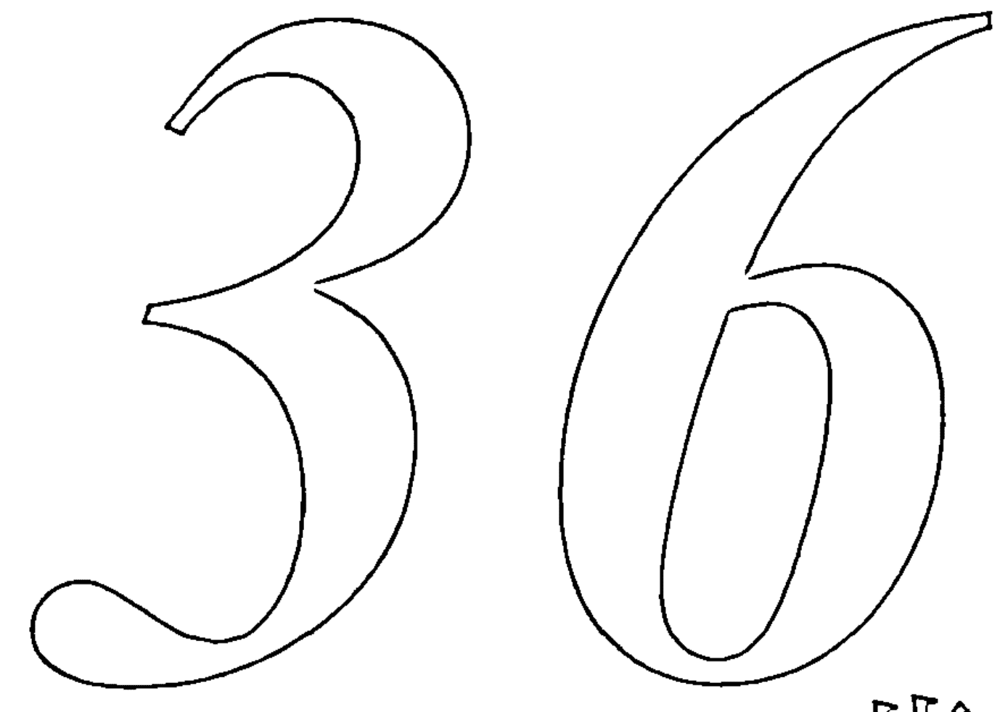

#### [整體運勢]

今年是充滿活潑朝氣的一年。對誕生數 1 的人而言，簡直就是天時地利加人和，所以，妳只須盡情地揮灑自己，勇於接受各種挑戰，屆時，妳的具體行動就會喚來所有潛藏在身邊的助力，讓妳如虎添翼！許多影響妳一生的重要人物都將在今年出現，這其中或許也包括妳未來的另一半。所以只要確定自己該走的路，不要迷惘、勇往直前，美好的未來就在不遠處等著妳了！

#### 未有男友的妳戀愛對策

超強戀愛運終於來了！今年妳將有機會認識很多人，不過先決條件是必須先踏出家門才行！當遇到了可能成為終身伴侶的對象時，最好在不露痕跡的情況下，清楚地向他表示未來自己對人生的規畫。比如問他：「未來要不要再繼續工作」、「自己打算拿什麼當終身興趣」等，像花朵在引誘蜜蜂似的，誘導他和妳一起編織未來生活的藍圖，同時也讓他知道在未來如何和妳互相扶持，繼續這樣發展，你們就有往結婚路上前進的希望。今年異性緣最佳的月份是 2 月、4 月、5 月及 11 月。

#### 已有男友的妳結婚對策

攜手走過前一年的大風大浪，今年的你們可望順利步上結婚禮堂。尤其是愈吵愈甜蜜的「歡喜冤家」們，你們早早著手準備結婚準沒錯！另外，今年剛和男友認識的人，也很有可能在今年內來個閃電結婚。至於最佳的結婚月份則是在 5 月，而且從訂婚到結婚最好不要相差到一年。當然啦！如果妳的他今年還不想結婚的話，留待明年也無妨，總而言之，這個男人，妳還可以等他三年，只是如果能在今年就完婚，那自然是最好。不過值得注意的是，他不結婚的理由絕對不能是為處理一些藕斷絲連的出軌感情；如果是，就千萬不要再容忍了。直接跟他攤牌，無論是要分手或是怎樣都直接告訴他，別再默默地等了！

#### [愛的地雷]

發生在 8 月的困擾，很有可能造成兩人的分手；而 2 月、4 月，以及 11 月易出現口角，要注意在氣頭上的用語！

## 誕生數 1

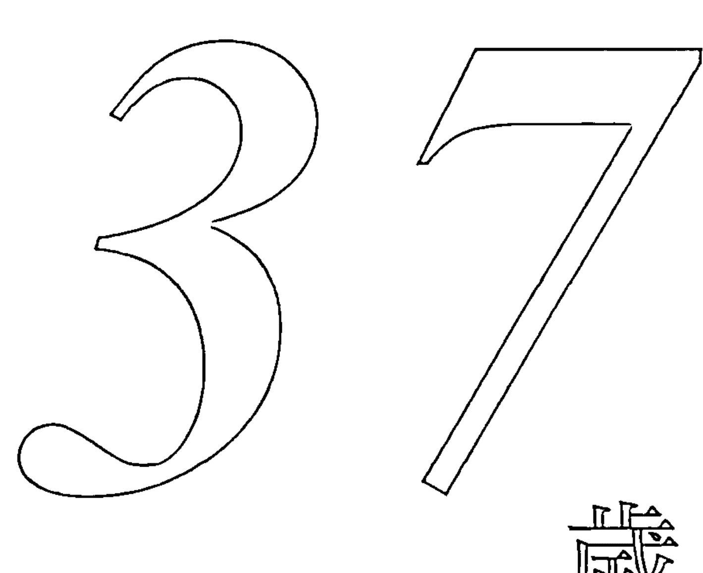

[整體運勢] 個性一向積極的妳，在今年會突然意識到歲月的飛快流逝，因而顯得極度不安，變得焦躁畏縮起來。到了這種年齡，有這種心情是自然的事，所以妳也毋需刻意壓抑它，倒是要找個排解的好方法，促使情緒回復平靜才是。可以的話，不妨多找些朋友聊聊，請朋友提供解決對策，或是介紹可以幫妳擺脫這種憂鬱想法的管道。

#### 未有男友的妳戀愛對策

戀愛運不錯，然而，遇到的卻都是和現階段的妳有相同煩惱的人，和這樣類似的人湊在一起，與其悶著頭一同自怨自艾，不如發揮互相扶持的精神，相互勉勵，除了能使心情轉好之外，更能使兩人的戀情發展更趨緊密、踏實。另外，今年所談的戀愛，最好僅限於精神上的契合與交流，而不要牽扯到金錢問題，否則，末了將有被錢牽著鼻子走的感覺，失去了自主性。不過，真正的真命天子恐怕要到明年才出現。今年的妳，異性緣最佳的月份是 1 月、4 月以及 9 月。

#### 已有男友的妳結婚對策

兩人的感情進入穩定狀態，這時，或許會很自然地走向同居關係。不管妳介不介意名份，如果情況允許，何不就乾脆直接完成終身大事，也好求個名正言順。就今年來說，最適合訂婚的月份是 9 月；結婚則是以 4 月為宜。另外，今年的妳，第六感特別靈驗，如果發現兩人最近的相處，多了一份不安定的感覺，而問題是在他身上時，不妨直接了當向他問個明白。倘若他怎樣也不肯說清楚，或許妳就該考慮一下這段感情的去留了。不過，一向不擅說分手的妳，最好今年暫時還是保持沈默，繼續觀察，到明年視狀況有無改善，再採取行動。

[愛的地雷] 3 月、7 月的不快，很有可能導致兩人的分手。只是，今年的情緒反反覆覆，現在做下的決定，後來很可能會後悔不已，所以勸妳的態度還是保留些。即使想狠狠和他吵上一架，表情、用語也不要太過火。

## 誕生數 1

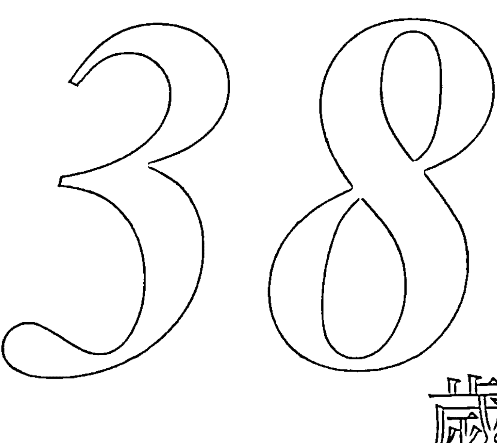

### 歲

[整體運勢] 和去年相比，今年的運勢有種雨過天晴的感覺，原本加諸在身上的束縛，也一下子「啪！」地解開了。今年的妳，相當適合從事創作性的工作，而創造出來的作品和妳未來的人脈、興趣以及事業發展，也都有極為密切的關係。不論有形或無形，今年的妳所下的功夫、所做的努力，都可望如願達成目標。而在這種勢如破竹的情勢下，今年的戀愛運，不用問也知道，自然是一片長紅囉！

#### 未有男友的妳戀愛對策

不論在工作場所或休閒場合，妳的一舉一動、一顰一笑都將受到眾多男人的注目，而這些男人注意到的不只是妳的外貌，也能深入地發現妳的內涵，如果成功，這必定是一段成熟的戀愛。在此天時地利人和之際，不妨先從自己的興趣著手，如喜歡藝術，可以參加朋友個人作品展或發表會。因為平時多所涉獵，自然能輕易地將妳這方面的氣質表現出來，意外地吸引也是同好的他。一個人閒來無事做趟海外旅行，也是不錯的方案。今年異性緣最好的月份是 2～3 月、9 月、11 月。

#### 已有男友的妳結婚對策

不論妳和他交往多久，今年的妳，會突然有股衝動想要結婚。其實，如果雙方認為時機成熟了，速速結婚也不是件壞事。不過要想清楚，妳之所以想嫁給他，是因為真的了解了他的為人、為他的特色所吸引？還是根本只是為對方突如其來的熱情所感動，也跟著瘋狂起來？如果是後者，勸妳千萬得三思而後行；因為熱情冷卻後，你倆的甜蜜關係很可能就不復已往，但又已有婚姻關係的束縛時，妳該如何自處？如果在 38 歲生日過後，妳發現兩人間的感覺似有冷淡下來的趨勢，建議妳不妨再觀察一年看看。如果明年情況有所改善，他應該就是妳生命中真正的白馬王子。今年最適合訂婚的月份為 1、10 月；結婚則以 3、12 月為宜。

[愛的地雷] 發生在 6 月左右的嚴重爭吵，很有可能成為未來兩人分手的導火線；至於連接在這條導火線下的炸彈，之後會不會爆炸，9 月時會見真章。另外，今年所做分手的決定，大抵之後都會帶來正面的運氣，所以，如發現對方真不適合妳時，不妨趁今年和他分手吧！

## 誕生數 1

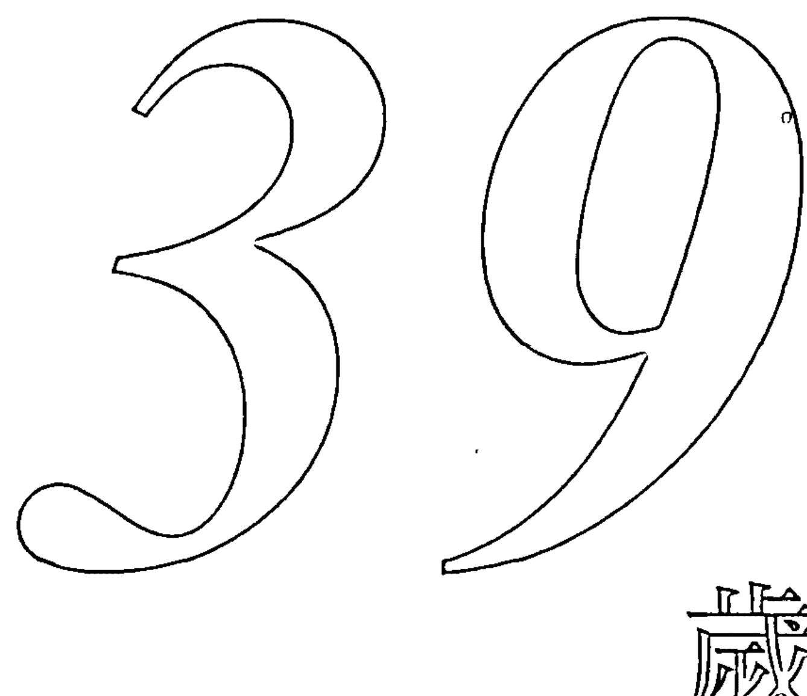

#### [整體運勢]

麻煩多多、阻礙重重的一年。今年的妳，做事常有被綁手綁腳、動輒得咎的感覺。不過，這種運勢帶給妳的也並非只有壞處，不幸遇見它，至少可以讓妳體驗到人生不如意的一面，學習如何看待、面對它，這也是人生中另一種獲得！至於麻煩事的種類可說是五花八門，大至家族、經濟、官司；小至朋友的請託、求助等，還真讓妳有一個頭兩個大的感覺，儘管辛苦，但，套一句老話：試著把「吃苦當做吃補」吧！

#### 未有男友的妳戀愛對策

適逢人生低潮時期，戀愛運自然也不會太好。眼看走到 3 字頭的最後一年，原想多留點時間給自己，偏偏天不從人願，周遭的人麻煩一堆，每個人都冀望妳的幫忙，搞得妳天天忙得暈頭轉向，根本沒時間談戀愛、認識朋友。所以，請朋友幫妳介紹吧！一來可免去花時間參加活動；二來經朋友先行過濾，也省得從零開始摸索。認識後如果覺得對方不錯，就積極表露出妳對他的好感，先從好朋友做起吧！今年異性緣較好的月份是 2、11 月；4 月及 9 月則是運氣較差的月份。

#### 已有男友的妳結婚對策

儘管兩人的感情已相當穩定，然而，今年的妳常會為他人雜事所擾，弄到最後連自己的約會都顧不得。這對你們而言，實在不是件好事。尤其當妳的他是個明理之人，總是默默地等待妳、甚至想為妳分憂，將這麼好的男人冷落一旁，一個人坐冷板凳絕不是件明智之舉，建議妳，不如儘早將婚事辦一辦，趕忙起草兩人結婚的計畫書準沒錯！至於若妳的他見妳忙，不會幫忙就算了，還總是在一旁嘮叨：「怎麼不多陪陪我！」、「人家好久都沒見到妳！」的人，可以看得出來他是個依賴心很重的人，將來若是和他結婚，妳最好要有準備做他媽媽的心理準備。今年最適合訂婚的月份是 9 月；結婚則是以 2 月、11 月為宜。

#### [愛的地雷]

5 月、9 月時若出現兩人價值觀或想法嚴重不同時，或許選擇分手會比較好！另外，注意昔日分手的男友有回頭糾纏的可能，最好斷然拒絕，免得他日再次受到傷害。

## 「速配！」診療室

～誕生數1的女性和各男士們的速配程度～

### 速配指數

♡能愛得長長久久 ○愛得短暫而熱烈 ☆適合結婚 ◇適合當好朋友 □適合當工作上的搭檔 ※只要努力，還是有希望速配成功 ✕不如不相識

### 誕生數1的男士

一見鍾情，相見恨晚 ◇□

由於誕生數同為1，在個性相當、興趣相同下，只要郎有情、妹有意，你倆很快就會一見鍾情並陷入熱戀中，就算稱不上是乾柴遇到烈火，至少彼此也是那種感情很好很好的「好朋友」。只是，個性一向熱得快、冷得也快的妳，遇到他也是這樣的人，於是你倆之後的感情發展，就有點像是在坐雲霄飛車，初期覺得彼此是那樣地情投意合、無話不談，等到新鮮期一過，兩人卻是連話都懶得講，變回比普通朋友更普通的「朋友」了。其實說來是滿可惜的一件事。當然啦，這也不是說誕生數同為1的男女就無緣發展成情人，只是說實在的，你們做朋友會比做夫妻要來得更適合些。而如果要結為夫妻的話，也最好其中一方的年紀比對方大4、5歲左右，同時相處時，也不要老愛說些自吹自擂的話，如此才有希望可以長長久久。

### 誕生數2的男士

妳領軍，他隨後，相互欣賞彼此的不同 ☆※

現實派的妳，夢想派的他，兩人對各種事物的想法及作法多有出入，因此誕生數1的女性，鮮有與誕生數2的男士成為情人的例子。不過，這倒也不意味著這兩個誕生數的人就一定是絕緣體。也許，正因為彼此有差異，給對方的感覺也就格外特別；而在這股「特別」氣氛的簇擁下，有時看著看著兩人不知不覺也就「來電」了。成為情人後的妳和他，要想兩人感情能長長久久，首先就是要學會包容，以欣賞的角度看待對方與自己不同的那一部分，然後，再各自扮演不同的角色。比如，妳比較有衝勁，需要打前鋒時就由妳帶頭，而他則在後頭跟進，如此相知相隨，也不失為一個不錯的組合。

### 誕生數3的男士

超級速配結婚對象

活潑的妳、開朗的他，湊在一起只有四個字可以形容，那就是「天造地設」。原因無它，只因為你倆對各種事物的想法及行事作為本來就十分相似，再加上誕生數3的男性對妳而言，有著能帶領妳更深入探索最新趨勢的能力，因此妳對他的才華經常是佩服得五體投地；而相對的，妳也是他在這方面分享心得、成果的知己。所以，不妨多和誕生數3的他一同擬定各種計畫吧！不管這計畫的內容是攸關旅遊、工作，還是自我充實，透過兩人一起商議、動腦的過程中，妳會發現無形中兩人更加理解對方了，而除了原有的愛意之外，兩人之間更多添了份尊重與感謝。這樣的一對，未來走向紅地毯那一端的機率自然很大；而即使做不成夫妻，當工作伙伴，兩人亦是「最佳拍檔」！

### 誕生數4的男士

只要條件合，做夫妻也無不可！

妳和他可以是好朋友，但做夫妻嘛…，老實說，總缺那麼一點火候。畢竟夫妻除了要聊得起來之外，還要有可以發動熱情的動力；偏偏你們倆人之間的「電力」就是不怎麼強。說沒電嘛，好像又有那麼一點，說有電嘛，偏偏又很難激出火花。不過，現實是你們，雖然知道彼此的情感還達不到做夫妻的程度，但當意識到和對方結婚其實也有某些「好處」—可以為自己省掉麻煩或解決某些問題，再加上並不介意共同生活的彼此一定要有所謂的熱情時，兩人也是有可能會走上紅地毯的那一端的。不過值得注意的是，他的個性屬於被動的類型，這點看在凡事主動的妳眼裡，自然是相當不順眼，所以要嫁給他，妳事先最好要有心理準備。要知道一個人的個性是由來已久，所以不要試圖改變他，不如換個角度來看，甚至試著去欣賞他的個性，才是婚姻長久之計。

### 誕生數 5 的男士

做他轟轟烈烈的情人

如果你想談場驚天地、泣鬼神的戀愛，找誕生數 5 的男士準沒錯！相較於與誕生數 4 男士相處時電力不足的問題，和誕生數 5 的男性初見面時，任誰都能感受到流通在你們之間的超強電流。在這股電流的衝擊下，你倆當下就會有即刻想將對方擁入懷中，甚至發生更進一步親密關係的衝動，特別是肉體上的接觸。在你倆心裡，那是兩人相處時莫大的歡愉。不過，也正因為愛得這樣激烈且快速，在缺乏真正心靈溝通的情況下，很快的彼此又會有玩膩了的感覺，乃至進一步想逃出對方手中，另覓自由，而這也就是你倆感情結束的時候了。所以，和誕生數 5 的男性的愛情往往是來得快去得也快，但在過程之中，妳卻能夠感受到前所未有的羅曼蒂克感覺。

### 誕生數 6 的男士

急性子遇到慢郎中

行動派、急性子的妳，最看不慣的就是像誕生數 6 男士的這種慢郎中了。當然啦！如果妳懂得以不同的角度去欣賞及包容他的話，急性子與慢郎中也不是沒有可能湊成一對。事實上，你倆的組合也不是全然地不速配。尤其在妳忙著為工作、人際關係衝鋒陷陣時，如果能有個性溫和、保守的他在背後給妳吃一顆定心丸，妳的每一次出發都將會更有力、漂亮；同樣的，妳的勇猛對他而言，又何嘗不是種學習，讓他更有決斷力、行動力，對他也未嘗不是件好事。所以，誕生數 1 的妳和誕生數 6 的男性就一定不合？也未必！尤其是，結婚後是否能成為恩愛的夫妻，就全就看你們怎樣看待彼此的個性了。

### 誕生數 7 的男士

讓妳恨得牙癢癢的！

任性嬌慣的妳，遇上固執不通情理的他，兩人會有什麼發展呢？當然是只有讓妳恨得牙癢癢、氣得直跺腳的份兒囉！所以一般來說，誕生數 1 的女性鮮少有和誕生數 7 的男性配成對的。除非！妳有些自虐狂，而他又頗有才氣，縱使妳氣得罵他、直跺腳，卻還是堅持往他的懷裏撲去時，這段戀情才有可能發生（而且，雖然嘴在罵、腳在跺，就是臉上始終洋溢著笑意）。所以，還是那一句話，對恨得牙癢癢的人也並不表示妳就不會想嫁給他。只是在結婚前妳必須有心理準備，那就是——或許妳這一罵就要罵一輩子了。不過，畢竟罵人罵一輩子也不會是件多愉快的事，因此，除非妳對他的才能真的佩服到即使隨時抱著一肚子怨氣也要守在他身旁，否則，勸妳還是適度和他保持距離，做做朋友就好！

### 誕生數 8 的男士

人生路上難得一見的最佳搭檔！

和他，與其說是情人，不如說是人生中難得的搭檔。同是現實主義者的你倆，就算是戀愛，彼此也都不會有太濃烈或為期太長的甜蜜感覺。但透過相互間的認識、了解，你們會找到一個共同的目標，或許是工作方面該怎麼突破？要賺多少錢？要開一間具有怎樣特色的店等等，爾後兩人就會為達到這個目標而相互扶持、努力。由於少了一份情侶間應有的甜蜜感，所以稱你們為「人生中有共同目標的最佳拍檔」再適合不過了。

### 誕生數 9 的男士

一場不甚愉快的戀曲

在一個偶然的機會裏遇見了他，妳深深為他的風采著迷，就這樣墜入了情網。但不知從何時起，妳感覺和他兩人漸行漸遠，終於分離……，這是妳和誕生數 9 的男士們最常演出的情節。其實，應該說兩人的個性相差太遠吧！他纖細的情感、穩重的外貌，有時不用妳多說，他都能讀得出妳在想些什麼，這種在他面前無所遁形的感覺，往往會招來妳極大的不安；而對於妳這種粗神經的人來說，因為看不穿他的心事、又不了解他的堅持及固執，有時會有嚴重的挫敗感產生。「既然這場戀愛談得這麼沈重，不如分手……」這是妳和他在一起末了最常有的感受。啊！真是一場不怎麼愉快的戀愛！

# 誕生數2 溫柔仙女

個性溫柔婉約、始終帶著甜甜的笑容

幸運寶石：月長石

**個性** 沈穩、溫柔、始終帶著甜甜的笑容，誕生數2的妳總是給人這樣的印象，但，真實的妳卻全然不是如此。固執、好惡分明，有時甚至還擺出冷漠臉孔示人。看起來文靜的妳，一旦和人熟稔起來，話會顯得特別多。感情豐富、擁有和他人完全不同獨到的品味及才能，也是誕生數2的人的大特色。

**戀愛傾向** 誕生數2的人談起戀愛來有兩種類型，一種是「盲目型」，一種是「夢幻型」。什麼是「盲目型」？就是對方說的話什麼都對、什麼都聽，感覺好像生來就是為了愛他而活似的。妳覺得只要他能愛妳，對妳好，就是妳今生今世最大的幸福。既使要妳赴湯蹈火，妳也在所不辭。至於另一種「夢幻型」的戀愛，則是當愛上一個男孩子時，妳會先設法旁敲側擊打聽對方的感覺。如果對方沒有意思，妳會安靜地乖乖走開；如果對方對妳也有意思，妳就會不顧一切地飛奔到他身邊，寸步不離地守著他；總之，就是凡事皆以男方的感覺為重。像這種小女人式的愛情當然也沒什麼不好，只不過要提醒妳的是，千萬別付出得太過分而失去自我。尤其有些男人會利用妳的這種特性，再充分先享受妳好處之後，立即奔向另一個女人的懷抱，這點千萬得小心！妳當然不必為了避免這樣的「悲劇」，而一輩子不去愛人，只是一定要先建立一個觀念：除了愛他之外，妳還必須擁有屬於妳自己的人生，譬如朋友、夢想、工作……。透過這些自我的擁有，妳才不會變成只是個賴著男人的橡皮糖，不僅如此，他們也會更愛獨立、又有自我的妳。

## 誕生數 2

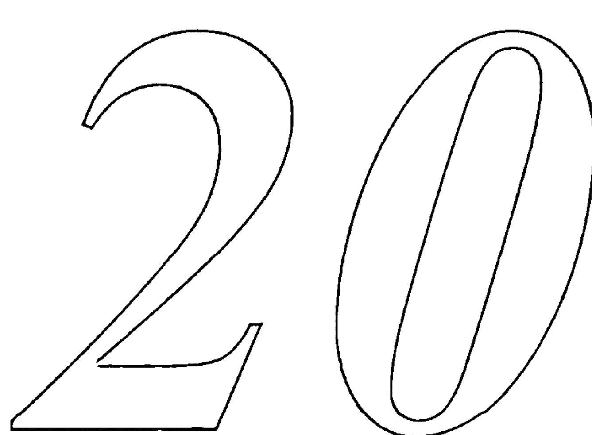

[整體運勢] 今年是妳為成為社會人之前架橋鋪路的好時機，妳也十分渴望能快點踏入這個充滿新鮮感的社會。趁著這段時間，凡事多聽聽前輩們的意見，可以的話，最好再多參加一些社團活動或打工，待明年，這些活動將會為妳帶來出乎意料之外的好運。至於戀愛運，原諒今年愛神還在評估之中，明年祂不會虧待妳的！再忍耐點兒吧！

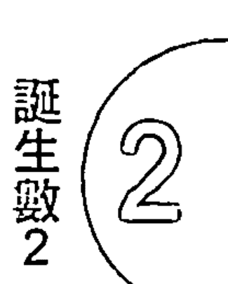

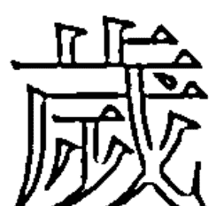

#### 未有男友的妳戀愛對策

今年的妳，或許會抱怨沒什麼機會遇見異性，也看不到有喜歡的人。別著急！雖說今年妳在這方面的運氣差了點兒，但誰說一定要認識新朋友才有機會？留意一下身邊的男孩們，尤其是青梅竹馬及班上同學，或許可以找到妳的白馬王子喲！除了友情轉為愛情的運勢大好外，透過朋友介紹也能認識一些不錯的異性。如果，還是找不到能勾起妳感覺的他，別發火！運氣是強求不來的，不如靜心等待，明年一定會更好！今年異性緣較佳的月份為 1 月、2 月、10 月至年底。

#### 已有男友的妳結婚對策

兩人的感情雖然十分穩定，但談結婚畢竟還是太早，所以，今年不妨先訂個婚，慢慢地規畫結婚的事情，一切等明年再說。今年最適合訂婚的月份是 9 月。而如果在今年，妳發現對男友的抱怨突然變多了，不管這些抱怨是「覺得他愈來愈冷漠」，或是「覺得他事事干涉，幾乎要讓妳喘不過氣來」，都須格外注意！因為就今年的運勢來說，這其中都暗示著該是調整人際關係的時候了。有可能這些抱怨是在提醒妳重新思考兩人契合的程度吧！如果發現不合，不妨先試著調整自己的想法及情緒，然後就靜待明年轉機的到來囉！

[愛的地雷] 發生在 5～6 月的激烈爭吵，暗示著兩人已經沒有在一起的必要了，何妨趁這機會彼此把分手的事講清楚。至於 10 月左右不安的情緒，則是極易成為之後兩人分手的導火線，要注意！

## 誕生數 2

[整體運勢] 今年一整年都是妳戀愛的季節，感覺上身邊好像無時無刻不存在足以令妳臉紅心跳的艷遇，而且對方通常都會很直接就向妳挑明想與妳進一步發生親密關係，這讓向來矜持的妳不由得慌了手腳，不知如何是好。不過，無論如何，今年密集又深刻的戀愛經驗，對妳是個人魅力的啟發及展露。所以除了不倫之戀碰不得外，其他飛來的艷遇，妳就不妨開胸懷，熱情地擁抱它吧！

#### 未有男友的妳戀愛對策

戀愛運一路長紅，只要妳走過的地方，都會招來愛慕的眼光。但個性矜持又有點彆扭的妳，不喜歡這種像哈巴狗似的男生，反倒是對又酷又冷的男孩充滿興趣。今年追求妳的人大都是看上妳可愛的外表，至於真正注重心靈相通的男孩子，今年還不太可能出現。既然如此，妳也不必那麼排斥注重外表的男孩，畢竟，喜歡可愛女孩是男人的天性，何不試著和他們做朋友，就當做是為將來選擇對象做準備，多了解男孩子們的心思吧！今年異性緣最好的月份是 1、7 月，9～11 月。

#### 已有男友的妳結婚對策

今年兩人的感情稍有波折。原本對他死心塌地的妳，今年卻對別的男孩微微地動了心。倒也不是說不再愛他了，只是當看到別的男孩時，有時心底會突如其來出現「其實有些男孩也不錯…」的聲音。不過要知道，如果當下的妳真的就這樣和他分了手，在今年內再談的戀愛也將是短暫有如曇花一現，所以，是不是就這樣拋下他奔向別人的懷抱？實在值得三思。而他如果在發現妳的心意有所動搖時，表現得像熱鍋上的螞蟻，就顯示他的確是個值得妳託付終身的男孩，而為了避免自己再三心二意，何不就乾脆跟他訂婚？以今年來說，最佳的訂婚月份是 8 月，至於結婚，則留待明年再舉行比較好。

[愛的地雷] 今年最適合和他說「莎喲娜啦」的季節是夏天；至於發生在 3 月、8 月，以及年底的爭執，不愉快的感覺可能將持續一段很長的時間，要注意！

## 誕生數 2

[整體運勢] 今年不論是戀愛、結婚或是家庭方面，都是妳 2 字頭人生中最順遂的一年。如果妳很期待自己早早就走入家庭，今年倒是個不錯的時機。異性緣特佳，尤其大妳三歲以上的男孩。他們之所以想和妳交往，是希望妳能答應他，成為他未來家中的女主人。至於在工作方面，今年的妳由於受制太多人情包袱，容易心生倦意。建議妳最好公私分明，也多為自己騰出一些時間，好好地輕鬆一下。

#### 未有男友的妳戀愛對策

今年是妳 2 字頭人生中紅鸞星動得最旺的一年，許多可能成為妳未來人生伴侶的異性們都將在今年出現。如果在 22 歲生日過後半年，仍未絲毫感受到紅鸞星有任何活動的跡象，建議妳最好拿一面鏡子照照，問題應該是出在「笑容」和「打扮」上。畢竟，臭著一張臉、一身歐巴桑的裝扮，就算有人說「情人眼裏出西施」，但要把妳看成是西施也是件難上加難的事呀！試著把自己打扮得更有女人味一點，妳將可以親身體會什麼是「萬人迷」的滋味喲！今年異性緣最佳的月份是 6～9 月。

#### 已有男友的妳結婚對策

已交往一年以上的情侶們，今年可以準備結婚了！當然，如果妳還不想這麼早就被「束縛」，想多些時間玩一玩，結婚的事就稍晚再說吧！不過最好先訂婚，兩年之後再結婚也無妨。至於才剛有男朋友的人，只要雙方認為彼此感情夠成熟，今年也可以來個閃電結婚！總之，時機到了何妨就敞開心胸結婚去，莫要拖呀拖地，到最後把緣份都給拖掉了，那就得不償失了！另外，由於今年可能會出現浪漫地讓妳無法招架的邂逅，有人甚至會不惜拋棄原來的男友，迎向新的戀情。這樣的選擇其實沒有所謂對和錯，能趁年輕時轟轟烈烈地愛它一場，也算是不枉青春了！就今年而言，最適合訂婚的月份是 7 月；結婚則是以 9 月為宜。

[愛的地雷] 發生在 3 月、12 月的困擾極有可能招來兩人的迅速分手，須注意！同時，今年也是考驗妳到底對他的愛有幾分、能做多少讓步的時候，多培養一下包容和原諒的心胸吧！

## 誕生數 2

### 歲

[整體運勢] 今年的運勢起伏不大，可說是很平穩的一年。不過，另一方面也許是因為太平穩了，在缺乏變化的情況下，當然發生怦然心動的戀情機會也少了。然而，誰說沒有男朋友就不能活得快快樂樂的？雖然沒有男朋友，但也還有家人、同性友人可以陪伴呀！今年是妳和他們建立深厚情誼的好時機，有空不妨多找他們聊聊天，抒解一下無聊的情緒，就是別一個人悶在家裡喲！

#### 未有男友的妳戀愛對策

今年比較沒什麼機會認識異性，不過一個人倒是可以自由自在，還能有更多時間去發展或學習自己希望接觸的領域。多去參加一些社團活動、學習特殊技能，或許能拿張執照，拓展未來生涯發展方向。但如果妳還是比較急於尋找白馬王子，建議妳可以多到圖書館、學校走走，或是參加一些研究會，透過興趣的培養或發展而認識的異性朋友。妳可以試著先以後輩請教前輩的姿態接近他，然後再找機會對他「放電」，比較容易「電」出愛苗。今年異性緣較好的時節是夏季。

#### 已有男友的妳結婚對策

「保持距離」是今年你倆戀情繼續持續下去的唯一方法。原因是，一直以來妳實在太黏他了，甚至經常會以他的夢想做為自己的夢想，以他的喜惡為自己的喜惡。固然，這是妳愛他的方式，但甜蜜之外卻也容易把他壓得喘不過氣來，所以，趁著今年，不妨改變一下對待他的方式，留給他和自己個人的空間。當然，一向黏他黏慣了的妳，一個人的時候難免會感覺有些孤獨寂寞，但是，這是妳學習自我成長的必經過程，千萬別再找另一個男孩子來陪妳。試著把這股熱情分給其他同性友人，或以工作讓自己忙一點，這種無聊的情緒自然就會消失，心情也會開朗多了。就今年而言，最適合訂婚的月份是 6 月。

[愛的地雷] 2 月、11 月時，妳嚴重的猜忌心可能成為日後兩人分手的導火線。妳的直覺或許真的很準，但千萬要記得，別把它誇大了！

## 誕生數 2

[整體運勢] 今年的妳，不論在職場或其他環境，總算能擺脫過去給人幼稚的印象，讓人把妳當做一個成熟的人看待。不過加諸在妳身上的工作及責任也會因此變得沈重起來。有時妳會有負荷不了的感覺，想辭去手邊的工作。此時不妨和上司表明自己的感覺，請他略做調整，這麼反應通常都會帶來令人滿意的結果。此外，它更可能是促使妳事業再創高峰的新契機，使妳財運情勢看漲。而透過工作，也很有機會遇見心儀的他。

#### 未有男友的妳戀愛對策

與其花時間參加一些私人的聚會，不如多出現在工作或社會活動等場合來得容易遇見不錯的對象；另外，公司舉辦的一些聯誼活動也是不錯的管道，有空儘量多參加。今年的妳，只管多多找機會露面，自然有人會主動對妳獻殷勤。而當參加活動時，有機會被人推舉為領導人物時，即使心裡沒幾分自信，建議妳最好還是義不容辭地接下來，透過周遭人烘托的力量，妳將可望成為眾多男孩心中閃亮的一顆星。今年異性緣最佳的季節是在春季以後到 7 月之間。

#### 已有男友的妳結婚對策

交往已有一年以上的情侶們，今年可以準備結婚了！而在向雙方父母稟報之後，也可望得到他們精神與金錢上的大力支持，所以在籌備的過程中，一般而言都會相當順利。既然如此，就別再等下去了，現在就行動吧！今年最適合訂婚的月份是 5 月，結婚則是以 7 月、9 月為宜。倘若兩人交往已逾一段時間，但他的態度卻始終曖昧不明時，就要重新審視與他的契合度了。如果兩人真的不適合，不如就趁著今年提出分手，未來也可望能找到更合適的對象。如果是因為經濟問題而不敢提結婚的人，最好直接把這困擾告訴父母或找朋友商量，相信在他們的協助下，這個問題應該可以迎刃而解。

[愛的地雷] 1 月、10 月時若對他的人格產生懷疑，建議妳最好痛下決心和他分手。至於 4 月、6 月時妳搖擺不定的態度，很有可能會種下日後與他分手的原因，須注意！

## 誕生數 2

[整體運勢] 今年的妳，運勢上有陷入谷底進退不得的感覺。原本計畫得好好或眼看著就要完成的事，會突然莫名地發生了一些麻煩。逢此時期，建議妳凡事最好採取保守姿態，不求新的挑戰，但求平安無事即可。事業上有不順心非要辭職時，不宜在此時找新的工作（兼差性質工作除外）；同樣的，愛情方面也是，除非新的情人妳認識已久，兩人感情是漸次由朋友轉為情侶的，否則，就算和舊情人分手，也不宜再找新男友。

#### 未有男友的妳戀愛對策

老實說，今年不是一個戀愛的好季節，遇到的對象不是超級花心，就是傲慢專橫，這種戀愛談了只會傷心。所以與其期待愛情，不如放自己一整年的戀愛假，好好享受親情或友情來得保險些。如果妳真的是沒有愛情就過不下去的人，在這裏提供妳一招開運法：「打掃」。不只要把住家房間清掃過一遍，辦公室的桌面、抽屜等也不能放過；一些麻煩的人際關係或過去擺不平的事，也最好將它斬草除根。待妳清理完畢，還自己一個清爽的空間時，或許妳的他就會出現在身旁了。

#### 已有男友的妳結婚對策

如果妳和他已交往兩年以上，且截至去年尚未論及婚嫁者，今年可能就要小心感情將會有波折的發生了。基本上，今年潛藏著分手的機運，所以倘若妳對他某些方面的表現一直心存芥蒂，在妳過完今年生日後，他仍無改善之意時，建議妳不如就考慮分手，靜待明年新的緣分的到來；至於在今年過完生日後才認識新男友的人，希望妳也不要那麼快就談結婚的事，至少等到明年再說。因為今年實在是不宜有新戀情。搞不好眼前剛認識的這個男人，在不久之後就要惹妳傷心也說不定，千萬要小心！

[愛的地雷] 發生在 8～10 月的爭執，暗示著分手對兩人都好。至於 3～5 月時，若發現自己對他的感覺有所浮動、改變時，最好就和他保持距離吧！

## 誕生數 2

[整體運勢] 揚眉吐氣的時刻終於來了！度過了沈悶的去年，今年的妳，可以試著迎向每一個新的考驗和嘗試各種變化，甚至換新工作、新朋友、搬家等等，都能從其中獲得無比的好運。運勢這麼旺，可以想見在戀愛方面當然也是順心如意囉！所以，趕快著手今年三百六十五天的各項計畫吧！在今年它們可是十之八九都能實現喲！

#### 未有男友的妳戀愛對策

和去年相比，今年戀愛運奇佳，簡直到了讓妳夢裡也微笑的地步！其實不論是男是女，今年新認識的朋友中，有好幾個人會在妳未來的人生中扮演著重要的角色。尤其是一些異性朋友，他們會助妳實現未來的夢想，更能提供妳精神上或是經濟上的支持。當然這其中也可能包括妳未來的老公！不過基於現實的考量，建議妳在對象的選擇上最好還是以長妳幾歲的男士為最佳。今年的妳，異性緣最好的月份是2月、5月、9月、11月。

#### 已有男友的妳結婚對策

走過前年的陰霾，今年仍相知相守的你們，兩人感情更加穩定，可以著手準備結婚了！而有心採取閃電結婚的情人們，今年也是個不錯的時機，加上今年憑感覺所選擇的對象也不錯，所以，就放心結婚去吧！整體而言，今年最適合訂婚的月份是3月、12月，至於結婚則以5月為宜。由於今年的妳鴻運當頭，照理說應該是沒什麼分手的危機，但如果覺得和他感情上真的不太順遂，不妨先審視看看兩人個性是否相合。如果不合，還是那句老話—趁早分手吧！如果不是個性不合的原因，那可就要反省一下自己是否有任性、占有慾太強等毛病。

[愛的地雷] 8～9月時，即使他真的有錯，勸妳也不要太責難他；當然，如果妳早已受不了他，有意和他分手，自是另當別論，那就罵個高興吧！

## 誕生數 2

### 歲

[整體運勢] 今年是妳 2 字頭人生中，心情最好、生活過得最愜意的一年，戀愛方面也十分順遂。逢此幸運年歲，妳可以試著多找一些機會和想法、價值觀與妳相契合的人交往，並多接觸一些具美感、感性的事物。善用妳清澈、靈敏的直覺積極從事創作，今年將會有意外豐碩的成果。

#### 未有男友的妳戀愛對策

今年的妳，可望和原先僅是普通朋友的他進一步交往，進而相知成為一對戀人。此外，意外飛來的豔遇也不少，而且這類型的豔遇通常在初見面時雙方都沒有什麼特別的感覺，直到有一天猛然回頭時，才發現自己已經愛上了他。值得注意的是如果妳的對象是個個性較懦弱的人，妳扮演的將永遠是幫他解決問題、聽他發牢騷的角色，而他卻只會製造問題、說些無聊的傻話。奉勸妳，這種對象最好還是與他保持距離的好。今年異性緣最佳的月份為 1 月、4 月左右。

#### 已有男友的妳結婚對策

今年是妳和他兩人心靈最接近的時刻，在此時談論婚嫁，是再適合不過了。不過，生性浪漫慣了的妳可要先有心理準備，結婚不是只有浪漫的婚禮而已，接下來的還有柴米油鹽等現實問題，一定要先在心中訂出一個「符合現實」的美滿家庭應有的作法和決定才行！今年訂婚以 2 月、11 月最為合適，最適合結婚的月份則是 4 月。如果今年他還無意結婚，或兩人心態尚未完全安定時，結婚的事就不妨再延個兩年看看，29 歲也是個不錯的時機。然而，如果過了 27 歲生日後，妳和他之間的感情出現了些許變化，且在這變化下，兩人的感情產生前所未有的陰鬱感及危機時，就要特別注意！不過，到底結果會如何？明年答案才會出現。

[愛的地雷] 7 月時的爭吵極有可能導致分手，建議妳在言詞上最好先想清楚再說。至於他的移情別戀，與其追根究底，不如先問問自己究竟還想不想再繼續這段感情，等釐清後再做決定。

## 誕生數 2

[整體運勢] 今年的妳，在情緒上顯得有些慌張、不安定，原因是接觸的人在今年增加不少，工作也日漸忙碌起來。而這樣的現象其實是運勢上揚時必有的情況，只不過妳還不太能習慣，反而有種不安定、忙亂的感覺。一般說來，今年的妳「動」者為吉，所以如果想讓運氣更好一點，不妨換個工作環境、搬家，甚至做趟旅行都好。尤其是度假，運氣好一點的話，說不定還能在那兒遇見白馬王子喲！

#### 未有男友的妳戀愛對策

今年戀愛運不錯！但過了今年，恐怕就有得等了！千萬要把握住 2 字頭的最後機會。下班後不妨邀同事多到熱鬧的地方逛逛，有聯誼活動也儘可能參加；連續假期時，更要多安排休閒活動，可別偷懶在家睡大覺！活動一多，陌生男子搭訕的機會自然也多。如果妳是抱著玩玩的心態，多認識一個人也無妨，否則不要理會比較好。因為今年若發生這類的戀情，兩人交往的時間基本上是不會太長的，如果不想玩，又何必浪費時間？今年異性緣最好的月份為 3、9 月，以及年底。

#### 已有男友的妳結婚對策

今年誕生數 2 的人，特別有結婚的心情；只要妳不反對，即使和他才認識一個星期，要結婚也無妨。當然啦！也有人覺得這樣結婚似乎太快，所以索性選擇同居。不過要提醒妳的是，儘管同居生活與結婚並未有太大的不同，但就長遠來看，同居在未來很有可能使兩人的感情陷入瓶頸，這點千萬要注意！所以說，如果真想生活在一起，最好的方式還是結婚。今年最適合訂婚的月份是 1 月、10 月；結婚則以 3 月、年底為宜。而交往已有一段時間的情侶們，在今年突然會產生分手的念頭，不過，若真的感覺兩人已不再相愛，分手也許對雙方都好。以今年的運勢來看，分手後不出多久，就會有更好的男孩出現。

[愛的地雷] 特別要注意發生在 6 月時的困擾。而在 2 月、9 月、11 月時，妳容易有出軌的衝動，如果無心要和他分手，千萬要小心避免這樣的情事發生！

## 誕生數 2

[整體運勢] 今年運勢平平，雖然偶爾還是會被工作或一些瑣碎的雜事追著跑，但整體而言尚稱安定，不失為一個稍事喘息的好時機。趁著今年，妳可以好好思索一下有關貯蓄的問題；至於戀愛方面，除了相親外，大概要等明年運氣好轉之後才會有好機會。不過對已經有對象的人來說，今年倒很適合訂婚或結婚。

#### 未有男友的妳戀愛對策

今年的運勢和前年的「盛況」相比，今年妳恐怕只有「孤單」的份兒了。在這種低潮期，不妨大聲向親朋好友說出妳想交男朋友的渴望，自然會有人當月下老人幫妳介紹，也許也會意外地遇見不錯的男生！不過要提醒妳的是，對於戀愛或是結婚妳經常還停留夢幻中，這是件很糟糕的事。除了自己要有所改變外，在選擇對象時，最好要選一個感性和理性能夠兼具的男孩，才不致讓這場戀愛談得太虛幻，永遠走不到現實的世界。今年異性緣較佳的月份為 2、11 月。

#### 已有男友的妳結婚對策

交往已逾一年的情侶，今年該是準備結婚的時候了；而如果妳和他在一起已超過兩年，那就更應該趕緊結婚，因為，錯過了今年，明年兩人的關係恐怕就要陷入低潮了。所以，如果妳有意結婚，何妨大方一點，不必等他開口，先行表明自己的意願，在達成共識後，兩人再齊力著手準備婚禮。除了你們小倆口有意結為連理外，相信妳的父母也會很樂見這樁婚姻，並會傾全力幫助你們的！今年最適合訂婚的月份是 9 月，結婚則以 2 月、年底為宜。然而，如果妳想結婚，但他卻一點也不想，建議妳最好回頭審視一下兩人的個性是否適合。一旦發現不合，不如就快刀斬亂麻，等待明年更好的機會出現吧！

[愛的地雷] 發生在 5 月時的困擾暗示著兩人可能走上分手之途。尤其當這個問題在過去已一再重複發生過時，建議妳還是別猶豫，和他分手吧！

## 誕生數 2

[整體運勢] 30 歲的妳變得更有魅力了！強大的電流吸引了身邊無數的男子，不管是真心想跟妳談戀愛或是受妳魅力蠱惑想一親芳澤的，都會在此時出現。面對眾多追求者，妳或許會說：「不是真心的男人，我不要！」。其實也不必那麼嚴肅，畢竟，一個女人一生有幾次這種機會？就睜一隻眼閉一隻眼，趁著此時享受異性呵護的感覺吧！更何況，今日只想和妳玩玩的他，隨著交往時間的漸長，說不定竟不知不覺地愛上了妳呢！

#### 未有男友的妳戀愛對策

今年戀愛運旺得不得了，不用主動，就會有一大票條件不錯的男孩子自己送上門來。在此鴻運當頭的時刻，如果 30 歲生日過後半年仍未嗅到這股氣氛，可能是因為妳古板的想法行為。建議妳不妨換個工作環境、搬家，甚至去留學、旅行，總之設法改變現有的環境，會有莫大的幫助。如果妳談戀愛是以結婚為前提，不妨在交往之初就明白向對方表示，否則，戀愛運太旺的妳就有得苦惱了！異性緣最佳的月份為 9～11 月。

#### 已有男友的妳結婚對策

今年你倆的戀情恐怕藏有些許的危機！說穿了就是妳太紅了，被眾多男人追到妳不得不動心，差一點出軌，當然這對你們原本穩定的感情來說，是一大的危機。所以，如果妳真的很愛他，但卻又不善於拒絕別人，勸妳不如乾脆早早和他訂婚，省得夜長夢多！就今年而言，最適合訂婚的月份是 8 月，而因為 31 歲是妳 3 字頭人生中家庭運最旺的一年，所以婚禮明年再舉行較為恰當。另外，有閃電結婚念頭的情侶可要注意了！今年的妳並不適合結婚，一旦結了，未來可能會落得離婚的下場，所以，還是多忍耐吧！

[愛的地雷] 發生在 4～5 月的爭吵極有可能成為分手的導火線，不過，如果這場爭吵是怎樣也無法避免的，那不如就聽從命運的安排吧！畢竟，就運勢來說，今年分手後，後勢轉好的居多。

## 誕生數 2

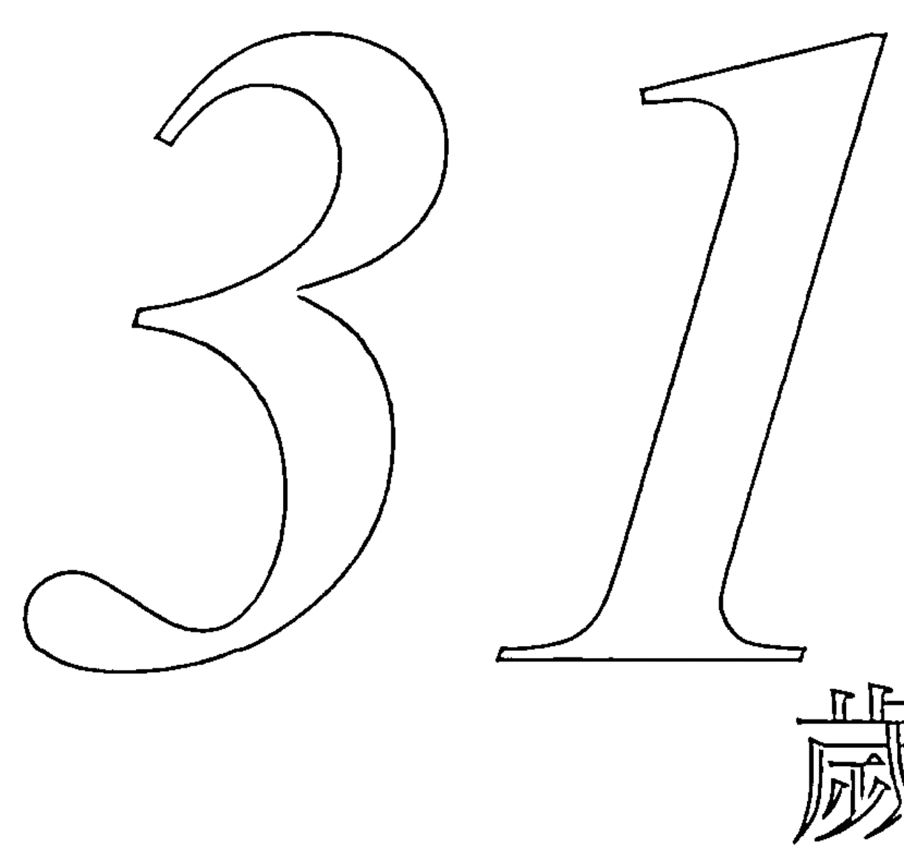

### 歲

[整體運勢] 今年是妳 3 字頭人生中最適合結婚成家的一年，不只是本身異性緣出奇的好，就算躲在家裏，也會有一大票親友上門要幫妳介紹男朋友，所以戀愛方面的事，妳就不用煩心了。倒是家庭、親戚之間會有些問題困擾妳。譬如，該不該繼承家業、發生在家族間的紛紛到底要幫誰、該不該幫忙等。不論妳最後的決定是什麼，建議妳都應該勇敢去面對，而不要逃避。

#### 未有男友的妳戀愛對策

今年，妳會很明顯地發現身旁出現一個又一個很不錯的異性。儘管選擇性不少，但提醒妳最好要秉持下面的原則：不要選氣焰太強勢的，要能溫柔體貼，體諒妳感覺的人。個性向來優柔的妳，或許會較憧憬積極型的男性，但是太強勢的男人步調和妳差太多，並不適合。此外，妳直腸子的個性也需要一個體貼的男性來包容。如果在 31 歲生日過後半年，還沒有出現這類對象時，不妨再注意妳身邊最常接觸的幾個異性，相信會找到的！今年異性緣最佳的月份為 6 月、8 月、9 月及 10 月。

#### 已有男友的妳結婚對策

已交往了一段時間的你們，今年該是準備結婚，共組一個充滿愛的家庭的時候了！最適合訂婚的月份是 7～8 月；結婚則是以 9 月為宜。至於才剛認識的情侶們，如果妳已有「非君莫嫁」的心情時，不妨老實告訴他，若他也有同感，那速速結婚也沒什麼不可以。當然啦！也不是每一位誕生數 2 的人在今年都能這麼順利和另一半結婚，也許妳正陷入「食之無味，棄之可惜」的掙扎，那麼，何妨就讓問題放著吧！拖到明年生日前，這段感情自然就會因為愈來愈淡、愈來愈薄而化為烏有。沒有爭吵，只有留下過去甜蜜時的美好回憶，這不也挺好？

[愛的地雷] 發生在 3 月、12 月的大麻煩可說是種下了日後兩人分手的關鍵禍因，如果對這段情妳還有所留戀，那就試試看自己到底還能忍受他到哪個限度囉！

## 誕生數 2

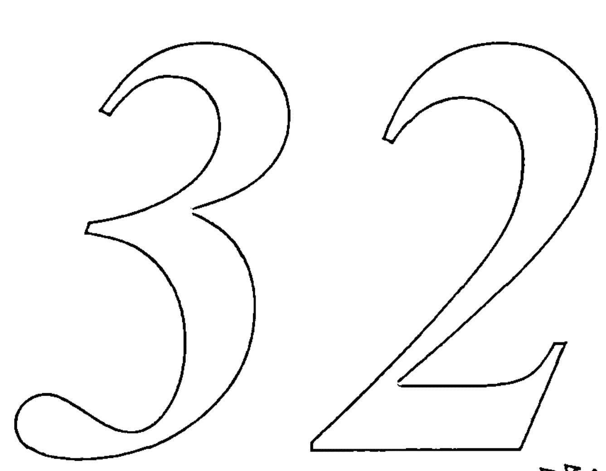

### 歲

[整體運勢] 褪下去年燦爛的光環，今年的妳，回到過去靜謐的日子。雖然在異性緣上不若去年般光彩，但又何妨把它視為是休生養息的一年？更何況，這世上也不只有愛情才重要，友情、親情等妳也該有所兼顧。趁著今年，好好享受友情、親情的溫暖，並規畫一下往後的人生，並好好地充實自己，尤其是有心在事業上有所發展的人，經過這一番沈澱，必定能有更上一層樓的表現。

#### 未有男友的妳戀愛對策

遇見新戀情的機會不大，尤其是在 32 歲生日過後，和異性間的交遊很明顯地會從炫爛轉為平凡。既然運勢如此，反正急也急不來，不如多花些心思投入工作或興趣，才不會因過分期待，以致愛情落空時自怨自艾。雖然遇見白馬王子的機會不大，不過當試著往興趣等方向發展時，可能會發現事實上還是有些零星機會的！遇到心儀的對象時，先不要一個勁兒地急著表態而把對方嚇跑，可以試著從做個興趣相投的朋友開始，甚至利用網路交換意見也行，總之，這一切都還得慢慢來！

#### 已有男友的妳結婚對策

今年很適合訂婚。如果你倆的感情日趨穩定，而且在未來也有共組家庭的打算，何妨就趁著今年先拜訪彼此的父母並將親事談妥，明年再結婚；甚至如果他急的話，今年結婚也無不可。最適合訂婚的月份是 5 月；結婚則以 8～9 月為宜。如果過了 32 歲生日以後，妳有一種和他的距離愈來愈遠、強烈的孤獨感產生時，不妨先反省一下自己，是否是妳太依賴他了？不體諒他工作上的忙碌，反要他時時守護在妳身旁，稍不從願，便認定他不夠關心妳。當然，也沒人教妳一定得忍耐，如果妳真的受不了他沒空陪妳，顯示你倆也不合適在一起，那就乾脆讓這段情漸漸淡了算了。靜待明年新戀情的到來吧！

[愛的地雷] 2 月、11 月時要小心言談，一些不該講的話，儘管是在氣頭上，還是不要亂講的好，省得招來不可收拾的後果。另外，4 月有心浮氣躁的傾向，可別沒事就對他亂發脾氣。

## 誕生數 2

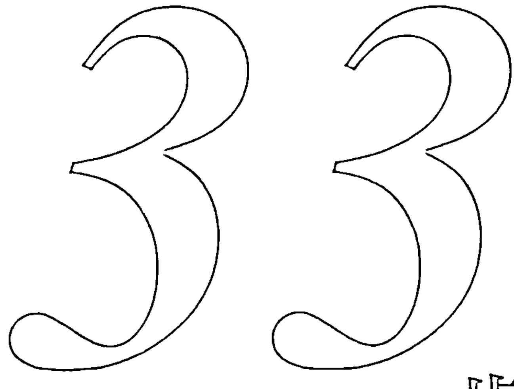

### 歲

[整體運勢] 今年的妳，在工作上的表現將大受身邊的人所肯定，物質方面頗能得到滿足，財運、賭運皆看好。有心戀愛的人，不妨趁著工作運正興旺的此刻，多參加些工作或社會方面的活動，透過其中活躍的表現，要想不得到異性的注意和欣賞恐怕也難。總之，只要踏出家門，不管工作、錢財或是愛情機會多多，所以沒事不要待在家裏！

#### 未有男友的妳戀愛對策

今年的生活型態，簡單說來就是一個字—「忙」。不過愈忙戀愛運就愈好，隨著活動範圍不斷擴大的同時，妳將有更多的機會接觸異性。當然啦，也有人是忙歸忙，接觸的人還是不出那幾個，這時，妳不妨大方一點，將妳的願望告訴周遭的親朋好友，請他們代為尋覓。透過這種方式，多半都能找到不錯的異性朋友。一旦同時有數個異性朋友追求時，建議妳最好挑個外表及內在皆和妳相似的人做進一步交往，相信會較合適。今年異性緣最佳的月份為 7～8 月。

#### 已有男友的妳結婚對策

如果雙方都有想結婚的念頭，那就著手準備婚禮吧！因為明年就運勢上來講並不太適合結婚，所以，如果有意願和對方共度一生，不如今年就趕快把婚事辦一辦。今年最適合訂婚的月份是 7 月；結婚則以 8 月為宜。此外，今年的運勢也隱藏著會將過去的關係做個總結，所以，如果在今年，尤其是在初春與年末時對他的感覺日漸不好，而這種感覺又是由來已久的話，建議妳還是分手的好。否則，就算勉強結了婚，過不了幾年，兩人還是會走上離婚之途的。

[愛的地雷] 發生在 1～2 月、9～10 月中無形中倦怠感，代表兩人的感情已走到末路，不如痛下決心分手，等待後年愛神的再訪。

## 誕生數 2

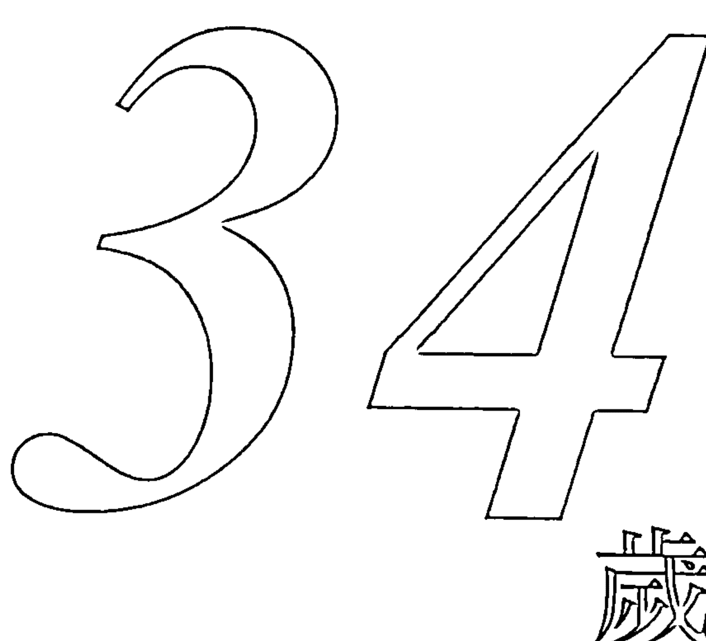

#### [整體運勢]

今年的妳，將面臨 3 字頭人生中最大的衝擊及考驗！這其中或許是經歷了和至親的別離，或許是工作上的失策、失敗，甚至是遭人陷害、背叛等，運勢上屬於多事之秋，一路走來可千萬要小心。既然有些事是命中註定，怎麼躲也躲不過，不如就看開一些。事情發生了，雖免不了會難過，但千萬不要被它所擊敗，擦乾眼淚後就快快往前走吧！帶著一顆寬大的心忘記一切，這才是最好的處理方法。

#### 未有男友的妳戀愛對策

多災多難的一年，戀愛運自然也好不到哪兒去。與其想過浪漫的愛情生活，不如明哲保身，但求平安度過就好，省得沒嘗到甜蜜，倒惹來一身的傷。尤其在今年所認識的男孩不乏有感情騙子，所以在選擇時千萬得注意，不要和有求於妳的男性走得太近；更不要接受沒有必要的金錢或精神方面的援助。就算讓他誤認為妳是冷漠無情的人也沒關係，至少可以保護自己免於受到一些傷害。此外，喜歡買些昂貴物品來討妳歡心的男孩也不要交，頂多當個普通朋友就好了。

#### 已有男友的妳結婚對策

如果今年妳才和剛他認識，無論目前妳對他的感覺有多好，要訂婚、結婚還是等到兩人交往滿一年後再說吧!至於已經交往一年以上的人，勸妳最好也等明年再談結婚的事，因為今年的運勢橫豎就是看不到什麼好日子。既然沒好日子，又何必堅持結婚，待明年運勢好轉，喜洋洋地接受眾人祝福不是更好嗎？在這麼「背」的時刻，兩人感情上最有可能發生的便是第三者的介入。如果今年真不幸讓妳遇上了，先別亂了陣腳，靜下心來想一想，他究竟是不是妳的最愛。倘若是，就給他一次機會，試著原諒他，順便也重新審視兩人之間感情的堅定程度。

#### [愛的地雷]

9～10 月是你倆感情最最危險的時候，不論發生什麼事，建議妳不要只是一味地忍讓或沈默，說出自己的感覺吧！兩人把話攤開說個清楚，才是最佳的解決之道。

## 誕生數 2

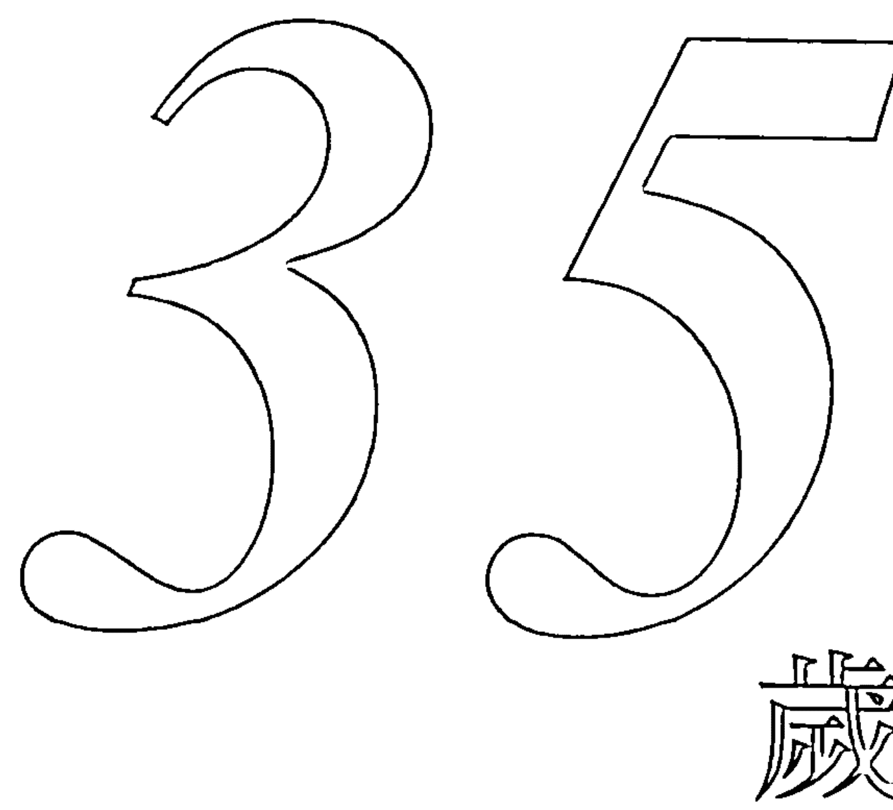

[整體運勢] 好不容易度過去
年的灰暗期，今
年的運勢總算是撥雲見日。不管過去的
遭遇有多麼悲慘，何妨將它拋到腦後，
挺起胸膛迎接這光明一年的到來。今年
的妳，最忌諱再犯優柔寡斷的毛病，一
旦決定了什麼事情，只管向前衝就是，
末了妳將會發現，今年的決定和衝勁會
為妳帶來人生的另一個高峰。尤其是精
神方面，試著擺脫過去依賴不成熟的心
理，讓自己在今年真正蛻變成一個成熟
的女人。

#### 未有男友的妳戀愛對策

今年妳交的朋友，不問男女，都有可能出現能引導及帶領妳在思考上、生活方式上更趨成熟的人。而如果對方是個男生的話，更有可能成為妳未來的人生伴侶。想要提高遇見這類朋友的機會，建議妳不妨先從身旁的好友著手，多去參加好友舉辦的活動，從活動中認識新朋友，爾後再多聯絡，參加新朋友的活動，如此一來，不用多久，妳的交遊圈便能輕易地擴大為原來的數倍。此外，做趟長期旅行、留學等等，也是不錯的方法。戀愛運最佳的月份是 5～6 月。

#### 已有男友的妳結婚對策

雖然和他才剛認識，兩人感情發展的速度卻相當快，和他在一起，妳會有種安定的感覺，所以婚嫁似乎是預期中的事情了。至於和他交往一年以上的人，走過前年風風雨雨的考驗，今年你們在感情上將更加堅定，步上結婚禮堂也是極其自然的發展。以今年來說，最適合訂婚的月份是 3～4 月、年底，結婚則以 5 月舉行最好。相對的，如果妳和他的冷戰從去年就延燒到今年，甚至目前兩人有漸行漸遠的趨勢，那就不必勉強挽回，把不愉快的事統統忘掉，等待新戀情的到來吧！

[愛的地雷] 發生在 8 月的爭執可說是種下了日後兩人分手的關鍵禍因。
如果 2 月、11 月時有「不可以繼續再和這種人交往」的想法
時，不如就瀟灑和他說「拜拜！」，這將是一個正確的抉擇。

## 誕生數 2

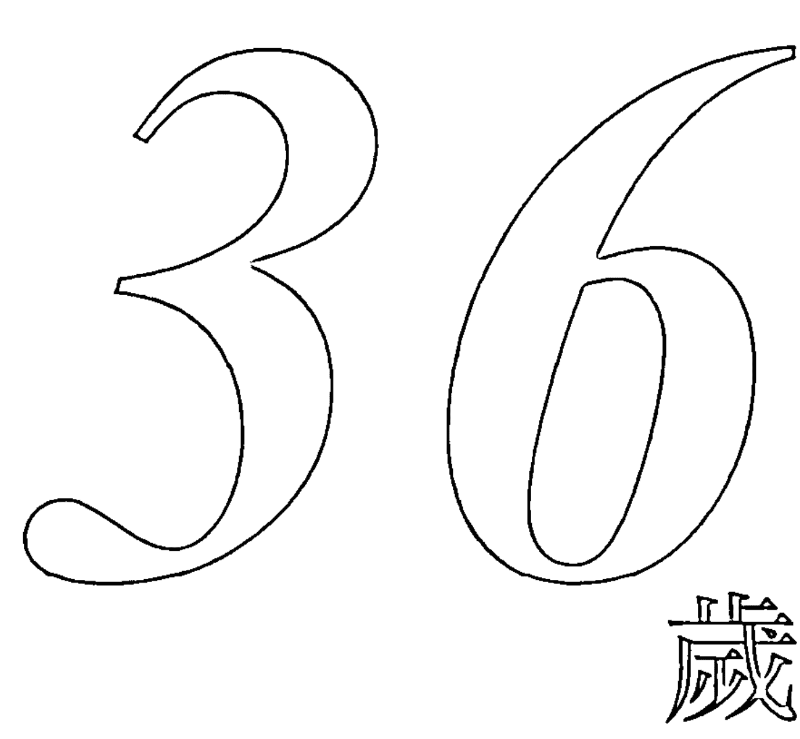

### 歲

[整體運勢] 風平浪靜的一年。今年，由於工作及生活方面都相當安定，妳大可放手盡情做妳自己。只是，人際關係上的小齟齬偶爾會令妳有些心煩。不過，也正因為和許多人的距離變近了，新戀情出線的機會增加不少。9 月時的妳，會變得稍稍有些神經質，不妨多到溫泉、海邊、游泳池等休閒地區玩玩，抒解一下情緒。

#### 未有男友的妳戀愛對策

雖然和他做朋友已有一段時間，但兩人始終沒有談過什麼深入的話題。無意中和他深談後，他竟愛上了妳！這樣的戀愛在今年會特別容易降臨在妳身上，所以，如果有機會，千萬別放棄和普通異性朋友深入交談的機會。今年透過朋友介紹，發生一見鍾情的機會也不小，然而，今年遇到的男性經濟能力方面不是太好，所以如果要求婚後物質生活要過得好一點，不妨再等等，明年遇到的男性或許較能滿足妳這方面的需求。戀愛運最佳的月份 4 月、9～10 月。

#### 已有男友的妳結婚對策

今年，妳和他的感情穩定，彼此也更加信賴，與其只是同居，不如乾脆結婚，它會是最佳的選擇。最適合訂婚的月份是 2 月、11 月，結婚則是以 4～5 月為宜。反之，如果今年妳覺得和他在一起的感覺大不如前，則意味著兩人之間的相處在未來恐怕要多災多難了。建議妳不妨先試著站在對方的立場去理解他、體諒他，如果真做不到，或許就代表兩人真的不適合在一起，那也只有考慮分手了！

[愛的地雷] 發生在 7～8 月的連續爭吵將會是兩人分手的導火線，如果不想和他分手，最好學著控制自己的情緒，別太感情用事！

## 誕生數 2

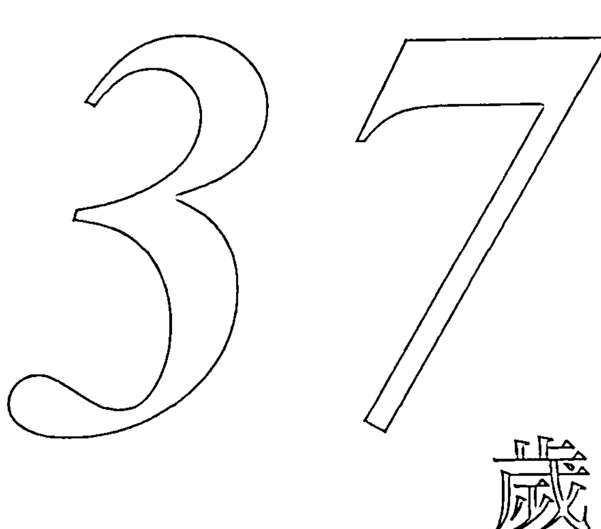

[整體運勢] 今年的妳，由於在工作上大有斬獲，受到上司極大的重用，因此生活步調上會顯得異常地忙碌和緊張。儘管有事可忙、受人器重是件好事，但另一方面可千萬要注意自己的身體。常言道：「留著青山在，不怕沒柴燒」，慶幸自己有此運勢的同時，也別讓負擔超出自己的能力範圍。有心轉換工作跑道的人，可在6月、9月時換工作。這是「一靜不如一動」的一年，變動將為妳帶來一連串的好運。

#### 未有男友的妳戀愛對策

戀愛運紅得發紫的一年。連去度假、出遊，也能感受到來自異性仰慕的眼光，不過，嚴格說來這些男人對妳多也只抱著好奇的心情，如何能讓他們對妳動真情呢？建議妳不妨刁刁他們，對他們的追求暫且先不做任何的回應，但同時不斷利用談話、見面的機會展現自己知性、洗練、美麗的一面，這麼一來，要他們不愛上妳也難了。有空別忘了多充實興趣或專長，搬家、旅行、留學在今年也挺適合，它們會為妳帶來意想不到的好運！異性緣最佳的月份為2～3月及年底。

#### 已有男友的妳結婚對策

今年的妳，特別有閃電結婚的衝動，雖然知道兩人認識的時間並不長，也擔心過「這樣做會不會太快？」，但是，奔放的熱情卻不允許妳再做考慮，今年的妳只想趕快嫁給他。起初，多少會遭到周圍人的反對，但在看到你們彼此的真心後，這樁婚事也可望受到眾人的祝福。老實說，今年的妳也真的很適合結婚，所以，凡有此衝動者何妨大膽一些，既然感覺對了，那就結婚吧！今年最適合訂婚的月份是1月、10月，結婚則以3月、12月為最佳。反之，如果妳和他交往已有一年以上，而在今年妳對他的感覺有所變化時，建議妳千萬別勉強結婚，再等一段時間，或許會有更好的男孩出現。

[愛的地雷] 如果在6月時有分手的想法，建議妳別再猶豫，分手將會是較好的選擇。另外，倘若在8～9月時感覺有些迷惘，勸妳先別那麼快下結論，觀察一下再說。

## 誕生數 2

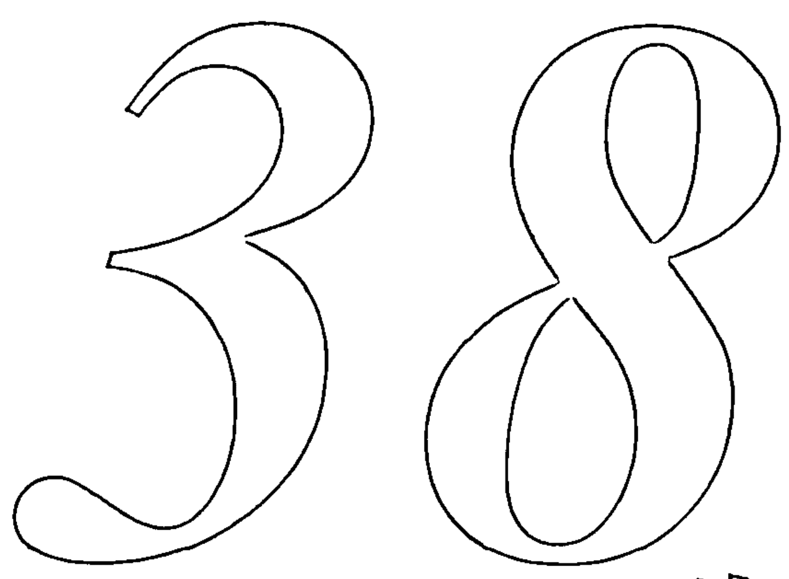

### 歲

[整體運勢] 運氣平平，內心卻充滿溫暖、踏實的一年。尤其是去年經歷過工作繁忙、搬家等環境轉換的人，在今年一切抵定後，妳將更有時間去注意周遭人給妳的溫暖、對妳的好，既使表面上今年的成就並不如去年般輝煌，但內心感受卻是倍加豐富。閒暇時，建議妳不妨多往興趣方面發展。另外，面對家人的請求援助，雖然會覺得有些煩，但也不要忘了自己應盡的一份力量。

#### 未有男友的妳戀愛對策

眼看著 3 字頭的人生只剩兩年，妳的心裡難免有些著急，不過今年妳的戀愛運並不怎麼好，不如靜待明年。如果妳真的不想等，那只有主動出擊了。相親運的話還可以，尤其是年紀較長的人所介紹的對象。同時有多位人選時，「人格健全」是最最重要的了，如果不確定他是個怎樣的人，不妨和他吃頓飯、看場電影，大概就會有個譜了。今年雖然還無緣結婚，不過審慎篩選後所交往的男性，未來可望成為可靠的另一半。異性緣最佳的月份為 2～3 月、9 月、11 月至年底。

#### 已有男友的妳結婚對策

今年是兩人感情的安定期，訂婚、結婚都可以開始進行了。不如現在就展開行動告知雙方的父母，並加強兩家之間的溝通與連繫，也能得到長輩們的支持及援助。今年最適合訂婚的月份是 9 月，結婚則以 2 月、11 月及 12 月為宜。倘若，今年兩人的感情有不穩的現象發生時，不管婚事進行到哪個階段，最好都暫停，先行解決眼前的齟齬，等雙方互相取得諒解並合好如初後，再繼續婚事。否則，在未來這個疙瘩將會造成妳精神上莫大的負擔。

[愛的地雷] 5 月時感情若有大問題發生，不要粉飾太平、坐視不顧，一定要設法理出頭緒、找出結論才行。提醒妳，這個問題或許和他曾經出軌有關。

## 誕生數 2

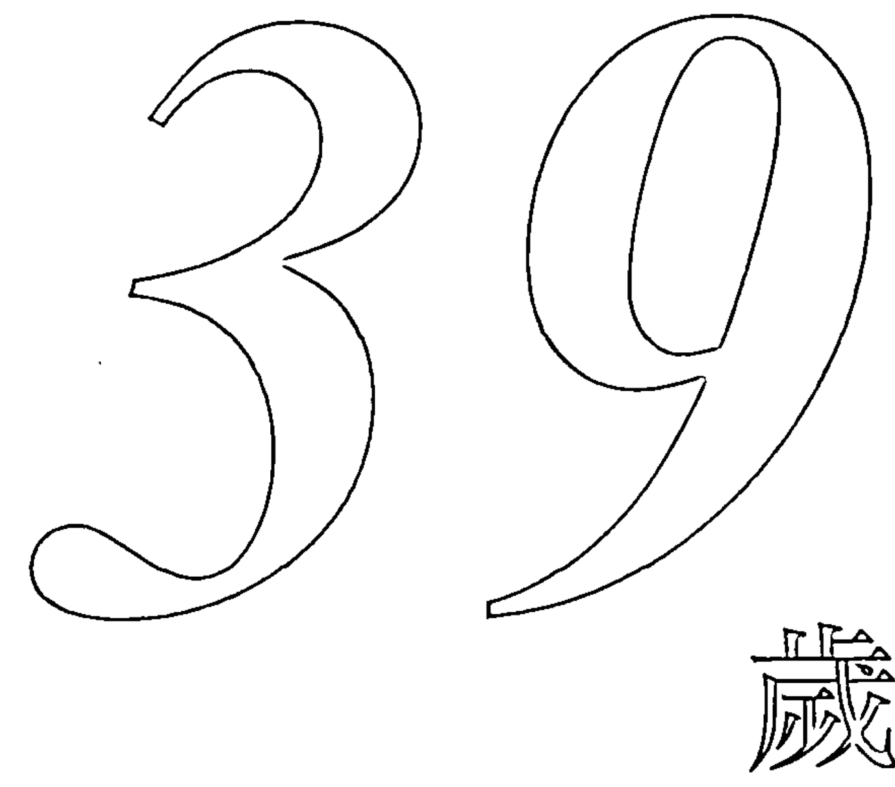

[整體運勢] 今年是充滿轉機的一年，妳往後的人生會因此有一百八十度的大改變。面對這天大機會的降臨，或許一開始妳會有些擔心，周圍也會有零星的反對聲音，不過，建議妳毋需顧慮太多，只管把握住最後一次機會，孤注一擲。要知道，一個人要從原來的世界邁步跨到另一個世界，本來就必然要承受許多壓力，不趁這 3 字頭的最後一年，試它一試！況且，伴隨著這一連串改變的同時也會招來一段熱情的相遇。

#### 未有男友的妳戀愛對策

妳就不要再猶豫了！就算愛情來到妳家門口，也要妳有所行動才行！「行動」和妳的戀愛運有著極為密切的關係。要是能做趟長期旅行、到海外留學、派遣出國，自是最佳的招來愛情的方法；倘若環境不允許，那就搬個家、換個工作，甚至做些小小的改變，都能使自己認識異性的機會大增。如果感覺情況好像沒有多大的轉變，那就要檢討一下自己的裝扮了。改變一下化妝、穿著，讓自己更添女人味，愛神是沒有理由不眷顧妳的！今年異性緣最佳的月份為 9～11 月。

#### 已有男友的妳結婚對策

交往時間在一年以上的情人們要小心了，雖然和男友之間沒什麼大問題，但另外一個男子的出現，卻令妳有些春心盪漾。在明知道妳已有男友的情況下，如果這名男子對妳還是採取激進方式，甚至展開更強烈的愛情攻勢時，勸妳千萬要小心了，這個人恐怕不是什麼好人，再和他接觸下去，只怕在和他上了床之後，妳便要面臨被拋棄的命運了。至於才剛認識的情侶，今年兩人閃電結婚的機率很大，建議妳最好以個性忠厚沈穩、不偏激的男性為理想對象的第一考量。就今年而言，最適合訂婚的月份是 8 月；結婚則是以 2 月、11 月至年底為佳。

[愛的地雷] 發生在 4 月的困擾是兩人分手的前兆，如果事情真的無法改善或解決，那就跟他分了吧！明年戀愛運、結婚運都不錯，妳就靜待另一段全新美好戀情的開始吧！

## 「速配！」診療室

～誕生數2的女性和各男士們的速配程度～

速配指數

♡能愛得長長久久 ○愛得短暫而熱烈 ☆適合結婚 ◇適合當好朋友 □適合當工作上的搭檔 ※只要努力，還是有希望速配成功 ×不如不相識

### 誕生數1的男士

妳忙他也忙，正好湊成一對夫妻？ ◇※

老實說，你倆的個性南轅北轍，妳浪漫、他現實，要墜入情網還真是難上加難。尤其當你們兩個都是個大忙人時，要湊在一起更是不太可能。不過，事情總是有例外的時候，如果妳是個不喜歡做決定、很喜歡依賴別人的人，妳就會發現誕生數1的男人相當符合妳這方面的渴望；而表面堅強的他，其實是很怕寂寞的人，如果妳能適時填補他寂寞的心靈，在一旁撒撒嬌、逗他開心的話，兩人配在一起倒也還不錯。其實，從前的大家庭最常出現類似這樣的組合。一大堆人住在一起，每天各忙各的，忙到沒什麼時間去管對方時，自然也就相安無事了。

### 誕生數2的男士

當兩人相遇時，這世界彷彿只剩下我倆 ◇※

妳和他都屬於較封閉、被動的個性，兩個相同個性的人湊在一起，表面上看來似乎滿配的，實際上卻很難成為情侶。不為什麼，只因為彼此都習慣等人來愛，寧可默默地等對方自動上門，於是時機就這樣被等掉了。而且，縱使兩人談成了戀愛，變成一對，也將會是一個奇怪的組合。因為兩人這下子就更有理由封閉在自我的天地裏，成天你儂我儂，不見任何朋友、不參加任何活動，完全斷絕了人際關係，這顯然不是件好事。因此建議妳，如果要和這樣的他在一起，別忘了仍要對外保持聯繫；唯有不斷接受外來的刺激，你倆的感情才能繼續走下去。另外，他優柔寡斷的個性和妳相比也是有過之而無不及，這點是妳該有的心理準備。別奢望改變他，那是絕對絕對不可能的事情！可以的話，當然還是建議妳另覓一個較有決斷力的男孩子，畢竟誕生數2的男孩子，真的真的不太適合妳！

### 誕生數3的男士

跟著他的腳步走！

妳和他在一起，只有四個字可以形容，那就是「天作之合」。誠然，初相識時，他的呱噪會讓妳覺得有些受不了，甚至覺得「非我族類」，但是，在試著跟隨他那帶點瘋狂的腳步走時，妳會發現，在他的感染下，妳變得很容易快樂；而他廣泛的興趣、充滿活力的行動力，更能帶給妳無限的驚奇與開闊的視野；漸漸地，妳發現自己已經瘋狂地愛上他了！當然，這樣的他也會被妳豐富的情感、充滿女性特有的氣質所吸引，妳倆何妨就順著感覺走，在他的帶領下，你們的愛可望長長久久。只是，要提醒妳的是，他雖然喜歡帶著妳到處走走看看，卻不表示他喜歡妳成天和他膩在一起，凡事都只依賴他，在某一個程度內，妳最好還是要尊重彼此的個人空間，這樣兩人的感情會更好！

### 誕生數4的男士

沈靜深邃，無邊無際的愛

雖然「一見鍾情」不太可能發生在你們身上，但老實說，個性相仿的你們湊在一起還真速配。從表面上看來，妳和他都是屬於較沈默、被動的人，但實際上，妳倆的沈默、被動在本質上又有些不同。妳天生就是習慣以這樣的態度處事；而他，卻是因為小心翼翼、步步為營，才有這樣的表現。從這點我們可以發現，誕生數4的男性是屬於較沈穩、內斂的性格，和這樣的人在一起，就安全感來講可能是一百分，不過說到浪漫恐怕就難看了，同時，他還可能像個頑固的老頭子，把妳當成女兒般管教。所以，要嫁給這種人，妳要有一個觀念，那就是「平凡就是福」。如果不求浪漫講實際的話，他會是一個好老公的。

### 誕生數 5 的男士

如閃電、煙火般的愛

妳和他當情人可以，做夫妻恐怕就沒什麼希望。因為你們的愛就像閃電或煙火一樣，剎那間的確很亮、很美，但一轉眼就消失得無影無蹤了。最大的原因，還是在他的身上。一般說來，誕生數 5 的男士多有花心傾向，他們大都喜歡活潑、開放、熱情如火的女孩，哪會找上保守文靜又溫柔的妳呢？要知道，就像是一個人喜歡吃肉，但肉吃多了也是會膩的，所以偶爾吃些青菜一樣。妳對他來說，就像是調劑品，也許最初是他先來招惹妳的，但等到妳愛上他時，他又會像一陣風似的，飛入別的女人的懷抱，留下無限愁悵的妳。所以，除非妳也只是想和他玩玩，過過浪漫戀情的癮，且在他揮揮手離去時，妳也能瀟灑釋懷，否則，對於誕生數 5 的男子，勸妳還是離他遠一點！

### 誕生數 6 的男士

個性契合的最佳拍檔

你倆個性契合的程度，簡直可以用 100 % 形容，讓每個人都羨慕得無以復加！個性相投固然是你倆恩愛的主要原因，但除此之外，妳和他也都是懂愛、能珍惜愛和享受愛的人。在兩人齊力固守之下，愛苗的生長特別快速且日漸茁壯，甚至連圍繞在你們周遭的人也能感受到這股濃濃的愛意。所以，最最恩愛的組合就是你們。唯一要注意的是，誕生數 6 的他偶爾也會消極、出現像孩子耍賴般的任性行為，這時妳就要用同理心和耐心去理解他、守候他，待雨過天青後，你倆的感情又能甜蜜如初了。

### 誕生數 7 的男士

從友誼出發的沈默戀情！

由於妳和他都不是行動積極的人，所以戀情發展的速度也是超級緩慢，甚至經常得藉由某些機緣讓你們天天見面，你們才會對彼此有那麼一點點來電的感覺。不過，正所謂「慢工出細活」，相愛後的妳和他，往往會被對方的才華或知識強烈吸引，深深地愛上對方，就感情的基礎而言可謂相當穩定。只是這種組合有個最大的弱點，那就是——兩人很容易為環境的壓力擊倒，它也許是來自父母方面的反對或經濟上的問題等。倘若兩人都能抱著有堅定的信心，合力對抗外來的壓力那也就罷了，偏偏兩人在個性上都是屬於溫吞型，所以很自然地就會屈服於現實了。因此，儘管你倆個性相合，但最後能在一起的卻不多見。

### 誕生數 8 的男士

不如不相識

老實說，當初要不是他對妳死纏爛打，而妳那天也不知哪根筋不對，居然點頭接受了他的追求，妳倆是怎麼也不會湊在一起的！當然啦！在當他女朋友的初期，還是會有一段好日子可過的，例如他會把妳當寶貝一樣呵護，經濟能力許可的話，他甚至還會提供妳金錢方面的需求。但是，這樣的狀況卻無法持久，原因是他根本就是個五分鐘熱度的人，而且最差勁的是他會有「魚兒上鉤了，就不必再餌」的想法。這看在感性的妳的眼裡，哪受得了！與其委屈自己去適應他，不如及早和他攤牌吧！要不要在一起？還能不能在一起？當面把話說清楚。當然，上上之策還是走人了事，畢竟你倆真的是不適合。

### 誕生數 9 的男士

心心相印的一對

你倆超級速配，簡直到了無可形容的地步，而且是打從一開始，就對對方產生了很好的印象。不過，因為他是個小心翼翼，習慣觀察後再行動的男人，因此並不會馬上向妳表明心意。這點，妳可要多多體諒，多給他一點時間去確定自己的心意，他自然就會選擇一個最佳的時機向妳表白了！而就算妳和他是同事關係，在工作時是很好的搭檔，能激盪出很多很棒的點子，也不要認為尊重對方就是故意壓抑自己的想法或嫉妒心，因為這種長期累積下來的念頭，會造成你倆的感情上莫大的傷害！而當有結婚的念頭時，也不妨直接告訴他，千萬不要一個人藏在心底喔！

## 誕生數 3 浪漫主義者

天真無邪、活潑可愛
幸運寶石：黃玉

**個性** 天真開朗、活潑可愛，是誕生數3的妳給人的一貫印象，成天嘰嘰喳喳地，十分有活力。由於誕生數3的人天生創造力就很強，因此從事創作或演藝工作的人不少。唯一美中不足的是：太輕率了，偶爾會因個人情緒突然將工作丟給別人或推卸責任，給周遭的人增添了許多困擾。

**戀愛傾向** 誕生數3的妳談起戀愛來簡單說一句，就是「盲目」！一旦愛上了對方，就馬上變成一個瞎子，什麼也看不見，眼底心底只有「他真好」、「他真帥」之類的念頭。儘管人家說：「情人眼裡出西施」，但妳迷戀的程度也太…太誇張了吧！不但看不見對方的缺點，還把對方的缺點看成優點（這也是誕生數3的妳戀愛的一大特色！），這似乎就有些「被虐待狂」的傾向了。不僅如此，他出言不遜、傲慢難當，妳也願意死守在他身旁，甚至他提出分手，妳還是會說：「雖然他不要我了，但我還是好愛他……」，然後一個人浸淫在過去甜蜜的戀情回憶裡，怎麼也不肯醒來，真是教人傷腦筋的個性呀！誠然，愛情對一個女人來說是很重要的，但迷戀到不能認清真相卻是愚昧的做法。建議妳要學著看清對方的優缺點，不適合自己的男孩就勇敢地和他說再見吧，不要再繼續戀棧。而像妳這麼浪漫天真的人，最好要找個有沈穩性格、較現實、外加懂得應對進退的男生，在兩相互補下，你們的愛情才能長長久久。

## 誕生數 3

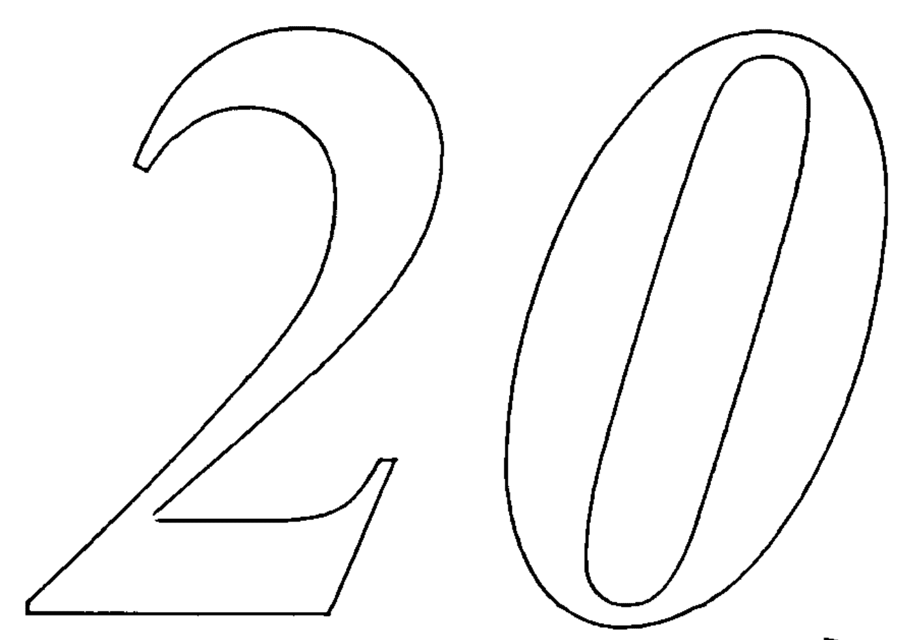

[整體運勢] 正值雙十年華的妳，眼前最想做的事就是談一場轟轟烈烈的戀愛，而妳活潑可愛的模樣也確實吸引了不少男生。既然如此，何不就放手愛它一場呢！藉由戀愛去了解一下男人也是好的。今年的妳，或許還有想離開父母，嘗試一個人獨立生活的衝動，這點倒不妨試試。因為就今年的運勢來看，妳正值鴻運當頭，多方接受挑戰，將可望得到不少收穫。

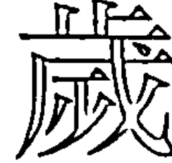

#### 未有男友的妳戀愛對策

戀愛運奇佳的一年！不管走到哪裡，妳總是那個霸佔所有男孩視線的人，加上原本就活潑開朗的個性，要交男朋友不是件難事。當男朋友出現後，天真浪漫的妳可能會不顧一切與他同居，編織起共組家庭的美夢來，這在今年可能不是件好事。因為從跡象研判，今年所談的戀愛，未來要持久恐怕有些困難，既然還年輕，何不多認識一些異性朋友，擴大自身的視野。另外，千萬要注意，今年有受已婚男人誘騙而陷入不倫之戀的危險！異性緣最佳的月份為 1 月、7～9 月、10 月。

#### 已有男友的妳結婚對策

交往好一段時間的你們，在今年感情預料會有一番波折。至於原因不外是妳異性緣太好了，在禁不住別的男孩追求下，終於犯下出軌的行為，而且兩人的關係不止於精神上，還包括肉體。儘管這種發展並非妳所想要的，但他顯然不會諒解妳，所以，如果妳真視他為將來結婚的對象，建議妳在與其他男孩相處時要保持適當距離才不致有憾事發生。至於和他才剛戀愛不久的人，今年則很有可能會接到他的求婚。有情人終成眷屬固然是件好事，不過，妳今年才 20，而他也大不了多少，遲一點再論婚嫁或許會較好。不過，一般說來今年最適合訂婚的月份是 8 月，結婚則以 1、10 月為宜。

[愛的地雷] 如果在 3～4 月及年底時，兩人發生激烈爭吵，就暗示著兩人有分手的可能，不妨審視一下彼此個性是否適合，如不合，何不瀟灑地和他說「拜拜！」，靜待新戀情的到來。

## 誕生數 3

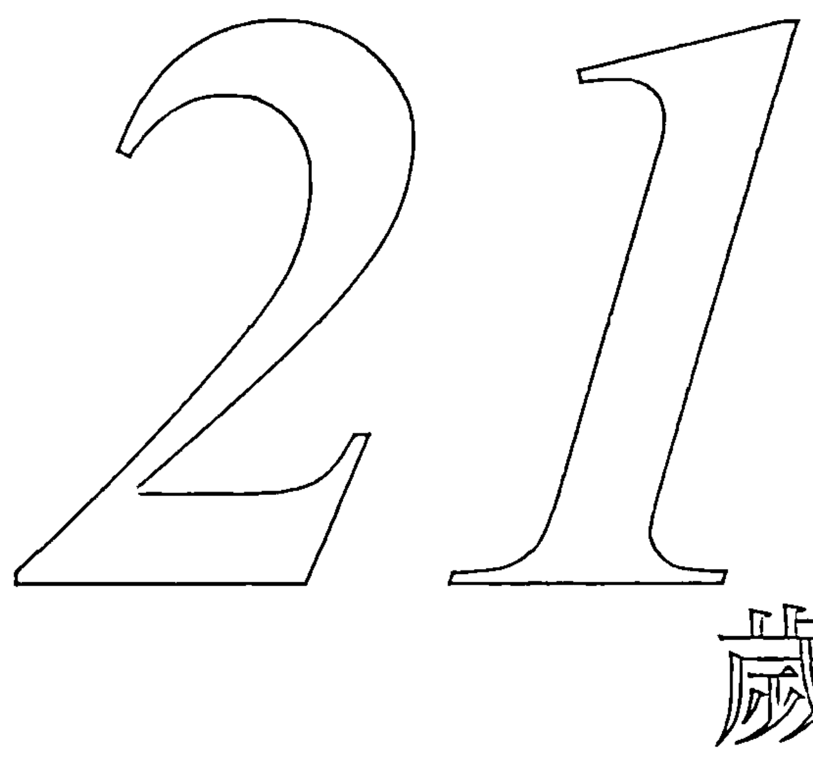

[整體運勢] 結婚運開高走高的一年！如果你的個性較為早熟，今年很有可能就會走入家庭。未有男友的人，在今年也有機會遇到令妳心動的對象，即使這段戀情沒有結果，它也足以讓妳刻骨銘心一輩子。總觀來看，今年的戀愛運不錯，只可惜雙方家長的反對會使戀情未能有好的結果。建議妳當有這種情形發生時，與其站出來頑強地和抵抗，不如誠心誠意設法與他們溝通，最後或許能得到他們的認同。

#### 未有男友的妳戀愛對策

今年的妳，可望擁有羅曼蒂克的愛情。為了能保有這一段難能可貴的戀情，建議妳對周遭尤其是不倫的追求，要採取斷然拒絕的態度，這樣一來，你們或許能直奔結婚禮堂也說不定！另外，今年的妳很有可能會意外懷孕，如果兩人還沒有共識要有孩子，最好事先做好避孕措施。在 21 歲生日過後半年，如果尚未感受到愛神對妳的特別眷顧，建議妳擴大自己平日的活動範圍，把外表妝扮得亮麗一點，並適時展露妳可愛的一面，相信今年夏天的舞台絕對是屬於妳一個人的！

#### 已有男友的妳結婚對策

去年開始交往的你們，在今年可以準備結婚了。特別是如果他大妳三歲以上，大概也是時候了。今年結合的婚姻，大體說來都有不錯的結果。然而，如果妳十分想結婚，而他卻還沒有強烈的意願，建議妳也不要太過勉強，可以和他協議，不妨今年先訂婚，兩年之後再談結婚的事。就今年來說，最適合訂婚的月份是 7 月，結婚則以 9 月為宜。雖說今年是誕生數 3 的人結婚運最旺的時候，不可避免的也是有人在這時會和已交往一段時間的他分手。如果這個人正好是妳，奉勸妳也毋需太傷心，這次的離別或許是妳空前甚至絕後的痛苦經驗，但它勢必也會為妳帶來成長的，建議妳還是用正面的態度看待這段戀情吧！

[愛的地雷] 3 月、12 月的意見相左，可能是兩人分手的前兆，解決方法不妨就交給時間吧！唯一要提醒妳的是，在衝突中毋需太過委屈自己的感覺，更不用一味地將對方的行為合理化。

## 誕生數 3

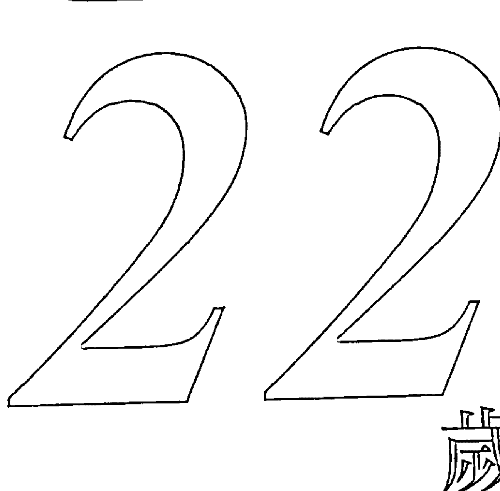

[整體運勢] 今年的妳，心情似乎不是那麼開朗，當然這和剛結束學生生活，踏入一個陌生的社會環境有關。回想過去學生時代的無憂無慮、單純、不受拘束，妳不由得懷念起來，同時更對眼前重禮儀、講規矩的社會化生活感到排斥與彆扭。只是，這種改變也是妳不得不面對和接受的事實，奉勸妳還是忍耐為重，習慣之後就會好多了。今年的戀愛運不如前兩年來得順利，不過已有男友的人，戀情發展倒是進入了穩定期。

#### 未有男友的妳戀愛對策

今年的戀愛運，老實說不怎麼樣，所幸個性開朗、積極的妳也不那麼在意。那麼就把今年當做是「戀愛休息年」吧！成天被異性追的滋味固然好，但跑久了也挺累人的，連個人的時間都沒有。趁著今年好好休息一番，做自己想做的事情、學習自己想再充實的技能。而忙著、做著，待妳到了忘我的境界時，說不定突然會有個男人出現在妳面前，而且還可能是讓妳相當敬重的人！（不過切記！如果對方是已婚身分的人，千萬不要理！）今年異性緣較佳的月份為 8～9 月。

#### 已有男友的妳結婚對策

今年，妳和他的感情將漸漸進入穩定期，不同於過去那種成天膩在一起的渴望，今年你們重視的是彼此精神方面的契合。不過，從盲目的愛慾中清醒後，由於過於理智，此時妳看到的也許全是對方的缺點。也因為如此，最後或許會選擇與他分手一途。如果真不適合，兩人分手也不失為一件好事，但怕的就是這只是妳一時的情緒。因此奉勸妳當發現他的缺點時，不要忘了想想他的優點，捫心自問這個缺點是否真的讓妳難以忍受，是不是沒有轉寰的餘地？再決定是否分手比較好。不管心裡有什麼感覺，何妨直接告訴他，和他溝通，同時也別忘了多多體會他的心情。大體說來，今年很適合訂婚，尤其是在 6～7 月。

[愛的地雷] 2～3 月、11 月至年底是兩人最有可能分手的時候，即使發生爭執也最好多注意措詞，不要讓一句無心的話傷害了彼此的感情。

## 誕生數 3

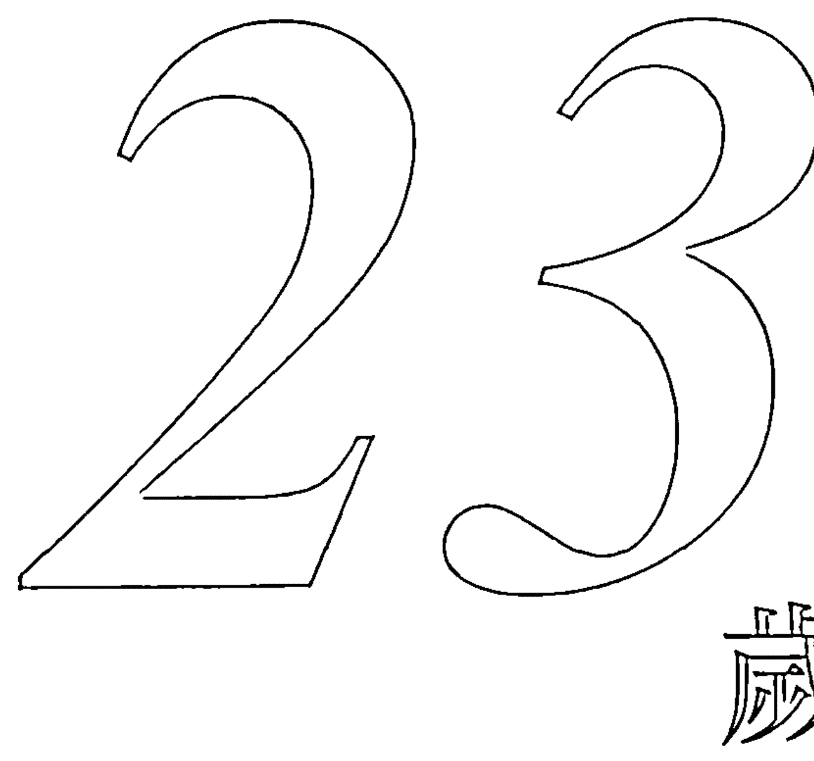

#### [整體運勢]

今年是妳 2 字頭的人生中，事業運、財運最旺的一年。之前剛出校門的不適應感，已在磨鍊中漸漸消失；在職場上，妳開始懂得表達自己的看法和計畫，同時也廣受周遭人及上司的肯定。這對妳而言，不愧是個好的開始。只是，隨著賞識的增多，妳所擔負的責任也勢必加大，儘管偶爾感覺壓力有些沈重，但何妨勇敢擔起來去試它一試？妳所做的努力將可望在年終獎金上獲得回報。

#### 未有男友的妳戀愛對策

藉由工作上的接觸，可望有幾段戀情產生，不過要謹防所謂的「不倫之戀」。也許妳是抱著「玩玩又何妨」的心理，也自信在緊要關頭時一定能剎得住車，但畢竟妳太年輕了，感情的事也不是理智所能控制的，所以勸妳還是好自為之，一開始就保持距離，否則最後受傷的恐怕不只妳的感情，甚至是妳的事業。今年要選男朋友，最好選對方歲數大妳三歲以上的，未來較可能會有結果。盡情使出妳可愛的本領，他終會拜倒在妳的石榴裙下的！今年夏天是妳異性緣最佳的時期。

#### 已有男友的妳結婚對策

交往了一年以上的你們，可望在今年步上結婚禮堂！如果沒有意外，23 歲生日過後，他會開口向妳求婚。要是妳實在等不到那時，由妳開口也行！總之，在取得共識之後，最好馬上著手準備相關事宜，否則很可能會發生訂不到場地的窘況。切記！要結婚，手腳就得快點兒！萬一，生日也過了，卻遲遲不見他有結婚的打算，那又該怎麼辦？建議妳，乾脆直接跟他攤牌！如果他還是沒反應，那妳就得重新評估是否要嫁給這個男人了。明年正值感情考驗年，不妨就靜待明年的到來，看兩人是否能順利通過考驗。倘若，在這之前就發現兩人不合適，那當下就跟他说「莎喲娜啦」吧！今年最適合訂婚的月份為 3、12 月，結婚則以 7 月為宜。

#### [愛的地雷]

年初及 10 月左右，兩人會時常發生衝突，如果只是小倆口偶爾拌拌嘴自然沒什麼關係；但如果兩人個性本來就不合，那乾脆就此分手。初夏時，妳的心時有動搖的傾向，好好地捫心自問，妳究竟愛他不愛？

## 誕生數 3

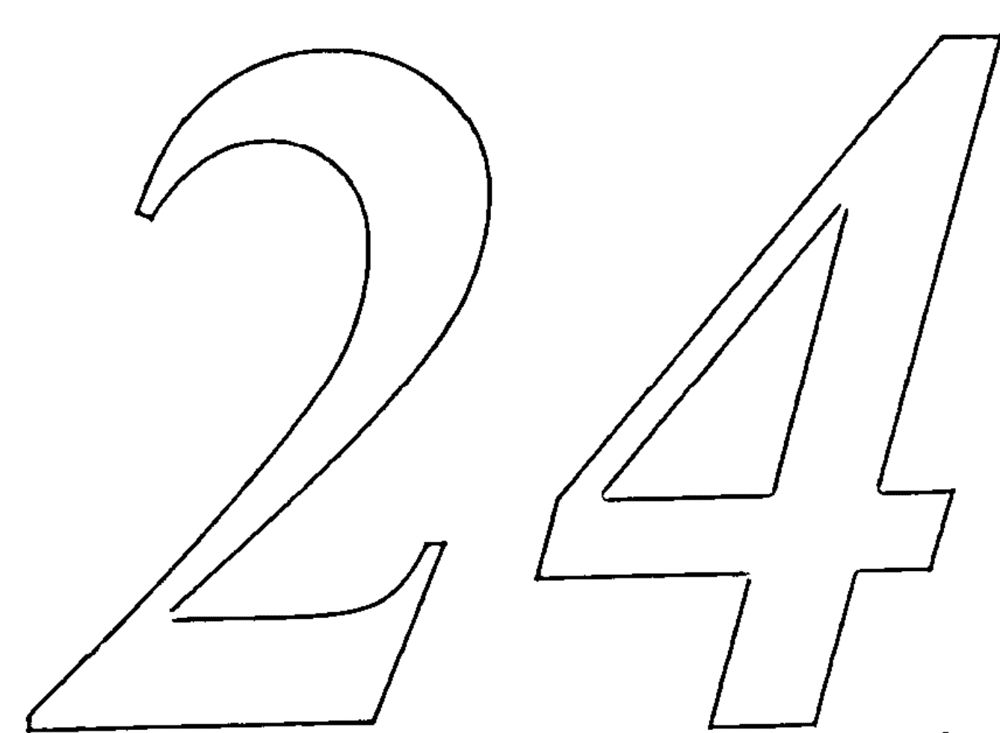

[整體運勢] 人生在世，運勢難免起起落落，今年對於妳而言，「忍耐自重」或許是唯一的法寶。面對接踵而來的分離和挫折，妳常被搞得心神不寧，其實，既然逃不過了，就何妨勇敢地去迎接它。經過今年這一番磨練後，妳的視野及處事態度上都將會有所改變，周圍的人對妳的評價也會更上層樓。從這角度看，這未嘗不是好事一樁？

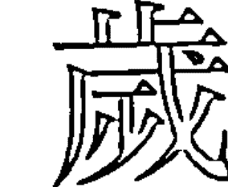

#### 未有男友的妳戀愛對策

很抱歉，今年愛神恐怕不太會眷顧妳，就算找上妳也別高興，因為那恐怕都不是什麼好對象，尤其以不倫之戀最多，奉勸妳還是不碰為妙。不過，妳也不必灰心，正所謂「休息是為了走更長遠的路」。既然今年不利談戀愛，倒不如趁著這空檔時間清理一下腦袋、整理一下心情，多充實自己。另外，提升自己運勢最有效的方法便是：悄悄地遠離一些圍繞在妳周圍妳不甚欣賞的朋友，之後妳會發現，隨著明年腳步的愈來愈近，好運也似乎逐漸向妳接近中。

#### 已有男友的妳結婚對策

今年是妳和他的感情要面對重大考驗的時候。兩人如果能順利攜手走過這段時期，雙方仍互信互愛，很快地明年、或是後年兩人便可望步上結婚禮堂。為通過這時期的考驗，建議妳在看不順眼他某些態度時，何妨站在體諒的立場去包容他。所謂的包容當然不是要妳勉強忍耐，而是試著換另一種角度去看待它，把它看成是他這個人特色的一部分。大體說來，今年不論是訂婚、結婚都不適宜，有攜手一生打算的人最好等到明年。如果在 24 歲生日之後，兩人的感情出現重大齟齬，則可能顯示兩人真的不適合在一起。不妨再一次審視彼此個是否相合，如不合，分手也未嘗不可。

[愛的地雷] 發生在 8～10 月的重大困擾，暗示著他並不是妳未來的另一半，速速分手為上上之策。最好把他忘得一乾二淨，靜待明年另一段美好戀情的到來。

## 誕生數 3

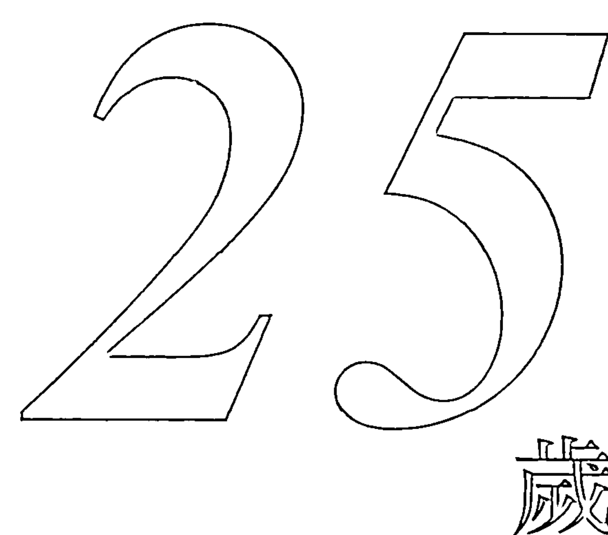

[整體運勢] 沈寂了一年，今年的妳終於鹹魚大翻身了！之前的計畫或構想逐漸付諸實行，願望也將一步步實現中，此時正是運勢要大開之時，慢慢來切莫性急。另外，在某一個新接觸的場所中，有機會遇到影響妳一生甚鉅的人，這個人或許能提供妳某方面的援助，當然最後也可能成為妳的另一半！藉由換工作、搬家等環境的轉換，無形中可增加遇見他的機會。

#### 未有男友的妳戀愛對策

茫茫人海究竟到哪兒找他呢？給妳三個提示：「沒見過的人」、「沒去過的地方」、「沒做過的事」。朋友邀約出遊，只要沒去過，就去！參加舞會、聯誼時，不認識的人去得多的，儘管去！此外多嘗試沒做過的事！透過積極的行動，今年可望出現多位追求者。如果想早點結婚，就選擇最有果斷力、對未來已有清楚藍圖的人，他最有可能和妳閃電結婚！也許他的外表不怎麼樣，但「情人眼裡出西施」，就看妳怎麼看了。今年異性緣最佳的月份是 4～5 月，11 月至年底。

#### 已有男友的妳結婚對策

如果你倆已順利通過去年的考驗，今年該是結婚的時候了！尤其他如果是個行動派的人，不用妳提，他也會追著妳問婚期。但倘若他不是這樣的人呢？建議妳，那就稍微暗示他一下，推他一把，之後一切都會順利了。大體看來，今年妳和他應該是屬於濃情蜜意的一年，如果不是，可能就和雙方個性是否契合，以及他的運勢有關了。這時，不妨靜下心來看看問題究竟出在哪裡，倘若今年的他運氣真的很背很背的話，未來兩人發生爭執的機會可能還相當多，是否會危及兩人感情，還有待觀察。不過要建議妳的是，當真的走不下去時，該斷的還是勇敢了斷吧！就今年而言，最適合訂婚的月份是 3、12 月；結婚則以 5～6 月為宜。

[愛的地雷] 發生在 8～9 月的爭執，暗示著分手對兩人都好。尤其他如果是個個性十分強硬的人，恐怕在未來將要吃苦的是妳，不如就趁早分手較好。

## 誕生數 3

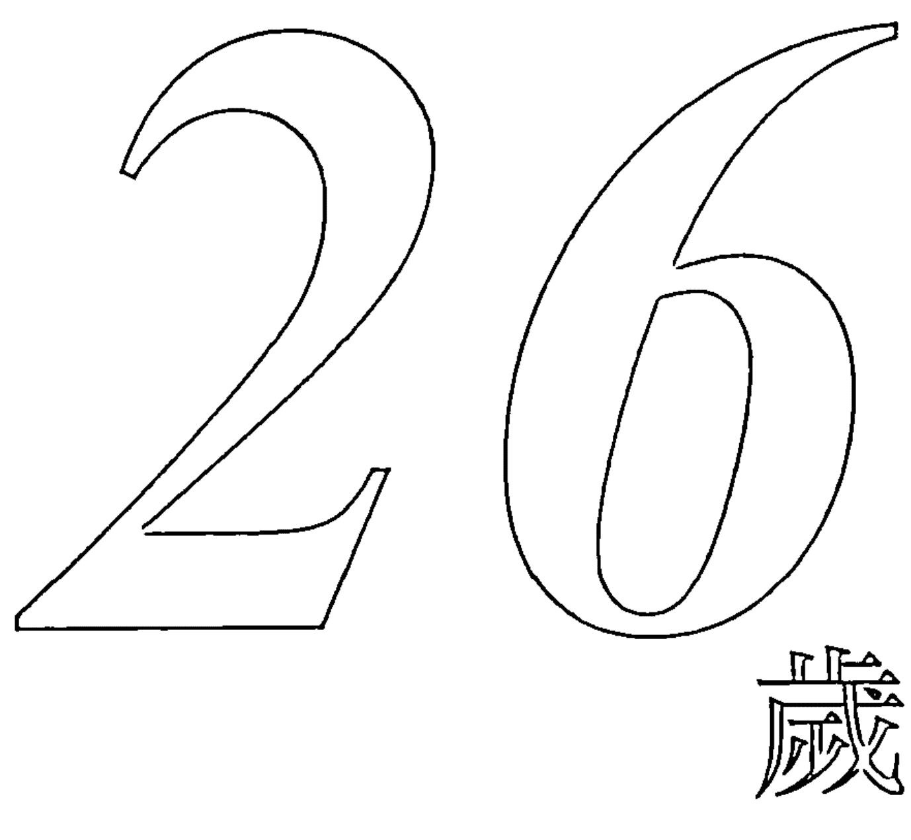

[整體運勢] 9 個誕生數中最親切、善體人意的妳，在今年可說是把這項特質發揮到極點，忙著做周遭人的「張老師」。不知怎的，今年來找妳訴苦、求助的人特別地多，其中不乏男女感情的事。為了要解決他們的苦惱，妳簡直是費盡了心思，有時甚至連自己也跟著一起苦惱。不過，俗話說得好：「好心有好報」，今天妳耐心聽他們發牢騷、幫他們找解答，在他日這些人可都是妳的智囊團、後援會的死忠成員喲！

#### 未有男友的妳戀愛對策

今年的戀愛有些奇妙，對象多是妳老早就認識的人。如辦公室的同事、學生時代的異性友人、社團裡的夥伴等。他們常找妳談些個人的秘密或煩惱，而親切的妳也很有耐心地聽著。漸漸地妳發現他不曾被發覺的優點，而他也為妳這個紅粉知己所吸引。這些男孩之中也有妳並不很欣賞的那一型，如懦弱、沒有行動力等。不過，也別給人家臉色看，畢竟對方不過是想找妳訴訴苦。在盡到朋友之誼後，和他保持距離，就能避免不必要的誤會了！今年的 3～4 月及年底是妳異性緣最佳的時候。

#### 已有男友的妳結婚對策

今年妳和他的感情可望更上一層樓。藉由一次次的約會，妳愈來愈能發現他的可愛之處，也能夠充分感受他所給的疼愛，尤其如果能再得到對方父母的歡心，兩人幾乎就可以開始準備結婚的事了。所以，如果妳渴望和他的感情能趕快有個結果，那就趕快去拜見對方的父母，設法留給他們好印象，那一切就OK了！今年最適合訂婚的月份是 2 月、11 月；結婚則是以 4 月為宜。然而，如果今年妳發現和他的感情有開倒車的情形，甚至讓妳懷疑他究竟是不是妳未來的另一半時，建議妳先不要那麼早下結論，再和他交往看看，適不適合，一切等到明年就會有答案了。

[愛的地雷] 發生在 7 月時的激烈爭吵，暗示著明年兩人極有可能會分手。另外，9～10 月時會比較神經質，稍微控制一下自己的思緒，別做出傻事來才好！要注意！

## 誕生數 3

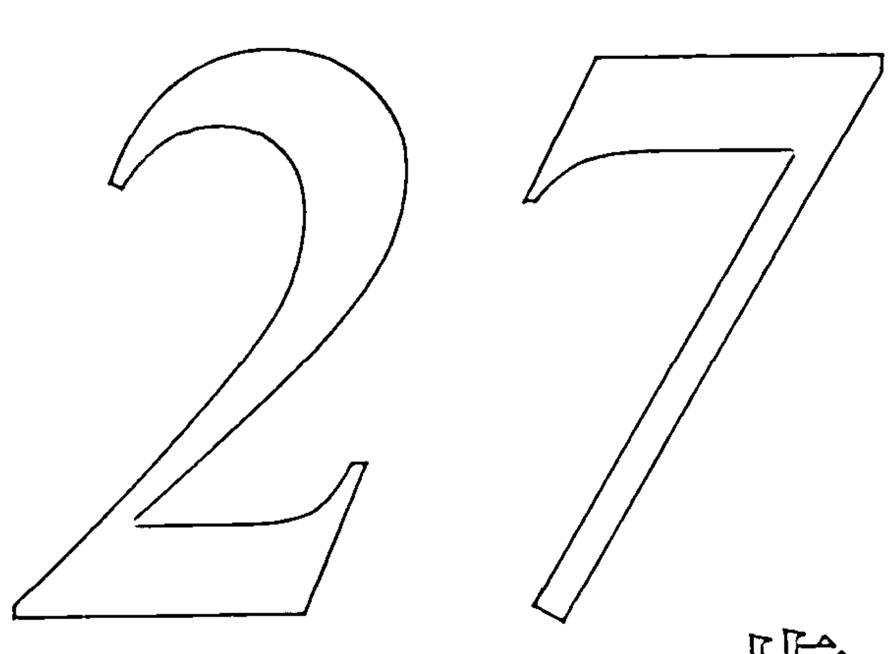

### 歲

[整體運勢] 今年是妳 2 字頭人生中最最幸運的一年！所有計畫幾乎都能如妳所願地實現。所以，在此鴻運當頭時期，勸妳乾脆就別客氣，想什麼說什麼，談戀愛時也是一樣，當喜歡上一個人，何妨大方讓他知，一切的發展都會順心如意的！今年愈「動」就愈紅，所以改變造型、旅行、搬家、換工作都相當適合。

#### 未有男友的妳戀愛對策

隨心所欲的生活讓妳魅力難擋，今年不要過分束縛自己，最好能勇敢跳脫不喜歡的環境或工作，向自我的興趣挑戰。不論選擇的是工作、讀書或留學，都會有不錯的結果。多做些旅行、休閒活動，更有機會遇見愛慕者。今年出現的追求者能不能成為妳未來的另一半，全視他是否誠心和妳交往，不過絕不包括不倫之戀！另外，由於今年妳追求者眾多，不免心生浮動，這會得戀愛的壽命都不長，要當心！2～3 月、9 月及年底是妳異性緣最佳的時期。一整年戀愛運都不錯！

#### 已有男友的妳結婚對策

已交往了好一段時間的妳和他，在今年如能達成共識，共同努力解決經濟上的問題，步上結婚禮堂或者是訂婚都不會太意外。至於剛認識的情侶，今年也頗有可能來個閃電結婚。一般說來，最適合訂婚的月份是 1 月、10 月，最適合結婚的月份則是 3 月、12 月。如果在過了 27 歲生日以後，妳和他的感情出現不穩的現象時，建議妳不妨先審視一下對方的個性及今年的流年運氣。如果是個性不合，那就乾脆分手；如果是受流年運氣的影響，則何妨彼此先冷靜一陣子。不過，一般說來，今年換男朋友多是明智的抉擇。

[愛的地雷] 6 月時的爭吵讓妳起了分手的念頭，就今年的運勢來說，分手是幸運、有利的舉動，建議妳不妨當機立斷！另外，當心自己在 9～11 月時會有出軌的衝動。

## 誕生數 3

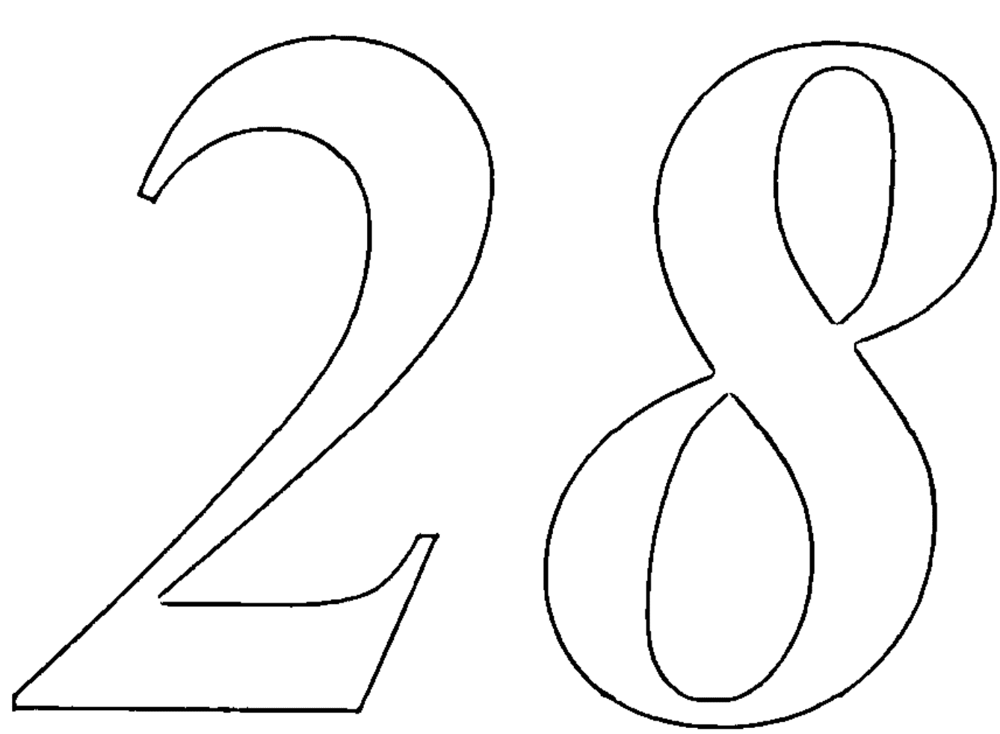

[整體運勢] 不同於前年運勢的高潮，今年的妳在經過兩年的抉擇、安排，一切抵定後，突然又會陷入創新不易、窒礙難行的局面。譬如，好不容易下定決心換了工作，工作本身也很合妳的興趣，無奈周遭人際關係的拓展卻有些困難。另外，工作量、個人雜務都有明顯增加的情形，沒有屬於自己的時間也令妳感到氣餒。總之，這是考驗妳如何對抗及排解壓力的一年。

#### 未有男友的妳戀愛對策

比起前兩年，今年的戀愛機會明顯變少，錯過時機的確令人遺憾，不過忍耐點，明年運氣很快就會好轉了，今年何妨放鬆心情過屬於自己的生活。如果妳還是不能釋懷，那不妨密集地去相親吧！這或許是今年妳唯一可依賴的戀愛途徑。至於介紹人，建議妳找朋友，而且形式不要過於正式，這樣成功的機會會大一些。雖說今年並不是妳戀愛的幸運年，但不抱著太大的希望，在輕鬆的心情下，或許會找到不錯的對象也說不定！2月、11月是妳異性緣較佳的時候。

#### 已有男友的妳結婚對策

交往時間已達數年的你們，今年該是準備結婚的時候了。如果他遲遲沒有表示，那就何妨由妳向他提起，早早籌備結、訂婚相關的事宜，以免屆時亂了手腳。另外，在談結、訂婚的準備事宜時，一定要有個觀念，那就是不要存有太多夢幻的想法，它是個現實生活中的儀式，一定要站在現實面上加以考量。如果今年他還不想結婚的話，勸妳也不要太勉強，再等個兩年，後年結婚也不錯！總而言之，就是要等他完全心甘情願才行！就今年而言，最適合訂婚的月份是1月、10月；結婚則以2月、11月為宜。

[愛的地雷] 發生在5月的衝突、爭吵，在未來將造成兩個人相處上極大的困擾，如果覺得兩人個性上並不是那麼合得來，不如考慮分手。

## 誕生數 3

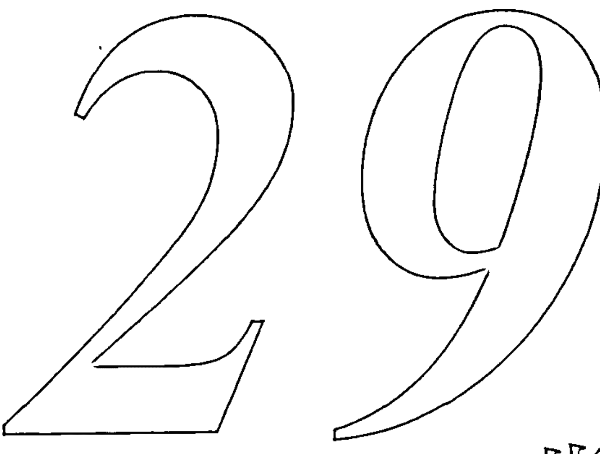

[整體運勢] 今年是充滿希望且忙碌的一年。不僅戀愛運一路長紅，工作上也是前景大為看好，讓妳忙得不亦樂乎。今年到明年間，將有機會遇到妳未來的另一半，這對渴望結婚的人來說，不失為一件好事。但有一點必須先提醒妳的是，在找尋的過程中千萬不要太過急躁，否則會有適得其反的情況發生。不如就像個女王般，安逸地坐在位子上，等著人家上門邀約吧！

#### 未有男友的妳戀愛對策

今年是妳2字頭的最後一年，也是充滿轉機的一年，尤其要活出自我。建議妳從改變環境、變換心情開始做起。只要能勇敢踏出新的腳步，甜蜜蜜的愛情也會隨後報到了！今年也特別適合往海外發展，那裡暗藏著成功的契機，所以千萬不要放棄留學或是做趟長期旅行的機會。最後還要再提醒妳，今年的愛情運實在亮得沒話說，不過，也不要來者不拒喲！尤其是對那些已經有老婆的男人們，最好離他們遠一點！1月、7月、9月及10月是妳異性緣最佳的時期。

#### 已有男友的妳結婚對策

今年的婚姻暗藏著許多「不確定性」，老實說並不太適合結婚。不過卻還是有不少人抗拒不了熱戀的誘惑，急於跳入婚姻。當然，也不是說絕對不能結婚，而是一旦下定決心後，最好就要「迅雷不及掩耳」地進行，不要有半分拖延，省得夜長夢多，信心動搖。另外，今年「奉兒女之命」結婚的人也不少，如果還不是那麼想結婚的人，最好在避孕方面多下點功夫。至於和他交往時間已達一年以上的人，由於今年妳會有眾多的追求者，所以恐怕會有出軌的衝動。如果妳最愛的還是他，那就堅持一點，不要只為了一時的好玩與好奇就讓一生的幸福飛走了！今年最適合訂婚的月份是8月；結婚則以1～2月、10～11月為宜。

[愛的地雷] 發生在4～5月的爭執可能會破壞了兩人原來的感情，千萬要注意！尤其是妳伶牙俐嘴的，如果還不想真的和他「切八段」，用詞上就最好收斂一點，別太傷他！

## 誕生數 3

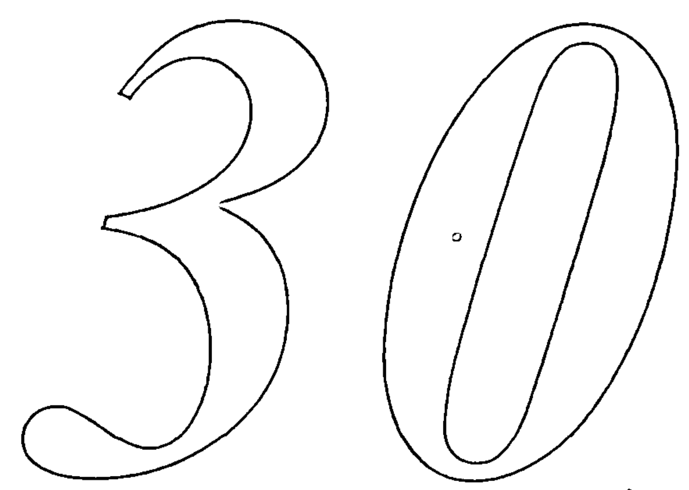

### 歲

[整體運勢] 今年的妳「超」適合結婚的！也許有人認為：「都已經 30 了，當然適合結婚！」那是外行人說外行話！誕生數 3 的女孩們如果沒有談過「一拖拉庫」戀愛，早早就走入家庭的話，是很容易離婚的！與其如此，倒不如盡情去戀愛，藉由戀愛從中了解自己及男人。今年 30 歲正好可說是妳「歷練」大致完成的時候，加上戀愛機會多多，自然可望在今年完成終身大事。也許會來個閃電結婚也說不定！

#### 未有男友的妳戀愛對策

今年排隊讓妳挑的男人有一大堆，面對這樣多的選擇，到底該選哪個好呢？最好的人選應該是欣賞妳、包容妳及能和妳產生共鳴的人。一旦發現有這麼一位人選，就別再三心二意了，趕快回應他的愛情，免得他心生挫折，另覓對象了。如果過了 30 歲之後，妳還是沒有受眾多男人追求的感覺，不妨審視一下自己，是否只注重對方的「才能」和「職業」，卻忽略了「個性」部分？要知道，只有個性相投的人才會開出美麗的愛情花朵。今年的夏天，是妳的異性緣到達最高峰的時期。

#### 已有男友的妳結婚對策

已交往了 1、2 年的你們，要是有結婚的打算，就不要只是嘴巴說說，趕快採取具體行動吧！尤其，如果他是屬於比較優柔寡斷型的，就更需妳在後頭積極地鞭策了，因為一旦錯失了今年的時機，恐怕還得等兩年，下一波的機會才會出現。今年最適合訂婚的月份是 7 月；結婚則以 9～10 月為宜。另外，如果妳和他交往已有數年的時間、或者妳和他是屬於不倫之戀，則要有心理準備，在今年妳倆或許會分手。其實分手也沒什麼不好，尤其有更理想的男人在等著妳時，何苦還花時間在原來的感情上，錯失了另一段良緣？

[愛的地雷] 發生在 3 月、12 月的爭執暗示著兩人個性上的不同，也種下了未來分手的原因。究竟兩人適不適合在一起，最好趕緊想清楚，以免藕斷絲連，反而會延誤了迎接新戀情的機會。

## 誕生數 3

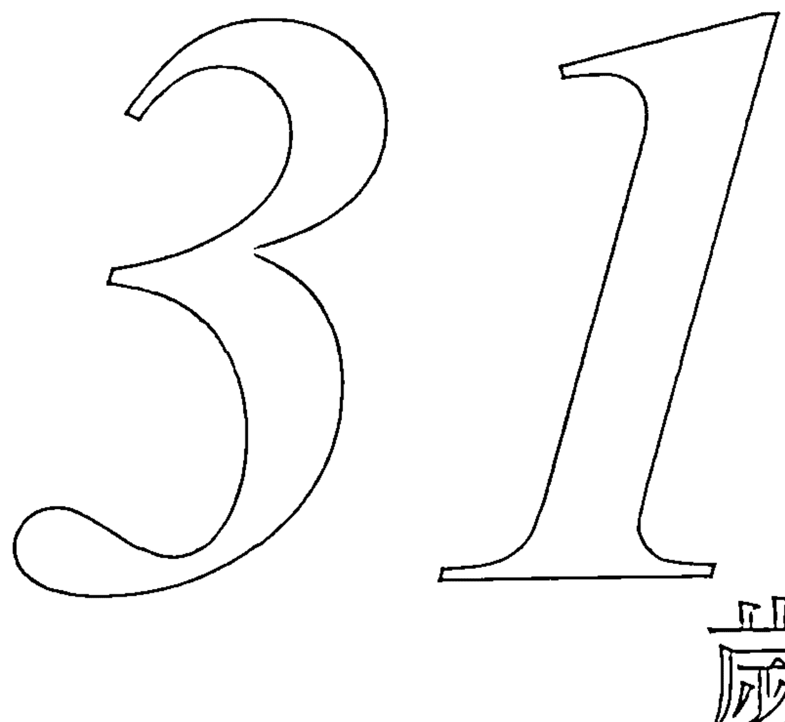

[整體運勢] 今年會有些棘手的事情困擾著妳，讓妳即使想保持平靜的心情，也不能如願。遇到這種情況時，勸妳就別再刻意對問題視而不見，畢竟許多事情現在不去面對，將來還是會一而再、再而三地發生，不如現在鼓起勇氣去處理它，抱著「既來之，則安之」的心情，等雨過天青後，妳將會發現自己又多了一份成長。雖然運勢上有些不如意，但今年倒不失為是著手開始讀書、發展興趣方面等學習的最佳時機。

#### 未有男友的妳戀愛對策

今年的妳恐怕要高唱「寂寞難耐」了！倒也不是沒人追，只是追妳的人，妳都看不上眼；而喜歡的，偏偏又不對妳展開行動。想暗示他嘛！又怕被人當「花痴」。沒辦法，只有等囉！等情投意合的人出現，不然，先以朋友之姿和對方交往，再看彼此的緣分如何了。這年頭最忌諱速食愛情，它會讓妳眼睛像沾到蛤仔肉，只見對方優點，卻看不到他的缺點，或者一味地容忍他的錯，這樣的愛情是不會有好結果的。8月是異性緣較好的時期，其餘時間幾乎沒什麼機會。

#### 已有男友的妳結婚對策

感情風平浪靜的一年。不過，倘若妳和他自前年起就有爭執或衝突未解決，今年可能會宣告分手。因為妳的忍耐已到達了極限，如果他還是沒有反應，自然也只有攤牌的份了。其實，如果兩個人的個性並不是那麼合適，何苦還要死守在一起，今年的分手可提早為明年超high的戀愛運做準備，未嘗也不是件好事。但如果相反的，31歲生日過後，兩人的感情出現倒吃甘蔗愈來愈甜的情況時，那就表示可以準備結婚了。尤其如果妳的他是樂觀開朗個性的男孩，勸妳趕快點頭答應他的求婚。一般說來將婚期預定在明年也不錯，因為這樣至少可以有充裕的時間做準備。倘若急著要在今年完婚的話，6月是最佳的訂婚月份；結婚則是以8月最為適合。

[愛的地雷] 發生在2月、11月的衝突暗示兩人緣分已淡，如果這個問題又是由來已久的話，奉勸妳還是選擇分手較好。至於5月、7月時要特別注意自己的言行，小心別口無遮攔，鑄成大錯。

## 誕生數 3

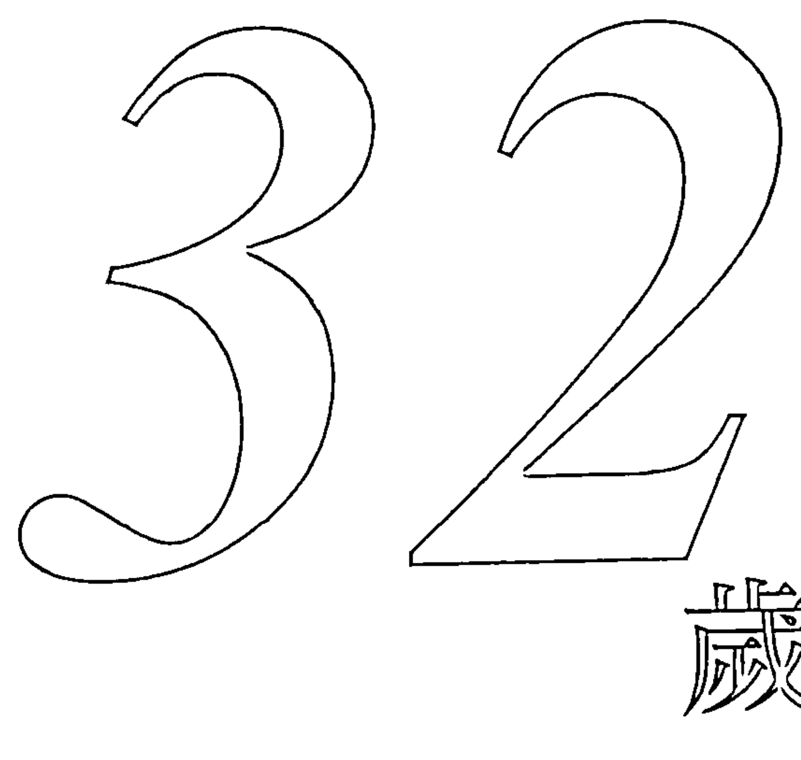

[整體運勢] 長久以來的願望，在今年終於能如願以償地實現了！特別是你在工作上的付出及努力，可望得到收穫。運氣好得連財神上門擋都擋不住，就算妳是個不多求的人，在今年也可以感受到源源湧來的財運。至於戀愛則是以發生在工作場合中的可能性為最大，其次則是一些聚會場所，所以沒事不妨多到人群聚集處露臉，會有意想不到的機會出現喲！切記！沒事別躲在家裡，愛神正在找妳呢，千萬別糟蹋了好運氣！

#### 未有男友的妳戀愛對策

今年的戀愛運，high 到無法擋，尤其是在辦公室裏。或許妳只是隨意到營業部走走看看；或是到客戶辦公室拜訪，卻能意外地遇到不錯的對象。不過，要讓妳看得上眼的，光有出眾的 face 是不夠的，建議妳不妨約他出來吃幾次飯。如果在餐桌上，他談的話題老是不離工作，這個人肯定不適合妳；適合妳的應該是對自己的未來有一番理想的人。今年的妳，相親運也不錯，透過上司或長輩的介紹，可望認識一個外表平平，但內涵卻與妳十分速配的人。5～8 月妳的異性緣將達到最高峰。

#### 已有男友的妳結婚對策

如果妳和他這兩年的感情發展一直非常順遂無風浪，今年就可以早早準備結婚了。不妨強勢一點，掌握時機央求他一起拜見雙方父母，早日決定婚事。今年最適合訂婚的月份是 5 月，結婚則以 7 月為宜。如果不光是他，妳對結婚的態度也是偏向遲疑時，建議妳最好仔細回想兩人的交往過程。所謂的風平浪靜，究竟兩人是真適合？還是一直不願去面對問題？或者是根本就懶得管，覺得已經很疲倦了呢？如果情況是屬於後者的人，預料明年大概就是你們分手的時候了。

[愛的地雷] 發生在 1～2 月、10 月左右的倦怠感，意味著兩人很有可能走上分手一途，儘管今年妳還下不了決心，但明年自然就會宣告分手。另外，發生在 4 月時的口角很可能演變成雙方激烈的唇槍舌戰，要注意！

## 誕生數 3

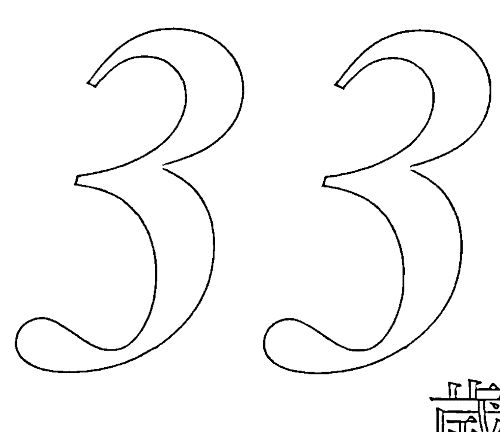

[整體運勢] 今年是充滿轉機，讓妳有脫胎換骨機會的一年，所以無論如何，請妳勇敢地丟開過去老舊的想法、價值觀、累贅的人際關係和惡習，讓自己在今年，趁著天時地利人和之蛻變成一個成熟的女人。或許在轉變的過程中有著種種嚴厲的考驗，但要知道，成長本來就需要付出一定的代價，所以，不要再姑息、袒護自己了，勇敢去面對挑戰吧！結果絕對會令妳滿意。

#### 未有男友的妳戀愛對策

今年的妳，戀愛運不是很好，除了可能有機會和前男友舊情復燃之外，是不大有機會遇見新男友的。勸妳先不要抱太高的期望，因為今年遇到的對象中，好男人並不多，勉強去談，結果恐怕只有受傷的份兒。尤其當其中還包括所謂的「不倫之戀」時，奉勸妳無論如何最好還是要「保持距離，以策安全」。雖然和舊男友間的感情可望破鏡重圓，但和他維持這種良好關係的時間預估並不會太長，換句話說，他不太可能是妳未來的另一半，所以在再次付出感情時，最好還是多保留些較好。

#### 已有男友的妳結婚對策

前年恩恩愛愛的妳和他，在今年可望再繼續你儂我儂下去，只不過，今年並不太適合訂婚或結婚，若勉強在今年結婚的話，未來很可能會走上離婚。所以，今年頂多找機會拜見一下雙方的父母即可（時間最好在 4～6 月）。如果妳和他交往已有一段時間，而在去年兩人的感情變得「怪怪」的話，則意味著分手也許是你倆最好的選擇。找個他心平氣和的機會，和他好好討論這件事，儘早將這段感情釐清吧！至於明年是妳 3 字頭戀愛運最好的一年，不妨就靜待明年好運的降臨吧！

[愛的地雷] 今年的分手可說是為明年更好的相遇鋪路，特別是在 9～10 月，兩人若發生嚴重的爭吵，不要懷疑，跟他說「莎喲娜啦！」絕對是明智的抉擇。

## 誕生數 3

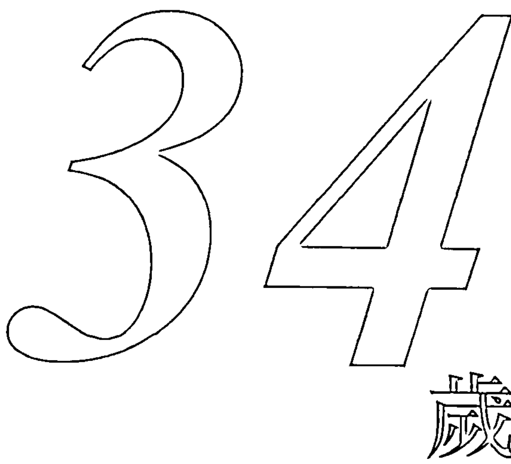

[整體運勢] 一掃去年沈悶的陰霾，今年的妳，等著擁抱新鮮的戀情吧！向上竄升的運勢還不只表現在愛情上，過去十年所立的計畫、長久以來一直苦無實現的機會，在今年情勢一轉，居然開始踏出了第一步，這簡直教妳不敢相信！與其坐著笑得合不攏嘴，不如趕緊趁勝追擊展開行動，超好的運氣，它不會讓妳失望的！

#### 未有男友的妳戀愛對策

在意想不到的地方，遇見意想不到的人，這一切的一切，簡直就像小說裡的情節，不意它真的發生在妳的身上了！在今年，妳可望遇到一個不管在經濟、精神上都能和妳所期待契合的人選。這個人年齡或許會大妳 2 歲左右，或是同年。和他在一起，妳有一種似曾相識的親切感，讓妳感覺就算未來不能和他結婚，也希望永遠做個好朋友，可稱得上是個十分有格調、內涵的人。今年的妳，異性緣最佳的月份是 5～6 月、9 月。

#### 已有男友的妳結婚對策

歷經不少感情上的考驗之後，今年的你們可望結成連理。一旦下了決心，就快快展開準備的行動吧！不管今年碰不碰得到結婚的好日子，一定要先完成訂婚。就今年而言，最適合訂婚的月份是 3 月、12 月，結婚則以 5～6 月為宜。如果你們交往的時間已超過兩年，那手腳就要更快些！倘若妳的他還在優柔寡斷、舉棋不定，勸妳還是將他當做結婚對象的後補人選即可，為這種男人錯失認識更好男孩子的機會實在是不值得！下回，他若是再說一次：「結婚的事，再說吧！」，建議妳馬上回他：「再說？不用說了！拜拜！」千萬不要客氣！因為照這種情形再等下去，是永遠不會有結果的。

[愛的地雷] 在 8 月左右會發生有關「他的問題」，這暗示著兩人未來可能走上分手之途。至於發生在 2 月、4 月、11 月的口角，則要多注意自己的用語，尤其是正在氣頭上時，不要因為失去理智就戳他的要害。

## 誕生數 3

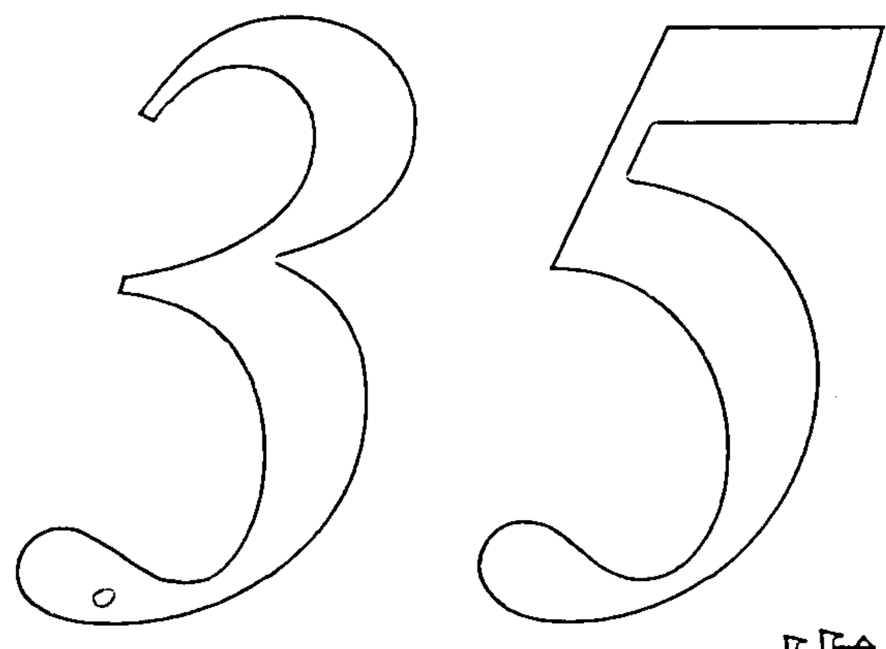

[整體運勢] 複雜的人際關係，搞得妳今年顯得有些神經質，精神壓力也頗大。所以閒暇時多安排一些休閒活動，適時抒解情緒是相當重要的。沒事多去泡泡溫泉、游游泳、跳有氧舞蹈等，對妳的身心健康都將有極大的幫助。這年頭的妳特別喜歡和同性朋友聚在一起聊天，有什麼需要，不妨大方地直接打電話向朋友求援，會得到不少幫助的！

#### 未有男友的妳戀愛對策

今年會有不少異性朋友主動找妳，不過，他們不是來跟妳示愛的，而是要求妳幫他們解決疑難雜症。其中又以年紀比妳小或同齡的男孩居多。每每聽完他們的困擾，就讓妳想動手打人，因為那些問題根本是芝麻綠豆大的事情嘛！不過，再如何生氣，勸妳還是不要表現出來，那樣做只會惹來人際關係上的大麻煩。今年的戀愛運不怎麼好，不過可以請了解妳的同性朋友幫妳留意一下適合的男生。記得！選人不光是看外表，還要注重內涵喲！4～5月是妳的異性緣最好的時候。

#### 已有男友的妳結婚對策

今年是你倆感情充滿濃情蜜意的一年。尤其是前年才剛配成對的情侶們，在今年妳會感覺到兩人似乎黏得更緊了。如果雙方都覺得時機已經成熟，開始計畫結婚、訂婚也沒什麼不可以。不過最重要的是，要先確定能得到雙方家長的祝福才行！倘若今年他的情況尚不適合結婚，那就先訂婚，待明年再結婚也可以。今年最適合訂婚的月份是2月、11月；結婚則以4月份為宜。相反的，如果過了35歲生日以後，突然發現他有猶豫不決、優柔寡斷的態度出現時，則要特別小心！因為，如果你們其中一方對這段感情並沒有談到底的決心，未來很有可能會走上分手一途。不過，今年並不適合跟他攤牌，否則妳可能會受傷很深。那不如就先和他保持距離，等到明年再做決定。

[愛的地雷] 發生在7～8月的激烈爭吵，暗示著兩人分手日子不遠了。而9月時的爭執，妳要當心受會到傷害，「唇槍舌戰」還是避免的好。

## 誕生數 3

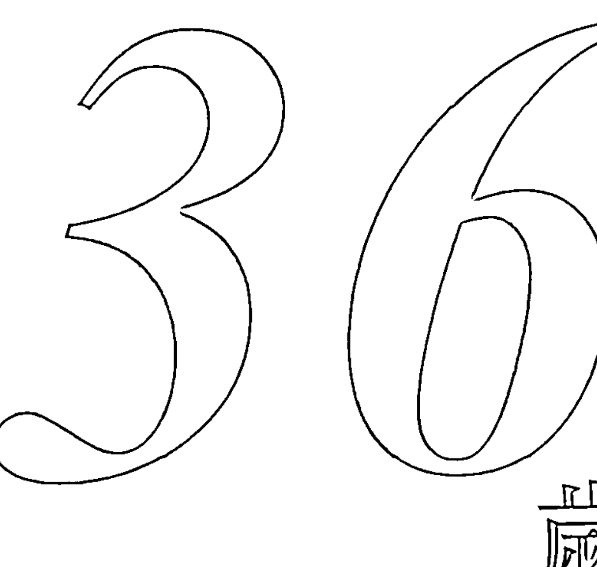

[整體運勢] 今年的運氣終於開始由黑轉紅！沈思已久的構想在今年提出後，意外地獲得了肯定，夢想也在一步步實現中。逢此時期，建議妳不管在各方面有某些想法浮現時，最好馬上和周遭的好友們分享，藉由大家的扶持，理想將更有實現的可能。如果妳是個上班族，今年對妳而言，將是事業上出現大躍進的一年，而且工作上愈是活躍，感情上邂逅的機會也將愈多。同時，今年也很適合搬家、換工作。

#### 未有男友的妳戀愛對策

今年妳的戀愛運奇佳，如果是從事創意工作的人，可望透過工作的關係認識不少愛慕妳的男士；如果不是，也會在從事一些休閒活動時和對方擦出愛的火花。而在對象的選擇上，妳應該明白，太實際或只是擁有虛幻夢想的人都不適合妳，他必須是個兼顧工作與休閒、現實與理想的人。此外，不倫之戀對妳而言也不會有什麼好結果。而當有這樣的男人企圖親近妳時，妳應該斷然拒絕。就今年來說，異性緣最佳的月份是 3~4 月、9 月，甚至說一整年都有不錯的機會也不為過。

#### 已有男友的妳結婚對策

去年的甜蜜仍持續到今年的情侶，可望在今年準備步上紅地毯了。倘若妳有結婚的念頭，卻不見他有表示，何妨主動詢問他的意思，對男人而言，有些人會很高興女友這樣問他。一旦他同意，那麼兩人就可以著手準備結婚了，省得藏在心裡還真急壞了人。至於剛認識的情侶們，今年也有閃電結婚的可能。就今年而言，最適合訂婚的月份是 1 月、10 月，結婚則以 3 月、4 月為宜。萬一在妳 36 歲生日過後，發現兩人不再像過去那般地親密，甚至經常發生口角，建議妳不妨數數看你們交往的年數，如果是偶數年，代表兩人感情有回溫的可能；是奇數年，這種漸行漸遠的感覺就意味著兩人的不合適，何妨考慮分手。

[愛的地雷] 6~7 月時若突然對他產生一種厭惡的感覺，建議妳不妨考慮和他分手。今年原則上是滿適合分手的一年，分手對妳而言將是迎接更好緣分的開始。

## 誕生數 3

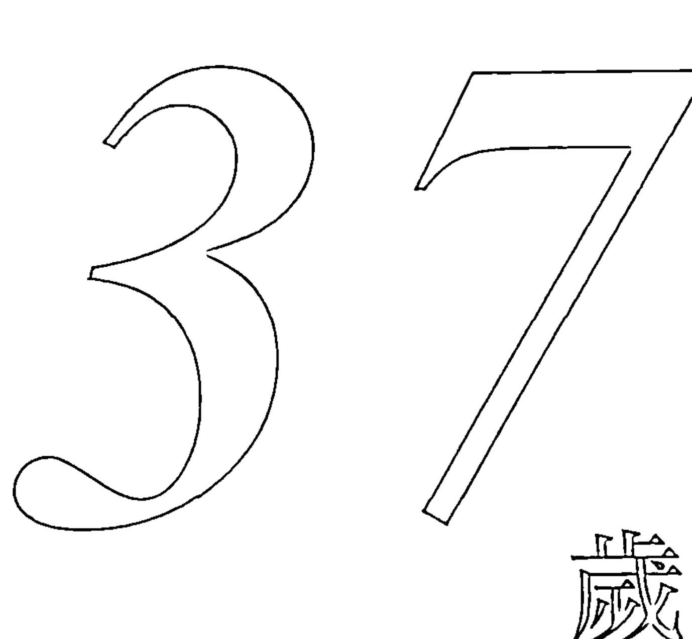

[整體運勢] 今年的妳，凡事都有受阻、窒礙難行的感覺。特別是來自家庭及工作方面的雜事特多，或許不是什麼大麻煩，但面對一個接著一個而來的瑣事，確實也是夠令人頭大的了。在這讓人煩躁的一年，最重要的是要學會懂得如何適時調整情緒，除了喝酒之外，舉凡運動、和好友聚會等等，都是不錯的放鬆心情的方法。另外，沈寂已久的煩惱也有再度復燃的可能，冷靜以對，不要自亂陣腳才是平安度過危機的秘訣。

#### 未有男友的妳戀愛對策

今年妳的戀愛運，恐怕是要讓人失望的了。除了一些零星的相親機會外，要自己發掘好對象，機率是小得可以。時運如此，偏偏生性浪漫的妳最討厭的就是透過相親找對象，總覺得它不如偶然邂逅來得自然。如果妳堅持要自己去尋覓，恐怕要等到兩年後才可能遇到合適的對象；若是不排斥透過相親認識的話，建議妳最好找好朋友幫忙，畢竟同是年輕人，比較能掌握妳喜歡的類型。今年異性緣最好的月份為 2 月及 11 月前後。

#### 已有男友的妳結婚對策

在見過雙方父母後，你們可以就可以著手準備結婚事宜了。今年對你倆而言，是適合結婚的一年，建議妳應把握這個時機。一旦錯過，明年恐有第三者介入，使兩人感情生變。因此，當雙方都有結婚的共識後，勸妳最好早早籌辦結、訂婚事宜。今年最適合訂婚的月份是 9 月，結婚以 2 月、11 月為宜。相反的，如果今年雙方的感情有失溫情形出現時，建議妳先審視一下兩人的個性是否相合？先暫時保持這樣的相處姿態，並給予雙方一些冷卻情緒的空間，再做定論。

[愛的地雷] 發生在 5 月時的爭執或麻煩，意味著兩人之間存在著某種問題，與其粉飾太平地想刻意遺忘它，不如一起靜下心來仔細想想，為什麼會有這些爭執或麻煩的發生，這才是正確的解決之道。

## 誕生數 3

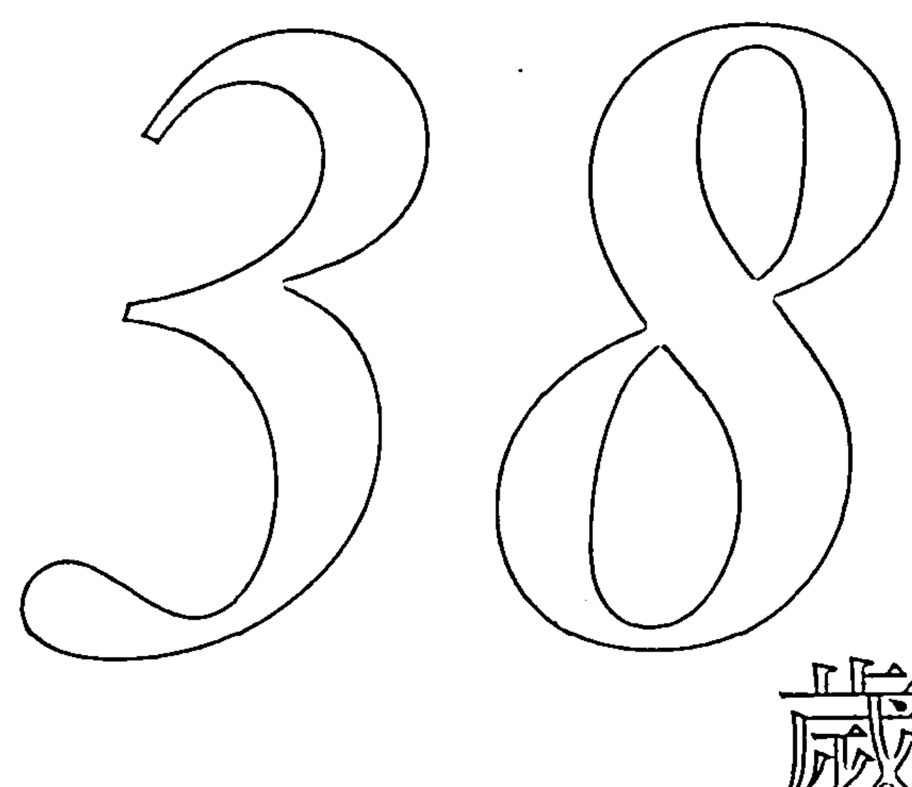

[整體運勢] 眼看著 3 字頭的人生只剩下兩年，於是沒結婚的妳不禁為自己的未來著急了起來。告訴妳一個好消息，今年的妳將是愛神眷顧的對象，戀愛運勢旺得無人能擋，只要妳不是刻意排斥婚姻，就有希望可以結婚！但光是被動等待是會大大降低速配成功機率的。所以，儘量擴大自己的活動範圍，無論是長期旅行、接受國外出差的調派，皆可增強今年的戀愛機運。此外，換工作、自行創業等，也可得到不錯的成績。

#### 未有男友的妳戀愛對策

今年的妳電力特強，走在路上都能電到擦身而過的異性。前來和妳搭訕的也不少。不過，除非妳是抱著玩玩的心態，否則這些非真心的追求，還是不搭理為妙，否則會嚇走了有心人。若是處在鮮少能接觸到異性的環境，建議妳做一段較長的旅行。旅行時的輕快心境，能使妳釋放出所有的魅力，輕易擄獲異性的心。除了旅行外，有留學打算的人，也可選在今年出國。不但能一圓念書的美夢又能趁機找到另一半，真是一舉兩得！今年異性緣最佳的月份是 7 月、9～10 月。

#### 已有男友的妳結婚對策

今年的你們，感情充滿戲劇性的變化；或許「變好」，或許「變壞」。如果你們是「變好」的一群，妳會發現不知為什麼，兩人的感情突然像坐快速電梯般直衝雲霄，強大的電力使得兩人難分難捨，只有結婚才能解決這憾人的吸引力。因此今年，這類的情侶閃電結婚的甚多。如果不幸，你們屬於「變壞」的一群，則「看不順眼」、「話不投機」成了兩人相處時最常有的感覺，口角、爭論接踵而至。面對這突然的奇怪轉變，妳最好先別急著分手，想想看這種衝突是否由來已久？如果是，分手是自然的；如果不是，不妨稍做冷靜，留待明年再做決定。就今年而言，最適合訂婚的月份是 8 月，結婚則以 1 月、10 月為宜。

[愛的地雷] 如果爆發在 4、5 月時的衝突是妳忍耐已久的問題，建議妳就別再忍耐了，分手會是較好的選擇。但如果只是一些雞毛蒜皮的事，奉勸妳還是大事化小、小事化無的好。

## 誕生數 3

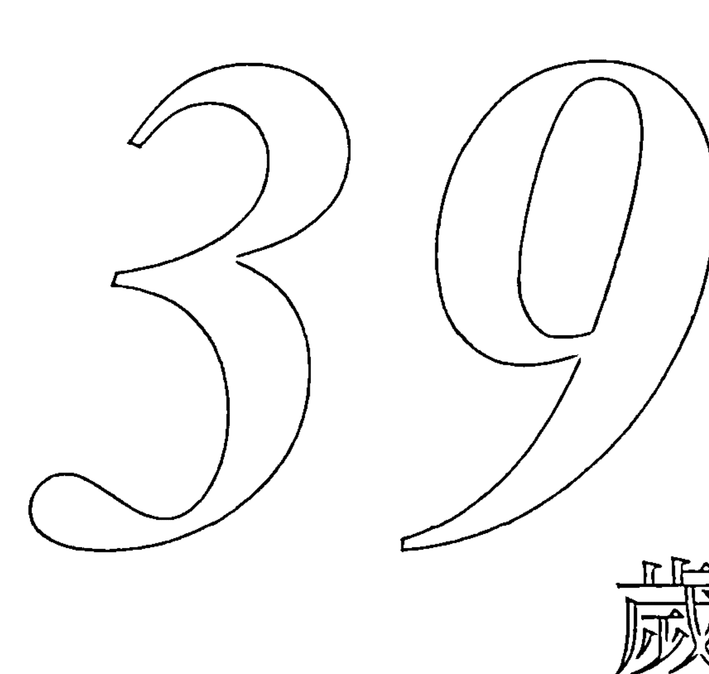

[整體運勢] 今年是妳 3 字頭人生最後一年，也是妳戀愛運、結婚運、家庭運到達最最巔峰的時期。如果錯過了今年還是未能找到另一半的話，之後恐怕要等個 2 年才會再有機會，所以無論如何，一定要好好把握住這 3 字頭的尾巴，好好地展露出自己的特色與魅力！至於 30 幾歲女人的魅力，與其著重於外貌的美麗，不如設法藉由內在與行動方面做表現，因此，何妨將今年當做是自我內在素質的提昇年！

#### 未有男友的妳戀愛對策

走到了 3 字頭的最後一年，還是孤家寡人一個，這令妳有些氣餒。不過妳應該要有一個觀念，就是外表或許會讓妳有種年華不再的遺憾，但這一路走來的戀愛經驗，心靈上的收穫卻比別人豐沛，尤其是對異性的了解。此時，再去找尋未來的伴侶，相信妳的眼光不會太差。今年的妳，除了強烈感覺到與素未謀面的異性邂逅機會大增外，不妨留意原本就認識的異性朋友，帶著妳敏銳的感觸，會發現，最好的選擇就在妳的身邊。今年異性緣最佳的月份為 6 月、8～9 月左右。

#### 已有男友的妳結婚對策

在穩定的感情發展下，漸漸地妳和他有了要共組家庭、廝守一生的默契。既然如此，就快著手準備結婚事宜，在今年度促成的婚姻，將會是段圓滿的姻緣。最適合訂婚的月份是 7 月；結婚則以 9 月為宜。不過，若他還是不能給妳一個肯定的答案，最好先問清楚原因。在釐清之後，妳應該捫心自問：你倆到底是否是真心相愛？倘若是，妳就將愛化為實際行動全力協助他解決問題，度過難關。若發現他的理由不過是推諉之辭，和妳在一起只是想找個同居的伴侶，那勸妳什麼辦法也甭想了，和他說「拜拜！」是最好的處理方式。

[愛的地雷] 發生在 3 月、12 月激烈的爭吵，將促使未來兩人走向分手之途，不妨先冷靜思考再做應對，凡事以「一起想辦法、一起解決」為前提。

## 「速配！」診療室

～誕生數3的女性和各男士們的速配程度～

### 速配指數

♡能愛得長長久久 ○愛得短暫而熱烈 ☆適合結婚 ◇適合當好朋友 □適合當工作上的搭檔 ※只要努力，還是有希望速配成功 ✕不如不相識

### 誕生數1的男士

能豐富彼此人生的最佳拍檔

由於個性相合、興趣相同，妳和他打從第一次見面起，就有「我要找的人就是他（她）！」的默契。所以這樣的組合，一路從朋友到情人，甚至論及婚嫁的過程發展都會是相當順利，最終結合為夫婦的比例更是佔大多數。而就算是結不成夫婦，做普通朋友兩人也會是感情很好的知心朋友；做工作上的夥伴，也將能成為彼此極稱職的幕僚或請益對象。對他而言，妳最大的魅力就是妳對美好事物的敏銳感觸；而他感性中又不失現實、社會性，也令妳崇拜和景仰。這樣的兩個人湊在一起只有兩個字可以形容，那就是：「速配！」。

### 誕生數2的男士

速配指數最高的對象

比誕生數1的男士的「速配」更速配！誕生數2的男士和妳在一起，簡直就是「速配中的速配」，或許在第一眼看見他時，誕生數2男士給妳的印象並不深，甚至是不怎麼好，但等到妳有機會接觸他，和他深談過後，妳一定會被他的幽默風趣氣質所深深吸引。而且，誕生數2的男士頗能欣賞妳各方面的原始面貌，也因為這樣，和他在一起妳將會感到格外地輕鬆愉快，畢竟，不用偽裝過日子是再舒服不過的生活方式了。不過，有一點必須提醒妳的是，誕生數2的男人通常有個特點，那就是他的經濟及社交方面的能力均弱。如果未來兩人有意共組家庭，妳就必須要有心理準備，將來在社交方面你可能要居於主導地位，以補他的不足，甚至在生活各方面，必要時你都必須擔負起帶領的角色。

### 誕生數3的男士

攜手演出愛情遊戲

誕生數相同的人碰在一起，通常不太容易合得來，不過誕生數3的人卻是例外。在氣質相當的情況下，你倆本來就容易迸出愛的感覺，然而，妳和他的發展卻也僅止於此，是怎樣也走不進婚姻的。因為對彼此而言，對方固然是談戀愛的好對象，但由於兩個人都愛做夢、視現實為麻煩事，自然沒有一方肯提結婚的事，如此一天拖過一天，等到拖得不能再拖了，要面對婚姻時，才發現過去浪漫的感覺被「庸俗」的事情——諸如洗碗、拖地等——干擾，再也浪漫不起來了。而由於兩人都是堅持浪漫的人，希望對方去解決這些現實的事情，於是我推你、你推我的，爭執自然就四起，最後只有以「感覺沒了」為由，走上分手一途。

### 誕生數4的男士

價值觀截然不同

老實說，你倆要能擦撞出愛的火花實在有些困難。個性活潑外向、積極又浪漫的妳，和現實理性得有些乏味的他，兩人的生活型態本來就是南轅北轍，想碰在一起都難，更何況是談戀愛。不過，愛情這種東西也是很微妙的。像這樣表面上看來怎麼也搭不上線的兩人，一旦陰錯陽差被糾在一起，在敞開心胸踏出第一步後，或許是基於互補的作用吧，反而會被對方的特色所吸引，成為別人眼中不可思議的一對。當然啦！兩人感情要想走到這個地步，在交往初期時，彼此都得有寬大的胸懷，留予對方一個適當的空間、尊重對方的思考模式，並時時不忘溝通才行！總之，這樣的組合在剛開始發展時固然有些勉強，但若懂得協調，還是可以從本來的不可能創造出奇蹟的。

### 誕生數 5 的男士

你我的愛，來得快、去得也快

你和他之間的愛往往如同閃電、煙火一般，剎那間是很亮、很美，但一轉眼就消失得無影無蹤了。由於同屬活潑性格，乍見面時，他開放、熱情如火的個性往往便深深地吸引著你。沈醉在他為你編織的愛情美夢中，你像隻快樂的小麻雀，但是，隨著交往時間的漸長，你將會發現，他所能帶給你的除了夢、還是夢，它似乎永遠沒有成真的時候，於是離他遠去的念頭終於在你的心底浮起。這段戀情對於你，在來日將會是一段美麗的回憶！換句話說和他在一起的日子確實很美，只是它最終只是你人生中的一個美麗的回憶，兩人要廝守一生，老實說真的不太可能！

### 誕生數 6 的男士

能相互尊重彼此感性的一面

和誕生數 6 的男士在一起，你將有如沐春風的感覺。溫柔善體人意的他，面對你偶而的無理取鬧，總會採取無盡的包容，甚至把你當成是他的孩子一樣，有他這麼呵護你，自然什麼架也吵不起來。不過，當然這也是因為你也有你的優點與特色，才會讓他能這樣疼惜你。天生充滿藝術細胞的他，在面對你時，你的熱情、積極經常是激發他創造力的主要來源，加上你愛好自由、不拘小節，你們倆在一起，是尊重並協助對方發揮所長的關係，也是一種人生知己的感覺。

### 誕生數 7 的男士

一段孽緣、一對冤家

回想和誕生數 7 男士的交往的歷程，會讓你有種「不堪回首」的感覺。其實，最初和他在一起時，吸引你的正是那股完全不同於你的氣質。正因為不同，曾經一度你還會不自覺地佩服起對方，對他的一言一行、思考模式都感到相當有興趣。只是，激情過後，讓你排斥的也是這完全不同於你的行事作風。你最不能忍受別人干涉管制你的行為，偏偏他就是喜歡管東管西，而且還自以為是，有強迫他人就範的意味，這妳哪兒受得了。於是三天一小吵、五天一大吵便成了你們相處時經常上演的戲碼，而爭吵過後，如果雙方願意協議分手，事情還好解決。無奈有時妳卻又眷戀他那股有些霸氣的氣質，就這樣想分又不想分，吵過之後又再吵，不少人直到最後結為了夫妻，還是不斷地重演著這場鬧劇。

### 誕生數8的男士

年紀會是兩人關係的調合劑

個性完全不同的妳和他，一般而言是不會有「愛」的感覺出現的。要由妳來做選擇的話，不管是做情人還是做朋友，妳是怎樣也不會把他列入考慮的。但是，這並不表示兩人就完全沒有在一起的可能。即使兩人之間的歲數有一段差距，但因為他照顧妳就像是一個「兄長」，他的百般呵護還是讓妳有心動的可能。所以說，年紀上的差距將會是決定妳和誕生數8的男士能不能成為有情人的一個重要因素。

### 誕生數9的男士

愈陳愈香的愛情

在一次偶然的機會中，進一步了解了誕生數9男士的行事作風後，他的一舉一動便深深地吸引著妳，而且崇拜、仰慕的感覺一日比一日強烈。這原因在於誕生數9的男性除了具有類似於妳的單純、天真之外，更具備了妳所欠缺的沈穩性格，所以原則上，誕生數9的男性和誕生數3女性之間的速配指數相當高。除此之外，誕生數9的男性天生纖細的感覺，容易讓自己陷入感傷之中或受到傷害，而誕生數3的女性，開朗活潑的個性正好可以協助他走出陰霾，兩人相處稱得上是相知相持。

## 誕生數 4 頑固人物

生活在現實與夢想之間

幸運寶石：祖母綠

**個性** 誕生數 4 的你，基本上是個十分現實且頗有主見的人，對於生活總有一套獨特的堅持與看法。嚴肅的外表下，你的內心其實是充滿了夢想和感性，也挺有幽默感的。不過這點卻得要和你經過一段長時間的交往，對你深入了解的人才會知道。是罕見具有靠自手起家便能一代致富潛力的人物。

**戀愛傾向** 你的愛情通常來得晚。倒不是因為沒人追你，而是因為你不善於表達自己的情感。當喜歡上某個人，光一個人悶著頭單相思就耗掉你不少時間；好不容易有向他表白的機會，你的臉皮卻薄得可以，寧可錯過也不願讓他知道，就這樣，春天自然怎麼也來不了囉！此外，你的眼光也是高得可以，令你心動的男孩子，基本上必須要內在美、外在美均兼備，除了要貌如潘安，還得是個才華洋溢的人。不過，這點實在是有點嚴苛，因為你自己給人的感覺是平凡得可以，自己都不是內外美兼具的人了，又如何能拿這標準去要求人家？也因此，誕生數 4 的女孩甚少能如願和心儀的男性順利結成連理，而基於現實的考量，最後多半會選擇嫁給經濟基礎安定的人，大部分都是人家來愛你，而對方僅是你不討厭的人罷了。基於上述的分析，建議誕生數 4 的你，當想尋找生命中的另一半時，與其放遠眼光四處搜尋，不如看看一些原本就在你身邊的異性朋友，這些愈是不可能的人，最後成為你夫婿的可能性愈大。對過去戀情過於執著也是你有待修正的地方。沒事不要拿從前的男友和現在的男友比較，那只會讓自己陷入「找不回過往，卻又無法快樂面對眼前」的窘境。至於最適合你的對象大抵說來還是個性大而化之、擁有安定經濟基礎的男士，就算不能具備潘安般俊美的臉孔，但最好也要能對你感興趣的事物有一定程度的精通，如此兩人感情才可望長長久久。

## 誕生數 4

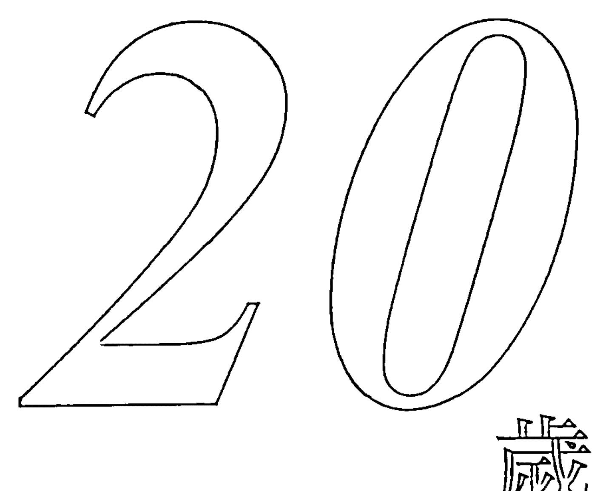

#### [整體運勢]

2 字頭的開始，正是放手戀愛的好時候，不過這對生性向來「閉塞」的誕生數 4 女性來說似乎有些困難。要提醒妳的是，不必把現階段的戀愛看得如此嚴肅，男女在一起又不是交往就註定要結婚，何妨把它當成是一種人生經驗的累積，藉以了解男女之間想法的不同，它會成為妳日後選擇對象上重要的參考與智慧的！

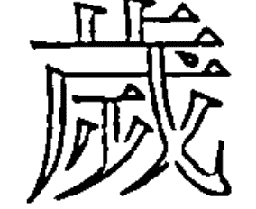

#### 未有男友的妳戀愛對策

誕生數 4 的女孩有截然不同的類型，一種是活潑大方；一種是文靜內向。前者，今年可說是戀愛大豐收的一年，透過積極參加活動，能遇見不同以往的男生類型，你們會陷入熱戀。只是，雙方年紀都還小，戀情像小孩子在玩家家酒般，激情過後隨即結束；至於後者，由於太保守，今年還沒有戀愛的機會，不過妳可以多往一些高級餐廳、俱樂部等，屬於成年人的地方走走，體驗成年人的社交生活，對妳未來的戀愛將會有所幫助。今年的妳，異性緣最佳的月份為 6～9 月以及夏季。

#### 已有男友的妳結婚對策

隨著你們之間年齡差距的不同，誕生數 4 的女孩結婚的運勢也不同。若他大妳 3 歲以上，今年妳或許會接到他的求婚，不過這樣的請求大多會受到來自妳父母或親友的反對，因為 20 歲畢竟還太年輕。面對這般的阻撓，若他是個衝動型的人，或許會要妳乾脆和他私奔；而如果他夠冷靜的話，就會運用漸進的方式，在今年先訂婚，等到 2 年後再談結婚的事。如果妳和他還是學生身分，或年齡差距只在 1 歲以內的話，結婚對今年的你們來說都太遙遠，頂多可以常到對方家拜訪，試著熟悉對方的家人。畢竟妳才 20 歲，他也還年輕，一切來日方長嘛！對誕生數 4 的妳而言，最好在 22 歲訂婚，24 歲結婚。

#### [愛的地雷]

3 月、12 月不經意的口角，最後可能會演變成兩人激烈的爭吵，造成感情上的裂痕，要多留意言語上一來一往之間的用字遣辭。

## 誕生數 4

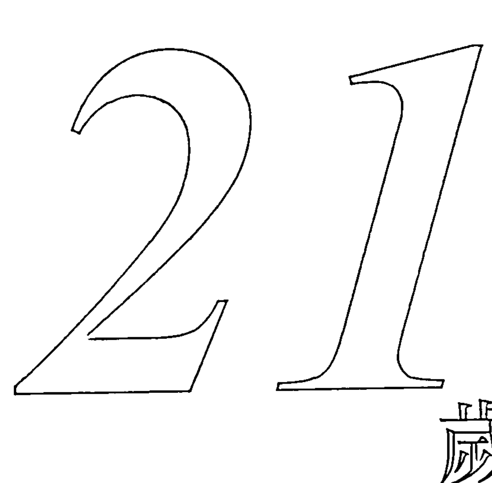

[整體運勢] 進入 2 字頭已過一年，經過去年的適應，眼前的妳已較能輕鬆面對成人的世界。加上今年的運勢平穩順遂，沒有什麼大波折發生，所以妳的 21 歲可望在無風無雨、輕鬆愉快的心情下度過。趁這段平順期，一向有自己獨到想法的妳，不妨多為自己安排些學習課程，多方充實自己各方面的實力，反正今年的戀愛運也不是那麼地興旺，這麼一來正好可以打發時間，沖淡自憐自艾的痛苦，可說是一舉兩得！

#### 未有男友的妳戀愛對策

愛神在今年對妳殘忍了點，讓妳始終找不到喜歡的男孩。不過，不必太難過，妳才 21 歲，何必急於一時呢？何況，若只是為了交男朋友，就和一個沒有感覺的男生交往，這就不像重視精神交流的妳了，不如抱著隨緣的心，在沒負擔的心情下，找尋和妳心靈相通的男孩。另外，除了期待認識新的異性朋友之外，妳不妨留意原本就認識的男性朋友，或許就有妳所要找的類型，只是過去沒機會深交而已！今年的妳，異性緣較佳的月份為 5 月、8～9 月。

#### 已有男友的妳結婚對策

重視精神上交流的妳，與其藉由肉體鞏固愛情，今年更要加強和他心靈上的溝通、培養互信，讓愛更穩固、更長久。在妳表明想做這般調整後，如果他也同意，表示他很有可能就是妳未來的另一半，否則，勸妳最好重新審視一下他的心態，看看他和妳在一起的目的究竟是真的愛妳，還是只想有個固定的性伴侶？只想得到肉體上歡愉的愛情，談得再久也是枉然，而且更不是注重精神方面的妳所想要的，這段戀情是否值得繼續值得三思！就今年而言，最適合訂婚的月份是 6 月；結婚則以 8 月為宜。其實如果能把婚事延至明年再談會更好。

[愛的地雷] 2～3 月、11 月至年末是妳和他愛情的危險期。在這段期間稍不小心便會有爭執、口角發生，而且爆發的衝突都會相當大，嚴重者甚至會導致分手。所以，如果你倆還是相愛的，並且沒有分手的打算，在這段期間不管有什麼衝突或不滿產生，一切還是以忍耐為重！

## 誕生數 4

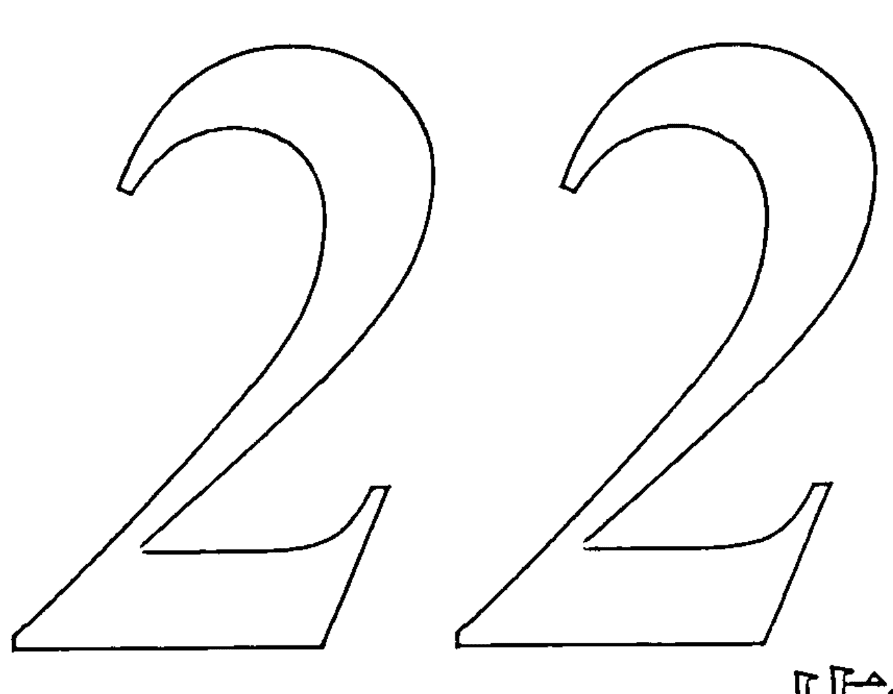

#### [整體運勢]

「心慌意亂」，不是意味著今年有多糟，而是剛出校門的妳，對於來自各方的「建言」總有些迷惑。當別人的經驗和妳的想法相悖時，這種壓力就形成了。與其盲目聽從別人的意見，不如用自己的方法試試，藉以累積經驗。而他人的相反意見妳不必太強烈的回絕，更不要為了避免不同意見帶來的困擾把自己鎖在小框框裡，應多接觸外面的人、事。在這段期間，愈常接觸外界，運勢愈好。

#### 未有男友的妳戀愛對策

忙著上下班，妳好像沒有時間談戀愛，其實辦公室裡就有許多機會。看到妳這年輕的姑娘，公司裏年紀較長的未婚男士一旦覺得合適，便馬上展開追求攻勢，妳若想要結婚，可以試試看。只是提醒妳，這些人的追求，目的是結婚，不太可能給妳時間享受浪漫愛情，由於他們年紀較長，想「帶領」妳的想法較強烈，常會對妳的言行提出干涉。這些是妳所應考慮的情況。至於年齡相當的男生，在今年出現的人不多。今年的妳，異性緣最佳的月份是 4～5 月，以及 7 月左右。

#### 已有男友的妳結婚對策

如果妳和他交往時間已近兩年，而彼此也都有共結連理的打算，那今年倒是可以準備結婚了！不過有一點必須注意的就是，在你們兩人公布決定結婚之前，一定要先行詢問過雙方父母的意見，得到父母的首肯後再發布消息，否則未來婚事的籌辦，受到的阻力可能會頗多。就今年而言，最適合訂婚的月份是 6 月，結婚則以 7～8 月為宜。至於在今年妳發現和他的感情有開倒車的現象，特別是他對妳的言行舉止經常過分干涉，而讓妳覺得很不舒服時，建議妳不妨考慮分手。因為這根本是他習慣的態度，無論妳如何吞忍讓步，將來還是不可能會有所改變的！不如對他死心吧！

#### [愛的地雷]

如果年初和初秋（大約 10 月）和他兩人時有衝突、齟齬，暗示著分手可能會是較好的選擇，不然拖過明年，問題可能會更嚴重。

## 誕生數 4

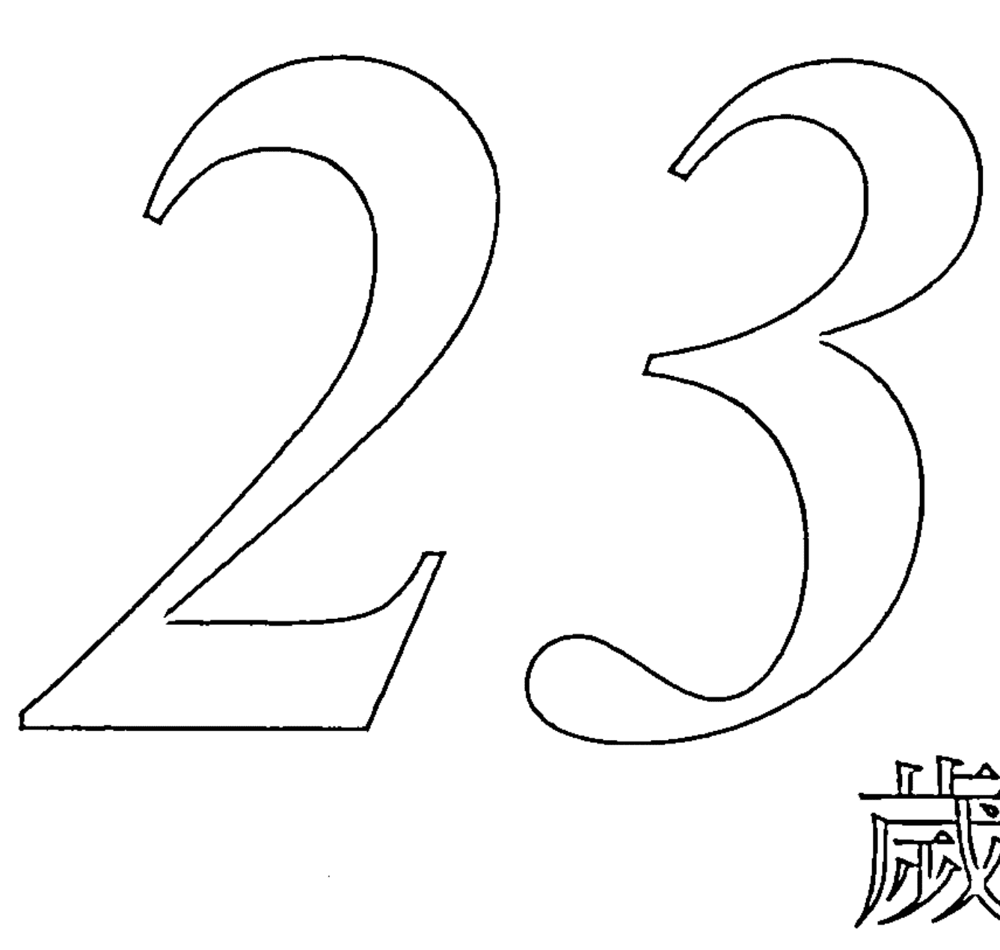

[整體運勢] 和去年剛入社會需要忙亂應付各種狀況的情形相比，今年顯得風平浪靜許多。這和妳逐漸適應環境有著很大的關係，不過，對於某些人來說，雖然已經克服了適應環境的困擾，但今年所要面臨的可能是另一項衝擊，這項衝擊或許是和重要的人生離死別，也或許是生活上遭遇某項挫敗。這樣的經歷雖然會帶給妳很大的打擊，但有了這些體驗，卻有助妳走出向來「執著過去」的弱點。

#### 未有男友的妳戀愛對策

整體看來，今年的戀愛運有點「背」，許多接近妳的男孩似乎沒安好心眼，不是想在經濟上依靠妳，就是想把妳當備胎。為了避免這事發生，提醒妳有異性向妳示好時，別被甜言蜜語沖昏頭，最好能先做做普通朋友，觀察他的言行，再決定要不要接受他。預備這樣的一段過濾期聽來麻煩，讓對方誤以為妳很「刁鑽」，卻是保護自己最好的方法。今年的妳，異性緣最佳的月份僅限 6～7 月。至於出現在其他時間的異性，尤其是 9 月初秋前後，要特別小心！

#### 已有男友的妳結婚對策

今年妳和他的感情將會出現危機，尤其是交往時間愈久的情侶，出現危機的可能性愈大。究竟該不該原諒他？又該用什麼方式面對他？成為妳最大的難題。對於這樣的兩難，建議妳依據幾項考量做成決定。首先，捫心自問究竟他是不是妳未來結婚的人選。如果不是，又何必痛苦猶疑，馬上和他說「拜拜！」因為害怕承受沒人陪伴的寂寞，而一再吞忍他，會讓自己的將來受到傷害；如果是，那就試著重新接受他。當然，採取這個動作的前提，還必須要他對於自己的行為存有懺悔之心。畢竟「人非聖賢，孰能無過」，就當這件事是考驗你倆感情的試金石吧！今年並不適合談婚嫁，要訂、結婚留待明年再舉行會較好。

[愛的地雷] 8～9 月間，如果他表現出來的態度相當缺乏誠意的話，不妨考慮分手！相反的，如果是因妳的佔有慾和嫉妒心所導致的問題，妳可要反省一下自己囉！

## 誕生數 4

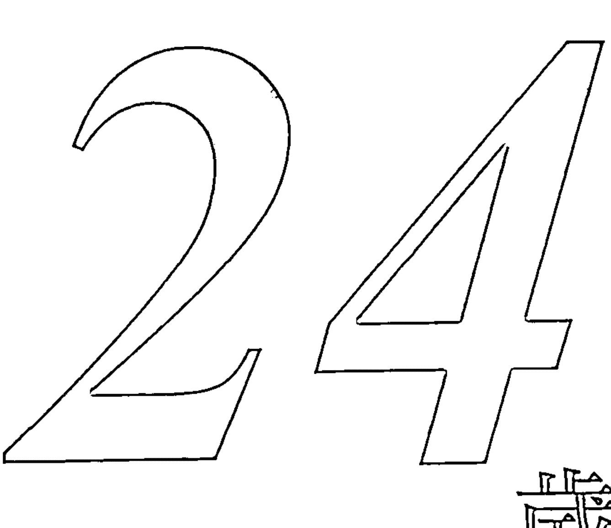

[整體運勢] 今年的運勢好過去。雖然還稱不上是鴻運當頭，但運氣逐漸翻紅走上坡。運氣一好，人也忙了起來，眼前的機會雖多，但重點是妳要展開行動，迎接各種挑戰。要知道，機會再多，卻不會落在一個呆站在旁邊觀賞的人的身上！有空多到一些不曾去過的地方走走，在那裡妳將有機會認識新朋友，而且和新朋友也特別投緣。不論他會不會是妳未來的人生伴侶，至少他可能會成為妳人生路上重要的友人。

#### 未有男友的妳戀愛對策

今年的戀情多發生在妳所不曾到過的地方。所以，如果有朋友約妳前往不曾去過的場所，別遲疑，赴約吧！今年的愛情需要妳積極的行動，才會降臨。如果妳已很積極地展開行動了，卻還是一點「動靜」也沒有，建議妳可以施一點小技巧。那就是帶一件紅色的東西在身上，紅色是戀愛的幸運色，有了它可以大大增強妳對異性的吸引力。舉凡紅襯衫、紅鞋子、紅圍巾、紅寶石等等，都具有同樣的「功效」。今年的妳，異性緣最佳的月份為 2～4 月、6～7 月。

#### 已有男友的妳結婚對策

和他攜手度過去感情的低氣壓，一切總算雨過天青，又是新的開始。趁著今年，妳和他可以快樂地籌辦結婚事宜。只是，如果妳的他是個個性溫吞的慢郎中，婚禮籌辦事宜的主導權最好是交在妳手上，否則，一場婚禮從開始到完成，不知道要拖上多久的時間。就今年而言，最適合訂婚的月份為 3 月、12 月；結婚則以 5～6 月為宜。大致說來，妳和他感情上應該不會有什麼危機，但如果真的覺得兩人感情有開倒車，甚至不穩的情形時，不妨重新審視一下兩人的個性是否相合。若情況還不是那麼糟糕，建議妳別急著做決定，把注意力轉移到自己的興趣上，經過一段時間的冷靜思考，再判斷該如何處理，這會是較理智的做法。

[愛的地雷] 發生在 8～9 月的重大困擾，將提前引爆兩人分手的決定，如果妳還是在乎他的話，那就不要衝動撂下狠話，免得陷情勢於無法挽回的局面。不過，如果事情是關係到他外遇的問題，勸妳也不要再吞忍下去，速速和他攤牌為妙。

## 誕生數 4

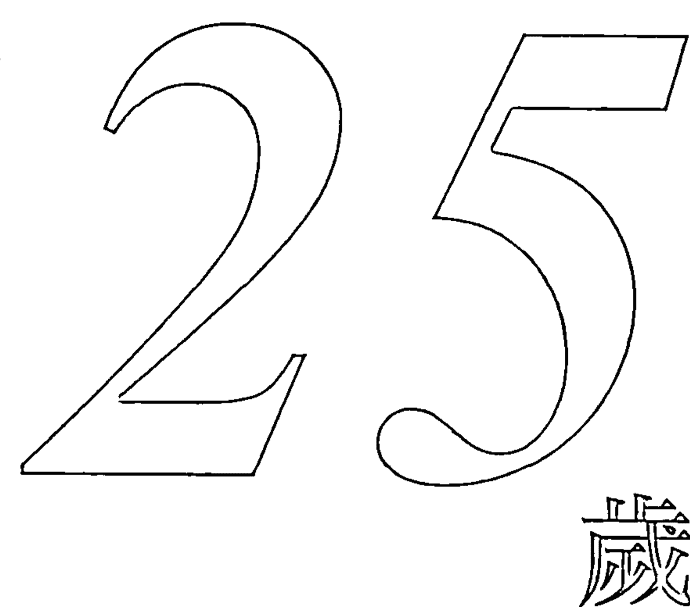

[整體運勢] 大致來說，今年是輕鬆愉快的一年。不過在初秋時分，還是會有一些小困擾讓妳變得有些憂鬱、煩惱，這時，妳可以多找些同性的好友談心，一道出遊，將有助妳負面情緒的抒發。今年正值妳對精神世界、心理學探索相當感興趣的時期，趁這機會多學習這方面的學問也不錯。至於戀愛，今年的妳和身邊的人似乎較有緣，和離得太遠的人則只有落得單相思的份兒。結婚最好要選擇符合妳現實考量的人。

#### 未有男友的妳戀愛對策

一次無意的聊天，突然妳對一個認識已久的男生動了仰慕之情。他的溫柔妳卻今日才發現……，這似乎是今年的妳在感情方面最常發生的情況。沒想到自己尋覓了這麼久，現在才注意到身旁就有這麼好的人。所以，最重要的還是妳要察覺這樣的一個人的存在才是！今年異性緣最佳的月份為年初、5～6月，以及年底左右。若過了25歲生日，急著想找男朋友，建議妳通知同性好友，請她們介紹，或集結所有想交男朋友的人，舉辦一場聯誼，也可得到不錯的結果。

#### 已有男友的妳結婚對策

去年剛成為情侶的你們，今年愛情的熱度更是一路上衝，一天二十四小時滿嘴甜言蜜語也不嫌膩。只要兩人個性相合、興趣相投，彼此給予對方適當的尊重，照此情勢來看，兩人未來的感情會愈來愈好，要攜手走進婚姻也是大有可能。就今年的妳而言，最適合訂婚的月份是2、11月；結婚則以4月為宜。相反的，如果在過了25歲生日之後，他的態度逐漸轉為冷漠或不信任時，勸妳也不要太在意，不如暫時把他放在一邊，邀幾個同性好友一道去遊山玩水，歡歡喜喜做趟旅行，待充分放鬆心情後，再平靜地捫心自問自己究竟還愛他不愛？之後所做的決定，會是較明智的抉擇。

[愛的地雷] 發生在7月的爭執，暗示著明年兩人可能會走上分手之途。1月、4月、9～10月時的妳，疑心病甚重，容易對他無理取鬧，須注意！

## 誕生數 4

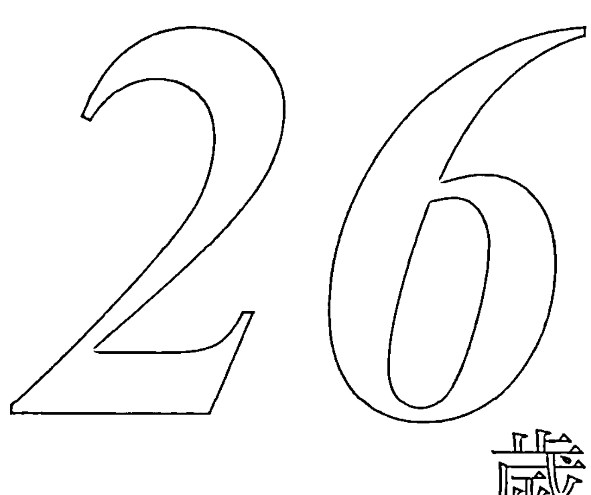

#### [整體運勢]

今年的妳，事業前途一片看好，留在原工作單位的人有升官的機會；至於要轉換跑道的人，也會有不錯的機會，讓妳愈換愈好。另外，倘若有什麼好的構想，建議妳可以在今年內提出，預料將可得到大夥的認同與肯定。今年宜「動」，所以有機會不妨多到各地旅行，出差、搬家以及換工作等等，均可為妳帶來好運。至於戀愛運方面，也是旺得足以讓妳躲在棉被裡偷笑，高唱著：「快樂得不得了！」

#### 未有男友的妳戀愛對策

今年的妳，儼然是個「萬人迷」，尤其是從事一些休閒活動時，有機會遇到條件不錯的男孩子。建議妳可以畫點淡妝，而鮮明色彩的服飾，也可使妳更具魅力，吸住異性的目光。今年，妳和年紀比妳小的男生比較有緣，挑選對象時與其考慮對方的經濟、外貌，不如將感覺列為第一考量。但如果他是已婚人士，則不管有多來電，勸妳還是離他遠遠的，因為妳和他是不會有結果的！今年異性緣最好的月份是 3～4 月，9～10 月以及年底左右。

#### 已有男友的妳結婚對策

如果妳和他剛交往不久，今年很可能會閃電結婚。面對他突如其來的求婚，或許妳會手足失措，不知是否該答應。不過，就運勢看來，在今年籌組家庭是不錯的時機。所以，如果妳對他不是抱著玩玩的心態，彼此心靈也契合，那就答應他吧！不過，在兩人婚事尚未抵定、而你們也沒有生孩子的打算時，就要做好避孕的動作，否則將有懷孕的可能。至於和他交往已久，今年突然感覺兩人感情有走下坡的趨勢時，則別急著對未來做出決定，在相處時應儘量避免發生口角，就這麼放任到明年，預料感情又會有好轉的可能。就今年而言，最適合訂婚的月份是 1 月、10 月；結婚則以 3 月、12 月為宜。

#### [愛的地雷]

發生在 6～7 月的困擾或麻煩，固然已顯示兩人已不合適，但最好暫時先別急著做決定。多注意言詞，避免兩人一來一往間衝突爆發。

## 誕生數 4

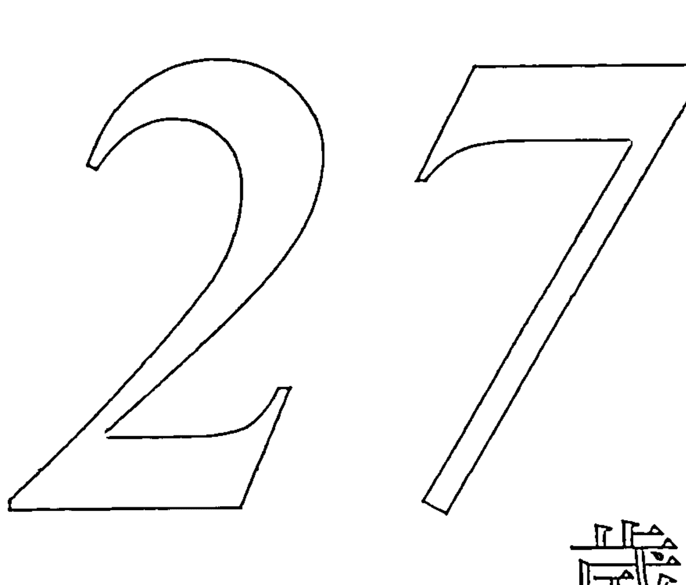

[整體運勢] 今年是妳 2 字頭人生中最能放手做自己的一年！有任何創意、構想，何妨給自己機會，勇敢表達出來。妳會找到屬於自己未來人生的發展方向。多留些時間面對自己，丟掉令心靈或身體感覺擁塞的東西，會有煥然一新的感覺。另外，妳原本並無換工作的打算，但趁著今年的好運勢，建議妳還是多留意有無更能發揮自己實力的工作。所考量的不是經濟上的安定，而是讓自己的才能更有發揮的機會，創造更大的可能性。

#### 未有男友的妳戀愛對策

「重質不重量」是今年的妳在選擇對象上應有的態度。也許追求妳的人不多，但仔細留意，還是可以找到最適合妳的人。邂逅地點則是在職場中，而且是身邊的人所介紹。或許目前的他在地位、經濟等都還不能令妳滿意，但這些條件在日後還有發展的空間，而且和人交往最重要的還是在於感受，和他在一起快不快樂才是重點。如果他是個和妳興趣、個性相投，具判斷力及行動力的人，就值得妳好好把握。今年的妳，異性緣最好的月份為 2～3 月、9 月，以及年底。

#### 已有男友的妳結婚對策

如果妳和他交往已有一段時間，今年談論婚嫁的機率相當大。尤其是彼此已拜見過對方父母的人，周遭人的聲聲催促，恐怕會讓你們想不急都不行。不過也由於能得到身旁眾人的聲援與祝福，婚禮的舉行可望十分順遂。就今年的妳而言，最適合訂婚的月份為 9 月；結婚則以 2 月、11 月為宜。倘若在此時期，妳發現和他之間的感情有開倒車的傾向時，建議妳要先釐清兩人的問題所在。如果這些爭執與不和是由來已久，而對方也無意改變，讓妳一再地失望的話，勸妳也不用再等下去了，主動向他提出分手會較好。至於如果這個問題是個新問題的話，不妨再給彼此一個機會，並試著和他兩人一起冷靜面對。

[愛的地雷] 雖說今年大致而言兩人的感情還不錯，但仍要注意發生在 5 月時的衝突。如果他表現出來的是一副沒誠意要解決的樣子，乾脆和他分手。明年可望會遇到比他更適合妳的男人。

## 誕生數 4

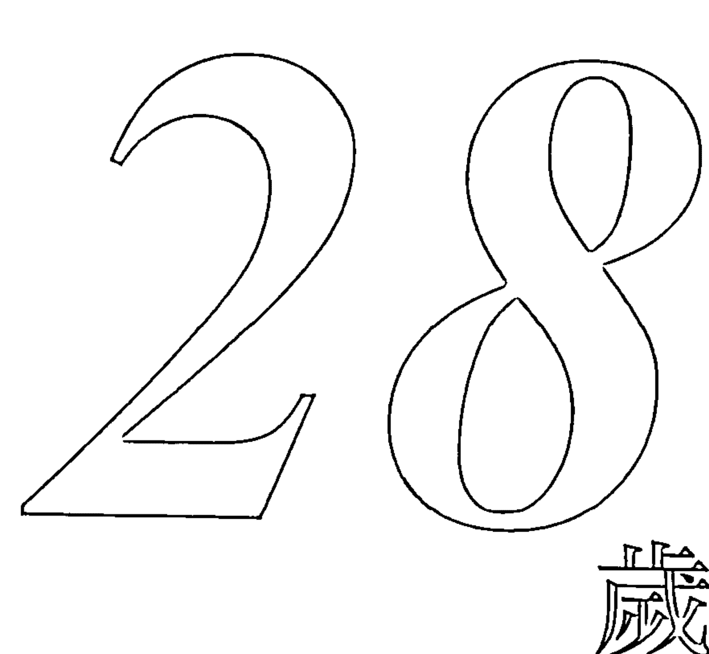

#### [整體運勢]

周遭混亂的場面讓妳有些心慌意亂，儘管變化不見得是件壞事，但對於習慣凡事「慢慢來」的妳，總有些不知所措，像是還沒搞清楚是怎麼一回事，就在眾人喧嘩的場面中被逼著做出決定。特別對於妳剛認識的情人，有種被他牽著鼻子走的茫然感，不過卻也不禁沈醉在兩人肉慾世界的甜蜜裡。其實建議妳也不需把事情想得太嚴肅，凡事總需要經驗，既然想愛就往情網裡跳。更何況，今年是最適合挑戰的一年。

#### 未有男友的妳戀愛對策

今年的妳，戀愛運紅得發紫，不過運氣再好還是要及時把握！當愛情來臨時，為了怕受傷而考慮再三，想必沒有男孩子有耐心等下去。所以，當看到不錯的男孩子時，「懂得及時把握」是戀愛成功的重點。今年的妳特別適合挑戰新事物。過去是否曾有過夢想卻始終未實現？不管這些夢想是什麼，放手一搏試一試。就今年來說，戀愛機會就潛藏在對新事物的挑戰中。特別是海外之行，千萬不要錯過。今年的妳，異性緣最好的月份是 1 月、9～10 月。

#### 已有男友的妳結婚對策

今年兩人的感情稍有變化，而且多屬於負面的變化。譬如，突然對他不感興趣，覺得與其和他膩在一起，倒不如一個人生活來得自由自在。所以，今年大致說來不太可能會結婚，至於訂婚，也是等明年再說會較好。尤其是在 4～5 月時，倘若兩人有激烈衝突發生時，就代表該是分手的時候了。建議妳也不必多留戀，放掉這一段緣分已盡的情感，新的戀情馬上就會出現！明年是妳 2 字頭人生中戀愛運最旺的一年，如果妳還在猶豫躊躇，恐怕就會錯失了明年良緣降臨的機會！

#### [愛的地雷]

今年夏天妳會顯得特別心浮氣躁，有出軌的危險，宜小心！另外，發生在 4～5 月的衝突，代表兩人緣分已盡，最好就此分手！

## 誕生數 4

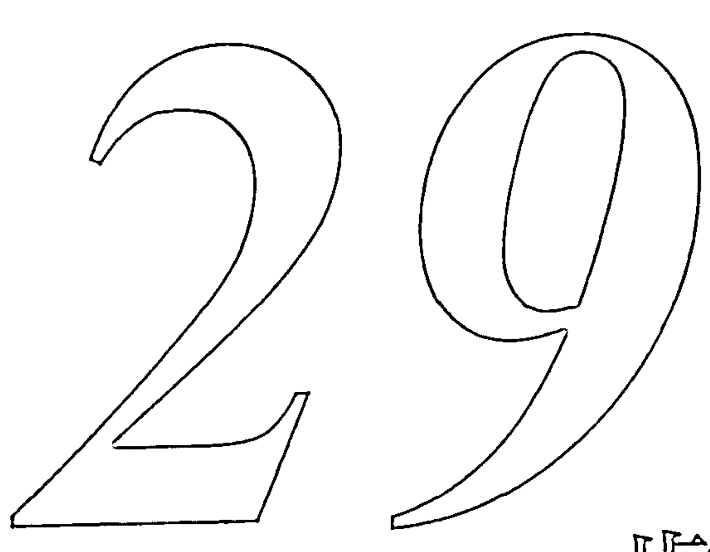

### 歲

[整體運勢] 今年是妳 2 字頭人生中戀愛、結婚、家庭運最旺的一年，錯失了良機，恐怕就要再過一陣子孤家寡人的日子了。所以，建議妳今年最好積極點，哪兒有找到如意郎君的機會，就往哪兒去，可望得到滿意的結果。另外，今年也很容易閃電結婚，至於交往已久的情侶，今年也是論及婚嫁的時候。唯一美中不足的是，在此時期家族問題多多，身為家庭一份子的妳要秉持著耐心和誠意處理，一切都會有圓滿的解決。

#### 未有男友的妳戀愛對策

妳煩惱的不是沒人追，而是眾多追求者中該選哪一個。建議妳在選擇時把握幾個重點。一是他了解妳的幽默；二他尊重妳想法；三具備經濟能力。和同時有這三項條件的男人在一起，妳才可望得到快樂。就今年而言，異性緣最好的月份是 6～7 月、9～10 月。若過了 29 歲生日後，始終沒受到愛神的眷顧，不妨檢討自己是否犯了想法上的錯誤？是否太在意對方的外表？太執著婚後過優渥的生活？以自我為中心等。若是，趕快放下這些執著，否則，要得到真愛，很難！

#### 已有男友的妳結婚對策

如果妳和他去年剛交往，今年可能會論及婚嫁。此時妳若表現出猶豫不決的態度，這段姻緣則有告吹的危險。相反的，若想結婚的是妳，對方卻沒有動靜時，建議妳最好主動提起，再積極拜見對方父母，如此一來，想在今年結婚應該不是件難事。就今年而言，最適合訂婚的月份是 7 月，結婚則以 9 月為宜。不過，結婚是兩個人的事，假如妳向他提出結婚的催促後，他卻表示還不是時候，妳也毋須強人所難，或氣憤地拂袖而去；應該冷靜想想兩人個性是否合適，而他是否又真適合結婚。在釐清之後，若認為兩人還可相處，不妨再等兩年；如果兩人真不合適，那就該考慮是否還要在一起。談不下去的愛情，妳又何必留戀？

[愛的地雷] 發生在 3 月、12 月因價值觀不同而引發的激烈爭執，很可能會造成兩人分手。6～8 月時即使對他有任何不信任的地方，也不要恣意口出穢言，以免招來不必要的誤會。

## 誕生數 4

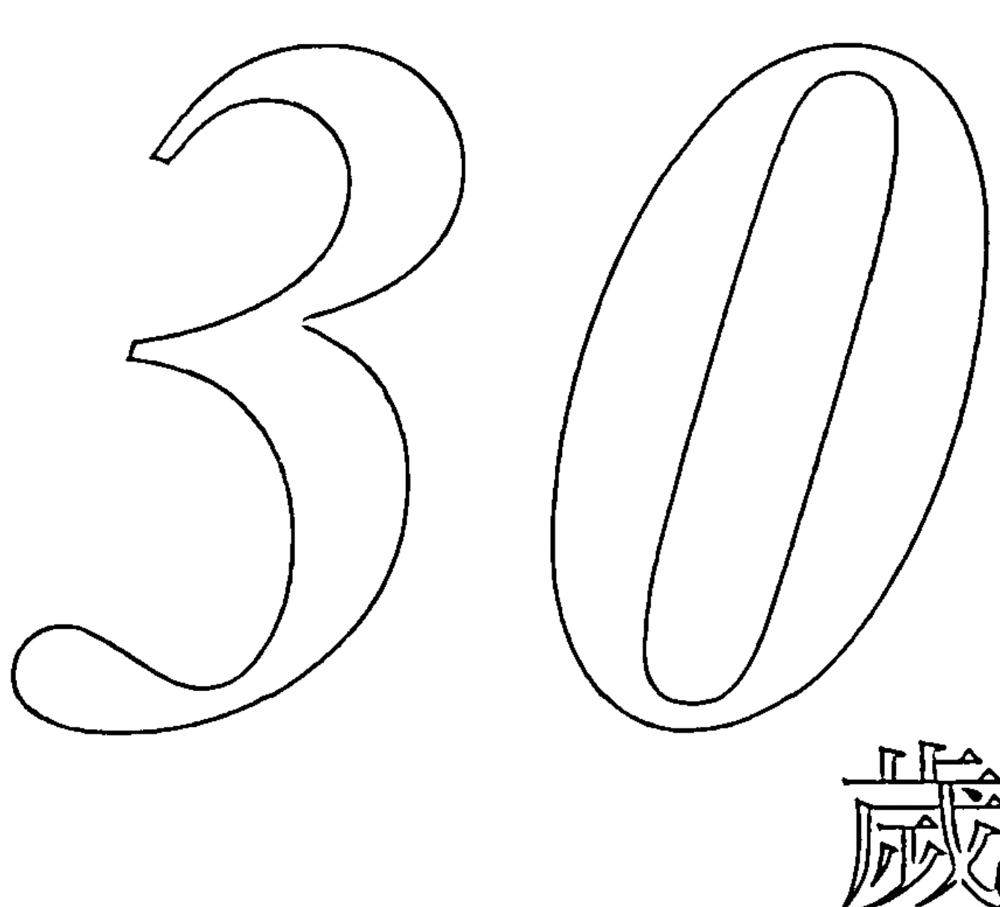

[整體運勢] 今年是休生養息的一年，所處的環境並沒有什麼大變動，這樣安穩平靜的狀態下，最適合做興趣及理想的擴展。有空不妨可以多學一些想學卻一直沒時間學習的東西。這些東西就現階段的妳而言，或許只是玩票性質，但在他日可能會對妳事業上的發展有所助益。至於愛情，在今年似乎離妳遠了一點，與其坐在那裡等白馬王子，不如學著發掘一個人生活的好處，自娛娛人來得好！

#### 未有男友的妳戀愛對策

老實說，今年沒什麼戀愛的機會，就算有，碰到的也都是不怎麼合適的對象。不是沈默寡言、優柔寡斷；不然就是光說不練、面帶愁容地等著妳當他的張老師的人；再不然就是對方條件很好，偏偏妳和他像完全不同世界的人，只能從遠處瞧著他，落得單相思的份兒。所以說，與其花心思去找愛情，不如好好地愛自己，就算碰到心儀的男人，何妨只是和他做朋友，仔細觀察他，至於進一步發展，一切留待明年再說。今年異性緣較好的月份只有 8、9 月。

#### 已有男友的妳結婚對策

今年的妳和他，昔日的濃情蜜意似有轉淡的傾向，有時妳還會有「有男朋友真麻煩！好想過過一個人自由自在的生活」的想法。遇有這種情形，建議妳何妨忠於自己的感覺，坦白告訴他最近迷上了某種興趣，想減少兩人約會的時間；如果相反的，妳很不諒解他近來漸行漸遠的腳步，希望他多騰出一些空檔陪妳，也何妨直接告訴他。總之，今年兩人感情發展宜忠於自己的感覺，有什麼想法就直接表白，不要有任何隱藏，這會是最好的處理方式。就今年而言，最適合訂婚的月份是 6 月，結婚則最好等明年再說。

[愛的地雷] 發生在 2 月、11 月因價值觀不同而引起的激烈爭吵，可能導致兩人提前分手，宜避免得理不饒人。另外，發生在 5 月、7 月的爭執，最好由妳先向他道歉。

## 誕生數 4

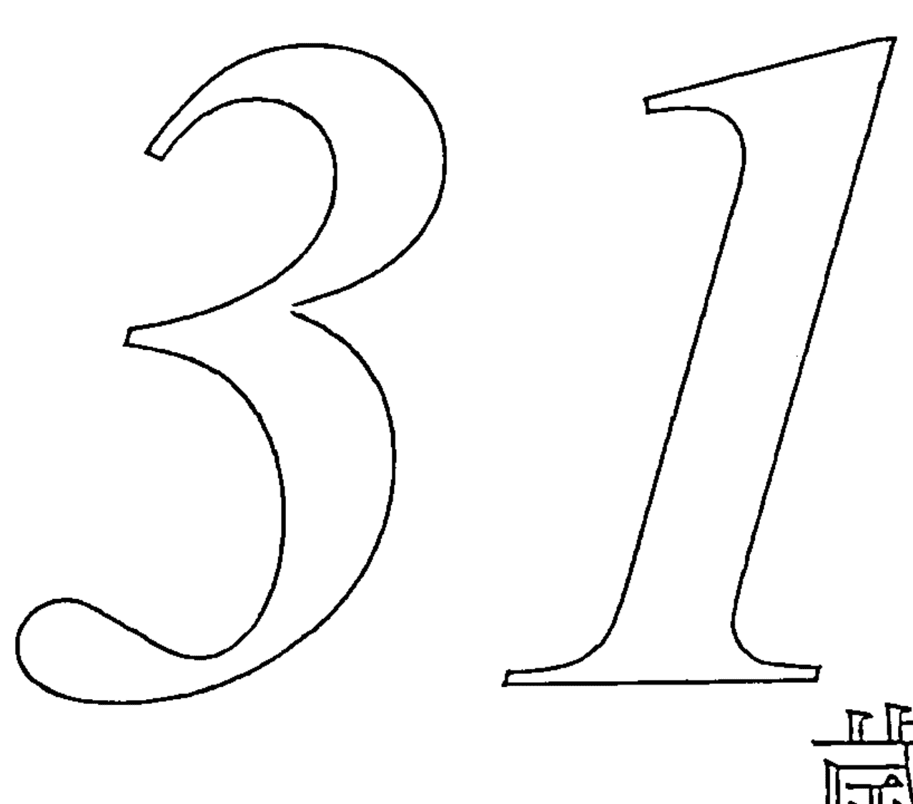

[整體運勢] 繁忙的一年。今年的妳，生活中除了工作還是工作，而且人情世故、提攜後進等雜務增多，讓妳簡直沒有自己的時間。儘管這些事情讓人覺得有點煩，但如能善加處理，來自周遭人的評價及對妳的肯定，也會提高不少，所以把它當做是種自我人際關係的歷練吧！只是忙碌之餘，壓力過大，難免會有身體不適的情況產生。建議妳在今年要多從事一些抗壓的活動，再忙也要為自己騰出個空檔輕鬆一下。

#### 未有男友的妳戀愛對策

由於今年的妳除了工作還是工作，所以連戀愛機會也是在工作場合中碰到的，建議妳稍微留意一下年紀稍長，有穩定的經濟基礎的男人，可先以兄妹關係發展，再一同步入家庭，未來的相處多能順遂。至於年紀小於妳的追求者也不少，不過感覺上妳較適合做他的人生導師，和這種人結婚，要由妳來負起維繫兩人間感情的重任，是較為辛苦的。就今年的妳而言，異性緣最好的月份是 7～8 月，如果還沒什麼「動靜」的話，不妨請上司或親戚代為介紹，也是不錯的辦法。

#### 已有男友的妳結婚對策

今年是結婚的好時機，如果妳和他早有此共識，就直接由妳提出，早早去拜見雙方父母，著手準備結訂婚事宜吧！就今年而言，最適合訂婚的月份是 5 月，結婚則以 7 月為宜。相反的，如果妳和他交往時間已超過兩年，卻遲遲沒有結婚的共識時，建議妳最好再回頭審視一下兩人個性是否相合。如果不合，何妨在今年儘早快刀斬亂麻，提出分手。尤其明年的運勢中隱藏著舊有關係會為妳帶來痛苦的可能，所以要分手，還是以今年為妙，至少可省卻明年可能會面臨的傷害。只是，向他提出分手的過程也要以平和氣氛為第一考量。如果他不願意，勸妳也不用勉強，給這段感情一段時間，靜待它因冷卻而漸漸淡漠了。

[愛的地雷] 發生在 1～2 月、10～11 月的大麻煩暗示著兩人緣分已薄，加上如果衝突是因為他的無理取鬧，建議妳最好考慮分手。

## 誕生數 4

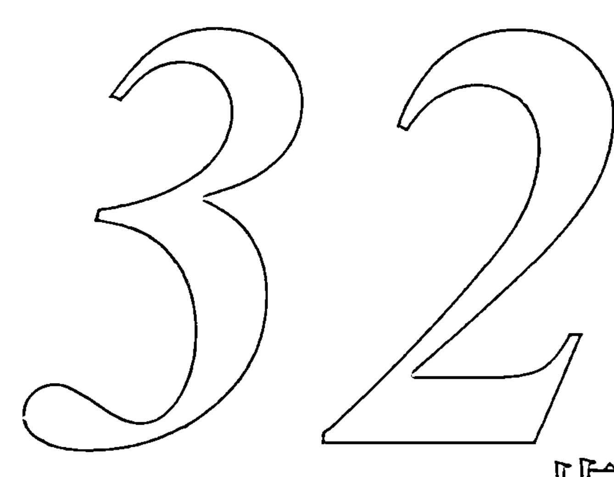

[整體運勢] 充滿變化、轉機的一年。在今年，妳或許將得面對因周遭環境的變化帶來的各種困境，讓妳不得不也跟著改變自己、甚至失去自己原有立場、和重要的人分手等無奈，但何妨把這些不順遂當做是個脫胎換骨、讓自己重新成長的機會？經過這一年的衝擊與轉變，妳將有機會蛻變成一個成熟的女人，更加具備知性及生活能力。總之在今年，面對任何挑戰宜忍耐自重，抱持著責任感，奮力向前。

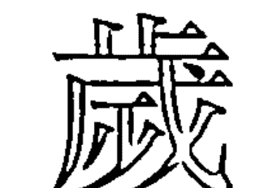

#### 未有男友的妳戀愛對策

今年的戀愛運正值青黃不接時期。除了要勇於揮別過去沒有必要的纏人的人際關係之外，也要面對短時間內新戀情還不太可能會發生的窘境。也許一個人孤單過日的感覺不怎麼好過，但要知道凡事是強求不來的。尤其在今年，強求新男友的出現，只會因急躁而認識不清，導致未來更多的傷害。所以今年的妳，不能說是沒有戀愛機會，只是碰到的異性都不會是太好的人，今年只須做到勇敢捨棄過去不成熟的感情、冷靜面對眼前看似炫爛的追求行動即可，一切靜待明年再說。

#### 已有男友的妳結婚對策

在 32 歲生日過後，如果兩人還能甜蜜如昔，顯示他真的很可能成為妳人生的伴侶，要好好珍惜。只是今年還不是適合談訂婚、結婚的時候，一切等到明年再說。至於今年不能再持續以往甜蜜感覺的情侶，那是因為今年的運勢正好是讓妳有機會看透他許多缺點的時期，所以妳會突然間覺得怎麼兩人齟齬這麼多，在一起時不是常為價值觀不同而時有衝突，就是發現他有很多行為是妳所難以忍受的。面對這樣感覺的改變，建議妳也不必把它看得太負面，不如換個角度看待，它何嘗不是一個認清對方的開始。經過雙方的努力和溝通後，如果還能有緣在一起，未來兩人的感情將能更加穩定，更有可能攜手走上紅地毯的那一端。

> [愛的地雷] 9～10 月左右兩人若有大衝突發生時，除非彼此的個性相當契合，否則建議妳還是和他分手比較好。今年的分手將有助於明年認識更好的對象。

## 誕生數 4

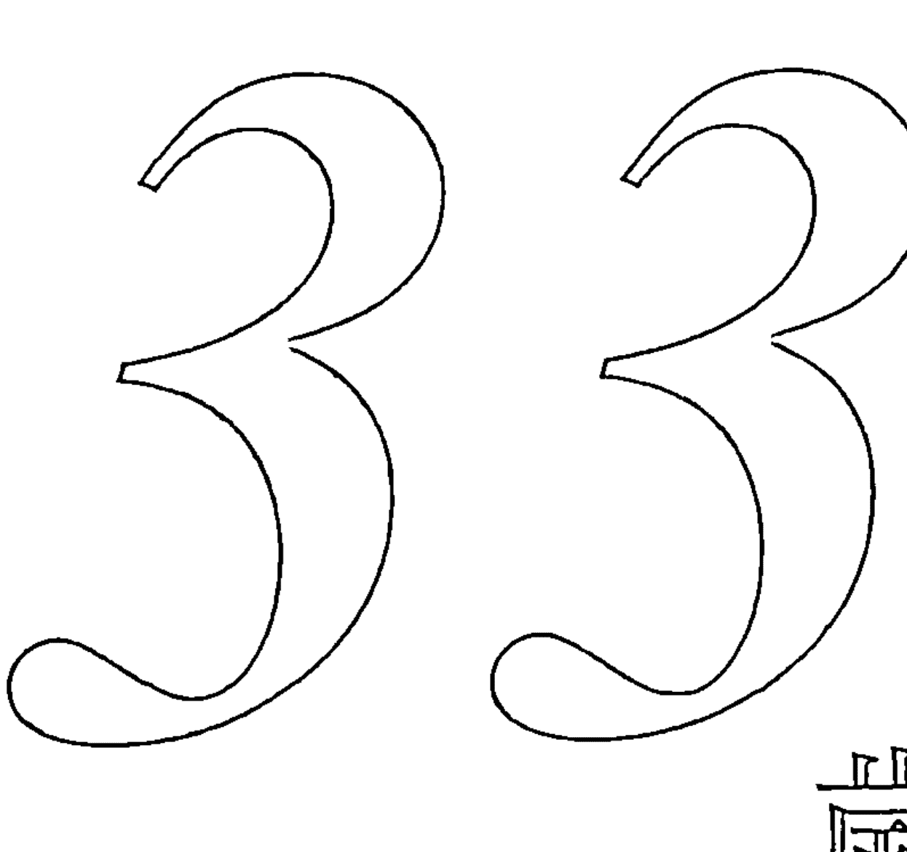

[整體運勢] 今年對妳來說，無疑是個好的開始。許多既新鮮又幸運的事情，都將在這一年中展開，不過，這也還得有賴妳積極的行動來加以配合才行！特別是對去年才辭掉工作，今年重新投入新的工作戰場，或是決定要出國念書的人而言，今年的妳更能順利地找到今後的人生方向。總之，「想到就去做」是今年招來幸運及成功之鑰。

#### 未有男友的妳戀愛對策

如果妳是個期待談戀愛的人，今年不會讓妳失望的。特別是在一些從未去過的地方，遇見未來另一半的機會相當大；不僅如此，也可望遇到足以影響妳一生的朋友。所以，當聽到有人邀約要去某一個新鮮的地方時，快快跟去便是！今年的妳，人際關係發展的運勢不錯，除了和舊有的朋友保持良好友誼外，結交新朋友的機會也挺多；有空多和朋友聚會，未來的他，可能就在那兒等著妳！今年異性緣全年都亨通，最佳的月份則是在 2 月、4～5 月、9 月、11 月至年底。

#### 已有男友的妳結婚對策

攜手走過去的感情低潮，今年的你們感情上可望有更上一層樓的發展，甚至論及婚嫁也大有可能。如果今年內他向妳提出結婚的要求，何妨大方點頭答應，然後快快著手準備婚禮。就今年的妳而言，最適合訂婚的月份是 3 月、12 月；結婚則以 5 月為宜。另外，今年剛認識的情侶，閃電結婚的機率相當大。當然這麼快的速度難免會讓妳有些猶豫，這時不妨問問自己，對眼前的他究竟信不信得過？如果信得過，加上依今年的運勢看來，找到人生中另一半的機率頗大，那又何妨給彼此一個機會。雖難免有驚險，但就期許在未來的人生旅程中，雙方能在相互信賴、互相扶持中度過吧！

[愛的地雷] 發生在 8～9 月時激烈的爭吵，可能會導致兩人衝動地提出分手，也許事情真錯在他，但如果不是那麼嚴重，建議妳也不要對他太過苛責，以免造成遺憾。

## 誕生數 4

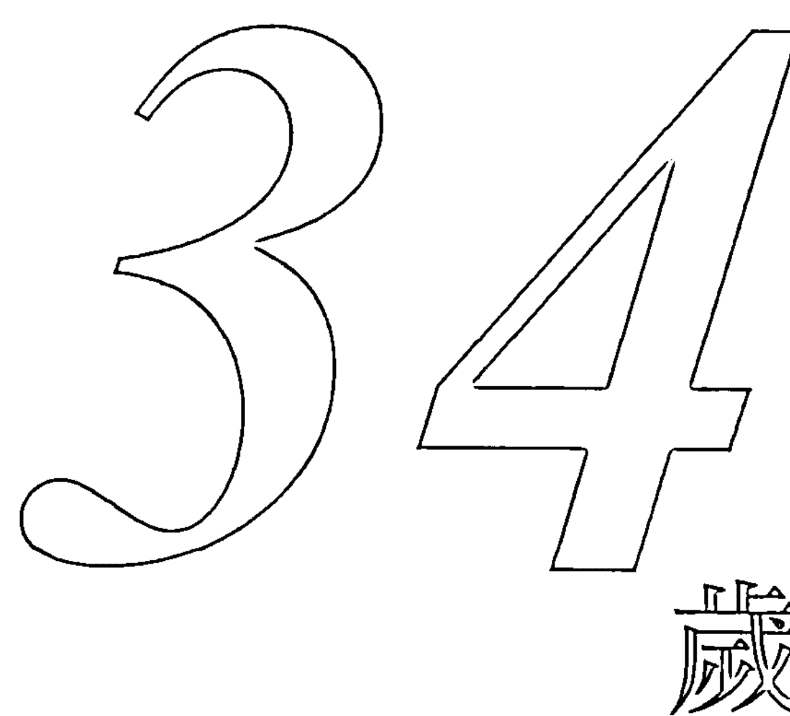

[整體運勢] 運勢大體說來平穩、順遂的一年。在今年，妳將蛻變得比以前更具女人味，這也使得身邊的追求者愈加多了起來。生活大致上平靜無波，只是偶爾會為一些瑣碎的人際關係所煩心。遇有心情不太好的時候，建議妳不妨去泡個澡、游泳或到海邊走走紓解一下壓力，千萬不要淨是悶在心裡，那是會悶壞妳的氣質與女人味的！

#### 未有男友的妳戀愛對策

「愛情，總在出其不意中出現！」，對今年的妳尤其如此。原本把他當成普通朋友，不知從何時開始，竟瘋狂地愛上他。有此種感覺時，建議妳應該好好把握。在過了 34 歲生日後，若仍然不見這樣的緣分，妳可以請妳的同性友人們介紹，她們就是妳最大的資源。另外，須注意的是，若有異性求妳為他開導、解惑時，妳最好婉拒；縱然妳有滿腔助人的渴望，但幫助他將會換得白馬王子的遠離，所以千萬要注意！今年的妳，異性緣最佳的月份為 4～5 月、年底左右。

#### 已有男友的妳結婚對策

對去年開始交往的你們來說，今年無疑是苦盡甘來，兩人感情更為濃郁的一年。在確定彼此更愛對方、更能信賴對方後，依順自然情勢的發展，妳可以選擇在今年或是明年和他攜手走入結婚禮堂。但原則上就是不要操之過及，一切靜待他主動開口。就今年的妳而言，最適合訂婚的月份為 2 月、11 月；結婚則以 4 月最為合適。至於如果今年妳發現兩人感情有不進反退的跡象時，建議妳先反省一下自己。想想是否自己依舊放不下他的過去？有無疑心病太重的毛病？能解決這種問題的永遠只有妳自己，學著改變自己的想法、放寬心胸，和他之間的感情才可望長久維繫下去，永遠甜蜜如昔。

[愛的地雷] 9～10 月時的妳，有過度憂慮、疑心病重的傾向，須注意！另外，發生在 7 月間的困擾很可能造成兩人分手，究竟能不能原諒他？能原諒他到什麼地步？全看妳的包容力了。

## 誕生數 4

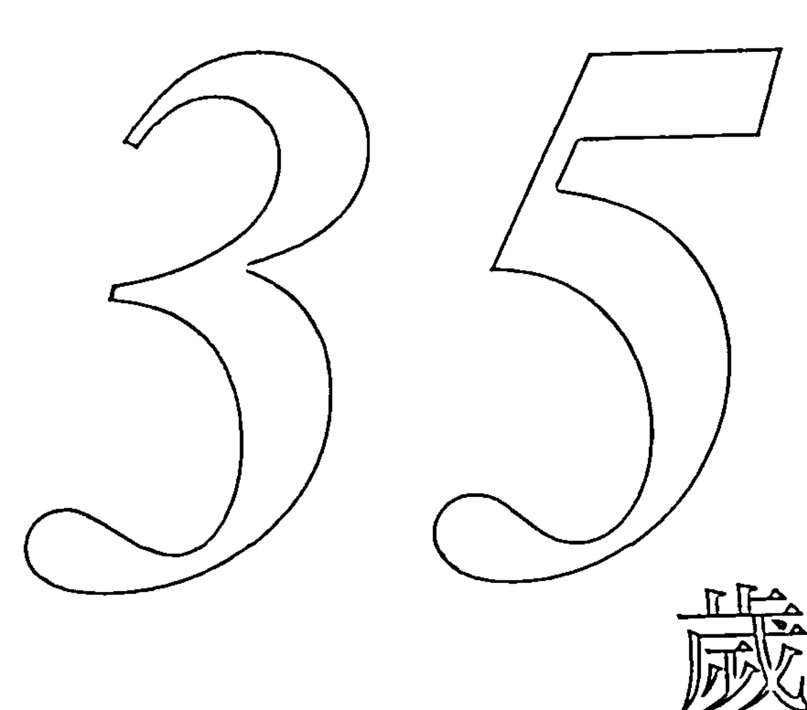

[整體運勢] 極具變化的一年。在今年，周遭環境變動的機率頗大，這些變動或許是搬家或換工作。儘管在熟悉新環境的過程中要花不少時間去適應，但在忙碌之中，卻有機會結識好姻緣。在外出旅遊方面的運氣也不錯，可望有段浪漫的邂逅，只是藉由這樣的方式迸出的火花，通常也像火花一樣，剎那間很燦爛，但轉眼間卻消失得無影無蹤，建議妳不必抱著過分認真的心態，真正有結果的愛情可能要待明年才會出現。

#### 未有男友的妳戀愛對策

妳的異性緣不錯，只是始終找不到合意的人。其實，男女之間的交往何必太認真，先敞開心胸和眼前的追求者做朋友，或許少了份談真感情的浪漫，但多結識異性朋友也是不錯。只是，結交異性朋友要注意距離分寸的拿捏，以免惹人誤會，嚇走了真正的他。另外，如果過了 35 歲生日後，感覺不到受眾多異性追求的氣氛的話，可以多在妝扮上下功夫。尤其是紅色的飾品，能為妳帶來好運。今年的妳，異性緣最佳的月份為 3～4 月、8～9 月及年底。

#### 已有男友的妳結婚對策

今年才剛認識的情侶，如果妳的他年紀比妳大的話，今年兩人很可能會閃電結婚。或許突如其來的求婚會令妳有些失措，但何妨就接受他的熱情，大膽地走入婚姻吧！就今年而言，最適合訂婚的月份為 1 月、10 月；結婚則以 3 月、12 月為宜。相反的，如果妳和他交往已有數年的時間，今年兩人感情則容易受到環境變化的影響，尤其是妳，對他的感覺有動搖的傾向。倘若在 6 月間兩人的關係有急遽惡化的傾向，建議妳回頭重新審視彼此個性是否相合？如不適合，加上造成兩人這次感情惡化的原因又是由來已久，那勸妳不如和他分手。今年的結束，暗藏著幸運降臨的機會，換句話說，眼前的分離可望招來明年更好的相遇。

[愛的地雷] 9 月到年底的這段期間，妳的情緒有不太穩定的傾向，如果在爭執中任性地說出一些責難他的話語，恐會令他萌生和妳分手的意念。

## 誕生數 4

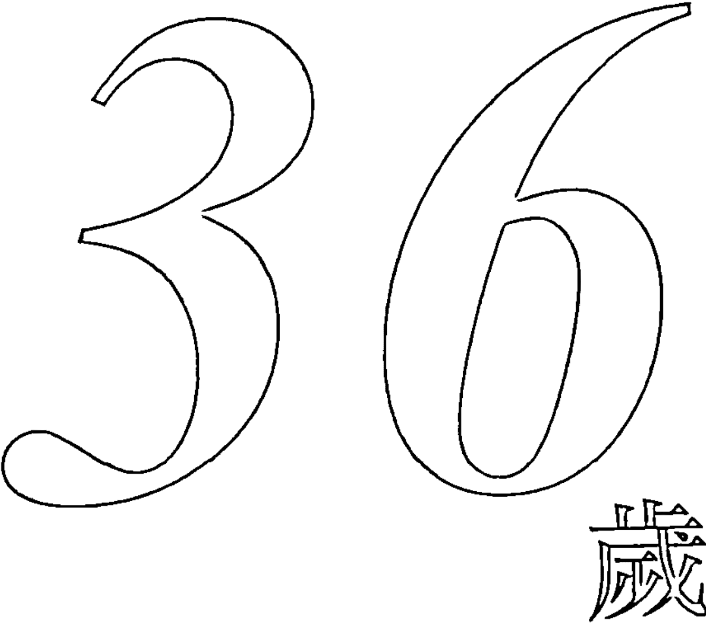

[整體運勢] 走過去年充滿變化的一年，今年的運勢重歸平靜，對妳而言，或許有種總算可以稍事喘氣的感覺。不過，也因為太安定了，沒什麼大事發生，相對的戀愛機會就不如去年那樣豐富；但對和男友交往已久的人來說，今年卻有可能會步上紅毯的那一端。另外，長久以來遲遲未解決的問題，在今年也有爆發的傾向，建議妳與其一直視若無睹地逃避下去，不如趁著這次機會勇敢面對它，把它徹底地斬草除根。

#### 未有男友的妳戀愛對策

今年要認識新異性的機會不多，藉由上司、長輩所介紹的多是經濟條件不錯，屬於居家型的男人。當然，由於不是自由戀愛，透過正式儀式配對的過程，讓妳因為少了份浪漫而覺得有些的遺憾。若妳真的這麼堅持結婚一定要經由自由戀愛，那要等到 38 歲。38 歲是妳 3 字頭人生中結婚運、戀愛運最佳的時刻，在期待它的到來之前，面對今年不順遂的戀愛運勢，就將它當做是休息喘氣的好機會吧！今年異性緣較佳的月份是 2 月、11 月至年底。

#### 已有男友的妳結婚對策

交往有數年時間的情侶，可以在今年準備結婚！如果不見他有任何表示，就主動地問他：「你什麼時候娶我？」。就今年而言，婚禮的籌辦可望得到雙方家長不少的支援，省卻很多困擾。今年最適合訂婚的月份是 9 月，結婚則以 2 月、11 月為宜。然而如果妳和他交往已逾兩年，對方對結婚至今仍抱持不明確的態度，而妳也不確定他是不是妳未來的另一半時，建議妳開門見山地告訴他：「你再不和我結婚，我就要另外找對象去！」千萬不要擔心這麼做會嚇走他，因為他若非妳生命中的「真命天子」，再繼續耗下去，最後吃虧的是妳！反正從明年起戀愛運都不錯，妳一定能找到比他更適合妳的男人！

[愛的地雷] 5～6 月衝突發生的原因，如果只是過去問題的重演時，勸妳也不用再多做考慮，和他分手吧！另外，今年夏天妳容易有出軌的衝動，要小心！

## 誕生數 4

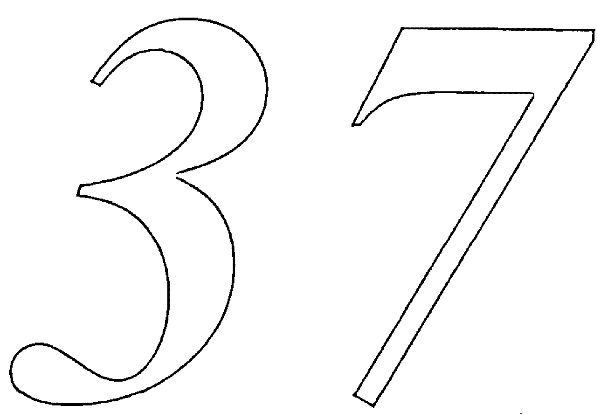

[整體運勢] 從今年起連續兩年，妳的戀愛運都是呈現翻紅情勢。絡繹不絕的追求者，沖淡不少妳擔心自己嫁不掉的疑慮，對於自己又恢復了信心。就今年而言，運勢可以說是愈「動」愈好，所以，不要放棄出國的機會，甚至搬家也能拉抬運勢。眼前桃花雖多，但不可避免的仍有些玩弄女人感情的騙子夾雜在裡面，在享受被人追求的浪漫和喜悅之餘，切記要張大眼睛仔細過濾、觀察，要在今年完成婚姻大事並不難！

#### 未有男友的妳戀愛對策

隨著搬家、旅行等移動的機會，妳的戀愛運會益發地好起來，尤其是在國外。不過對於異國戀情，有人或許會擔心回國後，戀情是否也同時告吹？建議妳以下的方法：在國外時除了當他的情人外，也和他發展為友人的關係。在一起時多做些精神層面的交流，即使分開兩地後，彼此也有想再連絡及談心的渴望；不然，直接告訴他，交往的目的就是為了結婚。總之，本著坦率、直接的態度，將有助於妳找到真正的戀情。今年異性緣最佳的月份為 1 月、夏季至 10 月左右，時間頗長。

#### 已有男友的妳結婚對策

由於今年追妳的人實在太多了，擋不住外面的誘惑，妳的眼光頻頻瞄向別的男人，加上忙於適應變化劇烈的環境，這使得妳和他的感情顯得有些岌岌可危。如果在深思熟慮後覺得他還是最適合妳的人，卻又擔心自己受不了虛榮心的誘惑，建議妳不如乾脆和他著手籌辦婚事，至少增加和他約會的次數，以阻絕自己有胡思亂想的機會。至於如果在 37 歲生日過後，覺得兩人感情愈來愈濃、愈趨穩定，建議妳最好趁此情勢和他談論結婚的事，只不過，今年的運勢充滿變化，較不適合組織家庭，不如今年先訂婚，婚禮則延至明年再舉行。今年最適合訂婚的月份是 8～9 月。

[愛的地雷] 倘若發生在 4～5 月的麻煩，讓妳對他心灰意冷，而且怎麼也無法回復以前的熱情時，分手或許是最好的選擇。

## 誕生數 4

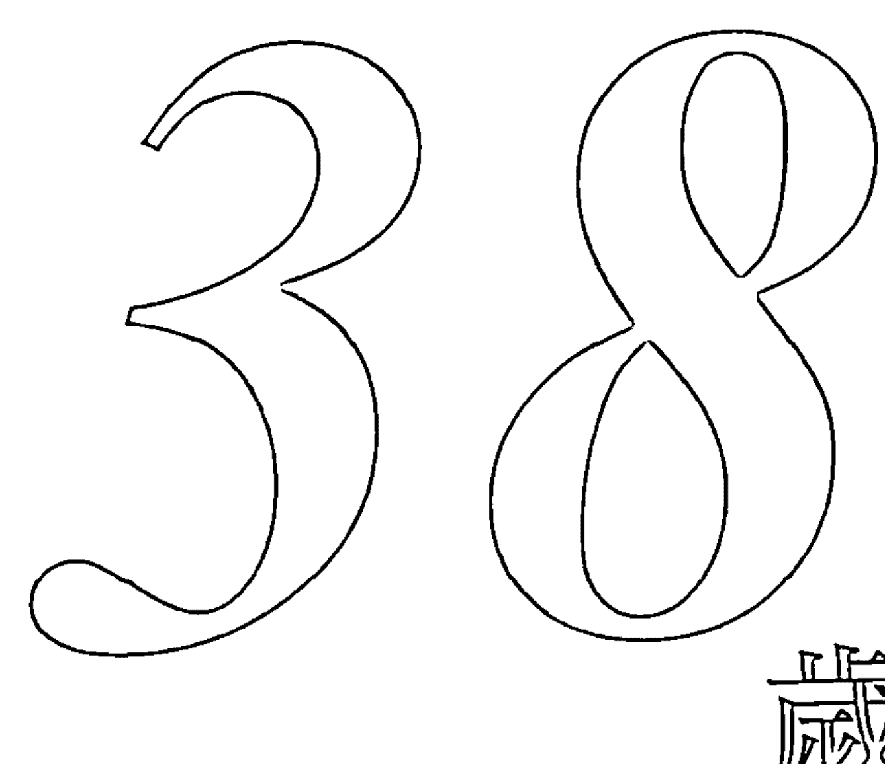

[整體運勢] 今年是妳 3 字頭人生中最後一次紅鸞星動的機會，持續去年受異性熱烈追求的氣氛，今年的戀愛運、結婚運會旺到最高點。除了很有可能閃電結婚外，所遇到的對象也多是條件優秀、很適合結婚的好男人。但美中不足的是，今年妳的家庭暗藏著些許危機，甚至可能會因為家中問題而不得不放棄眼前的好姻緣。如果不幸有此遭遇，千萬不要就此對自己的姻緣灰了心，只要抱持著希望和夢想，未來還是值得期待的。

#### 未有男友的妳戀愛對策

持續去年的魅力，今年的妳的電力更是強到了極點，而且對方都是條件不錯的男性。他們多半是原本就生活在妳周遭的人，像住在附近的鄰居、職場中其他單位或部門的人等。儘管距離很近，過去卻一直沒有機會相識，在今年因緣際會總算是讓兩人給碰上了。或許和過去認識的一些異性朋友相比，不如他們浪漫，但他的真誠及對妳的了解，加上成熟的人格、基本的經濟能力及社會地位，和他在一起，未來的妳必能過著幸福快樂的日子。今年異性緣最佳的月份是 7～9 月。

#### 已有男友的妳結婚對策

若妳和他交往已一年，在今年極有可能會踏上地毯的那一端。如果過了 38 歲生日，卻遲遲未見他向妳求婚，不如就由妳主動提起，在此時期，願意給妳承諾的男人才是適合的結婚對象，否則，建議妳最好快刀斬亂麻，揮斷這些情緣。然而，一旦進入到嫁娶後，緊接著很可能要面臨來自雙方家庭所給的阻撓，這過程中兩人是否能秉持著一路以來深厚的情感，共同攜手解決、面對這些阻撓，便成了兩人感情能否繼續維持的關鍵。如果可以，雨過天晴後兩人要結為夫婦自然沒有問題；如不行，則恐怕要再等個兩年以上的時間，才能再遇到相同的機會。就今年而言，最適合訂婚的月份是 7～8 月，結婚則以 9 月為宜。

[愛的地雷] 在今年選擇走上分手的情侶並不多，但還是要注意發生在 3 月、12 月時的小爭執。氣憤之餘，言詞稍不小心就有傷人的危險，甚至讓他萌生去意，建議妳要多留意。

## 誕生數 4

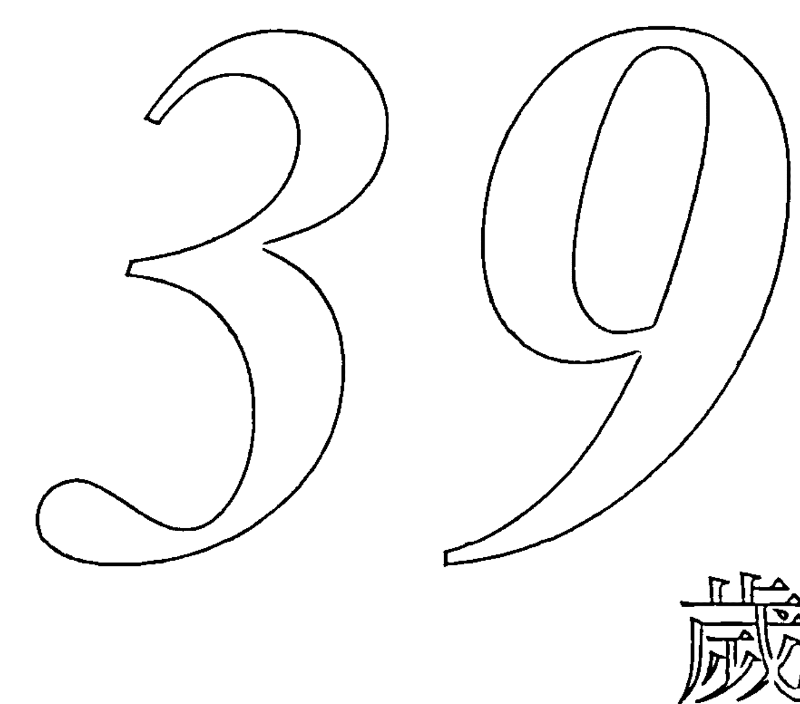

[整體運勢] 走到 3 字頭的最後一年，今年的妳，有一切歸於平靜的感覺。對於許多俗事的追求開始覺得厭煩，轉而想探尋一些屬於較內在的東西。所以在今年，妳會對心理學或宗教方面的事物開始感到興趣，對過去從未涉獵過的學問也充滿好奇，進而花不少時間去研究、學習。這種做法相對的也改變了妳的生活方式，在偌大的世界中，漸漸地妳找到了屬於自己的方向，從其中也找到了以平常心平靜面對世事變化的方法。

#### 未有男友的妳戀愛對策

今年的妳，突然對戀愛失去了興趣，其實能這樣反而好，正因不再強求，妳在面對異性或同性朋友時，都以最自然的態度示人，讓人更喜歡和妳做朋友，結交的朋友也都是可以交心的。所以即使不刻意追求，但要能談得來的，都是屬於良緣型的愛情。另外，由於對「學習」抱持著濃厚興趣，也可望結交到不錯的異性。如利用 E-mail 和同好交換心得、資訊。愛情有時便被這麼給「談」了出來。今年異性緣最佳的月份為 8 月左右；而在 5～6 月時，最容易藉由網路通信迸出愛的火花。

#### 已有男友的妳結婚對策

經過去年的釐清，今年的妳和他感情逐漸明朗化，只是就現階段來說，兩人顯然還是希望處在一個靜靜培養愛的階段。既然如此，那就不要強求要趕在今年完婚，頂多訂個婚，算是對感情未來發展彼此有個默契與共識，至於結婚的事，則留待明年再說。有空兩人相處時，多談些內心層面的事情，或許是聊聊兒時記憶、對某件事的看法，或是對未來人生的規畫等，都將有助兩人感情的提昇。就今年而言，最適合訂婚的月份為 6 月。相反的，如果今年兩人的相處令妳有種強烈的孤獨感產生時，建議妳最好回頭審視兩人的個性是否相合。倘若他的個性對妳造成負擔時，那就試著慢慢淡化兩人的情感，讓他漸漸走出妳的世界。

[愛的地雷] 因價值觀的不同而發生在 2～3 月、11 月至年底激烈的爭吵，暗示著妳和他真的不適合，何妨捫心自問，對他，妳究竟了解多少？

## 「速配！」診療室

～誕生數4的女性和各男士們的速配程度～

### 速配指數

♡能愛得長長久久 ○愛得短暫而熱烈 ☆適合結婚 ◇適合當好朋友 □適合當工作上的搭檔 ※只要努力，還是有希望速配成功 ×不如不相識

### 誕生數1的男士

只能當朋友

生性樂觀的他，活潑的個性讓妳在初見他時確實是小鹿亂撞了一陣；然而等到兩人在一起一段時間後，漸漸地妳便會發現怎麼也跟不上他的腳步。謹慎派的妳，常為大而化之的他捏一把冷汗，當妳還在猶豫著：「這樣做行嗎？妥當嗎？」，卻又見他已展開另一個新行動，而妳，只能愣愣地站在原地，猜不透他心裡到底怎麼想，更別說要能和他產生共鳴了。另外，在情感方面的表達上，兩人的差別更是南轅北轍，他是有愛就大聲說出來的人；妳卻是「愛妳在心口難開」型的人，想想，有誰喜歡在興沖沖大喊：「我愛妳！」後，得到的卻是靜悄悄的反應。所以，這兩種人要當情人恐怕無緣，頂多，只能做個朋友吧！

### 誕生數2的男士

攜手走上紅毯的那端

妳和他的組合，堪稱是「天造的一對，地設的一雙」。不過，在剛開始時，兩人的發展倒也不是想像中那麼順利。原因是內向、沈默的他，在團體中總像個隱形人，不去注意根本不會發現他的存在，如此自然不容易吸引妳的目光；再者，就算有機會彼此認識了，而他對妳也確實存有好感，不擅表達的他，卻遲遲不知怎麼向妳表白。等到一次偶然的機會中和他深談後，他的內涵總算暴露在妳的眼前，而溫柔、包容、寬大的氣質更讓妳不覺對他產生了好感，至此，兩人這才一步步踏上愛情的道路。雖然沒有一見鍾情的震撼，但由於妳和他是先經由做普通朋友，而後成為情侶，所以感情基礎可說是十分深厚，除了男女愛情外，更有交心的友情，這樣的兩人結為夫妻，締造美滿家庭的機率可說是相當地大。

### 誕生數3的男士

妳終究只是我夢中的情人

和誕生數3的男生配對，老實說真的有些困難。原因是活潑機伶且玩心甚重的他，在妳看來似乎嫌輕浮了些。當然，也不是說這樣個性的妳就完全不欣賞，事實上每每看到有他存在的地方莫不充滿歡樂的氣氛，而他也始終如顆閃亮的明星般受人矚目，看著看著不禁也對他產生莫名的崇拜之情。只是，這份崇拜最終也僅止於崇拜，因為個性樸實內斂理性的妳深知，在他心中，根本未曾注意到妳的存在；而在妳眼中，他像高高站在閃亮舞台上的巨星，那樣受人歡迎，和妳的距離又是那樣遙遠，甚至還有種高不可攀的感覺。這樣的兩人怎麼可能談得成戀愛呢？他似乎永遠只能做妳夢中的情人。

### 誕生數4的男士

打從一開始便無話可說

妳和他也不適合在一起，而且不需要經過一段時間的交往你們才能意識到這一點，打從兩人認識的一開始，彼此就知道跟對方是絕緣體了，頂多做做普通朋友、點頭之交，做夫妻？怎麼可能！這其中的原因很簡單，因為你們兩人實在太像了，太保守、太理性又太內向。對妳來說，常覺得自己已經夠「悶」、夠不懂表達了，怎麼可能再去找一個和自己一樣「悶」的男人？兩個人成天悶在一起，這樣的愛情該怎麼談下去？有感於自己的保守、不浪漫，所以妳會比較期望有個活潑、浪漫一點的男孩出現，帶領妳感受愛情的甜蜜與驚喜。這種需求，至少誕生數4的男孩是不可能給妳的。

### 誕生數 5 的男士

你是我前世的仇人?! X

你和他在一起，除非明天太陽打西邊出來！可別以為這樣的形容很誇張，它可是千真萬確！原因是誕生數 5 的男孩浮華、喜歡追逐炫爛生活，又帶點霸道的個性，看在別的女孩眼裡或許會覺得很酷、很正點，但在理性、踏實得有些呆板的妳眼裡，卻是最最不能容忍的。光是看到他，妳就會有想罵他的衝動；同樣的，他看妳，直覺也認為是怪物一個。這樣的兩個人湊在一起還有什麼話好說的？不吵架就不錯了！所以，不要說是做夫妻、做情人，連做朋友妳都會覺得是多餘。

### 誕生數 6 的男士

心靈契合的有緣人 ♡☆

不須刻意的安排、費力的溝通，妳和他從朋友走向情人，進入禮堂，一切都是那樣地自然。溫柔善體人意的他、溫順恬靜的妳，平時兩人相處最大的興趣便是窩在家裡聊天，而且話題似乎怎樣也聊不完，心靈契合的程度讓人看了不由得心生羨慕。而一旦共組家庭後，你們也相當能滿足於平凡的幸福生活。原因是妳和他都是各自擁有才華的人，在充分發展自身才華之餘，也能相互欣賞對方的才華，並予對方屬於他自己的空間，這種亦師亦友、亦夫妻亦情人的組合，實在稱得上是完美的搭配。若有機會碰到這樣的對象，無論如何要好好珍惜這緣分。

### 誕生數 7 的男士

結為連理比例最高的對象 ♡☆

誕生數 7 的男性是誕生數 4 的女性最後最常選擇的結婚對象。基本上妳和他的想法、價值觀都滿接近的，彼此也頗能和對方產生共鳴。就拿他固執又理性的個性來說，看在別的女生眼裡，可能會覺得他怎麼那麼異類，但妳卻認為那是他對愛負責的表現；而他眼中的妳，也是個生活嚴謹、守紀律的成熟女孩。這樣彼此欣賞的兩人湊在一起、生活自然顯得幸福又美滿。只是理性得可以的他，偶爾會因想太多而有「龜毛」、躊躇不前的毛病，這點就需要妳多包容了。

### 誕生數 8 的男士

不如不相識

「不如不相識」真的是唯一可以形容你和他之間感覺的一句話。和他在一起，不快樂也就罷了，還經常搞得你傷痕累累，自信心全無。其實一開始認識時情況倒還不會那麼糟，偶爾只會聽到他抱怨：「我和你的看法不一樣」、「你把眼光放得遠一點好不好！」。不過隨著兩人交往時間日久，漸漸地會發現他的批評愈來愈多，而且言辭愈用愈毒辣，什麼「頑固、小氣、剛愎自用、沒有夢想」等形容詞紛紛出爐。而在你的眼裡，他也好不到哪裡去，諸如「粗暴、粗魯、自以為是、暴發戶」等等，你都認為是形容他最好的寫照。而這樣的兩人碰在一起，簡直沒有片刻和平安靜的時候，更教你不明白，為什麼別人談戀愛是甜甜蜜蜜、卿卿我我，唯獨你和他是成天氣呼呼、大眼瞪小眼，甚至覺得連說一句話都是多餘。所以，建議你當遇到這類男孩子時，什麼也別想，保持距離以策安全就是，更別天真地以為愛可以改變他什麼，那是絕對絕對不可能的！

### 誕生數 9 的男士

在他的懷裏嗅得到一股自由的氣息

你和他，稱得上是一種「師生關係」。誕生數 9 的男性相當能夠理解你的想法，而且從不苛求你的短處，只會不斷讚揚、鼓勵你的長處，這使得一向在別人面前甚為拘謹的你，在他面前卻能自然、放心地將最原本的自我表現出來，更充分展露出別人所不知道的幽默、富創造力的一面，內心感到悠遊自在。所以，誕生數 9 的男性可以說是個能充分激發你潛在能力的人，這點是在和別的男性相處時所不能得到的！至於所謂的類似「師生關係」，究竟誰是老師、誰又是弟子？其實並不一定，因為在不同的情形下，你倆會不斷地交換扮演不同的角色，相互扶持、打氣，即使最後不一定做得成夫妻，但至少他一定可當你一輩子的好朋友。

## 誕生數5 生活冒險家

崇尚自由的冒險家
幸運寶石：藍寶石

**個性** 誕生數5的妳，是個十足的好奇寶寶，對什麼事都抱著濃烈的興趣，更喜歡冒險刺激的生活，明知有危險，為了想一探究竟，說什麼也要親身體驗。喜歡社交生活，天生具有長袖善舞的本能，是個不論處在怎樣環境都能吃得開的人。

**戀愛傾向** 誕生數5的妳，是個天生的戀愛專家，尤其喜歡一見鍾情、乾柴烈火式的那種刺激情愛，遇到喜歡的對象也會主動展開積極的追求，而被追的男人很少不動心的，因此愛情對妳而言，就像探囊取物那般的容易。不過，也因為如此，妳的每段愛情都不會太長，甚至連對象也是五花八門，什麼樣的人都有。儘管在感情路上妳是如此左右逢源吃得開，但由於每段感情維持的時間都很短，到了一定年齡後，若還不能遇上妳認定可以和他相守一輩子的男孩，漸漸地，妳會對感情感到失望。這時，或許妳會選擇把自己封閉起來，拒絕再和外界接觸，昔日好奇、充滿行動力不復見，也不再追求愛情。這不同於過往的強烈轉折，對妳下半輩子的人生有非常糟糕的影響。所以，當發現自己有此想法時，建議妳不妨先回過頭去面對並治療心中的傷痕，然後積極地設法轉換情緒，譬如搬家、換工作、做一段長程旅行等。生活在新的環境能給人煥然一新的感覺，至少不會一直沈淪在過去的失敗經驗及負面的想法中無法自拔，待心中陰霾一掃而空時，妳又能恢復昔日光彩放手追求真愛了。對妳而言，同樣充滿熱情並且能欣賞妳好奇心、行動力的男人較適合妳，如果能再具有一些占有慾和堅持到底的個性更好！因為這樣的男人在放妳在外任意飛翔時，他永遠會在家靜靜地等著妳回來，給妳十足的安全感。不過，無論如何，談到結婚，誕生數5的妳永遠是晚婚來得好！

## 誕生數 5

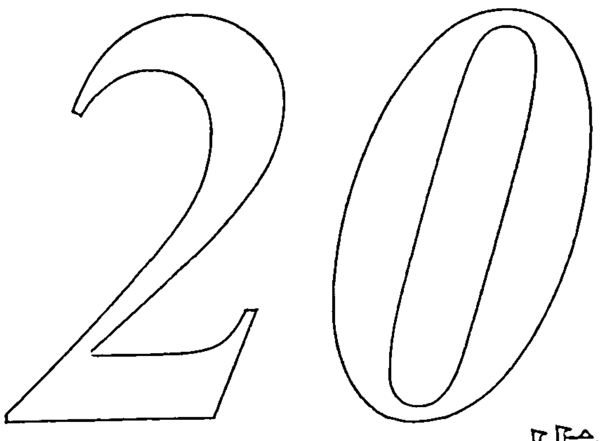

[整體運勢] 2 字頭的開始，對誕生數 5 的妳來說，有種「解放」的感覺，彷彿從今天起就可以放手盡情享受戀愛了！不過，如果妳是屬於更前衛的女孩，或許在 17～19 歲時，就已偷嘗過「解放」的果實，如今這個時間點對妳而言，不過是帶有「公開」的意義罷了；至於，今年還在單相思的妳，若對接吻等親密動作抱持著躊躇不前的心情，顯示妳還沒有做好「解放」的準備，不如再給自己一段時間，過些日子再說吧！

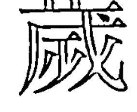

#### 未有男友的妳戀愛對策

同樣是誕生數 5 的女孩，「解放前」、「解放後」的人遭遇卻大不同。如果妳是「解放前」的女孩，大概還是只能遠遠望著欣賞的男孩不知所措；另外，對想和妳進一步交往的男孩，妳則是抱著興趣缺缺的態度。看來，今年的妳如果想交個男友，以朋友的朋友為目標，成功的機率較大。如果妳是屬於「解放後」的女孩，則有希望遇到一位特殊的男孩，一旦兩人有機會透過共同興趣由友情發展為愛情時，會是一段刻骨銘心的感情。今年異性緣最佳的時候為 8 月。

#### 已有男友的妳結婚對策

已有男友的誕生數 5 的女孩，絕大多數都是屬於「解放後」的女孩。今年的妳和他，感情發展將較去年來得平穩，原本的激情也可望昇華為精神上的交流。然而，如果在今年妳和他還是沒能走到精神上的進一步發展，仍耽於肉體上的歡愉時，之後恐怕會有快速分手的可能。而分手的原因也很單純，就是突然間對他失去了興趣，想換人交往看看。今年對妳和他而言，談結婚都還嫌太早，最好頂多先訂個婚。至於最適合訂婚的月份為 6～7 月。

[愛的地雷] 2～3 月、11 月至年底是你倆愛情的危險期，如在此時期發生激烈的爭吵，很有可能會在意氣用事下協議分手。提醒妳在氣頭上時，要多留意自己言語的用字遣辭。

## 誕生數 5

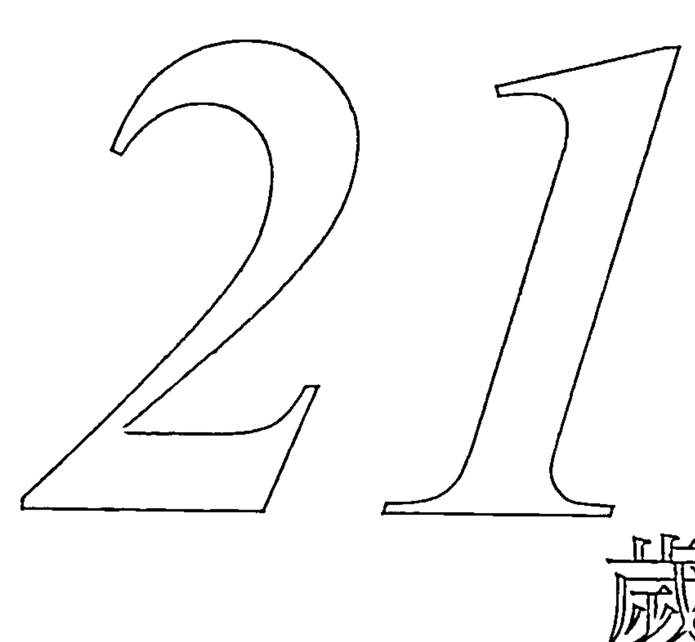

[整體運勢] 如果妳是個大學生，眼看著就要畢業了，不知妳可做好了成為一個社會人的準備？想過要從事什麼樣的工作？而什麼樣的工作環境又最適合妳？在今年，或許妳都要為這些事情煩惱不已。當不知所措時，建議妳倒是可以先透過打工的方式，了解外面世界的情形。畢竟光是坐在家裡想是怎樣也想不出個頭緒來的，不如化為行動學個經驗。至於愛情方面，今年的戀愛機會多藏在工作場所中。

#### 未有男友的妳戀愛對策

與其從原本相識的人之中找尋，今年的妳（尤其是「解放後」的女孩），更適合與和自己完全不同世界的人交往，特別是和大自己 3 歲、5 歲、10 歲以上的人交往。所以，如果在今年妳發現身邊有這樣的戀情機會，可千萬別錯過了！如果今年還遲遲等不到類似的戀愛機會，倒也可考慮出現在身旁的追求者，不過，這些對象可能是屬於愛嘮叨的男子，個性也較孩子氣。不過，今年談的感情都可望是段長久的愛情。今年的妳，異性緣較佳的月份為 7～8 月。

#### 已有男友的妳結婚對策

打從去年兩人感情發展便一路平順、穩定至今，今年的你們或許會有結、訂婚的念頭。不過，到底妳還只有 21 歲，而且早婚對誕生數 5 的女孩特別不利，因此建議妳不妨再緩幾年，不要輕易點頭答應他的求婚。當然啦！如果妳自己本身真的已考慮得很清楚，而對方是年紀比妳長，在經濟、社會地位方面又都已有充分基礎的人，結婚也不是那麼全然不可為。就今年而言，最適合訂婚的月份是 5 月；結婚則以 7～8 月為宜。相反的，如果在 21 歲生日過後，妳發現和他感情有走下坡的傾向時，建議妳不妨檢討一下自己，是否有太過任性、意氣用事的缺點。

[愛的地雷] 要特別注意發生在 1～2 月、10 月左右的爭執，它或許只是一個小口角，但在意氣用事下很可能會導致兩人分手。另外，4 月容易有些麻煩產生，凡事最好戒急用忍！

## 誕生數 5

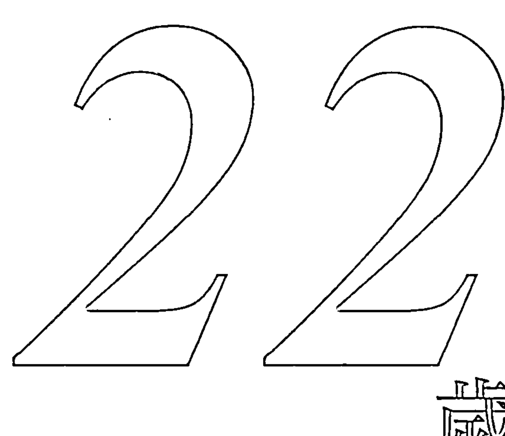

[整體運勢] 今年的妳，或許會開始忙著應徵工作，不過，一陣忙碌後，妳會發現情況似乎不如妳想像中順利。除了工作不好找之外，甚至有時好不容易找到了一份工作，前往上班後才發現它根本不適合妳。遇有這類情形時，勸妳也別灰心，因為依各歲數的運勢看來，妳順利成為社會新鮮人的時機應該是在 23 歲那年。既然時候還沒到，何妨先再繼續做一年兼職工作，一切等明年再說。至於戀愛方面，今年的運勢並不太好。

#### 未有男友的妳戀愛對策

今年談戀愛有些出師不利，原以為滿不錯的對象，在經過表白進一步交往後，才發現真正的他跟自己原先想像的根本不同，這不禁令妳有些失望。所以，就今年來說，不管妳是屬於「解放前」或「解放後」的女孩，所談的戀愛多是曇花一現型的愛情，尤其是在 8～9 月時，更應注意這時候出現的追求者，和他談戀愛，很有可能換來的是滿身的傷痕。總之，今年的妳最好不要對對方抱持太高的期望，找朋友比找情人來得好。

#### 已有男友的妳結婚對策

今年是潛伏危機的一年，不過，如果妳和他最後能平安、順遂通過這一年考驗，明年就可準備結婚了。在今年，妳將要面臨的是對這段感情堅定性的考驗，心中不時翻攪著「愛他？不愛他？」，加上隨時又有「外力」的介入，讓妳更是不自覺地猶豫起來。其實，遇到這種情況時，何妨捫心自問究竟和他的個性合不合，如不合，早早分手會是最好的解決之道。尤其今年的離別隱藏有「另一段更好相遇的開始」的暗示，預料明年妳會找到一個比眼前的他更好的對象！今年最適合分手的月份為 3 月、5 月、9 月、12 月。

[愛的地雷] 發生在 8～10 月間的麻煩事如果是因他而起的話，建議妳馬上和他分手。至於 3 月正值妳感覺動搖的時期，如果還在乎他的話，就應該冷靜面對他，不要動不動就和他吵架。

## 誕生數 5

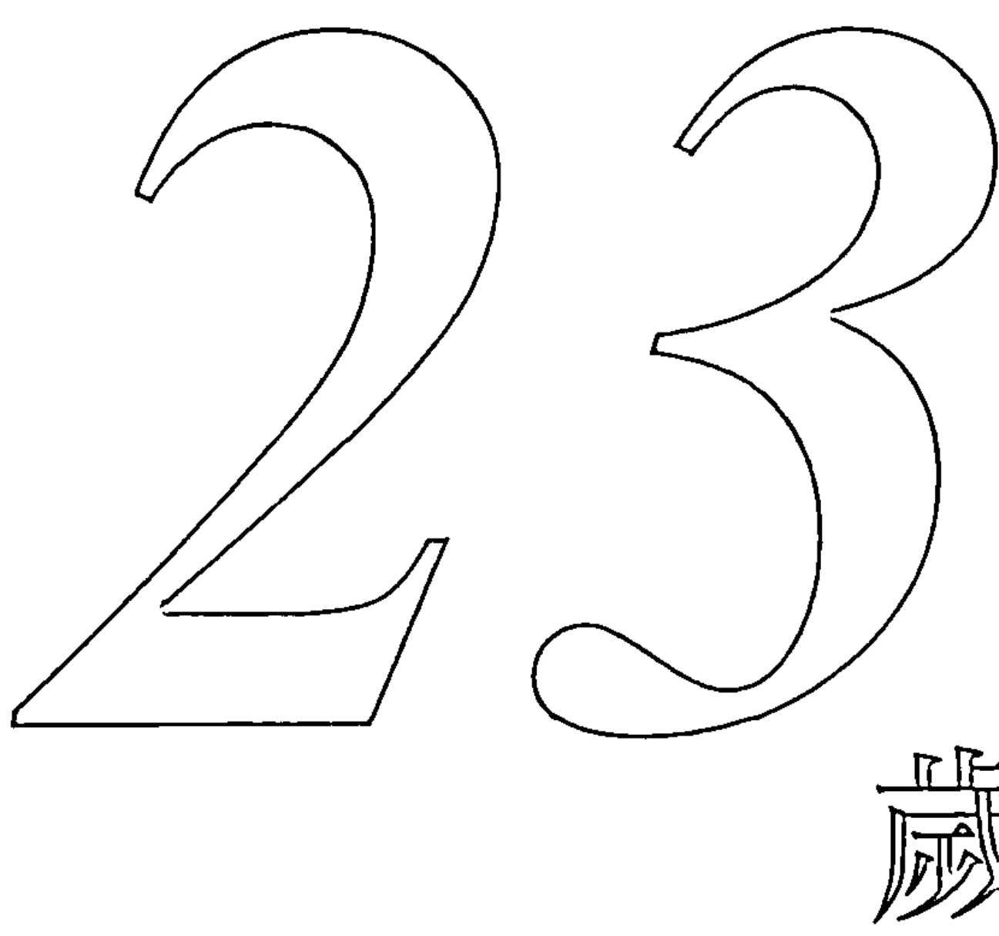

[整體運勢] 充滿幸運、機會的一年。超強的運勢讓妳重新拾回往日的活力，妳會成天就像隻快樂的小鳥般蹦蹦跳跳。在今年，妳遇到的人當中，有不少是屬於「貴人」型人物，在未來的人生中能給予妳強大的支持力量，當然其中也有人或許能成為妳將來的另一半。可以的話，多從事些戶外休閒活動，它將使妳有機會認識更多的人。

#### 未有男友的妳戀愛對策

今年的戀愛運紅得發紫！沒事儘管往沒去過的地方走，一方面可滿足妳天生的好奇心，另一方面更可以讓妳早日找到如意郎君。就妳的個性來說，適合妳的另一半首先要具備活潑的本性，最好還要有主見及行動力，建議妳在選擇時，與其挑剔對方的外表，不如仔細觀察哪個人具有這些特性，他鐵定最適合妳！看到心儀的對象，也別太矜持，就放手去愛，好好享受「解放」的樂趣。今年，幾乎全年異性緣都不錯，但最佳的月份則為 3～4 月、7～9 月及年底左右。

#### 已有男友的妳結婚對策

走過去感情的危機，今年的你們如果仍有意要廝守在一起，尤其當他積極地向妳提出結、訂婚的要求時，可要趕快點頭說：「Yes！」。就運勢上來說，今年相當適合結婚，未來兩人也可望成為人生路上相互扶持的伙伴，甜蜜一生。然而，如果想結婚的人是妳，而他卻一點「動靜」也沒有時，勸妳也不必過於著急，明年、後年連續兩年都仍是適合結婚的年份，何妨再等他兩年看看。另外，今年剛認識的情侶們，只要兩人覺得情投意合，認定彼此有緣分，想來個閃電結婚也可以。總之，今年在忠於自己感覺下所選擇的婚姻都可望有不錯結果，所以，想結婚，那就儘管結吧！今年最適合訂婚的月份是 4 月；結婚則以 5～6 月為宜。

[愛的地雷] 8～9 月間儘量避免和他爭吵，否則激動之下說出的言語，很可能導致兩人分手。另外，4 月時的妳可能有出軌的危險。

## 誕生數 5

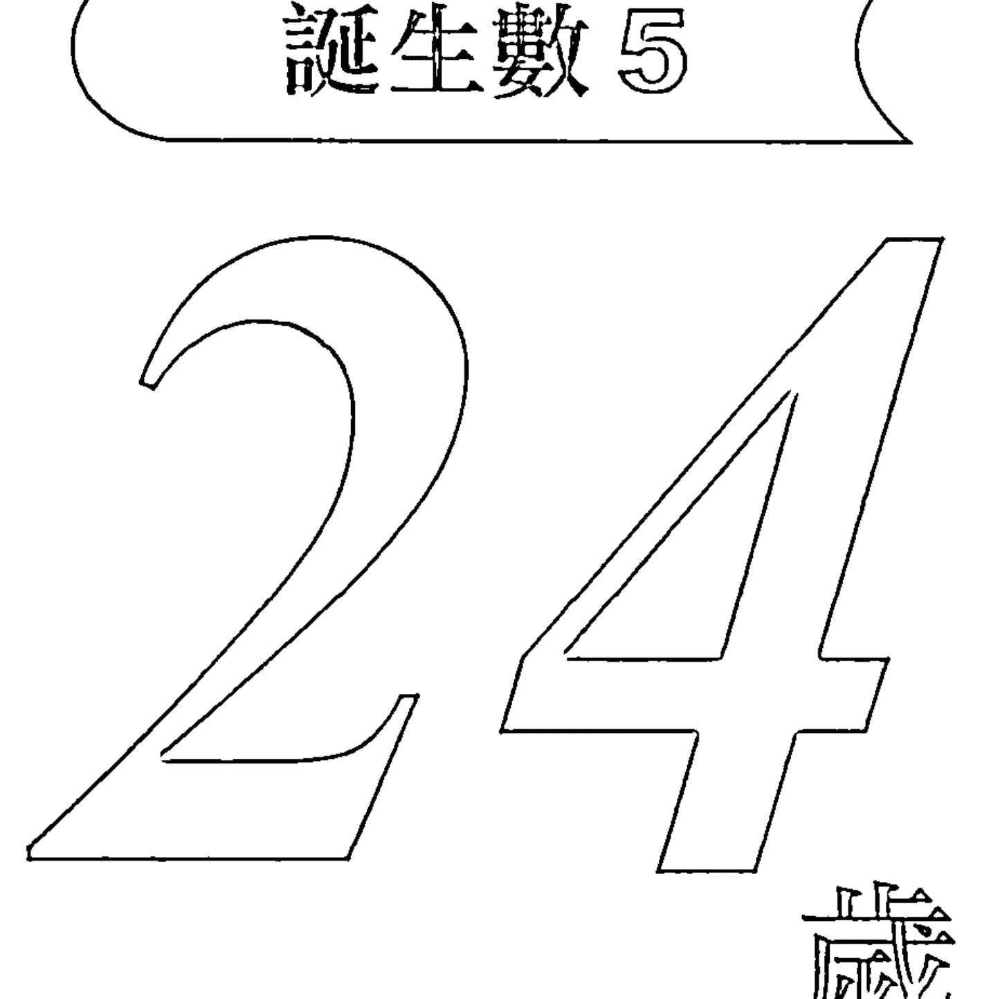

[整體運勢] 今年的運氣似乎有些和妳過不去，好不容易盤算好了的事，偏偏半路殺出個程咬金；原本想向東行，偏偏周遭的情勢逼著自己得往西走，讓妳有進退不得、處處受阻的感覺。即使心中倍感委屈，但建議妳眼前最好還是順應情勢，如此至少可保平順無事，如果太強調自我主張，最後可能會傷及人際關係，得不償失。儘管今年的運氣有些不順遂，但在愛情方面卻仍是一路長紅，可望和心儀的對象墜入浪漫的愛河中。

#### 未有男友的妳戀愛對策

其實過去對他早就存有好感，只不過那時彼此都只當對方是好朋友。然而，就在一次互訴煩惱、秘密後，突然間兩人的距離拉近了，剎那間有了「原來我要找的人就是你（妳）！」的覺悟，就這樣，兩人由朋友變成了情人。如果妳是屬「解放前」的女孩，這段感情更值得珍惜，因為誕生數 5 的女性在談過幾次戀愛後，會有「什麼人都能談，彼此喜好不同也沒關係」的傾向，所以它或許是妳未來記憶中最刻骨銘心的愛情。今年的妳，異性緣最佳的月份為 4～5 月、9～10 月以及年底左右。

#### 已有男友的妳結婚對策

今年的妳和他，感情可望順順利利，穩定之餘自然會談到有關結婚的事。究竟能否順利結成婚，今年的關鍵在於周遭親友支持與否。倘若支持，今年完婚自然不成問題；如果不幸遭逢阻力，建議妳不如將婚事緩一緩，留待明年再說。就今年而言，最適合訂婚的月份為 2、11 月；結婚則以 4、5 月為宜。相反的，如果在過了 24 歲生日後發現兩人感情有開倒車的情形時，則要特別注意，因為今年運勢中潛藏有「和不適合的人過於接近時，會有禍事發生」的危機，因此，如果感覺兩人感情不若以往甜蜜、和他在一起有不安的感覺或發現他不怎麼能讓人信任時，極有可能暗示著他並非是妳合適的對象，別遲疑，速速和他分手為妙。

[愛的地雷] 若 7～8 月兩人發生嚴重爭吵，不妨回頭審視一下兩人個性是否相合，如不合，趕緊分手，拖得愈久只是徒增彼此的傷害。

## 誕生數 5

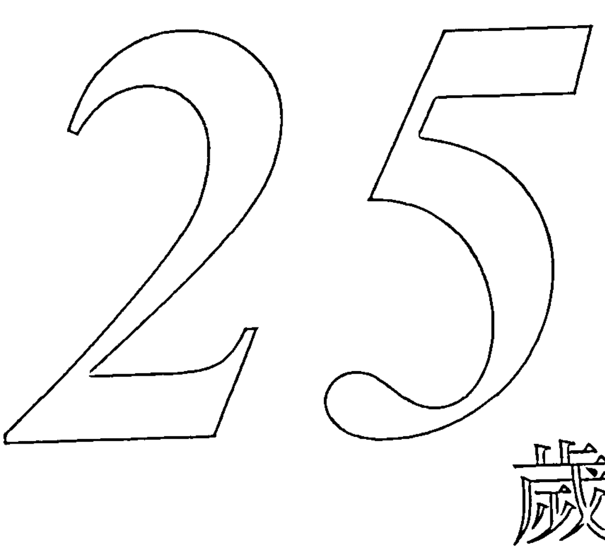

#### [整體運勢]

闊別一年的好運漸漸地又回到妳身邊了。今年愈「動」人就愈發、運就愈好，所以沒事不妨多到郊外或是沒去過的地方走走，甚至搬家、換工作在今年也十分合適。一旦來到一個陌生環境後，別拘謹，儘量隨興發揮自己，許多戀愛的機會自然就會跟著到來。如果過去的妳老是習慣到固定的場所、和同樣的一群人在一起的話，今年何妨打破這個習慣，妳絕不會讓失望的！

#### 未有男友的妳戀愛對策

今年的戀愛機會多得教妳笑不攏嘴，而且每一段都是超羅曼蒂克的喲！在一些旅行、度假的場合裡，常有機會碰到讓妳小鹿亂撞的帥哥，所以，有空時不妨多計畫一些旅遊活動，甚至出國留學也不錯。今年的戀愛雖然談得浪漫，但相對的時間也很短，屬於曇花一現的愛情，所以建議妳不要用情太深，就當做是累積戀愛經驗，以免難以自拔，那就虧大了！另外，特別小心有婦之夫的勾引，別傻傻地上了他的當！今年的妳，異性緣最佳的月份為 3 月、9 月至年底。

#### 已有男友的妳結婚對策

如果妳和他是交往了好幾年的情侶，在今年會突然覺得看他看得有點膩，有種想換張新面孔的衝動。倘若覺得自己真的對他已不再存有愛意，想換掉他，那倒也無可厚非；最怕就是還愛著他，只是臨時被「想換個新鮮的」意念沖昏了頭，糊里糊塗地分手，最後卻懊悔萬分。那要怎樣才能避免一時衝動做錯了事？很簡單，乾脆嫁給他，而且愈快愈好！如果妳和他是今年剛認識的情侶，在交往 1 個月後閃電結婚的機率也相當大。閃電結婚沒什麼不好，但因今年誕生數 5 的妳，在結婚運方面潛藏有「變化」的跡象，所以，一定要經過三思才行！就今年而言，最適合訂婚的月份是 1、10 月；結婚則是 3～4 月及年底。

#### [愛的地雷]

發生在 6～7 月的麻煩事，暗示著兩人極有可能會突然分手。即使對他還存有些許依戀，但勸妳最好還是看開些，靜待下一個戀情的到來。

## 誕生數 5

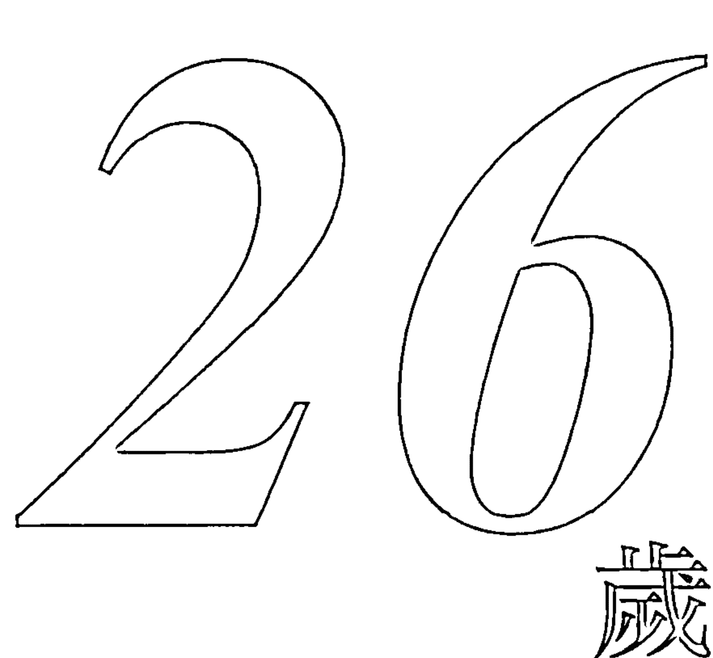

[整體運勢] 今年的運氣有些不怎麼順心，原本以為早成過去的事，沒想到如今卻又冒出來煩妳，讓妳有種不勝其擾的感覺。儘管如此，建議妳最好還是誠實地面對它，畢竟一再躲避也不是辦法。況且，明年將是妳 2 字頭人生中戀愛運最好、最亨通的時候，如果在今年不能好好解決這個問題，恐怕接連著會影響到妳明年的運勢，不可不慎！

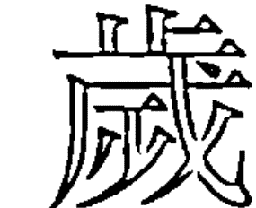

#### 未有男友的妳戀愛對策

新戀情發生的機會不多，倒是和從前的男友，有舊情復燃的可能，不過，這段感情仍不被看好，因為，你們倆之所以會再度在一起，只是為了填補寂寞感罷了，過去的問題依舊存在，再次的相處還是無法合得來。不過，既然面對了複合的問題，為了今後兩人相處著想，也為了求自我的成長，建議妳還是試著克服並且解決過去存在的舊問題。但不論結果如何，學會勇於面對問題的妳，未來面對愛情問題時一定會更為成熟。今年異性緣較好的月份是 2～3 月、11 月至年底。

#### 已有男友的妳結婚對策

如果妳和他交往時間已逾兩年，兩人對於未來共組家庭也有共識的話，今年可以準備結婚了！當這個喜訊發布後，可望能得到雙方家長、親友的熱烈祝福及支援，這也將會使你們的婚禮籌辦起來更加得心應手。今年最適合訂婚的月份是 9 月；結婚則以 2 月、11 月至年底為宜。不過，如果妳尚未做好結婚打算時，建議妳也不要勉強答應，一切等到明年再說。至於如果妳和他交往時間僅僅一年左右，在今年兩人則很容易為小事起爭執。建議妳試著耐著性子多聽聽他的說法，亂發大小姐脾氣只會讓事情變得更糟。

[愛的地雷] 多留意發生 5～6 月時的爭吵，意氣用事之下恐會讓小事鬧成分手事件。特別是如果這問題根本是由來已久，建議妳更應該耐心和他一起共謀解決之道。

## 誕生數 5

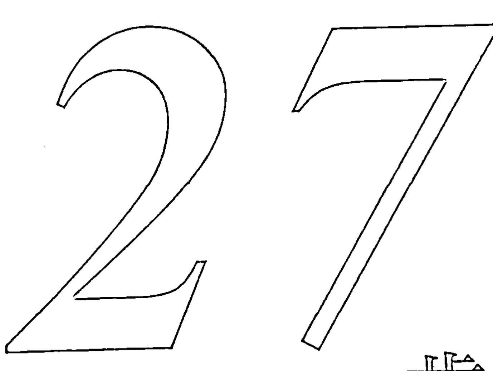

[整體運勢] 今年是妳2字頭人生中，運氣最好、日子過得最多采多姿的一年！隨著事業上的忙碌與發展，戀愛機會也接踵而來，難能可貴的是，追求者中不乏條件優秀者，尤其如果妳是屬「解放前」的女孩，在今年透過戀愛更會讓妳有脫胎換骨般的轉變，而蛻變之後的妳將比從前更加成熟、性感、富女人味。如今年感情方面能夠順利發展，大喜之日應該就在明年。

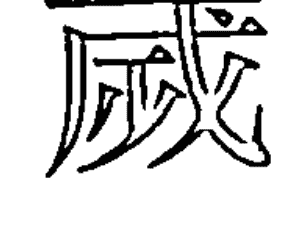

#### 未有男友的妳戀愛對策

今年的妳像是愛神的寵兒，到哪兒都能受到異性的注目。尤其在工作場所和朋友聚會裡，可望有追求者出現。如果妳只是個忙碌的上班族，建議妳逢假日不妨做一短程旅行；如有更長的假期，甚至可以安排到海外度假。在那兒，將可望和妳心目中的白馬王子來個不期而遇。這段期間豔遇雖多，但其中也有不少是屬於不倫之戀，勸妳在面對追求者時，千萬要把持住自己，以免喜事變成憾事。今年一整年的異性緣都很好，但其中又以1～2月、9～11月的邂逅最值得期待。

#### 已有男友的妳結婚對策

交往已久的情侶，在今年感情有易生變化的傾向。尤其是如果妳和他交往時間在2年以上，由於追妳的人實在太多，讓妳心生得意之餘，更容易對他頤指氣使、任性所為。如果他才是妳心目中真命天子的最佳人選，勸妳在自己的態度上要多加留意，以免產生遺憾；如果不是，當然妳有資格選擇更適合妳的男人。而就運勢上看來，妳未來的另一半出現在今年到明年間的機率相當大，先將這一段感情釐清，再等待新戀情的來臨也不晚。由於今年在感情上潛藏有「變化」的危機，因此就算彼此已認定對方，在今年內頂多完成訂婚儀式，至於結婚，則留待明年再籌辦會較好。就今年而言，最適合訂婚的月份是8月。

[愛的地雷] 發生在4～5月的困擾將成為日後分手的導火線。如果覺得兩人在個性上不是那麼合適，不如乾脆和他道再見。另外，夏季時心浮氣躁恐會助長妳出軌的衝動，千萬要留意！

## 誕生數 5

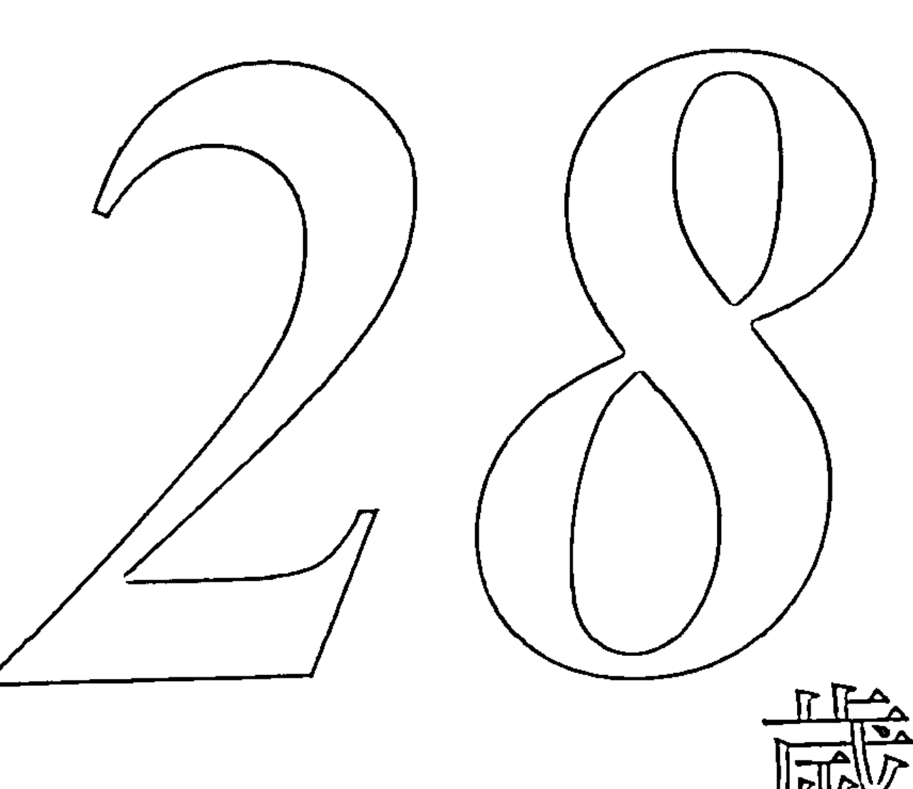

#### [整體運勢]

今年是妳 2 字頭人生中，戀愛運、結婚運、家庭運最最亨通的時期，如果錯過了，恐怕還得等上好一段時間才會再有機會，勸妳無論如何可要好好把握。不過，今年同時也是妳家族多事之秋，家族成員容易為了一些責任問題爭執不休，在面臨這樣的問題時，建議妳一動不如一靜，依照眾人意見去做就是，把剩餘的精力充分運用在找尋另一半方面，會是較明智的抉擇。

#### 未有男友的妳戀愛對策

今年夏天是屬於妳的戀愛季節，可望有一見鍾情式的愛情降臨，順利的話，說不定年底就會結婚。所以，在挑選對象上相對的也要更加謹慎！「他是不是能對妳旺盛的行動力存有正面評價？」、「他是不是個不會陷妳於負面想法的人？」、「他是不是有強烈的家庭觀念？」等等，這些特質的具備，遠比一個空有經濟能力的人，來得更為重要。另外，不倫之戀和耽溺於肉慾的愛情也是妳該婉拒的。反倒年齡不是問題，不管他年紀比妳大或小都沒什麼關係。

#### 已有男友的妳結婚對策

去年相識的情侶，經過一年的交往，如果彼此覺得已充分認識，感情也穩定，同時有共度一生打算時，今年倒是可以快快準備結婚的事了。然而，倘若至今他仍然沒有結婚的表示，兩人在一起又時有爭執者，建議妳不妨回頭去審視一下兩人個性是否相合，如不合適，趁著今年妳戀愛運正好時，早點和他分手，也好快快另覓新對象。就今年而言，最適合訂婚的月份是 7 月，結婚則是以 9～10 月為宜。另外，今年剛認識的情侶，也有極大的機率會走向閃電結婚。匆促地結婚對妳而言，或許會覺得有些不安，但是有他在帶領著，何妨就大膽地將自己交給他吧！依妳今年的運勢來看，今年內促成的婚姻可望有美滿的結果。

#### [愛的地雷]

發生在 3 月、12 月的爭執，很可能會讓妳和他走上分手之路。如果不是經過深思熟慮，勸妳言行還是保守點較好，同時不要太大小姐脾氣，也靜下心來聽聽他的說法。

## 誕生數 5

[整體運勢] 今年的運勢和前兩年相比可能沒那麼順利，有時甚至還會有動輒得咎的感覺。不但如此，有些事明明已計畫好了要怎麼做，偏偏到準備要動手時，局勢又有所改變，逼得妳不得已只好放棄。這使得妳不禁心灰意冷起來，人也變得消極許多。今年當有這種情形發生時，建議妳最好找件自己感興趣的事，不管是讀書、看錄影帶、看電影都好，只管一個人去做就是。暫時離開一下當時的情緒後再回頭，有時便能理出個頭緒；反倒是坐在那裡一直想，只會讓自己愈想愈怨恨，徒增傷心而已。

#### 未有男友的妳戀愛對策

今年的戀愛機會少了許多，這和妳的眼界愈來愈高也有些許關係。建議妳，多去聽聽演講，或是參加讀書會、討論會等知性方面的聚會，在那兒可望有較大機會可以找到妳心目中的心儀對象。不過，今年的妳或許會有落得單相思的遭遇，好不容易看上的人，居然已經結婚了！遇到這種情形，勸妳別傻到想做人家的第三者，對妳而言，戀愛是愈簡單愈好！今年，異性緣較好的月份只有 8～9 月兩個月，其餘時間建議妳不妨先著重在友情方面的交遊，試著先從做普通朋友開始。

#### 已有男友的妳結婚對策

如果今年妳發現和他感情有愈趨穩健、深厚的發展，彼此的信賴也更增加時，則他極有可能就是妳的真命天子，也是可以開始籌備婚姻大事的時候了，不妨將結婚訂在明年，今年先完成訂婚。不過值得注意的是，從你們開始商量婚事的那一刻起，或許會遭遇到來自周遭反對的聲浪，如兩人不夠互信、不能堅持，末了這些聲浪也許會沖散兩人的感情也說不定，千萬要步步為營、小心應對才是！就今年而言，適合訂婚的月份只有 6 月。相反的，如果在過了 29 歲生日過後，發現和他感情有愈來愈淡的傾向時，建議妳不妨回頭審視一下兩人個性是否相合。如不合，最好速速分手，靜待明年另一段新戀情的到來。

[愛的地雷] 發生在 2 月、11 月的摩擦很可能會造成兩人分手，在盛怒之下，妳可能會說出一些傷害對方的話，如果還在乎他的話，就應多加小心應對才是！

## 誕生數 5

#### [整體運勢]

今年是財運亨通、事業順利的一年。尤其是在職場上的表現更是亮麗！身處在上司和新進之間的妳，適當地展露了妳長袖善舞的一面，巧妙地為大家化解了不少工作上的相處問題，也讓大家對妳的評價愈來愈高。今年在工作上努力的表現同時也為妳賺進了不少的獎金。至於戀愛方面，也有相當浪漫的相遇，特別是因工作所促成的邂逅機會，更是多到讓妳夢裡也微笑。

#### 未有男友的妳戀愛對策

今年在工作上可望認識一些條件不錯的男孩子。如果妳只當他是個戀愛對象，選擇年紀比妳小的對象倒也無妨；不過，如果妳要找的是結婚對象，建議妳最好還是選個年紀大一點的，因為唯有他們才可能包容妳的個性。然而，要能和妳長相廝守，他必須要和妳有相同的嗜好。另外，「非我族類」型的男人最好也將他列為拒絕往來戶。基於好奇心和這樣的人交往，未來勢必要承受極大的束縛。今年異性緣最好的月份為 4～5 月、7～8 月，特別是發生在 7～8 月的邂逅，值得令人期待。

#### 已有男友的妳結婚對策

對交往已逾一年以上的情侶來說，今年是到了該為兩人未來做個決定的時候了！如果妳的他仍未有任何表示，建議妳不妨主動提出拜見雙方父母的要求，透過周遭人對這件婚事的關注，逼他具體表態。就今年而言，最適合訂婚的月份是 5 月，結婚則以 7～8 月為宜。至於如果過了 30 歲生日後，發現兩人的感情有開倒車的傾向，特別是他若有傲慢、自以為是等令妳難以忍受的缺點出現時，最好再審視一下兩人個性究竟合不合適，如果不合，最好快刀斬亂麻趕快和他做個了斷，否則，這樣的感情拖延到明年恐怕會招來更大的困擾。

#### [愛的地雷]

發生在 1～2 月、10～11 月的困擾或麻煩，如是因他而起時，建議妳最好分手為妙！一味屈就他、順應他，不久後可能將釀成兩人激烈的爭吵，不如早早為這段感情畫下句點。

## 誕生數 5

### 歲

[整體運勢] 生活中的各種遭遇及歷練，促使妳在今年褪去以往孩子氣十足的想法。妳會變得更有責任感，也更有勇氣坦然面對生活中不可避免的困難。31 歲的妳，可說是精神及經濟兩方面都已有獨立的能力，算得上是真正蛻變成一個成熟女人了。而心態上的轉變也使得妳的外表更具魅力及女人味，在選擇戀愛對象上，格調相對地也提高許多。

#### 未有男友的妳戀愛對策

今年的運勢既然著重在轉變，也就是暗示著在妳尚未癒合舊傷之前，是不太可能會有新戀情來臨的。今年，如想順利交到男友，首先得改變過去面對愛情時不成熟的觀念。建議妳可以利用改變環境來助妳一臂之力。比如，放自己一個長假或換個工作環境、搬家等，只要「變動」後能有助妳改變心境的，都值得妳去嘗試。如果沒有經過這一層的洗練，耐不住寂寞又去找個男人來愛，只會徒增感情創傷而已。就今年運勢來看，出現在 6～7 月的男孩會是不錯的對象。

#### 已有男友的妳結婚對策

如果在過 31 歲生日以後，妳和他的感情發展仍維持穩定，預料在今年將可在無風無浪中度過；相反的，若兩人感情呈現不穩定的狀態，動不動就發生激烈爭吵，建議妳不妨再回頭觀察兩個人的個性是否相合。倘若是個性不合所造成，勸妳和他在今年宜忍耐為重，攜手一起度過這感情的低潮期。要是不能有這樣的共識，接下來要面對的恐怕會是分手的痛苦抉擇。就運勢看來，要談論婚嫁在今年並不適合，兩人頂多只能訂婚，結婚的事最好還是留待明年再說。至於如果妳和他爭吵不斷的情形是從去年延續到今年的話，很可能暗示著兩個人根本不適合在一起，不如就在今年和他分手，等待明年另一段更好的戀情的來臨。

[愛的地雷] 如果在 9～10 月爆發了有關他出軌的麻煩事時，暗示著兩人緣分已淡，建議妳最好考慮分手。

## 誕生數 5

#### [整體運勢]

今年是充滿挑戰和行動機會的一年。在今年，當有任何想法和新點子出現時，建議妳給自己一個機會，試著去實現它，預料大抵都可以得到不錯的結果。最怕就是妳只敢想，不敢說也不敢做，這樣也只有辜負了時運在今年對妳的一番好意，繼續窩在現狀裡自怨自艾了。至於在愛情運勢方面，今年的戀愛運十分亨通，生活中可望有不同於過去的條件優異的男子出現。

#### 未有男友的妳戀愛對策

今年的愛情來得令妳又驚又喜。原本並沒有打算要去認識什麼白馬王子，結果誰知，白馬王子就在那裡。尤其是前往一個從未去過的地點時更容易碰到這樣的情形。其實不光是白馬王子，在那兒所遇見的朋友，未來可望成為交心、支持妳的伙伴。所以，當有機會前往時，不要猶豫，好運正在那兒等著妳！32 歲的妳，在挑選未來男友時，重點一定要擺在對方是否比妳成熟，最好選擇年紀比妳大的人。今年，異性緣最佳的月份為 2 月、5～6 月及年底左右。

#### 已有男友的妳結婚對策

去年的妳和他，感情路上走得有些驚險，在共同經歷過這麼多困難及險阻後，如果在妳 32 歲生日過後，感覺兩人關係有重拾舊好的跡象時，意味著暴風雨已經過去了。恭喜妳！從今以後你倆的感情可望能順順利利的發展，要談論婚嫁也無不可，如果他還沒有表示的話，那就由妳主動催他一下吧！就今年而言，最適合訂婚的月份為 3 月、年底；結婚則以 5～6 月為宜。在兩人感情理應這麼順當地發展的時候，如果妳和他卻仍舊一見面就忍不住要吵架，勸妳還是回頭檢查一下兩人個性是否相合。倘若不合，不如早早和他分手，趕緊再去尋找下一段愛情吧！

#### [愛的地雷]

夏季結束 9 月左右，可能會有大樁棘手的麻煩事要發生，得多加留意！尤其是如果言語上不甚注意的話，可能會讓兩人走上分手之路。不過如果妳和他個性原本就不合，分手又何妨！

## 誕生數 5

[整體運勢] 今年誕生數 5 的人，會有兩極化的心情，一種是對人際關係感到煩心，巴不得自己最好一個人生活；另一種則是對周遭人抱持著極度感謝，並和親友間的感情變得更融洽。為什麼會有南轅北轍的反應呢？原因是身邊的人會對妳做的每件事情提意見、出點子。如果意見及點子具有正面意義，妳自然就成了後者；反之，則不然。所以今年的運勢也是相當有趣，是個隨身旁人的表現而產生變化的一年。

#### 未有男友的妳戀愛對策

今年的妳，戀愛對象多是屬於舊識。他或許是妳老早就認識的異性友人或同事，只不過一直都是以普通朋友身分在交往，在今年，突然有個機會讓兩人變成男女朋友。這些因緣巧合，大多都會在妳 33 歲生日過後浮現，如果屆時仍無任何「跡象」，建議妳不妨乾脆主動向眾女性好友廣發「我要男友！」的訊息，可望收到不錯的效果。另外，今年藏有和有婦之夫者墜入情網的危機，勸妳如何需要愛情，也最好和朋友的另一半保持距離。今年異性緣最佳的月份是 1 月、4～5 月、9～10 月。

#### 已有男友的妳結婚對策

今年的妳，對他的感覺有些混沌不清，有時會覺得他很不錯，有時卻又不禁自問：「這個男人真的好嗎？」。既然有這樣的疑惑，暗示著不宜在這個時候決定要不要和他共度一生，當然，如果妳已能釐清自己的感覺，知道兩人的愛是堅定不移，也適合在一起時，結婚當然也並無不可。就今年的妳而言，最適合訂婚的月份是 2～3 月、11 月至年底；結婚則以 4～5 月為宜。然而，如果在妳 33 歲生日過後，發現兩人經常會為些莫名的小事吵架，勸妳最好先反省一下自己，畢竟凡事只會要求他人配合，於情於理總是說不過去。

[愛的地雷] 9～10 月時妳有心意動搖得厲害的傾向，也容易為小事所煩惱，不過一切都是妳自找的，勸妳不要將責任全推給他。另外，發生在夏季的激烈爭吵，很可能會導致兩人衝動地提出分手，凡事宜多小心，千萬不要感情用事！

## 誕生數 5

[整體運勢] 今年是忙碌的一年，特別是對擁有自己事業的人來說更是如此。過去的耕耘，在今年總算看得見成果，能力獲得眾人認同之餘，事業愈做愈大，人自然也就愈發地忙碌了起來。儘管事業上的順利拓展可望帶來不少的進帳，但相對的人際關係方面的支出也不少，勸妳在花用金錢時最好要多加衡量，以免有捉襟見肘的情況發生。至於愛情運勢方面則行情看俏，有頗多的機會可以與異性邂逅，追求者也不少。

#### 未有男友的妳戀愛對策

今年的愛情多爆發在「娛樂」氣氛中。所以，當發現某個心儀的男士，建議妳不妨主動邀他看場電影，或喝杯咖啡，如果覺得不好意思一個人約他的話，以呼朋引伴的形式出遊也不錯。今年的追求者，大抵都有俊秀的外表，但有沒有內涵則有待妳仔細觀察。如發現他根本是個有婦之夫，或者和妳在一起不過是耽於肉體上的快樂時，切記一定得馬上和他保持距離。另外，在今年搬家、換工作等，也有助於戀愛運的提昇。今年的妳，異性緣最佳的月份為 3~4 月、9 月及年底左右。

#### 已有男友的妳結婚對策

對今年才剛開始交往的情侶來說，今年可說是幸運的一年，所遇到的人往往就是妳日夜期盼的真命天子。兩人閃電結婚的機率相當大，未來也可望能持續過著美滿的婚姻生活。反倒是交往已有一段時間的情侶，今年兩人的感情顯得有些岌岌可危，出軌的衝動時時籠罩著你倆，而一旦有出軌的情況發生，未來相同的事預料還會一再上演，要小心！如果今年他仍沒有安定下來和妳結婚的打算，建議妳最好趁早離開他，這樣的感情再拖下去對彼此都不會有好處，不如早點離開的好。就今年而言，最適合訂婚的月份為 1 月、10 月；結婚則以 3~4 月、12 月最為合適。

[愛的地雷] 2~3 月、9~10 月時的妳，有出軌的危險，如果妳最愛的還是他，勸妳凡事三思而後行。6~7 月則是適合分手的時節，選擇在這時候分手，之後可望招來好運。

## 誕生數 5

### 歲

[整體運勢] 平靜安定的日子也沒什麼不好，只是對喜歡冒險的妳來說，總覺得乏味了些，老想找機會活動活動、讓生活變化一下。這種想法在平時或許並無不可，不過在今年恐怕要收斂點了。就今年的運勢來看，一動不如一靜，而如果妳硬是要去「動」的話，恐怕會招來親友和家族反對的聲浪，或是發生阻難，引起不必要的麻煩。所以在今年，凡事最好以延續舊有計畫為宜，儘量不要冒險創新，只求平安度過就好。

#### 未有男友的妳戀愛對策

今年的戀愛運老實說不怎麼樣，好一點的男孩對妳沒表示，不好的男孩偏又猛追妳。不如改用參加相親的方式，成果會較令妳滿意些。尤其是透過上司、親戚，或是年紀較長的友人所介紹的人都會是不錯的對象，趕快利用機會向他們透露妳的請求吧！今年的妳，異性緣最佳的月份為 2 月、9 月以及 11 月至年底。如果妳嫌這樣的相識方式不夠浪漫，還不能滿足妳，那只有靜心等待明年的到來。明年是妳 3 字頭人生中異性緣最好的一年，絕不會讓妳失望的！

#### 已有男友的妳結婚對策

交往已有數年的情侶，今年可以準備結婚了。不過如果在妳提出結婚的構想後，得到的卻是他冷漠的反應或猶豫的表情時，最好要有心理準備，或許妳的真命天子根本不是他！如果相反的，他也有結婚的想法時，接下來妳和他最該做的便是取得雙方父母的認同，這點在今年來說非常重要，千萬不要忽略了！就今年而言，最適合訂婚的月份為 9 月；結婚則以 2～3 月或者年底左右為宜。倘若無論如何也得不到雙方父母的同意時，建議你們也不必去預定婚期，不如就這麼將這件事放著，待明年自然地這段感情會有後續的發展。

[愛的地雷] 發生在 5～6 月的激烈爭執可能會造成兩人分手，如果和他當場不能討論出個結論的話，就先將問題擺著，給彼此一段冷靜思考的時間，再來談也許會較好。

## 誕生數 5

[整體運勢] 今年四季都是妳戀愛的季節！今年的妳不管在交友或工作方面都顯得異常忙碌，在這樣活躍的情況下本應沒有時間再談戀愛了，偏偏上天就這麼照顧妳，讓妳忙到哪裡，哪裡都有追求妳的人出現，於是很順勢地，工作做完了、人際關係顧到了，戀愛也談成了。不過在眾多追求者當中，也摻雜了一些有婦之夫或是花花公子，所以，今年的愛情究竟能不能為妳帶來幸福的感覺，就全憑妳是不是選對人了。

#### 未有男友的妳戀愛對策

今年的妳是愈忙戀愛機會愈多，所以，想做什麼就去做，愛情還是在那兒等著妳的！特別是搬家、換工作、到國外旅遊，邂逅愛情的機會更是多，可別錯過了！要提醒妳的是，追求者中出現有婦之夫及花心大蘿蔔的機率不小，即使他們各方面的條件真的很不錯，但建議妳還是要和他們畫清界線，甚至在最初交往時，就要特別注意，莫待戀情最後變成不倫之戀，或是只流於肉慾的情愛，後悔就來不及了。就今年來說，異性緣最佳的時期約從夏季一直延續到年底，時間相當長。

#### 已有男友的妳結婚對策

交往已有數年時間的情侶，今年可要注意了，你們之間可能會上演出軌事件，而且出軌的人不是他，是妳！或許是太多人追求，讓妳不自覺得心癢了起來，對他的熱情不再、信賴感也日漸消退。如果他才真是妳未來另一半的人選的話，勸妳最好將眼光轉回來，自制一點的好！相反的，如果在過了 36 歲生日之後，兩人感情依舊如以往一樣甜蜜，那還等什麼，馬上準備結婚是最明智的抉擇，要是短期內雙方時間談不攏，沒空辦婚禮的話，先公證結婚也好！今年結成的姻緣，未來感情可望長長久久。另外，就剛認識的情侶來說，兩人閃電結婚的機率也相當大。訂婚以 8 月為最佳；結婚則是 1、10 月。

[愛的地雷] 9～10 月時可能會上演出軌事件，不管出軌的人是誰，宜小心處理，否則未來同樣的事件還可能會再次發生。另外，4、5 月時激烈的爭執暗示著兩人已不合適，不如早點分手！

## 誕生數 5

[整體運勢] 今年是妳 3 字頭人生中結婚運最旺的一年。已有男友的人，今年如能得到家人的支持，則可望完成終身大事；至於沒有男友的人，也先別心急，從今年的運勢看來，戀愛機會不少，只不過要走到婚姻，恐怕還需雙親及家人的配合。或許過程中難免會碰到一些家庭問題，致使結婚的事受到阻撓，但何妨勇敢面對，事情終究可以圓滿解決的。今年就讓自己大膽地放手去愛吧！

#### 未有男友的妳戀愛對策

今年的愛情多屬於「近在眼前」型的。他或許是妳早就認識的朋友，某一天，突然接到他的表白，不禁令妳又驚又喜。回想和他在一起時兩人的確很談得來，剎那間，妳對他似乎也有了感覺……。以上是今年最典型的戀愛發生過程。而在今年追求妳的男人，多是抱著交往就是為了結婚的心態，因此建議妳除了專心享受兩人戀愛的浪漫與甜蜜外，最好同時想想「嫁給這個人，當他的妻子究竟適不適合？」，如此，也有助自己早日找到真正合適自己的另一半。就今年的妳而言，異性緣最旺的月份為 9 月，另外 4～6 月的運勢也不錯。

#### 已有男友的妳結婚對策

如果妳和他是才剛認識的情侶，今年閃電結婚的機率非常大；至於和他交往時間大約一年左右的人，倘若今年兩人有結婚的共識，建議你們就趕快著手進行籌辦。另外對於交往時間已逾兩年以上的情侶來說，訂婚自是越快舉行越好。如果在妳 37 歲生日過後，卻仍不見他有任何表示，建議妳最好重新回頭審視兩人個性是否相合？如不合，勸妳及早和他分手，趁著今年異性緣不錯之時另覓合適對象。在今年，只要妳肯用心去找，一定可以找到妳生命中的真命天子。最適合訂婚的月份是 7 月；結婚則任何一個月份都適宜，尤其是 9 月。

[愛的地雷] 如果 3 月、12 月時，他對要不要和妳結婚仍抱持推拖的態度，妳就不必再等他了，馬上向他說：「莎喲娜啦」吧，眼前還有更好的緣分等著妳呢！

## 誕生數 5

[整體運勢] 今年的運勢顯得有些低潮。儘管平靜的生活並不能說是壞，但倘若靜得一點高潮也沒有，相對的也就沒什麼戀愛機會，這對仍是單身的妳來說，可就真的是個不太好的消息了。不過，既然時不我予，也不用刻意強求，就把注意力移轉到自我充實方面，趁著這一年的空檔，多學習一些技能、鑽研過去自己一直想碰卻苦無機會了解的領域，提昇自己內在的氣質。這樣的一年其實也沒什麼不好，不是嗎？

#### 未有男友的妳戀愛對策

正如前面提過的，今年的戀愛運實在不太好，看起來還不錯的人選，談沒幾句話馬上就令妳大失所望；覺得很不錯的，人家又早有老婆，不然就是對妳沒意思。既然時勢不順己意，建議妳就老實認分地接受它，真的覺得寂寞難耐時，那就努力參加相親囉！只是參加的同時也要有心理準備，那就是雙方都是為尋找結婚對象而來的，如果合適，很可能馬上就會談論婚事。今年，異性緣較佳的月份是 8～9 月，而且多出現在一些「學習」的場所裡。

#### 已有男友的妳結婚對策

交往已有很長一段時間，感情穩定卻一直沒有談論婚嫁的情侶，無論如何在明年一定要辦妥結婚登記；至於如果對彼此的感情還不是很肯定，希望再多一點時間觀察的人，則不用急於在這時候做決定；一般說來，待妳 39 歲生日過後，答案應該就可以浮現了。另外，交往還不是太久，不過感情始終維持在穩定狀態下的情侶，何妨趁著今年先拜見一下雙方的父母，讓這段感情公開。如果雙方有共識要在今年談婚嫁的話，就今年運勢來看，最適合訂婚的月份是 6 月，結婚則最好排在明年。

[愛的地雷] 當發生在 2～3 月、11 月至年底的重大困擾或麻煩，導致妳對他的愛起懷疑、不再信任時，或許分手是最好的選擇。明年的戀愛運不錯，何妨靜待明年另一段新戀情的到來。

## 誕生數 5

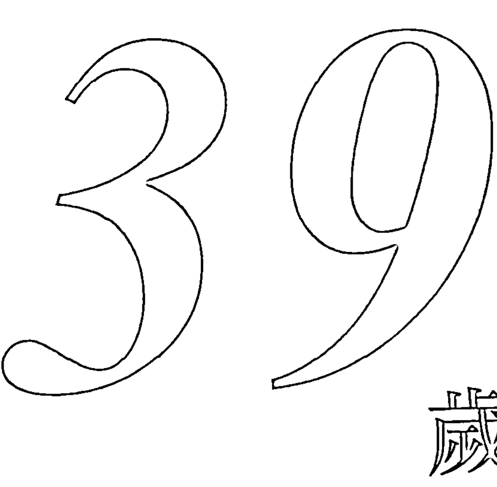

[整體運勢] 如果妳是位職業婦女，在今年會因為工作而顯得異常地忙碌。由於累積了不少經驗，公司便賦予妳帶領下屬的任務。即使妳的工作屬於兼差性質也一樣，短期內承接的業務量也會比往常遽增，讓妳忙得有些喘不過氣來。不過，忙碌之餘所帶來金錢上的回饋則相對地增加。賭運也不錯，有興趣的話不妨多參加一些抽獎活動。至於戀愛運方面，今年和異性邂逅的地點主要還是以工作場所為主。另外，人說「助人為快樂之本」，今年的妳，助人愈多，好事就愈多。

#### 未有男友的妳戀愛對策

今年，辦公室是妳戀情最佳上演地點。透過工作上的接觸，妳親切待人的個性，將留給他深刻的印象，進而成為知己。如果在 39 歲生日後，還不能嗅到受人愛慕的氣氛，原因可能出在妳處事的態度仍不夠親切、公平，宜再加強表現，讓他更了解妳。另外，今年追求妳的男士多是在經濟及社會地位已有相當基礎的人，相對對妳的要求也會較多，如果妳實在無法適應的話，建議妳不如分手，靜待後年 41 歲時另一波超強的戀愛運。就今年而言，異性緣最好的月份為 7～8 月。

#### 已有男友的妳結婚對策

交往時間已逾兩年的情侶，今年兩人應該會有結為連理的共識。如果今年內你們還沒有步上紅毯的打算的話，暗示兩人緣分已薄，待明年他或許會向妳提出分手。至於和他交往時間約一年左右，迄今感情仍然甜蜜如昔的情侶，預料今年兩人會有結婚的打算，而且決定後，籌辦工作等也可望順利進行。但如果相反的，在 39 歲生日過後，妳發現和他的感情有開倒車的傾向，則勸妳最好早日將這段感情做了個了結。就今年而言，最適合訂婚的月份為 5 月；結婚則是以 7、8 月為宜。

[愛的地雷] 發生在 1～2 月、10～11 月的重大麻煩或困擾，可能造成兩人分手；不過在歷經短暫分離後，問題可望有逐漸解決的跡象，所以也別太擔心，或許還有破鏡重圓的機會。

## 「速配！」診療室

～誕生數5的女性和各男士們的速配程度～

### 速配指數

♡能愛得長長久久 ○愛得短暫而熱烈 ☆適合結婚 ◇適合當好朋友 □適合當工作上的搭檔 ※只要努力，還是有希望速配成功 ×不如不相識

### 誕生數1的男士

做朋友比做情人好

就個性上來說，要把妳和他湊在一起絕對沒問題，但老實說妳和他做朋友絕對比做情人好。雖然打從第一次見面起，妳倆就很投緣並成為無話不說的好朋友，而且不論是對於妳「具行動力」的優點，或是「碰到重大事情便變得優柔寡斷」的缺點他都能予以欣賞和包容，照理說這樣的兩個人墜入愛河後應該可以白頭偕老，然而事情卻不盡然。原因是妳和他均同屬「行動派」人士，尤其是他，幾乎是想到什麼就做什麼的人，這使得要把妳倆綁在一起共組一個家庭，成為一件難上加難的事情。因為兩人都太好動了，妳有妳想做的事、他有他想去的地方，誰也等不了誰。於是，兩個人永遠都是不斷游移的兩個點，沒有交集，這樣如何結為夫妻呢？所以說，即使郎有情、妹有意，兩人最後還是會認為做朋友最舒服。

### 誕生數2的男士

你我的戀愛只是一場遊戲

好奇心甚重的妳，對於看法、想法多不同於別人的他，很容易產生興趣，所以大部分的時間都是妳主動追他，而他則是那副不置可否的表情。其實，倒也不是他看不上妳，而是在他眼裡，妳實在是太活潑、太好動了，讓他有一種沒辦法抓住妳的感覺，於是，自然也就不敢碰妳。不過，如果他是一個頗有自信也很謹慎的男孩，或許久而久之也會被妳的熱情所吸引，和你雙雙一起跳入愛情海也說不定。然而，這也不是個好的開始，因為在愛情國度裡，妳經常有「四處遊走」的毛病，和他在一起沒多久，好奇心被滿足後，妳就會開始對他感到膩了，於是，有一天便逕自從愛情海中游上岸來，留他一個人在海裡載浮載沈，淚流滿面。所以說，他和妳合適嗎？和妳談戀愛恐怕是他最後悔的一件事。

### 誕生數3的男士

錯過他，是妳最大的損失

妳和他個性相當，可以說十分速配，而他機伶、活潑、頑皮的特性更能時時為妳倆的戀情帶來無限的高潮與驚喜。和他在一起或許妳要大喊：「天底下再也沒有像他這樣，可以令我感到這麼快樂的男人了！」不過，要知道愛情不是光享受這種快樂的氣氛就可以的，妳和他在一起最大的問題就是，玩心甚重、不喜歡受拘束的他，談到要「結婚」時總是躲躲閃閃、一拖再拖，當有這種情況發生時，勸妳最好採取強勢的手段，強烈地表達妳的感覺，對他施以壓力，他最終還是會點頭答應的。所以，如果妳的男友是誕生數3的男孩，建議妳在和他交往之初就要明確地表達自己的感覺，儘管在別人眼中他看來似乎有些輕浮，但當妳用認真的心態和他交往，會發現他終究還是負責任的！

### 誕生數4的男士

話不投機半句多

儘管也有其他誕生數的男生不適合妳，但靠著一些補救或溝通的方法，或者還可以使兩人勉強在一起，可是說到誕生數4的男孩，恐怕只有一句話：「和他配對？免了！」老實說，任憑他再怎麼努力，妳還是不能感受到他的用心與魅力，而他的痴情、細微的貼心付出，在妳看來簡直像呆子一樣笨拙。所以，除非他和妳是青梅竹馬的關係，妳對他的優點有相當程度的了解；或者，妳只是想體驗一下和這種「非我族類」的男人談戀愛的滋味如何，否則，依一般常理，妳是怎樣也不會看上誕生數4的男孩的。不過，即使他是妳的青梅竹馬，甚至兩人自小有婚約在身，當發現兩人相處時感覺不是很好時，還是早早終止這段戀情吧，否則未來恐怕還有很多相處上的困難或齟齬要去傷腦筋。

### 誕生數 5 的男士

我們還是做朋友的好

和妳同是誕生數 5 的他，表面上看來或許和妳還算有話講，聊得似乎也很高興。但事實上兩人不大可能產生心靈相通的感覺。就拿聊天來說吧！妳和他之所以看起來還算聊得來，那是僅止於一些無關痛癢、寒暄式的談話，等真要談到一些屬於溝通、討論等內容較嚴肅的話題時，妳會發現兩個人都像是在自說自話，沒有共識也就算了，根本也沒用心聽對方在說些什麼，嘰哩呱啦一陣，倒像是拿著鏡子對自己說話。這樣的相處方式，偶爾見個面彼此勉強還能忍受，要成情侶、做夫妻恐怕就很難了。所以說，這樣的兩個人怎麼看還是做普通朋友最好！

### 誕生數 6 的男士

就看妳是不是能著眼在他的優點

如果妳能認真看待他的優點，你們會是速配的一對！和誕生數 6 的他相比，妳確實是具行動力、決斷力多了。雖然他口頭上說得是頭頭是道，但真要他鼓起勇氣做時，卻又顯得有些懦弱，於是「明天再說吧！」、「再看看吧！」等便成了他的口頭禪。這確實是他的缺點之一。如果妳很在乎它，自然就會很看不慣他這軟弱的樣子，心中便萌生去意；但如果妳同時也想到他的優點，比如，他的體貼、對妳的包容與精神上的支持等，這些缺點自然就算不了什麼，就會心甘情願和他共度一生了。

### 誕生數 7 的男士

雞同鴨講，卻偶然擦撞出愛情的奇蹟

基本上妳和他根本是屬於兩個世界的人，不但妳說的話他很難聽得懂、他說的話妳很難了解，就連有時兩個人說的是同一個話題、講的是同一個字彙，彼此所想表達的意思卻不相同。就是這層隔閡，讓妳和他在一起經常會因誤會而忍不住吵起架來，不得已只好走上分手之路。畢竟雞和鴨兩種不同的動物怎麼能結成親家呢？不過話雖如此，卻仍有這兩種誕生數的男女變成男女朋友，還感情甚篤，堪稱是愛情路上的奇蹟。原因是他們雖有不同，但卻能採取彼此相互諒解、包容的方法來化解隔閡；除此之外，更能在不斷嘗試中找到兩人共通的世界。如能靠這種方式在感情路上繼續走下去，未來兩人要結成夫妻，甚至白頭偕老，相信都不會是件難事。

### 誕生數8的男士

火辣辣的愛情在我倆之間燃燒著

什麼樣的愛情最火辣？答案就是當誕生數5的女生碰到誕生數8的男生時。那種四目相交後，隨即爆裂出超高溫、超炫爛的火花，看得旁人是驚心動魄、震撼不已。對當事人而言，這當然是一場令人陶醉的戀愛，尤其其中參雜著肉慾時，更是讓當事人愛得無法自拔。不過，火花再炫爛它終究還是火花，燦爛的光輝在曇花一現後，一切將又重回平靜。同樣的，當你們倆極度興奮過後，肉體的歡愉已不能再帶給兩人新鮮的感覺時，也是兩人分道揚鑣的時候了。也許這段感情真的很令妳難忘，但它終究只能成為回憶而已。

### 誕生數9的男士

妳是我要找的情人嗎？

雖然妳和他個性完全不同，不過他沈穩冷靜的個性卻深深地吸引著妳。只可惜「落花有意，流水無情」，在他的眼中，妳實在太輕浮了，這樣的女孩，他是怎麼也不會考慮的。「要怎樣才能引他動心呢？」妳經常苦惱著。其實，如果妳能看透他之所以排斥妳的心思，要他接受妳並不難。既然他不喜歡妳這麼浮動的個性，那在他面前何妨妳就沈穩些，加上妳原有獨特的魅力，他最後終會動心的。只不過在情不自禁接近妳之餘，他的心中不免還是會有所掙扎：「她是我要找的情人嗎？」於是，兩人交往過程中，一方裝得辛苦，一方又時時遲疑。這樣的感情就算最後讓妳得到手，恐怕也撐不了多久的。所以，這兩種誕生數的男女末了能結為夫妻的比例，通常也不高。

## 誕生數6

### 愛的天使

散布愛與關懷

幸運寶石：琉璃瑩

**個性** 誕生數6的妳，少女時期的個性有些古怪，但一旦蛻變為成熟女人後，尤其是30歲起，卻又搖身一變成為穩重又充滿愛心的人。善體人意、極富服務精神，同時在藝術方面也極具天分。

**戀愛傾向** 誕生數6的妳，頗有男人緣，對感情也很誠實。不是妳喜歡的類型的男孩，妳會很明確地告訴他，請他不必再浪費時間；但對於妳喜歡的男孩，妳也很懂得發揮個人獨特的魅力，讓他情不自禁地愛上妳。所以說，在愛情方面妳堪稱是個戀愛高手，既不玩弄別人感情，對想要的感情，又幾乎沒有失手的時候。這是誕生數6的女生在戀愛方面本應有的特質。如果妳發現自己明明誕生數是6，卻並未具備這樣的特質時，也許妳該反省一下，自己是否無法清楚地將自己的想法傳達給周遭的人，或者妳是否老是勉強自己扮演「好人」？基於善體人意、富愛心又充滿服務精神的個性，誕生數6的女性有時會不好意思拒絕別人，怕別人難過、想扶人一把，最後只得扮演起類似「媽媽」的角色，耗上大把時間為人排憂解難。結果，賠上自己追求幸福的時間就算了，身旁總是圍了一大堆沒有自主能力、獨立心的男孩子，得寸進尺地想永遠依賴妳。遇到這種情形，建議妳應該適時地將自己的感覺表達出來，同時更應該有「助人也該有個限度」的覺悟，給對方一個自我成長的機會，也給自己一個發揮成熟女人魅力、盡情追求想要的愛情的空間。在對象的選擇上，一般說來經濟與精神獨立自主，卻又不失孩子氣、剛柔並濟型男孩最適合妳，而倘若除了這些條件外，對方更具有藝術細胞、和妳興趣相投，那你倆的相處將會更加契合。

### 誕生數 6

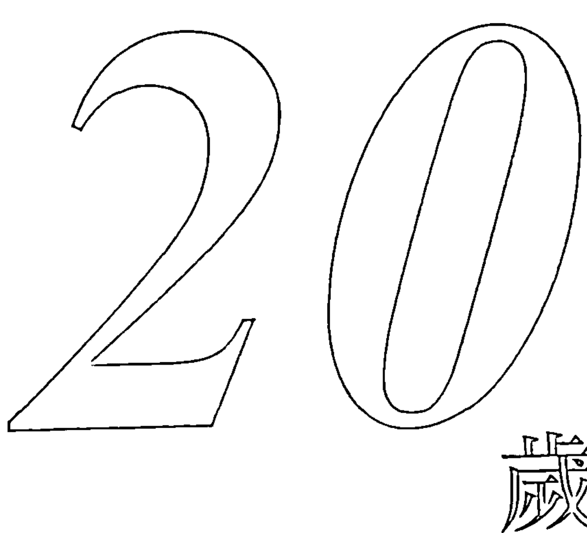

#### [整體運勢]

不管就生理或心理上來看，20 歲的妳已經是個成年人了。或許是正要踏進社會成為社會新鮮人，也或許妳還在唸大學，不論有沒有收入，今後妳對家中的責任分擔將更為明確。從運勢上看來，今年妳的財運和戀愛運都不錯，至於對象的尋找，往工讀或上班的地方發展，機會會較參加朋友聚會、社團活動等來得多。

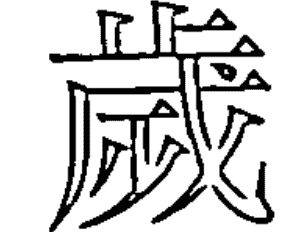

#### 未有男友的妳戀愛對策

給妳一個良心的建議！今年妳最好將眼光放在長妳 3 歲以上的人身上。藉由他們的帶領，更能讓妳充分了解「成人的世界」。何妨敞開心胸隨他們的腳步學習，可望讓妳的愛情生活更加多采多姿。不過，其中可能也包含一些已婚男士。或許他的經驗及風采真的很令妳欣賞，只是建議妳在和他們接觸前一定要有一個覺悟，那就是：「絕對不可能和這個男人結婚！」。有了這層釐清後，再去和他們接觸，才不致讓這段感情變得太多複雜。今年異性緣最佳的時候為 7～8 月。

#### 已有男友的妳結婚對策

如果妳和他是屬於青梅竹馬或學生時代交往的戀人，在今年可能會論及婚嫁。倘若除了你們有所共識外，雙方父母亦站在不斷催促、聲援的行列中，那何妨就結婚吧！就今年而言，最適合訂婚的月份為 5 月；結婚則以 7 月為宜。如果妳和他是今年才剛認識的情侶，除非對方年紀大妳很多，而且很急著結婚，否則建議妳最好再交往個 2 年後再談婚事。兩人年紀差距在 3 歲以內者，估算以後年結婚最為恰當。另外，如果妳和他交往已有很長的一段時間，在今年兩人感情突然有變淡，或是轉而類似友情時，不如就這麼放任著看它變化，試著把重心移到和其他朋友的交遊上。

#### [愛的地雷]

發生在 1～2 月、10 月左右的困難或麻煩，很可能會使兩人在意氣用事下協議分手。如果妳還在乎他的話，建議妳爭執過後由妳開口向他道歉。

### 誕生數 ⑥

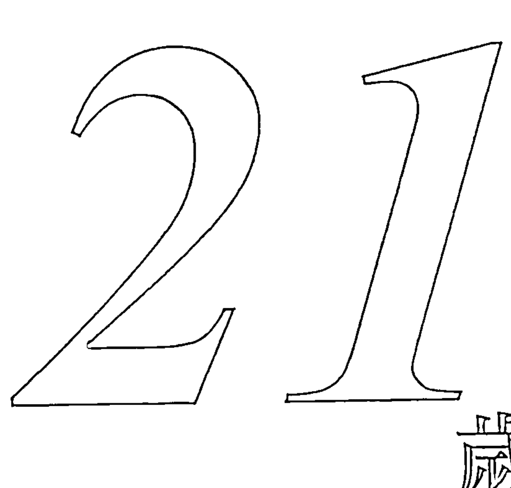

[整體運勢] 今年的妳，運勢不但沒有上揚的趨勢，反倒有易沈湎於過去回憶，或與重要的人離別的遭遇。不過勸妳無須太過悲觀，因為，低潮往往是下一波出發的開始。在此時期妳最該做的不是悲傷，而是趁機整理身邊一些擾人的事物及人際關係，並著手為未來訂定計畫，相信一定會助妳飛向下一個嶄新的世界的。今年戀愛運、結婚運都不怎麼好，至於工作方面，如果覺得它並不是那麼適合妳的話，何妨把它給辭了。

#### 未有男友的妳戀愛對策

今年的戀愛運不怎麼好。倒不是說沒戀愛可談，而是談的戀愛都是那種不談也罷的戀愛。被甩的機率相當高；就算有人主動追求妳，也別高興得太早，先看清楚對方是怎樣的人再說。今年的運勢看來，如不小心有可能落得人財兩失的命運，這麼黑暗的時期，寧可生活過得簡單點，但求平安就好。當然，也不是要妳在今年完全拒人於千里之外，而是要充分過濾，避免談些不必要的戀愛，遇到良緣的機會相對地就會提高。今年僅有 6、7 月異性緣較好。

#### 已有男友的妳結婚對策

對妳和他而言，今年無異是「愛情考驗年」。特別是兩人交往的時間為 3 或 5 年，今年的考驗更可能會帶來分手的危機。倘若他真是妳認定未來另一半的人選，為了通過今年運勢對你們的考驗，建議雙方在今年最好有彼此配合、包容的共識，不任意發脾氣、多聽聽對方意見，自然可免掉一些不必要的爭執。如果深思熟慮後覺得對他真的已沒有感覺，也不必再刻意維持這段褪色的感情，速速與他分手，因為明年的戀愛運很不錯，不如在今年恢復一個人的生活，靜待明年更合適的戀情來臨。就今年的運勢來看，不論是訂婚或結婚都不適合。

[愛的地雷] 發生在 9 月左右的困擾或麻煩可能會促使兩人分手，如果他還是妳最愛的人，勸妳最好忍耐些，不要意氣用事，以保住這段感情。而如果對他已沒有感覺，則別再考慮了，跟他說拜拜吧！

### 誕生數 6

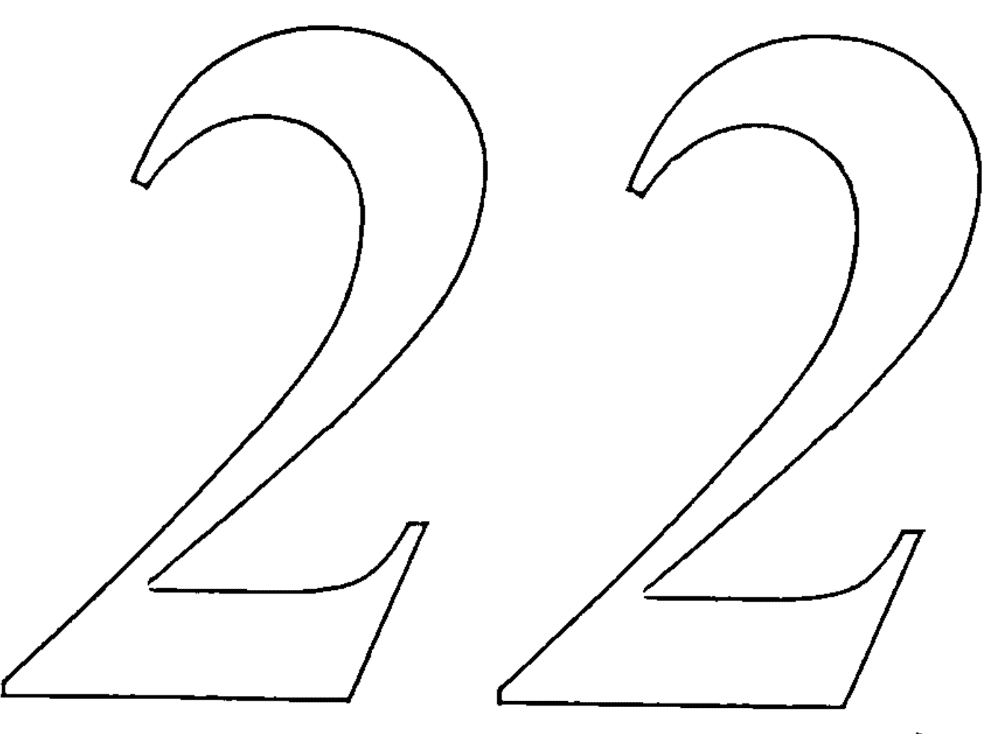

[整體運勢] 今年是充滿嶄新氣象的一年，尤其對剛踏出校門的社會新鮮人來說，今年的妳有如揚起風帆的船，蓄勢待發。儘管對未知的將來充滿期待，但要知道，並不可能事事都順妳的心、如妳的意，既然是一名新鮮人，就要懷著一切從頭學起的心態虛心受教，只要能把握住這個原則，就等於向自我實現邁進了一大步。至於今年的戀愛運，前景看好、值得期待。

#### 未有男友的妳戀愛對策

今年的妳，在從未去過的地方或場合中，可望有機會遇到生命中最重要的人，他就算不是妳未來的另一半，也是往後十年中給予妳精神上極大支持的人。由於未來的妳是個需要有他人協助才有出人頭地希望的人，所以趁著今年，不妨多多累積自己的人脈關係，尤其是一些有助於妳適應社會生活的人。至於在戀愛方面，今年的妳最好把重點放在比妳年長，且有行動力、果斷力的人的身上。就今年而言，異性緣最好的月份為 5～6 月、9～10 月。

#### 已有男友的妳結婚對策

不管是對剛認識的情侶，或是交往已有一段時間的情侶來說，今年頗有踏上紅地毯那一端的可能。或許匆忙的決定讓妳感覺有些突兀（尤其是當妳和他認識時間還不長時），但依今年結婚運實在很不錯的情況來看，如果妳也有意思希望和他共度一生，建議妳一旦他向妳求婚，最好趕忙點頭答應，然後速速去拜見雙方父母，之後著手婚禮籌備工作。就今年而言，最適合訂婚的月份為 3 月、12 月；結婚則以 5～6 月為宜。相反的，如果在過了 22 歲生日後，發現兩人感情時有齟齬發生，最好先暫停談結婚的事，雙方反省看看問題究竟是出在誰身上，然後再積極溝通尋找解決辦法才是！

[愛的地雷] 發生在 8～9 月的爭執很可能旋即造成兩人分手，須注意！尤其如果妳認為他仍是妳的最愛的話，就不要太意氣用事，理性地把妳的感覺告訴他，請他和妳一同想辦法解決。

### 誕生數 6

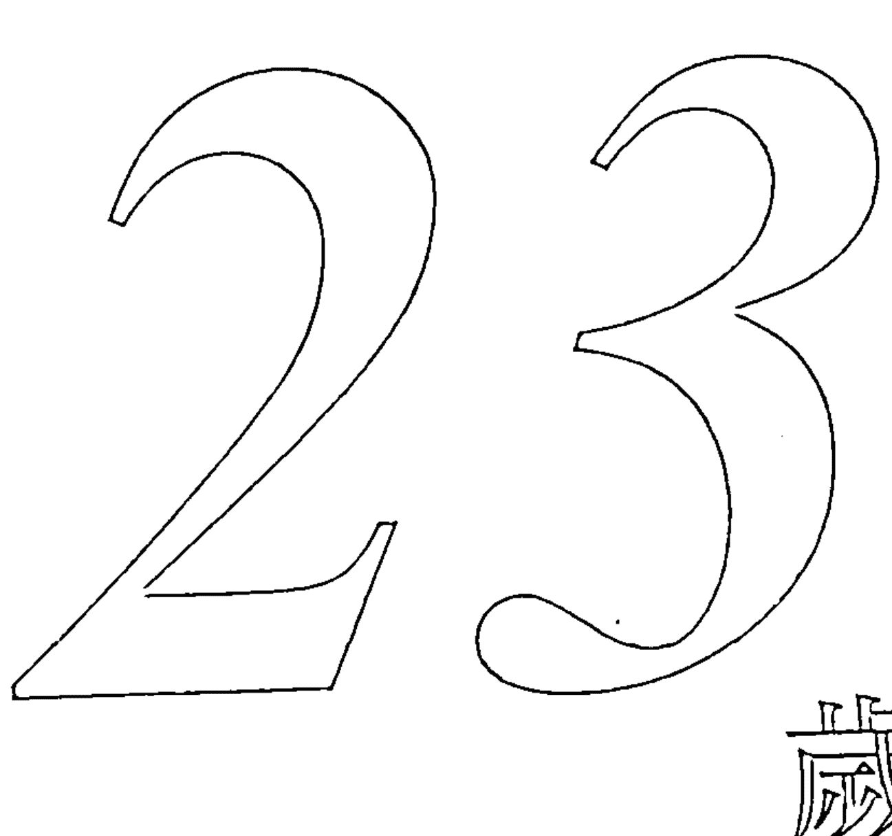

[整體運勢] 運勢重回平穩，相對的也使得你的心情平靜不少。在今年，不論各方面最好都不要圖什麼大的改變，儘可能延續以往例行性的工作就好。或許太過平靜的生活，無法施展大抱負會讓你的心情有點悶，建議你有空的時候不妨多從事些抒解壓力、變換心情的活動，譬如做做運動、泡泡溫泉或三溫暖都不錯。

#### 未有男友的妳戀愛對策

今年的戀愛對象很可能就在妳身邊！他或許是妳的普通朋友；也或許是妳每天見面的同事，在過去，妳一直只當他是一位異性友人，直到有次機緣巧合兩人一陣長談後，才發現妳和他竟是如此契合。然而如果在 23 歲生日過後，妳左等右盼周遭還是沒有這等男孩出現時，建議妳不如化被動為主動，請同性友人幫妳留意一下不錯的對象。在發動團體的力量「搜尋」後，相信那個人應該很快就會出現才是！今年的妳，異性緣最佳的月份為 4～5 月、9 月。

#### 已有男友的妳結婚對策

今年是妳和他感情更濃、更厚的一年。順著這樣的情勢發展，兩人要論及婚嫁也是極為自然的事。建議妳一旦和他有這樣的共識時，馬上先去拜見雙方的父母，父母的贊同與積極支援將使得未來婚事的籌辦更加順遂。就今年來看，最適合訂婚的月份是 2 月、11 月；結婚則以 4～5 月為宜。相反的，如果在過了 23 歲生日之後，發現兩人感情世界頻頻出現問題，讓妳時常生活在緊張不安中，建議妳首先安定一下自己的情緒，如果對他有任何怨言，何妨直接當面跟他說個清楚。這段感情後續發展會如何，預料到明年將會有答案出現。

[愛的地雷] 發生在 7～8 月的衝突很可能令他拂袖而去，勸妳凡事要三思而後行，有什麼不滿儘量在平時就向他反應，不要一直忍到受不了時，才來個山洪爆發，如此，對兩人的感情會造成很大傷害！

### 誕生數 6

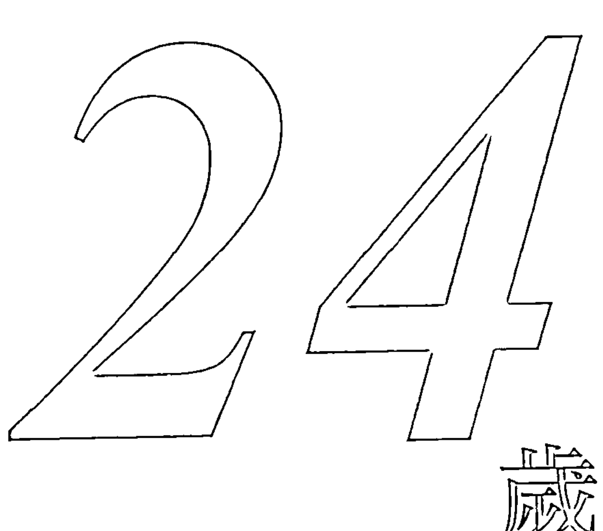

[整體運勢] 今年的妳，幾乎是在慌亂、忙碌中度過。其實生性喜歡清清楚楚、慢慢來的妳，最受不了就是這種混亂的場面，偏偏不知怎地，在今年，工作、人際關係方面的事卻像洪水一樣襲捲而來，讓妳頗有無力招架的感覺。不過，運氣它往往卻是愈忙愈好，儘管不怎麼喜歡這樣的感覺，但妳的工作與人際關係上在今年有了大幅的拓展卻是不爭的事實。倘若忙碌真的帶給妳精神上不太舒服的感覺時，建議妳不妨抽個空做一次小旅行，換個心情再回來「奮戰」，相信效果會更好。

#### 未有男友的妳戀愛對策

今年的妳，戀愛運好得讓人嫉妒！尤其是身處在「遊樂」的場所時，追求妳的男人更是擋都擋不住。如果在過了 24 歲生日後，妳還不能感受到這「傲人」的氣氛，妳便得反省了。首先是妝扮上的問題。妳是不是太「樸素」了？妳是否是什麼話都藏心底？妳是不是很少參加聚會？對於異性的搭訕老是採取拒絕的態度？如果是，那表示問題出在妳身上，請妳馬上加以改善，否則，再好的運勢也會被妳擋在門外頭的！今年異性緣最佳的月份為 3～4 月、9 月、11 月至年底。

#### 已有男友的妳結婚對策

如果妳和他交往已有一段時間，今年兩人可能要面臨感情上的考驗。倘若妳對他的愛已大不如前，甚至連約會都覺得懶，那何妨就順著自己的感覺，把時間花在和同性友人的聚會上，說不定透過聚會還可以認識到比現在的他更適合妳的男孩！至於如果妳和他是去年才剛交往的情侶，今年兩人何妨利用空檔好好去做趟旅行，在浪漫輕鬆的氣氛下，兩人的感情可望更上一層樓。而順著這甜蜜的感覺，或許妳和他會有同居或試婚的念頭，建議妳與其這麼沒名分地發展親密關係，不如坐下來正式地談婚事。就今年而言，最適合訂婚的月份為 1 月、10 月；結婚則以 3～4 月及年底為宜。

[愛的地雷] 6～7 月可能有不倫之戀或出軌事件發生，須注意！另外，今年兩人還有因意氣用事而走上分手之路的危機，如果妳還在乎他，最好謹言慎行，不要胡亂說些氣話，以免造成遺憾。

### 誕生數 6

[整體運勢] 今年可望在輕鬆的氣氛中度過。雖然投資報酬率沒有如預期的好，但日子倒也過得平穩。尤其是對去年才剛換工作、調職的人而言，今年總算一切都上軌道，「大勢抵定」，壓力自然也減輕了許多。至於戀愛運方面，今年新戀情出現的機率不大，不如將注意力轉到和同性友人的情誼發展上。另外，如果對某人感到不滿，甚至覺得自己受委屈時，建議妳早日找他說清楚，以免愈積愈深爆發大爭執。

#### 未有男友的妳戀愛對策

今年豔遇是有，但要發展成愛情就有點難了。在彼此想法不同的情況下，若硬是求進一步的發展，沒多久還是會分開的。就算有人對妳表白，對方不是妳早已懶得理的舊情人，就是根本不是妳喜歡的類型。若今年妳真的很想談戀愛，妳可以向同性友人發出求救信號，請她們幫妳留意合適的對象，然後從中選擇穩重且有經濟能力的男孩，和這樣的人在一起或許不能期待浪漫的生活，但日子卻可以過得踏實。今年的妳，異性緣最佳的月份為 2～3 月、11 月至年底左右。

#### 已有男友的妳結婚對策

如果妳和他是交往了好幾年的情侶，早已見過雙方父母，且家長們也很贊同你們來往，在今年可能會接到父母的「催婚令」。如果此時的妳和他也很贊同這樣的決定，那就何妨快快著手籌備。就今年而言，最適合訂婚的月份為 9 月；結婚則以 2～3 月、11 月至年底為宜。相反的，如果在今年感覺兩人感情有開倒車的現象，則意味著兩人之間有某些潛在問題存在。譬如，對於過去發生的某件事，對他的說法妳是否仍抱持著懷疑的態度？或者，有些話他一直想告訴妳，卻又很難開口？如果妳還有心挽回這段感情的話，建議你們就該找機會好好坐下來開誠布公地談；如果妳早想換掉他，那還等什麼？乾脆藉此機會跟他說拜拜不就得了！

[愛的地雷] 發生在 5～6 月的麻煩事，暗示著要妳重新考慮他究竟適不適合做妳未來的另一半。如果深思後覺得和他相處實在是件痛苦的事，何妨跟他分手，靜待明年更好的戀情的到來。

### 誕生數 6

[整體運勢] 從今年起連續兩年是妳2字頭人生中戀愛運、結婚運最旺的時期。不但有熱烈如火的戀情出現，更不斷有追求者冒出，在年紀的增長與戀愛經驗的累積之下，妳變得愈發成熟、性感，魅力四射。但值得注意的是，在眾多追求者中抱持著和妳「玩玩」心態的人也不少。所以面對追求者，最好還是要認真評估他究竟對妳是真心？還是假意？以免錯過了合適的結婚對象，今年的「風光」帶來的就是禍而不是福了！

#### 未有男友的妳戀愛對策

戀愛機會多得嚇人，隨便做個動作都有愛慕的眼光投射過來。特別是在一些沒到過的地方，搭訕的人之多，讓妳有不勝其擾的感覺，誇張的是，連外國人也加入了陣容。不過，其中抱著和妳玩玩心態的男人也不少，應小心選擇才是！若發現對方沒有跟妳結婚的打算，就得當機立斷。如果過了26歲生日後，身邊仍沒追求者出現時，最好多往可以接觸眾多不認識的人的地方走，情況會有所改善的。今年幾乎一整年異性緣都很好，最好的月份是1月、9月至年底。

#### 已有男友的妳結婚對策

除了戀愛運紅得發紫外，今年的結婚運也很不錯，尤其對剛認識的情侶們來說，如果想在今年內來個閃電結婚也並無不可。今年最適合訂婚的月份是8月；結婚則以1～2月、10月、11月為宜。不過，對於交往已久的情侶來說，今年兩人恐怕就要面臨情海起風波的問題了。尤其是妳，對他的感覺或許會有不若以往，發現他怎麼這也是缺點、那也有缺點的。如果有此現象發生時，建議妳最好回頭審視一下兩人個性是否相合？倘若不是那麼合適，何妨速速與他分手。就運勢上來看，今年的分手可望更加提昇明年戀愛運亨通的程度。換句話說，分手是為了更好的相遇。

[愛的地雷] 發生在4～5月的爭吵，如果是因他而起的話，暗示著早點和他分手為妙。就今年而言，最有利於分手的月份為9～10月。

### 誕生數 ⑥

[整體運勢] 今年的戀愛運、結婚運及家庭運到達尖峰，是 2 字頭人生中運勢最好的一年。才剛認識的情侶，在今年馬上結婚的也大有人在，而且所覓得的對象都是滿不錯的人。然而，在愛情這麼順遂的時刻，卻也有美中不足的地方，那就是父母或家人會有些麻煩事發生，身為家庭中的一份子，妳當然也有義務要分擔部分責任，但建議妳責任心適可而止就好，在今年還是多集中些注意力在追求自己未來的幸福上吧！

#### 未有男友的妳戀愛對策

今年的妳到哪兒都能受到異性的注目，尤其是在 5 月和 11 月左右，可望覓得合適的戀愛人選。儘管追求妳的眾多男士中，仍少不了只想與妳玩玩的人，但和去年相比，人數減少許多，取而代之的是更多有心想和妳結婚的人。面對眾多機會，建議妳要以具備「溫柔體貼」及「行動力」等特色的男士為優先考量，對一些「酷得可以、有工作狂」以及「自以為是」的男人則是最好採取敬謝不敏的態度，和那種男人在一起，談談戀愛還可以，要結婚恐怕有妳苦頭吃的了！

#### 已有男友的妳結婚對策

在超強結婚運的簇擁下，去年才剛認識的情侶，今年可能會心癢癢地忍不住想結婚。當向他提出這樣的要求後，如果他覺得時間還早，妳倒是可以再等他 2 年，也就是到 29 歲時再說。但如果他的推拖是因為將心思全部放在工作上，開口閉口都是「因為工作……所以無法結婚」時，勸妳要再做謹慎考慮，想和這樣的人建立一個充滿愛的家庭，希望十分渺茫。也有些人會選擇在今年展開同居生活，建議妳與其如此，最好還是去辦個結婚登記、拿個名分比較好，即使用「先斬後奏」的方式，之後再告知雙方父母也無所謂。今年最適合訂婚的月份是 7 月；結婚則是 9～10 月為宜。如果今年覺得和他有個性不合的情形，何妨早點向他提出分手。

[愛的地雷] 發生在 3 月、12 月的困擾將成為日後分手的導火線。如果覺得兩人在個性上也不是那麼合適，不如乾脆和他道再見。

### 誕生數 6

[整體運勢] 平靜、安定的一年。雖然少了超人氣，但也因為回歸寧靜，使得妳終於能回過頭靜下心來聆聽自己的聲音、走自己想走的路。在今年，建議妳應儘量去做自己喜歡做的事，包括發展自己的興趣、充實自己想深入或具備的專業技能。至於不必要的人情世故，何妨把它放在一邊，讓自己過著更忠於自己的生活。今年的戀愛機會大體說來並不多。

#### 未有男友的妳戀愛對策

戀愛運的高潮在去年暫告一個段落，今年則不太有發展新戀情的機會。建議妳就平心面對，急著要找男朋友只會讓妳的眼光愈降愈低。何不利用今年感情的空檔多和同性友人交遊，再不就在自我能力或興趣上加以提昇，這對充滿藝術細胞的妳而言，未嘗不是件好事。今年的妳，就算有欣賞的異性，最後也只能流於單相思而已，何不多愛自己一點，充實內在後相對地也能提高自己的魅力，讓自己更有本錢迎接新戀情的來臨。今年異性緣較好的月份只有 8～9 月而已。

#### 已有男友的妳結婚對策

如果妳和他交往時間已超過兩年，錯過去年結婚的良機，今年可要好好考慮結婚的事了。倘若發現你倆從今年起，彼此在精神方面更加契合，雖然少了膩在一起的衝動，但卻仍不減愛他的心，甚至愛得更深、更強烈，而他同時也有同感的話，預料你們最遲在明年以前一定會走上紅地毯的那一端。如果相反的，在過了 28 歲生日後感覺兩人戀情有開倒車現象時，建議妳最好回頭審視兩人個性是否相合的問題。如果不合，乾脆就任戀情熱度一天天遞減，靜待後續自然的發展。就今年而言，最適合訂婚的月份是 6 月，結婚則是以 8～9 月為宜。

[愛的地雷] 發生在 2 月、11 月的困擾或麻煩，很可能會讓妳和他走上分手之路。如果妳還在乎他，勸妳還是克制一下自己的情緒；如果自認對他的信任感已不再，那分手倒也省事。

### 誕生數 6

[整體運勢] 從今年起連續幾年，如果你是在工作方面一直有所堅持、努力不懈的人，可望有很多足以讓你一展所長的機會。透過表現，眾人對你的評價日漸增高，相對地收入也就變得豐碩起來；甚至還會接到欣賞你才華的人的邀請，請你擔任指導或監督的工作。或許你會對自己是否能勝任這個職務產生遲疑，但建議你何妨就給自己一個機會試試？更何況，透過這次經驗，或許還能發現自己竟然還有領導方面的長才呢！

#### 未有男友的妳戀愛對策

今年的戀愛機會多藏在職場或商業場合裡！因此，今年人際關係拓展的重點，著重在辦公室或商場上與人相處的問題。就今年來說，追求者以在經濟上頗有基礎的男性為多，或許他們「擁有經濟基礎」的特點，在你看來根本算不上是什麼條件，你反而會比較心儀那些有才華但卻沒錢的男人。但，奉勸你還是先稍微冷靜些再做評估。畢竟，有錢不是罪惡；而沒錢，現實生活首先就出問題。所以，別那麼快就下決定，三思而後行。今年異性緣最好的月份是 6～8 月。

#### 已有男友的妳結婚對策

如果你和他交往已有 1 年以上，而彼此也有心要共度一生的話，今年就可以正式地談談結婚的事了。由於明年的運勢裡暗藏著「變化」、「分離」的因子，錯過了今年，兩人的感情恐怕有生變之虞。所以，如果幾經考慮，認為兩人個性相合，最好能趕在 29 歲生日以前談妥結婚的事，甚至開始著手準備；至於如果你向他提出結婚的事，而他卻沒有這種想法的話，勸你也不用再等他了，另外找個更好的男人才是上上之策。就今年而言，最適合訂婚的月份是 5 月；結婚則以 7～8 月為宜。

[愛的地雷] 發生在 1～2 月、10～11 月的爭執暗示著他或許並不適合你。如果你也覺得他罪不可赦時，乾脆快刀斬亂麻，和他分手！

### 誕生數 6

#### [整體運勢]

用「寒冬」來形容今年妳的運勢是再適合也不過了。這麼說或許會令妳感到有些害怕，其實妳也不用太擔心。要知道，一年四季的存在各有其義務，冬天也不例外。今年，正是妳褪去2字頭人生殘留在身上不必要的包袱的時候，尤其是過去多餘的、負面的人際關係，保留它只會讓妳徒增傷害罷了！而透過嚴冬的洗滌，妳將變得更加清明、透徹，對整個人生而言，儼然又是一個嶄新的開始。

#### 未有男友的妳戀愛對策

今年的前半年運氣始終圍繞在「割除過去不必要的人際關係」上，所以新戀情要等到下半年才可望展開。以妳是5月份的壽星為例，新戀情恐怕會遲至隔年的3月或4月才會向妳報到。當然也有辦法可以讓下半年的運勢提早來臨，那就是改變眼前的環境。既然上半年的時間是個「淘汰過去殘留不必要的東西」的格局，因此妳可以先來個除舊布新。比如，辭去不甚喜歡的工作；遠離只想利用妳的朋友等等。當妳愈早除去這些負荷時，新戀情就愈快出現在妳的面前。

#### 已有男友的妳結婚對策

今年的運氣實在不怎麼好，尤其對交往已經超過2年的情侶來說。如果打從很早以前妳便有結婚的念頭，但卻一直等不到他點頭，在今年兩人恐怕會走上分手的命運。不過，其實分手也不是什麼壞事，以今年運勢處於「整理」的情況來看，今年內「整理」掉他，反而有助於明年遇見更適合妳的結婚對象。至於如果妳和他交往時間還不到一年，建議你們在今年要儘量設法維持兩人甜蜜的感情，只要平安度過今年，佳期就不遠了！今年的運勢不適合訂、結婚，不妨把氣力多花在和雙方父母的溝通上，取得他們的認同，待31歲以後再談婚事，就會非常順利。

#### [愛的地雷]

已交往2年以上的情侶，在9～10月間若有重大的困擾或麻煩發生時，代表分手是最佳的解決之道！不要再企圖用忍耐來感化他，要改變他或許根本就是天方夜譚！

### 誕生數 ⑥

[整體運勢] 走過去的低潮，今年對妳而言是個嶄新的開始。妳將變得比過去更成熟、更溫柔，也更慈悲，追求的則是圓融、調合的人生。而透過這樣的轉變，妳更能將把誕生數 6 女性的母性光輝發揮到極致，儘管沒有功名利祿堆積成的燦爛成就，但在別人的眼中，妳卻能夠成為一個有格調、心胸寬大的人。

#### 未有男友的妳戀愛對策

今年的妳，戀愛機會多多！尤其是在一些剛認識的異性朋友中，可望出現對妳未來的人生具有強力支援力量的人，他甚至還可能成為妳未來的另一半。所以有機會，多往從未去過的地方走走，或者換工作、搬家，也是增加認識新朋友的好方法。透過朋友介紹也是一個很不錯的方法。就今年而言，異性緣最佳的月份是 2～3 月、5～6 月，以及 7～8 月。其中 5～6 月可望遇見妳未來的另一半；7～8 月認識的人當中，有不少是在未來事業上能夠提供妳強力協助的人。

#### 已有男友的妳結婚對策

如果妳和他交往時間已超過一年，走過去的風風雨雨，如今還能保持穩定感情的話，結婚在今年應該是想當然爾的事了。如果兩人都有相守一生的共識，何不早早著手籌辦結婚事宜？今年最適合訂婚的月份為 3 月、12 月；結婚則以 5～6 月為宜。至於如果妳和他才剛認識不久，兩人的感覺、個性都合得來，選擇在今年閃電結婚也沒什麼不妥。相反的，如果在今年發現和他感情有轉淡的傾向，建議妳先就兩人個性是否相合問題加以觀察。倘若問題不是出在個性不合，妳不妨先從試著控制自己任性的脾氣開始做起，情況應該會有所改善；如果問題真是出在個性，那就何妨給彼此一個冷靜思考的空間，再來判斷下一步該怎麼走。

[愛的地雷] 發生在 7～8 月的嚴重爭執，如果是因為兩人意見不合而引起的，恐怕會有因意氣用事而分手之虞。建議妳不要太衝動，試著站在他的立場替他想想，情況應該會有改善。

### 誕生數 6

#### [整體運勢]

平穩、安定的一年。也或許就是因為日子過得太平靜了，讓妳有時不由得胡思亂想，因而陷入負面的情緒中。當發現自己有這樣的傾向時，不妨多從事一些可以轉變心情的活動。比如，泡溫泉、上三溫暖、游泳等等，藉由外在皮膚和水的接觸，洗滌內心的憂鬱與煩悶。另外，多找好朋友聊聊天也是解決的方法之一。今年就算發現心儀的對象，交往時也不要一個勁兒地太投入，還是先觀察一陣子再說。

#### 未有男友的妳戀愛對策

今年的戀情來得有些突然。他或許原是妳公司的同事，在一次偶然的機會裡，不意竟和他能聊得如此愉快，正覺得他是個值得交的好朋友時，又從他口中得知他剛失戀的消息，一時之間對他寄予無限的同情，仰慕之情也悄悄升起。在今年，類似這種彼此「心靈深處的剖析」往往也是迸出戀情的開始，如果妳對他的感覺不錯，有心想與他進一步交往時，建議妳最好當面向他清楚表達，如此才能充分掌握戀愛機會。就今年而言，異性緣最佳的月份為 4～5 月、9～11 月。

#### 已有男友的妳結婚對策

對絕大多數的情侶而言，今年妳和他的感情發展可望比去年更順遂。如果你倆是去年剛開始交往，在今年更可能走上紅地毯的那一端。今年最適合訂婚的月份為 2 月、11 月；結婚則以 4～5 月為宜。相反的，如果兩人的感情有不進反退的情形時，建議妳先釐清問題究竟出在哪裡？是個性不合？還是受他今年的運勢影響？如果是後者，那何妨再觀察他一段時間再做決定；而如果是個性不合，那乾脆什麼也不用想了，反正分手是遲早的事，尤其明年運勢中暗藏有「分手」的危機，這段感情到明年自有了斷。另外，剛認識的情侶在今年很可能會發展成同居關係，建議妳無論如何還是早日拜見他的父母，讓兩人親密關係合法化來得較好。

#### [愛的地雷]

發生在 7～8 月的大麻煩可能促使兩人走上分手之路；另外，9～10 月時將是妳情緒的低潮期，與其把氣全出在他的身上，不如自己想辦法變換一下心情。

### 誕生數 6

[整體運勢] 期待已久的好運終於來到了！如果你是名職業婦女，今年在工作上可有妳忙的，不但過去想施展的抱負在今年重露曙光，一些新的挑戰又降臨在妳的身上，這使得妳不得不發揮最大的潛力企圖應對，結果也換來了相對的成長。因此，今年可以說是兼具「成長」、「拓展」以及「變化」運勢的一年。另外，如果你有換工作、搬家、學習獨立等打算的話，就今年的運勢來看，值得一試！

#### 未有男友的妳戀愛對策

今年的工作雖忙，但因接觸的人眾多，戀愛機會相對地也多了起來。在今年，前往休閒旅遊地，可望巧遇愛情。另外，舊情也有復燃的可能，如果你至今對過去的他依舊念念不忘的話，倒是可以利用今年提筆寫信給他，預料將有令妳滿意的結果。在這戀愛運本應紅得發紫的一年裡，如果在過了 33 歲後還絲毫不能感受到旺盛的運勢時，建議妳最好設法變換一下環境。找個讓自己生活起來輕鬆沒有壓力的環境，好運自然會找上妳！今年異性緣最佳的月份是 3～4 月、9 月、11～12 月。

#### 已有男友的妳結婚對策

如果你和他交往時間已超過一年，建議你們不妨在今年做趟愛之旅。妳將更有機會看清他各方面的性格，也有助於兩人感情甜蜜度的提昇，待旅途結束的時候，預料也將是妳和他決定踏上紅地毯那一端的時候。今年最適合訂婚的月份是 1 月、10 月；結婚則以 3 月、12 月為宜。如果在妳 33 歲生日過後，發現兩人經常會為些小事吵架，建議妳不妨回頭檢查看看兩人個性是否相合。如果不合，何妨暫時先和他分開一陣子，給彼此一段冷靜思考，但就是不要放著不管它，任爭執一而再、再而三地發生，否則在雪球愈滾愈大的情況下，明年恐怕會爆發更大的衝突。至於不倫之戀，預料在 34 歲生日之前會有所了結。

[愛的地雷] 帶有問題的戀情預料在 6～7 月時會有所了結；另外，2～3 月、9～11 月時妳容易有出軌的衝動，須小心！莫為了一時的快樂或好奇而失去了真正的幸福。

### 誕生數 6

[整體運勢] 今年的妳，基本上日子過得應是相當輕鬆、愉快，如果有什麼麻煩或困擾發生，那也多是屬於過去應解決而未解決所遺留下來的問題。既然問題不解決在未來仍會不斷發生，在今年何不就勇敢地面對它？以誠實的態度試著去解決它，才是真正治本的方法。至於在財運方面，今年並不利投資，不過倒是可以享受小錢儲蓄的樂趣。

#### 未有男友的妳戀愛對策

今年認識異性的機會不多，戀情的產生多半是由過去的友情「晉升」為愛情。而由於有友情做基礎，今年可能戀愛才談沒多久，兩人就宣布要結婚了。所以，當有類似這樣的戀情發生時，妳最好有心理準備。如果在今年妳怎樣就是等不到機會，勸妳也別心急，不妨試試相親。今年的相親，尤其是由親戚或上司牽的線，都會是不錯的人選，值得一試！今年異性緣最佳的月份為 2～3 月、夏天以及年底。

#### 已有男友的妳結婚對策

交往已有數年的情侶，又其是彼此已見過雙方的父母的，在今年無論如何都要對未來結婚的事進行規畫。如果他遲遲沒有表示的話，那何妨由妳主動提出，因為以明年的運勢來看，今年內若是不能對未來的發展有所預定，明年恐怕就要面對情海生波的可能了。就今年而言，最適合訂婚的月份為 9 月；結婚則以 2～3 月、11 月至年底為宜。如果過了 34 歲生日後，妳發現和他的齟齬有增多的傾向時，不妨把心中的遲疑和不安向他說明。因為愈是隱藏，在未來對彼此的傷害就愈大。尤其明年的運勢中藏有「分手的危機」，再拖下去，無疑兩人的感情會走上分道揚鑣的不歸路。

[愛的地雷] 如果 5～6 月時有嚴重的爭執發生時，妳最好再考慮一下雙方的個性問題。如果兩人不是那麼合適，何妨就趁這機會跟他說再見。另外，9 月時對他說話時的用字遣辭要小心，不要不覺中傷害到他。

### 誕生數⑥

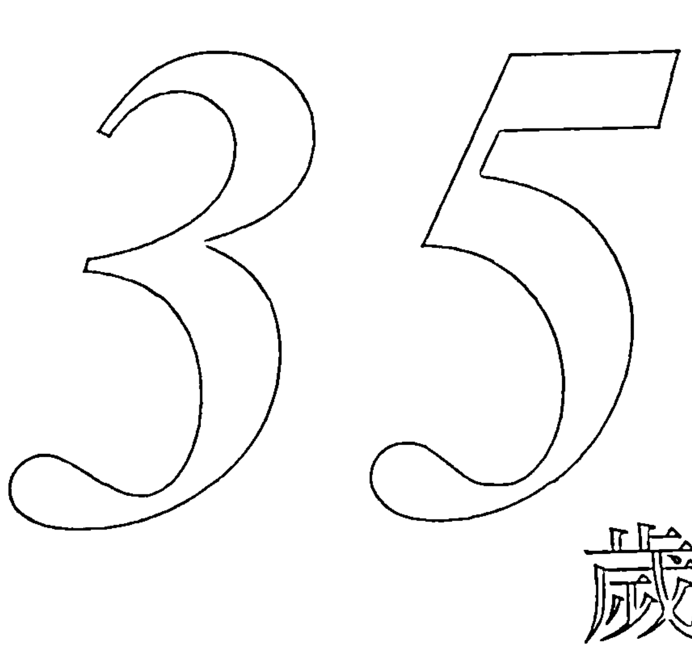

[整體運勢] 從今年起連續 2 年是妳 3 字頭人生中戀愛運、結婚運最好的時候。雖然追求者不少，但其中卻也不乏有婦之夫或愛情騙子，宜張大眼睛謹慎挑選。另外，事業方面工作量明顯增多，甚至還有派駐海外的機會。在今年，「變動」即代表「機會」和「幸運」，因此選擇在今年搬家或換工作，預料也會有好結果。

#### 未有男友的妳戀愛對策

今年的妳，戀愛機會多得讓人嫉妒，尤其是前往海外旅行或工作時，很有可能會發生異國戀情。在眾多追求者中，今年還可能有讓妳一改過去想法，並大大擴展人生視野的人出現。雖然今年的戀愛機會不少，但其中大多數都是曇花一現的愛情，不過如果兩人戀情能持續維繫到明年生日之前，則有結婚的可能。至於在對象的選擇上，最好能以個性穩重、重家庭勝於事業的人為優先考量。今年異性緣最佳的月份為 1～2 月、整個夏天，以及 10～11 月。其中夏天時的緣分更是到達尖峰。

#### 已有男友的妳結婚對策

隨著戀情熱度持續加溫，去年認識的情侶，今年可望論及婚嫁了。就今年而言，最適合訂婚的月份為 8 月；結婚則以 1～2 月、10～11 月為宜。如果在 35 歲生日過後，妳突然不時有移情別戀的衝動發生時，則要特別注意！它或許正暗示你們個性不合，最好走上分手之路！就今年的運勢看來，當中潛藏著「變化」和「尋覓」的契機。所以如果妳和他交往時間已有數年，而今年對他卻有「膩」了的感覺，或許意味著他並不是妳生命中的真命天子，而如今是該分手的時刻了。特別是發生在 4～5 月及 9 月的別離，暗示著分手是一個明確的抉擇。

[愛的地雷] 如果 9～10 月時妳有移情別戀的衝動時，意味著他或許不是妳真正要找尋的另一半。另外，4 月的爭執則容易導致兩人在意氣用事下協議分手，建議妳平常有什麼看不慣或不舒服的事，就應提出和他溝通，不要悶在心裡。

### 誕生數 6

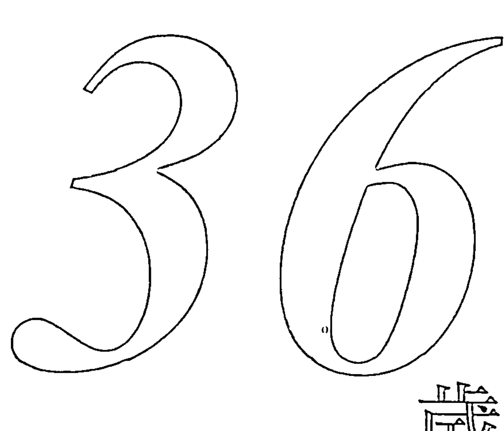

[整體運勢] 今年是妳 3 字頭人生中結婚運最旺的一年，錯過了今年，要再等下一波結婚運的來臨，恐怕就要到 38 歲了。儘管如此，勸妳也不用過分著急，放鬆心情才能充分體會、觀察來自追求者對妳的情意，而妳也才能自然地將真實的一面展現在對方面前，如此才是最利於招來愛情、走上紅地毯另一端的狀態。

#### 未有男友的妳戀愛對策

今年發生的戀情多以結婚為目的，追求者中有婦之夫的比例明顯減少，相對地從友情轉變成愛情的比例逐漸增多。如果不幸妳愛上了有婦之夫，無論如何一定要和他斬斷關係，因為這段畸戀不但不會有任何結果，更會妨礙到其他戀情出現的機會。倘若在過了 36 歲生日以後，身旁遲遲未有追求者出現的話，建議妳最好反省一下自己，是否有太過任性、自私的缺點，只要稍做改正，新戀情很快就會出現在妳身邊的。今年異性緣最佳的月份為 9～10 月。

#### 已有男友的妳結婚對策

交往已大約 1 年的情侶，在今年可望踏上紅地毯的那一端。如果妳和他交往時間已超過 2 年，但他仍然沒有結婚打算，那妳可要特別注意了！好好質問他究竟有沒有結婚的意思，並且要他清楚說明目前不想結婚的原因。如果他不能給妳一個清楚的交代，這種男友勸妳不要也罷！趁著今年異性緣正旺的時候，跟他說拜拜吧！就算他能說出個像樣的理由，妳最好也得再看看兩人個性是否相合，如真的契合，倒還可以再給他 2 年的時間，不然的話，反正也合不來，不如及早分開。就今年而言，最適合訂婚的月份是 7 月；結婚則以 9～10 月為宜。而無論妳和他是閃電結婚還是經過深入交往之後才結婚，所建立的都可望是充滿幸福快樂的家庭。

[愛的地雷] 發生在 3 月、12 月的爭執、麻煩，暗示著分手可能會是較好的抉擇。只要妳勇於割捨舊情，新的戀情可望馬上就來臨，而且他很可能就是妳要找的另一半！另外，夏季的妳容易移情別戀，一切最好三思而後行！

### 誕生數 6

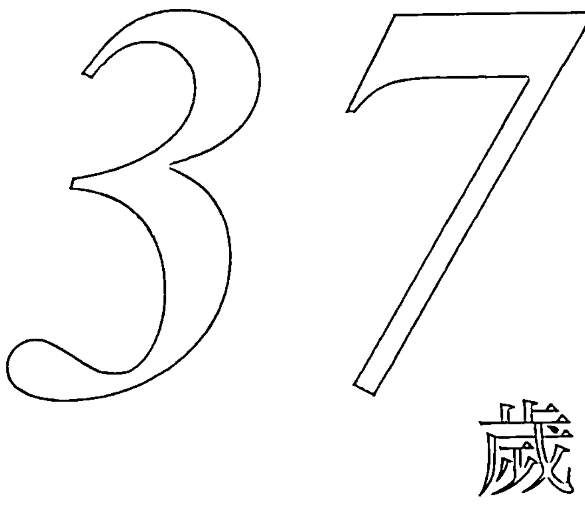

[整體運勢] 適合充電、靜心修身養性的一年。透過這一年的「修練」，可望有效提昇妳在工作上及對人生態度的表現。所以建議妳在今年最好將重心擺在精神方面的成長，而今年的自我投資在未來也將連帶地帶給妳財源廣進的收穫。至於戀愛運、結婚運方面，今年則是呈現「停滯」狀態，此時不宜過度強求，否則恐怕招來的也只是一些孽緣。預料明年感情方面又會開出紅盤，今年何妨靜心等待。

#### 未有男友的妳戀愛對策

今年的戀愛機會少得可憐，所以勸妳也不必白花力氣四處找尋了，不如趁機圖個清靜，讓自己好好享受「休息」和「讀書」的樂趣。尤其是讀書或學習，就今年來說可說是非常適合，趁著今年多方充實自己，他日也將更有本錢追求更好的愛情。所以在今年，管他的愛情！在愛情運處低潮的時候強去求愛情，出現的也淨是一些不怎麼樣的男人，與其耗時間與他們交往，不如找久未聯絡的朋友敘敘情誼來得有價值。今年妳的異性緣較旺的月份只有 8～9 月。

#### 已有男友的妳結婚對策

肉體上的激情消退，今年的妳和他轉而重視的是精神上的結合與交流，而順著這樣的情勢發展，明年兩人可望能結成好姻緣。不過，以運勢來看，即使兩人十分速配，婚禮最好還是等到明年過 38 歲生日以後再舉行會較好。至於在今年兩人倒是可以先行訂婚。今年最適合訂婚的月份為 6 月。相反的，如果在過了 37 歲生日以後，妳發現他對妳似乎有逐漸淡漠的傾向時，建議妳最好審視一下兩人個性是否相合的問題。如果不適合，也不要勉強，任憑妳再如何想努力挽回，這段情終究還是無法再持續下去。不如就放手讓它去吧！下一段戀情會更好的！

[愛的地雷] 如果發生在 2 月、11 月至年底的麻煩或困擾，導致妳對他再不能信任的話，勸妳何妨跟他分手！預料今年的分手將有助於明年新戀情的到來。

### 誕生數 6

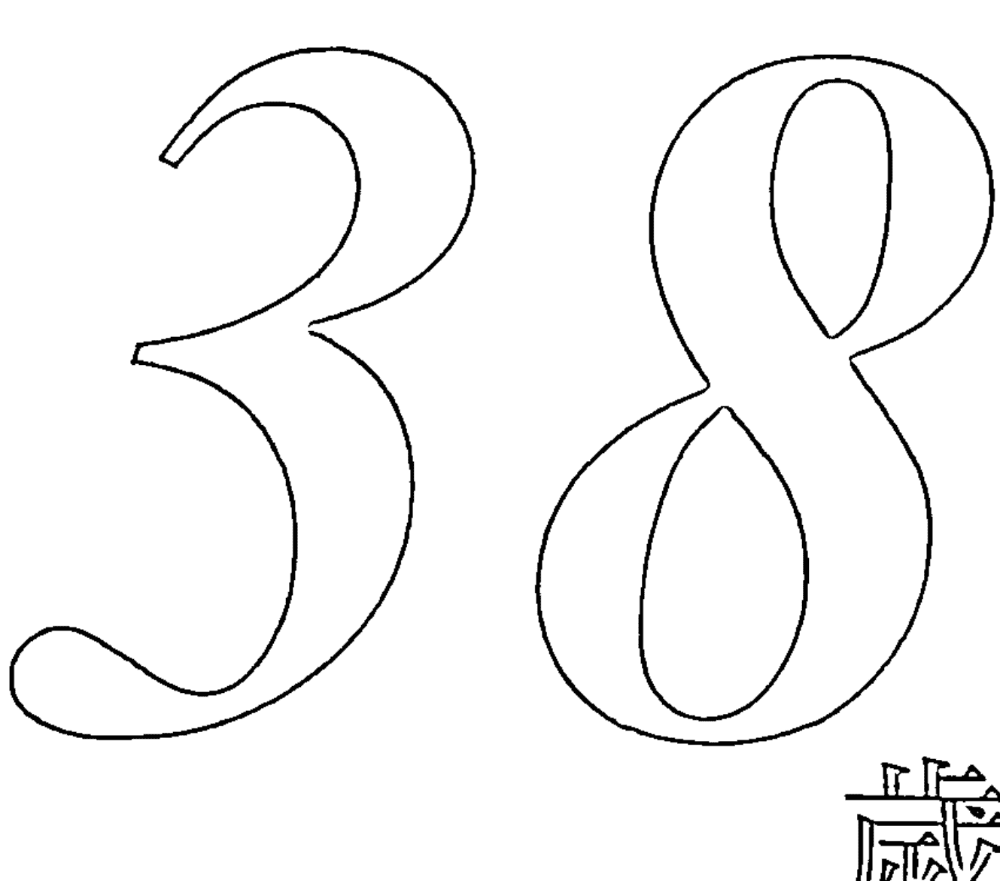

### 歲

[整體運勢] 今年不管在各方面運勢都很不錯。首先在愛情方面不乏有誠意的追求者；在工作方面，所做的努力也可望為公司所肯定，自信心大增之餘，舉凡加薪或是拿獎金的機會也不少。這些際遇加起來讓妳愈來愈對自己獨當一面的能力深具信心，所以就整體而言，今年堪稱是值得期待的一年。

#### 未有男友的妳戀愛對策

今年發生在辦公室的戀愛機會多到教妳笑得合不攏嘴。其實也不限只有自己的辦公室，大凡和妳業務上有往來的場所，都是妳最佳的戀愛途徑。而這些追求者當中大多也都抱著尋找結婚對象的態度認真地與妳交往，所以在今年，妳如願找到生命中的另一半的機會相當地大。在對象的選擇上，如果妳打算在今年就結婚，建議妳要把個性是否相合的考慮擺在第一位；如妳較重視的是外貌還有財富，則可能要等到 2 年之後才有機會結婚。如果在過了 38 歲生日後，身旁仍缺乏追求者時，則不妨試試相親的方式。尤其是透過上司或親戚介紹的人，大抵都能合妳的意。今年異性緣最佳的月份是 7～8 月，而 4～6 月也有零星的機會。

#### 已有男友的妳結婚對策

如果妳和他交往已有一段時間，最好在今年就談妥結婚的事情。一旦今年沒有結論，待明年，兩人緣分可能有轉薄的趨勢。所以，如果今年他還沒有任何表示的話，何妨就由妳向他提起。面對妳的提議，倘若他還是繼續「裝傻」，勸妳也不用再等下去了，趕快去參加相親或是找親友介紹來得妥當。至於如果妳和他才剛認識不久，在今年他向妳提出結婚的要求時，建議妳就相信自己的感覺，倘若回想交往期間和他相處一直很順利愉快的話，那就點頭答應他的求婚吧！就今年而言，最適合訂婚的月份為 5 月；結婚則是以 7～8 月為宜。

[愛的地雷] 發生在 1～2 月、10～11 月的爭執或意見不合，暗示妳分手是最好的選擇。趕快做決定吧！

### 誕生數 6

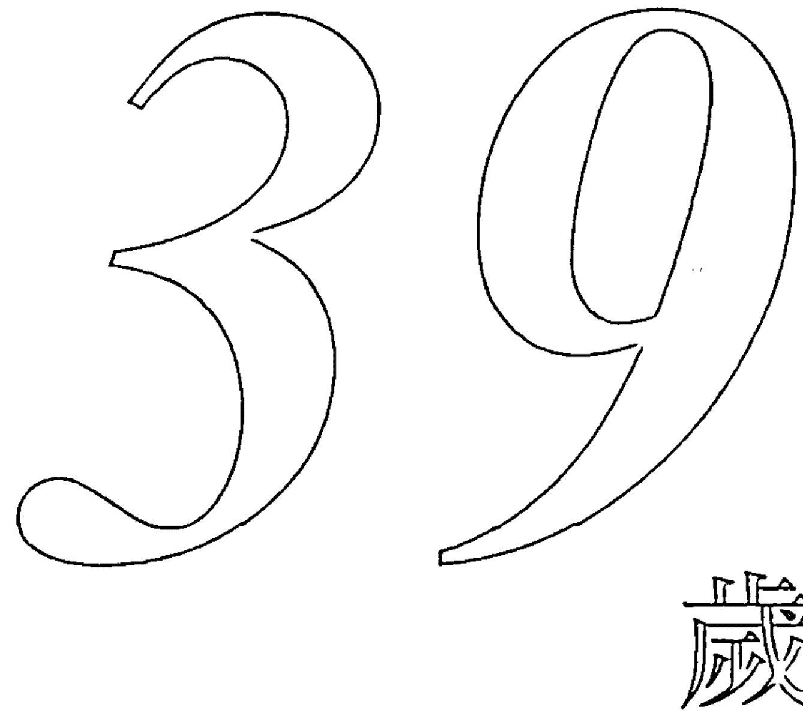

[整體運勢] 今年對妳而言，就像在進行心靈大清倉一樣。過去所有存在生活中不適合妳的事物，在今年都將宣告「終結」。面對結束與分離，妳的心中難免有些落寞和孤寂，但是換個角度想想，這何嘗不是另一個新的人生旅程的開始？而在經歷過今年這一番「整理」之後，未來的妳可望走得更輕鬆、更自在，也更像自己。所以，何必留戀過去，把眼光放在前面，4 字頭人生又是充滿了希望。

#### 未有男友的妳戀愛對策

今年的戀愛運實在不怎麼好，不但機會不多，而且還充滿了危險。其實這只能怪妳自己被愛情沖昏了頭，隨性地展開交往後，才發現他根本就不值得妳愛，只有忍痛割除這段感情。在今年，儘管有新戀情發生，勸妳先睜大眼睛看清楚後再投入，甚至寧缺勿濫，才是避免受傷的最好辦法。雖然今年感情路會走得有些坎坷，但也別太失望，今年跌到谷底的運勢，在明年會逐漸往上攀升，所以今年何妨就抱持著享受孤獨的心情，靜待明年好運的來臨。

#### 已有男友的妳結婚對策

交往時間已逾兩年的情侶，如果在去年兩人還沒有結為連理的共識的話，在今年很可能會走上分手之路。而其中的原因不外是妳對他的承諾早已失去了信心，覺得「既然這個人根本沒有要和我共度一生的打算，我又何必等他?!」。這樣的想法和做法其實是對的，反倒是今年內不快刀斬亂麻揮別這段感情的人，明年更適合自己的戀情的出現將被阻礙，未來妳也還有得等的！就今年而言，最適合分手的月份為 9 月；此外，3 月、5 月、12 月也是可以考慮的時間點。至於如果妳和他去年才剛認識，在今年兩人感情依舊處在蜜月期時，也建議你們不要急著在今年決定訂、結婚，再好好相處一陣子、充分觀察清楚再說！

[愛的地雷] 4～5 月雙方若有爭執發生時，勸妳最好設法為這段感情做了結。一味閃躲不處理的話，未來衝突還是會有重覆爆發的可能。此外，要特別注意發生在 6～7 月時的新戀情，最好先從普通朋友做起，別急著做他的情人。

## 「速配！」診療室

～誕生數6的女性和各男士們的速配程度～

### 速配指數

♡能愛得長長久久 ○愛得短暫而熱烈 ☆適合結婚 ◇適合當好朋友 □適合當工作上的搭檔 ※只要努力，還是有希望速配成功 ✕不如不相識

### 誕生數1的男士

配不配？就看彼此是否能看到對方的優點 ◇※

妳和他基本上是兩個完全不同個性的人，一個是急驚風，一個是慢郎中。於是在初認識時，相互間齟齬不少，他看不慣妳那慢吞吞的動作，妳則是不懂他到底在急什麼。這樣的兩個人照理說應該是完全沒有配對空間的，可是不要忘了，愛情有時就是這麼神奇，即使兩個不同個性的人，倘若彼此能將對方不同於自己的相異點看成是特點，甚至把它當作是和自己互補的優點，一切問題自然也就煙消雲散了。所以說，誕生數6的女生和誕生數1的男生就一定合不來嗎？答案是大部分的情況是，但是當能把對方的不同當做是優點看待時，配對就又有希望了。

### 誕生數2的男士

人人稱羨的一對 ♡☆

不管是思考方式或生活模式，妳倆有太多的共通點，所以不用怎麼配合，很自然就能湊在一起，同時也是眾人眼中天造地設的一對。而這樣的兩個人組合成的家庭，通常也能時時充滿快樂及熱鬧氣氛。原因是酷愛朋友的妳，在婚後往往會自然而然將朋友帶到家裡來，這對居家型男人的他來說，將家庭與社交生活結合為一，自是再輕鬆愉快不過的一件事了，於是，家便成了兩人愛的小窩同時也是交友的天地。唯一美中不足的是，誕生數2的男生天生有些優柔寡斷，生活中每當有需要做下重大決定的事情發生時，他舉棋不定的態度有時真會讓妳有些生氣，甚至覺得身為男人的他，怎麼這麼一點魄力也沒有。關於這點，建議你與其強迫性地要求他做決斷，不如培養自己下決定的果斷力來得快，同時也比較不會傷及兩人的感情。

### 誕生數3的男士

一段常保新鮮的愛情

妳和他湊在一起，只能以「絕妙組合」來形容。誕生數3的他，即使年紀比妳大，天真無邪、機伶偶爾又帶點任性的性格，卻常讓妳幾乎忘了他實際的年齡，想把他當做小弟弟來疼愛，同時也能將妳天生具有的母性激發到最高點。再加上兩人都具備藝術細胞，同為性情中人，興趣又相近，這樣的兩個人在一起不擦撞出愛的火花，才怪！只不過，母親角色做久了，也有煩的時候。他需要妳的包容、鼓勵、安慰之處甚多，如果妳能接受那倒也好，如果不能接受，覺得男女談戀愛，怎麼說女生最好還是處在被保護、疼愛的地位的話，或許就會對他的過分任性、幼稚時有埋怨。不過，就算做不成情人，以妳和他個性上相互扶持的特性來看，他也能成為妳很好的男性普通朋友。

### 誕生數4的男士

最適合的結婚拍檔

誕生數4的男生可以說是最適合做妳另一半的人選。乍看之下有些頑固、呆板的他，其實骨子裡幽默得很，和他在一起正好可以刺激妳無限的想像力，所以不管是談戀愛或是結婚，對妳倆而言，一切都是那麼地自然。雖然這段感情裡沒有轟轟烈烈的熱情，但那種安定、溫暖的感覺，卻是妳最需要也最彌足珍貴的。對妳而言，平凡式幸福所帶來的踏實感，遠比名利要來得重要許多，而這也就是他深深牽引著妳的心的地方。

### 誕生數5的男士

你我像是一對母子

和他在一起恐怕連妳自己都懷疑：「他要的究竟是媽媽？還是情人？」想像力豐富、感性又極具行動力的他，經常是想到什麼衝著就去做，等做到一半才發現事情好像不太對，弄得傷痕累累僵在那兒不知該怎麼辦好，只得對你投以哀怨的眼神，希望你能救救他。而偏偏妳又是個母性十足的人，捨不得人家受苦難過，明知他是活該、自討苦吃，卻也忍不住有個衝動想去「解救」他。於是，就這樣在這一來一往中，造就了兩人的愛情。雖然說彼此的配合可說是天衣無縫，擔任「救人」的工作對妳這麼一個深具愛心的人也算是甘之如飴，但是，再怎麼說愛情還是要付出與回饋中才可望長久維繫。當發現自己活像是他媽，得一天到晚護衛著他，而他卻老是在闖禍，久而久之妳的心中難免也會有些不平衡。而當有這樣的念頭產生時，通常也是你倆戀情告吹的時候了。畢竟，沒有一個女人願意永遠當另一半的老媽子，於是，到分手那天妳會告訴他：「我們要做朋友可以，做情人，我看還是另外找人吧！」

### 誕生數 6 的男士

我倆做普通朋友最好！

妳和他堪稱是非常有趣的組合。在同一個誕生數、相同個性的條件下，兩人要建立起一般朋友的情誼自是沒有問題，至於愛情，則是怎麼看都缺少一份火候。但是，由於兩個人天生都有「悲天憫人」的「慈悲心」，即使明知和對方根本就不可能來電，在顧忌對方「看他沒有女（男）朋友，孤單一人一定很寂寞」的感覺下，是以經常寧願委屈自己真正的感覺，也要裝著一副對對方很欣賞的樣子，希望對方能夠因為有人欣賞而感覺快樂。但在另一方面，卻又擔心自己再裝也裝不了多久，於是不時左看看、右瞧瞧，盼望對方的白雪公主（白馬王子）能趕快出現，好讓自己「功成身退」。所以這兩個人在一起，要變成情人實在有點難，不過說到做朋友，肯定都是彼此最善良、最貼心的普通朋友。

### 誕生數 7 的男士

只要兩人興趣相投，就能成為好朋友

妳天生喜歡熱鬧、喜歡人群，而他卻是個孤僻的人，這樣的兩個人要能迸出愛的火花恐怕只有一個字可以形容，那就是：「難！」做情人不太可能，不過做朋友卻是可以一試。尤其如果兩人正巧擁有相同的興趣，那就無關喜不喜歡人群，兩人湊在一起肯定能天南地北聊得十分投機。只是，身為好朋友的妳，見他老是這麼孤單一個人，總會替他擔心，怕他會太寂寞、太孤獨，於是便會督促自己有空時一定要多陪陪他。而也就是這份愛心和興趣相投的話題，讓妳和他的情誼得以長久無限地延續下去。

### 誕生數 8 的男士

成人之愛

◇☆※

妳和他有可能結合成為夫妻，不過條件是要到達某個年齡之後。如果是在年輕時相遇，不要說合得來，你們彼此可能還會看對方不怎麼順眼，尤其是妳，相當不能忍受他囉哩叭嗦的性格。不過這樣的成見到了30歲後半之後卻有了轉變。漸漸地妳會懂得欣賞他的優點，對於他懂得規劃人生的獨到眼光更是佩服，因為那正是一向任性而為的妳所最感缺乏的。看著他縝密的計畫，突然間給妳一種安定的感覺，也興起了想和他共組一個家的念頭……。一些年輕時鬧分手，隨著年紀漸長再相遇後又復合的情侶，多半就是這類的組合吧！

### 誕生數 9 的男士

你愛我，我也愛你！

♡☆

妳和誕生數 9 的男性之間的愛情充滿了羅曼蒂克！體貼的他，除了十分支持妳的才華表現外，更是經常不厭其煩地向妳表達他的愛意、對妳的關心，讓妳感覺自己像是被他捧在手心的寶貝，那樣地受到呵護。而也由於深受他對妳的情意所感動，使得妳也會不吝對他付出，於是這一來一往間，充滿了濃情蜜意。感情這麼好，結婚自是想當然爾的事情。所以一般說來，誕生數 6 的女性和誕生數 9 的男性的結合機率相當地高，而兩人你儂我儂的親密度的維繫更可望持續長久。另外，由於兩人都具有豐富的情感，所生出來的孩子通常也會頗具藝術方面的才能。

## 誕生數 7 理性至上
追求真理
幸運寶石：紫水晶

**個性** 誕生數 7 的妳，是個理智重於感情的人，不過，有時也因為太理性了，反而顯得有些自尋煩惱、綁手綁腳的感覺，甚至在談戀愛時，太過理性也是妳的一大致命傷。事實上，真實的妳在剛強的外表下，也有著一顆溫柔、喜歡照顧別人的心。

**戀愛傾向** 行事作為向來理性的妳，在談戀愛時也是一樣。即使很喜歡某個男孩子，在他面前，妳永遠都保持著一副冷靜的模樣，不肯輕易透露自己的感情。結果，也就因為這樣，平白錯失了很多的戀愛機會。譬如，當一個妳仰慕已久的男孩子告訴妳他失戀了，就別的女孩而言，可能會覺得是個再好不過的機會，趕快趁機向他表達愛意；然而妳卻不是！明明喜歡他，又要裝著一副很堅強的樣子，不向他表白也就算了，還當起他的心理分析師，幫他分析之所以會和前女友分手的原因、要如何挽回或遺忘等等，結果一場談話下來，他和妳的距離固然是拉近了、感情也濃密了，可惜卻只是在友情方面，換句話說，妳的作法只會讓他覺得妳是個再好不過的朋友，卻不是情人。於是，療完傷後，他或許恢復精神振翅再追求新戀情，也或許與原女友再破鏡重圓，就是怎麼也不會留在妳身邊。所以對於誕生數 7 的妳，有個地方極需向妳建言的就是，無論如何要學習說出自己的感情。要知道，愛他不能光只靠分析，只有分析更無法讓他知道妳愛他，唯有大聲說出：「我愛妳！」才是真正讓他注意到妳的方法。至於像妳如此理性的女性，當然也是以個性上較偏理性的男孩子較適合妳，除此之外，如果他更能具備果斷力、開朗的個性，對妳而言更是亦師亦友的好伴侶。

### 誕生數 7

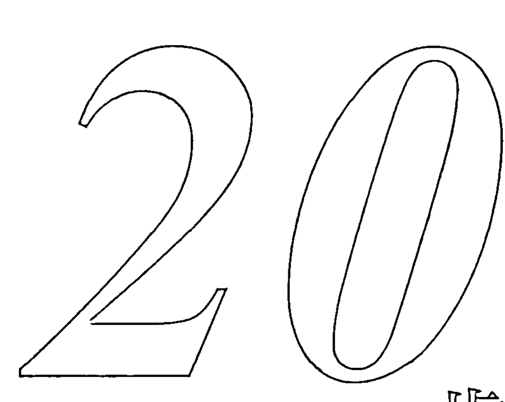

[整體運勢] 沒想到 2 字頭人生一開始就充滿了離別的氣氛……。這雖然不免令妳有些感傷，也滿是挫折感，但換個角度想想，人生在世怎可能永遠風平浪靜，更何況今日的苦難和折磨正是促使妳提早體驗人生的好機會。凡事多忍耐，同時多抱持正面思考看待事物，再壞的運氣也有過去的時候，時間一到問題自然會化解。

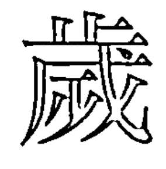

#### 未有男友的妳戀愛對策

今年的戀愛運實在不怎麼樣，沒人追還好，有人追的時候則要小心睜大妳的眼睛，看清對方的真面目。就今年的運勢來看，出現在今年的追求者有許多都是屬於「劣等品」，不是有暴力傾向，不然就是為騙錢而來，如果不仔細觀察，很容易便會陷入他們所設下的圈套，弄得傷痕累累。這種戀愛是不談也罷！所以任憑妳多想有個男朋友，在今年這種運勢不佳的時期，勸妳還是忍耐為重，做做白日夢可以，但就是不要付諸行動，以求明哲保身。一切靜待明年再說。

#### 已有男友的妳結婚對策

如果妳和他是學生時代就開始交往的情侶，在今年可能要面臨分手的危機。原因是隨著成長步調不一，兩人的價值觀漸漸有所分別，對未來理想伴侶的期待也異於以往，這使得你倆終於有了分手的念頭。儘管令人感到有些不捨，但既然已不合適，不如瀟灑地放下，懷著輕鬆的心情，看待充滿希望的來年。不過當然啦，也有部分情侶在今年仍能維持甜蜜如昔的感情，尤其是當他的年紀比妳要大一點時，甚至在今年會接到他的求婚。這固然是件令人高興的事，但以今年運勢來看，不管訂、結婚在今年都不怎麼合適，所以勸妳還是保守一點，先維持彼此良好的關係，訂、結婚的事還是留待明年再說吧！

[愛的地雷] 發生在 9 月左右的激烈爭吵、困難或麻煩，很可能會促使兩人分手；尤其如果事情是攸關他 5～6 月的移情別戀事件時，更沒有必要原諒。快快斬斷這段情，靜待明年的新戀情。

### 誕生數 7

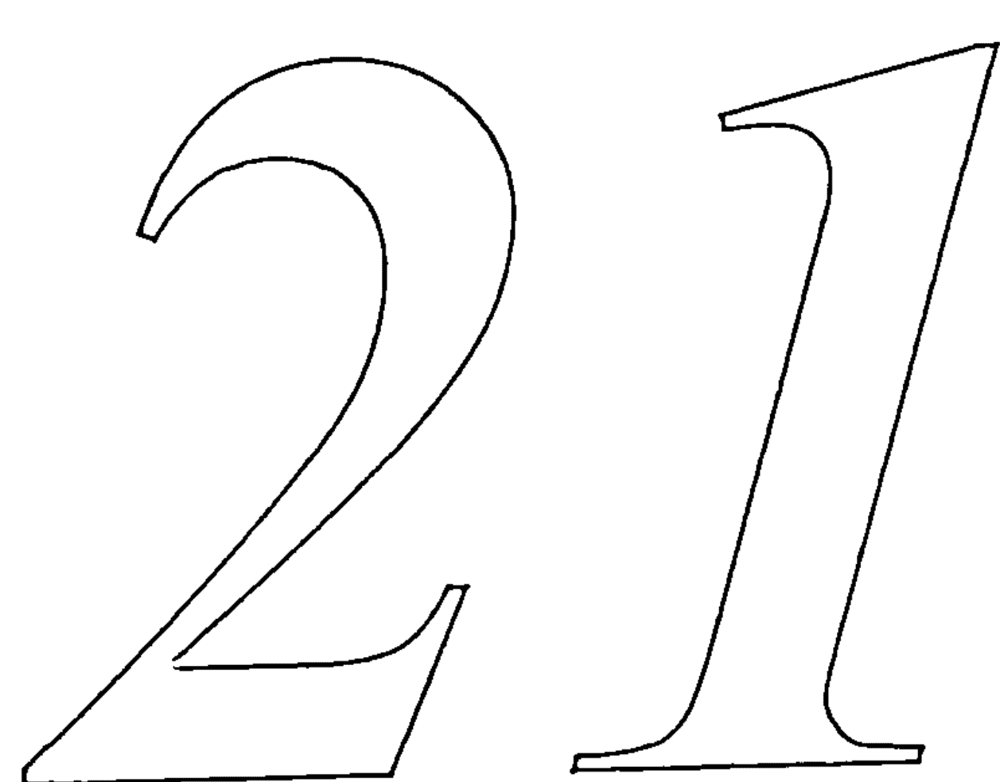

### 歲

[整體運勢] 走過去的低潮，好運在今年總算來臨了！尤其是到下半年，妳更可嘗到什麼叫做心想事成的滋味。趁著今年超旺的運勢，建議妳應該趕快規畫一下妳 2 字頭的人生，隨著計畫一步步向前，結果肯定不會讓妳失望的！特別是挑戰新事物，在今年更充滿了濃厚的成功希望，總而言之，一切好運就等妳動手拿了！

#### 未有男友的妳戀愛對策

戀愛運超好的一年！尤其是藉由朋友的力量，可望再進一步認識更多的人，而在這些新認識的朋友的朋友中，就藏著妳要找的白馬王子。所以，在今年倘若有機會可以認識朋友的朋友，建議妳要積極一點跟著去，保證有機會讓妳嘗到前所未有的美好浪漫的戀愛滋味！不過值得提醒妳的是，在今年的戀愛機會中，不乏有些已婚人士，勸妳無論如何還是和他們保持距離比較好。今年異性緣最好的月份為 5～6 月；其中 2～4 月、9～11 月時可望遇到條件很不錯的對象。

#### 已有男友的妳結婚對策

不管妳和他交往的時間是長是短，在今年都可望能論及婚嫁。如果妳的他年紀大妳 3 歲以上，今年內走入家庭的可能更大。不過，在這過程中或許會接到一些來自父母的反對聲音，至於所持的反對理由不外是覺得妳實在還太年輕了。面對這層阻力，建議妳不妨採取折衷辦法，也就是今年先訂婚不結婚，等到明年再談結婚的事，預料父母的接受度會較高。況且，以明年比今年更有利於結婚的運勢來看，明年結婚將是較妥當的作法。如果在今年，妳和他不但沒能論及婚嫁，感情還有開倒車傾向的人，則建議妳先觀察看看問題究竟是出在運勢，還是兩人個性根本不合。如果真的不適合，那又何妨放棄這段感情，另覓合適的人選。

[愛的地雷] 發生在仲夏時節的困擾或麻煩很可能會促使兩人分手。特別是如果妳所表現出來的態度是相當冷漠時，更可能造成兩人的距離越來越遠。

### 誕生數 7

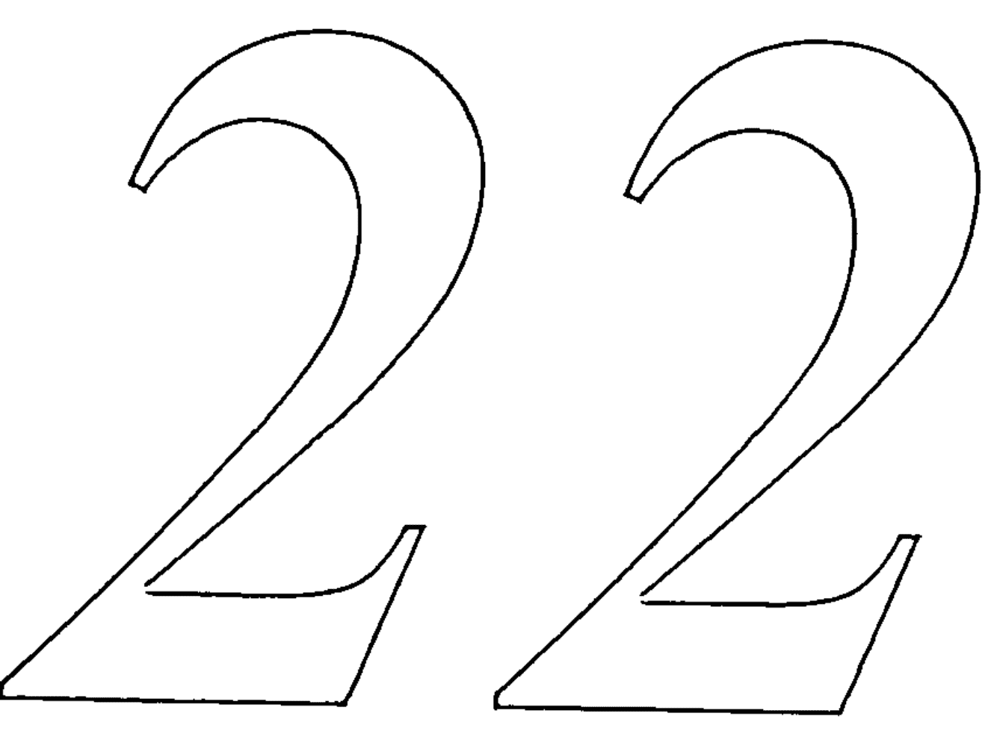

[整體運勢] 充滿溫馨、快樂的一年。今年的妳，愛情、友情兩得意，感覺上一年到頭圍繞在妳身邊的都是關心、照顧妳的人，讓妳有種倍受寵愛的感覺。儘管偶爾難免也會遇到些情緒低潮，但那些多屬妳個人觀念、想法偏差所致，無關運勢問題。9 月左右會為人際關係所煩惱，建議妳最好要放下身段，透過溝通展現解決事情的誠意，一切就可望能圓滿落幕。

#### 未有男友的妳戀愛對策

今年的愛情多是從友情衍生而來。他或許原是妳一位極普通的異性朋友，在一次出遊途中，偶然有機會和他深入交談，才發現彼此的感覺、想法這麼相近。在今年，尤其是 4～5 月、9～10 月左右最容易擦撞出這類愛的火花。如果在過了 22 歲生日之後，卻仍無這類機會出現時，建議妳最好先檢討自己，是否有「不輕易在人面前流露出最真實的一面」的毛病？一個不能真正和人交心的人，又怎能期待別人會和妳產生契合的感覺？所以，總歸一句話，先試著解除自己的設防吧！

#### 已有男友的妳結婚對策

今年妳和他，在濃情蜜意的包圍下，結婚似乎就變成了件很自然的事了。所以，不管妳和他交往了多久，今年的你們都頗有機會踏上紅地毯的那一端。今年最適合訂婚的月份為 2 月、11 月；結婚則以 4～5 月為宜。相反的，如果在過 22 歲生日後，發現兩人時有齟齬發生，最好先冷靜觀察問題究竟是出在流年運勢還是個性上面，否則問題永遠會是問題，也將使得兩人之間的感情變得越來越惡劣。當然，除非妳很堅持，一輩子不想考慮其他人，那當然也只有默默承受的份，只是要知道，兩個不合適的人硬是湊在一起，在未來勢必是永遠不快樂的，這樣的相守又有何意義呢？

[愛的地雷] 發生在 7～8 月的困難很可能促使兩人在意氣用事下協議分手，須注意！如果妳認為他仍是妳的最愛，最好設法冷靜下來，兩人面對面做溝通，一起尋求徹底解決之道，否則類似的問題在未來還是有再度爆發的可能。

### 誕生數 7

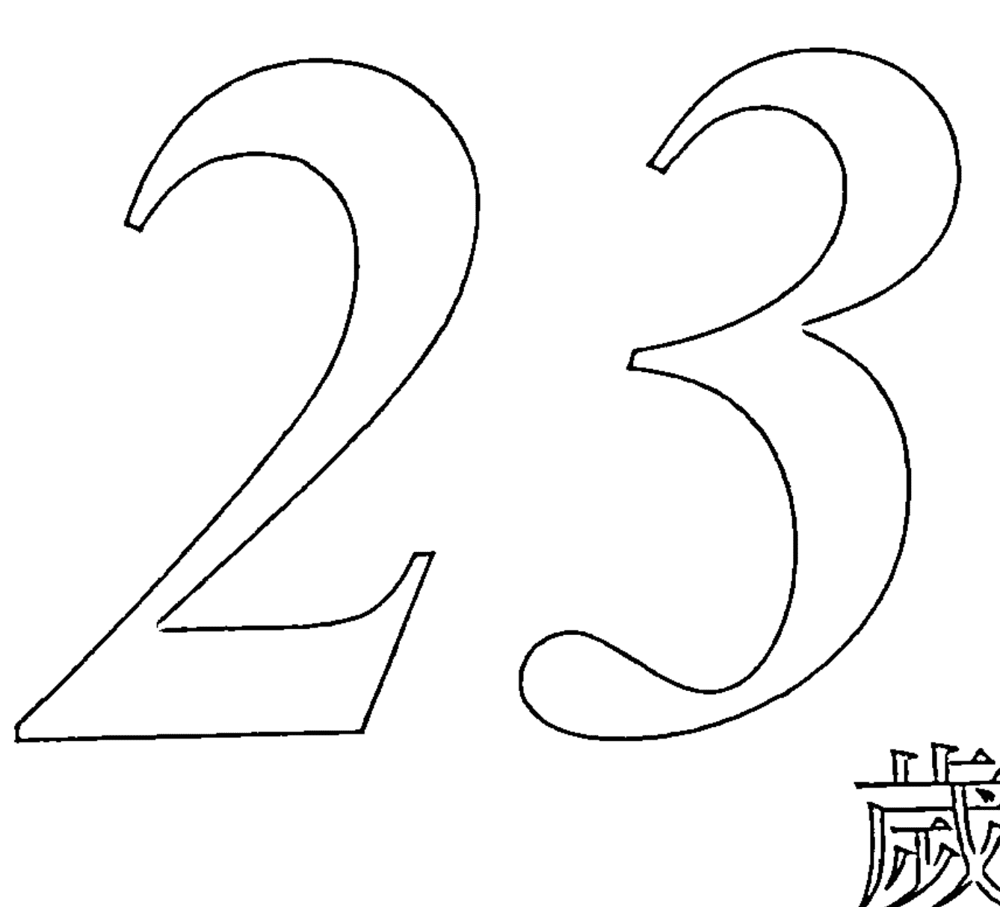

[整體運勢] 在好奇心的驅使下，今年的妳將展現不同以往的行動力和交際手腕，這使得妳的視野及人脈相對的也大幅提升，可以說是相當有成就感而且忙碌的一年。就今年的運勢而言，可說是越「動」越旺，所以，換工作、搬家、獨立創業，甚至從事休閒、海外旅行等都相當適合。至於在愛情方面，今年談戀愛的機會也不少。

#### 未有男友的妳戀愛對策

今年一整年到處都有戀愛機會！隨著人際關係的大幅突破，與人交遊的機會增多，也意外地認識了一些心儀的對象。在今年，建議妳無論如何要充分做好人際關係，有機會幫人的地方一定要盡量幫人，因為那無疑也是為自己搭起遇見良緣的契機。至於如果一切都已盡了全力，卻仍不見白馬王子出現時，建議妳不妨做一趟旅行，旅途中應該會有數段發生羅曼蒂克戀情的機會才是！今年異性緣最佳的月份為 3～4 月、9 月，以及年底左右。

#### 已有男友的妳結婚對策

在運勢的簇擁下，你倆今年熱情如火，尤其如果妳和他是剛認識的情侶，更有可能趕在今年內來個閃電結婚！今年是極適合結婚的一年，選擇在今年促成的婚姻，一般預料都將有不錯的結果。至於今年最適合訂婚的月份為 1 月、10 月；結婚則以 3～4 月及年底左右為宜。不過，對於交往兩年以上的情侶來說，如果在今年遲遲不見他向妳提出有關結婚話題的話，勸妳也不必太心急，不妨再給他一年的時間好好考慮。待明年，他一定會給妳一個明確的答案！

[愛的地雷] 2 月、7～9 月，以及 11 月是你倆感情較容易產生變化的時期，若爆發大衝突很可能會造成兩人突然分手，須注意！建議妳凡事要三思而後行，尤其在言詞上更須格外謹慎小心！

### 誕生數 7

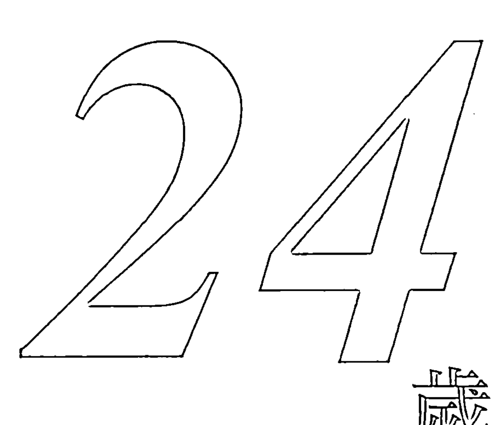

[整體運勢] 今年的妳，運勢上可能會出現兩種不同的發展。一種是每天被工作壓得幾乎要喘不過氣來；另一種則是有大事抵定的感覺。如果妳本身原本就是個帶有一點工作狂的人，運勢的發展可能會較偏前者，然而，不管過的是前者還是後者生活，可以確定的是，今年的妳原則上戀愛運都不怎麼樣；不過話雖如此，今年的相親運卻是旺得嚇人，一旦看對眼，馬上就可能走入結婚禮堂，很值得期待喲！

#### 未有男友的妳戀愛對策

今年的妳，似乎是沒什麼機會認識新異性，頂多看原本的「哥兒們」中，有沒有人對妳的感覺突然從過去的「友情」轉為「愛情」的。類似這種機會比較可能發生的月份大抵為 2～3 月、9 月，以及 11～12 月。至於，如果妳苦苦等候，仍不見有任何動靜時，建議妳倒是不妨試試相親的方式，透過親戚介紹的相親場合，可望遇見條件很不錯的對象。不過，如果這段時期妳有過分要求對方的社會地位、將來的發展，以及生活型態的傾向時，感情的發展是怎樣也不會順利的。

#### 已有男友的妳結婚對策

如果妳和他交往時間在一年以上，今年兩人結婚的可能性很高，特別是交往時間越長的，可能性越大。因為不只是你們兩人急，周遭的親友更是不時頻頻詢問、催促，這使得妳和他要不趕在今年結婚都不行。不過，這樣的情況倒也有一個好處，那就是一旦要進入籌備婚禮的階段，得到來自四面八方的助力將會相當多。就今年而言，最適合訂婚的月份為 9 月；結婚則以 2～3 月、11 月至年底為宜。然而相反的，如果在過了 24 歲生日後，妳和他的感情反而有開倒車的情況發生時，建議妳不妨回想一下，近來的衝突是不是和妳一再吞忍他個性上的缺點有關？如果是，何妨找他面對面溝通，清楚表達出自己的感覺，這將會是最好的解決之道。

[愛的地雷] 對於發生在 5～6 月、9～10 月的困難與齟齬，兩人最好面對面徹底說個清楚，否則，問題不久後還是會有再度爆發的可能。如果妳和他的個性並不是那麼合適，勸妳還是及早和他分手的好！

### 誕生數 7

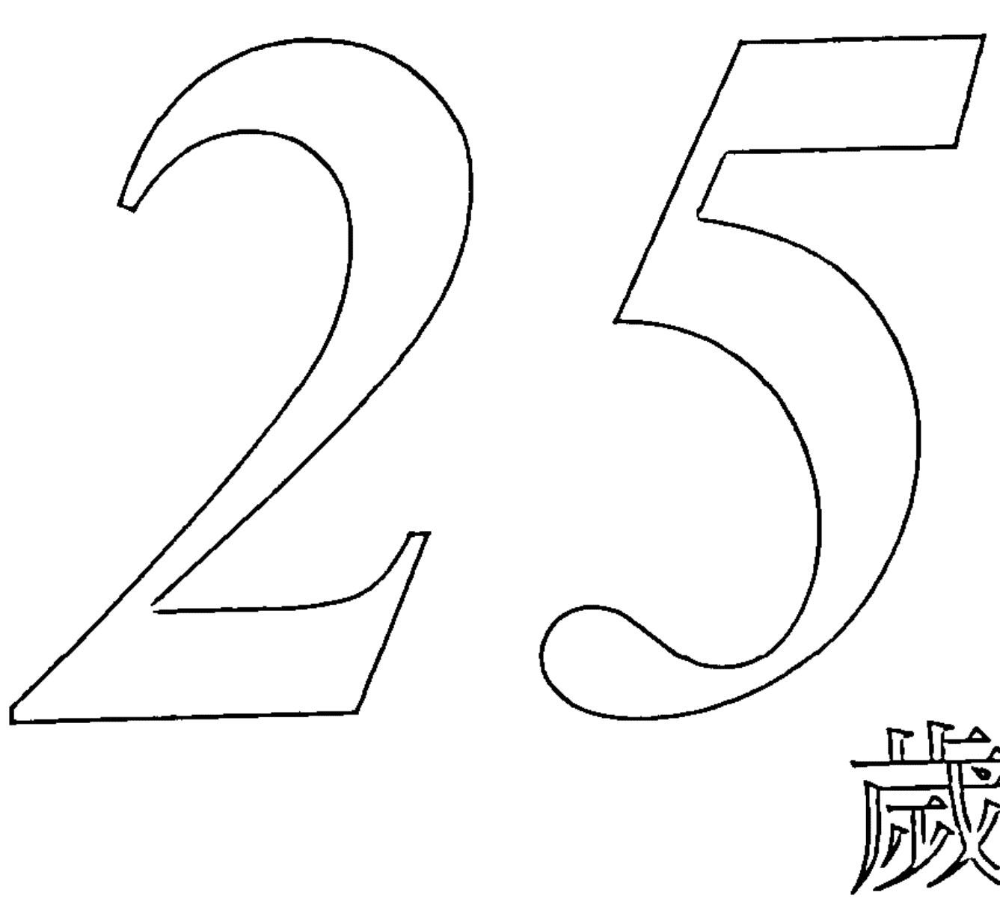

[整體運勢] 今年是忙碌的一年。不過和去年一樣，忙歸忙，忙的內容卻有兩種不同的分別。一種是忙著工作；另一種卻是忙著戀愛。如果妳是屬於前者，今後的妳恐怕還有一段很長的單身生活要過。也許工作對於目前的妳真的很重要，但倘若妳並沒有單身一輩子的打算，甚至也很渴望得到一份愛情的話，建議妳還是在工作之餘保留一個屬於自己的時間與空間。今年戀愛的機會多藏在旅行或出差中，要好好把握！

#### 未有男友的妳戀愛對策

今年是妳 2 字頭人生中戀愛運最旺的一年，發生新戀情的機會多多，只要妳夠積極，看到心儀的人就勇敢向他示愛，必能找到期待已久的白馬王子。藉由朋友牽線結識「朋友的朋友」，發展成戀人的機會也很高，約有 70% 的機會；而結為夫妻的機率，更超過 80%。如果妳期待一段轟轟烈烈的愛戀的話，則不妨透過旅行的方式，因為旅途邂逅而促成的愛情，其羅曼蒂克指數約在 90% 以上；不過這類型的愛情最後能走上結婚的機率卻只有 50% 左右。今年異性緣最佳的月份為 1～2 月、9～11 月。

#### 已有男友的妳結婚對策

對於交往已有一段時間的情侶而言，今年兩人的感情或許要面臨一些考驗。特別是如果在此以前妳對他早有厭倦或不滿感覺的話，在今年兩人更容易走上分手之路。倘若深思熟慮後，覺得兩人真的不合適，那就何妨趁著今年結束這段感情，另覓新戀情；不過，如果考量後，認為他還是最適合妳的結婚人選，那就無論如何忍耐一點，平安度過今年，兩人的感情可望又能恢復往日的甜蜜。至於剛認識的情侶，今年則大有可能閃電結婚。就今年而言，最適合訂婚的月份為 8 月；結婚則以 1～2 月、10～11 月為宜。

[愛的地雷] 4～5 月因兩人感覺不同而發生爭執時，或許分手是最好的選擇。預料今年的分手將會為妳帶來更好的相遇，尤其是明年的新戀情，更值得期待！

### 誕生數 7

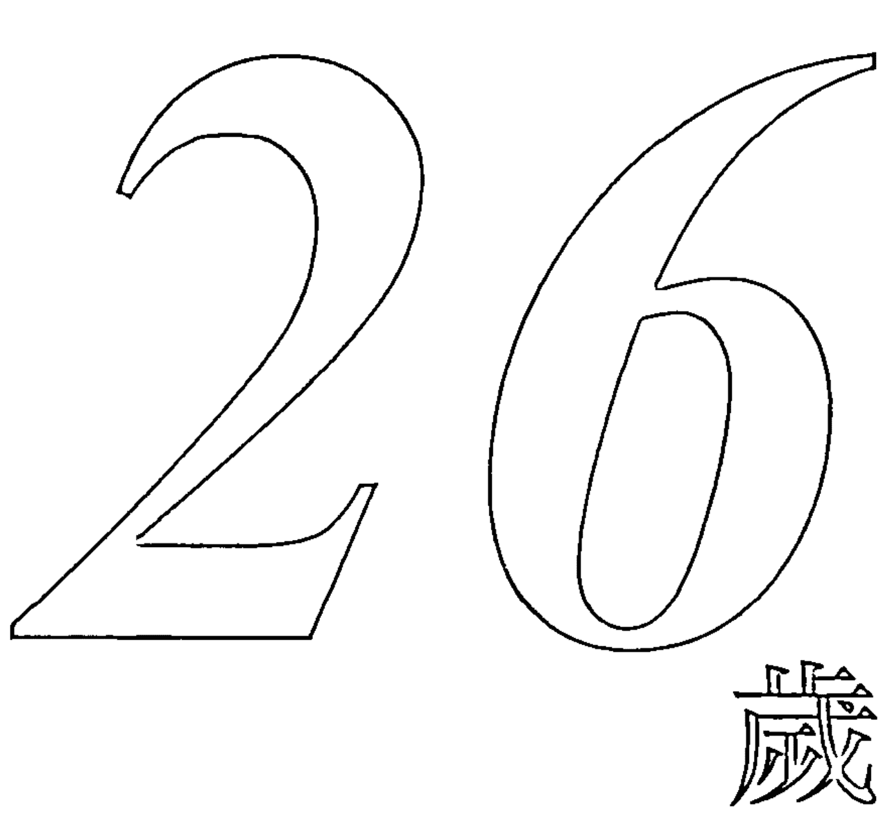

[整體運勢] 今年是妳 2 字頭人生中結婚運、家庭運最旺的一年，只不過來自家人對妳的諸多干涉，卻會讓妳有些煩不勝煩的感覺。面對家人提供的意見，建議妳無論聽從與否都要保持理性，切勿擺出反抗姿態，那只會讓相處變得更加麻煩。此外，在避免與家人發生衝突之餘，也別忘了要積極追求屬於自己的幸福，為建造自己未來的家庭而努力。就運勢來看，今年的戀愛運很不錯，有機會遇到條件優秀的對象，可要好好把握！

#### 未有男友的妳戀愛對策

戀愛機會多多，特別是出現在 6～10 月的對象，他或許就是妳未來的另一半喲！就今年而言，追求妳的人，多有要和妳結婚的誠意，所以當妳覺得對方不錯，何妨大方回應他的誠意，千萬不要擺出愛理不理的樣子，那是會引起對方誤會而打退堂鼓的！如果在過了 26 歲生日，還等不到追求者出現的話，最好反省自己是否在男孩子面前老是靜得一句話也沒有？對人是否總是擺出好惡分明的態度？如果是，趕緊把這些毛病改過來，愛神就自然會向妳報到了。

#### 已有男友的妳結婚對策

除了戀愛運紅得發紫之外，今年的結婚運也很不錯，不管妳和他交往多久，都有希望能接到他的求婚。今年最適合訂婚的月份是 7 月；結婚則以 9～10 月為宜。相反的，如果是妳很想結婚，而他卻是一再推拖，建議妳不妨從兩人個性是否相合的問題檢討起。倘若兩人不是那麼合適，早點另覓適合對象才是正確的；要是個性契合，妳倒是還可以再等他個兩年，不過值得注意的是，他會不會凡事都習慣以自我為中心？如果是，將來就算好不容易等到他願意娶妳，未來卻是要過著事事聽命於他的生活，那也是挺難過的一件事。總之在今年，雙方相處發生問題多出在個性上的不合。此時，分手對雙方來說反而是種解脫。

[愛的地雷] 發生在 3 月、12 月的困難或麻煩，很可能讓妳在一氣之下說出傷害他的話語，要小心！另外，2 月和年底時不要只顧著工作而冷淡了他，那是會讓他萌生去意的。

### 誕生數 7

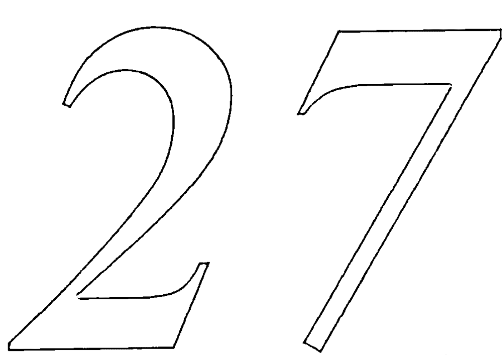

[整體運勢] 和去年相比，今年日子過得顯然相當「安靜」，堪稱是 2 字頭人生中最平靜的一年。過於平淡的生活，連帶的也沒什麼戀愛的機會，這或許會令妳有些失望。不過，換個角度想想，這何嘗不是讓妳能夠做自己、發展自己的一年。趁著今年的空檔，妳可以無牽無掛地發揮自己的興趣、充實自己各方面的才能，預料今年的學習，在不久的未來將會為妳帶來另一筆財富。

#### 未有男友的妳戀愛對策

今年沒什麼談新戀情的機會，建議妳不如將時間多放在拓展「友情」上頭，從發展純粹的友誼開始，說不定哪天友情突然變成愛情也說不定。尤其是在參加某些技能的學習或從事興趣的過程中，有機會遇見令妳仰慕的異性，只不過這份感情在今年恐怕還只是單相思，所以，只好先從培養友誼開始，再靜待日後的變化吧。今年異性緣較好的月份只有 8 月；至於 5 月倒是個適合相親的月份，選擇在這時候相親，或許能遇見好對象也說不定，不妨一試！

#### 已有男友的妳結婚對策

今年的妳和他，感情恐怕要面臨一些風波，如果妳真的很在乎他，將他視為妳未來另一半的絕佳人選，建議妳凡事最好多忍耐，同時多為他設身處地著想，一起攜手度過今年接踵而來的層層考驗。只要能順利度過今年，你們的感情契合度將可望再更上一層樓，明年步上結婚禮堂。就今年而言，適合訂婚的月份只有 6 月，至於結婚，雖然也不能說完全不合適，但可以的話，最好延至明年 28 歲生日過後再舉行會較好。另外，如果在今年覺得和他的感情有開倒車的傾向時，建議妳最好回頭審視一下兩人個性是否相合，如不合，最好的解決之道當然是分手，靜待下一段戀情的來臨。

[愛的地雷] 發生在 2 月、11 月的困擾將成為日後分手的導火線。如果覺得兩人在個性上也不是那麼合適，不如乾脆和他道再見。

### 誕生數 7

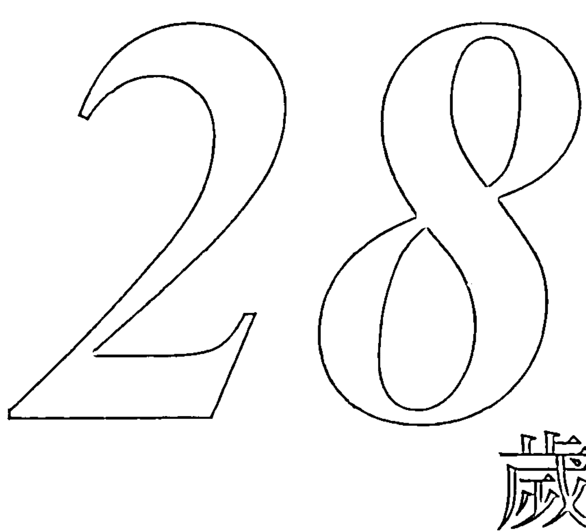

[整體運勢] 工作上一向努力不懈的妳，在今年總算獲得了回饋，不但能力受到眾人肯定，相對的收入方面也增加了不少，這不禁令妳喜出望外。而除了超旺的事業運外，藉由工作上所展現出的自信，更令妳在異性面前魅力大增；加上接觸他人的機會增多，也使得妳增加了不少和異性擦撞出愛的火花的機會。總之，今年對妳來說，絕對是愛情、事業兩得意的一年。

#### 未有男友的妳戀愛對策

事業上的亨通，讓妳增加了不少接觸其他部門、廠商的機會，也因此遇見了妳尋覓已久的白馬王子。在今年，甚至還會出現熱心的上司積極為妳安排相親的機會。透過上司所介紹的人選，條件上往往特別的優秀，建議妳無論如何最好還是撥空去認識一下較好。至於目前並沒有工作的人，也可望透過朋友的介紹認識白馬王子。所以，主動與朋友連絡，都是促使白馬王子早日出現的好方法。今年異性緣最佳的季節是夏季，也就是集中在 6~9 月份。

#### 已有男友的妳結婚對策

如果妳和他交往時間已超過兩年，最好選擇在今年把婚事辦一辦。倘若他一直沒什麼表示，何妨就由妳向他提起！就今年而言，最適合訂婚的月份是 5 月；結婚則以 7~8 月為宜。至於如果在過 28 歲生日以後，發現自己對他的熱情似乎有大幅降溫的傾向，或是向他提起結婚的事，他總是一副愛理不理的樣子時，或許意味著兩人緣分已盡，不如就雙方個性是否相合做番檢討，如果不合，早日快刀斬亂麻和他分手為妙。尤其明年是個適合分手的一年，可以選擇在明年和他說「莎喲啦娜！」。

[愛的地雷] 發生在 1~2 月、10~11 月的重大困擾或麻煩，很可能會讓妳和他走上分手。如果他犯的是不可原諒的錯誤，正意味著他根本不是妳未來的另一半，不如就分手，忘了他吧！

### 誕生數 7

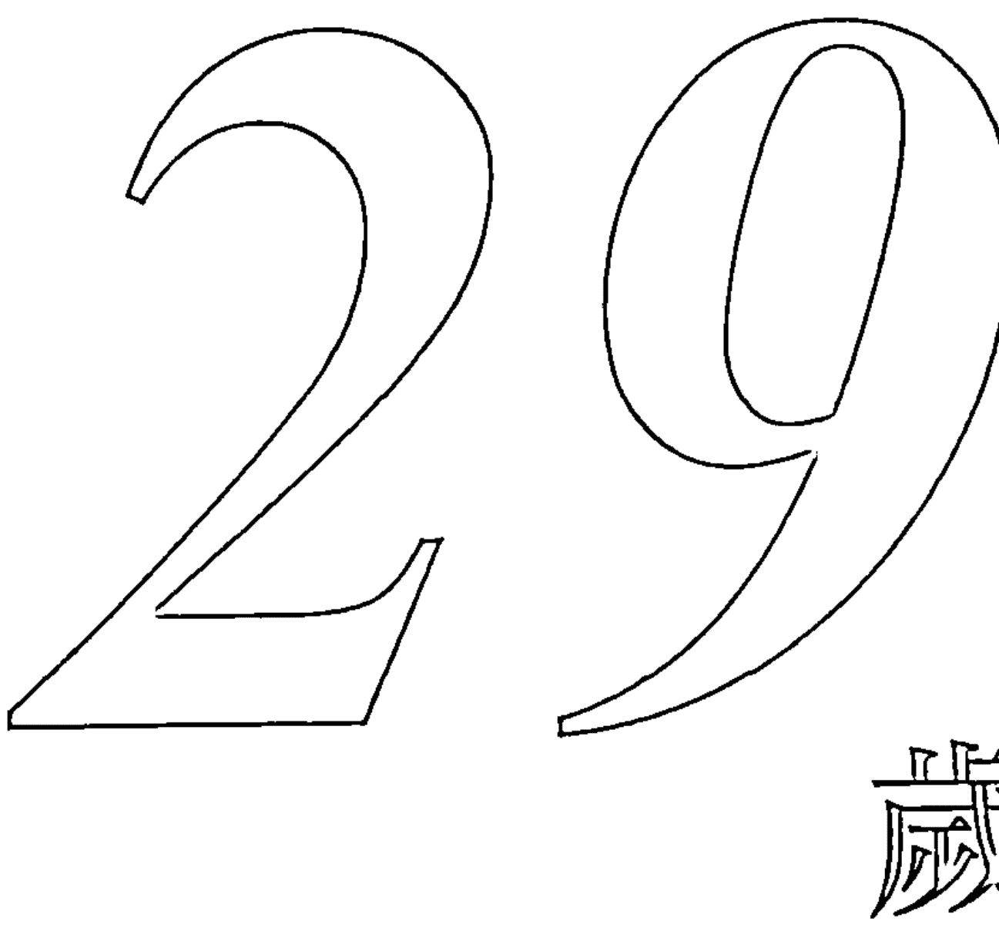

[整體運勢] 眼看著 2 字頭人生的最後一年已來到，還沒找到夢中白馬王子的人不禁著急了起來，可惜運勢方面似乎並不怎麼配合。今年的戀愛機會不多，碰到良緣的機會更是少；好不容易找到還算得上心儀的人，陰錯陽差還是無法結為夫妻。逢此運勢，建議妳最重要的就是馬上冷靜下來，趁著今年專心從事自我開發及創造，等到明年運勢好轉時，今年的努力馬上便可轉為一股強大的爆發力，為妳帶來好運勢。

#### 未有男友的妳戀愛對策

雖說今年不太有談新戀情的機會，還充滿了和擁有的事物「離別」的氣氛，但要知道會在今年離妳遠去的大多是屬於「不留也罷」的事物，所以和它分開，妳不但不應該感到難過，還要高興才是！甩開了這些束縛，明年的妳，將可望以更輕鬆、嶄新的面貌去迎接妳 3 字頭的人生，誰說今年的別離不是件好事？經過今年「清除」、「整理」的動作，對於未來的人生妳可以更確定自己的方向，包括對象的選擇，也將有更不同於以往獨到的眼光與看法。

#### 已有男友的妳結婚對策

如果妳和他交往已有一年以上的時間，今年感情可能會有一些不安定的狀況出現。當發現彼此對對方的感覺已不再，甚至對他一再推拖婚事的態度感到寒心時，建議妳也不用再委屈自己去迎合他，趁著今年和他說「拜拜！」，預料明年反而會招來更多遇見新戀情的機會。至於如果妳和他才剛認識不久，目前感情尚處在蜜月期，今年最好努力繼續保持此一熱度，預料明年將可順利走進結婚禮堂。當然，如果想選在今年先行訂婚也無不可。

[愛的地雷] 3月、5月、9月、12月為今年最適合分手的月份，如果他壓根沒有結婚的打算，甚至是個有婦之夫，最好選在這幾個月趕緊把他掃地出門！

### 誕生數 7

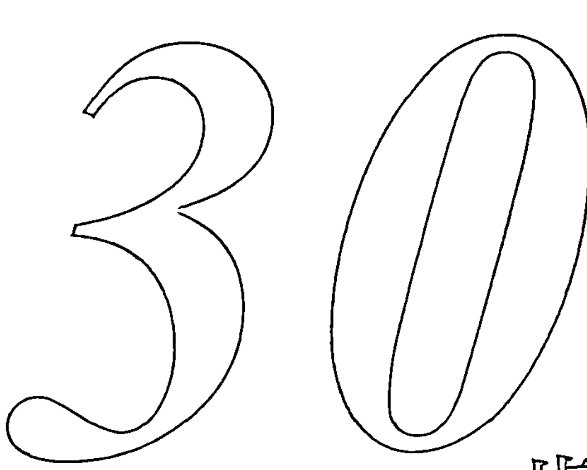

[整體運勢] 走過去的低潮，今年對妳而言儼然是一個嶄新的開始。尤其在踏入3字頭人生後，妳將蛻變得更成熟、更有女人味。以今年的運勢分析，今年可說是兼具「成長」、「拓展」以及「變化」的一年。所以，如果妳有換工作、搬家，甚至出國留學等打算的話，在今年值得一試！

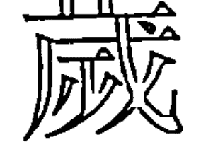

#### 未有男友的妳戀愛對策

今年的戀愛運出奇的好，尤其是和初次見面的人，迸出愛的火花的機會相當大，甚至在認識後不久，兩人即刻閃電結婚的也大有人在。所以，有機會就多往陌生人多的地方跑，必能找到屬於自己的愛情。另外，除了要展開超強的行動力外，技巧也是決定妳在今年能不能和心儀的人譜出戀曲的關鍵所在。當條件不錯的異性出現時，一定要設法「積極接近」，不過切記！就是不要讓他有被妳追得喘不過氣來的感覺。今年異性緣最好的月份為2～3月、5～6月，以及9～10月。

#### 已有男友的妳結婚對策

平安順利度過去年，而兩人感情依然甜蜜如昔的情侶，可以在今年準備結婚了。如果左等右等仍不見他有任何表示，那就由妳主動向他提起吧！不過值得注意的是，倘若今年突有意外使兩人無法結婚時，頂多只能再拖個3年，過了3年仍然沒有結果的話，恐怕就意味著妳和他今生或許再也不可能有任何結果了。至於如果妳和他才剛認識，則在今年很可能會閃電結婚。面對他突如其來的求婚舉動，或許會讓妳感到手足失措，但如果妳對他的印象也很不錯，那就何妨答應他吧！當然，倘若妳對他還不是那麼信任，也不必急著今年給他答案，一切留待明年再說！就今年而言，最適合訂婚的月份為3月、12月；結婚則以5～6月為宜。

[愛的地雷] 發生在8～9月間的嚴重口角，極可能讓兩人在意氣用事下協議分手。如果妳還在乎他的話，那就最好謹言慎行，以免在不自覺中對他造成傷害。

### 誕生數 7

[整體運勢] 今年運勢的好壞，就全看妳是否能妥善處理好職場裡的人際關係。雖然它並不會為妳帶來大麻煩，但零零星星出現在生活中，卻也夠教人心煩的了。當有不知如何處理的難題發生時，建議妳不要一個人苦惱，最好的辦法便是找一位妳信得過的同性友人商量。在今年，同性朋友可望成為妳生活中精神方面的最大支柱，透過和她們的商議，預料都能為事情找到圓滿的解決辦法。

#### 未有男友的妳戀愛對策

出現在今年的追求者並不多，而且大部份的年紀都比妳小。如果妳不那麼介意年齡問題，進一步交往也沒什麼不好；如果不是這樣，那建議妳不如向同性友人求助，請她們幫妳介紹男朋友。今年透過朋友介紹所認識的對象，可望都是條件不錯的對象。至於挑選對象時的重點，則最好擺在兩人興趣是否相投？對方幽不幽默？以及他是不是一個有著沈穩個性的人？今年異性緣較好的月份為 4～5 月；透過朋友介紹的話，則在 9 月左右可望遇到條件十分適合的對象。

#### 已有男友的妳結婚對策

如果妳和他交往時間為 1 年，今年兩人的感情可望更好、更親蜜，倘若仔細考量後覺得他就是妳要找的另一半，那就何妨趁著今年完成終身大事。就今年而言，最適合訂婚的月份為 2 月、11 月；結婚則以 4～5 月為宜。至於相反的，如果在今年發現和他的感情有轉淡的傾向，建議妳先就兩人個性是否相合問題加以觀察。倘若問題不是出在個性不合，建議妳不妨向他坦白說出妳的感覺，靠兩人的力量一起找出原因所在，並共商改善的辦法；至於如果問題真是出在個性，那就何妨給彼此一個冷靜思考的空間，再來判斷下一步該怎麼走。預料明年會有新的戀人出現，到時和他的感情自然也就會成為過去。

[愛的地雷] 一旦發生在 7～8 月的嚴重爭執，加深了彼此的不信任時，意氣用事下兩人恐會做出分手的決定。另外，9 月時的妳情緒容易陷入低潮，要稍微控制自己並適時設法轉換情緒，不要胡亂把氣都發在他的身上。

### 誕生數 7

[整體運勢] 可以讓妳大大施展抱負的一年。如果妳是個職業婦女，今年在職場上會有不少表現的機會。責任和工作量明顯加重之餘，固然會讓妳有忙得喘不過氣來的感覺，但所得到的成就感卻也相對的提高。至於戀愛運方面，今年的戀愛運雖然不錯，可是工作太忙，有沒有時間談也是個問題。為了製造戀愛的機會，也為了健康著想，建議妳就算再忙，還是要儘可能為自己保留週末和假日的時間，好好出去玩一玩，輕鬆一下。

#### 未有男友的妳戀愛對策

今年的戀情特別容易發生在度假休閒地，所以建議妳假日時多到郊外，甚至出國走走，免得錯失了戀愛的機會。當然，態度是否積極也是決定戀情會不會出現的一大重要原因，如果發現來到那個地方已經大半天了，卻不見有異性對妳投以注目的眼光，不如就改由妳主動出擊，預料會有不錯的結果。至於在非例假日時間裡，妳還可以趁下班後約三五好友到處吃飯、聊天，這些公共場所也可能有白馬王子出現喲！今年異性緣最佳的月份為 2～3 月、9～10 月，以及年底。

#### 已有男友的妳結婚對策

如果妳和他是才剛認識不久的情侶，今年特別容易閃電結婚。當接到他突如其來的求婚舉動時，馬上點頭說「Yes！」準沒錯！因為就今年的運勢來看，相當適合結婚，而所遇到的結婚對象更是和妳十分契合的難得人選。另外，交往時間已超過 2 年以上的情侶，也可望在今年論及婚嫁，不過婚禮最好還是留在明年生日過後再舉行。今年最適合訂婚的月份為 1 月、10 月；結婚則以 3 月、12 月為宜。相反的，如果兩人的感情在今年有不進反退的情形時，建議妳不妨先檢查一下兩人個性究竟合不合？如果不合，勸妳最好趕在今年之內和他分手，因為今年的了斷將有利於明年新戀情的出現。

[愛的地雷] 如果 6～7 月對兩人的感情有心灰意冷的感覺時，勸妳最好當機立斷和他分手！至於 2～3 月、9～11 月時的妳特別容易移情別戀，如果自問還是很愛他，兩人個性也很合得來，勸妳還是儘可能控制一下自己。

### 誕生數 7

### 歲

[整體運勢] 如果妳是個事業心較重的人，延續去年的忙碌，今年的妳還是不斷在工作中打滾，而且忙的除了自己的公事外，更擴及到對別人的指導與協助；至於如果妳向來注重私人生活的話，今年妳會花大部分的時間在自我充實上。不過，可以確定的是，今年的妳戀愛運都不怎麼樣，唯一較有機會是透過相親的方式。至於對原本就有要好的男友的人而言，今年則是絕佳的結婚時機。

#### 未有男友的妳戀愛對策

老實說今年認識異性的機會不多，能期待的頂多是原本為普通朋友的異性友人中，有人突然對妳產生感覺而已，倘若沒有，今年的妳，恐怕就只有一個人過了。如果很希望在今年能交到男朋友，先鞏固友誼也不失為一個好方法，畢竟，好朋友聽見妳喊沒有男朋友時，總不好不理妳吧？而相親，是今年最安全且成功機率最高的求愛方式，反正也沒什麼機會遇見白馬王子，不如就試試這方式吧！今年異性緣較佳的月份為2月、9月、11月。

#### 已有男友的妳結婚對策

如果妳和他交往時間已超過2年，今年可能會面對來自周遭親友一再催婚的壓力，如果你們也早有此默契和打算的話，何妨就早早開始籌畫準備結婚。就今年的妳而言，最適合訂婚的月份是9月；結婚則以2~3月、11月至年底為宜。然而，如果在妳33歲生日過後，發現兩人經常會為些莫名的小事吵架，建議妳不妨回頭檢查看看兩人個性是否相合，以及今年的運勢問題。如果除了個性不是那麼適合外，發現運勢冥冥中似乎也對兩人感情不利，則或許應該想想，這是不是在暗示妳他根本不是妳要找的另一半。不如選在今年和他分手，明年會有更多選擇的機會。

[愛的地雷] 如發生在5~6月時的困擾是過去曾爆發過、同時未獲解決的事情，建議妳最好快刀斬亂麻和他分手，這段感情不會有什麼好結果的！

### 誕生數 7

[整體運勢] 超強的戀愛運勢終於來了！從今年到明年兩年間，將是妳 3 字頭人生中戀愛機會最多的時候，要好好把握！錯過了這兩年，要等下一波戀愛機會的來臨，可有妳等的！所以在今年，無論如何一定要記得：一、「不要老是埋首在工作中」；二、「用認真的態度談戀愛」，只要謹遵守以上兩點，保證妳很快就能和妳心目中的白馬王子步上結婚禮堂了！

#### 未有男友的妳戀愛對策

今年的戀愛機會多到會讓妳偷笑，彷彿走到哪兒都成為異性注目的焦點。尤其是前往海外旅行，更會有意想不到的收穫。儘管今年追求妳的人不少，但小心其中也摻雜了一些花花公子或是有婦之夫。面對這些人的追求，建議妳最好和他們保持距離。另外，誕生數 7 的女孩多有工作狂的傾向，鎮日埋首在工作，忘了年華的老去。如果妳並無意一輩子抱單身主義，奉勸妳在這兩年還是積極點，免得他日後悔不已。今年異性緣最佳的月份為 1 月、9～11 月。

#### 已有男友的妳結婚對策

交往已有數年時間的情侶，如果直至去年還沒談論有關結婚的事，今年恐要面對兩人感情生變的危機了。面對周遭的追求者，再看到他對這段感情的未來毫無規畫的態度，妳開始懷疑，究竟他是不是妳這輩子要找的那個人？當有這樣的疑慮產生時，建議妳不妨先就兩人個性是否相合加以檢驗。如果相合，何妨再給他一年的時間；至於如果發現兩人個性不合，那還等什麼，趕快分手，接受別的男孩的追求才是最明智的抉擇。另外，就交往時間大約 1 年的情侶來說，明年應該是妳和他走上紅地毯那端的時候了，且趁著今年趕緊拜見雙方父母，尋求認同與支持吧！今年而言，最適合訂婚的月份為 8 月；結婚則以 1～2 月、10～11 月為宜。

[愛的地雷] 發生在 4～5 月時嚴重的爭執，如果是因為他的不當行為而引起的話，勸妳最好早點離開他！另外，9～10 月時的妳，容易有出軌的衝動，須注意！

### 誕生數 7

#### [整體運勢]

今年是妳 3 字頭人生中戀愛運、結婚運最旺的時候，錯過了今年，工作恐怕就真的要成為妳一輩子情人了！千萬要注意！另外，今年的妳，或許會遭遇到經濟方面的問題。當有困難發生時，建議妳不要一個人將痛苦藏在心裡，可以多找些朋友聊聊，請他們幫忙提供意見。透過這次相互支援、協助的機會，說不定還能讓妳找到要找的另一半呢！

#### 未有男友的妳戀愛對策

今年追求妳的人，高的、矮的、胖的、瘦的、年紀大的、年紀小的通通都有！面對這麼多的選擇，建議妳最好要敞開心胸觀察他們，何妨答應和他們出去吃個飯，透過深入交談，往往會有不同於之前的觀感與收穫！今年的追求者中，多半都有「交往就是為了要結婚」的意願。如果在深談後發現對方並不是這樣的人，也就是並沒有結婚的打算時，最好馬上就停止交往。因為就妳的年紀來說，已經不容許妳再「等等看」了。今年異性緣最佳的月份為 6～10 月、整個夏天。

#### 已有男友的妳結婚對策

隨著戀情熱度持續加溫，交往時間在 1 年的情侶，今年可望論及婚嫁，順利組成甜蜜的家了。就今年而言，最適合結婚的月份為 9～10 月。如果相反的，在 35 歲生日過後，妳發現兩人感情的發展並不是很順利，尤其見面時老是會為細故爭吵時，要特別注意！它或許正暗示你倆個性不合，再交往下去即使結婚也難好好相處。建議妳不如和他攤開來談問題，甚至也可以要求他說出到底有沒有要和妳結婚的打算？預計什麼時候結婚？如果面對這些詢問，他都以不置可否的態度對應時，勸妳最好乾脆死心，另覓新的對象。

#### [愛的地雷]

如果妳和他的戀情是屬於不倫之戀的話，今年走上分手之路的機會非常的大。對於這種不正常的戀情發展，建議妳還是早早結束的好，不妨利用發生在 3 月、12 月時的困擾為理由，向他說「拜拜！」。

### 誕生數 7

[整體運勢] 浪漫的戀愛季節已結束，今年是適合妳充電、靜心修身養性的一年。少了愛情的滋潤，生活或許會令妳感到枯燥為些，但換個角度想想，人生又有幾回有這樣平靜的日子能允許妳做自己、自由自在？況且，透過這一年的學習，未來可望有效提昇妳在工作上及對人生態度的表現，讓妳更富才能。所以建議妳在今年最好將重心擺在精神方面的成長。至於戀愛、結婚的事，今年就暫且放在一邊吧！

#### 未有男友的妳戀愛對策

在戀愛運、結婚運暫處低潮的今年，自然也沒什麼遇見新戀情的機會，或許這會令妳有些失望，但勸妳無論如何還是稍安勿躁，因為，一味強求得來的愛情，多屬於「孽緣」式的情愛，尤其耽於肉體歡愉的戀情，在今年恐怕只會為妳惹禍上身，平添傷害。與其如此，還不如把焦點和氣力轉而發展興趣、培養工作方面的能力；至於真要追求愛情，目標也應放在能談得久遠的，而非一時激情，同時學習如何相互「尊重」才是正途！今年異性緣較佳的月份只有 8 月。

#### 已有男友的妳結婚對策

如果妳和他去年才剛展開交往，今年兩人感情可望能順利發展，精神上更形契合。至於對於交往多年的情侶而言，今年的運勢可能只適合訂婚，不利結婚，不如趁著今年先行規畫結婚事宜、加強和雙方父母的良好關係，婚禮還是留在明年過 38 歲生日以後再舉行。就今年而言，最適合訂婚的月份為 6 月。另外，如果在今年妳發現和他的感情有開倒車的傾向時，建議妳先別急著做決定，乾脆放任感覺自然發展。如果無緣，這段感情自會結束；倘若有緣，待明年它自然會有轉機，重回過去的甜蜜。

[愛的地雷] 發生在 2~3 月、11 月至年底的爭執，很可能會造成兩人分手。意氣用事之下妳容易說出難聽的話語，對他造成嚴重傷害，須注意！

### 誕生數 7

### 歲

[整體運勢] 經過去一年的充電、修身養性，今年的妳在眾人面前是更加的成熟、穩健、有實力。能力廣為公司及周遭人所肯定，自信心大增之餘，加薪或是拿獎金的機會也不少。這些際遇加起來讓妳愈來愈對自己獨當一面的能力深具信心，所以就整體而言，今年堪稱是值得期待的一年。

#### 未有男友的妳戀愛對策

工作上的傑出表現，連帶著也為妳招來了戀愛機會。不少頗有實力的異性漸漸會對妳投以注目的眼光，不料最後竟發展成愛情，這可說是十分難得的機會，要好好把握！如果妳向來便不是事業心很重的人，在今年則可以明顯地感受到來自周遭親友的求助有增多的傾向。面對這些求助，建議妳要熱心以對，因為在助人之後極可能會為妳招來戀愛機會，可別為了一時省麻煩，就把這難得的機會往門外推喲！今年異性緣最旺的月份為 7～8 月。另外，5～6 月極適合相親。

#### 已有男友的妳結婚對策

已有男友的妳，今年最好快快著手準備結婚的事！尤其如果妳和他兩人交往已有一段時間，最好盡可能在今年內完婚。因為就明年運勢來看，其中潛藏著「分手」的危機，換句話說，若今年還不設法和他有個結果，搞不好明年兩人就要說「拜拜！」了。所以，趁著今年趕緊向他表明心意，也要他回個答案（告訴妳預定什麼時候結婚）！就今年而言，最適合向他表明心意的月份為 5 月、9 月。一旦決定要結婚，婚禮則最好選在 7～8 月。

[愛的地雷] 如果 1～2 月、10～11 月時發現兩人的價值觀、想法時有出入時，則意味兩人已不再合適，最好早早和他做了結！

### 誕生數 7

### 歲

[整體運勢] 今年一整年充滿了離別的氣氛，這不免讓妳有些感傷，也有些不捨，但要知道就像毛毛蟲要蛻變成蝴蝶前都必須經歷破蛹而出的痛苦一樣，只有勇敢割捨掉原來包裹著自己的蛹，妳才有機會看到外面的世界，展開全新的人生。所以在今年，且對自己的生活、心靈做一番大掃除，勇敢地丟掉圍繞在身旁不必要的事物，未來對妳而言，又是一個新的開始。

#### 未有男友的妳戀愛對策

就今年來說，新戀愛出現的機會愈少對妳愈好，原因是今年屬於整理的一年，妳著重的焦點應放在對過去戀愛記錄的整頓與清除上，看看有沒有哪個該忘而沒有忘的、該原諒而沒有原諒的人和事，趁著今年徹徹底底把它從心底摘除吧！另外，由於今年實在不適合談戀愛，所以如果有追求者出現時，最好也與他保持距離。因為，那個人恐怕也只是為了排遣寂寞才跟妳交往，倘若不能認清這一點，逕自再投入愛河，留下的恐怕只有傷害，勸妳還是三思而後行。

#### 已有男友的妳結婚對策

如果妳和他交往已有一段時間，而在去年以前兩人婚事尚未有著落的話，今年恐怕要面臨分手的考驗。對於他一再拖延婚事的態度，妳會不能接受與諒解，因而萌生去意。其實，這是個不錯的處理方式，畢竟兩人有緣在一起，他就不該藐視妳的感受，只顧著自己的需求。所以對這種自私的男人，妳就應該使出這樣的「殺手鐧」，要他即刻做下決定，給妳一個明確的答覆。假如他真的愛妳，自然就會「知錯能改」，修正自己的態度；如果他仍然執迷不悟，就可以肯定他根本不是適合妳的男人，那又何必花時間和他耗在一起，不如就這樣說「拜拜！」，預料真命天子明年即將出現。今年並不適合訂、結婚，一切等明年再說。

[愛的地雷] 3～6月時出現的戀情多屬於不倫或危險的戀愛，須小心，以免吃虧上當！另外，3月、5月、9月是適合別離的月份，何妨選在這時向他說「拜拜！」。

### 誕生數 7

### 歲

[整體運勢] 今年是妳 3 字頭人生中最後一次戀愛的機會，如果一拍即合，兩人很可能在今年就會閃電結婚。有機會多往陌生人多的地方活動，預料會有不錯的結果。另外，從去年到今年一直處在換工作處境的人，也可望在今年找到適合妳發展或棲身的地方。

#### 未有男友的妳戀愛對策

今年的戀愛機會集中在從未去過的地方，有機會不妨多往這些地方跑。而一旦看到條件不錯的對象時，最好主動出擊，預料會收到令妳滿意的回應。至於喜歡的是原本就認識的異性友人的妳，不如裝著沒事，依舊以普通朋友關係對待，然後再找機會和他聊及較心理層面的話題，展現妳和他心靈相契的一面。等到發現他對妳也開始心動，就馬上把握時機，即刻給他回應，如能走到這一步通常兩人離婚期也不遠了。今年異性緣最好的月份為 5～6 月、9～10 月。

#### 已有男友的妳結婚對策

走過去運勢上的考驗，至今兩人感情仍能維持甜蜜如昔的，預料在今年應該都能順利完成婚事。就運勢上看來，選擇在今年結合成為夫妻的兩人，未來可望繼續保持亦師、亦友及情人的感情，攜手同心面對往後的人生波折。大抵說來，今年最適合訂婚的月份為 3 月、12 月；結婚則以 5～6 月為宜。至於如果在過了 39 歲生日後，妳發現和他的感情有開倒車的傾向時，建議妳先就兩人個性是否相合問題重新審視，如果不合，最好早早在今年就和他分手，不要再拖到明年，否則可能會造成彼此更大的傷害。

[愛的地雷] 8～9 月時若有爭執或困難發生，勸妳最好向他清楚表達自己的感覺，一味地忍耐只會讓兩人的關係更加惡化。

## 「速配！」診察室

～誕生數7的女性和各男士們的速配程度～

### 速配指數

♡能愛得長長久久 ○愛得短暫而熱烈 ☆適合結婚 ◇適合當好朋友 □適合當工作上的搭檔 ※只要努力，還是有希望速配成功 ✕不如不相識

### 誕生數1的男士

我倆之間很難有愛

愛情在妳和他之間很難產生。其實在妳眼中，他並不是那麼討厭的人，不但如此，有時妳甚至還會為他口若懸河、犀利的批評所折服，覺得他實在很有意思。不過，一切的感覺也僅只於此而已。換句話說，交他這樣的朋友，基本上妳不會反對，但說到談戀愛，恐怕就會讓妳有所猶豫了。想想，自己又不是那麼伶牙俐齒，找個口才一流的人在身邊，沒事被他批評一聲、譏諷一下，誰受得了？更何況，誕生數1的他向來是對愈熟的人愈敢批評，找他做男朋友，被批評、譏諷也就算了，口才比不過人家，吃了口頭上的虧還沒有能力反擊，豈不是惹得自己又羞愧又懊惱。談戀愛談得這麼痛苦、有負擔，這種戀愛還不如不談。所以對於誕生數1的男孩，通常妳只有一種感覺：「我們還是做朋友的好！要當情人，實在很難！」

### 誕生數2的男士

因誤會而結合，因了解而分開

所謂「因誤會而結合，因了解而分開」說的正是妳和他。通常，初見面時，妳倆對彼此的感覺並不壞。也正因為印象不壞，在嘗試做一段時間的普通朋友後，很自然地便會覺得兩人進一步做男女朋友應該也行。然而，就在彼此都認為「應該」已經了解對方進而成為情侶後，卻發現問題來了。隨著接觸愈深入、親密，妳才赫然發現他的個性居然如此優柔寡斷，沒有決斷力也欠缺行動力，一有問題或要決定事情時，便用哀淒的眼光望著妳，希望妳給他一個答案。這妳怎能受得了，於是幾次之後，自然就忍不住向他說「拜拜！」了。而這似乎也成了情人間所謂「因誤會而結合，因了解而分開」的最佳寫照。

### 誕生數3的男士

相互扶持成長的伴侶

妳和他的個性完全不同，不過也正因為不同，造就了兩人的相互激賞。對妳而言，他的天真無邪與機伶，正是妳所欠缺的，也希望擁有的特點；對他而言，妳的謹慎理智，舉手投足間透露出的成熟氣息，正是他最最仰慕的。在這樣的相互崇拜下，形成了吸引作用，而湊在一起的妳和他，更因為相互的感染，一個變得開朗了；另一個則變得成熟了。兩人個性上無疑都獲得了成長與調合。當然，如果妳遇到的他是個心胸比較狹窄的人，也可能產生相互排斥的情形。也就是他看不慣妳老氣沈沈的作風；妳看不順眼他輕浮任性的態度。這樣的兩個人在一起，自然是話不投機半句多；而要做情人，那就更是不可能的事了。

### 誕生數4的男士

最適合的結婚拍檔

誕生數4的男生可以說是9個誕生數男性中最適合做妳另一半的人。個性謹慎、思想保守、面對愛情極為誠實的他，給妳的感覺相當有安全感，而且值得信賴。所以談到結婚，他自是妳不作他想的第一人選。不過，唯一需要注意的是，誕生數4的男生通常有個缺點，那就是不太重視對方的隱私權以及個人空間。這點在當他的普通朋友時尚不太能察覺，一旦成為他的合作夥伴或情人時，妳便會發現他動不動就愛探妳個人的隱私，讓妳有種喪失自我空間的危機感。當有這樣不舒服的感覺產生時，建議妳一定要當面和他溝通清楚，讓他了解妳的感受，否則結婚後，這將是一種強烈的束縛。

### 誕生數 5 的男士

你我話不投機半句多

你和他要湊在一起，原則上實在很難。不說別的，首先溝通、說話上就有問題。他說的你聽不進去，你說的他聽不懂，結果，弄了半天最後兩人還是覺得閉嘴最好。這樣的兩個人，不要說是做情人，恐怕連做朋友雙方都覺得是多餘。其次，對他日常的行為你也頗有意見。你不懂堂堂一個男孩子怎麼做事這麼沒有恆心，今天說要這樣做，明天又打算要那樣做，這讓你耐不住脾氣想臭罵他一頓，而被罵的他更是一臉無辜、委屈的樣子。於是，每天東吵吵、西鬧鬧，弄到最後不要說是你們，連旁人都會覺得兩人還是分開最好。其實，如果真的不適合，就不要勉強在一起，更遑論你和他再怎麼努力，恐怕還是沒法跨越之間的鴻溝，不如放開對方說再見，對彼此都會是種解脫。

### 誕生數 6 的男士

共同的興趣，促成我們的愛情

你和他一般說來不太可能擦撞出愛的火花，因為在你看來，喜歡幻想、浪漫的他，比你還要來得像女孩子；而對他來說，理性又行動力十足的你，簡直比他還要像男生，這使得你們之間的情誼永遠似乎只能停留在朋友的範疇，激不出愛的感覺。不過，事情當然也是有例外的時候。當兩人擁有共同的興趣時，這時誰比較像男生、誰又像女生似乎就變得不重要了，甚至對於他偏女性化的個性，你還會當他是種身為藝術人應有的細膩心思。在相互欣賞、切磋之下，形成精神上的契合，結婚於是也成了極為自然的結局。

### 誕生數 7 的男士

戀愛時不忘競爭？

人家說相同誕生數的男女天生就較合不來，這點在同是誕生數 7 的你和他身上更是表現得淋漓盡致。不知為什麼，你倆天生就像犯沖似的，即便兩人有緣成為一對情侶，骨子裡卻時時不想讓對方「太好過」。比如，今天的妳打了 3 次電話給他，而他只打了 2 通電話給妳，妳便會氣呼呼地覺得自己吃了虧。「我今天比他多打了一通電話，除非接下來他主動打電話給我，否則我絕不再打給他！」、「我打電話的次數比他還多，豈不表示我愛他比他愛我更多？真是太過份了！」。妳和他的戀愛往往就是在這競爭、比較下進行著，只是，這種帶有競爭、仇恨心理的戀情，真叫做愛嗎？應該不是！所以分道揚鑣往往是兩人最後的結局。

### 誕生數 8 的男士

不如不相識

「如果時光能倒流，我瞎了眼也不會選他！」這是和誕生數 8 男生交往後，誕生數 7 女孩的共同心聲。也搞不清楚當初為什麼彼此會對對方產生好感，只知道自從兩人開始交往後，每次見面幾乎要吵翻天。他譏諷妳的態度，妳也不甘示弱回敬他，如此妳一句來、我一句去的，看在別人眼裡，根本不會知道兩人是情侶的關係，還以為是仇人呢！就這樣，直到彼此傷害對方至傷痕累累才肯罷休，而待下一次見面，又是一場戰爭的開始。這樣的組合，不用多說，分手自是最好不過的選擇，只是想想，情侶要當成這樣，實在也是夠悲哀的了。

### 誕生數 9 的男士

一段穩定的感情

誕生數 9 的男性可望與妳共織一段平穩、溫馨的愛情，一旦和他墜入愛河，兩人要平順走上結婚禮堂幾乎沒有問題。雖然這段感情少了驚天動地的浪漫，但這種卻安定的感覺更是妳所企求的。相較於時下其他人對金錢的重視程度，妳和他更在乎的是兩人精神上的契合與交流，這使得婚後兩人所組合的可望是充滿溫馨、精神上相當富裕的家庭。唯一值得注意的是，一旦家庭發生經濟上的困難時，誕生數 9 的男性容易陷入無助與煩惱，站在原地不知如何是好，這時會需要妳率先拿出理智，帶領他走出徬徨度過難關，甚至由妳挑起家中經濟大樑也說不定。

## 誕生數 8 組織領袖

才華洋溢，具有組織能力
幸運寶石：石英

**個性** 誕生數8的妳，是個具有雙重個性的人。有時是正義感十足、作風強勢的領導者；有時卻又顯得畏畏縮縮的，感覺沒什麼自信，也沒有夢想。而且這兩種不同個性間的切換速度非常快，讓人有種捉摸不定的感覺。

**戀愛傾向** 誕生數8的妳，由於天生具有兩種極端的個性，因此在情場上表現出來的也像是個兩面人。有時，妳會像是個小男生似的，活潑開朗、主動積極，調皮地強押著對方答應妳的請求，一副得理不饒人的樣子；但有時，妳卻又會一反常態，變得十足女性化，很矜持、很害羞，一切都要對方做決定。這讓愛妳的男人怎麼也捉摸不到妳到底在想什麼？怎麼待妳才能討妳的歡心？明明昨天還大膽地示愛，怎麼到了今天就變得一副扭扭捏捏、不置可否的樣子；明明昨天還強硬要求自己的愛，怎麼今天一開口卻只見她嫌惡的樣子？這種出爾反爾的態度，往往會令對方十分生氣與無奈，甚至會覺得和妳交往很累，於是忍不住就抱怨連連，從而引發兩人的口角。當有這種情形發生時，建議妳要懂得反省自己，擁有雙重個性並不是妳的錯，但重點是妳該設法把自己的個性調整在一個中庸的態勢，並經常保平衡及穩定。設身處地為對方想想，如果換做是妳，妳會願意和一個每天翻臉像翻書，同時好惡不定的男人在一起嗎？對妳而言，以和妳同樣兼具實踐力與忍耐力的男性最適合妳。另外，由於妳向來對物質方面的要求並不高，在經濟上只求過得去就好；倒是他是不是個能夠讓妳倚靠、依賴的男人，是妳非常注重的一點。能夠兼具上述條件者，就是適合伴妳一生的好伴侶。

## 誕生數 8

[整體運勢] 走過去的低潮，今年是妳 2 字頭人生的第一年，也是另一個充滿希望、好運的開始。也許去年的痛苦遭遇仍留給妳不小的震撼與痛心，但想想這何嘗不是另一種成長經驗？再說，過去的事畢竟已經過去了，眼前的妳該著眼的是未來全新人生的展開，就抱持著所學以及滿心的期待，踏出妳 2 字頭人生的第一步吧！

#### 未有男友的妳戀愛對策

新鮮、浪漫又極令人感動的相遇紛紛在身旁出現，尤其在前往一些從未去過的地方，更是充滿著戀愛的機會，建議妳有空不妨多往這些地方走走。另外，在今年內邂逅的陌生人當中，可望出現對妳未來人生極富影響力的人，他們能在適當時機給予妳精神及經濟上必要的幫助。還有妳未來另一半的人選，也可望在今年浮出檯面。總之，今年的相遇，充滿了幸運的契機，有機會要懂得適時推銷自己，莫讓大好機會白白溜走。今年的妳，異性緣最佳的月份為 5 月。

#### 已有男友的妳結婚對策

如果妳和他是才剛認識的情侶，而且年齡還是同年的話，今年感情可望持續加溫，甚至會引爆閃電結婚也不一定。在此時，或許有人會以同居方式代替結婚，這固然並無不可，但建議妳同居時重點最好放在「學習如何和心愛的人相處」，這樣的同居生活最後才可望以喜劇收場。就今年步上同居生活的情侶來說，順利的話，3 年後結婚的可能性相當高。如果你們是從高中時代即開始交往，建議妳在今年最好設法改變一下兩人的交往方式。比如：改變慣常的約會地點、減少約會次數等，讓彼此的交流提昇至精神層面，如此對兩人感情的發展會較有利。就今年的妳而言，最適合訂婚的月份為 3 月、12 月；結婚則以 5～6 月為宜。

#### [愛的地雷]

發生在 8～9 月的困難或麻煩，可能為兩人感情帶來嫌隙，特別是在意氣用事下，兩人會爆發嚴重爭執，提醒妳在氣頭上時，要多留意自己言語的用字遣辭。

## 誕生數 8

[整體運勢] 今年的妳，會突然變得無生氣，成天只想窩在棉被裡睡大覺。或許在人前，妳還是維持著一副強勢的作風，其實心裡無力得很。既然如此，那又何妨承認自己的軟弱與無助，把自己最真實的一面攤在他人面前。「不過分自我膨脹、適時尊重別人」，除了能使自己的人際關係變得更好外，同時也是幫助自己舒服地走過這段情緒低潮的好方法。

#### 未有男友的妳戀愛對策

今年的妳異性緣不錯，尤其是妳纖細敏感的心，常能引來異性的注意。由於今年的戀愛運中隱藏著「來得越熱烈、越急，消失得也越快」的特點，因此當邂逅條件不錯的異性時，建議妳不妨耐著性子試著和他從朋友做起，這段感情才可望談得長久。今年的妳似乎和同年齡的男孩比較有緣，原先就認識的同年齡異性朋友，突然對妳表白仰慕之意的機會大增。處處不乏有人追求，讓妳今年顯得相當愉快。今年的妳，異性緣最佳的月份為 4～5 月，以及 10 月前後。

#### 已有男友的妳結婚對策

今年的妳和他，兩人感情可能有兩種截然不同的發展。如果你們的交往時間還不是很長的話，今年可望維持原有的甜蜜熱度；至於如果妳和他交往已有一段時間的人，則可能要面臨感情走下坡的考驗。當發現兩人感情有開倒車的傾向時，建議妳不妨捫心自問，對他是不是總是太過包容？有沒有強迫自己接受他的錯、無止境地忍受他的脾氣？如果是，勸妳馬上導正這樣的對待關係，如此雙方才可能會有未來，否則，分手將是不可避免的事。至於感情維持穩定現狀的情侶，在今年有可能會論及婚嫁。就今年而言，最適合訂婚的月份是 2 月、11 月；結婚則以 4～5 月為宜。

#### [愛的地雷]

發生在 7～8 月的爭執，很可能讓妳興起分手的念頭。如果仔細評斷後覺得他並不適合成為妳未來的另一半，何妨就此跟他分手。至於發生在 9～10 月的困擾或麻煩，建議妳最好主動向他道歉。

## 誕生數 8

[整體運勢] 今年所有的好運就潛藏在「變化」之中。換句話說，只要有勇氣改變現狀、勇於嘗試，今年的妳不論在工作、愛情等各方面將會愈變愈好，對於許多事也將抱持著不同於以往的看法。所以在今年，何妨就順著妳的好奇心、發揮妳的行動力，勇敢地挑戰現狀。每一個變化，都意味一個好的開始。

#### 未有男友的妳戀愛對策

今年的戀愛機會多多！尤其是前往休閒地區，可望遇見條件很不錯的異性，只是，一些愛情騙子找上門來的機會也不少，勸妳儘量和他們保持距離，以免捲進桃色糾紛。如果在過了 22 歲生日後，感覺四周仍沒什麼「動靜」，先捫心自問：自己的打扮是否太過老氣？是不是太過在意對方外表、學歷與經濟狀況？在男孩子面前妳是不是老表現得一副自視甚高的樣子？修正一下這幾方面的缺點，愛神很快就會來向妳報到的！今年異性緣最佳的月份為3～4月、9月，以及年底。

#### 已有男友的妳結婚對策

剛認識的情侶們，今年閃電結婚的可能性很大！就今年結婚運不錯的情況來看，或許他的求婚來得有些突然，但如果妳也深愛著他的話，他應該是個不錯的結婚對象，何妨就點頭答應吧！另外，對交往已久的情侶們來說，今年也是個談論婚嫁的好時機，可以的話趕緊著手籌辦婚事吧！就今年而言，最適合訂婚的月份為 1 月、10 月；結婚則以 3～4 月、年底左右為宜。如果今年妳發現對他的感覺似乎大不如前，甚至懷疑他或許不是妳所想找的人時，也請相信自己的直覺，勇敢地做下決定離開他，另一個更好的男人也許就在身旁等著妳！

#### [愛的地雷]

2 月、11 月是妳感覺最易產生動搖的時期，如果這時的妳一直有移情別戀的念頭，顯示他真的不適合妳，何妨就此分手，另覓一個合適的對象。另外，發生在 6～7 月的爭執容易演變成分手的導火線，建議妳要冷靜面對！

## 誕生數 8

[整體運勢] 心慌意亂、阻礙甚多的一年。特別是對去年剛踏進社會，成為社會新鮮人的人來說，今年責任加重、工作量增多不說，不知為什麼，成天還有處理不完的雜事，剝奪了妳不少私人的時間。面對這接踵而來的煩人瑣事，勸妳無論如何要耐心以待，且把玩心和個人興趣先放在一旁，之後妳便會發現，有些眼前看來是「失」的東西，其實真正的面貌卻是「得」。

#### 未有男友的妳戀愛對策

今年的戀愛運老實說並不怎麼樣，但如果妳不是那麼急著把自己嫁掉的話，其實又何妨用平常心面對。趁著今年沒有情人煩妳，正好可以有更多的時間處理一些煩人的雜事，更何況，就今年運勢來說，就算出現追求者，對方的條件也不會太好，假使妳真的很急著想結婚，今年唯一較可行的就只有相親一途了。不過，其實妳也毋須太過著急，明年預料是妳 2 字頭人生中戀愛運最好的一年，對象恐怕多得會讓妳挑不完呢！今年異性緣較佳的月份只有 2 月、11 月。

#### 已有男友的妳結婚對策

如果妳和他交往時間已超過 2 年，今年內可望能論及婚嫁。倘若他和妳早有結婚的共識，只是遲遲不見他開口，在今年何妨就由妳先行提議，甚至可以積極去拜訪他的父母，由他的父母出面催婚，一切保證 OK！就今年而言，最適合訂婚的月份為 9 月；結婚則以 2～3 月、11 月至年末為宜。至於在過了 23 歲生日之後，妳和他動不動就會發生爭執，而且吵架的原因是由來已久的老問題時，則須注意了！最好能找個時間兩人坐下來冷靜溝通，找尋解決之道，如果過程中發現他根本沒有誠意解決，或是之後發現他根本只是嘴巴說說，行為依舊我行我素時，勸妳也不用再「拗」了，說「拜拜！」會是最好的抉擇。

#### [愛的地雷]

發生在 5～6 月、9 月間的困難極可能促成兩人分手。如果妳還在乎他的話，就儘量避免和他爭吵，冷靜坐下來共同商量對策會是較好的解決途徑。

## 誕生數 8

[整體運勢] 今年一整年都是戀愛的季節。不但戀愛機會接踵而來，對象也都教妳怦然心動，而且伴隨著事業方面也正爬向另一個高峰。就今年的運勢宜「動」看來，選擇在今年換工作、搬家、旅行、出差等，預料都會有不錯的結果，只是再怎麼忙，別忘了還要留給自己喘口氣、歇息一下的機會，這樣的妳，才會有更多的精力迎接更多的好運。

#### 未有男友的妳戀愛對策

今年的戀愛機會多得簡直要教妳夢裡也微笑，只是，追求者中也摻雜不少有婦之夫或花花公子。勸妳還是和他們保持距離，以免影響了其他男孩子追求妳的機會。就年紀上來講，還是以小妳約 1 歲的人最為合適，當然這不並不表示年紀比妳大的男性就不適合妳，而是就今年而言，妳之所以會對年紀較大的男性動心，關鍵多在於看上他經濟上的條件，這種偏差的選擇預料在未來可能會為妳帶來麻煩，應小心謹慎才是。今年異性緣最佳的月份為 1 月、9～11 月。

#### 已有男友的妳結婚對策

對交往已久的情侶而言，恐怕得面臨一些考驗。因為今年實在太多人追求妳了，難免會讓妳對本來的選擇有些信心動搖。不過，在男未婚、女未嫁的情況下，人人都有重新選擇的機會，所以，倘若妳真的發現有比他更好的男孩出現時，及時與原男友分手，投入新男友的懷抱才是明智的抉擇（不過對方是有婦之夫者除外）。如果妳和他是才剛認識的情侶，今年內很可能會接到他的求婚。不過以今年運勢來看，或許還不是結婚的最好時機，不如建議他在今年兩人先訂婚，明年再籌辦婚事會較好。就今年最適合訂婚的月份為 8 月。

#### [愛的地雷]

4 月、7 月為今年最適合分手的時節，如果有和他分手的打算時，最好選擇在此時提出將會較為順利。

## 誕生數 8

#### [整體運勢]

今年是妳2字頭人生中，戀愛運、結婚運、家庭運最最亨通的時期，有固定男朋友的人，在今年多半會走上結婚禮堂。不過，今年同時也是妳家族多事之際，家庭成員容易為了一些責任問題爭執不休，在面臨這樣的問題時，身為家庭中一份子的妳固然也要盡一份心力，但建議妳在忙碌奔波之餘，還是要記得為自己保留一部分的精力與時間在找尋對象方面，以免錯失今年大好的戀愛機會。

#### 未有男友的妳戀愛對策

今年的緣分遠在天邊，近在眼前。他或許是妳早就認識的異性友人，也或許是妳天天見面的同事，只不過一直以來彼此只當對方是好朋友。然而，就在一次互訴煩惱、秘密後，兩人一下子由朋友變成了情人。由於有過去的了解做基礎，所以閃電結婚的機率相當大。如果此時的妳過於堅持要有浪漫的相識過程，而表現出猶豫的態度的話，恐有錯失這段姻緣的危險。今年異性緣最佳的月份為6～10月，特別是後半段所出現的追求者中，可望有妳未來的另一半。

#### 已有男友的妳結婚對策

如果妳和他交往時間在2～3年，在今年步上結婚禮堂的機率相當大；至於剛認識的情侶，則可望在今年接到他的求婚。依運勢來看，選擇在今年結婚的兩人，所建立的多屬充滿溫馨與愛的家庭，所以，倘若他真的向妳求婚，就答應他吧！就今年而言，最適合訂婚的月份是7月；結婚則以9～10月為宜。至於在今年，妳發現和他的感情有不進反退的情況發生時，建議妳最好針對兩人個性是否相合問題重新考量，倘若不是那麼合適，趁著今年戀愛運正好時，快快和他分手，預料下一個戀情馬上就會來向妳報到。

#### [愛的地雷]

發生在3月、12月的麻煩，可能會讓兩人在意氣用事下說出傷害對方的話，兩人因而分手。如果對他還存有依戀，勸妳說話最好還是小心些！另外，2月及年底左右莫因顧著工作而忽略他，那是會讓他投入別人的懷抱的！

## 誕生數 8

[整體運勢] 今年的運勢可能呈現兩種截然不同的發展。一種是「嚮往已久的事終於能如願以償」；而另外一種則是「想什麼偏偏就做不到」。一般說來，生活向來以自我為中心的人，今年運勢多屬於前者；至於愈重視工作的人，則發生後者狀況的機會愈大。不過，無論如何，今年大致上戀愛運和財運都不怎麼好，倒是有不少讀書或一些技能方面學習的機會，換句話說趁著今年，最好能多往提高個人技巧及興趣方面發展。

#### 未有男友的妳戀愛對策

今年新戀情發生的機會不多，不過如果想遇見有才華、自己也很佩服的異性，建議妳可以多往社團、才藝補習班等地方走走，甚至參加研討會或聽演講、上網交友等。就今年的運勢看來，就算能邂逅到條件不錯的對象，發展成戀情的機會也不大，不如和對方先從普通朋友做起，才不會適得其反，嚇壞了對方。在今年以年紀稍長於妳，同時具備才華的男孩最適合妳，先不要太過考量他的經濟條件。今年異性緣較好的月份是 8～9 月。

#### 已有男友的妳結婚對策

如果妳和他是才剛認識的情侶，或者交往時間在 1～2 年，今年兩人的感情可望持續地成長。倘若兩人對於未來共組家庭也有共識的話，今年也可能論及婚嫁。只不過，就今年的運勢來看，要訂婚可以，至於結婚就最好等到明年過完生日以後再說。今年最適合訂婚的月份是 6 月。如果妳和他交往時間已超過 3 年，而且到去年為止一直沒有結婚的打算時，今年恐怕就要面臨分手的危機了。也不知為什麼，對他妳會突然失去耐性，同時愈來愈覺得兩人話不投機半句多。建議妳先別急著為兩人的未來做決定，或許這只是受到運勢的影響，不如雙方先暫時分開一陣子，給予彼此冷靜思考的空間，等明年過後再做處理會比較好。

#### [愛的地雷]

發生在 2 月、11 月時的爭吵，如果起因是因為他的花心，建議妳最好當機立斷和他分手，不必硬是為留住這段情而委屈自己。

## 誕生數 8

[整體運勢] 今年是妳2字頭人生中，最能做自己、最心想事成的一年。所以在今年，如果妳有任何想說的話、想做的事，何妨放手去做，一切都將如妳所願。另外，今年出現在妳四周的貴人也很多，他們往往能在妳需要時提供妳所需的援助，有需要時何妨開口向他們求援，不過別忘了要時時抱持著一顆感恩的心喲！

#### 未有男友的妳戀愛對策

今年的戀愛機會多集中在職場。這當中除了有同事們的主動追求，更有來自上司的熱情介紹，藉由上司的引薦，可望認識和妳很速配的男士。今年的眾多追求者中，以年紀比妳大的男人較有誠意與妳結婚，年紀比妳小的，則是多抱著和妳玩玩的心理。所以，建議妳最好還是選擇前者，不過，面對這些年紀較大的「候選人」，妳或許會嫌他們太古板、無趣了些。而當有這樣的想法存在時，預料妳會延至後年才有結婚的可能。就今年而言，異性緣最佳的月份為6～9月。

#### 已有男友的妳結婚對策

交往已久的情侶，在今年可望能和他論及婚嫁，順利步上結婚禮堂。不過，如果錯過了今年還未能有所「結果」，未來妳會嫁給他的可能性，會陡降到50%以下。所以，如果妳早當他是妳未來的另一半，而他又遲遲沒向妳提到結婚的事，何妨就由妳開口，甚至積極去拜見他的父母，相信要成婚絕不是件難事。就今年而言，最適合訂婚的月份是5月；結婚則以7～8月為宜。萬一在27歲生日過後，他的態度突然變得模稜兩可，甚至以閃躲的方式回應妳結婚的要求時，建議妳或許另覓其他對象會是較好的選擇。以今年的運勢看來，愈早和他分手，愈有機會在今年內找到適合妳的結婚對象。

#### [愛的地雷]

發生在1～2月、10～11月的口角將出乎意料之外地演變成激烈的爭吵。如果妳還是很愛他、在乎他的話，就最好克制一下自己的情緒，以免造成不可收拾的局面。

## 誕生數 8

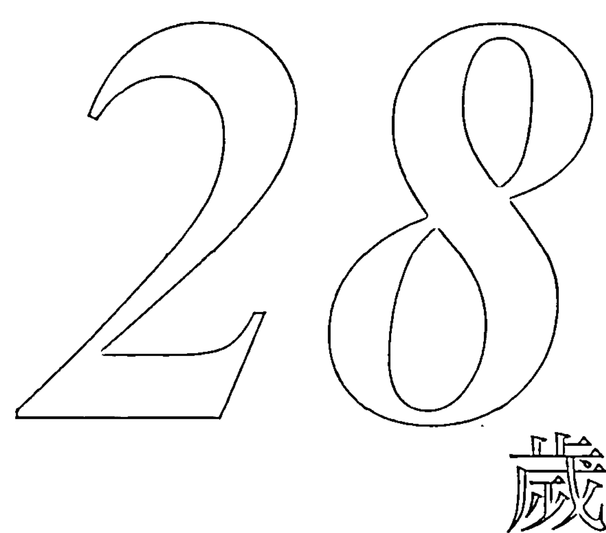

[整體運勢] 至此，種種不順接近尾聲的一年。儘管「結束」象徵著一切重回平靜，不過，這並不代表今後的妳就可以每天高枕無憂地過日子，事實上，從明年開始，將會有一連串的考驗自周遭蜂擁而來，如果妳還沒來得及培養應對的實力，屆時恐怕有苦頭可吃了。所以，今年的妳最好能以「蛻變為一個成熟的女人」為目標，多方充實自己的判斷力及行動力，做好迎接另一段成長歷練的準備。

#### 未有男友的妳戀愛對策

今年是妳 2 字頭人生中戀愛運最低潮的一年。就算有機會談戀愛，也易受限於過去痛苦的記憶而做下錯誤的選擇。譬如，過去的妳受夠了經濟上拮据的痛苦，於是當有個經濟上得以讓妳依靠的人追求妳，即使明知道是段不倫之戀，還是會情不自禁地投入。所以建議妳今年談戀愛時要特別小心，不倫之戀絕對不能碰，寧可讓自己在今年感情上交白卷，以求自保。依運勢來看，明年戀愛運勢可望好轉，不如靜待明年好運的來臨。

#### 已有男友的妳結婚對策

妳和他交往時間愈長，在今年兩人感情的浮動程度愈大。特別是交往了 3 年以上的情侶，如果妳的他遲遲未向妳提出結婚計畫，勸妳也別等他了，早早離開他另覓合適的對象較好。而就算妳捨不得離開他，預料運勢上也會有某些事情發生，讓妳不得不和他分手。就今年的運勢來看，最適合分手的月份為 3 月、5 月、9 月、12 月，選擇在這些時候和他說「拜拜！」，緊接著會有令妳意想不到的良緣出現。至於如果妳和他今年感情上仍能維持穩定的發展，建議妳最好也維持現狀，要訂、結婚最好等明年再說。

[愛的地雷] 如果妳和他是屬於不倫之戀，勸妳無論如何最好在今年離開他，方是明智之舉。至於發生在 9 月時的爭執，很可能會讓妳和他走上分手之路。如果不是經過深思熟慮，勸妳言行上還是保守點較好。

## 誕生數 8

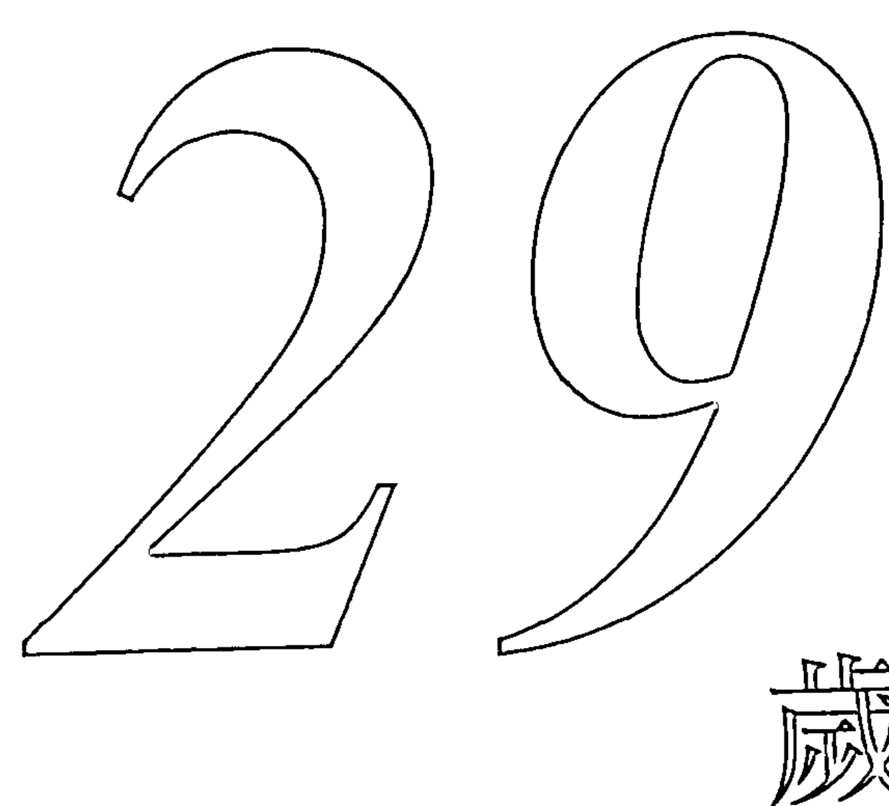

### 歲

[整體運勢] 今年是妳2字頭人生最後的一年，就戀愛運不錯的情況來看，有志在30歲以前把自己嫁掉的人，積極一點應該很有希望。今年運勢的幸運之鑰在於「初次體驗」，所以有機會不妨多往從沒去過的地方走走、多接觸陌生人、延伸觸角至從未觸碰的領域，甚至就算租房子也最好選擇新屋，如此一定會為妳帶來意外的好運。

#### 未有男友的妳戀愛對策

今年的戀愛機會集中在從未去過的地點，所以，如果妳是個立志在3字頭之前就把自己嫁掉的人，沒事不妨多到些沒去過的地方，甚至換工作時也以過去從未從事過的行業為優先考量。就今年的運勢來看，今年認識的新朋友，未來就算不能成為妳的另一半，在他日也可望是個對妳具有極大影響力的人，所以，最好把握今年多認識一些新朋友。另外，今年還特別利於展開獨立生活，預料將能為妳帶來另一波戀愛的高潮。今年異性緣最好的月份為5～6月、9～10月。

#### 已有男友的妳結婚對策

也許妳和他才剛交往不久，但今年是特別利於結婚的一年，因此，如果可以的話，何妨就答應他的求婚，和他共組美滿家庭。就今年而言，最適合訂婚的月份為3月、12月；結婚則以5～6月為宜。如果只來得及在今年訂婚，趕不及結婚的人，則婚禮最好選在明年或32歲那年舉行較好。另外，平安度過去年感情波折的情侶，在今年也可望能完成終身大事。如果他向妳提出結婚的要求，最好馬上就答應他，然後隨他積極拜見對方父母，求得認同。至於如果覺得兩人真的怎麼也合不來的話，建議妳最好選在8月和他攤牌。

[愛的地雷] 發生在8～9月的口角最後極可能演變成激烈的爭執，如果發現兩人在溝通的過程中，言詞有愈來愈激動的傾向，最好冷靜一下，以免對兩人感情造成傷害；當然，如果妳早有分手的打算，那自是不必多做考量，就趁機跟對方說「拜拜」吧！

## 誕生數 8

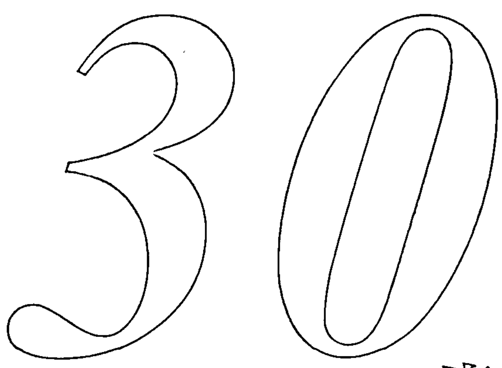

### 歲

[整體運勢] 對個性內向的人來說，今年心情上顯得有些浮躁不安，老有鑽牛角尖的傾向。當發現自己陷入負面的情緒時，建議妳要懂得自行「解套」。比如，多找同性的好友聊聊天，請她們提供一些意見。如果妳是個個性外向的人，雖然在心情上或許不會感到那麼「鬱卒」，但做起事情來難免還是會有滯礙難行的感覺。建議妳何妨放鬆心情，多花些力氣找周圍相關人士協調，事情還是有希望順利進行的。

#### 未有男友的妳戀愛對策

今年的戀愛對象以原先就認識的男性朋友居多。儘管早在許久以前便知道有這號人物存在，但對他的印象僅是停留在普通朋友階段。在一次或許是妳做他的心理醫師，也或許是他為妳指點迷津的巧合裡，發現彼此竟是那麼合適，就這樣友情即刻昇華成愛情。經由這樣的過程而孕育出的愛情，未來將會發展成相互扶持、依賴的對等關係。如果到 30 歲生日過後，仍然不見這樣的對象出現時，最好請同性友人代為介紹，預料將有不錯的結果。今年異性緣最好的月份為 4～5 月。

#### 已有男友的妳結婚對策

對交往大約一年，或是才剛認識的情侶來說，今年兩人的感情仍是處在一個加速的階段，速度快的話，或許會論及婚嫁也說不定。特別是如果妳和他的父母早已熟稔，那又何妨趁著今年早早完成終生大事。今年最適合訂婚的月份是 2 月、11 月；結婚則以 4～5 月為宜。對交往已有數年時間的情侶來說，今年兩人感情擦槍走火的機會變多。如果覺得對他的感覺已不再，建議妳最好重新審視一下兩人個性是否相合。倘若個性上沒什麼問題，代表或許妳該控制一下妳大小姐的脾氣，多站在他的立場為他著想；如果不合，那就乾脆放著眼前的問題不要管它，預料在明年，運勢的發展自然會給你們一個答案。

[愛的地雷] 7～8 月兩人有摩擦發生時，建議妳最好暫時和他保持距離，不然恐怕會引爆激烈的爭吵。另外，9～10 月的妳，情緒容易陷於低潮，要懂得隨時轉換心情。

## 誕生數 8

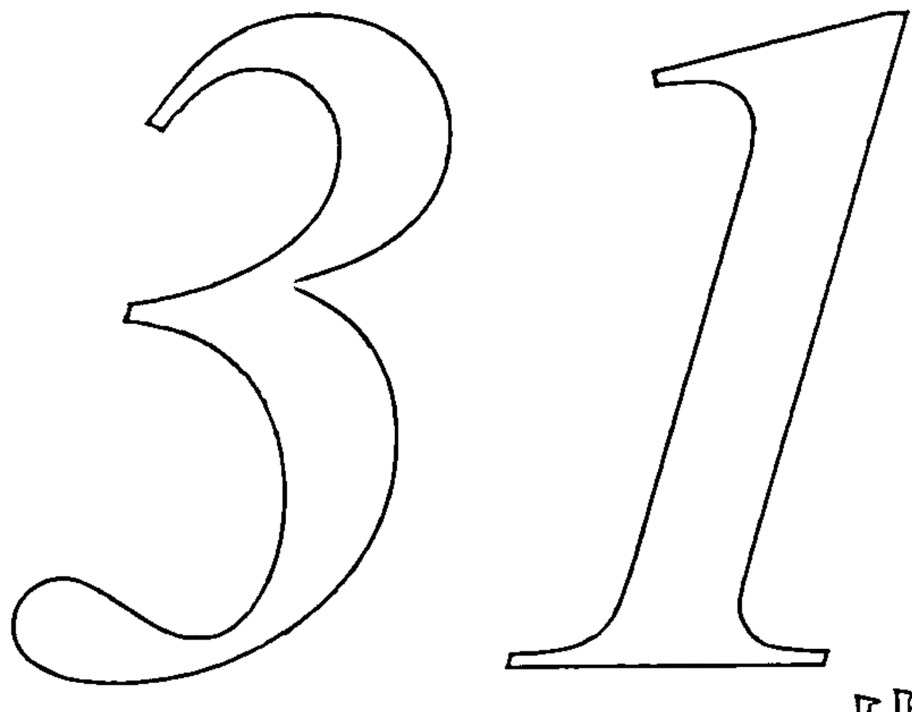

### 歲

[整體運勢] 利於「變化」的一年。特別是對眼前的各方面現狀，如果妳已感到厭倦、忍無可忍時，更可以利用今年好好地來做個大改變，預料會有令妳滿意的結果。譬如，討厭目前工作的人，何妨趁著今年另覓新工作；厭倦目前居住環境的，就來個大搬家。在移動、變化的同時，諸多好運也正步步向妳靠近中。

#### 未有男友的妳戀愛對策

今年的戀愛機會集中在「休閒遊樂」場所，和一些年紀比妳小的男孩更是有緣。下班後不要就直接回家，與好友去喝喝咖啡，那會讓愛神比較容易找到妳！今年還特別容易受到一些有婦之夫的追求。或許妳只想玩玩，並無意真心要和他們在一起，但勸妳，除非妳一輩子都不想結婚，否則最好別找上他們。在過了 31 歲生日後，若還感覺不到身旁有任何「動靜」時，多從事一些戶外休閒活動，也是招來愛情的妙方。今年異性緣最好的月份為 2～3 月、9 月至年底。

#### 已有男友的妳結婚對策

交往已有 1～2 年的情侶，預料今年會有強烈的結婚渴望，如果雙方早已認定對方是自己所要找尋的伴侶，那就不要再猶豫了，馬上答應他的求婚，速速在今年結婚。就今年而言，最適合訂婚的月份為 1 月、10 月；結婚則以 3～4 月及年底為宜。另外，剛認識的情侶今年也很有可能會閃電結婚。如果可以的話，選擇到國外舉行婚禮，預料能招來許多好運。至於談的是一場不倫之戀的妳，趁今年是離別的好時機，建議妳趕緊和他分手。特別是在今年還不能和他的太太辦妥離婚的人，也別指望妳和他將來會有什麼結果，這段感情不過是段孽緣。

[愛的地雷] 如果妳談的是段不倫之戀，勸妳趁著今年趕緊和他分手。6～7 月、9 月、11 月是提出分手的好時機。

## 誕生數 8

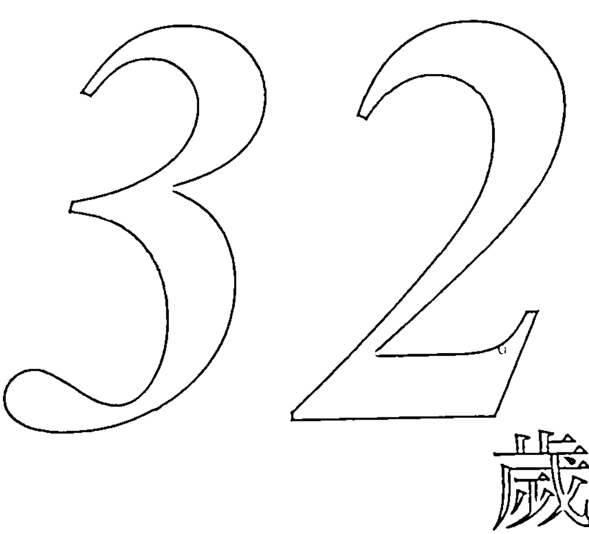

[整體運勢] 今年的運勢似乎有些不順，感覺上麻煩、阻礙很多。特別是對在工作上一向努力求表現的人而言，今年似乎有忙不完的雜事等著妳去處理，舉凡調停辦公室的紛爭、協助新人進入工作狀況等等，弄得妳往往顧得了別人、顧不了自己，分內的工作堆積如山。這或許會令妳感到十分厭惡並多所抱怨，但建議妳無論如何在今年最好還是多忍耐，所有的努力預料在明年將會有所收穫，所以，再忍忍吧！

#### 未有男友的妳戀愛對策

今年似乎沒什麼戀愛機會。倒不是遇不到什麼好男人，而是人家對妳似乎沒什麼意思；對妳有意思的，偏偏又是屬於「話不投機半句多」的類型，最後似乎只剩下相親一途了。雖然少了一些自然巧遇的浪漫，但在今年，透過親戚或上司的介紹，可望認識到條件不錯的男孩。今年相親運佳的月份為 2～3 月、9～11 月。從明年起連續兩年，將是妳 3 字頭人生中戀愛運、結婚運最旺的時期，如果妳是堅持要談場轟轟烈烈的愛情才肯結婚的人，未來兩年倒是很值得妳期待。

#### 已有男友的妳結婚對策

今年的妳和他，感情路上可能會走得有些驚險。特別是如果兩人之間一直存有某些問題未解決時，這個問題在今年很可能會再度爆發。建議妳當問題來時不如勇敢面對它，和他共同商量對策，最多也不過是雙方鬧得不歡而散而已。而如果真是到達這種地步，也正顯示他不是妳真正要找尋的另一半，既然如此，早早分手也未嘗不是件好事。就分手而言，今年最適合談分手的月份為 5～6 月、9～10 月。如果妳和他是才剛認識不久的情侶，在今年可能會論及婚嫁。倘若妳已見過他的父母，對他也始終存有好感，覺得他是目前為止最適合的結婚人選，那就答應他的求婚吧！就今年而言，最適合訂婚的月份為 9 月；結婚則以 2 月、11 月為宜。

[愛的地雷] 9 月左右可能會有麻煩事發生，得多加留意！尤其如果這些麻煩的起因是他的花心等「不良習性」時，最好找機會和他攤牌說清楚。另外，5～6 月時兩人易因意氣用事鬧分手，須小心！

## 誕生數 8

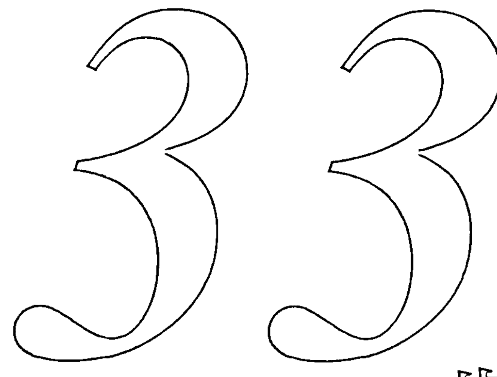

### 歲

[整體運勢] 如果妳是個嚮往浪漫、美麗愛情的人，今年的運勢絕對不會讓妳失望。除了能遇見超乎妳想像的愛情之外，今年還是個特別適合放手一搏的一年。不管過去有什麼想說的話、想做的事，譬如留學、換工作或搬家等，都可以利用今年試它一試，預料所帶來的都會是不錯的結果。

#### 未有男友的妳戀愛對策

今年有沒有戀愛機會全憑妳的行動而定。如果妳是個勇於嘗試、冒險，又喜歡挑戰從未做過的事情的人，今年在嘗試的過程中就可望遇見羅曼蒂克的愛情；相反的，若是個做事顧前顧後、保守又膽小的人的話，那恐怕就沒什麼戀愛機會了。所以，今年的妳一定要鼓起勇氣，任憑周遭的人如何地阻撓也要排除萬難，幸福就在不遠處等著妳！今年異性緣最佳的月份是 1、2 月、7 月、9～11 月。特別是在秋天時做趟為期較長的海外旅行，可望遇見一連串浪漫的戀愛機會。

#### 已有男友的妳結婚對策

如果妳和他是才剛認識不久的情侶，今年兩人閃電結婚的可能性相當的大。就運勢上看來，出現在今年的姻緣多很不錯，倘若妳也認為他是目前為止最適合的結婚人選，那何妨就答應他的求婚吧！拜見雙方父母後，趕在今年內先公證結婚，之後再舉辦婚禮、宴請親友也可。就今年而言，最適合訂婚的月份是 8 月；結婚則以 7～8 月為宜。至於如果妳和他交往已有一段時間（特別是 2 年以上），在今年發現兩人的感情有開倒車的傾向，甚至懷疑起他究竟是不是就是妳所要找的另一半時，最好就兩人個性是否相合問題再做一次檢驗，如果發現並不是那麼合適，就趕緊快刀斬亂麻和他分手，另覓適合的對象，會是較明智的抉擇。

[愛的地雷] 發生在 4～5 月的爭執，如果是因他而起的話，最好就此和他分手。依今年運勢來看，選擇在今年分手，將有助妳找到條件更好的對象。

## 誕生數 8

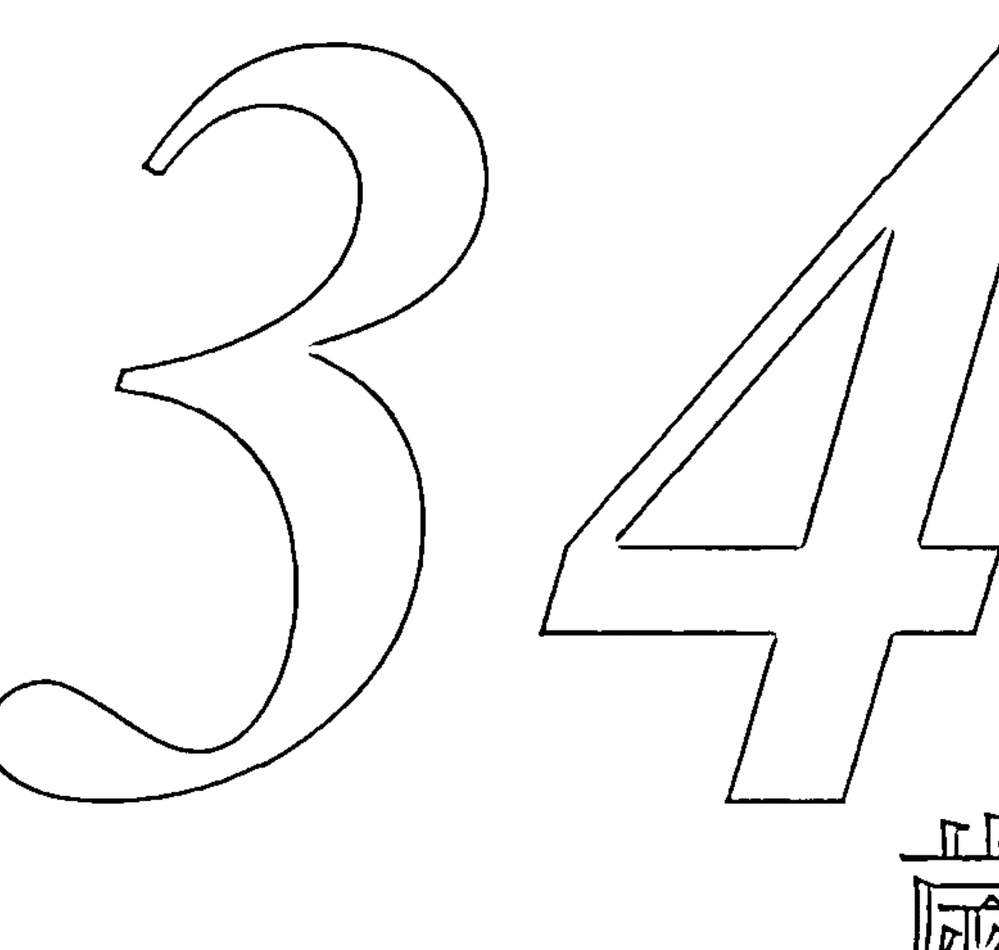

[整體運勢] 今年是妳2字頭人生中，結婚運、家庭運最最亨通的時期，如果錯過了，恐怕還得等上近3年才會再有結婚的機會，勸妳無論如何可要好好把握。不過，今年同時也是職場、家庭多事之際，不管是家庭成員或是同事間，容易為了一些責任問題爭執不休，在面臨這樣的問題時，妳儘管要負起妳認為應負的責任，但也別忘了要為自己留下一些時間和精力找尋另一半，如此才不會辜負今年大好的運勢。

#### 未有男友的妳戀愛對策

今年的戀愛對象多是原本就「近在眼前」的人，如早就認識的異性友人、辦公室的同事等。年紀上則大多是比妳小，或是和妳同齡的人。原本互為平行線的兩人，在幾次傾訴煩惱之後，讓他們興起了追求妳的念頭。所以助人愈多，戀愛的機會也就愈多。今年是妳散發個人智慧的時期，它同時也會為妳招來許多戀愛機會。但仍要小心與有婦之夫保持距離，一旦發現對方想進一步與妳發展成男女朋友時，一定要斷然拒絕。今年異性緣最佳的月份為4～5月、9～11月左右。

#### 已有男友的妳結婚對策

如果妳和他交往時間已有2年，今年兩人步上結婚禮堂的機率相當大，而就運勢上看來，今年也是十分適合結婚的一年，所以，如果今年他向妳求婚的話，最好馬上就答應他，並取得雙方家長的認同，共組美滿幸福的家庭。就今年的妳而言，最適合訂婚的月份為7月；結婚則以9～10月為宜。而如果在過了34歲生日之後，妳發現和他感情有每下愈況的情形時，最好就兩人個性是否相合的問題再做進一步檢驗。如果問題不是出在個性上，或許妳可以再給他兩年的時間，情況應會有所改善；倘若是因為個性不合，那就快快和他分手，眼前還有更好的緣分等著妳！

[愛的地雷] 發生在3～4月、年底時的激烈爭執，將對兩人的感情造成重大的傷害，要避免在意氣用事下說出非理性的言語。但如果爭執的原因是因為他的花心，那就另當別論，絕不能予以寬貸。

## 誕生數 8

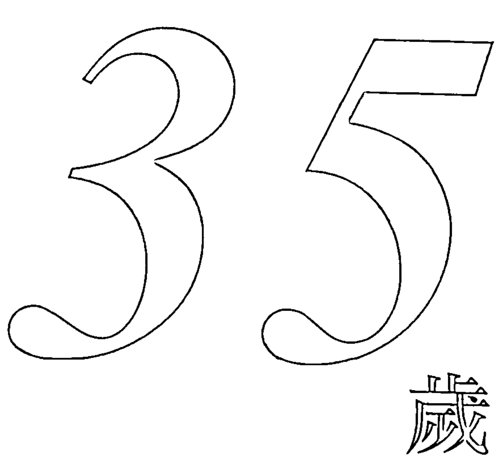

[整體運勢] 今年的妳會突然變得內向、自閉起來，這種舉動看在周遭人的眼裡或許會覺得有些怪異，但是既然想要清靜一下，何妨就順著自己的想法，硬是強迫自己，只會讓生活過得更不快樂。至於別人的眼光，妳大可向他們解釋清楚，類似這種情緒其實很多人都有，大家應該可以體諒才是。另外，今年妳容易為小事而喪失自信，建議妳與其煩惱，不如在做任何事情之前，養成訂定計畫的習慣，一定可以有效減少挫折感。

#### 未有男友的妳戀愛對策

今年的妳老實說沒什麼戀愛機會，這其實和妳自己也無心戀愛有關。今年妳反倒會懷念起去年那段沒有結果的感情，在一味感傷下，對未來另一半的條件卻愈漸嚴苛。不過，把今年當做是重新審視自己合適對象條件的一年，經過沈澱與省思後再談戀愛，成功的機率也會大增。建議妳，遇有想不透的事情時，找些異性朋友傾訴，他們的意見不但能助妳早日找到答案，還能拉近彼此的距離，說不定會意外發現他就是妳要找的另一半呢！今年異性緣較佳的月份只有 8～9 月。

#### 已有男友的妳結婚對策

如果妳和他是去年才剛交往的情侶，在今年兩人感情不但可望持續發展，相較於去年熱情如火，今年則是多了一層看法、認知、價值觀的認同，也就是彼此的情感更上一層樓地往精神方面發展。這使得兩人感情更形穩固，也許也會進一步討論到婚嫁問題。只是，就運勢上來看，今年似乎只適合訂婚，婚禮最好還是明年生日過後再舉行。至於適合訂婚的月份也只有 6 月。另外，如果在今年生日之後，發現對他的感覺似乎不如以往時，最好就兩人個性是否相合的問題再做進一步檢驗。如果不合，眼前最好也先不要採取什麼行動，乾脆把問題放著，待時間一到，自然會有解決這段感情的方法出現。

[愛的地雷] 發生在 2～3 月、11 月至年底的困難，很可能會演變成激烈的衝突。如果妳還在乎他的話，就要了解有任何不滿，最好在平時就隨時向他表達，以免積壓過久，每每爆發便形成不可收拾的局面。至於如果妳對他已失去了感覺，那就不必多說了，分手就是最好的解決辦法。

## 誕生數 8

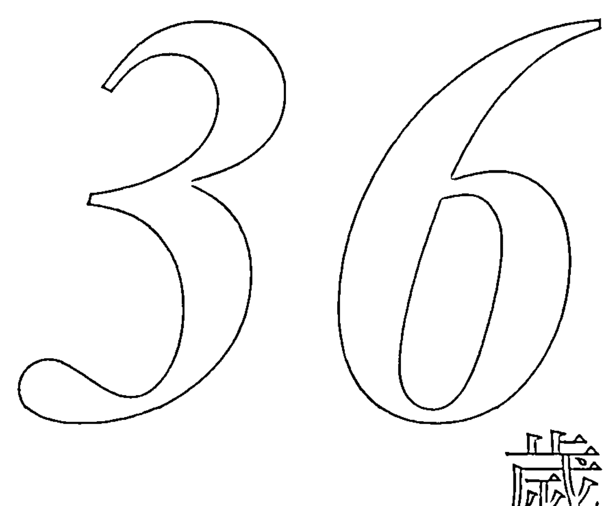

[整體運勢] 重新恢復積極行動與活力的一年。有別於去年只想一個人靜靜度日的想法，今年的妳終於又想回到團體中和大家一起生活。養足精神後的再次出發，讓妳看起來精神奕奕，很容易在此時被推舉為領袖級的人物，這使得妳在人際關係方面的處理事務也相對增多。至於在戀愛運方面，今年的戀愛機會不少，認識的異性中也不乏條件不錯的對象，值得好好把握。

#### 未有男友的妳戀愛對策

隨著交友範圍的擴大，今年的戀愛機會亦接踵而來。只是，30 多歲的妳，如今的眼光也比從前嚴格許多。就眼前的妳而言，在挑選對象時，最好把能否建立相互信賴關係為優先考量重點。以今年的運勢來看，異性緣最佳的時期為 7～9 月。如果妳向來對工作抱持著相當積極態度，預料在今年妳的努力將可望得到眾人的認同。工作上人脈的擴展，相對的也招來不少異性愛慕的眼光，當有人向妳提出邀約時，何妨大方接受！他或許正是妳日夜尋找的白馬王子。

#### 已有男友的妳結婚對策

交往已有數年時間的情侶，如果彼此已有共識未來要廝守一生的話，最好能選在今年完成終身大事。否則，拖到明年，兩人感情恐怕會遭遇到某些困難而起變化。所以，如果他還沒向妳提起，那就何妨由妳主動提出；而如果他已經向妳求婚了，那更要趕快答應他。今年最適合訂婚的月份為 5 月；結婚則以 7～9 月為宜。至於如果你們是才剛認識不久的情侶，在今年兩人感情仍可望維持在穩定的成長狀態。倘若他向妳提出結婚的打算，接受他的求婚也並無不可；如果還沒提出，勸妳也先別過於心急，再交往一段時間，讓雙方的認識更為深入後再談，預計 2 年後，也就是妳 38 歲時，是兩人論及婚嫁的最適當時機。

[愛的地雷] 發生在 1～2 月、10～11 月時的困擾，暗示著分手會是最好的選擇。尤其對交往時間在 2 年的情侶來說，如果這次的困擾讓你們爆發一場嚴重的衝突，那就別再猶豫了，趕快向他說「拜拜」吧！

## 誕生數 8

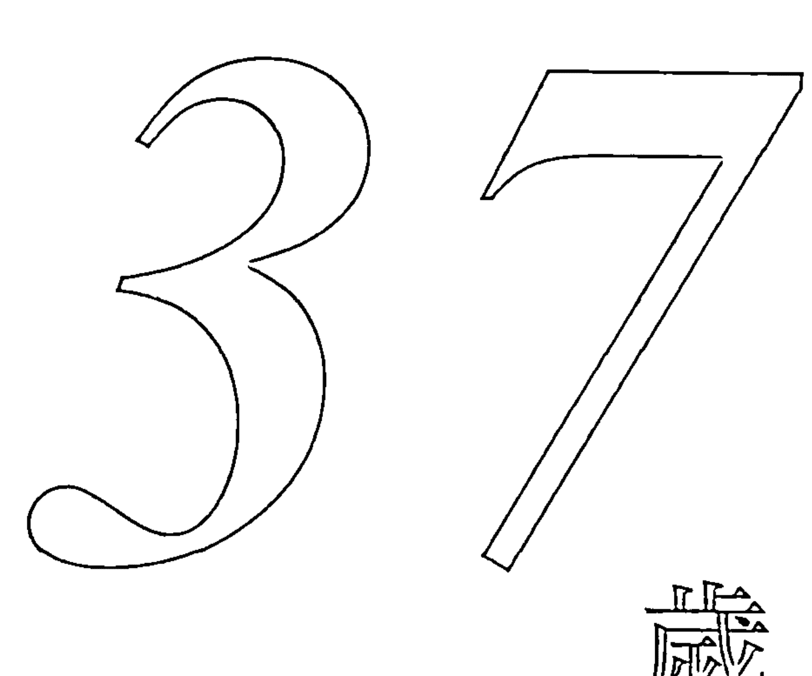

[整體運勢] 充滿「分離」、「終了」氣氛的一年，尤其是以往在妳生活中佔有相當重要地位的人或事，在今年都將和妳告別。雖然分離或結束總教人感傷，但與其頻頻回顧，不如收拾、整理目前的心境，為再次出發而努力。就今年的運勢來看，搬家、換工作都十分適合，這些舉動，將為明年帶來全新的氣象。

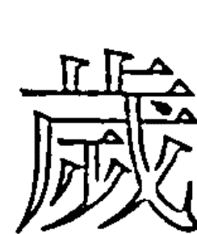

#### 未有男友的妳戀愛對策

今年是妳 3 字頭人生中戀愛運最「背」的時候。預料在今年出現的緣分，多是「孽緣」。所以，在今年別急著找對象，省得最後傷痕累累。至於真有遇見合乎自己條件的心儀對象時，建議妳倒是可以在今年先暫時與他保持一種普通朋友的關係，並利用今年的時間仔細觀察他的個性和妳是否相合，明年有機會的話再進一步展開交往會較好。而今年就暫且將氣力多放在切斷一些不必要的人際關係及緣分上面。

#### 已有男友的妳結婚對策

如果妳和他交往時間大約在 1～2 年，而目前也無特別嚴重的問題發生的話，今年所要做的就是維持此一穩定的態勢，如此一來，明年兩人感情將可望有所結果。至於如果你倆真的很想在今年確定兩人的婚事，最好先交換戒指等之類的信物，並徵求雙方家長的同意，至於正式的訂、結婚則待明年 38 歲生日過後再舉辦會較好。對交往已有很長時間的情侶來說，今年則潛伏著分手的危機。特別是如果妳和他交往時間在 4、5 年以上，而他卻遲遲未給妳結婚的承諾時，或許今年妳該考慮是否要另覓對象。就今年來說，3 月、5 月、9 月、12 月是適合分手的月份，選擇在這些月份和他分手，預料將帶來更好的戀愛機會。

[愛的地雷] 發生在 9 月時的困擾暗示著或許和他分手是最好的選擇，特別當這段感情原本就是場不倫之戀時，那更是不要猶豫，馬上和他說「莎喲娜啦！」。預料明年還有更好的緣分等著妳！

## 誕生數 8

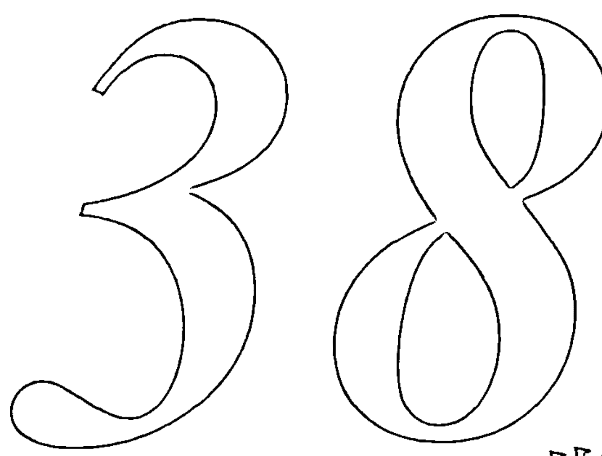

### 歲

[整體運勢] 眼看著 3 字頭的青春只剩下最後兩年，如果妳是個急著要在 40 歲以前把自己嫁出去的人，可要好好地把握今年了！因為今年是妳 3 字頭人生中戀愛運最旺的一年，只要妳能睜大眼睛留意，並好好把握，要在今年找到合妳意的另一半，絕不是問題！此外，今年還是個適合踏出新步伐的一年。經過去年的「除舊大掃除」後，今年的再次出發可望帶來令妳滿意的結果。

#### 未有男友的妳戀愛對策

走過去年戀愛運的低潮，今年好運總算又回籠了。今年的戀愛機會多出現在妳意料之外的場合中。不想竟會在那樣的地方遇見他，這不禁要讓妳大喊愛情真是不可思議；而一旦找到心目中的白馬王子，妳也很有可能在一見鐘情之下，就和他閃電結婚。另外，如果長久以來妳一直暗戀著某位男士，在今年兩人感情也有機會做進一步發展，不過，這也得要妳積極的行動，如此才有較高的勝算。今年最有可能遇見心儀對象的月份為 2 月、4～5 月、9 月、11 月至年底。

#### 已有男友的妳結婚對策

交往時間約在 2 年左右的情侶，今年該是走上紅毯那端的時候了。面對他的求婚，如果妳也有此共識的話，就何妨答應他，然後趕緊著手籌辦婚事（即使尚未拜訪對方父母也無妨）。就今年而言，最適合訂婚的月份是 3、12 月，結婚則以 5～6 月為宜。如果妳和他是去年才剛展開交往，今年兩人的感情則預料會持續加溫，而順著此一穩定發展，自然就論及婚嫁的人亦大有人在。但倘若在過了生日之後，發現和他的感情反有開倒車的傾向，建議妳最好將眼光挪開，再仔細看看身旁是不是還有更適合妳的人選，他也許不是妳要找的那個人。

## 誕生數 8

[愛的地雷] 倘若 8～9 月有重大的困擾或麻煩發生時，什麼也別多想，和他分手便是！至於如果只是發生一般小口角的話，則要注意別太苛責他，那是會把他的心給往外推的！

## 誕生數 8

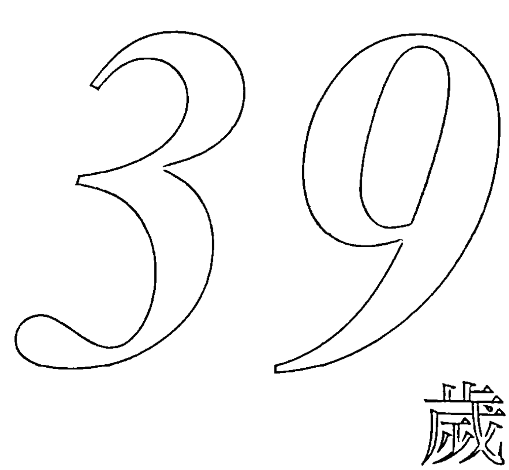

### 歲

[整體運勢] 今年的妳，相當容易陷入負面的情緒中。特別是對去年就一直埋首於忙碌工作的人而言，學著放鬆心情、將注意力轉移至人際關係的拓展上將是重點所在。當感覺壓力難當、疲勞不堪時，千萬別再勉強自己繼續投入奮戰，要知道唯有休息才能走更長遠的路。不妨騰出時間去做趟旅行、運動、洗三溫暖抒緩一下身心；有煩惱時，也不要老是一個人悶在心裡，多找朋友聊聊天，感覺會較好些。

#### 未有男友的妳戀愛對策

過去的妳，喜歡的淨是一些態度較積極的男士，但在 39 歲生日過後，妳會發現「個性隨和」、「穩重且有耐心」的男人更適合妳。相反的，如果在今年，妳還是認為「個性隨和」根本就是無趣，「穩重、有耐心」的男人看起來十分笨拙的話，那可能就沒什麼戀愛機會了。其實對妳而言，外柔內剛的男孩子更適合妳。如果不小心在今年錯過這樣的緣分，沒關係！明年還有更好的機會等著妳，但可要好好把握喲！

#### 已有男友的妳結婚對策

對去年開始展開交往的情侶來說，今年是兩人感情呈現加速度成長的時期。在愈漸親密的同時，也開始接觸雙方家人，一旦你倆的戀情獲得對方家人的認同，預料今年你們很可能會走上紅地毯的那一端。所以，如果妳認為他正是妳所要找尋的另一半，那最好就趕緊去拜見他的父母，尋求認同。就今年而言，最適合訂婚的月份為 2 月、11 月；結婚則是以 4～5 月為宜。如果相反的，在過了 39 歲生日之後，感覺兩人感情有不進反退的傾向時，建議妳最好先做自我反省，想想自己是否過於依賴他或任性？如果是，想挽回兩人昔日的甜蜜就看妳自己是否能自我成長或改變，否則，不論對象是誰都無濟於事。

[愛的地雷] 9～10 月時的妳，情緒容易陷入低潮，如果在此時和他發生爭執最好由妳先向他道歉。另外，對於發生在 7～8 月的麻煩或困擾，勸妳要用冷靜的態度面對。

## 「速配！」診療室

～誕生數8的女性和各男士們的速配程度～

### 速配指數

♡能愛得長長久久 ○愛得短暫而熱烈 ☆適合結婚 ◇適合當好朋友 □適合當工作上的搭檔 ※只要努力，還是有希望速配成功 ✕不如不相識

### 誕生數1的男士

生意上的好伙伴 □☆

站在共謀利益的角度來看，妳和他絕對是完美的組合。就妳而言，他行動積極、長袖善舞相當具有魅力；對他來說，妳作風強勢、說做就做的個性更為他所欣賞。這樣的兩個人湊在一起儘管能聊得投機，不過契合之處卻多集中在生意方面。也就是說，彼此會認定對方是自己事業上的好幫手，但至於是不是人生路上的好伴侶，恐怕就值得斟酌了。當然，在相互扶持合作拓展事業的情況下，兩人日久生情的情況也不是不可能。常見一些在事業上原本是合作關係，或者原是公司職員後來搖身一變成為老闆娘等，就多屬這類例子。只是，不管最後妳有沒有成為老闆娘，妳和他對彼此的好印象多是從生意合作上發展。

### 誕生數2的男士

你絕不是我要找的那個人！ ✕

他溫吞的個性對「正常」狀況下的妳來說，是怎樣也看不上眼的。除非某天，妳在事業上倍受打擊，覺得疲倦不堪、很想找個避風港時，看見他，妳才會突然有心動的感覺。「其實，跟著他也不錯，雖然他有些懦弱、保守，但此時的我再也不想打拼了，不如，就和他在一起，過著平淡、安定的日子吧！……」可惜，這往往不是故事的結局。心疲力竭的妳，雖然暫時可能會選擇和他交往，但是要知道，平淡、安定的日子豈是妳過得慣的生活？待休息足夠，精力恢復後，心底「積極、奮發」的個性又蠢蠢欲動時，回頭看見他，妳竟然又會升起一種鄙視的感覺。「天啊！我是怎麼了？怎麼會看上像他這樣的人？一點男子氣概也沒有，真受不了！」清醒後自認委屈，收拾起心情就準備走人，還一副「你算什麼東西！」的樣子。當然，兩人緣分已了後互道再見本是家常便飯的事，只是，對誕生數2的男性而言，當初說要交往的是妳，現在說要走的也是妳，徒留受傷的他，還得承受妳鄙夷的眼光，真不知道他是招誰惹誰了？

### 誕生數3的男士

他適合做妳的小丈夫

誕生數8的女生和誕生數3的男生配不配，關鍵往往在於年齡問題。如果他的年紀比妳小，甚至小妳3歲以上，雙方以「小弟弟」和「大姊姊」的關係相待的話，事實上你們是很契合的一對。原因是誕生數8的妳，向來喜歡居於領導地位，將決定權握在手中，這對許多男人而言，尤其對年紀大於妳的男士，相當不能忍受。不過，當他年紀比妳小的情況下，這種衝突不大可能出現，不但如此，他還十分高興妳能「帶領」他。所以，當誕生數8的妳年紀大誕生數3的他大3歲以上時，你們可說是十分速配的一對。

### 誕生數4的男士

我一見你就討厭

基本上誕生數8的妳和誕生數4的他，是怎樣也不可能湊在一起的。因為他的優點你看不見，妳的缺點他卻看得一清二楚，所以，除非是剛認識時雙方都還不太了解，也就是「因誤會而結合」，否則，一經交往，隨著彼此了解對方日深，有的只是覺得更加討厭而已，什麼愛、什麼情，根本不可能！回想在初認識他時，或許妳會以為他是個誠實、有自己的想法、值得信賴的男人，然而，等到激情過後才發現，原來他根本就是個心胸極為狹窄的男人，而「有自己的想法」更變成是「頑固、容不下別人意見」，這樣的的看法是對是錯其實是因人而異，但無奈看在妳眼裡他就是這樣的人。既然怎樣也看對方不順眼，那還有什麼話好說，自然只有一條路可走，那就是分手囉！

### 誕生數 5 的男士

你我之間只有肉體上的情慾

你和他之間的愛情極具爆發力，自相遇的那一刻起，彷彿天雷勾動地火。他渾身上下散發出魅力難當的熱情，而你，則是搖身一變成為作風大膽、火辣的女子，就這樣，兩人急急陷入激情之中，性愛似乎也成了你和他唯一的交流。這樣的組合在一起時固然是纏綿悱惻，但要知道，愛情要是來得快、來得猛，去得也就急。儘管你和他認識已有一段時日，但兩個人卻始終還是耽於肉體上的情慾，精神上完全沒有共識。在纏綿時兩人或許會覺得甜蜜異常，可是在缺乏真正的心靈交流做基礎下，經過一段時日，當彼此已厭膩了肉體激情時，這段感情似乎也只有告吹的份兒了。所以，人家說「相愛容易相守難」、「如曇花一現」的愛情，正是誕生數 8 的你和誕生數 5 的他戀情的最佳寫照。

### 誕生數 6 的男士

成人之戀

誕生數 8 的你和誕生數 6 的他能不能配對成功，和相遇時兩人的年紀有很大的關係。如果當時兩人都還是 20 幾歲（尤其是 25 歲以前）的年輕人，要湊在一起恐怕有點難；但倘若認識時兩人都已進入 3 字頭的年紀，則要速配成功就很有希望了。現實積極派的你和感性居家型的他，在個性互補的情況下，原就很適合共組家庭。只是，這種完全不同於自己的個性，看在年紀尚為 20 幾歲的你的眼中，往往會被當做是「非我族類」而覺得有些不屑。所以，假如兩人認識是在 20 幾歲時，這段戀情很有可能會在終日爭吵中度過。但是，一旦進入 30 歲，同樣的個性在彼此眼中的看法又變得不同了。在經過一些人生歷練後，你現實積極的強張個性會變得較為圓融；而他也漸漸地懂得欣賞你不同於他的個性。於是昔日的衝突不再，還會視對方不同於自己的地方為優點、特色，到這種地步，兩人也自然而然成為天造地設的一對了。

### 誕生數 7 的男士

我愈來愈後悔認識你！

「如果時光能夠倒流，真希望當初沒能認識你！」這是誕生數 8 的妳和誕生數 7 的他，在交往後兩人最容易冒出的感嘆。原因是怎麼對方的真面目和原先自己想像的差這麼多！男女兩人要能成為情侶，自是一開始雙方對彼此互有好感。同樣的，妳和他的交往也不例外。只是，隨著交往時間的日久，彼此覺得對方像是完全變了一個人似的。對妳來說，妳會有種被欺騙的感覺，發現原來他過去所說的不過是長篇大道理，真實的他根本是個光說不練的人；而對他來說，他也會後悔自己怎麼當初「眼睛沾到蛤仔肉」，錯看妳是溫柔賢內助，原來不過是個「囉唆的歐巴桑」！於是，雙方對對方的欣賞及美感逐漸化為烏有，取而代之的是相互指責、批評。當然，偶爾兩人也會有「忍耐為重」的念頭閃過，畢竟自己也曾為這段感情付出過，總希望還有挽回的餘地，無奈這種想法往往只能維持片刻，一看到對方，心底的那股怒氣不禁又要爆發出來。在「相看兩厭倦」、「我一見你就討厭」的情況下，最後自然也只有分手的路可走囉！

### 誕生數 8 的男士

彼此切磋求進步

誕生數相同的男女要湊在一起，通常機率都不太大。不過對同是誕生數 8 的妳和他來說，如果兩人能巧妙地掌握相處的方式，當個朋友基本上應該是沒問題，至於做夫妻，或許也可以試試，因為兩人都是屬於活潑、理性、現實、有十足追求成功企圖的人。人云：「有比較才會有進步！」，在雙方將彼此看待成良性的競爭對手時，則對方的存在對自己而言，就像是個推進器一樣，足以引爆自己使出最強的力量向前衝。所以，「共同的目標」對維繫妳和他之間的感情是十分必要的。一旦有共同的目標，點燃自己奮鬥的意志不說，在共同為某一目標而努力的同時，雙方還能成為並肩作戰的好友。所以說，這種情況下的兩人要成為朋友絕無問題；至於成為夫妻，則是把「家庭」做為一起打拼奮鬥的「共同目標」時，成功的機率會高一點也說不定。

### 誕生數9的男士

你我的感情或許無法長久……

基本上，妳和他可能無法長久相處。他的穩重及內斂或許在一開始時確實深深吸引著妳；而妳的積極、現實對他而言，也是相當有趣，但在深入交往後，漸漸地，妳會對他的穩重、內斂感到不耐，甚至認為他怎麼這麼沒有衝勁；而他看妳，更是覺得妳現實得可怕，似乎完全沒有女人特有的感性與溫柔。於是，對彼此的好感終於漸漸消失，沒有了吸引力，原本相交的兩條線也就自動成為平行線了。當然，如果兩人能不這麼堅持自己的觀點，懂得換個角度去看待對方的特色，尤其是妳，肯放慢追求成功的腳步，靜靜聆聽對方內心的聲音、體會他的感受時，兩人的感情也不是那麼地無藥可救。只是，要妳暫時擱置現實的目光，就始終汲汲追求成功的妳而言並不是那麼容易做到的事，所以，這樣的組合，一般而言要長久持續地發展的可能性並不大。

## 誕生數9 自然主義者

腳踏實地、順其自然

幸運寶石：蛋白石

**個性** 誕生數9的妳，是個感情豐富、充滿愛心的人。崇尚自然，重視團體生活，相當能為他人著想，同時也懂得欣賞他人優點，在群體中相當受到歡迎。

**戀愛傾向** 誕生數9的妳，對愛情充滿了幻想和期待。一旦愛上了某個人，經常便沈醉在自己的夢想世界裡，想像兩人約會時的甜蜜情景、共同生活在一起的情形，並且期許自己一定要全心地為他付出，保有這份感情直到永遠。然而，這樣的幻想卻經常落空，讓妳倍受傷害。原因是向來感情豐富、極富同情心的妳，對某個人的好感往往是從同情開始，在一心想扶對方一把的同時，也以為對方會十分珍惜這相扶相持的感情，在從失敗或低落的情緒中爬起後與妳共譜戀曲。哪知，對許多男人而言，幫助歸幫助，等站起來後要談戀愛時，他們卻又有另一套選擇的標準。所以，即使見妳淚眼婆娑，他們還是會堅持以追求真正的愛與幸福之名離妳遠去。如果妳正是在感情上經常受到類似挫折的人的話，建議妳在下回想伸手幫助人時，先要學著認清對方究竟是不是個會忘恩負義的人，同時在助人時也不要輕易先付出自己的感情，以免落得無法自拔，而他卻又走得那麼輕鬆自在的窘境。至於怎樣的男人最適合妳？一般說來，與其看他有錢與否、有沒有社會地位，不如找個跟妳一樣有愛心、重視家庭，同時有責任感的人。向來重視精神生活的妳，唯有和這樣的男人在一起，才能感到真正的幸福，兩人的感情也才可望長久維繫下去。

### 誕生數 9

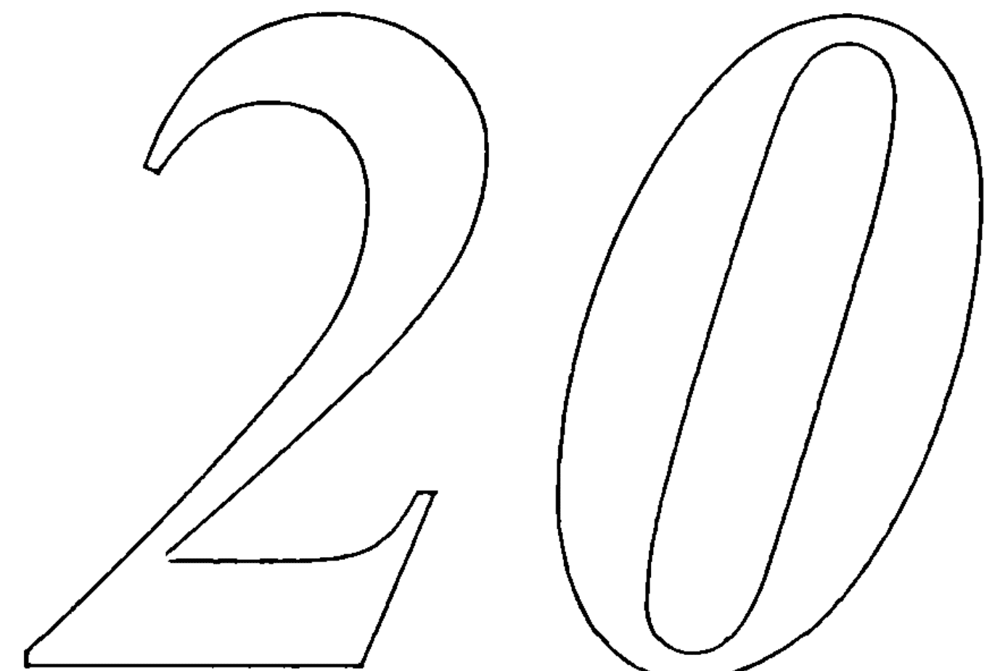

[整體運勢] 今年的妳，始終為低落的情緒包圍著，這時候最需要的便是找個能聽妳傾訴心聲的人。建議妳有空不妨多和同性友人聯絡，另外，部分親戚長輩也是妳諮詢的好對象，他們的建言和開導將會對妳撫平情緒有很大的助益。至於已經出社會的人，也可望在今年遇到一個能幫助妳、了解妳並肯定妳能力的貴人。戀愛運方面，今年的妳容易為戀人的事煩心，分憂可以，就是不要把自己也捲入對方所遭遇到的麻煩中。

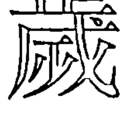

#### 未有男友的妳戀愛對策

今年的戀愛機會雖不少，但「優質」的卻沒幾個。尤其是一些看上去感覺應該可以為妳排憂解難的男孩子，在和他開始交往後才發現他的煩惱比妳還多。事實上這些男孩和妳交往多只想依賴妳，等他們足以獨立再出發時，往往會頭也不回地和妳說再見，所以在今年遇到類似的狀況時，建議妳最好不要一個傻勁地猛幫他們解決問題；至於自己有煩惱或感到寂寞時，不妨找要好的同性朋友談天傾訴，可免於自己受到傷害。今年較好的緣分出現大約在 4 月左右。

#### 已有男友的妳結婚對策

今年妳和他的感情進展如何？如果一切還算穩定，建議妳就維持這種態勢，不必硬在這時候要求他和妳結婚。因為就運勢上看來，在今年感情維持穩定發展的情侶，將來結婚是極為自然的事，根本不用強求。強求反而容易破壞雙方和諧的交往氣氛，對兩人未來發展造成妨礙。今年最適合訂婚的月份為 2 月、11 月；結婚則以 4 月為宜。至於如果相反的，在過了 20 歲生日後，妳發現兩人感情有開倒車的傾向時，最好就彼此個性是否適合問題做再一次的檢驗。倘若不是那麼合適，反正這種感情隨時都會有告吹的可能，勸妳不如及早選擇適當時機提出分手，另覓合適對象才是明智的做法。

[愛的地雷] 發生在 7 月時的爭吵，可能成為兩人分手的導火線。如果 9 月時兩人能重修舊好即可度過難關，否則恐怕只有永遠地分手了。另外，春、秋兩季時，妳容易有移情別戀的衝動，須注意！

### 誕生數 9

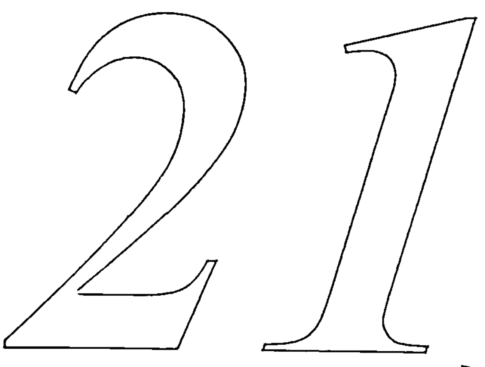

[整體運勢] 想談一段成熟的戀愛嗎？今年機會終於來了！雖然說談戀愛的機會不少，所結識的對象也以個性成熟的人居多，但就妳的年紀而言，這時談結婚似乎還嫌太早，不如將這段時間設定為認識成熟男女對愛情的看法及應有的態度。藉由學習漸漸褪卻過去孩子氣的想法，加上即將（或已經）踏進社會工作成為一名社會人，今年的妳可望變得更成熟、更能獨當一面了。

#### 未有男友的妳戀愛對策

今年的妳異性緣不錯，尤其是在參加社團活動或是從事休閒運動時，常能招來異性注目的眼光。當遇見心儀的男孩時，何妨大方地製造機會與他相處，否則，在他們擔心妳早已名花有主或是根本看不上他們的情況之下，有些男孩甚至不會展開行動。在今年，試著學習主動向人表達心聲，對妳而言也是一種成長。至於今年所選擇的對象，以年紀和妳同年，或大妳約2歲，專門從事研究工作或者是運動健將型的人最適合妳；而異性緣最佳的月份則為2～3月、9月及年底。

#### 已有男友的妳結婚對策

儘管你們認為兩人感情成熟，足以談論婚嫁，但建議妳無論如何在今年重點仍放在維持兩人感情的穩定上，結、訂婚的事最好等22歲生日過後再說。而如果妳想結婚，對方卻不怎麼積極的話，此時，妳該做的不是繼續向他「逼婚」，而是「設法製造共同生活體驗」。所謂的「共同生活體驗」，可以是兩人相約做趟海外旅行，或是利用假日兩人住在一起等等。總之，讓彼此看到對方日常生活時的樣子。如果發現兩人感情有變得更好的傾向，暗示著明年22歲結、訂婚的可能性很大；相反的，看到現實生活中的他令妳有「幻滅」的感覺時，則意味著或許兩人真的不適合，趁早另覓其他伴侶會是較好的抉擇。

[愛的地雷] 2月、6月、11月為兩人感情的危險期，如果此時的妳有分手的念頭，最好馬上付諸行動，一段更適合妳的新戀情就在眼前等著妳。否則，拖到明年只會讓彼此傷害得更深。

### 誕生數 9

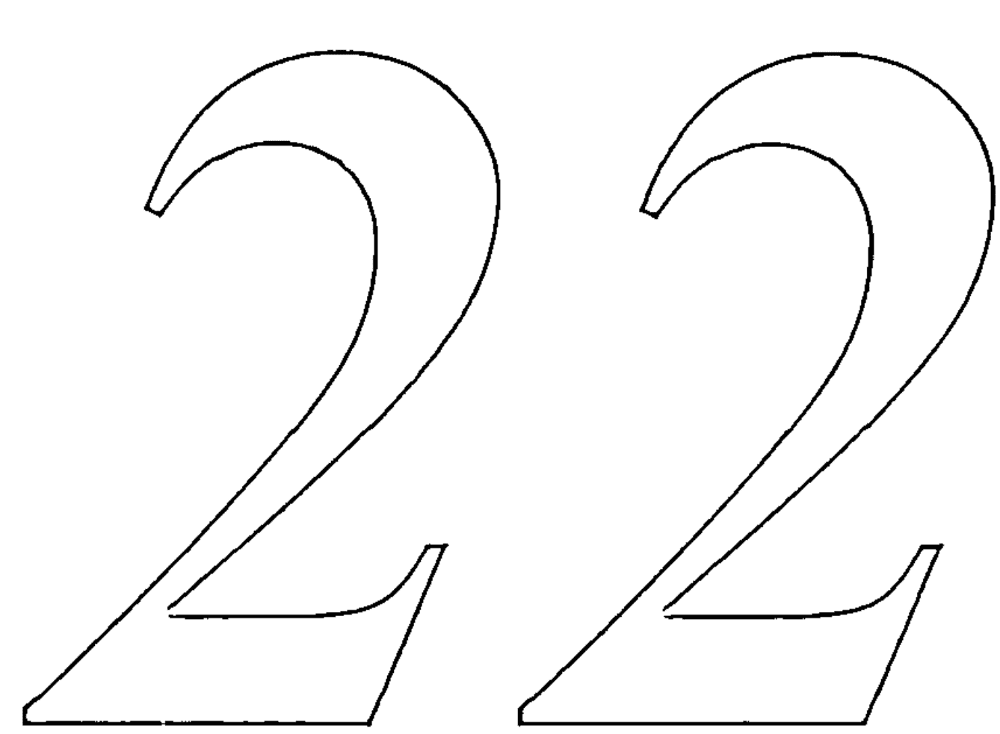

[整體運勢] 去年超人氣的運勢，在今年終將告一段落，儘管沒什麼談戀愛的機會，但隨著踏入社會的時間日久，工作方面加諸在妳身上的責任卻也日漸增加。所以此時的妳，不妨將重心擺在自我能力的提升及建立經濟基礎上，配合今年看俏的財運，預料可為自己的未來存夠一筆結婚基金。如果妳還是很希望今年能認識不錯的結婚對象，不如試試相親，或請朋友代為介紹。

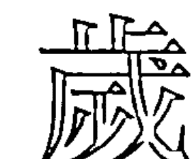

#### 未有男友的妳戀愛對策

今年愛神對妳似乎不怎麼照顧，身邊邂逅的男孩，幾乎沒有一個合妳意的，能期待的好像就只剩下原本就認識的異性友人。既然如此，不如就順其自然地做自己的事，說不定反而能吸引原有的異性友人中某些人的欣賞。今年工作上會顯得相當忙碌。不過，忙碌之餘，隨著和其他部門人員、生意往來公司的負責人員接觸的機會增多，或許會有一些零星的戀愛機會。不過，還是那句話，別期望太高，順其自然反而機會愈大。今年異性緣較佳的月份為2月、8月、10月、11月。

#### 已有男友的妳結婚對策

如果在今年兩人感情仍能保持穩定發展，並且也獲得雙方家長的認同的情侶，預料在這兩年內，妳和他可望順利走上紅地毯的那一端。然而，如果相反的，今年兩人的感情大不如前，見面老是吵架的話，建議妳最好重新審視一下兩人的個性是否相合。倘若不合，就運勢來看，從明年起連續2年，正是妳2字頭人生中戀愛運最旺的時候，不如就此和他分手，靜待明年更合適的對象出現。至於今年最適合訂婚的月份為9月；結婚則以2、11月為宜。

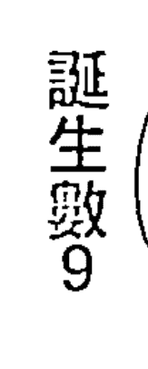

[愛的地雷] 發生在5月、9月的衝突暗示著兩人緣分已淡，特別是如果衝突過程中兩人有翻舊帳的情形出現時，顯示兩人已不適合在一起，最好就此分手。

### 誕生數 9

[整體運勢] 談一場充滿浪漫愛情的機會來了！如果你期待能有個令你心動不已，陪你一起嘗盡戀愛酸甜滋味的白馬王子出現，那就絕不能錯過今年的機會。只不過，這段戀情剛開始談時似乎很美、對方也頗能符合你心目中白馬王子的要求，但沒多久卻又給你「大夢初醒」的感覺。不過，也不要氣餒，就把它當做是人生旅途上一段難忘的體驗吧！盡情享受這段愛情所帶給你甜蜜滋味，儘管它像是一道彩虹，轉眼就消失在空中。

#### 未有男友的妳戀愛對策

今年的妳，戀愛運超旺！尤其每有「移動」的機會，比如搬家、旅行、換工作等等，就蘊藏著戀愛機運。但建議妳在面對突如其來的愛情時最好保有一定程 度的清醒，一旦被沖昏了頭，做下閃電結婚的決定，明年恐怕會有離婚之虞。不 過，這樣來得快、去得也快的愛情也不是完全碰不得，只是在愛得火熱時，別忘 了要為自己保留一條退路，事先做好這樣的準備後，它就是一段值得妳嘗試的特 殊人生體驗了。今年異性緣最佳的月份為1月、7~9月、10月。

#### 已有男友的妳結婚對策

如果妳和他在去年已訂了婚的話，勸妳在今年最好趕緊著手籌辦結婚事宜， 以免夜長夢多。就今年而言，最適合結婚的月份為1月、10月。至於未有婚約在 身的人，今年可要小心了！以運勢來看，今年的妳特別容易浮躁，不但容易移情 別戀，也容易看他不順眼、對他失去感覺。尤其是一旦有對他感覺盡失的情況發 生時，這段感情恐怕就會就此結束，進而走上分手之路。不過當然啦！倘若妳對 他真的已沒了感覺，只能說彼此緣分已盡，妳也沒必要強迫自己再留在他的身邊， 就瀟灑地把眼光放遠，看看還有沒有更適合妳的男孩子吧！

[愛的地雷] 4~5月、7~9月時，容易對這段感情產生質疑，經常自問： 「他真的就是我要找的人嗎？」。當有這種不確定感發生 時，暗示著妳和他或許並非那麼適合，不如斷然和他分手，重新另覓對象。

### 誕生數 ⑨

[整體運勢] 今年是妳 2 字頭人生中戀愛運、結婚運最旺的一年，錯過了今年，恐怕還得再等上 2 年才會再有結婚的機會。倘若眼前的妳已有男友，則這個男朋友應該就是妳未來的另一半；倘若妳還沒有男朋友，則未來的另一半會出現在今年追求者行列中，和條件很不錯的他相識後，在很短的時間內，你們就會閃電結婚。總之，今年是值得期待的一年，注意要時時睜大眼睛，別讓機會給溜走了喲！

#### 未有男友的妳戀愛對策

今年的戀愛機會多得教妳夢裡也微笑，而且，追妳的人多抱著想與妳結婚的心態。然而，如果過了 24 歲生日以後，還是沒能感受到這股「熱門行情」，應反省自己是否還執著在過去的戀愛經驗？在不願受傷的想法下，妳會不自覺地提高篩選對象條件的門檻，如此一來，當然感覺不到有什麼適合的追求者出現囉！所以，必須先學著忘掉過去的愛情，同時積極地請親戚朋友幫妳留意合適的人選，預料會有不錯的成果。今年幾乎一整年異性緣都極佳，尤其是在 9 月的時候。

#### 已有男友的妳結婚對策

已有男友的妳，如果在今年兩人感情仍未起什麼變化，雙方又有共識要相守一生的話，倒是可以開始拜見彼此父母，展開籌辦婚禮事宜了。但如果妳向他提出結婚的打算後，他卻以「談結婚還太早！」、「最近工作很忙！」推拖時，則要注意了！最好能就雙方個性是否相合問題做再一次的檢驗，同時也觀察一下他今年的運勢如何。如果發現雙方並不合適，那就何妨當機立斷和他分手；如果妳怕突然分手後，一時之間自己無法適應單獨的生活，那就等到找到另一個合適的結婚對象後，再向他提出分手，即使這樣的分手方式對他而言有些殘忍……。就今年而言，最適合訂婚的月份為 7 月；結婚則以 9 月為宜。

[愛的地雷] 發生在 2～3 月以及年底左右的爭執，恐會對兩人感情造成無法彌補的重大傷害，須注意！但如果此時他向妳提出分手，表示這段感情也不值得妳再為它留戀，不如就一刀兩斷。

### 誕生數 9

[整體運勢] 走過連續兩年的戀愛高潮，今年戀愛運重回平靜。這或許會教妳感到有些落寞，但誰說愛情的發生就一定要轟轟烈烈？出現在今年的追求者儘管不多，但不同於前年、去年的追求者給妳浪漫的愛情感受，他們給妳的多半是分享的感覺，好好品嚐這種靜謐深遠的滋味，妳會發現它們依然很美。如果沒有追求者出現，也請不要過分著急，耐心等候。另外，今年是特別利於藉由網際網路與人展開溝通的一年。

#### 未有男友的妳戀愛對策

25 歲是妳 2 字頭人生中求知慾、好奇心最強烈的時候，今年的緣分也特別容易出現在「提升知性領域的場所」。所以有機會不妨多去參加一些社團活動、學習課程等等，在那裡可望遇見和妳有相同喜好、足以帶領妳滿足知的慾望的男士。至於本身並沒有特別想學些什麼的人，今年的戀愛機會可能會出現在身旁一些朋友的身上。他或者是妳同性朋友的兄弟、朋友的朋友等，只是這樣的機會原則上並不會太多。今年異性緣較佳的月份以 7 月為主，包括整個夏天。

#### 已有男友的妳結婚對策

今年的妳和他，兩人感情進入穩定期，在此時期，雙方或許會出現結婚的想法，但建議妳不需那麼急，再多觀察個一年，倘若這一整年都能保持這樣穩定的發展，待明年 26 歲時，兩人自然會步上紅地毯的那一端。至於在今年，妳發現和他的感情有不進反退的情況發生時，建議妳最好針對兩人個性是否相合問題重新考量。特別是如果感情不順的原因是他的花心，則預料這段感情未來再持續下去的可能性並不大，在明年 26 歲生日來臨之前，運勢自會將它做個結束。就今年而言，最適合訂婚的月份是 1 月、5 月、10 月；結婚則以明年生日過後為宜。

[愛的地雷] 發生在 2 月、11 月的衝突可能演變成為兩人分手的導火線，如果妳對他還存有依戀的話，勸妳說話時最好小心些，別意氣用事促成大錯！

### 誕生數 9

[整體運勢] 成就、收穫豐碩的一年。不管是愛情上也好、工作方面也罷，經過長時間的努力耕耘，成果終於在今年顯現出來，或許這報答來得遲了點，但還是令妳滿心歡喜。所以說，今年算是「收成」年，過去的妳曾下過多少功夫，今年就能得到多少收穫。另外，在愛情方面，今年的戀愛運和相親運都很不錯，尤其在一些宴會的場合中，有機會結識合適的對象。

#### 未有男友的妳戀愛對策

今年的戀情運不錯，尤其在社交活動場合中，可望遇見不錯的男孩。建議妳最好挑選年紀相同或是比妳大的，倘若對方恰好有些經濟基礎，你們可能會來個閃電結婚也說不定。而如果和年紀比妳小的男孩成為情侶，要結婚恐怕還有好長的一段時間要等。今年是「收成」年，對過去一直處在單戀情況的人而言，今年可望能得到對方的回應；但如果仍未見對方有任何表示時，不如放棄，再等下去終將還是無濟於事。今年異性緣最好的月份為 2～3 月、7 月、9 月，以及 11 月。

#### 已有男友的妳結婚對策

對交往時間已長達數年的情侶而言，今年該是結婚的時候了，如果他還是沒有任何表示的話，何妨就由妳主動向他提起。否則一再拖下去，到明年兩人感情恐會有所變化。如果向他提起後，他的反應卻是相當冷淡，或是老拿一些事情搪塞時，建議妳最好重新考慮和他在一起的合適性，妳可以選擇向他攤牌，強勢地要他給妳一個答案，或者乾脆離去，但就是不要默默地承受並繼續等待，這只會讓妳失望，同時也錯失結識更好對象的機會！就今年而言，最適合訂婚的月份是 3 月、12 月；結婚則以 7 月為宜。

[愛的地雷] 發生在 1 月、10 月時的爭吵，很可能會造成兩人分手，如能平安度過這段期間，則感情可望更上一層樓。

### 誕生數 9

[整體運勢] 今年的運氣顯然有些「背」，不但事業陷入低潮，就是想談戀愛也沒什麼機會，這不禁令妳沮喪起來。然而，換個角度想想，這又何嘗不是改變自己的最好時機。趁著一個人無拘無束，妳可以多方學習一些東西、充實自我內涵；至於事業方面，如果真的那麼討厭那份工作，又何妨辭掉它，為自己訂立另一個全新的計畫，期待在明年嶄新的出發。

#### 未有男友的妳戀愛對策

今年可說是妳 2 字頭人生中戀愛運最差的一年。在今年，頂多只能結識一些普通的異性朋友，至於男朋友，最好沒有，否則出現的多半是存心騙妳的人，和他們墜入情網得到的只有傷害。唯一可以寄望的是一些去年認識的異性朋友，他們當中或許有不錯的人選。另外，還沒有走出以往戀情所帶來陰影的人，也不適合在今年譜新戀曲。此時的妳要的是心靈上的平靜與安適，有任何苦悶不妨多找同性好友談談。

#### 已有男友的妳結婚對策

對已有男友的妳而言，今年是兩人感情的「考驗」年。許多爭執的發生，正考驗著妳對這段感情的信心、對他的信任，以及過去兩人是否重視溝通、重視一同成長。如果在深思熟慮後，還是認定他就是妳這輩子所要找的人的話，建議妳就該學著不過分強調自我感覺，全心包容他、接受他；相反的，如果認為兩人並不適合在一起，那也最好趁著今年趕緊將這段感情做了斷，預料今年的分手，對妳未來將有著正面的影響。就運勢看來，今年並不適合訂結婚，有此打算的人最好等到明年再舉行。

[愛的地雷] 7～9 月是兩人感情的危險期；此外，3 月、5 月時的妳，也容易對這段感情心生猶豫、遲疑。如果覺得過去的感覺已不再，何妨就和他分手吧！

### 誕生數 9

[整體運勢] 廣受幸運之神眷顧的一年。不過這並不意味著在今年事事都可順妳的心、如妳的意，而是今年在迎接各方考驗和挑戰後，妳將能從一個大女孩順利蛻變成為成熟的女人，懂得用成熟的目光去看待、處理世事，這對妳未來的人生而言，無疑是一個新的開始，而愛情上、工作上諸多幸運的遭遇，也從這裡開始發生。

#### 未有男友的妳戀愛對策

將目光擺在前面，是今年擁抱新戀情的必備條件。尤其是對去年才剛和男友分手的人來說，堅信自己已無後路可退，是妳必須要有的心情。然後，盡可能讓自己處在全新的環境，之後命運一定會給妳一個滿意的答案！今年妳所新認識的朋友，不論男女對妳未來的人生皆有著一定程度的影響力，有任何困擾或疑惑時，不妨請他們給妳建議。另外，在情場上也要學著清楚地表達自己的意見和感覺，它能讓妳得到一份真誠的愛情。今年異性緣最好的月份為 2 月、初夏、9 月。

#### 已有男友的妳結婚對策

今年的妳，特別容易做下閃電結婚的決定，一旦有了好感，對方又向妳提及結婚話題時，妳很可能想也沒想地就點頭答應。至於交往數年的情侶，今年也是妳倆步上紅地毯另一端的時刻，尤其如果兩人在去年才剛攜手經歷過風風雨雨考驗，結婚更成為今年兩人勢在必行的計畫。然而，如果去年刮起的風暴一直延續到今年尚未能完全解除，則建議妳不妨再觀察一陣子。倘若在 8 月左右仍不見好轉，讓妳起了分手的念頭，加上雙方個性又有所衝突時，那看來只有協議分手了；至於 9 月以後兩人關係有重修舊好傾向時，則最好順勢商討結婚事宜。就今年而言，最適合訂、結婚的月份為 3 月、5 月、12 月。

[愛的地雷] 2 月、4 月、8 月、12 月是兩人感情的危險期，如在這時候發生爭執，恐會導致兩人分手。

### 誕生數 9

[整體運勢] 情緒上略顯不安、急躁的一年。眼看著 2 字頭的歲月就要過去了，對此時還未有男朋友的人來說，要不慌不亂實在有些難。儘管這時同性朋友的慰藉是支持妳走過這段情緒低潮的一大力量，但是別忘了，在情緒得到平復後，得將重點再放回愛情上頭。若妳已有男友，不論此時的他有沒有娶妳的打算，都要加強兩人之間的溝通。或許對於他的部分想法妳很難理解，但也不要一味抱持否定的態度，這點千萬要注意！

#### 未有男友的妳戀愛對策

在妳善體人意的個性下，許多異性都很願意向妳吐露心聲，進而對妳產生好感。只是，類似這種由同情進而發展成愛情的戀情，相處起來有些困難。原因是對方在相信妳總能替他排憂解難的情況下，妳很容易為他做這個做那個，結果除了累之外，什麼甜蜜的滋味也沒嘗到。所以，不要濫用自己的同情心，不妨多找一些同性朋友做「審核」，也會有所幫助。今年異性緣最好的月份為 1 月、3 月、4 月，以及年底。最好選擇年紀較大，且個性沈穩的男性。

#### 已有男友的妳結婚對策

今年是妳和他感情呈加速度成長的時候，除了肢體上的親密外，雙方亦能進一步重視精神上的交流的話，未來兩人結婚的可能性將大增。當他向妳提出結婚的打算時，別忘了多加強和雙方父母的關係，那會讓你們的婚事進行得更順利的。今年最適合訂婚的月份為 2 月、11 月；結婚則以 4 月為宜。如果妳和他的感情有不進反退的傾向，特別在 7～9 月，妳對這份感情產生懷疑時，建議妳不妨找幾位同性好友商談。透過他人的眼光，或許能協助妳釐清事情的真相。然而，如果問題點發生是在於他有經常向妳借錢的習慣時，則要特別注意！他或許看上的真的是妳的錢，而在妳濫用同情心的情況下，未來這筆錢很可能會一去不回。

[愛的地雷] 7～9 月時若有重大的困擾或麻煩發生，最好檢視一下他日常的作為。如果他是個習慣依賴妳的男人，建議妳最好就此打住對他的協助，和他分手比較好。

### 誕生數 9

[整體運勢] 一掃去年的焦躁與憂慮，今年的運勢又讓妳重新展開了往日的笑容。不但在戀愛方面有豐富的機會等著妳，工作上更有足以讓妳一展長才的空間。面對這等大好機會，如果妳是位個性積極的人，此時必然會感覺到前所未有的順利感覺，彷彿天助；而如果妳生性內向，此刻最重要的則是要學習如何清楚地表達自己的想法，要知道一味地沈默可是會讓大好機會給白白溜走的！

#### 未有男友的妳戀愛對策

今年的戀愛機會多多，只要妳肯積極與他人交遊，運氣是不會讓妳失望的！何妨擴大妳的活動範圍，多去接觸一些新的環境、新的朋友，就是不要把自己關在家裡。今年的妳，會特別受到年齡較小的男孩所青睞，而其中又以過去曾經見過面的人較為有緣。值得一提的是，今年的妳，行事上似乎較容易衝動，有可能會馬上來個閃電結婚也說不定。當然這樣做也並無不可，但面對婚姻大事畢竟多一點理智來得較為保險。今年異性緣最好的月份為 2 月、3 月、9 月、11 月。

#### 已有男友的妳結婚對策

如果妳和他是在 30 歲生日以前就展開交往，今年兩人的感情仍是處在一個持續加溫的階段，熱度夠的話，或許在今年就論及婚嫁也說不定。今年適合訂婚的月份是 1 月、10 月；結婚則以 3 月、12 月為宜。然而，如果他並不是妳所要找的另一半，在今年運勢也會自然發展使得兩人分離。譬如，會讓妳在不自覺中愛上別人；或者，他會向妳提出「想分開一陣子，讓彼此多一些空間」的要求。當從他口中聽到類似這樣的話語時，建議妳最好要有心理準備，儘管再怎麼不願意，但若命運註定他並不是妳的另一半，妳又何苦牢牢抓著這份感情不放？就今年運勢看來，選擇在春夏交接之際分手，會有更好的姻緣等著妳。

[愛的地雷] 5、6 月的分手危機，意味著眼前還有個更好的姻緣等著妳；2 月、9 月、11 月時的妳，心意極易發生動搖，對過去的戀情太過執著恐不是件好事，須注意！

### 誕生數 9

[整體運勢] 就誕生數 9 的女性來說，今年的運勢可能會呈現兩種截然不同的發展。一種是在過了 31 歲生日之後，感覺心情變得十分平和，遇到的事情也多非常順利；另一種則是在過完生日之後，會感覺身旁沒來由地冒出許多雜事，讓妳心慌意亂不說，一些原本預定的事也無法順利進行。這樣的情況或許會令妳十分困擾，但建議妳無論如何還是忍耐為重，遇到事情時多做正面思考，為奠定日後的基礎而努力。

#### 未有男友的妳戀愛對策

今年的戀愛機會並不多，這和妳眼界變高也有很大的關係。進入 3 字頭人生後的妳，在對象的選擇上條件明顯變苛，然而一旦讓妳看對了眼，對方很可能就是妳要找的另一半。建議妳不妨將目標鎖定在一些較有女人緣的男士身上，同時不要只注意到他的收入高低及社會地位如何，對妳而言，對方是不是一個忠實的人更為重要。今年最有可能與這樣的人邂逅的月份為 2 月、11 月；另外，今年有機會試試相親也不錯。不過，不倫之戀絕對碰不得，否則妳會有大麻煩的！

#### 已有男友的妳結婚對策

交往已有數年的情侶，預料今年會有強烈的結婚渴望，如果雙方早已認定對方是自己所要找尋的伴侶，而且也見過了雙方父母，那就馬上著手準備婚事吧！今年最適合訂婚的月份為 9 月；結婚則以 2 月、11 月為宜。如果妳和他之間有一方還不想那麼快定下來的話，也不用勉強，趕在明年生日以前完成訂婚即可。另外，剛認識的情侶最好不要趕著結婚，就目前來講，濃情蜜意很容易讓人來不及看清楚對方的面貌，不如再觀察一陣子。附帶一提的是，在這段期間，倘若遇有某一方工作很忙，無法時常見面約會時，建議你們最好多利用打電話或 E-mail 維繫感情，不要完全不聯絡，否則這段感情在短時間內恐有告吹之虞。

[愛的地雷] 5 月時若有分手的念頭，預料之後多半會成真。7 月時的妳，情緒容易陷入不安定的狀態，對他產生懷疑、不信任感。也許妳的直覺並沒有錯，但勸妳先暫且不要向他攤牌，再忍耐一陣子。

### 誕生數 9

[整體運勢] 今年的妳，豔遇頗多，尤其是在前往旅行的途中，可望遇到仰慕者跳出來對妳做出令妳臉紅心動的愛的告白。當然，這樣的愛情多是屬於來得快、去得也快的類型，但是，把它當成是一個成熟女人的特殊體驗，似乎也是頗能讓人回味的事。真正的白馬王子在今年恐怕還沒有機會出現，或許妳早已等不及，但運勢就是如此，建議妳還是學著調整自己的心情，耐心地再繼續等下去吧！

#### 未有男友的妳戀愛對策

儘管外表上並未做什麼改變，今年的妳，不知為何在異性們的眼中卻顯得特別的性感，所到之處常受到陌生的男子主動搭訕。只可惜，在這些男人當中，卻沒有一個是能真正拿來當結婚對象的。特別是出現在 7 月、9 月左右的追求者，根本就只是抱著和妳玩玩的心理，對於這種人，勸妳也不用太費神去理會他。在今年，妳愈是積極尋找未來另一半，真命天子出現的機率就愈大，尤其是在 1～2 月、10～11 月左右，遇見他的機會最大，可要好好把握喲！

#### 已有男友的妳結婚對策

今年的妳和他，感情的發展順不順利，全看你們認識的時間長短而定。如果妳和他是今年才剛認識，就目前相處來講大致上沒什麼問題，甚至想趕在今年完婚亦無不妥。但如果兩人認識時間已有好幾年的話，可就要注意了！倘若在過了 32 歲生日之後，突然對這段感情感到失望，勸妳最好就此和他分手。因為，此時妳之所以會有這種感覺，絕非偶然，換句話說，它根本是存在兩人間由來已久的問題，所以分手可說是極符合自然的發展。一旦分手之後，預料運氣會漸漸好轉，頂多沈寂半年時間，一定會有另一波好運降臨在妳身上。就今年而言，最適合結婚的月份為 1 月、10 月；分手的話，以 3 月、4 月、12 月為宜。

[愛的地雷] 今年的初春及年底是妳和他分手的季節，不過如同前面所說，分手就今年的運勢來說未必是件壞事；6 月時兩人感情容易擦槍走火，如果深思熟慮後覺得他還是最適合妳的結婚人選，那就最好稍微控制一下自己的情緒。

### 誕生數 9

[整體運勢] 今年是妳 3 字頭前半段的人生中戀愛運、結婚運、家庭運最旺的一年，也是和較親密的友人、情人、家人接觸最為頻繁的時候。儘管人際關係上的密切往來在今年能提供妳不少助力，但相對的產生摩擦的機會也愈加多了起來，這對向來重視與人維持和諧相處關係的妳來說，無疑是件令妳頭大的事情。建議妳凡事只求無愧於心就好，不必事事顧慮到他人的喜怒，以免失去了自我。

#### 未有男友的妳戀愛對策

今年戀愛機會之頻繁，也夠妳偷笑的了。而且出現的多是相當有誠意且以結婚為目的的男士，尤其是 6 月、8 月、9 月出現的追求者。儘管這些人未必能符合妳心目中白馬王子的條件，但建議妳就算在拒絕對方時，也不要擺出一副「妳算什麼東西！」的姿態對人，否則那是會影響真正符合妳白馬王子條件的男士追求妳的！另外，一旦遇見心儀的男士，也要懂得適當表達自己的情感，如此方能把握住妳真正想找的愛情。

#### 已有男友的妳結婚對策

就運勢看來，今年非常適合結婚，一旦錯過了今年，要結婚恐怕就有得等了！所以，如果妳早已認定他就是妳未來的另一半，何妨就由妳先向他開口，早日著手籌辦結婚事宜。另外，倘若妳和他去年才剛認識，而今年感情有更上一層樓的發展時，代表今年也是結婚的好時機，還等什麼？趕緊向他「求婚」吧！雖然先提婚事對誕生數 9 的女生而言，是一道大難題，但為了自己未來的幸福，無論如何還是暫時將矜持擺在一邊，勇敢地說出妳的想望。對心中有「求婚恐懼」的人而言，6 月、8 月是妳提出的最佳時機。至於今年最適合訂婚的月份為 7 月，結婚則以 9 月為宜。

[愛的地雷] 如果在 3 月、12 月與他發生爭執後，內心感到後悔不已的話，最好馬上向他道歉，否則事情恐怕會演變成不可收拾的局面。另外，5 月時的妳有情緒不穩的傾向，建議妳對自己的選擇要有信心！

### 誕生數 9

[整體運勢] 今年的戀愛運有些灰色，沒什麼機會認識新對象，能做的頂多就是在現有的人選中進行挑選。逢此時期，建議妳與其將重心放在人際關係的拓展上，不如多花些時間栽培自己，力求自己精神方面的成長與興趣的擴展。等到自己更臻成熟時，也就是另一段美麗的愛情向妳走來的時候，預料這段感情的男主角就是妳未來的另一半。

#### 未有男友的妳戀愛對策

今年正逢戀愛運的低潮時期，追求妳的幾乎都是原本就認識的異性朋友，尤其以社團或研討會等場合中認識的朋友居多。然而，隨著接觸機會的增多，他們便情不自禁地為妳的才能所吸引，進而展開追求行動。所以，類似這樣的感情，總摻雜了些許相互切磋的味道。面對這類追求者，建議妳最好選擇年紀較大，才華亦讓妳折服的人較為適合。今年內若沒有這樣的人出現，勸妳也不用過於心急，預料妳的春天在明年就會來臨！今年異性緣較最佳的月份為 5 月、7 月、8 月。

#### 已有男友的妳結婚對策

有別於去年沈醉在他的甜言蜜語的浪漫氣氛中，今年的妳會轉而重視他的內涵、對未來的規畫，以及是否具有行動力等方面的表現。一旦他在這些方面的表現不如妳所預期時，妳對他的熱情就會因此而逐漸消失。相反的，倘若妳發現今年的他似乎不如以往熱情，而妳怎麼樣也不願和他分開時，建議妳與其一天到晚向他抱怨、硬黏在他身旁，不如化為實際的行動去關心他，給他多一點屬於自己的空間，盡可能保持明理姿態不對他抱怨、苛責，假以時日，一定能感動他，甚至得到他親口向妳表達感謝之意，到那時，就不再是妳巴著他不要他離開，而是他捨不得離開妳了。今年最適合訂婚的月份為 6 月；結婚則以 8 月為宜。

[愛的地雷] 2 月、11 月時兩人容易因小口角鬧分手，須注意！至於 1 月、10 月時所出現的答案，通常即代表最後的結果，沒有轉圜的餘地了，所以不論是好是壞，妳也只有接受它的份兒。另外，這段期間的言行舉止也要多加注意，避免意氣用事。

### 誕生數 9

[整體運勢] 今年是妳3字頭人生中最最幸運的一年，過去所做的努力預料在今年都能有所收穫，尤其反應在財運上的超旺運勢，更會教妳笑得嘴巴都合不攏。不過，對於向來重視精神生活的妳，最最令妳滿意的還是要算愛情方面的「斬獲」了。在今年，就儘管大方地去擁抱對方的愛情與愛護吧！今年的妳，就是這樣快樂！

#### 未有男友的妳戀愛對策

今年的戀愛機會集中在工作場合中，對方或許是妳的同事，或是生意往來合作對象。在今年，尤其會受到年紀比妳小的男士追求，和他們在一起老是要扮演大姐姐的角色，對妳而言，也是一種負擔，所以建議妳在選擇時最好還是以年紀同年或大於妳的男士為優先考量。此外，今年的相親運也很不錯，可能的話也可以請親朋好友代為介紹，預料會有令妳滿意的結果。今年異性緣最佳的月份為4～5月、7月左右；另外，年底左右遇見未來另一半的機率最大。

#### 已有男友的妳結婚對策

今年的妳和他感情持續穩定的成長，尤其和過去相比，眼前的交往更多了一份符合現實的踏實感覺。在這樣的情況下，兩人論及婚嫁便成了極為自然的發展情勢。如果妳和他都有相守一生的共識，最好馬上拜見雙方父母尋求認同，然後早早著手準備婚事。但如果相反的，他並沒有馬上和妳結婚的打算，則恐怕這樁婚事要待數年之後才會有結果；甚至等不及到數年之後，在明年不利感情延續的運勢捉弄下，這份感情或許在明年就有宣布告吹的危險。勸妳要有心理準備。就今年而言，最適合訂婚的月份為5月；結婚則以7月為宜。

[愛的地雷] 3月、4月、6月、12月時若有心意動搖的情況須特別注意。另外，1月、9月、10月的衝突很可能會造成兩人分手，當有意見不合時，最好雙方先保持一定距離，讓彼此冷靜一下再說。

### 誕生數 9

[整體運勢] 今年的妳，最好就 3 字頭前半段的人生進行反省、整理，針對事業上、交友上不必要存在的糾葛，做一次大規模的清除。經過這番整理後，妳將會訝異自己長久以來居然默默地承受這麼多無聊的束縛，把自己綁得動彈不得。特別是一些不必要在意、交往的朋友，就從現在起斷絕和他們的交往吧！一旦丟棄這些多餘的事物後，預料妳的運氣也會跟著好轉。

#### 未有男友的妳戀愛對策

今年的戀愛運是近幾年來最不佳的一年。不過，這樣也未嘗不是件好事，因為就運勢看來，發生在今年的戀愛多屬於「玩玩」的性質，和他交往最後恐怕只有落得人財兩失。所以在今年，與其汲汲於製造認識新的異性朋友的機會，不如放鬆心情，自由又自然地盡情做妳自己，如此一來，看在現有異性朋友的眼裡，說不定還會因此而更能感受到妳的魅力。透過這樣的方式醞釀出的愛情，往往也可能有好的結果。今年異性緣最佳的月份為 3 月、5～6 月，以及年底左右。

#### 已有男友的妳結婚對策

如果在今年，妳和他的感情仍維持在一穩定的狀態，即使偶有口角，但隨即也能輕易化解，則預料今年兩人很有可能會走上紅地毯的那一端。至於兩人感情有開倒車的傾向，特別是他所犯的錯是讓妳無法釋懷的（例如花心），而且屢勸不聽、為所欲為時，建議妳最好早早下定決心和他分手。以明年 37 歲戀愛運超旺的運勢看來，今年及早分手，將有助於明年更合適的戀情的展開。

[愛的地雷] 如果妳的他有花心的毛病，5 月、9 月時將是妳向他提出分手的最好時刻。另外，倘若在 2 月、4 月、11 月時，發現自己對他的愛意不再、對這段感情亦不再存有期待時，那也別猶豫了，和他分手吧！

### 誕生數 9

[整體運勢] 運氣逐漸回升，然而終究還是無法一下子到達「心想事成」的地步，所以也不要太操之過急。可以的話，最好利用今年為自己規畫一下之後 3 年的生活。想想看，在 3 字頭最後的 3 年裡，妳希望自己過怎樣的生活？在 40 歲來臨之前完成什麼事情？這些計畫將能幫助妳更進一步釐清未來該走的路，而生活在計畫掌握中的女人，也將會變得更美、更有魅力。

#### 未有男友的妳戀愛對策

在今年超旺戀愛運的簇擁下，可望能認識一位對妳未來精神、人際關係都能提供強大支援力量的異性，而他更有可能就是妳未來的另一半。另外，誕生數 9 的女性在今年閃電結婚的可能性也很高，有空的話，最好多往從未到過或陌生人較多的地方走走，預料在那裡遇見心儀對象的機率較大，而當遇到仰慕的對象時，更別忘了要展開積極的行動喲！畢竟，再旺的運勢如果沒有積極行動配合，妳永遠只有乾瞪眼的份兒！今年異性緣最好的月份為 2 月、5 月，以及深秋。

#### 已有男友的妳結婚對策

如果妳和他在去年感情上並無特別嚴重的問題或齟齬發生（或者曾經發生，但後來順利化解）的話，最好在今年趕緊著手籌辦婚事。要是見他遲遲未能有所表示時，建議最好由妳採取主動的攻勢，逼他給妳一個明確的交代，包括：「要不要結婚？」、「什麼時候結婚？」。如果在這樣施壓後，他還是一副支支吾吾的樣子，勸妳也不用再等他了，他不會是妳要找的另一半，不如把握今年戀愛運正旺的時候，另找合適對象較好。就今年來說，最適合訂婚的月份為 3 月、12 月；結婚原則上則是以 5 月為宜，但如果妳和他交往時間在數年以上，3 月、7 月也是不錯的時機。

[愛的地雷] 發生在 2 月、4 月、11 月的爭執，很可能會造成兩人分手，建議妳即使在氣頭上，最好也多加留意自己的措辭。

### 誕生數 9

[整體運勢] 情緒略為不穩的一年。或許是眼看著 3 字頭的青春就要過去，而自己卻還沒能找到生命中的另一半，這使得妳怎樣也無法靜下心來享受孤獨、充實自我，有時甚至還有乾脆隨便找個人嫁了的衝動。當情緒陷入低潮時，建議妳與其悶著頭一個人難過，不如多找一些同性好友聊聊。除了抒發一下鬱悶的心情外，也可以讓她們了解妳的需求，並藉由她們的力量幫助妳找尋合適的對象，這才是真正能解決問題的好方法。

#### 未有男友的妳戀愛對策

今年的妳倒也不是沒有機會認識異性朋友，而是認識的人當中，多是一些依賴心強的男性，沒幾個可以做情人的。所以，勸妳也不要勉強自己去接受他們，否則到頭來還是會走上分手之路。不如請妳的好友或長輩介紹合適的人選吧！藉由相親的方式，可望能找到不錯的對象。至於在條件的選擇上，建議妳選擇吃過一些苦的男人，歷經重重困境考驗的他們，具備堅強的意志與生活能力，這樣的男人會較適合妳。今年異性緣最佳的月份為 1 月、4 月、10 月。

#### 已有男友的妳結婚對策

如果妳和他的感情在今年依然甜蜜如昔，特別是兩人早已同居的情況下，今年應該很自然地會談及婚嫁，步上紅地毯那一端。倘若情勢上不允許兩人舉行婚禮的話，那就先公證結婚，辦妥結婚登記，等到時機得以配合後再舉行婚禮也無不可。就今年而言，最適合訂婚的月份為 2 月、11 月；結婚則以 4 月為宜。相反的，如果在今年感覺兩人感情有開倒車的傾向時，建議妳不妨暫時先保持距離，給彼此一段冷靜的空間。不過在這段期間內可別一個人悶著頭煩惱，可以把兩人的情形告訴周遭好友，請他們替妳提供意見，通常這些意見都相當中肯，值得妳做為參考。

[愛的地雷] 倘若 1 月、3 月、7 月兩人相處常有齟齬發生，將提前引爆兩人分手。6 月、9 月時妳的第六感特別靈，懷疑的事往往就是事實。

### 誕生數 9

[整體運勢] 今年是你 3 字頭人生的最後一年，同時也是最有機會大展身手的時候。37 歲時所訂定的計畫在今年會有豐碩的成果，事業上長久以來的願望也可望在今年實現。和去年相比，財運明顯看好；戀愛機會的出現則是特別偏重在從事休閒活動的時候。所以今年不管再忙，建議你也別忘了為自己留下時間休閒，可以的話，最好能在國外住一小段時間。

#### 未有男友的妳戀愛對策

今年的戀愛運非常地好，有機會和極其性感的異性展開一段浪漫的邂逅。只不過類似的戀情通常都以「遊戲」心態居多，如果你想嘗試一下這種激情滋味的話，倒是可以邀同性好友一同做趟旅行，然後大方地接受旅途陌生人的搭訕，浪漫的滋味通常不會讓你失望的。至於如果你想找的是能夠和你結婚的另一半，則勸你在選擇時還是以個性老實、穩重的人為主，較有可能和你維持長久的感情。今年異性緣最好的月份為 3 月、9 月、12 月。

#### 已有男友的妳結婚對策

今年該是你和他結束浪漫的交往，步上紅地毯那一端的時刻了。尤其是你，在與他談及未來結婚的話題後，通常對於組織家庭會抱持著極大的憧憬及幻想。然而如果今年兩人都沒有談及這樣的話題，以今年運勢暗藏著「變化」的情況來看，或許你會在某一天突然改變心意，或對他失去感覺，進而燃起分手的念頭。同樣的，今年的他，心境上亦處在多變的情勢，也許這樣浮動的念頭只是暫時的，但最好還是靠婚約把兩個人的心綁在一起。就今年而言，最適合訂婚的月份為 1 月、5 月、10 月；結婚則是以 3 月、12 月為宜。

[愛的地雷] 9~10 月及年底時的你，容易陷入移情別戀的衝動，對於陌生異性的搭訕須小心！另外，6~7 月發生爭吵時，儘管生氣也要多注意自己的言詞，不要一時失去理智罵得太過分了。

## 「速配！」診察室

～誕生數9的女性和各男士們的速配程度～

### 速配指數

- ♡ 能愛得長長久久
- ○ 愛得短暫而熱烈
- ☆ 適合結婚
- ◇ 適合當好朋友
- □ 適合當工作上的搭檔
- ※ 只要努力，還是有希望速配成功
- × 不如不相識

### 誕生數1的男士

我倆的愛像一陣風

就一般情況來說，妳是怎樣也不會對他有感覺的，甚至有時還覺得他是個任性、我行我素的大男孩。然而，就在某天妳也許正為自己投入一個新環境感到忐忑不安時，他突如其來的出現或一句話，教妳立刻有在茫茫大海中找到浮木的感覺，就這樣，恍然間，先前對他的印象完全改觀了，而心底也悄悄地升起一份情愫。妳愛上他了……。這份愛意來得快得連妳自己也不敢相信，不過，不消多久，轉眼間它的存在似乎又在逐漸褪色中。原因是這份悸動到底不可能天天存在，在化做記憶隨著時間漸漸淡化的同時，每天重覆見到的又是他任性、我行我素的模樣，於是，對他的觀感又回到了從前。所以，妳和他的愛往往來去快得像一陣風，既然像陣風，自然還等不到結婚，情愫就被吹散了，曾經的愛戀，充其量不過是生活中一個小小的點綴吧！

### 誕生數2的男士

你是我理想的伴侶

誕生數9的妳與誕生數2的他，可說是最最理想、速配的組合。原因是你們倆天生就有絕佳的默契，不但談起話來甚為投機，對彼此的長處更能互相欣賞，說是「天造地設」的一對實在不為過。然而，這樣的妳和他卻鮮少是從一見鍾情開始發展。回想兩人最初的交往，多是在透過某種合作關係及機會中奠定。經過那次的合作經驗，妳發現有他在身旁，妳會變得較為大膽、有行動力、勇於挑戰；而有妳在身旁的他，做起事來也彷彿是吃了顆定心丸似的，心情變得沈穩、踏實起來，就這樣，彼此都發覺似乎不能沒有對方，於是兩人便自然地攜手往愛河走去。只是，在兩人濃情蜜意之際，有一點也是值得妳倆特別注意的，那就是妳和他一談起戀愛來都有「渾然忘我」的毛病。忘了自己是誰還不打緊，往往連朋友、父母等也忘得一乾二淨，這是很惹人嫉妒又抱怨的作為，也容易落得「見色忘友」的口實，須注意！

### 誕生數3的男士

用心導正他的觀念，妳和他就能速配！

他對妳的欣賞簡直到了崇拜的地步，在他心中，妳是個內涵、智慧滿分的女性，所以，經常可以看到的是，誕生數3的男生往往像隻哈巴狗一樣跟著誕生數9的女生走，一對充滿愛意的雙眼不時直盯盯地看著她，一付推崇至極的樣子。然而，欣賞固然欣賞，在妳進一步和他交往後卻又會發現事實上他並不是真的那麼懂得尊重妳、理解妳。他不過是有強烈慾望想找到一個「完美女性」的另一半。所以，在一些生活小節上，對於有些妳認為「這麼做也沒什麼不可以」的地方，卻見他相當在意地表示：「像妳這麼完美的女性，理應不會這麼做的！」，之後並要求妳要「遵照」他心中完美女性形象的做法進行改善。當有這種情形發生時，如果妳能不帶個人感情地導正他的觀念，而他也願意接受妳的導正時，則妳和他要進一步由情侶成為夫妻，基本上仍是非常適合的！

### 誕生數4的男士

我的世界只有妳最懂

妳和他堪稱是最能激發彼此潛能的組合。外表看起來不過爾爾的他，事實上是個相當幽默又有深度的人，這點似乎只有妳才看得出來；對妳來說，他也是難得一見的知音，只有他才知道妳是個相當具有爆發力、行動力及正義感的女性。既然彼此都覺得自己的世界只有對方才最懂，不用贅言，兩人自然就能緊緊地守在一起。而這樣的一對戀人最後步上紅毯的那端，也是想當然爾的事囉！

### 誕生數 5 的男士

無法交心的兩人

老實說，妳對他還真有那麼點喜歡，只是兩個人怎麼也配不起來。原因是他一副吊兒郎當的樣子，想到要把自己交給他，總覺得有些冒險。好不容易鼓起勇氣要去愛他了，見他又是一副不在意的樣子，教妳怎麼也拉不下臉來向他表白；等到哪一天他一臉正經等著妳表白，妳卻又卻步不前。眼看青春一日日消逝了，最後只有大嘆：「算了！」轉身離去。所以你們的問題就是雙方根本都是不能交心的朋友。

### 誕生數 6 的男士

愛在妳我之間愈來愈濃

妳和他的組合可說是倒吃甘蔗，愈吃愈甜。打從一開始兩人的個性就十分契合，而隨著交往的時間日久，妳更會發現和他在一起幸福、快樂的感覺。通常男人不會把愛情看成生命的全部；而且年紀愈大的男人愈重視事業。然而誕生數 6 的男性卻不是，隨著年紀的增長，他們會重視自己所愛的人更甚事業。所以和他在一起，妳會感到倍受寵愛。不過在妳還年輕時或許未能發現這點，以致對他大發小姐脾氣，甚至鬧著要分手，這實在是相當可惜的一件事。

### 誕生數 7 的男士

穩定深邃的情感

誕生數 9 的女生通常有兩種截然不同的個性類型。一種是做起事來乾脆俐落、說話霹靂叭啦，屬於較心直口快、爽朗個性的人；另一種則是外表看來穩重沈著，做事謹慎周詳溫吞個性的人。如果妳是屬於後者，則誕生數 7 的男性會非常適合妳。誕生數 7 的男性也是沈著穩重型的人。所以兩人湊在一起，雖然或許缺少了點的浪漫氣氛，但要組成一個安定又充滿愛與溫馨的家庭絕對沒有問題。只是有一點要特別注意，正因為兩人個性、氣質相同，對於家庭經濟方面的處理能力都很弱。看著他一個人悶著頭為事情所煩惱，妳往往也只有在一旁陪著苦惱的份。當有這類情況發生時，建議妳與其乾著急，不如主動找朋友（誕生數非7或9的朋友）商談，事情就可望能得到完美的解決。

### 誕生數8的男士

你我永遠不可能是情人

妳和他要湊在一起基本上有些困難。原因是從妳與生俱來纖細的眼光看他，他簡直就是一個粗暴的人，尤其愛嘮叨、衝動的個性，最教妳受不了。當然，愛情有時也會讓人沖昏了頭，面對他的強勢，偶爾妳也會覺得他似乎是個很能讓妳「依靠」的男人，只是這種幻覺通常不久就會消失了。因為他的暴戾脾氣實在太難以忍受了，意見不合講不通也就罷了，他偶爾還會有暴力傾向，想用拳頭來命妳順從，妳哪受得了！最後，當然還是只有說拜拜，逃之夭夭的份兒了。

### 誕生數9的男士

和你在一起如沐春風

一般說來相同誕生數的男女配成對的機率通常不高，但誕生數9的男女卻是例外。打從認識開始，他的幽默便深深的吸引著妳，和他在一起，妳將會感到無比的輕鬆與舒服，所以你們就算沒機會成為情侶，也可望維持好朋友的關係，長久地交遊下去。而在相處感覺愉快舒服下，兩人要發展成為男女朋友也是極為自然的事，而且不同於別人甜得膩人的愛情，這份愛情中還包含了一份友好的情誼。

## AUTHOR

♡ 作者 ZIZI

原為一名自由作家，之後在前往印度旅行的機緣中，搖身一變成為一占卜大師，並致力將畢達哥拉斯之數秘學占卜介紹給大眾知曉。除了數秘學之外，同時也醉心研究塔羅牌、易學等等，目前於日本澀谷開設數秘學講座。主要著作有「自我發現！占卜數秘學」、「幸運護身符77」、「雙向心理測驗」、CD-ROM「數秘學占卜」等。

♡ 譯者 鄭清清

中國文化大學日文系畢業，曾任中日關係研究會日文編輯、雜誌社採訪編輯、日語教師等。喜愛文字工作，現專事翻譯、文字創作，目前與家人生活在台北。

利用數秘學占卜，相信將使你的日常生活充滿驚喜。

123456789

NL-9004 定價250元