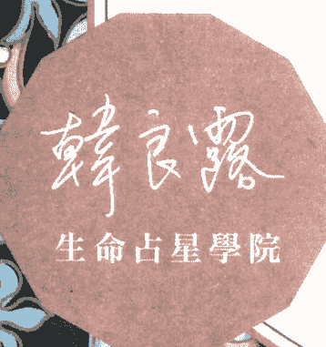
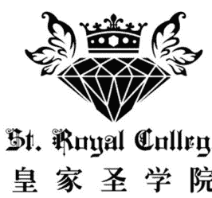
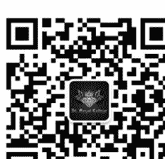
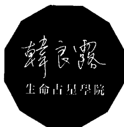

# 靈魂之旅的命運行程表

# 生命歷程
全占星

# ——全新增訂版——

# Better Life with Transit

# 韓良露 著

生命劇本的開啟與關閉都有定時，為好運及壞運提前做準備，跟隨宇宙脈動過好一輩子。

# 制作说明：

本書由皇家聖學院出重金從台灣購入的原版書籍掃描製作完成。為達到最好閱讀效果，特地把原版書全部切開後，再經由專業掃描設備高精度掃描完成，並經過一張張的PS後期處理最終成書，其中間花費大量的人力、物力以及時間，只为能给大家提供經濟並優質的神秘學學習資料而努力。

本學院強烈譴責某些機構和個人，把本學院花心血製作完成的電子書籍，包裝後直接放在自家淘寶網上低價傾銷的行為，以謀取不勞而獲的經濟利益。如果長此以往最終將無人願意再為大家花心思製作電子書，那以後可能大家再無新書可讀。

為讓大家以後能夠讀到更多的好書，也為了本學院的良性發展。本學院懇請大家盡量做到如下幾點：

+ 一、盡量在本學院的網站購買電子書籍。
+ 二、請勿用技術手段把電子書內的水印及加密去掉。
+ 三、在收到電子書後小範圍傳閱即可，千万不要公開傳播，更別掛到淘寶網上低價銷售。

同時為答謝廣大支持者，學院電子書將做如下調整：

+ 一、學院會把一些早已收回製作成本的電子書折價銷售。
+ 二、最新製作的電子書籍會開放打印功能，大家購買後有條件的可自行打印成書。

皇家聖學院
2017 年 1 月

# St. Royal College
皇家聖學院

+ ※ 专业占卜预测机构
+ ※ 神秘学培训机构
+ ※ 水晶能量研究中心
+ ※ 官方淘宝 : http://strc.taobao.com
+ ※ 官方微博 : @皇家聖學院
+ ※ 新書發佈QQ群 : 316790219
+ ※ 購買更多好書請聯繫院長大天使

大天使
皇家聖學院 院長
QQ : 715104687
手機/微信 : 13641926204

微信公眾平台：strc2011

# Better Life with Transit
靈魂之旅的命運行程表
生命歷程
全占星
——全新增訂版——
韓良露 著

獲取更多好書，請加微信：13641926204 或 QQ:715104687

獲取更多好書，請加微信：13641926204 或 QQ:715104687

# 出版緣起

興趣廣泛、身份多元的知名文化人韓良露，除了大家熟知的作家、媒體人及文化推動者身份之外，她也是藝文圈中最受重視的占星學大師。

二〇〇三年起她在金石堂金石書院（現龍顏講堂）開設占星課程，由於口耳相傳、好評不斷，課程一直持續到二〇一〇年才劃下休止符。在長達八年的四百多堂課中，她以歷史、哲學、心理學、社會學的角度，將占星的深層智慧化為生動的教學內容，讓大家在學習與命運對話的同時，獲得看待人生的更高視野。

這一系列課程不但架構了宇宙法則的邏輯，也融入她對人性與社會的觀察，但因資料整理工程浩大，成書計劃一直未能完成，為避免這些珍貴課程內容成為絕響，南瓜國際透過多年來數量龐大的上課錄音及相關資料，依據當時課程的規劃邏輯，整理成為系列書籍，期望能藉由文字重現精彩、動人且充滿智慧的上課盛況。

獲取更多好書，請加微信：13641926204 或 QQ:715104687

獲取更多好書，請加微信：13641926204 或 QQ:715104687

# 自序

# 追憶生命歷程中一段美好的生命回顧

一九九四年的冬天，當木星在我的誕生星圖循環了三次時，我送了自己一個非常別致的生日禮物。我從倫敦飛到布達佩斯，在當地一間附有溫泉浴池的老旅館中，租下了為期一個月的客房。當時，東歐熱還沒從布拉格蔓延到布達佩斯，加上深冬白雪遍地，旅館中客人稀少，除了零星的只待三兩天的觀光客外，長期居住的旅客只有我和當時正在當地辦第一份英文報的美國年輕人。那些美國人忙進忙出，而我則是深居簡出，除了清晨在旅館外的山坡上散步，再不然黃昏時分到旅館著名的羅馬式溫泉浴池游泳外，大部分的時間我都待在客房內，只不時隔著房內的輕紗眺望著眼前濃霧深鎖的多瑙河。

總有那麼一大本筆記本，一個美國男孩忍不住好奇，終於問我究竟在布達佩斯做什麼？問我為何手上我隨便應付的回答了他，說我正在寫一個劇本，其實這並不是真正的答案。就在那一年，我剛決定暫時不再寫劇本了，那一年的春天，我用筆名投稿只寫了四天的電影劇本，剛得了三十萬元的獎金，而我用本名投稿，寫了三個禮拜的劇本卻落選了。這個結果並不出我意外，但仍然讓我很失望，因為早在決定要寄出稿件時，我就知道自己比較喜歡，也曾好好寫的劇本一定會曲高和寡，我在決定一睹的同時，又在四天內趕寫了另一個較商業性但投大眾口味的本子。結果是我猜對了。但我真希望我猜錯。

這個寫劇本的兩難困擾，一直存在於我寫了一百多齣電視劇本的過程中。而當時，我多半選擇妥協及通俗，同樣的，這個困境也存在於我目前的占星學寫作之中，我卻選擇了另一條路。其實我身邊不乏好心勸告我的朋友、工作夥伴以及出版社老闆，大家都說，為什麼偏偏要寫又辛苦又只能賣幾千本的高深的全占星書系，而不學某些人寫那種可以賣好幾萬本的通俗星座書，對啊！為什麼在整個社會都充滿著急功近利的風氣時，還甘心做傻子呢？

這個答案，就深藏在九四那個冬天的記憶中，也藏在當時我並未好好回答的那個問題中。我究竟在布達佩斯做什麼？我該如何回答對方，說我在重新活出我的過去。整整一個月，我寫下了記憶中能憶及的點點滴滴生命事件及感想，我的活頁筆記本堆滿了旅館的書桌，然後再根據天文曆，一年一年、一月一月、一日一日的查閱我過去的生命歷程，在這個生命回顧的過程中，我發現自己不僅親身體驗了占星學的理論，還因為一些理論的引導，就彷彿出現了一個記憶的天使，拋出了神祕的絲線，帶著我更深入記憶的迷宮之中。我的記憶之門一扇又一扇的打開了，許多深層記憶的浮現，都令我自己不敢相信我竟然還記得那一切，而那些記憶是如此的鮮活，充滿了生命力。

有好多次，記憶就像奇妙的光一樣包圍著我，讓我感動得掉淚。許多的悲歡、幸與不幸的記憶，就在這種「用心真正記起」的過程中浮現。記憶釋放了自己的精靈，精靈帶著我一遍又一遍的「重新活在過去」之中，我的過去不再只是那些用遺忘、模糊、零星的記憶編織而成的生命之網，侷限在失落的線形時間中，我的過去在記憶中復活了，記憶成為我的時空隧道，我終於體驗到了不少神秘家所言的「與時空合一」的超越經驗。

就在這樣的經驗中，我親身體會了占星學奧祕無比的價值，也決定在未來盡一己所能的傳達我所了解的「占星術與占星道」，但也許世間充滿了太多喧囂的噪音與雜音，有時人們就聽不到天籟了，甚至也忘了有天籟的存在。我希望我的占星學寫作，至少能讓那些買我的書的讀者，能和我一起分享我從占星學中聽到的天籟。

而當讀者拿到了這本書，我相信大多數的人可能都會急著從書中查閱未來的索引，就如同找算命師般的問著：「以後呢？以後會怎樣？」人們總習慣向算命師「購買未來」，或向心理分析師「出售過去」（雖然兩者都一樣要付費），我既然寫作了本書，當然不可能阻止讀者要從書中購買未來，但我有責任提醒讀者，預測未來是非常困難的工作，尤其占星學就像所有的知識系統一樣，充滿了象徵及隱喻，基本上都是讓人類建立更多的參考座標，藉此了解複雜奧祕的人生。因此，本書中所有生命歷程的諸多面貌，都是模擬的生命地圖，就像地圖不等於大地一樣，也希望讀者不要把書中所有「可能的指涉」都當成一定演出的生命事件。

星辰的星座、相位、運行，本來都只是宇宙能量而已，這些能量和人們自身的能量相互作用，才演出人類的無意識、意識以及行動。其實，在人們一生之中演出的生命事件，都只佔我們能量中非常微小的部分，大部分時候我們的能量都是消耗於不曾在物質世界演出的生命事件，而是在於自覺生命意圖。不管是為了靈修或造化命運，都要從淨心念——也就是淨化生命意圖著手。因此，本書的重點就在於描繪生命意圖如何組成了我們的人生之旅，這個旅程中的時間三位一體是同時並存的，占星學的「生命回顧」像羅馬的門神一樣，可以同時看著過去、現在與未來。當我們在記憶中淨化了過去，我們同時淨化了我們的現在與未來，而我們現在或未來昇華的心念與行動，也可以洗滌我們的過去，歡迎你們也走上這樣的生命回顧，讓意識、潛意識、無意識的記憶之門，在占星學的「芝麻開門」咒語聲中打開，而更真實、完整、永恆的生命，正在門後迎接著你們。

# 註

本文為一九九九年版原序。

獲取更多好書，請加微信：13641926204 或 QQ:715104687

# PART 1
帶著占星學走上
生命之旅

獲取更多好書，請加微信：13641926204 或 QQ:715104687

# Chapter 1

# 了解生命歷程

每一個人的生命之旅，都有起站和終站；以人類有限的肉身而言，起點就是我們呱呱落地誕生於人世之時，而終站自然是我們嚥下最後一口氣息告別人間之際，至於是否有前世或來生，則是屬於靈魂的課題，我們有限的肉身只有一個形貌、一段生命的旅程。

在生命的旅程中，我們展開豐富的人生，我們用許多不同的時期來區分這些旅程，譬如說，我們有嬰兒期、學前教育期、兒童期、少年期、青年期、成年期、中年期、壯年期、老年期等等。有時，我們依據重大的生命事件來分隔我們的生命史，例如誕生、襁褓、發育、求學、就業、結婚、生產、疾病、死亡等等。有時，我們用詩意的名詞來描繪人生的變遷，例如用四季春夏秋冬來比喻個人生命的更替。有時，我們也用心理的感受去解釋人生的起伏，例如徬徨少年時、寂寞的十七歲、苦澀的青春、危機重重的中年等等，替人生不同的歷程下標籤，一直是哲學家、社會學家、心理學家、作家等等熱衷的遊戲，目的都是想替人們在生命之間奇妙的存在訂下一些規範、認同和說明。儒學的孔子曾充滿指導意義的說人生應當三十而立、四十而不惑、五十而知天命、六十而耳順、七十從心所欲而不踰矩。寫作《新中年主張》的希伊女士則提出對待中年的新態度，她主張在過了試探的二十、動亂的三十後，應當邁向繁榮的四十、閃耀的五十、和諧的六十。

這些形形色色、名稱不一的生命歷程區分法，自然都有不同的深意，值得人們沈思及體悟，從中領悟生命變遷的真諦。不過，以上這些生命之旅，描繪的都是人們的集體命運，都是從生物演進及社會變遷的角度，去觀看人們普遍的生命史。人類越進化，就代表了人類的獨特性越受到重視，然而，和人們的基因差別只有百分之二不到的黑猩猩，牠們共通的覓食、交配、群居等等的生活習慣，大多還是關心猩猩這個物種的集體命運，牠們共通的覓食、交配、群居等等的生活習慣，很少黑猩猩有個人的生命史。

但身為人類的我們是不同的，我們每個人都有自己的生命史，其中包括了我們無數的經驗、情感、思想、活動。人類中的偉人、名人或不凡的人，人們會記得他們的生命史，其中包含了我們無數的經驗、情感、思想、活動。

多知道他們一點、多記得一些他們的事蹟，因此名人事蹟報導、自傳或傳記都成了我們保存生命歷程的方式。而芸芸眾生也會靠著告訴別人自己的故事或者是自己回味往事來留住生命的變遷。

但是，人們其實也是非常健忘的物種，大部分時候，人們都受制於物種的慣性限制，從事許多為生存而生存的活動，只有偶爾意識的靈光閃動，才懂得緬懷過去、活在當下及思索未來。而這種能將過去、現在、未來聯結在時空定點的抽象能力，卻也是大多數物種欠缺的智力。但是，大腦科學家們也發現，人們在使用天賦大腦的能力時，其實多半也只用了不到百分之十。我們在六百萬年的進化史中，和其他物種的區分，也不過就是學會了多用這百分之十的能力。心理學家也常比喻人們的意識和潛意識的活動就像海底冰山一樣，露出水面的不到百分之十，人們的意識活動中，還有百分之九十的潛意識活動為人們所忽視。

進化就是不斷的探索、發現未知，在今日的科學界，人們的進化正以不同的腳步在加速奔跑。西元二〇〇五年時，生物基因學家將揭露人類三十億個生命基因密碼的天書，而宇宙學者也透過黑洞、超新星、宇宙大爆炸的研究在探測宇宙生命起源的奧祕，而地球科學家對大陸板塊移動、火山、地震、氣候變遷的研究，不僅解釋了人類這個物種的生命延續，也提出了對未來物種滅絕的警訊。在這些科學的進步鼓聲中，人類對神祕學的研究也正加緊步伐，以趕上人類進化的旅程。

每一個占星學家都知道，每一個人都獨特的生命藍圖中。生物基因學家用的化學密碼 ATCG 寫下這個生命藍圖，而占星學家用的是行星密碼，在每一個人誕生之際，根據『準確』的出生時間（以當地時間換算成格林威治時間再換成恆星時間），再加上『準確』的地理經緯度，我們每一個人都可以計算出這樣一張生命藍圖，亦即人類的『誕生星圖』。人類的星圖依照電腦的排列，機率數是 559,370,750 X 10^9。這個數字是天文數字，超越目前地球人口的總數，也就是說，當提供的資料夠精確時，如：經緯度分毫不差，出生時差分秒不差（或至少低於四分鐘誤差），我們每一個人都可能得到的誕生星圖都是獨一無二的。

從這個誕生星圖，我們可以藉此研究當事人的各種構造，性格占星學家研究星圖顯示的心理構造，醫學占星學家研究星圖顯示的生理構造，就像生物 DNA 解釋人類的身心構造，占星星圖也有自己的 DNA，用來解釋人類生命的劇本。

但是，誕生星圖的生命劇本複雜而眾多，有著不同的角色、情節、場景等著演出，就像人類的基因藍圖一樣，有不同的定時鎖等著開啟密碼，該生成眼睛的基因不會生成腳，病變的壞基因也總有自己的行程表，生物科學家迄今還不能解開基因關閉、休息、運作的指令是怎麼運作，然而隸屬於神祕生命科學的占星學，卻早發現一套開啟不同生命劇本的指令密碼。

這套指令密碼即存在於宇宙運行不斷的大星圖中，從人們誕生時定下了個人的小星圖後，天上的星辰依舊運行不已，因此天上的『宇宙大星圖』便不斷和地上的『個人小星圖』發生了各種的共鳴，這些共鳴產生了不同的指令，開啟了生命劇本中不同的情節與場景，產生了各種世界的變遷。按照中國人的說法，個人小星圖就是『命』，而宇宙大星圖的影響即是『運』，只有命加上運，才成為完整的個人命運。

目前個人小星圖所使用的行星符號，是以我們存在的太陽系中的太陽、月亮、水星、金星、火星、木星、土星、天王星、海王星、冥王星等為主要參考符碼，所有的星辰符號都提供了不同的隱喻。也有的占星學家喜歡參考四大大小行星（穀神星、智神星、婚神星及灶神星）及凱龍小行星。至於阿拉伯、印度、中國的占星學家，對於太陽系之外的其他恆星，如天狼星、織女星、角宿、心宿、昴宿等等恆星占星學一向熱衷。而這些恆星除了古老的意義之外，尚有待更多占星學家更深入研究。

我們不可忘記，宇宙浩瀚無垠，宇宙的星圖變化無窮，以人類有限的腦力去追求無限的智慧，自然有其限制，因此人類選擇的宇宙星圖自然是有限的。目前占星學家參考的宇宙星圖多以太陽系的十大星體為主，偶爾加上被當代某些占星學者喻為失落的兩大星體，即介於火星於木星之間的四大小行星，與介於土星與天王星之間的凱龍小行星。雖然有些占星學家認為地球上不凡的大人物必然受某些恆星獨特的影響，但其他恆星運行法則，多半還是運用在探討宇宙占星學或社會占星學等較大的生命事件，較不常用在個人占星學中。

然而宇宙星圖是以什麼樣的方式影響個人星圖呢？占星學家常用的方式有兩種。第一種即推進法（progression），即根據星辰週期性的走過黃道帶（zodiac）時和個人誕生星圖中的行星產生的相位，再加上進入誕生星圖中的不同宮位時帶來的影響，行星的週期位置可從天文曆中查出。這種推進法可看出重大的生命歷程，週期快（如木星、土星）的行星影響的時效較短，週期慢（如天王星、海王星、冥王星）則影響久遠。由於推進法須搭配宇宙運行的星圖觀看，因此當個人星圖準確時，預測的重大事件有時亦能準確至某年某月某天，彷彿生命中藏有一個計時器。再加上推進法以真實的行星、衛星、小行星或恆星運行為本，因此事件的發生與流轉，心理的變遷與起伏都會有較詳細的日程表，因此是被當代占星學家較喜愛、也較常用的方法。

另一種方法是移位法（progressions），這個方法尤其適合判斷中國人所說的大運，即個人生命的大致趨勢，但不適宜判斷、預測特定事件發生的時間。移位的方法很多，占星學家大多採用的是「一天代表一年」的方法，即在「出生後一天」行星的位置代表「出生後一年」的各種情況。

在行星移位法中最受到重視的是月亮的移位，因為月亮的遷移速度快，因此產生的變化也較多。由於「移位法」用的是象徵的方法，以一天代表一年，或一度代表一月等等，因此雖然可以預測出某些重大的變遷，卻不容易看出變遷前後的行星日程表，以及和其他行星交錯產生的多重影響，因此並不為當代較重視個體自覺的占星學家所重用。

而推進法和移位法的不同運用，也正顯現出東西方占星學派別的不同價值系統，東方占星學（以阿拉伯、印度、中國為主），迄今對十八世紀之後才發現的天王星、海王星、冥王星的研究較少，也較不重視，因此東方占星學強調的生命歷程多半是冰山暴露於外的部分，譬如可預測當事人的婚姻危機，但卻無法說明這個危機在看不見的冰山部分下的活動。也因此，占星學家只能強調趨吉避凶的現世治標，卻無法做到了解生命順逆的精神治本。

近代西方占星學，在結合了心理學、哲學、神話學、社會學、物理學、生物學等等生命學科之後，強調占星學的價值並不只在於給現世明牌的生存法則，而是藉著占星學，進入中國哲人所說的「明心見性」，與西方哲人所說「了解自我」的精神殿堂。只有徹底了解自我，了解宇宙生命力的作用，人類才有可能進入更改生命方程式的玄奧殿堂，也才有可能真正掌握自己的命與運。

获取更多好书，请加微信：13641926204 或 QQ:715104687

## 介紹占星推進法

藉著占星學了解自己的生命歷程，需要以下的工具：首先要按照自己出生的時間（誤差在四分鐘內最好，否則不要超過十五分鐘，如超過十五分鐘以上，必須請專業占星師校正出生時間），再加上出生地點的經緯度，運用電腦占星軟體製作出一張自己的誕生星圖（nasc chart）。

有了這張星圖外，接著就需要另一項工具──即一份天文曆。目前國內外均有販賣長達一百年期間的天文曆，如果不想買，也可以上電腦網路尋找下載免費的天文曆。

手邊有了星圖及天文曆後，對於沒經驗的讀者，最好先從過去的經驗著手，譬如根據自己生命中的大事，也許是結婚、生產、失戀、喪親、升遷、中獎、深造、意外等等，找出這些事件發生的年分及月分，並從天文曆中去找出當時天上星辰的位置，再根據那時的天象，看看當時事件發展的星辰和自己的本命星圖的星辰，彼此之間形成了相位關聯。譬如說有人在行運土星推進個人本命星圖的金星形成了一百八十度對相時，結束了長達四年的感情，有人在行運土星和本命星圖的冥王星形成一百二十度和諧相時，突然升遷獲得一份重要的職位。有的人會在行運土星和本命星宮位為七宮時成婚，也有人在行運土星進入六宮並和本命十二宮的海王星成對相時健康惡化。

由於行星運動的法則很清晰，因此只要個人的出生資料大抵正確，由行星推進的相位來判斷，通常準確性較高，時間也可以很準確。好的占星師可以估算出重要事件發生的年月日，絕不會像一般江湖術士一樣，要不然是明年或後年，要不然大後年。這類的胡謅。但由於大部分的出生資料（尤其是時間）都不是太精確（現代的小孩好多了，大多有出生證明書，而不是丑時、午時之類高達兩小時的誤差），因此大部分中國人的本命星圖的宮位度數都很難達成精確。行星在推進宮位時，除非有相位輔助，否則時間推斷上的誤差也就大多了。譬如說土星在一宮內的時間大約兩年半，因此，如果宮位度數不確定，是會發生推斷時不得不說出「明年，要不然後年」這種模稜兩可的話。

推進法是當今占星學界運用得較廣泛的方法，尤其是運用在行動較慢（如木星、土星，以及天、海、冥三星）的行星時，可以預測到事件起伏轉折的變化。但對於行動速度較快的星辰，如太陽、月亮、水星、金星、火星時，正確的相位有時只發生在幾小時、幾天之內，發生的事件通常影響不大。也許是在家宴客、發表演講、收到禮品、添置衣物、和人吵架、身體略有不適等。

## 為什麼是外行星的推進

在本書中，生命歷程的寫作即根據木星、土星、天王星、海王星、冥王星的推進，和本命星圖中的太陽、月亮、水星、金星、火星、木星、土星、天王星、海王星、冥王星的推進，和本命星宮位為主。至於為什麼只選擇外行星（木、土、天、海、冥）的推進，而不包括內行星所形成的相位及月、水、金、火）？原因有二，第一點當然是如果內外行星的推進都探討，這本書一定會厚到令書商、讀者都害怕。第二個原因，也是更重要的原因，即是內行星的推進與外行星的推進，基本上是屬於兩本書的概念。

內行星的推進很快，像太陽、月亮的推進所形成的相位、宮位變化，常常只有一天或幾天的影響。等，可說是日常生活小事。其實這些事並不需要去預測，反正過日子自然天天有事，如果是較大的事，如大病、中大獎、大意外、大好事，絕對會和離地球較遠的外行星（從木星到冥王星）有關係。

「行星對地球的作用是和距離成反比的，越遠的行星力量越大」，這點要切記，絕對不要誤聽某些占星專家所云，天、海、冥三星只管世代不管個人的謬見。

## 關於推進的相位

我一直認為，占星學是人類知識系統中一個阿拉丁的寶藏，但有些人根本不相信世上存有這樣的寶藏，有些人則只站在寶藏門外，想買一些帶出來的寶物，有些人進門之後只知道隨便挑一些可以出去賣錢的寶物，很少人知道其實寶藏深邃無比，需要好好挖寶，而寶物的珍貴不在於佔有了幾件，而在於是否真正了解了寶物的力量。

從外行星的推進去了解生命的歷程，就是阿拉丁寶藏中的一個寶物，千萬不要只抱著『算命』的態度面對人生之旅，而要抱著『活命』的態度體驗生命歷程，『活出最完整的身心靈的生命』，才是占星學真正可貴的寶物。

談外行星的推進時，最重要的觀察點即外行星推進的『動』和本命星圖中星體的『不動』之間產生的各種變化。如果用迴旋曲來比喻，本命星圖中的不動就彷彿迴旋曲中的主旋律，外行星的動變化無窮，但絕對不能脫離主旋律，而外行星的動，則是讓主旋律不斷改變的各種變奏，外行星的推進的影響，但卻會奏出小同大異的調性，因此兩個人可能在生命歷程中遭遇到一樣的外行星的推進的影響，生命之歌，小同處即外行星的影響，大異處即本命星圖的力量。而外行星的動，雖然如天上星辰一樣動個不停，運行不已，但和本命星圖的不動之間，卻會產生一些重要的接觸點，即推進的相位。這些相位使得生命之歌有了較明顯的起承轉合的演奏。相位的重要性，可以打個比方來說，本命星圖中星體的位置就彷彿一個無線電波音樂台，具有一定的頻率；而只有天上星辰的推進和這些頻率產生了不同的開關（相位）時，人們才較聽得清楚命運的交響樂。而這些相位的變化很多，使得交響樂的演奏也變化無窮，有時是迷人的天籟，令人精神振奮，有時是喧鬧的噪音，讓人頭痛欲裂。在本書中，還是基於精簡篇幅的原則，介紹了四種最重要也最常用的相位，即合相（零度）、對相（一百八十度）、和諧相（一百二十度）、衝突相（九十度）。至於次級的相位如調和相（六十度）、掙扎相（一百五十度）、幫助相（三十度）、妨礙相（四十五度）則不在討論範圍。但讀者可以參照相似的相位，以對生命情境有番大略的了解，例如調和相、幫助相的調子類似和諧相，但力量較弱，掙扎相、妨礙相則類似衝突相，但力量則不那麼強。

一份舊的關係快維持不下去了，或一份新的關係蠢蠢欲動，當事人可能早就在心理上感知準確的九十度相位（即零度誤差）時，當事人才會真正面對離婚、分手的「生命事件」。

又比如某人在冥王星合相土星前一直想換工作，但又舉棋不定，卻在準確合相發生時，當事人卻突然被解雇了（如果土星相位不佳），或突然另謀高就離去（如土星相位不錯）。

總而言之，推進相位有兩個時期，前期是隱相期，即推進相位（合相、對相、和諧相、衝突相）尚未進入零度誤差準確相位之前的時期。二是顯相期，即已成零度準確相位之後，這時生命事件不管是行動的、意識的、無意識的必然都已發生過了。

但這兩種時期是從發生事件的觀點來看推進，但從心理流程的觀點來看的話卻有所差異。

譬如說一個人在土星合相月亮時失戀了，但往往在準確合相推進離開了三、四度（即有三、四度的球差）時，當事人的悲傷、鬱悶、沮喪（土、月合相的意義）卻越來越嚴重，這就像有人受傷時不知痛楚，但等意識從驚嚇中恢復過來時卻大痛特痛。有時還有更奇妙的事，例如在冥王星準確合相金星時，當事人的配偶有了第三者，但卻在準確對相離開一段時間後，當事人才發現而陷入情感的糾纏與嫉妒之中。可見生命地圖中的風景，不見得能讓人馬上看懂，但研究靈學的人都知道，人們的靈魂其實永遠在觀照一切，但靈魂和意識知覺的通路卻常常斷了線。

除了相位開關的時機之外，外行星的相位有一個十分神祕有趣又奇怪的現象，即外行星會在不同的星座及度數徘徊前進、後退，再前進、後退，再前進、後退（即『逆行作用』，retrograde），往往會在同一度數出現停留三次。這種重複三次但不超過三次的現象，最恰當的比喻就是中國人所謂的『好事連三』、『壞事連三壞』及『事不過三』。這些家喻戶曉的俗話其實和外行星運動的法則有著奧祕的關聯。而這些外行星的逆行現象反映了天象中規則中的不規則，也可以說是秩序中的混亂。而基本上，行星的逆行使得生命歷程中出現了許多變數，這絕不是用簡單的天干、地支及六十甲子可以完全掌握的。

因此，研究西方占星學者，絕不可離開天文曆，也就是說不可不根據天上星辰真正的運動去理解天理人事的法則。至於外行星推進的三次相位有什麼不同的意義呢？這不是個容易簡單回答的問題，但大體來說，這三次的變化有點像古典戲劇的開始、中間、結束（前奏、高潮、尾聲）。

## 宇宙力量的奧祕，為什麼要讓有的事連三呢？或為什麼偏偏發生於某些人的生命歷程中呢？

在根據相位了解生命歷程時，除了分別查看本書提到的各種外行星的合相、對相、和諧相、衝突相之外，也不可忽略了這個相位除了有單獨的意義之外，彼此之間還有律動的相關性。就像一本書中的每一章節是獨立的，但章節之間卻有互通及起承轉合的關係，很少書是能夠把章節輕易前後調動，而這些獨立的章節聯貫起來才是完整的生命之書。

相位的次序律動也一樣，合相（零度）之後一定先跟著幫助相（三十度）、妨礙相（四十五度）、調和相（六十度）、衝突相（九十度）、和諧相（一百二十度）、掙扎相（一百五十度）、對相（一百八十度）。每一個律動的變化，都是生命力的舞蹈，提供了不同的機會、危機、轉機，而這些力量之間是息息相關的，每一個環節的妥善運用，都會影響到下一環節的反應，我們也可以說這些相位的力量是完全互動的。除了相位的互動外，不要忘了木、土、天、海、冥這五個外行星也自有獨具一格的相位律動，因此外行星之間也互相影響著。

查看占星食譜書去了解生命歷程是笨方法，但就像用食譜學做菜一樣，它是初學者的必經之路，但就像做菜的生手常常一面看書，卻手忙腳亂忘了加東加西，或先後次序、調味、火候不對等等，占星初學者也容易在查書時無法綜合領會，尤其最弄不清推進相位和本命星圖中相位之間的交互作用力，這些學習及領悟都是需要時間的。但最重要的精神是要有正確的態度，絕不要輕言判斷，而且要明白好的占星學家的占星判斷只是一「犯較少錯的人」，而不是絕不犯錯的人。因為占星學是一個開放的知識系統，永遠有更精準的方法、技術、知識等著開發，宿命到底有沒有定數，其實人類迄今根本還不能回答這個問題，因為光是有限的天數，人類真正完全明白的也不多，在這種情況下，當然不能談定數。天數奧祕、變數無窮，在有限之數中了解天數，目的不在控制命運，而在提昇、進化命運。

## 推進的宮位

除了相位外，外行星推進本命星圖的宮位也是了解生命歷程的重要方法，相位顯示的生命歷程，比較像是生命歷程中會發生哪一些「情節」，而宮位則像是生命歷程中出現的「情境」。

如果拿羅密歐與茱麗葉的故事為例，兩位當事人一定有重要的行星歷程中出現的「情境」。但若要了解一見鍾情的性質，則要看外行星和推進本命星圖的相位，例如羅密歐原本情有所鍾，但一見到茱麗葉卻馬上忘了舊愛，而狂戀上茱麗葉，因此可推斷羅密歐必有天王星與金星的相位（合相可能性最大）。至於茱麗葉愛上羅密歐的同時，又飽受家庭已訂親的困擾，因此想必有冥王星與金星的衝突相位，羅密歐代表了激情，但父母親及未婚夫卻代表了世俗對權力財富的執著。

外行星的宮位，除了顯現一般性的生命情境，也可以顯現特殊的 生命情境。例如木星每一年約走一宮，因此形成約十二宮的循環，凡人年過七、八十，至少會經過六、七次的木星循環，體驗不同生命情境的變遷，而土星約兩年半走一宮，三十年走完十二宮，因此體會兩次土星循環的人也常見，三次則較少見，土星入不同宮位而產生重要情境的次數也不多。例如土星進六宮，常是健康出現重大警訊之時，但除非一個人本命六宮十分不利，否則一般人因為行運土星進六宮而生大病的機會並不多。

至於天王星每七年推進一宮，也只有長壽的凡人才可能走完一圈（八十四歲），即使同樣的宮位，不同年齡遇到天王星推進宮位的意義也自然不同，例如在幼年時天王星進四宮，則常常和事業、婚姻帶來的心出意外、家庭生活不穩定、居無定所，但在中年時天王星進四宮，常常是父母理危機有關。

海王星每十二年推進一宮，一般人通常只能經驗到六、七宮的變化，這就有很大的不同了。例如有人從出生後海王星一路從一宮走到七宮，這樣的人生命情境的重點多是較個人的活動，和一個從六宮走到十二宮，以社會化活動為主的人自然大有不同。

至於冥王星在每一宮的時間長達十七年至二十多年，想想如果人在中年，一個人十幾二十年的時間冥王星都在七宮（伴侶宮），另一個人十幾二十年冥王星都在十宮（事業宮），兩者之間會有多麼大的生命情境的差異？

因此，想要了解生命歷程，要有全貌的看法，最好是由遠而近，由長到短，先看影響力最大、時效最久的冥王星推進的宮位，再看冥王星和本命星圖形成的相位，然後再綜合看這些不同的外行星所發生的互動。例如當天王星、海王星、土星、木星的宮位及相位，再看海王星的宮位及相位，接著再依序看天王星、海王星、土星、木星的宮位及相位，然後再綜合看這些不同的外行星所發生的互動。

## 如何計算推進的相位與宮位

首先，當事人必須先把自己誕生星圖上星體的星座符號及度數寫在一張空白的紙上，按照太陽、月亮、水星、金星等等次序排列，然後在天文曆上查閱某一段時間。例如有人想知道自己在一九九九年十月間的狀況，或想回顧自己在一九八四年六月的處境，則分別在另一張白紙上寫下這兩個日期（可選定特定的日子）的星體位置，由於本書推進為外行星，因此只要寫下木星、土星、天王星、海王星、冥王星所落的星座符號及度數即可，接著就比較兩張紙，分別就每一個天文曆上查出的運動中的外行星資料來和自己誕生星圖上的固定星體做一一的推進，看看推進中的木星和本命固定的太陽、月亮、水星……木、土、天、海、冥是否形成了什麼樣的相位及宮位，並記下重要的相位和宮位，如合相（零度）、對相（一百八十度）、和諧相（一百二十度）、衝突相（九十度），然後再陸續的查看其他行進中的外行星，如木、土、天、海、冥，並用同樣的方法記下這些推進外行星和本命星圖上固定星體的相位及宮位。

有的時候，自己心目中特定的日期未必有許多重要的相位，當事人還可以用另一種方法，即隨意翻閱天文曆，在其中搜索特別重要的日子，這種方法就要先詳記自己誕生星圖上的星體位置，如果特別關心情感的發展，則查看誕生星圖上的月亮、金星會形成合相、對相、和諧相、衝相的星座位置是多少度，再根據這些資料在天文曆上找出相同的木、土、天、海、冥的位置。依此方法，就不難一一按照自己誕生星圖上各個星體的性質（如太陽和個人表現、事業特別有關，水星和學習、教育、溝通、傳播有關，火星是行動力、生命力的表徵，木星是樂觀、適度的力量，土星是踏實、限制的力量……等等），找出對它們形成影響的日子。

還有另一種方法，即不心存任何特定的想法，而隨意翻閱本書，看看書中哪些部分的說明是自己特別感興趣的情節（相位）或情境（宮位），然後再根據那個處境的條件（如某某星體和某某外行星成某某相位，或某某外行星進入某宮），分別去查閱自己誕生星圖及天文曆中星體的位置，自然就可以找到那個特別的時刻，也許是在遙遠的未來，而你則可用虛擬時空的方式，在此刻編織你深埋心底的記憶再度浮現，也許是某個遙遠的未來，而因為占星資料的引導，使一段未來的虛擬實境。

除了這三種方法外，還有其他許多不同的方法可使用本書，讀者可以自行發展自己喜歡的方式。除了科幻小說可以讓人們在時空隧道中旅行外，靠著占星學的推進法，我們也可經驗時間和空間的虛擬之旅。

获取更多好书，请加微信：13641926204 或 QQ:715104687

# 詮釋推進相位及宮位的原則

詮釋推進相位及宮位時，要注意幾個重點，一是相位的關鍵意義，二是宮位的關鍵意義，三是星辰、相位、宮位所在的星座的差異。除了第四個因過分繁複（光是本書全部的篇幅都不足以寫完第四點），不在本書的探討範圍之外，其餘三點先在此加以說明。

談到相位的關鍵意義，在第二章中，我們已提過本書因為篇幅所限，不得已只能選擇四個主要相位。至於次級相位的意義，只有等待來日出版市場上能包容更深入的占星學研究，在目前，讀者只能根據次要相位和主要相位的相關性，如六十度調和相和一百二十度和諧相有互通之處，或四十五度妨礙相和九十度衝突相有相應之理等等。

本書中談到的四個主要相位，關鍵意義如下：

## 合相（零度）：在推進時，這是力量最強的相位，可帶出兩個相遇星體本身的能量，並混合了兩個星體所落星座的交互反應。合相的力量可正可負，必須仔細觀察合相在本命星圖中的相位，而當事人自身靈性發展的影響力也必須加以考慮。

## 對相（一百八十度）：在推進時，合相是合作，而對相是兩個星體力量的武力競爭，但對相的競爭並不到真正相互攻擊、你死我亡的局面，而是停留在雙方加緊軍備、誰都要拔得頭籌。由於對相會加強兩個星體分別的力量，有時比合相力量更強，但由於雙方的目標並不一致，因此常使當事人成為雙頭馬車往不同方向跑。

## 和諧相（一百二十度）：推進的力量略次於合相及對相，主要是因為這個相位使兩個星體的能量很容易融合，因此不易被強烈感覺到。就像幸福是難以描繪的感受，但痛苦卻很容易表達。

## 衝突相（九十度）：推進的衝突相和對相最不同之處，是交戰雙方已經進入了短兵相接而形成的緊張、衝突、焦慮也最高。這是生命歷程中最難熬的時刻，如果能從衝突相的星體之中找出任何與之成和諧相或調和相（六十度）或幫助相（三十度）的星體，則可加強吉相的星體的能量，將有助於改善衝突相。

在宮位的關鍵意義部分，在本書第二部中屬於食譜書（cook book）的內文中附有十二宮關鍵意義簡略說明。十二宮的生命之旅，不僅包含了個人一生身心的活動，也包涵了靈魂的進展，初學占星學的讀者，至少要先弄懂十二宮基本的意義。除了基本意義外，十二宮之間亦有相當奇妙的起承轉合關係，每一宮的設計及下一宮的關係都藏有深意。

簡單來說，一宮至六宮是和個人較有關的領域，從一宮的自我（外表、氣質、形象），二宮的自我價值及擁有物，三宮代表和近親、環境的互動，四宮顯示我的家庭、父母，五宮代表我的創造力及創造品（如小孩），六宮代表我對自己的責任（如健康、工作養活自己等等）。

從七宮開始，個人退居幕後，他人、社會、外在活動登場，七宮是伴侶、合夥人之宮，八宮由他人的權力、擁有物、原欲主導，九宮是哲學、宗教、異國多元文化之宮，十宮是社會之家，是大的自我活躍的舞台，十一宮是人類大家庭，是「大我」（相較於渺小的自我）和博愛精神的發源地，十二宮是自我迷失及抵除自我的無我境界。

這十二宮彼此環環相扣，最理想的生命歷程，是能夠保持在十二宮的中心點（像處在曼陀羅中央的神祕點），讓每個宮位得以平衡而客觀的發展，但坦白說，這是完全生命之旅的聖人境界，我根本沒看過任何常人能做得到，但是，這仍是一個值得提倡的理想，至少讓某些身陷某些宮位而不能自拔的人有所警惕。

在實際研究他人星圖的經驗中，我發現有些人幾乎每一宮都問題重重，有些人有些宮處理得不錯，有些宮則一塌糊塗。一般而言，過分發展的某一宮，必導致對宮的陷落。如果一個人過分重視大的自我，往往會把野心都放在十宮的事業、社會地位上，這樣一來，四宮的家庭及內心之家一定會有所失；如果一個人過分重視一宮自我，和他人協調的七宮就好不到哪裡去；如果一個人過分著重二宮自我價值及財物，就容易有無法和他人分享的八宮困難。同理，也可看出過分發展的某一宮形成衝突相宮位的困難，例如自我中心的一宮人，當然會有家庭關係的困難（四宮）及社會適應的困難（十宮），讀者可自行依此類推。

最後，在談到形成相位及宮位的星辰（恆星、衛星、內行星、外行星）的關鍵意義，在本書第二部分的占星食譜內文中也都有一些引導的說明，在此不重述，唯一要提醒讀者的是：要注意相位發生於不同的星體之間的不同意義。在本書中，我們的討論集中在行運的外行星（木、土、天、海、冥）推進時和固定不動的本命星圖上星體的相位。在行運的外行星方面，木星、土星推進時，當事人比較容易感知或猜測到是哪一類的事件、經驗或心念會被引爆。因為木、土兩星代表的能量和社會的、現實的、環境的正與負、開放與限制、空想或落實較有關。而天、海、冥則較不可預測，因為這三者的能量來自宇宙無形力量的影響，即所謂「天意不可測」。因此，當事人較容易產生被命運捉弄之感。其實當事人如果肯提昇靈性，讓靈魂與天意相通，反而較容易和自己的命運合而為一，轉而超越有形命運，以及進化無形命運。

至於行運的行星跟本命星圖中的星體形成相位，固定不動的本命星圖中的星體，本身也有兩大類的分別，當行運外行星和本命星圖中的太陽、月亮、水星、金星、火星這些代表個人意志、安全感、思考、情感、行動等的星體能量接觸時，當事人的意識比較容易感知到發生了什麼，因此也比較容易形成實際發生的生命事件，這也是一般東方占星學算命較喜歡推算的領域。因為對一些較無自覺的人而言，這類星體的能量比較現世，所以被推的人也會覺得比較準。至於行運的外行星和本命星圖中木、土、天、海、冥等外行星的相位，則激發了屬於潛意識、無意識的星體能量，木、土二星還可說和社會的集體意識有關，天、海、冥三星則完全是無意識的領域，是來自個人靈魂和宇宙靈魂的低語。對於這一部分的討論，讀者必須要先具備有相當靈性的潛能與發展，才可能看得下去，但對於想用占星學靈修的人而言，將可從此得到不少奧祕深刻的靈光見解。

# 生命歷程就是人間道場

常有人比喻，生命歷程就像人們生命的功課，每個人的功課都不同，有些人某些功課難、某些功課容易，有些人永遠遇到最難的功課，有些人少年時所遇的功課容易，中年卻難得不得了，有些人則少年功課最難。

人人的誕生星圖都不一樣，不同的本命星圖中本來就蘊含了各式各樣不同的功課，但這些生命功課都要等到行運行星推進時，才會進入真正的重點學習。行運星辰的推進就彷彿考試的鐘聲響起，催促著不同的人們進入不同的課堂去接受生命的考驗。

人生如果抱著終身學習的態度去生活，生命的功課也並不那麼可怕，但是，世界上有太多人根本不愛求學、不愛做功課，還有人想靠作弊考出好成績、騙人騙己。其實，面對生命功課，最重要的就是要誠實、對自己越不拿手的功課，就越要努力學習，千萬不要逃避。人生是修行最好的道場，困難的生命功課是考驗鍛鍊靈魂的熔爐，但很多人會藉著宗教的空想或物質生活的幻覺來逃避，根本不想真正面對。

在我研究眾多星圖的過程中，不管是對於本命星圖繁複無比的設計，或對天上行運星辰錯綜萬分的推進，都常讓我感歎不已，冥冥天數的奧祕無窮，占星學家能解答的其實都只是滄海一粟，而通常我們只能回答一部分（是什麼）的問題：例如星座的符號代表什麼，星辰的力量是什麼，相位的意義是什麼，推進的影響又是什麼。但對於回答（為什麼）卻一籌莫展——我們如何回答天上星辰為什麼採取這樣的方式運行？為什麼會有這些相位？為什麼會發生推進的影響呢？

這些為什麼的答案，並不在占星學的知識中，它們必須從占星學的實證中領悟而出，而答案也只有一個：就是「天意」。

學習占星學就是了解天意的過程，而每一個人的生命歷程都是一則天意的演出，然而對於天意的了解並非以人為奴，讓人們成為天意演出的傀儡，而是以人為主，讓人們可以獲得天人合一的超越。許多人不了解宿命的意義，以為宿命等於命定，其實在希臘人對宿命（destiny）的解釋中，早就涵蓋了宿命的意義在於方向——即destination，宿命是靈魂行進的方向。

因此，在生命歷程中，重要的不是「改變定數」，而是「超越定數」，宇宙的因果作用力的自然法則，可以拘束三度空間的身，卻不能限制心與靈，而生死法則可以關閉心，但不能囚禁靈魂，靈魂演化的道路超越了宇宙時空的牢籠。

靈魂是可以體會，但無法觸及的事物，因為靈魂不是物質，自然不屬於三度空間。通常，越有前世宿慧的靈魂，在接受生命歷程的考驗時，越能逢凶化吉，而在今生越早覺悟的靈魂，在面對此生困難的磨練時，也越能由苦生慧，累積今世的智慧。

我常比喻靈魂演化之旅就像一個下尖上圓的海螺，越高度發展的靈魂，就越有海闊天空的開放空間，可以讓命運有廣大的容身處。

高度發展的靈魂不怕生命歷程中困難的相位或宮位，因為這正是靈魂接受誘惑的試探與磨練的時候，就像煉金一樣，靈魂純金的提煉要經歷許多雜質的分化，這樣的靈魂不會計較命運的得失，不會怕人間的苦楚，因為靈魂知道昇華之路所經歷的險阻，都有純淨靈魂的功能。同理，高度發展的靈魂，也不會執著於生命歷程中有利的相位，不會陷於世俗的成就福蔭，迷失於人間的榮華富貴。這樣的靈魂知道，生命歷程中遇見的有利相位或宮位，目的並不在為個人牟利造福，而應該藉此為整體人類的福祉而努力。

然而，低度發展的靈魂走的卻是相反的路，他們遇到生命歷程中的順境時，往往忙於積聚功名利祿的同時又忙於縱情聲色男女，不僅不能福中修慧，反而在福中造業。而在生命歷程中遭逢逆境時，他們卻又怨天尤人、自甘墮落，因此無法在苦中悟道，反而更在苦中生苦，以致苦海無邊了。

在我寫作《生命歷程全占星》一書中，我一直希望傳達的就是一個訊息，生命歷程本來就是變化無窮，如果讀者在書中一看到順境就沾沾自喜，一看到逆境就唉聲歎氣，那麼還不如不要知道天意造化算了。否則心情七上八下並不好過，不如學糊塗人過日子，得意時盡歡，失意時再掉淚。如果真要看本書，那麼最好能許下一個志願，把生命歷程當成人間道場，今世的宿慧來自過去的努力，而今天的修慧卻是明日、來世的恩寵。

# PART 2
外行星推進宮位的生命情境

# Chapter/1

# 木星宮位的翅膀飛得高也摔得重

# 行運木星進本命一宮

木星象徵先知，它具有延伸、擴張的特質。木星的意義在於追尋、智慧與機會，木星的行運往往會讓當事人感到樂觀，因此常被視為吉星。

木星進入代表初生、開創的一宮，意謂著新的生命週期又展開了。通常木星在十二宮的一年，有點像重新出發前的安息年，在經過一段時間的沈潛、反省、靜思後，木星又站上了躍躍欲試的踏板，開始追尋另一次十二個生命階梯的旅程。

木星進一宮會使最悲觀的人也覺得有所興奮，尤其對本命一宮中有土星的人而言，行運木星的推進可以掃開土星的烏雲，但對於上昇人馬的人，以及本命星圖中的木星原本就落在一宮的人，或者本命一宮中有火星這類較衝動行星的人而言，木星的來到，則會有點太興奮了點，當事人要特別小心運用木星的力量，以免樂極生悲。

行運木星進一宮時，當事人常常會充滿了各種新的計畫、念頭、構想；有人或許想出國旅遊、遊學；有人想學一些從未嘗試過的語文、運動、技藝；有人可能想將一些理想付諸實現，如開一家自己喜歡的花店、咖啡店、書店、玩具店等等。有人則可能計畫將生活除舊布新一番，如重新裝潢房子，訂定健康計畫等等。

行運木星在一宮時，人們通常會有好心情的一年，由於好心情容易讓人笑得多、也吃得多，在傳統占星學上常把木星進一宮的時候，當成人們容易發福的時候，對體態很在乎的人而言，這一年的節食計畫一定特別難執行。

此外，行運木星進入一宮的時候，也是人們容易交到新朋友以及和老朋友增進友情的時候，符合了樂觀的人容易聚友的說法。

除了樂觀之外，行運木星進入一宮也會增進人的自信，讓一向有退縮、被動問題的人，在這一年，可以藉著木星的力量學習自主性。另外，木星帶來的開放，也可以讓人們學習走出自我那個狹窄的小圈子，坦然接納各種新的生活經驗。

# 行運木星進本命二宮

木星代表了膨脹與擴大的力量，因此進入了掌管價格與價值的二宮，當然會帶來價格的膨脹、價值的擴大。因此傳統占星學中常把木星進二宮的一年，當成財運好的一年。

不過，如果二宮內沒有主星，當木星進入二宮時，木星的力量會把『有的變多』，但並不會『無中生有』。因此在我研究的星圖中，發現木星進二宮時，通常會讓一些人原本的資產感覺增加，譬如：房地產、股票、貨幣、藝術品等等的原本價格增加，讓當事人覺得更『富有』了點。但是如果當事人並未處理掉這些增加的價格，也可能在木星離開二宮後，價格又下跌了，富有的感覺也消失了。

如果當事人本命星圖中原本就有一些星體位在二宮內，例如本命二宮中有太陽、月亮、水星、金星、木星、天王星、冥王星之類的星星，而這些星星本來就有好相位的話，當行運木星又跟二宮內本命星圖中的星星成吉相時，則可能帶來無中生有的財富。當事人這一年的生產、投資、營收將有較好的表現，會有一種財運當頭的感覺。但如果本命二宮內的星星原本就相位不好，當行運木星推進跟本命二宮內的星星成相位時，當事人可能被虛幻的樂觀所欺，大肆花錢、投資，反而變成破財，成了賺錢不得反失財，這是木星的雙刃鋒，不可不防。

# 行運木星進本命三宮

其實木星財來財去，如同旋轉的輪盤，財富掉在不同人的盤子內，世俗的財富有得必有失，但非世俗的財富卻可以一再獲得而不虞失去，例如知識、價值情操。木星在二宮時，當事人如果肯用心去思索、經營人生的價值，這一年將是可貴的心靈豐收期。

有的時候，人們會發現某一年自己好像特別忙，倒不見得是為賺錢忙、為工作忙、為愛人忙、為求學忙，而是好像忙著見人、見親戚、見朋友、見兄弟姊妹，許多時間都花在打電話、見面、聯絡。那一年和身邊的人的互動增加了許多，然後一年過去了，常見面的那些人又好像突然從生活中淡出了。這很有可能就是行運木星進入第三宮的人所特別有感而發的感受。

除了日常的友人活動外，行運木星進三宮，也增加了我們和周圍的環境、媒體的互動。木星進三宮時人們並不會長途旅行，但是會帶來無數的短短旅行，尤其是探訪周遭生活圈的環境。我有個朋友一向是全球旅人，一年中巴黎、倫敦、紐約、米蘭來來去去，但在行運木星進三宮的那一年，很奇怪的，他突然不愛往老遠跑，反而改成在台灣小島上的台東、墾丁、台中之間來來去去。

也有的人，在行運木星進三宮的一年，和環境緊密的互動表現在較抽象的世界──「媒體」中。其實對現代人而言，有的人對廣播、電視上的人物說的話、做的事比對自己的鄰居還清楚，媒體成了人們抽象卻更為實在的鄰居。我有個朋友，在木星進三宮的那一年做了廣播主持人，也有的人可能突然有一年很迷某個電視節目（譬如日劇的電視迷）或某廣播節目等等，把大量的時間花在和媒體的「來往」中。

行運木星進三宮，有利於某些以媒體為發表園地的寫作者，這些寫作通常不會是長篇大論的學術著作、思想鉅作或文學大作，而是輕薄短小，符合媒體特質的寫作。有的寫作人在這一年內開闢了報紙專欄，也有些人的媒體（報紙、電視、雜誌）曝光率大量增加。

行運木星進三宮的價值，是讓人們了解日常溝通的必要性與重要性，尤其對習慣九宮這種高知識象牙塔的人而言，木星進三宮卻有可能使得輕薄短小成了主流的價值，而忽略了厚、重、長、大可能是文明更不可或缺的基石。

# 行運木星進本命四宮

四宮是外在之家，也是內心之家，行運木星進四宮，反映於外的最明顯的就是購置新家。我有個朋友，買了個預售屋，建商一直拖期，但最後房子一交屋，竟然是他木星進入四宮後了，十分湊巧。有的人則是表現在裝潢舊家的行為，有個朋友在他木星進四宮時，將一棟父母留給他的老房子重新整修，變得美輪美奐。

行運木星進四宮時宜於置產，也宜於投資房地產，尤其當大環境不佳時，在木星進四宮購屋的人，常常是下一波房地產高峰的贏家。

除了外在之家外，木星進四宮時，也是人們尋求內心之家的安寧與安全之時。不管是外在或內在的家，都是人們肉體心靈停留安歇之處，木星讓外在的家增大、除舊布新，也讓內心之家增大、除舊布新。因此，木星進四宮時，人們若能好好的擴大自己的心家，容納更豐富的心靈生活空間，整修毀損的心家，讓該丟的東西丟掉、該換的東西換新，這種「心家」的煥然一新更是行運木星進四宮帶來的好意。

不管外在之家或內在之家都不能缺少家人。木星進四宮，也是和家人增加感情、重修舊好、分享善意大方的好機會。許多人在生活中忙於應付日常的活動，幾乎都喪失了和親密家人互動交流的機會。

# 行運木星進本命五宮

心的機會，在木星進四宮時，也是人們打開心門，與家人貼心的最好時機。

五宮是創造之宮，可創造之事有個人的創意及自我、藝術、戲劇、孩子、愛戀等等。木星進五宮擴大了我們對這些事物的期盼。

我有一個結婚多年的朋友，有一陣子她的婚姻陷入低潮，偶爾聽她抱怨說，想要個讓她血脈賁張的外遇。但是她一直沒外遇，卻在木星進五宮時懷孕了，她找到了新的愛人，即是那個在她身體內還沒出世的胎兒。九個月後，當行運木星仍在五宮的尾巴，她的嬰兒誕生了，喜悅不已的她說，創造出自己的孩子可比任何的戀愛更讓她覺得滿足、完全。

但不是所有的人都同意她的看法，尤其是男人。男人最多只能「擁有」孩子，但不能「創造」孩子。因此，常常在婚後，女人忙著跟懷孕、生產、嬰兒談戀愛時，也常常是她的配偶想搞個小外遇、小戀愛、心動一下的時候了。每一個新的愛人，都代表創造新戀情的可能性，雖然愛情的結束常常是老套，但愛情的開始卻永遠是新鮮有趣。

有的人並不沈迷於「戀愛中新的我」，而想要創造真正的「新我」。這樣的人在行運木星進五宮時，會覺得內心充滿驅動力，想要去改造自己，讓自己的生活更有創意，更活潑生動。有的人幸運的在此時換了一個較有創意的工作，有的人則可能開始藉著創作音樂、美術、戲劇等藝術，來滿足自己想要創新的自我。

行運木星進五宮，對所有從事創作工作的人而言，都是很有生命力的一年，當事人的創意心靈會有種甦醒之感，渴望迎向創造性的春天。

人類本來就充滿了各種未被開發的潛能，但大多數人被迫或自願選擇的日子多半是死氣沈沈，單調乏味。木星進五宮，喚醒了每個人內心當中那個內在的小孩。本來人類都有小孩的原型，好奇、熱切、興奮的看待世界，願意在新天地一展新身手。但是曾幾何時，人們綁上了自己的手腳，以適應僵化的框架，行運木星進五宮是鬆綁手腳的好機會。

創造是多元的，但自我的創造是最真實的，不管是小孩、戀愛或是所謂偉大的藝術，都只是想活出自我的自己去尋找來的替代品而已。替代品也可能只是另一種僵化的形式，因此木星進五宮時，其實人類真正要尋回的是失樂園中的原我。

## 行運木星進本命六宮

行運木星進六宮並不好玩，因為六宮通常意謂著勞動、責任、工作、承擔。木星加強、擴大了這些事，當然不好玩。但是木星有其正面的力量，不好玩的事也可能是好事。木星進六宮是一個人接受訓練的時候，目的是為了讓下個階段（七宮）──走入社會，和他人聯結時走得較為順利。

六宮和職業的關聯很深，行運木星進六宮，表現在職業上，常常跟隨著較重的工作和責任，但通常並不代表是升職、升遷（高位並不一定被賦予重任，有時可能反而是閒差）。當事人可能被交付一項重要的新工作計畫，導致工作的時間加長、責任加重。但木星是吉星，因此也意謂著當事人的工作表現會被肯定。而當事人也會從這種服務、責任的完成中得到對自我肯定的滿足感。

木星進六宮時，通常也代表一個人的健康狀況不錯，身心都適合接受重任。除非落入六宮、十二宮內的本命行星相位不佳，如果遇到行運木星進入六宮，則代表工作、責任的加重，會使當事人的健康負荷不了，因為太累而生病（通常是木星代表的肝、腎、膽、胰臟等問題）。因此當木星進六宮時，當事人應當特別留意自己本命六宮和十二宮的情況，以做好因應措施。

## 行運木星進本命七宮

七宮是婚姻、合夥人之宮，行運木星進七宮，對於猶單身獨處的人而言，這是尋覓良伴的好機會，木星會擴大人們遇到夥伴的機會。換句話說，就是緣份增多了，因此傳統占星學上常把木星進七宮，看成適婚期人們可能的佳期。

不過木星進七宮，雖然激起人們渴望找個良伴的動能，但成不成還要看本命星圖中落入七宮行星的相位好壞，以及行運木星進入七宮時和其他本命行星的相位（尤其是月亮、金星），如果兩者的相位都不佳，則也有可能是遇得良人卻結不了良緣，或遇人不淑而無法結緣，或因三心兩意而蹉跎姻緣。

行運木星進七宮，也可能帶來的是職業上的好聯盟，尤其對從事法律、出版、宗教等相關工作的人最為有利。如果七宮的相位良好，行運木星進七宮後又和其他本命行星成吉相，意謂著當事人會遇到對事業有利的貴人或協助者。同時，由於木星代表的善意、大方，也使得在工作上人與人之間一對一的溝通與共事變得更和諧，對於在職場上有人和問題困擾的人，在木星進七宮的一年，常是『人和萬事興』的一年。

此外，木星進七宮時，也可能意謂著當事人的人際來往、工作接觸和外國人的緣份增加了。

## 行運木星進本命八宮

當事人可能會常常要和外國人共事、接待外賓或與外國機構合作等等。有的時候，當事人的婚姻對象也會反映出木星的特質，因此當事人有可能是與外國人或遠方來的人結婚。

八宮是集體資源之宮，行運木星進八宮，在傳統占星學的世俗解釋中，常代表當事人會有遺產的饋贈。但這裡所謂的『遺產』並不一定只來自當事人的父母、祖父母、叔姑舅姨等等血親、姻親的贈與，也可能是來自社會集體的財富，如股票、樂透、大企業的利潤等等。總之，八宮是他人之財富，此『他人』可小可大，小至其他個人，大至整體社會、全球等等。我看過不少星圖反映出這樣的現象，有人自父母處繼承了房子金錢，有人在股票市場大有所獲，有人中了獎，有人和大公司做生意的利潤良好，有人從保險公司獲得了各類的保費等等。木星之財可大可小，有人可能繼承、中獎數萬元到數十萬元，有人則可能獲得數千萬、數億元不等。

而除了『財』之外，八宮也是他人『富』之宮，有人在木星進八宮時，獲得了前人知識之寶，有人深研人類集體文明的豐富而有所獲益，有人或許發現潛藏的古文明智慧，有人則探訪人類集體心靈的奧祕（八宮），而從其中汲取無上的心靈果實，這些也都是行運木星進八宮可能的各種現象。

## 行運木星進本命九宮

行運木星進九宮，如同鳥籠的門打開了，讓木星青鳥飛翔在開闊的天際，木星進入第九宮，最普遍的現象是當事人渴望長程旅行，而且越遠越好，越久越好。我自己就是在木星進九宮的那一年，揮別了十年的電視工作，在五大洲旅行了近一年。

長途旅行總是會到達不少遙遠的國家、遇見陌生的人群、見識不同的文化，所以行運木星進九宮也意謂著和異國文化的緣份增加。異國、異鄉、異言、異俗、異景、異情，都增廣了我們的見聞，讓我們從自己的『心田』出發，而走向更大、更多人類共享的『共田』。九宮也是學習、教育之宮，它和三宮的不同在於，三宮是基本的學習和教育，而尤以日常的見聞為主，像左鄰右舍之談、大眾輿論之說和媒體泛泛之言。九宮則是高深的學習和教育，因此是出類拔萃的知識、見解、哲學、理論。木星進九宮時，適合正式與非正式的高深教育，正式如去念個碩士、博士，非正式的則可通過各種的自修或社會大學，去學習較深的知識系統，開拓更高的潛能。

九宮也和出版、信仰、宗教有關，當木星進九宮，當事人適合出版或寫作較高水準的作品，也適合從事心靈及信仰的探索，以建構自己和較高精神能量的天梯，迎回神聖的啟蒙訊息。有的人則在木星進九宮時，和宗教結緣，以期能開拓自己精神的天地。不過，宗教只是信仰的一個形式，而非全部的形式，如果當事人所參與的宗教，並不能提供精神及信仰的開放與開拓，則將辜負木星的能量。

## 行運木星進本命十宮

在傳統占星學中，行運木星進十宮是一個人地位提高，獲得升遷、事業表現的大好時機，不見聞，讓我們從自己的『心田』出發，而走向更大、更多人類共享的『共田』。十宮也是社會表現之宮，它和權力關係密切，因此木星進十宮的成功也通常和權力的獲得有關，譬如說因升遷帶來權力的增加。對於管理階級、政客等，木星進十宮的成功最能讓他們感受到這種權力的擴展、社會地位的擢昇及他人的欽羨。但這些權力的獲得常常只是個人私權延伸到公共領域（如職場、政界），另一種形式的權力是較大的公共權力，我們可稱之為影響力，也有可能在行運木星進十宮時展現，這時當事人的成就必然不只是滿足個人的欲望與野心，而是服務、造福較多的社會大眾。

行運木星進十宮，要特別小心權力的過度使用與濫用，木星會使個人分外膨脹，以為自己意志即代表眾人的意志。許多木星進十宮的人，在個人升至高位之後，反而帶給周遭人群、社會、國家更多的禍害，這即是木星進十宮最不幸的狀況。

## 行運木星進本命十一宮

行運木星進十一宮，是廣結善緣的好機會，但這裡結的善緣，並不是想為自己找個伴，或增加工作的方便與人情的效用。十一宮的善緣出發點是大家一起共同做點事，為眾人謀福利。

因此，木星進十一宮時，人們可能和鄰居組成社區管理委員會，一起共同努力維護環境，或者加入收容流浪犬之家，照顧街頭的喪家之犬，或者組織敬老會、愛幼會，或者參與國際救援活動，為地球村的子民盡一番心力。

木星在十一宮帶來的利益是「公利」，不像行經一宮至十宮的木星利益，都多多少少和個人的財富、親人、夥伴、工作、事業、健康有關。木星進十一宮，是木星經過十個階段的豐收後，來到了「回饋」的階段。

木星進十一宮也是眾志成城的時候，做好事要大家一起來，因此木星進十一宮時不是個人單獨行善、回饋社會之時，而是加入有理想目標的團體、號召同志，大家一起為他人謀福。木星進十一宮，是深切體悟世界大同、民胞物與精神的良機。

## 行運木星進本命十二宮

由於十一宮是分享之宮，因此木星進十一宮，也是分享人類知識成果的時機，和木星進九宮的知識追求道路有所不同，九宮的知識追求較為個人，以個人的體悟尋道為重。但十一宮則偏向同盟的尋道與分享，因此像共濟會之類尋道的學會，最能代表木星進十一宮的知識追求。也因如此，在木星進十一宮時，加入某個學會或成為其中一員，以分享知識之光，將會是尋道之路美好的開始。

宗教最高的境界是『無我』，但世俗宗教很少敢以無我的精神修練吸引信眾，反而都是保證信眾『信教得我』——我的財富、名望、事業、婚姻、身體等一切平安好運。行運木星進十二宮教導的正是無我的真義，因為十二宮的最高境界是無我的昇華，而同時十二宮最險峻的溝渠亦是無明的墮落。

由於木星在十二宮顯現的力量很幽微，很多人忙於俗世活動，根本無法體會到木星在十二宮所提供的恩寵，這些人或許把生命的獲得只侷限在幾件俗世之事，常常苦於尋不到入寶山的門，當事人卻仍然入寶山而無所獲，空手而歸。但也有可能行運木星在十二宮這樣的寶山的門打開了，而歸。

行運木星進十二宮提供的寶藏只給已經靜心的人，生命之旅這時已到了一個暫時安歇之處，趕路的旅人應當停下來，在井旁找一棵大樹，在樹蔭下靠躺著，在悠悠光影蟬聲中做起夢來，而夢中生命之光擺脫了世俗的投射，真切的看到了更清晰純淨的生命圖像。

十二宮是人類集體的大夢，它是神話、信仰，宗教、藝術的發源地，在木星進十二宮時，人們應該多親近這些屬靈的事物。冥想、瑜伽、太極也是幫助靈魂和潛意識對話的好活動。有時，木星進十二宮時，有心尋求靈魂淨化的人，會在此時遇到重要的精神導師，指引他們精神昇華的天梯；而對於已經走上淨化天梯的人，這一年也是伸出援手拉拔後進的好時光。但不管是助人者或受助者，基本上都要破除自我的迷障，十二宮不是世俗收穫之地，所有的恩典都來自天意，也回歸天意。

如果一個人本命星圖的受剋行星落入十二宮，當行運木星進入十二宮時，則要小心木星過度發展所造成的「狂信」，譬如過度耽溺於精神活動的追求，或過度崇拜他人或自我的精神權威。這些狂信者最大的問題即在於膨脹的自我，把精神、信仰、靈性、宗教，全化成自我欲望、意志的延伸。把木星的善意變成虛飾，這是木星進十二宮時要特別小心的負面作用。

获取更多好书，请加微信：13641926204 或 QQ:715104687

## 行運土星進本命一宮

土星象徵宿命，它具有內縮、嚴謹的特質。它的意義在於責任、限制與阻礙，土星的行運帶來現實與業力的考驗，常讓人感到動彈不得。

在行運土星跨進一宮前，會先和上昇點（也就是大家常說的上昇星座）合相，當事人將會強烈感受到土星進一宮的效應。通常如果在行運土星上一個十二宮的循環（二十九年半），當事人覺得自己在俗世已有所成，這時會有種重擔落地，責任已了的疲乏感。生命的追求將暫時轉向自我整合與內在的追求，但如果當事人覺得在上一個循環一事無成，土星至此將使人覺得十分悲觀、陰鬱，覺得生命太沉重，充滿限制。當事人會想好好掙脫這些束縛，重新開始人生。

行運土星進一宮並不是開始新計畫的好時機（和木星進一宮的作用相反），當事人會發現只要是新的計畫，總是好像會受到各種無形因素的阻擋，當事人越想突破、越想大展身手，就越覺得綁手綁腳，窒礙難行。

行運土星進一宮，是為了整理舊我，而非開始新我的階段。外在的追求是行運土星從七宮至十二宮的主要工作（其實行運土星在十二宮已經是收拾攤子、準備動身離開了）。從十二宮的準備再到一宮；土星來到了向內追求之路，這是生命動能的大勢，無法抵抗。土星帶來的限制，是願意自我限制的人的基石，卻是不願意自我限制的人的牢牆。

由於土星、木星每二十年會合相一次，在西元兩千年時，人類普遍會遇到土木合相於不同宮位的處境，這有點像是狄更斯的《雙城記》中所說，「這是最悲觀的時代，也是最樂觀的時代；最好也最壞，最光明也最黑暗。」對於土、木星進一宮的人而言，則是最想動又最不能動的時候了。

這時除非木星的相位特別強及有利，否則土星的力量及時效通常會比較強且久。

行運土星進一宮常常是某個工作、心境、計畫到一個段落之時，當事人因而最不耐重複往日。我認識一個朋友，就在土星進一宮時，辭去一份在社會上堪稱不錯的高薪工作，一心計畫與男友一道出國遊學。奇怪的是，各種計畫都遭到拖延、阻礙，拖了一年半，也沒出成國，和男友也分手了。這是十分典型的土星一宮現象，「舊的已遠、新的不成」。因此，土星進一宮時，最好不要依據新計畫來安排生活，非要辭職也可，但不可為了想出國，否則常常會造成兩頭落空，新舊皆無的處境。

## 行運土星進本命二宮

在傳統占星學中，行運土星進二宮是一個人財運不濟之時，我看過不少的例子，有人是辭掉了工作後，做自由接案者以致收入銳減；有人是公司的營利大幅減縮，甚至出現赤字；有人是借予他人的錢有去無回，有人是投資股票基金而被套牢等等。總而言之，土星進二宮時，當事人總是會從不同的方式而共享一份銀根緊、錢變薄、收入不繼、財運不佳感。

這種因錢不夠而產生的對錢不安全感，使得土星進二宮的人會特別覺得要儉省過日子。因此，再大方的人，在土星進二宮後都會變得想小氣起來。而有的人也因為覺得錢不夠，而更想要錢，反而會想靠著放利打會來賺些錢，偏偏土星進二宮時，所有這類行徑都可能收到反效果，越想賺錢反而越失利。

生意人最怕土星進二宮，而把錢看得特別重的人也十分不喜歡土星進二宮。好在這個循環每二十九年只會輪到兩年多，不長但也不短，但對軋頭寸過日子的人而言，一天就夠受了。不過土星進二宮時，如果能順受而不逆來，則日子會好過點。

土星最會懲罰的是過分樂觀的木星（土、木對立），因此在土星進二宮前，膨風得越厲害的人，吃的苦頭越大，例如透支過度的人，在土星進二宮時調度不來就只好宣佈倒閉，借錢做股票融資的人，如果一、兩年大勢不好，也可能傾家蕩產。反之，如果一向穩健的人，碰到土星進二宮，一時銀根收緊，但只要熬得住、守得住的人，等到土星離開二宮後，則都可能是下一波的贏家。我看過一些朋友的例子，有人借錢玩股票有去無回，有人見大勢不好認賠出場，有人熬過了兩、三年柳暗花明又一村。同樣都開始於土星進二宮，卻有可能有不同結果的命運。

其實，過分強調土星進二宮的財運，並不是土星進二宮，卻有可能有不同結果的命運。二宮的意義絕不只是財，還包括了價值與資源。土星進二宮時，不僅考驗我們如何掌握有形的金錢，也考驗我們如何掌握人生的价值與資源。

## 行運土星進本命三宮

行運土星進二宮時，提供了一個絕佳的機會，讓人們看到所金錢無常的現象。無論生意人或任何人，儘管覺得自己多努力、多聰明、多能幹，有些時候，人生中就是有些處境你不得不遇到。金錢有四條腿，人只有兩條腿，錢真的要離開你，你怎麼也挽留不了。但是生命內在的價值和資源，卻像礦山一樣，充滿了寶藏，等待人們去挖掘，可是通常人類都不屑一顧，只想追逐眼前的過眼煙雲的現金、珠寶、股票、華廈美服等等。只有在土星進二宮時，有些人才被迫驚覺眼前的財富不可靠，但人生中還有哪些有價值的事物呢？

土星進二宮，讓我們懂得戒慎，也許我們一向以為是黃金的，有時不過是砂礫，但我們所不熟悉的生命價值與資源，卻是真正會發出永恆之光的生命鑽石。而同時，對待生命的價值與資源，也要懷著一份珍惜、吝惜之心。土星進二宮，最有意義的「一小氣」是對地球資源的小氣，不要隨便浪費資源，只取所需，不取所欲。學習吝嗇的高貴處在保護地球，而非堆積金銀珠寶。這是土星進二宮最有價值的學習。

## 行運土星進本命四宮

行運土星進三宮時，讓我們重新思索尋找自己和這些事物（人事物）互動的責任。

我認識一個朋友，在行運土星進三宮時出國，他充分體會了日常生活的艱難與限制。他說，從轉換成不熟悉的異國語言與他人難溝通，到打開報紙、電視都是不熟悉的事，到左鄰右舍的陌生人，再到連叫人來修冰箱、鋪地毯這類的小事，他都得全部重新適應，讓他發現過日常生活的不簡單。我們從小到大，習以為常的事，重新來過，才發現處處是學問。

另一個朋友在土星進三宮時和惡鄰卯上了，她受不了左鄰老是把電視開得震天響，幾次交涉，對方卻越開越大聲，最後她索性只好開大音響對付。兩家都變得像裝了擴音喇叭的市場，弄得她日常生活不寧，情緒大受困擾。一直想賣房子搬家的她，卻因為房地產時機不佳而沒賣成，但奇怪的是，在土星離開三宮後，鄰居突然變得十分安寧，後來，她才知道鄰居那個愛把電視開大聲的老人過世了。我的朋友雖然得了耳根的清靜，但心靈卻又不安起來，她不免自責自己是不該對鄰居的行為如此在意。

也有人在土星進三宮時，和兄弟姊妹、姑嫂叔舅等不合，如果三宮有主星嚴重受剋，也可能在土星進三宮時和媒體產生糾紛（如在媒體上出了惡名，或和媒體打官司等等）。

總而言之，行運土星進三宮，是考驗我們自身的日常行為、習慣、態度和周遭人群環境的互動，許多的對立都是自源於對差異的不能容忍，但是三宮的課題就是雙子多樣性、多變遷的面貌。土星教給我們忍耐的重要性，同時保證我們，任何事都有時間表，不管吵不吵、鬧不鬧，問題總有過去的一天。

我有個朋友，剛從國外回來的那一年，一面忙著找房子（家）安頓一家大小的同時，偏偏父親又病重住院了半年。他忙於「房事」又忙於「家事」，內心之家（家）的安頓一家大小的同時，偏偏父親又病重住院。土星進四宮時，新房子交屋了，偏偏山坡地的舊房子賣不掉，於是兩邊繳貸款，壓力十分沉重。還有一個朋友，在土星進四宮時屋子開始漏水，搞得地板反潮、家具受損，花了好多時間、金錢才把家修復。

四宮是內心之家、外在之家、家人、父母。土星至此，通常會在以上領域反映出一些困難，由於四宮和十宮相對，有時十宮事業的問題會影響到家庭，而家庭也會影響到事業。我看過另一個例子，有個朋友原本公司有意升遷他負責南部的新廠，但偏偏他的妻子生病了，如果他台北、南部兩頭跑，根本無法照顧家人，於是他只好忍痛放棄這個獨當一面的機會。

不管是內在、外在的家，都是人生的基石，一般人或許願意為外在的家，不管是房貸、修復、裝潢投諸心力，或對父母家人加以關懷，但卻較少關注照顧自己的內在之家，使得許多人的生活中，空有外在的家與家人，但自己的內心世界卻逐漸枯萎淒涼，變成了一個空洞的內心之家。

土星進四宮時，不僅讓我們看到我們對外在之家及家人的諸多責任，更重要的是要提醒我們，也要關心自己的內在之家。在照顧房子、父母、家人的同時，也要照顧自己的心，因為一個沒有心的人，只是徒具形式的空殼，根本無法付出愛。而許多人在土星進四宮時，都過得像徒具軀殼的空心人，只感受到生命的沈重。

因此，把行運土星進四宮的這兩三年，用心去經營自己的家，從內心之家的穩固開始，再擴及遮蔽風雨之家。否則就算爬上了事業的高峰（十宮），一個根本不愛自己內心及家人的人，怎麼會懂得愛社會及服務社會呢？

获取更多好书，请加微信：13641926204 或 QQ:715104687

## 行運土星進本命五宮

奔放的五宮遇到謹慎自律的土星，勢必要調整步伐。行運土星進五宮時，個人的自我表達必須要來自持久的耐心、仔細的規畫。對於藝術家而言，土星進五宮時，崇尚直覺的浪漫主義是無效的，必須改成講究結構平衡的古典主義。

在傳統占星學中，行運土星進五宮時有時會有小孩及戀愛方面的困擾，有的人可能經驗自己小孩年屆青春期，開始反抗父母。代表權威的土星和爭取自主性的五宮自然水火不容。有的人則困擾來自於戀愛事件，而土星進五宮時的戀愛，常常很奇怪的反映出老少配的狀況，有人是和比自己年紀小許多，有人和比年紀大許多的人陷入戀情，而彼此的關係也自然反映出一方權威凌駕另一方的情形。

有的人，在遭遇土星進五宮時事情更複雜。我認識一個中年女子，在行運土星進五宮時，和小孩的戀愛關係，她自己的小孩在察覺母親的戀情後離家出走。傳統占星學常把五宮和賭博扯在一起，彷彿小孩、愛情也都像人生的賭博一樣。因此在行運土星進五宮時，都會規勸當事人不要玩金錢遊戲，任風險大的投機行為都應避免。土星進五宮的內在課題，其實就是學習謹慎，因為五宮又被稱為獅子宮，而獅子座以大膽、
## 行運土星進本命六宮

勇氣出名，但有膽無慮、有勇無謀卻也使得獅子座的創造性屢遭挫折。土星入獅子五宮，就是要學習謹慎、耐心，謀定而後動。

行運土星進六宮有點像新生訓練，因為等到行運土星進入七宮後，就有一連串的社會角色與責任要承擔，因此當行運土星進六宮時，通常要先學會界定自我和責任、服務的關係。

傳統占星學通常會把土星進六宮和工作的困難及健康的困難扯在一塊，這兩者看似無關，其實大有關係。人類自生下來後通常都要被訓練去做一些「工作」，這些工作不管是幼年的上學、做功課、考試，到成年的求職、上班等等，人們常常累積許多對工作的不滿，卻又無法逃避工作的重擔。因此，小孩子常藉著生病不上學、大人藉著生病不上班，有時生病是假的，但內心的疲倦厭煩卻是真的；有時則煩到真的生了病（身心症）。而許多人的疾病也真的是從工作而來的（例如工作壓力帶來的胃潰瘍、肝病、心臟病等等），而健康的崩潰當然也會影響工作的表現，工作與健康，兩者互為表裡。

行運土星進六宮時，一般人最容易感受到的就是厭煩的感覺，常常對工作不起勁，人也提不
## 行運土星進本命七宮

行運土星進七宮，常常是個人首次登上或再度重回社會大舞台的重要契機。與他人的互動，成為行運土星進七宮最重要的課題。

當行運土星和本命星圖落入十宮內的星星形成良好的相位，或行運土星和七宮起點的下降點成合相時，常會伴隨重要的擢昇。我有個朋友，在事業有成的中年時移民加拿大，在異國一

起精神，一天到晚很累，最後就變得病懨懨的了。當行運土星來到六宮，要考慮的不是我們對厭煩、對工作的承重有多少，而是考驗，我們是否明白，什麼工作在人生中是重要的、是需要的。

土星進六宮代表的死亡並非當事人自己的死亡，而是跟當事人熟悉親近的他人，透過他人的死亡，我們見證了生命永恆的自然法則：生老病死、成住壞空，學習坦然接受這個法則。不要恐懼，不要抗拒，讓生存的欲望隨宇宙寂滅共存，是土星進六宮最艱難的悟道。

土星進六宮也是人類面對生命（活著的欲望）和死亡（必然的結束）的永恆爭鬥的時候。通過行運土星進入六宮，測試人類在物種演化的歷史中，到底還受動物原始本能的控制到什麼樣的程度。

覺得自己的欲望最正當，為什麼不是他人放下欲望呢？於是，土星就帶來了人與人之間的原欲衝動，金錢的功能類似食物，是生存所需，性的控制代表自己基因的繁殖，權力是領土佔有欲的延伸。行運土星進入六宮，測試人類在物種演化的歷史中，到底還受動物原始本能的控制到什麼樣的程度。
## 行運土星進本命八宮

八宮是原欲之宮，充滿了性、權力、金錢的鬥爭，若行運土星進七宮是『人與人的對立』，行運土星進八宮則是『人與欲望的對立』。

在傳統占星學中，行運土星進八宮是很凶惡的處境，老派占星學家總警告世人這時要特別小心麻煩上身。我就看過一個星圖，有個五十多歲的婦女在土星進八宮的那幾年日子難過極了，先是她的丈夫患了癌症，在陪守絕望病榻的同時，垂死的丈夫竟然和同病房中另一位垂死的中年女人談了一場絕望的垂死之愛。被嫉妒纏身的她卻無法發作，然後是丈夫過世，悲痛的她卻不免想著丈夫也許已經在等著另一個女人了。由於先生並未妥善留下遺囑，導致先生與前妻所生的孩子開始與她爭奪遺產，而法院在稅務考量下下令，把她和先生共有的財產都凍結了，然後是不停的上法院、打官司……這個婦人的遭遇，竟然有著土星在八宮可能有的大部分元素：嫉妒、死亡、遺產爭奪、稅務問題。

行運土星進八宮帶來的考驗，即在看人們能放下多少欲望，但是，人有七情六欲，每個人都
## 行運土星進本命九宮

行運土星進九宮是人們攀登事業或社會地位高峰前的準備站，有點像攀登喜馬拉雅山高峰的登山手會在最後的衝刺前紮營於附近的隘口。在這個階段，最重要的課程是高等的學習。一般人總習慣把高等的學習和高等的教育扯在一塊，其實學習未必一定要經過接受制度化的教育，自我學習才是領悟智慧的終極指南。土星進九宮時的正面意義，強調人們應當學習建立一

套自己的哲學或信仰系統，以便在土星進入十宮，和廣大的社會接觸互動時，當事人不致迷失在浮濫的社會價值中。就像登山旅人在接近高峰前暫停以儲存精力。人們在土星進九宮時，也應當儲存自己的信仰和哲學，以求在攀登事業高峰時，不致在峰頂暈眩忘形。有智慧的登山旅人，從不說他們征服了高山，他們總強調在峰頂時所感受到的人類的渺小，偉大的高峰只容人類暫時停留，人總是要下山的，而山仍是山，高峰永遠屹立在那兒。人生不管再偉大的事業，再崇高的社會地位，不也是這樣嗎？最多只供人類暫時擁有，沒有誰可以在人生高峰永遠不退場，代代都有風雲起，最終仍是萬古寂寞。

傳統的占星學中有一派看法，認為行運土星在九宮時，不宜出國遠行。其實這個看法是根據古人只要遠行，通常一待就會好幾年，因此會錯過土星進九宮的準備衝刺期以及土星進十宮爬上事業高峰的豐收期，因為一出國，地運不同，就錯過了這個機會，這種看法也頗符合「滾石不生苔」的說法。跑來跑去的人未必沒好運，但運氣不好，就錯過了這個機會，這種看法也頗符合「滾石不生苔」的說法。跑來跑去的人未必沒好運，但運氣不好，就錯過了這個機會，這種看法也頗符合「滾石不生苔」的說法。跑來跑去的人未必沒好運，但運氣不好，就錯過了這個機會，這種看法也頗符合「滾石不生苔」的說法。跑來跑去的人未必沒好運，但運氣不好，就錯過了這個機會，這種看法也頗符合「滾石不生苔」的說法。跑來跑去的人未必沒好運，但運氣不好，就錯過了這個機會，這種看法也頗符合「滾石不生苔」的說法。跑來跑去的人未必沒好運，但運氣不好，就錯過了這個機會，這種看法也頗符合「滾石不生苔」的說法。跑來跑去的人未必沒好運，但運氣不好，就錯過了這個機會，這種看法也頗符合「滾石不生苔」的說法。跑來跑去的人未必沒好運，但運氣不好，就錯過了這個機會，這種看法也頗符合「滾石不生苔」的說法。跑來跑去的人未必沒好運，但運氣不好，就錯過了這個機會，這種看法也頗符合「滾石不生苔」的說法。跑來跑去的人未必沒好運，但運氣不好，就錯過了這個機會，這種看法也頗符合「滾石不生苔」的說法。跑來跑去的人未必沒好運，但運氣不好，就錯過了這個機會，這種看法也頗符合「滾石不生苔」的說法。跑來跑去的人未必沒好運，但運氣不好，就錯過了這個機會，這種看法也頗符合「滾石不生苔」的說法。跑來跑去的人未必沒好運，但運氣不好，就錯過了這個機會，這種看法也頗符合「滾石不生苔」的說法。跑來跑去的人未必沒好運，但運氣不好，就錯過了這個機會，這種看法也頗符合「滾石不生苔」的說法。跑來跑去的人未必沒好運，但運氣不好，就錯過了這個機會，這種看法也頗符合「滾石不生苔」的說法。跑來跑去的人未必沒好運，但運氣不好，就錯過了這個機會，這種看法也頗符合「滾石不生苔」的說法。跑來跑去的人未必沒好運，但運氣不好，就錯過了這個機會，這種看法也頗符合「滾石不生苔」的說法。跑來跑去的人未必沒好運，但運氣不好，就錯過了這個機會，這種看法也頗符合「滾石不生苔」的說法。跑來跑去的人未必沒好運，但運氣不好，就錯過了這個機會，這種看法也頗符合「滾石不生苔」的說法。跑來跑去的人未必沒好運，但運氣不好，就錯過了這個機會，這種看法也頗符合「滾石不生苔」的說法。跑來跑去的人未必沒好運，但運氣不好，就錯過了這個機會，這種看法也頗符合「滾石不生苔」的說法。跑來跑去的人未必沒好運，但運氣不好，就錯過了這個機會，這種看法也頗符合「滾石不生苔」的說法。跑來跑去的人未必沒好運，但運氣不好，就錯過了這個機會，這種看法也頗符合「滾石不生苔」的說法。跑來跑去的人未必沒好運，但運氣不好，就錯過了這個機會，這種看法也頗符合「滾石不生苔」的說法。跑來跑去的人未必沒好運，但運氣不好，就錯過了這個機會，這種看法也頗符合「滾石不生苔」的說法。跑來跑去的人未必沒好運，但運氣不好，就錯過了這個機會，這種看法也頗符合「滾石不生苔」的說法。跑來跑去的人未必沒好運，但運氣不好，就錯過了這個機會，這種看法也頗符合「滾石不生苔」的說法。跑來跑去的人未必沒好運，但運氣不好，就錯過了這個機會，這種看法也頗符合「滾石不生苔」的說法。跑來跑去的人未必沒好運，但運氣不好，就錯過了這個機會，這種看法也頗符合「滾石不生苔」的說法。跑來跑去的人未必沒好運，但運氣不好，就錯過了這個機會，這種看法也頗符合「滾石不生苔」的說法。跑來跑去的人未必沒好運，但運氣不好，就錯過了這個機會，這種看法也頗符合「滾石不生苔」的說法。跑來跑去的人未必沒好運，但運氣不好，就錯過了這個機會，這種看法也頗符合「滾石不生苔」的說法。跑來跑去的人未必沒好運，但運氣不好，就錯過了這個機會，這種看法也頗符合「滾石不生苔」的說法。跑來跑去的人未必沒好運，但運氣不好，就錯過了這個機會，這種看法也頗符合「滾石不生苔」的說法。跑來跑去的人未必沒好運，但運氣不好，就錯過了這個機會，這種看法也頗符合「滾石不生苔」的說法。跑來跑去的人未必沒好運，但運氣不好，就錯過了這個機會，這種看法也頗符合「滾石不生苔」的說法。跑來跑去的人未必沒好運，但運氣不好，就錯過了這個機會，這種看法也頗符合「滾石不生苔」的說法。跑來跑去的人未必沒好運，但運氣不好，就錯過了這個機會，這種看法也頗符合「滾石不生苔」的說法。跑來跑去的人未必沒好運，但運氣不好，就錯過了這個機會，這種看法也頗符合「滾石不生苔」的說法。跑來跑去的人未必沒好運，但運氣不好，就錯過了這個機會，這種看法也頗符合「滾石不生苔」的說法。跑來跑去的人未必沒好運，但運氣不好，就錯過了這個機會，這種看法也頗符合「滾石不生苔」的說法。跑來跑去的人未必沒好運，但運氣不好，就錯過了這個機會，這種看法也頗符合「滾石不生苔」的說法。跑來跑去的人未必沒好運，但運氣不好，就錯過了這個機會，這種看法也頗符合「滾石不生苔」的說法。跑來跑去的人未必沒好運，但運氣不好，就錯過了這個機會，這種看法也頗符合「滾石不生苔」的說法。跑來跑去的人未必沒好運，但運氣不好，就錯過了這個機會，這種看法也頗符合「滾石不生苔」的說法。跑來跑去的人未必沒好運，但運氣不好，就錯過了這個機會，這種看法也頗符合「滾石不生苔」的說法。跑來跑去的人未必沒好運，但運氣不好，就錯過了這個機會，這種看法也頗符合「滾石不生苔」的說法。跑來跑去的人未必沒好運，但運氣不好，就錯過了這個機會，這種看法也頗符合「滾石不生苔」的說法。跑來跑去的人未必沒好運，但運氣不好，就錯過了這個機會，這種看法也頗符合「滾石不生苔」的說法。跑來跑去的人未必沒好運，但運氣不好，就錯過了這個機會，這種看法也頗符合「滾石不生苔」的說法。跑來跑去的人未必沒好運，但運氣不好，就錯過了這個機會，這種看法也頗符合「滾石不生苔」的說法。跑來跑去的人未必沒好運，但運氣不好，就錯過了這個機會，這種看法也頗符合「滾石不生苔」的說法。跑來跑去的人未必沒好運，但運氣不好，就錯過了這個機會，這種看法也頗符合「滾石不生苔」的說法。跑來跑去的人未必沒好運，但運氣不好，就錯過了這個機會，這種看法也頗符合「滾石不生苔」的說法。跑來跑去的人未必沒好運，但運氣不好，就錯過了這個機會，這種看法也頗符合「滾石不生苔」的說法。跑來跑去的人未必沒好運，但運氣不好，就錯過了這個機會，這種看法也頗符合「滾石不生苔」的說法。跑來跑去的人未必沒好運，但運氣不好，就錯過了這個機會，這種看法也頗符合「滾石不生苔」的說法。跑來跑去的人未必沒好運，但運氣不好，就錯過了這個機會，這種看法也頗符合「滾石不生苔」的說法。跑來跑去的人未必沒好運，但運氣不好，就錯過了這個機會，這種看法也頗符合「滾石不生苔」的說法。跑來跑去的人未必沒好運，但運氣不好，就錯過了這個機會，這種看法也頗符合「滾石不生苔」的說法。跑來跑去的人未必沒好運，但運氣不好，就錯過了這個機會，這種看法也頗符合「滾石不生苔」的說法。跑來跑去的人未必沒好運，但運氣不好，就錯過了這個機會，這種看法也頗符合「滾石不生苔」的說法。跑來跑去的人未必沒好運，但運氣不好，就錯過了這個機會，這種看法也頗符合「滾石不生苔」的說法。跑來跑去的人未必沒好運，但運氣不好，就錯過了這個機會，這種看法也頗符合「滾石不生苔」的說法。跑來跑去的人未必沒好運，但運氣不好，就錯過了這個機會，這種看法也頗符合「滾石不生苔」的說法。跑來跑去的人未必沒好運，但運氣不好，就錯過了這個機會，這種看法也頗符合「滾石不生苔」的說法。跑來跑去的人未必沒好運，但運氣不好，就錯過了這個機會，這種看法也頗符合「滾石不生苔」的說法。跑來跑去的人未必沒好運，但運氣不好，就錯過了這個機會，這種看法也頗符合「滾石不生苔」的說法。跑來跑去的人未必沒好運，但運氣不好，就錯過了這個機會，這種看法也頗符合「滾石不生苔」的說法。跑來跑去的人未必沒好運，但運氣不好，就錯過了這個機會，這種看法也頗符合「滾石不生苔」的說法。跑來跑去的人未必沒好運，但運氣不好，就錯過了這個機會，這種看法也頗符合「滾石不生苔」的說法。跑來跑去的人未必沒好運，但運氣不好，就錯過了這個機會，這種看法也頗符合「滾石不生苔」的說法。跑來跑去的人未必沒好運，但運氣不好，就錯過了這個機會，這種看法也頗符合「滾石不生苔」的說法。跑來跑去的人未必沒好運，但運氣不好，就錯過了這個機會，這種看法也頗符合「滾石不生苔」的說法。跑來跑去的人未必沒好運，但運氣不好，就錯過了這個機會，這種看法也頗符合「滾石不生苔」的說法。跑來跑去的人未必沒好運，但運氣不好，就錯過了這個機會，這種看法也頗符合「滾石不生苔」的說法。跑來跑去的人未必沒好運，但運氣不好，就錯過了這個機會，這種看法也頗符合「滾石不生苔」的說法。跑來跑去的人未必沒好運，但運氣不好，就錯過了這個機會，這種看法也頗符合「滾石不生苔」的說法。跑來跑去的人未必沒好運，但運氣不好，就錯過了這個機會，這種看法也頗符合「滾石不生苔」的說法。跑來跑去的人未必沒好運，但運氣不好，就錯過了這個機會，這種看法也頗符合「滾石不生苔」的說法。跑來跑去的人未必沒好運，但運氣不好，就錯過了這個機會，這種看法也頗符合「滾石不生苔」的說法。跑來跑去的人未必沒好運，但運氣不好，就錯過了這個機會，這種看法也頗符合「滾石不生苔」的說法。跑來跑去的人未必沒好運，但運氣不好，就錯過了這個機會，這種看法也頗符合「滾石不生苔」的說法。跑來跑去的人未必沒好運，但運氣不好，就錯過了這個機會，這種看法也頗符合「滾石不生苔」的說法。跑來跑去的人未必沒好運，但運氣不好，就錯過了這個機會，這種看法也頗符合「滾石不生苔」的說法。跑來跑去的人未必沒好運，但運氣不好，就錯過了這個機會，這種看法也頗符合「滾石不生苔」的說法。跑來跑去的人未必沒好運，但運氣不好，就錯過了這個機會，這種看法也頗符合「滾石不生苔」的說法。跑來跑去的人未必沒好運，但運氣不好，就錯過了這個機會，這種看法也頗符合「滾石不生苔」的說法。跑來跑去的人未必沒好運，但運氣不好，就錯過了這個機會，這種看法也頗符合「滾石不生苔」的說法。跑來跑去的人未必沒好運，但運氣不好，就錯過了這個機會，這種看法也頗符合「滾石不生苔」的說法。跑來跑去的人未必沒好運，但運氣不好，就錯過了這個機會，這種看法也頗符合「滾石不生苔」的說法。跑來跑去的人未必沒好運，但運氣不好，就錯過了這個機會，這種看法也頗符合「滾石不生苔」的說法。跑來跑去的人未必沒好運，但運氣不好，就錯過了這個機會，這種看法也頗符合「滾石不生苔」的說法。跑來跑去的人未必沒好運，但運氣不好，就錯過了這個機會，這種看法也頗符合「滾石不生苔」的說法。跑來跑去的人未必沒好運，但運氣不好，就錯過了這個機會，這種看法也頗符合「滾石不生苔」的說法。跑來跑去的人未必沒好運，但運氣不好，就錯過了這個機會，這種看法也頗符合「滾石不生苔」的說法。跑來跑去的人未必沒好運，但運氣不好，就錯過了這個機會，這種看法也頗符合「滾石不生苔」的說法。跑來跑去的人未必沒好運，但運氣不好，就錯過了這個機會，這種看法也頗符合「滾石不生苔」的說法。跑來跑去的人未必沒好運，但運氣不好，就錯過了這個機會，這種看法也頗符合「滾石不生苔」的說法。跑來跑去的人未必沒好運，但運氣不好，就錯過了這個機會，這種看法也頗符合「滾石不生苔」的說法。跑來跑去的人未必沒好運，但運氣不好，就錯過了這個機會，這種看法也頗符合「滾石不生苔」的說法。跑來跑去的人未必沒好運，但運氣不好，就錯過了這個機會，這種看法也頗符合「滾石不生苔」的說法。跑來跑去的人未必沒好運，但運氣不好，就錯過了這個機會，這種看法也頗符合「滾石不生苔」的說法。跑來跑去的人未必沒好運，但運氣不好，就錯過了這個機會，這種看法也頗符合「滾石不生苔」的說法。跑來跑去的人未必沒好運，但運氣不好，就錯過了這個機會，這種看法也頗符合「滾石不生苔」的說法。跑來跑去的人未必沒好運，但運氣不好，就錯過了這個機會，這種看法也頗符合「滾石不生苔」的說法。跑來跑去的人未必沒好運，但運氣不好，就錯過了這個機會，這種看法也頗符合「滾石不生苔」的說法。跑來跑去的人未必沒好運，但運氣不好，就錯過了這個機會，這種看法也頗符合「滾石不生苔」的說法。跑來跑去的人未必沒好運，但運氣不好，就錯過了這個機會，這種看法也頗符合「滾石不生苔」的說法。跑來跑去的人未必沒好運，但運氣不好，就錯過了這個機會，這種看法也頗符合「滾石不生苔」的說法。跑來跑去的人未必沒好運，但運氣不好，就錯過了這個機會，這種看法也頗符合「滾石不生苔」的說法。跑來跑去的人未必沒好運，但運氣不好，就錯過了這個機會，這種看法也頗符合「滾石不生苔」的說法。跑來跑去的人未必沒好運，但運氣不好，就錯過了這個機會，這種看法也頗符合「滾石不生苔」的說法。跑來跑去的人未必沒好運，但運氣不好，就錯過了這個機會，這種看法也頗符合「滾石不生苔」的說法。跑來跑去的人未必沒好運，但運氣不好，就錯過了這個機會，這種看法也頗符合「滾石不生苔」的說法。跑來跑去的人未必沒好運，但運氣不好，就錯過了這個機會，這種看法也頗符合「滾石不生苔」的說法。跑來跑去的人未必沒好運，但運氣不好，就錯過了這個機會，這種看法也頗符合「滾石不生苔」的說法。跑來跑去的人未必沒好運，但運氣不好，就錯過了這個機會，這種看法也頗符合「滾石不生苔」的說法。跑來跑去的人未必沒好運，但運氣不好，就錯過了這個機會，這種看法也頗符合「滾石不生苔」的說法。跑來跑去的人未必沒好運，但運氣不好，就錯過了這個機會，這種看法也頗符合「滾石不生苔」的說法。跑來跑去的人未必沒好運，但運氣不好，就錯過了這個機會，這種看法也頗符合「滾石不生苔」的說法。跑來跑去的人未必沒好運，但運氣不好，就錯過了這個機會，這種看法也頗符合「滾石不生苔」的說法。跑來跑去的人未必沒好運，但運氣不好，就錯過了這個機會，這種看法也頗符合「滾石不生苔」的說法。跑來跑去的人未必沒好運，但運氣不好，就錯過了這個機會，這種看法也頗符合「滾石不生苔」的說法。跑來跑去的人未必沒好運，但運氣不好，就錯過了這個機會，這種看法也頗符合「滾石不生苔」的說法。跑來跑去的人未必沒好運，但運氣不好，就錯過了這個機會，這種看法也頗符合「滾石不生苔」的說法。跑來跑去的人未必沒好運，但運氣不好，就錯過了這個機會，這種看法也頗符合「滾石不生苔」的說法。跑來跑去的人未必沒好運，但運氣不好，就錯過了這個機會，這種看法也頗符合「滾石不生苔」的說法。跑來跑去的人未必沒好運，但運氣不好，就錯過了這個機會，這種看法也頗符合「滾石不生苔」的說法。跑來跑去的人未必沒好運，但運氣不好，就錯過了這個機會，這種看法也頗符合「滾石不生苔」的說法。跑來跑去的人未必沒好運，但運氣不好，就錯過了這個機會，這種看法也頗符合「滾石不生苔」的說法。跑來跑去的人未必沒好運，但運氣不好，就錯過了這個機會，這種看法也頗符合「滾石不生苔」的說法。跑來跑去的人未必沒好運，但運氣不好，就錯過了這個機會，這種看法也頗符合「滾石不生苔」的說法。跑來跑去的人未必沒好運，但運氣不好，就錯過了這個機會，這種看法也頗符合「滾石不生苔」的說法。跑來跑去的人未必沒好運，但運氣不好，就錯過了這個機會，這種看法也頗符合「滾石不生苔」的說法。跑來跑去的人未必沒好運，但運氣不好，就錯過了這個機會，這種看法也頗符合「滾石不生苔」的說法。跑來跑去的人未必沒好運，但運氣不好，就錯過了這個機會，這種看法也頗符合「滾石不生苔」的說法。跑來跑去的人未必沒好運，但運氣不好，就錯過了這個機會，這種看法也頗符合「滾石不生苔」的說法。跑來跑去的人未必沒好運，但運氣不好，就錯過了這個機會，這種看法也頗符合「滾石不生苔」的說法。跑來跑去的人未必沒好運，但運氣不好，就錯過了這個機會，這種看法也頗符合「滾石不生苔」的說法。跑來跑去的人未必沒好運，但運氣不好，就錯過了這個機會，這種看法也頗符合「滾石不生苔」的說法。跑來跑去的人未必沒好運，但運氣不好，就錯過了這個機會，這種看法也頗符合「滾石不生苔」的說法。跑來跑去的人未必沒好運，但運氣不好，就錯過了這個機會，這種看法也頗符合「滾石不生苔」的說法。跑來跑去的人未必沒好運，但運氣不好，就錯過了這個機會，這種看法也頗符合「滾石不生苔」的說法。跑來跑去的人未必沒好運，但運氣不好，就錯過了這個機會，這種看法也頗符合「滾石不生苔」的說法。跑來跑去的人未必沒好運，但運氣不好，就錯過了這個機會，這種看法也頗符合「滾石不生苔」的說法。跑來跑去的人未必沒好運，但運氣不好，就錯過了這個機會，這種看法也頗符合「滾石不生苔」的說法。跑來跑去的人未必沒好運，但運氣不好，就錯過了這個機會，這種看法也頗符合「滾石不生苔」的說法。跑來跑去的人未必沒好運，但運氣不好，就錯過了這個機會，這種看法也頗符合「滾石不生苔」的說法。跑來跑去的人未必沒好運，但運氣不好，就錯過了這個機會，這種看法也頗符合「滾石不生苔」的說法。跑來跑去的人未必沒好運，但運氣不好，就錯過了這個機會，這種看法也頗符合「滾石不生苔」的說法。跑來跑去的人未必沒好運，但運氣不好，就錯過了這個機會，這種看法也頗符合「滾石不生苔」的說法。跑來跑去的人未必沒好運，但運氣不好，就錯過了這個機會，這種看法也頗符合「滾石不生苔」的說法。跑來跑去的人未必沒好運，但運氣不好，就錯過了這個機會，這種看法也頗符合「滾石不生苔」的說法。跑來跑去的人未必沒好運，但運氣不好，就錯過了這個機會，這種看法也頗符合「滾石不生苔」的說法。跑來跑去的人未必沒好運，但運氣不好，就錯過了這個機會，這種看法也頗符合「滾石不生苔」的說法。跑來跑去的人未必沒好運，但運氣不好，就錯過了這個機會，這種看法也頗符合「滾石不生苔」的說法。跑來跑去的人未必沒好運，但運氣不好，就錯過了這個機會，這種看法也頗符合「滾石不生苔」的說法。跑來跑去的人未必沒好運，但運氣不好，就錯過了這個機會，這種看法也頗符合「滾石不生苔」的說法。跑來跑去的人未必沒好運，但運氣不好，就錯過了這個機會，這種看法也頗符合「滾石不生苔」的說法。跑來跑去的人未必沒好運，但運氣不好，就錯過了這個機會，這種看法也頗符合「滾石不生苔」的說法。跑來跑去的人未必沒好運，但運氣不好，就錯過了這個機會，這種看法也頗符合「滾石不生苔」的說法。跑來跑去的人未必沒好運，但運氣不好，就錯過了這個機會，這種看法也頗符合「滾石不生苔」的說法。跑來跑去的人未必沒好運，但運氣不好，就錯過了這個機會，這種看法也頗符合「滾石不生苔」的說法。跑來跑去的人未必沒好運，但運氣不好，就錯過了這個機會，這種看法也

## 行運土星進本命十宮

如果本命星圖十宮內本來就有相位好的星星，或行運土星進十宮時和本命星圖中的其他星星形成了良好的相位，則行運土星進十宮常會帶來一個人的事業高峰。因為土星在事業宮帶來了更多的重擔和責任，當然意謂著「能者多勞」。不過，這種事業的高峰自然是很辛苦的，尤其四宮內如果有星星與之相對，則代表對家庭的責任必然有所忽略，同時，當事人也會有一種「一切得來辛苦」、「我應得的」這種感受，有時土星過強的人，會忍不住展現威權、希望別人更看重他。也因此行運土星進十宮時，當事人即使身居要職、高位，卻未必受人歡迎、景仰，不像行運太陽、金星、木星進十宮時那麼得眾望又自在。

當本命星圖十宮內本來就有受剋的星星，或行運土星進十宮時和本命星圖中的其他星星成不佳相位，則當事人對事業的野心則可能會遭遇挫折。通常這時候當事人或許更上層樓，但不佳的土星也許使人反而從高峰跌下，或勉強待在高峰卻不勝苦寒。十宮不僅代表事業，也代表人們和社會的關係及人們自以為的社會地位。另外，十宮也反映出我們的父母投射於我們身上，希望我們在社會上的表現。因此過強的十宮都常常意謂著過分自卑的情緒，也就是說，十分看重事業表現的人，也往往是內心深處非常自卑的人。行運土星進十宮會喚起人們這些不好受的自卑情結，人

們總是暗自恐懼人們打量他時心想『你是誰？』『你是叫得出字號的人物嗎？』都是源自於童年時渺小、無能的心理陰影。

行運土星進十宮時，最大的考驗來自於人們和權力（十宮所象徵）的互動關係。權力可以是自我控制的權力、控制他人的私權──自我控制與控制他人的公權力、人類共享的人權等等。但一般人的權力概念，都還停留在私權──自我控制與控制他人。權力只是原始自我意志的延伸與展現，因此，人們常看到擁有權力的人，極可能是最會鬥爭的，最貪婪的，最自私的……這也是為什麼一般人卻敬畏政客的權力，但又不屑政客的人格。

行運土星進十宮是權力是否獲得淨化與昇華的人間道場，所有攀登事業、人生高峰時人們該謹記：『不要問我從社會得到了什麼，該問問我對社會付出了什麼。』

對於過分看重行運土星進十宮的外在意義（如社會地位）的人來說，土星離開十宮時，他們常常會對人生的光環自頭上消失這點很不適應，因此行運土星進十一宮時，當事人的反應，常常是既然從社會（事業）退出，就等於和人群或團體疏遠，這是最負面的土星能量在十一宮的展現。

正面的土星能量則不同，不要再戀棧事業、社會地位這套十宮的價值了，歡迎來到十一宮接受自由、平等與博愛，不要老是記掛著「服務社會」或「自社會獲利」（十宮），而是該好好回饋社會、回饋人群的時候了。

十一宮的付出是不計回收的，和十宮有投資就要有回收的事業不同。十一宮做的是義工的工作，人們分享社會的資源，而非由誰最強、最能幹就能獨得一切。十一宮重視平等，因此不管誰是社會強人、高人、能人，在義工的團體中理應人人平等（但太多所謂的義工團體做不到這一點）。十一宮是人們打破血統、家庭、社會、種族、國家、物種的界線，對所有的人類、生物付出廣博的愛的領域。

因此，行運土星進十一宮最重要的課程就是讓大家了解「共享」的意義。從一宮到十一宮，人類的能量都用在強調自身利益的獲得。不管是生存、金錢、安全感、性愛、權力、知識、地位。十一宮的課題是要提醒大家，除了不斷強調「獨佔」外，還提倡「分享」的價值（例如和家人、友人、配偶、同事等），也和個人延伸的利益有關（合作來創造更大的利益）。十一宮的價值是無條件的共享，視一切物種（有機和無機生物皆在內）平等，以共享生命的利益。

## 行運土星進本命十二宮

傳統占星學中認為行運土星進十二宮，是輪迴報應與現世報應一起兌現之時。這句話聽來很玄，但對一些有親身經驗的人，卻不能不感歎造化的奧祕。不過，明顯的好報及惡報，通常不單只是土星進十二宮的力量，這要加上本命星圖的十二宮中是否有星星的影響。如果本命星圖中原本就有相位良好的星星，當行運土星進入十二宮跟這顆星合相時，也意謂著同時也跟本命星圖中其他星形成了好相位，這個時候可說是善果好報當頭，若反之，則變成苦果壞運纏身了。

看星圖有的時候會發現有些人遇到壞事的時機，真的就如占星學教科書上所說的那麼準確時，誰能忍心就用一兩句因果報應的話去打發受苦的當事人呢？誰會認為自己罪有應得？誰又能為自己過去的因果負責？但若非星圖上顯現道理，那麼讓人接受「天降橫禍」、「無妄之災」、「活該倒楣」這些說法，難道就更說得過去嗎？其實相信因果也未必一定是壞事，遭逢了劫數，至少可以安慰自己「苦盡」了才有一「甘來」，「痛」不欲生後，才能不亦「快」哉！

行運土星在十二宮時，遇到的問題常常很獨特、奇怪、迷離，有的人表現在強烈的精神不安，我認識一個女孩，在土星進十二宮後，得了人潮恐慌症，她除了待在自己家裡才覺得安全外，去超級市場、百貨公司、電影院、街上，只要人一多，她馬上就會有種噁心想吐及忍不住要昏倒的感覺，她到處看醫生卻不得要領，最後她開始採取催眠療法，再加上輪迴占星學的心理解釋，才使她慢慢康復。而奇妙的是，她的症狀開始減輕，正是土星慢慢離開十二宮之時。

土星進十二宮最重要的功課就是「覺察無明」，在一宮至十一宮，人類的視野從自身到環境到家庭到情人、配偶、他人、學校、社會、團體、國家乃至全球，我們還都是活在感官及物理法則的統御之下。但是十二宮卻是夢、潛意識、超時空的領域，十二宮中包涵了太多玄奧、神祕、無法解釋的世界。

當人類真正能謙卑的面對世界之外的世界，有形之外的無形，或許人們也就不會再相信人類是萬能的謊言，而更願意接受生命輪迴與進化的挑戰。土星在十二宮的精髓也在於了解因果法則後，立功德除業障，只有新的方向才能更改舊的路線、只有新的行動才能更改命運的方程式。

## 天王星宮位不怕多變只怕混亂

## 行運天王星進本命一宮

天王星象徵革命者，它具有出乎意料、不可預測的特質，它的意義在於變化、覺悟、瓦解。天王星的行運帶來巨大的變動，如果當事人越是抵抗，它的反擊力道越強，唯有以變應變，才能主動開創新局。

行運天王星在進入一宮前，會先和上昇點會合，在這個時候，許多人會經歷自己的外表、儀態、穿著、生活方式及言語表達、個性特徵的改變，這些改變通常來得很突然，不像海王星那麼撲朔迷離，也不是冥王星那種長久醞釀，當事人通常不預期自己會有這些改變，然後彷彿一場夏天的雷陣雨，改變轟然落下。

有人突然迷上一些標新立異的服裝，有人出家修行、有人辭職遊天涯、有人換造型染金髮、有人決定離開城市經營一個山中之家、有人做了男女同志，這些改變一定不太符合社會正統，但大多數人都會覺得離經叛道、顛覆傳統。然而，天王星不在乎別人的意見，敢堅持自我或我行我素隨便別人怎麼說，因此，天王星的力量自然也就會有二元的發展了。

當天王星展現正面的力量，或行運天王星跟本命星圖中的星星成吉相時，當事人的堅持自我包含了個人遠大的期許，有人在這個階段擺脫俗務，埋頭於研究或發明工作，常常帶給世人意外的、不同凡響的貢獻，有人在這個時期，獻身社會改革運動，在世人的冷眼旁觀下對社會的進化付出無數的心力。有的人或許格局較小，在這個時期只專心自我改造，卻也成就了一個人格獨立、精神自由的現代靈魂。

同理，天王星的負面力量也不可小覷，我看過一個本命天王星嚴重受剋的中年男性，在天王星進入一宮後，突然舉止大變，先是拋妻棄子，接著不斷換工作，最後失業賦閒，突然異想開始經營賭博電玩店，在遭取締之後宣告破產，短短數年之間，生命風波不斷。

天王星在每個宮的時間約七年，在不同的年齡階段都會有獨特的變化，通常在幼年期，行運天王星進一宮的巨變常常來自外在的事件，譬如家庭變異、父母離婚等等。如果在青少年期，有行運天王星進一宮的個性轉變會和青春期的反抗結合，力量更大。到了中年時期，如再結合上中年危機，當事人更會有生命面貌徹底變遷之感。

天王星帶來的轉變是很難避免的，要適應天王星的力量，最好帶著順應自然的心態，傾聽內心對改變的需求，不要強力壓抑，越壓反彈越大，若想避免天王星的負面力量，則要用『以變應變』的方法，主動開創新局、領導生命變革才是因應天王星力量的正途。

## 行運天王星進本命二宮

行運天王星進二宮的變化將表現於二宮的領域，如金錢、資產、安全感、自我價值中。這些變化可能有好有壞，可能好壞參半，也可能由好變壞，或由壞變好，端看天王星相位的變化，及當事人對天王星力量的運用。

我看過一個包含以上多種變化的例子：當事人是一個嫁入豪門的中年女性，她從未擁有過自己的生意，成天過著優閒少奶奶的生活，卻在天王星進二宮後，遭逢先生事業的失敗。兩手空空的她向娘家借了一些錢，自己做起生意，沒想到生意越做越大，這個婦女不僅擁有了自己賺來的錢，也擁有了肯定自我的價值。

行運天王星進二宮時，許多當事人都會有一股強烈的金錢渴望，而且是對「快錢」的渴望，希望因變化生財，的確有少數人在這種時候，因善於掌握金錢的變化本質，而從股票或投機市場上賺到錢，但卻也有許多人反而因變化而破財。因此，當天王星進二宮時，一心想發財的人要特別留意自己財運的變化，免得越變越糟。

有些人在行運天王星進二宮時，由於個人星圖的本質較進化，關心的不再是俗世的財富，而是精神的資產。我看過一個星圖，一個成功的生意人在天王星進二宮後，反而不再急著開拓生意、不再想要越賺越多，而是將龐大的財產成立慈善文教基金會，專門幫助一些失學青年，這時天王星的力量是讓這個生意人去「賺」自我的價值，而非累積金錢。

行運天王星進二宮有時也會帶來奇特的金錢運，有人會因中獎發財，有人剛好從天王星的職業獲得好運，如電子業、電腦業、新媒體、電訊等等。

總而言之，天王星進二宮時，當事人隨時要準備迎接各種物質、精神資產的變局。有時或許個人的意志可左右，有時卻超乎個人的意志，因為變局可能產生自社會、全球的經濟變遷。因此，對待天王星的變局，某種程度接受「無常」的生命態度是必要的。有時越淡然處之，或以遊戲心面對，反而容易。當天王星出現負面力量時，最怕的就是死不改變，勉強應對，許多的金融風暴即是基於這種死硬心態才形成的。

## 行運天王星進本命三宮

我有個朋友在行運天王星進三宮時，幾乎經歷了所有該有的現象。這位朋友原本就從事媒體工作（三宮領域），在天王星進三宮後，他除了本業外，突然接了一個南部學校的兼課工作，每個禮拜要坐飛機南下往返教書（三宮代表短程、國內旅行），然後一向照顧他父母的兄長卻突然調職到國外（三宮代表近親手足），導致他得要搬回家中與父母同住，不僅如此，由於兄長的兒子一時無法到國外就學，因此得要由他兼任父親。

我的朋友面對的諸多改變，都是出乎意料的，還好這些變化雖然帶來不少壓力，但都不太嚴重，他經驗的只不過是一連串日常生活規律的變動，改變了他和近親、環境的關係。

有的人則較不幸，我也看過一個星圖，當事人有本身就有本命天王星與火星的剋相，在行運天王星進入三宮時，他因為交通事故而必須臥床半年，之後一連串的復健工作讓他醫院家庭兩頭跑。另一個人則在這個時候，因替姊姊作保（三宮也代表文書簽約）搞得房子被拍賣，從市中心搬到郊外租屋住，過著每天通勤上班的生活。

有人則較幸運，我有個朋友由於本命天王星相位良好，他在行運天王星進入三宮後，突然對網際網路產生了很大的興趣，一面鑽研之外還投資了一家軟體公司，幾年內在這個新時代的溝通領域（三宮）名利雙收。天王星入三宮，最適合將精力用在像電訊、傳媒、網路等等科技，天王星的原創動力，經常帶來各種變遷迅速的進步。

三宮也代表早年教育，我看過一些星圖，在天王星入三宮，相位有剋時，當事人在初級教育（中小學）時，都曾經遇過一些困難，有人是學習遲緩、有人是根本不愛念書、只愛玩電玩（也是三宮領域）。這些人真正的問題，其實並不出在不能學，只是不喜歡在學校學，因此父母若看到小孩有這類的問題，最好多增加小孩課外學習機會，別太在乎正規的學校教育。有時小時不佳，愛漫畫、電玩、體育運動、音樂等等的小孩，長大反而成為專業領域的大器。

## 行運天王星進本命四宮

我有一個本命天王星在四宮的朋友，她常笑說自己從小是搬家長大的，從她有記憶開始，她那個經常換工作的父親就曾經把家從南部搬到北部、再搬到中部，又搬回北部，曾經有十年的時間，她最少搬了十一次家，這種不斷搬家、換學校，以及長期處於恐懼父親辭職、換工作的處境下，使得這個朋友非常沒安全感。長大獨立之後，她最渴望的就是安定、不變。因此她選擇了安穩的鐵飯碗工作（在公家機關任職），嫁給了大學就認識的男友，剩下的心願就是買一棟自己的屋子，結束質屋而住的遊牧生涯。

說是命運不濟吧！在她的丈夫買下了自己的房子後，才住不了多久，她的丈夫竟然也面臨要被公司調往南部當主管的任命，雖說是好事，但她卻再度面臨要搬家的壓力，更何況這個家她才剛搬進不久，難道她本命的天王星四宮還不放過她嗎？最巧的是，我也看了她丈夫的星圖，原來更大的力量來自行運天王星推進她丈夫的四宮。她的本命大勢，加上丈夫的大運，又使她陷入內心的恐慌中，因為如果真的搬到南部，她勢必要辭去公家機關的工作，這太違反了她想要過的安定不變的人生。

天王星就是這樣，它投出人生的變化球，讓人措手不及，有人在行運天王星進四宮時，原本身體好好的父母，突然心臟病發作身亡，留下根本沒心理準備、子欲養而親不待的傷心子女。有人童年天王星進四宮，雖然並不常搬家，卻家中常鬧空城計，忙於做生意應酬的父母，留給小孩的是空巢。有人則經歷父母之一的個性很不穩定，讓小孩無法依賴。我有個男性朋友，他的母親是壯志未酬的歌星，在嫁給他父親後退出舞台，我朋友說他母親一直鬱鬱寡歡，平常悶在家中，唯一展露歡顏是帶他去不同的歌廳聽歌的時候，那時她才會變成一個神采飛揚的人。我的朋友從小就感受到他母親的兩極情緒，而最糟糕的是，在他十歲那年，他的母親竟然拋家棄子，和一個在歌廳打鼓的男人偷偷跑到東南亞去賣唱了。

行運天王星進四宮，並不見得一定都發生這麼戲劇性的事件，有人移居去一個他喜歡的異國，有人高興的迎接變化。譬如有人在這時換了更好更大的新家，有人則在內心激盪中完成了他很滿意的小說或劇本。

天王星帶來危機，但危機適當的處理，也會帶來成長。迎接天王星變化球，需要的是一個眼尖、反應快的人生打手，能成功的打出全壘打，要不然小安打也好。至於被變化球暫時被判出局的人也不必灰心，人生永遠會有下一局。

## 行運天王星進本命五宮

天王星最恨無聊、固定、保守、規範，當行運天王星進入愛玩、好表達、強調創造性的五宮時，可說十分如魚得水。

天王星激起了原則的能量，讓生命力得以發揮。不少本來就從事藝術或戲劇工作的人，會在這個時候靈感泉湧、創造力豐沛。

五宮代表的是創造的領域。創造的形式有許多種，有的人會認為愛情比藝術更富於變化、更原創，藝術可以一個人完成、可以按計畫，但愛情卻全然不可預測、充滿變化。有人在行運天王星進五宮時，著迷於愛情的多種可能性。通常在這個時候，人們愛上的常常是不按牌理出牌的對象，也許是年齡小很多或大很多的人，也許是同性的，也許是知識、信仰、生活方式差距很大的人。總之，越新鮮越不同，越讓天王星進五宮的人心動。不過，雖然這些人嚮往一場驚天動地的戀情，但通常並不想付出承諾、放棄自由，天王星進五宮的戀情本質上是遊戲之愛，而非海王星式的苦戀或冥王星式狂戀。

有的人在這時，把創造的熱情放在生孩子或教育小孩身上，但他們可不是為了養兒防老或想將小孩教育成國家棟樑之類的人。她們會希望自己的小孩不一樣，最好可以成為科學小天才、藝術小天才之類。

不過，當天王星相位不佳時，當事人此時也有可能在五宮的領域受到打擊，我就看過一個星圖，當事人在天王星進五宮時高齡流產，令她不勝傷痛。也有人愛上了自己的學生，搞得家庭分裂，但他跟女學生的忘年之愛卻也草草結束。有個小說家在這個時期突然寫不出東西，令他徹底懷疑自己的創造力，最後他的創造力反而從寫運動小說而回來（運動也是五宮領域）。

## 行運天王星進本命六宮

行運天王星進六宮產生的變化，通常反映在以健康和工作為主的領域，改變則以出人意料的方式發生。

天王星的疾病，絕不是慢性病或其他有所徵兆的疾病，我的朋友才四十多歲，竟然在天王星進六宮時急性心肌梗塞，嚇壞了大家。他自己也搞不清楚為什麼會這樣，他一向身體健康，一個星期打兩次高爾夫，怎麼會得心臟病？另一種典型的天王星影響健康，則是遇到意外事件，我有個學跳舞的朋友，平常旋轉、翻身、上下跳躍都沒事，竟然在這個時候因下樓梯跌跤而摔斷了腿，真是意想不到。

有人在這個時期並不會產生健康的問題，而是與健康的關係改變，有人在這時開始迷上各種另類療法，如花精治療、草藥醫學、針灸治病、拔罐放血、靈療等等。有人則成了鼓吹素食健康、維他命養生、白鳳豆抗癌等等的健康傳教士。

總而言之，天王星的力量就是要打破規律、常態，因此健康的人可能生病，也有的人可能會在這個時候開始認為健康的觀念根本需要大改變，傳統醫學太落伍了。這種打破固定模式的力量，也可能反映在對工作的選擇上。

## 行運天王星進本命七宮

我有一個朋友一向是朝九晚六的上班族，在天王星進六宮後，突然決定要做自由接案的在家上班族，他辭去了收人頗豐的工作，改行在家寫電腦書。這個工作很適合天王星特質，這個改變不僅讓他脫離了一成不變的上班族生涯，而且還因為電腦書大賣而增加了收入。另一個朋友則沒那麼幸運，她也辭掉了工作，不想再一大早趕公車忍受烏煙瘴氣，她選擇了進入一家賣健康食品（六宮）的直銷公司做下線，但她運氣不好，沒做多久，公司竟然就倒閉了，再度失業的她，至今還在想下一步該做什麼才好。

傳統上，行運天王星進七宮，常常被看成會影響婚姻，造成分離的現象。在我的實際研究中，天王星帶來的分離，其實有很多不同層面的變化。有時夫妻雙方在這個階段會因外在環境的變化而產生意見的不合及分歧，如果雙方彼此或有一方本命星圖中一宮有星，行運天王星進七宮，自然會引起這一方較強烈的自主意識，有時自然引起另一方的不悅或反對。這種因個性、意見產生的分歧最需要溝通，越是坦白講、越不會留下太多的心結，尤其在天王星進七宮時最怕冷戰，拖久了，會從分歧變分裂，最後變成分手。

有時行運天王星進七宮，會造成雙方突然沒緣分相處。譬如我看過一個星圖，丈夫突然被派出越南工作，太太留在台灣照顧一家老小，她當然會擔心丈夫在外會不會娶小老婆，甚至跟原配分手，但要她跟去越南現實上又辦不到。有時這種因外在環境的影響而產生的暫時分離現象，的確可能導致長久分手，但也有人可以度過這段時期，最後還是夫妻團圓。

行運天王星進七宮固然的確造成不少夫妻在這時面臨勞燕分飛的結果，但當然雙方的確一定有彼此不能相處的原因。不過天王星進七宮不像冥王星進七宮是長期抗戰，天王星進七宮時雙方只要想分手，就很容易分手，有時會形成太容易因一時衝動簽下離婚協議書，才吵幾天架就鬧著要拆夥。其實天王星進七宮的分手，多多少少是基於鬧意氣或太一意孤行，因此一般占星學家都會勸雙方多想一下，尤其雙方已經有小孩時，實在不宜太衝動。

天王星進七宮，不僅影響夫妻關係，也容易影響其他親密的合夥關係，有時，雙方拆夥並非不愉快，只是緣分已了。有個長輩在行運天王星進七宮時，他的生意老搭檔決定賣股份隨兒子移民美國。公司其實賺錢得很，他也心甘情願的吃下了股份。但有的拆夥就不那麼平和了，尤其雙方有人太自我中心時，我的朋友即很苦惱於合夥人經常挪用公司的帳去炒股票，雖然對方事後都會補回，但總令人提心吊膽，在百般勸說不成下，我朋友決定拆夥，卻面臨合夥人要她賤價拆算的氣惱。

# 行運天王星進本命八宮

通常天王星進七宮時，如果能早點應對，如果願意相信天下沒一成不變的事，人與人之間也沒有一成不變的緣分，預留各種後路應變，以及隨時主動調整關係，應變起來自然較容易，至於對新關係的介入，則要特別慎重。我看過一些在天王星進七宮的七年週期內，離婚、結婚又再離婚的人，明顯的就是犯了太匆促的毛病，才會不斷的重複錯誤。

八宮是原欲之宮，人類的原欲即對性、金錢、權力的欲望，行運天王星進八宮代表在這些領域，我們必須面對各種的變化。

我看過一個星圖，當事人一直極保守，對性也很冷淡，即使經歷多年的婚姻生活，卻大都過著有名無實的生活。行運天王星進七宮時她和丈夫協議分手，之後她也一直過著單身無性生活，卻在行運天王星進八宮後，她發現自己突然充滿了性渴望。

天王星在八宮，常使人對性的需要覺醒，有人在這個時候變成了一般人所謂的花花公子、花花女郎，有的人則在此時產生更多對性的冒險興趣，只要打開分類廣告，即知道現代人把性的好奇擴展成什麼樣的生意。天王星在八宮本來就是要顛覆傳統的性觀念，這些激盪的欲望，對原本保守的人或保守的社會，絕對會感到大驚小怪。

這些顛覆，如果沒有心理的覺醒或者理論的支持，有時當事人常常不了解自己對性的需要，其實不是靠行為的發洩就能滿足的，許多人對性的需要，都是來自內心深處對親密、分享、肯定的需要，如果不了解的話，只是不斷用表面的性在興奮、麻醉自我，反而會導致天王星在八宮的另一個奇特現象，即性的冷感。

親密、分享、肯定的需要，也常常藉用八宮的其他領域來表達，有的人執迷於金錢，認為得到錢即得到愛。我認識一個外國朋友，在母親過世後，發現自己竟然沒得到遺產，他母親的遺產竟然都留給了一個慈善基金會。我的朋友很生氣，雖然他並不窮，自己的收入絕對足夠舒服過日子，但他卻認為母親不留錢給他是不愛他，大家都勸他並說他母親是博愛的人（把錢留給大眾），為什麼他不能用欣賞的眼光來看這件事？

有些人就是不能，他們總是把錢看得比愛還重要，當行運天王星進入八宮，有時金錢的變化會發生在他人（尤其是配偶）身上，我看過一個例子，當事人在天王星進入八宮時丈夫生意失敗，使得家庭經濟出現大逆轉，這個丈夫其實本性不錯，只是運氣不佳，因為碰到太多連續跳票而被軋空。在夫妻也可以共體時難的時候，這個妻子卻決定離婚，她說她已經看不到未來了，其實只是一時的衝動。

# 行運天王星進本命九宮

因為她心中無愛。

天王星進八宮，如天王星相位不佳，本命星圖八宮本身又問題重重時，當事人必須特別小心意外，因為八宮也是死亡之宮，黛安娜即在天王星進八宮發生意外而死亡。

基本上，天王星並不適合進八宮（即落陷之意），但只有一個情形例外，如果當事人有興趣研究占星學、心理學、神秘學、生死學，天王星進八宮倒是很好的學習時機。

喜愛變化、新奇、未知的天王星，進入了掌管心智探險、高等思維、長途旅行、異國文化的九宮，真是不亦樂乎。

行運天王星進九宮，有的人開始覺得知識可貴，想要繼續深造，有人會籌畫一趟衷心盼望的中南美洲旅行，有人會對哲學發生興趣，開始啃讀思想大師作品，有人則因嚮往異國而愛上了異國情人，有人突然對某種新興宗教大為熱衷，有人則視自己為新時代運動的傳人……凡是不滿於日常淺薄知識經驗的人，都可以在行運天王星進九宮之時，飽餐高級的精神食糧。

有時天王星奇特的本性，會在人們探索九宮之旅時，產生一些異於尋常、不可預料之事。

我認識一個美國朋友，他在二十二歲大學畢業的時候，做了一趟東南亞之旅，途中本打算經過台灣幾天，替他父親送個東西給友人，結果在台灣因為一個朋友的介紹，認識了一位教授太極的老師，這個朋友突然迷上了太極，決定留下來學習這門深奧的功夫，就這麼因緣巧合，他從原本要待幾天的過客，竟然在台灣一留七年，整個天王星週期，都用來追尋他的異國文化夢。

如果本命星圖九宮本身相位不佳，有時行運天王星的九宮之旅，也會出現驚險局面，例如我有一個朋友最喜歡到奇特的地方旅行，當行運天王星進入九宮時，終於給她遇上了麻煩，她在巴基斯坦旅行時遇上了印度、巴基斯坦開戰，害她差一點就陷身戰火、脫不了身。如果她天王星剋相再嚴重些，則可能像我看過的另一個星圖，當事人就是因為去夏威夷坐小飛機而喪生。

有時，受剋的天王星進入九宮時，會使人和社會產生強烈的疏離感，覺得「眾人皆醉我獨醒」，當事人會感覺到自己的理念不被大眾接受，被社會、家庭誤解。我看過一個例子，當事人在天王星進九宮後，開始醉心於基督教末世運動，他辭去了工作，用儲蓄義務替教會宣導教義，他認為世人遲早要覺醒，他只不過比一般人早了一步。

還好行運天王星進九宮，當事人即使自認找到了真理，但還不會用暴力逼迫他人接受真理，不像冥王星在九宮，可能就要打聖戰了。

# 行運天王星進本命十宮

天王星進十宮，猶如人們攀登上太高的山而得了高山不適應症，天王星進十宮，也會有這種頭腦昏脹、呼吸不順的感受。

十宮也被稱為摩羯宮，而摩羯代表的土星，在傳統神話中跟天王星剛巧是勢不兩立的父子，彼此觀念相反，天王星想顛覆，土星是建制；天王星要標新立異，土星要遵循典範；天王星開創，土星保守；天王星想做化外之民，土星卻是權威之士。

人類的衝突，常常是天王星和土星的衝突，每一個革命者最後都會成了被革命的對象。今日的非主流也許是明日的主流。占星學常說，偉大的科學家、發明家，常常是土星和天王星合作的產物，要獨具慧眼，可是也要為時代所了解，要有原創發明，但也因應社會需要，這也就是為什麼大部分的人推崇發明了電燈的愛迪生，卻往往忽略當世比愛迪生更天才的電學之父──怪人泰斯拉。

泰斯拉就像天王星在八宮，或進八宮的人會做的事，他才不屑把電學理論用去製造電燈、電器等等有益社會民生之事，他要做的的是更不凡的事業，他想解決的是愛因斯坦都無法解決的統一力場的問題。

這就是天王星和十宮的衝突，十宮要的是社會大眾看得到的成就，最好是政客、藝人、總經理之類的身分，不是一個古怪的天才或大師，但天王星卻認為政客者流太俗氣、平凡了；他們就是要不一樣，做不了出世天才，寧願做個怪人。

有人在行運天王星入十宮後，不屑他們本來的工作，決定要另闢新局，有人自己做手工銀飾自製自銷，有人搞電腦動畫，有人想做占星學家，有人索性隱居到花蓮鄉下當環保詩人。總而言之，這些人雖然都有一份新奇的事業，但卻不是一般人認可的主流事業。

當然不是人人都能選擇一份非主流的工作養家活口，許多天王星進十宮的人，早就厭倦他們呆板、重複、單調的工作，渴望有個改變，有時候行運天王星帶來的心理壓力太大，當事人可能什麼也沒準備好，就在一時衝動下辭去工作，才發現失了業後人浮於事，天王星帶給這些人的自然是苦澀的自由。其實當事人如果了解占星學或較具心理自覺，即使現實不允許當事人轉業，當事人還是應當主動替自己創造一個『浮木』，譬如說早一點經營、用心於一個自己喜歡的嗜好或副業，也可以讓心理的壓力有較多的管道宣洩。天王星總喜歡築夢在雲上，卻必須記住夢必須蓋在堅實的土星之地。

# 行運天王星進本命十一宮

十一宮又被稱為寶瓶宮，行運天王星進十一宮，即回到了自己的本命宮，有如嬰兒回到了母親的子宮中，自然會有種很親切熟悉的感覺。

行運天王星進十一宮的狀況，會和進九宮有點相似，較大的不同在於，九宮之旅通常是個人的探索，但十一宮之旅卻希望從個人的探索擴展到團體、組織的集體探索。

如果行運天王星是在一個人年少進入十一宮，這些小孩通常會被大人認為是好交朋友的人，他們會比同年齡的人結交更多的朋友，奇怪的是，他們的朋友常常不只是同班同學，而是本校甚至校外的各種團體及聯誼社，如讀書會、橋牌社、慈幼社、愛老社等等。

我認識一個女孩，她有很強的十一宮，本命金星、太陽、木星都在十一宮中，在她十多歲時，行運天王星又進入她的十一宮，更加強了她廣結善緣的特質，而且奇怪的是，事隔十多年後，當年她的朋友許多都成為社會知名且具影響力的人物，完全反映了她十一宮的特質。

通常天王星進十一宮建立的友情，都不是那種一對一很親密的死黨或私交，而是比較不牽絆的政治思潮、理想的社会意識等等，聯合彼此的通常會以理念為主，感情交流反而不那麼重要。因此如果當事人在天王星離開十一宮後，本人星圖中又沒有較強的十一宮特質，這種同道關係也很容易煙消雲散。

有時天王星進十一宮會讓我們遇到一些較古怪、離經叛道、驚世駭俗的人，譬如說龐克族的成員、烏托邦信徒或所謂的太保太妹之流（但他們只是行為乖張，而不是犯罪的人）；基本上，這些人都是無害的，他們的異常言行不過是想表現他們是不凡的團體，和冥王星八宮主管的恐怖份子是不同的。

行運天王星進十一宮，有的時候帶來的也許只是一些惹人側目，或是年少輕狂、瘋瘋癲癲的團體或成員，但其中也有許多教導年輕人對世界懷抱更理想心願的組織。對成年人而言，天王星進十一宮，也是開創不同生命能量的時候，想想我們社會如果少掉了那些社會公益的、慈善的、人道的、文教理想的團體，會多麼無趣，畢竟生命本來就不應當只是養家活口、撫養小孩、為事業打拚、追求個人成就而已。

# 行運天王星進本命十二宮

行運天王星進十二宮的影響非常微妙而獨特，如果給一個總括的定義，簡單來說就是突然而至的好因果或壞因果。而所謂的因果，有可能是前世今生的，也有可能是今生今世的。

我看過幾個星圖的例子：在這個時候有人因觸犯智慧財產權吃上官司、有人的房子被鄰居小孩放了一把火燒掉、有人因精神崩潰住院，這些都符合了十二宮代表的機構（如法院、醫院等）相關的突然事故（天王星）。這些事故有可能是因此當事人這輩子的做事不當（如侵犯版權），但也有可能是償還過去世的輪迴業報（如被人放火燒屋）。這些不愉快的經驗，目的都在於讓當事人反省自己的行為，藉由倒楣或報應之事來淨化內心，重點在於讓人明白天意的公道。

行運天王星進十二宮，如果推進時和本命星圖中其他星星形成的相位良好，則會產生相當意外的好報，我也看過幾個星圖，有人努力多年寫劇本，一直未得人賞識，但在天王星進十二宮後，卻因其中一個劇本突然得獎，而引發一連串的好運，把多年庫存冷落的劇本都搬上了銀幕，還成為十分成功的國際導演（電影也是十二宮的領域）。也有人在此時突然厭倦塵世，開始學習靜坐冥想，打通了任督二脈，從此走上了人生清修之路，變得十分自得圓滿。

十二宮是隱藏之宮，行運天王星進十二宮，會讓我們遇上不容易遇到的人、事、物，但如天王星或本命十二宮內原本的星星不佳，遇到的狀況也可能很麻煩。我一位高中同學，即在此時因迷上了所謂的「修行」，而走火入魔至精神崩潰，自殺不下十餘次。等到這段蟬惑期過了，她也不明白為什麼當時自己如此鬼迷心竅。所謂「鬼」，其實就是心魔，天王星進十二宮時，有時確實會讓人遇到心魔，這時越修行、越打坐、冥想越糟。因此最好不要盡信上師的指點，先看看自己

# 行運海王星進本命一宮

的星圖適不適合在某段時間修行，這也是明心見性的一種方法，千萬不要以為修行一定會遇上好事，時間不好也會遇大難，而這些前世因緣，今生上師未必管得了或幫得上忙。

在我觀察許多星圖的經驗中，行運海王星進十二宮時，得好因果的人較少，得壞因果的人較多，可能因為投胎為人有好因果的人本來就是少數，否則大家早進天道了。因此，行運海王星進十二宮時，越能謹慎虛心、行事小心，越可以逢凶化災，最怕是一心自滿，以為自己無所不能或橫心私欲，則容易災上加災。另外，海王星容易激起隱藏的力量，因此最好少碰任何具有虛幻性質的東西，如迷幻藥、酒精等與十二宮有關之物。但我也看過一些藝術家的星圖，他們可能在海王星進十二宮時，加上了迷幻藥、酒精的影響，創作出非常蠱惑人心的音樂、繪畫或文學，當然也有的藝術家也因此賠上了自己的生命。這些藝術家即成為「魔」的代言人，這樣藝術的價值究竟是讓世人了解魔性的力量，還是反讓世人追隨魔性，至今仍是藝術美學上的爭議，藝術是反映真實，而非提昇真實，因此藝術中自然神性少、魔性多。

同理，行運海王星進十二宮，也可能讓人遇到神性或遇到魔性，兩者之中機率也是遇神性機會小，所以，不如老老實實先做好基本的人吧！

# 海王星宮位好夢迷人卻易碎

# 行運海王星進本命二宮

行運海王星進一宮是追尋自我形象，進二宮則是追求自我價值，如果在一宮時沒有找到真正的自我形象的人，在二宮時就非常容易迷失了價值。

時，換過各種的工作。做生意、搞戲劇、當記者、寫小說、參與政治，令人眼花撩亂，別人一個工作做十年，她是十年做十個工作，問她為什麼這樣，她也不明白，就是有種莫名的渴望，想找個工作真正能表達自己。這種海王星的迷失與追求，反映在工作上還不算恐怖，我也看過一個星圖，當事人在這段時間結過三次婚，也離了三次、交過十幾個男友，也分手了十幾個，卻一直還在追尋最適合她的人。

不管是環境的變遷、工作的替換、關係的改變，其實都是海王星力量反映在外在事件上，而這些事件表面上都不同，但卻是一萬法歸一，外在不斷的變遷只顯示了當事人內心的不定，為什麼不定？因為海王星要求當事人面對生命中較深層較本質的需求，如果當事人真正能靜下心來，未必不能明白自己的渴望是什麼，但當事人也可能不敢問或問了不敢追求，因此讓海王星如同轉動陀螺的軸，當事人不斷的旋轉，卻以為自己在追求，最後卻往往越來越迷失。

自我價值可以反映在資產和資源的使用上，迷失了自我價值的人，就容易誤用資產或資源。我看過一個星圖，一個中年女人在海王星進二宮時，因為替娘家還債而亂開支票，結果反而使自己背上了一身的債務，生活大受打擊，這個中年女人的行徑，其實是和她未建立正確的自我形象有關。在海王星進一宮時，她就習慣了一套信仰，即犧牲自己、照顧他人是好的自我形象，但她從來不會問犧牲的方式對不對，有沒有不同的選擇。於是行運海王星進二宮時，當她的父母有難，她當然覺得要奮不顧身，但事情遠比她想得複雜，她並不能救父母，卻反而害了自己。她耗盡了自己的資產與資源，更使得她更無能力去追求自我價值的實現。

我還看過一個中年男人，本來小本生意做得挺不錯，家道雖未大旺但也小豐，一家人也過得十分充裕，但由於當事人把人生的成就完全押在「金錢的成功」上，在行運海王星進二宮時，他覺得充裕不夠，要富裕才行，因此把所有的積蓄加上調借的頭寸一起拿去炒作股票。但他不明白海王星蠱惑、困惑的力量，他的發財夢不僅未讓他發財，還把原來充裕的生活給毀了。

行運海王星進二宮時，最容易讓人誤用金錢，我看過不少人在此時放高利被倒、玩股票破財、投資生意血本無歸，其實起因很簡單，都是想有更多錢反而失去錢。因此，一般占星書籍，都會建議當事人在此時越保守越好、越少想賺錢越好。但海王星進二宮是否就一定沒錢可賺了呢？卻也不是，只是賺的錢常常不是從想賺錢而來的。我也看過一些星圖，當事人腦中根本沒想錢，只一心一意做自己愛做的事，譬如有人靠發明、有人靠藝術，反而無心插柳柳成蔭，在海王星進二宮時得到了意外之財。

這些意外之財，都不是從資產而來的，而是從資源變來的，這也是海王星進二宮的奧祕──當事人想有所成，必須靠自己本身的資源，因此越能好好開發自身資源的人，才可以發揮海王星正面的理想力量。海王星適合理想主義的人，不適合資本主義的追求者，因此用錢生錢這一套，在海王星身上行不通。

善用自己的資源（才能、個性、潛力），可以幫助當事人實現自我的價值，而真正的自我價值並不一定要等同金錢。因此，海王星進二宮實現的價值，也未必一定是資產，但當事人卻不會真正在乎，因為「求仁得仁」也是實現自我價值的方式之一。

海王星進二宮，可讓人善用自我資源，也可能讓人濫用或誤用自我資源。海王星常象徵隱藏、秘密、陰暗之事。我看過一個星圖，當事人是法官，在海王星進二宮時，卻因司法黃牛關說而濫用了他的資源（法律），收取了不義之財，也違背了法律的價值，這是誤用自我價值很糟糕的例子。我也看過另一個例子，當事人雖有文藝才能，但卻分不清資產和資源的比重，在海王星進二宮期間，寫了不少的通俗小說，雖然賺了不少錢（資產），但卻一直很不快樂，因為他並未實現自我價值（資源），這是另一個用資源換資產的不當例子。

## 行運海王星進本命三宮

海王星進二宮，是開發生命中較理想的資源及價值的時候，海王星很奇妙，就像仙女的魔棒一樣，可以點石成金，也可以點金成石。

三宮和語言、溝通、初級教育、近親、鄰居等屬於較近距離的來往有關，行運海王星進三宮，如果當事人正逢接受初級教育的時期（如小學到高中），行運海王星帶來的困擾最大。我看過一些小孩的星圖，如果小孩本命星圖海王星本身就很強，或行運海王星進三宮時跟本命水星成剋相，這些小孩在接受初級教育時就特別會有學習困難。例如無法專心、對功課不感興趣、懶惰不愛念書等等現象都會發生，惹得家長很頭痛。有的父母動輒責怪小孩不乖，其實小孩有時也沒辦法，海王星虛無縹緲、好幻想、不專注的特質就是會使這些孩子很難適應正常的功課要求。

這些小孩難道就真的不能學習了嗎？其實不是，行運海王星進三宮，只是讓小孩特別不能學刻板、單調、重複的功課，而這些都是基本教育最強調之處。就像愛因斯坦小學時就曾有嚴重的學習困擾，因為他成天想像一些抽象的物理原理，像「為什麼不同重量的東西落地的速度會一樣？」但卻沒辦法專心去學一般的功課。有的小孩有傑出的音樂、美術、文學才能，也沒辦法好在小學中學表現，而成為初級教育的「笨蛋」。對這樣的孩子，父母最需要的態度就是有耐心，給小孩機會去學習別的事物，別規定小孩只能學習學校規定的課程，開發小孩別的學習天地，寬容小孩當時的困境，給予支持及信心，千萬不要過分責備，反而毀了小孩的學習熱情及自信。

## 行運海王星進本命四宮

有時，海王星進四宮會讓人們對家庭生活充滿嚮往，有的嚮往是很表面的，我看過一個中年事業有成的女人，在海王星進四宮時，先後花重金裝潢了好幾個華屋，每一個屋子都美輪美奐，先後花了上千萬，但她卻一直不滿意，所以一直搬新家，一直裝潢新的家，這種追求「理想的家」的夢想，其實已透露出她小時候住孤兒院的創傷。她渴望用外在的家，來彌補從小內心之家及外在之家的雙重欠缺。另外一個對「家」嚮往的例子是一個做音樂的男人，他在三十多歲時，決定回家做「主夫」，由他料理家事帶小孩，妻子出外上班，他說他的行徑是效法約翰藍儂，而這個男人確實把家料理得比不少女人都好，後來他告訴我，他小時候一直是個鑰匙兒童，因此一直很嚮往過家庭生活。

有的時候，海王星進四宮時，產生的對家庭生活的渴望，也會和十宮的事業心對立，尤其是本命十宮很強的人，當海王星進四宮時，特別會有一種事業家庭不能兩全的困擾。我曾看過一個極端的例子，有的男人在家賦閒了多年，過了很久的家庭生活後，卻被公司派到大陸，而好幾年不能過正常的家庭生活。

## 行運海王星進本命五宮

行運海王星進五宮，未必一定和小孩有關，有人反映在對愛情的追求上。有個中年醫生，一直是乖乖牌丈夫，卻在海王星進五宮時，迷戀（海王星）上自己的病人（又是海王星的關聯），若論外在條件，這個女病人並不吸引人，但這個醫生卻不知怎麼的不可遏止的就是愛上了，醫生還離了婚，但這個女病人最後卻嫁給了別人，應驗了海王星的效應——很少人能從海王星中得到真愛，最多只能體驗真愛。

海王星進五宮時，常讓人有所沈迷，有時是人，有時是嗜好，最糟的嗜好就是賭博，但也有人在別人還缺乏文物保存的觀念時沈迷於收集本土文物，十多年的金錢心力投注的確大有所成。我看過一個星圖，當事人在海王星進五宮時，為了嗜好而犧牲本業，我看過一個例子，當事人本來在銀行上班，但一直喜歡潛水（海王星），後來終於改行經營起潛水設備的公司。

## 行運海王星進本命六宮

有的人行運海王星進六宮時，經歷的困難不在身體的不適應，而表現在對工作的不適應。所謂「工作」，常常是我們個人和社會環境的一個媒介，聯結我們個人思維和他人思維的領域，海王星進六宮時，有的人會特別覺得不想工作、無心工作、厭倦透了，其實這些想法是很不實際的（海王星），但並沒有錯，錯的可能是現代社會提供的工作，常常只把人當成機器一樣，只要求一部分的社會功能，但卻壓抑整體人性的需求。海王星太敏感，也太理想主義了，使得海王星自然不適合實際、功利的六宮需求，而產生了不適應症。面對這些困難，當事人還是得參照十二宮，

## 行運海王星進本命七宮

七宮是重要的人際關係之宮，但和三宮、四宮的人際關係不同就在於，七宮的人際關係剛開始時既非血緣又非姻親，因此好像不那麼命定——誰能真正選擇自己的父母、近親或親人結婚的對象及生下的孩子？七宮的人際關係「表面上」都是人們自己「選來」的婚姻配偶或工作合夥人，這些選擇雖然也都有不易捉摸的緣份因素，但至少比血親、姻親要較自主多了。而七宮的人際關係之所以重要，即在於七宮的關係需要較多的合作，因為七宮和代表自我形象的一宮相對，若要兩者平衡，一宮的自我一定要有所調整。這種關係和五宮的情人、孩子不同，也和十一宮的朋友、同道不同。五宮的關係是奠基在喜愛上，很少人會說要和情人小孩合作的，只會喜歡就在一起或生氣就暫時各避風頭。十二宮的關係則奠基在同好或同道上，彼此有共同的愛好或志向，因此關係的本質是「共享」，不是合作。

儘管並不是所有夫婦的關係一定全是七宮型，但一定不會脫離七宮的性質，即婚姻和合夥關係。婚姻不只是兩個人同住在一起（同居），婚姻中有太多的事情要合作，從覓食、防禦、生產到養育子女等等，婚姻是人類設計的奇特分工制度，不管是男性主導或女性主導，分工合作的本質是不變的。事業的合夥關係也一樣，也是分工，它和老闆跟雇員的關係不同（十宮、六宮），雙方的意志及習性對彼此的工作都會有影響。婚姻生活也一樣，即使在父權（或女權）中心的社會中，有的婚姻像蓄奴，那麼只能說當事人根本不了解什麼是婚姻，把合作變成了命令和服從的關係。

行運海王星進七宮，常常是對婚姻或合夥關係本質混亂不清的時候，有的人會過分理想化自己的配偶，對配偶及合夥人言聽計從，只知服從，全未考慮自己的權益及意志。但也有人會在此時被對方欺騙、背叛，對方可能以一己之私利為重，不管是在感情上或金錢利害上不顧平等、公平的原則，也有人會自己扮演欺騙者或背叛者的角色。

有時行運海王星進七宮喚起的是較高貴的情操，當事人可能會滿溢著海王星式的犧牲精神，有人或許會任勞任怨的服從照顧一個纏綿病榻的配偶，或獨力謀生計支持一個不理俗務的藝術家或修行人配偶等等。這種角色也可能逆轉，當事人也可能成為那個需要他人救助、犧牲、成全的藝術家、病人或修行人。

在海王星進七宮時，我們若在此時遇見親密的伴侶或合夥人，對方可能會具有海王星的氣質或從事海王星特質的職業，最常見的有藝術家、音樂家、心理治療師、服裝設計師、攝影家、修道者等等。如果海王星相位不佳，則這些伴侶及合夥人之間則常有可能是酒精、藥物上癮者，或者是特別情緒化、意志軟弱、浪漫多情的人。

如果行運海王星進七宮和本命星圖中的星星成不利的相位，當事人要特別小心因伴侶及合夥人而起的糾紛，尤其是牽涉到法律及醜聞有關的事。許多上了報紙頭條、花邊的人際關係的背叛、欺騙，常常是海王星進七宮時出現的負面事件。

## 行運海王星進本命八宮

海王星代表最沒邊界的消溶力量，進入最和他人的金錢、性欲、死亡有關的八宮，將帶來不少的誤解、混亂、迷惑及錯失。有人在行運海王星進八宮時因為人作保而遭受金錢損失、有人因遺囑不清而引起遺產分配的混亂、有人因帳目錯誤而發生稅務問題、有人因契約出錯而蒙受商業損失等等。也有人在此時遭受和他人性關係的難題，有的人可能是性別認同的混亂，有人可能是性無能的毛病，有人可能是性氾濫的問題。

至於死亡的問題，在此時有人會經驗強烈的自我求死和自殺的衝動，死亡在此被視為一種逃避現實、棄絕世俗的理想行動，也有人經驗強烈的自我求死和自殺的衝動，死亡在此被視為一種逃避現實、棄絕世俗的理想行動，也有人經驗強烈的自我求死和自殺的衝動，死亡在此被視為一種逃避現實、棄絕世俗的理想行動，也有人經驗強烈的自我求死和自殺的衝動，死亡在此被視為一種逃避現實、棄絕世俗的理想行動，也有人經驗強烈的自我求死和自殺的衝動，死亡在此被視為一種逃避現實、棄絕世俗的理想行動，也有人經驗強烈的自我求死和自殺的衝動，死亡在此被視為一種逃避現實、棄絕世俗的理想行動，也有人經驗強烈的自我求死和自殺的衝動，死亡在此被視為一種逃避現實、棄絕世俗的理想行動，也有人經驗強烈的自我求死和自殺的衝動，死亡在此被視為一種逃避現實、棄絕世俗的理想行動，也有人經驗強烈的自我求死和自殺的衝動，死亡在此被視為一種逃避現實、棄絕世俗的理想行動，也有人經驗強烈的自我求死和自殺的衝動，死亡在此被視為一種逃避現實、棄絕世俗的理想行動，也有人經驗強烈的自我求死和自殺的衝動，死亡在此被視為一種逃避現實、棄絕世俗的理想行動，也有人經驗強烈的自我求死和自殺的衝動，死亡在此被視為一種逃避現實、棄絕世俗的理想行動，也有人經驗強烈的自我求死和自殺的衝動，死亡在此被視為一種逃避現實、棄絕世俗的理想行動，也有人經驗強烈的自我求死和自殺的衝動，死亡在此被視為一種逃避現實、棄絕世俗的理想行動，也有人經驗強烈的自我求死和自殺的衝動，死亡在此被視為一種逃避現實、棄絕世俗的理想行動，也有人經驗強烈的自我求死和自殺的衝動，死亡在此被視為一種逃避現實、棄絕世俗的理想行動，也有人經驗強烈的自我求死和自殺的衝動，死亡在此被視為一種逃避現實、棄絕世俗的理想行動，也有人經驗強烈的自我求死和自殺的衝動，死亡在此被視為一種逃避現實、棄絕世俗的理想行動，也有人經驗強烈的自我求死和自殺的衝動，死亡在此被視為一種逃避現實、棄絕世俗的理想行動，也有人經驗強烈的自我求死和自殺的衝動，死亡在此被視為一種逃避現實、棄絕世俗的理想行動，也有人經驗強烈的自我求死和自殺的衝動，死亡在此被視為一種逃避現實、棄絕世俗的理想行動，也有人經驗強烈的自我求死和自殺的衝動，死亡在此被視為一種逃避現實、棄絕世俗的理想行動，也有人經驗強烈的自我求死和自殺的衝動，死亡在此被視為一種逃避現實、棄絕世俗的理想行動，也有人經驗強烈的自我求死和自殺的衝動，死亡在此被視為一種逃避現實、棄絕世俗的理想行動，也有人經驗強烈的自我求死和自殺的衝動，死亡在此被視為一種逃避現實、棄絕世俗的理想行動，也有人經驗強烈的自我求死和自殺的衝動，死亡在此被視為一種逃避現實、棄絕世俗的理想行動，也有人經驗強烈的自我求死和自殺的衝動，死亡在此被視為一種逃避現實、棄絕世俗的理想行動，也有人經驗強烈的自我求死和自殺的衝動，死亡在此被視為一種逃避現實、棄絕世俗的理想行動，也有人經驗強烈的自我求死和自殺的衝動，死亡在此被視為一種逃避現實、棄絕世俗的理想行動，也有人經驗強烈的自我求死和自殺的衝動，死亡在此被視為一種逃避現實、棄絕世俗的理想行動，也有人經驗強烈的自我求死和自殺的衝動，死亡在此被視為一種逃避現實、棄絕世俗的理想行動，也有人經驗強烈的自我求死和自殺的衝動，死亡在此被視為一種逃避現實、棄絕世俗的理想行動，也有人經驗強烈的自我求死和自殺的衝動，死亡在此被視為一種逃避現實、棄絕世俗的理想行動，也有人經驗強烈的自我求死和自殺的衝動，死亡在此被視為一種逃避現實、棄絕世俗的理想行動，也有人經驗強烈的自我求死和自殺的衝動，死亡在此被視為一種逃避現實、棄絕世俗的理想行動，也有人經驗強烈的自我求死和自殺的衝動，死亡在此被視為一種逃避現實、棄絕世俗的理想行動，也有人經驗強烈的自我求死和自殺的衝動，死亡在此被視為一種逃避現實、棄絕世俗的理想行動，也有人經驗強烈的自我求死和自殺的衝動，死亡在此被視為一種逃避現實、棄絕世俗的理想行動，也有人經驗強烈的自我求死和自殺的衝動，死亡在此被視為一種逃避現實、棄絕世俗的理想行動，也有人經驗強烈的自我求死和自殺的衝動，死亡在此被視為一種逃避現實、棄絕世俗的理想行動，也有人經驗強烈的自我求死和自殺的衝動，死亡在此被視為一種逃避現實、棄絕世俗的理想行動，也有人經驗強烈的自我求死和自殺的衝動，死亡在此被視為一種逃避現實、棄絕世俗的理想行動，也有人經驗強烈的自我求死和自殺的衝動，死亡在此被視為一種逃避現實、棄絕世俗的理想行動，也有人經驗強烈的自我求死和自殺的衝動，死亡在此被視為一種逃避現實、棄絕世俗的理想行動，也有人經驗強烈的自我求死和自殺的衝動，死亡在此被視為一種逃避現實、棄絕世俗的理想行動，也有人經驗強烈的自我求死和自殺的衝動，死亡在此被視為一種逃避現實、棄絕世俗的理想行動，也有人經驗強烈的自我求死和自殺的衝動，死亡在此被視為一種逃避現實、棄絕世俗的理想行動，也有人經驗強烈的自我求死和自殺的衝動，死亡在此被視為一種逃避現實、棄絕世俗的理想行動，也有人經驗強烈的自我求死和自殺的衝動，死亡在此被視為一種逃避現實、棄絕世俗的理想行動，也有人經驗強烈的自我求死和自殺的衝動，死亡在此被視為一種逃避現實、棄絕世俗的理想行動，也有人經驗強烈的自我求死和自殺的衝動，死亡在此被視為一種逃避現實、棄絕世俗的理想行動，也有人經驗強烈的自我求死和自殺的衝動，死亡在此被視為一種逃避現實、棄絕世俗的理想行動，也有人經驗強烈的自我求死和自殺的衝動，死亡在此被視為一種逃避現實、棄絕世俗的理想行動，也有人經驗強烈的自我求死和自殺的衝動，死亡在此被視為一種逃避現實、棄絕世俗的理想行動，也有人經驗強烈的自我求死和自殺的衝動，死亡在此被視為一種逃避現實、棄絕世俗的理想行動，也有人經驗強烈的自我求死和自殺的衝動，死亡在此被視為一種逃避現實、棄絕世俗的理想行動，也有人經驗強烈的自我求死和自舉的衝動，死亡在此被視為一種逃避現實、棄絕世俗的理想行動，也有人經驗強烈的自我求死和自殺的衝動，死亡在此被視為一種逃避現實、棄絕世俗的理想行動，也有人經驗強烈的自我求死和自殺的衝動，死亡在此被視為一種逃避現實、棄絕世俗的理想行動，也有人經驗強烈的自我求死和自殺的衝動，死亡在此被視為一種逃避現實、棄絕世俗的理想行動，也有人經驗強烈的自我求死和自殺的衝動，死亡在此被視為一種逃避現實、棄絕世俗的理想行動，也有人經驗強烈的自我求死和自殺的衝動，死亡在此被視為一種逃避現實、棄絕世俗的理想行動，也有人經驗強烈的自我求死和自殺的衝動，死亡在此被視為一種逃避現實、棄絕世俗的理想行動，也有人經驗強烈的自我求死和自殺的衝動，死亡在此被視為一種逃避現實、棄絕世俗的理想行動，也有人經驗強烈的自我求死和自殺的衝動，死亡在此被視為一種逃避現實、棄絕世俗的理想行動，也有人經驗強烈的自我求死和自殺的衝動，死亡在此被視為一種逃避現實、棄絕世俗的理想行動，也有人經驗強烈的自我求死和自殺的衝動，死亡在此被視為一種逃避現實、棄絕世俗的理想行動，也有人經驗強烈的自我求死和自殺的衝動，死亡在此被視為一種逃避現實、棄絕世俗的理想行動，也有人經驗強烈的自我求死和自殺的衝動，死亡在此被視為一種逃避現實、棄絕世俗的理想行動，也有人經驗強烈的自我求死和自殺的衝動，死亡在此被視為一種逃避現實、棄絕世俗的理想行動，也有人經驗強烈的自我求死和自殺的衝動，死亡在此被視為一種逃避現實、棄絕世俗的理想行動，也有人經驗強烈的自我求死和自殺的衝動，死亡在此被視為一種逃避現實、棄絕世俗的理想行動，也有人經驗強烈的自我求死和自殺的衝動，死亡在此被視為一種逃避現實、棄絕世俗的理想行動，也有人經驗強烈的自我求死和自殺的衝動，死亡在此被視為一種逃避現實、棄絕世俗的理想行動，也有人經驗強烈的自我求死和自殺的衝動，死亡在此被視為一種逃避現實、棄絕世俗的理想行動，也有人經驗強烈的自我求死和自殺的衝動，死亡在此被視為一種逃避現實、棄絕世俗的理想行動，也有人經驗強烈的自我求死和自殺的衝動，死亡在此被視為一種逃避現實、棄絕世俗的理想行動，也有人經驗強烈的自我求死和自殺的衝動，死亡在此被視為一種逃避現實、棄絕世俗的理想行動，也有人經驗強烈的自我求死和自殺的衝動，死亡在此被視為一種逃避現實、棄絕世俗的理想行動，也有人經驗強烈的自我求死和自殺的衝動，死亡在此被視為一種逃避現實、棄絕世俗的理想行動，也有人經驗強烈的自我求死和自殺的衝動，死亡在此被視為一種逃避現實、棄絕世俗的理想行動，也有人經驗強烈的自我求死和自殺的衝動，死亡在此被視為一種逃避現實、棄絕世俗的理想行動，也有人經驗強烈的自我求死和自殺的衝動，死亡在此被視為一種逃避現實、棄絕世俗的理想行動，也有人經驗強烈的自我求死和自殺的衝動，死亡在此被視為一種逃避現實、棄絕世俗的理想行動，也有人經驗強烈的自我求死和自殺的衝動，死亡在此被視為一種逃避現實、棄絕世俗的理想行動，也有人經驗強烈的自我求死和自殺的衝動，死亡在此被視為一種逃避現實、棄絕世俗的理想行動，也有人經驗強烈的自我求死和自殺的衝動，死亡在此被視為一種逃避現實、棄絕世俗的理想行動，也有人經驗強烈的自我求死和自殺的衝動，死亡在此被視為一種逃避現實、棄絕世俗的理想行動，也有人經驗強烈的自我求死和自殺的衝動，死亡在此被視為一種逃避現實、棄絕世俗的理想行動，也有人經驗強烈的自我求死和自殺的衝動，死亡在此被視為一種逃避現實、棄絕世俗的理想行動，也有人經驗強烈的自我求死和自殺的衝動，死亡在此被視為一種逃避現實、棄絕世俗的理想行動，也有人經驗強烈的自我求死和自殺的衝動，死亡在此被視為一種逃避現實、棄絕世俗的理想行動，也有人經驗強烈的自我求死和自殺的衝動，死亡在此被視為一種逃避現實、棄絕世俗的理想行動，也有人經驗強烈的自我求死和自殺的衝動，死亡在此被視為一種逃避現實、棄絕世俗的理想行動，也有人經驗強烈的自我求死和自殺的衝動，死亡在此被視為一種逃避現實、棄絕世俗的理想行動，也有人經驗強烈的自我求死和自殺的衝動，死亡在此被視為一種逃避現實、棄絕世俗的理想行動，也有人經驗強烈的自我求死和自殺的衝動，死亡在此被視為一種逃避現實、棄絕世俗的理想行動，也有人經驗強烈的自我求死和自殺的衝動，死亡在此被視為一種逃避現實、棄絕世俗的理想行動，也有人經驗強烈的自我求死和自殺的衝動，死亡在此被視為一種逃避現實、棄絕世俗的理想行動，也有人經驗強烈的自我求死和自殺的衝動，死亡在此被視為一種逃避現實、棄絕世俗的理想行動，也有人經驗強烈的自我求死和自殺的衝動，死亡在此被視為一種逃避現實、棄絕世俗的理想行動，也有人經驗強烈的自我求死和自殺的衝動，死亡在此被視為一種逃避現實、棄絕世俗的理想行動，也有人經驗強烈的自我求死和自殺的衝動，死亡在此被視為一種逃避現實、棄絕世俗的理想行動，也有人經驗強烈的自我求死和自殺的衝動，死亡在此被視為一種逃避現實、棄絕世俗的理想行動，也有人經驗強烈的自我求死和自殺的衝動，死亡在此被視為一種逃避現實、棄絕世俗的理想行動，也有人經驗強烈的自我求死和自殺的衝動，死亡在此被視為一種逃避現實、棄絕世俗的理想行動，也有人經驗強烈的自我求死和自殺的衝動，死亡在此被視為一種逃避現實、棄絕世俗的理想行動，也有人經驗強烈的自我求死和自殺的衝動，死亡在此被視為一種逃避現實、棄絕世俗的理想行動，也有人經驗強烈的自我求死和自殺的衝動，死亡在此被視為一種逃避現實、棄絕世俗的理想行動，也有人經驗強烈的自我求死和自殺的衝動，死亡在此被視為一種逃避現實、棄絕世俗的理想行動，也有人經驗強烈的自我求死和自殺的衝動，死亡在此被視為一種逃避現實、棄絕世俗的理想行動，也有人經驗強烈的自我求死和自殺的衝動，死亡在此被視為一種逃避現實、棄絕世俗的理想行動，也有人經驗強烈的自我求死和自殺的衝動，死亡在此被視為一種逃避現實、棄絕世俗的理想行動，也有人經驗強烈的自我求死和自殺的衝動，死亡在此被視為一種逃避現實、棄絕世俗的理想行動，也有人經驗強烈的自我求死和自殺的衝動，死亡在此被視為一種逃避現實、棄絕世俗的理想行動，也有人經驗強烈的自我求死和自殺的衝動，死亡在此被視為一種逃避現實、棄絕世俗的理想行動，也有人經驗強烈的自我求死和自殺的衝動，死亡在此被視為一種逃避現實、棄絕世俗的理想行動，也有人經驗強烈的自我求死和自殺的衝動，死亡在此被視為一種逃避現實、棄絕世俗的理想行動，也有人經驗強烈的自我求死和自殺的衝動，死亡在此被視為一種逃避現實、棄絕世俗的理想行動，也有人經驗強烈的自我求死和自殺的衝動，死亡在此被視為一種逃避現實、棄絕世俗的理想行動，也有人經驗強烈的自我求死和自殺的衝動，死亡在此被視為一種逃避現實、棄絕世俗的理想行動，也有人經驗強烈的自我求死和自殺的衝動，死亡在此被視為一種逃避現實、棄絕世俗的理想行動，也有人經驗強烈的自我求死和自殺的衝動，死亡在此被視為一種逃避現實、棄絕世俗的理想行動，也有人經驗強烈的自我求死和自殺的衝動，死亡在此被視為一種逃避現實、棄絕世俗的理想行動，也有人經驗強烈的自我求死和自殺的衝動，死亡在此被視為一種逃避現實、棄絕世俗的理想行動，也有人經驗強烈的自我求死和自殺的衝動，死亡在此被視為一種逃避現實、棄絕世俗的理想行動，也有人經驗強烈的自我求死和自殺的衝動，死亡在此被視為一種逃避現實、棄絕世俗的理想行動，也有人經驗強烈的自我求死和自殺的衝動，死亡在此被視為一種逃避現實、棄絕世俗的理想行動，也有人經驗強烈的自我求死和自殺的衝動，死亡在此被視為一種逃避現實、棄絕世俗的理想行動，也有人經驗強烈的自我求死和自殺的衝動，死亡在此被視為一種逃避現實、棄絕世俗的理想行動，也有人經驗強烈的自我求死和自殺的衝動，死亡在此被視為一種逃避現實、棄絕世俗的理想行動，也有人經驗強烈的自我求死和自殺的衝動，死亡在此被視為一種逃避現實、棄絕世俗的理想行動，也有人經驗強烈的自我求死和自殺的衝動，死亡在此被視為一種逃避現實、棄絕世俗的理想行動，也有人經驗強烈的自我求死和自殺的衝動，死亡在此被視為一種逃避現實、棄絕世俗的理想行動，也有人經驗強烈的自我求死和自殺的衝動，死亡在此被視為一種逃避現實、棄絕世俗的理想行動，也有人經驗強烈的自我求死和自殺的衝動，死亡在此被視為一種逃避現實、棄絕世俗的理想行動，也有人經驗強烈的自我求死和自殺的衝動，死亡在此被視為一種逃避現實、棄絕世俗的理想行動，也有人經驗強烈的自我求死和自殺的衝動，死亡在此被視為一種逃避現實、棄絕世俗的理想行動，也有人經驗強烈的自我求死和自殺的衝動，死亡在此被視為一種逃避現實、棄絕世俗的理想行動，也有人經驗強烈的自我求死和自殺的衝動，死亡在此被視為一種逃避現實、棄絕世俗的理想行動，也有人經驗強烈的自我求死和自殺的衝動，死亡在此被視為一種逃避現實、棄絕世俗的理想行動，也有人經驗強烈的自我求死和自殺的衝動，死亡在此被視為一種逃避現實、棄絕世俗的理想行動，也有人經驗強烈的自我求死和自殺的衝動，死亡在此被視為一種逃避現實、棄絕世俗的理想行動，也有人經驗強烈的自我求死和自殺的衝動，死亡在此被視為一種逃避現實、棄絕世俗的理想行動，也有人經驗強烈的自我求死和自殺的衝動，死亡在此被視為一種逃避現實、棄絕世俗的理想行動，也有人經驗強烈的自我求死和自殺的衝動，死亡在此被視為一種逃避現實、棄絕世俗的理想行動，也有人經驗強烈的自我求死和自殺的衝動，死亡在此被視為一種逃避現實、棄絕世俗的理想行動，也有人經驗強烈的自我求死和自殺的衝動，死亡在此被視為一種逃避現實、棄絕世俗的理想行動，也有人經驗強烈的自我求死和自殺的衝動，死亡在此被視為一種逃避現實、棄絕世俗的理想行動，也有人經驗強烈的自我求死和自殺的衝動，死亡在此被視為一種逃避現實、棄絕世俗的理想行動，也有人經驗強烈的自我求死和自殺的衝動，死亡在此被視為一種逃避現實、棄絕世俗的理想行動，也有人經驗強烈的自我求死和自殺的衝動，死亡在此被視為一種逃避現實、棄絕世俗的理想行動，也有人經驗強烈的自我求死和自殺的衝動，死亡在此被視為一種逃避現實、棄絕世俗的理想行動，也有人經驗強烈的自我求死和自殺的衝動，死亡在此被視為一種逃避現實、棄絕世俗的理想行動，也有人經驗強烈的自我求死和自殺的衝動，死亡在此被視為一種逃避現實、棄絕世俗的理想行動，也有人經驗強烈的自我求死和自殺的衝動，死亡在此被視為一種逃避現實、棄絕世俗的理想行動，也有人經驗強烈的自我求死和自殺的衝動，死亡在此被視為一種逃避現實、棄絕世俗的理想行動，也有人經驗強烈的自我求死和自殺的衝動，死亡在此被視為一種逃避現實、棄絕世俗的理想行動，也有人經驗強烈的自我求死和自殺的衝動，死亡在此被視為一種逃避現實、棄絕世俗的理想行動，也有人經驗強烈的自我求死和自殺的衝動，死亡在此被視為一種逃避現實、棄絕世俗的理想行動，也有人經驗強烈的自我求死和自殺的衝動，死亡在此被視為一種逃避現實、棄絕世俗的理想行動，也有人經驗強烈的自我求死和自殺的衝動，死亡在此被視為一種逃避現實、棄絕世俗的理想行動，也有人經驗強烈的自我求死和自殺的衝動，死亡在此被視為一種逃避現實、棄絕世俗的理想行動，也有人經驗強烈的自我求死和自殺的衝動，死亡在此被視為一種逃避現實、棄絕世俗的理想行動，也有人經驗強烈的自我求死和自殺的衝動，死亡在此被視為一種逃避現實、棄絕世俗的理想行動，也有人經驗強烈的自我求死和自殺的衝動，死亡在此被視為一種逃避現實、棄絕世俗的理想行動，也有人經驗強烈的自我求死和自殺的衝動，死亡在此被視為一種逃避現實、棄絕世俗的理想行動，也有人經驗強烈的自我求死和自殺的衝動，死亡在此被視為一種逃避現實、棄絕世俗的理想行動，也有人經驗強烈的自我求死和自殺的衝動，死亡在此被視為一種逃避現實、棄絕世俗的理想行動，也有人經驗強烈的自我求死和自殺的衝動，死亡在此被視為一種逃避現實、棄絕世俗的理想行動，也有人經驗強烈的自我求死和自殺的衝動，死亡在此被視為一種逃避現實、棄絕世俗的理想行動，也有人經驗強烈的自我求死和自殺的衝動，死亡在此被視為一種逃避現實、棄絕世俗的理想行動，也有人經驗強烈的自我求死和自殺的衝動，死亡在此被視為一種逃避現實、棄絕世俗的理想行動，也有人經驗強烈的自我求死和自殺的衝動，死亡在此被視為一種逃避現實、棄絕世俗的理想行動，也有人經驗強烈的自我求死和自殺的衝動，死亡在此被視為一種逃避現實、棄絕世俗的理想行動，也有人經驗強烈的自我求死和自殺的衝動，死亡在此被視為一種逃避現實、棄絕世俗的理想行動，也有人經驗強烈的自我求死和自殺的衝動，死亡在此被視為一種逃避現實、棄絕世俗的理想行動，也有人經驗強烈的自我求死和自殺的衝動，死亡在此被視為一種逃避現實、棄絕世俗的理想行動，也有人經驗強烈的自我求死和自殺的衝動，死亡在此被視為一種逃避現實、棄絕世俗的理想行動，也有人經驗強烈的自我求死和自殺的衝動，死亡在此被視為一種逃避現實、棄絕世俗的理想行動，也有人經驗強烈的自我求死和自殺的衝動，死亡在此被視為一種逃避現實、棄絕世俗的理想行動，也有人經驗強烈的自我求死和自殺的衝動，死亡在此被視為一種逃避現實、棄絕世俗的理想行動，也有人經驗強烈的自我求死和自殺的衝動，死亡在此被視為一種逃避現實、棄絕世俗的理想行動，也有人經驗強烈的自我求死和自殺的衝動，死亡在此被視為一種逃避現實、棄絕世俗的理想行動，也有人經驗強烈的自我求死和自殺的衝動，死亡在此被視為一種逃避現實、棄絕世俗的理想行動，也有人經驗強烈的自我求死和自殺的衝動，死亡在此被視為一種逃避現實、棄絕世俗的理想行動，也有人經驗強烈的自我求死和自殺的衝動，死亡在此被視為一種逃避現實、棄絕世俗的理想行動，也有人經驗強烈的自我求死和自殺的衝動，死亡在此被視為一種逃避現實、棄絕世俗的理想行動，也有人經驗強烈的自我求死和自殺的衝動，死亡在此被視為一種逃避現實、棄絕世俗的理想行動，也有人經驗強烈的自我求死和自殺的衝動，死亡在此被視為一種逃避現實、棄絕世俗的理想行動，也有人經驗強烈的自我求死和自殺的衝動，死亡在此被視為一種逃避現實、棄絕世俗的理想行動，也有人經驗強烈的自我求死和自殺的衝動，死亡在此被視為一種逃避現實、棄絕世俗的理想行動，也有人經驗強烈的自我求死和自殺的衝動，死亡在此被視為一種逃避現實、棄絕世俗的理想行動，也有人經驗強烈的自我求死和自殺的衝動，死亡在此被視為一種逃避現實、棄絕世俗的理想行動，也有人經驗強烈的自我求死和自殺的衝動，死亡在此被

## 行運海王星進本命九宮

很容易沈迷，尤其當海王星相位不佳時，有的人會因此變得精神恍惚不安，有如鬼迷心竅。對於這種現象，當事人必須藉助一些科學的、理性的分析去了解神祕現象的力量，而並非壓抑這些力量，這樣才能將海王星的力量導向正途，如一味壓抑，則可能更加強了海王星的負面力量。

跟九宮相關的宗教、哲學、高等教育、異國文化這類事物，在一般人生活中並不是必需品，但對行運海王星進九宮的人而言，這些和人們高靈有關的活動卻會成為生活中的最主要重心。我看過一些例子，有人突然對某某上師的講道十分著迷，跟隨著上師天涯海角傳道；有人突然狂熱於某些教團，不管是基督教、佛教或新興教派，把教團的活動當成生活的主要目標。有人一頭熱的對某個異國文化大感興趣，可以是歐洲、伊斯蘭、日本、中國等等，他們往往會帶著教徒般朝聖的心理對待他們的新歡，也許是異國建築、音樂、食物、文學等等。也有人特別沈迷於追求高等教育，像有人花了十多年的时间念了好幾個碩士或兩個博士，也有人專注於攀登知識的象牙塔，專門愛念各種艱深難懂的哲學。

海王星激起人們崇高的情感，這些情感需要的對象自然不會只是財富、事業、伴侶等較實質的事物，而是一些較虛無縹緲、神祕崇高、深沈迷人的，因此象徵各類精神活動的高原，像宗教、哲學、高等知識等等，自然成為海王星最想附著耽溺的對象。而由於海王星總是欲望著自己的欲望，愛著自己的愛，想著自己的想，這種不愛清楚分辨、明白是非、釐清你我、界定關係的心態，使得海王星成為最容易自欺欺人的朦朧派高手。

行運海王星進九宮，尤其當相位不佳時，常常出現某些現象：例如讓某些人成為糊塗的宗教狂，跟隨一些招搖撞騙的上師；或某些人陷身於某些教團，任憑宗教導師予取予求，導致人財兩失；有人成為哲學囚犯，也許成天念著一些無人能懂、自己也不甚明白的冷僻知識，喪失了基本了解生命的線索，而迷失在知識的迷宮中；有人耽溺於異國文化的迷霧中，卻逐漸喪失了自我的文化認同，成為失去了領土的文化遊民。

海王星讓夢想的世界更美，也讓夢想的人覺得自己較優越，但如果陷得太深，走得太遠，當海王星的蠱惑咒語失靈後（海王星在每一宮約十四年），大夢初醒的人卻可能覺得九宮給予他們的並非精神的崇高天堂，而是迷失的國度。

## 行運海王星進本命十宮

海王星進十宮，勢必要當事人有所犧牲與奉獻，海王星要成全的是大我的事業而非小我的事業，因此海王星進十宮，並不適合於追求世俗的財富、權勢、成就。當事人如果越執著於世俗的滿足，往往越容易失望，海王星進十宮適合理想的、奉獻的、助人的、公益的工作，以求得心靈的滿足。

十宮的工作性質和六宮不同，它並非只是一份「工作」而已，而是較接近事業、人生目標、社會地位這樣的價值，十宮涵蓋了我們和社會的關係，因此海王星在此，意謂著個人和社會更大的依存關係，是一種「屬於」的意識，海王星會迷惑當事人，有人會視自己的事業為生命的救贖，過分執著於事業帶來的自我認同，例如藝術家會為了創造的活動而犧牲其他的價值，宗教家也可能全身投入宗教的目標，而摒除世俗的活動。

## 行運海王星進本命十一宮

行運海王星進十一宮，擴展了我們人際網路，以分享更寬闊的視野與天地，好的海王星相位，使人們走出狹隘的內心之家、血親之家、婚姻之家、社會之家，分享更多的人類事物，超越個人的、種族的、國界的的利益，而以人類共同的利益為大家庭，一起分享環境、生態、野生動物、和平等等議題，都將是海王星進十一宮的人所嚮往的精神同盟。

不過，海王星雖然勇於許諾，但並不提供保證，有時海王星進十一宮，會讓當事人在獻身於某些團體之後，卻覺得團體不如所想，大覺失望而離開。例如加入某個和平組織的人發現同志們彼此忙於鬥爭、參與保護動物的人卻對同志十分無情、公開大力鼓吹社會公益的團體而私下卻可能中飽私囊等等。這些團體、組織背叛了海王星進十一宮人的理想，讓他們覺得志向被辜負了，時間也浪費了，個人生命要透過共同的理想來提昇的希望也幻滅了。

## 行運海王星進本命十二宮

行運海王星進十二宮的負面世界，常常是生命中最難承受的重擔，例如有人在海王星進十二宮時，陷入酒癮、毒癮或罹患各種身心症、精神病，或成為無法適應社會的隱遁者，或極端的採取自殺行動以拒絕生命，這些悲哀的處境，其實都共同反映了當事人對生命的失望。海王星使他們察覺到人生的絕望，但他們無能去追求改善命運的機會，反而耽溺在私人的痛苦與不滿之中，而成為海王星不幸的祭品。

行運海王星進十二宮所帶來的考驗，並不僅僅是日常生活的表面事物，當事人往往被更深、更隱藏、更潛伏的事物所著魔附身。有時是痛苦的童年往事，有時是人類集體潛意識的恐懼，有時是個人神祕的前世經驗。海王星讓這些伏流重現在眼前，要求淨化、洗滌、昇華生命的悲痛，讓人們有機會獲得靈魂的健康與平安。

十二宮是靈魂之宮，海王星在此考驗著靈魂是否自在安詳，任何的不安都是身心靈疾病苦楚的源頭，海王星或許能欺瞞、迷惑、逃避其他的宮位，但來到自己的本宮，卻是無所遁形。任何靈魂的逃避，都將以各種的病狀呈現。

因此，海王星進十二宮，特別需要當事人發揮海王星與雙魚座的正面能量，例如冥想打坐，學習無我的智慧，讓靈魂在海王星的理想中昇華、淨化，以準備迎向更好的輪迴或永生。

有時，海王星進十二宮時，會使當事人和一些機構很有緣份，例如醫院、監獄、戒護所、精神療養院、殘障、智障遊民收容所、殯儀館等等。這些機構都是由社會集體的病和痛組成的地方，行運海王星進十二宮時，當事人有時可以透過他人病與痛的不幸，而體悟生命的課程。海王星有時提供十分有意思的現象，越是主動助人的人，反而越能自助。就像有些在殯儀館、醫院工作的人，如果是真正付出愛心，反而會使自己百病叢生的身心靈恢復健康，這正是海王星進十二宮帶來的恩寵與賜福。

## 行運冥王星宮位欲望的沈淪或昇華

## 行運冥王星進本命一宮

冥王星象徵死亡與復活，它具有強大的轉化力量，它的意義在於摧毀、新生與轉型。冥王星的行運帶來強大而且集中的意志力與行動力，但也容易讓人過度執著於現實利益而無法自拔。

在行運冥王星進入一宮前，會先經過上昇點，這時當事人常會有種強烈的感受：覺得也許是某種生活方式快要結束了、某段關係到達了終點、某個工作已經無法再繼續做下去了。總而言之，這是一種介乎舊與新、過去與未來、死亡與新生的中介點。當事人這時最好能有時間靜下心來自我反省或找他人諮詢，讓心靈與外在環境的過渡能在比較自覺與清醒的方式中轉變，如此會比較覺得是自己在控制命運，而非被命運所擺布。

行運冥王星正式進入一宮後，不管當事人願不願意，都勢必要面對新的生活方向。在我研究的個案中，有人喪了配偶、有人改變了職業、有人遷居國外、有人大病一場等等，外在的事件不一，或順或逆，但心理的衝擊卻都朝向一個共通處，即挑戰當事人的自我意識（一宮的領域）。

喪偶或離婚的人發現自己原先習慣的兩人世界，不管是與他人聯合或與他人對抗的那個「舊自我」被迫死亡了，因而必須面對新生的自我。改變職業或失業的人也必須要有新的自我來適應環境，遷居國外的人舊日熟悉的自我更是面臨各種挑戰與變遷，大病一場的人也勢必喪失一部分的自我活動與形象。

冥王星代表舊的不去、新的不來，因此越是勉強要維持昔日的人，在這個階段會越痛苦，而折磨期也會越久，冥王星要毀掉舊的自我意識、重建新的人格，因此越迷戀、執著往日自我的人，越無法走入新世界，白白讓生命消耗在無謂的堅持與勉強之中。我看過兩個例子，兩個女人都是先生有新歡要求分手，一個女人雖然也厭倦了他們的婚姻，但在分手過程中卻百般找麻煩，不僅找先生麻煩，也找自己麻煩，她不時哭哭鬧鬧，要尋死要報復，拖著小孩一起打仗，全部的精力都耗在不讓他人活，也不讓自己活的各種糾紛中，這樣鬧了兩年多，最後婚還是離了，痛苦沒有省下一分一毫，更因為情緒的波動太大，弄得百病纏身。

另一個女人卻採取了不同的方式，在得知婚姻有難時，她立即找心理諮商人員談話，一邊自我反省她對自己婚姻的真實感受，是否值得挽救婚姻，在兩個多月的課程中，她承認她也並不真的想留在一個早已死氣沈沈的婚姻裡，外遇的先生只不過是把問題掀開的人。她決定讓舊的一切結束，她平靜的分了手，安排了身邊事務，赴美攻讀了一個她一直想念的碩士課程，之後回國換了新的工作。不到兩年的時間，這個離婚的女人展開了嶄新的世界，重建了一個她更滿意、更自信的自我。

冥王星就是這樣，需要人清醒的去面對、誠實的迎接挑戰；冥王星想毀掉的舊生活一定有其該毀之處，不要恐懼，相信新生的力量吧！

## 行運冥王星進本命二宮

行運冥王星進入二宮所造成的影響，從外在事件來看，最有可能反映在當事人和金錢、資產的關係。通常冥王星的力量會改變舊的處境，因此當行運冥王星和本命星圖中其他行星形成不錯的相位時，冥王星可能使一個原本沒錢的人變得有錢，有錢的人變成更有錢，同理，當行運冥王星跟其他行星形成不佳相位時，則可能讓有錢人變沒錢。

行運冥王星進二宮有時會激起當事人強烈的累積欲，令人不斷的做著發財夢，或不擇手段的賺錢，或賺到了錢總嫌不夠，恨不得賺來全世界。有的人因冥王星在二宮內形成的相位複雜，而冥王星推進每宮的時間又長達十多年到二十年，因此就會看到有的人在這段時間內，用盡生命的力氣不斷的在賺錢，也許賺到了，可是有朝一日，突然生意倒閉了，富翁破產了，冥王星奪回了一切。

許多人總想控制金錢，其實大部分的人最終是被錢控制。因為金錢代表生命中非常原始的力量，盲目而野蠻，並非人的欲望、夢想、貪心所能馴服，只有人的覺醒能讓人和金錢和平相處，二宮就隱藏了這個訊息。一般人較容易看到二宮一體兩面的世俗面，即代表金錢、財物、擁有品、資產的一面，但看不到另一面，即代表自我價值和自尊。因此極度渴望金錢的人，往往是最缺乏自尊及沒有自我價值的人，他們必須用金錢來補償他們的匱乏。

行運冥王星進二宮就是讓我們學習現實生命和精神生命的平衡，適度的擁有金錢，能帶來不靠他人的自我價值及自尊，因此人人都應當努力讓自己經濟獨立，但同時卻也要開發、儲蓄自我的價值及自尊。而這部分的精神資產，也需要精神的努力。一般人一天到晚總忙著賺物質的資產，累了就娛樂休息，從不知道精神的財富也應當花時間、花力氣才賺得到，因此冥王星進二宮時，對於較有自覺的人，正是讓人可以開發自我價值的好機會。

我也看過有人在冥王星進二宮後，除了自己經營本業外，開始投身社會公益活動，發現了生命價值的多元性。也有一個人在多年忙著養家活口後，在冥王星進二宮後，開始拾起畫筆，如今已是小有所成的畫家，展現了他的另一種自我價值。

行運冥王星進二宮，最怕的就是盲目的只看到物質的資產，這種人輸起來會輸得很可憐。請問，一個只想賺錢的商人失敗後，還剩下什麼？當然是一無所有。不像社會運動家輸了還有社會主義，藝術家輸了還有理想……因此，隨時保持對精神資產、物質資產的平衡，是冥王星進二宮的重要課題。

## 行運冥王星進本命三宮

由於冥王星在每一個宮內的時間很長，因此凡人的一生常常不過只能度過四、五個宮位，命運舞台的特殊性自然就因人而異了。譬如說三宮和早年教育（十八歲以前）最有關係，因此如果一個人在六歲至二十歲的時間遇上行運冥王星在三宮，行運冥王星又形成很不佳的相位時，這個人很容易形成一般人所說的早年沒有讀書運的人。但沒有讀書運，並不代表人不聰明或不適合讀書，只是當時時機不對，不適合接受正統教育。因此如果社會能提供多元的學習環境，如私塾、補校、成人教育等等，則會對不同階段的學習需要有所彌補。

同理，行運冥王星在三宮相位不佳時，也有可能反映在和兄弟姊妹、叔姨、鄰居的關係不對勁，因此這些人在生命不同的階段和近親的緣份就會起伏不定。觀察反省生活經驗較多的人，自然發現有人好像天生或某段時間就是會和某些親人不對盤。較輕微的處境是話不投機半句多、心生隔閡少來往。嚴重的則可能是常常爭執、不快、因事吵架，甚至鬧上法庭、近親互控。

所謂「有緣好相處，沒緣多擔待」，近親的緣份，不管來自血緣或婚姻，都有凡事不由人的特性。冥王星的不利相位，最容易挑起人的我執，覺得天下皆錯我獨對，反而使得自己的人生路越走越窄。同理，也有人在行運冥王星進三宮時，碰上惡鄰居，或自己其實就是別人的惡鄰居，居家不寧或鬧得四鄰不安，有時只有自認倒楣搬家，或許才能減少正面衝突。我看過一個老先生和鄰居相怨多年，結果被鄰居八歲多的小男孩放了把火燒光了房子，這種倒楣事上法庭要求賠償也還是無奈。雖然小男孩的父母最後賠了錢，可是老先生一家數十年的回憶資料都煙消雲散了。

冥王星三宮如果相位不錯，則代表會遇到對自己有所幫助的近親、佳鄰，或讀書運不錯，或適合從事傳媒工作。我看過不少在報社、雜誌、電視台、廣告圈身居高位、從事傳媒工作的人，都有本命冥王星在三宮的好相位或行運冥王星進三宮時成好相位。當然，如果相位不佳時，這些人也要小心不要因傳媒工作惹上麻煩，或被傳媒找上麻煩。

在行運冥王星進三宮時，如果有可能，保持記日記的習慣會有助於應付日常生活。有時在這段時間，當事人會較容易因為心不在焉而忘了重要事件，因此任何合約的簽署都要小心。如果冥王星相位不佳時，千萬不要為人擔保，尤其是不要為近親及鄰居作保。

## 行運冥王星進本命四宮

四宮象徵著一個人外在的家及內在的家、祖先及基因繼承、父母及根源。如果一個人在早年時冥王星推進四宮，不管相位如何，通常代表他的家庭必定有些特殊而神祕的事。我看過一個星圖的例子，當事人的父親一直從事情報工作，在女兒十多歲才從海外返家，如果冥王星相位太壞時，當事人也可能在早年經歷喪親之痛（父母之一）。

喪親可能發生在生命任何階段，但在早年發生，給人的打擊最大，因為就像房子失去了遮蓋風雨的屋頂，越年輕的人當然就越感受到生命的無依無靠；成年後，喪親之痛則會變成較深沈、複雜的失落感，因為父母常代表人們和祖先、血源、過去回憶的一線連繫，不管是中年或壯年喪親，人們都會發現內心之家中突然出現了一些空白。有的人在父母在時，總覺得自己的一部分過去被保存收藏在父母的記憶中，當事人即使不記得那些回憶，但卻有一份安心，覺得生命的一部分還留存著，但父母一去，卻好像一個內心藏寶處被盜竊光顧過，記憶隨著親人的消失，生命的某一部分也流失了。

也有時，這種對往日的失落感，並不見得表現在喪親上，而是透過行運冥王星進四宮，表現中，那個老屋從她出生後，就彷彿一個記憶之箱一樣，收藏了她點點滴滴生命的細節，屋子被拆後，她覺得整個人好像被掏空了一樣，她覺得她昔日的自我，似乎隨著那個老屋的靈魂一樣消失了。

這個女人這種強烈「戀屋」其實其來有自，在我和她深談後就發現了原因，原來她本命星圖中海王星（代表夢想、理想化的力量）也在四宮內，但她的父母在她小時候非常忙碌，在她的記憶中，陪她日出日沒、傾吐心事的不是父母，而是一屋的寧靜，她早就習慣把她的老房子看成像個老爹老媽一樣，守著她長大，老屋（外在的家）填補了她心靈的空洞（內在的家），怪不得在冥王星進四宮後，她喪屋的表現如喪親之痛。

有時候冥王星進四宮，會讓人喪失的不只是父母、家，而是根源。有的人在這個階段移民（不管是不是出於本意）國外的人，都會有這種喪失文化傳統的傷痛。尤其對那些因戰爭、經濟因素而流離異國的人，因為不是自願，失落感會更強，至於自願的人（但也可能是為了子女，或其他非個人因素），還是會覺得生命中一部分臍帶被剪斷了，太多的記憶都留在所謂祖國的那個時空。

容易和小孩有冲突，有时是小孩或父母个性太强，有时反正就是两人不对盘。如果冥王星克相太重，则要小心小孩的健康及安危，有的人会在这个阶段因各种因素领受丧子之痛。

中年或晚年丧子之痛，就犹如早年丧亲，对人的打击都是非常大的。早年丧亲是本该拥有却被剥夺，晚年丧子是已经拥有却又失去了。这种巨变，其实是没天理但有天意的，凡人一生不论看自己、看别人，都无时无刻不能避开生命的无常。但是，人总是陷于我执，别人的失落，容易理解，自己的失落却总是追问「为什么偏偏发生在我身上？」「为什么不是别人呢？」天意不定，总有人会轮到，冥王星一向被占星学认为是掌管灵魂的宿命星，只有灵魂才可参悟其中幽微。

冥王星可能带来死亡，也是新生的开始，但新生需要人的参与，如果有人在冥王星入五宫时遭逢丧子，如果能真正体会生命是永恒的，死亡只是不是一个休息站。宇宙充满了缱绻的生命，不要问生命的名字是不是那个属于你的、你的孩子的，生命的本质不属于名。这种冥王星的心灵转化，才能克服冥王星的黑暗力量。

如果冥王星克相不强，或不参照到小孩（这是天理定数，要有孩子的星图一起配合，不是谁克谁的问题），有时，冥王星进五宫，会表现在遭逢一场刻骨铭心、欲生欲死的恋爱关系中。如果冥王星相位不佳或太克，则可能丧失爱情或丧失爱人。我看过一个男人的星图，在他二十五岁冥王星入五宫又和金星合成相时，爱上了一个比他年纪大的已婚女人，两个人历经艰难，爱得难分难舍，终于女的离成了婚，但是就在离婚不久后，女的却因意外而死，这个陷入狂恋的男人，赢得了爱情却丧失了爱人。

通常冥王星的行运并不会表现得这么激烈绝对，死亡的例子并不常见，但丧失爱情的例子却较多。我看过一个年轻少妇在行运冥王星入五宫正值怀孕期间，爱上了她的妇产科医生（医生是冥王星职业，妇产科又跟孩子有关，真奇怪！），两个人竟然开始交往，在孩子生下后，这个因爱而疯狂的女人决定离婚，投奔她的新欢，却在不到一年的时间内，发现她的妇产科医生又有了女病人新欢，冥王星给了她痛苦的功课：爱的丧失。

五宫的本质就是自己童年的内在小孩，冥王星进五宫时所发生的恋爱，通常有一个特征，即当事人需要一份强烈的爱来爱那个藏在内心的小孩，不被爱的小孩，爱上妇产科医生的女人，从小对冷漠的父亲就有一份爱的渴望，爱上已婚妇人的男人也有一份未完成的恋母情结，他们都为自己创造一个「外在的处境」，让他们再次经验童年的失落与伤痛。

其实，五宫深沈的动力，并非只表现在小孩或性爱上，人们常透过「创造」小孩或爱情来满足自己的创造欲及表达欲，但内在的创造与表达才是五宫的精髓。还好，我也认识一个日本女孩，在冥王星进五宫时，没用她的身体生孩子或性交，而用她的身体开始跳舞，于是成为非常好的佛朗明哥舞者。

## 行運冥王星進本命六宮

一般人都知道，有人好像天生身体的毛病就比别人多，而有人则在生命的某些阶段健康的困扰特别多，这些问题，除了要看本命星图的六宫内有什么星星外，推进六宫的行运星星也很重要。

行運冥王星入六宫，又有克相时，当事人肯定会有健康的问题，由于冥王星的周期慢，这些健康问题常常是慢性、不容易根治的，而且也容易是致命的（例如癌症）。有的人即在这段时间内遭逢大限，但由于冥王星的正负力量都很极端，善用冥王星正面力量的人，则可能以极端的意志、求生力量克服病魔而浴火重生。

冥王星的疾病不像海王星般不容易察觉（如爱滋病、鼻癌、淋巴癌等和血液循环有关的疾病属于海王星疾病），也不像天王星来得很意外（如心脏病），冥王星的疾病潜伏期较长，但只要定期身体检查却不容易发现（如摄护腺癌、子宫颈癌、乳癌等等和生殖功能有关的疾病），因此经常保持对身体的自觉，有助于克服冥王星的疾病。

行運冥王星入六宫，可以发生在人生任何时期，这就是为什么有些疾病会发生在幼童身上，也发生在成人、老年人身上。而身体的苦痛，通常孩童最难承担，因此父母需要特别费心，我就看见过一个小孩就在行運冥王星进六宫，又和土星成严重的克相时，一直饱受先天性风湿关节炎之苦（土星疾病），而他的母亲当时行運冥王星进五宫，也同样要承受小孩有病的压力。

如果一个人本命星图六宫的问题不大，有时冥王星进六宫会表现在工作的压力。由于冥王星进六宫一定会带来相当的身心压力，这些压力如果不是立即反映在身心失调的健康问题中，就会反映在工作失调。有的人在这个阶段会强烈的对工作感到厌倦、老觉得没力气上班，或经常情绪不好，容易在工作场所与人不快，或发现自己工作没什么价值、觉得人生空洞。这些问题之所以发生，乃是因为大部分的人们都无法清楚服务、成就、使命和工作、职业的关联，简单来说，一个人服务人群的方式要看六宫，成就看十宫，使命看十一宫，但是并不是人人都有机会同时在工作或职业中完成这三项目标的。较好的方式其实是由不同的途径去完成，譬如说一个人做邮差，这是他的职业及服务社会和赚取生活费用的方式（六宫的职业），他的成就可能是在夺得业余围棋锦标赛（十宫的社会舞台），而他的使命可能是挽救稀有的台湾蝴蝶（十一宫的志向）。

行運冥王星进六宫时，会带给我们的连续串压力，让我们思考自己和身体、工作之间是否累积了太多无形的压力，无法疏解。疾病或工作困难只是表达压力的一种方式，治病或调适工作要先从心下手，排除潜藏的压力，接受冥王星带来的改变，以改变危机作为基石，做开创新生的地基。

## 行運冥王星進本命七宮

行運冥王星进七宫，最直接受到考验的即是最近亲密的伙伴关系——配偶。由于冥王星总是挑起人类最想压抑、最潜藏一些情绪的感觉。一般人对无血亲关系却朝夕相处的配偶常常蕴藏了各式各样的好坏的感受，冥王星进七宫时，这些情绪常常藉著某些外在事件表达出来。

如果行運冥王星的相位不错，这份压力可能反而有助于配偶调整彼此的关系，以小小的争执，换取更大心灵契合的可能。但如果行運冥王星相位不佳，则夫妻的纠纷可能比较严重，有时会透过感情的背叛、财务的纠葛、个性的差距等等而造成夫妻反目。不过冥王星七宫时并不容易离婚，总有一方会抓住不放，但往往让彼此更痛苦，有时会拖上非常漫长的时间才分了手。我看过一对夫妻反目成仇，却拖了近十年才完成离婚手续。但有时冥王星七宫，如果克相严重，分手就是非自愿的，变成了因丧偶而各分东西。

因夫妻不合而分手的人，感受到的痛苦是彼此权力倾轧、你争我闹的伤痛。因为一方死亡而分离的人，感受到的却是权力的丧失，一种所有权的被剥夺、一种面对死亡伸张权力而来的无能感，这些都是冥王星的课题。

除了配偶之外，冥王星在七宫也可能影响到另一种伙伴关系，即职业的、工作的、商业的、政治的伙伴关系。冥王星进七宫时，也会挑战当事人和别人的权力关系如何分配。因此，有的人在这个时候和自己的工作同僚产生严重的冲突，有人和多年合伙人拆伙，有人和政敌相争不下，有人被商场劲敌扳倒，有人跟自己的律师或医生发生不快（医生、律师跟客户的關係由七宮主管），有人和自己的心理分析师（七宫主管）关系纠葛不清等等。所有的问题，其实都源自于人类的动物本能，即视权力为互相争夺的战利品，从不肯真正了解拥有权力的最高境界是分享及合作，而不是争夺。

冥王星进七宫爆发种种权力争逐的人间戏剧，都是希望教导人类认识深植于我们本能中，数百万年的演化都未转化完成的对「私权」的占有欲。透过各种亲密关系，让人类了解分享、尊重、合作的可贵。但这样的功课，需要灵魂的提升才可能参与。这也是进化占星学希望藉著用宿命的变迁为例，让人类了解自然法则（优胜劣败、适者生存）外，还有超自然的法则（灵魂法则），只有赋予灵魂自由的意志，人类才能脱离身心宿命的摆布与痛苦轮回的流转。

## 行運冥王星進本命八宮

行運冥王星进八宫，等于掌管冥府的普鲁托神（即冥王星）进了自己的王宫，回到幽暗、无明、充满人类原欲的炼狱之中。这当然是惊天动地，爆发各种正面、负面生命能量的时候了，这也是人类面对各种形式的沉沦或升华的关键。但丁的《神曲》即是一趟冥王星进八宫的生命之旅。

这个时候，冥王星考验著人的各种原欲，即所谓的五毒：「贪嗔痴慢疑」，有人在行運冥王星进八宫时，侵占或被侵占了金钱，有人因逃税惹上税务大问题，有人因离婚而闹赡养费大战，有人因遗产问题与他人纠纷不断，有人在此时犯下强暴罪行，有人童年被性侵害，有人因为情人不忠妒火中烧而杀人或洒人硫酸，有人因看别人有钱眼红而绑架勒赎，有人和情人一起殉情而亡。这些恐怖的事并不会发生在每个冥王星入八宫的人，但确实会发生在一个本身八宫克相重的人身上。

黛安娜王妃就是这样的例子，她本身八宫的问题不少，冥王星入八宫时，她因查理不忠而闹得世人皆知，离婚赡养费也相持不下，而最后因意外而死。冥王星在八宫，遇到的死亡确实常和个人较有关，当事人等于是跟随冥府之神而进入了冥府，不过这种情形也不常见（除非八宫克相很重，如黛安娜）。一般而言，八宫的死亡多半是象征的，当事人若执意陷在各种原欲的炼狱中，无疑是有生不如死。

我认识一个年近黄昏时但依然美丽的女人，从行運冥王星入八宫开始，她的日子就不好过。先是她的配偶突然发现了绝症，只有一年多的日子可活，在这段时间，她经常得于医院公司之间来往奔波，烦恼之余，又发现先生和另一病房的女病人因同病相怜而产生感情，饱受嫉妒之苦却难以发作的她在奇怪的情绪下成了未亡人，但随后就开始和丈夫前妻及前妻子女打起遗产官司。同时，依然貌美的她却在此时变成昔日旧情人的新第三者，因而担心对方的原配会到法院告她。这段像极了「戏」却真正在人生上演的过程，不断折磨这个女人，在一次因缘际会下，她痛苦的问我：「怎么办？」

冥王星八宫的功课是很难的，许多宗教、圣贤的传道都不过是在探讨人如何面对冥王星八宫的考验，也就是如何净化五毒、脱离炼狱。但是，太少凡人愿意去做一件最简单的事，即「放下欲望」。

人因欲望而生，放下欲望真的很难，如放不下，至少要学习转化欲望到较高的层次，即一般人所说的「升华作用」。教育、艺术、哲学、宗教、灵学都有助于人的升华，冥王星进八宫时，最好多亲近能带来升华意识的事物，譬如一个人若本命星图八宫内即有较兽性的性本能，在行運冥王星进八宫时，如果还成天接触各种色情刺激，就如火上加油，更会使这人犯下性犯罪。但如果这个人有艺术创造或宗教的修行（不能只是理论，要身、口、意三修），则的确可以转化欲望。

转化欲望和压抑欲望不同，就像治水和堵水不同，堵水有可能再激起大洪水，欲望也一样，必须懂得转化。而最好的转化就是灵魂的转化，了解占星学，其实是在提供人们灵魂觉醒的机会，让灵魂面对自己的原欲，我们才不致盲目地在生命之旅中随本能而乱起舞。

## 行運冥王星進本命九宮

比起行運冥王星进八宫的惊涛骇浪，行運冥王星进九宫再不济也好过多了，如果打个比方，冥王星进八宫是进入黑暗的心灵地洞，进九宫则是想攀登光明的心灵高原，虽然也有一不小心掉下粉身碎骨的可能，但至少光明在望。

冥王星进九宫时如果相位不错，通常是冥王星发展较高精神能量的时候，有的人在此时进修高等教育，有人开始钻研哲学、宗教，有人则对异国事物、人、文化着迷。冥王星刺激心灵展开了双翅，往更高更远的地方飞去。

但当行運冥王星相位不佳或形成严重的克相时，也可能出现一些令人困扰的事，譬如有人在冥王星进九宫时，放下他无法再相信的，从小受洗的基督教教义。或是主张改革佛教的人，受到保守佛界的攻击。有时，冥王星进九宫也会让人突然对一些新兴宗教教义大为狂热，这些狂热教徒可能到处劝人信他的教，别人不信则做出诅咒他人下地狱等等令人不悦的事。在占星学上，即把十字军东征当成是冥王星进九宫的负面事件。这些十字军一路奸淫掳掠却同时还传播上帝爱人的道理，这即冥王星进九宫负面能量的最明显表现。

九宫也代表较高的世俗正义，通常以法律为代表。行運冥王星进九宫如有克相，有时反映在当事人跟法律的冲突上，有人在这时和人打官司或被告，或触犯法律等等，最奇怪的，在占星学的传统定义中，九宫也代表随着婚姻而来的某些关系，如岳父岳母以及各种姻亲，我确实看见过有人在冥王星进九宫且成克相时和岳母水火不容，导因竟然是两个人各信各的教，谁都觉得对方信错教。

九宫也象征了人类较高层次的精神自我，因此九宫强的人容易成为各种教导者，如教授、上师等等。这类人在行運冥王星进九宫时，更容易发挥本能，但有的人却过分执着自己的教导者角色，犯下冥王星的大忌，也因为坚持自己的意见，而引人走入歧途或遭世人背弃，许多宗教上师即因此而出事。

冥王星进九宫，最重要的是开放心灵的能量，追寻超世俗的生命意义，但同时要懂得尊重世俗的正义。即是联合高层心灵境界「Higher plane」以及代表至上法律的最高法院「Higher court」，让超然与人间的正义同时实现。

## 行運冥王星進本命十宮

十宫代表社会舞台、地位及成就。当冥王星进十宫时，个人将在这些领域面临成功或失败。有的人，尤其当行運冥王星和本命其他行星形成不错的相位时，在这个阶段发现自己登到了事业的高峰，他们终于可以对社会大声说「我来了」，他们拥有了令人钦羡的地位与成就。但也有的人人在冥王星进十宫后黯然伤神，他们发现自己一直在从事的「职业」，根本不是事业，更别说得上是成就。他们觉得一无所有、失落、空虚，有的人在这个时候变得更迷失，但有的人却决定在这个时候再给自己一次机会，重新开创自己的事业。

不管是攀登事业高峰或遭遇低潮的人，都不可避免要和冥王星的主题「权力」面对面。所谓好运当头的人，发现自己手中拥有大量的权力，可以支配、控制影响他人，他们可能是公司的老板、政府、社会名流。他们站在社会舞台的中央，人人知道他们是誰，认可他们的权力，这时，对权力的反省就成了很重要的工作，很多人可以打赢事业，却打不赢这一仗。许多人变成滥用权力的人，伤害了自己，更伤害了别人。我们不难看到，有些公司的老板颐指气使，不把员工当人看，政客操纵公权力、背弃选民的寄托，社会名流乱用自己的影响力、树立错误不当的典范。人急著拥有权力，但卻不懂如何运用权力，这是冥王星进十宫经常发生的现象。

我们这个社会，常常轻视一般人从事的职业（六宫），也不看重富有人道精神的志业（十一宫），反而最看重一个人为自己权力、成就、地位打拼而来的事业（十宫）。因此，人人都想成为社会舞台中拥有权力的人物，最能代表这个权力舞台的就是政治，而政治的本能常常是权力斗争，也因此，人类的社会常常成为权力争逐的竞技场。

高等的政治精神不该是权力斗争，该是权力的合作；是贡献社会而不是压榨社会。许多本命星图中十宫很强的人，通常是较有机会成为社会舞台中心和握有实权的人，他们对十宫权力的理解与运用，其实关系著许多人的命运。思考冥王星进十宫，我们希望这个社会能更了解权力运用的哲学与伦理。

## 行運冥王星進本命十一宮

行運冥王星进十一宫的现象可强可弱，关键在当事人星图中十一宫及宝瓶座的影响是否够强。有的人冥王星入十一宫时，只会发现自己突然对一些社会团体产生了较大的兴趣，譬如围棋社、登山社、消费者文教基金会、妇女联盟等等，他们或许会加入这些社团，认识一堆和过去交友圈完全不同的新朋友。这些新朋友的真情通常都建立在彼此共有一些相同之道，如桥牌、插花、养猫狗、保护动物、环境保护、女性意识等等，我们会称呼这些人是「同道」。

但有的人人的反应则较强，他们可能本命星图本身十一宫或宝瓶座很强，他们会把所发现的嗜好、团体当成志业。他们号召同道、推广想法、建立组织、鼓吹社会运动，以完成他们热衷的议题（也许是防止性侵害、拯救雏妓、帮助受虐儿、关怀老人等等）。

十一宫是志业之宫，通常代表一些鼓吹人道精神，以大我、博爱为主的思想、工作与活动，十一宫强的人不屑也不积极在社会舞台中央活动，他们较有兴趣的反而是各种社会边缘的舞台。他们天生不爱主流，喜欢较有理想、较颠覆世俗、较不小我的非主流组织。因此，社会公益、非营利组织、具有愿景的志业才是这些人的最爱。

冥王星进十一宫如果相位佳，这时当事人可开发一些较具开阔视野的人生志业。这时也容易

## 冥王星喚起了十二宮的心靈感應、神祕意念，有時這些力量也不全然是正面的，當行運冥王星相位不佳及剋相嚴重時，有人在這個時期患上了嚴重的神經衰弱症，經常覺得有人要害他；有人受黑暗的低靈世界吸引，在怪力亂神的擺布下耗盡心神；有人愛上了折磨、虐待她的前世冤家；有人開始沈迷於酒精、毒品之中。

十二宮是輪迴、業報之宮，好因果、壞因果全上。我見過一家人的星圖，女兒在嫁人不久後，才發現先生有精神宿疾，不時發作的他，最後竟然將岳父母砍成重傷，最奇怪的是，這家人都有冥王星進十二宮的現象。

冥王星進十二宮，是承受生命輪迴業力之時，也是領悟之時，更是洗滌、淨化、轉化之時。好的因果固然令人喜悅，但因果也需小心對待，否則今日種下明日之果，一心驕恣、福報享盡的人，正在播種明日的惡果。壞的因果固然讓人感歎，但耐心承受的同時，靈魂亦要清明起來，思索一切業力循環的本質，化解恩怨不斷的暴力本質，才能讓生命有超脫輪迴的機會。

冥王星進十二宮，這趟旅程走得不易，卻也可能是心靈豐收的季節，如能好好的過，等於在今生中多一次肉身輪迴的機會。在冥王星走完全程，和上昇點會合時，那些完成淨化過程的人，將有全然的新生等待他們。這是多麼美好的事！

## PART 3  
外行星推進相位的生命情節

## 木星相位的允諾和空言

木星的行運往往會帶來好運，但也可能讓人過度樂觀而造成更大的問題。木星的好運往往跟社會價值有關，它可以是現實的利益，也可以是發展靈性智慧的契機。現世利益必然有潮起潮落，唯有靈性的智慧才能永不消失。

## 行運木星推進本命太陽的相位

## 合相（零度）：在傳統占星教科書中，木星推進合相太陽，通常都被視為運氣很好的時候。

因為木星會帶來樂觀、積極、奮發的力量，可以幫助人們掃去生活中原有的陰霾。尤其是太陽的相位或宮位良好時，又遇上木星合相時，常是高昇、中獎、得學位、發財、出名等世俗有成之時。而除了世俗的貢獻外，對於較進化的靈魂而言，木星合相太陽時，亦是開拓生命新經驗、廣泛學習、接近哲學宗教的好機會。

不過，木星的力量，也不是全無缺陷的，如果一個人本命太陽相位、宮位不佳，則木星合相來臨時，反而要特別小心，因為木星會使人變得大膽、衝動、過分樂觀起來，所謂「樂極生悲」便是木星的負面力量。因此，宇宙間的力量與作用往往是因人而異的，研究星象時不可不細察。

## 對相（一百八十度）：對相的力量，猶如一把雙刃鋒，是最難控制的宇宙力量。當木星對相太陽時，當事人個人的修為及基本生命態度的影響力，可以決定木星究竟帶來吉或凶的力量。通常太陽本身的相位，如果和諧相居多，則木星的對相，帶來的衝動及突破，反而可以使一些有利但和緩的和諧力量揮發而出。但太陽本身若剋相過多，則木星對相時，亦有可能使得原本相剋衝突的情勢更形嚴重。

木星對相太陽和合相太陽的最大不同在於，合相的樂觀常常是由內而外的，當事人會因為內心的順暢而看世界也很順眼，因此做事就自然順手；而木星對相太陽的力量，則是由外而內的，力量，好運有時來自某個得力貴人的出現，一個有利的外在情勢等等。同理，若木星力量使用不當，則好運變歹運也可以是來自錯估了情勢或者貴人變小人。

## 和諧相（一百二十度）：這是木星力量最有利之時，即使當木星和諧相的太陽相位並不佳，木星也能暫緩太陽的缺陷，而讓太陽有休養生息、愉快一下的機會。這時，當事人常會覺得很多事情都變得順利多了，機會常自動上門，不管是事業、工作、健康、情緒都突然好過起來。（當然，特定的生命事件的判斷則和太陽及木星所在宮位有關，如太陽十宮和諧相木星六宮，則和工作順利事業升遷有關，而木星二宮和諧相太陽六宮則和工作帶來的收入增加有關。依此類推。）

木星和諧相太陽時，當事人也容易變得大方起來，較有能力享受生命中美好的事物，有些較物質化的人，會在這時買很多衣服、珠寶、家具等等，因此要小心過分物質主義，若能提昇木星的力量則更好，至於較進化的人則在此時可能選擇多旅行、多看書，多靈修。

## 衝突相（九十度）：木星衝突相太陽時，會帶出每個人的個性中不受管束的頑童和小飛俠的那一面。因此，雖然一般占星學教科書中，總認為木星衝突相太陽不吉，但其實也是因人而異的。我看過一些星圖，若當事人的太陽在土象星座（如摩羯），而星圖中土星力量又過強（例如土星合相太陽），有時，即使是木星的衝突相，反而能讓當事人變得大膽起來。譬如說一個原本拘謹、實際得不得了的人，突然因木星在五宮時衝突相太陽，談了一場大膽的戀愛，雖然可能是錯誤的戀愛，但畢竟增添了當事人生命中不同的風采。

不過，對原本木星力量就過強的人，如本命星圖太陽在人馬，或火星力量太強的人，像火星落在牡羊，或是本命星圖木星、火星衝突相太陽，則有如火上加油，火勢更不可遏阻。那麼當事人必須特別小心別惹上財務、法律、旅行的麻煩。

## 行運木星推進本命月亮的相位

## 合相（零度）：這個相位常帶來情緒的振奮與滿足，有的時候會藉由外在事件的刺激，譬如當事人突然從某位女性處得到好意，也許是愛意、幫助、金錢、關心等等；也可能並沒有任何顯著的外在事件，而只是表現在當事人內心的世界。當事人會不由自主的覺得特別樂觀、有活力，充滿各種奇妙的嚮往之情。這段時間當事人的家庭生活，尤其是和母親、姊妹、女性的關係，都會大為改善。也有人會在此時對房地產投資與裝潢房子特別感興趣。這同時也是心情好、胃口大開的時候，對於特別怕胖的人來說，必須小心這個時候超強的吸收力，但對於喜歡烹飪、美食的人，則可利用這段時候好好享受。

至於對於比較重視性靈生活的人來說，行運木星合相月亮也是情緒、感覺、靈魂特別敏銳之時，可以好好在此段期間，透過音樂、文學、藝術、靈學、自我沈思而開拓更廣闊的心靈空間。

當事人最要銘記在心的是，不要讓自己的太陽變得過分膨脹、自大，以為自己無所不能，結果就會像裝了蠟翅膀的伊卡瑞斯，一心想飛得比太陽高，結果卻被太陽的熱度熔化了翅膀而跌落地上。

## 對相（一百八十度）：對於原本較容易悲觀、憂鬱的人而言，行運木星對相月亮有如在烏雲上鑲了金邊，當事人會覺得每件事都變得好過了一點，也比較可以放鬆情緒；但對於原本就過分大膽、自信、樂觀的人而言，木星會讓情緒更放任，當事人可能會覺得天底下無難事，做什麼事都會成功，因此膽大妄為的去做許多事而慘遭滑鐵盧。

也有許多人在此時放縱於飲食、性愛、消費，造成了過度的支出與消耗，形成了不健康的身體、人際關係和財務狀況。

## 和諧相（一百二十度）：這是一段很愉悅的光陰，雖然不像行運木星合相月亮那麼明顯，但卻更令人覺得舒適、精神放鬆，尤其對原本精神緊張的人而言，當行運木星和諧月亮時，會覺得生命的調子變得較緩慢、輕鬆、自在。有些人在這段時間，會和某些女性建立起良好的友誼，而男性在此時也可能和其他男性建立起較女性化的情感交流，有些人則會在此時因女性或女性的助力而得到良好財運（物質的），也有人可能得到是精神上的好運（如宗教、性靈的啟示）。

## 衝突相（九十度）：當行運木星衝突相月亮時，當事人會特別覺得情緒的騷動與不安。通常衝突的來源來自兩大力量的拉鋸：木星渴望自由、擴展，而月亮則嚮往穩定、安全。例如，有許多人在此時常陷入過度自信的處境，自以為自己可以完成所有的野心，根本聽不進他人的勸告，一意孤行、膽大妄為，因此反而讓自己跌入萬丈深淵。更由於當事人不欲他人阻擋，因此，這段時間常會和他人產生意志的摩擦，當事人會過分自以為是，反而惹來了許多的對立，使得工作產生困難。

木星對相月亮時，最要注意的就是保持冷靜、頭腦清醒，如果能做到這些，才有可能把充沛的精力用在完成工作，而非用在鬥爭、吵嘴、消耗、消費中。

## 行運木星推進本命水星的相位

## 合相（零度）：如果本命星圖中水星的相位不錯，行運木星合相水星時，將有利於學習寫作、教育、法律、買賣，但如本命水星相位不佳，則要特別小心因木星的刺激，反而導致了以上的人在此時特別覺得婚姻或固定的情人關係讓精神很受束縛，但卻又不敢輕易放棄現有的安全關係，可是又難耐想出軌或放任的情緒，因此天人相爭，十分不安。

有的生意人在此時則面臨到底是要擴大事業規模，要投資更多的金錢，還是保守穩健的守住現有的一切？有的上班族則徘徊於要出國遊學、換工作、創業以享有更大的自由，還是繼續乖乖領安定的薪水？

這些衝突基本上可能發生在任何狀況、任何人的身上，至於如何面對這樣的處境，以及如何選擇未來，基本上則必須根據個人的獨特狀況決定。越能自我覺察的人，越能控制命運，而不是被命運控制。譬如說，如果自己的月亮特別保守、膽小、被動，有時反而可以利用木星衝突相的力量而開展新局。但對於月亮本來就衝動、輕率、任性的人，在木星衝突相來臨時，絕對要特別謹慎小心才可度過危機。

## 對相（一百八十度）：行運木星對相水星時，當事人會著迷於「見林不見樹」的大計畫，也許是計畫寫作大部頭作品或同時寫作很多不同的書，或不顧現實情況，幻想去修讀博士課程或出國遊學，或夢想做某些大買賣等等。但如果不能顧及細節及小心從事，則這些宏大計畫往往有始無終、雷聲大雨點小。因此面對這種局面，最好事事要計畫周全，而且不要自以為是，需要多聽第三者的意見，還要重視細節的執行，如此才可避免行運木星造成的粗漏及草率。

## 和諧相（一百二十度）：這是一個有利於計畫執行及完成的時期，但不可坐著等待事情發生，必須事先準備，看準時機。這段時候通常有利於演講、學習、寫作、教育、出版、傳播、買賣、通訊有關之事，至於何事發生，則必須參考木星及水星所在的相位，例如本命水星在三宮，行運木星在十宮，則可能因傳媒的報導，而增進了一個人的社會知名度。由於木星和諧相水星有利人際的溝通，因此這是一段拓展知性友誼的有利時間。此外，這也是學習新事物、新語言、新學科的好時機。所謂好的開始是成功的½，可用來說明行運木星和諧相水星的時機。

## 衝突相（九十度）：行運木星衝突相水星，常會因為心智活動過分活躍，以致容易緊張、焦慮、想太多反而更煩惱的時候。但奇怪的是，當事人想得雖多，卻想得不周全，還是常會有掛一漏萬的情況發生。因此這段時間要特別小心文書、契約的簽訂。

## 行運木星推進本命金星的相位

## 合相（零度）：在傳統占星學教科書中，行運木星合相金星常常是新戀情發生之時，金星對愛情的渴望，會因為行運木星的刺激而加強，使得人們比較容易看到意中人。這個情況，尤其是行運木星遇到本命金星在五宮（想談戀愛）、七宮（想找伴侶）、十一宮（渴望朋友）、十二宮（渴望知音）時最強。其實，除了對情感的追求外，行運木星合相金星，也容易激起人們對美、浪漫、金錢、享受、歡愉的需要，而以上這些事物確實也都和愛情有著很深的關聯。因此，在木星合相金星時，一般人對物質及精神的渴求都會增強，想戀愛的感受可以是對人、對食物、對音樂、對美術、對家具、對服裝等等。

這段時間也是容易和他人產生意見分歧、溝通不良的時候，因此最好不要在此時決定重要的合作計畫，如果爭論發生，也不要太堅持，不妨靜待一段時間，有時問題反而自然消失。尤其和法律糾紛有關的事，最好不要在此時解決，否則更容易擴大事端，拖過這個時間，反而有利。

## 對相（一百八十度）：行運木星對相金星時，常激起人們較不實際及虛榮的渴望。有人會特別渴望新戀情發生、有人渴望賺筆錢，有人渴望過好日子、有人渴望新衣新珠寶。當事人也許很容易陷在幻想中，譬如在社交場合遇到某人，就馬上編織一段新的戀情夢想，或隨意去消費去滿足物質的需要，以填補內心的空虛。或大肆投資，以為能用錢生錢，而這些大膽、冒險、幻想的行徑，卻常常只是一場空。

## 和諧相（一百二十度）：行運木星和諧金星時，根據本命金星的宮位，當事人有可能是事業進展、財運增加、戀情順利、人緣擴大、知名度躍升、心境愉快、生活愉悅之時，當然這些好事很少通通發生在一塊兒，但有時也可能好事成雙、萬事如意。總之，行運木星和諧相金星時，生命總是像彩虹一般瑰麗與充滿希望，雖然彩虹總是短暫的，木星和諧金星的日子也不會太長（最長不會超過一年），但好在人生總是有木星和諧相金星之時，就像雨後的天空會出現彩虹一樣。在此時，好好享受生命的美和歡愉吧！

## 衝突相（九十度）：木星與金星衝突相的力量，常以幾種方式呈現：譬如當事人會十分渴望新戀情，但因渴望過切，卻常常輕易的愛上了不適合的人而惹來煩惱。或者是——愛就愛得天昏地暗，反而把對方給嚇跑了，也可能愛上了根本不想允諾的愛人（木星型），使得渴望歸屬的金星受傷等等。總而言之，木星的衝突力量，導致當事人行為衝動、做事欠考慮。

## 行運木星推進本命火星的相位

## 合相（零度）：當行運木星合相火星時，有如在引擎（火星）上加了增速器（木星），使得火星躍躍欲動。這段時間常是個人活力充沛、精神抖擻、幹勁十足之時，很適合開始困難的新計畫，尤其較適合個人可以自主完成的工作。因為火星原本就獨斷性強，加上木星的刺激，更是不容易和他人合作，因此適合獨力完成創舉。

一般而言，行運木星合相火星時，行動的結果有利居多，除非本命火星相位特別不佳。如果本命火星受剋，這時則要小心不要過度勞累或太衝動，以免火星的負面力量增強。在傳統占星學中，行運木星與火星合相常和婦女的生產有關，如火星相位不佳，則要小心生產的過程。

## 對相（一百八十度）：行運木星對相火星時，當事人最要小心不可過度興奮、衝動、大意、任性。因為火星的能量此時竄得很高，很像升得過高的火焰，如果不小心調整火苗，再火上加油，則會有失火之虞。

許多人在此時常陷入過度自信的處境，自以為自己可以完成所有的野心，根本聽不進他人的勸告，一意孤行、膽大妄為，因此反而讓自己跌入萬丈深淵。更由於當事人不欲他人阻擋，因此，這段時間常會和他人產生意志的摩擦，當事人會過分自以為是，反而惹來了許多的對立，使得工作產生困難。

木星對相火星時，最要注意的就是保持冷靜、頭腦清醒，如果能做到這些，才有可能把充沛的精力用在完成工作，而非用在鬥爭、吵嘴、消耗、消費中。

## 和諧相（一百二十度）：當木星和諧相火星時，當事人並不會像遇到合相、對相、衝突相時覺得那麼精力充沛、能量高昂。只是會覺得精力較好一些，行動力比較強，意志力也較集中。但是這種適中的能量，因為較為順暢，反而有時使得當事人做事更順手。

在這段時間內，當事人不僅能夠獨力完成某些計畫，也適合和別人通力合作，即使是和原本不太合得來的人合作，也可以因為行運木星的力量而化敵為友，因此這段時間也適合用來解決法律的糾紛。

此外，在傳統占星學中這段時間被當成有利女性受孕，尤其對不容易懷孕的婦女而言，更可好好把握此時。

## 衝突相（九十度）：當木星衝突相火星時，如果不小心應付，這段時間也有可能讓某些人變得很討人厭。因為木星誇大了火星的自主力，使得當事人容易陷入自以為聰明、重要、能幹，因此在言行上表現出不可一世、凌駕他人的態度而令人反感。有些人會在此時樹立不少敵人，尤其對某些羽翼未豐的人而言，這時，常會使人們低估他人的反對力量而與他人對決，反而造成自己受傷害。

# 此外，某些人在此時因為過度自信，因此會在財務上特別大膽，老是以為事情會如其所願，反而勞民傷財、悔不當初。另外，由於行運木星加強了本命火星肉體、身體的冒險欲望，這段時間要小心性的放縱以及任何危險的運動，以免發生意外。

## 行運木星推進本命木星的相位

## 合相（零度）：行運木星合相木星，在傳統占星學教科書中是十分幸運的時候，尤其當本命木星的相位不錯時，行運木星再合相，常常是事業榮景、財運亨通、人生順遂、感情美滿等事發生之時。

由於木星的週期為十一年至十二年，因此形成了近十二年的循環週期，很適合傳統占星學論大運時使用。但是，其實每一個木星週期時的運氣並非全然相似，還必須參照天、海、冥三星的變遷才行。

總之，行運木星合相木星時，除非本命木星相位太差，否則這段時間可當成是天賜恩澤之時，就像俗語說：「乞丐也會有三天好日子。」木星合相木星，會讓最不順遂的人都覺得生命不盡然是灰色絕望的。

## 對相（一百八十度）：

行運木星對相木星會讓當事人很樂觀、很自信，覺得烏雲已過，晴天將臨，好日子就在眼前，但其實未必正確。當事人只是戴了夢想的眼鏡在看周遭的環境，因此木星對相木星時，千萬不可過度自信，要小心一切聽起來越有希望的計畫、越會成功的投資、越沒問題的事情。千萬記著「莫非定律」——越不可能出錯的地方越會出錯。如果當事人在木星對相木星時已經遇到了問題，最好儘速解決，不要拖，以免漏洞越來越大，也要小心不要在此時惹上了法律的麻煩。

## 和諧相（一百二十度）：

行運木星和諧相木星時常常會帶來一些好運道，但當事人並不會特別覺得好運近了。因此太懶惰的人（譬如守株待兔的農夫），往往會錯過了這個機緣，但凡事勤勞積極的人，有的時候就會捕捉到這個好運。像我的朋友即在木星和諧相木星時，通過自薦而得到了一份好工作。但假如沒有自薦的行動，好運也可能錯身而過。通常木星和諧相木星時，適合開展新局面，像換工作、找新伴侶、開始新計畫等等。當事人越能了解自己的理想與目標，就越可能實踐，混混沌沌的人則浮浮沈沈，好運也未必能完成什麼好事，只是讓日子好過些，真是浪費了天賜的恩惠。

## 衝突相（九十度）：這段時間最需要靠自律、節制、謹慎度過難關，越大意的人會摔得越重。我看過一些星圖，許多人都在此時因為過度的自信及樂觀而惹禍上身。有位房屋仲介商，自以為了解房地產情勢，買下了十多棟廉價的預售屋想轉手牟利，結果慘遭套牢，反而把多年的積蓄一起賠光了，也有人在此時大膽玩期貨、炒匯率而損失慘重。總之，木星衝突相木星時，越投機、風險越大、越短線的投資或計畫越不能做，只有小心保守，才能安然度過這個時期。

不過，對於能把願望世俗轉向精神世界的人，則可在木星衝突相木星時，去做一些不可能的夢，不過可千萬別當真，想把夢變成現實不成，反成災難。

## 对相（一百八十度）：

行运木星对相土星，比起合相可要不容易多了。因为对相会产生两个力量的相扯，每一方都想稳佔上风。通常是土星代表的旧规矩，还视自己为有用、可靠、不可更改的典范，不容木星的新意来篡位，也更不习惯和木星打商量合作。

常常土星代表了自己习惯的人格、作风、用钱的态度、处理感情的方式、旧有的思想、职业、地位、伴侣等等，虽然陈旧不堪，或者已经变成了生活的重担，但毕竟是熟悉的、固定的、可靠的。行运木星的对相却代表了不可靠的、虚幻的、遥远的期望与可能性，究竟土星青鸟要待在笼中，还是迎向自由但充满风雨的蓝天呢？

这真是两难之局。许多人此时躑躅于旧与新、过去与未来、消逝与重现之间而无所适从。基本上，对于越留恋过去的人，或者是越满意于过去的人，越不容易做出选择。

## 和谐相（一百二十度）：当行运木星和谐相土星时，木星的力量不会来势汹汹，有如狂风暴雨般令土星承受不起。此时木星可以变得较有耐心、较和缓的慢慢和土星一起改变过去、建设未来。这个时候很适合同时进行需要兼顾细节与照应远景的计划，当事人会着力于把新意及旧观念融合，同时顾及新作风与旧形态，让新与旧不成为冲突的敌人，而是合作的伙伴。由于木星与土星的和谐，需要很细心的相应，因此较适合个人去完成较静态、稳定及个人能力所及的工作，以免因他人的干预或影响，而影响了木、土星微妙的平衡。这段时间越耐心、安静、谨慎，越可以成就事业。

## 冲突相（九十度）：木、土冲突时，生活需要不少的调整、适应与妥协，当事人在这段时间，常会觉得很焦虑。许多冲突的价值观、作风、责任、伦理令人左右为难，不知如何是好。譬如，如何取捨于新恋情与旧伴侣之间？如何在新工作与旧工作做一选择？如何守成及创新？太多的不确定、困惑、疑虑令人着急，此时别人的意見通常只会增加更多的困扰，因为当事人并非一意孤行，而是太多心意不知如何取捨。此时最好能给自己一段冷静的时间，不要逼自己贸然做决定，不要草率轻举，让自己越安定、越冷静、越耐心越好，藉著木、土冲突的疑惧，人们有时反而发现自己生命中多元的可能性。多和自己对话，充分了解新与旧的可能性，等候这段时间过了，再做重大的决定。

## 行运木星推进本命天王星的相位

### 合相（零度）：行运木星合相天王星时，常会带来意外的机会和惊醒，有人此时中奖（八宫）或高升（十宫），有人此时巧遇良人（七宫）或遇贵人（十二宫）等等。总之，只要天王星的相位不太坏，此时通常会有好运当头之感。通常木星合相天王星时，都会有意生活经验扩大、资源增多、机会加强等等现象，目的都是为了让人們能更多元的品尝生命、经验生活，此时也是扩大学习、广博见闻（出国也不错）、拓展人际关系、多参加不同的团体，以及增加对文化、宗教、心灵事物理解的好机会。

### 对相（一百八十度）：行运木星对相天王星时，将使人充满了冒险、革命、颠覆、狂飙的热情，当事人会想挣脱一切的束缚与责任，全力追求自己想要的事物。也许是某个人、某种生活方式、某种价值观，木星对相天王星创造出极端的人格，敢于梦想最不可能的事，但如果沒有经过仔细的计划与盘算，这些梦想家却可能会是那种集资要卖冰块给爱斯基摩人的生意人，根本不会考虑现实处境，而最后在破碎的梦想上跌得鼻青脸肿的人。也有人在木星对相天王星时想完成的壮举是解救他人、解救社会，譬如说帮助某人脱离家庭，或投身于社会革命、推翻封建制度等等。

但如果木星只凭冲动行事，却常常带来更多的混乱而非建设。

### 和谐相（一百二十度）：行运木星和谐相天王星，当事人常会有好事从天而降之感，但得来却从不费功夫。可能是中奖、得奖、发明了新事物、发现了重要的科学理论等等，由于木星和谐相天王星的时机很短暂，往往需要当事人的灵机一动、顺手而成才能逮到好运，因此平常越勤劳的人越有机会。譬如说每月专心在实验室工作的人，也许就是此时有了重大的突破，写作多年的人都此时获得大奖，寻宝多年的人终于发现宝藏所在。总之，先前越努力的人，在木星和谐相天王星时的收获也往往越大。

### 冲突相（九十度）：木星冲突相天王星时，常常引发离奇、意外的挫折与干扰，仿佛青天霹雳一样令人措手不及。由于木星代表社会的法律及利益，木星冲突相天王星，有时会反映在社会突然出了状况，人们所信赖的秩序及利害关系不再有了，一切都变成了混乱。

### 行运木星推进本命海王星的相位

### 合相（零度）：当行运木星合相海王星时，个人的理想主义情操会受到强烈的激发，慈善精神、人道主义情操、哲学信仰、宗教热情等都会在此时澎湃起来。有些人此时加入某些宗教团体，有些人自己从事心灵修行之路，有些人悲天悯人从事社会、慈善工作，有些人发心收容流浪动物等等。

木星是一个利益之星（不管是精神的、物质的），但和海王星合相时，当事人向往的利益却是无私的、付出的。通常木星合相海王星是相当美好的经验，但有时要小心再美的玫瑰花下也可能有虫，有些人就在木星合相海王星时轻易受骗，无私的付出却被他人或机构所玩弄。因此，理性、常识的判断绝不能少。尤其是本命海王星相位不佳时，更要小心卷入奇怪的骗局中而自欺或为人所欺。

### 对相（一百八十度）：行运木星对相海王星时，最大的特征就是当事人掌握现实的能力大幅降低、现实往往被虚幻的理想世界所取代，当事人可能沉浸在十分玄学、抽离、虚幻的精神世界中。通常在这段时间，最好不要处理任何实际、俗世之事，如：投资、做生意、买卖等等。因为不实际的念头与做法往往会使当事人很容易受骗，也有的人此时卷入了某些看似理想但古怪的人际关系中，因此对于此时的人际往来也要特别小心。总之，在木星对相海王星时，当事人要特别觉察「人生如梦」这句话，千万不要把梦当成人生。

### 和谐相（一百二十度）：在行运木星和谐相海王星时，当事人很容易受到心灵、精神、宗教的影响，容易产生对理想、梦想、灵性、哲学的热情，也容易对社会、慈善、宗教团体产生兴趣，甚至参与其中。这段时间，当事人可能会有较大的心灵成长，也可能有较大的精神收获。

有时，有人会在此时碰到能够指引人生明路的重要精神导师，有人则可能在此时提供他人的生命智慧，木星和谐相海王星强调的是利益的分享，因此人们此时投身社会工作、慈善工作也很适合。由于木星和谐相海王星的利益以出世的价值居多，因此并不适合过分功利的考量，如果此时仍然考虑功利，有时反而得不偿失。

### 冲突相（九十度）：行运木星冲突相海王星会激起当事人强烈的反对力量。此时，当事人所从事的工作常常和改革有关，可能是改革某个公司、组织、机构。当事人通常会觉得自己站在对的一方，但卻不明瞭為什麼個人立志為善卻激起如此強大的反對聲浪與勢力。有時，當事人必須拋棄自己對「正確」的執著，懂得接納不同的意見與聲音，反而能使工作更順暢。

此外，行运木星冲突相海王星时，也要小心不要触犯到他人对「正确」行事的标准，而社会集体共认的标准即「法律」，因此在传统占星学教科书中，木星冲突相海王星时，都会警告当事人不要触犯法律规范，以免惹祸上身。

### 行运木星推进本命冥王星的相位

### 合相（零度）：行运木星合相冥王星时，常常激起一个人世俗成就的渴望，希望能站上事业的顶端，享受名利、权力的获得。同时，木星合相冥王星时，当事人往往非常努力工作，因此成功往往來得比較像掙來的，而不是木星合相天王星時像天上掉下來的。

由于木星渴望利益，而冥王星的独佔性又很强，因此木星合相冥王星的成功常伴随着权力的斗争，仿佛原野上猎得猎物的野兽，深怕别的野兽来分一杯羹，木星合相冥王星的人也会显现很大的排他性。因此，从灵性成长的观点而言，有时行运木星合相冥王星，反而使人类失去崇高的人性价值之时。

### 对相（一百八十度）：行运木星对相冥王星有可能是当事人多年的努力，终于获得回馈之时，但也有可能是一场空之时。基本上，在迈向木星对相冥王星的路上，如果当事人越能不独佔利益，越懂得分享人类资源，则成功反而來得較容易，若当事人越自私，则木星对相冥王星的力量将导致许多困难的处境。此外，由于木星也象征了一個人對價值、正義的看法。当木星对相冥王星时，当事人要小心自己变成说教狂或狂信者，喜欢强加自己的信念在他人身上，形成了专制的传道人。因此，当事人若越能抛开自我对权力、地位、名利的执着，反而较能客观而开放的与他人沟通人生之道。

### 和谐相（一百二十度）：行运木星和谐相冥王星有时是社会对一个人黄袍加身之时，即使当事人可能并未主动追求权力与影响力，但社会却期待他们对社会发生正面的影响。通常木星和谐相冥王星，带来的虽然不是木星般的的好运，让万事顺利，却是更坚固耐久有用的的经验与智慧，让当事人懂得怎么把事情做好。由于冥王星的历练需要时间的萃取，因此在一般人年纪较轻时，行运冥王星的和谐相以准备、训练为主。有的音乐家、运动员在五、六岁即开始接受训练，因此在十来年左右时即可遇到木星和谐相冥王星而大展身手。但是如果接受训练得太晚，或少年、青年、中年却不努力，那么也会浪费掉许多重要的和谐期，那就只能老大徒伤悲了。

### 冲突相（九十度）：行运木星冲突相冥王星会激起当事人的强烈反对力量。此时，当事人所从事的工作常常和改革有关，可能是改革某个公司、组织、机构。当事人通常会觉得自己站在对的一方，但卻不明瞭為什麼個人立志為善卻激起如此強大的反對聲浪與勢力。有時，當事人必須拋棄自己對「正確」的執著，懂得接納不同的意見與聲音，反而能使工作更順暢。

此外，行运木星冲突相冥王星时，也要小心不要触犯到他人对「正确」行事的标准，而社会集体共认的标准即「法律」，因此在传统占星学教科书中，木星冲突相冥王星时，都会警告当事人不要触犯法律规范，以免惹祸上身。

## 土星相位的保护和桎梏

土星是最现实的行星，它是一种社会价值带来的压抑。土星的行运让人感到沉重的压力，但是它也带来现实的地位与权威，藉由土星按部就班的能量打好基础，才能将现实生活建立于稳固的地基上。

### 行运土星推进本命太阳的相位

#### 合相（零度）：行运土星合相太阳，如果本命太阳的相位不错，可能是个人有成之时，如果太阳相位多克，也可能是遭逢重大困难之时，但亦有可能是以上两者的综合，端看太阳相位的变化。

总之，行运土星一定会带来较多的责任、重担、限制，因此有人反映在事业上的新职化。位，但「能者多劳」，工作更会辛苦。也有可能是工作的挑战太重，令人负荷不了，使人有失败之感。也有可能反映在家庭生活中责任加重，例如为人子女或为人父母的重担；也有可能是个人的健康情况成为重担等等。基本上，行运土星合相太阳时，逼迫着人们面对自我的意志、活力、精神的真实状况，而种种挑战，可能使人在历经辛苦后，觉得自己更坚强而更信赖自己，但也有可能受不了生命的沉重而悲叹。

#### 对相（一百八十度）：土星对相太阳常是一个人觉得活力低落，精神不济之时。这个低潮点来自每二十九年半的循环的中点，因此当事人最好要提早有此心理准备，千万不要在此时逞强，反而会使身体更不能负荷，而有碍健康。

在行运土星对相太阳时，有人会遭逢疾病的侵袭，迫使当事人必须休息以恢复元气，但有人并不生病，只是会无端的疲倦、怠惰、低潮。此时不宜开始任何需要大量力气投注的新计划或工作，在旧工作上也不宜给自己太多野心。这段时间不是完成雄心壮志之时，最好是反省、退后一步、思索将来。

有些人此时会觉得自己突然老了，有些人觉得自己的未来很渺茫，旧工作、旧婚姻、旧人际关系都像是绑手绑脚的牢网，令人厌烦、觉得失去活力。这些都是土星对相太阳的正常情况，最好耐心度过，不要怕此时的挫折和阻碍。许多事（工作、婚姻、健康、心情）似乎都跌落谷底了，但这也是一个从谷底上升的新开始，重要的是要在此时耐心的打下地基，等再过十四年后的土星合相太阳，也许就是收成之时。

#### 和谐相（一百二十度）：行运土星和谐相太阳常是「想怎麼收穫就怎麼栽」、「種豆得豆」及「有耕耘必有收获」之时。有时，这是当事人（如果还年轻）锻炼自己的体力、耐力、精力的绝佳时光，并且要好好充实学识、知识、人格、经验，以待未来的开花结果。有的时候，这已经是一个当事人万事齐备可以一展身手之时，土星和谐相太阳，带来的虽然不是木星似的快乐、愉悦，而是清醒、冷静、成熟的感受。当事人的思想、理念、沟通的方式在此时会十分周全、有效率、稳定、可靠，因此十分适合写论文、工作报告、公司计划书、财务报表等等的工作，但不适合写诗、写小说、写创意广告等等作品。土星总是思前想后、谨慎疑虑，因此此时也是适合扩展商业与建立组织的时候，因为当事人此时决定要做的事，一定不会是一时盲目，绝对是盘算清楚谋定而后动。

#### 冲突相（九十度）：行运土星冲突相太阳是当事人的意志、精力、活力、人格、自我最受挑战之时。当事人很容易觉得生活中充满了内在、外在的困难，内在的困难常是精力不够、自信不足，而外在的困难，有时会表现在与上司、父母或各种权威的冲突之中。通常当事人此时最多只能尽力维护自己的权益，但不要想打倒权威，如果盲目的反抗，吃亏的还是自己。因此，在这段时间充满困难、艰苦的时候，最好的应对态度就是坚忍不拔，耐心苦熬，就把这段时期当成考验、试炼、接受挑战，不要把一时的挫折看成真正的失败，要成钢本来就必须经过种种火炼铁捶，土星的世俗成功原本就是血泪、汗水组成的纪念碑。

### 行运土星推进本命月亮的相位

#### 合相（零度）：行运土星合相月亮有时会有些事件造成当事人情绪的抑郁、低落。在女性星图上，土星合相月亮时，常常意味着当事人正经历情感的失落，因此特别孤单、沮丧；有时也可能是当事人的母亲正经过某些困难，也连带使当事人受苦。总之，代表关爱、温暖、女性情感的月亮遭到行运土星的抑制，自然使当事人变得特别脆弱。

如果在男性星图上，行运土星合相月亮，则可能代表当事人正和某位女性（女朋友、妻子、姊妹、母亲）有着困难的关系，而使得当事人的情绪深受影响。有人此时会变得退缩，特别不想和他人有情绪上的交流，短暫但自覺的靜默、內省、隱退確實有利於此一時期的療癒，但若是不自覺又不自願的落入孤立、孤僻、孤绝的处境，反而会使当事人的问题更严重，更走不出月亮黑洞的阴霾。此外，由于月亮也象征一个人的资源、财富，在某些情况下，有些人在土星合相月亮时破财，而破财的原因也常是某位女性造成的或和某位女性有关。

#### 对相（一百八十度）：土星对相月亮，可能是最让人情绪低落、不安、沮丧、困扰的时期了。当事人所经历的问题，可能是和某位女性有关（女友、妻子、母亲），或者是房子或家庭的问题，也有可能是工作的困难所引发的自我认同危机。总之，土星对相月亮时，总会有些事发生，让人觉得不足、自卑、无援、孤立、绝望。情感的生命像突然来到了冬天，草木不生，大地了无生气。土星就是这样的冬天，而月亮像雪地中的白兔，无处可藏身、觅食。

#### 和谐相（一百二十度）：行运土星和谐相月亮时，带来的不是木星似的快乐、愉悦，而是清醒、冷静、成熟的感受。当事人此时可能会受惠于某位较成熟而有智慧的「女性」的帮助（这位女性也有可能是男生，但提供的是具有女性特质的情感与照顾）。当事人此时对金钱的处理也会较理性，也适合自己做买卖房地产、整修房屋等等的工作。当事人会觉得自己的情绪稳健、不冲动，可以有耐心、有计划的处理个人事务。

#### 冲突相（九十度）：行运土星冲突相月亮时，当事人可能陷入很焦虑的观念漩涡中而无所适从。当事人被太多冲突的想法拉扯，譬如「该做某事」、「该去哪儿」、「不该做某事」、「不该去哪儿」、「可以或不可以」、「要或不要」，全然陷进哈姆雷特的两难之中。

有时候，这些冲突会表现于和他人的关系之中，各种权威（上司、伴侣、父母、公权力等）都代表阻碍、拉扯当事人无法做决定的外在力量，当事人常常觉得不管选择什么样的路，却总是碰到死巷。有时候，当事人可能会采取退缩的方式而根本不想与外界沟通。在这种思想的迷宫时期，当事人最好不要做任何实际的计划，因为计划一定不会照计划而行，这时反而适合静待时间的考验，让事物浮现真正的面貌。

## 行運土星推進本命金星的相位

合相（零度）：在傳統占星學教科書中，行運土星合相金星是和情感分離最有關係的相位。而通常彼此（男女、夫婦或同志）的結合越是奠定在以愛情為基礎的伴侶，越躲不過這關的考驗，彷彿愛情就真的已經走完了全程，來到了盡頭，無法起死回生，當事人只好讓情感結束。但是，土星是不會那麼甘於罷手的，因此土星合相金星時，雙方的分離勢必拉拉扯扯、反反覆覆，有時再碰上土星正在逆行時，有時要分手三次才真正分得了手，剛好符合逆行三次的現象（所謂事不過三）。而因為土星合相金星而結束的感情，常常不是因為外遇、第三者或個性不合，而像是彼此世俗緣份已盡，怎麼也不能一起走下去了，所謂雙方「緣盡情了」，最符合這種土星合相金星的現象。

奇怪的是，當土星合相金星時，有時在舊的戀情才結束，卻會馬上接著來一個新的關係，而這段新關係絕不是偶然的巧合，通常會維持很久，就像生命到此，命運注定像錄音一樣，重新錄上一段新的戀曲。

對相（一百八十度）：行運土星對相金星時，並非像合相時的「緣盡情了」，而是「情老緣淡」之時。通常感情就像有機體一樣，有自己的生命週期，會發芽、開花、結果、凋謝、死亡，因此，當感情衰老逐漸凋落時，當事人自然會覺得情感的生命力枯萎了，聯繫彼此的活力也喪失了。這時，如果情感關係像插在花瓶中的鮮花，那麼丟掉舊花，重新換上一束含苞待放鮮花的衝動自然很大，而且不少人也非常可能就這麼做了。如果彼此的關係像養在盆中的盆花，由於照顧不周或自然的運轉，有些花謝花落，但好像還有一些花苞可開花，是否要換盆栽，則取決於盆栽本身的狀況，看是否可以救活盆花，如果救得活，也許就不會想換了。

當行運土星對相金星時，常常是人們檢視自己情感關係的良機，看看是否需要換水、剪枝、施肥等。當事人在此時並不宜開始新的關係，因為新來的關係常常會比舊的更令人煩惱，但也有時就如同被命運魔法施咒的人一般，捲入了一個非常困難的情感關係中，使得當事人彷彿像一個和情感關在一起的囚犯，難以掙脫情欲的囚籠。

## 和諧相（一百二十度）：行運土星和諧相金星帶來的並非兩情綁綁、你儂我儂，而是情感生活日趨穩定，雙方十分和諧的時期。也許並不激情昂揚，卻是溫情處處。能到達行運土星和諧相金星的舊關係（情侶、婚姻），通常都是經過了不少時間與事件的考驗，自有其成熟、智慧的百般滋味在心頭。而在此時開始的新關係，當事人所追求的也不會是短暫的激情狂戀，而是成熟穩重的情感關係。

由於內在情感生活的穩定，有時土星和諧相金星時，也代表當事人在事業、生意、工作上的表現會更加實際。同時，當事人做事的方式和脾氣在此時也會受到良好的控制，因此不會和他人發生嚴重的衝突，十分適合在此時擔任領導工作。

## 行運土星推進本命火星的相位

合相（零度）：行運土星合相火星時，當事人會有行動受到阻撓、精力無處可發、意志被壓縮、欲望被阻礙的感覺，這種寸步難行之感，就像一個開車處處遇紅燈的駕駛，心中累積了很大的怨氣。尤其對本命火星在火象星座的人而言，碰上土星會覺得更受束縛。不過，如果當事人當時正在進行需要步調很慢、慢工出細活的工作，則土星合相火星，有時反而讓當事人更能儲存精力，不會散漫的揮發掉，而是很有紀律的點點滴滴完成特別艱鉅的工作。但是很少人能在土星合相火星時如此有效的利用火星的能量，大部分的人在此時都會受到一種內在蠢動的干擾，好像靜不下來的跳蚤一樣，老想去惹人，因此土星合相火星時，要小心和他人捲入嚴重的意志磨擦，也要小心不要讓自己做冒險的運動。在傳統占星學教科書中，土星合相火星常和摔斷骨頭扯在一起，如果本命火星落在六宮，則要特別小心關節炎及風濕病。

對相（一百八十度）：行運土星對相火星常常是一個人精力最疲倦、活力最受考驗之時，當事人會覺得生命力很低落、抑鬱。我看過一些星圖，很多人在此時都描述自己彷彿得了精神抑鬱症，做什麼都提不起勁，一天睡十幾個小時。有些人在此時用大吃大喝來發洩僅有的精力而導致發胖，有些人則成日呆坐玩電玩、打彈珠、看閒書不動腦筋的打發日子。而許多從事創作工作的人，在土星對相火星時，最能感受到什麼是創作瓶頸。當事人會覺得自己江郎才盡，根本創作不出東西了，而變得十分沮喪、陰鬱。

有時，這種對生命力絕望的感覺，會導致某些人在土星對相火星時湧起自殺的念頭。但是土星對相火星其實只是一段短暫期（最長不過數個月），為此而走上人生絕路，當然很不值得，因此提早預防，或對自己的心靈地圖能事先知悉的人（如研讀占星學），也許能讓當事人不那麼鑽牛角尖，至少知道事情都會過去，土星當然不會永遠對相火星。

和諧相（一百二十度）：當行運土星和諧相火星時，當事人的精力活力通常會導向世俗的成就，如事業的進展、工作的推動等等，當事人此時十分實際，知道工作上需要達成什麼目標，也適合完成較行政性、領導性、例行的、細節繁複的工作。當事人的耐力與努力，會使他們很容易完成艱鉅的工作。同時，當事人做事的方式和脾氣在此時也會受到良好的控制，因此不會和他人發生嚴重的衝突，十分適合在此時擔任領導工作。

衝突相（九十度）：當行運土星和火星形成衝突相，常常是當事人陷入和他人嚴重意志衝突的時候，有時不僅是口角糾紛，還會演變成武打場面，因此對於本性就較衝動、火爆的人而言，這段時期尤其困難。當事人越想自主、越逞強，越會覺得受欺壓。在這種關頭，其實反抗也贏不了，不如低頭一下，難關就過了，而且君子報仇，三年不晚，真想與他人對立，不如趁自己情勢有利時，更高的境界則是永遠「我不犯人、人不犯我」，根本不想與他人對立。

## 行運土星推進本命木星的相位

合相（零度）：當行運土星合相木星，由於行運土星是外來的力量，因此要特別留意行運土星所在宮位的影響，這點剛好和行運木星合相土星時相反。行運土星合相木星，通常代表外在的處境限制（土星）了本命木星的發揮。因此當事人如果能夠跟隨行運土星的力量，謹慎、小心的評估本命木星的資源，造成的傷害還可能比大膽放任的行運木星合相本命土星要小。

這個時候要特別小心控制自己的脾氣。有些人在行運土星衝突相火星時會成為別人壞脾氣的受害者，有些人則動輒把別人當成出氣筒，有些人有氣沒處發，只會對自己生悶氣，這些情況都不利於健康。常發脾氣的人要小心血壓、心臟的毛病，自己生悶氣的人則要小心胃潰瘍及循環系統的疾病。其實，當土星衝突相火星時，當事人不妨抱著「退一步、海闊天空」、「忍讓一時、峰迴路轉」的想法，因為火星是一個人的自主性，當土星與它發生衝突，當事人越想自主、越逞強，越會覺得受欺壓。在這種關頭，其實反抗也贏不了，不如低頭一下，難關就過了，而且君子報仇，三年不晚，真想與他人對立，不如趁自己情勢有利時，更高的境界則是永遠「我不犯人、人不犯我」，根本不想與他人對立。

總之，行運土星合相木星時，當事人勢必要過著比較儉約的生活方式，有時是整體社會經濟的狀況（如大蕭條），不容當事人揮霍。有時是個人的財務調度出現吃緊的情況，有時也可能是個人變得較謹慎、保守。

同時，土星合相木星時，當事人也可能過著比較退縮的生活，通常是為了某些責任（如工作）的完成，有人在此時會面臨自我封閉的狀態，如果原本就有靈學或宗教的信仰，行運土星合相木星，倒不失是修行的好時光。

對相（一百八十度）：當行運土星對相木星時，當事人會覺得成長、擴張的機會被狠狠的壓抑住了。許多情勢逆轉，尤其對在此階段之前曾大肆擴張（如大量投資、擴張生意規模等等）的人來說，此時出現的低潮、回檔、緊縮會叫人大吃一驚，對擴張信用過度的人而言，這時千萬要小心周轉不靈的問題。

行運土星對相木星，常常反映在財務的困難上，由於土星的週期加上逆行，來來回回可能時間長達一、兩年，因此預先做好準備的人，自然比較可以度過財務的難關，由於此時不利擴張，因此任何新生意、新計畫都不宜在此時開動，這時最好要保守穩健，少輸就是贏。

除了財務之外，也有不少人在此時經驗到工作的困難，譬如想完成的案子得不到支持、個人的自主空間遭受限制等等。對於創作的人而言，這段時期也是心血不易推廣之時，因此當事人最好要有長期抗戰的準備，多做一些需要長期努力、較辛苦、回收期也較長的工作，等到土星對相木星的相位一過，如果扎下的基石已經穩固，反而有可能蓋起巨廈。

和諧相（一百二十度）：當行運土星和諧相木星，當事人會覺得自己的生活、財務狀況、工作的情況，都似乎在穩定、和諧的進展之中，當事人也較能合理、有效的規畫生活的藍圖。由於這段時間生活的問題較少，因此有時一般人也就自然的按照日常生活的規律在走，所有的事物好像都會照著有次序的步伐互相配合，許多問題都彷彿自然解決。其實是因為當事人此時的心境也是處於很實際、穩定、有條理、耐心的狀況下，所謂境由心生，有時就自然以為是外在的順利帶來內在的安定。

衝突相（九十度）：當行運土星衝突相木星時，生活常常像鰻魚一般滑手，讓人抓不住生活的規律。財務是越管越糟、工作是焦頭爛額、事業則到處碰壁，各種不順，令人不知到底生活出了什麼問題。基本上，土星的週期就像下雨一樣，是根本無法躲的，當事人最好的應對措施就是要早在雨季前修好會漏的屋子，或多買幾把雨傘擋雨，並且早點把農產收成，準備過日子。否則，在這個時期，當事人由於不太煩惱外務，因此也不會太主動規劃未來，這點很可惜，如果當事人可以利用此一時期做好財務、工作、生活、學習的計畫及安排，常常在幾年之後，會有很不錯的回收。

## 行運土星推進本命土星的相位

合相（零度）：土星合相土星，是生命歷程中相當重要的一個轉捩點，由於土星的週期約二十九年半左右，因此一般人遭逢土星第一次循環回本命土星的時間即二十九歲多，第二次是五十八、九歲。

行運土星合相土星，通常會讓人們面臨心理及生理的老化與成熟的感覺，在第一次土星循環時的二十九歲，常是人們意識到自己真正「長大成人」了，開始感受到人生的責任與重擔。

大多數人在土星第一次合相時，會感受到很強的悲觀及陰鬱，覺得過去的生命建樹不多，有些人在此時努力為自己尋找新生命，佛陀悟道、基督傳道都是始於他們的第一次土星合相。因此善用土星合相，則可化悲觀為力量。但有些人在土星第一次合相時，卻混混沌沌度過，只想用吃喝玩樂來打發愁悶，使得土星合相產生的人生困惑，並未促使當事人尋找生命之路，而這樣的當事人，往往會在土星第二次合相時，感受更大的失落。

對相（一百八十度）：土星對相土星時，常伴隨著事業、工作、人際關係上責任的加重，有人在此時升官，但新的職位卻往往帶來許多對立的權力關係，有人會因責任的加劇而被迫與不少人在工作上發生衝突，有些人在工作中遭逢不少外在的阻力。

土星對相土星在心理上通常不會是很愉快的時候，當事人會覺得很難在此時盡情享受人生，生活中充斥著各種應付不完的責任與限制，但讓當事人忍受這一切的原因，則通常是因土星對相土星常伴隨著世俗的成功。在別人的眼中，土星對相土星的人總有忙不完的事，是貴人多事、能者多勞的典型，而事多勞多也代表權力較大；至於權力鬥爭、衝突的辛酸、煩惱、傷神、疲憊，別人哪看得到？於是土星對相土星成為人們合理化的用工作、責任來自我剝削的時期了。

和諧相（一百二十度）：行運土星和諧相土星是適合建造人生地基，但不是蓋高樓大廈的時期。當事人在此時做好心中藍圖，開始為未來的遠景而努力，此時地基蓋得越堅固、廣大，未來的成就也越大，但千萬不要妄想目前的努力就馬上會有回饋，此時並不是風華茂盛、人生得意之時。通常土星和諧相土星時，當事人雖然會覺得有所責任，但卻不會覺得責任突然加重或責任太重，雖然有事、有目標想達成，但也並不心急，這時是相當平靜、穩重的時候，當事人可以遠瞻未來，心中充滿有條理的計畫，不疾不緩的向未來邁進。

衝突相（九十度）：行運土星衝突相土星常引發當事人心理認同的危機，當事人在此時常會不知所措，覺得許多事情都來到了十字路口，不管是工作、職業、人際關係、人生方向突然都讓人茫然失措起來，許多過去相信的價值，如今不再讓人可以依賴，名利、權力、責任仍有其吸引力，但也同時令人生厭。有些人在土星衝突相土星時面臨嚴重的自我衝突，會突然不想上班、打拚、養家活口，覺得種種的責任綁得人呼吸不了，有些人在這段時間，當事人則面臨和上司、同學、伴侶、家人強烈的衝突，對別人的期望與命令更難以忍受。在這段時間，當事人最重要的工作就是要學習自我調整、自我重建，把土星的外在責任（職業、工作、家庭等等），轉化成個人對自己內在生命的責任。只有能夠接受內在生命責任的人，才是真正的土星強者。

## 行運土星推進本命天王星的相位

合相（零度）：行運土星合相天王星時，保守的力量和創新的力量交會，由於土星是外來的力量，合相到本命的天王星，通常代表本命想要改變、顛覆的力量，雖受土星合相而激動，但也因土星合相而受到壓制。譬如說一個人本命天王星在五宮，本來代表當事人對情感就有很不尋常的態度，基本上是喜歡違逆倫常的，當行運土星合相時，當事人會比平常更強烈的感受到自身的蠢動不安，但同時也更意識到社會建制的壓抑的力量。有時行運土星的力量可能代表官方、他人的、社會的權威，直接挑戰本命的天王星。這個推運狀況，和天王星推進土星時的情況恰恰相反，必須明辨。

對相（一百八十度）：行運土星對相天王星時，新舊力量勢均力敵，你爭我奪，通常兩方都會變得更極端，土星變得更保守，天王星變得更急進，不同於土星、天王星合相時雙方的你進一步我退一步，而是彼此站得更遠，看看誰先認輸。因此土星、天王星對相時，如果處理不當，常會惹出較大的問題，譬如和上司對立，一氣辭職，但馬上衣食出問題；夫妻堅持離婚，卻無法把撫養權、財產劃分的問題處理好；明明省吃儉用存些錢，卻因放利而突然被倒帳。行運土星對相天王星時，絕不可衝動，要養成能同時觀照兩種觀點的習慣，相信『中庸之道』是最好的選擇。

和諧相（一百二十度）：行運土星和諧相天王星是改善自己、改善社會最好的方式，土星接受天王星的見解，而又能照顧現實的秩序，循序改變，天王星則尊重土星的閱世經驗，只做軍師，不做急先鋒。

在行運土星和諧相天王星期間，當事人最適合擬定改革計畫，不管是改革組織、公司、家庭或自我生涯，當事人一方面可以脫離沈痾，一方面又可以配合環境，讓改革慢慢的、有效的進行，而不是亂搞一場卻總是原地踏步或越搞越糟。

衝突相（九十度）：行運土星衝突相天王星，就像保守派和急進派永不合作一樣，雙方總是堅持對方是錯的，一個想維持一切，一個想推翻一切。當事人在土星衝突相天王星時，最常遇到這種自己給自己出難題，一下子想什麼都不管了，一下子又想一切保持原樣。例如有人受制於苦悶的婚姻，又不願花心思改善雙方的關係，有時想著一走了之，有時又是原封不動繼續混老樣……生活就像不斷兜圈子的驢子，永遠走不出迷陣。而這種心理的衝突，常常導致許多人在此時的神經緊張，有些嚴重的狀況還會演變成精神官能症。

## 行運土星推進本命海王星的相位

合相（零度）：土星代表了現實、實際、秩序的力量，而海王星代表了夢想、虛幻、朦朧的質素，兩者相遇，常常是彼此都不明白對方，因此變得雙方都一頭霧水。土星覺得抓不住現實，海王星則覺得更混亂。行運土星與海王星的合相，對大部分人而言，都是一段內心很迷惘、失落、不知如何是好的時候，尤其有些人在此時會遭遇一些現實的失敗，如事業不順、生意慘敗、健康不佳、婚姻出問題等等，更會加深了當事人的不知所措。

土星合相海王星，是宇宙力量中十分獨特的設計，基本上就是要當事人追求靈性的覺悟，有時外在的不順只是一種宇宙的設計，讓當事人不致沈迷於現實的成功或歡愉，並可從生命之苦而悟出覺悟之喜。對本來就比較進化的人，或者本身追求的就是藝術及精神境界的人，土星合相海王星時，卻是對修行、創作很有幫助之時，因為當事人會比較自然的安靜下來，懂得把現實視為夢幻，也懂得把夢幻創造成現實。

對相（一百八十度）：土星對相海王星時，當事人常深陷於嚴重的自我批評及貶抑，因為當事人會發現他的夢想根本敵不過現實的考驗，而現實又根本不是他所願意接受的事實。譬如有人在此時，不得不對自己承認，原來他一直愛的人根本不是他以為那樣的人，他活在自己的愛情幻影中卻不願意醒過來；也有人在此時發現自己多年來從事的工作，根本不像自己夢想的那樣，他根本沒有成功的希望，他根本是走錯行了。那麼，他是否願意接受現實，重新開始呢？

當行運土星對相海王星時，現實往往對夢想給予很大的威脅，當事人發現自己的作品賣不出去、工作不獲賞識、愛人不回報愛、好朋友原來一直欺騙自己……種種殘酷的現實，讓人心灰意冷。因此在土星對相海王星時，當事人要有心理準備，不要對外界有太大的期望，生活最好越簡單越好，尤其如果能減少和外界的互動，讓自己多沈澱、多避靜越佳。土星對相海王星，不是擁抱社會之時，而是暫時自社會適度隱退之時。

和諧相（一百二十度）：對於宗教家、藝術家而言，行運土星和諧相海王星是一段非常好的宗教修行、藝術創造的時候，當事人此時能夠很充分的領悟「空」，也能領悟「非空」，既能天人合一，也能出神入化。對於一般人而言，此時是適合研讀宗教經典、靈學書籍、藝術作品的時候，也是冥想、打坐、靜修、創作的好機緣。由於土星和諧相海王星的力量只有內心安靜的人才能感受到，這時比較容易將宇宙智慧種在內心福田中，因此當事人必須先懂得空出自己的心，才能迎此天籟。

衝突相（九十度）：當行運土星與海王星成衝突相時，常常是讓他人困惑或讓當事人困擾的轉捩點，在我看過的星圖中，有些例子很能說明土星衝突相海王星的狀況。譬如說某位事業成功、收入不少的影星，突然在此時宣告退隱，也並非要嫁人，只是對外說不想日復一日的演戲了。某位成功的企業家，突然結束了公司，出國遊學去了，也不是為了求學位，只是想改變生活的方式，這些舉動都是讓旁人不解之事，當事人心裡卻清楚得很。因為他們多年從事的工作，雖然都帶來了成功，但卻未曾帶來快樂，而他們發現了只有追求夢想，才能帶來真正的快樂。這兩個例子還是幸運的，一般狀況下，當事人未必已經這麼瞭然於心，知道下一步該怎麼走。行運土星衝突相海王星時，大部分的當事人常常是困惑不已，對於眼前的現實早已厭煩不堪，卻不知道未來的夢是什麼，當事人有時會陷入過度的悲觀、沮喪、不滿之中，常常成天的抱怨，卻無法改變現狀。這種苦悶，有時會使某些慢性病在此時開始纏身，因此當事人最好不要過分被動，要懂得主動尋找內心的出口。

## 主動創造命運。

## 行運土星推進本命冥王星的相位

## 合相（零度）：行運土星和冥王星合相，在奧祕占星學中，常視此相位為宇宙果報顯像之時，而果報是善是惡，則端視本命星圖中的土星和冥王星的相位而定。總之，土星、冥王星合相時，都會帶出一股強大的命運力量，讓當事人覺得命運不可違抗，只有順從天意。而確實，越是順服的人，在此越有福（或者少受一點苦），否則老是恨上天不公平，想向上蒼討回公道，卻只會讓自己受更久的折磨。

在我看到的星圖中，若談到行運土星合相冥王星的惡果報，有不少血淚斑斑之事，而其實許多事並非沒有事先的徵兆，只是人們常常太忙了（忙於物質的追逐），以致忽略生命中許多更重要 的大事。土星合相冥王星時，常是提醒人們多注意冥王星改變現實的能力，許多人生的階段在此必須告一段落，不管是親人的變故、健康的變化、事業婚姻的變遷，如果事情就是該變，那麼只有坦然接受，生命本來就是奠基於無限的變化之中。

## 對相（一百八十度）：行運土星對相冥王星時，常出現兩種迥然不同的狀況，對某些人而言，這是一段大放光彩，攀登人生高峰之時。有人在此時中了科舉（博士）、當選要職（立委）、新職發表（總經理）等等。這些狀況，通常和當事人冥王星的相位不錯有關。但當事人通常也十分努力，因為土星對相冥王星的成功，絕不是那種天上掉下來的僥倖好運，而是非常辛苦贏得的，因此有些人在此時雖然獲得了成功，但身體也過度的消耗，所以有種筋疲力盡之感。

另一種行運土星對相冥王星的狀況就不好過，當事人在此時，會覺得許多的努力都沒有贏得該有的成功。當事人覺得被命運玩弄了，生活、工作、希望通通像走進了死巷，土星代表的挫折，使得冥王星渴望的自我超越也落空了。

## 和諧相（一百二十度）：當行運土星和諧相冥王星時，這是在事業上進展的好時機，當事人通常會在此時受人提拔、得到獎勵、成就受肯定、工作受矚目等等。由於土星的成績不是不勞而獲的，因此當事人在過去越努力、越累積成就，在此時的收穫也越大。所謂十年寒窗無人問，一舉成名天下知，但如果當事人一向只吃喝玩樂，則此時行運土星和諧相冥王星時，當事人如果有什麼重要的計畫，也很適合在此時開始去做，因為土星會帶來很持久、堅忍的毅力，能幫助冥王星去完成一切超越平凡的工作。

## 衝突相（九十度）：當行運土星衝突相冥王星時，生活中常常充滿各式各樣的困難，許多的危機接踵而至，也許是工作的、事業的、健康的、家庭的、人際關係的……而當事人會發現這些困難都很難解決。通常土星衝突相冥王星的困難，來自土星的力量很頑固，而冥王星的力量又很執著，兩方都不是好商量的對象，土星想維持現狀，冥王星想徹底改造對方，兩者相爭，誰也不讓步，變成糾纏不清的亂局。在此時期，當事人最好不要急著下判斷，越疏離、越客觀越好，尤其本身有暴力傾向的人，在此時要特別小心，因為土星衝突相冥王星，有時會引發暴力性的意外事件，千萬要小心。

另外，當事人如果平常行事不正，做了不少虧心事，此時則會遇到惡有惡報之事。

## 行運天王星推進本命月亮的相位

## 合相（零度）：行運天王星合相月亮時，當事人通常會在此時和某些女性發生重要的關聯。有些男性會在此時突然對某位女子（也可以是女性化的同志）一見傾心，而這種癡迷卻完全沒道理，通常在此時吸引當事人的女人，都不是他原本習慣的類型，或者對方總是有些奇特之處。而且這個感情常常是來得快，但消逝得也快。很少人會在天王星合相月亮的情況下發展出一份穩定而有結果的關係（除非還有土星的力量牽涉在內）。

對一般人而言，在大部分的情況下，行運天王星合相月亮，常常會發生和母親、姊妹、妻子、家庭有關的事件。如果月亮的相位極其不佳，有些人會在此時遭遇以上女性的突然變故或不幸，而這些變化都會帶給當事人情緒的震撼及情感的風暴。但這種狀況並不常發生，在一般情況下，天王星合相月亮時，比較常見的是當事人內在精神的騷動。即使平常很遲鈍的人，這時也會變得易感起來，情感容易出現風波、家庭的事件增多，生活不再那麼例行公事，而是經常出現各種的小意外。

## 對相（一百八十度）：行運天王星對相月亮時，即使月亮本身並無剋相，也有可能是身邊的女性發生突然的意外，因為天王星代表外在的力量，像地震一樣，搖動著月亮，而月亮通常象徵著人們安全感的根源、情感的支柱。當地震的強度過大時，可能就會暫時把月亮搖落了，讓當事人天旋地轉。

我有一個單身的女性朋友，直到五十多歲還和八十多歲的母親同住，母親一向管她甚嚴，女友平日頗多反抗，但一直沒搬出去住，因為她認為有責任照顧母親。在行運天王星對相月亮的時候，平日身體好端端的老母竟然在睡夢中逝世了，由於母親年歲已大，如此仙逝未必是不好之事，女友一方面覺得責任已了，可以自由了，但同時又覺得內心十分脆弱、不安、騷動、慌亂。她到此時才明白，其實母親一直是她情感世界的中心，兩人雖然時有摩擦，但情緒的拉扯反而使她不覺孤單。如今，她是真正孤孤單單一個人了。天王星對相月亮時，迫使人要面對獨立、自由的考驗，有人可能在此時離開家鄉、離開家庭、離開婚姻、離開親人。天王星切斷了人們習慣的臍帶，生命不能繼續待在溫暖安全的子宮月亮之中，新生命的挑戰是每一個人成為新生個體時不容逃避的責任。

## 和諧相（一百二十度）：行運天王星和諧相月亮是一個人情感生活、家庭生活、個人慣性可以產生創造性、建設性改變的好時機。在我看到的星圖中，有少男少女在此時交了很好的女性朋友，對方的獨特性或不凡之處讓當事人的生活變得較有趣。有人在此時很自然的因環境所需而離開家庭（譬如說換工作、念大學、出國等等）。而在天王星和諧相月亮時，通常代表當事人十分渴望改變、渴望離家、渴望新生活，當事人從不會覺得不安，而是興致勃勃的迎接各種情感、人際關係、家居生活的改變。天王星帶來的是成長、新視野、新機會。因為有天王星的和諧相，人們會多交些朋友（此時來的關係通常都有調節情緒活力的助力），多親近藝術（尤其是和情感表達有關的活動），多花些心思在家庭的佈置、整理上。在此時做居家佈置一定能表現出獨特的巧手慧心。

## 衝突相（九十度）：當行運天王星衝突相月亮時，當事人的情緒、情感生活勢必要經歷一連串的劇變、衝擊。在此時，內心緊張、焦慮、不安的情況是很難避免的。有時候，多年累積的壓力會在此時爆發，譬如一段不甚良好的婚姻，在此時宣告結束，通常是女性（本人或妻子）提出分手的要求。有時是和母親長久相處的困難在此時變得更嚴重，有時是特定的家庭生活因工作而受改變，或家中的房子突然損壞、需要修補或因其他因素而必須搬家等等。

總之，天王星衝突相月亮時，生活從不會平淡如水、滑順如絲，一定會有大大小小的事情令人煩心，有人在此時會變得情緒很不穩，偶爾會有些失常的舉止而引人側目。也有人在此時遭遇財務的問題，而通常會和身邊的女性有關，如母親、太太或女性自己因為投資股票而賠了一大筆錢之類的事，引起內心的不安。

## 行運天王星推進本命水星的相位

## 合相（零度）：行運天王星合相水星時非常適合學習新的東西，尤其是和科學、科技、電腦、占星學、玄學等有關的知識。當事人此時的腦波有較高的頻率，能夠跟複雜深奧的訊息輕易牽上線，因此加快了學習的速度。對於在青少年時期即遇到此相位的人，通常都是早慧的科學小天才，應當好好運用這一期間多接近數學、物理學、電腦等學問。在中年期遇此相位的人，如果早已是科學研究者，此時常意意味著突破性的理解及發明。對占星學、玄學有研究者，在此時也是知識突飛猛進之時。天王星水星合相，由於天王星的超俗性質，並不適合在此時學習太實際入世的知識，也不適合在此時決定一些現世之事，如該不該買房子、要不要做生意等等。

## 對相（一百八十度）：當行運天王星對相水星時，表現於外的情境常常是過多的資訊、溝通、傳播、新聞、消息，讓當事人疲於應付。像電子郵件超載，即是典型的天王星對相水星會發生之事，形之於內的，即是當事人的心理狀態會處於極度的焦慮、緊張、過動、不穩定，原因是當事人的腦神經通路在此時承載了太多的訊息，自然精神疲憊不堪。

在行運天王星對相水星時，當事人最好多找機會讓自己平靜下來，少看報紙、電視、少開電腦、上網，以減少外界訊息的輸入，此時也不適於旅行，因為旅行時常必須面對更多的新事物、新狀況，如果當事人懂得冥想、打坐，也是讓身心靈恢復平靜的好方法。此外，在天王星對相水星時，由於事情變化得很快，許多的狀況都是一日三變，任何的約定、計畫、協議都可能突然生變，當事人在此時要有「隨波逐流」的準備，不必做太長久的安排，也最好不要在此時簽訂任何重要的決議。

## 和諧相（一百二十度）：當行運天王星和諧相水星時，當事人的心智會變得較為敏銳，有些人在這段時間當事人適合學習新事物，尤其是和科學、新科技、占星學、玄學有關的事物，有時當事人也會在此時遇到一些特殊、不凡的人，帶領當事人經驗一些神奇的生活（尤其是和心智擴張有關的生活）。也有不少人在此時加入一些提倡心智修行特別的團體，對於本來就在做研發、實驗有關工作的人，此時常是重要的頓悟及進展之時。對於喜歡旅行的人而言，在行運天王星和諧相水星時，最適合遊學的旅行，因為此時的旅行會有很高的學習價值，而不是懶懶躺在海灘曬太陽的那種度假。

## 衝突相（九十度）：當行運天王星衝突相水星時，當事人會覺得心智、精神很緊張，好像過多的電流流過電子通路，而使得電路變得不穩定，當事人在此時容易會陷入草率、衝動的決定之中。

## 行運天王星推進本命金星的相位

## 合相（零度）：行運天王星合相金星時，常常在一個人的感情生活導演出十分可觀的變化奇景。在我看過的星圖中，有懷春少男在此時愛上比他大二十歲的少婦，有中年女性拋夫棄子愛上鋼琴酒吧的調酒少年，有快近晚年的男士尋找生命的第二春，有一對年輕夫婦施行開放式婚姻（容許雙方外遇），有一位正值適婚期的女性在此時連續換了好幾任男友，卻始終無法決定要嫁給誰……這些看似不同的情感劇情，其實都有相似的質素，即反映出天王星的不可預測、違反倫常、不做承諾、善變好新奇、大膽作風等等。天王星合相金星，即開始了情感多元、多變、多新、多奇的可能性，讓人看到花花世界的千變萬化，就像生物基因的不斷突變。情感基因本來也就有突變的天理，只是某些人看到花花世界的千變萬化，就覺得是出人意料，是一場永遠變化的雲霄飛車，轉得人眼花撩亂。

## 對相（一百八十度）：行運天王星對相金星時，最常見的是「老感情」的結束（而行運天王星合相則往往是新戀情的開始）。

一般在戀愛中的男女，最不願想像及接受的就是人類的情感是有週期的，也有生、老、病、死，成、住、壞、空的循環，而許多人抗辯說有些男女或夫婦確實「相愛」了一輩子，其實真正連繫這些人廝守終身的力量很少只是愛情，有時是親情、友情、恩情或責任、利害等等。當然，行運天王星對相金星時，也未必人人會分手，通常是本命金星和土星、天王星成剋相，或本命上昇及下降星座為變動星座的人（人馬、雙子、處女、雙魚）較容易選擇分離的決定。

除了所謂「合久必分」的情勢外，行運天王星對相金星時，也不利新關係的穩定，常見有些人剛離了婚或分了手，與之快速交往的人往往也不會是最後固定下來的對象（除非彼此土星力量特強），因此在行運天王星對相金星時，最好不要做太多情感的承諾及安排，以免多生事端。

## 和諧相（一百二十度）：行運天王星和諧相金星時，未必一定和人們的戀情有關，也有可能是和事物的戀情。譬如說特別迷戀某些繪畫、音樂、雕刻、古董、奇石、家具、織品、服裝、珠寶等等。

在行運天王星和諧相金星時，金星美好、歡愉、和諧、新奇的特質大多是正面的，讓人享受生命，但不會有太多負擔。人們在此時相戀，常常會遇到特別有趣、好玩的對象，但彼此又不會太苦戀或牽絆。總有一種相愛是為了分享更多的事物的感覺，而不是相愛是折磨、相愛是責任。雙方不會急於綁住對方，而較可以開放、自由的欣賞、接納彼此，通常在這個機緣下形成的戀情，會有一份以友誼、同志、同道為主調的情感。天王星和諧相金星，也會刺激人們對美、對創作的欣賞力，因此這個時期是創作的人靈感泉湧之時，也是享受鑑賞藝術之美的好時光。

## 衝突相（九十度）：當行運天王星衝突相金星時，情感關係經常會出現困難、挫折、挑戰。但和對相略有不同之處在於，衝突相時當事人一方面不耐舊情感的單調、例行、無聊，而受到外面世界新人、新事的吸引，但同時卻又十分矛盾，覺得新的感情未必如舊的可靠。

因此，天王星衝突相金星時，常常感情出軌，但未必一定性愛出軌，有時當事人（或當事人的伴侶）受到新戀情的吸引，也許付諸行動、也許只變成一場內心春天的騷動而已。但不管如何，這段時間當事人和原有的關係在形式上、實質上、本質上卻勢必要面臨一些更動、修正。如果是太無聊、太令人厭煩的舊關係，也許就真要畫上了句點。但如果雙方的關係只是暫時疲倦了，讓雙方休息一下，增添情感新意，有時也是感情春回之時。而在此時，當事人如果執意尋求新的戀情，多半是不穩定的、不尋常的、不持久的感情，有時會像一場春夢了無痕似的心花怒放一番又迅速凋落。

## 行運天王星推進本命火星的相位

## 合相（零度）：行運天王星合相火星時，強烈刺激了火星的動能，當事人在此時會特別衝動、性急、狂躁、不安。如果當事人在此時對生活的滿意度很低，當事人會特別容易憤怒（對自己也對別人），因此，可能因壓抑的怒氣而產生各種意外（與他人鬥毆、交通事故、生活意外等等）。

在天王星合相火星時，要壓抑火星是不可能的，就像防洪不該防堵，最好用疏解之道，因此火星的能量一定要找到一些建設性的出口，固定的運動是好方法，但不可選擇有危險性的運動（因為此時容易出意外）。另外，最好能從事一些創造性的活動，如繪畫、雕刻、寫作等等。而且從事的活動，最好能與自我表達、突破限制有關，才能讓火星的能量發揮正面作用。

## 對相（一百八十度）：行運天王星對相火星時，當事人會感受到一種強烈的衝突與不穩定，這時的行動往往缺乏耐心與計畫，容易因情緒驅動而做出衝動的決定。火星的衝動與天王星的不穩定相結合，可能導致當事人與他人產生激烈的對立，甚至引發爭執或衝突。此時期，當事人需要更多的自我覺察與情緒管理，避免因衝動而造成不必要的麻煩。

## 和諧相（一百二十度）：當行運天王星和諧相火星時，這是一段充滿行動力與創造力的時期。當事人可能在這段時間內找到新的目標與方向，並有機會實現一些長期以來的願望。火星的動能與天王星的創新能力相輔相成，使得當事人能夠在事業、感情或個人成長上取得突破。此時期適合進行一些需要勇氣與行動力的計畫，如創業、改變職業、追求個人夢想等。

## 衝突相（九十度）：當行運天王星衝突相火星時，當事人會感受到內心的焦躁與不安，行動力與衝動可能導致一些不必要的麻煩。此時期，當事人容易因情緒不穩定而做出草率的決定，甚至可能因衝動而陷入危險的情境。因此，當事人需要更多的自我調節與冷靜思考，避免因衝動而造成後遺症。此外，此時期也容易出現與他人衝突的情況，特別是在工作或感情上，當事人需要更加謹慎，以避免不必要的對立與傷害。

## 对相（一百八十度）：当行运天王星对相火星时，当事人会觉得内心的动力建就像一头未被驯服的野马一样，狂奔起来就无人可约束了。此时，反抗他人、不受限制、狂躁激进、怒气冲天是家常便饭，火星的能量是要表现自己，天王星则强调不受约束，两者对立，互相刺激，则变为所欲为、胆大包天。尤其是本性本来就很冲动的人（如本命火星受克），更要小心此时的冒险倾向，不要在此时做任何重大的决定，否则多半是以惨败收场。

## 冲突相（九十度）：当行运天王星冲突相火星时，当事人特别容易觉得焦躁、烦闷、不耐。当事人此时是上了缰绳的野马，一心想挣脱却又挣脱不了，一肚子怒气怨气冲天。行运天王星冲突相火星是当事人脾气最不好的时候，有些人此时会卷入政治、军事、商业、个人的对立和冲突。有些人此时会出现一些小意外，如跌倒、割伤、烫伤或交通碰撞。有些人此时则会在身体上发生差错，如必须开刀动手术之类，总之，天王星冲突相造成体内的能量的不和谐，形之于外的自然是不和谐的生命事件。为了让人此时的大事化小、小事化无，当事人最好多做一些调节自己身心能量的活动。打坐、太极、瑜伽、芳香疗法都是可放松身心、缓和精力的方法。

## 行运天王星推进本命木星的相位

## 合相（零度）：当行运天王星合相木星时，通常会带来好运，挡都挡不住之感。好事可能是物质世界的成功（功名利禄），也可能是精神世界的进展（修行有成）。

## 对相（一百八十度）：当行运天王星对相木星时，情境与行运木星对相本命天王星类似但能量相反。最大的不同在于，当天王星是行运推进的外来力量时，带来的不可预料的剧变力量比行运木星推进要大得多，因此这个时候本命木星代表的旧秩序、结构、建制、传统势必受到惊天动地的革命力量。例如说本命木星在一宫的人，一向保守谨慎退缩，当行运天王星一合相，当事人即可能变得急进开放好动起来；本命木星在八宫的人，一向对性事有所畏惧，行运天王星一合相则可能突破禁忌；本命木星十一宫的人不善交际、不爱交往，行运天王星一合相却可能变得热心交谊。以上这些都是好事，但是行运天王星合相木星时，也可能让本命木星在七宫的妻子在忍耐婚姻多年后，突然在行运天王星合相时坚持向丈夫提出分手；也可能让一个本命木星在十宫的丈夫，在多年努力事业、坚忍工作后，而在行运天王星合相木星时不肯再工作。总而言之，天王星带来冒险开放的人生，但也同时摧毁了人们的安全感与现实基础。

## 和谐相（一百二十度）：行运天王星和谐相木星是生命中少见的美妙幸福时刻，就仿佛有个幸运天使天天站在你肩头上保佑你凡事大吉，因此在这段时间（行运天王星和谐相木星，运气好的话前后可达两年，比行运木星和谐相天王星长多了）。当事人会觉得做什么事都是点石成金、事事顺利。然而，所谓「福慧双修」，行运天王星和谐相木星时，最难得的天赐恩宠不是只赐世间之福而已，而是同时给予当事人享有精神之福、修行精神之慧的时间，让当事人在生活好过的時候，行有餘力则以学道。但如果当事人不懂这层道理，明明在行运天王星和谐相木星时已经享尽了不少世间之福，却贪得无厌，想要更多的功名利禄、吃喝玩乐，则变成了一人在福中不知祸之将至，不仅不能福慧双修，还可能福中造业，而错失了行运天王星和谐相木星的佳意。

## 冲突相（九十度）：行运天王星冲突相木星时，当事人要特别小心不要主动冒任何财务上的险，因为此时非常不利投机、赌博之类的活动。但即使是正当的投资，在行运天王星冲突相木星时，当事人还是很有可能蒙受损失，而且不见得是当事人自身判断有错，而是因为木星所象征的整体社会经济情势出了状况，才导致当事人遭逢财务的损失。

由于行运天王星冲突相木星的时间不短（有时长达一、两年），因此在这段时间，当事人最好也好采取较保守的投资方式，即使还是会有损失，但至少降低损失的程度。另外，当事人最好也

## 行运天王星推进本命土星的相位

## 合相（零度）：行运天王星合相土星时，只有两个可能，一是因为逆行作用，在出生后不久，天王星逆行后又回到生命的天王星（约在一岁之内）。第二则是在当事人年事已高，约八十四岁左右。在第一个可能性下，当事人由于出生于天王星逆行的影响下，通常都会造成基本性格的不稳定，当事人会特别难以忍受限制、约束，因此一生都会有一种强烈的不想受他人干预的自主性。在第二种情况下，如果当事人的本命土星相位不佳，譬如说刚好和太阳、火星、木星等成克相，则当事人要特别小心此时的健康状态。如果当事人本命土星相位很好，则此时常代表人生境界的突破，当事人将有能力接受宇宙高等次元的精神能量。如果当事人有表达的工具（如文字、音乐、功夫等等），此时也是将自己人生智慧所得分享他人之时，否则只好独修、独乐了。

## 对相（一百八十度）：行运天王星对相土星时，当事人的「现实」会遭遇一连串的摧毁与变化。和行运天王星合相土星的不同在于合相时，当事人通常也会觉得某些旧方式、旧规矩也需要改变了，而行运天王星合相刚好提供了变革的外力，但在行运天王星对相土星时，当事人的潜意识也许同意改变，但在意识层面却未有此需要，因此行运天王星对相造成的改变，特别会让人觉得土星代表的宿命力量不可违抗与出人意表。

行运天王星对相土星时，一个人的生意可能突然结束、公司突然停业、别人突然宣布要离你而去、你的身体的正常运作突然叫停。从外在现实（事业、婚姻、家庭），再到自身的现实（如身体），都好像突然罢工了。在健康方面，此时容易产生的疾病是心血管循环方面的疾病。有时疾病也反映在内在现实的罢工，如精神崩溃、精神官能症等等。通常应付行运天王星对相土星的方式，是越顺其自然越好，千万不要强加抵抗，不要抗拒现实的变化，勇于接受生命的无常，反而更容易度过人生的难关。

## 和谐相（一百二十度）：在行运天王星和谐相土星时，当事人将会懂得如何在现实既有的秩序、规律、结构中寻求创意、建设性的改变。就像任何伟大的画作都有大小不同的画框一样，懂得在限制之内发挥创造力的人，要比梦想画受画框的存在，就像接受生命有根本的限制一样，一幅没有画框、无止境的画，或老是不满任何画框以致成天抱怨不做事的人，更能完成生命的作

## 行运天王星推进本命天王星的相位

## 合相（零度）：行运天王星合相天王星时，只有两个可能，一是因为逆行作用，在出生后不久，天王星逆行后又回到生命的天王星（约在一岁之内）。第二则是在当事人年事已高，约八十四岁左右。在第一个可能性下，当事人由于出生于天王星逆行的影响下，通常都会造成基本性格的不稳定，当事人会特别难以忍受限制、约束，因此一生都会有一种强烈的不想受他人干预的自主性。在第二种情况下，如果当事人的本命天王星相位不佳，譬如说刚好和太阳、火星、土星等成克相，则当事人要特别小心此时的健康状态。如果当事人本命天王星相位很好，则此时常代表人生境界的突破，当事人将有能力接受宇宙高等次元的精神能量。如果当事人有表达的工具（如文字、音乐、功夫等等），此时也是将自己人生智慧所得分享他人之时，否则只好独修、独乐了。

## 对相（一百八十度）：行运天王星对相天王星是「生命中站」很重要的时刻，一般人常称为中年危机（或中年转机）。这个时间一般发生在一个人三十九岁至四十二岁之间（确切的时间则要根据天文历上行星的运行而定）。

基本上行运天王星对相天王星时，当事人特别会感受到生命力的骚动，觉得再不把握机会，许多人生的可能性就会消逝了，有些人在此时特别渴望重享青春，因此想谈恋爱、想放浪不羁、想挣脱束缚、想反抗传统、想自由呼吸天地之气。如果本命天王星和其他星星形成克相，当事人此时就有可能采取各种的「出轨」、「不轨」行动来反抗。如果本命天王星吉相居多，当事人则较可能为生命情境制造丰富的多轨传奇。总之，在这段时期，当事人根本不可能抗拒改变，但要

## 变好、变坏、有意义的变，还是无意义的变则有赖当事人智慧的选择。

## 和谐相（一百二十度）：行运天王星和谐相天王星，在一生的生命历程中约略发生两次。第一次约二十八岁左右，由于第一次的和谐相和土星的第一次回归本命的二十九岁半时间很接近，因此可视为年轻人成熟期的一个重要的生命周期。在第一次和谐相时，当事人此时常常已经工作多年，有些人此时结了婚、生了小孩，生活的多元性已经在眼前展开，但责任也加重了不少，因此许多人生活开始步入例行公事。在行运天王星第一次和谐相时，正是提醒人们留意个体的自我完成，是不是还有些梦想要追求、有些潜能尚待开发、有些机会不容错失？如果在此和谐期（因为行运外行星的和谐相力量较弱，需要意识的觉察）混沌的过，很多人就一脚踏进了行运土星的世俗责任中，而成为生命的囚犯。但在此时，愿意面对天王星多变的可能性的人，在土星第二次回归本命土星时（五十九

## 冲突相（九十度）：行运天王星冲突相天王星，在一般人的生命历程也会发生两次，一次是二十出头，一次是六十出头，通常这两个时期都会伴随着一些心理的生命历程也会发生两次，一次是二十出头时，当事人刚脱离青年期，第一次「被迫」或「自愿」觉得自己必须开始工作赚钱养活自己；有人必须在此时当兵、考研究所，或者开始严肃计划未来，生活明显的会和过去不同，种种变动都需要适应。有些人会在此时反抗长大，宁愿做永远的小飞侠，而表现出不负责任的生活态度，纵情于声色玩乐以逃避心理的紧张。

第二次的天王星冲突相天王星则是相反的压力，当事人此时害怕的不是「进入社会」，而是怕「退出社会」。六十出头是许多人法定退休的日子，而对于习惯把工作当成人生目标或逃避的人而言，被迫从工作退休就好像是要被从人生中退休一样，当事人常常不知所措，对新生活（不需上班、待在家中面对老伴等等）的变迁难以适应。

行运天王星冲突相天王星除了造成工作的变迁，也可能造成人际关系的变迁，譬如说年轻时要适应「新人」（配偶、小孩）加入生活，年纪大时要适应「老人」（配偶、小孩、父母）的离去。面对这些人生的变化，当事人越有心理准备越可降低压力，一颗柔软弹性的心，自然比较经得起人生的各种折磨。

## 行运天王星推进本命海王星的相位

## 合相（零度）：反抗传统的天王星，遇上了不顾现实的海王星，往往引发出相当离奇、古怪的力量，这个合相可以展现出人性中最尊贵或最低下的力量，如果当事人对生命的黑暗面没有自觉，而且也无法自我控制，行运天王星合相海王星会使人走向自我毁灭之路。但如果当事人有较高的灵性，天、海合相也可能让人去追求超凡入圣的理想。如果天王星、海王星相位不佳，在此合相时要小心药物中毒，也要避免任何迷幻药的服用或麻醉品的滥用。对老年人来说，如果天海合相的相位特别不佳时，则要小心老年痴呆症的病症及各种精神性的疾病。

## 对相（一百八十度）：行运天王星对相海王星时，对于缺乏灵性体悟的人而言，会有一段非常困惑的时期。行运天王星强大的引出了人性无常的力量，而海王星也强烈的引出了生命虚空的力量，尤其对于那些向来物质倾向强烈的人，在无常加上虚空力量的笼罩下，许多人都变得心神不定、无所依靠。

## 和谐相（一百二十度）：行运天王星和谐相海王星，是个人及世代灵性觉醒、提升、进化的的重要阶段。如果当事人早就走上精神、哲学、宗教的追寻之路，此时将是灵光涌现、灵力澎湃之时。如果当事人过去一直昧于世俗，此时也是到了瞥见生命底层神性、灵性之的时候，当事人可能会

## 开始对宗教、灵学、哲学、玄学等事物付诸较多的心力，对于有些修行的人而言，在行运天王星和谐海王星时修行，也较容易对准宇宙较高、较善的频率，较不易受低层的干扰，也就是所谓较易「修成正果」之时。

## 冲突相（九十度）：当行运天王星推进冥王星形成冲突相时，当事人经常会在此时遇到一些重大的社会经济、政治事件，而这些社会事件又会大大地影响到个人的生活。在我看过的星图中，有人在此时遇到台湾八○年代初期的美丽岛大审，有人遇到八○年代中期的十信挤兑风波及股市大跌等等。这些社会、政治、经济的变动及混乱，对当时正值行运天王星冲突相冥王星的人而言，更是别有一番滋味在心头。天王星的革命力量和冥王星控制的力量相互冲突，导致力量的

## 不平衡，而造成了社会、政治、经济、个人生活的失序。

## 对相（一百八十度）：

当行运海王星对相太阳时，当事人容易陷入自欺或被他人欺骗的状态，因此更要小心和他人的交往及利益的牵扯，要小心不要被自己的想法、梦想所迷惑。有的人在此时卷入的骗局并非世俗生活，而是和宗教团体、神职人员有关的骗局。因此当事人要特别小心一些披着『上帝羊皮』的人，当事人不要太容易被满口仁义道德、神恩天理的人所迷惑；要小心分辨义人与不义之人。

在身体方面，这时要特别小心饮食，由于此时身体容易受外界影响，因此要预防食物中毒、消化不良的问题，有酗酒倾向的人则要节制酒精。有些人在这时会和女性亲戚（如母亲、妻子、姊妹、姑嫂等）发生问题，也可能代表这些女性正在遭遇某些人生的难题。

## 和谐相（一百二十度）：

行运海王星和谐相太阳时，当事人会特别发现世界和精神之美，当事情感丰富、欣赏力、想象力都加强了许多，当事人在此时期易于为艺术性、精神性、宗教性的事物所吸引，如果当事人本身从事这类的工作，则在此时期会有不凡的表现。如果当事人仍然忙于世俗生活，此时也容易慢下步伐，懂得欣赏较多事物的美感，譬如在上下班途中，会欣赏路边野花、天上浮云之美。这个时期也适合培养各种艺术的嗜好，如音乐、美术、文学等等，这个时候也适合精神修道。

有人会有一种人生走入雾洞之感，眼前一片迷茫，不知自己将走向何方。这段时间，许多人会经验到生命力的低落，常常会觉得无精打采，做事提不起劲，对日常生活也容易厌烦。也有人在此时会经验对自己的工作、生活的不满，觉得人生没有价值，看不到自己未来的希望。而的确，有些人会在此时遭遇某些实际的失败，如工作不得意、艺术家作品不被欣赏、健康又有问题、财务又有危机等等。种种的困难确实存在，但当事人也会过度看到事情的悲观面，而忽略了事情的转机面，在此阶段，当事人最好不要做太多现实的安排，如换工作、投资事业等等，以免误下判断。这时最好保持稳定，不要冒进蠢动，多从事于滋养心灵、学习成长的事物，把这个阶段的失意当成暂时休养生息，为下一个阶段进取的生活而准备。

## 行运海王星推进本命月亮的相位

## 合相（零度）：行运海王星合相月亮时的影响也是正负均有可能。但由于海王星和月亮的力

## 冲突相（九十度）：当行运海王星冲突相太阳，这是一段自我困惑、充满不确定情绪之时，

当事人可能会爱上一个自己并不了解的对象，但一心痴迷，也不想认清对方的真相，只活在爱情的幻象中，即是苦恋都是甜蜜的。这种『一蒙眼的爱情』即是行运海王星冲突相太阳最佳的写照，也是文学、电影中最爱表达的题材。

在我看过的星图中，有人的初恋即遇到海王星冲突相太阳之时，在整整高中三年，这个年轻人经历了一切情感的酸甜苦辣，也真是一场「情感的教育」。

此外，行运海王星冲突相月亮时，也有可能代表当事人的母亲、妻子、姊妹发生重大的困难。有人在此阶段，即同时遇到母亲去世与妻子分居的双重打击。同时，行运海王星冲突相月亮时，当事人要特别小心口服用药，此时人体很容易对麻醉品上瘾，有人即在此阶段染上安非他命毒瘾，也有人因误服过敏药而中毒昏迷，因此千万不要随便服用非经医生处方的成药。

## 对相（一百八十度）：当行运海王星对相月亮时，当事人可能会在心智、思考、沟通、协议等事务上遭遇一些麻烦。例如，当事人会觉得自己在这段时间很难把事情想清楚，头脑中好像塞了一团棉花似的阻塞了，同时和别人的沟通也特别有困难，要不然是自己讲不清楚，要不然是别人听不清楚，或弄不懂、弄错了意思。而在商业协议上，更有可能双方各持一词、无法协商，如果在此时要做出买或卖的安排时，要特别小心错误，以免上当受骗，同时，也要小心自己骗自己。

## 和谐相（一百二十度）：当行运海王星和谐相月亮时，对创作者而言，就有如缪思女神站在肩头上引导一样，这是文学家、神秘主义者最需要的相位，当事人会特别觉得灵感泉涌、表达顺畅。而许多文学家本命星图中即有海王星和月亮的吉相，再加上行运推进的力量，更是锦上添花、创造力大增。不过，如果当事人本命格局并无写作、玄思的才能，仅行运的和谐相当然不会让人变成大作家，但却可以让一般人在此时较有想象力，或者突然提笔写了些文情并茂的诗、散文、日记、情书等等。当事人此时也较容易和别人做知心的沟通，当事人会觉得自己比较容易了解别人、别人也比较容易了解当事人的想法，这是一段与他人之间不会有太多沟通障碍之时。

## 行运海王星推进本命金星的相位

## 合相（零度）：当行运海王星合相金星时，当事人最常陷入一种心驰神摇、迷离梦幻、痴心

著魔、神魂颠倒的爱情向往或恋爱事件之中。由于海王星带来的是强烈的美丽幻觉，因此当事人对待爱情的方式，往往像艺术家一般，可以将或许粗糙醜陋的材料「变成」美丽的事物，因此恋爱中的人们能将或许不那么美丽、真实（或许还有许多瑕疵）的恋人变成最迷人的对象。如果这样的爱情幻觉不曾实现，也许美梦还永远不会破碎，但假如当事人真的和爱情幻觉朝夕相处，却往往是无限失望与心碎之时。

海王星编织梦幻的力量，会让我们爱上不能爱的人、爱上不该爱的人、爱上无法回报我们爱的人……有人爱上了已婚者、奉行宗教独身的人、酒鬼、醉鬼、失意者、受害者、梦想家、只爱艺术不爱人的人等等。海王星的爱很少有美好的结局，海王星之爱是暗恋者、失恋者之歌。不过，如果当事人有艺术的才能，行运海王星合相金星造成的情感的梦幻与破碎却常常成为创作强大的动力来源。

## 对相（一百八十度）：

当行运海王星对相金星时，最常出现在充满欺骗的情感关系中。当事人有可能扮演的是海王星的一方，蛊惑着金星爱上了他，但海王星却不愿意属于任何人，而继续像海中罗蕾莱女妖一样唱着爱的幻歌继续吸引他人。这时海王星扮演的可能是已婚者，或三心两意的爱人，但海王星一方甚至不自觉自己的不忠，他只是不能抗拒爱的呼唤罢了，他需要更多的爱，就像人们需要阳光、空气和水。除了扮演海王星爱人之外，当事人也可能扮演的是金星的一方，受到海王星最美的蛊惑。海王星伤人的方式常常是最温柔的、最甜蜜的背叛，但留下最不能愈合的伤口，因为当事人爱得如此深、如此充满梦想，如何经得起现实的打击？行运海王星对相金星，留下不值得歌颂的爱情，却常留下最让人掉泪的失恋诗篇。

## 和谐相（一百二十度）：

海王星和谐相金星是浪漫之爱的原型，就像中世纪的骑士之爱一样，只求奉献出纯纯的爱，但不求占有，只要互相欣赏知心，但不用朝夕相见。纯纯之爱常常是没有肉体的性爱，彼此只是灵魂的伴侣。行运海王星和谐相金星时，当事人可能爱上某个柏拉图式的爱人，或付出的是对艺术完全的爱，或付出的是对宗教、神灵的爱。当事人只求奉献，却不在意回馈，因为只要能让爱充满内心，就已经是世间最珍贵的拥有了。行运海王星和谐相金星时，当事人会对生命、灵魂、世界之美有着较深的敏感与接收性，这段时间越亲近艺术（音乐、绘画、文学），所得到的快乐就越丰富，千万要好好把握这段时间，别让世俗的牵绊影响了心灵和美与爱的拥抱。

## 冲突相（九十度）：

行运海王星冲突相金星是人际情感关系最容易出问题之时，通常在此时对未婚者而言，非常有可能爱上他人的配偶，卷入三角恋情；对已婚人而言，则有可能经历自己或配偶的背叛。但由于海王星的朦胧不清，在行运海王星冲突相金星时发生的情感不忠与欺骗，比较不容易为他人所发现，不像冥王星的冲突相通常一定会真相大白，有的海王星冲突相金星的外遇或苦恋可以维持好多年都无人知晓，除了三角或多角（海王星的背叛有时是连环套）的情爱关系之外，行运海王星冲突相金星时，有時当事人為愛犧牲的方式是愛上了一些邊緣人。在我看过的星图中，有人爱上了监狱的囚犯，有人爱上了赌徒，有人爱上了酒鬼，还有人爱上了毒瘾犯。爱上这些人当然是自找麻烦，当事人往往得在关系中受害，然而为情感背负十字架，常常是行运海王星冲突相金星时无法抗拒的命运。

## 行运海王星推进本命火星的相位

## 合相（零度）：当行运海王星推进火星时，当事人常会产生一些奇怪的感觉，觉得不管努力做什么事，事情好像都不会如预期一样得到应有的回馈。尤其当事人如果越努力，反应就越令人泄气，有时会像是一个重重打击的拳击手，以为会打到沙包，结果一拳却打到棉花团，根本使不上劲。之所以会产生这样的现象，是因为火星的力量来自原我的驱策力，但海王星标榜的却是无我，因此个人如果自我意识越强、自我欲望越积极，海王星的力量就常导致当事人觉得挫败、失望。因此在这段时期，当事人并不宜为自己的利益打算，否则反而会收到反效果，如果当事人抱着无私的精神，也许会使行动容易些。

外遇或苦恋可以维持好多年都无人知晓，除了三角或多角（海王星的背叛有时是连环套）的情爱关系之外，行运海王星冲突相金星时，有时当事人为爱牺牲的方式是爱上了一些边缘人。在我看过的星图中，有人爱上了监狱的囚犯，有人爱上了赌徒，有人爱上了酒鬼，还有人爱上了毒瘾犯。爱上这些人当然是自找麻烦，当事人往往得在关系中受害，然而为情感背负十字架，常常是行运海王星冲突相金星时无法抗拒的命运。

## 对相（一百八十度）：行运海王星对相火星时，当事人要特别谨慎，尤其不要订定任何的膨风计划，以免计划越大，失败也越大。行运海王星对相火星时，当事人要特别谨慎，尤其不要订定任何的膨风计划，以免计划越大，失败也越大。行运海王星对相火星时，当事人要特别谨慎，尤其不要订定任何的膨风计划，以免计划越大，失败也越大。

此外，有时在行运海王星合相火星时，当事人会特别觉得疲倦不堪，缺乏体力、精力去做事，其实这样反而好，当事人不必为此丧气。因为这种状况并不会一直持续下去，有时人变懒了或不想动不一定是坏事，也许还有更高的精神意义，让人少些俗务的野心，才能专注心力于精神世界的体会。

## 和谐相（一百二十度）：行运海王星和谐相火星时，由于海王星梦幻及虚渺的特质，即使有

男，都有可能在此阶段糊里糊涂和他人发生关系，而最糟糕的是当事人往往身不由己，好像不知道如何拒绝，这种并非出于「自主」、「自觉」的性解放，往往日后带给当事人不少心理的困扰。在身体健康方面，当事人在此阶段常常会觉得疲倦、软弱、力不从心，要特别小心各种传染病的感染，因为当事人的身体防御能力正处于低潮。

有时候，行运海王星对相火星时，会使人特别容易在「性事」上随便及受骗，不管是女是男，都有可能在此时糊里糊涂和他人发生关系，而最糟糕的是当事人往往身不由己，好像不知道如何拒绝，这种并非出于「自主」、「自觉」的性解放，往往日后带给当事人不少心理的困扰。在身体健康方面，当事人在此阶段常常会觉得疲倦、软弱、力不从心，要特别小心各种传染病的感染，因为当事人的身体防御能力正处于低潮。

有的时候，行运海王星对相火星时，会使人特别容易在「性事」上随便及受骗，不管是女是男，都有可能在此时糊里糊涂和他人发生关系，而最糟糕的是当事人往往身不由己，好像不知道如何拒绝，这种并非出于「自主」、「自觉」的性解放，往往日后带给当事人不少心理的困扰。在身体健康方面，当事人在此阶段常常会觉得疲倦、软弱、力不从心，要特别小心各种传染病的感染，因为当事人的身体防御能力正处于低潮。

要特别当心。

行为，要不然会被他人设计成为骗局的受害者，因为海王星有一张善欺骗的臉，会让当事人昧於真相，而大胆放肆的行动。因此要特别小心此时涉入的新计划，尤其是做生意、理财、投资等等

## 行运海王星推进本命木星的相位

## 合相（零度）：当行运海王星合相木星时，当事人会对生命采取极端理想主义、正面与乐观的态度，这种态度如果用在慈善工作、公益事业、宗教追求、艺术表达上倒无妨，当事人会比别人更愿意「梦想不可能完成的梦想」，而带给世界更多瑰丽的奇想与梦幻。但是，如果当事人用这种态度去处理世俗事务，也有可能惹来大麻烦，当事人会太乐观了、太理想了、太正面了，以致根本看不见事情的缺陷与盲点。尤其是在财务处理上，当事人此时要特别小心，尤其是长时间的投资，更要小心，免得误入钱坑，脱不了身。

## 对相（一百八十度）：当行运海王星对相木星时，当事人很难实事求是、脚踏实地，当事人会仿佛脚踏云端上，脚底轻飘飘的却又觉得自己高高在上，尤其是从云端上往下看俗世，当事人自己与众人不同、高人一等。当事人此时会被过度美化的期望、不实际的理想、膨胀的自信所笼罩，这种态度如果反映在慈善工作上，就会成为那种把慈善当做施捨的人；如果反映在宗教追求上，当事人就会变成把众生看成比自己低下的信徒；反映在艺术创作上，则会让艺术家变得过于高傲、自以为了不起；反映在商业财务上时，则可能造成那种楼起楼塌的生意冒险家。总之，在行运海王星对相木星时，当事人最要小心不要被自己过度的自信所欺，也不要被他人、外在的假

## 和谐相（一百二十度）：当行运海王星和谐相木星时，确实是对人生抱持较正面、乐观、理想的态度之时。因为此时宇宙较高层的正力以和谐的方式运作在个人星图之中，带给当事人真正的顺利、好运与平安。当事人此时会感受到奇特的自在与自信，但又不至于过分强调这种自在、自信，而是以温和、谦然、平淡的方式表现出来。当事人在这一阶段，适合从事慈善、公益、宗教、艺术的工作，当事人有信心把美好带给世界，而世界也将回报以美好。但是这个时期仍不宜从事纯粹利己、世俗、物质的追求，海王星很少会带给当事人世俗的满足，却会带来超俗的满足。

## 冲突相（九十度）：在行运海王星冲突相木星时，当事人往往过度乐观、兴冲冲、急躁好

意。当事人只看到事情的光明面，而看不到阴影，只想到好处，却忘了坏处，许多人会在行运海王星冲突相木星时，抱着一夕致富的念头投资，结果却负债累累，有人会在此时贸然推动一些庞大的计划，却以惨败收场。也有人在此时虽然不涉及俗世的投机，却可能会过度沉迷于脱俗的世界，而弃现实于不顾，让精神、宗教、艺术的象牙塔成为个人的迷宫。但是要注意，现实并不会因此而照料自己，使得这些人往往在现实上出现许多大漏洞。

## 行运海王星推进本命土星的相位

## 合相（零度）：行运海王星合相土星，和行运土星合相海王星的意义有很大的差别，由于海王星的力量是消溶、梦幻，土星却相反，土星的力量是巩固、现实，因此当行运土星合相海王星时，还可能让梦幻成真，但在行运海王星合相土星时，却是让现实成梦幻。除非特别有佛心的人，否则一般俗世中人是很难接受现实的消逝、瓦解的。因此行运海王星合相土星常让很多人痛苦，有人在此遭逢家庭经济状况，无法再依赖他人养家活口过日子；有人婚姻出问题，觉得从此孤立无援；有人事业瓦解，顿时失去人生目标……

行运海王星合相土星时，许多人会经历很深的失落感、沮丧、忧郁、自卑、恐惧，这是心灵的黑暗期，但对于较有灵性的人而言，这个时期的黑暗，却往往是灵性光明期的前奏，许多人由于经验了现实的梦幻与失落，而真正体悟出金刚经中「如露亦如电、如梦幻泡影」的人生真谛。

海王星以极其怪异的方式摧毁了现实，但却也带给少数人超越尘世的悟道。

## 对相（一百八十度）：行运海王星对相土星时，现实与梦幻仿佛是两条不同方向的道路，彼此渐行渐远，许多人此时会觉得自己的人生有如被两股相反的力量拉扯，各自有各自的目標，只剩下当事人置身其间觉得错愕、矛盾、分裂。而最糟糕的是由于海王星梦幻迷惑的特性，很多

人在此時會陷進一種置身於迷霧中的恐懼，又覺得有奇怪的命運在其後追趕，而眼前卻彷彿是斷崖深谷。

在我看過的星圖中，有個女孩在此階段一直被強烈的幻聽症搞得身心靈俱疲，有個老年婦女陷入失憶症，有個中年已婚男子對肉體親密充滿恐懼。這些奇怪的幻聽症搞得身心靈俱疲，有個老年婦女陷入失憶症，有個中年已婚男子對肉體親密充滿恐懼。這些奇怪的幻聽症搞得身心靈俱疲，有個老年婦女陷入失憶症，有個中年已婚男子對肉體親密充滿恐懼。這些奇怪的幻聽症搞得身心靈俱疲，有個老年婦女陷入失憶症，有個中年已婚男子對肉體親密充滿恐懼。這些奇怪的幻聽症搞得身心靈俱疲，有個老年婦女陷入失憶症，有個中年已婚男子對肉體親密充滿恐懼。這些奇怪的幻聽症搞得身心靈俱疲，有個老年婦女陷入失憶症，有個中年已婚男子對肉體親密充滿恐懼。這些奇怪的幻聽症搞得身心靈俱疲，有個老年婦女陷入失憶症，有個中年已婚男子對肉體親密充滿恐懼。這些奇怪的幻聽症搞得身心靈俱疲，有個老年婦女陷入失憶症，有個中年已婚男子對肉體親密充滿恐懼。這些奇怪的幻聽症搞得身心靈俱疲，有個老年婦女陷入失憶症，有個中年已婚男子對肉體親密充滿恐懼。這些奇怪的幻聽症搞得身心靈俱疲，有個老年婦女陷入失憶症，有個中年已婚男子對肉體親密充滿恐懼。這些奇怪的幻聽症搞得身心靈俱疲，有個老年婦女陷入失憶症，有個中年已婚男子對肉體親密充滿恐懼。這些奇怪的幻聽症搞得身心靈俱疲，有個老年婦女陷入失憶症，有個中年已婚男子對肉體親密充滿恐懼。這些奇怪的幻聽症搞得身心靈俱疲，有個老年婦女陷入失憶症，有個中年已婚男子對肉體親密充滿恐懼。這些奇怪的幻聽症搞得身心靈俱疲，有個老年婦女陷入失憶症，有個中年已婚男子對肉體親密充滿恐懼。這些奇怪的幻聽症搞得身心靈俱疲，有個老年婦女陷入失憶症，有個中年已婚男子對肉體親密充滿恐懼。這些奇怪的幻聽症搞得身心靈俱疲，有個老年婦女陷入失憶症，有個中年已婚男子對肉體親密充滿恐懼。這些奇怪的幻聽症搞得身心靈俱疲，有個老年婦女陷入失憶症，有個中年已婚男子對肉體親密充滿恐懼。這些奇怪的幻聽症搞得身心靈俱疲，有個老年婦女陷入失憶症，有個中年已婚男子對肉體親密充滿恐懼。這些奇怪的幻聽症搞得身心靈俱疲，有個老年婦女陷入失憶症，有個中年已婚男子對肉體親密充滿恐懼。這些奇怪的幻聽症搞得身心靈俱疲，有個老年婦女陷入失憶症，有個中年已婚男子對肉體親密充滿恐懼。這些奇怪的幻聽症搞得身心靈俱疲，有個老年婦女陷入失憶症，有個中年已婚男子對肉體親密充滿恐懼。這些奇怪的幻聽症搞得身心靈俱疲，有個老年婦女陷入失憶症，有個中年已婚男子對肉體親密充滿恐懼。這些奇怪的幻聽症搞得身心靈俱疲，有個老年婦女陷入失憶症，有個中年已婚男子對肉體親密充滿恐懼。這些奇怪的幻聽症搞得身心靈俱疲，有個老年婦女陷入失憶症，有個中年已婚男子對肉體親密充滿恐懼。這些奇怪的幻聽症搞得身心靈俱疲，有個老年婦女陷入失憶症，有個中年已婚男子對肉體親密充滿恐懼。這些奇怪的幻聽症搞得身心靈俱疲，有個老年婦女陷入失憶症，有個中年已婚男子對肉體親密充滿恐懼。這些奇怪的幻聽症搞得身心靈俱疲，有個老年婦女陷入失憶症，有個中年已婚男子對肉體親密充滿恐懼。這些奇怪的幻聽症搞得身心靈俱疲，有個老年婦女陷入失憶症，有個中年已婚男子對肉體親密充滿恐懼。這些奇怪的幻聽症搞得身心靈俱疲，有個老年婦女陷入失憶症，有個中年已婚男子對肉體親密充滿恐懼。這些奇怪的幻聽症搞得身心靈俱疲，有個老年婦女陷入失憶症，有個中年已婚男子對肉體親密充滿恐懼。這些奇怪的幻聽症搞得身心靈俱疲，有個老年婦女陷入失憶症，有個中年已婚男子對肉體親密充滿恐懼。這些奇怪的幻聽症搞得身心靈俱疲，有個老年婦女陷入失憶症，有個中年已婚男子對肉體親密充滿恐懼。這些奇怪的幻聽症搞得身心靈俱疲，有個老年婦女陷入失憶症，有個中年已婚男子對肉體親密充滿恐懼。這些奇怪的幻聽症搞得身心靈俱疲，有個老年婦女陷入失憶症，有個中年已婚男子對肉體親密充滿恐懼。這些奇怪的幻聽症搞得身心靈俱疲，有個老年婦女陷入失憶症，有個中年已婚男子對肉體親密充滿恐懼。這些奇怪的幻聽症搞得身心靈俱疲，有個老年婦女陷入失憶症，有個中年已婚男子對肉體親密充滿恐懼。這些奇怪的幻聽症搞得身心靈俱疲，有個老年婦女陷入失憶症，有個中年已婚男子對肉體親密充滿恐懼。這些奇怪的幻聽症搞得身心靈俱疲，有個老年婦女陷入失憶症，有個中年已婚男子對肉體親密充滿恐懼。這些奇怪的幻聽症搞得身心靈俱疲，有個老年婦女陷入失憶症，有個中年已婚男子對肉體親密充滿恐懼。這些奇怪的幻聽症搞得身心靈俱疲，有個老年婦女陷入失憶症，有個中年已婚男子對肉體親密充滿恐懼。這些奇怪的幻聽症搞得身心靈俱疲，有個老年婦女陷入失憶症，有個中年已婚男子對肉體親密充滿恐懼。這些奇怪的幻聽症搞得身心靈俱疲，有個老年婦女陷入失憶症，有個中年已婚男子對肉體親密充滿恐懼。這些奇怪的幻聽症搞得身心靈俱疲，有個老年婦女陷入失憶症，有個中年已婚男子對肉體親密充滿恐懼。這些奇怪的幻聽症搞得身心靈俱疲，有個老年婦女陷入失憶症，有個中年已婚男子對肉體親密充滿恐懼。這些奇怪的幻聽症搞得身心靈俱疲，有個老年婦女陷入失憶症，有個中年已婚男子對肉體親密充滿恐懼。這些奇怪的幻聽症搞得身心靈俱疲，有個老年婦女陷入失憶症，有個中年已婚男子對肉體親密充滿恐懼。這些奇怪的幻聽症搞得身心靈俱疲，有個老年婦女陷入失憶症，有個中年已婚男子對肉體親密充滿恐懼。這些奇怪的幻聽症搞得身心靈俱疲，有個老年婦女陷入失憶症，有個中年已婚男子對肉體親密充滿恐懼。這些奇怪的幻聽症搞得身心靈俱疲，有個老年婦女陷入失憶症，有個中年已婚男子對肉體親密充滿恐懼。這些奇怪的幻聽症搞得身心靈俱疲，有個老年婦女陷入失憶症，有個中年已婚男子對肉體親密充滿恐懼。這些奇怪的幻聽症搞得身心靈俱疲，有個老年婦女陷入失憶症，有個中年已婚男子對肉體親密充滿恐懼。這些奇怪的幻聽症搞得身心靈俱疲，有個老年婦女陷入失憶症，有個中年已婚男子對肉體親密充滿恐懼。這些奇怪的幻聽症搞得身心靈俱疲，有個老年婦女陷入失憶症，有個中年已婚男子對肉體親密充滿恐懼。這些奇怪的幻聽症搞得身心靈俱疲，有個老年婦女陷入失憶症，有個中年已婚男子對肉體親密充滿恐懼。這些奇怪的幻聽症搞得身心靈俱疲，有個老年婦女陷入失憶症，有個中年已婚男子對肉體親密充滿恐懼。這些奇怪的幻聽症搞得身心靈俱疲，有個老年婦女陷入失憶症，有個中年已婚男子對肉體親密充滿恐懼。這些奇怪的幻聽症搞得身心靈俱疲，有個老年婦女陷入失憶症，有個中年已婚男子對肉體親密充滿恐懼。這些奇怪的幻聽症搞得身心靈俱疲，有個老年婦女陷入失憶症，有個中年已婚男子對肉體親密充滿恐懼。這些奇怪的幻聽症搞得身心靈俱疲，有個老年婦女陷入失憶症，有個中年已婚男子對肉體親密充滿恐懼。這些奇怪的幻聽症搞得身心靈俱疲，有個老年婦女陷入失憶症，有個中年已婚男子對肉體親密充滿恐懼。這些奇怪的幻聽症搞得身心靈俱疲，有個老年婦女陷入失憶症，有個中年已婚男子對肉體親密充滿恐懼。這些奇怪的幻聽症搞得身心靈俱疲，有個老年婦女陷入失憶症，有個中年已婚男子對肉體親密充滿恐懼。這些奇怪的幻聽症搞得身心靈俱疲，有個老年婦女陷入失憶症，有個中年已婚男子對肉體親密充滿恐懼。這些奇怪的幻聽症搞得身心靈俱疲，有個老年婦女陷入失憶症，有個中年已婚男子對肉體親密充滿恐懼。這些奇怪的幻聽症搞得身心靈俱疲，有個老年婦女陷入失憶症，有個中年已婚男子對肉體親密充滿恐懼。這些奇怪的幻聽症搞得身心靈俱疲，有個老年婦女陷入失憶症，有個中年已婚男子對肉體親密充滿恐懼。這些奇怪的幻聽症搞得身心靈俱疲，有個老年婦女陷入失憶症，有個中年已婚男子對肉體親密充滿恐懼。這些奇怪的幻聽症搞得身心靈俱疲，有個老年婦女陷入失憶症，有個中年已婚男子對肉體親密充滿恐懼。這些奇怪的幻聽症搞得身心靈俱疲，有個老年婦女陷入失憶症，有個中年已婚男子對肉體親密充滿恐懼。這些奇怪的幻聽症搞得身心靈俱疲，有個老年婦女陷入失憶症，有個中年已婚男子對肉體親密充滿恐懼。這些奇怪的幻聽症搞得身心靈俱疲，有個老年婦女陷入失憶症，有個中年已婚男子對肉體親密充滿恐懼。這些奇怪的幻聽症搞得身心靈俱疲，有個老年婦女陷入失憶症，有個中年已婚男子對肉體親密充滿恐懼。這些奇怪的幻聽症搞得身心靈俱疲，有個老年婦女陷入失憶症，有個中年已婚男子對肉體親密充滿恐懼。這些奇怪的幻聽症搞得身心靈俱疲，有個老年婦女陷入失憶症，有個中年已婚男子對肉體親密充滿恐懼。這些奇怪的幻聽症搞得身心靈俱疲，有個老年婦女陷入失憶症，有個中年已婚男子對肉體親密充滿恐懼。這些奇怪的幻聽症搞得身心靈俱疲，有個老年婦女陷入失憶症，有個中年已婚男子對肉體親密充滿恐懼。這些奇怪的幻聽症搞得身心靈俱疲，有個老年婦女陷入失憶症，有個中年已婚男子對肉體親密充滿恐懼。這些奇怪的幻聽症搞得身心靈俱疲，有個老年婦女陷入失憶症，有個中年已婚男子對肉體親密充滿恐懼。這些奇怪的幻聽症搞得身心靈俱疲，有個老年婦女陷入失憶症，有個中年已婚男子對肉體親密充滿恐懼。這些奇怪的幻聽症搞得身心靈俱疲，有個老年婦女陷入失憶症，有個中年已婚男子對肉體親密充滿恐懼。這些奇怪的幻聽症搞得身心靈俱疲，有個老年婦女陷入失憶症，有個中年已婚男子對肉體親密充滿恐懼。這些奇怪的幻聽症搞得身心靈俱疲，有個老年婦女陷入失憶症，有個中年已婚男子對肉體親密充滿恐懼。這些奇怪的幻聽症搞得身心靈俱疲，有個老年婦女陷入失憶症，有個中年已婚男子對肉體親密充滿恐懼。這些奇怪的幻聽症搞得身心靈俱疲，有個老年婦女陷入失憶症，有個中年已婚男子對肉體親密充滿恐懼。這些奇怪的幻聽症搞得身心靈俱疲，有個老年婦女陷入失憶症，有個中年已婚男子對肉體親密充滿恐懼。這些奇怪的幻聽症搞得身心靈俱疲，有個老年婦女陷入失憶症，有個中年已婚男子對肉體親密充滿恐懼。這些奇怪的幻聽症搞得身心靈俱疲，有個老年婦女陷入失憶症，有個中年已婚男子對肉體親密充滿恐懼。這些奇怪的幻聽症搞得身心靈俱疲，有個老年婦女陷入失憶症，有個中年已婚男子對肉體親密充滿恐懼。這些奇怪的幻聽症搞得身心靈俱疲，有個老年婦女陷入失憶症，有個中年已婚男子對肉體親密充滿恐懼。這些奇怪的幻聽症搞得身心靈俱疲，有個老年婦女陷入失憶症，有個中年已婚男子對肉體親密充滿恐懼。這些奇怪的幻聽症搞得身心靈俱疲，有個老年婦女陷入失憶症，有個中年已婚男子對肉體親密充滿恐懼。這些奇怪的幻聽症搞得身心靈俱疲，有個老年婦女陷入失憶症，有個中年已婚男子對肉體親密充滿恐懼。這些奇怪的幻聽症搞得身心靈俱疲，有個老年婦女陷入失憶症，有個中年已婚男子對肉體親密充滿恐懼。這些奇怪的幻聽症搞得身心靈俱疲，有個老年婦女陷入失憶症，有個中年已婚男子對肉體親密充滿恐懼。這些奇怪的幻聽症搞得身心靈俱疲，有個老年婦女陷入失憶症，有個中年已婚男子對肉體親密充滿恐懼。這些奇怪的幻聽症搞得身心靈俱疲，有個老年婦女陷入失憶症，有個中年已婚男子對肉體親密充滿恐懼。這些奇怪的幻聽症搞得身心靈俱疲，有個老年婦女陷入失憶症，有個中年已婚男子對肉體親密充滿恐懼。這些奇怪的幻聽症搞得身心靈俱疲，有個老年婦女陷入失憶症，有個中年已婚男子對肉體親密充滿恐懼。這些奇怪的幻聽症搞得身心靈俱疲，有個老年婦女陷入失憶症，有個中年已婚男子對肉體親密充滿恐懼。這些奇怪的幻聽症搞得身心靈俱疲，有個老年婦女陷入失憶症，有個中年已婚男子對肉體親密充滿恐懼。這些奇怪的幻聽症搞得身心靈俱疲，有個老年婦女陷入失憶症，有個中年已婚男子對肉體親密充滿恐懼。這些奇怪的幻聽症搞得身心靈俱疲，有個老年婦女陷入失憶症，有個中年已婚男子對肉體親密充滿恐懼。這些奇怪的幻聽症搞得身心靈俱疲，有個老年婦女陷入失憶症，有個中年已婚男子對肉體親密充滿恐懼。這些奇怪的幻聽症搞得身心靈俱疲，有個老年婦女陷入失憶症，有個中年已婚男子對肉體親密充滿恐懼。這些奇怪的幻聽症搞得身心靈俱疲，有個老年婦女陷入失憶症，有個中年已婚男子對肉體親密充滿恐懼。這些奇怪的幻聽症搞得身心靈俱疲，有個老年婦女陷入失憶症，有個中年已婚男子對肉體親密充滿恐懼。這些奇怪的幻聽症搞得身心靈俱疲，有個老年婦女陷入失憶症，有個中年已婚男子對肉體親密充滿恐懼。這些奇怪的幻聽症搞得身心靈俱疲，有個老年婦女陷入失憶症，有個中年已婚男子對肉體親密充滿恐懼。這些奇怪的幻聽症搞得身心靈俱疲，有個老年婦女陷入失憶症，有個中年已婚男子對肉體親密充滿恐懼。這些奇怪的幻聽症搞得身心靈俱疲，有個老年婦女陷入失憶症，有個中年已婚男子對肉體親密充滿恐懼。這些奇怪的幻聽症搞得身心靈俱疲，有個老年婦女陷入失憶症，有個中年已婚男子對肉體親密充滿恐懼。這些奇怪的幻聽症搞得身心靈俱疲，有個老年婦女陷入失憶症，有個中年已婚男子對肉體親密充滿恐懼。這些奇怪的幻聽症搞得身心靈俱疲，有個老年婦女陷入失憶症，有個中年已婚男子對肉體親密充滿恐懼。這些奇怪的幻聽症搞得身心靈俱疲，有個老年婦女陷入失憶症，有個中年已婚男子對肉體親密充滿恐懼。這些奇怪的幻聽症搞得身心靈俱疲，有個老年婦女陷入失憶症，有個中年已婚男子對肉體親密充滿恐懼。這些奇怪的幻聽症搞得身心靈俱疲，有個老年婦女陷入失憶症，有個中年已婚男子對肉體親密充滿恐懼。這些奇怪的幻聽症搞得身心靈俱疲，有個老年婦女陷入失憶症，有個中年已婚男子對肉體親密充滿恐懼。這些奇怪的幻聽症搞得身心靈俱疲，有個老年婦女陷入失憶症，有個中年已婚男子對肉體親密充滿恐懼。這些奇怪的幻聽症搞得身心靈俱疲，有個老年婦女陷入失憶症，有個中年已婚男子對肉體親密充滿恐懼。這些奇怪的幻聽症搞得身心靈俱疲，有個老年婦女陷入失憶症，有個中年已婚男子對肉體親密充滿恐懼。這些奇怪的幻聽症搞得身心靈俱疲，有個老年婦女陷入失憶症，有個中年已婚男子對肉體親密充滿恐懼。這些奇怪的幻聽症搞得身心靈俱疲，有個老年婦女陷入失憶症，有個中年已婚男子對肉體親密充滿恐懼。這些奇怪的幻聽症搞得身心靈俱疲，有個老年婦女陷入失憶症，有個中年已婚男子對肉體親密充滿恐懼。這些奇怪的幻聽症搞得身心靈俱疲，有個老年婦女陷入失憶症，有個中年已婚男子對肉體親密充滿恐懼。這些奇怪的幻聽症搞得身心靈俱疲，有個老年婦女陷入失憶症，有個中年已婚男子對肉體親密充滿恐懼。這些奇怪的幻聽症搞得身心靈俱疲，有個老年婦女陷入失憶症，有個中年已婚男子對肉體親密充滿恐懼。這些奇怪的幻聽症搞得身心靈俱疲，有個老年婦女陷入失憶症，有個中年已婚男子對肉體親密充滿恐懼。這些奇怪的幻聽症搞得身心靈俱疲，有個老年婦女陷入失憶症，有個中年已婚男子對肉體親密充滿恐懼。這些奇怪的幻聽症搞得身心靈俱疲，有個老年婦女陷入失憶症，有個中年已婚男子對肉體親密充滿恐懼。這些奇怪的幻聽症搞得身心靈俱疲，有個老年婦女陷入失憶症，有個中年已婚男子對肉體親密充滿恐懼。這些奇怪的幻聽症搞得身心靈俱疲，有個老年婦女陷入失憶症，有個中年已婚男子對肉體親密充滿恐懼。這些奇怪的幻聽症搞得身心靈俱疲，有個老年婦女陷入失憶症，有個中年已婚男子對肉體親密充滿恐懼。這些奇怪的幻聽症搞得身心靈俱疲，有個老年婦女陷入失憶症，有個中年已婚男子對肉體親密充滿恐懼。這些奇怪的幻聽症搞得身心靈俱疲，有個老年婦女陷入失憶症，有個中年已婚男子對肉體親密充滿恐懼。這些奇怪的幻聽症搞得身心靈俱疲，有個老年婦女陷入失憶症，有個中年已婚男子對肉體親密充滿恐懼。這些奇怪的幻聽症搞得身心靈俱疲，有個老年婦女陷入失憶症，有個中年已婚男子對肉體親密充滿恐懼。這些奇怪的幻聽症搞得身心靈俱疲，有個老年婦女陷入失憶症，有個中年已婚男子對肉體親密充滿恐懼。這些奇怪的幻聽症搞得身心靈俱疲，有個老年婦女陷入失憶症，有個中年已婚男子對肉體親密充滿恐懼。這些奇怪的幻聽症搞得身心靈俱疲，有個老年婦女陷入失憶症，有個中年已婚男子對肉體親密充滿恐懼。這些奇怪的幻聽症搞得身心靈俱疲，有個老年婦女陷入失憶症，有個中年已婚男子對肉體親密充滿恐懼。這些奇怪的幻聽症搞得身心靈俱疲，有個老年婦女陷入失憶症，有個中年已婚男子對肉體親密充滿恐懼。這些奇怪的幻聽症搞得身心靈俱疲，有個老年婦女陷入失憶症，有個中年已婚男子對肉體親密充滿恐懼。這些奇怪的幻聽症搞得身心靈俱疲，有個老年婦女陷入失憶症，有個中年已婚男子對肉體親密充滿恐懼。這些奇怪的幻聽症搞得身心靈俱疲，有個老年婦女陷入失憶症，有個中年已婚男子對肉體親密充滿恐懼。這些奇怪的幻聽症搞得身心靈俱疲，有個老年婦女陷入失憶症，有個中年已婚男子對肉體親密充滿恐懼。這些奇怪的幻聽症搞得身心靈俱疲，有個老年婦女陷入失憶症，有個中年已婚男子對肉體親密充滿恐懼。這些奇怪的幻聽症搞得身心靈俱疲，有個老年婦女陷入失憶症，有個中年已婚男子對肉體親密充滿恐懼。這些奇怪的幻聽症搞得身心靈俱疲，有個老年婦女陷入失憶症，有個中年已婚男子對肉體親密充滿恐懼。這些奇怪的幻聽症搞得身心靈俱疲，有個老年婦女陷入失憶症，有個中年已婚男子對肉體親密充滿恐懼。這些奇怪的幻聽症搞得身心靈俱疲，有個老年婦女陷入失憶症，有個中年已婚男子對肉體親密充滿恐懼。這些奇怪的幻聽症搞得身心靈俱疲，有個老年婦女陷入失憶症，有個中年已婚男子對肉體親密充滿恐懼。這些奇怪的幻聽症搞得身心靈俱疲，有個老年婦女陷入失憶症，有個中年已婚男子對肉體親密充滿恐懼。這些奇怪的幻聽症搞得身心靈俱疲，有個老年婦女陷入失憶症，有個中年已婚男子對肉體親密充滿恐懼。這些奇怪的幻聽症搞得身心靈俱疲，有個老年婦女陷入失憶症，有個中年已婚男子對肉體親密充滿恐懼。這些奇怪的幻聽症搞得身心靈俱疲，有個老年婦女陷入失憶症，有個中年已婚男子對肉體親密充滿恐懼。這些奇怪的幻聽症搞得身心靈俱疲，有個老年婦女陷入失憶症，有個中年已婚男子對肉體親密充滿恐懼。這些奇怪的幻聽症搞得身心靈俱疲，有個老年婦女陷入失憶症，有個中年已婚男子對肉體親密充滿恐懼。這些奇怪的幻聽症搞得身心靈俱疲，有個老年婦女陷入失憶症，有個中年已婚男子對肉體親密充滿恐懼。這些奇怪的幻聽症搞得身心靈俱疲，有個老年婦女陷入失憶症，有個中年已婚男子對肉體親密充滿恐懼。這些奇怪的幻聽症搞得身心靈俱疲，有個老年婦女陷入失憶症，有個中年已婚男子對肉體親密充滿恐懼。這些奇怪的幻聽症搞得身心靈俱疲，有個老年婦女陷入失憶症，有個中年已婚男子對肉體親密充滿恐懼。這些奇怪的幻聽症搞得身心靈俱疲，有個老年婦女陷入失憶症，有個中年已婚男子對肉體親密充滿恐懼。這些奇怪的幻聽症搞得身心靈俱疲，有個老年婦女陷入失憶症，有個中年已婚男子對肉體親密充滿恐懼。這些奇怪的幻聽症搞得身心靈俱疲，有個老年婦女陷入失憶症，有個中年已婚男子對肉體親密充滿恐懼。這些奇怪的幻聽症搞得身心靈俱疲，有個老年婦女陷入失憶症，有個中年已婚男子對肉體親密充滿恐懼。這些奇怪的幻聽症搞得身心靈俱疲，有個老年婦女陷入失憶症，有個中年已婚男子對肉體親密充滿恐懼。這些奇怪的幻聽症搞得身心靈俱疲，有個老年婦女陷入失憶症，有個中年已婚男子對肉體親密充滿恐懼。這些奇怪的幻聽症搞得身心靈俱疲，有個老年婦女陷入失憶症，有個中年已婚男子對肉體親密充滿恐懼。這些奇怪的幻聽症搞得身心靈俱疲，有個老年婦女陷入失憶症，有個中年已婚男子對肉體親密充滿恐懼。這些奇怪的幻聽症搞得身心靈俱疲，有個老年婦女陷入失憶症，有個中年已婚男子對肉體親密充滿恐懼。這些奇怪的幻聽症搞得身心靈俱疲，有個老年婦女陷入失憶症，有個中年已婚男子對肉體親密充滿恐懼。這些奇怪的幻聽症搞得身心靈俱疲，有個老年婦女陷入失憶症，有個中年已婚男子對肉體親密充滿恐懼。這些奇怪的幻聽症搞得身心靈俱疲，有個老年婦女陷入失憶症，有個中年已婚男子對肉體親密充滿恐懼。這些奇怪的幻聽症搞得身心靈俱疲，有個老年婦女陷入失憶症，有個中年已婚男子對肉體親密充滿恐懼。這些奇怪的幻聽症搞得身心靈俱疲，有個老年婦女陷入失憶症，有個中年已婚男子對肉體親密充滿恐懼。這些奇怪的幻聽症搞得身心靈俱疲，有個老年婦女陷入失憶症，有個中年已婚男子對肉體親密充滿恐懼。這些奇怪的幻聽症搞得身心靈俱疲，有個老年婦女陷入失憶症，有個中年已婚男子對肉體親密充滿恐懼。這些奇怪的幻聽症搞得身心靈俱疲，有個老年婦女陷入失憶症，有個中年已婚男子對肉體親密充滿恐懼。這些奇怪的幻聽症搞得身心靈俱疲，有個老年婦女陷入失憶症，有個中年已婚男子對肉體親密充滿恐懼。這些奇怪的幻聽症搞得身心靈俱疲，有個老年婦女陷入失憶症，有個中年已婚男子對肉體親密充滿恐懼。這些奇怪的幻聽症搞得身心靈俱疲，有個老年婦女陷入失憶症，有個中年已婚男子對肉體親密充滿恐懼。這些奇怪的幻聽症搞得身心靈俱疲，有個老年婦女陷入失憶症，有個中年已婚男子對肉體親密充滿恐懼。這些奇怪的幻聽症搞得身心靈俱疲，有個老年婦女陷入失憶症，有個中年已婚男子對肉體親密充滿恐懼。這些奇怪的幻聽症搞得身心靈俱疲，有個老年婦女陷入失憶症，有個中年已婚男子對肉體親密充滿恐懼。這些奇怪的幻聽症搞得身心靈俱疲，有個老年婦女陷入失憶症，有個中年已婚男子對肉體親密充滿恐懼。這些奇怪的幻聽症搞得身心靈俱疲，有個老年婦女陷入失憶症，有個中年已婚男子對肉體親密充滿恐懼。這些奇怪的幻聽症搞得身心靈俱疲，有個老年婦女陷入失憶症，有個中年已婚男子對肉體親密充滿恐懼。這些奇怪的幻聽症搞得身心靈俱疲，有個老年婦女陷入失憶症，有個中年已婚男子對肉體親密充滿恐懼。這些奇怪的幻聽症搞得身心靈俱疲，有個老年婦女陷入失憶症，有個中年已婚男子對肉體親密充滿恐懼。這些奇怪的幻聽症搞得身心靈俱疲，有個老年婦女陷入失憶症，有個中年已婚男子對肉體親密充滿恐懼。這些奇怪的幻聽症搞得身心靈俱疲，有個老年婦女陷入失憶症，有個中年已婚男子對肉體親密充滿恐懼。這些奇怪的幻聽症搞得身心靈俱疲，有個老年婦女陷入失憶症，有個中年已婚男子對肉體親密充滿恐懼。這些奇怪的幻聽症搞得身心靈俱疲，有個老年婦女陷入失憶症，有個中年已婚男子對肉體親密充滿恐懼。這些奇怪的幻聽症搞得身心靈俱疲，有個老年婦女陷入失憶症，有個中年已婚男子對肉體親密充滿恐懼。這些奇怪的幻聽症搞得身心靈俱疲，有個老年婦女陷入失憶症，有個中年已婚男子對肉體親密充滿恐懼。這些奇怪的幻聽症搞得身心靈俱疲，有個老年婦女陷入失憶症，有個中年已婚男子對肉體親密充滿恐懼。這些奇怪的幻聽症搞得身心靈俱疲，有個老年婦女陷入失憶症，有個中年已婚男子對肉體親密充滿恐懼。這些奇怪的幻聽症搞得身心靈俱疲，有個老年婦女陷入失憶症，有個中年已婚男子對肉體親密充滿恐懼。這些奇怪的幻聽症搞得身心靈俱疲，有個老年婦女陷入失憶症，有個中年已婚男子對肉體親密充滿恐懼。這些奇怪的幻聽症搞得身心靈俱疲，有個老年婦女陷入失憶症，有個中年已婚男子對肉體親密充滿恐懼。這些奇怪的幻聽症搞得身心靈俱疲，有個老年婦女陷入失憶症，有個中年已婚男子對肉體親密充滿恐懼。這些奇怪的幻聽症搞得身心靈俱疲，有個老年婦女陷入失憶症，有個中年已婚男子對肉體親密充滿恐懼。這些奇怪的幻聽症搞得身心靈俱疲，有個老年婦女陷入失憶症，有個中年已婚男子對肉體親密充滿恐懼。這些奇怪的幻聽症搞得身心靈俱疲，有個老年婦女陷入失憶症，有個中年已婚男子對肉體親密充滿恐懼。這些奇怪的幻聽症搞得身心靈俱疲，有個老年婦女陷入失憶症，有個中年已婚男子對肉體親密充滿恐懼。這些奇怪的幻聽症搞得身心靈俱疲，有個老年婦女陷入失憶症，有個中年已婚男子對肉體親密充滿恐懼。這些奇怪的幻聽症搞得身心靈俱疲，有個老年婦女陷入失憶症，有個中年已婚男子對肉體親密充滿恐懼。這些奇怪的幻聽症搞得身心靈俱疲，有個老年婦女陷入失憶症，有個中年已婚男子對肉體親密充滿恐懼。這些奇怪的幻聽症搞得身心靈俱疲，有個老年婦女陷入失憶症，有個

## 冥王星相位的創造和毀滅

冥王星是宇宙間潛藏的巨大毀滅與新生的力量。它的力量帶來死亡的毀滅，也帶來新生，死亡與再生帶來生生不息的循環，面對行運冥王星帶來的幽谷，唯有了解冥王星的力量，才能像火鳳凰一般浴火重生。

## 行運冥王星推進本命太陽的相位

### 合相（零度）：當行運冥王星合相太陽時，冥王星強大的創造力與摧毀力將對個人的自我意志造成極大的影響，如果本命太陽的相位不錯，當事人在此時會特別的努力以求達成一些自我野心，而通常在此時的成就都會使當事人有種脫胎換骨之感。在我看過的星圖中，有人在此時將力量表現於身材的塑造上，在一年之中瘦掉了二十公斤；有人表現於事業上，在很短的時間內將一個公司由無至有至大為成功；也有人表現於人格的轉化上；有人在此時戒毒、戒酒成功；也有人經歷深層的心理改變，從一個瀕臨崩潰邊緣的人重新找回生命的目標。

總之，行運冥王星合相太陽時，帶來的除舊布新、由無至有的力量，可以讓當事人煥然一新、重新做人。然而，別忘了冥王星也有摧毀、滅絕的力量，如果本命太陽相位不佳，當行運冥王星跟太陽成合相時，有的當事人會受冥王星負面力量強烈蠢動的影響，也有些人會特別受生命中黑暗事物的吸引，如金錢、權力、性欲的病態表現。這些人會情不自禁的讓自己走上絕路，為宇宙中毀滅的力量所控制，這些人不能成為冥王星創造力量的主人，卻成了冥王星毀滅力量的囚犯。

### 對相（一百八十度）：行運冥王星對相太陽時，由於冥王星在乎的是控制他人的權力，但太陽強調的是自己當家做主的權力，兩者相對，一定會爆發權力衝突。而許多人在冥王星對相太陽時，也深刻嘗到人際關係中的鬥爭。通常衝突的對象可能是父親、丈夫（對女性而言）、上司、政府官吏、警察等等。總之，對方都具有某種宗教、父權、私權、公權，能夠凌駕當事人。通常當事人都不甘於乖乖聽話，但當事人越反抗，權威卻越鎮壓，雙方當然水火不容。

在行運冥王星對相太陽時，當事人本來就特別高昂，當然不想受他人干預，但偏偏老是有人阻擋在路，讓當事人深覺受挫。不過，在行運冥王星對相太陽時，當事人本來就不容易全贏，而且越是硬鬥、麻煩越大，此時宜避避風頭、退一步路反而可以保身，因此何不等到時機於己較有利時再為自己爭權？

### 和諧相（一百二十度）：當行運冥王星和諧相太陽時，通常象徵當事人已經跋涉越過了重重高山，如今到達了較好走的平地，許多人在此回顧前塵，不曉得經過了多少險阻、重擔、挑戰，如同「過五關、斬六將」，而當事人都一一克服了困難，如今終於來到收穫豐碩成果之時。

在行運冥王星和諧相太陽時，當事人已經經歷勞其筋骨的過程，如今天降大任了，當事人被賦予了實權，但卻不必面對他人權力的挑戰，而一般人也對當事人的權威很信服。如果當事人心中的目標是做大事，而不只是做大官，此時是到了可以好好做事、一展長才的機會了。許多人在此時會在事業上獲得高升，也隨之擁有大權，當事人會覺得許多從前覺得困難的事，如今做起來都容易多了，而對於過去不太有自信的人，在此時也都變得有自信、有決心。這一段時間前後約兩年多，當事人最好提早做好準備，以迎接這個大展鴻圖、人生躍昇的好機緣。

### 衝突相（九十度）：在行運冥王星衝突相太陽時，當事人經常是掌權也有權之人，但卻有許多不服氣當事人的權威而不斷與之對立、挑戰，更加強了當事人的防衛心與攻擊性。在這段時間中，當事人會經常處於強大的權力鬥爭與衝突中，偏偏當事人自己也很霸道、獨斷、專權，因此更加強了這場權力鬥爭。當事人如過分消耗精力，會造成身體不少的問題，尤其像高血壓、心臟等。

## 行運冥王星推進本命月亮相位

### 合相（零度）：行運冥王星合相月亮，可能對一個人和家庭及母親、妻子、姊妹、親密的女性友人的關係造成很強烈的影響。

在我看過的星圖中，有人在此時喪母，有人和妻子分手，有人在此時離開原本的家庭而遷居國外，有人的家因失火而嚴重毀損只好重建……以上這些例子，都是較嚴重的心理危機。

## 行運冥王星推進本命火星的相位

合相（零度）：在行運冥王星合相火星之時，當事人的自我能量（火星）在冥王星的引導之下，到達了無可比擬的強度與高度，當事人如果使用能量得當，此時將是克服極大困難、阻礙，攀登生命高峰，完成艱鉅任務之時。有些人在此時會經驗到自己像神話中屠龍的武士一樣，具有超人般的強韌行動力。但如果當事人使用能量不當，則此時也有可能是當事人遭逢生命中極大的阻力及困境之時，當事人的能量如果不能合宜的發洩，則要小心冥王星的力量如迴力球一般的擊回自身。

如果本命火星相位極端不佳，當事人要小心在此時遭遇外在的暴力侵害，談到使用當事人能量得當與否，最重要的分別就在於當事人的自我是被權力所轉化，還是被腐化。如果是轉化的話，當事人則可將自我的能量投射出去，去達成重要的目標。但如果是腐化的話，則當事人自我會被權力的反作用力所傷害。

對相（一百八十度）：行運冥王星對相火星是一段困難又有點危險的時期，一則是當事人可能因自我的能量非常巨大，但由於冥王星對相引發的獨斷執迷的傾向，當事人有可能被自己的力量所俘虜，因此很容易和他人發生衝突。另一個情形更複雜，有些本性懦弱的人，在冥王星合相火星時，並無能力將自身潛藏的暴力爆發而出，卻會遇到別人將暴力施加於其身。因此在占星學的犯罪研究中，就常發現有些人在行運冥王星對相本命火星時，成為暴力的受害者。而由於冥王星和性欲的關聯，因此這時的暴力也常和性犯罪有關。在我看過的星圖中，就有兩位女性在行運冥王星對相火星時遭受強暴。除了肉體的暴力外，心理的暴力也是冥王星對相火星時要特別留意之事。我曾研究過一個星圖，當事人在冥王星對相火星時，因長期的心理壓力而自殺了，這就是因心理暴力而摧毀自身的例子。

和諧相（一百二十度）：冥王星和諧相火星時，當事人會覺得自己經常處於高能量狀態，行動力激昂，也很容易去完成自己設定的目標。當事人在此時通常都會被賦予某些權力，而別人也都會尊重當事人的權力，不會遇到無理的挑戰，因此很適合領導團隊去完成集體的目標。因此，行運冥王星和諧相火星，常隨之而來事業的成就、工作的成績、職業的進展等等。此外，由於冥王星具有除舊布新的特質，有時當事人在此階段也適合從事一些復元的工作，像改建房子、整頓公司等等。在我看過的星圖中，還有人在此時重新挽回了已經破碎的家庭（和離婚妻子復合），也有人過去的職位在此時失而復得。

衝突相（九十度）：在行運冥王星和火星成衝突相時，當事人最會感受到自己的意志和行動不受自己左右，有時是心裡想要做某件事，但環境、局勢、他人卻偏偏不允許，只得做自己不想做的事，而導致了自我的唾棄。在冥王星衝突相火星時，當事人要特別小心所謂『為達目的不擇手段』這樣的情境。當事人在此時的野心、欲望特別高，使得當事人會為了成功而不惜付出一切代價，甚至會犧牲別人的利益，有時會過度工作以致精神、身體不堪壓力的累積，有時當事人會罔顧一切善意的勸告而一意孤行以致鑄下大錯，有時會陷入人際關係的鬥爭之中，和敵人爭得死去活來。總而言之，行運冥王星衝突相火星時，自我的能量常偏向負面的發展，因此和自己及其他人都無法和諧共存。這段時間最好少做事少惹事，一切以平安為重。尤其要盡量除私欲，行運冥王星衝突相火星的最中心盲點就是個人的私欲，這是此衝突相製造罪惡的源頭。

## 行運冥王星推進本命木星的相位

合相（零度）：行運冥王星合相木星時，如果木星相位良好，常為當事人帶來很大的成功，而因為冥王星起死回生的特性，當事人在此時所經歷的成功，常有『柳暗花明又一村』、『置之死地而後生』之感。在我看過的星圖中，有人在公司瀕臨破產邊緣卻突然接獲大訂單，有人則因事業低潮多年後又開創事業第二春，有人則因事業經營不當，失敗後卻因轉投資而東山再起，有人在事業低潮多年後又開創事業第二春，有人則因事業經營不當，失敗後卻因轉投資而東山再起，有人則因宗教信仰而重獲生命信心……總而言之，行運冥王星合相木星時，代表了利益的起死回生，而這些利益可能是物質的，也可能是精神的、靈魂的。當事人在此時會充滿著希望、信心和樂觀，因此也自然利於從事各種的工作，如果當事人的靈魂進化程度較高，當事人在此時所從事的工作，都會具有為社會謀求大利益的精神。

對相（一百八十度）：行運冥王星對相木星時，當事人要特別小心自我意識受到木星擴張力量的催化而大量膨脹，當事人會變得十分狂妄、自大，自認是超人，可以凌駕一切道德、法律、倫理的束縛，因此敢大膽從事一些遊走法律邊緣、倫理邊緣的行為，導致引起他人或制度的反彈。在我看過的星圖之中，有人因為侵佔公司合夥人的利益而捲入糾紛，有人因為遊走於兩岸法律漏洞而惹上麻煩，有人因處理合約不當而吃上官司。總而言之，行運冥王星對相木星時，總是和利益之爭有關，而不管哪一方的利益受損，則常來自於缺乏尊重別人及私心自用。當事人若想避開這些不幸之事，端賴潛心反省，千萬不要被一時的利益蒙蔽了良知，一定要堅持正義、公道、合理的行事作風，才不致於自找苦吃。

和諧相（一百二十度）：當行運冥王星和諧相木星時，當事人會處於極和諧、正面的有利能量之中，當事人會覺得不管想改變什麼樣的人事、什麼樣的環境，做起來都得心應手，幫助家庭、親友、鄰居，增進工作的福祉，完成對社會有益之事。也可以用此能量來開拓個人更高層次的精神能量、獻身宗教的追求。

昇華人類的靈性。此外，當事人在此時常會很自然的擁有個人的權力，但當事人在使用權力時卻不會以個人私欲為出發點，而是以社會公益為目標，因此可讓當事人和社會分享有益於社會民生的利益。

衝突相（九十度）：行運冥王星衝突相木星時，當事人要特別小心，不要執迷於過度的期望、野心、欲望。許多人在此時經常會被自己的正義感所欺，認為自己絕對是對的，可以為所欲為。因此投身動物保護工作的人可以毆打虐待動物的人，為國家爭取獨立的人可以侵犯異族，主張自己的一神教義的信徒可以發起宗教審判，這些都是冥王星衝突相木星可能發生的事，這些事情都有一個共同的特徵，即「以善之名行惡之實」。不像行運冥王星和諧相木星時，當事人對他人社會的善意會帶給社會福祉，在冥王星衝突相木星時，當事人自以為的善意、良知卻可能帶給社會及他人不幸。因此，當事人若明瞭自己的星圖，便可了解宇宙律的複雜多變，永遠沒有絕對的善與惡、好與壞，只有因時制宜的價值。

行運冥王星衝突相木星時最好不要從事過激的行為，不要以為自己喜歡激烈的革命，社會就需要激烈的革命，否則照一己之欲而一意孤行，小則觸犯法律（冥王星衝突相木星常和逮捕有關），大則不利社會。

## 行運冥王星推進本命土星的相位

合相（零度）：由於冥王星代表了摧毀、重建、轉化現實的力量，而土星代表穩固、維持、保護現實的力量。兩者相遇勢必展開激烈的爭奪戰，而不幸的是，土星如果越堅定不動如山，則冥王星勢必更加天崩地裂，非要扳倒土星不可。

行運冥王星合相土星時，當事人一定會感受到極大的壓力，覺得某種不可抗拒的力量已逐漸逼近，就像火山爆發前喧騰不已的地底熔漿一樣，只待衝破臨界點，大地就再也無法抗拒火山帶來的驚天動地的變化了。

至於這些爆發、改變將在何種領域進行，則以本命土星所在宮位的影響最大。譬如土星在七宮，則當事人最可能天搖地晃的是婚姻關係，在十宮則是事業，在十二宮則是當事人隱密的心理狀態。而除了各宮的性質外，土星本身代表的身體狀況、現實環境、物質狀態也會首當其衝。在我看過的星圖中，有人在此時經歷身體狀況的大重整（如動大手術），有人在此時面臨破產而後東山再起。

總而言之，行運冥王星合相土星時，一定會帶走某些東西，也許是財產、人際關係、婚姻、家庭、舊的生活方式，但奇怪的是，即使當事人在初遭毀損時悲傷不已，但隨後卻發現冥王星雖然帶走一些事物，卻往往帶來新的、更好的改變，印證了『舊的不去、新的不來』這樣的話。

對相（一百八十度）：行運冥王星對相土星時和合相土星的最大不同在於，當事人往往會對即將發生的大轉變並無心理準備。不像合相時，當事人會心裡有數，那些舊事物不堪一擊。而同時，冥王星合相土星時常帶走舊的事物，並帶來新的取代品，但在對相時，舊有的事物消失就消失了，卻不保證必定會立即有新的事物填補位置。因此對某些人而言，冥王星對相土星時，日子並不好過。常常大毀壞從天而降，就像颱風受災戶家突然被毀、一場KTV大火奪去心愛的人的生命、股市崩盤讓多年積蓄化為流水等等。

行運冥王星對相土星時，當事人常會感歎時運不濟，原因就在於冥王星、土星均為宿命星，兩者相對立，自然不利於當事人，還好有些人一生最多遭遇一次冥王星對相土星（也許有些人根本遇不到這種狀況，因冥王星運行甚慢，約十七年以上才會推進一宮）。而且當行運冥王星對相土星時，如果本命土星相位並非極凶，事態也不會太嚴重，有些人最多只會遭遇一些小損失，如失戀、賠小財或小疾小病，或做事多挫折、事業小不順等等。當事人只要抱著經歷一番風雨徹骨的心理，往往來日會開出更堅忍耐寒的生命花朵。

和諧相（一百二十度）：如果說行運冥王星對相土星，是當事人最時運不濟之時，則行運冥王星和諧相土星，則是當事人最鴻運當頭、春風得意的時候。當事人在此時常會有吉星降臨之感，通常會遇到某些好運，而和其他行運外行星的好運略有不同的地方在於，行運冥王星的好運。

## 衝突相（九十度）：行運冥王星衝突相土星，常常會是現實發生了極劇烈的改變，致使當事人所創造的、堅持的、維護的事物、人際關係、公司、家庭、生活方式、傳統價值觀變得不堪一擊。當事人常被迫接受外在事件的擺布而束手無策，許多當事人在此時，都會產生一種天地不仁以「我」為芻狗的受害意識。由於冥王星的力量十分巨大神祕，而衝突相土星的可能性在一般人的生命中也不常出現，而出現時往往是一整個世代的影響，在我看過的星圖中，有些世代集體經驗了中國的內戰、逃離及家破人亡，有些世代集體經驗了第二次世界大戰，這些時代的悲劇力量往往超過個人意志所能控制，而至於這些時代的患難以何種方式反映在個人的小世界中，譬如在戰爭中的人可能喪父、喪母、喪偶、喪子、喪親，有人可能失學、失婚、失業、失家，有人可能肉體遭受創傷，有人可能精神遭受打擊……則要觀看當事人本命星圖中土星、冥王星所在的宮位，以及冥王星、土星和其他星體之間的相位。

維持的時間甚久，並且由於冥王星轉變現實的能力超強，因此當事人因好運所建立的事物便可延續相當長的時間。而由於冥王星運行的速度很慢，許多人或許一輩子都碰不到冥王星和土星的和諧相，也有的人則要等到七老八十時才碰得到，只有極少數的人能在三十、四十的英年期遇到。因此冥王星和土星和諧相往往和世代的、社會的大變遷有關，可用「時勢造英雄」、「英雄造時代」來形容這種力量。

## 行運冥王星推進本命天王星的相位

合相（零度）：行運冥王星合相天王星，在一般人的 一生中很難發生，只出現於極少數的人瑞身上，譬如說生於一九○○年初天王星在人馬十度的人，要到二○○○年才會遇到行運冥王星推進人馬十度合相本命天王星。但對於生於一九六五、六六年本命冥王星合相本命天王星的當事人，則一生都會受到這個合相輕微的影響。

由於行運冥王星合相天王星的影響通常具有強烈的時代性。例如對目前的百歲人瑞而言，從十九世紀活到二十世紀，絕對對一個人的意識有著無比的衝擊，如果當事人具有較高的靈性，又保持著靈敏的心智能力，此時是和宇宙信息溝通的好機會，從中得到的生命智慧和透視，若能由當事人表達、傳承下去，將是人類集體意識開展之幸。只可惜目前有這種高度精神力量的老人並不多見。

對相（一百八十度）：冥王星對相天王星具有強烈的世代意義，當事人會共同經驗一些時代的大變化。例如生於第一次世界大戰的戰爭嬰兒（一九一四年），竟然都會共同在中年時又經驗第二次世界大戰（一九四三年）。而生於全球經濟大衰退，這些奇妙的巧合，都說明了某些時代大變遷的力量是

超乎個人對現實的控制與安排的。而個人因應時代變遷之道無他，只有逆來順受與乾坤合一了。

## 和諧相（一百二十度）：行運冥王星和諧相天王星時，當事人會經歷生活中非常具有創造性、建設性的改變。如果當事人已經做好了意識的準備，這個時期將是生命淨化、轉化、躍昇的重要時期。尤其對於具有靈性修養的人而言，在這一階段，許多人將獲得天啟，而嶄新的生活也將充滿各種正面的可能性，當事人將不費心力的調和變化（天王星）和轉化（冥王星）的力量，帶給自己的人生更廣闊的視野。

## 衝突相（九十度）：當行運冥王星衝突相天王星時，當事人常會有種處於生命的十字路口之感，一方面想不顧一切徹底改變舊有的生活，一方面又執著於過去的模式。由於兩者衝突產生了極大的壓力，當事人在此時自然會覺得負擔沉重，再加上冥王星衝突相天王星時，除了帶給個人的壓力外，當事人也常發現自己的問題和當時的社會、政治、經濟有著密不可分的關聯。譬如當事人面臨的個人職業選擇，會深受當時經濟產業變化的影響。由於冥王星對相天王星最終還是會帶來急遽變遷的力量，因此當事人寧可主動順應潮流求變，千萬不要一味盲目抵抗潮流，以免擴大生活的危機。

## 行運冥王星推進本命海王星的相位

合相（零度）：行運冥王星合相海王星會帶來非常深刻、微妙的心理轉化力量，常使當事人在此時經驗生命中非常重要的蛻變，而往往當事人在蛻變的當時並不完全了解發生了什麼事情。但隨著時日進展，當事人才越來越了解自己產生了多大的變化，要形容這樣的變化，最適合的描繪是一種「變身」的感覺。冥王星合相海王星的過程很像毛毛蟲要經過繭身才能變化成蝶，因此常有一段摸索遲鈍徬徨的時期，不像行運冥王星合相天王星的變化是立即變出分身。

在行運冥王星合相海王星時，當事人常常要經過好幾年的時間，徘徊於舊有的人際關係、工作、習慣等等，一面想著放棄過去，但又不知道如何開展未來，當事人在此時若能求助於心理分析，將可幫助當事人釐清思想的混沌。通常當事人在此時會開始對玄學、靈學大感興趣，有人則可能到處求神問卜，希望神明指點迷津，有人則可能開始研究命理學，希望了解命運的軌跡，有人則經常和自己的潛意識對話，慢慢的，生活開始發生點點滴滴的變化，然後當事人開始走出了繭，變身完成了。而這個階段奧祕的心理過程也將永遠留在當事人的記憶之中。

對相（一百八十度）：由於冥王星和海王星的軌道漫長，因此行運冥王星對相海王星的相位，對本世紀及下個世紀的人而言，都不會在個人星圖上發生，故不在此討論。

## 和諧相（一百二十度）：行運冥王星和諧相海王星的相位，也不會在本世紀及下世紀出現，

但在此我們則改為討論較輕微的「調和相」（六十度）的影響。從二十世紀四○年代至二十世紀末，一般人在五十多歲左右時都會遇到行運冥王星調和相海王星。大部分的人在這個時期必須開始面對生死的思考、靈魂是否永恆、生命的意義這類的問題。許多人在此時開始親近宗教，以求了解生命深層的奧祕。而孔子所說的「五十而知天命」也可做為行運冥王星調和相海王星最好的註解。不過，由於海王星是神祕莫測的外行星，這些行星的訊息即深藏在無意識之中，因此當事人若想在意識層面了解這些訊息，則必須主動打通意識通往無意識的管道。

## 衝突相（九十度）：對二十世紀出生的人而言，行運冥王星衝突相海王星都將發生在當事人近七十、八十之時。在這段時間內，當事人很容易受外在事件的影響而導致精神的不穩定與混亂，譬如說有些人在此時因喪偶而導致精神孤立、因經濟的困難而極度的無安全感、因身體的衰老而生命力低落等等。這些都是老年人常有的問題，而如果當事人一直都缺乏靈性的覺醒，在冥王星衝突相海王星時，更容易受低靈的影響，許多老年人會覺得生命空虛、生活無意義，有些人在極度沮喪的情況下都會有了結生命的念頭。因此家中若有長者正經歷此一困難時期，身邊的親友要特別注意在此時要多給予心靈的撫慰。

## 行運冥王星推進本命冥王星的相位

合相（零度）：由於冥王星運行一周平均需要兩百四十八年，除了神仙之外，沒有凡人能活這樣的歲數。對絕大多數的人而言，活過冥王星半圈（對相）的機率也很小。不過，在神話中，卻有不少神人可活兩百多歲，甚至千歲。而科學家也發現，如果人類在未來的世紀能逐漸的增加壽命，到要活到兩百多歲是可能的，只是目前做不到而已。如果人類在最好的條件下生活，人類可活完冥王星週期時，或許人類才有可能在生命旅途中達成靈魂的轉化。

對相（一百八十度）：行運冥王星對相冥王星，是目前絕大部分人類活不到的歲數，但在未來兩三世紀後，卻有可能成為許多人的長壽高齡。生命在那個階段，將會有巨大的變化，人類的身心靈都必須大量的調整才有可能迎接冥王星對相時產生的高度轉化力量。屆時，人類可能會面臨許多的變形，例如部分的身體功能和機器人合併、電腦晶片和神經元共通等等。這些像未來科幻小說的變化勢必對心理有重大的影響。在行運冥王星對相冥王星時，人類的精神結構將會有結構性的大摧毀與重建。

和諧相（一百二十度）：在二十世紀出生的人而論，行運冥王星和諧相冥王星大多發生在當事人已經八十、九十歲時，這是冥王星轉化的重要階段，當事人若開放意識好好迎接，將會是

面對生命演化過程中精神昇華的關鍵點，很多人在這個時候，已經逐漸邁向不可抗拒的死亡之旅了。死亡的門後極可能深藏著比生命更豐富的神祕世界，而當事人在此時若已準備好了，將可懷著自覺的、智慧的迎向這個創造性的過程。行運冥王星和諧相冥王星，最重要的功課即學習如何將宇宙「成住壞空」的自然演化，與個人生命的「成住壞空」結合成一體，進而領悟最真實的天人合一。

## 衝突相（九十度）：

行運冥王星衝突相冥王星，對本世紀出生的人而言，約莫發生在當事人四十歲左右，因此正好處在中年危機階段的高峰期。而所謂的中年危機，原本就源於一系列星辰週期的緊張對立（如行運木星對相木星、行運天王星對相天王星、行運冥王星衝突相冥王星……），這些行星的能量帶來了心理的危機與轉機。

在行運冥王星衝突相冥王星時，當事人通常會遇到一些生命情境，讓人們重溫一些過去的事件，有時人們在此時會常常遇到從前的戀人、過去的朋友、昔日的同事等等，讓他們回想起消逝的歲月、事件及經歷。這些回憶不盡然是愉快的，但是，讓當事人不愉快，正是這個階段力量的重點，就好像衣服的污垢需要強力的水流去清洗，生命中有些累積的陳垢也需要不斷的記憶去洗滌轉化。冥王星衝突相冥王星時，即是讓人們將生命中某些底層的污穢、黑暗大掃除的時候。這個階段不是人們運用宇宙創造能量、發揮生命之時，而是人們運用宇宙摧毀能量提昇生命之時，

因此在此中年危機的生命中站，當事人如果一直昧於俗務、成天鑽營及苦惱現實，只會白白浪費了這個把人生危機轉變成生命轉捩點的好時機。

## 生命歷程全占星（全新增訂版）

# 灵魂之旅的命運行程表

作者／韓良露

撰述委員／宋偉祥、李幸宜、曾睦美、繆沛倫、韓沁林、羅美華

特約主編／繆沛倫

美術設計／蔡怡欣、Bear 工作室

創　辦　人／朱全斌

董　事　長／施俊宇

社　長／許悔之

營　運　長／李長軒

編輯出版／南瓜國際有限公司

地址：110 台北市信義區東興路 45 號 8 樓

客服電話：（02）2795-3656

傳真：（02）2795-4100

總　經　銷／紅螞蟻圖書有限公司

地址：114 台北市內湖區舊宗路二段 121 巷 19 號

電話：（02）2795-3656

傳真：（02）2795-4100

網址：www.redant.com

ISBN 978-986-92916-3-7

增訂初版一刷 2016 年 10 月 15 日

定價／350 元

版權所有・翻印必究 Printed in Taiwan

（如有缺頁或破損，請寄回更換）

韓良露生命占星學院 https://www.facebook.com/LuluAstrology

國家圖書館出版品預行編目 (CIP) 資料

生命歷程全占星：靈魂之旅的命運行程表 / 韓良露著．

－ 增訂初版．－ 臺北市：南瓜國際，2016.10

面；　公分

ISBN 978-986-92916-3-7(平裝）

1. 占星術