## 生命密码

令美国人惊叹的“神奇的女人”！

时尚生活家、数字魔法师！

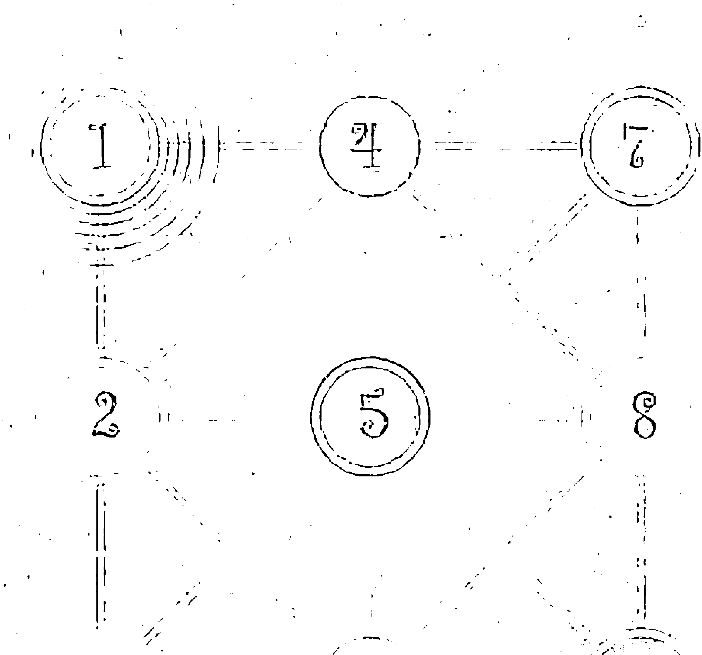

公元前500年古希腊流传至今的神秘命理学

耗时11年，媲比九型人格更精准的读心术，
为9万余人成功把脉

## 教你用数字破解生命密码

吉林出版集团有限责任公司

## 序言

算起来，着迷于数字命理学居然已有11年了，这让我吃惊不小，回首过往，掐指一算，竟然也已经分析或者说是得罪——从我一贯的行事作风来看，后者的可能性更大一些——将近九万多人，偷偷感谢一下自己的交友广泛和不算太差的人缘，然后再感谢一下那些对我如此信任的朋友，正是因为你们的鼓励和支持，才让我更加深刻地领悟到，数字密码这个东西，挺好的。虽算不上“每言必中”，但“字字珠玑”的底气还是有的，这也是我下定决心出版这本书的主要原因——与其我一个人在这里感慨“啊，好厉害，好准确”，真的不如大家一起来研究研究、讨论讨论、感慨感慨。可如果你希望看到的是一本“算命”书，那么亲爱的，现在就把这本书放下吧，这本书不是你的菜。我也没有兴趣和你探讨下周的运势、恋情的进展和考试的答案，那些都太虚无缥缈，你满可以去求签问卦、水晶球、占卜棒等等之类，它们总归会给你一个“精准”的回答，而且多半会捡你爱听的、喜欢听的说，搞得和励志心灵鸡汤一样，满眼都是真善美，一点问题、一点毛病都没有。

这不是我的风格，也不是我想表达的。

No! 亲爱的，数字命理学完完全全是另一个界面的话题，它远比你想象的“算命”要复杂得多。它最早出现在古希伯来人的生活和宗教当中，他们的密教卡巴拉巧妙地把数字带入了对于宇宙、人类和神的阐释与理解中，到后期更发展至把字母表上的字母和阿拉伯数字联系起来，于是就产生了数字命理学。代代相传之后被古希腊数学家毕达哥拉斯将之与哲学、心理学和精神学等完美统筹起来，形成了最初的“人生指南”——数字命理学。这位数学之父坚信“万物皆数”，认为世界上所有的事物都可由数字来解释。再进一步来讲，那意味着你所认知的一切都是由数字组成的，最终也可以简化为单纯的数字，这就是构成数字命理学的基础。数字命理学相信每个数字都有独特的共鸣频率及其特殊的属性和意义。这些属性和意义能够揭示一个人的行为，能够牵引出人格背后的潜在能量，小到面对面包房里的各种口味面包你会挑选哪个，大到面对有可能改变你人生际遇的选择，都会做出明晰而细致的判断。除此以外，它还回答了很多单靠星座、血型无法解释的问题，比如，同样都是金牛座 A型血，为什么这个人的运势、际遇就和另一个人截然不同？

这本书最大的贡献就在于会直白地告诉你：“别看你有领导力，其实你内心又自负又忌妒”“他们说你好看？拜托，别当真好吗，那纯粹是为了堵住你七大姑八大姨般的嘴。”辛辣，但绝对实话实说，而且专挑你最不愿意面对的角落剖析。这种风格让你不舒服？那你完全可以尝试让自己从一个积极的角度去看待：你可以通过数字命理学真正地了解自己。你会发现其实人最应该搞清楚的不是如何与他人相处，而是如何与自己和谐。认识真正的自己，它会教你如何分析自己的行为模式，并以此为逻辑基础来推测我们每一个选择的走向……有没有一种人生开了无敌模式的感觉？你尽可以在自己曾经吃亏的选项面前微微一笑，可以在面临选择的时候避免很多本能的冲动，尽量把事情的发展掌控在自己的期许中。数字命理学招人喜欢的地方还包括没有虚妄的想象和“将来一定当总统”式的武断，它会让你开始思索如何改变自己一直以来的惯性模式，改善你和父母、朋友之间的关系，或者让你明白应该如何对待自己的小孩才不会打压、埋没他们的天性。要知道，所有的孩子都有不同的个性，而天使，却都是实实在在地教育出来的！

在这本书里，我会尽所能地充分展示数字所体现出来的奇妙力量，尝试用明了而客观的方法和简单实用的事例来帮助你找到生命中的亮点和 BUG。抛开数字理性枯燥的一面，当你学会以尊重的态度了解生命数字时，你会发现无与伦比的奇妙力量正围绕着我们，从柴米油盐酱醋茶一直到琴棋书画诗酒花，都不能跳出数字的掌控，任何事都并非出于偶然，而是由数字的影响和作用所决定。

所以，你准备好开始你的人生选择题了吗？

## 目录
CONTENTS

001 / 第一章 扒开神秘的命数
1 代表太阳，能量的源头。太阳是古人最早膜拜的神祇之一，被视为生命之父。命数是 1 的人充满阳性力量，拥有冒险精神和开拓创新的魄力；在 12 星座中，与 1 对应的是白羊宫和摩羯座，代表诞生和自我意识。

055 / 第二章 熊孩子们的童年时光
佛洛依德相信一般人所说的“心里住着的孩子”，其实代表的就是你不同阶段的童年经验。童年的每一次际遇都是你过去的经验积累，你的每一次无意识的决定其实都反映着过去成长的经验背景，反射出来的是我们的童年经验。

070 / 第三章 被写就的生日数
每月 2 日、11 日、20 日、29 日出生的人。有好人缘、很敏感。所有问题大家都可以商量着来解决，但是犹豫来犹豫去会让你错失很多不错的机会，别以为那是因为你自己想顾全大家的面子，磨叽就是磨叽，被自己的情绪牵着鼻子走你就输了。

# 第四章 连线代表的意义

这些连线就好比你的命运掌纹，可以全方位解析你的行为模式，告诉你许多被忽视的问题，比如情绪、人际关系、目标等等。

# 第五章 属于你的天赋数

天赋数都是两位数，凡是两个数字相同的天赋数，称为“卓越数”(Master Numbers)，例如 11、22、33、44；零数为卓越数的人，在某项才能上拥有双倍的力量。想要把一种才华完全发挥出来已经不容易了，何况是双倍潜力的才能。

# 第六章 第一组人生密码

先天数由你的出生年月日组成，这是你上天赋予你的第一组人生密码，完全不掺杂后期的开发和培育因素，就是这些简单的数字，构成了原本的你。年、月、日分别代表了你人生的不同阶段。

## 第七章 “积习难改”的限制数

何为限制数？就是你从小到大“积习难改”的那部分，来源有很多种，比如天生的思考行为模式，或者是在父母身边被惯出来的无意识陋习，总之就是你面对一个问题时的条件反射。

# 第八章 如何面对你的流年

1 至 9 代表了一种宇宙间周而复始的规律，与我们的生命周期有着奇妙的呼应，而流年就代表了每一个人身处当下年份中所面对的机遇、挑战。

# 第九章 血型与命数

每个人都是独一无二的，有太多的因素造就了“你之所以为你”，所以喽，为了更好地把握自己的前进方向，我们需要更多的“辅助材料”来帮助你立体全面地解析自己，比如说，血型这件事。

# 第十章 星座与命数

命数 1 遭遇金牛座：喜欢照着自己的想法做事，行动力还超级强。

命数 1 遭遇双子座：自由惯了，只对自己有兴趣的事上心。

# 第十一章 画出你的命盘

数字上的圈达到了五个或者超过五个：这个数字在你身上表现出来的基本上就只剩负面影响了，负面到什么地步呢？就是感觉这个数字所有美好的那一面都和你无关，只剩那些附加的贬义的解释……

# 第十二章 解决冲突的办法

这世界上并不只有“你喜欢”和“你不喜欢”两种事，你可以考虑再加入两个选项，叫做“你应该做的”和“你不应该做的”，“己所不欲，勿施于人”的意思你总该懂吧？

# 第十三章 与不同命数的人谈感情

数字 1 属于阳性，所以最容易出“金刚芭比”，有着这样属性的你爱情观点相当朴素，认真、而且超级有原则，是让人踏实的伴侣——除了你时不时露头的以自我为中心。

# 第十四章 哪种工作适合你

你就是长袖善舞的花蝴蝶，外貌党，天生的聊天机器，在从事创意类的工作时最开心。凡是需要运用沟通技巧及创造力的工作，无论是与人共事或独立作业，都很适合3数人。

# 第十五章 健康从来都不是小问题

简而言之，你拥有的自由越多，身体越健康，一旦你发现自己被限制了，健康就会急转直下，可是找回自由是需要极大的勇气的。

# 第十六章 哪种是你缺失的能量

黄色是彩虹的第三色，也是太阳的颜色。黄色让人觉得乐观，并带动大脑活动。想要发挥创意的时候，穿上黄色很有用。假如你要促销一些大众商品，黄色有助于刺激顾客的购买欲。

# 第十七章 一句话直击内心

求求你收起自大吧，虚心点出不了人命，回去把“人外有人，山外有山”八个大字文后背上！

## 第十八章 “病理解剖”一家人

咩爸天赋数是3和5，拥有良好的表达沟通能力和表演天赋，好奇心旺盛，喜欢文艺，并且会不自觉地吸引旁人的眼球，热爱新鲜事物，知识面很广。

# 第一章 扒开神秘的命数

## 一些你计算中会牵扯到的计算数值和方法

数学家毕达哥拉斯相信通过计算一个人的出生日期，就可以分析出一个人的先天潜能，个性及需要修正的个性，通晓自己的优势及弱势，他相信从 1 到 9 每个数字都有它特殊的意义。

那我们的生命数字应该怎么算呢？只要把你的生日数字拆分成单一数字相加即可。

例 1：1981 年 10 月 27 日 出生，计算方法为：
1+9+8+1+1+0+2+7=29，加到二位数时，需要将二位数拆分后相加，那么 29 应当拆分为 2 和 9 再相加，2+9=11，仍然是二位数，请继续拆分后相加，1+1=2，加到个位数为 2。那么此人命数为 2。

例 2：1964 年 12 月 5 日 出生，计算方法为：1+9+6+4+1+2+5=28，拆分 28 为 2 和 8，2+8=10，特别说明，10 不等于 0（请计算时注意，生命数字永远不可能加至为 0，所以生命数字系统中根本没有 0 号人的说法），这里的 10 再拆分后应为 1 和 0，1+0=1，该个案为 1 号人，而不是 0 号人！

例 3：1955 年 4 月 29 日 出生，计算方式为：1+9+5+5+4+2+9=35，35 拆分得到 3 和 5，3+5=8，该个案为 8 号人。

## 采用哪个生日？

世界上有很多国家都采用了很有个性的双重日历，比如中国的阴历和阳历，再加上某些历史原因，早些年的父母在登记孩子的出生日期时会将之提前或推后，这么做的直接后果就是相当一部分人拥有四个生日！分别是：真正的阳历与阴历生日以及身份证明文件上的阳历与阴历生日。

然后问题就来了，该以哪个生日为准呢？

让我简单明了地告诉你，选你最常用的那个生日。不要管是阳历还是阴历、虚报的还是真实的，明白？

算好了？

现在让我们一起看看你到底是哪号人吧！

## 命数是1的名人

美国国父——乔治·华盛顿

前苏联总书记——米哈伊尔·谢尔盖耶维奇·戈尔巴乔夫

种族平等的斗士——马丁·路德·金

米老鼠之父——沃尔特·迪士尼

喜剧大师——查理·卓别林

好莱坞著名影星——汤姆·克鲁斯

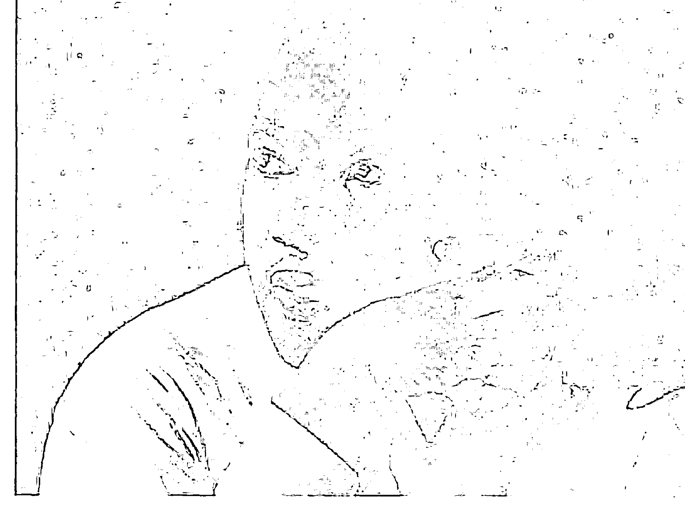

马丁·路德·金

（图片来源于网络）

## 生命密码

你是一个彻头彻彻的腹黑者，但并不准确。你知道凡事都有两面性，所以也能从看似最险恶的国际政坛中看出每种势力的逼不得已并加以理解。说你不适合学心理学，没人会相信。由于你过于敏感，你对负面能量的感觉也比一般人强上100倍。比如，好朋友隔了两天没见你，然后见面的时候说了句“你这件衣服看起来好合身啊”，本意不过是夸下衣服或者是根本没话找话，到你那里就自动转变成了：“几天不见你就肥了”“天哪，你肥到穿衣服都紧绷了”“你肥成这样还敢出来逛街？”然后心生怨念，再然后开始不停地抱怨人家为什么说话这么难听，再然后就绝食减肥……拜托，你以为你是在演苦情剧吗？是个人就都得对你冷嘲热讽，社会没那么阴暗好不好？阴暗的是你的心啊！你不要一边觉得坏人都有好的一面，一边觉得人太好绝对有问题好不好？你能不能不要这么分裂啊！而且你能不能不要因为担心得罪人就把“无欲无求”四个大字写在脸上？你内心怎么想的，诚实点好吗？你以为你表现出云淡风轻的样子人家就真的不会责怪你吗？

其实你真的算是一个蛮好相处的人，因为你没什么野心，还特别喜欢配合别人，活脱脱一个山寨二当家的模子。在面对穷凶极恶又多疑的大当家时能做到既不喧宾夺主又不俯首帖耳，总能协调好所有人的关系，而且忠心耿耿。这不是说你就真的无欲无求，而是你根本就不适合做老大。如果让你自立门户，要不了一阵子就会被官府衙门灭掉，主要就是因为你平时唯唯诺诺惯了，遇到屁大点的事就磨磨唧唧，拿不起放不下，分析来分析去偏偏分析不到点上。你就踏踏实实地当你的绿叶去衬红花好了，当绿叶是当绿叶，千万别以这个当借口让自己事事依赖他人啊！不是说你独立性有多么多么大，只是你这人内心严重没自信，说句话就得看别人眼色，这就造成了你有话不直说，表面上无所谓，心里却腹黑到死的行事方式。让你表达真实情感相当难，你会因为长期压抑不满而抱怨不休，甚至突然爆发，指桑骂槐大发雷霆。你啊，果然还是适合走中庸之道呢。你最适应的是简单的人际交往，因为你的直觉力很强，对人、对事都能在第一时间判断个八九不离十。只不过悲催的你总是会选择忽略自己的直觉，就这样，你与生俱来的天赋被你华丽丽地否决掉了……你喜欢追求所有和“美”有关的东西，外貌协会成员，喜欢全身心地享受生活。如果别人问你喜欢什么花，你会回答说“花钱的花”。你也是搭配达人，随便一件抹布你都能穿出自己的味道。你想过有品质的生活，对任何让你联想到穷、丑的东西你都厌恶的要死。想象力是你反抗社会的武器，音乐、电影和艺术是你放逐自己的手段。

最后顺便给你一句忠告，花钱的时候别总觉得买打折特价是占便宜，回家拿个计算器算算，你花的钱只会比买正价商品还多。你简直就是“商家之友”啊！

## 命数是3的名人

美国第40任总统——罗纳德·里根  
美国第42任总统——比尔·克林顿  
英国王储——查尔斯·菲利普·亚瑟·乔治·蒙巴顿-温莎（不过我们一般都喜欢称之为查尔斯王子）  
著名音乐大师——沃尔夫冈·阿玛迪乌斯·莫扎特  
流行乐鼻祖——麦当娜  
美国著名小说家——罗伯特·路易斯·史蒂文森（《金银岛》、《化身博士》作者）

（图片来源于网络）

# 第一章 扒开神秘的命数

## 第三节

## 扒开数字3的内心

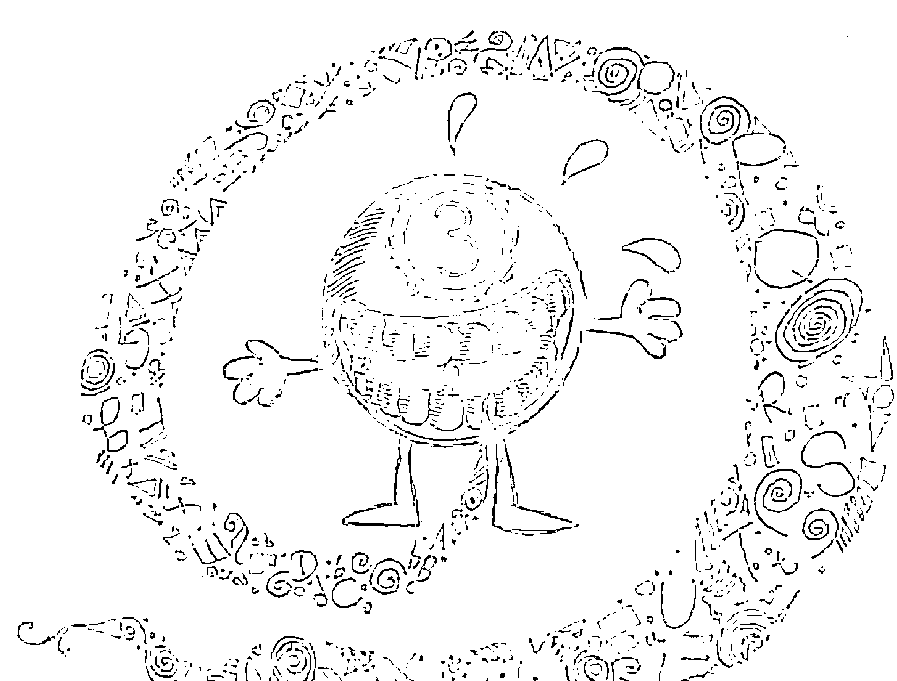

舌灿莲花爱八卦的3

关键词：表达的能力、想象力丰富、幽默、活力、时尚善社交、乐观、  
做作夸张、好是非、幼稚、逃避现实、唠叨、谎言、虚荣

## 生命密码

数字3对应的行星是木星，象征幸运，是一颗积极乐观的星体。与“3”相对应的星座是双子宫，代表学习与沟通力。3数拥有从1及2所生出的潜力，进而创造出更尽善尽美的事物。在许多宗教里，3数代表了灵性存在，例如在基督教，3数代表了圣父、圣子、圣灵三位一体，是权力与能量的极致汇合。

你聪明爱看书，喜欢所有新鲜的东西，对你来说，乐趣遍地都是。你这人说好听点是纯真，说不好听就是缺点什么。字典里就没有“阴谋”两个字，就算有也不知道什么意思。看所有人都挺好，你的乐天和无畏很大程度上也多亏了这种少根弦的状态。有创意，特爱表达自己，所以你可以被称之为“不去社交就会死星人”，因为好奇心旺盛，所以你恨不得和所有类型的人都有来往（记得小学时候的观察课吗？他们就是被你观察的小白兔、小虫子……）。多才多艺？那是给别人的错觉，真正的你爱好挺广但精力超级分散，新奇感持续时间也短，知道不少但全是皮毛，自己知道就算了，要是跑去跟别人卖弄，很容易误人子弟啊大哥！有口才，是不是真的让别人听起来确实是那么一回事，爱说、八卦，说话还不过脑子，你不得罪人谁得罪人？表面风风火火但内心自卑的要死，你分裂不分裂啊你。爱表现这点无可厚非，但是为了出风头就去夸大事实撒谎抄袭，这点就有些说不过去了吧？还有你的情商只有1岁吧小朋友，

# 第一章 扒开神秘的命数

你想法简单到令人发指，对复杂过敏，是个坚定的理想主义者，为了自认为的真理决不妥协，绝不能听到有人批评自己，也不接受“居然有人想来批评你”这一现实。一旦有人对你的看法提出异议，你欠抽的一面就会暴露。死不悔改对你有任何好处吗？你这么顽固你家人知道吗？

就算是这么恶劣的性格，你也有令人羡慕的一面，比如你对文艺和时尚的敏感，接受新鲜事物的能力。可你周围的新鲜事实在是太多了，你就算再有灵气，这么折腾下来知道的也就是个皮毛。然后还总想着让别人觉得你知识渊博无所不知，于是乎，抄袭、撒谎、夸大这些下三滥的毛病就开始在你思想里扎根……

你这样的性格，即使到了中老年，依旧是个周伯通式的人物，不是拒绝长大而是天性使然，说白了，就是不成熟！一个性情很孩子气的人是可爱的，可假如心智不成熟的话，就是幼稚。

## 命数是3的名人

古巴前领导人——菲德尔·亚历杭德罗·卡斯特罗·鲁斯  
悬疑大师——阿尔佛雷德·希区柯克  
流行乐巨星——大卫·鲍伊  
西部牛仔片之王——约翰·韦恩  
美国电视名人——比尔·寇尔斯

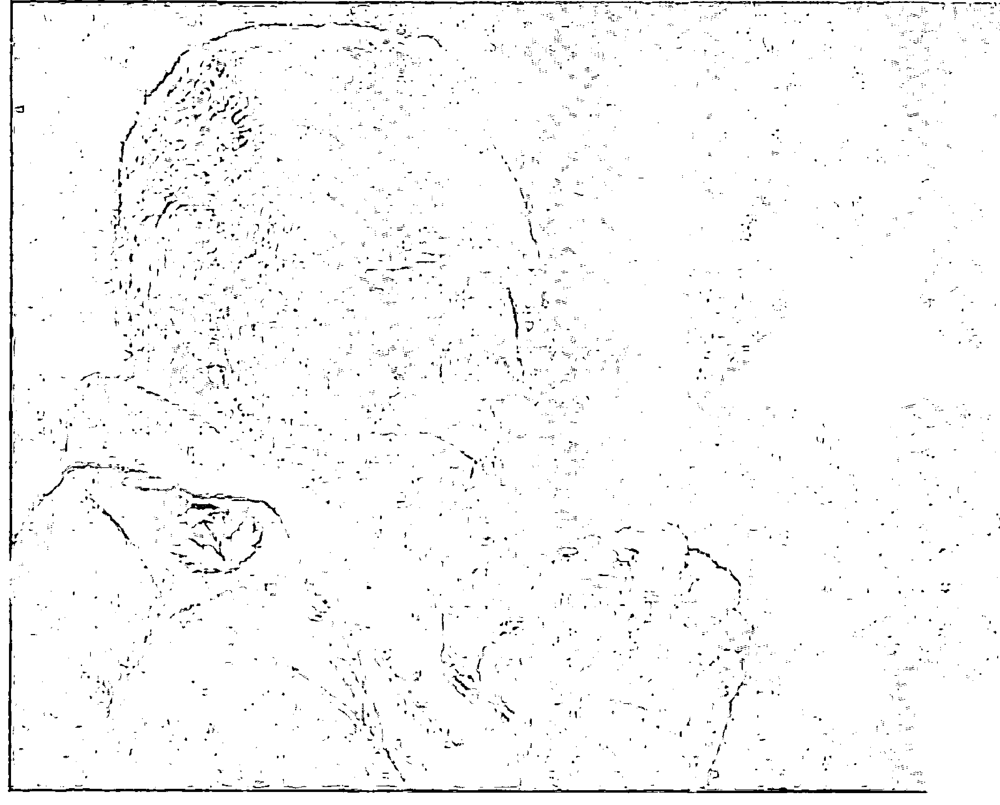

卡斯特罗

（图片来源于网络）

# 第一章 扒开神秘的命数

## 第四节

## 扒开数字4的内心

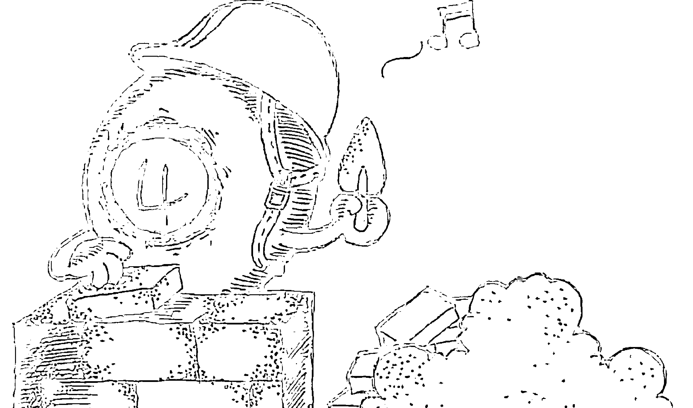

保守才有安全感的4

关键词：限制、秩序、服务、稳重、拒绝改变、自我保护、吝啬、  
狭隘

## 生命密码

数字4对应的天体是地球，作为已知的唯一存在生命的星球，地球放在那里就是“务实”的最佳注解。它对应的星座是巨蟹宫，代表情感与家庭。此外，十字架也是4的表现形式，代表了内敛、忠实和信仰。

你觉得人活着就得先吃饭，吃饱了才有力气去想其他的，这种想法是对的，但你吃着吃着就会把自己的人生目标定义为“为了吃饱”。为了吃饱吝啬到一毛不拔，死不悔改。你循规蹈矩，最烦光说不练，但也坚决抵触别人的建议和批评，谁说跟谁急。给别人的印象就是“踏实可靠”，但是他们不知道，其实你特别没有安全感，一旦吃不饱就觉得天塌了，甚至为了保住眼前的一口粮食而拒绝走出家门。所以你看很多电影里最终被时代抛弃的守旧角色，都是你血淋淋的写照。

命数是4的你，一辈子都在为自己的安全感奔波，要么贪得无厌地掠取物质、钱、爱情，然后自以为圆满；要么转而探索自身蕴藏的潜力，用尽全力构建自己的安全堡垒。孰高孰低一眼明了，毕竟自己的天分，自己的信心，自己给自己的安全感别人想抢都抢不走。让我们说得简单明了点，4数的人，要么是贪官、小三、小狼犬，要么是超级富豪。其实只要你想明白人生安全感的来源就是如何发挥自身的天赋，你绝对会拥有富足的人生。

你不愿意改变，不愿意承担风险，这是个挺难搞的问题。完全不接受新事物，完全不让自己改变，那么我想请问，你打算怎么跟上时代的变化？用想的？啊，对了，你连想一想的勇气都没有，老兄，顽固也得有个限度，不是什么事都会威胁到你的。

从好的一方面看，你真的非常踏实又稳当，让旁人觉得舒服、可信，因为你实事求是，没有那么多花花肠子，就算同样的事让你做一千遍，你也不会烦，顺便还会找出隐藏的问题防患于未然。你不是创意人才，你是让创意落地的人，你会结合现实改进那些天马行空的点子。

对你来说，完善事物本身就代表着构建一种安全，你最让人忌妒的就是不用去耗时间、花金钱从无到有玩发明，只需要从现有的东西里挑拣几样就能达到别人一辈子都达不到的高度。你不会急于求成，反而在浮躁的社会中属于相当沉得住气的人，会在万事俱备的前提下再开始行动。经常有人夸你有“大将之风”或者是“高瞻远瞩”，殊不知，你就是单纯的胆小罢了，害怕丢了手里现有的饭碗得不偿失。你是实干家、工作狂，只要一开始顺利并且得到相应的物质回报，后面的工作都可以愉快地进行下去。再加上你觉得冒险、开创就是找死的同义词的保守特质，所以你没有当老板的命，但是当个幕僚还是不错的。当老板要大踏步开拓某些局面的时候，你这种老顽固会直接指出里面潜藏的风险。古话说你就是虽打不了天下，但能守得住降城。

你这个人，害怕冒险已经到了一个极端。比如你笃信“多个朋友多条路”，从来看不惯美式个人英雄主义，觉得团体的力量才是无坚不摧的。除了相信“群殴”比“单挑”更有破坏力之外，你还迷信秩序的能量，甚至这两个字本身就蕴含魔力。你是个魔鬼管理者，可以把乱成一团糟的场面轻轻松松归出条理，并且乐此不疲绝不懒惰，这点让所有人都不得不五体投地。你把所有人包括自己都限制在一个个框子里，一旦出现变数，马上就会产生危机意识。你的脑子里只有“理性”两个字，一旦认准了路线就会一直走到底，不管是工作也好，生活也好。比如换工作、搬家这都是想都不用想的事，你还会夸张到不换手机、不换交通工具、不换餐厅……然后抱怨说手机不好用，开车太堵，饭菜越做越难吃。大哥，你有抱怨的时间不如换个新的，说完了又不愿意改变那就闭上嘴吧！

你的个人形象已经简化到用“谨小慎微”这四个字一举概括了。你别辩解说那是你特有的稳扎稳打的方式，你就是在计较。扪心自问，你是不是最害怕别人求你办事？办事之中最害怕别人向你借钱？因为你怕穷，所以会格外吝啬。想让你接受新想法，第一就是要给你大量的证据，第二就是给你足够长的时间去检验。只要你相信了，你就会转变成该事物的捍卫者，听不得一句指责和质疑，排外情绪相当严重，心胸狭隘的评价就是这么来的。

# 第一章 扒开神秘的命数

## 第五节

## 扒开数字5的内心

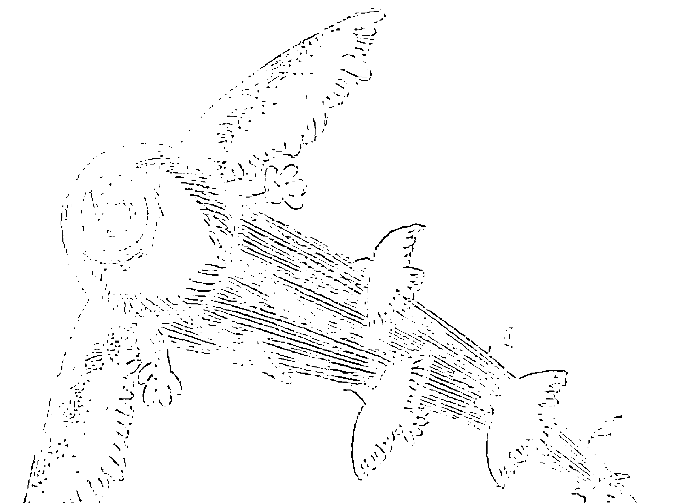

最渴望自由的5

关键词：有创造性的自由、冒险、适应力、活力、探索、智慧、反复无常、惰性、散漫、情绪化、不可靠

## 生命密码

数字5代表了水星，思维敏捷，用轻松的态度面对一切。其对应的星座是狮子宫，代表快乐与创作。5数的代表标志是五角星，象征潜力。5是最富人性的数字，向往自由和无拘无束。

你最看不得的就是“守旧”，奋勇向前才是你的第一选择，你很少踌躇，想到了就去做，最难能可贵的就是你不是为了目的才去冒险，指引你的是兴趣。只要你决定了，就很难受旁人干扰，你不会拒绝新事物，敢于突破自己，可以在多种不同职业之间游刃有余。你具有很强的说服力，而且真心认为，人生就应该去追求精彩的阅历，钱、权都不在你的梦想清单。你能接纳挫折、失败，但不代表你能接受压力，你面对压力扭头就跑的性格让人倍感恼火，这说明兄弟你缺乏责任心，浑身上下充满了惰性，总幻想有人帮你解决所有问题，而且你跳跃性思维老是用错地方，没办法做一件事情太久，总是一事无成。口才好明明是你的优势，但是如果你没脑子又偏激就很成问题了，自以为是又爱说，你说除了浮夸还能说你什么好？你是个偏执狂，不能听见反面意见，冲动、情绪化、自由散漫、随性而为，活脱脱一颗不定时炸弹，经常以一己之力毁了整个大局。“规矩”俩字怎么写，好好想想吧。

你总想摆脱束缚、逃避承诺，幻想着能随遇而安，但你所面对的现实就是要么散漫无常地晃荡，看似潇洒其实内心愁闷，要么找到了一个目标，拼命追逐事业上的突破和成功。平心而论，你很善于谈判，主要是因为你觉得说服别人达成目的这件事很有趣。你不适合做领导，领导意味着责任，你缺乏承担责任的勇气，就算你清楚地知道自己想要什么，也会犹豫再三撒手放弃。一旦遇到问题就会下意识逃避，因而会错失好多机会。然后你会发现限制依然存在，自由依然无望，这应该不是你想要的生活吧？你害怕做决定，是因为一旦选择就意味着要放弃其他可能性，放弃一种不确定的自由，但你有没有想过，越是犹豫不决什么都想抓到手里，到最后就越是什么都抓不住。

你的天性就是“做自己”，你觉得自己心智很高，多才多艺，所以纪律在你这儿绝对是用来约束别人的，和你没关系。你会因为一句“喜欢”而投身到完全陌生的领域里面去，同样也会因为一句气死人的“不感兴趣了”而扔下做了一多半的工作转身就走。你倒是号称喜欢挑战，一辈子就活在层出不穷的挑战中了，不停地转变工作。你从来不觉得“没长性”是你的缺点，对你来说，体验不同的经历才是你肯定自我的方式，稳定不在你的List里面。你的终极问题不是“to be or not to be”，是“我要”或者是“我不要”，为此你常会做出让人恨不得把你扔到精神病院的行为，其实你就是在反抗自己求之不得的人生罢了。要么像蛀虫一样死扒着人家，要么举着玩世不恭的牌子暗自咬碎一嘴牙。你怎么就不明白呢？真正的自由来自于自己的独立。

啊，亲！不管是物质的还是精神的，什么时候你才能明白，只有勇敢面对责任，付出牺牲，才可能实现自己的目标啊！你得看看书，少说，多观察，静下心来学习新事物，丰富自己的精神生活，这也能转化成为你面对困难时的勇气。

你根本就不懂什么叫“规矩”，也不明白“秩序”到底讲的是什么，听到“限制”的第一个反应就是“冲破”。你想自己主宰人生，最好不用上班，因为你的惰性实在是与生俱来。

你还有强大的拖延症，并且把自己有创意的天赋充分发挥在了找各种各样的借口上。你矛盾的不得了，眼高手低，想独立，可依赖心强。不喜欢挣钱，最喜欢花钱，爱好特别多，不是高品质的你还看不上。你不会规划自己，不安分，这一点常令你有戏剧化的经历。压力是你的死穴，会限制你的创造性，让你逆反，甚至会反过来变成你不负责任的理由之一。

你是伪装大师级人物，这不是说你充满恶意，因为你太害怕“默默无闻”了，在潜意识里觉得自己无所不能，简直就是一个闪亮的公众人物，这也是你为什么会时不时地做出很多不靠谱的举动，根源就是你的虚荣心，你越缺乏自信就会越张扬越夸张。你很喜欢和不同的人交流沟通，你会衡量自己所说的每一句话，这让你和所有类型的人都能愉快相处。你风趣、口才好，能哄得大家开心，特别善于应酬交际——见人说人话，见鬼说鬼话指的就是你了。你能获得别人的好感和信任，这个时候如果再耍点小聪明，就很容易快速积累财富。你不但对自己的自由很关注，还会关注他人的自由问题，所以也会出现挺身而出为他人争取权益。

你挑剔，从美食到工作，乐极生悲的结果就是暴饮暴食、工作狂。最有意思的是，你明明自己的问题一堆，却偏偏最擅长教导他人怎么样有效地掌控人生。

## 命数是5的名人

新中国伟大领袖——毛泽东  
美国第16任总统——阿伯拉罕·林肯  
纳粹元首——阿道夫·希特勒  
万有引力之父——艾萨克·牛顿  
希腊船王——亚里士多德·苏格拉底·奥纳西斯  
著名画家——文森特·威廉·梵高

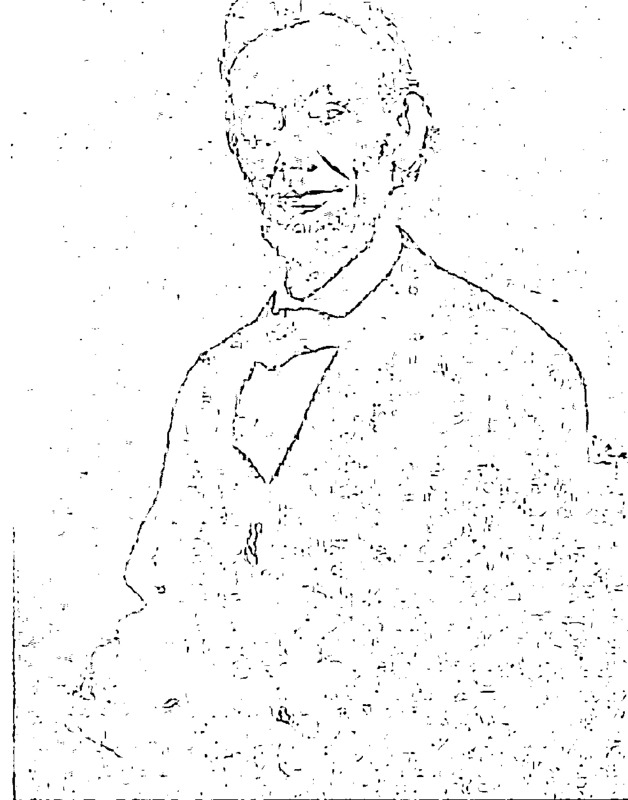

林肯

（图片来源于网络）

# 第一章 扒开神秘的命数

## 第六节

## 扒开数字6的内心

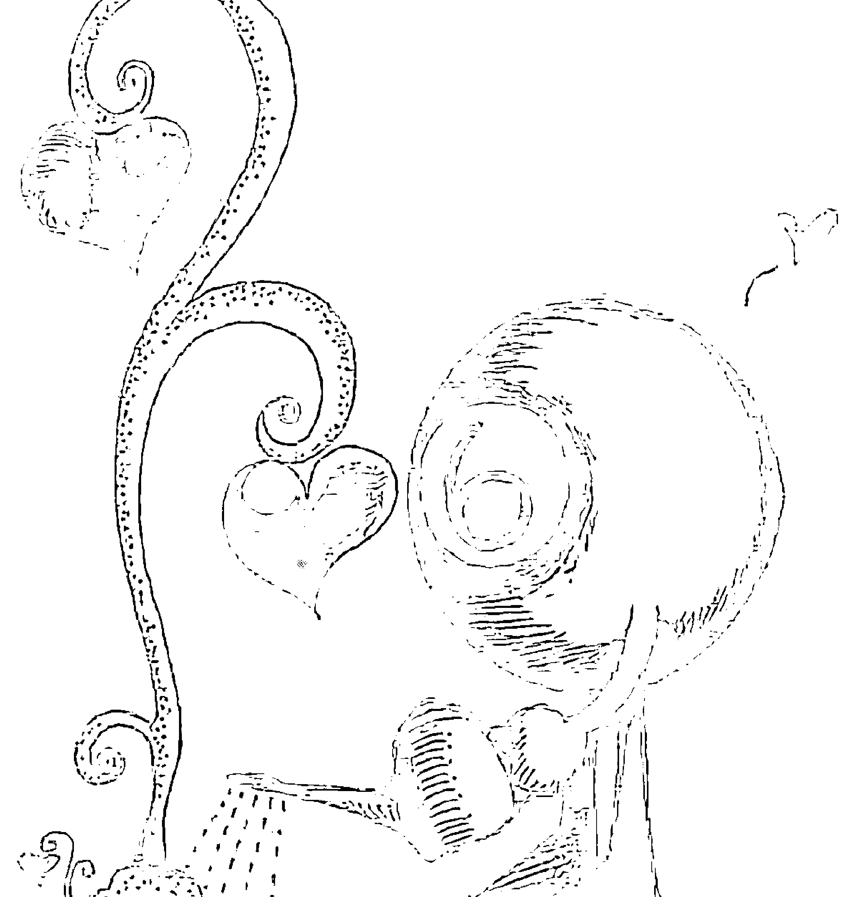

春天种下爱心，期待秋天收获一堆的6

关键词：平衡、责任、爱、同情心、承担、体贴、公正、奉献、苛刻、  
保守、嘴碎、多管闲事、自以为是

## 生命密码

数字 6 的代表是金星，对美丽的事物爱不释手，是“爱”的完美注解。对应星座是处女宫，代表服务与奉献、圆满、爱的真谛和美。

你心怀大爱，就是一个行走在世间的“特蕾萨修女”，爱是你生命的根本。善解人意是你的标签，给人感觉如沐春风，无论你有多么远大的理想，家人都会摆在你心目中的最前端，你愿意为家人付出所有，你是个重视美感的人，对于所有和艺术有关的事都有独到的眼光。你无法容忍懒惰，懒散会教你不安，很多人会当成是压力的约束反而会被你当做动力。你可以在奉献和收获之间取得微妙的平衡，但这种微妙非常容易被打破。你最大的自私就体现在对别人付出之后希望人家时刻念叨你的好，而且最好是加倍还回来，一旦人家不顺你意，你就会抱怨人情冷暖，付出的时候老惦记回报，你说你不是虚伪是什么。还有，不是所有人都需要你老人家的丰沛爱心，你知不知道当别人不需要的时候你强加奉献对人家来说是多大的困扰，这叫爱吗？这叫自以为是吧？要是对恋人这样就更可怕了。滥好人性格使得你随随便便就会给人家许下承诺，但是，大哥，承诺是要遵守的，干不了的事你答应下来我倒想看看你怎么回应人家！你看起来是绝对的大好人一个，但是有道德立场是你自己的事，拜托你别用这套去衡量所有人好吗？这样显得你很刻薄，懂吗？

# 第一章 扒开神秘的命数

你是非分明，区别好人坏人有自己的标准，你在意外界对你的评价，因此会下意识回避自己内心真实的想法。很多时候你付出不是为了纯粹的爱，而只是单纯地不想让别人戳你的脊梁骨，你有时候甚至会脱口而出“我对他这么好，别人也说不出我什么了”。

你热心过头的一面也并不是永久性的，假如你一味付出而得不到应有的回报，甚至都没有人说一声感谢，那么你就会在坚持多年之后终于开始会说“不”。但是此时旁人早已经习惯了你无论大小都付出的做派，猛一看到你的转变都会发出“变得自私”的感慨，让你伤透心。没办法，这种没良心的举动都是你惯的，所以说，越早学会说不，你就越能活得开心点。你天生就懂得照顾他人、解决问题，所以你可以在很短时间内弄清楚哪个环节出了问题，也清楚地知道应该采取哪些步骤来解决，只不过当你面对的对象是“人”的时候比较麻烦罢了。你给人很强的安全感，真心实意地服务社会。

你永远都是个好听众，可以倾听旁人对你的诉苦，可又无法消化这些负面信息，所以悲观消沉是你最常有的情绪。你觉得自己必须照料别人，别人有事也会就来找你，让你忙得停不下来，你认为这是你的价值体现。你可以站在对方的角度去思考问题，劝说别人——前提是你的观点正确积极，否则你就会沦落为可怕的歪理邪说，被人唾弃。你不诚实，明明内心挑剔至极，却偏偏用“各有各的生活方式”来掩饰自己，让自己时刻看起来都有如大善人一般闪亮。你善于自嘲，无法面对自己的缺陷，更不允许别人批评，你随时准备为别人牺牲，但事实上，你才是应该被拯救的那个！

## 命数是 6 的名人

英格兰玫瑰——戴安娜王妃

美洲大陆的发现人——克里斯多夫·哥伦布

发明大王——托马斯·爱迪生

电影大佬——斯蒂芬·斯皮尔伯格

著名乡村歌手——约翰·丹佛

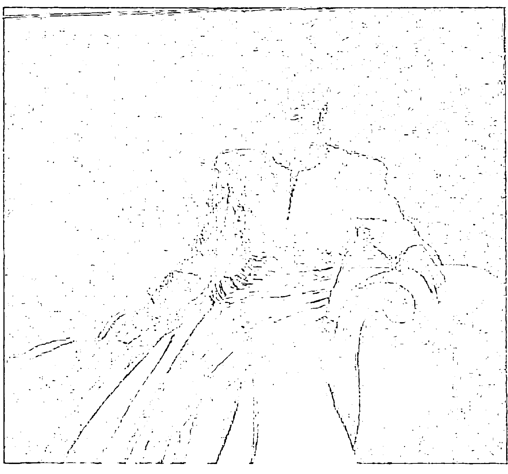

戴安娜王妃

（图片来源于网络）

## 第七节

## 扒开数字7的内心

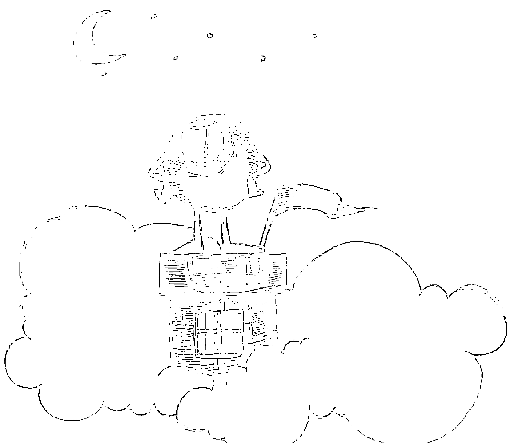

常感叹：“高处不胜寒”的7

关键词·分析、博学、有深度、求知欲、直觉、幸运、自负、疑心病、
孤僻、冷漠、距离、没有同情心、阴暗

## 生命密码

数字7对应的星座是海王星，散发出令人难以抗拒的神秘感，有流浪作风，好思考。对应的星座是天平宫，代表合作与婚姻。7数一直有一种灵性上的含义，代表对真理的热爱。

你这人有很强的分析能力，看问题从不看表面，而是习惯性地去探究背后的意义，这使你总有出人意料的见解。你不会轻易相信结论，你需要证据、实例、观察、总结，大众已经认可的言论到你这里基本没什么可信度。你喜欢通过自己的经验去总结答案，你觉得书本上的知识都是别人玩剩下的东西，埋头研究的工作最适合你，因为需要你不停地提出质疑，任何规定好条条框框的工作只会毁了你。但是你也得明白，虽然你看问题的角度比较深刻，但不代表你就比别人深刻，为此看不起这个瞧不起那个，就只有被人冷落的份儿。最怕的是你哪怕被人冷落也满不在乎，只愿意沉浸在自己的世界里，为自己的智慧沾沾自喜，认为这世界上没人比你更牛了，恨不得天天对着镜子给自己磕头。自恋的结果就是，你太相信自己的判断和逻辑，拒绝一切其他可能，看起来坚决，实则是不自信导致的盲目顽固，因为你最害怕的就是“这世界上居然还有我不知道的事”，怕到极点就只好拼命抵触“我确实不知道”这个事实，够纠结。

你其实特有邪恶军师的潜质，在你对别人施加影响的时候最喜欢干的事就是侵犯、瓦解别人的精神性防御，活脱脱的反面谍士形象。而且你疑心病泛滥，以至于随便一个事摆在面前你都是满眼的不信任，总觉得世界上没什么事是干净的，全都有不可告人的肮脏小秘密……拜托你能阳光点吗？你这么阴暗以后怎么跟大家愉快地相处？你都这样了不孤僻才有鬼，躲在角落里自我欣赏就好了，却偏偏没办法让自己彻底孤独起来，总还惦记别人的眼光，闹心不闹心啊！

你啊，让你做个决定简直就像是要你的命，一方面你会被数不尽的细节绊住脚，另一方面就算你看清了现实仍然可能因为不喜欢而拒绝接受。你脖子再长点就是一只鸵鸟，人生必需品排第一的就是个土堆，随时准备把脑袋扎进去。你知道吗，就算你逃避，可是现实仍然摆在那里，而且没准情况会越来越严重，直至难以收拾——把头扎到土堆里的鸵鸟最终还是被狮子叼走了……这就是你的写照。你得明白，虽然7号称是幸运之数，但是再好的运气也不能让你仰仗一辈子，“种瓜得瓜，种豆得豆”的道理你听说过，可你没听说过“啥也不种就长出大西瓜”来吧？勤奋务实才是王道！总是接受多付出少，迟早会把自己耗干；或者你早一点认识到努力的重要，又勤奋又认真，一有机会就牢牢抓住，在工作感情中恰如其分地运用自己的分析能力，没准会左右逢源。

## 命数是 7 的名人

美国第 35 任总统——约翰·肯尼迪

英国前首相——温斯顿·伦纳德·斯宾塞·丘吉尔

音乐巨人——路德维希·凡·贝多芬

音乐大师——弗雷德里克·弗朗西斯克·肖邦

性感宝贝——玛丽莲·梦露

功夫巨星——李小龙

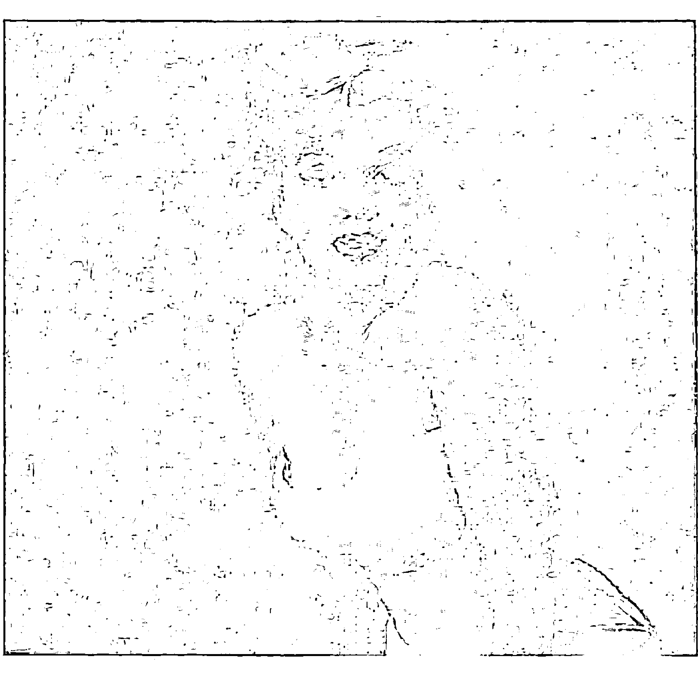

玛丽莲·梦露

（图片来源于网络）

## 第八节

## 扒开数字 8 的内心

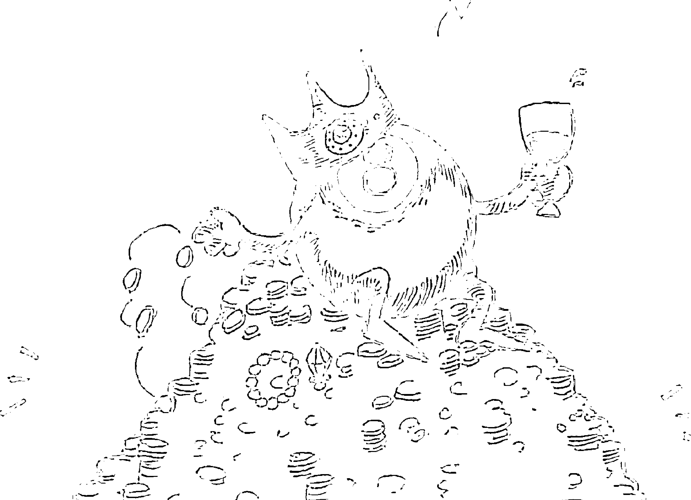

赚“¥”无下限的 8

关键词·物质上的满足、勇敢、果断、能屈能伸、有魄力、洞察力、
同情心、易怒、虚荣、权力欲、势利、投机、攀比、唯利是图

数字 8 对应土星，拥有强烈的个人价值观。8 对应的星座是天蝎宫，代表再生和继承。8 数还有一个代表标志：无限循环符号，8 数象永不止息的循环更新。

你属于实干家类型，想到就会去做，但前提是有利可图，什么兴趣、爱好到你这里这都说不通。你不喜欢冒风险，与其去闯荡不如直接借鉴经验，否则经验是拿来干嘛吃的？你就是个钱串子，对你来说成功的人生就是拥有很多很多钱，你喜欢理财，财也喜欢理你，你们简直一拍即合。你虽然讨厌冒险但是并不畏惧挑战，做事不小家子气，能吃苦能享福，越挫越勇，这和你的上进心是分不开的。你不甘心一辈子只做打工仔，做梦都想当领导，你的动力来自于不想忍受压制，不想被忽视，不想被人可怜，再大的不满到你这里都会变成前进助力，这是你最大的优点。其实往深层次说，你人挺好的，你赚钱不是为了看，而是为了花，为帮助别人而花钱也是你的乐趣，所以你人缘还不差，稍微善良有道德就会攒下很多朋友。

你不喜欢过程，最看重结果，最希望有一天醒来能不劳而获。你不信任别人，能抓在手里的绝对不放别人那儿，你觉得别人只要听你的安排就好了，别说那么多废话，逼急了就开始暴跳如雷。你要是失败了别赖别人，全怪你自己的人品。如果你此时处于人生的最低谷，你会把物质看得很重，觉得这是成败标准，你会把钱当作炫耀自己的一种资本。你还有个问题就是会盲目跟风，为了达到目的不惜使用很多下三滥的手段，但你不在乎，成功对你来说比什么都重要，这样一来，你就很容易被人烦。

你对有潜力的东西很敏锐，并且会在第一时间挖掘出来收归己用。你有没有想过其实要想办成一件事最先应该发展的是自己，如果你能把各种想成功的心思花一半到自己身上，你早就出名了，光等下去是没有用的。你有许多梦想和欲望，尤其希望能在金钱上早日独立，但是不知道为什么，你总是不愿意把自己的梦想目标坦白，难道是因为觉得丢脸？你对别人不诚实，对自己也不愿意坦率，甚至会欺骗自己接受一些你并不喜欢的事物。你不惧怕风险，可以为了成功不计一切代价。网络上有很多不惜抖胸露奶傍大款的女明星都是8数人，你就是这种会为了名利无下限的人，虽然很多人看不惯你的人品，但同你交往起来倒都还轻松愉快。你天生有领导能力，而且通常都是野心爆棚的那种，赚起钱来没够，你特看不惯“懒”这件事，如果一个项目的进展很慢，平时亲和的你就会瞬间强硬起来。你对市场有一种奇妙的嗅觉和洞察力，能够准确地把握市场需求，所以如果你好好发挥自己的强项，当个成功的商人还是很 easy 的，而且白手起家给你的感觉会超好。

你值得大家信赖，但这不代表你诚实，你是实干型，从来不屑于没有把握的事，你看似常常被欲望和贪婪牵着鼻子走，其实，你只不过是用钱来满足自己的精神需求罢了，那些东西只是你成功的一个证明。这种企图心会让你世俗得不得了，浑身上下都是“急功近利”四个大字，投机取巧是强项，不管自己是否真的需要，拿到手里再说，贪婪的嘴脸直接暴露。欲望是你的动力，也会成为你最大的绊脚石。你是那种好人里面的坏人，坏人里的好人，端的看你面对的是什么事，比如赚钱吧，只要贪劲一上来，坑、赌、设陷阱、做假账、贪污受贿这些不入流的手段你统统无师自通，为了自己害一下别人又能怎样？等被抓的时候你就知道了。

你得从头开始温习小时候老师教你的：做一个正直的人，只有用努力、勤奋和耐心才能最终获得你想要的结果。懂得感恩对你没坏处，至少当你真诚起来后就会发现其他人也会真诚对你，之后，才有可能顺畅地实现更高的目标。

## 命数是8的名人

+ 立体主义巨匠——帕布罗·毕加索  
美国国务卿——希拉里·克林顿  
美国前第一夫人——南希·里根  
美国好莱坞著名影星、玉婆——伊丽莎白·泰勒  
瑞典著名女星——英格丽·褒曼  
好莱坞著名女星、制片人——芭芭拉·史翠珊

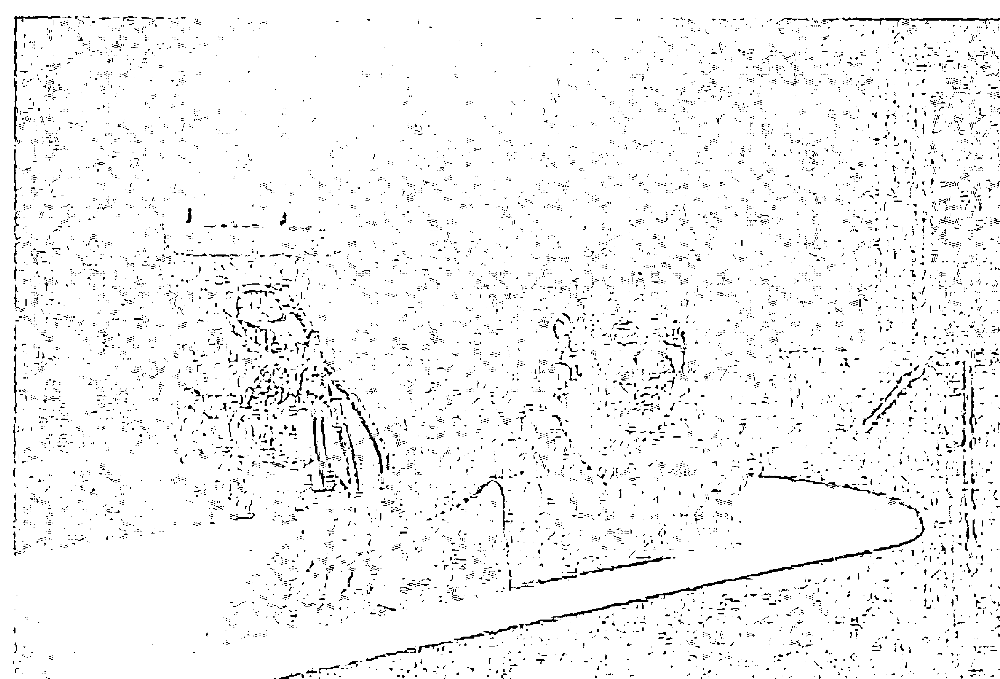

毕加索

（图片来源于网络）

## 第九节

## 扒开数字 9 的内心

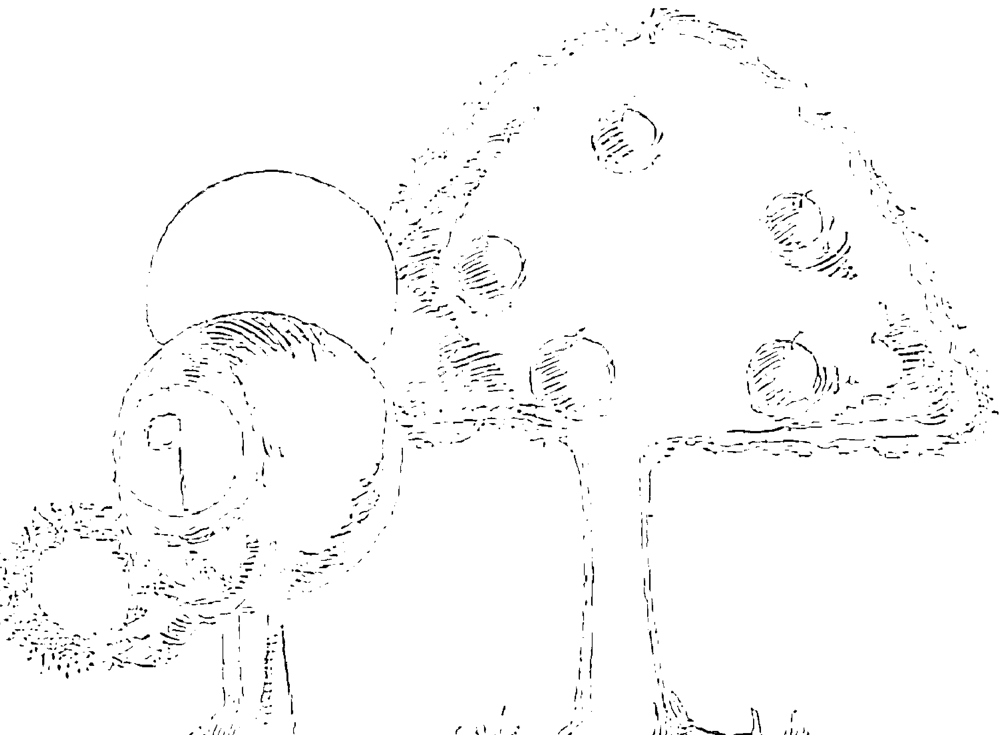

充满灵性的 9

关键词：无私、博爱、人道主义、高尚、正义、灵性、惰性、妄想、消极、软弱、不现实

数字9对应的是火星，积极、冒险、热爱成功以及锲而不舍，是理想主义的代表。它对应的星座是射手座，代表对宗教哲学的追求。

你怀着与世无争的心，不出风头不搞怪，永远是人群里最不起眼但让大家都舒服的那个。热衷环保、乐活、素食等等与自然为友的活动，这让你显得特别具有大智慧。你期望人人都能纯净待人，爱护动植物，你就算不信教看起来也是一个信徒的样子，因为你会从自己相信的东西里获得动力和勇气。你不愿意面对人的阴暗面，但又忍不住去寻找，你不敢想自己身上也会有这么多“罪恶”，你越觉得自己问题多，就会越无私，好让别人觉得你是个完美的人。你没有勇气去面对世界，说白了，就是胆小，很容易为了追求心灵宁静而被有心人利用。你喜欢盲从、沉溺，被誉为“最受邪教欢迎人士”。你搞不清向往平静和懦弱不争的区别，别人还没来得及打击你，自己就先把自己打趴下，这就是你。

你得学会别老想着一味取悦于人，如果真的连自己的权益都不去争取的话，你拿什么去帮助其他人？上天给你灵性、给你慷慨、给你善良是让你感动别人的，不是让你豁出去自己替别人铺路的，你有没有自己的梦想？有的话就好好经营，务实一点比什么都强。

你对别人的求助信号绝对敏感，看见了就不会置之不理，你会单纯地为了帮助别人而帮助别人，这一点常人绝对做不到。不过，你没有那个能力分析出别人问题的根源到底在哪儿，因为什么而痛苦，你能做的顶多就是给一个熊抱，送点安慰罢了。正因为你如此迟钝，所以很多人都会用这招来哄骗你接下你能力范围之外的事。你也有强硬的一面，这一面只体现在你对待自己的人生规划的时候。你不是不喜欢钱，你也想赚大钱，但就是越追越追不到。只要你索性放弃这种想法，单纯地继续按照自己的初衷去助人，钱反而会自己送上门来。

你没自信，好名声，总充斥着深深的罪恶感，以至于成天小心翼翼地遮着盖着，生怕做点什么事就毁了自己的“善人”形象，哪怕自身难保也得想办法帮别人一把。你不会拒绝，容易受旁人影响，总是忽略眼下的生活，你就是活着的“为人民服务”的口号，看谁都像小可怜，无私、美德、给予就是你灵魂深处的烙印。但当你没有弄明白什么是“爱”的时候，你可能会觉得“助人为乐”就是一种压力，明明不喜欢还要去做，这就叫做虚伪了。你天真到只能称之为“傻”，这也是邪教为什么特别喜欢找上你的原因。你喜欢帮人做事，但只要做不到就会产生很深的罪恶感，如果不做，你简直怕死别人说你冷漠、没人情味了。一辈子都活在这种被动中。你最怕好心办坏事，偏偏你还常犯，动不动就制造狂热气氛，跟着谬误一溜烟儿跑得没影了。

## 命数是9的名人

南非前总统——纳尔逊·罗利赫拉赫拉·曼德拉

印度国父——莫罕达斯·卡拉姆昌德·甘地

美国作家——厄内斯特·海明威

猫王——埃尔维斯·普莱斯利

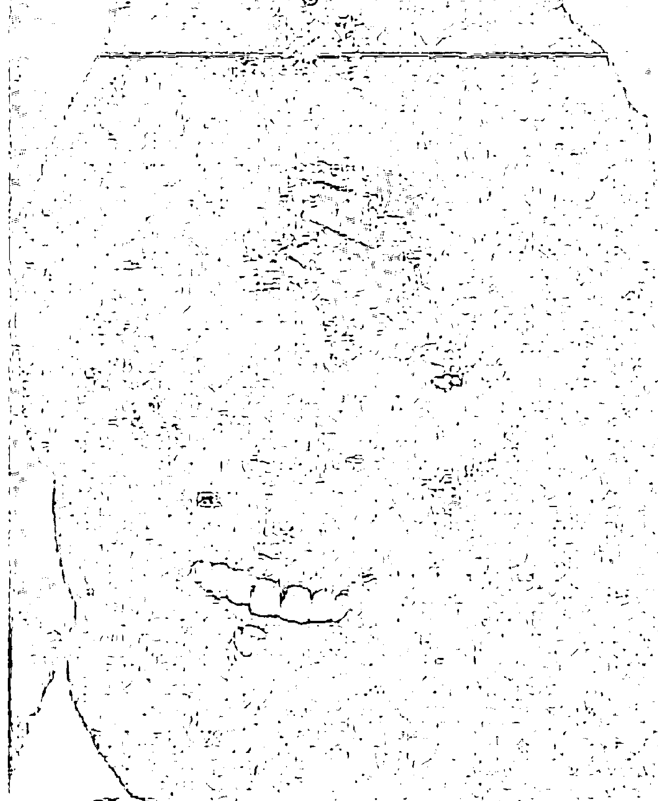

纳尔逊·曼德拉

（图片来源于网络）

## 第二章  
熊孩子们的童年时光  

## 童年在人的一生中到底能占多大的比重？  

这是个足以写出一整本论文的命题，太深层次的问题我没办法在这里和你做过多的讨论，毕竟我不是权威。我只能郑重其事地对你说，早期经历在个人成长过程中发挥的作用比你想象的要重得多！  

相当一部分成年人的心理健康问题都和童年的经历有着密不可分的关系，这一点很好理解吧？  

一个在充满正能量、有爱和赞赏家庭长大的孩子肯定要比在满是否定、责骂的家庭成长起来的孩子更有自信、更宽容且乐于分享。  

## 命数 1  

你家的熊孩子需要超多关注，这点毫无疑问！  

他们要被家人关注，取得他们的信任和依赖的难度简直堪比  
卧底进入塔利班……身为这类孩子父母的你，需要刻意做一些事让小东西感觉到自己的与众不同，比如送他一间看似超豪华超绚烂实则便宜到偷笑的环保玩具屋，或者请公司同仁穿上蝙蝠侠或者小熊维尼的套装在他生日那天空降现场——命数1的人可是从小就死要面子的。当你花了很多时间、创意和无限的爱来陪伴他们之后，恭喜你，你终于有机会和他进行心平气和地沟通了。  

你的孩子就是一个性格独立、以自我为中心的小狮子王，如果你总是忽略他或者只在他犯错误的时候站出来指责他，他绝对会给你展示典型的命数1的特质：独立。说白了就是谁的话他都不听，不服管教，各种问题层出不穷……但另一方面也说明了你的孩子是多么与众不同，他需要和你一起成长，给他自信，在他犹豫、害怕的时候鼓励他。你要学会引导他善用自己的领导力和创新力，最重要的一点是，你要教会他如何分享，诱导他，并说些诸如“你把苹果分给隔壁的王大明好不好？这样下次大明爸爸买的蜜瓜就会分给你吃了”之类的话，让他明白自私的结果就是孤独。所以，你不妨在他还小的时候给他养一只宠物，让他感到生活里并不是只有自己，还有别人需要他去照顾——别嫌麻烦，连弱小生命都不懂得尊重的话，你觉得他会在将来某一天嗖地一下长出同情心？  

## 命数 1 如何与孩子相处？  

深呼吸，然后再深呼吸，记住，你要冷静，你是成年人，你至少要做到冷静。  

## 命数 2  

拜托，你家的孩子是树袋熊吗？必须时时刻刻抱着一棵大树才有安全感！拜托，别拿感情丰富当借口，就算感情丰富你也好歹也得问问别人愿不愿意被他黏啊！他们生来就是被人拿来当宝贝宠的吗？依赖性强大到简直逆天啊，就算嘴上不说心里也是这么想的。你家的小孩是最典型的群居动物，只有加入大群体才会有安全感和归属感，如果不想让他情感崩溃大哭不止，那么你最好提防以下这种情况出现：他感到这世界上只剩下他自己！所以你得有意识地培养他的独立性，用鼓励和肯定来增强他的自信，告诉他已经有那么多的优点了，一定可以天不怕地不怕，然后再认真地和他说，什么时候你都在这里等着，等着他回来找你要安慰。当然，别以为他需要时刻依赖别人就是纯良平静的小天使了，他其实出乎意料的挑剔且喜欢批评，你以为他很难搞，其实只是因为这些死小孩把太多注意力放到了  

## 命数 2 如何与孩子相处？  

你得把“原则”俩字剪下来贴到自己的脑门上，然后时时刻刻提醒自己，保持原则！  

## 命数 3  

你家小孩是个爱美，并且理想化的小大人，经常给人一种阳  
光灿烂的感觉，你需要经常用肯定的语气告诉他，他的存在会给别人带来快乐，这样他就会越来越自信。数字 3 的小孩需要一定的“空间”来让思维发散，你完全可以通过艺术或者音乐方面的嗜好来鼓励他发挥自己的创造力。这类小孩子超级有主见，如果自己的创作得到别人的肯定，他就会更加臭屁。他有一种让人觉得舒服愉快的特质。他会把欢乐传给别人，也常被形容为“明亮”。他很小的时候就清楚地知道自己到底想要什么，比较恐怖的是天生就有非常强的理想主义倾向，而且当中大多数的理想都非常不切实际，但如果你以为当头棒喝就可以把他拉回到现实中来，那你就错了！你就让他沉浸在理想里，等到这个臭屁孩想要实践自己的想法时，狠狠地鼓励他，让他多碰几次壁，长点经验，自己从经验中去总结，而不是被逼着认清何为现实。  

你家小孩有点不好搞，因为你绝对不能批评他或者强迫他干某些事，比如弹钢琴，在你的高压之下，他有可能会乖乖地每天练上几小时。但是我敢保证背地里这个小东西一定在咬牙切齿地幻想有一天可以拿个大锤子把钢琴砸个稀巴烂，于是就会形成不健康的两面人格，一个是天使，另一个则是诅咒你的小恶魔。所以，你最好花点时间陪着他做他们感兴趣的事，肯定他的创造力。一旦赢得了他的心，你就可以进一步启发他与生俱来的创造性和沟通天赋。你家孩子在穿衣服和挑选日用品的  

## 命数 3 如何与孩子相处？  

你认识熟练的裁缝师傅吗？不不不，不是让你做衣服，是想让你咨询他一下，看能不能给你的大嘴巴缝上个拉链。  

## 命数 4  

你家孩子简直就是敏感到好像对所有事情过敏一样，稍有风吹草动，他就能分辨出是谁、哪里不对劲，别惦记哄骗他们，没用，他们一眼就能看穿你的内在，比如，你和他爸爸（妈妈）打得要死要活还在他面前装作没事人一样粉饰太平，但是过了几天你就会得到幼稚园或者是学校老师的反馈，说你家小孩最近一段时间如何如何反常——有可能是学习，也有可能是行为。他会被需要“弥补”的人事吸引，比如他很喜欢和问题儿童交朋友，因为总觉得自己有义务和责任去帮助这些儿童，  

## 命数 4 如何与孩子相处？  

你在孩子面前至少得有点成年人的自觉吧？比如“保持稳定”这一项，沉稳一些没坏处的。  

## 命数 5  

你家的小孩很独特，聪明又独立，超级喜欢提问题。他做  
事会按部就班慢慢来，因为对于每一个步骤他都有自己的想法，你不能催促他，要尊重他自己的安排，况且他做决定确实有点慢，遇见复杂的事更是如此，你得帮助他了解目前的情况，把问题简化，提醒他不用顾虑太多，好让他顺利做出选择。在所有数字小孩里面，你家的孩子最能接受批评——只要你的观点合理。同时他也会提出自己的问题，问题的种类包罗万象，包括为什么自己没有达到你的标准，你为什么制定这样的标准等等，他有可能会一个问题接一个问题。你不能生气，应该以诚相待，耐心地解释给他听，他会更理解你的批评。  

你会发现你家小孩情绪波动蛮大的，想独处的时候你最好瞬间消失；一旦需要你的安慰，你最好马上出现并且投以 20 万分的关怀，否则就会招致记恨。要是你对他管得太多，同样会造成他的反抗，你得自己掌握这中间的“度”，既要耐心宽容，又要适度批评指正，只要他觉得对自己有好处，就会愈加信任你依赖你。他被称为是幸运的小孩，很容易受到其他小朋友的欢迎，这也容易造成他的懒惰，因为总会有人帮他渡过难关。你得告诉他，天上不会掉一辈子的馅儿饼，还是自己会做馅儿饼比较靠谱。鼓励他用功学习，发挥自己分析、关注细节方面的天赋。他需要学习的是怎么样做决定，并接受随之而来的后果——即便不是自己想要的，把问题扔给他，让他自己思考。  

## 命数 5 如何与孩子相处？  

你不是万年奶妈，你家的孩子也不是刚捞上岸的单细胞生物，吃喝拉撒喜怒哀乐都需要你帮助扶持，放手让孩子自己去尝试吧。  

## 命数 6  

你家小孩很善良，不愿意伤害别人，会为了让对方开心而改变自己的行为，就算这种改变对自己来说很为难也愿意尝试。他很独立，但不代表他不喜欢亲近你，当你给他过多压力的时候，他也会反抗，他有领导的天赋，你需要帮助他理清自己对事情的真实看法，诚实面对自己。你家小孩在面对很多关键性的选择时可能会很困惑，因为他常常不知道自己想要什么，想到最后蹦出俩字来——赚钱……所谓钱串子的绰号就是这么来的，其实他想说的是自己当老板，可是成功的企业家往往都会积累大量的经验，这些经验需要你的小孩发挥自己的天赋，去探索、思考，自己寻找机会。  

命数 6 的孩子想让别人快乐，但有的时候结果会不尽如人意，但他又闷在心里不愿意说，弄得自己很难过，别人还一头雾水。  

这种闷葫芦的性格有时候会限制了他的表现，你得学会询问他的真实感受，就算他不说，你也得用间谍般的敏锐去探查，但是记住不要用批评等严厉粗暴的手段，小心他翻脸。你得帮助你的小孩学会诚实面对自己，表达自己真正的感受和需要。  

## 命数 6 如何与孩子相处？  

你对待孩子的态度其实挺好的，生平只管孩子两件事：这事也管，那事也管……拜托，小孩不是你的连线木偶，放弃控制，让孩子自己选择吧！  

## 命数 7  

你家小孩乐于助人，看到别人高兴自己就跟着开心，小天使一个，他们会为了让你高兴而想尽办法，有可能会很蠢，但是别笑话或是阻止他，你要做的就是表扬他，让他知道你以他为骄傲，然后教他怎样帮助别人而不会被利用。你家小孩成天生活在梦想里，看起来有不切实际的苗头，如果此时你站出来晓之以理动之以情地告诉他你的理想多么不靠谱，那就完了，你绝对会成为他黑名单上的头一个。聪明点，鼓励他保有自己的  

## 命数 9 如何与孩子相处？  

你的孩子是真实的、有血有肉的，不是生活在你想象中的那个影子，你得学会接受他的一切，面对现实吧！  

## 第三章  
被写就的生日数  

## 第一节  
1号人  

每月1日、10日、19日、28日出生的人。  

## 1日出生的1号人  

意志力坚定恐怕是你唯一的优点了吧？干一件事恨不得从上到下里里外外你全都要一手掌握，否则就觉得不踏实，好像有强迫症一样，对于别人完成的事反复检查好几遍才行，给人一种“不相信你们”“大事小事绝不放手”的感觉。你不喜欢说大  
话，觉得那些讲空话的都是吃饱了撑得没事干的人。你实际得很，对于不懂、不会的事连看都不看，也没工夫去担心，所以你决断力强——因为你只做自己明白的事。你把自己包装得看起来很像活着的机器，只管解决问题，完全不理人情世故，其实闷骚的你还是希望有人能当面给你点掌声的。  

## 10日出生的1号人  

你的爱好很多，老是自我标榜“有见识”，所以大家在做决定之前也都喜欢找你咨询咨询，你也总会装模作样地彻底分析一通之后给出一个大家觉得还尚可的答案。但是，当你落难的时候，几乎不会有人伸手拉你一把，为什么？人情冷漠？NO，就是因为你给人的印象是“太能干”“太厉害”了，所以人家都觉得这事对你来说绝对是小Case，怎么还会需要人帮忙呢？这不科学啊——活该，让你无所不知！搞得大家都觉得要是主动去帮你就是在侮辱你。你总觉得自己的是孤独的，没人理解，但是你怎么不想想那是你自己选择的呢？你创意不错，可以赋予产品和事物全新的价值，想赚外快的话这个行业不错。你有处理大事的能力，但是家务什么的……上帝完全忘了给你打开那扇门了。  

## 19日出生的1号人  

你的性格比较复杂，感觉所有数字的影响都在你身上有所体现，大家实在不知道该怎么形容你了，所以就找了，一句时髦的“世界观广阔”，你未来的发展很多样。因为视野比较开阔，所以你很独立，最喜欢干的事就是超越各种极限，以至于连自己的脾气也跟着你的超越行为走向了一个又一个极端，说到底，情绪不稳定。你不合群，喜欢一个人猫在角落，但是把你扔在人堆里你又确实混得很开，看起来对谁都毫无保留，实际上对谁都有所保留，这也是你面对生活的态度，处处圆滑，所以其实你特别适合玩政治，属于所有政客里面段数高的那种。  

## 28日出生的1号人  

你和其他1号人比起来，应该是要有人缘的多，有坚持有忍让，但如果因此觉得你好说话易打发就大错特错了，你绝对不会放弃目标，而是用自己的固执打倒一切！和所有1号人一样，喜欢做不喜欢说，可你的梦想总有点不太现实，再加上你散漫随意，最痛恨的就是别人用各种理由质疑你的想象力，所以一辈子都好像在做白日梦。你就活该自己过日子，别人一旦告诉你现实中的生活压力、堪忧的经济前景或者是你混乱的感觉  

## 第二节  
2号人  

每月2日、11日、20日、29日出生的人。  

## 2日出生的2号人  

好人缘，不招事，喜欢与人相处，但是依赖心重，重到快要和别人合体的地步，你说严重不严重？刻意地讨好人，拿别人的事当自己的事还一脸苦恼，一点都不干脆。你喜欢看事情的细节，总是有种“小题大做”的感觉，让别人都跟着你瞎紧张。  

## 11 日出生的 2 号人  

想象力丰富，独立又有主见，直觉不错，可你最爱干的事就是怀疑自己的直觉，拿一堆推理、逻辑、分析来遮掩，没准到最后研究了半天才发现自己的直觉才是最准的那个。对自己要求严格，特别在意别人说了你什么，搞得自己一会儿偏执一会儿脆弱不堪，大起大落，逼急了就逃避现实。其实真的是你自己想多了，因为受月数 11 的影响，你的感情特别充沛，举手投足都充满了戏剧表演的张力，精神总是处在一种“紧绷绷”的状态。自我意识过强，说得多干得少。在道德要求上比较顽固，但是又改变不了现实，不如脚踏实地地思考现状和未来，用系统的智慧引导自己。

## 第三章 被写就的生日数

## 20日出生的2号人

你不能接受被孤立的事实，喜欢和其他人一起工作，你清楚地知道见到什么样的人该说什么样的话，这都来源于你良好的表达和敏锐的直觉。出风头这种事带给你的只有压力，与之相比你觉得幕后工作更适合自己。你不能脱离人群，自己一个人的时候太喜欢胡思乱想——怎么坏怎么想。你喜欢接触并参与新鲜事物，应对得体，礼貌大方，很在乎细节和美感，觉得要是变穷了这辈子就完了。虽然依赖别人，但是逼急眼了也还是能独立起来的。

## 29日出生的2号人

你很有灵性，因为2+9=11，1、2、9对你都有影响，你比一般人拥有更多精神上的力量，你有能力将许多不同的事物整合起来。你比一般人幸运的是总能遇见很多和自己有“缘分”的人或者事，而这些缘分对于其他人来说都是可遇不可求的。你要是利用好了，生活事业绝对都是顺风顺水，如果利用不好则会被他们影响得原地乱转。你有求胜心，一旦事情不按你预期的方向发展你就会郁闷，但是你不会说出来，自己和自己较劲。

## 生命密码

偏执、偏激，性格极端，大起大落，不好相处，容易被自己的情绪牵着走，完全不顾别人的感觉，不想被人一脚踹开的话还是控制一下比较好。

## 第三节 3号人

每月 3 日、12 日、21 日、30 日出生的人。

孩子气得有个头，就算你因此受欢迎，大家都喜欢你，也不能成为你拒绝长大的理由。有创意，瞎开心，拒绝用脑过度……这些作风很容易对你的事业造成阻碍，试问，谁会去信任一个整天嘻嘻哈哈的大儿童？

## 3 日出生的 3 号人

你乐观到从精神到肉体都拥有超强的自愈力，你乐观，甚至常持续在一种亢奋的状态，很多人都不理解为什么你能对那么多事保持那么大热情。表达能力很好，想象力也很好，但正因为情感超级丰富，所以一遇挫折失落起来也格外吓人，一副经不起事的样子。唯一能找出来的优点就是“诚实面对自己”。

### 12日出生的3号人

文艺青年，相当重视生活品质，觉得自己的日常生活就是一部浪漫艺术史，你绝对是高标准的理想主义者，什么都会一点，什么都不太精。聪明，认为人生来就拥有自己的使命。活得积极向上，表达能力很强，朋友很多。但是，总觉得朋友们大多有这样那样的不足，其实你是在他们身上看到了自己貌似也有 的问题，才这样百般不顺眼。和别人玩暧昧好玩吗？挑剔来挑剔去，说到自己却扭头就跑。专注和耐性和你无缘，少说点，多听，别浮躁。

### 21日出生的3号人

你活得内敛，但也脱不开文艺青年的范畴。喜欢按部就班地干事，突如其来的变化绝对会打你个措手不及，然后你就会失了分寸。你是3号人里最不擅长表达的那个，旁人不太好摸透你的想法，只觉得你这人很高姿态。这种不坦率的个性会给你带来很多人际关系上的麻烦，而且容易把自己的处境往坏了想。

### 30日出生的3号人

直觉是你的优势，但是你大嘴巴的属性很容易让人忘掉你这唯一的优点。身体健康，工作投入，看重和别人的友谊，随时找机会和别人聊天，了解不了解的都得抓着人家说个痛快，而且只顾自己说得痛快，根本不管别人的感受。其实你想表达的是自己诚恳，但是实在是太能说了，咄咄逼人的架势会吓走很多人，尤其是不熟悉的人，你上来就开玩笑让人家很不知所措。小孩子心性改不了，什么都觉得好玩，非常容易受蛊惑，自信点，但是别自负。

## 第四节 4号人

每月 4 日、13 日、22 日、31 日出生的人。

你此阶段的生命除了“踏实工作”就是“踏实工作”，然后在此之外还是“踏实工作”！你哪来那么大的压力啊？循规蹈矩到没有一点激情的人生还有什么值得留恋？谨慎是好事，避免变动带来的损失也可理解，可是死顽固就不怎么招人喜欢了。你的特长就是务实，最喜欢干的事情就是搭建组织框架，但是其实你闷骚的内心也时时在期待打破规矩和原则。

### 4 日出生的 4 号人

世界和平，存款上升，你的人生就完满了。说好听点叫正直、守规矩、自律，说不好听就是你离了规则活不了，必须把自己框在条条框框里才自在，完全不明白生活的乐趣所在。你

## 生命密码

喜欢别人用你的标准来看待事物，所以一直在给自己建造一种“标本”的感觉。工作狂，忙忙碌碌的，不善沟通，喜欢简单自然的东西，基本没野心，每天都活在对金钱的担忧中，当心自己庸庸碌碌一辈子哦。发展点副业，洗涤身心没什么坏处。

## 13日出生的4号人

你身上有1和3的性格影响，虽然喜欢创新，但内心深处依然保守。能从事一件单一的工作很长时间，然后时不时在过程中搞点小创新，大体如此吧。爱好也不少，容易被旁人影响情绪，比较平易近人。可靠，但是比较顽固，因为4号人毕竟还是对“表达”这件事很头疼，所以很多人都会觉得你有时候挺古怪的。目标明确，完全不懂为什么世界上除了黑白两道之外竟然还会有“灰色地带”。你难搞就难搞在，本身就是在追求一辈子的平稳，可真的平稳了又开始抱怨连天，你最适合背靠稳定的生活，然后不时来点小的调剂。

## 22日出生的4号人

22是个卓越数，你居然一连受到两个2的影响，可见你这

## 生命密码

个人的依赖心之强了。情绪起伏会比较大，但由于 4 的内敛，所以你大多数时候都不会太开心，因为总是自己和自己过不去。你看人或事都是凭第一印象，而且事后证明你的直觉很准。所以别浪费时间去分析、找逻辑，相信自己就好。工作很投入，希望营造一个稳定的家庭，然后窝在里面寻求安全感。你尊重别人的意见，但能不能别遇见一个事就要跑去咨询别人啊？独立一点才有前途, OK？你给自己设的框越多就越无法实现突破，学会自己独处，然后解决问题吧。

## 31 日出生的 4 号人

你强势，不按套路来，完全没有一点身为 4 号人的自觉。基本属于跟着感觉走的人，不甘寂寞，希望引起别人注意，但常常让旁人摸不透你在想什么。性格很活跃，不甘寂寞，在不经意间会有很多非常好的创新的想法。能干，商业嗅觉灵敏，不太懂规划的重要性。虽然好接近，但特别喜欢强调一下自己的优越感，做作得想让人踹一脚到脸上，说话不过脑子，记忆力却很好，是个适合家庭生活的人。

## 第五节 5号人

每月 5 日、14 日、23 日出生的人。

冲动、随性、自由散漫的你有可能会迎来一个新的转折。你热爱自由，同样也尊重别人的空間，交朋友就像喝水一样容易。你不甘心于平凡生活，想要尝试其他事物的心蠢蠢欲动，总觉得长时间干一件事会要了你的老命，所以有可能冲动劲上来之后放下手头的一切另起炉灶。你喜欢变化这是好事，但是能坚持做完一件事的人生才是值得炫耀的人生，you know？

## 5 日出生的 5 号人

你的人生价值就是变化，你迷恋一切新鲜的东西，无论给你扔到什么样的环境你都能很快适应，并且能找到乐趣。生命力之顽强，精神之开放，简直就像打不死的小强，同时，你也特

## 14 日出生的 5 号人

头脑和才华都让大家羡慕不已，聪明到可以自由转换在众多角色之间，以至于很多不熟悉你的人会暗自怀疑你是不是有多重人格。你有责任心又独立，很适合从事一些自组工作室的职业。你非常着迷于那些变化的、新鲜的事物，但是心里又会另有一个声音对你说，变化带来的改变不见得是你能承受的。所以你经常干脆就什么都不干，用天生的自由、懒惰、散漫甚至是逆反心来面对变化的世界，让人忍不住火大。你包容力很强，不善于隐藏自己的情绪，所有的情绪都恨不得挂在脸上。冲动，容易得罪人，没有耐心。得找一个渠道发泄一下过剩的精力，好让自己沉淀下来。

## 23日出生的5号人

你同时拥有2和3的行事特征，聪明又敏感。你独立，这点很招人喜欢，再加上很会做人，所以大家对你印象都还不错。你和自卑没什么关系，无论自己长成什么样子你都能找到自己的闪光点并且为之欣喜，这是多么让人羡慕的心理素质啊！梦想家，不按常理出牌，会有自己的创新之举。性格很豪爽，总是兴致勃勃的，逻辑性不错，有时候甚至达到了偏执的地步。顽固，说话很直，但是很挑剔，超级喜欢批判人且绝不留情面，喜欢让自己的人生忙碌——虽然旁人完全不理解你在忙什么。

## 第六节 6号人

每月6日、15日、24日出生的人。

6号人有极强的道德感，并且希望用爱播撒世界。你恋家，家是你生活的重点。你喜欢所有和美有关的事物，你的内心时常能感受到艺术带给人的震撼和安慰。你就是那种宗教里的圣徒性格，公平、慈悲，但是当心“热心助人”和“多管闲事”之间的区别。

### 6 日出生的 6 号人

你活着就是为了世界和谐，万物大同。很多人都纳闷你浑身的正能量都是从哪儿来的，每天心怀感激的生活也是一种天赋。喜欢家庭的感觉，乐于和周围的人一同分享你的喜悦和兴奋，平易近人到大家都会不自觉地拿你当“秘密填埋桶”，你也善于倾听。但你在对待朋友的方面有点“喜新厌旧”的风格，多管闲事，对居家事宜很有一套。享受生活，喜欢对他人奉献，但是对不喜欢的人也能做到冷淡有礼，不至于让人太不痛快。钱是最让你担心的，还有，你容易把自己不能完成的事也应承下来，成全别人，恶心自己。

## 15日出生的6号人

聪明而平和，知道自己想要什么。大家都喜欢凑到你身边，所以机会很多。你善于从经验中总结一些技巧，并且把这些知识彻底转化成为自己的东西。你会为了成全他人而苛待自己，比如为家人、为朋友、为公益，而且做起这种事来有瘾，根本停不下来。但是这不妨碍你时常用一种悲观的心态去看待一切（包括自己），有时候因为自己的高水准而对待旁人太严格，就算表面上不说，心里也会想。试试在音乐中放松吧，兄弟。

### 24日出生的6号人

你就好像电影《霍比特人》中的主角，夏尔的霍比特人，生性喜爱美食、美酒、惬意的生活，在美的包围中全身充满爱与能量，有绝佳的艺术天赋。你处事态度很积极，“过得更好”是你前进的动力。个性不强，但是相当聪明，知道自己想要什么。家庭是你的幸福和安定的基础，精打细算的性格让你成为一个过日子的好手。心很重，就算不想帮忙但又碍着面子不得不答应，结果让自己心里超级不爽，很多小事也会激发你的负面情绪，比如忌妒、愤怒、不甘心。这么说吧，如果你被这些情绪主宰，你就输了。

## 生命密码

090

## 第七节 7号人

每月7日、16日、25日出生的人。

你头脑超好，善于发现隐藏的真相，对一切都持有怀疑的态度。自学能力一流，对真实有着偏向阴暗面的见解。你有自己的一套理论体系去验证你对世界的探索，这来自你与众不同的视角——通常都是很负面的，不轻易下结论定是非。自我意识过剩，总有“除了自己之外别人都是大傻子”的优越感，基本不接受别人的观点和质疑，除非拿出铁一般的证据。你需要独处，需要空间，讨厌人群。如果生活太惬意就会产生强烈的危机意识，纯粹是自己吓自己。

### 7日出生的7号人

喜欢探索人生真谛，总觉得所有事情不是表面上看起来这么简单，然后花大量的时间在所谓追究、挖掘、披露上，当个“师爷”型的人物还可以。你看人待事都有着特别准的直觉，基本不会有太大偏差，所以再次强调一下，当你内心有个声音对你说“不要”的时候，你最好就此打住，否则……最好没有否则。你很随性，喜欢自己待着，有耐心。有时候会过于自我标榜，除非对方在智慧上将你彻底打败你才会服气，否则绝对相信“只有自己才是正确的”！

### 16日出生的7号人

你虽然非常敏感，但是人气很高嘛！果然外冷内热的人才最有市场，明明心里向往海外仙岛，却偏偏又一副放不下苦劳众生的样子，赚足了大家的好感。由于不擅长情感表达，你在常人的心目中就是一块木讷的冰块，殊不知，冰块有时也会瞬间变火山——多见于与恋情相关的方面。喜欢孤独，讨厌竞争和压力，觉得随遇而安挺好，至少不会违背自然规律。只不过太过于以自我为中心，事事按自己的步调来的话会丧失很多东西，好歹主动一点吧。

## 25日出生的7号人

喜欢研究自己，而不是外在不相干的事物。拥有不错的直觉能力，相信冥冥之中的命运，而且喜欢一切和超自然神秘有关的东西。你是深藏不露的好手，水平高到连你最亲近的人都察觉不到你有多么喜爱他们。从另一面说，你很会保护自己的隐私，决不让周围的人或事干涉到自己的内在，让别人难以亲近。你和其他7数人最大的不同就是你积极，喜欢在探索过程中更新自己的经验。如果你能时不时屈尊降贵地对所有关心你的人小小地表达一下，就更完美了。

## 第八节 8号人

每月8日、17日、26日出生的人。

8号人的外表很会骗人，就算内心热情如火，外表也是一副爱答不理的样子。戏剧化因素贯穿了你生活的始终，无论内心多么向往人群，最终的结果都是孤独。直觉特别准，但是容易贪心不足蛇吞象。

## 8日出生的8号人

能干、积极，出人头地是你的最终愿望，往往不鸣则已一鸣惊人。你拥有创意，但不喜欢服从别人的决定，更不喜欢受人操控，所以非常适合自己单干，与人合作的结果就是灾难，但这不影响你的好人缘。为了脸面而豁出命是你的作风，所以秀下限、耍手段什么的都是小儿科，金钱至上才是你的准则。你其实关心慈善，也很有爱心，只是太过招摇会掩盖这些优点。

## 17日出生的8号人

组织和分析能力一流，但有时候会特别极端，比如饿了一周之后狂吃海塞一整天，有时候让人反应不过来。你是个出色的领导，喜欢在作出决定之前先进行周密的分析，但讨厌那些过程中琐碎的细节。你意志坚定，基本不会被别人影响。求知欲很强，是8数人中“铜臭味”最少的人。喜欢小众艺术，但也容易沦落为跟风，喜欢反省自己，一旦控制不住自己的脾气就会来一场大爆发，把周围的人都得罪个遍。

## 26日出现的8号人

温和，喜欢照顾身边的人，一直在想办法平衡家庭和工作。爱家，喜欢小孩，满足大家的愿望是你的动力。人际关系特别好，别人需要帮助的时候你只要办得到绝对是义不容辞。懂得看别人的脸色，没那么自我，比较踏实，干事喜欢从眼前做起，务实。虚荣，你的死穴就是这个；势利眼，为了一些目的会刻意接近那些成功人士，哪怕对方人品烂到不行，也要想办法借

## 生命密码

力往上爬。8号人大多要么轰轰烈烈要么默默无闻。喜欢炫耀，喜欢有历史底蕴的东西。多看看书对你没坏处——我指的是书不是言情或者八卦杂志，沉淀沉淀吧。

## 生命密码

096

## 第九节 9号人

每月9日、18日、27日出生的人。

你对生命充满热情，对于慈善事业有超乎寻常的热情，很多贵人都愿意帮助你。你身上的正能量会感染其他人，乐天豁达是你最有利的武器——无论是面对顺境还是逆境，只要别总做白日梦，正面直视现实，就太完美了。

### 9日出生的9号人

思想开通、富有同情心、博爱、人道主义、关注自然，很多事情都是用一种很正面的态度对待。兴趣广泛，热衷分享，不喜欢与人有冲突。善恶分明，喜欢那些品行高尚的人，所以看人待物的标准和眼光格外得高。会给人冷漠、不近人情的错觉，希望自己能把一种和谐的观点带给大众，一旦现实中有什么不

## 18 日出生的 9 号人

你能把独立、强悍和爱这三个完全不搭界的词语完美地融合在一起，这不得不让人佩服。

你会把他人的需求全部当作自己的责任，会在很多莫名其妙的地方莫名其妙地承担下莫名其妙的义务，总之你很享受被别人需要的感觉。你喜欢从事与宗教、政治、法律有关的事，而且会在做事情的过程中不断积累经验，并进行调整。但是你矛盾得很，一面清高到不行，鄙视一切汲汲营营的事情，另一面又觉得金钱和地位才能说明到底自己有多成功。

## 27 日出生的 9 号人

你喜欢充实的物质生活，并且喜欢为之努力奋斗。看似话不多，却格外固执，有点反复无常。对很多东西都充满了好奇，喜欢探索，明白自己想要的是什么。适合做类似记者、作家之类的工作。你不太喜欢在别人领导下工作，反而喜欢用自己的方式去领导别人，生性敏感，神经又脆弱，所以常常陷入幻想而不自知，与现实脱钩。喜欢在感情方面自欺欺人，擅自夸大对方的优点，就算心里明白是怎么回事也不想去面对，等到被伤害之后就转身去寻找宗教上的安慰，然后再次循环，就是不长记性。

# 第四章 连线代表的意义

在这章正式开始前，我先让大家看两张命盘图格式。

这位先生的生日是 1958 年 10 月 27 日。血型 AB 型。

```
1+9+5+8+1+0+2+7=3+3=6
```

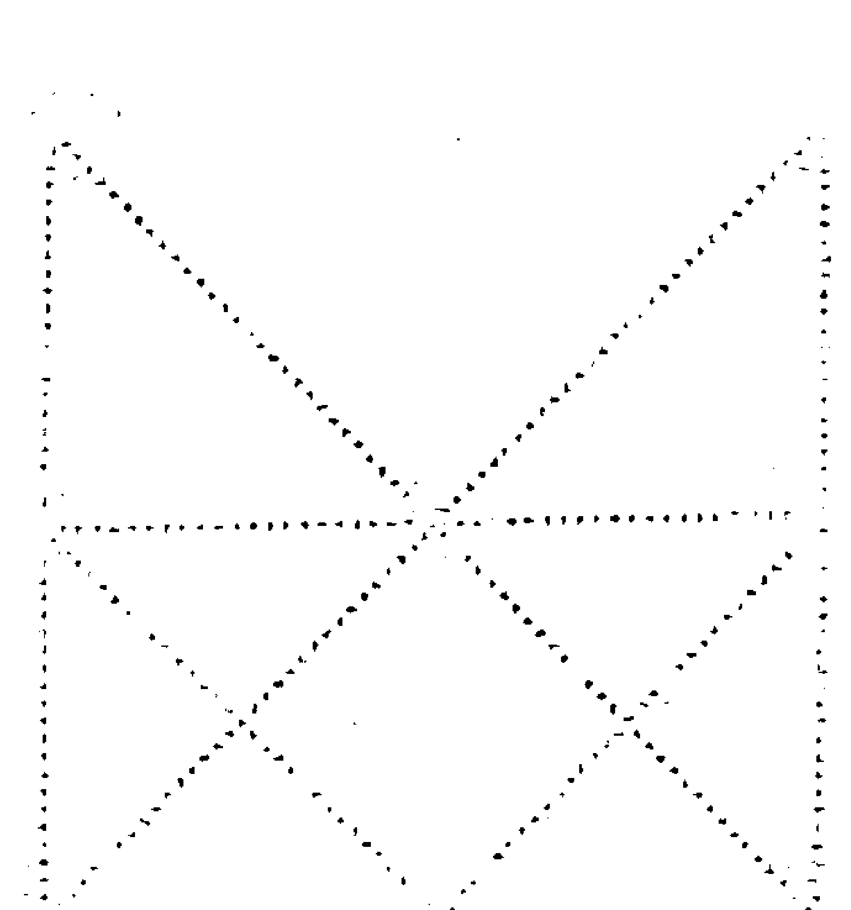

100

## 生命密码

生日数是 9，说明这位先生你喜欢充实的物质生活，并且喜欢为之努力奋斗。看似话不多，却格外固执，有点反复无常。对很多东西都充满了好奇，喜欢探索，明白自己想要的是什么。不太喜欢在别人的领导下工作，反而喜欢用自己的方式去领导别人。生性敏感，神经又脆弱，所以常常陷入幻想而不自知，与现实脱钩。喜欢在感情方面自欺欺人，擅自夸大对方的优点，就算心里明白是怎么回事也不想去面对，等到被伤害之后就转身去寻找宗教上的安慰，然后再次循环，就是不长记性。

9 数或者说 9 号的人，还有一个重大的特点：在他们的内心深处会误以为自己没有缺点！所以，不能批评，不接受批评，不能批评！

除了没有 4 数，其它数字都有圈数，说明他是一位能量均衡的人，比较善于从事管理岗位。缺乏 4 数，在计划性上面需要加强。

但天蝎座的星座数是 8，加上他的生日数是 2+7=9，天赋数的两个 3，和命盘的两个 1，所以，1-2-3，1-5-9，2-5-8、3-6-9，7-8-9，都是主要连线。副线 6-8，是主要副线。参考连线和副线的意义分析这位先生的特征：重视社会地位，自尊心强，爱面子，善良，勤劳，动手能力比较强。但 2-5-8 的情绪化连线加上天蝎座 AB 血型，一旦情绪化时会比较絮叨，瞬间换化成另外一个人。此刻，你该做的就是马上离开，让他冷静下来。

1 数和 9 数都有 2 个圈数，说明他是一个完全不能接受任

102

# 第四章 连线代表的意义

连线代表的意义

何否定式评判的人，和他聊天要以赞美为主线展开话题，否则，很难聊啊。

1 数和 8 数都有 2 个圈数，说明此人的控制欲也很强，不要随便挑战他的权威，否则他会很不爽。但 2-6 连线是一条具有欺骗意味的连线，表面上他爱好和平包容性较强，但如此洞悉世事的个性眼里绝对不容沙子，他会把不满按捺在心中积攒着，终于在某个你意想不到的时刻迸发出来。通常别人会觉得莫名其妙，但时间久了就会明白，当下的爆发其实是 3 年前的某件屁事，这其实有点累。

圈数满的特点是能量均衡，坏处是特点不够，目标不够明确。

命盘图的主人出生于 2008 年 10 月 17 日。

```
2+0+0+8+1+0+1+7=1+9=1+0=1
```

生命密码

从这张命盘来看，这个小朋友命数 1，且有 5 个 1，只有一条主线 7-8-9 联线。

生日数是 1+7=8，长大了会成为一个组织和分析能力一流的人，但有时候会特别极端，比如饿了一周之后狂吃海塞一整天，让人反应不过来。他是个出色的领导，喜欢在作出决定之前先进行周密的分析，但讨厌那些过程中琐碎的细节。他意志坚定，基本不会被别人影响。求知欲很强，是 8 数人中“铜臭味”最少的人。喜欢小众艺术，但也容易沦落为跟风；喜欢反省自己，一旦控制不住自己的脾气就会来一场大爆发，把周围的人都得罪个遍。

5 个 1 会让孩子一个从小就清楚地知道自己是想要什么的人，做事会很专一、投入，极有主见，不会轻易附和别人。但 5 个 1 同样也会导致这孩子情绪容易失控，他一生所需要面对的问题就是如何有效地对自己的情绪进行管理。

5 个 1 的这位小朋友，处处想显示自己的领导能力，所以完全不顾及其他人的想法。听不进去批评——听不进去就算了，还记仇，表面豁达实则内心极其狭隘，觉得太阳就得绕着他转才是自然规律。而且有经受不住打击的嫌疑。强硬别只顾表面，一旦受挫就完蛋的独裁者不是好独裁者。

为什么这么解读？是从哪里看出来他们的特点的？这就需要你仔细看下面的内容，当你真正融会贯通之后，你就可以着手画一张属于自己的命盘图并解释、分析了。

好了？我们继续！

这两张命盘图直白地展示给大家的是我常用的数字排列方式，关于数字上不同的圆圈代表什么我们放在后面讨论。在这

这里，我首先要提醒大家注意的是那些纵横交错的直线，每一个人的命盘上我们都会看到不同的连线组合——每个人都或多或少地欠缺一些数字，这些连线组合就代表着我们的精神能量、情感能量等等。其中的 8 条主线代表的是基本性格，4 条副线代表的是人际关系。

8 条主线：1-2-3、4-5-6、7-8-9、1-4-7、2-5-8、3-6-9、1-5-9、3-5-7。

4 条副线：2-4、2-6、4-8、6-8

这些连线就好比你的命运掌纹，可以全方位解析你的行为模式，告诉你许多被忽视的问题，比如情绪、人际关系、目标等等。完整的连线说明你在这一方面具备优势，如果没有，则在此方面有一定的缺陷和不足，需要额外关注。每条连线都有正反两种意义。

# 第四章 连线代表的意义

## 第一节 主线的意义

当你有 1-2-3 主线时

别名：体能线、艺术线

这条线反映出你身体的意识，有这条主线说明你对自己的身体健康还是很在意的，会希望有一个健康体魄，并且身体机能良好，五感强大。没有的话，则说明你对自己的身体问题不是太在意。

1-2-3 连线又被称为艺术线，1 是勇于开创的典范，2 是超强的直觉，3 则代表良好的口才和沟通能力，所以有这条连线的人会和艺术息息相关，要么是从事相关工作，要么就是有艺术方面的爱好。你对美有绝佳的鉴赏力，艺术之美会让你感到身心愉悦。你任性起来也挺“艺术化”的，超级情绪化，而且还特会表达自己的这种情绪起伏。倔强的劲头和难搞的艺术家一

当你有 4-5-6 主线时

别名：组织线、知能线

这条线代表了逻辑性、知性与智能的发展，有这条线说明你喜欢用脑子办事，看待事情很理智，不会冲动行事。如果没有或者线上数字圈很少，就说明你基本上是靠着动物般的直觉才长到这么大的。

4-5-6 连线让你对所有的事情都有一种完美的期待，你看中细节，理性、逻辑时时浮现在脑海中，遵守游戏规则，喜欢按秩序办事，条理分明，给人安全感。善于组织各种活动，但是死板，不懂幽默，一旦达到极致，你就像是个缺爱的完美主义者，特别挑剔，特别严格，特别喜欢纠缠于琐碎的问题，甚至置大局于不顾，典型的因小失大。

当你有 7-8-9 主线时

别名：心灵线、贵人线

拥有这条线的你很厉害啊，总能遇见生命中的贵人帮你渡过难关。你有智慧又有人脉，事业成功是迟早的事，但前提是你得有自己的能力，总是有人站出来帮忙会让你丧失自己思考和动手的能力，成为依赖别人的寄生虫。没有这条线的人，还是踏踏实实自己埋头苦干吧。运气这种东西都是虚幻的，别幻想天上掉馅儿饼会砸到你。不，应该这么说，你的天空根本不会下馅儿饼！7-8-9 连线代表了心灵的发展，你比较适合从事自然、环保类的公益工作，但是身上惰性很重，容易投机取巧。

当你有 1-4-7 主线时

别名：物质线、运动线

这条线代表了极佳的财运和对物质的需求。你对运动也兴致高昂，喜欢锻炼或者喜欢体育界的赛事讯息，只做自己力所能及的事，对自己的位置有清楚的认识。

1-4-7 连线综合了 1 的独立、4 的踏实和 7 的细致，拥有此线的人重视物质和金钱，追求社会地位，渴望获得社会认可。物质会满足你的心理需求，给你十足的安全感，可是过犹不及，你一旦把物质看得太重就会瞬间变成一毛不拔的守财奴。爱钱如命，最烦别人借钱，超级小气，总觉得大家都只盯着你的钱。

当你有 2-5-8 主线时

别名：情绪线、感情线

拥有这条线的人，热情活泼，能很快和人打成一片，实在是公关高手。但有时会因为太过活泼外向而口不择言，说话不看场合，会有不给别人留面子或者讽刺人的现象发生。当然，更多的时候你都是故意的。绘画、演说、唱歌方面你都有天分，如果能控制好自己的情绪会对你有很大帮助。对待感情方面很认真，也知道自已想要什么，很真实。

但是真实过头就是不圆滑，不给人家留面子，人家怎么会对 你有好脸色。

当你有 3-6-9 主线时

别名：创意线、空想线

拥有这条线的人很聪明，很会表达自己，非常有创意，能从不同的角度思考问题。你喜欢制造一个又一个梦想，完全忽略眼前的 actual。眼高手低，只说不干，很喜欢就一个问题展开想象，张嘴就是“假如、假设”，想得太多太远，纯粹自找麻烦。

你无法集中精力，所以很多很有想法很有前途的事情都会半途而废。如果你能在一段时间内只干一件事，那这件事你会做得比任何人都好，你容易发财。

当你有 1-5-9 主线时

别名：沟通线、事业线

这条线会让你有很强的事业心，为人也积极向上，力求上进，你对生命充满热情，对工作很用心，能适应不同的工作需要，只要是自己兴趣所在，就会全身心投入，完全不计较个人得失，你会乐在其中。如果线上数字的圈数过多，极有可能会成为工作狂，为了工作不要命，你得小心一点自己的身体，毕竟工作猝死的新闻不在少数。

你得培养点业余爱好，否则会觉得除了你的兴趣之外其他都是垃圾，根本不值得自己费心。这是完全不对的。要工作，但也不能变身偏执狂！

当你有 3-5-7 主线时

别名：成效线、影响线

拥有此线的人，非常受同事、老板的喜爱。你具有良好的口才、天生的表演才能和灵敏的感受力，所以和别人相处的时候

## 生命密码

会让旁人觉得生动又有趣，让人快乐不已。你是一个特别善于和人打交道的人，有公众人物的特质，到哪里都能吸引众人的目光。你要么去做演员，要么去做营销，都绝对是一把好手！

但假如你沉迷于众人的溢美之词的话，就很可能坠落成为自我膨胀的“暴发户”，还没怎么样架子倒先摆起来了，你以为自己是迈克尔·杰克逊，其实不过是四五流甚至不入流的小角色罢了。

# 第四章 连线代表的意义

## 第二节 副线的意义

当你有 2-4 连线时

别名：灵巧线、变通线、诡诈线

你机智、聪明，有一种北欧神话里面邪神洛基的小聪明劲头，会根据当前情况作出判断，会举一反三。因为好像什么事都难不倒你的样子，以至于你做什么事情都会心不在焉，说好听是聪明，说不好听就是狡诈！有点耐性，别以为自己会点小聪明就大事难不倒了。你还是太年轻了少年！多经历些风雨不会有坏处。

因为你很机灵，还很精明，所以有时候会发现旁人疏忽的漏洞，一旦意志不坚定就容易屈服于自己的私欲，然后一路滑向犯罪的深渊。少年，罪犯都觉得最聪明——直到警察来拷走他。你自己衡量吧。

当你有 2-6 连线时

别名：和平线、正义线

你是正义的使者，特别喜欢保护弱者，和什么人都能和谐相处，对大家都一视同仁，处处体现了你和谐平等的处事原则。一旦感受到不公便会周边环境失望，基本上是个挺脆弱的和平主义者。

你爱好和平，大家都知道，但无论什么事情都想要息事宁人就不是“和平”了，是尿包！因为怕得罪人，所以该说的不说，不该做的瞎做，空有好心却办不了好事！

当你有 4-8 连线时

别名：稳定线、模范线

你踏实稳重，四平八稳的性格让人信赖，属于在工作上很有效率的人，性格比较保守不是坏事，一步一个脚印慢慢来反而会有大成就。不太喜欢多变的环境，那样容易引起你的不安，你基本上和阴谋诡计没什么关系，纯粹是因为脑子里没长那方面的回路。你很实际，不会为不着边际的想法埋单。

你很在乎钱，在乎事业，目的性很强，尤其在意别人的评价。所以，如果有可能你还是会铤而走险，或者说你不反对用一些不正当的手段帮助自己成功，你是在玩火！

当你有 8-6 连线时

别名：诚恳线、诚实线

你就是电视剧里的万年男二号，为了自己在意的人一直都是默默付出、委曲求全，甚至不惜牺牲自己成全对方。可是由于不轻易表达真实想法，往往会被女主角忽视到底，自己各种纠结伤心压力大，也无法换来爱人的回眸……

你刻意地讨好别人会显得特别虚伪，如果感到别人亏待了你就会常常抱怨自己如何如何付出，他们如何如何不知恩图报，一副有所求的嘴脸。你压抑自己到了极点就会来一次惊天动地的大爆发，让大家震惊于你阴暗的内心。

# 第五章 属于你的天赋数

## 第一节 命数 1 的天赋数

10 / 1 这些是出生于公元 2000 年以后的 1 数人。前面所说的 1 数特质都能准确描述他们的性格。

19 / 10 / 1 这是个双重性格的灵数性格。看起来不太平易近人，但是熟悉之后会发现你还挺会照顾人的，可惜这个亲切的感觉又会和 1 的天性相抵触，这就是你悲惨的根源了。

28 / 10 / 1 恭喜你，你算是最好相处的 1 数人了，不是因为你多善良，而是因为你清楚地知道“怀柔”政策的重要性。你会用这种亲切的风格来为自己的领袖前途扫平道路，给人家背后打闷棍之前还会体贴地蒙上一块厚一点的布，然后自欺欺人地说，这样他会没那么痛。

37 / 10 / 1 你很有才华，钟爱并且精通原创思考，但你疑神疑鬼，老觉得人人都要害你，不认识你的也恨不得踩你一脚。你没有自己想象的那么有威胁感好吗？你达不到自己的梦想和 society 一点关系都没有好吗？

46 / 10 / 1 你真的是 1 数人吗？这么稳重又自信、踏实，可让人依赖。只是不喜欢别人当你身上的蛀虫，难怪你容易为情所困，既喜欢人家事事为你着想，又不想事事为别人着想，哪有这么便宜的事情？

## 第二节 命数 2 的天赋数

11 / 2 和 29 / 11 / 2 你表面看起来是会花许多时间照顾别人的好人，亲切，弱点在于双重性格，一方面独立，一方面依赖。常会因为自己过于依赖而不开心，学习独立吧！

38 / 11 / 2 你的个性很独特，创意又务实，但这两项特质不太容易调和，因此挫折感是必须的。虽然你也希望能找个可以依赖的人，但问题是你想当说了算的那个，你忍受不了“万年老二”的角色扮演。

47 / 11 / 2 你是典型的“雁过拔毛”啊，干什么事都能从中分一杯羹，不喜欢冒险，善于分析。其实只要你不懒，不要老等着天上掉馅儿饼或者是贵人，你们基本上可说是心想事成。

20 / 2 标本似的 2 数性格，外表明亮内心阴暗，不自觉地分析身边的一切，一旦发现不对劲，态度马上就会一百八十度反转。最好玩的是，这种变化也会吓你自己一跳。

## 第三节 命数 3 的天赋数

12 / 3 你是不是特别害怕别人问你年龄？因为一旦你说实话，别人就会惊叹“你好老成啊”。没错，你显老，而且你有一手不用经过特训就能把事情做得差不多的本事，所以大家盛传是你投胎的时候带来的技能。你确实很有创造力，也不怕挑战。

39 / 12 / 3 你才华洋溢，心智强，但你麻烦出在必须找到适合的渠道来释放，否则就病怏怏的。然后就是你不够实际，只有吃苦头才是长见识的唯一途径。你讲究、固执、执迷不悟还死不认错，老觉得自己能对付一切状况，真磕得满头包的时候就不要责怪别人没提醒你了！

48 / 12 / 3 恭喜你，你是具有“会成为卓越领导者”可能性的人，前提是你的理想和现实必须好好协调，否则光你的内心戏就够写满20集电视剧了。这个冲突啊，这个郁闷啊，有那时间不如赶快去给自己制定一个目标吧。

21 / 3 你独立，很早就有很多的个人资源了，手还很巧，但唯一的难题就是与人相处问题。你会抱怨，找个能理解你你也理解对方的人怎么就这么难呢？问题在你身上你说能不难吗？刚开始和人家套近乎表友善，一旦事情发展不如预期就瞬间拉开距离，表现得独立极了，谁能忍受你？

30 / 3 最经典的 3 数人，有理想不招人喜欢的小孩，缺乏自信，老觉得自己什么都不会。其实你基本上可算是“才华出众型”的，但很奇怪你就是没办法相信自己，多给点精神刺激就好了。

## 第四节 命数 4 的天赋数

公元 2000 年后，第一个单纯的 4 数人出生了。那就是出生于 2000 年 1 月 1 日的小孩，相加总数是 4，没有灵数，只有命数 4。所有对 4 数人的描述在这些人身上都能成立。

22 / 4 这是个“卓越数”，你们的亲切友善全都带着目的，端看你想从对方身上获得什么。钱、权、感情，只要是你自身的安全感所需要的，你都会不择手段去夺取。你啊，目标定得太高，达成比较难，而且会因为意气用事而耽误自己。

13 / 4 和 31 / 4 这类的 4 数人出乎意料地有创意，勤奋，而且多才多艺。内心脆弱，想稳定的同时又忍不住想尝试新鲜事物，矛盾得不得了。

40 / 4 最典型的 4 数人。你完全可以做到“就事论事”，而不牵扯其他，单纯得令人发指。你看穿事情的本质然后迅速找出应对办法的本领简直就是 BUG，你对自己梦想的执着近乎执拗，如果这个梦想不巧比较不切实际，那么你就抑郁一辈子吧。

## 第五节 命数 5 的天赋数

公元 2000 年后，单纯的 5 数人出现了，例如出生于 2000 年 1 月 2 日的小孩，加总数字是 5，没有灵数，只有命数 5。所有对 5 数人的描述在这些人身上都能成立。

14 / 5 你给人的第一印象貌似稳健，貌似值得托付。但是，你这人保守又不主动积极，除非有人不停鼓励你或者给予你强力的支持。好在赶鸭子上架似的把你推出来干一些事，你倒也不会退缩。

23 / 5 你看似友善、温和，但实际上那是相当顽固不肯变通，这也算是 5 数中的奇葩了。你这种死鸭子嘴硬的性格会让周围的人觉得你不好相处。

32 / 5 你是经典的理想主义性格，知道自己想要什么，可一旦感情用事，理想就会扭曲，造成自己的混乱和挫折。你必须彻底改变自己。

## 第六节 命数 6 的天赋数

公元 2000 年后，第一个单纯的 6 数人出现了。例如出生于 2000 年 1 月 3 日的小孩，这些数字的总和是 6，没有灵数，只有命数 6。前述对 6 数人的描述在这些人身上都能成立。

15 / 6 恭喜你，你是所有 6 数人里最健康的组合，你愿意承担责任，但是又清楚地知道这个责任自己是否应该负责。你独立，干什么事都需要自己的空间。当别人出现问题时，你会犹豫要不要伸手帮忙，因为你既迫切地想照顾别人又害怕别人因此赖上你。

24 / 6 你让人觉得和蔼可亲，耐看。善于处理人际关系是你的强项，如果别人对你的付出毫无反应，你不会到处嚷嚷说自己被利用了什么的，你会觉得自己就是个烈士，悲壮地面对所有人，然后自己一个人离开。其实，你真的需要为自己活一次，主导自己的人生。

33 / 6 这是个卓越数。你拥有非常强的创造力，但是你必须先做出重大的人生抉择和牺牲之后才能顺利发展自己的潜能。你总是承担了过多的责任，你得弄明白，只有展开自己的才华才能快乐，否则就会一辈子不开心。你太不实际，一副理想主义的派头，且坚决不接受批评。

42 / 6 你是很实际、脚踏实地的，重感情、喜欢交朋友，甚至为了朋友不惜改变自己。你朋友多，但真正交心的没几个。

# 第五章 属于你的天赋数

## 第七节 命数 7的天赋数

公元 2000 年后，第一个单纯的 7 数人出生了。例如出生于 2000 年 1 月 4 日的小孩，相加的总和是 7，他们没有灵数，只有命数 7。前述对 7 数人的描述在这些人身上都能成立。

16 / 7 你看似坚强独立，但是一面对感情就完蛋，为了取悦对方不顾一切。善于解决问题，查找修补漏洞。

25 / 7 你和任何人都合得来，可以坦然面对周围的人，处理人际关系比较轻松。不过你依然需要独处空间，需要自由，你挺容易获得领导首肯，改掉动不动就说“再说吧”的坏习惯。

34 / 7 你理想极高，别人会以为你心胸开阔，那是因为没见到你付诸行动的时刻。你死硬固执的一面会彻底暴露，也不用太过紧张，其实你这副德行是很多计划必不可少的部分，你宁可稳扎稳打，错失机会也不愿意冒险。

## 生命密码

43 / 7 你脚踏实地，偶尔懒洋洋也不会有什么大的问题，因为你有毅力。当你争取到最后发现到手的不是自己想要的东西时，成熟点，别矫枉过正，因此半途而废就得不偿失了。

128

## 第八节 命数 8的天赋数

公元 2000 年后，第一个单纯的 8 数人出生了。例如出生于 2000 年 1 月 5 日的小孩，相加的总和是 8，没有灵数，只有命数 8。前述对 8 数人的描述在这些人身上都能成立。

17 / 8 你有领袖特质，坚强独立。你最大的问题是，犹豫的不是时候，明明已经成功在握，反而开始踌躇，觉得这个东西真的是我想要的吗？难道我真的只想追求这个？甚至扭头就走，白白扔掉到手的胜利果实，你活该人生受挫折。

26 / 8 你最常说的一句话就是将心比心，总希望能帮助所有需要帮助的人，所以你人际关系不错，遇到困难也不会轻易退缩。你太把自己不当外人，谁的事都想扛一扛，所以经常承担不属于自己的责任。

35 / 8 你几乎拥有所有 8 数人的优点，交际手腕、沟通技巧、平易近人等等。你想要的很多，也愿意尽其所能为之努力，

## 生命密码

问题是你愿不愿意付出很大代价去争取。你通常都会退缩或者找个看起来比较像捷径的办法，但放心吧，绝对没有好结果的。

44 / 8 这是个卓越数，身为卓越数的你乐意与人合作，但是你的诚实程度会是个问题啊，等人家都看破了你再后悔就晚了。你有可能一辈子都没有去做你真正想做的事，因为对安定的向往大过了你的事业心，可是自己又会不甘心，结果就是一边不甘心一边碌碌无为地终老。

130

## 第九节 命数 9的天赋数

公元 2000 年后，纯粹的 9 出生了。例如出生于 2000 年 1 月 6 日的小孩，相加的总和是 9，没有灵数，只有命数 9。前述对 9 数人的描述在这些人身上都能成立。

18 / 9 根本猜不透你，什么独立、自主全是假象。你觉得自己总是在取悦别人，但就是没办法让自己快乐，于是你总在纠结该给别人多少，给自己多少，苦闷于做了好事但没有回报。

27 / 9 你感情丰富，为人亲切，但分析能力是零。因为总担心看到自己不想看的，所以索性就不去往深处探究，经常自欺欺人，盲目跟风。兄弟，问题不会自行消失的，你得解决它才行啊。

36 / 9 好脾气先生，喜欢就是喜欢，不喜欢也装不来，就是喜欢想太多。你不能一辈子活在幻想里不出来啊，要是找不

## 生命密码

到务实的方法，梦想永远都是梦想，成真不了。

45 / 9 你能力超群，心胸开阔，愿意吃苦也愿意努力，只是你不能一发现行动受阻就丧失勇气啊。你务实的心常常会阻止你的梦想，你反复纠缠于此，弄得自己不开心。

132

## 第一组人生密码

先天数由你的出生年月日组成，这是你上天赋予你的第一组人生密码，完全不掺杂后期的开发和培育因素，就是这些简单的数字，构成了原本的你。年、月、日分别代表了你人生的不同阶段。

133

## 第二节 出生日(青年至壮年)

生日，这个特殊的日子在我们的人生大格局中只占到很小一部分比例，但就是这一点的细微差别，也可能造成种种命运的偏差，就像十字路口的指示牌，不同的路口不同的前途，你能从生日数里快速地读懂自己的基本特征。青壮年时期最为突出的就是生日数的表征，所以喽，当你下次再听说隔壁公司的XXX 和你同月同日生的时候，别光感叹“好巧”之类的，过去打个招呼吧！

生日数的计算方法非常简单：

每月 1 日、10 日、19 日、28 日生日数 1，你的生日数是 1。
每月 2 日、11 日、20 日、29 日生日数 2，你的生日数是 2。
每月 3 日、12 日、21 日、30 日生日数 3，你的生日数是 3。
每月 4 日、13 日、22 日、31 日生日数 4，你的生日数是 4。
每月 5 日、14 日、23 日生日数 5，你的生日数是 5。
每月 6 日、15 日、24 日生日数 6，你的生日数是 6。
每月 7 日、16 日、25 日生日数 7，你的生日数是 7。
每月 8 日、17 日、26 日生日数 8，你的生日数是 8。
每月 9 日、18 日、27 日生日数 9，你的生日数是 9。

## 命数对照的第二阶段的年龄范围表：

| 命数 | 第二阶段 |
|---|---|
| 1 | 28～54岁 |
| 2或11 | 27～53岁 |
| 3 | 35～61岁 |
| 4或22 | 34～60岁 |
| 5 | 33～59岁 |
| 6或33 | 32～58岁 |
| 7 | 31～57岁 |
| 8 | 30～56岁 |
| 9 | 29～55岁 |

还拿刚刚那位 1982 年 4 月 29 日的仁兄做例子，命数 8，生日数是 2，那么他在 30 岁至 56 岁之间都会呈现出 2 的特征。

### 1号人

每月 1 日、10 日、19 日、28 日出生的人。

### 1 日出生的 1 号人

意志力坚定，控制欲超强，细节完美主义者，清楚地知道自已究竟能干些什么，高冷傲娇范的外表下隐藏着一颗渴望掌声的心脏。

### 10 日出生的 1 号人

因为给人的印象太过“十面全能”，所以在自己遇见麻烦的时候，别人的第一个反应一定是：“这还能难倒那家伙？”老觉得自己曲高和寡，不会干家务活儿是你的死穴，但是创意相当不错！

### 19 日出生的 1 号人

性格很复杂，为人独立，看待事物的角度比较宽广，脾气容易走极端。看似跟谁都玩得来，实则对谁也不交心，适合从政。

### 28日出生的1号人

有人缘的1号人，只要定下目标就决不放弃。但是容易散漫随意且不能接受批评，虽有实干的能力可惜太懒，有强迫症！

### ① 2号人

每月2日、11日、20日、29日出生的人。

### 2日出生的2号人

老好人，没主心骨，喜欢小题大做，不知道“自信”是什么，特容易当自己是受欺负的小媳妇，纯粹想太多，有变得尖酸、刻薄的潜力。

### 11日出生的2号人

直觉超准灵性很重，但喜欢自我怀疑，因此常常看不清真相，总是在意别人说了自己什么。感情丰富，生活就像在演戏，以自我为中心。

### 20 日出生的 2 号人

上厕所都要随大溜，对你来说出风头等于压力，最喜欢混在人堆里，那样才有安全感。爱钱，逼急眼了还是可以独立起来的。

### 29 日出生的 2 号人

有灵性，会吸引到很多拥有相同能量的人，彼此互相影响，最恨事情不按预期那样发生，偏执，极端，会被情绪左右。

### ① 3号人

每月 3 日、12 日、21 日、30 日出生的人。

### 3日出生的3号人

纯乐天，对很多事都抱有极大的热情。情感丰富，所以遇见失败会大受打击，没有耐心和恒心。

### 12日出生的3号人

注重生活品质，理想主义，有很强的使命感。朋友虽然多但是总有让自己不满的地方，喜欢玩暧昧，没耐心，浮躁。

### 21日出生的3号人

含蓄，喜欢按部就班，不擅长表达，悲观主义者，而且悲催的是还老是一语成谶。

### 30日出生的3号人

大嘴巴，太能说了以至于都没朋友了，小孩子心性，特别容易被骗。

### ① 4号人

每月 4 日、13 日、22 日、31 日出生的人。

### 4 日出生的 4 号人

无法活在没有规则的世界，丝毫不懂生活乐趣。工作狂、不善沟通，简单自然没野心，容易一辈子庸碌。

### 13 日出生的 4 号人

看似创新实则保守，顽固得很，有点古怪，追求平稳大环境下的小小风波。

### 22 日出生的 4 号人

依赖心超乎寻常，平时情绪一直都挺负面的，看人很准，太容易粘人，招人烦。

### 31日出生的4号人

直觉动物，让旁人完全摸不到你的套路，想法创新，不懂计划的重要还喜欢强调优越感，说话不过脑子，让人头疼。

### ① 5号人

每月5日、14日、23日出生的人。

### 5日出生的5号人

“不变化毋宁死”就是你的格言。适应力极强，但是无法保持长久热情。夸张，幽默，自大，没规矩。

### 14日出生的5号人

多重人格般的外表，适合自己做工作室，喜欢变化，喜欢新鲜，天生散漫又带点叛逆，不会隐藏情绪，容易得罪人。

### 23 日出生的 5 号人

敏感、会做人，很自信，性格豪爽，但容易偏执，挑剔，不给别人留情面。

### ① 6号人

每月 6 日、15 日、24 日出生的人。

### 6 日出生的 6 号人

满身正能量，喜欢宅在家里。有些多管闲事的嫌疑，不会对别人的要求说 No。

### 15 日出生的 6 号人

知道自己想要什么，比较招大家喜欢，喜欢自行总结一些经验。比较悲观，不懂什么是放松。

### 24日出生的6号人

喜欢吃、喝、享受，有艺术天赋，很聪明，喜欢把家里打造的舒适又安心，精打细算，但是负面情绪也不少。

### 7号人

每月7日、16日、25日出生的人。

### 7日出生的7号人

阴谋论主义者，拥有危险的好奇心，喜欢自我标榜，坚信自己才是正确的。

### 16日出生的7号人

外冷内热，喜欢自己待着。讨厌竞争，以自我为中心。

### 25 日出生的 7 号人

就对自己感兴趣，相信和神秘学相关的所有东西，极看重自己的隐私，以至于有点不近人情，喜欢在探索过程中更新自己的经验。

### 8号人

每月 8 日、17 日、26 日出生的人。

### 8 日出生的 8 号人

想出人头地，但不喜欢被别人操纵，耍手段、秀下限你都不在乎，金钱至上，虚荣。

### 17 日出生的 8 号人

喜欢小众艺术，但也容易跟风。有时候会控制不住自己的脾气，讨厌琐碎的东西。

## 26日出现的8号人

喜欢照顾身边的人，喜欢孩子，人际关系很和谐，踏实，但是有点势利眼，爱慕虚荣，喜欢炫耀。

### 9号人

每月9日、18日、27日出生的人。

## 9日出生9号人

正能量不少，兴趣广泛。善恶分明，但会给人留下冷漠不近人情的感觉，会揽一些和自己没关系的责任过来。保护欲过度。

### 18日出生的9号人

希望被别人需要，很看不起那些充满铜臭的社会炫富现象，

## 生命密码

但另一方面又觉得不那么干，大家根本不知道你如何成功。

### 27日出生的9号人

固执，喜欢丰厚的物质生活。不喜欢受人领导，敏感，容易与现实脱钩，只相信自己愿意相信的，容易陷入恶性循环。

## 第六章
第一组人生密码

## 第三节
出生年（晚年）

年份数简单说来就是将年份数依次相加，最终得到的那个个位数。如 1982 年生，1+9+8+2=20=2+0=2，年份数就是 2。年份数是对个人晚年有所启示的数字。在你的第三阶段，年份数的影响开始主宰你的行事和性格。

## 命数对照的第三阶段年龄范围表：

| 命数 | 第三阶段 |
|---|---|
| 1 | 55岁后 |
| 2或11 | 54岁后 |
| 3 | 62岁后 |
| 4或22 | 61岁后 |
| 5 | 60岁后 |
| 6或33 | 59岁后 |
| 7 | 58岁后 |
| 8 | 57岁后 |
| 9 | 56岁后 |

## 年份数 1

1945、1954、1963、1972、1981、1990、1999

到了此时，你还是闲不住，到处寻找新的刺激和挑战，好在即便年龄增长，可你的生命力依旧旺盛。得益于你的开创精神，你积累了很多资源，拥有众多过去想象不到的东西，需要注意一下心脏和血压。

## 年份数 2

1946、1955、1964、1973、1982、1991、2000

你不知道什么叫“宅”，年轻的时候不知道，老了依然不知道。“狐朋狗友”一大把，喜欢的事也一大把，多才多艺的好处现在开始显现，你会发现有更多的事情等待你参与。情感是你生活中的决定因素。多看看养生方面的书和电视节目，少吃点糖，注意胃和消化系统。

## 年份数 3

1947、1956、1965、1974、1983、1992、2001

你的表达能力空前高涨，你明显已经找到了新的表达途径——比如唱歌、演戏。喜欢找人聊天，热衷交际。职业稳定，

## 年份数 4

1948、1957、1966、1975、1984、1993、2002

你的勤勤恳恳和务实几乎成了一种惯性，总之就是闲不住，总得找点事干顺便赚钱。提早规划自己的人生会对你帮助很大。管住自己的脾气，否则会遭到别人的误解。开朗点，别悲观，忧郁症可不是闹着玩的。

## 年份数 5

1949、1958、1967、1976、1985、1994、2003

依旧充满好奇心，会为了自己的兴趣不管不顾，从中寻找到属于自己的那份自由自在，但是容易被很多杂事分散注意力，从而找不到重点。你得看看自己的能力再下决定，否则得不偿失。特别注意健忘症、痴呆等精神方面的问题。

## 年份数 6

1950、1959、1968、1977、1986、1995、2004

你就是个老保姆的命，岁数大了还要帮自己的儿女带孩子。喜欢一大家子人聚在一起。好多人都把你视作家庭支柱，你会成为“善良、热心、能干”的代名词，你满足于照顾大家。注意高血压、超重、关节尤其是腿部的问题。

## 年份数 7

1951、1960、1969、1978、1987、1996、2005

你有种感觉，到了晚年自己喜欢独处——那是你的错觉。你一辈子都喜欢自己待着，晚年也不例外。到了这个时候，你发现自己总结了一辈子的经验得想办法留下去，同时也有很多需要你再次学习的新东西，容易陷进对宗教的研究。轻松点，事情不总是往坏的方向发展，注意肠胃。

## 年份数 8

1952、1961、1970、1979、1988、1997、2006

你在社交上依旧活跃，甚至能用八面玲珑来形容。你渴望成为焦点，会频繁出入各种社交活动。因为你一辈子向钱看，所以到这时候过得不会太差。喜欢和人讨论宿命、轮回。得注意情绪大起大落带来的空虚。

## 年份数 9

1953、1962、1971、1980、1989、1998、2007

如果你攒够了钱，那你现在应该是大慈善家；如果你特别有名，那你现在是精神导师。你在人群中就是高尚的代名词，容易成为公众人物。去参加聚会吧，或者旅游什么的。你得避免和别人起争执，还有小心外伤。

## “积习难改”的限制数

## 第七章

“积习难改”的限制数

## 限制数算法：

把自己的生日月份及日期相加，月 + 日。例如：4 月 29 日，就是 2+9=11=1+1=2，4÷2=6，那么这位仁兄的限制数就是 6。再举个复杂点的，12 月 29 日生，这样加，1+2=3（月），2+9=11=1+1=2（日），然后把月的个位数和日的个位加一起，3+2=5。

### 限制 1：

死要面子活受罪。你不自信，而这根本不能怪你，主要是你成长的环境从小到大就没有给你培养自信的机会。小孩子需要夸奖，可是你的监护人肯定是那种“打击之下出贤者”教条的信徒，他们总觉得你做得不够好，有可能本意是想激励你做得更好，谁想到适得其反呢？经常是你好不容易完成了一道数学题，兴冲冲地跑去炫耀，结果你母亲大人眼一瞥，说，你还能更笨一点吗，这么简单都耗时这么久？久而久之你就对自己产生了严重的怀疑，但是你还是有点不服气，想要努力证明“我说的是对的”，随便一个问题都需要用吃奶的力气去证明自己的正确性，可见你的思想包袱有多重。

### 限制2（或卓越数11）：

让你描述一下自己，你会说，嗯，Amy 说我很友善，可 Monty 说我有点自卑，但是 Lucy 说那些都是小缺点……你本人就像一块拼图，得借由别人的言语拼凑起来，你自己？Sorry，你没有任何意见。难道离了别人的态度你就不是你了？别人随便说句什么你就患得患失，累不累啊。有时候你会选择虚张声势来掩饰自己，生怕别人提到你的弱点，所以拼命摆出一副“我很好，我什么都不怕”的架势，就好像随时带着防护盾一样。你超级喜欢依赖比你强大的人或者是比你有能力的人，事情都让别人干了你能不眼高手低吗？偏偏还自欺欺人地觉得厉害的是自己，狐假虎威。

无关性别，你就是个娘炮！这和小时候妈妈对你过分疼爱有关，你是被惯大的，所以完全没主见、没有自己的标准，为了掩盖自己的脆弱，你有时还会显得特别暴躁，浑不吝。你得明白一件事，软弱并不可怕，可怕的是不承认自己软弱，那样你只会永远软弱下去。

### 限制 3：

“安全”这个词恨不得就是你的神！你这一辈子离开这两字就活不下去了，这和你的父母多少也有关系，他们必定是保守人群的一分子，从小就给天真无知的你灌输“安全”的重要性，过马路要看车，外出要记得锁好门，陌生人来了千万不要开门……成年了又会告诉你找个好工作生活有保障，找个好男人一辈子有保障、就算过不下去了狠敲一笔后半生有保障……所以你很重视能带来安全感的一切，比如钱，没钱的时候你没安全感，有钱了你又开始担心钱花完了怎么办。没人找你谈恋爱不安全，有人找你了也不安全，你不愿意面对问题，因为那代表着“不安全”，你解决它的方法就是“当作没发生”。

你最缺少的就是勇气！你没有勇气探索自己的底线，你想过没有，你害怕的其实并不是问题本身，而是“未知”这件事，尝试一下不会死，你应该多多培养自己心中的小叛逆，时不时藐视一下所谓的“安全”，顺其自然，放松一下，就会轻松很多。

### 限制 4：

你的童年好可怜，明明是个开朗活泼喜欢蹦跳的孩子，偏偏被父母用“你要听话，否则就挨揍”绑住了手脚，早早就和“淘气”绝缘而成为幼稚园老师眼中的“乖孩子”。内心强烈渴望能够释放天性，但是被家长教育的习惯性压抑自己，于是只好找各种渠道来引起大家的关注。你向往自由，也希望自己能有叛逆的勇气，但是长期的约束早已经让你丧失了“High”的能力，你展现在世人面前的形象就是一个很压抑不快乐的人，这种行为习惯会影响你面对社会，你缺乏自信、害怕责任。

你得重新学会小孩子们都的一项技能：冒险！你在害怕什么？你在恐惧什么？这件事真的像你想的那么严重么？冒一次险吧！太乖的孩子没市场。

### 限制 5：

苛刻的挑剔鬼。在别人看来无所谓的事情到你这里就非得拿道德标准衡量再三，一定要分个对错，你不相信“顺其自然”这个词，满脑子都是“这件事这样才对”“那件事那样才正确”，你简直就是道德楷模啊。你总有种奇怪的概念，那就是你必须达到某种条件才能做某事，达不到条件就直接去做事在你看来就是罪该万死的，是不对的，真不知道是让人感慨你父母教育的太成功呢，还是你这孩子太死脑筋？你特别喜欢在第一时间指出别人的不足和缺点，你不是友善的提点，而是因为害怕别人发现自己的缺点而进行的先发制人，这样一来焦点就被转移，

### 限制 6：

高贵冷艳无所不知，这是你对自己的定位。你觉得自己很聪明，知道的很多，可你恰恰就忽略了一件事，就是“你不知道的事，太多了”，你害怕认清这个现实，所以不停地给自己催眠。举个例子，你明明不知道《名侦探柯南》里的凶手是谁，可当结局凶手暴露时你依然会说“其实我早就知道了”，然后自己信以为真，拜托，你是 3 岁的小孩子吗？不懂装懂最可怕。

你最怕的是无知，所以你只能采取“自己早就知道”的办法来缓解内心的焦虑，你太紧张了，你实在没必要“无所不知”，有那时间去做点实际的事吧，要知道，世界很大，你占不了多少比重的。整天胡思乱想很容易一事无成！

### 限制 7：

你觉得没有钱、没有名气就是一种失败，所以你有特别迫切的成功欲望，你得掌控一切才踏实，这种俗气的“拜金”举止将会伴随你一生。你无法容忍平凡，再加上严重的依赖情结和不安全感，你绝对会做出一些惊世骇俗的俗气举动，比如各种无耻只求曝光的举动。从小你周围就弥漫着一种氛围，成功，就是社会对你的认同，不管是工作还是学业，甚至是择偶等等，只有不平凡的，才是好的。于是乎，这一点就成了你的人生信条。

你需要证明，成功的证明，自己不平凡的证明，所以你会毫无顾忌地插手周围的一切。从上司今天的会议决定到闺蜜应该喝什么口味的咖啡，最好都由你说了算，因为不听你的话他们很有可能就“失败了”。

你再这样下去就快成强迫症了，记住，科学家曾经说过，失败乃成功之母，平凡也不等于下三烂，失败有失败的意义，平凡有平凡的乐趣，身外的一切都是虚无缥缈的，只有自我的认同和肯定才是真实的。

### 限制 8：

最好全世界都需要你，你享受那种照顾别人、关心别人的感受。你不会冷落任何人，雪中送炭是你的拿手好戏，但问题是，找你求助的人一多，压力一大，你又会不爽，会生气，会排斥人家。你这样就让人很难办了，因为善意和爱心并不是毫无代价的，那需要你彻底地忘我，彻底地利他，扪心自问你能做到么？“被人需要”只是你的“需要”而已，跟善良没什么关系。

你从小就很在乎别人对你的态度，你很关心大家是否需要你，如果答案是否定的，就会感觉被抛弃了，甚至会因此抑郁、自暴自弃。你想太多了，其实你可以尝试着先关注一下自己的需求，想做什么就做什么，不喜欢做就不做，该拒绝别人的就拒绝。你又不是超人，没道理事事都得应承，就算超人也有氪星球的矿石来克他，更何况是你，放心吧，一切都和平时一样。

## 第八章
如何面对你的流年

## 如何面对你的流年

1 至 9 代表了一种宇宙间周而复始的规律，与我们的生命周期有着奇妙的呼应，而流年就代表了每一个人身处当下年份中所面对的机遇、挑战。如果把你的人生比作一段距离超长的越野马拉松赛跑，那么流年就好比大赛组织方安排在道路两侧的道路情况指示标，让你知道你即将面对的是什么，最好提前做好准备，聪明的话，就准备好纸笔，开始计算一下吧！

## 如何计算

将你的出生月和出生日数字加起来，再加上你想要知道的流年的年份。

比如 1982 年 4 月 29 日出生的人想要知道今年，也就是

### 流年 1

万象之始，百废待兴。这一年对你来说是开创的一年，会出现很多新的变化、新的机会、新的挑战，这是你改变以往行事作风的大好机会，你浑身正能量满满，不要害怕，迎难而上，展现出你的魄力和决心。这一年充满变动，变动的范围有可能包括但不限于换工作、搬家、新的恋情、一个新的 Case 等等，不一定是哪一方面，得结合你自身的情况全面来看。

但是，别以为今年是开创之年就沾沾自喜，得意忘形。要知道好的开端如果不好好把握，瞬间变成乱哄哄的开头也不是不可能。虽然形势一片大好，但你更应该收敛一下脾气，不要什么事都急的好像要投胎的样子，多听听身边人的意见，想好再做，否则很有可能一步错，步步错。至于墨守成规的同仁们，守着老派规矩不愿意改变对你没有任何好处，你如果死不悔改的话，连数字 1 的“开端”能量都会被你生生消磨掉。

### 流年 2：

今年对你来说是建立合作关系的一年，看起来波澜不惊其实风云暗涌。如果希望找个形象一点的比喻——见过优雅的天鹅划水没有？水面上平和从容，水面下两个脚丫子划得好像风车一样。今年的情形就是这样，很多准备、筹划都是在暗暗地进行，这个时候你最需要做的是观察、准备，让自己尽可能全面掌握周边的讯息，把自身调整到一个最佳状态，该交友交友，该制定目标就制定目标，一点一滴的进步看似不起眼，积攒起来就会拥有关键时刻改变局势的力量，说到底，多积攒点人脉、多了解点东西总是好的。

虽然适合与别人达成合作，但也不能人家随便说点什么不着边际的前景你就冲上去要搭伙，这样很容易受骗上当，当然也不能唯唯诺诺退缩不前，胆小怕事。淡然一些，记住，压力都是自找的，别让不相干的人事干扰自己的心绪，圆滑点。

### 流年 3：

个人会像一个磁铁，是吸收（人脉、关系）的一年，上一年积攒的关系会在这一年带来好的或坏的影响。

你就像是一个种了一年果树的果农，今年开始收获上一年种下的果实。种瓜得瓜、种豆得豆，得罪了人今年可能会挨揍。总之，上一年的人脉带来的影响今年会开始显现，无论好坏你都得承受。今年你也许会有点小忙，想法多、交际圈也越来越广，想要做点什么事的话会比较顺利。在这一年里，你得明白自己最终想要的是什么，切忌被细节和琐碎牵着鼻子走，相信自己的直觉，用一句很俗烂的话说就是“向着你心的方向走准没错”。

3 代表了一种口舌是非的负面能量，你得注意一下，最好管住自己的嘴，别口无遮拦，得罪人不说还容易办坏事。注意一下自己的小金库，让手头宽裕一点，别天天只想着怎么花钱，其实有很多东西都不是你必需的，为将来做点打算。改掉粗心大意的毛病，否则丢了东西就后悔莫及了。

### 流年 4：

需要你花很多钱的一年，有可能是买房、生孩子、打点关系之类的。今年对于你来说是 9 年的轮回中比较重要的一年，如果想要换工作，我劝你最好还是先歇一歇，在目前的岗位上再坚持一段时间，尽量避免异动，踏实一些还是对你有好处的。这一年你会过得比较安稳，但是时不时地会冒出想要突破自己的想法，突破不是坏事，但你最好先把手边的事情做完，一边做事，一边等待适合自己的机会，两不误。

到了今年，你的心里无端会产生一些恐惧和迷茫，因为坚持了许久的事情到现在还没有起色，这会让你怀疑自己的选择是否正确。没关系，在现实的大嘴巴面前，谁都会晕头转向一会儿，你得先冷静下来解决最急迫的问题——钱！你的财政有可能会出现赤字，让你开始担心今后的生活，换个角度看，这就是现实在逼迫你更大地开发自己的潜力，乐观一点，机会往往就在灯火阑珊处等着你。

### 流年 5：

变化的一年，有可能是往好的方向，也有可能是坏的方向，它本身就代表了巨大的转折。在这种时候你的运势其实是处于一种比较混乱的状态，充满不确定性，最容易招人忌妒或者遭小人构陷。如果你本身正能量很足，就很容易得到其他人的帮助。你不太想按部就班地去做事，总想有一些改变，今年是个好机会，你完全可以尝试用与以往做事风格相反的行为来解决问题，改变自己的套路没准会有意外收获。开始一次说走就走的短途旅行吧！

如果你本身就是一个懒蛋或者爱耍小聪明，那么有可能会受到很大挫折，让自己一蹶不振。失去工作、恋人分手、Case 被否

### 流年 6：

这一年运气不错，好运气可能和金钱有很大关系。今年是和谐之年，特别适合聊一聊家庭问题，比如结婚生孩子之类的，做点有治愈力的事情对自己大有好处。如果你身边有迷茫的朋友，你可以倾听他们的苦恼，听得多了没准还能总结出一些规律，以备将来自己遇到同样的问题时不至于被打个措手不及。

麻烦的事也会找上你，生活、工作、人际……仿佛所有的不顺一瞬间全都找上了你，让你郁闷不已。其实这事很好解决，那就是，有重点！把所有事情都做好这是基本不可能的，有点小缺憾才是人生本来的样子，只求面面俱到最终会伤到自己。你的人际关系会有点紧张，多听，少说，尽量换位思维、体谅对方的心情，找自己的不足。

### 流年 7：

这一年对你来说是考验之年，无论是生活还是工作，都会遇到考验。这一年也可以被称作是发现思考之年，你会开始回想自己的生活，然后发出很多疑问，随之而来的是你对结果的抱怨。你有期待，希望能够尽快得到一些收获，可还是要稳扎稳打才行。此外，如果你有什么想学的东西，那就在今年去学吧，这是个适合学习的年份，多学点东西整装待发。

你会有种独处的欲望，不想过多地参与社交活动。赚不到什么钱不说，工作还有可能遇到相当大的不顺。喜欢无端地夸大问题，尤其是在感情方面，对方随便说了句什么话就疑神疑鬼地东想西想，闷在心底最后导致忧郁失眠。要是想不开，你就完蛋了。

### 流年 8：

扩张的一年，有无限可能的一年，你的运气在今年会好很多。想要创业的话今年最合适不过了。今年还是收获之年，是财年，但这些钱并不是意外之财，而是你前几年不断努力的结果。前几年你忙忙碌碌地做了那么多，到了今年结果都会一一浮现——事情无论好坏结果都会乘以2。如果是投资，今年就会回收一部分资金；如果是人际关系，今年就会收获更多的友谊……所以说，前面几年我们还是尽量把事情向好的方向引导一些吧！

### 流年 9：

动荡、变化的年份。要知道，9 是整个数字命理学的循环，代表深刻的反省和沉淀，你需要在今年做一个系统的梳理，看自己之前的付出到底得到了什么，之前的错误又会给你什么样的深刻教训，但是无一例外的，那些都已经是过去时，无论好坏你都得接受，并且引以为戒。这一年对你来说是提升心灵层次的好机会，你的见识会向前迈进一大步，明白世事无常，舍得平衡，才能继续新一轮的战斗！

很多事你必须在今年解决，一直拖着就会变成大毒疮，该分手分手，该辞职辞职，当断不断其心必乱，这是逼迫着你作出决定的时刻，哪怕是痛苦的决定。今年不要投资创业，这不是个好时机，等到一切稳定下来了再开始也不晚。对身边有身体不好的流年数是 9 的人来说，今年很凶险，小病不断，大病不会好转，需要注意！

## 第九章
血型与命数

## 第一节
血型的小八卦

如果我不说，你会知道大猩猩们大多都是 B 型血吗？而黑猩猩则绝大多数都是 A 型血，在这两个种群中间，O 型血几乎都是属于传说级别的“稀有”血型。抛开和我们是近亲的灵长类，就连你我肉眼看不见的微生物竟然也有血型——在这里让我们先将“到底他们是怎么样判断微生物血型”的疑问搁置一边——让人上吐下泻求生不能求死不得的痢疾杆菌和严重鼻塞流鼻涕流眼泪四肢酸痛的伤寒杆菌居然还有 A、B、O 三种血型。哺乳动物的血型就更加复杂了，例如，狗的血型有 5 种，猫的血型有 6 种，羊的血型为 9 种，马的血型为 9—10 种，猪的血型有 15 种，牛的血型达 40 种以上。植物就更别说了，一个叫做山本茂的日本警察在探案过程中无意中发现植物也含有血型物质，当时这一成果被誉为血型学上前所未有的大突破，其实，

## 第二节
血型的简易历史

人类的四种血型并不是同时出现的，而是在人类不断进化、不断在不同地域气候条件下定居、繁衍后逐步形成的。史前时代，可供人类食用的自然资源极度匮乏，以游牧方式为主的人类部落只能不断地寻找新的生活地点，并且强迫自身适应新的地形、新的饮食结构。不是曾经有一个什么专门研究饮食养生的美国科学家说过吗？你吃什么，决定了你是什么。这句话离真理的距离比我们想象中都近，随着食物构成的大幅度改变，人类的消化系统和免疫系统也会随之产生变化，紧接着，血型也会有所改变。

现代人类以 O 型血居多 (40%—50%)，A 型次之 (35%—40%)，B 型 (4%—11%) 和 AB 型人 (0%—2%) 数量则明显少于 AO 两种血型。而且血型在分布上地域性很强，西欧以 O 型和 A 型为主，到了东欧 B 型的人逐渐增加，这种 B 型增加的趋势一直延续到朝鲜半岛，而到了日本以至大洋洲，又出现了 B 型减少，AO 型增加的趋向。从国家层面上来说，A 型为主的国家（日本、德国）喜好奉行“拿来主义”，喜欢吸收现有成果并根据本国国情加以改造，非常容易陷入一种非理性的迷狂状态（如二战时期风靡两国法西斯主义）。O 型国家（欧美为主）多半会选择一种创新开拓的自由主义道路，有些霸道，不喜欢自己的想法被束缚。B 型国家则会偏重于发明创造。

中国是以 OB 血型为主体的国家，各民族的血型比大致是：A 型占 27.9%，B 型占 29.2%，O 型占 34.4%，AB 型占 8.5%；如果粗略地将中国血型划分区域的话，可以大致分为北方和南方两大群，分别以较高的 B 基因频率和 O 基因频率为特征。

## O 型血

### 打不死、压不烂，各种顽强的狩猎者

这是历史最为悠久的血型，它大约出现于公元前 4 万年左右，当时这片广袤的土地上占据优势的人种还是尼安德特人，后来现代人的鼻祖克罗马农人出现了，他们的体质形态基本与现代人相同。他们是非常成功的猎人，驯鹿、野牛、野马甚至是很多大型猛兽都是他们追逐的目标，就这样，当他们在捕杀光了居住地附近的大型野兽后，漫长的迁徙之路开始了。在迁

## A 型血

### 八面玲珑的开拓者

A 型血出现在公元前 2.5 万年至 1.5 万年之间。当时的情况是，我们的祖先被迫面对一个生存的根本问题：食物，坦白说，很多大型的、肉多的猎物基本上已经被我们这些一根筋的祖先猎杀得差不多了，于是，肉不够吃了。怎么办呢？聪明的祖先们再一次开始了漫长的迁徙和饮食结构的调整，没有肉？OK，没有毒颜色还好看甚至带点甜味的果子也可以，没有果子？

## B 型血

天生的管理型人才，比如说，放羊

B 型血出现在约公元前 1.5 万年至新纪元之间，催化剂仍然是——食物问题。虽然我们的祖先已经开始学会种植粮食并进行囤积，但仍然敌不过自然气候的变迁以及对土地的过度开垦——要知道，古人的开垦耕地方式那是相当的简单直接有效率，找

## AB 型血

世界各民族人民大团结的产物

AB 型血是属于血型家族中的老幺，据估计出现的时间还不到 1000 年，人类不同种群的迁徙是滋生这种血型的主要原因，应该是以 A 型血为主要组成的印欧语系民族和以 B 型血为主的蒙古人种混杂后的产物。这种血型其实很有意思，因为在通常情况下，血型是遵循一定规律遗传给下一代的，比如说，A 型血和 B 型血的人结合，如果 A、B 都是显性，那么他们的后代就应该是 A 型或者 B 型血，在极少数的情况下才会出现 AB 型共同显性的血型，所以说，AB 血型的出现很特殊。AB 型的出现前提是人口中必须同时存在 A 型和 B 型，因此在欧洲这些 B 型人口稀少的地方 AB 型更是凤毛麟角了。AB 型最多的是 A 型和 B 型人口都很多的印度和中国，比例可以达到 10%—12%。与前三 种血型相比，AB 型血有那么点“世外高人”的意思，你很难猜中他们到底在想什么，经常是 A 型血 B 型血的特征交替出现，说好听点是神秘、有魅力，说不好的听就是“完全不明白他们在想什么，他们想要干什么”。AB 型的人一般都有很好的免疫力，这是“混血儿”的优势，但是面对恶性肿瘤他们有时候就会显得很脆弱。

## 第三节 血型透露的秘密

作为生命数字的补充，我本不打算在血型上多做赘述，但是考虑到现在正热的“血型决定性格”的观点，窃以为做单独的一章节讲述也不为过。中国有句古话我一直都很喜欢，那就是“知己知彼，百战不殆”，你连自己都没理清楚，拿什么东西和别人比？参照自己的命数对自己进行一个基础的勾勒之后，再加上血型和星座的补充，你会惊奇地发现，一个独一无二、与众不同的你就此跃出纸面。要知道，你的很多命数特质或者被血型性格加强放大，或者被隐藏遮盖，我还是那句话，有则改之无则加勉，咱们挑好的加强，不好的扭头就顺马桶冲走，我负责的项目是摆事实、讲道理，至于听或不听，随您。

### O型血

### O型血的面部特征

发际线比较圆、额头饱满圆润，眼睛多呈圆形轮廓，鼻头的

### 细说 O 型血几宗罪

一说起你这种“古老”血型，大多数人的评语都是类似“英雄气概”啦、“富有冒险精神”啦、勇于“开拓创新”啦……总之就是一说起来恨不得人类历史都是由 O 型血推动的劲头，但是你仔细想一下，这些评论的隐藏信息，英雄气概可以解读为个人主义，富有冒险精神转瞬就可以变成无视他人意见、自负，开拓创新简直就是赤裸裸的践踏社会规则！

不过不得不承认的一点就是，很多在世界历史发展进程中起到关键作用的思想家、探险家、伟人等，确实有很多都是 O 型人。因为有很多 O 型人都是典型的理想主义者，无论你表现出多么的“我自岿然不动”还是“上蹿下跳人来疯”都无法掩饰你死不动摇的自我主张。只要是你认定的东西，无论别人怎么诋毁、分析、抗议，你都会微微一笑，淡然得就像无论你的政治老师再怎么强调纸币不是真正的钱，它只是执行货币功能的一个废物而你依然紧攥面值 100 的大钞死不撒手一样。你是那种油盐不进的典型，不会受到外界的干扰，绝对不会想到说“是不是我自己的观点有问题？”，至于“随大流”“附和大众观点”这种没品的事，你更是想都不会想——除非大众的观点不巧和你相同。

在周围人的心目中，你应该是属于那种老顽固，好像你活着的全部意义就是抛出一个观点，然后执拗到底，坚决不肯认错是你们 O 型人最显著的特征。不过那是对待外界环境，在内心层面，O 型人可是非常善于自我反省并且自我改进的，你们会寻找自身不足，自动进行改正，然后继续和旁人对抗。你好像有一种特异功能，那就是无论别人怎么掩饰，你都能准确把握别人对待你的真实想法，你敏感得简直不是一星半点，善意也好恶意也罢，能瞒得过你才有鬼。估计这和你渴望赢得众人关注的心态有关，为此你甚至不惜牺牲形象和智商，做出一些匪夷所思的举动，稍不留神就挑战了大众的智商，可你不管，只要能让自己显得与众不同，什么节操、底线之类的你都完全可以说抛就抛，对付你的手段说来也简单，那就是，直接忽视！

这简直就是你的死穴，你会愉快地扔掉所有的伪装大发雷霆。

你在考虑问题的时候总是基于现有的客观现象和观点，绝对不会盲从“感觉”，那种感觉就像除非我掏钱把你送到月亮上、拽你下火箭、按着你的脑袋让你看看月球环形山，否则你绝对不相信月亮上面没有兔子一样。这是你们的思维模式特点，而且真的不知道谁给了你那么多的自信，只要是自己认定的就决不妥协，经常将自己置于“睁眼说瞎话”的境地，让大家觉得

## 生命密码

你不好亲近又不听人劝。你信奉理智主义是好事，但是弄成了极端个人主义就很有问题了，人之所以为人不就是因为有感情因素存在吗？

其实你挺矛盾的，你意志坚定，极力展示自己的领导力和支配力，殊不知，这其中有一大半原因是为了掩盖自身的自卑感而故作坚强。当你面对矛盾和困难的时候，第一时间不会去想如何解决，或者如何与另一方妥协，而是将这种憋屈闷在心里发酵，然后摆出一副无所谓的嘴脸。这种虚张声势在短时间内还是人畜无害的，但是时间长了可是会让你心力交瘁，一些心理承受能力没那么好的 O 型血就索性彻底释放，面对所有和自己观点不同的意见时，干脆装作“我什么都不知道”，拼命显示出自己很快乐很无所谓的样子给大家看，其实内心依然纠结、难受得要命，但在 O 型人自己看来，至少面子上算是过得去了。

你浪漫，这一点在面对“自己人”和“非自己人”上面尤为突出，对待自己的亲朋好友，简直就是比春天还春天，以诚相待、肝胆相照、掏心掏肺都不足以形容你的仗义。而对待“非我族类”时，则绝对秉持“其心必异”的处事原则，处处怀疑提防，守着自己的利益不允许对方越雷池半步，势利又冷漠，反差大到可以去演电影了。哦对了，你还有个不太讨喜的爱好，就是喜欢没事了教训人玩，尤其是在工作中，你也许并不是出自恶意或者是找茬的心态，但是你换位思考一下，谁受得了动不动就被叫住一通指责、分析外加启迪啊？世人都喜欢好听的，你非捡逆耳的去说，再好脾气的人也得被你弄得烦不胜烦，想和你搞好关系的首要条件就是，非常巨大的耐心和极好的涵养，否则，哼哼哼。

O 型人的权力欲望比你自己想象中还要高，你认为人生最大的失败就是成为底层贫民，这种欲望控制得当，就会成为你的前进动力和成功因素，控制得不好，很容易就滑向了拉帮结伙搞派系斗争的层面。你可以发挥自己现实的本色，尽量不要把目标定得太梦幻，而且名誉这种东西，说白了就是浮云，为之牺牲一切并不值当，脚踏实地反而会有一番作为。

## O 型血易得疾病

O 型血是肉食血型，喜欢吃肉是不争的事实，所以这种类型的人免疫力一般都会很好，很少得癌症，但是容易出现甲状腺疾病，肠胃易出问题，比如什么胃炎、胃溃疡、十二指肠溃疡等。你得注意摄取足够的蛋白质，否则就容易得糖尿病或心脏疾病。

### O型血的突出特征：

- 霸道！绝对霸道！
- 匪气冲天。
- 牙尖嘴利，杀人于无形之中，让你恨得牙痒痒。
- 睡相超级恶心。
- 基本上没什么不吃的，只要能进嘴就敢咽下去，爱喝酒。
- 闲不住，自称是资深驴友。
- 喜怒形于色，怎么练都没用，脸上藏不住事。

## A型血

作为人类祖先开始着手进行自身饮食结构调整之后逐步出现的血型，您老先生对于周围的环境可是敏感的很啊，为一件事坚持到底死不悔改的事在你身上绝对不会出现，事实上，委曲求全才是你日常生活的常态，你的意志力之薄弱简直让人难以超越，你这辈子最讨厌的事情恐怕就是“冒险”，内心深处最渴望过的就是“不求无功但求无过”的田园生活，安逸是第一准则，生怕出现颠覆现有状态的波折。你能特别快的适应新环境，这是好听的说法，不好听的说法就是你胆小！所以你总是小心翼翼地改变自己以便融入周围的社会，生怕一个闪失让别人讨厌，有时候别人无心的一句话，能让你恨不得三天睡不着觉翻来覆去地思考其中的隐含意思。所以你思想属于绝对的悲观派，本来就很容昜陷入消极的境地，逼急了更是典型的“处处不留爷，爷就上铁路”作风。很多自杀轻生者都是 A 型血，因为他们感觉自己已经到了唯一一死方能与不公平的事物作斗争的境地，其实，退一步想想，都已经不怕死了，为什么不继续活下去去抗争呢？A 型血小的时候很真性情，比较要强，待成年以后反而会处处畏首畏尾，保守而谨慎，等到老了，就会变成顽固的老头和老太太。

### A 型血的面部特征

恭喜你，至少你还有个现在比较流行的尖下巴，眼眉和鼻梁之间的感觉……比较紧凑，外眼角比较长，眉头部分有两条竖着的皱纹，皱眉的时候看得比较明显，眉毛淡，发际线凌乱，不明显。

### 细说 A 型血几宗罪

感觉上你好像是生活在电视剧中的人物，每天情绪都大起大落，一会儿哭一会儿笑的，让人很难摸到你的节奏，但这并不影响人们第一次见面时对你生出的好感，你给人的感觉就是平和、容易接近的，因为你总是在注意自己的言行，以防止大家觉得尴尬。但是熟悉之后你对人待物依然客客气气流于表面，有点八面玲珑但没有好友的倾向。你愿意为别人服务，但就是不愿意相信别人，多疑得不得了。你有强烈的自尊心，打击你的最好办法就是贬低你、蔑视你，你觉得那是对你整个人生的侮辱，你会极端愤怒、伤心，简直恨对方恨到骨子里。但是俗话说得好，可怜之人必有可恨之处，谁让你整天没事干老嘲笑别人来的，记住，己所不欲勿施于人。和 O 型血一样，A 型血将朋友和外人的界限划得相当清晰，对待朋友，只要 A 型血许下了承诺，不管遇到什么困难，都会想办法完成对方的嘱托。相对的，如果没有承诺，那么这件事的结果多半就是“看情况再说吧”，所以当你的朋友还是很有好处的，至少你会诚心相待，没那么多花花肠子。你无论外表多么历尽沧桑，内心依然单纯，所以一旦遭受打击其实是很伤元气的，甚至于很多年走不出这种阴影，恢复力超弱，因而为了减少遭受打击的机会，A 型血在

# 第九章 血型与命数

面对争执的时候一定会主动退让，不是说你怕或者胆小，而是感觉没必要争得你死我活、不如心平气和地把问题解决，看起来忍辱负重识大体，不过是为了消极地维持现状而已。

家庭是你生活的重心，为了达到家庭生活和谐安宁你不惜牺牲原则和前途，太看重感情这点绝对是软肋。你有艺术家般的敏感，对一件事总是会不自觉的多加考虑，顾虑颇多，而且总是会先预想好最坏结果，因此终日生活在一种悲凉的气氛中，对一切都充满了不信任和焦虑。

你缺乏决断力是个致命伤，须知“当断不断，必受其乱”，你在这方面吃的亏简直罄竹难书。你其实是挺内向一个人，无论外表多么花哨内心里都是蛮朴素的，最看不惯哗众取宠、标新立异的行为，觉得那都是下三烂的手段和做派，喜欢大气简洁的东西，觉得简简单单才是真正的品位和档次。容易紧张，最明显的就是在自己在意的人面前或者重要场合，会超级不自然，话多、做作、语无伦次，结果弄得自己信心全失。

最适合你的生活方式就是给你单独建立一个隔离带，让你不用迈出自己的生活圈子，这样你就不用对陌生的环境和人际关系妥协。你外表狂热内心冷漠，本质上是个喜欢孤独的人，但又无法离开人际交往的圈子，因此有点神经质。你对别人的示好往往不会轻易回应，一方面是不自信，另一方面是胆小多疑，与其事后捶胸，不如一开始的时候先了解透彻，所以想和你交

### A 型血易得疾病

A 型血的人很悲催啊，虽然忍耐力强不怎么容易生病，但一旦病起来基本都是大病。有临床资料统计发现，差不多 1/3 的癌症患者都是 A 型血，比如胃癌、食道癌等，其中又以胃癌最甚，估计这和 A 型血大都悲观的世界观也有一些关系。因此当你出现上腹痛、食欲减退、饱胀、呕吐、便血等症状的时候应及时就医诊治。除了癌症，你和脑血管疾病也挺有缘分的，脑梗、中风都是 A 型血易患疾病，需要格外注意！A 型血的人最适合以素食为主，多吃点大豆蛋白也有助于预防癌症和心脑血管疾病。

## B型血

作为人类学上较晚出现的血型，B型血极其适应“变迁”这种生活方式，你最大的特点就是乐观开朗、人挺随和，对待问题比较坦率，不会绕来绕去的半天不说实话。能尊重别人的习惯，对待他人的缺点可以换位思维，经常会想“如果是我这么办，我希望别人怎么对待我”，因此属于比较懂事好相处的那类人基本不懂什么叫做“专心致志”，超级容易分心，生平最怕麻烦和困难！你觉得传统和习惯就是用来践踏的，喜欢自己创造出点东西，喜欢活在未来，老觉得现下有需要改进的地方。对于交际活动如鱼得水，撒谎能力低下，办事做决定比较干脆。

### B型血的面部特征

颧骨突出，眉毛的形状不是通常的一条线，而多呈三角形，五官较开，鼻梁很高，下巴要么短小要么后缩，特别适合去韩国垫个下巴。

### 细说B型血几宗罪

B型血的人说白了就是个直觉动物，碰到事情绝对会下意识地听从内心野性的呼唤，但是不得不说，直觉真的是人类生物学中的一个奇迹，因为大部分情况下直觉都会让你做出对自己最有利的选择。长此以往，就会惯出你自作主张不听别人意见的毛病。你属于绝对的行动派，边做事边想后果才是常态，就算人家告诉你“在这么干下去就糟糕了”也依然大踏步向错误迈进，期待你坐下来总结回顾那是做梦！你充其量只会一边继续盲目的乱动一边期待在乱动的过程中发现新的契机。在看人待物方面，B 型人属于绝对的感官派，一会儿说这人大方，一会儿又说这人记仇小心眼，让人感觉分裂得很，因为你不会总结，只是把自己看到的说出来，所以给人的感觉才会相互矛盾找不到重点。可你好在感染力够，能抓住大家的耳朵，对美也有独到的见解，属于艺术领域的好苗子，就算不是艺术家，到菜市场买便宜菜你也绝对是拔尖的，因为你所有的行动，全部都是出自一个很重要的条件——真心实意，你是真的想要去做，所以才这么干的。可是有时候一旦您老人家的理想抱负心愿受到打击，那缩头的速度也不是一般人可以比拟的，挥一挥衣袖不带走一片云彩的背影让人恨得牙痒痒，就差一句“不用担心，我会好好活下去”，你说的是实话，你的生命力顽强到小强都自叹弗如，就算没有任何背景你也会找到一条自己的生存之道。

你很有一种“我就这么干了，你爱说什么说什么”的坦然心态，有多少批评在你这都掀不起大浪来，一旦出了问题，你也愿意担起自己的责任，从不讲客气。有领导才能，同样的一件事你会把它掰开揉碎吃透之后用自己的理解方式诠释给别人听，有时候会有夸张的嫌疑，但总体上还是带着你鲜明的个人标签。你很坦率，并不会在意自己的情绪外露，对周遭人的反应也并不上心，只有事关你在乎的话题，你才会坚持到底决不妥协，夸张威胁各种手段都使得出来。这辈子最烦的就是“限制”这两个字，干什么说什么全看当时心情，不管不顾，被人逼急了就干

## 生命密码

一个字都不说，顽抗到底。你很主观，主观到什么地步呢？举个例子吧，你觉得今天天气挺热，看到旁人穿外套你就恨不得上去扒下来，一边扒还得一边说，你有病吧，热不热啊你？就觉得说，我都已经这么热了你怎么可能觉得冷呢？让人特别想抽你。你不会用理性的眼光作出判断，同样的问题经常不按常理出牌，有自己的一套逻辑，经常有意想不到的灵感闪现，你总是处于一种冲动状态，想一出是一出，朝令夕改是家常便饭。有时候明明已经下定决心要怎么怎么样，就因为旁人一句话，马上推翻重做也是有可能的，前一秒往东，后一秒就向西爬，所以，当你下属的人真的很倒霉！

B 型血的人还有一个显著特征，漫不经心，他们活在未来，因而对过去反而非常淡薄，不会揪住过去唧唧歪歪，随机应变的能力很好，但是对待原则的态度简直可算得上是亵渎！见异思迁的毛病怎么也改不了，对什么事没有常性，给人的印象就是毛毛躁躁，好管闲事。遇见困难放弃的概率比较高，脾气暴躁，容易发火，这种莫名其妙的情绪会不自觉的伤害周围人的感情，然后自己还不知道。其实你挺能够客观地看待周围环境，但独独把握不好自己的心理变化，你喜欢按照自己的步调生活，就算有心为了周围人而改变，但到最后会发现自己还是格格不入的时候多。你爱好广泛，可以一心二用，做好了是成就，做不好就是一事无成。

### B型血易得疾病：

B型血的人容易患痢疾、流行性感冒、多发性硬化症（MS）、红斑狼疮（Lupus），应该注意一下自己的骨骼、泌尿生殖系统健康问题，此外关节炎、结核病和乳腺癌也需要时刻防范，B型的人罹患白血病的比例也普遍高于其他血型的人。

### B型血的突出特征：

- 为了“反对”而“反对”。
- 有时候夸张起来自己都会吃惊。
- 懒。
- 喜欢逛街买东西。
- 有一种“有求必应”的心态。
- 表面亲切热心其实绝情寡义。
- 喜欢吃。

## AB型血

AB 这种血型因为是 A、B 的复合型，所以身上集两者的优点，同时也有两者的缺点，因此容易被打上“难以捉摸”、“善变”的标签，很难用简短的几句话来概括你的性格。你比较喜欢干的事是在自己的小脑袋里进行心灵对话，以至于很多时候让不了解你的人有点“怕怕”的感觉，其实你只是下意识地站在不同角度去思考同一个问题而已。多角度、全方面地分析是你的强项，空想是你最喜欢的头脑娱乐活动，让自己的思维信马由缰，想想就很开心。

你特别现实，总是在计算自己的得失，算计算计人情味就给你算计没了，你也许会狡辩说自己是理性的实用主义，可你的感情掩藏得那么深，那么含蓄，你指望全世界都是知心姐姐呢？是，你有喜怒哀乐，你不善表达，但是你怎么不问问自己为什么不给别人了解自己的机会呢？当然好处就是情绪不摆在脸上，典型的笑面虎！你不喜欢把话题扯到自己身上，也不喜欢和别人聊天，在你看来，实在是没什么共同语言，也找不到可聊的话题，索性不如闭嘴。除了工作和不得不去的社交活动，你基本没有参加业余活动的想法，你时常看起来累得要死或者是疲惫不堪，其实那只是你的心理正处于一种微妙的“老子什么都不想干”的状态。

你情绪起伏不明显，只有当你受到旁人的讽刺嘲笑时才会暴跳如雷，你也会受伤或者感到伤心欲绝，但绝不会因此去盲目责怪别人，因为你清楚地知道这没什么意义。你不喜欢和别人争来争去，所以大多数时候都只自己躲起来生闷气，如果有人在这时候向你表示同情，你就会马上将对方列入自己的“好人备忘录”。好多人会对你有一种“口是心非”的感觉，其实你尽可以告诉他们，自己只不过在不同场合说不同的话罢了，你本来就是个两面性的人。

## 生命密码

两面性的特质明显，比如说在家一件睡衣闯天下的话到了出门的时候一定光鲜亮丽一丝不苟，这种反差会把认识的人吓一跳。

总之，别奢望能明白你在做什么就对了。

### AB型血易患疾病

AB型血的人往往免疫力低下。易患的疾病有SARS、流行性感冒、扁桃体炎和上颌窦炎等，除此之外，AB型血的人最容易患心脏病！

### AB型血的突出特征：

- 两面性，和神经病相比就少了一个“病”字。
- 别人永远弄不懂他在想什么。
- 情绪反复无常。
- 优柔寡断。
- 常为奇怪的事投入大量精力。
- 吃什么？喝什么？做什么？去哪？回答就俩字，随便！
- 喜欢到处溜达。

# 第十章 星座与命数

| 星座名称 | 出生日期 | 代表数字 |
| --- | --- | --- |
| 白羊座 | 3月21日至4月20日 | 1 |
| 金牛座 | 4月21日至5月20日 | 2 |
| 双子座 | 5月21日至6月21日 | 3 |
| 巨蟹座 | 6月22日至7月22日 | 4 |
| 狮子座 | 7月23日至8月21日 | 5 |
| 处女座 | 8月22日至9月23日 | 6 |
| 天秤座 | 9月24日至10月23日 | 7 |
| 天蝎座 | 10月24日至11月22日 | 8 |
| 射手座 | 11月23日至12月22日 | 9 |
| 摩羯座 | 12月23日至1月20日 | 1 |
| 水瓶座 | 1月21日至2月19日 | 2 |
| 双鱼座 | 2月20日至3月20日 | 3 |

## 命数 1 与星座

命数 1 遭遇白羊座：你这辈子只会考虑一件事，就是自己想做的事。

命数 1 遭遇金牛座：喜欢照着自己的想法做事，行动力还超级强。

命数 1 遭遇双子座：自由惯了，只对自己有兴趣的事上心。

命数 1 遭遇巨蟹座：自闭的人没有未来，好好学习怎么和别人交流吧。

命数 1 遭遇狮子座：没人缘的原因就两个字——自大。

命数 1 遭遇处女座：你都不理人怎么让人了解你？

命数 1 遭遇天秤座：独立自主，绝不犹豫。

命数 1 遭遇天蝎座：自己的目标才最重要，别人做什么不关你事。

命数 1 遭遇射手座：说做就做，不管他人同意与否。

命数 1 遭遇摩羯座：自尊心就是你的生命！

命数 1 遭遇水瓶座：自闭少年还固执，没救了。

命数 1 遭遇双鱼座：活在自己的小世界里不管不顾也挺好。

## 命数 2 与星座

命数 2 遭遇白羊座：说好听的是害羞，说不好听的是怯，胆怯的怯。

命数 2 遭遇金牛座：近朱者赤近墨者黑，你靠近什么人就是什么人。

命数 2 遭遇双子座：和人沟通有一手。

命数 2 遭遇巨蟹座：光顾听别人的了，都不知道自己想要什么。

命数 2 遭遇狮子座：这辈子都是为了别人的评价活着。

命数 2 遭遇处女座：诚恳地注重每个人的意见——除了自己的。

命数 2 遭遇天秤座：没人陪就会抓狂。

命数 2 遭遇天蝎座：绝对忠贞的居家伴侣。

命数 2 遭遇射手座：人人为你，你为人人。

命数 2 遭遇摩羯座：人际交往是生活中的重要组成部分。

命数 2 遭遇水瓶座：坚持自己但也会吸取别人的长处。

命数 2 遭遇双鱼座：被人牵着鼻子走是你的生活状态吗？

## 命数 3 与星座

命数 3 遭遇白羊座：光想自己说不让别人说，还有没有王法了？

命数 3 遭遇金牛座：喜欢捣鼓小东西，发明创造是你的菜。

命数 3 遭遇双子座：学东西快，老师应该挺待见你吧？

命数 3 遭遇巨蟹座：表达感情方面有一套哦，少年，艺术天分不错。

命数 3 遭遇狮子座：爱显摆，爱显摆，爱显摆。

命数 3 遭遇处女座：有担当主持人的能力。

命数 3 遭遇天秤座：有才华，但容易分心。

命数 3 遭遇天蝎座：你就是有本事让大家都帮你。

命数 3 遭遇射手座：又一个“玩艺术毁一生”的艺术青年。

命数 3 遭遇摩羯座：努力就会有收获的踏实派。

命数 3 遭遇水瓶座：有才哦，很会表现自己。

命数 3 遭遇双鱼座：活得虚幻的艺术家。

## 命数 4 与星座

命数 4 遭遇白羊座：关心未来与时俱进，挺踏实的。

命数 4 遭遇金牛座：想法和常人不在一个位面，不撞南墙不回头。

命数 4 遭遇双子座：再随和你也绝对不会为了别人改变自己的生活规律。

命数 4 遭遇巨蟹座：你事真多，尤其是关系到自己的，那简直

命数 4 遭遇狮子座：坚定不移地原地踏步。

命数 4 遭遇处女座：给自己画个圈，别人进不来你也出不去就满意了？

命数 4 遭遇天秤座：责任感才是你的名片。

命数 4 遭遇天蝎座：你只要下了决定，就八头牛也拉不回来。

命数 4 遭遇射手座：对于生活问题自有一套准则习惯。

命数 4 遭遇摩羯座：安定的生活令你向往。

命数 4 遭遇水瓶座：你的一辈子恨不得都是同一种轨迹。

命数 4 遭遇双鱼座：与混乱生活此生无缘的超级稳定派。

## 命数 5 与星座

命数 5 遭遇白羊座：“不凑热闹会死”星人，不是一般的爱玩。

命数 5 遭遇金牛座：才艺多又怎么样？飘来飘去的等于什么都不会。

命数 5 遭遇双子座：心性浮躁，交友犹如花蝴蝶。

命数 5 遭遇巨蟹座：跑不跑是你的自由，但是不能被拘束却是你的权利。

命数 5 遭遇狮子座：大方开朗又没心眼。

命数 5 遭遇处女座：朋友不少，知心的没有。

命数 5 遭遇天秤座：呼朋引伴凑热闹，说的就是你啦。

命数 5 遭遇天蝎座：开朗的、有群众基础的少年。

命数 5 遭遇射手座：想让你死得快就把你圈在一个地方不让你跑。

命数 5 遭遇摩羯座：还比较开朗，不会想不开钻牛角尖。

命数 5 遭遇水瓶座：驴友、交际花。

命数 5 遭遇双鱼座：没有目标的人生注定失败。

## 命数 6 与星座

命数 6 遭遇白羊座：当别人跟你说要分手就真的是要分手，没别的意思你别固执了好不好？

命数 6 遭遇金牛座：“新不如旧”，只要自己认定是好的，就绝对全心对待。

命数 6 遭遇双子座：有人情味，对老友掏心掏肺。

命数 6 遭遇巨蟹座：重感情不是你感情洁癖的借口。

命数 6 遭遇狮子座：不懂表达感情的小清新。

命数 6 遭遇处女座：分手就分手吧！别过了好几年之后还是一脸弃妇样。

命数 6 遭遇天秤座：感情就是你的命根子，分手就要死。

## 命数 7 与星座

命数 7 遭遇白羊座：典型的“墨索里尼”，总是有理，不但现在有理，而且将来永远有理。

命数 7 遭遇金牛座：叛逆才是你的王道，想说服你得费一番功夫。

命数 7 遭遇双子座：古怪刁钻，刁钻古怪，没了。

命数 7 遭遇巨蟹座：知道为什么你固执吗？想得太多！

命数 7 遭遇狮子座：虽然很自大，但也会听一听别人的想法。

命数 7 遭遇处女座：知道“体谅”两个字的汉字解释吗？不知道查字典去。

命数 7 遭遇天秤座：喜欢思索，觉得逻辑才是宇宙的真理。

命数 7 遭遇天蝎座：聪明，看侦探小说能最早猜出凶手。

命数 7 遭遇射手座：怀疑一切，只相信自己的判断。

## 命数 8 与星座

命数 8 遭遇白羊座：现实，特别现实，觉得只有成就才能说明你的价值。

命数 8 遭遇金牛座：会想办法充实自己以期达到心中的成功标准。

命数 8 遭遇双子座：生活品质就是你生活的全部意义。

命数 8 遭遇巨蟹座：活得更好，就是你的人生动力。

命数 8 遭遇狮子座：香车美酒鹅肝路易十六才是你向往的生活。

命数 8 遭遇处女座：对于人际交流还是很圆滑的。

命数 8 遭遇天秤座：无肉令人瘦，无竹令人俗，宁可食无肉，不可居无竹。

命数 8 遭遇天蝎座：会为了自己应得的回报而全心全意争取。

命数 8 遭遇射手座：内外兼修才是成功之本。

命数 8 遭遇摩羯座：功成名就才是成功的定义。

## 命数 9 与星座

命数 9 遭遇白羊座：你恐怖到可以通过自己的热情将不可能转化为可能，但前提是别再活得那么虚幻。

命数 9 遭遇金牛座：天天做梦不累啊，能不能干点实事啊？

命数 9 遭遇双子座：整天胡思乱想的开朗少年。

命数 9 遭遇巨蟹座：虽然到了新的环境会害羞，但依然改变不了你是一个热情的人的事实。

命数 9 遭遇狮子座：用热情感染人的小太阳。

命数 9 遭遇处女座：嗯，太过狂热就非常容易走火入魔。

命数 9 遭遇天秤座：不切实际的想法能持久才怪。

命数 9 遭遇天蝎座：外表冷漠内心狂热。

命数 9 遭遇射手座：有理想有抱负的社交狂人。

命数 9 遭遇摩羯座：纸上谈兵谈得再欢，那也是空谈。

命数 9 遭遇水瓶座：理想虽然有点远，但不是没有希望实现。

命数 9 遭遇双鱼座：热情过度就是偏执。

# 第十一章 画出你的命盘

将你的出生年月日、命数、生日数、天赋数和星座数等综合起来，出现哪个数字，就在哪个数字上画一个圈，比如 1982 年 4 月 29 日，就在 1、9、8、2、4、9 上画圈，有几个数字画几个圈，2 和 9 因为各出现两次所以各画两个圈，此人命数是 2，所以再在 2 上加一个圈，金牛座的星座数依然是 2，那么再在 2 上面画一个圈……以此类推，数字重复几次就画几个圈，等到你画完之后，我们就可以直观地看出你哪个数字上的圈圈画得多，哪个数字画得少或者根本没有。接下来的工作就是……数圈。

你需要做的是：

第一，看哪个数字上的圈最多；

第二，看剩下的数字上各有多少圈；

第三，看哪个数字上没有圈；

第四，如果有三个相邻的数字上都画有圈，那么别客气，画上一条直线。

没有圈的数字：也就是俗称的空缺数，说明你不具备这个数字的能量，没办法选，那就是你天生不擅长的部分。想解决也容易，缺什么就补什么，哪方面有问题就注意点好了。

只有一个圈的数字：你具有该数字的基本特征，属于“点到为止”。

有两个圈的数字：特征表现稍强，但基本算是正合适。

数字上有三个或者四个圈：这个数字特征在你身上的体现相当明显，属于和命数一样的“决定性”数字。

数字上的圈达到了五个或者超过五个：这个数字在你身上表现出来的基本上就只剩负面影响了，负面到什么地步呢？就是感觉这个数字所有美好的那一面都和你无关，只剩那些附加的贬义的解释……

## 第一节 数字 1

1、独立、主见、领袖、急躁、自我

代表独立、自我意识，是一切的开始。

空缺 1：你缺乏独立意识，不喜欢承担责任，开拓创新的选项根本没有被激活，喜欢人云亦云。目前为止，生日数里没有 1 的仅限于 2000 年后出生的小孩。

1 有 2 至 4 个圈：有很强的领导能力、组织能力，勇敢、进取、有主张、能担当，向着自己的目标坚定前行，喜欢开辟未知领域，不轻易妥协，除自己以外不太相信其他人。

1 有 5 个或以上的圈：你这个人哪，处处想显示自己的领导能力，所以完全不顾及其他人的想法。听不进去批评——听不进去就算了，还记仇，表面豁达实则内心极其狭隘，觉得太阳就

得绕着你转才是自然规律。你说这么不顾脸面只要自尊的事你都干了，还怕打击？强硬别只顾表面，一旦受控就完蛋的独裁者不是好独裁者。

## 第二节 数字 2

2、信任、艺术之美、依赖、敏感、和谐

代表矛盾的两面性，情绪化、喜欢和谐的氛围。

空缺 2：你不太喜欢和别人合作干一件事，一切细节都要抓在自己的手里。特别独立，不喜欢依赖他人，在和别人沟通的时候不够婉转，或者不知道怎样表达，经常让对方产生误会。好面子，为了面子会干出“饿死自己也要请人家吃大餐”的举动。没什么想象力，对艺术一窍不通，不会穿着打扮。

2 上有 2 至 4 个圈：知道配合别人的好处，会看人脸色，挺和谐。有生活的小情趣，穿衣服有品位，就是喜欢发牢骚。

2 上有 5 个或以上的圈：你的外表就是你的命，每天照镜子修饰、路过橱窗也会无意识地驻足然后反复观察自己。有没有钱都奢侈，喜欢享受，懂得鉴赏艺术，也懂得把生活弄得有声有色。超级喜欢依赖人，基本没有立场可言，墙头草一般的性格让人头疼，磨磨唧唧下不了决定还死顽固。

## 第三节 数字 3

3、表达、创意、感性

代表与人沟通的能力，兴趣广泛、天真又机智。

空缺 3：你没有展示自己的能力，就算经纶满腹也是“养在深闺人未识”。缺少灵动的东西，再说得伤人一点就是没有灵性，你知道郭靖吗？他就是典型的缺 3 数的人，浑身上下透着一种不太会说话的感觉，木讷，想表达，但就是经常说错话或者太爱说实话。不过没有 3 的人一般不会有太多花花肠子，很爽直。

3 上有 2 至 4 个圈：聪明，爱聊天也会聊天，喜欢不按常理来。

3 上有 5 个或以上的圈：坚决不接受批评，自觉有创意有理想，但其实就是肤浅幼稚。喜欢八卦别人，也不管是不是真的就到处宣扬，背后被人叫“长舌精”。没办法集中精力干一件事，一句话能说明白的事情非要掰碎了说十句，抓不到重点。

## 第四节 数字 4

4、踏实、务实、组织力、稳定

代表稳定，非常务实，脚踏实地地向目标前进，会按部就班地做好准备，等待机会来临。对安全感有强烈的渴望。

空缺 4：你对生活持一种很放任的态度，对金钱物质方面要求很低，有种清高的感觉，可其实又确实离不开钱。容易受外界影响，变化多端，不喜欢与社会接轨，基本和秩序无缘。你最可人的一点就是不会在买菜的零钱问题上和菜贩一路死磕，零零碎碎的事情在你看来差不多就可以了。你需要面对的问题就是：务实！

4 上有 2 至 4 个圈：踏实、保守，严格遵守秩序，坚定地向着目标前进，追求完美。

4 上有 5 个或以上的圈：守财奴，死爱钱，铁公鸡，死不认错，赚钱没够。

## 第五节 数字 5

5、自由、开朗、口才、乐天、享受

代表追求自由、向往变化的态度，不喜欢一成不变，明白自己前进的方向。

空缺 5：你没主见，所有的意见都是来自旁人的见解，不清楚自己想要什么，明明想吃麦当劳套餐，结果看到别人说必胜客很好吃就跑去跟风买了披萨套餐，结果吃到嘴里才发现根本不是自己喜欢的味道。你基本无视自己的内心，你需要一种信仰，能够坚定自己的内心或者找一个人在旁边监督你。挺内向的，但好处就是你对于新见解、新知识的理解能力让人望尘莫及。不喜欢旅游，能省不少路费。

5 上有 2 至 4 个圈：坚持自我，有自己的追求，性格开朗、乐观，喜欢旅游、喜欢唱歌，口才不错，但是面对压力会第一时间逃避，散漫无纪律。

5 上有 5 个或以上的圈：又偏执又爱吃又不喜欢面对问题解决它，完全拒绝别人的见解。

## 第六节 数字 6

6、奉献、爱心、负责、治愈、友善

代表奉献精神，完全为他人考量，体贴、善良，为家庭付出。

空缺 6：不喜欢承担责任，也不愿意费心弄清楚别人的需求和想法。对别人的情绪不敏感，所以喜欢有话直说，胜在坦率，高不高兴都写在脸上。喜欢把自己的想法强加于人，容易让人不舒服。你不是没有爱，只是不明白怎么表达，经常只站在自己的角度考虑问题，尤其是与恋人和家人之间。你至少挺真实的，待人不虚伪，单纯一根筋。

6 上有 2 至 4 个圈：有责任心，喜欢包容，处处为别人着想，看起来挺无私的其实内心会有自己的想法：那就是希望对方能同样地回报自己，否则就百般挑剔。

6 上有 5 个或以上的圈：喜欢照顾人，但是完全是出于一种功利目的，恨不得奉献完毕就能获得回报。伪善，打着道德幌子的自私鬼。

## 第七节 数字 7

7、好奇、探索、分析、自学、真理

代表幸运。探求真理，逻辑推理，比较喜欢探查事情的真实面貌。

空缺 7：你这辈子都不要指望“运气”这两个字，还是踏踏实实靠自己吧。你喜欢热闹，心胸开阔，没什么逻辑推理能力，侦探小说不看到最后一页就猜不出凶手是谁，思维是直线形。怕麻烦，心思单纯，容易相信别人，也容易情绪激动，经常为一些和自己无关的事情生气。你亲和，好接近，行动力超强，但就是想不到重点！

7 上有 2 至 4 个圈：脑袋聪明，不轻易相信人，冷静自负，喜欢推理分析。看问题特别主观，不接受旁人的想法。

7 上有 5 个或以上的圈：专横，疑神疑鬼，特别喜欢让别人按自己的想法行动，自恋到极致，觉得除了自己旁人都有病，妄自尊大，光说不练，没有大智慧。

## 第八节 数字 8

8、公关、人际交往、生意、成就与价值

代表事业心、成功欲，喜欢财富，有强大的事业心。

空缺 8：随遇而安，你完全不会想去掌控周围的环境，对钱、权之类的东西没有野心，最喜欢藐视权威，挑战世俗，但是假如你是个领导者的话，就会没有震慑力，领导不了下属。不善理财，对钱没概念。

8 上有 2 至 4 个圈：有商业头脑，想要成功的欲望强烈，希望掌控自己周边的情况，喜欢钱，公关手腕一流。

8 上有 5 个或以上的圈：功利心太重，为达目的不择手段。拜金，超级世俗，为钱恨不得认一堆干爹干妈，不惜出卖自己获得成功。

## 第九节 数字 9

9、宗教、慈悲、梦想、自然

代表灵性，有一种神性的光辉在闪耀，喜欢服务他人，最大的愿望就是世界大同。

空缺 9：基本不知道同情心三个字怎么写，表现在外的就是冷漠、冷漠和特别冷漠，感觉事事于己无关。没什么想象力，把注意力更多地放在自己身上，自私。

9 上有 2 至 4 个圈：目标太多，不切实际。喜欢环保、爱护自然与小动物，助人为乐。

9 上有 5 个或以上的圈：拒绝接受批评，喜欢沉迷于虚幻之中。迷信，活在自我想象中，不喜欢面对现实。容易被邪教迷惑。

# 第十二章 解决冲突的办法

### 命数 1

+   ○ 我明白你想做到最高标准的决心，但是一旦出差错就破口大骂、瞬间否定甚至瞬间就否定承诺的行为是不是有点太过啊？
○ 只要你还坚持“一切以我为中心”，那么你就会发现，你的周围真的除了中心就只剩下你自己了。
○ 该放下身段的时候就委屈自己一下吧，“所有问题都自己扛”通常不会有什么好结局。
○ 你老觉得自己应该处处比人强，非和说相声的比打网球，和打网球的比跳舞，和跳舞的比说相声，你怎么不想想万一哪天你真碰上一个又会打网球又会跳舞的德云社子弟你该如何是好啊？

+   ○ 你好好回想一下，你到底把多少宝贵的时间浪费在回忆“王小明曾经在十多年前插队站在我前面耀武扬威地买了最后一个咖喱面包”这种小事上，你现在还要为你的一事无成找借口吗？

○ 虚荣肤浅和品位清高就那么一线之隔，问题是你经常站错队。

和他们沟通的要点如下：

把他们当成俄国末代王室，事多，但是严重缺乏自信，需要你全心关注。

让他们知道，他们个人能从你当下和他聊的这件事中得到什么好处。

事情尽量单纯，不妨加入一点戏剧效果。

他们讨厌那些需要小心维护的情况。

### 命数 2

我知道你有风度有修养与人为善一团和气，但是该拒绝的不拒绝，该说不的不敢说，你是脾气好还是大怂包啊？

人活着不是为了“别人怎么看我”好吗？你能不能别老一天到晚琢磨分析别人对你的态度？搞得自己心情不好还时不时给周围的人找茬——都是你们的错才搞得我不开心！你这种行为说不好听叫做没事找事！

你注重细节没问题，但是把所有聪明都用到了细节上会有大发展才有鬼，没影儿的事都能被你妄想出一堆乱七八糟的让自己害怕。

别人帮你是义气，不帮你是应该，你依赖惯了之后是不是觉得大家都欠你的？不帮你就是惨绝人寰灭绝人性？你有病还是我有病？

拜托你自己有点主见好不好，不要遇到点问题就直接往后退，能不能站出来说一次“我认为应该……”而别老是“你们看这样可以么”，那样会显得很没自信。而且别人帮你做主了吧，还想让别人因此感谢你，否则就各种画小人诅咒人家，你的智力难道还停留在3岁的标准吗？明明是你没有主导的能力

好不好？

和他们沟通要点如下：

把他们当成刚刚从非洲偷渡过来的人。

永远不要逼他们做出承诺，除非让他们知道自己可以因为做出承诺而有更多的选择。

绝对不要限制、强迫他们，想都不要想。

随时提供他们新奇有趣的事物。

和他们一起嫉恶如仇。

### 命数 3

+   ○ 你这人吧，没什么太大的缺点，除了自以为是、说话不过脑子、神经大条兼健忘、卖弄、不听别人说话之外。

○ 谁没有心情不好的时候啊？凭什么就你情绪不好的时候看什么都不顺眼，你顽固敏感，那好，自己找地方发泄去吧，干什么动不动就找旁人的事而且得理不饶人啊？

○ 你幽默又健谈，这点给你能加不少分，和人沟通这是好事，头脑灵活证明你会聊天，但只顾自己说不听别人说，还动不动就随便打断别人说话就很让人烦了，长此以往你会发现大家都会挂着友善的笑容避开你。

○ 你说你，明明自己心里觉得自己就是个笨蛋，偏偏面子上摆出来是一派乐观自信，骗的是别人还是你自己？想和大家打成一片还偏偏绝口不提自己的事，一说到就转话题，就这样还号称希望被大家理解？做作不做作你。

○ 你其实性格挺直爽的，因为单纯的人总是招人喜欢，但问题是你要真实点，你总是一身的做作就算再聪明也是白搭！

和他们沟通要点如下：

把他当成你万分想打屁股但却又不能真的动手的熊孩子。

听他唠叨他想要的，也许不必让他们有求必应，但是至少给一点他们想要的东西。

永远不要批评他们！先告诉他们能得到自己想要的东西，然后再解释为什么他那样行不通，而你这样就可以。

他们会相信那些听起来好到不能再好，而且简直不真实的东西。

他们在乎别人的看法。形象是一切，通常他们喜欢当季时尚流行。

只要是他们看重的东西，价格完全不在考虑范围内，所以管好他们的视线。

### 命数 4

+   ○ 知道你安全感低，但你可不可以不要在面对改变的时候第一反应就是冷脸、不屑、诋毁外加侮辱？
○ 你是不是觉得这世间除了“规矩”之外就没别的了？你

知不知道很多东西都是打破规矩之后才突飞猛进地发展起来的？否则到现在地球还是平的，太阳还是绕着地球转呢！

+   ○ 钱啊、权啊这种东西不是越多越大就越有安全感的，你知道小三被人揍贪官被人抓的道理吗？
○ 你的朋友、人家有自己的标准，别拿你的标准来衡量人家，对方衡量你了吗？吹毛求疵唠唠叨叨，你是人家什么人？
○ 人家给你提意见是指出你的不足，不是提着刀要杀你，你能不能别一副“你有病我没病”的态度，心胸开阔点好不好？
○ 有没有人说过你不会聊天？你绝对是话题终结者，夸人都像是骂人，更别提你压根没想夸，你委婉点说话不行吗？
○ 你觉得自己是完美主义，其实你就是一小家子气的铁公鸡加自私鬼。

和他们沟通的要点如下：

+   把他们当成历经重大灾难而幸存的人。
让他们知道为什么事情会有所改变。
充足的大量的证据来说明你自己的看法。
不要妄想转移主题以期糊弄他们。

### 命数 5

+   ○ 你不是名人，所以不要整天自以为是地认为大家非常关心你的一举一动好吗？
○ 你不要表面上与人为善暗自苛刻挑剔好吗？你是在搞人格分裂吗？
○ 拜托，你在说走就走之前稍微考虑一下别人的心情好吗？你以为周围就你一个是活人吗？
○ 这世界上并不只有“你喜欢”和“你不喜欢”两种事，你可以考虑再加入两个选项，叫做“你应该做的”和“你不应该做的”、“己所不欲，勿施于人”的意思你总该懂吧？
○ 你对压力的定义太广泛了吧？关心你是压力，督促你是压力，冷漠是压力，热情还是压力……求求你告诉我什么不是压力？
○ 你知不知道“人很善良”和“不懂拒绝”是两个概念，宁可给自己找麻烦也不好意思说不，你累不累啊？
○ 为了争辩而争辩，为了说服而说服，你不逞口舌之能会死吗？

和他们的沟通要点如下：

把他们当成刚刚从非洲偷渡过来的人。

不要批评他们的想法或计划，试试用正面轻松的方式表达。

用轻松的方式与他们讨论问题，切莫过于严肃。

找出他们的梦想所在，并且扩大它。

## 第十三章  
与不同命数的人谈感情  

## 第一节  

## 和命数 1—9 的人谈感情  

## 命数 1  

数字 1 属于阳性，所以最容易出“金刚芭比”，有着这样属性的你爱情观点相当朴素，认真，而且超级有原则，是让人踏实的伴侣——除了你时不时露头的以自我为中心。你是绝对的非主流，这话不带一点贬义，你最烦跟风，宁可自创门派，这使你格外引人注意。但有时候你会拿捏不好做事情和谈恋爱之间的微妙区别，经常用单刀直入打群架的方式聊感情，所以下次再有人说你不懂浪漫又自私的时候，你千万别拉着人家一遍遍地反驳，因为你是典型的“考虑一下别人的感受会死星人”。  

你在家里 的表现能直接反映出你的精神是否独立，你越没有安全感，就会越喜欢支配自己的另一半，严以律人宽以待己，随意干涉另一半的生活和选择，典型的“窝里横”。  

命数 1 的姑娘敢爱敢恨，相当招人喜欢。只是大女子作风和偏执到爆的个性着实让另一半压力山大。姑娘，都说是在谈恋爱了，您还一副谁动我面子我就跟谁玩命的心态，有点小事就民族仇阶级恨地招呼，谁还有胆量真心相待啊，面子值几个钱？心都软了嘴上示弱又不会把你怎么样，这么死撑着累不累？  

命数 1 的男同胞更逗，虽然对外展示出一派大哥风范，但是越喜欢谁就越会表现出“哥完全不在乎你”的样子，你以为你是幼儿园里流鼻涕的臭屁小孩？你以为对方是你肚子里的蛔虫吗？  

想好好谈恋爱过日子就好好放松一下吧，撇开眼花缭乱的“自我”，踏踏实实地为对方考虑考虑，争个谁对谁错真的重要吗？你们都是“自家人”了还有什么可争的？真实的示弱也是一种坦诚的表现，爱情之美在于和谐与相互欣赏，而不是寻找对手。  

## 命数 2  

我明白你急于寻找“一辈子依靠”的心态，但是咱也不能见一个就赖一个，你了解人家么就这么寻死觅活的，你当怨妇怨夫一点都不亏！而且就算是两厢无事，你的小女人心态也会把对方假想成超人，让自己分不清楚利用和爱的区别，觉得别人帮你、养你是因为人家离不开你，自私不自私啊你，你连自己想要什么都没弄清楚呢，怎么还奢望别人清楚？  

你太明白察言观色的好处了，所以几乎是下意识地把对方的一举一动都看在眼里记在心上，让对方瞬间觉得好贴心。对于那些事事想主导的人来说，你就是完美的另一半——因为你在两个人的关系定位中，绝对是听话的那一个，让干什么干什么，遇到问题就马上甩手给对方做主。本来到这里打住就好了，可你的问题是当人家已经习惯帮你指点江山之后你又觉得自己的存在找不到价值了，还有，是谁告诉你喜欢一个人就要奉献到吐、无耻迎合？自己付出是你的事，要求对方同样的付出甚至付出更多是怎么回事？得不到就往死里唠叨，处处挑剔，神仙也被你逼疯！  

对感情世界充满幻想不是坏事，但是“天长地久，海枯石烂”也是要靠两人之间的感觉和缘分的，都已经“与君绝”了  

你还死撑着不主动分手也就算了，分手之后还非要和人家保持朋友关系是要干啥？  

## 命数 3  

你最致命的一点就是把可爱善良、温柔可亲的一面全部留给泛泛之交和陌生人，然后把超级顽固难搞、惹人生气的一面一股脑儿地保留给了身边的人，你说你是不是有病？  

和你谈恋爱就是灾难，因为你好像搞不清楚玩“订制恋人”3D电脑游戏和找恋人之间的区别，从脸型、发型、肤色、身高到爱好、职业全都先在心中设置好再按图索骥，你累不累啊？一旦碰见理想的对象，不管人家是不是喜欢你这种风格，有没有男友，你都会立刻义无反顾地陷入情网，而且一脸绝不放手的架势，就算两人从没开始或者已经分手、离婚，都会一如既往地执着，你这是演苦情戏给谁看呢？你放不放手这结局都注定是人家和男/女主角幸福的生活到老啊，你还在挣扎什么呢？说好听点你是全心全意地爱着人家，不好听就是你分明是以自我为中心死抓着不放手！  

你根本就是“长不大的恋人”现实版，一边对人家爱得不行，一方面又怨气冲天，觉得人家没有时刻赞美你、关注你、事事以你为中心。天天和猜谜似的擅自揣测对方的想法，一旦  

## 命数 4  

命数 4 的人很大一部分安全感是来自于家庭，稳定的家庭对你来说是积极的基础，混乱的家庭会让你极度不安，拼命抓住任何可以给你“安全”联想的东西。所以你的感情挺实际，相当传统，甚至有点保守，你轻易不会出轨，一旦出轨多半是对面那个人出了点问题。你可靠，有责任心，最大的愿望是有一个和谐的家，选恋人也基本上都是以结婚为前提，一旦觉得就  

## 命数 5  

你知道吗？在感情世界里，喜欢自由可不是一个什么好的个性。你知道既想要爱情又想要自由的难度系数有多大吗？你理想的爱情是各自拥有独立的空间，不需要相互依赖。坦白说，这种符合你要求的人太少了，所以你会由衷觉得，单身比较好，这样就不用被责任拖住。  

在寻找另一半的问题上，你绝对不会盲从父母的意愿，坚决  

是这个人了，马上就会展开联想，成家立业生孩子一条龙。你的语言系统里没有“甜言蜜语”这个选项，完全不明白对方脑子里想的是什么，想要什么，你感觉自己有实际行动就足够了。你责任感爆棚，但问题是，有的时候你会把责任感和爱相混淆，经常会想“作为丈夫/妻子，我应该包容你”而不是“我爱你，所以我包容你”，这点比较微妙。你希望对方像你一样有原则，一旦发现有点不一致，就会忍不住操控对方，压迫别人的同时也累得自己喘不过气。如果你找到了对的人，你的整个运势都会好起来！  

命数 4 的人其实真心不是花心大萝卜，但是因为你内心极度没有安全感，所以会导致你不停地四处索取感情依赖，以此来缓解自身焦虑，所以，被人说“种马”“花蝴蝶”也是自然的。  

## 命数 6  

命数为 6 的人号称本质就是爱，但是这并不代表你生来就具备这一能力，恰恰相反，你最缺的就是这门课！你渴望爱，最大的愿望就是家庭美满，这点和 4 一样，只不过 4 比较看重实际，物质是他们关注的重点——这点反而好达成。你不同，你的重点放在了“人”身上。当你喜欢上一个人的时候，你会完全忽视对方身上的缺点，真诚地为彼此的共同点而庆幸。一旦亲密了一段时间，人家的不足、缺点就开始在你眼前清晰起来，于是你就忍不住开始挑三拣四，这也不对，那也不行，龟毛得不得了——没办法，谁叫你主要关注的就是细节呢，满眼的琐碎，针眼大的事也会让你郁闷很长时间。你总是在说“我觉得你应该怎样怎样”，但凡人家不按你说的或者想的来，你就会妄图改变或者控制对方，人家不干，你就会立刻摆出小媳妇嘴脸，一副纯天然受害者的姿态。你对别人的好都是明码标价的，你在心里早就计算好了将来的回报，甚至回报的时间你都想提前安排好。偏你还认识不到自己的问题，总觉得大家缺了你就会诸事不顺，为了达成你这邪恶的小心思，你不惜在某些关键时刻刻意制造没你不行的局面。  

你喜欢照顾别人，那是你的爱好。不管对方年龄大小，你总会把对方当孩子一样照顾，所以只要是跟你在一起生活的人，都会有“生活不能自理”的风险。你很矛盾，既希望有人能照顾你，但在行动上却更愿意照顾别人，而且最要命的是人家照顾你还得必须用你的标准和准则，稍达不到就挑剔唠叨抱怨，比如做家务，你会一边干活一边抱怨说全家只有你一个爱干净，其他人都是猪。家人有时候会提前把地面全部打扫一遍想减轻  

你的负担，但你回来之后就会大发雷霆，说拖个地都拖不干净，这里那里没有按照你平时的方法来。然后你就会再拿起拖布一边唠叨说别人怎么让你不省心，怎么偷懒，一边再拖一遍，末了再加上一句注解，以后不许人家干，要不你还得返工，更累……你说你让人家以后干活还是不干活？  

## 命数 7  

除非你自己捅破，否则不会有人知道你爱上了隔壁王大明的妹妹王小花，因为你实在是……太克制了。我可以理解，这是你需要空间和安全感的表示，但是可不可以不要这么让人捉摸不透呢？一会儿热情得恨不得尾随，一会儿又板着脸躲人家八丈远，你是想谈恋爱还是想玩“猜猜猜”？很明显会让人家不知所措，我理解你这不是玩暧昧，而只是不确定王小花是不是你命中注定的爱人。你让人恨得牙根痒痒的还有一点，就是如果你发现对方真的喜欢你，并且表露出主动的意思，马上就会撤退，因为你觉得被对方抢先主动不爽、没安全感。你也主动爱过，而且相当忠贞，甚至不惜改变自己适应对方，但是你只会让人家感觉到你旺盛的支配欲，最后吓得人家要么出墙要么出轨，你再怎么表现得无怨无悔，也都无法遮掩你虎视眈眈的窥  

## 命数 8  

有多少人是被你表面上的好脾气吸引过来的，你算过没有？给人一种特深情、特执着的爱情电影主角印象的你，其实就是个控制狂，倒不是说你有多么虚伪或者做作，你只不过是忠实地听从于自己的内心罢了。你会以自己的方式去追求、对待对方，深情款款不容别人拒绝，给别人的感受好像不太舒服，但具体哪不舒服、怎么不舒服又说不上来。  

你不喜欢和伴侣吵架，有不满不说，臭着脸干自己的事，想让对方问，可真问了你又一脸“你应该知道什么事才对”的表情，让人抓狂。明明彼此之间做了一些约定，但是为了自己一  

## 命数 9  

你就是个想恋爱的和尚，你说这事麻烦不麻烦？没人弄得懂你，你总是喜欢那些懒得不行还有怪癖的人，太不实际，恋情一开始就透着一股悲情的味道，你对人家好，好到最后就会变成纵容。很要命。你喜欢把伴侣当小孩看，妄想他们得受你照顾一辈子，你受不了人家对你好，贱兮兮地觉得这样就剥夺了你奉献的机会，让你找不到自己存在的价值，其实，这些都是你的一厢情愿，只有你一个人在那想得很开心。还有，分个手怎么那么难？都经营不下去了还死抓着有什么意义？你是受虐狂吗？死抓着过去的人是没有未来的！  

## 第二节  

## 你们是因为这样分手的  

## 命数 1  

1 数与 1 数 简直就是无聊的八点档肥皂剧现实版，因为一开始看对方都还蛮独立，所以勉强能相处愉快，但是，等到剧情铺开，发现原来对方和自己一样都在暗地希望“你多来照顾我一些好吧！”于是瞬间微妙起来，至此渐行渐远，你们还是当朋友吧……感情什么的想都不要想了。  

1 数与 2 数 如果你们两个在一起吃鸡蛋，1 会只吃蛋清，2 会只吃蛋黄，绝对互补哦，看似神配对吧？错！过不久熟悉了之后，1 就会说：“喂，我也想尝尝蛋黄的味道，你必须给我，否则要你吃蛋清！”而 2 就会想，你根本都不爱我，你要是爱我为什么会想抢人家的蛋黄还逼我吃不喜欢的东西？结果  

只有分手。  

1 数与 3 数 你们俩是典型的“条件情侣”——也就是说，如果满足一定的条件，天哪，你们绝配哦，但是一旦两个人彼此的目标不在同一位面（比如说一个想要事业，一个想要家庭）那很快就会斩断情缘，虽然彼此都有鸡同鸭讲的感觉，但因为实在不了解对方说的是什么，所以即便分手后还会彼此客客气气觉得“对方好厉害哦”。  

1 数与 4 数 你们都是缺爱的孩子，安全感对你们来说比空气还重要，但是 4 觉得朋友和安全感同样重要，问题是 1 不这么想。你们一开始会蛮合适，也不是说没有天长地久的可能性，但等到两个人都觉得找到安全感了之后，就没有办法在一起愉快地玩耍了。  

1 数与 5 数 真心想好好恋爱的好小孩，但问题就在于，1 到后来会变态地把 5 呼来唤去，还美其名曰“看看你到底多爱我”，拜托，是个人都会认为这是侮辱好么？能忍受下去才有鬼！  

1 数与 6 数 这两个人可谓 1 缺爱，6 爱泛滥，但是 6 总是付出不见回报，于是乎心生不满，于是乎又悲剧了……  

1 数与 7 数 因为想法相似而接近，因为生活差异而疏远，一个是急脾气，一个是大磨蹭，然后为两个人谁的方式对而天天打架，别扭的不行，分手之后还说不出为什么。  

## 命数 2  

2 数与 1 数，见前述。  

2 数与 2 数 天雷勾地火啊，一眼误终身啊，因为彼此都有对方熟悉的亲密感和熟悉感，所以几乎可以说是立刻就开始了如胶似漆的恋情。但用不了多久，双双都觉得是被对方利用，遂都觉得对方自私，于是开始互相唠叨，又都不想谈分手，旁观者都急眼了，你俩还在那纠结呢。  

2 数与 3 数 如果 2 正巧是 3 理想中的恋人，那这段恋情就会一日千里。关系好得不得了之后，2 就会故态复萌，各种批评各种分析各种依赖，3 就会大大的不爽，然后彼此开始各自找下  

家，最后，分手。  

2 数与 4 数 爱情是你俩共同的安全感，可爱情永远都是复杂多变，一旦其中一方有所变化你俩彼此的信赖感就会破裂。如果说 4 开始感觉 2 有所隐瞒和欺骗，根本靠不住，你俩没有第二个结果，直接向分手靠拢吧。  

2 数与 5 数 这俩人沟通上没问题，但对“爱”彼此都有不同的看法和定义。5 是自由之子，比起和恋人在一起来说更喜欢无拘无束，但 2 就是块牛皮糖，恨不得不分昼夜黏人家身上，然后 2 就会觉得你离我好远，5 就觉得 2 你没病吧，这么不相信我还妄想控制我。于是，5 潇洒地挥一挥衣袖，剩下敏感多情又叨叨个不停的 2。  

2 数与 6 数 俩人都号称自己喜欢照顾人，互相照顾来照顾去的结果就是，2 变成懒蛋，6 觉得自己被占了便宜，然后开始后悔，再然后开始想放弃，2 瞬间没了主意，只能顺其自然得过且过，最后莫名其妙但是顺理成章地分手了。  

2 数与 7 数 你俩在一起自我感觉就像福尔摩斯和华生，没影的事都能讨论出条条框框来。然而 2 需要亲密感，但 7 需要距离感，所以 7 会想方设法一个人独处，被冷落了的 2 直接 Say 拜拜。  

2 数与 8 数 俩人都喜欢腻在一起，无论身体还是心理，8 看见 2 没什么做主的意思于是开始调教 2 独立自主啦、天天向  

上啦，直接把 2 弄得乱了阵脚，无法理解，最后决定分手。  

2 数与 9 数 又一对对于“亲密”看法相同的爱侣，但是两个人在一起久了量 2 都会看不下去 9 的随性，天天叨叨不停，9 很不高兴，于是尊重消失，爱意渐远，最终分手。  

## 命数 3  

3 数与 1 数、2 数的人，分见前述。  

3 数与 3 数 如果你俩有同样的理想，绝配！但一旦清醒了面对现实，俩人的第一反应都是拒绝接受现状。然后开始吵架，虽然还会在一起，但基本已经貌合神离，等到遇见了新的对象，马上分手！  

3 数与 4 数 如果你们憧憬的是同样的东西，特别是其中一个人财力或者其他能力可以形成安全感并实现这一理想时。你们身在桃源乡，然后 4 的现实感开始出来作祟，想要改变 3 的不切实际，3 先忍耐，再忍耐，最后忍不下去了，开始吵，然后分手。  

3 数与 5 数 两个人都是社交动物，特别容易混在一起，然而 5 会慢慢发现 3 的顽冥不灵，3 对于 5 所崇尚的自由随性超级没安全感，于是就开始想方设法控制 5，然后 5 就会直接说拜拜。  

3 数与 6 数 两个人都好心，都想帮助对方，都觉得自己能帮忙改善对方的内在和外在，但是，6 会看不惯 3 的肤浅，延伸开来开始感觉自己的努力白费了，然后开始生闷气，等到两个人磨啊磨，对彼此都没有尊重之后，一刀两断。  

3 数与 7 数 7 喜欢 3 的开朗天真少根筋，但熟悉之后就会发出“3 真的是这样的人吗”的疑问，然后 3 开始觉得“你怎么能质疑我”，于是爱意消退。7 发觉到之后想办法要弥补两人之间的裂痕，但问题是 3 一旦受了伤就会陷入“苦情主角妄想”，最后分手！  

3 数与 8 数 3 的理想太蒙人了，8 就是受害者，开始的时候彼此相处得还不错，但 8 会发现只要改动一下目标或者策略就很容易达成理想状态，但是 3 多半会嗤之以鼻，绝对不听，两个人迅速陷入低潮，分手！  

3 数与 9 数 你们两个都够有趣的，因此只要你们俩是觉得好玩，这段恋情基本上来说还是蛮安全的，可是一旦需要你们面对现实，关系就会陷入僵局。9 会努力照顾 3，但 3 会表现出一副并不感激的态度，一直这样下去的话，除了分手还能干什么呢？  

## 命数 4  

4 数与 1 数、2 数、3 数的人，分见前述。  

4 数与 4 数 一开始的时候，是不是觉得找到了生命中的另一半了？不过慢慢的，彼此的单调、古板、无趣就浮现出来了，安全感此时也变成了很重的包袱，让你恨不得甩掉转而去寻找其他的安慰，比如投身于工作或者干脆另找恋情。好消息是，你们就算已经下定决心分手，也会纠结拧巴很长时间，你就姑且当自己是虐心电视连续剧主角好了。  

4 数与 5 数 5 数的人超级喜欢被人疼爱，你正好很对他的胃口。但是，5 数善变，而你恰好最忍受不了的就是“变数”，这简直让你超级没安全感，然后你就会想方设法把 5 圈到你自己的规则中来，再然后，就没有然后了。  

4 数与 6 数 你们都是照顾人的好手，所以彼此都很开心，所以一旦出了问题，那绝对就是要么 4 照顾得过于细致以至于威胁到 6 自身的存在价值，要么就是 6 付出的太多但是完全感觉不到相同的回报。你们真的是天生一对啊！  

4 数与 7 数 4 的顽固和保守在 7 看来也是稳定的一种方式，4 则发现自己可以给 7 提出很多有用的建议，本来配合得挺好，但是当 7 需要自己的空间去干点别的时，4 就会受不了，就会无

# 第十三章 与不同命数的人谈感情

4数与8数 有着4没有的勇气和决心，这点很吸引4，但问题是冒险总会成败相交替，8会一抹嘴站起来依旧不怕死地向前冲，4就会觉得再这样下去不像话，然后开始对着8念自己的“紧箍咒”，妄想框住8，8绝对不服，于是开始争吵谁说了算，然后爱就挥一挥衣袖，不带走一片云彩。

4数与9数 你以为自己遇见了一个像天使般纯洁的人，但问题是，这个单纯的9真的是爱做梦胜于爱现实，务实和他基本无缘。4数一旦发现没办法改变9，就会果断放弃，而9在受到4无情的批评和操纵时，就会觉得“咱们俩彻底完了”。

## 命数5

5数与1数、2数、3数、4数，分见前述。

5数与5数 你们两个人完全理解对方对于空间和自由的索求，所以应该会很快乐，但是如果一方感觉另一方的自由有点“过”的话，你们的平衡就会被打破，一旦开始想要影响或者是规劝对方，就会被视为压力和控制，然后两人就玩完了。

5数与6数 5喜欢6给他的照顾和爱，然后就会理所当然地认为这是自己应得的，6如果得不到相等同的回应，就会觉得心里失衡，然后开始对5唠叨，最后俩人开始冷战，最后分手。

5数与7数 你们俩喜欢的东西类似，但是7从5身上感受不到安稳，然后开始想掌控彼此的关系，最后大家发现，还是做朋友吧，或者说，两个人都有各自的事业，为了事业只好不要爱情喽。

5数与8数 5喜欢8的勇气，8觉得5会带给自己回报，所以开始着手规划两人的未来。5散漫惯了，8开始好言相劝，5就反抗、抵触，觉得8干涉自己太多，最后，关系破裂。

5数与9数 你俩在一起挺奇葩的，因为9喜欢对所有人表达关怀，所以有可能会希望拽着5一起去向着目标前进。起初5觉得好玩，但是越往后越发现没有自由，然后，自由没了，爱也没了。

## 命数6

6数与1数、2数、3数、4数、5数的人，分见前述。

6数与6数 你们俩在一起时可以很好地互相照料，但是就看能保持多久。一旦其中一人做得比另一个多，就会感觉自己是被利用了，而做得少的则把人家的好意当做理所当然，然后自然而然就会出现问题，最后分手。

6数与7数 7很喜欢6一眼就看出问题所在并加以改正的能力，7也有这种特质。但6这样做是因为那是他们生命的意义，7这么做是“可能”因此找到意义也说不定。7受不了6动辄就全情付出，6则看不惯7需要反复计较衡量之后再行动，最后，6真心觉得7不上档次，不值得尊重，两人决裂。

6数与8数 6欣赏8的勇敢、果断，而且更妙的是8的所有行动看似都有回报，但是8不能强迫6做出有违他们价值观的事情，一旦这样，就会有问题——尤其在是否伤害他人的问题上，两个人吵来吵去，爱情就没有了。

6数与9数 6喜欢9的单纯，觉得这就是自己想找的那种他可以去照顾然后还可以获得回报的人，但是要不了多久6就会觉得9对两人的感情不专心，6希望9只对他一个人好，但问题是9会对所有人都一样好，最后只能分手。

## 命数7

7数与1数、2数、3数、4数、5数、6数的人，分见前述。

7数与7数 你们在一起时会一起分析很多事，相当有趣，但非常容易忙着忙着就把对方给忘了。这时候问题就来了，好像彼此都亏欠对方，不让对方快乐似的，两人都想自己独处，于是开始各行其是，直到两人双双出墙。

7数与8数 7喜欢8的勇敢积极，他们能把7的想法落实，合作顺利，则一切顺利。但要不了多久，8就会开始想主导局势，然后7开始不服，8如果太坚持，并且固执的话，7就会觉得没意思，而渐渐疏远，8则会责怪7的不配合和拖延，最后分手。

7数与9数 7喜欢9的单纯，但9讨厌7的磨磨蹭蹭和唧唧歪歪，认为7自大又自私。如果7想主导9的梦想，9就会退缩不前，然后7就会开始各种分析各种怀疑，最后分手。

## 命数8

8数与1数、2数、3数、4数、5数、6数、7数的人，分见前述。

8数与8数 你们相处起来更像是朋友，一起做计划，一起畅想未来。但是有时候你们自己都弄不清楚彼此是为了什么才在一起的，利用？爱情？人脉？但是你们都清楚地知道，自己才是应该做老大的那个，对方不是，于是开始吵架，吵归吵，分手却很难，因为你俩的关系一开始就不那么单纯。

8数与9数 8被9的才华吸引，觉得人家大有潜力，更觉得自己有责任不让这些才华被埋没，于是开始筹划、激励9向更高的目标挺进，但是9完全不喜欢这种方式，完全不接受，于是两个人开始有冲突，开始各行其是，直到两人双双出墙。

## 命数9

9数与1数、2数、3数、4数、5数、6数、7数、8数的人，分见前述。

9数与9数 你们拥有同样的人生观、价值观、信念，于是一拍即合，但是当你们都把时间花在实现自己的理想目标时，在一起的时间就会越来越少。然后大家就都觉得原来爱情并不是那么重要，接着开始想，当初为什么要和对方在一起呢？这么耽误时间，干脆分手好了。

# 第十四章 哪种工作适合你

## 命数1

艺术家、发明家、企业家、医生、个人工作室、军队领导、企业高层、运动员……总之所有可以体现出你闪光的领袖气质的职业。

## 命数2

2最适合合作或者研究之类的工作，比如侦探、艺术收藏、写作、护理人员、设计师、人力资源、律师、演员。

## 命数3

你就是长袖善舞的花蝴蝶，外貌党，天生的聊天机器，在从事创意类的工作时最开心。凡是需要运用沟通技巧及创造力的工作，无论是与人共事或独立作业，都很适合3数人。包括：音乐人、演员、企业家、时尚评论员、艺术家、人力资源、公关、设计师、广告人。

## 命数4

4数人能与别人合作愉快，最适合讲规矩，有条理且不会轻易改变的行业，比如：金融、会计、工程机械、软件工程师、研究调查等。

## 命数5

你口齿伶俐、幽默，很招人喜欢，天生有种让人亲近的冲动，而且工作性质最好不用坐班，相对灵活变通。你适合的行业与职业包括：旅游业、娱乐业、独立工作室、业务员、记者、媒体和公关、设计师、艺术工作者等。

## 命数6

你可以和别人合作愉快，并且爱意满满，所以你适合的职业包括：医生、心理咨询师、咨询顾问、作曲家、传教士、哲学家、教师等。

## 命数7

你最适合需要脑力劳动且能和大家保持一定距离的工作，比如：研究调查、工程师、计算机业、医生、哲学家、侦探及律师。

## 命数8

适合8数人这种对市场敏锐，且具有能屈能伸天赋的行业包括：银行金融业、演艺娱乐业、研发专家、经纪人、艺术家、企业总裁、政治人物。

## 命数9

9数人能和他人愉快共事，适合的行业包括：记者、健康医疗业、护士或医生、哲学家、文化工作者、作家、牧师、神职人员以及任何与保护动物有关的行业。

# 第十五章 健康从来都不是小问题

## 命数1

急性、肠胃问题、极胖或极瘦。

因为是领头人的胚子，所以一般都是属于拿主意或者领导大家的人，性子比较急躁，特别容易着急上火，在这种情况下，消化系统特别爱站出来捣乱，你得学会遇事不慌。你的身体状况和你的独立性息息相关，越独立，身体越好。如果一群人缠着你要你帮他们干这干那，那你的健康绝对一路下滑，因为你不开心。可你矛盾的一点就在于，等到别人真的不搭理你了，你又会因为寂寞而难受。你简直超级难伺候啊，其中微妙的距离，还需要你自己去掌握，去学习当一只快乐的刺猬吧！

## 命数2

对称性器官不太好，如眼、鼻、肾、乳房。

对于2来说，有人爱，有人依赖就会精神焕发，但是如果2感到孤独或者是被逼迫着要做主，健康就会出问题。因此，你要想长命百岁，最好让自己归属一个群体，并且学会理解“独立”两个字的真正含义，因为无论多好的脾气在你那样的黏人、依赖之后都会被消磨殆尽，独立，是你健康的关键！

## 命数3

睡眠不好或头晕、头痛、耳鸣。

只要你的理想有能够实现的可能，你就健康得不得了，假如不是这样，无论是何种因素造成的，健康就会变糟。而最坏的状况就是，3发现他的恋人和理想正好是相冲突的，然后他们就会陷入无休止的悖论“因为理想的恋人也是理想的一部分啊，这让我怎么舍弃？”，最后纠结一辈子。

## 命数4

容易忧郁。

这么说吧，只要你找到一个可信赖的伴侣、一份稳定的工作，你就会健康无比。可是事实会证明，这世界上没什么东西能一成不变，为了你自己的健康着想，你也必须学会从自己身上寻找安全感，自信点吧！

## 命数5

呼吸系统功能差、支气管问题，2，5有两圈以上表示有慢性鼻炎倾向。

简而言之，你拥有的自由越多，身体越健康，一旦你发现自己被限制了，健康就会急转直下，可是找回自由是需要极大的勇气的。怎么办呢？坦率起来，面对伴侣诚实地表达心中所想，不敢？就等着当病秧子吧。

## 命数6

肩、背或脖子酸痛，注意腰椎、颈椎。

当你忙于照顾人时，健康不会有什么大问题，然而当你得不到别人的感激和回报而自己又付出太多时，你就会身心俱疲。与其这样，真不如先照顾好自己的需求，你自己平衡了，什么事情都能迎刃而解。让你健康的最佳方式，就是离开那些占你便宜没够且不懂感恩的“吸血鬼”。

## 命数7

女性朋友得注意下经前症候群，无论男女，时常关注下乳腺。

当环境不允许你质疑或者分析的时候，身体就会出问题，一旦有需要研究、探讨的事物出现时，你立刻就会神采奕奕，假如想健康长寿，你就得选对职业。

## 命数8

糖尿病是你最大的潜在敌人。

你的健康是和事业挂钩的，别管是你的或是别人的，只要你参与其中并且发现这个事情大有潜力，就会精神焕发。但是，只要你发现付出毫无收获或者别人不听你指挥，身体就会完蛋，尤其当你把什么事情都憋在心里或者正在使用见不得人的手段时，所以，为了你自己你也得诚实起来。

## 命数9

你得防范下心脑血管的症状。

你的健康和你追求梦想的脚步息息相关，当你奉献爱心并获得回报，然后坚信自己一定能作出更大贡献的时候，你的健康指数会节节升高，一旦梦想受阻、受骗、被利用，付出没有回报，就容易郁郁寡欢。你得忠实地听从自己的内心，找到坚持的理由，为自己而活。

# 第十六章 哪种是你缺失的能量

## 第一节 颜色代表的数字

赤 橙 黄 绿 青 蓝 紫 金 银  
1   2   3   4   5   6   7   8   9

## 第二节 想要补充缺失的能量

## 命数1

当你需要给自己找点新点子，灵感或者急需做决策时可以试试下面的办法：

Lucky colour  
红色  

红色是彩虹的第一色，代表活力和冲动，在找工作、谈生意、寻找情人时不妨多用包括粉红色在内的各种或深或浅的红色来提升精力。

Lucky style  
独特！说白了就是打扮得和别人不一样就好啦！你的风格就是不走寻常路，衣服、配饰、鞋帽大胆捣鼓出自己的特色吧！

## 命数2

当你需要改善人际关系、想协调好事情找门路、想写作或者想赢得恋情时可以试试：

Lucky colour  
橙色  

橙色是彩虹的第二色，想合群？用橙色。

Lucky style  
只要颜色形式搭配就可以，不需要太标新立异。最好是感觉像是花了不少钱和时间才做出这样的搭配——当然你不可能会真的花那么多钱和时间。

## 命数3

想发挥创意，协助公关事务、促销或者是确认自己的真正梦想，你可以试试：

Lucky colour  
黄色  

黄色是彩虹的第三色，也是太阳的颜色。黄色让人觉得乐观，并带动大脑活动。想要发挥创意的时候，穿上黄色很有用。假如你要促销一些大众商品，黄色有助于刺激顾客的购买欲。

Lucky style  
当季流行如果你钱包还算鼓，身材也还说得过去，长得不算太让自己难堪，那么照杂志里的模特那么打扮就对了。

## 命数4

当你需要建立安全感并需要安稳的时候，需要从混乱中理清条理的时候，需要财务上的安全感时，你可以试试：

Lucky colour  
绿色  

绿色是彩虹的第四色，是植物的颜色，代表健康与成长。外科医生进入手术房穿绿色手术袍，让人觉得有信心和安全感。很多社会工作组织选用绿色，有些国家也用绿色来传达出万事OK的信息。

Lucky style  
国际企业对员工着装的要求，你照搬就好了：规矩、整洁、合体。

## 命数5

当你需要演讲、冲销售业绩、争取自己的权益时：

Lucky colour  
蓝色  

蓝色是彩虹的第五色，让人有开朗、无限、自在的感觉。假如你想让别人觉得可以从你身上学习到东西，就穿蓝色吧。

Lucky style  
有品位不浮夸，好看而不夸张，不刻意引起注目，类似大多数政治人物和电影明星的穿着方式。

## 命数6

当你希望为别人解决问题、修理东西、承担责任、希望人家说你是个好人时你可以试试：

Lucky colour  
靛青色  

靛青色是彩虹的第六色，它展现出一种高贵的气质，以及绝对的权力和责任。如果希望别人觉得你可以承担责任并值得信赖，那就穿上靛青色吧。

Lucky style  
实用而自然的风格。用自然材质制成的、休闲式的、不怕弄脏的衣服就是6数的风格。

## 命数7

当你需要深入调查、做决定、想祈求幸运之神、查明真相时：

Lucky colour  
紫色  

紫色是彩虹的最后一色，也是人类肉眼所能见到频率最高的颜色。很多宗教学者或心灵导师认为，紫色代表人与神的连接。穿上紫色，可以立刻引起注意，也会带来好运。

Lucky style  
注重细节质量与做工，想想爵士乐手和疯狂科学家都怎么穿衣服的？

## 命数8

当你想成为领导人、处理重大问题、寻找潜力股时：

Lucky colour  
金色  

金色被看成是智慧和权力的象征色，因此，金色的服装和珠宝首饰就传达出成功的气息和成长的契机。

Lucky style  
看起来有钱的装扮。从衣服到袜子到包到座驾，非名牌不穿，非名牌不用，总之，你得一眼让别人看出来你很有钱，是懂得如何赚钱的。

## 命数9

当你需要给别人快乐、发挥人道精神、超脱世俗、创造梦想时不妨试试：

Lucky colour  
白色  

白色含有包容的力量，医护人员都穿白衣，很多宗教领袖穿白袍不是没有原因的，因为白色可以让人感受到干净、纯洁、信任。

Lucky style  
有舞台气息的服装。既引人注意，又传达某种信息，9数的服装绝对不可以无聊沉闷、要有明确的自我，大胆引领一下潮流吧。

# 第十七章 一句话直击内心

## 命数1

求求你收起自大吧，虚心点出不了人命，回去把“人外有人，山外有山”八个大字文后背上！

## 命数2

不和别人玩暧昧行吗？“花”得不得了还老摆出一副受害者的姿态。

## 命数3

一句话，管住嘴！

## 命数4

改变一下不会死！

## 命数5

你不嘚瑟会死吗？

## 命数6

没了你地球还是会转的，放心吧。

## 命数7

别以为除了你之外大家都是傻子。

## 命数8

没有了虚荣心你还剩下什么？

## 命数9

世界上没有零缺点的人，认清现实吧。

## 第十八章 “病理解剖”一家人

好了，在经过前几章的基础学习之后，我们不妨将所看到的相关知识糅杂一下练练手，邓小平爷爷有一句非常著名的话，“只有解放思想，坚持实事求是，一切从实际出发，理论联系实际，我们的社会主义现代化建设才能顺利进行，我们党的马列主义、毛泽东思想的理论也才能顺利发展”（参见《邓小平文选》第2卷，第143页）。

话不长，精髓要点却很多。

邓爷爷说，一切都要从实际出发。

邓爷爷还说，理论必须联系实际。

所以，在这一章，我将果断地推出我身边的几位“志愿者”，把他们的命数、血型、星座等等相关的数据罗列出来，进行分析、评述，根据这些数据指出他们现在的境遇以及将要面临的问题。放心，我绝对不会因为彼此认识就只捡好听的说，毕竟“蛇打七寸”才是我的人生信条，相信我，我剖析的越直白，对大家来说改正的就越容易。由于种种原因，这几位志愿的姓名恕我就不在此透露了，仅以生肖代替。我会尽量将这些例子写得生动有趣，你完全可以当“睡前故事”或者“厕所消遣”来看，如果发现有相同的地方还可以投机取巧权当自己的个人分析报告。

但是我还是要在这里再三强调，所有的解读都是在分析你的行为、思考模式，并在此基础上推断你面对选择时可能做出的反应，这并不是“算命”或者“占卜”，没有百分之百的包票。话已至此，信或不信，悉听尊便。

首先我们先来介绍一下即将登场为大家做“病理解剖”的这一家五口，他们分别是：

爸爸：啤台（羊）  
出生日期：1955年4月20日  
血型：A型  
星座：金牛座  

妈妈：哼妈（猪）  
出生日期：1958年12月16日  
血型：O型  
星座：射手座  

女儿：汪小姐（狗）  
出生日期：1982年4月29日  
血型：A型  
星座：金牛座  

女婿：小咩爸（羊）  
出生日期：1979年12月29日  
血型：O型  
星座：摩羯座  

外孙子：Asa（蛇）  
出生日期：2018年12月29日  
血型：O型  
星座：摩羯座  

好吧，不要问我为什么这家人的生日为什么这么巧合，爹和闺女一天生，外孙子和女婿一天生……记住一句话，那就是“林子大了什么样的鸟没有啊”，而且我敢再三发誓，这些例子绝对真实——因为我们都已经私下商量过了，我必须细致入微地分析他们的方方面面，以此来作为曝光他们命数隐私的交换——况且，我们中国人最相信的不就是“缘分”二字吗？这家子也算是缘分的典型了，废话不多说，我们先来解读这些家庭成员的命盘和相关血型星座。

## 生命密码

日数计算公式为 2+9=11=1+1=2，生日数为 2，星座是金牛座，金牛座的代表数字为 2，命盘图画出来之后就是这样的。

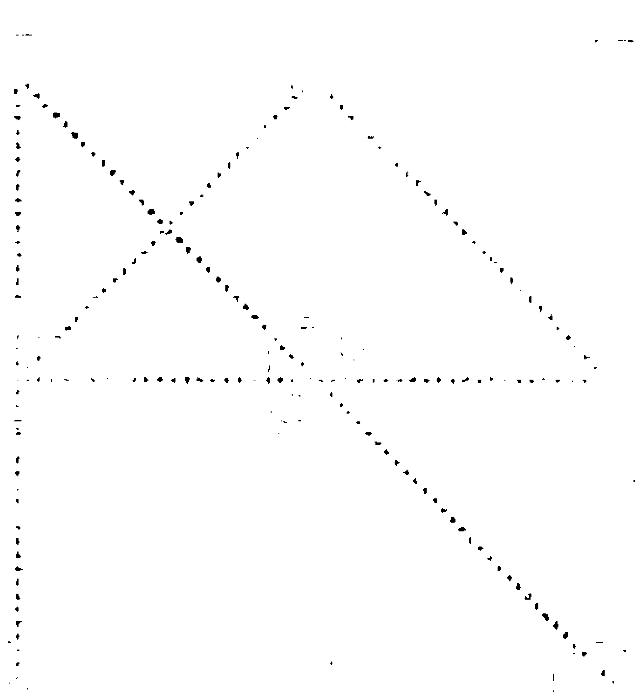

## 咩爸命盘图

通过这张图我们可以看出来，咩爸的空缺数为 6 和 7，2 和 5 上分别有 3 个圆圈，说明什么呢？说明咩爸懂得营造生活的情趣，会积极主动地配合别人，在穿衣打扮方面极其有品位，在大多数情况下就算自己不满意也懂得看别人的脸色，只除了一点，喜欢推责任发牢骚。咩爸开朗而乐观，自始至终都向往快乐惬意的生活，可一旦出现了问题，还是会下意识地逃避或者找人来帮自己解决，因为咩爸不喜欢承担责任，他还是喜欢热热闹闹没心没肺地过日子，以至于就算当了姥爷也总是习惯性地站在自己的角度看问题，完全无视对方的想法和初衷。他心眼单纯一根筋，所以特别容易被挑拨，一旦和对方谈不拢就像个爆竹，说不准什么时候就炸得别人一脸尴尬……咩爸属于那种理想主义者，总是对很多事情感到不满，比如生活啊、工作啊之类的，总觉得很多事情都是“应该如此”，而不是别人帮忙的结果。虽然为人正直但是总有一股子不招人喜欢的傲慢之感，老是站在旁边指指点点地说“这是对的，那么是错的，你就听我的吧”，要知道，这种绝对的态度也是骄傲自大的一种表现形式，咩爸真正缺乏的是谦逊的态度和自我批评的反省之心。不信你批评一下试试，绝对跳着脚和你吵吵。

咩爸拥有 1-2-3、1-5-9、2-5-8、2-4 和 4-8 连线，说明这个人是一个会给人稳定感的值得交往的朋友，哪怕他再花哨再嘚瑟内心其实都挺守旧绝对不会干出格的事。他的软肋就是“变换生活环境”，这个死脑筋的保守派最讨厌改变自己熟悉的东西，哪怕是变得更好也不行，“金窝银窝不如自己的草窝”绝对是他的口头禅。他不会有太多花花肠子，代表稳定踏实的数字 4 没给他这方面的天赋，但是当具有逻辑性的数字 4 和 2 拴到了一起，就碰撞出一个灵巧而懂得举一反三的行事风格。这种人在面对工作的时候不会照搬教条，会根据实际情况灵活解决，因此在工作中很得上级青睐，但是偶尔，当他感觉一切尽在掌握的时候，会有一种“违规”的冲动冒出来。1-2-3 连线代表咩爸很注重身体健康方面的问题，身体协调性很好，很多运动项目都能做到信手拈来，而且他很有艺术天赋，对“美”的感受犹如艺术家般敏锐，同时脾气也和艺术家似的情绪化而易激动。1-5-9 连线说明咩爸是一个就算有诸多不如意，但仍对自己的工作充满热情和积极性的好员工，哪怕事业不对口或者很辛苦，咩爸都会尽心尽力地完成自己分内的工作。2-5-8 连线则说明他最典型的地方就是“一切跟着情绪走”，高兴的时候怎么都好说，又通情达理又平易近人，情绪不好的时候……抱歉，我管你是谁，激动之余的结果就是口不择言，把身边的人伤得体无完肤还一个劲儿地自我感觉良好，不过，外向而单纯的人大都有这样的毛病，其实只要稍加注意控制情绪，还是有很大发展潜力的。

咩爸的血型是 A 型，虽然很适应集体生活，但是却对旁人的评价和议论敏感得一塌糊涂，恨不得就是为别人的眼光活着，说白了就是——好面子！当 A 型血遇上了 2 数多的人，简直就是“李白遇上剑南春”的效果——别误会，我说的可不是“有才”这方面，要知道李白最难搞的其实就是他的臭脾气，喝高了之后更甚。自尊心之强，简直到了“忽视 = 侮辱”的境地，一旦被打击，严重的话可能一辈子都生活在阴影中走不出来。家庭生活和成员在此血型的影响下会在他的生命中占有绝对的一大大部分，恨不得将自己的小家完全隔离在复杂的世界之外，甭管外面怎么风雨飘摇只要自己的家人健康安心就好。容易生出“怀才不遇”的心思，不会考虑是不是问题出在自己身上，一定是别人不懂自己的好，之后就自怨自艾拉低周围一片气场。

咩爸的星座是金牛座，代表成长与发展，行为务实，重视物质享受，追求舒适，可以说安全感和钱才是他生存必需的条件。为人顽固不听劝，但会想办法处理好与周围人的关系，行事作风比较小心谨慎，恨不得万事俱备才会小心翼翼踏出关键的一步，比较墨守成规。他有诸多底线，弄不好一个不小心你就踩到他的雷区，换来一个大臭脸和阴阳怪气的讽刺。给人感觉处处以自己的利益为第一考量，而且最有可能的是，你说他，他会为了让你难堪而故意赌气和你对着干——哪怕他觉得你是对的，但是就你“批评他”这个问题，是绝不能原谅的。对付咩爸这种人，最好的方式就是“捧杀”，不停地表扬、拍马屁，最后再说“如果能这样的话就更好了”，相信我，他百分之百上套！

## 哼妈

哼妈的生日是 1958 年 12 月 16 日，射手座，由此我们可以计算出来 1+9+5+8+1+2+1+6=33=3+3=6，哼妈命数为 6，生日数为 7，射手座的代表数字是 9，天赋数 33，由此，我们可以将哼妈的命盘图完整地画出了：

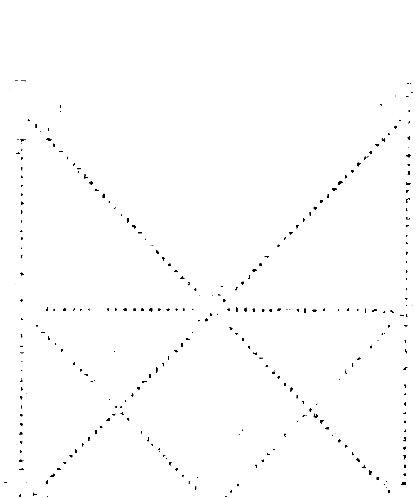

哼妈命盘图

哼妈的命数是 6，仅从这一点上你就能明白哼妈对于家庭、对于父母、小辈那种无私的爱真的是打从心底的奉献，因为命数 6 的人会为了家人而毫不犹豫地奉献出自己的一切。这也能说明哼妈对于“懒惰”二字的厌恶程度为什么如此之深，命数 6 的人从内心深处就无法理解为什么上帝造人的时候还会不小心造出“懒散的人”这种生物。命数 6 对于美和艺术有自己的见解，并且往往让人眼前一亮。

哼妈的天赋数是 33，因为是卓越数的关系，所以该数字对哼妈的影响力可谓是更上一层楼，直白一点说就是，会说话！同样是劝架，哼妈到场的效果就是秒杀其他人，一说就能说到点子上，不会让人听半天还抓不到重点。而且极具语言天赋，模仿个外地口音还是手到擒来，嗓子好，唱歌一直在调上呆着，属于专业级人物。喜欢陪人聊天，天南海北杂七杂八一通说，觉得八卦这种东西就是生活必需品，自己也经常担当传递角色，且乐在其中。

哼妈的命盘猛看上去挺复杂，空缺数只有 4，而除了占主导的数字 1 之外，数字 3、6、9 也分别占据了重要的地位。这说明命数是 6 的哼妈，在自己的人生中受 1 影响的很大，独立、敢闯、很乐观又有明确的是非观，但是“面子”就是她的死穴，好好的一个爽快人，会为了保全自己的面子而做出很多匪夷所思的事情来，有时候会表现出来咄咄逼人的架势，不管不顾。内心纯良，有很多事在哼妈这里过去就过去了，不会说揪着不放死缠到底，但也确实出现过不管别人怎么说自己认定的事就算吃亏也要坚持，然后回来暗自神伤的情况，劝不动，没办法。而 3、6、9 施加的影响也非常明显，比如哼妈能说会道，在各色人等中间游刃有余，但是实在是好唠叨，明明没什么大事也能念念叨叨好几个钟头。而且数字 6 决定了哼妈的付出也需要一定的回报，至少要“念我的好”，如果把这种关怀真的当做无私且应得的，时间长了以后势必会让 6 数心生不满，因为它会觉得彼此之间是不平等的，会失落，所以哼妈才会一天到晚的和咩爸吵来吵去，因为咩爸已经习惯了哼妈的这种能干，所以很多时候就不会去注意，再加上有点 2 数人的依赖性和惰性，就让哼妈在下意识里觉得他“自私”，“只为了自己”。数字 9 则让哼妈充满了一种善意的灵性，使得他对精神层面的意义有一种虔诚——这种虔诚表现在“勿以善小而不为，勿以恶小而为之”的生活准则上，而且，哼妈这种天真的内心世界非常容易变成不法分子欺骗的目标，因为她本性还是相信别人。

哼妈的空缺数是 4，直接决定了此人对钱完全不看重，没有什么理财观念，缺乏组织性和纪律性，不怎么关心实际，有时候干一件事完全不知道应该从哪里下手而弄到最后乱七八糟一团浆糊，没有条理和常性。

哼妈有 1-2-3、7-8-9、2-5-8、3-6-9、1-5-9 和 3-5-7 共计 6 条主线，多才多艺，发展的比较全面，但是容易被杂事分心，如果没有一个特别明确的目标就很容易一事无成。有一定的艺术天赋，文艺方面是骨干，身体健康基本没什么大的毛病，有自己的智慧和行事风格，因为人缘好的关系，在碰见困难的时候总会有意想不到的贵人出面来帮助，但就是惰性稍稍重了点。2-5-8 连线决定了哼妈热情开朗到没什么心眼的地步，大大咧咧的经常说话把人得罪了自己还没弄明白，情绪起伏大但是贵在真实。3-6-9 施加的影响造成哼妈没办法太集中精力，就算是有强烈的事业心（1-5-9 连线）也会出现半途而废的情形，如果哼妈能克服这一缺点，集中精力在一段时间内只做一件事，绝对前途无量。而 3-5-7 则让哼妈成为当地社交圈的一个焦点人物，人人都喜欢和她在一起，感受她身上的正能量。

O 型血，加强了哼妈大大咧咧的一面，不喜欢别人对自己指手画脚，就算因为脾气好不会当面发作，背后也一定会把那人拉入黑名单。不喜欢和别人在细节上投入过多的精力，经常宁可自己吃亏也要避免发生冲突，老好人，有点莽撞，死要面子活受罪。

射手座本身很乐观，会用一种宽宏大量的态度去对待周围的一切，有很好的人缘，事业、工作上都会得到朋友们的大力帮助，这中间可能没有太多的利益牵扯，而纯粹是大家为了回报射手座的善意。在经历过一些起伏和波折之后，射手座的人会安心踏实地回归到家庭生活中来，仿佛那些传奇都是别人的故事，是一个合格的母亲和妻子（虽然命数 6 决定了她注定会觉得自己的先生是一个自私鬼）。

## 女儿汪小姐

汪小姐的生日是 1982 年 4 月 29 日，金牛座，A 型血，她的命数和星座都和咩爸一样，但是在行事风格和许多问题的处理上却呈现出了截然不同的方向，我们看一下命盘就会明白。

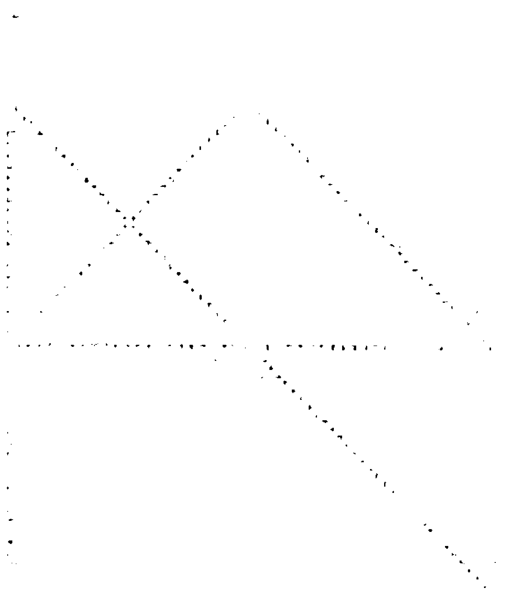

### 汪小姐命盘图

通过汪小姐的命盘图我们可以发现，命数是 8 的汪小姐，在数字 2 上面的圈多得有点让人眼晕，证明数字 2 才是无时无刻不起作用的最主要因素，而 8 和 9 也在这张命盘图上起到了一定的辅助作用，空缺数是 6 和 7，3 条主线，2 条副线，说明汪小姐没有哼妈那么八面玲珑会办事。

汪小姐命数是 8，对于金钱和物质的欲望相当强烈，这点从她小时候的绰号“钱串子”就能看出来，就像我在汪小姐的故事中说的那样，她爱的不是钱，而是一种金钱带来的安全感，物质或者说看得见摸得着的东西才是汪小姐世界观的基础，否则会让她陷入一种焦虑。她身上有一种天生的吸引力让她在很多领域游刃有余，她也确实从中得到了很多乐趣。

汪小姐的天赋数是 3 和 5，注定了汪小姐的口才一流，她身上有一种并不叫人讨厌的“贫气”劲，就算和陌生人第一次见面也很容易就能找到共同话题，不会让人觉得尴尬。数字 5 体现在汪小姐身上最大的特性就是，一种有点粗糙的自由态度，她恨不得把“藐视规则”四个字写在自己的脸上，举手投足都能让人看出散漫的感觉。这姑娘热情，知道的也挺多，喜欢看书，可塑性极强，就算扔到逆境中也依然会顽强地拼搏到底。时常会因为关注旁枝末节而转移了本就不容易集中的注意力，就是说她特别容易分心，你要不督促，好多事就没下文了，虎头蛇尾、拖延症都是她行事的风格标签，很要命。

纵观汪小姐的命盘，我们可以发现，占主导位置的数字是 2，其次是 8、9，空缺数为 6、7，这样一来，她的性格特征就已经大致被勾勒出来。2 数上的圆圈有 4 个！其重要性几乎已经可以和命数媲美，这就说明汪小姐本人非常具有艺术方面的天赋，就算不是从事艺术类工作也应该具有一些和艺术相关的爱好。情绪上面比较敏感而极端，很在乎别人对自己的看法，对待穿衣打扮有自己的一套，品位不错，懂得在生活中营造一些小情趣，会体谅旁人的心情，但是容易纠结，总想找个人依靠然后安心当蛀虫，要知道，这年头就连蛀虫也不是那么好当的！8 和 9 的影响体现在对于“公关”的游刃有余和对于动物保护、自然保护的关注和支持，汪小姐喜欢小动物，不惜在网上对虐待动物的人出口成“脏”。空缺数字 6 和 7，让汪小姐从来都不认为“他人的想法”有什么可听从的地方，不是说不尊重，而是她习惯于在内心深处认定“这么做是对的，那么做是错的”，有一种不切实际的理想主义会时不时跳出来在汪小姐身上作怪，让她看不惯周围的一切，瞬间变身愤青到处冷嘲热讽。而且汪小姐似乎生来就不知道“逻辑”两个字怎么写，干什么事情都是凭着动物般的直觉和满腔热血，有人指导还好，若放任自流，铁定不知道跑到哪里去了。目的性不明确，又没有缜密的分析能力，从小到大好几次都差点被人骗，好在天生鲁莽傻大胆，居然也都给她一一化解，有惊无险。

汪小姐有 3 条主线，分别是 1-2-3、1-5-9、2-5-8，2 条副线 2-4 和 4-8，通过这几条线我可以断定，汪小姐这个人啊，喜欢把心用在偷懒上面，明明一条路可以走到头，她非得想办法找出一个捷径，偏偏你还拿她没招，如果能多点耐心，把这种聪明运用到事业当中绝对会事半功倍。汪小姐是个朋友很多的人，哪怕彼此之间认识时间不长，因为汪小姐总有一种“你不帮他人，他人又怎会帮你”的想法，所以对很多事都会大大方方不计回报。可是偶尔，当她认为大家已经熟悉到一定程度的时候，就会耍起无赖，找各种理由推脱和回避问题，出发点有可能不坏，但表现出来就是耍小心眼、小聪明，还以为别人看不出来。她不太会在事业上耍一些不入流的手腕，不是不想，实在是没有那个脑子，玩不了，她逻辑性思维很成问题，如果没有人给顺一顺，她就会凭自己的想法胡乱做一气，幸运的话有可能歪打正着，但是一般情况下都会变成烂摊子。她身体协调性很好，很多运动都是信手拈来，喜欢各种挑战，但一旦察觉到难度就会找各种借口回避。

A 型血让汪小姐有时会有一种生活在电影中的错觉，会为了一件小事而感动得半天站不起来，也会因为一点委屈而跑到无人的地方痛哭十分钟，被咩爸鄙视地称为“长不大”，她自动自发地理解成为“有一颗童心”。经常会干一些出人意料的事，打得所有人都措手不及，哼妈蔑称为“不靠谱”，她再次自动自发地理解为“随性”。走到哪都会想方设法在最短时间内融入当地团体，但是和谁都不交心。

金牛座在汪小姐身上体现的最多的就是“爱财”了，还不能是信用卡，得是现金。这姑娘说现实也实在是现实得够可以，一旦身上没有现金了就会焦虑烦躁没事找事，别和她说理想、抱负、愿景什么的，没用，心情好的时候帮帮你，自己都揭不开锅了不揍人就已经很给面子了。死脑筋的金牛座认准一个道理就绝对不回头，比如汪小姐“世界大同”的理想……我是懒得劝了，革命尚未成功，同志继续努力吧！

## 女婿小咩爸

小咩爸的生日是 1979 年 12 月 29 日，O 型血，摩羯座，他的命数是 4，星座数是 1，天赋数是 4，空缺数是 3、5、6、8，因此命盘如下：

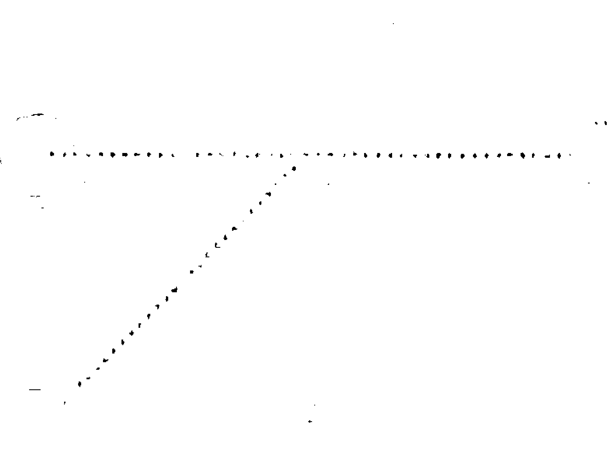

### 小咩爸命盘图

是不是看起来干净许多？只有一条主线和一条副线，这说明什么呢？说明小咩爸擅长的领域很专一，并不是说他的能力会打折或者比较“笨”比别人少什么，而是说他的注意力会集中在某一个方面上面，这样的人如果再加上信心和恒心，想做成一件事还是非常容易的。而小咩爸另一个和前面三个例子区别很大的就是，在他的生命中，除了命数 4 之外，能起到引导作用的数字有三个！1、2 和 9，在这三个数字上面的圆圈都有 3 个之多，小咩爸的行为模式就需要综合这三个数字的特点去分析。

小咩爸的命数是 4，这直接决定了小咩爸那种“只有踏踏实实”才能走向成功的正能量观点，命数 4 的人最擅长的就是为一件事情搭建坚实的框架，以保证事情都能按照预期中的方向前进。而且命数 4 的最大缺点就是顽固和缺乏创新意识，这一点在小咩爸的创业过程中得到了很明显的体现。

小咩爸的天赋数和他的命数一样，都是 4，由此可见，保守、踏实已经烙印在他的灵魂中了，在他的眼中所有的事情都是可以用逻辑来分析并拆分的。他看待事物并不是一个整体，而是独立的、彼此有关联的框架，认为左右的东西都必须得遵循一定的规则和准则，不能离开那个范围太远，否则就没办法进行下去。觉得就算天上有馅饼也绝对砸不到自己，与其浪费时间去做那个无用功，不如专心致志地将自己前进的方向找出来，并理出条理。他不喜欢自己的计划被人打扰，更讨厌别人对自己指指点点，总是你说你的我该怎么做还是怎么做。出了问题会马上冷静下来寻找解决方法，还比较踏实。

看小咩爸的命盘，上面有 3 个圈的数字有 3 个，分别是 1、2、9，也就是说，除了命数 4 之外，这些数字的特征也深深影响着小咩爸的一举一动。比如小咩爸有很强的组织能力，最喜欢在一件事还属于“小众”的时候就着手介入，然后自己想办法把这件事做大做开。与之相对的，他这辈子最讨厌的就是捡别人玩剩下的或者是照着别人的路数来，他觉得那会是对自己智商和能力的侮辱。喜欢当“布置任务”的人，而讨厌当“执行任务的人”，但是很多时候也不得不收敛自己的脾气，遵从上级的意见——哪怕心里把人家蔑视的不行。所以有的时候会很焦虑、纠结，想做主但又没那个能力，而且就算有那个能力，也往往因为目标太多、没有毅力而贪多嚼不烂。你最长见到的情景可能就是他一会儿站出来说“我们做这个吧”，转头又发话说“我看那个行业有前途”，让人头昏脑涨。好在这个人善良，就算表面上不表现出来，小咩爸也是一个充满同情心并且对于宗教和精神力量很有理解力的人。

小咩爸的连线很少，只有一条主线 1-4-7 和一条副线 2-4，恰巧是物质线和灵巧线的组合，证明小咩爸有很聪明、清晰的头脑，对自己的事业方面拥有常人难及的把控能力，可以借鉴很多前人的例子和经验而举一反三，把他人的智慧拿来为己所用。对于生存的环境有清醒的认识，知道物质才是决定生存的根本，因此也会以物质来衡量自己生活的水平，说得简单一些就是“知道自己是谁，知道自己要干什么”。其实能做到这点就很难，而小咩爸因为没有其他的连线，所以这两条连线的交互影响更加明显。

小咩爸的血型是古老的 O 型血，一种能主动出击的狩猎血型，有耐心，这一点没有减弱他内心的保守程度，反而更强调出了这个人的审慎，如果没有把握，绝不会投出“手里的矛”。当然了，我们也不能排除他看来看去不知道扎哪个猎物好，最后一个都没扎到的可能性啦。

摩羯座对于安定的向往则加深了他对自己的肯定，一切都按他说的规规矩矩地进行，才有可能达到最终的目标。对付小咩爸，只要比他更有耐心总能逮到他前后矛盾的时候。

## 外孙子 Asa

Asa 小朋友的生日是 2013 年的 12 月 29 日，属于刚刚来到人世报到的小东西，对于他我没有过多的事实和细节印证。之所以一定要说一下，主要是因为这位小朋友吧，命盘很特殊，甚至可以说是具有一定的代表性，他的命数是 2，星座是摩羯，和爸爸一样，星座数是 1，O 型血、天赋数也是 2，空缺数是 4、5、6、7、8。


### 第十八章 "病理解剖"一家人

我们可以看到这张命盘干净到只有一条连线，而 2 上的圈数达到了 6 个，命数是 2、生命里主导的数字也是 2，Asa 小朋友的行为模式将始终笼罩在标准的命数 2 影响范围下。除了 2 之外，数字 1 上面也有 3 个圆圈。

呃……我真的忍不住想吐槽这种奇葩命盘，真的，这应该是我见过的 2 最多的命盘之一了，像我前面所说的，因为这个小朋友暂时缺乏相应的生活经历和事实，所以我们不妨来简单推测一下他可能的行为模式。因为 2 数的比重过大，所以 Asa 小朋友可能会是一个非常敏感的人，童年时期如果不给他足够的爱，那么这个小朋友将会一生都活在对爱的渴求中，他会不满足，会不断地索取索取再索取，分享？死心吧！自己都不够何来分给别人之说？

他会拥有一种绝对的艺术家般的气质，因为对美的感受力远高于常人，所以他即便不是投身艺术也一定是和艺术相关的工作。对自己的外表过分在意，有自恋的倾向，喜欢过一种奢华的生活，而完全不管自己的收入水平和实际状况，单纯地追求享受。很有情趣，善于经营自己的生活，没有自己独立的能力，不要期待他下决定或者给出明确指导，没用的，他很难找到一个明确的立场，最喜欢做的就是附和别人的意见。不想得罪人，所以有时会显得完全没有自己的立场，怎么都说得通，可是如果完全依附也就算了，时间长了内心深处总还会生出很多不满，

- 第一，当你的能力达到那个水平的时候，再去做那个水平应该做的事；
- 第二，一定要学会分享和照顾别人，自私自利的人到最后只能困在自己的小圈子里出不去，最后被自己活活烦死。给他养只宠物吧，绝对有好处！同时从小让他接触与艺术有关的东西培养他的爱好，将来会有不俗的成绩！