生命數字  
不思議  

A Living Guide with Numerology  

陳小珠☆著  

許添盛·陳嘉珍  
專文推薦  

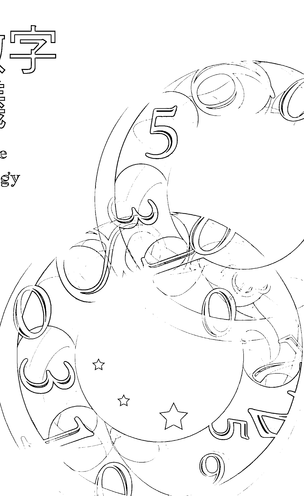  

> 所有的靈魂都是先決定「我是誰」之後，才投生到地球，來到這個次元，  
為的是創造、學習、體驗及拓展生命。  
於是我們窮其一生探索自己的人生藍圖，  
直到靈數和塔羅遇見賽斯，生命藍圖開始清晰可見……  

# 作者簡介  

陳小珠 Yvonne Chan  
香港人。1998年開始接觸賽斯資料及研究身心靈。2000年自澳洲大學畢業後，便投入企業培訓工作，同時開始學習及研究靈數學。2001年創辦塔羅課程，並於香港工會聯合會業餘進修中心任教。  

2002年開辦「香港塔羅中心」。隔年於香港中文大學校外進修學院開辦塔羅課程及靈數學課程，並在台灣的開南工商、新時代協會開辦「塔羅與潛意識及靈數學」課程。2005年於香港經濟日報主筆〈塔羅花園〉專欄及AMY雜誌〈Amy’s Numerology〉專欄，廣受好評。  

2010年參與網路電台www.pooopup.com節目「由靈開始」，不久後陸續主持網路電視台www.ourtv.hk節目「神神祕祕」、網路電台www.uolive.com節目「研心時間」，均引起廣大迴響。  

小珠老師一直努力透過課程，推廣賽斯心法，也深信「每個人都值得擁有精采的生命，都能創造美好的人生」。如今「香港塔羅中心」會員現已超過三萬人，中、港、台馬來西亞學員數更是超過萬人。著有《塔羅，原來如此》（2004年）、《不可思議的生命數字》（2006年出版。2012年由賽斯文化重新出版最新修訂本《生命數字不思議》）  

# 關於賽斯文化  

我是個腳踏實地的理想主義者。賽斯文化，是為了推廣身心靈健康理念而成立具公益性質的文化事業，希望透過理性與感性層面，召喚出人類心靈的「愛、智慧、內在感官及創造力」，讓每位接觸我們的讀者，具體感受「每天的生活，都是靈魂的精心創造」。You create your own reality. 我們計畫出版符合新時代賽斯精神之書籍、有聲書、影音商品及生活用品，並將經營利潤致力於賽斯思想及身心靈健康觀念的推廣，期待與大家攜手共創身心靈健康新文明。  

發行人  
許添盛醫師  

# 生命數字不思議  

# 目錄  

關於賽斯文化  

《推薦人的話》讓神性與人性揉合為一  

《推薦人的話》生命，是一首奧祕之歌  

《自序》走不一樣的人生路  

《新版序》你才是命運的主人！  

## 什麼是生命數字？  

# I 生命靈數對人一生的影響……014  

# II 生命靈數的起源……018  

# III 未來的生命靈數……020  

# IV 生命數字怎麼算？……023  

# V 何謂先天數、後天數、主命數？……027  

# VI 主命數與生命靈數的組合……029  

# VII 生命靈數的獨特能量……030  

# VIII 什麼是「倍數能量」？……038  

# IX 塔羅牌與生命靈數的關係……042  

許添盛  

陳嘉珍  

陳小珠  

# 生命數字 1  

# 生命數字 2  

# 生命數字 3  

I 『我』就是世界的中心……046  
II 1號人的愛情觀……048  
III 1號人的職場表現……050  
IV 從1號塔羅牌『魔術師』解析1號人……052  
V 1號人的數字配對……054  
VI 給1號人的貼心建議……058  

I 活在二元對立的迷思中……062  
II 2號人的愛情觀……067  
III 2號人的職場表現……070  
IV 從2號塔羅牌『女祭司』解析2號人……072  
V 2號人的數字配對……074  
VI 給2號人的貼心建議……078  

I 唯一不變的就是變……082  
II 3號人的愛情觀……085  
III 3號人的職場表現……088  
IV 從3號塔羅牌『女皇』解析3號人……090  
V 3號人的數字配對……092  
VI 給3號人的貼心建議……096  

# 生命數字 4  

I 謹言慎行，追求安定……100  

II 4號人的愛情觀……103  

III 4號人的職場表現……105  

IV 從4號塔羅牌「皇帝」解析4號人……107  

V 4號人的數字配……109  

VI 給4號人的貼心建議……113  

# 生命數字 5  

I 不自由，毋寧死……118  

II 5號人的愛情觀……120  

III 5號人的職場表現……123  

IV 從5號塔羅牌「教皇」解析5號人……124  

V 5號人的數字配……126  

VI 給5號人的貼心建議……130  

# 生命數字 6  

I 從愛恨流轉中學習成長……134  

I 6號人的愛情觀……136  

II 6號人的職場表現……138  

III 從6號塔羅牌『戀人』解析6號人……139  

IV 6號人的數字配……141  

V 給6號人的貼心建議……145  

# 生命數字 9、0  

I 天生好命，與世無爭……182  

II 9號人的愛情觀……184  

III 9號人的職場表現……186  

IV 從9號塔羅牌「隱士」解析9號人……188  

V 9號人的數字配……190  

VI 給9號人的貼心建議……194  

VII 生命數字0……196  

## 流月與流年  

I 流月……201  

II 流年……220  

III 每個「流年數」的學習課題……225  

## 翻開名人的生命藍圖  

I 主命數1：永遠閃耀的巨星鳳飛飛……240  

II 主命數2：不愛江山愛美的查爾斯王子……246  

III 主命數3：美國職籃新球星林書豪……251  

IV 主命數4：實力派創作人九把刀……255  

V 主命數5：周生命負責的阮玲玉……258  

VI 主命數6：剛柔並濟的蔡英文……262  

VII 主命數7：中國新一代領導人習近平……265  
VIII 主命數8：勇往直前的馬英九……269  
IX 主命數9：梅派戲曲宗師梅蘭芳……273  
X 許添盛醫師的兩張生命藍圖……277  
《附錄一》生命靈數與九大意識家族的關係……281  
《附錄二》從九大意識家族看生命靈數……284  

# 〈推薦人的話〉  

# 讓神性與人性揉合為一  

欣見小珠本書由賽斯文化重新出版，透過「塔羅牌」和「生命靈數」做為對自身的覺察及了解，開發自身內在的潛能。  

我很驚訝地發現，近年來人們對心靈的追求和探索的渴望。我想時間也到了，該是人們發現物質背後的力量原來是「心靈能量」的時候了，該是人們認識自己「實習神明」的身分──也就是開發自己內在的神性、進而與人性揉合在一起的時候了。  

在此與大家分享賽斯書《未知的實相》七三六節當中「九大意識家族」的概念，如果讀者能對九大意識家族有更深刻的認識，不但可以知道自己「身屬」哪一個意識家族，還能加深對自我的認識，進而得知如何與其他意識家族的人打交道。賽斯口中  

# 一、格拉瑪大：建立社會體系。  

# 二、蘇馬菲：透過教學傳遞「原創性」。  

的九大意識家族如下：  

賽斯身心靈診所院長 許添盛  

  

001 推薦人的話  

# 三、度莫：醫治，不論其個人職業為何。  

# 四、佛德：改革現狀。  

# 五、米爾伍梅特：神祕地滋育人類心靈。  

# 六、祖里：作為身體、運動的模範。  

# 七、柏萊汀：透過親職為人類提供於地球的存續。  

# 八、依爾達：傳播及交流概念。  

# 九、蘇馬利：為人類提供文化、心靈與藝術的傳承。  

我要問問每位讀者：你知道自己屬於哪一個意識家族嗎？你認識自己了嗎？你得知自己靈魂的傳承及此生的一天命一了嗎？如果還沒有的話，那麼預祝你透過本書找到答案，並在靈性追尋的過程中一切順利，永遠幸福、快樂與健康。  

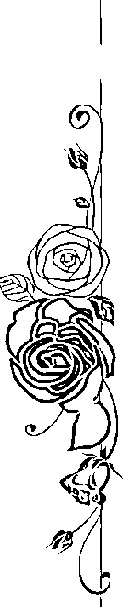  

生命數字不思議  

002  

# 〈推薦人的話〉  

# 生命，是一首奧祕之歌  

生命是一首奧祕之歌，每個人都想唱出最好的詮釋，從坊間各式算命方法及其驚人的收入，就可窺見一二。究竟從出生時刻、星座排列，甚至姓名筆劃之中，能尋出什麼命運線索？我不是質疑它們的價值，而是忍不住要想：就算再高明的大師，指出我們的未來，生命過程中的每一種感受、情緒與心情，卻必須由主角紮紉實實地體驗，品嚐這諸般況味、起伏多變的無常，這才是投生為人的真正目的。  

你可曾想過，自己投生的時間也是靈魂的藍圖計畫之一，所以貧疾富貴、聰慧魯鈍、高官厚祿、平凡百姓……都是自己擬訂安排的啊！於是有人會問：「為何要寫出折磨人一生的劇本？」——即使是受盡折磨的一生，也是靈魂的選擇，其中必有靈魂該完成的功課。  

認識小珠多年來，看著她在身心靈這條路上的用心精進，不斷突破一般人對塔羅牌與生命靈數的解讀、限制與迷思，一層一層地揭開潛藏在生命底層的藍圖線索，感  

財團法人新時代賽斯教育基金會執行長 陳嘉珍  

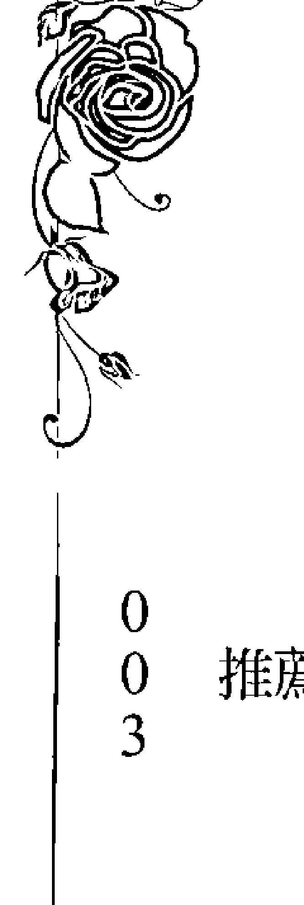  

推薦人的話  

003  

# 自序  

# 走不一樣的人生路  

自從踏入社會，我便從事與「人」相關的工作，從接待員、企業培訓顧問到成為身心靈導師，不知不覺已經過了數十年。一九九八年，我開始在企業培訓公司工作，從兼職做到全職，直到有一天突然覺得生活了無生氣、沒有樂趣，每天的工作都是繞著團隊精神、領導才能、企業經營管理等話題打轉，人也變得愈來愈麻木。到後來只是為了工作而工作，嘴裡說著鼓勵他人的話，實際上那些話根本沒有內涵、也缺乏生命力，日子過得猶如行屍走肉一般，甚至開始懷疑自己是否在遺害人間？  

到了二○○○年，我決定離開企業培訓的職務，當時因緣際會轉到一位好朋友創辦的身心靈成長中心工作，就在此時，我遇到了改變我一生的精神啟蒙老師──許添盛醫師，他把「賽斯」的思想及人生觀帶進了我的生命，讓我走上了不一樣的人生路。  

# 陳小珠  

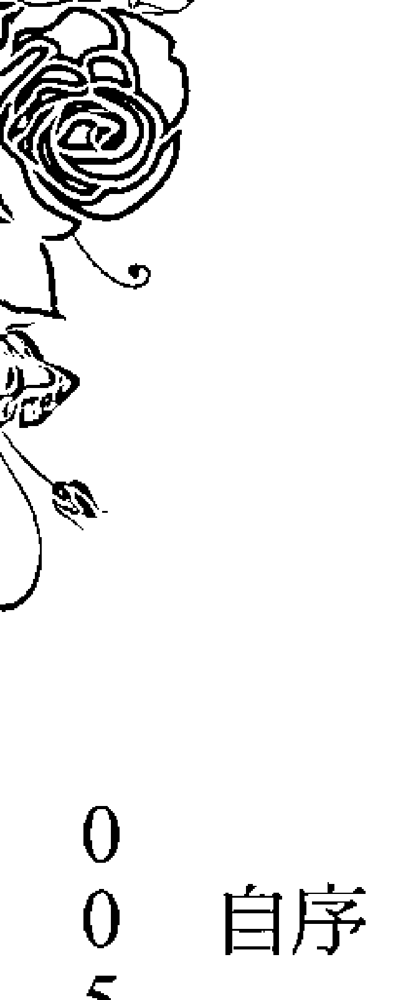  

自序  

005  

當年許醫師跟我說：「小珠，妳要信任生命，要做妳覺得快樂和有意義的事。」當時我正在學塔羅牌和生命靈數，覺得這些東西很有意思，可以幫助人們探索自我。可是當時塔羅、生命靈數在香港並不流行，社會上對身心靈的認識也很貧乏，更別說什麼賽斯思想了！而我也還未成立「香港塔羅中心」，不像今天擁有萬名以上的會員及學生，因此，當時許醫師說的「信任」，對我來說就是「真實地相信生命」，勇敢地邁向未知，這也是我人生中一項很重要的「信任」功課。  

我經常想起許醫師的話：「信任你的豐盛，你就會擁有豐盛的生活；信任宇宙已經為你預備了一切，只管往前走！」就是因為許醫師的鼓勵，我決定以教授塔羅牌及生命靈數的方式，來分享身心靈觀念及賽斯思想。塔羅牌及生命靈數並不像坊間流傳形容的「西洋占卜的東西」那麼膚淺，而是一套非常實用的自我探索及個人成長工具，我決定用這些工具來幫助人們了解生命。  

後來因為研究塔羅牌而認識了生命靈數，過去幾年裡，我一方面鑽研這兩門學說，一方面學習賽斯思想。不知不覺教授生命靈數已經超過十年了，認識得愈深，就愈喜愛它，而且幾乎愛到無法自拔。  

賽斯資料不斷地提及：「我們是帶著自己編寫的生命藍圖來到地球的。」因此，  

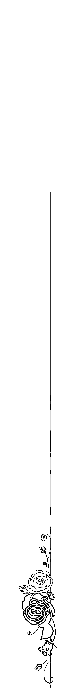  

生命數字不思議  

006  

# 生命數字不思議  

# 〈新版序〉  

# 你才是命運的主人！  

根據賽斯的說法，我們都是先規劃好自己的人生藍圖，才來到地球投生為人的，因此，我們早已選好自己的性別、種族、膚色、出生時間、出生地點、父母、兄弟姊妹、家庭背景、以何種方式來到地球等等，自然也選擇了我們的生辰八字、星座命盤及生命數字。很多人因此抱持宿命論，認為一切都是命定無法改變，命運早已被主宰，而對生命充滿了無力感。  

然而，如同本書所寫、也是我經常對學生說的：「雖然藍圖是定下來了，每個人也都帶著自己編好的劇本來投胎了，但如何演出這個設定好的角色、如何經歷及應對人生，卻完全由自己決定！」  

因為工作上的關係，我認識很多各門各派的靈學老師們，從中國的紫微斗數、八字命理、占星學、西藏密宗、印加或瑪雅的薩滿祭司、水晶治療、牧師和神父都各有ㄧ套觀點和見解，也各有一套「說得通」的信念系有。他們對於存在和生命自有一套觀點和見解，也各有一套「說得通」的信念系有。  

統，但都不約而同地認為：「人生要活得有意思、有意義，靈魂就必須往高和善的方向拓展。」有一位研究中國命理學二十多年的朋友曾經告訴我：「在術數裡，只要一個人走上修行的道路，就不能批他的命了，因為他的人生已經走向更高的振頻了。」  

當你還未處於高振頻，也就是意識還不夠拓展時，你會重複經歷同樣的課題，或陷在某些人事物裡一段時間，直到有一天你看清楚自己為什麼、以及如何創造了今日的種種，你的感官便從此覺醒，也因此有了選擇的能力，可以選擇要不要重複以前的模式，並且完全掌握自己的人生。至於如何讓自己走向高振頻，最快的捷徑就是看賽斯書，因為裡面寫的都是高層意識的東西。  

很多人都有同樣的經驗：一開始看不懂賽斯資料在寫什麼，或每次都只看一點點，就看不下去了，但只要堅持看下去，就會慢慢看懂，而且愈看愈有體會、愈看愈有感覺。光看賽斯資料，就能拓展你的意識，無論頭腦是否明白，你的「內我」一定可以明白及消化賽斯資料，然後你的生命就會開始改變。我是說真的！  

對於這本書終於要由賽斯文化重新出版，我內心十分感動。許醫師是我生命中一位很重要的啟蒙老師，跟隨他學習賽斯思想有十幾年了，老實說，最初的幾年我並沒  

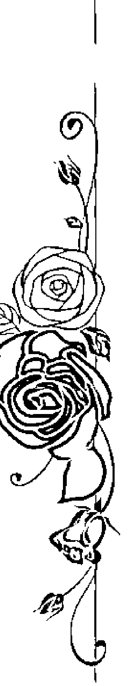  

生命數字不思議  

010  

# 〈新版序〉  

# 你才是命運的主人！  

根據賽斯的說法，我們都是先規劃好自己的人生藍圖，才來到地球投生為人的，因此，我們早已選好自己的性別、種族、膚色、出生時間、出生地點、父母、兄弟姊妹、家庭背景、以何種方式來到地球等等，自然也選擇了我們的生辰八字、星座命盤及生命數字。很多人因此抱持宿命論，認為一切都是命定無法改變，命運早已被主宰，而對生命充滿了無力感。  

然而，如同本書所寫、也是我經常對學生說的：「雖然藍圖是定下來了，每個人也都帶著自己編好的劇本來投胎了，但如何演出這個設定好的角色、如何經歷及應對人生，卻完全由自己決定！」  

因為工作上的關係，我認識很多各門各派的靈學老師們，從中國的紫微斗數、八字命理、占星學、西藏密宗、印加或瑪雅的薩滿祭司、水晶治療、牧師和神父都各有ㄧ套觀點和見解，也各有一套「說得通」的信念系有。他們對於存在和生命自有一套觀點和見解，也各有一套「說得通」的信念系有。  

統，但都不約而同地認為：「人生要活得有意思、有意義，靈魂就必須往高和善的方向拓展。」有一位研究中國命理學二十多年的朋友曾經告訴我：「在術數裡，只要一個人走上修行的道路，就不能批他的命了，因為他的人生已經走向更高的振頻了。」  

當你還未處於高振頻，也就是意識還不夠拓展時，你會重複經歷同樣的課題，或陷在某些人事物裡一段時間，直到有一天你看清楚自己為什麼、以及如何創造了今日的種種，你的感官便從此覺醒，也因此有了選擇的能力，可以選擇要不要重複以前的模式，並且完全掌握自己的人生。至於如何讓自己走向高振頻，最快的捷徑就是看賽斯書，因為裡面寫的都是高層意識的東西。  

很多人都有同樣的經驗：一開始看不懂賽斯資料在寫什麼，或每次都只看一點點，就看不下去了，但只要堅持看下去，就會慢慢看懂，而且愈看愈有體會、愈看愈有感覺。光看賽斯資料，就能拓展你的意識，無論頭腦是否明白，你的「內我」一定可以明白及消化賽斯資料，然後你的生命就會開始改變。我是說真的！  

對於這本書終於要由賽斯文化重新出版，我內心十分感動。許醫師是我生命中一位很重要的啟蒙老師，跟隨他學習賽斯思想有十幾年了，老實說，最初的幾年我並沒  

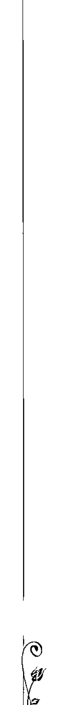  

011 新版序

## 什麼是生命數字？

生命靈數是一門很容易入手的學問，  
一組數字便可揭櫫一個人累世的學習成果、  
以及此生的方向和學習目標，  
更是一個人生命藍圖的梗概與線索。

## 生命靈數對人一生的影響

你相信命運嗎？你認為人生的際遇是上天早就安排好的？還是相信人定勝天？放眼世界，總有些人好像含著金湯匙出生，不需要什麼努力，一切已經有人為他安排妥當；也有些人一生努力不懈，從不放棄，卻總是徒勞無功。因此，人們不斷討論及鑽研命運、命理、算命等學說，而且樂此不疲，為的是了解自己的生命藍圖，並且掌控自己的命運。

生命靈數近年來在香港、台灣、日本以及馬來西亞愈來愈廣為人知，已經成為人們茶餘飯後的熱門話題。我想這是因為生命靈數是一門很容易入手的學問，只要了解 0 到 9 號的數字能量，便會有感覺，不像其他命理學那麼深奧，讓人不知道從哪兒下手才好。只要你對人有興趣，多觀察、多用心感受，很快便能明白什麼是「生命靈數」。當然，如果你願意投入時間和心思，細心地探索下去，慢慢就會發現這門學問可以讓你學到很多人生課題，並帶給你許多人成長。

其實，在認識生命靈數之前，我也曾接觸過其他的人類行為學說，例如神經語言程式學①、九型人格學②及十六型人格學③的課程及書籍，這些學說各有優點，可以有效地分析及處理與人相關的問題，但對我來說，把人分類成某種性格來研究還是一搔不到癢處。

直到我研究生命靈數之後，發現它可以很完整、全面及真實地表達一個人多層次的意識、性格、心態及人生觀，才終於讓學習方向塵埃落定。每個人都有複雜的多元性格，這些不同的性格都是同時出現及運作，生命靈數最吸引我的地方就是：它不只  
是以人的行為或表現來探索人。

在教授生命靈數的日子裡，透過與學生們的分享及交流，豐富了我對數字能量的認知，原來每個數字的能量，在每個人身上展示出來的方式可能都大不相同，所以不能一概而論。

每個數字都充滿無限的可能性，學習生命靈數不能光以人的行為及表現做為判斷的指標，而應細心觀察及感受每個人每種行為的出發點、心態、動機以及對生命的深層信念。

生命靈數可以廣為運用在日常生活中，對很多層面的幫助都相當大：

- 可以深入探究、了解自己的行為及模式，還有背後的心態和動機，揭示某些  
- 了解每個數字背後的人格特質，可以改善人際關係，讓你在辦公室裡懂得如何與上司相處、如何管理下屬、如何與同事相處融洽，可以全面有效地處理人際關係問題。
- 可以藉由生命靈數了解人的個性，改善你與親人之間的關係；因為「理解」會讓我們明白別人做事的出發點，進而提升自己的包容力，找到和家人的相處之道，建立和善的家庭關係。
- 可以深入了解伴侶，得知對方在感情生活中在意什麼、追求什麼，進而找到雙方最佳的相處模式，讓親密關係更和諧。

現在，你準備好要認識生命靈數了嗎？

## ① 神經語言程式學（Neuro-linguistic Programming, NLP）

神經語言程式學（Neuro-linguistic Programming, NLP）是一套原理、信念和技術，用來探索心靈、神經學、語言模式和人類感知與認知，使之成為系統化模式，並研究如何在互動中建立主觀現實的人類行為，屬於實用心理學的一種。

## ② 九型人格學（Enneagram）

九型人格學（Enneagram），一種性格分類，基本上將人的性格分成九類，分別是：第一型完美主義者、第二型助人者、第三型成就者、第四型藝術型、第五型智慧型、第六型忠誠型、第七型快樂主義型、第八型領袖型、第九型和平型。

## ③ 十六型人格學（MBTI）

十六型人格學（MBTI）基本理論是以心理分析家榮格（C.G. Jung）於一九二一年出版的《心理類型》（Psychological Types）一書為根據，由美國心理學家凱撒琳·庫克·布瑞格（Katherine Cook Briggs）及伊莎貝兒·布瑞格·麥爾斯（Isabel Briggs Myers）開發完成。經過數十年的發展，已成為全球著名的性格測試之一。廣泛應用於教育界、企業徵人及培訓、領袖訓練及個人發展等領域。主張人大致可分為四種基本運作與態度類型，不同人有不同取向，形成十六種不同性格：心理能力的走向是 E 或 I，即外向型（Extraverted）或內向型（Introverted）；認識外在世界的方法是 S 或 N，即辨識型（Sensing）或直覺型（Intuition）；做決定的方式是 T 或 F，即理智型（Thinking）或感性型（Feeling）；生活方式和處事態度是 J 或 P，即決斷型（Judging）或熟思型（Perceiving）。

## 未來的生命靈數學

生命靈數其實有很多不同的門派及學說，其中比較風行的是畢達哥拉斯學說系統（Pythagorian Method），有些研究古代神秘學的人，則專門鑽研希伯來人的卡巴拉（Kabbalah）學說系統。

「卡巴拉」在希伯來語為「口頭傳授」之意，由神直接傳授祕法給人類，再由師父傳給徒弟。「卡巴拉」的理論中心為「生命之樹」（Life Tree），以十個圓圈和二十二條通道線，解釋人類存有的位置與目的，同時象徵人類與神的關係。而印度文化裡，也有一套源遠流長的古印度靈數學說系統。

若以歷史角度看生命靈數的話，其實地球剛剛經歷了一個「1」的世紀（西元一○○○至一九九九年）。 「1」在生命靈數裡代表創新、創造、原創、自我的能量。因此，上一個世紀我們已經創造了一個不可思議的實相世界，包括衣、食、住、行等享受與便利，都是我們創造出來的。

雖然人類創造了科學、物質與文明，但人類的心智也受其影響和控制，偉大的心  
靈力量因此被忽略、埋沒了。

過去每個國家都認為只要自己強大就好，這是一個1的氛圍，因此各國無不努力強化並擴張自我。但如今我們已進入一個新的千禧年、新的紀元，也就是一個「2」的文化，我們必須明白，人類不可能單獨存在，而現在也不是一國獨大的時代。

二〇〇三年的「SARS事件」讓人類體悟到：不是只有自己國家的醫學先進，就可以高枕無憂、萬無一失；二〇〇八年的「禽流感」則讓人類意識到原來天空是無國界的；溫室效應、空氣污染、臭氧層被破壞，在在說明了人類本是一體，我們不可能、也不可能各人自掃門前雪了，必須一起面對各種問題。

沒有人能單獨存活於這個星球及宇宙間，我們必須找到與所有生物和諧共處的方式，而人類意識也必須共同學習、成長與拓展。愈來愈多人明白了：在靈魂的層面，人人都是一體、都是密不可分的，我們總以為自己是孤單的，但事實上我們一直深深存在於愛的連結中！

生命靈數雖有許多不同的門派及學說，但各家都有其特色及精采之處，也都能以不同的方式、切入點和觀照點，去認清自我、內觀自己以及了解生命。我建議所有研究者、學習者以及運用這門學說的人，最好有一個自己的核心信念及生命觀，如此才  
能將這些工具發揮得更有價值，而我選擇的核心信念則是──賽斯思想。

賽斯在《未知的實相》第七三二到第七三七節裡，提出了「九大意識家族」的概念，與我研究的生命靈數有些相似之處，因此，我仔細閱讀了九大意識家族的資料，在本書分享了我的心得。我相信生命靈數的確是人類早期文化中已存在的智慧，透過生命靈數的學習，可以將人類帶到更深遠寬廣的層面。

## 生命靈數怎麼算？

生命靈數的計算要從「出生日期」開始，出生日期裡的每個數字，都代表某種特定的元素，每個元素都與自己有關。出生日期隱含了每個人的個性、特質、不同的挑戰和一生學習的功課。在此先舉幾個例子教大家如何計算「主命數」、了解什麼是「生命靈數組合」。除了為自己分析之外，也可以幫家人、情人、朋友甚至仇人算一下他們的生命靈數。

## 生命數字計算方程式

出生年和＋出生月和＋出生日和。  
一月至九月的生月或一日至九日的生日，在計算時前面必須加 0。  
出生年月日的八個數字就是「先天數」。  
將八個數字相加出來的數字，就是「後天數」。  
將後天數相加，一直加到只剩個位數為止，這個個位數就是「主命數」。

## 何謂先天數、後天數、主命數？

## 先天數

「先天數」就是每個人出生年月日的八個數字，出生年月日是不能改的，一個人的出生日期與他為什麼在這個時空出現有關，也是靈魂在進入實相前設定的人生檔案，一個人是和自己的「先天數」同時出現在地球上的，可說是這個人帶來了這些數字組合。

「先天數」代表一個人的本質、個性、人格特質、習性、條件、先天的能力，是  
一個人要完成自己這個偉大的人生工程所配備的工具，也就是一個人的「本錢」，即最原始「我是誰」的元素。

## 後天數

顧名思義，「後天數」就是一個人後天要學習及經歷的一切，以及後天要加強或  
開發的潛能，也是這一世人生劇情的參照。

## 主命數

「主命數」就是每個人此生主要學習的課題和修煉的目標，可說是每個人此生的目的。  
「主命數」是性格上最明顯的一面，我們會不斷碰到以主命數為核心的背景、挑戰或課題，也會一直走在主命數的道路上，如果能在人生歷練中學習及成長，就能深深領會它的「美」，並且可以在主命數的較高或較成熟的層面生活。

以坐火車到某地為例，如果「主命數」是目的地的話，「後天數」就是這趟火車之旅的中途站，我們必須通過這些關口，來完成人生的旅程。

## 主命數與生命靈數的組合

主命數代表了一個人的本質、真正的自己（不等於向人展示的自己）、自身條件、能力、習性、性格以及此生最大的課題。  
主命數一定是 1 到 9 的數字，所以主命數把人分為九類。當然，這個世界並不只有九類人這麼簡單。其中的祕密就隱藏在每個人的「生命靈數組合」裡。大家不妨想想：1 到 9 的組合會有多少種可能性？

「生命靈數組合」裡的數字，也就是每個人「潛藏」的性情、特質、可發揮的才華，亦是生活上會碰到的經歷及挑戰。「生命靈數組合」裡出現得愈多的數字，表示該數字所帶來的影響愈大，所引發的行為及代表的個性也愈強。

但生命靈數並不是拿來比較的，換句話說，並不是擁有某個數字就比較好，或缺少某個數字就比較差。其實，每個數字都有其獨特的能量，都同時擁有正面與負面的特質，學習、研究生命靈數就是透過理解這些數字的特質，來深入了解自己，改善自己負面的個性，加強正面的能力。

## 生命靈數的獨特能量

每個數字都有其獨特的能量，以下簡單列出各個數字最基本的內涵，讓讀者對每個數字都有初步的了解。讀者也可以拿自己的「生命靈數組合」來對照，看看自己的組合裡包含了哪些元素。

## 生命靈數 1

生命靈數 1 代表：頭腦靈活，可以獨立解決問題，凡事通常都由自己做決定，能獨立應付所有工作，是獨當一面的領袖。

生命靈數組合中有 1 的人，雖然工作上不用老闆操心，但不擅與人合作的個性，往往讓他們在人際關係上出現問題。這類人孤芳自賞、自我中心、不懂得考慮別人感受、經常獨斷獨行，所以在感情上要特別留意，不可要求別人凡事都要配合自己。

## 優點

頭腦靈活、可以獨立解決問題、可以決定自己的人生方向、有領導他人的潛能。

## 生命靈數 2

生命靈數 2 代表：願意配合別人，是優秀的團隊合作者及支持者，不喜歡出風頭，富同情心，能夠接納他人的意見，包容性相當高，心思細密，有很強的洞察力，適合分析性的工作。

## 缺點

孤芳自賞、自我中心、不考慮別人的感受、獨斷獨行、不擅與人合作。

## 生命靈數 3

生命靈數 3 代表：樂觀進取，思想敏捷，應變能力很強，熱愛自由，主觀意識強  
烈，喜歡追求新事物，深具感性，重視心靈上的滿足甚於物質的追求，而且悟性極高，是很好的談心對象。

## 優點

心思細密、分析洞察力強、願意配合別人，是優秀的團隊合作者。

## 缺點

太武斷、不客觀、為爭辯而爭辯，或過於優柔寡斷、猶豫不決。

有些生命靈數 2 的人，特徵是優柔寡斷、猶豫不決、三心二意、喜歡鑽牛角尖、容易受他人影響，不斷需要別人來肯定自己，才敢繼續往前進。

不過，生命靈數 2 的人，性格很兩極化，不是外柔內剛，就是外剛內柔，非常武斷，一旦認為對的事就很死心眼，甚至會為了爭辯而爭辯。

## 生命靈數 4

生命靈數 4 代表：為人謹慎、可靠、穩重，做事按部就班，穩定性高，而且重承諾，是個可以信賴的朋友及員工，而且意志堅定，沉著冷靜，有良好的計算能力、分析能力和組織力，可以長時間處理規律性的工作。但生命靈數 4 的人需要高度的安全感，所以防衛心很強，不輕易相信別人，事事自保為上，可能會讓同事受不了。

## 優點

思想敏捷、應變能力強、溝通能力佳、具有美感和藝術品味。

## 缺點

自尊心強、好面子、太在乎別人的評價、不輕易說出心裡話、怯於表達愛意。

## 生命靈數 3

生命靈數 3 的人雖然很擅長溝通，卻總是把內心深處的話隱藏起來，不容易對心儀的人表達愛意。

## 生命靈數 3

生命靈數 3 的人兼具美感和藝術品味，有藝術家的個性。自尊心很強，很愛面子，非常在乎別人對他們的品頭論足，因此，愈得到上司的欣賞，工作就會做得愈好，愈賣命。

## 生命靈數 3

生命靈數 3 的人兼具美感和藝術品味，有藝術家的個性。自尊心很強，很愛面子，非常在乎別人對他們的品頭論足，因此，愈得到上司的欣賞，工作就會做得愈好，愈賣命。

## 生命靈數 3

生命靈數 3 的人兼具美感和藝術品味，有藝術家的個性。自尊心很強，很愛面子，非常在乎別人對他們的品頭論足，因此，愈得到上司的欣賞，工作就會做得愈好，愈賣命。

烈，喜歡追求新事物，深具感性，重視心靈上的滿足甚於物質的追求，而且悟性極高，是很好的談心對象。

## 生命靈數 3

生命靈數 3 的人兼具美感和藝術品味，有藝術家的個性。自尊心很強，很愛面子，非常在乎別人對他們的品頭論足，因此，愈得到上司的欣賞，工作就會做得愈好，愈賣命。

## 生命靈數 3

生命靈數 3 的人兼具美感和藝術品味，有藝術家的個性。自尊心很強，很愛面子，非常在乎別人對他們的品頭論足，因此，愈得到上司的欣賞，工作就會做得愈好，愈賣命。

烈，喜歡追求新事物，深具感性，重視心靈上的滿足甚於物質的追求，而且悟性極高，是很好的談心對象。

## 生命靈數 3

生命靈數 3 的人兼具美感和藝術品味，有藝術家的個性。自尊心很強，很愛面子，非常在乎別人對他們的品頭論足，因此，愈得到上司的欣賞，工作就會做得愈好，愈賣命。

## 生命靈數 3

生命靈數 3 的人兼具美感和藝術品味，有藝術家的個性。自尊心很強，很愛面子，非常在乎別人對他們的品頭論足，因此，愈得到上司的欣賞，工作就會做得愈好，愈賣命。

烈，喜歡追求新事物，深具感性，重視心靈上的滿足甚於物質的追求，而且悟性極高，是很好的談心對象。

## 生命靈數 3

生命靈數 3 的人兼具美感和藝術品味，有藝術家的個性。自尊心很強，很愛面子，非常在乎別人對他們的品頭論足，因此，愈得到上司的欣賞，工作就會做得愈好，愈賣命。

## 生命靈數 3

生命靈數 3 的人兼具美感和藝術品味，有藝術家的個性。自尊心很強，很愛面子，非常在乎別人對他們的品頭論足，因此，愈得到上司的欣賞，工作就會做得愈好，愈賣命。

烈，喜歡追求新事物，深具感性，重視心靈上的滿足甚於物質的追求，而且悟性極高，是很好的談心對象。

## 生命靈數 3

生命靈數 3 的人兼具美感和藝術品味，有藝術家的個性。自尊心很強，很愛面子，非常在乎別人對他們的品頭論足，因此，愈得到上司的欣賞，工作就會做得愈好，愈賣命。

## 生命靈數 3

生命靈數 3 的人兼具美感和藝術品味，有藝術家的個性。自尊心很強，很愛面子，非常在乎別人對他們的品頭論足，因此，愈得到上司的欣賞，工作就會做得愈好，愈賣命。

烈，喜歡追求新事物，深具感性，重視心靈上的滿足甚於物質的追求，而且悟性極高，是很好的談心對象。

## 生命靈數 3

生命靈數 3 的人兼具美感和藝術品味，有藝術家的個性。自尊心很強，很愛面子，非常在乎別人對他們的品頭論足，因此，愈得到上司的欣賞，工作就會做得愈好，愈賣命。

## 生命靈數 3

生命靈數 3 的人兼具美感和藝術品味，有藝術家的個性。自尊心很強，很愛面子，非常在乎別人對他們的品頭論足，因此，愈得到上司的欣賞，工作就會做得愈好，愈賣命。

烈，喜歡追求新事物，深具感性，重視心靈上的滿足甚於物質的追求，而且悟性極高，是很好的談心對象。

生命靈數 4 的人在感情上總是小心翼翼，不輕易與人交心，也不容易投入自己的情感，與人交往需要長時間的審查與考驗，可是一旦投入之後，往往無法自拔。

## 生命靈數 5

生命靈數 5 代表：多才多藝、口才極佳、責任感很強，總是克盡本分，努力配合他人人的要求，對得起所有人，辦事能力極強，可以長時期在高壓下工作，因為要求極高，做事很執著，不能忍受自己出錯，因此經常設定很多原則、界限及規矩，與他們共事會很有壓力。

## 優點

謹慎、可靠、穩重、堅定、重承諾、可信赖。

## 缺點

缺乏安全感、防衛心強、不輕易相信別人、事事自保。

## 優點

責任感強、克盡本分、努力配合所有人的要求、辦事能力極強。

## 缺點

不喜歡被約束、對自己要求過高、內心充滿矛盾、脾氣一發便不可收拾。

矛盾的是，生命靈數 5 的人好奇心重，求知慾強，不喜歡受拘束，要求高度的自由與空間，所以，如果你的情人生命靈數是 5，你休想操控他，即使他表面上服從，也只是個未爆的炸彈，因為他的容忍性極強，可是脾氣一旦爆發就不可收拾。

## 生命靈數 6

生命靈數 6 代表：溫和親切，富同情心和愛心，總是自發性地服務他人，不喜歡與人爭吵，也不太會拒絕別人，體貼又善解人意，而且有犧牲奉獻的精神，公司裡有新同事報到時，6號人都會先主動上前關照一番。

生命靈數 6 的人很任性與感情用事，占有慾和嫉妒心都很強。由於是超級完美主義者，生命靈數 6 的人很懂得打扮自己，適合從事品管或採購的工作，買東西找他們一起去是最好不過了，只要是他們看上眼的東西，就不會差到哪裡去。

因為極度追求完美，所以事事期望過高，很多時候可能只是自己一廂情願，所以感情很容易受傷，當付出的收不回來時，就會陷入受害者的角色之中。

## 生命靈數 7

## 優點

有愛心、自發性服務他人、具犧牲奉獻的精神、懂得打扮，是優秀的品管人員。

## 缺點

極度的完美主義、事事期望過高、容易受傷而陷入受害者的角色之中。

## 生命靈數 8

生命靈數 8 代表：組織能力很強，做事有條不紊、專心一致、目標明確，內心充滿鬥志與行動力，做事認真，喜歡忙碌挑戰性的工作，支配力強，果斷有魄力，他們

## 生命靈數 7

生命靈數 7 代表：好學、有研究精神、求知慾極強，適合從事研究性質的工作，而且好勝心強，不輕易言敗，勇於接受挑戰，會是老闆手下的一員猛將。

生命靈數 7 的人的疑心病很重，對所有人和事都先採取不信任的態度，甚至疑神疑鬼，有點神經質，所以要成為他們的另一半，最好要百分之百誠實，欺騙是一殺無赦的罪行。

## 優點

好學、求知慾和好勝心強、不輕易言敗、有研究精神、經常有貴人相助、凡事皆可逢凶化吉。

## 缺點

對所有人和事都不信任、疑神疑鬼、神經質、不能容忍任何錯誤、喜歡死撐和頂嘴。

因為好勝心強，生命靈數 7 的人不能容忍任何錯誤，經常會頂嘴，甚至會為了面子死撐到底，當下不宜與他們硬碰硬。

## 生命靈數 9

生命靈數 9 代表：聰明，觀察力強，而且會把觀察到的事物放在心裡。寬容而有內涵，懂得體諒別人，擅長說貼心的話，不喜歡與人結怨，懂得獨善其身。頭腦靈活，協調性高，求知慾強，博學多聞，喜歡幫助別人，具有犧牲奉獻的精神。雖然包容性高，但會過度包容自己，氣死身邊的人；或過度包容別人的過失，而讓自己受無能的人浪費他們寶貴的時間。

## 優點

有條不紊、組織力強、目標明確、做事專心一致、人脈廣、人緣好。

## 缺點

企圖心強、容易攀附權貴、利用他人、不擇手段、翻臉無情、包容性低、沒耐性。

## 生命靈數 8

的人主觀又具侵略性，企圖心很強，經常在公司及社會中一步一步地往上爬，慾念太強的會攀附權貴、利用他人，為達目的不擇手段，可以因利害得失而突然變得很無情。要當他們的朋友或情人，一定要擁有相當的能力，因為他們無法忍受無能的人浪費他們寶貴的時間。

經常是那些不讓父母擔心的好孩子、不讓老闆操心的好員工。生命靈數 8 的人外交手腕好，廣結善緣，擁有不錯的人脈，工作上總會出現貴人助他們一臂之力。

## 生命靈數 0

生命靈數 9 的人通常是獨行俠，對所有的人、事、物都不大熱衷，和 9 號人談戀愛不能強迫他們承諾什麼，愈逼迫他們，他們會閃得愈快愈遠。

## 優點

聰明、有內涵、包容性高、觀察力強、體諒他人、寬容大度、不與人結怨、慈

## 缺點

獨善其身、獨行俠、自私自利、不願吃虧、過度讓自己吃虧、過度包容別人的

## 過失。

悲心腸。

擁有生命數字 0 沒有什麼好或不好，只是 0 愈多，生命的起伏與轉折也愈多，相對的，人生歷練也會愈豐富。若能從人生的經驗裡吸收及學習，不管數字 0 多或少，心靈必將因之成長，生命也會隨之豐盛。

## 什麼是「倍數能量」？

「倍數能量」指的是某一個數字在生命靈數組合（包括先天數、後天數、主命數）裡重複出現時，表示此人擁有該數字加倍的個性、特質及心態，可能出現該數字高階和成熟的狀態，也可能出現該數字低階和不成熟的狀態，而數字出現的次數愈多，強度就愈強。

原則上，每個人的出生日期都是 8 位數字的組合，因此，數字重複出現的次數愈多，表示該生命靈數組合的其他數字愈少，組合性看起來比較簡單，不過性格也隨之較為鮮明，甚至比較強烈。

具有這些組合的人，擁有倍數數字的正面「光芒」，同時也擁有數字負面的「心魔」，他們可以加倍地啟動、運用、發揮及帶動數字的正向能量，但同時也因數字的負面心態及思想，引發許多揮之不去的恐懼及擔心。

以賽斯的觀點來看，我常常覺得他們是一群很勇敢的靈魂，他們選擇了非凡的人生格、生命藍圖及心路歷程，以體驗一段非凡的人生。

## 倍數能量表

| 数字 3 | 数字 2 | 数字 1 |
|--------|--------|--------|
| 負面   | 負面   | 負面   |
| 正面   | 正面   | 正面   |
| 性向   | 心態   | 行為   |
|--------|--------|--------|
| 怕自己不被認同、不被肯定、不懂自已的心、介意別人的看法 | 害怕失去自我、失去立場、情感極脆弱、善於保護自己的情感 | 需要被看到、我就是我、唯我獨尊 |
| 永遠會問：有沒有其他可能性？還有別的方法嗎？我們一起來玩！ | 我理解、了解並願意和諧地配合、融入 | 我可以、捨我其誰、讓我來 |
| 實際、喜歡空談 | 敵我分明、冷漠、拒絕溝通、沉默地自以為是、欺騙自己的感覺 | 孤傲、自我、不合群、固執、主觀、無法互動 |
| 敏感、自尊心脆弱、任性、善變、不切實際 | 有活力、快樂、變化力強、整合力強、充滿新的可能性 | 成為領導的、帶領的、先鋒的、開創的、開發的 |
|  | 成為不起眼的「隊員」及支持者、善解人意、心思細密且觀察入微 |  |

## 什麼是「倍數能量」？

## 數字 7

## 數字 6

## 數字 5

## 數字 4

| | |
|---|---|
|負面|正面|
|心態|好勝心強、怕失敗、不信任、陰謀論|
| |真實正直、謹慎、實事求是、冷靜|
| |虛偽、事事質疑、防禦心強、喜歡操控、用腦過度、容易錯失良機|
| |聰明、分析力強、有條不紊、不放棄|
| |怕沒有愛、期望回報、攻於心計、要求完美、逃避自己的問題|
| |有愛心、具成人之美、擁有治療的能力、有奉獻精神、追求完美|
| |願意付出、喜歡服務他人、善解人意、喜歡照顧人、有親和力|
| |計算愛、不相信愛、感情用事、愛恨極端、善妒、不願意看清自己|
| |怕失去自由、什麼都要最好的、怕負責任|
| |好奇、正直、負責、懂得自我要求|
| |連結力強、勇於冒險、積極進取、有責任感、有熱誠|
| |不受束縛、心緒紊亂、自圓其說|
| |缺乏安全感、怕失去、想擁有|
| |穩定、認定就不動搖、實際|
| |有秩序、井井有條、有計畫、思路清晰|
| |封閉、防禦性強、貪心、自私自利|

## 生命數字不思議

040

## 數字 9

## 數字 8

| | 負面 | 正面 |
|---|---|---|
| 數字 9 | 虛無主義、不切實際、怕改變、怕惹事、生非、怕吃虧 | 心智高、悟性高、靈性高、慈悲、具人道精神、具新時代精神 |
| | 幻想、偽善、逃避、劃地自限、沉迷、虛幻、空想 | 圓滑、具想像力和靈通力、教化眾生 |
| 數字 8 | 害怕自己沒有力量、控制慾強、重視名利、好大喜功、要求完美、武斷 | 充滿鬥志、有目標、果斷、具管理能力、認真 |
| | 霸道、獨裁、不能誠實面對自己或他人、冷酷無情、攀附權貴、不擇手段 | 專心致志、目標明確、組織力強、自律、有行動力 |

| | 負面 | 正面 |
|---|---|---|
| 數字 9 | 虛無主義、不切實際、怕改變、怕惹事、生非、怕吃虧 | 心智高、悟性高、靈性高、慈悲、具人道精神、具新時代精神 |
| | 幻想、偽善、逃避、劃地自限、沉迷、虛幻、空想 | 圓滑、具想像力和靈通力、教化眾生 |
| 數字 8 | 害怕自己沒有力量、控制慾強、重視名利、好大喜功、要求完美、武斷 | 充滿鬥志、有目標、果斷、具管理能力、認真 |
| | 霸道、獨裁、不能誠實面對自己或他人、冷酷無情、攀附權貴、不擇手段 | 專心致志、目標明確、組織力強、自律、有行動力 |

## 什麼是「倍數能量」？

## 塔羅牌占卜學與生命靈數學的關係

在塔羅牌占卜學裡，有一套完整的「占星學」學說，也有一套完整的生命靈數學說，這兩種學說本來就是一體的，以前它們被統稱為「神祕學」（Occultism）。

最早類似塔羅牌的牌卡形式出現於十四世紀後期，一開始是流行於法國南部的馬賽牌，經過幾世紀的演變與傳承，發展成現在我們所見的塔羅牌。

塔羅牌共有七十八張，形成了數十種到上百種牌陣；七十八張牌各有不同的顏色及圖像，代表了人生不同的階段、機會、誘惑及挑戰，只要能抓取被占卜者潛在意識裡的訊息，並且在占卜時沒有過多雜念和執念，便能助人看清占卜之事的主客觀現況，準確預測事件未來的發展。

我並沒有特別研究過占星學，但塔羅牌占卜學與生命靈數學的確有密不可分的關係。每一張與該生命靈數有關的塔羅牌，都可以很真實直接地算出該數字的形態或心態，如果光看以上的文字敘述，仍無法感受數字的意義，可用相關的塔羅牌來切入，因為圖畫的含意往往「盡在不言中」，可以引發更多聯想。

## 塔羅牌占卜學與生命靈數學的關係

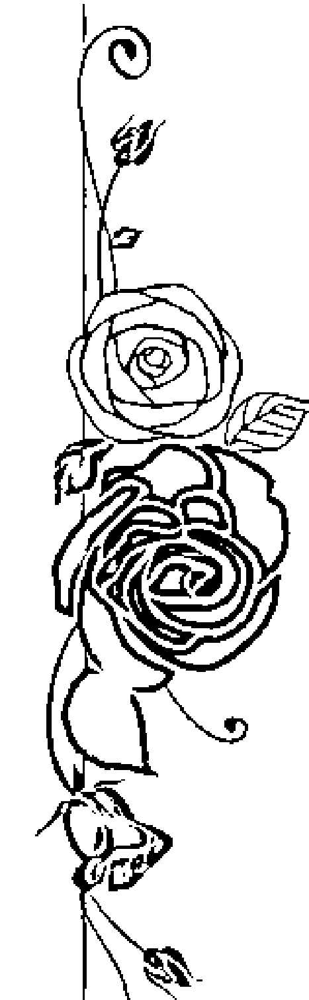

0 4 3

## 生命數字 1

靈魂的本質是創造的、獨特又無可取代的，
每一個靈魂都深深連結著存有，
而且都擁有那源自宇宙偉大的創造力。

## 「我」就是世界的中心

小時候學數數，都是從 1 開始，然後 1、2、3、4：：：一路數下去，這已經是人類意識層面一種根深柢固的文化了。因此 1 一直都代表著：起初、最先、開始、帶頭、開創、開拓的能量，「1」之前是「0」，所以「1」也包含了從無到有、從虛到實之意。

相信大部分讀者都是一九○○年之後出生的，而不管出生於一九××年，出生年中最少都有一個「1」，因此，大部分人至少都有一個生命數字「1」。再往深一層看，過去的九百九十九年裡，人類都活在一個數字「1」的文化裡，而科學的發展史恰巧也是八百多年，所以在數字「1」的能量影響下，人類發明了很多東西，也創造了不可思議的偉大文明。

先天數裡數字「1」愈多的人（例如 11 月或 11 日出生者），其自我中心的表現會愈強烈，與人共事會成為他們的挑戰，他們寧可「自己一個人搞定一切」，也不願與人合作共事，還好他們的處世能力都很強，可以獨立完成工作。

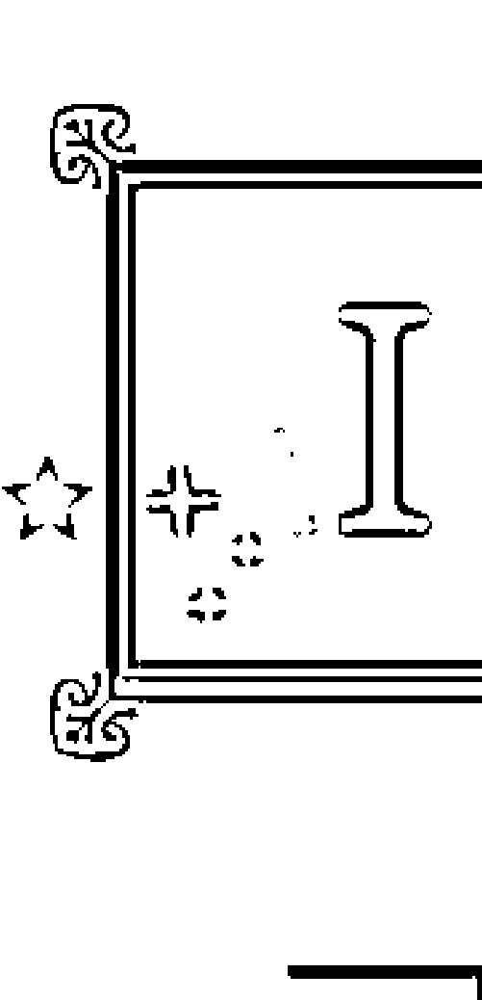

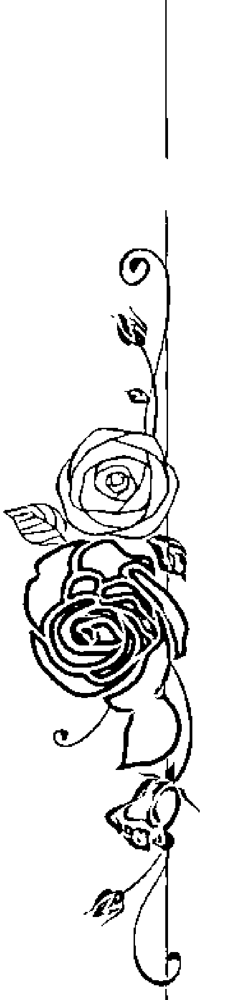

## 生命數字不思議

046

## 「我」就是世界的中心

1 是單一的意思，也是一個很獨立的數字，生命數字裡的 1 愈多，與 1 有關的個性就愈強烈，其中主命數為 1 的人，其個性表現受 1 的影響最明顯。他們比較自我，總是以自己為中心來思考及行事，對他們而言，「我」才是最重要的。

所以，當你與生命靈數 1 的人溝通時，會常聽到類似以下的字眼：

- 我覺得：
- 我認為：
- 我喜歡：
- 我不喜歡：
- 人家會怎麼看我？
- 他們都針對我：

## 1號人的愛情觀

生命靈數1的人（以下簡稱1號人）非常以自我為中心，思想模式都是以「我」為出發點，喜歡別人覺察到他們的存在，因此舉手投足、言談舉止總是充滿了吸引力。

在感情上，他們大多憑感覺行事，一旦認定的事，就不再接受其他的可能性。與1號人談戀愛，最好是個願意配合1號人的人，因為1號人凡事都以自己的觀點為主，不喜歡改變自己，也不曾想過要配合任何人，理所當然地認為自己的方式才是對的、才是最好的。

1號人通常是個大忙人，生活非常獨立，很多事情都可以自己處理，或寧可自己處理，而且處理得井然有序。1號人不喜歡別人插手他的事，聰明的話，最好少干預他的生活。如果你交往的對象是個1號人的話，他的能幹與自信、能言善道、穿著入時、長袖善舞，一定會讓你在朋友面前很有面子。

但是，基本上你不會是1號人生命的全部，沒有你，他仍然有很多事可忙。你可

## 1號人的職場表現

1號人的工作能力都很強，可以獨立處理很多事，但是他們只忠於自己的做事方式，並且會要求別人的尊重，通常1號人的工作模式都很獨立自主，因此千萬別奢求1號人會配合別人。

在比較高能量層面運作的1號人會是很出色的領導者，他們很有膽識，而且樂於成為領導者，天生就有一股吸引別人追隨他們的魅力。

1號人非常會安排並充分利用自己的時間，他們是屬於停不下來的一群，經常同時處理好幾件事情。如果他們的工作需要使用電腦，你會發現電腦一定同時運作著好幾個程式；又或者除了公事外，也同時處理家裡的事和私人事務，但你不能干預他們的處事方式，這方面他們需要絕對的尊重。基本上，只要他們答應完成的事情，就會無所不用其極、想方設法完成它，『放棄』兩個字不在他們的字典裡。

1號人的表現也可能很極端，有些1號人根本沒辦法乖乖地安靜坐著，就算勉強做到，時間通常都很短，他們永遠忙碌不已。由於很需要別人注意他們的存在，1號

## 1號人的職場表現

人會想盡辦法吸引大家的注意力；有些1號人則總是獨自坐在角落裡，默默處理手上
的事情，不管面前的人是誰，完全沉醉在自己的世界裡。其實，這就是1號人—自我
中心—兩種極端的表現，在他們的眼裡，「我」就是世界的中心。

1號人的腦筋動得很快，可說是創意無限，他們那些出其不意的點子，經常帶給
人們驚嚇或驚喜；他們具有急中生智的本事，非常適合從事需要應變能力、必須迅速
找出解決方案的工作。

1號人從不掩飾自己的情緒，工作場合上最好盡量避免與他們發生正面衝突；他
們對於自己理解及認同的事情，通常都會處理得很好，完全不必你操心；相反的，如
果不是他們能接受的事情，那麼整個辦公室的人就等著看他臉色了！

☆1號人適合從事哪些工作？
創意人、發明家、藝術家、業務員、設計師、運動員、演藝人員、職業軍人、教
師、主管、管家、自由工作者、獨資企業主。

## 從1號塔羅牌「魔術師」解析1號人

1號的塔羅主牌是「魔術師」。牌中的魔術師右手指天，左手指地，身體打開，代表1號人「不藏私」的個性。事實上，很難說這是優點還是缺點，無論面對什麼人、什麼場合，他們的喜歡和不喜歡一律寫在臉上。

魔術師的工作是變法術，代表宇宙「地水火風」四大元素的象徵，都放在魔術師面前的桌上了，再加上頭頂上的「無限」符號，無論什麼東西，魔術師都能變出來，如同1號人的特色：一旦決定要做的事，或當他們身處壓力之下，就一定能及時想出

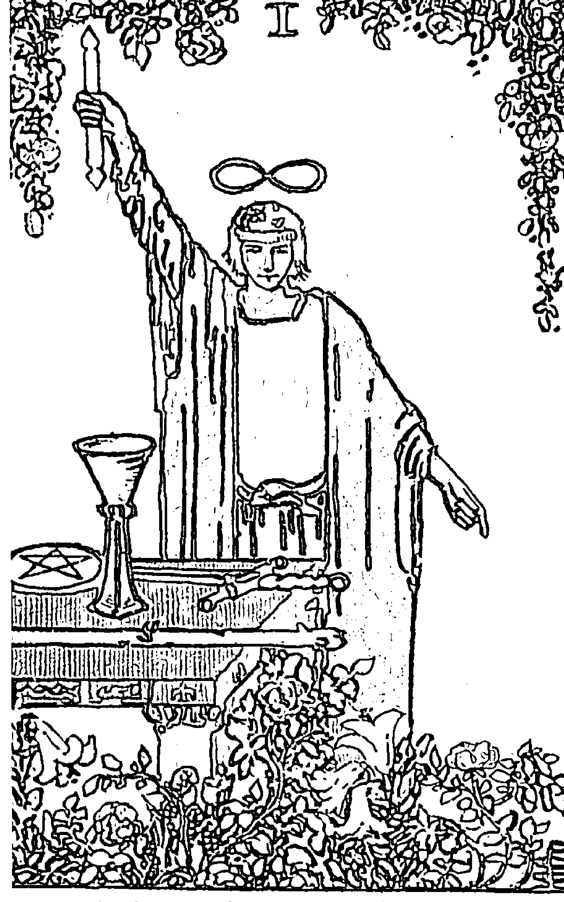

## 從1號塔羅牌「魔術師」解析1號人

辦法完成任務，化腐朽為神奇。

魔術師一生周旋於「地水火風」四大元素之間，不是在煩惱落實（地）方面的

事，就是在處理情感（水）上的問題；不是在忙著執行（火）某些事，就是在思索

（風）著什麼事。所以，大多數的 1 號人或先天數裡有很多 1 的人，生活總離不開一

個「忙」字，可說是有事忙、無事更忙的人。

魔術師同時也是一位表演者，對從事表演工作的人而言，最需要的就是觀眾，也

就是被注視，很需要別人肯定他們的創作。所以，如果你有 1 號人的朋友，會發現他

們很需要你的肯定，希望你看到他們有多出色，然而，1 號人也是不肯面對及承認自

己缺點和錯誤的人，因此在指出他們的缺失時，要特別小心措辭。

數字 1 也是單一元素的意思，「唯一」是 1 號人的能量，所以對 1 號人而

言，「我」是最重要的，「我」是宇宙的中心，他們只在乎自己的觀點和感受，數字 1

愈多的人，愈以自我為中心，也愈自以為是。

## 1號人的數字配對

生命靈數並沒有「數字配對」的觀點，因為數字的表現乃是基於個人的「成熟度」及「自由意願」，不可一概而論。下列 1 到 9 生命數字的配對與分析僅供參考。

## 1 + 1

## 契合的原因

各有自己的興趣、朋友、學習與生活空間，而且能夠互相協調、尊重對方的個性及空間。

## 不和的原因

要求對方配合自己的方式生活，不容許「非我」的立場及觀點存在，彼此爭奪及膨脹自我空間，忽略了對方的個人特質。

## 1 + 2

## 契合的原因

2號人的依賴性正是1號人需要的，1號人絕對願意照顧2號人的生活起居，這樣會讓1號人覺得自己很重要，感到自己存在的價值。

## 不和的原因

2號人的自以為是和堅持，會讓1號人覺得不被重視，而且2號人情緒不佳時的沉默及拒絕溝通，會令凡事都要講清楚的1號人很抓狂。

## 1 + 3

## 契合的原因

1號人的陽光性格及3號人的愛玩性情，會讓他們的生活多姿多采，他們會樂此不疲地想出新點子，並且享受不斷翻新的生活樂趣。

## 不和的原因

當愛面子的1號人和自尊心極強的3號人針鋒相對時，很容易在言語上傷害對方，而單純直接的1號人則難以忍受3號人的善變。

## 1 + 4

## 契合的原因

只要1號人給予4號人安全感，4號人就會願意讓1號人成為他生命的全部，並且變成1號人的一小粉絲，而1號人也會陶醉在被崇拜的成就感裡。

## 不和的原因

當1號人的自我讓4號人失去安全感時，4號人便會對1號人要求更多，的承諾。然而1號人的自我空間一旦被侵犯太多時，情緒就會爆發，使得雙方產生衝突。

## 1 + 5

## 契合的原因

1號人想要有自己的空間，5號人則要絕對的自由，各得其所，各有各的精采。

## 不和的原因

當1號人要求5號人要以他的觀點為主時，5號人會為自己的思想自由抗爭到底；5號人想自由自在地生活時，會讓1號人覺得自己沒有得到5號人的尊重。

## 1 + 6

1號人愛面子，6號人要求完美，他們的生活品味及要求很接近，會是人人稱羨的一對璧人。

## 不和的原因

吹毛求疵的6號人受不了行事匆忙、粗枝大葉的1號人。6號人挑剔的個性絕對會刺傷1號人的自尊心。

## 1 + 7

7號人是絕對需要思考空間的人，對自我的1號人來說，給對方思考空間可說是輕而易舉。1號人多采多姿的生活及談笑風生，則可滿足好奇的7號人。

## 不和的原因

1號人停不下來的生活，容易讓多疑的7號人惴惴不安；7號人的疑心則令1號人感覺自己不被信任，自尊心因而受挫。

## 1 + 8

8號人終日埋頭苦幹，能給1號人足夠的空間做自己喜歡的事。1號人永遠向前的個性，讓8號人覺得他有為向上，日後可成大業。

## 契合的原因

8號人終日埋頭苦幹，能給1號人足夠的空間做自己喜歡的事。1號人永遠向前的個性，讓8號人覺得他有為向上，日後可成大業。

## 不和的原因

8號人的鞭策讓1號人覺得不受尊重，8號人的埋頭苦幹則讓1號人覺得自己被忽略。而1號人多元化的生活卻讓8號人覺得他是在浪費精力。

## 1 + 9

## 契合的原因

終日活在夢裡、不知道下一步往哪兒走的9號人，很需要像1號人如此有領導才能的人，在生活上指引他。

## 不和的原因

1號人目標眾多的生活，會讓9號人覺得無所適從、心懷恐懼。習慣逃避的9號人受不了1號人的一針見血，更受不了1號人的絕對觀。

## 給1號人的貼心建議

真正的獨立自主及自信是1號人生命中必修的課題。然而，什麼才是真正的獨立？獨自生活就等於獨立嗎？不求人就等於獨立嗎？許多人都很容易落入這種誤解當中。1號人一味以外界的評價來判定自己的存在價值，一天到晚忙著告訴別人自己有多了不起，甚至可以一輩子迎合與滿足別人的價值觀。

賽斯曾說：靈魂的本質是創造的、獨特又無可取代的，每一個靈魂都深深連結著存有（宇宙），而且都擁有那源自宇宙偉大的創造力。每一個當下都是新的體驗、探索與拓展，當人們明白了，而且擁有了這份力量的時候，才會停止往外追尋，放心地安住在自己的中心。

因此，真正的獨立是：活得很自在、不在乎別人的評價，接受純粹的「自己」，無論自己是什麼樣的人，都能夠活得很價值。真正的自我肯定就是不需要別人來肯定自己，一旦需要別人的肯定或認同時，就是一種依賴，然而在人生過程中，有時依賴又是必須的。

## ☆生命數字1的代表人物

陶晶瑩、吳尊、辛曉琪、張艾嘉、謝霆鋒、周星馳、徐克、陳凱歌、張根碩、

給1號人的貼心建議

## 2號人的數字配對

## 2 + 1

## 契合的原因

2號人的依賴性正是1號人需要的，1號人絕對願意照顧2號人的生活起居，這樣會讓1號人覺得自己很重要，感到自己存在的價值。

## 不和的原因

2號人的自以為是和堅持，會讓1號人覺得不被重視，而且2號人情緒不佳時的沉默及拒絕溝通，會令凡事都要講清楚的1號人很抓狂。

## 2 + 2

## 契合的原因

兩人是相敬如賓的一對，生活很和諧，彼此互相關懷，不會吵吵鬧鬧，可以擁有高品質的溝通及交流。

## 不和的原因

蛇無頭而不行，2號人的依賴以及需要別人的認同，會讓兩人的相處產生很多問題及抱怨，而逃避衝突的性格，又會讓雙方不肯面對問題，放任問題一直累積下去。

## 2 + 3

細心的2號人很得性格浪漫的3號人歡心，愛講話的3號人也完全滿足了2號人喜歡溝通的個性。

## 2 + 4

2號人柔和的個性讓需要安全感的4號人覺得很舒服，情緒穩定的4號人則讓2號人安於這種和諧的感覺之中。

## 2 + 5

懂得配合及依賴的2號人，會讓霸氣的5號人很有滿足感；5號人說起話來頭頭是道，則很吸引愛分析的2號人。

## 不和的原因

5號人的強詞奪理往往把黑白分明的2號人氣個半死；不自由、毋寧死。

## 不和的原因

固執的4號人遇上凡事都很絕對的2號人，兩人之間出現衝突時，會僵持很久；2號人在堅持己見時的冷淡態度，會讓需要安全感的4號人很難受。

## 不和的原因

3號人愛講話卻暗藏心事，可惜逃不過2號人觀察入微的雙眼。而2號人過於絕對的觀點，很容易傷害自尊心強的3號人。

## 2 + 6

2號人與6號人之間的互動，往往會因彼此對完美的追求而產生共鳴。2號人細膩的觀察力與6號人對細節的重視，使他們在合作中能互相補足。

## 不和的原因

2號人對事物的模糊與不確定，會讓6號人感到不安；6號人對完美的執著，則可能讓2號人覺得壓力重重。

## 2 + 7

2號人與7號人之間的互動，往往會因彼此對思考與行動的偏好而產生張力。2號人追求清晰與確定，而7號人則傾向於探索與創新。

## 不和的原因

7號人對事物的不確定與模糊，會讓2號人感到不安；2號人對事物的黑白分明，則可能讓7號人覺得限制了他們的自由。

## 2 + 8

2號人與8號人之間的互動，往往會因彼此對秩序與行動的追求而產生共鳴。2號人追求清晰與確定，而8號人則傾向於實際與行動。

## 不和的原因

8號人對事物的實際與行動，會讓2號人感到壓力重重；2號人對事物的模糊與不確定，則可能讓8號人覺得缺乏方向。

## 2 + 9

2號人與9號人之間的互動，往往會因彼此對責任與行動的追求而產生張力。2號人追求清晰與確定，而9號人則傾向於理想與夢想。

## 不和的原因

9號人對事物的理想與夢想，會讓2號人感到壓力重重；2號人對事物的模糊與不確定，則可能讓9號人覺得缺乏方向。

## ☆ 2號人適合從事哪些工作？

- 褓姆、作家、演員、導遊、祕書、助理、律師、警察、分析員、觀察員、稽核員、算命師、諮詢師、美容師、設計師、護理人員、軍公教人員。

## 從 2 號塔羅牌「女祭司」解析 2 號人

塔羅牌的 2 號主牌是「女祭司」，古代的女人若想要得到聲望、名譽、地位、才學，成為女祭司是其中一個方式。圖中的女祭司尊貴、高傲、超然地坐在她的寶座上，給人一種冷靜而不可接近的感覺。這代表了 2 號人聰明、懂事、清明、純淨、仔細、有智慧，而且分析力強。

女祭司手中拿著卷軸，代表她掌握了宇宙的知識及智慧、原理和法則，所有的答案都已經握在手中了。2 號人基本上是很需要「了解一切」的人，換句話說，他們無法忍受「不知道」的情況存在！

女祭司背後一黑一白的兩根柱子上各刻有一個英文字母，黑色柱子的B是BOGN，白色柱子的J是JN，它們是希臘神殿的兩根柱子，代表了陰和陽，而女祭司寶座就設在中間，表示她一生都活在二元對立中。

受到二元觀念的影響，同時面對錯綜複雜的現實世界，有些2號人寧可自己先下個結論，以求安心；2號人行事立場鮮明，黑白分明，沒有灰色地帶，處事不客觀。

但同時會有另一類2號人凡事都模稜兩可、模糊不清，而且經常思緒不定，總是依賴別人幫他們解決問題。大多數的2號人都兼具這兩種性格。有些人大事果斷，小事婆婆媽媽；有些人小事分明，大事猶豫不決。

## 2號人的愛情觀

和2號人談戀愛，你會很有滿足感，生命靈數2是生命靈數1的相對，1是獨立和自我，2則是互動、依賴及配合，所以生命靈數2的男人會讓女人有一種「我可以照顧他」的成就感。

生命靈數2的男人非常懂得迎合他人，如果女朋友不喜歡吃中式料理，他就會陪女朋友吃西餐，而且會帶女朋友到她喜歡的餐廳，讓女朋友點喜歡的菜；萬一女朋友不喜歡人多、過於嘈雜的地方，2號男人就會帶女朋友到安靜的郊區吃飯。2號男人會很細心地觀察及了解女朋友的心意及喜好，努力做她喜歡的事、說她喜歡聽的話，成為她心目中理想的男人。

和2號人吵架絕對不是明智之舉，而且可能是一場沒完沒了的長期抗戰，因為「對錯」對2號人而言太重要了，他不能接受任何他認為沒有道理的事，絕對會和你力爭到底。有時2號人還會很囉唆，在你耳邊不停地碎碎唸，解釋又解釋、說明再說明，直到你認輸、讓步或接受他們的觀點為止。

2號人對事物觀察入微，分析能力很強，擁有2號的男（女）朋友，等於添了一位有力的幕僚，想不通的事只要交給他，然後專心聆聽他冷靜的分析，保證可以得到圓滿的答案。通常2號人會給你一些有用的點子，絕對是一位出色的「女（男）人背後的男（女）人」。

可是，萬一激怒了2號人，就等著接受他們最拿手的「無言的抗議加冷戰」吧！他們很少和別人挑明了開火，因為他們討厭衝突，喜歡保持和諧的假象。2號人最「毒」的一招就是：「我幹嘛花時間和你吵？錯的人是你！」然後轉身離開，把你氣個半死。他們的態度既溫文儒雅，又內斂頑強，而且堅持到底、絕不妥協。

因此，一旦愛上了2號人，就要有寬大能容的胸襟，當他們有所堅持的時候，千萬不能指責他們是錯的，錯的人一定要是你！而當他們無法下決定的時候，你要馬上成為有主見、有見地的人，為他們解決所有的問題。

與2號人交往要有耐性，要能夠忍受他們的喋喋不休，即使是你已經聽過很多次的話題，仍然要假裝很感興趣地聽下去。同時，他的觀察力很強，除非你已經有一個要分手就分吧！的打算，否則最好都講實話。

## 2號人的職場表現

和2號人一起工作是很愉快的，他們會營造出十分和諧的工作氣氛。雖然他們可能是那種不太起眼的人物，但無論跟誰都能配合、共事。

由於2號人極需要和諧的感覺，所以他們只願意在安定的環境工作，十分討厭那些興風作浪的人。表面上看來，他們是安安靜靜埋首做事的人，但事實上總是把心中的不滿隱藏起來，一直累積到忍無可忍時，便撒手不管、一走了之。

跟2號人共事時，很多時候他們突如其來的反應，會讓人覺得莫名其妙，原因是他們遇到不合理的事時，並不會馬上表達心中的不滿。

和2號人對峙是非常不智的，只要是他們認定對的事情，誰都休想改變，而且立場十分堅定，甚至會為了堅持而堅持。「對錯」的判別對他們來說非常重要，認為「認錯」就是否定自己，因此，當他們已經有了特定立場時，就別管太多，讓他們自己去經歷一切吧！

有趣的是，2號人往往會預設一個立場，然後到處問人家的意見，當別人的意見和他們心中的答案不同時，就會和對方爭辯，常常把對方氣個半死！

這其實是2號人一種很微妙的心態，他們極度需要別人的認同，一旦得到別人的認同，便會信心十足地勇往直前。因此，不要被他們強勢的外表給欺騙了，他們心裡其實是很依賴的。如果你的下屬的生命靈數是2，請多給他們一點肯定和認同吧！

## 生命數字不思議

073 從2號塔羅牌「女祭司」解析2號人

## 2 + 6

## 契合的原因

2 號人善於與人互動，6 號人很需要朋友，雙方很容易一相遇就很快交往。

## 不和的原因

愛計較的 6 號人遇上有理就要講清楚的 2 號人，經常會把小吵架變成大衝突，而愛玩冷戰的 2 號人很容易就傷到脆弱的 6 號人。

## 2 + 7

## 契合的原因

2 號人喜歡分析，遇上愛追根究柢的 7 號人時，兩人在生活上可以找到很多共同的嗜好，而且會樂此不疲地討論下去。

## 不和的原因

愛好和諧的 2 號人很討厭 7 號人的咄咄逼人，沉默的 2 號人則會讓多疑的 7 號人抓狂。

## 2 + 8

## 契合的原因

善於配合的 2 號人絕對可以成為愛掌權、好操控的 8 號人的一小粉絲，8 號人則是 2 號人理想的『生命支柱』。

## 2 + 9

## 不和的原因

個性很衝的 8 號人受不了優柔寡斷的 2 號人，對錯分明的 2 號人則受不了唯我獨尊的 8 號人。

## 契合的原因

9 號人很喜歡「被需要」的感覺，還有誰比愛依賴他人的 2 號人更適合當這個「需求者」？高深莫測的 9 號人則可以深深吸引愛分析的 2 號人。

## 不和的原因

2 號人喜歡逃避問題，9 號人又總是把話藏在心裡，因此很難解決他們之間的問題。

## 給 2 號人的貼心建議

社會普遍的價值觀認為「對」才是好的、才有價值，大多數人也都努力要做得「對」、做得「好」，甚至為了達到這個目的不惜犧牲一切，付出極大的代價，多少關係的破裂、親人變成仇人、家庭的破碎、傷害的造成、戰爭的發生……都是為了證明誰對誰錯。有時候我不免要想「Why is it so important to be right?」（對錯真有那麼重要嗎？）到頭來我們究竟是贏了？還是輸了？

因此，2號人最大的課題便是學習「容許」：容許錯誤的發生，以及「接納」與自己不同的觀點，才有機會學習與成長，人生才會有彈性，並且充滿不同的「可能性」。

2號人是很敏感脆弱、很容易受傷的，因為害怕這份脆弱會讓自己潰不成軍，所以他們大部分時候都裝得很冷漠，就像蛤蜊，只要有一點點不安全就馬上關起外殼，因為一打開就很容易受傷，一傷就傷到最深處。

然而賽斯曾經談到：靈魂的偉大比我們所知的更廣更深，世上沒有任何事物可以限制住靈魂，包括時空。事實上，任何的是非、對錯、喜惡、應該不應該、可以不可以都是限制，限制了靈魂的經歷，也阻礙了生命的體驗。當人們得知所有劇情的本質都是靈魂的學習時，就會明白根本沒有什麼好或不好的事情，只要勇敢地穿越生命即可。

所以別忘了，『包容』能使生命變得有彈性，『接納』才能擁有和諧，當一個人能夠真正地包容和接納一切，就會發現表達自我是安全的，情感才能自然地流動。生命的本質是學習、經歷、創造與拓展，在靈魂的層面裡，並沒有所謂的傷害，因此沒有人可以真正地傷害他人。

## ☆生命數字2號代表人物

趙又廷、張小燕、蔡琴、劉雪華、張柏芝、黃秋生、鄭少秋、瑪丹娜、貝克漢、希特勒、雍正皇帝、蔣介石、美國前總統雷根、美國前總統柯林頓、英國查爾斯王子。

## 生命數字 3

生命唯一不變的定律就是變，因為有變化，靈魂才可以「往前」，因為有變化，才有生命力，靈魂的遊戲才能繼續，靈魂在生命中可能的展現方式，遠超出我們的智慧之外。

## 唯一不變的就是變

生命靈數 1 代表獨立和開拓，生命靈數 2 代表接受與配合，而生命靈數 3 則是融合了 1 和 2 的能量，即開拓＋接受 || 溝通與變化，重點在於如何保持自我，並且配合外在環境。

生命靈數 3 擺脫了生命靈數 2 的二元對立觀，從幾何角度來看，「幾何學」的第一個平面三角形上定位不同的點，讓生命靈數 3 有了「變」的能力，所以「變化力」是生命靈數 3 的人（以下簡稱 3 號人）的強項。

當然，要跳脫一切是需要勇氣的，所以 3 號人通常需要很努力地擺脫生活的限制及束縛，他們最受不了生命被釘死在一個點上，而需要充滿變化的 生活。

3 號人的口頭禪通常有：

好無聊哦！

有什麼好玩？

你會不會介意我……

我想試一下……

好浪漫哦！

我想他們不喜歡我！

我不要別人看到我這個樣子！

3號人是很敏感的，對生活上所有的變化及變動都非常敏銳，觀察力極強，可以把別人的反應都看在眼裡，很懂得看人臉色。

3號人自尊心極強，十分介意別人的評價，而且常會以取悅別人或得到別人的認同為目的，同時也會以外界的價值觀來衡量自己。過度敏感的3號人一味注重自己的外表，往往投入太多精力去維持美好的形象，雖然不一定很時髦，但他們希望別人看到的都是他們最美好的一面，因為3號人喜歡被欣賞的感覺。

感性的3號女人喜歡打扮成各種不同的外型，可能是女強人、陽光美少女、有教養的女性或甜美小公主……總之，她會努力一成為「自己想要的形象」，而不是做她自己。雖然剛開始可能會覺得很浪漫，但這種喪失自我的生活，最後也得不到快樂。

敏感的3號人善於察言觀色，很容易觀察到別人的感受，因此他們會是你傾吐心事最合適、窩心的對象，比任何人都還有一同理心，能夠理解你的心情與感受。

3號人的另一個極端表現則是：因為敏感而對小事的反應特別激烈。自尊心極強的3號人常因別人無心的舉動而快快不快，但別人又怎會明瞭3號人敏感善變的心呢？奉勸3號人與其為了一些小事悶悶不樂，不如開誠布公地說出自己的感受。

生命靈數3有著改變、溝通及快樂的能量。因此，3號人喜歡經歷「變化」，不論是大是小的變動，只要生活有任何些變化，3號人就會感到很興奮。3號人有很多有趣的特質：

- 滿腦子變化多端的鬼主意。
- 喜歡說話，不管什麼話題，都可以跟人談得來。
- 喜歡改變辦公桌的擺設，筆筒今天放左邊，明天放右邊。
- 喜歡改變髮型、髮色，並且配上各種可愛的小髮飾。
- 喜歡每天吃不一樣的料理或菜色。
- 喜歡旅行，尤其是自助旅遊。
- 审美眼光極佳，很有品味。

如果現實環境不容許3號人「變」，他就會覺得自己懷才不遇，有志難伸。

## 3號人的愛情觀

3是一個永遠在變化的數字，因此，要讓3號人的心思停頓下來著實不易，因為連他們自己都做不到。

其實，跟3號人相處是件賞心樂事，他們的生活充滿生機、變化多端，不斷有新點子冒出來，並且樂於嘗試及接受新事物、喜歡認識不同領域的朋友。3號人也喜歡到處觀光旅遊，和3號人在一起，可增添生活許多色彩。大部分的3號人都很懂得表達自己，而且長袖善舞、談笑風生。

女人剛開始和3號男人戀愛的時候，3號男人樂意做盡一切肉麻的事，送花、送禮物、牽手、擁抱、親吻、接送等等都不是難事，女人很容易就融化在3號男人的甜言蜜语、浪漫情懷裡，3號男人可以把女人哄上天，很多女人就飄飄然地墜入3號男人的「溫柔鄉」。事實上，3號男人也很享受這種浪漫的感覺，而且樂在其中。大部分的3號人都是「超級浪漫主義者」，甚至一生都在追尋愛情。

自尊心是3號人的死穴。自尊心過強的3號人則跟上述情況完全相反，不苟言笑、臉皮很薄，而且極度敏感，只要別人說的話不中意聽，就會立刻翻臉，加上不肯屈服的個性，常讓 3 號人的社交生活出現問題。3 號人的小家子氣，讓人在朋友面前丟盡了臉不打緊，還得回過頭來安撫 3 號人脆弱的心靈。自尊心愈強的 3 號人，就愈把真心話藏在心裡，所以千萬不要被多話的 3 號人給欺騙了，多話並不等於表達力強，話很多的人也可能把心事藏起來。

表達自己的情感也是 3 號人很大的挑戰，尤其在愈在乎、愈親近的人面前更是如此。與 3 號男人相處愈久，可能愈不了解他，基本上很難把 3 號人歸類在任何一個範疇裡，也許這陣子他們的好惡、想法、理念是這一套，但不久後可能又換了一套，並且努力要用「好像很有道理」的觀點與角度去說服人，他們可說是全世界最難伺候的「小姐」和「少爺」了。

3 號人的通病是：只知道自己不要什麼，永遠不知道自己要什麼！跟著他們的心思走，往往會筋疲力竭，累死自己。3 號人骨子裡有著非常叛逆的因子，喜歡挑戰傳統及常規，所以千萬別「叫」他們、「教」他們或「規定」他們怎樣，他們永遠能證明用自己的方式也行得通！

由於連 3 號人都不太了解自己的心，所以想要跟他們維持長久的關係，保持經常性的溝通是很重要的。其實，3號人一直都很需要一個能夠理解他們的人，也就是懂得他們的心、和他們在一起、支持他們的成長過程、和他們一起在這個過程中學習和探索的人，因此，愛他們就和他們多談「心」，當他們忠實的聽眾。

要讓3號人開心可以說很簡單，也可以說不容易，你得多花一點心思跟他們要「浪漫」，出其不意的小驚喜會讓他們愛死你。

- 寫些小紙條如「我愛你」、「我想你」、「有你真好」等溫馨小語，放在他們的口袋裡，讓他們不經意地看到。
- 幫他們安排「不需要理由的」驚喜派對。
- 送他們「不需要理由的」小禮物。
- 在他們上班時或下午工作最疲累時，發些貼心的簡訊給他們，例如「加油」、「我永遠支持你」、「你是最棒的」等等。
- 記下他們想買的東西，如T恤、名片夾、牙刷等等，然後偷偷放在他們的衣櫃、抽屜或浴室裡。

## 3號人的職場表現

沒有任何一個3號人在工作裡不曾經歷不開心、失去樂趣、有志難伸的處境，3號人在職場上常常會讓老闆很頭痛。他們不守規矩，喜歡挑戰傳統和既定的方法，喜歡以自創的方式做事，而且很堅持並樂在其中，原因就是他們善變，喜歡不斷地變化，一成不變會讓他們覺得自己不曾活過。

3號人必須找到自己的熱情所在，以及真正喜愛的東西，才能完全地發揮自我。由於他們的心思一直在變，有些生命歷練還不是很豐富的3號人，會不知道自己要什麼，只是一味地繞圈圈，找不到一個落腳處，又或者一直說服自己安守在一個沒有激情但安穩的地方。

溝通是3號人的強項，語言只不過是其中一種溝通模式，3號人如果可以找到表達內心的方式，他們就會發揮得很出色。

## ☆ 3號人適合從事哪些工作？

演員、導遊、領隊、作家、指導員、按摩師、空服員、音樂家、建築師、體操選手、創意廚師、公關人員、心理諮商師、藝術工作者、教育工作者、新聞從業人員。

## 從 3 號塔羅牌『女皇』解析 3 號人

塔羅牌 3 號主牌是『女皇』，牌中的女皇頭戴三層皇冠，衣著艷麗，高舉權杖。3 號人要別人看到的都是漂亮、美好、尊貴的一面。所以 3 號人會很用心地為自己建立美好的形象。

3 號人愛美、很在意別人的評價、自尊心超強，對別人的品頭論足總是銘記在心，或極力辯解，卻欲蓋彌彰。如果要指出 3 號人的不是時，口氣千萬要委婉一點，否則他們以後都不會理你了。

此外，圖中的女皇莊嚴、安逸、舒適地靠著椅墊，處於最舒服的位置上。顯示出3號人都很懂得享受人生，不一定是奢華揮霍，但他們總有一套享受生活的方式，而且不喜歡別人干預他們；換言之，3號人不能感覺「不舒服」，所以不容易妥協，極端的3號人則會很另類、很怪胎，甚至冥頑不靈。

女皇牌的英文「QUEEN」也被翻譯為「大地之母」，大地之母的工作是孕育大地，所以圖中圍繞大地之母的，都是一片欣欣向榮的景象。3號人四周的一切都會有「成長」，有成長就會有變化。「變化力」是3號人的強項，他們喜歡變化，譬如品嘗不同的美食、到處遊歷、改變形象，他們談笑風生，喜歡討論不同的話題、改變家中擺設等等。但是，一旦他們變得太過頭時，會令身邊的人很困惑，大感無所適從。

3號人同時擁有1號人的開拓能力與2號人的接收能力，開拓＋接收＝溝通力，所以溝通能力很強，總能用對方可以理解的方式來表達自己的意見。我發現不少從事教學工作的朋友，生命數字組合中都有很多3的元素。

最後，在「女皇」牌的椅子下埋藏了愛神維納斯的標誌，表示把愛藏了起來。由於自尊心的作祟，表達愛是3號人一個很大的挑戰，尤其在面對愈親近、愈在乎的人時，經常是愛在心裡口難開。

## 3號人的數字配

3 + 1

契合的原因
1號人的陽光性格及3號人的愛玩性情，會讓他們的生活多姿多采。他們會樂此不疲地想出新點子，並且享受不斷翻新的生活樂趣。

不和的原因
當愛面子的1號人和自尊心極強的3號人針鋒相對時，很容易在言語上傷害對方，而單純直接的1號人則難以忍受3號人的善變。

2 + 3

契合的原因
細心的2號人很得性格浪漫的3號人的歡心，愛講話的3號人也完全滿足了2號人喜歡溝通的個性。

不和的原因
3號人愛講話卻暗藏心事，可惜逃不過2號人觀察入微的雙眼；而2號人過於絕對的觀點，很容易傷害自尊心強的3號人。

3 + 3

契合的原因
一起享受變化多端的生活和浪漫的情懷，兩人都喜歡廣交朋友、遊山玩水。

3 + 6

契合的原因
終日索愛的 6 號人會瘋狂迷戀浪漫的 3 號人，而 3 號人的甜言蜜语則容易哄到天真的 6 號人。

不和的原因
6 號人很愛管別人閒事，這是叛逆的 3 號人最討厭的行為，6 號人最終很可能會被 3 號人氣死。

3 + 7

契合的原因
憂鬱深沉的 7 號人非常需要活潑開朗的 3 號人來中和一下性情，理性的 7 號人則可以凡事提醒粗心大意的 3 號人。

不和的原因
當多疑的 7 號人遇上敏感的 3 號人，或叛逆的 3 號人遇上好勝的 7 號人時，兩人的戰爭可能會隨時爆發。

3 + 8

契合的原因
3 號人交遊廣闊，可以幫助善於用人的 8 號人建立人脈，有條不紊的 8 號人可以協助愛闖蕩的 3 號人處理善後工作。

不和的原因
8 號人很愛操控一切，3 號人喜歡挑戰強權。8 號人凡事要求井井有條，3 號人卻往往雜亂無序，兩人相處在一起，很容易讓對方氣得七竅生煙。

3 + 9

契合的原因
愛做夢的 9 號人會讓 3 號人覺得很浪漫，情緒高漲的 3 號人則可以讓 9 號人找到活力，暫時逃避人生的煩惱。

不和的原因
3 號人喜歡歌舞昇平、熱鬧非凡的生活，這會讓低調的 9 號人很不舒服。9 號人的沉默寡言則會讓喜歡溝通的 3 號人很辛苦。

## 給 3 號人的貼心建議

變幻即是永恆，生命每分每秒都在改變，學習面對變化是每個人重要的人生課題，所以，找出及認定生命的方向十分重要。大部分的 3 號人都活在不確定之中，只知道自己不要什麼，而不知道自己要什麼。

事實上，要達成目的的方法與途徑很多，如果不能隨機應變、接受現實的條件與限制，硬要事情如自己想要的方式進行，就如同逆水行舟，根本是白費力氣，最終辛苦的還是自己。換個角度想想，何不順著流走，也許生命會帶我們經歷前所未有的美好，甚至給我們更多的驚喜。

賽斯認為：生命唯一不變的定律就是變，因為有變化，靈魂才可以「往前」；因為有變化，才有生命力，靈魂的遊戲才可以繼續。靈魂在生命中可能的展現方式，遠超出我們的智慧之外。信念創造實相，所以我們不可能在外界人事物中找到自己的價值，只能透過外在世界看到自己的價值觀。真正找到自己的路，不是向外，而是「回家」。

每個人的生命歷程都充滿了未知數，但在這個過程當中，最重要的是問自己：「這是我想過的日子嗎？這是要走的路嗎？」然後學習面對生活上的種種變化。想要擁有良好的溝通能力，唯有透過與他人的不斷交流，才可能知道別人的意願及想法，同時也讓別人了解自己。

倘若一味不願接受別人、不肯向別人妥協，又不說出自己的真實想法，只會讓人無所適從，不知如何相待。因此，如何做到平和、不任性、完整表達自己的理念，以及與他人良性溝通，可說是 3 號人主要的考驗。

## ☆生命數字 3 號代表人物

藍心湄、蕭敬騰、杜德偉、辰亦儒、阮經天、藍正龍、大 S、梅艷芳、鄧麗君、成龍、郭富城、劉曉慶、約翰·韋恩、希區考克、慈禧太后、光緒皇帝、袁世凱。

## 生命數字 4

我們一直都存在於宇宙永不止息的愛、滋養及豐盛之中，  
無論如何，靈魂最終都會離開物質實相，回到存有，  
我們擁有的一切，大大地超越了物質實相。

## 謹言慎行，追求安定

不管以任何方式把四樣東西聚在一起時，一定都走不出宛如「田」字的組合或形狀。「田」是一個很平衡、穩固、有規律的形狀，而4號人的個性就如同這個形狀一樣——安全、穩定又保守。生命靈數4的人（以下簡稱4號人）天生就是需要高度穩定性及安全感的人，他們希望生活有規律，凡事都可以在自己的掌控之中。

我見過最厲害的一位4號人同一份工作做了二十六年！所以，如果你是老闆，而且有生命靈數4的員工，只要給他們足夠的「安全感」，他們絕對會死心塌地為你賣命。

## 4號人的口頭禪是：

- 別耍我！
- 我有責任……
- 這是（不是）我的責任……
- 關我什麼事？

生命數字不思議

100

## 4號人的職場表現

很多大型企業的員工都是數字4的人，原因無他，樹大好遮蔭，對於需要安全感的4號人來說是非常重要的。身為老闆的人，如果請到4號人當員工，留住他們的方法就是給予安定安穩的感覺，他們會是可以信賴又負責任的忠誠員工，總是按時做好自己的工作，非常穩當。

如果你的上司是4號人，那你就要很小心了。4號人重承諾，他們答應的事一定做到，而你答應了他們的事，也最好做得到！

4號人不喜歡不講誠信的人，也不喜歡確定好的事情有變動，因此，變化性太大的工作不適合4號人，反而是那些長期性、例行性的工作，他們可以安分守己地做得很好。

## ☆ 4號人適合從事哪些工作？

會計、警衛、出納、警察、軍人、建築師、運動員、倉儲人員、稽核主管、理財顧問、公教人員、電腦工程師、程式設計師、人力資源人員、機械工程從業人員。

生命數字不思議

106

## 從4號塔羅牌「皇帝」解析4號人

與數字4有關的塔羅牌是一「皇帝」，請問皇帝給人的感覺是什麼？你會跟他開玩笑嗎？是的，4號人通常對很多事都很認真，而且不容易信任別人。牌中皇帝的眼睛是斜視的，所以4號人都比較保守，總是先有所保留，然後靜觀其變，等到他們覺得安全舒服了，才會解除防備。

所以，要成為4號人的朋友不容易，能進入他們內心世界的人就更少了。

塔羅牌中的皇帝緊緊握住手上的法器，代表4號人非常重視他們擁有的東西，無論是質或量，只要擁有、握住就有安全感。換句話說，他們不能忍受那種空洞、不踏實、虛無的感覺，一旦握住東西就不容易放手，個性會比較執著，尤其在感情方面。

4號人不容易投入感情，對他們來說，一旦交往就會認定對方是終身伴侶，所以只要投入便不容易抽離；我遇過不少在感情路上寧願長期糾纏、互相折磨也不肯放手的4號人，令人好心痛。「放下」的確是4號人很大的一個課題！

在安全感方面，4號人身上最明顯的部分便是他們對待金錢的態度了，金錢是現代人最能與安全感連結的東西，所以，金錢通常也是4號人最重視的東西。根據我的觀察發現，4號人真的很懂得儲蓄，他們的銀行存款絕對不會是「0」，因為「0」太不安全了，而且他們名下的不動產往往會讓人大吃一驚。

牌中的皇帝坐在石椅上穩如泰山，同樣的，4號人要的就是那種安穩落實的感覺，一旦固定在一個舒服的點上，他們就不想動了。如同我前面提過的，我曾經見過一位同樣的工作做了二十六年的4號人。

皇帝在他的龍袍下面穿了盔甲，強烈地想要保護自己，極度欠缺安全感。你可能會覺得4號人很自私，但如果帶著慈悲心來看待4號人，你會發現，其實4號人非常缺乏安全感。如果那是你關心的人，就請幫他們「安頓」自己的心吧！

## 4號人的數字配

## 4 + 1

### 契合的原因

只要1號人給予4號人安全感，4號人就會願意讓1號人成為他生命的全部，並且變成1號人的一小粉絲，而1號人也會陶醉在被崇拜的成就感裡。

### 不和的原因

當1號人的自我讓4號人失去安全感時，4號人便會對1號人要求更多，的承諾。然而1號人的自我空間一旦被侵犯太多時，情緒就會爆發，而使雙方產生衝突。

## 4 + 2

### 契合的原因

2號人柔和的個性讓需要安全感的4號人覺得很舒服，情緒穩定的4號人則讓2號人安於這種和諧的感覺之中。

### 不和的原因

固執的4號人遇上凡事都很絕對的2號人，兩人之間出現衝突時，會僵持很久；2號人在堅持己見時的冷淡態度，會讓需要安全感的4號人很難受。

## 4 + 3

### 契合的原因

4號人安穩地守在家裡，讓3號人全心在外面闖蕩，既然4號人不敢冒險，就讓3號人去衝鋒陷陣，真要出了什麼事，再由4號人負責收拾殘局吧！

### 不和的原因

4號人喜歡安穩安全，3號人則要新奇浪漫，不是3號人被4號人悶死，就是4號人被3號人嚇死。

## 4 + 4

### 契合的原因

兩個需要安定、承諾的人相處在一起，簡直是天作之合，他們的情感會非常穩定長久。

### 不和的原因

兩個極度沒有安全感的人在一起，可能會變成兩個索求者，一味要求對方的承諾，自己卻不願先走那一步。

## 4 + 5

### 契合的原因

5號人當仁不讓的作風很吸引4號人，4號人絕對可以成為自負的5號人忠實的支持者。

### 不和的原因

5號人要空間、要自由，4號人要安全感及感情上的確定，他們在一起會是一場互相折磨的惡夢。

## 4 + 6

### 契合的原因

4號人只要感受得到愛，就願意承諾，6號人尋找恆久的愛。雙方會在一起是很自然的事。

### 不和的原因

4號人防衛心很強，容易傷害情感脆弱的6號人。6號人諸事挑剔、要求完美，4號人簡樸實際，因此兩人在生活上很容易產生摩擦。

## 4 + 7

### 契合的原因

7號人天生多疑，除了實而不華的4號人之外，他們很難找到可以信任的人了。7號人的孤僻個性，剛好可以配合要求平淡安穩的4號人。

### 不和的原因

一個多疑孤傲、一個自保謹慎，要他們開始一段關係是很難的事，就看誰願意踏出第一步了！

## 4 + 8

### 契合的原因

8號人目標感強，情緒穩定，很受4號人的欣賞；而且4號人絕對願意無條件去成就8號人，兩人在一起，雙方都會很舒服。

### 契合的原因

契合的原因

### 契合的原因

契合的原因

### 契合的原因

契合的原因

## 4 + 9

### 契合的原因

9號人可以是最貼心、最溫柔善良的另一半，很容易就得到4號人的真心；4號人的承諾也容易讓保守的9號人開放感情。

### 不和的原因

9號人活在自己的夢想中，輕言寡信，當他面對實事求是的4號人時，往往會落荒而逃；4號人則受不了9號人的空談和不切實際。

## 給4號人的貼心建議

事實上，在生活裡紮根及鞏固自己，為下半生做好準備是件好事，4號人很懂得何謂「承擔」和「責任」，然而，究竟要擁有多少才算安全？對安全性及穩定性的需求，使得4號人慾念非常旺盛，想擁有很多東西。

這種不安全感除了讓4號人不願冒險、拒絕接受新事物和可能性之外，也會不斷地盤算自己有些什麼？有多少？如何得到更多、擁有更多？對物質的慾望，會導致4號人變得自私，或有強烈的自我防衛行為。

其實，這是一個學習處理慾望的機會，學習如何在物質社會裡運作，建立正確的物質概念。物質生活絕對不是罪惡，想要擁有富裕生活的念頭一點也不邪惡。『慾念』本身是中性的，無所謂好壞對錯，重要的是如何去面對、接納及處理自己的慾念，不單單是4號人，對所有人來說，都是人生很重要的一課。

只要用心體會，就會發現所有的慾念其實都源自於『愛』：愛自己、愛我們所愛的人。富裕的生活就是「自己和所愛的人可以無憂無慮地生活下去」。可惜現在有太多人已經本末倒置，到頭來雖然擁有物質，卻失去了心靈的快樂。

「安全感」是一種感覺，而感覺基本上是一種選擇。有人可以在充滿危險、動盪、不穩定的環境裡保有安全感；有些人生活安穩，什麼都不缺，愛他們的人也在身旁，卻還是沒有安全感，甚至，擁有的愈多，愈覺得不安。因此，有沒有安全感，基本上與物質並沒有太大的關係。

賽斯談到：所有的人生劇情是為了滿足靈魂的經歷與拓展而發生的，因為靈魂是永生的，所以根本沒有死亡與滅絕，愈明白宇宙與靈魂的本質，就愈知道我們是多麼地「安全」。我們一直都存在於宇宙永不止息的愛、滋養及豐盛之中，無論如何，靈魂最終都會離開物質實相，回到存有，我們擁有的一切，大大地超越了物質實相。

認識自己、接納自己的全部，以及信任自己的能力，是得到「安全感」的第一步，這些都是沒有人可以搶走的東西。能夠「自給自足」的安全感才是最真實的，它源源不絕、取之不盡，讓人活得怡然自得。從外界得到的安全感是有限制、有條件、毫無自由的，而且隨時都可能被拿走或消失無蹤，因為它本來就不屬於任何人。

## ☆生命數字4號代表人物

袁詠儀、楊采妮、伊能靜、吳君如、張曼玉、鄭裕玲、吳奇隆、張韶涵、楊采妮、蘇有朋、蕭亞軒、吳建豪、李連杰、阿諾·史瓦辛格、比爾·蓋茲、新加坡總理李光耀、達賴喇嘛十四世。

## 給4號人的貼心建議

115

## 生命數字 5

自由是靈魂的天性及本質，是不能被限制或剝奪的；  
生命是一個「成為」的過程，不可能被計劃；  
所有的生命力都無法被壓抑，都必須勇敢地展現自我。

## 不自由，毋寧死

五角形是一個很難安頓下來的圖形，也是一個無法與其他圖形合併的圖形，所以，擁有生命靈數5的人（以下簡稱5號人），也是很難與人配合、不容易安心停頓的人。

生命數裡每一個數字都是上一個數字的突破：

數字2的「收斂性」及「依賴性」是數字1的「放射性」及「自我性」的突破。  
數字3的「變化性」及「表達性」是數字2的突破。  
數字4的「安穩性」及「保護性」是數字3的突破。  
而數字5是數字4的突破，所以5號人總是試圖要衝出生命的枷鎖，無法忍受被困在局限的空間裡，他們都是那種「不自由，毋寧死」的人。

5號人的口頭禪如下：

- 事情應該是這樣才合理……  
- 你最好聽我講……  
- 人不能不負責任……  
- 我不能對不起人家……  
- 這事沒有我不行……

不自由，毋寧死

119

## 5號人的愛情觀

5是一個很矛盾的數字，5號人也是如此，他們可以是最負責任的兒子、員工、父親以及最守法的公民，同時也是最嚴厲的上司、父親、兄長以及最不受拘束的男人。跟5號人相處是很不容易的，因為過程中永遠充滿挑戰性。

5號人一生努力安守本分，以對得起全世界為己任，凡事努力配合別人。另一方面，也絕對是個「不安於室」的人，不要被他們乖巧的外表欺騙了，其實他們骨子裡充滿了野性的任性因子，他們的好奇心極強，喜歡新奇刺激的事物，也喜歡到處遊歷、接觸新鮮有趣的東西，喜歡冒險及挑戰自己的能力，而且非常需要別人看到他們的能力。因此，5號人絕對禁不起挑釁，也受不了誘惑。

女性朋友可以想像一下：與這樣的男人交往可能會是什麼情況？想必是如坐針氈、終日忐忑不安吧！因此，自信心不足的女性朋友，若不想自討苦吃的話，最好不要找5號人當男朋友；但如果妳自認是個很有吸引力的女人，行事作風夠獨立，沒有男人也可以有自己的一片天，而且也喜歡過有挑戰性的生活，那麼5號人就是妳所要找的人了。

5號人天生能言善道，觀察力極強，同時也是哄人的高手，跟他們在一起可以很甜蜜，但有爭執的時候，你也休想贏過他們，因為他們就是有本事把黑的說成白的。

我發現很多5號人都很眷戀過去一段沒有結果的感情，而且那份痛楚久久不能放下，當他們執著的時候，的確非常死心眼，尤其在他們覺得自己虧欠於人、或自己做得不夠好的時候，會很難原諒自己。

5號人堅持原則的個性是相當可怕的，凡是他們認定的原則，就算天打雷劈也寧死不屈，所以，不要浪費精力去改變他們的決定，此時你只有兩種選擇：一是接受他們的原則，二是各走各的路！

奉勸女性朋友，如果你的另一半是5號人，那麼妳最好不要去限制、束縛或壓制他，因為這是一個不可能的任務，縱使妳留住了他們的人，他們的心往往已經跑到十萬八千里外了，限制他們不是使他們馬上逃離妳，就是讓他們過得生不如死，終日鬱鬱寡歡，到頭來雙方仍然不會快樂。

大部分的5號人都是一工作狂，如果要跟他們在一起，妳得先接受一個事實：妳不會是他們生命裡最重要的部分，而且會愈來愈不及他們的工作和事業。

自由以及空間是5號人生命裡最重要的東西，對他們而言，「不自由，毋寧死」，一旦失去自由，可是比死還難受！有一天，當妳發現自己在他們心目中的份量，竟然比不上他們對自由的渴望時，別忘了對自己說：既然選擇了5號人，就讓他們成為自己吧！

## 5號人的職場表現

大多數5號人的工作能力都很強，有自己做事的方式與手法，不喜歡別人干預他們的工作，需要絕對的空間做自己喜歡做的事；討厭無理的束縛、規則及限制，但別人卻不能不尊重他們的規定。大部分5號人都不是能乖乖坐在辦公桌前的人，到處走動會讓他們覺得很新奇刺激。

說服力是5號人的強項，他們總有辦法說服別人，甚至能把歪理說成真理，讓你覺得他們講的話好像都很有道理。所以，5號人很適合從事銷售以及對外的工作；很多賣場上的銷售人員或業績傑出的業務人員，大都擁有數字5。

## ☆ 5號人適合從事哪些工作？

- DJ  
- 歌手  
- 演員  
- 編輯  
- 翻譯  
- 業務員  
- 播報員  
- 調查員  
- 設計師  
- 藝術家  
- 客服人員  
- 公關人員  
- 政治官員  
- 心理諮商師  
- 旅遊從業人員  
- 廣告業企劃人員  
- 以及接觸人的工作。

# 從 5 號塔羅牌『教皇』解析 5 號人

要了解 5 號人的個性，最佳的方式是從 5 號的塔羅牌『教皇』開始了解。牌中的教皇戴著三層皇冠，拿著神聖的權杖，莊嚴尊貴地主持教務。表示 5 號人很注重自己的形象，但並不是愛漂亮的那種，而是性格上的形象，所以他們總是努力要建立精明能幹、鞠躬盡瘁、無可指責的形象。

教皇的工作是執行神的律法，這些律法都是神聖不可侵犯、不可刪改的。教皇也是管理世界的人，只有別人聽從他的份，而他不需要聽從任何人的指揮。所以，5 號人的原則性都很強，你必須贊同他的意見，他不會為任何人改變自己的原則。5號人很沒有彈性，且很愛面子，經常因為「話一出口收不回來」而硬撐下去，讓自己或身邊的人很辛苦。

這裡有一個很有趣的問題：「教皇到底是人還是神？」你可能會說：「當然是人！」但是你知道嗎？在人的世界裡，教皇代表「神」，還記得教宗若望保祿二世（Pope John Paul II）在二○○五年過世的情景嗎？他的去世讓多少人感到不捨。

教皇這個半人半神的身分讓很多 5 號人很辛苦，神是不會做錯事的，因此 5 號人會一直要求自己必須表現優異，同時不能原諒自己的過錯。神所說的就一定是對的，所以 5 號人很多時候為了捍衛「自己說過的話」，而承受「不必要」的困擾和壓力。

身為神的使者，應該是充滿慈悲、包容、理性，不應隨便動怒。所以，5 號人都很努力克制自己的情緒，認為發脾氣是低等動物的行為，然而內心又懷著滿腔的原則，很多事情都看不過去，但情緒又找不到出口。因此，當他們努力地遵守規則、卻看到有些人可以不負責任地過日子時，心裡就會很不平衡。

# 5 號人的數字配

## 5 + 1

契合的原因  
1 號人想要有自己的空間，5 號人則要絕對的自由，各得其所，各有各的精采。

不和的原因  
當 1 號人要求 5 號人要以他的觀點為主時，5 號人會為自己的思想自由抗爭到底；5 號人想自由自在地生活時，會讓 1 號人覺得自己沒有得到 5 號人的尊重。

## 5 + 2

契合的原因  
懂得配合及依賴的 2 號人，會讓霸氣的 5 號人很有滿足感，5 號人說起話來頭頭是道，則很吸引愛分析的 2 號人。

不和的原因  
5 號人的強詞奪理，往往把黑白分明的 2 號人氣個半死；不自由、毋寧死的 5 號人則不能忍受 2 號人的依賴及囉唆。

## 5 + 3

契合的原因  
能言善道的 5 號人正好是不懂得表達內心感受的 3 號人知己，3 號人愛闖蕩、5 號人愛自由，各有各的精采。

不和的原因  
5 號人要保有自己的個性，3 號人要固守自己的形象，5 號人的自負容易傷害自尊心強的 3 號人。

## 5 + 4

契合的原因  
5 號人當仁不讓的作風很吸引 4 號人，4 號人絕對可以成為自負的 5 號人的忠實支持者。

不和的原因  
5 號人要空間、要自由，4 號人要安全感及感情上的確定，他們在一起會是一場互相折磨的惡夢。

## 5 + 5

契合的原因  
兩個喜歡享受自己的空間的人，各得其所，各有各的精采，雙方都是對己、對事要求很高的人，可以找到許多共同努力與認同的目標。

不和的原因  
如果雙方的原則有偏差、不能認同對方時，會是一場長久而疲累的角力，就看誰一命硬或一命長了。

## 5 + 6

契合的原因  
6 號人是天生的完美主義者，所以如果你的另一半是 6 號人，應該會很開心，因為妳絕對是位很出色的女性，必定有高人一等的優秀之處。

6 號人一生都在付出愛，所以基本上和 6 號人談戀愛是很幸福的，他會非常地寵愛妳，而且愛屋及烏，也會對妳的家人、朋友、同事都很友善且恭敬有禮。對別人好是 6 號人一生都在做的事，因此 6 號人會很殷勤地討好別人，更會千方百計地討妳歡心，絕不放過任何可以表達他有多愛妳的機會。

如果你有這樣的男朋友，想必戀情一開始會很甜美，但並非所有女人都需要或喜歡這樣的男人，對有些個性獨立、需要空間的女性來說，她們會很受不了。

6 號人的愛是令人窒息的，很多時候，他們一廂情願的示愛方式會令人招架不住，總是用自己的方式來愛人，而不管別人是否能夠接受。

6 號人需要很多被愛包圍的感覺，他們不只喜歡付出愛，也常常向別人索求愛。

因此 6 號人會期望自己付出的愛有所回報，想要看到對方愛他們的證據，當別人沒有表現出非常欣賞他們，或沒有像他們對待別人那樣對待他們，就會傷心失望，甚至覺得很委屈。

## 6 號人的愛情觀

6 號人會經常在愛情中斤斤計較，計算自己的付出與回收是否相等，如果他覺得自己的愛沒有得到回報，就會把所有的愛收回。所以，面對 6 號人的時候，你或許會覺得很困惑，因為這一刻他們對人溫文儒雅，下一秒卻可能變得尖酸刻薄；有時候他們很有大愛精神，有時候又顯得自私自利，可以說魔鬼與天使都在 6 號人的身上出現了。

## 6 號人的職場表現

6 號人是辦公室裡的「好好先生」、「好好小姐」，同事需要幫忙時，他們通常都很樂意幫忙。對於剛進公司的菜鳥同事，他們總是主動關懷、伸出援手，但同時也可能是最愛管閒事的人。

6 號人很難改掉「要求完美」的本性，不能忍受一丁點瑕疵，所以品管是他們的強項，很容易就能找出「不夠好」的地方。他們對自己經手的事力求完美，要求嚴謹，因此要給客戶看的文件或對外匯報的重要資料，最好先讓 6 號人過目，他們總能看到可以改善的地方。

## ☆ 6 號人適合從事哪些工作？

品管、編輯、法官、醫生、護士、教師、廚師、美容師、造型師、建築師、幼教人員、神職人員、櫥窗設計、服裝設計師、服務業人員、心理諮商師。

# 從 6 號塔羅牌「戀人」解析 6 號人

之前曾提過，塔羅牌第 0 到 9 張主牌正好代表了生命靈數 0 到 9 的特質，而塔羅牌 6 號主牌「戀人」，是其中唯一一張不是以單一主體為主題的牌，暗示了 6 號人「很需要跟人在一起」的性格特質。

某種程度來說，能成為 6 號人的朋友是很有趣氣的，「人」對 6 號人很重要，換句話說，朋友對他們非常重要。所以，6 號人通常對人都很和善、很殷勤，總是努力要討好身邊的人，因為他們無法忍受孤單一人。

6 號塔羅牌中，一男一女赤裸地站在牌的兩端，代表了 6 號人不設防的性情，他們很快便能與人親近，沒有心機。有些塔羅牌的書會說「戀人」牌是在描述伊甸園裡亞當與夏娃的故事，伊甸園是充滿了愛與慈悲、沒有罪惡的完美世界，很多 6 號人都會以這種認知去看待現實世界。

6 號人很難擺脫完美主義，他們不能忍受一點點缺陷，對自己所做的事往往要求很高，全力追求完美。想當然耳，他們要求最高、最不能放過的人就是自己了，對自己有所要求固然是好事，但是要求過了頭，只會為自己增添無謂的壓力及挫敗感，並沒有什麼好處。

「戀人」牌中央有一位天使，他是在祝福這對戀人，或是在撮合這對戀人。這一點也經常在 6 號人身上看見，他們總認為自己是為別人好，所以自己做的事一定是對的、是好的，而別人理應要感激他們的所作所為，結果很容易變成好心做壞事！

# 6 號人的數字配

| 6 + 1 | 契合的原因 | 不和的原因 |
| --- | --- | --- |
| 1 號人愛面子，6 號人要求完美，他們的生活品味及要求很接近，會是人人稱羨的一對璧人。 |  | 吹毛求疵的 6 號人受不了行事匆忙、粗枝大葉的 1 號人。6 號人挑剔的個性絕對會刺傷 1 號人的自尊心。 |
| 6 + 2 | 契合的原因 | 不和的原因 |
| --- | --- | --- |
| 2 號人善於與人互動，6 號人很需要朋友，雙方很容易一相遇就很快交往。 |  | 愛計較的 6 號人遇上有理就要講清楚的 2 號人，經常會把小吵架變成大衝突，而愛玩冷戰的 2 號人很容易就傷到脆弱的 6 號人。 |
| 6 + 3 | 契合的原因 | 不和的原因 |
| --- | --- | --- |
| 終日索愛的 6 號人會瘋狂迷戀浪漫的 3 號人；而 3 號人的甜言蜜語則容 |  |  |
|  |  |  |
|  |  |  |
|  |  |  |
|  |  |  |
|  |  |  |
|  |  |  |
|  |  |  |
|  |  |  |
|  |  |  |
|  |  |  |
|  |  |  |
|  |  |  |
|  |  |  |
|  |  |  |
|  |  |  |
|  |  |  |
|  |  |  |
|  |  |  |
|  |  |  |
|  |  |  |
|  |  |  |
|  |  |  |
|  |  |  |
|  |  |  |
|  |  |  |
|  |  |  |
|  |  |  |
|  |  |  |
|  |  |  |
|  |  |  |
|  |  |  |
|  |  |  |
|  |  |  |
|  |  |  |
|  |  |  |
|  |  |  |
|  |  |  |
|  |  |  |
|  |  |  |
|  |  |  |
|  |  |  |
|  |  |  |
|  |  |  |
|  |  |  |
|  |  |  |
|  |  |  |
|  |  |  |
|  |  |  |
|  |  |  |
|  |  |  |
|  |  |  |
|  |  |  |
|  |  |  |
|  |  |  |
|  |  |  |
|  |  |  |
|  |  |  |
|  |  |  |
|  |  |  |
|  |  |  |
|  |  |  |
|  |  |  |
|  |  |  |
|  |  |  |
|  |  |  |
|  |  |  |
|  |  |  |
|  |  |  |
|  |  |  |
|  |  |  |
|  |  |  |
|  |  |  |
|  |  |  |
|  |  |  |
|  |  |  |
|  |  |  |
|  |  |  |
|  |  |  |
|  |  |  |
|  |  |  |
|  |  |  |
|  |  |  |
|  |  |  |
|  |  |  |
|  |  |  |
|  |  |  |
|  |  |  |
|  |  |  |
|  |  |  |
|  |  |  |
|  |  |  |
|  |  |  |
|  |  |  |
|  |  |  |
|  |  |  |
|  |  |  |
|  |  |  |
|  |  |  |
|  |  |  |
|  |  |  |
|  |  |  |
|  |  |  |
|  |  |  |
|  |  |  |
|  |  |  |
|  |  |  |
|  |  |  |
|  |  |  |
|  |  |  |
|  |  |  |
|  |  |  |
|  |  |  |
|  |  |  |
|  |  |  |
|  |  |  |
|  |  |  |
|  |  |  |
|  |  |  |
|  |  |  |
|  |  |  |
|  |  |  |
|  |  |  |
|  |  |  |
|  |  |  |
|  |  |  |
|  |  |  |
|  |  |  |
|  |  |  |
|  |  |  |
|  |  |  |
|  |  |  |
|  |  |  |
|  |  |  |
|  |  |  |
|  |  |  |
|  |  |  |
|  |  |  |
|  |  |  |
|  |  |  |
|  |  |  |
|  |  |  |
|  |  |  |
|  |  |  |
|  |  |  |
|  |  |  |
|  |  |  |
|  |  |  |
|  |  |  |
|  |  |  |
|  |  |  |
|  |  |  |
|  |  |  |
|  |  |  |
|  |  |  |
|  |  |  |
|  |  |  |
|  |  |  |
|  |  |  |
|  |  |  |
|  |  |  |
|  |  |  |
|  |  |  |
|  |  |  |
|  |  |  |
|  |  |  |
|  |  |  |
|  |  |  |
|  |  |  |
|  |  |  |
|  |  |  |
|  |  |  |
|  |  |  |
|  |  |  |
|  |  |  |
|  |  |  |
|  |  |  |
|  |  |  |
|  |  |  |
|  |  |  |
|  |  |  |
|  |  |  |
|  |  |  |
|  |  |  |
|  |  |  |
|  |  |  |
|  |  |  |
|  |  |  |
|  |  |  |
|  |  |  |
|  |  |  |
|  |  |  |
|  |  |  |
|  |  |  |
|  |  |  |
|  |  |  |
|  |  |  |
|  |  |  |
|  |  |  |
|  |  |  |
|  |  |  |
|  |  |  |
|  |  |  |
|  |  |  |
|  |  |  |
|  |  |  |
|  |  |  |
|  |  |  |
|  |  |  |
|  |  |  |
|  |  |  |
|  |  |  |
|  |  |  |
|  |  |  |
|  |  |  |
|  |  |  |
|  |  |  |
|  |  |  |
|  |  |  |
|  |  |  |
|  |  |  |
|  |  |  |
|  |  |  |
|  |  |  |
|  |  |  |
|  |  |  |
|  |  |  |
|  |  |  |
|  |  |  |
|  |  |  |
|  |  |  |
|  |  |  |
|  |  |  |
|  |  |  |
|  |  |  |
|  |  |  |
|  |  |  |
|  |  |  |
|  |  |  |
|  |  |  |
|  |  |  |
|  |  |  |
|  |  |  |
|  |  |  |
|  |  |  |
|  |  |  |
|  |  |  |
|  |  |  |
|  |  |  |
|  |  |  |
|  |  |  |
|  |  |  |
|  |  |  |
|  |  |  |
|  |  |  |
|  |  |  |
|  |  |  |
|  |  |  |
|  |  |  |
|  |  |  |
|  |  |  |
|  |  |  |
|  |  |  |
|  |  |  |
|  |  |  |
|  |  |  |
|  |  |  |
|  |  |  |
|  |  |  |
|  |  |  |
|  |  |  |
|  |  |  |
|  |  |  |
|  |  |  |
|  |  |  |
|  |  |  |
|  |  |  |
|  |  |  |
|  |  |  |
|  |  |  |
|  |  |  |
|  |  |  |
|  |  |  |
|  |  |  |
|  |  |  |
|  |  |  |
|  |  |  |
|  |  |  |
|  |  |  |
|  |  |  |
|  |  |  |
|  |  |  |
|  |  |  |
|  |  |  |
|  |  |  |
|  |  |  |
|  |  |  |
|  |  |  |
|  |  |  |
|  |  |  |
|  |  |  |
|  |  |  |
|  |  |  |
|  |  |  |
|  |  |  |
|  |  |  |
|  |  |  |
|  |  |  |
|  |  |  |
|  |  |  |
|  |  |  |
|  |  |  |
|  |  |  |
|  |  |  |
|  |  |  |
|  |  |  |
|  |  |  |
|  |  |  |
|  |  |  |
|  |  |  |
|  |  |  |
|  |  |  |
|  |  |  |
|  |  |  |
|  |  |  |
|  |  |  |
|  |  |  |
|  |  |  |
|  |  |  |
|  |  |  |
|  |  |  |
|  |  |  |
|  |  |  |
|  |  |  |
|  |  |  |
|  |  |  |
|  |  |  |
|  |  |  |
|  |  |  |
|  |  |  |
|  |  |  |
|  |  |  |
|  |  |  |
|  |  |  |
|  |  |  |
|  |  |  |
|  |  |  |
|  |  |  |
|  |  |  |
|  |  |  |
|  |  |  |
|  |  |  |
|  |  |  |
|  |  |  |
|  |  |  |
|  |  |  |
|  |  |  |
|  |  |  |
|  |  |  |
|  |  |  |
|  |  |  |
|  |  |  |
|  |  |  |
|  |  |  |
|  |  |  |
|  |  |  |
|  |  |  |
|  |  |  |
|  |  |  |
|  |  |  |
|  |  |  |
|  |  |  |
|  |  |  |
|  |  |  |
|  |  |  |
|  |  |  |
|  |  |  |
|  |  |  |
|  |  |  |
|  |  |  |
|  |  |  |
|  |  |  |
|  |  |  |
|  |  |  |
|  |  |  |
|  |  |  |
|  |  |  |
|  |  |  |
|  |  |  |
|  |  |  |
|  |  |  |
|  |  |  |
|  |  |  |
|  |  |  |
|  |  |  |
|  |  |  |
|  |  |  |
|  |  |  |
|  |  |  |
|  |  |  |
|  |  |  |
|  |  |  |
|  |  |  |
|  |  |  |
|  |  |  |
|  |  |  |
|  |  |  |
|  |  |  |
|  |  |  |
|  |  |  |
|  |  |  |
|  |  |  |
|  |  |  |
|  |  |  |
|  |  |  |
|  |  |  |
|  |  |  |
|  |  |  |
|  |  |  |
|  |  |  |
|  |  |  |
|  |  |  |
|  |  |  |
|  |  |  |
|  |  |  |
|  |  |  |
|  |  |  |
|  |  |  |
|  |  |  |
|  |  |  |
|  |  |  |
|  |  |  |
|  |  |  |
|  |  |  |
|  |  |  |
|  |  |  |
|  |  |  |
|  |  |  |
|  |  |  |
|  |  |  |
|  |  |  |
|  |  |  |
|  |  |  |
|  |  |  |
|  |  |  |
|  |  |  |
|  |  |  |
|  |  |  |
|  |  |  |
|  |  |  |
|  |  |  |
|  |  |  |
|  |  |  |
|  |  |  |
|  |  |  |
|  |  |  |
|  |  |  |
|  |  |  |
|  |  |  |
|  |  |  |
|  |  |  |
|  |  |  |
|  |  |  |
|  |  |  |
|  |  |  |
|  |  |  |
|  |  |  |
|  |  |  |
|  |  |  |
|  |  |  |
|  |  |  |
|  |  |  |
|  |  |  |
|  |  |  |
|  |  |  |
|  |  |  |
|  |  |  |
|  |  |  |
|  |  |  |
|  |  |  |
|  |  |  |
|  |  |  |
|  |  |  |
|  |  |  |
|  |  |  |
|  |  |  |
|  |  |  |
|  |  |  |
|  |  |  |
|  |  |  |
|  |  |  |
|  |  |  |
|  |  |  |
|  |  |  |
|  |  |  |
|  |  |  |
|  |  |  |
|  |  |  |
|  |  |  |
|  |  |  |
|  |  |  |
|  |  |  |
|  |  |  |
|  |  |  |
|  |  |  |
|  |  |  |
|  |  |  |
|  |  |  |
|  |  |  |
|  |  |  |
|  |  |  |
|  |  |  |
|  |  |  |
|  |  |  |
|  |  |  |
|  |  |  |
|  |  |  |
|  |  |  |
|  |  |  |
|  |  |  |
|  |  |  |
|  |  |  |
|  |  |  |
|  |  |  |
|  |  |  |
|  |  |  |
|  |  |  |
|  |  |  |
|  |  |  |
|  |  |  |
|  |  |  |
|  |  |  |
|  |  |  |
|  |  |  |
|  |  |  |
|  |  |  |
|  |  |  |
|  |  |  |
|  |  |  |
|  |  |  |
|  |  |  |
|  |  |  |
|  |  |  |
|  |  |  |
|  |  |  |
|  |  |  |
|  |  |  |
|  |  |  |
|  |  |  |
|  |  |  |
|  |  |  |
|  |  |  |
|  |  |  |
|  |  |  |
|  |  |  |
|  |  |  |
|  |  |  |
|  |  |  |
|  |  |  |
|  |  |  |
|  |  |  |
|  |  |  |
|  |  |  |
|  |  |  |
|  |  |  |
|  |  |  |
|  |  |  |
|  |  |  |
|  |  |  |
|  |  |  |
|  |  |  |
|  |  |  |
|  |  |  |
|  |  |  |
|  |  |  |
|  |  |  |
|  |  |  |
|  |  |  |
|  |  |  |
|  |  |  |
|  |  |  |
|  |  |  |
|  |  |  |
|  |  |  |
|  |  |  |
|  |  |  |
|  |  |  |
|  |  |  |
|  |  |  |
|  |  |  |
|  |  |  |
|  |  |  |
|  |  |  |
|  |  |  |
|  |  |  |
|  |  |  |
|  |  |  |
|  |  |  |
|  |  |  |
|  |  |  |
|  |  |  |
|  |  |  |
|  |  |  |
|  |  |  |
|  |  |  |
|  |  |  |
|  |  |  |
|  |  |  |
|  |  |  |
|  |  |  |
|  |  |  |
|  |  |  |
|  |  |  |
|  |  |  |
|  |  |  |
|  |  |  |
|  |  |  |
|  |  |  |
|  |  |  |
|  |  |  |
|  |  |  |
|  |  |  |
|  |  |  |
|  |  |  |
|  |  |  |
|  |  |  |
|  |  |  |
|  |  |  |
|  |  |  |
|  |  |  |
|  |  |  |
|  |  |  |
|  |  |  |
|  |  |  |
|  |  |  |
|  |  |  |
|  |  |  |
|  |  |  |
|  |  |  |
|  |  |  |
|  |  |  |
|  |  |  |
|  |  |  |
|  |  |  |
|  |  |  |
|  |  |  |
|  |  |  |
|  |  |  |
|  |  |  |
|  |  |  |
|  |  |  |
|  |  |  |
|  |  |  |
|  |  |  |
|  |  |  |
|  |  |  |
|  |  |  |
|  |  |  |
|  |  |  |
|  |  |  |
|  |  |  |
|  |  |  |
|  |  |  |
|  |  |  |
|  |  |  |
|  |  |  |
|  |  |  |
|  |  |  |
|  |  |  |
|  |  |  |
|  |  |  |
|  |  |  |
|  |  |  |
|  |  |  |
|  |  |  |
|  |  |  |
|  |  |  |
|  |  |  |
|  |  |  |
|  |  |  |
|  |  |  |
|  |  |  |
|  |  |  |
|  |  |  |
|  |  |  |
|  |  |  |
|  |  |  |
|  |  |  |
|  |  |  |
|  |  |  |
|  |  |  |
|  |  |  |
|  |  |  |
|  |  |  |
|  |  |  |
|  |  |  |
|  |  |  |
|  |  |  |
|  |  |  |
|  |  |  |
|  |  |  |
|  |  |  |
|  |  |  |
|  |  |  |
|  |  |  |
|  |  |  |
|  |  |  |
|  |  |  |
|  |  |  |
|  |  |  |
|  |  |  |
|  |  |  |
|  |  |  |
|  |  |  |
|  |  |  |
|  |  |  |
|  |  |  |
|  |  |  |
|  |  |  |
|  |  |  |
|  |  |  |
|  |  |  |
|  |  |  |
|  |  |  |
|  |  |  |
|  |  |  |
|  |  |  |
|  |  |  |
|  |  |  |
|  |  |  |
|  |  |  |
|  |  |  |
|  |  |  |
|  |  |  |
|  |  |  |
|  |  |  |
|  |  |  |
|  |  |  |
|  |  |  |
|  |  |  |
|  |  |  |
|  |  |  |
|  |  |  |
|  |  |  |
|  |  |  |
|  |  |  |
|  |  |  |
|  |  |  |
|  |  |  |
|  |  |  |
|  |  |  |
|  |  |  |
|  |  |  |
|  |  |  |
|  |  |  |
|  |  |  |
|  |  |  |
|  |  |  |
|  |  |  |
|  |  |  |
|  |  |  |
|  |  |  |
|  |  |  |
|  |  |  |
|  |  |  |
|  |  |  |
|  |  |  |
|  |  |  |
|  |  |  |
|  |  |  |
|  |  |  |
|  |  |  |
|  |  |  |
|  |  |  |
|  |  |  |
|  |  |  |
|  |  |  |
|  |  |  |
|  |  |  |
|  |  |  |
|  |  |  |
|  |  |  |
|  |  |  |
|  |  |  |
|  |  |  |
|  |  |  |
|  |  |  |
|  |  |  |
|  |  |  |
|  |  |  |
|  |  |  |
|  |  |  |
|  |  |  |
|  |  |  |
|  |  |  |
|  |  |  |
|  |  |  |
|  |  |  |
|  |  |  |
|  |  |  |
|  |  |  |
|  |  |  |
|  |  |  |
|  |  |  |
|  |  |  |
|  |  |  |
|  |  |  |
|  |  |  |
|  |  |  |
|  |  |  |

## 6 + 4

易哄到天真的6號人。

## 不和的原因

6號人很愛管別人閒事，這是叛逆的3號人最討厭的行為，6號人最終很可能會被3號人氣死。

## 6 + 5

## 不和的原因

5號人的主觀性及主導性很強，遇上以取悅別人、照顧別人為己任的6號人，當然一拍即合。

## 6 + 4

## 不和的原因

4號人只要感受得到愛，就願意承諾，6號人尋找恆久的愛。雙方會在一起是很自然的事。

## 不和的原因

4號人防衛心很強，容易傷害情感脆弱的6號人。6號人諸事挑剔、要求完美，4號人簡樸實際，因此兩人在生活上很容易產生摩擦。

## 6 + 6

## 不和的原因

6號人的愛充滿了期望和理所當然，會漸漸地蠶食5號人的空間；5號人的好奇心及野心，則容易傷害6號人純純的愛。

## 契合的原因

兩個找愛的人碰上了，自然是很甜蜜纏綿的一對，而且雙方都是完美主義者，生活不會隨隨便便，兩人一定能找到不少生活上的共通點。

當要求完美演變成挑剔時，雙方容易不斷地互相批評，而且兩個愛計較的人相處在一起，肯定會發生不少摩擦。

## 6 + 7

## 不和的原因

6號人毫不吝惜地投入真摯的情感，很容易便打動多疑的7號人；博學多才、處處展現自我的7號人，也很吸引追求完美的6號人。

## 不和的原因

孤芳自賞地沉醉在學問裡的7號人，受不了6號人沒有空間的愛；同時6號人也會發現7號人對他們的關注不足，好像大鯨魚掉進了游泳池一樣，活得很辛苦。

## 6 + 8

## 不和的原因

以成就自己為志業的8號人，絕對需要無怨無悔付出的6號人；8號人也很能滿足6號人一以服侍他人為己任一的個性。

## 不和的原因

8號人不懂得體會他人的感受，很容易傷害到感情極度脆弱的6號人；婆婆媽媽的6號人，往往會氣死行事乾脆俐落的8號人。

## 生命數字 6 號代表人物

蔡英文、郭台銘、曾雅妮、林心如、任賢齊、蔡依林、汪東城、梁朝偉、吳彥祖、羅文、張國榮、唐滌生、許添盛、麥可·傑克遜、勞勃·狄尼諾、約翰·藍儂、華倫·巴菲特、史蒂芬·金、愛因斯坦。

## 生命數字 7

我們的頭腦永遠無法了解浩瀚的宇宙，更不可能想像實相浩瀚的可能性，靈魂學習的路只有向上和向善。放下頭腦上的執著，只要信任，就能與宇宙的真相和奧祕連結。

## 充滿質疑，實事求是

生命靈數 7 的性格是 6 號性格的突破，所以當 6 號人努力追求事事完美時，7 號人就質疑及挑戰完美，認為：「事情有這麼簡單嗎？」

7 是一個充滿質疑的生命數字，7 號人什麼事都要追根究柢、實事求是，思想複雜而敏感。基於這種患得患失的感覺，7 號人絕對不能忍受被欺騙，欺騙他們是不能原諒的罪行。

7 號人的口頭禪如下：
是嗎？真的嗎？你沒有騙我？
你為什麼要這樣講？你居心何在？
不要以為我有那麼好騙！
我不是笨蛋！
讓我想一想……
我現在腦袋一片空白……

他們會不定時地對很多人事物提出質疑，例如：這家公司可靠嗎？這個人可以信任嗎？為什麼他一直都沒有對我提及公司裡的事？我的銀行戶頭、保單到底有沒有問題？要不要檢查一下？

在這樣的心態下，7號人的消極表現是終日疑神疑鬼、心神不寧，嚴重的會變成一個很愛操控一切的人，原因是他無法信任任何人事物。因此，當某些意想不到的狀況發生時，7號人會有點招架不住，他們很容易覺得挫敗，往往出現一點點狀況，便推翻之前所有的信任。

7號人的積極表現是有勇氣去質疑常規，反思那些被認為是理所當然的事，從而發掘出新的可能性；又因為他們有極高的求知慾，會努力增進自己的知識，推著自己不斷往前，你總是會見到7號人在上不同的課，或是書不離手。

追求知識與智慧是7號人生命裡很重要的事，事實上，求知過程是孤獨的，7號人時常給人一種「獨樂樂」的感覺，尤其當他們沉醉在廣闊的學海裡時，沒有任何事物可以媲美那種滿足感。

## 7號人的愛情觀

基本上要贏得7號人的信任是很不容易的，愛上7號人，你就要把自己的心完完全全交給他們，並且誓死效忠，因為背叛他們的下場就是──他們會從你的生命中消失，而你一輩子都休想得到他們的原諒，因為「真誠」對他們來說十分重要。

知識對7號人也很重要，他們特別欣賞見識廣博、才華洋溢的人，盡量表現你的才華（當然，你得真的有才華），會令他們如戲迷般地欣賞崇拜你。

在感情上，7號人是比較另類的，7號人看起來既酷又冷靜，他們喜歡給人很有學識、很有智慧的形象，因此，如果想接近一個7號人，從知識方面下手是不錯的方法。但是你可能會發現他們對很多事都不太熱中，甚至是愛情，原因是7號人怕錯、怕輸，而冷靜的外貌會讓7號人覺得比較有保障。

「怕錯」讓7號人的心很難安定下來，所以不要被他們冷漠的外表欺騙了，其實他們的心經常忐忑不安，愈渴望得到的愛，愈會讓7號人沒有安全感，因此他們可能呆若木雞，不懂得反應，或一直在思考什麼才是比較得體的反應，甚至會因心緒太亂而無法表達。

## 7 號人的愛情觀

因此，大部分的 7 號人在感情上都是比較被動的，總是要被逼到牆角才肯束手就擒，所以如果你真的看上了 7 號人，不要被他們冷漠的外表和態度嚇到，採取百分之兩百的主動吧！行動不一定成功，但放棄很可能會錯過一段好姻緣。

要完全得到 7 號人的心是很難的，怕輸的 7 號人容易猜疑，欺騙他們是不可饒恕的罪行，一次不忠、百次不容，疑心重使 7 號人容易成為有一點神經質的人，他可以因一些小事情推翻對你所有的信任。要和 7 號人擁有長久的關係，極度的開放及坦誠的溝通十分重要。

7 號人似乎總是在預習被人背叛，他們堅信頭腦勝於感覺，因此想用情感打動 7 號人是自討苦吃，和他們討論及分析事情會比較有效果。

同時，7 號人是非常「需要」孤獨的人，他需要很大的思考空間，需要不斷地學習新事物來滿足好奇心及求知慾，而求知是非常孤獨及個人的事，7 號人喜歡沉醉在自己的研究、學習或書本裡。不要以為他們已經不愛你了，他們只是需要精神食糧，沒有得到精神上的滿足，他們會覺得生命沒有意義。所以，愛他們的話，就讓他們快樂地浸淫在知識的大海裡吧！

## 7號人的職場表現

7號人博學多才，做事心思細密，有很強的分析力及組織力，事事思前想後，而且盡量掌握所有可能的變化，幾乎能做好所有的防禦措施，操控能力強，非常適合從事資料搜集及研究性的工作。

7號人的人生經常大起大落，根據我的觀察，原因是7號人太重視輸贏、得失心太強的關係。他們很難安心，因此，一旦事情與7號人的預期不同，或脫離了7號人的掌控，他們就好像晴天霹靂，從高處掉下來一樣。突如其來的狀況是7號人無法招架的致命傷，他們會不斷思考發生的原因，無法做出立即的反應和處理。

## ☆ 7號人適合從事哪些工作？

作家、教師、偵探、廚師、律師、學者、醫生、導遊、命理師、設計師、司法人員、研究人員、行銷廣告人員、出版從業人員、心理諮商師、電腦工程師、資料搜集與分析等相關工作。

## 從 7 號塔羅牌「戰車」解析 7 號人

塔羅牌 7 號主牌是「戰車」，戰車上是一個武裝好自己的戰士，7 號人就是深具「戰鬥性格」的人，好勝心和意志力都很強。我經常跟 7 號人說：「你真的要感謝那些曾經看不起你的人，就是因為這些人激發了你的鬥志，才能有今天的成就。7 號人樂意接受挑戰，喜歡享受勝利及超越自我的感覺，不斷用競爭來推動自己向前，並全力以赴。」

戰士認為戰車在他的操控下，並且拚命展示出強者的樣子。在戰士的眼裡，世事不是贏，就是輸，所以他非常重視結果，也很注重面子，輸的一定不能是他。進一步理解，7號人極不能接受失敗，也不容易從挫敗中走出來。

戰車前面有一黑一白兩頭獅身人面獸，可是牠們各有自己的方向，沒有溝通、沒有默契，一旦牠們各自向前跑的話，戰車便會垮掉。

黑白是相對、兩極的意思，7號人與2號人有一個共同點，就是凡事都要有一答案，然而對7號人而言，找到答案就等於決定人生方向。7號人認定的事情，一定要有一個終極的真相，也由於7號人得失心很重，在得不到滿意的真相之前，他們會按兵不動，所以終日疑神疑鬼、心神不寧。基於這種患得患失的感覺，7號人絕對不能忍受被欺騙，欺騙他們是不能原諒的罪行。

奉勸7號人要以平常心來面對人生的無常，人不可能不做錯事，更不可能永遠是贏家，人生的起伏創造了生命的劇情，人生的歷練可讓靈魂成長，因此應該好好享受生命中的喜怒哀樂，千萬不要白活一場。

## 7號人的數字配

## 7 + 1

## 契合的原因

7號人是絕對需要思考空間的人，對自我的1號人來說，給對方思考空間可說是輕而易舉；1號人多采多姿的生活及談笑風生，則可以滿足好奇的7號人。

## 7 + 2

## 契合的原因

2號人喜歡分析，遇上愛追根究柢的7號人時，兩人在生活上可以找到很多共同的嗜好，而且會樂此不疲地討論下去。

## 不和的原因

1號人停不下來的生活，容易讓多疑的7號人惴惴不安；7號人的疑心則令1號人感覺自己不被信任，自尊心因而受挫。

## 不和的原因

愛好和諧的2號人很討厭7號人的咄咄逼人，沉默的2號人則會讓多疑的7號人抓狂。

## 7 + 3

憂鬱深沉的 7 號人非常需要活潑開朗的 3 號人來中和一下性情，理性的 7 號人則可以凡事提醒粗心大意的 3 號人。

## 7 + 4

當多疑的 7 號人遇上敏感的 3 號人，或叛逆的 3 號人遇上好勝的 7 號人時，兩人的戰爭可能會隨時爆發。

## 7 + 5

7 號人天生多疑，除了實而不華的 4 號人之外，他們很難找到可以信任的人了。7 號人的孤僻個性，剛好可以配合要求平淡安穩的 4 號人。

## 不和的原因

一個多疑孤傲、一個自保謹慎，要他們開始一段關係是很難的事，就看誰願意踏出第一步了！

## 不和的原因

總是獨來獨往的 7 號人可以給 5 號人極大的空間及自由；而 5 號人的負責任會很快得到 7 號人的信任。

## 不和的原因

7 號人多疑及猜忌的個性，會點燃愛好自由的 5 號人怒火；5 號人一言堂的態度，碰上永不言敗的 7 號人，兩人的唇槍舌劍在所難免。

## 7 + 6

## 契合的原因

6號人毫不吝惜地投入真摯的情感，很容易便打動多疑的7號人；博學多才、處處展現自我的7號人，也很吸引追求完美的6號人。

## 不和的原因

孤芳自賞地沉醉在學問裡的7號人，受不了6號人沒有空間的愛；同時6號人也會發現7號人對他們的關注不足，好像大鯨魚掉進了游泳池一樣，活得很辛苦。

## 7 + 7

## 契合的原因

兩個學者碰在一起，可以互相刺激彼此的思維，一起優游於無窮無盡的知識學海中；而兩個7號人也會給對方很大的空間。

## 不和的原因

疑心重的人遇上另一個疑心重的人，加上兩人都不懂得表達及溝通，又害怕受傷，累積的誤解及心結一旦爆發便不可收拾。

## 7 + 8

## 契合的原因

8號人勤奮向上，7號人自強不息，兩人很容易找到共通的生活目標及意義，並且互相扶持。

## 不和的原因

多疑的7號人面對以完成目標為主、只顧成就自己大業的8號人，很快速便失去信任；思想明快的 8 號人則受不了 7 號人的疑神疑鬼、陰陽怪氣。

## 7 + 9

## 契合的原因

7 號人是標準的理性主義者，9 號人則是感性的動物，他們除了可以互相補雙方的不足之外，還可以各自擁有無比寬闊的空間，做自己喜歡做的事。

## 不和的原因

你能想像地球人和火星人怎麼互相溝通、如何一起生活嗎？

## 給 7 號人的貼心建議

我們從小的教育幾乎都是從理解中學習，我們的認知是：所有的事都應該有個答案或說明，因而頭腦拚命想要「理解」周遭的事物。但現實中，並不是所有事情都能有圓滿的解釋，「無常」才是生命的本質。

7 是一個「學習數」，7 號人要學習開放心胸，以柔和的心面對生命。生命中沒有任何事情是可以完全掌控的，如果可以，豈不是失去了生活的樂趣？生命隨時會遇上各種變化，總會有意料之外的事，或突如其來的狀況，其實這些都是生命的課題及挑戰，如果可以用平常心來迎接變化，便能過得比較舒服，而且能欣然學習。

事情既已成事實，我們唯一能做的就是「接受」，如果把意料之外的事視為不幸或倒楣，便會落入痛苦和受害者的角色裡。會不會做錯事不是我們可以選擇的，但「態度」絕對是我們可以決定的，人怎麼可能處理看不到的東西呢？唯有接受事實之後，才有一「能力」去處理問題，千萬不要自圓其說，一味用種種說法將事情合理化，結果只是欲蓋彌彰而已。

賽斯曾談到：計劃趕不上變化，我們的頭腦永遠無法了解浩瀚的宇宙，更不可能想像實相浩瀚的可能性，本質上，沒有一個可能性是具傷害性的，靈魂學習的路只有向上和向善。放下頭腦上的執著，只要信任，就能與宇宙的真相和奧祕連結。

人生之所以有意思，就是因為生命有無法預知的一劇情，人才能經歷喜怒哀樂，生命的劇情會帶領我們走過一場又一場的風景。登高處拍案叫絕，行低處盪氣迴腸，處處令人心弦震動，走過後將回味無窮。更重要的是，因為生命有起伏，我們才得以從經歷中學習與成長。

## ☆生命數字7號的代表人物

+ 陶喆、林憶蓮、舒淇、莫文蔚、范冰冰、王心凌、周渝民、張孝全、胡瓜、賀軍翔、林志玲、庾澄慶、李小龍、張學友、李安、彎彎、瑪麗·蓮夢露、康熙、江澤民、董建華、約翰·甘迺迪、戴安娜王妃、金正日、莎士比亞。

## 生命數字 8

我們都來自於「存有」，根植於「存有」，  
每一個當下、每一個面相的自己，  
都擁有來自於宇宙源源不絕的力量，  
這份力量與價值早已超越了物質實相。

## 聰明練達，企圖心超強

8號人一生揮之不去的是關於物質、慾望、名利、權力、掌控、執行的課題，這些東西一直圍繞著8號人，是8號人一生的考驗。基本上，你會發現8號人所做的一切，都只為了一個很基本、很原始的理由──把慾望變成事實，因此，8號人十分勤勞，拚命地為成就自己而努力。8號人的企圖心很旺盛，不會花時間在他們覺得沒有意義的人事物上。

8號人不能忍受自己是個無名小卒，凡事都要「當家做主」，做事需要很大的自主權，喜歡玩操控遊戲，內心懷有強烈的「控制慾」。8在生命靈數學上又名「老闆數」，與其為人作嫁，倒不如自己當主角比較過癮，所以，大部分的8號人都很有野心要創出一番事業、做出一點成績。

組織力、支配力、整合能力一直都是8號人的考驗，只要沒能掌控事情，便會覺得自己是在浪費精力、時間及金錢；但往往因為操控過度，而變成令人討厭的霸道。當一個「統籌者」就要懂得掌控整個事情的流程，還要禁得起組織能力及操控能力的考驗。很多人認為只要「夠狠」就行，事實上，一味的霸道是比較低層次的操縱。不少8號人都會忘記這一點，本末倒置，為操縱而操控，到頭來事情沒有辦妥，還失去了人心。

8號人同時要學習「處理」自己的慾念，因為8號人的目標感很強，所以愈接近目標就會變得愈可怕，甚至會遇神殺神、遇佛殺佛，不顧一切地得到自己想要的東西。因此，8號人必須學會沉住氣，面對目標時切忌太心急，讓慾望及野心矇蔽了理智，尤其面對金錢及種種利益取捨時，小心「因貪得貧」！但機會來的時候則要馬上把握，單是這一點就很容易做到了。

## 8號人的愛情觀

8號人一生都在努力奮鬥向上，他們不會浪費時間或精力在沒有意義的事情上。

在感情方面，他們也很旗幟鮮明，一旦投入便非常認真，所以如果你只想找個兼職情人的話，還是別和8號人開玩笑了。

8號人平常都比較寡言，一副沉著冷靜的樣子，但內心其實非常積極，鬥志相當旺盛，他們渴望掌控所有的人事物，愛情當然也不例外，一旦鎖定了「獵物」便不會放手。其實，8號人看上的人，絕不會是個庸才，他們對人的要求極高，絕不會馬馬虎虎地找一個伴。

他們對愛情的要求就是：「我要擁有一個女人（男人），一個支持我向前、讓我更容易成功的女人（男人）！」可想而知，要和8號人生活就要以他們為主。很多8號人在感情上的最大問題就是：不想理解對方的感受。他們太重視結果，只想聽結論，不想聽理由，有時甚至連自己的感覺也可以忽略。

當8號人的婚姻或感情無以為繼的時候，會因為不願被視為失敗者，而死守在一段關係裡。當婚姻或感情變成一種「結果」，而感覺又不重要時，就算是再痛苦的關係，他們都不會放手，只會長期地互相折磨下去。因此，很多人覺得8號人很無情，無論是對他人或對自己。

其實，如果你真的想找一個靠岸的碼頭、遮風蔽雨的大樹、可以依靠及照顧你的  
人，8號人完全可以勝任。大部分的8號人在事業方面都很上進，也很有魄力，商場上不少成功人士的8號數字都很多，只要你願意當聽話的小貓服從他們，他們一定會很疼愛你的。

只是，在愛上8號人之前，你最好有心理準備，從今以後你的生活起居、嗜好、習慣、目標，以及與親戚、家人、朋友的關係，都必須由他們來決定！你要絕對地服從、努力配合並成全他們的目標。

可是，如果你是個頗有個性、需要獨立和自主性的人，那麼和8號人在一起可能會產生不少摩擦及衝突。還有，驕傲的8號人從不認錯，因為他們覺得認錯就是失去優勢、失去了主控權，所以，他們在與人爭吵時，經常會強詞奪理，語出傷人的功力極其高深，因為當下的控制慾已經淹沒了理智。奉勸大家還是不要跟8號人吵架，到頭來受傷的可能還是自己。

## 8號人的職場表現

8號人一開始都會以溫和友善的態度與人相處，樂於助人，事事殷勤，但其實是在觀察他人。8號人的信念是「人與人的關係是互惠互利的」，因此8號人很懂得慢慢建立自己的人際網絡，遇到不同的狀況找不同的人幫忙，喜歡結交有能力的人。8號人相信：和厲害的人為伍可以增添自己的力量。

8號人喜歡跟有能力的人打交道，無法忍受他們認為無能的人，「愚蠢」在他們的眼中是死罪，「能力不夠」的人就別來浪費他們的時間。所以，他們不能忍受無能的上司、無能的下屬，極端的8號人甚至會攀附權貴。

很多人會覺得8號人只會利用人，非常勢利，事實上8號人只是很實際，不想浪費精力在無聊、沒有意義的事情上。8號人每天都過得很充實，每分每秒都在為生活努力，都在計畫如何向前。

無獨有偶，許多在商場上很有成就的人，都是數字8很多的人，就算不是叱吒風雲的商場大亨，而是一位家庭主婦，也會是家中的一「老佛爺」。8號人非常需要展示他們的力量，一定要別人看到他們的才能及成就，所以如果你的下屬是8號人，不妨多加予以稱讚，他們便會更努力地為你賣命。

其實，8號人的心智、行為及處事都很成熟，而這份成熟的能量，會讓8號人很有信心及能力面對種種狀況。

## ☆ 8號人適合從事哪些工作？

- 演員  
- 醫生  
- 法官  
- 軍人  
- 警察  
- 業務員  
- 經紀人  
- 發明家  
- 理財專員  
- 計畫人  
- 政治人物  
- 企業經理人

## 從 8 號塔羅牌「力量」解析 8 號人

塔羅牌中的「力量」牌裡有一個人及一頭獅子，他們的關係很微妙，獅子是萬獸之王，人類是萬物之靈，一方擁有原始野獸的力量，另一方則擁有靈性的力量，大家都有能力征服對方。但由於雙方都不是等閒之輩，8 號人很懂得以柔克剛，跟人相處總是溫文儒雅，事實上 8 號人是在靜觀其變，還可以藉助對方來增加自己的力量，因此能相安無事地暫時相處在一塊兒。

留意有沒有可以讓他們「攀附」的人或機會，一旦有了目標或機會就絕不放過。他們相信人際關係是可以被利用的，因此很懂得建立自己的人際網絡，一旦有什麼需要時，才有後援。

可是，有些8號人在超越了目標之後，便會露出猙獰的面目，因為他們的下一個目標就在前面，而已超越的人或目標就沒有利用價值了。這點經常會讓人覺得他們很「勢利」，但這就是他們的生存方式，他們是目標導向的人，哪有心情理會旁人的感受。

牌中的獅子和人都在等待機會來臨，以掌控大局，8號人的野心及企圖心都很旺盛，不能忍受自己是個無名小卒。他們當老闆的機會很大，因為這是一場真實的、活生生的、全盤操控的遊戲，而且可以向世界展示自己的力量，對8號人來說，簡直充滿了吸引力！

## 8號人的數字配

### 8 + 1

**契合的原因**  
8號人終日埋頭苦幹，能給1號人足夠的空間做自己喜歡的事。1號人永遠向前的個性，讓8號人覺得他有為向上，日後可成大業。

**不和的原因**  
8號人的鞭策讓1號人覺得不受尊重，8號人的埋頭苦幹則讓1號人覺得自己被忽略。而1號人多元化的 生活卻讓8號人覺得他是在浪費精力。

### 8 + 2

**契合的原因**  
善於配合的2號人絕對可以成為愛掌權、好操控的8號人的一小粉絲，8號人則是2號人理想的「生命支柱」。

**不和的原因**  
個性很衝的8號人受不了優柔寡斷的2號人，對錯分明的2號人則受不了唯我獨尊的8號人。

### 8 + 3

**契合的原因**  
3號人交遊廣闊，可以幫助善於用人的8號人建立人脈，有條不紊的8號人可以協助愛闖蕩的3號人處理善後的工作。

**不和的原因**  
8號人很愛操控一切，3號人喜歡挑戰強權。8號人凡事要求井井有條，3號人卻往往雜亂無序，兩人相處在一起，很容易讓對方氣得七竅生煙。

### 8 + 4

**不和的原因**  
當8號人追求感情以外的其他目標時，為了達到目的，會變得很無情，這對要求一生一世感情的4號人來說，是無法理解的。

**不和的原因**  
8號人目標感強，而且情緒穩定，很受4號人的欣賞；而且4號人絕對願意無條件去成就8號人，兩人在一起，雙方都會很舒服。

### 8 + 5

**不和的原因**  
事業心極強的8號人很欣賞有工作狂傾向的5號人；重視原則的5號人，也會很喜歡做事有條不紊的8號人。

**不和的原因**  
愛操控的8號人無法忍受不受拘束的5號人，唯我獨尊的5號人則受不了8號人的自以為是。

### 8 + 6

**契合的原因**  
以成就自己為志業的8號人，絕對需要無怨無悔付出的6號人；8號人也很能滿足6號人一以服侍他人為己任一的個性。

**不和的原因**  
8號人不懂得體會他人的感受，很容易傷害到感情極度脆弱的6號人。

### 8 + 7

**不和的原因**  
8號人勤奮向上，7號人自強不息，兩人很容易找到共通的生活目標及意義，並且互相扶持。

**不和的原因**  
多疑的7號人面對以完成目標為主、只顧成就自己大業的8號人，很快便失去信任；思想明快的8號人則受不了7號人的疑神疑鬼、陰陽怪氣。

### 8 + 8

**契合的原因**  
兩個務實上進的人在一起，會很實際地互相鼓勵、支持及鞭策對方，而且講話從不拐彎抹角，雙方能維持良好的溝通。

**不和的原因**  
兩個充滿強勢權力慾的人碰在一起，會是一場沒完沒了的角力戰，一旦話不投機，往往會演變成唇槍舌劍的口舌之爭，很容易傷到彼此。

### 8 + 9

**契合的原因**  
9號人找到了避難所，8號人也找到了配合他的人，雙方各得其所。

**不和的原因**  
9號人受不了8號人施加的壓力，8號人則受不了9號人的虛浮與不切實際。

## 給8號人的貼心建議

「操控」往往來自於信心不足，既不信任別人的能力，也不信任自己的能力。無庸置疑的，8號人的處事能力極強，當他們認為自己可以處理所有的狀況，也信任別人有同樣的能力時，才可能欣然放手，授權給別人。8號人要學習知人善任，發揮團隊的最大能耐，才能更快速有效地達成目標。

每個人都有慾望及野心，我們不能否定這些企圖的存在。慾念並不是邪惡的東西，從正面來看，慾望推動我們前進，面對任何挫折都不放棄，但慾念也可以讓我們看不見真實的情況、聽不到該聽的聲音。

說到慾念就不得不提及金錢。不可否認的，我們存在一個物質化的環境裡，沒有錢不行，但「金錢」本身是一個中性的「東西」，沒有善與惡、對與錯，有錢人也不一定就滿身銅臭，一個人的價值及受尊重的程度，不等同於他的財富和地位，窮人和有錢人同樣有價值。況且，金錢只是人類社會中一種方便使用的工具而已。

賽斯也談到：我們都來自於「存有」，植根於「存有」，每一個當下、每一個面相的自己，都擁有來自於宇宙源源不絕的力量，這份力量與價值是超越物質實相的。靈魂存在的本質已經展示了這份力量。

8號人必須體悟到：每個人都是赤裸裸地來到人世間，也將赤裸裸地離開。離開時，我們擁有的只是「經歷」，唯一應該問的是：「今生我有沒有為理想努力過？有沒有愛過？有沒有好好活過？」

## ☆生命數字8號代表人物

- 徐若瑄  
- 陳昇  
- 九孔  
- 何潤東  
- 吳宗憲  
- 范曉萱  
- 范瑋琪  
- 归亚蕾  
- 言承旭  
- 劉德華  
- 伊莉莎白·泰勒  
- 吳念真  
- 乾隆皇帝  
- 馬英九  
- 孫中山  
- 翁山蘇姬

## 生命數字 9、0

我們都帶著各自編好的生命藍圖來到地球，  
為的是透過生命的大舞台，來經歷一切及拓展自我，  
既然已經來了，就好好地演出這齣戲吧！

## 天生好命，與世無爭

9是一個很「虛」的數字，此處的「虛」指的是虛實的虛，而不是空虛之意。9號人是那些看起來好像在生活，但又沒有在生活的人，他們說不出自己有什麼人生目標，或為了什麼而活。9號人總是給人一種很低調的感覺，淡然處世，什麼事都不緊張，很少看到9號人有什麼激烈的反應。

看看你身邊的9號人，他們好命嗎？9號人不必太努力爭取什麼，需要的一切機會自然就會來到他們面前！其實9號人也不笨，他們心中有數，容易得到的東西也容易失去，這也加深了他們對生命的空虛感。

9號人總覺得握在手裡的東西隨時都會溜走，不知道自己什麼時候會生病，或突然撒手人寰，然後就什麼都沒有了！因此，9號人很保守，一方面他們非常害怕失去，努力地要維持生活的「原狀」，另一方面又很明白在無常的生命裡，人其實無法掌握什麼。

那麼，人的存在到底為了什麼？死了以後又往哪裡去？死亡是什麼？人死了就一切都結束了嗎？生活汲汲營營究竟所為何來？所有的努力又是為了什麼？努力有意義嗎？這些命題常常困擾著9號人，他們常常覺得追求物質生活很無聊、毫無意義，渴望放下世俗的枷鎖，尋找生命的真義。

## 9號人的愛情觀

大部分9號人是情場上的常勝軍，他們感情細膩，個性溫柔隨和，溫文儒雅，很容易獲得別人的好感，加上他們來者不拒，有點像《紅樓夢》裡的賈寶玉，異性緣極佳。其實9號人思想極其敏銳，心思細密，絕頂聰明，他們不會糾纏在不想要的感情裡，想要勉強9號人是不可能的。

另一方面，9號人很在乎理想及夢想，因此一旦遇到夢中情人，他們的聰明才智立刻消失得無影無蹤，然後不顧一切地跳進那份感情裡，成為愛情的烈士，而且覺得自己愛得很淒美浪漫。

要了解9號人是不可能的，因為可能連他們也不了解自己。9號人的性格非常複雜，看起來可以和所有人相處得很好，也可以溫和地包容每個人，但又沒有跟誰特別親密要好，無論跟9號人認識多久，還是摸不透他們的心思，而有一種咫尺天涯的感覺。

要9號人對一段關係有所承諾是很不容易的，因為他們根本不知道什麼叫「將來」，對9號人而言，「將來」是個黑暗又模糊的東西，強迫9號人去落實什麼，只會讓他們逃之夭夭。

因為沒有將來，不少9號人選擇縱慾的生活，他們通常會是情場上的花花公子，對人生抱持今朝有酒今朝醉的態度，或從不對任何一份感情認真，也害怕別人認真，在動真情之前就逃開了。但放縱的背後卻又是那麼空洞、寂寞與苦澀。

然而，跟9號人在一起也會非常浪漫，他們既感性又敏感，而且說故事的能力很強，很容易就被他們哄到「忘了我是誰」。但久而久之，你會發現他們滿嘴空話，當你必須和他們談一些比較實際的事情時，他們立刻溜之大吉，相對的，他們也覺得你不再浪漫，不再是他們的夢中情人，感情會瞬間灰飛煙滅。

9號人完全沒有計畫，也沒有什麼人生目標，如果你愛上9號人，最好凡事自有計畫、自有目標。最重要的是，9號人害怕承諾、害怕落實，所以要給他們套上情感枷鎖是很難的，硬要他們對感情有所承諾，他們就會躲起來，甚至「退出」整個遊戲。

## 9號人的職場表現

9號人一向聰明過人，他們自己也心裡有數，而且自有一套人生觀和價值觀。9號人孤芳自賞，總是走在名與利之前，有些9號人會趾高氣揚，覺得自己懷才不遇。他們喜歡獨來獨往，一個人逛街、看書、用餐：：：人一多會令他們覺得厭煩，在他們的認知裡，「人」是要「應酬」的，所以最好是君子之交淡如水。

9號人都比較獨善其身，只負責自己份內的事，「搞小圈圈」一定沒有他們的份，他們處理好自己的事之後，便會自動消失。他們不會有很長遠的計畫，害怕承諾、承擔事情，因此有人會覺得9號人畏畏縮縮的。

9號人喜歡做「有意義」的事，渴望「被需要」的感覺，所以十分適合服務性質的行業，也適合在慈善機構工作。當他們感受到自己是「被需要的」，就會覺得很快樂，而且表現得更積極，投入得更徹底。

## ☆ 9號人適合從事哪些工作？

- 醫生  
- 護士  
- 作家  
- 獸醫  
- 編輯  
- 科學家  
- 飛行員  
- 藝術家  
- 公關人員  
- 神職人員  
- 演藝人員  
- 心靈工作者  
- 旅遊業相關工作人員  
- 哲學及文化工作者

## 9號人的職場表現

9號人非常需要展示他們的力量，一定要別人看到他們的才能及成就，所以如果你的下屬是9號人，不妨多加予以稱讚，他們便會更努力地為你賣命。

## 9號人的數字配

9號人可以是最貼心、最溫柔善良的另一半，很容易就得到4號人的信任；4號人的承諾也容易讓保守的9號人開放感情。

# 9 + 1

# 契合的原因

終日活在夢裡、不知道生命的下一步往哪兒走的9號人，很需要像1號人如此有領導才能的人，在生活上指引他。

# 不和的原因

1號人目標眾多的生活，會讓9號人覺得無所適從、心懷恐懼。習慣逃避的9號人受不了1號人的一針見血，更受不了1號人的絕對觀點。

# 9 + 2

# 契合的原因

9號人很喜歡「被需要」的感覺，還有誰比愛依賴他人的2號人更適合當這個「需求者」？高深莫測的9號人則可以深深吸引愛分析的2號人。

# 不和的原因

2號人喜歡逃避問題，9號人又總是把話藏在心裡，因此很難解決他們之間的問題。

# 9 + 3

愛做夢的9號人會讓3號人覺得很浪漫；情緒高漲的3號人則可以讓9號人找到活力，暫時逃避人生的煩惱。

# 9 + 4

9號人可以是最貼心、最溫柔善良的另一半，很容易就得到4號人的信任；4號人的承諾也容易讓保守的9號人開放感情。

# 9 + 5

9號人活在自己的夢想中，輕言寡信，當他面對實事求是的5號人時，往往會落荒而逃；5號人則受不了9號人的空談和不切實際。

# 不和的原因

9號人可以給5號人想要的空間，因為9號人對很多事都抱持「一無所謂」的態度；而害怕承擔的9號人也絕對願意順從5號人的英明領導。

# 不和的原因

9號人玩世不恭的態度，會氣死嚴謹認真的5號人；5號人的咄咄逼人則會嚇跑愛逃避的9號人。

# 9 + 6

9號人的強項，找愛的6號人很容易沉溺在9號人的甜言蜜語裡；9號人非常渴望「被需要」的感覺，除了6號人還有誰能滿足他們？

# 9 + 7

9號人十分抗拒和人太親密，又怕欠下人情債，偏偏6號人喜歡大獻殷勤，很容易嚇跑9號人；9號人隱士的個性也會讓喜歡群居生活的6號人很辛苦。

# 9 + 8

你能想像地球人和火星人怎麼互相溝通、如何一起生活嗎？

# 9 + 8

9號人受不了8號人施加的壓力，8號人則受不了9號人的虛浮與不切實際。

# 9 + 8

9號人找到了避難所，8號人也找到了配合他的人，雙方各得其所。

# 9 + 8

7號人是標準的理性主義者，9號人則是感性的動物，他們除了可以互相補雙方的不足之外，還可以各自擁有無比寬闊的空間，做自己喜歡做的事。

# 9 + 8

9號人受不了8號人施加的壓力，8號人則受不了9號人的虛浮與不切實際。

# 9 + 8

9號人找到了避難所，8號人也找到了配合他的人，雙方各得其所。

# 9 + 8

7號人是標準的理性主義者，9號人則是感性的動物，他們除了可以互相補雙方的不足之外，還可以各自擁有無比寬闊的空間，做自己喜歡做的事。

# 9 + 8

9號人受不了8號人施加的壓力，8號人則受不了9號人的虛浮與不切實際。

# 9 + 8

9號人找到了避難所，8號人也找到了配合他的人，雙方各得其所。

# 9 + 8

7號人是標準的理性主義者，9號人則是感性的動物，他們除了可以互相補雙方的不足之外，還可以各自擁有無比寬闊的空間，做自己喜歡做的事。

# 9 + 8

9號人受不了8號人施加的壓力，8號人則受不了9號人的虛浮與不切實際。

# 9 + 8

9號人找到了避難所，8號人也找到了配合他的人，雙方各得其所。

# 9 + 8

7號人是標準的理性主義者，9號人則是感性的動物，他們除了可以互相補雙方的不足之外，還可以各自擁有無比寬闊的空間，做自己喜歡做的事。

# 9 + 8

9號人受不了8號人施加的壓力，8號人則受不了9號人的虛浮與不切實際。

# 9 + 8

9號人找到了避難所，8號人也找到了配合他的人，雙方各得其所。

# 9 + 8

7號人是標準的理性主義者，9號人則是感性的動物，他們除了可以互相補雙方的不足之外，還可以各自擁有無比寬闊的空間，做自己喜歡做的事。

# 9 + 8

9號人受不了8號人施加的壓力，8號人則受不了9號人的虛浮與不切實際。

# 9 + 8

9號人找到了避難所，8號人也找到了配合他的人，雙方各得其所。

# 9 + 8

7號人是標準的理性主義者，9號人則是感性的動物，他們除了可以互相補雙方的不足之外，還可以各自擁有無比寬闊的空間，做自己喜歡做的事。

# 9 + 8

9號人受不了8號人施加的壓力，8號人則受不了9號人的虛浮與不切實際。

# 9 + 8

9號人找到了避難所，8號人也找到了配合他的人，雙方各得其所。

# 9 + 8

7號人是標準的理性主義者，9號人則是感性的動物，他們除了可以互相補雙方的不足之外，還可以各自擁有無比寬闊的空間，做自己喜歡做的事。

# 9 + 8

9號人受不了8號人施加的壓力，8號人則受不了9號人的虛浮與不切實際。

# 9 + 8

9號人找到了避難所，8號人也找到了配合他的人，雙方各得其所。

# 9 + 8

7號人是標準的理性主義者，9號人則是感性的動物，他們除了可以互相補雙方的不足之外，還可以各自擁有無比寬闊的空間，做自己喜歡做的事。

# 9 + 8

9號人受不了8號人施加的壓力，8號人則受不了9號人的虛浮與不切實際。

# 9 + 8

9號人找到了避難所，8號人也找到了配合他的人，雙方各得其所。

# 9 + 8

7號人是標準的理性主義者，9號人則是感性的動物，他們除了可以互相補雙方的不足之外，還可以各自擁有無比寬闊的空間，做自己喜歡做的事。

# 9 + 8

9號人受不了8號人施加的壓力，8號人則受不了9號人的虛浮與不切實際。

# 9 + 8

9號人找到了避難所，8號人也找到了配合他的人，雙方各得其所。

# 9 + 8

7號人是標準的理性主義者，9號人則是感性的動物，他們除了可以互相補雙方的不足之外，還可以各自擁有無比寬闊的空間，做自己喜歡做的事。

# 9 + 8

9號人受不了8號人施加的壓力，8號人則受不了9號人的虛浮與不切實際。

# 9 + 8

9號人找到了避難所，8號人也找到了配合他的人，雙方各得其所。

# 9 + 8

7號人是標準的理性主義者，9號人則是感性的動物，他們除了可以互相補雙方的不足之外，還可以各自擁有無比寬闊的空間，做自己喜歡做的事。

# 9 + 8

9號人受不了8號人施加的壓力，8號人則受不了9號人的虛浮與不切實際。

# 9 + 8

9號人找到了避難所，8號人也找到了配合他的人，雙方各得其所。

# 9 + 8

7號人是標準的理性主義者，9號人則是感性的動物，他們除了可以互相補雙方的不足之外，還可以各自擁有無比寬闊的空間，做自己喜歡做的事。

# 9 + 8

9號人受不了8號人施加的壓力，8號人則受不了9號人的虛浮與不切實際。

# 9 + 8

9號人找到了避難所，8號人也找到了配合他的人，雙方各得其所。

# 9 + 8

7號人是標準的理性主義者，9號人則是感性的動物，他們除了可以互相補雙方的不足之外，還可以各自擁有無比寬闊的空間，做自己喜歡做的事。

# 9 + 8

9號人受不了8號人施加的壓力，8號人則受不了9號人的虛浮與不切實際。

# 9 + 8

9號人找到了避難所，8號人也找到了配合他的人，雙方各得其所。

# 9 + 8

7號人是標準的理性主義者，9號人則是感性的動物，他們除了可以互相補雙方的不足之外，還可以各自擁有無比寬闊的空間，做自己喜歡做的事。

# 9 + 8

9號人受不了8號人施加的壓力，8號人則受不了9號人的虛浮與不切實際。

# 9 + 8

9號人找到了避難所，8號人也找到了配合他的人，雙方各得其所。

# 9 + 8

7號人是標準的理性主義者，9號人則是感性的動物，他們除了可以互相補雙方的不足之外，還可以各自擁有無比寬闊的空間，做自己喜歡做的事。

# 9 + 8

9號人受不了8號人施加的壓力，8號人則受不了9號人的虛浮與不切實際。

# 9 + 8

9號人找到了避難所，8號人也找到了配合他的人，雙方各得其所。

# 9 + 8

7號人是標準的理性主義者，9號人則是感性的動物，他們除了可以互相補雙方的不足之外，還可以各自擁有無比寬闊的空間，做自己喜歡做的事。

# 9 + 8

9號人受不了8號人施加的壓力，8號人則受不了9號人的虛浮與不切實際。

# 9 + 8

9號人找到了避難所，8號人也找到了配合他的人，雙方各得其所。

# 9 + 8

7號人是標準的理性主義者，9號人則是感性的動物，他們除了可以互相補雙方的不足之外，還可以各自擁有無比寬闊的空間，做自己喜歡做的事。

# 9 + 8

9號人受不了8號人施加的壓力，8號人則受不了9號人的虛浮與不切實際。

# 9 + 8

9號人找到了避難所，8號人也找到了配合他的人，雙方各得其所。

# 9 + 8

7號人是標準的理性主義者，9號人則是感性的動物，他們除了可以互相補雙方的不足之外，還可以各自擁有無比寬闊的空間，做自己喜歡做的事。

# 9 + 8

9號人受不了8號人施加的壓力，8號人則受不了9號人的虛浮與不切實際。

# 9 + 8

9號人找到了避難所，8號人也找到了配合他的人，雙方各得其所。

# 9 + 8

7號人是標準的理性主義者，9號人則是感性的動物，他們除了可以互相補雙方的不足之外，還可以各自擁有無比寬闊的空間，做自己喜歡做的事。

# 9 + 8

9號人受不了8號人施加的壓力，8號人則受不了9號人的虛浮與不切實際。

# 9 + 8

9號人找到了避難所，8號人也找到了配合他的人，雙方各得其所。

# 9 + 8

7號人是標準的理性主義者，9號人則是感性的動物，他們除了可以互相補雙方的不足之外，還可以各自擁有無比寬闊的空間，做自己喜歡做的事。

# 9 + 8

9號人受不了8號人施加的壓力，8號人則受不了9號人的虛浮與不切實際。

# 9 + 8

9號人找到了避難所，8號人也找到了配合他的人，雙方各得其所。

# 9 + 8

7號人是標準的理性主義者，9號人則是感性的動物，他們除了可以互相補雙方的不足之外，還可以各自擁有無比寬闊的空間，做自己喜歡做的事。

# 9 + 8

9號人受不了8號人施加的壓力，8號人則受不了9號人的虛浮與不切實際。

# 9 + 8

9號人找到了避難所，8號人也找到了配合他的人，雙方各得其所。

# 9 + 8

7號人是標準的理性主義者，9號人則是感性的動物，他們除了可以互相補雙方的不足之外，還可以各自擁有無比寬闊的空間，做自己喜歡做的事。

# 9 + 8

9號人受不了8號人施加的壓力，8號人則受不了9號人的虛浮與不切實際。

# 9 + 8

9號人找到了避難所，8號人也找到了配合他的人，雙方各得其所。

# 9 + 8

7號人是標準的理性主義者，9號人則是感性的動物，他們除了可以互相補雙方的不足之外，還可以各自擁有無比寬闊的空間，做自己喜歡做的事。

# 9 + 8

9號人受不了8號人施加的壓力，8號人則受不了9號人的虛浮與不切實際。

# 9 + 8

9號人找到了避難所，8號人也找到了配合他的人，雙方各得其所。

# 9 + 8

7號人是標準的理性主義者，9號人則是感性的動物，他們除了可以互相補雙方的不足之外，還可以各自擁有無比寬闊的空間，做自己喜歡做的事。

# 9 + 8

9號人受不了8號人施加的壓力，8號人則受不了9號人的虛浮與不切實際。

# 9 + 8

9號人找到了避難所，8號人也找到了配合他的人，雙方各得其所。

# 9 + 8

7號人是標準的理性主義者，9號人則是感性的動物，他們除了可以互相補雙方的不足之外，還可以各自擁有無比寬闊的空間，做自己喜歡做的事。

# 9 + 8

9號人受不了8號人施加的壓力，8號人則受不了9號人的虛浮與不切實際。

# 9 + 8

9號人找到了避難所，8號人也找到了配合他的人，雙方各得其所。

# 9 + 8

7號人是標準的理性主義者，9號人則是感性的動物，他們除了可以互相補雙方的不足之外，還可以各自擁有無比寬闊的空間，做自己喜歡做的事。

# 9 + 8

9號人受不了8號人施加的壓力，8號人則受不了9號人的虛浮與不切實際。

# 9 + 8

9號人找到了避難所，8號人也找到了配合他的人，雙方各得其所。

# 9 + 8

7號人是標準的理性主義者，9號人則是感性的動物，他們除了可以互相補雙方的不足之外，還可以各自擁有無比寬闊的空間，做自己喜歡做的事。

# 9 + 8

9號人受不了8號人施加的壓力，8號人則受不了9號人的虛浮與不切實際。

# 9 + 8

9號人找到了避難所，8號人也找到了配合他的人，雙方各得其所。

# 9 + 8

7號人是標準的理性主義者，9號人則是感性的動物，他們除了可以互相補雙方的不足之外，還可以各自擁有無比寬闊的空間，做自己喜歡做的事。

# 9 + 8

9號人受不了8號人施加的壓力，8號人則受不了9號人的虛浮與不切實際。

# 9 + 8

9號人找到了避難所，8號人也找到了配合他的人，雙方各得其所。

# 9 + 8

7號人是標準的理性主義者，9號人則是感性的動物，他們除了可以互相補雙方的不足之外，還可以各自擁有無比寬闊的空間，做自己喜歡做的事。

# 9 + 8

9號人受不了8號人施加的壓力，8號人則受不了9號人的虛浮與不切實際。

# 9 + 8

9號人找到了避難所，8號人也找到了配合他的人，雙方各得其所。

# 9 + 8

7號人是標準的理性主義者，9號人則是感性的動物，他們除了可以互相補雙方的不足之外，還可以各自擁有無比寬闊的空間，做自己喜歡做的事。

# 9 + 8

9號人受不了8號人施加的壓力，8號人則受不了9號人的虛浮與不切實際。

# 9 + 8

9號人找到了避難所，8號人也找到了配合他的人，雙方各得其所。

# 9 + 8

7號人是標準的理性主義者，9號人則是感性的動物，他們除了可以互相補雙方的不足之外，還可以各自擁有無比寬闊的空間，做自己喜歡做的事。

# 9 + 8

9號人受不了8號人施加的壓力，8號人則受不了9號人的虛浮與不切實際。

# 9 + 8

9號人找到了避難所，8號人也找到了配合他的人，雙方各得其所。

# 9 + 8

7號人是標準的理性主義者，9號人則是感性的動物，他們除了可以互相補雙方的不足之外，還可以各自擁有無比寬闊的空間，做自己喜歡做的事。

# 9 + 8

9號人受不了8號人施加的壓力，8號人則受不了9號人的虛浮與不切實際。

# 9 + 8

9號人找到了避難所，8號人也找到了配合他的人，雙方各得其所。

# 9 + 8

7號人是標準的理性主義者，9號人則是感性的動物，他們除了可以互相補雙方的不足之外，還可以各自擁有無比寬闊的空間，做自己喜歡做的事。

# 9 + 8

9號人受不了8號人施加的壓力，8號人則受不了9號人的虛浮與不切實際。

# 9 + 8

9號人找到了避難所，8號人也找到了配合他的人，雙方各得其所。

# 9 + 8

7號人是標準的理性主義者，9號人則是感性的動物，他們除了可以互相補雙方的不足之外，還可以各自擁有無比寬闊的空間，做自己喜歡做的事。

# 9 + 8

9號人受不了8號人施加的壓力，8號人則受不了9號人的虛浮與不切實際。

# 9 + 8

9號人找到了避難所，8號人也找到了配合他的人，雙方各得其所。

# 9 + 8

7號人是標準的理性主義者，9號人則是感性的動物，他們除了可以互相補雙方的不足之外，還可以各自擁有無比寬闊的空間，做自己喜歡做的事。

# 9 + 8

9號人受不了8號人施加的壓力，8號人則受不了9號人的虛浮與不切實際。

# 9 + 8

9號人找到了避難所，8號人也找到了配合他的人，雙方各得其所。

# 9 + 8

7號人是標準的理性主義者，9號人則是感性的動物，他們除了可以互相補雙方的不足之外，還可以各自擁有無比寬闊的空間，做自己喜歡做的事。

# 9 + 8

9號人受不了8號人施加的壓力，8號人則受不了9號人的虛浮與不切實際。

# 9 + 8

9號人找到了避難所，8號人也找到了配合他的人，雙方各得其所。

# 9 + 8

7號人是標準的理性主義者，9號人則是感性的動物，他們除了可以互相補雙方的不足之外，還可以各自擁有無比寬闊的空間，做自己喜歡做的事。

# 9 + 8

9號人受不了8號人施加的壓力，8號人則受不了9號人的虛浮與不切實際。

# 9 + 8

9號人找到了避難所，8號人也找到了配合他的人，雙方各得其所。

# 9 + 8

7號人是標準的理性主義者，9號人則是感性的動物，他們除了可以互相補雙方的不足之外，還可以各自擁有無比寬闊的空間，做自己喜歡做的事。

# 9 + 8

9號人受不了8號人施加的壓力，8號人則受不了9號人的虛浮與不切實際。

# 9 + 8

9號人找到了避難所，8號人也找到了配合他的人，雙方各得其所。

# 9 + 8

7號人是標準的理性主義者，9號人則是感性的動物，他們除了可以互相補雙方的不足之外，還可以各自擁有無比寬闊的空間，做自己喜歡做的事。

# 9 + 8

9號人受不了8號人施加的壓力，8號人則受不了9號人的虛浮與不切實際。

# 9 + 8

9號人找到了避難所，8號人也找到了配合他的人，雙方各得其所。

# 9 + 8

7號人是標準的理性主義者，9號人則是感性的動物，他們除了可以互相補雙方的不足之外，還可以各自擁有無比寬闊的空間，做自己喜歡做的事。

# 9 + 8

9號人受不了8號人施加的壓力，8號人則受不了9號人的虛浮與不切實際。

# 9 + 8

9號人找到了避難所，8號人也找到了配合他的人，雙方各得其所。

# 9 + 8

7號人是標準的理性主義者，9號人則是感性的動物，他們除了可以互相補雙方的不足之外，還可以各自擁有無比寬闊的空間，做自己喜歡做的事。

# 9 + 8

9號人受不了8號人施加的壓力，8號人則受不了9號人的虛浮與不切實際。

# 9 + 8

9號人找到了避難所，8號人也找到了配合他的人，雙方各得其所。

# 9 + 8

7號人是標準的理性主義者，9號人則是感性的動物，他們除了可以互相補雙方的不足之外，還可以各自擁有無比寬闊的空間，做自己喜歡做的事。

# 9 + 8

9號人受不了8號人施加的壓力，8號人則受不了9號人的虛浮與不切實際。

# 9 + 8

9號人找到了避難所，8號人也找到了配合他的人，雙方各得其所。

# 9 + 8

7號人是標準的理性主義者，9號人則是感性的動物，他們除了可以互相補雙方的不足之外，還可以各自擁有無比寬闊的空間，做自己喜歡做的事。

# 9 + 8

9號人受不了8號人施加的壓力，8號人則受不了9號人的虛浮與不切實際。

# 9 + 8

9號人找到了避難所，8號人也找到了配合他的人，雙方各得其所。

# 9 + 8

7號人是標準的理性主義者，9號人則是感性的動物，他們除了可以互相補雙方的不足之外，還可以各自擁有無比寬闊的空間，做自己喜歡做的事。

# 9 + 8

9號人受不了8號人施加的壓力，8號人則受不了9號人的虛浮與不切實際。

# 9 + 8

9號人找到了避難所，8號人也找到了配合他的人，雙方各得其所。

# 9 + 8

7號人是標準的理性主義者，9號人則是感性的動物，他們除了可以互相補雙方的不足之外，還可以各自擁有無比寬闊的空間，做自己喜歡做的事。

# 9 + 8

9號人受不了8號人施加的壓力，8號人則受不了9號人的虛浮與不切實際。

# 9 + 8

9號人找到了避難所，8號人也找到了配合他的人，雙方各得其所。

# 9 + 8

7號人是標準的理性主義者，9號人則是感性的動物，他們除了可以互相補雙方的不足之外，還可以各自擁有無比寬闊的空間，做自己喜歡做的事。

# 9 + 8

9號人受不了8號人施加的壓力，8號人則受不了9號人的虛浮與不切實際。

# 9 + 8

9號人找到了避難所，8號人也找到了配合他的人，雙方各得其所。

# 9 + 8

7號人是標準的理性主義者，9號人則是感性的動物，他們除了可以互相補雙方的不足之外，還可以各自擁有無比寬闊的空間，做自己喜歡做的事。

# 9 + 8

9號人受不了8號人施加的壓力，8號人則受不了9號人的虛浮與不切實際。

# 9 + 8

9號人找到了避難所，8號人也找到了配合他的人，雙方各得其所。

# 9 + 8

7號人是標準的理性主義者，9號人則是感性的動物，他們除了可以互相補雙方的不足之外，還可以各自擁有無比寬闊的空間，做自己喜歡做的事。

# 9 + 8

9號人受不了8號人施加的壓力，8號人則受不了9號人的虛浮與不切實際。

# 9 + 8

9號人找到了避難所，8號人也找到了配合他的人，雙方各得其所。

# 9 + 8

7號人是標準的理性主義者，9號人則是感性的動物，他們除了可以互相補雙方的不足之外，還可以各自擁有無比寬闊的空間，做自己喜歡做的事。

# 9 + 8

9號人受不了8號人施加的壓力，8號人則受不了9號人的虛浮與不切實際。

# 9 + 8

9號人找到了避難所，8號人也找到了配合他的人，雙方各得其所。

# 9 + 8

7號人是標準的理性主義者，9號人則是感性的動物，他們除了可以互相補雙方的不足之外，還可以各自擁有無比寬闊的空間，做自己喜歡做的事。

# 9 + 8

9號人受不了8號人施加的壓力，8號人則受不了9號人的虛浮與不切實際。

# 9 + 8

9號人找到了避難所，8號人也找到了配合他的人，雙方各得其所。

# 9 + 8

7號人是標準的理性主義者，9號人則是感性的動物，他們除了可以互相補雙方的不足之外，還可以各自擁有無比寬闊的空間，做自己喜歡做的事。

# 9 + 8

9號人受不了8號人施加的壓力，8號人則受不了9號人的虛浮與不切實際。

# 9 + 8

9號人找到了避難所，8號人也找到了配合他的人，雙方各得其所。

# 9 + 8

7號人是標準的理性主義者，9號人則是感性的動物，他們除了可以互相補雙方的不足之外，還可以各自擁有無比寬闊的空間，做自己喜歡做的事。

# 9 + 8

9號人受不了8號人施加的壓力，8號人則受不了9號人的虛浮與不切實際。

# 9 + 8

9號人找到了避難所，8號人也找到了配合他的人，雙方各得其所。

# 9 + 8

7號人是標準的理性主義者，9號人則是感性的動物，他們除了可以互相補雙方的不足之外，還可以各自擁有無比寬闊的空間，做自己喜歡做的事。

# 9 + 8

9號人受不了8號人施加的壓力，8號人則受不了9號人的虛浮與不切實際。

# 9 + 8

9號人找到了避難所，8號人也找到了配合他的人，雙方各得其所。

# 9 + 8

7號人是標準的理性主義者，9號人則是感性的動物，他們除了可以互相補雙方的不足之外，還可以各自擁有無比寬闊的空間，做自己喜歡做的事。

# 9 + 8

9號人受不了8號人施加的壓力，8號人則受不了9號人的虛浮與不切實際。

# 9 + 8

9號人找到了避難所，8號人也找到了配合他的人，雙方各得其所。

# 9 + 8

7號人是標準的理性主義者，9號人則是感性的動物，他們除了可以互相補雙方的不足之外，還可以各自擁有無比寬闊的空間，做自己喜歡做的事。

# 9 + 8

9號人受不了8號人施加的壓力，8號人則受不了9號人的虛浮與不切實際。

# 9 + 8

9號人找到了避難所，8號人也找到了配合他的人，雙方各得其所。

# 9 + 8

7號人是標準的理性主義者，9號人則是感性的動物，他們除了可以互相補雙方的不足之外，還可以各自擁有無比寬闊的空間，做自己喜歡做的事。

# 9 + 8

9號人受不了8號人施加的壓力，8號人則受不了9號人的虛浮與不切實際。

# 9 + 8

9號人找到了避難所，8號人也找到了配合他的人，雙方各得其所。

# 9 + 8

7號人是標準的理性主義者，9號人則是感性的動物，他們除了可以互相補雙方的不足之外，還可以各自擁有無比寬闊的空間，做自己喜歡做的事。

# 9 + 8

9號人受不了8號人施加的壓力，8號人則受不了9號人的虛浮與不切實際。

# 9 + 8

9號人找到了避難所，8號人也找到了配合他的人，雙方各得其所。

# 9 + 8

7號人是標準的理性主義者，9號人則是感性的動物，他們除了可以互相補雙方的不足之外，還可以各自擁有無比寬闊的空間，做自己喜歡做的事。

# 9 + 8

9號人受不了8號人施加的壓力，8號人則受不了9號人的虛浮與不切實際。

# 9 + 8

9號人找到了避難所，8號人也找到了配合他的人，雙方各得其所。

# 9 + 8

7號人是標準的理性主義者，9號人則是感性的動物，他們除了可以互相補雙方的不足之外，還可以各自擁有無比寬闊的空間，做自己喜歡做的事。

# 9 + 8

9號人受不了8號人施加的壓力，8號人則受不了9號人的虛浮與不切實際。

# 9 + 8

9號人找到了避難所，8號人也找到了配合他的人，雙方各得其所。

# 9 + 8

7號人是標準的理性主義者，9號人則是感性的動物，他們除了可以互相補雙方的不足之外，還可以各自擁有無比寬闊的空間，做自己喜歡做的事。

# 9 + 8

9號人受不了8號人施加的壓力，8號人則受不了9號人的虛浮與不切實際。

# 9 + 8

9號人找到了避難所，8號人也找到了配合他的人，雙方各得其所。

# 9 + 8

7號人是標準的理性主義者，9號人則是感性的動物，他們除了可以互相補雙方的不足之外，還可以各自擁有無比寬闊的空間，做自己喜歡做的事。

# 9 + 8

9號人受不了8號人施加的壓力，8號人則受不了9號人的虛浮與不切實際。

# 9 + 8

9號人找到了避難所，8號人也找到了配合他的人，雙方各得其所。

# 9 + 8

7號人是標準的理性主義者，9號人則是感性的動物，他們除了可以互相補雙方的不足之外，還可以各自擁有無比寬闊的空間，做自己喜歡做的事。

# 9 + 8

9號人受不了8號人施加的壓力，8號人則受不了9號人的虛浮與不切實際。

# 9 + 8

9號人找到了避難所，8號人也找到了配合他的人，雙方各得其所。

# 9 + 8

7號人是標準的理性主義者，9號人則是感性的動物，他們除了可以互相補雙方的不足之外，還可以各自擁有無比寬闊的空間，做自己喜歡做的事。

# 9 + 8

9號人受不了8號人施加的壓力，8號人則受不了9號人的虛浮與不切實際。

# 9 + 8

9號人找到了避難所，8號人也找到了配合他的人，雙方各得其所。

# 9 + 8

7號人是標準的理性主義者，9號人則是感性的動物，他們除了可以互相補雙方的不足之外，還可以各自擁有無比寬闊的空間，做自己喜歡

## 4月

大部分4月出生的人在四十至六十歲這個階段會開始思考：自己要走進中年了，不得不腳踏實地（通常是在物質生活層面上），也必須懂得紮根及鞏固自我，為下半生做好準備。所以，想法會漸漸變得實際，思考往後要如何承擔一切，並對自己的生命負責，生活上才能達到某種程度的踏實及安全。數字4使他們重組人生，開始過著務實的生活，並且有效地儲備及運用資源。

有些4月份出生的人，會在這個時期面對自己探求物質的慾望，因此會有突如其來的需求或不安全感，這種不安全感會導致自私的表現或強烈的自我防衛，不願冒險、拒絕接受新事物或新的可能性，一方面不斷計算自己「有多少」，一方面又思考如何得到更多、擁有更多，可說是慾念非常旺盛的時期。其實，這是一個學習處理慾望的機會，學習如何在物質社會裡運作，以建立正確的物質概念。

安全感是一種感覺，而感覺基本上是一種選擇。有人可以在充滿危險、動盪、不穩定的環境裡有安全感；有人生活很安穩、擁有的東西很多、也有愛他們的人在身邊，卻仍然沒有安全感，甚至擁有的愈多，就愈沒安全感。

認識自己、接納自己的全部以及信任自己的能力，是得到安全感的第一步；期望藉由外在物質得到安全感是最不可靠的，因為它本來就不屬於任何人。

## 5月

4月份出生的人會覺得：人到中年求的就是安全和穩固，但5月份出生的人卻認為：既然人到中年，不解放一下，盡情看看這個世界，怎對得起自己？他們會突然覺得海闊天空，很想掙脫身心的束縛，拋下一切向外飛奔。

在這種心態下，5月份出生的人常有一股莫名的衝動、野心與好奇心，他們對新奇的事物很有興趣，什麼都很想嘗試、很想探索。畢竟，在現實的條件下，不是說走就可以走、愛做什麼就可以做什麼。所以，5月份出生的人會在可能的範圍裡找尋刺激：做生意的人會很有興趣尋找新商機、開發新市場；上班族可能會想放長假，或在工作範圍以外接觸、學習新奇的事物，例如學陶藝、潛水、騎馬、釣魚，或參加各種社區活動等等。

當然，他們在感情上也是如此。所以，這個時期會是他們的情感考驗期。如何在不傷害別人、又負責任的情況下追求個人的自由，以及如何平衡內心的慾望與理性的責任感，是這個時期很大的課題。

如果你的另一半正處於上述情況，千萬不要想看管他、守住他或監視他，因為他需要的是自由和自己的空間，「限制」只會刺激他想掙脫一切的念頭！

## 6月

6月份出生的人到了中年時期要學習「愛的課題」。當人們進入數字6的課題時，會突然變得感性，對人、對感覺都很敏感，好想愛，好需要愛，也開始算計愛，因此人會變得很計較，對事情有很多要求，常自問自己做的事是否值得，其實，要愛就要把心打開。

在愛裡的人最脆弱，也最容易受傷，這個時期，6月份出生的人要學習面對愛的傷痕，傷心也是愛的一種表現方式。有些不懂得照顧自己的朋友，身體會在這個時期出現狀況，甚至可能會大病一場，其實，那是身體在發出「請你愛我」的訊息，6月份出生的人必須學習被照顧及被愛。

愛是沒有什麼理由的，可是人往往對愛附加了很多的條件，例如：

- ☆ 考試成績很好，卻沒有得到父母的嘉許 ↓ 爸爸媽媽不愛我了！
- ☆ 我出席了他的生日宴會，但我的生日他竟然忘記了 ↓ 他根本不愛我！
- ☆ 他從來沒有戴過我送給他的東西 ↓ 這算什麼朋友？
- ☆ 他重色輕友 ↓ 我不要這種人當朋友！
- ☆ 我不像姊姊那麼漂亮 ↓ 沒有人會喜歡我：：：

對方如果沒有以你期望的方式對待你，就不是愛了嗎？否定愛是天下最愚蠢的一件事！愛，哪裡是可以衡量的？同時，我們是否無條件地接納自己呢？也就是說，你是否認同一即使沒有表現得很出色、沒有讀很多書、沒有拿到很好的學位、沒有找到另一半、沒有賺很多錢等等，自己仍然是個有價值的人？一個人的價值是不能與任何東西掛勾的，每個生命都很寶貴，每個人在這世界上都是平等並且充滿價值的。

一切有條件、有要求的愛，都是狹隘、辛苦以及沒有自由的，如果6月份出生的朋友可以利用這個時機，徹底改變自己的觀念，調整自己的心理，學習接納及包容，就會讓自己在愛中成長。

## 7月

7是一個充滿質疑、需要求真、凡事都要追根究柢的數字。所以，7月份出生的人到了中年會突然對很多人事物提出質疑。例如，他們會思考：「我待的這家公司可靠嗎？上司或老闆是可以信賴的人嗎？為什麼孩子一直都沒有對我提到學校的事？我現在的投資計畫真的沒問題嗎？我退休的時候，真的可以拿到退休金嗎？」

活在這些心態之下，讓7月份出生的人終日疑神疑鬼，心神不寧，有些人的操控性會突然增強，這是由於他們無法信任別人。更有甚者，當他們遇到一些意想不到的事情時，會招架不住，挫敗感很重，甚至推翻之前所有的信任，這是比較消極的表現。

積極的表現則是：因為質疑而突然有勇氣去突破常規，改變一些向來理所當然的事，從而發現生活上很多新的可能性；或因為求知慾而努力增進自己的知識，推動自己更加往前。

7月份出生者的課題就是：學習了悟生命的無常，沒有人能夠操控整個生命，如我曾經看過一篇文章，作者在走過了一段很長的人生路之後說：「操控令人錯過了多少生命的驚喜啊！」是的，人生如戲，生命劇情帶領我們走過一個又一個故事，愈是轉折的劇情就愈扣人心弦；如同看了一部好電影之後，仍然坐在位子上再三回味、久久不想離開。生命有了劇情的變化，才能從中學習與成長，還有最重要的是——體驗愛。

## 8月

8月份出生的你，是否一直都想當老闆？是否認為與其為人作嫁，不如自己當主角比較過癮？那麼，四十到六十歲就是閣下創業的時候了。數字8本身是一個有關物質、慾望、名利、掌控、實行的數字，所以，8月份出生的人到了中年，通常都會很努力為名為利奮鬥，同時也在學習如何處理自己的慾念。

8是一個充滿考驗的數字，但這一切只為了一個基本原始的理由──把慾望變成事實。每個人都有慾念及野心，我們不能否定它的存在，慾念並非不好或邪惡之物，相反的，慾望推動我們向前，即使面對任何挫折都能不放棄。

我們活在一種很物質的文化裡，然而金錢本身是中性的，並無所謂善與惡、對與錯、貴與賤，端視我們如何賺取和使用而已。

## 9月

當8月份出生的人努力為名為利奮鬥時，9月份出生的人卻只想躲起來，而且人有野心地想要闔出一番事業，做出一點成績給自己看。

當然，當老闆可不是嘴巴講的這麼簡單輕鬆，這當中要兼顧及學習的事情多如牛毛。首先，要懂得資金的結算及運用，而資金的運用也包括投資的方法和時機。很多人雖然野心勃勃卻沉不住氣，造成一再虧損。

如何在機會來臨時馬上把握住，就已經是一個不容易的課題了。另外，當你在處理金錢時，同時也在學習處理自己的慾念，面對種種商業上的利益取捨時，不少生意人會敗在「貪婪」二字之上。

8是一個充滿考驗的數字，但這一切只為了一個基本原始的理由──把慾望變成事實。每個人都有慾念及野心，我們不能否定它的存在，慾念並非不好或邪惡之物，相反的，慾望推動我們向前，即使面對任何挫折都能不放棄。

我們活在一種很物質的文化裡，然而金錢本身是中性的，並無所謂善與惡、對與錯、貴與賤，端視我們如何賺取和使用而已。

9也是一個充滿理想的數字，9月份出生的人前半生辛勞奔波，活到四十至六十歲之間時，仍按捺不住心靈的吶喊，而且那個聲音會愈來愈強，懷抱理想與夢想的感覺日益膨脹，會不斷地問自己：「人活著的目的是什麼？這些年來，我到底在做什麼？有什麼意義？人死了會往哪裡去？死亡是什麼？生存又是為了什麼？」然後開始覺得所有的物質生活都沒有什麼意義，或發現原來擁有的東西，不一定是自己內心真正想要的，因此很想放下世俗的枷鎖，衝出藩籬，尋找心中的烏托邦，找到人生真正的意義。

有些人會脫離現實，終日天馬行空地做春秋大夢：「既然人死了什麼都帶不走，那幹嘛這麼緊張、這麼認真？」生活因而變得很頹廢，什麼都想放棄。他們以為這是求無上的智慧，以了解生命的本質。

## 10月

在談到有關10月之前，首先要說明一下數字0的原數意義。主命數的計算就是將出生日期的所有數字不斷相加，直到個位數為止，所以任何人的主命數絕不會是0，可是0這個數字一定會在某些出生日期數字組合裡出現，雖然數字0不會影響主命數的計算結果，但在人生際遇上，0是一個很有趣的數字。

1到10月份出生的人，和在10、20、30日出生的人，與在1940、1950、1960、1970、1980、1990年出生，以及所有2000年之後出生的人，其生命與數字0的課題有關（例如：1970年05月20日的朋友便有三個0，受到三倍數字0的影響）。

所謂的大澈大悟，然而這只是他們在面對「無常」時，無可奈何的自圓其說，其實都是在自欺欺人。

人生本就是無常，但這並不是一件可悲的事，正因為生命無常，人生才好玩刺激。我們要珍惜眼前擁有的一切，懂得寬恕並放下執著，唯有放開心胸、勇敢地接受各種可能性，才是真正大智慧的起點！

0這個數字是一個圓形，圓上任何一點都可以是起點，也可以是終點，每一點都蘊藏了高深的意義，所以擁有愈多數字0的朋友，生活就會愈戲劇化。人生的機遇很多，而每一個機遇都可以成為生命中有意義的轉機。

通常年輕的生命很難了悟這個智慧，只覺得人生無常、世事多變，很難掌握自己的人生，消極的人可能因此一蹶不振，覺得自己忙了半天都只是一原地踏步，而沒有覺察到自己累積的經歷及磨練就是一種「資產」。積極的人會漸漸覺察出時空的一遊戲規則，在日後迎頭趕上，開創出卓越的成就。以中國人的說法，數字0愈多的人，往往都是那些「大器晚成」的人。

如果你問我有關2000年後出生的人會怎樣，我只能告訴你，我希望有生之年可以更了解他們的數字0考驗，他們小小年紀已經歷很多「重大事件」，甚至必須思考生與死的問題，我不知道這個世界發生的事，對他們幼小的心靈有何影響，但可以肯定的是：他們的童年比我們的童年要來得複雜！

所以，10月份出生的人走到四十到六十歲時，人生同時步入數字1及數字0的課題。同時也遇到不少意外的機遇及事件，而這些事件的出現是要考驗他們的獨立、自信、自主、自我管理的能力，此時沉著應戰很重要，如何利用種種機緣，創造不同的經歷，完全取決於自己。

## 11月

11是1加1的組合，所以，11月出生的人到了四十至六十歲中年時期，會面臨雙倍的學習與體驗，並發揮數字1的習性及課題，這些經驗可能很正面，也可能很負面。

11月出生的人步入這個時期的表現是：頭腦更加靈活、極度信任自己、獨立解決問題的能力更強、更能決定自己的人生方向，以及加倍展現領導才能。負面的部分則是：更加地唯我獨尊、孤芳自賞、以自我為中心、獨斷獨行，也加倍地自以為是。結果完全取決於如何管理及經營自己。

受兩個數字1的影響，這個時期他們會有無限創意，許多點子不斷湧出，如果從事創作、企劃、開拓的工作，一定可以發揮得淋漓盡致。

對於身處管理職位的人來說，則是一個需要面對很多挑戰的時期，領導人本來就不容易當，一意孤行欠缺彈性，將會處處碰釘子，也會產生許多不必要的摩擦。這是個領導與管理能力的考驗時期，考驗著11月份出生的人如何帶領他人達成預期的目標。

## 12月

由於1加2等於3，因此12月份出生的人到了四十至六十歲的時候，要同時經歷數字1（即自主能力、創新及自信心）和數字5（即原則性、突破及責任感的平衡）的挑戰，以及數字3（即變化力與溝通力）的課題。

很多的人窮其一生精力，拚命要向別人證明自己有多了不起。其實，這樣的人一點都不獨立，只是一味以外界的評價來定位自己，一生都在滿足別人的價值觀。

真正的自我肯定就是不仰賴別人的肯定。自大和自卑猶如銅板的兩面，不少數字1的人，在先天容易自我膨脹的心理狀態下，與人配合共事，同時堅持自己的原則和立場，而不失去自我。

標，以及如何成為一個令人折服的領袖。

別忘了數字1的課題是關於真正的獨立、自我肯定及自我督促的能力，也就是自主能力、創新及自信心。二十世紀出生的人，因為出生年份是19×，免不了要學習數字1的課題，也就是接受最原始的自己，並學習和自己相處，而非不斷批判自己。

不妨回想一下，當你一個人靜下來的時候，會不會覺得不自在？你有多久沒有停下來聆聽自己內心的聲音了？就請輕鬆自在地把時間和空間留給自己，好好地擁抱自己的靈魂吧！

## 數字1、數字2以及數字3的課題

數字1是很絕對的陽性能量，充滿主動性，會積極地表示「我存在」；而數字2是絕對的陰性能量，是關於接受、包容以及融入環境的能力，能發揮「相對」的影響力，也有依賴性的表現。

兩種極端的能量同時出現在一個人的身上，使得12月份出生的人成了一個矛盾、自我又依賴的人。有些人表面上很獨立、很強勢，但內心卻很依賴，不斷需要別人的認同來肯定自己；有些人表面很溫和，嘴裡說「隨便」、「沒問題」、「都可以」，其實內心很堅持自己的立場。

上述的表現就會引申為數字3的性格──善變及任性，有時好動、有時安靜，有時這樣、有時那樣，受到種種不同價值觀的衝擊，很多時候連他們都不知道自己想什麼、要什麼。所以，12月出生的人在四十歲以前要多了解自己，明白自己很重要，愈是了解自我，就愈能夠應付種種變化，也愈能處理內心的忐忑不安。

生命充滿各種可能性和選擇，每一個選擇都會帶來不同的可能性，並且創造新的局面、找到新的出口，因此每個人都要學習對自己的生命負責。

基本上人生沒有所謂好壞的選擇，而其實無論你是否做了選擇，你都活在選擇之中。生命也是一個創造的遊戲，無論你有沒有在創造，你都已活在創造的過程中了。

## 如何計算流年

在生命靈數學裡，生命是九年算一個大週期、九個月算一個小週期，人生就是要經過這些不同的階段和循環，而學習生命靈數就是在開發及了解自我，並學習掌握自己的生命軌跡。

生命靈數並非宿命論，生命的過程則是品嚐種種經歷，並從課題中修練心性。然而，生命課題的展示有千萬種可能性，我們擁有千萬個選擇，足以編寫和創造自己的生命樂章。

流年的計算為：本年和＋出生月和＋出生日和，詳細算法參見以下例子。

## 流年

A君的出生日期是：1972年12月14日

# STEP1

本年是2006年，「本年和」是2+0+0+6=8

# STEP2

出生月是12月，「出生月和」是1+2=3

# STEP3

出生日是14日，「出生日和」是1+4=5

# STEP4

本年和＋出生月和＋出生日和所得總數相加到個位數為止

因此A君的「流年數」是——

8+3+5=16→1+6=7

A君的流年表示方法是「16／7」，這是自2006年12月14日至2007年12月14日必須學習的主題。假設A君是在2005年時計算流年，那麼當時2006年12月14日還未出現，表示A君仍然未進入「16／7」的流年，仍然停留在2005的流年裡，2005的「本年和」是7，所以A君的「流年數」是7＋3＋5＝15，因此正式的說法為：A君現在的流年是「15／6」。

A君由2005年12月14日至2006年12月14日的流年主題是：學習6的課題（即愛的課題、人際關係和自愛的考驗），同時要經歷數字1（即自主能力、創新及自信心）和數字5（即原則性、突破及責任感的平衡）的挑戰。

以下再舉B君的例子：

## 例子B

B君的出生日期是：1969年01月28日

STEP1  
本年是2006年，「本年和」是2+0+0+6=8

STEP2  
出生月是01月，「出生月和」是0+1=1

STEP3  
出生日是28日，「出生日和」是2+8=10

STEP4  
B君的「流年數」計算是8+1+10=19  
B君計算出來的「流年數」是19  
單位數相加：1+9=10→1+0=1

B君的流年表示方法是「19／10／1」  
由於2006年01月28日已經出現  
所以B君現在的流年為「19／10／1」

「19／10／1」流年數一共有三個1，B君由2006年1月28日至2007年1月28日的流年主題是：學習數字1的課題，生命會經歷強烈的數字1衝擊，也是一生命週期」的第一年，人生邁向新的一页，擁有豐富的創意，也備受自信心的考驗，同時經歷數9（大智慧、包容性及靈性）的修煉。

## 每個「流年數」的學習課題

前文提到九年是一個循環，每個人都在經歷生命的流轉，都要經歷數字1至數字9的課題，所以，並非出生數裡沒有的數字，就跟自己無關。而且不同主命數的朋友走到每一個「流年」時的反應都不一樣，例如，出生數裡沒有3的人，走到流年3時，會感到特別吃力，尤其是有關數字3的課題（即變化力與溝通力）。

## 流年1

流年1是生命週期的第一年，進入流年1就是步入嶄新的一页，可能是搬到新的環境居住、認識一些跟以往不一樣的朋友、開始一段新的戀情、生活模式跟以前不同等等。

主要不是關於生活或物質的變化，而是關於心理上的變化，流年1來到時，我們會對以往的生命感到厭倦，希望活得跟以前不一樣，但又還沒認定一個明確的方向。強烈期待嶄新的生活，對未來充滿期盼，既興奮又不知所措，覺得生命充滿各種可能。

## 流年 2

流年 1 是有關新的開始，生命走進新的一页，而流年 2 則是承接了新的生命，走上新的旅程後，學習取捨、做決定以及認清對錯的課題，也必須面對「什麼都不知道，又什麼都想知道」的患得患失、猶豫不決、似是而非的經歷。

我記得自己在上一個流年 1 時，離開了工作了十一年的大型機構，隻身飛往澳洲讀書，因為我一直希望自己有生之年能好好體驗大學生活，當時在澳洲別說是親戚，就連一個認識的人都沒有，我還是義無反顧地飛了過去。也在那年交了一個男朋友，不論在生活、文化或心靈上，都經歷了全新的體驗。

還記得數字 1 的課題是關於真正的獨立、自我肯定、自我督促、引領自己的人生以及管理好自己的生活嗎？這不就是流年 1 要鍛鍊我們的課題嗎？如果你剛好是在流年 1，那麼最好坐下來想一想接下來的九年要怎麼過，好好計畫一下未來哦！

因為生命的循環是上下相連、互相影響的，所以流年 1 的種種決定，也會影響往後的流年。

性，卻不知從哪裡開始。覺得什麼都很新鮮，什麼都想嘗試，但又不知將來會如何。

## 每個「流年數」的學習課題

## 流年 3

洞察力，更懂得如何做決定了。

過了流年 2 的患得患失、忐忑不安的過程，我們會更認識、更了解自己，漸漸知道自己要的是什麼，也看清自己面前的路，愈來愈清楚自己要走的方向，到了流年 3 時，便會逐漸落實及確定生命的目標和方向。

生命是一道洪流，每當我們執著於一點時，就會面對種種衝擊。世界隨時都在變，人事物更無一不在變化當中，學習面對變化是流年 3 很重要的課題。經過了之前那段不確定的日子，我們可能以為自己找到了出路，而一下子得意忘形了。

其實，要到達目的地的方法與途徑有千百萬種，如果不能隨機應變、接受現實的條件與限制、硬要事情如預期發生的話，往往只會白費力氣，苦了自己。生命沒有義務要配合你，反而可能會讓你經歷更美好的事，甚至給你更大的驚喜。

走到流年 3 的時候，在學習落實與確定之外，還要面對生活的種種變化，所以，學會良好的溝通尤其重要，唯有透過溝通，才能知道自己與他人的想法是否有偏差，而誤差在哪裡、又有多大、是否可以達成共識等等。溝通就是雙向的流動，要放也要收，在表達自己的同時，也接收到別人的訊息，這才是良好的溝通方式。

## 流年 4

生命的課題不是突然跑出來的，生命的流程是前後互相影響的，我們如何把握每一個流年，就會帶動下一個流年的經歷。所以，流年 3 就是在變幻莫測的生命裡，落實及認定自己的方向。

在此所謂的方向並不是物質上的，可能是我們喜愛的生活方式，或是一種對自己生命的期許等等，認定得愈清晰，心裡就愈踏實，往後的流年便可以全力以赴了。

經歷了流年 3 的課題，在充滿變化與不確定的狀態下，學習找到自己的出路，之後便會進入流年 4。我們用了整整一年的時間來了解自己的喜好，認定自己要走的路，確認生命的方向與目標，生活的形式便會逐漸落實。

既然認定了眼前的路，便可以集中注意力，心無旁騖，全神貫注地往前走，此時心裡只想努力紮根，以鞏固自己，並且會腳踏實地、全速前進。

所以，當我們走到流年 4 的時候，通常都有很明確的方向，知道每天的日子應該怎麼過，也曉得如何安排自己的行程，讓生活變得有秩序、有紀律、也很務實。流年 4 的感覺跟流年 3 很不一樣，流年 3 是變幻莫測的，流年 4 則很清晰踏實。

## 流年 5

走完了穩定踏實的流年 4，接著進入刺激新奇的流年 5。流年 4 時努力紮根及鞏固自我，追求安全及安穩，彷彿整年都生活在四面牆裡。然而接近流年 5 的時候，我會漸漸受不了牆內的束縛，覺得牆內死氣沉沉、了無生趣，很想飛奔出去，呼吸一下外面的空氣，也想玩些新花樣，做點不一樣的事。

大家想像一下，一隻貪玩的小狗被困在籠子裡會怎樣？當我們進入流年 5 的時候，就如同那隻小狗一樣，有股往外衝的野心與衝動。對新奇的事物充滿興趣，什麼都想嘗試、都想探索，覺得有很多好玩的東西在等著我們。

然而，停留在流年 4 的安穩裡太久，要一下子跳出去需要莫大的勇氣，這時候的心情會很矛盾，既想停留在舒適的安全堡壘裡，又想體驗海闊天空的感覺。

不少人會在流年 5 的時候，用種種有趣的方式來滿足自己的野心：有些人會去旅遊（無論長期或短期）到山上走走，或參加不同的聚會，見見不同的朋友；也可能會在事業上改革創新、尋找新的商機、開發新的市場；有人則會在情感上出現革命性行為，甚至可能發生婚外情。原因就是那股莫名的野心與好奇心，不斷地煽動著我們的緣故。

所以，每次談到數字 5 的課題，我都不得不提到有關「責任」這個主題，流年 5 要學習的重要課題之一就是：對自己所有的一「選擇」負責，願意接受所有想過癮冒險而產生的人生劇情。

## 流年 6

如何平衡內心那股野性的慾望和理性的責任感呢？當我們對生命說沒有選擇的時候，其實只是不想、不願意並且害怕做選擇而已，只要學會承擔一切、勇於面對自己的決定，便能坦然地做出選擇，過一個精采好玩的流年 5 了！

經歷了流年 5 這個充滿矛盾及衝突的一年，在這個學習負責的過程中，我們不得不好好思索自己要的究竟是什麼？每個人的內心深處都有一股同樣的原動力──愛的力量。例如我們努力工作賺錢，無非是要讓自己或所愛之人生活過得好一點，因為愛是人類最基本的原動力。

流年 6 的主題是體驗及學習「愛的課題」，所以這一年會遇到種種愛的考驗，通常是出現在人際關係裡，人們會被內心一種很強烈的「愛的需求」所支配，可能會突然變得斤斤計較，很需要確定自己的付出是否得到應有的回報，因而會對很多人事物投注很高的期望。

當然，有期望就可能有失望，當人很真實、很坦然地面對自己的情感時，是最脆弱的，所以大部分的人會在流年 6 時，經歷種種情感上的傷痛。

在流年 4 的時候，我們會對自己有很高的期望，但這股期望往往會演變成對他人的質疑與不信任，終日活在懷疑、不安甚至惶恐當中。

可是，如果我們在流年 6 的時候，能夠了解到真正的愛是自由的、是不附帶任何條件的，進而理解到生命中沒有什麼是可被掌控的，到了流年 7 的時候，便可以更深 入地學習「生命本無常」這個課題。

「無常」是流年 7 的課題，走到流年 7 時會遇上種種變化，這些意料之外的事或突如其來的狀況，其實都是生命給我們的課題及挑戰，如果可以用平常心來迎接它們，就會過得比較舒服。

事實也是如此，我們唯一能做的只有「接受」，打破沙鍋問到底、拚了老命找出事情的原因又如何？只有先「接受」才有資格談「處理」，別再想要合理化所有的事情，那只是在浪費時間和精力。

流年 7 也是一個「學習之年」，所有發生的事無非是要我們從中學習，如果可以把發生的事都視為驚喜，便能在愉快中享受學習；反之，如果一直把發生的事視為不幸或倒楣的事，便會掉入痛苦與受害者的泥淖裡，難以翻身。很多事情不是我們可以選擇的，但「態度」絕對是自己可以決定的！

## 流年 8

經過流年 1 到流年 7 這段漫長的學習，我們經歷了不同課題的考驗，因此，走到了流年 8 的時候，心智及行為處事會有某種程度上的成熟，而這份成熟的能量會令人感到有信心、有能力面對生命，就好像一部處於顛峰狀態的機器一樣，可以腳踏實地、心無旁騖、全心全意把事情做好。

在流年 1 到流年 7 之間，內心會體驗或大或小的忐忑與不安，厭倦了這種長期的不確定感，到了流年 8 的時候，就會累積出強烈的「掌控慾」，處事能力也隨之增強，每天都過得很充實，操控能力也特別強。這個時期也是組織力、支配力、整合力的考驗。

然而一旦操控過頭，往往會演變成霸道而令人討厭，所以，儘管走過了一段很長的學習之路，到了收成的時候，仍然要沉得住氣，最忌因為成果即將到手而得意忘形，讓慾念及野心矇蔽了理智，到頭來得不償失。

流年 1 到 7 的確是不容易走過的一段路，每個數字的命題都那麼地獨特、困難以及深具挑戰性，而且還會相互帶動及影響，流年 8 就是一個收成之年。流年 8 的「果」，取決於之前所種的「因」，上天其實是很公平的，所謂「種瓜得瓜、種豆得豆」，每個人的生命劇情一路發展下來，將會在流年 8 的時候嚐到努力的成果。

流年 8 絕對是可以實踐美夢、達成夢想的一年，只是一世上沒有白吃的午餐，想要實現理想，就要在之前的流年好好部署！在此也要請大家思考幾個問題：人的 一生究竟可以經歷多少次流年 8？到底有多少次莊稼收成的機會？生命是如此快速流逝，如果只能活一次，你希望下一個流年 8 有什麼樣的成果？你又會如何安排自己的人生？

前文提到流年 8 是人生的收成期及最高峰，過了高峰之後，流年 9 便踏入休養生息、心靈淨化的時期。經過長久以來的辛勞奔波之後，人們會開始問：「生活如此汲汲營營究竟是為了什麼？所有的努力又為了什麼？盡心盡力去做就有意義嗎？所有的東西都帶不走，那生存的目的是什麼？當生命走到盡頭時，人究竟會往哪裡去？人死了就什麼都結束了嗎？……」有些人會突然覺得以往所追求的物質生活很無聊，沒有什麼意義，因而開始聆聽自己內心的聲音、省察自己真正要的是什麼。

## 流年 9

有些人走到流年 9 的時候，會放下世俗的枷鎖，尋找有意義的生命，甚至會躲起來，因為需要空間去思考許多事情。就拿我自己來說，平時無論工作多忙，晚上我常會和朋友出去輕鬆一下，但進入流年 9 之後，不知為什麼就想待在家裡，不太想出門見人；有一次下班後去 KTV 唱歌，一進到包廂就覺得渾身不舒服，幾乎快要窒息，於是在朋友們驚訝的表情下，我頭也不回地離開現場。

話又說回來，一個人對於自己正在努力經營的事業，不是說放就放得下的，「放下」是流年 9 一個主要的課題，生命會遇上不得不放下的事，可能是一份覺得沒有意義繼續下去的工作，或是一份不想再糾纏的感情。因為生命正要進入下一個流年 1，也就是人生新的一頁正要展開，既然要開始生命新的階段，該完結的事就要讓它結束，該放下的事也必須放下。

生命靈數並非宿命論，而是一種提高生活智慧的學問，了解到每個流年的精髓及意義，便能決定如何面對這些課題，流年 9 是關於放下、讓心靈靜養、同時也是停下來好好思索及計畫下一個「九年週期」的時候，生命絕對是掌握在自己手上！

## 翻開名人的生命藍圖

數字悄悄寫下了每段生命的風華，  
打開他們的故事，吟詠一頁頁生命的詩篇，  
你將發現，原來每個人都活得如此暢快淋漓！

## 主命數 1：永遠閃耀的巨星鳳飛飛

主命數 1 典型的個性是：自我、自信、獨立自主、富領導力、充滿創意。以下是幾位主命數 1 的代表人物。

對人類影響最大、最深遠的 1 號人之一是十五世紀的神學家馬丁·路德（Martin Luther），他也是一位宗教改革家，因為看不慣當時腐敗的羅馬天主教會，不惜挑戰傳統教義，將《聖經》翻譯成德文，使其廣泛地在民間流傳，從此以後，「接近神」不再是教士及神職人員的專利。馬丁·路德間接醞釀了新教的出現，也就是日後的基督教，因此被譽為基督教的創始人。

美國國父喬治·華盛頓（George Washington）在一七七五到一七八三年的美國獨立戰爭中，率領軍隊贏得美國獨立，並制定了美國憲法，最後更成為美國第一任總統，同時也是全世界第一位以「總統」為稱號的國家元首，他和馬丁·路德都是為「獨立」而奉獻一生的人。

生於一八二〇年的白衣天使南丁格爾（Florence Nightingale），來自一個英國上流社會的家庭。一八五三年，歐洲爆發了克里米亞戰爭，她在分析堆積如山的軍事檔案之後，指出在克里米亞戰役中，參戰的英軍死亡原因多半是感染疾病，以及在戰場上受傷後缺乏適當的護理而傷重致死，真正死於戰場上的人反而不多，因此強力向英國軍方爭取在戰地開設醫院，以為士兵提供醫療護理。

南丁格爾終於在一八五三年十月得以和二十八位護士前往克里米亞野戰醫院工作，成為該院的護士長，被稱為「克里米亞的天使」，又稱「提燈天使」。她不僅是現代護理教育的奠基人，也提高了當時社會地位低微的護士形象，一生培訓的護士多達一千多人，其著作成了現代醫院管理及護士訓練的基礎教材，而「南丁格爾」也從此成為護士精神的代名詞。

生於一八一八年的馬克思（Karl Heinrich Marx）是德國的哲學家、政治家、經濟學家和革命理論家，不僅是無產階級的精神領袖，也是近代共產主義運動的弄潮兒，主要的著作有《資本論》、《共產黨宣言》等。他所創立的「馬克思主義」是一門複雜精深的學說，也是影響近代非常深遠的哲學理論之一。

即使如今「馬克思主義」在政治上的影響力已日漸式微，但馬克思的學說仍然活躍於學術界，到現在世界上仍有許多國家視「馬克思主義」為國家的基本精神。南丁格爾及馬克思充分展示 1 號人的一原創精神。

生於一八八九年的英國默劇大師查理·卓別林（Charlie Chaplin）為全球觀眾帶來不一樣的電影文化，他戴著圓頂硬禮帽和禮服的模樣，幾乎成了喜劇電影的重要代表，直到現在仍有藝人模仿他的表演方式。

卓別林編寫、導演、表演和發行自己的電影，在無聲電影時期，可說是最有才能和影響最大的人物之一。著名的作品有《城市之光》、《摩登時代》、《大獨裁者》。

香港電影導演徐克締造了香港電影史上的黃金期，他的作品有《刀馬旦》、《新蜀山劍俠》、《倩女幽魂》、《笑傲江湖》、《黃飛鴻》、《青蛇》、《順流逆流》等影片，並於一九八一年以《鬼馬智多星》一片榮獲電影金馬獎最佳導演獎，一九八七年《倩女幽魂》榮獲電影金馬獎最佳改編劇本、剪輯、服裝、男配角四項大獎，一九九二年《黃飛鴻》榮獲香港電影金像獎最佳導演，二〇〇〇年《順流逆流》榮獲威尼斯電影節未來電影數字獎。

大陸演導陳凱歌一九八四年初試啼聲的《黃土地》，即榮獲第二十九屆愛丁堡國際電影節薩蘭特杯導演獎、第三十八屆洛迦諾國際電影節銀豹獎，以及第二十九屆倫敦國際電影節最佳導演。之後的《孩子王》、《霸王別姬》、《荊軻刺秦王》、《梅蘭芳》、《搜索》等電影亦締造無數佳績。

片、推出專輯、主持節目、舉辦演唱會。她一生共完成了九十九張專輯唱片、二十五個電視專輯、主持了七個綜藝電影節目、參與了六部電影和十一部電視劇共六○八集的演出、舉辦了四十場演唱會、成為十五個廣告的代言人。

五十七歲的鳳飛飛曾在一年內辦了十三場個人演唱會，五十九歲那年（二○一一年），她其實也打算舉辦三場演唱會，後來因為發現罹患肺癌而取消。有一次秦祥林接受媒體採訪，談起鳳飛飛的時候說：「她完全沒有個人娛樂，重心全都在工作上。」可見她那一股永不言休的精神。

很多時候，1 號人讓自己保持忙碌的原因，是要透過這些行動來感覺自己的「存在」。而鳳飛飛也曾在隨筆裡說過：自己曾經在完成巡迴演出之後，面對那種「一空一」的感覺，忍不住在飛機上偷偷落淚。其實 1 號人非常享受站在台上接受眾人的注目，然而，能夠從璀璨中坦然地走出來，卻不是件容易的事。

二○○七年在前往洛杉磯演出的路上，鳳飛飛隨手寫下了一段心情：「氣溫十六度，風很大，好冷，LED 廣告牆上，幾乎每一分鐘出現三次演唱會訊息，當畫面打出『今晚演出』時，原本抖瑟身體，趕緊挺直脊背，加快步伐鍛鍊。努力吧！今晚首度在美國演出，要好好表現，但心裡又嘀咕著：『嗓子可別有時差啊！』這時候，

Vegas 的陽光很透，很燦爛，信心，也豁然走進胸懷。『可見鳳飛飛真是一個隨時可以調整自己、不容許自己失敗、只允許自己以最佳狀態站在人前的 1 號人。

## 主命數 1：永遠閃耀的巨星鳳飛飛

2
4
5

## 主命數 2：不愛江山愛美人的查爾斯王子

2號個性的人對於是非對錯十分敏感，他們的人生免不了要經歷大是大非的事，他們不能忍受被否定，永遠會努力爭取眾人的認同；如果無法達成心願，就可能選擇與人一對立，或以一沉默的自以為是—來懲罰對方。

不少政治人物都是2號人，而且都曾經被視為做過錯事的人。試問從政之人怎麼可能不樹敵？又怎麼可能取悅所有政黨呢？

雍正皇帝愛新覺羅·胤禛就是一位2號人，他未即位前，就已終日置身於是非之中了。自從康熙皇帝廢了太子之後，所有皇子紛紛顯露出野心，觀察力極強的胤禛擁有2號人的美德，一直在旁靜觀其變，縱然和弟弟十四皇子一直在明爭暗鬥，卻從未和任何人發生過正面衝突。

歷史上對雍正的評價毀譽參半，有關雍正竄改康熙遺詔而得到皇位的說法，至今仍是個歷史謎團。很多人認為雍正是一個獨裁的暴君，而且非常固執，也有很多人認為雍正是一位難得的明君，個性成熟、勤奮克己，而且賞罰分明。

如果以 2 號人「對錯分明」的性格來論，便不難明白他們很多的處事作風，只要 2 號人認為對的事，往往不顧一切勇往直前，因此也容易樹敵；2 號人認為不對的事，便討厭至極，必除之而後快，例如文字獄便是 2 號人雍正極權的表現之一。

但若要總結雍正皇朝的政績，雍正的功絕對大於過，他在位期間積極改善民生疾苦，解決貧富懸殊的問題，他非常痛恨貪官，懲治貪官絕不手軟，也使得他在位期間國家安定繁榮、國庫充盈。

美國第四十、四十一任（一九八一年～一九八九年）總統雷根（Ronald Wilson Reagan）在踏入政壇前，曾擔任過運動廣播員、救生員、報社專欄作家、電影演員和勵志講師，他的演說風格高明且極具說服力，被媒體譽為「偉大的溝通者」。

雷根充分表現了 2 號人愛好和平的個性，他在任時先後舉行了四次元首級的會議，讓美、蘇關係解凍，並簽署了徹底銷毀及禁止兩國中程導彈條款，最後促成了蘇聯的瓦解。

另一位美國第四十二、四十三任（一九九三年～二〇〇一年）總統柯林頓（William Jefferson "Bill" Clinton）也是 2 號人。在柯林頓的執政下，美國經歷了歷史上和平時期持續最久的一次經濟發展，成就了財政收支平衡和國庫盈餘五千五百九十億美元的盛況。然而柯林頓在任時發生的桃色事件，是他人生中一個至大的關鍵，這件事讓他的政治生涯從此不再光彩，最後黯然下台。

沉默的抗議及堅持也是2號人的強項，英國查爾斯王子（Prince Charles）終於可以和自己心愛的卡蜜拉在一起了，他到底是一個多情還是無情的丈夫呢？

葉倩文當年和別人的老公——林子祥在一起，為千夫所指；張柏芝也曾介入謝霆峰和王菲的戀情，她們都是壞女人嗎？

黃秋生是一個為反對而反對的人，還是一個愛恨分明的人？鄭少秋有對不起前妻沈殿霞和女兒嗎？

2號人留給世人的往往是大是大非的論題，對錯、是非、黑白是2號人揮之不去的課題，甚至可以為它付出任何代價。

## 英國查爾斯王子

生日：1948年11月14日／主命數：2

威爾斯親王查爾斯王子他是現任的英國王儲，也是英國歷史上擁有王位繼承權最久的人（長達五十九年），極可能是下一任英國國王。查爾斯王子的生命藍圖顯示了他是一位個性強烈、非常自我、固執、沉穩、直言、愛面子、把心事藏得很深的人。

有名、有利、有地位的人，並不一定擁有快樂的生命，他曾經承認自己有間歇性憂鬱症。2號人是很感性的，所有的感情、感覺對他們來說都非常重要，由於他們的感覺很敏銳，所以很容易受傷，而且為了保護自己的感覺，一受傷就會封閉自己的感情。

查爾斯王子也承認自己有一個不愉快的童年，跟黛安娜王妃的第一段婚姻不歡而散，和現任妻子卡蜜拉苦戀近四十年，終於走在一起，卻開始傳出不合，兩人甚至在公開活動中、眾目睽睽之下發生激烈爭吵。檢視查爾斯王子的生平，他大半生的時間都是自己一個人過的。

二〇〇九年，查爾斯王子在中國接受楊瀾的訪問時，曾經無奈地表示：「也許我會突然變得無權無勢……我覺得自己的職位就要被取消了。」言談之中流露出不少悲嘆。

2號人另一個很重要的特性是：只玩自己的遊戲，別人休想干預他們的人生。不過他們不會選擇正面衝突，只是默默地做自己。

面對自己與卡蜜拉的感情，查爾斯王子從來沒有說過什麼；即使卡蜜拉離過婚，而且她的配偶仍然在世，這一點讓聖公會強烈反對他們的結合；即使卡蜜拉不能擁有王妃與皇后的稱號，查爾斯王子也只是用時間、用行動，來讓社會、教廷與皇室接受他們的感情。

## 主命數 2：不愛江山愛美人的查爾斯王子

生命數字不思議

250

## 主命數 3：美國職籃新球星林書豪

3 是一個善變的數字，「變化」是主命數 3 的主要表現，3 號人不能忍受生命停留在一點上，他們的心經常在變，喜歡想一些奇奇怪怪的事。由於自尊心極強，即使 3 號人是浪漫主義者，但對於愈在乎的人，就愈不知道如何表達「愛」。

在我研究生命靈數的過程中，很難說究竟什麼是因什麼是果。在中國「變動」最厲害的時期，對整個中國歷史影響最為深遠的 3 號人，無疑就是慈禧太后葉赫那拉了，她先後垂簾聽政四十八年，歷經戊戌政變、鴉片戰爭、太平天國、清末新政、英法聯軍侵華及八國聯軍侵華等事件。

而同朝的光緒皇帝及軍閥袁世凱也都是 3 號人，善變的袁世凱出賣了光緒皇帝和維新派人馬，後來又出賣了慈禧太后和滿清政府，最後還出賣了中國革命黨。當時的中國面臨了前所未有的大變局，終結了幾千年以來的帝國主義，走向了民主政治。

3 號人變化多端的生命歷程，在娛樂圈有相當多的例子：郭富城由舞者變為超級影歌星；劉曉慶經歷最風光到最倒楣的歷程；成龍由童星成為國際巨星，還有他對待克（Alfred Hitchcock）充分表露3號人的想像力及變化性，所以才能拍出那麼多扣人心弦的電影。

兒子那種「很想愛又不知如何去愛」的態度是很「3號」的。另外，電影導演希區考克充分表露3號人的想像力及變化性，所以才能拍出那麼多扣人心弦的電影。

他的任性或許就是他成功的原因吧，只要是他認定的事，就會義無反顧、一鼓作氣地拚下去。他在打籃球的時候，無論有幾個像牆一樣的巨人擋在前面，他都只看到自己要的結果──進球。這個小伙子前途無可限量！

## 主命數 3：美國職籃新球星林書豪

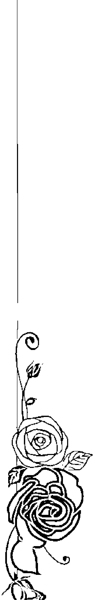

## 主命數 4：實力派創作人九把刀

擁有主命數字 4 的人都比較實際保守、腳踏實地，不斷努力紮根及鞏固自己的生活，確保人生安全有保障。現實生活裡，4 號人的物質生活總是比較充裕，思想細密且個性謹慎。

新加坡總理李光耀在任三十多年，把新加坡從一個只有兩百萬人口、人民來自四個民族的小島，發展成今天亞洲最有競爭力的四小龍國家之一。即使很多人認為李光耀是個強硬獨裁的領導者，但他的確是位出色成功的政治人物。

對世界影響極大的 4 號人還有微軟創辦人比爾·蓋茲（William Henry "Bill" Gates）。

三、他創立了傲視全球的電腦程式王國，全球幾乎每個人都有一進貢—金錢到他口袋裡。達賴喇嘛十四世則將 4 號人的能量發揮在促進全人類的和平上，他反對使用和貯存大規模殺傷性武器，譴責發動戰爭以奪取強權的行為。中國香港奧運帆板選手李麗珊在爭取奧運金牌時，最後一戰本來可以不必上場，可是她不但上了場，而且還努力到最後一秒。

## 九把刀

生日：1978年8月25日／主命數：4

近年來走紅台灣文壇的新銳作家九把刀（柯景騰）就是一位4號人，從他的生命藍圖來看，九把刀的人生是比較戲劇化、充滿起伏的，相信兒時的九把刀，萬萬想不到自己將來會成為一位家喻戶曉的作家吧。

4號人的個性就是固執、封閉、對感情尤其執著，不知是否就是那份執著，讓九把刀下寫下了十七歲那年的愛情故事，做為自己人生的記號，而這段歷史也很戲劇化地翻開他人生光輝的一頁。

生命藍圖裡顯示九把刀的求知欲很強，一旦遇上自己有興趣的主題，就會一直鑽研下去。九把刀也是一個博學多聞的人，而且自律性很高，個性也很勤奮，可以持續而專注地完成一件事情；並且追求完美、做事很有自己的標準。

九把刀他最大的課題是處理人的問題，他的執著讓自己在人際關係及情感上一直出現問題，對於執著的 4 號人來說，要從這些課題中走出來並不容易。九把刀內心其實一直很想活出自己的「我」，從來不想模仿或參考誰，一直努力捍衛自我，希望別人可以透過他的作品，看到他的那個「我」。

其實九把刀的強項不是在創作上，而是在詮釋和表達上。他的作品多多少少都有真實性，或許是他自身的故事、或許是從他人生的片段改編的，他個人豐富的歷練，絕對是創作上的珍貴材料。加上他的勤奮、堅韌打不死的精神、努力要冒出頭來的志氣，讓他成為一個實力派的創作人。

## 主命數 4：實力派創作人九把刀

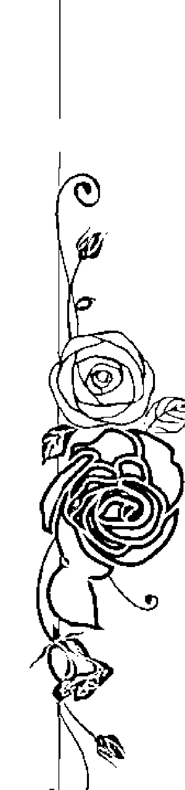

257

## 主命數 5：用生命負責的阮玲玉

5號人受不了束縛，不能忍受無趣的人生，喜歡接觸新奇的事物，什麼都想嘗試、想探索，經常帶著一種想掙脫一切的野心與衝動。喜歡搞革命，而且需要完全的自由與私人空間。表面上好像很溫和，但發起脾氣來很嚇人，擁有矛盾的人格。做人行事很有原則，有很強的說服力。

5號人一向很有原則、極具野心，典型代表便是德國納粹黨黨魁希特勒（Adolf Hitler）了，童年時代的希特勒便已充滿5號人的倔強及放任，不僅擁有5號人的演說才能，讓德國的教授與戰俘們印象深刻，最後更當上德國總統，開始實現他偏執的理念，可見5號人的野性一旦爆發，可能造成極大的破壞力。

5號人也熱愛自由，代表人物是美國第十六任總統林肯（Abraham Lincoln），任期一八六〇年（一八六五年），他在任時，美國南北方因為黑奴問題而發生衝突，引發了南北戰爭。最後由林肯領導的北方獲得勝利。一八六二年林肯宣布廢除奴隸制度，使美國從南北長期分裂中恢復了統一。

5號人極好面子，不喜歡別人干預他們的隱私，覺得這是在侵犯個人的空間與自由。民初中國默片時代最著名的女星之一阮玲玉，因為無法忍受不幸婚姻的痛苦以及媒體的誹謗，留下了一人言可畏「四個字的遺書，服毒自殺身亡。其他5號的藝人有王菲、翁虹、劉嘉玲、金城武，他們都不惜一切捍衛自己的私生活，而且對媒體絕不客氣。

香港演藝圈幾年前發生了yes的阿嬌（鍾欣桐）被偷拍事件，照片還被刊登了出來，她看到之後情緒非常激動。「被偷拍」對5號人來說是一件很嚴重的事，一個這麼需要自由的人，怎能忍受別人無理地入侵她的私人空間？可說是奇恥大辱。沒想到過了不久，又爆出她跟陳冠希的豔照事件，對阿嬌來說，是很不容易跨越的一件事。

你看過張曼玉主演的電影《阮玲玉》嗎？阮玲玉這位三○年代優秀的女演員，從十六到二十五歲一共拍了二十九部電影，並且是中國默片電影史裡，貢獻良多的優秀女演員之一。對於阮玲玉香消玉殞的原因，多年來一直眾說紛紜，坊間流傳著許多版本。

## 阮玲玉

生日：1910年4月26日／主命數：5

阮玲玉是一位5號人，從她的生命藍圖來看，她成長於一個極不穩定的狀態中，被迫學會保護自己的環境。阮玲玉死後，跟她過從甚密的男人們，先後說出了一些她的身世：阮玲玉的父親早逝，母親在一個大戶人家裡幫傭，阮玲玉因而與主人家的少爺發生了感情，而且到死都牽扯不清。

5號人一向很有冒險精神，阮玲玉十六歲就和比她大兩三歲的少爺雙雙離家同居了，在三○年代，此舉可說是一種大逆不道的行為！

根據阮玲玉的鄰居表示，阮玲玉不時跟同居的男人吵架，而且經常被趕到門外，站在那兒哭泣，可見少爺並沒有讓阮玲玉過幸福的日子，而且一直都是阮玲玉在供養這位少爺。

偏偏5號人的抗壓性和忍耐力都很強，即使阮玲玉先後有過無法開花結果的感情，卻到死都擺脫不了這位少爺。

如同大部分的5號人一樣，名聲、形象對阮玲玉來說，比生命更重要。而且5號人都有一股寧可人負我，不願我負人的精神。

阮玲玉的遺書有兩個版本，據說「一人言可畏」的版本是假的，後來在香港的一個小報裡發表的阮玲玉遺書比較可信，當中透露了她在感情裡的折磨。

遺書最後如是寫道：「我死了，我並不敢恨你，希望你好好待媽媽和小囡囡。還有聯華欠我的工資二○五○元，請做撫養她們的費用，還請你細心看顧她們，因為她們唯有你可以靠了！沒有我，你可以做你喜歡的事了，我很快樂。玲玉絕筆。」

## 5號人真的是徹底負責到生命最後一口氣。

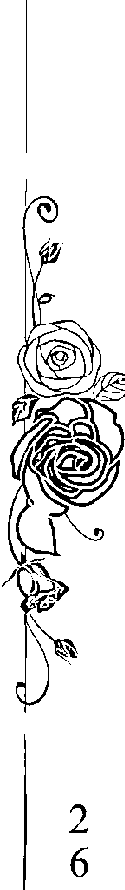

主命數 5：用生命負責的阮玲玉

2
6
1

## 主命數 6：剛柔並濟的蔡英文

6號人很需要與人在一起，他們不喜歡獨處，對朋友很好、很殷勤，總是努力地侍候別人、盡力取悅身邊的人。6號人也是不折不扣的完美主義者，因此他們的生命融合了愛與美的元素。

中國粵劇作曲家唐滌生就是愛與美的化身，他筆下的粵劇自五〇年代至今仍然令人心醉，他的曲目主題深刻有力，詞曲文學性及藝術性極高，若沒有至高的愛的情操，絕對寫不出那麼扣人心弦的劇情。因此，他的作品能夠風靡萬千戲迷，數十年來仍為人津津樂道。其作品的美很難以三言兩語道盡，唐滌生可說是粵劇經典的瑰寶。

6號人約翰·藍儂（John Lennon）把愛寫進他的歌裡，樂迷們都知道，美國樂團披頭四（Beatles）的歌曲內容多半在歌頌友誼及愛情。七〇年代的約翰·藍儂以各種方式在世界各地宣揚和平與愛，他的歌曲歷久不衰，永遠令人懷念。

另一位傳奇的6號人是羅文，一生以歌藝貢獻樂壇及社會。他罹患肝癌後，仍樂觀積極地面對病魔，勇氣可嘉，令人欽佩，是一位熱愛生命、無怨無悔的真正巨星。

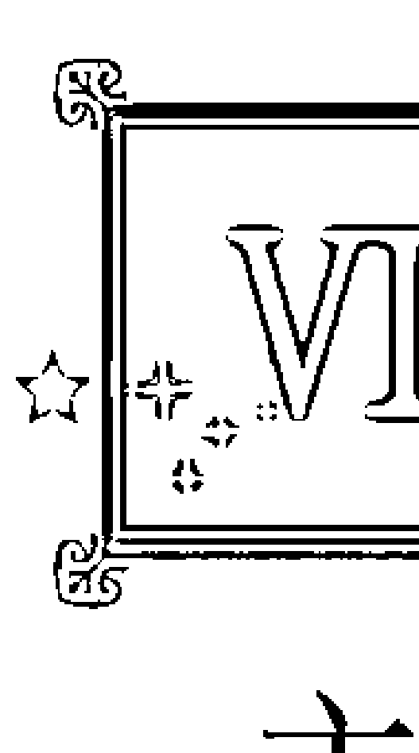

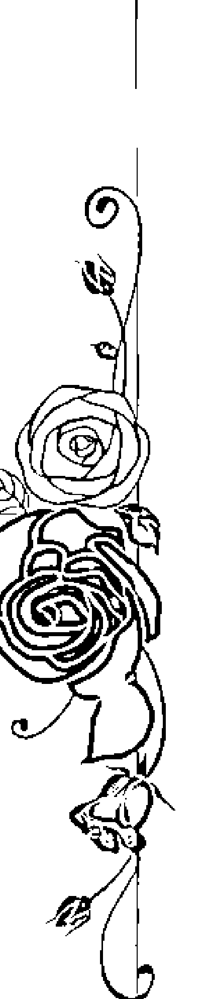

生命數字不思議

262

## 主命數 6：剛柔並濟的蔡英文

蔡英文是一位6號人，別看她是位纖纖女子，其實內在很有男子氣概，意志力非常堅強，無論在表達力、應變力、適應力、觀察力、自制力方面，都有過人之處。

其實蔡英文不是一位很懂得玩政治的人，不太能夠處理正面的衝突，因此，政治絕對不是她的強項，但她就是那種可以用很柔和的方式來感染他人、對人動之以情的人；她也擁有激勵人心、連結眾志的能力。此外，她也是個踏實辦事的人，對自己、對他人、對事物都比較有要求。

6號人的本質就是：具有願意犧牲及服務眾人的精神，相信她若繼續留在政壇的話，絕對有一定的影響力，也可以為人民做很多事。

## 主命數 7：中國新一代領導人習近平

7 是一個充滿質疑、凡事都要追根究柢的數字，終日疑神疑鬼，心神不寧，有些 7 號人會變成操控慾很強的人，因為他們不容易信任他人。

康熙皇帝就是一位很典型的 7 號人，也是中國歷史上在位時間最長的皇帝。他生性多疑、不輕易信任他人，身邊的人沒幾個有好下場。親力親為的康熙皇帝曾經六次南巡、三次東巡、一次西巡、數百次巡查京畿和蒙古、親自巡視黃河河道督察河工。

7 號人是很有「戰鬥意志」的人，意志力及爭鬥心極強，樂意接受挑戰，很享受贏過別人、超越他人的感覺，經常用競爭來推動自己向前，並全力以赴。

7 號人也是天生愛打仗、愛比賽、愛得勝的人，康熙親自參與過不少戰爭，是清朝皇帝中最有軍事才能的一個。先後撤除三藩勢力，統一台灣，平定噶爾丹叛亂，而且驅逐了俄國對黑龍江地域的侵略。

好學也是 7 號人的特性，康熙在數學、醫學、農業、治河等方面皆有涉獵，同時，他對於這些科學的鑽研與傳播，亦不遺餘力，甚至還編整與出版了《康熙字典》、《古今圖書集成》、《曆象考成》、《數理精蘊》、《康熙永年曆法》、《康熙皇輿全覽圖》等圖書、曆法和地圖。數年前，大陸西安就曾出土了一本清朝康熙年間由皇家翰林院大學士修撰的數學專著。

知道習近平很有可能是中國未來的領導人之後，我又翻了他的生命藍圖來看。原來習近平是一位7號人，一好勝心一 是7號人最典型的表現，上面的兩段話也正好表現了習近平有膽色、不甘示弱的個性。

7號人求知欲很強，大多是終身學習的人。習近平十七歲進入清華大學化工系就讀，二十歲完成大學學業之後，就進入了政治圈，在快五十歲的時候，拿到清華大學法學博士學位。

習近平在接待訪華政要時，均以英語溝通，作風開放又大方。此外，習近平一面從政，一面還在孜孜不倦地學習，與時並進，是一件很不容易的事。

從政以來，習近平先後在河北、福建、浙江、上海服務，最近進入中央領導層，二〇一〇年成為軍委會主席。手執軍權及政權的習近平，在中國政壇的位置已經完全被肯定了。

訪華的美國官員曾如此評價習近平：「胸有成竹、思路清晰、很有自信、有策略性，不需要看筆記……」希望這樣的習近平可以帶領中國人民過著幸福快樂的日子。

## 主命數 8：勇往直前的馬英九

在數字學上，數字 8 又名「老闆數」，是一個有關物質、慾望、名利、掌控、實行的數字。8 號人很有野心及企圖心，他們做事需要很大的自主權，強烈地需要「掌控」的感覺，同時非常喜歡展示自己的力量，總要讓人看見他們的才華及成就，物慾相對非常地旺盛。

其中的典型代表人物就是乾隆皇帝，他從小被寵慣了，愛美、愛面子也愛虛名，晚年還自封為「十全老人」。乾隆為人好大喜功、專制驕橫，當政期間，先後擴建了多座園庭，使得國庫逐漸虛空。

此外，乾隆六次下江南，大肆搜刮民脂民膏，晚年重用瘋狂斂財的大臣和珅；和珅被抄家後，搜出的財富竟超過了清朝政府五年的財政收入總和！而乾隆因為不滿英國使節不向他下跪，從此不與外國通商，對外採取鎖國政策，種下中國和世界改革脫節的禍因，也因此成了弱勢國家。

8 號人很實際，也很勢利，不浪費精力在無聊、沒有意義的事情上，他們每分鐘都在為生活努力，都在讓計畫前進。喜歡觀察他人，只跟有權勢的人打交道，不浪費時間在他們覺得無能的人身上，很懂得找人幫忙。

能夠留在 8 號人身邊者，一定是有利於他們的人。8 號的孫中山及翁山蘇姬①用盡各種方式組織他們的支持者，擴大自己的勢力。劉德華是 8 號藝人中的佼佼者，他的勤奮努力是演藝圈公認的，他的歌友會也是所有藝人中辦得最成功的，他的支持者就是他的貴人，也是他成功的重要因素之一。

8 號人喜歡跟有能力的人在一起，他們相信人與人的關係是互惠互利的，也很懂得建立自己的人際網絡，8 號的美國影星伊莉莎白·泰勒（Dame Elizabeth Rosemond Taylor）就是因為嫁給不同富豪而飛黃騰達。

8 號人的心智以及行為處事有一定的成熟度。例如徐若瑄、范瑋琪、言承旭等人，他們非常懂得如何化慾望為事實，也很會打理自己的人生，而且行事很有分寸，不喜歡別人干預他們的生活。

8號人來說，就好像螞蟻看到蜜糖。品學兼優的馬英九就讀台大時，選修的是法律及政治，期間獲得不少博士、學者、前輩的提攜和扶持，這可能與8號人喜歡親近有能力的人，以及喜歡靠近「力量」的動力有關。並於日後取得台大法律學士、紐約大學法學碩士和哈佛大學法學博士。

8號人是一個可以感染他人來成就自己成功的人，馬英九的確擁有一位很有影響力、也很愛他和支持他的父親，以及一位甘願放棄學業、站在丈夫背後默默支持他的妻子。

8號人的辦事能力是無庸置疑的，離開校園之前，由於主編哈佛大學的刊物《波士頓通訊》，馬英九在當時台灣政治核心圈中已經小有名氣了，因此先後為蔣經國、李登輝及連戰所重用。

對8號人來說，生命的路似乎只有一個方向，就是──向前！往後的日子，馬英九大概兩三年就往上跳一級，當中或許有過起伏，但最後還是攀上了政治巔峰，成為中華民國的總統。

就像大部分不喜歡浪費時間的8號人一樣，馬英九並沒有虛度最輝煌的歲月，一路平步青雲的過程，相信絕對不是「運氣」兩字便能成就的，馬總統可說是一位目標鮮明、個性堅毅、自強不息的 8 號人。

強調實際成績、又有行動力的馬總統，任職期間對於台灣有不少貢獻，舉凡基礎建設、定立新法、文化保育、環境保護方面，都有實質的建樹。例如加建捷運、小巨蛋、南港工業區、內湖科技園區、公車專用道等等，均為台灣發展奠定重要根基。

## 主命數 9：梅派戲曲宗師梅蘭芳

9 是一個非常注重精神層面的數字，9 號人都是很會「想」的夢想家，物質生活反而不是他們所追求的。不少 9 號人是真正可以「放下一切」的人，代表人物有林鳳嬌、趙雅芝、周慧敏及邱淑貞。他們就是要尋找生命中真正有意義的東西，所以經常懷著隨時要告老還鄉、隱姓埋名的念頭，夢想總是走在名與利之前。

9 也是一個孤芳自賞的數字，9 號人自有一套人生觀及價值觀，他們擁有的東西不一定是自己內心真正想要及追求的，奇怪的是，別人夢寐以求的東西他們都不太在乎，卻總是唾手可得。

我認識的 9 號人都是一些不用為生活、為三餐擔憂的人，生活上所需的東西，甚至是名利和權勢卻輕輕鬆鬆手到擒來，但那些他們真正想得到、想追求的事物，卻無論如何努力都爭取不到。

清朝的順治皇帝前半生坐擁皇位卻無法得到皇權，也無法得到心愛的女人，之後又無法追隨自己的信仰出家，最後抑鬱而終。揭竿起義的洪秀全既得不到想要的功名，也無法完成他的太平天國美夢。順治皇帝及洪秀全的共同點是迷上了宗教，因為9號人喜歡追求心靈層面的東西，很容易沉迷於宗教。

不過，並不是所有的9號人都無法心想事成，印度聖雄甘地在十六歲經歷喪子之痛後，於十九歲放下一切遠赴倫敦求學，但最終他還是放棄盲目推崇的西方文明，回到原有的宗教信仰之中，並研究其他宗教教義。

之後甘地又因事業失敗去了南非生活（再度放下一切），最後以非暴力不合作運動，帶領國家脫離英國的殖民統治，迫使英國政府同意印度獨立，其哲學思想影響了全世界的民族主義者，以及爭取和平變革的國際運動。

提倡：顛、挑、滑、康、剛、柔、起、落、輕、重、頓、斷、顫、連的十四種唱法技巧。可見他一絲不苟的精神。

9號人很抗拒心理上的負擔，所以不喜歡跟人有太深的連結。抗戰之後有好幾年的時間，梅蘭芳的經濟十分困難，他卻情願變賣家當維生，終日躲在家裡謝絕與人往來。

9號人對物質看得很淡然，雖然著力點沒放在物質上，但諷刺的是，大部分9號人的物質生活都沒什麼問題，梅蘭芳也是如此。他八歲學戲，十歲登台，十四歲入戲班，十七歲得到京劇「探花」美譽，十九歲便已風靡江南的街頭巷尾，而且多次出國演出，均大獲好評。

所有的名與利，梅蘭芳似乎都唾手可得，然而抗日八年裡，梅蘭芳始終拒絕為日本人演出，無論經濟有多拮据，他從不低頭。對他來說，氣節比裹腹更重要！

其實，對9號人來說，精神生活遠比物質生活來得重要。我相信梅蘭芳對「中國戲曲」有極大的熱忱與理想，而且他的傲氣不是沒有道理的。

他整合了青衣、花旦、刀馬旦等不同角色的舞台演繹方式，創作了自己的造手、唱腔、舞蹈、音樂、編曲、服飾和念白，並且編寫了大量的新劇目，對中國戲曲的貢獻巨大。

## 梅派戲曲宗師梅蘭芳

梅蘭芳（梅瀾）是一位9號人，從生命藍圖看來，他是一位十分溫柔仔細、感情細膩，卻又心高氣傲、不合群、挑剔、冷若冰霜、與人保持距離的人。

梅蘭芳的細心，對他的學習有很大幫助，要知道戲曲的造手、眼神、走步、音調皆有含意，馬虎不得。有關他的生平，有一段記載如此寫道：梅蘭芳精心研究旦角的唱法技巧，很注意起唱時發音要自然，結尾時收得委婉，使人聽起來餘味無窮。

9號人喜歡追求心靈層面的東西，很容易沉迷於宗教。順治皇帝及洪秀全的共同點是迷上了宗教，因為9號人喜歡追求心靈層面的東西，很容易沉迷於宗教。

不過，並不是所有的9號人都無法心想事成，印度聖雄甘地在十六歲經歷喪子之痛後，於十九歲放下一切遠赴倫敦求學，但最終他還是放棄盲目推崇的西方文明，回到原有的宗教信仰之中，並研究其他宗教教義。

之後甘地又因事業失敗去了南非生活（再度放下一切），最後以非暴力不合作運動，帶領國家脫離英國的殖民統治，迫使英國政府同意印度獨立，其哲學思想影響了全世界的民族主義者，以及爭取和平變革的國際運動。

## 許添盛醫師的兩張生命藍圖

每個人都有一組生命靈數組合，但有一種情況例外，那就是一個人有兩個生日。有些人身分證上的生日，並不是他真正的出生日期。這樣的人通常會有兩條生命線，身分證上的生日數字組合，顯現的是比較表相的個性，而真正的生日數字組合，則代表內在較為核心的個性。

賽斯教育基金會董事長許添盛醫師就有兩個生日，擁有雙重生命藍圖。許醫師真正的出生日期是1968年5月4日，身分證上的出生日期則是1969年1月12日，因此許醫師同時擁有33／6及29／11／2兩組生命靈數。

其實這兩張生命藍圖的個性是南轅北轍的。認識許醫師這麼多年，我覺得他同時都有一點兩種命格的個性，又或者兩種性格都是許醫師的靈魂早已選定的，要讓兩個可能的人格同時存在，許醫師還真是一個頑皮的靈魂！至於哪一種命格比較明顯，就留給認識許醫師的讀者去發掘囉！

## 第一張生命藍圖

1968年5月4日／主命數：6

這張生命藍圖顯示的是一個愛恨分明的人，做事很有步驟和計畫，凡事按部就班、有條不紊，此外，他也是一個工作狂，會用漫長的時間來建立「自我」。

許醫師的確花了十多年時間推廣賽斯心法，並且讓賽斯團體在台灣北中南部、東南亞、美加地區逐漸成型。從原本安定地在醫院上班，到脫離醫院自立身心靈診所，他一直沉著地邁向自己的理想，真的很不簡單。而許醫師對賽斯的熱愛，是如此義無反顧、堅貞不移，這些精神都可以在這張生命藍圖裡，找到蛛絲馬跡。

6號人天生具有療癒能力，而許醫師33／6的數字組合，除了具有療癒能力之外，還有很強的溝通和表達能力。關於這兩點，相信不用我多說，聽過許醫師演講的讀者都能體會。

我覺得許醫師很像6號人的一點是：他的時間都給了別人，不曾花時間好好照顧自己。記得最初許醫師來香港演講時，都是由我接待的，很多次我都想提醒他：「您得剪指甲了！」一面心想：「一天啊！這個人忙到連剪指甲的時間都沒有嗎？」

我也看過痛風發作時的許醫師，那一年他來香港時，整隻腳都腫起來，必須踮著腳尖才能走路，但行程還是排得滿滿的，真是拿他沒辦法。

## 第二張生命藍圖

1969年1月12日／主命數：2

這個日期是許醫師身分證上的生日。這張生命藍圖顯示的是一個分析能力很強、思想敏銳、感情脆弱、細膩柔婉的人，喜歡思想、心靈或生命主題。個性自我，比較難協調，又害怕衝突。四十歲以後會當權，而且年紀愈大，鬥志愈旺盛，並且希望自已的成就能被認同。

如果你曾看過或參加過許醫師的諮商或團體治療，就會發現：很多時候，許醫師對人的敏銳度都是恰如其分。他總是不慍不火地揭開他人痛楚的根源，在恰當的時機，給你一個當頭棒喝，那份收放自如常常讓我拍案叫絕。

不過，我覺得許醫師不善於處理人的問題，可能他也有自知之明，所以索性就不處理了。但有時候「不處理」也是一種處理，就是信任存在，讓事情自己找到出口。

但我認為：當組織愈來愈發展、事情愈來愈多、權力愈來愈大之後，相信許醫師也不得不面對了。我自己在當老闆的過程中，也是跌跌撞撞地經歷了很多事，一切只能邊做邊學。

## 兩張生命藍圖相同與相異之處

綜合以上兩張許醫師的生命藍圖分析，將相異點及共通點列表如下：

| | 33／6的生命藍圖 | 29／11／2的生命藍圖 |
|---|---|---|
| 共通點 | 害怕受傷，不懂得表達自己的真心 | 努力活出「自我」，非常需要看到那個「自我」 |
| | 一旦認定了，就義無反顧地走下去，目標鮮明，心無旁騖 | 比較著重心靈，物質可有可無 |
| | | 視錢財如糞土，賺錢花錢能力都很強 |
| 相異點 | 追隨自己的理想 | 欠缺理智，為堅持而堅持 |
| | 不願表達自己的心意 | 表達能力和說服力極強 |
| | 隨心、隨感覺而為 | 凡事有計劃、有條理 |
| | 比較照顧別人 | 比較自我，自己的感覺很重要 |

## 〈附錄二〉
生命靈數與九大意識家族的關係

我在多年前得知關賽斯提及的九大意識家族時，就曾經想過：「生命靈數與九大意識家族會不會有什麼關係？」一直到完成此書之後，發現許添盛醫師幫我寫的推薦序裡，也提起了九大意識家族，便決定在改版時要好好說明一下何謂九大意識家族。

賽斯在《未知的實相》中談到「九大意識家族」時，也提及了「對等人物」——

詞，賽斯說：「你們彼此的確是對等人物，就如物質式有許許多多的種類，所以，對等人物跟隨著更開闊的內在自由，而找到甚至更大特徵上變化：：：靈魂與分子都在學習、都在形成實相、都是神性的一部分，在其中，每個對等人物都扮演一個角色：：：對等人物一般而言會屬於同樣的家族：：：每個意識家族之內多少都帶著該家族天生固有的特質。」

## 生命靈數與九大意識家族的關係

格拉瑪大：建立社會體系  
格拉瑪大善於組織，有時候其成員在一個革命性的社會變遷之後立即到來。不過，他們的組織傾向可以在人生的任何領域表現出來。舉例來說，他們是藝術學校的背後支柱──雖然本身可能並非藝術家。他們也許設立學院──雖然自身可以是也可以不是學者。  

龐大企業之創辦者常常屬於這家族，就如某些政治家及政客也是一樣。他們是主動、有活力並且具創造力的侵略者，知道如何把別人的想法綜合整理起來。他們常常把彼此衝突的思想體系統合成多少統一的結構。那麼，他們常常是社會體系的創建者。舉例來說，在大多數情形裡，你們的醫院、學校及宗教，做為組織，是由這個團體創始，並且經常由他們在維持。  

這些人有卓越的能力把那些若非如此，就會被棄置路邊的單一觀念綜合在一起。  

生命數字不思議  

## 〈附錄二〉  
從九大意識家族看生命靈數  

#### 格拉瑪大：建立社會體系  
格拉瑪大善於組織，有時候其成員在一個革命性的社會變遷之後立即到來。不過，他們的組織傾向可以在人生的任何領域表現出來。舉例來說，他們是藝術學校的背後支柱──雖然本身可能並非藝術家。他們也許設立學院──雖然自身可以是也可以不是學者。  

龐大企業之創辦者常常屬於這家族，就如某些政治家及政客也是一樣。他們是主動、有活力並且具創造力的侵略者，知道如何把別人的想法綜合整理起來。他們常常把彼此衝突的思想體系統合成多少統一的結構。那麼，他們常常是社會體系的創建者。舉例來說，在大多數情形裡，你們的醫院、學校及宗教，做為組織，是由這個團體創始，並且經常由他們在維持。  

這些人有卓越的能力把那些若非如此，就會被棄置路邊的單一觀念綜合在一起。  

## 蘇馬菲：透過教學傳遞『原創性』  
蘇馬菲主要是與教學打交道。一般而言，他們與其他人的關係是很好的。他們也許在任何一個領域裡頗有天賦，但主要興趣是把他們或別人的知識傳下去。雖然他們也許極端聰明，但通常是傳統主義者。  

蘇馬菲和蘇馬利和剛才提到的格拉瑪大有相等的關係，因為他們站在組織系統及創造藝術家之間。不過，他們透過社會結構傳遞『原創性』，而沒去改變它。  

#### 度莫：醫治，不論其個人職業為何  
度莫主要是熱中於醫治。這並不意味著這些人沒有創造力或不是組織者及教師，但他們意識的主要傾向會被導向於醫治。你可能發現他們做醫生及護士──雖然不常做醫院的行政人員。不過，他們也許是通靈者、社工人員、心理學家、藝術家或躋身宗教界。他們也許在花店裡做事。就彼而言，可能在生產線上工作，但即使如此，他們就企圖或氣質而言，會是個醫治者。  

我提到種種不同的事業或職業，以給一些清楚的例子，但一個修車廠的人可能屬於度莫或任何其他團體。在這種情形裡，那修車廠工人對顧客會有一種醫治的效果，而他所修理的可不只是汽車而已……  

可是，度莫也可能出現為政客，以精神性的方式醫治國家的傷口。任何一種藝術家，若他主要的工作是要幫助人時，也屬於這個範疇。你會發現一些國家元首，並且──尤其是過去──一些貴族家庭的成員也屬於這個集團。  

## 生命靈數 6 的人是天生的治療專才  
他們從事的工作不一定與醫療有關，在人群中你會發現，6號人是你不開心時守在你身邊、陪你流眼淚、聽你訴苦的人，經常有事沒事就送小禮物給你，只要你是 6號人的朋友，他們就會站在你這邊力挺你。  

6號人就是很懂得做窩心的事、對人的感知非常敏銳的人，也很懂得給人最恰當的安慰，好像天生就明白你哪裡痛、怎麼痛、有多痛。  

#### 佛德：改革現狀  
在佛德這個集團的人主要是改革者。他們有極佳的預知能力，那當然是指他們至少無意識地瞭解「可能性」的運作。他們可能在任何領域裡工作。以你們的說法，他們們彷彿能感知未來的動態或一個概念、觀念或結構的方向，然後，會全心把那個可能性帶入物質實相。  

以傳統的說法，他們也許是了不起的搞活動者，以及革命分子，或者可能看起來像是不實際的夢想者。他們會為一個改變及變更的概念所迷，而至少感到被迫使那概念實現。一般而言，他們提供了非常有創造力的服務，因為社會與政府組織常常會變得停滯不前，而不再滿足所涉及的一大群人之目的。  

當然，這個家族的成員也可能創始宗教革命。不過，一般而言，他們心裡只懷著一個目的：改變他們主要興趣所在的任何領域現狀。（《未知的實相》七三六節）  

#### 米爾伍梅特：神祕地滋育人類心靈  
5號人不能忍受任何形式的束縛，天生有一股想突破一切或從令人窒息的安穩中掙脫出來的精神，他們很容易就能發動大大小小的革命；同時，3號人天生怕悶，擁有叛逆的性格，總會搞出新花樣或想出新點子，充滿變化的人生能讓他們感覺有生命力，因此擁有超強的變化力與整合力。5號人及3號人極有可能是佛德家族的一員。  

米爾伍梅特是由神祕主義組成的。他們所有的精力幾乎都是以一種向內的方式為導向，而不在乎內在經驗是否被轉譯成一般的說法。舉例來說，這些人可能完全不為人所知，而且通常也是如此，因為一般而言，他們無意對別人，甚至是對自己──解釋其內在活動。他們是真正的天真無邪，並且有靈性。也許就一般認知標準而言，在知性上是未開發的，但這只因為他們並不把其聰明導向物質焦點。  

一般而言，屬於這個家族的人不會居於任何權威地位，因為他們不會在特定的實質資訊上貫注得夠久。可是，在你們的國家裡（美國），可能在最不會期待他們出現的地方找到他們：在需要簡單重複活動的一些生產線上──可是，卻在不需要速度的工廠裡。他們通常選擇生活步調緩慢、比較不工業化的國家。他們有簡單、直接且孩子氣的言行，而可能顯得愚笨。他們根本就不在意一般的習俗。  

然而，夠奇怪的是，他們可能是卓越的父母──尤其在比你們國家較不複雜的社會裡。以你們的說法，不論他們出現在何處，都是原始人，然而，他們深深涉足於自然之中，就彼而言，比大其他多數人更是與心靈極度調和一致的。《未知的實相》  

## 祖里：作為身體的、運動的模範  
祖里主要是涉及身體活動的實現。這些人是運動家，不論什麼領域，他們都專心於使身體能力臻於完美，那在其他人通常是淺嘗即止的。  

到某個程度，他們被當做身體上的模範。生物活力是透過身體本身的美、速度、高貴及演出來表現的。到某個程度，這些人是完美主義者。而在他們的活動裡，永遠有「超級」成就的暗示，就好像即使就身體而言，這族類也試圖超越自己。這家族的成員實際上被用來指出肉身未被實現的才能……。這團體的成員經營表演，他們是身體上的實踐者，也是表達身體之美的愛好者。  

這個家族的成員常可以當畫家或作家的模特兒。但一般而言，他們本身透過身體「藝術」及表演傳遞能量。只以你們的說法，並且歷史性地說，他們常常出現在文明的開端，在那環境裡，直接的身體具體操縱是極為重要的。那時，正常的身體反應就比現在要快，縱使那時正常的身體放鬆是更深且更完全。（《未知的實相》  

我一向以心態及信念作為導引來研究人，因此對我來說，以身體為切入點將人分類，真的有點困難。印度的數字學派認為 4 號人是比較注重身體能量的一群，他們很重視身體層面或與存在感相關的事，例如健康、腳踏實地的安全感之類。  

#### 柏萊汀：透過親職為人類提供於地球的存續  
柏萊汀主要是與親職打交道，這些人是自然的地球父母（Earth Parents），那是說，他們有能力製造從某個觀點來看擁有某些卓越特質的孩子。這些孩子有聰明的頭腦、健康的身體及強烈的情感。  

舉例來說，雖然許多人是在特定領域裡工作，發展知性、情感或身體，但這些父母及其孩子產生維持著良好平衡的下一代。沒有心或身的一面是犧牲了另外一面而發展的。  

這些人格在身心兩方面都擁有一種很深的彈性，而被用作很強大的地球資產。不用說，一個意識家族的成員常常會與另一個家族的人結婚，當然，同樣的事情也在這兒發生。當這發生時，就嵌入了新的穩定性，因為這個特定家族被當作一個人類的庫存，提供了體力與腦力。具體上而言，這些人常常有很多孩子，而通常其下一代，在他們選擇的不論哪個人生領域都會做得很好。生物上來說，他們擁有某些會使基因裡的「負面」密碼無效的特性，通常是健康的人，而與這個群體的人結婚能自動結束所謂遺傳了幾代的弱點。  

那麼，這些人相信性、身體及家庭單位之自然的美好──不論他們所屬的物質社會如何瞭解這些屬性。不過，一般而言，他們擁有一種迷人的自發性，而所有創造能力全都用在家庭團體以及孩子上。  

然而，這些並非古板的父母、盲目的順從習俗，而是那些視家庭生活為一種細致且活生生藝術創造的人，而視孩子們為血肉做成的傑作。他們絕不會以過度的保護照顧來吞噬後代，而會快樂地把孩子派到世界裡，知道那些傑作隨之也必須完成自己，而他們曾協助做那個打底的工作。  

柏萊汀是一種本錢，到目前為止，永遠保證你們族類的存續──即使經過大風大浪。而他們多少平均分布在地球上，在所有的國家裡。他們最像蘇馬利，與之有同樣藝術的愛好及一般心態。他們通常會尋找相當穩定的社會狀況，在其中生養孩子，就如蘇馬利會找到同樣情況來製作他們的藝術一樣。不過，他們為孩子要求某個程度的自由，而雖然他們並非政治活動分子，像蘇馬利一樣，但是其概念常常在巨大社會變遷來臨之前躍入主要地位，而有助於起始那些變遷。……這個家族則把下一代想成是活的藝術品，其他每件事都從屬於那個「理想」之下。  

蘇馬利常常為人類提供文化、靈性或藝術的傳承。柏萊汀家族則提供平衡良好、和善、幽默及愛嬉戲，且充滿了一種活潑的慈悲，但他們太聰明了，而不會有繁衍於其他個人弱點上的那種「變態」慈悲。  

一個畫家期待他的畫作畫得很好——或如果你讓我開個小玩笑：至少他應該如此期待。這些人期待他們的孩子是平衡良好、健康、熱愛靈性的，而那些孩子就會如此。幾乎在任何行業裡，你都會發現柏萊汀家族的良好份子，但他們主要的關懷會是在具體的家庭單位上。  

這些父母並不會因為孩子的緣故而犧牲自己，他們太瞭解被放在這種下一代身上的壓力。反之，這些父母保留自己清楚的身分感，以及個別特質，來給孩子們做個有愛心的獨立成人之清楚榜樣。（《未知的實相》七三七節）  

## 依爾達：傳播及交流觀念  
他們常常主要涉足於社會的變革裡。在你們的時代，他們可能是外交家，就如過去也是。他們的特點常常是那些愛冒險之人的特點。他們極少在一個地方常住，但如果他們的行業是處理來自其他地方的產品，就可能另當別論。就個人而言，他們可能彼此看來在天性上非常不同，但一般而言，你不會在大學裡發現他們身為老師，不過，可能發現他們是在田野工作的考古學家。  

很多推銷員屬於這一類。以你們的說法，他們可能是四海為家的人，而且常常很有錢，所以經常旅行是可能的。然而另一方面，在某種架構裡，一個小國的微賤商人，他旅行過附近的省分，也可能屬於這個家族。  

這些是一群活潑、多話、有想像力且通常可親的人。他們對事情的外貌、社會的習俗、市場、目前流行的宗教或政治理念有興趣，他們將之由一處散播到另外一處。  

在事實及比喻兩方面而言，他們都是種子的攜帶者。  

他們可以是「騙子」，販賣假設具有奇蹟似價值的產品，而以他們都市人氣焰令小地方的居民目眩。然而，即使在那時，他們也會隨身攜帶其他概念的氛圍。常常將其他地方人們已經熟悉的觀念嵌入封閉的地區。  

那個意識家族的成員時常提供新選擇。他們可以是科學家，或置身於陌生土地之最傳統的傳教士。在你們目前的時代，他們有時是印度人、非洲人或阿拉伯人，旅行到你們（美國）的文明。他們增益了偉大的溝通之流。他們也許是感性而非知性的，如同你們對那名詞的瞭解，但他們是浮躁的，通常奔波個不停。他們也可以是演藝人員。  

在過去，有些依爾達曾經是了不起的交際花，而縱使她們不能真的去旅行，卻是在溝通的核心──那是說，身為宮廷生活的一部分，或者是與真正到處旅行的外交家來往。  

那麼，許多主宰了歐洲沙龍的交際花屬於這個範疇。十字軍東征涉及了這個家族的偉大運動，在其間，商業貿易以及政治理念的交換遠比其宗教面重要多了。在過去的（天主教）教會裡，這個家族某些成員成了新修會的創始人──舉例來說，對商業及財富慧眼獨具並見過世面的耶穌會會員及一些更世故的教宗（頑皮的）。這些人也許是藝術的欣賞者，但通常是為了其商業價值。  

現在，你們常常可以在政府部門裡找到他們，在那些涉及旅行或金融的領域。他們常常喜歡密謀。總而言之，他們混合風俗民情。（《未知的實相》七三七節）  

#### 蘇馬利：為人類提供文化、心靈與藝術的傳承  
看完了依爾達的資料，我一直想起自己在澳洲念書的事。雖然我是香港人，卻不太跟香港人接觸，而且當時我交了一位新加坡男友，所以大學時經常跟新加坡、馬來西亞、泰國的同學同住與相處，不同文化交織在一起的感覺很特別。同時也想起了幾個思想很洋化的朋友，或一些經常穿梭不同國家的朋友，跟他們聊天非常有趣。  

生命數字裡擁有1號停不下來的個性、3號喜歡變化的生、5號愛往外衝的野性、9號及時行樂的人，容易成為經常旅遊的人，因此比較容易接觸不同的文化，同時也把外地文化帶回自己的地方。  

有過度熱切、深思熟慮或根本是沉鬱的蘇馬利，他們還沒學會優雅地帶著喜悅去使用創造力。然而，對那能力喜悅地利用會是他們的意圖。以你們的說法，在歷史的某些特定時期裡，不同的家族可能會佔有優勢。  

蘇馬利是極端獨立的，而按照常規，你不會發現他們生在獨裁國家。當他們真的如此出現時，其工作也許會引燃一個火花，而帶來改變，但很少採取共同的政治行動。他們的創造性對這樣一個社會是非常具威脅性的。  

可是，蘇馬利是實際的，在於他們將創造性的展望帶入物質實相，並且試著據以生活。他們是創始者，但很少試著去保存組織──即使是覺得相當有益的。他們天生就不是犯法者。以最嚴格的說法，他們也非改革者，然而，其遊戲性的工作的確常常導致一個社會或文化的改革。他們的確熱衷藝術，但也是以最廣的說法，比如說，試著讓生活成為一種「藝術」。雖然他們很少出現在中世紀（西元四七六年到一四五〇年），但他們曾是大部分文明的一部分。他們常常在偉大的社會變革之前全體動員，舉例來說，其他人可能由蘇馬利的工作而建造出社會結構，但蘇馬利本身雖然覺得高興，通常卻不覺得與團體結構有任何直覺性質的歸屬感：：：：  

美國向來不是一個蘇馬利的國家，而北歐國家或英國也不是。心靈上來說，蘇馬利非常精心地安排自己作為「少數人」──比如說，身處民主政治裡，所以能在相當穩定的政治情況中，致力於他們的藝術。他們對政府並沒興趣，然而，就彼而言，他們的確依賴政府。在那個架構裡，他們有自恃的傾向，其被承認的藝術能力可能居於主宰地位或只是微乎其微的。

## 蘇馬利

蘇馬利是一種心態，一種存在的傾向。他們不是鬥士，通常也不會倡導以暴力推翻政府或習俗。他們相信自然發生的改變之創造性。

無論如何，因為他們很少是隨俗者，所以常常是文化地下組織的一部分。蘇馬利非常不喜歡做任何大商業組織的成員──尤其是那工作涉及了習慣或令人厭倦的例行工作。他們不喜歡在生產線上。他們喜歡玩味細節──或把它們用在創造性的目的上。他們為了那個理由，常常從一個工作或職業換到另一個。

如果你開始審察自己的天性，而直覺地感覺自己是一個蘇馬利的話，那麼，你應該找個可以用你發明才能的位置。舉例來說，蘇馬利很喜歡理論數學，卻會是個淒慘的記帳人員。

在藝術界，畢卡索是一個蘇馬利。許多演藝圈內的人是蘇馬利。你很少在政界找到他們。他們通常不是歷史學家。

他們很少在有組織的宗教內占有一席之地。可是，因為自力更生的天性，你可以發現他們身為農夫，直覺的耕作土地。他們平均分布在兩性裡。不過，在你們的社會裡，男人中的蘇馬利特質，直到最近以前都多少為人所蔑視。

蘇馬利的能力非常具創造性。他們是任性的，以某種說法是反權威的，而且精力充沛。他們通常是個人主義者，反對任何一種系統。可是，他們並非「天生的改革者」，並不堅持每個人必須相信他的概念，但他們是固執的，在於堅持人有相信自己概念的權利，而且會避免所有的強制。

蘇馬利有在情感上具與別人共鳴及共感的才能。到某個程度，這種對人的感受性常常可用作創造性工作的一個推動力。他們許多人與大自然也有一種神祕的聯繫感。同時，他們可能是相當程度的孤立主義者，想要在孤獨中工作。

> ——摘自賽斯書《未知的實相》

## 愛的推廣辦法

看完這本書，是否激盪出您內心世界的漣漪？
如果您喜歡我們的出版品，願意贊助給更多朋友們閱讀，下列方式建議給您：

- 1. 訂購出版品：如果您願意訂購一千本（印刷的最低印量）以上，我們將很樂意以商品「愛的推廣價」（原售價之65折）回饋給您。
- 2. 贊助行銷推廣費用：如果您認同賽斯文化的理念，願意贊助行銷推廣費用支持我們經營事業，金額達萬元以上者，我們將在下一本新書另闢專頁，標上您的大名以示感謝（每達一萬元以一名稱為限）。

請連絡賽斯文化或財團法人新時代賽斯教育基金會各地分處，我們將盡快為您處理。

## ○愛的連絡處

如果您認同本書的觀念及內容，想要接受我們的協助；如果您十分認同本書的理念，想依循本書的觀念成為一位助人者的角色；如果您樂見本書理念的推廣，而願意提供精神及實質的協助；請與財團法人新時代賽斯教育基金會各地分處連繫：

## ○台中總會

陳嘉珍 電話：04-22364612  
E-mail: natsech337@gmail.com  

台中市北區崇德路一段六三一號A棟十樓之一

## ○董事長新店服務處

林娉如 電話：02-22197211, 0921378642  
E-mail: sechxindian@gmail.com

## ○板橋辦事處

邱譯萱 電話：02-82524377, 0915878207  
E-mail: sech.banciao@gmail.com  

新北市新店區中央四街八〇號五樓

## ○三鶯辦事處

陳志成 電話：02-26791780, 0988105054  
E-mail: sanyin80@gmail.com  

新北市板橋區仁化街四〇之二號八樓

## ○嘉義辦事處

邱牡丹 電話：05-2754886  
E-mail: new1118@gmail.com  

嘉義市民權路九〇號二樓

## ○台南辦事處

關倩芝 電話：06-2134563, 0939295509  
E-mail: sechfamily1@gmail.com  

台南市中西區開山路二四五號八樓之一

## ○高雄辦事處

黃久芳 電話：07-5509312, 0921228948 傳真：07-5509313  
E-mail: ksechnewage@gmail.com  

高雄市左營區明華一路二二一號四樓

## ○屏東辦事處

羅那 電話：08-7212028 傳真：08-7214703  
E-mail: sechpintong@gmail.com

## ○宜蘭辦事處

潘仁俊 電話：03-9325322, 0912296686  
E-mail: sech.yilan@gmail.com  

宜蘭市宜中路一二〇號

## ○賽斯村

陳紫涵 電話：03-8764797 傳真：03-8764317  
E-mail: sechvillage@hotmail.com

## ○香港聯絡處

董潔珊 電話：009-852-2398-9810  
E-mail: sech_sda@yahoo.com.hk  

花蓮縣鳳林鎮鳳凰路三〇〇號

## ○深圳聯絡處

田邁 電話：009-86-138288-18853 E-mail: till-job@163.com  

香港九龍旺角花園街一二一號利興大樓 5 字樓D 室

## ○洛杉磯聯絡處

Charles Chen 電話：002-1-714-928-5986 E-mail: newageusa@gmail.com

## ○紐約聯絡處

謝麗玉 電話：002-1-718-878-5185 E-mail: healingseeds@yahoo.com

## ○多倫多聯絡處

黃美雲 電話：002-1-416-444-4055 E-mail: tsaisun2k@yahoo.ca

## ○台灣身心靈全人健康醫學學會

林娉如 電話：02-22197106  
E-mail: TSHM2075@gmail.com  

新北市新店區中央四街八〇號五樓

## 賽斯文化 特約點

台北  
佛化人生 台北市羅斯福路3段325號6樓之4 02-23632489  
政大書城台大店 台北市羅斯福路三段301號B1 02-33653118  
水準書局 台北市浦城街1號 02-23645726  

中壢  
墊腳石中壢店 桃園縣中壢市中正路89號 03-4228851  

台中  
唯讀書局 台中市北區館前路5號 04-23282380  
斗六  
新世紀書局 雲林縣斗六市慶生路91號 05-5326207  

嘉義  
鴻圖書店 嘉義市中山路370號 05-2232080  

台南  
金典書局 台南市前鋒路143號 06-2742711 ext13  

高雄  
明儀圖書 高雄市三民區明福街2號 07-3435387  
鳳山大書城 高雄縣鳳山市中山路138號B1 07-7432143  
青年書局 高雄市青年一路141號 07-3324910  

屏東  
賽斯花園 屏東市廣東路120巷2號 08-7213545  
秋子壽司 屏東市興豐路68號  

花蓮  
新時代賽斯花蓮中心 花蓮市中福路118號 03-8311342  

台東  
欣納的家 台東市廣東路252號 0933-626529  

馬來西亞 Reset/賽斯學苑 resetgarden@gmail.com 009-60379608588  
馬來西亞心時代協會 inquiry@newage.org.my 009-60175570800  
賽斯舞台 mayahoe@live.com.my 009-60137708111  
新加坡 LALOLN elysia.teo@laloln.com 009-6591478972

想完整閱讀賽斯文化的書籍嗎？  
以上地點有我們全書系出版品喔！

## 賽斯管理顧問

我們提供多元化身心靈健康服務  

包含全人教育、人才培訓、企業內訓  
身心靈課程規劃及諮詢等  

將身心靈健康觀帶入一般大眾的生活之中  

另也期盼能引領企業，從不同的角度  
尋找屬於企業本身的生命視野及發展遠景  

提供以賽斯心法為主軸的相關課程諮詢及出版品（包含書籍、有聲書、心靈音樂等。）

- 1. 多元化身心靈成長課程及工作坊-----協助人們實現夢想生活、圓滿關係，創造生命的生機、轉機與奇蹟。
- 2. 人才培訓 -------------------------培育具新時代思維，應用「賽斯取向」之心靈輔導員、全人健康管理師、種子講師等專業人才。
- 3. 企業內訓 -------------------------帶給企業一種新時代的思維及運作方式，引領企業永續發展、尋找幸福企業力。

賽斯「心園丁團隊」提供一對一陪談服務，陪伴您面對生命的無助、困境與難關。

## 賽斯身心靈診所

◎院長 許添盛醫師  

本院推展身心靈健康的三大定律：  
一、身體本來就是健康的。  
二、身體有自我療癒的能力。  
三、身體是靈魂的一面鏡子。  

結合身心科、家庭醫學科醫師和心理師組成的醫療團隊；啓動人們內在心靈的自我康復系統，協助社會大眾活化人際關係，擁有更美好的生命品質。

## 許添盛醫師 看診時間

- 週一 AM 9:00-12:00  PM 1:30-5:00  
- 週二 AM 9:00-12:00  PM 1:30-5:00  PM 6:00-9:00  
  （個別預約諮商）  
- 週三 AM 9:00-12:00  
  （個別預約諮商）  

◎門診預約電話：(02)2218-0875、2218-0975  

◎院址：新北市新店區中央七街26號2樓  
（非健保特約診所）  

◎網址：http://www.sethclinic.com

## 心靈的殿堂 賽斯學院

需要您慷慨解囊 一起播下愛的種子  

## 賽斯村——鳳凰山莊

位於花東縱谷風景區，佔地六公頃，2006年12月由賽斯基金會接管。這裡群山環抱，雲層裊裊，景色怡人，是個淨心、靜心的好地方……步行 5 分鐘即是賽斯家族的後花園——賽斯學院。

來到賽斯村的每一個人，透過與大自然的親近，與宇宙愛的能量及智慧連結，喚起赤子之心，重新回到內在，覺察每一個當下的自己，開啟內在自我療癒的能力及潛能，創造一個健康、喜樂、富足、平安的生命品質。

翠林農莊是由基金會董事 蔡百祐先生所捐贈購買，園區內小木屋提供賽斯家族及癌友申請長期居住使用。賽斯學院即將於 2010 年落建於此，第一期工程為賽斯大講堂的興建及住宿區 A，第二期工程為住宿 B、行政大樓的興建預計2-3年完成興建計劃。

第一期工程款預估約三千萬，第二期工程款預估約二仟萬，目前正由賽斯基金會提出興建計劃說明及募款，在此呼籲認同賽斯資料，且願意和我們一起推廣賽斯心法的賽斯家族們，能共襄盛舉，讓更多需要幫助的人，能感受到這光與愛。

## 服務項目

- ◎住宿  
- ◎露營  
- ◎簡餐  
- ◎下午茶  
- ◎身心靈整體健康講座  
- ◎心靈成長團體工作坊  
- ◎賽斯資料  
- ◎課程及讀書會  
- ◎個別心靈輔導  
- ◎全球視訊課程連線  
- ◎企業團體教育訓練及社會服務  

## 捐款方式

- 一、匯款至『賽斯學院』募款專戶  
  銀行：兆豐國際商業銀行北台中分行　帳號：037-09-06780-3  
- 二、加入『賽斯家族會員』：每位捐贈本會參仟元整或以上，即贈送『賽斯家族會員』會員卡一張，以茲感謝。（凡持賽斯家族卡至基金會，享有課程及書籍費用優惠）  

◎地址：花蓮縣鳳林鎮鳳凰路300號  
◎電話：(03)8764-797  
◎http：//www.sethvillage.org.tw　◎Mail：sethvillage@gmail.com

## 回到心靈的故鄉——賽斯村工作坊

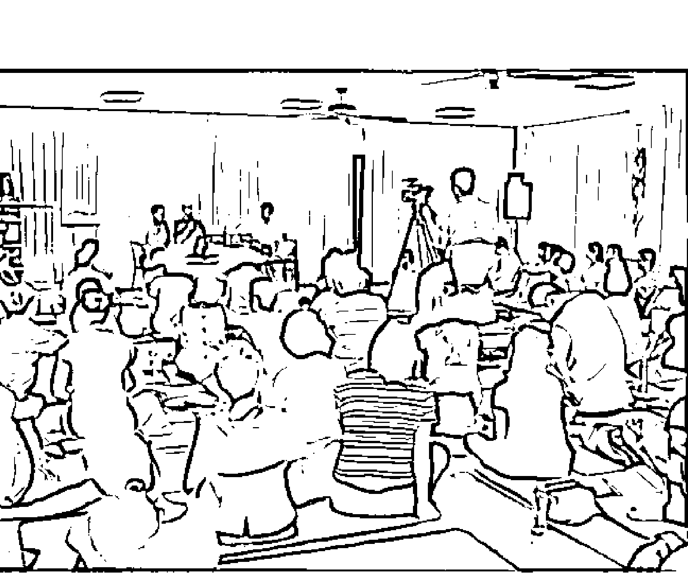

## 許醫師工作坊

在賽斯村，每月第三個星期六、日，由許醫師帶領的工作坊及公益講座，所有學員不斷的向內探索自己，找到內在的力量，面對及穿越生命的恐懼、困難與疾病，重新邁向喜悅、幸福、健康的生命旅程。

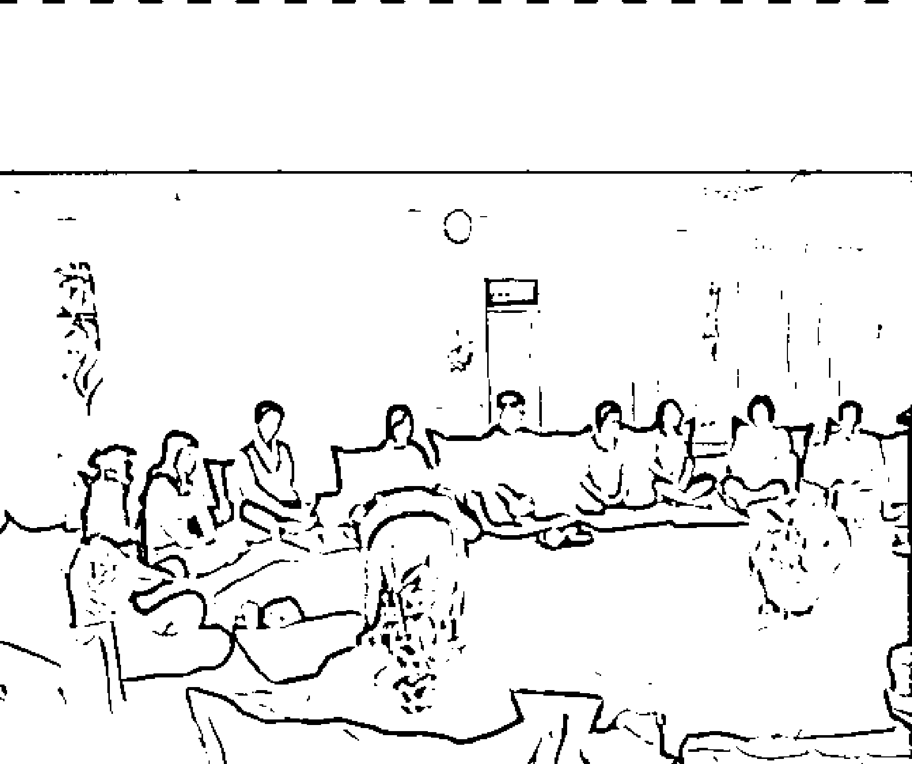

## 療癒靜心營

賽斯村精心安排的療癒靜心營，主要目的是將賽斯資料落實在生活裡，由痊癒的癌友分享他們療癒的經驗，並藉由心靈探索、團體分享等各種課程，以及不同的生活體驗，來協助每位學員或癌友成長、轉化及療癒。

賽斯村是一個靜心的好地方，尚有其他許多老師的課程可提供大家學習。歡迎大家前來出差、旅遊、學習、考察兼玩耍，一起回到心靈的故鄉。

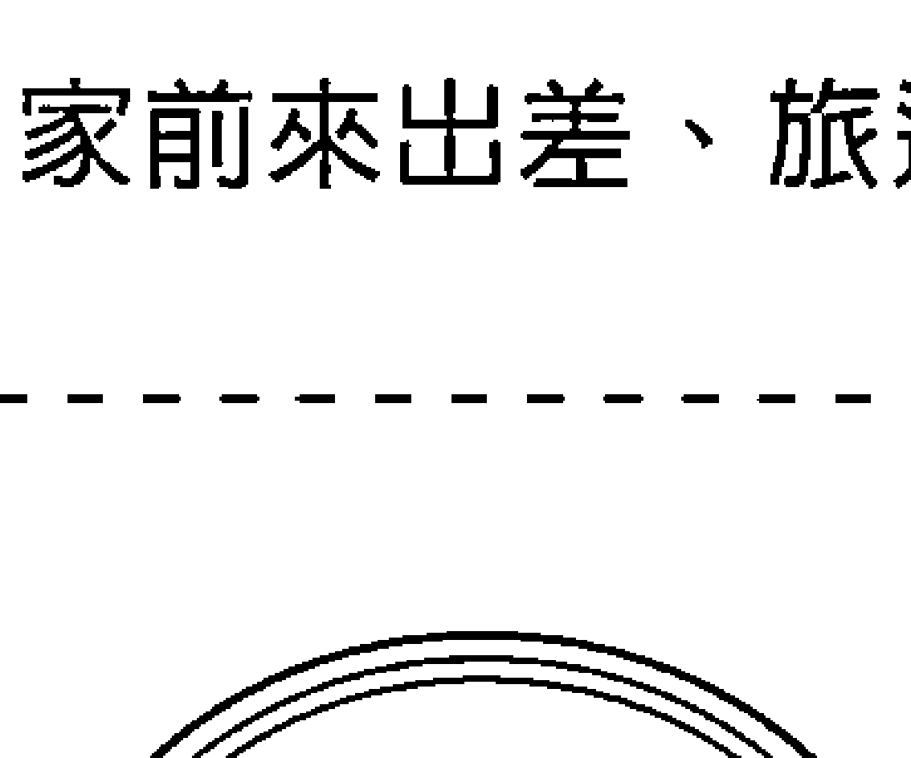

地址:花蓮縣鳳林鎮鳳凰路300號  
電話:03-8764797  
所有課程詳見賽斯村網站:www.sethvillage.org.tw

### 百萬CD  
千萬愛心

## 請加入賽斯文化 百萬CD推廣行列

自2006年10月啟動「百萬CD，千萬愛心」專案至今，CD發行數量已近百萬片。這一系列百萬CD，由許添盛醫師主講，旨在推廣「賽斯身心靈整體健康觀」，所造成的影響極其深遠。來自香港、馬來西亞、美國、加拿大、台灣等地的贊助者，協助印製「百萬CD」，熱情參與的程度，如同蝴蝶效應一般，將賽斯心法送到全世界各個不同角落——隨著百萬CD傳遞出去的愛心與支持力量，豈止千萬？賽斯文化於2008年1月起，加入印製「百萬CD」的行列。若您願意支持賽斯文化印製CD，請加入我們的贊助推廣計畫！

## 百萬CD目錄 > （共八輯，更多許醫師精彩演說將陸續發行）

- 1 創造健康喜悅的身心靈  
- 2 化解生命的無力感  
- 3 身心失調的心靈妙方（台語版）  
- 4 情緒的真面目  
- 5 人生大戲，出入自在  
- 6 啟動男人的心靈成長  
- 7 許你一個心安  
- 8 老年也是黃金歲月  
- 9 用心醫病  

## 贊助辦法 >

在廠商的支持下，百萬CD以優於市場的價格來製作，每片製作成本10元，單次發印量為1000片。若您贊助1000片，可選擇將大名印在CD圓標上；不足1000片者，也能與其他贊助者湊齊1000片後發印，當然，大名亦可共同印在CD圓標上。

- 1. 每1000片，贊助費用10000元，沒有上限。  
- 2. 每500片，贊助費用5000元。  
- 3. 每300片，贊助費用3000元。  
- 4. 每200片，贊助費用2000元。  
- 5. 小額贊助，同樣感謝。  

您的贊助金額，請匯入以下帳戶，並註明「贊助百萬CD」，賽斯文化將為您開立發票。

戶名：賽斯文化事業有限公司  
郵局劃撥帳號：50044421  
銀行帳號：台北富邦銀行  
ATM代碼012 380-1020-88295

## The Seth Garden 賽斯花園

## Seth 賽斯教育基金會 新店分處

- ○ 書籍、CD  
- ○ 輕食、新鮮蔬果汁、咖啡、茶飲  
- ○ 心靈成長工作坊  
- ○ 場地租借  
- ○ 藝文展演  
- ○ 賽斯系列商品  
- ○ 素人作品  
- ○ 個別心靈陪談  
- ○ 讀書會  
- ○ 身心靈課程  
- ○ 癌友、精神疾患與家屬等支持團體  

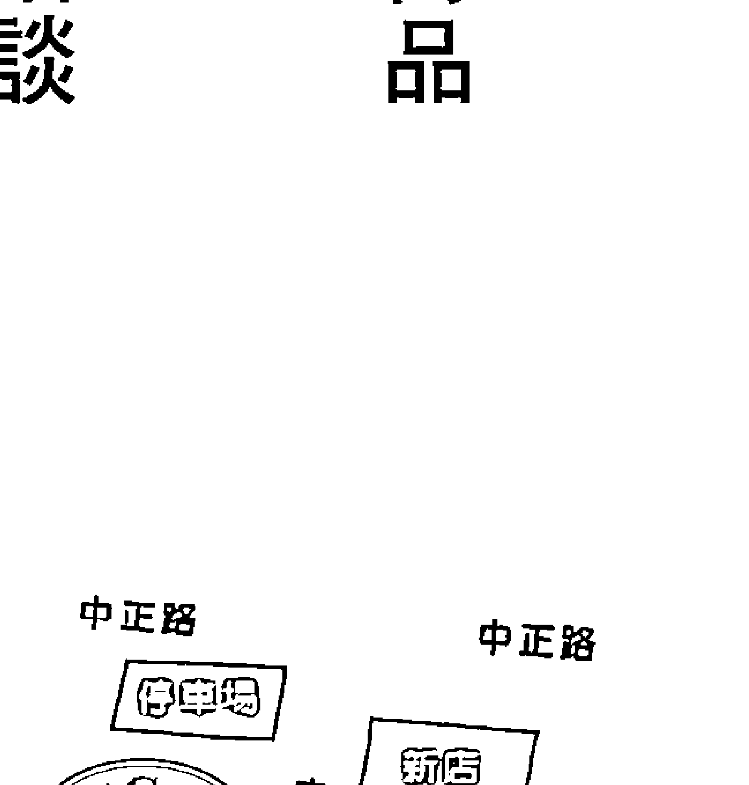

電話：(02)8219-1160、2219-7211  
花園信箱：thesethgarden@gmail.com  
地址：新北市新店區中央五街51號  
網址：http://www.sethgarden.com.tw  
新店分處信箱：sethxindian@gmail.com

## 賽斯心法媒體推廣計畫 600元 幫助全人類身心靈成長，您願意嗎？

當許多媒體傳遞帶著恐懼與限制的訊息，你是否問過究竟什麼才真能讓你我及孩子對未來、對生命充滿期待與喜悅，開心地想在地球上活出獨特與精彩？

賽斯教育基金會感謝許添盛醫師及其他心靈輔導師、實習神明分享愛、智慧與慈悲的身心靈演講/課程/紀錄做為「賽斯公益網路電視台」的優質節目；我們規劃製播更多深度感動的內容，讓一篇篇動人的生命故事鼓舞正逢困頓的身心，看見新的轉機與希望「遇見賽斯，改變一生」。

您的每一分贊助，不但能幫助自己持續學習成長，同時也用於推廣賽斯身心靈健康觀，讓更多人受益。感謝您共同參與這份利人利己的服務！

播映許添盛醫師、專業心靈輔導師老師的賽斯身心靈健康公益講座，進入網站即可完全免費收看！

只要您捐款贊助「賽斯心法媒體推廣」計畫，並至基金會海內外據點或至SethTV網站填妥申請表，就能成為會員獲贈收看贊助頻道。後續將以E-mail通知開通服務，約1~7個工作天

贊助頻道播映許添盛醫師、專業心靈輔導師的賽斯書課程、講座；癌友樂活分享、疾病心療法系列、教育心方向系列、金錢心能量系列、親密心關係系列等用心製作的優質節目。

※ 詳細內容請參考每月節目表；若有異動以 SethTV網站公告為準

或洽愛的聯絡處申辦

SethTV專戶  
戶名：財團法人新時代賽斯教育基金會  
銀行代號：017  
兆豐國際商業銀行 北台中分行  
帳號：037-09-06984-8  

任何需要進一步說明，請洽SethTV Email：sethwebtv@gmail.com Tel：02-2219-5940  

※ 長期徵求志工開心參與~網站架設、網頁設計；攝影、剪輯；節目企劃、製作；字幕聽打、多國語文翻譯等  

### 財團法人新時代賽斯教育基金會  
www.seth.org.tw  

#### 宗旨  
基金會以公益社會服務為主，於民國九十七年三月正式成立。本著董事長許添盛醫師多年來推廣身心靈理念：肯定生命、珍惜環境、促進社會邁向心靈普遍開啟與提昇的新時代精神，協助大眾認知心靈力量對於健康的重要性，引導社會大眾提升自癒力，改善生命品質，增益家庭與人際關係，進而創造快樂、有活力的社會。  

#### 理念  
身心靈的平衡，是創造健康喜悅的關鍵；思想的力量，決定人生的方向。所以基金會推展理念，在健康上強調三大定律，啟發大眾信任身體自我療癒的力量；在教育方面，側重新時代生命教育觀念的建立，激發生命潛力，尊重每個人的獨特性，發現自我價值，創造喜悅健康的人生。更進一步建設賽斯身心靈療癒社區，一個落實人間的心靈故鄉。  

#### 服務項目  
身心靈整體健康公益講座、賽斯資料課程及讀書會、全球視訊課程連線及電子媒體公益閱聽、個別心靈對話及心靈專線、心靈成長團體及工作坊、癌友/精神疾患與家屬等支持團體、企業團體教育訓練規劃及社會服務  

- 1. 若您願意提供我們實質的贊助，歡迎捐款至基金會：  
  捐款帳號：037-09-06756-6 兆豐國際商業銀行——北台中分行  
- 2. 加入「賽斯家族會員」：凡捐款達三千元或以上，即贈「賽斯家族卡」一張，持卡享有課程及出版品…等優惠，歡迎洽詢總分會。  

#### 基金會據點  

| 擬真 | 地址 | 電話 |  
|------|------|------|  
| 台中總會 | 台中市北區崇德路一段631號A棟10樓之1 | (04)2236-4612 |  
| 板橋辦事處 | 新北市板橋區仁化街40之2號8樓 | (02)8252-4377 |  
| 新店辦事處 | 新北市新店區中央四街80號5樓 | (02)2219-7211 |  
| 三鶯辦事處 | 新北市鶯歌區文化路214號 | (02)2679-1780 |  
| 嘉義辦事處 | 嘉義市民權路90號2樓 | (05)2754-886 |  
| 台南辦事處 | 台南市中西區開山路245號8樓之1 | (06)2134-563 |  
| 高雄辦事處 | 高雄市左營區明華1路221號4樓 | (07)5509-312 |  
| 屏東辦事處 | 屏東市廣東路120巷2號 | (08)7212-028 |  
| 宜蘭辦事處 | 宜蘭市宜中路120號 | (03)9325-322 |  
| 賽斯村 | 花蓮縣鳳林鎮鳳凰路300號 | (03)8764-797 |  

## 台灣身心靈全人健康醫學學會 Taiwan Society Of Holistic Medicine  

秉持著推廣身心靈三者合一的新時代賽斯思想健康觀念  
培訓具身心靈全人健康思維之醫療人員與全人健康管理師  
提升國人身心靈整體醫療照護，創造健康富足的新人生  

## 期望您加入TSHM會員給予實質支持  

- 一、個人會員：年滿二十歲以上贊同本會宗旨之醫事人員或相關學術研究人員。  
- 二、團體會員：贊同本會宗旨之公私立醫療機構或團體。  
- 三、贊助會員：贊助本會宗旨之個人或團體。  
- 四、學生會員：大專以上相關科系所之在學學生。  

感謝您的贊助，讓TSHM推廣得更深更遠  

### 國家圖書館出版品預行編目資料  

生命數字不思議 / 陳小珠作. -- 初版. -- 新北市 : 賽斯文化, 2012.06  
面； 公分.（陳小珠作品；1）  
ISBN 978-986-6436-34-5（平裝）  

### 許添盛醫師說：  

我很驚訝地發現，近年來人們對心靈的追求和探索的渴望。我想時間也到了，該是人們發現物質背後的力量原來是「心靈能量」的時候了，該是人們認識自己「實習神明」的身分——也就是開發自己內在的神性、進而與人性揉合在一起的時候了。你認識自己了嗎？你了解到自己靈魂的傳承及此生的「天命」了嗎？如果還沒有的話，那麼預祝你透過本書，讓自己在靈性追尋的過程中一切順利！  

## 陳嘉珍執行長說：  

究竟從出生時刻、星座排列，甚至姓名筆劃之中，能尋出什麼命運線索？我不是質疑它們的價值，而是忍不住要想：就算再高明的大師，指出我們的未來，生命過程中的每一種感受、情緒與心情，卻必須由主角紮紉實地經驗體嘗，而這諸般況味，起伏多變的無常，才是投生為人的真正目的。這本以身心靈觀念為基礎的生命靈數學，不僅能幫助讀者在龐大縝密的命運之網中理出一條明晰之路，也提供了讀者生命靈數的指引，藉此進一步了解、肯定每個人都有豐沛的心靈能量可以改變命運，而不是被命運操控的傀儡！  

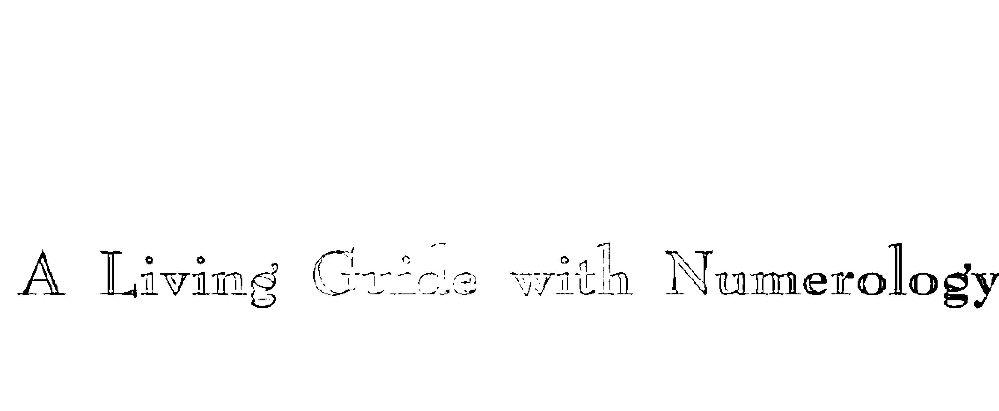  
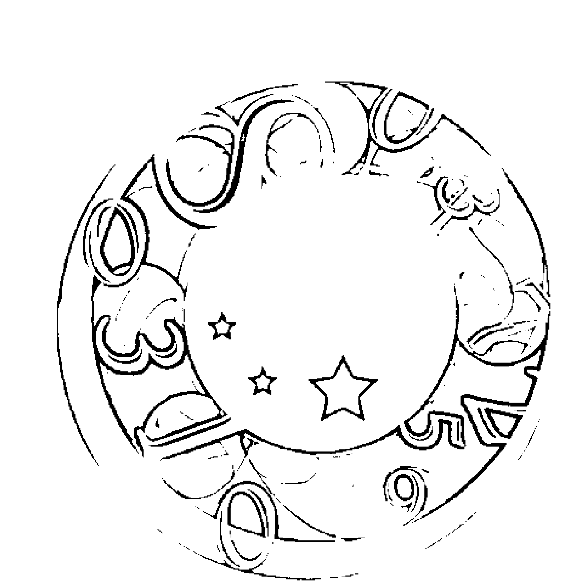  

ISBN 978-986-6436-34-5  
B7001  
賽斯文化  
NTS350