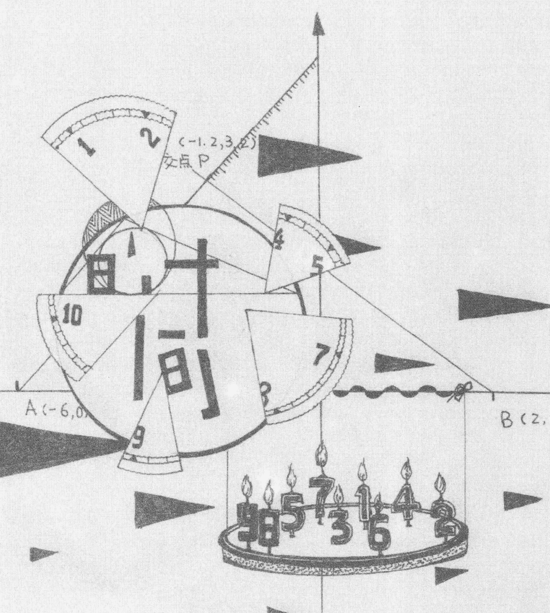

## 生命数字书

How to Unlock the Secrets of Your Personality with Numbers

[英] 索尼娅·迪西 著 孙梅君 译

星座、塔罗、九型人格之后最受期待的人生密码解读！

1到9·简单的几个数字·你就可以洞悉自己、了解他人！

## 毕达哥拉斯系统解读生日数字最富权威的版本！

根据全息的宇宙观，每个复杂的心灵都可寓于简单的数字之中！

## 关于灵数学

灵数学是一门古老却非常准确的科学，它源自于古希腊数学家、
哲学家毕达哥拉斯的学说系统，与星座、塔罗并称为西方三大神秘学。数字就是能量，
其中蕴藏着无限的潜力，只要通过一个人的出生年月日，就能准确地分析个人的先天潜能、
天赋及个性上的弱点。利用生命数字的智慧导引，可以提升你对每个个体的洞察力，
使之成为改善亲密关系、亲子关系及其他人际关系的有效工具！

- 灵数学与你
- 如何找出人格数对你的影响
- 1到31各人格数的重要意义
- 各人格数的弱点与生命挑战
- 各人格数的感情观与爱情表现
- 各人格数的外表特征、童年经历、身心健康、事业选择
- 各人格数名人代表分析

如果你想了解数字如何影响你的行动及反应，希望善加运用自己的正面特质，对负
面特质有更佳的掌控并加以转化，就从这本书开始吧。

——知识灵数学学院院长 考迪恩·M．埃格特尔

定价：39.00元

## 如果没有你的数字你是谁

生命数字学（Numerology）的著作被越来越多地出版与传播，它的来源与发展无须再赘言。普遍认为，它来自毕达哥拉斯系统的“1—9 循环”象征学，而这一象征学，始自于古埃及。根据更严谨的论说，1—9 循环与 7 的循环小数有关，涉及繁复且深邃的探索人、事、物之发展规律的远古智慧学说，一如中国的易学。但是总体而言，今日的数字学传播，仅取其便于理解的要素，即使用出生年月日的数字进行一系列计算，从而了解人格特征、反应模式、生之使命，以及流年程序，等等。

与曾出版的其他数字学的著作不同，本书的主线围绕着“人格数字”，也就是个人出生日所涵盖的意义。作者认为这是了解数字学的开始。当然，假如你要全面洞悉这门学问，还要考量生命灵数、命数，不同阶段的高峰数与挑战数，以及流年数字等。那些数字的影响或在“人格数”之内核，或在“人格数”之外围。所以不管怎样，从“人格数”本身开始，不失为是好的入门。

需要一提的是，就我与许多朋友的观察与经验所见，中国人使用本书时，如果参照自己的阴历生日去阅读，反倒比公历日期更贴近真实情况。至于为什么会如此，也许需要更多人给出知识与洞见了。

生命数字学和其他学说（比如，心理占星、人格类型学）一样，是指向月亮的手指。因此，它同样具备了“恰当使用”与“不当误用”两种情况。

## 生命数字书

中亚谚语说：头脑是个好仆人，却是个烂主人。当头脑是主人时，它喋喋不休在反刍的心理故事会扰动情绪、扰乱心智。而当头脑是仆人时，则可以作为有力的助缘，辅助我们实现想要的内在生命与外在生活。

同样，数字学若成为主人，便沦为给自己与别人贴标签的快捷工具，甚至成为互相指责的武器，丧失了直面生命灵动的可能性。而当数字学成为仆人时，可以帮助我们照见自己、支持自己，借由观察与了解自我，每当有惯常反应，不再像以前那样无意识地认同，而能越来越清楚地识别自己的反应是如何“不自由”，如何被锁定在“特定程序”内。然后，我们继而学习将局限变成资源，了解其脉络、疗愈其负面表现，从而正向地使用它。

最后，建议已经掌握数字能量或这个工具的朋友，请不时反问自己：“如果我不是我的数字，我是谁？如果我不是这些特质、模式，那么我是谁？”

因为这是所有这类工具（包括占星学、人格类型学）的原始初衷：即，不是为了获得自我定位、不是为了给命运找借口，也不是为了自我对抗；而是为了借此反观那个“不能被定义的”的本质。

诚如古印度的奥义书的精神所言：

> 真正的你，不是你所呈现的（内容），而是使呈现得以发生的（意识）；真正的你，不是你所知与所观的（对象），而是那个不被所知、所观所束缚的（观照）。

宁偲程（Sakshin）

Akheldan 聚落（www. akhaldan. cn）创立者

葛吉夫律动（神圣舞蹈）带领者

www. blog. sina. com. cn/akhaldan

### 目录

Contents

灵数学与你 ...... 1

历史上的灵数学时期 ...... 5

各种灵数学体系 ...... 8

如何找出生命数字对你的影响 ...... 11

### 人格数 1—31

充分善用你的人格 ...... 17

人格数 1 ...... 21

人格数 2 ...... 29

人格数 3 ...... 37

人格数 4 ...... 45

人格数 5 ...... 53

人格数 6 ...... 61

人格数 7 ...... 69

人格数 8 ...... 77

人格数 9 ...... 85

人格数 10/1 ...... 93

人格数 11/2 ...... 101

人格数 12/3 ...... 109

人格数 13/4 ...... 117

人格数 14/5 ...... 125

### 进一步了解灵数学

- 进一步了解灵数学 ...... 271
- 延伸阅读 ...... 277
- 名人的生命数字 ...... 278

- 人格数 15/6 ...... 133
- 人格数 16/7 ...... 141
- 人格数 17/8 ...... 149
- 人格数 18/9 ...... 157
- 人格数 19/1 ...... 165
- 人格数 20/2 ...... 173
- 人格数 21/3 ...... 181
- 人格数 22/4 ...... 189
- 人格数 23/5 ...... 197
- 人格数 24/6 ...... 205
- 人格数 25/7 ...... 213
- 人格数 26/8 ...... 221
- 人格数 27/9 ...... 229
- 人格数 28/1 ...... 237
- 人格数 29/2 ...... 245
- 人格数 30/3 ...... 253
- 人格数 31/4 ...... 261

#### 数字的科学、哲学与心理学

灵数学是数字的科学、哲学以及心理学。它是一种古老的法门，能够帮助你更加了解生命——过去的生命、现在的生命，乃至于未来的。生命是以一个接着一个的循环（或者说是“趋向”）在开展、演进，而这一切，都涵盖在数字 1 到 9 之中。所有数字，不论多大，都可以拆解成 1 到 9 之间的数字。

以现代意义而言，灵数学是合乎科学的。数学家暨物理学家牛顿爵士（1642—1727）相信“秩序”：太阳明天将会升起，因为它昨天升起、今天也升起了。然而，科学家后来发现，稳定与和谐事实上是从混乱中生出的，几率与或然性影响着地球上的生命。灵数学，亦是从混乱中带出秩序。借由了解自身的生命数字，即使你经历了生命中的混乱，最终仍能从中获益。从混乱和无序中，你将会获得新的体悟，以及长期而言能够令你坚强、对你的人生有所帮助的经验，这是混乱与无序所给的报偿。灵数学能够在实质上帮助你个人的发展。

作为一种哲学，灵数学蕴含了生命的智慧。它既是一种思想的体系，也是一种知识的理论。古希腊哲学家毕达哥拉斯（公元前 580—500）是灵数学的先驱，他的理论深深影响了今天的灵数学。他相信数字是“一切生命的精髓”。

灵数学也是一种探讨人格的心理学形式。心理学家弗洛伊德与荣格开疆辟土的革命性作品，都强调了解人格特质之力量与弱点有多么重要。他们二位都花费许多年的心力，发展其思想与概念解释

#### 你的生日数

生日数，就是指你是在某个月份中的“哪一天出生”，这个数字将会提供关于你的人格与心理模式的信息。它会揭露你在健康、爱情、性、事业以及整体人生上的个人倾向。

#### 个人流年数

在人生中，你所有的经验都涵盖在数字1到9之中，或者说涵

# * 9 年的循环

生活中的许多事物，都有着“7”的自然循环，例如，身体有 7 个脉轮（能量中心）、灵气有 7 个层次、彩虹有 7 色、地球有 7 大洋，等等。“7”这个数字，往往与自然紧密相连。然而，在灵数学中，数字“7”代表创造自然或毁灭自然，它是一种催化剂，可以带来合成、融合、生产，或者失落（程度各有不同）。因此，在你的 1 到 9 的“个人年循环”中，第 7 年将整合前 6 年的经验，循环中的第 8 年则是要清偿因果报应（来自你前 7 年的周期，或是在此之前的所有循环），而第 9 年则会影响你去思考自己希望释放什么，或是带着什么进入下一个 9 年的循环。

#### 历史上的灵数学时期

##### 时间的起源

打从有“时间”开始，便有了灵数学。灵数学也和“一天”同样古老，因为每一天都会带来某些新事物，也会结束某些东西。灵数学是现代的，因为它影响着每一个时刻。因此，灵数学的历史涵盖着过去、现在和未来，全都包括在数字 1 到 9 的影响中。无怪乎我们能从这几个小小的数字中获得这么多信息，也难怪它们够揭露这么多关于生命的奥秘。然而，一切历史都是从“零”生出的——它是一切生命的潜在形式。

当你想到“历史”时，心中或许会浮现出到目前为止影响世局的具体事件，但历史同样关乎曾经发生的情感、心理以及精神事件，或者说意识上的变化。事实上，以更宏观的视野来看，世界的历史亦会受到“整个”宇宙的影响。

每当人类大幅跃进（像是 18 和 19 世纪的工业革命，以及 20 世纪登陆月球和火星），这些跃进的发生，是因为人类受到当时对他们起作用的新特质的影响。人类的跃进是由于意识有所改变，而灵数的影响也在改变。举例来说，近年来人类“发现”了第 13 个星座“蛇夫座”，它位于天蝎座和射手座之间。这个星座始终存在，但是直到人类认识到它的特质和作用后，它对人类才开始起作用。13 代表改变和转化，因此它指出：20 世纪晚期，在地球这个行星上，意识会开始有所转变。

社会变迁之际，意识就会跟着转变，整个群体也就会共同向前迈进。社会是从内在发生变化的，它并非导因于外在事件（像是伟

#### 历史上的灵数学时期

历经改变，因此每个世代都会重新“发明”每一个数字，并以不同的方式接受这些数字的影响。例如，阿兹特克人受到数字影响的方式，可能便与古埃及人和希腊人有所不同，与今日的人们运用数字的方式也有差别。举例而言，阿兹特克人发展出他们的口语沟通形式时，或许受到了数字5的影响。而在今天的西方世界，数字5影响着更为集中的心智运用，发展出计算机和电信体系，建构出沟通世界各地的大众通讯网络。

在历史上，数字1、2和3一直被普遍地使用，因为它们是任何人都能掌握的简单计算单位。然而数字3一向被视为“神圣数字”，因为它包含着三角形的符号，代表“圣三位一体”、“身心灵”以及“父母子”。你或许听过“三次好运到”的说法，因为许多人相信3是幸运的数字。不过，今天的灵数学家使用许多数字，从1一直到81，有时甚至还会超过。但是数字1到9还是被普遍地使用，并被认为是极为强而有力的数字，因为它们凝聚了许多特别强大的经验和影响。

世界上的许多国家都有其独特的灵数学体系，在过去，古印度、中国西藏、中国大陆和埃及都是最早发展灵数学的国家。而由古希腊哲学家毕达哥拉斯大约在公元前500年所创建的神秘学派，发展出了1到9的数字系统，可以说是建立了现代灵数学的基本架构。

#### 各种灵数学体系

自古以来，有许许多多不同的灵数学法门为世界各地的人们所使用，包括毕达哥拉斯体系、喀巴拉数字系统、神秘灵数学，以及其他形形色色的占卜形式。有些至今仍在使用的方法相当原始，如非洲的一些占卜方式，但是它们全都能为（你的）生命提供信息。灵数学是用来在特定生命情境中发现个人潜能，而占卜主要是用来预测未来。

# * 喀巴拉与灵数学

希伯来知识体系“喀巴拉”主要借助两种法门解读喀巴拉的典籍，尤其是《圣经》。这两种法门其一为“生命之树”和它的 10 个分支，其二则是“Gematria”数字系统（编按：另译为“希伯来字母代码”），后者是将名字中字母的语音转译为数字。喀巴拉文字系统有 22 个字母，据说希伯来人变更了名字中的字母来改变其意义。这两种法门也被用于预言。

# * 神秘灵数学

神秘灵数学所探讨的，是每个数字“背后”的特质或概念。神秘灵数学家认为，人类的潜力与无限的潜能息息相关，与日月星辰、我们的太阳系以及其他星系都有所关联。神秘学家深入探究心灵的运作，他们在那儿看见了一切生命的潜能，而数字有时会对他们揭示一些概念，这些概念是讲求理性和逻辑的人做梦也想不到的。各个时代都有过许许多多的神秘学家或“思想家”，他们的知识影响了全人类。举例而言，他们可能是伟大的发明家，创造了许多新事物，

##### 非洲占卜

求助于这种方式的问卜者，通常希望为提出的问题寻求一个明确的答案。许多物品都能用来找出解答，然而，在过去，占卜者会宰杀动物，取出其内脏来“解读”蕴藏其中的答案。一般认为，内脏和本能有关，英文中也有“内脏的感觉”这样的说法，用来形容对某个人或某件事的“直觉”。因此这种形式的占卜似乎也有其逻辑。

##### 中国大陆占卜

《易经》成书于距今3000到5000年前，当中的占卜方法到今天仍十分风行。其占卜方式通常是使用蓍草梗或钱币，使用钱币时，会用三个钱币掷出六次，得出钱币的每一面代表一个数字或符号。如果钱币是反面朝上，就得出“阴”（接受性的能量）爻，代表数字2；若是正面朝上，则得出“阳”（积极的能量）爻，代表数字3。六次投掷的结果，会形成一个由六个阴爻或阳爻所组成的“卦”，以及一个数字，这些《易经》一书中都有所探讨。这部涵盖了身、心、灵一切元素的经典，就是以由六爻所组成的六十四卦为基本架构。在灵数学中，64这个数字代表这个行星上所有生命经验的潜能，就像是阅读一本“摊开的书”。

##### 中国西藏占卜

西藏人有各式各样的占卜法门。为人熟知的一种方式是在小纸片上写下问题的可能答案（结果），然后包在面团中，放进一个大碗里。问卜者在心中想着问题，同时转动这只碗，最后选出一个面球。

##### 毕达哥拉斯体系

毕达哥拉斯系统是以数字1到9为基础，它鼓励你发展自己的直觉，让数字自行“说话”——向你揭露它们的“宝藏”。这本书便是运用这种简单的方法，来帮助你更进一步了解自己的性格与生命。

灵数学就是生命，因此本书希望向你展现：生命数字能够如何提供洞见，让你更加了解自己，以及你所生存的广袤世界。

### 如何找出生命数字对你的影响

在本书中，将会有专章探讨“人格数”，当中描述此数字会借由什么方式影响你的生活。在这一章，你将会学到如何算出这个重要的数字，也会学到如何计算你的“个人流年数”，个人流年数每年都会改变，影响着你生命中的各个年份。此外，你也将读到关于你的“集体流年数”的信息，它将说明你出生月份的一般性影响。

你必须记住，你并不等于你的人格数，但是这个数字会影响你的生活。光是你的人格数，就能够对你的人生提供非常多的信息。有些信息乍看之下似乎彼此矛盾，但是它们全都是整体之中的不同方面，是相关而且有意义的。

生命并不是非黑即白，数字的影响也是如此。

### 如何算出你的人格数

你的人格数是由你的“出生日期”决定的。举例来说，如果你出生在某月的8日，你的人格数就是8。

不过，每个大于9的数字都会衍生出其他数字，这些数字同样会影响它。例如，倘若你出生于某月的14日，那么就要把1和4加起来，成为5：你的人格数就是14/5。再举一个例子，如果你是在29日出生，就要这样加：2+9=11，1+1=2，如此，你的人格数就是29/2。

借由将所有的数字列入考虑，你便能够为自己的人生找出更为详尽的信息。

### 如何算出你的个人流年数

要算出你该年的个人流年数，要将你“出生日期”的数字加上“出生月份”的数字，然后再加上你“上一次过生日的年份”。每过一次生日，你的个人流年数的影响就会改变。

### 〈范例〉

苏菲出生于1971年2月14日。

假设现在是2007年1月，所以要把苏菲的出生日期14日（1+4=5），加上她的出生月份2月（=2），再加上她上一次过生日的年份，也就是2006（2+0+0+6）=8。

将以上三个数字相加5+2+8=15，1+5=6。

因此，在她2006年到2007年的生日之间，数字6将会影响着她的生活和经验。从她的下一次生日，也就是2007年的生日起，数字7会影响这一年；而从她2008年的生日起，苏菲的个人流年数则会是8，以此类推。

### 个人流年数表

下表列出每个个人流年数的一种代表性特质（每个数字都有许多特质），该特质可能会在某个特定的个人流年中对你产生影响。

| 个人流年数 | 代表性特质 |
|------------|-------------|
| 1           | 机会        |
| 2           | 平衡        |
| 3           | 创造力      |
| 4           | 建立基础    |
| 5           | 沟通        |
| 6           | 承诺        |
| 7           | 具体化（实现） |
| 8           | 再生        |
| 9           | 结束、开始  |

### 找出你的集体流年数

要找出你的集体流年数对你的影响，只要在下表查出你出生的月份即可。表中列出你将在生命中与他人合作发挥的特质，以及周遭的议题。

| 月份 | 代表性特质 |
|------|-------------|
| 1月   | 勇气        |
| 2月   | 平衡        |
| 3月   | 喜悦        |
| 4月   | 责任        |
| 5月   | 交流        |
| 6月   | 服务和关怀  |
| 7月   | 融合        |
| 8月   | 力量        |
| 9月   | 信仰        |
| 10月  | 智慧        |
| 11月  | 灵感        |
| 12月  | 完成        |

### 享受灵数学的乐趣

显然，有非常多的数字影响着你的生命。例如，“宇宙日”（当天的日期）也会对你的生活有所影响。由于有如此大量的信息，你或许就能了解为什么本书只专注探讨人格数！

也请记得，找出你的数字是一回事，解读它们又是另一回事。在汲取本书所提供的知识之余，你还应该让直觉或心灵指引你去“读出”字里行间的信息。

学习放轻松、享受运算这些数字，或许也会有帮助。可以试着每次不要算太多，直到你熟悉整个程序。记得，越是放轻松，就能学到越多，也越能享受这个奇妙的工具。

#### 人格数1-31

#### The Personality Numbers 1-31

#### 充分善用你的人格

Making the Most of Your Personality

数字就是能量，其中蕴藏着无限的潜力。它们就如同生命般不停地变化着，因此，借由了解自身人格趋向，你便能觉知到自己可以在这个变动不居的世界如何作出反应，或是如何创造实相。

#### 人格

人格或性格多半受到童年早期（一般是生命的头七年到九年）所建立的行为模式的影响，它们将会形成你一生的人格基础，称为“童年制约”。但可能影响你人格的，还有你周遭的人们，以及其他具有支配性的影响力，像是你一生当中所处的变动环境。

因此，你的人格扮演着极为重要的角色：它是你内在自我的“太空衣”，若没有它，你将无法在这个世界上运作，也无法学习所必须学习的功课。不过，你还是可以选择，也可以向数字带来的功课说“不”。例如，如果你的人格受到数字4的影响，它掌管着责任，你可能会拒绝接受自己的责任，反而承担起他人的责任。你的人格自有其生命，也正是你这奇妙的人格，为你想在自身生命中做的个人事情添上色彩。

#### 你的人格数

在后面，每个人格数我们都会用一整章来探讨。你将会在其中一章中找到关于你的人格数的详细说明（要找出你的生命数字，请见第12页）。各个人格数的章节，都会探讨属于该数字的人的一般倾向、挑战（或弱点）、性与爱的议题、可能的身体特征及童年经验、身心健康状况，以及其倾向的事业选择。各章还会以一个名人为例，为他/她作性格分析，说明其人格数如何影响着他/她的生命与死亡。

#### 数字的影响

在灵数学中，你并不等于你的数字，但是会受到数字所代表的特质的影响。举例而言，假如你的人格数是6，那么你可能（有些时候）特别有爱心或同情心，因为这些都是数字6所带来的特质。

在阐述人格数的各章中，你可能会发现自己能认同其中描述的某些特质，但并不同意全部。例如，你的人格数字是26/8，你或许会发现它的某些特质在此刻看来与你并没有多大的关系。这可能是因为，这些特质是包含在这个数字所蕴藏的潜能中，而你或许还从未曾在自己身上辨识出它们。

在生命的不同时期，你可能会特别受到你的人格数某些正面或负面特质的影响。就连一天当中的不同时间，这些影响也会有所变化。有时你会深入探讨某些特定的特质长达数年，而忽略其他的特质。

当你走过人生的旅途，你或许也会“发现”某些部分的自己或者是每个数字的属性。例如，你或许会在41岁的时候开始发展出领导他人的能力，继而将这种特质整合到生命中——尽管它一直都在那儿，只是隐而不显。

如果你出生在子夜前后，或许你会注意到，你生日前一天或后一天的人格数与你的性格更为吻合。的确，在灵数学中，所有数字通常都包含了它之前及之后数字的一些特质。例如，如果你是在21日出生，那么你便可能带有数字20及22的特质。

有些人相信，他们的出生日期就是自己的“幸运数字”，如果是这样——非常好！因为你的信念将会对你的人生起着很大的影响。最终的数字最具影响力。

#### 人格数为二位数

如果你的人格数是二位数——也就是10以上的数字，那么你的人格数就可能蕴含两个、三个，甚至四个不同的数字，这些数字会共同或各自以种种方式影响你的人格。

举个例子，如果你出生在29日，29可以化约为2，而且“蕴藏”着11的影响（2+9=11，1+1=2）。因此，人格数为29的你，可能会受到2、9、11或1这些数字不同程度的影响，或者，它们会在你生命中不同的时间点影响着你。

## 人格数1—31

在接下来的各章，你将会看到以下单元：

- 该数字的一般倾向
- 挑战与弱点
- 爱情与性

这个单元会揭示一些可能影响你生活的正面特质或模式。它包括了该数字所涵盖的身体、情绪、心理以及灵性层面的信息。

这个单元探讨你性格上的挑战，或者说是弱点。借由觉知到这些或许会影响你的人格及生活的可能特质，你就能将它们转化成力量。能够辨识出生命中的潜在挑战是很有帮助的，因为这样你才能在这方面下工夫，将它们转化为正面的特质——倘若你选择这么做的话。

这个关于爱情与性的单元将告诉你：你在这方面可能会采取什么样的行为模式，又会吸引到什么样的伴侣。它也会针对影响你性生活的可能的方面提出见解。

## 外表特征

这个单元将列出与你的人格数相关的可能身体特征。

## 童年经验

不论你是否记得童年，它都在你基本的人格行为模式上扮演了关键的角色。这个单元提供的信息将对你个人有所帮助，并将有助于你与该人格数的孩童相处、互动。

## 身心健康

有些时候，比起你生命数字表中的其他因素，你可能特别容易罹患你的人格数所指出的健康问题。有时你可能特别容易患上“偶发性”疾病，像是流感、耳痛或是背痛，甚至更为严重的疾病，它们完全跟你平日的体质无关。这种状况可能发生在某个特定的“个人流年”。不过，这个单元包含的准则，或许可以帮助你更容易察觉到自己在一般健康状况上可能遭遇的挑战或弱点。

## 事业选择

这个单元将突显出你的人格数所偏好的职业选择。

### 名人性格分析

这个单元将解析某位名人是如何运用其人格数特质来成就名声。此单元也会检视这位人物的死亡日期，探讨生命数字如何影响其人生。

## 结论

有时，借着深入挖掘自己的人格，你或许也会发现更多关于他人的信息。例如，透过了解自己，你也可能对你的伴侣、父母、朋友以及所接触的任何一个人有更深入的了解。这是因为：你对自己的认识，将能厘清你对人生所采取的行动及反应方式。

#### 人格数1

##### 人格数1的一般倾向

数字1影响着你的人格，“独立”是你的天赋，你强烈渴望运用创造力来追求目标。你是非常直率的人，往往很有自信，知道自己想要什么。此外，你极为专注而坚强，一旦踏上了自己选定的道路，就不会犹豫、动摇。

你多半以自我为中心，可以毫无困难地告诉大家“我很行”、“我很棒”——你可以说是上天赐给人类的赠礼！

受到数字1的影响，你追求目标时无所畏惧，并拥有强大的肉体及精神能量，而你能将两者都导入目标中。你精力充沛，并且能将这股正面能量转化成无穷无尽的创造力。

你是个自给自足的人，能够轻松地适应并且享受独处，或者是独自处理事务。你或许会喜欢从世界退隐一段或长或短的时间；你喜欢思考，有幸拥有自己空间的时候，将更能专注思考如何达成目标。人格数是1的人并不觉得自己需要人群，不过当他们选择与人共处时，多半也能开心自在。

受到数字1的影响，你总是在追求新的机会和经验，是个真正的先驱。你可能会是位企业家，在生活中的各个领域把握并且创造机会，勇往直前，追求所希冀的事物。新鲜感能够刺激你的心灵，从而为你的整个生命注入新能量。

你往往富有发明天分，能够轻而易举地创造出新颖的小器械，或者找出新方法来完成工作。你可能十分善于解决问题，知道从不同的角度切入，通常就能够找到解决之道。另类的思考往往会有帮助，一旦你下定决心解决一个问题，就会想尽办法去征服它。举例而言，如果要你在不可能的期限内达成某项计划，你就会设法办到。你刚愎、固执而不受管束，从不轻言放弃。

受到数字1的影响，你也可能不太爱出风头，是典型的“无名英雄”，总是帮助他人而不求回报。你是个“施予者”，只是单纯地喜欢借由关爱来帮助别人。

你很喜欢学习，骨子里是个相当知性的人。你的手边总少不了一本好书，尽管你忙于创造，不一定总能找到空闲读它。你时常受到自身想法的刺激，而别人的观点也会激荡你的心智。此外，你也十分尊重他人的创造才能。

由于你的头脑里总是有这么多念头转着，你或许需要抽出些时间专注于灵性上，像是静坐冥想，或是聆听美妙的音乐。你明白：借由发展灵性，你将能触及内在的创造源泉。这最终将能令你更具实质上的创造力，产出也更为丰富。

数字1影响着你的人格，你要学习的是找到自己的独特性。数字1令你心灵手巧、多才多艺，而且创意十足。举例而言，你决定要为另一半烤个生日蛋糕，你的目标是做一个蛋糕，但你真正享受的，是去收集可以食用的鲜花来装饰它，把蛋糕制作成特别的形状或颜色，然后用戏剧性十足的风格献给对方。你要用它来给爱人一个惊喜。或许你不太在意它好不好吃——你享受的是发挥自己的个性与创意。

你拥有很棒的幽默感，这能够为你减轻生活压力。休闲的时候你喜欢打网球、做体操或是有氧运动，不过你也可能喜欢下棋，或者是观看体育比赛。

##### 人格数1的挑战与弱点

受到数字1的影响，你拥有强而有力的人格，喜欢发光发热、发挥创造力。但是这个巨大的“自我”有时也会让你变得傲慢专横。你会有点自恋，以为世界是绕着你而旋转。你甚至会在生活中创造出一群人，随时随地为你“伴舞”。

虽然典型的数字1喜欢帮助他人，但这个数字影响下的另一个极端表现是：有时候你会发现自己或许一点也不乐于真心给予。当你真的施予时，也觉得理应受到赞赏。人格数是1的你往往有些自我，而且觉得相较于你的朋友或者家人，你自己更为重要。就某方面而言，这可以成为你的驱动力，因为你需要感到极度的自信，才能将体内储存的强大创造力发挥出来。

你可能颇具破坏力，而且不太能察知别人的感觉，也不明白事情应该如何处理。因为你很自我，在追求自己的创造力时，可能会打破所有的规则，或者只考虑你自己的需求。举个例子，或许你并不觉得每次开会都得先征得老板的批准，所以你就直接召集相关人员开会了。不过有些时候，破坏力或自我却能带来较为进步的办事方式。你的老板搞不好觉得这次会议非常成功，然后告诉你以后都不必事先知会他了。受到数字1的影响，你喜欢当个英雄，而老板这样的赞美无疑能大大提升你的自尊！

就像所有1数的人（10/1、19/1以及28/1），你有时或许会有点懒散，需要别人拉一把才能将事情完成。你或许会抗拒自己的创造力，抗拒听从指示，而只是心怀怨愤、退缩不前。由于你很在意在别人面前的自我形象，可能需要格外努力地维持自尊。或许你会依赖别人，觉得很难仰仗自己。在这样的时刻，为自己设定一个小小的目标或任务，会是不错的做法，这样你就会觉得自己有了一点成就。如此小小地发挥一下创造力，将能激励你下一次征服更大的目标。

受到数字1的影响，你自我依赖的倾向或许会发展到极端，变得太过内向和孤独，因而感到寂寞。你或许有点儿自卑，在内心深处觉得自己不够好，当你退缩时，会痛恨别人把你拖出来。到最后你会明白，只有你自己才能把自己拖出“洞穴”，脱离当下的处境。

##### 人格数1的爱情与性

受到数字1的影响，你多半是个极富活力的人，会将无穷的精力和专注力投入亲密关系中。当然，你的伴侣会很乐意成为你注意力的焦点，但你同时也在这种关系中寻求独立，例如，你会安顿下来，生儿育女，但是你总想要有自己的生活、做自己的事。找个能够接受你的独立性的伴侣，对双方都好。

你或许有以自我为中心的倾向，尤其是在工作上，因此要你“抽一些”时间出来给别人对你将会是挑战。你可能时常答应要做饭但之后忘了做，或是没有腾出足够的时间来“谈恋爱”，因此忽略了伴侣。

你的伴侣。对方如果也是坚强独立的人，将能够与你互补，如此你们两人就可以“共同”过着各自的生活。

你可能会逃避亲昵的互动。1数的影响主要是在心智和头脑方面，因此你虽然能大谈书籍和理念，但是率直表现情感可能就“超出了界线”，除非你找到一位也能开放自身的情感，并且真的能让你在情绪上感到安全的伴侣。然而，这需要时间和努力，你可能更倾向于避开需要与你亲密互动的伴侣。

有些时候你可以变得很顽固、任性，但是这可能反而会挑起对方的兴致——有些人就是喜欢挑战。1数的人通常善于领导，但是当你感到消极、孤单时，也许会乐意有人带领。打个比方，在你辛勤工作了好几天后，若是你的伴侣预先在高雅的餐厅订了位子，或是买了电影票，你将会由衷感激他/她。

人格数是1的你，往往喜欢为你的关系设定目标——何时约会，何时搬去同住，彼此承诺，结婚，生小孩，诸如此类。虽然你们显然也有共同的目标。你喜欢发挥创造力，因此会想出各式各样的点子，让你与伴侣共处的时光总是新鲜有趣。

童年的时候，父亲或者其他男性典范，可能对你的人生产生了很大的影响。或许你将父亲偶像化了，或者是恰恰相反；又或许你对男性感到恐惧。这意味着，你可能会选择一位年纪较长的男性——一个父亲般的角色——作为伴侣。这或许也有助你找到一位心灵伴侣，让你与内在的自我相连结。

在性生活方面，你或许十分享受热情的创意表现，在不同的地点或以不同的姿势享受性爱。你若不是非常愿意给予、喜欢取悦你的伴侣，就是相反，会表现得较为自我，只顾寻求自身的满足。或许你并不喜欢肢体动作表露出情感，尤其是在卧室之外，因为在外人面前表现亲昵会让你感到不自在。无论如何，在某种层面，性生活是你生活中一个重要的方面。

##### 人格数1的外表特征

数字1会影响你的外表，你会散发出一种强而有力的气息，看起来十分强健而有生气。你可能个子相当高，有着中音或高音的嗓子。你通常有一副强健的牙齿，连同炯炯有神的双眼，这是你最引人注目的特征。

##### 人格数1的童年经验

小时候的你便有很强的求知欲，在学校接受教育的时光，可能如鱼得水。你的父母当中可能有一位是知识分子，或者像你一样，是个意志坚强的人。有时你可能有点难以管教，因为当你想要专心做功课或是跟朋友游玩时，会很难使唤，不喜欢受人打扰。不过，当你想要知道什么的时候，常常会随性所至地打断别人的谈话。还是孩子的时候，你就已经很强悍了。你通常十分独立，或许你已经学会：在家里想要做成什么事，唯一的方法就是“靠自己”。大人常常告诉你不要抱怨生活，只要去“面对它”就是了。

人格数是1的你，童年时多半和兄弟姊妹十分亲近，有时候兄姊可能会取代父母的角色，或者反过来，可能是你扮演双亲的角色。你的父亲对你的童年生活可能有着很大的影响。你或许很喜欢运动，以及其他需要专注的竞争性游戏，但是你可能也很喜爱独自在家从事安静的活动，如是阅读等。

人格数是1的孩子往往需要受鼓励去发现自己的目标以及人生的焦点，以发展他们强大的智力，并享受目标导向的任务。他们若不是极度自立，就可能发展成另一个极端，变得十分依赖。如果给这些孩子足够的鼓励，他们将能学习靠自己的力量站稳脚步。

##### 人格数1的身心健康

数字1影响着你的健康，你可能容易有情绪方面的问题，倾向于压抑自己的情绪，要不然就是表达得过多。你比较容易罹患血糖不平衡、肾上腺亢进，或是消化系统的问题，特别是肠道的毛病。

##### 人格数1的事业选择

你多半十分享受自己赚钱自己花，喜欢在财务及其他方面独立自主。你热爱工作，而且不光是为了钱而工作，也没兴趣多赚那几块钱。“发挥创造力”通常才是你关注的焦点。

1数的你或许会成为运动员、职业的解决问题者，或是任何领域的领导者或先驱，也可能成为投资者。一旦设定目标，你可能会极为积极，尤其是在教育方面——在这个领域，你可以成为非常成功的领导人。借由你的精力、专注和坚强的意志，你将可能为自己所倡导的事业吸引到大笔的资金。

##### 人格数2的外表特征

数字2影响着你的外貌，你的皮肤多半偏浅到中度色调。你可能有个较小巧的鼻子，整个脸庞看起来很柔软、圆润，或是有点肉肉的，并且带着关怀而富有感情的眼神。你最显著的特征或许是月亮形的圆脸（月亮与情感有关），以及柔和水润的双眼。

##### 人格数2的童年经验

数字2影响着你的童年，你多半深受母亲的影响，或者是很依赖她。这是因为你需要学习关心及爱护他人，并且了解自身的情感与本能（如果你的母亲阳刚能量比较强，那么，你或许会从父亲那儿感受阴性的能量）。不过，也有可能是你打从一出生起，就具有强烈的母性本能，这反而会导致你与母亲或其他女性亲人有所冲突，为你的童年生活带来挑战。

你一般会是个平静温和的孩子，能够安详从容地面对生活。只是你有过度敏感的倾向，偶尔会生点闷气。或许你会喜欢绘画、游泳，或是安静地跟朋友玩。你多半会很谨慎地选择友伴，通常会有一位特别要好的“密友”。

2数的你往往对兄弟姊妹很有竞争心，特别是在吸引母亲的注意，以及较量学习成绩的优劣时。你通常双手都很灵巧，甚至两只手都能写字或创作，你也因而从中学会选择。

2数的孩子往往需要感觉自己拥有选择的自由，大人可以（在合理的范围内）鼓励他们自己决定要穿什么衣服或者要做什么事。

当他们诉说自身的感觉或直觉时，也要仔细地聆听，好让他们对内心的情感发展出安全感。

##### 人格数2的身心健康

数字2影响着你的健康，你可能比较容易有荷尔蒙不平衡的问题，如经前症候群。你比较容易罹患的其他病症还包括：失眠、支气管炎、鼻窦炎、气喘、湿疹或是皮肤发疹等。

##### 人格数2的事业选择

数字2影响着你的事业，你喜欢聆听别人讨论他们的问题和感受，而且能提出公允的观点，因此你可以成为治疗师或顾问。你也可能从事服务或医护方面的工作，如社工人员、医生或护士，或者也可能成为瑜伽老师。

你还可能从事需要与人协商的工作，如经纪人、房地产中介、人事部门职员或任何种类的商业谈判人员。你也可能选择像是外交官、簿记员、律师或协调者等工作。

### 名人性格分析

## 圣雄甘地

## 生于 1869 年 10 月 2 日

圣雄甘地是个“简单”的人，他与妻子和亲近的友人都维持长久而忠诚的关系。他是位调停者、外交家、和平主义者，同时也是律师，毕生都在与人协调，试图以和平的方式与众人合作。的确，甘地生平大半的时间，都在试图将和平与和谐带入其他人的生活。

人格数是2的甘地，显然能够看见争议双方的观点，但是他的措词或策略未必总是圆滑婉转的。当受到挑战时，有时他也会挺身而出，以令人叹为观止的情绪爆发作为回应。不过，他通常是沉着而镇定的，即使是面对逆境时。

甘地能够真正地“感受”或“体会”到他人的痛苦与苦难。他深具关怀之心，即使是刻意做出对抗的行动时，他也是以一种付出、关怀并且往往是精心安排的方式来表现，借以激起对方的反应。

圣雄甘地于 1948 年 1 月 30 日遇刺身亡。这个日期的所有数字加起来是 8，这是一个与“业力”和“再生”关联很大的数字。他过世的日期是 30 或 3，这强调了“静止”与“存在”。在他过世后，据他的家人表示，他那一天有点“奇特”。或许他正处于平静之中，并且完成了此生的任务。

##### 人格数3的外表特征

数字3影响着你的外表，你可能拥有活泼而充满活力的气质。你通常喜欢展现自己的个性，无论是通过言辞、行动还是创意表达。你可能是个善于交际的人，喜欢在人群中活跃，散发出自信和魅力。你可能拥有与双手有关的特殊才能，如绘画、烹饪、缝纫、园艺、写作、按摩或是治疗等。

##### 人格数3的一般倾向

数字3影响着你的人格，“有趣”是你的天赋，而你有种深切的渴望，要以任何可能的方式表现自己——借由使用身体，如在性爱上；或透过口语沟通，抑或者运用双手。你可能拥有与双手有关的特殊才能，如绘画、烹饪、缝纫、园艺、写作、按摩或是治疗等。

你喜爱透过言辞表达自我，而最理想的方式，莫过于下班后约朋友出去聊天，或者是在工作或社交聚会中侃侃而谈。你讲话的速度极快——事实上有些人会形容你“话匣子一开就停不了”！不过，这的确是让你释放自己的好方法，一般而言，你生气蓬勃、直率而外向，会自然而然地散发出自信。

3数的你有种调皮的幽默感，喜欢对毫无防备的人搞些无伤大雅的恶作剧。当别人对你做同样的事情时，你也能够一笑置之。人生苦短，你不想对任何事情太过严肃，只想开心度日。你天性顽皮，喜欢搞笑、当大家的开心果。娱乐别人是你天性的一部分，你不惜扮小丑逗乐大家。人们觉得你很有趣，你会发现自己到哪儿身边都围绕着一群人。你的确能够让人们的情绪高涨，把欢笑和喜悦带进他们的生活。偶尔陷入沮丧时，你的幽默感也着实能够帮助你度过低潮。

你对任何事物都全心投入，而不是浅尝辄止。你的座右铭往往是：“若非得弄湿自己，不如直接跳进水深处，这样就可以很快学会游泳。”举例而言，你可能在全职工作之余，每周有五个晚上参加派对，另一个晚上到夜校上课，周末还要参加艺术课程和旅游，同时还维持着一个全天候的关系。你可以同时专注在许多不同的事物上。

##### 人格数3的挑战与弱点

数字3的负面特质影响着你的人格，虽然你非常积极，有时却可能活跃过了头。譬如说，你可能会过度工作，并且同时做太多事情，分散了精力。你也可能运动过度，把自己累个半死；有时候，你讲起话来会滔滔不绝，声音也越来越大，引人侧目。你倾向于对生活全力以赴，但有时会冲过了头，承担了太多事情。不过，生命往往会迫使你在某个时刻暂停下来，以帮助你思考应该如何调整或是放慢脚步。或许生命已经给了你一些线索，告诉你应该如何充分享受生活，而又不致耗损过头。例如，给自己设定某种“界线”，让你（和其他人）知道“够了就是够了”，或许会有帮助。

你往往会把精力分散到生活中许多不同的领域，而无法专注在其中任何一件事情上。举例而言，你或许会让自己在工作企划、社交活动、情人、家人和朋友之间疲于奔命！然而，你要明白：你无法在同一时间把自己分配给每一个人和每一件事，这样才能不再焦头烂额，而能专注在做得到的事情上。譬如说，在某些日子里，你必须对伴侣或孩子付出较多的关注；而在另一天，你却得专心把一份紧急的业务报告搞定。对生活中不断变化的需求保持弹性，你将能学会如何分配、管理自己的精力，将它运用在最需要的地方，而不是试图同时取悦整个世界。

受到数字3的另一个极端的影响，你可能是个懒散而不受拘束的人。不过，有时你太过悠闲了，慵懒舒服地躺在沙发的时候，生命已经悄悄地溜过。在数字3的负面影响下，你可能会发现机会从身边溜走，因为你懒得在正确的时刻做出必要的努力去把握它。打个比方，你是个艺术家，时间全由自己掌控。前一晚你在一个有趣的派对中混到清晨，才刚刚回家躺下。早上9点，一通电话把你吵醒，有家新艺廊有兴趣展出你的作品，要请你过去谈谈——多棒的机会呀！可是你却回复说你很忙，挂了电话躺回床上继续睡觉。有些机会一去永远不再来，最后你或许会明白：如果想让生命“发光”，就必须在每一个机会敲门时，好好地把握它。

你或许有些愤世嫉俗，因为经历了太多而感到疲惫、厌倦。或许你已经尝试过太多不同的事情，但似乎没有一件是顺利的。你可能会自我批判（这有时会让你成为自己最大的敌人），也可能会不断地批评别人。你可能会对自己所做的一切事情或是你所到的每个地方挑毛病，在这种时候，你会变得很难相处。幸好，你那轻松、阳光的可爱个性，最终都能帮助你看见生命的光明面，恢复天生的好性情。

3数的你有着丰富的幽默感，对周遭的人极具感染力。但是你也喜欢挖苦人，以刻薄的方式运用幽默，像是嘲笑他人、把他们当成笑料，或是让别人显得很蠢。不过，你很快就会发现，借着牺牲别人来娱乐自己，到最后自己会是看来最蠢的人。

人格数3的你多半是个不拘小节的人，喜欢跟三姑六婆聊天、八卦，东家长西家短。然而，有些时候你太过随性了，往往会脱口说出不该说的秘密，或许你并不是故意的，但是有时候说话太快，以至于口不择言。还有些时候你就是嘴巴很坏，喜欢谈论关于别人的无聊是非。然而，八卦的惯性就是流言会传到当事人的耳朵里，而对方或许会因此对你怀恨在心，把你视为敌人。你应该把时间花在谈论生命中美好的事务上，这样才能让别人快乐，自己也开心。

有时候你会觉得无法表达自我，感到受限，难吐胸中块垒。不妨学习在生活中的某个领域表现并享受自我，这将帮助你对其他领域也敞开胸怀。举例而言，如果你在家中能和另一半畅所欲言，你会发现在工作上也会更容易与人沟通。一个表达自我及发挥创意的简单行动，将会引领出下一个，而这些将能为你的生活创造丰饶。

##### 人格数3的爱情与性

数字3影响着你的爱情生活，你是个活泼、欢乐而“轻快”的人。你倾向于在关系中展现活力和创造力，喜欢与伴侣分享生活的点滴。你可能在亲密关系中寻求不断的互动和新鲜感，同时也渴望在情感上得到满足和认可。你通常会以轻松愉快的方式处理感情问题，但有时也会因为过于追求表面的快乐而忽视深层的情感需求。

##### 人格数3的外表特征

数字3影响着你的外貌，你的体格多半并不高大，肌肉却很结实，这给了你运动员般的外形。你的鼻子可能比较短（或上翘），嘴巴相当大，或是笑起来嘴很阔，这往往会是你最显著的特征之一。

##### 人格数3的童年经验

数字3影响着你的童年，你小时候可能经常旅行，但旅行过程中不一定总有父母陪伴。你或许有个不太安定的童年，可能还时常转学。到处搬家可能帮助你学会快速而不费力地交到朋友，以及把握所遇到的机会。不过，无论你是否住在一个“固定”的地方，你丰富的经历以及旅途中遇到的故事，都有助于提升你的自信心。

或许打从你一出生，社交就在你的生活中扮演了重要的地位。你的父母可能很喜欢宴请宾客，邀请亲友到家里共进晚餐。也有可能，你的祖父母或年长的亲戚在养育你长大的过程中出了一份力。

人格数是3的孩子可能会花费许多时间用双手制作物品，你可能拥有出色的创造天分。你往往沉浸在自我表达中，久久走不出来。通常你是个相当快乐的孩子，总是有好多活动要进行，身边也围绕着大量的爱与温情。

人格数是3的孩子或许需要一些纪律，帮助他们把分散的能量凝聚起来，否则往往会把精力分散到太多的事物上，虚掷了精力而一事无成。规律的例行作息也能帮助他们感到安定。他们可能会发现，纪律也会管理、支配他们的创造力。

##### 人格数3的身心健康

数字3影响着你的健康，你的喉咙可能时常干燥沙哑（因为讲话太多），或者因为生活不严谨而染上性病。你可能也会苦于肌肉酸痛或疼痛，循环系统也比较容易出问题。

##### 人格数3的事业选择

数字3影响着你的事业，你喜欢从事既能表达自我又能与他人沟通的工作。你可能成为艺术家、作家、艺人、哑剧表演者或是喜剧演员，也可以从事娱乐业的其他工作。你还可以成为体操选手、演员或是担任接待人员或空服员。

你也可能选择需要运用双手的工作，如物理治疗师或是按摩师、园艺家、创意厨师或主厨。人格数是3的人通常爱好自由，因此会十分乐意从事能够经常旅行的工作，如导游、领队、旅游咨询人员、以服务交换住宿的旅行者，诸如此类。

### 名人性格分析

#### 玛莉·雪莱

## 生于1797年8月3日

玛莉·雪莱是英国浪漫诗人雪莱（1792—1822）的妻子，她最为人熟知的事迹，是撰写了一部经典恐怖小说《科学怪人》——内容是关于一个人造怪物的故事。据说她有通灵的能力，对神秘学非常有兴趣，这与她丈夫对超自然现象与幻觉有着特殊感应也大有关系。不过，《科学怪人》这部著作却展现了其才华的深度。她大概不曾料到，几个世纪后人们真的会移植内脏器官，会培养活的人体组织并尝试植到另一个人身上。

人格数是3的玛莉，天分在于写作。她以宗教般的虔诚每天写日记，几乎从未间断。在日记中，她时常谈及自己最深的感觉、记述旅行的故事，或是描述社交的聚会，如造访剧院、艺术表演或是晚宴派对。玛莉喜爱社交场合，她冰雪聪明、机智而有魅力，与仰慕她的人交谈、激荡灵感，可说是其精神食粮。

玛莉·雪莱于1851年2月1日与世长辞，这一世她与丈夫共同探索了她深层的情感，并且完成了《科学怪人》这部不朽之作。她去世之日的所有数字加起来是9，代表结束和新的开始。所以她或许感到，结束这个篇章、追求新事物的时刻到了。而1数（她离世的日期）或许确认了，她已经准备好要向前迈进。

#### 人格数4

##### 人格数4的一般倾向

数字4影响着你的人格，“坚毅果决”是你的天赋，而你有着深切的渴望，要感觉自己与众不同。这或许是因为多半的时间你都觉得自己的很“平凡”，就算自己感觉“与众不同”，可能也很平凡，每个人都有其独特之处。然而，生活基本上就很平凡，你也确实了解：所有人类都有相同的生存需求——食物、水、衣服、栖身之所、爱以及性。其他的一切——很多的钱、假期、旅游、昂贵的衣服、活跃的社交生活等——都只是额外的礼物。“感觉平凡”可能会提醒你，我们无法逃避单调的例行公事，说到基本需求，每一天其实都差不多。你能够享受例行公事，但有时确实觉得自己很特别。

无论如何，你会对实际的事物，如物质的现实，以及你的肉体等，投入大量心力。因此，学会如何生存对你而言是很重要的，你会非常努力地确保一切物质需求都能得到满足，而你也会对此负起责任。举例而言，你可能会一天工作12个小时，或是周末加班，只为了让银行户头里多些存款，这会大大增加你的安全感。如果你有个家，你不会指望其他人为你还贷款，因为这是你的责任，而你也完全有能力供养自己。

数字4的你喜欢设定自己确信能够达成的实际目标，而你可能也做好准备去忍受许多不舒服的情境，以完成这些目标。例如，你的目标是在年底和另一半出国度假，目的地是充满异国情调的夏威夷。为了存钱，你每个礼拜都节衣缩食。不过，你却能够坚持到底，因为你知道在这番辛苦之后，那个“特别”的假期将会更有价值。你甚至可能花费一辈子的时间，为了单单一个目标而努力不懈。

一般而言，你喜欢而且需要稳定，因此你在长期的关系中会感到比较安定，也往往会在同一个地方居住许多年，或者在同一个领域（或是同一家公司）工作很长的时间。你希望对每一天会遇到的状况至少有一些掌握，你享受这种稳定和安全感。举个例子，你希望知道报纸总会在每天早晨的同一时间送到，巷口杂货店的店员总会带着微笑迎接你，或者知道自己有固定的收入。数字4的你是个可以依靠的人，但是你不喜欢依赖任何人来满足自身的需求。

你是个忠诚的人，总是尽力说到做到、遵守诺言。你有些朋友已经相交了一辈子，无论发达或患难，你都会守着他们，并且尽你所能去帮助他们。不过，在认识新朋友时，你可能会花点时间去了解他们，而且需要一段时日才能感到放心。

数字4影响着你的人格，你做事多半有条有理，喜欢运用组织技巧去处理棘手的事务，以便对事情的进展有着精准的掌控——而且效率非常高。无论是在家中、办公室还是在公司，如果有需要的话，你都能把它们组织得井井有条，你也有能力帮助别人改善他们的生活。行事有条不紊能使生活运作得更为顺畅——至少你是这么认为的。你也可能喜欢把日子（或生活）“结构化”，把它们分拆成容易管理的小单位。结构和界限对你而言很重要，因为它们能让你感到安全，知道每一样东西都在它应该在的位置。

你一般是个质朴而实际的人，这将有助于你满足自身的需求，因为“脚踏实地”意味着你能投注更多能量到生活中。例如，你或许将能投入更多精力去发挥创造技能，并且借由这项技艺赚取许多金钱。

数字4的你往往喜爱与大地保持接触，因此你多半会喜欢健走、远足和慢跑之类的活动，或是其他各种户外运动。

##### 人格数4的挑战与弱点

数字4的负面特质影响着你的人格，有时候你会有忧郁的倾向，只因为无法面对生存所必需的物质现实。这未必是由于你没有工作、手头很紧或是无家可归，而是因为：日复一日必须为自己负起责任，似乎是种太大的压力。然而，你从自己的经验中学到，并非每天都是一成不变的。当你能够接受自己生存的责任时，就能够为你所遇到的一切美好事物负起责任。

你或许会觉得，需要以有形的财物来增加安全感。你可能会不断地追求更多，或者是指望别人“给予”你安全感。举个例子，你可能和另一半共同拥有一个家，但是你却想再买第二栋房子，以建构更大的保障。然而，无论是人还是财物，都无法给你安全感。不管拥有多少金钱、多少栋房屋，你永远无法觉得完全安心，因为安全感是来自内心深处的。就算你只拥有少许的物质财产，还是有可能感到安稳、宽心。不过，物质的财富还是很有用的，你可以享受随心所欲使用它的乐趣，包括与他人分享。

数字4的你往往觉得生活很辛苦，你多半十分有耐力，能够坚守严苛的例行公事。你或许会每天一成不变地埋头苦干，但是除了肉体的生存之外，并没有真正的奋斗目标。你或许会对例行的成规感到厌烦，为了试图打破这种千篇一律的惯例，你偶尔会发发懒，或是创造一点戏剧化的情节来让日子有趣一些。不过，例行公事能够为你的日子赋予“结构”，让生活变得轻松一些，但它们只是指导原则，总是有更改的空间。

你一般会是个脚踏实地的人，但若缺乏结构来设下一些界限，你可能会无法成就太多事情。这或许是因为你偶尔有些懒惰，对生活心怀抗拒，往往需要一些纪律来帮助自己前进。举个例子，你得到一个机会，担任某家杂志的海外特派记者，这让你能够到国外旅行并且运用写作技巧。不过，你得先交出一份样稿，而尽管你很想得到这份工作，却欠缺必要的纪律在截稿期限内写出这份稿子，因而让这个机会溜走。不过，你或许会从这个错误中学到一些教训，日后学得较为实际，能够务实地面对实现梦想所必须付出的努力。

##### 人格数4的爱情与性

数字4影响着你的爱情生活，你在亲密关系中需要有承诺才能感到安心。因此，找到一位乐意作出承诺的伴侣，对你来说就变得很重要。虽然你有时也会喜欢到处嬉耍，玩玩爱情游戏，但你一般会对长期的关系比较有兴趣，尤其是当你的另一半在物质上已经很稳定时。你或许需要确定物质需求将被安稳地满足，而你也很乐意为对方做同样的付出。

你的性格相当实际，或许会排斥在巧克力、鲜花或是浪漫情人晚餐上花钱——不过特殊的日子另当别论。有时你甚至会撒下大把银子，到美容师或美发师那儿挥霍一番，好让自己焕然一新，感觉自己非常特别。数字4的你或许会喜欢找个同样实际的伴侣，或者至少是个你能信赖、不至于把你们共同账户（如果你有的话！）里的钱挥霍殆尽的人。不过有些时候，你自己可能并不十分负责。

在恋情中，外表对你而言可能不是最重要的考虑（虽然会加分！）。对你而言，找到一位能与你成为好友的伴侣可能比性爱重要得多。你是个忠诚的人，即使是在艰难的时刻，也会为亲密关系投入极大的努力，并决心让它成功。

数字4影响着你的人格，你会花费许多精力来建造你的家，而且喜欢每天把房子（和家庭）打理得井井有条。你的另一半或许会仰赖你替他/她打点社交生活，以及其他必要的事务。然而在这方面，你需要知道彼此的界线何在，以帮助你维持良好的“工作”关系。打个比方，你的伴侣或许希望你为他/她安排牙医的约诊，但是替他/她安排工作上的午餐约会可能就太过头了。你可能像这样被要求去做无法办到的事。

一般而言，你喜欢固定伴侣所带来的稳定感。如果你们的关系养成了简单的习惯，反而会让你更能享受它，觉得安于其中。例如，你可能和伴侣在周日一起打网球、周三外出吃晚餐，或者每周至少租一次光盘一同观赏。例行公事或许有助于给你安全感。

数字4影响着你的性生活，你是个注重感官的人，喜欢在性爱关系中注入一点热情。不过，友情也是性爱中重要的一环，而且除非是要孕育新生命，你不觉得需要耗费太多时间缠绵于床第之间。不过，你喜欢发挥创意，也享受性爱的肉体欢愉。

##### 人格数4的外表特征

数字4影响着你的外貌，你可能会有浓密的眉毛、小而窄的眼睛，配上厚重的眼睑。你多半有张椭圆、接近矩形的脸，颊骨稍宽，皮肤偏暗，讲话时有点结巴或咬字不清。你的身材可能偏于健壮结实，最突出的特征是有一双老像是在“凝视”的眼睛，时常吸引人们的注意。

##### 人格数4的童年经验

受到数字4的影响，你多半是个十分懂事的孩子，很少惹麻烦。譬如说，你总是会按时做完功课，过马路时特别小心，走路总是沿着人行道，而且不会在滑溜的冰雪上奔跑。你可能是个很实际又肯提供帮助的孩子，十分乐意分担家中的杂务。从很小的时候起，你就展现出一种天生的责任感，总能（以你自己的方式）好好照顾自己。有时你会感受到来自双亲的压力，他们要求你承担更多责任。

可是，有的时候你会“爆发”一下，故意表现得不负责任，如“忘记”放学时顺道带回订购的杂货。就像所有孩子一样，你偶尔会淘气，通常你是用这些调皮的举动来测试父母的界限，看看他们能够容忍你到何种程度。

数字4的你倾向于有一阵阵的不安全感。或许你行事经常犹豫不决，或者有时讲话有点结巴。在学校中，你往往是勤奋的学生，能有条不紊地为目标努力。又或者你有点儿懒惰，以一种不温不火的态度应付学校和日常生活，并会感到满足。

人格数是4的孩子往往需要感到安全、安稳，因此家长最好每天给他们一些建设性的工作，比如，帮忙准备三餐，或者是赚取零用钱购买自己的玩具和衣物，诸如此类。这么做能让他们觉得自己有所贡献，从而建立起安全感。

##### 人格数4的身心健康

数字4影响着你的健康，你可能会有一点忧郁或恐慌的倾向。至于身体方面，你的臀部和膝盖比较容易出问题，另外一个比较脆弱的部位则是腿部。

##### 人格数4的事业选择

数字4影响着你的事业，你可能特别喜爱能够“建构”事物的工作，如帮助一家公司成长、做建筑商，或是在房地产业工作。你也可能从事与土地有关的工作，如经营农场。你甚至可能选择成为风水咨询师，去运用有形的物品，同时整合你的组织技巧。

你还可能从事财务方面的工作，如做银行家或会计师等。你的人格中也有富于创造性的一面，因此服装设计师、作家或艺术家这类的工作，对你也很有吸引力。无论选择怎样的工作，你都可能会长期投入其中。

### 名人性格分析

## 珀西·毕希·雪莱

## 生于1792年8月4日

雪莱是著名的英国浪漫派诗人，他的诗作往往篇幅极长，题材涵盖所处时代的政治与灵性议题。他的诗作极不“寻常”，其激进的观点并不广为同时代的人士所欣赏。

雪莱时常感到现实生活十分辛苦，他借着进入异象与幻觉的世界来逃避它。他的精神状态时而不太稳定，心神饱受困扰。他经常会梦游，觉得在花园中散步有助于让自己回到现实。

他在妻子玛莉身上找到了些许安全感，她时常照顾他、保护他，为他负起责任，就像他是个孩子似的。当她发现他正在梦游或是进入恍惚状态时，便会将他带回安全的地方。的确，这桩婚姻是雪莱做过的少数“正常”的事情之一。他和玛莉喜欢结伴造访艺廊、剧院、博物馆，他俩还在同一本日记上记述事情。

雪莱于1822年7月8日离开尘世，年仅29岁。他是在海中淹死的。这个日期的所有数字加起来是28或1（2 + 8 = 10，1 + 0 = 1），因此他或许正在生命中寻求什么新事物。他辞世的日期是8，数字8显示他正在切断与自己过去的关系，因此了却了夙业。

#### 人格数5

##### 人格数5的一般倾向

数字5影响着你的人格，“清晰的头脑和言词”是你的天赋，同时你有种深切的渴望，希望能与他人顺畅地沟通。当你与他人沟通时，会感到与对方有所连结，尤其是关于某件对你很重要或是与所有人切身相关的事。沟通能让世界连成一体，而你可能也很喜欢与来自全球的各色人等有所联系。你喜爱旅行，这让你得以接触许多不同的文化和生活方式。在职业上，你多半会选择能与形形色色的人相遇的工作。又或许，你只爱从电视或收音机里收听天下大事，借此感受与世界的连结。

你喜欢用语言或文字与人沟通，不过，你大部分的沟通却是通过“肢体语言”，即使对方并不会说你所使用的语言，你也能够清楚地传达自己的意思，而不需要精通“手语”。你或许还能透过心电感应来与人沟通，因为你往往拥有水晶般通透的心念，并能将之散发出去，让别人接收。当别人想到你或是发送信息给你时，你也能清楚地“接收”到他们的念头。此外，你多半很喜欢借由计算机发送或接收来自全球各地的信息，借以与他人沟通。

人格数是5的你喜欢玩乐和派对，尤其喜爱追求心智上的刺激。你的方法是去听有趣的课、研读书籍、参加进修课程，或是透过旅行的经验来学习。你有个敏锐的头脑，思维十分敏捷。与人交谈时，你时常会从一个话题跳到另一个话题。在生活上，你的重心也会不时跳来跳去，好让自己尽可能得到最多的经验。

你具有科学头脑，总喜欢找出具体的事实。打个比方，当有人通知你赢得了某个奖项时，你多半不会相信，而要等奖牌真正拿到手后，才会觉得这是真的。

##### 人格数5的爱情与性

数字5影响着你的亲密关系，找到一位能与你沟通的伴侣是非常重要的。你需要确定对方能够开诚布公地与你交流。例如，在一天的冒险终了，回到家时，你会很兴奋地告诉你的伴侣你今天做了些什么，也想要知道对方过得如何。因此，一位能够倾听并且也有一些有趣的事与你分享的伴侣，是最理想不过的。

能够吸引你的伴侣，是那种真正“生活过”、能够与你分享经验的人。有时你甚至会去研读对方感兴趣的课程，好让你们能够深入地讨论这个话题。你希望寻找的伴侣，会是富有才智、能够用事实与数字刺激你的心智，并能帮助你解决生活问题的聪明人。

数字5影响着你的人格，你热爱冒险，也会寻找能够分享你生命热情的恋人，如一个能够陪你上山下海、在陡坡滑雪或环游世界的伴侣，或者是一个能陪你“彻夜跳舞”的人。

你也是个善于交际的“孔雀型”人物，喜欢与朋友和另一半结伴出游，参加派对。你的兴趣极为广泛，时常得为不同类型的友人筹办各式各样的活动，如为喜爱音乐的朋友办个社交晚会、邀请工作上的朋友参加午宴、为读书会的伙伴安排学习之旅，你还要替你伴侣的朋友筹备各种活动。你是个极富魅力且活力四射的人，总会吸引到许多仰慕者，在你的派对中，总会有许多人等着受到你的青睐！

有时你相当躁动不安，因此会需要一位踏实的伴侣，帮助你把未能发挥的能量发挥出来。或许你会需要某个能够将你“稳定下来”的人，但他/她还要能提供足够的刺激让你待在原处，不致到处乱跑。不过，你喜欢无伤大雅的风流，即使已经有了固定的关系，还是喜欢不时跟身边的人打情骂俏一番。

数字5影响着你的恋情，你在亲密关系中可能有些“难以捉摸”，你很善变，伴侣永远无法得知你真正在想什么、接下来要做什么，也看不清你的真面目。不过对于喜欢人生有点不可预测成分的人而言，这或许反而能为恋情增添些许刺激！

数字5影响着你的性生活，你享受火辣、激情的大胆性爱，迷恋能够让你的肾上腺素急速飙升的对手。在前戏时，你会脱口吐出许多淫声浪语，以此增添情趣。你是个追求享乐的人，性爱是你宠溺自己（和伴侣）最美妙的方式之一。

##### 人格数5的外表特征

数字5影响着你的外貌，你可能会有高而突出的颧骨、大而微凸的眼睛、小而上翘的鼻子，以及曲线优美的双唇。你的脖子偏长，讲话的语调若非高八度，便是微带沙哑。你最突出的特征，或许是那“饱经风霜”的外表，因为你待在户外的时间太多、饱受风吹雨打。

##### 人格数5的童年经验

数字5影响着你的童年，你可能在年幼时遭遇过令你丧失生活意志的打击，例如，失去了双亲中的一位，或是遇到过难以应对的意外事件。

5数的你，可能靠着对生命的热爱和乐观的态度熬过了这一切，这或许会激励你更加深入地挖掘人生、挑战逆境，而非埋藏自己或是选择逃避。你童年的功课可能包括跟上课程、帮着做家务、维持友谊（而不是每隔5分钟就换一批新朋友），或是协助采买，诸如此类。

你多半是个静不下来的孩子，注意力总是不断从一样东西（或人）转移到另一样。你可能永远都在尝试新的冒险，如爬树、放开双手骑车或是跟朋友打赌去干些调皮捣蛋的事。在追求冒险的过程中，你可能遇到过一些意外，而家人对你也很头大，因为你让他们“噩梦”连连。“冒险”也可以是在头脑之中遨游，探索心中的想法。说不定你会比较偏好这种方式的生活。

人格数是5的孩子常常在问“为什么”、“哪里”、“什么”以及“怎么样”，因此大人应该尽可能地向他们提供确切的信息，以满足他们的好奇心，并且教给他们生活的知识。例如，你可以提供给他们书籍、录影带、光盘，或者是传授你从自己的经验中所学到的事物，以刺激他们的心智。

##### 人格数5的身心健康

数字5影响着你的健康，你比较易于受到各种成瘾症状的困扰，此外，你可能比较容易患上感冒，或是受到其他种类的感染。你的喉咙也比较容易出问题，此外也要当心新陈代谢的失衡。

## 人格数 5 的事业选择

数字5影响着你的事业，你可能会选择与“沟通”有关的工作，如担任公关人员、营销或广告执行、记者、旅游代理或者是计算机从业人员等。你或许也会运用清晰的头脑来指导他人，如担任信息人员或是教师等职务。

另一种吸引你的行业是侦探，借着找出“是谁干的”，你能享受心智获得刺激的快感。你也倾向于成为自由工作者，在自己挑选的领域接一些暂时性的案子，让你得以在自己选择的时间工作。5数的你也可能成为科学家、心理学家、手语或肢体语言专家——也可能成为灵数学家！

### 名人性格分析

#### 弗雷迪·莫丘里

## 生于 1946 年 9 月 5 日

弗雷迪·莫丘里是英国著名摇滚团体皇后乐队的歌曲创作者暨主唱，也是20世纪最具能量的流行艺人之一。他有着外向而极为吸引人的人格，这与皇后的音乐风格相得益彰，他在世界各地都获得了广泛的响应。

弗雷迪以独特的肢体语言著称，表演时经常站在很不寻常的位置。能够置身舞台上，与人们以那样的方式沟通，一定是很过瘾的事。弗雷迪是个才华横溢的沟通者，而皇后乐队的巨大成功，部分要归功于他创作的歌词总能准确地捕捉到群众的精神。皇后的音乐很大一部分是舞曲，而“动作”和“舞蹈”正是数字5的典型特质，弗雷迪可说是将之发挥得淋漓尽致。

人格数5的弗雷迪对生命怀有热情，他无疑将人生视为一次伟大的探险。他的足迹遍及全球，一路上形形色色的人们都刺激着他的心灵，他确实是将人生活到极致了。

弗雷迪·莫丘里于1991年11月24日离开人世，结束了多姿多彩的丰富人生。这个日期的所有数字加起来是1，因此在那个时刻，弗雷迪或许正在寻找新的方向。他辞世的日期是24或6（2 + 4 = 6），所以在他离去的那天，他对地球的承诺和服务已经完成了。

#### 人格数6

##### 人格数6的一般倾向

数字6影响着你的人格，“敏锐的觉察力”是你的天赋，而你有种深切的渴望，希望感觉自己是“群体”的一分子。你喜欢感到有所归属，也知道自己在群体中的位置。举例而言，或许你在家庭当中扮演母亲的角色，你会希望丈夫和孩子也都扮演好各自的角色：每个人的角色都同样重要。你可能是好几个群体的一分子——工作团队、社交团体、大家庭，也是所居住城市或村镇的成员、某国的公民，更是整个世界的一分子。或许，比起作为一个“个人”，你更能认同自己作为某个群体的成员（虽然你显然也拥有个人身份）。

你可能十分善于“看见”整个群体的需求——你的感受力非常敏锐，并且具备某种“第六感”，也能将之善加运用。此外你还有种能力，能够看见宏观的局面，并将每一个人安置其中。例如，你本能地感觉到，你所属部门应该对公司另一个部门的需求更加了解。你或许会召开会议，让每个人知道这个情况，看看你们这个部门能够做些什么。同样，如果你感觉到家中某个成员损害到整个家庭的利益或是忽略了对家庭的责任，你就会安排大家一起共商解决之道。

此外，你具有强烈的正义感，想要确定每个人的声音都被“听见”、每个人的需求都获得满足。一般而言，你很善于聆听，态度也很友善，富有同情心。你通常不轻易责难别人，往往愿意反省、审视自己在某种局面的形成中扮演了何种角色。

人格数是6的你喜欢和别人一起解决事情，而不爱单打独斗。你十分看重家庭的价值，遭遇个人的难题时往往会向家人求助，而不是找伴侣或朋友。不过，你也很明白必须学习自己解决问题、学会。

##### 人格数6的挑战与弱点

数字6的负面特质影响着你的人格，你往往会把自己的需求摆在他人需求之前，并且尽己所能地确保这一点。打个比方，你可能与三四个人合住一间房子，但你坚持要在早晨头一个使用洗手间，晚餐时食物也要先送到你面前。如果有人要被排除在某事之外，那

##### 人格数6的事业选择

数字6影响着你的事业，你可能会选择能够展现你敏感性的职业，如诗人、作家、歌手或艺术家。你也可能从事与美相关的工作，如化妆师或美容师，或是成为摄影师或平面设计师。

你或许会从事服务性质的工作，如社会工作者或是志愿者，或者担任兽医、医生、护士。你也可能成为某个组织的主席或协调者、经营顾问、政治人物，或是任何领域的督导人员。你甚至可能考虑成为修行的僧侣！

### 名人性格分析

#### 西格蒙德·弗洛伊德

## 生于 1856 年 5 月 6 日

西格蒙德·弗洛伊德是位著名的心理治疗师，他写了成篇累牍的著作，探讨他研究人类行为的理论。他相信人们行事有着潜意识的理由，往往会通过行为和语言透露出来。弗洛伊德在他的时代就是很受欢迎的心理学家，至今仍旧是这个时代的象征性的人物。日常用语“弗洛伊德式失言”，就是得名于他——意思是：你的失言其实是你的潜意识要你说的，并非口误。

你可以说弗洛伊德是个“自我”的人，因为他的研究虽然是关于他人，焦点却是摆在“自我”（人格）上。不过，弗洛伊德一生的工作，是在试图看见人类心灵的整体图像。他深入再深入，直到几乎执迷于自己的想法。

人格数6的弗洛伊德在“承诺”上下了工夫，他有个充满爱而令人满足的婚姻，虽然有时可能会有情绪上的困扰。他算得上有个“幸福”的人生，事业顺遂，财务安稳，此外他也拥有很棒的幽默感。

弗洛伊德于1939年9月23日辞世，走完了致力于学术研究的一生。这个日期的所有数字加起来是9，或许他觉得这一天是他的“审判日”，因为他在临死之时，似乎否定了其毕生工作的某些部分。他过世的日期是23或5（2 + 3 = 5），因此，他也许是想要逃离让他成名的责任，又或许他已经准备好要迎接转变。

#### 人格数7

##### 人格数7的一般倾向

数字7影响着你的人格，你天生拥有“敏锐的直觉”，而且深切渴望在现实世界中感到安全。你是个极度敏感而深具觉察力的人，而且能毫无困难地运用这些特质帮助家人、朋友和同事。你的直觉能够帮助你应对各式各样的情境。举个例子，如果你的任务是筹办派对，你将凭直觉知道要把哪些人凑在一起，让他们融洽互动，也知道该准备何种娱乐节目。同时，你对自身也有敏锐的觉知。例如，你可能凭直觉知道自己的健康出了问题，而赶紧去跟医院预约。你喜欢顺遂自己心的感觉，当你能这么做的时候，你的生活似乎着实顺畅无碍。

你十分忠于自我，喜欢倾听自己的情感和直觉，而非盲目地跟从他人的行动或意见。你喜欢依靠自己的内在智慧来渡过难关。的确，你往往显得像个长老或智者，运用智慧去指引旁人。你信赖自己，你可能从经验中学到，借着信赖自己，你得到了许多正面且收获丰硕的经历，丰富了生命。因为当你信赖自己时，你也能够信赖他人，并且信赖生命。

你或许已觉知到，生命的历程是由成长、发展和学习的循环所构成的。你可能也明白，面对某些具有挑战性的情境时，那就是你成长或个人发展的必要过程。因此，你或许会认为，一切发生在你身上的事都是理当要发生的。你热爱自然，而且信任大自然的运作。而自然，正如同生命，会以它独特的方式、依照它自己的时序安排一切。

7数的你，是个倾向于内省而爱好深思的人。你需要空间，有时甚至会变得像个隐士。你喜欢整合自身的经验，并将之“内化”，好借以改善你自己以及你的生活。打个比方，你跟另一半争吵了一场，你退缩到家中安静的一角去思索这件事。你可能试图在脑中整理你对于自己学到了些什么，并且分析这个情境，同时聆听你的直觉。然后，你可能会试着找出可以尝试哪些正面的改变，来改善与伴侣的生活。

你需要独处，借以分析事情，并且思索生命的意义——有时你可以是个十分“哲学”的人。你或许对“心灵”也很有兴趣，你的时间和内心的沉思，可能有很大一部分都投注在思索你与生命和其他人的精神连结上。你可能会沉潜到自我当中，去探索自己生动的想象，你可能带有几分梦想家的性格。

数字7影响着你的人格，你同时也是个“鼓动者”，能够鼓动风潮，让事情发生。有你在，一成不变的生活不会维持太久！你有颗强而有力的心，当你运用正面思想和能量来迈向目标或梦想时，往往能令它们成真。有时当你毫不费力地完成第101个目标时，看来简直就像是施展魔法！此外，你也能为他人创造“魔法”，帮助他们也实现梦想。你喜欢促成一切事物成长、兴旺，让每个人都能不时沾染到你的魔力。

即使你没有太多物质的财富，也会给人“富有”的印象。这有时是因为你散发出智慧的气息，或者是由于你显得孤独而遥远，心思不晓得飘到哪儿去了。人们往往会觉得你很“特别”，尽管你自己可能一点儿也不这么认为。

7数的你是个十分有条理的人，在工作和家庭环境中都是个完美主义者。对自己的外表你或许也会吹毛求疵，并要求周遭的人符合你的高标准。譬如，你会希望你的另一半注重穿着打扮，也希望同事能够整洁干净，诸如此类。

你或许喜欢静坐冥想，这给了你空间与自我相处，深入探索内心。你可能也喜爱太极、气功、网球、芭蕾、游泳或散步。

##### 人格数7的挑战与弱点

数字7的负面特质影响着你的人格，你可能是个容易焦虑的人，总是担心这个、担心那个。即使一切顺利，你还是免不了发愁。甚至，除非有什么事情让你挂虑，否则你搞不好还不开心呢。有时你担心的是真实发生的事，有时你的脑海中却尽是萦绕着“万一如何如何”的场景。焦虑占据着你的心思，而且可能成为你不去面对现实或努力生活的借口。然而，焦虑往往会让事情更糟，因为你把所有负面的思想聚焦在某个真实或想象的情境上。应对的办法是尽量保持正面的心念，即使是在艰难的时刻，这将有助于在生活中创造更正面的情境。

对于生活，你有时可能会过于喜欢分析，甚至会完全丧失现实感。举例而言，你可能会过度分析自己的工作情境，以致开始虚构出并不存在的问题。你可能会转向内心世界，变得太过孤立，无法“接触”到真实的世界。分析生活固然可以帮助你看清情势，然而，如果你仅仅去面对事实并且善加处理，将会有益得多。

人格数是7的你往往偏爱梦想多于现实，并且倾向于把自己孤立起来，以免受到来自生活及他人的伤害。不过，如果你能接受痛苦是生活的日常现实，并学着实现某些梦想，而不仅只是做做白日梦，你将会发现生活很有趣味，而这些挑战也是值得的。即使受到打击，你仍可以从中学习。因此，与其将自己埋藏起来，倒不如走进世界，如此你会明白自己能够再次面对生命所给的一切。

有时你会有逃避的倾向，可能会避免处理不愉快的情境。举个例子，你即将被公司裁员，你可能不愿面对自己的感觉或现实的情境，而只一味规避这个事实。然而，你越是抗拒，情况就会变得越糟。如果你不及早接受现实、赶紧找份新工作，当终于必须面对这个变局时，你的处境将会痛苦得多。

你多半十分敏感，可能会寻找一位重视你的感觉的伴侣。你需要自己的空间，往往希望恋爱对象不要太过依赖“你的”时间。如果你们住在一起，你会需要有自己的房间“避静”，或者宁可对方住在他/她自己家里。7数的你甚至会偏好谈个“远距恋爱”——情人住在一段距离之外，或许是另一个城镇，这样你们就可以只在周末或限定的时间相会。

数字7影响着你的人格，你对伴侣可能会心存幻想或抱有不切实际的期待。举例而言，你可能以为对方已经准备好要搬来与你同住，但事实并非如此。你可能被自己的幻想所欺惑，也可能一心想要寻找“完美”的伴侣，而如果对方真的顺了你的意，你往往又会百般刁难，因为你害怕成功。你可能宁愿对他们抱持梦想，在对方真的提出承诺时，却又不愿接受他/她。

你是个敏感的人，能够凭直觉感觉到伴侣的需求。然而，你的敏感和脆弱却可能让对方感到害怕，因为你就像是某种催化剂，迫使他/她触及自身的情感与脆弱。有时，某个对象会让你感觉到某种深刻的心灵连结，因而深深吸引你。这会是你的亲密关系中一个十分重要的方面，将能令你感到安全。

有时你会寻找一个能保护你、关切你，或是对你天真童稚的一面关爱以待的伴侣。你也可能吸引一位性格实际、脚踏实地的伴侣，当你飘浮到云端之际，他/她将能够“抓住”你，把你拉回现实。

##### 人格数7的外表特征

数字7影响着你的外貌，你可能有张月亮形的圆脸、白皙透明的肌肤、敏感的双眼、轮廓鲜明的鼻子，以及嘴角向下弯垂的小嘴。你的发色可能偏于浅淡（或者是早生华发），而你最突出的特征，则是精致而纤巧的容貌。

##### 人格数7的童年经验

数字7影响着你的童年，你小时候或许是个“独行侠”，喜欢与书本或自己的想象为伍，而躲避日常生活的喧嚣扰攘。你可能是个极富直觉的孩子，有时会做噩梦或是梦游，甚至做些神秘的超自然怪梦。你甚至会对自己的梦境感到困扰，尤其是当它们成真时。

你往往很爱幻想，擅长编织故事，好让生活更有趣些，或者偶尔用来保护自己。你生动的想象力或许对你在学校写作文时很有帮助，让你能以鲜活的细节描述事物。你也可能会运用想象力制作有趣的蛋糕或衣服，你的穿着打扮也往往很有创意。你对衣着可能有点吹毛求疵，对朋友也是。有时候甚至连吃东西都很挑剔。

此外你多半很害羞、孤独而孤立，虽然可能也喜欢派对，但你只信赖“最好的”朋友。由于你十分敏感、容易受伤，有时可能会觉得无法保护自己，在许多情境中，你也可能成为他人过错的替罪羊。

数字7影响着你的童年，你可能会以负面的方式运用强大的心灵能量，导致所谓的“心身症”，变成“体弱多病”的孩子，借以逃避上学，或是躲开人们、逃避做某些事情。然而，如果你拥有正面的心态，事实上可能会相当强健。

由于惧怕自身的直觉，对现实更是感到恐惧，7数的孩子可能会孤立自己。借着鼓励他们充分地参与生活，并且时常做些运动，将能帮助他们较为“脚踏实地”，生活在现实中也会更容易一些。

##### 人格数7的身心健康

7数影响着你的健康，你可能比较容易心情忧郁，或是陷入沮丧或焦虑。你也可能比较容易疲倦，或有饮食失调方面的问题，如患厌食症或是牙齿出问题等。

##### 人格数7的事业选择

7数影响着你的事业，你可能会从事需要极度专注于细节的工作，如市场研究员、工程师、分析师、个人助理、助产士或外科医生。你也可能在财经领域工作。

你喜欢让人们聚在一起，所以可以成为职业派对承办人，或是某种筹办人员。你还可以成为顺势疗法师、治疗师，或是占星家、灵数学家，让你得以运用直觉与智慧帮助他人。

### 名人性格分析

#### 玛丽·杜莎

## 生于 1760 年 12 月 7 日

玛丽·杜莎夫人是一位才华横溢的瑞士蜡像艺术家，借着为名人塑像，她巧妙地创造了属于自己的魔法。她在全球各地的展厅展示这些人像，让这些明星、名人化身为蜡像，永远“伫立”在那儿，直到他们的人气消退为止。这时候她就会融掉蜡像，改塑为新的人像。杜莎夫人用她神奇的创作将魔法带入人们的生活，至今仍有数以百万计的群众造访她的“圣殿”——杜莎夫人蜡像馆。

杜莎夫人显然是个敏感的人，她有着生动的想象力，像个孩子般幻想着这些“超越凡俗”的明星、名流。她梦想着他们、与他们会面，然后借着以蜡为他们塑像，而让这些名人具体走入她的人生。

人格数 7 的杜莎夫人无疑是位完美主义者，在塑造人像时，她对每一个微小细节都煞费苦心，直到每一尊蜡像完成。她对每一尊塑像都精雕细琢、严加审视，直到今天，如果有任何名人对自己的“分身”不满意，她的蜡像馆都会为他们修改或重制。

杜莎夫人于 1850 年 4 月 15 日辞世，在这一生中，她实现了她的梦想。这个日期的所有数字加起来是 6，因此她与艺术和美的恋情显然已经完成了。她过世的日期也是 6（或 15），这再次强调她的任务完成了。

## 人格数 8

## 人格数 8 的一般倾向

数字 8 影响着你的人格，你的天赋是拥有“过人的耐心”，并有着深切的渴望，要在人生的各个领域获得成功。的确，你很可能功成名就，成为“高成就者”，并因为贡献而获得相当多的报酬。例如，你可能因为工作表现优异而获得名声或肯定，或是经济上的报酬，老板甚至会送你一辆新车，诸如此类。你可能会因为达到了某个“里程碑”而志得意满，或是因为完成了某种有价值的目标而对自己感到满意。你或许不太需要来自别人的奖赏，但是奖赏往往不请自来。

你多半是个成功的人，享有丰富的物质财富和名下的资产。然而，除非你人格中灵性的那一面也获得了满足，否则成功对你可能没有多大意义。举例而言，你时而渴望内在的平静，可能会抽出一段安静的时间来提高创造能量，并且暂时离开金钱和步调快速的世界。你或许也会对身边的人以及人类全体，感到一种深刻的精神连结。例如，你会时常阅读国际杂志，好随时获知世界各地的新闻，你觉得这些事件与你本国的新闻同样重要。的确，你之所以成功，正是因为与自身的灵性有所接触；你之所以能具体实现目标，正是因为和内在的自我协调一致。

你时常给人“强人”的印象，能够轻松地面对成功。居于高位或者处于众人的眼光之下，也不会令你局促不安。这是因为你是在运用天生的才能，只是在做你理当要做的事。你可能不觉得自己和别人有何不同——每个人都有其独特的天赋。你对权力感到自在，但同时也明白那是一种责任。此外，你也能够赋予他人力量，鼓励他们善用天赋。你很有耐心，能够引发别人身上最好的一面，你能成为极佳的领导者。你喜欢激励人们负起责任，由于你很享受靠自己双手打拼而来的成功，因此也鼓励别人见贤思齐。

数字8影响着你的人格，你往往散发着财富、地位和权力的气息，而且是个极富吸引力、充满魅力且引人注目的人，因此你可能会吸引身份、地位类似的人到身边。例如，你可能是某国际大企业的高层，那么你会吸引到世界各地规模类似的大公司的首脑人物，你们会以各自的领导力增强彼此的力量。8数的你，拥有丰沛的精力和动能，往往拥有雄心，要在各个领域成就目标，如人际关系、健康、工作、金钱、地位、责任等方面。或许你也很有兴趣成为企业界的领导人物，或是引领风潮的人。

你就像是块磁铁，即使并未在大企业工作，仍然会散发出强大的力量，并对自己和周遭的人尊重以待。的确，你是个沉着稳重的人，同时也散发出自信。你从不害怕说出心里的话，也往往十分坚持立场。你极有条理，也很有效率，并以坚强和活力激励着人们。

一般而言，你会是个精明的人，喜欢与他人进行合理的竞争。举例而言，你或许会跟同事竞争升迁的机会，或者与人竞价购买某个产业，诸如此类。你喜欢竞争带来的刺激，而且这能让你清醒些、踏实些——让你知道世上并不只有你一个成功人士！

8数的你不断在反复评估，几乎每天都在重新思考自己所做的一切、评估自己处在人生中的何种境地。你可能对自己的所作所为或说“因果”非常有觉知，也往往十分清楚“种瓜得瓜，种豆得豆”的道理。举例而言，如果你在业务谈判中对某个人心存怀疑，尽管对方其实是诚实无欺的，但他们可能也会变得不那么可靠，因为对方也会开始怀疑你。又或者，你有一次收取了客户太高的费用，不久后你也被多人收了类似的金额。不过，一般而言，你已经学会了只“取己所需”。

8数的你多半喜欢所有竞争性的运动，如壁球、网球、足球、划船以及长程赛跑。或者你也会喜欢骑马、马球、风帆、有氧运动，或是近年流行的伸展运动“普拉提”。

##### 人格数8的挑战与弱点

数字8的负面特质影响着你的人格，在你的世界中，物质的财产和身上穿的衣物，或许是你生活中最重要的事——当然，还有你赚多少钱，以及工作及权力“地位”等。你或许会开着华丽的跑车招摇过市、穿着标志鲜亮的名牌衣服，或是购买市面上最先进的音响设备。或许你拥有一家成功的企业，每年营业额达上亿美元，或是在全球各地雇佣了上千名员工。又或许无论你赚了多少钱依旧贪求无厌，始终想要更多。

能够享受生命的一切物质安适固然很棒，但是当你把焦点纯粹摆在金钱上，生命其他领域就会变得“枯竭”。然而，借着不时转向心灵层面，并且与他人和生命的其他方面产生连结，将有助你过更为平衡、和谐的生活。

你可能有点性急无礼，兼而招摇聒噪。而且你会确保自己在朋友圈中——甚至整个世界——的“高能见度”。你或许会炫耀自己的成功，吹嘘自夸到了令人厌烦的程度。不过，你事实上能够以自己的成功赋予他人力量，激励他们也获得成功。而你也可以了解，他们的成功其实也是你的成功，因为这能回过头来激励你自己。

8数的你多半是个竞争心很强的人，也可能使用操控的手段来达到目的。举例而言，借由“暗盘”交易或是扯谎，来取得你想要的公司。你可能会用不太光明的手段，令他人照着你的游戏规则来玩。然而，你之所以会运用这种操控的能力，是因为不尊重别人，事实上也不尊重你自己，无法接受生命发给你的牌。如果你该赢得某项工作合约，你就会得到，否则它就可能注定该是别人的。

有时你会试图掌控生命，在他人身上施展权威，以获取想要的东西。你甚至可能威吓、压迫他人，顽强而具攻击性地胁迫他人为你做某些事情。或许你喜欢“压倒”别人，因为这让你感到很有力量。然而，8 是一个极度受到“因果”、“业力”影响的数字，你可能会发现，你所施加给他人的总会回到自己身上——而且是双倍！因此，当你易地而处，成为自身行为接收的一端，你可能会决定是停止要弄别人的时候了。

你的人格受到数字 8 的负面影响，若是你无法找到一份完美的工作，或是创造大量的财富满足物质需求，你可能会觉得自己是个彻头彻尾的失败者，因为这些东西对你而言都相当重要。你或许不够实际，不喜欢辛苦地工作赚钱，而期待别人供养你。被人照顾的确很不错，但是如果能满足自己的需求，你将能获得更多自尊和满足。

有时你可能觉得别人亏欠了你什么，如应该帮助你，或是提供钱财给你，诸如此类。反之，有时你也可能觉得自己亏欠别人，即使你已清偿了债务，借来的书也都归还了。然而，这里是“因果业力”在运作，而且在某种层面上它是超出你所能控制的。你可以学习采取正面的行为，但是最终，只有生命本身会理清你所积欠的，以及你应当回收的。

有时你会感到缺乏力量和支持。或许你会觉得无力，或是干脆放弃自己的力量，表现得像是让别人控制你的生活或是决定你每天该怎么做、怎么想。不过，借着坚持主张，为自己的立场挺身而出，将自己视为和别人同等的个体，你将能以内在的力量激励他人。这也将会鼓励别人起而效法，“取回自己的力量”。

受到数字 8 挑战性方面的影响，你可能十分害怕失去掌控，因此往往喜欢每天过着一成不变的生活，完全避免任何改变。你甚至可能会主动地逃避，不愿重新评估你的生活，或是不愿转向“内心”思考该如何改变，以改善自己的人生，而宁可一切保持原样。然而，有些时候你越是害怕某件事情，反而越会将它创造出来，或许你的生活中会发生某种无可规避的情境，迫使你重新思考。你的抗拒越强，释放的力量也就越大。因此，经常重新评估生活，或许能帮助你适应变动不居的人生。

## 人格数 8 的爱情与性

数字 8 影响着你的人格，你多半是个强而有力的成功人士，喜欢看起来风风光光，也有能力让事情顺遂你的意志。或许你对自身成就不甚谦逊，因此可能会寻找一位跟你性格同样强的伴侣，他/她不会被你“膨胀的人格”（或自我）和雄心勃勃的天性给压倒。

理想上，你可能会寻找一种类似合伙关系的感情，在你的生活中，事业会占据很大的比重。或许你们会一起社交、一块儿旅行，甚至共同经营一家公司。不过，你也可能会寻求一种关系，让你能够激励另一半做他/她自己，并且获得成功，而他/她也能够对你起相同的作用。或许你们会成为一对力量强大的伴侣，彼此共同负起责任，为他人带来成功，并且丰富他们的生活。

有时你会发现自己一心追逐物质的财富，而忽略了生活中其他所有事物。当你满脑子都是“钱、钱、钱”时，就很难有空间容下“爱”这个字（除非与钱有关时）。你可能会发现自己虽然拥有金钱所能买到的一切，却买不到爱。是的，或许有人会对你的世俗财富感到着迷，但是到最终，还是需要一些别的什么来让爱火持续燃烧。因此，你或许需要一位灵性很强或是特别性感的伴侣，将你的注意力吸引到生命中“非世俗”的美好事物上。

数字 8 影响着你的亲密关系，你或许总是在职场中掌控全局，有时候你会寻找一位能够帮你打理生活的伴侣。例如，当你忙着开会或谈生意时，或许会乐意让另一半安排你们两人的社交生活。尽管你习惯于对别人发号施令，但或许你也会喜欢你的伴侣（偶尔）告诉你该怎么做。另一种可能是你喜欢掌控对方，甚至有很强的占有欲，如果他/她不“循规蹈矩”，你就会十分光火。或许你觉得你的伴侣有了像你这样的好对象，应当心存感激！

##### 人格数8的外表特征

数字8影响着你的外貌，你可能有着灰黄或“粗糙”的肤质、粗硬的头发、猫样的眼珠、大而平直的双唇，以及线条强硬的下颚，且两眼相隔很开。你可能身材很高，身材苗条，而最显著的特征则是独特的声音，往往听来十分性感而诱人。

##### 人格数8的童年经验

数字8影响着你的童年，你可能生长在一个富裕的家庭，拥有金钱所能够买到的一切物质。你可能对这些东西引以为傲，并且会拿来向朋友炫耀。例如，你用的是金笔，而不是普通的原子笔；或是你的父母开着劳斯莱斯或同样高档的轿车接送你。你的父母也可能很有名——不论名声是好是坏——或是在本地的社群中很有地位，这可能为你带来了许多注目的眼光。

你可能会是个霸道的孩子，甚至曾经是个“小霸王”，会欺负一些比较弱小的孩子。这或许是因为你自己曾经被人欺负，又或者需要觉得自己能够控制局面、是个重要人物。

8数的你，在童年时会特别强烈地感受到业力的掌控，从来自前世的遇合，以及自身童年行为的结果。或许你会接收到“善业”，也就是来自你过去行为的报偿，无论在物质上是否丰足，你一般会有个快乐的童年。不过你也可能接收到报应，你过去的行为给你带来了痛苦或困难的经验，但最终它们都会使你的生活转而往好的方面发展。

8数的孩子可能相当顽固任性，需要学习尊重别人——要尊重对方“这个人”本身，而不是看他是什么人或者拥有什么。因此要先让他们学习如何尊重自己，借着尊重对待他们，或许能为他们树立良好的典范。

##### 人格数8的身心健康

8数影响着你的健康，你的膝盖和关节可能比较容易出问题，也可能会有脊椎或骨头方面的毛病，有时还可能为痔疮或便秘所苦。

##### 人格数8的事业选择

数字8影响着你的事业，你可能会在企业界工作，担任会计、财务主管或是其他财务部门的职务。你可能成为任何一家公司的高级经理，或是拥有自己的公司，并积极地介入公司的经营，致力于它的成功。你也可能成为任何领域的经理人或领导者，以展现责任、力量和权威。你可能在商业界工作，也可能成为教师。

你还可能选择扮演组织者的角色，不管是何种领域。另一种可能是你会从事与脊椎或背部相关的工作，如整骨医师、整脊师或是物理治疗师。或许你也会选择其他医疗照护方面的职业。

### 名人性格分析

#### 猫王埃尔维斯·普雷斯利

## 生于 1935 年 1 月 8 日

猫王埃尔维斯·普雷斯利是位才华横溢又极受欢迎的歌手、作曲者，舞也跳得很棒，他运用内在的创造力和喜悦，为世界带来了欢乐和鼓舞。埃尔维斯是位独具魅力而又光芒四射的领导人物，也是性感的象征。他拥有强大的精神力量，而他的人格之中也有极富灵性的一面。

埃尔维斯并不总能应付他惊人的财富和名气所带来的压力与责任。有时他会有购物狂的倾向，成打成打地买东西，而不是一个一个地买。的确，他可能丧失了一点对自我的尊重，而处于像他那种位置的人，确实很难不偶尔被名利冲昏头。他喜欢美食、饮酒，显然有时需要借助药物以控制自己的生活——让自己得以休息。

人格数是 8 的埃尔维斯，这一世显然得到了善业的回报。他娶了一位娇妻，有个健康的孩子，在自己热爱的领域工作，在物质享乐上应有尽有，连亲友也同受其惠。

埃尔维斯·普雷斯利于 1977 年 8 月 16 日离开人世，这一生中他用音乐的才华鼓舞了世人。这个日期的所有数字加起来是 3，因此他在那个时候，或许正在寻求扩展他的生命。他去世的日期是 16 或 7（1 + 6 = 7），或许在离世的时刻，他正在向内省视，寻找“生命的意义”。

#### 人格数9

##### 人格数9的一般倾向

数字9影响着你的人格，你拥有追求知识的天赋，并有着深切的渴望，要接受自己本来的面貌，不仅要接受自己“好”的部分，也要接受自身的不完美，并了解每个人都是由正反两面所构成。不过，你可能比较容易接受他人的缺陷——甚于你自己的，而且你是个愿意宽恕的人，不会对人怀恨太久。

9数的你可能会是个完美主义者，总是想方设法要改善自己、改善你的生活。你可能会参加“个人成长”课程，帮助自己改进行为，或者是去拜师学艺，以改善烹饪技巧。你也可能会为了工作或经济上的效益而去进修。的确，你就是对“教育”很感兴趣，在学校你可能每一门课程都拿A。然而，即使你的考试成绩没那么亮眼，仍然会在职场上继续进修。你可能会为一位你认为比你优秀且见多识广的老板工作，好从他身上多多学习。

你多半是个知识丰富的人，但有些时候这些知识是来自内心，而非你所读的书或是所上的课。当然你也可能博览群书，但是你却能汲取这种“内在”的知识或是某种“知悉”的感觉，来帮助自己应对人生。你可能是个十分知性的人，喜欢探讨、辩论时下最热门的话题，也希望对外在世界的消息保持敏锐的嗅觉。你自认为是个聪明人，只有在确实了解自己谈及的事物或是有什么有趣的话要说时，才会加入讨论。不过，你通常会形成自己的主张，一旦决定采取某种观点，往往就很难动摇。

9数的你往往会设下很高的标准，希望周围的人能够符合。你不太能够容忍蠢材；在招聘人员之前，你会确认他们够格；而在进入一段关系之前，你也会查核对方的背景。的确，你期盼围绕在你身边的全都是“最佳人选”，而在追求这个目标时，你可能挑剔得吓人。你往往极为讲究穿着打扮，甚至会请专业人士为你“调配色彩”，或是去上化妆或服装设计课程，好向世界展现最佳形象。

你是个天生的领导者，能够将待人处世的风格烙印在他人心中。事实上，你可能会是个老师，或者人们就是喜欢以你为典范。你一般都能平等对待所有的人，并且有很高的道德标准，人们往往能从你的看法或言行中学习到东西。你相信公义，希望所有人都能被公平地对待。你可能有着强烈的道德感和价值观，但又有开阔的心胸，大多数的时候都能够轻松看待不同的观点。

一般而言，你会是个“施予者”，会将时间和心力投注在别人的需求上——甚于你自己的。通常你拥有敏锐的观察力，能够看见或感觉到别人需要些什么。你能够无私地照顾他人，时常参与小区服务，或是以某种方式从事人道工作。你发自内心地尊重他人，并且有很强的理解力（来自你的内在智慧），使你得以帮助他人。你往往拥有强大的心灵本能，而且能够感受或感应到自己能如何运用这种天赋来助人。

数字9影响着你的人格，你可能有着宗教或心灵的倾向，而这些特质在你的生活中占有重要的地位。举例而言，你或许会静坐冥想，或是定期上教堂或去寺庙参拜，或者是阅读古书中关于宗教或心灵方面的教诲。你可能对“善”有着强烈的信念，而由于态度自由开放，你多半认为世上一切的信仰都具有同等的重要性。

你有着很强的分辨能力，喜欢对生活采取明智的态度。有时你会依情绪来生活，但若运用你的头脑和逻辑，将有助于你在健康、事业和人际关系上作出理智的决定，并采取适当的行动。

9数的你可能在艺术和音乐方面拥有创意和天分，你可能会玩乐器，而且不时高歌一曲。或许这会是你主要的休闲形式。但你也可能偏好在健身房进行完整的锻炼，或是在树林中健走，或者从事某种惊险刺激的户外运动。

##### 人格数9的挑战与弱点

数字9的负面特质影响着你的人格，你有时可能有些心胸狭窄，不能容忍别人。或许你对自己的信念太过执着，或是遇见与你不同的人就会感到很受威胁。举例而言，你可能会有自己的朋友圈，这个圈子之外的人对你而言似乎都是“外人”。又或许，你不太能包容没受过教育或者是生活方式与你迥异的人。有时你会有不切实际的期待，而当生活没有照你预期的方式进展，或是人们的言行不如你意时，你就会感到受挫、气愤。然而，你该学习容忍他人的想法和做法，这样才能对生活抱持开放的态度，学习接受生命本来的样貌。透过在不同的环境和情势中与人互动，你能够变得更有知识、见闻更加广博。

你可能偶尔会批判别人，在他人背后讲些无知的闲话。或许你会贬损他人，在言谈中显露出优越感，或是在和别人说话时表现得高高在上。严重的时候，你可能随时在批评别人，用尖刻的评论刺伤他们。然而，你也时常同样严厉地批评自己，这是因为你的标准很高，没有任何人、任何事对你来说是够好的。或许在内心深处你感觉自己不完美，因而试图借由显得比其他人优越，来向自己证明你很不错。

有时你可能有些势利眼，对自己的外表、穿着感到自负，对自己的教育程度和家世更是如此。在生活中，你或许觉得这些标准应该被维持，如果你因某种理由而被迫“降级”，会感到莫大的耻辱。例如，你丢了工作，或是换了较差的房屋、汽车，或是在他人的眼里被降了级，凡此种种。不过，虽说拥有生命中的美好事物确实很棒，然而你需要感到高人一等的心态，这却显示你内心的自我感觉并不够好。或许你急切地需要社会的认可，以及亲友的肯定。若你能学着轻松一些，采取较为开放的观点，或许就会明白，你以为是“降级”的事情，事实上可能还挺有趣的，而且会引领你接触新的领域。

数字9影响着你的人格，你时常不辞辛劳地帮助别人，只要能办到，都无私地为他人付出你的时间和耐心。然而，有时你会付出再付出，直到造成了伤害，但你还是会继续付出。偶尔，当生命似乎没有给你同等回报时，你会感到失望。你该学习的是，用开放的心去付出，并且享受付出，这也将会有助于你接收他人给予你的东西，因为你对生命抱着开放的态度。

9数的你有一颗关怀的心，但你宁可自己照顾自己，因为你不太习惯接受别人的施予。这或许是因为你觉得自己并不值得接受别人的爱、财物或时间，而认为自己的责任仅仅是付出。然而，由接受一个拥抱、一份礼物或是一次款待，你可以学着对生命敞开心扉，用你的快乐作为对他人的回报。

##### 人格数9的爱情与性

数字9影响着你的恋情，你往往是个热情洋溢的人：对爱、生活和自己所做的一切，都充满了热情。因此，找到一个能和你分享这份热情与喜悦的伴侣，是至关重要的，而你的伴侣多半也会对你很热情。

你可能会吸引对心灵领域有浓厚兴趣的伴侣，他/她能够教导你与“自我”以及生命中“更大的架构”相连接。你自己可能也很重视心灵，并有虔诚的信仰，这对你在寻求长期关系时往往十分重要。或许你们会花好几个小时辩论彼此的信念及信仰，如果双方的观点不同，便可以学习包容对方。这一点在生活的各个领域都适用，举个例子，你可能得容忍对方使用的香水或刮胡水的气味！你对自己和自身的信念怀有强烈的信心，有时可能会向伴侣“布道”，就他/她的行为、生活以及做人做事的道理说教一番。或许你的伴侣并不介意偶尔听听训话，但若你老是在抱怨，或是凡事自以为是，可是会招来怨愤的。

数字9影响着你的亲密关系，你可能会寻找对生活有着丰富知识的伴侣，他/她也会是个聪明知性或是对艺术或创意活动有着浓厚兴趣的人。你们或许会一同参加关于巴西雨林的讲座，或是为本地的候选人助选，因为你对政治也十分有兴趣。或许你们会不时逛逛艺廊，观赏如毕加索和米罗等现代画家的作品。

你或许会发现自己被某个爱好音乐的人（搞不好你自己也是）或是一位能歌善舞或善于表现自我的人所吸引。有时你可能遇到某个特立独行、对社会上大多数人的信念不太买账的人，因而深受吸引。你多半喜爱整洁，喜欢以最佳的面貌出现，但偶尔又会懒散邋遢，对穿着很随意，尤其是在周末或假日。不过你可能觉得，跟伴侣在一起时，这些小缺点都可以被原谅。

##### 人格数9的外表特征

数字9影响着你的外貌，你可能身材相当高，有张方脸、圆圆的鼻子，以及洁净的皮肤。你的嘴可能两侧不太对称，嘴唇的厚度中等或偏薄。你的外表往往比较粗线条，最显著的特征则是肌肉看起来十分发达。

##### 人格数9的童年经验

数字9影响着你的童年，你可能在严格的纪律下长大，接受各式各样的规则的规定。你的父母或许依照着紧凑的日程表生活，而你也是被安排在其中的一个区块，或许他们的成长过程也十分严格。因此你知道要吸引父母注意的方法之一，就是偶尔“脱轨”演出，不时懒散或反叛一下。

另一方面，你可能十分希望赢得父母、师长和同辈的认可，因此多半是個时常獲得稱讚的“乖乖牌”。你喜歡做個“乖小孩”，因為你發現這是贏得注目的最佳方式。或許你在學校里體育表現優異，或是学习成绩很好，时常在班上名列前茅。

9数的孩子往往会被设定很高的标准或目标，不论这个标准是来自自己还是父母，若是达不到，他们便会感到罪咎。大人应该鼓励他们接受自己本然的面貌，并且让他们知道，无论他们的行为及表现是否完美，都是被爱、被关怀的。

##### 人格数9的身心健康

数字9影响着你的健康，你可能容易有视力方面的问题，或是容易鼻窦阻塞、偏头痛。你也可能会为了保持姿势或身材，而为肌肉酸痛或疼痛所苦。

##### 人格数9的事业选择

9数影响着你的事业，你可能会从事教育方面的工作，成为教师、研究员、就业顾问或秘书。或者你也可能投注心力于慈善事业或劝募的计划，以帮助弱势群体及病患。你还可能当护士、医师或治疗师。

人格数9的你可能成为任何领域的领导者，或在陆军、海军或任何军种服役。你也可能成为法官、外交官或政界人士。此外，你亦十分善于运用双手，可以成为音乐家、艺术家、雕塑家、足底按摩师、按摩治疗师，或是厨师或园艺工作者。

### 名人性格分析

## 约翰·列侬

生于1940年10月9日

约翰·列侬是披头士乐队的灵魂人物，他是位极为成功的歌手、音乐家及流行巨星。披头士在20世纪60年代掀起群众的狂热，人气极旺，约翰·列侬也由于惊人的才华而成了群众的偶像（尤其在他单飞之后）。

约翰·列侬对于政治、性、宗教和社会议题都有着浓厚的兴趣，也深具心灵的倾向。他善于借由编写歌曲的技巧来表达自身观点，在“性”方面也十分解放，曾为拍摄宣传素材全裸入镜。他无疑是个打破习俗的人，从不追求认可，只是自由自在地“做自己”。

人格数是9的约翰·列侬，在第二次婚姻中与小野洋子结合。小野是极富创造力及艺术天分的女子，他们两人看来确实是彼此的灵感源头。列侬显然沉浸在他对热情的渴望和人道主义的关怀中，他也关心宏观的局面——而不只是对自己感兴趣。

约翰·列侬于1980年12月9日遭人枪杀，离开了人世。此生中他以音乐及艺术创作感动了全世界。这个日期的所有数字加起来是3，或许在那个时刻，他正在寻求以其他方式表达自我。他辞世的日期是9，也就是他的人格数字，因此在他离世的那天，或许正在回顾、审视其毕生关注的焦点，也就是“人生与政治”。

#### 人格数10/1

##### 人格数10/1的一般倾向

10/1数影响着你的人格，“领导能力”是你与生俱来的天赋，而你有着深切的渴望，要追求生命中的目标。由于拥有两个“1”的力量，你也会渴望发挥领导才能，并且分享你的知识。人们希望你为他们指引方向，因为你是个天生的领袖。

在10/1数当中，还有一个“0”影响着你的人格。“0”在这儿有着不寻常的使命，因为它强调了你的天赋，并且强化了“1”的特质，因而也增益了你需要去做的工作。举例而言，如果你正在展现人格中“依赖”的方面，这个“0”将会强化你的需求，从而增进你的独立性。这个“0”同时也为你提供了保护：在身体、情感、心理以及精神方面。有时当你正经历一段受到这个数字影响的时期，便会感受到这种保护。你会感觉到：在“0”数的“缓冲效果”之下，面对挑战性的情境似乎变得容易了些。

10/1数的你喜欢全心投入工作或生活之中，享受追求目标的挑战。就像所有1数的人，你喜欢定期设定目标，以便总能有创造性的挑战来激励自己。

如同所有1数的人，你拥有难以置信的能力去构思各式各样的概念，形成丰富多样的想法，也能运用创意和专注的精神去贯彻它们。你能坚毅地将目光汇聚于焦点上，这是因为你有两个“1”影响着人格，强化了这种特质。这份能量可以被导向工作、人际关系，或是任何计划——你所做的每一件事，都是以这种富有创意、专注而有活力的方式进行的。

1数影响着你的人格，由于缺乏“自我”感或个体感，你有时可能有点天真，并且可能从外在的世界抽离，遁入自己的想法和概念中。

有时你可能会散发出一种优越感，或是令人觉得有些冷漠。这可能会让人退避三舍，因为你显得有些难以亲近。不过，有时你可能是刻意这么做，好让别人离你远些，因为你并不想跟他们太过接近或亲密。你或许也喜欢自觉“独树一格”或是与众不同，这可能会展现在你的穿着和做事方式上。穿着上，你拥有别出心裁而富有创意的品位和风格。你也喜欢让自己的独特性表现出来，发光发亮。通常你很珍爱自己，并且对自己的样貌感到舒服、自在。

你喜欢受到注目，而且通常会借由创意或是穿着打扮，以及机智而能刺激思考的谈话，来吸引别人的注意。你喜欢发展自己的智慧，也希望人们知道你有的不仅仅是外表。

就像所有1数的人，你拥有强大的活力与能量，从内在散发出来。你以强烈的目标感和方向感走过人生，往往展现了非凡的智慧和勇气，并且对周遭的人怀有真正的理解和关怀，知道该如何帮助他们。你多半很乐善好施，因为你了解人们的疾苦。举例而言，你可能会为街头流浪者准备食物，并怀着爱心施予他们东西。或者你也会致力于破除人们对弱势族群的歧见，指出他们也有其价值。在对人生的态度上，你可能是个“先驱”，这可能意味着你实际上是位开拓者，或是在观念、想法和政治上抱持前驱的态度。你喜欢打破人与人之间的藩篱，向前开路。

两个“1”影响着你的人格，这加强了你对独立的需求，以及学习一切靠自己的渴望。你可能很不喜欢在任何事情上依赖他人，这有时也会成为问题——当你的车抛锚时，你可能宁愿走路去上班，也不愿接受热心邻居的援手。不过，能够依靠自己、照顾自己，的确能让你提高自尊。知道该如何照料自己，意味着你也知道应该如何照料他人——当你选择这么做时。

10/1数的你喜欢到健身房运动，跳跳有氧舞蹈，或是骑自行车。你多半喜爱体力消耗很大、同时也要求心力集中的运动。

##### 人格数10/1的挑战与弱点

10/1数的负面特质影响着你的人格，你偶尔会缺乏追求生命目标的勇气，或许你会害怕无法完成它们。你可能极具创造力，但却有点懒散，缺乏动力去追求想要的事物。这可能会导致受挫感，导致你自尊心低落。有时，做点运动将有助于你让能量重新汇聚，并帮助你恢复活力。

有些时候，你会僵化地执着在单一目标上，对于生命中的其他事物都失去了掌握。然而，如同所有受到数字1影响的人，你的目标就是你的生命，而你对创造的渴望是极为强烈的。如果被卡在一处，你的能量可能会淤塞阻滞，直到你明白自己还可以成就其他目标，可以专注在其他事物上。

然而，你可能不太清楚自己要的究竟是什么——这可能有点挑战性，不过你的目标往往都是奠基于“拓展天赋”上。举例而言，你可能善于聆听别人的问题，然后替他们出主意，帮助人们解决疑难。你可能会乐意拓展这天赋，接受一些职业训练，成立自己的公司来向人们提供专业的咨询，诸如此类。

10/1数影响着你的人格，你往往十分坚持自己的意见，期望他人同意并且依从。这是因为你对自己的目标有着坚强的愿景，希望确定它们能被执行。

在10/1数具挑战性的影响中，另一个极端是你会缺乏主见。你可能偶尔会欠缺干劲，困在一成不变的惯例中（正如所有1数的人），毫无兴趣成就目标或发挥创造力。有时你可能会成为别人意见的受害者，他们告诉你“应该”如何过活，并以其优越感来让你畏惧。当他们妄自尊大、态度傲慢时，你可能会缺乏为自己挺身而出的力量。打个比方，你的姐姐要你陪年长的姨妈外出，因为那天她有比你更重要的事情要办。你或许会觉得不得不照她的吩咐做，然而，你可以选择出于自愿地去照顾姨妈，或是拒绝听命于姐姐，因为你同样也有要事待办。

10/1数影响着你的人格，你可能会期待人们仰望你、觉得你很重要。这其实只是由于你内心缺乏自尊而渴望引人注目的另一种表现。举个例子，假设你是个当红的模特儿，过着光鲜亮丽的生活，又是个登峰造极的爱现狂。你需要全世界告诉你你有多么重要、多么成功，因为如果他们说你很棒，你一定是棒极了！然而，如果你能够在内心感到满足，并且爱你自己，就不需要觉得自己“优于”任何人，而能接受自己（及他人）的独特性。一旦你能够在自己内心找到这种特质，就不再需要从他人身上寻求肯定。

10/1数的你怀有追寻新机会的渴望，然而，你可能会太过一心一意地追求目标，甚至变得铁石心肠、冷酷无情。你或许会运用一切可资利用的手段来达到自己的目的。举个例子，你是一家公司的经营者，看见一个拓展的机会，于是你借着与平时的竞争对手结盟，达到扩张的目的。然而，签订合约时，你却想要分得比对方更多的利益，因为你希望自己的获利越多越好。这是因为你很自我，往往只想着这个世界能给你什么、供应你什么。10/1数的你最终将会明白，分享资财可能也意味着分享回报，可以为日后带来更多合作的机会。

你喜欢接触新的事物、从事新的计划。这意味着你或许无法固守一个计划、想法或一个人太久的时间。如果你学会在每一天中发现“新鲜感”，即使一辈子做着同一件事，也会感到兴趣盎然！

##### 人格数10/1的爱情与性

10/1数影响着你的恋情，你多半是个肯关怀、能付出并且自给自足的人。你通常只顾着对伴侣付出，甚至忘了有时也需要想想自己、想想本身的需求。而矛盾的是，你有时也可能会变得自我而冥顽不灵，喜欢借由吼叫和争吵来让人听你的——你的行为会在“给予”和“付出”这两极之间摆荡。

数字“1”的关键课题是学习独立，你可能会吸引一位不太会在实际事务上照顾你的伴侣，好让你学习一切靠自己。“你能帮我买这个礼拜的菜吗？”你问，“你能在下班的途中帮我取包裹吗？”答案可能是：“抱歉，没办法，我太忙了！”于是你就得学着自己来。

如果你展现了偏于内向而羞怯的特质，可能就会寻找外向而热情洋溢的伴侣，帮助你破“壳”而出。另一种吸引你的类型，是你能够与他/她谈论文学、艺术以及时事的知性伴侣。你喜欢刺激心智的谈话，尤其是与你所爱的人，因为这能促使你们更为亲近。

受到“1”数影响的你，往往沉醉于亲密的感觉，并且能妥善地处理自身的情绪。然而，你可能会吸引一位能在情感上“开启”你的人，让你能更进一步地表达自己。

由于无法直接表达想说或想做的，有时你可能会“困在”一段关系中。你们之间可能会有许多争吵，而如果你在这段关系中很不快乐，甚至可能会借由出轨来试图结束它。这或许是因为你就是无法直接面对这个局面，这可能是你处理情绪痛苦的唯一方式，而不是向对方说：“我们可以谈谈吗？”你倾向于用间接的方式来处理这个情况。

最后你或许会学到，直接面对问题会比不断争吵要省力得多，而且往往可以让你无需放弃这段关系。开诚布公地沟通，将能帮助你解决棘手的问题。一旦你能够做到这点，便能在亲密的情感中如鱼得水，并且有足够的安全感在亲密关系中敞开心扉。

10/1数影响着你的人格，你可能十分专注于心灵的探索，对于灵性的事物也很有兴趣。“独立”的关键议题意味着：你若非吸引到一位坚强、独立的伴侣，就是反过来，遇到一位在情绪上依赖你的对象，他/她能够从你的温暖、智慧和关怀的人格中获益，而你和他/她也会在心灵层面感到深刻的连结。

受到10/1数的影响，你多半有着旺盛而高昂的性能量。对你而言，生活中的每一件事都可能成为你表达自我的方式。你可能在性关系中寻求深度的连接和理解，而不仅仅是身体上的满足。你倾向于寻找能够与你心灵共鸣的伴侣，他们能够回应你的内在需求，并与你共同探索生命的奥秘。

## 人格数 10/1 的外表特征

10/1 数影响着你的外貌，你多半高高瘦瘦，有着洁净而发亮的皮肤（而且可能有着红润的肌理）。你的下颚可能有些突出，脸孔相当漂亮动人。你的嘴可能偏大，但是嘴唇较薄。而你最为鲜明的特征之一是独特的声调，通常音调偏高，但却十分诱人。

## 人格数 10/1 的童年经验

10/1 数影响着你的童年，你可能是个早熟的孩子，很早就有能力照顾弟弟、妹妹，并且真正了解他们的需求。举例而言，如果你的父母早上很忙碌，你总是能够最先帮弟弟、妹妹穿好衣服，晚上也会为他们读故事书。你是个独立的孩子，喜欢做自己的事情。

有时你的独立是出于必要，因为你的父母太忙了，或是时常不在家。你甚至可能会是独生子女，必须学习照顾自己。不过，你也可能由于是家中唯一的孩子而被宠坏了，因为你是注意力的中心而感到与众不同，或是觉得自己特别有价值。

你可能是个孤单、内向而愤怒的孩子，总是喜欢欺侮别人。有时你甚至相当具有破坏力。不过，也有可能反过来，是你被他人欺侮，尤其是在心理上，这是因为你无法挺身捍卫自己。

10/1 数的孩子往往需要在充满关爱的环境下成长，以帮助他们学习表达自己的个性。他们或许爱好运动，让这些孩子浸淫于体育活动中，将能帮助他们缓解受压抑的情绪，以及未能聚焦的创造能量。

## 人格数 10/1 的身心健康

10/1 数影响着你的健康，你可能比较容易罹患糖尿病或血糖过低，或是血糖容易失衡。你也比较易于受到感染，可能容易染上香港脚。此外就像所有受到 1 数影响的人，你可能会有身心紧张或疲惫的倾向。

## 人格数 10/1 的事业选择

10/1 数影响着你的事业，独立工作与群体工作对你而言都同样愉快。你或许会乐意从事一项能够刺激心智或创造力的事业，但是无论你从事何种职业，自己设定目标对你而言通常都会十分重要。

你也可能相当富有，不需要靠工作赚钱营生。你可能会用募款或慈善活动填满日程表，或是从事任何种类的志愿工作。

人格数 10/1 的你也可能成为银行家或顾问，或者，像所有 1 数的人一样，可能会成为某种领导者或先驱。此外你也有机会成为模特儿、建筑师或都市规划师。

### 名人性格分析

## 乔伊丝·格伦菲尔

## 生于 1910 年 2 月 10 日

乔伊丝·格伦菲尔是位生气蓬勃且爽朗幽默的女星，她在 20 世纪 50 年代后期的英国喜剧电影《乌龙女校》中担任主角，这一系列电影极受欢迎，风靡全球，流行了许多年。

人格数 10/1 的乔伊丝，在《乌龙女校》中饰演一位天真而容易受骗的体育老师。她时常被描述成受害者，遭学生恶整，还受到其他老师的精神虐待。她的角色毫不装腔作势，天不怕地不怕。或许乔伊丝在真实生活中不见得会展现这些特质，但是它们全都是 10/1 数字影响的方面。

人格数是 10/1 的乔伊丝会勇敢无惧地追求目标，同时具有非比寻常的温暖和幽默感。

乔伊丝于 1979 年 11 月 30 日离开人世，此生她在作为演员的职业生涯中探索了自己的许多人格特质。这个日期的所有数字加起来是 13 或 4，这代表变化或转换，或许她那时正在计划着某种改变。她辞世的日期是 30 或 3，带来了“拓展”的影响，让她的灵魂“扩展”到了另一个领域。

## 人格数 11/2 的一般倾向

11/2 数影响着你的人格，“直觉”是你的天赋，而你有种深刻的渴望，希望能够激励、启发他人。你渴望生命为你带来灵感，而且会吸引能够启迪灵感的人来激励你。你相信所有人都是你的老师，你可能对心灵探索很有兴趣，可能会寻求一位“上师”或精神导师来帮助你发现内在的实相，并在精神的道途上引领你。

你是个迷人而富有魅力的人，往往会吸引许多有趣的人到身边，他们或许也会把你当成精神导师或上师。你拥有振奋人心的非凡能力，能够帮助人们“看见隧道尽头的亮光”。你是个天生的疗愈者和照护者，总是思考着该怎么样帮助别人。

你生来就是个领导者，你的生命数字中有两个“1”，使得这种特质更为鲜明。你需要带着雄心向前奋进，你对于创造机会、善用机会的需求也十分强烈。你是个完美主义者，把眼光放得十分长远，坚定地专注在目标上。你可能特别享受将所有创造性能量集中在能够帮助他人的目标上。举例而言，你可能会创立一家疗愈中心或是道场，或是瑜伽或冥想中心，等等。不过，你也可能运用创造力和领导力，以别出心裁的方式在任何选定的领域激励他人。

你可能是个极度敏感的人，高度发展的神经能量充塞着全身，令你充满行动力，整天（加上整夜）都很活跃。当你将这一切创造性能量导引到工作之中时，将能把灵感传布到全世界，令你功成名就。

11/2 数影响着你的人格，你往往是个安详、沉静而爱好和平的人。或许你很享受宁静，宁静能让你沉思默想，以接触内在的直觉，并对生命获得清明的觉察。你特别需要和谐，尤其是在自己家中——那儿可以说是你的“圣殿”。对于让谁进家门，你可能相当挑剔，而且你多半很不能忍受人们大声吵嚷，或是在你的环境中有多的噪音。

你多半是个十分知性的人，往往觉得需要不断教育自己，好让心智持续受到新观念的刺激。你是个极佳的聆听者，能够轻松地从各种来源吸收各式各样的信息。你也十分富有观察力，在沟通的过程中，往往能够留意微小的细节。

11/2 数的你很容易跟人们打成一片，并且时常将直觉和本能运用在人际关系上。对于你亲近的人，你甚至能用心电感应与他们沟通。你是个心胸开阔的人，人们往往会发现你是很好的聆听者，因为他们知道你对他们所说的话抱持开放的态度。当人们向你寻求意见时，你往往会考虑正反两方面，但又能以婉转得体的方式来回答。事实上，有时你喜欢只是聆听，而不提供意见。你的性格当中，有着温暖、关怀且体贴他人的一面。

有时你会在太多事情之间奔波，而累坏了自己。不过，你也知道应该如何照顾、滋养自己。你可能会为自己安排额外的休闲时间，吃点有营养的食物，或是预约按摩，来帮助自己放松，以再度恢复元气。

11/2 数影响着你的人格，你喜欢自己作所有的决定——你很擅长如此。你会运用逻辑评估事实，并且用本能来找直觉的反应。不过，你多半也乐于和他人共同达成决策，例如，与工作上的伙伴。你喜欢协商不同的想法和观念，聆听整个团体的种种需求，并且针对可能发生的问题找出解决之道。

你喜爱的运动，多半是需要卖力达成目标的类型，如曲棍球、板球、羽毛球或壁球等。此外，你可能也很享受温和而“消极”的运动，以及令人放松的活动，如瑜伽、冥想或太极。

## 人格数 11/2 的挑战与弱点

11/2 数的负面特质影响着你的人格，你可能十分自我，只在对自己有利时才有兴趣帮助别人。打个比方，你的朋友要开一家印刷店，你去帮他，但这么做只是因为你希望后半辈子都能免费印东西。就某方面而言，这种倾向事实上能教导你学会“接受”，这是所有“1”数（11 数也是）的主要挑战之一。因此，自我对你也有暂时性的正面作用。然而，如果你始终凡事只顾自己，朋友们终究会对你失去耐心，直到你学会施予，不时也会想想别人。你得学习在生活中找到平衡，而这就意味着施予和接受。

由于你火花般迸跳的神经质能量，有时候你可能会突如其来地情绪爆发。你的情绪变动很大，可能喜欢咬指甲，或者有其他神经质的习惯，如拧绞双手、来回踱步等。不过，你可以将这种情绪的宣泄导向正面的创造力。在这样的时候，你可能会需要冷静和情绪上的稳定，以安抚自己的心。

你可能颇爱做白日梦，或是迷失在对灵性的追求中。由于缺乏专注，你往往比较容易遭遇意外。你常常会丢三落四，或是撞倒东西，甚至忘这忘那。遭遇意外或许是提醒你不够“踏实”的一种方式，它也可能是要将你的注意力带到某个议题上。借着运用你的直觉，它可能会帮助你获得清明的理解。然而，在世俗的层面上，它也有助于你将觉知带到正在进行的事情上，让你专注于手边的事务。

11/2 数的你，有时可能会忽略精神的一面，而只看重生活中的外在成就。这可能会为你带来“空虚”的成功。举个例子，你可曾听过有人中了乐透彩，但却继续做他们的“老”工作，或是过着同样的生活方式？赢钱或许是最初的目标，但他们可能很快了解到，这是种空洞的成就，在精神层面上，他们可能早就已经很富有了。当然，他们的行为可能有很多原因，受到两个“1”的影响，你可能十分热爱工作，但是并不很关心金钱的报偿。有时你的内在自我也需要有目标，那可能是在知识或心智上变得富足，或是更有爱心、温情，并且懂得分享。

11/2 数影响着你的人格，你对于自己能对生活作出什么贡献往往怀有极高的期待。这一点确实很棒，因为它教导你去争取自己所要的一切、去成就目标。然而，当你开始对其他人怀有同样的要求和期待时，会慢慢了解到，生命并不总能符合理想，因而可能感到失望。

## 人格数 11/2 的爱情与性

11/2 数影响着你的爱情生活，你往往觉得要在一段关系中分享自己，就必须牺牲自我的个性。如果你是即将结婚的女性，那更是如此，你可能得放弃娘家的姓氏，冠上夫姓，这使你丧失个性的感觉更加强烈。然而，由于也受到“2”数的影响，你同时也在学习分享，并可能愿意在一段忠诚的关系中为自己建立新身份。

找到一位务实的伴侣，可能有助于你落实神经质的能量，并化解可能的摩擦。一段稳定的关系或是一位沉稳的伴侣，或许也能与你性情中较为沉静的一面和谐相融，帮助你保持平静。举例而言，当你经历情绪的爆发时，如果身边有个理解你的人，可能会对你很有帮助。反之，当另一半情绪不佳时，你也可能发挥稳定的力量，因为你也知道如何在暴风雨中保持冷静。

由于你的能量是如此专注而集中，有时候你可能会让人精疲力竭。当你表现得太过激烈时，你的另一半可能会暂时退避三舍。或者，如果对方有很棒的幽默感，或许能够鼓励你轻松、欢笑起来，或者是转移你的注意力。

对 11/2 数的人而言，精神的追求是个重要的议题，有时你对灵性的追寻可能占据亲密关系中最大的空间。例如，发掘你的内在自我，有时对你可能比性爱更重要，或者，静坐冥想也远比操持家务要有意义得多。如果这个方面特别强烈，你可能会寻找一位能够担任你精神导师的伴侣。他/她可能会以“灵魂伴侣”的形式出现，你与他/她有着深刻的连结，并且能与之分享精神进化的一生。

你多半有着魅力十足、吸引人而充满活力的人格，并且可能会寻找一位在这些特质上与你旗鼓相当的伴侣。你会对亲密伴侣付出爱、关怀、温暖和养分，因此在这段关系中，你期待的不仅仅是表面的陶醉。你多半拥有一颗聪颖的头脑，可能会需要一个能够与你讨论知性问题的对象。你对另一半怀有很高的期待，事实上，你对任何关系的期待都很高，如果事情不似梦幻般完美，你便可能感到气愤或不满。

11/2 数影响着你的性生活，你可能会更为重视亲密、分享、爱与情感等情感需求的满足，甚于透过热烈的性表达爱意。不过，你也可能会发现一位情人，能够引燃你炽烈的热情。拥有心灵上的联系对你而言是十分重要的，即使你在感情上与对方感到有点距离，精神上的迷醉也会让你“兴奋”。

## 人格数 11/2 的外表特征

11/2 数影响着你的外貌，你多半看来瘦而结实，或是比较羸弱，脸上带着忧虑的表情。如果“11”的影响较强，你看起来会比较刚硬；而如果是“2”的能量较强，你看来就会较为柔软、圆润。你可能有一双高高拱起的眉毛，讲话的音调偏高。你最鲜明的特征可能是双眼，它们多半清澄、深邃、热烈且充满生气。

## 人格数 11/2 的童年经验

11/2 数影响着你的童年，你小时候在家中或学校可能是个爱做梦、被动而安静的孩子。你或许极为敏感而富于直觉，能够感知精神的层面，以及你自身之外的其他能量。你可能也是个很会关心人的孩子。

你往往对别人的想法相当敏感，对自己又设有极高的标准，因此会让别人的批评往心里去。有时候你会表现得有些反叛，拒绝与家人、师长或朋友合作，抵消了你在其他方面的表现。然而，你是个有所作为的孩子，若是决定要获得好成绩，往往就能够在学期终了拿回一份傲人的成绩单。

11/2 数的你多半是个独立的孩子，喜欢凡事自己动手、自己解决问题。你或许也会是个孩子王，充沛的能量和活力，往往让你身边围绕着一群朋友，也不时吸引新成员加入你的“党派”。

11/2 数的孩子有时会有点过于好动，无法安安静静地坐着，保持专注的时间也很短。因此大人应该鼓励他们从事各种创造性的活动，以占用其精力，让他们有事可做。鼓励他们发展自己的爱好，如烹饪、绘画、写作或演奏乐器等，都有助于他们集中精力，并且安静下来。这些孩子或许也会需要肢体上大量的感情表现。

## 人格数 11/2 的身心健康

11/2 数影响着你的健康，你可能比较容易神经紧张，或是出现肠胃不适、失眠、紧张性头疼或沮丧忧郁等症状。你有时也可能苦于神经或情绪耗竭、气喘及湿疹。

## 人格数 11/2 的事业选择

11/2 数影响着你的事业，你可能成为咨询师、医护人员或另类疗法的治疗师（尤其是针灸师）——它能够刺激你的心智。你也可能成为心灵治疗师。这些事业都能激发你运用知识和灵感去帮助他人。

你还可能选择作家、厨师、艺术家或音乐家这类职业，用创造力来启发人群。或者你可以担任外交官、调停者或律师，或是成为演员，以运用你的创造力。不论选择何种职业，你都很有机会功成名就、获得肯定。

### 名人性格分析

## 萨尔瓦多·达利

## 生于 1904 年 5 月 11 日

萨尔瓦多·达利是个活生生的艺术品，他的原创性不仅表现在画作上，他本人也时常打扮得特立独行、光彩照人。他以超现实的绘画而闻名，那是他从自身心灵与想象力的深处汲取而得的。他因这些作品而享誉全球并获得广泛的认可。他的姿态强而有力，是引领时代风潮的人物。

人格数 11/2 的达利，生命本身激发着他的灵感，而他的作品对群众的魔力始终不曾减退。他具有典型的 11 数人格，其火爆的脾气众所周知，时常透过言语表达强烈的情感和心情。他在沟通时往往有欠圆滑，言语坦率、直接，从不虚文矫饰。

达利找到了他人生的真爱，娶了一位灵魂伴侣，与她共享人生。据说他的妻子是他的“缪斯”，是他人生的灵感来源，启发了他最伟大的作品。

达利于 1989 年 1 月 23 日辞世，在此生中，他以艺术的概念和见解启迪了世人。这个日期的所有数字加起来是 6，因此，或许他已经完成了这一世的工作。他过世的日期是 23 或 5，这个数字包含着上天赐予的美与艺术的天赋，所以作为一位艺术家，他去世时心头无疑萦绕着这些美好的愿景。

## 生活简单化。

有时，适应生活中的改变对你而言似乎像是一种挑战。这或许是因为你觉得如果再增加一件事情分散注意力，你就要无法应付了。有时你可能会浪费自身的能量，或是分散精力到太多事情上，而感到筋疲力尽，尤其是在经历重大改变的时候。你应该了解，改变往往会让生活变得更好。借由臣服于生活，并且妥善地适应它，你的能量将能顺应这些改变而流动，而不是用在抗拒变化上而耗竭一空。

12/3 数的你，有时可能会相当顽固、任性，而且具有破坏性。你的脾气很暴躁，虽然可能不常发作，但一旦爆发却可能惊天动地，怒气与侵略性皆火力十足。有时你甚至会报复心很强，尤其是当你觉得被人伤害、抛弃或辜负时。然而，情绪需要释放，如果你将它们压抑太久，发作时便往往一发不可收拾。你该学着轻松一些，适时以建设性的方式表达情绪，这将有助于你疗伤止痛，并以正面的方式解决问题。

当目标未能按照计划实现时，你往往会感到十分受挫，有时也会想打退堂鼓。不过，你手边通常都有一大堆事同时进行，当一件小事进行顺利时，往往便能激励你迈向下一个目标。在 12/3 数的影响下，幽默感和喜悦轻松的心情永远不会离你太远，借着外出游玩，在社交活动中找点乐子，将有助于你开心地期待每一天。

12/3 数影响着你的人格，你有时会眼红、嫉妒别人，占有欲也往往很强。这可能是因为你满脑子都是自己，又或者（反过来）是由于觉得自己不够好。然而，每个人都有其特殊之处和重要性，你可以享受你的自由，也学习容许别人享有自由，让他们依其独特性成为最好的自己，这或许也能激励你见贤思齐。

## 人格数 12/3 的爱情与性

12/3 数影响着你的爱情生活，你可能很喜爱、也需要紧密的家庭关系。因此寻找一位同样热爱家庭活动的伴侣，或许是最为重要。

也许你的另一半是独生子女，喜欢和你一起沉浸在家庭生活中。又或许他/她本身也有个很美满的家庭，你与他/她的结合，将会为你的家庭族群增加更多成员，也会让你更加开心。你喜欢成为任何团体的一分子，享受社交生活，而如同所有“3”数的人，你可能会寻找一位能分享群体生活乐趣的伴侣。

你的心思多半十分机敏，而且有很好的商业头脑，但你可能也希望有个足智多谋的伴侣，能够向他/她寻求好的建议。你喜欢沟通、喜欢与他人分享想法，而且你是个天生的领导者，但是有些时候，你也喜欢被别人领导一下。因此你可能会寻找一位很有主见的伴侣，在你需要时能够仰仗他/她给你意见。

你多半对自己的外表非常讲究，早晨如果没化个完美的妆，并穿上精心搭配的“行头”，可能就没法出门见人。你可能也会以同样的标准期待另一半。然而，你的个性中也有随性不拘的一面，在周末，率性的牛仔裤也会是理想的装扮。

12/3 数影响着你的人格，你多半是个亲切、体贴而又慷慨的人，往往会尽己所能提供伴侣所需的一切。例如，你一定会买他/她最爱的巧克力冰淇淋，也会在辛苦的一天终了，为他/她做一次绵长而舒服的按摩作为犒赏。你同样喜欢被宠爱，你的伴侣需要做的，就是以大量的殷勤和柔情灌溉你。

你多半有着快乐的人生观，是个天生的乐观主义者，而你也喜欢将这种乐观灌注到亲密关系中。因此，即使跟伴侣偶有争吵，最后还是能够一笑释怀，彼此保持友好。不过，当恋情告吹时，你可能会有一段短暂的时间情绪低落，但是用不了太久，你对兴奋与欢笑的渴望就会让你振作起来，去找回更多的欢乐。

你往往同时忙于太多事务，无法投入足够的精力在恋爱关系上，让恋情和谐美满。举例而言，你可能会有许多业务和社交活动需要同时进行，这些都需要你投注心力。你可能需要一位强势的伴侣，当他/她感到被忽略时，能够适时地向你反映，这将有助于把你的焦点带回到亲密关系上。如果你的伴侣喜欢凡事按惯例行事，这或许也是个优点。因为不管你多么忙碌，你都该在 8 点钟用餐——没得商量！这些规范或许能帮助你在许多方面更专注在你的关系上。

## 人格数 12/3 的外表特征

12/3 数影响着你的外貌，你可能个子较高，有张长脸和较长的脖子。你的身体可能较为纤细，有着窄窄的臀部和削斜的肩膀，鼻子则较宽而直。你通常会有一双不太大但很“开敞”的眼睛，看起来可能水汪汪的。

你最显著的特征是高高的额头。

## 人格数 12/3 的童年经验

12/3 数影响着你的童年，你多半从家庭中获得大量的关爱，在你的成长过程中，祖父母可能发挥着相当大的影响力。你的生活往往是以家庭为轴心，因此你可能觉得不需要太多朋友，因为通常在自己家里就有人陪你玩耍，你也能在家中得到所需的一切。

你可能是在一个学术气息浓厚的环境中长大，家中或许还有丰富的藏书供你挑选。你的家人可能常会进行知性的谈话，而从你很小的时候起，每当话题许可时，你也喜欢加入讨论。你可能很喜欢学习，往往致力于在学校取得好成绩，特别是为了取悦父母。

你或许是个生性逍遥自在的孩子，总是能够跟上生活的节奏。你多半也很活跃、好动，在读书之余，喜欢参与各式各样的体育活动。你可能很喜爱运动竞赛，因为你享受竞争。

你的家庭或许也有艺术方面的爱好，如插花、为家人画像或用手制作工艺品，都可能是很受欢迎的消遣。

12/3 数的孩子往往喜欢同时进行所有的事：他们想要读书，又想游戏，同时又想聊天。大人应该帮助他们设定清楚的界线，什么时候应该要做哪些事情，好让他们能够充分利用一天的时间。

## 人格数 12/3 的身心健康

12/3 数影响着你的健康，你比较容易罹患消化方面的疾病，如肠胃不适等。你也可能会有循环不良的问题。有时你的皮肤比较容易出问题，或是有皮肤过敏的毛病。

## 人格数 12/3 的事业选择

12/3 数影响着你的事业，你可能会选择能够与他人沟通的工作，如艺人、电视或广播节目主持人等——你往往能够用自身的明朗和喜悦振奋他人的情绪。

你也可能从事像景观设计师、厨师、营养师、按摩师或作家之类的工作。你有颗灵敏的头脑和获得成功的才能，因此也可能担任任何种类的企业经理人，或是从事教职、学术工作，或成为政治人物或某种领导者。或者，你将会在能够让你全神贯注、引导你的创造力去成就目标的任何领域中工作。

### 名人性格分析

#### 格蕾丝·凯莉

## 生于 1928 年 11 月 12 日

格蕾丝·凯莉人如其名，是优雅与美的化身（Grace 意即“优雅”）。她那安详而清纯的外貌，高雅的举止，令她鹤立鸡群。在公众的眼光中，格蕾丝往往显得十分平静、沉着，镇定自持。她还拥有一切作为明星和模特所需的附加条件，高挑而苗条，身段玲珑有致。

格蕾丝借着成为演员来探索其创造力和自我表现的需求，她在戏剧中时常扮演社交界的人物。在真实人生中，她也的确是上流社会的成员，有着成功的事业、财富，且兼具美貌。后来她还嫁入帝王之家，找到了她领衔主演的角色——摩纳哥王妃。

人格数 12/3 的格蕾丝，把焦点放在她想从人生中获得的事物上。她显然十分爱好自由，享受旅行及认识新朋友所带来的刺激。格蕾丝喜欢探索她所遇到的机会，幸运似乎伴随着她，有些人会说她是个“好命”的女人，拥有富足而丰裕的生活。

格蕾丝于 1982 年 9 月 13 日在一场车祸中丧生，走完了丰富而成功的一生。这个日期的所有数字加起来是 6，所以或许在这一天，格蕾丝正在寻找她的“职责”或责任的出口。她过世的日期是 13 号，代表“改变”，因此格蕾丝迎向了那个机会。

## 人格数 13/4

## 人格数 13/4 的一般倾向

13/4 数影响着你的人格，“善于适应”是你的天赋，而你最深切的渴望，是获得安全感。当你感到安全时，就能够应付所遇到的一切问题。举例而言，当你对自己很有安全感时，即使突然之间丢掉了工作，也不会觉得天塌下来，而会立刻开始找下一份工作。这并不是说你对失业毫无感觉，因为你有时也是很敏感的，但是你却能够应对。

事实上，“变化”往往能够使你茁壮成长，因为它会挑战你的适应能力，而你也乐于接受这种挑战。如果生活陷入一成不变的例行公事，或许你还会觉得无聊乏味呢。

然而，有时你的生活似乎不断在变化，或许你会发现戏剧化的事件频频出现，要你想办法解决。不过，你是个随性而自在的人，一般都能轻轻松松地化解问题。为生活中的挑战构思出实际的解决方法，甚至能为你带来不少乐趣，因为你天生善于解决问题，也喜欢运用头脑。

偶尔你也会喜欢冒点风险，因为它能让你脱离日常生存的单调无聊，而投入未知，并且给你机会去改善生活。例如，你可能会在股票交易上冒点金钱的风险，或是突发奇想提光存款去开创自己的公司；又或是搬到另一个国家，只为了改变一下。不过，你通常是个脚踏实地的人，多半只有在审慎评估所有信息，并且考虑对你经济安全的影响后，才会采取冒险的行动。

13/4 数影响着你的人格，你可能随时留意着新的机会和新的目标。你是个引领风潮的人，往往会领头冒险，或是尝试改变。别人可能会跟随你，你也因而引发了正面的变革。打个比方，如果你是银行家，可能会率先向客户提供更实际的最新付款方式，其他的银行可能会群起仿效，实行你的新措施。对你而言，机会就意味着改变，改变就意味着成长，而成长就意味着你能以实际的方式学到更多关于生活的东西。

你也乐于承担责任，因为它让你能够感觉自己正积极地参与生活。你同时是个“行动者”，个性主动而活跃，不是那种坐等别人替你做好所有事情的类型。有时你甚至享受辛勤地工作，并且会付出极大的努力让你的人生有所作为。

一般而言，你是个颇具雄心的人，往往会将所有动能和精力集中在目标上，认真追求想要的一切。然后，你会运用实事求是的特质来实现它们。你时常会以别出心裁的方式展现非凡的创造力。

13/4 数的你是个性格强烈的人，有着欢快而富感染力的幽默感，能够用轻松和欢乐振奋、激励他人。你可能十分活泼外向，常常喜欢呼朋引伴，结交三教九流各色人等。无论是在工作环境还是社交场合，你都喜欢与人交谈，透过绝佳的自我风格来表现你独特的个性。

或许你对神秘学、心灵或宗教也很有兴趣，不过，你是个讲求实际的人，不会让兴趣或信仰给冲昏了头。你可能也很喜欢艺术、文学，对于政治也怀有兴趣，可能时常会很深入地参与这类话题的讨论。然而，你也有很强的主见，不太容易被别人的信念所左右。有的时候，你也可能相当严肃。

13/4 数的你是个爱家的人，往往会建造一个坚强而稳固的家作为基地，借以构筑自身的安全感。你是个温暖而体贴的人，时常十分慷慨地殷勤待客，并且本能地知道该如何让你的客人感到宾至如归。你多半很喜欢款待别人，不时在家中举办派对，宴请众多宾客。不过，偶尔你也需要独处，从繁忙的生活撤退到自家的小窝里，为自己创造些许空间。

你可能喜欢下棋、打桥牌或玩纸板游戏来松弛身心。你可能也喜欢散步和有氧运动，以及各种体育活动。

## 人格数 13/4 的挑战与弱点

13/4 数的负面特质影响着你的人格，你可能十分缺乏安全感，并且欠缺到外头的世界闯荡、表现自己的独特性的信心。有时大好的机会来到面前，但你只是退缩到“角落”，拒绝采取半点行动。像这样的时刻，你或许应该深吸一口气，投身向前，尝试新的事物，无论是多么微小的事。渐渐地，你便能学会“挺身而出”，自在地表现你的“本色”。

你或许宁愿生活按照原样进行，依循你稳定的惯常程序，不要被变化所打扰。你也可能抗拒变化到令生活陷入一潭死水的程度，日复一日做着一成不变的事。在内心深处你可能害怕变化，为了生存而紧抓着原有的生活方式，但是你抓得越紧，就摔得越疼。有时当你墨守着某些事物时，生活往往终究会迫使你释放它。然而，抗拒生活一段时间，可能也意味着当你终于向前移动时，变化会发生得更快更急，而且是以更强大迫人的方式出现。

13/4 数影响着你的人格，生活有时会对你投下戏剧化的事件，甚至生活本身变成了一场大戏。有时这种情况的发生是由于你太过情绪化，或是因为你规避处理生活中的冲突。然而，你的性格中或许也有享受戏剧性的一面，可能宁愿体会挑战带来的刺激，而不愿安顿在无聊的例行公事中。不过，借着学习不断适应变化，并迎接出现在生活中的挑战，你将能够保持“稳定”，以正面的方式处理这些“戏剧情节”。

一般而言，你是个讲求实际的人，但偶尔会发现自己陷入混乱中，这是因为你无法接受对自己的责任，或是无法及时以务实的方式处理问题。举个例子，你出门购物时，车子被人撞凹了一块，但是由于你一直拖延，未能及时填妥保险材料，因而未能获得任何理赔。学习更有效率一点、在第一时间处理问题，将能为你免除日后的许多麻烦。

有时你可能是个极端而好恶分明的人。举例而言，你要不是热爱巧克力，就是痛恨它，而不是觉得巧克力“还好”。然而，凡事皆有灰色地带，当你作出如此“非黑即白”的决定时，可能会错失某些特别的经验。打个比方，你想跟情人去看电影，而他却想带你一起去看球赛，于是你就决定干脆不跟他出去了。然而，灰色地带或许就意味着妥协，先跟情人去看看球赛，然后再去看电影，两不相误。找到灰色地带或许能够帮你过上更为圆满的生活。

13/4 数影响着你的人格，有时你会冒不必要的风险，这可能会对你周遭的人造成灾难或伤害。举个例子，你可能在为全家人准备晚饭时，把食物在微波炉里匆匆一热，煮得半生不熟，只因为你自己很饿，而这可能导致全家人吃坏肚子。又或者，你可能会为了投资一个生意，而把房子抵押给银行，而其实这项投资风险不明，根本没有什么具体的证据证明它能够成功。不过，有些时候学习的唯一方式是透过自己的错误，它或许能教会你日后更加脚踏实地。

有时你或许会对生活中的某些事物上瘾：食物、性、咖啡、酒精、赌博、维生素丸、运动、担忧，或是某些人。又或者，你会抗拒这些东西，因而保持独身、限制饮食、滴酒不沾或避免投入感情。然而，当你对自己有安全感时，或许便不再需要对生活中的事物如此走极端，而能够单纯、平静地对待它们。

13/4 的你可能有些固执己见或是喜好争论，因此造成许多争吵和戏剧化的场面。你激进的观点或行为可能会惹恼别人，然而，有时当人们太过执着于自己的观念和做法时，确实需要有人来搅动一池春水，鼓励他们作些改变。但是你也可以借由聆听各种意见来学习，这将有助你在看法上更有弹性，在生活上也是如此。

## 人格数 13/4 的爱情与性

13/4 数影响着你的爱情生活，你十分珍视自己的安全感，因此找到一位能够和你建立稳定而持久关系的伴侣，是至为重要的。你是个固执而坚定的人，一旦找到了理想中的伴侣，将会愿意尽最大的努力让这一段关系成功。

你是个感情丰富、温暖而体贴的人，可能也会寻找一位像你一样富于感情、不吝于表达爱意的伴侣。不过，你也是相当实际的人，会以对方为你做了什么来衡量他/她对你的爱情。例如，帮你组装家具，或是每天早晨开车送你上班。你可能也需要知道你和伴侣在经济及物质上能够自给自足，这对你是个重要的议题。

如果你是位单亲家长，在追寻第二春时，可能会寻找能为你的孩子提供物质保障的伴侣，而你可能会进入一段互有承诺的关系来满足他们的实际需求。你爱不爱对方并没有那么重要，但是与他/她建立很牢固的关系，或许将会满足你的基本需求。

亲密关系或许会让你退缩，尤其是在一段新恋情之初，要向对方表达你最深的自我或许有些困难。不过，随着你对这个人认识越深，并且不断尝试了解彼此，你最终将有足够的安全感，在这段关系中稍稍放松、自在一些。反之，有时你却是乐于亲密而无所挂虑的那一方，甚至偶尔会过度表现感情，而你的伴侣则不是这样。同样，你或许应该坚持下去，直到双方都感到更加自在，彼此都能轻松相处为止。

13/4 数影响着你的人格，你可能很享受恋情中的挑战，或许还宁可找个要你为他/她付出努力的伴侣。举个例子，对方可能从来不肯就这段关系作出某种承诺，因此你就会为你们的感情投入更多努力，好得到他/她的注意，或是帮助恋情发展。你喜欢也需要感到安全，但是内心的独立精神却可能还是希望感到“自由”，即使你处于一段稳定的关系中。这有时或许会对你的另一半造成困扰。

## 人格数 13/4 的外表特征

13/4 数影响着你的外貌，你的身高多半属于娇小或中等，肤色较深，带着些许纯朴的气息。你可能有对高高挑起的眉毛，杏眼、眼睑较厚，手和腿则比较粗短。你最显著的特征可能是长而醒目的睫毛。

## 人格数 13/4 的童年经验

13/4 数影响着你的童年，你可能是个聪颖活泼且精力旺盛的孩子，总是会受到新想法的刺激，想要做的事情也很多，总是闲不下来。举例而言，你可能会发明自己的新游戏，或者是建造自己的游乐屋，此外，你或许也很善于用双手制作东西。你可能也很喜欢学习新事物，如研读书籍。

孩提时的你可能过得相当快乐，也很有安全感。你的家往往为你提供了稳固的架构、富于创意的环境以及来自父母的纪律。你可能很喜欢在自己的家中招待朋友、举办派对，或者是开心地谈天——你多半人缘颇佳。你可能要花上一段时间才能跟人交上朋友，但是一旦与人结交，就会非常忠诚。不过，如果你的朋友令你失望或辜负了你，你往往会心怀怨怼。

13/4 数的你有时喜欢冒点风险，碰碰运气。例如，你会耽搁出门的时间，搭上较晚的一班车，希望上学侥幸不会迟到。当创造力找不到出口时，你可能变得过度爱表现、情绪化，或是具侵略性，甚至让自己陷入各种戏剧化的情境。例如，你可能爬树时出了意外！反讽的是，你可能还挺享受自己所受到的注意，也喜爱这份刺激，因为它纾解了每天一成不变的单调无聊。

13/4 数的孩子通常很有创造力，但往往需要许多鼓励来以各种可能的方式表达自己，尤其是当他们自信心不足时。譬如，大人可以鼓励他们说话、画图、玩耍，并随时随地刺激他们的心智。

## 人格数 13/4 的身心健康

13/4 数影响着你的健康，你比较容易因为不专心或是不负责任的冒险而意外受伤。你的胃部比较容易出问题（如溃疡），也较容易罹患泌尿系统的疾病或血压不平衡。

## 人格数 13/4 的事业选择

13/4 数影响着你的事业，你可能会在需要行动和充满变化的行业工作，如股票交易、投资、政治、环保、社会工作或媒体等。

你可能会成为某种领导者——一位公关人物、派对筹办者或艺人。你也可能成为画家，甚至铁匠。你或许还会成为神秘主义者、按摩治疗师、艺术家或作家，或是从事任何与冒险有关的行业。

### 名人性格分析

### 阿尔弗雷德·希区柯克爵士

阿尔弗雷德·希区柯克爵士是戏剧之王，一生中大半的时间都在执导电影，以表现其丰富的创造力。他所导的众多电影中，有一些赢得了奥斯卡及其他奖项的多次提名。其电影往往极富戏剧性，充满了阴谋和悬疑，让观众从头到尾提心吊胆，无法安稳地坐在椅子上！希区柯克也是个喜欢表现自我的人，总坚持要在自己的电影中担任“路人甲”。例如，他会坐在背景的咖啡座中或是从主角身边走过。

希区柯克是位极为出色的导演，也是电影业界的翘楚。如果你去看一部希区柯克的电影，总能确定票价物有所值！对希区柯克而言，拍摄这些电影的挑战想必很刺激、很过瘾，而他总能以有纪律而实际的方式将他强大的干劲与雄心导入目标中。他严格的工作模式必定需要大量的体力与毅力，他无疑是个“行动派”，没有时间坐着发呆、无聊！

阿尔弗雷德·希区柯克爵士于1980年4月29日辞世，在他传奇的一生中，他充分享受了表达创造力的自由。这个日期的所有数字加起来是6，这显示在那个时刻，他或许感到他对人类的服务已经完成了。他过世的日期是29或2，因此他或许已经放弃了尝试，觉得再也没有更多的挑战了。

## 人格数 14/5

## 人格数 14/5 的一般倾向

14/5 数影响着你的人格，“适应能力”是你的天赋，而你有种强烈的渴望，希望深刻地感受与生命的连结。“变化”能让你茁壮成长，因为变化能让能量流动，也让你保持忙碌。改变同时意味着你会面对许许多多不同的经验，即使事情不顺利时，你也了解自己仍能从这些经验中学到重要的功课。改变意味着新的刺激、新的想法、新的情境以及新的尝试。

有时当你为了太多外在事务奔忙时，你会转向内心，诉诸直觉来求取对生命的澄清观照。举例而言，在东奔西跑了一整个星期后，你可能会在周末稍事休息，撤离到独自一人的世界中。你可能会静坐冥想、听音乐、读书，或是在家里闲晃。抽出时间休闲，与自己“相处”将有助于带你回归基本，并给你空间挖掘自身的心灵，发现你所寻求的、关于人生的知识。你探索自我心灵深处的需求十分强烈，可能会觉得内心受到驱策，要你尽可能经常这么做。

有时你会投身宗教或灵性的事物以寻求启示，好体察“生命的意义”。你可能很喜欢研究不同的文化与哲学，而这或许能够帮助你感到与“全体”人类更加接近，也与生命更加紧密连结。

14/5 数影响着你的人格，你是个实际而明理的人，对生活抱持着实事求是的态度。有时你也可能冲动行事，但是一般而言，在投入某种情境前，你多半会先搞清楚所有事实再行动。对人或事物作出承诺前，你也会花上一段时间审慎考虑，并向直觉寻求指引以作出决定。不过，一旦作出承诺，你就不会“动摇”，而且会投入全部心力去贯彻到底。

## 人格数 14/5 的挑战与弱点

14/5 数的你喜欢抗拒生活，因为你太害怕改变，而采取行动往往意味着生活中的改变。举例而言，你发现一门很棒的夜校课程，但只因为对每天的日程安排太过固定，因此你或许会放弃上课的念头。你也可能抗拒新事物，因为改变会让你失去安全感。然而，你应该试着以实际的方式应对改变，只管脚踏实地向前迈进，尽你所能地过好每一天，你将能够更正面、更自在地面对变化。

有时你可能会发现自己（出乎意料地）陷入折磨人的情境，或是了解到自己强而有力的心灵制造了许多问题。你可能会想逃离，甚至不由自主地退出某种局面，只为了逃避面对生活或责任。然而俗话说得好：“躲得了一时，躲不了一世。”如果你在当下不去处理，将会发现日后又会面对类似的情境。透过探索直觉和心灵，你或许会找到更实际、更具建设性的方法来应对挑战。举例而言，你的另一半突然提出要离婚，而你一直努力想挽回你们的关系。与其逃避问题，你不如深入自己的内心，冷静地思考自己的处境，之后便能用正面积极的方式，以清明的想法与对方沟通。

14/5 数影响着你的人格，有时你宁可活在自己的头脑中，而不愿活在物质的世界里。这或许是因为你想象中的生活要比你实际的人生刺激得多。有时你甚至会借由酒精、香烟或药物来试图“逃离”具体的现实，而且最终可能会对一种或多种物质上瘾。然而，上瘾会把你带入深层的内在自我，因此你虽然似乎是在逃离生活，事实上却是更深地陷了进去。上瘾是极度危险且具毁灭性的，而且将会宰制你的生活。有时，寻求专业的协助可能是你脱困的唯一方式。你应该尽最大的努力将生活过得充实而有趣。爱、朋友、工作、旅行，这些都能带给你兴奋和刺激。

你喜爱沟通，辩才无碍，但有时脑筋转得太快，可能未假思索就说出一些话，伤害了别人。有时你说的可能是“真话”，因为它们直接来自你的直觉，而你可能跟听话的人同样被这些话吓了一跳。你的思维很敏锐，甚至偶尔会刻意出言伤人。无论是不是有意的，你所施予的最终都会回到自己身上，而你可能并不总是喜欢这种结果。你应该学习对自己所说的话负起责任，并学会尊重别人。

有时你会觉得与人沟通有些困难，又或者你太过懒惰、懒得费事跟人打交道，尤其是正当寻欢作乐时。这有时会给你带来麻烦，例如，你会忘记指示银行在某个日子为你的账单扣款。即使你觉得有点麻烦，有时做点沟通的努力，将能为你免除不必要的意外。

## 人格数 14/5 的爱情与性

14/5 数影响着你的感情生活，有时你可能觉得生命似乎总会给你带来很棒的事物。或许这是因为你正面的心态，将生活中的每一件事——即使是艰难的时刻——都当成赐福或礼物。你可能有位可爱的爱侣、许多有趣的朋友，以及刺激且回馈丰硕的工作。人际关系是你生活中的焦点，因为你是个“社交动物”，磁场般的魅力使得你十分受人欢迎。

你是个很独立的人，不会完全依赖伴侣来娱乐你、为你找乐子。的确，你可能还很喜欢独自出门参加派对或社交聚会，或是到广阔的世界中旅游。你可能也喜欢呼朋引伴，定期与不同团体聚会，让你的伴侣也能融入这些圈子，或许是很重要的。

吸引你的会是那种你觉得他/她比你聪明、见多识广，或是生活经验丰富、能与你分享知识的人。你或许会喜欢阅历丰富、能告诉你各地奇闻轶事的伴侣。你喜爱深思，往往会寻找一位能够与你讨论艺术、文学或时事的伴侣，给你心智上的刺激。你有时也会深深投入灵性的追寻，因此可能需要感到与对方在灵性层面有所连结，而不仅只在身体和心理上。

14/5 数影响着你的恋情，你喜欢与伴侣沟通，有时也很欢迎对方给你实际的回应。例如，你可能会希望另一半建议你该穿什么衣服、晚宴该准备什么菜，或是给你工作上或教养孩子方面的意见。你很尊重另一半的意见，这能帮助你解决生活上的问题。不过，有时你可能相当顽固、任性，不总是喜欢别人告诉你该怎么做，只愿意依循自己的想法行事。你有很强的直觉和逻辑能力，可能诉诸自己的心灵来应对生活的挑战。

你或许也颇欣赏洒脱随性的类型，例如，他/她偶尔喜欢做些调皮的“蠢事”，或是捧着鲜花突然出现在你面前，或是在周末带你到荒郊野外度过充满冒险和激情的假日。变化所带来的刺激会令你精神振奋，你或许会希望你的生活和伴侣偶尔有点难以预测，令你惊喜不断。

14/5 数影响着你的性生活，你对于表达欢愉并无太多顾忌，在达到满足的过程中，你也不介意制造太多噪音。你可以是个难以取悦的人，因为你有着源源不绝的性欲，而且喜欢跟伴侣尝试各种实验。不过，如果你是那种“活在头脑中”的类型，而非“肉体”派，那么你的最大限度或许仅止于诉说性幻想。

## 人格数 14/5 的外表特征

14/5 数影响着你的外貌，你可能有着大而微突的双眼、光洁的皮肤、往上翘起的鼻子、较高的额头以及一字眉。你的脸型可能较大、颧骨较高，下巴也很突出。你可能中等身高，而最显著的特征是苗条的身材。

## 人格数 14/5 的童年经验

14/5 数影响着你的童年，你多半是个颇富直觉与灵性的孩子，有时往往“口吐真言”，让身边的人吓一跳。例如，你可能会告诉阿姨她的菜烧得很糟，或是告诉老师他太过霸道。这可能会使你人缘不佳，尽管你也会讲些好事。

你或许喜欢研习科学、宗教和历史，以及任何能够在生活上给你教导的事物。你可能是个书虫，有时会同时阅读好几本书。你往往喜欢在阅读时退入内心世界，暂时逃离物质的现实。

14/5 数的你可能很喜欢上学，因为那儿有许多有趣的小朋友，还有许多事情让你去做、去学习。你有一颗聪颖而好奇的头脑，能够很快地捕捉信息。但你可能也有点躁动不安，很难保持注意力集中。不过，你可能相当用功，因为企图心很强。

你多半喜欢参与体育活动，而且会开心地到处走动，跟伙伴嬉戏。你可能喜爱捉迷藏、跳舞、讲故事，或是参加戏剧演出。出于好奇心，你可能很喜欢玩拼图，或是把玩具拆解开来再拼装回去，看看它们能否恢复原状。

14/5 数的孩子可能觉得适应变化是种挑战。举例而言，从小学升上中学，或者甚至是某种简单的改变，如调整早上起床的时间。不过，孩子们似乎天生拥有生存的能力，只消单纯地顺应生活，大人对他们应该有点耐心，如此他们将能以自己的步调适应改变。

## 人格数 14/5 的身心健康

14/5 数影响着你的健康，你的肠胃及免疫系统可能较弱，喉咙和甲状腺（与自我表达有关）也较容易出问题。关节炎也是你较易罹患的病。

## 人格数 14/5 的事业选择

14/5 数影响着你的事业，你可能会从事公关、营销、业务或广告方面的工作，或是在旅游、计算机或电子业界任职。你或许也能成为出色的作家、记者或研究员，或者也可能当上歌手、模特儿或演员。

你还能担任管理职位，或是成为信息官、图书馆员、会计人员、语言学家，或是翻译者、语言治疗师、慈善家或私家侦探。

## 人格数 15/6

## 人格数 15/6 的一般倾向

15/6 数影响着你的人格，“美感”是你的天赋，而你有种深切的渴望，要在生活中找到智慧。所谓“智慧”，是指你从不同经验中获得的知识，那是一种“了悟”的感觉，或是经验的累积。你可能听过这种说法：“我必须从这当中找到智慧。”无论这描述的是一次事件或是某人的行为，或者是更为深刻的，如哲学或灵性方面的事物。从任何情境中学习，意味着“你”将会变得更睿智。而运用这些知识你将能帮助别人过好他们的人生。有时人们可能将你视为某种“智者”或“哲人”，因为你对一切似乎都有答案。或许这是你在过去生生世世累积的知识，又或者是你在这一世中从形形色色的人物和情境中学到的经验。

你对事物多半具有十分强烈的本能反应，而你大半的智慧都是来自内在的自我，以及这种“了知”的感觉。你同时也拥有迅捷、活泼而敏锐的头脑，直觉力很强。打个比方，你可能一听到好友的谈话，就“感觉”他应该在签订购房合同时多加小心，你明智的建议可能有助于他在协商时更加深思熟虑。

15/6 数的你是一位“沟通者”，喜欢传递智慧给别人。或许你会成为医生，用医学上的智慧帮助人们；又或许是当服装设计师，用设计的服饰反映出社会的变迁。你或许也会借由演说来沟通。你能够极为清晰地解说事情，而且能看见整体的图像。你能使听众确实感到参与了你所说的内容。你也会借由与每天遇到的人交谈，来传递你的智慧，并透过聆听他们来增长自身的知识。

你是个灵巧、风趣而聪颖的人，喜欢与人谈论你感兴趣且认为重要的事，如你的人际关系、健康议题、事业或社交生活。有时你也爱聊聊居家的话题，如烹调、园艺和装饰设计。宠物可能也是你热爱的话题。

你或许称得上是“社交动物”，跟各种年龄、类型的人谈天说地都能给你带来刺激。你也很爱冒险，喜欢找点新鲜事做，如到不寻常的地方旅行，以便能遇见新的人、看看美丽的事物，并且增长智慧。你可能会选择到非洲参加狩猎旅行，或是到亚马逊河的雨林探险，或者搭乘协和式客机过过瘾。有人会形容你是个“美丽的人”，这或许是因为你天生的魅力。这往往发自你的内在，因为你热爱生活，珍惜难得的人生，又能在一切事物中看见美和善。

15/6 数的你是个感官极为敏锐的人，喜爱丝绸、天鹅绒以及其他触感美好的纺织品。例如，有时你喜欢懒洋洋地躺在皮革椅上，感受这种质料贴近肌肤；而有时你又会偏好丝绸的触感，或是亚麻。因为你如此敏感，家中的色调和衣着的颜色往往会影响你的心情。你可能需要找出最适合自己的色彩，这或许得仰赖你的直觉，又或许可以咨询色彩专家。你是个极度敏感的人，很容易被周遭人的情绪影响，因此可能会对交往的人相当挑剔。

你多半有着强烈的企图心，也有过人的意志力。你喜欢设定目标，然后集中精力热切地追求它，用最大的火力迅速达成，以便很快地向下一个目标迈进。你拥有超人的创造力，致力将自己的才能做最大的发挥。

一般而言，你的个性风趣、活泼、关怀、温暖，而且乐善好施。你希望每个人都快乐——家人、同事以及社交团体的朋友。你会积极地行动，以“让众人开心”为己任。

休闲活动方面，你多半喜爱有氧运动、网球、游泳，以及冒险性的运动，或是有趣的肢体活动，如性爱和舞蹈。

## 人格数 15/6 的挑战与弱点

15/6 数的负面特质影响着你的人格，你的生活可能起伏极大，上一分钟高潮迭起，下一分钟则跌落谷底。这可能是因为敏感的心导致你苦于情绪的不平衡；又或者是由于你敏锐的头脑，对身边的情境立即作出正面或负面的反应。你的心灵能量极为强大，能够轻易用思想和意志影响周遭的情况。如果你真的集中心力，将能导致某些事情发生。透过学习正面地运用心灵、让情绪宁静下来，你将能更有意识地行动、沟通，因而为生活创造较为稳定的情境。

有时你会发现自己身处极端的情境中，但是借由应对这样的处境，并且深刻地投入你喜欢或不喜欢的事物，你便能“翻转”自己的生命，找到新的意义。打个比方，陷入贫困的谷底或许有助于你在生命中发现新的价值，又或许会让你转而追求灵性，从内在获得力量。

有时你可能极为自我，这可能导致你生活中某些极端或负面的情境。举例而言，你的家人计划出国度假一星期，但你顾着工作而拒绝参加，也不愿为他们支付旅费。他们可能因而对你心怀怨怼，并由于深感受伤而排斥你、孤立你。同样，在工作场所，你可能一心想着怎样赚到最多的钱、增加户头的存款，对员工的薪水尽可能地剥削，最终他们将弃你而去。然而，有一部分的你很乐意负起对群体的责任，愿意将群体的需求放在自己前面，若能如此，你将能避免生命中出现晴天霹雳的意外情境。

15/6 数影响着你的人格，有时你会被欲念冲昏了头，对追逐欲望变得执迷或上瘾。你可能会对食物、酒精、药物、性或购物上瘾，或是执着于某种思考模式。你可能也会执着于向家人提供金钱，或是对健康食品或保持身材上瘾。然而，你是个富有冒险精神的人，喜欢充分地体验生命，这也是你会如此走极端的原因之一。你从生活中学到的教训，终将帮助你回归自身之内的“完整”。

## 人格数 15/6 的爱情与性

15/6 数影响着你的爱情生活，你喜欢尝试与各种对象交往，因为你很容易感到厌倦。就算你吸引到最聪明、最富有、最有趣的人，仍会左顾右盼、企求更多。你喜欢变化的刺激，有着永不餍足的渴望，想要到世界各个角落体验人生，跟你同游的人也最好是形形色色、多多益善。

你喜欢与亲密伴侣彻夜跳舞，在派对中狂欢到天明。你是个随性而有趣的人，而且善于卖弄风情，人们往往会被你动物性的吸引力所吸引。你也是个感官性很强的人，能够无所顾忌地在亲密关系中以肢体表达自我。你喜欢握手、搂肩，或是用芳香馥郁的油膏为伴侣按摩。你可能挺喜欢逗人，或是对人搞恶作剧。虽然你这么做纯属娱乐，有时却可能过了头。因此你的伴侣最好能对你的玩笑一笑置之，不至于感觉受到冒犯，这对你们的“兼容度”可能十分重要——尤其是当你寻求长期的关系时。

“性”可能在决定你亲密关系的持久度上扮演了重要的角色，因为你相当注重感官和性爱，喜欢和伴侣共享床笫之乐。如果你处于一段长期的关系中，而性生活却如槁木死灰，你或许会“为了孩子”而维持这段关系，但却很可能向外发展，寻求性的刺激。你追求性满足的欲望十分强烈，若能找到一位有着相同需求的伴侣，是最理想不过的了。

15/6 数影响着你的恋情，除了感情，你也渴望探索心灵层面。因此，找到能跟你交换想法、在精神层面带给你刺激的伴侣，也很重要。你希望能与另一半沟通无碍，也渴望与对方在灵性上有着深刻的连结。

你往往会受到本能的牵引，结识某个你觉得早已相识或你一眼就认得的人，与他/她重续前世的因缘。你们可能很快就会形成牢固的连结，并深深影响彼此的生活，而你也会渴望与对方互缔盟约，安顿下来。你是个感情丰富的人，一旦认定了对方，便会深深地陷入爱河。你多半十分浪漫，喜欢和爱侣在花前月下携手漫步、驾车在乡间浪漫地兜风，或是在温暖的阳光下野餐。

15/6 数影响着你的性生活，你乐意让情人探索所有性感带，或体验各种催情事物来让彼此兴奋起来。你或许会喜欢让情人蒙着你的双眼，在午夜时分引领你到花园中，享受感官的欢愉，你也会喜欢在美妙性爱的动物性情欲中，添加一点惊喜的成分。有时，你也会乐意享受浪漫式的性爱。

## 人格数 15/6 的外表特征

15/6 数影响着你的外貌，你的脸型可能比较宽阔，眉毛平直、脸颊圆胖，有宽宽的鼻子、大而性感的嘴唇以及修长的脖子。你多半中等身高，最显著的特征则是圆圆的肚子。

## 人格数 15/6 的童年经验

15/6 数影响着你的童年，你往往是个让大人头痛的“野孩子”，从很小的时候起就经常惹麻烦。或许你总是很爱表现自己，经常跟别的孩子打架。你甚至可能会因为干了什么特别调皮的事而被学校开除。

你的周遭环境中可能有对食物或酒精成瘾的大人，又或许是你自己对巧克力或含糖饮料上瘾。此外你可能相当情绪化，心情常有极大的起伏。

你可能颇为早熟，对自己和身体以及性的成熟都十分自觉——这或许是受到年长兄姐行为的影响。然而，你可能是在一个温暖而慈爱的环境中成长，这意味着你的自我感觉可能相当良好、自在。

15/6 数的你多半很会关心人，喜欢照料家中更幼小的成员，也乐意帮助父母做些杂务。你可能特别喜欢煮饭、遛狗，或是为全家人选购衣服——这可能是你最喜爱的休闲活动。

15/6 数的孩子往往浮躁不定，在学校有某个项目表现很优异时，却可能突然放弃，想尝试别的事物。此时大人应该鼓励他们思考长远的结果，告诉他们若运用才能保持这种优异表现，未来可能获得什么回馈。

## 人格数 15/6 的身心健康

15/6 数影响着你的健康，你的消化系统可能较容易出问题，也较易罹患关节炎或血糖不平衡。此外有时你容易感到紧张、有压力。

## 人格数 15/6 的事业选择

15/6 数影响着你的事业，你往往会选择与“沟通”有关的工作，如公关、广告、营销或业务，或是在旅游或计算机业服务。你也可能成为律师或某种代表。

你多半拥有高度的能量，能散发出磁性的魅力，因此有潜力成为流行歌手或音乐家、舞者、艺术家、作家、新闻编辑，甚至侦探。你也可能从事与“美”或“魅力”有关的工作，如美容师或化妆师。此外你还可能进入与医疗相关的领域，成为医师、护士、按摩治疗师或谘商师。

### 名人性格分析

#### 阿加莎·克里斯蒂

## 生于 1890 年 9 月 15 日

阿加莎·克里斯蒂是一位成功的犯罪小说家，她的许多作品都被拍成极受欢迎的电影，如《东方快车谋杀案》和《尼罗河谋杀案》等。人格数是 15/6 的阿加莎喜爱透过旅游来追求冒险，她的许多小说主题都是从世界各地汲取而来。显而易见，阿加莎女爵的心灵具有惊人的创造力。

阿加莎的书中充满了悬疑的情节，读者必须试着用既有的事实来解开谜团，却又不时被作者巧妙地甩开，失去线索。有时她笔下的人物会谈及自己的“直觉”，显然她充分觉知到生命中“本能”的层面。

人格数是 15/6 的阿加莎想必对生命感到着迷，永远需要新刺激。她或许对家庭生活也十分投入，因为她的谋杀场景常安排在居家情境中。

阿加莎·克里斯蒂女爵于 1976 年 1 月 12 日与世长辞，享受了长寿而充满冒险的一生。这个日期的所有数字加起来是 9，或许在离开尘世的时刻，她正在审视着自己的生命。她过世的日期是 12 或 3，或许在那一天，她觉得自己的写作事业已经完成了，想要追求某种扩展。

## 人格数 16/7 的一般倾向

16/7 数影响着你的人格，“善于待人处世”是你的天赋，而你最深切的渴望，是找到自身内在的完整性。为了找到这种完整性，你必须准备好去体验自身的每一个方面（包括弱点），然后去接受自我的本然样貌。举例而言，你对烹饪完全没有天分，但是你可以对自己说：“好吧，我对烹饪一窍不通，但我又能怎么办呢？因此我接受它。”如此一来，你便是在治疗自己的弱点，向“完整”迈进。你也可以借由鼓励别人接受自己的本来面目，来帮助他们获得“完整”。

你多半极富直觉，对于所爱的人，更是在情感上有着强烈的本能感应。你常常会有预感，或是做预知的梦，不过其中有些是关于外在世界所发生的事件。举个例子，在英国，戴安娜王妃遇难前不久，许多人都“预感”到会有什么不幸的事将发生在她身上，有些人甚至“看见”车祸的画面闪过脑海。16/7 数的你拥有接收集体情感的能力，无论那是正面的或是负面的。打个比方，如果你是个成功的时装设计师，你将能够从集体心灵中汲取灵感，知道接下来应该设计什么样的服饰。你可能是个创意的“出口”，能运用这天赋向世人提供其所需。

你或许被上天赐予了特殊的能力，既能了解自己，也能洞察他人的内心，并且提供他们所需的帮助。你是个天生的疗愈者，往往透过帮助他人而获得快乐和满足，人们也常求助于你的治疗天赋。你可能会受到召唤成为治疗师，或运用你的本能来为动物治疗，因为你对人及一切众生怀有同样的热情。此外你也一直进行着自我治疗，你有能力滋养、照顾自己，并且从帮助别人的过程中获得更多关于生命（及自身）的智慧。

16/7 数影响着你的人格，你是个很有同情心的人，总会把时间留给别人。你是个极佳的聆听者，对细节十分关注，且能清晰地看见整体的图像。你不会只听别人告诉你的 话，而能察言观色，听出“弦外之音”。

你多半与家人十分亲密，或者是深受他们的影响。或许你会长时间与他们相处，或是和大家庭住在一起。你是个“群居”型的人，喜欢作为较大团体的一分子。的确，你可能会参与团体社交，或者是成为某种需要互助合作的“团队”的成员，与同僚一起朝某个共同目标努力。在你的团体或家庭当中，你相信每个人都同样重要，都扮演着各自的角色、担负着各自的责任，都是整体的一部分。你多半十分善于承担责任，而且往往责任越重表现就越出色。你也会鼓励团体中的其他成员尽力发挥各自的天赋。

16/7 数的你也有内省的一面，不时需要独处一段时间，在周遭环境和内心之中寻找一块属于自己的角落。在这儿，你会挖掘自己的想象世界，容许直觉为你提供可能对人生有所帮助的信息。同时你有颗善于分析的头脑，喜欢以逻辑的方式彻底思考问题。偶尔，你喜欢有自己的空间，暂时远离人群。

有时你也十分柔软而温和，此外，你热爱大自然，喜欢任由自己沉浸在美感中，从中获得启发。你喜欢欣赏壮丽的风景，在人生中无论走到哪儿，你处处都能感受到“美”。

一般而言，你对生命有着深刻的信赖感，而且多半抱持随遇而安的态度，喜欢顺遂生命的波流。你有着坚强的人格，是个天生的领导者，并且会随时听从直觉和内心的“真理”，让其引导自己，特别是在追求目标时。16/7 数的你是个颇富雄心的人，具有丰沛的创造力，能够运用这种能量和坚强的意志来帮助自己成就目标。

你可能对“水”有种天生的亲近感，喜欢通过游泳放松自己，另一种选择则是慢跑。你可能也喜欢有氧运动或舞蹈、在健身房锻炼，或是单纯地静坐冥想。

## 人格数 16/7 的挑战与弱点

16/7 数的负面特质影响着你的人格，偶尔你会太过沉浸于内心世界，而无法掌握现实。同时你也会发现自己很难“振作起来”，去实现目标，因为你可能对人生太过散漫、随性了些。举个例子，你可能太过漫不经心，有时把揉好的面包放进烤箱中，却忘了要扭开开关。这样的小事可以反映出你对生活中所有其他事务的态度。虽然整天漫步、唱歌、欢笑、做梦的确很惬意，你却可能错失了生命中成长的机会。你该运用意志力推动自己投入生活，而不是成天嬉戏，荒废生命。

你可能拥有理想的工作、很棒的伴侣、一个可爱的家、很多金钱、良好的社交生活和健康，但是却将这一切视为当然。你甚至觉得这些还不够，你还应该拥有更多，偶尔还会自怨自艾一番。或许你会开始变得懒散，上班经常迟到，忽略你的伴侣，而且越来越懒得运动。有时你甚至会利用、操控别人。然而，往往当你把事情视为当然时，它们最终将从你的指缝间溜走，最后你拥有的不曾增加，反而越来越少。你该学习的功课是感激、欣赏你“目前”所拥有的一切，并且每天一一细数上天对你的赐福。如此，你对自己与生命的爱将会与日俱增，而更多的赐福和值得感恩的事物也会来到你的生命中。

16/7 数影响着你的人格，你有时可能过度情绪化，并且影响到周遭人的情绪。即使他们原本很平静，跟你在一起时也会变得气愤、悲伤，或是高兴得过了头。你或许还喜欢挑起别人的情绪反应，尤其是当你自己处于某种情绪化的“状态”中的时候。你能够如此深刻地感受到自己的情绪，并在适当的时候将它们表现出来，这固然很好，然而，在这样的时刻，如果你能运用些许意志力，专注在更具体的事物上，或是做些运动，将有助于让自己平静下来，而不至于让情绪太过失控或失衡。

此外，你是个容易执着的人，无论是在发挥创意、工作还是亲密关系上，都可能太过固执。你往往是个完美主义者，偶尔会沉溺在忧虑中。甚至对于灵性或神秘事物，或是你自己的超自然本能，你都可能执迷其中。你可能对某种宗教太过投入，或是着迷于某种信仰、仪式、哲学思想，或特定的理念。这一切全都暗示你：生命中有什么地方失去平衡了。不过，有时候借着深入某些事物，你可以学习去体验自身人格中的这些面向，而你日后或许能将之整合起来，找回生命的完整性。

在16/7数的负面影响下，另一种极端是，你可能会完全切断与自身情绪的联系，有时甚至变得冷漠而工于心计。你对人与生活都缺乏信赖，总是等着发现别人的错处。这或许是出于报复或怨恨，因为你过去曾经在感情上受到伤害或背叛。又或许你认为，精于算计将能保护自己。然而，除非你容许自己接受生命带给你的这一切，包括喜悦、伤害和痛苦，否则你将无法获得“完整”。当你把生命从身边推开，它往往会带着更激烈的功课回到你身上，直到你明白你是无法逃脱的。

你多半是个知性的人，头脑聪颖，在表达意见时十分率直，甚至常带着挑衅的意味。你往往很自我，不愿意考虑其他人的观点。即使是朋友来向你求助时，你通常也不耐烦好好听他们说话，觉得只有你自己的意见是重要的，急于指点他们该怎么做，并且从而获得很大的满足。有时你或许会试图介入太多，干预别人的生活。然而，如果你不好好聆听，可能会错失许多信息，并且错失可能从中学会到的东西。你应该学着保持沉静，留心聆听别人的看法。

就16/7数的人而言，当你试图寻找“生命的意义”但却无法完全理解时，生命似乎像是一场幻象。然而，这种信念也是生命的一部分，是另一种重要的体验。

## 人格数 16/7 的爱情与性

16/7 数影响着你的人格，你是个生活的“观察者”，宁可在头脑中“演出”亲密关系，而非在现实生活中体验它。这可能会让你感到比较安全，也会为你带来些许兴奋和刺激，但却不能提供给你亲密关系的实际体验。打个比方，你可能会与某位情人保持“宽松”的关系，他/她经常旅行，你们很少有机会见面。但你可能会运用丰富的想象力，编织出你们的恋情中种种并不存在的情节。

有时，即使和情人经常见面，你也常会错误地诠释他/她的行为。例如，对方只不过说了一句：“晚上一起吃饭吧。”你却以为他/她准备向你求婚。有时你会活在自己想象的世界中，对现实毫无掌握。因此，找到一位能够明确清晰地与你沟通的伴侣，将有助于你回归现实。

16/7 数的你是个感情丰富的人，你喜欢亲吻、拥抱、握手，是个不折不扣的浪漫派。你可能需要和一位特定的伴侣进入一种很深的关系，而你也乐意承担亲密与承诺所带来的责任。对你而言，性爱是亲密关系的一环，能帮助你获得“完整”，并让你与伴侣更加亲近。事实上，除非感到被爱，否则你将始终无法感到生命的完整。

16/7 数影响着你的亲密关系，你可能需要一段相当长的时间才能培养对伴侣的信赖，而在真正了解对方之前，你可能会秉持着“人多才安全”的策略，总是成群结队去参加派对或看电影，避免与情人单独相处。你或许也对亲昵的互动心怀恐惧，即使遇到了“对的人”，也可能跟他/她保持距离一段时间。然而，另一部分的你却很享受随性而非正式的关系，并以此来探索你的性领域。你甚至可能执迷于性爱，试图借此发现自我。你可能会对自己的性领域感到不确定，或是宁可与那些不会在性爱上对你有任何要求的人交往。

你往往有许多独特而原创的想法，而且喜欢富有个人风格的穿着打扮。你很注重美感，因此伴侣多半得让你觉得赏心悦目，并有令人愉悦的气味和触感，才能让你对这段恋情长久满意。不过如果另一半太好看了，你可能也会吃醋；而如果他/她吸引到众人太多的目光，也会影响你的情绪。

16/7 数影响着你的性生活，你多半有着很强的动物本能，以及强烈的性欲，需要得到满足。你或许会跟好几位伴侣进行性爱方面的实验，或是尝试集体性爱。你喜欢觉得自己有所选择。不过，你的内心深处多半还是向往浪漫之爱，喜欢与伴侣先建立友谊，再一同探索爱与性。

## 人格数 16/7 的外表特征

16/7 数影响着你的外貌，你可能中等身高，有着猫一般的性感眼眸、圆润而容光焕发的双颊，以及大而薄的双唇。你的臀部及肩膀较宽，胸部比较窄小。你撩人的眼神是最突出的特征。

## 人格数 16/7 的童年经验

16/7 数影响着你的童年，你多半成长在一个充满温情的家庭，在温暖和亲情的包围下长大，体验到大量的爱。你可能很喜欢照顾家中幼小的成员和你的小朋友，又或许你家中养了许多宠物，而你也很乐意负起照料它们的责任。

有时你可能太过情绪化，而且破坏力很强，时常跟别的孩子起争执，甚至打架。这或许是因为你太过敏感，无法忍受别人冒犯的言语，很容易被挑衅得火冒三丈。在敏感脆弱的时刻，你可能会撤退到自己的内心，以逃避现实的世界。你也可能是个爱做梦的孩子。

你或许很喜欢跟你“想象中的朋友”游玩，如精灵或洋娃娃，把他们当成真人般对待。你可能也喜爱玩魔法游戏，或是用充满创意的想象力构思自己的游戏。你颇有艺术天分，可能喜欢芭蕾或小提琴之类的古典才艺，或者你也喜欢画些美丽的图画，或是为你的洋娃娃设计衣服。

## 人格数 16/7 的身心健康

16/7 数影响着你的健康，你比较容易有荷尔蒙失衡的问题，或是苦于各种过敏。饮食方面你也比较容易有失调的情况，轻者挑食，极端的状况下还可能罹患神经性厌食症或是贪食症。

## 人格数 16/7 的事业选择

16/7 数影响着你的事业，你可能成为治疗师、动物治疗师、兽医、外科医生、病理学家、医生或护士，或从事其他与医疗相关的工作。你也可能成为化学家、城市分析师或者研究员，或是在任何领域担任领导或问题解决者。

或许你也可以成为模特儿、艺术家、作家、设计师，或是在海军中任职。你能成为绝佳的经理人，或担任化妆师，抑或是在剧场界工作。

### 名人性格分析

#### 奥斯卡·王尔德

## 生于 1854 年 10 月 16 日

奥斯卡·王尔德是一位才气横溢的爱尔兰作家，他才华出众、机智过人，在维多利亚时代的不列颠，他以大胆的散文表达了撼动人心的情感和对人生的敏锐看法，令他声名大噪（或说“声名狼藉”）。

人格数 16/7 的奥斯卡一度结婚生子，过了一段短暂的家庭生活，但是他从来没有真正投入婚姻，因为他实际上是个男同性恋。他实验自己的性取向，有勇气正视自己的感情，最后离开了妻子。然而，奥斯卡明目张胆的行为和文字激起了强烈的反应，让他进了监牢——特别是因为他的同性恋取向。他无疑试图打破人们的偏见所造成的藩篱，借着公开自己的真实面目，而将自己的脆弱暴露出来。

奥斯卡原本和妻子过着“幸福的生活”，这位女士十分富有，后来还对他提供经济资助，虽然据说他对她这种无私的善举并不感激。

1900 年 11 月 30 日，彼时穷困潦倒的奥斯卡·王尔德过世，一直到死他都享受着其同性恋癖好。这个日期的所有数字加起来是 6，因此，他对于感官生活的执迷已经告终了。他过世的日期是 30 或 3，一个象征“自我表达”及“扩展”的数字，所以或许他觉得已经没有什么好让他表达的了——至少在这一世是如此。

## 人格数 17/8 的一般倾向

17/8 数影响着你的人格，“精确”是你的天赋，而你有着深切的渴望，要找到“生命的意义”。你是个十分注重灵性的人，可能会花许多时间阅读关于哲学、心理、宗教以及各种疗愈法的书籍。或者，你会到世界各国旅行，造访教堂、寺庙或宗教圣地，并且拜访有修行的人，以了解其他人的宗教信仰。你可能会研读古往今来的历史，如此将能让你感受与全体人类的连结。你甚至会去寻访考古遗迹，发掘古代的遗址或文物，借以感受自身与过往文明的联系。

不过，你天生是个“内省”型的人，不见得会亲身走遍千山万水，而可能只选择去进行内在的旅程，发现自己的“真我”。或许你会打坐冥想，或是修习瑜伽，或者只是在安静的屋子里静坐。你可能常会关掉电视，到户外慢跑或是游泳——这些全都是不同形式的静心。你会深入自己的内心，与自身的灵性结合，而这将帮助你感到与其他人类的连结。

17/8 数的你往往会被心性相似的人所吸引，彼此之间感到深深的灵性连结。你可能会吸引许多富有灵性的人来到生活的各个领域中，而你自己却不一定会意识到这种能力。也有可能，你根本不曾觉知到自己灵性的一面，因为它在你的心灵中是如此根深蒂固，你往往不会想到要去思索或者谈论它。

你拥有强烈的直觉，这将会对你的生活有所帮助，而你往往也会听从这些“真理”的指引。举例而言，它或许能帮你找到一份合适的工作，让你的人际关系更为顺利，或是在必须作决定时引领你。然而，你的直觉最重要的功能是引导你帮助他人。此外，你对周遭的人有着强烈的感应和本能，对于亲近的家人和朋友，你甚至会做“超自然”的梦，这将带给你重要的信息，让你知道应该如何帮助他们。不过，你的天性中有着实际的一面，不会一味听从本能和直觉。你能够运用有逻辑的头脑分清幻想和事实，不会轻易被幻觉所迷惑。

17/8 数影响着你的人格，你对自己和生命都有着深深的信赖感，当事情不顺利或是遭遇挑战时，你不会惊慌失措，而能勇敢地面对，明白一切都将在适当的时刻获得圆满的解决。你或许会发现，当你信任生命的时候，事情会进行得特别顺利，这是因为你怀有正面的思想，这对你只有助益，没有坏处。

你往往是个完美主义者，有着崇高的理想，同时对于自己想要什么也有精准的掌握。你对细节极为注意，对衣着或居家装潢有时十分挑剔，如对餐桌的摆饰吹毛求疵，诸如此类。你也是个善于思考并且能辛勤工作的人。

你多半极具企图心，而且拥有强而有力的创造能量和执行力，能以直接而专一的方式来达成目标。你会“火力全开”地面对人生，以纯粹的决心及勇气将目标实现。由于你的成就，你会获得人们的友好回应或物质的财富，但是你并不需要这些，因为你内心的满足就是最佳的报偿。

17/8 数影响着你的人格，你拥有十分坚强的性格，稳如泰山地以自己的双脚顶天立地。周遭的人时常受到你的激励并且效法你，因为你强有力的人格自然流露出威望，令人敬重。你乐意承担许许多多的责任，也能够明智地运用它们。你对理财也很有天分，知道该把金钱投资到何处，又该到哪儿寻找物超所值的好交易。此外，你拥有鼓舞人心的能力，知道该如何使人群团结起来，并赋予他们力量为自身负起责任。

17/8 数影响着你的人格，你喜欢经常审视自己的人生，这将有助于你知性的心灵不时受到新理念的刺激，并让你清晰地明了自身所处的情境，评估该往哪个方向前进。此外，你十分清楚“因果”在生命中扮演的角色，当你重新审视时，将会仔细分析自己是如何创造了周遭的情境。

17/8 数的你多半很喜欢竞赛性的运动，以及严格的健身操练。在松弛身心时，你会选择瑜伽、静坐冥想，或是普拉提之类的伸展运动。

## 人格数 17/8 的爱情与性

17/8 数影响着你的爱情生活，你是个性格强烈且魅力十足的人，往往会吸引许许多多潜在的情人或追求者。你极具活力，对自己设下的目标有着强烈的成功欲望，因此一旦找到“来电”的对象，就会“全力以赴”地追求这段恋情。当然，你有时也会过于天真，容易受骗，只要对方巧施魅力或是几句花言巧语，就足以把你哄得发晕。因此，你的恋情并非总是如你所愿地发展，有时你甚至会受到极大的创伤，但是那可能是种契机，让你得以深入自己的内心，找到内在的力量，甚至能带领你踏上灵性追寻的道路。

你是个完美主义者，往往会在脑海中勾勒出梦中情人的完美影像，然后讶异地发现，现实生活中遇到的人不符合你的期待。你所寻求的伴侣可能是富有灵性的，或是大胆不羁的，又或者是像你一样独立自主。然而，你可能无法找到一百分的白马王子，但仍很有机会吸引到八九十分的优质情人。

17/8 数的你是个积极主动的人，独立而果断，而且干劲十足。例如，你很乐意在经济上自给自足，在时机成熟（或是还没）的时候，主动向老板要求加薪。你多半胆识过人，具有为自己挺身而出的勇气，而你也可能吸引一位能够欣赏你这种气魄的伴侣。

虽然你在经济上多半能够自给自足，但是你欣赏的伴侣往往事业相当成功，能够为你提供金钱和物质的财富。他/她会带你上最好的餐馆，会为你买名牌服装，或是带你到海外度个充满异国情调的假期。或许这位伴侣与你有着夙世的因缘，而这一世他/她的因果就该向你提供这些物质。你是个深具灵性的人，希望伴侣能够与你谈论“生命的意义”。即使对方无法提供给你种种物质上的虚华，你也能够从内心深处感受到彼此之间丰沛的爱意。

你和伴侣往往都是十分成功而独立的人，并且过着活跃而刺激有趣的生活。然而，如果你们在事业上相互竞争，便可能发生摩擦。或许你必须释放想赢的欲望，不要总是想要强过对方。或许你钱赚得比另一半多，便因而感到优越，反之亦然。这样的竞争或许能让你们的关系保持活力，但两人之间若是除了竞争就没有别的，尤其是心灵上的连结，往往终将对彼此的关系产生杀伤力。

17/8 数影响着你的性生活，你浑身散发出强大的性魅力，你也希望另一半能在床上与你旗鼓相当，甚至压倒你。然而，你对性爱的要求颇高，如果你度过了几个不尽完美的夜晚，往往就会撤退到你的头脑中，为自己编织性幻想，或是在下次做爱时在伴侣身上投射种种遐想。

## 人格数 17/8 的外表特征

17/8 数影响着你的外貌，你多半有张椭圆形的脸孔、一对猫样的眼睛，两眼之间分得很开，还有一个挺直的鼻子。你的声音多半偏高，有时会带点“气音”。你的体格通常十分结实强健，这也往往是你最为显著的特征。

## 人格数 17/8 的童年经验

17/8 数影响着你的童年，你可能从小就有强烈的竞争心，总是试图要证明自己，证明你比朋友和兄弟姐妹都优秀。举个例子，如果你的姐姐代表学校参加网球赛，你就会努力争取代表全县或全省出赛，好赢得比她更多的注意力。由于你天性喜好竞争，运动竞赛对你而言非常重要，你特别喜爱的项目可能包括骑马、越野赛跑、网球以及体操等。

17/8 数的你或许是个典型的“高成就者”，学校成绩全都拿“A”，不论尝试什么事情，一概表现优异。此外，你多半也擅长运动、聪明机敏，人缘也很好。

但有时你却会觉得自己还不够好或是不被欣赏，因为你总是付出如此多的努力要让人们喜欢你。在这样的时刻，你会变得内向而退缩，或许会宁可独自一人，而不与他人为伍，因为此时你的自我感觉很差，否定了自己的价值。

17/8 数的你多半是个敏感而善良的孩子，往往很乐意负起责任，照顾比你幼小的弟弟妹妹，或是周遭的亲友。

17/8 数的孩子在很小的时候，往往会吸收周遭众人的性格，而未能形成自我的身份认同及独特的个性。然而，借着鼓励他们追寻自己的兴趣，并且尽可能让他们为自己做主（如挑选自己的衣服），最终将能帮助他们在生命中建立自己的身份认同。

## 人格数 17/8 的身心健康

17/8 数影响着你的健康，你可能比较容易长青春痘或罹患肾脏及膀胱方面的毛病，或是有肾上腺方面的问题。你也可能有忧郁的倾向，脚和膝盖或许比较脆弱。

## 人格数 17/8 的事业选择

17/8 数影响着你的事业，你可能会成为任何领域的领导者，或是担任教职，或从事任何与教育相关的专业。你也可能成为研究员、分析师、会计师，或是其他财务方面的专业人员。

或许你会从事某种让你能够揭露“真相”的事业，如纪录片的导演或制片，或是哲学、心灵，甚至商业领域的作家。或许你会成为心理学家或治疗师。此外，你也可能成为服装设计师或艺术家，或是在任何需要专注于细节的领域工作。

### 名人性格分析

#### 简·奥斯汀

## 生于 1775 年 12 月 17 日

简·奥斯汀是一位著名的小说家，她笔下的 19 世纪爱情故事捕捉了群众的想象，至今仍极受读者喜爱。她的一些作品被改编成了电影或电视剧，如《埃玛》和《傲慢与偏见》等，这更进一步增加了她的人气。

简·奥斯汀是一位先驱，因为在那个时代，女性想要追求自己的事业是很困难的，但她在这一方面却极为成功。她打破了人们错误的认知，让他们知道女性也可以和男性平起平坐。

人格数 17/8 的简是一位极富天分的作家，她的性格强烈、意志坚定，并且对目标极为专注。她受过良好的教育，而且聪颖精明，或许，她很渴望证明自己。简笔下描述了许多 17/8 数的典型特质，她的故事主要是关于社会的礼节和拘谨的规约，其中的人物往往不是理想主义者和梦想家，就是死板僵硬、冷漠、孤立的人，不过他们都很讲究礼节。

简于 1817 年 7 月 18 日与世长辞，她以文字的创造力启发了全世界。这个日期的所有数字加起来是 6，因此，或许她为社群所做的工作已经完成了。她辞世的日期是 18 或 9，或许当时她正在思考该如何以其他方式“打破”其阶级，在生命的新领域中展开实验。

## 人格数 18/9

## 人格数 18/9 的一般倾向

受到 18/9 数的影响，“坚强刚毅” 是你的天赋，而你有着深切的渴望，要将个人的力量发挥得淋漓尽致，并且受到众人的肯定。举例而言，你或许知道自己善于领导他人，因此你相信自己“应该”以此得到认可，获得更多的金钱、地位、权威或责任，有时你甚至会觉得自己“理应”受到众人景仰。这是因为你认识到自我的价值，知道自己擅长什么，并且极为努力地发挥所长，因此值得获得肯定！

18/9 是个带有强大因果业力的数字，因此，今生你所获得的肯定，有些或许是来自你过去播下的种子。打个比方，过去你可能是个无私的领导者，激励并且帮助了许许多多的人。这一世你拥有非凡的领导能力，或许你不曾有意识地运用它，但是你会发现总有人要求你出任领导，带领家族、工作团队，或是主管某项计划。甚至，你可能会发现自己很抗拒运用这种领导力，因为你过去已经做过太多这样的事了。然而，这是你与生俱来的才能，当你需要时便能施展。

在你的生命中，宗教和灵性的修持往往占有重要的地位。你时常参访教堂或庙宇，崇奉慈悲与美善，一视同仁地尊重所有教义、哲学和宗教。在这些议题上你有着深刻的看法，甚至会以学术的角度钻研它们，或是将自身的信仰教导给他人。或许你也能运用信仰来赋予他人力量。你在这方面的观点明确而坚定，而你与自身的灵性、内在力量以及与人类全体的连结也同样强大。

你有勇气贯彻自己的信念，并且能引领、教导他人。你往往十分善于变通，愿意调适并修正观点，不会“卡在”某种思考模式中，觉得生命“应该”是这样或那样。当你在教导别人时，也能帮助他们打破僵固或过时的想法。你激励人们在生命中的艰难时刻怀有信念和勇气，并且相信改变的正面效益。然而，虽然你有时会将自己的想法、信仰或观念灌输给别人，但也会鼓励他们依循自己的生命道途。

18/9 数影响着你的人格，你偶尔会有些情绪化，但基本上会被理性和有逻辑的头脑所控制，而且喜欢思考解决问题。你多半十分聪敏而知性，对文学、艺术、音乐都很有兴趣，也喜欢有内容的交谈，以及生命中其他美好的事物。

你往往怀有人道主义的理想，也常参与慈善工作。又或者你会在某个大型机构任职，或是为你的小区服务。你也是个很有企图心的人，无论选择何种职业或道途，都力求成为业界的翘楚。你是个怀有理想的人，一旦设定了目标，便会以极大的热忱专注其上，并透过辛勤的工作与组织技巧来贯彻它。你拥有丰沛的创造力，加上意志坚强，着实如同发电机般动能十足。

18/9 数的你往往会吸引许多强而有力的人士，他们都是各自领域中的领导人物。当然，你本身也是个顶尖人物，在生活中将自我发挥到了极致。你通常会是个成功的人，而且喜欢自给自足，为自己提供物质方面的保障。

18/9 数的你多半是个开放而友善的人，对谁都可以侃侃而谈。你的个性十分放荡不羁，喜欢实验生活：如饮酒、性爱、服装、发型、生活方式等。例如，你可能会自己尝试作曲，整晚拨弄吉他，直到天明，探索自身的音乐天分。多样的变化是生活的佐料，你可能并不总爱遵循社会的规约，有时可能还相当叛逆。

18/9 数的你喜欢需要耐力及心智专注的运动，如马球、骑马、帆船和风帆冲浪。或许你也喜欢体力消耗很大的运动，如有氧舞蹈、阶梯运动，健身房的操练、慢跑，以及骑自行车等。

## 人格数 18/9 的挑战与弱点

18/9 数的负面特质影响着你的人格，你是个很有主见的人，而且无论如何，你永远是“对”的。这是因为你生性顽固，总觉得自己的意见才算数。你对一切事物都缺乏弹性，无论是对事物的看法，还是装潢的品位，甚至饮食习惯或生活风格，都没有什么变动或修改的空间。此外，你的思考模式也很僵固，而你会用它来“捍卫”自己的生活。然而，有时透过学习变通，你将会了解到，即使你的看法改变，世界也不会分崩离析。若是你愿意退让，而非一味固执地坚持己见，你将容许身心灵吸入新鲜的空气，帮助你放弃永远必须主控的心态。

你有着很强的支配欲，时常以侵略性的方式对周遭的人颐指气使。你往往会支使别人，或者是操控他们。又或许你喜欢人们围绕在你身边，以某种方式服侍你。不过，有些时候为了对方好，人们确实需要有人管着。打个比方，医生建议你的另一半做一次 X 光检验，看看有没有骨折，但是他/她坚持不去。于是你便会想方设法，运用操控人的本领来让他/她坚持。在这样的情况下，你是为了利他的理由而运用这些特质，而非为了达到一己的目的。

18/9 数影响着你的人格，有时你会愤世嫉俗，对生命抱持怀疑的态度。这或许是因为你对生活有极高的标准，一旦事情未能尽如人意，就会对生命感到失望。也许你会退缩到内心世界，与外界隔绝地长久独处。一旦你与内在的力量取得联系，将有助于你补足元气，恢复对人、对生命的信念。

有时你或许会夸耀自己的财富或权力，或是运用权威让自己显得高人一等。或许你会夸示自己的成就，或是运用职权或影响力驱使他人为你服务。有时你甚至觉得自己位高权重，足以改变社会的规约。然而，就像是因果定律，规则是需要被尊重的。除了物质世界的律法，还有灵界的律则需要遵守，当时候到了，我们的一切所作所为都将得到相应的回应。

## 人格数 18/9 的爱情与性

18/9 数影响着你的爱情生活，你多半自视颇高，喜欢成为亲密关系中的“焦点”或“主导”。举例而言，你拥有一份众人称羡的高薪工作，又或者你掌握着很大的责任或权力，因而并不乐意有一位比你“更强”——如收入比你更多或是地位比你更高——的伴侣来盖过你的光彩。或许你需要一位会吹捧你、不断对你说你有多棒的伴侣，或是对方喜欢有个权威式的“家长”在身边。另一种相反的可能是，你乐意有个能够与你匹敌的伴侣，他/她能够激起你的雄心和斗志，在生命中获得更大的成功。

你多半很喜欢替另一半打点社交生活，以及你们共同参与的活动，但你可能并不愿意让对方为你安排这些事。这或许是因为你往往喜欢“掌控”自己的生活，为自己的一切负起责任。

18/9 数的你多半拥有过人的魅力和与生俱来的吸引力，会吸引许多潜在的追求者。有时你可能特别容易吸引创意或艺术型的人，或者是能刺激你心智的严肃知识分子类型的人，因为他们反映着你自身的这些方面。你身上散发出一种质朴的性感，因为你的性格中有着动物性、本能的一面，因此所吸引的伴侣或许会期望透过与你的关系来探索自我。不过，你十分敏感，往往会因为害怕亲密而不愿探出自我的世界。或许你会觉得与伴侣在灵性上连结，要比在其他层面连结来得安全。

你对亲密关系有着很高的期待，心底期望能找到一位完美的伴侣。然而，即使你真的找到了他/她，也不见得认得出来。而且你非常容易厌倦，喜欢不断地实验。

你可能需要多加留意自己的行为，因为你在追求丰富的人生时，往往过于狂野、任性。不过，一位富有或强悍而有权威的伴侣，可能会让你的兴趣维持得久一点。此外，18/9 数的你可能是个“自由派”，会吸引许多不同类型伴侣来与你一同实验。

相反，另一种极端是，你可能在选择交往对象时相当拘谨、挑剔。你的标准往往十分僵固，有时会评断对方或是说些批评的话，甚至还会批判别人在恋爱关系中的行为。你多半认为男女关系中某些行为是“对的”或妥当的，某些则否，而你对社会的规约则往往极为遵从。

18/9 数影响着你的性生活，你往往有着强烈的性欲，需要寻找一位热情的伴侣来与你匹配。你可能喜欢在性爱上做实验，因此你理想的恋人得要有十分开放的态度。你对床第之事的要求相当高，这意味着有时你会为了避免失望，宁可选择靠自己来获得满足。

## 人格数 18/9 的外表特征

18/9 数影响着你的外貌，你多半身材高挑、肌肉结实，较大的脸上有一双深陷的眼眸，两眼分得比较开，眼神炽烈，或是有种“受惊”的表情。你可能有对浓密的眉毛，以及高高的额头。你最突出的特征是特别小巧的鼻子。

## 人格数 18/9 的童年经验

18/9 数影响着你的童年，小时候的你往往是个十分独立的孩子，喜欢以自己的方法做事。你或许很喜欢指导弟弟、妹妹做这做那，而且可能从很小的时候起就是孩子王，能够激励其他的孩子跟随你。你可能是个很精明的小孩，行事直截了当，甚至偶尔会操控他人，以确保自己能得到想要的东西。

你的父母可能勤于灌输你礼貌和规矩，对于怎样才算是可以接受的行为，他们可能有一套相当严格而死板的标准。你所受的教养可能是正规而传统的，你可能觉得父母对你的控制太严，或者过于要求完美，而他们对你的批评也常常让你气愤难平。或许你对不断被叮咛要做“正确”和“明智”的事感到厌烦，尽管你多数的时候都符合这两项标准。

18/9 数的你可能是个严肃的孩子，喜欢读书或是谈论大人关心的话题，如环保之类的问题。或许你喜欢听音乐、跳舞或长途散步，或是静静坐在家中发挥创造力。

18/9 数的孩子可能精神十分健旺，拥有庞大的创造能量，需要获得释放。用吸引人的嗜好或兴趣捕捉他们的注意力，或许将能帮助他们安静下来，或是释放压抑在心底的挫折感。

## 人格数 18/9 的身心健康

18/9 数影响着你的健康，你的筋骨可能比较容易出问题，如双脚、膝盖出问题，脊椎酸痛、关节炎或关节僵硬。你也可能比较容易罹患肝脏方面的毛病，或是苦于头疼。

## 人格数 18/9 的事业选择

18/9 数影响着你的事业，你倾向于成为领导者或是教师（尤其是宗教、哲学或心灵方面）、神学家、研究员、职业规划师或高级秘书。或许你会在政界担任某种角色，或是成为法官或外交官，以服务群众。又或者你会从事慈善工作，或是其他人道事业。

另一种可能是，你会成为艺术家、作家或音乐家，或者扮演治疗者的角色，并且在工作时要用你的双手。你也可能会在能够发挥组织才能的任何领域中工作，如做公关或行政人员。又或许你会选择计算机或财务领域的工作，如会计师或理财顾问。

### 名人性格分析

#### 路易斯·蒂芙尼

## 生于 1848 年 2 月 18 日

路易斯·蒂芙尼是全球最“高贵”的珠宝领导品牌之一“蒂芙尼珠宝公司”的创办人之子，他自己也以设计、制作精美的镶嵌玻璃窗而举世闻名，许多教堂和公共及私人建筑都可以看见他的作品。此外他还擅长制造吹制的玻璃餐具饰品，它们在今天已经成为收藏家的珍品，极具投资价值。

蒂芙尼出身于一个非常富有的家庭，并且享有权势和地位，毫无疑问，他的雄心驱使他在任何事情上都要做到顶尖。他显然为自己定下了极高的标准，并成功地制作了精美的艺术品，这也成为他人的灵感泉源。

人格数 18/9 的蒂芙尼将他的理念和精神信仰融入了作品中，他所设计的艺术品被展示在宗教礼拜的场所，提升了人们的心灵。他成为业界的权威，赢得了极大的成功与声望。

路易斯·蒂芙尼于 1933 年 7 月 17 日与世长辞，这一生他享受了荣华富贵与成就的认可。这个日期的所有数字加起来是 4，因此他或许感觉到自己已经巩固了此生必须完成的工作。他过世的日期是 17 或 8，因此在他命中注定（业力注定的）的离世之日，他正在重新评估其一生。

## 人格数 19/1 的挑战与弱点

数字 19/1 的负面特质影响着你的人格，你对于自己的想法和信念，以及它们应该被如何执行，都会十分坚持。举例而言，如果你是个艺术家，你相信每个人都“应该”仿效达利、伦勃朗或马蒂斯，这样一来，世上就没有什么空间留给毕加索了。然而，由于你有着源源不绝的创新想法，当固守某种特定做法太久后，其他想法自然会冒出来，帮助你改变航道。这时你可能会暂停下来，思考新的方法来将知识运用到此种想法或情境上，这也有助于你学会调适、变通。

你凡事都会设定极高的标准，不论做什么，都希望成为个中翘楚。当你未能符合对自身成就的期待或是你“应该”呈现的样貌时，往往会对自已十分苛刻。无论对自己还是他人，你都抱着批判的态度，根据你的信念去评断表现。在你的亲友及熟人看来，你可能相当“难搞”，总是喜欢批评，不断地抱怨这抱怨那。你该学着放松一下自己的身心，学习享受“做自己”，并且记住：生活在大半的时候是“完美的不完美”。

有时你会显得有些缺乏自信，怯于表达意见及信念，对自己的能力与创造力也欠缺信心。你偶尔会比较胆怯，宁可被人领导，让别人告诉你该怎么做，而不愿自己领头带动什么，有时你或许还会有些无力感。如果你能设法改善性格中的这一面，将能在生命中跨出一大步，以一种无私的方式运用你的力量和领导能力。

你或许有着很强的主见或成见，总认为你是“对的”，而觉得其他人的意见都没有什么价值。你可能也会感到自己比别人优越，并且就像所有1数的人一样，喜欢得到“独享的”礼遇。举例而言，你只喜欢到城里最昂贵的餐厅用餐，或是住在最“高档”的地段。能够享受“独有”的尊荣是很棒的，因为这能教导你学习自己的内在价值观和自我价值感。到了某个时刻你将会了解，除了证明你有多重要外，生命中还有许多其他事物。这将有助于你学习到：当你排除了他人，你也同时排除了一部分的自己，并且将自我与生活隔绝。

## 人格数 19/1 的爱情与性

数字 19/1 影响着你的爱情生活，你多半颇具艺术气息、富有创意，并且热衷于灵性的追求，或者你是个知识分子——你可能会吸引同样具有这些特质的伴侣。然而，就像所有1数的人一样，你往往不太能享受情感上的亲密互动与分享——总还是有学习的空间。一个太过情绪化的伴侣可能会让你手足无措，你坚强而善于思辨的头脑，总会对这种“小题大做”感到困惑，并且不解为何人们有时会如此情绪化。然而，若是你的伴侣能够让你安心地建立情感上的亲密互动，将能帮助你触及自身内在的情感，并且释放被阻滞的情绪——过去你甚至不知道自己有这样的情绪。19/1 数的你在刚刚进入一段关系时多半有所保留，可能要经过一段时间之后，才会真正对另一半敞开心扉。

有时你喜欢沐浴在众人艳羡的眼光中，也很容易吸引显赫的伴侣，他会送你昂贵的钻石、珠宝。你总是追求最好的，往往会寻求有权力、有地位的伴侣，这让你觉得与众不同。和他在一起，你可以像皇后般招摇过市，出入最豪华的餐厅，并且成为晚宴上的焦点。你会以非凡的热情参与这一切，并以丰富的知识和有趣的言谈为之增色。

然而，你所追求的是令你崇敬、仰慕的人，不一定非得是位高权重或是生活多姿多彩的名流。例如，你可能喜欢比你年长许多的伴侣，一个父亲的角色，或是权威的家长，可以照顾、呵护你。

有时你可能有些叛逆，而一个父亲的角色通常比较知道如何应付。

数字 19/1 影响着你的性生活，你往往能为爱做的事增添创意的火花，并以别出心裁的方式挑起伴侣的情欲。即使是在床第之间，你也喜欢发挥自身的能量，享受热情而活泼的性爱。你样样都要最好的，有鱼子酱和香槟佐餐，你对爱侣的表现也怀有高度的期待。不过，有时你的心灵并不需要靠身体来寻求享乐，而性爱也并不总是你“存在的理由”。

## 人格数 19/1 的外表特征

数字 19/1 影响着你的外貌，你多半有个很高且相当突出的前额、向上翘起的鼻子，以及削斜的肩膀。此外，你说话的态度往往很谨慎、严肃，你的两眼可能分得比较开，眼尾处略为下垂。你最鲜明的特征是比例匀称的体型，无论你是高是矮。

## 人格数 19/1 的童年经验

数字 19/1 影响着你的童年，你可能是个倔强而任性的孩子，十分善于让人顺你的心、遂你的意。你可能很受宠爱，时常被允许耽溺在自己喜爱的事物中。然而，拥有这么多的选择，或许能帮助你学会分辨自己究竟想把时间和生命用在哪些事情上。

你的父母可能从你很小的时候起，就期望你表现得像个大人。或许你能够与亲友共享欢乐时光，但却是以一种严肃的方式。你可能从未被允许不拘形迹地彻底放松，这意味着你可能偶尔会变得非常叛逆！

你可能在艺术和音乐上表现优异，并曾享有许多自娱娱人的欢乐时光。书籍、阅读和课业的学习也为你带来心智上的刺激，虽然你在学校会感到压力、要交出优异的成绩。不过，你也会督促自己有好的表现，同伴的认可也会鼓励你百尺竿头，更进一步，让你对自己感到满意。

## 人格数 19/1 的身心健康

数字 19/1 影响着你的健康，你比较容易罹患消化系统的疾病，尤其是肝胆方面。你可能也容易苦于念珠菌感染或鹅口疮、偏头痛。不过，就像所有 1 数的人一样，你的身体大半时间都很强健、硬朗。

## 人格数 19/1 的事业选择

人格数 19/1 的你，可能会放任自己发挥创造力，成为艺术家、音乐家或作家。有时你或许会把焦点放在“成就”上，希望因为工作获得高报酬；但有些时候，工作本身带来的满足，却是你唯一重视的。你能贯彻实现自己新颖的想法，在工作上很能发挥创意。

你也可能成为历史学家、法官、学术研究人员、政治家，或是宗教或心灵领袖。你可能是个人道主义者，或是任何种类的教师或领导人，以无私、关怀、知识以及明晰的智能启发他人。人格数 19/1 的你可能本身就出身高贵，甚至是位王子、公主，或是其他皇室成员，你也可能成为公司的总裁或总经理。你一般会很乐意身居高位、享有权力与威望。

### 名人性格分析

## 埃德加·爱伦·坡

## 生于 1809 年 1 月 19 日

埃德加·爱伦·坡创造了属于他自己的独特文体。他擅长撰写诗作与短篇小说，专门描写神秘怪诞的主题，吸引了广泛的注目，无论在文学圈内或圈外都赢得了极大的敬重。

受到 19/1 数的影响，爱伦·坡是个极富能量的人。他是位理想主义者，创作时灵感泉涌，为这个世界写出奇妙的睿智文字，至今仍有许多读者。人们也相信他受到神秘主义的影响，作品中往往包含着超自然经验的故事。

受 19/1 数的影响，爱伦·坡拥有强大的能量，驱使他追求其创作目标。它同时也使得他鹤立鸡群、特立独行，发挥个人的独特性。同时，他也对自己的作品怀有强烈的热情。

埃德加·爱伦·坡于 1849 年 10 月 7 日辞世，此生他成就了文学家的地位，甚至在死后获得了更大的赞誉。这个日期的所有数字加起来是 3，这个数字影响着创造力和写作，因此，甚至在他离世的时候，他或许还在构思着某篇文章。他过世的日期是 7，这个数字带有“内省”的特质，或许他正在思量自己毕生的作品以及他的心灵归属，或是思索着接下来要往哪儿去。

## 人格数 20/2 的一般倾向

20/2 数影响着你的人格，“安详沉着”是你的天赋，而你最深切的渴望，是寻求内心的满足。在这个数字中，有个“0”影响着“2”，这强调了你在生命中寻找内在平静与和谐的需求。

受到两个“2”的影响，你“与他人互动”的需求非常强烈，尤其是透过你的情感。当你敞开心扉与他人分享感受时，将有助于你感到和他们有所连结。你也喜欢聆听人们说话，并且分享他们的情感。你以这种方式与他们产生联系，而且你确实能够在生活中“感应”到他们。打个比方，当你的某位友人生了病，你心中可能会生起一种奇特的感觉，觉得有什么事情不对劲了，于是你就会打电话给他，探问他是否一切安好。你的直觉往往都会应验，而你也经常听从自己的本能反应。而且，你会发现自己最亲密的朋友和家人，也能以同样的方式“感应”到你。

你多半觉得，解决问题的最佳方式是开诚布公地与相关人士讨论，这通常也包括讨论彼此的“感觉”。没错，“开诚布公”就是你的座右铭，因为你喜欢把所有的事情摊开来谈——直截了当地。在任何情况下，你通常能将双方的观点皆列入考虑。你就像是船只的锚，像是个仲裁者，而如同所有 2 数的人一样，你喜欢保持公正、不偏不倚。你总会将双方的立场都考虑进去，即使关系到你自身的利害。你很善于作决策，但总会先审慎地衡量利弊得失后再作决定。

你最希望看到人们达成互惠的协议。你通常乐意看见“双赢”的局面，或是各方达成彼此满意的妥协。“合作互惠”是你的另一条座右铭。你多半觉得人们如果愿意合作协商，比起互相抗争或予取予求要更有建设性。举个例子，有张支付你业务酬劳的支票迟迟未来，随着日子一天天过去，支票还是没寄来，你感到越来越心烦。于是你打电话给这位客户，但是并没有对他发脾气、要求支票“立刻寄到，否则……”只是询问他付款为何迟了。如此你们双方就能共同研商该如何解决问题，这可能会让你在当天就收到款项。或许你的支票之所以迟来，只是因为邮递延误。

20/2 数影响着你的人格，你多半是个很有忍耐力的人，但是通常无法容忍会为生活带来不和谐的事物。打个比方，你往往不太能容忍别人极端的情绪，或者当你的新邻居每天把音乐开得震耳欲聋、直到凌晨3点时，这也超过了你忍耐的限度。你会尽最大的努力与对方沟通，设法取得善意的回应，找出妥协之道。然而，若是一切办法用尽，对方仍然冥顽不灵，你也不惜走上法庭，以求还给整个小区一个安宁。说到底，你希望在人与人之间求得公平与尊重。

你多半是个稳健、有节制的人，生活中鲜少有什么“过度”的情形。你信奉“中庸之道”，喜怒哀乐皆有节度。这确保了你避免在生活中遇到极端的情境，也让你一路走得从容、满足。你是个单纯的人，喜欢过平静的生活，与大地、内在的自我以及周遭的人群都保持和谐。

你往往是个体贴、有同情心且温暖的人（就像所有2数的人一样），喜欢滋养并且照顾自己和他人。你多半十分和蔼、宽厚，散发出一种温柔的氛围。当人们遇到问题、需要一双聆听的耳朵时，他们会来找你。而往往一听见你的声音，就足以让他们平静下来。你的话不多，但是整个能量却是宁静安详的。这个世界需要安详的人，而你就是这样一个宁静沉着的人，不会轻易地烦乱不安。

有时工作太多的时候，你会分派一些给其他的人，而你也很能接受他们的意见。你不喜欢在别人身上施压，也不会要他们做些能力不及的事。同时你也相信，生活就是要有施也有受。

20/2 数的你喜欢聆听令人身心舒缓、放松的音乐，也往往颇具音乐天分。你喜欢随性地骑车、游泳、练瑜伽，以及做些温和的伸展运动。

## 人格数 20/2 的挑战与弱点

20/2 数的负面特质影响着你的人格，你有时可能喜欢与人对抗，并且享受与他人“角力”时所产生的情绪张力。你可能觉得，生活并不是以“我们”的方式来考虑，而是“我对抗你”，而你不是猎人就是猎物。有时，你很不善于以正面的方式表达情绪，而“对抗”就成了你释放情绪的唯一方式。

有时你觉得自己像个夹心饼干，因为所有的人都跑来找你讨论他们的感情和问题。例如，你的朋友莎拉跑来告诉你她对男友约翰的感觉，而约翰也这么做。然而，你却可能运用所得信息去挑拨离间。有时你之所以这么做，是因为无法处理每一个人的情绪，为什么他们不直接和对方谈，这让你感到很生气。最终你可能会发现，最简单的方法是坦诚而直接地告诉莎拉和约翰，你不喜欢“夹在中间”。

20/2 数的你，有时会发现自己倾向于支持或反对某些人，而无法保持中立的观点。当你受到 20/2 数的负面影响时，对你而言，人总是得被分成赢家或输家。然而，借由站在弱势的一边，你或许将能帮助他们发现自己的力量，而若是支持胜利的一方，你或许会使他们更加沾沾自喜。

最终你将会了解，在每一种情境中，人们都是赢家，因为他们能获得更多的经验，并且学到关于生活的功课。打个比方，在你的眼中，你的朋友詹姆斯是个“赢家”，因为他被选入了划船校队，而未能入选的道格则是个“输家”。然而，道格由于这次经验，学会了优雅地接受生命中的小小挫败，因此他也“赢了”。道格随后入选了网球校队，而这事之后证明是更适合他的团队。

有时你会是个善于操控的人，总是试图暗中操作以达到自身的目的是。你可能会做出一些虚伪欺诈的行为，来让事情往你希望的方向发展。或许这是因为你想要避免冲突，也可能是因为你无法公开表达自己的感觉。你或许也觉得，为了得到想要的东西，就必须施加压力。然而，这样的操控手段或许也能让你学到一些东西。例如，你想催促经纪人去购得一处竞逐者很多的房地产，这或许将引导你去专注地思考自己究竟想要何种房产。然而，有时也可能事与愿违，因为你无法操控人和情境去符合你一个人的需求。

20/2 数影响着你的人格，你偶尔有些优柔寡断，因为害怕“顺了姑情失嫂意”，因此不想站在任何一边、不想伤害什么人。做这样的决定往往令你压力很大，若不是被逼到了墙角，你总是很难下定决心。举个例子，你的另一半希望能到他父母家过年，而你父母也提出了同样的邀请。在这样的压力下，你始终无法作出决定，直到最后一分钟才决定两边都不去，待在自己家里过年。生活中总免不了要作决定，若能迅速果决地作出选择，事实上将能为你免除犹豫不决所带来的煎熬。

有时你可能会发现被自己的情绪所淹没。例如，你会任自己沉浸在悲伤中，而不去作出决定或采取行动以改善状况。有时你会被快乐冲昏了头，但却是以一种梦幻而不实际的方式。极端的情绪可能会在你的生活中制造不和谐，但是它们至少会教导你如何去感觉。你的感觉无时无刻不在变动，但是最终你将会回归“中心”，恢复平静与安详。

你有时会过度谨慎和恐惧，就像所有2数的人，你或许会害怕接触自身的情感或他人的强烈情绪。你是个天生的“照护者”，极有能力运用你的爱去照顾别人。

但是，有时你可能会惧怕去运用这些阴性的能量（无论你是男性还是女性），并且会躲避它们，不让它们进入心中。或许当你滋养自己或他人时，会感到“柔软”或脆弱。但是感到脆弱意味着你对生命保持“开敞”，这是一种力量，而非弱点，因为它容许更多的生命力流入，而这只会是件好事，而非错误。

## 人格数 20/2 的爱情与性

20/2 数影响着你的爱情生活，“均衡”对你而言是个非常重要的议题，无论是你与伴侣之间的平衡，还是亲密关系与你生活中其他方面之间的均衡。例如，你可能有成功的事业，时间需要均衡地分配在工作和亲密关系上。如果你有小孩，花在伴侣和孩子身上的时间也必须平衡，不致疏忽了哪一方。“均衡”同时意味着你们双方得轮流分担家务，或者，若是你喜欢烹饪而你的另一半喜欢开车，你们可以发挥各自的强项，以求在关系中获得平衡。

你喜欢分享、分担。你或许会和伴侣一同准备一顿丰盛的晚餐，你们两人会一起摆设餐桌，或是一起哄孩子上床。你们甚至可能会一同工作——两个人在一起乐趣无穷！受到两个 2 数的影响，你极为渴望找到那个“特别的人”。你会寻觅你的灵魂伴侣，某个你能够与之分享整个身、心、灵的人。

20/2 数影响着你的感情生活，在决定是否要投入一段亲密关系时，你往往会有些犹豫不决。有时候，“深思熟虑”意味着你会失去抓住那段关系的机会，然而，当你遇到灵魂伴侣时，你的本能反应会告诉你他/她就是那个“对的人”！

你享受情感的表露，希望每天的生活中都点缀着拥抱和亲吻。因此，找到一位不吝于流露感情的伴侣，对你内在的快乐和幸福感是至关重要的。在你向往的亲密关系中，你将能够毫无顾忌地以温柔和爱意与伴侣分享情感与欲望。

你有时候可能不太会照顾自己，因而对另一半产生依赖（尤其是在情感上）。有时候你的伴侣会把你当成一个依赖心很重的孩子来照顾，但是有时他/她也会想要逃脱，因为这段关系中没有另一个成人与他/她分担。当你太过依赖别人来令你快乐时，你也会害怕失去他们的支持。学着去照顾自己、滋养自己，意味着你也能学到与伴侣之间的平衡。

## 人格数 20/2 的外表特征

20/2 数影响着你的外貌，你多半脸型稍宽，有着丰润的双唇以及丰满的胸部。你可能有双水汪汪的眼睛，身材圆圆润润，即使你很苗条。你低沉、呢喃般的嗓音十分吸引人，这往往也是你最显著的特征。

## 人格数 20/2 的童年经验

20/2 数影响着你的童年，你可能是个脆弱敏感的孩子，常常把自己裹在一个防卫性的“壳”中：那可能是你梦幻的想象力，或是你的母亲——你可能十分依恋她，以求取情绪上的安全感。在保护“壳”中你能够感到安心，坦诚地面对自己的情感，而这也使得你在感到安全时选择走出壳外。有时，20/2 数的孩子直到年纪较大时才会破壳而出——当他们有足够的安全感去“做自己”时。

你可能是个要求很多的孩子，如果没能称心如意，可能会生上几个小时的闷气，甚至好几天。不过，你同样乐于付出，而且通常很能关怀人、体贴人，并且乐意帮父母分担家务。

如同所有 2 数的人，你可能是个安静或害羞的孩子，个性被动而温和。其他时候，你可能会常常哭泣，陷入很深的情绪中。有时周遭人的情绪也会令你感到透不过气，例如，你有个情绪上令人“窒息”或是过度保护你的父亲或母亲，诸如此类。

20/2 数的孩子有时可能会感觉受人“误解”，部分原因是他们超乎寻常的敏感，爱做梦。这些孩子或许需要探索自身所有的感觉，并且向信赖的人倾吐，好让他们感到自己的心声被人“听见”。

## 人格数 20/2 的身心健康

20/2 数影响着你的健康，你可能容易有经前症候群，易于情绪浮动或是有忧郁的倾向。你也比较容易罹患气喘、湿疹、鼻窦炎或是呼吸方面的疾病。

## 人格数 20/2 的事业选择

20/2 数影响着你的事业，你可能会选择成为律师、调停者，或者是任何种类的经纪人或中介人，也可能担任外交或谈判交涉人员。在这些领域，你可以维持专注而中立的立场，不偏不倚地设法为双方作出互惠的决定。

你或许也会善用与人相处的能力，如做客服代表、人事调度、经理或是市场研究员。或者，你也会乐意担任谘商师、治疗师或照护者，或是任何与医疗照护相关的工作。此外，你还可以从事簿记方面的职业。

### 名人性格分析

#### 纳塔莉·伍德

## 生于 1938 年 7 月 20 日

纳塔莉·伍德是位极为敏感纤细的女星，她最脍炙人口的是在《西区故事》中传奇性的演出——该电影描述青少年帮派分子之间的爱恨情仇。她最引人注目的特征是敏感而温柔的声音，以及表情丰富的双眼。

20/2 数影响着她的人格，纳塔莉散发着温暖，呈现出富有情感而“开放”的形象，天性深具爱心。出现在公众面前时，她显现出宁静而安详的气质，从内在自然流露出女性的魅力。她是个很受欢迎的女演员，人们显然觉得能够认同她、欣赏她。

纳塔莉于 1981 年 11 月 29 日辞世，人格数是 2 的她，或许一向恐惧着造成她死亡的原因——溺水。这个日期的所有数字加起来是 5，这个数字代表“料想不到的意外”，也代表“变化”，所以或许她在那一天想要对自己的生命作些改变。她过世的日期是 29 或是 2，这也呼应着她的人格数 2。或许在她死亡的那一天，她正试图面对自身的恐惧，并且试着在生命中找到平衡。

## 人格数 21/3

## 人格数 21/3 的一般倾向

21/3 数影响着你的人格，“审慎持重”是你的天赋，而你有着深切的渴望，要在生命中创造丰富——无论是爱、喜悦、欢乐、健康、友谊、工作，还是金钱。当你有了这一切，你将不吝与他人分享。你是个极度慷慨、乐善好施的人，你可能相信有“神明”在眷顾着你，因为你的生命中似乎总是有这么多好事。你可能常常觉得自己很有“福报”，或是在某方面受到庇佑。你不会把这一切视为当然，而会常常开口向人道谢，想着自己是多么幸运。然而，即使你并不曾创造物质的丰裕，还是应该对自己所拥有的心怀感恩。或许你已在生命中某个特殊的领域享有了丰足，因此，就视自己为“幸运”之人吧！

心灵和宗教往往在你的生命中扮演着重要的角色，而你或许也了解，拥有大量财富但内心缺乏喜乐，将是无用且空虚的。不过，你倒不一定常常上教堂或每天静坐冥想，但你或许会觉得全体人类在精神上是有所连结的，就这个意义而言所有人都是平等的。你相信应该尊重每一个人，也相信善良与慈悲，并且对生命抱持乐观正面的态度。即使身处艰难的环境，你也会觉得光是活着就值得感恩了。

你多半是个极为敏感的人，往往对事物有很深刻的感受。你甚至可能有点“通灵”，对人会有正面或负面的“直觉”，尤其是在初次见面时。你常常会依循自己的本能行事，虽然你未必总是正确，但这却能教导你关于人生的功课。对于亲近的人你也时常有“感应”，可能每次在电话响起之前，你就已经感觉到了。

## 人格数 21/3 的挑战与弱点

21/3 数的你有时会自觉高人一等，因为你能够照顾家人和朋友，提供给他们丰富的物质享受。你可能觉得自己总是在施予他们，这让你觉得自己非常重要。然而，事实上是生命在照顾他们（还有你），而世界上的爱、金钱和物质财富都是要让所有人分享的。你终将了解到：即使当你在付出时，其实自己也有所获。打个比方，当你送人生日礼物时，他们脸上快乐的表情便是你最好的礼物。又或者你开车送朋友去机场，他们对你万分感谢，令你整天都感到非常愉快。借着分享你的所有，而不是觉得你“必须”给予或接受，你将能学会更加充分地享受生命。

有时你太过忙着做这做那，或是忙着为别人付出，而没有留半点时间给自己，因而感到精疲力竭。或许你会认为，把时间、精力留给自己太过自私，但是，如果你投入时间照顾自己，日后你将会有更多的爱、能量和精力给予别人，也能让你自己保持健康。

## 人格数 21/3 的爱情与性

21/3 数影响着你的亲密关系，你的生活中充满了爱与喜悦，而你也很乐意将这一切与人分享。因此，找到一位热爱生命、欢笑、无忧无虑并且乐于分享的伴侣，是最理想不过的。你也是个极富吸引力而有魅力的人，可能会发现自己被浪漫的邀请所淹没，其中有些还真是难以拒绝。通常你喜欢多样化，喜欢尽可能多地尝试出现在面前的机会。或许你会跟这位情人跳舞、与那位情人共进晚餐，并且与这两位情人享受炽热的性爱（未必在同时！）。你有时有点儿任性，太多的选择往往会把你宠坏，你偶尔会喜怒无常、予取予求，当事情不顺你意时，便会闷闷不乐或发脾气。

一般而言，在爱情关系中你喜欢自由地表达自我。你可能会寻求较为“肤浅”的关系，没有长期的承诺，因为你喜欢感到自由。你喜爱变化，对眼前伴侣的态度往往游移不定，因为你的心有时会飘来飘去，想着别的地方的草地说不定会更绿。

你希望跟伴侣之间能够沟通无碍，能够“开诚布公”地讨论感情和生活。你也会希望能与另一半共享智识上的兴趣，可以谈论政治、艺术、文学等话题。此外，他/她最好在某方面具有心灵或宗教的倾向。

你喜欢社交，总爱把自家大门向世界敞开，在家中举行派对或晚宴。你是很棒的主人，很善于娱乐客人，因为你总是考虑周到、对细节也很注意，食物、音乐、灯光和布置无不完美，连邀请哪些客人也会煞费苦心。

你多半热爱旅行，而再也没有比周游世界更好的方法去认识新朋友了。当你单身且感到无所羁绊时，甚至可能会在旅途中邂逅你的理想伴侣，他/她同样热爱旅行，而你们可以一辈子结伴旅游，走遍千山万水。

21/3 数影响着你的爱情生活，你可能有很强的母性本能（即使你是男性！），喜欢照顾另一半，充满爱意地对他/她呵护备至。你喜欢这种温柔的慈爱，在这样的照护下，你与伴侣或许有一天会共筑家庭、生儿育女。

受到 21/3 数的影响，你多半拥有丰富多彩的性生活。你或许会自己发明性爱技巧，享受多样的变化。你可能会激情地沉浸在富有创意的前戏中，高潮并不是唯一的目标。由于“伙伴”观念对你而言非常重要，你可能会寻求多位伴侣来满足自己的性爱表达，但反过来，你也可能会与一位深情的伴侣共享稳定的亲密关系。

## 人格数 21/3 的外表特征

21/3 数影响着你的外貌，你多半中等身高，有着高高的颧骨、大而突出的前额、长且宽的脸，以及一对高挑的眉毛。你的臀部通常比较小，但（如果你是女性）丰满而多肉。你最鲜明的特征是声音，多半十分高亢而有精神。

## 人格数 21/3 的童年经验

21/3 数影响着你的童年，你多半是个敏感而容易情绪化的 孩子。有时你会将自己投入课业中，以避免跟他人太过接近。你可能有点沉默寡言、内向羞怯，甚至缺乏信心独自走入世界。举例而言，你总爱跟最好的朋友结伴上学，去购物或参加派对时，也总要哥哥姐姐陪着你。落单会让你觉得自己太过显眼，你需要亲近的人给你安全感以及情绪上的支持。

你在家中可能很受宠，可以为所欲为。有时你可能太自由了，缺乏足够的纪律或架构，除了在学校之外——这儿的教育可以让你认识到规则和界限。你可能在金钱或财物方面也很娇惯，感情方面也很受溺爱。

21/3 数的孩子需要有出口运用其精力和创造力，需要被鼓励以正面管道表现自我，如跳舞、弹奏乐器，甚至帮忙做家务。他们往往对于“被爱”有很强的需求，需要常常听到“我爱你”才能感到安心。

## 人格数 21/3 的身心健康

21/3 数影响着你的健康，你可能较容易罹患皮肤方面的疾病，或是气喘、内分泌失衡，情绪也可能较容易紧张。此外，你容易苦于肌肉酸痛。

## 人格数 21/3 的事业选择

21/3 数影响着你的事业，你可能会是个成功的生意人、外交官、谈判员、调停者、宗教或心灵领袖，或是任何种类的经纪人。你也可能负责管理一笔金钱或一处物业的遗产，例如，管理一个乡村庄园。

你也可能在需要发挥创意的领域工作，成为艺术家、作家、音乐家（你可能很有音乐天分）、主厨、歌手、保姆或职业厨师。你或许也喜欢在工作中运用双手，因而成为按摩治疗师、物理治疗师，甚至职业摔跤选手。

### 名人性格分析

#### 夏洛蒂·勃朗特

## 生于 1816 年 4 月 21 日

夏洛蒂·勃朗特是一位成功的小说家，她的作品活灵活现地描写了维多利亚时代英格兰的生活。身为维多利亚时代一位单纯的女性，夏洛蒂并没有太多方式能表达自我，于是写作便成为她丰富的创造力的抒发管道。当时的女性唯一的人生目标就是结婚，夏洛蒂起初用男性笔名发表作品，后来当她被揭露其实是位女性时，引起了社会的争议。她的书对那个时代的女性而言是种重大的突破，鼓励了她们也去追求自己的事业。

夏洛蒂非常知性、聪敏，同时有种带点严肃和嘲讽的幽默感。她喜欢跟妹妹们——她们也都是小说家——讨论事情。姐妹三人很喜欢在下午茶时间交换故事或八卦。

人格数 21/3 的夏洛蒂，在成长过程中受到宗教的强烈影响，因为她的父亲就是当地教会的牧师，而她家的花园就紧邻着教堂。她的家庭有着丰富的灵性、爱与尊重，但却没什么钱，衣物都是自缝或改制的，食物往往也很匮乏。

夏洛蒂于 1855 年 3 月 31 日离开人世，走完了她相当辛苦的一生。这个日期的所有数字加起来是 8，因此或许她已经完成了此生的任务。她过世的日期是 31 或 4，这个数字象征先驱者，她的确也为维多利亚时代的女性搴旗开路，争取了自我的权利。

## 人格数 22/4 的一般倾向

22/4 数影响着你的人格，“想象力”是你的天赋，而你最深切的渴望，是实现梦想。你有能力“感觉”到自己的梦想，仿佛它们是真实的，继而按部就班且脚踏实地地实现它们。你常常会发现你的梦想也是其他许多人的梦想，而你也本能地感受到他人的需求。举例而言，如果你是个房地产开发商，你的梦想或许是在你居住的乡村或城镇建造一家托儿所，而非一家超级市场（因为已经有很多了）。你会设法取得土地，在购买土地后便开始画蓝图、打地基，一步步地执行这个计划，让当地许多怀有共同梦想的家长同受其惠。

你喜欢尽一己之力帮助周遭的每一个人，尤其喜欢做一些能为他人带来物质保障的事。你对于自己所设定的目标相当务实，往往会一步一个脚印地向终点迈进。有些 22/4 数的人甚至怀有不可动摇的决心，要以某种方式为世人提供安稳的生活，要让这个世界在自己离开时变得比来时更好。

家庭对你非常重要，你会出于本能地为自己和家人寻求物质的安全感。你必须确定有个稳固的根基作为工作基地，而你的家也正是你生活中“成功”的基础，因为那儿是你感到安心的地方。你同时是个很有纪律的人，往往会辛勤工作，以获取所渴望的物质安全感。

你是个可靠而值得信赖的人，在跟别人打交道时，总是力求诚实无欺。你十分忠诚，由于这些特质，往往能吸引到长期的友谊和人际关系。打个比方，在生意上，你提供的货物总是能够符合买主的规格，因此他们也很乐意持续向你下订单。同样，你也喜欢购买稳定可靠的产品。

22/4 数影响着你的人格，你会十分认真看待自己的责任。你不是那种出门时会忘记锁上大门的类型，也总是记得按时提交工作报告。你甚至可能还挺享受责任，乐意承担更多，但你多半也会设下非常明确的界线。举例而言，在你的家庭中，你可能同意负担房贷，但这就是你的限度，因此你会要求另一半支付水电费、煤气费或伙食费。

一般而言，你喜欢照章行事，因为这会赋予你的生活某种“架构”。例如，你每天早晨都会搭 8 点 15 分的火车通勤，或者，你每周都在星期四采购。这样的架构确实能帮助你感到安稳。

22/4 数的你是个温暖而有爱心的人，天性喜欢付出、施予。你总是希望周遭的人开心，而且乐于与他人分享生活、财物以及情感。你十分善于聆听，人们常会到你这儿来倾诉自身的问题，而你也会坦诚相待，与他们分享你的感觉。

你通常是个爱静的人，喜欢和自己及周遭的环境保持和谐。你喜欢身边有许多绿色植物，而且喜爱用舒缓的颜色装饰环境。在你家中出入的多半都是个性平和的人，懂得尊重彼此（情感上）的需求。

22/4 数的你往往是个很有决断力的人，能够轻松地作出务实的决定。然而，你同时也拥有强烈的直觉，在作出最后的决定前，往往会将之列入考虑。打个比方，你想买某一台车，也看过了测试报告，但本能告诉你有些什么不对劲，最好买另外一辆。有些时候，你的直觉反应确实让你免于犯错，不过你也是个理智的人，不会把“感觉”当做唯一的判断标准。

休闲时，你喜欢打高尔夫球来放松身心，或是参与团队运动，如棒球或篮球，又或者只是散步或健走。你可能也喜欢练习瑜伽和其他舒缓的运动，有时也会静坐冥想。

## 人格数 22/4 的挑战与弱点

22/4 数的你有时会为生存忧心，担心无法满足自身的基本需求。例如，你可能会担心被公司裁员，丢掉工作，或是失去房子。你感到忧心忡忡。然而，即使你的银行账户里有很多钱，工作其实也很稳定，你还是可能会担心这些事情。你应该了解到，无论必须面对何种情境，你都可以务实地去应对、处理它，稳健踏实地继续你的生活。

有时你可能不太诚实，试图控制或操纵他人，以达到一己的目的。这或许是由于你无法以正面的方式表达自己的感觉，或是害怕你的请求遭到拒绝，你无论如何都会受到伤害。举个例子，你可能想要请另一半开车送你去车站，但是却拐弯抹角地问他：“亲爱的，你想到车站旁边那家糕饼店买些巧克力饼干吗?” 你的另一半拒绝了，因为厨房里还有很多饼干。事实上，当你能够诚实而直接地表达情绪时，你的需求其实比较可能获得满足。因为人们会感到自在，也会同样坦诚开放地回应你。

你是个极为敏感的人，有时会表现得很有戒心，只因为你企图保护自己脆弱的内心。你的防卫性是如此强烈，即使是对最亲近的朋友，也往往表现得暴躁易怒，令他们有时觉得你十分难相处。与其过度防卫自己，倒不如只是简单地说：“嘿，我现在觉得不太舒服——我们可以改天再讨论这个吗?” 而不必把别人都从身边赶走，令自己陷于孤立。

22/4 数影响着你的人格，你有时会对他人 的需求很不敏感，这或许是因为你切断了自己的感觉，又或许只是因为你不想感受到他们的痛苦。有时为了存活，你或许需要暂时与自身的感觉隔离，因为你 会太过深切地感受到他人（或自身）的痛苦。

受到伤害时，你会设法报复对方，有时甚至很残酷。当你被自己激烈的情感所淹没时，往往会不理性地情绪爆发。然而，你人格中踏实、实际的一面将能帮助你回到现实，冷静地面对自身的感受和身处的情境。

22/4 数的你多半是个温暖而乐于付出的人，但却很难安然接受别人的施予。不过也有可能反过来，你很吝于付出，但却比较容易接受。然而，你该学会在施与受之间取得平衡，如此才能帮助这个世界的能量周流不已、循环不息。

## 人格数 22/4 的爱情与性

22/4 数影响着你的亲密关系，你多半是个温暖而有爱心的人，如果遇到了一个同样能够付出与接受的伴侣，你与他/她之间爱的能量将会交流得格外顺畅。和爱侣在一起时，你会十分平静、安详而温柔。不过，你在选择伴侣时相当挑剔，对与你共享人生的伴侣有着深切的向往，一旦觉得找到了“灵魂伴侣”，你会以极大的决心毫无畏惧地实现这段关系。你往往有种强烈的本能，知道谁才是你的真命天子。

在爱情中，你可能有些爱幻想、不切实际，并且可能会投射各种并不存在的情绪到伴侣身上。例如，某个晚上你外出跟朋友聚会，你可能感觉另一半不太高兴，因为你觉得他/她会感到孤单。然而，这可能只是你一厢情愿的想法，或许是因为你自己离开了他/她而感到寂寞，而他/她其实觉得独处一阵子也挺快活的。在这样的时候，透过彼此坦诚地沟通，将有助于你们了解对方真正的感觉。

22/4 数的你多半是个脚踏实地、讲求实际的人。你需要物质的保障才能感到安心。因此，寻找一位能够与你共同建立这份安全感的伴侣，对你来说可能相当重要，尤其当你寻求的是长期而稳定的关系时。不过，你通常也很愿意付出自己的一份努力，与伴侣共同达成这个目标。除了经济上，你也很重视情感上的稳定感，往往需要一位能够关爱你的伴侣，彼此能在这个层面上建立亲密的连结。

有时你或许会发现，你与伴侣之间在肉体上的亲密程度甚于情感上。你们可能会住在一起，享受性爱，养儿育女，并且出双入对。透过肉体，也是一种与情人或灵魂伴侣沟通的方式。或许在你们之间，这样的沟通会比时时刻刻交流感情要来得容易些。

你多半是个诚实而坦率的人，喜爱生活中简单的事物：简单的食物、简单的衣服，与爱侣在公园中单纯地散步。你在爱情中极为忠诚无欺、坚实可靠，而你也会寻找一位能以相同特质回应你的伴侣。

22/4 数影响着你的性生活，你是个极度敏感而体贴的情人，在床第之间总是以取悦伴侣为首要目标。有时你可能偏爱借由肉体与伴侣互动，尤其是当你觉得不太容易与对方在情绪上亲密交流时。其他时候，你对情感亲密的需求则会带来“纯粹”的性爱。

## 人格数 22/4 的外表特征

22/4 数影响着你的外貌，你多半有着温柔而水漾的双眼，脸型稍大、皮肤细腻，身体柔软而肉感。你的鼻子可能较宽，臀部也较大，有些人是属于矮壮的类型。你的脖子可能特别短，而这多半是你最为鲜明的特征。

## 人格数 22/4 的童年经验

受到 22/4 数的影响，你多半有个很有安全感的童年，可能拥有所有你需要的物质方面的东西。或许你出生于一个经济稳定的家庭，让你无需担心自身的安定或生存。这可能会让你感到安心、放松，无忧无虑地享受童年，在探索外面的世界时，也充满了信心和安全感。

你通常是个稳健沉着、苦干实干的孩子，喜欢如实地看待每一天，按部就班地做好每天例行的事情。举例而言，对于学校的功课，你可能不会埋头其中、用最快的速度完成它，却会以坚定的态度仔仔细细、一丝不苟地做好每一道题目。对于考试之类的目标，你通常会全力以赴、辛勤准备；对于学校的作业，你也会非常认真地完成。

受到 22/4 数影响的童年，在情绪上却可能相当痛苦，因为你对周遭的人往往极度敏感。但是你学会了如何生存，而把情绪藏在心中。有时你会将自己与心中的情感隔离，但这些强烈的情绪偶尔会爆发出来。不过，你可能很快就学会让它过去，并且会做些正面而实际的事，如学校的功课、游戏或运动，把注意力转向外界，同时帮助自己过得更好。

22/4 数的孩子有时很爱做梦，心思喜欢“飘浮在云端”。如果

## 人格数 22/4 的身心健康

22/4 数影响着你的健康，你的腿部或双脚比较容易出问题（这和你与大地的连结有关）。此外，你也比较容易有皮肤方面的疾病，或是有呼吸困难的问题，如气喘等。

## 人格数 22/4 的事业选择

22/4 数影响着你的事业，你可能会选择能够与人互动或能运用你的敏感度来帮助他人的工作，如谘商师、治疗师、护士或医生。又或者，你会从事政治或外交方面的工作，成为外交官、和平工作者、政界人士或公务员。

不过你可能本身就是士绅阶级，有自己的产业要管理。又或者你是专业的产业管理人或在房地产业工作。你可能选择的职业还有建筑、农业、财务或会计，甚至可能在创意领域工作，成为作家、艺术家或音乐家。

### 名人性格分析

#### 贾科莫·普契尼

## 生于 1858 年 12 月 22 日

普契尼是 19 世纪著名的意大利音乐家，他一生创作了许多美妙的歌剧。普契尼想必是位极为敏感的人，因为他的音乐听来往往十分空灵，如梦似幻。然而，普契尼能够将他的梦想化为现实，耗费了极大的心血和努力，逐步将之具体成形。

由于歌剧蕴含浓烈的情绪，有些人原本或许没那么喜欢，但普契尼却为他们开辟了一块歌剧的新领域。举个例子，他的杰作之一“轻”歌剧《蝴蝶夫人》，在当时就获得了极大的反响。显然，他能以人们能够感应的简单方式，表现出他的艺术。

人格数 22/4 的普契尼是个平静安详的人，对生命和音乐都怀抱着热情。他想必有着深刻的感受力，听众们都能感觉到他的音乐仿佛环绕着他们，触动他们的心弦，充满他们的感官。普契尼透过他的工作与梦想献出了自己，分享了他的内心世界。

普契尼于 1924 年 11 月 28 日辞世，此生中他为新一代的歌剧爱好者奠定了基础。这个日期的所有数字加起来是 1，因此在那个时刻，他或许是在找寻新的方向。他过世的日期是 28 日，加起来又是个 1，显然他已经为新的开始做好准备了。

## 人格数 23/5 的一般倾向

23/5 数影响着你的人格，“想象力”是你的天赋，而你有着深切的渴望，要让梦想成真。你是个梦想家，但也能凭借着纪律和努力将梦想化为现实。你有着活灵活现的想象力，因此喜欢透过建构梦想为生活增添许多“色彩”。举个例子，你可能梦想为自己和家人建造一栋美丽的房屋，在你的生活中，它几乎就是梦中的翻版：美丽的 设计、美丽的家具和织品、大量的自然光线，以及如梦似幻的花园——一切都和你的梦想之屋十分近似。

人们或许会感到讶异，尽管你如此爱做梦，却也能在生活中实现如此多的梦想。然而，正是因为你相信自己的梦想，并且预期它们会发生，因此有些梦想就自然而然地成真了——无论它们听来似乎多么“夸大”或不切实际。

你或许常会发现自己对着天空发呆，或是做白日梦。有时你会有十分生动的梦境，你不妨在醒来时将它们记录下来，加以解析，这将有助于你更加了解自己。你可能还有点“通灵”，你的梦境或许会给你一些关于亲人或朋友的信息。有时你也会对未来的事件有所预感。

你的梦境可能相当“栩栩如生”。打个比方，你梦见自己去拜访住在澳洲的哥哥，并与兄嫂聊到你们的家人。如果你和哥哥很亲近，他甚至可能也“记得”跟你有过这段谈话。当你第二天打电话给他，聊到这些事情时，他可能会说：“这你已经跟我说过了！”由于这类的事件，你对神秘事物也有着浓厚的兴趣和好奇心。然而，即使是醒着的时候，你也能够轻易接通直觉，接收到对生活有所帮助的明确的信息。

## 人格数 23/5 的挑战与弱点

23/5 数的负面特质影响着你的人格，你有时会不够成熟，拒绝面对现实，也不肯认真负起自己的责任。举个例子，你可能太过漫不经心，出门吃饭却忘了带钱包，最后得要别人替你付账。或者，你有时可能忽略了照料孩子的义务。甚至，你还可能刻意地逃避责任，为了脱身而改换工作、住处以及人际关系。

你可能吊儿郎当、百事不理地度过人生，留下一堆烂摊子给别人收拾。你或许认为每个人都该为你负责、理应照顾你。或许你还认为，人们对你的爱是以他们能为你做多少事情来衡量的。

然而，尽管人们可能会容忍你一段时间，日子久了，他们最终会厌倦和一个“小孩”玩游戏，而宁可跟成熟的大人分享人生和乐趣。因此，如果你希望被人认真看待，学习为自己负起责任将会是很好的起步。

有时，你并非有意不负责任，而只是行事未经大脑，或是沉浸在梦想的世界中。这样的时刻可能会发生灾难，如在重要的会议中神游物外，或者只是烤蛋糕时心不在焉。然而你的责任就是：当你觉得思绪有点飘离时，就得格外努力集中注意力，让自己回归现实。散散步、喝杯热饮或是拥抱朋友，都会是让你重新与现实接轨的好方法。

23/5 数影响着你的人格，你的心灵力量十分强大，并且有生动而富创意的想象力，能帮助你实现梦想。然而，当你想着负面的念头，或是心头萦绕着恐惧时，却可能将它们“外显”，让它们成为现实。因此你该时时留意自己的思绪，对于自己梦想些什么也不能掉以轻心。

有时你会活在自己小小的梦想世界中，并且吸引一些气质相仿的人到你身边。他们或许很乐意顺遂你的梦想一段时间，不过，生活却会冷不防地浇你冷水，例如，当你忘了付账单时，就会收到催缴信。当人们不符合你的期待、令你失望时，你也会感到讶异。因为在你的梦想中，一切都是那么完满。然而，这些“当头棒喝”或许能让你学得较为实际，并鼓励你学会活在“真实”的世界中。

生活中的真相和现实在你看来往往太过沉重、无趣，你可能会编些谎言，好让生活有趣些，或者是夸张事实让它刺激些。打个比方，你可能会对同事说，你的男友是豪门公子（虽然不会有很多人相信!），或是谎称你的银行账户里有好几千万（去掉几个零!），人们会在你的生活方式中寻找蛛丝马迹，很容易就会识破你说的是不是真话。再一次，你又得被迫面对现实。

23/5 数的你享受自由，时常行踪飘忽、放人鸽子，或者是趁人不备开溜。你不喜欢被人要求作出决定，如果必须如此，你会感到受困，因而作出一些自己无法信守的承诺。打个比方，你的老板要求你很快决定可否到上海工作6个礼拜，你可能会答应，但是到了赴任当天却没有出现在机场。你应该要学习对自己诚实，知道自己真正想要的是什么，这将能让你的生活更加无忧无虑，因为你无需再对自己说谎，也无需对别人隐藏你真正的感受。

你可能会为了追求冒险和寻欢作乐，而让蜡烛两头烧。或许你凡事都认真过了头，最后把自己“榨干”，弄得精疲力竭。你该在你的需求（食物、休息、工作）与欲望（无论那是什么）之间取得平衡，这将有助于你过得更加悠闲，或许还能疗愈你的人生。有时，过一段时间的简单生活，就能够帮助你厘清自己，为你的人生带来全方位的和谐。

## 人格数 23/5 的爱情与性

23/5 数影响着你的亲密关系，你有着梦幻般的想象力，总盼着找到一位理想的“梦中伴侣”来与你共享人生。你寻寻觅觅着灵魂伴侣，直到寻获的那一天都不放弃。你热爱人生，或许会和许多不同的伴侣实验你的爱情生活。但是找到那个“特别的人”——那个能与你建立深刻连结、与他/她在一起能让你感受整个身心的力量的人——可能才是你的终极目标。

一般而言，你是个表达力很强的人，时常无所顾忌地跟密友“八卦”你的爱情生活。但是遇到了真正的灵魂伴侣的时候，你却变得“静水流深”，喜欢私下品味美好的时刻，而不会显山露水地跟姐妹或哥儿们谈论两人的感情。一旦找到了“梦中情人”，你将很乐意安定下来，彼此长相厮守。

你喜爱玩乐，也沉迷于感官的享受。你甚至可能会遇到一位“花花公子”（或女郎），和你终日作乐，尽情享受美好时光。你擅长在生活中创造乐趣，而生动的想象力也让你能发挥创意，让另一半的生活也变得更加有趣。23/5 数的你活泼外向，喜欢嬉闹调情与寻求冒险刺激——任何事情你几乎都会试上一次。因此，找到一位喜欢刺激肾上腺素的伴侣，将能鼓舞你进一步探索生活。你生性易于冲动，也容易浮躁不安，因此你的伴侣必须十分坚强，能控制住你这匹野马，使你不至于脱缰，并且能欣赏你这种兴之所至的行为。

23/5 数影响着你的亲密关系，你多半是个坦率真诚的人，会对另一半付出大量的爱与关怀，并且会考虑到他/她的需求。你特别喜欢毫无保留地与伴侣分享你的感觉，并且聆听对方。但是，有时你却太过敏感，容易受伤，或是十分情绪化。你还可能故意跟另一半找茬，挑起争吵，或是失去理性。因此，你该寻找的伴侣是能够安慰你、关心你，而且能理解你的情绪的人。这将使你们两人变得更加亲密。

在你的优先级清单上，爱情排名很靠前。对于一些增进恋情的花费，如巧克力、鲜花、华服，以及与爱侣共度阳光假期，你从不吝啬。又或者是相反的情况，是对方喜欢在你身上挥霍金钱。不过，虽然你喜欢浪漫的刺激，但你也是个聪颖而知性的人，机智的对话同样也能撩动你的芳心，而富有才智或灵性的人更是令你着迷。

23/5 数影响着你的性生活，你是个感官敏锐的人，在与爱侣进入真正的性爱之前，喜欢先进行一些令你身心愉悦的前戏，如互喂葡萄或以香油按摩。情感丰富的天性，使你成为非常温柔的梦中情人，而对冒险的热情和狂野的想象力，也令你在床第之间充满创意。无论是在水床上嬉闹，还是参加“高空俱乐部”，在机舱中做爱，你都能完全沉醉于鱼水之欢中。对于洋溢柔情的性爱，你是永远也不会嫌多的。

## 人格数 23/5 的外表特征

23/5 数影响着你的外貌，你多半有双大而梦幻的眼睛、微微上翘的鼻子，以及红润或长着雀斑的皮肤。你的身高中等、肩膀平直，体形偏向梨形。你最显著的特征是一双修长而形状优美的腿。

## 人格数 23/5 的童年经验

23/5 数影响着你的童年，你多半是个表达能力很强的孩子，而且有着出色的幽默感，经常喜欢娱乐家人和朋友。你可能会参加表演的课程，或是进入戏剧学校。你也可能就读于某种才艺学校，在正规教育之外接受特殊才艺的训练。

你多半有个无忧无虑的童年，被大量的爱与温情所包围。有时你甚至可能太过受宠，很快就学会在不顺心的时候生闷气或跺脚发脾气。不过，你同时也是个相当慷慨的孩子，乐意把玩具与朋友或兄弟姐妹分享。你可能很喜欢度假，享受乘坐飞机、火车或轮船旅行的兴奋和刺激。你通常喜欢游泳、潜水、溜冰和骑马，可能也喜欢看马戏表演。

童年的你可能是个爱做梦的孩子，总是“消失”在自己想象的世界中，以寻求安慰和安全感，或是寻找创意。由于你无法对朋友或家人表达自己的梦想、分享你所“看见”的事物，你或许会感到气愤或受挫。当生活变得太过严肃或有太多令人烦心的事时，你想象的世界或许也会成为你逃避这一切的管道。

23/5 数的孩子需要被鼓励去随心所欲地探索内在的心灵，因为开启他们未来的钥匙就在这里：富有创意的想象力。他们也需要受到鼓励将某些梦想付诸实现。

## 人格数 23/5 的身心健康

23/5 数影响着你的健康，你比较容易有喉咙或甲状腺方面的疾病，其次，气喘、湿疹、皮肤发疹或过敏也是较为常见的问题。此外，你也容易感受到心理或情绪的压力。

## 人格数 23/5 的事业选择

23/5 数影响着你的事业，你有机会成为情报人员、侦探或间谍，也可能在公共部门工作。其次，你可能成为律师或是任何种类的代理人、调停者、簿记人员，甚至从事公关、营销、广告或旅游方面的工作。此外，你也可能成为计算机专家或科学家。

你还可能会是“社交圈”的活跃人士，甚至是花花公子或花花女郎。另一种可能是你会从事照护的工作，或成为治疗师。你也可能成为作家、演员、艺人、导演或创意设计师。此外，你还可能从事与小孩有关的事业。教师或滑雪指导员，也会是吸引你的工作。

### 名人性格分析

#### 塞缪尔·佩皮斯

## 生于 1633 年 2 月 23 日

塞缪尔·佩皮斯是 17 世纪的英国作家暨社会名流，他的日记在他过世之后出版，当中对 1660 年到 1669 年间的英国生活有着翔实精确且妙趣横生的观察。他认真地写了 9 年半的日记，里面并不是记载他个人的梦想和欲望，而是史实记述。

佩皮斯对这份工作十分投入，他透过写作表达自我、借此与世界沟通，并且从这种表达与沟通的能力中得到了慰藉。他也可以说是一位老师，教授全世界关于英国及社会的知识。

佩皮斯探索了许多典型的 23/5 数特质：他聪明机敏，精力充沛，风趣而富有创意，而且他显然对“人”很感兴趣。他能够仔细地聆听他们，并且有着敏锐的观察力，这使他得以栩栩如生地描写他们。撰写日记时，佩皮斯遁入内心的世界，甚至在记录事实的时候，抽离到自己的想象中。

塞缪尔·佩皮斯于 1703 年 5 月 26 日辞世，完成了一整个 9 年循环的日记。这个日期的所有数字加起来是 5，因此在那个时刻，他或许已经对英国的社会变迁进行了足够的描写，继而要寻求自身的改变了。他过世的日期是 26 或 8，这是个代表“业力”的数字。就像其他在 8 日辞世的人一样，他已经完成了此世的夙业。

## 人格数 24/6 的一般倾向

24/6 数影响着你的人格，“音乐才华”是你的天赋，而你最深切的渴望，是要把握人生、善用时光。你可能有着极度强烈的时间意识，或许会频频看表，或总是在寻找进行某件事情的“最佳时机”。一般而言，你行事有条有理、极有组织，总是一分不差地准时赴约，因为你还有好多其他事情要办。你明白“光阴似箭”，为了要实现此生所有必须完成的事，你得为每一件事分配好时间。

除此之外，你也很能体察“时机”，而你或许觉得每件事情的发生都有它特定的时刻。你并不喜欢凡事朝对自己有利的方向操弄，而只是努力把握生活给你的每一次经验。然而，你可能会觉得进行某件事情有它“正确”的时刻，而你必须善加利用生命分派给你的时机。举例而言，你可能在找一份新工作，但却还没准备好离开原先的工作，因为你对跳槽缺乏安全感。6个星期后，你眼前出现了一份很棒的工作，但你还是不觉得可以辞职。但是3个月后，当另一份吸引人的工作出现时，你接受了它。对你而言，这才是换工作的“正确”时机。你曾经有过两次机会，或说两次跳槽的时机，但是你选择了第二个。在你生命的道途上，每一次机会都将引领你走上不同的方向。

24/6 数的你可能也觉知到，时间并不仅只关乎这一世，宇宙中还有其他的时间系统在运作，而线性的时间只是其中之一。时间还有其他的向度，人的一生不过是短暂的体验。

24/6 数影响着你的人格，你是个实际而有效率的人，双脚永远稳固地踏在实地上。此外你做事很讲求方法，有条不紊，喜欢凡事都各安其所。你很善于安排自己的生活，比如，会列出清单，然后把办完的事逐项勾掉，以极有系统的方式执行每日的事务。不论是工作还是生活，你都喜欢按部就班地进行，达成每天为自己设定的目标。

一般而言，你是个相当勤奋的人，专一积极且勤勤恳恳地工作，希望周遭每个人都能从你的贡献中获益。通常，你对自己的职责、义务和承诺看得十分严肃，而且你也很忠诚，有时甚至会舍己助人。你对社群的福利念兹在兹，也是个“供给者”，往往会特别努力地工作，只为了为家人提供物质的保障。你生性温暖而感情丰富，有着深切的关怀之心，常能为家人（及朋友）提供情感上的安全感。

你拥有与生俱来的智慧和宽广的心胸，乐意聆听他人的问题，或是以实际的方式帮助他们。的确，你天性慷慨而乐善好施，看到人们快乐温饱，便能感到人生充实而丰富。

24/6 数的你有颗温柔的心，喜爱平静与安宁，希望家庭和生活中总是一团和气。举个例子，在你家门外有人为了停车位而争执不下，有三方人马都坚持那个车位应该是他们的。你能够了解各方的立场，得体地在众人之间协商，达成圆满的共识。你作决定时相当谨慎，通常不会草率地跳到某个结论，而会妥善地考虑，并且巧妙地加以处理。

你是个感觉敏锐的人，欣赏温暖的同伴、宜人的环境、美食与美酒、漂亮的衣服，以及艺术与音乐。你多半过着所谓“美好的生活”，是个理想主义者兼浪漫派，但也是个讲求实际的人，不会成天做白日梦。

24/6 数的你在休闲时喜欢听音乐或自己玩乐器。此外你可能也爱好瑜伽、散步或骑自行车，有时也会上健身房流些汗。

## 人格数 24/6 的挑战与弱点

24/6 数的负面特质影响着你的人格，有时候你会太过认真地看待自己的责任与义务，或是被情绪压得透不过气来。有时你甚至会感到沮丧，因为你似乎永远做得“不够”，无法完成所有必须承担的责任。幸好，你通常十分善于分配，在这样的时候，你或许可以请别人分担部分责任，以减轻自己的重担。在情绪低落的时候，你也可以向好友倾诉心情，并向他们求助。

话说回来，过度强调责任是24/6数负面特质的一种极端，而另一端则是玩忽职守。因此你也可能是个不太负责的人，总是想要依靠别人为你打点一切、让你开心。你指望别人为你提供情感上的支持，以及物质上的供给，并且期待他人努力打拼，好满足你的种种需求。然而，虽然有人照顾是很不错，但是倘若你能自己赚钱、自己处理情绪，并且为自己负起责任，将会真正让你“自我感觉良好”，也能为别人解除照顾你、供养你的压力。

受到24/6数的影响，你可能相当情绪化，并且在情感上索求无度，有时甚至会被自己的情绪需求冲昏了头。打个比方，你为了一个工作上的问题心烦意乱，于是你会期待你的另一半、朋友、亲人——事实上，所有愿意聆听的人——为你付出时间、提供支持。有时你会深深陷入于自己的情绪中，执迷于自身的感觉与想法。这时，你该全盘地考虑问题，审视整个群体的需求，这或许能让你把焦点从“你的感觉”中移开，为眼下的局面带来全面的考虑。

你的心情阴晴不定，当人们要求你帮忙时，特别会让你愠怒不快。你可能因为“必须”帮忙而心怀愤恨，但又觉得不得不应允对方，尤其当亲戚开口时。然而，你不妨开诚布公地对待上门求助的人，审慎地决定是否要帮忙或为他们做事，这样你便是在为自己负责。如此，你便无需责难或憎恨他人，或是因为拒绝帮忙而心怀歉疚。

24/6数影响着你的人格，你有时十分被动、懒散，或是漫不经心，无法务实地打理生活。你或许太过注重直觉与本能，而失去了对现实的掌握。然而，生活的惯性总会将你拉回现实，如天外飞来的事物，或是一些意外的事件，都会让你重新面对现实。

## 人格数 24/6 的爱情与性

24/6 数影响着你的亲密关系，你往往是个感情丰富而善于响应的人，拥有一颗开放的心，能慷慨地表达对伴侣的爱意。你的情感流露溢于言表，喜欢感受到身边有个伴侣的温暖。对你而言，爱情是一段关系中最重要的元素。因此，找到一位能与你共享情感的亲人，并且能彼此滋养，甚至能分摊实际责任的伴侣，是很有帮助，甚至必要的。

一般而言，你喜欢在一段长期的关系中安顿下来，这将带给你情感上所需的安全感及稳定感。你或许会渴望与伴侣共筑爱巢，而你也可能会在经济上有所贡献，构筑一个稳固的基础，并为你们两人提供物质的保障。你可能是个强势的“供给者”，希望为伴侣和家人提供一切。又或许是相反的情况，你会希望由对方来供养你。

你往往对自己的家庭及大家族怀有强烈的责任感。有时这些责任可能会侵蚀到你与爱侣的关系，因为对方可能会觉得它们占据了你太多的时间，因而感到不满。举例而言，如果你有小孩，对方可能会因为你花了太多时间陪伴他们而吃醋，诸如此类。如果你的家人占据的时间和精力超过了你所乐意付出的程度，你可能也会感到不快。在家人、工作和社交生活的时间压力中获得平衡，或许是你十分在意的问题。

24/6 数影响着你的人格，在亲密关系中，你往往非常注重时机的安排。要作重大的决定时，你喜欢坐下来和伴侣一起讨论何时才是行事的最佳时机，而不是兴之所至地随性而为。举例而言，如果你打算搬家、结婚、建立新家庭或度长假，都会谨慎地选择对双方都最合适的时间。你作这类决定时，也会将实际的问题及你强烈的本能列入考虑。

你多半是个十分注重穿着的人，喜欢令感官愉悦的衣服和布料，也相当强调舒适性。你总是喜欢以最光鲜的面貌出现（对你的伴侣也是如此），不过就算只穿着破旧的牛仔裤和 T 恤，你往往也很迷人！因为你身上散发着温暖和内在美。对于另一半的外表，你可能并不那么在意，因为“爱”才是通往你内心的钥匙。

你是一个乐于滋养他人的人，或许会喜欢烘焙“爱情饼干”或准备“爱情灵药”，当做你与爱侣之间的催情剂。的确，美食也是开启你心灵的另一把重要的钥匙，你有时相当罗曼蒂克，在烛光餐厅中享用美妙的一餐，就是你心目中的天堂。

## 人格数 24/6 的外表特征

24/6 数影响着你的外貌，你有一张鸡心形的脸孔、丰满圆润的双颊、一双水汪汪的大眼睛以及挺直的鼻梁。你的胸部多半比较宽大、厚实，而你最显著的特征则是结实或圆润的整体外形。

## 人格数 24/6 的童年经验

24/6 数影响着你的童年，来自家庭（或大家族）的沉重责任与义务，可能让你小小年纪就倍感压力。例如，你的父母可能必须照顾一位生病的亲属，而这也在你身上增添了更多的责任。又或许你的父母是外交官，因此你便有了额外的家庭责任，或是得出席社交的聚会。这意味着你可能是个相当严肃的小孩，从小就充满了自我的使命感。

此外，你也十分爱做梦，对周遭的环境和人非常敏感，有时很容易受到伤害。举例而言，如果有位同学对你进行了恶意的批评，你往往会把它放在心上。你可能会对那位同学感到愤怒或憎恨，甚至会试图以牙还牙，用同样恶劣的方式报复他。

24/6 数的你多半是个睿智的孩子，尽管偶尔会做做白日梦，却也有实际的一面。有时，当你对人们讲出心里的话，对方可能会对你犀利的见解感到吃惊。你可能没有多考虑自己所说的话，因为那是你天生的疗愈能力与本能帮助你表达出了内在的智慧。

24/6 数的孩子通常责任心很强，当家中或学校的伙伴发生了什么状况，他们往往会责怪自己或感到内疚。尽管年纪还小，他们或许会觉得自己有责任解决这些问题。这时大人应该向他们解释局面是由许多因素造成的，这将能帮助他们释放心中的负担。

## 人格数 24/6 的身心健康

24/6 数影响着你的健康，你可能比较容易有荷尔蒙失衡的毛病或听力方面的障碍，或是容易罹患支气管炎、气喘或湿疹。此外，你的腿和脚也比较容易出问题。

## 人格数 24/6 的事业选择

24/6 数影响着你的事业，你可能会成为外交官、律师、协商者，或是任何领域的经纪人。你也可能从事医疗方面的工作，担任治疗师或婚姻顾问等。此外，你还可能成为音乐家、艺术家或才华横溢的作家，以表现创造才能。

或许你会从事学术研究，成为科学家、物理学家、地质学家或考古人类学家。你也会喜欢在有纪律和组织的环境中工作，如政府机关，或是担任法务人员，在法律的领域工作。

## 人格数 25/7 的一般倾向

25/7 数影响着你的人格，“耐心”是你的天赋，而你有着深切的渴望，希望能与全世界沟通。你可能会透过言语表达自我，而你也往往善于言词，并且喜欢自己的声音。此外，你可能会利用网络发送信息给全球各地的人们，或者是撰写文章、书籍、诗歌，透过文字来与他人沟通。然而，你还有许多其他沟通方式，表现自我的情感可能便是其中之一。

你是个极度敏感而容易情绪化的人，也希望能够透过“情感”这个媒介来与他人互动（以及沟通）。比方说，与你最好的朋友谈心，将能够帮助你与挚友更为亲近，感到彼此相连。的确，你喜欢倾诉情感，也很乐意聆听别人吐露心情。对你而言，再也没有比与好友亲密地彻夜长谈更可贵的经验了。

有时你的敏感度能让你在生活的各个领域中帮助他人。举例而言，你的工作中出现了问题，你往往会在任何人作出反应之前就能先觉察到，并能采取行动去矫正它，甚至在“状况”发生前就将之化解。你很善于聆听，当人们来找你诉说他们的问题时，你能够确切地感受到他们的需求，并给予恰当的建议。你可能也有很强的本能及直觉，或许你已经学会信赖这些能力，让它们引导你走过人生之路。

25/7 数影响着你，你拥有有逻辑的头脑和清明的心智，或许正是因为这些，你能够成为如此成功的沟通者。你有个一丝不苟的头脑，对细节非常注意，因此无论在工作、人际关系还是家庭生活中，凡事都要彻头彻尾地搞清楚，里里外外巨细靡遗。你是个善于分析的人，喜欢“在头脑中”花费大量的时间，试图厘清生命中种种微妙的细节。

你也是个讲求科学的人，对于任何情况都希望了解所有相关的事实，尤其是在作决定之前——尽管你也愿意聆听直觉。你是个很棒的决策者，有时会作出“即兴”的决定，因为你的思考往往十分迅速。不过，你通常会将事情好好想过，小心谨慎地作决定。一旦作出了选择，你就不希望轻易变动。

25/7 数的你很喜欢分析自己和生活，也往往是个“内省”型的人。的确，为了个人的成长，你需要空间遁入自己的“壳”。你能在“自身之中”找到所需要的一切——内在的平静、快乐、财富、爱以及支持。由于你如此需要内省，这点更是加倍地真实。你的确有着强烈的需求，要找到自我的定位，以及关于你是谁的内在实相。你有时具有哲学的倾向，与内在的自我连结时，你会感到与他人联系更紧，并且能清楚地看见关于他们以及整个世界的实相。

透过你丰富的想象力与清晰的头脑，以及用务实的方式鼓动事物的能力，你多半能够轻而易举地实现目标和梦想。“沟通”往往对你的成功扮演重要的角色，而与生俱来的温和却强大的说服力，意味着你能够几乎不费吹灰之力就让事情在周遭发生。的确，你凭空变出东西的能力近乎魔法。仿佛你的魔指一弹，奇迹就会发生。

25/7 数影响着你的人格，你多半是个很有耐性的人，喜欢信任生命的自然程序。你可能会觉得，尽管生命不总会带来你所想要的，但必定会给予你所需要的。你天性外向、喜欢冒险、富有吸引力，而且精力充沛，尽可能把握来到你身边的每个机会。你喜欢认识新朋友、跳舞、唱歌、到世界各地旅行，而你对生活巨细靡遗的观察力，让你吸收进每一件新的事物。“变化”会令你充满生气，而你会像磁场般将许多新经验吸引到身边，刺激身、心、灵。

你喜爱的运动包括游泳、散步、滑雪、滑板、溜冰或击剑，休闲时则喜欢从事瑜伽、冥想或太极等舒缓的活动。

## 人格数 25/7 的挑战与弱点

25/7 数的负面特质影响着你的人格，你可能是个相当复杂的人：一方面爱好和平与和谐，另一方面却又喜欢小题大做、吸引别人的注意。有时候甚至连你自己都很困惑，不知道自己究竟想要什么，理智说要这样，而情感却要那样。的确，你有时可以说是相当矛盾，人们对于你的反复无常与难以预测，往往会感到非常受挫，甚至愤怒，因为他们（和你一样）搞不清楚自己的处境。然而，“改变”能让你随时保持警觉，并且教导你和他人对生活保持弹性。不过，你也可以每天花些时间进入“内心”或是静坐冥想，这将使你的情绪得以平静下来，从而重新恢复平衡与宁静。聆听内在的自我，或许也有助于厘清你该采取何种行动，或是厘清在人生中需要完成什么。

有时你会表现得十分善变，借着如此，你就无需在人生中作出承诺或信守承诺。举个例子，你往往会害怕自身的情感，因此可能常常更换朋友或伴侣，以避免和他们缔结深刻的关系。又或许你会像个游民般居无定所，宁可租房也不买房，借此避免这类承诺。不过，这种不受羁绊的生活固然在一段时间之内还算有趣，但你却也希望实现某些目标和梦想，而若是缺乏承诺与投入，这些事物是不可能成真的。

由于害怕改变，你往往对自己的生活划地自限，在采取任何行动之前，都会拖延、隐忍很长一段时间。举个例子，你可能会让自己受困在一段痛苦的关系中，跟一个不合适的人绑在一块儿，而不去寻找新机会。又或许，你的老板是个“暴君”，你却默默忍受，因为你觉得换了别的工作就不会有这么好的待遇和福利了。然而，当你害怕失去什么时，就会变得非常依赖，而有时候意料之外的事情会发生，迫使你放弃这些事物，并且带来正面的改变。

25/7 数影响着你的人格，你有时会聆听直觉，感受内心的本能反应，但却不一定会照着做。举个例子，你打算到海滩旅游，本能告诉你你要走滨海的公路，因为高速公路会堵车。然而，你的逻辑头脑却告诉你：“高速公路一定比较快。”于是你就陷入了长长的车阵中，在此度过了暑假的头几个小时。事后你会懊恼，但愿事先听了收音机的路况报道，或是相信自己的直觉。

你可能会花费太多时间在“脑子”里，总是担心着种种问题或是将来会发生的事。这可能颇具破坏性，因为你会陷入太深，变得过度焦虑，并且迷失在虚拟的世界中。你同时拥有很丰富的想象力，当某些事情在脑海中转来转去，它们可能会扭曲、变形，丧失了焦点。幸好，你同时有一个讲求逻辑的头脑，能够将你带回现实，并鼓励你面对生活的实况。它也能帮助你找到目标或是某些正面的事物，让你的心灵有所依托。

25/7 数的你多半是个外向的人，总是向外探索这个世界，寻欢作乐，追求冒险。在这样的时刻，你可能会忽略内省的工夫，很少花时间安静地沉思。矛盾的是，你同样有“潜力”变成一个太过偏重内心且爱做梦的人，将自己与外在世界隔离。或者你会想得太多，不曾将足够的时间用在积极的事物上、参与“真实”的世界。要为生活带来和谐，你应该在“向外寻求乐趣”与“向内省思”的时间中找到平衡，这样才能在内外两个世界中都获益最多。

有时你可能会过度敏感，并以易怒或防卫的态度来响应。又或者，你会因为感到受伤而转而折磨别人，尤其是当你受到欺骗或是被人辜负时。你可能也有过度情绪化的倾向，或是沉溺在低落的心情中，有时往往不太理性。或许，你会用言语折磨别人，或是刻意对人粗暴或残酷。有时候，活在现实世界的痛苦几乎令你无法承受，又或许你会自尊低落，并且怀有自卑情结。然而，你可以运用敏锐的心灵让情绪平静下来，学习更正面地应对各种情境，这将在你周遭创造出更多喜乐，并且让你的生活运作得更加顺畅。

对于25/7 数的你而言，“敏感”是与生俱来的天赋，透过学习欣赏并且喜爱你自己，你或许能够获得更坚强的自我认同，从而学会接受自身的不完美。

## 人格数 25/7 的爱情与性

25/7 数影响着你的亲密关系，你多半是个传统而保守的人，也会倾向于寻找一位气味相投的伴侣共享人生——他/她多半是一位举止优雅、仪态端庄且彬彬有礼的人。与周遭的人互动时，你往往偏重使用你的心智，而非感情。因此，你的伴侣或许也相当知性，同时有一个聪颖的头脑。你可能是个十分注重隐私的人，或许你们会成为一对悠游山林的神仙眷属，过着遗世独立的生活，远离俗世的扰攘喧嚣。

不过，你同时很爱好自由，并且对生命怀有热情，也有些许冒险的渴望。你若是能找到一位燃着同样“火花”、满怀生活乐趣的伴侣，他/她将能驯服你那颗躁动的心。或许你的伴侣十分富有创造力，并且善于沟通，你们在一起可以体验许多欢乐，结伴做些特别的事，共享狂野的时光。你们多半热爱旅游，或许会变成一对“空中飞人”，到全球各地许多充满异国情调的地方旅游（或居住），永远歇不下脚来。

25/7 数的你可能会是个悸动不安的人，很难让自己安顿下来、对伴侣作出重大的承诺。在你愿意定下来之前，会花很长的时间考虑，因为你要确定自己的感觉，得真正信任对方才愿意这么做。或许是因为你曾经年少无知、天真地轻信别人，而现在你不想重蹈覆辙、经历情感的痛苦。然而，你可能相当难以预测，有时候又会作出快速而冲动的决定，兴之所至地一头栽进去。例如，在跟一位新的对象约会过几次之后，你可能会突然决定投入这段关系。有时你会赢，有时你会输，但是你总能从这些经验中获益。

你的性情中或许也有安详、沉静的一面，渴望与一位和你同样温暖、深情的伴侣共同追求“简单的生活”。你或许寻寻觅觅，想找一位“灵魂伴侣”，而当你们相遇时，你将会本能地认出对方。你对心灵的事物也有强烈的兴趣，或许会寻求志同道合的伴侣跟你一起参访僻静的处所，结伴走过人生的旅程，共同探索心灵的奥秘。你和另一半之间或许会有心电感应，例如，当他/她必须加班、会晚些回家时，你往往在他/她打电话告知之前就感应到了。

你多半是个很爱做梦的人，喜欢在幻想中编织你的恋情。例如，你或许喜欢通过“心电感应”与对方连结，而不是面对面地沟通，在“真实”生活中体验这段关系。或者你会在脑海中编织各式各样的场景，把这段恋情幻想得很“特别”，而不去面对真实生活的平淡无奇。

25/7 数影响着你的性生活，你可能梦想着寻找一位“完美”的对象或“灵魂伴侣”，来满足你的性渴望或性幻想。你的性需求可能相当强烈，甚至对性爱上瘾。也许，你有时只需运用生动的想象力让性生活更加刺激有趣，就足以感到快乐、满足了。

## 人格数 25/7 的外表特征

25/7 数影响着你的外貌，你多半有着柔和的外表，一双闪闪发亮、漾着水光的大眼睛，洁净的肌肤，嘴角微向下弯的小嘴，以及又直又长的鼻子。你说话的声调多半是中音或高音，而最显著的特征，则是看起来往往有点“中性”。

## 人格数 25/7 的童年经验

25/7 数影响着你的童年，你小时候可能是个十分挑剔的孩子，总是在收拾房间、打理衣物，喜欢住在一尘不染的环境里。你可能不太喜欢弄脏双手，你的身边或许时常有人服侍你、为你倒茶递巾，而你也往往像个小王子或小公主般，讲究仪态举止，并且有种高高在上的气息。

你所接受的教养多半相当严格，极度强调礼貌、规矩，并且被教导要尊重他人，同时也保持自己的尊严。你上的学校可能同样严格，在你所受的学校教育中，宗教或心灵往往扮演着一定的角色。

25/7 数的你或许会觉得童年时光相当难捱，因为你对人们极度敏感，也可能曾有些意料之外的事件发生在你身上。或许你会退缩到自己想象的世界中，或是将所有精力集中在运动或发挥创意上。你可能很爱读科幻小说，对科学以及其他能够刺激头脑、让你心无旁骛的事物也很有兴趣。

25/7 数的你可能是个体弱多病的孩子，或许你能量强大的心灵会创造出某些想象出来的毛病，如头痛之类，好让你规避不想参与的活动。

25/7 数的孩子或许不太容易跟人交上朋友，因为他们生性内向、不爱说话，或是有自卑情结。大人应该时常对他们表示欣赏，赞美他们以及他们所做的事，这或许能帮助他们克服恐惧，慢慢向世界踏出脚步。

## 人格数 25/7 的身心健康

25/7 数影响着你的健康，你要当心气喘、湿疹、皮肤过敏，或焦虑、恐慌的发作。你的甲状腺比较容易失衡，又或许你会疑神疑鬼，幻想出种种疾患（也就是说，你可能有“恐病症”的倾向）。

## 人格数 25/7 的事业选择

25/7 数影响着你的事业，你可能会在旅游业工作，做公关、营销、技术或广告类的工作。你也可能选择成为记者或电视、广播主持人，或是任何领域的研究人员。

另一种可能是，你会追求教育事业，担任任何科目的教师，或是成为语言学家或翻译。你也可能成为心理学家、谘商师或治疗师。此外，你还可能运用直觉成为神秘主义者或私家侦探。律师或任何种类的经纪人，或是财务方面的职务，也会是你可能的选择。

### 名人性格分析

#### 古列尔莫·马可尼

生于 1874 年 4 月 25 日

古列尔莫·马可尼是意大利发明家，他在 20 世纪初建构了最早的无线电报。他运用无线电波作为实际的沟通工具，将长波信号从英格兰的康沃尔传送到加拿大的纽芬兰，借此证明了他的理论：无线电波能够绕着地球转弯。这也使他获得了诺贝尔物理学奖。

马可尼拥有丰富的想象力、清晰的直觉以及出色的科技头脑，他的发明使得地球“变小了”。他为世界带来了重大的变化，其伟大的发明让许许多多的人获得了自由表达及沟通的能力。

人格数 25/7 的马可尼是位开疆辟土的先驱者，有时也是个独行侠。多半的时间，他可能都沉浸在内心世界中，显然，他信赖自己的想法和理念，不断实验去满足自己的好奇心。生命对他而言，想必像一场伟大的冒险。他必定也很相信自己的直觉，追随它的引导去创造出世人迫切需要的事物。

古列尔莫·马可尼于 1937 年 7 月 20 日离开人间，此生他成功地实现了心中的梦想。这个日期的所有数字加起来是 29 或 2，因此，他或许感到自己已经透过传递知识，获得了生命中的平衡。他辞世的日期是 20 日，又是一个 2，所以他最终与自己和全世界都达到了和平与和谐。

## 人格数 26/8 的一般倾向

数字 26/8 影响着你的人格，“同情心”是你的天赋，而你有着深切的渴望，希望获得情绪上的安全感。举例而言，你往往是个很有爱心、仁慈而慷慨的人，会给予他人大量的情感支持。当人们需要你时，你会更有安全感——如当你知道你的伴侣、朋友和家人都爱着你，工作伙伴也都喜欢你时。不过，你也爱你自己，并且能滋养、照顾自己，喜欢为自己的情绪负起责任，让自己开心、平衡。

你是个温暖而开放的人，而且容易亲近。人们时常会向你倾诉他们的问题，因为你能够耐心地聆听，并能借由谈话帮助他们厘清问题。你喜欢在情绪上与人连结，也能自在地表达或分享情感。有时当情况出了问题，你觉得受到他人行为或言语伤害，你也能够向对方表达你的感觉，应对不快的情境，让事情过去。

数字 26/8 意味着你是个天生的和事老，你拥有与生俱来的能力，能聆听各方的说法，并且能宏观把握全局，得出自己的结论。然后，你才会作出决定，或是设法让相关人等明了各自的立场。打个比方，你身为经理，而你的 3 位同事对于谁该做主存有争议，始终僵持不下。你会让他们一起坐下来，有策略地聆听每个人的说法，不偏袒任何一方，并且鼓励他们彼此合作、和平地达成妥协。

26/8 数影响着你的人格，你多半是个和善而心胸宽大的人，有足够的爱心分给每一个人。你天生善于照顾别人，并有坚毅的力量不断帮助他人。你为人温和，特别有孩子缘，小孩和你在一起也会觉得安稳、安全。你有种温暖的幽默感，从内心散发出来。你能让学习成为乐趣，会教导孩子如何在欢乐中学习。你可能对与儿童相关的议题很感兴趣，或许会投入儿童慈善工作，或是帮助生长环境不佳的孩子。你是个睿智的人，从过去的经验中学到了很多，喜欢将这些智慧与人分享，就连儿童也能从中获益良多。

你是个极为实际而负责的人，愿意辛勤工作以获得成就。你会投入大量心力在人际关系和事业上，也可能会十分努力地维持身材和健康。你通常对经营企业很有天分，往往会在事业上获得成功。你或许会是某个组织的领导者，或是某个特定问题或行业中的权威。就像所有8数的人，你甚至可能会因自身的才能和天赋获得很大的肯定，并且往往因贡献而在你的领域中颇有名气，甚至举世闻名。受到26/8数的影响，你可能十分享受物质的财富，而且在经济上可能相当丰裕。

26/8 数影响着你的人格，你可能很喜欢承担责任，且特别乐意照顾别人或在业务上帮助他们。或许你能赋予他们力量，引领他们获得成功、独立自主，并且教导他们不论遇到谁都要尊重以待、周到应对。你拥有力量和决心，并能以自身的组织技巧来激励他人。或许你也觉知到，有些生命中的情境引出了来自过去的业力责任，那些过往你未能去面对的事物，在今生又重新回来要你处理。

你十分坚强，因为你是个富有灵性的人，并且会向世界展现出内在的心灵力量。你或许时常静坐冥想，或信仰某种宗教哲学，或者只是感受到与周遭的人和整个世界有强烈的精神连结。人格数26/8的你能够看见宏观的图像，关心国际大事，往往也会结交来自全球各地的友人。你的朋友可能遍及政治圈、企业界、艺术界以及医疗业。你是个真正胸怀大众的人，了解自己负有服务众人的使命，不会迷失在你可能拥有的金钱、名声，或是身份、地位的光环中。

在休闲方面，你可能特别喜爱在宁静的环境下进行和缓的散步、伸展运动，或是冥想及哈达瑜伽。你偶尔会尝试有氧运动、壁球、网球、骑马或其他激烈运动，以保持身材。你可能也会参与竞赛性的运动。

## 人格数 26/8 的挑战与弱点

26/8 数的负面特质影响着你的人格，你可能是个缺乏安全感的人，需要别人每天告诉你“是的，你很行”或“你做得不错”，有时这会发展成一种更大的需求，你需要获得成功或是得到他人的注意，来帮你度过人生，甚至度过每一天。举例而言，你或许会渴望外在的权力、威望或地位，或者你会努力让自己成名（即使是臭名也好），以获取所需的大量注意力。

人们越是告诉你你有多棒，你越是有成就，你的“自我”就会越来越膨胀，让你觉得自己处于世界的顶峰。然而，无论你成为多么耀眼的明星，最重要的是让“内心”获得平静。或许，你该转而与内在的灵性连结，找到内在的力量来帮助你获得安全感。

你偶尔会有点乖戾而严肃，或是变得阴沉而紧绷。或许你会耽溺于自己的感觉，被自身的情绪所淹没。有时你甚至还会大发雷霆，对周围的人大吼大叫。偶尔你甚至会变得凶暴，乱扔东西，以释放压抑已久的情绪。不过，26/8 是个极受业力影响的数字，有时你是在发怒中释放业力，或者，你也可能与情绪爆发的对象有着业力上的牵扯。无论如何，你该试着用头脑来稳定情绪，并为自己的行为负责。或许在这样的时候，与其任由情绪失控，不如站在他人的立场上想一想，运用你出名的外交手腕和圆滑机智，帮助你平静而清楚地表达自身的情绪。

26/8 数影响着你的人格，你可能有些虚荣和自我，喜欢开着敞篷车招摇过市，和俊男美女及成功人士结伴出入。不过，这对你可能永远都不够，有时你会操控别人，来为自己谋求更多的权力和更高的地位。你追求目标时可能有些自私，而且会剥削他人。然而，你的所作所为最后都会回到自身，因此在果报上你可能会变成一个遭人唾弃或是不受尊重的人。追逐欲望是很美妙，但在这个过程中你必须借着尊重他人来尊重自己，这样才能帮助你感受到“内在”的力量，这比外在重要得多。

你可能隶属于一个大家族或工作团体、社群，但你有时会对它们欠缺责任感。也许你不认为个人是整体的一部分，而是独立的个体，但是正如轮子需要每个齿轮的协助才能转动，同样，缺少了一个零件，整体就很难运作。

你固然要找到自己的独特性，但也要认识到群体或是社会的力量，它将能帮助你感受到你与大我、生命以及他人的连结。

## 人格数 26/8 的爱情与性

26/8 数影响着你的爱情关系，对你而言，个人的责任具有相当的重要性，你可能会寻找一个拥有自己的事业、社交生活，在物质上能够自给自足的伴侣。对方最好是坚强独立、在情绪上也不会太依赖你的人——至少大部分的时候如此。然而，尽管你们双方都有独立的倾向，你也会很享受施予和接受，当然还有随之而来的爱。你也愿意抱持开放的态度，充分地彼此分享。

刚遇见一位新伴侣时，你或许会感到不安全、不自在，可能要过一段时间才能感到安心、敞开胸怀。这是因为你有时在情绪上十分敏感，而且容易受伤。你或许会摆出一张勇敢的面孔，但是内心却会退缩，往往会因为害怕失败而结束一段关系。不过，在作出承诺后，你或许便会感到安全而放下戒心。

你是个极度浪漫的人，喜欢鲜花、美酒，晚餐时有人在桌旁唱情歌，到塞纳河乘游艇夜游。不过，在对自己和新伴侣感到确定，也确定自己的感觉之前，你可能会显得冷淡、孤立，像是完全不会被美或浪漫的事物打动。当你陷入爱河后，人们可能会讶异于你变得如此柔和、感伤，而且如此喜欢吐露亲昵的话语。

26/8 影响着你的人格，你多半是个热情的人，喜欢穿着漂亮的衣物，让自己看起来光鲜亮丽。你可能对自己的外表十分引以为傲，也喜欢打扮得漂漂亮亮的来取悦伴侣。你也期待伴侣看起来很体面，尤其是当你们一起外出时。外表对你而言并不是最重要的元素，但是你肯定会希望他/她为你做些努力。

你散发出温暖，而你对世界的爱与同情从你开放的心中发光发热。你或许是个社群主义者，因此可能会寻找一位胸怀世界的伴侣，他/她头脑聪颖，并且能思考自身以外的事物。或许你们可以一同合作，从事某种慈善计划，或者经营事业。你热爱家庭，喜欢照料自己和伴侣，还有孩子，或是你身边所有的小朋友。

## 人格数 26/8 的外表特征

26/8 数影响着你的外貌，你可能会有较粗的发质、长长的睫毛以及一字眉。你多半会有柔和的五官、圆圆的肩膀，身体微向前倾。你最显著的特征则是身材，看起来往往十分圆润。你也可能看来像个颇具权威的家长。

## 人格数 26/8 的童年经验

26/8 数影响着你的童年，你多半是个极富爱心的小孩，拥有与生俱来的智慧，而你将之表现于你对人生的了解，以及你接受生命本然样貌的能力上。你还可能拥有心灵感应的能力，能够一眼“看穿”别人。不过，你无疑也拥有处理实际事务的天赋，有足够的常识，往往也很有责任感，总是率先对他人提供协助或是帮忙做家务。你可能是个认真负责、很有能力的小孩，似乎总是知道在实务上该怎么做，即使在年纪还小的时候。

你或许很喜欢打理你的洋娃娃或熊宝宝，或是照料兄弟姐妹和朋友。你可能十分了解给予的力量，也以助人为乐，但是你也喜欢被人照顾的感觉，并且很享受亲吻和拥抱。

人格数 26/8 的你，童年时偶尔会非常顽皮、难管。你可能偶尔还会大吵大闹，这或许是因为你被宠坏了，也可能是因为你想要甩开来自过去的业力、那些重新纠缠着你的事件。你往往会带给父母许多折磨，因为你缺乏安全感，而且想要测试：无论你带给父母多少麻烦，他们还是爱你的。

人格数 26/8 的小孩可能会对自身的心灵力量感到恐惧，有时也会害怕自己的情绪能量。引导他们脚踏实地，让他们做些家务、多参与“平凡”的日常生活，或许能帮助他们对自己的内心世界感到安全、自在。

## 人格数 26/8 的身心健康

26/8 数影响着你的健康，你可能容易有膝盖或脊椎方面的问题，或者易于罹患荷尔蒙不平衡或呼吸器官的疾病，如支气管炎和气喘。你还容易有阅读障碍，也要小心肺结核或疟疾。偶尔，你会发生罕见或不寻常的疾病。

## 人格数 26/8 的事业选择

26/8 数影响着你的人格，你可能会选择成为外交人员、任何种类的谈判者、治疗师，或是在医界服务。你也可能担任社工人员、公共卫生随访员，或从事与孩子相关的工作（例如，保姆或助产士）。或许你会成为富有同情心的领导者，或是社群主义者或慈善家。

26/8 数的人也可能在企业界任职，或是成为会计师，甚至有可能从事培育马匹的工作！

### 名人性格分析

#### 特蕾莎修女

生于 1910 年 8 月 26 日

特蕾莎修女是当世的圣人，是 20 世纪后期最慈悲、最有爱心、最愿意无私奉献的人之一。她以照顾印度加尔各答的病患而闻名，在那儿，她有一群助手分担她辛劳的工作。她照顾麻风病患者和印度的“贱民”，以及受到强大业障折磨的患者。虽然她自己并没有得那些疾患，但要完成这样的工作，显然是她命中注定的任务。

她过着极度辛劳的生活，以坚忍和心灵的力量帮助自己撑过一切。她对工作极为投入，运用她的智慧去帮助他人，并且极为谦卑，不求任何回报。她念兹在兹的永远是她的社群，毫不重视个人的需求。

人格数 26/8 的特蕾莎修女凡事有着极高的标准，并且是个很有权威的人，往往会要求人们照她说的行事。由于面前的工作很艰巨，她或许偶尔会发点脾气。她无疑是个精明的女人，对工作极具企图心——以她自己的方式。

加尔各答的特蕾莎修女于 1997 年 9 月 5 日因心脏病辞世，这个日期的所有数字加起来是 4，这强调她对日后的工作奠定了坚实的基础。她过世的日期是 5，所以，或许她需要自由地进入下一世，在别的地方担任上帝的助手。

## 人格数 27/9 的一般倾向

27/9 数影响着你的人格，“理解力”是你的天赋，而你最深切的渴望，是拓展对生命的知识。你能从自身的心灵中汲取内在的知识，或是某种“心领神会”的感觉，而你也从过去的经验中学到了许多对生命的领悟。同时，你会从他人身上寻求知识，你了解到，每个人都可以教你一些东西。此外，你也是个好学不倦的人，会从书本和专业课程中充实学问，或是透过旅行来汲取对生命及人群的第一手知识。

尽管你有很强的逻辑观念，会运用它来协助自己的日常生活，但你也拥有相当敏锐的直觉，而且很信赖它，有时会让它主宰你所作的决定。你信任自己的内在“实相”，当你偶尔忽视了这些信息，日后往往会懊悔不已。打个比方，如果你突然灵光一闪，觉得身体需要更多的铁质，但你却忽略了它，日后当医生根据验血报告说你患了贫血时，你或许就不会惊讶了。此外，你也有很强的本能与感受力，有时会做预知的梦，或是常会有某种预感，特别是关于你亲近的人。然而，“感觉”往往是难以预料的，而你的预感也并不总会成真。

你与自身的灵性有着深刻的连结，有时你会静坐冥想、上瑜伽课，或是寻求其他方式归返内心。又或许你会走进大自然，或是住在乡间，或者透过与人们的联系来连结“大我”。你对人有种与生俱来的理解，而人们能感受到这一点，会被吸引来向你求助。你有一颗慈悲的心，能够感受到他们的需求，也乐意以能力所及的方式帮助他们。

27/9 数影响着你的人格，你是个轻松、风趣而又温暖的人，对生命怀有热情，通常对周遭的人和环境也都抱持尊重、关怀的态度。举例而言，当你到别人家做客时，总是彬彬有礼、举止得体，努力当个完美的客人。事后，你也会致电或写信给主人，表达谢意。你对另一半往往也很尊重，会在家中为他留出个人空间。同时，你对居住的环境也很敏感，甚至会限制访客，过滤那些会破坏宁静的人。对于27/9 数的你而言，家就是你的避风港，你可能很喜欢邀请朋友来到家中，以丰盛的晚餐或鸡尾酒派对殷勤招待他们。或许你也乐意亲手准备所有食物，确定每个细节都“恰到好处”。

27/9 数的你特别能够欣赏“美”，生活对你而言是天赐的礼物，处处充满了美。你有着正面的人生观，即使在困难的时刻和压力之下，也能保持乐观的态度。你多半很喜欢精致的艺术品和古玩、美丽的衣服和古典音乐，也往往能在文学中找到美。你有个十分知性的头脑，而且极富创造力，而你或许很渴望与“美丽”的人物为伍，以刺激你爱美的心灵。

你拥有很强的分辨能力，能分清事实和假象。举例而言，你领导一个工作团队，在聆听团队成员的报告后，你就能够了解他们的问题。当他们夸张事实时，你能够判断出来，并且洞悉他们的盲点，看见事情的真相。你往往是个很棒的领导者，处事圆融得体而有技巧，在作任何决定或采取任何行动之前，总会审时度势，周详地权衡情势。你通常十分善解人意，喜欢与人协商并鼓励他们彼此合作。同时，你是个很“公平”的人，乐意看见各方达成妥协，或是达到你心目中的“公平”。

27/9 数的你多半拥有丰富的想象力，有时能在心中创造性地“观想”出自己的目标。透过正面的思想和实际的行动，你往往能够将目标和梦想化为现实。对于人生的方向，你会在作出任何决定之前先行审慎地思考，因为你不喜欢三心二意、改来改去，宁可设定长远的目标和愿景。举例而言，你想要建造一个梦想中的家，或许住在在小山丘上，但是你会考虑好一段时间才会作出最终的决定，尤其当它关系到你长期的承诺时。

为了保持身材，你可能会选择游泳、打网球，或是在乡间长途健行。或许，你也会参与宁静的冥想和瑜伽。

## 人格数 27/9 的挑战与弱点

27/9 数的负面特质影响着你的生活，你的敏感度有时或许意味着情绪往往会极端不稳定，因为你对事物的感受很强烈。打个比方，你的弟弟正经历一场危机，你可能会本能且深刻地感同身受。又或许，你最好的朋友进了产房，你也会感应到她分娩的痛楚。不过，由于你对周遭的一切事物总是如此敏感，你的自保反应可能是切断自身的感受，或是有时变得过度情绪化。你可能会发现自己很容易脸红，或是对种种情境感到困窘，甚至会在大庭广众之下突然进出眼泪。这个时候不妨将心思专注在某件正面的事情上，或许将能帮助你恢复镇定，让情绪平静下来。例如，做点需要集中精神的针线活儿，或是专注在读书中，或者看看电视，这些都有助于把你的情绪暂时“关机”。

有时为了试图使自己免于痛苦和伤害，你会选择从生活中退缩，或是避免投入亲密的关系，因为你时不时觉得自己是如此敏感而脆弱。你或许会对这个世界装出冷淡而漠不关心的“硬壳”，因为你不愿感受到自己和他人的痛苦。然而，无论你多么努力地避免受伤，这一切感受还是会在内心堆积。或许你该学着敞开心扉，向亲近的人倾诉感觉——即使是在你脆弱的时候，这将有助于你克服心中的痛苦。

27/9 数影响着你的人格，你是个爱做梦的人，往往会迷失在自己的幻想中。在这些时刻，你或许会失去“现实感”，变得很容易上当受骗。打个比方，你可能在购物付账的当口儿还在做白日梦，因此没注意到被多算了钱。你也常常太过天真，轻易受人左右。

有时，在这种做梦的状态下，加上你优柔寡断的性格，你可能会毫无焦点地在生活中瞎混。例如，某一天你计划要办4件事，但是出门展开一天的日程时，你却来回晃荡，做了不在清单上的3件事，该办的事却一件也没办。有时当你太爱做梦时，生命自有它的方法把你唤回现实，如给你一些实际的问题去解决，或是（突然）直接把你拽回地面。解决之道是运用一点纪律，或许在该办的4件事中，你完成了3件，这就足以给你些许成就感，让你“自我感觉良好”。

一般而言，你有着很高的标准和理想，往往是个完美主义者。偶尔未能达到标准时，你或许会对自己相当严苛。你可能会从早到晚都在批评自己，并以同样的方式批判别人、挑他们的错处。有时当别人未能符合你的期待时，你会怨愤，并且不断批评他们，让他们日子很不好过。然而，尽管设定高标准是很不错，但是你的批判、“鞭笞”，却会让自己和别人都生活在愁云惨雾中。或许你该学着了解，生活在其不完美中也有“差强人意的完美”，这样你就可以释放许多烦恼了。

72/9 数影响着你的人格，你是个（或者自以为是个）十分聪明而精彩的人，拥有高度的智力，也喜欢运用这些特质去打动遇见的每一个人。或者你会试图展现“通灵”的能力，让他人印象深刻。也许你的这些行为是为了弥补自信心的不足，又或许是因为你需要不断寻求他人的认可。然而，学着接受自己的本然面貌，将能让你释放想要让人刮目相看的欲望，因为你已经能与自己自在地相处了。

反之，另一种可能是，你或许会觉得自己是个资质平庸之辈，蠢笨可悲、一无是处。甚至你会担心自己的表现始终无法获得他人的肯定。然而，你聪明与否其实无关紧要，因为真正重要的是你内在的质量。但是，如果你常常告诉自己“我好笨”，你或许会发出错误的频率，而别人也会开始以这种方式对待你。透过学习欣赏自己的天赋，而非不断训斥、责难自己，你将能增长自信，并且吸引到能够欣赏你的人。

## 人格数 27/9 的爱情与性

27/9 数影响着你的亲密关系，你多半是个和善、温暖且有同情心的人，可能也会寻找一位能让你照顾的伴侣，他/她对你的情感有所响应，在他/她身边你也可以安心地表现情绪。当你陷入神经过敏、暴躁易怒的状态时，他/她不会把你一时的气话放在心上，而的确，你有时是挺容易生闷气的，因此对方如果是个敏感的人，能够“解读”你的心情或凭直觉知道该如何将你带离负面的情绪，对你的生活将大有帮助。

一般而言，你是个不吝于表达感情的人，很喜欢感受伴侣身上的热度，而且会寻求一位感情同样丰富、乐于与你在肢体上表达亲密的对象。在追求爱情时，你可能会寻找一位完美的伴侣与你共度人生，但是你所看见的往往只是自己的幻象，是你期望中伴侣的样貌。生活可能会教导你没有人是完美的，你的另一半可能会把面包屑掉在床单上，又或许你可能得容忍他/她的大实话，如你长了一个他/她所见过最大的痘！然而，你还是会去追寻你的“灵魂伴侣”，不论对方有多少缺点，芸芸众生中仍有与你最般配的对象。正所谓“情人眼里出西施”，当你沉浸在梦幻的浪漫中，你将会在“爱”中发现完美。

27/9 数的你希望寻找一位讲求公平、能够与你分担责任和义务的伴侣。打个比方，这个礼拜由你负责采买，下个礼拜则换他/她。你们或许还在银行开设了共同账户，并且认为这样只不过是起码的公平。即使你们没有住在一起，你也希望伴侣能够付出、接受以及分享，而不是自私自利、在感情上无法交流。你们喜欢结伴周游世界，工作、玩乐都在一起，有时你们甚至会离不开对方，彼此互相依赖。

过去你或许在感情上受过伤，害怕会重蹈覆辙，因此往往会试图保护自己。你可能展开了一段关系，却觉得无法安顿下来，要考虑很长一段时间才能作出长期的承诺。不过，一旦学会信赖自己、信赖你对彼此的直觉，你就会保持忠诚，继而对这段关系呵护备至。

## 人格数 27/9 的外表特征

27/9 数影响着你的外貌，你可能个子较高，有着一头红发，长形的脸上长有雀斑，颧骨高高的，并且有点“蒜头鼻”。你的声音往往偏高，臀部窄小、胸部丰满。最显著的特征是你的双腿，多半相当修长。

## 人格数 27/9 的童年经验

27/9 数影响着你的童年，你从小就给人一种“不食人间烟火”的印象，因为你极富直觉与灵性，似乎时常神游物外，“与精灵为伍”。或许你喜欢逃遁到想象的世界中，因为你有时觉得现实生活和人们的感觉太难处理，你有可能太过“自觉”，到了令自己痛苦的程度。

你多半是个沉静而内向的孩子，时常一连好几个小时独自弹奏乐器、安静地听音乐或是阅读。你可能也很有学术倾向，在学校时为了躲避太多的注目，往往埋头于研究、功课、体育活动或运动中。并不是你喜欢运动竞赛，但这或许是一种简单而不引人注目的方式，能帮助你平安度过学校生活。

27/9 数的孩子有时会觉得自己与人群疏离、隔绝，因为他们很容易迷失在想象的世界中。有时只要给他们一个拥抱，或是让他们参与家庭或群体的共同活动，或许就能帮助他们再度感到活在真实的世界中。

## 人格数 27/9 的身心健康

27/9 数影响着你的健康，你比较容易有皮肤过敏、面疱、头疼或偏头痛之类的毛病，也要小心支气管炎或哮喘。你也可能受到焦虑或疲惫的袭击，此外膝盖或双脚比较容易出毛病。血糖失衡和内分泌方面的问题也需要留意。

## 人格数 27/9 的事业选择

27/9 数影响着你的事业，你可能会成为外交人员、经纪人、调停者或人道主义者，或是任何领域的领导者。你也可能从事教职，教导宗教、哲学、心理学或心灵方面的知识。或者你可能担任艺术、设计或历史课程的教师。

27/9 数的你也可能选择医疗方面的职业，如医学研究者、医药工作者，或另类治疗师、灵疗师等。或许你也会运用与人协商的才能，又或是担任会计或簿记人员。另一种可能是你会发挥对精致事物的爱与鉴赏力，成为古董商或室内设计师。

## 人格数 28/1 的一般倾向

28/1 数影响着你的人格，“勇敢无畏”是你的天赋，而你最深切的渴望，是要在你选择的人生领域中获得成功。正如所有 1 数的人一样，你有勇气以实际的态度追求目标，并克服这个过程中出现的一切挑战。挑战就是要被克服的，而你能够轻易地应付它们。你拥有非凡的商业才能，在你的眼中，成功的某个方面往往是以物质财富的水平以及你所获得的金钱报酬来衡量的。

你多半极为独立，没有人可以使唤你、摆布你。你坚强的人格随时“待命”，如同所有 1 数的人一样，你生机勃勃、动力十足，有时会显得鹤立鸡群，而人们往往会指望你领导他们。

你或许有些独断独行，有着难以想象的能量，而且雄心勃勃，勇于追求梦想，也有能力将之实现。你的沟通方式通常十分直接，并且能不偏不倚地专注在目标上。比方说，你想要写一本书、开设一家公司，或是结婚生子……无论目标是什么，你都会将之视为挑战，念兹在兹，要完成它们。

对于 28/1 数的你而言，2 数的特质也渗透在你的人格中。你往往温文尔雅，在与人沟通或协商时圆滑得体，并且能看见对方的观点。你能够毫无困难地与人互动，在他人有困难的时候，也能够成为他们的支柱。你善于聆听，尽管很有自己的主见，但对于周遭人的意见也能抱持开放而体谅的态度。

有时你的脑中会出现许多想法和概念，待你去付诸实行。虽然你喜欢自己一个人做事的独立感，但也能与团队合作。在工作上，你甚至能成为“特勤队”的一员，构思出富有创意的想法。这对你来说十分合适，因为你既能发挥个人性，又能与他人分享你的想法。

你乐于合作，且尊重群体。即使身为老板，你也不会自以为高人一等，或是自认为与团队中的其他成员有任何不同。不过，有些时候你也喜欢为“大船”掌舵，为他人领航——而且做得很棒。同时，你也有天赋去鼓励别人，使他们也具备力量成为领导者。

28/1 数影响着你的人格，你十分擅长构思原创的概念和想法，也善于将它们引介给其他人。你能以高超的沟通技巧温和地打破他人的成见，而不致令他们感到威胁。举例而言，你设计了一种不需要插电的新型水壶，并且设法将这个创意出售给制造商。你游说他们的方式，不会令对方感到受威胁，也不会令他们担心这种新的产品会让他们生产多年的插电水壶遭市场淘汰。在传达理念的同时，你也能聆听他们，设身处地为对方着想，直到双方达成共识。此外，你十分老于世故，并且拥有强烈的直觉，直觉往往能在一开始就引领你去敲“正确”的门。

28/1 数的你，性格中有着非常温暖的一面，善于关怀、滋养他人。你希望在生活中享有情绪的平稳与和谐的喜乐，尤其是在自己家中。你有时可能有点被动、羞怯，喜欢享受独处和自己的空间。你会不时重新检视、评估自己的生活，因此需要独处的时间去思考。有时你太过忙于为他人付出，偶尔也需要撤退到自己的内在“圣殿”中寻求平静。你十分关怀周遭的环境，总是致力于让世界变得更加适于人居。

受到 28/1 数的影响，你多半有个聪颖的头脑，能够很快作出决定。你可能是个知识分子，喜欢辩论，特别是关于社会议题。有时连鸡毛蒜皮的事你也要辩论一番，如跟另一半讨论晚餐要吃什么。你的头脑需要刺激，除了玩填字游戏、观赏纪录片以及自我教育之外，你还喜欢阅读扑朔迷离的侦探小说，或是令人毛骨悚然的惊悚小说。

你多半喜欢竞争性的运动，而且技术几乎可以达到职业水平。你喜爱的运动包括足球、有氧舞蹈以及激烈的健身运动。或许你也喜欢在每天的运动锻炼中设定新的挑战。

## 人格数 28/1 的挑战与弱点

28/1 数的负面特质影响着你的人格，你在设定及追求目标时，往往十分鲁莽无礼，有时手段甚至残酷无情。你可能相当有侵略性，而且盛气凌人。“少来惹我，我是认真的。无论你高不高兴，我都要达到我的目的。”你吼道。当 28/1 数的人处于这种状态时，其他的人最好敬而远之！有时你采取这种态度是因为极度害怕失败，因为成功对你而言就是一切，付出任何代价都在所不惜。

不过，这种破坏性的模式并非一无是处，它能教会你专注，而你终能以正面的方式运用它。它也能帮助他人学习尊重你实现目标的决心，即使当你像龙卷风般冲撞过来时。

有时，你可能落在 28/1 数光谱的另一端，有点懒散、缺乏明确的抱负或目标。你或许会欠缺方向，没有精力或冲劲。又或许，当你有了想法时，却又无法专注地去实践它。在这样的时刻，你可能会退缩到自己的壳中，当人们试图拖你出来时，你往往会异常顽固。你讨厌别人告诉你该怎么做，因此你可能会拼命抗拒，把自己的头深埋在土中，拒绝移动分毫。这时如果人们不来打扰你，当时候到了，你将找回自己的能量和焦点，再度回到这个世界。

28/1 数的你可能有些“强迫性”的习惯，常常会一遍又一遍地重复某件事情。例如，每次你走进厨房，就一定得打开冰箱，即使并不需要从里面拿什么东西。通常孩子比较容易出现强迫性的行为，因为这意味着你所做的事情并非出于有意识的选择。你可能会比实际的年龄幼稚，往往很迟才离家自立、面对成年人的责任。

即使已经独立，你可能还是不太喜欢自己作决定，喜欢让别人替你做主。这是因为你往往会怀疑自己和自我的能力。你该学着先尝试作些较小的决定，这将有助于你最终能在人生大事上为自己拿主意。

28/1 数的你可能脾气很差，动辄暴跳如雷，讲话也很尖酸刻薄。你时常对人颐指气使，老是在命令、使唤别人。你喜欢所有的人都在你的控制之中。你也喜欢攻击、责骂，在心理上伤害他人，有时候，你还真算得上是个恶霸。然而，这一切或许是因为你太害怕处于劣势、害怕自己无法达到期望。或许将会有人能帮助你了解自身的天赋，让你接受自己的本然面貌，而不需要借由操控别人来让自己感到优越。

你或许是位强悍的领导者，但是倾向于将自己的意志强加在别人头上，而不是借由协助来增加他们的力量。你可能把自己摆在高高在上的位置，或是成为独裁者，虽然“统御天下”，却没有几个朋友，因为他们都被你的专横给压垮了。你或许终将从经验中学到：“谦卑”才是伟大领袖的标志，你越是谦卑，越能成为好的领导者。有时你是如此目空一切，简直觉得世界上没有任何人可以与你平起平坐。

受到 28/1 数的负面影响，你有时会相当霸道，不太考虑他人的感受。不过矛盾的是，你却会要求别人考虑到你，因为你同时也非常敏感，很容易被别人伤害。你有时太过情绪化，但有时却又会切断自己的情绪。你时而有些被动，而人们可能会利用这一点，试图占你的便宜。然而，你也可以变得强硬，因此能够很快摆脱不必要的负担。

你往往是个十分顽强的人，你觉得人生就是一场战斗，在通往目标的路上设满想象出来的障碍。不过，有时你很享受这些挑战，虽然它们会消耗你的精力，却也能鞭策你不断向前。

28/1 数的你可能是个因循的人，凡事拖延不决。你往往会退到一道防线后，首要的目的是要在情感上阻绝他人，以防他们靠得太近。你也像所有 1 数的人一样，不太善于接受他人的施予。当有人

## 人格数 28/1 的爱情与性

28/1 数影响着你的亲密关系，你是个充满活力、富有创造力且坚强有力的人，往往会寻求一位与你旗鼓相当的伴侣。你喜欢与人互动，尤其是在感情上，因此你的理想伴侣最好能与你分享感情，并且有足够的安全感在情感上回应你。如同所有 1 数的人一样，一位善于表达情感的伴侣确实有助于“开启”你的心，并且让沟通保持顺畅。

你多半很乐意与伴侣缔结深刻的关系，而由于你凡事都喜欢成功，你会希望自己的恋情也能顺利。投入一段关系意味着享有健康的性生活，在情感上彼此分享，或许在智识或心灵上也有共同的兴趣。

另一种可能是，当 28/1 数的特质以挑战性的面貌呈现时，你可能会跟人们保持距离，因为你害怕与人有所牵扯。你往往会设下障碍，如强迫性地每周工作 7 天，借以避免投入亲密的关系。或者，你会像鸵鸟般把头埋进沙堆，借由过度工作来避免面对与伴侣间的问题。然而，无论你试图规避问题多久，总有一天终将正面遭遇你所逃避的情境。这时你可能会决定面对内在的情感，并允许自己深入这段关系。

28/1 数的你多半是个富有魅力和吸引力的人，而即使身处一段固定的关系中，你还是很享受其他异性的注目。不过，你有着强迫性的性格，或许会尝试“另类”的人生，有时在男女关系上会相当混乱，甚至到了“滥交”的地步。这是因为你喜欢体验新事物，而且往往不愿把任何人或事物排除在尝试清单外。

就你的年龄而言，你可能显得不太成熟，因此倾向于寻找一位能够为你负责，甚至能够安排、掌控你生活的伴侣。这位伴侣可能年纪比较大，他/她会让你保持孩子气的行为，但是当你开始长大，你们的关系却会出现冲突。最后，你或许将学会享受为自己的人生负起责任、为自己的生活理出头绪。

你可能是个难以满足的人，你的伴侣似乎永远做得不够，而这或许会成为你的挑战之一。例如，你可能在情绪上索求无度，永远要求更多——又或者是在性生活上欲求很高，或是要求伴侣花很多时间陪你。当你处于这样的状态时，不妨改变一下，学习为另一半付出。不过，情况若是另一种极端，你便会不断试图取悦伴侣。如此你便需要召唤“1”数的能量，多想想自己的需求。

28/1 数影响着你的性生活，性爱对你而言，往往就像是健身房中的身体操练——有趣而富有挑战性。你有着很强的性欲，特别是在年轻的时候，你或许会和许多情人实验性爱，无法自制地追寻着“完美的伴侣”。有时单是性爱似乎十分肤浅，当你无法每次都达到狂喜的状态时，就会感到受挫。一旦你“长大”成熟，一对一的性爱所带来的安全感，往往会成为你在亲密关系中追求的挑战。

## 人格数 28/1 的外表特征

28/1 数影响着你的外貌，你通常有着强壮且肌肉丰厚的双肩，以及结实的臀部和手臂。你的脖子多半比较短，颧骨较高，下颚也很厚实。你最突出的特征是，体格通常看来十分结实、健美，肌肉相当发达。

## 人格数 28/1 的童年经验

28/1 数影响着你的童年，你多半从小就是个“行动派”，总喜欢东摸西摸、动来动去，没法安安静静地坐着。你可能还有点儿跋扈、好斗，如果你是女孩，或许会有点男孩子气。当你放学回家时，身上常常会多出一些跟朋友玩耍时造成的小伤，包括拳脚打斗的痕迹！此外，你也爱与人争执。你十分善于坚持己见，也会要求别人顺你的心意，总认为最后一块蛋糕得是你的，否则就会大吵大闹，

搞得鸡犬不宁！

你从小就被教导要为自己负起责任，如吃完饭要收拾自己的碗筷，或是叠好洗好的衣物。或许你还会帮妈妈烤蛋糕，或是帮爸爸洗车。尽管年纪还小，你就已经很精明了，往往会跟父母讨价还价，或是要求零用钱作为酬劳。

28/1 数的你安静的时候可能像只小老鼠，埋首书堆，勤奋用功，花在书本上的精神多过对朋友及家人的关注。或许你偶尔有些内向，或是只喜欢和一两个好朋友打交道，不过在不那么害羞或孤立时，你也会喜欢参加派对。

即使在这些孩子还小的时候，父母就该为他们设定可以达成的目标，好让他们体验到有所成就的感觉。他们需要感到有人聆听，需要得到鼓励去讨论自身的感受，如为何会感到生气或悲伤。如此，他们便能对自身的情绪培养出安全感，并且能正面地加以表达。

## 人格数 28/1 的身心健康

28/1 数影响着你的健康，你可能比较容易罹患皮肤病，或是肾脏或泌尿系统的感染（如膀胱炎等），也可能有荷尔蒙失衡造成的困扰，如头疼等。此外，你的脚趾头也比较容易出问题。

## 人格数 28/1 的事业选择

28/1 数影响着你的事业，你通常拥有创造性的商业才能，一旦设定目标，几乎干任何事业都能获得成功。你也可以成为活力十足的公关人员，或是顶尖的营销人员、广告文案高手、记者，或是小说家。

你也可能会是所谓的“企业新贵”，专心致志地把焦点放在银行余额上。或者你也会成为业务代表，甚至房地产商。此外，你还可能选择从事军职——陆军或海军或许会吸引你天性中群居的一面，而你也很喜欢成为团队的一分子。人格数 28/1 的你也会乐意从事慈善工作，或是为某个特殊的目标募款。

## 人格数 29/2 的一般倾向

29/2 数影响着你的人格，“坚忍不拔”是你的天赋，而你最深切的渴望，是要达成人生的目标。你会投入大量精力，专心致志地将它们付诸实现。你会黎明就起来，一直不停工作到深夜，鲜少抬起头来透透气，连吃饭也经常省略。你对人生和目标都满怀热情，而凭借着这股强大的动能，你往往也能获得丰硕的经济报偿。

你是个完美主义者，每天都努力改善自己，致力于让自己和周遭的人过上更好的生活。在你的眼中，所谓“次佳”就意味着未能取得理想的结果，等同于失败。然而，以你坚持不懈的性格，即使生活让你“不及格”，你还是会回头重修，拿到高分。

你十分富于创新的天分，能够不断构思出新想法、新的做事方法以及新的创意。你拥有强烈的直觉，能够“感觉”到你的想法能否行得通，但你同时有清晰而有逻辑的头脑，这能够帮助你在种种抉择间作出明智的决定。同时，你也相当精明、机敏。透过清楚的头脑、敏锐的直觉以及无穷的热忱，你能够轻易地将创意付诸实现，往往获得极大的成功，甚至能令你享有盛名或得到众人的肯定。

受到 29/2 数的影响，你无疑是个富有吸引力和魅力的人，能够轻易地将朋友、爱情以及工作吸引到自己的生命中。你同时是个相当知性的人，喜欢文学、艺术和古典音乐，也可能会积极地学习这方面的知识及技能。事实上，你往往具有学术倾向，可能会对教育体系及其运作十分有兴趣。

此外，你多半是个深具灵性的人，或许会研习哲学或宗教。与“大我”连结对你而言十分重要，因为这能帮助你感到平静而安宁。

## 人格数 29/2 的挑战与弱点

29/2 数的负面特质影响着你的人格，你对自己和他人都怀有很高的期待，而当这些期待落空时，你往往会深感失望、难以接受。你可能会崩溃、自暴自弃、闷闷不乐，甚至陷入沮丧。期待越高，摔得就越重。然而，有时候你也会感觉到，当你失败时，你也获得了经验。例如，失败或许会教导你下次要设定较为实际的目标，或者是要继续尝试你已经掌握的想法。

有时候在工作上你期望获得经济报酬的需求，会掩盖你其他一切的想法和理念。你或许会认为自己需要很多钱才能够感到安心、有保障。然而，心灵的层面对你而言也很重要，有时当你无法面对物质上的失败时，便会寻求灵性的“天堂”，以逃离现实。在这样的时刻，转向心灵世界或许能让你发现内在的能量，并且引导你以更为“均衡”的方式追求目标。

29/2 数的你是个坚强的人，也是个善于创新的创造者。当你创造出新颖独特的想法和概念，或是引进新的行事方法时，或许会因在这个过程中遭遇挫折而感到失望、泄气。这是十分自然的，而这些“失败”有时能激励你更加努力地朝目标迈进。“绝不放弃”或许就是你的座右铭。

你喜欢与人竞争，因为这会鼓舞你更努力地争取好的表现。然而，为了顺遂你的心意，你可能会变得冷血无情，甚而奸猾狡诈。有时你为了胜过别人，甚至会使出十分不光明的伎俩。最终你或许会了解，生命通常会给予你所“需要”的，有时也会实现你所“想要”的，但若是以冷血的手段来争取它，可能只会为你自己带来空虚的胜利，以及随之而来的痛苦与懊悔。

你有着火一般的能量，偶尔容易与人争辩。然而，你却很不愿意卷入他人的纷争，并会尽你所能避免选边站。争执会令你沮丧，因为它会破坏你所渴望的平静与安宁。你可能会谨慎以对，圆滑得体地回应，或者你会说些讨好的话，好让争执的两方都放过你。不过，若是被迫卷入他人的争执，在某个方面被牵扯进去，你可能会情绪激动地爆发开来。无论当夹心饼干有多么痛苦，你都应该保持冷静，开诚布公地与各方人士讨论你的感觉，这样或许能够获得某种互惠的解决方案。

29/2 数影响着你的人格，你有时会极度紧张、敏感且情绪化，并且会散发出大量的神经质能量。由于你高度专注，或是当你处于某种情绪中时，别人会觉得你是个情感强烈的人，而且散发出一种“沉重”的氛围。在这样的时刻，你或许会对周遭人的感受很不敏感，或是根本不在乎——你可以变得十分自我。不过，有时透过感受你强烈的情绪，人们也可能接触到他们自身的情绪，而这可能是他们所需要的。在其他时候，当你因为某些事情而感到不安时，不妨独处一段时间，于人于己都有好处。

有时候你或许会担忧、害怕某些事情，而不去面对它，继而制造出真正的问题。打个比方，你可能很害怕丢掉工作，整天担忧不已，以致在某种层面上导致你所害怕的事情成真。保持正面的心态，并专注于你喜爱及擅长的事物，将有助于你在生活中有最佳的表现。如果你“注定”要失业，无论如何你都会丢掉工作，有些事情就是超出了你的掌控。

心怀恐惧的时候，你可能会作出轻率的决定，以致日后懊悔不已。打个比方，因为担心会被炒鱿鱼，你便索性自己先提出辞呈。然而，当你的老板告诉你，你对公司贡献很多、对公司多么有价值时，你便感到后悔了。有时这样的决定是出于你的直觉，但直觉有时候也会出错。当你要为自己的人生作出重大决定时，应该善用自己的判断力，审慎评估相关的事实，而不是只依本能行事。

## 人格数 29/2 的爱情与性

29/2 数影响着你的爱情关系，你多半是个很有吸引力的人，也渴望得到伴侣的认可与欣赏。你往往会煞费苦心地博取对方的欢心，例如，在第一次约会时，你会悉心安排，确保一切圆满顺利。你会带伴侣上城里最高级的餐厅，即使你的钱包只付得起第一道菜的钱！你甚至会为了这个晚上租一辆豪华轿车，自己也会穿得很时尚，打扮得独特而光鲜。为了在谈恋爱时充场面，你通常会勤奋地工作（虽然你也可能继承到一笔财富），让自己有足够的金钱享受“美好的生活”。

因此，特别容易吸引你的，往往也是那种热衷于赚钱、雄心勃勃、浑身散发着力量与吸引力的人。不过，你可不是要人供养你，你很乐意与另一半一同赚钱、携手建立家庭。你钱赚得越多，自我感觉就越良好，也越有自信。金钱同时也会带给你安全感，无论你已经有了多么完美的伴侣，如果没有一定数量的金钱，你将始终无法感到满足、快乐和完整。

29/2 数的你对于目标非常专注，也喜欢对你的亲密关系设定目标。例如，你会设定：“我们6个月以后（一天不差！）来重新评估这段关系，看看我们到时候是否还喜欢对方。”你很讲究精确，凡事皆有明确的目标，而你也天真地相信它们都会依照你的预期进展。然而，请记得生命常常会带来意外！有时你对爱情的期待太高，它是否能够实现，连自己都缺乏信心，而这也会导致你选择退出，或是不肯作出承诺。释放一切的期待，将有助于爱情以它自己的方式发展。

你是个既理性又感性的人，通常也非常注重心灵层面，因此可能会寻找一位在这些方面能够与你互动的伴侣。和对方在情绪上有所连结，并能亲密、开放地分享彼此的情感，对你而言格外重要。有时要表达自身的情绪会让你感到困难，因为你觉得自己太过脆弱或敏感。你可能会试图逃避这些情绪，而避免与伴侣深入地交心。这暂时而言并无大碍，但是最后你的情绪将会浮出水面，或是以某种间接的方式表现出来。

## 人格数 29/2 的外表特征

29/2 数影响着你的外貌，你可能有张稍大的“娃娃脸”，有着突出的下巴、尖尖的鼻子和一对挑得很高的眉毛。你的体格看来或许消瘦而结实，但如果受 2 数的影响较强，你最引人注目的特征将会是一双水汪汪的柔媚眼睛，只要一瞥就有勾人的魔力。或者，若是受到较多 11 数的影响，你的眼神往往会相当炽烈。

## 人格数 29/2 的童年经验

29/2 数影响着你的童年，你多半是个很有魅力的孩子，总是会获邀参加最好的派对。你人缘很好，有许多朋友。不过，你可能也有点儿骄纵，尤其父母对你相当溺爱，让你予取予求，深怕你没得到想要的东西就大发脾气。

尽管如此，你还是时常对周遭的人感到失望，因为你太过敏感，凡事都往心里头去。或许你最好的朋友的确忘了带你向他借的计算机游戏，让你失望了，不过，你也很容易感到厌倦，很快就会发现别的东西转移了你的注意力。

有时候你敏感的心灵也会感染他人，或许是 你弹奏钢琴时所流露的深刻情感，或是透过歌唱、写诗或绘画等。你或许会参与学校的话剧演出，以抒发你富有创意的能量。除此之外，你天生具有商业头脑，因此可能也很喜欢玩“大富翁”，看看自己能够赚到多少玩具钞票、拥有多少房地产。

29/2 数的孩子需要被鼓励，去不断尝试实现他们的梦想和期待，即使一开始并不成功。当事情不尽如人意时，他们可能会深受挫折，感到苦涩的失望。然而，正如俗谚所云，失败是成功之母，只要让他们知道，无论成功还是失败，他们还是拥有很多爱，一切挫败对他们而言就会变得只像是一场噩梦。

## 人格数 29/2 的身心健康

29/2 数影响着你的健康，你有时可能会有血糖不平衡的问题，或是苦于紧张、腹痛、紧张性头痛或荷尔蒙不平衡。你可能偶尔有呼吸方面的问题，或是感到情绪或心理的压力。

## 人格数 29/2 的事业选择

29/2 数影响着你的事业，你可能会运用决策能力与技巧，成为外交官、调停者、经纪人或者谈判人员。此外，或许你可以运用你的智慧和同情心，成为和平使者、人道工作者、医疗照护者、谘商师或针灸师。

你可能会在大机构中工作，担任财务管理顾问、财务官，或是成为企业家，在自家的大型组织中工作。凡是能开发你自行创业机会的事业，都会引起你的兴趣。此外，你也可能成为演员、艺术家、音乐家或作家。无论你选择何种工作，获得成功与认可的机会都很大。

### 名人性格分析

#### 约翰·F. 肯尼迪

## 生于 1917 年 5 月 29 日

约翰·F. 肯尼迪——人们喜欢叫他 JFK——是一位极具魅力与吸引力的人物。他在 1960 年当选美国总统，得以施展他的权力和领导才能。他极为精明干练，是位激励人心的决策者，在至少一次的关键时刻，他运用谈判、外交与合作的能力，让一触即发的外交情势化险为夷，和平收场。

约翰·F. 肯尼迪无疑是个极富魅力的领导者，也是位极受爱戴的总统。他在身兼灵魂伴侣与妻子的雅姬身上找到了爱情，不过，他鲜活的魅力让身边的美女名媛很难抗拒，谣传他和其中许多位都有过“一腿”，其中最有名的应该是性感偶像玛丽莲·梦露。她的魅力足以与他匹敌，甚至对他构成一种挑战。

约翰·F. 肯尼迪展现了 29/2 数的典型特质。他在一生中积聚了大量的财富，而且凡事都要最好的。他聪明、机智、才华横溢，但同时也很敏感、脆弱。

约翰·F. 肯尼迪于 1963 年 11 月 22 日辞世，他对自己一生的期望是成为国家领导人和英雄，而他至少已实现了其中的一项。这个日期的所有数字加起来是 7，因此在那个时刻，他或许是在深入自己的内心，与生命达成灵性的连结。他过世的日期是 22，这个数字代表梦想的实现，这点他已经办到了。

## 人格数 30/3

## 人格数 30/3 的一般倾向

30/3 数影响着你的人格，“沉静的性情”是你的天赋，而你最深切的渴望，是要在生命中寻求欢乐。这或许是因为你总是试图要在生活中同时做好太多事情，以致有时会把情况弄得很严肃。你喜欢追求快乐，如果依照你的心意，你人生中的每一秒钟都该充满乐趣！因此你会投入许多能量，为生活注入欢乐。例如，当你做着最无聊的家事时，会同时听有趣的音乐，或是收听广播或电视的喜剧节目。同时，你也喜欢让身边围绕着性情风趣而愉快的人。

你对小孩很有一套，十分擅长用你顽皮的幽默感来娱乐他们。你会跟他们玩搞笑的游戏，如模仿别人（你最爱的把戏之一），或是演出小小的短剧。你是个天生的演员。此外，你也喜欢讲故事，或是为孩子念书——你模仿书中人物的本领仿佛令他们从书中跳了出来！学习对你而言也是件乐事。或者，你可能只是跟孩子们笑闹成一团，你比他们更加享受游戏的时光！

30/3 数影响着你的人格，你可能会被形容成“喋喋不休的话匣子”——虽然你也有安静的时刻，此时你会走入内心，为（偶尔）过度活跃的心灵寻求宁静。你生性温暖而友善，很容易跟人谈天说地，虽然有时别人很难插进半句话！然而，你同时也有种天赋，能与他人沟通严肃的话题。你能幽默地传达自己的观点，让别人把你的话听进去，而不觉得受到冒犯。打个比方，你告诉你哥哥该洗澡了，因为他身上已经有味道了，不过你是以开玩笑的方式建议他，因此他也能莞尔一笑，从善如流。人们就吃这一套，这也是为什么你的人缘会这么好。即使是批评别人时，你通常也是以建设性而有帮助的方式提出忠告。

你生来是个外向活泼的人，鲜明跃动的能量让你整天保持活跃，此外，你十分善于交际（甚至可能是位社交名流），与人互动及表达自我的需求相当强烈。你喜欢接受新鲜人物的刺激，在派对中，你可能会像只花蝴蝶般在人群中穿梭，以免错过任何邂逅。你在社交场合非常灵活而善于变通，既能聊些肤浅轻快的话题，也能深入严肃地谈论人生。然而，你的幽默感永远不会走远，你在社交聚会中总是十分抢手，而你的日程表也常常排得很满。此外，你可能极为爱好运动，部分社交生活可能会被这个圈子的友人所占据。

你多半是个很有自信的人，喜欢借由情感的表露和肢体的接触来表达自我：你可以毫无障碍地拥抱陌生人，也不介意和好友手拉着手。这种亲密和连结令你身心愉悦，而情感的流露对你而言是与生俱来的本能。

30/3 数影响着你的人格，你是个不折不扣的行动派，不会枯坐终日规划人生，而会百分之百地全力以赴。你倾向于毫不保留地投入生活，同时作许多计划、与许多人打交道。你是个善于表现的人，丰富的创造力往往令人们深受激励。举例而言，你可以同时烤 3 个蛋糕、在 1 天之内画 7 幅画，或是在 1 年之中写 5 本书……有时你的产能着实令人惊奇。不过，你也很喜欢睡觉，虽然每晚睡眠时间多半不超过 6 个小时——你要做的事情太多了，得尽可能保持清醒才行！

你丰沛的创造力、爱心与喜悦振奋着周遭人的心情，而且能减轻他们心中的负担。你固然可以表现得轻盈而浅薄，但这并非意味着你的性格中没有深刻的一面——你也可以十分认真严肃。当生命中有什么吸引你的目光时，你可以非常深入地去钻研它。例如，你可能决定去取得色彩或设计方面的专业资格，或是去花时间探索另一个国度（甚至可能会在那儿住上好几年）。此外，你对情绪的感受往往也十分深刻，有时情感表现可能相当激烈。你也喜爱思考，有时还喜欢只是单纯地“存在”，或是抽出时间去沉思冥想。

## 人格数 30/3 的挑战与弱点

30/3 数的负面特质影响着你的人格，你很喜欢说话，有时候甚至会太忙着说话，以致忘了留意别人的感受或是身边发生的其他事情。例如，你可能会驻足和邮差或送货员聊天，却忘了浴室的水龙头还开着或是电话那头还有人等着。能够对人表达自我是很不错，但是话说太多，可能意味着你不够沉稳或在当时缺乏对自我的觉知。有时不妨试着一次只专注在一件事情上，这将有助于你“归于中心”、获得安全感，并且觉知到周遭的人。

你可能挺喜欢跟朋友说长道短、聊些肤浅的八卦新闻。而且，你是个相当爱批判的人，有时你对他人的负面态度会在刻毒的流言蜚语中表露无遗。你会刻薄地批评他们的穿着、工作表现，甚至约会的对象。你这么做或许是出于嫉妒，又或是因为这让你觉得高人一等。然而，这样的流言最终通常都会伤害到你自己，远甚于伤害其他任何人，而你日后也会深感内疚。要释放压力，不妨学着嘲弄自己、嘲弄生活，这会比批判别人更能让你保持快乐。除非你有正面的话可说，否则就把对别人的评论留在肚子里，这将能令你保有平静的心情——并且保有朋友。

一般而言，你很享受他人的注目，但有时你捕捉注意力的方法却很有问题。你会高声谈笑、东家长西家短、发表乖张的议论、与人争辩或者穿着奇装异服。每个人都喜欢偶尔成为注目的焦点，但是基于“恰当”的理由而受到注意却比较理想。例如，如果你是由于诗作获奖而赢得注目，就会比借着批评别的诗人而引人注目，要令人愉快得多。当你对自我的感觉良好时，就不会急切地需要旁人的注意。你将会满足于享受生命本然的样貌。

30/3 数影响着你的人格，你有时或许缺乏自信，觉得无法尽情表达自己的意见、感受、情感和创造力。或许你很想畅所欲言，但是内心却有个声音在扯你的后腿，告诉你这不会成功。然而，你通常对生命抱持着正面的态度，在那些对着灿烂阳光醒来的日子（无论是内在还是外在），你或许能用这种生命力来帮助自己克服对自我的怀疑。

在你的生命中，你或许会经历巨大的冲突或混乱的时期。这或许是因为你要做的事情太多了，以致在没完没了的活动及邀请清单中昏了头。有时光是要决定参加哪些派对就足以产生矛盾——你的人缘实在太好了！不过，冲突也有深刻的层面。举例而言，你可能会为了如何让另一半（和孩子）开心同时兼顾事业，而深感烦恼。不过，生活的惯性是它会自行化解问题，运用你远近驰名的从容态度，你将能昂首阔步地面对人生。

你有时可能太过闲散，甚至变得懒惰，或是凡事太过随性。这可能表现在你居家环境的凌乱、不整洁，又或是工作上的不够专业。例如，你可能送出一封重要的文件，上面却沾了咖啡渍。对于交往的对象你可能也很随性，继而因为交友不慎而引来问题。不过，在经历这些混乱和灾难之后，你通常多少会有些领悟。例如，你可能终于开始清理抽屉、打扫办公室，并在日后与人交往时设定界线、掌握分寸。

30/3 数的你往往爱抱怨别人，喜欢责难、批评他人的过错，也会不断对自己的生活发牢骚。不过，你终究有一天会厌倦这种自怨自艾的模式，而决定改变一下，采取正面的行动来改善自己的处境。这可能只是打个电话、换个新的发型，或是应征一份新工作。这可能会让你开心起来，别人也会很高兴地发现你开始为人生作些正面的改变，而这可能也会鼓励他们起而仿效。

## 人格数 30/3 的爱情与性

30/3 数影响着你的爱情生活，你多半热爱旅行，喜欢到处走走，从事各种活动——你是个十分活跃的人。因此你最好找个体能状况颇佳的伴侣，能够跟上你的步调，或者至少能有耐心听你叽叽呱呱地讲述你做了哪些事情、遇见哪些人以及到过哪些地方。你并不介意独自旅行或外出，因为你就像块磁铁，随时能够吸引到有趣的人跟你攀谈。你自信满满，从容自在。不过，你或许也期望另一半喜欢社交，至少乐意不时地跟别人打打交道。

你多半是个外向而热爱自由的人，因此如果你的情人指望你去娱乐他/她，或是凡事太过依赖你，可能会令你很倒胃口。打个比方，如果对方懒得出去交朋友，而期待你一天到晚逗他/她开心，你就会感到无法忍受。又或许，你的伴侣不愿意出去工作，而依赖你提供一切生活必需品，这也超过了你的限度。你很容易感到厌倦，如果你觉得对方要求太多，可能就会琵琶别抱，转而向他人寻求刺激。

不过，一旦找到了真爱、对他/她许下了承诺，你就会相当执着，投注心力要让这段恋情成功。一般而言，你是个轻松自在的人，你的轻快和喜悦如阳光般向外辐射，因此你通常是个容易相处的人，有你在身边能平添不少生活的乐趣。

30/3 数影响着你的亲密关系，你可能会寻找一位实际而踏实的伴侣，成为稳定你的力量。你也是个天生的浪漫派，喜欢烛光晚餐、罗曼蒂克的散步，以及快递到你家的鲜花和巧克力。有时你相当多愁善感，会对着旧日的浪漫照片呢喃低语，或是缅怀炉火前的激情之夜。因此，找到一位同样享受浪漫刺激的伴侣，将是留住你的心的必要元素。

你多半是个知性的人，你的理想伴侣最好能以聪颖的心智和刺激的对话来启发你。你有着严肃的一面，有时很享受与伴侣和友人互动。

深度交谈，或是独自思考，这胜过在嘈杂的派对中穿梭交际。不过，你也拥有绝妙的幽默感，以及惊人的搞笑天赋，能把另一半逗得整天乐呵呵。偶尔你也喜欢与周遭的人打情骂俏，让你的伴侣捉摸不定，不过你多半懂得适可而止，不至于弄巧成拙。

30/3 数影响着你的性生活，你一般而言性欲颇强，在床上床下都有着丰富的创造力。你对爱与情感的施予十分慷慨，享受兴之所至的性爱，你的伴侣最好拥有持久的精力，且在事后还有力气为你把早餐送到床上！

## 人格数 30/3 的外表特征

30/3 数影响着你的外貌，你多半有对浓密的眉毛、高高的额头、宽阔的嘴巴，鼻子则可能较小。你的腰腹和腿部可能比较粗壮，全身肌肉发达——这多半是你最显著的外表特征，而如果你的肌肉够结实的话，将会看来十分健康、健美。

## 人格数 30/3 的童年经验

30/3 数影响着你的童年，小时候你多半是个十分活泼的孩子，很难乖乖地坐着不动。你可以说是个行动派，手边总是一件事情接着一件，尽可能地试图塞满每一天。打个比方，你可能一早先跟家人出门到博物馆，然后到朋友家喝茶，接着在花园中玩游戏，最后回家读小说。你可能也是个健谈的孩子，喜欢跟各类不同的朋友谈天、沟通，因为你的兴趣十分广泛。

你可能很擅长用双手创造东西，如为娃娃做衣服、用火柴棒制作玩具、画图、雕刻、写作或煮菜。此外，你多半也有一个聪颖的头脑，也十分乐于学习，并且喜欢上学，在那儿，各种不同的学科让你的心智获得了大量的刺激。

30/3 数的你通常是个外向而合群的孩子，生活充满欢乐和笑声。你可能是家中的开心果，总是在讲笑话（还会自己编）、逗人开心。

不过，你多半也有严肃的一面，有时也会阴晴不定或闹情绪。

30/3 数的孩子往往精力太过旺盛，同时做太多事情，以致失去了焦点。这时他们可能会变得笨手笨脚、丢三落四，甚至发生意外。大人应该多加留意这些孩子，当他们茫然失措时，应该鼓励他们暂时停下手边的事，安静一阵子，或是休息一下。

## 人格数 30/3 的身心健康

30/3 数影响着你的健康，你可能容易有肌肉酸痛的毛病，也比较容易有血压失衡的问题。有时你甚至容易遭遇意外，因为注意力分散或不集中而不慎受伤。

## 人格数 30/3 的事业选择

30/3 数影响着你的事业，你活泼的个性会引导你选择与社交相关的工作，如派对筹办人员，或者你本身就是一个社交人物。你也可能在旅游业工作，让你得以到处旅行，并接触形形色色的人。另一种可能是你会成为喜剧演员或艺人，用你的幽默和机智逗人开心。

此外，摄影师、按摩治疗师、艺术家、雕刻家、作家、设计师、室内设计师或风水师，也是你可能选择的职业。你还可能会受到神秘学的吸引，而如果你拥有感应的能力，则可运用这种本能，成为塔罗占卜师或手相师来帮助他人。

## 人格数 31/4 的一般倾向

31/4 数影响着你的人格，“勇气”是你的天赋，而你最深切的渴望，是要与生命自在相处。不过，尽管人们往往会赞叹你的勇气，但事实上对你而言，认定目标后勇往直前是再自然不过的事。通常你不会停下来担心目标是不是太困难了或会遭遇太过艰巨的挑战，你只是跟随自己的本能，奋身投入。你或许是位先驱者，往往能开创新的领域——无论是想法、态度，还是新的发明或目标——为他人开路。有时候，当你勇往直前地追求目标时，会发现自己鹤立鸡群，吸引到众人的注目。举例而言，你想要在落后地区建立一家医疗中心，在努力的过程当中，你或许会吸引到媒体的广泛关注，你的医疗中心因而得到了数额庞大的捐款，美好的理想也得到了应得的关注。

你是个天生的领导者，始终认真负责地承担责任，不会指望别人替你完成工作。你脚踏实地、作风实际，为了实现目标，往往工作非常卖力。当你决定要做某件事情时，就会用无比强的意志贯彻到最后。举个日常生活的例子，你的一个爱好是为自己设计并裁制衣服，现在你想做一件套装，你会画出纸样、剪裁布料，开始一片一片地缝合起来。在将最后一个纽扣孔缝好之前，你都不会停手。你对目标是如此专注，“废寝忘食”对你来说就是家常便饭。

人格数 31/4 的你，拥有难以想象的干劲与雄心，它们会透过你强大的创造力而流溢出来，注入你周遭的世界中。例如，你可能是个艺术家，家中充满了洋溢着灵感的绘画和鲜明活泼的色彩。你或许会有一间质朴的厨房，里面堆满了食物，并且散发着温暖、关怀的气氛——是一个令人流连的好所在。你用透过运用有创意的能量所赚来的金钱，为自己的生活建立了稳固的基础。

你很需要安全感，因此会坚持不懈地追求目标，以获得物质上的保障。然而，你却也时常选择某种像是游戏的行业，因为它是如此轻松容易、顺乎自然。打个比方，你喜欢以自己活泼欢乐的幽默感来娱乐他人，因此或许会选择成为艺人，这样就可以整天寓工作于娱乐！

一般而言，你喜欢同时做好几样不同的事，让自己保持忙碌。例如，家庭生活、社交活动、工作、运动以及旅行，还有其他林林总总你想要塞进日程表的计划。有时你会变得非常紧张，因为你试图同时兼顾太多事情，而你知道一旦你闪了神，所有事情都会分崩离析。不过，由于拥有非凡的组织技巧与创造才能，你通常都能设法做好一切。

31/4 数影响着你的人格，你有着坚强的心志，有时或许会抽离到内心世界，思考灵性、神秘主义、宗教或生命等议题。然而，有时你探索心灵的形而上领域是为了哲学上的理念，或是为世俗的问题寻找答案。你可能也有兴趣为全人类的问题寻求答案，例如，如何能为年深日久的宗教或政治冲突找到和平，或是如何让全世界的人都吃饱，诸如此类，继而你便能为这些目标作出具体、实际的贡献。

你的性格中有着外向而群居的一面，喜爱社交，性好四处走动、串门、娱乐别人。你也喜欢旅行，享受在高山上远足、在树林间漫步，或是背上背包向未知的国度出发。你热爱自由，无论是独自一人还是与人结伴，在假期或其他的日子，你都喜欢四处漫游，忘记全世界的忧虑。

人格数 31/4 的你是个质朴而亲近大地的人。你爱好许多不同的运动，也喜欢骑自行车或骑马。你也可能是个很棒的长跑者，你钢铁般的意志和身体的耐力将会把你带到终点。

## 人格数 31/4 的挑战与弱点

31/4 数的负面特质影响着你的人格，你热爱投入生活、探索新的机会。你喜欢多姿多彩的变化，如果卡在太多的例行公事中，很快便会感到厌烦。然而，有时你有太多事情要做，以致分散了精力。举例而言，你可能得从一个约会赶到下一个，因此无法放轻松，或是无法对任何一个约会投入足够的注意力。

不过，你的人格中还有善于组织的一面，借着施展这些技巧决定每天要做哪些最重要的事，将使你获得具体的成果。还有个方法是清楚地设定界线，打个比方，与别人开会时你可以一开始就表明：“我有 45 分钟可以跟你们开会，因为我待会儿要赶到……” 这也能帮助对方专注在会议必须达成的事项上。

有时候你或许会觉得自己就是无法完成任何事情：每本书都只读了一半；开始烤个蛋糕，但是 10 分钟后就放弃了，诸如此类。同样，你可能有很多工作无法执行到底，这有时是因为你承担了太多事务，有时却是因为你太没组织，或是太懒。不过，只要你学会信守承诺，并且在承揽事务时实际一点，你将能在人生的任何领域有所成就。

31/4 数影响着你的人格，你倾向于有条不紊地工作，但有时会进行得太过缓慢，令你觉得永远达不到目标。在这样的时刻，你可能会想放弃。有时你需要做的，只是继续一步一步地向目标迈进。然而，如果你已经有很长一段时间将太多精力投注在同一个目标上，你的专注力最终将会动摇，能量也会枯竭。

有时稍微转移注意力，或是在某方面改变一下习惯，事实上将能帮助你重新专注起来。例如，你可以出去跳舞、参加派对，跟朋友玩个开心，或是周末放自己一个假，或是去按摩。这些将能帮助你恢复生气，继而有助于你实现目标。

你是个苦干实干的人，而且会要求周遭的人跟上你的脚步，因为你是个领导者，你期待他们能够追随你。有时候你甚至会压迫得他们吃不消，因为你给了他们太多的工作，或者是同时下了太多的指令。当你聚焦在必须完成的工作或是必须达成的目标时，可能会变得太过严肃。你应该学习运用你自在不羁的能量，让自己轻松一些、负担减轻一些，你可能会发现，这样做反而能让你完成更多的工作，因为你轻松的态度将会让事情水到渠成。

有时你把自己的领导角色看得非常认真，并且感觉自己很“特别”，甚至自觉比别人优越。你可能嗓门很大，总是畅所欲言，而且固执己见，总是觉得自己高人一等。你可能是因为缺乏安全感，才会诉诸这种行为，或者当你觉得自己不够好时，你会矫枉过正。最终你将会了解到：每一个人都是特别的——以各自独特的方式；而每个人也都有独特的才能。或许到那个时候，你就能学会接受自己，觉得自己“够好”，而不需要时时证明自己。

人格数 31/4 的你，有时或许会缺乏自信，因而退缩到角落里（如在派对中），并且觉得无法自在地表达自我。同样，你可以借由学习放松，采取更为轻松愉快的态度来面对问题，你或许将能放开拘束，学会享受当下的气氛和身边的人群。

有时你会对自己的信念缺乏勇气。举例而言，你告诉每一个人你能登山，但是当大家在机场集合、准备向高山出发时，你却临阵脱逃了。有时候，你至少应该努力一试，即使失败了，也知道自己已经尽了力，可以感到安慰。反之，如果你连试都不去试，意味着你将不会有机会发现自己能否办到。

31/4 数的你有时投入某些事情会太快，而不曾审慎地考虑后果。不过，最快的学习方式是透过经验，为打翻的牛奶沮丧懊恼是没有用的。

## 人格数 31/4 的爱情与性

31/4 数影响着你的爱情生活，某部分的你喜欢“浅尝辄止”，不喜欢太过深入某段关系。举例而言，你或许喜欢同时跟许多不同的人约会，因为你喜欢变化。或者，你可能会与伴侣保持肉体上的连结，却不想在情感上太过亲密，因而在情感层面上保持淡薄。然而，感情的维系可以有许多不同的方式，某部分的你，或许也会想要跟某个人定下来，享受长期关系的安全感。当你感觉“对了”，或许会觉得信守承诺、安顿在一份关系中，其实也不是那么困难。

有时你可能表现得肤浅而有趣，扮演周遭人的开心果，连续好几个小时娱乐你的伴侣。在你们两个都要面对挑战的日子里，或是当伴侣心情郁闷时，这确实有助于让气氛轻松下来。欢笑的确是度过低潮期的良方。

31/4 数的你热爱自由，无论在长期还是短期的关系中，你可能都需要感到自由，需要能探索身边可能的机会。在短暂的邂逅中，你可能还比较能开放地表现自己，因为你知道彼此没有羁绊。在长期的关系中，你只需每个星期抽出一段时间留给自己、做自己想做的事，或许就足以满足你对自由的需求了。不过，找到一位了解你这种需求的伴侣，也许是你们“般配”与否的关键。

你对爱情的付出可能也很自在不羁，对自己的身体也不会很拘谨。举例而言，你或许挺乐意穿着展现身材的服装，穿得很少或一丝不挂地在海滩漫步，也不会令你不自在。你也是个感官型的温暖情人，不吝于对他人展现温情。

31/4 数的你多半喜欢找个脚踏实地的伴侣，他/她能安于关系中的规范，让你可以为彼此设定明确的界限，并且尊重彼此的自由。你也会乐意和伴侣一起努力，在亲密关系中达成彼此的合一，并携手实现共同的目标。

你可能有很强的感应力，并且愿意顺遂本能，感知亲密关系中的种种需求。你可以真实地“感觉”到你的伴侣及他/她的需求，你也十分通情达理，不会让自己的情绪泛滥失控。你是个实事求是的人，希望另一半也能开诚布公地与你讨论他/她的感觉。

## 人格数 31/4 的外表特征

31/4 数影响着你的外貌，你多半中等身高，或是偏于娇小。你的额头很高、脸形较长，有个长长的下巴。你多半肌肉强健发达，看起来挺结实。你最显著的特征是双手，通常较小，但很强壮。

## 人格数 31/4 的童年经验

受到 31/4 数的影响，你可能有着不太寻常的童年。例如，你可能因为功课表现优异而鹤立鸡群，又或许有着某种特殊的天赋。又或者，你的父母是名人，或是在某方面不太合乎传统。总之，不论什么原因，众人的眼光往往会投注在你身上。

你或许是个活跃的孩子，除努力读书之外，也投注许多精力在玩乐上，而且能兼顾其他兴趣和爱好。举例而言，你可能喜欢号召朋友演戏、建造城堡、玩乐器，或是假装自己是个大人物，写些虚拟的演讲稿，在其他孩子面前发表。你多半也喜爱运动，待在户外的时间可能会比在室内多。

31/4 数的你，可能是在稳固而安全的背景下长大的。这样舒适而安稳的成长环境，让你得以自由地表达自我。另一种可能是，你的家庭环境中有着许多冲突和骚乱，让你的生活混乱而无序。有时你会感到飘荡无依，身边似乎有太多事情一下子涌来。或许你的童年实际上也很动荡，曾经搬过好几次家、转过好几次学。不过你却是个勤勤恳恳的孩子，无论身边发生什么事，都会脚踏实地，认真做着该做的事。

## 人格数 31/4 的身心健康

31/4 数影响着你的健康，你可能比较容易头疼，或是有血液循环方面的问题。你有时也可能苦于肌肉酸痛或腿部疾患。你有凡事过度操劳的倾向，有时可能会造成体力衰竭。

## 人格数 31/4 的事业选择

31/4 数影响着你的事业，你或许会经营农庄，或是成为按摩治疗师、厨师、园艺家、艺术家或作家。你也可能成为草药师、治疗师或助产士，或从事其他医疗工作。你或许会对东方或西藏的医疗体系特别感兴趣。

你有机会成为政治或人道事业的领袖，帮助人们解决问题。你也可能在教育界工作，或是成为电视或广播主持人，或是其他种类的艺人，甚至导演等。另一种可能是你会在运动方面建立成功的事业。

### 名人性格分析

## 玛利亚·蒙台梭利

## 生于 1870 年 8 月 31 日

玛利亚·蒙台梭利是教育界的先驱，她在 1894 年成为意大利第一位获得医学学位的女性。蒙台梭利确实展现了典型的 31/4 数的人格特质，她打破了固有的藩篱，为女权和女性受教育的权利高举大旗。蒙台梭利坚毅而聪敏，她发明了独特的“蒙台梭利教学法”，将这套自创的教学架构规格化，并且成立了自己的学校。蒙台梭利的教学法鼓励创造力的发展和游戏，将之与正规教学放在同等的地位，允许孩子们在较不正式的环境中自由学习。今日，蒙台梭利的学校和教学系统，已经在世界各地广泛设立、使用。

蒙台梭利是位勇气十足的开创者，她打破了旧有的结构，在教育领域发挥了具体而正面的影响。她想必历经了艰辛的奋斗，才让自己的声音为人所听见，并且吸引到足够的注意，让她的工作被认真看待。然而，她无疑也是个刚毅果决、坚持不懈的人，这才使她得以贯彻自己的目标，并且彻底地实现它们。

玛利亚·蒙台梭利于 1952 年 5 月 6 日离开人世，此生她完成了在世上提倡教育的目标。这个日期的所有数字加起来是 28 或 1，因此在她辞世的时刻，或许她已经准备好要迈向新的境界。她过世的日期是 6，这显示她对社群的责任已了，对人类的服务也已完成。

### 进一步了解灵数学

#### 延伸思考

了解影响你“人格”的数字——你出生的日期——对于理解你如何“运作”、了解你的行为之心理模式，是至关重要的。你的人格就是你的“太空衣”，塑造着你的整个人生。没有这件太空衣，你将失去个性，无法与周遭的世界互动。这就是为什么本书选择把焦点放在生命数字当中这个极为重要的方面上的原因。

当你知道并且了解了你的人格，以及你人格数字的影响，就可以进一步借由“生命道路数字”（另译为“命运数”等）来发现自己的生命道途。“生命道路数字”是将出生年、月、日数字相加的总和。此外，你的名字所对应的数字，则可以揭露你的灵魂功课和业力。你的生命数字表中所包含的所有方面会彼此交融，并且显示出你的潜能。

文字是很有力量的。它们会产生声音和振动，而它们在灵数学上的对应意义也会深深影响着我们。例如，就像我在《引言》中提到的，你所居中的城市或国家的名称，其字母所对应的数字相加所得的数字，将会揭露它对你的影响。在一个英文字母中，留意其对应数字的序列也十分有趣。举例来说，让我们看看“苏珊（Susan）”这个名字。“Susan”对应的数字中有3个1，因此1的特质会在苏珊的人生中产生相当大的影响。日本的国名“Japan”对应的数字中也有3个1，因此，日本的一切或许会特别吸引苏珊，或者反之，她可能会特别抗拒它的文化。任何一个字都能“转译”成相应的数字，下表列出了英文各个字母所对应的数字。

#### 英文字母数字对照表

| 1 | A | J | S |
| 2 | B | K | T |
| 3 | C | L | U |
| 4 | D | M | V |
| 5 | E | N | W |
| 6 | F | O | X |
| 7 | G | P | Y |
| 8 | H | Q | Z |
| 9 | I | R | |

### 日益风行的灵数学

自有时间之始，灵数学便已存在。但是在今天，由于人们开始觉知到数字较为物质的方面，灵数学变得极为风行。何谓较为"物质"的方面呢？也就是：你工资条上的数字、乐透彩的数字以及幸运数字，诸如此类。人们逐渐了解到，数字的确影响着他们的生活。由于灵数学能够揭露关于我们人生各个方面的诸多信息，因此越来越受欢迎。

在媒体上，灵数学的能见度也越來越高——不论是在商业报刊、健康期刊，还是女性杂志上。甚至大型组织和企业也会向灵数学家求教，以帮助他们推展业务。

然而，在进入第二个千禧年的此刻，人们突然间对2000中的"2"这个数字有了更多的觉知——它是如何影响我们的生活？又和19世纪的"1"和"9"带给我们的感受有何不同？而这些感受又可能因为跳过一个1到9数字循环的效果而增强，也可能受到你生命中其他数字的影响，如你的个人流年数。

大规模的数字变化，如从1000年到2000年，将会影响所有的生命。继续读下去，你将会进一步了解，"数字"在两个千禧年当中发挥着什么样的影响。

### 灵数学与千禧年

* 公元1000—2000年

数字1是个破坏老旧的行事模式，并且创造新事物的数字。它同时象征新的机会与新的开始。在"1000"年中还有3个"0"，为上一个千禧年承载着强大的潜能与保护。在灵数学中，这个"1000"为曾经发生的一切勾勒出了梗概。

在上一个1000年间，人们在生活的各个领域都快速地获得了成就（尤其是在后半个千禧年）——例如，在医药、科学、企业界、艺术、通讯和意识上。的确，在旧千禧年结束之际，人们在心灵和神秘主义方面也有了特别快速的转变。这种转变不一定是每个礼拜上教堂或参拜寺庙，或许更多的是人们感觉到彼此在灵性上的连结。

这个世界名副其实地"缩小"了。越来越多的人在全球各地旅行，接触并融入各种不同的文化，接受不同生活方式的教育、启迪。原本只局限于特定国家的疾病，由于火车、巴士、船、飞机等四通八达的交通网络，令许多外国人也难以幸免。每个新世代总是会有新的疾病发展出来，但由于有这么多的人在世界各地旅行、相遇和交流，也发展出了新的疾病类型。

举例来说，在过去，有些原本与世隔绝的部落，由于外来的人带来了某种流行性感冒，几乎全族灭绝，因为他们对来访者带来的疾病没有抵抗力。反之，这些现代的旅人也会把新疾病从遥远的部落带回自己的社群。生命不断在推进……

然而，除了疾病，过去1000年间人们在其他方面也突飞猛进。那个时代所遗留的最大挑战，或许要算是"不宽容"这个特质了，无论是在种族上、政治上，还是文化上。的确，这也包括对自己的不宽容，以及对伴侣、孩子、朋友、家人的不宽容。当人们对他人感到不舒服或缺乏宽容时，可能会导致摩擦、争执、冲突，甚至战争。然而，这种敌意的表现是成长的必要环节，也是历史和演化的一部分。

过去的1000年间，人们尤其注重1这个数字中"自我"的层面，凡事往往只想到"我、我、我"。就是这种自我与他人的隔离，造成了许许多多的痛苦和焦虑。然而，我们都得先针对"作为个人的自我"来学习，然后才能了解他人及其需求。

的确，数字1影响着"个人化"，而借由学习与自我相处、站稳自己的脚跟，人类学会了与自己相处。这个世界和世上的人们学会了独立，这就是为什么会有这么多的国家为了主权和独立而战争。然而，演化有时意味着几个国家或社群结合在一起，然后作为一个整体而寻求独立。

### 公元2000—3000年

数字2特别代表着情感，象征平衡、和谐以及合作。再一次，3个"0"影响着整体局面，人类名副其实地"回到原点"、"回归基本"，拾起前一个千禧年所留下的碎片——以及成就，再度开始出发。

然而，在刚刚展开的千禧年中，这种影响力必定体现在学习对他人及大自然整体的耐心和宽容上。宽容意味着成熟，尊重彼此的不同、权利与自由，并接受人们本然的样貌。宽容也意味着学习将他人纳入"你的"团队，而不是在行为或态度上露出优越感，排斥他们。

这个千禧年可能会更加强调分享与合作，因此人们可能不再独自生活，而会居住在组织更为紧密的社群中。人们或许也会感受到，在灵性上与人类全体有了更强的连结——无论他们住在世界的哪个角落。人们将能在社群中共享美好时光，并分担各自的挑战。这可能意味着人们不再感到那么疏离，更能关怀群体的需求，而不是永远只想着自己。或许透过这样，他们将学会更轻松地互动，根据社群整体的需要来施予和接受。

在接下来的1000年中，人类全体之间可能会有更多的善意和同情心，人们对自己和这片土地也会感到更为自在，并能和平相处。人们更能对他人敞开心扉，关怀彼此，也比较能在情感上表达自我。

不过，这个千禧年主要的课题是平衡，在情感上偶尔会有不平

### 结语

如我们所见，灵数学可以作为未来年代的指引。它既迷人又有趣，随时随地都能运用。生命是要用来学习的，而灵数学正可以帮助你做到这点。有了这本书，你的旅程才刚刚开始。

### 延伸阅读

灵数学是个很大的主题，由于数字是人类共通的，因此灵数学有着来自世界各地无数不同的法门，以及形形色色的阐述方式。在众多灵数学著作中，以下几本书简明易懂，同时也很有趣、迷人，是很好的延伸读物。

科林·贝克，《数字的力量》（Number Power），Lorenz Books，2005。这本书附有彩色插画，相当精美。内容能激发人思考，并且阐释了数字1到9的相关真相，相当容易阅读。

费思·贾瓦尼 & 达斯蒂·邦克，《生命数字与神圣三角》（Numerology and the Divine Triangle），华福出版社，美国，1979。这本书根据你出生年、月、日所有数字的加总，以及你的名字，提供灵数学上的深层信息。不过本书最突出的特点，在于它涵盖了数字1到81：每个数字的个人意义、其能量频率的暂时意义以及它在塔罗牌及占星学上的意义。这本书提供了理想的机会，让你同时学习到这些学问。

丹·米尔曼，《生命数字全书》（The Life You Were Born to Live），HJ Kramer Inc，美国，1993（繁体中文版由商周出版）。丹·米尔曼这部平易近人的著作，详尽地探讨了你的命运之路，以及生命道途。本书也对每个数字提供了建议与指引、你该询问自己的问题以及心灵上的信息。这本书写得非常清晰透彻，是个人发展极佳的工具书。

### 名人的生命数字

| 数字 | 人物 | 出生日期（年，月，日） | 去世日期（年，月，日） |
|---|---|---|---|
| 1 | 玛丽莲·梦露 | 1926.6.1 | 1962.8.5 |
| 10/1 | 乔伊丝·格伦菲尔 | 1910.2.10 | 1979.11.30 |
| 19/1 | 埃德加·爱伦·坡 | 1809.1.19 | 1849.10.7 |
| 28/1 | 英王亨利八世 | 1491.6.28 | 1547.1.28 |
| 2 | 圣雄甘地 | 1869.10.2 | 1948.1.30 |
| 11/2 | 萨尔瓦多·达利 | 1904.5.11 | 1989.1.23 |
| 20/2 | 纳塔莉·伍德 | 1938.7.20 | 1981.11.29 |
| 29/2 | 约翰·F.肯尼迪 | 1917.5.29 | 1963.11.22 |
| 3 | 玛莉·雪莱 | 1797.8.3 | 1851.2.1 |
| 12/3 | 格蕾丝·凯莉 | 1928.11.12 | 1982.9.13 |
| 21/3 | 夏洛蒂·勃朗特 | 1816.4.21 | 1855.3.31 |
| 30/3 | 克里斯托弗·哥伦布 | 1451.10.30 | 1506.5.20 |
| 4 | 珀西·毕希·雪莱 | 1792.8.4 | 1822.7.8 |
| 13/4 | 阿尔弗雷德·希区柯克 | 1899.8.13 | 1980.4.29 |
| 22/4 | 贾科莫·普契尼 | 1858.12.22 | 1924.11.28 |
| 31/4 | 玛利亚·蒙台梭利 | 1870.8.31 | 1952.5.6 |
| 5 | 弗雷迪·莫丘里 | 1946.9.5 | 1991.11.24 |
| 14/5 | 阿尔伯特·爱因斯坦 | 1879.3.14 | 1955.4.18 |
| 23/5 | 塞缪尔·佩皮斯 | 1633.2.23 | 1703.5.26 |

### 名人的生命数字

| 6 | 西格蒙德·弗洛伊德 | 1856.5.6 | 1939.9.23 |
| 15/6 | 阿加莎·克里斯蒂 | 1890.9.15 | 1976.1.12 |
| 24/6 | 亨利·德·图卢兹-洛特雷克 | 1864.11.24 | 1901.9.9 |
| 7 | 玛丽·杜莎 | 1760.12.7 | 1850.4.15 |
| 16/7 | 奥斯卡·王尔德 | 1854.10.16 | 1900.11.30 |
| 25/7 | 古列尔莫·马可尼 | 1874.4.25 | 1937.7.20 |
| 8 | 猫王埃尔维斯·普雷斯利 | 1935.1.8 | 1977.8.16 |
| 17/8 | 简·奥斯汀 | 1775.12.17 | 1817.7.18 |
| 26/8 | 特蕾莎修女 | 1910.8.26 | 1997.9.5 |
| 9 | 约翰·列侬 | 1940.10.9 | 1980.12.9 |
| 18/9 | 路易斯·蒂芙尼 | 1848.2.18 | 1933.7.17 |
| 27/9 | 塞缪尔·莫尔斯 | 1771.4.27 | 1872.4.2 |