# 生命數字全書

# THE LIFE YOU WERE BORN TO LIVE

## —— A Guide to finding your life purpose

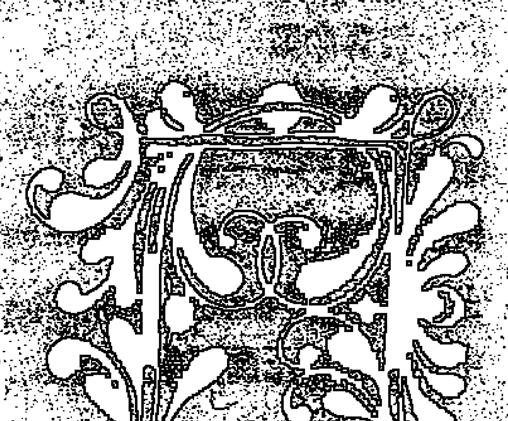

丹·米爾曼（Dan Millman）◎著  
柯清心、邱紫頤、許韶玲◎譯

# 目錄

前言——7

## 生命的意義

+   前言：畢達哥拉斯的遺贈——12  
如何計算命數——14  
決定生命數字的步驟——15  
命運之路——25  
數字的含義——27  
主要數字探究——32  
主要數字的正面與負面觀點——36

## 生命議題與能量

+   前言：了解之橋——54  
1 創造與自信——55  
2 合作與平衡——65  
3 表達與敏銳——74  
4 穩定與程序——83  
5 自由與規範——95  
6 遠見與接納——107  
7 信賴與坦誠——118

# 目錄

+   8 富足和權力——129  
9 正直與智慧——140  
0 內在稟賦——151

## 命運之路

+   前言——156  
創造與自信——157  
19/10——158  
28/10——167  
37/10——176  
46/10——184  
雙倍的創造與自信——191  
29/11——192  
38/11——201  
47/11——209  
合作與平衡——217  
20/2——218  
創造式合作——227  
39/12——228

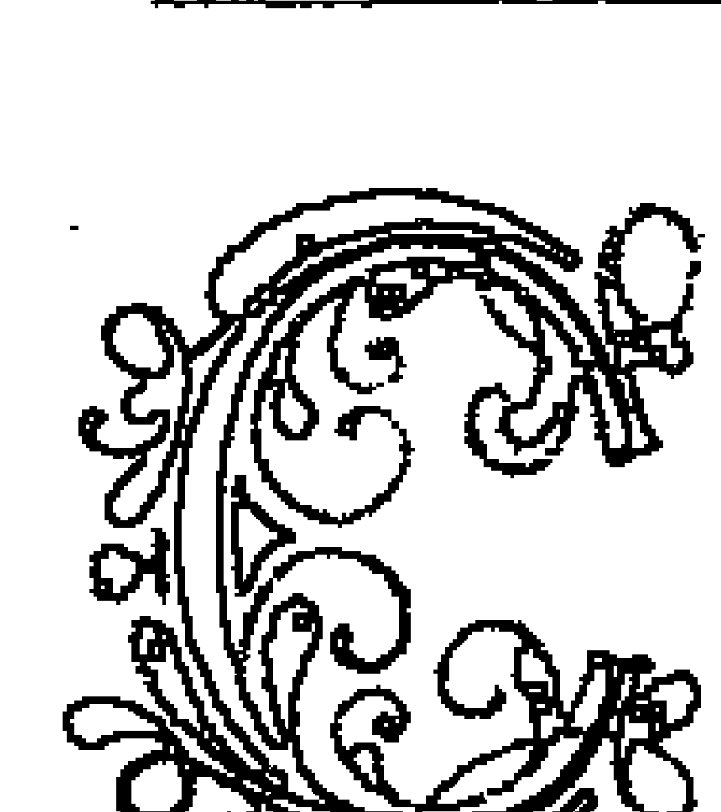

## 運用智慧

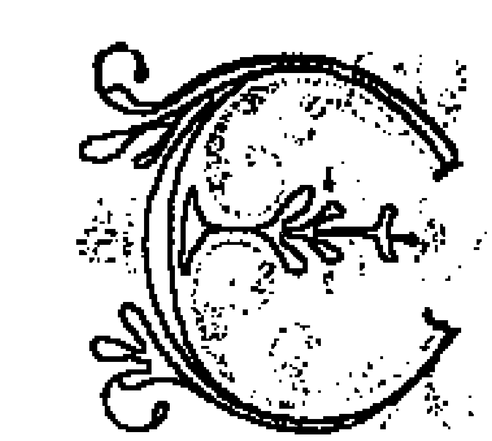

+   前言：人際關係與生命韻律——544  
人際關係之能量——546  
九年一輪——564  
推算你處於哪一個循環——568  
結語——574

# 前言 7

人生法則指出人生之路

> 眺望未來，回首前塵，  
與當下相比，皆微不足道。  
向內追求，奇蹟自現。  
～梭羅

人不論各行各業，天生就懂得追求意義、方向和目的。這種追求人生意義的驅力對心理成長非常重要，就像人不能不吃飯一樣。

雖然許多人並未自覺到生命確實存在某一個特定意義，但生命藉著夢境、直覺和內心深處的渴望，傳遞了這個訊息。內心的驅力和潛力證明了命運在召喚我們。這些驅力形成了我們的事業和人際關係，影響了人生品質與方向。

除非我們體認到生命背後的意義，否則人生就像缺角的拼圖，隱約感覺人生似乎有某種意義，卻不知究竟是什麼。我們工作、休息、吃飯、睡覺、賺錢、花錢、享樂、受苦，卻搞不懂一切所為何來。

數年來，筆者撰寫數本書，皆闡揚以和平戰鬥法追求人生——以勇氣、愛、智慧來面對內心戰鬥，本書使這一系列有關人生意義的作品呈現完整面貌，協助讀者澄清並充實人生意義——本書也是一張地圖，揭示人生之山的途徑，指出直達巔峰的捷徑。

本書拓展自我認知及對他人的認知，也增進心理醫師、內科醫師、物理治療師、自我健身者、社工、教師、教練等人之效率。

自1985年起，筆者與世界各地數千名人士一同運用、測試及改進這套方法，這套方法的好處是簡單而且證明有效，各方熱烈的反應興起我撰寫本書之動機。

性格分析方法多半依循心理傳統和精神傳統。自我分析能引發自我改變的衝動，本書則提供自我改變的方法。誠如地上萬物皆依重力法則而動，宇宙也有法則，本書即是提供生命的法則，使我們更健康、人際關係更圓滿、工作更順心、人生更快樂。

這些法則不僅是規定、建議、或道德規章，而是呈現出更高等的秩序（例如我們可以宣稱重力不合理或不道德，但重力法則依然為真）。生命法則通過歷史驗證，因爲它首尾一致，既深且遠，筆者稱之爲精神法則或宇宙法則，運用時即可窺見其強大力量。

精神法則不需仰賴任何信仰（不管你相不相信重力，重力依然在運作），因此不論精神法則是否爲上帝所創，或僅僅反映宇宙之機制，皆無損於它改變人生的能力。

精神法則無法勝數，小至原子，大至銀河星雲之結構、力量和模式，無所不轄——花朵如何綻放、爲何向光生長、浪潮如何拍岸等等。筆者特將與人生最直接相關、最必要的法則列出，包括：

+   • 靈活  
• 選擇  
• 負責  
• 平衡  
• 程序  
• 模式  
• 規範  
• 完美  
• 當下  

• 不論斷人  
• 忠貞  
• 期許  
• 坦誠信賴  
• 天道  
• 直覺  
• 行動  
• 循環  

上述法則十分實用，是開啓不同門扇之鑰，可滿足不同需求。發掘最重要的人生法則之前，須先找到人生的道路。

《生命數字全書》照亮我和許多人的生命，帶來更清明、詳和、慈悲為懷的人生。人人有自己的山峰要爬，筆者相信本書將賦予你新的人生視野、同理心，使世界更美好。願此書引導你走向充實人生——完成你的使命。

丹·米爾曼

## 第一部

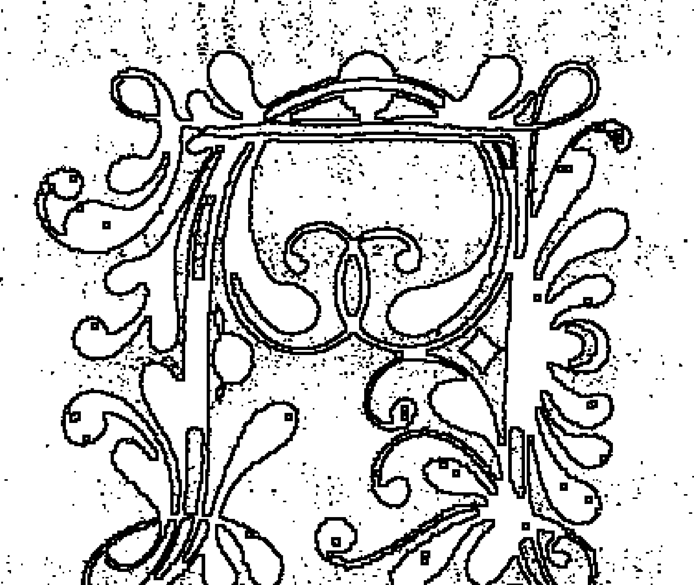

## ·生命的意義·

> 如果不知駛向哪個港口，不管什麼風皆非順風。  
～羅馬政治家、哲學家、悲劇作家塞尼加（Seneca）

幾世紀以來，喜歡觀察人性的好奇人士總是不斷地在尋求形成人類性格力量的共通處，以求更了解形成人類性格的力量。從心理學與神秘學的傳統中，在不同的文化與時代中發展了許多工具，這些方法以及某些「意識的圖象」，代表我們人類嘗試表現出，宇宙和人類心靈都不是隨機或混亂的，而是有一定的架構與秩序。

基於同樣的理由，這本書揭露了「生命目標系統」，這是個清楚而客觀的方法來釐清生命的目的。這套生命目標系統的最早起源是個謎，不過，真要追溯的話，古希臘的畢達哥拉斯學派，可以說是最早的起源。

畢達哥拉斯以數學家聞名，是幾何學的創始者，依據世界書籍百科全書的記載，畢達哥拉斯的教誨是，數字是所有事物的本質，他建立了數字與和美德、顏色，以及其他事物神秘的相關性。他同時宣導人類的靈魂是不朽的，或許這是他在東方遊歷過後得到的觀念。他建立了一個學派，大英百科全書的解釋是：「畢達哥拉斯學派，雖然本質上具有宗教性，不過學派形成的原則直接影響到柏拉圖與亞里斯多德的思想，或許可以這麼說，畢達哥拉斯大部分的智慧遺產應該得自於神祕學的智慧，基於科學研究。」

就像其他神聖的思考者一般，畢達哥拉斯擁抱人類意識的許多面向，如同現代的物理學家一般，進入神秘主義者、哲學家，以及神學家的領域。他談到周期、模式、能量波，這些是人類文明初期存在的資產，同時也是在我們的生命經驗的途徑中反射出來的偉大而不朽的法則。這些法則都暗藏在神秘與存在的機制裡，在探究形式和頻率的基礎，畢達哥拉斯發現了過去不曾發現的秩序：心靈與物質間的關係，他認爲一些數字模式可以作爲打開心靈之窗秘密的鑰匙。

許多研究數字命理的人都尊畢達哥拉斯爲數字分析的始祖，雖然生命目標系統很像數字命理學，都是從數字中推論出有意義的資訊，我個人認爲，生命目標系統是我研究過的方法中，最清楚、最集中、最精確的實用法則。

我不會聲稱生命目標系統是基於傳統科學或邏輯，我也無法理性地解釋在西曆上的出生日期爲什麼會揭露出有效而可靠的生命目的，我只知道，這套系統經過多年的經驗嘗試的確深具效果——的確幫助人類生命找到焦點。

或許生命目標系統的效力是從宇宙的全觀（holographic）的本性而來，每一個部分都反射或含有整體，亦即個人的心靈都會符合較大系統的規範，在把複雜的變數變成基本的模式，這個系統牽引出我們人格背後的潛在力量，替我們提供了一面明鏡，讓我們看見生命中更大的藍圖。

在第一部分，你會學習到如何決定及開始解釋生命目標系統的關鍵：生命數字。

### 決定生命數字

> ——出生時父母給了我們名字，宇宙則給予我們一個數字

生命目標系統是利用個人的出生日期來決定生命數字（birth number），由三或四個數字所組成，再將其轉換成有意義的資訊，藉以解讀個人的生命目標。由生命數字所透露的訊息，並運用與此數字相關連的心靈法則（spiritual laws），我們可以改變自己的命運。

這種程序很簡單。任何人都可以在幾秒內根據六個基本步驟，將數字相加（像2+1+4+5）而計算出自己的生命數字。

#### *決定生命數字的步驟*

+   1. 確定你的出生年月日。  
   - 以我自己的生日為例：西元1946年2月22日  
2. 把生日日期寫下來。  
   - 任何順序都可以，如果為求一致，就先寫月分，再寫日期，最後是年份，所以是2-22-1946。  
   - 寫下完整的西元年份（不要簡寫） 2-22-1946  
   - 在數字間用連接符號銜接，不要用斜線。  
   - 月份用數字表達  
     1 一月  5 五月  9 九月  
     2 二月  6 六月  10 十月  
     3 三月  7 七月  11 十一月  
     4 四月  8 八月  12 十二月  
3. 將每位數字相加，包括零；最後計算出總數。  
   例如：2-22-1946  
   就是：2+2+2+1+9+4+6=26  
4. 你會得到一個加總的數字，再將每位數字相加，得出最後的數字。  
   +   • 例如26，2+6=8  
   • 如果你的總數是以零結尾，像20、30或40，加總的方法仍是一樣，即2+0=2。  
   • 假設你是生在二十世紀，你最後的數字一定是在2、3、4、5、6、7、8、9、10、11、12的範圍裡面。

將第三步驟所計算出來的總數寫下，後面再寫上第四步驟所計算出來的數字，兩者之間加上斜線。

+   • 以我的例子來說，就是寫成：26/8  
• 我會把將斜線右邊的數字（如26/8的8，或39/12中的12）視爲右邊或最後數字（final numbers）。

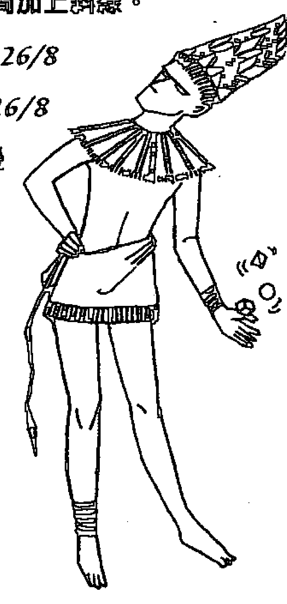

#### 重點提示

+   • 當你把數字加在一起時，零與其他數字的算法一樣，舉例來說，生日為2-20-1946的人，計算方式為：  
     2+2+0+1+9+4+6。  
   • 依據生日的日期，最後你會得出三或四位數：  
     ※三位數字：21/3，27/9，30/3，32/5  
     ※四位數字：28/10，29/11，38/11，48/12  
   • 左邊數字歸斜線左邊，右邊數字歸斜線右邊。  
   • 雖然斜線左右邊的數字所代表的能量都有某種程度的意義，但是斜線右邊的數字對生命目標有較大的影響。

#### 其他生日日期與生命數字舉例

+   • 1932年10月8日，書寫成10-8-1932，變成1+0+8+1+9+3+2=24；再把2和4相加：2+4=6，最後得出生命數字：24/6  
   • 1969年5月29日，書寫成5-29-1969，變成5+2+9+1+9+6+9=41；再把4和1相加：4+1=5，最後得出生命數字：41/5。  
   • 1973年11月7日，書寫成11-7-1973，變成1+1+7+1+9+7+3=29；再把2和9相加：2+9=11，最後得出生命數字：29/11。  
   • 1954年8月29日，書寫成8-29-1954，變成8+2+9+1+9+5+4=38；再把3和8相加：3+8=11，最後得出生命數字：38/11。  
   • 1929年9月18日，書寫成9-18-1929，變成9+1+8+1+9+2+9=39；再把3和9相加：3+9=12，最後得出生命數字：39/12。  
   • 1942年1月30日，書寫成1-30-1942，變成1+3+0+1+9+4+2=20；再把2和0相加：2+0=2，最後得出生命數字：20/2。  
   • 1944年6月24日，書寫成6-24-1944，變成6+2+4+1+9+4+4=30；再把3和0相加：3+0=3，最後得出生命數字：30/3。  
   • 1973年9月29日，書寫成9-29-1973，變成9+2+9+1+9+7+3=40；再把4和0相加：4+0=4，最後得出生命數字：40/4。

#### 常犯的錯誤

+   - 月份的數字算錯（如應該是九月份，卻記錄成8）  
   - 忘記把所有兩位數字拆成單一數字來相加。舉例來說，1938年6月10日，有人會誤算成6+10+1+9+3+8=37，正確的算法是6+1+0+1+9+3+8=28。  
   - 還有人把年分簡化成兩位數。像1963年3月5日，書寫成3-5-63，計算起來就變成3+5+6+3=17，正確計算應該是用四位數字：1963，所有數字加總是3+5+1+9+6+3=27。  
   - 最後忘記重新驗算是不是正確。雖然程序相當簡單，有些人還是會粗心大意。

下面的練習將會幫助你熟練這個方法，不但幫自己決定正確的生命數字，還可以替別人做正確的計算。

#### 範例練習

根據前面解釋的步驟，把以下的出生年月日計算成生命數字。可以先利用鉛筆、原子筆和紙，當你完全熟練以後，就可以直接心算。

+   a. 1938年1月24日  
   b. 1872年2月13日  
   c. 1908年3月30日  
   d. 1989年4月2日  
   e. 1945年5月10日  
   f. 1960年6月19日  

#### 看看你算出來的答案：

+   a. 28/10  
   b. 24/6  
   c. 24/6  
   d. 33/6  
   e. 25/7  
   f. 32/5  
   g. 29/  
   h. 22/4  
   i. 39/12  
   j. 17/8  
   k. 16/7  
   L. 30/3

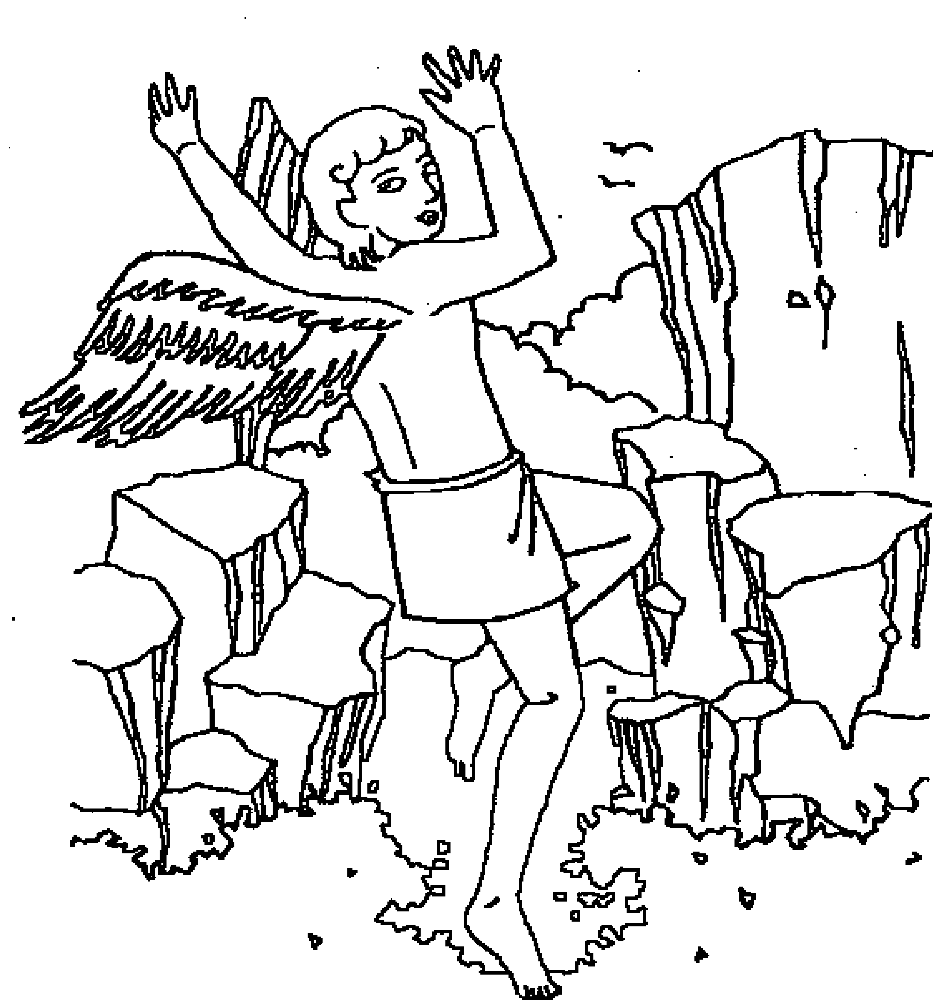

#### 本世紀可能的生命數字

隨著世紀不同，生命數字也有所變化。下表列出二十世紀可能的三十七組數字。

| 12/3 | 20/2 | 30/3 | 40/4 |
|---|---|---|---|
| 13/4 | 21/3 | 31/4 | 41/5 |
| 14/5 | 22/4 | 32/5 | 42/6 |
| 15/6 | 23/5 | 33/6 | 43/7 |
| 16/7 | 24/6 | 34/7 | 44/8 |
| 17/8 | 25/7 | 35/8 | 45/9 |
| 18/9 | 26/8 | 36/9 | 46/10 |
| 19/10 | 27/9 | 37/10 | 47/11 |
| 28/10 | 38/11 | 48/12 | |
| 29/11 | 39/12 | | |

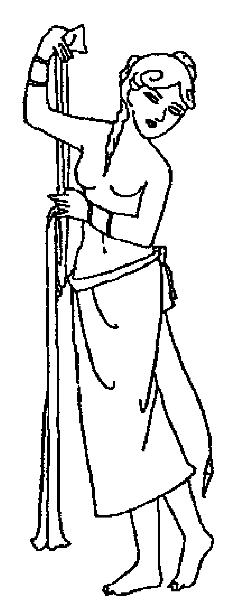

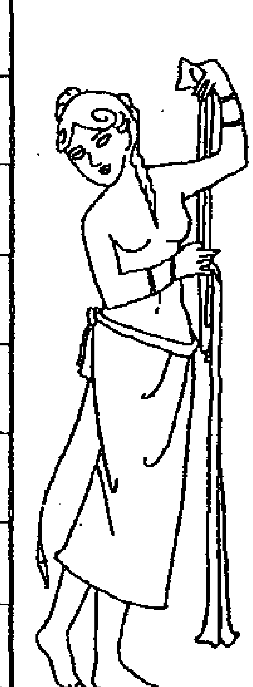

在某個特定的時代裡，有一些生命數字出現的頻率會比較高，這三十七個數字中，排在中間數字的人數通常比較多（像 28/10， 29/11，30/3等），反而是剛開頭或收尾的數字，在人群中出現的機會比較低，以12/3和48/12兩個極端為例，12/3是一位出生在1900年1月10日的人的生命數字，1999年9月29日，這一天若是有人出生，他的生命數字就是48/12。

#### 標籤化的危險

當你以尊重的態度了解生命數字時，它可以幫助我們自己和他人全盤了解生命經驗與潛能。但是就語言層面來說，我們常常抄捷徑，企圖簡化或精簡複雜的議題以及個性問題，以便能迅速地理解其中的含義。不過，我們有時候會輕重不分，將個人潛能與生命數字劃上等號，就像是用名字簡化一個人的身分。我們常說：「我是艾伯特。」或「我是羅伯特。」我們也可以說：「我是26/8。」或「我正在朝30/3努力。」我們常不知不覺中將複雜的身分認同簡化為數字標籤。

我們應該避免利用單一的數字解釋自己的生命。千萬記住，生命數字只是引領我們了解關鍵難題與潛能的一盞明燈；他們無法解釋我們是誰。

只有當我們認清標籤或類型的使用極限，才能有效地運用它們。所有的山嶽都很相似，因為它們都有共通的山嶽特質（mountainhood）。但是風、水、地層運動和時間，對每座山的影響力不盡相同，因此世上沒有兩座山是完全一樣的。約瑟（Jose）、貝緹娜（Bettina）、Hiroko、瓊安（Johann）可能都有相同的生命數字及生命路徑，但是還有其他的因素，如性別、文化、社會角色、基因遺傳、親子經驗、體型、外表價值、信仰以及興趣等會影響到他們各自的生命歷程。

#### 影響的程度

我們的生命數字揭露了關於生命目標的潛藏意義。這些生命數字所代表的能量構成了我們的生命結構，猶如一幅畫的顏色對整幅構圖產生的個別影響，或是交響樂團中的樂器製造出某種獨特的聲音。有些顏色在畫布上就比較搶眼，而有些樂器則會主導我們的交響樂章。

在這個體系中，每個數字在生命數字的順序或位置決定了它的影響程度，斜線左邊的數字影響比較小，斜線右邊的數字影響比較大。

如果1到9的數字都代表不同的顏色，那每一個生命數字將會由不同的顏料所組成，斜線左邊的顏料比斜線右邊的顏料所產生的影響來得少。生命數字代表內在天賦，如果出現零，表示沒有顏料，這反而加強了其他數字的能量。我們提供37種不同的生命途徑給生於二十世紀的所有人們。

## 等待攀爬的高山：命運之路

——在生命的旅程中，  
我們不斷邂逅戴著上千副面具的自己。  
～榮格

以純數學的角度而言，生命數字可以顯示出構成個人生命路徑（life path）的特定能量組合。這個路徑不只可以領導我們前進，而且引領我們向上提升，象徵我們應該攀爬的高山。在斜線右邊的生命數字代表山頂——也就是我們的主要生命目標。為了到達山頂，實現個人的命運，我們必須穿越最左邊的數字，善用這些數字所代表的難題和能量，使自己漸臻成熟。

我們的生命是一條通往重大發現的山路：我們的生命目標其實不容易達成。這樣的陳述暗示著，雖然生命本身不須經歷不必要的掙扎，但這世上仍存在著許多的挑戰與試煉。在個人演進的山間路徑中，我們努力地實現自己的生命目標，不斷地抵抗阻礙我們達成生命目標的負面意向。要攀爬至山頂必須具備無比的勇氣、承諾與努力。如果我們準備好攀登，整個過程就會輕鬆一些。但不論怎麼說，我們仍須努力的攀登高峰。

我們並非從高峰開始攀登，而是從山底開始，我們經歷了童年、青少年時期以及成年期的攀登後，開始面臨一段準備，

## 生命數字全書 27

備自由的意志，而我們人生的路徑是否早已注定。在出生的那一刻，我們就被賦予一座內在的山峰，這就是天生注定。但至於我們要怎麼爬以及我們什麼時候去爬則是操之在我，完全取決於自由意志。換句話說，我們被分配到其中一座遊樂場，但可以自行決定如何玩遊戲。我們擁有選擇、規範、責任以及承諾的權力。沒有一個人的人生路徑比他人要困難、簡單、幸福或不幸，這完全取決於我們如何攀爬。

支持、教導或是指引他人處理類似的難題，可以使我們在人生路徑上更上一層樓。潛意識中我們很明白這一點，因此我們常常教授別人我們最需要學習的事情。

最後，當我們到達高山之巔時，才豁然地發現這不是旅程的終點，我們並非到達了生命的目標，而是超越了它。換句話說，當我們到達山巔之後，我們仍將繼續地往上攀升。

### 數字的含義

生命目標系統，就像其他新的「觀看」方法，需要一些時間來學習，我們不妨慢慢地，從生命數字中開始了解相關的生命議題。

### 生命目標——主要數字所代表的能量與含義

+   1. 創造與自信  
2. 合作與平衡  
3. 表達與敏感  
4. 穩定與程序  
5. 自由與規範  
6. 遠見與接納  
7. 信賴與坦誠  
8. 豐足與權力  
9. 正直與智慧  
10. 內在稟賦  

當我寫1號人、2號人、3號人時，代表個人必須加強右邊數字或主要數字（也就是他們的生命目標）所指向的特定能量。舉例來說，對於3號人來說，包括生命數字為12/3、21/3和30/3的人，主要數字為3的人就是他們生命中的主要挑戰以及更深層的生命目標，對於其他生命數字中含有3的人，影響則比較低。

至於右邊數字是10（19/10、28/10、37/10和46/10）、11（29/11、38/11、和47/11）以及12（39/12和48/12）的人，最右邊的兩個數字共同形成他們的主要生命目標。也就是說，10這個數字包含了創造力和信心（1）及內在天賦（0）。11等於結合兩個1，而12則是創造力與信心（1）與合作和平衡（2）的結合，形成更為強大的挑戰與力量。

其實不論我們的生命數字為何，我們都與數字1到9的各項難題有所關連，每一個人也都有能力發揮內在的天賦（0）。不過，長期來看，我們的生命數字產生的影響比較深遠。

我們特定的生命數字代表生命路徑上特有的潛能與特殊的挑戰，指引我們如何去挖取自己的寶藏，實現生命目標。

### 難題、阻礙與機會

我們的生命數字代表某項難題和潛力。在我們發揮潛力以前，必須先解決某些衝突。完成生命目標是不容易的事，許多生命數字為1的人一開始就不相信自己有創造力；生命數字為2的人則因過度合作而退縮；3號人則在表達感情方面有困難；4號人則缺乏穩定度，而且忽略過程；而5號人則感覺不自由，看起來很有規範；6號人則是難於接受自己，同時也愛評斷他人。而7號人則無法接受自己與評斷他人；8號人則對物質的豐饒與權力有矛盾的感受；而9號人，則是無法長時間維持一致性。

我們擁有學習各種才能的途徑，沒有一種主要數字可以獨霸一種特殊的性質。舉例來說，1並沒有獨占創造力的才能，3也不能專有表達能力；8也不會獨享資源豐盛與權力，由於我們的生命數字常常指出我們必須克服的障礙，沒有某個特定數字的人，比起擁有此特定數字的人在此數字所代表的難題上面臨較少的障礙。

生命數字由於植基在達成命運的深層心理需求，反應出內在的潛力。生命數字相關的內在驅動力，是源自於潛意識中害怕成功的恐懼—害怕濫用我們想表達的東西。這種在驅動力與恐懼感所形成的動態緊張關係，構成我們生命的全部。

換句話說，我們都有一個生命目標的上坡要爬，當我們爬上山峰，真的達到目標以後，我們能夠將生命數字的能量發揮到極致，以正向的方式呈現。一旦我們被賦予特定的山徑，我們也有能力去完成旅程。雖然我們剛開始是起於泥淖，我們最後還是可以升上天堂。

以約瑟夫格林斯坦為例，在愛德史班曼的書《萬能的原子》中，格林斯坦在母親懷胎六個月的時候就出生，體重只有三點五磅，他的母親把這個幾乎無法呼吸的小生命放在一個小盒子中，只有棉花和滴管陪伴他，醫師們預測這個孩子無法活下去，但格林斯坦攀爬上生命之樹，脆弱得成長下來。到了十四歲，他又再度病重，母親帶他去看醫師，他聽到醫師對跟媽媽說，這個孩子罹患先天性的氣喘病，很可能在十八歲時離開人間。

回家的路上，他和媽媽經過一個帳棚展示場，這個孩子看

## 生命數字全書 31

見了一張海報，內容是一個叫做伏蘭寇冠軍（Champion Volanko）的強人，這個伏蘭寇先生就是日後把格林斯坦從一個衰弱的少年變成「萬能原子」——歷史上最強壯的人。這個少年不只打破了醫師的預言，同時也成功挑戰了生物、生理及物理的法則，在史班曼蒐集的報導指出，約瑟夫可以咬穿鐵軌，甚至用一拳把鐵軌木打成硬木，他也曾經用一根頭髮綁住一串鍊子，在跑道上擋住一架正要全速起飛的客機。這個原本瘦弱帶病的男孩變成一個現代的海克力斯，他戲劇性地證明人們如何克服眼前的障礙與任務以實現命運的潛力。

當我們找到生命路徑，並且決心要去實現，我們會找到朝向山峰所需的靈感。當我們要清除路上的障礙，還必須有難得的經驗智慧做武器，才能實現我們的生命目標。

+   1. 是顯示創造力與信心。  
2. 是完成平衡的外交官任務。  
3. 提升表達能力與敏感。  
4. 專注在達成目標的過程。  
5. 經由規範找到內在的自由。  
6. 看見寬廣的視野，並且接受世界的內在完美性。  
7. 打開自己和別人的信仰起點。  
8. 為了完成更高尚的目的，使用豐富的資源與權力。  
9. 成為擁有高度整合與智慧的典範以啟發他人的生命。

## 主要數字探究

當我們持續介紹能量、難題以及每個數字的意義時，請記住這個數字所隱含的力量和能力可能很明顯，也可能忽明忽暗。因為像家族歷史、個人習慣，及自我價值都會影響我們生命中操作的能量。

### 代表創造與自信

當能量毫無阻礙，就會自然地流動形成創造力，這種能量的豐富性可以使1號人在任何領域中均能產生創造力。這種能量就像洶湧的大河，需要流動與表達，並可以修正因為錯置而產生的沉溺行為。

### 代表合作與平衡

數字2的能量使得這些人具有毅力與支援合作的特性，但首先他們必須釐清自己的極限以及責任範圍，他們常常會幫忙過度，然後退縮。他們必須學習避免被奴役的極端現象，以免造成事後的憤恨與反抗。

### 代表表達與靈敏度

數字3的生命數字需要替世界帶來建設性的情緒表達，把3號人的情感與理念用最直接、最正面，最誠實的方法分享出來。他們需要找到適切的方式去應用他們的敏感與表達能力，以便提升生命，

### 代表穩定度與程序的貫徹力

不管是建造房子或其他事情，4號人必須要了解一個成熟而穩定的基礎是成功的開始，爾後伴隨的是耐心執行的過程，直到完成理想。當4號人具備彈性的平衡感以及直覺式的分析能力時，就可以達成任何目標。

### 代表自由與規範

5號人重生的功課是經歷一連串直接或感同身受的經驗以尋求自由。這使得他們內心負荷過重，他們此生的目的是經由規範與壓力達成深度的經驗。5號人會在依賴與獨立的兩個極端中擺盪，直到找尋內在的自由為止。

### 代表遠見與接納

6號人對美感、純潔與高尚具有理想的觀感，是藉著如何評斷自己、他人與世界而鍛練出來，學習這些的目的是為了了解更高尚的或先知的完美，而這些特質其實就存在於萬事萬物中。接受現有的萬事萬物後才能朝高遠理想邁進。

### 代表信任與開放

7號人天生心智敏銳，能夠讀出弦外之音，他們傾向享受地球、海邊、花朵、清風，天空的外在世界。他們信任智慧，並且深愛內在的自己——信任靈性能夠從「隱藏」中開放出來。

### 代表豐足與權力

大部分的8號人不是努力爭取金錢，就是努力獲得權力，享受控制、權威或是他人的認同。在這種金錢權位的範疇中，他們享有最大的挑戰與最大的滿足。8號人學習如何主導豐富物資與權力，最後目的不是為了自己，而是為了另一個更高尚的目的。

### 代表正直與智慧

9號數的生命目的是要做最高度的整合，事實上，9號人常用最高標準，作為他人的典範。由於天生的領袖魅力與氣質，他們常常被放在領導的位子，成為那些缺乏整合、平衡與智慧的人景仰的目標。

### 內在天賦

像敏感、毅力、表達能力、直覺，都是我們可以向內追尋的資源，對生命數字中有0的人們，更有潛力去感受到這種內在的力量。（19/10，28/10，37/10，46/10，20/2，30/3，40/4）這些人更有能力接近自己的生命目標，強化生命目標的能量。舉例來說，30/3有0號人的表達與敏感能量就特別強。由於達成生命目標任務不易，因此在內在特質成熟之前，帶有0數字的人往往會遭遇到許多問題。

### 了解的關鍵

——每一個人有自己的性格，沒有人和我們一樣，也沒有人的行為舉止和我們一樣。  
~William Ellery Channing

現在我們已經介紹數字1到9的基本能量與本質，包括0。我們現在從另一角度來探討：每一個主要數字所代表的能量與難題都有可能朝向正面發展（建設性力量），或是朝向負面發展（破壞性力量）。因此，兩個擁有同樣生命數字的人，會有不同的人生，如果一個是正向發展，一個是負向發展，結果當然是大相逕庭。

舉例來說，生命數字為26/8的人可能無法和其他人合作（這是2的負向發展），他們可能會因為過於完美主義（6的負向發展）而容易受到阻礙、感到挫折和失意，同時也會因為對於豐富和權力的負面思想與潛意識的恐懼，而造成窘困的財務狀況。而其他26/8的人也可能和別人合作愉快（這是2的正向發展），感激別人並且把事情做到完美為止（這是6的正向發展），同時達到一定的富足和影響力（這是8的正向發展）。

先前的例子顯現兩種極端，有時候我們在某些方面會展現出生命數字的正向發展，但是在其他方面卻展現出生命數字的

## 第一部分：生命的意義 36

負向發展。因此我們很容易在一群有著相同生命數字的人身上看到不同的發展。

沒有一個生命數字或生活目標，生來就比其他數字好或壞。每一種都呈現獨特的力量和阻礙。重要的不是我們採取哪個路徑，而是我們如何旅行，換句話說，我們的焦點應該是生命數字如何朝向正面或負面發展。以下有一張表，列出各項生命數字的正向與負向發展。

### 主要數字的正面與負面觀點

#### 1 創造和自信

正向：將能量與靈感轉化為創造力與服務精神；相信自己。  
負向：感到阻礙、沉滯、挫折，覺得自己很差勁、有病、倦怠、不安全，容易沉迷。

#### 2 合作與平衡

正向：清楚自己的能力範圍與限制，以平等的態度支持他人或自己。  
負向：容易崩潰、反抗和反應過度；常會過度幫忙，卻又突然退縮。

#### 3 表達與敏感

正向：誠實地表達自己，善於精神性、感性與愉悅的溝通。  
負向：感覺沮喪、失望、過分敏感、常常抱怨與批評，對自己充滿懷疑。

#### 4 穩定與過程

正向：準備周全，有耐心地按照步驟執行，在理性與感性間取得平衡。  
負向：妄想一步登天，跳過許多步驟、野心勃勃、沒耐性、困惑、缺乏從頭到尾的執行能力或穩定度。

#### 5 自由與規範

正向：利用多方面的天賦而又能集中焦點，有規範地培養獨立精神。  
負向：在依賴與獨立兩個極端中搖擺不定，一心多用，吹牛並虛僞。

#### 6 遠見及接納

正向：能夠以宏觀角度評估，寬恕而忍耐，工作傑出但不算完美主義，能接納自己和他人。  
負向：吹毛求疵，用完美的標準去評判自己和別人，迷失在細節裡。

#### 7 信任與開放

正向：信任最內在的感情，因爲信任他人而開放心胸，勇於與別人分享感覺與情緒。  
負向：感到痛苦、背叛、偏執、心智全都用在防禦別人，不信任別人也不信任自己。

#### 8 富足和權力

正向：享受富足，而且發揮影響力（沒有濫用或刻意），明智而慷慨地與周圍的人分享幸福。  
負向：害怕卻又執迷於金錢、權力、控制和名聲，常常傷害自己。

#### 9 正直與智慧

正向：個人的生活與高尚原則（靈性）達成一致，有深度與智慧，成爲大家的典範。  
負向：沒有高尚目標；感覺孤單與隔絕；受困於理智，忽略內心與直覺的指引。

#### 0 內在天賦

正向：善於利用感性、毅力、表達能力以及直覺，為高尚的理想服務他人。  
負向：過於敏感、緊張、固執、諷刺、刻薄，常會爲了內在情感或直覺而迷惑。

### 負面特質

+   ★ 1 是最佳沉迷者  
★ 2 是最佳相互依賴者  
★ 3 是最佳顛狂抑鬱者  
★ 4 是最佳猶疑不定者  
★ 5 是最佳依賴者  
★ 6 是最佳完美主義者  
★ 7 是最佳偏執狂  
★ 8 是最佳消極野心者  
★ 9 是最佳狂熱份子

### 正面特質

+   ★ 1 是最有原創性的藝術家  
★ 2 是最佳外交官  
★ 3 是最佳演說家  
★ 4 是最佳分析者  
★ 5 是最佳探險家  
★ 6 是最佳裁判  
★ 7 是最佳學者  
★ 8 是最佳慈善家  
★ 9 是最佳領導人

### 轉化中的能量：從負擔到力量

每種數字都有從負向（負擔）到正向（力量）的特質區。

+   ☆ 1 號人從不安全感與沉迷中，轉向創意與自信。  
☆ 2 號人從相互依賴與憤恨，轉向平衡與社交能力。  
☆ 3 號人從抑鬱轉向熟練的表達與本能。  
☆ 4 號人從不定性與猶豫不決轉向可靠性與組織力。  
☆ 5 號人從故作嬉鬧與依賴別人中，轉向精明幹練與自我依賴。  
☆ 6 號人從失望與批評，轉向開闊的視野與接納一切。  
☆ 7 號人從偏執與孤立轉向洞察力與開放。  
☆ 8 號人從自我欺騙與機會主義轉向生產力與慷慨。  
☆ 9 號人從偽善與狂熱轉向整合與智慧。  
☆ 0 號人從內在恐懼與敏感轉向和諧與服務。

### 我們所配戴的面具

我們的內心感覺—包括潛意識的動機、慾望以及恐懼，並不會顯露於外。大部分人都會發展出一種人物角色（persona）或是社會面具（social mask），我們外表所顯現的往往與內心大不相同，甚至完全相反。這種面具常常會令人誤解，使人們很難真誠地與他人交往。這些面具對我們的健康、人際關係與工作都有明顯的影響。

每一個主要數字都透露出某種內在特質，也使我們的生活增添了許多色彩。然而，我們所戴的面具卻與我們的內在真實有很大的出入。

很多1號人表現得自信、冷靜，甚至冷漠。其實，他們內心有強烈的不安全感。他們的競爭本性是源自於害怕輸人的恐懼。表面上很獨立，內心卻害怕自己無法成功地完成一件事。

2號人在別人眼中，可能是平衡而具有分析能力的，但其實內心有著極大的矛盾與理智衝突。當他們說不時，可能表現得非常堅決，事實上內心正極力抵制著說是的壓力，他們往往出於內在的責任驅使而喜歡挑剔他人。

3號人則是用自信、樂觀的假象來掩飾自我懷疑及沮喪的心，他們往往顯得知性，表現得很有邏輯、很有智慧，以隱藏敏感的情緒。

4號人看起來好像任何事都了然於心，然而在他們冷靜又具分析性的外表下，卻藏著一顆蠢蠢欲動的心，常常會做出衝動的決定，這是因為他們內心的困惑因而失去了方向。

5號人看起來獨立，不過他們實際上相當依賴，甚至自行創造出依賴的情境，他們做事看起來相當專注，不過也必須努力抵抗分散的傾向；他們的知識廣博但不深入，因為他們內在渴望許多經驗，同時也害怕無聊。

## 第一部：生命的意義 42

6號人外表冷靜、微笑、溫和、體諒，總是做出正確的抉擇，但是他們的內在卻以極為嚴苛的超高標準評斷自己與他人，內心對於世上的錯誤與失誤感到憤怒和失望。

7號人非常相信他們自己，憑直覺做決定，很少向他人徵詢意見，但他們的篤定卻是來自內心深處對自己的不信任。他們的確定與快速的思考是為了保護自己的隱私與內在世界。

8號人總是表現出極力避免或乾脆放棄權力，但實際上卻對權力念念不忘。他們的行事做風看起來非常被動，這是為了壓抑自己對權力、名聲、影響力和成功的野心。

9號人天生有深度以及像磁場般的群眾魅力，堅持己見以掩飾對自己定位以及他人評價的不安全感。由於時常位居領導地位，因此無法依照他們所相信的或向外追求的高標準行事。

上述的內容簡潔地描繪出大概的重點，雖然不見得正確地套用在每一個人身上，但卻說明了我們內心的生命難題與恐懼，不會表露於外。

如果我們想要超越，就必須認清並且面對我們內在的難題。我們的社會面具的確幫助我們在他人面前呈現最好的一面，但只有我們接受了面具背後容易犯錯和脆弱的那一面，我們才能真正的理解並且認同自己最深的需求、期望與人性。

當我們逐漸完整並且了解，我們可以表露並整合自身所擁有的特質；我們會發現生活並不是只有正面或負面而已，而是兩者兼有。有了這樣深切的認識後，再加上勇氣與洞見，人們就可以自行選擇所希望展現的特質，而非只是被動地反應。

### 難題順序

現在，我們學習到生命數字代表的難題與潛力，每個數字的影響力大小是看其所處的位置，而位在右手邊的數字影響最大。

生命數字對我們的影響的順序，是由左到右，由負向到正向。在童年時期，我們生活主要以左手邊的數字為主，同時我們在人生的山峰不斷向上攀爬，沿途面臨許多挑戰與機會，不斷地犯錯與學習。右邊的數字代表的是生命中的高峰，而左手邊的數字則是比較小的山峰，在我們向高峰挑戰前，必須經過這段磨練。舉例來說，生命數字為26/8的人一定得學習與他人充分合作（2），並且經過完美主義與自我價值的歷練（6），才能真正擁有豐富與他人的肯定（8）；同樣的，生命數字為29/11的人也必須超越2和9所代表的難題，才能夠充分擁有11所代表的創造力。

大部分的孩子在有能力掌控生命數字的正向發展以前，都會經歷生命數字的負向發展或低度發展階段。舉個例子，當馬修(Matthew)小時候面臨33/6中表達與完美主義的磨練時，常常會抱怨（3的負向發展）與批評（6的負向發展）；當成年以後，他的表達漸漸趨向正面而且帶有熱誠，同時也相當肯定自己、肯定他人。人需要相當的時間與經驗，生命數字的負面傾向會逐漸轉向正面。

換句話說，我們唯有經歷從左邊到右邊的磨練過程，才能經驗到主要生命數字的正向發展。不論我們花了幾天、幾年甚至是一生，我們都得必須經過此一過程。

### 從內到外，實現我們生命的目標

為了體現我們在世上的生命目標，我們首先必須從內在創造：

- 如果我們是1號人，目標是顯現創造力與自信心，必須先從內心經驗，發於內才能形於外。
- 如果我們是2號人，目標是達成真正的合作與平衡，就必須首先達到心靈的平衡與整合。
- 如果我們是3號人，目標是與世界正面地分享自己的想法與情感，就必須先了解自己內心深層的情感。
- 如果我們是4號的人，目標是在世上建立穩定與明確的程序，就必須先運用清楚的程序建立內心的穩定。
- 如果我們是5號人，目標是達成自由與規範，就必須先運用規範達成內心的自由。
- 如果我們是6號人，目標是體現宏觀的遠景與接受的態度，就必須先學習接受現在的生活本身已經是完美狀態。
- 如果我們是7號人，目標是體驗信任與開放，就必須先信任自己，開放自己的心和生命。
- 如果我們是8號人，目標是達到豐富和力量，必須先經驗內在的豐富性。
- 如果我們是9號人，目標是顯露正直與智慧，就必須找尋內在的高尚原則。

### 生命總會給予我們所需

如果我們細心一點，就會發現生命總會提供我們必須學習的教訓。我們的生命目標也是一樣。舉例來說，某些1號人原本要學習有創意的治療，但是卻因為沒有安全感而逃避學習，最後身體上的病痛讓他們不得不嘗試一連串的治療方法。如果5號人缺乏規範，生理上的疾病就會迫使他們找到規範，並得到更大的自由與動力。我也碰到過一些6號人，可能從小身體就有某種程度的殘障，致使他們重新檢討自己的完美主義傾向，以更為宏觀的角度看待世界。而8號或9號人，可以從法院裡學習到誠實（8）和整合（9）的價值高於金錢。

如果我們把生活上碰到的「問題」當作無價的珍貴教訓時，對於這些我們原本極力逃避但卻是必要的經驗，就會以平靜而感激的心情看待這些生活中的起伏。不妨思考一下生命如何提供如此完美的環境，讓我們逐漸培養能力處理生命路徑上的難題。

### 以生命數字作為生涯規劃指導

> 才華一點也不特別，每個人都有。
真正珍貴的是遵循才華的勇氣。
～無名氏

我們都有內在的能力，有些還隱藏著尚未展現，在一個磚塊堆起的破屋中可能有著一位天才鋼琴家，而在一個家庭主婦的心中，可能藏著一位即將出名的治療師。

具有不同生命號碼的人們，常常會有一樣的職場生涯，不過他們運用的方法大不相同，主要是依據生命數字所特有的傾向與動機而定。舉例來說，像1號人會採取一種非常有創造力的方法，3號人可能具有特殊的情感表達能力，6號人可能就會專精在技術層面，務求盡善盡美。7號人在得到角色的安全感時就會願意分享自己的內心想法。

而生命數字相同的族群，也散落在三百六十五行中，你可以在名人榜(Well-known People)中找到每個生命數字的代表。舉個例子，寇克·道格拉斯(Kirk Douglas)，克勞德·德布西(Claude Debussy)，哈利·洪德尼(Harry Houdini)，亨利·季辛吉(Henry Kissinger)，布克·華盛頓(Booker T Washington)，雪莉泰普(Shirley Temple)，雷馬克立馬( Ramakrishna)，安德格・亞倫坡(Edgar Allan Poe)，沃伏岡・阿瑪迪斯・莫札特(Wolfgang Amadeus Mozart)都有相同的生命路徑(29/11)。

另外還有一個有趣的現象，生命數字為35/8的蓋瑞布塞(Gary Busey)，在一部賣座的影片中扮演巴迪霍利(Buddy Holly)，而巴迪霍利的生命數字恰巧是35/8。丹佐華盛頓的生命數字為32/5，在擔綱扮演馬康艾克斯這個傳奇人物時，表現優異，很巧地是，馬康艾克斯(Malcolm X)的生命數字也是32/5。

在某些領域中，同樣生命數字的人也會聚集在一起，像社會服務工作領域中常見2號和4號人，研究者與學者則是7號與9號人居多。不過，仍有許多因素足以影響到一個人想要的或應該追求的工作。

大部分的人會依據自我概念、自我價值、社經背景、希望的收入、教育程度、曝光率、他人的影響、信仰與價值的影響等因素選擇職業。有時候我們為了高薪工作或是社會的認同，不得不做出妥協或是犧牲我們喜歡的活動。

但是最後，我們仍希望所選擇的職業能符合內心的本能與價值，也包括個人與環境的需求。只是生命數字會凸顯某些內在的動力與天分，使個人傾向於選擇某些特定的工作。

其實，對任何一個人來講，沒有任何一個工作是完美無缺的，我們可以透過不同領域的工作經驗，獲得自我成長。像3號人可以透過朋友與同事間的友誼自我表達，或是經由表演、歌唱、政治、教育等方式培養表達能力。8號人可以取得朋友或同事的肯定，或是得到社區居民、全國人民和全球的肯定。我們的責任是讓我們最深層的動力與天分，透過任何形式的服務或職業，以最正面和利他的方式表達出來。

無論如何，判斷自己是否滿足於現職以及工作上是否成功，不在於工作的性質或項目，而在於我們是否能夠克服我們的障礙，遵循與生命路徑相符的心靈法則行動，正面地釋放自己的能量。

在本書的第三部——「命運之路」，我為每一種生命路徑列出相關的職業與工作類型，告訴讀者每種生命數字適合的職業類型。每種生命數字下所列出的職業，並非適用於所有擁有生命路徑中的人。我們只是提出一些參考指標，不希望因此限制了個人的選擇。

許多擁有同樣的生命數字的人可能散布在不同的工作領域，而許多數字不同的人則可能選擇同一種行業，每一個生命數字所舉的例子只是說明某些工作是釋放某種能量的典型管道。不論我們做什麼工作，我們會用獨特的方式表現，這種方式就是我們此生必須面對的主題。

### 如果與事實不符?

當你開始以每個生命數字的定義，逐一與你個人的經驗做比對的時候，會發現在某種程度上它解釋或釐清了你與旁人的生活。不過有時候，也可能與事實不符，或許某些部分就是跟自己或是你所認識的人不像。由於生命目標系統只是大略列出與某一種生命路徑相關的傾向與動力，無法符合每一個人的特定情況。如果你以整體性的思考模式來看待，你的收穫就會越大。

你不必完全相信或是完全鄙視這套系統。自我警覺是需要時間的。從一九八六年開始，我將生命目標課程錄音帶寄到世界各地，並收到許多像肯(Ken)等人的回覆，他稱這些說法是空洞無用的東西(hogwash)。然而一年後，肯接受了心理治療並參加許多自覺的課程，因而開始改變想法。他恰巧又再次聽到生命目標的錄音帶，就告訴朋友，「我真不敢相信，這個錄音帶已經涵蓋所有事，而我卻花了六個月時間進行治療。」

如果生命目標提到的內容與你認識的朋友情況不合，不妨問問他們自認爲生命中重要的難題是什麼。舉例來說，你知道擁有這個生命數字的人可能會有安全感方面的問題，但是他卻表現得信心十足。如果你真的問他，不安全感是否是他生命中重要的難題——如果他內心感到不安全——他們很可能會承認。所以生命數字與生命目標與我們內心真實較爲接近，而我們的外表常與內心真實有所背離。如果你發現有所不合，可能是下列原因：

- 1. 可能是這種內容根本不適合你，因為沒有系統是完美的。
- 2. 不合的原因可能是詮釋的問題，舉例來說，如果我指著一棵樹，說「這是一棵樹」，大家都會同意；但我若是說，「這是一棵漂亮的樹」，你可能會有不同的意見。
- 3. 我敘述的負面難題可能是你已經歷過的。
- 4. 我敘述的正面特質你可能還未展現出來。
- 5. 你可能算錯你的生命數字，或者是你的出生時刻剛好在午夜前後（這種情況比較少見），你可能是前一天或是後一天的生命數字。
- 6. 你可能還未面臨到特殊的難題；依照由左到右的順序，你可能仍在經歷早期的難題。
- 7. 有時候，我們會阻礙、排斥，或是完全沒留意到心裡面最深的需求。如果你對某個難題有強烈的情緒反應，或是強烈地不同意生命數字的解釋，找個親密的朋友或對你知之甚詳的人討論一下。
- 8. 我們有時候會刻意忽略我們還沒準備好要聽的話，我相當尊重這種保護機制，我們不必強迫他人接受，唯有他們願意聽進去，這些話才有意義。

我們沒有面對自己的地方，就會變成我們的命運
～榮格

## 生命數字全書 51

由生命目標系統所呈現的資訊，可以節省一些時間及困難，同時它也提醒我們在生命旅程中並不孤獨；不論如何，我們是明智的人，願意把心打開，接受新的洞見與發現。

如果這些資訊並不符合你的需要，請你再捫心自問：「雖然這不見得適用在我身上，但假如它真的適用，那將如何影響我的生活？」然後把這些資訊放一邊，讓它慢慢醞釀，過一段時間才回來檢視，可能要到第二次或第三次你才會發現是真的。

隨著時間流逝，我們會發現童年時期的舊自我—之前我們拒絕的自我、動機以及特質，在接受或重新詮釋我們內心的陰影時，所有的能量都將得到釋放，我們將獲得全新的權力與創造力。

本書所呈現的洞察力工具，幫助我們完整地接受當下的自己。雖然知識上我們能夠一下子接受許多關於自己的資訊，我們的心理上還是需要慢慢地消化吸收，這是一個避免我們過度負荷的健康機制。你將會發現，每當你經歷生命數字所代表的難題時，就會產生新的領悟。生活的情境、人際關係的困難，都像鏡子一樣真實地反應現實。經由日常生活的反射，我們找到了自己。

天使神秘学院官方淘宝：http://strc.taobao.com

获取更多好书，请加微信：13641926204 或 QQ:715104687

## 第二部

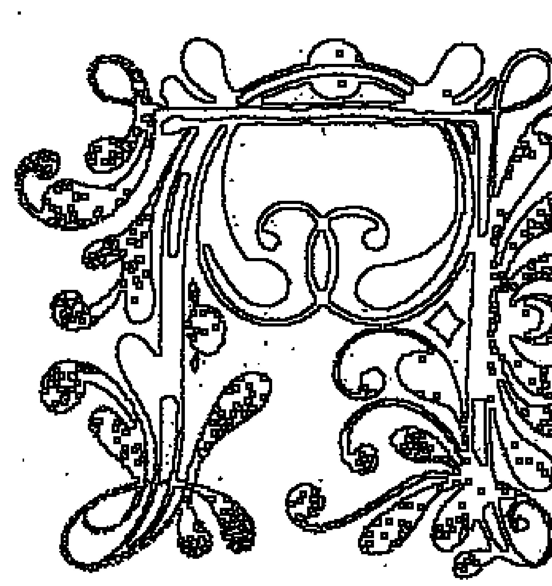

## ·生命議題與能量·

如果人生重新來過，我願一切照舊，
但這一回我會把眼睛睜大一點。
～米爾思·雷納（Jules Renard）

### 概論：了解之橋

> 彼此冤怨之前，須先彼此了解。
～俄籍無政府主義者艾瑪·戈德曼（Emma Goldman）

第二部由十個章節組成，前九章主要是數字1到9的專章敘述，討論每個數字相關的難題與能量。最後一部分是關於0——內在天賦——的探討，提供生命數字含有0的人作為參考。

主要數字從1到9，包括代表內在天賦的0，都存在於每個人身上，不過組成我們生命數字的號碼對我們有較深遠的影響，特別是核心動力、信仰、恐懼、課題、天分和潛力。

第二部分是幫助讀者培養「能量建立區塊」(energetic building blocks)的觀念，依據生命目標系統鋪陳自己的生命路徑。當我們充分了解這十個數字以及正確的生日，我們就像是握著打開自己生命目的以及理解別人生命的主要鑰匙，處處皆通，就能掌控自己的生命目標，了解他人的生命。

### 創造和自信

創造力之能量，如浪潮一般——是滋養大地的太陽，雷電撞擊的閃光。吸入這股能量，感受它的力量。它能創造一滋養、或毀滅。你如何引導創造力之能量？它是否淤塞還是暢通無阻？它如何以正面方式表現？如何以負面方式表現？自信地釋放出內心之創意，人生將如何？

有人自稱尚未找到自我。但自我不是找來的，而是自己創造出來的。～湯瑪斯·沙茲（Thomas Szasz）

### 生命目標

生命數字中有1的人，其生命目標是展現正面的創造力。然而，每個人的生命目標都有其特定的挑戰，1號人必須克服不安全感，避免自己的沉迷行為阻礙了能量的流動上。

1號人所擁有的創造力可以顯現在古典藝術，例如音樂、表演、舞蹈、寫作、繪畫、雕塑，以及其他精緻藝術或工藝；或是表現在治療、商業、園藝、解決問題、設計、建築、運動、撫養小孩，以及其他具創造力的表達形式上。

為了完全展露他們的創造力，所有主要數字為1的人(19/10、28/10、37/10、46/10、29/11、38/11、47/11，還有39/12及48/12)，以及生命數字中含有1的人，都必須先建立自信感，才有足夠的勇氣冒險並選擇「別人較少選擇的路」。

### 創造力與自信心的本質

不同的能量構成整個宇宙，它們透過不同的創造形式顯現出來，並不停地流動著，連石頭都內含有能量。但是只有生物包括植物和人類，才擁有神秘的生命能量(life energy)，使他們能夠移動、繁殖、反應與成長。全體人類都擁有豐沛的生命能量，不過1號人其生命目標就是展現這種生命能量所隱含的難題與潛能。不論我們談到生命能量、性能量、創造能量還是個人磁場，這些能量的本質是動態的，因此必須有適當的管道予以表達與釋放。1號人能感受到這種動態的力量以及表達的急迫性，否則會受到阻擋與壓抑。

創造力本身就是一把雙面刀，一方面創造能量的動態力量能夠開創新領域，就像大河沖毀所有障礙物，把舊有的阻礙與觀點全都拋在腦後。另一方面，能量之河的力量具有強迫性，如果無法經由練習與創造性的努力使其朝向正面發展，創造能量即會朝向負面發展；不論是哪一種方式，它總會找到出口。換句話說，這種能量不是以正面就是以負面方向展現。這些人有責任和選擇權決定如何展現自己的創造能量（詳見〈選擇法則〉(Law of Choices)）。

### 生命路徑上的挑戰

由於創造力與信心是1號人必須攀爬的高山，他們在展現創造能量之前，必須越過某些阻礙。

1號人所具備的能量必須有適當的釋放與表達；如果無法經由練習與創造性的努力使其朝向正面發展，創造能量即會朝向負面發展；不論是哪一種方式，它總會找到出口。換句話說，這種能量不是以正面就是以負面方向展現。這些人有責任和選擇權決定如何展現自己的創造能量（詳見〈選擇法則〉(Law of Choices)）。

正向的創造力，在生命的任何領域中可以展現人的原創性與創新力，而負向創造力雖然同樣具有原創性的特質，但是它會對自己和別人形成困擾；以最極端的例子來說，具創造力的心智可能會策劃像銀行搶劫或是小偷之類的事。

沒有1號生命數字的人也會展現創造天分，但是他們面臨的衝擊或是情緒問題較小。對於主要數字為1的人而言，學習展現創造力的過程就像是攀登高山的過程，一點也不輕鬆。在他們解決與創造力相關的難題之前，會感到倦怠、生病、挫折或遲滯不前；他們必須經歷與這數字相關的行動與痛苦。

因為不安全感以及獲得他人認同自己的需求，1號人常常壓抑內在的創造能量，直到最後挫折能量間接地釋放出來，例如對酒精、香菸、藥物、食品或性的沉迷，就是挫折能量的顯現。當然任何阻礙能量釋放的人都有沉迷的傾向，但是1號人會特別明顯。

當創造力無法獲得發揮時，便會轉向內在，造成內心的騷亂，導致心理與生理的疾病。此外創造能量與性能量息息相關，因此1號人他們的生殖區特別敏感與脆弱，包括下腹部與下背部。阻礙或者是壓抑創造能量還會影響到排泄功能，造成能量上或身體上的便秘、下背痛以及其他症狀。慢性疾病或復發的病症往往顯示創造能量長期受到壓抑。

創造與革新的完成都必須有創新與原創性的意願。也就是不管在行為上或感覺上，都要與衆不同。大部分的1號人內心都有一種體驗人生的獨特方式，他們能專注於真正獨特的事物。這種本能可以早在嬰兒期就展現出來，也可能晚到中年才赫然發現。

由於這種與衆不同的獨特感，1號人常常面臨不安全感的挑戰——感覺自己與別人不一樣、不適合，或覺得自己比不上別人。有些1號人會直接表現出他們的不安全感。不過，大部分人選擇將其隱藏在自信的面具之後，不是表現出害怕競爭的恐懼，就是強烈的競爭性格，因為他們害怕失敗或看起來愚蠢，這會更加深內心的不安全感。1號人的競爭動力，可以從他們平常對話的機靈反應，主導對話進度的情形就看得出來。1號人總像肩上有千斤重擔一般，急著向自己或別人證明些什麼，就像一位不安的作家，他的自我批評會影響寫作的流暢感。而不安全感卻會阻礙或減弱創造能量。

1號人的不安全感也會表現在以下的情況：擔心沒有足夠的金錢滿足基本需求，不確定是否可以獨立謀生。因此他們的情感上需要依賴某個人，不斷地尋找可以讓自己依靠的人，一位能給予他們支持力量的好伴侶。這種情感上的需要有時候會因為他們深植的獨立精神出現而完全崩解；1號人常會展現出獨行俠的特質，他們很少是盲從的群眾。

> 我們的工作不應是求取安全感，而是忍受不安全感。～艾瑞克·弗洛姆

當1號人遵循行動法則，勇於認清、面對與拋卻不安全感時，就會驚覺原來不安全只不過是影子罷了。這只是他們在生命路徑上必須跨越的一道關卡。之後1號人就能以前所未有的方式，重新體驗生命的活力。

### 其他特質與難題

我們都有某些原始的、天真的潛意識傾向及特質，但是1號人卻常常面臨不安全感的挑戰——感覺自己與別人不一樣、不適合，或覺得自己比不上別人。有些1號人會直接表現出他們的不安全感。不過，大部分人選擇將其隱藏在自信的面具之後，不是表現出害怕競爭的恐懼，就是強烈的競爭性格，因為他們害怕失敗或看起來愚蠢，這會更加深內心的不安全感。1號人的競爭動力，可以從他們平常對話的機靈反應，主導對話進度的情形就看得出來。1號人總像肩上有千斤重擔一般，急著向自己或別人證明些什麼，就像一位不安的作家，他的自我批評會影響寫作的流暢感。而不安全感卻會阻礙或減弱創造能量。

1號人的不安全感也會表現在以下的情況：擔心沒有足夠的金錢滿足基本需求，不確定是否可以獨立謀生。因此他們的情感上需要依賴某個人，不斷地尋找可以讓自己依靠的人，一位能給予他們支持力量的好伴侶。這種情感上的需要有時候會因為他們深植的獨立精神出現而完全崩解；1號人常會展現出獨行俠的特質，他們很少是盲從的群眾。

> 我們的工作不應是求取安全感，而是忍受不安全感。～艾瑞克·弗洛姆

當1號人遵循行動法則，勇於認清、面對與拋卻不安全感時，就會驚覺原來不安全只不過是影子罷了。這只是他們在生命路徑上必須跨越的一道關卡。之後1號人就能以前所未有的方式，重新體驗生命的活力。

## 第二部：生命議題與能量 60

1號人更能表現出這些特質，他們可能經驗過熱誠、活力、動力以及具啟發性的遊戲，但他們也比其他人更壓抑罪惡感、憤怒、暴躁或過分敏感的情緒。1號人在情緒上傾向於防衛、過於敏感或是好出風頭，很少有介於中間的情況。

1號人容易受到潛意識的影響，容易被催眠。1號人不必透過幻想或自我防衛式想像的間接方式，可以經由刻意視覺化與正面建議的方式直接進入潛意識，藉以自我治療並產生能量。

要開發1號人的天賦創造力，他們必須區分創造力和技術(skill)的差別。創造力表示看待生活的全新方式，也就是原創力的表達；內心產生充沛的能量，使你勇於打破舊有障礙，探索新領域。因為這項特殊能力，1號人在冒險初期就能展現驚人的創造力。

至於技術，不論是何種領域，都需要時間累積以及不斷的練習。1號人所具備的能量常常在展現的初期就遭到壓抑——不論是嘗試一件工藝品、烹飪、繪畫、或是演奏一項樂器——因為技術不純熟而感到不愉快，這時不安全感開始襲擊他們，導致他們不相信自己有創造力。其實，根本原因只是他們的技巧還不夠純熟。

當1號人有信心持續練習，勇於面對錯誤與困難甚至退步的恐懼，日子一久，他們的技巧會愈加精進，完全展現本有的創造力。他們的創造力可以表現在寫詩、編織草蓆、創造精緻藝術或是拍攝影片等活動上，創造的過程使他們打從心裡感到快樂，而最後的結果也同樣令人欣喜。

在健康與治療方面，大部分1號人比較喜歡濃稠的食物，像是濃縮蛋白質或脂肪，因而容易超重。超重的1號先生或小姐，心理上會有強烈的孤立感，這也是創造力遭受阻礙的結果，當然還有其他成因。更可悲的是，當他們感到壓迫、挫折或不安時，體重一定增加——尤其是那些不運動的人。

桃蒂(Dottie)是一個極端沒有安全感的肥胖女人，她的生命數字是1。她來我這兒尋求生命目標諮詢。我問到她的職業，答案是國稅局的查帳員，這顯然不是一個可以表現豐沛創造力的工作。桃蒂和我試著尋求其他的工作型態，當我提到她或許可以從事治療的工作，她的眼睛馬上亮了起來。一年後我再看到桃蒂，不但輕了一百磅，而且充滿了信心。她成爲一位按摩治療師——一位用手治療的治療師，桃蒂尋回勇於冒險的自信，並且運用她的創造力賺大錢，做她喜歡做的事，替別人服務。

雖然素食對大部分人有好處，但是對於1號人來說，如果只吃水果、蔬菜及穀類，他們會覺得頭暈。生命數字為1號人必須不斷嘗試以找出最適合自己的食物。

因為1號人的能量場域非常強，而且很敏感，如果他們感覺不舒服或失去平衡，通常會尋求更為巧妙、以能量為主的治療方法，以代替標準的藥物或醫療方式。一般我們會諮詢醫師等專業人士做診斷，不過治療方法部分，1號人認為針灸、指壓(acupressure)、節食、維他命治療、臨床治療、催眠、正向視覺思考法以及其他另類方法，是在傳統醫學之外很有價值的。

### 行動檢核表

下列的行動可以使1號人的生活為之煥然一新：

- ☑ 將不安全感視為挑戰你越過的障礙，並加以克服。
- ☑ 透過工作或嗜好，正向地表達並發揮你的能量。
- ☑ 建立每天的運動習慣，讓阻礙的能量釋放出來，消除沉迷的行為。
- ☑ 利用創造性方法找尋靈感，服務於全世界。

### 獲得創意與信心

- 1. 觀想一位你認識的人，或想像一部文學作品或影片，甚或歷史上的人物——一位具有豐富創意與自信的角色。
- 2. 想像你就是那個人——相信自己的能力、有信心冒險、擁有創造能量。想想看能用什麼方法運用這些特質，使你的生活更有創造力？

### 合作與平衡

想像有兩隻手，一隻張開，準備施予，  
一隻緊握如拳，準備抗拒。  
你最常伸出哪一隻手？  
兩手伸出的頻率相同嗎？  
是否容許自己接受與付出相當？  
是否助人過度而心生嫌惡？  
你的責任何時盡？他人的責任何時開始？  
可曾尋得人生的平衡點？

和別人做朋友之前，  
先得和自己做朋友。  
～小羅斯福總統之妻及人道主義者伊蓮娜·羅斯福 (Eleanor Roosevelt)

### 生命目標

2號人的生命目標是確認他們的責任範圍，以和諧、平衡以及相互支援的態度與他人合作。完成生命目標是一個攀登高峰的過程，主要數字為2的人 (包括20/2、39/12、48/12)以及生命數字含有2的人，最大的挑戰是在其強烈的責任心與內在需求以及極限之間取得平衡。

平衡是2號人最主要的工作。在給予與取得之間求取平衡，在答應與拒絕間求取平衡，在思想與感覺間求取平衡，在自我需求與他人需求間求取平衡。為了求取外部的平衡，特別是在合作關係的層面上，他們必須先解決自己內在的衝突與不一致。

內部合作(inner cooperation)對2號的人來說是最困難的事。他們的內心就好像有兩個人並坐在湖中央的小船上。其中一個人很有錢，一個人很窮；其中一個人是共和黨，一個人是民主黨；一個人很高，另一個人很矮；一個是男性，另一個是女性；一個人很胖，一個人很瘦；一個人是清教徒，另一個人是享樂主義者；一個人是信任者，一個人是懷疑者。雖然這些特質看來是明顯不同，不過，這種「兩個人共乘一艘船」的情境——價值、信仰、意見以及動機的衝突，都會得到化解，彼此共同合作向湖岸靠進。2號人可以穿著顏色明亮、相互對比而又能相互調和的衣服，創造一種內部和諧感。

### 合作與平衡的本質

想像一下，如果合作不存在，世界會變成什麼樣子？孤立的人們形影單隻地工作，即使很有潛力，也生產不出實質的東西；他們的壽命也不會很長。以建造一間建築來說，我們需要建築師、工程師、工人以及秘書等許多領域的專家共同合作才能完成。

### 生命路徑上的挑戰

2號人之所以成爲社會的潛在資產，就在於他們的「不爲」。因為他們很想幫助別人，因此長期壓抑了自己的需要，總以別人的需求爲優先，超越了善意犧牲與健康利他主義的界限而變成奴役。2號人忽略或低估自己的感覺與需求，最後常常是因爲別人認爲他「應該做什麼」而去做。

大部分的2號人都有過分合作的傾向——以一種共同依賴的模式——覺得他人的幸福與生命是自己的責任，無法說不，過度犧牲，忽略自己的能力極限，等到自己無法承受，才開始感到怨恨。不是所有的共同依賴者都是2號人，但這些共同依賴者是業餘的，只有2號人「專業的」共同依賴者，尤其當他們無法界定責任的界限與範圍。如果依照責任法則，2號人將會重新尋回內在寧靜以及隨心支援的喜悅。

「應該」在2號人的生命中具有重要的意義與力量，他們總是想著自己應該做什麼，別人應該做什麼，情況應該是如何。由於無法拒絕別人的需求與請求，2號人往往感到困惑，不知道什麼是「正確」的決策或行動，他們總是會問：「你認為我應該怎麼做？」

一旦2號人開始學習依照自己的感覺行事後，他們的服務行為就不會維持太久。如果他們對現在正在做的事情感到不舒服，合作終會轉成衝突，就算是最樂於助人的2號人，最後也會感到憤怒而不願意再合作。假設事情真的演變成一發不可收拾，他們的反應會從無條件的給予變成不通情理地拒絕到底。他們怨恨自己，也怨恨接受幫助的人，最後只有封閉自己；這時他們完全依照自己的意願行動，絕不妥協。許多過分合作的2號人最後都受困於一種慢性的悔恨情緒當中，憂鬱地做著他們以爲別人期望他們要做的事。

朋友或愛人常常會搞不清楚2號人為什麼突然改變態度，並且認爲2號人固執、不公平、自我中心。其實，在固執的背後隱藏著無助感，害怕受到他人的壓制——他們堅信如果只給予一英吋，別人就會要一英哩。而我們的信仰會影響我們的經驗，因此其他人有時候真的會要一英哩。

艾瑪是一位年輕的女性，她的主要數字為2。每天早上起床她都會為她的大學室友摺被，甚至當她室友的男朋友住一晚時，她還是會為他們摺被。當她的室友和男友在做愛時，她還是會靜靜地躺著，試著入眠。艾瑪對這樣的情形沒有半點怨言，只希望能找到其他的地方睡覺，免得打擾那對愛人。這是典型的過分合作案例。

最後，艾瑪要求另找一間房間，這是個相當有建設性的解決方案。不過，艾瑪應該更早一些說出她的感覺和權利，讓她的室友擔起責任，不要讓自己的愛情關係侵犯了艾瑪的隱私權。但是艾瑪沒有界定自己的極限，以至於別人把她當作門前墊，忽略到她個人的需要，她在不知不覺中鼓勵別人侵犯她。2號人如果要取得平衡的合作關係，就必須區分支援與奴役的不同。

在人際關係中，2號人的夥伴常常無意間會要求2號人多做一些，占他們的便宜，直到他們反抗為止。之後2號人仍會繼續做晚餐，或是拿垃圾出門，但是在情緒上則完全封閉起來。

一般來說，在性關係或普通的人際關係中，當2號人過度合作——不顧自己的需求只做別人要求的事，當其中一個人感到不平衡時就會引起另一個人的不平衡；他們一開始會不斷地給予，但是到後來卻是一再地退縮、抵抗。在性關係上，可能會造成性冷感或性無能，彷彿潛意識在說：「我不想再給了。」

2號人必須避免生理上、情緒上或性的虐待；並牢記，只要是侵犯到自己的身體或感覺時，任何人都有權利在任何時候說不，如此才能真正建立健康的能力界限。如果2號人覺得情況不對，應該尊重自己的感覺，強烈地表達自己的意見。

### 其他特質與難題

2號人常常大喊：「這是他們的錯。」許多和2號人相處過的人都認為他們很喜歡評斷，其實2號人說這句話的真正意思是：「這不是我的錯。」把錯誤歸到別人身上可以減輕他們內在的壓力，因為2號人連世界發生洪水或地震，都會歸咎到他們自己身上。

為了成功地解決外部衝突，達到平衡的合作關係，2號人必須解決自己的內在矛盾。由於過分的責任感，大部分的2號人都會過度思考，陷在過分憂慮或過分析的模式中，然後從心智上的專注轉向情緒性反應。(喔!天啊!我們該怎麼辦?)

達到理智與情緒的平靜是2號人最大挑戰；要他們在兩種對立的價值中選擇其一，是一件痛苦的事。

大多數的人都有潛在的信仰衝突、價值衝突和慾望衝突——有理由起床、有理由結婚生子，當然也有理由保持單身，不要生小孩。要列起表格來，理由是無窮無盡的。對大部分人來說，這些對立的價值可以共同存在；但是對2號人來說，這些相反的價值就像兩個都想要坐在前座的孩子，讓2號人左右為難，因為他們不希望使任何一方失望。

當他們學到為自己的生活負責，而不必為其他人的生活負責，就不再因自己內在的衝突而怪罪別人，並開始建立健康合理的人際界限。在可以與不可以之間找尋平衡，了解什麼是自己喜歡做的，什麼是自己不願做的。他們也學會何時說是，何時該說不。

當理智抵抗現實時，就會形成情緒緊張；2號人因為害怕失控而傾向拒絕改變；因此，他們常常感到理智上的衝突、情緒壓力和生理緊張。快速思考會加重肌肉的收縮，使淋巴系統與免疫系統受到影響。雖然2號人的體質很好不常生病，但是他們在壓力下常會有過敏的毛病。

主要數字為2的人不管是苗條輕瘦、肌肉發達或者是肥胖，體質都非常健壯，心理上也非常的剛毅、果斷和堅忍。不過，這些特質也可能轉化為固執、強硬和緊張。如果2號人願意嘗試冥想、舞蹈、瑜伽或是太極拳等運動，將有助於他們放鬆以及隨性地生活。

我們常常有過與不及的情形發生，2號人在達成生命目標之前，必須發展更寬廣的視野與平衡。平衡，是2號人走向高峰的動力。

## 高峰上：潛能與命運

2號人是社會的基礎力量所在，他們常常扮演無名英雄或無名英雌的角色，使得世界變得不同；他們致力達成偉大的成功與成就。

2號人具有非常強烈的服務精神，他們有極強烈的動機去服務、幫助、指導和支援別人。從正面來看，他們以樂於助人而聞名；再加上他們非常忠誠、有責任感，因此極易獲得他人的信賴。當事情變得複雜困難時，請2號人協助你：當你需要找人訴苦時，2號人是最好的聽眾。

2號人內外兼具極大的毅力，願意努力改善情況、幫助別人。一旦他們找到明確的目標，就會為了共同的目標而努力。許多2號人有強大的野心，在任何領域都可以成爲領袖，但是他們通常是扮演支援的角色、與人合作。由於幫助他人是2號的生命目標，支持別人會讓他們感到很有成就。這種支援的角色與他們的生命目標一致。支援的能量並不代表2s的人只能擔任附屬的角色，他們一樣能成爲企業與國家的領導者。

最高的境界是，2號人超越與他人合作的概念，將他人視為更大範圍自我的一部分。這種醒悟消除了怨恨，使2號人更能全心全意為自己的生命負責，尊重自己與他人，為全世界提供愛心的服務。

### 行動檢核表

下列行為可以使2號人的生命為之煥然一新：

- ☑ 了解支援與奴役的差別，學習何時說好，何時該說不。
- ☑ 學習隨著變化流動，保持彈性，放鬆地生活。不是你責任範圍的事情就讓它過去。
- ☑ 每一天都用一些時間伸展筋骨、沉思與放鬆。
- ☑ 在決定一項行動時，使用理智，但跟著直覺走。

## 獲得合作和平衡

- 1. 觀想一位你認識的人，或想像一部文學作品或影片，甚或歷史上的人物——具有合作與平衡特質並尊重自我和他人需求的角色。
- 2. 想像你就是那個人——感受到內在的平衡、為自己負責，並且支持他人、朝向共同的目標合作，對彼此的能力範圍與界限有清楚的認知；能用什麼方法運用這些特質，使你的生活更有創造力？

## 第二部：生命議題與能量 74

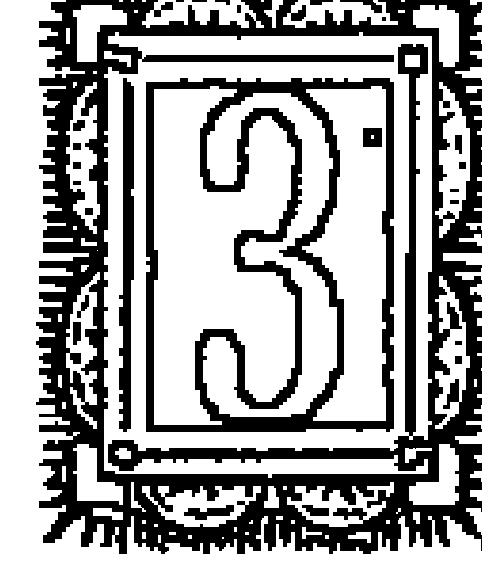

### 表達與敏感

想像玫瑰蓓蕾緊閉的花瓣，  
包裹著一顆耀眼的心，  
充滿熱情，  
卻未完全展現它的美，  
直到花朵綻放。  
它因懷疑而緊閉不開。  
自我懷疑如何影響你的人生？  
你坦然表露情感，抑或  
如玫瑰花蕊緊緊掩藏？

偉大的發現皆來自那些  
感情先於思考者。  
～帕克斯特（C.H. Parkhurst）

### 生命目標

生命數字是3的人其生命目標是利用他們的感性，正面而誠心地表達自己。3號人所遭遇到的挑戰就是表達力受到阻礙，以及過度的敏感與自我懷疑。

### 表達與敏感的本質

從歷史來看，人們的表達只有兩種目的——提升、指導和啟發，以及貶低、敗壞或是摧毀。表達有許多形式，從口頭到肢體語言都是，小至一個眼色、一聲嘆息，大至一個完整的說教。人們也常常藉著藝術、建築、音樂和戲劇等，表達自己。

雖然表達的形式非常多元化，最常見的還是說話。3號人所擁有的能量極具互動性與社會性。當3號人想要表達自己時，必須要有人願意聆聽。而當他們擁有聽眾時，就必須有足夠的敏感度感受聽眾的情緒，在表達自我的感覺與需求時，亦能顧及到聽眾的需求與興趣。

在人類社會中，我們通常將溝通視為一種傳遞資訊的方法。這並沒有錯，但是表達與溝通不同；它不僅是指自我情緒的分享，更重要的是它也鼓勵對方表達自我的情緒。對任何人來說，尤其是3號人，表達的動力來自於情緒。因此情緒上的自我表達——誠實而直接地表達自我的感覺，並鼓勵他人表達自我——是3s人主要的生命目標。表達感覺可以釋放原本遭受壓抑的情緒能量。

無論是為別人還是為了自己，敏感與表達必須同時存在。3號人必須以自己的感覺為榮，並激勵他人採取同樣的行動。

### 生命路徑上的挑戰

對於那些仍未開悟的3號人來說，公開演說或是表達自己的情緒會讓人感覺很不舒服，甚至害怕。他們最大的困難即在於自我表達，這些困難包括言語障礙和害羞，痛苦地將英語視為第二語言，或是雖然說話流暢卻不帶任何感情。許多3號人似乎都非常安靜，不過當他們鼓起勇氣開始說話時，旁邊的人最好扮演稱職的聽眾。

就像1號人可以創造出正面或負面的結果，表達也有正面或負面結果，不論是哪一種，都是表達動力的展現。本書所講的「選擇法則」特別適用在3號人身上，因為他們可以選擇以建設性或是破壞性的方式來表達。

正面的表達方式包括口頭上的熱情，或是具建設性、創意和啟發性的演說以及其他的溝通方式。因為表達是他們的生命目標，不論以質量或數量上而言，3號人有極強烈的表達動力(屬於喋喋不休型的人)。

## 第二部：生命議題與能量 78

有一股熱情想要喚醒他人的情感。

大部分3號人對批評都會過度敏感，總以為遭到誤解。即使是最溫和的批評，都會讓3號人感覺到像是被鈍器所傷或是刺上心坎。

3號人必須學習將批評視為他人對自己的關心，如此才能將過度的敏感轉為深層的了解：批評者必須冒著情緒上的危險做出評論，因為被批評的人可能會因此而受到傷害、感到憤怒或加以還擊。不論批評者的態度如何，他們的行為都在在地表明他們的關心；如果他們一點都不在乎，又何必這麼麻煩？這種認知可以幫助3號人忍受批評，並將其視為一種愛的回饋。

因為3號人具有廣大而敏感的能量場域，因此消除深藏的自我懷疑是他們生命的另一重要課題。1號人的不安全感來自於不如人或不平等的恐懼，3號人的自我懷疑主要是因為他們感覺無法承擔一項任務。1號人是最佳沉迷者，2號人是最佳共同依賴者，至於3號人是最佳顛狂抑鬱者；因為敏感，所以容易陷入深淵、自我懷疑，要不然就是變得狂躁，不知如何釋放能量，最後消沉不已。教學、寫作以及運動，都是讓3號人表達情緒能量的好方法。

3號人通常在自信（我可以做到）與崩潰感（當初我怎麼以爲自己可以做到？）兩者之間來回擺盪。今天很有自信，但是到了明天情緒又跌落谷底。自我懷疑——感覺不夠資格、沒有準備好、沒有能力——有多種表現形式。例如，有些3號人成爲終生學生，不斷在準備，一直取得更高的學位、轉換課程，卻

### 其他特質與難題

3號人應該培養同理心（empathy），避免同情（sympathy）。

## 高峰上：潛能與命運

敏感的表達，從內心中選擇最適當的字詞，一定能感動人心或是引人發笑——激發他人做出改變世界的行動。

每一種文化都有偉大的領導者，擁有無窮的表達力和敏銳度，知道何時、如何讓他們的話產生最大的效用。沒有表達力的戰士或世界領導人無法長久屹立不搖；事實上，筆比劍更有力量，依照猶太基督教聖經的解釋，語言（聲音或振動）比光更早出現。

在生命數字3的高峰上，存在著表達的神奇力量以及敏感的慈悲。走過一趟旅程之後，3號人釋放了生命中所有的情緒，他們全身充滿著愛與熱情，並利用全部的感情擁抱他人，將其他人納入自己廣大的情緒場域中，激發我們的人性本質、心靈的潛能以及喚醒內心感覺的渴望，讓沉睡已久的人性甦醒過來。

3號人對生命與他人有著緊密的情感連結，因此一旦他們將能量釋放出來，即可感染周遭的人。他們沉醉於情緒中的喜悅就像是海豚在海中那樣地悠遊自在。達到最高層次的3號人，是一個愛能量的媒介，能感動他人、激發他人，是全世界光亮的發源地。

### 行動檢核表

下列的行動可以使3號人的生活為之煥然一新：

- ☑ 現在問你自己：「我現在感覺到什麼？我現在需要什麼？」直接表達你的感情與需要。
- ☑ 挑一門公共演說的課程，或找尋其他機會表達自我，像表演、藝術或舞蹈。
- ☑ 找一種運動，像武術、舉重、有氧舞蹈，幫助你表達你積極進取的一面。
- ☑ 下一次你面臨到自我懷疑時，必須面對它並超越它。

### 獲得表達與敏感

- 1. 觀想一位你認識的人，或想像一部文學作品或影片，甚或歷史上的人物——能誠實而有力地表達自己、與觀眾打成一片、感受到他人的反應。
- 2. 想像你就是那個人——有自信地、清楚地、敏銳地表達自己的感受，包括喜悅與悲傷；想想看能用什麼方法運用這些特質，使你的生活更有創造力？

## 穩定與程序

像一座施工中的宅宇，  
地基已打妥，主體架構已立起，  
按部就班進行。  
你的人生之宅如何呢？  
它是否揭露你的人生目的？  
可曾加固地基？  
可曾按部就班構築人生？  
～歐沙·強森 (Osa Johnson)

### 生命目標

生命數字為4的人必須保有穩定和安全感，有耐心地、按部就班地達到預期的目標。獲得安全感——穩固的地基——是每一個人必要的目標；但是對於4號人來說，這是他們的主要生命目標。那些主要數字為4的人（13/4、31/4、22/4、40/4）和其他生命數字中含有4的人，最大的困難就在於穩定、承諾、耐心、清楚，以及遵循一定的程序達成目標的意願。

4號人在建立世界的穩定之前，必須先建立內在的穩定——

### 生命路徑上的挑戰

因為4號人的生命目標是建立穩固的基礎和力量，因此會遭遇到妨礙穩定的困難。如果他們無法立即學到教訓，困難就會不斷出現，而且愈來愈難克服。穩固的基礎不僅有力量，還

## 第二部：生命議題與能量 86

要有彈性，就像是防震大樓，雖然會搖晃但不會崩塌。有趣的是，4號人如果缺乏身體上的彈性，通常在心理上也很固執，例如自我欺騙或是視野狹小。他們戴上眼罩，雖然聽見卻沒真正聽進去別人所給的回饋或建議，他們盲目地相信「船到橋頭自然直」，因此不採取應有的執行步驟。最後感到後悔，開始重新評估自我認知，並且尋求一個全新的或更大範圍的定位，以符合他們高遠的野心。

建立安全的基礎必須有一定的流程，但是我們的生命目標——穩定與流程——就代表人生中最大的難題與挑戰，而4號人最大的困難就是執行過程；他們不是排斥、倉卒行動，就是執迷於某個步驟不願向前。不論是何種情況，過程是4號人的最大挑戰。長期學習某件事物的4號人，如運動、工藝或是樂器，他們心中都有一個理想的典範；他們知道該如何達到成功。許多曾是優秀運動選手的4號人，後來在商場上或是其他領域上都有不錯的表現，因為他們已經學會要遵循一定的步驟達到成功。

慢慢地做、有耐心地執行每一個步驟，這項行為可能會讓4號人覺得難以忍受。他們想要現在就看到結果；他們有著突然而來的熱誠——開始一件事並趕快完成。相反地，有些4號人眼界狹小，只專注於某個步驟，無法移至或看到下一個步驟。累積的不耐可能會使4s的人偏好以「神奇」的方式達成目標。我的朋友米蓋（Miguel）曾經寫了一齣劇本，有一天他告訴我，「我在飛洛杉磯的旅程中，旁邊坐了一位先生，剛好是好

### 第二部：生命議題與能量 90

萊塢製片場老闆的表哥，真是不可思議，他說要把我的劇本拿給他表哥看，他覺得我的劇本聽來挺不錯的，我也給了他我的名片。在米蓋的心理，覺得他的劇本一定可以賣出去。這種奇蹟式的想像，想要一步登天；就像中了彩券，突然被發掘，得到好運氣等，都是4號人的腦袋中慣有的想法，直到最後他們才能真正地了解到準備、訓練以及累積經驗的重要。

最後4號人會明白，短期的投機可能會造成永久的失敗——只爬到一半就會跌得粉身碎骨。

大部分的4號人都會努力地達成目標，但是如果沒有如他們想像般地快速，就會感到失望，沮喪地認為：「有什麼用？」或是「算了吧！」

他們對人際關係也是採取同樣的態度，他們有著極大的熱誠可以很快就與人建立友誼或是親密的關係（彷彿彼此是失散多年的朋友），但是當有問題發生時，就會放棄這段關係。

這種傾向並不表示4號人是不忠誠或善變的——事實上，他們朝向正面發展，使自己符合過程法則，他們可以是非常忠誠而可靠的，他們無法長期面對困難，只能付出暫時性的熱誠與努力。

4號人需要穩定他們的能量，否則他們容易更換工作、更換關係、更換住家，他們也就完全無法發現，當自己承諾某種生活後所可能產生的奇蹟。一旦他們了解堅持的必要後，就能集中力量，克服困難。

許多4號人常常會質疑該如何與父母相處。他們所面臨的家庭難題，可能是與其中一位或兩位雙親，或是與自己的兄弟姐妹有關。這些問題所在多有，包括迷失在一個大家庭中，童年不斷的搬家因此缺乏穩定的生活，或是父母酗酒、嗑藥，因為雙親死亡或是離家因而從小就失去父母。他們可能有一個專權的父母，在言語上虐待他們，或者是在情緒上、生理上、性方面遭受過虐待。不論是哪一種形式，對許多4號人來說，不堪回首的家族歷史是相當普遍的經驗。不過並非所有4號人家庭都是破碎的。但是某些擁有複雜家庭經驗的4號人，在生活上不可避免地會受到很深的影響。

4號人成長的基礎就是家庭，解決家庭問題、重建基礎是4號人必須面對的整合工作，他們必須與家庭成員做深入的溝通，彼此才能有更進一步的了解。對於那些生命數字中不含有4號人而言，這點也非常重要，當然對主要數字為4的人來說，解決家庭問題是極大的挑戰。只有誠實面對才能有所助益。與父母達成相互的了解並不是凡事要得到他們的首肯，重點是4號人必須清楚表明自己，知道自己的定位，分享自己的想法，重新開始家庭生活。即使有一位或是雙親都已過世，他們也可以私下在內心訴說自己希望雙親曾說過什麼話，曾是什麼樣子以及他們真正的感覺，這樣才能將隱藏已久的的能量釋放出來。

4號人不覺得他們可以因為有良好的教養，就能夠成立一個新的家庭，重建一個快樂的童年，並且成爲一個他們小時候所期望的父母形象。一般來說，他們確實能成爲好父母，但這並不是因爲他們總是說出或是做出理想的事情，而是因爲家庭和基礎已成爲他們生命的首要之務。4號人即使婚姻破碎，他們也會想辦法與孩子維持親密的關係。教養小孩不見得是每個人都喜歡的事，卻是對大部分4號人來說，不論是撫養自己的小孩或是照顧別人的小孩，都能滿足他們深層的需求。

穩固的基礎與詳盡的流程是企業競爭優勢所在，而4號人與2號人一樣，天生就具有強烈的力量與活力。這種力量也可能是固執或抵抗。抵抗的意思是，4號人很難擺脫過去；他們陷入悔恨當中，執迷於過去的人際關係、錯誤和失敗，無法從中記取教訓，繼續向前。他們那種橫衝直撞的能量常常驚嚇到別人。任何有助於4號人深呼吸、放鬆和放開的運動，如舞蹈、瑜珈或太極，會讓他們學習到彈性法則的重要，並從此煥然一新。

對4號人來說，生理與財務的安全是很重要的，這並不是說他們需要一百萬美元放在銀行帳戶，只要他們確定房租與貸款都繳了，同時桌上又有足夠的食物，他們就會覺得安全。對4號人來說，未雨綢繆是另一項要務。

不論4號人想要建立怎樣的外部基礎，他必須同時在生理上、心智上和情感上建立三位一體的內在基礎。當一切達成平衡後，這個三位一體就是他們生活上穩固的基礎。若是朝正向發展，4號人就能展現一種穩定感，可以讓別人信賴與依靠。

一旦4號人負起責任，即使這會增加他們的負擔，他們仍會戮力而為，因爲這樣可以產生他們極力避免卻又必須的穩定感。就像2號人一樣，4號人也可能會因為接受太多責任而崩潰。

若是朝向負面發展，4號人不是太過負責任就是太不負責任，有時候是在兩者間搖擺。一方面他們表現得像是全宇宙的總經理，工作超出他們的能力範圍之外。而且4號人也欠缺建立穩固基礎所需的承諾與一致性。責任心需要花時間培養；而且必須經歷反覆練習的過程。因此4號人也需要他人的耐心。此外，4號人雖然可以支持他人，但他們也需要他人的支持——不論是情感上或財務上，或是兩者皆有。如果他們感覺孤立無援，就會掉入深淵中，直到他們相信自己可以度過學習與成長的歷程。

支持有時候代表清楚的期望，不管4號人是個成人或孩子，他們總是需要別人給他指導與限制，以便了解別人對他的期望。如果他們不知道規則，他們會感到相當困惑。

大概所有的4號人都會經驗到情感和理智的衝突，就正面的角度而言，他們有很強的分析能力；但就負面的角度而言，他們在做決定時往往又分析過度。困惑是4號人的一個大難題，因為當他們逐一分析各項因素時，會受困於理智的思考，來回地分析每項因素的各個層面、好與壞，結果是愈來愈模糊，完全無法做出決定。

許多4號人因為過度分析導致困惑，因此常常導致衝動性的行為——衝動的關係，開始時很熱絡，沒多久即迅速冷淡；衝動的消費；還有其他倉卒的決定。

如果3號人是顛狂抑鬱者，4號人就是歇斯底里症冠軍，就

### 其他特質與難題

正向發展的4號人，因為善於組織資料與想法，將任務拆解成小單位，因此在房地產或企業界，可以成爲優秀的決策者或顧問。如果夠成熟，他們也能成爲卓越的生意人、令人稱讚的秘書、助理、諮商者或其他支援的角色。他們和2號人一樣，在扮演支援的角色時並不表示處於附屬的地位；教宗保羅一世以及美國總統克里夫蘭，生命數字都在4，他們都在扮演

### 第二部：生命議題與能量 92

自己的角色時以獨特的方式支援別人。

如果4號人跳過必要的步驟，將會一再犯同樣的錯誤，重複開始和放棄同一個計畫，重複失敗，比如說結婚三、四次，戒菸五、六次。本書模式法則可以幫助4號人了解，他們必須利用自己的分析能力找出這種行為模式的成因，並開始改變做法，才能避免再犯同樣的錯誤。

若朝著正向發展，4號人是可靠的；但若是朝負向發展，他們會變得不可依靠、無法做出承諾。如果他們真想幫助別人，應該善用自己的力量與支持他人的能力。他們對支持的需求也可以在一種「不要離開我」的關係模式中顯現出來。如果他們仍學不會承諾，他們會是離開他人的那一位。

一般而言，4號人的性關係很活躍也很實際。但是如果他們像2號人一般轉向抵抗的模式，就會在情感上保持距離，將自己的退縮責怪於其他人或環境。

總之，4號人必須穩定他們的生活，專注在清楚的目標，逐步實現他們的生命。

## 高峰上：潛能與命運

他們內在的野心與力量可以幫助他們實現生命目標。不過，當他們想要獲得成功卻又不經由循序漸進的方式完成，這個成功可能會很短暫。只要他們擬定計畫並遵循一定的流程，就能心想事成。

一般的計畫只要簡單幾個步驟和流程，而長遠的大計畫就

### 行動檢核表

下列行動可以使生命數字4人的生活為之煥然一新：

- ✓ 化整為零，把大目標分成小步驟，並且下決心做好每個步驟。
- ✓ 無論在身心方面都有極大的彈性，並藉此平衡自己的力量。
- ✓ 無論做什麼事情，都下定決心，準備周全，並且一步一步地完成。
- ✓ 面臨決定時，信任你的直覺。

### 獲得穩定與過程

1. 觀想一位你認識的人，或想像一部文學作品或影片，甚或歷史上的人物——非常穩定、安全、準備周全、按部就班地達成目標。  
2. 想像你就是那個人，穩定、實在、清楚自己的方向、一次只做一步、明白你達到理想的唯一變數只是時間問題。想想看能用什麼方法運用這些特質，使你的生活更有創造力？

## 自由與規範

想像一隻高飛的鳥，感受到一種自由。  
為了徹底體驗人生，  
牠必須落地，費力地築巢。  
如此的規範產生另一種  
體驗深奧人生的自由。  
你可曾感到自由  
或受侷限？  
能否運用規範探索人生之深奧？  
在深奧中找到另一種自由？  
冒險不存在於外界，而是存在於內心。  
～大衛·葛瑞森（David Grayson）

### 生命目標

生命數字5的人其生命目標透過規範、專注和經驗的深度獲得內在的自由。主要數字為5的人（14/5，41/5，23/5，32/5）以及所有生命數字中含有5的人，都會經驗到自由與規範的考

### 自由與規範的本質

自由，就像愛情，對不同的人來說有不同的意義。對某些人來說，自由代表完全的自我放縱——在任何時候都可以為所欲為。從這種觀點來看，自由就是規範的反義辭，因為規範有時候代表我們必須做自己不喜歡做的事。但更深層的來說，植基於自我規範與自我管理上的自由才是真正的自由。

5號人所要的自由，是擴展經驗的範圍，並且在生理、情緒、心理、社交、性愛、財務以及靈性上的歷險經驗。如果5號人夠獨立，就會直接尋求世俗的歷險經驗。如果個性比較依賴、沒有安全感的5號人，會從書本、電影或電視中找尋想像的歷險。當5號人在愈多的領域獲得掌控權時，就愈不覺得受

### 生命路徑上的挑戰

5號人的自由若發展到最不利的情況，就是完全的自我放縱，沒有任何外在的限制——藉著為所欲為，強調極端的獨立。但是這種自我放縱絕非5號人所應有的生命目標。他們應該培養專注力與規範，獲得內在的自由、經驗，生活中充滿熱情與冒險，就像希臘人卓爾巴（Zorba the Greek，註：希臘作家卡贊扎基所著小說，描寫一個熱情的希臘老農民，他極熱愛生命，即使在逆境中也是如此）。

「不要綁住我！不要鎖住我！」這是5號人最常發出的嘶喊，他們常為自由而戰，呼聲響徹各地。如果他們的人生路徑極具戲劇性，即使日常生活中沒有遭遇到任何戲劇性的事件，他們也會在人際關係或職業生涯中創造。他們害怕被任何人或

## 第二部：生命議題與能量 98

任何東西綁住，因此他們很難對某一關係做出承諾，除非這種關係能使他們獲得釋放而非限制。

有時候，5號人會下意識地依賴一個會限制他們自由的人。他們容易從極端的依賴轉向反應性的獨立，這種傾向會投射在他們的伴侶身上，就像8號人會突然放棄權力，5號人也會突然放棄他們的獨立性。

蘇菲亞是一個上了年紀的女人，幾乎完全依賴老公喬治來過生活，她壓抑住內在的自由與冒險性，永遠待在家裡等老公回來。她在家做家務，看看肥皂劇作一些情緒上的探險，主要的生活就是幫老公做飯，連買菜都需要喬治載她前往。因為她從來就不會開車。我們並不是對選擇過家居生活有意見，但是蘇菲亞太過於依賴，因此開始抱怨喬治限制了她，如果「她能夠」，她會選擇離開喬治。

最近，我聽說蘇菲亞開始經歷一些自由的經驗，開始一項新的規範，她在六十五歲的高齡決定學開車，她真的不需要她先生——獨自開車去公園、去購物。她甚至去看電影，對蘇菲亞來說，這些行為就像是探險。開始享受生活，任何年紀都不嫌老。她直到六十五歲才發現人生有更多自由。

另一個極端的例子是湯瑪士，他永遠自己剪頭髮，儘管他付得起理髮費，理由是他不想依賴別人。不只如此，他也自己修車，自己修水管以及家中的電線，他同時也因為不想依賴某種關係，因而把多數時間用在獨處上，這種情況顯然相當獨立，但是跟5號人要完成的生命目標完全悖離。這是另一種極

## 自由與規範

端，是因為害怕依賴所產生的「獨立」，其實這種「害怕」才是自由的監獄。

自由與責任相輔相成，獨立與規範也是一樣。除了5號自己，沒有人抓得住他們。也許有另一人限制他們，但是當他們了解是他們自己選擇這個人或是這種情況，就會感到自己是自由的。他們也了解自己就是生命電影的導演與作者。他們必須記住不必扮演一個不起眼的小角色。直到他們學會對自己的生命負責，雖然看起來像是受害者，但他們是自願的。

5號的人天生有一種驅力和好奇心，想知道所有的事，因此使他們的能量過於分散。「有這麼多可能性，但只有這麼一點時間。」這說明了5號的心境，5號人多才多藝，在潛意識中能取得所有資源，像魔術師一般從帽子中變出所有的能力，他們代表一種重生的能量。魔術師、戲謔者、變戲法的人，以及「樣樣通，卻沒有一樣精通」的形容詞，都是典型的5號人。

有些在現實世界缺乏冒險心的5號人，常常藉著閱讀、電視以及電影經歷想像中的冒險，藉著媒體、連續劇與明星陪著他們去經歷他們從來沒有的經驗。不過，一旦他們直接在生活上經歷過冒險，他們會要求得更多。甚至開始上癮，一次又一次的冒險，爲了避免人生無趣，他們會不斷地冒險甚至會嘗試嗑藥。

就像賺很多錢並不能滿足8號人的生命目標一般，許多的歷險也同樣不能完成5號人的生命經驗。對任何一個生命目標來說，真正的意義不是去探索或壓抑核心問題，而是去超越。

### 其他特質與難題

有些5號人潛意識中會選擇一個充滿限制的環境，包括受傷、受限於配偶或合作夥伴、財務壓力，以及數字或文字上的束縛。在此情況下，他們的內在生活與想像就成了他們最後的自由堡壘，也是他們唯一可以控制的世界。

當5號人感到不安全或生活太平淡時，就容易認同一個比他們自我要偉大或較優秀的角色。他們利用這些角色做為一層保護膜，掩飾真正的自我——害怕人們會發現他們原來是如此地平凡，就像桃樂絲與小狗多多發現原來烏茲國的神奇魔法師是躲在大螢幕下的一個仁慈的小老頭兒。

當5號人開始欺騙，他們即是掉進自己的陷阱；舉例來說，他們也許穿上制服、擺起架子，扮演一位治療師，但事實上壓根兒不知道治療是怎麼一回事。這種角色扮演的行為更為削弱他們對自我認同的信心。他們寧願藏身於所扮演的角色之後，因為他們對於自我的本性與情感沒有絲毫的信心。當他們脫下外衣，就無法確定自己是誰，他們已經發展出一種變色蜥蜴的特質。他們的生活總是密集而充滿插曲的，一個章節才剛開啓，馬上又閉幕換上另一組人物和劇情——剛建好的橋隨即遭到焚毀——不斷地尋找更龐大的家族、連繫與家庭，追求更廣大的自由。

5號人的典型角色是克提斯(Tony Curtis)在「大騙徒」(The Great Imposter)這部電影中所扮演的角色，這是根據真人真事改編，這名主角在生活中同時扮演一名監獄看守員，一名教士，以及一名船上的醫師，還幫病人動了一個盲腸手術。

一旦5號人在生活上運用規範，同時又建立深刻的經驗，他們可以是優秀的外科醫師、律師、作家、武術指導老師、工程師或其他專業的教師，同時又不會失去自己存在的價值。

當他們運用規範與專注認清內在的自由後，就能大幅提升自尊感。有了自尊感，就能理解自己不只是所扮演的角色而已，這些角色就像是穿了又脫、脫了又穿的衣服，好比是演員的戲服；他們也明白演員才是一齣戲的明星，而非他們所扮演的角色。

3號人與情緒表達有關，同樣地5號人與水星能量有關，水星代表有翅膀的信差。他們的頭腦靈活，始終希望探觸生活的所有領域，他們是最好的推銷員，因為他們的知識廣泛而豐富，因此能從不同角度去看事物。他們在回答問題之後常會想：「怎麼想到這些答案的？」

大多數的5號人天生身手敏捷，手指靈巧，很快就能學會彈奏樂器，他們也很會處理小零件，擅長修理東西。靈敏與快速的學習能力使得5號人能夠在嘗試一兩次以後就可以上手，因而很容易覺得無聊，而這時正是熟練的開始。

### 行動檢核表

下列行動對5號人的生活歷練將有所助益：

- 發展一些簡單的例行公事，設想規範。記得也要有某種程度的變化。
- 不要因爲怕無聊而不去深入一個主題或活動。
- 當你發現過於獨立或過於依賴時，請試著找到平衡點。
- 請清楚而直接地說明你想要什麼或你需要什麼。

### 獲得自由與規範

- 1. 觀想一位你認識的人，或想像一部文學作品或影片，甚或歷史上的人物一經由規範達到自由的角色。
- 2. 想像你就是那個人——集中精力、規範自己在責任或任務之下仍然感覺到心境的自由。想想看能用什麼方法運用這些特質，使你的生活更有創造力？

## 遠見與接納

像正義與平等的天平，保持完美的平衡，代表公正與崇高理想。理想指引你的人生，抑或統御你的人生？你的願景為何？如何付諸實行？能否接納自己，接納他人，或處處要求完美？能否欣賞人生隱含之美？能否欣賞不完美之完美？

所謂接納，意指不論發生什麼，不論我們如何反應，皆為追求至善及學習所需。～佚名

### 生命目標

生命數字是6的生命目標是化解理想與現實的衝突，接受自己、世界和現有的生活，對於完美有更寬廣的理解。主要數字為6的人(15/6，24/6，33/6，42/6)以及其他生命數字含有6的人，都必須學習克服他們的完美傾向，以更宏觀的角度看待世界，清楚自己的優勢，不再專注於一些瑣事上。6號人最大的挑戰就是理想主義與完美主義，包括容易對自己或別人妄下斷語或感到失望。

6號人的內在有著高尚的心靈，他們心中所描繪的烏托邦世界是人類進化的極致。他們心中的理想主義沒有消退的一天；他們是一群夢想家，要求人們朝向理想世界努力。沒有6號人的理想，我們也許會變得宿命、虛無、視野狹小。但是他們的高度理想必須付出很大的代價，因為他們有時候變得很不切實際；為了尋求最高的可能性，他們缺乏正確的觀點與應有的耐心。他們總是以不切實際的高標準評斷自己和所有人，認為自己和所有人都是失敗的。每個人都有缺點，因為沒有人能達到完美主義者的要求，就連他們自己也一樣。因此彈性法則和完美法則對6號人來說非常有效。

### 遠見與接納的本質

我們的理想源自於人性意識最高尚的原型，反映出我們對人類和世界所期望的最高可能性。對於正義、形式、人性關係和心靈的理想，激發人類繼續向上。如果沒有這些理想，很難想像人性會變成什麼樣子。高尚的理想喚起夢想家的心靈，包括作家威爾斯(H. G. Wells，生命數字為33/6)，以及現代的夢想家，不斷編織著未來可能的影像。這些影像存在於文化、希望與夢想中，是人類生存與進化的重要關鍵，能夠啟發人類並給予我們希望和指引。

6號人活著不能沒有遠景與夢想，像生命數字15/6的聖女貞德 (Joan of Arc)、克利斯多佛哥倫布 (Christopher Columbus)，以及視覺作家依撒克亞斯莫夫(Isaac Asimov)，生命數字24/6的路易斯卡羅(Lewis Carroll)，他們會帶著人們看到奇幻島的觀賞窗，而約翰丹佛(John Denver)選擇用歌聲唱出他的遠景，而湯瑪斯愛迪生(Thomas Edison)則把他的觀點帶入世界中，改變了世人的生活；雷夫華道艾默生(Ralph Waldo Emerson)、伽利略(Galileo)、尼采(Nietzsche)、羅素(Rousseau)、托肯(J. R. R. Tolkien)，甚至邁可傑克森(Michael Jackson)、查爾斯舒茲(Charles Schulz)，上述的幾位名人，都用自己獨特的方式架構一個更好的世界。

我們每個人都有遠景與希望，因為理想主義的種子一直深植在我們心中，不過，當這個理想不能如願時，6號人會經驗到比一般人更深的失望痛苦。在6號人真正有能力帶領我們走出許多可能性以前，他們必須先腳踏實地，欣賞到世界現在的完美存在，同時接納當下的自己以及當下的別人。

接受這些現實會替6號人形成一座通向喜悅生活的橋樑，因為唯有全然接受每個人、每件事，6號人才能對世界做出實際而有效的貢獻，如果他們頑固地拒絕所有不符他們的高標準，他們會變得悲傷、憤怒或沮喪。一旦6號人接受現狀，試著超越現在的情境，就會有恆心與耐心分享他們高遠的理想，

### 生命路徑上的挑戰

當生命數字2或5的人在兩個極端中掙扎時，6號人則是忙著替旁人或世界評斷，確定世界到底是完美還是缺陷。當他們初識一個人的時候，常常會把自己的理想投射於那位新朋友身上，彷彿那人身上有著完美的玫瑰光環，「喔!他是個很棒的人。」、「對我來說她實在是個完美的女人」，在理想的光暈下，6號往往無法辨別清楚，這正是他們後來產生失望感的原因。隨著時間的流逝，他們開始注意到對方的缺點，因此沮喪不已，甚至結束關係。6號人一開始只看見對方或自己美好的一面，往往無法接受自己或別人不完美的地方。這就是6號的難題所在。

老實說，跟6號人生活不是件容易的事，因為在他們眼裡，沒有一個人是完美的。許多6號人努力壓抑評論的習慣，聲稱「我不評判別人，我相信每個人各有各的生活方式」。不過，這些6號人不公開苛責評判別人的原因是他們忙著苛責自己，想辦法變成「一個好人」；換句話說，他們只是壓抑心中評判的傾向；他們並沒有真正了解這種傾向，因此無法面對問題，使用合適的靈性法則，超越人生的難題。

許多6號人常處於否定情緒的狀態，他們因為專注於理想上「應該」感覺到什麼，然後說服自己內心的感受的確是如此，卻不知道自己真正的感覺。因此，6號人有必要回頭看看自己真正的感受。找專業的治療師或諮詢人員可以讓他們重新找回真正的自己。

6號人天生就會被理想主義吸引，同時又對任何人的缺點非常敏感，容易迷失在琐事中；舉例來說，他們就容易在一場優美的樂章中找到一個微小的錯誤，而感到憂鬱。即使他們做了二十件好事，但只要犯了一次錯，就會為那個錯誤困擾不已。當他們去看一部好電影，看完之後因為其中一句不是很恰當的對話而耿耿於懷。他們參觀博物館，只記得一幅低於標準的畫；他們考試的成績不錯，卻因為其中有一題來不及作答而難過。

在6號人的字彙中有兩個字「如果是.....就好了」(If only)，或許他們看見一個新房子，「這房子真漂亮。如果是漆不同的顏色就更好了。」(或是把樹移開，或是加個噴泉等等)。

我有一個名叫羅傑的朋友，一個人單獨籌備一場大型的集會，後勤支援相當複雜，他必須安排演講、安全措施、餐點及宣傳等活動，每件流程看起來都很順暢，但是當集會結束，正在清掃的時候，我聽到羅傑喃喃地抱怨，「唉，我真的搞砸了！」我聽到之後覺得有些錯愕，就問他怎麼回事，他說：「有個人反應說他希望在桌上放個水瓶，真是的，我當時應該記得放水瓶的，那就一切就非常完美了。」

完美主義者很容易失敗，這是他們遊戲的規則，他們永遠只看到半空的水瓶，而不是看到半滿的水瓶。他們用高標準去評斷別人，又因為評斷別人而評斷自己。他們永遠都會感受到要變成最好的壓力。有時候也會因為怕露出缺點而避開一些活動。舉例來說，一個6號人去學古典吉他，如果有人告訴他「跟專業吉他手比起來，你的手指不夠長。」6號人的反應會是：「那我就停止學吉他，反正我是不可能像賽高維亞一樣好。」

一旦6號人開始運用到彈性原則及完美原則，就可以卸除完美主義的重擔，學習到完美的意義在於其中的過程與樂趣。

由於他們的高標準，大部分的6號人都會面臨內在的壓力，並將此投射在別人身上，認為別人對他們有著高度的期望，因此當成是外來的壓力。童年時期的6號小孩就背負著在學校表現良好的壓力，有時候壓力過大會導致孩子產生氣喘的毛病，好像這個世界在壓榨他們。還有一些6號人從來就不覺得自己很好，他們相信爸媽或老師看輕他們，因此他們也看輕自己，因而產生退縮或放棄的念頭。

相互比較也是個難題。6號人常常是興沖沖的開始執行一個新專案，但他們會先跟別人比較，通常都會拿學得快的學生作爲比較，但是這種比較反而使得6號人感到氣餒。

6號人害怕比較，卻又喜歡跟人比較，他們對自己批評太過嚴格，以致別人對自己的評價也感到非常敏感。如果6號人停止比較，這種改變將有助大幅提升生活品質。本書的直覺法則，會幫助他們解除比較的負擔，得到更多生活上的樂趣與放鬆。

### ：遠見與接納

許多6號人會給人一種冷淡的感覺，因為他們希望自己總是做得正確，不要表錯情。其實，外在的情境並不重要，重要的是當時的情緒感受。6號人在性方面的態度，其實和其他生活一樣，一直想要強調做得對，而且還要變成一個優秀的表現者，這樣他們可能會失去更深層的情緒敏感度與享受情緒湧現時的喜悅以及真正的放鬆；其實有時候看起來笨笨地也很不錯，畢竟沒有人一定要時時完美。

所有6號人必須了解到，「他們」自己才是重要的，而不是他們表現得如何或是他們知道得多少。他們可以走進一個宴會，踏上階梯，在許多人面前跌倒，然後若無其事地爬起來喝飲料，誰會在乎呢？關心6號人的朋友，根本不會在意這件小事。6號人本身有一種源自於理想主義的純化能量，他們來到現世的責任就是藉由行動，讓這股光亮照亮別人。要讓6號人完全放鬆，可以找他們去吃義大利菜，要他們用手吃通心麵，暫時丟掉言語與行為得體的束縛。

當6號人漸漸成熟，就會欣賞到存在於人類內心的完美。他們將會了解人們最終會趨向完美，而人類現在正是朝向完美邁進。一旦他看清這種看似兩難的情形，就能幫助人們追求內在的完美。

自我價值一直是6號人最大的問題所在，他們的內心深處總是有「做個好人」以及「做該做的事」，這種想法並沒有錯，只是他人會用好壞來定論6號人的行為，利用他們的高標準理想對他們施加壓力。

#### 諷刺的是，人群中擁有最高尚的遠景及最高的標準的人常常躊躇不前，因為超高的標準使他們總是覺得自己還不夠好，而對自己的標準比較低的人則常覺得他們的評估剛好適中，6號人如果能把自己的高標降低，就能受惠於以下的想法：「我可能並不完美，但是到現在為止我已經夠好了，同時這個世界與其他的人們也很好。」

6號人常常會遭到其他人不公的批評，其實是他們吸引這些人擾亂他們的生活。這些人總是戴著面具，扮演著6號人潛意識所扮演的角色。6號人會吸引他們的父母、朋友以及親密的人說出6號人潛意識中對自己的評價。當6號人開始學會不在意這些評斷，就會發現旁人身上的冷漠其實不存在。

6號人應該提醒自己的是，世界是不完美的，我們可以盡力追求優越，但這需要時間與努力。

本書的順序法則可以給6號人更多的啟發，雖然6號人比4號人願意按部就班地做事，但是他們還是非常性急。6號人喜歡立刻知道最後結果，他們讀書時會先翻後面的結果，或著為了趕快解決民生問題而吃飯，就像某些打高爾夫球的人，只重視打球的部分，而忘了去欣賞揮桿之間的散步樂趣。

順著本書的彈性原則，6號人可以應用當下法則，提醒自己只有現在是存在的。以慢動作聞名的太極拳，能有效地培養個人的耐性，學習如何享受現在。

6號人天生就會為了理想奮戰，一旦清除了自我價值的疑慮與完美的傾向，他們就會把事情做好，在任何領域中都能成。

### 其他特質與難題

6號人在財務方面有兩大問題。第一，6號總是想等到最佳時機才要讓產品上市，而這個時機則取決於作品是否符合6號人的「超高標準」；若真是如此，恐怕永遠沒有上市的機會。像寶貝路思，這個馳騁棒球界紅極一時的全壘打王，如果一直等到完全不出錯才出手，就不會在球員休息區中脫穎而出。第二點，6號人會受限於自我價值觀，以致看輕自己存在的價值或產品應有的定位，一旦他們超越這些障礙，很快就會獲得社會認同與成功。

6號人應該理解靈性舉重(spiritual weighting lifting)的觀念，當生活變得艱難或者無法依計畫前進時，這些阻礙是他們可舉起的重量，能強化他們的靈性並學習必要的教訓。他們可以用完美法則並自問：「何以這個東西是完美的？」

許多6號人不停地尋找完美的靈魂伴侶及工作，他們必須學習接受環境、接受自己、接受周圍的人、接受現在正在做的事，才能經驗到真正的完美。

如果6號人花越多心思從內在體驗完美，就越能覺察外在世界的完美，並致力於讓世界更完美。當6號人往正向發展，可以幫助別人看見自己的完美以及生活的意義。從這些過程中，他們才會發現完美的光照耀於全世界。

## 高峰上：潛能與命運

走到最高層次的6號人，是個務實的夢想者，能指明讓世界變得更好的路，在他們接受自己、接受他人及現有的世界以後，就能夠更有效地改變世界。這種對現實的接受會使得6號放棄評斷，建立一座通向潛在未來的橋樑，先以完美的正義看待現世，再遵循理想，利用宇宙與智慧的法則去架構未來。一旦能量導向正面，6號人可以幫助我們每個人看見自己的完美，明白生活中所遭遇的問題其實就是機會的化身。

當6號人在生活上更有耐心、更務實、更有彈性時，不再以他們的觀點形成的高標準去衡量世界，而是藉著內心的遠景指引與啟發推進，就能超越完美主義而感受到生命更廣大的面向。因爲不再迷失在小節上，他們可以成就更多，享受更多愉快，減少更多憂慮，感受到更多簡單的快樂，更少的壓力。他們會發現當自己對自己的評斷減少，他人對6號人不再採取批判的態度，而是付出更多溫暖的關懷。

由於自覺永遠不夠，6號人傾向於永無止境的自我改進。6號人可以採取較放鬆的學習方式，持續改進自己；接受世界的本然原貌，了解每個個體都在以自己的步調前進，如此6號人在努力之餘，仍會感到滿心歡喜。

6號人的最高境界，是在各處皆覺察到神聖的完美，包括是在都市中擁擠的街上。他們看見每一件事物都有其目的，而生活的挑戰與困難正是刺激我們努力實現命運的原動力，使他們更臻完美。

### 行動檢核表

下列行動可以幫助6號人的生活為之煥然一新：

- ✓ 當面對完美主義作祟時，記得「我已經很好了」這種想法。
- ✓ 記得重要的不是你所做的事，而是你這個人。
- ✓ 學著去接受並且充分利用發生的事，而且充分地接受你所有的反應。
- ✓ 在你享受當下的生活之餘，讓你對未來的遠景啟發你前行的動力。

## 獲得遠景與接受

- 1. 觀想一位你認識的人，或想像一部文學作品或影片，甚或歷史上的人物——接受自己、接受他人，同時保持著高向遠景與觀點的角色。
- 2. 想像你就是那個人——與自己、他人和萬物和諧地相處，接受所有事物的全貌。想想看能用什麼方法運用這些特質，使你的生活更有創造力？

天使神秘學院官方淘宝：http://strc.taobao.com  
获取更多好书，请加微信：13641926204 或 QQ:715104687

## 第二部：生命議題與能量 118

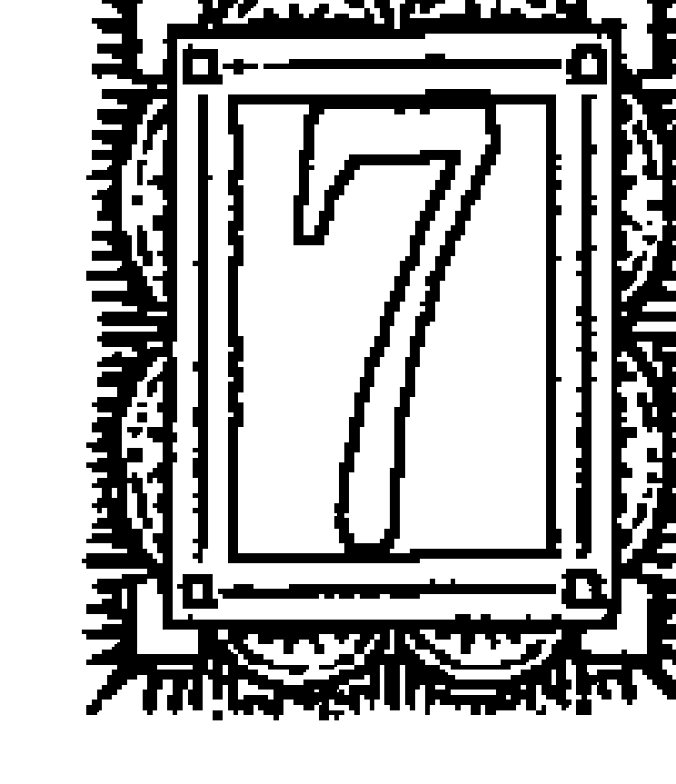

## 信賴與坦誠

想像你看見一個陰暗洞穴，  
一朵明亮的大光飄浮於黑暗之中  
因內在智慧而熠熠生光。  
但花朵藏於洞穴中，因它不懂自己的美，  
深怕暴露自己，見了光，將受到摧殘。  
你像不像這朵花？  
可曾邀請他人進入你私密的空間？  
何不懷著自信走出洞穴，  
表露真心、脆弱、和內在光芒？

能輕鬆過生活即代表我們願意信賴別人。  
～佚名

### 生命目標

生命數字為7的人其生命目標是信任內在的光亮或心靈——信任他人、信任生命的過程，有足夠的安全感願意開放。

### 信任與開放的本質

對大部分人來說，信任其實是一種自信的感覺，相信沒有人可以傷害、侮辱我們，也沒有人可以從我們身上竊取任何東西。對7號人而言，信任是他們對自己、對他人、對宇宙的深刻信仰——這種信仰直接來自於知識，不只是信仰，神靈存在於每一個的內心。信任可以使人完全的解脫與放鬆。它釋放了恐懼，他們與生命的溝通帶著一份靈性——甚至是一種神秘的應驗，就像印度的聖者Ramakrishna，他看到街上的鳥糞就體驗到一種狂喜，因爲鳥糞啓發了他的靈性，其實所有萬物都可以引發人的靈性。

當7號人開始信任他們的感情、思想、本能和直覺時——相信神靈存在於每個人心中——當他們持續進化，不斷地跌倒與學習，就能開放自己並達到靈性的愛、智慧與正義的超越境界，這些愛、智慧與正義也存在於每個人體內。這並不是說他們過於天真容易被別人利用，而是他們讓自己內在的光向外發散，不再儲藏或堆積，他們的內在之光將成爲別人的引導。

### 生命路徑上的挑戰

對7號人來說，信任始於自我信任。因爲生命目標表示特別的挑戰，對7號人來說自我信任是非常困難的事。7號人很難信任自己，但是他們又自以爲信任自己，這正是問題所在；他們信任可以思考的理智—專門儲存資訊、理論以及其他的理念—比較不信任「內在的知者」(inner knower)或是本能智慧。真正的自我信任應該包括生理、情緒、心理以及靈性的層次。

不過有些7號人則過於極端，自信到完全不理會他人的建議，他們否定他人的建議，因爲他們對自己的狹隘自信使他們對別人的意見非常敏感。

大部分的7號人比較相信別人的觀點，低估自己的看法。他們想要經由理智求取知識，透過書本、研討會、專家和老師的引導。他們嘗試許多節食的方法，進行營養補充實驗，有系統地運動，做不同形式的治療，跟隨許多老師進行靈修。這些體驗到一種狂喜，因爲鳥糞啓發了他的靈性，其實所有萬物都可以引發人的靈性。

當7號人開始信任自己的心，他們就能信任別人的心，無所畏懼。

在7號人面臨信任內心神靈的難題時，工作、人際關係和其他的挑戰可以幫助他們度過這個難關。即使完全相信自己的7號人，仍必須審視自己的內心；完全信任他人或自己的7號人看起來的確比較開放，更能適應社交生活，但是藉由深刻的自我檢驗，7號人就能明瞭他們的信任和開放其實是建立在理智層面上，事實上他們內心存在著害怕被他人背叛的恐懼，他們對自己內心知者的信任極不穩固。研讀信任法則會幫助7號人建立真正的信任感。

要得到自我信任，7號人需要的不是書，而是直接的經驗——透過瑣事、錯誤和經驗。平日便關心事務本質的7號人，可以透過工作、人際關係以及挑戰，得到更深層的認知，從平日生活中獲得成長、進化和學習機會。他們尋求深層的真理以及自我的發展，並透過一種類似X光的洞察力連結已知與未知。

除非7號人找到內心的自由，信任內在的知者，否則他們對未知甚至是內心的未知感到害怕，還會因為受到一種他們不知的內在力量所驅使或是受到內在衝動威脅，而產生不安、困惑或挫折的情緒。這就形成了緊張能量；許多7號人覺得很難注視一個人的眼睛，不論時間長短都一樣，因為他們自己能夠意識到那股傳遞的能量。

因此7號人常表現出一種模糊而夢幻的態度，不對人們下承諾。7號人朝向靈性與形上學發展，專注於神秘而隱藏的自然力，將自己抽離於物質現實與生活的責任之外。有些7號人成爲靈性的流浪者，背起背包到處流浪，從來沒有落地生根；蓄著長髮與鬍鬚，加入宗教集會所。他們可能在以太中以及與天堂相連的想像王國中迷失，但是他們必須更務實，使自己與地球有更密切的連結。直到他們最終能向內探索並領悟出他們所需要的，包括神在內，其實全都存在於內心裡面，這時他們才能成爲真正的永恆追求者。

其他的7號人則是恰如其分地扮演日常生活的角色，但是仍把自己和外在的世界遠遠隔開，不溝通、不交流。因爲7號人有很強的信任危機，以致別人也不覺得他足以信任。

與內在溝通的7號人，也能發現世界的深度。他們變成神秘主義者，在世俗中集中精力去做建設性的工作。這種自我實現的神秘家完全體現了7號數字所具有的能量。雖然一般人很難了解，他們仍然提供關於生命神秘的洞見與知識。他們的生命路徑是遠遠超越理智和邏輯，而是建立在信仰與信任。

7號人越不依賴理智能力，知道的就越多。當他們的理智經過訓練，就能穿透生命的深度，發現構成個人存在狀態的相互連接線，並成爲替世人解釋神秘主義的最佳人選。這些7號人在山巔、海邊、沙漠、洞穴或森林裡冥想，他們感覺自己在重溫一門遺忘已久的課程，重新與內心的力量與光亮取得連繫。

7號人非常喜歡自然世界，一些人會喜歡住在平靜的森林或洞穴中，讓他們可以避開對人的恐懼以及內在的偏執，轉化成藝術的形式。一旦7號人接觸與感受內心愛與信任的靈性，也能在其他人心中找到這份靈性，於是人為的界限馬上崩落，留下人際間自然而健康的邊界。

在人際關係這一部分，7號人想要也需要一個夥伴，幫助他們產生完整、和諧和平衡的感覺。但是這種夥伴關係表示對親密、開放與信任的需求。不論他們是否處在一個充滿關懷、互相依賴的關係中，背叛的可能性總是存在著。因此，大部分的7號人對親密關係都有一種複雜的情緒，一方面想要，另一方面卻又不想要。他們期望有伴侶，卻又表現冷淡、保持相當距離，期望擁有自己的空間，只有在這裡他們才會感到安全。因此，人際關係成爲一種協商的領域，7號人會堅守自己的領域，直到最後他們發現與自己和內心的靈性可以保有一種信任與愛的關係。當7號人開始信任內心的完整性，就能與別人分享這份完整性，而不再經由另一個人尋求完整性。

信任、坦誠與信仰是7號人生命目標的核心，與宗教儀式無關。這種信仰源自於個人內在的信心，最後並與更高層的能量、愛與信任——或是稱爲神靈——直接結合。許多7號人都可以從自然界的生物與神靈性感受到這種信仰，他們享受自然界的美景，並與某些地球文化產生共鳴，比如說美國印地安人的文化。當他們開始擴張經驗的層次，就會發現老鷹、溪流，甚至樹上的風都會跟他們說話。7號人最深的期望是被環抱於神靈的臂膀上——一雙他們真的可以完全信任的臂膀。當7號人越來越感覺到神靈的存在，他們的心裡就會有一種聲音出現：「我已經準備好回家。」

### 其他特質與難題

這些7號人都有情緒，但是他們比較信任自己的理智而不是自己的心，因爲他們的感情存著意識與潛意識的背叛與羞恥的回憶，這是源自於對過去經驗的認知和解釋。因爲這些恐懼，7號人就會把他們最深的、最原始的感情放在心裡。雖然他們也能適應社交生活，他們總是很小心，不洩露出深層的自己，這種做法常會導致很多誤解以及他們最害怕的信心破碎。

幾乎所有的7號人都有敏銳的理智，可以看出生命的弦外之音。他們都有潛力變成世界級的思想家、作家、神秘主義者或研究者。也有很多人進入學術領域，研究哲學、數學、物理、宗教、形上學或是心理學，學習自己如何運作，別人如何運作，生命如何運作。他們所找尋的智慧不是平凡人可以理解的。能與內在智慧溝通的7號人最後會驚訝地發現，他們所知道的遠比他們所以爲的還多。他們不知道自己知道那麼多，因此他們還有許多豐富的內在資源等著被開發。

不過，也有一些7號人根本不喜歡形上學，他們可能拒絕、忽略或者對靈性的觀念嗤之以鼻，不過他們最後也會因爲內心的呼喚而開始挖掘更深的生活；這種動力使他們進行深層的自我檢驗，進而發展出自我信任。

很少7號人天性喜歡群體，他們比較喜歡自己獨立工作，

## 高峰上：潛能與命運

爬上高峰後，7號人會停止找尋背叛的證據，他們看見了從每個人或每個環境所發出的深度智慧與秩序。他們以前經驗到的欺騙或背叛，現在成爲寶貴的教訓。即使面臨生活上的困境，他們還是會非常感激。以前所有的誤解都變成一種經驗，讓7號人打開自己，並且分享他們心裡真正的感覺——溝通、解決問題、面對、學習。有時候，當了解的橋樑已經崩塌，也許是結束一項關係，重新開啓另一個關係的時候。

7號人的最高境界是在各處看見智慧與美麗——不只是大自然的美景，也不只是聖堂，而是在城市裡的垃圾街以及朋友與對手間。

而且他們也希望有固定的時間獨處。即使他們看起來很合群，但仍然有碉堡一般的內在隱私，不容別人侵犯。他們比較喜歡單獨的活動，像寫作、研究或藝術。即使像演戲必須站在大眾面前，他們還是能在自己的內心中保持私有空間。許多7號人是優秀的舞者、歌手、音樂家或是商人，不管他們的職業是什麼，當他們的工作與更高層的目標相關就能感受完滿。許多7號人是銀行總裁、木匠、印刷工人、教師——這些人看起來或行爲上一點都不像鍾情於形而上學的人。

7號人很有孩子緣，這種感情是互相的，因爲7號人有顆像赤子般的心，在內心最深處與神相互連結。對7號人來說，欣賞他們內在的神靈並與更廣大靈性的接觸是很重要的工作。

達成這樣的境界，所有7號人的工作、人際關係、經驗以及挑戰，都變成智慧磨坊的穀物原料，他們不斷學習、顛蹟、跌倒、再爬起，面對自己、盡力回到宇宙的來源。並不是所有的7號人與靈性相關，但可以確定的是，有一天他們會深刻地體驗深度的信任，並轉化為對自己和靈性的信仰，並經驗前所未有的快樂。

### 行動檢核表

下列行動可做為7號人的參考：

- ✓ 當你有疑問時，問你自己：「如果我知道會怎樣？」看看答案是什麼。
- ✓ 盡力分享心中的感覺，不只是你的心智，並與別人達成協議。
- ✓ 尊重你的隱私權，但仍需冒一點風險公開你的感受。
- ✓ 信任你的直覺，你是自己身體與生命的專家。

### 獲取信任與開放

1. 觀想一位你認識的人，或想像一部文學作品或影片，甚或歷史上的人物——信任自己，與他人輕鬆的相處的人，不論是關心或憂慮，他都會適切地表達出來。

2. 想像你就是那個人——感覺安全、與別人有緊密的聯繫，總是輕鬆而願意開放自己。想想看能用什麼方法運用這些特質，使你的生活更有創造力？

## 富足與權力

想像一個豐富的角杯，  
滿裝五顏六色的水果、寶石、黃金，  
準備與願意站出來，踏上旅程的人分享。  
你喜不喜歡這樣的豐富？  
如何踏入世界？  
豐富之角杯是否已存在你心中？

若失去錢財，  
我們的真正財富即是自我價值。  
~佚名

### 生命目標

生命數字8的人其生命目標在於豐富、權力與名望，將他們的成功運用在公眾利益。然而，由於生命目標代表我們本有的挑戰，所有主要數字為8的人(17/8、26/8、35/8、44/8)以及生命數字含有8的人都會面臨金錢、權力、權威、控制以及名望的考驗。所有8號人都必須平衡內在(有時候是壓抑)想要成功的慾望以及避免物質成功的恐懼、潛意識信仰與衝動。

有些8號人視金錢為第一大難題，其他的8號人則會面臨權力、控制、權威、名望的難題。8號人必須不斷地檢視、平衡與解決這些難題。8號人必須先體驗內在的豐富、權力和尊敬，才能真正地展現這些特質。

8號人注定要經歷各種規模的世俗成功與富有；小至於家庭成員的肯定，大至地區、國家、全球的名望，因為我們的命運在任何領域都能展現成功。

最後，8號人會主導他的人生旅程，利用智慧、寬容與同情將其所具備的豐富與權力特質貢獻給更高尚的目標，進而超越這些特質。8號人包括有錢有勢的名人和窮苦潦倒的隱士，他們的生命目標不只是累積或躲避財富與權力；遠離與超越不同。雖然完成生命目標並非取決於他們賺多少錢或累積多少權力，不過8號人還是必須進入權力與金錢的領域，才有超越的可能。

### 富足與權力的本質

成功有許多種，像達成目標、幫助別人、發現內在的寧靜，這些都與金錢沒有關係。物質成功是8號人的主要生命目標，而且與金錢有絕對的相關。雖然對8號人而言，金錢是不

### 第二部：生命議題與能量 132

怕。這種渴望可能是有意識的，也可能是無意識的；不論是何種情況，這種矛盾的狀態與信仰是許多8號人的重要課題。

許多8號人都會意識到要賺更多錢，更有名望，同時想要更多環境的主控權，這些目標其實都是源自於內在的恐懼。爬高峰需要克服強大的心理障礙，8號人的障礙就是同時存在對成功的渴望與排斥。有人就曾說過：「我不喜歡錢，但是它可以平撫我的神經。」

我的生命數字是26/8，在這裡跟大家分享過去曾經發生的一次經驗，改變我對財富的負面認知，使我的人生產生重大的轉變。那時候，我身兼兩個打字員工作，但仍不夠維持家計，眼見著債台漸漸高築，心裡相當焦急。爾後在街頭，我注意到兩位衣著入時的年輕女人坐上一輛高級跑車，我的心裡突然蒙上一片陰霾，用敵意的眼光看著她們，心裡想著：「這些有錢的年輕女人們！」突然間，我好像被打一巴掌，我突然了解到：這兩個女人可能非常仁慈、聰明，我對他們有敵意，只是因為他們似乎有很多錢。剎那間我明白如果自己對金錢有著如此負面的想法，就不可能得到它。有了這樣的 understanding，我的物質生活似乎馬上好轉。

8號人可以有很多方式解決金錢與權力的難題，有的人非常省錢，認為多花點錢就是浪費、不道德，覺得豐足與道德不能相容，甚至對於有錢感覺到後悔。而其他8號人，一出生就含著金湯匙，因此與別人產生不小的距離，他們不是對錢感覺到罪惡感就是希望要更多的錢。他們不知道別人是為錢跟他在一起還是因爲他們本人，他們比較不願意盡力去測試自己。

其實，金錢與權力一樣，有好有壞。8號人最終會學習何時該堅持自己的立場，何時該放手；他們也會學會最正面的控制。

### 行動檢核表

8號人進行下列行動在生命目標上會得到更多進展：

- ✓ 經由武術或其他管道，讓你內在的特質正面地表達出來，這樣更容易接觸到內在的力量。

### 獲得富足與力量

- 1. 觀想一位你認識的人，或想像一部文學作品或影片，甚或歷史上的人物——擁有富足而且慷慨地分享，必要時能夠明快處理財務問題的角色。
- 2. 想像你就是那個人——真正的富有、沒有金錢的負擔、感覺到內在的權力、願意與他人分享。想想看能用什麼方法運用這些特質，使你的生活更有創造力？

## 正直與智慧

想像一位孤獨的智者沿著一條暗路走著，黎明仍未到來，他手裡提著一盞燈籠，就像是指引他人去路的一盞明燈。
這樣的智者，為他人照亮去路，只能照亮他們心中想去往的道路。
如果他們偏離了路徑，
其他追隨的人也會跟著偏離。
如果你是這位智者，
你能使自己成為別人追隨的典範嗎？
你能利用自己的德行啟發他人嗎？

> 我的生命就是我的導師。
印度聖雄甘地(Mahatma Gandhi)

### 生命目標

主要數字為9的人其生命目標是遵循他們最高的德行，將他們的生活與內心的直覺智慧相融合，以他們自身的榜樣啟發他人。主要數字為9的人(18/9、27/9、36/9、45/9)以及生命數字含有9的人，都面臨到正直與智慧的困境。

雖然我們每個人都有潛力領導別人，但是9號人能以最單純的形式展現自己的領導地位——以自己作榜樣領導。9號人天生就具有一種吸引人的魅力，所以他們不是領導別人就是誤導別人。他們必須明白他們所設下的榜樣或是生活，不論好壞都會被其他人所效仿。如果9號人的言語或行爲不恰當，牽涉不道德的性行爲或是有不良的習慣，他們需要考慮自己所立下的壞典範會影響他人。

我們的生命目標同時也是我們的生活挑戰，9號人常常掙扎是否要遵循高標準的正直原則，他們有時候會扭曲靈性法則，而且無法完全承擔行爲的後果。

靈性法則是9號人命運的核心，他們透過內心或是微妙的感覺面向獲得智慧，而非經由語言或理智。當9號人感受到內在的感覺，心中沉默的智慧就會指導他們，不過只有當他們能完全擺脫理智的束縛，使得理性過程或是想法臣服於內在智慧時，才能真正接受內心的指引。

### 正直與智慧的本質

每個人都知道，小孩子很少聽父母所說的話，但是他們會模仿父母的行爲。大人也是一樣；我們的意識聽得到別人的話，但是我們的潛意識才是改變的根源，行爲卻比言語要有力量。我們可以藉由模仿來學習；我們藉由典範教導他人。9號人必須仔細衡量他們的人際關係、商業行爲、父母之愛、友誼和生活型態，並問自己：「我的生活給予他人什麼樣的典範？我的生活是否符合高層原則？」

有些口才極佳的人可以用語言啓發他人，他們會以極具權威、才華和智慧的口氣表達崇高的理想。不過，只有真正言出必行的人才能表現出靈性權威的語氣，感動衆人的潛意識。雖然9號人天生就非常喜好高層智慧，他們不只是知道還必須遵循它；他們必須隨時注意自己的行爲是否符合內心的原則。甘地就是一個展現正直的正面例子，他曾經等到自己停止吃糖之後，才告訴一位小男孩不要吃糖。

想要提供正面典範的9號人，必須接觸他們內心的感覺層面——內心的直覺——這才是靈性所在。最高層的理性智慧不只存在於理性；它會透過我們的直覺告知我們。大部分9號人都會依照理性說話或行動，但如果他們仔細聆聽內心的聲音，就會發現這些話語、行動與他們的內心完全背道而馳。因此，9號人必須學習利用靈性法則做決定和行動。

靈性法則與社會教誨無關。就歷史上而言，9號人如甘地都能超越社會法規，依據靈性法則獲得更高層的德行。當9號人成功地整合自己的理性與感性，言語與行爲——當他們的行爲符合更高一層的法則，重視內心的本能智慧基於思想與衝動時——9號人就能體現德行的精髓。

### 生命路徑上的挑戰

雖然有一些9號人生來就有許多生理上、情緒上、心理上的難題，但是他們最大的難題在於靈性法則——生活的高層原則。9號人的能量與無意識的原罪與救贖——靈性褻瀆與懊悔——原型相關。其「靈性褻瀆」的例證包括因爲太過痛苦而自尋短見，不願勇敢地活下去，接受這樣的結果並從中學習成長；無法接受他人的生命歷程或路徑；誤用他人的意志以支配他人；亂用神之名或是假扮爲神。(某些電視上的傳教者就從優雅尊崇中摔下來，摔得很慘)。

歷史上，有許多9號人寧願信任理智，而不願聽從內心的感覺。因而他們會焚燒別人或在拷問臺上傷害別人，以便「拯救靈魂」。他們迫害同時自己也被迫害，如此不停地交換角色，直到他們開始相信自己內心靈性的指引。

一些9號人發現主流宗教或是東方靈修與拜師的方法，可以尋得安慰、寬恕與啓發。另一些9號人則拒絕任何的宗教信仰。不論是何種情況，從出生開始，9號人內心就存在一股啓發他人的力量，直到他們真正地明白並遵循宇宙法則並使自己成爲典範，這股力量就會自然而然地顯現出來。

許多9號人對宗教或是靈性議題比較沒有興趣；不過，在他們內心中最幽微的地方，能與遠古的、全球的聖人，以及尋求天啓並偶爾迷失的修士或修女產生共鳴。

9號人容易忽略他們想要知道的法則。他們依循自己的理智而活，即使內心知道什麼是最好的選擇，他們的行爲仍與之背道而馳。

大部分的9號人無法了解其中的因果法則(行爲與反應)。包括不顧他人的勸阻，年紀輕輕就有了小孩，最後又感到負擔沉重；飲食不健康；吸菸、喝酒、飲食和性行爲過量，最後得忍受身體的疾病。他們常常以爲自己是「受到懲罰的」，事實上是他們自己造成這樣的結果——他們自己導致這樣的局面。

9號人常常無意識地忽略內在的智慧，而是向外學習生命的教訓並給予他人這些經驗、指引他人。但是9號人必須了解到，身教絕對有其必要。

9號人必經的生命路徑是超越物質世界轉向靈性法則。9號人生命路徑中所發生的任何事都會引導或驅使他們尋求更高層的智慧與德行。

不是所有的9號人都會扮演老師或指導者的角色；他們可能是衣櫥製造師、木匠、樂師、秘書、郵差，你可以在各行各業中發現他們的身影。當他們遇到別人並建立人際關係時，不論是在社會中或家庭裡，使人們會很自然地將他們視爲領導者(不管他們喜不喜歡)。

一個名叫潔塔的女人就是9號人成爲領導者的最好例子。

她很容易緊張，因此決定學習瑜珈。她先看過一些圖片，以便自己學著那些伸展的動作與姿勢。她也開始學習打坐以放鬆。然而，很快地潔塔就覺得需要旁人的指導，所以她參加社區的瑜珈班。她感覺有一點不自然，走進去後看見有十個人在裡頭等老師。她想先暖身，所以她選了一個角落做了一些姿勢。老師顯然遲到了，所以她繼續做，最後，班上一個同學說，「我想老師不會來了，我們解散吧！」

「既然我們大家都在這裡，為什麼不選一位來帶大家做瑜珈，妳覺得如何？」一位同學對潔塔說。

「我？」潔塔說，「可是我第一天才來，根本不懂瑜珈。」

「你看起來很懂的樣子，」同學說著，「別推了，就帶大家做吧！」

「不要啦，我只是在暖身。」

「但是你看起來非常熟練，你一定可以做到。」結果，大家過了一堂充實的瑜珈課。

到了下一週，瑜珈老師打電話給潔塔，「學生告訴我他們很喜歡你的課程，我們何不一起上課？」結果，潔塔就意外地成了助教。

當9號人覺醒之後開始面對他們的生命目標，就能感受到自己內心的感情，並超越社會規範，以更高法則作為指引。如果他們無法感受他們內心的本能，就會創造自己的法則。

如果9號人不能夠照著自己的法則生活，就會開始評判自己；他們會把痛苦內化，不信任自己的感覺。如果他們的挫折完全轉向內在，會因爲罪惡感使然，藉著喝酒、嗑藥等行為傷害自己的身體。

許多9號人從極負有宗教性責任感轉變爲完全不理會道德指引。他們有時候會對於自己的行爲、感覺或是不明目的感到困惑，不明瞭也無不相信自己遵循更深層的內在指引而非意識層面的理性在生活。直到9號人了解並信任他們的高層目的，就成了「沒有原因的叛徒」，受到他們所極力避免的東西所懲罰：人性法則(當9號人最後上了法庭，人性法則會教導他們什麼是靈性法則)。

靈性法則無關對錯；而是關乎真理或結果。對9號人來說，遵循這種法則是臣服於自己內心關於愛、鼓勵、慈悲與智慧的一部分。本書最後部分的最高意志法則會重新喚起9號人的內在聲音。不論他們的生活是什麼形式，這種呼喚永遠在向他們低語；它代表任何一種追尋，不論是金錢、名聲、愛或意義。一旦9號人開始重視到內心的高層意志，即使生活不如想像中的平順，但是因為他們接觸到的是一個全新的存在之光，生活也將變得更有樂趣、更有意義。

當9號人更為成熟，與更高意志相結合，他們就成了別人在黑暗中的一盞明燈。他們內在的深度使他們天生擁有極大魅力。眾人期待9號人成爲他們的指引，因爲他們知道9號人擁有深層的愛、同情和智慧，而這些特質也可能隱藏在所有人的心中，只是他們不知道而已。

朝向負面發展的9號人，傾向於錯將自己的意見當作靈性的高層意志。他們容易成爲善意的狂熱分子，誤導他人，帶領他人誤入歧途，種下痛苦的結果，直到他們將自己渺小的心智臣服於廣大的意志之下，而這個意志存在於他們內心的感覺面向中。

當9號人的生命目標朝向負面發展，就會誤以爲自己的理性之神正是宇宙之神；因此他們帶領自己和他人走向歧途，造成更深的痛苦，直到最後他們將理性和渴望臣服於更高的意志之下。

不論是以什麼方式，9號人都會成爲他人仿效的典範，包括正面與負面。當他們扭曲了靈性法則，生命就會迅速給予回饋及明確的後果。人們難免有缺失，9號人也是如此，但是生命會經由特定的結果指引9號人並幫助他們理解隱含的宇宙法則。這種現象在任何人身上都會發生，不過9號人能立即接收更多、更密集的回饋。隨著時間的演進，9號人最終將會發現一直存在他內心中的智慧。

其實，9號人並非是完美的典範，而是良好的典型。如果要接受靈性法則的指引，遵循靈性法則——不論在商場上、人際關係中，或是飲食、運動和健康方面——9號人必須捫心自問：「內心的高層法則是什麼？」換句話說，他們必須問：「如果我有勇氣，擁有利他、寬容、同情的美德以及智慧，我會怎麼做？」不論他們個人的偏好、渴望或是興趣為何，此問題的答案就是他應遵循的方向。但是這個答案並非來自於理智，只是爲了符合自我的需求和立即的慾望而編造的；這個問題的答案是來自於內心的感覺面向。

因爲靈性法則是寫在心上，9號人如何與他們的心相連呢？本書後面的直覺法則會告訴9號人，不可以依賴自身以外的事物謀求答案，只有反求諸己，才可以接觸到內在智慧。

### 其他特質與難題

許多9號人過的生活從外表看來令人羨慕，但內在他們卻感到一種深度、重量以及對某種無以名狀的東西的強烈渴求。不論他們是否意識到，9號人都期望能理解並依循深層的生活法則，與他人建立深層的連繫感，找到靈感實現自己的命運。

當他們的能量被壓抑或是往負面發展，就可能產生奇怪的慢性病、罕見的痛苦、能量的疾病、長期的病痛、背痛或是令人跛腳的關節炎。這些疾病並非由外在環境所引起，而是內在的潛意識反映罪與悔恨的結果。

潛意識治療的方法與形式，包括催眠或信仰治療，只要根據他們原有信仰系統進行治療都很有效。

矛盾的是，那群依賴眾人意見的9號人，最後所表現出來的行為彷彿是他們的意見才是絕對的真理。許多9號人就像是固守自己意見的狂熱分子，阻礙他們培養超越的智慧與指引。

當9號人發現了他們的感覺中心，就能有足夠的安全感與現實產生連結。他們接受內在智慧的指引，遵循德行生活；這些9號的人也能容許他人擁有自己的生活方式和真理。遵循高層德行的9號人能節省許多時間。生活將變得更為輕鬆、有力和有意義。

當他們覺醒到某種程度時，就能協助他人覺醒。他們像是一座燈塔指引他人，或是像一位吹笛人，透過他們的深度、智慧、正直和啟發性的典範引導他人。

### 內在天賦

想像一個隱藏的泉水在肉眼不見的地底流動著，帶著自己的秘密，準備用盡全力噴發出來，對於那些願意挖得更深的人，滋養並給予他們生命。你是否也像那泉水？在地表下有什麼樣的資源等著你？你會找到什麼寶藏？在你的內在開啓之前，你將如何平衡自己的生活？

我們今日的樣子是上帝給予我們的禮物；我們未來的樣子是我們給予上帝的禮物。～無名氏

主要數字1到9是描述命運最根本的部分。數字0與生命目標無關，主要是指個人內在的天賦和潛在的能源。這些能源會強化其他數字的能量或是單一的特質，如敏感度、力量、表達。

## 沉思内在天赋

+ 1. 想一想你的敏感度：你曾經如何運用這項天賦？它又如何「利用」過你？你將如何運用這些能源服務他人？
+ 2. 想一想你的毅力：它是以內在力量來表達，還是外在形式？或是兩種都有？你欣賞這種天賦嗎？你該如何完全地應用它在生活上？
+ 3. 想一想你的表達能力：它是如何表達——在人際關係上和工作上？你意識到這項天賦嗎，還是有所懷疑？你是否用正面的方式表達這項天賦？
+ 4. 想想你的直覺：當做下決定或引導他人時，是否信任自己清明的直覺？你可曾注意到，當你接觸內心時，你的直覺完全開啓？

## 創造與自信

> 創意有如花朵，讚美使之綻放，但貶抑往往使之早凋。～艾歷斯·奧斯朋 (Alex F. Osborn)

以下出生數字描述以1為主要生命目標的生命軌道，在最初的四個生命軌道中，也就是19/10，28/10，37/10，以及46/10等10的組群，均受到代表「內在稟賦」的0的強化。接下來的次章節裡則會談到雙重1的組別（含11的出生數字群）。

### 19/10的正面特質

他們擁有吸引眾人的魅力，懂得利用本能的智慧，從事諮詢、治療、解決問題，或其他形式的創意工作。只要能找到內心的平靜，19/10的人會能以身作則來帶領別人，而不是霸道的給予對方意見，同時也懂得尊重別人的看法，又不會流於依賴。有了呈現自己敏感本性的自信後，往往能為他們帶來和諧的人際關係。19/10的人喜歡以固定的運動來平衡他們的精力，也會避免或克服不良的嗜好。他們能影響並啟發身邊的人，讓他們跟著活絡起來。

### 19/10的負面特質

當19/10的精力受到壓抑或受阻時，身體就會出問題，他們會緊張、壓抑、大發雷霆，還會對菸草、酒、其他藥物等上癮，或出現飲食失調的問題。固守己見的19/10會緊緊抓住一些理念、信仰或哲學不放。這類的19/10通常單身、離婚，或很難與人同住。他們在害羞與霸道、固執與不安之間擺盪。19/10若受到抑制，會去壓抑自己的性慾；受挫時，則放浪形骸。他們獨斷的意見，正是內心不安的表現。

### 人生運勢

#### 健康

19/10過人而敏銳的精力，往往使他們的身體、眼睛或臉孔長相異於常人，遇到的健康問題也跟別人不同。19/10的人需要的睡眠時間通常比別人短，尤其當他們受到激勵、精神亢奮時。19/10的人必須維持均衡穩建的生活，善用他們敏銳的本質，才能為他人服務。

萬一他們的精力無從發揮，19/10的攝護腺、卵巢、下背部或心臟可能會出現問題。疾病會影響他們的生殖器官及下背部，而造成便秘及身心上的問題，或染上不良習慣。

由於19/10的精力層面是如此的易感，使他們很難忍受藥物或酒精；他們往往會著迷此道，最後變成濫用，因此這些東西最好少碰為妙。大部分19/10的人生病時，對疲勞消除式的治療方式反應較佳，如按摩、催眠、想像，及一般劑量的藥物。即使針灸師在面對極度敏感的19/10，也得格外小心。

健康穩定的飲食對19/10的最有益，即使是吃素的19/10，

#### 人際關係

19/10的人有時在工作上會覺得跟別人合不來，而感到「孤癖」。所有的19/10都需要小心平衡自己的理性與感性；換言之，只有在拋開理性的身段後，他們才能感受到自己的情感。

憤怒是19/10的一大問題，他們時而壓抑時而放肆，時而羞澀時而獨斷，他們可以對陌生人展現魅力，卻對家人朋友不睬不理。當他們生自己的氣時，還可能會糟蹋自己，因為受挫的精力矇蔽了心中的愛。

他們的生命道路並不是以人際關係為主軸的，因此對19/10及與其同住的親友來說，這會是一大挑戰。他們可以有不錯的人際關係，可是很難再進一步擁有親密的關係。當他們覺得受傷或被人支使時，就會對親密關係感到憤怒，這種憤怒也許會壓在心裡，也許會表現出來。19/10在發展親密的人際關係前，必須先克服害羞或羞恥的問題，才能敞開心扉，建立深入的關係。跟所有人一樣，19/10的人也是可以改變的，當他們能信賴並感受到心中的愛時，常會以性愛來治療他們的兩性關係。

#### 天賦、工作與財務狀況

19/10的人在工作上有強烈的服務傾向——他們會以各種方式來表達自己的創造力。由於天生敏銳、強勢、善於表達、直覺力又強，加上吸引人的特質，19/10的人有一股無可名狀的魅力與領袖氣質。當他們篤定自信時，可以展現出不可思議的洞悉力與智慧。他們的生命軌道是最富直覺力的一個，雖然他們絕無意將自己局限在直覺的領域上，可是他們獨特而強烈的特質，使他們能輕而易舉的在任何形式的直覺創意工作或治療領域、社區領導工作、諮詢或服務業上，綻放異彩。

治療的形式有許多種，從為朋友諮商、為人按摩到當開業醫生，都屬於治療範圍。即使那些從事非治療領域工作的19/10，也可以因爲天生的吸引力，對別人產生治療的影響，不過這種治療不一定效果立現。

許多19/10的人以繪製問候卡、為親友寫詩或其他創作方式，來表達自己的創意。他們靈思不斷，只要給他們創造的空間，19/10的人就會用自己獨特的方式來服務、啟發別人。

19/10若得到充分的練習，可以成爲極具才華的創作作家、音樂家、演員、園藝家、導演或其他創作藝術者。他們體能絕佳，可以用手密集的大量工作。不管他們是否選擇了治療或創作藝術的工作，19/10的人可以管理、領導或服務別人。

許多19/10害怕錯用自己的天份，可是又不敢去面對這份恐懼與不安。當他們學會應用自己的天賦來服務人群，並充分發揮，他們的生命便能開花結果。

19/10的人能否克服不安全感並學會信賴自己的直覺，也會反應在他們的財務狀況上。

### 19/10的名人

+ 蘇珊·安東尼（Susan B. Anthony，美國婦運推動者）
+ 杰克斯·考斯陶
+ 華德·迪士尼
+ 多明哥（Placido Domingo，聲樂家）
+ 貝蒂·法登（Betty Friedan，美國婦運推動者）
+ 席德蓋塞（Theodore Geisel，兒童文學作家，即蘇斯博士）
+ 戈巴契夫
+ 迪克·葛雷（Dick Gregory，美國小說家）
+ 朗恩·賀伯（L. Ron Hubbard，科學教派創建人）
+ 馬丁·路德（Martin Luther，宗教領袖）
+ 南丁格爾
+ 巴格萬雷尼斯（Bhagwan Rajneesh，Osho，印度人，教派創立者）
+ 史賓賽·崔西（Spencer Tracy，美國演員）
+ 華盛頓（George Washington，美國建國總統）

### 實現天命的要訣

如果你的出生數字是19/10，本章節可以協助你把心力用在刀口上，以特定行動來改善生活的重要層面，幫你找出生命目標。

### 原則與建議

+ 1. 培養每日運動的習慣，以紓解壓力。
2. 每天做點富創意的事。
3. 信任並培養自己的直覺力。
4. 敞開心扉，表現自己感性的一面。

1. 請思考以下問題：
我如何利用自己的創造力？
可以用哪些方法讓自己的身體更健康？
我可以坦然地向別人示弱嗎？
我有勇氣拒絕人云亦云嗎？
2. 如果這些問題能引發你一些想法，如何將它們化為行動？

## 深入了解

+ 1. 請翻到前面第二部分，溫習1、9及0等出生數字的段落。
2. 也許你會想複習特定親友的出生數字，如果他們並不排斥，不妨與他們討論自己生活中，類似或不同的問題。

### 精神法則：改變人生的方法

+ 1. 請閱讀第四部分的下列法則：
選擇法則：我們可以選擇將創造力運用在正面或負面的途徑上。
天道法則：只要願意為更高遠的目標服役，我們便能激勵自己與他人。
行動法則：為了克服心中的不安全感，我們必須接納自己的脆弱，並自信出擊。
直覺法則：當我們不再收聽別人的意見，便能聽見自己心中的智慧之聲。
靈活法則：保持靈活的彈性，才可以善用變動的環境。
2. 練習每項法則後所附的練習。
3. 想想如何將它們運用到生活裡。

### 了解人生目標

生命道路在28/10的人，此生要學習物質成就與創造力的問題，並以其創造力和直覺力來服務別人，用他們的威權與悲憫心來領導人群。綜合了創造力及敏銳度、力量、表達力和精準的直覺等內在稟賦，當權的28/10一旦能克服他們的人生問題和障礙，便能完全展現自己的力量。28/10的成就與權威，也許環繞著家庭，也許呈現在世界上。當他們能自信的抱著明確的服務動機挺身而出時，即能有所表現。

我們在使用本書方法計算出生數字時，並未把四個出生數字的最末兩位相加起來，不過如果真的把它們加起來的話（1+0），會得到28/10/1的結果——表示雙倍的創造潛能（1）及心中的不安感，可能受到敏銳度、力量、表達力及直覺等內在稟賦（0）影響，而獲得強化。

幾乎所有的28/10都有一雙「回春妙手」；他們可以用自己的妙手，本能的找到宣洩活力的方向或管道。若為朋友按摩，他們及那些幸運的友人，都將有一股特別的感受。

由於許多28/10的人潛意識中與古老的巫師遙相呼應，使他們擔心自己會跟那些濫用能力的巫師一樣，錯用自己的力量。「天道法則」在此扮演了重要的角色，因為這條法則能鼓舞他們將能力用在更高的目標上，紓減他們潛意識中的恐懼。

28/10擁有豐富的創造力，可是也有同等強度的不安感，這些不安感，又因為他們對權威既愛且恨的心理，與放棄自身權力的傾向，而變本加厲，使他們在人生路上遇到一些必須克服的障礙。由於以上種種傾向，使大部分28/10的人覺得自己需要依靠某個人，他們在獨力做事或照顧自己時往往會感到心慌；然而，就長期而言，28/10的人若能自給自足、掌控自己的人生，成就感也來得更高。

若非居於領導者的角色，28/10往往會是幕後「垂簾聽政」的那位，與一或一位以上的人士，合作創造出更好的改善方式。在扮演這種角色時，28/10的人切記別太過嚴肅或流於說教。

### 28/10的正面特質

28/10是別人欣賞尊敬的權威人士，他們是親朋好友及眾人的建議者。若能克服不安全感，28/10的人便能從服務中賺取豐盈的金錢，同時覺得自己越來越好。獨立自足的28/10能善用他們的活力吸引別人，知道無論遇到什麼困境或挑戰，自己都有能力處理。直覺力強又富啟發性的28/10可以為眾人提供明確良好的諮詢。

### 28/10的負面特質

安全感低、迷信金錢和權威，又愛依賴的28/10喜歡操控別人。因為還沒得到權威，所以他們會抗拒權威人士。28/10常因為壓抑怒氣和挫折感造成身體毛病，他們懼怕出現在自己幻想的黑暗影像裡；無法區分負面印象與明確的直覺之間的差異。這類的28/10對內心及外界的指引，尚不懂得體會、缺乏接觸的經驗。

### 人生運勢

#### 健康

由於發揮治療的影響力是28/10的人這一生的功課，因此有時他們會透過自己的生理毛病、精神不振和飲食失調等問題來學習。壓抑的憤怒所造成的生理症候主要出現在腹部，下至脊椎尾部附近的會陰、下背部一帶或尾骨，也許會造成生殖器感染、憩室病，以及下腸道的問題。28/10的生殖部位非常敏感，有時容易受到過多的刺激。28/10的人若能學會把身體當成能量的紓發管道，即能治療自己與他人。

若能善用本數字的幾條重要精神法則，可以協助28/10的人克服低安全感的問題，讓他們自在地表達情緒，並開啓幸福之門。

有些28/10的人患有強迫性飲食失調症，如貪食症（bulimia）和厭食症（anorexia），這也反應了他們喜歡控制的毛病，不是控制太過，就是節制不足。注意均衡穩定的飲食，並從事較劇烈的運動，可讓28/10的人找到新的力量與自信。

雖然一開始有些人會逃避運動，但幾乎所有28/10的人在運動中受益後，都能變得生氣勃勃；運動可大幅改善他們的生活，釋放內心情緒，提振疲弱的活力，紓減生殖部位的壓力，同時有助於刺激健康的胃口，運動對每個人都十分有益，而28/10的人尤其喜歡有氧運動，因為他們很適合劇烈的舞蹈及武術運動。

#### 人際關係

壓抑的內在情緒是28/10的主要問題——尤其是憤怒——他們往往把怒氣悶在心裡或將之合理化，結果變得冷漠又愛說教，一副道貌岸然的樣子。他們常因擔心別人的看法，或害怕自己的怒意太盛，而把氣壓在心裡頭，也因為把該發洩的負面情緒全悶在肚子裡了，結果看起來反而十分害羞安靜。正面印象的28/10在面對權威人士時可以非常坦承而直接。善用「誠實法則」可協助28/10的人紓發心中的怒意，更坦然表達自己的感受。

28/10的人際關係優劣，謹繫於他們對自我價值（self-worth）的觀感，以及能不能自足自若。當他們覺得不足，想去依靠別人時，很可能會陷溺在操控駕馭的遊戲裡。可是當他們能篤定自若的與人相處，認同自己迷人的活力時，便會覺得控制別人是不必要且沒有好處的，於是就不再那麼愛說教了。

富創意又十分敏感的28/10大部分都有敏感而強烈的性慾，如果不加節制，往往會遇到與性有關的問題。大多數的28/10必須小心監控自己對性慾和創造力的表達方式，最好依循「選擇法則」來使用這些能量。他們必須避免用性來控制別人，或依靠性來認可自我的價值，最好只有在心中有愛，可坦然付出時，才會與人發生性關係。

#### 天賦、工作與財務狀況

出生數字28/10的人精力充沛、有一雙妙手和敏銳的直覺。他們會是絕佳的諮詢人士，很能掌握重要事項。除此之外，當他們天生的領導能力和權威感獲得發揮，便能激勵別人跟進。大部分28/10的人可以在治療領域或對別人有所貢獻的事業中，得到成就感。身心及情緒的治療形式種類繁多，包括按摩、能量工作、諮詢、寫作、教書及激勵別人等，有些28/10的人則從事個人成長事業。在各行各業中幾乎都可以發現28/10的蹤影，不過無論他們靠什麼為生，28/10的人最開心的是有機會運用他們的天賦、創造力和天生的權威感。

對於金錢，這些人必須學著盡量坦誠。如果他們用自己的貢獻來衡量金錢，那麼即使收入再多，也很難覺得滿意。如果他們遇到金錢或操守的問題，28/10的人很懂得自問：「我心裡到底真正需要什麼？」如果受到對金錢負面想法的影響，28/10對賺錢就會裹足不前，而在無意中破壞了自己的種種努力。當他們充滿勇氣與愛，創造力得到發揮時，便能自然的賺到錢，而且享受金錢，花起錢來也十分有創意。28/10的人若獲得了安全感，並大方的展現自己的權威時，他們在各方面都會很有收獲，而且想賺多少，就賺多少。除了他們自己，沒有人能阻止28/10的人，了解這一點，他們便能義無反顧的貢獻世界了。

### 28/10的名人

+ 美雅·安古拉（Maya Angelou，美國女詩人）
卡蘿·貝尼特（Carol Burnett，美國諧星）
楚門·卡波特（Truman Capote，美國記者／作家）
吉米·庫納斯（Jimmy Connors，美國網球名將）
小山米·戴維斯（Sammy Davis, Jr.，美國爵士歌手舞者）
西蒙波娃（Simone de Beauvoir，法國存在主義者，《第二性》作者）
比利·葛姆（Billy Graham，美國牧師）
詹尼斯·喬普林（Janis Joplin，美國六○年代搖滾歌手）
馬丁路德·金恩（Martin Luther King, Jr.，美國黑人民運領袖）
喬治·盧卡斯（George Lucas，美國製片及導演）
史帝芬·馬汀（Steve Martin，美國諧星）
羅夫·耐德（Nader，美國專欄作家）
傑克·尼克遜（Jack Nicholson，美國演員）
莎拉·瓦漢（Sarah Vaughan，美國歌手）

### 實現天命的要訣

出生數字是28/10的讀者，本章節可協助你把心力用在刀口上，以特定行動來改善重要的生活領域，幫你找出生命目標。

### 原則與建議

+ 1. 表達並釐清對權威人士的憤怒，然後追求自己的權力度。
2. 每天從事活潑劇烈的運動。
3. 克服不安全感，朝自己的目標邁進。
4. 設法使用自己的創造力與內在稟賦。

## 問題

uestion

1. 請思考下列問題：
如何才能用我的創造力來創造財富、做自己喜歡的事、為他人服務？
我對自己的及他人的威權力作何感想？
我什麼時候會覺得自己很堅強獨立？
有時候我會不會想去操縱別人？
2. 如果這些問題能啓發你一些想法，如何將它們化為行動？

## 深入了解

+ 1. 請翻到第二部分，溫習1、2、8及0等出生數字相關的段落。
2. 也許你會想複習親友的出生數字，如果他們不排斥的話，可與他們討論自己生活中，類似或不同的問題。

### 精神法則：改變人生的方法

+ 1. 請到第四部分閱讀下列法則：
誠實法則：坦然承認對自己及他人的感受。
直覺法則：當我們不再收聽別人的意見時，便能聽到自己心中的智慧之聲。

### 行動法則

為了克服心中的不安全感，我們必須接納自己的脆弱，並自信出擊。

### 選擇法則

我們可以選擇將創造力運用在正面或負面的途徑上。

### 天道法則

只要願意為更高的目標服役，我們便能激勵自己與他人。

+ 2. 練習每項法則後所附的練習。
3. 想想如何將它們運用到生活裡。

## 37/10

## 10：創造、自信與內在稟賦
7：信賴與坦誠
3：表達與敏銳

### 了解人生目標

生命軌道在37/10的人，此生要解決創造的問題，並學著信賴自己及別人的智善心性，運用他們的內在稟賦創造出更和諧的世界。有時37/19的生命軌道會指向世界，如尚·雷諾瓦（Jean Renoir，註：法國演員）、艾達絲·修斯蕾（Aldous Huxley，註：美國作家）及托爾斯泰（Tolstoy）等人，可是較不知名的37/10，依然可以在一小圈朋友或小社區中，完成自己的天命。然而由於生命目標不易達成，37/10的人也許得花點時間，才能敞開心扉，去信任自己或自己的生活經歷。這些人有易感孤癖的特質，因此必須克服深植於心底的不安才行。

在使用書中方法計算出生數字時，我們並未把四個出生數字的最末兩位相加起來，不過如果真的把它們加起來的話（1+0），結果會得到37/10/1——表示雙倍的創造潛力（1）及心中的不安全感，可能受到敏銳度、表達力、力量及直覺等內在稟賦（0）的影響，而增加強度。

信任感對每個人都是相當重要且有用的，可是對37/10的人來說更是生命的試金石。由於缺乏自我信任，多數37/10的人會向外界尋求知識，不敢信任自己的直覺。

37/10的人常下意識會去預期背叛的發生，結果常「心想事成」的被人出賣。許多37/10的人會從各種人類弱點中學到有用的精神教訓，以及信任自己的重要。

當他們了解過去所受的背叛，自己也有一份責任時，37/10的人會在有意無意間，慢慢懂得去感激別人所扮演的角色，對他們成長歷程的重要。也許他們不會感激那些破壞信任的人，可是37/10的人對背叛經驗所帶來的自覺與成長，依然會滿懷感謝。

37/10的人若懂得運用「期望法則」，了解潛意識的期許力量後，便會改變自己的預設立場，並進而改變自己的一生。學會信賴自己的生命過程後，他們就不再需要外界的背叛了。

所有37/10的人內心深處都有堅強智慧的性靈；一旦他們找到高遠的理想，讓理想在心中發酵，就可以變成天使的化身。這些敏感細膩的人必須維持平衡穩健的生活形式，包括修心，例如用冥想反省等方式，維持內心的靜定，以創造一個安全平靜的空間，讓自己在其中充電、滋養。

當他們發現生命神秘美好的本質後，即能了解，無論遇到任何事、是好是壞、順遂困厄、愉悅痛苦，都能使自己受益，並從中學習。

## 37/10的正面特質

上進的37/10能為接觸他們的人帶來光與熱。只要肯信任自己和自己的能量，他們便能自信滿滿的向前邁進，即使犯了錯，也能當它是人生自然的一環。他們能勇敢坦盪地表達內心的感受，率直清晰地溝通自己內在的需求。他們樂享自己無窮的天賦與創造力，擁有細膩的治療能力，若能與人為善，並感受到內心與自然世界的聯繫，也能投身其他領域。他們的治療力量也許會展現在各種形式上，如藝術、音樂、戲劇或其他美學的表達形式。

## 37/10的負面特質

這些人一開始會天真的去找尋信任感，卻又因為缺乏安全感，害怕自己出糗，而有所保留，結果越是擔心，就越容易遭到背叛。由於不肯表達自己的感受，他們會認為別人在誤解，甚至不信任他們。他們對自己感到憤怒沮喪，常做惡夢，因為惡夢反映出他們心底的恐懼。他們的人際關係備極艱辛，受阻的創造力苦無發揮之處，生理上的疾病也許會逼著他們面對一些健康上的問題。

### 人生運勢

#### 健康

幾乎所有37/10的人都有著敏感細膩的生理本質及充沛的活力，他們的脊椎尾部、生殖器官以及太陽神經叢，可能會因為旺盛的性慾和活力，而變得非常易感，此外心臟和膝蓋部位也常相當敏感。無論是男是女，37/10的人都必須格外謹慎，避免發生意外懷孕，因為他們這方面的問題常比別人多。

37/10的人跟其他天生具有治療能力的人一樣，常在人生路上遇到一些生理疾病，而從中學習各種復原的方法。這類的37/10常把這種學習方式當成充電的經驗，因為他們的潛意識裡早就對能量復癒之道十分熟稔了。

清淡的素食對啓發37/10的直覺力和敏銳度十分有益，雖以素食為主，不過偶爾吃點雞鴨魚類的肉品，還是有助於保持身體的健壯。簡單健康的飲食原則，對他們好處良多。

當不安全感阻礙他們的創造力時，37/10的人會做出自我破壞的行為，如藥物食品的濫用，或縱慾無度等。由於體質敏感，他們其實受不了任何形式的濫用。

出生數字37/10的人需要固定穩健的運動或舞蹈、太極、瑜珈、游泳等細膩的肢體訓練，來宣洩他們的體能。他們必須學著相信，無論自己喜歡什麼，都會是最適合自己的。再說一次，對於出生數字中含1的人而言，運動的主要功能是發洩體能，以避免他們用不良的嗜好去紓發。

#### 人際關係

就像大多數出生數字含7的人一樣，37/10的人往往較信任自己的思考，而非自己的感受，因為情感的東西會因預期中的背叛而帶來痛苦與不信任。

37/10的人其實有深入愛與智慧的潛能，可是他們必須先拋開理智的抗拒，學習信任自己的感覺，才能深究自己的內心，即使是痛苦的感覺也無所謂。

許多37/10的人是沉默的聆聽者，因為他們害怕自己說錯話。他們喜歡獨處，卻又覺得需要與人相連。因為缺乏安全感，37/10的人往往期望得到大量的愛，偏偏又吝於付出，而且會有依賴他人的傾向。他們常仰賴伴侶為他們帶來完整感，或依靠工作和外在的影響來滿足自己。就這一點，37/10和28/10的人是十分相似的，不過28/10的問題偏重在操控欲，而37/10則是尋找代替父母照顧他們的人，因為他們往往不確定自己可以照顧自己。他們對人際關係常有著愛恨摻半的混雜感覺，這種感覺正好反映出他們對自我的不確定。

37/10的性關係與人際關係能不能開花結果，就看他們肯不肯坦然，能不能信任了。37/10的性生活若能跳脫肉體的發洩，昇華到精神階層，便能帶來更大的滿足。許多37/10的人會覺得強調感情分享等精神層面的性愛講習會，可以為他們打開新視野，對親密感與人際的意義有新的領會。

一旦37/10肯坦然表達自己的情緒與需求，並學會信任同伴，便能得到美滿的人際關係。

#### 天賦、工作與財務狀況

這是一個非常敏銳，且極具藝術天份的生命軌道，37/10

## 37/10的名人

+ 拿破崙（Napoleon Bonaparte，法國名將）
卓別林（Charlie Chaplin，美國名導及演員）
艾德絲·休雷斯（Aldous Huxley，美國作家）
魔術強生（Earvin (Magic) Johnson，美國籃球員）
保羅克利（Paul Klee，瑞士畫家）
蜜雪·菲錦（Michelle Pfeiffer，美國影星）
勞勃瑞福（Robert Redford，美國導演及演員）

### 實現天命的要訣

如果你的出生數字是37/10，本節可以教你用特定行動改善重要的生活層面，讓你找到生命目標。

### 原則與建議

+ 1. 信任自己的感受及天生的敏銳度、力量、表達力和直覺。
2. 培養表達感情的勇氣。
3. 恐懼時，別害怕畏縮。
4. 做點園藝工作，讀點跟天使有關的書籍。

## 問題

uestion

1. 請思考下列問題：
關於自己的健康，我會比較信任自己的直覺，還是外面專家或理論的看法？
我能不能表達心底的感受？若是做不到，原因何在？
如何善用自己的創造力，使世界變得更美？
2. 如果這些問題能啓迪你一些想法，如何將它們化為行動？

## 深入了解

+ 1. 請翻到第二部分，溫習1、3、7和0等出生數字的段落。
2. 也許你會想複習親友的出生數字，如果他們不排斥的話，可與他們討論自己生活中，類似或不同的問題。

### 精神法則：改變人生的方法

+ 1. 請到第四部分閱讀下列法則：
選擇法則：我們可以選擇將創造力運用在正面或負面的途徑上。
靈活法則：保持靈活的彈性，才可以善用變動的環境。
行動法則：為了克服心中的不安，我們必須接納自己脆弱的一面，同時自信出擊。
直覺法則：當我們不再收聽別人的意見時，便能聽到心中的智慧之音。
責任法則：內心的滿足感來自於了解何時該說好，以及如何去拒絕。
2. 練習每項法則後所附的練習。
3. 想想如何將它們運用到生活裡。

### 了解人生目標

46/10的人，此生要化解創造力與崇高理想的問題，設法將他們的能量與內在稟賦運用在正途上，遵循務實而按部就班的程序，去實踐他們的理想、改善世界。他們可以在小範圍中，改善自己的家庭、朋友圈，或大範疇的世界，不過範圍的大小並非重點所在。

由於數字4和6的關係，加上10的影響，46/10的人面對的挑戰、擁有的力量以及遇到的問題，跟其他出生數字含10的人都不太一樣。他們也許擁有數字4帶來的活力與力量，卻又受到數字6完美主義的影響，而不覺得自己創造力高。

在使用本書方法來計算出生數字時，我們並未把四個出生數字的最末兩位相加起來，不過如果真的把它們加起來的話（1+0），會得到46/10/1——表示雙倍的創造潛力（1），可能受到敏銳度、力量、表達能力及直覺等內在稟賦（0）的強化。

## 46/10的正面特質

擁有優質力量、敏銳度、遠見及充沛活力的46/10，本能的會去創造遠見或理想，同時擁有鍥而不捨的圓夢力量。他們是開疆闢土的先驅，在商場及人際關係中揮灑自如，因爲他們能接納別人，又能高明的推動自己的目標。這些46/10的人就像披荊斬棘，爲崇高理想奮鬥的開路先鋒。

## 46/10的負面特質

由於生活從來不按他們的期許或時間表進行，這些46/10的人往往變得沒耐性、易怒、安全感低，又容易受挫，他們希望人間如天堂，而且巴不得立即實現，偏又不肯踏實地一步步去做，他們跟與風車爭戰的唐吉訶德（Don Quixote）一樣，尋覓著「不可能的夢想」。他們不斷的苛責自己卻不自覺，對別人的評語也極其敏感，外人的回饋或建議他們往往聽不進去，反而會回過頭來自圓其說。他們的判斷阻撓了本能的直覺，只看到問題，而且還藉酒精、藥品、食物或性慾等來紓發受阻的創造力。

### 人生運勢

#### 健康

幾乎所有的46/10都有強健而極爲細膩的身體，如果他們

#### 人際關係

對46/10的人來說，要接納自己「黑暗」的情緒是一大挑戰，因爲他們只想著自己「應該」有什麼感受，而忽略了自己真正的感覺。他們腦海裡的理想印象也許會以否絕自欺的方式，掩蓋他們真實的自我。46/10的人越能了解、接納自己，人際關係就會越好，因爲他們能接納別人的缺失。大部分的46/10都得學著去接受凡夫俗子的情緒。

#### 天賦、工作與財務狀況

雖然他們求好的態度，優越的力量、分析力及敏銳度，使46/10的人在各行業中都能如虎添翼，不過像運動、擔任個人

## 雙倍的創造與自信

我們可以選擇人生是一場橫禍或冒險  
~佚名

用最簡單的話來說吧，當重複的1（11）出現在斜線右邊，  
如29/11、38/11、47/11等出生數字，  
它們跟第二部分中談到1所代表的能量與特質是完全相同的，  
只是1所代表的一切特質、天分及潛在的障礙，能量也強了兩倍。

### 了解人生目標

生命軌道在29/11的人此生要結合他們的創造力、崇高的紀律和操守，設法以創造力和智慧來為服務眾人。他們可以從精神法則中去體現這些智慧，尤其是他們此生要去學習實踐的幾項法則。

在使用本書方法來計算出生數字時，我們並未把四個出生數字的最末兩位相加起來，不過如果真的把它們加起來的話（1+1），會得到29/11/2的結果——表示雙倍的合作能量（2），以及雙倍的創造力（11）對29/11的影響。

所有29/11與其他出生數字中含兩個1的人，都具有極高的創造潛能，可是因爲主要生命目標不易達成，29/11的人反而覺得自己的創造力比不上其他出生數字沒有1的人，也不像其他創造問題和阻礙少的人那麼富創意。有些29/11的人依然「淪陷」在2和9兩個數字所帶來的問題裡，對自己充沛的能量

## 第三部：命運之路 194

製造奇蹟的能力。然而他們旺盛的能量就像一把兩刃刀，好處雖多，麻煩也不少。能量可以是創造力，也可以是股破壞力；例如，電可以照亮都市，也可以致人於死。29/11在學習人生課程時，可以將無窮的精力發揮在更正面的途徑上，否則，他們往往會以不良嗜好來抒發受阻的創意。

儘管面對重重挑戰，29/11的人仍然展現出卓越的潛能；他們若能清楚篤定的面對自己的問題，便能側身世上最具創造力的精英群裡。數字2俱有與人合作的力量，無論規模大小，29/11的人天生會去支持別人。不管他們是商人或治療者、建築業或理髮師、店員或運動家，29/11的人擁有把創意融入工作、嗜好或家庭生活的潛能。整體說來，用泉源不絕的創造力去鼓舞、激發、支持及治療別人，是29/11的天命。

## 29/11的正面特質

這些人不管做什麼，若能本著服務的宗旨，便會覺得渾身是勁，也能激勵別人。他們有創見、支持朋友，又是忠誠的夥伴，29/11的人能以天生的領袖氣質吸引別人，也懂得鼓舞屬下。不管他們選擇哪種創造領域，總能提供特別的事物，以無比的活力與毅力去達成自己的目標。輕鬆而開明的29/11能直接從精神生活中汲取啟發。

## 29/11的負面特質

他們看起來沒安全感又抑鬱，要不就是表面自信滿滿，實

### 人生運勢

#### 健康

受到旺盛能量的影響，29/11的人外觀往往異於常人，他們的精力是普通人的兩三倍，當他們投入創作時，需要的睡眠時間很少，過人的能量與外觀特質，常是他們吸引人的魅力所在。

他們的再生部位（性／創造力）非常敏感，包括下腹與下背部。生殖部位的發炎、囊腫、刺痛、下背部痛、便秘或體重過重，常是因29/10的人創造能力受阻而造成的。出生數字29/11的人也許比其他的出生數字更容易遇到骨折或罕見的疾病。另一方面，他們似乎有著超乎尋常的運氣，所謂「大難不死」指的就是他們。

29/11的生理、情緒或性的問題，常源自於創造力受阻或

## 第三部：命運之路 196

不良的習性，健身對29/11的人好處甚多。

29/11的人潛意識裡是十分開明且開通的；因此，正面的想法、冥想及其他針對潛意識，以及像針灸、針壓止血法、合氣道、自然療法等「身體能量」的療法，會比一般藥物及醫療的效果更佳。

一般說來，29/11的人比其他人需要紮實而多樣化的飲食——如穀類、豆類等食品，偶爾吃些雞鴨魚類。他們必須留意自己的營養與運動，在飲食方面投注的心力，最好與精神法則一樣多。攝取的食物對29/11的人深具影響，因為他們敏銳的能量無法忍受藥物或酒精，最好對這兩者敬而遠之。

就像所有出生數字含11的人一樣，29/11絕對比一般人需要更多的運動——不只是為了健美，更為了精力的紓發與宣洩。經過一段時間的調適後，他們會養成運動的習慣，並從中受益。每天運動，並且找到富創意的工作或嗜好的29/11，會覺得自己活力無限，幸福快樂。

#### 人際關係

感情豐富的29/11往往將創造力用在智性上，而局限了他們的情感表達。他們傾向壓抑自己的情感，或將之智識化。感情的抑制或冷漠的態度，往往影響了他們的人際關係。

就像27/9和25/7一樣，29/11的人因為缺乏與自我的聯繫，因此十分渴求並重視人際關係。大部分29/11的人都很珍惜與朋友的友情，同時也需要隨時有人能支持自己，可是有時他們

#### 天賦、工作與財務狀況

拜創造力之賜，所有29/11的人骨子裡都有發明者、藝術家、運動家及領導者的潛能、精力與衝創力。他們天生喜歡多方嚐試接觸，可是又是極端的個人主義者，這是他們矛盾的地方。為大眾謀福利是他們此生的宿命。

在財務方面，29/11的人相當能招財，因為金錢也是一種力量，所以會「物以類聚」。他們若能發揮能量，財源將滾滾而至，只要29/11的人能挺身把創造能量發揮在正途上，便能

會陷在兩難的局面裡，一邊尋找朋友，一面試圖維護自己的獨立性。29/11的人常獨來獨往，很少與人為伍。

許多人覺得29/11的人很有魅力，是因為他們擁有旺盛的精力。然而當他們覺得內心不安，或受到抑制時，也許人際關係會出現問題。當他們將創造能量投注在工作或企劃時，常會因忙於工作，而疏於經營人際關係。他們集忠誠、低安全感（需要覺得自己與別人有聯繫）以及獨立的特質於一身，因此常把人際關係搞得複雜萬狀。

他們的性生活頗為吊詭：一方面因爲精力過人，多數29/11的人除非能把性慾轉向需要大量創造能力的工作上，或從事劇烈的體能訓練，否則對固定的性高潮會有強烈的需索。但另一方面，他們的性慾有時又會因缺乏安全感而受到抑制，或是把性慾壓在心裡（數字2的缺點是不合作）。整體而言，29/11的感情與性生活反映出他們生活的平衡與否。

## 第三部：命運之路 198

## 29/11的名人

+   黛咪·安德遜（Dame Judith Anderson，美國女星）  
傑克·班尼（Jack Benny，美國四○年代諧星）  
吉米·布朗（Jim Brown，美國州長）  
保羅·葛提（J. Paul Getty，美國油業大亨）  
道格·漢寧（Doug Henning，美國魔術師）  
鮑伯·霍伯（Bob Hope，美國諧星）  
海瑞·郝迪尼（Harry Houdini，美國魔術師）  
季辛吉（Henry Kissinger，美國政治家）  
莫札特（Wolfgang Amadeus Mozart，奧國作曲家）  
愛德華·莫爾（Edward R. Murrow，美國廣播名嘴）  
愛倫坡（Edgar Allan Poe，美國詩人及小說家）  
伊莎卡·辛格（Isaac Bashevis Singer，美國作家）  
魯斯·維尼（Jules Verne，美國科幻小說作家）  
艾莉斯·華克（Alice Walker，美國黑人女作家）

### 實現天命的要訣

如果你的出生數字是29/11，本節可以幫助你把心力用在

### 原則與建議

+   1. 每天運動，可以改變，甚至挽救你的一生。  
2. 如果貧弱的安全感會阻撓你，請努力克服。  
3. 藉練習來精進自己的技巧，然後依賴自己的創造能力。  
4. 上一堂自己喜歡的週末課程。

1. 請思考下列問題：  
我用什麼方法紓發創造力，又用什麼方式發洩壓抑的精力？  
我如何善用目前的處境，並從中獲益？  
我最喜歡用什麼方式為別人服務？  
怎麼樣才能開始信任自己，而不去依賴別人的意見？  
2. 如果這些問題能啟發你一些想法，如何將它們化為行動？

## 深入了了解

+   1. 請翻到第二部分，溫習與1、2和9等出生數字相關的段落。  
2. 也許你想複習親友的出生數字，如果他們不排斥的話，

### 精神法則：改變人生的方法

+   1. 請到第四部分閱讀下列法則：  
選擇法則：我們可以選擇將創造力運用在正面或負面的途徑上  
靈活法則：保持靈活的彈性，才可以善用變動的環境。  
行動法則：為了克服貧弱的安全感，我們必須接納自己的脆弱，並自信出擊。  
直覺法則：當我們不再收聽別人的意見，便能聽到自己心中的智慧之聲。  
當下法則：認可當下，可化解心中的不耐與懊悔。  
責任法則：圓滿之心來自於了解何時該說好，以及如何該拒絕。  
2. 練習每項法則後所附的練習。  
3. 想想如何將它們運用到生活裡。

### 了解人生目標

生命軌道在38/11的人，此生要結合他們的創造力及物質成就，學習以悲憫仁厚的方式，運用並表達他們的能量。他們這一生並不是為了搏財富或展現權勢而來的，而是為更大的目標去服務，無論對象是一小圈同事朋友，或全體人類。

人生的課業並不容易，38/11的生命目標也不例外。由於受到數字8的影響，38/11的創造力比其他出生數字含11的人都強，也因此必須面對極度的不安全感、自我懷疑，以及放棄逃避的態度，或破壞自己能量及一切的傾向。他們常常口不擇言，壞了自己的好事，因為他們也有表達方面的問題。

38/11的生命道路最終必須觸及自己的心靈，表達自己的感情與易感，克服自我多慮的毛病，並面對數字8中，為了取得自己的威權，而對權威敢怒不感言的不平衡態度。

我們在使用本書方法計算出生數字時，並未把四個出生數

## 第三部：命運之路 202

字的最後兩位數加起來，不過如果真的把它們相加的話（1+1），會得到38/11/2，加強了合作力量（2）及雙倍創造力（11）的潛在影響，這表示，除非38/11的人夠成熟，否則他們獨來獨往，甚至喜歡去操控別人的本性，會使他們很難與別人一起工作：一開始他們也許會不計一切的付出，可是若是太委屈自己了，2的力量反使他們的心態變得保留排斥。

這些天生強勢的人，擁有創造金錢和帶動風潮的能量，不過也許他們會覺得自己在壓抑與宣洩中擺盪不停。他們的人生課業（無論是哪一種形式）包含了學習自我控制（而非操控別人），以及將能量導向創造性的貢獻上，去鼓舞身邊的人，協助他們找到自己的力量與啓發。

大部分的38/11會覺得自己付出不夠，接受也不夠。他們集細膩敏銳的感情，以及堅毅且通常是壓抑式的力於一身，強大的創造能力是他們的驅力。他們可能會花上一輩子的時間去馴服自己的問題，直到學會將自己的能量導到正途上為止，否則，這些人可能會有藥物、性慾或飲食氾濫的問題。

受到數字8的權力與權威感的特質影響，大部分38/11的人都有愛說教、霸道、頤指氣使的毛病：這些毛病會影響所有出生數字含8的人，可是對38/11的人來說，問題又因爲雙倍1的出現，而雪上加霜。

跟所有出生數字含1或11的人一樣，38/11的人也得應付不安全感的問題，加上有著數字8的壓抑傾向，他們的安全感又更貧弱了。如果38/11的人越能立志為大眾服務或服膺更高遠

## 38/11的正面特質

他們是出類拔萃的領導者，或是創意無限的建議者，他們可以解決許多老問題，創造新的選擇，並打開通往美好世界的門窗。對他們來說，金錢並不是主要問題，他們努力不懈，但似乎總嫌不夠。他們不會計較自己的付出與接受，並以他們過人的精力吸引別人。他們帶給眾人活力，同時不吝與人分享，懂得如何以公平而互重的態度去領導別人。富裕而活力過人的38/11，擁有精彩多產的生活。

## 38/11的負面特質

這些人常以操縱的手段來控制、擊敗別人。因為缺乏自信，他們常否定自己的能力，結果破壞了垂手可得的成就，或相反的，太過於咄咄逼人，以霸道或打壓別人的方式，來成就自己。不肯乖乖運動的38/11會因為精力無從發洩，而染上不良習性。積壓的能量使他們顯得毛躁不悅，會藉冷漠負面的行為來疏遠別人，可是心底其實又極度不安，對自己沒信心。

### 人生運勢

#### 健康

38/11的人可能會因慾望與恐懼的關係，而有自我破壞，以及暴飲暴食或不吃東西的情況。找一個懂得理財，穩健保守的伴侶或事業夥伴對他們會很有幫助。當38/11的人將創造力投注在大衆福祉、改善世界時，金錢自然會滾滾而至。他們對世界投入越多，回收的金錢也更豐盛。

#### 人際關係

即使他們看起來四平八穩，十分有安全感，可是受數字11和3的影響，38/11的人常會尋求一或一個以上的伴侶，好讓自己覺得更安穩些。大多數的38/11都有個矛盾心理，一方面需要一個堅強的人讓他們依靠，同時又喜歡掌控身邊的每個人。

#### 天賦、工作與財務狀況

38/11的人大多是天生的領導者，有著權威感、敏銳力以及解決任何問題的創造力等重要領導特質。他們可以是萬人推崇的政治家，也可以是嘴臉醜惡的政客，這就看他們能否將自己的能量與創造力發揮在正途上，能否明智的運用自己的力量和威權，或只是用他們的力量來打壓別人了。

雖然不是所有的38/11都能位居要津，但他們也許會在學校、工作上或家庭中，以其天生的優秀腦袋和創意來引導別人。他們是很好的發明家、改革者及創意領域的領袖，如商業或藝術等。許多38/11的人是企業家、創業立國者、國家元首或小型企業的老闆。無論他們是倡導者或是解決問題的人，都能在自己的領域上獨佔鰲頭。

他們的人際關係和性關係反映了38/11的生活景況。大部分38/11的人發現他們會把權力、控制及低安全感等問題，帶到床第之間。他們也許會將性及伴侶當成宣洩工具，而無視於伴侶的需求；他們也許會放棄自己的力量，或濫用它。在性上面，38/11的人不是喜歡居於主導，就是喜歡被人掌控。所謂情慾的奴隸或性愛的爭戰遊戲，大概就是38/11這些人搞出來的吧。

當然了，擅於發揮正面優點的38/11也可以擁有互惠互足的人際關係與性關係。總之，人際關係是一面鏡子，能幫助他們了解並平衡自己的生活。

## 38/11的名人

- 凱文·貝肯（Kevin Bacon，美國男影星）
- 里歐尼·貝里莫（Lionel Barrymore，美國男演員）
- 艾爾·蓋普（Al Capp，美國漫畫家）
- 馬克·夏卡爾（Marc Chagall，俄國畫家）
- 柯林頓總統（President Bill Clinton）
- 戴維·考柯特（Davy Crockett，美國民謠歌手）
- 丹尼爾·戴路易斯（Daniel Day-Lewis，英國演員）
- 鄧肯（Isadora Duncan，美國舞蹈家）
- 派姬·費拉蒙（Peggy Fleming，美國溜冰名將）
- 歌德（Goethe，德國詩人及劇作家）
- 瑪丹娜（Madonna，美國流行歌手）
- 賈桂琳（Jacqueline Kennedy Onassis，美國前總統夫人）

### 實現天命的要訣

如果你的出生數字是38/11，本節可以幫助你把心力放在重點上，用特定的行動改善重要的生活層面，讓你找到生命的目標。

### 原則與建議

- 1. 重拾自己的力量，但同時學著別去操控。
- 2. 用大量的日常運動來取代不良嗜好。
- 3. 表達自己的感受，並體會表達的力量。
- 4. 以富於創意的方式為眾人服務。

1. 請思考下列問題：
   - 什麼時候我會放棄自己的力量？何時會去操控別人？
   - 我如何用創造力為別人服務？
   - 我會用什麼方式坦然的運用自己的金錢與精力？
   - 當我覺得不安全或受挫時，會以正面或負面的方式去發洩精力？
2. 如果這些問題能啟發你一些想法，如何將它們化為行動？

## 深入了解

- 1. 請翻到第二部分，溫習與1、3和8等出生數字相關的段落。
- 2. 也許你想複習親友的出生數字，如果他們不排斥的話，可與他們討論自己生活中，相似或相異的問題。

### 精神法則：改變人生的方法

- 1. 請到第四部分閱讀下列法則：
   - 選擇法則：我們可以選擇將創造力運用在正面或負面的途徑上。
   - 天道法則：要願意為更高遠的目標服役，我們便能激勵自己與他人。
   - 誠實法則：坦然承認對自己及他人的感受。
   - 行動法則：為了克服貧弱的安全感，我們必須接納自己的脆弱，並自信出擊。
   - 直覺法則：當我們不再收聽別人的意見，便能聽到心中的智慧之聲。
- 2. 練習每項法則後所附的練習。
- 3. 想想如何將它們運用到生活裡。

### 了解人生目標

生命軌道在47/11的人，此生要結合創造力與信任，學著信賴自己天賦的創意，並將其能量投注在建造一個更穩定和平的世界上。他們的世界可大至人類全體，或小至家庭、朋友及同事間的小圈子，但重要性都是一樣的。

在使用本書方法計算出生數字時，我們並沒有把四個數字的最後兩位相加起來，不過如果真的加起來的話（1+1），會得到47/11/2，而將合作力量（2）及雙倍創造力（11）的潛在影響，添加在47/11上。

由於生命目標的達成十分艱辛，47/11的人也面臨了一連串與其出生數字相關的問題和試煉。首先，他們必須慢慢探索並學習信賴自己的成長過程；其次，他們必須克服對不信任及背叛的預期心理，因為這常是童年時期家庭問題造成的陰影；第三，必須克服深度的不安全感，以免阻撓自己與他人坦然的交往。

典型的47/11會從事具有美、和諧、韻律、整體性及質地精緻的工作。信任是47/11的主要問題，他們純然的生命能量會因愛美的天性而變得更柔軟，但卻會受到數字4的強化與支持。人人皆欣賞美的事物，可是創造美，並與人分享，卻需要一段時間的練習與準備的，對47/11的人來說，學習一步步循序漸進，尤為重要。

跟其他出生數字的人一樣，大部分的47/11都會體驗到出生數字所帶來的困厄與缺失，以及讓他們達成生命目標的正面力量。「程序法則」可以協助47/11的人克服自己的孩子氣與不耐煩，而「信仰法則」則能化解他們天生對背叛的敏感與自我信任的問題。這些精神法則對欠缺自我信任，而有時極度缺乏安全感的47/11而言，非常重要。可悲且諷刺的一點是，纖細易感又堅強的47/11，經常在還沒動手前，就已經覺得自己失敗了。

一旦47/11的人有機會解決好高鷲遠、信任及低安全感等問題，便能展現出自信、美與活力。敞開心扉的47/11會發現處處都是啟示，只要他們能信任自己的心靈，便能帶給世人光、熱與奇蹟。

綜合了數字7快捷的心智，及數字4的分析能力和力量，再受到雙倍創造力的強化，47/11的人擁有世上罕見的潛能。他們處在一個最需要他們細膩心智與活力的時代，不僅能協助我們「拯救」世界，更能使舉世歡騰。他們必須在過程中學會信任。

## 47/11的正面特質

人們可以感受到他們身上散發的清新活力，他們的鼓舞令人想起自己的創造力，而為之一振。他們悠遊於各個想像層面中，生命對他們來說就像一場心靈的探索之旅，他們以自己的分析技巧、快如電光的心智和創造力，與世人分享生命的喜悅。我們也許很難想像他們源源不斷的創造力從何而來，或很難跟上他們的腳步，這些人彷彿有天使站在他們肩膀上，他們越懂得信任並遵循直覺的指引，就能帶給世人更豐盈的正面力量與美。

## 47/11的負面特質

他們活在自己的世界裡，完全與世俗脫節。這些與世隔絕的人迷失在自己想像的「虛擬實境」中，活像個離群索居的隱者，即使在人群中，也不過問俗事。他們喜歡電腦多過人群，並遠離他們不信任的人。他們希望事情能來得快又容易，而且十分不切實際，因此老是失敗。他們對別人的不忠非常敏感，常在夢想與實際中苦苦掙扎。由於無法擺脫童年的黑暗經驗及壓抑的情緒，他們很容易染上毒癮或是嗑藥。

### 人生運勢

#### 健康

大部分47/11的人都有非常優雅細緻而敏感的身體與活力。跟其他出生數字含11的人一樣，47/11的生殖部位也相當脆弱（包括下腹與下背部），尤其當他們的創造力受阻時。如果數字7和4所帶來的問題沒有獲得解決，那麼心臟以及腿部，也可能會出現問題。他們的身體很強壯，不過也非常敏感。

當47/11的人生病時，用正面的心智態度（意識與潛意識雙管齊下）來創造堅定的信念，可以在治療過程中，產生立竿見影的療效。

健康的飲食對他們絕對有益，最好是素食加少許乳類製品（或不吃乳製品），不過也不能吃太清淡，否則他們會覺得「輕飄飄」的，風一吹就走了。在營養和運動方面，47/11的人切記要信任自己的本能和直覺。

出生數字47/11的人通常比較喜歡待在自然的場地中，從事與美相關的活動，以感受到內心的平衡寧靜，例如在山林海邊。

#### 人際關係

許多47/11的人會選擇結婚生子，過安穩的生活。儘管如此，大部分的47/11並不會把自己侷限在傳統的角色裡，因爲他們太忙於創造、帶領人們奔向自然或進入自己的想像世界了。在任何人際關係中，坦然交心都是培養互信的過程裡，最重要的關鍵。他們也得留意，讓自己的情感能坦誠的流露。

他們的性關係中也包含了創意式的幻想，這些人的性慾通常頗高，如果他們的性慾高過自己的伴侶，或寧可守著安全而不傷人的性幻想，也不願置身容易受傷的親密關係時，也會用自慰的方式來宣洩慾火。

#### 天賦、工作與財務狀況

出生數字47/11的人能將創意發揮到極致，因爲他們創意式的想像，使他們成爲卓越的小說家、廣告文案撰寫或演講起稿員。他們喜歡自己一個人工作，除非缺乏耐心或討厭一成不變，否則也會是優秀的研究人員。他們可以把創意用在任何商業形式上，為更多人類服務。他們甚至可以成爲傑出的發明家、電腦奇才、隱世的哲人、心靈導師，或撰寫這些人的故事。

跟29/11及38/11的人一樣，47/11的人也有著雙倍的創造力與賺錢的本領，可是對他們來說，金錢是次要的動力，他們很少在意金錢的去來。當他們的能力獲得發揮，47/11的人賺錢就跟他們做任何事情一樣——簡直就像在變魔法。

## 47/11的名人

在我們的紀錄中，尚未出現出生數字47/11的名人，因爲本世紀年齡最大的47/11，1989年輔才出世。這個數字的人口極爲罕見，在未來，隨著更多47/11的出生，將會有更多成爲知名的人士。

### 實現天命的要訣

如果你的出生數字是47/11，本節可以幫助你把心力放在重點上，用特定的行動改善重要的生活層面，讓你找到生命的目標。

### 原則與建議

- 1. 要切實，莫好高騖遠，一步步慢慢來。
- 2. 每天練舞或武術，只要任何能讓你伸展筋骨、深呼吸的運動都可以。
- 3. 設法以工作來鼓舞自己與他人。

## 4. 記得除了分析之外，別忽略了自已的直覺。

1. 請思考下列問題：
   - 用什麼方法最能與人分享我的能量？
   - 如何培養技巧，讓創意得以發揮？
   - 如何與別人做深度而真誠的交流？
   - 別人有哪些令我害怕或喜愛的地方？
2. 如果這些問題能啟發你一些想法，如何將它們化為行動？

## 深入了解

- 1. 請翻到第二部分，溫習與1、4和7等出生數字相關的段落。
- 2. 也許你想複習親友的出生數字，如果他們不排斥的話，可與他們討論自己生活中，相似或相異的問題。

### 精神法則：改變人生的方法

- 1. 請到第四部分閱讀下列法則：
   - 選擇法則：我們可以選擇將創造力運用在正面或負面的途徑上。
   - 信仰法則：唯有先相信自己，才能相信別人。
- 2. 練習每項法則後所附的練習。
- 3. 想想如何將每項法則運用到生活裡。

### 合作與平衡

與自己和平共處者，  
即與宇宙和平共處。  
～馬可士·歐瑞里斯

本節內容談的是數字2在20/2這個出生數字中，  
純粹而集中的能量展現，  
以及該出生數字受到內在稟賦：0的強化影響。  
接下來我們會個別談論以12做為尾數的出生數字。

### 了解人生目標

生命軌道在20/2的人，此生要以服務的精神來運用他們的內在稟賦，並建立健康的人際關係和均衡的責任感，以求得愉悅、相互支持的合作關係。從平衡的觀點來看，20/2的人可以基於愛與關心，同心協力為眾人服務，而非以共生（codependent）的私心為出發點。當然了，不是所有共生的人都是20/2，也不是所有20/2的人都有共生的行為，不過除非他們能找到平衡點，否則20/2的人往往有責任心過重，或付出太多，結果反心生排斥，在情感上變得有所保留。

由於20/2的人責任心重，在某種程度上，會產生自責，甚至連別人的問題也往自己身上攬，他們會很快挑出別人的錯，為自己辯解，好像在說：「那又不是我的錯！」所有的20/2都需為自己的人生負責，但不必覺得對別人的生活有責任，當然了，像照顧小孩這種事除外。

大多數20/2的人必須學習區分服務與苦役的差異。大體而言，他們可以培養與生活共融的能力，不至於排斥自己的景況或環境。

在生活與人際關係中，20/2的人一開始往往做得太多；然後又走向另一個極端，變得有所保留、抗拒或退縮。他們的人生課業是找到自在的心境，劃清自己的極限——選擇做自己喜歡的事，若是不喜歡，也要懂得在自己受不了之前，適時去拒絕。只要20/2的人摸清了自己的感覺，不再執意於自己「應該」做什麼的念頭，那麼就可以與人產生相輔相持的關係了。

出生數字20/2，22/4和40/4的人有許多類似的問題，例如在解決問題時，他們都得學習按照程序一步步去做。雖然20/2的人擅長扮演支持者的角色，不過他們當然也可以在任何領域中成為領導者或藝術家。一般而言，如果他們居於輔佐地位，會覺得最為稱心。

跟出生數字含4的人相似，20/2的人在下決定時，往往為了做出最「恰當」的選擇，而去權衡所有得失，比較每項損益，結果反顯得猶豫不決。大部分的20/2也很在意穩定性，他們會努力使一切有條不紊，雜亂無章對他們來說簡直就是一種災難，還可能引發童年時的恐懼心理。

對大多數20/2的人來說，最大的挑戰就是取得內心的和諧。他們若能暫時把自己的分析能力擺在一邊，讓別人去解決自己的問題，對他們會比較好。當20/2的人取得心靈的和諧，劃清自己的界線後，他們所展現出來的平衡溫潤，足可做為別人的楷模。

## 第三部：命運之路 220

無論他們的體型如何，由於天生的力量與體魄，20/2的人可以將敏銳力、力量、表達力及直覺等內在稟賦，運用在他們的工作上。

極其敏銳的20/2，必須記住，萬一別人陷在黑暗或困境中，必要時可以提供幫助，卻大可不必為別人的問題負責。好漢做事好漢當，他們不必非拉別人一把。有時人們必須在困境裡煎熬一陣子，才能學得該學的教訓。在別人還沒記取教訓之前，就伸手「相救」，反而揠苗助長。我們沒有權力決定別人該做什麼，別人也無權決定什麼才適合我們。出生數字20/2的人若能不那麼一廂情願，便能發揮得最好。

## 20/2的正面特質

這些人懂得去平衡力量與彈性、家庭與工作、留給自己與撥給他人的時間劃分。他們的身體放鬆而優雅，充分反映出內心的寧靜，因為他們煩惱少，直覺豐沛。他們是家中及事業上的問題解決高手及調停人，能幫助別人達成協議，就像他們能取得內心的和諧與統合一樣。他們以自己的力量與敏感度來支持別人，這讓他們覺得自己能發揮所長，且受到認可。他們也懂得支持欣賞自己，並尊重自己的極限與感受。

## 20/2的負面特質

沒有人知道他們到底要什麼，連他們自己也搞不清楚，他們固執地做自己認為該做的事，而且老期望別人也跟他們一樣。他們的身體通常強壯魁梧，幾乎可以說是百病不侵，不過20/2的人因爲太愛操心，結果反造成身體的壓力，緊張時也許會出現過敏現象，而身體的緊繃也許會妨礙淋巴免疫系統的效能。

大部分20/2的人（像40/4和22/2一樣）都有著粗壯魁梧的體型，這剛好反映出他們的強碩，或者他們生得精瘦矯健，活力驚人。由於體重常會過重，有氧運動和低脂的飲食對20/2很有幫助，最好再輔以伸展吐納，放鬆或冥想等訓練。對20/2的人而言，冥想與身體的柔軟十分重要，可是他們往往會忽略掉這兩者，寧可選擇能夠強化筋骨，側重外在的劇烈運動，來加強他們原本的健碩體魄。大部分的20/2都有身強力壯，但彈性不足的情形，因此對他們來說，最好的運動就是能讓他們放鬆、柔軟和平衡的項目，如舞蹈、瑜珈、太極、合氣道及其他強調伸展與放鬆的武術。

幾乎所有的20/2都能輕而易舉的潛入下意識中，因此催眠和正面的觀想對他們也很有益，可以使他們擺脫負面的幻想及杞人憂天的毛病。

#### 人際關係

大多數20/2的人在委屈自己成全他人時，會有保留真實情感的傾向，因為他們不確定自己有什麼感受——或自己的感覺到底「應不應該」。他們通常會先留意同伴的需求與感覺，可是如果他們覺得自己的付出遠多過回收，也許又會覺得負擔沉重了。

20/2的人先委屈求全，然後又撒手不管的特質在人際關係裡看得最清楚。除非實在是受不了了，否則他們會先把自己的感受擺在一旁，可是接著又會變得被動而抗拒。憤怒或抗拒是20/2太過委屈自己的徵兆。

一般來說，在人際關係開始之初，他們會先「對方擺中間，自己放兩旁」，把自己的價值觀、興趣和需求先拋到九霄雲外，以迎合對方的意旨，最後又無可避免轉向不理不睬的反抗退縮態度。如果人際關係因此告吹，他們會覺得受到傷害：「我付出那麼多，他／她竟然離我而去！」

妥協和談判的能力對20/2的人際關係來說，非常重要。「如果你願意付出這麼多，我也會同樣的回報你！」這種對等的合作關係，正是他們此生要修的課業。

20/2的兩性關係走的也是同一種模式，首先會去迎合對方的意願，這段期間也許為期很短，也許長達數年——一直到他們性慾盡失，或對性有所保留為止。如果覺得付出太多，而在下意識裡喊停，發生這種情形時，20/2的人和他們的伴侶便需要

求助於專業人士，協助他們重新接上溝通的管道，重拾親密關係了，因為光是「聊聊天」是不夠用的。

#### 天賦、工作與財務狀況

受到啟發的20/2人生之路非常平順——平衡且不會受到別人的情緒、希望或意見的左右。由於集力量與敏感度於一身，他們可以在許多行業裡出人頭地。

所有20/2的人都融匯了力量與敏銳的特質，加上內在天賦，使他們擁有不形於外的罕見能力。跟40/4的人一樣，正面的20/2通常十分嚮往家庭生活，他們喜歡扮演支持、被依賴、照顧者及父母的角色。他們也可以成爲家庭爭執或外界組織、政府外交關係界裡的精英。

出生數字20/2的人具有優秀的組織與協調能力，是絕佳的仲裁者或談判員。他們常扮演重要的輔佐或支持者角色，在任何企業中有著扭轉乾坤的表現。他們不見得是幕後的那隻手；有時也會走到台前成爲閃光燈的焦點，或甚至榮登國家元首。不過通常台上若有一位成名的20/2，台下便會有千萬個默默工作的20/2。

對20/2的人來說，安全感是非常重要的，他們一定得知道自己能不能付得出租金或房貸，伙食費夠不夠用。務實的本性使20/2的人能自然而然獲得他們想要的安定生活，以及適合他們才性的的工作。

## 20/2的名人

茱莉安德魯絲（Julie Andrews，美國演員）  
理查·波頓（Richard Burton，英國演員）  
佩波·蘿莉（Piper Laurie，美國演員）  
諾曼·梅勒（Norman Mailer，美國小說家）  
馬奈（Edouard Manet，法國印象派畫家）  
莫內（Claude Monet，法國印象派畫家）  
卡羅斯·曼達亞（Carlos Montoya，美國作家）  
辛蒂·波提雅（Sidney Poitier，美國黑人女演員）  
雷根（Ronald Reagan，美國前總統）  
黛比·雷諾茲（Debbie Reynolds，美國演員）  
史派克醫生（Dr. Benjamin Spock，美國小兒科醫師）  
伊莉莎白·史丹頓（Elizabeth Cady Stanton，美國婦運領袖）  
史蒂文生（Robert Louis Stevenson，英國小說家及詩人）  
葛莉亞·范德比（Gloria Vanderbilt，美國社交名流）

### 實現天命的要訣

如果你的出生數字是20/2，本節可以幫助你把心力放在重點上，用特定的行動改善重要的生活層面，讓你找到生命的目標。

### 原則與建議

- 1. 做決定時，把自己的想法寫下來，同時信任自己的直覺。  
- 2. 學會不亢不卑的拒絕。  
- 3. 每天運動，一定要包括伸展及放鬆等練習。  
- 4. 在付出與回收中取得平衡。

## 問題

1. 請思考下列問題：  
   有時候我是不是太努力去討好別人，然後又覺得很煩？  
   什麼時候該抽手，讓別人自己去負責？  
   我是不是尊重自己的感受，讓自己覺得舒服自在？  
   我是不是覺得陷在某種情況裡了？  
2. 如果這些問題能啟發你一些想法，如何將它們化為行動？

## 深入了解

- 1. 請翻到第二部分，溫習與2和0等出生數字相關的段落。  
- 2. 也許你想複習親友的出生數字，如果他們不排斥的話，  
   可與他們討論自己生活中，相似或相異的問題。

### 精神法則：改變人生的方法

- 1. 請到第四部分閱讀下列法則：  
   責任法則：當我們懂得適時答應及如何拒絕時，反而會得到互相支持，而愉快的工作。  
   平衡法則：了解自己在兩極間擺盪的個性後，才能找到自己的平衡點。  
   循環法則：生命與四季的輪動一樣，都是一場更迭不息的過程。  
   範疇法則：習慣很難戒除，除非我們努力去改變。  
   適應法則：保持靈活的彈性，才可以善用困境與變動的環境。  
- 2. 練習每項法則後所附的練習。  
- 3. 想想如何將它們運用到生活裡。

## 第三部：命運之路 226

## 創造式合作

我們不該再各彈各的調，應共同創造一首交響樂。  
～佚名  

數字12提供了與1和2同等的力量，結果造成了創造式合作這種獨一無二的能量。出生數字含12的人，包括39/12和48/12，也許會表現出1和2的所有能量，及其帶來的問題。  

不過這個組合意味著這些人的創造力可以在與人的合作中，獲得最淋漓的發揮。  

作家與編輯合力編寫一本好書，就是創造式合作的例子。  

其他劇本、歌曲或音樂家之間的合作，也是很典型的情形。創造式的合作可以出現在任何領域裡，只要是一起合作解決問題、從事原創性工作或齊心合作，激盪出個人所無法產生的火花者，都可以囊括其內。

### 了解人生目標

生命軌道在39/12的人此生要修的課題是創造、合作與正直，並用創意小組及彼此合作的方式來表現他們的智慧。許多演藝界的二重唱或多重唱、搭擋演出、主持等，都是絕佳的例子；球隊也是一種創造式的合作，因為他們無法單獨成事，需靠衆志成城。

所有出生數字含1的人，生命目標中都包含了創造力的發揮，可是這類人大部分都能獨立作業，甚至閉門造車式。39/12的人因爲受到2的影響，他們的無限創意在合作關係中最能獲得發揮，可以創造出一加一大於二的效果。

在使用本書方法計算出生數字時，我們並沒有把四個數字的最後兩位相加起來，不過如果真的加起來的話（1+2），會得到39/12/3，表示受到表達力（3）的雙倍影響。

雖然39/12和48/12兩個出生數字都含有12，但他們的生命軌道卻十分不同，因爲39/12的人結合了數字3的細膩易感、表達力，以及數字9的深度智慧、嚴肅態度和領袖氣質。由於9的強力影響，39/12的人若能服膺於更高的原則或精神法則，在工作中成長學習，最能感到如魚得水。

出生數字20/2或30/3的人往往會傾力從事一件事情，他們很早就知道自己要做什麼了。可是39/12的人有著數字3的表達力，9的正直、智慧，1的創造力及2的責任感，反而使他們無所適從。他們也許得比其他生命軌道的人花更多時間，等到終於想清楚了，懂得運用自己的特長後，才能找到自己的道路。人生目標達成不易，然而當39/12的人理清了自己，懂得拿捏進退的分寸，肯為自己與他人付出後，他們可以展現天賦的才能，創造出非凡的形式，為世人帶來深具意義的啓發、服務與美。

無論是與同伴或小組合作，39/12的人都能表現出豐富的情感以及幾近宗教式的情操和目標，並深入自己及他人的心靈。

幾乎所有39/12的人都有用不完的精力，情感豐沛的39/12用他們的感情直覺和易感做爲自己的智慧基礎，那是他們的生命核心。大部分時候，39/12的人很少花心思在瑣碎膚淺的事物上，也許他們該偶爾放輕鬆，自娛娛人一番，以提醒自己，生命不必過於嚴肅，不用老是道貌岸然。

大部分的39/12或多或少會覺得自己跟別人不太一樣，幾乎像個局外人。由於他們感情敏銳，加上數字9對自我認同的不確定，因此39/12的人常有自我懷疑及太在乎別人意見的毛病。也許他們看起來沉著自制，但骨子裡卻充滿熱情，渴望改變。退縮的39/12需要為自己挺身而戰，鼓足勇氣，不必理會他人的看法，把自己的精力注入生活之中。

#### 人際關係

出生數字39/12的人會跟著自己的感覺走，感覺是他們的滋養泉源。只要39/12的人遵循他們的感受，就可以做出優質的人際關係選擇。雖然不見得有意，但他們通常會直覺地認為，自己的主要人際關係最為重要，比伴侶或方便的性慾宣洩都來得重要。

有些特定出生數字的人不覺得人際關係是達成他們生命目標的必要條件，可是39/12的人多半希望能跟別人分享自己的生活，因為唯有在人際關係及合作關係中，他們的創造力才能得到充分發揮。然而，他們的人際關係同時也清楚的反映出他們所有重大的缺點，包括自我懷疑、低安全感、太在乎別人的看法、不肯誠實表白自己，以及最大的合作問題。所有的39/12都需要一個了解他們，愛他們的同伴——一個能與他們分享，又不會要求太多的人，因爲即使39/12的人很樂於付出，可是對別人的要求往往反應過頭，結果搞得自己疲累不堪。

在性方面，39/12的人須避免去淌別人的渾水。雖然外表看不出來，但他們其實是浪漫而感情豐富的一族，不時會「墜入愛河」。他們必須記住別跟問題比他們多的人在一起，還有切記遠離已婚者，當然了，自己的配偶除外。精神法則對他們的人際關係效益宏大，如果39/12遇到感情糾紛，會從痛苦中學得教訓。

39/12的愛情關係表現出他們的深度與熱情，當他們在穩定的男女關係中展現熱情時，就能在沃土上開花結果。情感與彼此的支持，提供他們養份與魔力，無論他們用什麼方式去表達情感，自然而然就能得到滿意的性生活。

#### 天賦、工作與財務狀況

一旦找到自信，39/12的人會是許多領域中的天生表演家，無論是演戲、推銷、講故事或講道，都十分傑出。他們也是相當優秀的智囊人員，例如書籍或雜誌的編輯。即使他們一開始站在幕後，但別人最終還是會發現他們的魅力。他們同時也是非常具創意的心理治療師，很能掌握別人的感受。他們多方的能量與熱情使他們多才多藝；這些人可以從不同的角度切入問題，展現所需的敏銳度與能力。他們精闢入裡的看法通常有堅實的基礎，不過他們必須保持彈性與開明的心境。任何需運用創意來輔助其他人從事創造工作的行業，他們都能勝任。若能為更高的目標盡一份心力，他們會受到很大的激勵。

一般而言，39/12的財務狀況反映出他們人生道路的起伏高低，以及他們是否克服了自我懷疑，將才華投注在一項工作領域上。這些人把很多心力耗費在尋覓之上，大部分的39/12收入都不錯，可是他們常會選錯行。如果他們選擇協助經營大公司，可以擠身高收入族群，如果選擇到公園裡說故事，賺的錢可能僅供糊口。一旦他們能克服自我懷疑，挺身展現各種天賦的才能，財源自然滾滾而至。

## 39/12的名人

- 伊莎·貝瑞摩（Ethel Barrymore，美國女演員）  
- 柯波拉（Frank Capra，美國導演）  
- 艾瑪·戈曼（Emma Goldman，美國激進派女性主義者）  
- 湯姆·哈曼（Tom Harmon，美國足球名將）  
- 希區考克（Alfred Hitchcock，恐怖片大師）  
- 阿拉伯的勞倫斯（T.E. Lawrence，英國陸軍軍官）  
- 瑪哈里希（Ramana Maharshi，印度當代精神領袖）  
- 奥莉维雅·纽顿-约翰（Olivia Newton-John，美國流行歌手）  
- 華特·貝金（Walter Pidgeon，美國演員）  
- 約翰·里特（John Ritter，美國演員）  
- 保羅·魯貝森（Paul Robeson，美國足球名將及演員）

### 實現天命的要訣

如果你是出生數字39/12，本節可以幫助你把心力放在重點上，用特定的行動改善重要的生活層面，讓你找到生命的目標。

### 原則與建議

- 1. 為別人設身處地去想可以，但是別一頭栽進去。  
- 2. 尊重自己的想法，但要信任自己的感覺。  
- 3. 一次專注於一件工作上。  
- 4. 留意自己與他人激發出來的創意。

## 問題

1. 請思考下列問題：  
   我是否認可、欣賞自己真正的能力？  
   當我對自己有所懷疑時，會有什麼反應？  
   我的生活模式是否能為別人樹立好榜樣？  
   我是否找到與人合作，一起發揮創意，為理想服務的方法？  
2. 如果這些問題能啟發你一些想法，如何將它們化為行動？

## 深入了解

- 1. 請翻到第二部分，溫習與1、2、3和9等出生數字相關的段落。  
- 2. 也許你想複習親友的出生數字，如果他們不排斥的話，  
   可與他們討論自己生活中，相似或相異的問題。

### 精神法則：改變人生的方法

- 1. 請到第四部分閱讀下列法則：  
   責任法則：如果我們知道何時說是，以及如何去拒絕，便能從工作中得到更多樂趣。  
   直覺法則：當我們不再收聽別人的意見，便能聽到心中的智慧之聲。  
   行動法則：為了克服貧弱的安全感，我們必須接納自己的脆弱，並自信出擊。  
   天道法則：只要願意為更高遠的目標服役，我們便能激勵自己與他人。  
   適應法則：保持靈活的彈性，才可以善用困境與變動的環境。  
   選擇法則：我們可以選擇將創造力運用在正面或負面的途徑上。  
- 2. 練習每項法則後所附的練習。  
- 3. 想想如何將每項法則運用到生活裡。

### 了解人生目標

生命軌道在48/12的人此生要修的是創造力、團隊工作、成功、以及與人合作等問題，並循序為自己及他人創造一個安全穩定的世界。大部分的48/12將在自己的朋友圈及家庭裡，慢慢創造出穩定的生活；少數人會將之擴及更大的世界。無論是前者或後者，48/12的人都會希望別人能感受到他們的影響。由於生命目標含有特定的挑戰，因此48/12的人也許得花點時間來解決權力與程序的問題，才能找到能富創意的方式，與他人建立平衡的合作關係。

48/12的生命軌道特質如今還不是很成熟，因爲首位48/12將於1999年9月29日誕生。因此這段文字描述，是用數字4、8、1、2的相關習性和特質下去推演的，並非基於實例的研究或我所認識的人寫出來的。

在使用本書方法計算出生數字時，我們並沒有把四個數字的最後兩位數相加起來，不過如果真的把它們加起來的話（1+2），會得到48/12/3，將數字（3）表達力的潛在影響加了進去。

出生數字48/12的人將為世界帶來光與創造力，他們的出現表示未來世界的實質改變，以及人類對強勢領導及創意合作的需求。

未來的世界將面臨許多改變，包括重要科技及良知的轉換。當舊有的形式飄然而去，置身紛紜變換之中的我們，將會需要新的結構與秩序，而48/12的特質正好可以協助世人創造新的架構。

然而，48/12的人首先得打好自己的基礎，接納自己的成長步調及能力，才能投身這項崇高的目標。不是所有的48/12都會從事偉大的事業，不過即使在家庭或社區等小範圍中，他們也很能與人分享絕佳的分析能力與創意，並以其權力和影響，實踐自己的想法。

由於權力的問題，48/12的人必須時時遵守「誠實法則」。因為數字4和2的關係，這些人還會遇到責任方面的問題，他們常因野心勃勃，而工作過量。幸好他們的創造力能輔助他們以工作為重的傾向。

對這些人來說，家庭也非常重要，他們跟父母常有心結，且將從子女身上學到許多事物，那是說，如果他們選擇生小孩的話。

所有48/12的人都得小心，別讓野心沖昏了頭，而眼高手。

低（數字4的好高遠），或忘記自己的操守（數字8的誠實問題）。切記「一夕成名」通常得花養兵千日的準備時間。如果他們肯乖乖按部就班，無論選擇做什麼，都很有成功的本錢——只要他們願意與人合作。

48/12的人將誕生在他們最能發揮特長的時代裡，透過他們愼密的工作，他們在克服種種命運挑戰的過程中，將培養出照亮洪宇的能量，架起人類邁向新世紀的橋樑。

## 48/12的正面特質

他們將透過經驗學會去尊重程序：「當你匆忙時，請放慢腳步。」並且「最好把事情做對，以免重做一遍。」他們將從化解家庭問題的過程中培養出同情與了解心。這些極具創意的問題解決高手將會發現，自我控制、整合的才能及為人類奉獻的驅力非常強大，也非常具有效率。他們往往能在創造式的工作中獲得自己想要的認可，他們喜歡行動，最愛衝鋒陷陣，哪裡用得到他們，就往哪裡去，常常也是新興領域裡的先驅。

## 48/12的負面特質

他們像是暴風中的大樹一樣，掙扎著將一個失序的世界納入掌控，這恰好反映出他們心中的狂亂與野心。他們的創造力需要宣洩，可是卻又被壓在心底，因為他們不知該如何是好。他們會拚命幫助別人，幫過頭了又覺得很煩。結果很可能像史達林一樣，「用命令的方式來幫助別人」，即使在家裡也不例外。

外。除非他們有勇氣展現自己的威權，否則會很討厭別人的權威。野心勃勃的他們希望立即獲得一切，卻並不了解達成目標是需要時間或努力的，結果一敗塗地。當他們有違操守時，雖然能逞一時之快，也會換來長久的苦難。這些人摔跤時，摔得比誰都重。

### 人生運勢

#### 健康

幾乎所有48/12的健康及精神狀況，都得視他們所遵循的程序而定：如果他們能耐著性子遵守養生之道，營養均衡，並固定運動的話，將能維持他們強健過人的體魄。如果他們覺得對別人的生活責任過重，或過於憂心，很可能會造成精神壓力或緊張。在最糟的情況下，他們的免疫系統會因為精神的長期耗弱，而跟著變差，不過這些症狀只有在長期的壓力後才會出現。冥想靜坐是減輕壓力，促進健康最直接的辦法，因為可以紓減48/12侵略激進的傾向。

大部分的48/12都很容易發胖，尤其當他們的創造力受到阻撓時。長期的低脂、素食或半素飲食對他們會很有幫助。

固定的運動，而非偶一為之，可以提供穩定的訓練過程，這對48/12的人來說是相當重要的；否則他們的膝蓋、腳踝或下肢會很容易受傷。也許他們還會有先天性的疾病，在治療這些疾病的過程，將使他們更能體會別人的痛苦。身體的鍛練也可以培養他們強健的體魄，讓他們去實現夢想，並體悟到達成目標須經的過程。

#### 人際關係

48/12的人在最佳狀態時，會是堅強、忠貞、可靠而肯支持的夥伴，可是他們的生活會以理性為基礎，並不那麼的浪漫。作爲他們的伴侶或同伴必須了解這點，別對他們抱持奢望。任何長久的關係都必須以相互的支持與合作為基礎，光憑感覺或性，並不足以支撐他們強大的需求與野心。他們需要一名幫手，不僅是要一名愛人，要不然就是他們的環境會給予他們許多助手，卻獨缺一名愛侶。

48/12的人很重視性關係，性不僅能滿足需求、發揮創造力，也是他們建立親密關係的管道，同時更是他們在軟弱時的慰藉之所。

#### 天賦、工作與財務狀況

數字4的力量表示只要48/12的人不好高騖遠，他們務實的本質，會在商業上獲得成功；數字8的力量讓他們嚮往財富、權力及認可，使他們朝目標邁進。只要有耐性，48/12的人最終都會達成他們最初設想的目標。他們的創造力與分析技巧很可能讓他們創造出自己的獨立企業。他們可以建立架構、無中生有，或解決問題。他們喜歡開拓新的領域，例如有些48/12的人可能會成為技巧卓越的機械專家，有的能白手起家，或建立一個供養許多人的商業王國。他們常是許多領域的創建者，從運動到藝術，無一不包。

由於數字4與8的組合，48/12的人在邁向自己的目標時將經歷種種掙扎，然而只要能持之以恆，他們將看到自己的心血開花結果。如果他們痛下決心，打穩基礎，並按部就班去執行，同時對偶發事件保持彈性的看法，為理想奮鬥，將能以金錢及威權去從事自己喜愛的事物，並充份與他人合作。

## 48/12的名人

迄今為止，尚無48/12人士的資料，因爲1999年9月29日，首位出生數字48/12的人才會誕生。

### 實現天命的要訣

如果你的出生數字是48/12，本節可以幫助你把心力放在重點上，用特定的行動改善重要的生活層面，讓你找到生命的目標。

### 原則與建議

- 1. 切記自我控制是個人能量發揮到最高的一種形式。
- 2. 無論你的目標設定在哪裡，都要循序漸進去做。
- 3. 要知道何時該堅持，何時該隨緣。
- 4. 把別人當成自己的一部分，學著與他人合作。

### Question

1. 請思考下列問題：
   - 達成目標的下一個步驟是什麼？
   - 在達成目標的過程中如何維持自己的操守？
   - 我是否平等的對待自己與他人？
   - 我用什麼方式去表現自己的創造能量？
2. 如果這些問題能啟發你一些想法，如何將它們化為行動？

## 深入了解

- 1. 請翻到第二部分，溫習與1、2、4和8等出生數字相關的段落。
- 2. 也許你想複習親友的出生數字，如果他們不排斥的話，可與他們討論自己生活中，相似或相異的問題。

### 精神法則：改變人生的方法

- 1. 請到第四部分閱讀下列法則：
   - 責任法則：如果我們知道何時該說是，又該於何時去拒絕，便能從工作中獲得更多的樂趣。
   - 誠實法則：我們必須先能誠實的面對自己，才能對他人誠實。
   - 選擇法則：我們可以選擇將創造力運用在正面或負面的途徑上。
   - 灵活法則：保持靈活的彈性，才可以善用困境與變動的環境。
   - 平衡法則：了解了自己在兩極間來回擺盪的特質後，我們才能找到自己的平衡點。
   - 程序法則：想達到目標，唯一的穩健方式就是一次走一小步。
- 2. 練習每項法則後所附的練習。
- 3. 想想如何將每項法則運用到生活裡。

天使神秘學院官方淘宝：http://strc.taobao.com  
获取更多好书，请加微信：13641926204 或 QQ:715104687

## 表達與敏銳

我們所表達不出的，統治著我們的生活。  
～佚名

本章節涵蓋了所有以3為主要生命目標的出生數字，包括12/3、21/3以及30/3。雖然這三個出生數字都強烈的反映出3的能量與問題，不過12/3和21/3也混合了其他數字的能量，而30/3則因為受到0：內在稟賦的影響，數字3的特質也顯得更集中而強烈。

### 30/3

### 3：表達與敏銳

### 30：表達、敏銳與內在稟賦

### 了解人生目標

生命軌道在30/3的人此生要以表達力和敏銳的心去克服自我懷疑，表達出真實的自己，並發揮他們內在的稟賦，去鼓舞激勵別人。大部分人的身上都混合了各種能量，可是對30/3的人來說，他們的工作與命運卻是相當明確而專注的。出生數字30/3有著內在稟賦的支持，他們極其敏銳堅強，又有豐沛的表達力和精準的直覺。這些天份都指向一個重要的人生主題：情感的表達。

然而，由於人生目標並不易達成，30/3的人在完成自己的天命之前，必須先克服重重難關。因為30/3的人帶著數字6完美主義的色彩，對別人的痛苦又極其敏感，因此常會感到失望難過，並以批評抱怨等負面方式去表達。

他們生來就喜愛表達自己；不管是用正面或負面的方式，反正他們都會傳達出來。一開始30/3的人也許不太容易表達自己的情感，而將之壓在心頭，可是等他們上了正軌，話就會開始多起來了。

30/3的表達領域相當寬廣，如表演、教書或大大小小的演說等，對家人及朋友的演說也包含在內。無論範圍大小，30/3的人樂於透過演說或畫圖、音樂及其他媒體等方式來表達自己，也喜歡協助別人表達他們的感受。

他們的表達力在別人面前會越磨越精，也許一開始只是一對一的方式，不過如果勇氣夠的話，許多30/3的人最後會找到機會做公眾演講，我常鼓勵30/3的人去上公眾演講課。

由於感情天生敏銳，許多30/3的人在受到情緒干擾時，會變得有點沉默，或設下心防，以杜絕干擾，因此別人也許覺得他們看起來相當冷淡，但他們心底其實有著澎湃的情感，甚至是激情。出生數字30/3的人渴望能熱情的參與別人，與他人有情感上的聯繫，他們在生活上常會有戲劇化的表現，以攪動身邊人的情緒。許多30/3的人是連續劇迷，或喜歡在裡頭軋上一角，因為他們的情緒常大起大落。他們會是很好的演員，因為他們可浸淫在各種情緒裡，要哭要笑都難不倒他們。

30/3的人原本就已經很敏感了，加上表達力、敏銳度和洞察力等內在稟賦，使他們更加的多愁善感。像12/3和21/3等其他出生數字的人，表達力也很強，可是30/3的人除了天生的敏銳與表達欲望，還加上了易感與表達能力等內在稟賦。由於30/3的人深入自己的情感，他們的直覺也很強，當他們在讀報或留意週邊的世界時，往往可以感受到自己該做什麼，並將之表達出來。

出生數字30/3的人必須努力磨練技巧，用正面的表達方式去解決問題。也許他們在抱怨時會覺得好過很多，因為他們通常能指出應該糾正的錯誤，可是對30/3的人來說，如何找到具建設性的方式去傳達、宣洩自己的感受，才是挑戰所在。他們必須坦誠而直接的表白自己，但也要找到最正面有效的方式。他們必須學著就事論事，而非意氣用事。對所有人來說，這都是很好的建議，但30/3的人尤其受用，因為他們會透過自己的描述來了解世界。

出生數字含3的人很容易沮喪，不過高度敏感又極愛自我懷疑的30/3則為箇中翹楚。他們在「我什麼都可以做」和「太難了——我還沒準備好。」中間擺盪不已，一會兒自信滿滿，一下子又跌到情緒谷底，被自我懷疑弄得心神不寧。自我懷疑是他們最大的毛病，有時就在成功垂手之際，功虧一簣。自我懷疑令30/3的人覺得自己尚未做好準備、不夠好或無法勝任某項工作。除非他們能把自我懷疑看成一項有待克服的缺點，在奮發向上的過程中，努力跨越這道障礙，否則他們只會越戰越挫，沮喪不已。

30/3最大的優點在於表達力和深具啟發性的溝通上。無論是透過演說、表演、寫作或藝術，他們都樂於感動別人，甚至鼓舞別人，將情緒轉成行動，去做改變或追尋快樂。從正面角度來看，他們的影響力來自感情豐厚的演說——不只是用理智去說，而是用心去說。

出生數字30/3的人在擁有這種表達魔力之前，必須先克服一些障礙，因爲我們的生命目標總是含有一些特殊的挑戰。一般而言，30/3的人一開始會覺得自己能力不夠，而比一般出生數字沒有3的人更怯於表達自己或做公開演說。然而，當他們嚐到表達的樂趣後，會從裡面得到莫大的滿足，覺得自己找到了安身所在。

### 30/3的正面特質

透過他們充滿創意的表達方式，這些人為世間帶來了熱情、悲憫、了解與服務，無論他們的對象範圍大小如何。不管他們從事什麼行業，他們說話時，總能善體人意並鼓舞別人。他們熱情且瞭解自己的感受，並以熱切坦然的方式去表達。他們能誠實的傳達自己的需求與感覺，不會去掌控別人，也不願被人左右。他們對自己的生活負責，不會受自己或別人的情緒干擾，他們善用表達力、敏銳度及直覺等內在稟賦為別人服務，並樂在其中，這些特長也因此越磨越精，使其能悠遊於生命中最細膩神祕的領域裡。

### 30/3的負面特質

因爲覺得缺乏別人的愛，這些沮喪的30/3會怨天尤人，藉憤世疾俗的批評來平衡自己。過份敏感又需要別人的30/3並不會坦誠而直接的道出自己的需求，或表白自己及心中的感受，反而是怨聲不斷，或設法操縱別人。有些30/3的人會完全壓抑自己的性慾，有的則會有情緒方面的問題，或到處尋歡雜交。

### 人生運勢

#### 健康

大部分的30/3，尤其是有情緒壓抑問題的人，會因為表達受阻，而喉嚨部位特別脆弱。如果30/3的人覺得喉嚨痛或喉嚨不順暢，就必須問問自己：「我需要怎麼樣才能表達壓抑的情緒？」通常一旦宣洩出心中的情感後，他們的喉嚨就能很快痊癒了。能開啟心靈、令人感動、振奮人心的音樂，對30/3的人也會很管用，因爲他們的身體好壞，反映了他們的情緒狀態。

他們的心臟和膝蓋有時也非常敏感脆弱，因爲表達問題而遭到誤解的30/3膝蓋常會出毛病，而慢慢影響到身體的循環，進而影響生理結構。

出生數字30/3的人必須按自己的直覺去選擇食物與運動——直覺會告訴他們喜歡什麼，什麼有益他們的健康。不過他們也得小心別受自己的情緒左右，或在為情所苦時，藉著食物跟放縱的方式，來安撫自己的情緒。憂傷時，聽音樂做大量運動能讓他們的心情轉好起來。

#### 人際關係

幾乎所有的30/3在感情上都不斷需要別人去「欣賞他們」，他們從外界尋求感情的支助，而非向自己的內心索取。雖然有時他們期望很高，卻並未做相對的付出，但他們其實還

#### 天賦、工作與財務狀況

由於表達力、敏銳度及直覺等內在稟賦，加上精進的表達技能，30/3的人能激勵身邊或廣大世界的人。他們或許選擇當老師、業務員、作家或演說家——任何能提醒世人深入自己感情世界的角色。他們天生擅長於教書、諮詢、治療、表演或創意表達等形式的工作，因爲他們懂得透視人們細膩的內心世界。出生數字30/3的人也常有服務社會的傾向，他們往往是不錯的經管人才。他們可以在任何領域中出頭，不過能提供他們自我表達機會的工作，最令他們如魚得水。

除了感情敏銳外，出生數字30/3的人還有相當銳利的直覺，能切中別人生活的問題核心。因此，任何運用到清晰邏輯和理性的領域，也很適合他們發揮。

30/3的人如果缺錢，是因爲自我懷疑的關係，如果他們能將內在稟賦及表達力用在正面途徑上，金錢自然會尾隨而至。

### 30/3的名人

- 威特·查別林（Wilt Chamberlain，美國籃球名將）
- 艾德屈·克雷俽（Eldridge Cleaver，美國黑人民運黑豹黨領袖）
- 比爾·考斯比（Bill Cosby，美國諧星「天才老爹」）
- 麥爾斯·戴維斯（Miles David，美國爵士樂手）
- 道格拉斯·費班斯（Douglas Fairbanks, Sr.，黑白電影時期演員）
- 艾拉·費茲葛蘿（Ella Fitzgerald，美國爵士樂女歌手）
- 茱蒂·佛斯特（Jodie Foster，美國女演員及導演）
- 安德魯·傑克遜（Andrew Jackson，美國前總統）
- 安妮·蘭德斯（Ann Landers，美國專欄作家及諮詢）
- 諾曼·里爾（Norman Lear，美國演員）
- 瓊安·里佛（Joan Rivers，美國主持名嘴及演員）
- 卡蘿斯·山塔娜（Carlos Santana，美國音樂家）
- 芭芭拉·華特（Barbara Walters，美國新聞主播）

### 實現天命的要訣

如果你的出生數字是30/3，本節可以幫助你把心力放在重點上，用特定的行動改善重要的生活層面，讓你找到生命的目標。

### 原則與建議

- 1. 把自我懷疑當成一個有待克服的屏障，別因此怯步。
- 2. 勇於付出感情，即使有時覺得所得的回報並不均等。
- 3. 容許自己適時的表達情緒。
- 4. 信任並運用自己敏銳的直覺與特殊的稟賦。

1. 請思考下列問題：

- 是否會因為自我懷疑，而不肯表達自己？
- 我是不是直接表達出自己的感情與需要？
- 我是否細心體察別人的需求？
- 我有沒有發揮自己那敏感的「內在指引系統」或其他的內在稟賦？

2. 如果這些問題能啟發你一些想法，如何將它們化為行動？

## 深入了解

- 1. 請翻到第二部分，溫習與3和0等出生數字相關的段落。
- 2. 也許你想複習親友的出生數字，如果他們不排斥的話，可與他們討論自己生活中，相似或相異的問題。

### 精神法則：改變人生的方法

- 1. 請閱讀第四部分下列法則：
   - 選擇法則：我們可以選擇將創造力運用在正面或負面的途徑上。
   - 誠實法則：承認對自己與他人的感受，是最誠實的做法。
   - 期望法則：隱匿在心底的期望與預設，會影響我們的一生。
   - 信仰法則：唯有先相信自己，才能相信別人。
   - 行動法則：為了克服自我懷疑，我們必須接納自己的脆弱，並自信出擊。
- 2. 練習每項法則後所附的建議。
- 3. 想想如何將每項法則運用到生活裡。

### 了解人生目標

創造力、情緒表達、平衡與合作，是生命軌道在21/3或12/3的人此生的課題，他們要用正面而富建設性的方式，將自己的能量運用在教育、鼓舞激勵別人之上。他們必須有足夠的勇氣克服不安全感與自我懷疑的毛病，學習以正面方式運用自己的創造力與豐富的情感，才能面對生命道路上無可避免的各項挑戰。否則，受到自我懷疑或不安全等問題拖累的21/3和12/3，很可能將精力耗在酗酒、抽煙或其他藥品等自毀的方式上。如果21/3或12/3的人壓抑自己的情感表達，身體便會出現緊張或其他各種症狀。

出生數字21/3或12/3的人可說是經驗最豐富、最多才多藝，又最富創意的人了。有了數字2的支持與能量，21/3與12/3的人在任何領域裡都能創造、革新、融會或統理出令人印象深刻的表現。他們可以任何形式或素材來表達創造力，同時忠於自己的本意。

由於前面兩個數字的排列順序不同（1和2），兩個數字的位置和影響也略有出入。對21/3的人來說，創造力的問題（1）較為迫切，而12/3的人則是合作方面的問題（2）較嚴重。不過21/3和12/3兩個出生數字都有著過度敏感、自我懷疑和30/3的人會遇到的情緒表達等主要問題。由於生命目標的關係，他們會有批評與抱怨等負面表達的傾向，在大部份情況下，當他們覺得受到傷害時，會用負面的方式去表達自己。

雖然21/3和12/3的人細膩易感，卻不善表達他們敏銳不安的本性，而常將感情理性化。面對貧弱的安全感，他們的反應是不安，或者更常見的情形是，用理性、過度自信、虛張聲勢等佯裝的性格，來掩飾敏感的自我，並在自我懷疑中苦苦掙扎。

對12/3的人來說，數字2的問題大過數字1，他們的安全感雖然沒那麼低，但卻很難平衡過度付出的毛病，最後反而會有所保留。大部份21/3的人對感情的需索甚多，他們應該致力向別人表達自己的情感，因為他們往往會吝於表達，而保留自己的感受。

選擇以正面誠懇的態度去表達自己，是21/3和12/3的人此生必修的功課。他們通常不會欺騙或說謊，只是保留自己真實的感受罷了。如果能面對並揭露自己的感情本質，克服恐懼脆弱的心理，這些人便能誠實的表白自己。由於他們需要情感的聯繫，所以確實常有需索認可的毛病，可是他們絕不脆弱。

## 21/3與12/3的正面特質

這些人在工作上有著傑出而敏銳的表現；他們是世上最具創造力的人士之一。他們的身體放鬆而靈活，因為能適時表白自己的感受，不會將之積聚在心裡，因此身體的肌肉不會緊繃。他們的呼吸輕鬆而深長，人際關係良好，因為他們誠懇又懂得接納。遇到問題時，他們能好好商討，設法解決問題。他們喜歡以關愛的話語來鼓舞他人，無論是從事教導、表演、歌唱、寫作或在雜貨店裡工作，對他們來說，重要的不是工作的項目，而是能有機會去接觸別人，並建立感情的橋樑。

## 21/3和12/3的負面特質

這些過度敏感的人表現往往十分矛盾：一方面自信滿滿，卻又受不了別人的批評，不是用尖銳的評語反擊，就是退縮不前，總之，他們就是不肯表露自己真實的感受。他們緊繃的身體欠缺柔軟度，剛好反應了他們壓抑情緒的程度。這些充滿自我懷疑、壓抑感情、安全感低、創造力無從發揮的老頑固，除了自己之外，誰也欺騙不了。

### 人生運勢

#### 健康

這是一種身體最強健的出生數字，有著2的活力與1的能量。跟30/3的人一樣，21/3和12/3的喉部都很敏感，當他們表達受阻時，可能會偶爾發病，如果這種情形變成慢性的，最後可能會需要動手術。如果他們的創造力受到阻撓或壓抑，下腹或生殖部位也會出問題——例如胃病、疝氣、女性卵巢或男性攝護腺。

不過一般說來，21/3和12/3的人身體都很強壯結實。如果他們壓抑自己的情緒，就像把火山堵住一樣，會感到體內恣意奔流的能量受到阻塞。只要他們留意，好好以正面方式來宣洩自己的創造力，讓情感獲得紓發，21/3和12/3的人都能享受到難得的健康。當他們需要治療時，若能結合任何用到情緒療法的治療，效益最大。聆聽心靈音樂，或甚至看場感人的電影，可以讓這些易感又富創意的人有個宣洩自己的機會。如果他們連看電影都哭不出來，問題就大了，一定要探討自己是怎麼去壓抑情感的。

#### 人際關係

對21/3和12/3的人來說，須願意「放下身段」，表達自己當時真實的感受，才是人際關係的制勝關鍵。如果能在一天中不時問問自己：「現在我心底有什麼感覺？」對他們會很有益處，一旦他們了解自己的感受後，設法表達自己也是很重要的——不止是那些「無傷」的情緒，還有憤怒、不耐、羞愧、尷尬、嫉妒和競爭心等。這個練習能使他們的情感開始復甦，讓身體充滿活力。

21/3的人尤其會在人際關係中以假面來掩飾貧弱的安全感。例如，也許他們一開始會用調情的方式，刺探別人是不是受他們吸引，有時則是因害怕自己屈居下風，而對伴侶採競爭的姿態。

當他們從事創造工作時，21/3和12/3的人都不太有時間或精力去經營人際關係，不過21/3的人這方面問題較輕。由於21/3和12/3有時會把負面情緒壓在心裡，如憤怒或悲傷等，因此有時會在感情上抽離自己，而他們所築的牆圍也會將愛與熱情等正面情感阻絕在外，其實跟人好好吵上一架對他們是必要的，這種親身參與的情感發洩，可讓他們尋回原有的熱情。對21/3和12/3的人而言，感情接觸是良好的人際關係核心，即使大吵一架也無妨。

數字2表示這兩個生命軌道相似的人需要在付出與接受中尋得一個平衡點，以免付出過了頭，到時又縮手了。與付出接納有關的「平衡法則」是他們成敗的關鍵。

#### 天賦、工作與財務狀況

21/3和12/3的人在寫作、設計、演說、辯論、建議、推廣或任何創意工作中，都能展現出旺盛的創造力與表達力。雖然他們非常多才多藝，但最愛的還是用自己的表達及創意來支持鼓舞別人。

無論他們從事什麼工作，21/3和12/3的人多少都有自我懷疑的問題。只要有毅力，他們會贏得別人正面的回饋與支持，而增長他們的自信。

21/3和12/3在工作上能運用他們的各項能量去革新，當他們克服自我懷疑與不安全的雙重屏障，任自己的感情與創意盡情宣洩後，金錢自然就能源源而至了。

## 21/3與12/3的名人

安徒生（Hans Christian Andersen，丹麥童話家）  
路易斯·阿姆斯壯（Louis Armstrong，美國爵士樂手）  
尤伯·連納（Yul Bryner，美國影星）  
瑪莉雅·卡拉絲（Maria Callas，美國聲樂家）  
平·克勞斯貝（Bing Crosby，美國影歌星）  
達利（Salvador Dali，西班牙畫家）  
查爾斯·狄更斯（Charles Dickens，英國小說家）  
茱蒂·葛蘭（Judy Garland，美國演員）  
羅勃·甘迺迪（Robert F. Kennedy，美國政治家）  
費雯麗（Vivian Leigh，美國影星）  
瑪格麗特·梅迪（Margaret Mead，美國人類學家）  
湯瑪士·莫頓（Thomas Merton，僧侶詩人）  
魯賓森（Sugar Ray Robinson，美國拳擊手）  
喬治·桑迪（George Sand，美國作家）

海倫·海絲（Helen Hayes，美國演員）

### 實現天命的要訣

如果你的出生數字是21/3或12/3，本節可以幫助你把心力放在重點上，用特定的行動改善重要的生活層面，讓你找到生命的目的。

### 原則與建議

1. 若想保持身體的柔軟與健康，一定要表達自己的感情。  
2. 用運動來紓解壓抑的情緒與創造力。  
3. 牢記並觀想自己的優點。  
4. 把真誠——呈現自己真實的感受——當成最重要的事。

1. 請思考下列問題：  
我真的欣賞自己的創造能力嗎？  
我是不是一下過於自信，一下又會懷疑自己？  
我會把自己的情緒理智化，願意讓別人知道我真正的感受嗎？  
我的身體如何反映出創造力的發揮程度？  
2. 如果這些問題能啟發你一些想法，如何將它們化為行動？

## 深入了解

1. 請翻到第二部分，溫習與1、2和3等出生數字相關的段落。  
2. 也許你想複習親友的出生數字，如果他們不排斥的話，可與他們討論自己生活中，相似或相異的問題。

### 精神法則：改變人生的方法

1. 請閱讀第四部份下列法則：  
誠實法則：承認並表達自己的感受，是最真誠的一種方式。  
信仰法則：唯有先相信自己，才能相信別人。  
選擇法則：我們可以選擇將創造力運用在正面或負面的途徑上。  
平衡法則：了解自己在兩極間擺盪的個性後，才能找到自己的平衡點。  
責任法則：如果我們知道何時說是，以及如何去拒絕，便能從工作中得到更多樂趣。  
2. 練習每項法則後所附的建議。  
3. 想想如何將每項法則運用到生活裡。

## 穩定與程序

人生是一支舞，如果你肯按部就班一步一步來。～佚名

本章節囊括所有以4為主要生命目標的出生數字，包含了40/4、13/4、31/4與22/4。雖然這四組出生數字都強烈的反映了4的能量，但也因為其他數字的影響和互動，而各具特色、問題與性格。

### 了解人生目標

生命軌道在40/4的人此生要遵循漸進的程序去達成他們的目標，運用其內在稟賦為人群或理念服務，在生命中建立安定的基礎。跟20/2和30/3的人一樣，40/4的生命目標也非常明確集中，不受其他數字與能量的淡化。由於人生的主要目標並不容易達成，許多40/4的人也許有較不踏實，或難以熬過達成目標的漫長過程的問題。他們也許會省略忽視必要的步驟，或滯留在行不通的死胡同裡。

出生數字40/4的人必須培養設定短期目標，並貫徹執行的習慣，然後再慢慢拉長時程，直到能完成長期的目標為止。同理，不妨把大的目標與計畫打散成小的步驟，專心先完成一項，再進行下一個步驟，這樣40/4的人才能打好循序漸進的心理基礎，終生都能受用。

若從正面的角度切入，40/4的人融會了絕佳的分析力與力量、毅力等內在稟賦，他們的細膩使他們不那麼咄咄逼人，表達力又強，且直覺明確。40/4的人若能擺脫分析的囿限，去信任自己的感覺，便能做出務實有用，甚至絕佳的決定了。他們的敏銳與力量是絕佳的組合，就像結合了芭蕾舞者的優雅與公牛的力道一樣。然而，若是流於過度分析，他們反而會覺得困惑不知所措。

雖然20/2和40/4的人有許多相似的能量、傾向與問題，但20/2的問題偏重在責任、內在平衡及合作方面，40/4則是穩定的基礎和明確循序的過程等問題較為嚴重。一旦40/4的人能將能量投注在務實的途徑上，便能發揮精準的直覺力去支助別人，並體驗到更明確而有趣的生活。

所有40/4的人都有潛力發揮數字0所帶給他們的豐富資源，可是他們唯有透過準備與練習的過程，才能培育這些稟賦，其中也許包括了接受某種形式的教育。

跟所有出生數字含4的人一樣，40/4的人也不怎麼喜歡緩慢的過程；他們往往好高騖遠，或在追尋目標的過程中感到困惑。對40/4的人來說，在做決定時，學習信任自己的感覺（有實質基礎的直覺）尤其重要，最好別在腦子裡東想西想，因為這樣只會在原地打轉。

由於責任感奇重，40/4的人有時會過度付出，只想著自己「應該」做什麼，而忽略掉心中真正的欲求。跟所有出生數字含4的人一樣，40/4也會有將自己的想法強加在別人身上的毛病。

大部分的40/4甚至比20/2的人還要頑固（後者比較不會把問題帶入性關係裡）。他們可能會把緊張或壓抑的能量帶到性關係裡，不過瑜伽或伸展放鬆之類的運動能幫助他們打開自己，享受性生活。40/4的人倒像湯瑪士·李瑞（Timothy Leary，美國六○年代，LSD迷幻藥發明者）所說的：「擺脫理智，多用點感性」，人際關係就會越好。

### 40/4的正面特質

這些人對任何工作都會做好百分之百的準備，並耐著性子一步步去達成目標。你可以信賴他們貫徹始終的毅力，在別人眼裡，他們是穩定而值得信任的朋友與建議者。他們在下決定時，會考慮並分析手邊的選擇，並信任自己的直覺。他們可以化解任何家庭問題，與父母間創造出最和諧的親子關係。正面的40/4展現出罕見的毅力，不過他們也能擅用自己的天賦與直覺。無論多久，他們都可以熬過困厄與障礙，若是此路不通，也會懂得變通。他們創造出穩定的家庭生活，憑著自己的直覺和信念，最後必能找到適合他們能力與喜好的環境和機會。

### 40/4的負面特質

這些人不懂得信賴自己的直覺，因此在下決定時往往備覺壓力與困惑。他們總是分析個沒完，不斷兜著圈子問自己諸如此類的問題：「我怎麼才能讓事情有個結果？」最後卻衝動地做出決定，而懊悔不已。他們的人際關係往往十分短暫而不穩定，很難忠於一場關係，或長期去忍受任何人事，因此也一再的重複「認識——分手」的模式。頑固的個性使他們在任何人際關係中都不肯讓步，這些衝動兼自欺的人做事常虎頭蛇尾，不了了之。

### 人生運勢

#### 健康

一般來說，40/4的人雖然長得結實，對疾病抵抗力強（對很多事也一樣），但他們的臀部、大腿、膝蓋、腳踝和腳掌——也就是身體的下盤——可能會有些問題。他們的欲求若受到打壓，只做自認為「應該」做的事，而未能聆聽自己的直覺時，常會出現便祕的情形。跟20/2的人一樣，他們可能會有過敏現象，不過因為不耐煩或衝動之故，他們比20/2的人更容易發生意外。許多40/4的人也有先天性的問題或源自童年的生理疾病。

他們的身材屬矮壯或修長形的，許多40/4的人很容易發胖，因此低脂，甚至全素的飲食，再配合有氧運動，對他們通常會很不錯。能夠平衡他們的體能，加上伸展與放鬆的運動，如瑜伽、舞蹈、合氣道、太極或其他武術，益處尤其多。

#### 人際關係

跟20/2的人一樣，當40/4覺得對每個人都有太多責任時，會出現頤指氣使與操控慾強的缺點，他們也很難維持關係的穩定。正面的40/4其實是很穩定，很肯支持別人的，他們對建立家庭的興趣很高，雖然有時並不自知。他們可能會把緊張或壓抑的能量帶到性關係裡，不過瑜伽或伸展放鬆之類的運動能幫助他們打開自己，享受性生活。40/4的人倒像湯瑪士·李瑞（Timothy Leary，美國六○年代，LSD迷幻藥發明者）所說的：「擺脫理智，多用點感性」，人際關係就會越好。

#### 天賦、工作與財務狀況

由於卓越的分析技巧、直覺及天生對安穩的需求，40/4的人在任何商業形式中都能有不錯的成就。他們在下決定時，也許會覺得困惑，不過他們會是很棒的建議者、組織者、金融業者或房地產諮詢。當他們能藉事業積極的協助支持別人時，會覺得很有成就感。天生喜歡幫助別人的40/4，在幼保或社工等領域也能有很好的表現，不過他們也能在其他領域嶄露頭角，包括運動——只要能用到毅力、體能、敏銳度及分析能力的項目都行。只要他們能奉行「程序法則」，務實的運用自己的能量，即能獲得成功。

### 40/4的名人

依略特·古德（Elliott Gould，美國演員）  
吉姆·梭普（Jim Thorpe，美國足球名將）

### 實現天命的要訣

如果你的出生數字是40/4，本節可以幫助你把心力放在重點上，用特定的行動改善重要的生活層面，讓你找到生命的目標。

### 原則與建議

1. 珍惜自己的敏銳力與毅力。  
2. 按部就班去達成自己的目標。  
3. 莫因心急而抄捷徑。  
4. 把人生當成蓋房子，先打好基礎，然後一磚一瓦往上蓋。

### Question

1. 請思考下列問題：  
在下決定時，會不會分析過頭？有沒有信任自己的直覺？  
如何將家庭問題視為成長的契機？  
是否在支持別人與容許別人支持自己之間，找到平衡點了？  
我在面對改變的需求與狀況時，態度上有多靈活？  
2. 如果這些問題能啟發你一些想法，如何將它們化為行動？

## 深入了解

1. 請翻到第二部分，溫習與4和0等出生數字相關的段落。  
2. 也許你想複習親友的出生數字，如果他們不排斥的話，  
可與他們討論自己生活中，相似或相異的問題。

### 精神法則：改變人生的方法

1. 請到第四部分閱讀下列法則：  
程序法則：想達到目標，唯一的穩健方式就是一次走一小步。  
習慣法則：除非我們努力改變，否則積習是很難破除的。  
靈活法則：保持靈活的彈性，才可以善用困境與變動的環境。  
天道法則：只要願意為更高遠的目標服役，即能激勵自己與他人。  
循環法則：生命與四季的輪動一樣，都是一場更迭不息的過程。  
2. 練習每項法則後所附的建議。  
3. 想想如何將每項法則運用到生活裡。

### 了解人生目標

生命軌道在22/4的人此生要修習合作、責任與程序的問題，以建立一個穩定堅實的基礎，透過團隊工作等相互支持的漸進過程，達成他們的生命目標。然而，由於生命目標中充滿了各種挑戰，22/4的人往往有委屈求全，付出太過，最後反心生抗拒，而有所保留的傾向。他們也會受到野心的蒙蔽而產生盲點，略過達成目標的必要步驟。對他們來說，如果肯用心的話，失敗反而會是一種有用的回饋。22/4的人遇到麻煩時，必須探究自己略過了什麼步驟，重新做過一遍，才能避免失敗。如果22/4的人肯一步一腳印去做，沒有什麼挑戰難得倒他們。

對22/4的人來說，雙倍的2對其性格與生命問題，有著巨大的決定與影響。第一個2特別針對內在合作而來，因此22/4的人想實現天命，就得先整合內在衝突的信念、價值觀或傾向。當22/4的人遇到問題時，必須回頭探索自己的內心，藉助心理治療或其他方式，取得內心世界的和諧，然後再試著去組織控制身邊的環境。第二個2則針對22/4的外在合作能力——也就是與他人的關係，尊重自己與他人的界線，以及很重要的一點——在付出與保留之間取得一個平衡點。

幾乎所有的22/4都有極高的分析與組織能力，可是如果過度使用這些能力，他們反而會流於過度分析，或杞人憂天，直到他們做出情緒化或衝動的反應為止，結果又為自己的衝動懊悔不已。對所有出生數字含2的人來說，平衡與整合是他們制勝的關鍵，目的是使心智與情感、理性與直覺能和平共融，不至於走極端。22/4的人覺得困惑時，最好能將自己的想法寫下來，並信任自己的直覺，最後再下決定。

22/4的人在面對問題時，必須運用清晰務實的洞察力，同時別苛求自己，否則很可能因責任心過重，而忽略別人的回饋、產生否定心態，致使他們看不清問題的癥結。大部分的22/4都有強烈、篤定，甚至頑固的意見，他們通常不願意聆聽歧見，因為他們自己的看法就太多了。

當兩個2遇上一個4時，便產生了22/4這種活力與潛能都相當罕見的人。22/4的人可以展現多少潛能，就得看他們能奉行多少攸關其命運的精神法則了。數字4帶給22/4的人體能、毅力、忍耐力，可是如果他們想徹底實現自己的天命，就得視他們能否穩健循序的行事，並在著手之前，檢視自己是否已先打好了根基。若能建立這種良好的習慣，22/4的人便能擁有非凡的成就。

## 22/4的正面特質

這些穩健而思路清楚的人無論做什麼都能有所成，他們能按部就班，化危機為轉機。失敗時，也能從錯誤中學習，不至重蹈覆轍。他們在困厄中學習，人生會漸入佳境。他們在付出過多與吝於付出間找到了平衡點，取得了內心的和諧圓融。他們為別人服務，但不會委屈自己，也很清楚自己在做什麼。他們懂得放鬆身體，不憂無謂之慮，他們計畫著下一個步驟，但同時不忘專注於此時此刻。

## 22/4的負面特質

這些人老是在麻煩邊緣游走，他們經常一副很狂亂，甚至歇斯底里的樣子，心裡充滿了恐懼與壓力，老是做出日後懊悔不已的衝動決定，還執迷不悟的一再犯同樣的錯誤。別人若不同意他們強烈而固執的意見，他們就很不高興。這些互賴共生的生活大師，簡直過度付出到剝削自己的程度。他們的人際關係相當緊張，一開始完全投入，日後又退縮保留，將自己抽離開來。他們不太有耐心，什麼事都希望立刻做好，不肯乖乖一步步去做。

### 人生運勢

#### 健康

大部分的22/4都相當精瘦，不過有時會因為其他因素而有過胖的現象（例如童年時遭受虐待，或缺乏營養飲食的知識）。由於衝動行為或分心等問題，可能使他們遭受意外。當他們負責的去照顧自己，而不是別人時，就能保持良好的健康狀態。只要他們不過於緊張，保持平常心，身體就會相當不錯。

由於支持他人、為民服務是他們的生活重心，因此22/4的人很少會在飲食上放縱自己，他們比較重質而不重量。食物對他們來說只是一種義務，通常是有什麼就吃什麼。

能培養靈活度、使人鬆柔的運動，如舞蹈、結合伸展的有氧運動、瑜伽、合氣道、太極或其他武術，對大多數的22/4都十分有益。這些運動強調循序的技巧訓練和與同伴的合作，可以幫助他們平衡原本強健的身體及緊繃的個性，會比舉重健身更適合他們。

#### 人際關係

大部分的22/4得先釐清自己與伴侶的互動關係，才能打好人際關係的基礎，這是所有22/4的問題，而他們早期的家庭生活正代表了他們這個基礎。由於生命的主要目標中也包含了種種問題，22/4的人很可能與父母雙方或單方，或手足之間有問題要解決。大部分人與父母都會有些心結，不過對22/4的人來說（與任何出生數字含4的人一樣），解決親子的爭端尤其重要。倒不是說要他們爭取父母的認可甚至同意，只是學著與他們談話、分享意見，不管彼此意見是否一致，同時學著去坦然面對。

相交，而非一味的否認或逃避老問題。大部分的22/4也能從跟子女的關係，或其他受他們照顧指導的孩子身上，學到很多東西。

大多数22/4的人基本上会去照顾别人的需要，他们常是责任感极重，保护欲极强的照顾者，不过他们多半倾向于实际的照顾，而非感情上的资助。例如，如果孩子割伤了，他们不会大惊小怪，而是很有效率的清洗伤口，贴上绷带。

在其他人际关系中，22/4的态度都是很务实、直接、自信且开门见山；为了平衡这些特质，他们也需要学着放慢步调，轻松点，深吸一口气，好好去感受一番，然后将细腻柔情的一面带入人际关系里。尤其是在两性关系中，22/4必须致力于自己真正的感受，不能只是想着自己要什么或「应该」做什么。

从正面角度来看，大部分22/4的人都很努力去支持他们所爱的人，可是当他们的缺点开始作祟时，他们的情绪反应以及对别人「应该」怎么去做的固执看法，往往使关系出现紧张。还有，由于他们不是委屈求全，就是心生抗拒，因此常有不肯妥协或聆听别人看法的毛病。

不过从好的一面来看，他们的忠贞与聪慧还是不会让自己的努力白费的。如果能找到一个没有操纵欲，又好相处的伴侣，会使他们的人际关系进行得更平顺。

对22/4的人来说，性是人之基本大欲，做爱这种需要体力的工作，不見得是浪漫或柔情蜜意的。除此之外，有些22/4的人，和其他出生数字含4的人一样，曾遭受过身、心理或性的虐待，他们必须先克服这些问题，才能享受性生活。

#### 天赋、工作与财务状况

拥有体能、毅力与常识的22/4想做什么就能做什么，只要他们愿意一步一步来。当他们发挥自己的特殊才能为别人服务，无论是在家庭、教书、建议或商业领域中，都能让他们悠游自得。他们务实的组织及分析技巧使其在许多其他行业中独占鳌头。由于22/4的人喜欢知道别人对自己的期许，那些实际、限制明确、有法可循的事物通常最能吸引他们。

22/4的人在工作及生活上有个很大的问题，那就是合作。许多22/4的人受够了小时候当乖乖牌，长大后反而变得特立独行，像法兰克·辛纳屈（Frank Sinatra，美国演员及歌手）一样。

他们对安全感的强烈需求使其将经济稳定摆在第一优先，他们用无穷的精力与专注的工作去取得经济基础。只要他们能按步就序，同时不忘享受过程，就能成功。

### 22/4的名人

伍迪·艾伦（Woody Allen，美国导演）  
巴纳（P.T. Barnum，美国马戏团负责人）  
安妮·贝森特（Annie Besant，英国神通论者及作家）  
朗尼·布鲁丝（Lenny Bruce，美国谐星）  
马克吐温（Samuel Clemens／Mark Twain，美国作家）  
爱莉丝塔·屈奇（Alistair Cooke，美国演员）  
克林·伊斯威特（Clint Eastwood，美国演员）  
詹姆斯·米奇纳（James Michener，美国作家）  
帕华渥帝（Luciano Pavarotti，意大利男高音）  
教宗保罗一世（Pope Paul I）  
洛克菲勒三世（John D. Rockefeller III，美国企业家）  
塞林格（J.D. Salinger，美国作家）  
法兰克·辛纳屈（Frank Sinatra，美国演员及歌手）  
柴契尔夫人（Margaret Thatcher，前英国首相）

### 实现天命的要诀

如果你的出生数字是22/4，本节可以帮助你把心力放在重点上，用特定的行动改善重要的生活层面，让你找到生命的目標。

### 原则与建议

- 1. 先与自己为友，化解内心的冲突。  
- 2. 虚心聆听朋友的反馈；你是否付出得太多？  
- 3. 保持身心的灵活愉快，别去抗拒。  
- 4. 安排自己的生活，珍惜每一个步骤。

1. 请思考下列问题：

## 第三部：命运之路 280

在下决定时，是基于自己真实的需要与价值观，还是基于「应该」做的事？  
我喜不喜欢自己对别人所做的事？  
达成目标的下一步骤是什麼？  
我该原谅谁，或要求谁来原谅我？  
2. 如果这些问题能启发你一些想法，如何将它们化为行动？

## 深入了解

- 1. 请翻到第二部分，温习与2和4等出生数字相关的段落。  
- 2. 也许你想复习亲友的出生数字，如果他们不排斥的话，可与他们讨论自己生活中，相似或相异的问题。

## 精神法则：改变人生的方法

- 1. 请到第四部分阅读下列法则：  
  程序法则：想达到目标，唯一的稳健方式就是一次走一小步。  
  责任法则：我们必须学会何时说是，以及如何说不，才能获得彼此的支持。  
  习惯法则：除非我们努力改变，否则积习是很難破除的。  
  诚实法则：我们必须先对自己诚实，才能对别人坦然。  
  平衡法则：了解自己在两极间摆盪的个性后，才能找到自己的平衡点。

## 31/4和13/4的正面特质

这些人已打好了稳定的经济基础和家庭基础，拥有自己的朋友和同事圈。他们能整合分析力和直觉来下决定，也学会了信任生命的程序。他们是多才多艺的成功者，并且以学得的技巧去贯彻目标。他们可靠稳健，集体能、灵活度、敏锐及创造力于一身，同时不吝对别人表示支持与鼓励。

## 31/4和13/4的负面特质

即使有地方可住，但这些人还是定不下心，仿佛人还在外头游荡似的。他们三心二意，做事虎头蛇尾，从来无法确定自己能在一个地方、一个工作、或一个人身上待多久。他们野心勃勃却又缺乏耐性，什么都碰一点，但就是不肯好好稳扎稳打。因为没有决心，所以会感到困惑，他们不确定自己「应该」做什么，脑子里想的是一件事，心里觉得却是另一件事，根本搞不清楚自己要什么。这种理智与心绪的分裂使他们常做出冲动的决定，然后又悔不当初。他们有很多的三分鐘熱度，可是很少把事做完。由于抱着不切实际的期许，他们希望自己不必经过努力，就能一夕成功，他们虚夸的外表或高高在上的态势，只是用来掩饰心中的自我怀疑与低安全感罢了。

## 人生运势

#### 健康

31/4和13/4的体能受到创造力的强化，使他们十分坚实且百病难侵。他们的体型宽壮，下盘稳健，要不就是那种运动员的好体格，不过主要得看他们的遗传和生活形态而定。然而无论是什么样的体型，他们的身体基本上都是很强健的，只是膝盖、脚踝、大腿和臀部等「基础部位」较为脆弱而已。

压力或心中的抗拒会造成生理及能量的打压，也可能减轻免疫系统功能。打坐、放松、柔软运动及合气道或太极等武术运动，都对他们很有好处——任何能让他们融合身心，纾解而不去抗拒的运动都好。如果是舞蹈或武术等身体的技巧训练，更特别适合，因为这些运动可以将紧绷的体能化为柔软灵活的力道，让31/4和13/4的人直接体验到遵守程序的重要，并慢慢看到自己的进步。运动对他们好处甚多，他们也特别喜欢团队运动。

由于综合了3、1和4的能量，31/4和13/4的人没有什么饮食上的偏好，不过均衡的低脂饮食会是很好的基础。如果31/4和13/4的人过重，瘦身能不能成功，就得看他们肯不肯乖乖做减肥运动了；三分热度的瘦身结果，只能得到短暂的效果。31/4和13/4在减重或任何领域的成败，全赖他们有没有耐心、毅力与方法了。

## 人际关系

易于相处的31/4和13/4会吸引许多朋友与爱慕者，他们喜欢人群、家庭，而且通常很能与人为善。不过他们自信的外表下常藏匿着一份不安全感，若想活出真实的自己，就不能刻意对自己或别人加以隐瞒，他们可以从自己的脆弱面中寻找新的力量。由于数字4的影响，使他们有自欺或否定的倾向，坦诚对31/4和13/4的心灵会有益处。若能坦承自己易感而不安的本质，31/4和13/4会比较不那么急着去抗拒、证明或表现，也会让他们的心灵感到更踏实笃定。

大部分的31/4和13/4是稳定忠诚的伙伴，有的则很难固定下来，或在感情上下承诺。即使他们说「我愿意」，还是可能抱着骑马找马的心态。他们一方面渴望稳定与安全感，一方面却又排斥这种想法，这也是他们此生要修的课题。人际关系的过程本来就有起有落，因此才需要我们去学习、经营并彼此支持，31/4和13/4的人若能了解这一点，便能懂得珍惜自己的缘分，把它当成一种心灵的挑战与训练，而不再当它是「老套」了。

在性方面，31/4和13/4的人必须解决自我怀疑、不安全感及不肯允诺所造成的「无性」问题。过去的受虐经验、下意识的抗拒心理和生理上的紧张，很可能使他们的性欲受到压抑，不过，从正面来看，他们常会是精力旺盛而富创意的情人。

#### 天赋、工作与财务状况

由于天生富有创意、表达力强，再加上绝佳的分析力，31/4和13/4的人经常能在各行各业中获得成就，不过还是以商业、房地产或投资咨询为主。不过他们也能在各种极其迥异的行业中出头，如教练、家管、建筑、工程或任何能支持别人的创意沟通工作。正面的31/4和13/4能慢慢培养出务实的创造力来，而获得渴望的安全感。如果他们肯耐着性子贯彻始终，一步一脚印去做，成功必然属于他们。不过必须记住一点，「一夕的成功」也许得花几年的时间——许多小的步骤——累积而成。

### 31/4和13/4的名人

31/4  
维提·科尔（Nat King Cole，美国蓝调爵士歌手）  
居贞夫人（Marie Curie，发现镭的法国科学家）  
弗洛伊德（Sigmund Freud，奥地利心理分析大师）  
罗伯·福斯特（Robert Frost，美国诗人）  
修·海夫纳（Hugh Hefner，《花花公子》杂志创办人）  
马蒂斯（Henri Matisse，法国后期印象派画家）  
保罗·麦可尼（Paul McCartney，披头四乐团成员之一）  
摩西祖母（Grandma Moses，美国素人艺术家）  

13/4  
我们的记录里尚无知名的13/4，因为他们的数量十分稀少。例如，在本世纪里，享有此出生数字的仅有1901年1月1日及1910年1月1日的出生者。

桃莉·巴顿（Dolly Parton，美国乡村女歌手）  
威尔·罗杰斯（Will Rogers，美国演员）  
贝比·鲁斯（Babe Ruth，美国棒球名将）  
卡罗·桑柏格（Carl Sandburg，美国诗人、小说家、记者）  
阿诺·史瓦辛格（Arnold Schwarzenegger，美国影星）  
欧普拉·温菲尔（Oprah Winfrey，美国女演员及主持人）

### 实现天命的要诀

如果你的出生数字是31/4或13/4，本节可以帮助你把心力放在重点上，用特定的行动改善重要的生活层面，让你找到生命的目標。

### 原则与建议

- 1. 最重要的是要保持谦卑仁慈。  
- 2. 先一步步慢慢训练自己的技巧，才能完全培养出创造力来。  
- 3. 锻炼自己的身体、心智与感情。  
- 4. 在分析力与直觉的创造力中寻找平衡点。

13/4  
我们的记录里尚无知名的13/4，因为他们的数量十分稀少。例如，在本世纪里，享有此出生数字的仅有1901年1月1日及1910年1月1日的出生者。

桃莉·巴顿（Dolly Parton，美国乡村女歌手）  
威尔·罗杰斯（Will Rogers，美国演员）  
贝比·鲁斯（Babe Ruth，美国棒球名将）  
卡罗·桑柏格（Carl Sandburg，美国诗人、小说家、记者）  
阿诺·史瓦辛格（Arnold Schwarzenegger，美国影星）  
欧普拉·温菲尔（Oprah Winfrey，美国女演员及主持人）

## 深入了解

- 1. 请翻到第二部分，温习与1、3和4等出生数字相关的段落。  
- 2. 也许你想复习亲友的出生数字，如果他们不排斥的话，可与他们讨论自己生活中，相似或相异的问题。

## 精神法则：改变人生的方法

- 1. 请到第四部分阅读下列法则：  
  - 程序法则：想达到目标，唯一的稳健方式就是一次走一小步。  
  - 习惯法则：除非我们努力改变，否则积习是很難破除的。  
  - 选择法则：我们可以选择将创造力运用在正面或负面的途径上。  
  - 灵活法则：保持灵活的弹性，才可以善用困境与变动的环境。  
  - 循环法则：生命与轮转的四季一样，都是一场更迭不息的过程。

2. 实践每项法则后所附的练习。  
3. 想想如何将每项法则运用到生活中。

## 第三部：命运之路 290

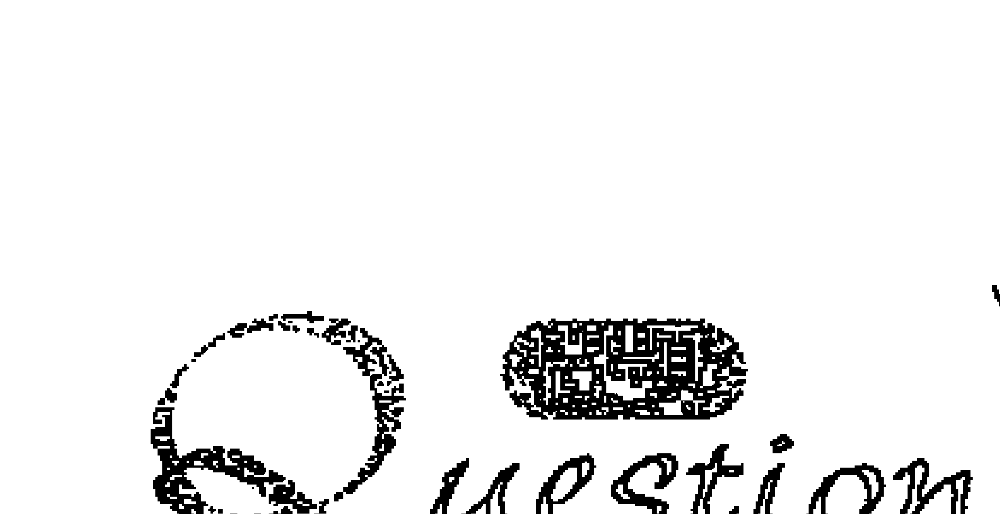

- 1. 请思考下列问题：  
  - 是否让自我怀疑及不安全感阻碍了自己？  
  - 是否按部就班去达成自己的目标？  
  - 有没有完全探索自己的创造能量？  
  - 是否化解幼年时期的家庭问题？  
2. 如果这些问题能启发你一些想法，如何将它们化为行动？

## 深入了解

- 1. 请翻到第二部分，温习与1、3和4等出生数字相关的段落。  
- 2. 也许你想复习亲友的出生数字，如果他们不排斥的话，可与他们讨论自己生活中，相似或相异的问题。

## 精神法则：改变人生的方法

- 1. 请到第四部分阅读下列法则：  
  - 程序法则：想达到目标，唯一的稳健方式就是一次走一小步。  
  - 习惯法则：除非我们努力改变，否则积习是很難破除的。  
  - 选择法则：我们可以选择将创造力运用在正面或负面的途径上。  
  - 灵活法则：保持灵活的弹性，才可以善用困境与变动的环境。  
  - 循环法则：生命与轮转的四季一样，都是一场更迭不息的过程。

2. 实践每项法则后所附的练习。  
3. 想想如何将每项法则运用到生活中。

### 5 : 自由与规范

自我控制多少，自由便有多少。  
～玛莉亚·艾伯纳·方·艾勒巴赫

本章节囊括了所有以5为主要人生目标的出生数字，包含14/5，41/5，23/5和32/5。虽说这四组出生数字都强烈地反映出5的能量，但每组数字因受到其他数字的影响与互动，而各具特色与问题。

### 了解人生目标

32/5或23/5的人此生要修习的课题与独立、诚恳的感情及合作等问题有关，最后要藉著他们的纪律与经验的内涵，来体会自由的滋味。由于人生路上布满各种需要克服的障碍，32/5和23/5的人都会在依赖与独立、责任和诚实表白感情等事项上，遇到内心的挑战与冲突。

出生数字32/5或23/5的人享有的数字基本能量几乎一模一样，唯一的差异在于数字3和2的顺序相反。大部分23/5的人比较晚开窍，因为他们受到3的影响较强，敏感度与自我怀疑的问题也较重，所以得花长一点的时间才能建立自信；而且他们的恐惧比32/5的人来得大，表达的欲望也更强。

大部分的32/5在合作方面的問題比23/5的人来得严重，他们往往为某人付出所有，甚至放弃自己的种种认同，像只变色龙一样，接受伴侣的价值观、嗜好与希望。可是忽略自己的需求到某种程度后，他们又会保留自己的感情，或产生抗拒心理。

这并不是说32/5的人没有23/5自我怀疑的问题，或23/5的人没有32/5的合作问题了，只是数字2和3的能量因数字的排列顺序，各自产生不同程度的影响罢了。

体会自由的真滋味，是32/5和23/5的人此生共同的功课，既然有真自由，当然就有假自由了——例如坚持「只要我喜欢，有什么不可以」时的自我放纵、不负责任或肆无忌惮，就是一种假自由。唯有那些不成熟，不懂得以更正面方式来表达5的能量的32/5和23/5，才会去追寻这种「自由」。

为了追寻自由，大部分的32/5和23/5都会热中追求经验与知识，使他们在生理、心智、感情、社交、性与财务等不同的生活领域中呈现出极大的变动。出生数字32/5或23/5的人会去探索各种机会，无论是从生活中、书本里，或电影中，他们都在随时随地寻找冒险的机会。

他们如此强烈的想体验事物，有时候结果为了不愿错过任何一个机会，反而在过多事项间奔忙，而有不踏实或疲于奔命的感觉，许多32/5的人尤其会有一根蜡烛两头烧的情形。23/5的人一开始自信比较不够，而32/5的人又做得超乎自己的极限，不过两者学习能力都很强，人又机智，才干与经验也都相当丰富。

32/5和23/5的人有时因过于投入工作，而无暇顾及大局。跟所有出生数字中含5的人一样，他们必须找到纪律与焦点，

並學會分辨事務的輕重緩急，才能獲得自由的感覺。32/5和23/5的人追尋的終極自由是屬於內心的——也就是自在的活出自己，拋開自我懷疑的枷鎖，使自己免於恐懼。唯有建立起這種內心的充實感後，他們才能在外在世界中實踐自己的天命。然而，迎向外在世界的經驗也是一種贏取內在自由的方法，因為外在世界反映了我們的內在心理，因此若能克服外界的挑戰，32/5和23/5的人都會有機會克服並超越束縛他們的自我懷疑及合作問題。舉凡各種大大小小的冒險，都能使他們拓展自己的極限，探索自己的感情與能力。

由於受到數字2的影響，有時他們會有委屈求全的傾向，加上3與5的能量，而造成這些人的「烈士情結」。他們希望能拯救別人和世界，並為自由而戰，手段呢？則是越戲劇性越好。對他們來說，平淡無奇的手法是不夠看的，他們喜歡高潮迭起的戲劇——電視上和真實生活裡的都愛。

由於32/5和23/5的人很機智、學得又快，因此也很容易覺得乏味。無聊的東西令他們難過，如果事情開始變得不怎麼有意思了，他們通常會自己製造一點風波。他們最終所尋求的自由必須包含心靈的解放——將他們的意識拓展到極致，讓世界變成他們夢幻的遊樂場。能達到這個程度，他們便不再覺得身體是個牢籠了，因為他們能拋開肉體的囿限，任由自己的想像力和洞察力四處遨遊。

大部分出生數字含5的人會去探索各種生活領域，因此他們雖經驗豐富，卻失之不精。若能把持原則，專心致志，32/5和23/5的人便能在廣中求精，鑽研少數領域，並從中發覺所有生活層面下的精神法則，也才能找到心靈深處的自由。缺乏這種做事原則的話，32/5和23/5只能停留在粗淺的表面功夫，什麼都想抓，什麼都不精專。若能集中心力——想清楚優先順序，致力去做——方能領會自由的真諦。

就像出生數字含2的人會在有所保留與付出太過的兩極間擺盪一樣，32/5和23/5的人也會在依賴與獨立的兩極中搖擺。他們畢竟需要找到一個讓自己安心自在的平衡點。讓自己去體驗兩種極端，藉由檢視自己的依賴問題來學習獨立的真諦，會是取得平衡的好方法。也許他們會發現自己因一場意外、生病或財務危機而去依賴別人，或因為懷疑自己的能力，不確定自己能照顧自己，而主動造成一場依賴的人際關係。因此，利用這些經驗重新建立健康平衡的人際關係，使彼此獨立又相互依持，並懂得適時接受別人的付出，是他們的一項挑戰。

因為安全感低，32/5和23/5往往會隱匿在社會定義的角色下，他們最好記住，他們遠比所扮演的角色豐富。由於擅長誇張聲勢或扮演角色，使得32/5和23/5的人在有意無意間去操控別人，利用憤怒等情緒，來達成自己的目標。

無論他們週末跑去狩獵或看連續劇，去跳傘還是照顧孩子，活潑的32/5和23/5對世界充滿了樂觀，即使他們尚未體驗到冒險或自由的滋味——不過一旦找到了自信，32/5和23/5遲早會發現自己的生活潛能、深度與無限的內心自由。

### 32/5或23/5的正面特質

他們的內心自由，不受理念或恐懼的羈絆，這些多才多藝的人很願意在感情上冒險。他們是「日常生活裡的冒險家」，雖然他們不見得會去白浪裡泛舟或跳傘，卻很懂得耕耘自己的生活，從經驗中探索，不會只滿於表象。他們像《希臘佐巴》（Zorba the Greek）一樣熱情而富冒險精神，並熱心的為世人示範。心思矯捷的他們能用新角度去看待並描述人生，他們擁有良好的嗜好，喜歡讓日常生活變得多采多姿。這些人聰明、機智又風趣，可化平凡為奇趣。

### 32/5或23/5的負面特質

這些缺乏安全感的人通常會藉著憤怒或退縮的手段去操控別人，或是先極盡所能的搏人歡心，然後又心理不平衡的產生抗拒。他們會在無意間造成依賴某人或某事的情況，如藥物或金錢。他們放棄自己的自由，或因恐懼與自我懷疑而去局限自己的經驗。他們到處揮霍精力，而且很快就覺得乏味，是情緒的假面專家。由於缺乏明確的界限，他們會扮演不同的角色，或透過電視書籍來體驗不同的自己。他們會沉溺在某種刺激的戲劇形式裡，不斷尋求各種經驗。

### 人生運勢

#### 健康

32/5和23/5的身體都很敏感，新陳代謝又迅速，所以會比較瘦削結實，這剛好也反應了他們的生活步調，即使那些比較胖的32/5和23/5也不會讓圓呼呼的身材減緩他們的速度。由於天生敏感，他們可能用脂肪或肌肉來保護自己。情緒表達的受阻可能造成喉部的疾病，不過更常見的問題是，32/5和23/5的人必須避免讓腎上腺素和神經系統過於操勞，因為他們會揮霍精力，變得緊張或疲累。如果他們的飲食或運動習慣不能持之以恆，循環系統很可能會出毛病。除此之外，如果過度耗費體能，超出自己的極限，也可能發生意外。

假如他們在毒品中尋找「刺激」，最後總會從痛苦的經驗中學到，毒品只會令人沉迷而已。

平衡而低脂的飲食及規律的運動，對32/5和23/5的人都是非常重要的生活紀律。他們的運動必須包括各種有效而富趣味的項目，交叉式的訓練、聽音樂做動作、舞蹈、武術及健行都十分適合他們。

#### 人際關係

那些在生命中獨自一個人旅遊，對配偶、伴侶或子女毫無責任感可言的人，表面上看來似乎擁有我行我素的「自由」，可惜在孤立狀態下，其實未必能找到真正的自由。數字2的影響，意味著32/5和23/5的人在某種程度上，必須學會跟自己以及他人合作，而去信守一分關係將能提供他們這種學習的機會。

由於命中注定得學習跟自由和獨立有關的課題，有些32/5和23/5的人也許會把心靈的桎梏歸咎於伴侶、朋友或子女身上：「他們限制了我的自由！他們不讓我出去做自己想做的事。」有些32/5和23/5的人確實能吸引，或會選擇能引發他們內心自由問題的人作為伴侶，或選擇那些他們會去依賴，最後又厭煩排斥的對象。真要深究起來，圍限他們自由的，其實是他們自己。只要32/5和23/5的人願意為自己的生活負責，並了解他們是自己故事的編導，那麼就不會再怪罪別人「阻止他們」了，同時也能在合作關係中找到更大的自由度，不至於變得自行其是或離群索居了。

32/5和23/5的身體與能量對情緒的反應都很敏感，不過兩者往往也會有某種程度的表達困難。他們在人際關係中必須學著鼓起更多勇氣，表達出真心的感受。

他們也必須覺察自己喜歡多變刺激的傾向，如果他們有了固定的男女關係，也要設法與伴侶一起滿足這項欲求，不管他們對這份關係抱持且戰且走的心態，還是將之視做探向深層自由和經驗的門徑。

在性生活方面，32/5和23/5的人可以非常的害羞不安，也可以熱情而喜好感官刺激——或二者皆是。他們常喜歡幻想並扮演不同的角色，人際關係與性生活剛好可以提供他們體驗新自由的機會，讓他們打破原有的角色，探索更真實的自己與易感的一面。

#### 天賦、工作與財務狀況

這些人喜歡變化，把變動當成生活的調劑，因此任何能容許他們去體驗多種經驗的職業，如教書、寫作、表演、音樂、政治、訓練工作、法庭或需要四處旅遊，與各色人等接觸的銷售工作，都適合他們的特長與興趣。由於多才多藝，這些人幾乎可以從事任何喜歡的工作。

在經濟上，雖然穩定對他們來說頗為重要，但金錢的吸引力則遠遜於豐富的經驗，如果要他們在儲蓄和冒險或學習經驗中選擇，32/5和23/5的人會選擇後者，有時甚至錢還沒賺到手，就已經先花掉了。他們喜歡有個安全穩定的家做基礎（最好還有個壁爐），可是當他們對自己充滿自信時，32/5和23/5的人反而會用安定去換取冒險。受到數字5的影響，這些機智的人需要錢時，通常總能找到或賺得到，而且不太容易負債。

### 32/5和23/5的名人

32/5  
賈霸（Kareem Abdul-Jabbar，美國籃球名將）  
蘿倫·貝格（Lauren Bacall，美國演員）  
艾文·柏林（Irving Berlin，美國作曲家）  
華納·愛賀特（Werner Erhardt，德國藝術家）  
米克·傑格（Mick Jagger，美國滾石樂團主唱）

### 實現天命的要訣

如果你的出生數字是32/5或23/5，本節可以幫助你把心力放在重點上，用特定的行動改善重要的生活層面，讓你找到生命的目标。

### 原則與建議

- 1. 你不僅只是你所扮演的角色，因此請珍惜自己。  
- 2. 請記住：紀律與真正的深度能開啓通往自由的大門。  
- 3. 放緩步調，保持放鬆與健康。  
- 4. 找到勇氣，盡量不為自己設限，也別畏懼傷害。

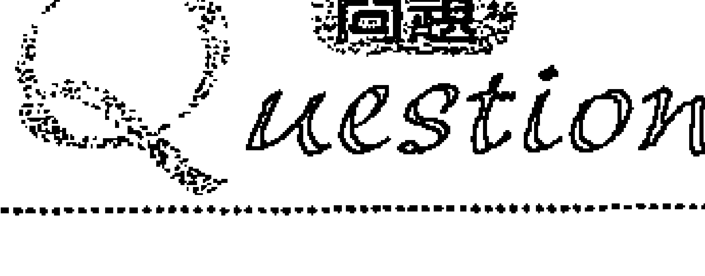

- 1. 請思考下列問題：  
  當我覺得受到桎梏時，誰能給我自由？  
  我是否在依賴與獨立之間找到平衡點了？  
  我目前的紀律與專注點在哪裡？  
  我是否直接表達了自己真正的感受與需要？  
- 2. 如果這些問題能啟發你一些想法，如何將它們化為行動？

## 深入了解

- 1. 請翻到第二部分，溫習與2、3和5等出生數字相關的段落。  
- 2. 也許你想複習親友的出生數字，如果他們不排斥的話，可與他們討論自己生活中，相似或相異的問題。

### 精神法則：改變人生的方法

- 1. 請到第四部分閱讀下列法則：  
  規範法則：規範使經驗變得更有重點與深度，使我們探觸到內心的自由。  
  平衡法則：了解自己在兩極間擺盪的特性後，才能找到自己的平衡點。  
  責任法則：如果知道何時說是，以及如何去拒絕，即能培養出相互的支持。  
  誠實法則：我們得先對自己誠實，才能對他人坦誠。  
  行動法則：為了克服低落的安全感，我們必須接納自己脆弱的一面，並自信出擊。  
- 2. 實踐每項法則後所附的練習。  
- 3. 想想如何將每項法則運用到生活裡。

## 第三部：命運之路 304

### 41/5&14/5

- 5：自由與規範  
- 1：創造與自信  
- 4：穩定與程序  

### 了解人生目標

41/5和14/5的人此生要修的課題與獨立、穩定、創造力等問題有關，最後他們將依循漸進的步驟，達成自己所選的目標，而獲得內心的自由。由於生命目標的道路總是充滿試煉與挑戰，大部分41/5和14/5的人唯有在釐清自由的真義後，才能找到真實的內外在自由，否則他們往往會去依賴別人，然後又拚命想表現獨立，而顯得咄咄逼人。他們可以用自食其力、相互扶持及合作的形式，來平衡自己的這種傾向，也唯有在專注與嚴守紀律，循序去做的狀況下，方能品嚐到自由的滋味。也許他們得花一段時間才能了解這點。

41/5和14/5的人都嚮往與數字5相關的自由、獨立和經驗，不過因為受到1和4的影響，兩者卻從截然不同的管道、問題與挑戰中去尋找自己的自由。

所有5的問題都適用在41/5和14/5的人身上，只不過這些問題都受到了4的牽制，以及1創造能量的強化。由於4的影響，這兩個生命軌道的人常會像無頭蒼蠅一樣，做事三分鐘熱度。從好的一面來看，他們對家庭向心力很強，也比較穩定。機智加上創意高，他們這一生要向世人展現新的生活方式。

41/5和14/5的人跟其他出生數字中含5的人不僅不同，彼此間也因為4和1的能量與排列順序，而有些差異。41/5和14/5都有絕佳的創造力，他們的創造能量需要以正面方式去發洩，尤其是41/5的人。這兩個生命軌道也共享了4的能量，也就是必須奉行按部就班的程序，獲得踏實的感覺。

一般而言，出生數字含5的人都會透過紀律、專注及優先順序的排列來尋獲內心的自由，因此1和4的能量可能會大力支助或破壞他們對內在與外在自由的追尋。

大部分的14/5都有極強的分析能力，不過有時會流於分析太過，反造成了困惑與壓力。大部分的41/5展現了豐富的創造力，可是萬一創造力受到壓抑，他們會比14/5的人更容易藉食物、煙酒、或其他藥物來宣洩，尤其是迷幻藥。不過這兩個享有同樣能量與潛在挑戰的生命軌道，也有著同樣心思不專，一次想做太多事的毛病，只是程度上有些微的差異罷了。

從最好的角度來看，創造力使41/5和14/5的迷人機智更添魅力，但也帶來了不安全感，尤其是41/5的人，他們因此必須不斷求新求變，結果就愈難專心把守紀律。由於出生數字含5的人本來就不太定得下心，1的出現無異落井下石。

41/5或14/5的行動、成長與成就必須建立在充分準備的基礎上，有了穩健的基礎，如信守自己的家庭，41/5和14/5的人方能真切體會到內心的自由，而不只是四處飄泊，盡其所能的吸取經驗而已。不過41/5和14/5的人多半能從實際的行動或想像中，體驗到上述二者。

數字4帶給他們所需的力量、穩定與分析力，使其吸取了數字5好奇心與冒險精神。然而從較不成熟的觀點來看，也讓他們對一般循序漸進的步驟感到抗拒，而失去耐性，尤其是14/5的人。

數字1和4影響了41/5和14/5的人對自由與獨立的追求，添加了重重挑戰，尤其是4的力量。跟其他出生數字的人一樣，41/5和14/5若想實踐他們的天命，就必須越過險阻，克服萬難，在邁向目標的過程中砥礪自己。

數字1、4和5的綜合結果，會產生神奇與混亂摻雜的狀況，以下即為一例。湯瑪士·伍夫（Thomas Wolfe）這位出生數字14/5的《望鄉天使》（Look Homeward Angel）作者，把精彩的手稿寄給編輯時，竟然把一大疊亂七八糟的稿紙塞在四五個水果箱裡！不過許多人認為他還是美國最優秀的作家之一。

### 41/5或14/5的正面特質

這些人的結構能力非常嚴謹周密，他們能用刀鋒般銳利的分析力決定自己需要什麼，然後一步步去達成目標。他們用規律的運動與飲食習慣來維持身體的平衡。他們想像力豐富、創造力強，再加上耐著性子一步步去做，因此能將心中的夢想化為現實。堅強的他們能激勵別人，同時在許多領域中嶄露頭角，他們外向的本質使人們喜歡與他們共處。

### 41/5或14/5的負面特質

因為困惑加上安全感低，這些人的成就甚低，他們會陷溺在一個階段裡，或是埋頭往前衝，略過該有的步驟，最後因此半途而廢。他們既想要安全感，又想探索未知，而夾在兩者之間掙扎不已。他們不肯安定下來，想立即得到自由，卻不願遵循獲取自由該有的紀律或漸進的步驟。缺乏紮實根基的他們在人生路上起起伏伏，什麼都碰一點，結果也都一事無成。

### 人生運勢

#### 健康

出生數字41/5和14/5的人由於精力過人，又渴望得到許多經驗，因此往往停不下來。當他們為了追求冒險，而衝動行事或工作過度時，也許會發生骨折的情形。如果他們的創造力無從發洩，14/5的人，尤其是41/5的人，腹部、下背部或生殖部位往往會出問題。

冥想打坐對41/5和14/5的人非常有用，可幫助他們安定忙亂的心性，音樂也可以達到平衡定靜的效果。41/5和14/5的神經系統需要悉心照料。他們通常比32/5和23/5的人強健，可是比較容易有心理壓力。

41/5和14/5的人若能留意規律穩定的飲食習慣，會很有好處，因為他們常會跳過正餐，或囫圇吞棗一番。他們喜歡吃各種各樣新奇的食物，可是吃飯卻很不正常。若有過食的現象，就必須好好檢討一下自己的創造力是否受到壓抑了，並設法以適當的方法表達出來，或透過均衡的運動來抒發。

他們很適合從事各種運動，那種需要速度與力量，又需要用到創造力的競賽會很吸引他們。他們也許還喜歡游泳、潛水及其他能緩和神經系統的水上運動。

#### 人際關係

他們嚮往家庭與穩定，不過心性比較不定的41/5和14/5也同樣受到另一股相反力量的吸引，喜歡去嘗試各種經驗，不肯對一場關係許下允諾。由於可以做的事太多了，即使心裡滿想要一個安穩的家，但他們還是很難定下來。數字1帶來的不安全感使他們有著自我保護、好強的特質，這些傾向也展現在他們的人際關係裡。不過就整體而言，他們無窮的精力使其魅力四射，而唯一限制他們人際關係的因素則在於他們肯不肯定下來了。

他們絕對需要，且非常重視熱情甚至粗暴的性發洩，除非心理的不安全感在作祟，不過即使這項心理因素使他們暫時退卻，最後他們還是會完全釋放出自己的性慾。

#### 天賦、工作與財務狀況

體能、創造力加上機智，使得41/5和14/5的人能在穩定與冒險相容並存的領域中獲得成功。任何需要快速分析的創造形式或商業，都很能挑戰並滿足這些人。他們喜歡動態，而非靜態的工作，不過寫作也可以滿足他們活潑的心思。這些思路清晰、創造力強，擅於製造高潮的說故事能手，可以成為優秀的作家，不過他們通常不願乖乖的久坐（湯瑪士·伍夫這位出生數字14/5的作家以前就是站著寫作，拿冰箱頂蓋當書桌用的）。

這些創造力旺盛的人可以領先別人預見趨勢，如果41/5和14/5的人肯好好做功課，擬出切實的想法，耐著性子熬過該有的步驟，去完成最初的想法，那麼金錢會跟他們的點子一樣來得輕而易舉。

### 41/5和14/5的名人

41/5  
史恩·凱西迪（Sean Cassidy，美國七○年代偶像名星）  
威廉·福格納（William Faulkner，美國小說家）  
威廉·富德金（William Friedkin，美國電影導演）  

14/5  
克拉克·蓋博（Clark Gable，美國演員）  
華特·馬修（Walter Matthau，美國演員）  
湯瑪士·伍夫（美國作家）

### 實現天命的要訣

如果你的出生數字是41/5或14/5，本節可以幫助你把心力用在重點，以特定的行動改善重要的生活層面，找到生命的目標。

### 原則與建議

- 1. 在穩定與自由間尋求一個平衡點，將兩者納入自己的生活裡。  
- 2. 藉著循序而行的原則，來宣洩自己的創造力。  
- 3. 每天運動，即使只有幾分鐘也可以。  
- 4. 找一件你可以全心投入，貫徹執行的事去做。

## 問題

- 1. 請思考下列問題：  
  哪些步驟最能在我生活中創造更多自由空間？我願意去遵循這些步驟嗎？  
  除了我自己，還有其他人在阻撓我嗎？  
  如何發揮自己的創造力？  
  我的哪些生活層面需要更多的規範？  
- 2. 如果這些問題能啟發你一些想法，如何將它們化為行動？

## 深入了解

- 1. 請翻到第二部分，溫習與1、4和5等出生數字相關的段落。  
- 2. 也許你想複習親友的出生數字，如果他們不排斥的話，可與他們討論自己生活中，相似或相異的問題。

### 精神法則：改變人生的方法

- 1. 請到第四部分閱讀下列法則：  
  規範法則：規範使經驗變得更有重點與深度，使我們探觸到內心的自由。  
  選擇法則：我們可以選擇將創造力運用在正面或負面的途徑上。  
  程序法則：達成目標最穩健的方式就是一次走一小步。  
  循環法則：生命與輪動的四季一樣，都是一場更迭不息的過程。  
  當下法則：認可當下，可化解心中的不耐與懊悔。  
- 2. 練習每項法則後所附的練習。  
- 3. 想想如何將每項法則運用到生活裡。

天使神秘學院官方淘宝：http://strc.taobao.com  
获取更多好书，請加微信：13641926204 或 QQ:715104687  

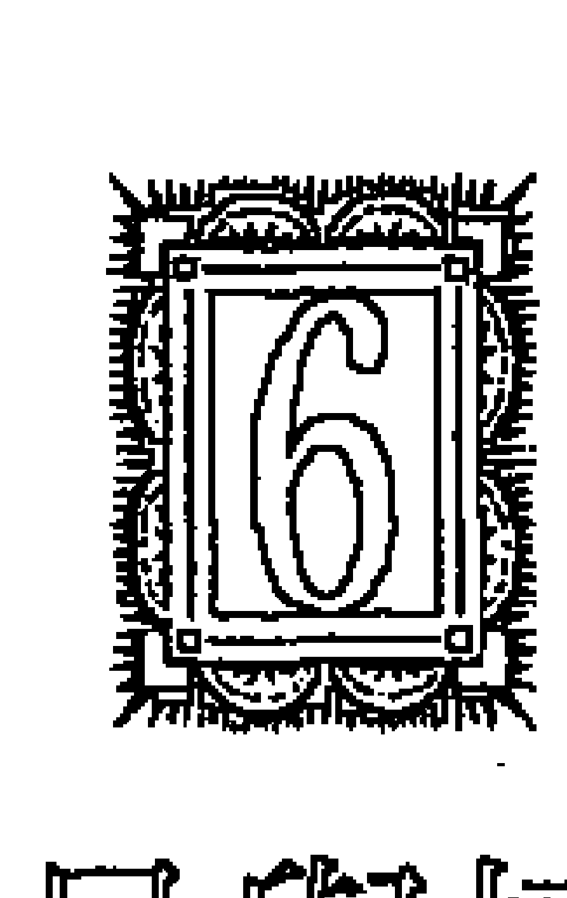  

## 遠見與接納

> > 接納自己之前，做什麼都無所謂。  
> 
> 一旦我們接納自己，做什麼也都無所謂。  
> 
> ～查理·海文里區  

本章節囊括了所有以6為主要生命目標的出生數字，  
包含15/6、24/6、42/6以及33/6。  
雖然這四組出生數字都強烈的反映了數字6的能量與影響，  
不過也因為其他數字的影響和互動，  
而各具特色、問題與性格。  

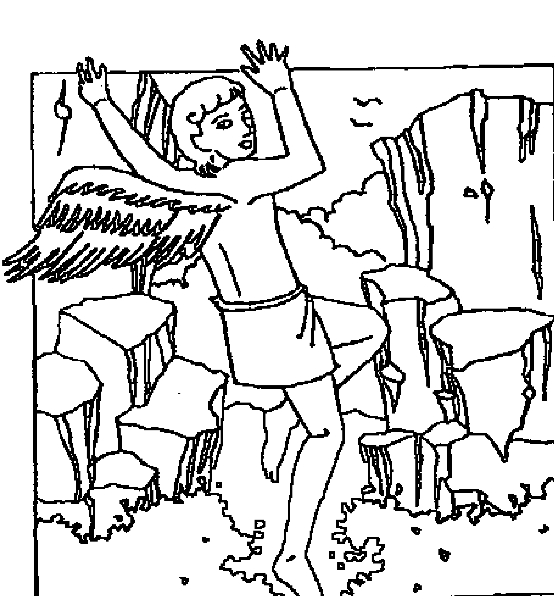

### 了解人生目標

15/6的人此生要修的課題包括了理想主義、獨立與創造力，並學習先接納自己，然後再與別人分享他們的遠見，用創意的手法來激勵別人。由於生命目標中充滿了各種挑戰，15/6的人會遇到完美主義、依賴及低安全感等問題，他們必須克服這些屏障，才能了解自己擁有更高的遠見，並與人分享。

他們的理想可能使15/6的人拒絕面對現實問題，然而唯有接納現實後，他們才能深切了解所有的經驗，並在現實與理想中搭起必要的橋樑。他們也許會寫作或夢想、領導或跟從、為過去或未來而歡唱，不過唯有為自己的創造能量找到重心，他們才能將夢幻天堂化為人間妙境。崇高的理想固然美好，不過如果15/6的人想改造世界，就必須學會務實的態度。

出生數字15/6的人不需要去尋覓自由或高遠的理想，因為他們會創造這些東西。他們擅長組織、革新，且極富遠見。幾乎所有的15/6都有著強烈的服務精神，好像他們在人世間有任務要達成似的。

15/6的人在追尋深遠而崇高的經驗過程中，會反覆不斷提出諸如「何謂理想？」「何謂真正的自由？」等問題。除非他們夠務實，否則15/6的人往往會待在自創的理想世界裡，就像某些科幻小說作家一樣。出生數字15/6的艾沙克·阿西姆（Isaac Asimov，美國科幻小說家）就以最建設性的方式創造了自己的世界。其他人則很可能只是流於空想，活在自己的夢幻城堡裡，偶爾才飄回世間的尋常生活中。

與數字6相關的有嚴苛的完美標準、用這些標準來評判自己與他人，以及自我價值感低落等問題，這些傾向使得15/6的人在達成目標的路上屢遇險阻。追求自由與經驗的數字6對15/6的人有著無比的影響，他們心底渴望去體驗想像中的完美生活，一個無可挑剔的美好世界。

由於5的關係，15/6的人需要一個實際的焦點——一個可以將他們的高標準付諸實踐的事物。缺乏方向、出口或目標，這些人很可能毫無目的地在自己的夢幻裡漫遊，有了明確的方向，他們便能開啓通往未來的大門，發揮人類最高的潛能，就像作家艾沙克·阿西姆和茱莉絲·維妮（Jules Verne，法國小說家）一樣。

可是，在這個充滿理想、富創意、熱切追尋自由的生命軌道上，也有苦於低安全感及能量受抑制等問題的人。這類的15/6常覺得漫無目標、沒有方向，彷彿受到桎梏，經常感到失望，

### 15/6的正面特質

這些深具啟發，又喜歡鼓舞世人的15/6擁有嶄新的遠見，能看到璀璨的未來。他們精於策略，並透過專注與紀律的態度，以積極的創造力去喚醒世人，邁向更祥和自由的世界。他們以自己的夢想去發揮人類的演化力量，協助改變人類世界與人類本身。他們接納自己與他人，耐心的從工作中實踐正面的精神法則，向世人展現追尋自由的途徑。

### 15/6的負面特質

挑剔、愛批判，又對人生充滿失望，這些人到處尋尋覓覓，想找到完美的人、點子、體系或方法，來改善生活與他們自己，可是尋找的過程只是更增添不完美的感覺罷了。他們是不切實際的夢想家，更是虛浮的理想主義者，往往成爲某種主義的烈士。他們對自己與他人感到不滿，將無處發揮的創造能量誤用在自毀的途徑上。他們用藥物或其他方式來虛掩一個短缺真實、正義、誠實或和平的世界。

### 人生運勢

#### 健康

創造力與快捷的心智，加上完美主義者的標準，15/6的人往往十分好動且容易緊張。如果他們把自己的活動力投注在選定的工作上，必能爆發出高能量的創造力與生產力。如果用錯地方，可能會發生神經失調、皮膚疹、腹部疾病及過勞等問題。

15/6的身體與體能散發亮眼甚至神秘的特質，以及夏沙·海非茲（Jascha Heifetz）的音樂，和演員大衛·尼文（David Niven）身上反映出來的優雅質感，這兩個人的出生數字都是15/6。

漸進柔和的治療方式對出生數字15/6最有益，如觀想及催眠治療等，利用潛意識的想像來引發內在自我治療機制的方式，其他如順勢療法（homeopathy）、針灸、芳香療法及色彩療法（color therapy）等副作用甚少的治療，也都很適合他們。

15/6的人很難有效地從別人身上得到營養或運動方面的建議，

#### 人際關係

出生數字15/6的人常把別人的特質或性格過於理想化，由於別人永遠沒辦法達到他們的完美標準，因此可能感到暗自失望。他們常不了解身邊的人，只是抱著自己投射在對方的理想印象，去維持一場關係罷了，甚至可以為時很久。從這個角度來看，也許他們愛的是自己創造出來的假象，並未能真正了解或接納自己的伴侶。反之，這種理想化的假象可能會因為發現了伴侶的「性格缺失」，而很快的消逝。

一般說來，15/6的人希望在性關係之外，創造出更豐盛或更高遠的意境。由於他們將自己的人際關係與理想做比較，因此除非忙於做夢創造，無暇在人際關係上多花心力，否則他們的人際關係會不斷地向上改善提升。

#### 天賦、工作與財務狀況

出生數字15/6的人在選定職業或自己的理想前，會先試探各種不同的工作。他們的理想色彩以及求新求變的特質，很可能使他們選擇從事寫作、表演、探險或教練等，讓他們能隨意搞怪，把人和想法做進一步提升的工作，因爲現實似乎永遠不夠好，不能符合他們的期許。無論他們選擇何種創意工作，如果15/6肯耐著性子堅持下去，必定能夠成功，因爲他們的標準比誰都高。

15/6的財務狀況反映出他們創造力的發揮情形，如果15/6的人在等待更完美的機會出現時，找不到著力的焦點，在各方面都會覺得若有所失，不過他們若能做點實際有用的東西——一些人們現在就能使用，而不是遙遠的未來才派得上用場的東西——如果他們的理想驅策他們在創造領域上冒險，報酬必會隨之而至。

### 15/6的名人

- 艾沙克·阿西姆（Isaac Asimov，美國科幻小說家）
- 哥倫布（義大利航海家，發現新大陸）
- 費里尼（Federico Fellini，義大利導演）
- 夏沙·海非茲（Jascha Heifetz，俄國小提琴家）
- 聖女貞德（英法百年戰爭之法國女英雄）
- 大衛·尼文（David Niven，英國演員）
- 英王理查三世（King Richard III）

### 實現天命的要訣

如果你的出生數字是15/6，本節可以幫助你把心力放在重點上，用特定的行動改善重要的生活層面，讓你找到生命的目標。

### 原則與建議

- 1. 堅守自己的理想，秉持原則，貫徹以終。
- 2. 耐心發揮自己的創造力。
- 3. 觀想自己所要追求的事物，讓這份遠景激勵自己。
- 4. 找到內心最大的自由。

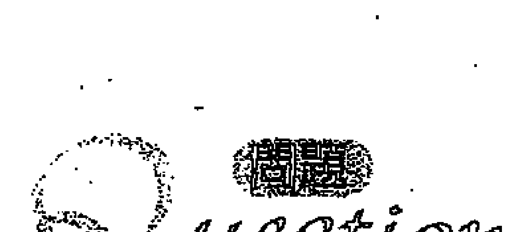

1. 請思考下列問題：
* 目前的處境有哪些地方讓我無可挑剔？
* 我可不可以把崇高的理想與創意的遠見用在實際的用途上？
* 哪裡可以找到符合我理想的自由與公義？
* 此刻我能不能去愛並接納自己、伴侶，以及身邊的世界？
2. 如果這些問題能啟發你一些想法，如何將它們化為行動？

## 深入了解

- 1. 請翻到第二部分，溫習與1、5和6等出生數字相關的段落。
- 2. 也許你想複習親友的出生數字，如果他們不排斥的話，可與他們討論自己生活中，相似或相異的問題。

### 精神法則：改變人生的方法

- 1. 請到第四部分閱讀下列法則：

完美法則：崇高的理想固然可以鞭策我們，但我們只能盡力而為。

靈活法則：保持靈活的彈性，才可以善用困境與變動的環境。

當下法則：認可當下，可化解心中的不耐與懊悔。

規範法則：規範使經驗變得更有重點與深度，使我們探觸到內心的自由。

循環法則：生命與四季的輪動一樣，都是一場更迭不息的過程。

2. 練習每項法則後所附的練習。

3. 想想如何將每項法則運用到生活裡。

### 了解人生目標

生命軌道在24/6或42/6的人，此生要修的問題與完美主義、程序及責任有關，他們必須學會一次踏一小步，以務實的方法去實踐自己的理想，並接納生活中的不完美。由於生命目標不易達成，24/6和42/6的人很難接受真實的自己、別人，乃至於世界。24/6和42/6都可能憂心於瑣事一一擔心自己說過什麼、該說什麼，不該說什麼，或該不該做什麼。除非24/6和42/6的人能拓展自己的視野，不再緇銖必較，否則懊悔與罪惡感對他們來說會是家常便飯。數字4的問題加上6的理想性格，使得24/6和42/6的人比較沒耐性，他們看到自己跟每個人的潛能，並催促大家達成目標，可是又有好高鶩遠的毛病，不肯一步步去做，這也是他們人生的課題。

24/6和42/6的人都有把初識者、新機會、新工作和新地點理想化的傾向，之後又會因什麼都無法符合他們的期許，而感到失望。大部分的24/6和42/6常是滿懷希望，然後又感失望。

他們必須學習在天真的理想主義、夢想和務實的態度中找到平衡，才能認可接納世間必有的瑕疵。理想主義的24/6和42/6在尋找完美的工作、兩性關係或人生時注定要感到失望，無論他們做什麼，或跟誰在一起，總會疑心有其他更好的選擇。

除了這點之外，24/6或42/6的人倒不一定是善變或處處留情的，因為他們超高的標準與自我形象使他們能謹守份際。如果他們亂來，心中的懊悔與罪惡感往往比任何懲處都更令他們難過。即使表現良好，他們的心裡還是會有股細微的聲音說道：「我應該能做得更好。」他們太盡心、責任感太重，對自己也太嚴苛了。當他們在批評別人時，很可能也會不滿自己這樣去批判別人。

由於結合了2與4的能量，24/6和42/6的人在工作時充滿了服務與支持的熱誠，只要拿捏好自己的責任界限以及合作分寸，並堅持按步達成目標，他們至少能實踐部分的理想。

數字2的責任感、4的社交手腕，加上6的理想主義，使得24/6和42/6的人會非常努力的督促自己去達成目標。他們心裡對每個人最大的潛力（包含自己在內）都有一幅未來的藍圖，可惜不一定懂得欣賞別人或自己眼前所做的努力。

由於2和4的能量比任何其他兩個數字的相似處都多——皆有過度分析、共生（codependency，對別人的生活和感受過於負責）、毅力與固執的傾向。因此除了2和4的順序倒置，而在問題輕重上有些微的差距之外，24/6和42/6的生命軌道可說是幾乎一樣。

24/6的人在家庭方面的問題（4）比42/6的人來得嚴重，而42/6的人則是委屈求全的傾向（2）較強，且有時反而會拒絕合作（抗拒或保留）。可是24/6和42/6的人都會遇到上述兩種問題，也都有鞭策自己與他人，用自己的高標準去衡量別人的傾向。

除非是極端負面的24/6和42/6，否則他們多半能與人愉快相處，有了2的支持與服務能量，加上4的社交活力，他們會把別人當家人看待。由於高標準的影響（出生數字含6的人希望把事情「做對」、「做好」），以及2和4希望做自己「該做」的事，而忽略了真實感受的傾向，使得24/6和42/6的人常成爲自欺與否絕的高手。他們會否定自己的感受或情況，有時已經都狀況百出了，卻依然冥頑不靈。因此，教導人隨遇而安的「靈活法則」對他們好處甚多。

出生數字24/6和42/6的人通常非常外向、好社交、聰明、堅強而活潑。他們會盡力去討好別人，把事做對，因此若遇到那些想利用罪惡感來操控他們的人，就得格外小心了。他們必須做對自己有益的事——依循自己真正的價值感與需求去行事。

由於24/6和42/6的人懂得欣賞自己及他人的潛能，他們往往會督促自己與別人去滿足他們的期許。這些人會進行長期的自我改善計畫，直至終於接納自己與別人、認可即使自己不完美，但已經相當不錯了爲止。

24/6和42/6的人都必須學著重視事實與完美之間的差距——夢幻標準是永遠不可能達成的，而且只會讓人挫折。24/6和42/6的人成熟後，會漸漸學著欣賞每件人事的好處，了解在有限的範圍內，沒有人、產品或表現是完美的，我們只能盡力而為，做到最好。

24/6和42/6都必須了解最好的成果必須經過謹慎、耐心、徹底而漸進的步驟。忽略其中一環，都可能造成失敗，而需從頭來過。

由於喜歡把自己跟理想標準做比較（或跟身邊最傑出的人士比較），24/6和42/6的人即使表現傑出，也常覺得自己像個「失敗者」。他們也可能缺乏實際的判斷力——事情明明只進行一半，卻以為已經做完了。

受到4的強力影響，24/6和42/6的人往往有過度分析的毛病，結果東想西想，反而抓不到方向。這種困惑可能使他們做出衝動的決定，而後悔不已。善用自己能量也是這些人該學的課題，因此在這方面他們也會遭到一些挑戰。如果他們不肯按照程序，有時會很難把崇高的理想轉化成實際的工作與服務形式。

一旦24/6和42/6的人能以輕鬆的態度去擁抱生活，放鬆自己，接納並尊重自己與他人的缺陷，並學著把生活當成一種美好的學習進步過程，最後必能感到安心自在。這種了悟是一點一滴慢慢累積而成的，無法催逼，更不能如他們希望的一樣竟

## 24/6或42/6的正面特質

聰明、喜歡社交、生產力強，又樂於支持別人，這些人與朋友同事的交情好極了。他們務實、分析能力強、知識豐富，又有理想。他們深具良知，且樂於從錯誤中學習，以不斷改善自己與世界。堅強、健康又精力充沛，一定可以把任何工作完成，並更加精進。他們總是在改進，總是努力朝完美邁進，可是又肯虛心的按步行事，從現有的狀況向理想奔進。他們很懂得平衡自己，知道如何付出，又當如何接受。他們是務實的理想主義者，懂得認可自己與他人，也懂得在人世間尋找樂趣。

## 24/6或42/6的負面特質

這些人因為事事不盡理想，或不如預期來得快，而對人生感到不耐與挫折。他們是不切實際、缺乏耐性的空想家，一開始做事總是興致勃勃，可是若無法快速成功，很快就放棄自己的想法與計畫，不再多做嘗試了（「有什麼用？」）。他們把認識人加以理想化，等發現那些人有自己的問題後，又感到失望。由於對自己十分苛求，因此對別人的批評也極端敏感，他們不會虛心聆聽別人的回饋或建議，而且相同的錯誤一犯再犯。

### 人生運勢

#### 健康

大部分24/6和42/6的人對疾病的抵抗力都很強，萬一真的生病了，通常也能很快復原。如果他們罹患慢性病，通常是因爲長期抗拒改變而帶來的壓力所造成的。如果他們衝動行事、分心或過勞，很可能會發生意外，尤其是下肢部位。成人的24/6和42/6可能會遇到康復或健康轉壞的過程，這得視他們的健康習慣而定。因爲緊張、憂慮或完美主義帶來的壓力，可能會帶來過敏、菸酒癮或挫折等問題。

由於標準高又衝動，24/6和42/6的人可能會努力節食或運動一段時間後，又放自己的假，縱情一番。他們可能在嚴謹與放縱之間擺盪，覺得自己反正「搞砸」了，乾脆豁出去算了。

24/6和42/6的人最好能慢慢養成穩健的習慣，一步步去做，不必尋求完美的飲食或運動方式。例如，假如他們決定減肥，用緩慢的方式減肥成功，比快速的減重成功更具意義，因爲這正是他們的人生課題。

結合集中心志、平定情緒及放鬆的訓練，可使他們原本就強健的身體更加平衡，他們可以承受劇烈而規律的健身運動。如果24/6和42/6的人能把武術、瑜珈、舞蹈或任何需要慢慢才能進步的活動納入固定的健身項目裡，而不單只是跑步或游泳的話，對他們會更好。

#### 人際關係

整體說來，42/6尤其是24/6的人，為了找尋完美的工作或兩性關係，簡直可以到瘋狂的地步。因此，有時他們很難對一個人許下承諾，或把心定在一個工作上。他們很怕去承諾，因為承諾表示永遠，可是他們永遠不確定他們是否已找到「完美的對象」了。他們嘴上說：「我愛你。」可是心裡卻很虛，不知道自己愛得夠不夠深，甚至連自己到底什麼感覺都搞不清楚，因為他們只知道自己「應該這樣覺得」，他們得花點時間才能弄清並接納自己真實的感受——「好的」與「壞的」感覺。

由於喜愛社交，有正面特質的24/6和42/6會是相當令人愉悅的夥伴。他們細心體貼，努力投入關係中，他們的高標準使他們成爲熱情而富技巧的情人，付出也常比回收得多，因此他們必須學著在給與受中找到平衡，並多留意自己的需求，別只是一味求表現。

#### 天賦、工作與財務狀況

體能加上精準度，使得24/6和42/6的人很喜歡從事健身、建築或服務性質的工作。由於分析力強，又有數字2的能量相助，他們也會是商業領域中的絕佳諮商。有些24/6和42/6甚至參與政治活動的籌劃，以求改善世界。他們也是天生的運動員——體操、潛水、網球或溜冰，舉凡需要體能和儀態，不管是哪種運動，24/6和42/6的人都能成爲箇中翹楚。

不過他們並不局限在運動領域中，任何能符合他們的價值觀以及對意義追求的工作，他們幾乎都能勝任。他們的制勝關鍵在於打破「應該」的理性想法與理想，重新發覺自己真正的感受與喜好。

24/6和42/6的財務狀況依他們的務實或理想程度而定，以及肯不肯循序行事，把達成目標該準備的工作做好，也就是「願不願意下功夫」的意思。當他們在尋找最理想的工作時，並不該放棄現有的工作，因爲這能提供他們穩定的基礎，使他們去尋覓更適合自己的工作。

## 24/6和42/6的名人

24/6  
伊莉莎白·布朗寧（Elizabeth Barrett Browning，英國女作家）  
路易斯·卡羅（Lewis Carroll，《愛麗絲夢遊仙境》作者）  
卡羅斯·卡斯塔尼達（Carlos Castaneda，美國作家）  
唐納修（Phil Donahue，美國企業家）  
愛迪生（Thomas Edison，美國發明家）  
卡萊·葛倫（Cary Grant，美國影星）  
郝渥·修斯（Howard Hughes，美國富商）  
傑西·傑克森（Jesse Jackson，美國黑人政治家）  
約翰·藍儂（John Lennon，英國樂團披頭四成員）  
喬·路易斯（Joe Louis，美國籃球名將）  
羅斯福（Eleanor Roosevelt，前美國總統）  
托凱恩（J.R.R. Tolkien，英國科幻小說家）  
史提夫·汪達（Stevie Wonder，美國盲人歌手）  
瓊安·渥華德（Joanne Woodward，美國女演員）

### 實現天命的要訣

如果你的出生數字是24/6或42/6，本節可以幫助你把心力用在重點，以特定的行動改善重要的生活層面，找到生命的目標。

### 原則與建議

- 1. 接納真實的自己，而不是理想中的你。
- 2. 不但要享受做事的結果，更要享受做事的過程。
- 3. 認清事實：世間沒有完美的工作或人。
- 4. 放輕鬆，好好呼吸，別人的責任不用你來擔。
- 5. 敞開心胸聆聽，並有風度的接納回饋。

1. 請思考下列問題：  
我完全了解自己目前的價值與能力嗎？  
我對自己是否誠實？  

## 第三部：命運之路 330

我覺得自己的生活穩健安定嗎？  
我目前的處境有哪些很好的優點？  
2. 如果這些問題能啟發你一些想法，如何將它們化為行動？

## 深入了解

- 1. 請翻到第二部分，溫習與2、4和6等出生數字相關的段落。  
- 2. 也許你想複習親友的出生數字，如果他們不排斥的話，可與他們討論自己生活中，相似或相異的問題。

### 精神法則：改變人生的方法

- 1. 請到第四部分閱讀下列法則：  
  靈活法則：保持靈活的彈性，才可以善用困境與變動的環境。  
  程序法則：穩健的一次踏一步，最能達成自己的目標。  
  平衡法則：了解自己在兩極間擺盪的傾向後，才能找到自己的平衡點。  
  完美法則：高遠的理想固然能啟發我們，但我們只能盡力而為。  
  不論斷法則：宇宙並不會批判我們，它只會藉自然的結果來教導我們。  
2. 去做每項法則後所附的練習。  
3. 想想如何將每項法則運用到生活裡。

### 了解人生目標

生命軌道在33/6的人此生要解決完美主義、情感表達及自我懷疑等問題，才能實踐他們的人生理想，同時對當下的美好心懷感激。美醜善惡在世上是同時並存的，33/6的人有崇高的理想與精確的敏銳度，他們對世界的問題與缺陷常感到氣餒，卻往往壓抑心中的悲痛甚至憤怒，而按自己的高標準去「做正確的事」。諷刺的是，即使33/6的人感情豐富，表面上還是可以十分冷酷無情。

當33/6弄得別人——任何人——不高興時，儘管自己嘴上不說，心裡卻很難過，因為他們有數字3的感情需求及6的軟心腸。因此，33/6的人必須小心，千萬別為了博取他人的認可、喜愛與尊敬，而讓人予取予求。

33/6的人若能了解，遠見、希望及崇高理想的存有，是拿來鞭策自己，而非衡量世界用的，就能把生活過得更開朗明亮。他們必須正視世間並無聖人及完美這件事實，並學習接納、感激既有的事物。

雖然他們的基本人生目標與其他出生數字含6的人一樣，但因為受到兩個3的強烈影響，使33/6的能量有了顯著的不同。跟22/4和44/8等出生數字一樣，雙重數字表示更強的力量與挑戰。

對33/6的人來說，兩個3表示需先做好內心的表達，才能展現外在的表達。他們必須做到自我溝通，了解自己的情緒，才能做內在的表達。這對大部分的33/6都是一項很大的挑戰，因為他們生性喜歡完美，只想到要「最好」的，最理想的感覺、做法與行動，結果反而與現實脫節，拒絕面對自己性情中，比較不「美好」的感覺。雖然33/6自我否決問題不像42/6或24/6的人那麼重，不過還是得花點時間做反省，才能接納自己真正的感受。

探觸並接納自己最真切的感受，可使他們潛在的智慧與直覺獲得發揮，同時與他人形成一種更愉悅而心意相通的關係。

一旦33/6的人了解自己真實的感受，第二個3表示鼓起勇氣，表達對他人的感覺；再說一次，這不是一件容易的事，因為33/6的人對批評非常敏感，而且他們希望自己表現出最好的一面。對某些33/6的人來說，由於標準過高，結果只好放棄。表達感覺必須先面對自己的脆弱，同時對別人敞開心懷。如果他們願意冒這個險，便能與他人和自己建立起更親近的關係。

即使能接納並表達自己的感受了，也不表示數字3的問題就解決了，因為33/6的人在生活不盡如意時，常會有失望破滅的挫敗感。因此，他們常用抱怨批評、蜚短流長或責罵等負面方式來表達自己。當然啦，接著他們又會反過頭來，批判自己的口無遮攔。不過這種負面的表達比否決或壓抑情感會來得好多些，至少也是一種直接的自我表達方式。就短期而言，33/6的人與其悶不吭聲地把情感憋在肚子裡，還不如用負面的方式宣洩出來——至少在他們學會用更正面的方式來表達自己真實的感受之前。

雖然許多33/6的人會不自由主的抱怨批判或責罵，他們還是可以養成以正面技巧坦誠表達出同樣想法的習慣。任何負面的情緒，都可以用正面的方式來傳達，了解這一點對33/6的人來說（或任何出生數字中含3的人）相當重要。「選擇法則」是關鍵所繫。

33/6的命運端視他們能否耕耘心中那片充滿智慧的美好遠景——去看見美、機會與生命起伏中所隱含的教訓。他們必須學會以最具建設性的熱情方式，來發揮自己的表達力與才幹。這不表示否定不公平、拒絕面對問題，或盲目的相信人生的光明面，而是要設法了解接納一切發生的事，不論好惡，都當它們是成長與學習的動力。

由於兩個3作祟，33/6的人疑心的毛病也特別重，加上標準又高，結果反而處處掣肘，除非他們能面對問題，努力化解。若能牢記每件事都有其「可以師法之處」，把每種情況視為學習的絕佳機會，將有助他們紓解凡事求全的傾向。

### 33/6的正面特質

敏銳的33/6散發一股純潔的氣質，他們能以其魅力熱情，影響他人。

### 33/6的負面特質

這些悶不吭氣、冷眼旁觀的人往往有一副下垂的嘴角，因為他們對大部分人都感到失望，對世界也充滿憤怒不滿。「這太不公平了！」是他們以不切實際的理想去批判世界時，常發的不平之鳴。他們壓抑自己的感情，或用負面的方式去宣洩，一邊拿銳利的眼光挑剔不停，一邊怨聲連連。他們過胖或肌肉發達的身體為了隔離這個不符他們標準的世界，而變得十分緊繃。

### 人生運勢

#### 健康

理想與遠景是策動33/6的能量來源。大部分的33/6都有副強健的體魄，不過因為他們十分敏感，有時會因意外的情緒問題，而出現喉嚨痛的毛病。當他們覺得自己「必須做好」而感到壓力，有時會胃痛。這種因求好而加諸自己的壓力，也可能造成肌肉緊張，尤其是下頸部分；有時則是偶發性的皮膚疹；萬一在追尋不可能的超高標準時，世界又處處與其為敵，還可能引發氣喘。如果他們用不良的方式超時工作，33/6的人可能會患慢性病，包括結腸炎、潰瘍或其他腹部問題。

因批判自己或他人，而造成長期壓抑或無從宣洩的憤怒，可能會在晚年帶來關節炎，尤其是那些外表冷酷，喜怒不形於色的33/6，往往「把鬱氣積聚在關節處」。

以上所說的種種問題或情況，其實是可以避免的。一旦33/6的人（或其他生命數字的人）學會放鬆自己，隨遇而安，健康狀況就會有顯著的改善。

給所有33/6的人一句忠言，吃覺得適合自己的食物，享受所吃的東西。由於3的影響，他們無論做什麼事，情緒都扮演相當重要的角色，他們會按自己的營養知識及直覺，找出最適合的飲食。有些33/6的人可能因觀念不正，而自認不夠苗條或不夠完美，而容易患厭食症，不過大部分的33/6都不會有這方面的問題。

大部分的33/6很適合健身運動，他們本能的會去尋找最適合自己的運動，甚至把情緒或社交上的需要納入運動之中。許多33/6的人還很喜歡武術之類的技巧訓練，把自己的技巧磨得更「完美」。就我所知的五位頂尖武術高手中，就有三名的出生數字是33/6。

#### 人際關係

情緒是非理性、不按牌理出牌，且難以預期的，33/6的人很難放下身段，讓自己縱情一下（當然了，除非是像梅莉·史翠普和勞勃·狄尼洛這類演技派的演員）。33/6的人可能得花點時間才能克服自我懷疑以及在乎別人的意見，除非他們願意坦承自己的感受——如「我覺得很受傷！」——否則他們會把怒氣壓在心裡，維持「不動聲色」。

感情若受到壓抑，人際關係也會受阻。33/6的人必須了解自己的伴侶或配偶希望能夠去關愛真實的他們，而不是一個戴著美好假面的人。他們愈真誠，愈不掩飾自己的脆弱，就愈能心有所感，「是好是壞，這就是真實的我，接受我，或離開我吧。」這樣對他們也愈好。

在性生活方面，許多33/6的人因為擔心技巧或表現的問題——「我表現得怎麼樣」——而會有些距離與抑制，比較無法享受做愛時情感上的純粹滿足。對某些33/6的人來說，如果他們還不了解自己有完美主義的傾向，也許會因為對愛侶有意見，又不願聲張，而性慾全無。從正面的角度來看，33/6的人能建立相互增長而充滿關愛的性關係及人際關係。

#### 天賦、工作與財務狀況

除非他們容許自我懷疑居中干擾，否則高標準的33/6是天生的成功者，因為他們的表現非常卓越（即使他們常不以為然）。無論他們外在表現如何，內心都有相當敏銳的情感，而且擁有直探事物本質的深邃智力與直覺。不過，他們必須掌握自己的理想，腳踏實地，並保持正面的態度，才能求取成功。

33/6精益求精的態度，加上他們的表達與直覺力，可在許多不同的行業中綻放異彩，如教書、訓練、組織工作、設計與建築，以及插畫等。出生數字33/6的演員、舞者和運動員會鑽研自己的技巧，他們是技巧爐火純青的專業人士。許多33/6的人是優秀而多產的作家，任何與溝通、感情、表達相關的工作，都是他們馳騁的沙場。他們能深入一層，負責盡職的朝自己的高標準邁進。

如果他們的財務狀況出現任何問題，很可能是因為自我懷疑及完美主義作祟。33/6的人若缺錢，問題癥結可能在於自我價值——他們會不切實際地貶低自己，害怕向世人展現自己的價值。當他們了解並懂得欣賞自己——同時表達出心底真正的感受——就不難去享受生命的歡愉了。

### 33/6的名人

- 費德·阿斯泰 (Fred Astaire，美國影星／舞者)
- 巴耶斯尼考夫 (Mikhail Baryshnikov，俄國舞者)
- 卡內基 (Dale Carnegie，美國實業家)
- 克莉斯汀 (Agatha Christie，英國懸疑小說家)
- 愛因斯坦 (Albert Einstein，德國物理學家)
- 史蒂芬·金 (Stephen King，美國恐怖小說家)
- 庫柏蘿絲 (Elisabeth Kubler-Ross，瑞士女醫師)
- 勞倫斯 (D.H. Lawrence，英國小說家及詩人)
- 約翰·麥克恩羅 (John McEnroe，美國網球名將)

### 實現天命的要訣

如果你的出生數字33/6，本節可以協助你將心力放在重點上，用特定的行動改善重要的生活層面，讓你找到生命目標。

### 原則與建議

- 1. 重新接觸自己真實的感受，而不是心中的理想。
- 2. 表達自己的情感，而非只是想法。
- 3. 認可自己敏銳細膩的一面，同時讓別人也能看見。
- 4. 欣賞現在的自己與別人。

1. 請思考下列問題：

我如何運用自己的表達力？

有時候會不會覺得被自我懷疑和過高的標準弄得很累？

我能不能認可現在的自己？

我是不是讓別人知道我的感受？

## 2. 如果這些問題能啟發你一些想法，如何將它們化為行動？

## 深入了解

- 1. 請翻到第二部分，溫習與3和6等出生數字相關的段落。
- 2. 也許你想複習親友的出生數字，如果他們不排斥的話，可與他們討論自己生活中，相似或相異的問題。

### 精神法則：改變人生的方法

- 1. 請到第四部分閱讀下列法則：
  - 灵活法則：保持靈活的彈性，才可以善用困境與變動的環境。
  - 完美法則：崇高的理想固然可以鞭策我們，但我們只能盡力而為。
  - 選擇法則：我們可以用正面的方式或負面的方式來表達，決定權在於我們自己。
  - 直覺法則：當我們不再拿自己跟別人比較，即能聽到心中的智慧之聲。
  - 當下法則：唯有認可當下，方能化解心中的不耐與懊悔。
- 2. 實踐每項法則後所附的練習。
- 3. 想想如何將每項法則運用在生活裡。

天使神秘学院官方淘宝：http://strc.taobao.com  
获取更多好书，请加微信：13641926204 或 QQ:715104687

## 信賴與坦誠

> 相信自己，即知如何生活。  
～哥德(Göthe)

本章節囊括所有以7為主要生命目標的出生數字，  
包含16/7、25/7、34/7以及43/7。  
雖然這四組出生數字都強烈的反映出數字7的能量，  
不過也因為其他數字的影響與互動，  
而各具特色、問題與性格。

### 了解人生目標

生命軌道在16/7的人此生要解決開明、真誠、接納與不安全感等問題，並學著信任自己的創造力與他人的優點，並以實際的方式與別人分享他們的理想和遠見。由於人生道路坎坷，16/7的人也會遇到與每個出生數字相關的特定挑戰：1的創造力必須用在正面的目標上，否則只會帶來破壞。數字1往往會帶來低安全感或自卑感。綜合了6的理想與完美主義，以及7的不信任，16/7的人因此深怕自己出糗，變得極端重視隱私，而活在「自己的內心世界」中。他們希望創造一個更好的世界，可是眼前的世界總是令他們氣餒。他們喜歡保有大量的隱私權，因為思路清晰明確，加上想像力驚人，他們往往能有所貢獻。

除了他們的外在活動——工作、家庭及其他嗜好——之外，這些人有意無意的渴求一個安全的港灣，讓他們能覺得與自己、他人、世界及心靈共融。

雖然許多34/7、43/7或25/7的人投身於商業、運動或教養子女等，與側重精神生活和想像力的7無甚關聯的工作，不過大部分的16/7確實會因為崇高的理想，而聽到他們心靈的呼喚。

賀羅衛茲（Vladimir Horowitz，出生於俄國的美國鋼琴家）和蕭邦（Frederic Chopin，法國鋼琴家及作曲家）這兩位16/7就透過音樂，提供世人深入精神情感的途徑；同樣是16/7的杜思妥也夫斯基（Fyodor Dostoyevski，俄國作家）以文字創作的方式讓我們對人性有更深一層的認識。對16/7的人來說，為人類服務是他們的聖召，若找不到為他人服務的方法，16/7的人可能寧可撤離俗世——有時是真正離開，像出生數字16/7的太空人艾德林一樣（Edwin "Buzz" Aldrin）。他們的離開方式並不像有倔強症的患者一樣，藉昏厥來躲避的心理，反而像神秘主義者一樣，將自己的夢想轉換成內心的希望、愛與理想。

16/7的生命軌道充滿了濃烈活潑的想像力，使他們很難安於現實生活。柴特·亨德里（Chet Huntley）這位卓越的新聞記者自律能力就一定相當高，才能投身於「每日新聞」之中！

對理想高、凡事求全、創造力無限、求知慾又強的16/7而言，他們的挑戰在於接納並擁抱世俗的世界，並從自己身上及世間找到美與無瑕。

7的能量表示16/7的人渴望與生命有更深一層的接觸。他們透過7的主要挑戰——學習信任自己的心靈及世界——來修習這道課題。對16/7的人來說，這不是一件容易的事，但這也是他們人世一遭的目的。

大部分16/7的人都很難去信任別人和自己。出生數字含7的人，天生肯信任自己的簡直是鳳毛麟角，雖然別人一點也看不出來。他們甚至會承認自己這項缺點，然而，如果他們仔細探究，便不難發現，原來他們相信的是自己的想法知識，以及從他人身上得來的理論與信念，不是自己的心。

16/7的信任感得來特別緩慢，因為他們是天生的完美主義者，容易對未能符合理想的自己與別人感到失望，因此也很難相信自己的心靈與直覺。數字7有覺得被人背叛的傾向，對16/7的人來說，這點尤其嚴重，加上他們的創造力、不安全感與疏離的毛病，使他們很容易感到挫折。

然而，當16/7的人把他們的創造力導向理想、渴望、目標或崇高的目的時，他們會變得信任自己的心靈，並妥善運用。聰明過人的16/7若能懂得掌握並欣賞自己的優點，包括自己的成敗、高潮與低潮，便能信任以前所忽略掉的精神原則。一旦他們懂得品嚐生命的甘苦，欣賞一切的圓缺，那麼便能處處安心，再也無所畏懼了。

### 16/7的正面特質

這些人能用他們充滿創意的工作對世人傳達真理與美，同時分享他們的遠見，展現新的可能。他們銳利的眼神、無窮的精力以及精準的特性，使他們成為人群裡的「優秀腦袋」。他們懂得信任自己與別人，卻不盲目，即使在最艱困的環境中，依然可以看到人性的美好與超然的愛。他們擁有崇高的理想，能以豐厚的意義來打動別人，朝更高的生活境界邁進。

### 16/7的負面特質

他們覺得痛苦、遭受背叛、不安全，而且有自毀傾向，這些人活得相當痛苦。他們對自己和別人都感到失望，苦懊沒有人能符合他們的期許，因此只好放棄期望，或感到失望莫名。他們渴求一個更理想的世界，卻因為放棄了希望，自覺無力付出。他們像隱士般與世隔離，害怕別人的批評，也推開了社交生活。他們覺得世人不了解他們，偏又喜歡亂加批評，在藥物或幻想中尋求逃避。

### 人生運勢

#### 健康

如果16/7的人長期以來覺得受到背叛或誤解，他們的心臟和膝蓋會容易出問題，此外腹部和肺部也可能生病。溫和的身體能量運動，如順勢療法、觀想及打坐等，對16/7的人通常有不錯的效果。冥想或放鬆等任何能讓他們拋開雜念的練習，也會很有用。

營養、飽足而清淡的飲食相當適合16/7的人，因為他們有重質不重量，喜歡清淡飲食的傾向。他們必須做點探索，才能找到最適合自己的飲食，並學著多信任自己的直覺，不要一味相信研究的結果。

大部分的16/7能從太極、瑜珈及溫和的有氧運動等柔性運動中獲得特別的益處，游泳及走路也很不錯。運動使16/7的創造能量泉源而出，並幫助他們學習信任身體本能的智慧。他們喜歡效率高的新運動，或只是散散步，享受自然之美也行。

#### 人際關係

若採取負面的態度，16/7的人會遇到不信任與低安全感的問題，遇到這種情形，他們會覺得難以表達自己的感受，或表露心中的感情。因此，敞開心懷，擁抱真正的親密關係，對他們來說會是個很大的挑戰。某些16/7的人際關係也許存在於幻想層次裡，尋求夢幻裡的西施、潘安或其他理想化人物。有些16/7的人寧願看書，也不想交男女朋友。

當他們能發揮自己的正面特質時，16/7高瞻遠矚的能力可使他們敞開胸懷去信任與分享，而帶來「完美」的親密關係。對16/7的人來說，一絲不掛的做愛，讓人把自己看得一清二楚，是很恐懼的事，不過這對他們十分有益，因為做愛也是一種充滿柔情，勇於接納肉體與世俗生活的行為。

#### 天賦、工作與財務狀況

由於16/7集創造力、高標準及過人的腦力於一身，他們能在任何領域中樹立典範，從作家、貼磁磚工人、音樂家到太空人，都能有傑出的表現。他們傾向從事保有隱私、挑戰腦力，又富含意義的工作。

因為數字6的關係，他們可能會受到自我價值的干擾，而影響他們接收與創造富足生活的能力。一旦16/7的人懂得珍惜自己和自己的工作，並放開心胸去接納，世界將給予他們回報。

### 16/7的名人

- 艾德林（太空人）
- 蕭邦（法國鋼琴家及作家）
- 杜思妥也夫斯基（俄國作家）
- 賀羅衛茲（美國鋼琴家）
- 柴特·亨德里（新聞記者）
- 華格納（Robert Wagner，德國作曲家）

### 實現天命的要訣

如果你的出生數字是16/7，本節可以幫助你把心力用在重點上，以特定的行動改善重要的生活層面，找到生命的目標。

### 原則與建議

- 1. 拋開虛美的假面，坦露真實的自己。
- 2. 信任並享受生命的創造過程。
- 3. 請牢牢記住，每個錯誤都蘊含更深的智慧。
- 4. 全然接受此刻，找出當下之美。

## 第三部：命運之路 348

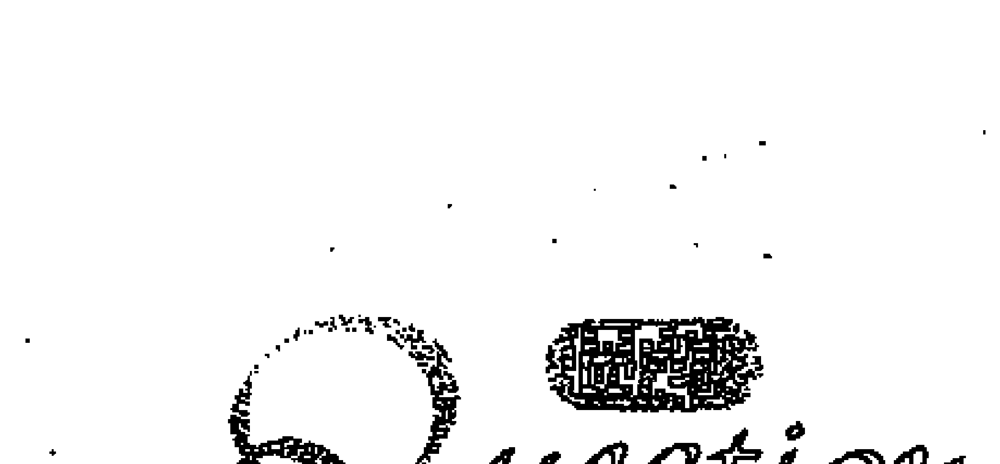

- 1. 請思考下列問題：
  什麼能激勵我？
  我所處的困境中，有哪些值得珍惜的地方？
  我是否受制於低安全感或完美主義？
  我的期許對我的經驗有何影響？
- 2. 如果這些問題能啟發你一些想法，如何將它們化為行動？

## 深入了解

- 1. 請翻到第二部分，溫習與1、6和7等出生數字相關的段落。
- 2. 也許你想複習親友的出生數字，如果他們不排斥的話，可與他們討論自己生活中，相似或相異的問題。

### 精神法則：改變人生的方法

- 1. 請到第四部分閱讀下列法則：
  信仰法則：唯有先相信自己，才能相信別人。
  完美法則：高遠的理想固然能啟發我們，但我們只能做到盡善盡美。
  灵活法則：保持靈活的彈性，才可以善用困境與變動的
- 2. 練習每項法則後所附的練習。
- 3. 想想如何將每項法則運用到生活裡。

### 環境

當下法則：唯有認可當下，才可化解心中的不耐與懊悔。

程序法則：穩健的一次踏出一步，便能信任生命的流程。

### 25/7

### 了解人生目標

生命軌道在25/7的人此生要化解隱私、開明及獨立等問題，最後學著去信任自己、別人，以及世界的精神力量，透過專注的紀律，體會內心的自由。對25/7的人來說，透過專注的自律，學習信任自己與他人，是他們的主要人生問題，而他們的生命品質也往往取決於能否以正面態度來面對這些問題。由於人生目標不易達成，25/7的人常會有程度不一的妄想，他們在人際關係開始之初，往往抱著近乎天真的信賴，最後卻注定信任破滅，而遭受背叛或誤解。

大部分的25/7都需要極大的隱私權以及獨立感。由於害怕自己出糗或被人出賣，他們常將感情封閉在「自己心裡」，不敢放心讓人瞥見其私密的思維或感受。有些25/7的人因受傷受苦，而在感情上，甚至在形體上與人疏離，像古時候的山中隱士一樣，尋求「靈性」，卻避開親密的人際關係。

### 25/7的正面特質

這些人的生活看起來不一定是精神導向，或與宗教靈修工作相關的。不過無論他們從事什麼工作，25/7的人常會有更深層的體悟，因爲他們會探索事物的本質，找到自己需要知道的事。他們也很能從別人身上學習，不過他們會尊重自己的感受與心意。他們是性靈自由之光的冒險者，過著無拘無束的生活，處處自在，處處可以為家，他們喜歡與人分享寶貴的經驗與真理。他們自由自在、真誠自然而平和，令人感動。他們感懷一切經驗，因爲這些25/7的人在任何地方都可以找到熱情。

### 25/7的負面特質

這些寧可獨處的孤癖25/7會避開人群，因爲他們不敢信任別人。他們漫無目標的尋找經驗、貪婪的閱讀、心神晃盪，不

### 人生運勢

#### 健康

大部分25/7的健康情形得依每個數字的運作情形好壞而定：從正面來看，2帶來了力量；5給人更多的自由度；而7在經過適當的練習後，可增強識別能力。然而，從負面角度而言，2表示25/7的人因為想得太多，弄得自己緊張疲累不堪，可能造成過敏的問題；5表示他們依賴、抗拒而漫無目標，對腎上腺及神經系統不好；7表示他們對背叛十分感冒，而連帶影響到心臟部位。

對25/7的人來說，沒有比在湖濱泛舟或在林間健行更好的活動了，若能加上靜坐，活力可以倍增。

大部分的25/7都必須學著更踏實些；他們必須「回歸現實」，運動、武術、以及正面的身體經驗能幫助他們活得更篤定，更懂得信任自己。

需要專注心神的美育活動，如觀想，使用光與色彩、花香及藝術等活動，對25/7的人都相當有益。跟所有出生數字含7

#### 人際關係

大多數的25/7在與人分享感受，展現自己脆弱的一面時，都會遇到大問題，這對他們來說非常困難，但絕非辦不到。他們常感到遭人背叛的恐懼與痛苦，不管這是來自真實經驗，亦只是存在於想像之中，因此他們只敢信任自己的思維，用理性蓋過感情，結果反而變得離群索居。

出生數字25/7的人很不願坦露心事，他們極端注重隱私權與獨立性，不過依然會努力與自己的伴侶保持溝通，取得一個和諧的平衡關係。大多數的25/7渴望透過伴侶，獲得和諧圓滿的人際關係，因為他們在自己身上找不到這種感覺。若能藉由練習，提升對自己的信賴與自足感，他們便能讓兩性關係變得更生動了。一旦他們能信任自己與上帝，就會對人際關係敞開心懷。

在性關係方面，25/7的人若能擺脫「理性的窠臼」，自信的卸下智性的裝甲，把感情帶到臥房裡，便能得到最大的滿足。

#### 天賦、工作與財務狀況

無論他們選擇什麼工作，25/7的人可以利用他們明快的思路去服務別人。大部分的25/7在寫作、表演、研究或高科技領域。

### 25/7的名人

- 貝拉·雅柏柴（Bella Abzug，美國女政治家）
- 亞瑟·艾許（Arthur Ashe，美國網球名將）
- 瓊·貝茲（Joan Baez，美國民謠歌手）
- 海倫·布朗（Helen Gurley Brown，美國社交名流）
- 小威爾·百克里（William F. Buckley, Jr.，美國政治家）
- 理查·波頓（Sir Richard Burton，英國演員）
- 艾瑞克·開普頓（Eric Clapton，美國藍調搖滾歌手及電吉他手）
- 凱莉·費雪（Carrie Fisher，美國女演員）
- 梅爾·吉勃遜（Mel Gibson，來自澳洲的美國男星）
- 伍迪·古雪里（Woody Guthrie，美國六〇年代音樂家）

### 實現天命的要訣

如果你的出生數字是25/7，本節可以協助你將心力放在重點上，用特定的行動改善重要的生活層面，讓你找到生命目標。

### 原則與建議

- 1. 信賴自己的直覺，你比誰都清楚自己的身體與生活。
- 2. 記住每天至少深呼吸一次，想像自己吸入一股活力。
- 3. 享受生活經驗，但要專注經營人際關係。
- 4. 跟別人談清楚，避免可能的誤解。

- 1. 請思考下列問題：
  我該如何把對專家、對理論的依賴，轉移成對自己直覺的信任？
  記住每天至少深呼吸一次，吸氣時想像自己吸入了一股活力。

  為避免誤解，我能不能在任何情況下，與人分享自己真正的感受與需要？

  心裡有哪些對信賴的想法需要重新檢視過？

- 2. 如果這些問題能啟發你一些想法，如何將它們化為行動？

## 深入了解

- 1. 請翻到第二部分，溫習與2、5和7等出生數字相關的段落。
- 2. 也許你想複習親友的出生數字，如果他們不排斥的話，可與他們討論自己生活中，相似或相異的問題。

### 精神法則：改變人生的方法

- 1. 請到第四部分閱讀下列法則：
  信仰法則：唯有先相信自己，才能相信別人。
  規範法則：規範使經驗變得更有重點與深度，使我們探觸到內心的自由。
  期望法則：隱匿在心底的期望與預設，會影響我們的一生。
  程序法則：一次走一小步，我們會慢慢信任生命的流程。
  責任法則：如果知道何時該說是，又應該如何去拒絕，便能從工作中獲得更多的樂趣。
  當下法則：唯有認可當下，方能化解心中的不耐與懊悔。

- 2. 實踐每項法則後所附的練習。
- 3. 想想如何將每項法則運用到生活裡。

## 34/7&43/7

### 了解人生目標

生命軌道在34/7或43/7的人，這輩子要修的功課是信任、耐心與感情的表達，同時要信任自己此生的歷程，找到實際的方法為他人服務，以建立自己的安全感。這兩個生命軌道的人都有機會綜合7的聰敏、4的成熟切實，以及3的敏銳與表達力。

由於受到數字4的影響，34/7和43/7的人想獲得心靈的省思或無條件的信任感，就得看他們能不能一步步做自我發掘了。他們越深入探索自己，眼界就越開闊。

由於生命目標中總是蘊含了一些試煉與屏障，34/7和43/7的人也許會覺得自己的能量會彼此衝突，往不同的方向與極端擴散：數字7的能力將他們向上推升，求取更深刻的思想，有時是對形而上及各種儀式產生興趣；但數字4卻要他們往下看，在日常生活、家庭及實務上扎根。隨著7和4的能量逐漸成熟整合，兩股能量可發揮強大的威力，讓34/7和43/7的人以創意方式，在人間與天堂之間搭起一座橋樑，例如邊賺錢，邊為世界帶來更多的美、歡樂與省思。

除了頭兩個出生數字順序相反外，大部分34/7和43/7的特質都十分相似，只是34/7的4對7的影響較大，而43/7的3對7的影響較強罷了。不過也因為如此，34/7的人在穩定及自我信任方面的問題較大，他們比較容易略過該有的步驟，不過自我表達和自我懷疑的問題也就比較不嚴重了。反之，43/7的人比較肯按部就班，可是在感情的表達和自我懷疑方面，問題也比較多，因此他們對自己的信任感來得慢，通常在年長後才能獲得自信。除了這些或強或弱的影響力外，這兩個生命軌道的人有著相同的基本能量，這些能量相互作用後的結果，使他們成為具爆發力、敏銳度，且洞悉力極強的人，同時也帶來了各式各樣的人生問題。

融匯相反的力量，兼顧實際與神秘主義、融和內外經驗、使身心合一、精神與物質雙修，是34/7和43/7此生要修的功課。他們有時會透過「靈修」方式來完成這項課業，或者參與特定的宗教，或者販賣、傳授與宗教性靈或個人成長等相關的書籍與課程。

無論34/7和43/7的人會不會從事與宗教相關的事業，他們的人生目標就是在現世與天堂之間搭起一座橋樑。數字3表示他們渴望表達，並完全融入俗世，去鼓舞他人，而不是遁居於深山老林之內。

### 34/7或43/7的正面特質

他們堅強、切實、身心兼修，從自己及他人身上學會信任生命的真意與智慧。這些自由思想者信任自己的生命歷程，包括人生的跌盪起伏，苦難與喜樂。冥想靜坐能讓他們安定心

### 34/7或43/7的負面特質

他們在安全感及拋開物質世界，追求精神生活之間掙扎不已，他們對世俗感到困惑，且不敢輕易信任，眼裡只看到別人的僞善，其實這正反映出他們內心的紛亂。自我懷疑使他們更不敢信任自己，因此便不斷地尋求明師、技巧與理念，看能不能幫他們一點，結果反變得漫無目標，很少肯紮實的下苦功去做點什麼。又或者，他們不肯在精神上冒險，即使他們表面上看來與人為善，喜歡人群，但其實並不敢與人分享內心的感受，這些人常覺得很孤單。

### 人生運勢

#### 健康

34/7和43/7的人綜合3的敏銳、4的結實和7的腦力，他們的體格通常相當強壯，但還是不太敢信任自己的直覺。由於擔心自己的身體「不懂照顧自己」，他們會從藥學、外科或草藥及食補上去著手。當他們開始信賴自己的直覺後——例如，按身體需要服用維他命——就會知道在什麼時候該做什麼事了。

## 第三部：命運之路 364

34/7和43/7的人都需要特別注意身體發出的訊息，關注自己的營養是一種學習自我信任的方式；他們必須傾聽身體傳達出來的想法與資訊，而不只是用腦袋去設想自己身體需要什麼。他們最好改掉別人叫他們吃什麼就吃什麼的習慣，先聆聽發自心底的建議，遵循自己的直覺，這樣最能使他們保持身體的強健。

低脂而花樣繁多的飲食有助他們們保持活力與快捷，大多數的34/7和43/7最好避開乳類製品，如果他們壓抑自己的表達，膝蓋或喉嚨可能會出毛病。

除非承受壓力，否則身體強壯的34/7和43/7很不容易生病。壓力使他們變得焦慮或「歇斯底里」，可能會造成精神崩潰。心智成熟的34/7和43/7很少會有這類疾病，不過萬一真的崩潰了，34/7和43/7的人可能得在醫院住一陣子，不過他們通常能很快復原。假如真的發生這種事，他們最好能接受整件事，安心去渡過它，事後他們將會感激這場經驗帶給他們的訓示。

34/7和43/7的人喜歡富含精神意義的技巧訓練，不是只做做伏地挺身，練練肌肉就夠了。武術尤其能教他們信任身體本身，學習與移動的能力。舞蹈或任何自由移動的運動，對他們都很有好處。能綜合身心靈三者的固定活動，通常最能使他們的興趣維持不墜。

#### 人際關係

從正面角度來看，34/7和43/7的人能在兩性關係中注入穩定、持續與感情。數字3讓他們不只光用腦袋，也懂得用心。只要他們能坦誠的信任伴侶，與對方溝通，就能擁有優質的兩性關係。

信任的問題是因為34/7和43/7的人內心不自在造成的，他們跟別人在一起的時候，很難完全放鬆，好像怕自己說錯話似的，結果越是這麼想，話就越說得不好。

他們的兩性關係和性關係的優劣好壞，全看他們能不能打開心扉，去信任並與人分享自己的感受，能不能拋開束縛，浸淫在親密關係的狂喜裡。雖然他們喜歡家的溫暖舒適，但這些堅強而重視性靈生活的人，因爲內心成長蛻變了，反未必能保持恆久的兩性關係。

#### 天賦、工作與財務狀況

各種能量集聚的結果，為34/7和43/7的人創造了特殊的挑戰、能力與機會。數字7、4、3組合之後，創造出來的生命軌道比這些數字個別獨立時都更強烈活潑。34/7和43/7的人都有極高的創造及表達潛力，他們可以在許多領域中嶄露頭角，包括玄學、武術、表演或製作、商業、寫作等。由於組織力強，這些人尤其適合寫劇本。只要他們能信任自己，坦然接受別人的回饋，踏實去做，必能有所成就。

### 34/7和43/7的名人

#### 34/7
- 凱笛絲·柏根（Candice Bergen，美國女演員）
- 柏恩斯坦（Leonard Bernstein，美國指揮家）
- 麥克·道格拉斯（Michael Douglas，美國影星及製作人）
- 高更（Paul Gauguin，法國後印象派畫家）
- 班佐·岡沙勒茲（Pancho Gonzalez，美國網球名將）
- 哲民·古里爾（Germaine Greer，美國作家）
- 里奇·傑克森（Reggie Jackson，美國棒球名將）
- 艾爾·喬森（Al Jolson，美國爵士歌手）
- 麥可·基頓（Michael Keaton，美國影星）
- 約翰·甘迺迪（John Fitzgerald Kennedy，美國前總統）
- 歌蒂·米爾（Golda Meir，以色列政治家）
- 瑪莉·泰勒·摩爾（Mary Tyler Moore，美國女演員）
- 杜魯門（Harry S Truman，美國前總統）
- 魯道夫·范倫鐵諾（Rudolph Valentino，美國默片時期影星）

#### 43/7
我們的紀錄中尚無知名的43/7，也許是43/7在人口中的比例遠低於其他出生數字的人數吧。

### 實現天命的要訣

如果你的出生數字是34/7和43/7，本節可以協助你將心力

### 原則與建議

- 1. 信賴自己的人生歷程。
- 2. 切記：你是完全安全的，沒有什麼能傷害你的心靈。
- 3. 慢慢一步步培養自己的表達技巧。
- 4. 分享自己的最心底的感受，改善自己的人生。

1. 請思考下列問題：
我相信自己有能力一步步去達成目標嗎？
我比較信任哪一樣——是我的腦袋，還是我的感覺？
自我懷疑或不耐煩會不會干擾我的生活？如果會，該如何改變？
不管有沒有跟人社交，我真的跟別人分享最私密的感覺嗎？
2. 如果這些問題能啟發你一些想法，如何將它們化為行動？

## 深入了了解

- 1. 請翻到第二部分，溫習與3、4和7等出生數字相關的段落。

- 2. 也許你想複習親友的出生數字，如果他們不排斥的話，可與他們討論自己生活中，相似或相異的問題。

### 精神法則：改變人生的方法

- 1. 請翻到第四部分閱讀下列法則：
信仰法則：唯有先相信自己，才能相信別人。
程序法則：一次走一小步，是達成目標的最佳辦法。
習慣法則：除非我們努力改變，否則很難破除積習。
誠實法則：信任並表達自己真實的感受，是誠實的基礎。
期望法則：隱匿在心底的期望與預設，會影響我們的一生。
2. 練習每項法則後所附的建議。
3. 想想如何將每項法則運用到生活裡。

## 富足與權力

對世界的貢獻大於世界對你的貢獻，就叫成功。～美國汽車大王福特 (Henry Ford)

本章節囊括了所有以8為主要生命目標的出生數字，包含17/8、26/8、35/8以及44/8。雖然這四組出生數字都強烈地反映出數字4的能量，不過也因為其他數字的影響與互動，而各有各的特色、問題與性格。

### 第三部：命運之路 370

### 17/8

- 8：富足與權力
- 7：信賴與坦誠
- 1：創造力與自信

### 了解人生目標

生命軌道在17/8的人，此生要化解與金錢、權力、與心靈相關的問題，當他們能信任自己的創造力，並與別人分享時，便能了解存在於自己心中的富足感與力量。由於人生道路充滿了挑戰，17/8的人必須先面對並克服內心的衝突、恐懼，以及對金錢與權力的迷信，培養更深層的自我信任，信賴自己的心靈，才能實踐自己的天命。對17/8或任何出生數字中含8的人來說，他們並不一定要有錢才能與人分享富足的生活，即使有的人收入不多，依然能與人分享幾塊錢、一些時間、一些心力，甚至是無限的關懷。

雖然追求內心世界的7與向外追尋的數字8在走勢大相徑庭，不過只要17/8的人願意抱持正面的態度，這種矛盾就不會存在了。當17/8的人開始信任自己的心靈，卸下心中的偏執與恐懼後，心胸就能為之大開，並透過天生的創造能力，為他們帶來富足的生活。換句話說，17/8必須克服數字7的問題，才能得到完全的滿足，無論他們能賺進多少財富。

雖然數字8有一定程度的實質性與物質傾向，但綜合1與7的力量後，賦予17/8的人「天生的創造精神」——並散發出一種明亮輕快、充滿想像的領袖氣質。他們有追尋性靈生活的傾向，剛好可以用來平衡補足數字8的腳踏實地，但汲汲於認可、財富與權勢的傾向。然而，如果17/8抱持負面態度，逃避生活及求取成功必要的外在努力的話，數字7著重內在精神的傾向就會對他們的能量造成衝突與傷害。大部分出生數字含8的人都有些微抑制自身權力的傾向：如果他們不信任自己，不敢面對世界的話，也許會一無所成。

儘管如此，數字1常會帶來財運，它在這方面是相當「幸運」的。當17/8在世上發揮創造力，並強烈的意識到自己對精神生活的重視時，金錢和影響力會不費吹灰之力地降臨在他們身上。

除此之外，1的創造能量，加上7的敏銳才智和8的冰雪聰明，使某些17/8的人成為最富洞察力與創見的思想家。從正面角度來看，17/8的人很知道如何達成自己的目標。

不過數字7可能會加劇他們下意識中對金錢權力的恐懼或逃避態度，如果17/8無法相信自己，對金錢或權力也就不太容易信任了，結果使得數字8的自毀傾向有機可乘。大部分17/8的人外表看起來都很活潑，但是卻不太懂得如何在物質世界中表達自己。

### 17/8的正面特質

這些可愛且還算開朗的人可以兼顧物質與精神世界，他們深信自己與世界能帶引他們到任何必須去的地方。他們相信有個更高的力量，但這些心靈的改革者也會找到屬於自己的權勢，並為別人注入活力。他們的活力為自己帶來富足的生活，而他們也樂享其間。當他們將心力用在服務眾人，以其才智、金錢為更崇高的目標服役時，不管他們做什麼，都會為自己帶來更多的福報。

### 17/8的負面特質

這些不安、退縮且害怕衝突的人在面對世界時會不知所措，他們需要認可、害怕被出賣，在精神生活上若有所失。他們控制慾極強，在商業交易時老覺得不信任別人，而且對金錢的看法十分矛盾，又不敢表達。他們在外在世界與性靈世界中拉鋸，搞不清楚自己這輩子究竟要做什麼。雖然他們看起來很外向，卻不太願意表露自己或內在的感受。7的聰明加上8的權力慾，他們會不經意的去指使別人或流於說教。基本上，他們對自己和上帝都沒什麼信心。

### 人生運勢

#### 健康

未曾化解的信任問題，或是對背叛的記憶，使得許多17/8的心臟部位變得十分敏感。如果從數字8的負面角度切入的話，17/8的人可能會下意識的去自我破壞，包括身體的殘害在內。如果他們覺得創造力受阻或遭受壓抑，那麼下腹、生殖部位或下背很可能會感到疼痛。

運動對17/8的人來說相當重要，能使他們感受到自己的力量與潛能，技巧練習可讓他們學著去信任自己，讓創造力暢行無阻。冥想對17/8的人也很有幫助，可以讓他們安定思緒，變得更平靜踏實。

17/8的人常把心事掛在臉上，他們在保健之餘，應多加寵愛自己一點，做些能兼顧享受與健康的活動，如固定做按摩、游泳或三溫暖（當然得看天氣而定了），這會讓他們覺得精神煥發。

#### 人際關係

17/8的兩性關係得視他們能不能從正面或負面角度切入，尤其是數字7的能量。大部分的17/8需要一點時間才能信任並坦然接納親密的情感，否則他們的配偶或伴侶會覺得：「我從來不覺得認識真正的你，也不知道你的感受。」不過因為7和8的關係，他們可能不敢表露自己的感情，怕自己出糗，或受到傷害，或以上皆是。他們也可能遇到權力鬥爭的問題，因為17/8的人在覺得不安時，常會表現出很嚴苛霸道。大多數17/8的人都會有過因缺乏自我信任，以及對權勢的恐懼，而放棄自己的權力或立場的經驗；接著他們又想奪回權力，卻又不清楚該怎麼去平衡這種心態。他們必須學著與人分享他們對權力的感受，並授權給別人。

17/8的性關係問題主要取決於他們對能量7的運用態度，也就是說，能不能坦然面對性關係，還是刻意去壓抑。如果他們覺得坦然，即可將創造能量轉化為積極的性需求，並摒除兒時所受的創痛。對17/8的人來說，性通常不成問題，反倒是親密關係比較難搞。當他們的信任及權力問題獲得改善後，兩性關係在他們生活中就會變得更重要了，而讓他們感受到內心的相通。

#### 天賦、工作與財務狀況

幾乎所有17/8的人都有聰明的頭腦以及對成功的渴望，加上良好的創造潛能，使他們能在多種領域中獲取成就，從運動到政治，都不乏他們的蹤跡。他們是絕佳的財務分析家或服務組織的領導，能與眾人周旋，以個別的方式從事公關工作。有些17/8的人最後會成爲慈善家，甚至還創建大大小小的慈善機構，他們也可能經營為眾人服務的書店或其他生意。

當17/8肯信任自己的直覺，並依此做出創造性的決定時，金錢自然會尾隨而至，而且他們常在搞不清楚的情況下，就變得非常成功了。

### 17/8的名人

- 米勒·費勒摩（Millard Fillmore，美國音樂家）
- 羅貝塔·富萊克（Roberta Flack，美國歌手）
- 提曼席·里瑞（Timothy Leary，美國六○年代風潮推動者）
- 米奇·曼特（Mickey Mantle，美國棒球名將）
- 杰克·尼柯拉斯（Jack Nicklaus，美國高爾夫球名將）
- 艾德拉·史提芬森（Adlai Stevenson，美國政治家）
- 愛德華·維里拉（Edward Villela，美國舞者）
- 強尼·威斯莫勒（Johnny Weissmuller，美國演員及泳將）
- 布萊罕·楊（Brigham Young，摩門教創建人）

### 實現天命的要訣

如果你的出生數字是17/8，本節可以協助你將心力放在重點上，用特定的行動改善重要的生活層面，讓你找到生命目標。

### 原則與建議

- 1. 相信努力創造後，必能招致富足的生活。
- 2. 把重心放在服務，而非金錢上。
- 3. 透過冥想靜坐的方式，找到自己的內在能量及富足泉源。
- 4. 不妨創造一種能結合生意與個人成長或精神生活的謀生方式。

1. 請思考下列問題：
哪種方式能讓我在工作上有更高的目標？
我是否與別人分享自己富足的生活？
我信任自己內心的感受嗎？相信自己的權力嗎？
能否創造一些聚集眾人之力的方式？
2. 如果這些問題能啟發你一些想法，如何將它們化為行動？

## 深入了解

- 1. 請翻到第二部分，溫習與1、7和8等出生數字相關的段落。
- 2. 也許你想複習親友的生命數字，如果他們不排斥的話，可與他們討論自己生活中，相似或相異的問題。

### 精神法則：改變人生的方法

- 1. 請到第四部分閱讀下列法則：
信仰法則：唯有先相信自己，才能相信別人。
期望法則：隱藏在心底的期望與預設，會影響我們的一生。
直覺法則：當我們認可自己的內心，便能從其中找到指引。
誠實法則：對自己誠實，便能啟開信任自己感受的大門。
天道法則：只要願意為更高遠的目標服役，即能激勵自己與他人。
2. 去做每項法則後所附的練習。
3. 想想如何將每項法則運用到生活裡。

## 第三部：命運之路 378

### 26/8

- 8：富足與權力
- 6：遠見與接納
- 2：合作與平衡

### 了解人生目標

生命軌道在26/8的人此生要解決完美主義、金錢、權力與認可等問題，以他們的遠見和理想，為別人服務，與眾人分享他們的富足。由於人生目標中蘊含了各種挑戰，26/8的一生反映出他們對金錢權力及理想的矛盾慾望與信念，而他們天生的理想主義很可能抑制他們此生該有的個人權勢。最後，26/8的人會挺身堅持自己，並在家人、社區或整體世界中獲得讚譽。

當26/8的人得到認同，通常是因為他們工作表現傑出之故。他們可以為了金錢與讚譽而拚命工作，不過身為理想主義的26/8，對金錢讚譽會有複雜的情愫。從負面角度來看，2的影響造成了內在的衝突，例如，是否該低估自己的工作去超低收費，或是該「貪心」的多收點錢。數字6可能有意見：「少拿點，這樣做才對。」而8則可能說：「我還要！」或者他們會害怕濫用金錢，結果幫人家做白工，這樣就不至惹對方生氣或不高興了。許多26/8的人因為數字6的影響，而對別人的批評格外敏感，因此也可能壓抑自己的感受，維持表面的「不動聲色」。

出生數字26/8的人常顯得被動，要不就是具有侵略性，不過一般而言，他們通常行事較低調。他們的自我價值可能因為6的高標準傾向，而顯得有些搖擺，也使得他們在面對情緒衝突時，會有放棄自己的權力與立場的情形。

因為標準高，26/8的人常會漠視別人的讚賞，貶低自己的價值與影響力，忘了自己的成就，只記得所犯的錯誤，他們很難真正享受自己辛勤的成果。當他們一再陷於這種因循時，26/8的人應該記住一句話：「雖然不完美，但也很不錯了。」當他們不再有所保留，即能交出亮麗的成績單，並支持別人。除非他們把自己隱藏起來，否則辛勤工作的26/8可以在環境中或社會上嶄露頭角；他們渴望安全感與讚譽，出生數字含8的人除非深究自己的生活和行為，否則會否定自己對讚譽的渴望——例如，他們置身在人群中時，會刻意不引人注意。如果他們展現了8的負面特質，也許會逃避金錢、權力或讚譽——避開他們此生該掌握的事項。

大部分的26/8在認可、財富或影響力等方面，常會去跟別人競爭、做比較，而私底下，他們希望自己能獨佔鰲頭，雖然這股渴求會因為數字6的關係而化明為暗。如果他們能覺察自己這股慾望，通常也會去「糾正」它，有趣的是，這種「糾正」的意願最後也常變成一種比較：「我不會像我認識的那些人一樣，老愛去跟別人做比較。」

大多數的26/8都會拚命工作去賺取金錢或讚譽，因為數字6高標準的關係，使他們認為自己必須「受苦」，或至少熬過困境，才有資格獲得富足的生活。由於標準高，所以無論26/8的人做什麼，都會覺得自己應該可以做得更好，也因此不願意在家人同事面前，太過彰顯自己。不過當26/8的人克服對金錢權力的心態問題，以及對財富或權貴人士的負面態度後，往往能成爲賺錢高手，並藉此建立更多的自信。財務拮据的26/8會覺得受制於人，而功成名就的26/8則變得圓融滿足且仁慈寬厚。

出生數字26/8的人受到數字6的影響，往往散發著一股純真的稚氣，他們通常也成熟得較晚。養家活口、工作或創業的種種需要和挑戰，會幫助他們成長，讓他們覺得像個大人。缺少這一類的挑戰，26/8的人可能會逃避辛苦的工作和對讚譽的渴望，只是得過且過的「混日子」。完美主義，加上對金錢或權力的恐懼，使得某些26/8變得不切實際，也因為不切實際的期許，而感到沮喪，倒不是因為生活挑戰的緣故。

幾乎所有26/8的人都想操控自己的生活，可是卻又希望別人能幫他們「做正確的事」。因此，有時別人會搞不懂他們想幹嘛；表面上看起來，他們希望別人開心，並喜歡他們，可是別人也許覺得26/8的控制慾其實很強。當26/8的人覺得自己無能為力時，會很難去堅持自己的立場，他們這一生通常會有「人善被人欺」或被虐的經驗，常被別人視作理想當然、被占便宜，乃至遭受語言批評或遭人毆打等。他們常會逃避社交或與人相處。

### 26/8的正面特質

這些標準高，又有遠見的人是賺錢能手，他們做自己愛做的事，同時為別人服務。他們在人際關係、工作及生活中，找到一股平衡的內在力量。由於自足自適，他們對於事物可以適時的拿起或放下，不必去縱操別人。他們公平而正直，對世界能有正面的鼓舞與影響，他們利用自己的權勢與地位去幫助別人，不會短視近利，並投身於更高遠的理想。

### 26/8的負面特質

這些不懂堅持的人十分差怯，且覺得別人忽略了他們。由於受挫感重，他們對金錢抱持著負面的想法，變得很討厭「有錢人」。他們很難與別人相處或建立兩性關係，除非權限能夠劃分得很清楚，否則容易陷入權力鬥爭的泥淖。他們是霸道的完美主義者，對別人極盡挑剔之能事，尤其是那些不把他們看在眼裡的人。他們貶低自己和自己的表現，用不切實際的超標準來批判自己，不肯面對物質世界的種種挑戰，連很簡單的事都不願嘗試。

### 人生運勢

#### 健康

如果26/8的人不能放下完美主義的身段，拋開下意識裡對金錢權力的負面心態，很可能會傷害到自己，或者生病，或者離婚、受傷，使他們錯失本可擁有的高成就。

如果他們憤恨不平，很可能會造成太陽神經叢的長期緊張，防礙到呼吸，而顯得精神萎靡不振，或者因自己給自己壓力，而造成頸部的緊繃。如果他們累了，可能會患鼻竇炎，這是放鬆自己的警訊。他們往往把自己逼得太緊，然後弄得必須休養，不過通常他們只需要好好寵愛自己一小段時間就夠了。

大多數的26/8的人因為標準高，所以很注重營養，不過因為他們工作太認真了，也會很喜歡放縱自己一下，「喝點小酒」、嗑藥、按摩、洗洗三溫暖，甚至吃點糖，來慰勞自己的辛勞。這種拚命工作後放縱自己的模式，加上希望維持美好的自我印象，使得某些26/8的人會養成飲食失調的習慣，因為他們先是過度控制自己，然後又放任不管，造成了飲食習慣的搖擺，更糟的還會罹患貪食症或厭食症。穩健的做法對26/8的人會是一個挑戰，由於標準高，他們會去改善自己的飲食與生活上大小事項，內容多樣的低脂飲食很適合他們，這點跟大多數人是一樣的。

有固定運動習慣的26/8多半會尋找效率高且均衡的運動項目，他們可能把運動當成一種求取讚譽的手段，或者會練練舉重，讓自己覺得更有威力，不過這得依他們的背景及興趣而定。其實任何能吸引他們的運動項目都很適合他們，而且他們通常學什麼像什麼。

#### 人際關係

26/8的人要求很多，有時候很難跟他們住在一起，因為他們不是拿自己的標準去批判所有人，就是拚命要求完美，努力達成不可能的任務。

出生數字26/8的人在了解或表達自己真實的感受時，可能會遇到一些困難，因為他們向來講究「最完美」的感覺，然後便戴上那副假面具了，他們必須學著掌握自己的真實感覺與需求。

許多26/8的人不容易維持長久的兩性關係，或許下諾言，尤其他們一心只想到尋找「零缺點」的兩性關係。有些人一開始先把自己的理想投射在某人身上，等對方曝露出人性的缺失後，又感到失望，甚至覺得受騙。接著他們會設法改變對方，也不管對方到底有沒有興趣。26/8的人若能運用「靈活法則」，對他們的兩性關係會很有幫助。

在性生活方面，26/8的人因為想把事做好，所以在床第間會努力求表現，以取悅伴侶，而不是真誠的表達自身需要，讓自己縱情其間。他們也許會用間接的手段去操縱伴侶或自己，他們必須把焦點從表現的好壞，轉移到愛的互動與親密關係上，如此才能從兩性關係中得到真正的滿足。

#### 天賦、工作與財務狀況

抱持正面態度的26/8因爲要求高，加上對讚譽和成就的渴望，幾乎什麼事都可以做得很好，而且會在眾人之間嶄露頭角，因爲他們工作勤奮，並努力改善自己。然而他們很少對自己的表現感到滿意，他們必須學著去欣賞自己的努力，而且他們往往會努力掙取更高的收入。由於理想高，有時他們很難找到自己滿意的工作。他們對地位聲名既期待又怕受傷害，因此往往大器晚成，直到他們終於懂得珍惜自己和自己的工作表現，才能對別人產生正面的影響。

### 26/8的名人

- 拳王阿里（Muhammad Ali）
- 詹姆斯·鮑德溫（James Baldwin，美國演員）
- 露西·鮑爾（Lucille Ball，美國女諧星）
- 西塞·柴維茲（Cesar Chavez，美國拳擊手）
- 鮑伯·迪倫（Bob Dylan，美國民謠歌手）
- 瑪莉·貝可艾迪（Mary Baker Eddy，美國宗教家）
- 杰克·倫敦（Jack London，美國作家）
- 馬克斯（Groucho Marx，德國經濟學家及社會主義者）
- 莉莎·明妮莉（Liza Minnelli，美國歌舞演員）
- 保羅·紐曼（Paul Newman，美國影星）
- 劳伦斯·奥利弗（Sir Laurence Olivier，英國演員）
- 杰西·欧文斯（Jesse Owens，美國短跑健將）
- 芭芭拉·史翠珊（Barbra Streisand，美國影星）

### 實現天命的要訣

如果你的出生數字是35/8，本節可以協助你將心力放在重點上，用特定的行動改善重要的生活層面，讓你找到生命目標。

### 原則與建議

+   1. 行動時，將自信與能量擺在心裡。
2. 找一件能讓你凸顯自己，持之以恆的事。
3. 認可自己的價值，讓自己散放光芒。
4. 在工作與個人的人際關係中找到平衡點。

1. 請思考下列問題：

我對金錢和權力是採取追求或逃避的態度？

我覺得自己必須做得更多，才有資格得到成就嗎？

我是否能平衡自己，保持一貫？

我的高標準對工作有何幫助，對自己又有何好處？

2. 如果這些問題能啟發你一些想法，如何將它們化為行動？

## 深入了了解

+   1. 請翻到第二部分，溫習與2、6和8等出生數字相關的段落。
2. 也許你想複習親友的出生數字，如果他們不排斥的話，可與他們討論自己生活中，相似或相異的問題。

### 精神法則：改變人生的方法

+   1. 請閱讀第四部分下列法則：
誠實法則：我們必須先對自己誠實，才能坦然的對待別人。
完美法則：高遠的理想固然能激勵我們，但我們也只能盡力而為。
程序法則：一次踏出一小步，是達成目標的最佳方法。
責任法則：如果我們知道何時說好，以及如何去拒絕，才能建立相互的支持。
不論斷法則：宇宙並不會批判我們，它只會藉自然的結果來教導我們。
2. 實踐每項法則後所附的練習。
3. 想想如何將每項法則運用到生活裡。

### 了解人生目標

生命軌道在35/8的人，此生要學習真情、獨立及權力的問題，並把持紀律，以經驗中所得的教訓，求取富足的生活、威權與自由。由於生命目標不易達成，35/8的人與生俱來的挑戰包括了對財富、權力既渴望尊重，又感到害怕的矛盾情結。這種內在的衝突構成了35/8的一生，並表現在正面及負面的傾向上：他們或者採取低調被動的態度，或表現得咄咄逼人，甚至十分無禮。接納並整合僞裝出來的被動及侵略表象，找到一個真誠而平衡的自己，是35/8的一大挑戰。

35/8的人以行動及影響力來展開他們的人生道路，他們的能力與天賦展現在威權、領導工作及責任感上。除非他們下意識中懼怕自己的權力，而阻礙了他們，否則35/8的人可能會非常的戲劇性，甚至有點矯飾或愛現。當他們賺到大筆錢時，也很懂得花出自己的格調。

### 人生運勢

#### 健康

一般說來，35/8的人身體還不錯。不過當他們工作過度，在各項野心中奔忙時，往往會因爲分心、忽略交通規則或自我破壞的傾向，而造成過勞及受傷等問題。所有35/8的人都應該記得繫上安全帶，並避免高風險的活動，尤其是在二十五至三十歲之間。他們若能專注心力，在工作與休閒中找到平衡點，並投身爲更高遠的目標服務，那麼上述問題發生機率就會大爲減少，自我破壞的毛病也會淡化。

如果35/8的人把工作奉爲一切，通常不大會管自己的飲食。聰明的35/8大多會根據自己的知識去選擇飲食，而明智的把食物當藥來吃，以保持最佳狀態。跟一般不需要特殊食物的人一樣，平衡、低脂，以蔬菜爲主的飲食，會很適合他們。吃什麼，以及怎麼去吃，對35/8的人是一樣重要的，定食定量是他們飲食上最大的挑戰，因爲在這方面，他們很可能會有控制過嚴，或控制得不夠的情形發生。

35/8的人會不會把運動當成一件重要的事去做，得視他們的價值觀、背景和生活型態而定，不過能讓他們感受到個人力量的運動，如武術、健身訓練及個人式運動等，都非常適合他們。

#### 人際關係

許多35/8的人除非上了三、四十歲，否則很難去維持一段長遠的關係，在這之前，他們常會陷入權力鬥爭的遊戲裡。如果他們被動或侵略的傾向沒有獲得平衡，人際關係中會往往出現微妙或比較直接的操縱問題，以及依賴及獨立等毛病。反

#### 天賦、工作與財務狀況

這些人此生要利用他們幾近天才的智慧，透過服務來創造財富，並在家庭、社區中擔任慈善領導者或權威人士的角色，企業界或政治圈即是其中兩個例子。這些人是卓越的發明者、改革家或作家，任何可以讓他們揮灑好奇卓越腦力的領域，都是他們悠遊的天地。從最高層次來看，35/8的人可以扮演慈善家的角色，為人類福祉而分享自己的財富與影響力。

35/8的人向來重視財務問題，因為金錢是他們生命軌道上的一個重心。最常見的情形是，35/8的人會自立更生，這些人當中有許多白手起家的百萬富豪。如果他們本來就很富有，那

### 35/8的名人

+   參文·貝里（Melvin Belli，美國律師作家）
英格麗·褒曼（Ingrid Bergman，美國女影星）
詹姆斯·凱尼（James Cagney，美國演員）
艾佳·塞西（Edgar Cayce，美國靈魂學專家）
傑克·丹比西（Jack Dempsey，美國拳擊手）
鮑弟·賀里（Buddy Holly，美國搖滾明星）
鮑伯·紐哈特（Bob Newhart，美國演員）
諾曼·皮爾（Norman Vincent Peale，美國自我成長專家）
瑪莉·派福德（Mary Pickford，美國默片時期明星）
艾普頓·辛柯勒（Upton Sinclair，美國小說家）
奧利佛·史東（Oliver Stone，美國電影導演）
瑪莉·雪莉（Mary Shelley Wollstonecraft，英國作家）

### 實現天命的要訣

如果你的出生數字是35/8，本節可以協助你將心力放在重點上，用特定的行動改善重要的生活層面，並找到生命目標。

### 原則與建議

+   1. 以自己的長才和努力求取成功。
2. 掌握自己的權力，但也別忘了寬厚待人。
3. 把為別人服務的理想化為具體行動。
4. 找到專注的志向，切實力行。

### Question

1. 請思索下列問題：
求取富足生活該做的事，我是否專心的去做了？
我是不是從自己身上找到圓滿之心與力量？
在生意及個人生活上，是否實踐了最高的道德標準？
我能不能自在的與人分享自己的感受？
2. 如果這些問題能啟發你一些想法，如何將它們化為行動？

## 深入了解

+   1. 請翻到第二部分，溫習與3、5和8等出生數字相關的段落。
2. 也許你想複習親友的出生數字，如果他們不排斥的話，可與他們討論自己生活中，相似或相異的問題。

### 精神法則：改變人生的方法

+   1. 請到第四部分閱讀下列法則：
天道法則：有志為更高的目標服役，能促使我們去激勵別人。
誠實法則：我們必須先對自己誠實，才能坦然的對待別人。

## 第三部：命運之路 396

規範法則：規範使經驗變得更有重點與深度，使我們獲得內心的自由。

平衡法則：了解自己在兩極間擺盪的個性後，才能找到自己的平衡點。

行動法則：為了克服對自我的疑慮，我們必須接納自己的感受，並自信出擊。

+   2. 去做每項法則後所附的練習。
3. 想想如何將每項法則運用到生活裡。

### 了解人生目標

生命軌道在44/8的人此生要學習金錢、控制、責任與穩定基礎等課題，遵循一套有系統的過程，取得物質上的成就——不只是為了成功而成功，而是在支持他人或奔赴理想的過程中，獲得成就。由於人生之路充滿了各種試煉和砥礪我們的挑戰，44/8的人在成功之前，必須先克服一些缺點，如執意不肯按部就班去做事，就是其中一項。心智成熟的44/8可以展現出英雄般的毅力，不過如果缺少這項特質，他們會希望得到速成的結果，要不就乾脆放棄（「這件事就算了」）。他們不會像出生數字含3的人那麼容易受挫或失望，不過44/8的人常會覺得不耐煩、憤怒而懊惱，尤其如果他們還不懂得循序做事，那麼學著把事情分散成可以掌握的小片段，一步步去做，會是絕對必要的。

無論44/8的人這輩子從事什麼，都必須學會內省的功夫，才能去分析、了解並接納，而不至一味抗拒實踐天命該有的步驟。

44/8的人跟其他22/4和33/6等，出生數字含兩個相同數字的人一樣，因爲組合中少了一種數字，能量也變得更集中、更強烈。把數字4的穩健、體能和生意頭腦上以二；再加上潛在的力量與頑固、毅力與剛直、絕佳的分析力與困惑、忠貞與不定、野心與不耐；以及數字8對富足、權力及讚譽的渴望，那麼你就會明白爲什麼44/8的人會有那麼多的挑戰和機會了。跟任何生命軌道一樣，44/8的一生是好是壞，就得看他們能不能從正面角度去運用數字4和8的能量了。

出生數字左邊兩個數字相同的人，第一個數字代表的是內在的挑戰——對44/8的人來說，他們的挑戰是內心的穩定。44/8的人需要一股反躬自省的意願，並養成鍛鍊自己、支持自己的內心程序，如某種形式的自我分析，不過他們得避免耽溺在這種過程裡，才不致因過度分析，反造成困惑。至於左邊兩個數是2的人，他們的主要問題在於能不能平衡自己。

第二個4代表44/8的人必須打好家庭的外在基礎——解決他們與父母、子女的問題，這是說如果有孩子的話。解決問題的方法很多，也許是表達出負面的感受，也許是求取對方的原諒或去原諒對方，或尋求共通的了解，或只是接納彼此的歧異。無論是哪種方法，都要去溝通、解決問題的，否則只能粉飾太平而已。

大部分44/8的人都很在乎安全感和穩定。他們的銀行裡得有現金、冰箱裡得擺食物、車庫裡得有車、衣櫃裡不能缺衣服，這些對44/8的人來說都是基本的東西。「東西要夠」的安全感對出生數字含4的人來說非常重要，數字8的問題則是要得到比「足夠」更多的東西。結果使得44/8的人對富足的生活產生渴望與野心，不過他們也不乏追求這些東西該有的才幹與毅力。

由於生命軌道中賦予的挑戰，大多數44/8的人會遇到跟家庭、安全感及程序方面的問題。願不願意遵守「程序法則」，決定了他們的成敗。一般而言，44/8的人可以在人際關係、生意、健康或精神上達成自己的目標，並一步步切實而有系統的去完成他們的生命標的。如果他們略過一個步驟，通常就會前功盡棄，而必須從頭來過。

「習慣法則」可以提醒他們如何突破一再失敗或半途而廢的模式，幫他們省下大量的時間。如果44/8的人忽略或不屑遵守這些法則，就會得到慘痛的教訓。他們的人生道路並不平順，生命有時會以戲劇性的遭遇來引起他們的注意。

44/8的人在面對重大抉擇時，往往會感到困惑，因為他們常會追根究柢的分析每件事，結果反變得毫無頭緒。他們在花錢、吃東西或其他生活層面上，常會有強迫性或衝動性的行為，跟出生數字含2的人一樣，他們必須在理智與情緒間找到平衡點才行。

因爲兩個4的關係，44/8的人可能擁有絕佳的體力、毅力和韌性；從負面角度看來，那股力量會變成固執與嚴肅。由於數字8有操控的傾向，除非44/8的人能下決心改變，否則幾乎沒有人能夠改變他們的心意，而許多44/8的人會有過度限制自己，不懂變通權宜，或者因害怕失敗而墨守現狀的毛病。如果他們不肯傾聽別人的回饋，常等於給自己找麻煩。因此44/8的人在投注某個目標，或在斬斷自己的退路之前，最好先明智的保持彈性並廣納意見。當他們能夠整合兩個4與8的能量後，隨著生活越加豐盛，44/8的人就能慢慢為別人服務了。

### 44/8正面的特質

天生的韌性、毅力加上分析技巧，這些人能踏實的一步步朝自己的目標邁進，對他們來說，沒有什麼是辦不到的。他們把任何工作拆解成環環相扣的段落，把大目標打散成小的步驟。他們擁有異於常人的健康與活力；他們很懂得照顧自己，該有的謹慎與關注一點都不會少。這些忠誠可靠的人，有著穩定而長遠的人際關係，他們喜歡家庭和隸屬於社會大眾的感覺。他們有能力、切實際，生意頭腦一流，又渴望成功，他們能按照程序去發揮自己的才幹，靈活的態度讓他們不僅能為自己，也為廣大的群眾謀求富足的生活。

### 44/8負面的特質

通常這些人可以把自己控制在一定的程度，不過常會有歇斯底里的情況出現。他們困惑而緊張，若被逼到死角，也許會神經崩潰。他們頑固、盲目的相信自己，似乎老是犯同樣的錯誤。他們的人際關係是痛苦與挫折的來源，因為他們不斷的陷入權力鬥爭與爭執的泥淖裡。他們也許能賺很多錢，可是都守不住，揮霍掉了；他們尋找穩定感，可是卻無法對任何事或人許下允諾。他們渴望成功，卻不願遵循該有的程序。他們對太多事覺得有責任感，卻又害怕失敗，而拚命躲避責任。

### 人生運勢

#### 健康

出生數字44/8的人不願意聽別人告訴他們該怎麼吃、怎麼運動，或做任何事情。儘管如此，低脂、有效而均衡的飲食對他們來說尤其重要，因為兩個4的關係，除非他們有固定運動的習慣，否則體重很容易往上攀升，而且胖的還不止是外表，連內臟也會跟著發胖。

強調彈性、放鬆、平衡的規律運動，以及能紓解壓力和抗拒等傾向的靜坐冥想，幾乎可讓所有的44/8變得更健康。能體現「靈活法則」的合氣道或太極對44/8的人好處甚多，這些運動讓他們學會不去抗拒、因應現有的狀況，同時學習融和、鬆柔與平衡的技巧，除此之外，這兩項運動都需要耐著性子循序學習，才能抓住竅門。一旦44/8的人掌握其中的程序，即能將這番道理運用在日常生活中的大小事情。

#### 人際關係

大部分44/8的人對人際關係都很忠誠穩定、堅貞而支持。從負面的角度來看，他們可能會像之前談到的，陷入權力鬥爭的遊戲裡，如果他們還沒學會生命中該學的課程，也許還會缺乏穩定性。不過若能發揮自己的正面能量的話，44/8的人可以維持一段長久而健康的人際關係；他們會很重視家庭和子女，不過對他們來說，工作還是擺在第一優先。

雖然44/8的人也有感情生活，卻不像其他出生數字的人那麼以感情為重。他們的伴侶最好學著欣賞他們的忠貞、力量與活力，別去挑剔他們不夠細膩。由於這些人少了一根筋，因此暗示的效果通常不好。

44/8的人對待性的方式可能相當強悍而實際，除非他們在幼年遭受過性虐待，而心結未解。通常敏感細膩的人最適合他們，因為可以平衡他們的能量，如果真的讓他們遇到這樣的人，雙方一定要學習欣賞彼此的歧異才行。

#### 天賦、工作與財務狀況

出生數字44/8的人往往是商業、企業的領導者或控制者，有時他們則躲在幕後提供分析。他們能不能熬過漫長的程序，去達成目標，是其成敗的關鍵。一般說來，44/8的人會是商業、心理醫療及情治單位的出色分析家。

對44/8的人來說，經濟上的安定是主要的動力，不過他們

### 44/8的名人

在我們的紀錄中並無知名的44/8，也許是因爲這個出生數字的人在現有的人口中十分罕見，而首位44/8的人也才於1959年出生，相較之下，仍相當年輕之故。

### 實現天命的要訣

如果你的出生數字是44/8，本節可以協助你將心力放在重點上，用特定的行動改善重要的生活層面，並找到生命目標。

### 原則與建議

- 1. 運動時，結合力量、體能與靈活流暢。
- 2. 想清楚達成目標的各項步驟，然後一一遵循。
- 3. 無論你是否與父母同住，跟他們談談自己的感受。
- 4. 迎向自己的挑戰，也許能賜給你最大的力量。

### Question

1. 請思索下列問題：
我如何才能將力量與靈活度融會？
我個人的目標是否能造福大眾？
有時我會不會為了自己的利益，而顯得過於固執？
我能不能同時使用邏輯和直覺來做決定？

2. 如果這些問題能啟發你一些想法，如何將它們化為行動？

## 深入了解

- 1. 請翻到第二部分，溫習與4和8等出生數字相關的段落。
- 2. 也許你想複習親友的出生數字，如果他們不排斥的話，可與他們討論自己生活中，相似或相異的問題。

### 精神法則：改變人生的方法

- 1. 請到第四部分閱讀下列法則：
程序法則：穩健的一次踏一步，是達成目標的最佳方法。
習慣法則：除非我們能努力改變，否則積習很難破除。
循環法則：生命與四季的輪動一樣，都是一場更迭不息的過程。
誠實法則：我們必須先對自己誠實，才能坦然的對待別人。
靈活法則：保持靈活的彈性，才可以善用困境與變動的環境。

### 練習每項法則後所附的練習

3. 想想如何將每項法則運用到生活裡。

天使神秘学院官方淘宝：http://strc.taobao.com
获取更多好书，请加微信：13641926204 或 QQ:715104687

## 正直與智慧

> 每個人終將坐下來享用後果的盛宴。
～英國小說家史帝文生

本章節囊括了所有以9為主要生命目標的出生數字，
包含了18/9、27/9、36/9和45/9。
雖然這四組出生數字都強烈的反映出9的能量，
不過也因爲其他數字的影響與互動，
而各具特色、問題與性格。

### 了解人生目標

生命軌道在18/9的人此生要解決誠實、金錢、控制及自信的問題，秉持正直廉潔的原則，以創意的方式展現並運用他們的能量及影響力。許多18/9的人看起來也許非常豪放甚至開朗，可是他們心裡其實並不快樂，反而滿載了罪惡感、恐懼與不安。由於生命目標中往往含有特殊的挑戰，18/9的人必須化解對金錢權力，那種既想要又逃避的矛盾心態，並解決不安全感的問題，才能邁向正直與智慧的境地。

由於正直是他們的終極人生目標，不管18/9的人喜不喜歡，都必須依循崇高的道德與誠實原則。他們或者受到別人的啟發，或者受到誤導，結果被拿來當錯誤示範。跟其他出生數字含9的人一樣，18/9的人若不遵循真理，就會自食惡果。那些奉行精神法則的18/9會創造幸福美滿的人生，他們勤奮工作，並享受自己辛勤的成果。而那些罔顧精神法則的人，則會很快得到現世報，躲都躲不掉。

大多數18/9的人都很聰明、有著迷人的領袖氣質與無窮的精力。各出生數字綜合結果所產生的能量、問題與欲求，使他們成爲絕佳的強勢領導，能帶動全國，移山倒海，建立帝業——或反之，成爲置反對者於死地的偏激分子。數字8追逐金錢權勢的傾向，數字9的正直，加上1的創造能量，可能會對那些尚不了解，也不懂平衡自己各種傾向的18/9，造成心理上的負擔。

影響18/9的這些強烈特質，往往能爲他們帶來財富與影響力，使他們邁向成功，除非他們去破壞自己所做的努力。他們會極力掩飾數字1造成的低安全感，在外表上虛張聲勢、處處好強或咄咄逼人，不過在他們強悍堅毅的外表下，其實是非常被動的，因爲他們害怕被別人看穿。

如果18/9的人能以正面態度去發揮他們的能量，便能以身作則，領導別人；他們的正直與創造力，贏得了跟隨者極高的尊崇與忠心。因此，18/9的人常常被拱到領導地位，無論是領導大衆或帶領小衆。如果18/9的人把能量用在負面途徑，則會耽溺在金錢權勢的追求上，意見偏激，並將創造能量用在破壞自己與他人之上。換句話說，18/9的人不是大好，就是大壞。

無論他們的生活看起來多麼成功，18/9的人都會面對一些內在的問題與衝突，彷彿是潛意識強加給自己的箝制，而這些衝突很可能會造成生理上的疾病或其他問題。

由於18/9的問題出在下意識的層次裡，因此他們也只能從自己的內心去尋找答案。不過，由於他們傾向把焦點放在外在世界的物質成就，而輕忽內心的成長，因此很可能排斥做自省的功課。無論他們肯不肯反躬自省，18/9的人最終都得面對沉重的心理負擔與痛苦，好好檢視這些問題。

自我檢視、了解與寬恕，最後能帶引18/9的人去感受生命中重要的精神法則，並與人分享財富，致力為人服務，而不只是一味的聚積資財或權勢而已。如此便能以理想熱情去激勵別人，樹立正直的楷模。

所有18/9的人都必須小心的問自己：「我是不是真的以身作則了？」然後傾聽內心的回答。18/9的人若是言行不一——而且他們是一定會對別人說教的——生命將以戲劇性的方式來引發他們的注意，包括疾病、意外和人際關係的斷裂等形式。這個出生數字的人生多半是大開大闔的，而生命給他們的回饋，也都是大刺刺，不怎麼委婉的。

等他們遲早看夠、受夠，也學夠了，知道在生活中力行正直的精神法則，18/9的人才能將精力與能量導向人類最高的福祉，並在這番過程中，慢慢超越自己的舊習與痛苦。他們越致力於崇高的理想，能量就越能以正面的方式展現。「誠實法則」是18/9的生命關鍵；信守精神法則，可以引導他們邁向自己的天命。由於他們與生俱來的精力、領袖氣質與個人力量，18/9的人會是人群裡的熠熠明星。

### 18/9的正面特質

這些人天生富內涵、領袖氣質，且魅力無限。他們豪放而威權的氣質反映出過人的聰明與才智。他們以身作則，在家庭、社區或世上展現出領導者的風範。他們是優秀的策略家，熟諳且能夠遵循任何競賽的規則，他們利用自己的影響力，與人分享富足的生活，以求改善身外的世界。隨著心靈力量的展現，他們的典範能激勵別人跟進，同時為他人提供可貴的想法。他們的生活絕不單調，這些工作努力、創意無限的人，工作的目的是為了謀求更高的利益與幸福。

### 18/9的負面特質

雖然別人覺得他們表面上看起來不錯，但這些人的內心卻一片混亂，沉重且充滿了恐懼，在罪惡與救贖之間掙扎不已。他們嚮往健康與內心的平靜，可是又放不下自己的意念，而有追求絕對權力與控制權的傾向。他們喜歡直接或間接的說教，教別人該怎麼過日子，可是自己偏偏又做不到。他們抗拒生活裡的遭遇，希望能控制別人的生活。這些人看不到挑戰中所含的福賜。

### 人生運勢

#### 健康

#### 人際關係

雖然18/9的人可以相當熱情體貼，卻因潛在的低安全感與控制慾，而使他們很難對人示弱，或產生親密的關係。儘管如此，18/9的人能帶來魅力，活力與深度。對他們來說，找到一個旗鼓相當，能以細膩方式協助他們平衡能力的伴侶，是非常重要的——一個能了解並全然接納他們，並帶動他們去接受自己，乃至於原諒自己的人。雖然結婚和養家通常不會是他們的生活核心，但18/9的人絕對可以在他們的人生戲碼上，創造一個以家庭為背景的舞台。

由於他們強大的創造能量和與人相交的渴望，18/9的性慾也反映出他們強烈的生理、情感及心靈需求，只是他們對這點未必有自知之明。當他們發揮自己的正面特質時，可以透過性慾的表達，體驗到兩人的連結。

#### 天賦、工作與財務狀況

18/9的旺盛能量通常會使他們身居要津，例如，18/9的人往往成爲律師、建築承包商、外科醫師或主管，而不只是當個店員而已。聰明而富創造力的18/9通常會超前所有人一步，重要的不是他們做什麼，而在於他們如何去做；只要他們肯與人相連，明智的在生活中力行精神法則，過著正直平衡的生活，那麼他們會在人生道路上找到極大的滿足。

一般來說他們的財務狀況都很不錯，剛好反映出他們的精力與才幹，除非他們抱持負面的想法，或因恐懼而阻礙了自己。對18/9的人來說，千萬別爲了錢去賺錢，而應在服務中，自然而然去創造財富與影響力，這一點非常重要。當他們把服務當成自己的目標，其創造能量與才智，自然會爲他們帶來財富與影響力。

### 18/9的名人

- 法蘭西斯·貝肯（Francis Bacon，英國作家）
- 特魯拉·邦柯賀（Tallulah Bankhead，美國演員）
- 朱利斯·伯洛斯（Julius Boros，美國高爾夫名將／作家）
- 吉米·卡特（Jimmy Carter，前美國總統）
- 珍·哈洛（Jean Harlow，美國女演員）
- 理查·哈利斯（Richard Harris，美國演員）
- 羅斯福·海斯（Rutherford B. Hayes，美國前總統）
- 毕·兰卡斯特（Burt Lancaster，美國影星）
- 林白（Charles Lindbergh，美國飛行家）
- 凯莱儿·鲁丝（Clare Boothe Luce，美國作家）
- 理查·派爾（Richard Pryor，美國黑人諧星）
- 马克·史毕兹（Mark Spitz，美國奧運冠軍泳將）
- 小柯特·范尼柯（Kurt Vonnegut. Jr.，美國作家）
- 劳伦斯·威克（Lawrence Welk，美國音樂家）

### 實現天命的要訣

如果你的出生數字是18/9，本節可以協助你將心力放在重點上，用特定的行動改善重要的生活層面，並找到生命目標。

### 原則與建議

- 1. 專注於對的事，而非對的人。
- 2. 別懼怕自己的力量；只要善用它來服務別人就可以了。
- 3. 問問自己，在哪些生活層面上為別人樹立了榜樣，哪些方面則沒有做到。
- 4. 以喜歡的方式去發揮自己的創造能量。

## 第三部：命運之路 414

1. 請思索下列問題：
我的安全感是否來自金錢與權力？
是否將自己的創造力運用在有用的事務上？
我對別人會有金錢或控制慾方面的問題嗎？
我對操守和成功，是否一樣重視？

2. 如果這些問題能啟發你一些想法，如何將它們化為行動？

## 深入了解

- 1. 請翻到第二部分，溫習與1、8和9等出生數字相關的段落。
- 2. 也許你想複習親友的出生數字，如果他們不排斥的話，可與他們討論自己生活中，相似或相異的問題。

### 精神法則：改變人生的方法

- 1. 請到第四部分閱讀下列法則：
天道法則：為更高目標服役的意願，可以激勵自己與他人。
誠實法則：我們必須先對自己誠實，才能坦然的對待別人。
選擇法則：我們可以用正面或負面的方法來表達自己的創造力。
直覺法則：我們如果停止收聽別人的意見，即能聽到自己心中的智慧之音。
靈活法則：保持靈活的彈性，才可以善用困境與變動的環境。

### 練習每項法則後所附的練習

3. 想想如何將每項法則運用到生活裡。

天使神秘学院官方淘宝：http://strc.taobao.com
获取更多好书，请加微信：13641926204 或 QQ:715104687

## 第三部：命運之路 416

### 27/9

- 9：正直與智慧
- 7：信賴與坦誠
- 2：合作與平衡

### 了解人生目標

生命軌道在27/9的人這一生要學習平衡的責任感、自我信任及正直等問題，慢慢去信任並追隨自己及他人的心靈，與心中更高的智慧共舞。由於人生目標挑戰重重，27/9的人必然會遭遇把經驗理性化，而不信任自己心靈的問題，這也是他們必須克服的缺點。他們還必須解決不信任及背叛的潛意識問題，卸下心防，找到自己的精神法則，並奉行不渝。

27/9的人得先學會別擔心他人的看法，信任直覺的智慧，不要一味相信自己的理性。不過，數字7常使得27/9除了自己之外，誰都相信，包括老師、科學家或建議者在內，結果按著別人的說法去生活。雖說人人皆有可師法之處，但27/9的人尤其得學習讓「自己的心靈」做最後的裁奪。

雖然正直與智慧這兩項議題構成了27/9的主要生命目標，但關鍵還是在數字7上，因爲27/9的人必須學習信任自己，才能掌握更高的原則，邁向正直的心境。在那之前，他們只會照著別人的建議去做事。生命給了27/9的人許多狀況，這些狀況一再重複相同的訊息：「信任自己的心；放下成見，聆聽心靈的智慧之音。」所謂心靈的智慧指的是感受的層面，我們可以稱之為良知、宇宙的潛意識或直覺。

27/9的人跟25/7一樣，常熱中於各式各樣的訓練，或成爲心靈的漂泊者，奔走於各研習會或道場之間，尋求名師、指導者或其他能提供他們生活指南者的認可與指引。27/9的人越在乎別人的看法，就越難觸及自己真正的感覺。

由於數字7有重理性的傾向，使得27/9的人會逃避過去的痛苦情感，27/9的人在掌握並實踐精神法則之前，會面對這項重要的心理挑戰。他們會用冗長的文字來表達想說的話，從這一點，就可以明白27/9偏重思想程序，而不願探觸內心情感的性格特質了。他們若是弄不清自己真實的情緒，就會東扯西扯，跟別人打屁聊天，卻談不到心裡的話，即使對自己也無法坦然。雖然他們外表活潑開朗，但骨子裡，大多數27/9的人偶爾都會覺得自己像個隱士，甚至覺得自己看起來就是，而且他們絕對需要屬於自己的私人空間。

你可以想像，需要隱私的27/9貓王普里斯萊（Elvic Presley），這輩子過得有多麼辛苦了；他可以感受到內心的活力，那也是他吸引衆人的原因，可是他卻任由別人來經營他的生活，並未跟隨自己的心意，結果也因此毀了自己。另一名深具魅力的27/9是艾略·費林（Errol Flynn，美國演員），他也是讓生理慾望與衝動駕馭性靈直覺的典型例子。上述兩個人以不同的方式，失去他們真誠正直的自我，雖然他們在許多方面足以為人表率，但在遵循更高的精神原則這一點上，卻並不足取。

大多數27/9的人看起來都很有自信，而且因為9的關係，天生散發著一股魅力。有時他們因為缺乏信任感，而矯枉過正，在想法與意見上顯得太過專斷，這些看法往往變成對某些思想、人或方法的迷信。由於他們喜歡用信念與看法來認同自己，即使有時本意不錯，後來往往也會變得太過偏激。27/9的人以外表的自信掩飾內心的不確定；他們的自我認同十分模糊，不斷掙扎著去重新釐定自己。這些「安靜的狂熱分子」有時會誤把自己的意見當成上帝的意旨。

由於數字2的關係，那些意識到更高理想的27/9在與別人合作及提供支持的過程中，可以找到自己的生命意義。這些人不需要去說教，而且也許看起來一點「宗教氣」也沒有；無論他們在生活中扮演什麼角色、從事什麼工作，都能成為別人的楷模。他們的言語能否發人深省並無緊要，因為以身做則，去領導激勵別人，才是他們的生命目標重點。如果他們一生能做到表裡如一，也就不需要多說什麼了，假如說一套做一套，那麼說再多也沒用。

許多精神與宗教領袖的出生數字都是27/9，包括甘地（Mahatma Gandhi，印度民族運動領袖），亞甘那達（Paramahansa Yogananda，靈修書籍作家），歐斯卡·伊查佐 ( Oscar Ichazo，心靈類書籍作家 )，費利·約翰 ( Da Free John，加拿大電腦科學家 )，教宗約翰二十三世 ( Pope John XXIII )，教宗派斯十三世 ( Pope Pius XIII )，史懷哲 ( Albert Schweitzer，法國醫師、哲學家及傳教家 )，梭羅 ( Henry David Thoreau，美國超越論者及詩人 )，紀伯倫 ( Kahlil Gibran，詩人作家 )，乃至於莎莉·麥克琳 ( Shirley MacLaine，美國影星，從事靈修活動 )。除此之外，以其特殊魅力引領世代風騷的非宗教領袖則包括了貓王普里斯萊、雷·查爾斯 ( Ray Charles，爵士歌手 )，布拉姆斯 ( Johannes Brahms，德國作曲家及鋼琴家——喬治·布拿斯 ( George Burns，美國演員 ) 以及羅賓·威廉斯 ( Robin Williams，美國影星 )。

從另一個極端來看，許多深具領袖氣質的27/9也可以是危險的帶領人，他們能吸引一大票跟隨者，自己卻無法體現他們傳播的教義與智慧。他們有自己的問題要學，他們的跟隨者也一樣。

許多27/9的人害怕碰觸性靈的議題，因為潛意識裡，他們擔心自己會無法自拔（就像飛蛾撲火一樣）。不管他們有沒有意識到這點，如果他們探究自己的內心，大部分27/9的人都會發現自己與那些受到迫害的人深有同感，因爲他們忠於更高的精神法則，而不是現行的統治法令。「罪」與「痛悔」的原型存在於27/9的潛意識裡，即使他們絕對不會這麼去形容自己。

不管27/9的人嚮往或逃避精神境界，他們都渴望擁有更高的智慧，去了解並與人分享生命的指引原則，同時心理也都需要別人的同情與了解，同時希望自己能給予相同的回饋。

出生數字27/9的人可以透過親身的體驗培養自我信任，而不只是藉由老師的傳授或讀書來求得。換句話說，27/9的人必須體驗更高的智慧，並直接感受這種啟發。他們必須去感知自己內心及他人的心靈。最後，無論他們的生活外觀如何，除非他們能了解這項事實，否則他們的心裡將有一塊角落永不得平靜。

### 27/9的正面特質

這些人相信自己的修為，而散放著魅力與動人的內涵。他們圓融慈悲、冰雪睿智，同時相信萬物自有定則，無論生活環境多麼美好或險惡，都可從中獲得訓示。雖然他們的需求通常可以得到滿足，但即使身處逆境，他們對學到的教訓依然滿懷感激。他們是天生的領導者，以自身的榜樣來教化別人。他們秉持服務的精神，表達出宇宙通用的智慧，不會死守成見。他們以自己的操守及對精神法則的體現來啟發別人。他們是天生的領袖，世人的楷模，這些體現理想的人，能有效的為他人服務。

### 27/9的負面特質

這些愛說教，或不斷尋覓的人，把自己的生活繞在特定的教義、方法、宗教或哲學上。他們是安靜的瘋狂分子，按別人的指令或意見而活，做起事來彷彿自己的意見都是神聖不可侵的。那些不敢信任自己的人也許會跟隨或崇拜這些人，錯把他們的看法奉為神的威權。其實這些27/9的人心底是很寂寞的，他們與世隔絕，也不懂何謂真正的熱情，因爲他們只相信自己的腦袋，不信任自己的心靈。他們害怕背叛，最後難免引來別人的出賣，甚至連他們自己的身體也會背叛他們。

### 人生運勢

#### 健康

大多數的27/9潛意識裡都還留有相當多的心結，包括源自童年時期沈重的罪惡感。數字7表示，27/9的人長期以來對背叛的情結若未能得到化解，心臟部位附近也許會變得相當敏感。

孤立或寂寞的感覺可能會造成某些心理的干擾，以及藥物濫用或酗酒的問題，因爲兩者都可以麻痺心靈的痛苦。對那些仰賴藥物的27/9來說，很可悲且諷刺的一點是，他們想藉外力來接觸性靈，但性靈其實早就存在他們心裡了。

27/9的飲食、運動及維護健康的原則十分明確：他們必須信任自己的直覺及親身的經驗。也許他們早就念過營養或運動方面的理論研究了，可是他們必須用自己的直覺來檢視一切知識，然後再採取行動。他們通常能看清自己的行動、飲食或及運動習慣等事項的正負面效果。無論他們做什麼，都會是旁人眼中的典範。

## 的榜樣

由於27/9的人把心力都拿去發揮腦力了，他們的出生數字，可是說是最不在乎自己身體的一個。身體的訓練不僅讓他們可做到基本的養身工作，保持身體的平衡與清晰的腦力，同時能幫助他們面對實際的日常生活。對27/9的人來說，最有效的運動就是按自己的經驗選出來的運動項目。

無論他們選擇哪種冥想或靜坐的方式，都能使27/9的人平定心緒，找到內心的祥和，並聽到自己的心聲。

#### 人際關係

出生數字27/9的人也許富同情心，感情又深厚，或者他們會創造出一種情緒特質，來補足他們對生命的理性態度。27/9的人際關係重點在於擺脫理性，進入一個不受思想、信仰與意見干擾的感情世界。

他們的兩性關係提供了體驗自己脆弱一面的機會，使他們在其中學習去信任。對27/9的人來說，人際關係的重點不在關係本身，而在於提供成長與溝通的方法；人際關係裡的問題成了磨練自己的學習機會。

良好的性生活對27/9的人來說，就像在做告解一樣。性對他們來說，是一種找到和諧、融為合一的方法，而不只是肉體的歡愉。如果他們可以信任自己的身體及肉體的歡愉，就能享受性關係了。

#### 天賦、工作與財務狀況

由於天生喜愛戶外生活，27/9的人會是很好的荒地導遊，不過他們對戶外的喜愛不見得一定會表露出來，他們也是相當優秀的高科技人才。出生數字27/9的人在智慧的追尋上非常富創造力，由於喜歡獨處，他們也會是絕佳的研究人員。

大多數27/9的人擅長與服務及治療相關的工作，不過都是廣義的這類工作。他們天生具備領袖氣質，不過他們不見得喜歡或相信自己擁有這種特質，總之，這股魅力使他們成爲很好的舞者、演員或藝術家，不過如果他們若能找到更高的目標或服務動機，他們的藝術作品會更具深度。

許多27/9的人心中對金錢和世俗成就都有著微妙的排斥感或複雜的情愫，也許是因爲下意識裡跟發誓安貧守困的僧侶、修女一樣吧。如果他們生活拮据，不妨重新檢討自己對金錢的正面負面想法。探索自我信任的問題，對他們也會很有幫助，因爲這個問題可能使他們在某些領域中遲疑不前。對27/9的人來說，金錢與大多數生活中的事物一樣，只是一種進一步了解個人心理的工具。他們的出現及個人的深度，可使他們爬到領導地位，他們大多能賺取足夠的金錢來滿足自己的需求，而且還有剩餘。

### 27/9的名人

露易莎·愛考特（Luisa May Alcott，《小婦人》作者）

## 第三部：命運之路 424

雷·查爾斯  
茱莉亞·柴德（Julia Child，美國名廚）  
哈里遜·福特（Harrison Ford，美國影星）  
甘地  
班尼·古曼（Benny Goodman，美國電視明星）  
吉米·漢迪斯（Jimi Hendrix，美國吉他手）  
莎莉·麥克琳  
塞古·馬歇爾（Thurgood Marshall，美國大法官）  
安妮·歐克萊（Annie Oakley，美國西部女槍手）  
貓王普里斯萊  
史懷哲  
葛莉雅·史坦南（Gloria Steinem，美國六〇年代女性主義者）  
梭羅  
奧爾森·威爾（Orson Welles，美國導演演員）

### 實現天命的要訣

如果你的出生數字是27/9，本節可以協助你將心力放在主要問題上，用特定的行動改善重要的生活層面，並找到生命目標。

### 原則與建議

- 1. 相信自己的感覺將明確的引領你去學習此生該學的功課。  
- 2. 日日牢記，性靈將自你及每個人身上散發出來。  
- 3. 原諒自己的錯誤。  
- 4. 別太在乎自己或任何人的看法。

### Question

1. 請思索下列問題：  
   - 我的生活態度是否正直誠懇？  
   - 什麼事物能啟發我？  
   - 谁是我的生命专家？  
   - 我是否尊重自己與別人的經歷？  
2. 如果這些問題能啟發你一些想法，如何將它們化為行動？

## 深入了解

- 1. 請翻到第二部分，溫習與2、7和9等出生數字相關的段落。  
- 2. 也許你想複習親友的出生數字，如果他們不排斥的話，可與他們討論自己生活中，相似或相異的問題。

### 精神法則：改變人生的方法

- 1. 請到第四部分閱讀下列法則：  
   - 天道法則：為更高目標服役的意願，可以激勵自己與他人。  
   - 直覺法則：我們如果停止收聽別人的意見，即能聽到自己。  
- 2. 去做每項法則後所附的練習。  
- 3. 想想如何將每項法則運用到生活裡。

## 第三部：命運之路 426

心中的智慧之音。

信仰法則：唯有先相信自己，才能相信別人。

靈活法則：保持靈活的彈性，才可善用困境與變動的環境。

不論斷法則：宇宙並不會批判我們，它只會藉自然的結果來教導我們。

- 2. 去做每項法則後所附的練習。  
- 3. 想想如何將每項法則運用到生活裡。

### 了解人生目標

生命軌道在36/9的人生要解決感情的坦誠、完美主義及自我懷疑等問題，學著依循自己的心靈智慧，在日常生活中，體現正直的操守。由於我們的人生課業並不好修，36/9的人在人生路上將遇到重大的阻礙，可能得花上很多年的時間，才能學會尊重珍惜自己的感覺，不會執守完美的理想或他人的意見。找出自己真正的感覺，而不是自認爲「該有」的感覺，會是他們的一大挑戰。

雖然36/9與其他出生數字含9的人享有同樣的生命目標，但3和6創造了一個與18/9，27/9或45/9截然不同的生命軌道。數字6的完美主義傾向影響了這些敏感細膩的人，使他們的自我懷疑受到強化。由於36/9的人往往拿自己跟理想的標準比較，使得「活出真實的自己」變得不太可能或難上加難，尤其是36/9的人常常把這句話詮釋成「活出完美的自己」，而不是單純的跟隨自己的心意去走。

3和6使36/9的人對批評格外敏感，因爲他們本來就很在乎別人的看法。許多36/9的人把理想標準套在自己身上，而常感到挫敗沮喪，有時甚至還沒開始動手，就已經先放棄了。他們表面上也許佯裝得很有自信，可是他們必須在過度自信與懷疑沮喪之間，找到一個平衡點，並了解這種在兩極間擺盪的傾向是他們生命軌道上的一個挑戰，必須予以克服，才能得到穩定的自信。遵循「行動法則」，可使他們覺察自我疑慮的毛病，然後予以改善。

大部分36/9的人對自己的生命核心或自我認同都不甚確定；他們不僅在找尋心中的感覺，還想釐清真實的自己。自我懷疑、完美主義以及自我認同上的不確定，這種種障礙加在一起，使36/9的人很容易用別人的看法和期許來認同自己及自己的價值，他們會用最理想的行爲去博取認可，或討別人的歡心。

出生數字36/9的人此生要學習拓展自己的視野，了解到爲了讓我們學到重要的課程以及能改變我們一生的教訓，有時我們的直覺會故意引導我們去「犯錯」。因此，特定選擇所造成的困境未必表示選擇錯誤、走偏了，或不能信任自己的感覺，因爲那都是一種學習的過程。

同時，36/9的人必須服膺於更高的權威——遵循精神法則，屈服於更高的智慧之下——才能體現此生要修習的功課，也就是正直方面的問題。由於36/9將目標放在理想上，而不是自己真正想要的事物上，因此「直覺法則」能協助他們從生活中，重新探觸最富明智與關愛的指引，也就是他們內在的智慧。

一旦36/9的人能接受本色天然的自己與他人，便能坦然面對此生的主要挑戰：體現智慧，成爲啓發別人的榜樣。不一定要成爲英雄或享有聲名才能激勵別人，能在平凡中體現更高的精神法則，而不是活在空泛的理想中或衝動行事，也足以爲人表率。

大多數的36/9最後都會遭遇到面對自己需求與渴望的問題，我們已經提過了，這會是36/9的一大挑戰，因爲受到完美主義的強大影響，使他們側重理想而輕忽自己真實的感受。你去問36/9的人有什麼感覺，他們多半會用理想化的形象，用一個「善良、富於愛、有良心、勇敢而開朗」的人該有的感覺來回答你。在他們能了解自己，或真實的做自己之前，36/9的人必須知道並接納心中的真實感受。等他們學會誠實面對自己後，才能對別人坦然——也就是「誠實法則」所談的宗旨。

36/9的人凡事都用想的，再加上完美主義的傾向，他們希望把每件事做對做好，無論是烹飪、性愛的表現或是考試。他們往往十分緊張而神經質，他們的心智與情緒狀態在牽動著他們的健康狀況。這些人在任何團體學習中，都很會給自己壓力：一開始他們其實做得不錯，可是接著就會開始拿自己跟別人比較，看看「自己做得怎麼樣」了；通常他們最後會把自己跟班上最優秀的人比較。由於個性好強，標準又不切實際，36/9的人老是覺得自己矮人一截。

大部分36/9的人會因爲自己不切實的標準與批判，而感到沮喪受挫，可是他們往往以爲這是別人帶給他們的，除非他能有重大突破，發現自己比原先想像的還要聰明堅強，也更脆弱，否則很難去改善。等他們能夠突破這點，自我價值就會得到提升，對生命也更具熱誠，而努力的朝自己的理想邁進，不再覺得自己只是個流於空想的失敗者。

除非36/9的人重拾內心的智慧，在種種掙扎與天賦的權利間找到平衡，否則他們對經驗教訓的吸取，可能十分遲鈍，最後落得淒淒慘慘了，還百思不解自己怎會如此。36/9的人若未經思慮就冒然做出決定，會從慘痛的經驗中學到現實的因果相報。等學到教訓後，他們會長些智慧，慢慢等他們開始看到更寬闊的靈性世界後，這些智慧的種子就會漸漬萌芽。

大多數的36/9會暫時規避形而上或與性靈相關的想法，這是因爲他們潛意識中，對早期受到迫害的神祕主義者或思想家，既感害怕，又覺心有戚戚。只要36/9的人能擺脫掉一部分自我懷疑及完美主義的毛病，就能懂得欣賞並運用自己內心的智慧了。屆時，世界將成爲他們探索與了解的境地；他們會對現實及事物的運轉更加好奇，也擁有尋找真理、古老祕密及永恆智慧的能力。

數字6的高瞻遠見加上9的深度與領袖氣質，以及3的直覺力，賦予36/9的人真知灼見，以及了解內在智慧的能力。我們可以把佛洛依德這位出生數字31/4的分析創造天才，跟出生數字36/9的人做比較。

### 36/9的正面特質

他們了解自己真正的需求，而非理想化過的慾念和感覺，因此這些人能心智大開。他們對現實有深入的了解與包容，對自己與世界雖然抱有更美好的理想，但他們也懂得欣賞現有的一切和其中的好。他們仍然會面對自我懷疑的問題，可是他們有勇氣跨越心中的疑慮，讓心靈帶領他們。無論他們的生活守不守舊，他們都能遵循更高的精神原則與理想，並看到更深更遠的生命層次和目標。他們以內在的智慧為人服務，與世界接觸。

### 36/9負面的特質

這些人為取悅別人而活，他們的表達受阻，因爲他們用別人的看法來界定自己。他們挑剔自己也挑剔別人，很快就能看到各種缺點，可是對任何批評又都敏感得要命。他們緊張易感，對自己有著一大堆的疑慮。他們不敢冒險，死守傳統、成規與熟悉的事物，結果只會讓他們對自己和世界更加失望，現實似乎老是與他們的期望相違。

### 人生運勢

#### 健康

無論他們長相如何，36/9的人大多有著高雅的氣質，讓人「覺得」他們外觀十分吸引人。相片很能表現一個人的氣質，因此36/9通常滿上相的，像碧姬·芭杜（Brigitte Bardot，法國女星）就是一例。

綜合3的敏銳和6的崇高理想，36/9的人如果發現自己或別人無法迎合他們的期許，就會很容易感到挫敗憂鬱。長期的憂鬱會減弱他們的免疫系統，使他們易於罹患感冒、壓力性頭痛或其他憂鬱症狀。

如果從負面的特質去切入，36/9的人往往很神經過敏；敏感部位包括神經系統、性器官以及腹部。如果壓抑自己的感情，他們也很容易產生喉嚨痛或下頷長期緊繃的情形。

假如36/9的人吃了不適合自己的食物，很可能會有消化不良、皮膚出疹或其他反應；慢慢的，他們會懂得什麼適合自己，而配合著飲食。營養提供36/9的人以身作則的基本管道；當他們吃到或喝到不適合自己的東西後，就會知道有什麼後果了。隨著36/9的人學會憑著自己的直覺，他們多半會傾向吃新鮮多樣的食物，且慢慢學會去蕪存菁，吃適合自己健康與活力的東西。

無論是走路、體能練習或較優雅的訓練，只要是每天規律的運動，對所有36/9的人都有益處。他們的身體需要每天活動伸展一下，並深呼吸，以釋放壓力，保持平衡。他們做哪種運動都無所謂，重要的是一定要養成規律的習慣——每天幾分鐘總比什麼都不做好。跟其他的生活層面一樣，36/9的人不妨問自己，他們的運動習慣是否能為別人樹立榜樣，因為有的人看到別人天天運動，也會受到激勵。所有的36/9都需要避免紙上談兵的毛病，或購買以前從來沒用過的運動器材。最好先從簡單的運動開始，這樣會覺得很輕鬆又有成就感。「即使只有一點實質的東西，也勝過一大堆的空談」，這個原則非常適合用於這裡。更重要的是，所有36/9的人都必須耐著性子找出什麼最適合自己，如此才能藉由經驗來學習，並與人共享他們的生活智慧。

#### 人際關係

因為有股來自內心的壓力，要他們「做好」、「做對」以及「去改善」，因此36/9的人經常緊張兮兮的，除非是累了，否則很難乖乖地坐著。他們急著想取悅別人，而且常常想什麼就說什麼，講話速度飛快，才能跟上湧泉而至的思緒。這個特性會影響他們的人際關係，因為他們的神經質和敏銳有時令人難以招架。他們若能定心修靜，就不必講那麼多話了。

對36/9的人來說，腦中的理想阻礙了直實的感覺，是他們在人際關係上的一大問題，他們很難誠實的表達自己。不過在這方面，人際關係也剛好提供他們絕佳的成長機會。

36/9的人因爲標準高，很可能會對跟他們一起生活的人造成負擔。不過一旦36/9停止去批判自己與別人，便能放鬆自己，而接納身邊的人際關係了。

36/9的性生活反映出他們生命軌道上的種種問題——自我懷疑、完美主義、重表現，有些人還有「道德」方面的問題。他們在人生路上越能發揮正面的能量，性生活就越充滿關愛、親密感，也更悅人。

#### 天賦、工作與財務狀況

出生數字36/9的人有時過著看似非常保守的生活，也許是因爲下意識的恐懼或自我懷疑，使他們規避性靈或形而上的想法吧。在他們時而守舊的外觀下，藏著如汪洋般澎湃的性靈智慧。即使他們覺得自己離那東西很遠，但在某個程度上，他們對更深的生活層面必然會產生興趣，即使表面上看不出來。許多36/9的人會以自己的方式為世界帶來嶄新的洞悉力、遠見及資訊，心理學大師榮格的一生即為一例。這些36/9的人可以了解任何事物並傳授予人，例如，如果他們選擇從事健身業，他們會找出新的方法，以求得到更好、更富內涵的結果。在許多領域中，如表演、教書、健身、寫作、心理治療或商業等，36/9的魅力、高標準和表達力都可以獲得發揮。

雖然他們有自我疑慮的傾向，不過予生俱來，通常隱而不現的心靈智慧，將引領他們去擁抱幸福的生活。他們的財務問題並不是來自於實質的匱乏，而是導源於想得到比現有的更多，以達到自己理想的心態。

### 36/9的名人

- 布格特·巴德（Brigitte Bardot，法國演員）  
- 華特·柏納（Walter Brennan，美國演員）  
- 山謬·戈頓（Samuel Goldwyn，米高梅電影公司創建人）  
- 海明威（Ernest Hemingway，美國小說家）  
- 達斯汀·霍夫曼（Dustin Hoffman，美國演員）  
- 惠妮·休斯頓（Whitney Houston，美國流行歌手）  
- 荣格(心理大師)  
- 诺巴戈夫（Vladimir Nabokov，俄國作家）  
- 柯爾·波特（Cole Porter，美國作曲家）  
- 桑德斯上校（Colonel Harlan Sanders，肯德基炸雞創建人）  
- 富頓·西恩（Fulton J. Sheen，天主教大主教）  
- 派翠克·史瓦茲（Patrick Swayze，美國影星）  
- 威爾·泰夫（William Howard Taft，美國前總統）  
- 渥特·溫西爾（Walter Winchell，美國專欄作家）

### 實現天命的要訣

如果你的出生數字是36/9，本節可以協助你將心力放在重點上，用特定的行動改善重要的生活層面，並找到生命目標。

### 原則與建議

- 1. 認可自己細膩的特質；並活在其中。  
- 2. 服務別人時，體會其中的美。  
- 3. 像個戰士一樣的面對自我懷疑，並接受它的挑戰。  
- 4. 接受自己的感覺、接納現在的自己，因為它們都是美好的。

1. 請思索下列問題：  
   - 我是否任由自我懷疑或完美主義來挫敗自己？  
   - 我現在的處境中，有什麼美好之處？  
   - 我是不是弄不清楚自己真正的感覺和欲求？  
   - 我是否依據精神法則和誠實正直之心來做決定？  
2. 如果這些問題能啟發你一些想法，如何將它們化為行動？

## 深入了解

- 1. 請翻到第二部分，溫習與3、6和9等出生數字相關的段落。  
- 2. 也許你想複習親友的出生數字，如果他們不排斥的話，可與他們討論自己生活中，相似或相異的問題。

### 精神法則：改變人生的方法

- 1. 請到第四部分閱讀下列法則：  
   - 直覺法則：我們如果停止收聽別人的意見，即能聽到自己心中的智慧之音。  
   - 行動法則：為了克服自我懷疑的毛病，我們必須承認自己的脆弱，並自信出擊。  
   - 完美法則：崇高的理想固然可以激勵我們，但我們僅能盡力而為。  
   - 靈活法則：保持靈活的彈性，才可以善用困境與變動的環境。  
   - 誠實法則：我們必須先對自己誠實，才能坦然的對待別人。  
- 2. 練習每項法則後所附的練習。  
- 3. 想想如何將每項法則運用到生活裡。

## 第三部：命運之路 438

### 45/9

- 9：正直與智慧  
- 5：自由與規範  
- 4：穩定與程序

### 了解人生目標

生命軌道在45/9的人此生要做的功課是穩定、獨立與正直，學著慢慢運用程序法則，去體驗自由，並遵循更高的紀律與內心的智慧。由於人生目標中含有特殊的挑戰，出生數字45/9的人也許會遇到戲劇性的生活試煉，來喚醒他們的注意，協助他們克服種種負面傾向，繼而成熟茁壯。生命將提供一連串的課程，教導45/9的人奔赴內在與外在的自由，以及按部就班去達成目標。最重要的是，他們會得到明確的回饋，而獲得遵循心靈法則該有的智慧。

45/9的人身體強健，心智快捷，又富冒險精神，他們常面對生死攸關的問題。45/9的人也許得熬過夢幻的破滅和困境，才能懂得悲憫，得到智慧，不過這得看他們能不能發揮自己的正面能量了。大多數45/9的人都會體驗到生命的高潮與低谷。

45/9的主要生命挑戰是把注意力從忙碌的心智轉到平靜的內心世界上，探觸深植於性靈中的智慧。在這片智慧妙境中，所有的精神法則都會在他們需要時獲得揭露。當45/9的人找到自己的內心智慧後，便可以去探問、感受自己的心意，並從中得到啓悟。

即使45/9的人找到了精神法則，仍得面對把知識化為行動的挑戰，才能實踐自己的天命。對任何出生數字含9的人來說，要做到正直誠實是一大難事，因爲生命目標往往也是我們最大的挑戰。出生數字45/9的人同時得面對數字4帶來的各種問題，如穩定、程序等，以及數字5的自由和紀律問題。4和5的能量必須夠成熟，否則會不斷將45/9的人脫離他們的精神法則，違離正直誠實的原則。

雖然大部分的45/9未必嚮往性靈之途，不過他們的外在遭遇，常迫使他們去深入了解。他們的一生有時看起來很富戲劇性，不過大部分時候，他們最適合「挑水劈柴」，禪師般的恬淡生活。也許他們會渴望不凡的經驗與快速的結果，可是學習安於平凡、直接與穩定，才是他們此生該做的功課；對他們來說，唯有按部就班慢慢去做，才能獲取成功。

### 第三部：命運之路

在45/9的人完全在日常中體現精神法則之前，必須面對4和5等能量相關的問題。數字4渴望紮實穩定的生活，而5則傾向奔動與探索各種選擇。這些能量可以因相剋且相互掣肘，也可以經過整合，而和諧的彼此互補。

從正面角度來看，4帶來了穩定、安全感與按部就班達成目標的意願；從負面切入，4則造成了困惑與不穩定。一個展現4負面能量的人，會希望立即得到一切，要不然就是陷在某個步驟裡，跳脫不開。跟4有關的還有視野狹隘的毛病，因此45/9的人很可能會不斷重複一些錯誤，如離婚、健康問題或財務危機等，直到他們學會教訓為止。

45/9的人比較不像27/9或36/9那麼在乎別人的看法，可是他們對自己的認同度很低，往往用自己所扮演的角色來定義自己。大多數出生數字含4的人會希望立刻成為他們想要的人，不想經過漫長的成長與必要的準備過程。「程序法則」非常適合他們，還可以提醒他們，扮演的角色並不能完全代表他們。

從正面角度來看，5的能量能讓45/9的人不管處於何種環境，都能不斷的感受到內心的自由，並且也能專注致志的追尋外在自由。從負面角度切入，5的能量則會讓45/9的人覺得受困，像個環境中的囚徒一樣，漫無目標，不知朝哪個方向前進。

當4的穩定能量在45/9身上成熟後，他們會享受明確的分析能力、力量、社交力以及活力，同時能做到按部就班。當5的活力在45/9身上成熟茁長後，他們能享受冒險、機智、多才多藝及威權感所帶來的成果。

許多45/9的人必須學習務實的心態，要願意熬得夠久，才能收割努力的成果。這些人去旅遊時也許只是四處「走馬看花」一番，看看生命的浮光掠影，卻也錯失了飽含智慧的內涵。他們最後會了解到，真正的成果、冒險與寶藏，就藏在此時此刻的內心深處。

「規範法則」指出45/9的人漫無目標，容易做白工的潛在傾向。5和9的能量綜合後，使45/9的人渴望尋求內在的自由，而不只是外在的獨立或自我縱容了，因為他們的直覺會不自覺的去接觸精神法則。無論他們從事什麼行業，有多聰明富有或多少成功迷人，除非他們能找到自己的精神法則，並躬身力行，否則很難獲得內心的平靜。

4和9的結合，促使45/9的人尋找內在的穩定，渴望磐石般穩定的內心，而不僅只是停滯在同一個地方而已。那些得到這種平衡的45/9會展現出一種可靠的特質，如忠誠、責任及力量等。

出生數字45/9的人這輩子要修的功課是去認知；自己此生是爲了求取智慧而來，而當他們力行自己所知曉的事物，智慧即能應運而生；然後他們才能不藉助文字，以率先爲師的方式去教導別人。

無論他們是腳踏實地的力行者，或是流於空想的夢想者，45/9的人對能使他們獲得的智慧或經驗，嚮往程度比他們所知的還要強烈。不管有意還是無意，45/9的人會去依附能帶引他們發掘及實踐更高智慧的需求與規範。

### 45/9的正面特質

這些人本身就是絕佳的範例，能仔細而有紀律的，一步步達成自己的目標，取得內心的自由。他們堅強機智又有領袖氣質，能吸引許多友人、崇拜者與學生；不管他們會不會以老師自居，這些人都能以身作則，展現出真正的智慧與內在自由。他們不受傳統教條的束縛，可是卻能依循精神法則，他們的生命外觀看似平凡，但即使在無奇的活動中，也能展現出不容置疑的影響力，帶動周圍的人。

### 45/9的負面特質

這些人雖強壯聰明，可是卻不懂善用這些優點。他們漫無目標、沒有紀律，有時擔心自己錯失了重要的事物，而憂心忡忡。他們隱匿在自己所扮演的角色背後，冀望從裡頭找到安全感。他們言行不一，自欺欺人。他們不肯腳踏實地，且沒有責任感，也許他們覺得自己很「自由自在」，可是又從來不敢挑戰或測試自己的看法。因此，他們會在現實中跌得頭破血流。

### 人生運勢

#### 健康

45/9的健康幾乎全賴他們能不能發揮正面的生命能量而

#### 人際關係

45/9的人也許顯得很鈍，很沒有熱情，或者他們會面對自己的問題，努力培養上述的質感，這得看他們的生活經驗及是否能發揮正面能量而定了。

不過因為數字4喜愛穩定與家的感覺，而5卻渴望獨立，使得45/9的人際關係與感情生活往往不按牌理出牌。大多數的45/9會從他們的人際關係及原生家庭中學到很多事物。在家庭關係上，大部分45/9的人都會遇到特定問題，如爲了追求獨立而少小離家，或因爲太過依賴而遲遲不肯離家。大多數的45/9

## 第三部：命運之路 444

跟父母或手足間都會有些心結，因此他們多半會把朋友當家人，或處處與人為友。

45/9的人在感情上要成熟，其中一個要件就是接納自己的感覺，並慢慢一步步培養更深更親密的關係。人際關係可以是他們了解內心自由的關鍵基礎，由於45/9的人在追尋更開闊的人生時，喜歡新奇的生活與做法，因此很難與人建立傳統式的人際關係，雖然他們必須對人際關係負起責任。

除了生理需求外，45/9的人渴望刺激而多變的性關係，雖然他們也希望得到心靈的結合。如果不是純粹為了性而性，還能希望從中得到更高的智慧，那麼性生活就可能為45/9的生活帶來許多樂趣。

#### 天賦、工作與財務狀況

銳利的分析力與快捷的心智，使45/9的人能在生態學、心理學、個人成長等需要革新的領域，以及其他需要領導長才的領域中，發揮所長。他們或許也會保守的在變動的商業世界中，找到一分能挑戰其技巧的工作。只要他們做好萬全準備，打好紮實的根基，這些喜歡追求自由的人，最後將獲致成功。

從現實的財務基礎來看，45/9的人可以從現有的狀態去創造安全感。金錢也許不會是他們的生活中心，不過金錢能提供更多選擇與安全感，以及他們需要的自由度。對45/9的人來說，井然有序的財務狀況是非常重要的，因為那會給他們踏實穩健的感覺。

### 45/9的名人

在我們紀錄中尚無知名的45/9，這個出生數字出現的比率遠少於許多其他數字，在未來的幾十年內，必然會有更多知名的45/9出現。

### 實現天命的要訣

如果你的出生數字是45/9，本節可以協助你將心力放在主要問題上，用特定的行動改善重要的生活層面，並找到生命目標。

### 原則與建議

- 1. 切記追尋自由的路途，需一步步慢慢去走。
- 2. 尊重自己的意見，並讓別人尊重他們自己的意見。
- 3. 抱持誠信熱情的態度去做事。
- 4. 設法去解放別人，那麼你自己也將在這道過程中獲得釋放。

1. 請思索下列問題：
   - 我的生活基礎原則是什麼？
   - 我是否建立一個堅定穩固的基礎了？
   - 為了追求內在的自由與獨立，我能不能專心的在生活中體現

## 深入了解

- 1. 請翻到第二部分，溫習與4、5和9等出生數字相關的段落。
- 2. 也許你想複習親友的出生數字，如果他們不排斥的話，可與他們討論自己生活中，相似或相異的問題。

## 精神法則：改變人生的的方法

- 1. 請到第四部分閱讀下列法則：
   - 天道法則：為更高目標服役的意願，可以激勵自己與他人。
   - 程序法則：想達到目標，最好的方式就是一次走一步。
   - 規範法則：規範使經驗有了重點與深度，使我們獲得內在的自由。
   - 循環法則：生命與四季一樣，都是場更迭不息的過程。
   - 習慣法則：除非我們能努力改變，否則很難破除積習。
- 2. 練習每項法則後所附的練習。
- 3. 想想如何將每項法則運用到生活裡。

## 第四部

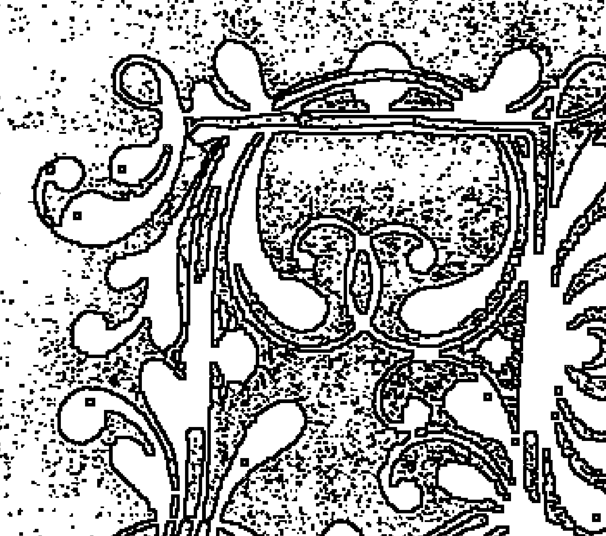

## 改變人生的法則

不破壞世界之秩序，世界乃秩序再生。我們想與秩序和平共存。

～美國作家亨利·米勒

### 精神法則

給大家一把鑰匙，他們就能打開自己的鎖。

～羅拔·麥肯蒙 (Robert R. McCammon)

人類的律法是社會約定俗成及社會秩序的基礎，但人類的律法只是反映出各種萬物運作的結果罷了。這些運作法則掌管了天地的運行、四季的輪轉、大自然的力量，以及原子的結構。大自然並沒有訂定這些法則；僅是揭示並展現它們而已。在人類、大自然衍生之前，天地的律法便已存在。即使是暴風巨浪及熊熊烈火——一切能摧毀人類努力的力量——也得依照這些法則去運作。不管我們稱之自然律、精神法則，或是天道，人類似乎都無力改變它們。它們會激勵那些在混亂中尋找秩序的人，使他們變得更謙卑，而邁向生命源頭中，那股更強大的神秘能量，找到自己的律動，與宇宙共舞。

自然世界對我們揭示了這些法則——四季的循環、馭風而行的雲朵、潺潺水流、澎湃的風和海洋——這一切都教導我們如何在生活中貼近生命的自然法則。在本書中，我稱這些更高的法則為精神法則或心靈的法則。

精神法則運用在人類的領域時，就成了一種可以方便的指導原則了，它們就像古時候為水手導航的星座羅盤一樣，帶引著我們通過人生的暗礁。他們像轉動不息的星球，不僅適用於自然的機制，也適合人類的心理。例如，觀察大樹被強風屈折，只有頑強相抗的樹枝才會被折斷，我們可從強風與樹的關係中，體悟到保持彈性，隨遇順應的道理。

耶穌基督、穆罕默德、佛陀、老子及其他人類的先師，都藉助大自然的寓言與比喻來教導我們精神法則，這些比喻也適用於人類社會。例如「收割法則」(the Laws of Harvest)教導我們種瓜得瓜種豆得豆；種什麼得什麼；以及不進則退的道理。任何的成長過程都依循了種籽的成長模式：為了茁壯，種籽需要沃土；慢慢萌芽成熟；然後產出同種同質的果實。收成時，我們必須儲存至少10%的收穫，做為下次播種之用；也必須終結一個循環，再能開始另一道循環；所有種籽都會成長改變，最後凋亡，刨入土中，等待下一次的新耕。

當然了，「收割法則」談的不只是耕作，也與我們的生活，及運作我們生活的法則相關。種籽有生死循環，人類與萬物亦然。

所有的精神法則都無可避免的會順應我們的需要，而獲得揭示——這種揭示的過程未必藉助於文字，而是透過我們內心的感覺與本能的智慧。我們的身體在擺脫外在干預時，會自然的去遵守這些法則，它們會透過我們的本能與直覺感受與我們溝通，我們只需留意並信任自己的心靈就可以了。然而我們的心智或自我，也就是那個孤立的自我意識，卻會去抗拒這股生命之流。

當我們在生活中——飲食、運動、習慣、工作及性生活裡——力行精神法則，即使還是會遇到挑戰，但我們可以坦然的迎向它們，像個和平的戰士一樣張開雙臂，擁抱當下，為生命歡舞。

### 超乎道德

精神法則無關乎文化的是非或善惡；舉個例子來說吧，假如我去爬山，可是卻忽略了重力的問題，這並不會讓我變成「壞人」，只是顯得我這個人有點笨，或十分無知罷了——而且搞不好已經一命嗚呼了。遲早，日常生活的種種挑戰總會教我們認知因果、行動與反應的關係；我們會慢慢學習尊重自然的力量，並推崇精神法則的公允。

### 精神法則與生命軌道

主宰宇宙的法則也許有無限多種，而人類已發掘並能明確陳述出來的法則也相當多。本書僅概述跟第三部分談到的生命數字，以及生命軌道最密切相關的重要法則。

精神法則一定能適用在生活上，然而，由於每個生命軌道各有各的特質和問題，因此特定法則對特定生命數字的人，效用也來得格外強大。扭轉的能量大小，就看我們能不能遵循對實踐個人天命最有幫助的精神法則了。

阿基米德（Archimedes，古希臘物理學家）說：「給我一根夠長的槓桿，我就可以移動整個地球。」本書所談到的精神法則和規範也跟槓桿一樣，能幫助我們踏上最康莊光明的人生道路。我們願意投注多少心力在與個人生命數字相關的精神法則上，可以使我們的經驗與人生過程，產生截然的差異。

各個領域中的特殊問題，如健康、人際關係及事業等，都會有起有伏，雖然這些問題來來去去，跟我們的生命軌跡相關的精神法則卻可以適用五年、十年或到二十年，乃至於使我們的後半輩子受惠。這些法則不僅適用於目前我們需要留意的問題，也可以運用在可能出現的所有問題上。精神法則不僅可以撫平種種不滿的現象，還可以平衡造成我們各種困境的缺失、渴望與恐懼，不管這些問題出現在我們的「人際關係」、「健康狀況」或是其他方面。

當我們跟個人生命軌道最相關的法則密切合作後，便能輕鬆的慢慢調整化解我們的主要問題。這些法則可以協助我們超越生活中的任何問題，因為它們能深入問題核心，從根本做轉化，而不只是掙扎著做治標的功夫。

### 如何在日常生活中運用精神法則

即使最高的法則、規範與智慧，也唯有我們肯牢記、肯實踐，才能夠幫助我們——我們必須把它們當成改變個人看法與行動的指南。如果我們想學高空跳水，有人在一旁提醒道：「要拉長身體向水面平衡。」雖然是一句話，卻可能讓我們的皮肉少受點痛，而且跳得更優雅些。可是我們該拿這個訊息做什麼？在刷牙或購物時，我們當然不必想著「要拉長身體向水面平衡」，只有當我們離開跳板，躍入水中的一剎那，才需要去實行這道資訊。牢記並實踐任何有用的指引，就可將腦中的資訊化為行動了，當我們在最需要的時刻運用有效的指引，那麼那些時刻也就能呈現出更美好的質感。

同樣的，我們可以在最恰當最需要的時候運用精神法則，精神法則的力量不在於認識它，而在於能夠去應用。當我們的行動、感覺或對未來的展望有了改變，便可以說我們真的在應用這些法則了。伴隨每道法則的練習，會是一個很好的開始。

我想鼓勵讀者盡量研讀本書，找到自己的精神法則，雖然與實踐個人天命最有關的法則只有一部分，但所有的法則都有其相當實惠的地方，因為人性是互通的。

## 靈活法則

變通比消極或抵抗更有益；積極利用時勢，擁抱最艱困的環境，即能有效破解難題，視之為精神訓練。

永遠接納別人要你接納的一切。先與之同步，再扭轉之，令其配合你的方向。

> ～美國詩人佛斯特(Robert Frost)

靈活或變通的態度包括務實的接納當下——接納自己、他人及現有的環境——而非一味的抗拒。這絕對不是被動的忍耐自己討厭的事物，或對不公視而不見、容許自己淪為受害者。靈活的態度需要有足夠的警覺性；不只是「隨遇而安」而已，更要能把握並善用當下。掌握住這條法則後，我們可以將阻礙化為邁向機會的踏腳石；當強風吹來時，我們不必只是「接受」或忍耐強風，而是張帆準備遠揚。

「靈活法則」開始看起來也許很不實際或太過理想化，而使我們產生許多疑慮，例如「萬一我們在街上遭到攻擊，或悲劇發生在我們所愛的人身上，我們如何去『擁抱』這種困境？」這些問題很合理，而且也相當重要，不過答案總是不脫：大喜大悲與不公平的事，是必然存在的。當痛苦的事降臨在一群人身上，有些人會去抗拒這個經驗，全然的震驚、排斥而恐懼，彷佛剛極易折，被強風吹斷的樹枝一樣。而有些人則培養出能屈能伸的能力，完全接納並體會自己所處的環境，同時進一步去認識生命——了解事物的本質。他們接受自己的感情，並坦然的表達，他們就像那能屈能伸的軟枝一樣，不會折斷，只會回彈。這些人不固執、不抗拒，而能以最有效，最富創意的方式去因應環境。靈活的彈性裡，隱匿著極大的力量。有了彈性，我們對晴雨寒熱才能一視同仁，去順應生命，不抗拒，即使有痛苦掙扎，也不再那麼強烈；因為我們已將痛苦當成一種試煉，盡可能的從中學習。

有一回我在某輛車子的保險槓上看到一張相當幽默的貼紙，是「靈活法則」的絕妙範例。貼紙上寫道：「如果不爽老子開車的方式，就換地方走！」如果有人開著車子朝我們的人生道路衝過來，與其想：「這些人不該這樣開車，這樣不公平，也不對。」還不如運用一下「靈活法則」，跳開去，趁機感謝一下我們身上的反射作用。

合氣道及太極拳等體現「靈活法則」的武術運動，都是以鬆柔不反抗為基礎：人推我拉；人拉我推；當外力加諸己，則閃身側讓。如果我們懂得善加利用這條法則，每件事都能對我們有益。

當我們只能用保守的態度，從個人觀點去看待生命，我們當然很難對某些事情心懷「感激」了，如財務危機或感冒等。然而「靈活法則」提醒我們把視野拉到個人的格局之外，用更宏觀的角度去看，進而感念每種狀況，無論當時我們覺得是好

## 第四部：改變人生的法則 454

是壞，一切遭遇都是強化我們心靈的機會。當心智抗拒生命中的遭遇——無論是事件、人或感情上的問題——我們就會產生壓力。像「我寧可……」或「他們應該（或不應該）……」等之類的話，正好反映出我們對現況的抗拒心。就長遠來看，把每件境遇當成可能的教訓，會使我們變得更堅強明智，或更為完整，如此才能超越自己的期許或批判，去擁抱生命。

對心思狹隘的人來說，生命也許不見得永遠公平，然而對胸襟寬宏的人來說，精神法則裡總有真理長駐。靈活的態度包括培養「好吧，現在的我遇到了這種狀況，我會視情況盡力而為。」的心態。機會中隱匿著問題，一樣的，每個問題也都能為我們帶來轉機。

戒酒協會及其他治療課程所用的靜心禱詞（Serenity Prayer，註：由本世紀基督教神學Reinhold Niebuhr所撰）正好反映了「靈活法則」的宗旨：「天主謹賜我平靜之心，接納我無法改變之事，謹賜我勇氣，改變我能改變之事，並賜我智慧，以明辨二者之異。」

彈性的心態可使我們能享受一度困擾我們的情況，如命運的改變或友誼的結束。有時，靈活的態度表示能覺察事情的善惡兩面，只是將心力集中在困境裡更積極正面的一面上。例如，感情的結束固然令人痛苦，卻也開啓了新的契機，使我們能接納新的愛情。

貓是「靈活法則」的大師：貓如果想出去，卻被人阻擋，它會試著用不同的路徑與方法，它會一試再試，不過也懂得放鬆自己，等待下一次的機會。我們跟貓一樣，不必把精力浪費在抗拒或煩惱無可避免的情形上。

靈活的態度意味著無條件的接受現在的自己、身邊的人，以及自己此刻的所做所為，就算我們在學習成長的過程中能有效的處理眼前的事，也要保持這種彈性。「彈性法則」講求的也許只是態度上的轉變，而非行為上的改變。如果我們發現自己在批評或責罵別人，把「靈活法則」運用上去，就表示在當下接納並寬恕自己所犯的錯。

靈活的心態是一種能屈能伸；像隨著容器而變換身形的水一樣，置身於當下，並盡量依自己的能力來接納世界。

「靈活法則」與「完美法則」並駕齊驅，但重點與目標卻有些微的差別。實踐「靈活法則」，才能坦然的擁抱經驗，不會規避人生的悲苦喜樂，而活得更加充實。

我們可以將靈活的態度運用在工作、人際關係或任何生活層面裡，不去抗拒，並學習處處皆驚喜的藝術。能夠掌握住這條精神法則，其他的也就不難了。

以下練習可幫助你從直接的經驗與運用中，去掌握「靈活法則」。

### 體驗「靈活法則」

以下兩人組的練習可以讓你藉著高層的武術境界，去體驗接納的真諦，並應用在其他任何日常情形中。

- 1. 自然站立，雙腳打開與肩同寬，單手舉到身前，讓同伴

## 第四部：改變人生的法則 456

抓住你的手腕或前臂，緩緩將你往前拉，彷彿他／她要將你拉往某個地方。

+   2. 在同伴拉你時，往前跨出一步，以保持身體的平衡，同時抵抗（往後拉）同伴的拉力。用身心去體會一下這種感覺。
3. 現在，讓同伴再拉一次，不過這回在同伴一開始拉動時，就一邊平衡自己，一邊往前踏出兩步，並輕輕的往同伴拉的方向推過去。換句話說，不要抗拒拉力，要順勢推舟，把對方的拉力轉成自己的力道。用身心體會一下這種感受。這次你對同伴的拉力反應並不是投降放棄或被動的忍讓，也不是積極的去反抗；而只是順勢加以利用而已。
4. 雙方互換角色後，比較一下兩種經驗的感覺。

### 「靈活法則」的應用

+   1. 想出一種你會去抗爭或排拒的情況。
2. 想想看怎麼樣才運用「靈活法則」，擁抱並順應生活的潮流。
3. 注意自己在面對這種情況時，何時會想去抵抗、緊繃、退縮、不知所措或攻擊。問問自己：「如果我能積極的順應這股力量，將它變成自己的力量，又會如何？」

### 選擇法則

人生最基本的抉擇即是擴張或收縮與否，以負面或正面的方式表現創意。不論環境好壞，我們都有能力選擇人生方向。

人人心中自有英雄，向英雄說話，他們就會出列。～佚名

相較於人類，世上大部分生物所擁有的意識性選擇，範圍上要狹隘多了；它們主要靠直覺與適應力來求存。反之，人類的選擇範圍則寬廣多了，我們的日常生活是由一連串選擇與自由意志的運作所組成的——無論是起床或賴床、早餐吃什麼、一天要做什麼，要換工作、回學校念書，還是持續一場人際關係，都包含在其中。

視當時的環境而定，我們會有許多或者有限的選擇。精神病或其他無行為能力等問題，也許會扭曲或限制我們的選擇力量；而明晰的思路，則能加強這方面的能力。很顯然的，我們的環境決定了選擇；例如，假若我們很有錢，就可以選擇搭飛機到歐洲吃晚餐；如果我們住在貧窮國家，想吃也許都沒得吃了。如果我們臥病在床，雖然想遨遊四海，卻無能為力，只能神遊一番。生理狀況確實能限制我們的身體選擇。然而，「選擇法則」指出我們在面對環境時選取的生活態度，這是一種力量，也是種責任——只要活著，我們永遠不會喪失這股能量。

> 生與死是必然的；
生死之外，則由我們創造。
～佚名

有時我們覺得自己的選擇好像是家人、老闆、朋友、環境或上帝為我們安排的。例如，老闆如果告訴我們：「你得加班，否則就請你走路。」我們會覺得自己沒有選擇的餘地。可是其實我們是有的，認清每個選擇都會造成連帶的後果，我們才能刻意去做選擇。

人人皆可選擇容易或艱難的路去走，我們很少選擇會帶來更多痛苦的道路，除非是相信這條路將帶給我們幸福，或讓我們更快達到目標。我們的信念越健康或越開闊，選擇的能力也就越強。

我們也必須信任下意識帶來的訊息，為了求得幸福，並讓我們學習，我們的直覺也許會故意選擇一些經驗、吸引一些人，在生活中製造一些波折。我們越是尊重「選擇法則」，生活就越有目標、有選擇，而能為自己所走的方向負責，不再將人生視為一場宿命。舉個例子來說吧，我們會了解身邊的人與環境都是自己選擇的結果，不再漂浮於人生路上，懷疑自己是否走對路、跟對人或找對工作了。有了這分認知，即能懂得接受自己的選擇，為自己的人生負責，甚至做出新的決定。假如我們覺得自己在某種情境中無處施力，就該牢記選擇的力量。

我在生命目標系統及生命軌道中談過，我們可以用創造及表達等關鍵力量，選擇去拓展或囿限自己，開創或破壞自己的生活。

每個人都有創造的生命能量，也有表達自己的能力，我們可以選擇以正負面的心態去進行創造表達。也許我們不覺得自己一直有選擇的餘地，有時感到創造表達能量受到壓抑，或缺乏這些能量，有時則是恐懼害怕。然而我們越懂得感激選擇的力量，就能以負責的態度，抒發自己的創造能量並表達自己。

### 創造選擇

建設或破壞性的創造方式都是創造能量的表達。

任何既存的事物都是由能量構成的，而能量可以採正負面等方式來呈現。例如，電力可以照亮城市或殺人致死。金錢也是另一種能量：我們可以用正面或負面的方式來利用這股力量，如慈善捐款、度假，或雇用某人犯罪等。

創造能量有一種活潑的特質；它必須找到出口，得到發揮。這股能量像把兩刃刀，若非用在有益的目標上，便會以破壞的方式來進行宣洩。如果我們的創造能量受阻，就會像衝到牆上的水一樣，會折返回來沖刷在我們自己身上，造成壓力，使我們的身心靈遭受痛苦。例如過胖的情形常是創造力受阻所造成的。

正面的創造方式包括了藝術——音樂、繪畫、雕塑、寫作、戲劇等等——不過創造能量也可以藉著生養子女、商業問題的革新、栽種植物或照料動物等方式得到完全的紓發。我們可以將創造能量運用在任何領域上，包括治療、手工藝、室內設計或千行百業上。

張三成為藝術家；李四卻跑去製假鈔；小美用她的創造力與靈活的手指彈奏吉他；阿貞卻成了扒手。有人用語言來說故事；另一個人卻拿它來編造謊言……。上述例子都是創造能量的呈現，只是用在正負面罷了。

許多犯人具備極豐富的創造力；他們能畫能唱、能演能寫，可是卻將創造力用在歧途上，精心籌劃搶劫，或是拐錢說謊，無所不做。

受阻的創造能量會造成生理疾病和症狀，或者藉著菸酒癮、藥物食品的濫用、性交等方式來宣洩。當這類的發洩方式變成重複性的習慣或長期行為後，很可能使人完全無法自拔。

了解創造能量的紓發方式是出於自己的選擇，我們便能學習以其他方式來開啓自己的能量了，選擇以能夠激勵或協助他人、為自己帶來報酬而非懲罰的方式去紓發。無論過去我們的創造能量受到多大阻礙或造成多大破壞，只要我們善用「選擇法則」，就能扭轉這種頹勢。只要能選擇用好的方法來表達自己的創造能量，包括每天運動在內，就能改變自己的命運了。

### 表達的選擇

> 我們以建設性的方式
或破壞性的方式來表達自己；
而兩者都是表達能量的展現。

表達能量需要宣洩，我們最常用說話的方式來表達自己心中的感情，不過表演、藝術及手工藝，也是其他表達的管道。

表達能量不僅只是談話，或傳達想法資訊，更是一種感情的力量；它們也許需要宣洩的憤怒、悲傷或恐懼；它們也許能帶來快樂與熱情，而這二者也都要得到紓發。

如果情感的表達受阻，很可能會造成喉嚨痛、胃潰瘍、其他腹部疾病、下背痛、子宮肌瘤、攝護腺的疾病、頭痛、肌肉緊繃僵硬或其他毛病。老年人的這些部位會有較多的問題，原因之一是他們壓抑在心中的情緒更為長久。然而我們可以採行適當的步驟，治療自己的身體，同時培養新的嗜好，創造自我表達的新管道，使自己變得更年輕有活力。

創造能量可以單獨一個人去紓發，如繪畫或建造模型，不過表達能量就需要透過人際關係來紓解了——也就是說，需要另一個人來接受我們的表達，需要一個願意聆聽，看我們表達，或欣賞我們作品的對象。我們的觀眾也許是成人、小孩，甚至是跟我們有親密關係的動物（而且動物會乖乖聆聽，不會亂下批評或抱怨）。

某些人的表達能量非常強烈，即使一開始只是一對一的去表達，但隨著自信漸增，表達慾也越來越強，而演變成面對群眾展現。無論我們採用何種表達形式——交響樂、演講或連續劇——都可以傳達、激發並觸動我們的情緒。

正面的表達會是一種深具啟發、熱情而富建設性的溝通，例如演講、歌唱、演戲、音樂、寫作或其他藝術形式。負面的表達則往往流於謾罵抱怨、批評怨懟，既傷人，又傷心。

表達力就像一枝利於刀劍的「筆」，有些史上的獨裁者誤用了表達力，而占領操控了整個國家，使生靈塗炭。同時，史上最感人的藝術作品與演說，則是表達能力的最佳典範，它們為世界帶來了美，激勵人們採取行動，改善世界。

即使在日常生活裡，表達方式的不同也會大幅改變自己及身邊人的生活品質，而選擇權就在我們自己手裡。

以下練習可以幫助你在表達時遵循的「選擇法則」。

### 體驗表達的選擇

+   1. 想象世上某處安全而獨特的場景，可以是山上的高原、隱匿峽谷或寂靜草原——讓它成為你心裡的一塊淨地。
2. 想象一張桌子，一邊各擺一張椅子。
3. 讓心中兩個衝突對立的面向浮現出來，一次一個，然後請它們面對面跨桌而坐。不妨邀請一個代表心理，一個代表身體，一個你喜歡及一個討厭的面向，一個來自從前，另一個來自未來，或一個批判，一個寬容。每當你的情緒糾結，或掙扎不已時，可以用這兩個面向來代表這些感覺。
4. 問每個面向，它能為你帶來什麼正面的結果或善意，如果某個面向看起來很負面，也要相信，這種潛意識的存在自有它的道理，對整體也有其功用。
5. 當每個面向浮現在你的心靈之眼後，注意它們的長像，它們如何移動坐臥，又有何舉止。當雙方都坐下後，留意它們彼此的關係。

+   6. 在心裡要求雙方表達自己，直到它們找到合作一致且能溝通的關係，讓他們在未來能攜手合作。
7. 等你覺得工作完成後，謝謝它們，與它們道別，然後讓它們自己去享受這次的會面。

### 表達方式的選擇運用

+   1. 寫下或回憶自己前幾次用負面方式表達的情形。
2. 想一想，在批評時，我們通常不是在表達自己的感覺；而是把自己的感覺化為批評。重新寫一遍，如何直接而坦誠的說出你的感受。提示：不要用「他」或「她」，（「我實在受不了他！」「她老是……」）而用「我覺得」（「我覺得很生氣，因為……」）。
3. 下次有機會時，把你學到的用上去。

### 責任法則

一旦劃定責任歸屬，即可完全掌握職責所在，將非我職責範疇者拋開；如此更能彼此支援，互相合作。

為了尋求心靈平靜，應自宇宙總經理之職退休。

～頗瑞·艾森堡

「團結力量大，歧異成散砂，衆心齊力工作易，三個臭皮匠，猶勝一個諸葛亮。」同一個道理，說法有很多種，不過每種說法都表達了同樣的理念：團結合作，可以使我們完成單打獨鬥時，難以成就之事——例如，建造一棟摩天樓或演一齣舞台劇。

在每種需要分工合作，各司其職的工作中，某些人也許更有遠見，然而他們卻需要別人的協助，否則工作成效不彰。沒有音效幫忙的搖滾名星，還搖滾得起來嗎？沒有各部門高效率的工作表現，老闆或董事長可有辦法管理公司？當政治家或企業老闆嶄露頭角時，其實有一批幫他們打基礎的人在背後幫忙。

家庭、公司或企業的合作與分工多寡，決定了它們的興衰。就個人而言，我們能不能有效的去運作，大多取決於內在狀況的和諧與否。

我們必須在個人與內心、個人與他人，以及個人與環境的關係中，尋找自己的平衡點，並界定適度的責任權限，認知自己的價值觀、需要及優先順序，並了解我們不必與父母、手足、配偶或其他人一樣。

有些人很想支持服務並協助別人，有時這種付出的渴望會變成委屈求全的態度，對自己和服務的對象反而沒有益處。在極端的例子中，這種過於好管閒事的傾向會演變成共生（codependency）現象，只顧慮到別人的生活，一味付出，不求回報，結果反失去了自己。

共生的人會為別人的生活負起遠超乎正常父母、朋友或雇員該負的責任，他們把幫助別人的能力當成個人價值觀、自我價值，甚至是認同感的基礎，結果總是（而非偶爾）先想到別人，而漠視自己的需求，讓人踩在腳底下。

過度委屈自己是共生的問題核心，包括了扭曲或誇大的責任感。共生的心態使我們企圖去「矯正」別人的過錯，而不是容許他們從自己的行為後果中去學習。

如果我們在別人面前一味的委屈自己，別人當然不會抱怨了。我們很少聽別人說：「你實在太好說話了！」不過，我們不久就會發現，如果太過委屈自己，最後難免會心生反彈，而變得疏於與人合作。這種大轉變也許得花幾天、幾星期、幾個月或甚至好幾年的時間，不過遲早總會發生的。

完全排斥，或繼續為別人「工作」，只是在感情上有所保留，這些都算是疏於合作。除非這種心態能矯正過來，否則我們的人際關係可能會宣告破裂。

可喜的是，有合作方面問題的人際關係其實是可以挽救，甚至可以矯正過來的，包括在付出與接受間找到新的平衡點，培養出一種相互支持的關係。坦然的溝通可以使雙方更平均的去分擔責任，減輕有共生傾向者的心理重擔。不過話又說回來，建立平衡新關係的責任，主要還是落在那些有共生傾向的人身上。

責任本身讓人樂意付出，但責任感過重的人——那些什麼事都往自己身上攬的人——則需要改變自己的態度與行為，找到平衡，才能享有真正的合作關係與均衡的責任劃分。

有時鼓勵別人自己動手做，反而是最有力的合作與支持模式。最好的協助方式，往往包括了下達適當的指令。

「責任法則」提醒我們以自在的心態去尊重去合作，這是最基本也最必要的。拓展自己的內心固然是人生的課業，但我們一定要量力而為。這條法則提醒我們尊重個人內在的價值，找到自己的平衡點。

拿蘿莎琳和坦妮雅兩位母親為例，她們都有兩個孩子，原本都是廣告經理，每天通勤到舊金山上班。後來，蘿莎琳決定待在家裡陪孩子，把事業先擺在一旁；坦妮雅則決定繼續到城裡上班，找個好保母來帶孩子。蘿莎琳和坦妮雅做了不同的決定，問題是，她們兩個都沒選擇自己真正想做的事，反而選了自己覺得「應該」做的事。

蘿莎琳在家裡覺得很挫折，可是她認為應該整天陪著孩子，才算是「好媽媽」。坦妮雅每天都捨不得離開孩子，可是她希望做一個「享有平等機會的現代婦女」，不想跟自己的母親一樣被「綁在家裡」。

從某個角度來看，這兩名女士都做了依附別人的價值觀及想法的決定，未能聆聽自己的需求，只做別人認爲她們「該做」的事。幸好，兩人現在都找到平衡點了。坦妮雅找到一個在家兼職的工作，可以陪伴子女，而蘿莎琳則回去做兼職，且樂在其中，而且因為其他的需要得到滿足了，她也更珍惜與子女在一起的時間。

運用「責任法則」，我們不僅能支助別人，自己也得到了支持；在二者之間找到了平衡。我們會發現，自認爲「該做」的事，以及自己真正的渴望，中間是有一段落差的。我們去做令自己開心的事，如果我們不高興，也說出自己的感受，找到一個折衷的辦法：「我會做這麼多，不過剩下的得由你來做。」

平衡法則

平衡及於宇宙、生物、個人層面——
及至身體、心靈、情感——
提醒我們做任何事都可能過與不及，
內心的鐘擺盪到另一端，勢必盪回另一端。

當你結合兩者為一，使內外一致，上下相同，
男女不分，便可進入上帝的國度。

> ～湯瑪斯福音 (GOSPEL OF THOMAS)

如果說重力是使宇宙維繫不墜的黏著力量，那麼平衡就是破解關鍵了。萬物以一種平衡的狀態存在：高低、內外、熱冷、快慢，萬物彼此相互制衡。處於兩極之間的，是中央的平衡點。

我們在吃飯睡覺、工作、奔忙於日常事務時，下意識會不自由主的影響我們的自主神經、內分泌、賀爾蒙，以及我們的循環系統，以維持體溫及血液物學物質等的平衡，這兩者若產生巨大的變化，便會致人於死。不僅是我們的生命，連我們的生活品質和心理也都得依賴身體的平衡。

地球本身就是一個單獨而活生生的有機體，人類不過是地球表面上的細胞，而海洋與風則是它的循環系統，它們也以平衡的狀態存在——而置身其中的我們，當然無法置身於外。從某個觀點來說，隨著人類更加成熟，更認識自己在這平衡中的特殊地位，當今我們面臨的全球生態現象，其實也反映了我們個別的生活。

雖然我們下意識主宰了內在的物理平衡，我們的生活樣態與行為卻是由意識來負責的。因此，「平衡法則」與「選擇法則」及「責任法則」間，有著密切的關連。「平衡法則」點出平衡過與不及的重要，並告訴我們，即使只有一個生活面向取得平衡，也能造成極大的影響。

人類心理存有禁慾與行樂、相信與質疑、社交與獨行、優越與自卑，以及其他造成衝突混亂的對立意念及價值觀，因此，達到身心靈的平衡境界，一直是世上許多傳統的標的。

每個文化中的哲人，從中國道家到猶太教，從基督教到回教，都鼓吹中庸之道的可貴。即使在自然界中，人類文明的暢旺興盛，大多是因為避開沙漠的酷熱與極地的酷寒，能在氣候溫和的地區，找到更舒適的生活所致。

文學，尤以兒童故事為甚，揭露了人類找尋平衡的主題；西方《葛蒂拉與三隻熊》的故事（Goldilocks and the Three Bears）中，當葛蒂拉選擇那張大小適中的椅子、冷熱恰當的粥，以及軟硬剛好的床時，就展現了中庸之道。

然而，不一定得規避極端才能找到平衡，因為平衡也表示適時的探索極限，對兩端賦予同等的關注，以保持鐘擺的平衡。例如，有時我們也許會想縱情一下，熬夜狂歡，寵寵自己；有時，我們會去抑制自己，乖乖的吃飯運動。有時我們會「工作過度」；有時又「休息太多」。只要我們能對兩極投以同等的關切，總會慢慢回到中心，保持平衡。

不過，極端常會帶來壓力，最後逼得人往另一個極端擺過去。有一個明智的辦法，就是檢視自己的生活與行為是否夠穩健。一部每天平穩開動的車子，比一輛幾個星期都不動，一開就是快跑好幾週的車，能跑得更久；因此，中庸之道是長壽與健康的關鍵。

每個人因性格、傾向與體格上的差異，而各有不同的平衡之道。比如說，有些人運動的效果比別人好，就連我們的需求，也會因時間而變動。所有人都需依其獨特的生心理特質與需求，去尋找自己的平衡點，而非取決於別人的價值觀。自己該做多少運動？每週、每月或每年該有多少次性高潮？該吃多少？這些問題也許都有個平均的統計數字，但真正的答案只有一個：「最適合自己的就對了。」

出生數字、生命軌道，以及我們的主要生命目標，決定了個人必須去平衡的特殊人生問題：

+   ○如果出生數字含1，必須在優越感與不安全感這兩個極端中，找到平衡點。
○若出生數字含2，則必須在委屈求全與拒絕幫忙或保留中，找到中庸之道。
○若出生數字含3，則需在過度自信與自我懷疑中求取平衡。
+   ○出生數字含4的人需要在理智與情緒、分析與雜亂無序中找到平衡。
○出生數字含5的人須在過度依賴與過分獨立間尋求平衡。
○出生數字含6的人需要尋找平衡的實際態度，以避免因理想過高，結果感到失望。
○如果出生數字含7，我們必須在天真的過度信任，及害怕被人出賣的心理之間找到平衡。
○若出生數字含8，則需在被動與攻擊、過食與挨餓間求取平衡。
○若是出生數字含9，則需在禁慾與放縱、過於嚴謹與放浪不羈之間尋求平衡。

許多人用測試自己的極限，探索兩種極端，然後從結果中記取教訓的方式，來找到自己的平衡點。雖然這種方式走起來很辛苦，但也許是最普遍的一種辦法。所有世上的金科玉律都未能改變這種鐘擺式的方法，而且別人的建議與經驗也許不適用我們。有時我們必須自己去發掘；經驗未必是最輕鬆的學習途徑，但似乎是最有效的。

「平衡法則」提醒我們仔細檢視生活中的不平衡處。撇開性別不論，我們是否在陽剛與陰柔之間找到了平衡？是否在工作與家庭間找到平衡？是否懂得去照顧自己與別人？

思索中庸之道，可幫助我們用更宏觀的角度去看待自己的生活，做出適當的調整，找到健康、和諧與平靜之心。

雖然為了得到某種回報
我們時常會對別人贈予、幫忙、讚賞或給予關注
但宇宙提醒我們
自己最需要的
就是最需要去付出的

對那些在感情上需索無度，希望能一味接受，而不必付出的人來說，「平衡法則」特別適用。所有人都有感情上的需求，同時會有意無意的設法尋求更多的關愛、讚賞與了解，可是只想收獲不想付出的基本態度——用我們小時候學的投機手法，獲得想要的東西——並無法久長。

「平衡法則」的推論結果告訴我們，我們接受的正是自己所付出的。大多數人對這種說法都相當熟悉，不過究竟有多少人能付諸實行？也許我們是付出了，但不管是否意識到了，我們的付出常是帶有條件或期望的：我們花了錢，仁慈的讚賞別人，那是因為自己可以得到某種回報。這當然沒什麼「不對」，只是事情往往與願相違——有條件的付出就像一把倒勾，會減損更多的能量，或悖離我們原本希望的結果。付出與接受的秘訣在於，無論我們覺得自己需要什麼，其實都是心靈在發話，告訴我們那正是我們最需要去付出的。

中庸是道家古老智慧的核心，更是我們生活的關鍵，平衡則可說是「心靈成長」或「個人成長」的模式。「平衡法則」的應用並不容易，但你的努力必然值回票價，同時可藉此掌握自己的生活。

以下練習可透過直接的經驗與運用，幫助你找到平衡法則。

體驗平衡

如何在自己的生活中探索兩種極端，然後找到中庸之道。試試以下簡單的練習：

+   1. 在屋子中央擺個垃圾筒，在離五呎的地方坐下來或站著，拿一些廢紙揉成的紙球或其他可以扔到筒子裡的小物件。瞄準後，仔細看每樣東西落在何處。
○如果扔太遠了，下次就故意扔近一點。
○如果丟得太左邊了，下次就故意偏右。
2. 注意這種過程如何協助你找到中心點。

平衡法則的應用

+   1. 想想如何利用兩種極端，來應用「平衡法則」。問自己下列問題：
○我說話很快還是很大聲？
試試看以極慢或極輕聲的方式去說話。
○我吃東西是不是太快了？
試試看細嚼慢嚥的吃法。
○我是否經常肌肉緊繃？
試著讓自己「癱成一團」。

程序法則

朝著目標前進的路上，若想從A點走到Z點，
最保險的方法就是
先走到B點，然後走到C，再來是D，以下類推，
略過一個步驟，即使看似走了捷徑，
結果卻往往導致失敗。

你若滿懷壯志，請朝著目標盡量跨大步伐邁進。
也許這一步很小，但相信這已是目前最大的一步。
～蜜爾德蕾·麥艾非 (Mildred McAfee)

我們的日常生活裡充滿了目標與成就，這些目標也許很大，如攀登高山、爭取政治地位或創建自己的公司等；也許可以小一點，如烤蛋糕、贏一場足球賽，或是做做功課。

有些人一心只想著自己的目標——結果流於好高騖遠——而忽略了該走的路程。另一方面，有些人對如何達成目標則毫無頭緒或充滿疑惑，甚至連目標都訂不出來，或者會停滯在一個步驟上，跳脫不開。

如果想爬一座山，我們必須訂出目標、設定方向、做好準備，然後一步步穩健的去攀爬，若能牢記這點，對我們會很有幫助。我們也可以把任何工作，不管它有多麼龐大，拆開成可以處理的小步驟。假如我們想橫越一條小溪，我們會去找一顆顆的踏腳石，如果我們一下跳過太多石頭，遲早會滑倒的。

「程序法則」不僅教我們把漫漫長路分割成較短的行程，同時把每個階段視爲一個完整的過程，賦予尊重。如此一來，每個步驟本身成了一個小小的成就，使我們得到多次成功的體驗，不會只有在大目標達成時，才算成功。我們在這過程中所學得的，也許更勝於目標達成後的所得。例如，如果我們花二十年的時間學畫肖像，即使後來所有的畫作全被毀掉了，我們還是在過程中學到不少東西，包括更開闊的眼界，以及對臉孔的審美能力。

那些很難按部就班做事的人必須問問自己，希望自己像名每天急急送完信，好趕快「下班」的郵差，還是每天欣賞沿途景緻變換，踏著平穩步伐，與街上路人打招呼的郵差？許多人只看到高高在上的目標，卻忘記每個攀爬的腳步，都比結果重要。

以下是另一個「程序法則」的例子：派克發現鄰近一家餐廳即將結束營業，他手頭剛好有點錢。「機會難得！」他對自己說。派克把店頂了下來，聘用原有的員工，菜色也沒變，只是換了新的招牌：「經營換手」，以爲在自己的領導下，生意會扶搖直上。結果餐廳又倒了，理由跟大多數新手開店關店一樣——派克沒有踏實的一步步去做，他希望能立即成功。

另一方面，手頭有點錢的卓書亞看到當地一間餐廳掛著「結束營業」的牌子，便好好做了一番功課。他跟餐廳老闆談過話，弄清楚經營餐飲業的優缺點，卓書亞發現餐廳成功有三大要素，那就是地點、地點和地點。他發現這間餐廳的地點不是問題，倒閉另有原因。於是他做了人口統計研究，抽樣式的電訪該區兩百位民眾，問他們外食的頻率及喜歡的食物種類。卓書亞按照所得的資料，決定開一間熟食餐廳。接著他又花時間在該地區的其他餐廳幫忙，與洗碗工、服務生、廚子、領班及經理聊天，並觀察他們，這樣才知道自己在徵人時該問些什麼問題。最後，等他知道用最好的價錢買到最好的材料、聘用最好的員工，並做好萬全的準備後，卓書亞該做的都做了。

他的成功絕非運氣或意外，因為卓書亞掌握了「程序法則」，他的例子告訴我們，仔細的準備，耐心的遵循步驟，藉此打下穩健的根基，可以使我們達成任何目標。如果我們把目標拆開成可以處理的小步驟，任何事都難不倒我們。

以下練習可以透過直接的經驗與運用，幫助你找到「程序法則」。

體驗程序

+   1. 想想以前自己是怎麼學樂器、運動、開車或走路說話的？是一下子就會，還是一步步在嘗試與錯誤的過程中學習？
2. 觀察房子與大廈如何從平地上一點點打造起來。想想蓋棟房子需要多少的精力與策劃，這跟生活目標的達成有何相關？

程序法則的應用

+   1. 觀察自己的生活，每天光是穿衣、送孩子上學、上班或去上課，就得經過多少道程序，而每道程序中都包含了許多小的步驟。
2. 有一個加強程序法則的好辦法，包括造一架模型飛機或房子，或製做任何手工藝品。
3. 留意自己生活中，各式各樣的小步驟。
4. 把任何目前的目標打散成小的步驟，將它們一一寫下來，列成一份檢查表。看看從現在到目標達成之間，有哪些踏腳石。

習慣法則

任何習慣或模式，
無論「好」、「壞」，
都有固步自封，不願改變的特質，
除非我們能做點改變，
否則難以打破因習。

> 童年不會消逝，反而像四季般不斷循環。
～伊蓮娜·法俊 (Eleanor Fav.jeon)

人類有依直覺行事、創新、改變並重塑自己生活與行為的能力。然而我們內在的反彈卻限制了這種可能，這股反抗力量源自人類最根本的生心理結構，與世界的運作及幼年時的學習適應環境有關。人類培養習慣的傾向，有其生存上的價值。

小時候，我們藉著觀察外界的模式來理解世界，我們在飢餓與進食、白晝與黑夜、清醒或沈睡中體驗各種樣態，以順應父母的時程及自己的內在律動。藉著辨識父母所發出各種聲響，我們學會了聲音與意義的複雜關係；透過重複再三的模式，我們學會了說話。我們慢慢學會了一再重複的模式，也學會去重複它們——刷牙及其他晚間種種儀式；家中的習慣、學校及工作中的模式。等我們到了十歲，習慣早已成爲我們生活的一部分了。

我們在日常中培養的模式或習慣，如飯前洗手等，通常沒什麼可以擔心的地方，不過真要觀察起來還是很有意思的，因為如果我們故意做點不一樣的事，我們也許會覺得怪怪的，感到很不習慣——這也證明了習慣的力量。

「習慣法則」主要談的是不正常、負面或具破壞性的習慣——也就是我們希望能去改變的模式。以有酗酒惡習的湯姆為例吧，湯姆戒酒戒了一陣子，然後又故態復萌，接著他再戒一陣子，然後又開始酗酒。最後，他終於覺得該徹底根除這項惡習，湯姆告訴朋友說：「我已經一年沒碰酒，我真的戒掉了。」結果戒心一鬆，舊習又捲土重來，湯姆再度灌起黃湯來了。

湯姆經驗的就是「習慣法則」的最佳例證。從某種角度來講，「習慣法則」應該是牛頓在慣性定律中首次提出來的：「除非物體受到外力，否則靜止的物體傾向保持靜止，而移動的物體則保持移動。」換句話說，從我們的習慣模式來看，光說：「這次一定會不一樣」或「我再也不犯了」，是不夠的。

> 戒菸是世上最輕而易舉的事。
我就戒了好幾百次。
～馬克吐溫

有一次，一位叫艾莉絲的女士分享她運用「習慣法則」的經驗：艾莉絲有大量減重然後又大幅增重的習慣，多年來重複不斷——差距幾乎可達一百磅之多。有次她在瘦下來的時候，對好友瑪莉安坦承說，很怕又再度發胖，她決心這次再也不要胖回來了。出人意表的是，瑪莉安告訴艾莉絲說，也許她還會再度發胖。「你老實面對自己吧，」瑪莉安說：「你第一次、第二次或第三次變瘦的時候，想過要發胖嗎？」

「沒有哇！」艾莉絲回答說。

多年來幫助過各式各樣有惡習者的瑪莉安對「習慣法則」非常了解，她說：「除非你做點改變去干擾舊的習慣模式，否則你會故態復萌。」

「我一定會做改變的。」艾莉絲對她保證說。

瑪莉安聳聳肩：「習慣通常比解決的辦法更頑強，艾莉絲，我認爲你應該先檢視自己的行爲模式——你曾說你在母親去世後才開始變胖的？」

「是啊。」

「後來第二次發胖是你被解雇的時候？」

「嗯。」

「第三次呢？」

「那次完全不一樣，我跟當時的男朋友分手了。」

「艾莉絲，如果你不把自己的模式看清楚，那麼就不可能去改變它。再仔細想想，這些事件究竟有何相通之處？有什麼共同的模式？」

艾莉絲想了想。「我媽去世時，我覺得自己很不對，我們之前大吵過，結果害我沒能跟她好好道別。而我被解雇、跟男朋友分手時——，那幾次我都覺得自己差勁得要命！」

「好啦，所以當你覺得自己很糟糕的時候，你就會過食——掉入同樣的習慣窠臼，現在你理出一點頭緒了吧。」瑪莉安說：「我想建議你一種打破習慣的方法，聽起來也許有點奇怪，不過如果你願意試的話，應該會有幫助。」

「說吧！」艾莉絲答道。

「你一次可以走多遠的路？」

「我想……大概三英里吧。」

「好吧，那麼下一次當你『覺得自己好爛，必須吃很多東西』的習慣又犯的時候，我要你把手邊的事或想做的事放下來，穿上布鞋，走出房子，然後走六英里路。」

「這就是你的建議嗎？就這樣？」

「就這樣。」

艾莉絲一臉困惑的離開了。

約莫八個月後，艾莉絲打電話給瑪莉安，連招呼都沒打，就興奮的說：「真的發生了！」

「面對工作時壓力很大，覺得沒有人喜歡我，我又覺得自己很差勁了，冰箱裡剛好有個派對要用的雙層巧克力蛋糕，我很想吃一塊——一大塊。我開始告訴自己，派對要用的蛋糕可以再買，然後我就想起你的話來了！」她開心的說：「我明白是怎麼回事了！於是我穿上布鞋對自己說：『我要走六里路，因為我答應過自己，不能讓這塊蛋糕把我給毀了！』」

「我走了六里路，搞不好是六里半！回家後，我拿起蛋糕，正想丟到垃圾桶時，我又搖搖頭，將它擺回去放在冰箱裡。後來我們的派對玩得很快樂，公司裡所有女孩都來了！」

艾莉絲先是了解習慣的力量，然後採取行動去干擾舊習，而不是被動的一味重複，因而打破了原有的壞習慣。

對任何會一再半途而廢、習慣做事做一半，或不斷失敗（如結三、四次婚，或戒菸戒了五次）的人而言，「習慣法則」是相當重要的。除非我們仔細檢查原因，做點改變去打斷習慣的因循，否則往往會一再重複既有的模式。這條法則針對個人的習慣而來，幫助我們抱持負責的態度一一主動採取不同的行動，而非無止盡的在舊習中掙扎。

以下練習可以透過直接的經驗與運用，幫助你找到「習慣法則」。

體驗習慣

+   1. 挑出一個自己的生活習慣，這個習慣可能是那種停停走走，戒一陣子後又會捲土重來的舊習，如戒酒、戒菸或飲食過量，或是結婚、離婚、再婚，然後又離婚。
2. 這種模式從何時開始？給自己一點時間弄清整個過程，從最初到現在，仔細思索這個習慣的共通點，而不是其中的差異（例如幾次婚姻告吹的不同理由）。一旦你明白其中共通的理由，就會找到施力點，知道自己面對的是什麼了。
3. 你能做點什麼不一樣的行動，有效地去干擾這種模式？

規範法則

規範是達到自由與獨立最穩當的手段，
規範讓我們專心精進自己的技巧，
加強知識的內涵
使生活擁有更多選擇。

有些人認為規範是零工，我卻認為規範是一種秩序，
能令我自由高飛。
～美國影星茱莉·安德魯斯

重視自由、自我效能及獨立性的人，往往喜歡擁有豐富的經驗，他們什麼事都想體驗一下，對重複或例行的工作，反而感到排斥。

也許我們會把規範與自由當成對立的事物，視規範為一種限制選擇，或強迫自己做不愛做的事的態度，如每天運動或戒吃甜點等，這些需要意志與決心才能完成的事。另一方面，我們認爲自由是沒有限制禁忌的隨意選擇，可率性而爲。

「規範法則」指出一點矛盾，自由雖是人類的天賦權力，卻必須靠爭取而來；規範是通往自由與獨立的關鍵，這項原則適用於內心與外在的自由。

雖然我們的外在生活看似自由度高，但我們的內心卻受到了桎梏；許多人受到忙亂的心緒牽絆，心中充滿了慾念、擔憂與負面的想法。冥想、探索信念以及其他內省功夫等修心方法的原則，可以激發心靈的自由平靜，並打掉推陳不斷的雜念。

規範的長久把持，將獲得外界的自由；其中也許包括因某項領域的傑出表現，而帶來的經濟、機動及旅行上的自由；健康體魂所帶來的自由；社交上的自由；自我尊重及自律所帶來的滿足感；以及大體上，對生活的更多選擇自由。

自由中包含的，不止是體驗各種事物的能力，因為我們能輕而易舉獲得的東西，可能不懂得去珍惜。可是若能專注心力，熬過單調乏味的過程，不只是嚐鮮而已，而是渡過一番經歷，那麼，我們會比蜻蜓點水式的輕嚐淺酌，更深入了解自己和自己的能力。

規範是一種多做一點、多深入一點、堅持到底的習慣。從規範的觀點來看，沈悶反而是開始「有點成果」的表示。

舉一個我親身的經驗來說，也許能把這個觀點講得更徹底些：我在柏克萊念大學時，每天幾乎都要練四個小時的體操，一周六天。不管我想不想，反正都得繼續訓練。大學四年，每天下午兩點到六點的時間，我都在固定的地方練習。當大部分學生在學生活動中心閒晃、在山丘上漫步、到舊金山玩、去看電影、打撞球或打牌、社交、打工、讀書時，我都待在體育館裡。我必須安排自己的時間，割捨掉不重要的事情。這份規範帶給我許多自由，使我得以運動員的身分，到全美、歐洲及世界各地旅行；並應邀到史丹福大學當教練，爾後在歐布萊學院

（Oberlin College）任教。現在我可以到舊金山玩、去看電影或跟朋友社交了。當年的我把持規範，讓自己的技藝精進，結果為自己帶來了更多的自由。

「規範法則」教導我們訂定優先順序，一次專注在一件事情上，直到我們做好為止——專心從事我們現在必須做的工作，把爾後要做的事先擱下來。

既然下了決定，也就要長期把持規範。我們在掙扎邁向人生目標的道路途中，常會遇到崎嶇不平的山路，而非平順的大道。這些阻撓代表必要的準備工作，也許是接受跟我們生活並不相干的教育、取得專業學位、或犧牲必要的時間精力，甚至是在可以輕鬆享受閒暇的時候，去生養子女。越過沼澤的祕訣就在於擬出一個可以激勵我們的目標——一個給我們方向的目標。這個目標一定要很明確才行，例如，只說「賺大錢」是不夠的；我們必須觀想拿那筆錢來買什麼，錢又能帶給我們什麼樂趣，或許用錢來幫助自己所關愛的人也說不定。當我們找到自己嚮往的目標後，它會像盞明燈一樣，帶引我們穿越陰溼的沼地，提醒我們彼端有什麼在等待我們。

規範與決心提供了一座讓我們從現在邁向目標的橋樑，當我們覺得規範不保時，不妨自問：「我想走回頭路嗎？」也許我們可以拖延不去面對規範的問題，但終究還是無法規避的。若想達成目標，或做點有深度的事，實踐自律精神是遲早的事。

### 體驗規範

- 1. 想像自己站在一個你不太想待的地方；你很想移動，往前走，拓展更多的自由與獨立。在遠處，也許就在附近，或遠得你幾乎看不見的地方，有座明亮的燈塔，代表一個自由度更高的方向。
- 2. 想像在你和自由之間阻隔著一片沼地，也就是「中間地帶」；這個地帶看來陰黑討厭，也許潛伏著看不見的危機，而且得耗時費力才能穿越泥濘的水與糾結的蔓草。你在途中也許會遭到挫敗困惑；也許會走偏，暫時失去目標；甚至忘記自己所為何來，而想放棄一切，忘掉所有。
- 3. 現在想想，如果你真的很希望登上彼岸，找到更多機會——如果燈塔的光夠明亮的話——它將引導你向前穿過橫阻於兩地間的沼澤；光的影像將激發你的能量，做必須做的事，而慢慢實踐你的目標。那是實現天命的關鍵，也是自律的關鍵。

### 規範的應用

- 1. 你想在生活中獲取更大的自由與獨立嗎？如果想的話，
- 2. 有什麼是你特別想要的嗎？什麼能使你在生活中得到更多的選擇、樂趣與自由？
- 3. 要了解，戲劇性或英雄式的行徑，例如像短時間的衝刺，不見得能達成長遠的目標。好好決定自己是否願意遵循該走的程序，到達自己的標的。
- 4. 把自己能想到的，跟自己目標相關的一切正負優缺點，統統寫下來或想過一遍——無論是改除舊習（參見習慣法則）、回學校念書、找第二份工作、完成一項計畫或另一個能使你得到更多自由與獨立性的工作。
- 5. 看著你寫下來的清單，決定是不是值得這麼做。如果你不確定，或你的目標是你自認「該做」的事，那麼請重新檢視自己的優先順序與價值觀。假如你覺得很迫不及待，那些目標也確實能激發你的想像，那麼你只需要決定何時開始著手就行了。
- 6. 如果你已經開始動手去做了，而需要自律精神的支持，請牢記自己動手的目的、為誰而做、又為什麼去做。想像你已達成目的了，那會是什麼感覺？你又在做些什麼？讓你的想像力帶你遨遊一番吧。

### 完美法則

從超脫的觀點來看，  
每個人與每件事都是完美無瑕的；  
從傳統的觀點而言，  
完美則並不存在——我們只能盡善盡美，  
而盡善盡美是需要時間與練習的。

我們在比較中長大，教育和文化皆以比較為基礎。於是我們掙扎著做別人，違背自己的本性。  
～印度宗教思想家克里希南默提 (J.Krishnamurti)

「完美法則」有一點很弔詭的地方，因爲它涵蓋兩項相抵的事實，它們在不同的經驗層次中分別運作。

從傳統觀點來看，這個世界充滿了悲苦：街頭犯罪、饑饉、無家可歸者與受迫害的人彼彼皆是。即使沒有每日新聞，光是在我們自己的生活裡，當我們得到不想要，或得不到想要的東西時，也會感到痛苦，而即使我們得到心中想要的了，又苦其無法長久。

從一種超脫的觀點來看——敞開心扉，抱持大智大愛、大慈大悲的心態來觀照自己與世上的ㄧ切苦難——則所有的歡喜悲苦及當下的一切事物，在演進的漫長過程中，都有其完美的意義。

對於那些有著完美主義傾向及崇高理想，但常因憂心瑣事，而忘卻夢想的人來說，提醒自己抱持宏觀的角度是非常重要的。跳回到傳統的現實觀念吧，有人挨餓受凍當然不是件「美事」，可是從廣義的角度來看，我們不過是地球上的一群細胞，地球本身則是浩瀚宇宙中一粒飄浮的塵埃，個人的境遇與全球的政策，並不比一群被人拿水管從車道上沖散的螞蟻更重要。

缺乏宏觀的視野，想用一己之力去承擔所有的公平與不義——即人類生存的整體遭遇——便很難以幽默的態度去面對世界了。就像伍迪·艾倫曾說的：「別說是沒有上帝了，連星期六要找個水管工人都找不到啦！」

那些在遠見及接納方面心存負面的人，必須培養這種宏觀的能力，去跳脫自己的肉體、生活、遭遇，甚至擺脫社會意識、政治心理，才能了解、接納並擁抱萬物。

接納每件事、每個環境、每個人，甚至連自己的美好無缺，我們就能輕鬆的面對世界。當我們痛苦地掙扎著邁向更真、更美、更慈悲，更富於愛的世界時，會記起無論事態如何，從某個角度來看，其實都沒有什麼大不了。

若想要做到這種觀點的轉換，某些人也許得先拓展自己的認知才行，尤其是那些會被「完美？那麼挨餓的飢童又是怎麼回事？」等問題牽絆住的人。

對於這類問題，我只能回答說，將萬物視爲完美，我們也等於接納了自己的反應與責任，其中當然包括了盡力幫助世界改善、奉獻時間金錢，以喚醒世人採取行動。以上行爲當然也是絕對的美好的，如果我們本著罪惡感或惡意去行事，即使我們盡力協助別人減輕痛苦，但影響力也不會像抱持宏觀的態度去做時那麼鉅大。

大體而言，除非我們能減輕自身的痛苦，否則無法幫別人撫平痛楚。我們也許能給別人溫飽，協助他們自給自足，這些雖然是重要的步驟，卻無法減緩痛苦、妒嫉與貪婪的基本根源。只要願意平心看待人生的過程，就算是有了好的開始。我們的世界充滿了悲憫，誠如約瑟夫·康寶（Joseph Campbell）所說的：「在悲慘的世界中尋找歡樂。」

即使我們能在顛簸的成長演進過程中，把個人生命的過程視爲美好無缺，卻並不表示我們就沒有缺點了，我們仍繼續在改變、學習、成長，並改良我們的生活方式。我們還可以去拓展對於當下的覺察力，並深入了解圓融的生活。

不過我們必須先懂得接納，享受發掘與成長的樂趣，才能真正的做到自我改善。完美主義者必須牢記一點，即使用宏觀的角度來看，世界是十分完備的，但從傳統的角度切入，完美其實是不存在的。沒有一個人、表現或產品是零缺點的；誠如「完美法則」所指，我們只能力求盡善盡美，而且需要花時間與練習。無論我們多努力，技巧多高，我們都會繼續犯錯；改善只是讓犯的錯變得較小罷了。我們也需要平心去接納自己的錯誤——無論是在人際關係、工作或任何領域上。因此，「完美法則」與「靈活法則」、「不批判法則」是息息相關的。

了解萬物的「不完美」也能協助理想極高、喜歡用不實際的標準來要求自己的人，卸下心頭的重擔。欣賞不完美中的完美，可使人人受益。

我們可以培養一種能力，把日常學到的教訓，當成是生命趁天時地利之際，為我們安排的美好課程。而我們對世界所抱持的理想與遠見，則是召喚我們的燈塔，指引並激勵著我們——不必拿它來批判自己。

所有美好與可怕的事，都可能發生在世間；有些我們喜歡且認同，有些則令人生厭。人類的心智無法預知或假設何者對我們最為有益，事事皆完美的信念，就是正視這項事實的最佳心態。這種信念促使我們去欣賞不完美中的完美，也為我們開啓門扉，通往更豁達的人生境界。

### 完美法則的應用

- 1. 練習以下簡單的提示：  
  - 每件事和每個人原本都是完美的。  
  - 從傳統的觀點來看，除了無常中的趣味之外，沒有什麼是完美的。  
- 2. 學習說：「夠好了！」、「我很不錯了。」、「他們已經夠好了。」、「就目前來看，已經很好了。」  
- 3. 無論遭遇到什麼或做什麼，都可以問自己：「這件事有哪一點是完美的？它可以是一個完美的教訓還是機會？我如何改變自己的觀點，從中找到美好的地方？」這就是「完美法則」的運用。

### 當下法則

時間不存在，我們所稱的「過去」和「未來」，除了在自身的心靈架構中，並無實體。時間觀念是思想和語言的傳統，是約定俗成的。其實我們擁有的是當下，當下是威力強大的女神。～歌德

「時間並不存在」這個觀念看起來很抽象，畢竟從實際的角度來看，時間確實是存在的，不是嗎？我們有錶，有月曆；對過去的事有記憶；還可以篤定的假設特定事件未來會發生；同時，時鐘還一分一秒的劃過我們的生命，因此若說時間不存在，豈不是很荒謬嗎？

然而，如果我們仔細檢視自己的心智，便能瞥見另一種可能——存在者唯有此刻。當我們在郵局裡排隊等候時，所謂的「時光消逝」，只是一連串對當下此刻的印象與記憶罷了。

當我們懊悔過去時，過去僅存在我們此刻的腦海裡，賦予悔恨生命的，是我們的想法。當我們對未來感到焦慮，未來也只存在於此刻的思緒中，造成焦慮的，是我們腦中的印象。

「當下法則」不是抽象觀念，時間才是。這條法則不是只有哲學家才懂，它適用所有的人，尤其當我們陷在對過去的痛悔或對未來的憂慮時。習慣當下的觀念，我們便能將注意力轉回到此刻，而永遠改變自己的生活。不過，永遠，當然也是指現在的這一刻囉。

我們的煩惱、懊悔與問題，多半不存在於此刻，而是儲存在我們腦裡「過去」及「未來」的檔案裡，以圖像和感覺等形式存立。一想到明天的工作面試——「明天」即是心中的一個想法——就覺得那是千真萬確的事；跟所愛的人吵架，那種難過與罪惡實則是對往事的幻影，當我們想起「過去」說過的話，而懊悔不已時，往事就歷歷在前了。

「當下法則」可以釐情心中的雜念，使我們回歸單純與平靜。然而，「當下法則」對我們的未來並無幫助，過去也從未發生，它提醒我們去正視事實，而非只是憑空去臆想、盼望或害怕。唯有此刻才是真切的，其他一切，則都是心中生出的妄念。

正常來說，遇到問題時，問題本身就包括已經發生的事了，無論是在兩秒、二十年前，或預期會在未來發生的事。我們的問題，幾乎很少發生於此時此刻。

例如，正值中年危機的魯道夫坐在公園長凳上，老婆即將棄他而去；就要拿到博士學位的女兒正拿著她最後一張信用卡在購物；銀行剛派人過來在他家門口貼上「拍賣屋」的牌子；酒醉開贓車被逮的兒子需要保釋金；魯道夫的生活簡直是一團糟，不是嗎？我們不是從他坐在椅子上開始說起的嗎？此時此刻，對魯道夫來說，坐在椅子上才是最真切的事。也許他得在其他時刻應付其他問題，然而當此之時，他並沒有什麼問題，

### 當下法則 501

只是坐在公園的長凳上罷了。

我們的肉體就是活在當下的，儘管我們對過往的錯誤或未來的問題有著諸多煩惱，我們還是可以運用「當下法則」，提醒自己，存在者唯有此刻。我們只需盡量放鬆心情，擁抱當下，面對此刻所發生的事，然後一刻一刻，一步步繼續往前走。

那些喜歡求快而不踏實的人，可以學著將自己安頓在此刻裡。喜歡抄捷徑的人則可以放鬆下來，深吸口氣，記住存在的唯有眼前的剎那。那些困惑、不耐煩，滿腦子未來計畫的人，可以試著去了解，計畫只是想法，而想法是會改變的，它們只存在於時間裡，而時間僅僅也是一種意念罷了。「當下法則」的運用需要練習，這跟任何法則一樣。我們也許覺得自己十分緊張憂慮，對過去及未來感到不安；接著我們想起置身何處了——我們就在此地此刻；然後我們又忘了。接著又想起更多，就是藉著這樣的不斷提醒，才能提升了當下的品質。

### 當下法則的應用

- 1. 回憶一段對過去的悔恨、焦慮或不耐煩。
- 2. 現在問問自己：這種感覺是否源自某件確實發生在那一刻的事？還是來自此刻對過去或未來的意念？
- 最後問自己：現在生活中可有任何問題或不愉快？不是整體的，而是這一刻——這一剎那中？你對這問題的真切體驗有多少？

### 不論斷法則

宇宙的神不論斷我們，論斷是人類的發明，  
依據人為且往往理想化的完美、道德、  
或真理等標準以比較和控制為手段來論斷。

當青春褪色，時間帶來改變，我們或許會改變目前的選擇，  
所以不需坑害自己，自詡為最高本質的評斷者。

～柏拉圖

若說天地不批判我們，我們又有什麼權力去批判自己，這關我們什麼事？我們拿誰的標準來評？那些理想及標準極高的  
人，對自己的苛求往往比對別人更甚。我們不僅批評自己的行  
為，也批判自己的想法與感覺——甚至是自己的幻想！我們還  
拿自己的理想去批判別人，然後又回過頭來批評自己如此評判  
他人！

當我們拿自己的遠見與理想去衡量一切事物，就沒有什麼  
堪稱美好的了，因為這不是一個烏托邦——而是住著真人的真實世界，人們會犯錯，也會學習成長改善。

一般人常將父母對我們的批判放在心裡，並將之投射到別人身上，以為別人也在責怪我們，可是其實他們只是反映出我們心中的失望罷了。我們也會把上帝想像成嚴格的父母，會對我們此生或下輩子做出賞罰。

「不論斷法則」提醒我們，道德不是上帝發明的，而是人類。這條法則的大前提是，天道永不批判我們，只是賜予我們平衡與學習的機會。如果犯了錯，生命將提供充足的機會讓我們去修正。如果我們接受天道並不會批判我們的假設，便能開始學著去體貼自己，別再任意批判自己了。

理想越高，我們就越愛自我批判。我們感受到來自理想的壓力，而覺得需要不斷證明、改善自己，我們害怕自己不夠好，達不到所要的標準。諷刺的是，那些理想最高的人，自我價值感往往也最低。我們對自己越嚴，就越容易接近那些愛批判我們的人，彷彿他們能表現出我們心中的想法（請參照「期望法則」）。

批判阻礙了能量的流通，在心中設下屏障與抗拒的藩籬，使人容易養成負面的習慣。拋開批判的態度，可以開啓改變的大門。我在《戰士運動家》（The Warrior Athlete）中，曾談到高爾夫球好手山姆有一次把球打到樹林及高籬之外，不見了。於是他又架好球，繼續比賽。就在他在打到第十八洞時，抬眼看見一名警察向他走來，後面還跟著消防隊長及其他官員，一千人都很不高興的樣子。警察來到山姆面前首先發話：「是不是你把球打過十二號公路圍籬的？」

「是啊，就是我。」山姆回答說。

「那顆球打破一輛車的擋風玻璃，結果車撞到樹，把路給堵住了——」

「還有消防車！」消防隊隊長怒氣衝天的說。

「還有兩棟公寓都燒成灰了！」警官說。「沒有人受重傷，不過受損財物大概有好幾百萬！」

山姆把一切都聽進去了，警官和消防隊隊長幾乎同時問道：「你打算怎麼辦？」

山姆毫不遲疑的回答說：「我想以後握桿得偏左一點。」

想一想：如果效法高爾夫好手山姆的做法，不必去比較批評、責怪自己和人生的境遇，會是什麼樣子？何不盡力把日子過好，接納自己的錯誤，從中學習，下次改善一點？如果我們能完全接受自己與別人，又會是什麼模樣呢？

### 不論斷法則的應用

大部分的人在表現不盡理想時，都會苛責自己的錯誤。以下是一種幽默而即時的矯正辦法：

- 1. 下一次當你開始苛責自己時，放手去批吧，不過要公開而幽默的批判。你可以握著老拳，打自己一下！（當然了，別太用力把自己給打傷了。）打自己的頭、胸口和肩膀，痛罵自己：「你這個豬生狗養猩猩餵奶長大的白癡！」加上自己最愛的形容詞，打自己時，切記加上音效。「唉喲！媽呀！痛死啦，我活該！這下可學會了吧！」
- 2. 當你在做這項練習時，一定要打自己幾下，兼之辱罵一番，每一次想批判自己時，就這麼做。如果你不敢打自己，你就會用別的方式來苛求自己！把批判的衝動誇大成公然的自辱行爲，就可以藉強大的覺察力與幽默感，很快掃清這種傾向了。這個過程同時會帶來強烈的自我保護與尊重。

○ 警告：不建議讀者一直做這個練習，只把它當成一種協助我們看清自己苛責毛病的工具就行了，目的在於把苛責的傾向揪出來，然後予以紓解。如果你有傷害自己的傾向，最好找心理醫生。只有用這種幽默的方式「把自己痛扁」一頓，才能真正發揮這項練習的精神。

### 信仰法則

### 信念法則的基石

是相信我們比所讀、所聽、所研習的知道更多；  
因為我們潛力無限所以懂得更多，  
我們直接與宇宙智慧相通，  
僅需用雙眼看，雙耳聽，且加以信賴。

> 相信自己才能相信別人。  
～心理學家佛洛姆

有些人自認爲相信自己，但真要細究，就會發現我們信任的其實是腦中的知識、理論，以及從別人身上得來的信念——或者是書本、老師、指引等等。那些不敢相信自己的人往往會仰賴科學家、專家、靈媒、通神者或其他人給他們建議，希望別人認可他們的看法。結果我們四處尋覓，就是不肯探看自己的內心。我們可能跟某些棄自身力量不用的人一樣，棄內心的智慧於不顧，而假求他處，成爲「真理的尋求者」、心靈的飄泊者，或沈溺在各種講習會裡，一個老師換過一個，一場研習會換到另一場研習會，苦苦尋覓能滿足自己的新資訊。除非我們能從自己的心靈找到這些訊息，否則是永遠無法得到滿足的——因爲資訊無須多，只要能使我們接觸到永恆的智慧即可。

專家的指導當然有它的價值，尤其是真正睿智的建議。例如，如果有個好教練，我們就不必自己去摸索練球了，同時還可省下不少時間。不過我們必須對自己的直覺與智慧培養更多的信任，把它當成最後下決定時的依歸。

「信仰法則」提醒我們信任自己的心靈，大膽相信性靈比知識更具灼見，不僅只是提升自我的觀念而已，更要相信性靈影響了我們及世間所有人的每個生活層面。

信任性靈不一定得相信外在的神，而是要相信宇宙本然的智慧與法則，以及生命中起伏不定的神秘過程——知道無論我們踏向何方，道路都會在我們腳底下展開。

「信仰法則」與「靈活法則」、「天道法則」是齊肩並進的，「信仰法則」提醒我們，人也是神的一部分，人人心中都有不朽的慧根靈思。

當我們說：「我完全信任自己。」指的大多是自己的意識部分——也就是我們的理性或自我。這種自我信任的效用並不大，因為自我只能取得有限的資料。你若認爲每個人的心裡都可能有一股神祕的智慧、耐性與悲憫能量在運作，便能邁向新的人生境界了。若能領悟到這個層次的信任，生命才能有新的氣象。

我用「性靈」這個詞來稱這股更高的能量，不過無論用什麼名稱來說它，只要真心信任性靈的能量會按它自己的規律，默默進行運作，那麼我們也就能相信「自己」以及「其他人」了，因為這二者也都是性靈的一環。

### 信仰法則

我們永遠可以感受到對性靈的信任與聯繫，不過首先得跳脫自己的思維，相信身體的直覺，身體的智慧會告訴我們怎麼去動、去吃喝、何時去做愛，以及如何治療自己——放手讓身體做它此生該做的事吧，別用理論及哲學思維去干預它。自我信任到了最高境界，是身心靈以及情感等所面向都涵蓋在其內的。

因此，「信仰法則」會有一個自然的結果：自我信任得自於直接的經驗，提醒我們先去留意自己的經驗，而非書本或老師給我們的建議。即興舞蹈、武術、其他運動及彈奏樂器等，都是培養對身體信任的好方法，我們無需多想，只要任由身體本能的流動就行了。如此，我們會漸漸相信身體可以不藉任何理論，把自己照顧得很好，而且會發現只要肯聆聽，身體會知道我們需要什麼，並告知我們採取行動。

像「和平戰士密集訓練」（Peaceful Warrior Intensive）之類的挑戰課程，就是絕佳的例子，你會清楚的看到，信任身體可使我們的表現超乎想像，並提升自我信任。不過即使在日常生活裡，也會遇到種種挑戰，以及能培養自我信任的機會和試煉。

「信仰法則」同時教我們信任自己的思想，倒不是因為思想能儲存資訊，而是因為它能帶引我們通往更高的智慧。我們會慢慢了解到，我們的腦袋不僅可以儲存檔案，同時也能接收各種資訊。換言之，資訊並不是來自於我們的腦袋，只是通過它而已。

### 期望法則

能量跟隨著思想；  
我們朝想像前進卻不超越。  
我們的臆測、期待、或信念  
妝點且創造了經驗；  
改變經驗即改變了生活每一層面的體驗。  
～亞特·費提格（Art Fettig）

到底我們是依據自己的經驗來形成信念，還是以信念為基礎來創造經驗？當然了，經驗與期許確實會彼此影響，不過大多數人會傾向邏輯式的心理推斷，認為人的信念主要由經驗所塑成。然而，「期望法則」卻有了不同的看法：人類下意識的信念或期許，往往會慢慢塑造我們的外在景況。

萬物都是一種能量；我們的心智將這股能量展現出來，影響我們對世界的觀感。人類幾乎從嬰兒時期起，就在潛意識中儲入設定好的感知與期許了，那些預期自己「無法相信別人」的人，會在無意中找尋支持這種信念的證據。

「期望法則」的應用關鍵就是以清晰的意念，而非盲從的信念，去創造新的期許。這條法則幫助我們超越以往的假設與界定，因為它們很可能是我們在襁褓期間，就已形成的看法。

我們的期許往往會在生活中實現，因為微妙的心理力量使我們在潛移默化中，吸引所想的事物，因此我們只能達到自己的期望或假設極限。從心理學來看，這種現象稱為自我實現的預言（self-fulfilling prophecy）。舉個例子來說吧，三個人緣極好的高中男孩同意參與一場心理實驗：他們開始對一名個性好，但極端害羞、長相平庸、不甚有人緣的女孩，表示友善與極大的好感。他們把這個女孩當成魅力十足，又極受歡迎的人去看待，結果女孩在衣著舉止上出現了一百八十度的轉變。

從前這個女孩預期別人會排斥、忽略自己，果然也就受到這種待遇；這次的經驗改變了她的預期，反過來創造了一種新的生活經驗。這些男孩打破了女孩舊有的、以為自己不受朋友歡迎的期許，結果徹底改變她的經驗；女孩開始相信自己原來很有魅力，行為也跟著起了改變，即使在研究結束後，女孩的生活依然沒有恢復原狀。

派勒迪醫生（Dr. Kenneth Pelletier）針對長壽者做了一項密集的研究，列出這些人長壽的原因，如少生病、看起來年輕、有幽默感、樂在工作，以及飲食和運動等生活方式上的因素。不過研究結果指出，長壽的主要原因是人們的預期心理：真正期望自己長命百歲的人會活得很久；反之則不然——而其他的因素都不那麼重要。這項研究證實了期望的力量。

這當然不表示如果我們擔心自己會得癌症、車禍或因此失去所愛的人，這些事就會發生了；這種想法只是迷信式的擔憂罷了。我們必須設法講出來，坦然的與人分享，並予以掃除，才能把心力投注在其他事項上。「期望法則」也不表示如果我們每天信誓旦旦的說一百遍要賺錢、要吸引別人或謀取權力，生活就能一夕間改變。

下意識是創造期許的關鍵，某些人在意識層面上也許很擔心自己會罹患癌症，可是潛意識裡卻毫不憂心，也不期許自己會得到病；那些整天重複對自己說好聽話的人，也許能有正面的想法或意念，可是若潛意識中期望自己停滯在原地，那麼他們哪裡也去不了。

檢視自己目前的生活，是一種了解潛意識的期望方法——好與壞都要去看。我們眼前的問題揭露了心中的負面期許，現有的幸福則表露了正面的期望。一旦我們了解期望對生活的影響，就可以採取行動，改變不再適合自己的期許。我們可以現在就擬出新的期望或假設，不必坐等經驗來證實它們——因為我們可以在心裡創造這些經驗。

研究人員發明了潛意識（subliminal）學習錄音帶，播放超意識層面能辨識的正面訊息，認為這些針對下意識設計的建議，能改變我們的生活；這個理論固然不錯，可是除非能配合其他兩個關鍵要素，否則效果會相當有限。首先，我們必須創造包含聲音和感官，生動的視覺影像——用到越多的感官越好——去觀想自己擁有更多朋友、更多財富或更多任何我們冀求的東西。這類的影像會慢慢潛入下意識，如此我們的真實經驗與心中創造或觀想的經驗，才不致出現太大差距。

其次，當我們在陳述自己的希望或擁有的事物時，必須留意任何歧異的訊息，然後以誇張的方式，大聲道出這些相左的負面訊息。例如，假若我們陳述或觀想自己可以財務獨立時，卻發現有個想法在說：「少蠢了，你都快破產了。」那麼就大聲把它說出來，必要的話說上十遍；做點不同的裝扮，或用有趣的語氣說說看。這能幫助你釐清相左的訊息，擬出清晰穩定的正面期許，不致受到干擾。

一旦我們改變了對自己、對他人、以及對世界的期望——真正徹底的改變，不是假裝而已，我們就能改變自己的生活樣態了。

### 誠實法則

認知、接納及表達內心真正的現實，  
唯有誠實面對自己才能誠實待人，句句由衷。  
就正直層面觀看，誠實需與宇宙法則一致，  
力戰負向的衝動。依循神光而活，自有更多的光。  
～《和平朝聖者》

當我們在生命目標的脈絡中探索更宏觀的生命意義時，  
「誠實法則」指向更高的精神法則，以及無可逃避的心靈業報，「誠實法則」也包含了外在的行為道德，但並不針對它而來。

「誠實法則」的重點在於對自己誠實——也就是真誠的心。這條法則對任何人都很有用，不過對那些喜歡以合理化的方式來自欺的人——那些不肯誠實表達自己，或行欺騙之實者——尤其有用。了解這條法則的真理及不可避免的結果，可幫助我們改變自己的人生。

這條法則陳述的是一個大的人生戲碼——在這齣戲裡，我們騙不了人，只能欺騙自己。如果我們任由嫉妒、貪婪或操控慾來決定自己的行為，或影響我們的表達，那麼這些行為後果將成為個人的業障，並融入我們的心理機制中。

在生命軌道中修習正直精神的人，有時也許會怠忽心中的靈光，而忽略了精神法則。有時我們就像偷了糖果塞在口袋裡的孩子一樣，希望不會東窗事發，卻不知道站在走廊盡頭的媽媽全都看在眼裡了。

違背精神法則並不需要受到處分；因為行為本身就是一種「懲罰」，它會變成一種微妙的因果，令人無所遁逃，就如我們逃不開地心引力一樣。

那些為人不正的人往往不知自己走上了歧路，我們得先對自己說謊，才有辦法欺騙別人。當我們說一套想一套時，整個人其實是分裂的，我們必須先整合自己，才能坦誠直言，不能想著東，卻說著西。誠實的第一個步驟須先化解自身的衝突，才能心口一致（請參照「責任法則」的練習部分）。

當我們的內在能夠融合無間，不再自欺欺人，深知自己行得正坐得穩，不衝動莽撞，便能感受到更高能量的大門，在我們心中漸漸開啓。

我們若言行不實，這些大門便會關閉；這不是懲罰，只是心理的運作方式罷了。「放羊的孩子」當久了總會出問題的，因為無論外在環境看起來如何，欺騙者本身的心理都無法獲得安寧。即使我們只是在欺騙自己，但每個不誠實的行為中，都含有自我破壞的成分。

有些人振振有詞的為自己辯解，以為自己的小伎倉多年來都沒有被揭穿，可是卻總覺得生活不盡如意。我們以為自己沒被人逮到把柄，就等於避開了某些事，但其實我們心裡比誰都清楚。就像約翰·藍儂的歌所唱的：「你無法逃開現世的報應。」

舉一個極端的例子，我們在報上看到家財萬貫的毒梟過著奢華的生活，會以為他們逍遙法外，可是只要我們看看他們的心理，就不難看到他們的行為所造成的心靈衝擊了——「壞人」不會下地獄，因為他們已經活在地獄裡了，所以才會使壞。

無論是對自己或他人、有心或無心，我們若不誠實，內心也會發生衝突，性靈的感知或啟發將因此削弱，使我們覺得孤立寂寞，並遭到該學的教訓。儘管道德觀念可以改變，但後果卻是不會更改的。

欺瞞的形式不一而足，如自欺欺人，或不擇手段的求取金錢權力，最後賠上自己的尊嚴等。有些人習於創立規定，卻不愛遵循規矩；有些人為達私欲而違法犯紀，忘卻了文化的操守，更悖離了心中的靈光。每當我們為了私利而抄近路，或不擇手段的達到的。

還有些視野狹隘的人會盲目的自欺，堅持說：「這一次一定可以生效。」但他們在行為上卻一成不變。這種欺瞞也會剝奪我們的能量與性靈。

對於那些喜歡用暗示、嘆氣、抱怨等方式來表達，或坐待別人幫自己道出心事的人，「誠實法則」指出了一點——若任由恐懼來干擾真實感覺與需求的表達，就會造成間接、誤導及操縱式的溝通。無論我們的行為是蓄意的，或只是長久來的習慣，若用憤怒悲傷的表情，或嘆息的方式來操縱別人，期望別人能「知道我們的感受」，卻不肯直接表白；如果本著善意，只講別人想聽的話；如果利用言語，挑起別人的罪惡感，或觸痛別人痛腳，藉以控制別人或得到自己想要的東西，就算我們真能如願，卻也犧牲了人生最不可缺的心靈靈光。

### 天道法則

分離的自我和較小的意志觀之，  
依個人慾望和偏好行事是很正常的；  
自我和意志向神意的指引臣服，  
一切行動全為了至善時，  
人生便散發出啓蒙的光芒。

人生就這麼簡單：我們居住在一個透明的世界，  
每一刻都有神的光照射進來。  
這不是寓言或好聽的故事，而是實現真理。  
時刻念著神，將自己交給神，  
忘掉自己，當可見此真理：  
神無所不在，萬事萬物中皆有神。  
人不能沒有神，不可能沒有神，就是不可能。

> ～美國宗教作家及詩人湯瑪士·莫頓(Thomas Merton)

對於那些誤把個人想法奉為真理，而強加諸他人身上，忘了別人也有自己的道路要走，未必願意與我們同行，「天道法則」尤其重要。本條法則也能使那些有自毀傾向，質疑自己的優點或意圖，需要找到更深的生命意義的人受益。同時它還適用於那些自覺孤立寂寞，放不下讚譽與浮名的人。

「天道法則」的一個運用方法，就是去感受「替天行道」這句話。然而，想應用「天道法則」，不一定得相信上帝的存在，或附帶任何特定的宗教信仰。在生活中運用時，我們只需問自己：「如果現在我心中有個充滿大智大愛，無所不知的性靈在引導我，眼前的情況該如何處理？」就可以了。這條法則之所以有用，就是因為剛才所談到的性靈確實能發揮功效；我們只要靜心自問，接觸自己的心靈，便能知道該怎麼去做了一一然後再依照心中的召喚去行動。

當我們對自己說：「替天行道。」並等待指引時，我們的腦袋其實不太幫得上忙，因為思想會玩遊戲，例如：「如果我是性靈的一部分，性靈也是我的一部分，那麼不管我要什麼，應該也都是性靈的意旨囉。」這種說法其實不無道理，可是享有自由意志的自我往往會目空一切的自行其是，不考慮整體的福利，就像一個不懂考慮整個身體的需求，逕自去繁殖的癌細胞一樣。世上大部分的苦厄，都是因為眾多分離的小我無視於大我的需求造成的。自我可以奔赴或悖離精神法則，學習它此生該學的課題。

歸依天道包含了超越個人的喜好與自利的心態，為人類最高福祉服役——例如，即使自己家裡的屋頂在漏水，依然為乾旱地區的人祈雨。

人都希望滿足個人的欲求，希冀有利於小我的事物，這是很正常的，因此我們常問：「我喜歡什麼，我想要什麼，我的人生方向又是什麼？」或者我們會把自我的認同擴展到家人、團隊或社區上，範圍雖然更廣了，但畢竟還是創造出一個「我們」的小圈圈，而將「他們」區分在外了。

我們若按小我的意願去行事，會很有限；我們也許能得到一些成果，但萬一跌倒了，卻會十分孤單。若是依照「天道」行事，便能獲得更多的激勵與能量。有一次，一位名叫梅德莉的女士夜晚在林間散步時，遇到了人生的重要轉捩點。「我覺得願意無所保留，全心付出自己的生命，終生致力為別人服務。我開始盡己所能的付出，而不是貪婪的索取......結果我的生活變得更有意義。我很福氣的擁有了健康的身體，此後再也沒有得過感冒或頭疼了。」她繼續說道：「假如你的生命與生活樣態融合一致，若能臣服於主宰宇宙的律法，那麼人生必會十分圓滿。」梅德莉將她的名字改為「和平朝聖者」，足跡踏遍美國各州及加拿大各省，傳達她對世界和平的理念，宣揚個人與心靈的平靜。她活得真誠，也是體現「天道法則」的典範。

我們若祈求天地賜予我們指引，會覺得更振奮豁達，與真理相接，生活也更富內涵和意義。當我們遵循心中更高的意旨，所言所行均為人類最高福祉而發，那麼日常生活便能充滿慈悲與愛的能量。

「天道法則」是一種使我們遵循性靈指引的法則，能啟發我們，並幫助我們激勵別人。

### 體驗天道

+ 1. 回憶某次自己想要某件東西，可是心靈卻很清楚，那件事物與你最大的幸福並無關連。  
2. 如果你「畢竟還是做了」，就等於體驗過何謂「自己的意念」了。如果你遵照內心的直覺去做，那麼就等於與天道做了連結。  
3. 假如你按個人的利益做事，那麼如果你對自己說：「我將按天道之意，而非個人的意念去做事。」會有什麼感覺？事情會不會因此而有不同？  
4. 有了上述的體認，假如你遇到類似的情形，會有什麼不同的舉動？  

### 天意法則的應用

+ 1. 選出一項日常生活會面對到的問題，例如在幾個選擇中做決定，或做出另一種決定。  
2. 問自己：「我的意念想怎麼做？」然後再問：「我的性靈，那個擁有大智大愛與大悲的我，會給我什麼樣的指引？」  
3. 把決定或問題放在心底，叩問自己的內心：「按照天道之意，而非個人的意念。」仔細聆聽、感受，然後依循心中最深切的想望與感覺去做。

### 直覺法則

不再靠他人意見來肯定自己的身分與價值時，  
才能運用自己的本能和智慧；  
人都有崇拜的傾向，  
問題是，  
我們崇拜的是意見之神  
抑或心中之神？

我發現想說的越來越少，  
終至沈默寡言，並且開始聆聽。  
在緘默中我聽到神的聲音。

> ～丹麥哲學家齊克果（Soren Kierkegaard）

遵循精神法則是所有人此生的課業，不過「直覺法則」對那些生命數字受到正直與智慧等問題強力影響的人，又特別重要。生命數字含9的人，此生要用心與感覺來依循精神法則，因此，雖然「直覺法則」對每個人都有益，卻更攸關出生數字含9的人，因為它使這些人打開了通往生命目標的主要門徑。

對於那些自我認同感低，漫無方向的人而言，「直覺法則」提供了他們需要的力量，同時也點出數字6的需要與問題。出

出生數字含6的人往往十分在乎別人的評語，擔心自己到底做對了沒有，因此常藉由別人來定義自己。上述兩種情形很容易使人忽略自己的直覺，因為太忙於收聽別人的意見了。

缺乏明確的認同感，便很難對心中的問題有個清楚的答案——諸如「我看起來如何？」、「我是誰？」、「我表現得如何？」、「我在你眼裡是什麼樣子？」、「我還可以嗎？」等……因此我們往往以別人的態度和看法來界定自己；我們需要別人的認可或支持來認同自己；依據別人對我們的感覺，來決定自己的價值；看別人的臉色過日子；任由那些對我們有強烈意見的人來支使我們。

其實參考別人的看法，來檢視自己，或問問別人的意見，並無不妥，因為不同的看法能拓展我們的視野，只是我們不能任由別人來經營自己的生活。世人面臨食物、水源，甚至智力短缺的問題，但絕對不會缺乏意見。別人當然可以有他們的看法，但這些意見關我們什麼事？別人怎麼看我們，實在與我們無關。

那些天生自我認同度差的人需要定心劑，就像船隻需要錨來停泊一樣。因此，他們喜歡尋找嗜好、老師、系統、方法，或一套信念，以狂熱的宗教理念或其他理論，來認同自己的看法。我們以為意見代表了自己，因此會維護自己的看法、強加在別人身上、執著己見、希冀別人的認可，還誤把自己的看法奉為真理。

在乎別人的看法的人，會仔細去收聽，並任由別人的意見左右對自己的感覺。我們按別人的期許來塑造自己，或絕決的反抗，把自己的想法視為「真理」。簡言之，我們把自己或別人的看法當成「神明」來供奉。

每個人對這個「神明」的說法都不一樣，對於有威權問題的人來說，這是威權之神；在有些人眼裡，則是比較之神；還有人認為那是金錢之神。不管我們供的是何方神聖，這個神都會掩蓋我們的心靈智慧。

我們常具體展現出自己所推崇的特質，因此那些對自己沒把握或欠缺直覺的人，可能會成爲一個小小的意見之神、威權之神或比較之神。我們甚至會在渾然不覺的狀況下，去操縱別人，蔑視別人。

> 視自己為真理智識之師者  
都會遭眾神嘲笑，而招致失敗  
～愛因斯坦

有些專事修心，試圖接觸「內心指引」或「心靈之師」的人，也許能為世人提供智慧、指點或答案。有些人聲稱其他靈體可透過他們來發言——他們相信那些靈體具有別的知覺。然而舉世的傳統靈修智慧都提醒我們一點，從知覺的層次來講，人人都是平等的，就像歸於大海的水珠一樣，沒有分別，因此怎還會有別的知覺？這些「別的」指引或心靈導師其實也是我們的一部分——那些反映我們內在智慧的部分。別人的意見雖然好，但是尊重可以，奉為聖旨則大可不必，所有「外來」的意見都需經過我們的心靈感知與智慧來檢視。

那些自認「通靈」的人，很可能像榮格所說的具有集體無意識（collective unconscious），人在恍惚狀態時，會開啟儲存在人類心理層中的不同原型或次人格，總而言之，無論這種機制如何運作，智慧都是自己的。不過我們無法透過邏輯運作、儲存資訊的左腦去取得這份指引和更高的智慧，唯有藉感覺去開啓右腦的本能機智，與其連結，才能探觸到我們的直覺與性靈。當我們與性靈接上線後，感覺與直覺的融合將帶給我們所需要的智慧。

通往精神法則的關鍵在於探問自己的內心，但我們已經說過了，若是一味聽別人的意見，便很難接觸自己的性靈。

概括來說，「直覺法則」提醒我們檢視自己，是否在聽別人的意見的同時，慢慢將注意轉移到自己的心聲，賦予沈默的心靈之聲該有的威權，因為那是唯一對我們具價值的「意見」。一旦我們接觸心中的感覺，便能在聆聽他人的建議時，不致失去自己的本覺，同時憑直覺來決定何者對自己的生活最有益，也能容許別人如此去做。然後我們便能自在的運用別人的看法，不會流於依賴了。如果某個看法不適合我們，我們可以輕鬆的拋開它。我們不會去抗拒、忽略或刻意尋求別人的意見，而是傾聽、了解、擇取有用者，並讓自己心中的智慧統領所有的意見。

以下練習透過親身的經驗與運用，幫助你遵循「直覺法則」。

- 體驗直覺  
  + 1. 想像自己走在林間小路上，邁向自己的目標與方向，一邊欣賞周邊的美景，但一定要朝著特定的目的地前行。感受自己的目標與方向。  
  2. 在你左右邊，可以看到人們在高喊、批評並指正你說：「走錯路啦！」、「你走得太快了！」、「走太慢了！」、「你看起來好呆！」、「你永遠辦不到！」想像自己完全不受這些意見影響，繼續前行，因為你的目標很明確。  
  3. 你來到岔路，有幾位你目前常會依賴的人，對你提出他們的看法，你點頭表示知道，然後等待內心的感應；你看著一條路，再看著另一條路，其他人則在一邊吶喊：「往左！」、「不對，你瘋啦，走右邊才對！」你聽到內心的認可，告訴自己要走哪條路。於是你跨步而行，踏上你的生命軌道，讓心中的性靈之神引你前行。

### 直覺法則的應用

讓知覺心發光，別再一味聽信各種意見。這個練習提供一條回歸心靈的途徑——在心靈智慧的引導下，找到自己的方向。有些人傾向受意見之神的擺布，有些人則受比較、威權或金錢之神的左右。這項練習對前述兩種情形都十分有效。

- 體驗行動  
  + 1. 想像站在自己家中或辦公室裡，離門口十尺的地方。門是開著的，外頭天氣晴朗，你很想出去，因為「外面」代表達成你的最高希望與目標——實踐自己此生的天命。  
  2. 現在回憶上一次自己感到害怕、自我懷疑或不安的時候。感受那份恐懼，然後將之化成一種影像，彷彿那感覺跳開了自己，化為一種生物——大小、公的母的皆可，像不像人也無所謂。當影像開始成形時，且稱之為恐懼先生或恐懼小姐（或自我懷疑、低安全感）吧。  
  3. 在你腦海創造以下的這支故事影帶：覺得自己走向敞開的門，步入陽光下，走向自己的未來。你已經離門邊很近了，可是就在正要跨出去時，恐懼先生／小姐在你眼前出現了，並警告你說：「等一等，你不能這麼做！這樣太冒險了！」  
  + 4. 讓恐懼先生／小姐阻止你，就像以前你常阻止自己、放慢步調、困惑自己一樣，全心去體驗這種感受。  
  5. 現在故事錄好了，重新播放一次——走到門邊，受到恐懼先生／小姐的阻撓。用正常速度或快板一次又一次的播放，方法完全一樣。每次都去體會被恐懼先生／小姐阻止的感受，別改變故事內容，只要一再重複、體會，直到你生氣為止——不是害怕或悲傷，而是要感到憤怒。這也許得花點時間，當你覺得真的很憤怒了，就可以進入最後一個步驟了。  
  6. 再把故事放一遍，不過這一次，當恐懼先生／小姐跳到你面前說：「等一下，你不能……」或威脅、哀求、說服你時，就當他／她不存在，逕自走出門外。  
  7. 記住自己有多麼想到戶外去，並繼續走向自己的生命道路。儘管有各種你「不能」、「不該」或「還辦不到」的理由，照樣別去理會，把焦點放在你的目標上就對了，大步走出門外。  
  8. 注意這種感覺有多麼不同，體會一下具體行動的力量與原則。

### 行動法則的應用

行動勝過主觀意識，不管你有什麼感覺，什麼想法，依然可以採取行動。

### 行動法則

- 1. 回憶當你正想表達自己的感覺或冒點險，例如回學校念書、肩負新責任或做出允諾時，恐懼湧上心頭的感覺。  
- 2. 回憶過去自己如何讓恐懼、自我懷疑或不安全感來阻撓你。  
- 3. 想想看，如果生命在你的道路上設下阻礙，你最好去跨越它。  
- 4. 勇敢的去行動，才能應付恐懼；想像自己完全能夠應付任何工作，方能克服自我懷疑的毛病，自信出擊，擺脫低安全感。無論如何，行動就對了！Just do it.採取行動，慢慢藉行動拋掉恐懼、自我懷疑及不安全的感覺。

### 循環法則

自然界蘊含著更宏大的循環，如白晝黑夜與更迭的四季。四季彼此並不相互推擠；天際間逐風而過的雲彩亦然；萬物皆適時而生；起落自有其時。有興即有衰，而枯者必有再繁起時；這就是循環之道。

耐心即力量；時間和耐心能使桑葉變成絲。

> ～中國諺語

不同形式的能量會以不同的速度振動；就像江河之水，自高而低，穿流循環不息，或伸或斂，猶如我們的呼吸。

由於宇宙萬物都是一種能量的形式，因此也都受「循環法則」的主宰：日昇日落、月圓月缺、潮漲潮退，以及四季的交替，無不反映了這條法則。「循環法則」提醒我們，萬物各有其時，也各有興衰起落。若能掌握時機，順勢推舟，便能輕易邁向成功，若在衰落之時，所有的想法或行動，影響力也自然大挫。時機若是不對，我們則潛沈蟄伏，等待順勢之時。有時我們該積極行動，有時則應按兵不動，有時該挺身發言，有時則該沈默以對。沒有什麼比做對事，但時機不對，更令人氣喪的了。

尊重生命的能量循環可協助我們拿捏時機，為自己創造更好的「運氣」。有時該工作，有時該休息，有時該進取，有時則該耐住性子慢慢等待，準備下次潮水來時，乘浪遠航。

拿我第一本著作《和平戰士之道》（Way of the Peaceful Warrior）為例，來說明這條法則的運行情形吧。這是由J.P. Tarcher出版公司出版的精裝書，出書後獲得一個肯定及一個極其負面的書評，而且只有幾間書店販售而已。銷售數量慘不忍睹，結果出版商決定不印平裝本了，這本書也就靜悄悄的堆「死」在倉庫裡了。這當然不是出版商的錯，老闆指名由一位才華極高的編輯來編書，封面也設計得很漂亮，他們盡力去促銷了，然而時機不對，書就是賣不好——一直到三年後，一名退休出版商柯拉馬（Hal Kramer）剛巧拿到一本，讀過後覺得深受啟發，而宣稱：「我要用這本書重返出版界。」他寄信給各書商表明自己無論如何要藉這本新書「重入江湖」。《和平戰士之道》搭對了時機，後來以十二種語言出版，成了國際暢銷書。

麥肯X的一生也是「循環法則」的另一個範例，在他被判十年刑期的人生低潮裡，他善加利用這段時間，把刑期當成自己的繭，在裡頭羽化成長，結果改變了自己及許多人的一生。麥肯X並未抗拒或哀嘆命運乖舛，他勤讀不輟，善用「循環法則」及相關的「靈活法則」，結果成了黑人民運的重要領袖。

每個人都有自己的生命節奏，當我們找到自己的律動後，即能善用循環的起伏，找到自己，學著配合「循環法則」起舞。

推動某些循環的衝力也許是很爆炸性的；有些循環的興衰可能進行得相當快速，就像一本猛打廣告的暢銷書一樣，可能像流星般，擁有短暫卻璀璨的一生。其他的書則是口耳相傳的慢慢往上推，長銷經年，然後才緩緩沈寂下來。這類的循環很適用於個人、國家、宗教、公司、名人及文化上——興起跌落，然後等機會之門終於大開，時機來臨時，又再度乘勢而起。

以下練習透過一手經驗與運用，幫助你遵循「循環法則」。

- 體驗循環  
  + 1. 觀察冬天如何帶來寒眠；暖春的萬物生發；夏季催熟；秋季帶來豐收。四季就是如此的循環不息。  
  2. 在自己的生活中，有沒有觀察到完整的循環，是大的還是小的循環？  
    ○你在學校裡的人緣是否時好時壞？  
    ○這些年來在自己的工作與種種活動中，是否看到順遂與艱難的循環？  
    ○是否有時很順利，有時則覺得什麼事都推不動？  
  3. 當我們了解人生就是一種循環，便能得到一定的安全感，也較懂得拿捏時機了。假如我們能耐住性子等得夠久，同時做好準備等待機會，大部分的機會都會再度降臨。

### 循環法則的應用

在人生的大循環裡——青春歲月，夏季中年，秋天晚年，以及暮冬臨終前的幾年——還有許多其他的循環在運轉。每年都有新春的開始，夏季的成長，秋天的收穫，以及等待的寒冬。

- 1. 觀察自己生命中的四季更換。  
  ○在耐心等候的漫漫「長冬」中，你是否利用這段時間來學習反省，還是巴不得春天早點到來？  
  ○當春天來臨時，你是否善用新的開始來進行播種？  
  ○是否好好享受夏季的悠閒？  
  ○在生命的秋季中，是否採收成果，並準備儲存，等待寒冬再度造訪？  
- 2. 想一想「循環法則」如何幫助你創造更和諧輕鬆、順勢而為的人生？

欲知更詳盡的「循環法則」運用法，請見第五部分的《九年一輪》。

## 第五部

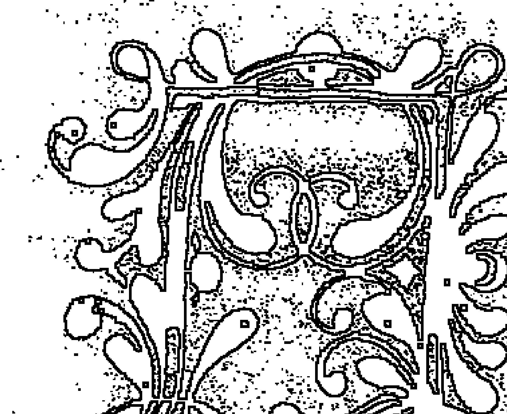

## · 通用智慧 ·

人際關係和一切作為  
似乎皆需專注於  
最重要和最要緊的。  
～齊克果

### 前言：人際關係與生命韻律

人類生活有其季節和循環，  
個人的渾沌絕非永遠。  
冬季畢竟得讓位給春夏，  
縱然有時樹枝仍暗黑  
大地仍冰凍皺裂，  
我們以為春夏永遠不會來臨，  
但他們降臨了，  
永遠不都會降臨。  
～美國作家楚門·卡波特（Truman Capote）

這部作品本身就像一道山徑，使閱讀的旅人在登山過程中獲得啟示。每個人人生旅程都是一種轉換的過程，雖然閱讀的工作大部分由眼睛來進行，但學習則需用到不同的東西，尤其面對這種性質的體裁。

那些隨著我一路閱讀到這裡的讀者，很難不做改變；生命目標系統的本質及相關的力量，無可避免會產生轉換的效果，而不斷提升肯用功讀者的覺知能力。

我們已經談過生命目標系統的重點，以及相關的自然法則了，現在我們進行到第五部分，一起思考如何將這些素材應用在日常生活、人際關係與生命循環等特定的領域裡。

所有人在生活中都會跟許多人產生互動，個人有主要的人生目標，而彼此的二人間的人際關係，無論是私生活或在工作上，也會有主要目標。接下來的一章要談的是，如果你握有對方確切的生日日期，如何計算並詮釋二人的綜合出來的合併數字。這個數字提供每場關係背後的關鍵能量，告

### 人際關係能量

人際關係絕對是面明鏡，教你了解自己。～克里希南默提

個人的認同及價值觀是極其複雜的，因此並沒有一套放諸四海皆準、簡便的人際關係致勝規則可用。然而，生命目標系統告訴我們，如何依循基本的關鍵精神法則，了解人際關係的互動情形。

如果我們將兩組聲波或光波組合在一起，會形成一組新波。如果我們把兩個朝不同角度移動的向量組合起來，會形成新的向量——一股新的力量與方向，同理也適用於人的能量組合上。兩人相處時，等於綜合了二人的力量，形成一股新的綜合能量，這股能量通常不會一樣，或者能產生一加一大於二的效果。如果把兩人以上的出生數字合併起來，產生的互動與能量會變得極其複雜，去討論這種結果其實是不具意義，也沒有用的，不過利用出生數字來決定雙人組的情形，常會跑出極具價值的資訊。這裡所談到的原則適用於任何兩人之間的關係，無論是個人或職場上的朋友、合夥人、同伴、情人或手足間，皆可適用。

遵照生命目標系統，我們可以把兩個人右邊最後的出生數字加起來，決定出他們的合併數字。例如，把我最後的數字（26/8）跟我妻子的數字（20/2）加起來，也就是8+2=10：創造能量加上內在稟賦。我和妻子一起創造的能量，使我們聯手完成了個別無法達成的事項。請按以下簡易步驟，找出你與出生日期確切的同伴間的合併數字。

### 人際關係合併數字的算法

1. 使用正確的出生日期，找出兩人的出生數字（請參照出生數字算法部分。）
2. 把兩個出生數字右邊最後的數字相加（斜線右邊的數字）。如果其中一人或兩人的右邊數字是10、11或12（如37/10，29/11或39/12），請把數字個別加起來，在每個數字中間擺上一個加號（+），例如：
* 24/6和35/8 = 6 + 8 = 14
* 34/7和28/10 = 7+1+0 = 8
* 23/5和31/4 = 9
* 29/11和33/6 = 1+1+6 = 8
* 25/7和26/8 = 15
* 22/4和35/8 = 12
3. 等你把同伴的右邊數字加上去後：
○ 如果得到的總數是12或小於12，就此打住。
○ 若總數等於13或大於13，再把這兩個數字加一次，得到12或小於12的總數。最後的總數代表兩人關係的能量。

### 例如：

+ □ 33/6和25/7 = 6+7 = 13 = 1+3 = 4
□ 24/6和35/8 = 6+8 = 14 = 1+4 = 5
□ 25/7和26/8 = 7+8 = 15 = 1+5 = 6
□ 29/11和32/5 = 1+1+5 = 7
□ 21/3和22/4 = 3+4 = 7
□ 28/10和34/7 = 1+0+7 = 8
□ 31/4和23/5 = 4+5 = 9
□ 24/6和21/3 = 6+3 = 9
□ 29/11和34/7 = 1+1+7 = 9
□ 27/9和27/9 = 9+9 = 18 = 1+8 = 9
□ 32/5和32/5 = 5+5=10
□ 20/2和36/9 = 2+9 = 11
□ 39/12和26/8 = 1+2+8 = 11
□ 35/8和31/4 = 8+4 = 12

以上例子中，有意思的一點是，兩股合併後的能量通常跟個人右邊的最後數字不一樣。然而在某些例子中，合併的能量則相同，例如，27/9和27/9 = 9+9 = 18 = 1+8 = 9。這些人不管是個別獨處或是在一起，都得解決正直與智慧方面的問題。

我們把13和大於13的數字繼續往下加，10、11和12則不予理會，那是因為在接下來的九個世紀裡，數字12是最高的可能生命目標了。13這個數字得到西元2999年9月29日，才會出現在右邊尾數。屆時，新的創造軌道，將出現在地球上。

了解1到9的主要數字能量（加上0與雙重數字11及12），能幫助我們去欣賞任何兩個人所合併出來的能量，並讓我們知道那股能量對兩人關係的意義。

### 知名雙人組的合併數字

+ 4：露西·鮑兒與達西·阿南茲（Lucille Ball and Desi Arnaz，26/8和23/5，美國喜劇搭檔）
4：瑪莉·泰勒莫爾與狄克·范達克（Mary Tyler Moore and Dick Van Dyke，22/4與27/9，美國影藝搭檔）
4：東尼·藍道與傑克·庫曼（Tony Randall and Jack Klugman，22/4和27/9，美國喜劇搭檔）
5：吉兒·羅傑斯與費德·阿斯泰（Ginger Rogers and Fred Astaire，26/8和33/6，美國歌舞片搭檔）
5：柯林頓和希拉蕊（38/11和30/3）
6：金·西斯凱和羅傑·艾伯特（Gene Siskel, 29/11 and Roger Ebert 31/4，美國影評雙人組）
8：凱瑟琳·赫本與史班塞·崔西（Katharine Hepburn and Spencer Tracy，25/7、19/10，美國電影搭檔）
8：理查·羅吉斯與奧斯卡·漢米斯頓（Richard Rodgers and Oscar Hammerstein II，29/11、33/6，美國舞台搭檔）

### 合併數字的意義

兩個人的合併數字，跟該數字對個人的影響及意義是一樣的。不過若把數字運用在兩人的關係上，也許需要做點額外的詮釋。

請牢記一個原則——我們此生的生命目標，並不容易達成。這個原則不僅適用於個人的生命目標，也適用於每場人際關係裡。例如，若兩人的合併能量是8，他們在攜手同行的過程中，會遇到的屏障和問題很可能包括了為金錢起爭執，或權力鬥爭，如果他們無法克服這些問題，也許就會分道揚鑣了。合併數字為4的雙人組也許會在慘痛的經驗中學會遵循程序的重要性，不能略過該有的步驟，或者他們會合二人之力，打下紮實的基礎。數字5的夫妻也許得解決依賴、獨立及規範的問題，才能在兩人的關係中找到真正的自由。任何關係能量的成熟過程都是一樣的——克服負面問題，而達到正面的結果。如此，我們才可以實踐兩人關係的天命。由於人際關係是個人成長中重要的訓練學習過程，因此改善人際關係，也等於改進了自己。

以下是各合併數字的正負面概述，既然是概述，就只能提供一個大概的輪廓而已，無法涵蓋或解釋每個可能遇到的問題。不過它點出了每個數字典型的能量與問題，揭示了某些內在的動力、問題、傾向與優先順序，以及每場關係的更高目標。合併數字同時指出潛在的陷阱與需要克服的屏障。

### 了解合併能量

1. 翻到第二部分，溫習你想了解的合併數字。例如，如果兩人關係的合併數是6，就翻閱6的部分：遠見與接納，並思考其中的種種。

○ 注意：如果合併數字是二位數，請參考每個主要數字的章節。例如，若兩人關係的合併數為10：創造、自信及內在稟賦，先查看能量1，然後再溫習0的內容：內在稟賦。

2. 按這些步驟來閱讀合併能量的正負優缺點。

3. 回答跟兩人關係相關的問題。

4. 溫習攸關兩人合併數的精神法則。

### 合併能量的正負面

請注意一點，除了10、11或12等數字外，1本身並不會以合併數字的姿態出現。

## 12：合作與平衡

### 優點

合併數字2的人際關係可以反映出相互支持、忠誠、安全及堅強等能量。在工作及家庭中，強大的互相支持與合作力量，可使每個人補足並平衡對方的努力；取得理性與情感的和諧。

### 缺點

合併數字2的人際關係可能會有情感保留及抗拒、困惑、不平衡等問題，以及某方的理智與另一方的感情失衡的情形。其他像彼此權線劃分不清、委屈求全結果又心生反感等問題，也可能出現。

### 關鍵問題

- 我們喜歡一起做什麼事情？
- 我們是否在彼此不同的需求間找到了平衡？
- 我們如何劃分責任？

### 合併數字2的精神法則

- 責任法則
- 靈活法則
- 平衡法則

## ③：表達與敏銳

### 優點

合併數字3的人際關係可以透過清晰的表達與感情的分享，創造出深厚的关系，使兩人相知相惜。誠實是關係的試金石，而對話則是人際關係的催化劑。3的能量為情侶帶來浪漫，為朋友帶來真誠的友誼。

### 缺點

合併數字3的人際關係問題是需索太多，而給得不夠，或是因表達受阻，不夠體貼，一方或雙方的人只說出自己的想法，未能表露感情，結果造成了自憐或沮喪的情形。

### 關鍵問題

- 我們是否會默默的鼓勵對方，克服心中的疑慮？
- 我們是否在交談中彼此聆聽？
- 是否坦白直接分享心中的感覺與需求？

### 合併數字3的精神法則

- 平衡法則
- 誠實法則
- 選擇法則

## ④：穩定與程序

### 優點

合併數字4的人際關係可以為家庭或企業帶來堅實的基礎，每個人都為穩定的關係有所努力，並給予對方誠實的回饋，以釐清問題，提升共同目標的成功機率。無論這場關係中的人是否真有血緣關係，都會形成一種「家人」的感覺。

### 缺點

合併數字4的人際關係可能會遇到責任或義務過重等問題，而造成家庭或親人間的爭執。不切實的野心與混淆不清的計畫會帶來壓力、挫敗感或失敗。這種關係中瀰漫著執見、衝突的目標，或不穩定的感覺。

### 關鍵問題

- 哪一種按部就班的方法可以滿足我們雙方的目標？
- 下一個步驟可以怎麼做，才能讓我們擁有更相輔相成的關係？
- 我們是否學會理性與感情並重？

### 合併數字4的精神法則

- 程序法則
- 循環法則
- 習慣法則

## ⑤：自由與規範

### 優點

合併數字5的人際關係可以開啓冒險的感覺，即使在日常生活裡，也能帶來新的經驗與彼此的依持，而拉近兩人的關係。

### 缺點

這場人際關係裡會遇到內心的衝突與漫無目標的問題，因爲雙方在依賴與獨立間擺盪不定，自信不足，覺得兩人方向不一致，或是覺得漫無頭緒、受到侷限。

### 關鍵問題

- 對我們兩人來說，最重要的優先順序與紀律是什麼？
- 當我們想要從事新的冒險時，誰會阻止我們？
- 我們如何幫助彼此找到內心的自由？

### 合併數字5的精神法則

- 紀律法則
- 行動法則
- 平衡法則

## ⑥：遠見與接納

### 優點

合併數字6的人際關係擁有純潔明晰的特質，且通常以彼此的成長改進爲主軸，使雙方展現最好的一面。這場關係中洋溢著樂觀與相互接納的氣氛，理想可以在其中體現，雙方也可以期待彼此長久而豐富的關係。

### 缺點

合併數字6的人際關係可能會有失望與批判方面的問題。兩個人可能會無法符合彼此的理想，最初似乎完美無瑕的關係，卻因爲不切實際的期許，而變得千瘡百孔。他們也許想去改變對方的外在，而形成一種挑剔與批判的互動關係。

### 關鍵問題

- 我們欣賞彼此的哪些地方？
- 我們共同的夢想是什麼？
- 如何培養無私的接納態度？

### 合併數字6的精神法則

- 完美法則
- 灵活法則
- 直覺法則

## 7：信賴與坦誠

### 優點

合併數字7的人際關係能產生一種深深的信賴感與開明的胸襟，因爲兩人都懂得體貼、知道分享。他們激發彼此的內省與心靈改造，致力於彼此的成長。

### 缺點

數字7的人際關係可能會因爲誤解、感情上的偏執痛苦、害怕被出賣，以及一種隱匿的羞辱感或長期壓抑的私密，而造成不信任的感覺。雙方都想依賴對方來完成自己。

## ⑧：富足與權力

### 優點

合併數字8的人際關係能反映出美好的收受關係，為了彼此的利益，大方分享、付出自己的權力，並帶來心理及實質層次的富足感。在這場關係裡，心智的和諧開啓通往愛的路徑。

### 缺點

合併數字8的人際關係可能會有控制或權威方面的問題，如果為了爭取主控權而鬥爭不已。也許他們會覺得錢不夠用，也許慾望太多，又吝於付出，或不肯做該做的事；機會主義很可能破壞這場真誠的關係。

### 關鍵問題

- 我們能給對方什麼？
- 我們其中有人需要去操控對方嗎？如果有，原因呢？
- 我們如何共同創造一種富足的感覺？

### 合併數字8的精神法則

- 誠實法則
- 天道法則
- 行動法則

## 9：創造與接納

### 優點

合併數字9的人際關係建立在一種充滿愛與忍讓的緊密關係上，或者雙方能夠培養出這種關係來。兩人可從彼此的歧異中學習生命與正直等課題，這種對歧異的尊重及接納態度，使他們得到了少有的個人成長良機。

### 缺點

合併數字9的人際關係可能會造成寂寞疏離的感覺，彼此覺得非常生疏，甚至對自己也感到陌生。這兩個人也許對彼此有一種「合不來，又離不開」的感覺。由於二人對事情看法迥異，意見常起強烈的衝突。

### 關鍵問題

- 我們會不會強迫對方接納自己的意見？
- 如何去尊重並欣賞彼此的歧異？
- 是否記住了，在某種程度上來說，我們雖知道什麼對自己最有益，卻未必對對方有益？

### 合併數字9的精神法則

- 天道法則
- 不批判法則
- 直覺法則

## 10：創造、自信與內在稟賦

### 優點

合併數字10的人際關係有著緊密的手足情誼，彷彿兩個人早就彼此認識了，這種緊密的關係可以創造出一股通往性靈與物質世界的熱力，使他們分享彼此的創造能量與努力。

### 缺點

他們的關係可能會因為不懂得表達體貼，而遭到執爭與感情上的傷害等問題。雙方也許會因競爭而生悶氣，缺乏安全感，卻又都放不下身段，結果因壓力，而帶來上癮的問題。

### 關鍵問題

- 我們可以共同創造哪些個人無法獨創的資源？
- 當我們其中有人感覺受到傷害，或充滿熱情時，會不會表達出來？
- 我們為彼此帶來多大的能量？

### 合併數字10的精神法則

- 選擇法則
- 不批判法則
- 天道法則

## 11：雙倍的創造與自信

### 優點

合併數字11的人際關係能產生火光四射的創造能量，並帶來特殊的魅力（性或其他方面）。這些人能攜手創造任何事物，就像氧遇到了火一樣。數字11可以再加一次（1+1），得到2，因此合作關係在這裡也非常重要。

### 缺點

11的人際關係可能會遇到創造力受阻或誤用的問題，而雙雙染上酒、藥癮，或遇到肢體暴力的問題。這兩個人是典型的愛恨交錯關係，關係中安全感極低，又拋不開內慾的需求，他們的遭遇絕對比連續劇還精彩。

### 關鍵問題

- 這場關係中哪些地方讓我喜歡？
- 當我們起爭執時，如何將同樣的能量導向關愛？
- 我們用什麼方式來發揮或抑制彼此的能量？

### 合併數字11的精神法則

- 選擇法則
- 責任法則
- 行動法則

## 12：創造式的合作

### 優點

合併數字12的人際關係表示一種創造的組合，雙方共同創造一種相依相靠的整體關係。在這裡，兩人彼此讚賞、分享、並無私而專注的為整體付出——而且是針對事，不對人。可以再把數字12相加（1+2），得到3，因此完整誠實的情感表達在這裡也很重要。

### 缺點

合併數字12的人際關係可能會有自我衝突及創造力受阻的問題。「合則成，不合則敗」這句話非常適用於這裡，若二人不合，他們只能看到爭執與懊惱，雙方緊抓住自己有限的能量不放。自我表達受到阻撓的情形，就像一列充滿動能，卻被困在車站裡的火車。

### 關鍵問題

- 我們能用什麼方法來支持彼此？
- 我們何時能一起創造最好的表現？
- 如何在給得太多及付出太少之間，取得一個平衡？

### 合併數字12的精神法則

- 責任法則
- 誠實法則
- 選擇法則

## 了解人際關係

配偶、情侶、夥伴、家庭成員及生意來往對象等，任何懂

得運用出生數字的人，都能體悟更深層的人際關係，而提升彼此的善意、相互的支持、關愛、幽默感，及日趨改善的溝通。

兩人之間的合併數字及相關的能量指出他們共同面對的主要問題。然而，兩個人之間的私密境地，是沒有任何系統可以探觸的；唯有他們自己才能了解，並感念彼此的互動，也唯有他們自己，才會去體驗種種困厄與教訓。心底的想法、感覺與掙扎，只有自己知道，也僅能以自己的方式來化解。

知識帶來力量，也可以帶來悲憫的情懷。了解對方的挑戰、掙扎與能力，可幫助我們欣賞並明白自己的種種。我們常將自己的問題投射在同伴身上，如果合併數字是6，我們的同伴也許會批判我們，或者我們會選擇一個去批判挑剔我們的同伴，好讓我們能解決批判的毛病。如果我們的合併數字是9，也許會認為同伴極為頑固。對大部分的人來說，了解自己的一個好辦法，就是看看自己喜歡或討厭同伴哪些特質，令我們討厭，因爲這些特質也許正是我們本身性格中受到壓抑的部分。

雙方都能為彼此帶來能量，也能共同創造出一些能量，從這個角度切入，我們便能感激兩人關係中的動能，並將關係本身變成一種洞悉、覺知、及個人成長的利器。

人際關係能滿足彼此的需求。從正面角度來看，人際關係帶來了歡樂；從負面觀點來看，則為我們帶來無可逃避的教訓。在這些教訓中，我們找到另一個啟蒙的可能，而所有人生道路最後都是通到這裡的。

## 九年一輪

世界的力最以圓圈運行  
萬物皆設法成圓。  
蒼穹是圓，聽說地球像個球  
所有的星星都像球。  
最強的風有如渦旋，  
鳥兒繞圈築成圓巢，  
牠們的宗教同於我們。  
日月皆圓  
起落的路線也是圓。  
四季更迭是更大的圓，  
永遠回歸來處。  
人的生命是個從童年到童年的圓，  
所以萬事萬物皆有力量運行其中。

> ～黑麋（Black Elk）

「循環法則」提醒我們，萬物不斷重複著循環的模式。億萬年來宇宙以一定的節奏興衰起伏；每年，季節去而重返；水珠自天而降，然後蒸發凝聚，再度落降，這種律動與循環無處不在。

我們也可以體驗到規模較小，日常中容易被忽略的循環——重複不斷的能量興衰，我們若能學得人生的教訓，即可以乘勢而起，奔赴自己的天命。

1到9的主要生命數字提供我們某一種循環的要旨。觀察個人生命的節奏與模式有其珍貴的價值，因為我們若能將個人的欲求，配合更強大的節奏力量，便能運用天時之利，搭載能量的浪頭，順勢而游，並培養與自然界密切配合的能力了。

即使我們一直保持自己的出生數字及其相關的能量與問題，還是能體驗到數字1到9等主要能量，如何固定而漸進的去循環運作。我們的出生年份就是我們的主要生命目標；接下來的一年則會經歷下一個數字的能量，依此類推，推到數字9後，再重新開始一個循環。因此除了我們本身的出生數字及生命軌道外，我們還可以在九年一輪的生命循環中，感受到當年行運數字的強力影響，而每年也都會有新的問題與機會出現。

我們可以從計畫、成長、栽培、收獲、耕耘的律動節奏，以及準備進入新循環的過程中，了解每年的能量運作情形。這個比喻聽起來很抽象——不過等我們找出自己的循環，並注意到它如何提供生命流年一個有利務實的指引後，就不難理解了。

## 九年的循環

### 1：創造與自信

循環的起始年是創造，是要播種、抱持著自信去開啟新機的一年。種籽已經播妥，但尚未破土。這一年是計畫栽植的一年，是籌劃解決辦法，計畫藍圖的一年。也可能表示重拾書本、接受再訓練，或遷至新的地方——總之就是重新展開新的事物。早春的雪，才剛開始溶化。

### 2：合作與平衡

在第二年裡，種籽需要其他因素的協助與互動——陽光、土壤與水。在我們的生命中，循環期的第二年表示以某種形式與人合作，訂出自己的權限，從人際關係中找出自己在新工作或活動中的定位，形成新的人際、合作關係以及支援人脈，大地回春了。

### 3：表達與敏銳

種籽在第三年破土而出，展現在陽光之下；這表示表現自己，審慎成長的時機。新生的嫩芽還很生澀，這段時期可能會覺得十分脆弱，而對自己產生疑慮：「我做得到嗎？」我們的視野會增長，會有更多的閱歷。現在是暮春了。

### 4：穩定與程序

嫩芽在第四年裡茁壯，將根部深入泥土之中。此時是建立穩定性的重要時段，不必急著表現，而要扎穩根基。這是去反省、溫習、補足缺漏、重整自己力量、確定自己做好萬全準備的時期。夏季即將到來。

### 5：自由與規範

循環中的第五年，繁茂的樹木開始吸引其他的生命——鳥隻、蜜蜂及森林裡的動物。如果我們過去努力耕作，培得沃土，在前四年中辛勤耕耘，如今就是充滿機會的時機了，我們會擁有許多的選擇。果園生出首批果實，這是歡慶豐收的時期，夏天到了。

### 6：遠見與接納

第六年是回饋期，與所有人分享樹上的果實，以責任心與崇高的理想，分享自己的財富。這是一個仁慈富足的時期，同時也是接納並感懷現狀、未來與未知的時期。殘夏已至。

### 7：信任與開明

第七年是感念所有收獲的時期。這不是朝目標衝刺的一年，而是去享受、放鬆，回顧並從過去學習的時段：第一年的創造、第二年的分工合作、第三年所克服的生澀與疑慮、第四年的重整與扎根、第五年的收割，以及第六年的分享。現在則添上對一切的感念，了解原來所有先前的挑戰，對此刻都有它的貢獻。秋天來了。

### 8：富足與權力

第八年會為那些有意願與決心收割的人，帶來前七年辛苦耕耘後的豐碩報酬。他們的收獲直接反映出前七年的努力品質，大樹現在巍然挺立、成熟而珍貴，準備好收成了。當風象開始改變，秋天的樹葉像黃金、彩虹般紛落，象徵著晚秋的到來。

### 9：正直與智慧

第九年是完成、放下的一年，在這一年裡，我們靜靜反省，獲得智慧——回顧並了解所有循環都有告終之時，然後又會開始另一個循環。執著絕對沒有用，因為所有的事物都會消逝；秋季結束了，現在是深耕掘土，靜待來春的下一個循環，以重新播種的時期。我們將帶著新希望與精力，用所得的智慧，使新的循環變得更美好。冬天的降臨使我們定靜心靈，等待陽光再度照耀。

以下練習告訴我們如何計算此生流年的能量數，並協助你感念能量及機運的變化循環。

## 九年一輪的流年算法

1. 寫下你的出生月份和日期，不過用現在的年份來取代你的出生年。

舉例來說：我在1993年撰寫本書，為了算出當年的數字能量，我把自己的生日寫下來，然後用1993來替代自己的出生年：2-22-1993。讀者當然也可以用你閱讀本書的年份來代替了。

2. 按照出生數字的計算方式，把出生日期、月份及當年年份一一相加；拿我的例子來算，2-22-1993的算法是2+2+2+1+9+9+3 =28=2+8=10，新循環的開始是0：內在稟賦；因為我們接著把1+0，這是「第1年」。因此，1993年時，我處在新的九年大限中的第一年。新的循環始於你的生日。

3. 繼續用我的生日為例，我們可以了解整個循環中，最後的數字如何遵循固定的計算程序：

接下來一年，2-22-1994加起來是29=2+9=11=1+1=2，也就是循環裡的第二年。

注意兩位數的總和要再加一次，以得到循環中1到9的年數。

接下來一年是2-22-1995，總和是30=3+0=3，也就是循環中的第三年，以下類推，算出9年。

4. 下面是隨機挑選出來的年份與生日，進一步讓讀者知道九年循環的固定程序：

艾比，生於1-11-1940：  
1+1+1+1+9+4+0=17=1+7=8；  
這是九年循環中的第8年。

接下來一年，1-11-1941：  
1+1+1+1+9+4+1=18=1+8=9；  
這是九年循環中的第9年。

往後一年是1-11-1942：  
1+1+1+1+9+4+2=19=1+9=10=1+0=1；  
展開了新的九年循環中的第1年。

接著一年是1-11-1943：  
1+1+1+1+9+4+3=20=2+0=2  
展開九年循環中的第2年，依此類推。

在1993年時，艾比要算的是1-11-1993：  
1+1+1+1+9+9+3=25=2+5=7；  
表示九年循環裡的第7年。

凱莉出生於9-17-1957：  
9+1+7+1+9+5+7=39=3+9=12=1+2=3；  
這是九年循環裡的第3年。

接下來的一年是9-17-1958：  
9+1+7+1+9+5+8=40=4+0=4  
展開了九年循環裡的第4年。

接著一年是9-17-1959：  
9+1+7+1+9+5+9=41=4+1=5；  
展開了九年循環裡的第5年，依此類推。

在1993年，凱莉要算的是9-17-1993：  
9+1+7+1+9+9+3=39=3+9=12=1+2=3，  
是九年循環裡的第3年。

## 重大事件的回顧

1. 在繼續往下念之前，請先把你的出生年份寫在一張紙上，在年份下面寫出下個年份，然後再寫出下一年，依此類推，直到目前的年份為止。（如果你今年86歲，大概得花點時間才行！）

2. 一開始盡量往前回憶，把想到的重要事件寫下來，好壞都要寫，按年份記下。從這個練習所得到的洞見，跟你寫下的重要事件數量直接相關，不過即使事件不多，但發生的年份也夠教人開眼界了。

3. 在你出生的年份左邊，寫下你的主要生命目標（1到9，或是10、11、12）；比如說，假如你的出生數字是33/6，把6寫在你的出生年份左邊，然後在接下來一年旁邊寫上7，然後是8、9，然後再由1、2依此往下寫，此生每一年旁邊都寫上九年一輪的數字，直到目前為止。現在你可以看到自己這一生，每年處於九年循環中的哪個位置了。

注意，如果你的主要生命目標包含兩位數（39/12即為一例），必須把這兩位數相加起來（就12來說，則是1+2），才能找到自己在九年循環中的定位（這個例子是3）。

4. 回顧所有數字為1的年份，所有新循環的第一年，看看我們的理論合不合用；然後看看所有2的年份（合作），看看這個能量跟你生命中的事件可有任何相關，繼續往下看3到9的年份。

5. 有哪些年份特別順利？有沒有注意到任何重複的模式？當第八年帶來報酬或富足時，你能從它之前的幾年中看到什麼？如果你在九年的循環裡，都一直抱守舊的習慣，並且還因習到下一個循環裡，那對你有的生活有何影響？

## 從中學習

除非你的出生數字是19/10，28/10，37/10或46/10，否則一歲的你不會從九年循環的第一年開始算起。例如，我出生於2-22-1946，是九年循環的第8個年份出生的。雖然我才剛剛出世，就已為自己和父母帶來富足與權力的能量了。（除非孩子完全與父母分開，否則他們的出生年份能量，往往反映了孩子父母的境遇，因為孩子得仰賴父母，因此父母的境遇必然會影響子女。）

檢視自己的各個循環，也許你會注意到1的年份往往包含某種新的開始，而9的年份大多包含某種事物的結束。這之間的關連未必能全然吻合，但你可以發現數字相同的年份中，有其相似之處——類似的事件或影響。經過分析思索後，你會開始了解自己一生的節奏與循環，而幫助你意識到來年可能出現的傾向、能量或機會。

## 順勢而為

了解這些循環使人對生命有了新的感念且更富耐性，對目前生活狀況中變動的機會與問題也能更了然於心。比如說，你若因生活匱乏，而感到懊惱，那麼了解自己仍處於第3年中，會很有幫助。你不會預期立即的收穫，而會適應該年的能量，善加利用目前的情形（表達與敏銳），來開啓並培養誠懇的溝通，表達自己的需要與感覺，在收穫時節（第8年）來臨之前，打好成功的基礎。若能發揮每個年份的特質，讓每年的能量得以累聚，必能帶來豐富的收獲。

那些在春天播種，與別人充分合作，克服疑慮，並發揮每年能量的人，必能體驗到最豐碩的成果。接著，讓該過去的過去，才能為將臨的新循環做準備。

無論我們是否利用這些循環來預估或準備將臨的年份，循環本身就是一種福賜，讓我們體會駕馭生命四季節奏的智慧。

## 結語

想有所作為永遠不嫌遲。

～詩人艾略特（George Eliot）

本書分享了千百年來，以口耳相傳方式流傳下來，神聖教誨中的要義。生命目標系統處理了自我改善的問題，更強調生命的提升。這套系統也許能幫助你釐清自己的生命道路，但你要選擇運用什麼時機、紀律與信念，決定權在自己。現在你已掌握了這套方法的要點，知道個人生命能量與模式的運作情形，也可以更清晰的看見並欣賞生命中的問題與遠景了。如果你能深刻感受到自己的目標與方向，那麼便不枉費我寫此書的目的了。

欲通盤運用此書，最後再提醒讀者一點。有時我們該自省，有時該向外訴求，兩種做法皆有其價值。我們必須明瞭自己，才能超越自己。當我們探索自己的心理之洞時，會找到閃亮的靈思、信念與影像，可是如果我們如果只陷泥於自我當中，便等於劃地自限。請記住洞口的亮光，除非必要，否則無需在洞中久留。自我認知並不是終點，它只是一個開端，使我們能深入自己，並超越它。一旦我們跨越自我的河流，也就不需要船隻了。等探索過心中的幽暗角落與隙縫之後，我們便