# 生命数字学

致谢毕达哥拉斯
为人类觉醒所做出的
巨大贡献！

王茁琳 ◎ 著

# 生命数字学

来自毕达哥拉斯的
数字智慧

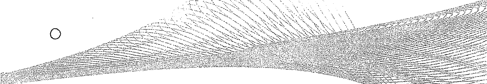

# NUMEROLOGY

DIGITAL INTELLIGENCE
FROM PYTHAGORAS

万物皆数

认识你自己，才能认识这个世界

> 生命数字学起源于西方古老的卡巴拉哲学，大成于古希腊哲学家、数学家毕达哥拉斯。

中华文化出版社
CHINESE CULTURE PRESS

王芷琳 ◎ 著

# 生命数字学

来自毕达哥拉斯的
数字智慧

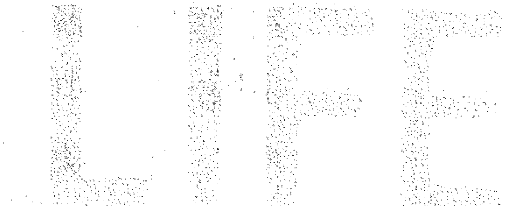

# NUMEROLOGY

DIGITAL INTELLIGENCE
FROM PYTHAGORAS

# 图书在版编目（CIP）数据

生命数字学——来自毕达哥拉斯的数字智慧 / 王茁琳著 .- 中华文化出版社 2021.2
ISBN 978-988-75530-4-5
Ⅰ.①生… Ⅱ.①王… Ⅲ.①哲学-思维科学-思维规律
Ⅳ.①B802

# 生命数字学——来自毕达哥拉斯的数字智慧

主 编 王茁琳
责任编辑 瞿诗章
出版发行 中华文化出版社
地 址 新界沙田乙明邨明耀楼 252 室
网 站 www.zhwhcbs.com
出版邮箱 zhwhcbs@163.com
开 本 710*1000 1/16
印 张 26.25
印 厂 三河市国新印装有限公司
版 次 2021年3月第1版
定 价 138.00元

版权所有，翻印必究；
未经许可，不得转载。

图书如有印装错误，影响阅读，可向承印厂联系调换。

# 前言

这是一门关于“生命数字学”的学问，一门关于我们自己的学问，一门关于“数”与“心”的学问。

生命数字学起源于西方古老的卡巴拉哲学，大成于古希腊哲学家、数学家毕达哥拉斯，由英国生命数字导师曼格拉的弟子黄宝仪老师引入中国。作为本土生命数字学的创始人，近二十年来，我一直醉心于应用心理学的培训和辅导。十二年前师从黄宝仪老师学习生命数字学，并深耕其间；后来反复聆听和研究曼格拉老师生前教学资料，并且在生活中大量应用、求证和总结，在数年教学传播中不断探索整合和完善，经过多年的钻研和实证，我看到了这门学问对个人成长提升的巨大作用，也帮助了数十万人真正做到了自助助人。

在此基础上，我又先后向国内外数十位顶级大师求教，从传统心理学到后现代心理学以及所有与生命数字学有关的学问，从身心不同维度进行了系统而专业的学习训练，吸收了更多营养。后来，我结合多年培训辅导的经验，终于把这门当年仅在国内极小众范围内传播并有些高深晦涩的课程，结合心理学，整合研发成了一套既有系统理论知识，又有精准实践方法的大众普及类学问，这也是后来被称为“本土化生命数字学”的系列课程。十四年来，仅仅依靠课程对生命数字地图的解读和针对性的辅导应用，就解决了数十万人的心灵困惑；广大学习者和爱好者在生活中的广泛传播应用，又为众多有缘人自我生命探索和改变提供了精准的方向和可能性，而我，也被一些厚爱的朋友谬赞为“国内毕氏生命数字体系传承第一人”。

经过数年的研磨和应用，这门学问已经能真正做到帮助人们多维度、多层次地学习和提升，能够有效帮助人们从心智改变到家庭重建，从头脑认知到深度疗愈，从感性体验到能量治疗，能够有效完成身心一体化的整合和蜕变，学员好评如潮。而我，在此基础上持续进行完善和研发，并尝试着用更加通俗易懂的文字，更清晰立体的诠释生命数字学，让更多人能够听得懂，学得会，用得好。时至今日，我终于把这门独具特色的生命数字学体系转化成了文字，并立志让生命数字学这门学问不再只是课程，更是一套严谨实用可供人们广泛使用的工具，一套能让学习者成人达己、受益终身的好工具。

我自己很喜欢生命数字学这门学问，因为它首先改变的是我本人和我的家庭，正是在这门学问的指引下，我才真正认识了“未知”的自己，才懂得了尊重和爱自己，才能有当下绽放幸福的自己。其次生命数字学精准有效地帮助了芸芸众生，尤其是那些追求生命品质的同行者，让他们随时能活在当下，喜乐自在。我相信，生命数字学将是每个人茫茫黑暗中前行的指路明灯，也是人生路上砥砺前行的灿烂阳光，它不仅仅能指引我们认识自己，觉察和调整自己的生命状态，并能帮助我们建立强大的安全感，提升自信心，在职场、健康和财富方面得偿所愿；它还能指引我们客观认识家人，因人而异地处理好夫妻关系、亲子关系和婆媳关系，让我们每个人的家庭都能被温暖和幸福滋养；最重要的，它还能明确我们每个人的人生方向、阶段目标和达成路径；它引领我们每个人清晰自己的生命课题，了解自己的生存安全模式及活出自我的方式；它让我们了解内心真正的渴求，清晰我们擅长的工作、选择伴侣的取向以及如何和形形色色的人打交道……

对心理咨询师和从事助人行业的从业者而言，生命数字学会是特别高效且专业的工具，这已经经过了国内数十万人的验证，文中会有大量的案例。对企业管理者、HR人士而言，生命数字学将为他们对人才的选、用、育、留提供一个崭新的视角，真正做到知人善用；对于普罗大众来说，生命数字学在帮助我们了解自我、了解他人，特别是父母、子女、朋友同事的固有思维和行为模式方面，有着因人而异的指导性和不可替代性。

多年以前，我就有撰写本书的计划，但由于忙于研究、培训与实践，一再延后。当然这也是好事，因为这避免了我在研究实践未深之际写出一本难免出错的书的可能性。本书撰写的内容，主要取材于我这十四年研究所得和授课所讲，案例来自众多学员的课程分享，他们当中，有些早以专业和内外兼修闻名业内，是在他们的一再建议下，我才做了这件水到渠成之事。在撰写本书的过程中，我发现可供参阅的国内外前辈同行的专业书籍极少，这一方面说明在此学问领域深耕者甚少，另一方面代表本书缺少厚重历史书籍的借鉴和参考，在精准和专业上难免有错误和不足之处，还请大家批评指正。

在这里，我要对曼格拉老师和黄宝仪老师以及当年主办她们课程的机构致以崇高的敬意和深深的谢意！感恩宝仪老师对我的谆谆教诲和厚爱及支持；同时，我必须感谢我的学员们，是他们在获得自身成长的同时，推动了我的不断成长，给了我醉心于此、不断研究、多方推广的动力，让这个学问可以收获众多的好评，更可以帮到上亿渴望了解自己、帮助家人的普罗大众。在此特别要感谢曹晓燕副教授，她为本书的完成做了大量的资料整理及汇编等前期工作；感谢茁琳文化的王芸轩、陈燕、张雨涵、罗显环、王红梅和李清遠，他们为我能撰写此书给予了无穷的支持和帮助。同时，我还要感谢那些一直以来信任支持我的客户、朋友和媒体，甚至与我素未谋面的陌生人，我相信，是共同的缘份让我们走到了今天。未来，这份缘份一定会让我们走得更近，收获更多。

为了方便您更好的阅读本书，请关注公众号：茁琳生命数字，生成属于您自己的生命数字地图，手持生命“导航仪”，开启人生的探索之旅吧！

王茁琳
2020年3月于北京

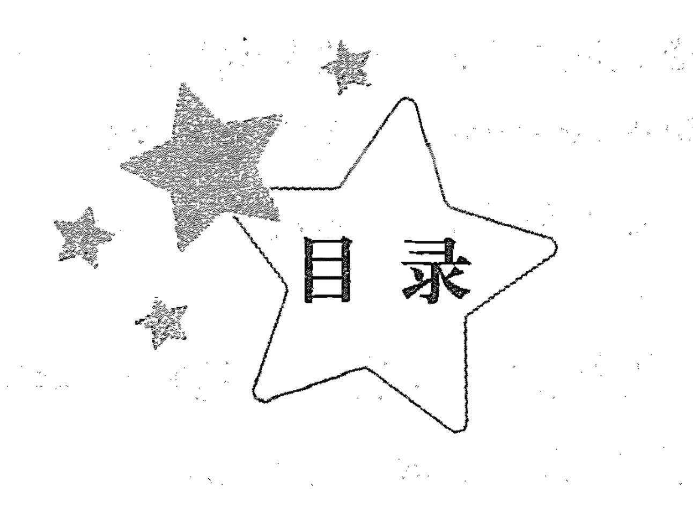

# 第一章 概 述 / 1

- 一、生命数字学缘起 / 2
- 二、研究生命数字学的意义 / 4
- 三、属于每个人的生命数字地图 / 5

# 第二章 异彩纷呈的数字能量——数字的三种能量解读 / 17

- 一、阳刚、开创、独立、自信的数字 1 / 19
- 二、阴柔、包容、敞开、敏锐的数字 2 / 20
- 三、单纯、热情、喜悦、创意的数字 3 / 21
- 四、真实、自然、稳定、安全的数字 4 / 22
- 五、自由、全然、冒险、活在当下的数字 5 / 24
- 六、家庭、爱心、付出、责任的数字 6 / 25
- 七、智慧、探索、单独、灵性的数字 7 / 27
- 八、金钱、权利、力量、影响力的数字 8 / 28
- 九、慈悲、大爱、格局、战略的数字 9 / 29

# 第三章 打破能量制约，活出自我风采——制约数字解读 / 33

- 一、为了证明自己而做事的制约数字 1 / 39
- 二、为了和谐的关系而做事的制约数字 2 / 52
- 三、为了维护面子而做事的制约数字 3 / 69
- 四、为了安全感而做事的制约数字 4 / 85
- 五、为了摆脱恐惧而做事的制约数字 5 / 99
- 六、为了做好人而做事的制约数字 6 / 110
- 七、为了知道和明白而做事的制约数字 7 / 122
- 八、为了结果而做事的制约数字 8 / 134
- 九、为了被需要而做事的制约数字 9 / 145

# 第四章 秉承高峰能量，把握数字人生——高峰数字解读 / 159

- 一、“独立自主”的高峰数字 1 / 161
- 二、“合作顺势”的高峰数字 2 / 163
- 三、“绽放喜悦”的高峰数字 3 / 165
- 四、“务实勤奋”的高峰数字 4 / 166
- 五、“刺激畅快”的高峰数字 5 / 168
- 六、“顾家负责”的高峰数字 6 / 171
- 七、“身心合一”的高峰数字 7 / 173
- 八、“名利双收”的高峰数字 8 / 175
- 九、“胸怀天下”的高峰数字 9 / 177

# 第五章 解脱束缚，迎接挑战——挑战数字解读 / 179

- 一、自卑、怯弱、退缩的挑战数字 1 / 181
- 二、硬邦邦、反依赖、不会示弱的挑战数字 2 / 182
- 三、负面消极、寡言被动的挑战数字 3 / 184
- 四、散乱不堪、主观固执的挑战数字 4 / 185
- 五、压抑禁欲、恐惧的挑战数字 5 / 186
- 六、抱怨、苛责、挑剔的挑战数字 6 / 188
- 七、轻信、浅尝辄止、害怕孤独的挑战数字 7 / 189
- 八、懦弱、无能、资格感不足的挑战数字 8 / 191
- 九、不可预测的挑战数字 0 / 192

# 第六章 “看到一份可能性”——个人年数字解读 / 193

- 一、开始年、播种年、创新年——个人年 1 / 196
- 二、关系年、顺势年、等待年——个人年 2 / 198
- 三、喜悦年、扩展年、轻松年——个人年 3 / 201
- 四、基础年、实相年、心智成长年——个人年 4 / 204
- 五、改变年、变化年、活在当下年——个人年 5 / 206
- 六、责任年、回归内心年、亲密关系年——个人年 6 / 208
- 七、学习年、计划年、休养生息年——个人年 7 / 211
- 八、开花年、心想事成年、阴阳平衡年——个人年 8 / 213
- 九、收获年、放手年、双忙（茫）年——个人年 9 / 215
- 十、本章特别提示 / 217

# 第七章 “我的优势在哪里”——表现数字解读 / 219

- 一、带头做事的表现数字 1 / 221
- 二、合作配合的表现数字 2 / 222
- 三、创意轻松的表现数字 3 / 225
- 四、踏实忠诚的表现数字 4 / 226
- 五、机智灵活的表现数字 5 / 228
- 六、负责律己的表现数字 6 / 229
- 七、明察秋毫的表现数字 7 / 231
- 八、领袖风范的表现数字 8 / 234
- 九、慈悲大爱的表现数字 9 / 236
- 十、本章特别提示 / 237

# 第八章 “我爱的人就是你”——内驱数字解读 / 241

- 一、独立担当的内驱数字 1 / 244
- 二、亲切平和的内驱数字 2 / 246
- 三、风趣幽默的内驱数字 3 / 248
- 四、诚实稳重的内驱数字 4 / 250
- 五、浪漫激情的内驱数字 5 / 252
- 六、善良有爱的内驱数字 6 / 255
- 七、智慧单独的内驱数字 7 / 258
- 八、高大强权的内驱数字 8 / 261
- 九、奉献博爱的内驱数字 9 / 263
- 十、本章特别提示 / 265

# 第九章 “我的数字人格”——个人特质数字解读 / 267

- 一、带头做主的个人特质数字 1 / 269
- 二、随和亲切的个人特质数字 2 / 270
- 三、幽默爱美的个人特质数字 3 / 270
- 四、诚恳务实的个人特质数字 4 / 270
- 五、特立独行的个人特质数字 5 / 271
- 六、热心挑剔的个人特质数字 6 / 271
- 七、清高较真的个人特质数字 7 / 271
- 八、阴阳平衡的个人特质数字 8 / 272
- 九、游刃有余的个人特质数字 9 / 272
- 十、案例与特别提示 / 272

# 第十章 “我的生存大环境”——循环数字的解读 / 277

- 一、独立忙碌的循环数字 1 / 279
- 二、和谐温暖的循环数字 2 / 279
- 三、丰富多彩的循环数字 3 / 280
- 四、恒定不变的循环数字 4 / 280
- 五、无拘无束的循环数字 5 / 281
- 六、亲如一家的循环数字 6 / 281
- 七、我行我素的循环数字 7 / 282
- 八、钱权优越的循环数字 8 / 282
- 九、人见人爱的循环数字 9 / 283

# 第十一章 “我如何跟自己玩”——性情数字解读 / 285

- 一、身体数字 / 287
- 二、情绪体数字 / 289
- 三、头脑体数字 / 293
- 四、直觉体数字 / 295

# 第十二章 两个特殊数字——黑洞数字和成熟数字解读 / 297

- 一、黑洞数字 / 298
- 二、成熟数字 / 299

# 第十三章 “我为何而来”——生命道路数字解读 / 301

- 一、勇往直前的生命道路 1 / 302
- 二、圆融顺势的生命道路 2 / 303
- 三、多才多艺的生命道路 3 / 305
- 四、按部就班的生命道路 4 / 306
- 五、自由洒脱的生命道路 5 / 308
- 六、完美自律的生命道路 6 / 309
- 七、智慧博学的生命道路 7 / 311
- 八、运筹帷幄的生命道路 8 / 312
- 九、胸怀天下的生命道路 9 / 313
- 十、本章特别提示 / 315

# 第十四章 “我生命的学习”——生命道路的数字宣言 / 317

- 一、生命道路 1 / 318
- 二、生命道路 2 / 318
- 三、生命道路 3 / 318
- 四、生命道路 4 / 319
- 五、生命道路 5 / 319
- 六、生命道路 6 / 319
- 七、生命道路 7 / 320
- 八、生命道路 8 / 320
- 九、生命道路 9 / 320

# 第十五章 生命地图中的双位数字 / 321

- 一、天赋数字 / 322
- 二、卓越数字 / 322
- 三、纠结数字 / 324

# 第十六章 生命地图中的合成数字 / 329

- 一、生命道路与其他位置数字相同 / 330
- 二、高峰数字与其他位置数字相同 / 335
- 三、挑战数字与其他位置数字相同 / 336
- 四、个人年数字与其他位置数字相同 / 337
- 五、表现数字与其他位置数字相同 / 338
- 六、内驱数字与个人特质数字相同 / 338

# 第十七章 生命地图中的相似数字 / 339

# 第十八章 生命数字学特殊盘点 / 345

- 一、数字 1 到数字 9 的核心特点串烧 / 346
- 二、高峰数字和挑战数字的掣肘关系 / 349

# 第十九章 数字与心理咨询 / 351

- 一、常规通用话术 / 352
- 二、数字 1 到数字 9 能量解读的参考话术 / 352
- 三、针对数字 1—9 能量不纯正的辅导角度 / 368

# 第二十章 生命数字地图综合解图案例解读 / 371

# 第二十一章 数字无好坏，爱自己就是全然地接纳自己 / 383

# 第二十二章 适用于任何位置数字1到9的数字诗歌 / 389

# 后 记 / 394

- 后记① 提出“万物皆数”理论的毕达哥拉斯 / 394
- 后记② 经由认识你自己，才能认识这个世界 / 398

# 附录 / 401

- 附录一 数字 1-9 的三种能量表现 / 401
- 附录二 生命数字学——来自毕达哥拉斯的数字智慧（综合解图训练）——8 大板块、30 个维度的综合解析 / 401
- 附录三 专业的人做专业的事，幸福在路上 / 402

# 第一章 概述

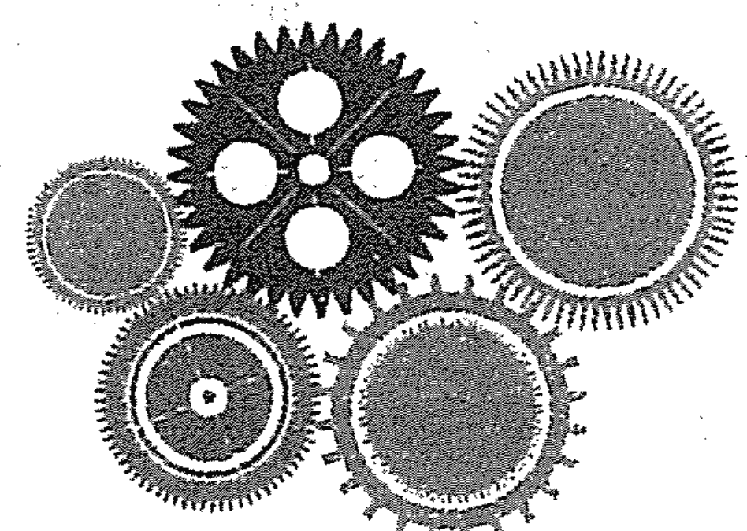

## 一、生命数字学缘起

如前所述，生命数字学最早起源于西方古老卡巴拉哲学，经生命数字之父、勾股定理证明者、数学家、哲学家毕达哥拉斯整合并发扬传承。

毕达哥拉斯在追求真理的同时，致力证明自然界所有事物之间的契合，坚信从科学的数字中才能彻底洞察生活与大自然间的关系。公元前 580 年至公元前 500 年间，毕达哥拉斯提出“数字附着能量”，具有精神上的意义，可以揭露万事万物背后的真理，还可用来诠释人生的意义。

在此基础上，毕达哥拉斯提出了“万物皆数”的哲学命题，认为“数”囊括在万物之中，甚至万物本身就是“数”，他也因此被称为“生命数字之父”。

毕达哥拉斯的生命数字学一直流传到现在，为众多人所推崇。中国的生命数字学最早由英国曼格拉老师的弟子黄宝仪引入中国。笔者师从黄宝仪和曼格拉老师，并结合国人学习和应用的习惯，不断进行探索和研究，把毕达哥拉斯的生命数字学与心理学、社会学、管理学有效结合，最终形成了独特的生命数字学体系，在国内系统性地传播了十余年，被一些抬爱的朋友封为“国内毕达哥拉斯生命数字体系传承第一人”。

从统计学、概率学来看，数字本身就可以看作是能量。恰如没有两片树叶是一样的，也没有两个人是一样的，每个人从一出生，就带着数字的能量而来。

当然，生命数字学不是宿命论，不是命理学，而是生命创造论、生命价值论。了解生命数字学，可以引领我们活出精彩，创建成功快乐的人生。

我们每个人活在这个世界上，都有一个认知体系。20 世纪 50 年代，乔瑟夫（Joseph）和哈里（Harry）提出了乔哈里视窗理论。视窗理论依据人的认知体系，把人际沟通的信息比作一个窗子，并将其分为了四个区域：开放区、隐秘区、盲目区、未知区。人的有效沟通就是这四个区域的有效融合。

开放区：自己知道、别人也知道的信息，比如姓名、部分经历、爱好等。

隐秘区：自己知道、别人可能不知道的秘密，比如某些经历、心愿、好恶等。

盲目区：自己不知道、别人可能知道的盲点，比如性格上的弱点或不良的习惯等。

未知区：自己不知道、别人也不知道的信息，比如身上隐藏的疾病、潜能等。（见表1-1）

### 表1-1 乔哈里视窗

| 自己知别人知（开放区） | 自己知别人不知（隐藏区） |
|---|---|
| 自己不知别人知（盲目区） | 自己和别人都不知（未知区） |

“自己知别人知”的部分，属于开放区，不需要我们费太多精力去尝试探索；“自己知别人不知”的隐藏区部分则需要我们去觉察，毕竟每个人都需要隐藏区，完全没有隐藏区的人是心智不成熟的人。同时在有效沟通中，适度打开隐藏区，是增加沟通成功率的一条捷径，因为在人际交往中，共同的开放区越多，沟通起来越不易产生误会，沟通效果越好。

真正需要突破的是“自己不知别人知”和“自己和别人都不知”的部分，也就是盲目区和未知区。我们要不断缩小自己的盲目区，有效探索和挖掘未知区，随着自我认识的不断深入，可以更好地发挥潜能、绽放自我、快乐生活。至于“自己和别人都不知”的部分，到底有多少、有什么，谁都不知道，我们可以从生命数字学角度去看一看，里面还有多少未知的自己或他人。

生命数字学的探索，会结合乔哈里视窗理论，重点围绕以下几个维度去研究：生命课题和子课题，“我”的过去、现在和未来，人生天赋潜能和人生困难障碍，情感关系和人际关系，“我”与“自己”的互动模式等等。

基于生命数字学本源知识体系，本书内容将分三大部分来陈述：一是与出生年月日相关的部分，如制约数字、高峰数字、挑战数字、个人年、循环数字的解读；二是与姓名相关的部分，如表现数字、内驱数字、个人特质、成熟数字的解读；三是生命地图中的特殊数字，具体说是我们的生命地图中21个位置

## 二、研究生命数字学的意义

人这一生，都走在认识自己的路上，《道德经》云：“知人者智，自知者明”，苏格拉底说：“认识自己，方能认识人生。”列夫·托尔斯泰说：“了解一切，就会原谅一切。”老舍说：“人若是看透了自己，便不会小看别人。”

人，一旦真正看清楚了自己，恐怕就再没有勇气去肆意评价任何人。了解自己诸般匮乏暗疾、矛盾分裂、辗转不由己，怎么还能够对他人求全责备呢？更别提黑白两色简单粗暴地判断，甚至是道德绑架了。如何客观公正地看待每一个人，如何从内在到外在全方位地了解一个人，而这，正如乔哈里视窗所呈现的，也是学习和研究生命数字学的意义之一。

生命数字学透过数字，通过对每个人思维、行为等心理规律的探索和分析，解读我们身心发展的规律和制约因素，让我们读懂影响自己的数字模型，学习自我认知和人生管理的提升方法，智慧地规划家庭和事业，在成长中顺“势”而为；我们还可以通过在生活中的应用实践，深度培养并提升管理人生的能力。

生命数字学最核心的价值在于发现自我、认识自我，捕捉潜藏在我们身上的价值和能量；同时帮助我们认识别人，更智慧地与他人相处，更有效地调动我们的人生资源，让我们轻松、快乐地获得成功和满足。

生命数字学课程通过对数字的学习和演练，为渴望成长的个体和助人成长的咨询师开启了高能量的智慧通道。生命数字学的延展就是数字心理学，对于心理咨询师来说它如同阿拉丁神灯，能让心理咨询和辅导变得清晰明了，有的放矢。很多专业从事心理咨询的学员在学习后感慨，做辅导时“如虎添翼，有如神助”，“超超快、超超准”，每一次的辅导都能更立体，能直观呈现，能迅速与来访者建立连接，使得咨询和辅导润物细无声，完美地做到了从头脑到心灵，从“术”到“心”。之所以有这样的效果，在于咨询师对来访者及其困扰，真正做到了“知其然，知其所以然”。透过数字心理的解读，咨询师能够因人而宜建立默契的咨访关系，快速精准地获悉来访者的思维和行为模式，一针见血地找到困扰源头，并能够运用最有针对性的技巧展开辅导。

当我们能够从生命数字学的视角精准地诠释自己过往的经历，认识自己的本我、自我和生命课题，就能更加客观地看待生命，更容易做到认知自我、完善自我、超越自我；当我们找到经营亲子关系、亲密关系、人际关系的精准钥匙，亲子关系就能更和谐，亲密关系就能更幸福，人际关系就能更圆融；当我们通过数字 360 度洞悉每个人的生命，对每个人内心世界的认知就会更加高维、客观和中正，咨询和辅导的效果就更深入和持久，如此，我们才是真正做到了知己知彼、成己达人；当我们每个人都能把生命数字学灵活运用在生活中，圆融沟通、与时俱进、与道同行，就能创造完美人生——这就是我们研究生命数字学基本且最终的意义。

## 三、属于每个人的生命数字地图

请关注公众号：茁琳生命数字，生成属于您自己的生命数字地图。

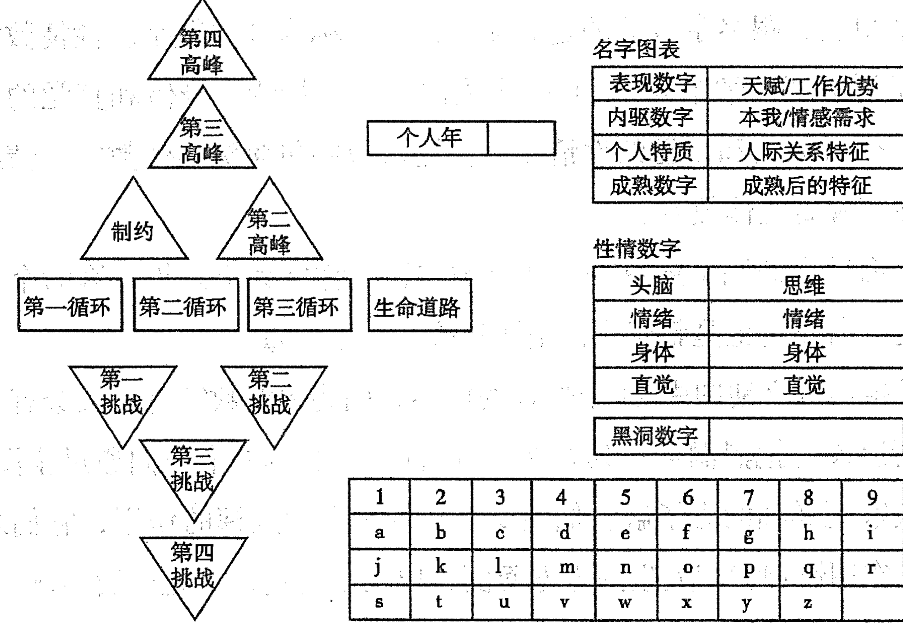

如图 1-2 所示，21 个位置，21 个数字，能直观体现我们人生的众多模式。在下文，我们会详细地阐述每一个位置数字的意义，以及它们如何组成了每一个人的独特人生。

这是一张完整的生命数字地图，在这张图上一共有 21 个位置，上面的 4 个三角形称为高峰数字，分别代表人生 4 个不同的时间段，是人生的高峰阶段，也是人生潜能全然爆发的阶段，这个阶段的能量通常是往纯正方向提升的。下面 4 个三角形称为挑战数字，它和高峰数字是上下对应的。挑战数字代表的是在数字对应的这个时间段里面，人生遇到的困难和不擅长的数字能量，不同的阶段会遇到的不同挑战。高峰数字和挑战数字中间的四个位置称为循环数字和生命道路。人们沿着生命道路走完一生，这条路上会有各种各样的环境，这些环境称为循环数字。

表现数字跟成人的工作有关，跟孩子小时候的学习优势和兴趣爱好有关。内驱数字是一个最想成为的自己，也是在亲情、友情和爱情方面呈现的能量，是每个人生命中最重要的情感世界的内容。个人特质是人们的人际关系，尤其是那些普通的同学、同事、陌生人及一些泛泛之交的人际关系。成熟数字是 36 岁之后，可以助力人们向前走的纯正能量，也是全图唯一一个只有纯正能量的数字。

在整张图里，跟名字有关的还有 4 个位置统称为性情数字。性情数字就是人们通常所说的“性情中人”，是一个人的想法、情绪、身体和直觉的呈现方式，以及这个人如何和自己的性情互动。性情数字包含头脑体数字、情绪体数字、身体数字和直觉体数字。

整张生命数字地图上还有一个独立的位置，称之为个人年，因为个人年每年都会变化，所以它也是整张生命地图里唯一一个变量。

以上是生命数字地图中 21 个位置的概述，因为黑洞数字有的人会有，有的人没有，所以没有把黑洞数字列在 21 个位置里。在本书中我们通过全图 21 个位置，让大家更详细的去了解它们在每个人的生命中发挥的作用，它们之间又是怎样互相作用影响我们人生的方方面面，以及如何更好、更全面的读懂它们、解读它们。

接下来让我们了解下每个位置在人生中的重要性。如果人生是一条路，一个人从起点到终点、从生到死的路就叫生命道路。纵观全图，生命道路是整个生命数字地图上最重要的位置，全图其它 20 个位置都是为这条生命道路服务的；生命道路是一个过程，它代表一个人一生的全部历程，这个历程是随时在变化的，而不是停在某一点，除了离世；生命道路的内容非常丰富，它贯穿了我们从出生到终老，每一天、每一月、每一年的各种各样的经历，包括在每一年的不同阶段发生的不同事情，所以，生命道路是一个囊括了其他 20 个位置所有发生的事情的综合性数字能量。在生命数字地图中，个人年属于最小单位，人们在每一年里都会有各种各样的经历，而每个人都是一年又一年，最终度过了人生的 30 岁、40 岁、50 岁、60 岁……所以我们要特别关注每个个人年的能量，把它修纯正，并且要顺势，当我们把每个个人年都活好了，生命道路走起来会顺畅很多。

每个人的一生都有不同的阶段，每个阶段都有不同的事情要做。我们在刚出生时，什么也不会做，只有生命的体验和对世界的认知。我们在父母和抚养人营造的家庭环境影响中，通过生活和书本上的学习，掌握人类的各种行为，了解世界万物，认识并融入社会。当我们生活上可以脱离父母独立生活，精神上开始形成人生观和世界观的时候，我们开始步入社会，学习和掌握在社会上立足并自力更生的技能；当我们具备了自力更生的能力，并能借助工作和事业获得相对稳定的生活，便开始谈婚论嫁、娶妻生子，建立属于自己的小家庭，开始把焦点从自己身上，转移到对下一代的培养、对父母的赡养上，真正开始了成年人的生活。自此以后，无论是学习、工作、情感和家庭，对经历过的人来说，更多是在原有的经验上重复或提升自己，不再是全部的未知体验，这也是在生命数字学中为什么把 36 岁作为一个人开始成熟的原因。

古人云：“三十而立，四十而不惑，五十而知天命。”不同的人生阶段有不同的需要关注的事情。过了 40 岁以后，房子有了、车子有了、孩子成长的也不错，这个时候人们就会开始考虑人生，思考如何自我成长，如何为自己活才不枉此生；50 多岁时孩子长大成人、结婚成家，人们开始考虑如何教养好下一代；到 60 岁或 70 岁时，发现子孙也生活得很好，就开始关注晚年生活。所以人生的不同阶段，侧重点也是有所不同的，而且这几个阶段就像登山、爬梯子和造房子，前面的基础打得越扎实越牢靠，后面的阶段活得越从容越幸福。在生命数字地图中，把从出生到老年这段时间分成了 4 个不同的阶段，这 4 个阶段对应图上的 4 个高峰数字。这 4 个阶段中的第 1 个阶段，也就是第一高峰在人们的生命中影响最大。因为这个阶段是人们出生后到长大成人的阶段，至少占据了人生的 1/3 时长，是从对世界一无所知的小孩子变成一个社会人，对人、事物和社会有所了解的阶段，而这个阶段的经历直接会影响以后人生的方方面面。父母的教育观念和教育方式，决定了孩子后期有可能变成什么样的人；家庭的滋养决定了孩子在这个阶段过得好不好，顺利不顺利。如果成长过程的基础没打好，该养成的习惯没养成，该塑造的品质没塑造，该形成的三观没形成，长大又要依靠这些来做人做事，后面的人生路就有可能会跌倒受伤。假如这个位置的数字能量很不纯正，人们不懂心理学，又没有自我觉察的能力，绝大多数成人会完全受制于这种模式，甚至影响到后面的人生路。因为这个位置的重要性和对人们一生可能有的限制，生命数字学中对这个位置进行了单独阐述，并把这个阶段的数字单独称为“制约数字”。

接下来就是第二高峰和第三高峰，两个高峰阶段全都加起来一共有 18 年，这期间是人生最精彩的时光，称为“黄金 18 年”，因为这个阶段是人们精力、体力、能力及阅历综合起来最好的阶段，很多人创造的生命奇迹通常就在这十几年。对于能否活出这两个高峰的能量，要看他们在这两个高峰是否能做出成绩，是否能与众不同，是否能抓住机会，是否能努力拼搏和创造，并且让未来越来越美好，毕竟这个阶段好与不好直接会影响到晚年阶段的生活。有些人会去建立内心的安全感，有些人去建立稳定的关系，有些人会去挣更多的钱，有些人会在仕途有成就，有些人完成了身心合一的学习。同时还有一些人没有觉察和认知，看不清人生的方向和课题，他们对抗而不是顺应能量，频频遭遇挫折，道路坎坷。等到第四高峰，人生最宝贵的黄金时间就结束了，此时我们再去创造辉煌就会很辛苦，体力、精力或财力有可能都跟不上了。所以我们一定要把握好这两个阶段，活出这两个阶段人生的辉煌。这也是为什么要早些学习和掌握生命数字学的原因。当我们能够明白人生的课题和方向，就像周总理少年时代就立志“为中华之崛起而读书”一样，会指引我们在人生中少走弯路，多走正路，用纯正的能量活出人生的精彩。

最后一个高峰是第四高峰，按照常规最早从 46 岁开始，最晚从 54 岁开始，一直到人生终老。如果身体健康，大家就会发现第四高峰的时间更长。中国有句特别精彩的话“有钱难买老来福”。这里的“老来福”指的是如果前几个高峰工作表现不错，事业就会很好；如果之前亲情爱情处理得很好，家庭关系就会很好，子女发展的也会很好；如果之前把身体调理得很好，这个阶段身体也会非常健康。如此，只要把前几个高峰的人生都经营得很好，等到第四高峰时不仅有非常好的家庭关系，年老的时候也不需要像年轻时一样，再为了生存和生活品质的提高去努力拼搏。这种没有负担压力、没有痛苦艰辛、健康快乐的老年生活才叫“老来福”，人们才可以安享前几个高峰沉淀下来的幸福，颐养天年。假如年老丧偶，就变成孤寡老人；假如孩子没出息，是非不断，老了还要去为儿孙操心受累，甚至被啃老，这样的老年生活无福可享，也不是应该有的颐养天年的状态。究其原因，会和之前的三个高峰没有把基础打好有直接关系。有一则新闻，有个读博士的学生被发现流浪街头，靠捡垃圾度日，而他的家人都以为他还在学校读书，却不知道他博士没能毕业，加之其他方面的生存能力太弱，不肯吃苦受累，索性自暴自弃靠捡垃圾度日。这个学生 30 多岁了，又是农村的，父母为了他的求学路已经竭尽全力，本来他是父母美好未来的希望，如今却再次变成了父母的负担，依然要为他的未来操心。所以无论是希望自己还是儿女第四高峰时能越过越好，我们都有责任和义务把前面的几个高峰过好，只有前面几个高峰能量纯正，第四高峰的生活才能精彩和轻松。

和高峰数字属于同样的年龄段并同时存在的，是生命数字地图中的挑战数字。挑战数字顾名思义，是对人们的挑战，是人生前行的阻碍和困难，也同样是人们自身并不擅长的能量，是短板和不足。比如，每个人都希望自己过得顺利平安，一辈子开开心心。结果呢？有个强势的妈妈、脾气暴躁的爸爸，家里经常“战火纷飞”，孩子却无处遁逃，只能默默忍受，期待着早日长大，逃离牢笼。爸爸、妈妈的个性和家庭环境，就是这个人成长过程中的障碍和困难，如何处理好和爸爸、妈妈的关系以及如何接受爸爸、妈妈常年吵架的事实，就是这个阶段的挑战；比如，爸爸、妈妈特别消极和负面，每天各种碎碎念，对孩子不是批评打击，就是抱怨指责，总之无法听到他们任何肯定赞美的话，每天回到家都觉得家里空气是凝固的，满满的负能量，如何接受和不受父母的负能量影响，就是孩子的困难和障碍；再比如，家庭各方面都很好，有爱有温暖，可是就是没钱，没钱就是当下的困难……这些人生不同阶段可能会遇到的困难，都称为挑战数字。小时候的挑战可能主要来自家庭和学校，因为父母和老师通常会设置“这也不行，那也不行”；步入社会，可能表达、人际交往、安全感、亲情、友情或者爱情就成了新的挑战；等到40多岁了，健康可能就是挑战；50岁以后孤独可能就是挑战……每个人的人生总是会出现无法去规避的困难和障碍，不同阶段有不同的挑战，也就是挑战一生都会有，只是有的挑战对人的影响大，有的挑战对人的影响小。而挑战数字最核心的就是战胜困难。拥有战胜困难的能力和勇气是克服挑战的前提，而面对挑战和困难的能力则决定人们能否让这个阶段过得越来越好。所以人们要做就是面对和接受挑战存在的事实，同时提高能力克服和战胜它们，让它们的存在对人生更有意义。

生命数字学中，人生有4个不同的高峰阶段，4个不同的挑战阶段，而每个阶段的能量表现受制于成长过程中的各种能量，也受制于当下的高峰数字和挑战数字的能量，另外还会受制于周围的环境——和高峰数字和挑战数字同步的环境我们称为循环数字。通过循环数字，重点是去了解一个人是在怎样的环境中成长，往来互动的是什么能量为主的人。我们经常说跟什么人在一起，会决定将来变成什么样的人，也是说环境对人的重要影响。

小孩刚出生，会降生在妈妈和爸爸营造的家庭环境里，当然，降生在不同的家庭，家庭环境会有所不同，居住的城市会不同，受教育的学校会不同，同样和他们交往的朋友也会不同，即便如此，整体而言，也是相对稳定和固定的。小时候的环境更多的是家庭和学校环境，从原生家庭逐渐走向社会，这是第一循环。第一循环往来的人，通常是亲戚朋友和不同年龄段的同学，以同龄人为主。到第二循环的时候，大都已经三四十岁，人们会连续18年在同一个环境里，这时往来的人，大多是亲戚、朋友或和工作有关系的人。到了第三循环，很多人可能退休了，往来的人，更多是旧友、旧交以及一些年龄相仿的老年人。对每个人来说，这三个循环环境的好坏对他们的人生都会有或多或少的影响，而人们的选择，要么是顺应能量，适应环境，随遇而安，要么是不能适应环境，水土不服。比如一个追求安全稳定的制约数字 4 宝宝，生活在一个不断变化的循环数字 5 的环境中，就容易水土不服，容易难受。

我们已经了解了整张生命数字地图左半部分各个位置的作用及对人生的意义，接下来让我们看看在整个人生道路和组成人生道路的四个重要阶段，人们都做了什么事情，用什么内容填满了它。

首先我们来看表现数字，表现数字代表的是人们从出生后是如何通过做事来展示自我的。人的一生会做很多很多事情，同时汇总一下，我们会发现，人们从出生到老一直在做、做的最多和最重要的事情，就是学习，学习做人、学习做事，学习通过做事获得美好的人生。这个学习指的是技能的学习，知识的学习。很小的时候要学习吃喝拉撒睡、坐立行走卧；到幼儿园学习怎么去和小朋友相处，认识色彩、形状、玩具，开始接触各种各样的游戏体验和知识；小学的时候学习基础的文化知识，初高中学习高级的文化知识，同时提高生活技能；大学的时候基本上走专业路线，毕业之后学习如何胜任本职工作、成为社会人，学习如何公关、销售、管理，学习如何经营、创业……这个过程平均是到 30 多岁，该学习的差不多都学完了，很多人开始稳步向前走。这个期间同步还要做其他事情，比如学习如何谈恋爱、结婚生育，学习如何带孩子、赡养父母等。沿着生命道路继续往前走，工作一段时间了，家庭有了，日子也过得不错，事业经营的不错，很多人开始考虑如何让自己的生活更好。有的人选择创业，有人选择其他方式提升，有的人选择把精力放在自己的兴趣爱好上，有人选择让自己的房子、车子、票子越来越多，这所有一切都是借助过去的经验继续提升和积累的过程。随着年龄的增长，有些 50 岁以上的老人开始学习遛鸟、唱歌、跳广场舞，开始学习带孙子、孙女，学习如何跟疾病作斗争，学习如何去接受死亡，学习如何面对生活中的起起落落和各种各样的事情，而这些体验在我们的生命中通常都还是第 1 次。到八九十岁，成为耄耋老人，直到生命的最后一刻，辞别人世，这些几乎是每一个人从生到死都在做的事儿，所以表现数字是人生中需要浓墨重彩关注的数字，这部分的能量越纯正，一生“做事”的能量也就越纯正，人生自然会顺遂喜乐。

其次，就是内驱数字，内驱数字代表了人们想成为一个什么样的自己，更代表了人们的亲情、友情和爱情，这也是每个人生命中最重要的三种情感。人的一生除了学习如何做事，还需要情感的滋养，而情感的滋养就是内驱数字所代表的能量。小时候人们会非常需要亲情，妈妈爱不爱，爸爸喜不喜欢，怎么做才能让爸爸妈妈更爱更喜欢，这是在儿童时期非常需要和关注的。人们在原生家庭亲情的浸泡之下慢慢长大，开始有小朋友、同学和闺蜜哥们，这些都是以友情为主；到青春期懵懂谈了恋爱开始有爱情，生命中开始有个人属于自己，并愿意一辈子和自己一起生活，这个时候是爱情为主；年龄渐长，亲情、友情、爱情成为生命中不可分割的一部分，成为精神的营养和支柱，让人们愿意为之更好地做自己，更好地活着。

当然，有的人一辈子都没谈过恋爱，在爱情方面几乎是空白；有的人朋友很少，友情方面体验非常少；有的人父母很早离世，亲情体验就很少。我们发现，并不是所有人都拥有亲情、友情和爱情，也不是所有人都能被亲情、友情和爱情滋养，更不是所有人都重视亲情友情和爱情，所以在人的生命中，人们在三种情感的经营和表现数字的“学习和做事”所占比重，前者明显逊于后者。另外内驱数字代表着一个人想成为的样子，纵观芸芸众生，倘若没有觉察和跳脱过去模式的决心，真正能按照自己的需要和想法，活成自己想要成为的样子的人，也只占人们的一小部分，更有甚者，至离开人世，都不知道自己为什么一辈子活得不开心，不知道如何为自己活。基于此，内驱数字在人生道路上的时间占比，位居表现数字之后。

现实生活中，除了亲人、朋友、伴侣之外，人们还要处理一些普通的关系，代表这种关系的数字被称为个人特质。普通的人际关系在人们的生命中没有那么重要，它可以随时出现，也可以随时消失，它没有进入到亲情、友情、爱情那么深的层次，通常都是泛泛之交。比如，我们到超市要和营业员打招呼，去停车场会和门卫说上几句话，我们到酒店前台会和服务人员沟通办理入住，到餐厅吃饭，也许会和餐厅老板娘聊了很多，这个时候我们不需要倾注亲情、友情、爱情，同时又是在做一件事情，这个部分就是人际交往，也是个人特质的数字。

接下来我们把以上3个数字彼此的关系总结一下，从出生到人生终老，只要生命状态存在，表现数字会伴随一生，以亲情、友情、爱情为主的内驱数字是如影随形的主旋律，个人特质只是偶尔分散性存在。比如说，小的时候会觉得爸爸妈妈的爱最重要，家庭的温暖最重要，甚至比其他任何事情都重要，爸爸妈妈离婚了，就不认真学习了，这个时候亲情最重要；谈恋爱了，就疯狂的“为爱痴狂”，什么都可以为爱放弃，工作、学业、健康、父母甚至生命，这个时候爱情就变成了最重要。接下来生了孩子，孩子就变成了生命的全部，甚至为了孩子辞职、搬家和移民，这个时候亲情又变成了主旋律；后来孩子长大一些了，开始创业，和公司的股东们天天在一起，这份友情就变成了主旋律；当年龄渐长，开始越来越在乎自己的儿女，以前觉得有钱、有事业就行，哪怕没家都可以，这时候却突然对儿女们有了很多依赖和需要，渴望儿女们亲戚们的关怀，这时候，亲情再次成为主旋律。由此可见，内驱数字的三种情感，每一个阶段都可能成为主旋律，可是它毕竟不是全部，我们依然要面对工作、学习生活、事业和人生的各种追求。所以我们一生的历程就做了三件事：学习做事、经营情感、经营普通人际关系，而生命数字地图中名字里的三个位置，就是按照它们三者在生命中所占的时间比重来做区分。当然，在这个过程中，要把上述三件事情完成得非常漂亮和完美，就需要有人来实现，而这个人，需要有想法、有感觉感受，有行为表现，这就是我们接下来要说的性情数字。

性情数字代表着人们和自己互动的方式，这是当事人自己非常清楚的数字能量，也是在生命道路上能够确保健康正常走下去非常重要的能量。性情数字描述了每一个人四体的运作，即头脑体、身体、情绪体和直觉体，这四体代表了生命本身是有血有肉、有生命力的，四体的任何一体出现问题，这个人就不再是一个健康的人。

接下来我们了解下这四体是如何运作的。一个人从生到死，带着头脑、情绪、身体和直觉，一天一天去经历他们的人生道路。在这个过程中遇到事情时

# 生命数字学——来自毕达哥拉斯的数字智慧

他们需要思考，这时头脑体就会启动，有人思维敏捷，有人思维跳跃，各有特色；身体累的时候需要睡觉休息，走路运动的时候想去展示自己，这时身体就会启动，有人忙个不停，有人喜欢搂着抱着；有些事情会让人开心，有些人事物会让人郁闷，这时情绪体就开始启动，有的人会大发雷霆，有的人会默默流泪，有的人会喋喋不休，每个人表达情绪感受的方式不同；在人生的某个特定阶段，某个特定的时间点，有人会有灵光乍现的感觉，有人会幡然醒悟、醍醐灌顶，这是直觉体在启动。这就是四个性情数字的运作，它们陪伴着生命的每一天，随时随地都在工作，并决定了这个生命在面对表现数字的学习做事、面对内驱数字的情感、面对个人特质的人际交往时的各种不同表现。

让我们来看看一个人性情数字能量和相应模式形成的过程。小孩子刚出生，他们要做的事情就是吃饭、睡觉，一开始他们什么也做不了，必须依仗大家的照顾，人们只能透过他们的哭泣、平静和笑声来判断他们处在什么样的状态里，这时候他们主要使用的是身体和情绪体；慢慢地，他们会用眼睛去观察，用手去抓东西、玩玩具，甚至开始分辨颜色、形状和不同的人等，这是头脑体从一无所知到逐渐了解世界的过程。伴随这个过程，他们有了身体层面的训练，从不会抓到会抓，不会爬到会爬，不会走到会走，不会跑到会跑，不会玩到会玩，他们的身体体验越来越多；在这个过程中他们开始用声音、表情和动作表达感受，比如哭闹、撒娇、沉默、摔砸东西等，他们开始有情绪体感觉感受的融入。随着年龄的增长，他们头脑体懂得越来越多，思考也越来越多，思维的模式开始形成，与此同时，他们能够身体力行去做的越来越多，身体的运作模式也逐渐形成；人生经历的丰富令到他们的情绪体验也越来越丰富，情绪体的运作模式也逐渐形成。对于一个人来说，只要知道他们的性情数字，基本上就可以知道他们为什么会有这样那样的行为出现，他们是如何对待感情的，他们是如何对待工作的，他们是如何对待合作伙伴的，等等，通过性情数字都可以解读出来。

成熟数字是一个人出生后带有的能量，这个能量就像平时说的冥冥之中好像有人指引一样，在关键的时候告诉人们应该停下来，这样做好像不对，这样做有点过分，应该注意一些东西，有些时候人们心里是有感应的。它是人生道路上人们内在生命里的能量，伴随人的一生。在整张生命数字地图中，一共有21个位置，只有成熟数字没有过多和过少，它只有纯正能量。其它的20个位置的数字能量都有纯正、过多和过少。

成熟数字能不能成熟，就像播撒的种子能不能长成参天大树，影响因素有很多，比如季节、环境、地域、种子的品质等都有关系。成熟数字的能量有多大，对人的助力有多少，也受制于很多因素的影响，比如受制于高峰数字纯不纯正，受制于挑战能否突破，受制于循环数字，受制于性情数字，这些数字都决定了能不能让成熟数字的能量发挥出来。因为表现数字是人的一生中投入时间比重最大的，无论是学习还是工作，如果人们能够发挥自己的天资禀赋，能运用自己的优势去做事，人生的道路就会比较平坦和顺畅，成熟数字的能量就会比较聚焦和强烈；倘若表现数字的能量没有办法发挥，人们在用自己不擅长、不喜欢的方式学习和做事，人生的道路自然也不会顺利，成熟数字能量就没有办法被激发出来，纵使有，对已经偏离轨道的生命道路来说，也已经是杯水车薪，无法发挥真正的助力作用。这就好像一盏油灯，最早的火苗很微弱，如果我们能够保证一直有品质好的油，又能够保证灯芯充足并处于燃烧状态，还能够经常去拨弄一下灯芯，这盏灯就能一直很亮，指引和照亮着我们前行的路，照耀着我们的生命。尤其在是人生困顿、迷茫和痛苦的时候，跟随这种冥冥之中的能量，可以让我们少走很多弯路，规避很多磨难。随着年龄的增长，这份能量的影响也越来越大，一直到36岁以后，可能会变成生命中非常重要和凸显的能量。有些人成熟数字能量凸显的程度甚至超过了生命道路的能量。因为生命道路走得很顺，成熟数字的能量就越来越明显，而这一切，都和其他位置的纯正与否息息相关。

以上是对整张生命数字地图的完整概述，因为每个位置相互之间都会有影响，当我们结合每个位置去解读一个人时，这个人才是完整、灵动、有生命力的，才是立体的，而不再因只从某个位置去解读而割裂存在。生命数字地图的构建就像造房子一样，人们已经拿到了属于自己的那张完美而精致的设计图纸，接下来只要按照图纸的要求，用心去建造，并把建造好的房间都按照纯正能量的要求去装修、布置就可以了。至此，如果你还不知道你的生命地图是什么，请关注公众号“苗琳生命数字”，输入相关信息，就可以生成属于你自己的生命数字地图。

# 第二章 异彩纷呈的数字能量——数字的三种能量解读

一个人，何年何月何日何时出生，所用的名字是什么，构成了我们在宇宙系统中独一无二的“身份”，这些要素里面所出现的数字，都是带有生命能量的，这些数字的能量既有共性，又有异彩纷呈的个性。生命数字学的要义，就是科学严谨地阐述这些数字的能量，并且扩大人们的认知，让接触到的每一个人了解后，都能够用简单、便捷的方式觉察自己的模式，在审视自我和人生时多一份选择，从而更加理性、客观和综合。

在生命数字学中，数字不是从0开始，而是从1开始。这正如我们经常听到的那句话：“一生二，二生三，三生万物。”有了1，才有了后面的数字。同样，在生命数字学中，数字在9结束，“九九归一”，所有的数字能量变化，都是从1到9的循环。

从1到9的九个数字，每一个都有其特有的能量，并且都会表现出三种不同的能量状态：能量纯正状态、过多状态、过少状态。能量纯正是积极、正向、中立的状态，是平衡、中正的状态；能量过多就像水满则溢，数字能量状态太过了；能量过少是指能量状态被压缩或限制了，没有展现出来、活出来。这三种状态在每一个生命的不同阶段都有可能出现，它的变化受制于每个人所面对的人和事物。社会环境、父母教育、成长经历、职场和情感的体验等因素都会影响数字能量的纯正与否，从而呈现出每一个人生命的不同状态，让我们可以有觉察的方向，有调整和修正能量的机会。也正因为此，整个生命数字地图中不同位置的不同数字能量状态，共同构成了一个鲜活的、灵动的生命，随时随地都有不同的呈现。我们去认知一个人，也要综合此人过去、现在的所有能量状态，360度立体多维地解读，同时接受其在觉察和调整后，能量越来越纯正，真正活成顺势而为的样子。

从生命数字地图上看，任何一个数字，都有它的数字能量，我们要去看它是否活出了这个数字的纯正能量。如果能量过多，就要收回来；如果能量过少，就需要借助一些外力和方法激发出来，而这个过程，也是一个人去提升自己生命质量和品质的过程。我们常说要“认识你自己”“扬长避短”“因材施教”“知己知彼”等，道理都明白，关键从何入手，很多人还是很茫然，如困兽状。而借助数字能量的分析和解读，我们就很容易做到有的放矢、因人而异地去觉察、调整和改变。

另外，在生命数字地图中，除了成熟数字，处在地图其他20个位置上的数字都有这三种能量状态，而且这些能量居无定所，会在三种状态中来回游移。

掌握数字能量的三种变化，精准识别当下处于何种能量状态，这是生命数字学的基本功，夯得越结实，运用起来越自如。

接下来，我们分别阐释从1至9，这九个数字丰富的能量内涵。

## 一、阳刚、开创、独立、自信的数字1

1. 代表符号“●”

数字1的代表符号是一个圆点，从点可以成线，从点也可以成面，这是一个代表万物初始的数字能量，具有无穷无尽的爆发力。数字1就像笔直挺立、直耸入云的参天大树，上通天，下通地，上下无限延伸，“任你风吹浪打，我自岿然不动”，这种中正、自信的状态，就是1的纯正状态，以树喻人，也是如此。

2. 三种能量状态

数字1的纯正能量代表开始、开创、创新；代表男性化的能量，阳刚、独立、担当、力量、自信、承担，无需证明，我就在这里，稳定而坚毅，等等。1的纯正力量像箭射出去的感觉，刚劲有力，目标明确。电影演员陈道明本人以及他塑造的很多角色，都具有1很纯正的能量，很好地展示了“我就在这里，不卑不亢、沉稳”的力量。

当数字1的能量过多时，会不断地开始，经常是打一枪换一个地方，有头无尾，耐力不足，不持久，无法做到善始善终；有时显得强势、自大自负、自以为是、刚愎自用、独断专行，如影视剧中黑社会老大，满脸横肉，面无表情，嘴叼着牙签，手戴足金大戒，敲敲手指，都会使人心惊肉跳，他们1的能量明显过多；有些1能量过多的人，在生活中显示出大男子主义或者女汉子的样子，其实真正的自信是不需要炫耀的。有些1能量过多的人，就喜欢吹嘘、炫耀、强撑，一副无所不能的样子。这在别人眼中很厉害，但自己内心很辛苦，有时候还不能诉说内心的脆弱，因为说了也不一定有人会相信。

当数字1的能量过少时，就会显得怯弱，总觉得自己不够好，自卑；总担心自己做不到，所以就容易想得多，做得少；要么迟迟不展开实际行动，要么一旦开始了，遇到困难或压力，马上就退缩；这类人经常被人评价是“语言的巨人，行动的矮子”，言语上不承认自己做不到，行动上又只说不做或说多做少；还有一类人呈现的则是小男人样，唯唯诺诺，没有力量，动不动就找支持和依靠，有依赖心理，做事缺少男人的阳刚，缺少魄力和行动力。

## 二、阴柔、包容、敞开、敏锐的数字2

1. 代表符号“～”

数字2的代表符号是水波纹，代表柔软和顺势。水能载舟亦能覆舟，水能固态也能液态，上善若水任方圆，水的状态淋漓尽致地诠释了数字2的能量，顺势而为、接纳包容、厚德载物。

2. 三种能量状态

数字2的纯正能量是偏女性的能量，代表阴柔、柔软、顺势、接纳、包容。数字2能量纯正的人是天生的社交高手，人际关系协调斡旋能力都非常强，即使是男性，身上也会有儒雅、亲切、平易近人的温暖特质；数字2的纯正能量也代表敞开，关系敏锐、柔韧有弹性，做人张弛有度、不疾不徐、有礼有节，就像柳枝一样，随风飘摇，柔而不断。我国的太极拳柔和、缓慢、轻灵、刚柔并济的风格也是数字2的纯正能量体现。

当数字2的能量过多，会特别在意周围的关系，说话喜欢弯弯绕，容易掉进细节里，经常会放弃自己的想法去讨好别人，从而让人觉得缺少原则、没有主见；严重时会逆来顺受到完全无原则、无立场、无底限的程度；能量过多的数字2会在关系中敞开过多，过分依赖别人，过分在意别人的想法和看法，加之过分敏感，非常容易受外界环境的影响，抗干扰能力比较弱，极其容易受干扰，这也导致很多人对数字2能量过多的评价是“墙头草，两边倒”。数字2的能量本身感受力很强，过多的数字2容易情绪化，皮肤和肠胃都特别敏感，经常出现皮肤过敏和腹泻的现象。

当数字2的能量过少，缺少了阴柔和包容，也不够顺势，就会表现的比较生硬，缺少弹性和柔韧性，不会示弱、不会撒娇、不会讨好、不说软话、不容易妥协；有时会逆势而为，呈现出内心需要而嘴上不要的言行不一、心口不一的反依赖状态；数字2能量过少的人易走极端，是非对错泾渭分明，几乎没有灰色地带，这也导致了人际关系两极分化，要么人缘极佳，要么人缘极差。当面对自己不在乎的关系时，经常会因为说话不能设身处地、不留余地，专选比较难听的、让对方不舒服的话去说，因而得罪人。数字2能量过少的人因为缺少察言观色的意识，也容易被人说其“情商低”。例如去朋友家做客，朋友看看表，示意不早了，她会说“没事，我每天都睡得很晚”；朋友说要照顾小孩睡觉了，她会说“你先照顾小孩，我在沙发等你，一会儿我们再聊……”，碰到这样“2”的人，有时会很让人无语。

## 三、单纯、热情、喜悦、创意的数字3

1. 代表符号“△”

数字3的代表符号是三角形，三角形是几何图案中的基本图形，代表灵动、聪明、创造力、表现力。数字3是小孩子特质的能量，可以理解为阳性的数字能量1与阴性的数字能量2的创造物。

2. 三种能量状态

数字3的纯正能量表现：善于表达，有创造力、表演力，尤其擅长艺术性地表达，比如琴棋书画、诗词歌赋、吹拉弹唱等；热情、幽默、喜悦、单纯、好奇、灵活，属于简单不复杂的能量；和很多孩子小时候一样，享受聚光灯下众星捧月被很多人关注的感觉，非常擅长从事舞台工作，像演员、主持、演讲培训类，很多演员、歌星都有数字3的能量，比如孙俪邓超夫妇。数字3的纯正能量还和美有关，代表流行、时尚、前卫，装扮风格容易吸引大众眼球，服饰多有亮片、蕾丝、羽毛、流苏等。例如明星走秀，每次都有人一出场就光艳无比，吸引眼球。

当数字3的能量过多，过分需要关注，就变得爱出风头，爱展示自己，渴望成为焦点，难免喧宾夺主，小孩子就会有“人来疯”的现象；因为善变，表现力和创造力旺盛，加之好奇心重，容易被新鲜好玩的事物吸引，破坏力也很强，小孩子就容易被贴“多动”“专注力差”标签；因为太热情，难免会躁动、聒噪、喋喋不休；另外，他们很在乎自己的外在，在乎外界的掌声和赞美声，容易死要面子，虚荣心重，又不擅长掩饰自己的情绪，容易喜怒皆形于色。

当数字3的能量过少，会缺少活力和创造力，呆板、木讷、寡言、老气横秋，给人感觉无聊、压抑、了无生机；不享受被关注、不享受表达，会比较被动、沉默，同时不享受被关注，不代表不希望被关注，不享受表达也并不代表他不擅长表达，通常要在放松和熟悉的环境里，数字3的能量才能纯正；数字3的能量过少，容易聚焦人和事物的消极面——负面、消极、悲观、沉重，尤其在自闭、抑郁症患者身上，多有呈现。

曾经有个全职太太，夫妻恩爱，儿女双全，经济生活优渥，家里光保姆就有3个。这样的生活是很多人都很向往的，可是她眼中自己的生活却是苦不堪言、水深火热：老公回家太晚、孩子太调皮、保姆太笨、房子太大等。她的生活中缺少轻松、快乐和幸福的感觉，因为她的焦点永远在让自己不舒服、不满意的部分，永远挑剔生活中不如意的细节，每天生活得都非常压抑和紧张。瑕不掩瑜，但她的焦点只有“瑕”，没有“瑜”。

## 四、真实、自然、稳定、安全的数字4

1. 代表符号“□”

数字4的符号是四方形，这个符号呈现了数字4能量的重要性：稳定、牢固、安全、边界清晰、四平八稳，就像建筑物，无论风格怎样迥异，都必须符合建筑学的原理。大自然有春夏秋冬、白昼黑夜，这些循环往复构成了自然界的规律；人有生老病死、喜怒哀乐，这些更迭变化构成了人生命的规律；国家和社会有法律法规，确保了长治久安……而这一切，数字4的能量都无处不在，可以说，没有数字4的能量，任何系统都是混乱无序、杂乱无章的。

当数字1和数字2结合，创造了数字3，就像一个家庭一样，有了父亲、母亲、孩子，接下来要做的事情就是踏踏实实过日子了，而这就是数字4的能量。

2. 三种能量状态

数字4的纯正能量代表人类赖以生存的基础，和稳定感、安全感有关，比如物质层面的房子、车子、票子；数字4也代表大自然，代表让宇宙万物平衡稳定的制度、规则、纪律；对人而言，数字4代表了身体，这是人最真实的部分，数字4能量纯正的人通常五官端正、容颜庄重，让人觉得很踏实，很值得信任，同时他们的生活按部就班，非常务实、落地，有规律，为人处世泾渭分明，原则性极强。

当数字4的能量过多，会过分在乎物质、金钱，过于现实和功利；由于太真实，会显得刻板较真，不灵活；由于太追求稳定和安全感，害怕变化和改变，保守、因循守旧，比如有的人服饰、发型、穿衣风格、饮食偏好等几年甚至几十年不变。数字4能量过多的人还会把身体当作工具一样地去使用，用到极致，成为工作狂；由于太在乎制度和规则，会导致循规蹈矩、墨守成规、死板、教条等。俄国作家契诃夫在《装在套子里的人》中塑造的“守法公民”别里科夫就是非常典型的数字4能量过多的代表。

当数字4的能量过少，就会缺少安全感和稳定感，会表现为没规划、没规矩、无组织、无纪律，生活习惯很差，比如物品摆放乱七八糟、东扔西放，外人一般找不到；数字4能量过少会活在自己的主观世界里，不面对现实、不面对真相，自说自话、自欺欺人，凡事喜欢按照自己的主观想法找理由找借口，成语“不可理喻”说的就是这种情况。

## 五、自由、全然、冒险、活在当下的数字5

1. 代表符号“☆”

数字5的代表符号是五角星，立体、多角度，属于多才心智型，是数字能量的中心。如果说数字1是阳，数字2是阴，数字3是阴阳结合的创造，数字4是物质的稳定态，那数字5就是数字中代表灵感的、最灵动的部分。数字5标志着变革和自由，敢于颠覆传统，同时不可预测。毕达哥拉斯派将5视作最神圣的宇宙数字，是宇宙能量的中心；数字5的诞生也代表它突破了数字4的诸多限制，从以衣食安全为主上升为寻找心的方向。数字5的变革意味很强，因为对人来说，先有自由才能去谈幸福人生，而为了自由，就要先“革”自己的命。

2. 三种能量状态

数字5的纯正能量，表现为它是宇宙能量的中心，灵感多，应变能力强，自带光环和吸引力，自成焦点，宇宙万物全部会围绕着它，一切都可以为其所用；纯正的数字5精力充沛，身上好像永远有用不完的力气；它活力四射，追求浪漫，崇尚自由，猎奇心强，敢于冒险和尝试新鲜事物，注重视、听、味、嗅、触等多种感官体验，随时随地都可以全然地安住当下，享受其中。能量纯正的数字5的人生注定五彩纷呈，能活出不一般的潇洒和绽放。

当数字5的能量过多，精力会过于旺盛，可以废寝忘食，也会狂放不羁、自由散漫，不受约束，有躁狂的倾向；能量过多的数字5会自我沉溺，唯我独尊，自私、狂野，没有全局观；能量过多的数字5过分注重感官体验，不断寻求刺激和挑战，难免会放纵欲望，尤其在吃喝玩乐上，易有上瘾症；有些能量过多的数字5过分狂妄，随心所欲，甚至胆大妄为，冒天下之大不韪，离经叛道，逆天行事，一些重大刑事案件，比如灭门案、爆炸案、性侵案中的主犯，都是数字5的能量过多。

当数字5的能量过少，就会害怕成为能量的中心，怕被人说自私，会变得没有自我，过分压抑自己的欲望，过于关注外界的需求，谨小慎微，像隐形人一样，表现得尽可能符合周围人的要求，给人很无私的感觉；同时被压抑的能量太强烈时，就会在无人知道的情况下去释放和满足自己，所以能量过少的数字5非常注重自己的隐私，有很大的“隐藏区”，有很多“自己知别人不知”的秘密，比如被父母老师严格管教的数字5能量过少的孩子，表面很听话，胆子也很小，背地里却会悄悄去做一些不被允许的、出格的事情，满足自己想吃、想喝、想玩、想刺激的需要。能量过少的数字5是能量压抑高手，有禁欲倾向，有很多无厘头的恐惧。这里的“无厘头恐惧”指的是不合乎常理的甚至是绝大多数人认为不该有的恐惧，比如下楼梯时小心翼翼，原因是怕摔掉下巴；不敢做电动按摩椅，原因是怕被夹死；开会、吃饭、看电影喜欢坐在门口位置，原因是怕突然地震或着火了来不及逃……如此种种，不一一赘述，大家自行对号入座。所以面对能量过少的数字5，如果TA说这个世界有鬼，甚至见到过鬼，我们一定要相信，因为在TA的世界里，TA认为的“鬼”是真实存在的。

## 六、家庭、爱心、付出、责任的数字6

1. 代表符号“✡”

数字6的代表符号很像六芒星，尖角向上的三角形代表男性，尖角向下的三角形代表女性，两个三角形的交汇是男性和女性的交合，代表了融合和圆满，中间再有一个圆点，代表了两性紧密结合，是生命的起源。所以在生命数字学中，数字6的能量代表了由男人和女人结合后共同组成的家庭，代表了无条件的爱，代表了心，代表了责任和付出。在希腊神话中，六芒星是女神的象征符号，寓意着守护和保护的含义。而在生命数字学中，数字6的能量也是以类似母爱般的爱为主的能量，代表着对亲情、友情和爱情的拥有和守护。

### 2. 三种能量状态

数字 6 的纯正能量，代表了家、无条件的爱、付出和责任，强调家人之间的情感，包括朋友，泛指亲情、友情与爱情。数字 6 的爱是针对有情众生的，是母亲般的感觉，和数字 9 的博爱和大爱相比，数字 6 是小爱，更注重界限感，爱值得爱、应该爱的、自己有感情的人。但对与之无关的人，数字 6 更多的是尊重，而不是爱。刘某玲和梁某伟几十年的感情，经历了人生无数风风雨雨，依然不离不弃，相爱如初，至今仍让世人叹服。他们的生命里都有很纯正的数字 6 的能量，梁某伟愿意为了保护刘某玲“息影”，刘某玲为梁某伟处理着各种“人间琐事”，他们彼此守护，心甘情愿为对方付出，这就是数字 6 的能量，“为你生，为你死，为你守候一辈子——只要我愿意”。

当数字 6 的能量过多，就会过度在乎情，对人事过于热心，经常沉浸在付出的状态中，明知是别人的事，也会主动揽责任、管闲事，尤其容易承担家庭系统的责任，为爸爸、妈妈和一众亲朋好友拼命付出，会过度承担和牺牲，会打着“我是为你好”“你不好我也没法好”的旗号把自己认为的“好”硬塞给对方；他们不懂得爱自己，总是先为别人而活，不为自己活，是“苦命”的好人和“牺牲者”；当他们付出太多，而对方又不领情，情感上就会极度受伤，成为“受害者”，开始各种指责和抱怨，所以数字 6 能量过多的人特别容易由爱生恨；当然，由于数字 6 的能量过多，一旦自己的付出被看到或者是对方遇到困难需要帮助，又很容易妥协，这样的人在生活中特别常见，尤其在家庭中，做父母的就很容易数字 6 的能量过多，一边付出一边抱怨，一边抱怨一边付出。

当数字 6 的能量过少时，会不近人情，冷漠、冷酷、残忍；不仅不愿意承担责任，还会推卸责任，功劳是自己的，过错是别人的；凡事付出必追求回报，会斤斤计较值不值得、应不应该，容易抱怨与挑剔，也容易因爱生恨，从“牺牲者”变成“受害者”，再从“受害者”演变成“加害者”，我不好你也别想好，会到处说别人对自己的伤害，寻求打击报复的机会。数字 6 的能量过少的人，是常见的“怨妇怨男”，很多冲突和战争都是数字 6 能量过少的人发动的。

## 七、智慧、探索、单独、灵性的数字 7

### 1. 代表符号 “△”
数字 7 的代表符号是数字 3 的符号和数字 4 的符号的组合，上面的三角形代表着创造力，下面的四方形代表着稳定和基础。当一个人既有数字 3 的创造力、创意和灵活性，又有数字 4 的务实、落地和原则性，很多创意、灵感和想法就可以变成现实。所以数字 7 代表智慧，代表钻研探索，代表善于挖掘事物真相，“想到”变成“做到”。它象征着从“脑→身→心”的过程，诠释着每个人内在需要的深度意义和精神联系。数字 7 也代表着人与未知世界之间的某种联系，所以全世界各民族几乎都将数字 7 看作幸运数字。

### 2. 三种能量状态
数字 7 的纯正能量，代表智慧、头脑、思考，代表知识、理论、学问。数字 7 能量纯正的人知道如何使用头脑去探索和研究、钻研和发明，他们对宇宙间所有未知的、神秘的部分充满好奇，并且愿意花时间和精力去探究背后的“是什么”“为什么”“怎么办”，所以他们很容易成为某个领域有建树的专家、学者，成为发明家、科学家、思想家。这个过程是在内在世界探索和思辨的过程，需要单独、清静、不被打扰的空间，要有耐得住寂寞、享受独处的能力，所以 7 的纯正能量也代表身心合一、单独和静心。如宋家三姐妹中的宋美龄，她精通六国语言，琴棋书画样样精通，这需要数字 7 的学习力和智慧；晚年她一个人在美国独居近 30 年之久，这需要耐得住寂寞并享受单独的能力，而这些都是缺少数字 7 纯正能量的人根本无法做到的。

数字 7 的能量过多，表现为凡事容易上脑，满脑子都是为什么，爱钻牛角尖，难免会犯“本本主义”与教条主义，经常会说“书上（专家）是这么说的”，会过分强调理论知识，忽略现实中的实践体验，这也导致在生活中遇到问题会过分执着于“为什么”，喜欢争辩和质疑，如果对方没有足够的依据，很难被说服；数字 7 的能量过多会过分追求人际交往中精神层面的契合和被理解、被读懂，典型的“酒逢知己千杯少，话不投机半句多”，如果精神世界无法同频，就会变得很孤僻、我行我素、独来独往、不主动、不交流，给人感觉清高孤傲、不合群；数字 7 的能量过多还会痴迷于对未知世界的探索和对神秘学的研究，总想知道“冥冥之中”背后的原因，因此对远离尘世的身心灵修行非常热衷，却对红尘中的世俗生活无感，过多者甚至为了潜心修行，会隐居或遁世。

当数字 7 的能量过少，则不爱思考，不爱学习，不爱动脑筋，在学习力、领悟力、反应力方面总会慢半拍，让人觉得笨笨的；因为不爱思考，看问题容易表面化，比较肤浅，特别容易轻信自己认为的更专业的人，所以也很容易上当受骗；数字 7 的能量过少，不享受独处，害怕孤单，喜欢扎堆；在乎精神世界的同频，所以在一起的都是有共同爱好和精神上能交流互动的人，其他不投机的人则不屑交往，因此很容易有自己的小团体，这也给人带来了在群体中拉帮结派的感觉。

## 八、金钱、权利、力量、影响力的数字 8

### 1. 代表符号“∞”
数字 8 的代表符号是数学里的“无穷大”，代表金钱、权力和力量，意味着钱、权、力都可以无穷大；同时这个符号像中国道家的阴阳鱼一样，代表着阴阳能量的结合，所以数字 8 也是代表阳性的数字 1 和代表阴性的数字 2 的结合。当阴阳能量达到平衡，自然会产生力量、影响力、号召力，自然容易心想事成。

### 2. 三种能量状态
数字 8 的纯正能量，代表金钱、权力、欲望、力量；代表组织力、领导力、号召力，以及拥有这些能力必须具备的控制力和目标性。数字 8 强调控制感，对安全感的需求更强，为人处世都要想清楚有没有用、值不值得才会付诸行动；纯正的数字 8 了解力量，认同力量，愿意学习如何在这个世界上使用力量，并尽量保持力量的平衡；他们知道也愿意通过学习，使自己有能力去追求他们想要的；他们目标导向强，为了达成目标能屈能伸、忍辱负重，心想事成的变现能力强；心里有大局，属于帅才和领袖型人物，在商界、政界以及体育界的冠军身上，多有数字 8 的纯正能量。

当数字 8 的能量过多，会太在乎钱、权、利，在金钱方面，拜金主义、金钱至上、贪婪、唯利是图、不择手段；在权力方面则会欲望过剩，官僚主义、阶级和等级观念严重，精于勾心斗角、尔虞我诈，利欲熏心，结果导向强，不做自己认为不值得和没有好处的事情，所以也很容易获得金钱、地位和影响力；位高权重者会非常在意自己的身份，高高在上、颐指气使，有极强的优越感和操控性，甚至霸道、残暴，有暴力倾向。当然，由于能量过多的数字 8 影响力和破坏力是相辅相成的，一旦失利和失势，结局也很悲惨。

当数字 8 的能量过少，就走向了另外一个极端，反而对钱、权、利毫无兴趣，不仅不执著，还会有天生穷苦命的下意识，资格感、配得感和力量感都不足，不思进取，表现得卑微、懦弱、无能，甚至奴颜婢膝，极为低贱；能量过少的数字 8 习惯被操控和被利用，经常成为别人前进路上的“炮灰”或“垫脚石”，通常把自己的人生搞得很落魄。在影视剧中的汉奸，尤其是叛徒，呈现的就是数字 8 的能量过少的状态。

## 九、慈悲、大爱、格局、战略的数字 9

### 1. 代表符号“○”
数字 9 的代表符号是空心圆，这个空心圆可大可小，所以数字 9 代表无边无际、广袤无垠，宇宙、生命、系统皆囊括其中，这也让数字 9 成为集大成的数字，拥有着数字 1-8 的所有能量。

### 2. 三种能量状态
数字 9 的纯正能量，代表着慈悲、大爱、慷慨、无私和奉献，是所有数字中最博爱的数字。它不仅仅像数字 6 一样对众生关爱有情，还有悲悯之心，关心民生疾苦，坚信万物有情，怜爱一切宇宙万物，是宗教里佛、神的象征。数字 9 能量修得比较纯正的人，会相由心生，面相比较圆润。数字 9 还代表着格局、战略、远见、梦想，高瞻远瞩和高屋建瓴都是数字 9 纯正时的能量。正因为此，很多有数字 9 纯正能量的人决定做一件事的时候，就像造梦者一样，通常都会用战略性思维围绕着愿景进行长远的规划，假如他们身上具备或合作者中有人具备数字 4 的纯正执行力，他们就能达到常人无法企及的高度，创造常人无法想象的成就。著名导演李安、周星驰，他们之所以有那么多部脍炙人口的经典影视作品，和他们有纯正 9 的能量有极大的关系。数字 9 有数字 1 至数字 8 的所有能量，感同身受能力和同理心都很强，在表演上特别容易入戏，演什么像什么，是天生的演员。这点不同于数字 3，数字 3 是表演能力强，善于展示自己，享受聚光灯下的感觉，而 9 是入戏能力强，可以假戏真做，更适合做演员。

当数字 9 的能量过多，就会过度慷慨、过度大方和无私，博爱到甚至滥爱和泛爱。由于过分关注他人的需求，容易对被需要的感觉上瘾，没有界限，爱心泛滥，秉承“我的是你的，你的也是你的”去支持帮助对方，反而忽略了自己，最后变成了“殉道士”；数字 9 的能量过多容易活在理想状态，擅长想不擅长做，容易脱离现实、好高骛远、眼高手低、不切实际，活在理想王国里做白日梦和空想家。生活中有很多数字 9 能量过多的人活得很艰难，只因为他人有需要，就会过度奉献，大手大脚花钱、花时间、花精力去帮助别人，在能量过多的数字 9 身边，经常有一些喜欢索取的人。

当数字 9 的能量过少，则表现为自私、小气、吝啬、狭隘、目光短浅，在乎自己的得失，喜欢斤斤计较，“你的是我的，我的也是我的”，有强烈的攫取欲，什么都想得到，占有欲强；能量过少的数字 9 不信任生命和天道轮回，多心怀疑、患得患失，一旦受伤，就会以偏概全，一棒子打死一群人，对伤害自己的同类人“关门”，不理、不睬、不解释，老死不相往来。这是一种心理上的关门动作，一旦受伤就封闭一切，由否定个人到否定一类人，甚至整个人类。例如很多女性都爱说的“男人都不是好东西”，就是能量过少的数字 9 的表现，由一点扩展到全部。能量过少的数字 9，受狭隘心理影响，会越来越尖酸、刻薄，长相显得尖嘴猴腮，没有福相。

生活中有一类能量不纯正的数字 9，在和自己没有任何关系、只是很需要自己的人面前，数字 9 的能量过多，爱心泛滥，用尽浑身解数去付出和支持他们，可是对待自己的父母、儿女等亲人，数字 9 的能量就会过少，薄情寡义、无情、冷酷和吝啬，里疏外近。被质问时还振振有词：“家里人都能照顾好自己，所以不需要关注他们；那些需要我的人，如果失去了我的帮助却无法活好”。不懂数字的人对这种表现几乎完全无法理解，事实上这类人的焦点只关注在“哪里需要我，我的价值就在哪儿”。（见表 2-1）

### 表2-1 数字1-9的三种能量状态

| 数字表现 | 纯正 | 过多 | 过少 |
| :--- | :--- | :--- | :--- |
| 数字1=男人 | 自信/阳刚 | 自负/自大 | 自卑/软弱 |
| 数字2=女人 | 柔软/包容 | 迎合/讨好 | 生硬/硬邦邦 |
| 数字3=孩子 | 表达/喜悦 | 聒噪/亢奋 | 沉默寡言/消极负面 |
| 数字4=物质基础 | 真实/稳定 | 较真/固执 | 自欺欺人/散乱 |
| 数字5=能量中心 | 自由/冒险 | 不服管/狂野 | 压抑/胆小 |
| 数字6=家庭和爱 | 爱和责任 | 多管闲事/过度承担 | 冷酷无情/不负责任 |
| 数字7=精神世界 | 思考/研究 | 上脑/教条 | 轻信/蠢笨 |
| 数字8=钱权名利 | 影响/力量 | 贪婪/暴力/操控 | 贫穷/懦弱/被操控 |
| 数字9=使命梦想 | 慈悲大爱 | 过度慷慨/滥爱 | 多疑/吝啬 |

# 第三章 打破能量制约，活出自我风采——制约数字解读

# 生命数字学——来自毕达哥拉斯的数字智慧

回顾过去，我们的成长过程中或多或少、或大或小有过成功、挫折和失败。尽管磕磕绊绊，但我们依旧前行，并且在下意识中思考成长过程中遇到的各种制约，以及如何在未来打破相应的制约，冲出瓶颈。

“制”是控制、管制的意思，有人为的因素在里面。“约”是约束。在我们的人生中，我们既有被自己控制、约束住的状况（自己不允许自己），也有被别人约束、控制的状况（别人不允许）。不管是被自己还是被别人制约，最重要的是那种感觉是我们不想要的。生命数字地图中有一个非常重要的数字——制约数字，也叫生存安全模式，就是诠释我们成长过程中的这种能量。当我们了解了制约数字，就会明白我们被多少惯性思维、心智模式认定为正确的或不正确的部分控制住了，只有放下或摆脱控制，我们才能打开自己、解放自己、走出模式化的自己，最终活出自己。

制约数字指的是一个幼儿将发展出何种制约模式，并以何种过滤器看待生命。换句话说，透过这个数字，我们可以了解到头脑中的心智模式是如何运作的。接下来，我们才有可能学习跳脱、离开在儿童时期不可避免的负面影响。当然，制约数字不一定是一个人的负面，它可以被视作一个成长的机会或是学习的潜力。

在生命数字地图中，制约数字位于四个高峰数字中的第一个位置，同时也是第一高峰数字。这是小孩子一出生就进入的环境和场域，他们将在这个场域渡过性格形成期，所以制约数字对人的一生有特别强烈的影响。心理学家指出，头脑的程序全都在7岁之前完成输入，之后我们只是不断地重复着这些程序。换句话说，制约数字特指一个人在7岁前形成、7岁后逐步完善、精致化的生存安全模式。

何为生存安全模式？孩子出生后与外界的互动以及外界给TA的感觉能否让TA觉得安全，TA应该怎样做和配合才能确保自己存活下来，这样形成的心智模式就是生存安全模式。事实上，我们每个人都有建立安全模式的方法，都有自己独特的防御机制，都有确保自己能在这个世界上活下去、活得好的安全保障方式和固化的心智模式，以保证自己跟外界环境互动时不受伤害，这些全部都是生存安全模式。基于生存环境的规律性，生命数字学把人的生存安全模式归纳为九大类。

生存安全模式的形成时间为 1-7 岁，是至为关键的阶段。因为 1-3 岁属于婴幼儿期，是孩子最需要外界抚养、保护、陪伴的阶段，3-7 岁是幼童期，是孩子人格、情绪和意志发展的重要时期。童年时期所处的环境，绝大部分为家庭和学校，父母和老师对孩子的态度、教养方式和孩子早年生活的遭遇，都会成为其成年后的影子。7 岁以后孩子有了一定的自理和自知能力，不再完全依赖外界。在 1-7 岁之间，孩子们对父母、抚养人和老师有强烈需要，他们想要活下去，想要成长，必须依赖这些人才能做得到。如果不听从这些人的，这些人就会拿走对他们的给予，这对孩子们来说，是非常可怕的，他们会以内在的自由交换，来顺应父母的要求。一桩桩事件，一次次扰动，一次又一次的条件反射的形成，最后就会变成一种模式，变成其未来成长过程中社会性的自我部分。这个模式暗示我们，它给了我们非常重要的保障，令我们能活下来，而且是很安全地活下来。随着年龄的增长，从进入学校到走向社会，整个过程中，我们会和更多的人互动，经历更多的事情，但不管遇到多少人和事，真正支持我们和所有环境互动的核心模式还是 1-7 岁期间形成的模式。

如前所述，这个生存安全模式曾经给过我们现实或心理上的很多保护，所以我们学会了顺应那个特定的模式。而当我们有了足够的能力、足够的认知、足够和别人互动的技能及方法的时候，如果还在延续这个生存安全模式，就会形成制约。因为真正的成人，是有能力创造自己的人生的。也就是说，当我们真正成为一个社会人（18-20 岁以后），与外界打交道时，如果依然沿用 1-7 岁的心智模式，显然不能活成成人的样子，只能活成一个别人希望的自己，活成一个没有能力照顾和保护自己的人，活成必须依靠外界、顺应他人才能活下来的自己，而不是顺应自己能量的真实的自己。奥地利著名心理学家阿德勒说：“幸运的人一生都被童年治愈，不幸的人一生都在治愈童年。”他认为儿时形成的性格模式，很多人几乎一生不变，而儿时的家庭创伤，都需要在成年后艰难地去面对和解除，他强调的性格模式，也是生存安全模式的一部分。

我们很容易发现，昔日的生存安全模式一旦成为制约，并被允许存在或生长，就会更加强壮，等到三十七八岁时再看，最典型的表现就是吃谁像谁，也就是谁抚养TA长大，TA的心智模式就会和谁比较像，比如父母、爷爷、奶奶、外公、外婆等。大家也可以顺便反思一下，我们身上最多的特质，通常不是自己最喜欢的，就是自己最不喜欢的，想一想，它们是怎样形成的？像生活中的谁呢？

有人好奇，为什么是三十七八岁呢？因为到这个年龄，人基本已经成熟，人生观、价值观、世界观，包括家庭、事业基本上处于稳定阶段，稍加探查TA的生活，就会发现带有深深的童年环境的烙印，正是这个烙印使TA活得不是真实的自己，而是小时候环境培养的那个TA。记得有一个故事，一个人获得了极高的成就，成为行业翘楚，当他获得终身成就奖时泪流满面，记者好奇地询问他是否因为获奖激动至此，他的回答是：“我很伤心，因为我再也没有机会去做自己想做的事情了。”这是不是很让人愕然？事实上，我们能做的事情很多，只是是不是在说自己想说的话、干自己想干的事、去自己想去的地方，决定了我们是不是在做自己想做的人，是不是那个不为外在世界去活着的自己。

根据追踪研究，制约数字对每个人的影响从出生计算至少有27年，有的会长达35年，甚至是一辈子，是我们一生中最重要、影响最久、最难活出来的数字能量。制约数字其实是我们自我的那部分，如果不去打破这个生存安全模式，就很容易被制约能量困住或捆住，人生就会活得很纠结、很冲突。因为心里总有两个声音，一个是生存安全模式的教导，一个是自己当下的认知，这两个声音会经常打架，而生存安全模式的教导通常会占上风，如果一直这样，就始终活不出自己。有些人经常说“我想做自己，可是做不到”“我想为自己活，可是我做不到”“我想那样去改变自己，可是我做不到”等，这些“我想……”是想活出自己的渴望，而“做不到”的源头则全部来自小时候形成的生存安全模式的力量——足够庞大、能压制每一个成人甚至影响人一生的心理力量。如果我们没有自我觉察的意识，随波逐流地活着，结果就是80%的人临终前最大的遗憾：“我这辈子，最后悔没有……”这里的“没有”，通常都是上面所说的“做不到”导致的结果。

至此我们就明白了为什么这个数字叫制约数字，为什么要打破制约。制约能量与父母对我们的养育和教育以及周围环境有关，是我们成长过程中的一部分，会形成深深的烙印。虽然它在婴幼儿和幼童期那个特定的阶段曾经保护、照顾过我们，支持过我们的想法、做法，让我们少碰壁、少跌跤，从而长大成人。但它只限于在我们婴幼儿和幼童期还没有能力照顾和保护自己的时候做我们的堡垒，它不是现在的我们需要的，就好像我们小时候穿过的衣服，长大后肯定已经穿不上了。很多人的问题就在于，成年后心智还穿着婴幼儿和幼童期的衣服，不伦不类。现在我们已是成年人，要想自己的人生“成立”，也就是成功，并且立得住，首先要做的就是把这种属于过去时的模式放下，重建一个真正属于成年人状态并让自己舒服的新模式，找回自己。

这是我们步入成年后要做的最重要的事情，但这个过程会让人特别不舒服，因为过去的模式我们已经习惯了，属于处在“舒适圈”，现在如果调整改变，就要跳出“舒适圈”，显然不会太舒服，这个过程就像蝉蛹蜕壳，壳里面是生存安全模式，要蜕壳一定要用一些能量，等完成蜕壳之后，我们就会发现，壳还在那里，而我们已不需要再回到壳里，更不需要像之前在壳里那样生活。那时的我们才真正开始活出自己，才开始有机会去创造属于我们自己幸福快乐、成功满足的人生。

制约数字是一个人从出生后就有的能量，现在大家已经明白它为什么会对我们形成制约，制约之后的表现是什么，我们应该如何看待这份制约。那么我们如何判断一个人制约能量是过多、过少还是纯正呢？接下来我们再结合心理学人格发展理论角度进行补充阐述，便于大家深入理解。

从心理学角度来说，分析一个人，要从他的人格发展来入手。在艾瑞克森的人格发展理论中，强调了心理社会危机的主题，阐述了每个人在不同发展阶段的核心任务。例如在婴儿后期建立自主品质时，要允许他自己用勺子、筷子，哪怕弄得满身满脸、满地狼藉，也要尽量允许，从而去看其意志并且定向培养。这个环节就涉及到了抚养者是否允许婴儿尝试，婴儿尝试后是否给予肯定，还是根本不给婴儿尝试的机会，只是指责、批评、打骂。这个过程是生存安全模式形成的过程，也是制约形成的过程。事实上人从一出生来到这个世界上，就开始与这个世界互动。在互动的过程中，当小孩子内在的部分、能力以及对外界的需要与外界不匹配时，就会焦虑、紧张，形成心理危机。而危机的

# 生命数字学——来自毕达哥拉斯的数字智慧

程度，则直接决定了这个人人格发展的健全与否。如果外界的压力过大，或者被控制的感觉过多，他就会缩起来，不能充分地表达和展现自己，呈现出被动的状态，这在数字能量里我们称之为“过少”。如果外界环境过于宽松，甚至超过了小孩子真正的要求，其就会处在激进状态，这在数字能量里我们称之为“过多”。

从数字角度来说，如果孩子能量纯正，不偏不倚，其自身的能力、需要就会与外界给予的相对等、平衡和匹配，始终处于一个相对平稳的状态。在这种状态下，孩子的人格才是健全的。否则，要么是形成能量过少的缺失型，整个人都压缩起来；要么是能量过多、过剩，锐气逼人，表现得过激、过分。显然，这都不是我们追求的，我们追求的是积极健康的人格。

大家可能要问，我们已经明白了制约对人生的重要影响，那么我们如何打破自己的制约呢？万事万物相生相克，经过多年的实践研究，笔者认为结合心理学去打破制约非常落地和彻底。我们总结了针对每一个制约数字的打破方式，理性世界、感性世界的方法皆有，身心灵每个角度都有涉猎，有极强的可操作性，笔者在后文会有说明。当下我们先用一句话概括打破制约的方向，就是当我们的大脑和内心有冲突时，当我们的意识和潜意识打架时，不能只考虑一时利弊，要听从自己内心的感觉。内心的感觉就是潜意识的外显，它是我们内心深处被压抑的欲望和力量，只有它能带我们打破思维惯性，带我们去寻找真正想要的生活。当然，如何确定是内心的感觉而不是头脑的想法，还需要一定的训练才能做到。

至此，我们对制约数字的相关知识已经了然，接下来我们需要知道制约数字的计算方式是什么。我们已经制作了生命数字地图的计算软件，方便大家在生活中快速使用，请关注公众号“苗琳生命数字”即可；同时我们有必要掌握这个计算公式，便于没有手机和电脑及无法使用计算软件的时候使用。

如前所述，我们出生的日期带着相应的数字能量，制约数字势必也与出生的月日相关。而计算制约数字的公式也很简单，只需把出生日期上的月和日分别相加成个位数，再把结果逐一相加，“缩减”为个位数即可。例如，求1月21日出生的人的制约数字：

第一步：将出生日期的月和日（公历）分别相加成个位数，1月为1，21日为2+1=3

第二步：将计算出的两位数字相加，缩减为个位数，即得出制约数字1+3=4。

所以1月21日出生的人的制约数字就是4。

掌握了这个公式，我们再逐一个介绍从1到9制约数字的表现及其打破角度。

因为制约数字是一个人出生后就有的能量，是在婴幼儿和幼童期形成，儿童期和青少年时期逐步精细化、固化的生存安全模式，所以在接下来的内容里，我们主要围绕每个数字的能量表现、父母与成长环境的影响、制约模式和如何打破制约来逐一进行阐述。我们可以经由制约数字的能量去回看自己走过的路，对照我们的成长经历，去觉察我们在制约模式中能量过多还是过少，我们是否已经打破制约。

## 一、为了证明自己而做事的制约数字1

### 1. 制约数字1的人的能量表现

制约数字是1的人，从小闲不住，胆大，自信，敢于尝试任何新鲜事；凡事亲力亲为，坚持自己的事情自己干，属于自立自为型，比如自己走路、自己拿东西、自己吃饭；他们很独立，动手能力强，很有开创性，无论遇到什么事情都想先做再说，敢于担当，愿意去挑战别人不敢做、不去做、没做过、没人做的事情，当自己做到了，会特别享受那份成就感，会骄傲地问别人或告诉别人：“我厉害吧？我是不是很厉害？”在幼儿园，基本属于那些自己拿凳子坐，自己拿碗筷吃饭，或哼着小曲哄自己睡觉的小朋友。当然，这也是制约数字1的人的先天能量。

制约数字1的人，如果被充分的允许，从小会得到很多锻炼的机会，变得很自信和独立。因为当他们自己想做的做到了，自然而然会产生信心；当得到的允许越来越多，做到的体验也越来越多，对自己能力的信任也越来越有底气，自我的力量就很强大。在这样环境中长大的他们，从小就知道只要想做、愿意做、有条件做，他们就能做到，他们内在不需要去向别人证明自己，就会拥有我们常说的“自信”，也就是自己相信自己的能力。因为有自信，内在没有惧怕，也就不存在不敢尝试、不敢担当的退缩状态了，数字1的能量自然也没有被限制和制约，这种状态就是数字1纯正的状态，是我们期待制约数字1的人能够拥有的理想状态。

现实情况是，很多制约数字1的人的父母包括其他抚养人，在面对一个什么事情都想自己去尝试的宝宝时，会担心宝宝受伤，会认为宝宝太小还不会做、做不到，会觉得宝宝太调皮，不允许乱动乱拿，会批评指责宝宝没有做到的部分……总之是各种限制和约束，诸多的不允许。比如宝宝刚要自己拿筷子、拿勺子吃饭时，奶奶、外婆马上来喂他；宝宝走路晃晃悠悠摔倒了，妈妈赶紧抱过来，不让宝宝自己走……久而久之，宝宝潜意识里就会认为自己做不到、做不好，至少没大人做得好。由于尝试经常被干预，所以很少有机会体会想做就做的畅快感，更体会不到想做还能做到才有的自信和成就感，久而久之，宝宝本身具有的1的纯正能量就被压制和制约。由于小时候没有或很少有机会得到“我很厉害、我很行”的历练，宝宝就会变得自卑，总是觉得自己不够好，做事儿就会往后退，成人后就变成了数字1能量过少的退缩和自卑状。

反过来说，父母或其他抚养人对这样的宝宝过分严厉，过多要求，宝宝能做到的要做，不能做到的逼迫着也要去做，否则就会遭到嘲笑、批评和打击，被冠以“你不行、你太笨、你做不到、你太差”的标签。拥有数字1能量的宝宝会为了不被看不起和贬低努力地去做，以证明自己是可以的，久而久之，会形成“说你行你行，说你不行你也要行”的硬撑和逞能状态，以享受在别人眼中无所不能的感觉。其实这是一种外表强大内心脆弱的表现，如果不觉察和调整的话，他们就会忽略做事情的目的和意义，完全为了证明自己能做到、能做成而做事。由于不是由心而发愿意去做或为自己去做的，所以一旦做不到就很快不了了之，很容易东一榔头西一棒子，虎头蛇尾，半途而废。长此以往，特别像追着自己尾巴转圈的小狗，一直停不下来，一直无法活在当下，也一直无法关注自己的真实需要，而这种状态完全属于制约数字1的能量过多。

举个例子，小石头的出生日期为2007年2月26日，是典型的制约数字1，能量过多、过少都表现得很“全面”：在活动中，觉得自己行的时候就冲在前面，经常领路，帮这个，帮那个；觉得自己不行的时候，马上就缩起来了。

### 2. 父母与成长环境对制约数字1的影响

制约数字1的人，受父亲的影响是最大的。因为数字1代表阳刚、独立、力量和担当等，这些都是优秀男人具备的。而父亲是每个人生命中想亲近的第一个男性，我们通过父亲认知什么是男性，学习如何做男人以及如何和男性相处互动，其影响可能会是一辈子，所以父亲是否具备数字1的能量以及数字1的能量是否纯正就变得尤为重要。在制约数字1的人的成长过程中，如果父亲独立自信，那他们通常都是独立自信的；如果父亲做不到，他们没有成熟的模型可以学习，也难以做到，我们很难想象一个觉得自己这也不行、那也不好的父亲，能够培养出一个自信独立的孩子。

那么父亲是怎样造成制约数字1的孩子能量不纯正的呢？通常能量不纯正的制约数字1孩子的父亲会有以下三种状况中的某一类或几类情况：

第一类是父亲脾气、性格暴躁，对孩子打压、批评、否定比较多，让孩子从小就对父亲有畏惧感和距离感。这样的教育方式会造成孩子在成长过程中自我价值缺失，缺少力量、自信、独立性，总是觉得自己还不够好，不断想去证明自己或走向反面——自暴自弃，怯弱无力，对权威人物充满恐惧。

第二类是家里有强势能干的母亲或其他抚养人，父亲在家不做主或做不了主，当然有些父亲是为了迁就家里的强势者，不去计较而不断让步。无论什么原因，在制约数字1的孩子的眼里，他感受到的是父亲的被动、弱势和不抗争。孩子对父母的爱永远是忠诚的，潜意识里，他们一方面会替父亲鸣不平，对强势者充满愤怒；另一方面，又会对父亲的被动和软弱看不起，觉得父亲缺少力量，无法被依靠。这一类的情况会造成制约数字1的孩子在成长过程中缺少男性力量的支撑，内心力量不够，缺少魄力和行动力，想得多做得少，语言的巨人，行动的矮子，不甘于现状却又不去抗争，生活得非常被动。

第三类情况是制约数字1的孩子的父亲常年不在家或者是心不在家，父子互动很少。比如父亲忙于工作，早出晚归，孩子睡着了父亲才回到家，等孩子醒来父亲已经离开了家，父亲在孩子的生活里存在却又形同虚设；有些父亲因为工作或其他原因常年在外，一年只有年节的重要日子才会在家里出现，孩子只能见到父亲，却没有时间、机会去亲近和互动；还有的就是父亲虽然经常在家，可是人在心不在，对家庭没有责任和担当，衣来伸手，饭来张口，既不关心妻子也不关心孩子。这些情况都会造成制约数字1的人无法和父亲建立真正的连接，无法全面客观地认知男性，更无法轻松自如地和男性互动。

因为性别的差异，能量不纯正的制约数字1的孩子的父亲对男孩和女孩的人生影响很不同。这样的父亲对女孩的影响通常体现在：女孩因为没有与父亲深层次心与心的互动和连接，对父亲的熟悉和了解都比较表面化。她们有的很难做到和父亲非常亲近和交心，有的无法发自内心地去欣赏和崇拜父亲，通过父亲去学习认知男性这个课题并没有完成，她们无法完整地认识到男性到底是怎么回事，也不擅长处理与男性比较亲近的关系，性格中还会偏男性化，阳刚有余，阴柔不足，成年后和异性交往很容易都成了“哥们”。如果父亲脾气暴躁，一天到晚非打即骂，父亲强女孩弱，女孩无力抗争，那么潜意识中会有强烈的对抗意识，会憋着一股劲“你现在这样对我，等我长大了就……”，而这需要让自己更有力量才行，这就导致女孩更坚强，更有担当，更容易男性化。如果父亲常年不在家或父亲表现得不够有担当，这个女孩就会想“这个家和妈妈需要我来支持，爸爸做不到的我一定要做到”。她会给自己压力，让自己去做家里父亲这个男人的角色应该做到的很多事情，以此证明父亲做不到、做不好和没有做到的，自己可以做到甚至比父亲做得更好，长此以往，她会把自己“撑”成生活中的“女汉子”。无论是父亲暴躁，还是父亲不在家或不担当，这样影响下的女孩在未来的成年路上，都容易变得男性化，有的坚强能干得像个男人；有的是内心脆弱自卑，表面上却把自己硬撑的像个男人一样坚强能干。当她们开始谈婚论嫁时，固有和父亲互动的模式会让她们找个脾气、性格温和的暖男，可是自己又看不起这种人；要么过于大女子主义，大包大揽，让身边的男人活得无法像个男人。由于对男性的认知不清晰，在情感经营的这条路上，能量不纯正的制约数字1会比纯正的制约数字1多很多学习和体验的机会，当然也可能会多走很多弯路、跌很多跤。影星周某别名“周公子”，出生于1974年10月18日，是个制约数字1的人，她在情感上有很多故事，直到2014年才正式登记结婚，时年40岁，2020年又结束婚姻，继续孑然一身。

能量不纯正的制约数字1的孩子的父亲对男孩的影响通常体现在：男孩没有近距离地学习和了解过父亲如何做个男人，对父亲的熟悉和了解也都比较表面化，甚至很少或没有和父亲亲近、交心的体验，他们要么惧怕严厉、暴躁的父亲，暗暗发誓长大后绝对不做父亲这样的人；要么看不起被强势的母亲或抚养人吆来喝去却不抗争的父亲，看不起父亲表现出来的唯唯诺诺、服从配合的样子，可是自己又是个男性，他只有强迫自己坚强、勇敢、不认输，内心却非常渴望来自男性力量的支持和推动。他们对到底怎样做自己，是迷茫和困惑的，一方面不喜欢父亲身上的特质，另一方面又不知道想要的男人特质应该怎样去呈现和活出来，所以他们总是把握不好做男人的“度”。比如，男人该不该强势些？男人要不要在家当家作主？男人是不是应该迁就女性？类似现实中的问题都会让他们无所适从，不知所措。这也导致他们在做自己、做伴侣、做父亲的时候经常很纠结，表现出来要么大男子主义，要么外表强大内心脆弱，要么不尊重女性，造成他们在经营家庭和情感关系上会有波折、走弯路……这些都是因为内在的能量没有从父亲身上习得所致。

1969年6月22日出生的制约数字1的人李某就是一个很典型的例子。3岁前李某是和外公、外婆一起生活的，直到四五岁时才开始和父母一起生活。李某的父母亲都是工作狂，为了工作父亲20年没有回家过春节，母亲春节也在工作岗位上。他自述和父母之间从来没有过亲密的感觉。父亲对李某的教育非常严格，用他自己的话就是“我的爸爸、妈妈经常打击我、侮辱我”，从小就骂他是没有志气的孩子；李某小时候很调皮，经常被父亲暴打，直到后来他都不敢犯错，因为只要一犯错就会遭受父亲的暴打，他看到父亲会觉得恐怖。在这样的环境中长大的他说：“自己从小就是一个自卑的人，不敢和陌生人说话，在学校里非常的不自信。”成年后的他对家和爱情的自我评价是：“我本来没有想要家庭这样的东西，因为家庭需要精力、经营和意志。我对爱情不执着，我觉得天下女人都一样，我也不多情。”他也许都不懂父亲在家庭中的意义，更不知道如何去活好男人的多种角色。后来他对妻子家暴的事件闹得沸沸扬扬，他的暴力和他能量不纯正的父亲有着莫大的关系。

不管男孩女孩，在这样的成长环境中受到的共同影响就是喜欢证明自己，因为内在力量不够，所以总是觉得自己不够好，怕别人说自己不行，不自信，有“硬撑”的感觉。最普遍的是自卑的制约数字1的人，他们内在力量不够，不接受自己，不认同自己，即使他们的能力、生活和各种表现已经非常优秀，甚至是翘楚、领袖类人物，还是觉得自己有不够好、需要提升的地方。生活中很多抑郁症患者，都是数字1的能量过少，深层次觉得自己不够好，经常向内攻击自己，内心无价值感和喜悦感，攻击久了就失去了对生活的向往和渴望，会有明显的自杀倾向。

还有一类能量过少的制约数字1的人，就像刘阿斗一样，烂泥扶不上墙，做什么事儿都做不好，不断求证自己行不行、能不能胜任；做事时总担心自己做不好，关键时候会退缩，以逃避挑战，也会因此错失很多机会。

至于说制约数字1的人的能量过多，成年后会表现得很强势，不容对方质疑自己的能力水平，甚至咄咄逼人、刚愎自用，在表达时，习惯用命令性的口吻，比如“我告诉你，这件事你必须要×××做，你不这样做的话，我就会×××”的话；还经常贬低别人，炫耀自己：“你看我×××，他们都算啥啊……”有人会因此认为他们特别厉害、特别自信，事实上这种属于自大和自以为是，因为这个世界上没有自信过多，只有自信不够。自大只是用外在的强大去掩饰内心的脆弱和不自信而已。之所以如此，追根究底是内心深处不接受自己不够好的可能性和事实。就像对古代剑客不同境界的描述：“手中有剑，心中无剑”只属于“术”的层面，一旦有了点儿本事，就表现得很张扬，耀武扬威地炫耀，貌似自己很厉害的样子，这种表现就是数字1的能量过多；而剑客的最高境界是“手中无剑，心中有剑”，是指无论手上有没有武器，都能使出剑法，这已经属于“道”的层面了，数字1的能量纯正就属于这种状态。

制约数字1的人能量过多，经常会有以下一些表现，大家可以用生活中熟悉的案例对号入座，去感受一下他们的能量：

- （1）喜欢贬低别人：在他口中几乎没有比他更优秀的人，谁都不如他，什么样的人在他心中都有毛病和缺陷，总能找出别人这不好、那不好的地方，实际上内心很自卑。
- （2）喜欢占小便宜：内在力量不够，不相信自己有能力拥有更多，借助拿更多以满足自己的心理需要；在生活中喜欢讨价还价，精明算计不肯吃亏，嘴上说不在乎，同时又很抠门，只允许自己占别人的便宜，不允许别人占自己的便宜。
- （3）喜欢炫耀、吹捧自己：总是炫耀自己比别人好，焦点在于自己的好，而不是别人的不好。例如，喜欢说“我这衣服，很值钱的，这是×××牌子的，她们都买不起，就我一个人买了”“像我这样的商业思维和高度，国内还没有人能和我抗衡”等类似的话，不一而足，这也是数字1能量过多的表现，因为不够自信，才要靠炫耀和别人的认可来支撑自己。

有些躁狂症患者的表现也是数字1的能量过多，体现为语速快、行动快、性子急、强势、躁动、不擅长沟通、情绪容易失控、习惯用极端的方式表达情绪、时有暴力和意气用事等。

每个人都是能量的综合体，所以数字1能量纯正、过多、过少三种状态，可能会同时出现在一个人的生活历程中，不断变化。如有些人成名前卑躬屈膝、很软弱的去迎合别人，这是为了生存，有意识地压制了自己数字1的能量。成名后便变得狂妄自大，目空一切，不再尊重别人，这是之前刻意压制的数字1的能量跑了出来，缺少自制，就显得过多，以至于前后判若两人。明白这个道理，我们就更能理解人性的变化，也更懂得如何去接受或应对。

### 3. 制约数字1的制约模式

怕别人说不行，怕别人看不起，为了证明自己去做事是制约数字1的人的制约模式。他们很怕激将法，只要能证明自己行、自己厉害、自己做得到，不管喜不喜欢都会去做，而做完后就不了了之，然后继续去做，继续去证明……例如，有个制约数字1的女性穿着很普通的衣服去逛服装店，老板娘看到她的打扮，主观认为她不会是自己的客户，所以当她选衣服的时候，老板娘对她很冷漠，不是说“这件你穿不好看”，就是“这件衣服没有你的尺码”。制约数字1的人已经感受到了老板娘对她的轻视和看不起，所以当她要求试穿，老板娘却直接说了一句“不买就不要试”彻底激惹了制约数字1的人。此时，她心里想：“哼，你敢看不起我！哼，我偏要买，我偏要试，我一定让你意识到你看错人了，你必须看得起我！”最后她一下子买了很多件。当老板娘笑容可掬地收钱感谢她的时候，她心里才彻底舒服，因为这就是她想要的感觉，“不要看不起我，我买得起！爽！”。可是当她拎着一堆衣服回家后，直接将它们丢到一边，有的标签都没拆就彻底闲置了……类似这样的情况是很多能量不纯正制约数字1的人常见的生活状态，也是他们的制约模式。这样的人生是没有自己的，只有厉不厉害、行不行、看不看得起。试问厉害了、行了、看得起了，人生就幸福了吗？如果不打破这种制约模式，循环往复这样的人生，只会让他们一辈子都活在追求别人的肯定和认可里，失去了为自己去活和充分体验生命幸福和快乐的机会。

### 4. 制约数字1如何打破制约

能量不纯正的制约数字1的人要打破怕别人说不行、怕别人看不起、为了证明自己去做事的制约模式，可以从这几个方面去做功课：头脑体层面，要破除“我必须厉害、必须行、别人必须看得起我”的局限性信念，接受“我有优秀的一面，也有不优秀的一面；我有做得到的，也有做不到的，这才是完整的我、真实的我”的事实，而这个过程，需要制约数字1的人有非常敏锐的自我觉察能力；同时总是担心别人看不起自己的制约数字1的人，还要在头脑层面做功课，从潜意识层面植入正向的信念，从而增加其内在的力量感和自信心。

打破制约数字1的人的制约，除了头脑体做功课破除局限性信念外，还要在身体和情绪体上做事。很多能量不纯正的制约数字1的人，都存在成长过程的创伤，父亲的打压、不作为，母亲的强势，周围人的否定，无助时一个人的硬撑，情感关系中无所适从的痛苦，等等，这些都直接限制了制约数字1的人的能量，让他们在人生路上不断掉到过去的模式中，无法挣脱和突破。一个人真正的成长首先是身心的成长，要打破制约，就必须去面对过去的创伤和情绪，然后释放情绪，修复创伤，让自己不再受制于过去，当做到“面对——接受——放下”的时候，才能像蝉蛹一样，褪壳重生。

我们不是天生都会自我疗愈的，有时候我们意识到问题的存在，能看明白也完全能理解，也想改变，但缺少足够的角度和方法去解决。这种“知道却做不到”的状态，往往是因为我们内在的创伤和情绪没有被真正地看见和释放。因此，除了认知层面的调整，我们还需要借助一些身心疗愈的方法，比如心理咨询、情绪释放练习、冥想、身体工作等，来帮助我们触及并处理那些深藏在潜意识中的创伤记忆和情绪能量。只有当这些被压抑的能量得到流动和转化，我们才能真正地从旧有的制约模式中解脱出来，活出数字1本应有的自信、独立和创造力。

#### （1）学习肯定自己

能量不纯正的制约数字1的人大多不够自信，真正的自信需要至少5000次肯定。作为父母，如果你的孩子是制约数字1，请你务必多去肯定孩子，尤其是在他们做到的部分，要有事实、有依据地去肯定他们，让他们更有信心去做到更多；对于已经成年的制约数字1的人来说，自我肯定很重要，让自己多做并且多做到，从而去获得更多的肯定和认可，这是通过肯定增加自信的方式之一。他人的肯定是向外求，不易得也不长久，自我肯定则不受制于外界，随时随地都可以，对于制约数字1的人非常实用。比如，每天有意识地去总结自己做得比较好的、有进步、有突破的地方，数量可多可少，也不需要考虑要多大的事情或多大的突破，哪怕是“对孩子比昨天有了点耐心”“见了同事主动微笑”“妈妈唠叨时没有反驳她”这类都可以，只需要每天用心去总结，能写下来当然最佳，如此持续一个月，可以明显地感受到内心力量的变化和对自己的接纳。强烈建议能量不纯正的制约数字1的人自己去体验或在家人身上去实践，一定能受益匪浅。

#### （2）学习量力而行

能量不纯正的制约数字1的人因为害怕别人看不起，容易硬撑，打肿脸充胖子。可是过强则易折，过刚则易断，所以在生活中要学习量力而行，知道自己能做到的是什么，也要知道什么是自己不能做到的；做不到不要硬撑，坦然承认自己做不到，既不欺骗别人，也不欺骗自己；同时不拿做不到打击自己，毕竟金无足赤，人无完人，没有任何一个人什么都能做到并且做好。要接纳这些并爱护自己，呵护自己内在的小孩。笔者特别喜欢一句话：“真正的坚强是允许自己百分之百的脆弱。”送给制约数字1的人共勉。

#### （3）学习言而有信，不轻易承诺

能量不纯正的制约数字1的人因为怕别人说自己不行，怕被别人看不起。为了证明自己，经常在冲动的情况下乱承诺，很多事情不去认真思考自己是否可以做到，就佯装底气十足地答应和承诺。比如“我一定会做到”“这类小事，我肯定可以搞定”“有我在你就一百个放心，我来帮你完成”“没有我做不到的事情，我办事你放心”……这样的话从能量不纯正的制约数字1的人口中说出来是非常容易和正常的。问题就在于说了、承诺了，是不是真的就能做到呢？非常遗憾，很多制约数字1的人在承诺的时候信誓旦旦，一旦真正去做，发现事实比想象中困难，或者尝试过发现根本做不到，自信心受到打击后就会灰心丧气，很轻易就半途而废、不了了之了。面对当事人对其承诺的质疑时，又为了证明自己，找出一大堆理由和借口，把做不到的原因推到其他方面，比如时间不合适、参与的人不对、环境不允许等。久而久之，制约数字1的人承诺而做不到的事情越来越多，这不仅仅让他们越来越不在乎自己的承诺，也让信任他们的人越来越失望，直到放弃信任。熟悉他们的人戏称他们为“吹牛皮大王”，只会满嘴跑火车，属于语言的巨人、行动的矮子。在潜意识层面，每一次没有做到和挫败的体验，对他们都是一次打击和心锚，让他们的内在力量越来越少，越来越不相信自己，越来越没底气，越来越“心虚”。这会让制约数字1的人能量越来越不纯正，影响了生活和生命的质量还不自知。

基于以上所言，要去打破这类制约数字1的人的制约模式，就要去学习言而有信，为自己说话负责任，不去乱承诺。遇到事情先停顿一下，思考自己承诺后是否能做到，如果做不到或不确定能否做到，承诺时就要格外谨慎；一旦承诺下来，就要努力做到言必信、行必果，脚踏实地、全力以赴去做到，增加更多的成功体验，从而增强自信心。纵使尽力了却做不到或没做好，也不要找借口，坦诚告知，让对方明白自己已经尽力了。惟其如此，制约数字1的人才能越来越接纳和欣赏自己，底气才会越来越足，能量才会越来越纯正。

#### （4）学习建立与父亲的深度连接，臣服父亲

能量不纯正的制约数字1的人受父亲影响很大，会对过分严厉和脾气暴躁的父亲有愤怒，对软弱不承担的父亲有批判，对常年不在家或心不在家的父亲冷漠甚至憎恨。这些情绪都会造成大多数制约数字1的人在心理上无法和父亲非常亲近，也无法真正从父亲那里获得想要的力量和支持。在一个家庭中，父亲是山，父亲是天，父亲是孩子们力量的源泉。如果不去修复和父亲的关系，不去建立和父亲深层次的连接，反而用父亲给的生命去对抗、批评和否定父亲，这个孩子会越来越没有力量，更无法将这份生命的力量传递下去，无法获得真正的幸福。很多名人见多识广，物质优渥，有很多机会和条件去改变自己，但却不能做到，普通人呢？有多少人终生都活在童年的模式里，不能自拔。

幸运的人一生都在被童年治愈，不幸的人，一生都在治愈童年。面对父亲过往在自己生命中留下的种种印痕和伤害，又怎么能说放下就放下呢？臣服和深度连接，更加不是说做就能做到的，有些制约数字1的人从头脑层面理解了父亲，还会因为父亲年龄大了，“原谅”父亲，可是除了尽孝之外，内心依然无法喜欢和亲近父亲。如何去修复？如果我们自己能做到，最佳；做不到，则需要借助外力。比如，通过个案咨询、一对一的辅导，参加线下工作坊和相关课程，让自己在特定的情境下去面对过去，表达情感，释放情绪，修复和疗愈创伤。只有这样，才能真正放下对父亲的各种情绪，才能由心而发地臣服和接受父亲，否则都是爱而不亲、貌合神离，无法做到真正的臣服。

### 5. 制约数字1的案例

著名主持人董某是11月17日出生的制约数字1的人，她父亲的严厉是出了名的，一方面父亲的严厉让她有了今天的成就，另一方面，父亲忽略了她内心的感受和对爱的需求，导致她感受幸福的能力极差。从小到大，父亲几乎从不夸奖和鼓励董某，总是用挑剔的眼光去看待她做的每一件事情，即使是在饭桌上也一样，董某经常是一边吃饭一边哭。董某自述小时候就像笼子里的仓鼠，总是忙着满足父亲的各种决定，却总是无法令父亲满意。因为无论怎么努力都得不到父亲的认可，这也让董某从小极度缺乏自信，觉得自己什么都不行，导致她童年和青少年时期都极其痛苦和压抑，她曾在阳台上一遍遍地写下“活着有什么意思”。

即使在现在，功成名就的董某依然觉得自己极度缺乏安全感，对自己十分苛责，总是对自己不满意，逼自己认错和反思，经常觉得心里很累。对待工作同样如此，她不允许自己出半分差错，无论工作做得有多出色，她都经常处于比较紧张的状态。她觉得只有自己比别人做的好很多很多，心里才会踏实，用她自己的话就是“我没有安全感，没有自信，所以做很多事情都只能用命去博，把事情做好”。现在董某虽然和父亲和解了，也理解了父亲的良苦用心，但原生家庭的印痕已经深深地刻在她的骨子里，影响着她生命的每一天。像面对晚会出错这样的重大事件，董某是用怎样的心力才从对自己的苛责中走出来的，我们外人无法知晓。只是，人生永远无法做到每次都好，这次她可以战胜自己走出来，如果模式不改，以后呢？每一次都能战胜心魔、放过自己吗？换成普通人呢……？也许大家不能理解为什么有些制约数字1的人被父母嘲笑叱骂几句就放弃了生命，因为没人知道事件背后制约数字1的人曾经承受和面对了什么、经历了什么，这里有太多值得父母去反思和觉察的。

### 6. 制约数字1的学员分享

#### （1）我不是高分低能的学生

从小到大，我一直是个学习非常好的学生，我一直有个信念，那就是高分不等于低能。我家是农村的，为证明我不只会学习，还会干农活，我做了不少今天想来很搞笑的事情。

记得上大学时的某个暑假，我在田间翻地，被隔壁的大妈看到。她说的话或许是真心赞许，但我会觉得她挺酸：“哟！大学生还能翻地呐？”我当时最痛恨的就是别人喊我大学生，那跟喊我“无能”没什么区别，我听了很不舒服。于是我想，我不单要翻地，还要翻得跟大人一样好。当然，做得好不好另当别论，结果是把我累得半死。后来，为了继续证明这一点，我想到了尝试更高级的农活，也就是种地。

我上学时不像现在，农村基本实现了农业机械化，那个年代全部是用牛来耕地、种地，所以种地不仅要驾驭一头牛，还要掌控一部犁；不仅要种好，还不能歪。这是当时很高级、很体现种地者技术的农活，很多大人都干不好，还要请人帮忙。我当时就想挑战这个“难题”，让大家看看我多厉害。于是，我打着替大人分担农活的名义，主动要求种地。我爸不允许，说我没经验，牛认人，根本不给不熟悉的人面子，牛脾气上来很危险。经我软磨硬泡，老爸才勉强同意。结果，我哼哧哼哧地犁地，东倒西歪地种地。从田地经过的大叔、大伯们看了，倒也真的赞不绝口：“真厉害啊，这孩子书读得好，农活儿也干得棒！”看着爸爸听后喜笑颜开的样子，我心里别提多受用了。

很长一段时间里，我为了维护自己既会学习，又能干活的形象，不断地去尝试各种没做过的农活，包括打草、挑水。我也曾自问自己真的喜欢干这些吗？不！一点儿也不！可是我为什么一定要做？因为不想让他们看不起我，不想让他们说我高分低能没本事。现在我才明白，作为制约数字1的人，我这样做其实就是为了证明自己厉害而已……

#### （2）会弹古筝的女儿一样很高贵

我的女儿是个制约数字1、表现数字3的孩子，真的是天生艺术苗子，特别喜欢唱歌、画画、跳舞，后来她还提出要学弹琴。我自己有钢琴情结，觉得会弹琴的女孩子才是高贵的，所以特别想培养女儿学钢琴。钢琴的投资比较大，女儿又是个兴趣广泛的孩子，我担心她中途放弃后，价值不菲的钢琴就得闲置，矛盾纠结的时候我参加了生命数字学的学习。结合女儿之前的习惯，我发现女儿的确适合有创意并且相对简单的才艺。因为以前面对复杂的歌曲、机械地绘画、跳舞时压腿的疼痛，她都出现过退缩逃避，甚至放弃的情况。如果选择钢琴，当面对长时间并且相对单一枯燥的训练，我的确不能确定她是否能坚持下去。

后来我约了琴行的老师，一起很认真地和女儿做了沟通，从为什么学、怎么学、学习过程中可能会遇到什么情况都和女儿做了详细的探讨，最后女儿放弃了钢琴，选择了学习古筝。一开始她热情似火、乐此不疲，每天学完后回家都主动分享学了什么，还主动弹给我们听，练琴也完全不需要我们大人督促，自娱自乐地陶醉其中。看她如此喜欢，我们大人既轻松又开心。

随着乐曲增长、难度增大，她信心明显不足了：“妈妈，这么长的曲子什么时候才能学会啊？”很显然，这是她数字1的能量耐力不够、数字3的能量怕复杂所致。学了生命数字学后，我就已经做好了心理准备，因为我知道这种情况迟早要出现。我非常淡定，根据她的特性，建议她用把大目标细化的方式，去分解大目标。“妈妈，你的意思是像之前那样一小节一小节地弹，等每一节弹熟练了再连续弹，对吗？”哈哈，我家制约数字1的女儿悟性好高，虽然她不懂这就是分段实现大目标的方法。后来她又开始像加满油的小马达继续练习去了。现在她的古筝早就考过了十级，还经常在学校的活动上表演，每天在家学习感到累时，她就会去弹古筝，当做放松和休息。每次听着从女儿指尖流淌出来的悠长婉转的曲子，看到她坐在古筝前沉醉的样子，我都感到无比的欣慰和庆幸，会弹古筝的女孩子，一样很高贵。

## 二、为了和谐的关系而做事的制约数字2

### 1. 制约数字2的能量表现

制约数字2的人，从小就特别需要陪伴，喜欢被摸着、被搂着和被拥抱的感觉。有些制约数字2的孩子睡觉很让人头疼，因为他们一定要有人抱着才肯睡，一旦放在床上，没人搂抱就一直哭，很难入睡；有些制约数字2的孩子特别喜欢粘着家长，尤其喜欢粘女性，平时能被抱着绝对不愿意自己走路，做什么事情都要有人陪着，睡觉时要摸着对方的身体才能踏实入睡；制约数字2的人感觉非常敏锐，察言观色的能力与生俱来，大人们开不开心、情绪好不好、说话声音大不大、动作轻重如何，他们都能快速感受到，并能审时度势地和环境互动，要么表现得十分乖巧懂事，要么非常情绪化；制约数字2的孩子什么事情都喜欢通过询问来征求对方的意见：“妈妈，我这样做对吗？”“爸爸，我这样做行不行啊？”当对方不同意或不愿意的时候，这些孩子通常不会倔强地坚持自己的想法，而会选择顺从。这些都是制约数字2的人的先天能量。

制约数字2的人，大人如果能顺应他们的先天能量，在他们需要依赖和爱抚的时候，不是拒绝而是理解并支持；在他们需要陪伴的时候，不是嫌弃他们不独立和太粘人，而是感受到他们的需要，体贴照顾并能耐心陪伴；在他们情绪有波动的时候，能及时给予拥抱类身体的抚触和精神的满足……当这类孩子的需求能够得到满足，当他们在关爱和呵护中健康地成长，他们就不会过分地寻求依赖和陪伴，更不会患得患失地在乎别人对待他们的态度。他们会把更多地关注点放在其他人身上，更懂得体谅和照顾别人，也更知道如何去配合和支持别人。

这样的孩子安全感十足，他们完全不需要去讨好和迎合别人，只需在所处环境中真实地做自己。他们不仅擅长用耐心和柔软的方式游刃有余地化解各种冲突，还特别擅长与各种各样的人交往互动；他们既擅长聆听，又擅长表达，加之天生的强大感受力，总能像对方心里的“小灵魂”一样，贴心地走进对方，打动和温暖着对方。他们用平和、亲切和包容，让所有接触他们的人都如沐春风、轻松自在，深深地被他们所吸引，并愿意在未来的日子里长久地保持良好的互动关系。所以很多人都特别欣赏和仰慕他们天生外交家的能量，而这，正是能量纯正的数字2最具人格魅力之所在。我们伟大领袖周总理身上就有非常值得我们每个人学习的纯正2的能量。他斯文儒雅、平易近人、平等待人，真诚同各界人士交往，从不以领导者自居。他经常说：“一个人站在领导地位，不虚心，不平易近人，自以为了不起、什么都懂，只要有这种思想并且在作风中表现出来，就危险了。”他说：“一个人的认识总是有限的，要多听不同的意见，这样才利于综合。”他善于启发和倾听不同意见，即使是普通干部或群众讲的意见都认真考虑。他善于发现别人的长处，充分发挥每个同志的聪明才智，自己却从来不居功、不诿过。周总理以其谦虚谨慎、广纳善策、平易近人、平等待人的风范，赢得了各界人士由衷的信赖和爱戴，是谦虚谨慎、不骄不躁优良作风的最好榜样。

当然，当制约数字2的孩子能量被父母和抚养人过分满足的时候，会特别依赖父母和抚养人，就像橡皮糖一样，大人在哪里，他们就跟到哪里，一会儿要抱抱，一会儿要举高高。最让大人受不了的是要和父母同床睡觉，还要睡在父母中间，甚至很大了也不搬出去。他们会变得过分依赖，毫无主见，没有独立意识，随波逐流，什么事情都希望别人帮他们去做主，一旦没有人帮自己做主或推动自己做决定，就变得很拖延和被动。日常生活中他们经常被评价为“太柔（肉）”，优柔寡断，做事情拖泥带水不痛快。他们渴望一直有人陪伴和照顾自己，不想独立、害怕独处，于是不断地去建立各种各样的关系，游走于这些关系之中，讨好迎合着这些关系里的人，以让自己不再孤单。最终，他们认识了很多人，人缘貌似很好，好像有很多好朋友，但很多都是为了不孤单而交往的泛泛之交，关键时候才发现并没有多少关系特别好的朋友和知己；由于能量过多的数字2的人太在意周围人的感受，加之擅长察言观色，就会变得过分敏感，很容易被其他人和事的能量影响，如果刚好又触动了自己，就会掉到情绪感受里不能自拔，多愁善感，甚至看了悲情的电视剧或电影，比剧中人物哭的还要伤心难过，会为了剧中人物的命运感慨唏嘘很久，不能释怀。这样长大的能量过多的制约数字2的人会活在别人的眼里、嘴里，没有了自己；被取笑是“软柿子”“墙头草”“温水里的青蛙”，还自诩平平淡淡才是真，随遇而安，缺少应对外界变化的能力，比如目前全球高科技的发展已经让一些职业和岗位消失，他们就是最容易受到冲击的。

同理，因为数字2的能量呈现不像数字1那样阳刚和独立，有些父母和抚养人无法欣赏和接受孩子性格太温和、阴柔，尤其是男孩子，什么事情都要征求意见，看眼色行事。大人们不了解能量，更无法理解这是因为数字2的能量让他们在意关系和别人的感受，人们习惯用世俗的标准来评判这些孩子，觉得他们软弱、没主见、逆来顺受，从而要求孩子们要坚强勇敢、有魄力，甚至教育孩子不必在乎关系，要去抗争。久之，这类制约数字2的孩子就会少了替别人着想的意识，变得硬邦邦、非黑即白，不懂得低头示弱，不会柔软待己待人。当孩子依赖和粘人、需要陪伴和搂抱的时候，父母会觉得孩子不独立、过分依赖和娇气，自然没有耐心去呵护、陪伴，反而呵斥有需求的他们，认为他们要多锻炼自己、自己的事情自己做，对他们只爱不疼。久之，这类制约数字2的孩子就会受伤，渐渐地隐藏和放弃自己内在的情感需要，委曲求全，小心地讨好和迎合着父母及抚养人，以让他们舒服和满意为主。当孩子敏锐地感受到周围人的影响，情绪波动大，生气、哭泣时，父母或抚养人会觉得他们心眼小、任性、情绪化，小题大做。当父母们的关注点只在孩子的行为表现上，当孩子生气时认为“不用管，过一会儿就好了”，甚至因为生气和哭泣去呵斥或对孩子置之不理，就会忽略孩子在用情绪来表达对彼此连接的渴望，在用哭泣来寻求对方的拥抱和抚慰。久之，这类制约数字2的孩子就不再真实地表达情感和情绪，反而会变得口不对心、言行不一。由于隐藏的情绪被“吞下去”不断地攻击着身体，皮肤和肠胃就会特别敏感，皮肤过敏、肠胃问题就会经常出现。就像《小欢喜》里的孩子明明心里很生气，脸上却挂着笑容说“没事”，把眼泪偷偷地吞咽到肚子里；明明想吃、想要，表面上却一副不在乎的样子说“不想吃、不想要”。如若不了解这些是数字2能量过少的模式，会误以为他们真实的想法就是如此，殊不知他们忍气吞声，成全着别人，压抑着自己，一直戴着面具做人、做事，内心非常辛苦。

### 2. 父母与成长环境对制约数字2的影响

制约数字2的人受母亲的影响非常大，父亲的影响相对要小一些。他们非常依赖母亲，在意与母亲的连接，喜欢粘着母亲，在意母亲对自己身体的抚触；他们很容易受母亲各方面的影响，甚至将母亲的喜怒好恶作为自己的。所以制约数字2的人和妈妈的互动关系会决定女孩如何成为自己、男孩如何和异性互动，这份影响甚至会是终生的。

那么，制约数字2的人，为什么会被制约，母亲对他们的影响究竟有哪些呢？概括地讲，常见的是两类情况：

第一类是母亲过分溺爱，太纵容孩子，习惯性让孩子依赖自己。

当母亲对制约数字2的孩子过分宠溺，就会没有原则地迁就孩子，孩子身体上和精神上的依赖需求能够完全地、充分地得到满足。好处在于他们获得了足够的爱、温暖和照顾，擅长低头、示弱、撒娇；坏处在于他们习惯了这种感觉，慢慢地会离不开母亲（有时候是其他女性抚养人），经常粘着母亲，害怕分离和独立，久而久之会养成必须有个伴儿的心理习惯，走到哪儿都要有人陪伴，长大了也要有人陪伴，因为不习惯孤单一个人，也害怕一个人生活。如此，这些制约数字2的人的能量就会过多，吃饭要人陪，逛街要人陪，走路要人陪，做事要人陪，就连上洗手间都要人陪；当然结婚也是想要人陪，所以有些制约数字2的人结婚，会选择离父母家近的房子，会经常回父母家，这是一种生理上断乳、精神上依然吃奶的状态，这样的孩子走到哪里，都会觉得母亲是自己生命中最重要的人，与母亲的连接到了不能分开的程度，这也造成他们的独立性都不会太强，关键时候缺少主见。这不仅仅令他们错失很多机会，危害最大的是面对比自己强势和霸道的人，尤其是遭受欺负的时候，他们不擅长反抗和斗智斗勇，表现得被动、顺从，很容易遭受肉体和精神的伤害。而数字2能量过多的男孩，会下意识地把母亲看得比其他女性更重要，在经营情感关系、亲密关系时容易有投射，找伴侣有找母亲的感觉，同时不擅长处理与女性的亲密关系，这也导致了他们在情感路上的历练和学习就要多一些。曾经有位学员分享说他当年结婚的条件就是必须让父母和他们一起生活，而且对伴侣的要求是“爱我的父母要比爱我还要多一些”，这样的要求让伴侣啼笑皆非，在婚姻中，夫妻俩经常因为“你应该怎样对我妈、你不能怎样对我妈”而发生冲突。伴侣开玩笑说：“我们家一直有第三者，关键是第三者位高权重，我还不能得罪，不能让她受委屈，否则家里这日子就没法过了。”

第二类情况是制约数字2的人的母亲过于刚强独立，万事不求人，既不属于特别温柔和有耐心的母亲，也不擅长低头示弱和撒娇，更看不惯孩子没主见和太过依赖他人，当然也不会去溺爱和纵容他们。生活中，当制约数字2的孩子撒娇说“妈妈，抱抱”“妈妈，我要跟你去”时，母亲习惯的说法是“去去去，妈妈忙着呢，去跟奶奶玩”“妈妈有事，烦死了，烦死了”，甚至心情不好的时候还会大声呵斥和责骂求抱、求呵护的孩子。由于和母亲的连接能让他们快速找到安全感，母亲的包容和接纳能让他们在一个稳定关系中做真实的自己，当自己的需求得不到满足，而且母亲对自己表现出来的是拒绝和排斥时，敏感的制约数字2的孩子就很容易受伤，认为母亲不在乎自己、不爱自己，从而孤单地、伤心地远离母亲，不再表达诉求。而当母亲看到制约数字2的孩子不高兴了，意识到要去哄他们的时候，当母亲说“来，让妈妈抱抱”“过来，和妈妈一起去”时，孩子就会说出诸如“我不想你抱了，我不和你去了”之类反依赖的话，即“你不在乎我，你不喜欢抱我、陪我，我就不要你抱、不要你陪了呢”。其实他们内心依然有需求，但嘴上不再表达，行为上不再柔软。这就是制约数字2的人能量过少时候的表现之一——反依赖。如果父母了解他们的模式，在他们拒绝和抗拒的时候，坚持去拥抱、去陪伴，就会快速融化他们“口是心非”的心，也可以让他们数字2的能量更纯正；反之，能量过少的数字2会越来越抗拒父母对他们的抚摸和拥抱，越来越不让父母靠近，他们的心中装满了委屈，然后把心锁起来，不再对父母敞开。

如果是制约数字2的女性，由于母亲是她们生命中的第一位女性，她们需要通过母亲来学习如何做自己、如何做女人。而现实中，她们并没有从要强的母亲那里学习到这些，更没有人教会她们如何不和母亲一样，没有人教会她们应该如何去做个真正的女孩，如何做到柔软、如何做到温柔、如何示弱和撒娇。所以她们不懂得如何去活出女性的阴柔之美，只会用硬邦邦、冷暴力、口不对心地说狠话来表达自己的需要，也经常被人指责“情商太低”。而制约数字为2的男性，由于没有在母亲那里得到足够的宠爱和呵护，不会依赖母亲，更不会和母亲示弱、说软话，甚至不完全懂女人，更不知道除了听话和对抗外还有什么方式可以去处理矛盾和冲突中的关系，尤其是亲密关系。这也导致了他们数字2的能量容易过少，经常生闷气、冷战，说话做事硬邦邦的，不懂得怎样化解冲突、缓和气氛，更不擅长处理与女性的关系，经常对人冷言冷语、冷脸色，不知道、也说不出软话，不懂也不愿意示弱，刀子嘴豆腐心，很容易得罪人，人际关系中冲突不断。

1月1日出生的言某就是典型数字2能量过少的男人。他小的时候，父亲离世，是单亲家庭中长大的男孩子，在潜意识里就把母亲当妹妹去照顾。这种角色的错乱，使他与母亲之间缺乏爱的沟通。他所理解的爱，始终披着一个坚硬的“大家长”外壳，会霸道地去保护对方、指责对方，却没有办法告诉对方“我爱你”。骂是他表达爱的方式，这种习惯，导致他在成年后的恋爱中，总会重复自己与母亲的相处模式，用这种很奇怪的方式去表达爱，如果对方不小心受伤，他虽然很心疼，但表现出来的却是生气，会习惯性地责怪对方。2005年林某拍广告坠马，断了6根肋骨。后来接受采访时，林某说真正伤害自己的，并非陌生人的言论，而是亲人的冷言冷语，这里“亲人”说的就是言某。言某说自己小时候，似乎欠缺了一种说不清楚的东西，他一直想要努力学会怎么去爱，但有时候觉得“爱”这个字，对他来讲好难。其实，在言某的成长教育中，不仅仅缺失爱，更确切地说，是缺乏爱的表达的教育。

综上所述，无论母亲能量是否纯正，制约数字 2 的人天生想与之建立连接。如果母亲过分溺爱，制约数字 2 的人就会能量过多，过分依赖，长大后对人讨好、示弱，易抓住、粘着别人不放。如果母亲强势不温柔，制约数字 2 的人无法建立深层次的连接，长大后就会不求人，跟每个人都保持距离，把自己的心关起来；同时因为内在有需要，会形成反依赖、硬撑，不说软话，硬邦邦地活着。假如婚姻中出了问题，容易选择冷战。所以在抚养和教育制约数字 2 的孩子的时候，母亲和女性抚养人自身的能量状态，以及在如何给孩子温暖和关爱的同时，有意识地让制约数字 2 的孩子变得独立和有原则，这是每一位制约数字 2 的孩子的家长要用心去思考的。

### 3. 制约数字 2 的制约模式

怕发生冲突，怕破坏关系，为了关系的和谐去做事是制约数字 2 的人的制约模式，主要表现为害怕发生冲突。只要是他们在意的关系，为了不发生正面冲突和争执，他们会习惯性表现得温和有耐心，习惯性以关系的和谐为主，去讨好别人、迎合别人；他们是典型的“老好人”，经常放弃做人、做事的原则和标准，只要大家开开心心，只要对方不生气，他们宁愿委屈自己也会忍气吞声、忍辱负重去迁就他人，去做很多自己不想做、不愿意去做的事；由于他们太在乎他人的意见和想法，只要他人态度强硬或他们认为对方的想法很有道理，就会想办法去尊重对方的想法或不让对方为难。为此他们经常放弃、隐藏或委婉地表达自己的想法，遇到事情表现得好像很没主见，当然也不容易活出自己，最常用的语句就是“听你的”“看你的”“随便”“都可以”“你说了算”等。其实他们有自己的想法，只是不懂他们这种模式的人无法快速明白和理解而已，最后周围人做了决定，如果和他们的真实想法不一致，他们表面上非常支持和配合，内心却又有非常大的失落和冲突。当这样的生存安全模式成为日常，周围人就会误以为制约数字 2 的人都是好脾气、好说话的人，也就习惯性地要求他们做这做那，这样做或那样做。久而久之，他们就会一直活在别人的想法和要求里，很难去为自己活，很少为自己去做事，更难做到尊重自己的内心。倘若能心甘情愿地接受也罢，关键是他们还会为没有办法真实地绽放自己而痛苦纠结，感性和理性一直在对撞，一直在内耗，生活就变成了人累心累的仪式，无法真实。有制约数字 2 的人自我评价“一直活得很憋屈、很窝囊”。

让我们来看几篇体现制约数字 2 的人制约模式的小品文：

（1）随便
男：今天晚上咱们吃什么？
女：随便。
男：吃火锅吧？
女：不行，吃火锅脸上长痘痘。
男：那咱们吃川菜？
女：昨天刚吃的川菜，今天又吃！
男：吃海鲜去？
女：海鲜不好，吃了拉肚子。
男：那你说吃什么？
女：随便。
男：……

（2）都行
男：咱们现在干点什么呢？
女：都行。
男：看电影怎么样？好久没看电影了。
女：电影有什么好看的？耽误时间。
男：那打保龄球，运动运动？
女：大热天的运什么动啊？不嫌累啊？
男：那找个咖啡店坐坐，喝点水。
女：喝咖啡影响睡眠。
男：那你说干什么？
女：都行。

（3）看你
男：那咱们干脆回家好了。
女：看你。
男：坐公交车吧！我送你。
女：公交车又脏又挤，还是算了。
男：那打车吧。
女：这么近的路打车不划算。
男：那走路好了，散散步。
女：空着肚子散哪门子步？
男：那你到底想怎么着啊？
女：看你。
男：那就先吃饭。
女：随便。
男：吃什么？
女：都行。你烦不烦啊！
男：……

以上的情形在制约数字 2 的人生活中信手拈来，随处可见，只是有很多制约数字 2 的人没有觉察，不自知而已。

当然，制约数字 2 的人模式还有另外一种表现方式，那就是在遇到自己不在意或不想维护的关系时，会进入另外一个极端，也就是数字 2 能量的过少状态。他们既不愿意委曲求全去维护关系，更不在意自己的言行举止对人的影响，说话时变成“刀子嘴”，犀利、刻薄、不留情面，一旦对方反击，就会更加硬邦邦，潜意识中总是挑选那些可能让对方极度受伤和特别接受不了的言语去表达，“唇枪舌剑”地指责和攻击对方。为此经常得罪人，人际关系非常糟糕，究其原因，只是不想为这份不值得维护的关系去委屈自己、迎合他人。

所以，不同的人对同一个制约数字是 2 的人评价会大相径庭，令人匪夷所思，惊诧为什么对同一个人有这么悬殊的看法。他们在意的关系里，制约数字 2 的人会被大家评价“亲切、温和、儒雅、包容”，是随时随地可以给大家带去温暖的人；而在他们不在意的关系里，则会被大家评价“尖刻、犀利、要强、针锋相对”，是眼里揉不得沙子、不好通融的人。

当我们熟悉了制约数字 2 的人在能量不纯正状态中的表现，就能完全明白为什么会如此。当他们被自身生存安全模式限制的时候，如果没有自我觉察的意识，做不到有意识地跳出限制，将一直活在制约模式中不自知。因为决定他们如何去做自己的，是关系。他们生命的质量，是由对关系的在意与否决定的，而不是自己的心。如此，关系主宰了他们的幸福快乐，成了他们的主人，他们自己，则成了关系的奴仆，而不是生命的主人。

### 4. 制约数字 2 如何打破制约

制约数字 2 能量不纯正的人要打破怕发生冲突、怕破坏关系、为了关系的和谐去做事的制约模式，同样需要在几方面去做事。

首先是头脑体方面，要破除和改变自己的信念，要重新学习客观地认知人与人的关系。

对于制约数字 2 能量过多的人，要明确：
- 我们活着，不仅仅为了关系；
- 这个世界上，不仅仅只有关系对我们才重要，还有其他同样重要的甚至更重要的；
- 不是所有的关系都需要维护；
- 不是只要委曲求全、讨好迎合就能赢得一份好的关系；
- 表面上的和谐并不代表没有冲突和矛盾；
- 最重要的，在任何关系中不能丢失自己，关系应该是我们生活中的一部分，我们自己才是关系的主人；
- 好的关系需要经营，经营需要的是智慧。

对于制约数字 2 能量过少的人，要明确：
- 柔软是一种力量，甚至比坚强更有力量；
- 真正的坚强是允许自己百分百的脆弱；
- 有时候拒绝关系其实是在拒绝爱；
- 这个世界并不是黑白两色，还有中间地带；
- 顺势而为不是随波逐流，也需要智慧；
- 刀子嘴豆腐心，只是嘴太伤人的时候，“豆腐心”也许都没有机会被看见；
- 冷战背后是在呼唤关怀、温暖和爱；
- 每个人都需要好的关系来相互滋养，好的关系有益身心。

如若彻底打破制约，走出旧的安全模式，除了头脑体做事改变和破除限制性信念外，身体和心理也要同步完成相应的改变，必须要做的是改善和母亲的亲密关系，特别是数字 2 能量过少的人。关于母亲对制约数字 2 的人的影响之前已经解读，在此不再赘述。制约数字 2 的人和母亲亲密关系的改善，对于他们的影响包括婚姻关系、人际关系都至关重要，不能小觑。

太多数字 2 不纯正的人能够意识到自己的模式需要改变，也能在头脑体层面去接受新信念，可是一旦面对关系本身，尤其是那些一直有互动的关系，与自己在意的某某人的关系，就会陷入“我想……可是我做不到……”心有余而力不足的境地，手足无措、一筹莫展。不要说在说话态度上去做改变，比如在母亲那里像孩子一样去撒娇、任性，就连让他们去尝试和每天生活在一起的母亲肢体互动，去牵着母亲的手、让母亲抱抱，或者只是问“妈妈，你爱我吗”这样一句话，对不纯正的数字 2 的能量的人，尤其是过少的数字 2，都如临大敌，噤若寒蝉。为什么对普通人来说信手拈来、举手之劳的事情，对制约数字 2 的人如此之难？原因很简单，他们有的习惯了母亲的严厉或冷言冷语，有的习惯了母亲的“爱而不疼”，一直和母亲保持着距离。多年来他们甚至没有使用过其他方式去和母亲互动，完全做不到、不适应、不会做，其实牵一下手很容易，他们怕的是牵手不成、拥抱不得的“被拒绝”。被拒后痛苦无助的感觉在过去的记忆里也许太多了，让他们已经害怕再去体验，这也是心理学上所说的“心锚”。说来真是让人心酸，为此，笔者才会根据大多数数字 2 的人的状况，在线下课程中有针对性地设计了团体辅导，通过集体体验、角色扮演等方式，温和地卸下他们身体的防御，让他们有机会释放情绪、表达情感，同时体验被牵手、被注视、被拥抱的温暖和放松。有了这些“初体验”，跨出了突破的第一步，再回到生活中去尝试，对他们而言就要容易得多。

身体的距离和心理的距离通常是成正比的，要打破心理的制约，的确可以先从身体做事。具体到生活中，从身体层面，制约数字 2 的人都需要做些什么呢？

- （1）多做身体柔软的按摩和抚触，让制约数字 2 的人习惯全身放松的感觉，习惯缓慢、舒适、柔和地对待自己。比如，大人可以给孩子做身体的抚触，女性可以做放松度极高的身体 SPA，男性可以做舒适度高的身体按摩。太用力和疼痛感太强的按摩、揉压并不适合制约数字 2 的人的身体。当然，如果你有制约数字 2 的家人，你想和他们关系更亲近，可以有意识地去抚触他们的身体，比如拥抱、亲吻，抚摸后背、手、腿、脚等。他们会从最初的极不习惯、拒绝、难为情到逐渐适应，直到甘之若饴，享受其中。当你们身体的距离越来越近，心理的距离也会越来越近，感情自然而然地就会更好。有时候发生冲突矛盾时，甚至什么话都不需要说，只需要默默地拥抱着他们，不放手，他们就会得到满足和安慰，会很容易做到化干戈为玉帛，这种“此时无声胜有声”的力量，在制约数字 2 的人这里发挥得淋漓尽致。

- （2）多穿戴质地柔软、纹理细腻、令皮肤舒适度高的衣物，尤其是贴身衣物，比如真丝、纯棉、毛绒的。有制约数字 2 的人会无意识地渴望柔软和放松，通过衣物每天润物细无声的影响，会潜移默化地融化和滋养制约数字 2 的人的身心，让他们更加放松，更加敞开和接纳，心情也会更加愉悦。同理，家里可以多选择一些舒适度高、能让人放松的家具、床上用品，包括沙发上柔软的靠垫、孩子们喜欢的毛绒玩具。曾经有学员分享，以前她给自己先生购买内衣时总是很在意款式和颜色，并没有过于关注质地和纹理。学习生命数字学之后，她给先生购买了真丝的家居服、莱卡的睡衣、竹纤维的内衣，一向严肃的先生居然开心地像孩子一样，穿上后爱不释手，让她把以前的都丢掉，以后只买这种感觉的衣服。最让她惊讶的是，这个她眼中冷傲、粗线条的男人居然展现了很温情的一面，让她甚至怀疑自己的感觉。难道一套衣服可以改变一个人的性格？当然不是，事实上，是这样的衣服唤醒了这个制约数字 2 的男人心中柔软的部分而已。

无论是制约数字 2 能量的过多还是过少，核心就是要顺势，如水一样顺应数字 2 的能量。很多人对究竟怎么做才是顺势并不清晰。有一个故事，也许会对大家有所启发：古代有一位身份和地位很高的人，物质丰裕，却有严重的窃物癖，偷瘾来的时候总是无法自制，过后又非常懊恼、自责。为此他尝试过很多方法去改变，收效甚微。直到遇到一位高师，高师反其道而行之，告知他“你可以偷，同时你要看着自己偷”。他虽然不明就里，还是按照高师的话去做了。一段时间过去，他惊讶地发现自己的偷瘾在下降，再后来，竟然没有了偷的欲望。困扰自己很多年的劣习居然就这样治好了，真的让人觉得匪夷所思！事实上，该高师的方法是让他不去对抗无法自制的偷瘾，而是先接纳偷的事实，允许偷瘾的存在，同时在偷的过程中保持觉察力。这就是顺偷瘾的势而有觉察地为，让改变自然而然发生。

总体来说，制约数字 2 的人要学会柔软、包容，学习示弱，同时要经常与自己的感觉在一起，要听从内心的决定，尊重自己的感觉，不要为讨好别人去做事；在身体方面，多和亲近的人做身体的抚触，多做 SPA 类和水疗类的身体按摩，多穿用柔软舒适度高的服饰；情感方面，最重要的是发自内心接受母亲，放下对母亲的对抗或依赖，用女儿的方式去和母亲连接，让心柔软下来。

### 5. 制约数字 2 的案例

张某出生于 5 月 24 日，制约数字 2，第一挑战数字 1，现在有三个孩子，都是她一个人在抚养，从这一点上来说张某既是很好强的女人，也是很负责的妈妈。接下来我们一起看看作为制约数字 2 的成长经历，对她当下人生的影响是什么。

张某曾自诉有个不愉快的童年，妈妈怀她时因经常与父亲吵架，想过把她堕掉。她两岁时，妈妈的一个不育的朋友，希望带她到 M 国生活，虽然当时家庭环境不好，但妈妈最终也没舍得送掉女儿。她曾感慨说：“其实家庭对我来讲，不是分裂或者是合在一起，而是爱，可以有机会去为你爱的人牺牲是很大福气，所以不存在说单不单亲这个问题，这些都是借口，我爸爸妈妈离婚，我也是单亲的母亲。我记得 9 岁时，他们和我讲要离婚，我当时是很支持的，因为他们整天吵架，不如分开好了。”这段文字可以让我们看到一个制约数字 2 的女孩子，从小就没有在一个温暖、和谐的环境中长大，父母无休止的争吵对于一个孩子来说，应该如同梦魇。正因为此，她才会支持父母离婚，毕竟，没有任何比吵架对制约数字 2 能量的人来说更有冲击了。

张某父母离异后，她和妈妈在一起生活，生活也不富裕。为了生计，懂事能干的她并没有偎依在妈妈怀里当被妈妈宠爱的“小公主”，当然，在家里，她也没有其他人可以依赖，相反地，她帮助妈妈做了很多事情。读书的时候，已经懂得怎么样去努力为自己家庭减少负担。她会利用课余时间去找工作，也会拍些广告赚广告费，贴补家用。因为被迫早早投身社会工作，她的经历比同龄人多，心智相对也成熟，从小就养成了经济独立的思想，拥有了不靠自己以后找到的伴侣养自己一辈子的能力，这使得她对于感情的事情也有独立的思维。当她婚姻出现问题的时候，她能有勇气承担起做母亲的责任，并将全部心思寄托在儿子身上，专心地照顾好他们。因为有儿子，她依然觉得生活是美好的。张某的好友曾说张某是在逆境中自强的单亲妈妈，为陪两个儿子成长，放弃事业，只身带着两个儿子去异国他乡，她以前连公交卡及交费用都不会，现在没司机、没工人、没保镖，只能再重新学习所有事，连找房、找学校都是亲力亲为的，是个女超人。

张某对待婚姻的态度、离异后对待孩子的态度，大家有没有觉得和她的妈妈当年离异后带着她和姐弟远走异国他乡艰苦生活如出一辙？这也让我们看到了制约数字 2 的女孩子，当她们没有从妈妈那里学习到如何成为一个女人、如何去经营情感的时候，没有经验的她们在做自己和经营情感上是要走弯路的，同时，因为对妈妈的精神依赖，她们会变得越来越像自己的妈妈。

张某曾说：“我觉得自己离了婚单身，我依然很阳光，要爱就爱，不要保留，就算伤心难过都是一种经历。我要一个灵魂伴侣，要一个可以一起分担、一起聊天、明白对方的伴侣，可以和我一起走下去。年老了，我生病可以带我去看医生。所以我觉得女人很强大，不需要依靠别人得到自己想要的东西，慢慢就会找到光明的路。”

这里我们通过张某自述的伴侣标准“可以一起分担、一起聊天、明白对方的伴侣，可以和我一起走下去”，感受到作为制约数字 2 的人对陪伴和携手一生的需要。同时她强调“女人很强大，不需要依靠别人得到自己想要的东西，慢慢就会找到光明的路”。张某出道以来，不但给家人买车、购豪宅，还出资帮弟弟开设高级时装店，做生意。不难看出，她一直充当一个付出者、懂事者的角色。结合对制约数字 2 的了解，大家明白这部分其实是数字 2 能量过少的表现，女人要用强大自我的方式去放弃对依靠和依赖的渴望，感觉上很励志，如果大家能理解数字 2 能量过少的硬撑、不示弱、不低头、硬邦邦和反依赖的表现，也许能品出这句话背后的无奈和心酸。

网传张某曾在拍摄期间，在剧组大发脾气。每次同场有其他演员在场，她总感到自己受忽视，于是大发脾气，故意刁难制片。

我们看到，张某一个人的时候，能很好的照顾自己、照顾孩子，因为她从小拥有独立、坚强的性格。而在关系里，她却很难控制自己的情绪，时而放弃

# 生命数字学——来自毕达哥拉斯的数字智慧

自我，委屈求全；时而指责对方，无情控诉。张某，一个阳光、坚强，充满正能量，一个任性、无理，情绪化。是什么让她反差这么大？原因其实与她的成长经历有关——安全感缺乏，害怕失去关系。在关系中，她很怕被抛弃，过分敏感，过分受周围人和环境的影响。

小时候的张某，安全感是不够的，因为从小缺乏无条件的爱，在心里写下的人生脚本是“我是不可爱的”“我只有懂事才能得到爱”“我只有乖才能得到爱”“我只有付出才能得到爱”。因为从小到大都缺少像婴儿一样被捧在手心里的感觉，所以，无论在婚姻中，还是在工作里，就会不断有投射，总希望对方给自己如母亲般无条件的、把自己放在最重要位置的那种爱，否则就会不相信自己能拥有幸福的亲密关系。显然，任何人都不能替代母亲的位置，这样的需要就很难得到满足。

而作为一个生命本来的存在，她的潜意识很可能不觉得自己值得被爱。母亲的两次失败婚姻，也更让她潜意识不相信自己拥有幸福的婚姻。表面上，她们缺爱又那么渴望爱。她们也很无奈，百思不得其解“我想好好享受你的爱，可是控制不住自己，总是会做出一些行为来破坏我们的关系”。原因很简单，就是前面反复提到过的——潜意识里不相信自己值得被爱，不相信自己可以拥有好的亲密关系。

作为单身妈妈的张某，如何去满足自己制约数字2能量的需要呢？毕竟依赖和关系，是制约数字2的人的生命中不可或缺的部分。没有关系，就没有完整的生命，也就没有开心和幸福的人生。对张某来说，什么才能满足她对关系的需要呢？有人说，孩子。对，和孩子相互陪伴的日子，不需要设防，没有复杂的关系，永远不会背叛和被抛弃，这才是最安全也最不需要自己辛苦去经营的关系。张某曾说：“我在8岁上小学时觉得小朋友最好、最单纯。我从小到大都觉得一定要生孩子，结果现在有3个。”被问到：“如果孩子长大了，要离开你呢？”她说：“因为担心小朋友长大之后会离开自己，所以才选择继续生，不停生，等他们长大了我又生一个。那当然，这个是肯定不可能的了，不过我真的是好喜欢小朋友。”张某表示，“如果你要得到一些东西，就要放手一些东西。我拼命地赚钱，到女演员最高峰的话，我就没有那么可爱的3个儿子了，我看着他们长大，比接任何工作都更重要。10年后我什么都不用管了，由我的3个儿子来照顾我就行了，我觉得这样就已经很开心了。”

我们能听到张某对孩子的喜欢和爱，不知能否听到她背后需要孩子陪伴才能幸福的声音？

最后，张某笑着说：“我非常满足，很幸福！我不是成功的人，但是，我是一个负责任的人。我对自己的家庭、身边的朋友，已经尽了自己的努力和责任。我可以肯定之后的大半生都会是以家庭为先。”

每个人都需要为自己的生命负责任，无论怎样，此时当下，孩子给制约数字2的张某带来了安全，母子关系的深度连接也让她乐在其中，此时的满足也是幸福。真心祝福她以后的日子越过越好，拥有真正属于制约数字2的女人的幸福。

### 6. 制约数字2的学员分享

#### （1）我的设置一切正常！

高丽一直是特别敏感的人，很在乎自己与别人的关系，如果和别人有冲突，她自己会很内疚，很难受。其实很多时候，并不是她与别人的关系出了问题，而是她自己太过敏感，太在意和别人关系。

有一次，她在外出差，坐在高铁上比较无聊，就翻了翻微信朋友圈。最近微信上流行一种检测对方是否是好友的办法，给朋友发一段文字，可以巧妙地看谁把自己给拉黑了。高丽本来不太认同这种办法，可那段时间总觉得好久没看到堂哥的微信朋友圈——之前还因一件小事与堂哥争执过，所以她猜想堂哥会不会把自己给拉黑了？于是她决定验证一下。她鼓起勇气，给堂哥发微信说：“哥，我好久没看到你的朋友圈了。”结果她堂哥很快回复说：“我的设置一切正常！”高丽觉得那个感叹号太不正常——这有什么好感叹的？高丽更加认定堂哥肯定是生自己的气了，她非常郁闷，也不敢再和堂哥联系，更不知应该如何处理接下来的关系。好长一段时间，只要想到堂哥，她就会陷入矛盾、纠结、自责和内疚中，进退两难……

直到有一天，在我们的课堂，高丽做了一个关于“关系和解”的练习，恍然大悟之后，她再次鼓起勇气，给堂哥打了个电话，彼此聊了很久……她才发现，原来就是自己想多了，堂哥说他发信息，就是喜欢在每句话后面都打个感叹号。通过这件事，高丽感慨颇多，因为类似这样的事情其实在她生活中经常发生，每次都会让她很为难，最后，为免尴尬，她都是选择了不问不说、回避或不再主动联系，最后，很多关系不了了之，甚至都是不明不白结束的，此前她竟然从来没有意识到这是自己处理人际关系的惯用模式。

此后，高丽在人际互动中学会了觉察自己的模式，她会不断提醒自己要敏锐不要敏感，要主动不要被动，要敞开不要封闭，要和谐不要迎合。她的性格也在潜移默化中发生了非常大的改变，她在人际关系中的舒适度也越来越高，整个人越来越轻松，越来越开心。

#### （2）如何不做妈宝男？

程程看上去是个乖巧、温顺的男孩儿，只是和同龄孩子相比，他太粘妈妈、太爱哭了。他是走哪儿都要妈妈抱，而且只要妈妈不在身边，或者没大人陪着，就什么都不愿意做。程程上幼儿园的第一天，他非常害怕，不停地哭着找妈妈，一直哭到放学，嗓子都哭哑了。第二天早上，到幼儿园后，程程一直抱着妈妈的腿哭，怎么都不撒手，拉也拉不开。妈妈没办法，只好在幼儿园当了足足一个月的陪读妈妈，直到程程和幼儿园老师熟悉了。即使这样，最初几天妈妈不去幼儿园陪伴他时，每天早上送他出门都得商量，他都会哭闹很久。等幼儿园放学时，如果不是妈妈去接，就会很不高兴，回家就耍性子，晚饭也吃不好，总要妈妈抱着，又是哄又是逗才作罢。

转眼到了6岁，程程就要上小学了，一直不肯和妈妈分床睡，每天晚上还要妈妈搂着才能入睡，如果妈妈没等他睡着就离开，程程会一直哭到睡着。第二天醒来还会生妈妈的气，不要妈妈碰他，不愿理妈妈，直到妈妈百般哄劝，保证不再这样做，程程才消气。为此，一家人都很头疼，这明明是男孩子，怎么像小姑娘一样？

程程这种对妈妈过于依恋的行为，心理学家弗洛伊德称之为恋母情结，这是一种非正常的心理现象。后来经过沟通了解到，程程出生后，妈妈无法母乳喂养，加上大家一直认为孩子太小，老人带更有经验、更安全，于是把他送到了爷爷奶奶家生活，只有每天晚上下班去吃饭时和孩子在一起几个小时。一直等孩子七八个月了，妈妈一次无意的学习，才意识到这样会给孩子造成分离焦虑，会让孩子安全感不足，于是赶紧接回来自己带。也许觉得之前几个月对孩子有忽略，也许内心有愧疚，也许太在意、太紧张，总之妈妈对孩子采取了高度关注、过度保护和弥补的教养方式。殊不知这样的教养方式并没有帮到孩子，程程反而越来越娇气、越来越任性……

庆幸的是程程的妈妈后来通过上课学习，了解到程程原来是个制约数字2的孩子，也明白了为什么他会那么粘人、爱哭和“小性子”；最重要的，妈妈学会了如何修复之前因为分离给孩子带来的安全感缺失，如何在满足孩子依赖需要的同时去培养孩子的独立性，如何做到“坚持温柔、温柔坚持”。在妈妈耐心的引导下，程程看上去依然乖巧、温顺，同时又变得善解人意，体贴而独立。

## 三、为了维护面子而做事的制约数字3

### 1. 制约数字3的能量表现

制约数字3的人，大多有开心快乐的童年。他们多才多艺，能歌善舞，喜欢表演，喜欢展示和表现自己，通常在写作、设计、绘画、手工、唱歌、跳舞等方面有很高的天分，在吃喝玩乐、说学逗唱、走跑跳投、吹拉弹唱、诗词歌赋、琴棋书画等方面有一学就会、一做就对的优势，学习力和领悟力会比同龄人快很多。同样是学唱歌，其他的孩子还无法连贯地唱起来，他们反而像很早就会唱一样，一学就会；学跳舞，一招一式有模有样，像专业的舞蹈演员，那些因为跳舞火了的小网红，无论表情、动作还是乐感，包括身体的灵活性和协调性，总令人匪夷所思。毕竟他们只有三四岁，是怎么做到这些的呢？学绘画，三四岁的孩子已经画得有意境、有深度，他们对色彩的敏感、对构图布局的行云流水，以及胸有成竹的“大师风范”是无法用成人的视角看明白的。在琴棋书画、诗词歌赋、吹拉弹唱等艺术方面，他们似乎是一点就通，甚至无师自通。这一切，都是制约数字3的孩子与生俱来的能量，无法被模仿。

当然，这是制约数字3的孩子的天性，他们聪明、灵活、好奇心强，反应快，兴趣广泛，学什么都能很快掌握。如果父母和抚养人因材施教，有意识地营造相应的环境，并针对性地培养，他们可以在艺术方面有很高的造诣，获得很大的成就。制约数字3的孩子学东西快，一旦学习过程变得枯燥乏味、简单无趣或者过分辛苦，他们的注意力就很容易转向自己感兴趣的其他事物。加之他们喜欢被肯定夸赞的感觉，一旦因为自己表现不佳或注意力不集中被批评，就会觉得颜面尽失。久而久之，纵使大人觉得他们可以有更好的发展，他们也会选择逃避和放弃，枉费了别人艳羡的天分，让人颇感可惜。事实上，如果父母和抚养人懂得他们的能量，就可以在困难和问题出现的时候及时地、有针对性地调整，他们的才华也能被挖掘，从而大放异彩。

制约数字3的孩子从小就喜欢聚光灯下的感觉，喜欢在人群中成为焦点，喜欢被关注、被赞美。“妈妈，妈妈，我跳个舞给你看哦，你看着，你必须看着”“我跳得好不好啊”“我可不可爱啊”，类似这些，都是制约数字3的孩子的日常。至于说在家人、客人面前去展示自己会的、懂的、擅长的，更是完全不在话下，只要有机会，他们总会有板有眼地认真对待，俨然在舞台上表演一样。正因为此，很多制约数字3的孩子经常在团体表演中成为最闪亮的那颗星，要么领舞，要么领唱，要么主持，完全是靠本事和实力出演，不容小觑。最关键的，这些孩子们还非常享受这种感觉，对掌声、赞美声、鲜花来者不拒，坦然受之。倘若父母和抚养人客观对待这种情况，给予适当的肯定和认可，这类孩子的焦点就会专注于兴趣和爱好本身，既能“独乐乐”，也能“众乐乐”，简单而快乐。如果父母和抚养人因为他们的表现优于其他孩子，从而过分关注他们，夸大他们的表现，或给予的赞誉掌声过多，他们就会以获得掌声和赞誉为荣，并期待得到更多的关注和认可。久之，他们就不再是乐在兴趣爱好中，而是乐在彰显和展示自己，过分在意外界给他们的评价，从而使得制约数字3能量过多。为了好的评价刻意表现，要面子、虚荣心重，一旦有机会表现自己，会倾尽全力哗众取宠，小孩子会“人来疯”，成年人会聒噪出风头。如果父母和抚养人不喜欢、不接受他们的自我展示，不认可和肯定他们，经常嫌弃他们话太多、太好动、爱出风头、贪慕虚荣、惹人烦，尤其是有其他人在场的时候去批评、取笑、嘲笑和讥讽他们，他们就会觉得颜面尽失，无处遁逃又不知道如何应对。次数多了，时间久了，制约数字3的孩子就会有意识地规避在外人面前去展示自己，严重的甚至会惧怕见人、惧怕在公众面前讲话，有社交恐惧。他们也会变得越来越内向、越来越沉默和被动，逐渐活成了制约数字3能量过少的样子，令人痛惜。

“六月的天，小孩子的脸”形象地描述了制约数字3的孩子的情绪状态，他们高兴了就笑，伤心了就哭，饿了就吃，困了就睡，心里怎么想，嘴上就怎么说，毫无心机，简单而单纯；他们可以哭得稀里哗啦，有人一逗或有其他吸引注意力的，脸上还挂着眼泪的他们马上会喜笑颜开，像刚才什么事情都没发生过一样，让人忍俊不禁。他们不仅人很简单，同样，把很多事情也看得很简单，随性而率真，喜怒皆形于色地做自己。这样的特质如果能够得到父母和抚养人的允许，世界就如他们眼中看到的一样清澈、简单、自在和轻松，他们也会始终保持着这份单纯，无忧无虑、纯净而快乐地生活和成长，纵使日渐年长，也能始终保有一颗童心，不会失去本真。如果父母和抚养人觉得这样的孩子幼稚、没心机、不谙世事，继而要求和限制他们，让他们要站有站相、坐有坐相，懂世俗、明事理，表现要成熟，做事要稳重，他们的天性就会受到约束，想说不敢说，想哭不能哭，想笑不应该笑，想手舞足蹈还要考虑场合对不对。这样的压抑和束缚，会让制约数字3的孩子的情绪感受无法真实表达，不仅被迫控制和压抑自己，有时还要表现得老成持重的样子，缺少了生机勃勃的活力，整个人就变得沉默、木讷、消极、无趣，严重者还会抑郁。

同样，制约数字3的孩子和别人发生冲突的时候会乱说、乱骂、乱发脾气，冲突过后烟消云散，自己说过的话、发过的誓很快抛到九霄云外，又可以和对方有说有笑。这也让那些仍在情绪里的人（当然，不同数字能量的反应是不同的）觉得不可理喻。事实上，在制约数字3的孩子的世界里，说过、吵过，这件事情就已经结束了，他们通常是有口无心，而不是蛮不讲理或斤斤计较，也不会太把这些事情放在心上，所以了解他们这些模式的人，理解他们的没心没肺，和他们在一起会感觉特别轻松和放松，毫无压力。看不懂他们这些模式的人，会觉得他们口无遮拦，随意任性，因此而疏远他们。只是令人无语的是，很多制约数字3的人即使被疏远都不知道究竟因为什么。

制约数字3的人因为天性使然，“开心果”的特质总是能给周围的人带来轻松、快乐和喜悦，很容易让人误以为他们活得很开心、很幸福，其实不尽然。制约数字3纯正的人可以顺应天性，性格开朗、积极乐观、爱好广泛、时尚前卫，活成快乐洒脱的样子，让被世俗所累的人羡慕不已。但更多制约数字3的人因为天生的表演和表现力，被“捧”成明星，被炫、被夸、被表扬，成为鲜花和掌声的拥趸者，人前竭尽全力去展示自己，风光无限，人后却因为“过于用力”身心俱疲，负面被动，光芒不再。大家现在也许能理解为什么一些在舞台上光芒四射、魅力十足的人，台下却像变了个人一样，形象、状态和与人互动的感觉反差极大。当然，还有一部分制约数字3的人活成了截然相反的样子，他们沉默寡言、被动消极、木讷呆板、不谙世事，甚至满满的负能量。如果不是在比较放松和熟悉的场域里，他们很难有开心快乐轻松的样子，这也让和他们相处的人感觉非常压抑和沉闷、无聊和无趣。

### 2. 父母与成长环境对制约数字3的影响

制约数字3的孩子通常生活在父母和抚养人都非常爱面子、在意别人评价的环境中，父母和抚养人总是想把自己和家人最好的一面展示给别人。比如说平时房间可能比较凌乱，当听说有亲朋好友或客人要来的时候，会快速整理好房间，让亲朋好友和客人看到房间很整洁的样子；他们会把平时自己舍不得吃、舍不得喝和舍不得用的好东西，都拿出来招待大家，还会做一些能“上台面”和给自己面子“加分”的事情，从而得到大家的认可和赞美。当然，他们也会习惯性地在大家面前掩饰自己不足的地方，比如夫妻俩刚吵完架、才骂完孩子、才哭过，突然听到敲门声，在打开门的那个瞬间，他们会快速隐藏所有的情绪，穿越时空般，面带微笑接待访客，恍若什么也没发生一样。待访客离去，他们转身就会恢复到原来的情绪状态里，比演员出戏入戏还快。

生活在这样环境中制约数字3的孩子，天性是个灵动的孩子，活泼可爱讨人喜欢，加上多才多艺，爱说爱唱爱跳。一开始，他们只是喜欢表现和展示自己，父母和抚养人会因为他们的出彩表现而下意识的把这些当做“上台面”的一部分，在亲朋好友和客人面前，尤其喜欢让他们给大家表演和展示。当然，这样做通常可以博得众人的掌声、惊叹声和喝彩声，最后，众人皆欢。偶尔为之，本来无可厚非，问题是父母和抚养人乐在其中，因为脸上光彩，他们会习惯性、经常性这样做。只要孩子在，无论是在家里还是公众场合，通常都会被父母喊过来：“儿子，过来给阿姨唱个歌。”“宝贝，把学校学的那个童话给大家讲一讲。”“来，过来，昨天的舞蹈再给大家跳一遍……”本来就享受表演和表现自己的制约数字3的孩子有了更多展示自己的机会，渐渐被掌声和喝彩声包围，慢慢地把获得别人对他们好的评价和认可变成了一种需要，由最初天性的表达，慢慢变成因父母炫耀而展示，越来越在意别人的评价，在意掌声和赞美，虚荣心增强，甚至觉得获得掌声和喝彩声说明自己表现得好，得不到就是自己表现得不够好。一旦得不到或失去了关注和重视，他们会难受、不习惯、不舒服，会无意识地“制造”被看到的机会，会出现人来疯、出风头、抢镜头、哗众取宠的情况，导致他们的行为动机变成了要大家夸奖、赞美、欣赏，以获得虚荣心的满足。如此重复的状态，只需几年的时间，这些制约数字3的孩子就会把博得大家关注、认可和肯定慢慢地变成快乐的源泉、生活的动力，“我一定要让大家看到我”，从而活在外界的评价声中，最终形成为了面子去做事，死要面子活受罪的模式。

最关键的是当制约数字3的人习惯这样的状态和感觉时，他们对外界的评价会越来越敏感，也会倾力去维护自己的形象和声誉。相对来说，他们对负面评价的体验和经历少，缺少应对的经验和能力，这也就导致了一旦有令到他们颜面尽失的事情发生或评价出现，简单怕复杂的他们很难一下子适应，无力应对时就会选择逃避熟悉的场域、空间、人群，让自己躲起来，不肯再站出来。这样的情景在学校特别多，这些学生通常平时表现不错，只是因为某次考试成绩下滑被当众批评、某次表现不好被当众嘲笑、某些行为被当众指责……使得“面子大于天”的他们无法正视自己，觉得自己颜面尽失。而这些看似很小的事情，成了压死骆驼的那根稻草，他们有的选择休学，直至辍学、退学，有的直接选择放弃了生命。比如那个因为父亲把自己手机丢到楼下而随之一跃跳楼的男孩，那个因为老师在早操时点名批评而自尽的学生……作为局外人，可能完全无法理解，不就是当众批评了他们几句吗？至于放弃生命？很遗憾，这就是事实，是属于数字3能量不纯正的事实。

深受大家爱戴的“哥哥”也是制约数字3的人。他影视歌多栖，才华横溢，一直属于舞台上、屏幕里“不一样的烟火”，谁也没有料到他最终会因为抑郁症坠楼自尽。他的遗书“我一生没做坏事，为何这样？”道尽了内心的无助和痛楚。逝者已矣，我们不去妄谈，但是是什么原因让这个制约数字3的人罹患抑郁症，也许值得大家深思。

当然，还有一类制约数字3的孩子的天性并不能得到父母和抚养人欣赏和认同，也无法得到来自家人充分的尊重和接纳，反之，他们接收到的经常是打压、制止和批评。当他们好奇心爆棚、活力四射的时候，会被看作是调皮、多动；当他们又说又唱又跳的时候，会被批评闹腾、喧闹、话太多；当他们毫无心机的时候，会被指责傻、没心眼；当他们一学就会、一做就对的时候，会被说成耍小聪明；当他们风趣幽默、爱开玩笑的时候，会被贬斥为出风头、庸俗；当他们回避困难和麻烦时，会被认为是贪图享受、怕困难、娇气；当他们享受关注和表扬的时候，会被视为浮躁、爱慕虚荣；当他们追赶潮流，打扮得时尚前卫时，会被指点、批评为奇装异服，不伦不类；当他们豁达乐观地看待一些事情时，会被取笑为肤浅、没心没肺……最主要的，当他们的表现让爱面子的父母和抚养人非常不满意、觉得自己丢了面子时，经常会遭到当众的批评、否定和斥责。比如一家人聚餐的时候，制约数字3的孩子没有和其他孩子一样去敬酒，不会说一些客套恭维的话，有的父母会觉得很尴尬和恼怒，心中会有自己没有把孩子教育好的念头。为了赚回一些面子，他们会在饭桌上或一家人都在的场合，指责和数落孩子的诸多不是，俨然不敬酒、不说客套话的孩子就不是个好孩子，就是没素养、没礼貌、没出息，这会让制约数字3的人备受羞辱。而类似的情景还经常出现在老师、客人面前和公共场合中。于是，制约数字3的孩子对这些会被人关注、需要抛头露面的场合开始抗拒，也越来越讨厌被别人看见的感觉并有意回避。久之，他们会觉得自己不够好，别人都不喜欢自己、不欣赏自己等，他们的自我价值感就会降低，从而走到制约数字3能量过少的状态，压抑自己。长大后，他们呆板、木讷、沉默寡言、消极悲观，看待人事物会比较负面，会有各种各样的问题，也容易活得苦不堪言。

### 3. 制约数字 3 的制约模式

怕没面子，怕被嘲笑，为了维护面子去做事是制约数字 3 的人的制约模式，主要表现在死要面子活受罪。为了面子他们会去说很多违心的话、做很多违心的事，形成制约的原因我们在上述成长环境的影响里已经做了阐述。最典型的表现，比如在购物过程中，他们觉得贵，又不想买，碍于面子，他们会说：“我其实不是嫌贵，我根本也不在乎这点钱，也不缺钱。”这时懂客户心理的业务员会说：“是啊，您这气质一看就是有钱人，怎么可能缺钱呢？更何况您这车就价值上百万，我们这个产品您又这么喜欢，也不过才十几万，对您来说又不是什么大的数目，您今天就把卡刷了吧……”通常这样的情景下，他们根本无法说出“其实我没钱”的话，只要卡里有钱，都会硬着头皮刷了卡，刷完卡后，表面上还会保持着“轻松”的微笑，暗地里却在咬牙切齿、捶胸顿足、后悔不迭。他们之所以如此冲动地硬撑，并不是为了证明自己有多厉害，而是不想被人笑话，不想丢面子，他们要维护自己在别人心目中很好的样子，比如“有钱的样子”。

为了自认为很重要的面子，为了片刻的风光，为了稍纵即逝的掌声，为了光环下的喝彩声，能量不纯正的制约数字 3 的人，很少去尊重内心的真实，一直戴着面具生活。在展示和表现自己的“表演”落幕之后，没有了鲜花和掌声，只有空荡荡的世界和身心俱疲的自己。也许，只有这一刻，他们才会去反思做这一切究竟是为了什么？是不是有价值和意义？是自己想要的吗？当聚光灯再次笼罩着自己的时候，他们像被拧足了劲的发条一样，继续习惯性却又不自知地开始“表演”的人生。如果没有觉知，没有对自己模式的认识，不去打破制约模式，他们终其一生，都会像陀螺一样，被面子驱动着，或张扬，或压抑，无法轻松自在地做自己，无法享受轻松快乐和成功满足的生活，所以，打破制约就成为人生重中之重。

### 4. 制约数字 3 如何打破制约？

能量不纯正的制约数字 3 的人制约模式是怕没面子，怕被嘲笑，为了维护面子去做事，那么如何去打破这样的制约呢？

第一，鉴于制约数字 3 的人先天特质是孩童般简单和单纯，多才多艺又喜欢成为焦点，享受展示和表现自己。作为父母，要去顺应他们的能量，为他们提供环境支持，给他们创造展示自己的机会和舞台，让他们的能量得以释放，并从中获得满足和滋养。最简单的，当他们要求大人关注和重视的时候，父母要带着对他们的尊重，积极关注、参与，让他们有被重视、被看见的感觉；当一家人游戏、互动的时候，创造时间和空间让他们去表演和表现；当他们有自己想去做、喜欢做、感兴趣的事情时，在条件允许的情况下，鼓励他们多去尝试，去满足他们的好奇心……如此种种，他们的天性就会得以充分的绽放，不会有被压抑的感觉，更不需要人来疯般去吸引大家的关注，也不会故意出风头去博人眼球、赢得喝彩。对于已经成年的制约数字 3 的人来说，要有意识地创造机会，去说、去笑、去演、去表达；有意识地去探索自己的兴趣点，多去尝试，去了解自己钟爱和享受什么。比如吃喝玩乐、说学逗唱、走跑跳投、吹拉弹唱、诗词歌赋、琴棋书画等方面，一旦找到，在生活中要多去创造机会体验，无论是“独乐乐”还是“众乐乐”，只要能去释放天性里数字 3 的能量，让自己乐在其中就足以滋养生命，获得满满的幸福感。

这样做的核心是打破制约，让数字 3 的能量释放出来，就如运动后的酣畅淋漓、饥渴时吃饱喝好一样，让身心的需要得到满足。父母用心“看见”了孩子的呼唤，孩子“被看见”的需要得到满足，从而内心平和宁静；成年人尽兴地唱歌跳舞展示自我，身心自由绽放的需要得到满足，从而身心愉悦，更加热爱生活，这一切都是为了创造更多新的、美好的体验。当这样的体验足够多时，身心就会变得充实而满足，人也会积极乐观，纵使现实中还要面对各种各样烦恼的事情，制约数字 3 的人都会有信心和意愿全力以赴地去应对和解决。

当然，这个过程中还需要把握度，不能放纵表现欲，更不能夸大表现效果。父母不是为了面子去提供和创造机会，更不会赞美满天飞；制约数字 3 的人不是为了掌声和喝彩声、不是为了炫耀自己的才艺去展示和表现，如此，就不会死要面子活受罪，能量就能始终保持中正，无论是规避“形成制约”还是调整之前的不纯正，都会行之有效。

第二，打破制约数字 3 的人能量不纯正带来的制约，还需要做到公开表扬、私下批评。这主要是针对他们在意外界评价，渴望认可和赞美的情况。作为父母知晓孩子看重自己在别人面前的表现，就要给予他们足够的理解和尊重，有意识地去维护他们的自尊心，在亲朋好友和客人面前尤其是公众场合，积极正向地评价、认可他们；涉及他们的不足、错误等，放到私下里沟通交流，尤其是有情绪时，更要克制自己，维护他们的尊严，而不是放任情绪对他们指责、批评，让他们颜面尽失。相比较当众批评、指责，让他们无地自容、恼羞成怒，公开表扬、私下批评是对他们最好的保护和尊重，他们会更愿意接受父母给到的提醒、教育和指导。有些父母会提前和制约数字 3 的孩子达成共识，在公众场合只要私下里稍加暗示和提醒，他们就会意识到自己的表现不妥，从而加以节制。他们也会因为父母维护了自己的自尊心，更明白何时有所为、何时有所不为，从而更好地自我管理。这不也是父母最期待的吗？何乐而不为呢？

针对成年的制约数字 3 的人，熟悉的关系里可以明确告知对方自己的想法和感受，建议对方对自己公开表扬、私下批评；不熟悉的关系，要多创造获得公开表扬的机会，减少和规避被批评、指责的可能性。如果被当众指责，也要做好心态的调整，放下面子和自尊心，坦然接受，积极正向地看待事情，吸取经验和教训，不要为一个人、一件事而放弃了自己的幸福和快乐，甚至毁了自己的一生。

第三，制约数字 3 的人要打破制约，还要培养积极正向、开朗乐观的思维习惯。数字 3 是生命数字中三个幸运数字之一。根据吸引力法则，正面思维、正面意识会决定我们生活中会吸引多少正面的能量、人和事；同样，负面思维、负面意识也会吸引相应的负面。“关注力 = 事实”“态度决定一切”都是对制约数字 3 如何正确看待人和事物最好的诠释。我们都知道思维决定行为，行为决定习惯，习惯决定一生，所以制约数字 3 的人，最重要的是要学会用正面积极的态度，去看到事情给予自己的正面意义。

制约数字 3 能量不纯正时，看问题消极负面，习惯性关注人和事物的不足和缺陷，有人称他们为“负能量大王”“负能量的制造者和传播者”。所以制约数字 3 能量不纯正的人要对自己的心智模式有觉察和认知，才能快速从固有的思维习惯中跳脱出来，重建新的思维，直到新的习惯养成。比如丢钱后的“破财消灾”，失恋后的“天涯何处无芳草”，东西摔碎后的“岁岁（碎碎）平安”。就如同这句话说的：“你无法改变容貌，但你可以展示笑容；你无法左右天气，但你可以改变心情；你无法预知明天，但你可以把握今天；你无法样样顺利，但你可以事事尽力。”有位老太太，有两个女儿，大女儿家开伞店，小女儿家开洗衣店，老太太天天为女儿忧愁。下雨天，她担心小女儿洗的衣服干不了，晴天又担心大女儿的雨伞卖不出去。后来，邻居对她说：“您好福气啊！下雨天，您大女儿家生意兴隆；晴天，您小女儿家生意好做。对您来说，每天都是好日子！”老太太转念一想，觉得有道理，不禁眉开眼笑，下雨天再也不替女儿忧愁了。邻居思考问题的角度，就是制约数字 3 的人要去学习和调整的。

第四，制约数字 3 能量不纯正的人要打破制约，还要接受一个事实：我本纯净。什么意思呢？制约数字 3 的人先天能量简单而率真，内心纯净得犹如一尘不染的净土，纵使年龄渐长，内心也一直住着一个纯净的孩子。他们并不擅长应对生活中太复杂的状况，更不精于人际关系中的勾心斗角、尔虞我诈。如果他们刻意让自己变得复杂、世故、工于心计、深藏不露有城府，以他们的聪明和天赋也许并不困难，但他们会因为失去本真而变得压抑和难过，情绪也容易在高亢兴奋和郁郁寡欢之间交替，无法真实和轻松地生活，抑郁出现也就不足为奇。在很多关于成功人士抑郁症自杀的新闻报道中，这些成功人士平时给人的印象是性格开朗乐观，生活积极努力，家庭幸福、事业成功。谁都没意识到他们在忍受着抑郁的折磨，直到最后彻底被这无法言语的精神疾病打败，放弃生命。核心原因，是因为他们外在表现和内心感受是不一致的，大家看到了他们风光的一面，却不了解他们内心的彷徨和痛苦。为此，强烈建议制约数字 3 的人要接受自己的本来面目，不再去强迫自己成为谙于世故的人，要接受自己就是个内心简单、追求快乐的人的事实。无论多大年龄，都要忠实于内心，保有一颗童心，不要为了让别人说自己好就轻易做这做那，不要为了别人去表现或者表演。要为自己而活，自己喜欢唱就唱，自己喜欢跳就跳。为了别人的需要，特别是痴迷于别人的掌声，难免会违背自己内心的意愿。不执着于某种成熟的样子，更不要让自己沉浸在无趣、悲情、复杂的环境和感觉中太久，要允许自己把事情看得简单一点儿，活得轻松一点儿，积极正向地看待人生，选择和创造轻松快乐的生活方式，无忧无虑过一生。

最后，面对制约数字 3 的人，要让他们学会有创意地表达自己，学着把自己的想法在不碍于面子的情况下表露出来。比如，当他们不想做一件事，但又抹不开面子时，就可以引导他用诙谐幽默的方式来表达或者转移话题；当他们不想听妈妈唠叨了，可以说“妈妈，我饿了”，然后轻松逃掉。对制约数字 3 的人来说，直接放下面子是很难的，这种方法可以规避掉他担心“因为没给别人面子，别人就认为他不够好”的感觉。事实上，抛开此事不谈，任何人在生活中都要学会创造性思维，避开非此即彼的思维方式，人会灵活很多，环境会和谐很多。

制约数字 3 能量过少的人，要多做创造力方面的训练。比如，用一个不同于别人、不能重复的方式不断介绍自己；选用各种身体语言或声调来表达，来治愈害怕上台、当众不会说话的问题。

### 5. 制约数字 3 的案例

陈某，4 月 26 日出生，制约数字 3，第一挑战数字 4，表现数字 3，内驱数字 3。这是一组对待工作和对待爱情一样认真、表里如一的数字能量，也是要通过职业和情感活出自己纯正能量的数字。而陈某的生命，淋漓尽致地活出了这组能量，是把合成数字活出精彩和绽放的典范，他被世人评价是“世人多媚骨，唯有君如故！”，让我们通过他的人生故事，学习制约数字 3 能量纯正状态下的洒脱和真实。

陈某出生于中医世家，兄妹八人，陈某是陈家最小的儿子，小名“小八”。这是正儿八经的书香门第，跟演戏八竿子打不着。读书时的陈某，算不上勤奋刻苦的学生。陈某说：“我从小就属于主动性很差的，只对自己喜欢的事情感兴趣，学习都是家长和老师督促着，上课时尽给老师们画肖像画了。”（这就是典型的制约数字 3 的孩子的能量表现，凭喜好做事，对自己不感兴趣的事情没热情。）

中学毕业时，按陈某的家庭成分，是要“上山下乡”的。陈某跟爸爸说：“我不想下乡，我要留在城里。”某天，艺术剧院到学校招演员。“只要不上山下乡，演汉奸也成呀！”（不想去乡下，不想面对不舒服、不喜欢的环境，这也是制约数字3的能量）于是，陈某去面试了。面试官一看，打心眼就喜欢，陈某就此进了人艺，主业跑龙套。他跑了7年的龙套，没有一句台词，这一场演匪兵，下场演伪军，再下场演特务，再下一场演八路……这样的日子过得久了，陈某心里也有了些情绪：“怎么老是让我演这些啊！”不喜欢枯燥乏味、机械重复，喜欢变化和好玩，这是数字3常见的能量。有一次又让他演一个匪兵，最后一幕，要从左边跑到右边，一边跑一边喊：“冲啊！”因为只有半边脸对着观众，陈某化妆时就化了半边脸。一落幕，领导就批评了陈某一顿。回去后，陈某深刻地反省，意识到自己心浮气躁了。当他开始接到一个个配角时，他渐渐懂得了，一个人从事一份工作，一定要耐得住寂寞，在这个世界上，并不是所有人都能成为主角，并不是所有的职业都光鲜亮丽，大部分人可能一辈子都是平淡的，但即便如此，只要用心去做事，谁也不能否定他的努力。（这个觉察和反思充分体现了制约数字3、表现数字3和内驱数字3是如何协调统一的，如何做人、如何做事、如何尊重内心三者完美融合。）陈某曾在节目中说：“我跑了7年龙套，但毫无怨言，对这个行业的戾气，我从没有过。”自此，陈某形成了影响他数十年的人生观和价值观，不管演什么，他首先考虑的是我是否对得起自己，对得起自己的付出和成长。

比起演员，陈某更像文人。他弹得一手好琴，只要在家，他每天都要弹上两三个小时，兴致高时会弹四五个小时。钢琴对他来说是绝对私密的朋友，他还会萨克斯、手风琴，甚至亲手组装过乐器。演戏的间歇，他习惯用音乐来获得内心的平静。陈某在书画方面的造诣也非常深，书法和绘画技艺被评为是娱乐圈中最好的。他曾说过：“进入中年后，我迷上了画画，没有门派，不讲章法。磨好墨汁，铺好宣纸，手握画笔，然后打开地图，回想多年来拍戏到过的地方，然后挥笔泼墨画山水，画好后贴在书房的墙上，一遍遍观赏、对比，直到自觉不错了，方才作罢。”他又有言，“书画不分家，后来我又觉得书法很精妙，慢慢也迷上了。我现在最喜欢用毛笔抄写《道德经》之类的古籍，一边抄写，一边默读，入脑入心，很有意思。”陈某也钟情棋艺，从围棋、象棋、国际象棋到军棋、跳棋、斗兽棋、飞行棋、五子棋、华容道棋……真的是琴棋书画无所不能。陈某还是十分热爱运动的“老男孩”，起跳投篮的动作，简直帅到爆炸；他的高尔夫球技也是一级棒的，年过花甲的他参加了次高尔夫球比赛，还拿到了全国冠军。他的朋友说：“陈某是一个非常博学多才的才子，琴棋书画样样皆能，讲话也非常有质感，非常幽默，常常会把周围人逗笑，跟他讲话也是一种非常好的享受。”

以上这段文字，如实地让我们看到了数字 3 的能量无处不在地呈现在陈某的身上，充分地展示了数字 3 爱好广泛、多才多艺的核心特质。

还好老天不会辜负每个努力执着的人，跑了 7 年龙套，陈某终于得到了一个重要的角色，凭借这个角色，他荣获了最佳男演员奖和优秀男主角奖，至此，走上专业演员之路。

在大家拼命上头条的时代，陈某依然遵从自己内心，出道 35 年，他出演的电影不到 20 部，电视剧不到 35 部。事实上，成名之初，陈某也膨胀过，后来父亲去世，让他感悟到人生无常，所谓的荣耀都是过眼云烟，他开始觉醒，励志做一个满腹经纶、却不炫耀的平凡人。从那以后，他有了自己拍戏的原则：伪历史剧不拍，不符合逻辑的剧不拍。所以他塑造的每一个角色，都成为了经典。这些年，他拒绝了几乎一切可以拒绝的合作。

慢慢地，陈某的心平顺了，一种柔和的东西进入了他的生活，即便没有人再来找他拍戏，他也丝毫不觉得害怕、着急、郁闷。按照圈子里普遍的看法，那几年，他突然就沉寂了，很多人一度以为他要走下坡路了。实际上，陈某找到了自处的方式。他撇弃了前几年的浮躁，让自己沉浸在书香和艺术中。看得越多，学得越多，懂得越多，他越发认识到快乐与否与外界无关，有一个洁净、从容、真我的精神世界，才能让一个人活得百毒不侵，不为世间的诱惑和毁誉而动摇。每个人的一生，都有两次诞生，一次是肉体出生，一次是灵魂的觉醒。那时的陈某，迎来了第二次生命。他发觉自己可以放下对名利的欲望，也不用去迎合任何人说假话、套话，只要在职业上用功、用心、无愧，就能够到达内心的平和与自在。“经过这段时间的检验之后，我知道，即便将来我什么也不是了，我依然可以生活得很快乐。”（这是多么纯正的数字3的能量。陈某真正尊重自己的内心，找到了自己的人生定位，恣意潇洒过人生。试看大千世界，又有多少人能够像他这样活得通透而明白呢？）

之后的日子他真的变成了低调又有内涵的人：宠辱不惊，闲看庭前花开花落；去留无意，漫随天外云卷云舒。不苟富贵，不慕名利，让自己拥有丰富多彩的精神世界，方能成就更加从容与自由的自己。他一直很低调，当明星们受到的追捧越来越高时，陈某却有意让自己变得边缘化，剧组拍完戏，他就一个人待着，聚会从来不去，应酬从来不接。他不喜媒体采访，也不爱参加宣传活动，他更多时间，放在了女儿、妻子身上，把生活留给了自己的兴趣。陈某有一个大房间，专门用来放糖人、面人、木工。糖人、面人是女儿幼时的最爱，他经常做一两个，给女儿当礼物。时间充足时，甚至给她裁一身衣裳。女儿出国的时候，他告诉女儿：“第一，我希望你健康；第二，我希望你快乐；第三，尽量好好学习。”在他看来，人这一生非常短暂，健康、快乐比什么都重要。

他曾说：“工作中，我的疆场是摄影机前的大千世界；生活里，我的舞台便是家里的方寸之地。”他是个好丈夫、好父亲，是一个恋家的男人，他把所有的空余时间都花在陪伴妻女身上。他从不参加真人秀炒作自己的私生活，“台上已经在演了，台下就免了吧”。有人曾问，这样的生活又有什么意思呢？陈某的回答是这样的：“比起抽烟、喝酒、打牌、去酒吧和迪厅，我更乐意的是，在家跟妻子同坐窗下，她绣花，我给她裁皮包、给女儿做衣服。毕竟窗外落叶无声，屋内时光静好，才是最大的幸福啊！”

作为内心纯净简单的制约数字3的人，陈某骨子里是个文人。他看不起鱼龙混杂的娱乐圈，既不喜欢迎合演艺圈的生存方式，也不想靠谄媚在这个圈子里讨好谁。从内心来讲，陈某想远离名利场，但他身上的那股文人劲儿，又总让他对看不惯的事发声。所以，他每次接受采访，都直指要害，不说假话、套话、场面话，对于演艺界乱七八糟的事，甚至对一些记者的采访腔调，他总忍不住点破、痛斥。某导演评价他说：“陈某是一个清高到只肯在戏里低头的男人。”多年来，他一直按照内心的标准行事，无论是做人、做艺，都有一把心尺。有了这样的尺子，人才会懂得取舍，有了取舍，人才能活得更通透。他选择独立的人格，纵然无法改变世界，也绝不跟世界妥协，不低俗，不折腰，不作文化之恶。

其实，他所走过的这一段路程，也是每个人都会走的一段路程。人生在世，总会受到这般那般的诱惑，金钱、美色、名誉，总有一个打动你，不幸的话，就会在黑暗的森林里迷路。唯一的出口，就是像陈某那样，去杂欲，减行装，正心音，守底线。

鲁迅说过一句话：“有些人毕生所追求的东西，往往是另一些人与生就俱来的东西。而当人生将走到尽头时，也许毕生追求的人得到了所渴望的，而与生俱来的人却失去了他们仅有的。”生命包含肉体和精神，前者是基础，后者是升华。与其一味追求有用之物，不如静下心来，细细品味无用之物带来的静谧和美好。心安，则身安。

### 6. 制约数字3的学员分享

#### (1) 没长性的赵刚

赵刚是个好奇心很重的人，兴趣爱好广泛，只是坚持下来的并不多，妈妈为此经常说他没长性。

记得他刚上大学时，看过一部电影，觉得男主人公给女主人公吹口琴特别帅，就幻想有一天自己有女朋友了，也要吹口琴给她听。于是他热情高涨地买了口琴，但一试之下，感觉又难又枯燥，只学会了吹基本音阶就不了了之。后来他又觉得画速写特别帅，而且随时随地都能画。他认为速写比较简单，于是买全了画画的十八般兵器，开始学习速写。这个他坚持了多久呢？一个暑假。在学画的同时，他又对声乐产生了浓厚兴趣，于是他混在大一、大二的学生中学习声乐。他发现自己是发自内心喜欢声乐的，即使每次选修课都是周六，占用了休息时间，他依然乐此不疲。记得有一年冬天，北方特别冷，同学都劝他以后再学，可是他没有丝毫退缩和放弃的想法，硬是冒着严寒坚持了整个冬天。最后他终于小有成就，再也不是妈妈口中没长性的孩子了。

所以，对于制约数字3的孩子，要允许他们多去尝试，只有让他们亲自尝试过了，体验过了，他们才能知道自己真正喜欢的是什么。

#### （2）昔日的李铭哪儿去了？

李铭从小就是个表现欲相当强的孩子。在学校里，他经常把自己在特长班画的画让同学们欣赏，还不时表演个顺口溜给大家听；在家里或者在外面玩耍时，也会主动给大家唱歌跳舞，人越多他越起劲儿，那股热情劲儿来了就刹不住车。他最喜欢爸爸妈妈的朋友到家里来，喜欢和享受把他当做焦点之后的满足感；他的小点子、小想法特别多，对待周围的人还特别热情，又风趣幽默，大家都亲切地叫他“开心果”，只要有他在的地方，一定是欢声笑语，快乐无比。

令父母感到奇怪的是上了高中以后，他像变了个人一样，完全没有了小时候的活跃和开朗，话越来越少，还特别在意面子。只要是有陌生人或者人很多的场合，他都很怕在别人面前出丑，谨言慎行，变得非常压抑和沉闷，连他都觉得自己抑郁了。后来在父母的建议下，他找笔者做了一对一的咨询辅导，才发现原来导致他变化的原因是制约数字3的能量过多。初入高中，他成绩还不错，受欢迎的程度很高，人也依然像以前一样，疯玩疯唱，平时喜欢和同学开开玩笑，表现一下自己，当然，也有炫耀、吹嘘、夸大其词来吸引关注的时候。班主任觉得他太浮躁、不稳重、也不谦虚，最重要的是还喜欢耍小聪明，怕他带坏其他同学。为了让他发挥正面的榜样作用，决定发动全班同学共同帮助他改正这些毛病。班会课上，班主任让所有同学用不记名形式，写下他们认为的李铭的缺点和不足。汇总后，又让李铭上台去逐条朗读。他朗读时，教室里不时响起哄堂大笑。李铭就在众目睽睽之下、在所有人的聆听和哄笑声中读完了自己的“各种缺点和不足”，还被要求“表明态度”。当他回到座位，整个后背都被打湿了。自此之后，在学校里，李铭总觉得有无数双眼睛盯着自己，让他坐立不安、无所适从。他不敢再像以前那样随心所欲地做自己，他怕随时被同学和老师抓住“小辫子”，唯有小心翼翼、谨言慎行，于是，就成了现在这个样子。我们虽然知道班主任的动机是好的，只是这样“曝光”制约数字3的人的方式，对他们来说不啻于灭顶之灾。对他们的教育，要循序渐进，更要针对核心特质，扬长避短，有的放矢，而不能武断地一刀切。

## 四、为了安全感而做事的制约数字 4

### 1. 制约数字 4 的能量表现

制约数字 4 的人先天表现是谨慎，他们对安全感天生敏感，即便也许还不知道什么是安全感。从出生那一刻起，他们对熟悉的味道、声音、感觉、环境和人，会非常信任，反之，则会非常抵抗。最典型的例子，母乳喂养的制约数字 4 的孩子会有让大人无法理解的现象，习惯了母亲母乳的他们某日被其他阿姨去哺乳，虽然还不会说话，可是他们会用行动去抗拒喂养，比如拼命哭不吃、张着嘴不吃、宁可饿着也不吃……大人们始终无法理解，他们还那么小，怎么知道不是同一个人在喂他呢？他们习惯了在某个环境睡觉、习惯了某一个人哄他们睡觉，环境变了或者照顾他们的人变了，他们会用不睡觉、哭泣不止来表达内心的不安和紧张，认人、认床是他们的常态。见到陌生人，他们不像制约数字 3 的人一样被一个玩具或零食就吸引走了，他们不愿意被陌生人抱，更不要说被他们抱走。就连学习走路，他们都有自己的特色：制约数字 1 的孩子可能会脚步没站稳就往前跑，速度快且不稳，趔趔趄趄的；制约数字 2 的孩子一定要大人牵着，制约数字 3 的孩子走路不管不顾。制约数字 4 的孩子怎么走呢？他们会一步一个脚印地往前迈步，每一步都确保站稳了，然后才会迈出另外一脚；上下楼为了避免摔倒，他们会扶着楼梯，踩稳了才上一阶台阶或者下一阶台阶，这就是制约数字 4 的孩子与生俱来的能量，和年龄无关。从小到大，涉及新鲜的、危险的、冒险的、没有尝试过的，他们都会非常的谨慎，所以他们始终无法像制约数字 1 的孩子一样敢为天下先，什么都敢去尝试。他们总是要看到大人们尝过、示范过，自己才敢去尝试体验。这种能量表现在生活的方方面面，从吃什么东西、穿什么衣服、玩什么玩具、做什么游戏、见什么人，包括去游乐场选择各种游乐项目，他们都会小心地参照大人的做法，大人怎么教，他们就怎么做。比如他们想坐过山车，通常都是先看别人坐过并且安然无恙，他们才肯去坐。新鲜的、没有尝试过的，通常都不会激发他们尝试的热情，这样他们很快就有了自己的生活规律，喜欢的人、喜欢做的事情、喜欢吃的饭菜、喜欢玩的玩具等通常都很固定，既不轻易放弃，也不会轻易重新选择。一旦父母或抚养人找到这种规律，制约数字 4 的孩子就会成为最好抚养的自我管理能力最强的孩子。

对制约数字 4 的孩子来说，安全感足够，信任感也会相应足够，反之亦然。如果父母或抚养人不理解他们的能量需要，环境多变化、生活无规律、饮食多风格，同时还要逼着他们必须接受，制约数字 4 的孩子就会在不断挑战安全感、适应新环境、尝试新感觉中度过。他们会过度紧张和焦虑，也会无法信任父母或抚养人说的话和做的事情。很小的时候无力抗争，会安全感不足，胆小、紧张，新环境的适应能力差；幼儿阶段，新生入园，会哭很多天，天天哭喊着找妈妈；不肯吃幼儿园的饭菜，宁可饿着也不吃；不敢告诉老师要大小便，经常尿裤子。年龄稍大，他们则很难信任别人，更不愿意再顺从大人的话去做人做事，会非常倔强，固执己见，很多大人对他们的“犟”非常“头大”。殊不知之所以如此，是因为大人之前没有尊重到他们的能量需要，导致他们无法按照自己的需求做事，一旦失去信任，就会产生对抗行为。

制约数字 4 的孩子身体有自己的生物钟，对他们来说，每天就两件大事，第一是吃饱，第二是睡好。顺应能量的话，就要尊重他们的生物钟，包括什么时间吃饭，什么时间起床，什么时间睡觉。这原本是好事，只是就像不同的时区有时差一样，很多时候父母或抚养人并不允许这种差异性存在。已经八点了，他们还说不饿，父母受不了，逼着他们“按时吃饭”；午餐时间到了，他们说不饿，父母想，四个小时过去了，怎么可能不饿？所以父母又受不了了，只能逼着他们“按时吃饭”；晚上九点多了，其他小孩早已经睡着了，他们还一点儿都不困，父母就更受不了了，最主要的是其他小朋友都不饿、不困的时候，他们居然会饿、会困！由于他们的生物钟和大多数人并不一致，有时是真的不饿、不困或是真的很饿、很困，而很多抚养人无法理解，更没有耐心循序渐进地去帮助他们调整、适应新的生物钟，通常在他们抗争的时候都是强行要求顺从和改变。最常见的现象就是端着饭碗追着孩子喂饭。由于强行改变了他们的生物钟，饿的时候不让吃，不饿的时候必须吃；想睡的时候无法睡，不想睡的时候一定睡，如此，造成了很多制约数字4的孩子小时候身体体质并不是特别好，也特别容易发胖。

制约数字4的孩子的天生能量中有听话、守规矩，按照步骤一是一、二是二或手把手的教导方法对他们是最有针对性的。同样的，如果他们安全感的需要能够得到满足，生物钟能够得到尊重，就会逐渐养成自己的习惯。一旦习惯养成，这类孩子通常是很乖、很自律的，他们有自己的原则和规条，做事的理由也会很充分。他们从小就会对自己的事情做安排，安排自己的时间，安排自己的物品，安排自己与人的关系……换言之，他们是最适合按照模板教导、复制的。这样抚养长大的孩子会很有规则意识，只要是有人教导、有人告知的规矩，他们通常都会非常遵守和配合，小到房间物品的摆放，大到做人、做事，他们都会有板有眼、有依有据，自带让人稳定和安全的能量，所以也特别值得信任。这也使得他们听话照做的能力很强，小时候很容易被选拔做班级干部，长大后的执行能力也很强，非常适合做管理类的工作。当然，如果从小没有人教给他们规矩和要求，他们没有养成良好习惯——无论是生活习惯还是学习习惯，制约数字4的人就会进入能量过少的状态，没有时间观念，做事拖沓无规矩，物品摆放凌乱不整齐。最典型的就是房间的物品摆放杂乱不堪，衣物乱丢乱放，涉及做人、做事，有时候也是不清不楚、稀里糊涂。

### 2. 父母与成长环境对制约数字4的影响

制约数字4的孩子通常生活在父母或抚养人非常在乎他们、紧张他们的环境中，含在嘴里怕化了、捧在手里怕摔着是对很多制约数字4的孩子成长环境的真实描述。当然，这不仅仅源自于父母或抚养人对他们的呵护，也反应了父母或抚养人本身的安全感不足，所以才会瞻前顾后、患得患失。

降温了，担心孩子着凉，不管是否有必要，都会给他们增加衣物，“有一种冷，叫妈妈觉得你冷”就是说的这种情况；下雨了，一定要带伞，不然淋湿了会生病；天热了，一定要降温，不然会中暑；到吃饭时间，一定要吃饭，不然饿了肠胃会不好；到睡觉时间，不能熬夜，不然身体会出状况；走路不能跑，不然会摔跤；椅子要坐稳，不然会把头摔坏；吃饭时不能说话，会噎着；饭要趁热吃；头发要马上吹干；身体不舒服了要马上看病吃药……如此林林总总，数不胜数。

其实仔细看，他们这些想法和做法出发点都是好的，也是长辈抚养孩子时应该重视的。只是在制约数字 4 的孩子的生活中，这样的情况每天会被重复很多次，大人的过度紧张和焦虑，无法避免地会影响到他们。当父母不断在他们面前讲“你不能下楼梯，会摔着”“不能摸这个，烫”“不能……”时，父母过度的紧张，使得他们认为自己做的是不安全的，直到最后他们被强化到：“如果不谨慎，做任何事情都会有危险和代价”。这也导致他们不敢去尝试，更不敢随心所欲地做自己想做的事情，如果没有足够的把握，只有继续保持已经习惯的、熟悉的、做过的才最安全。

于是乎，他们不愿意去尝试没有吃过的饭菜，每天吃固定的饭菜也毫不厌倦；他们用固定味道和品牌的生活用品，从牙刷到卫生巾；他们去固定的服装店，购买固定质感和风格的衣服；他们保留固定的发型和理发师；他们有固定的朋友和经常去的地方，就连给别人送礼物，都是有固定的特色……不到万不得已，绝对不尝、不试、不改变，循规蹈矩、按部就班的“固定”成了制约数字 4 的人的生活习惯。有时候大家无法理解，为什么生活中有人买衣服、鞋子会把同一款式的不同颜色都买回去，而不是各种款式风格都去尝试一下？了解了制约数字 4 的人的模式，这样的行为也就不足为奇了。当然，凡事过犹不及，过多的“固定”会造成制约数字 4 的孩子墨守成规、故步自封，不灵活。

制约数字 4 的孩子的成长环境，除了帮他们形成了各种“固定”之外，就是和之相对应的“规矩”了。一位妈妈曾分享，她的儿子只有 4 岁，有一次回到家中，她帮他摘下帽子，顺手挂在了大人挂衣服的挂钩上，然后开始给他脱鞋子。结果这时孩子又蹬又踹，就是不让她脱鞋子，她呵斥了他一下，他开始放声大哭，伤心欲绝的样子让她非常诧异，完全不知道到底发生了什么，更不知道他为什么如此伤心。等他哭得差不多了，她问他怎么了，他抽泣着说妈妈把他的帽子放错地方了，他拿不到，而且爸爸已经和他说好了，每次回来都要把帽子挂在自己房间里……这位妈妈听后啼笑皆非，不就是放错了地方，至于吗？对于制约数字 4 的孩子来说，至于，他们答应的、说好的、承诺的，都会认真地去履行，一诺千金是对他们这个好品质的总结。

由于制约数字 4 的孩子的父母和抚养人太过紧张、焦虑和不安，为了确保万无一失，不出现纰漏和差错，最好的办法就是严格按照规矩办事，所以他们会教制约数字 4 的孩子要如何去做，告诉他们只有怎样做才能规避风险和代价。制约数字 4 的孩子“讲秩序、有规则”的先天能量对这样的做法甘之若饴，言听计从，并且能不折不扣地落地执行。通常父母带给他们的每一次经验和体验，都会变成一个心锚，一直会影响着他们，尤其是涉及安全感方面的，更是牢不可破。比如，父母告诉他们每次饭前必须洗手，不然会生病拉肚子，回到家大人倘若不给他们洗手，他们就会不依不饶；因为咳嗽发烧，父母带他去医院看医生并输了液，下次他再咳嗽，他会主动让大人给他量体温，带他去医院。

所以，制约数字 4 的孩子只要吃好睡好，是不太需要大人操心的，懂规矩的他们属于“马不扬鞭自奋蹄”的孩子。比如上学时想晚点儿送他，他马上会说：“不行，老师说了，7点半必须到学校的……”这样的孩子，小时候会说“我妈说的，我爸说的”，读书后会说“我们老师说的”，再长大点是“我们同学说的”“书上说的”，再大一点是“领导说的”……总之给人一种有谁在管着他们的感觉，而这，其实是他们已经把这些人的话内化成了自己的标准和要求。很多制约数字 4 能量纯正的孩子遵纪守法，为人自律严谨，说话一言九鼎，重承诺、守信用，几乎不做任何违背规则、规矩的事情，他们是制度和法律法规最好的拥护者和维护者，这也使制约数字 4 的孩子最有原则性、最坚持原则性。他们总是给人一种严肃、认真、一丝不苟的感觉。制约数字 4 的“春哥”出道至今，事业上高唱凯歌数十年，生活上无风无浪，一帆风顺，这是和她制约数字 4 的能量纯正息息相关的。能量过多的制约数字 4 过于追求稳定感，则会变得教条、死板、固执、认死理、不灵活，表现在生活中，比如平时开玩笑总是会当真，愚人节总是会上当，关键时候比较“轴”。

从小深受外界环境影响的制约数字 4 的孩子，生活中会经常在能量过多和过少之间摇摆。一方面他们维护着已经接受、认可、习惯了的规矩；另一方面在他们不接受、不认可或没有养成习惯的领域里，他们会进入能量过少的状态，混乱、杂乱、凌乱。比如，他们对待书的态度，喜欢的、经常翻阅的课外书，他们会格外爱惜，翻阅多次都可以没有任何折痕，像新买的书一样；不喜欢的、同样经常翻阅的学习资料类书籍，他们就会乱涂、乱画，折痕、卷痕遍布，有的连封面都皱巴巴的，甚至没了踪影。同样是书籍，在他们的内心世界里，却有着截然不同的区分，区分的依据是他们的“标准”。值得注意的是，这一类的孩子有个让人叹为观止的能力，就是混乱中有序。什么意思呢？比如经常听到他们的父母抱怨，他们的书房里，各类文具、书籍、作业簿可能会杂乱无章地堆放，甚至还有电脑、手机、零食和其他物品，这在父母眼里是混乱不堪，只是令人震惊的是他们可以非常快速而精准地在这一堆杂乱物品中找到想要的东西；有时候父母为了整洁帮他们分门别类地整理好，摆放整齐，他们却大吼大叫责怪父母乱动，导致自己无法找到想要的东西，即使那个物品就摆放在大家都可以看得见、非常显眼的地方。很多父母为此很头大，不收拾整理吧，房间太乱；收拾整理吧，孩子大乱。之所以这样，其实还是因为他们有自己内在的标准和框架，所以即使乱，也是有序的乱，而父母认为的整齐，反而打乱了他们内在的秩序，让他们无法有序。这样的情况在生活中比比皆是：让人寸步难行、无处落脚的家，开门后会掉落衣服的乱七八糟的衣柜，数十种化妆品堆放着的梳妆台，办公用品、卫生用品和各种零食混杂在一起的办公室抽屉……如果随机对他们的主人进行测试，让人惊掉下巴的就是他们怎么可以如此快速地找到目标！也许，只有和他们一样的制约数字 4 能量的人才能理解这种不可思议吧。

### 3. 制约数字 4 的制约模式

害怕改变，害怕生活不在计划内，会为了安全感和保持不变去做事是制约数字 4 的人的制约模式。他们因为强调安全感，习惯固定和规矩，久之就会变成一种生存安全模式——害怕一切改变，害怕事情出乎预料，害怕不在计划内，会为了安全感和保持不变去做事，强调固定性和稳定感。为了规避变化的出现，他们会非常忙碌，整日忙于做缜密的思考、认真的计划和充分的准备；为了以防万一，他们还会考虑各种可能性，他们相信人要居安思危，毕竟人无远虑必有近忧，所以要未雨绸缪、防微杜渐，要把所有的隐患和危险扼杀在摇篮里；对于他们来说，绝对不打无准备的仗，做事要留有余地，任何时候都要给自己留条退路；凡事都要提前规划好，要走十步看百步，不能鼠目寸光。殊不知，真正的安全感是“我本具足”，是“留得青山在，不怕没柴烧”，这里的“青山”是指内心强大的自己。当制约数字 4 的人把安全感理解为有足够的房子、车子、票子，理解为有家、有老婆、有孩子，理解为有稳定的工作，理解为有健康的身体，他们就会极尽所能让自己去拥有这一切，拥有之后又极尽所能想守住这一切，以为拥有就代表安全。为此，他们会努力工作，算计着生活，不敢随心所欲，更不敢无忧无虑。对他们来说，失去这一切，就失去了生存下去的资本，就再也不可能有安全感，结果他们经常顾此失彼。近些年很多年龄不大的人“过劳死”，很多事业有成的人罹患疾病英年早逝都反映了这类问题。倘若制约数字 4 的人一直活在这样的制约模式里，他们几乎不是在为自己活，而是为了安全感和不变在活。可是这个世界瞬息万变，最大的不变就是变，他们又怎么可能保证一直拥有不变和安全感呢？若不打破制约，岂不经常是人为刀俎，我为鱼肉，一辈子受制受限，惶恐度日，总是被动挨打？

由于制约数字 4 的人从小到大被教导的足够多，自己或他人制定的安全规矩足够多，尤其是在父母过分紧张状态下长大的孩子，他们并不敢做真实的自己，对规矩和原则的坚守让他们会屏蔽自己身体的感觉，忽略心理的感受，很多人身体会非常僵硬、死板，协调性欠佳；同时因为屏蔽感觉和感受，他们并不懂得爱惜身体，经常有人把身体当成工具一样使用，不出现问题从来不爱惜，更有甚者会完全无视身心的需要，用强大的理性去压制感性的需要，既不尊重情绪感受，更不会去释放管理情绪。很多制约数字 4 的人都有便秘和痔疮。为什么呢？情绪淤堵，很多事情放在心里无法消化是非常重要的原因。有位创业者说自己没有情绪，只有创业的压力，同时身体频频报警→创业的压力越来越大→身体状况越来越差，如此恶性循环，直到他走到我们的教室学习才意识到这一切和情绪有关。所以制约数字 4 的人固守生存安全模式的代价还包括可能牺牲了身体健康乃至生命。

### 4. 制约数字 4 如何打破制约

制约数字 4 的人制约模式是害怕改变，害怕生活不在计划内，会为了安全感和保持不变去做事。为了安全感他们会过于强调固定，过于讲规矩。这样的制约模式，如何去打破呢？

首先制约数字 4 的人要重建信念，要破除原有对安全感和规矩等的局限性信念。他们过去的认知是安全感来自于外界的人和事物，来自于物质世界的富足，来自于身体的健康，等等。这些理解都是有失偏颇的，事实上，真正的安全感是来自于强大的内心，来自于对自己是生命主人的信任，“我思故我在”。

作为制约数字 4 的人，当努力想去拥有一切时，要有觉察能力，要明白这个世界上除了变，没有任何是可以永远不变的。很多制约数字 4 的人，追求的安全感在物质层面是拥有足够多，比如钱、房子等固定财产，可是这些东西随时都有可能失去。他们认为精神层面的安全感是要有稳定的生活，有人爱、有人关心。比如，有爸爸妈妈，有亲戚朋友，有老公或老婆，有孩子，等等。可是，这些人有一天都会离开，爸爸妈妈可能有一天会离开，老公或老婆有一天也会离开，孩子和亲朋好友也会离开，这份来自外界给的精神上的满足，没办法长久，最终也会消失。至于国家安全、政策稳定，更没办法保证一直不变，就连地球，都没办法保证永远安全，毕竟还有地震、海啸、病毒。所以制约数字 4 的人要经常对自己进行灵魂的叩问：“如果在这个世界上没有了亲朋好友，没有了物质财富，没有了家，没有了工作，没有了健康，如何依靠自己内心的力量活成自己想要的样子？”这样的叩问和思考，可以让制约数字 4 的人跳出个人思维和行动的局限，如实如是地面对生命和生活的真相，知道真正的安全感来自他们的认知，来自于他们的内心的那份稳定和安全，也来自于内心对自己的信任，来自于“只要我在，我就是安全的。我可以创造我想要的一切”。这才是真正的安全感的建立，是内在的力量和富足，是对自我的信任，对当下状态的接纳。所以，对于制约数字 4 来说，安全感的课题核心是要接受当下的一切，接受过往的一切，接受未来可能发生的一切。人在接受的时候就不会慌乱，就不会过分抓取，不会靠抓住房子、车子、票子，抓住伴侣、孩子和外在

### 5. 制约数字 4 的案例

李某，出生于 3 月 10 日，流行女歌手，民选超级偶像超级明星。

李某是个制约数字为 4、挑战数字为 2 的女孩子，她的做人和事业的成功，和父母给的正向引导和教育息息相关。我们先了解下她的父母和成长环境对她人生的影响。她生于普通家庭，父亲是一名刚正不阿的警察，母亲是一名传统、善良的人民教师。李某从小家教甚严，父母特别重视细节教育，注重培养品性，比如不准抖腿、吃饭的时候不能把胳膊放在桌子下面等；军人出身的父亲支持她从 12 岁开始住校读书，培养她的独立性，这造就了她言行端正有度、内心独立倔强的性格。这些都是制约数字 4 人的父母做得非常到位的地方，他们教给她规矩，培养她内在的力量，同时又没有过分紧张和在意，没有破坏孩子的安全感。成长路上，她的很多决定父母都给予了大力支持。夺冠当晚，爸爸叮嘱她说：“你不过是走了捷径，今后无论如何，都一定要做到宠辱不惊。”不娇不馁，宠辱不惊，应该是她的父母给她的最大礼物。纵使她的爸妈在她成为明星之后也没有放弃自己的工作，依然坚守在工作岗位上，直到退休。正是父母的言传身教，给了制约数字 4 的李某足够的安全感和自信心，让她有足够的内在力量去做自己，而不是把一切依托给外界，被动地应对外界的改变。这也让李某的自我意识觉醒的比较早，长成了一个端端正正的人。

后来，李某正式开始做音乐。她把这件事，当成一份工作来做，就像我们要上班一样。她自认为不是个特别有天赋的人，所以一直兢兢业业，保持着稳定而高产的专辑数量。这也是制约数字 4 的能量非常纯正的状态，认真、严谨、专业和谦卑，最重要的还有执着和锲而不舍。做音乐，也呈现了她做人的特质。现在音乐界各种乱象，有深刻意义又有水平的歌真的越来越少了，而且这种类型的歌并不讨喜，可以说偏小众，但她还是坚持做了。她说：“我有责任，通过写的歌，向我的歌迷传达一些我看到的相对来说比较大的世界。”这里的“比较大的世界”，更多指的还是音乐里至善、至纯和本真的部分。她毫不客气地指出现代社会存在的各种问题，对这个世界保持着敏感又独立的思考，这也是制约数字4那份求真求实的能量表现。

李某与粉丝的沟通方式很简单，专辑、歌曲、演唱会。平时存在感并不强，几乎不发微博，不参加综艺，也鲜少出现在影视剧里。除了多年前风头无两的冠军和高产却低调的音乐，好像就没什么其他印象了。李某的这些表现，都是因为制约数字4的人并不贪慕功名利禄，更不愿意去改变自己迎合外界。14年来，李某几乎没有任何绯闻和负面信息，在娱乐圈这种纷纷扰扰的地方始终保持着独立的自我，面对嘲讽不妥协，面对追捧不得意，足见其内心力量的稳定和强大。但奇怪的是，“粉丝”们不离不弃，越爱越深，路人对她也有好感。一出歌就上热搜，一参加节目就是压轴，这几年还时尚资源爆发，备受时尚博主宠爱。如今依然满身少年气，说话不紧不慢，温柔平和，她就是这样一直可爱又低调，一直没有变过，勇敢做自己。能做到十几年如一日认真做音乐，能做到十几年如一日做人、做事都很成功，是李某这个制约数字4的女孩子最大的成功。

对于李某来说，她始终坚持最初的音乐梦想，并不断自我要求进步和突破，她凭借悟性、勤奋与坚持，苦练内功，积累作品，为此付出的努力与艰辛让人为之叹服，而其交出的一张张傲人的成绩单更为公众所瞩目。无论外界的评价如何，她依然保持着待人本然、得意淡然、失意泰然的个性，并以其超强的人格魅力、璀璨绽放的音乐才华和令人惊艳的表演灵性征服了越来越多的人，成为乐坛少有的能歌善舞，并具备词曲创作才能的顶尖女歌手。

李某的成长经历让我们看到了如果父母能尊重孩子先天的数字能量，并能正确引导和培养，让孩子数字4的能量足够纯正，那么这份先天能量就可以成为宝贵的财富，陪伴孩子健康成长，幸福一生。

当然，因为李某的第一挑战数字是2，涉及关于她如何做女孩子和经营情感，后文有关于挑战数字2的部分解读，届时大家也许能够理解为什么这样优秀和成功的女孩子，30多岁了还单身一人。

### 6. 制约数字4的学员分享

#### (1) 誓死捍卫的不止是规矩

孙洁是一个做事特别认真的人。举个例子，在公司报销差旅费，很多人都是用订书机把单据订一下交给财务就可以了。孙洁不一样，除了单据按时间整理好之外，她还会附上几页纸，把花销明细逐条写得清清楚楚。大家曾劝她差不多就行了，她依然故我。

领导下达任务，其它人可能按照自己的工作习惯去完成，孙洁一定会按照领导交代的事情先后顺序去做，所以，交给她办事，大家也都很放心。当然，孙洁也经常和大家发生冲突，涉及一些事情如何做时，她会坚持自己的想法和看法，始终觉得自己有理。很多人开玩笑说她“脑回路和常人不同”，大家对她的评价最多的是“不听劝、太轴、太犟、太主观”“九头牛都拉不回来”“另类”。大家觉得很多时候和她沟通根本就是鸡对鸭讲，完全不同频，也说不通，后来也都不愿意浪费时间和她多争辩了。纵使她很勤奋努力，工作很多年却始终还是个普通职员，职场的幸运几乎没有垂青过她。试想，谁愿意重用一个完全不听别人话、总是坚持自己是对的人呢？

很明显，孙洁捍卫的不止是规矩，也包括已经形成的思维模式。“从小到大都很听爸妈话，从来没有让他们为我操过心；我从不给别人找麻烦，还能把自己分内的事情都做好，所以以前我总觉得是别人有眼无珠不懂得欣赏我。现在想想，我其实一点儿都不了解自己，也从来没有抽离出来给自己‘照过镜子’。这么多年，如果我能灵活一点，肯听别人劝，工作和家庭应该会比现在好。”这是孙洁在我的课上分享自己经历时讲的，幸好，一切还来得及。

#### (2) 一生只为“安全感”

周莉是个制约数字4的女孩子，在我的引导下，她讲述了自己的童年：

20世纪70年代，周莉出生在一个普通工薪家庭中，家里兄妹二人。7岁时她生了病在家，父母给她买了饼干。饼干在那个年代是稀罕物，她很珍惜，刚吃了一点，就听到门外有动静，她知道是哥哥放学回来了，便马上去藏饼干，不想给哥哥吃。这不完全是周莉的问题，因为平时爸妈有点偏心哥哥。结果哥哥回来，看到她躲躲闪闪的样子，就不断地追问周莉怎么回事，越问周莉越紧张，以至于最后紧张地大声喊：“饼干不在这里。”结果，她只能哭着看着哥哥拿到饼干，并在她面前吃掉了剩下的几块，而当时他们的父母也看到了这一幕，只是在一旁笑着什么也没说。

又有一次，学校提前放学，周莉自己一个人从学校走回了家。回到家时满脸通红，衣服也脏了，妈妈看到了很生气，训斥她“人小鬼大，居然敢不听大人话，这么小就一个人回家，一旦被人贩子拐走怎么办，走丢了怎么办”。爸爸却说周莉小小年龄能够自己独立回家很棒。结果父母你一句，我一句，最后竟吵了起来，越吵越激烈，再后来发展到摔东西、摔门，吵架声、摔东西的声音充斥着房间的每个角落。因为紧张、害怕，躲在墙角的周莉不知道自己该留下还是该逃走，她一边哭泣，一边深深地自责，觉得这一切都是自己不守规矩、不听话造成的，发誓以后一定听大人的话，不让爸妈因为自己吵架。

此后，缺乏安全感的周莉变得越来越谨慎，做什么事都小心翼翼、畏手畏脚；不敢破坏规矩，也不敢挑战权威；怕人、怕事、怕整个世界，如惊弓之鸟，总怕不小心惹了乱子，有时候就连身边谁的嗓门大一点，她都会紧张地缩起身子。直到后来学习了生命数字学，她才知道是过去的事件，尤其是事件中的她在最无助、最恐惧的时候没有得到及时的保护和支持，才导致了内心力量不足，安全感的缺失。

所以说，如果我们的孩子是制约数字4，他们本身就已经有很多规矩了，作为父母，要做的是帮助他们建立安全感，让他们在安全的空间做自己，并得到支持和保护。父母要给他们松绑，而不是更多束缚、压制。

## 五、为了摆脱恐惧而做事的制约数字 5

### 1. 制约数字 5 的能量表现

制约数字 5 的孩子，先天表现最突出的特点是“睡眠少，精力好，活力四射”。从还在襁褓里开始，他们就表现出了和其他孩子的不同：睡觉时间短，次数多，醒得快，好动。其他孩子白天一口气可以睡两三个小时，他们有时才睡半个小时就醒来了，还瞪着眼睛好奇地东看西看；其他孩子躺着安安静静地咿咿呀呀，他们呢？完全不享受被束缚的感觉，手脚一起动，又蹬又踹，三下五除二就从襁褓里、睡袋里、被子里挣脱出来。为了避免他们着凉，大人要不时地给他们塞被子、盖被子。这还不算，其他孩子睡时怎么躺着，醒来通常还是原来的位置或姿势，制约数字 5 的孩子呢？他们睡觉是打着滚睡，几乎可以把东南西北中各个方向都睡过一遍，通常他们醒来的时候，早已不在原来的位置了。更不要说睡觉的姿势，那更是千姿百态，让人看了忍俊不禁。这样的制约数字 5 的孩子，想让大家不记得都不行。

除了这些能量表现之外，制约数字 5 的孩子猎奇心重、胆大、冒险、喜欢刺激，在游乐场玩耍的时候，这些特质会表现的淋漓尽致。和天生谨慎观望的制约数字 4 的人不同，他们一刻都不会停歇，奔跑、跳跃、喊叫，什么游乐项目都想去尝试，根本没有怕不怕、是否危险的顾虑，像很多大人都不太敢尝试的过山车、海盗船、空中飞人、鬼屋等，他们会乐此不疲，反复多次去玩。有时候陪伴的大人们已经精疲力竭，大汗淋漓的他们还依然斗志昂扬地想继续去玩。

当然，作为宇宙能量的中心，制约数字 5 的孩子从小就对一切感官满足感兴趣，只要好吃、好喝、好闻、好听、好玩，他们都会有极大的热情，几乎可以做到来者不拒。所以我们经常见到的画面就是：他们吃着自己喜欢的食物，专注、满足、津津有味，动作和神情让旁观者都垂涎三尺、心动不已。同样的，他们沉浸在玩乐中的样子、看动画片时虔诚而痴迷的样子，以及做自己喜欢做的事情的样子，都会让人觉得那是一种享受。

制约数字 5 的人有着非常棒的灵感，他们反应速度快、应变能力强、想法多，还总能另辟蹊径，创造出不一样的结果。比如，遇到大家都想不出办法的问题或都没有勇气去做的事情，他们可以用非常独特的方式去解决；遇到大家不敢去表达的话，他们也敢直言不讳，毫无畏惧，这也让他们在人群中自带光环，格外有魅力。作为年龄较小的制约数字 5 的孩子，为了得到好吃好玩的，会有很多“鬼点子”，经常不按常规出牌，擅长自编自导自演，最常见的是在超市里躺在地上打滚，哭闹不已，不满足决不罢休，一旦被满足立刻喜笑颜开，像没事人一样；还有类似于为了不上学装肚子痛；为了不吃饭装牙疼；为了逃避惩罚装可怜等等。让父母有防不胜防的感觉，感慨根本斗不过。为什么说他们装呢？因为“急中生智”后他们经常忘记自己说过的话、想出来的理由，让人无法再相信他们刚才讲的是真的。爱说谎有时候就是说这些情况的。

以上这些都是制约数字 5 的人先天的能量表现。如果成长环境不能接受他们的这些特质，这些能量要么慢慢被掩藏起来，直到被新的要求和习惯所替代，进入能量过少的状态；要么适得其反，被过分强化，变得能量过多。比如他们天生精力好，睡觉少，可是这在幼儿园里就成了让人头疼的问题。其他小朋友在睡午觉，他们被迫躺在小床上，毫无睡意，只好闲不住地搞小动作来打发时间，结果因此被老师教育、父母呵斥。年龄尚小的他们根本不知道如何让自己不这样，没有人正确引导，最终就屡教屡犯，直到变成了大家眼中调皮捣蛋的孩子。同样的，他们初生牛犊不怕虎，天不怕地不怕，完全没有危险意识。如果没有人告知，他们什么都想去尝试，受好奇心驱动，大人越限制，越不让做的事情，他们就越觉得神秘，越想去探索。这也导致了他们经常会悄悄地、神不知鬼不觉地去尝试一些事情，严重的甚至会伤人伤己。至于说他们喜欢感官享受，比如遇到自己喜欢吃的东西，他们会一口气吃够为止，完全忘记了其他人也要吃或者留一些给其他人吃。如果不加引导，他们在别人眼中就会变得自私自利，只考虑自己不考虑别人，这样的标签贴久了，他们也就真的变成了以自我为中心、自私的人。那些反应灵敏、应变能力强的制约数字 5 的人，总是可以依靠自己的灵活和机智轻松解决很多问题，得到自己想要的结果。这本是好事，只是当他们很多欲望在现实中无法被满足时，就会痴迷于这种感觉，会越来越无所顾忌，无所不用其极地放大这份优势，来满足自己的私欲，做出很多出格、离谱，甚至伤天害理的事情。

### 2. 父母与成长环境对制约数字 5 的影响

制约数字 5 的人生活在一个“被惊吓”的成长环境中，这里的惊吓既包括外界人事物带给他们的，也包括他们自己主观想象出来的。生活中制约数字 5 的人精力充沛、活力四射，好动、胆大、闲不住，是大家眼中的野丫头或野小子；他们天性喜欢自由自在，不喜欢被管束，所以很少有人觉得恐惧和他们有关。而事实上，恐惧是制约数字 5 的人生命中最重要的两个字，也是对他们人生影响最大的两个字。这里的恐惧既是后天人事物造成的，又指数字 5 的能量特有的无厘头恐惧，也就是没有来由的、不合常理的恐惧。下面我们一起走入制约数字 5 的人的成长环境，了解一下他们是怎样长大的，各种恐惧又是怎样对他们产生影响的。

制约数字 5 的人多在两种教育方式下长大，一种是比较严厉的、被管教、被约束的环境，我们在此称为“圈养”的环境；另一种是比较宽松、自由、无束缚的环境，我们称为“放养”的环境。两种环境的土壤不同，因而产生的影响也各有不同。

“圈养”环境中长大的孩子，是被吓大的孩子。制约数字 5 的孩子天生胆大、调皮好动，不受约束，只是父母和抚养人对他们这样的能量并不接受和理解，觉得他们太调皮、太能作了。为了避免他们以后惹是生非，不听话，从小就会给予很多强制性的管教、命令、呵斥和惩罚。比如“警察叔叔会把你抓走”“大灰狼会来找你”“我不爱你了”“你不好好吃饭，我就带你去医院打针”“你再这样，我把你关到小黑屋去”“你再这样，我就不要你了”……制约数字 5 的人天性只畏惧比他们能量更强、让他们摸不透的人，所以当父母和抚养人用严厉和惩罚来对待他们，而年幼的他们无力对抗的时候，他们会非常畏惧和恐慌，就会进入数字 5 的能量过少的状态，会把事情想得很复杂，会无限放大恐惧。比如，妈妈说不爱我了，就是妈妈有可能会再生个宝宝，也就意味着我以后是这个家里多余的一个，也就意味着我以后没有人爱了，也就意味着我会变成孤儿，也就意味着有一天他们也许会把我送给别人，也就意味着……这就是制约数字 5 的人自编自导自演的特质的表现。他们从来不会相信事情很简单，对他们来说这些都是悬在头上的达摩克里斯之剑，不知道什么时候会掉下来伤到自己。于是，他们每天用脑海里演绎过很多次的恐惧后果来吓唬自己，开始变得非常小心谨慎，刻意克制自己的欲望，在父母和抚养人面前表现的很顺从、很听话，以避免出现父母或抚养人所描述的那种让人胆战心惊的情况。他们听话、乖巧、低眉顺眼的样子，让所有人都觉得他们是非常好管、非常懂事的孩子。因为做事不会出格，人前永远内敛自觉，他们就变成了“隐形人”，就是在人群中好像经常被忽略，永远找不到、看不到他们存在。

只是制约数字 5 的孩子，毕竟有数字 5 天生的能量需要，他们有很多欲望，对五种感官的满足是他们的生活的动力和乐趣。当自己的欲望被硬生生压抑下来之后，他们的身体就特别容易出状况，感冒、发烧、炎症类的毛病特别多，扁桃体炎、胃炎也比较多发，今天撞伤了，明天磕破了，后天口腔溃疡了，有些孩子甚至因为体弱多病变成了医院的常住病号，所有这些身体问题的源头都是憋的，这些问题是压抑太狠的出口。当这类孩子稍微长大一些，有了自己的主见，他们会一边扮演着乖孩子，一边悄悄地去满足自己的私欲。比如他们可能会跟妈妈说“今天值日，会晚点儿回家”，其实是出去打了游戏；“学校要交钱买资料”，其实是去吃了个汉堡；等等。因为心存畏惧，担心悬在头上的达摩克里斯之剑掉下来，为避免被发现而遭到惩罚，他们会有意识地做掩饰和隐藏，力争做到神不知鬼不觉。这也变相地激发了他们的演绎能力，他们会想各种办法随机应变，包括说假话、编故事，来应对大人的盘问和怀疑，久之，会造成他们很会狡辩，甚至连自己都搞不清楚哪句话才是真话。制约数字 5 的人在意隐私，长大后非常忌讳别人谈论自己的隐私，也是源于这样的经历和体验。这些都不是他们有意为之，是父母的教育方式和环境使然。

这样的孩子长大后，外在表现会很胆小谨慎，做事缩手缩脚；总是有很多无厘头的恐惧；在社交中容易退缩，也不太敢坚持自己的主张，很容易成为压

### 3. 制约数字5的人的制约模式

制约数字5的制约模式，是为了消除各种恐惧，包括无厘头恐惧而去做事。其死穴是恐惧，无论是被大人恐吓惩罚所造成的恐惧，还是他们自己经常吓自己的无厘头恐惧。他们表面很冷静，内心却会有很多“如果……怎么办”，比如被发现了、被知道了、被限制了、被取消了、被拿走了、被找到了……这些“如果”背后，都是为了维护他们自身的想法、看法和做法，为了自由不被限制、行为不被约束、欲望不被压抑等。他们会为了“如果”去做很多事情，规避可能性的出现，同时也会为了消除“怎么办”带来的恐惧，做很多前期的预案和准备，用于规避让他们担心和害怕事情的发生。

事实上，这样制约的形成，完全是受制于“圈养”长大过程中的压制和恐吓，导致他们经常活在过去的恐惧记忆中；或者产生“放养”长大过程中害怕自由受限、欲望受阻而带来的无厘头恐惧，导致经常活在对未来的担忧中。事实上，无论是沉溺于过去的恐惧还是耽于对未来的担忧，都是没有活在当下的表现，而人生一直向前，并不会始终处于他们认为的那些情况中，更不需要时时设防，事事恐慌。只是他们的模式已经形成，就会一直陷在这样的怪圈里，不自知也不能够跳脱。常人眼中的他们活得很拉扯，要么完全隐藏自己，压抑的全身各种毛病，像个隐形人一样活着，始终无法洒脱做自己；要么狂放不羁、胆大妄为，貌似潇洒自在、天马行空，可是内心却惊涛骇浪、惴惴不安，如惊弓之鸟般活着，始终无法坦然平静地做自己。所以对于制约数字 5 的人来说，打破制约，不念过去，不畏未来，活在当下，是活出真正精彩或惊艳一生的必经之路和核心要素。

### 4. 制约数字 5 如何打破制约

制约数字 5 的人如何打破制约呢？因为他们的制约核心是恐惧，所以首先要做的就是消除和减少恐惧。针对“圈养”长大的制约数字 5 的人，有很多父母或抚养人以及成长环境给他们带来的创伤性恐惧，比如最常见的怕鬼、怕黑、怕独处、怕各种小动物、社交恐惧、权威恐惧等。针对这一类有创伤印记的恐惧，需要做一对一辅导或团体辅导，从造成恐惧的根源入手，释放情绪，消除恐惧，放下负担。而针对所有制约数字 5 的人的无厘头恐惧，则需要从信念改变开始，勇敢地去面对和跨越恐惧。越是怕什么，越要去正视和面对，真正的勇敢是带着恐惧依然勇敢前行。事实上，当他们这样去做的时候，会发现其实并没有像他们想象中那么可怕，甚至所有的怕都是自己凭空想出来的。当然，也有一部分能量过多的数字 5 会去正视怕后面的真相，正视可能要付出的代价和后果，从而心存敬畏，不敢再肆意妄为、无所顾忌，自然也就不会有更多的无厘头恐惧。所有种种，都是在不断跨越和突破各种恐惧，只有这样，无厘头的恐惧才会越来越少，内心的力量和敬畏感才会越来越强，不再受制于恐惧的束缚，自然也就能活在当下了。

其次，为了更好地活出自己，制约数字 5 的人一定要多做强度大的运动，最好是能够出汗的那种，通过剧烈的运动给体内过多的能量找个出口，如打球、跳舞、跑步、唱歌都可以；如果是小孩子，可以把他放到充气城堡里或者蹦蹦床上，允许他们宣泄，释放他们的能量。当他们把体内旺盛的能量释放出去，不再被自己都搞不懂的无名欲望激发，变得躁动，自然也就不会去纵欲，不会偷偷摸摸去做一些别人不让做的事情，更不会为了满足一时之快去做伤人伤己的事情。

再次，制约数字 5 的人要打破制约，做父母的要给孩子空间，成年人要学会给自己空间。这里的空间包括不要有太多束缚和限制，对成年人来说，就是不要让自己置身于太多束缚和限制的环境或关系里；也包括给予身体足够的空间满足，比如小孩子要有宽松舒适的衣服、有属于自己自由活动的地方、有可以让身体放松舒展的运动等；成年人更是如此，生命在于运动，活力来自运动，就是对于制约数字 5 的人的最好提醒。所以成年人要让自己的身体动起来，不要太懒太宅，陷入数字 5 能量过少的懒惰，生生地扼杀了生命力。除此之外，更要定期有独处的空间，允许自己不伤人、不伤己，只是随心所欲地休息、放松或玩乐。当这样去做的时候，他们的能量需求会得到满足，没有被压抑后的抗争和渴望，心境很平和，能量也会很稳定，整个人的精气神会有很大不同。

最后，与制约数字 5 的人互动，尤其是与他们发生冲突时，可以置之不理，先冷处理，但不能真的不理他们，是默默关注同时置之不理。尤其是孩子，要在确保安全的情况下不去关注他们，不让他们形成以自我为中心的习惯。

### 5. 制约数字 5 的案例

吴某，出生于 9 月 23 日，一个制约数字 5，第一挑战数字 4 的女人。我们通过她的那段感情，来了解下制约数字 5，会给人生造成怎样的影响。

吴某在明知对方有家室的情况下，还是坚持与对方走到一起，成为了恋人关系，导致人生几十年都活在这段“孽缘”的负面影响里。或许有人觉得吴某是活该，明知对方有家室还不顾一切飞蛾扑火，而这股不管世俗、以自我为中心、无所顾忌的能量就是数字 5 能量过多的表现。

### 6. 制约数字 5 的学员分享

#### (1) “自私”的吴海

吴海来自农村，小时候，如果哪个村演露天电影，十里八乡的人都会去看。有一次，吴海的姨妈带着儿子，也就是吴海的表弟看完电影，住在了吴海家。由于家里地方小，吴海只能和表弟挤一挤。而吴海从小习惯了一个人睡，一直都有自己独立的房间，特别不喜欢和别人睡一张床，也不允许别人和他挤一张床。所以吴海觉得那一晚真的非常痛苦，当时他甚至宁愿自己一个人在地上坐一晚。

那天晚上，吴海睡一头，表弟睡另一头。上了床，吴海就开始不停地用脚踹表弟的屁股。他只有一个目的，那就是把表弟踹得受不了，让他自己走人。就这样，折腾了大半夜，最后他终于成功地把表弟挤走了。大家都指责吴海自私、小气、不讲理，可他却开开心心地摆开大字型，呼呼地睡着了。

当吴海讲出这段童年经历的时候，才意识到自己那时候的行为过分了。其实他并不是讨厌表弟，只是觉得他自己的空间被征用了，不能自由做自己了而已。换成是现在的他，是不会这么愚蠢地做事的，无论是自己迁就一下还是另找一处去睡，他都不会自私地把对方踹走。

#### (2) 一个妈妈的反省

如果不是为了儿子，我从来没想过我有什么问题，更没想过我还需要咨询。在针对孩子的问题做一对一数字咨询之前，我对自己儿子会不会变成坏孩子其实是非常担心的，每天战战兢兢，不知道怎么办才好。他很小的时候，我们都觉得他喜欢跑、跳、疯玩儿，这是男孩子的天性，也没有想过要限制或当回事。后来孩子上幼儿园，总是被老师或小朋友告状，不是中午不肯睡觉，去逗其他小朋友，就是和小朋友争抢玩具。对我和孩子爸来说，小孩子嘛，调皮一点，打打闹闹很正常，不这样又怎么能学会人际交往和自我保护呢？所以我们还是没有约束孩子。直到有一天，一直照顾他的奶奶因为没有顺着他的意，他居然蛮不讲理，对奶奶又咬又抓，我们才觉得这个孩子过分了，所以很严厉地批评了他。后来他也的确没有再犯，只是开始疏远奶奶，对奶奶不像之前那么亲了。我们觉得也许是因为他开始长大了，不再依赖老人了，也很正常。后来，他开始上小学，最初一切正常，和其他同学一样上学放学，只是老师经常告状，说他太调皮、太作，还提醒我们，说同学都觉得这个孩子“蔫儿坏”。例如他在学校总是会搞点小破坏，什么给同学后背贴画了乌龟的纸；偷偷抽走同学要坐下时的椅子，看着同学人仰马翻；捉各种虫子放在女同学文具盒中吓唬她们；甚至在交作业的时候把其他同学的作业本拿走丢掉，让老师以为那个同学没交，而那个同学却连解释的机会都没有……就是听到这些，我和孩子他爸也没有引起足够的重视，想想我们当年读书，哪个班级里还没有几个调皮的孩子，小时候调皮也没见他们长大就发展的不好啊，更何况只是调皮一点，又不是什么严重的错误，还上升不到人品的程度。所以每次老师告状，我们有时候会提醒下他，有时候听过也就算了。

就这样，孩子升到了初中，这时我们才发现有些不对劲了。以前只管他上学放学，成绩比上不足比下有余，能吃能喝能睡，没想过其他。现在突然发现他会偷偷去爸爸的钱包拿钱，不止一次了，数额一次比一次大，而且他每天像没事人一样和我们一起吃饭、说话；在家里的电脑搜索记录里居然看到他多次浏览成人色情网站；还有他竟然多次半夜趁我们睡着了起来打游戏，还有通宵的！有一天我帮他收拾房间，无意中竟然看到他书包里还有避孕套！我的天啊！我的孩子怎么变成这样了？我一下子就崩溃了，和他爸爸一起把他关在房间里进行逼问。可能之前我们从来没有这样对待过他，也可能我和他爸的态度太严厉了，他最早还假装没做过，不承认，后来看无法抵赖，就理直气壮地怪我们不会当父母，从来不关心他的需要，也不教他什么该做什么不该做，所以要错也是我们当父母的错。他一个孩子，没错。他非但不认错还振振有词地说了很多歪理把他爸爸气得火冒三丈，父子俩从舌战到了拳脚相加。已经快一米八的儿子把他爸爸一脚踹倒在地，担心他爸爸站起来再打他（他自己后来说的），居然还补了两脚。结果，他爸爸肋骨骨折，现在还没有彻底痊愈。而我儿子，竟然像没事人一样，每天照吃照喝照玩，全然没有内疚感。我现在都不知道应该怎么办了，恨也不是，打也不是。那么大小伙子了，连爸爸都敢打，以后还不变成个社会混混？今天我才知道，我和他爸对他就是长期的“放养”式教育，偶尔“圈养”式教育，所以才导致他变成这样。幸好他才初中，但愿我们现在去改还来得及，不然，唉，不堪设想。我们教育孩子太自以为是了，现在是悔不当初啊！如果早学习了生命数字学，懂点孩子的教育方法，也不至于如此。

## 六、为了做好人而做事的制约数字 6

### 1. 制约数字 6 的能量表现

制约数字 6 的孩子，是被我们称为“小大人”的孩子。这类孩子从小就很懂事，能体恤大人的辛苦，会替大人分担责任或负担。妈妈累了，要帮妈妈捶捶背；爸爸辛苦了，知道要乖点，要听话点；他们心地善良，充满爱心，无论是家里人还是外人，只要需要他们帮忙做事，都会非常用心和配合；他们很在意父母的一言一行，在意父母对事情的评判、看法以及处理方式，并以此作为标准。父母告诉可以做的，才会放心大胆地去做；父母觉得不对、不可以、不应该的，他们也不会冒险去尝试和触碰，甚至有人要做的时候，他们会像个大人一样，头头是道地去劝阻他人，并喜欢加上“我爸爸说”“我妈妈说”，让大人们忍俊不禁。

他们愿意做事情，也会很用心地去把事情做好，尤其是自己的事情，从小到大，几乎不需要大人费心思。洗澡、吃饭、睡觉、收拾房间、做作业等日常事情，他们都很愿意独立完成。像现在的二胎家庭，他们如果是老大，会非常主动地帮忙照看弟弟或妹妹，喂饭、陪玩、搞卫生，甚至哄睡觉，这些事情他们都不嫌累、不怕烦，一招一式，模仿父母，非常有耐心，做得甚至比大人还好。很多父母都觉得家里有个这样的孩子简直太省心了。

很多制约数字 6 的孩子都没有童年当小孩儿的感觉，从小就像个大人一样，走到哪儿都懂事的像妈妈、像姐姐、像哥哥，要照顾这个、谦让那个。他们因为太懂事，所以看上去没有小孩子的那种活泼感，没有大家印象中认定的快乐的、好玩的童年。因为他们是在用成人状态去过童年的生活，所以他们很少能跟小朋友特别开心地玩，多数是少年老成的状态，这是他们成长过程中的明显特质。

### 2. 父母与成长环境对制约数字 6 的影响

制约数字 6 的人，生活在非常在意父母对自己喜不喜欢的环境中，最在意父母是否爱自己，会以父母的标准为标准，努力做父母心目中的乖孩子、好孩子。父母说对就是对，父母说错就是错，父母说行就是行；长大读书了，就会把学校、社会、伦理的标准作为标准，对自己要求很严格，对别人也同样严格。

通常情况下，他们的父母或抚养人也是有很多标准要求的人，会要求制约数字 6 的孩子这样要怎么做，那样应该如何，是非、对错、好坏都很分明。尤其在道德品行方面，父母会管教的比较严格，不允许他们做违反纪律和社会规范的事情，甚至以他们表现好坏作为值不值得爱的标准，表现好就爱，表现不好，就不再宠爱还有各种挑剔和批评。有些父母不擅长表达情感，也很少去表扬他们、肯定他们，还经常挑剔他们做的不好，他们会认为父母不爱自己，不喜欢自己。尤其是当父母说“你要不乖，妈妈不要你了”“你要不乖，妈妈把你送人了”“你要不乖，妈妈不爱你了”这类话的时候，对于制约数字 6 的孩子来说不啻于唐僧给孙悟空念了紧箍咒，绝对是致命伤。他们会信以为真，非常害怕，经常会追着爸爸妈妈问：爸爸你爱我吗？妈妈你爱不爱我？曾经有一个学员分享，她女儿几乎每天都追着问：“妈妈，你真的爱我吗？你是我亲妈，对吗？你是不是真的爱我呀？”天天去求证，把她都快求证疯了。其实他们就是很担心父母不爱他们了。为此，他们本来想学跳舞，因为妈妈觉得画画更好，他们就放弃了跳舞；他们本来想吃披萨，因为听爸爸说想吃火锅就放弃了披萨；他们放假原本安排做自己的事情，因为爷爷奶奶想念他们，他们就放弃了原本规划好的事情；在老师面前，上司面前，在意的亲情、友情、爱情面前，他们都是如此妥协。最重要的是他们这样隐忍和牺牲，却很少或几乎不说出来，所以很多人并不知道他们为了让在乎的人舒服，做了多大的让步和牺牲。而对于制约数字 6 的人来说，他们只是用这样的方式去做对方认为对的事情，让自己表现得足够好，才觉得自己是那个值得爱的人。他们背后真正的诉求是对爱的渴望和期待，是怕失去爱而做的维护和妥协，而这就很容易造成以“为别人好”的方式牺牲自己，更加没有办法爱和照顾自己的需要。所以我们应该对这类孩子说的话是“不管你怎样，我都爱你”或者“妈妈虽然不喜欢你做错事，但妈妈依然爱着你”，态度一定要明确。

基本上，制约数字6的孩子都追求完美，希望自己是父母心中值得爱的完美的孩子。因为非常在意父母的评价，一旦自己不小心做错了事，就会特别担心父母批评和指责，会深深地自责。假如父母生气了，他们会主动做很多事情去弥补自己的错误，希望父母能够原谅他们，有时候甚至是别人原谅了他们，他们还不肯放过自己。这也导致了制约数字6的人陷入追求完美、苛责自己的模式里，非常努力去表现，去迎合父母，以获得更多的爱。有则新闻说一个孩子因为打碎了学校的玻璃，被要求赔偿，孩子知道家里非常穷，不忍向家里人开口，又逃不过内心的谴责，最后跳楼自杀了。这样的悲剧就是一个极其体谅大人，不允许自己犯错的制约数字6的人走极端会做出来的事情。

还有制约数字6的学员曾分享，因为她小学喜欢收集各种颜色的笔，零花钱不多，她又不敢问爸爸妈妈要，有一次就把几个同学的笔都“拿”回了家。妈妈看到她一下子有那么多笔，就追问哪里来的。她害怕妈妈生气，说是自己买的。妈妈又问她钱从何来，她答不出来。妈妈说她小小年纪居然敢撒谎，拉过去就一顿狂打。结束后妈妈继续追问，她只好说是“拿”同学的。当妈妈听说她居然没有和同学打过招呼，就拿回来的时候，气得要死，骂她是“小偷，小时偷针，长大偷金”，接着劈头盖脸地又骂了一顿，然后让她罚跪反省两个小时，直到她反复承诺第二天会给同学道歉、会把笔都还回去并保证再也不犯，妈妈才结束了对她的惩罚。在她成长的过程中，妈妈经常会提起这事警告她，说她从小就偷东西，不管着不行，不然长大会走上犯罪之路。就这一次教训，让她从小就懂得要约束自己，尽量做让父母觉得对和好的事情，再也不敢犯错。她学会了做任何事情都想怎么做才能做好，让对方满意；怎么样才能做对，让对方不要失望。后来发展到只要有人说她不对不好，她就会长时间在批判和自责中无法自拔，最后只能逃离那些人，为此她已经换了几份工作。有一次因为一个误会，大家冤枉了她，她说自己都有以死以证清白的心了。这就是父母对于制约数字6的人最大的影响——让他们无法关注自己的内心，永远关注在如何做个好人，如何做对事情上，而失去了自己真实的样子。

在这样环境中长大的孩子，成人后会比较关注权威对他们的要求，对是非对错非常在意。他们会自然而然地认同父母不容易，自己要为他们分担责任，要照顾父母、照顾兄弟姐妹、照顾亲戚朋友，很容易承担大家庭的包袱而不自知，心会活得很累，同时被他们照顾的人又未必感恩他们，导致他们在付出和收获间经常矛盾，痛苦不堪。如果你身边有制约数字 6 的人，你只需要问问他们“你觉得你值得被爱吗？你爱你自己吗？”或者“你有没有觉得这个世界上你爱了所有人，唯独没有爱你自己？”很多人就会心酸地泪流满面。他们终其一生，付出牺牲那么多，无外乎只是想让别人看到他们的好，懂得爱他们、珍惜他们，就像他们爱身边每一位亲朋好友一样。

### 3. 制约数字 6 的制约模式

制约数字 6 的人制约模式是害怕做错事，为了做个好人、做对事而去做事。他们最害怕自己做错，害怕自己成为一个犯错的人、一个不好的人，所以他们的盲点是追求完美，很容易把自己作为对错的靶子。事实上，社会其实没有绝对的对错标准，既没有永远的好，也没有极致的坏。而制约数字 6 的人会认为“我是对的，我的对立面是错的”，所以制约数字 6 的人经常会认为自己是正义的，动不动就要“拯救人类”，殊不知他们才是“战争”的发动者。

制约数字 6 的人成长模式中有很多对错，在潜意识里种下了很多“应该”。然而世间事又有多少事情是绝对的应该呢？所以我们会看到，制约数字 6 的人完全活在世俗的标准中，而不去尊重自己的感受，不去尊重自己的心。例如看待离婚，制约数字 6 的人认为好女人就应该能把婚姻经营好，好女人就不应该离婚，所以离婚的女人就不是好女人。为此她们宁可在同床异梦、貌合神离的婚姻里煎熬，也不愿意去做那个主动提出离婚，因而让孩子没爸没妈的“坏女人”；同样，制约数字 6 的人也不允许自己犯错误，犯错后很难原谅自己，内心里总会有声音：“我这样的人怎么能做错事呢？”换言之，他们这些是非标准，这些“应该”，都是活在别人的标准中，并以这些标准要求别人，严于律己，也严于律人，这样就会把自己制约的很辛苦，谁跟他们在一起都不会太轻松。大家一方面觉得他们是好人，另一方面觉得他们太苛责、太在乎标准而忽略了人情，所以也很容易受到亲朋好友的伤害，最后落得个没有功劳，没有苦劳，只有疲劳的悲惨结局。

综上所述，为了做个好人、做对事而去做事，并不能让制约数字 6 的人更加幸福和轻松，反而让他们终生都被各种标准压制着。如果不打破制约，只能像孙悟空被扣押在五指山一样，风餐露宿，纵有万般本事，这个鲜活的生命也完全没有机会去绽放自己。

### 4. 制约数字 6 如何打破制约

制约数字 6 的人如何来打破为了做好人、做对事而去做事的制约呢？首先制约数字 6 的人要做的事情就是爱自己，从想法到做法上都开始爱自己。而这，需要先从找回自己、找回自己的心、找回自己真正的想法和看法、找回对自己的爱和关怀、找回对自己生命的负责任开始。毕竟，他们太多的时间都活在事情和标准中，而不是活在“为什么要这样做？我喜欢这样做还是因为别人希望我这样做？如果我不这样做会怎样？如何做才是对自己负责任的选择？”中。当他们能带着一份觉察，面对任何都先问问自己的心，问问自己是“应该”还是“我想”？是“我喜欢”还是“他们喜欢”？坚持一段时间，他们就会逐渐看到自己过往的模式，就会从“为别人做”开始变成“为自己活”，慢慢的就会有更多的焦点放在自己内心的感觉和感受上，也会有爱自己的感觉，从而才能尊重自己，也尊重别人，用自己的方式去活，才能不越界，不过度牺牲和付出。事实上，对制约数字 6 的人来说爱自己这条路并不容易，还时常会被各种“应该”拉扯，这也就需要学会打破制约的第二步。

制约数字 6 的人打破制约的第二步，就是要放下“应该”，允许有更多可能性和选择。这个世界上没有任何事情是绝对应该和必须的，每个人都有选择自己生活方式的权利和资格，任何人都无权去剥夺。所以“应该”只是一个人主观对自己的要求，而不是放之四海而皆准的真理。捍卫“应该”其实只是在捍卫自己的想法，而这样的想法通常还会伤害自己。更何况制约数字 6 的人世界里的这些“应该”通常都是父母、抚养人及成长过程中被外界赋予的，不仅属于过去，更属于他人。用他人认为正确的方式活着，本身就是对生命的不负责任，敝帚自珍更不是一个对未来负责任的态度。所以制约数字 6 的人坚持“应该”的时候要保持一份清醒，想深入探索的可以去问问内心，这个“应该”来自于过去生活中的哪个人？然后和他们道谢，放下这个“应该怎样”的想法，去探索和尝试其他的可能性，让自己走出“应该”的桎梏，走上自己的心愿意追随的路。这样的做法只要能持续，就一定会有变化。倘若有些人始终无法放下，要去探究一下背后深层次的原因，也许有无法割舍的情感，也许有无法释怀的创伤，那就需要针对性的一对一辅导或团体辅导解决了。

再次，制约数字 6 的人要打破制约，还要做到放下完美，为自己的选择负责任，让自己真正做到我选择，我负责；我选择，我接受。很多制约数字 6 的人愿意去选择，愿意做好人、做对事，可是如果让他们改变，我们会发现，很多人愿意选择改变，但不愿意接受选择后要面对的后果和付出的代价，尤其是可能变成了别人心目中不好的人，他们一般都不愿意接受。任何事情都是有取有舍，未必能十全十美，在决定改变那一刻，就需要做好各种可能性的准备，比如不再是好人、会做错事、不会再迎合和妥协、别人会因此批评指责等，只有这样才会不受伤、不痛苦。

有一位制约数字 6 的学员曾分享，她年轻时非常能吃苦，没日没夜地干，终于从一个打工妹做到了身价千万以上的老板，有了自己的公司和自在富足的生活。考虑到家中父母和哥嫂还在农村，她就在城里同一个小区，给他们每家都买了房，让他们搬到城里，并为他们雇了保姆；考虑到自己都已经不再过朝九晚五的生活，她也不想让比自己年长的哥嫂们再去过上班的生活，虽然他们并不老。于是她把父母和哥嫂接过来之后，父母家、哥嫂家的所有开支，她都主动承担。另外她还每个月给他们家用，换言之，就是她养着所有人。因为经济能力还能承受，她也没有觉得有什么公平不公平，一大家子相安无事地过了很多年，其乐融融。她还为给他们带来幸福的生活感到自豪，觉得自己做了一件最正确的事情，是爸爸妈妈最好的孩子，为这个家做出了巨大贡献。

后来哥嫂的孩子结婚要买房子，嫂子来找她要钱，她建议不付全款，让孩子每月贷点款，也可以让孩子有点压力，更加上进。这本是一句话的事情，没想到嫂子勃然大怒，认为她就是不想多出钱。这让将侄子视若己出的她非常震惊，她顺口抱怨了句：“我都养活你们这么多年了，我是在乎这一点钱的人吗？”嫂子说的两句话差点儿让她喷血：“我们又不是不能养活自己，是你非要让我们到城里来，觉得自己有钱，非要养活我们，还不让我们出去做事。”“我和你哥把我们的儿子，给你当儿子这么多年，你那么多钱，给他买套房子还不是应该的。”口水战就此开始。

这位学员怎么也没有想到会有这样的局面出现。当天她气急攻心，直接病倒了，一下子病了十几天。这期间她以生病为由拒绝见哥嫂一家人，哥哥没有关心她的身体，反而给她发信息说：“你有那么多钱，干嘛这么小气，给你侄子又不是给外人，他从小就是你管的，你总应该负责到底吧。”这次打击彻底颠覆她编织了数年的“我做了一件正确的事情”的美梦。她突然发现自己才是那个最傻、最可笑的人，打着为“为别人好”的名义，换来了哥嫂一家人的如此对待，那份心痛和绝望，让她久久无法释怀。

最后她全款给侄子买了房子，同时又给哥嫂了一笔钱，然后开了个家庭会议，写了份声明，她负责给父母养老送终，不需要哥嫂出一分钱，同时自此以后哥嫂一家任何人的生活都和她无关，在经济方面不再有任何瓜葛，她也不会再为他们负担任何一分钱，她的钱也和他们没有任何关系。“现在，恩断义绝，他们说我冷血，眼里只有钱。我只有爸妈，没有哥嫂了。”她苦笑着说。

其实，这个学员的例子就很沉痛。如果她懂得关爱自己，懂得尊重界限，懂得放下做完美自己、做正确事情的执着，把溺爱变成有质量的培养和扶持，也许，今天她的状况也不至于如此。

今日此时，她的心被深深地伤害了，变成了“受害者”，走到了数字6能量的过少，变得冷漠和绝情。事实上，以她的为人，倘若有一天哥嫂家有什么需要，哥嫂或侄子来求助，她怎么可能做到袖手旁观呢？那岂不是又是一个心痛的开始？所以制约数字6的人一定要忠于自己的内心，为自己的选择负责任。

制约数字6的人易受成长环境和父母的影响，最在乎家庭，所以对于他们来说，一定要守住界限。事实上，制约数字6的人特别容易越界，当他们守住边界时，就会对自己忠诚，就会少一些抱怨。

对于制约数字6的人，要经常对他们说“谢谢你，我爱你”，因为他们也需要情感上的满足，这种满足会让他们有活着和存在的意义。前面几个数字都有他们自己活得好和最在意的角度，比如制约数字1的人任其自力更生，就会活得很有好；制约数字 2 的人要有个伴儿，才会活得很有好；制约数字 3 的人只要开心、好玩，就会活得很有好；制约数字 4 的人只要是安安全全的，就会活得很有好；制约数字 5 的人只要满足他们自由的需要，就会活得很有好；制约数字 6 的人需要爱的滋养，要不断地被认可，表达对他们的在意，才能找到足够的幸福感。

以下，送给制约数字 6 的人，也送给所有核心位置有数字 6 的人。
这一生，我们最需要修的功课，也许不是如何去爱我们的家人、我们的伴侣、我们的孩子，而是如何真正的爱自己。因为，一个不爱自己的人，没有能力去爱任何人。

这篇心灵感悟，是世界著名喜剧大师查理·卓别林先生所著，作于他 70 岁生日当天，这位时年古稀的艺术家，历经沧桑之后，心灵无比宁静平和。
爱别人很容易，爱自己却很难，当你开始真正的爱自己，才会知道，什么是真正的人生。

#### 当我真正爱自己

当我真正开始爱自己，我才认识到，所有的痛苦和情感的折磨，都只是提醒我：活着，不要违背自己的本心。今天我明白了，这叫真实。

当我真正开始爱自己，我才明白：把自己的愿望强加于人，是多么的无礼。就算我知道更好的方法，对那人来说时机也许尚未成熟，那人也需要做好准备，就算那个人就是我自己。今天我明白了，这叫做尊重。

当我开始爱自己，我不再渴求不同的人生，我知道任何发生在我身边的事情，都是对我成长的邀请。如今，我称之为成熟。

当我开始真正爱自己，我才明白，我其实一直都在正确的时间，正确的地方，发生的一切都恰到好处。由此我得以平静。今天我明白了，这叫做自信。

当我开始真正爱自己，我不再牺牲自己的自由时间，不再去勾画什么宏伟的明天。今天我只做有趣和快乐的事，做自己热爱，让心欢喜的事，用我的方式，以我的韵律。今天我明白了，这叫做单纯。

当我开始真正爱自己，我开始远离一切不健康的东西。不论是饮食和人物，还是事情和环境，我远离一切让我远离本真的东西。从前我把这叫做追求健康的自私自利，但今天我明白了，这是爱自己。

当我开始真正爱自己，我不再总想着要永远正确，不犯错误。我也不再盯着别人的错误，我接纳所有的一切。我今天明白了，这叫做谦逊。

当我开始真正爱自己，我不再继续沉溺于过去，也不再为明天而忧虑，现在我只活在一切正在发生的当下，今天，我活在此时此地，如此日复一日。这就是完美。

当我开始真正爱自己，我明白，我的思虑会让我变得贫乏和病态，但当我唤起了心灵的力量，理智就变成了一个重要的伙伴，这种组合我称之为心灵的智慧。

当我开始真正的爱自己，我们无须再害怕自己和他人的分歧、矛盾和问题，因为即使星星有时也会碰在一起，形成新的世界。今天我明白，这就是生命。

### 5. 制约数字6的案例

陈某，出生7月8日，制约数字6，第一挑战数字1。我们透过他的成长经历来了解下制约数字6的人，是怎样重情、重义、重家庭，怎样为家人承担责任，用心付出的。

陈某的父母都是做工的，家境贫寒，再加之陈某以及三个弟妹的出生，家庭情况更是雪上加霜。陈某永远记得，父亲因为没有文化，只能靠卖力气赚钱，早上四五点就出门，晚上六七点钟回来，回到家后和他们也不交流，吃完饭倒头就睡。父亲早早上床睡觉，母亲就禁止他们兄妹四个说话，谁吵闹就要挨打，因为怕影响父亲休息。小孩子精力旺盛，又不想那么早睡，总想多看会儿电视，为了不影响父亲休息，他们把电视调到静音，外面裹上棉被不让光亮透出去，偷偷地看。尽管过得很苦，可他们还是觉得很幸福，毕竟一家人在一起，还有饭吃。

家里孩子太多，不但不能赚钱，还得需要母亲照顾，一家人入不敷出。父母都需要做工，没人照顾孩子，再加之家里实在是没有能力多养活一个孩子了，爸爸就狠心卖掉了弟弟。这件事让陈某终身愧疚。成名后，陈某用了很多方法试图找回弟弟，但是弟弟却犹如石沉大海一般，再也没有一丝消息。在访谈节目中，陈某谈到被卖的弟弟，还是会忍不住泪洒当场。时至今日，他依然没有放弃寻找弟弟，希望在未来的某一天，他能和弟弟团聚。

陈某七八岁时，就已经是家里的好帮手了，开始像大人一样来照顾弟弟妹妹。那时，他照顾弟弟妹妹，母亲去隔壁的餐馆给人家洗碗，补贴家用。可那时候他很顽皮，总想偷偷跑出去玩，父亲是工厂临时工，一到下雨天就没工作，家庭琐碎的事情还有经济状况都让父亲十分困扰，脾气随之越来越火爆，一旦陈某犯错对他非打即骂。父亲还用铁链拴住他的脚，活动范围只允许在家里，以此来约束他，久而久之，陈某与父亲的关系变得很糟糕。

一到假期，陈某兄妹几个就会被父亲送回广东老家，在那里，或者放牛，或者去田里插秧干活，反正不能闲着。或许是父亲的有意培养，或许是穷人的孩子早当家，陈某从10岁开始，就已经知道做什么工能赚钱了。在他13岁时的一天，父亲带着陈某出去吃了一顿丰富的早茶后，很严肃地告诉他：“从明天开始，这个家就要靠你养了。”陈某回忆说：“爸爸自此回乡下过生活，抛下妈妈和4个子女。其实这么多年，都是靠妈妈的工资交租及买菜做饭，爸爸永远是赚钱给自己用，从不顾家。”就这样，13岁的陈某，被迫快速的长大，承担起了养家的责任。

父亲离开香港回到乡下后，家里的经济更加困难了。陈某和母亲商量了一下，决定辍学养家。此后，他便开始给一些缺少劳力的农家打短工。当时，身材瘦小、面黄肌瘦的他插秧、种田、割稻等农活样样能干，由于营养不良加上阳光曝晒，干活时几次都晕倒在田地里，原本细嫩的皮肤，也变得黝黑。因为年龄太小，很多地方都不要他，后来，终于在工地找了一份打电钻的活儿。瘦瘦小小的陈某，拿着大大的电钻，需要用很大的力气才能对准钻孔的地方，非常辛苦，这份工作其实不太适合陈某，因为体力消耗太大了。有时候下工回到家里，没等吃饭，他就睡着了。后来，他又在工地找了很多其他的工作，但都因为不能承受重体力活而做不久。那几年，他在五金店做过学徒，在木工店做过帮工，在街头卖过报纸，只要是招收童工的工作，他基本都偷偷做过。

十五六岁时，他终于找到了一份固定的工作，就是在茶楼做点心、卖点心。他早上3点钟就要起床去茶楼上班，跟着师傅一起做烧麦和肠粉之类的东西，然后还要去前堂贩卖。身型单薄的少年脖子上挂着放烧麦的板子，在餐厅的每一张餐桌前走来走去，这样一走就是一天，直到下午5点钟，他才能下工回家休息。干了两年之后，有一次被检查的人发现他是童工，他就被辞退了，只能另找工作。和现在很多在蜜罐中长大的小孩相比，陈某的童年可以称得上是超级心酸了。

后来，陈某在一家发廊找到了新工作——给发廊扫地，因为机灵懂事，扫的又干净，他被点名带去学洗头。那时候的发廊师徒制度非常严格，一个小学生徒进店没有几个月是不可能去给客人洗头的，就怕不机灵，一不小心得罪了客人，那就麻烦了。但是陈某却一直非常机灵，不但能把客人洗开心，还能顺带帮理发店销售很多护发素，老板也非常喜欢他。在理发店拿到的薪水，是多年来陈某拿到最多的薪水。发廊一直都是流行趋势的发源地，很多时尚的小青年都会到发廊弄一些时尚的发型，一来二去，陈某就和他们熟悉了。一打听，这些人是在舞厅伴舞的，再一打听，原来他们薪水这么高啊。陈某心动了，下班之后，就开始跟着他们跳舞。不得不说，陈某非常有跳舞的天赋。随后，他白天在发廊上班，晚上就去舞厅跟着小伙伴们跳舞，一个人赚两个人的薪水，收入逐渐增高。所以，陈家虽然没有父亲在家，但是作为陈家大哥的陈某却非常能干，不但让弟弟妹妹上学，还帮着家里买了新沙发、新电视、新空调。因此他在邻居们中的口碑非常好。直到1985年，靠着实力和机遇，陈某一步步成为今天的大明星。

陈某一直觉得自己是幸运的，虽然童年过得不愉快，至少身边的亲人还陪伴自己。即使父亲在他13岁之后就不再承担父亲应该照顾家庭的责任，从而导致陈某辍学艰难养家，他还是很感谢自己的父亲，觉得父亲对自己的严厉让自己没有变坏。他也一直很感恩父母，有一次父亲生病不愿意医治，陈某哭求他不要放弃，父亲才终于入住公立医院。如今父亲腿脚不方便，出入要坐轮椅，脾气却并没有收敛，但陈某对他依旧很好。

一路走来，家里的风雨、事业的压力，陈某始终都是一个人抗。走过无数的苦难，受够了生活的艰辛，也终于苦尽甘来。现在除了收获了成功的事业，他还有了爱妻，有了一个可爱的儿子，有了一个温暖幸福的家。

陈某不太爱说话，也不太喜欢笑，但是有人一旦需要帮助的话，他都会义无反顾，属于外冷内热的人。他太太大大咧咧，热情奔放。两个性格完全不同的人，却开始了幸福而甜蜜的人生。“她在闹，他在笑”的样子，让无数人羡慕。陈某曾说：“我每天起床都要看见我老婆，还有我儿子，不然我一定会不开心的。”陈某不喜欢说，但他的内心世界却很丰富，他时刻在用心感受生活的美好。对他太太来说，她希望陈某能开心地享受生活中的每一个惊喜，永远保持对爱情的美好向往。“生活就像一盒巧克力，你永远不知道下一颗是什么味道。”“即使再傻，我也愿意为你疯疯癫癫；对陈某来说，即使再酷，我也愿意为了你展颜一笑，愿意为之付出一生的时间。”现在，陈某终于从最心酸明星晋升为最幸福明星，祝福他一直幸福下去。

通过陈某这个制约数字6、第一挑战数字1的人的成长经历，我们看到了陈某对家庭无条件的爱和付出，为家庭勇担责任，尽己所能去照顾每一个人。无论怎样辛苦，都心甘情愿地去面对和承担一切，隐忍而坚强，努力而用心，让父母和弟弟妹妹因为他而能过上幸福的生活，这是非常典型的数字6的能量；同时面对挑战数字1时父亲给他带来的苦难，他没有抱怨和指责，也没有成为受害者，裹足不前，相反，他带着对父亲的爱和包容，孝敬和赡养他，陈某这颗在乎亲情、视亲情为生命第一要素的心，一直火热地跳动着，温暖着身边的每一个人。

### 6. 制约数字6的学员分享

#### （1）懂事的郑奇

从上学前班开始，郑奇几乎从未迟到过。唯一一次迟到是上初一时，而且是在大庭广众之下被老师抓到了，这让他觉得特别没面子，现在想想还很尴尬。

郑奇回忆说，可能是因为从小家里人对自己的要求就特别多。郑奇的妈妈经常说，上学就应该早点到学校，给老师留个好印象，做所有老师眼中的好孩子，等等。所以，他对自己的要求也就特别高，每次考试，成绩必须在前5名。因为小时候父母经常讲，农村的孩子想进城，只有一件事可以改变命运，那就是学习。从上学前班开始，郑奇就把这句话深深地印在脑子里。他刚毕业那年，每个月都把工资寄回家，只给自己留一点生活费，为的就是让家里的生活可以过得宽裕一些，爸爸妈妈的生活可以过得好一点。

确实，乖巧、懂事、为家庭付出，不允许自己犯错误，正是数字 6 的特质，而且是最大的特质。

#### （2）伤心的王辉

王辉是个小有成就的生意人。他每天起早贪黑，拼命地努力赚钱，给在农村的爹妈盖了村里最好的房子；弟弟没工作，他就安排弟弟到自己公司干活，工作轻松，工资还很高；妹妹结婚、买房子等，他忙前忙后，出钱出力，做了很多。

他对自己的丈母娘家也是一样的付出，什么都给岳父买，看岳父住的房子小，准备添钱给他们买大房子，结果岳父的一句话，彻底伤了他的心，“你给我买大一点的房子吧，将来我好留给我儿子。”这话让他心碎，他觉得自己比岳父的亲儿子对他们都好，儿子做不到的王辉都做到了，可最后怎么会是这样的结果？他觉得这些年跑前跑后算是白忙了，为这个家操碎了心，到头来连一句暖心的话都没有。

学了生命数字学，王辉才意识到，这就是自己的心理模式。自己辛苦付出的背后，其实就是要一句：你做的我们都看到了，生命中有你我们太幸福了！有这句话，他们就会很开心地继续付出，“为你生，为你死，为你当牛做马都心甘情愿”。所以，如果我们身边也有制约数字 6 的人，一定要认可他们的付出，而不是视而不见，更不能否定他们的付出，那样他们会非常伤心。

## 七、为了知道和明白而做事的制约数字 7

### 1. 制约数字 7 的能量表现

制约数字 7 的人从小就像日本动画片里的“一休哥”一样，爱思考，喜欢观察，“爱问为什么”。这样的能量令这类孩子喜欢拆拆卸卸，卸完之后如果装不上，他们就开始琢磨，应该怎么把它装上去，而且很有耐心，所以他们能沉浸在这种拆卸组装中很长时间，比如玩乐高玩具、拼图，拆开后再逐一组合。他们很奇怪闹钟为什么滴滴答答，奇怪自己是从哪里来，特别喜欢琢磨这些自己不懂又搞不明白的东西。当然，既然他们天生有这种欲望，家长就要尽量给予满足。

制约数字 7 的人很擅长观察，并且会对观察到的进行思考和验证。他们特别想知道的事情，就会想尽一切办法去弄清楚。一群搬家的蚂蚁都有可能吸引他们研究好几天，直到找到自己想要的答案为止。他们表面看可能什么都不知道，其实心里都明白，只是不一定都主动说出来。也就是说，他们自己在观察、在总结，如果有人问起，他们通常不隐瞒，知道什么说什么，没有人问，他们也不会主动说，所以很多制约数字 7 的人都很博学，问什么都知道，需要安装拆卸的东西很快就能研究明白。事实上，很多方面他们并没有专门学过，之所以懂和会做是来自于观察和思考，动手实践和体验，这也是制约数字 7 的人最核心的能量表现。很多大发明家、专家学者都是制约数字 7 的人。

有些制约数字 7 的孩子在学习和领悟方面好像比同龄孩子慢，甚至有些老师会因此认为这类孩子笨，这是对制约数字 7 的孩子最大的冤枉了。因为他们的学习的模式是老师说 1+1=2，他们开始掰着手指头算 1 加 1 等于 2，等终于弄明白了，老师已经讲到 3+3=6 了。可是他们 1+1=2 刚弄明白，其他的内容没来得及听，这并不表示他们不会。老师经常会觉得这些孩子反应迟钝，认为他们慢、笨、蠢，智商有问题。其实这个标签对他们来说是大错特错！他们的思维模式是一定要自己理解了、懂了，才算懂，他们自己弄不懂，是没办法硬塞的。看上去他们好像反应慢一点，实际不然，他们经常在奥数、航模、机器人等这种难度大的方面学的特别好，因为这些需要动脑筋。平时考试，简单的题目他们反而容易掉以轻心马虎做错，而加分题、难度系数大的题目，反而更容易做对，因为难度越高他们越有成就感。他们不通是不通，一通则百通，举一反三的能力特别强。其实这也是制约数字 7 的人的能量表现，就是只有心里全明白了，才叫明白了。所以面对这样的孩子一定要给足时间和耐心，对他们来说，如果学习遇到困难，父母要思考到底是他们没有理解，还是来不及消化，根据实际情况进行预习复习或补课，是非常有效的。

制约数字7的孩子因为懂得多、知道得多，不喜欢和同龄人一起玩耍、交往，觉得没有共同语言，太幼稚了。他们更喜欢和比自己年龄大的哥哥姐姐，甚至叔叔阿姨们一起玩，他们只要觉得对方见多识广、有深度，彼此秉性相投，就会成为好朋友。所以他们的朋友什么年龄段的都有，很多人都不明白他们是怎么做到的。事实上，千万不可小觑这类孩子的博学和深思，有时候他们懂的东西、思考的问题、看人看事的角度，也许比成年人还独到和深入。所以如果看到一个小孩子和一个中年人或老年人聊得热火朝天的，不要奇怪，这些孩子绝大多数都是制约数字为7的人。

制约数字7的人的先天能量如果从小得到充分满足，这类孩子会有充足的时间去探索内心世界的“为什么”，也会在探索实践的过程中积累很多经验，最重要的是他们始终处于身心合一的状态，真实而自在地做着自己。反之，如果这样的能量没有办法满足，他们会被“为什么”塞满脑子，却没有机会去了解和探索；好奇心和探索欲望，以及实践体验的需要，也在生活中被压制，得不到允许。这些都会造成他们所有的能量都汇集到脑子里，极其伤脑，他们会焦虑、失眠、偏头疼、少白发、脱发，严重的甚至精神会上出现问题，而这就变成了数字7能量的过多，是一种没有顺应数字7能量导致的结果。

### 2. 父母与成长环境对制约数字7的影响

制约数字7的孩子的童年，生活在一个独处和单独时间比较多的环境里，他们独处的时间甚至多到超过了这个年龄所承受的范围。因为他们天生喜欢研究琢磨，从小就能静下心来专注一件事很长时间，包括玩也是如此，这也让家里的人觉得他们并不需要太多陪伴，尤其是父母很忙或者家里兄弟姐妹多时，他们被关注的时间就会更少；他们喜欢观察，喜欢问“为什么”，喜欢研究探索，并在自己的脑海里去演绎和总结。当他们把想知道、想弄明白的都找到了答案，也就心满意足了。他们并没有主动要分享的愿望，因为他们关注点是自己内心的满足，而不是像制约数字3的人一样去求得外界的关注。如果父母或其他人有兴趣主动去询问和了解，他们是愿意分享和讲述的。这些表现都导致了他们并不属于那种非常热情活络和外向的人，相对而言，他们更能静得下来，也能在没有人陪伴的情况下做自己的事情。本身能量的呈现、父母或抚养人的偏差认知会造成他们有大量时间都是和自己在一起，他们自己吃、自己喝、自己玩、自己睡，也就是一个人独处的时间太多了。即使能量使然，他们能接受单独，但他们毕竟还是孩子，有着和所有孩子一样的需要，那就是被父母看见、被家人重视，他们也同样需要关注和爱，需要陪伴和理解，并不是他们一个人可以呆得住，就表示他们不需要与其他人互动；并不是他们不主动说，就表示他们不想说；也并不是他们不主动依赖父母，就表示他们不需要父母。所以不了解制约数字7的孩子特质的父母，会无意中关闭渴望关注和宠爱的制约数字7的孩子的心，让他们越来越习惯一个人，内心即使是孤独和寂寞的，也不会外求，更不习惯热闹和喧嚣以及各种应酬和交流。因为没有太多这样的体验，他们既不喜欢也不擅长在复杂的人际关系中去斡旋，他们很享受自己一个人的感觉，所以也不太在乎别人，这也就导致了他们给人的感觉是不合群、孤傲、清高。其实他们只是不享受或者不擅长去应对外界这些场面而已，作为制约数字7的王菲就是这样长大的。针对制约数字7的孩子，父母要多说一些懂他们、理解他们的话，“妈妈理解你，妈妈懂你，妈妈明白”这类话对他们来说，甚至超过了“我爱你”。

让我们再来看看父母或抚养人是如何和制约数字7的孩子互动的。因为制约数字7的人最大的特质是好奇心重，喜欢问为什么，感兴趣的事情一定要弄明白，不弄明白就不安心，喜欢打破沙锅问到底，像“十万个为什么”复读机一样。这样的状态并不是偶尔，几乎可以贯穿他们每一天的每一个时间段。针对这样的情况，父母或抚养人的应对自动分成了三种情况。

第一种，父母或抚养人非常理解孩子的探索欲望，耐心给予回答，并陪伴孩子一起去实践、去找答案，鼓励孩子在书本上、课堂里和生活中，去养成学习和研究的习惯，并乐在其中。这样的孩子没有被脑海里的“为什么”困住，良好的学习和思考习惯会带入到学校，成为有想法、学习力很强的学生；进入社会，会成为职场的专业人士，甚至成为某个领域的专家。

第二种，父母或抚养人看到了孩子先天能量的优势，只是他们狭隘地认为这是学习好的特质，也是可以有个好成绩、考取好学校的基础。所以他们只是选择性地满足了制约数字 7 的孩子的探索需求，甚至强迫性、有限制地要求他们在指定范围内去学习和思考。因为制约数字 7 的人天生的学习力，通常他们会很快掌握知识并且获得很好的成绩，于是，学习和考试（比赛）就会变成这类孩子生活的主旋律。他们的脑海里每天充斥着各种各样的知识和学问，他们可能学历很高，知识渊博，开口就可以引经据典，甚至对某些主题滔滔不绝，旁征博引，颇有见地。这当然是最大限度地发挥了制约数字 7 的优势，同时也忽略了任何学习都离不开理论和实践，没有实践的理论，只是“知道”而已，距离“做到”，天渊之别。这些父母刻意培养的制约数字 7 的孩子缺少实践经验，缺少生活中的体验，缺少身心合一的感受，很容易变得像赵括一样只会“纸上谈兵”“高分低能”。长久的习惯模式，会让他们经常在数字 7 能量的过多里，教条、“本本主义”，过分伤脑。

第三种，父母或抚养人完全接受不了制约数字 7 的孩子每天没完没了的“为什么”和“想知道”。尤其是他们不合群、不主动互动、思考和慢半拍的样子，会让很多性子急、没耐心的父母非常看不惯，觉得他们性格太内向，不好；不主动说话，不好；不合群，不好；爱问问题，不好；反应慢，不好……总之一句话，这个孩子样样都不好。他们不愿意回答制约数字 7 的孩子的问题，即使回答也是敷衍了事；也不屑于制约数字 7 的孩子的研究，认为他们是在瞎折腾；更不喜欢他们每天若有所思缺少灵动或热情的样子；他们对制约数字 7 的孩子有很多限制，有时候完全不管制约数字 7 的孩子自己怎么想的，只是命令和强制他们要听话照做。久而久之，这些制约数字 7 的孩子的探索欲望越来越少，想了“为什么”也没有什么机会去了解和实践，索性也很少去问去想。只是先天能量“想知道”“想弄明白”还是会驱动他们，他们由自我探索蜕变成了问答案，妈妈的答案、爸爸的答案，老师的答案、书本上的答案以及古圣先贤的答案，别人说的只要有道理就听，只要比自己有经验就服从，他们逐渐放弃了自己独立思考的机会和能力的培养，把“想知道”变成了“知道就行”，人云亦云且轻信他人。他们偶尔会被能量驱动去学习，去探索，也很容易浅尝辄止，不愿意浪费时间深入研究，以为知道点皮毛就懂得了全部，而这也是数字7能量过少的状态。

所以说，因材施教是建立在对“材”的充分了解上，而对制约数字 7 的孩子尤其需要。

### 3. 制约数字 7 的制约模式

制约数字 7 的人的制约模式是怕自己不知道，为了知道和明白去做事。结合上述对制约数字 7 的人先天能量和父母及成长环境的影响，我们可以知道，无论是数字 7 的能量过多还是过少，他们什么事情都需要自己弄明白，害怕自己不知道，同时会为了知道去做一些事情，会下意识地感觉不知道就不安全。能量过多的制约数字 7 的人会执着于头脑中的“知道”，过分强调头脑的学习；能量过少的制约数字 7，会为了知道去问答案，浅尝辄止，轻信上当。而“想知道、要明白”一直都是他们的死穴，也是他们日积月累形成的制约模式。

举个例子，制约数字 7 的人“想知道”到什么程度。假如明天要去旅游，制约数字 7 的人第一件事情，会上网查关于旅游地方的详细信息介绍、旅游攻略、历史人文、环境地点等，包括火车站在哪儿，到酒店多远。第二，车票怎么订，票价多少。第三，查地图，看周围有什么吃喝玩乐的。这些都查完了之后还不够，酒店多少钱，周围有没有性价比更高的、更有特色的。哪怕有一个问题，有一点想不明白，都会各种查找询问，想尽一切办法弄明白。有时候为了确认一个信息是否如此，甚至花几个小时百度全部相关信息，以做求证。他们不允许自己有不知道的东西，可是人生在世，永远有自己不知道的领域，毕竟“吾生也有涯，而知也无涯”。如果什么都要知道才行，一辈子这样活是不是累死了？最重要的，都知道了也只是满足了头脑的需要，是不是还是要回到现实生活中体验人生？所以当制约数字 7 的人陷入“想知道、要明白”才去做事的时候，他们的状况就如同追着胡萝卜拉磨的毛驴，已经没有办法回到自己身上，更无法做到身心合一，享受生命带来的其他快乐和幸福。因此，制约数字 7 的人，要想让自己能够身心合一，打破制约，必不可少。

### 4. 制约数字 7 如何打破制约

制约数字 7 的制约模式是害怕不知道，为了知道和明白去做事。要打破这个制约，第一件事就是要从头脑中解放出来，允许自己不知道，允许自己在生活中体验。否则的话，他们可能会为了满足头脑的需要，而使自己落于“想知道”的欲望中，忽略生活的本质。要做到允许不知道，除了保持一份觉察和提醒外，还需要做的就是去生活中体验和实践，通过这样的方式让自己知道和学习。这样的过程本身就是理性与感性相结合的过程，也是一个理论结合实践的过程，无论先理性还是先感性，先实践还是先理论，最重要的是不再局限在知道，而是丰富自己的认知和感受，让自己脚踏实地地活着。

制约数字7的人打破制约的第二个角度，要学会身心合一。当头脑和心灵冲突的时候，要听内心的声音，让理性和感性手拉手，和内在的自我对话，慢慢学会与潜意识沟通，而不要忽视内心和潜意识的存在。很多时候制约数字7的人的“强大”大脑会觉得都知道了，都明白了，过分强调逻辑性和科学严谨之类理性世界的部分，经常聚焦在头脑，而不在意身体和感受，从而忽略了感性世界的真实需要。举个小例子，还没到吃饭时间，制约数字7的人肚子饿了，他不是立刻去满足自己肠胃的需要，而是会问自己，“真奇怪，今天我为什么这么快就饿了呢？之前怎么没有这样的情况？是什么原因导致的？是我早饭吃的太少了吗？还是我刚才出去办事消耗太多了？以前也吃这么多，为什么没有饿呢？”。于是，他们就进入了这种类似“猫捉老鼠”的怪圈，完全是身心分离的，吃完东西后甚至忘记了自己刚才都吃了些什么，味道怎么样，感觉怎么样。所以对于制约数字7的人来说，要学会身心合一，就要学习听从心的感觉做决定。心，不是头，不在头脑，如果头脑和心灵冲突，建议尊重心灵的声音，而不是被头脑的想法所左右。比如，饿了，就去吃，而不是去想。

第三，打破制约数字7的人的限制，要学会静心和独处。给自己独处的空间，让自己安安静静地待着，哪怕就是发发呆，什么都不做，都是很好的能量平衡和释放过程；也可以多做些动静结合的活动，要先动再静，因为动就是让他们打破头脑的思考，然后再让他们静。很多全球范围内备受认可的经典静心，比如昆达里尼静心、动态静心、无念禅静心都很适合他们。

我们来看一看数字7的这种单独。说到单独，会让人想另外一个词“孤独”，单独的意思是“我享受和我在一起，我和我在一起，我享受这种感觉”；孤独是“我的生活中少了一个人，我需要陪伴”。为什么孤独，就是因为没有陪伴，所以当自己和自己在一起时，就会觉得孤单。它俩的区别是，追求的是和别人在一起还是和自己在一起。对于纯正的数字 7 来说，他们是享受单独的，因为数字 7 需要有空间，每天给自己一些独处的时间，内心就会比较宁静平和。反之，大脑没有得到休息，人的精神状态会比较烦躁。比如一天的工作都是高速运转，从早晨到晚上马不停蹄，和各种人事打交道，唯独没有时间及空间和自己在一起，有些时候他们会受不了，就会莫名其妙情绪化，表现的很烦躁，没有耐心。所以对于制约数字 7 的人来说，白天如果没时间和空间，他们会在夜深人静的时候，通过听音乐，玩游戏，甚至发呆的方式去“消磨”时间，经常会明知第二天有事要做还是会熬夜。当我们理解他们模式的时候，就知道，他们在用这样的方式去满足自己独处和空间的需要。当能够一直拥有自己精神空间的时候，制约数字 7 的人会更容易和自己的心在一起，更容易有轻松和满足感。

### 5. 制约数字 7 的案例

林某，出生于 1 月 15 日，一个制约数字为 7，第一挑战数字为 5 的传奇人物。接下来我们就通过他获得的斐然成绩，来感受下林某怎样突破挑战数字 5 的束缚，成功地活出了制约数字 7 的纯正能量。

首先我们先看看林某在赛车方面的专业和水平，我们已经不能用冠军来形容这个“冻龄”的男人，他的精进和专业早已让他成为赛车领域的领跑者。

- 10 岁——遥控车比赛亚军，对记者说自己的梦想是做一名赛车手。
- 15 岁——依靠打工买下平生第一辆车——50CC 摩托车，并自己动手改装，使之能发出 8 种声音。
- 18 岁——拥有第一辆宝马跑车。
- 23 岁——拥有第一辆法拉利，用自己的红色法拉利战车，在第一次赛车比赛中拿到季军。
- 24 岁——成为当地第一个参加国际顶级赛事的车手。
- 26 岁——拿到赛车生涯第一个冠军。
- 25 岁——成立自己的第一支赛车队。
- 25 岁——一年内 4 次刷新最快赛车单圈记录。
- 27 岁——赛车达到颠峰状态，拿到 9 座职业车赛奖杯——7 个冠军，2 座亚军，并成为年度冠军车手。
- 27 岁——成为地区第一位授薪职业赛车手。
- 29 岁——正式投身职业汽车拉力赛。
- 31 岁——组建自己的第一支拉力车队。
- 33 岁——2008 年新飞泛珠三角超级赛车节春季赛第一回合冠军、第二回合亚军，夏季赛第一回合冠军、第二回合冠军。

上面的信息，充分地展示了一个制约数字为 7 的男人，是怎样把自己对赛车的爱好、梦想落地到现实中，脚踏实地地走上了专业和精深的赛车路的。这是真正想到、说到、做到身心合一的人。

同时，作为制约数字 7 的林某，他对自己感兴趣的事情的研究和探索，不仅仅局限在赛车这一个领域。做一行，通一行，精一行，在他的身上体现的淋漓尽致。让我们再看看他在演艺事业上的成就和努力。

- 15 岁——尚未出道的林某因完美的外形和健康阳光的气质被广告商拉去拍了三个大广告。
- 16 岁——因演出学校的舞台剧，被星探发现，正式签约唱片公司。
- 17 岁——发第一张唱片，正式出道，一年不到，红遍东南亚以及整个华语世界，被媒体称为娱乐圈“最神的神话”。
- 18 岁——成为第一个完全以国语歌曲演唱入主红磡体育馆的歌手及红磡开唱最年轻歌手。
- 18 岁——举办世界巡回演唱会的最年轻歌手记录保持者。
- 20 岁——7 张唱片销量全球突破 1000 万张。
- 23 岁——巨星身价签约香港唱片公司。
- 25 岁——拍摄第一部电视剧，泰国收视第一，红遍两岸三地，再次成为身价、片酬最高艺人。
- 26 岁——出演电影，拿到最佳男演员特别奖。
- 29 岁——获得国际杰出青年奖。
- 29 岁——拍摄的电视剧为当年百度年度搜索第一电视剧，收视最高武侠剧。
- 30 岁——拍剧时发生意外，由于吊索的扣环插入，致使林某脊椎旁的一块小骨头骨折。医生一致建议林某至少要休息 3 个月。但临时换演员，意味着剧组要遭受巨大的损失。林某不顾家人反对，在一个疗程后，带着强力镇痛药回到了剧组。不仅如此，由于治疗耽误了 12 天的时间，此后的拍摄，林某甚至每天工作十五六个小时为剧组弥补损失。
- 32 岁——出演第一部时装偶像剧，为当年百度年度搜索排名第一。

作为一个在赛车领域取得辉煌成绩的制约数字 7，林某智慧和幸运并存，努力和精进同在，让他在演艺界取得的很多成绩至今无人超越。没有对专业的严谨和谦卑，没有对技术的探索和研究，光靠机遇，是不可能取得如此斐然的成绩的。林某对自己的说到做到和专业上的严苛，我们看到了一个用心做事做人内外兼修的榜样。当然，这些还远不止，让我们最后再看看这个制约数字 7 的人其他方面的成就。

- 20 岁——抛下巨星光环，毅然入伍当兵。
- 22 岁——以跳箱、射击、投弹、匍匐等几乎所有项目接近满分，在役期间荣获四次荣誉奖。
- 22 岁——开始投资股票。
- 24 岁——以 100 分的成绩取得专业救护资格证。
- 25 岁——获得潜水执照。
- 26 岁——成立自己的科技公司。
- 29 岁——搬入装修半年多的居室。（林某的家堪称一座科技中心。朋友戏称林某过的是 007 的生活，家里像骇客帝国一样，全是机械化的东西，说不定从哪里伸出什么东西。不仅如此，他家里的电子设备都是和他的手机相连接的，即便身在美国、内地，林某也可以用手机远程控制家中上百样设备。比如在回家的路上，他就可以设定家里的温度、湿度，可以自动往浴缸里放温水，这样一回家就能洗澡，可以在内地招待台北家里的客人，等等。该系统是由他自己的科技公司开发的。）
- 32 岁——考取游艇执照。

### 6. 制约数字7的学员分享

#### (1) 为什么

陈晨是个非常能坐得住的孩子，4岁就可以一个人拼400块的拼图，爱问为什么，观察能力特别强，和小朋友们在一起不是很合群，总喜欢自己玩，似乎有清高的感觉。他常说：“我觉得小朋友们玩的东西都好简单啊，我才不要玩那些呢。”

陈晨特别喜欢跟着爸爸去钓鱼，那些金属的、塑料的仿真鱼饵，是他认为最神奇的东西。他特别想知道爸爸究竟怎样使用这些工具把鱼钓上来的。在问了爸爸很多相关问题后，他依然觉得不满足，于是提出帮助爸爸整理渔具、擦拭鱼竿，这样可以好好地观察和研究这些鱼饵。

爸爸：这些你做不好，鱼饵上面有钩子，很危险，会划破手的。你就在旁边看着，帮我拿抹布就可以了。

陈晨：爸爸，为什么我拿就会划破手，你就不会？
爸爸：因为你是小孩子。
陈晨：为什么小孩子就会划破手？
爸爸：因为小孩子拿不稳啊！
陈晨：为什么小孩子拿不稳呢？
爸爸：你烦不烦？别问了，你就站在旁边看着！
陈晨：为什么？

……

用陈晨爸爸的话说，之前，陈晨这么多“为什么”总让他困惑，但现在不会了，因为他明白了陈晨为什么会有这么多“为什么”——因为他是制约数字7！

#### （2）从坚决不学到欲罢不能

我是一个制约数字7的人，有很多亲身经历。

我们知道，制约数字7的人需要“静待花开”，也就是在学东西的时候会让人感觉有点慢，慢是因为要寻找规律，而不是真笨。以我为例，如果一件事情中有一个点搞不明白，我真的继续不下去。

比如前段时间，我们分小组整理了一篇文字稿，我负责记录并整理大家所说的。我必须一边看，一边听，只有我听懂了，并且同意了他们的说法，才能下笔去写。当整理到某一段时，由于我看不明白、理解不透，所以即使他们说“你就先那么写”，我也下不了笔。我就在那里反复看，一边看一边问，问到他们都崩溃了，后果就是我被剥夺了记录的权利。但是，当我搞清了他们所讲的内容，所有人都会觉得我理解得一点儿都没错，而且超出了他们原本的意思。这就是数字7，不是笨，不是慢，是在找规律，为的是真正弄明白。问题是，我从小到大，一直被老师和爸妈认为是个很笨的孩子。唉，这是多么痛的领悟！

同时，对于制约数字7的人来说，感兴趣的我们会钻得很深，不感兴趣的就显得很“弱智”。这表现在我身上就更多了。上学的时候，我数学一直很差，那些应用题——这边进水那边放水、环形跑道、鸡兔同笼、出城进城等，我到现在想起来都觉得很痛苦。但是让我学政治、历史、语文，不用费力，就能学得很好。我记得高一考完后分文理班，我非常识趣地决定上文科。尽管文科生还是要学数学，但我找到了自己的优缺点，所以学的并不困难。后来我居然以非常优异的成绩修完了概率学。不是我学会了，而是我把概率那一本书全背了下来，包括例题和作业题，结果满分100分的卷子我考了98分。成绩出来后伙伴们都惊呆了！

再后来，我特别欣喜地和数学再见了，我决心一辈子都不要再和数学有什么关系。所以一开始朋友们跟我说生命数字学非常好用时，我一听“数字学”三个字，脑袋马上一懵。天啊，所有的痛苦记忆涌上心头，我不学，不学，坚决不学！但是数字7是有好奇心的，我总想知道为什么数字学能知道我那么多心理活动，那么多的小秘密？一打听，说只要会一百以内的加法就能学会，我想了想，大不了买个计算器，做个加法还是能忍受的。于是走进了生命数字学课堂，一路学到现在，越学越喜欢，越喜欢越钻研，欲罢不能。这也是数字7啊，钻研探索，成为某个领域的专家，我相信，自己未来也一定能做到。

## 八、为了结果而做事的制约数字 8

### 1. 制约数字 8 的能量表现

制约数字 8 的人从小就非常有力量感，有目标，并且愿意为目标付出行动。想做什么的时候，自己就会想办法，让自己达到目标。他们还是婴幼儿的时候，想吃好吃的，想玩好玩的，却无法自己动手拿到或自主操作，他们不会死磕，也不会耍赖，更不会轻易放弃。他们会主动找到大人，用手指着让大人去帮他们把吃的拿下来或者帮他们把想玩的启动起来；如果没有人帮忙，他们就会想办法，借助各种工具，比如踩在凳子上、爬到桌子上，让自己能够拿到、做到。这是制约数字 8 的孩子与生俱来和其他孩子不同的地方，有目标，有结果，有韧劲，不放弃。

制约数字 8 的人具有数字 1 和数字 2 的双重能量，属于阴阳结合的能量。他们很懂得审时度势，为了实现自己的愿望，应该服软的时候，他们会表现得体贴而顺从，听话、懂事、会说，说服力很强，可以让别人开开心心地满足他们；当然，他们也会用非常坚持和强硬的方式，震慑其他人，让其他人听从他们的命令或者满足他们的需要。最常见的就是一群小朋友在一起玩，其中总会有发号施令指挥着大家的人，他们严肃、认真、不容质疑的样子自带领袖风范，让那些胆小的或没有主见的自动被吸引，主动去服从。这部分的能量来自于制约数字 8 的人天生的组织能力和号召力，从小就会表现得很突出。读书期间，很多制约数字 8 的人都会在同学中脱颖而出，成为班级或学校的优秀干部；工作后，同样会在单位里出类拔萃，成为管理者、决策者和成功人士，这个过程对他们来说不费吹灰之力，是与生俱来的能力。

制约数字 8 的人从小对金钱和权力就非常有意识，他们喜欢拥有金钱的感觉。即使他们很小，对金钱的数字概念不强，但是他们知道一张张的钞票可以给他们带来好处，可以买好吃的、买玩具或满足他们其他的需要。比如有个小朋友不会识别纸币的金额，心中只有一个概念，就是越多越好。所以当大人用数张小额的纸币去和她交换一张大额的时候，她会非常开心，觉得自己又多了很多钱，这和成人理解的金额变少了没有任何关系。他们特别喜欢攒钱，会把大人给的压岁钱当做属于自己支配的部分，心心念念地记得。如果这些钱被大人“充公”，他们会非常不高兴甚至觉得不被尊重，觉得自己的宝贝被掠夺；对他们来说，只要付出劳动可以获得金钱的奖励，只要满足家人的需要就可以得到现金的奖励，这些奖励他们都会欣然接受，愿意用心去把事情做好，求得最后的奖励。当然，他们也很懂得分配自己的金钱。有小朋友出去春游，他会把给他的零用钱分成几部分去花，买好吃的，玩乐用的，给爱美的妈妈买个 3 元钱的镜子，给喜欢首饰的奶奶买个 2 元钱的戒指，以此来表达他对妈妈和奶奶的在乎。那些经常说“将来我长大了，有钱了，我要给你买大房子，我要给你买最好的车，我要带你们去周游世界”这类话的孩子，很多核心数字都有 8。事实上，这类孩子因为从小有这个意识，成人后的他们会比较早地想去挣钱、去创业或者走仕途，拥有权力。和同龄人相比，他们成功的概率会更高，事业有成的时间也会更早。

制约数字 8 的孩子，从小身体体质好，力量感足，对结果的追求令他们有着非常强的忍耐力和执行力。当他们觉得这件事对他们很重要，付出也很值得的时候，他们是制约数字 1 到 9 的人中最能吃苦耐劳的，无论吃多少苦，身体遭多少罪，他们都可以忍受并坚持。这份坚韧不拔的能力，让他们很容易在竞技类运动和各种需要耐力、意志力的项目中获得成功。比如田某，6 岁左右进入游泳队，后来离家跟队训练。这个过程中，小小年纪的他需要承受一个人在外照顾自己，没有父母宠爱，每天还有各种高强度训练的生活。他坚持下来了，并取得辉煌的成绩。所谓上天给予的才华，其实来自他数年如一日的刻苦训练，是这番非常人的辛苦磨砺，让他有了更大的意志力和承担重大责任的能力。这些都是制约数字 8 的人非常令人叹服的地方，他们很坚韧，有着常人没有的意志力，能力和实力上都会强于常人。很多数字 8 的人能够成功，并在钱权名利某一方面卓有成就，和他们的这一个特质有着密不可分的关系。

> 《孟子·告子下》中，有我们耳熟能详的一段话：“故天将降大任于斯人也，必先苦其心志，劳其筋骨，饿其体肤，空乏其身，行拂乱其所为，所以动心忍性，曾益其所不能。”

孟子先是列举了古代先贤的事例，然后从这些先贤的事例中得到启发：上天将要把重大使命降临到这样的人身上，必定要先使他的意志受到磨炼，使他的筋骨受到劳累，使他的身体忍饥挨饿，使他备受穷困之苦，做事总是不能顺利。这样来动摇他的心志，坚韧他的性情，增长他的才能，让他可以去完成自己从前不能完成的事。这段话几乎可以诠释数字 8 的能量，更是制约数字 8 的人走向辉煌的必经之路，自律控制就是他们成为最强者的关键。

当然，也有些能量不纯正的制约数字 8 的人过分在意有权力、有钱的感觉，会以此作为依仗，哪怕是再小的领导，也喜欢管人、发号施令，对受制于自己的人吆来喝去或颐指气使。小的时候喜欢摆谱、指挥别人；成人后，有官架子和官瘾，在乎被人推崇奉承的感觉，奢侈无度，走向制约数字 8 的能量过多，最终自毁前程，令人扼腕痛惜。

### 2. 父母与成长环境对制约数字 8 的影响

制约数字 8 的人的成长环境是处在一方操控与另一方反操控的环境，其父母或抚养人中间会有一个非常强势的人，是家中的权威人物，喜欢掌控一切，要求制约数字 8 的孩子必须听他们的，不容质疑。如果制约数字 8 的孩子不听，他们就会软硬兼施直到孩子听了为止。这里的软硬兼施，又以“硬管”为主，在这类孩子的成长记忆中，命令、指挥、呵斥、打骂、惩罚等管教方法都是常见的。很多制约数字 8 的孩子自述是在父母的“男女混合双打”中长大的。在这种被完全操控的环境中长大的他们，在长期被控制的过程中自然会产生对权威的不认同，从而会出现两种完全不同的应对模式，最终影响他们一生。

第一种应对模式，就是父母或抚养人的力量感太强，掌控力远远超过制约数字 8 的孩子的承受力。比如一些能量过多且制约数字是 1、5 或 8 的父母，孩子越反抗，比如遇到制约数字是 1、5 或 8 且能量过多的父母，孩子越反抗，这些父母对他们的控制和惩罚越严重。面对完全无法对抗的要求、命令和控制，纵使制约数字 8 的孩子先天能量中有力量去抗争，也都是一边倒的结局——制约数字 8 的孩子抗争无效，最终只能顺从或遭到更多的惩罚。曾经有个学员，有很严重的抽动症，各种治疗都无果，已经严重到了无法正常生活的地步。后来笔者给她做一对一创伤辅导时才知道，她的父亲非常严厉，她如果不听话、敢顶嘴或者成绩不好，父亲要么拿毛巾抽打她，要么就是把她关在阳台上罚跪几个小时，任她哭得声音都嘶哑了，都不会心软。最初她还会和父亲喊叫、求饶或斥责父亲的行为，后来发现她越对抗，父亲下手越狠，她遭受的惩罚越严重，久之，她便放弃了对抗，敏感地捕捉着父亲的情绪，努力满足父亲对自己的所有要求。渐渐的，她被父亲打骂的情况越来越少，而她，也由最早那个敢想、敢做、不惧权威的人，变成了一个只要遇到高声讲话或严厉的人，就心慌意乱、手心出汗、语无伦次的人。很多制约数字 8 的孩子就是在这类“权威恐惧”下长大，变成了顺从听话、看人眼色、不敢做自己的乖孩子。走上社会后，纵使他们可能成绩很优秀、能力也不错，却很容易在群体中成为被权威人物驱使和利用的“子弹和炮灰”，成为具有掌控能力的人脚下的垫脚石，无法活成自己的样子。

第二种应对模式的操控与反操控之间的力量悬殊与第一种情况不同，制约数字 8 孩子的父母或抚养人虽然强势与操控，但在孩子的眼中并不属于力量过强，无法抗争的。面对来自权威人物的操控，孩子通常能够反抗成功。尤其是父母或抚养人越管束，孩子越不服气。有的是直接挑衅父母，最典型的就是“你打呀，你过来呀，你来呀”“你不是说要打我吗？你打呀”，等大人真的要动手的时候，孩子就到处跑，调皮逗笑说软话或捉弄大人，和大人斗智斗勇，最终用软硬兼施的方式让大人无计可施；有的呢，就是用蛮力斗争到底，打不过也不服软，行为上不改变，语言上不示弱，有时被打骂的遍体鳞伤也不肯道歉或承认自己错了，宁死不屈的样子让父母或抚养人完全“技穷”。他们就属于“软的怕硬的，硬的怕横的，横的怕不要命”的中“不要命”的那一类，这样的状况最终会让父母或抚养人败下阵来，无计可施。比如一个男学员，从小就喜欢跟有力量的人或是权威人物斗。在学校里挑衅老师和班级干部，在家里挑衅妈妈，天天跟他妈妈斗，理由只有一个“我不服他们”。到现在已经30多岁了，还在跟妈妈斗，经常把妈妈气得跺脚哭。

制约数字8的孩子除了和父母或抚养人进行操控与反操控的“博弈”之外，他们还要面对另一种情况，有的是父母，有的也许是爷爷奶奶外公外婆等抚养他们的人，会以成败论英雄，很在乎制约数字8的孩子带给他们的那份荣誉，会把名次、奖励、职位等看得很重。比如，制约数字8的孩子考了99分，母亲会说：“你为什么考99分，那1分哪儿去了？没有满分就说明你还有不会的。”他考了第二名，父亲会教育他：“世界上永远只有第一，没有第二。大家只会记得住第一。”这会让制约数字8的孩子觉得不考第一是不对的，是没本事的表现。久而久之就形成了一个模式，什么事情只有做到最好才是好，如果没有做到最好，就是不好。这也让他们从小就很在乎成绩、名次和奖励，喜欢通过参加比赛、竞争等方式脱颖而出，获得荣誉、名次和成功。当他们很关注这份荣誉，很关注表现突出，很关注能否在群体中出头，付出很大努力却失败时，一旦没有出头或成功，他们是接受不了的。这直接造成他们面对失败和打击的耐挫能力弱，尤其是一直表现很优异的人，当结果不是自己想要的结果时，就会输不起，突如其来的打击会彻底压垮他们。这也是为什么在每年中考或高考结束后，都会有一些孩子选择轻生，不是他们不想好好活，而是他们接受不了失败的事实。所以对于这类孩子，要从小有意识地培养他们的耐挫能力。

### 3. 制约数字8的制约模式

制约数字8的制约模式是害怕失败，为了事情的成功和结果去做事。针对制约数字8能量过少的人，如何理解呢？结合上文对制约数字8的人成长过程的了解，我们会发现，被父母或抚养人完全操控的能量过少的制约数字8的孩子，他们已经完全习惯了被掌控和驱使。在权威人物面前和有更大力量的环境里，他们表现得唯命是从，胆小怕事，甚至是软弱无能，既无野心，更无力量；在做人做事、为自己人生负责任方面，他们资格感不足，有很强的宿命观，觉得怎么做也不可能更好，也不可能改变现状，比如“我苦命，我这辈子就这样了，我这辈子注定挣不着钱，要一辈子贫穷”，他们一副靠天吃饭的样子，经常让人“哀其不幸，怒其不争”。这些都在数字8能量过少的状态里。那么为什么还会说他们的制约模式是为了事情的成功和结果去做事呢？这里大家要客观地看待每个人对失败、成功和结果的理解。对于数字 8 能量过少的人来说，成功有可能就是维持住现在这样的生活；结果就是没有更多的是非，没有更多的痛苦，没有更多的挑战和压迫，没有更悲惨的命运；失败就是失去或无力维持这一切，这样的生活就是他们用力去维持的，因为他们的成长经历让他们没有抗争的意识，也不认为人生还有其他更好的可能性；“抗争”这个词语已经远离他们太久了。比如，有的人从农村到大城市打工，对他们来说，有一个安身之所，有一份稳定的收入，就已经非常满足了，他们所有的努力都会集中在对当下拥有的维护上，而不是去创造更多的可能性。当他们陷入这样的思维和行为模式里时，他们倾其所有，都在维持一种状态，而不是创造更好的未来。

另一种情况就是制约数字 8 能量过多的孩子害怕失败，从小被教育的特别看重成就感和荣誉感。这也导致他们做事的导向只有两个角度：有用和没用。有用就做，没用就不做，他们做一切的准备和努力，只为了达到结果，把这件事情做成。如果他们从小没有体验过受挫、失败和不如别人，他们长大的过程，基本会是一路风光，学习好、表现好、能力强，备受认可和赞誉。当他们长大成人，到了一个高手云集的环境中，假如他们没有更出色的表现，没有过往的鲜花和掌声，他们会自己打压自己。因为他们接受不了失败的事实，也无法容忍失败的出现。有个企业主，曾经很有钱，后来投资失败，欠债 1000 多万，他无法承受这个打击，一蹶不振，最后夫妻俩一起自杀。这样的悲剧在制约数字 8 的生命中并不少见，之所以如此，是因为他们的制约模式是只接受成功和实现结果，抗挫力的“肌肉”没有被有效训练过，导致无法承受和面对失败，更无力去逆转。我们都知道，人生不可能事事如意，总有一些事情不在我们的掌控之中，尤其是成功和结果，更是需要天时、地利、人和等诸多因素，非个人力量所能决定。学习如何打破制约，去面对人生的起起落落，放下对成功和结果的执着，才能活出自己，活出制约数字 8 心想事成的人生。

### 4. 制约数字 8 如何打破制约

制约数字 8 的人要去打破害怕失败，为了事情的成功和结果去做事的制约，首先要培养的就是耐挫能力。他们要接受失败是生命的一部分，感受过失败才能承受失败，并把失败踩在脚底下。培养耐挫能力不是人为地制造挫折，而是先在头脑层面接受失败和挫折存在的事实，然后在生活、工作中接受失败和挫折会出现的可能性，不再刻意地为了不失败而做很多努力，不再为了成功或达到目的坚持“宁可错杀一万，不可放过一人”的做法，让自己竭尽全力同时接受所有的结果，问心无愧。对于小孩子来说，父母或抚养人要做的是在孩子遇到挫折和失败的时候，正确地引导他们如何去看待，如何去面对、接受，如何去解决并总结经验教训，确保有越来越多的经验去应对这一切。

其次，制约数字 8 的人因为父母或抚养人的操控，对他们诸多限制和不允许，令到他们并不能充分实现自己的想法，做自己想做的事情。这也让他们的资格感无从建立，很容易资格感不够，所以要从小多培养孩子的资格感，多让他们按自己的想法做事。简单解释一下资格感，一个人的资格感更多的是父母或者成长环境给的，是对一个人想法、看法、做法的允许，也叫配得感，就是常说的配不配拥有，配不配得到，配不配这样。“癞蛤蟆想吃天鹅肉——你不配”中的“你不配”就是这个意思。比如父母觉得考第二名不对，第一名才对，获奖才对，不获奖就不对，就会造成孩子认为他们不配（没资格）失败，不配不如别人（只能比别人好）；造成他们不敢也不接受自己失败，不愿意也不接受自己不如别人，不敢去拒绝别人，不敢去要求被爱，不敢承认自己的欲望；等等；我们称为资格感不足。一个资格感足够的人，内在的力量是足够的，他们敢于说自己想说的话，做自己想做的事情，从而让人生按照自己喜欢的方向走。正确的方向加勤奋、努力，可以让制约数字 8 的人成为人中龙凤，天之骄子，所以他们要持续多做资格感的训练，接受失败和挫折，全力以赴去做能做到的事情，接受不能改变的事情，如此，方能做到阴阳能量的平衡，能屈能伸。

最后，制约数字 8 的人要打破制约，需要经常发正念、正愿。如果是数字 3 的人，只要有积极的态度就行；而数字 8 的人更需要的是想法，不仅要有积极的态度，还要有积极正向的想法，学会既要看过程，也看结果。例如制约数字 8 的王宝强，能走到今天，与其发正愿并为之坚持不懈有极大关系，其思维模式就是“我就要当演员，无论怎么吃苦受累都会坚持”。这个过程中他确实做到了能屈能伸，为了圆演员梦付出了各种代价。现在他已经心想事成，功成名就，彻底告别了过去的自己。

### 5. 制约数字 8 的案例

田某，生于 8 月 27 日，制约数字 8，第一挑战数字为 1。他从一个只有几岁的孩子开始接受专业训练，十几年如一日地打磨，最终获得世界跳水冠军，并在退役后成功转型。我们通过他的成长经历，来了解和学习制约数字 8。

田某 6 岁左右进入跳水队；10 岁进入省跳水队；21 岁拿到第一块金牌；28 岁退役。这是一个需要体力、意志力和抗压抗挫力的漫长历程，同时也是能够完全体现数字 8 能屈能伸、坚韧不拔、锲而不舍等纯正能量的过程。

田某出生于很普通的工人家庭，父母都是工人，还有一位姐姐。田某的父亲曾这样说过：“我的孩子是没有童年的，作为一名运动员他付出的是别人想不到的心酸。”

田某与跳水结缘是在他读小学一年级的时候。当时当地的业余体校跳水队来学校招人，组织立定跳远的测试，在场的小孩子里，只有田某一个人跳过了 1.60 米。就这样，凭借良好的弹跳力，田某被选中了。田妈妈解释说：“我们重庆到处都有小土坡，小时候田某总喜欢蹦蹦跳跳，带他出去，别人都走平坦的路，他非要走那些很陡的山坡。过路人就说，太危险了，小心扭了脚。”

田某当时根本不会游泳。“我跟他妈妈，连跳水是什么都搞不清！”田爸爸坦诚地说，“只是想孩子那么小，练练体育锻炼一下也好，就让他去了！”

田某父母以前以为练跳水并不是很苦，直到有一次田妈妈去体校看儿子，才知道练跳水的苦。“田某练基本功，练倒立，眼睛都练充血了，两颗眼珠红得跟兔子一样！我当时看了特别心疼。”

田妈妈还目睹了儿子受罚的一幕：“田某他们平时训练完了要从游泳池对岸游过来，可是此时的孩子们已又累又饿，在这样的情况下田某在离终点还有 1 米时扶着栏杆歇了一下。教练看见后非常生气，把他拎了出来，又罚他重游一遍，田某游不动就哭了，我在旁边看着也哭了。”

田妈妈回家后劝田某说：“儿子啊，咱别练了，回家像姐姐一样读书。”可田某不愿意，“田某小时候特别爱哭，训练苦了哭，受了委屈还是哭，但是他

# 生命数字学——来自毕达哥拉斯的数字智慧

哭完了一擦泪还是要训练。”说着，田爸爸也笑了。爱哭是田某情绪数字 2 的表现，后文有关于情绪数字 2 的详述。这里我们看到田某还是孩子的时候，就已经有了抗压抗挫的主动性，即使苦、即使受委屈，依然会坚持训练就是体现。父母的陪伴和体贴，让他敢于也有勇气继续面对，数字 8 不屈不挠的韧劲就得到了发挥。

当时训练场地条件不是很好，跳水场馆都是露天的，天一转冷，水温就很低。田爸爸说：“11 月份都要下水，田某从水里出来时手都发抖，连鞋子都提不起来。我们只能买巧克力给他吃，可以补充点热量。”

田某 7 岁那年，就开始在业余体校住校，8 岁半去外地集训，一去就是一个多月。长时间的住校生活让田某从小就特别独立并且有主见。体校里规律的作息让田某从小养成了好习惯，他把生活安排得井井有条，哪怕是星期日，也早上 6 点就起床出去跑步。有一段时间田妈妈看儿子跳水成绩不是太好，有点着急，就让他在休息日也抽空去体校练练跳水。他就说：“妈妈，现在是休息时间，休息和训练要分清，不能休息的时间也让我训练！”

田某从小就特别仗义。他还在体校的时候，有一些大孩子欺负了田某的同学，后来这事被他知道了，他就跑过去找人家：“你们真没有道理，这么大了还欺负小孩子！”

虽然在外面田某表现得像大哥，但回到家后却会有点小性子。“在家里，田某显得特别敏感。比如他做错了事，你如果骂他，他就不服你（典型的制约数字 8 的能量，不服气、不认输），你要是说是他姐姐做的，让他注意他就听话，有点吃软不吃硬的架势。”谈到儿子田妈妈总把微笑挂在脸上。

田某在体校待了一年多，可因为专业队名额有限，要等老队员退役后才能招新队员，因此一直没去成专业队。后来田妈妈就硬是把儿子接回家了。

可是田某还是喜欢跳水：“我都练了这么多年了，不练不划算！”田妈妈就劝他：“儿子啊，回来读书挺好的，家里条件好，又有人照顾！”“我要留在体校！”“你岁数大了，留在体校已经不合适了！”说到这里，从小就自尊心很强的田某脸上挂不住了。田妈妈拗不过儿子，让他在体校又练了半年。只有 10 岁的他获得了第 5 名的成绩。我们可以透过文字，去看到文字背后的田某，一个对自己的生命有着非常强的掌控力的人。面对妈妈上次和这次的“干预”，无论是要求他增加训练，还是要求他放弃跳水回学校读书，他都没有妥协，没有放弃自己的主张。这是制约数字 8 有力量、有主见的表现，他们从小就知道自己要什么，也会以值不值得、划不划算作为驱动力，努力向想要的结果靠近。

当时，田某被专业队挑中，在外呆了整整三年，这三年中他没有回过一次家。因为当时长途电话费用太高，田妈妈只能和田某写信交流，可是十多岁的孩子也写不了什么东西，于是经常等一个月也只能等到儿子写的大半张纸的信。碰到过年，田妈妈就寄一点零食给儿子。田妈妈说，田某随身带着一张全家福，田某离家的时候，他爸爸曾告诉他，离家远，想家了就看看相片。这三年对田某的人生有着不可低估的影响，从偶尔有父母照顾，到彻底一个人独自面对生活的一切，不管是强度越来越大的训练，还是面对世界比赛的精神压力，抑或是远离亲人的异地思念，包括应对这一切的心态和状态，即便有教练陪伴，内心世界的心路历程也都是他独自去经历的。这也为后来制约数字 8 的田某事业和人生的成功奠定了非常稳定的基础，胜不骄、败不馁，沉着、冷静、睿智，胸有成竹地应对一切，直到创造一次又一次人生的巅峰。

此前他的朋友接受采访时说：“我和田某是一起长大的，对他也是比较了解的。田某跟我在性格上完全不同，他从小就特别有主见，知道自己要什么，会规划自己未来。或许他已经决定要开始走不同的道路了，所以选择离开。”

退役后的田某充分发挥了制约数字 8 对钱权名利的敏感度和超强的整合资源能力，潜心钻研，走向了自己的演艺道路，很快成为圈内出名的财商达人。并随时可以看到他绽放的 8 的能量。对女儿，他的教养方式是富养但不娇纵，让女儿琴棋书画样样精通，各种运动和兴趣爱好也积极尝试，从来不会溺爱孩子。除此之外，田某夫妇对公司员工也是好到令人羡慕。经纪人大婚时，田某就十分阔气地送了经纪人一辆保时捷跑车和一枚大颗钻戒，夫妻二人真的是相当大方了。这大手笔，也是典型的数字 8 的能量“在乎你，就把最贵最好的送给你”。

### 6. 制约数字 8 的学员分享

#### （1）8 岁的小倔强

妈妈：如果你再不闭嘴，我就揍你。
冬冬：来来，你打我啊！
妈妈气急败坏地打孩子。
冬冬：再打啊，用力一点，有本事打死我啊！

这样的家庭战争在冬冬家是家常便饭。从小妈妈就发现冬冬特别难管，自己越是严格要求不能做的事，他越是故意跟自己作对一样，偏偏去做。这让妈妈很抓狂，每天被逼得快要发疯了。可是无论妈妈怎么发脾气，冬冬总是会变着法子让妈妈的计划失败。

在我们的咨询室里，冬冬妈妈一脸沮丧，眉头紧锁。而坐在妈妈对面的 8 岁男孩冬冬却一脸漠然。妈妈继续向我们的咨询师控诉：“这个孩子太不听话了，不光和我对抗，在学校也不听老师的话，动不动就被请家长，每次见到他们班主任，我都无颜以对。你知道我背地里跟老师说过多少好话吗？”妈妈在跟咨询师倾诉时，矛头总是不自主地指向冬冬，一脸怒容。

其实很多家长和冬冬的妈妈一样，不知道从什么时候开始，不知不觉就被卷入到一场与孩子之间马拉松式的较量中。很多人说这是青春期叛逆。不可否认在所有亲子咨询个案中，青春期叛逆为主诉的个案排名榜首。可冬冬才 8 岁，说是青春期叛逆难免有些牵强。这就是容易被误解的制约数字 8 的孩子。

制约数字 8 的孩子从小就颇具抗争精神，特别有自己想法，很有力量，喜欢在竞争中取胜，不达目的不罢休，金钱意识强、很会赚钱。而这类孩子如果得不到理解，遇到强势的权威式的严格管教，就有可能和家长展开无休止的“斗智斗勇”的斗争。

#### （2）制约数字 8 的孩子与制约数字 8 的父母

杨凯是制约数字 8 的孩子，很巧合，她的爸爸妈妈也都是制约数字 8 的人。杨凯不喜欢被控制，想要自己安排自己的事情，于是她和爸妈进入了控制与反控制的大战中。她从小就经常挨打，但从来没有因为挨打听过话、服过软、低过头、认过错。

记得有一次杨凯过敏，身上迅速起了一片小疙瘩，但一会儿就下去了。本来没什么，可家里人都逼着她吃药，杨凯就是不想吃，表示自己咽不下去。她妈妈觉得杨凯太没用、太娇气，连药都吃不下去，非常生气，就把杨凯打了一顿，结果这个制约数字 8 的孩子依然不吃。

基于自己的成长经历，自从有了孩子，杨凯就暗下决心，绝不像爸妈那样对待孩子，她希望给儿子自由，让他快乐成长。

## 九、为了被需要而做事的制约数字 9

### 1. 制约数字 9 的能量表现

制约数字 9 的人拥有数字 1 到数字 8 的所有能量，所以上文所述数字 1 到数字 8 的能量表现在制约数字 9 身上都会有呈现，这也是为什么很多制约数字 9 的人会觉得哪一个制约数字都像自己。作为一个集大成的数字，制约数字 9 的人先天能量表现最突出的就是慈悲，日常表现就是心软。他们同理心强，感同身受的能力非常突出，很小的时候就能够快速感知到大人的情绪感受和需要，比如大人说话声音严厉、表情严肃或者是动作粗鲁，他们即使不会说话，也能感知到，他们会哭泣、紧张，乖巧懂事地配合大人。稍微大一些，他们会展现出明显的悲天悯人的特质，非常懂得关心、照顾和帮助别人。妈妈哭了，他们会在一边陪着哭；他们会给才下班的爸爸拿拖鞋，给正在做饭的妈妈倒水，给咳嗽的爷爷奶奶捶背，给哭泣的弟弟妹妹找玩具；看动画片，他们会为里面的角色处境担忧紧张，念念不忘，这些非常细腻的关怀似乎天生就会。

制约数字 9 的人好像内心流动的满满都是爱，心肠都特别软，很容易同情、怜悯弱者。这种爱和制约数字 6 的人不同，制约数字 6 的人是以亲情、友情、爱情为主的爱，以人为主；制约数字 9 的人是一种博爱，不仅仅针对人，也针对宇宙万物，花儿谢了，小草枯萎了，玩具被摔坏了，宠物生病了，就连走在路上不小心踩个虫子，他们都会感同身受，伤心难过。这份悲悯之心是很多常人无法理解的。对他们来说，这个世界上所有可怜的、无助的、受伤的、被嫌弃的人和物，都是他们极度关怀的对象。对此，他们会非常慷慨和大方，会倾己之力全力对其支持和帮助。在学校里，那些最不讨同学和老师喜欢的学生，通常都是他们的朋友。有学员分享，天冷时一家人走在街上，不远处有个乞丐，制约数字 9 的孩子问妈妈是否有最大的钱，妈妈就拿出了一张 100 元的人民币，还没来得及反应，孩子就拿在手里快速跑去给了乞丐。妈妈很生气，质问孩子，孩子的回答让妈妈瞬间泪流：“妈妈，他有了这个最大的钱，就可以去买房子了，就不用被冻着了。”这就是制约数字 9 的孩子在日常生活中常见的表现。

曾经看过一个真实的视频，有个妈妈，在指导还在幼儿园的制约数字 9 的孩子做连线的题目，中间涉及狼应该和什么连线，是青草还是羊？孩子直接就把“狼”和“青草”连了起来。

> 妈妈：狼为什么要和青草连起来？
> 宝宝：狼爱吃青草。
> 妈妈：狼不爱吃青草，爱吃羊。
> 宝宝：狼爱吃青草，不爱吃羊。
> 妈妈：狼爱吃羊。
> 宝宝：狼不爱吃羊，羊疼啊！（放声大哭）
> 妈妈：……
> 妈妈：快连上，狼爱吃羊。
> 宝宝：妈妈，狼不爱吃羊，狼爱吃青草，羊乖啊，疼啊！（继续放声大哭）
> 妈妈：……
> 宝宝：羊乖啊，疼啊！（继续抽泣，满眼含着泪水，用哀求的眼神看着妈妈）
> 妈妈：好吧，那狼不吃羊了，让狼吃青草吧！
> 宝宝：嗯，狼爱吃青草。（如释重负，抽泣着继续连线）

制约数字 9 的孩子还非常慷慨和大方，很少关注自己的需要，反而是只要身边人有需要，他们随时都可以去付出。当大人说“我饿了，可以给我吃吗？”时，他马上就会把手里的吃的分享出去，毫不犹豫。对他们来说，没有什么是一定属于自己的，只要有人需要，他们都可以分享出去；当大人们问“这件事谁来帮我做”的时候，他们会第一时间回应，去帮忙，完全不考虑自己还有其他事情要做，因为只要别人需要他们，他们就会忽略自己。因为这样，制约数字 9 的孩子的人缘非常好，很多人都会对他们非常信任，有什么事情也特别愿意向他们求助。他们会一如既往去付出，同时不求任何回报，只是他们因为忽略自己过多，在身体健康、收入和生活状态等方面，有些时候过得并不尽如人意。

### 2. 父母与成长环境对制约数字 9 的影响

制约数字 9 的孩子，生长在一个很需要他们的环境中，这种环境通常有几种情况。第一种是这类孩子以老人抚养长大为主，父母没有时间或其他原因而无法照顾孩子，就把孩子完全交给了老人。在这样的情况下，父母无暇顾及孩子，能做的就是经常嘱咐孩子“你要乖，要听话，不要惹爷爷奶奶（外公外婆）生气，不要给爷爷奶奶添麻烦”。制约数字 9 的孩子几乎每天都能从爸爸妈妈那里听到类似这样的话。天生同理心特别强的他们，不仅会听话照做，还会把照顾爷爷奶奶做为自己的事。这里的“照顾”不单纯指生活上的照顾，还包括行为上、精神上的。他们会体察老人，知冷知热，在老人需要的时候做自己能做的事情，哪怕就是帮个小忙，当个助手，或只是在一边陪伴一下，都觉得自己做了一件很开心的事情。我们经常说女儿是妈妈的“小棉袄”，事实上，很多制约数字 9 的孩子都是家中老人最贴心的“小棉袄”。他们的贴心和用心，会让很多老人习惯了他们的存在，只要他们在身边，老人好像什么都不用管，他们会主动去做、去打理，并能做到很细致和到位。

制约数字 9 的孩子生活环境的第二种情况就是家中兄弟姐妹过多或者家中有其他人需要特别照顾，比如妈妈身体不好，爸爸有慢性疾病等情况。在这样的环境中，通常也是父母无暇顾及他们，父母经常会说“家里这么多人，我们也没办法照顾到你们，你们要互相照顾”“你是哥哥或你是姐姐，你要迁就一下他们，你要让着他们啊”“姐姐身体不好，一直要吃药，你要听话，要乖，要照顾姐姐，不能太任性”诸如此类的话，这样就让制约数字 9 的孩子从小就觉得照顾和体谅别人是天经地义的事情，他们核心能量里的大爱和奉献就会呈现出来，他们会像大人一样事无巨细地考虑事情，尽己所能照顾好身边需要的人，同时去满足周围人对他们的各种要求，让很多人都感觉离不开他们，很需要他们的照顾和帮助。这个过程也许有些辛苦，但他们乐此不疲，会有极大的满足感和价值感。倘若周围的人谁也不需要他们，他们反而会非常失落，觉得自己没有价值。

有个制约数字 9 的男孩子，父母都在农村，每天很忙，也无暇照顾他。他每天做好作业后，就会打扫卫生，帮爸爸妈妈洗衣服，准备饭菜。妈妈肠胃不好，他就每天晚上放学后都给妈妈煮上粥，让妈妈从地里干活回来都有热乎乎的暖胃粥吃；要睡觉了，他会提前给爸爸妈妈把洗脚水烧好、倒好，让他们泡好脚再睡觉，说这样缓解疲劳。妈妈逢人就会夸他“我生的是个儿子，可是我这个儿子比女儿还亲，比女儿还让我省心，比女儿还会照顾我、体谅我”，他每次听到都笑而不言，但心里美滋滋的。初三时，妈妈头部出了些问题，康复过程很漫长，医生建议每天要按摩一个小时，这样可以恢复的快一些。他知道后什么也没说，在填写中考志愿的时候，他放弃了最好的高中，选择了离家最近的高中，就是为了能每天回家给妈妈按摩头部。他不管学习多忙，每天都坚持给妈妈按摩头部，一按就是 3 年。他的妈妈每次提到此事，都会泪流满面，激动不已，而他呢，则是深深地满足和幸福。

制约数字 9 的人，非常享受这种被人需要的感觉，享受自己可以满足别人需要的感觉。这个过程中他们基本上没为自己活着，而是为周围需要他们的人活。他们无论在物质上还是精神上，不仅不会关注自己的需要，甚至会完全放弃自己的需要。他们忽略自己，很多时候甚至完全没有自己，完全在围着别人动，围着别人转，努力想去成全那些需要他们的人。这样的模式久了，他们会认为任何人和任何事都比他们自己重要，很难关注自己，会变成被需要驱动的人，“一息尚存，无限奉献”的模式就会形成，让他们无法去关爱自己，无法去做自己想做的事情，无法过自己想过的生活。更有制约数字 9 的人，会放大外界对自己的需要，他们会觉得“每个人都需要我”“我不在是不行的”，于是造成过度付出和奉献，最后反而给自己带来重大伤害。

### 3. 制约数字 9 的制约模式

制约数字 9 的人的制约模式是害怕不被需要，为了被需要而去做事。这样模式的形成主要源自于他们的博爱、过于慈悲、过度付出和奉献。他们天性中的慈悲和大爱让他们悲天悯人，很想通过自己慷慨、大方和付出去帮助更多的人，让更多的人摆脱痛苦和艰难。这本无可厚非，问题在于这样的能量一旦流动起来，需要他们的人和事就会变多，他们会放大自己的存在感和重要性，由大爱变成博爱、泛爱甚至滥爱，该爱的爱，不该爱的也爱，该帮的帮，不该帮的也帮，该关注的关注，不该关注的也关注，就像东郭先生一样。加之数字 9 本身是个大图像和集大成的能量，有格局，有高度，有远见，有使命感，这些都会使得制约数字 9 过多的人们更加坚信自己像无所不能的神一样，要普渡众生，要继续奉献，继续去为“救人于苦难之中”而更多地付出和助人；他们很容易信任别人，也很容易感同身受对方，别人说什么，别人做什么，他们都很容易和自己的混为一谈，没有界限，认为“我的是你的，你的也是你的”，完全地忘我，无私地奉献。很多女人把自己熬成黄脸婆，这也舍不得那也舍不得，把最贵最好的都给丈夫置办好，最终却遭到丈夫嫌弃。他们会把家留给需要他们的亲朋好友住，带着家人花钱去住酒店；他们也会把自己仅有的钱都捐掉，自己节衣缩食地艰难度日。他们不求回报，只求被需要的需求被满足，所以很少会告诉他人自己的真实情况，这也导致他们很容易被需要他们的人过度索取。

笔者曾有个制约数字 9 的学员，是公司的管理层。有一天课间，她很落寞地说：“我突然发现，我好没用。我出来好几天了，我们公司里既没有人给我打电话，也没有什么事儿找我，看来我在和不在都是一样的，他们根本不需要我。你说我还有什么用呢？”这就是制约数字 9 的人模式的呈现，一旦不被需要，就会觉得自己没有价值、没有用处。在这个学员认知中，觉得“你们要找我，你们要让我做事，你们要有求于我，或者你们有些事情要离不了我，我才觉得我活着有意思，有意义。否则的话，我活着没有动力和激情，我都不知道为什么要活了”。有些制约数字 9 的人在人生极其落寞、不被重视、不被需要的阶段，甚至有皈依或放弃生命的想法，究其原因，竟然是“世界这么大，我活着为了什么？”。因为在他们的潜意识里，没有被重视和需要，就像被世界抛弃了一样。毕竟人这辈子，不为别人、社会和国家创造点价值，活着不就是行尸走肉？有什么意义呢？

基于制约数字 9 的这种“需要被需要”的制约模式，我们会看到一个为了支持和帮助别人而极度奉献的“殉道士”，无私忘我地付出，完全没有了自己。对于那些不需要他们或不了解他们的模式，尽量不去求助他们，不去提要求，不去麻烦他人，尤其是那些以为爱他们就应该体谅他们、包容他们，主动替他们分担的家人，他们会怎么对待呢？这也是生活中很多人找不到任何角度去解释的现象：他们对待那些很独立、能干，把自己照顾的很好，也能把孩子、父母和家庭照顾得很好的人，经常视而不见听而不闻，非常小气、吝啬和多疑，甚至铁石心肠，锱铢必较。是不是非常奇怪？其实这些是数字 9 的能量过少。他们会因为答应朋友要照顾对方的妻儿，每天风雨无阻，开车接送，而让自己的妻子顶风冒雨骑自行车接送孩子；他们可以给求助他们的人动辄成千上万买东西，给自己家人却挑选最便宜的应付差事，甚至给家人记账，不允许乱花钱，因为他们要拿钱去做更有意义的事情；他们可以花很多时间帮兄弟搬家、陪朋友看病，却让妻子一个人和装修公司斡旋，东奔西跑去购置建材；他们相信那个梨花带雨哭泣求助的女人可怜，自掏腰包为其租房子、提供各种生活的资助，然后赤手空空回家，两手一摊“钱花光了”，完全不考虑父母妻儿为了攒钱是怎样节衣缩食，一分钱恨不得掰成两瓣去花。是不是匪夷所思？这也是那个在外面被很多人赞誉为“大善人”“活菩萨”的人所为。倘若不是因为懂得生命数字学，懂得他们的制约模式，恐怕很多人都无法理解更无法想象这个人是怎么做到的？双重人格吗？其实不是，他们之所以对家里人如此，是因为他们觉得外面的人比家里人更重要，因为家里人并不需要他们，并不可怜无助，也完全不需要他们来支持和救助。比如他们会想“老公身体健康，收入稳定，不需要管；孩子独立自主，有吃有穿，也不用操心，可是人家有事儿找我，说明人家事儿急，最主要的是家里没有我管，不是一样过得挺好的吗”，更加说明了外面那些人才是真正需要他们的。所以在眼泪、柔弱哀求和坚强、独立担当之间，他们永远只关注前者，也只把博爱和过度的慈悲给到前者，所以装穷、示弱、扮可怜就成了对他们“攻心”的最佳武器。这些都是制约数字 9 模式在现实生活中的极致表现。如果不打破制约，坚持这样的模式，倘若没有人需要他们，他们就会进入混乱和迷茫状态，就不能充分地、完全地活成自己，也不能很好地尊重和爱护那些厚爱善待他们的人，更无法为自己的生命负责任。

### 4. 制约数字 9 如何打破制约

制约数字 9 的人的制约模式是怕不被需要，为了别人的需要而去做事。要去打破这样的制约，首先要做的就是自我觉察，不要为了别人的需要去做事，要听从自己的内心。即深入思考到底是“自己认为别人需要，还是别人真的需要自己”，否则制约数字 9 的人很容易放大对方的需要，然后把自己放弃掉，介入别人的生活。有些时候制约数字 9 的人会一厢情愿地制造被需要的感觉。比如，“我朋友打电话来借钱，我必须借给他，因为他向我借钱，说明他很信任我，如果我不借给他，他还能向谁借呢？我不帮他，他怎么办呢？”而事实上，朋友只是打电话试试而已。所以制约数字 9 的人不能自以为是的认为对方需要自己，要经常问问自己：“我想去做这件事情，是因为我认为需要，还是对方真的需要？”

其次，制约数字 9 的人要学会对自己慈悲，对自己说“是”。因为对自己慈悲并不等于不爱别人，对自己说“YES”，不等于对别人说“NO”。当制约数字 9 的人打着大爱和普渡众生的名义，却因为过度慷慨和大方导致身体透支到疾病缠身，生活捉襟见肘，家人贫苦潦倒，家徒四壁时，谁会认为他们是懂爱的人呢？一个连自己的家人都照顾不好，连自己的健康都不在乎的人，又如何让人相信他们能够给人带来爱、健康和幸福呢？爱别人当然好，但要从学会爱自己开始，要学会接受先有“我好”，才有“你好，大家好”。

最后，制约数字 9 的人要去学习建立界限。因为他们原本没有界限感，你我他经常混淆，有时候完全分不清，经常会说“那怎么忍心啊，那不行啊，人家需要我啊，他们家的事不就是我们家的事吗？我不就是举手之劳吗？”之类混淆界限的事情，也很容易过多介入别人的生活。事实上，这个世界上，每一个人都是一个独立的个体，每一个人都有能力和权利照顾自己的人生。所以，

# 生命数字学——来自毕达哥拉斯的数字智慧

制约数字 9 的人要学会尊重世界上的每个人，每个人都有自己生命的轨迹，都是可以独立生存的个体，要慢慢明晰界限，要区分出我的事、你的事和老天的事情，不妄自尊大、自视过高，不把自己当神。尽管这对他们来说很不容易，但非常重要。只有这样，他们才能懂得珍惜自己，懂得尊重别人，相信别人有足够的力量照顾好自己的人生，而不是放纵别人依赖自己生活。

### 5. 制约数字 9 的案例

刘某，生于 9 月 27 日，制约数字 9，第一挑战数字 0。我们接下来通过刘某的成长经历和做人做事的几个故事，来了解纯正的数字 9 能量是怎样在他的身上体现的。

刘某出身于农村家庭，从父亲开始，才搬家到了城里。刘某上面有 3 个姐姐，下面还有一个弟弟和一个妹妹，全家 8 口人，靠父亲一个人的薪水，也是很艰难的。新的生活需要面对许多新的挑战，于是父亲利用家里的房子，经营起了自己的生意。那是一间小小的冰室，严格说来，是一间杂食店，里面既卖一些生活必需品，又经营快餐生意，卖一些从广东运过来的各种食品，简直就像是一个大杂货店。除了父亲的工资之外，一家人的收入就只有指望这间不大但货物齐全的杂货店了。这种经营方式，既是当年低层民众的一种生存状态，也多少体现了父亲那种不屈的意志和勤劳的品格。

刘某从小就很勤奋，懂得帮助家人做事，每天天一亮，8 岁的他就已经起床。因为当时他们所住的地方还没有自来水，他先要到离家很远的有自来水的地方挑水回来，将家里的那口用来制冰和洗刷盘子、碗筷的大水桶装满水。无论冬夏，他从不间断，夏天还好说，一旦到了冬天，刺骨的寒风常常吹得他全身直打颤，冰冷的水溅到他身上，犹如针扎一般的疼痛。

但是就是这样，不服输的刘某硬是坚持了好几年。做完这些后，他便又匆匆忙忙地跑去学校上课。放学回家后，又开始和几个姐姐帮着家里料理店里的生意，收拾客人吃剩的碗筷，洗碗、担水。对一个十多岁的孩子来说，忙一点倒不是最头痛的，最最难以忍受的是每天堆在那里等着他去洗的成百上千的脏碗筷。他每天还要重新将挂在门口的水牌拿下来，写上今天有什么新的货物要卖。正是小时候这样的磨炼让刘某养成了不怕吃苦、做事一丝不苟的性格。因为每天要重新在水牌上写字，还要写好以便于让客人认清楚，所以刘某每次都写得格外认真仔细，无形中他又练就了一手不错的毛笔字。长大后他写的一手好字或许和小时候的练习有着一定的关系。

后来刘某开始帮着家里计算每天店里的收入，每一笔账都计得分毫不差。过了没多久，他又跟着勤劳能干的爸爸学了一手不错的烫发手艺，并且没事的时候经常帮着家里人烫发。时间长了，熟识的邻居也让他给自己理发，刘某都欣然答应了，而且不收钱，这种行为也赢得了大家对他的喜爱。

刘某就读的是一所佛教学校，父母要求他一放学就得直接回家，不得在路上嬉戏玩耍。每天他回家时姐姐和弟妹均未回家，家中空无一人，很有点像从“佛门”（佛教学校）至“空门”（家中无人）的味道。中学毕业后，刘某又跑到一家美容院当洗头小弟，这份工作虽未做得很久，但刘某却相当努力，从未有欺客行为。日后让人称赞的敬业精神在此时就已经成为他品格的一部分。刘某回忆说：“那时的经验让我受益无穷，使我学会独立生活、照顾自己。”刚出道那会儿，刘某会随身带着工具在片场，主动给当时的前辈剪头发。有一次他看见头发长了，就说帮他剪头发。对方说：“今天太累了，明天。”刚说完突然想到第二天早上7点要出席活动没时间。没想到第二天一大早，刘某上门给这位演员剪头发，7点前全弄好了。

从上面的描述中我们看到了一个大家庭中，那个懂事、勤劳、不辞辛苦地忙忙碌碌为家人做事的制约数字9。所有力所能及的事情都最大限度地让他变得非常重要，也非常有价值，这种环境，充分地满足了数字9能量的被需要。而他给人理发还不收钱，主动帮片场的前辈们理发，甚至主动上门，不取分文，也体现了数字9的大爱和无私。这些成长的经历都深深地镌刻在刘某的心里，成为他数年来为人处世极其成功的关键。

刘某的家里距离片场很近，那里每天都聚集着许多拍戏的演员。如今，我们看那些天王天后什么的，都觉得他们异常风光，其实，作为普通的电视演员，甚至是二三线的电影演员，他们的薪酬都是极低的，只比普通的白领略高一点点。这样的收入水平，自然不可能花天酒地，更多的时候，他们会像普通人一样，在街边小摊上吃饭。刘家的冰室离片场近，常常会有一些演员跑到他们的冰室喝茶聊天，甚至是喝粥吃粉。百无聊赖的时候，刘某就喜欢扎在他们中间，听他们谈一些逸闻趣事。

相对而言，刘某最喜欢做的一件事，还是送外卖。因为给明星送外卖，就能近距离目睹明星的风采，就能亲眼看一看电视里那些奇妙的世界是如何拍摄的。这项工作对他日后的事业不无启示，甚至影响了他的整个人生。

他曾经这样叙述：“每次到片场，就像进入大观园，好奇加新奇，老想贪婪地流连此地，好好逛一逛。见到某演员，他总是不分昼夜、不分寒暑地穿着他的探长雨衣外褛，要不就背一把剑，一身古装的在跟另一位演员比试武功；还有的演员更厉害，一天里面常常时装、古装、民族装的轮流拍，有时早上送外卖去见她穿古装，下午再去时已换了时装，我想没有人比她更清楚戏剧人生。”“穿起戏服的他们，是另一个世界里的人，然而脱下戏服的他们，又更像是另一个世界里的人。那时候我眼中的演员，很多时候就是回家扭开电视机里的他们，没有戏剧和人生的界线。”“记得有一次，父亲叫我送一副麻将去片场，到片场时，见四人坐在麻将台前高谈阔论，表情、对白都跟电视剧里的如出一辙。当时我曾却步，生怕附近摆有镜头，以为眼前的一幕是戏，而我只是负责送道具来的小工。”

从刘某的这些叙述中可以看出，当年，那个踮起脚尖盼望能有机会往片场里送外卖的小男孩，虽然当时还没有意识到这些送外卖的经历就是自己日后事业的奠基，但是，片场中那有趣的一幕幕，已经是“润物细无声”，点点滴滴都在往他的心中渗入。从那时起，他的心里便逐渐有了梦想，有了憧憬，让他在多年以后进入了演艺圈。

正因为这段经历，使得刘某很小的时候，就已经熟悉了拍戏的路数，数字9本身就是天生的演员，这份不可或缺的经历，用无心插柳的方式成就了他的演员梦。从另一重意义上说，正因为他见这些大牌明星太容易了，因此，在刘某的眼里，这些人并不像别人认为的那样高不可攀。相反，作为非常有同理心和感同身受能力的制约数字9，他甚至觉得这些人，其实和他生活中的另一些人并无差别。虽然他们在电视或电影里有着潇洒的身手和精彩的表演，但是在拍摄现场，他们也吃了不少苦，经历了无数次的摸爬滚打，因为拍戏而受伤的事也时有发生。刘某长大后对此有了更为深刻的体验，所以他才会始终平易近人，一直保持着一颗平常心，始终都不觉得自己高人一等，从来没有大明星的架子。

接下来我们再看几个关于制约数字 9 刘某的故事，从侧面去感受下，他是怎样用他 9 纯正能量去无私地支持和奉献，慷慨大方地去满足别人的需要，又是如何尽己所能地成全他人的。

刘某打算开一场演唱会，这是第一场，首发地点很重要。刘某提出的首发地点大大出乎策划团队的意料：他要把第一站设在呼和浩特。他为什么这么做？原来，是一位呼和浩特的粉丝曾写信给他，说自己很穷，根本没有钱去参加刘某的演唱会，并告诉刘某能不能在下辈子还叫刘某，下辈子他肯定去，这次他是去不了了。刘某不希望自己的歌迷要等到下辈子，所以就去呼和浩特圆他一个梦。大家想一想，这需要怎样的胸怀和大爱，才能为了圆一个素昧平生的人的梦，完全舍弃自己的利益。说说容易，又有多少人在利益面前真的能够做到？

女明星蓝某和刘某一起出演过多部当红电影，之后两人更是成了好朋友。后来蓝某由于各种原因遭到了巨大打击，精神状况低迷，陷入落魄的境地。之前的朋友都恨不得不认识她，没有给过她好眼色。只有刘某依旧还把她当做自己的好朋友。刘某看到蓝某生活困难，便直接给她拿了 10 万块钱。但是蓝某当时因为身体缘故，拿着 10 万块钱出去的时候钱被偷走了。刘某知道这件事情后，认为只是钱的话根本没办法帮她走出去。他自己又跑到相关的单位，为自己的好友蓝某申请了相关的福利，之后才让蓝某的生活有所改变。蓝某在接受记者采访时说，这世界上已经没有多少人值得信任了，不过她相信刘某。这件事上充分体现了制约数字 9 的刘某那份慈悲大爱，他悲天悯人，不求任何回报地去帮助那些需要他帮助的人，光明磊落，让人叹服。

众所周知，大部分的大牌明星是超级不喜欢参加彩排的，即使去了也就是走走过场，但是刘某和大部分人都不同，每次有彩排，他都积极的像个新人一样，并且对大家也特别客气，从不以大牌自居。有次刘某参加一个大型活动，大部分的明星都在后台准备，有一位扮演丑角的女演员由于赶路比较匆忙，脚下踩空摔倒在地。那个女明星由于化妆的缘故，再加上摔了一大跤，就更好笑了，惹得在场的人哄堂大笑，摔倒的人却疼得站不起来。唯有刘某一点笑意都没有，而是轻轻地走过去，扶起那个女演员，然后认真询问对方有没有摔伤，柔声安慰对方。

有位演员之前曾说过一个故事：有一次她和刘某被邀请一起参加一个商业活动，在即将结束时活动方邀请一起参加的来宾合影，记者理所应当的想请刘某站在中间位置。但是刘某却拒绝了，而是默默地往最边上走。这位演员连忙对他说：“您来中间吧！”刘某笑着说：“没事，我站到边儿的位置，媒体记者便不会剪掉你们了！”这位演员在讲这件事时，解释道：“很多时候因为他是中心，媒体就会把他放大，然后别人就没了，但是如果他站在边上的话，所有人都会带上。”

从上述故事中，我们随处都可以看到刘某设身处地为他人着想、感同身受理解他人、身体力行帮助他人的大爱和奉献。他几十年来在所有人心中的崇高地位以及事业上的成功，和他身上纯正的9的能量密不可分。

### 6. 制约数字9的学员分享

#### （1）一个心理咨询师的转变

我是个制约数字9的人。在我小的时候，爷爷得了脑中风，瘫痪在家，一躺就是3年。我从5岁开始就帮爸妈给爷爷送饭送水，再大点儿父母忙于工作，就把我一个人留在家里，负责给爷爷喂饭喂水。父母下班回家看到爷爷被我塞得满脖子都是饼干屑，会给我一个大大的夸奖。那时，我会觉得自己特别有用、有价值，所有的辛苦和付出都值得。这种让自己被需要、对别人有帮助的信念逐渐形成，存在感、价值感也因此获得。

在做心理咨询师的个人心理成长过程中，我意识到自己之前做了很多刷存在感的事。如在恋爱中我总是那么辛苦的、不顾一切的付出，最后却伤痕累累。原来自己总把满足别人的需要、帮助别人视为自己的需要，而完全忽略了自己内心的真实感受和真实需要。在我做心理咨询工作的过程中，来访者讲述的类似问题和现象更是比比皆是。

后来，我师从芷琳老师学习生命数字学，发现原来我们制约 9 的人都有一个共同的课题，就是关于爱和界限。成长过程中，不管是因为家庭的教育方式，还是因为个人的先天能量需要，制约数字 9 的人从小都很需要得到“很懂事”“很乖”“很善良”的肯定和夸赞，从而确定自己的存在是有价值的，是被爱、被接受的。所以我们会慢慢发展出异常敏感的神经，去随时觉察周围人的情绪感受，并依此去感觉周围人的需要，以便第一时间做出满足他人需要的行为。

所以如果你家里有制约数字 9 的人或者你身边很重要的人核心数字是 9，你要让他们感觉到，他们非常重要，你需要他们，他们的生命才有意义。同时，对于孩子，我们要给予他们足够的关注，再去引导孩子先满足自己的想法和需求，再满足别人的需求，这点很重要。

#### （2）“晕车”的韩璐

制约数字 9 的韩璐是个北京姑娘，27 岁，从小乖巧懂事。由于父母忙于工作，韩璐从小由爷爷带大，和爷爷的感情也最深。

高二的时候，她用尽自己压抑了十几年的力量，做出了一件让所有人都无法理解的事：她不顾一切质疑和阻拦，爱上了学校高三年级一位患白血病的男同学，最后还不顾家人反对辍学，全心全意地照顾男生，陪伴他走完了生命最后三年。从道德上来讲，不得不说她做了一件非常大的善事，用她的学业和青春帮助另外一个不幸的生命走完了人生最后的阶段。可这是真爱吗？是不是把同情当成了爱呢？这个问题可能连她自己都说不清楚，因为已经 27 岁的她现在也发现，自己好像总是被一些有困难、有需要的人吸引。回过头，她自己也说不清爱他们哪里，只是觉得需要和他们在一起，特别是在对方陷入严重困难时，自己就算再不爱也不能离开。她在心中总会告诉自己：“如果没有我，他该怎么办？”

最终让韩璐找我们做一对一辅导的缘由，还不是这个萦绕心头很久的困惑。而是她最近半年患上了一种怪病，一坐车就上吐下泻，这是一种类似严重晕车的症状。辅导师问了她近一年发生的重要事情，才了解到事情的缘由。原来在一年前，她最疼爱自己的爷爷出了一次车祸，被一辆卖菜的电动车三轮撞飞出去，重重地摔在马路上。爷爷被撞后去医院检查发现并无大碍，他看对方是个卖菜的也不容易，就没有过分计较。可出院一个月以后，爷爷却出现了呕吐症状，再次住院后又被误诊为老年病，经过一段时间治疗无效之后又做了全面检查，才发现其实是当初车祸时伤到了内脏。最后爷爷还是因为延误诊疗去世了。因为怕韩璐太伤心，家人没有让她参加爷爷的葬礼。可是在爷爷去世半年之后，韩璐就出现了严重的晕车症状，这一症状跟她爷爷当时住院的症状一模一样。

原来，爷爷的去世对韩璐的打击很大，她不愿相信、更不愿接受自己最爱的爷爷就这样离开了的事实。对爷爷的思念和心痛的感受，让她无数次地想象爷爷当时出事的现场，并且每次都跟自己亲身经历一般，身体会伴随着恐惧反应。后来发展到不敢坐车，也不敢出门，不敢去面对让爷爷出事的马路和车辆。那些马路和车辆都会让她想象爷爷出事的画面，触景伤情之后就会出现呕吐。后来辅导师帮助韩璐做了哀伤处理，与爷爷对话，表达情感，韩璐才慢慢走出对爷爷的认同和哀伤，回到自己的生活中来。

在这个案例中，我们看到韩璐的同情心和同理心都很强。生活中也有很多人和她一样，是极其善良的人，也有人常把同情当爱情，常常进入他人情感世界太深，而不能自拔。这对于一个演员来说十分难得，也可以说这类人是天生的好演员、大好人，但如果入戏太深不能自拔，就会反受其害了。所以，在这类孩子的成长过程中，家长需要懂得如何引导孩子学习爱和界限的能力，让他们可以在保持善良和同理心的同时，自我保护。

# 第四章 秉承高峰能量，把握数字人生——高峰数字解读

高峰数字是指生命数字地图中出生年月日上方的4个数字，其中第一高峰对一个人的成长和一生都至关重要，至少影响27年到35年，这个位置的数字又被称为制约数字。由于它无比重要，在本书中特别将制约数字单独成章讲解，本章则重点讲述其他3个高峰数字，也就是第二高峰、第三高峰、第四高峰。它们的能量表现相同，只是代表的人生阶段不同而已，故统一阐述。

高峰数字是人在某一生命阶段的潜能，是可以活出来的纯正能量。就像一年，春种秋收，夏雨冬雪；一天，日出日落，白昼黑夜，大自然是有规律的，作为人类，顺应则是。高峰数字也是如此，它代表着每个人不同阶段的关键能量，也是生命的一种规律，顺应则佳。如果我们能够顺应当时的能量，有针对性地将能量活纯正，就会活成别人羡慕的样子，我们的生命质量和幸福指数也会很高。反之，我们可能会荒废了老天赐予的礼物，平淡无奇、籍籍无名，甚至因为没有顺势而大起大落。因此，建议大家珍视这个数字能量，挖掘自身潜能，活成最佳状态的自己。

高峰数字属于潜能，像推动我们展翅高翔的动力。它能不能发挥作用，决定于我们自身是否尊重这种能量的存在，是否有意识去挖掘调动这种能量。它也有能量过多或过少的时候，也同样受其他位置数字的相互影响，它是一种向上的能量，倘若用力过猛，就会表现为过多的能量。

第四高峰是人生从中年到老年的阶段，也是我们所有人老年阶段最重要的能量表现，本书会单独对第四高峰老年人的能量状态加以说明，方便我们理解和接受身边老年人的各种表现，并有针对性地互动。

高峰数字计算的方法如下：

第一高峰（即制约数字）：将出生日期的月和日（公历）先各自缩减为个位数，然后相加求和，如是两位数，再次相加，直到缩减到个位数，即可。

比如，出生日期为1990年5月21日，月和日缩减后分别为5和3（2+1=3），然后用5+3=8，第一高峰为8。

第二高峰：将日和年缩减为个位数，然后相加，直到缩减到个位数。

接上，21日缩减后为3，1990年缩减后为1+9+9+0=19，然后用1+9=10，再用1+0=1，个位数为1，日和年相加即为：3+1=4，第二高峰为4。

第三高峰：第一高峰和第二高峰相加，直到缩减为个位数。
接上，第一高峰为8，第二高峰为4，两个高峰相加为8+4=12，缩减为个位数为1+2=3，第三高峰为3。

第四高峰：月和年相加，并缩减到个位数。
接上，5月缩减后还是5，1990年缩减后为1，然后用5+1=6，第四高峰为6。

其中，0岁为第一高峰的起始年，用36减去生命道路中个位数的数字，即为第一高峰的截止年；第二高峰涉及的年份，是用第一高峰的截止年加1，至第一高峰的截止年加9；同样，第三高峰涉及的年份，是用第二高峰的截止年加1，至第二高峰的截止年加9；第四高峰涉及的年份，是第三高峰截止年加1，至无穷。以上年份指的是公历年。

以下将从不同高峰数字的能量表现及可能性进行阐述，涉及某一个人高峰数字能量的精准解读，需要参照其他数字进行综合分析，尤其是要看制约数字能量是否纯正。因为它对高峰数字潜能否发挥出来起着至关重要的作用，这也是我们对制约数字为什么特别重视的原因之一。

你可以关注公众号“苗琳生命数字”，输入个人信息，即可生成你的生命数字地图，结合下文，了解你的高峰数字。

## 一、“独立自主”的高峰数字1

在高峰数字1的阶段，由于能量的驱使，这个期间会有很多新的机会和新的开始，工作上、生活上全都会有；这个阶段的人会非常忙碌，好像事情永远干不完，甚至有被一件又一件事情追赶着、推动着前行的感觉；最重要的，这个阶段最大限度地激发了一个人独立自主、担当负责的能力，很多人在结束这个高峰后都有焕然一新、重活一遍的感觉。
如果我们能够顺应这种能量，开始主动承担责任，很多人会成为引领者、带头人、领导。有人会进入全新的行业或领域，从头开始，披荆斩棘，最终卓有成就；有人会有全新的身份，承担领导的责任，带领团队创造辉煌；有人会独挡一面，承担家庭的责任，相夫教子，成为一名卓越的妻子或母亲；有人会自主创业，从无到有，职业身份全新转型，成为优秀的企业主；还有些生命数字地图上1的能量特别多的人，在这期间，会不断突破和超越自己，不断创新，不断从头开始，完成一次又一次的“开天辟地、开疆拓土”，也因此创造了很多奇迹，达到了人生的巅峰。

当然，经历了这个阶段，很多人都会变得越来越独立自信，越来越有魄力、有力量，对自己能做什么、能做到什么也越来越清晰，变得敢为天下先，敢于担当、敢于负责任。个人的人格魅力和综合能力都会有大幅度的提升，这也为此后的人生积累了非常宝贵的经验，人生道路也会更加顺畅。

既然有人能顺应能量，也会有人受制于其他位置尤其是制约数字的影响，罔顾这种能量的存在，没有顺势而为，白白地错过了老天的厚爱。当机会来临的时候，他们总觉得自己不行，缺少实力，既不敢去尝试，也没有勇气去挑战和突破自己；当面临新的开始的时候，他们拒绝、退缩，甚至逃避，他们不自信，不相信自己的能力，不愿意去做“出头鸟”，也不愿意付出努力去尝试……有些人能够感觉到能量的推动，也会被影响，对人生产生各种各样的想法和冲动，当然，更多的都停留在脑海里。所以这个阶段的他们会有一种现象：胸有冲天之志，脚下寸步不行，最后都变成了语言的巨人，行动的矮子，空落一声叹息。

高峰数字1时的职业规划，非常适合自己创业、带团队、开发市场；如果与人合作，要考虑自己能不能做主、能不能说了算，不然能量就会被压制；这个阶段的能量会不断有新的开始，所以无论做什么，都要做好心理准备，有可能要不断去尝试新的，有可能做完一个还有下一个，即便在同一个公司，同一个岗位，都有可能有岗位职责的不断变化或工作内容的不断调整。

当我们为处于高峰数字1的人做数字解读时，要去看他们的能量是否处于过少的状态。如果是，要引导他们学习独挡一面，遇到事情要主动面对，勇于担当，要停止头脑的空想，脚踏实地地做好每一件事，让自己能够从知道到做。

## 二、“合作顺势”的高峰数字 2

高峰数字 2，整个能量都变得缓慢、柔和，这个阶段会有很多合作的机会，也有很多可以建立和重新梳理的关系；整个外界的能量都是不疾不徐的，纵使焦急如焚，事态的发展也要求必须顺势和接纳，因为这个阶段就是要我们慢下来的，所以凡事需要顺势而为。这是一个除了顺势，好像什么都不需要做，同时还可以过得非常舒服的阶段。

从一个人的能量变化上来说，会有让自己缓一缓、停一停的驱动力，尤其过往忙忙碌碌的人会格外向往慢节奏、悠闲惬意的状态；习惯单打独斗、独来独往的人开始渴望支持和陪伴，期待自己的世界里有其他人的存在。就个性而言，想让自己更包容、更有耐心和更柔软，女人由内而外都想变得更有女人味，不再逞强，不再硬碰硬。

经历了高峰数字 2 的阶段，顺势的人会在合作中获益，他们感觉自己并没有做更多事情，只是重视了合作中的辅助、配合和支持，结果就已经在自然发生，并且比较理想；他们的心变得更加敞开和开放，更加包容和接纳一切，人也变得更有耐心和涵养；在处理关系的过程中，他们学会了斡旋和调停，也懂得了示弱和包容，好的关系开始滋养他们，过往矛盾和冲突不断的关系也开始变得和谐，很多人更享受浸润在各种关系中，被人关心、照顾和体贴；女性会注重自己的形象身材，学会用女人的方式、柔软的方式做人做事，不再逞强做“女汉子”，会由外而内地绽放女性独有的光彩。

当然，同样会有一些人，受过往习惯了的能量影响而不自知，他们不能接受这样能量的变化，无法忍受慢下来的感觉，总想逞强去推动事情更快更好地发生，又总是事与愿违。比如会遇到一些不可抗力无法快速达成，他们就会变得急躁、愤怒、情绪化，脾气很大，也会更加没有耐心。还有一些人习惯了主宰和掌控一切的感觉，在合作和处理各种关系中不肯也不愿意去配合和辅助对方，更不愿意顺势而为低头示弱，这也导致很多关系破裂或矛盾重重，人际冲突不断。

高峰数字 2 的职业规划，最适合的是和人打交道、与人合作的关系，也更适合以辅助、支持和配合为主的职业。他们并不享受做带头人和最高决策者的感觉，比如他们更适合做总经理，因为上面还有董事长，一人之下，万人之上，关键时刻还能有人一起商量讨论，这样他们会觉得特别踏实和安心，也非常舒服。

针对高峰数字 2 的人，建议他们要敞开心，接纳发生的一切，学习包容和顺势，学会示弱，不要再去逞强，要用柔和的方式去处理好各种关系。

第四高峰数字是 2 的老年人，会害怕孤单，不喜欢独处。他们会格外喜欢与人打交道，喜欢各种人际交往，喜欢有人陪伴。“老来伴”对他们尤其重要，如果是单身的老人，会渴望有个朝夕相处、能陪伴他们的伴侣，这份陪伴不是儿女们偶尔的陪伴能替代的。这也是很多古稀老人丧偶后，不顾儿女的反对，一定坚持再结婚重组家庭的原因。作为晚辈，我们在理解和支持的基础上，帮助平时很少有机会与人互动的老人，走入各种人际关系中，创造和人在一起的空间，比如参加老年大学、合唱团、舞蹈团之类的，让他们的生活不再缺少陪伴。

## 三、“绽放喜悦”的高峰数字 3

高峰数字 3 的能量，给人焕然一新的感觉，在能量的驱动下，人们开始追求无忧无虑、自在喜乐的状态，向往轻松简单的生活，尤其是那些过往一直生活在复杂的环境中，压抑自己迎合别人、为钱权名利拼搏的人。他们不享受也不愿意再去重复那种勾心斗角、心力交瘁的生活，开始想换个生活环境，换种活法。他们渴望好好爱自己，好好过日子。生活中会有很多机会和条件让他们在人群中被看到，被推举出来成为焦点人物，比如演讲、表演、主持等；他们自己也会有从事与表达、创意和美有关行业的想法。

在这样能量的推动下，遵循内心呼唤的人们会逐步远离或放弃原来的环境、职业和人际圈子，去寻找和创造自己喜欢并能够带来开心快乐的崭新的一切；遇到困难、压力和挫折，他们不会太逼迫自己必须去挑战和突破，有时候会选择回避或绕开，确保自己不会为之所困；他们开始对美和时尚感兴趣，在意自己的外在形象，穿着打扮会更跟潮流、更时尚，有的还会顺应心愿，开时装店、美容美发店、化妆品店等来满足内心对美的追求；因为在人群中被看到的机会很多，他们经常会在公众场合讲话、表演或主持，比如公司年会主持、员工培训等。舞台上完全绽放自己的感觉以及聚光灯下众星捧月的状态，让他们乐在其中，有人因此选择了这方面的职业，去做主持、演说家、培训师等；一些很早前就厌倦了家庭关系却将就凑合过日子的人，在这期间却再也不愿意迁就别人，好像去弥补自己一样，开始大胆追求自己想要的生活；还有一部分平时节衣缩食过日子的人，这个阶段会开始变得大方，敢于花钱去吃喝玩乐、去旅游、去做自己想做的事情。

总体而言，经历这个阶段，很多人开始变得积极乐观、豁达开朗，他们的生活中充满了欢声笑语，就连自然界的一草一木都能给他们带来激情和快乐；他们不再执着于世俗所关注的一切，“不为难自己，怎么开心怎么过，开开心心过好每一天”成了他们的生活观。对轻松快乐和满足感的追求，让很多人活成了大家心目中最潇洒、最热爱生活的人。

有些人在这个阶段并没有把高峰 3 的能量活出来，当然，这和他们受制于其他能量有关系。他们消极负面，不满于生活的现状，也有自己的向往，只可惜，大多数都是说说而已；他们渴望轻松快乐的状态，又很容易被外界环境干扰，总觉得无法改变和挣脱，所以表面像无事人一样，内心压力却越来越大；他们不倾诉、不表达，又在乎面子怕别人知晓，心情也越来越低落，很多人在这个阶段会变得沉默寡言、木讷无聊，严重得甚至得了抑郁症。

第四高峰数字是 3 的老年人，并没有因为年龄变大而心态变老，他们人老心不老，依然眼睛雪亮、活力四射、保有童心，越老活得越像个老顽童、老小孩；他们喜欢玩耍，聊天、打牌、健身，下棋、遛鸟、斗蛐蛐、唱歌、跳舞、观光旅游样样都少不了他们，对生活的态度认真得让年轻人都自愧不如；很多老年女性会变成“老来俏”，在穿着打扮上甚至比年轻人还前卫和时尚，每天打扮得十分时尚靓丽，充满了青春的活力；岁月在他们身上的痕迹只有花白的头发和松弛的皮肤，他们爽朗的笑声、阳光灿烂的样子甚至会令很多中年人相形见绌；枯燥乏味、压抑无聊的生活会让他们生厌，不开心、不快乐的生活会让他们的生命快速枯萎，黯淡无光。作为晚辈，可以针对性地提供和创造他们喜欢的环境，鼓励支持他们做自己喜欢做的事情。笑容和轻松的状态是衡量他们对晚年生活是否满意最直接、最有效的依据。

## 四、“务实勤奋”的高峰数字 4

高峰数字 4 最主要的能量表现是要人们建立起内在的安全感。于是在能量的驱动下，人们开始注重安全感，从外在能带来安全的人和事物到内心的安全踏实，都非常明显。人们开始变得务实，渴望拥有满足最根本安全需要的物质，不管当下的物质条件是否丰裕，总是觉得还不够多，还想有更多的房子、车子、票子，会想去努力挣更多的钱、买更多套房子、有更多的积蓄；这个阶段，很多人开始去“拨乱反正”，让无序的生活回归正轨。他们开始追求稳定，包括生活的稳定、工作的稳定、情感的稳定、家庭的稳定等，生活越来越有规律；对身体健康的关注也是这个阶段很明显的能量表现，包括一向对生老病死不太在意的人，受能量影响，也开始关注养生、保健、运动健身和保险……所有能量的影响，都在推动着高峰数字 4 的人越来越脚踏实地地生活。

顺应这种能量的人会变得稳重、务实，对生活有规划，日子有安排。尤其是过往专注精神富足不食人间烟火的人，开始理解生存和生活的重要性，理解“不当家不知柴米贵，不养儿不知父母恩”，他们对如何过好日子会投入更多的时间和精力，勤恳工作，踏实赚钱，置家办业。为此他们的安全感会越来越强，整个人的生活状态也会明显不同；很多人厌倦了漂泊忙碌的生活，安居一处，惬意地开始柴米油盐酱醋茶、“老婆孩子热炕头”的居家生活；有的人坚持锻炼身体、注重养生保健，并有针对性地对身体亚健康状态进行调整，整个人的精气神越来越好；还有的人过去从来不相信保险，这个阶段却开始主动给自己和家人买保险，让自己多一份心安和踏实；还有一类人深知最大的安全感来自内心，对自我综合能力的提升会更加重视，个人能力和心智成长都很明显。

经过了高峰数字 4，很多人学会了规划自己的人生，懂得了安身立命的重要，也更加珍惜生命和拥有的一切，安居乐业，不再浮躁和冒险，人也变得更加沉稳有力、踏实并值得信任。

受制于其他能量而无法顺应高峰数字 4 能量的人，又会怎样呢？他们极度没有安全感，总是想抓取得更多，认为物质的拥有可以带来内心的安全。为了获得更多，所以会非常努力工作、拼命干活，像工作狂一样，用辛苦的劳作和体力的透支，去换取更多的房子、车子和钞票。这导致他们并没有享受做事的乐趣，只是把工作当成了赚钱的途径，内心会做得很不情愿、不舒服，体力很辛苦，内心很“心苦”，辛苦加“心苦”，根本没有快乐可言，赚取的也只是“辛苦钱”。如果他们意识不到自己已经变成了工作和金钱的奴隶，不能顺应能量去享受工作，用踏实工作获得更多财富，无论他们怎样努力都无法做到越做越有，越做越好。

第四高峰数字是 4 的老年人，通常会非常向往陶渊明笔下“采菊东篱下，悠然见南山”的生活。他们已经放下了年轻时对功名利禄的渴望，返璞归真，回归“尘土味”十足的居家生活。他们对大自然的热爱，对回归自然、回归田园生活的渴望会让他们做出很多别人不理解的举动：城市里生活的老人会不顾年龄和体质，爬山、郊游，就算到公园散步，满眼繁翠，也会令他们心旷神怡、精神大振；出行不便的老人会在家里养花、养草、养动物，每天侍弄花花草草，养鱼、遛狗、逗猫咪，忙的不亦乐乎依然乐此不疲；有一些老人喜欢游泳，一年四季风雨无阻；还有一些老人索性搬家到乡下，过起了幸福的“农耕”生活。如果没有外界干扰，他们会固守着这份内心的宁静，安贫乐道，怡然自得地享受着这些朴素的生活。前文讲过，高峰数字 4 的能量会让人喜欢回归到大自然怀抱中的放松感，喜欢与大自然接触后身心一体、无拘无束的感觉，所以晚辈们要理解并尊重他们的这份需要，并尽可能地支持和满足。毕竟，钢筋水泥的楼房会限制他们心灵的自由，大自然是让他们颐养天年、身心康健最好的保养品。

## 五、“刺激畅快”的高峰数字 5

高峰数字 5 是一个不断变化的阶段，是充满未知的阶段，是如坐过山车般跌宕起伏的阶段，更是让人酣畅淋漓、回味无穷的阶段，很多经历过这个阶段的人都大呼过瘾、刺激。

这个阶段充满了各种未知，变化会非常多，有些是主动的，有些完全是被动的，根本无法预料。可以说，从居住的城市到生活的方式，从工作到情感，从性格到为人，都有可能发生天翻地覆的变化。最特别的是面对这些变化，无论本人是否愿意，似乎都只有接受这一条路，包括人生大方向等，自己都做不了主、掌控不了。当然，这对习惯了有准备、有计划、按部就班生活的人来说简直就是一种冲击，而事实上，这正是此阶段最大的潜能：挑战一个人全然当下，面对和穿越恐惧的能力。这个阶段也让数字5精力充沛、刺激、冒险和全然当下等能量被最大限度地呈现，很多人从来没有过的激情四射、活力十足、精力旺盛。他们勇气十足，不断去迎接各种刺激冒险的挑战，好像一下子年轻了很多岁一样；他们自带光环，个性中独特的味道会吸引异性的青睐，喜欢者和暗恋者也会比较多；经常性的出差、天南地北的旅游几乎会成为生活的常态；各种新的尝试和体验、新的感受都会使这个阶段给人耳目一新的感觉。

顺应这个阶段能量的人对生活充满了激情，每一天对他们来说都是崭新的，充满了各种可能性。他们不再沉浸在对过去的回忆里，也不会陷入对未来的恐惧中，他们只是全然地活在当下，享受当下的一切；他们对于吃穿住用行等都不再执着，条件允许时，可以完全顺着自己的心愿，尽可能地满足自己的感官需要；条件不允许，他们也能就地取材，因地制宜，安住当下；他们能灵活地适应各种外界的变化，迎接各种挑战和困难，还能随时调整，自得其乐，单凭这份能力就让很多人钦佩。有人特别羡慕那些位高权重或光鲜无比的人，他们有时又能“接地气”到“尘埃里”。其实能独树一帜、标新立异，也能随波逐流、随遇而安，这不是每一个人都能做到的，只有拥有数字5的纯正能量的人才能做到宠辱不惊，临危不乱。很多人这个阶段完全放飞自我，破除现实中所有的限制和束缚，不再重复单调无味的生活，开始自由自在地做自己，去做过去渴望做而不敢去做的事情。他们放弃稳定高薪的工作、职务去创业，从零开始；他们风餐露宿、历时数月去骑行；他们和相爱的人开着房车各地旅行，不计日月；他们不顾世俗的眼光闪婚、裸婚、老少恋、姐弟恋；等等。看到这儿，大家也许能理解“世界这么大，我想去看看”的主人公辞职的勇气，也许能理解高晓松的“这世界不止眼前的苟且，还有诗和远方”，而这一切，恰恰是高峰数字5最与众不同的地方，它颠覆了过去。

经历了这个刺激、酣畅的阶段，很多人更加热爱生活，也更懂得如何享受生活，享受每一天，享受老天赐予的各种美好。他们既能接受平平淡淡的生活，也能随时适应充实刺激的变化。他们全然地活在当下，特立独行、洒脱自在，活成了别人眼中一道极其独特的风景。

当然，受制于其他数字尤其是制约数字的影响，习惯了稳定、规律生活的人是不享受也不接受这样的能量驱动的，他们会本能地抗拒和防御。当变化出现的时候，他们不是充满勇气去面对，而是躲避、抱怨和指责，他们既做不到随遇而安，又做不到逆势而为，就如暴风中被吹得到处乱飞的树叶，大雨中停在路上被雨水淋湿的小动物一样，让自己遍体鳞伤；当很多事情不可控的时候，他们恐惧、紧张、害怕，如惊弓之鸟，混乱无措。面对现状，他们变得越来越胆小，越来越压抑自己，经常怀念过去的诸多美好，向往早早结束现状后的未来，唯独没有鼓足勇气面对当下，把当下活好。对于这类人来说，他们没有接受老天赐予的这个礼物，没有面对并穿越恐惧，活在了能量过少里，高峰数字5几乎就是不堪回首的记忆。

针对受制于这样能量的人，我们能够给的建议是他们要顺应能量，学会面对和穿越所有恐惧，无论发生什么，都要接受并勇敢地去面对；无论惧怕什么，都可以带着恐惧勇敢前行，用民间语就是“怕什么，做什么”。

第四高峰数字是5的老年人，能量旺盛，精力充沛，他们渴望自由自在、无拘无束的生活；他们想做“背包客”“老驴友”，想去世界各地自己没去过的地方走走；有人甚至还没退休，就已经计划好了退休的生活，关键词就一个：旅游；他们渴望体验所有未知的事物，体验未知的生活，甚至比年轻人还要勇敢，有学员曾描述她和高峰数字5的妈妈旅游，所有刺激类的项目妈妈都玩得比她投入和尽兴；生命在于运动，对他们也非常有效，身体的活动或运动，能给他们带来活力和激情，所以他们会热衷于各种运动，并享受其中。

每天困在做饭、困在照顾孩子的生活中对他们来说是一种桎梏，他们会觉得不自由、身心被限制。当然，他们会想办法去满足自己对自由的向往，比如利用不需要他们照看孩子的空档，下楼走一走、转一转，跳跳舞，或者去超市逛一逛，被放飞的身心立刻变得轻松，得到满足。受制而不能自由的老人，会寻求各种感官的满足，比如烹制美食、唱歌自嗨、沉迷游戏等，他们在这个过程中给自己的心呼吸了点自由的空气。所以我们要做的是给他们身心空间，满足他们对自由生活的渴望，不去限制和约束他们，让他们有机会做自己想做的事情，过一个自由自在的晚年。

## 六、“顾家负责”的高峰数字6

高峰数字6的阶段是让“人”和“心”一起回归家庭的阶段，家庭是这个阶段的主旋律。不管是在婚姻里还是单身，对家庭的重视和渴望都是这个阶段最明显的能量表现。这时，人主要的精力会放在家庭上，会关注亲情、友情、爱情，会被家庭所吸引，越来越顾家。没有自己小家庭的成年人，包括一些不婚主义者，会想去建立一个属于自己的家；有家庭的会更加享受家庭生活，会更留恋家庭带来的温暖；过往以事业为重、忽略家庭的人，开始顾家，甚至眷恋在家的感觉，愿意为家庭承担更多的责任；还有的人会对亲情、友情和爱情更加关注和重视，对父母家人更加关心、照顾，更心甘情愿为他们付出。

家庭是重情重爱的地方，高峰数字6的阶段也是一个爱意流动的阶段，是开始愿意付出，懂得负责任的阶段。付出爱、收获爱，重感情、负责任都是这个阶段很突出的能量。

一方面能量推动下会有一些必须负责任的事情出现，另一方面在这个能量影响下的人也自觉、自发地有了负责任的想法和动力。职场上被推举到需要负责任的岗位，家庭里成为最需要负责任的角色，个人主动意识到需要去承担更多的责任，有人担任重要职位、结婚生子、购置房屋，有人从事于家庭教育、心理服务类助人工作，诸如此类的情况在高峰数字6阶段都很常见。

顺应这样的能量，很多人开始重新审视家庭，并有意识地改善与家庭成员的关系，儿女对父母多了理解和感恩，父母对儿女多了关心和爱护，亲朋好友之间增加了很多人情往来。他们开始能够感受到来自家庭的浓浓的温暖，找到了久违的归属感，虽然事实上温暖也许都在，只是他们之前一直忽略或认为没有而已。有些人的心重新回归家庭，尤其是那些以事业、工作和爱好为理由长期不管家、经常不回家的人，过去很长时间也许只是把家当成住宿的地方，对亲人只有义务，没有太多感情，也比较忽略他们。这个阶段，他们开始变得主动关心和陪伴家人，开始在乎家人的情绪和感受，并且为他们改变和付出，家庭的责任心越来越强，一家人找到了其乐融融的幸福感。当然，还有一些曾经被亲朋好友伤害过、被爱情伤害过的人，也开始顺应能量，愿意为过去负责任，前嫌尽释，重新面对感情，影视剧中大团圆的场景在数字高峰6的时候上演次数最多。有的人会主动和亲朋好友连接互动，有的人会在这个阶段结婚或重组家庭，有的人会和家人和解。

经历了这个阶段，很多人变得更加有家庭责任感，承担责任和为家人付出的意识明显增强。当然，他们也会收到很多家人朋友给他们的爱的回馈，让他们可以沉浸在爱和被爱的氛围中，幸福满满。这份爱的滋养，也会支持和陪伴着他们，有勇气、有力量去走好未来的人生路。

和其他高峰一样，并不是所有人都愿意或能够顺应这个阶段的能量，在数字高峰6期间，同样会有人不愿意被家庭束缚、不愿意被责任感束缚。他们在乎自己的得失，关注个人的感受，不愿意去承担本应该承担的责任，更觉得为了家庭付出就是一种牺牲，很不值得；他们抱怨、批判、挑剔，把自己当成是受害者，指责老天对自己不公平；他们情感淡薄，经常无视亲朋好友对自己的需要，为他们付出一点点都斤斤计较；更有甚者，倘若他们的生活状态不理想，家庭关系不和谐，就会觉得自己的所有不幸都是亲人造成的，于是家庭矛盾冲突不断，严重的反目成仇，老死不相往来，甚至阴阳两隔。生活中这样的例子其实并不少，小到兄弟姐妹为赡养父母对簿公堂，大到儿女弑父（母）、父（母）辱杀儿女等恶性案件，很多时候都是由爱生恨造成的。所以也有些人在经历了这个阶段后，被人称为是“冷血无情”的人，核心就是他们没有顺应高峰能量，受制于其他能量的影响，放大了这个高峰能量的过少所致。比如制约数字极不纯正，高峰数字和挑战数字又受制于个人年能量的影响，就会有这样的可能性，这部分属于综合解图的内容，后面的内容和线下专业版的课程都会系统讲解。

第四高峰数字是6的老年人，越老越顾家，家庭会成为重心，不只需要陪伴，更加需要家。他们会比年轻的时候更依赖家庭，依赖儿女，注重亲情；也会比任何一个年龄段都在乎家庭的完整性，在乎一家人其乐融融的感觉，更在乎儿孙满堂、儿女绕膝的感觉。每年春节期间关于父母在家盼儿女回家的歌词、宣传片等，总是最打动高峰数字6的父母，诸如《常回家看看》《当你老了》这些歌曲，几乎就是他们的心声。他们的心都放在了儿女和后代人身上，说他们为后代活并不夸张和过分。他们乐在能和儿女们生活在一起，乐在能帮儿女照顾他们的孩子，乐在能看着儿女吃自己做的饭菜，乐在每天都能和儿女们在一起说说话、聊聊天，这些看似平淡的生活，对他们来说就是最大的幸福。所以作为晚辈要理解他们为什么想和儿女一起生活，为什么渴望逢年过节儿女们回家。理解了他们的心，也就知道如何更好地孝敬他们。对他们来说，一家人能经常在一起，比儿女们为他们买贵重的礼物、做很多事情都更有意义。如果因为工作忙，儿女们很少有时间和他们在一起，要经常看望他们，主动联络他们、关心他们，让他们始终感受到儿女的牵挂和爱戴，在家人爱的陪伴中颐养天年。

## 七、“身心合一”的高峰数字7

高峰数字7的阶段，是一个人身心发生重大变化的阶段，是一个人表面风平浪静、内在波涛汹涌的阶段。这个阶段所有的能量都是向内收的，要求人们从物质世界开始关注精神世界，从向外寻找开始转为向内思考和探索，追求身心灵的成长，追求身心合一的感觉。因为能量内收，会有驱动力想要远离尘世喧嚣，远离纷繁芜杂的红尘琐事，包括远离社交、应酬和无意义的聚会。关于独处、静心、学习和思考，是这个阶段的主旋律。这一阶段，神秘未知的世界、宗教、身心灵会格外有吸引力，让人禁不住想去研究和探索，有人甚至投身其中，深入探索，并能卓有成就。因为内在的变化并不一定能从外在看得到，表面上甚至看不出任何变化，实际上这个人的内心已经发生天翻地覆的变化了。

顺应这个阶段的能量，很多人开始对内心的探索感兴趣，他们会通过各种形式来满足内在探索的需要，比如翻阅图书、网络学习，参加线下的各类课程，冥想静心等；他们会思考人类的终极三问“我是谁？我从哪里来？我到哪里去？”；他们不再享受觥筹交错的应酬，不再眷恋热闹繁华的环境，也不再执着于物质世界的拥有。他们的重心聚焦在自己的情绪、感受和想法上，所以他们经常会陷入头脑的思考中、自己的感受里。他们开始变得安静、沉默寡言，他们的智慧却在升华，分析问题越来越有深度，经常能一针见血精准地看透事物本质；同时，他们更加追求身心合一的感觉，也更加重视精神世界的轻松和满足。针对自己的心灵盲区，很多人会选择参加各种工作坊，疗愈内在，释怀过去，轻装前行。在笔者线下的工作坊里，经常有被能量驱动来的高峰数字7的学员，甚至来之前都不知道自己到底要学习什么，只是觉得需要一个机会去了解自己。很多人会感慨数字能量的神奇，它让一些从来不愿意走入课堂的人心甘情愿来上课，还乐此不疲，持续不断。高峰数字7期间，有些人会痴迷地钻研自己热爱的领域或行业，有些人会痴迷地钻研身心灵等未知领域的学问，变成了“书虫”“课虫”。因为他们学习力非常强，学习得足够多，懂得也足够多，很容易在专业领域和身心灵领域成为专业人士，有些人甚至因此改变了职业。

经历了这个阶段，很多人变得越来越身心合一，也越来越智慧，他们对生活的理解会更有高度和深度。他们既能很接地气地活在红尘中，真实、自然地入世做个平常人，也能清心寡欲，享受独处，享受思考和学习，闲云野鹤般活在精神世界里，充实而满足。这份经历会让他们在生命的道路上进退自如，游刃有余。

当然，不能顺应高峰数字7的人，这个阶段就很容易活成高峰数字7的能量过少。他们习惯了过去的生活方式，能量使然，他们无法享受独处和静心的感觉，他们甚至很怕一个人的感觉，会觉得太孤单太寂寞；同样，他们也不愿意花更多的时间和精力在思考和学习上，对自我探索也容易浅尝辄止，不能够深入；对他们来说，精神世界的确重要，可是一味地活在精神世界里，太枯燥乏味；害怕独处的他们喜欢扎堆，通常会找能谈得来的有共同语言的人在一起，互相交流，慢慢地会形成属于他们自己的小团体，在外人眼中，他们曲高和寡，并不合群；还有一部分人，沉迷于红尘琐事中，根本无暇关注内心的成长，他们既没有钻研探索的兴趣，更没有强烈的求知欲，面对理性世界和感性世界的冲突，他们无法身心合一，精神上的内耗会比较大。

第四高峰数字是7的老年人，越老越享受单独，越来越重视心灵的舒服度。他们喜欢远离尘世喧嚣的安静环境，一本书，一杯茶就足以安度一日；他们不喜欢热闹和人多，更不喜欢花费时间和没有共同语言的人交往；他们静得下心、沉得住气，耐得住寂寞，守得住清静；他们喜欢独处，喜欢和志同道合的人一起说话做事；很多老人喜欢学习，他们去读老年大学，学各种喜欢的知识和技能，生活得充实恬静，怡然自得。很多丧偶的老人除非遇到心有灵犀、彼此知心的人，否则大多数都不会选择再婚。作为晚辈，和他们互动，有时间多陪他们聊聊天，最重要的是要理解他们，懂他们的模式和习惯，懂他们在意和需要的感觉，给他们精神的空间，比如他们需要清静，不要经常打扰他们，让他们身心愉悦地根据自己的需要，享受晚年的幸福。

## 八、“名利双收”的高峰数字8

高峰数字8的阶段是一个与钱、权、名、利相关的能量阶段，也是去评估和平衡一个人与钱、权、名、利关系的阶段。这个阶段首先出现的变化就是能量场的转变，无论是从事的职业，还是交往的人群，开始越来越多与金钱、权力和名利相关；其次就是个人能量的转变，很多过往对钱、权、名、利没强烈欲望的人，内心会开始涌动渴望和需求，他们想获得金钱、地位、名望，想拥有更大的影响力。因为能量场的转变，人们这个阶段开始有很多机会置身于政界、官场、生意场，身边有权势、有地位和富有的人也会越来越多。同样，尔虞我诈、勾心斗角的情况也会越来越多，在这样的环境中，人们需要学会斡旋，学会斗智斗勇。当然，这个阶段也比较容易心想事成，只要正念、正路，注意阴阳能量的平衡，通常会收获钱、权、名、利的回报。

顺应这样的能量，很多人在这个期间力量感、目标感和结果导向增强，他们愿意为了自己想要拥有的一切去拼搏努力；他们能屈能伸，忍辱负重，在相对复杂的环境中，不断挑战和突破自己，凭借勤奋努力，表现突出，他们在职场上会平步青云，步步高升；在生意场上他们会获得很多机会和资源，拥有不菲的财富；还有的人影响力越来越大，成为社会名流，被很多人追随和崇拜。对于很多顺应高峰数字8的能量的人来说，这个阶段是个特别幸运的阶段，有贵人，有机会，有资源，很多之前不容易达成的目标，这个阶段都很容易实现；当他们越做越好，越活越好的时候，内在的力量也会越来越大，影响力也同步越来越大，为自己、家人、社会乃至国家创造的价值也会越来越大。

经历了高峰数字8的阶段，对于很多人来说都完成了在现实世界里如何实现自己愿望的考试。他们体验过拥有钱、权、名、利的感觉，体验过为了自己值得做的事情努力奋斗的感觉；他们积累了足够丰富的经验，这些足以在接下来的人生路上成为最有力的支撑，让他们风雨无阻、勇敢前行。

而一部分无法接受这份能量影响的人，会因为抗拒这份能量而屡遭打击。他们受制于其他能量的影响，无法客观公正地看待钱、权、名、利对生命的重要性，也缺少对它们的向往和追求；都说机会永远留给准备好的人，而他们好像一直都没有准备好，也不愿意准备好。因为不愿意妥协，他们无法使用自己的力量来接受能量场的转变并让自己置身其中游刃有余，所以纵使身边贵人资源不断，他们都无法把握机会，经常和机会擦肩而过；他们会有贫穷意识，觉得自己注定平庸，再努力也不会改变一切，所以经常放弃努力和抗争，随波逐流，也经常会被更有力量和权势的人利用，成为行进路上的垫脚石。对他们而言，高峰数字8，只是让他们看到了自己和别人的差距，让他们更认命，去接受拥有钱、权、名、利的人的控制和左右。

第四高峰数字是8的老年人，对钱、权、名、利依然情有独钟。无论他们之前拥有的是否足够，这个阶段，他们都希望凭借自己的努力获得更多，来体现自己的价值。他们很多人纵使年长，依然觉得自己宝刀未老，他们会寻找可以赚到钱的机会，包括去创业，并全力以赴为之付出；他们享受拥有权力的感觉，不管是否有官职和地位，都很喜欢被推崇和尊重的感觉；他们也会希望自己的影响力越来越大，也会做能扩大影响力的事情。一句话，只要他们自己觉得值得，他们做什么都会很投入、很尽力。当然，这些努力都会让他们获得回报，有的老人甚至晚年还会有非常大的成就。针对他们的情况，晚辈们不限制、不约束、不打击他们，给他们尊重和允许，就是对他们最大的支持；而针对那些没有条件依靠自己努力获得更多的父母，晚辈们要经常用钱和贵重的礼物来孝敬他们，他们很享受拥有这些的感觉。

## 九、“胸怀天下”的高峰数字9

高峰数字9是一个需要人们信任生命，学习慷慨大方的阶段。这阶段最核心的状态是信任生命，去相信生命自有其规律和轨迹，相信生命真实的状态，相信冥冥之中是有不可抗力的。这个阶段要学习允许生命顺势而为，臣服于生命，臣服于大自然的规律、人生的轨迹和命运本身，臣服于生命中发生的种种事情。

很多人开始关注宇宙万物，民生疾苦；他们慷慨大方，不求回报，无私奉献；他们的内心越来越慈悲，越来越有大爱；他们开始有使命去为社会、国家乃至人类做更多贡献，他们坚持做慈善、做公益、献爱心，哪里需要他们，他们就去支持哪里；很多人开始变得有格局和高度，做人、做事更有胸怀；还有的人有缘份接触与宗教有关的圈子和人群，开始信奉、皈依某个宗教，传经布道。而对于那些9的能量不纯正的人，那些吝啬小气的人，生命中会发生一些事情，逼着他们学会慷慨大方。

这个阶段做企业的人，格局会变高，会让员工的福利更好、收入更高。他们做事，出发点已变成帮助别人，解决别人的疾苦，而不再单纯从金钱的角度出发。同时，当他们一心奉献和付出时，会有其他的途径获得钱，甚至比他们原本想要的还要多。人们经常开玩笑说9是老天爷的孩子，是上帝的义工，老天爷和上帝会给他们“发工资”。当然，如果他们不能做到胸怀天下，焦点只在赚钱上，通常会出现的情况是想赚钱的时候赚不到钱，不想赚钱的时候会有钱。

第四高峰数字是9的老年人，他们有悲天悯人的情怀，也想尽己所能去奉献，更希望通过自己的付出来支持和帮助到更多的人；他们喜欢帮助别人的感觉，也喜欢被人需要的存在感和价值感；他们内心会把自己当成有使命的人、有爱的人，所以他们只做一件事——助人，只要有需要，他们可以排除万难，去奉献自己；他们非常适合做居委会主任、妇女主任等。对于有些老年人来说，每日在家无所事事，他们会非常无聊，会觉得生活没有意义，没有乐趣，所以他们经常跑出去帮助别人，对别人的事情有时候比对自己家里的事情都要重视。作为晚辈，不能认为什么都不让他们做，只要享福就是对他们的孝敬，他们并不喜欢这种生活。存在感和价值感才是对他们最重要的，所以要有意识地创造机会，安排他们做一次力所能及的事情，满足他们“需要被需要”的感觉。

# 第五章 解脱束缚，迎接挑战——挑战数字解读

挑战数字代表人生不同阶段所要面对的困难和障碍，在不同的人生阶段要面对的课题，或者自身不擅长和要突破的部分。生命数字学把人的挑战分为4个阶段，每个阶段都是和高峰数字对应的，它们和高峰数字处于同一时间段内，相互影响。挑战数字的能量大多时候并不纯正，有能量过多或过少的状态，需要我们去面对和修正；挑战数字修得越纯正，负面影响越小，对发挥高峰数字阶段的优势和激发潜能就会越有推动力。通常情况下，挑战数字能量过少的情况偏多，所以它是拉扯高峰数字能量的数字。

挑战数字总计有8个，分别为数字0到数字8。

因为数字1代表了父亲、男性，数字2代表了母亲、女性，第一挑战又是一个人从出生到成年的阶段，所以第一挑战是数字1和数字2的人，他们的挑战除了数字能量不纯正之外，还有深受父母影响所带来的挑战，所以这两个数字的解读篇幅会相对多些。其他挑战数字各有不同，同时每个挑战数字在不同阶段的解读是一样的，这一点和高峰数字的解读方式一致，都是能量一样，阶段不同而已。

挑战数字的计算方法如下：

第一挑战：将出生日期的月和日（公历）先单独缩减为个位数，然后两数相减，用大数减小数，所得个位数即是。

比如，出生日期为1970年3月20日，月和日缩减后分别为3和2（2+0=2），然后用3-2=1，第一挑战为1。

第二挑战：日和年相减，同样是大数减小数。

接上，20日缩减后为2，1970年缩减后为1+9+7+0=17，然后用1+7=8，个位数为8，日和年相减即为：8-2=6，第二挑战数字为6。

第三挑战：第一挑战和第二挑战相减，同样是大数减小数。

接上，第一挑战为1，第二挑战为6，然后用6-1=5，第三挑战为5。

第四挑战：月和年相减，同样是大数减小数。

接上，3月缩减后还是3，1970年缩减后为8，然后用8-3=5，第四挑战为5。

关注公众号“芷琳生命数字”，了解你的挑战数字。

## 一、自卑、怯弱、退缩的挑战数字1

第一挑战数字是1的，一般与父亲的亲密连接不够，特别是7岁以前。比如父亲常年在外，没机会接触；父亲脾气暴躁、严厉，害怕接触；家里妈妈比较强势，父亲没有话语权、做不了主，孩子缺少对父亲的敬畏和臣服。如果遇到第一挑战是1的人，可以问：“7岁前你的父亲是不是很少和你在一起？”“即使你父亲在家里，是不是也很少抱你、亲你？很少陪你玩，很少和你一起做游戏？”

需要注意的是，父亲与他们在婴幼儿时期的亲密接触少，并不代表父亲不爱他们或是他们和父亲关系不好，只是表示在婴幼儿时期由于没有太多机会和父亲互动，父亲对他们的正面影响不够，孩子对于父亲给予的爱的需求没有得到充分满足。因此，男孩和女孩长大后的共性表现就是外表坚强、内心脆弱。他们都存在内心力量不够、觉得自己不够好的状况，他们不自信，遇事容易退缩，总是想得到支持或找到依靠；男孩无法全面地认识和了解男性，成年后不知道如何做男人、做自己，经常是语言的巨人，行动的矮子；而女孩容易变成“女汉子”，她们不懂得如何在男性面前做个温柔、谦让的女性，不擅长处理跟异性之间的亲密关系，经常被动地变成男人的“兄弟”、“哥们儿”，长大之后会带着这种状况进入情感，也会影响婚姻。

第1挑战到第4挑战数字为1的解读：自卑，总是觉得自己不够好，自我否定比较多，不自信，不喜欢被比较；做事情容易退缩，不敢担当和做主；言语上喜欢逞强、不示弱；说得多、做得少，行动力差。

挑战数字1的人如何突破挑战呢？这和制约数字打破的角度是一致的，共性的方向就是要听从内心再做决定，建立自信心。首先要学会肯定和欣赏自己，给自己足够多的正面肯定，既要有行为的肯定，也要有语言的肯定；其次是要学会做选择，量力而行，要有所为有所不为；再次是重承诺、讲信用，去做自己可以做到的，做不到不去逞强；第四是要爱护自己，呵护自己内在的小孩，多对自己说一些类似“尽管我不够好，但我仍然爱和接纳我自己”的话；第一挑战数字是1的人要多做接受自我的练习；最后，挑战数字是1的人要有意识地与父亲进行深入的连接，通过自我修炼、接受一对一辅导或参与工作坊学习，修复与父亲在关系上形成的创伤，发自内心地接受和认可父亲，建立和父亲的亲密关系。

接受自我的练习，特别适用于挑战数字为1的人，它主要是针对成长过程中“受伤害的自己”的练习。无论是因为自己做得不好被批评，还是受到别人欺负，都很容易造成不喜欢自己、不接受自己的情况，而那些受伤害的经验又促成了一些局限性信念，使人们把注意力放在错误的价值、无效的规条上，结果就是经常与自己斗争，否定自己，也不接受身边的人事物。有些人已经无法记起事情的起因，只是对自己不满意、不耐烦。

做接受自我练习时，要多与自己的潜意识沟通并致谢；要认真聆听内心的声音；请潜意识呈现过去的自己，观察体会内心的状态与情绪感受；与过去的自己对话，感谢他们并对他们给予充分的肯定、支持和保护。

挑战数字1的人经常和潜意识沟通，接纳和肯定过去的自己，可以逐步突破1的挑战，人也会变得自信有力量。

## 二、硬邦邦、反依赖、不会示弱的挑战数字2

第一挑战数字是2的人，与母亲的亲密连接不够（妈妈不够温柔，或者对自己的陪伴过少）。男孩子小的时候大多缺少妈妈温柔的呵护、抚摸和拥抱，这会造成男孩不懂得如何跟女性互动，不擅长处理与女性的亲密关系，做事会缺少弹性，不会示弱、不懂低头，容易形成反依赖，比如“我用拒绝的方式来表示我对你的在乎”。当然，这里重点强调的是他们不懂女人，而并非不知道如何做男人。

女孩子同样很少得到妈妈极女人味儿的温柔呵护，这也导致了她们对女性的认知是有限的，对于怎么成为真正的女人，她们不了解或者说缺少模板；成人后不知道如何做女人，跟男性互动时关于如何做自己是没有经验的，所以也不擅长处理与男性的亲密关系。她们有一部分人会去讨好男性，比如不知道如何做的时候就讨好对方，时间久了便没了自我。优秀女人在情感中把自己低到尘埃里，卑微地活着；还有一部分外表也许很有女人味，只是内心住着“女汉子”，说话做事硬邦邦，既不会温柔，也不会撒娇，更不要说示弱和求人了；她们不说软话，处理情感关系经常使用冷暴力，她们不知如何活出女性风采，不知如何做母亲，如何疼孩子，对抚养教育孩子也没耐心。

挑战数字2的共性表现是做事情两极分化，非黑即白，走极端；敏感，容易受外界影响，抗干扰能力差，情绪不稳定；做事情缺少弹性，不会示弱，不会迁就，处理关系常用冷暴力；反依赖，刀子嘴豆腐心，在关系中很容易与人发生冲突。男性挑战数字为2，容易跟女性有冲突；女性挑战数字为2，容易跟男性有冲突。

要突破挑战，挑战数字是2的人就要听从内心再做决定，学习既不讨好，也不反依赖、硬邦邦；要在人际互动中学习遇事不逞强，柔软与顺势；多做温柔的按摩和SPA类的身体抚触，让自己内心更柔软和包容；对于男人来说，要学会有弹性地活着，学会示弱，女人要学会用柔软的方式活着；最后一点就是要疗愈与母亲的关系，对母亲依赖的人，要在依赖中寻找独立；对母亲抗拒的要修复创伤，悦纳母亲，建立和母亲贴心的亲密关系。

对于挑战数字是2的人来说，要学习柔软和放松，因为真正的坚强是允许自己百分之百的脆弱。纯正的2可以柔中有刚，刚中有柔，依赖中有独立，独立中有依赖。

## 三、负面消极、寡言被动的挑战数字3

挑战数字为3的时候，人们容易进入3的能量过少的状态，负面、消极、木讷，不善言辞、沉默寡言；他们非常在意面子，死要面子活受罪，不享受在公众场合和众人面前各种方式的表达（不单单指语言表达，而是所有表达方式——说学逗唱、吹拉弹跳、诗词歌赋、琴棋书画等），但不代表他们不会，关键是要看他们自己喜不喜欢、高不高兴去参与；他们在陌生场合与不熟悉的人几乎没有话说，也不想说，与熟人说起来却滔滔不绝；还有的是台下挺能说，台上不会说。有些人迫于压力，说的不是自己想说的，想说的又没有机会说，情绪就会堵塞在咽喉部位，扁桃体和咽喉就很容易出状况。

挑战数字为3的时候，人们看问题会比较消极和负面，总是聚焦在人事物不好的部分，习惯鸡蛋里挑骨头，在生活工作中挑刺，活得并不开心。他们关注的事情大都是负面的，经常是满满的负能量。而他们本人，也经常很忧郁、沉闷和无趣。与他们在一起，会让人觉得很沉重、压抑和憋闷。

他们没有什么心机，不愿意去深入思考，经常耍小聪明又不会掩饰，给人感觉肤浅、表面化。他们的专注力不够，想法、做法总是变来变去的，就像六月的天，小孩子的脸，说变就变，为此，他们会被人们认为不靠谱、说话不算数。

挑战数字为3的时候，要突破的要点，首先是不要为面子去做事，要培养孩子般的真性情，学会并享受表达和创意，想吃就吃，想喝就喝，想玩就玩，让生活成为一种快乐和享受，并乐在其中；其次是要学习积极和乐观地看待一切，让自己纯净简单、不复杂地做人、做事，从而变得豁达和开朗；最后是有意识地寻找一种适合自己的表达方式，享受表达的喜悦和满足，并让积压的情绪和感受顺着表达的过程，自然地释放掉。

如果是小孩子的话，父母要允许他们去尝试感兴趣的、好奇的、想去探索的。因为他们不尝试，就无法知道自己喜不喜欢。只有给到足够多的允许，他们有了足够的体验，才能够清晰地知道自己喜欢什么，不喜欢什么，自己要什么，不要什么，他们的快乐才不会被剥夺，才能够轻松快乐地面对一切。否则，他们的愿望经常被扼杀，需要没有被满足，还要违心去做不愿意做的，导致他们很清晰地知道自己不要或不喜欢什么，却无法清晰地说出自己到底想要和喜欢什么，也导致这个挑战阶段不知道应该怎么样去为自己的生命负责，为自己去活。

## 四、散乱不堪、主观固执的挑战数字 4

挑战数字 4 的表现首先是散乱、凌乱，没有规划性，如家里东西乱丢、乱放，甚至自己都找不到；做事没有规矩，生活没有规律，特别容易走极端，表现反差很大，要么加班加点，废寝忘食，要么无所事事，虚度时光；要么凌乱不堪，要么整齐划一；要么故步自封、要么随心所欲。

挑战数字是 4 的人，活在自己的主观世界里，凡事喜欢找理由和借口，让自己的想法合理化。常见的模式是不断去解释：“我之所以……，是因为……”他们只愿意接受自己世界里的东西，经常屏蔽外面的信息，容易自欺欺人，不面对真相。

挑战数字是 4 的人，安全感不足，很在意物质，如房子、车子、票子，因为他们安全感来自于不动产和实体；他们很怕身体出现状况，对生老病死都很在意；关于养生、保健、保险等，都会非常关注，他们会购买很多保健品和保险，重视饮食和休息，以规避可能会出现的风险；还有一部分人因为安全感不足，经常处于紧张不安和身体不放松的状态，过于紧绷导致身体对外界的感受性弱，柔韧性不够，僵硬不灵活，加之有时候忽略身体，会累积慢性疾病而不自知。

挑战数字是 4 的时候，人们会变得很固执，对自己接受的会非常坚持，不接受的坚决拒绝。他们非常不愿意改变自己，纵使改变，也像追着自己尾巴跑的小狗一样，兜个圈又回到原点。他们不愿意改变的原因主要还是安全感不够，害怕改变后的局面不可控，所以多一事不如少一事，宁可忍受也不愿意突破。只是一旦触碰到他们的生存底线，让他们觉得不改变会很危险的时候，他们的改变速度和幅度非常快、非常大。

4 代表身体，也代表大自然。为克服和突破数字 4 的挑战，要顺应 4 的纯正能量。

首先回归自然、亲近自然，养花、养草、养动物或者游泳，并在大自然中修复身体在生活中绷得很紧的能量，将身心调整到舒服和放松的状态。

其次，挑战数字是 4 的人要关注自己的身体，多做强度大的身体按摩，刺激身体的感受性，通过身体的放松来放松心灵。当他们能够感受到身体的需要，并越来越尊重身体的感受时，身体会变得灵活，心和大脑也随之灵活，安全感会越来越强，不再总担心失控。

再次是要接受和面对真相，唯有面对真相，才能让痛苦的时间变短。要经常提醒自己保持抽离状态，客观地看待人事物，随时随地活在真实的世界里；接受“我就是这样的，他就是这样的，生活就是这样的”，可以减少纠结和恐惧，也不会为了自保而自说自话、自欺欺人。

最后是要接受真正的安全感，不是物质世界拥有得足够多，而是精神世界足够强大。只有聚焦在自身，提高内心力量，才能在瞬息万变的环境中始终拥有安全感，一直能安住当下，稳定踏实地活着。

## 五、压抑禁欲、恐惧的挑战数字 5

挑战数字 5 的人，特别容易出现的挑战是自我压抑，就跟沉睡型的火山一样，表面好像没动静，其实里面一直在熊熊燃烧，直到多年以后才爆发。他们会压抑自己的欲望（这里的“欲”指所有欲望，包括性的欲望），压抑自己的各种想法和各种需要，尤其是吃喝玩乐方面的需要。因为他们压抑和在乎隐私，负面情绪并不对外释放。能量没有出口，只能向内收，导致“骨火”很重，容易出现身体上的不舒服，身体就会用各种方式“报警”，最容易出现的是以炎症类为主的问题：发炎、发烧、口腔溃疡；磕磕碰碰，比如胳膊、腿碰青了、擦破皮；经常长痘痘、疖子、疮等。

挑战数字5的人，他们的无厘头恐惧很多，经常会自己吓唬自己，常说的一句话是“如果……怎么办”。例如，坐个按摩椅会担心“自己被夹死怎么办”。无厘头的恐惧有时候对他们的干扰很大，会导致他们要么活在对过去的回忆里，要么活在对未来的担忧中，唯独不是活在当下。整个人会心不在焉，丢三落四。比如“活在当下”是我在吃，同时我在享受吃；我在喝，同时我在享受喝。而“不在当下”则是我在吃，同时我没有关注吃，我在喝，同时我没有关注喝。他们很容易抽离，不在状态，有时候和他们对话总感觉不同频，其实是他们的思维和状态已经偏离轨道了。

整体而言，挑战数字5的人生活中会像隐形人一样隐藏自己，表现得比较顺从和懂事。因为5的能量本身在意感官享受，他们会有这方面的需要，如果得不到满足，他们就会在暗地里甚至神不知鬼不觉地想办法去满足自己。为了不被发现，他们一般不告诉其他人，会为此编造一些理由搪塞，有时候这种搪塞会被人当作是撒谎。

要突破挑战数字5，首先要做的是要学会面对和穿越恐惧。尤其是无厘头的恐惧，一旦产生，就要勇敢地去面对；如果是因为一些事件造成的恐惧，可以通过专业的辅导师，一对一辅导释放并消除，也可以通过工作坊等方式去解决。

其次，挑战数字5的人不能过份压抑自己。5的能量就像喷泉里的水一样，是流动的，所以要多做一些剧烈性的运动，尤其是消耗能量的。要多宣泄能量，包括唱歌跳舞、打球、旅游、跑步等，一定要让身体在“动”的状态，运动可以帮助人们快速恢复活力和激情。如果身体发炎、发烧、长痘痘，不要先问自己是不是生病了，而是先问自己是不是憋着了，是不是有什么事让能量没有释放出去？出去跑跑、蹦蹦，出出汗，能量释放出去，身体就轻松了。

再次，挑战数字5的人，要提醒自己随时调整状态，不让自己抽离，努力做到聚焦当下并全然活在当下。

针对挑战数字是 5 的孩子，父母要给他们足够的自由空间，包括身体的、心理的，同时为了避免走到 5 的能量过多，还要设置相应的高压线，高压线以上不允许碰，让他们有所忌惮。

## 六、抱怨、苛责、挑剔的挑战数字 6

挑战数字为 6 的表现，是人们比较计较得失，易抱怨，付出与回报要平衡在这个阶段体现得相当突出；他们有标准、有条件地追求回报，付出了没回报就会抱怨，回报了没付出就会内疚；他们很在乎公平，公平对他们来说是不可侵犯的标准，一旦感觉不公平，就会抱怨、指责和批判，变得很冷漠和无情，不负责任或推卸责任。

他们在意家庭，愿意付出，只是在付出过程中会计较得失，期待能有回报，会希望对方能有物质或精神上（比如表达感谢之类）的回馈，为此也很容易受到亲近人的伤害，从而由爱生恨，不再付出，斤斤计较。受伤的原因基本上是自己的付出没有得到回报，期待没有得到满足，比如“我对你好，我就期待你对我好。你没像我期待的那样对我好，我的心就很受伤”，所以他们在付出但得不到回报时，易进入受害者的状态。

挑战数字是 6 时容易越界，他们渴望亲情、友情、爱情，渴望家的氛围和浓浓亲情的感觉，所以经常会用“爱你”“为你好”的方式做很多事，让对方不忍拒绝，从而无意识地进行了“软操控”。

挑战数字是 6 时，他们追求完美，标准多而高，他们的标准是要符合社会认知、符合伦理和道德的。他们严于律己、严于律人，苛刻、挑剔，觉得要做就要让大家都觉得好。他们下意识地认为“我怎样，你们就应该怎样”“我能做到，你们也应该能做到”“我为别人……，别人也应该为我……”当别人和他们的预期不一样的时候，心里会有落差，会重复抱怨模式，觉得自己是个受害者。和他们相处，无形中会有被爱和标准束缚的感觉，心里会感觉很累，所以时间久了，很多人都不愿意再靠近他们，他们就会被好朋友或亲人疏离，敬而远之，最终活得费力不讨好，又苦又累。

第一挑战数字是 6 的人，易受原生家庭的影响，父母也多为严格、标准高的父母，孩子从小就会被很多标准要求着，被迫成为懂事的孩子，而父母的标准也会逐渐内化成他们自己的标准，用来要求别人；如果他们从小没在父母身边长大，或者父母关系冲突多、不和谐，得到的家庭温暖和爱相对就会不足，成人后对家庭、情感和婚姻渴望而不信任，会影响情感关系。

如何克服和突破挑战数字的影响呢？首先就是要学会尊重心的声音，同时为自己的所有选择负责任，不抱怨、不指责、不做受害者。比如为了做个好妈妈，付出很多，以致于没有时间、精力做自己想做的事情，这时候要为“想成为好妈妈”去承担责任，也要为成为好妈妈无法完全兼顾自己的事实承担责任，真正做到“我选择，我接受；我选择，我负责”。

其次是要放下期待，放下“交易性”的爱，学会无条件付出，觉察自己是否特别期待别人的回报，清楚自己是为了满足自己哪方面的需要，从而心甘情愿地付出。

再次是要放下标准，允许每个人不一样，允许每个人有自己的活法；放下对自己的严苛，接受“我不完美，同时我可以每天过得更好”；放下对别人的严苛，接受“没有两个人是一样的，每个人都有照顾自己人生的权利”。

最后，挑战数字是 6 的人，要学会爱自己，要相信自己是值得被爱、被欣赏的。要得到爱，先从爱自己开始，然后才能学会爱别人。要尊重自己的需要、想法，满足自己的渴望，认可、欣赏自己，直到懂得爱自己、心疼自己，然后，才能有更多爱和能力去获得爱，拥有并奉献爱。

## 七、轻信、浅尝辄止、害怕孤独的挑战数字 7

挑战数字为 7 的表现，是不爱思考、不爱动脑筋，凡事知道就行，不愿意深入研究，容易轻信，尤其容易因为对方懂自己、了解自己、明白自己而轻信对方，最后上当被骗。

第一挑战数字是 7 的学生容易偏科，感兴趣的课程、喜欢的老师，成绩也会很好，反之亦然。有的课程成绩非常糟糕，原因通常是他们没有找到学习的乐趣，或者觉得老师讲得太浅显，自己都懂了，或者老师讲得太难，自己还没消化掉。他们容易被老师贴上“笨”、“反应慢”、“智商有问题”的标签，这是因为他们对新知识、新技能的学习过程，和很多人都不一样。他们学东西和接受新鲜事物时，大脑需要有个理解→消化→吸收的过程，如果这个过程没有完成，他们还没有完全理解和明白的时候，在外人眼里就显得笨蠢、反应慢，事实上，他们不是笨，是缺少理解→消化→吸收的时间。对于这种状况的孩子，提前预习、课后复习是提高学习效率非常有效的方法。

挑战数字 7 的人容易进入 7 能量过少的状态。他们害怕独处，害怕孤单、寂寞，喜欢和有共同语言、共同喜好的人交往；他们会建立属于自己的小团体，在这个群体里的人都追求精神的满足，他们会有共同语言，谈不来的人是进不了圈子的；他们对物质世界不太在意，重在精神交流，是相互“懂得”的团体，旁观者眼中会觉得他们太唯心、形而上，而且拉帮结派。

挑战数字 7 的人喜欢争辩、好斗。他们不是要证明自己，而是觉得对方说的没有道理或者对方的角度有偏颇，他们要以理服人。对他们来说，只有让自己心服口服，才可以放弃原有立场，只是有时候会给人认死理、一根筋的感觉。

突破挑战数字 7 的影响，首先要听从内心再做决定，要学会透过现象看本质；不要不加思考就相信，要多想一想为什么；培养自身钻研和探索的精神；要多去实践和体验，在生活和体验中获得智慧，而不能一味形而上，不接地气。

其次，挑战数字 7 的人在学习知识和技能时，要有的放矢，尤其是孩子。要培养他们的学习兴趣，激发求知欲望，让他们认识到学习是一种自我探索，是快乐、有趣的事情。学习过程中要给他们时间去理解，用提前预习、认真复习的方式帮助他们吸收，必要的时候建议补习，以确保能够跟上学习的进度，否则一旦跟不上，他们会产生畏难情绪，因此放弃。

最后，要学会独处，学会静心，创造机会和自己单独在一起，享受和自己在一起的感觉。静心可以让挑战数字7的理性世界和感性世界有机结合，多做静心对挑战数字7修正能量非常重要，可以帮助他们做到身心合一。对于挑战数字7的人来说，当头脑的想法和心里的情绪、感受发生冲突的时候，要有意识地多关注情绪、感受，多聆听内心的声音。

## 八、懦弱、无能、资格感不足的挑战数字8

挑战数字为8的人，表现为内在力量不足，会压制自己的欲望，给人感觉懦弱，遇事不抗争，习惯被控制、被利用，最终成为被人颐指气使的对象，成为别人前进路上的垫脚石和“炮灰”。这类人经常被人取笑“没用”、“窝囊”，像个废物一样。

在钱、权、名、利方面，他们渴望拥有，同时又觉得自己没有这样的福气和命运，即使机会来到身边，也不一定有勇气去抓住和争取。这和他们深层次的资格感严重不足有关，他们经常有心无力，没有勇气和魄力去实现自己的欲望，也很少会为了某个想要的结果卧薪尝胆、韬光养晦，全力以赴地去努力，“哀其不幸，怒其不争”就是对他们这类表现的描述。如果他们始终能量不纯正，会在这个阶段有财物方面的损失，包括该得到的没得到，得到了的留不住。

他们具备数字8的能量，却只有在被逼得走投无路、忍无可忍时，才会爆发，成为越挫越勇的人。因此他们的生命中通常会发生被别人欺压的事情，逼迫着他们必须拿出自己的力量，同时这个逼迫的力量一定要够猛烈，他们只有被逼迫到极致，再也不能忍受下去时才会抗争，否则他们的力量还是出不来，还会继续被控制和利用。

挑战数字8时要突破挑战，首先要听从内心再做决定，建立资格感。面对人生的一切，要先想想自己的期望，设定目标，从坚持自己的想法，满足和实现自己小的愿望开始，努力做事，学会把力量使出来。无论是阳刚之气，还是温柔的力量，最关键的要有力量并能发挥出来。必要的时候要逼迫自己去努力，加之挑战 8 期间还有其他被逼迫去面对的事情，与其被逼迫，不如主动突破，何况不逼一逼，永远不知道自己有多优秀。当他们的目标不断被实现，愿望和想法不断被满足，内心力量就会被激发出来，8 的纯正能量就会越来越多，直到变成个人的影响力和号召力。

挑战数字是 8 时，要经常发正念、正愿，什么事情都要往正面去想，多想要怎么样，少想不要怎么样；数字 8 的能量有幸运的部分，多发正念、正愿就容易心想事成，容易吸引自己想要的能量和帮助自己的资源，满足自己的愿望。

挑战数字为 8 的人要学会阴阳平衡，过少的数字 8 表现得太懦弱，要学习勇敢和坚强，坚持自己；过多的数字 8 表现得太势利和喜欢操控他人，要学习接纳和尊重，包容他人。唯有阴阳能量平衡，挑战数字是 8 时才能既不受制于人，又不去操控他人，才能轻松自在地做自己。

## 九、不可预测的挑战数字 0

挑战数字为 0 会有三种可能性：第一，代表不可预测——数字 1 到数字 8 的挑战都有可能有，其人生会有很多和别人不一样的经历。第二，代表需要把对应的高峰数字双倍活出来，也就是要挖掘对应的高峰数字的潜能，难度会相对大些，需要使用双倍的力量去活；比如说高峰数字为 4，挑战数字为 0，代表着要把高峰数字为 4 的内在安全感活出来，投入的时间精力都要更多。第三，代表如果有黑洞数字（定义见后文），则挑战数字为黑洞数字。

因为第一种解读和第三种解读，都需要结合具体年份和其他数字的影响去看，变数和不可控的因素比较多。所以笔者建议，针对挑战数字 0 的解读，以第二种作为修正的角度，聚焦在对应的高峰数字上，用双倍的力量去挖掘，将高峰的潜能发挥出来。

# 第六章 “看到一份可能性”——个人年数字解读

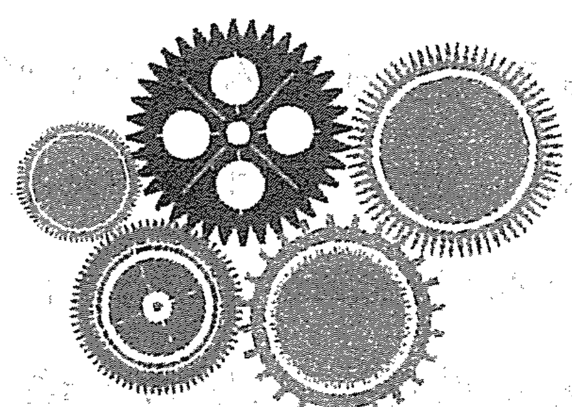

# 生命数字学——来自毕达哥拉斯的数字智慧

在我们了解个人年这个概念之前，我们先来了解下与个人年息息相关的宇宙年。
在常人的印象中，时间只是单向前进的，去年和今年，昨天和今天都只是一个标记性的概念而已，既没有特定含义，也不会与任何事物有所关联。按照西方科学理论，我们这个宇宙在诞生前，是没有时间和空间的。它从一个极小细微的点，经过大爆炸后才形成今天的宇宙。这个宇宙是有生命的，它由时间和空间两种形式构成。

相对论认为，只要一个物体的速度超过光速，那么它就有可能穿越时间。时间、空间、物质的关系，是20世纪现代量子物理学的发现。宇宙上时间的变化，以年为单位，我们称为宇宙年。

那么个人年如何理解呢？我们知道万事万物都有着引力，也有着联系，宇宙星体磁场在生命中的无形烙印是客观存在的；日月星辰、生老病死不断变换循环，天地万物看似随机发生，却是按照既定的轨道运行的；虽然人出生时的先天能量（也就是基因）无法改变，但是人在成长过程中，却以年为单位进行着时间的变化。

每一年的磁场作为一只看不见的手对人施加影响，影响到人的身体、情绪、工作、情感，以及身边的一切。当然，这种影响是潜移默化的，也是量变引起质变的结果。同样，任何一个人都不例外，无一不受此影响。人们又彼此相互作用，从而形成纷繁错杂的关系网络，人生的命运也因此起起伏伏，大家都各不相同。

科学家们将每一年一再重复发生的变化加以归纳，找出规律，形成智慧的结晶，经千年一再验证而不衰。早在明朝，冯梦龙在《醒世恒言》中就提到：“想是我流年不利，故此没福消受，以至如此。”道出了满腔的伤感和无奈。今年财运亨通、诸事顺利，我们就说流年大吉；今年运气糟糕、诸事不顺，我们就说流年不利。流年不利时，疾病缠身，小人当道，甚至天灾人祸、破财破丁，人生走到低谷。中国的流年，其实就像西方数字学所说的个人年。如果我们不知道这些何时发生，发生在哪方面，没有适当的预防和准备，必将影响自己心绪，深受“霉运”之害；通过对个人年的解读，可以从中看到个人能量的轨迹，看到当年适合做什么，不适合做什么，要注意和规避什么，等等。

# 第六章 “看到一份可能性”——个人年数字解读

个人年为我们提供了解读命运的角度，帮助我们对于未来可能发生的危机有机会提前预防，对于面临的挫折和困难，有解决问题良好心态，是帮助我们趋吉避凶的重要能量。

如果我们没有觉察到这个能量，更没有顺应能量去做人、做事，就会不断有事件涌现，逼着我们去面对。如果能全然的活出这个能量，事情会自动结束；如果我们愿意活出这个能量，事情也会变得简单。时光流逝，回看我们曾经的过往，会有很多惊人的相似处，让我们不经意间察觉到每一年的数字能量是不一样的。这提醒我们，数字是有规律的，顺着能量走就是顺势，会非常舒服，否则就会截然相反。我们研究个人年数字的意义，就是为了让大家多一份觉察，从而创造自己轻松、快乐的人生。

生命数字地图中的个人年具体指这几方面：第一，它是生命数字地图中最小的单位；第二，个人年以9年为一个循环，它代表着这一年人们的能量以及人们在这阶段会融入宇宙能量的特定片段；第三，个人年让人们了解会发生什么、为什么会发生，是每个人的学习机会；第四，个人年是生命数字地图上唯一的一个变量，直接影响着其他20个位置的能量。

在生命数字地图中，个人年数字的计算方法如下：

- 其一，宇宙年逐个数字加上月、日的逐个数字，最后把得数缩为个位数便可；
- 其二，宇宙年加上制约数字，缩为个位数就是个人年。

个人年开始的月份计算的方法是：10减去个人年，得数就是这个个人年的开始月。

例如，该人在2014年出生，具体的日期是7月7日，那么他的宇宙年逐个数字加上月、日的逐个数字便是2+0+1+4+7+7=21，缩减为个位数为2+1=3。此人的个人年就是3，起始月是10-3=7，所以此人在该年的7月1日进入个人年3。

需要注意的是，从个人年1到个人年8，每个个人年都历时11个月，只有个人年9的时候，历时20个月。

关注公众号“苗琳生命数字”，可以快速知道你的个人年。

## 一、开始年、播种年、创新年——个人年1

起止的时间：当年9月1日——次年7月31日

个人年1的主要能量表现：第一，很忙碌，有很多新开始、新方向、新角色、新工作、新环境或新机会；第二，想独立，很想自己做事情；第三，有很多事情，需要自己站出来去面对和担当；第四，会有机会觉察和父亲或男性的关系。

个人年1代表一个新的9年循环的开始，是播种的年份。人们经历了历时20个月的个人年9（去年），已经多层面地放掉了过去，并完成了过往的积累和沉淀，到了个人年1，从外在到内在，会遇到很多让生活发生实质性改变的机会。人们开始向前看，有了很多新开始或新方向。有的人选择创业，开始为理想中的事业去努力；有的人被推举提拔成为领导，带领更多的人去完成一个又一个新的目标；有的人一切重新来过，在新的城市、新的环境、新的岗位、新的角色中体验着各种新的开始……当然，关于自己真正想要的是什么，相互的优先次序是什么，还不是最清晰，只是被导引到新的方向，在尝试和体验，所以也无需急于知道最后的选择，顺应能量就好。无论有意或无意，人们都在为生命未来9年要进行的事情播种，为未来做某事打基础。

个人年1会带来男性或阳性能量的课题。这是一个新的开始，生命给了人们一个新任务，去体验什么是担当，什么是独立，这意味着会有机会看到对自己的接受度、自信心和自我价值是否足够。人们将会有机会看到自己是否因为需要证明什么而正在强迫着自己，或者因为害怕新开始不敢肯定自己，让自己处在退缩状态中。

今年的当务之急是让自己学习做自己，学习更独立、更有力量，更接纳和欣赏自己，而不再去证明或退缩。换句话说，就是允许自己可以成为独立于其他人想法的个体，不为证明自己而强迫自己，而是做自己想做的，顺应能量，去展现自己自信、独立、担当、男性、阳刚和领导的力量。这一年将会是忙碌的一年，忙着迎接和面对各种各样新的事情，不管发生什么事情，都不要逃避，而是努力面对和担当。

在个人年1里，人们有机会直面自己与父亲的关系。人的男性能量都是从父亲而来，当面对自己内在的男性能量时，很自然的就会面对此能量的起源。人们要去察觉在自己内在认知中有多少是来自于父亲，身上是否有父亲的影子，那是不是自己想要成为的样子？如果不是，那么这个时期就要设计自己希望发展并投入的道路，然后带着对父亲的接受和感激，去走属于自己的路。

个人年1需要面对的课题就是如何面对各种新的开始，独挡一面，不逃避，顺应能量度过这一年，变得更自信、更独立、更有力量。

总之，个人年1意味着接纳自我，重新审视自己，更重要的是树立自信和自我价值，不逃避，先勇敢站出来独挡一面，不必期待马上就有什么结果，只有这样才能成为独立的个体。例如：高某于2013年5月9日酒驾，当时他正处于个人年1。他放弃无罪辩护，坦承说：“我完全认罪。我希望传达给公众的就是酒令智昏，以我为戒。”“我没有任何想为自己辩护的，我有的全部都是忏悔。”他面对这件事情的态度，就顺应了个人年数字1的能量，不逃避、不否认，勇于担当，他也因此很快就得到了社会的谅解。

学员分享1：我个人年1的时候有了宝宝，有了新的身份：妈妈。对于我来讲，这是一个全新的开始，因为这意味着我要承担作为母亲应有的责任和义务。没生宝宝的时候，一直觉得自己还是个孩子，享受着父母的关爱；当真正做了母亲之后，才体会到了父母的责任和担当的不易。但无论如何，我都会让自己尽量做得更好，毕竟这是我自己的选择。后来我和老公决定自己来带孩子，尽量不给父母增添负担。当时并没有觉察，现在上了课，听芷琳老师介绍个人年1的表现后，我才意识到从决定生孩子到决定自己带，对应了个人年1新的开始，体现了我的独立和担当，我要嘉许自己的勇气。

学员分享2：我闺蜜前年做生意，投资了大笔钱进去，结果合伙人携款逃跑，公司倒闭，欠下了很多人的钱。为此她很郁闷，接近抑郁，我一直陪着她，开导她。毕竟这是一次很沉重的打击，所以她一直很消沉，把自己关在家中，不怎么与外界交流。直到今年9月份，她终于开始去一一面对那些她欠钱的人。当她去跟那些人商量时，意外发现他们还挺同情和理解她，觉得她也是被骗者，还有人表示，欠的钱可以缓一缓再还……这些反馈让闺蜜非常欣喜和感动。她向他们表态，自己一定会想办法尽早把钱还给他们，她的这种态度不仅赢得了大家的信任，还得到了他们的鼓励。这让她信心大增，不再逃避，全力处理公司之前遗留的问题，积极想办法去面对和解决。在做这些事情的时候，她发现情况其实并没有那么糟糕，整个人也越来越有力量了，她越来越相信自己可以东山再起。目前闺蜜的公司已经开始走上轨道，相信过不了多久她就可以还掉所有欠的钱了。

个人年有时候就是这么神奇：当我们遵循着这一年的能量去活的时候，它会给我们出乎意料的惊喜。也就是说，只要顺着能量走，它就会助我们一臂之力。我闺蜜9月1日刚好进入个人年1，在这个年份里，她选择了面对和担当，不再继续逃避和退缩，最后她从那个阴影里走了出来，重新面对生活，东山再起，自信回归！

## 二、关系年、顺势年、等待年——个人年2

起止的时间：当年8月1日—次年6月30日

个人年2的主要能量表现：第一，被动外交，忙于应酬和处理各种关系；第二，人急事不急，被迫等待，事情的发展快不了；第三，对人有依赖感，渴望陪伴，单身的想有个伴；第四，女性想变得温柔，有女人味；第五，觉察和母亲或女性的关系。

个人年为2时，我们称之为顺势和等待的年份。在个人年1里播下的希望的种子，在个人年2里会在土里发芽，虽然还没长出来，但不表示没有变化。只是有时候我们会心急，其实事情的发展并不会像想象得那么快，要允许自己慢下来，培养耐心，着急不焦急，顺势而为，不逞强。不管发生什么，都学会去接纳它、包容它，不要硬往前冲。

这一年是被动外交的年份，会有很多应酬和合作的机会，尤其是长久不联系的人会突然出现，所以今年从表面上看是慢了下来，但合作的机会很多，而且多数合作是对方主动发起的，只要以合作、包容、顺势、敞开的态度去面对，掌握平衡，量力而行就可以了。

这一年也是处理关系的一年，会面临一些关系的课题。包括由于过往不经意的行为，得罪、伤害、惹怒了某些人，破坏了某些关系，这些也大多会在今年浮出水面，让人们去面对。处理这些关系需要顺应个人年2的能量，使用数字2的纯正能量。在处理关系中多一些变化和灵活性，适时放下对错的执着，用顺势、接纳的方式去接受，用主动斡旋、调解、低头示弱、说软话的方式面对事实，化解矛盾，缓解冲突，可以规避严重的事件发生。

个人年2是一个内心渴望陪伴并会寻求依赖的年份，有些人会选择结婚，不结婚也会想有个陪伴对象。数字2是阴性和女性能量的数字，主掌的亲密关系会牵涉敏感度与感觉部分。所以在这一年，要多觉察与母亲的关系，觉察角度：对母亲是否有“我什么都不需要”的反依赖？是不是处在依赖与受害者的角色中？身上是否有母亲的影子？是否有对母亲的不接受？如果有对母亲的不接纳或严重的情绪，多去做一些与接受父母有关的练习，或者接受一对一辅导、参加工作坊，释放自己对母亲的负面情绪，带着对母亲的接受和臣服，走自己的人生路。

个人年2需要面对的课题就是如何顺势而为，如何不逞强，如何处理好各种关系，顺应能量度过这一年。很多人在这一年会变得更包容、更谦和、更有耐心、更懂得顺势。

李某一的事件，让很多人唏嘘。他的妈妈当年就在个人年2，不仅没有顺势而为，还做了很多逆势的事情，导致儿子的案件沸沸扬扬，在社会上造成了很大的影响，最终李某一被判刑，夫妻的声誉受损。类似的事件，作为父亲的成龙针对儿子房祖名吸毒事件的应对方式，其实很值得李某一的妈妈学习。

学员分享1：当初，我和几个好朋友一起学习心理学，都想成为这个行业的讲师。几年过去了，在我个人年2的这一年里，他们都取得了讲师的资格，并开始讲课。而我作为最年长的，一直还没有讲课，心里难免有些着急。按照以往的脾气，我会不管不顾地开始筹备讲课的事情，我不能比他们落后，我怎么会允许自己比他们落后呢？幸运的是我学过生命数字学，知道在我的个人年2里，不能着急、不能逞强。于是，我花了一些时间，认真梳理了目标。其实和原本就是这一领域的好朋友相比，我在这个行业的从业经验还是空白，今后的研究方向尚未明确，我还不具备娴熟授课的能力，还需要继续积累和沉淀。这样想的时候，我终于可以让自己静下心来，试着去接纳这个现状，并继续耐心地研究和学习。终于在个人年3的时候，我开始以讲师的身份讲课，并得到了大家的高度认可。

现在回想起来，最早开始看到朋友们讲课的时候心情很复杂，特别着急，特别想自己也赶快站出来讲课。如果当时没有学习个人年，我肯定会由着性子、草率地开始讲课，结果也未必理想，最终一定会影响我以后的讲师生涯，自然也不会有个人年3时漂亮的展示。真那样的话，我这个要面子又逞强的人，不知道后期需要花费多少时间和精力去修复和弥补，也不知道我还会不会在这条路上坚持下来。所以我特别庆幸自己学习了生命数字学，能够按照数字的能量去觉知和修正自己，顺势而为，从而有了更多美好的体验！

学员分享2：我刚刚度过自己的个人年2，很想趁热打铁，分享一下自己感受。

简单来说，这个年份对我的影响非常大。我的制约数字和内驱数字都是2，个人年也是2，这应该是合成数字了。老师说不纯正的数字2要修复与母亲的关系，太对了。从小我和妈妈的关系就不好，她对我很严厉，总责怪我不独立，根本不允许我依赖她。长大后在很多事情上我都会跟她对着干，即使心里面是关心她，可说出来的话却很难听，典型的口是心非，每次要么把妈妈气得骂我更凶，要么气得不理我，一个人去哭。现在回想起来，真的觉得自己太能“作”了。结婚后我和老公的相处也是这样，心口不一，心里面特别希望他能多陪陪我、抱抱我、关心我，可是说出来的话和做出来的事情却总是相反的。这让他以为我很独立，既不需要又很嫌弃他对我的关心和陪伴，他回敬我最多的话就是“你不是说不用吗”，让我哑口无言，很讨厌自己的口是心非。

因为这两年一直在跟着茁琳老师学习生命数字学和心理学，我理解了自己这些言行不一、左右拉扯的模式，也明白这是小时候跟妈妈的相处互动造成的结果。我也尝试着一点点地去修正和调整自己，说实话，这对我真的很有挑战。所以在个人年2的时候，我顺应着这个需要包容、接纳、柔软的能量，有针对性地修正着我和妈妈的关系，对她多了很多耐心和包容，听她说话时不会条件反射直接“怼”了；我还按照芷琳老师教的方法，创造各种和妈妈单独相处的机会，喝茶、聊天、讲小时候的故事。有一天我终于说出了那句久违的话：“妈妈，我爱你！”并拥抱了妈妈。而妈妈的回应是：“傻丫头，妈妈一直都很爱你啊！”我的眼泪顿时就流下来了。妈妈的严厉让我内心深处觉得她对我不满意，也不爱我，所以一直以对抗的方式与她“较劲”地相处，对其他人也是这样。当我意识到并做出改变时，大家都觉得我柔和了很多，我不再口是心非，对他们的关心和自己的需要开始能直接表达出来；老公也觉得我变得柔和了，懂得小鸟依人了，也比以前包容了，我们一家人也变得越来越和谐和幸福！

## 三、喜悦年、扩展年、轻松年——个人年3

起止的时间：当年7月1日—次年5月31日

个人年3的能量表现：第一，开始为自己活，去做自己平时很想做、很喜欢做但却不舍得、没时间、不敢做的事情；第二，更注重外在形象，追求美好的感觉，主动想去整形、美容、换发型、更换穿衣风格等；第三，有机会在公众场合说话、被看见、成为焦点人物；第四，想简单轻松地生活，不想也不愿意去面对悲苦、复杂和枯燥的情况，想逃避；第五，对人事物的态度是否积极乐观决定了“一喜喜一年”还是“一悲悲一年”。

经过了个人年1的播种，个人年2的等待，个人年3到来时，种子开始破土而出，发芽了。个人年为3时，代表一个阶段性的胜利，很多人会觉得这一年过得很轻松、很舒服，也很开心。个人年1开始投入的很多事情，到个人年3开始显现出效果。个人年1创业的公司经过前期打磨，开始正常运作了；担任领导职务的已经熟悉了岗位，开始得到认可和嘉奖；新婚的夫妻两人度过了磨合期，有的准备孕育宝宝，有的已经开始享受天伦之乐；初为父母的，度过了抚育孩子最辛苦的前两年，开始享受孩子带来的快乐和幸福了……这样的个人年，注定是个喜悦的年份。

这一年，很多人会有比较大的变化，特别想为自己好好活，想去做自己最喜欢的，想去拥有自己最想要的。有的人开始对家里的装修、家具不喜欢，这一年重新装修；有的人对原有工作不满意，会选择辞职或跳槽做自己喜欢的；有的人会舍得花时间和金钱在自己身上，表示在爱自己、打赏自己；有的人开始按照自己想要的方式去做自己；还有的人在这一年总有机会站出来说话，成为焦点人物，甚至因此喜欢上站在聚光灯下的感觉，开始想让自己成为舞台上和聚光灯下的人；还有的人开始回避不喜欢的、枯燥乏味的、复杂的事情，追求内心的简单和从容……当他们越来越尊重自己内心的想法和感受时，生活开始变得有滋有味，让人享受和眷恋。

个人年3里还有个很特别的变化，就是人们对外在形象的在意，男女都会有。原来不爱美的人，开始变得爱美，注重打扮；原本就很注意形象的，会更加时尚；女人们开始舍得花时间和金钱在美容、整形、护肤上；男人也会注意穿着打扮，买新衣服、喷香水。这些人整个人年3都洋溢着孩子们过春节般喜洋洋的感觉，总的来说，这一年绝大多数人都会过得很开心。

这一年过得好与坏，与个人对待人事物的态度有关。比如摔了一跤，有的人会骂骂咧咧，觉得自己很不幸；有的人会庆幸自己运气好，没伤到筋骨，积极或消极的态度将导致事情产生截然不同的结果。数字3也特指小孩子的能量。小孩子通常都很幸运，因为他们不会执着在某种情绪里，开心的宝宝走到哪里都开心，大家也会被影响，都很喜欢他们，他们自然会有很多机会。个人年3同样如此，如果人们能够积极乐观地看待每一件事情，不断传递开心快乐的能量，同样会很幸运，会有很多出人意料的好机会。唯一需要注意的是，不要因为机会过多而盲目，也不要因为机会过少什么也不干。

个人年3要面对的课题是，人容易被阶段性的胜利冲昏头脑，所以在这一年一定要量力而行，不要让自己太冲动、太盲目地去扩大或扩张，要特别注意，只做自己能做到并能承担后果的事情。顺应个人年3能量的人们经历了这一年的滋养，会感觉生活一片美好，未来值得期盼，人也更轻松、更开心、更喜悦。

学员分享1：C是某公司的老总，之前股东们一直让她装修下自己的办公室，她总是推脱说：“不装不装，谁来看呢？”可是到个人年3的时候，她自己倒先着急了，莫名地特别想把办公室变得有格调、舒适自在，所以主动开始安排办公室的装修。用她自己的话说：“数字能量太有意思了，神奇，这种转变连自己都觉得好笑、好玩儿。”

学员分享2：我很开心在这个年份里找到了人生方向，找到了喜欢的并愿意深入去探究的工作，还拿到了一直期待的高级咨询师的证书。

我今年41岁，在这之前也做过几份工作，也曾尝试过几个方向，但始终很迷茫，因为做什么都激发不了我的兴趣，我也不知道自己到底喜欢什么工作。后来我就成了“课虫”，想通过学习找到自己想要的，甚至还去国外跟随导师学习，可是依然觉得世界之大，却无我容身之处，有时候特别悲观。直到个人年3，机缘巧合，我进入了芷琳老师的数字课堂，然后就被深深地吸引住了。几天课程下来，我知道为什么尝试那么多，自己却总是这不满意那不满意了；我也知道自己对于“懂我”和“身心合一”有多么的渴望；最重要的，我找到了那种做自己喜欢的事情不累的感觉，我总算彻底了解我自己了，有一种“终于见到你”的感觉。所以我没有和任何人商量，当场就报名了接下来的讲师班，我知道，这就是当下我想要的。

课程结束后，大家围在一起分享，我记得特别清晰，当时我基本说不出来话，浑身是颤抖的，像被雷劈了一样，激动不已。报完名，回家之后，我才和老公说了。这次是先斩后奏，我还担心老公不会同意，而他的回答出乎我的意料：“难得你折腾这么多年，总算找到感兴趣的了。你喜欢，愿意去学就学吧，我赞助和支持你！”我突然有种久违的轻松和喜悦，感觉心里都在笑，虽然当时泪水怎么也控制不住。时至今日，我都很感谢老公当年的推动和支持，才有了今天不一样的自己。我现在已经是一名有很多粉丝的讲师，每天都乐在其中地分享我喜欢的学问。很多熟悉的人都说我“时光倒流”，状态越来越好，人也越来越年轻了。我经常感到自己很幸运，也很庆幸当场报名继续学习，在苗琳老师的陪伴下得以成为一名讲师，所以正应了那句话：“当你遵循自己的内心，积极乐观地、毫不犹豫地去行动时，全世界都会为你铺路！”

## 四、基础年、实相年、心智成长年——个人年4

起止的时间：当年的6月1日—次年4月30日

个人年4的能量表现：第一，专注于对未来做规划、定框架、打基础；第二，不断在事情中看到真相，反躬自省，是心智成长最快的一年；第三，身体容易疲惫，体力不支，需要关注身体。

经过个人年1的播种，个人年2的等待，个人年3的萌芽，到个人年4，播下的种子可以继续生长的和已经无法存活的，基本清晰。也就是说，之前3年创造出来的事物，现在开始有了阶段性成果，尽管还只是雏形，但可以让我们看清此前的创意和灵感，付出和实践，究竟是事实还是幻想，人们需要为下一步做准备了。

这一年很多人开始做规划，为接下来的日子定框架、打基础，从物质上到精神上，从战略上到战术上，都会有越来越明确的方向和方法。所以这一年也是很忙碌的一年，很多人见证着基础搭建、夯实的过程，心里也会越来越踏实和安心，安全感增强很多。

因为做规划、打基础，很多事情需要脚踏实地、一步一个脚印地往前推进，更需要严谨、专业和执行力保证实施，所以这个过程中，人们有机会看清很多以前从来没有想过、关注过，甚至不承认的真相。真相包括从外在环境、人事物到能力、价值观，以及生命的实相。这个过程中会有一些让自己不舒服的事情或者是此前一直在回避、不愿意面对的事情，甚至是颠覆价值观的事情发生。这些事情发生时，因为真相太残酷，人们并不愿意承认和面对，甚至想逃避和对抗，只是强大的4能量会以各种方式，让人们主动或被动去面对真相。所以这一年对于有些抗拒的人会非常“心苦”。很多真相，我们在个人年2没有面对，在个人年3侥幸错过，到了个人年4就不能再逃了，一定要面对。事实上，只要能够坦然接受真相，如实看待所发生的事情，承认是自己过往忽略和屏蔽所致，事情就容易处理，心里也会很踏实，还能务实地去做一些调整和改变。所以，在这一年无论是看到自己的缺点和不足，还是看到别人的问题和缺陷，都要尝试着面对和接受这一切，去做一些改变。看清真相，拨乱反正，涅槃重生，这一年将是九年循环里心智成长最快的一年。

这一年，安全感再次成为主题。人们面对的真相中也包括了很多人很在意的物质世界的部分，比如有人损失了金钱、有人失去了健康、有人流失了资产等。我们当然应该学会在这个世界上保持安全，同时也必须冲出因为安全而形成的思想制约，放下对拥有的执着，焦点放在提升自身内在力量上，可以快速使自己回到舒适的状态。

这一年是看到生命真相的一年，也是再次连结与照顾身体的强烈年份。如果前三年没爱惜身体，在这一年容易出现身体的不适，会感到疲劳，甚至因为忽略和不重视，身体出现一些状况，比如从亚健康状态变成了疾病，小病拖成了大病。所以这一年要注意养生，多保养，多运动，多到大自然中去，也可以多做强度大的按摩来呵护自己的身体健康。

个人年4的课题是面对任何事情和真相，都要坦然接受，不找借口和理由；要关注身体，有任何不舒服及时治疗，不拖延。顺应了个人年4的能量，很多人都会变得更加稳重、更加真实，分析问题也更客观和清晰。

学员分享1：这个数字真是太神奇了！

我有一个哥们儿，是开理发店的，一直以来做的都还可以，尤其是个人年3的时候，生意特别红火。于是，他在朋友们的建议和怂恿下，一连开了3家分店来扩张自己的生意。可是到个人年4的时候，大环境不好，他的生意并没有预想得那么顺利，店铺的经营业绩一路下滑，后来已经入不敷出。不得已，只能痛苦地把一家家的分店转让，最后只剩了原来自己经营的那家店。这就是盲目乐观，没有量力而行就进行扩张所要面对的真相吧，这也提醒我们每个人。

## 五、改变年、变化年、活在当下年——个人年5

起止的时间：当年的5月1日—次年3月31日

个人年5的能量表现：第一，开始有自我改变的强烈欲望，包括情感、工作和生活方面；第二，身体、心灵需要得到舒展和自由，想多走动，想去旅游；第三，睡得少但精力旺盛，浑身有使不完的劲；第四，生理上的能量很强，异性缘佳；第五，计划没有变化快，很多事情变来变去，并且不完全能够掌控。

如果个人年4处理好了安全感的课题，也面对了内在与外在的真相，今年会是改变与自由的一年。一扇曾经封闭的门已经在你面前打开，你所需要的只是走出去的勇气。个人年5恰好处在9年循环的中间点，前方有一定的铺垫，后方还有一定的空间，如果人们不喜欢自己所见到的，现在就是改变它的时候，但改变可能会带来不安定感，所以经常会有想要做些改变但又害怕这么做的感觉。

个人年5的关键是要勇敢面对并穿越恐惧，而不是逃避导致恐惧的情况。一旦勇敢地面对和穿越恐惧，这个过程就会变得很刺激、很冒险；如果选择逃避，会让生命被压缩乃至枯萎。这一年也容易出现工作上的被动调整、搬家等，这是变来变去的一年，也是需要学会面对变化并穿越恐惧的一年。所以建议人们去做一些让自己恐惧和害怕的事情，要有勇气对变化说“是”，给自己创造更多自由、更多自发性的空间，迎接各种变化的发生。最重要的是发生什么就去面对什么，怕什么就去面对什么。这将是很多人非常精彩、非常值得回味的年份。

个人年5也是精力充沛、能量旺盛的一年，很多人会比往常更有行动力与好奇心，在这一年想出去旅游，想有更多新的体验，看些新的人，做些新鲜事，有些新的经验。这一年的人浑身有使不完的精力，需要找到出口释放出去，所以很多人特别有活力和激情，性能量也会更强烈。有人想去谈场浪漫激情的恋爱，有人想和爱人走入婚姻，有人渴望和伴侣重温恋爱的美好，总而言之，想要有更多的刺激。建议伴侣们一起外出旅行，陌生的城市，自由的人和自由的心，可以满足他们想去冒险和寻求刺激的心。

总之，个人年5的主要课题是面对和穿越恐惧，放下计划，接受变化。顺应这样的能量，很多人会更能活在当下、更自由自在和洒脱。

学员分享1：以前，除了出差，我几乎不会想到要去外地旅游，属于比较“宅”的人。可是到了个人年5的时候，我突然特别想到处去走走，涌动的能量让我按捺不住，最后我顺从了自己的感觉：不跟团，一个人出去，每次到不同的地方。结果差不多每个月我都折腾一次，同事们都觉得我像中邪一样，太能折腾。我自己也解释不清为什么，只是一想到继续“宅”着不动，不能出去，就会觉得心里憋得慌，浑身不舒服。现在，听了个人年5的解读，我发现简直就是在说我当时的状态，总算明白为什么了。

学员分享2：我有个同事，一直很想出去徒步旅行，时间定好了，地方找好了，旅游攻略做了，伙伴儿找好了，行头装备置办齐了，机票订好了，连最难请的假领导也批准了。结果，就在出发的前两天，同事下楼时一不留神把脚扭到了，一拍片子，居然是骨折，需要打石膏。徒步的计划泡汤了。本来他很郁闷，我和他介绍了个人年5的一些表现，他非常震惊，居然会这么精准！我告诉他发生什么就面对什么，他也就释然了，还表示伤愈后一定去研究下这门学问。

## 六、责任年、回归内心年、亲密关系年——个人年6

起止的时间：当年的4月1日—次年2月28日/29日

个人年6的能量表现：第一，特别想听从内心的声音，开始爱自己，公众眼中的好人不愿意再妥协和让步了，开始对过往不敢说“不”的人事物，说“不”；第二，更愿意承担责任，例如结婚、生子、当领导或对某些事承担起责任；第三，处理与亲情、友情和爱情相关的关系，有人会收获更多的爱，有人会选择分手或离婚。

这是关于“心”的一年，基本课题是负责任。首先是对自己的想法、感受和心负责任；其次是对自己的选择和行为负责任。与家庭、工作、情感等相关的问题，以及要不要负责的问题，唤起人们的关注。如果个人年6之前，这些事情是（1）因为认为“应该”、认为“对”，所以去做；（2）因为不敢尊重自己的感受，想说“不”的时候不敢说或不好意思说“不”，使自己困在愤怒、抱怨与内疚、自责的循环中；（3）因为做了自己不想做的事又没有得到期望的回馈而愤怒、抱怨；（4）因为没有做自己认为应该要做的而内疚、自责。现在，能量的驱动让人们开始意识到要尊重自己的感觉和感受，要听从内心的声音，要敢于拒绝，敢于说“不”。这么做的同时如何让自己不再愤怒和内疚呢？唯一的出路就是学习为自己的选择负责，不管选择的是什么，做就做的心甘情愿，不做就为可能出现的结果负责。有时就算有些事使自己在别人眼里不是“好的人”，没去做“正确的事情”，也不要再要求自己过于承担，更不要想去负更大的责任，导致自己变成一个苦命的好人。

当然，还有一些人会意识到过去自己承担的责任过少，或者开始有强烈的意愿想去做些负责任的事情，他们开始愿意站出来，为家庭、工作等去承担责任，比如组建家庭，承担家庭的责任；担任领导，承担工作责任，包括做很多其他的负责任的事情。当他们对别人的关心与支持是发自内心时，也就不再对外界有期待和愤慨。他们开始放下抱怨、放下标准和要求，回归心灵的真实。

这一年里，一份长期的关系会经历一些改变，很多夫妻、父母、兄弟姐妹间的关系会建立或破碎，基本上是生命在鼓励人们要对自己的感觉和感受负起更多的责任。人们开始感受到，如果再因为爱、安全感或任何其他事让自己妥协太多的话，自己会变得越来越不舒服，所以处理这些关系很有必要。受此影响，人们开始忠于自己内心的真实想法，开始为自己真实的活，开始说实话，开始对过往的关系做处理，尤其是涉及亲情、友情和爱情的亲密关系。比如和父母关系不好的，这一年不允许自己再像以前那样，他们会想办法去改善，爱在子亲之间开始流动；过去和伴侣、孩子关系没有处理好的，今年也会调整，家庭氛围开始变得温馨和谐；有的人开始去触碰婚姻中的问题，选择分手或离婚，还可能去触碰过去不曾正面处理的家人、朋友、工作上的关系，不再妥协和过于承担，很坚决地说“不”。这和他们之前做人、做事反差很大，很多人会觉得他们变了，变得不好说话、不容易通融了，甚至不负责任了。其实，他们只是更尊重自己，更愿意为自己的感受负责任而已。

个人年6的主要课题就是回归心的真实，要为自己选择的结果负责任。顺应这种能量，这一年过去后，很多人会更在乎自己内心的感受，更尊重自己和爱自己。

学员分享：我进入个人年6已经三个多月了，很明显的一个感觉，就是特别想为自己活。上个月，我有了一个坚定的想法：不再为生活妥协，只听自己内心的声音。

我决定今年一定要给自己一周的时间出去玩，而且谁都不带，谁也不管。以前也想出去散散心，但是一想到出去要带女儿，女儿在陌生地方又睡不着觉；婆婆一个人，身体又不好，留她在家里照顾我儿子，也不太好，更何况，如果她们因为跟自己出去玩而出了什么事情，那该怎么办呢？我觉得自己既担不起这个责任，也不愿意发生这样的事情……总之，每次总会有各种事情和理由让我没法出去，只能妥协放弃自己的想法。进入个人年6之后，突然间不想继续这样，不想再用这些来限制自己，我想看看他们离开我是不是真的不行。反正我就想不管不顾地自己出去玩一次，不再担心自己不在身边，女儿会睡不好觉，儿子会吃不好饭，不再担心婆婆身体不好容易犯病，统统都不管，感觉出去玩这件事等于为自己活一样……

我又有很多5的能量，太渴望有自己的空间了，所以当时我就决定听从自己内心的想法，抛开那些担忧。我出去之前安排好了家里，即使中途有什么事情，回来后也能尽快弥补和调整。结果呢？家里果真一切安好，每个人都照顾好了自己，而我也跟随了自己的心玩得很开心，家里人因为我的开心，家庭氛围都愉快了很多。而且我开始相信我不在的这段时间，他们其实可以过好生活，我所有的担忧都只是我自己认为的，都是大可不必的。

此时我才理解，原来是因为我做好了“我选择、我接受、我为自己的选择负责任”的所有准备，所以我可以很坦然和轻松，也会收获开心和幸福，真是太棒了！

## 七、学习年、计划年、休养生息年——个人年7

起止的时间：当年的3月1日—次年的1月31日

个人年7的能量表现：第一，开始对未来做人生规划，理性和感性总有冲突，想得比较多，脑子停不下；第二，爱学习和爱思考，尤其是身心灵方面，开始看书、上课、参加工作坊；第三，喜欢独自一人，享受安静和单独，属于向内看的阶段；第四，能量和精力不够旺盛，经常感觉心有余而力不足；第五，休养生息、韬光养晦的一年。

经过去年关系与责任课题的考验，个人年7将迎来学习与静心的一年。这是审视自己和关照内在生命的一年，是深度的自我探索和叩问灵魂的一年，会涉及：自己想要什么？自己要去哪儿？自己是谁？自己过去对生命的认知对不对？如何看待、对待自己过去的经验？这些问题将是人们这一年思考和探索比较多的。

这一年是体悟何谓孤独的一年，所以在伴侣关系中可能会有暂时性的分离或者产生感觉上的隔阂。如果感觉寂寞或发现自己在忙着找人陪、找事做，再看深一点，就会发现那是在回避进入自己内心的机会。其实生命是在暗示人们，现在发生的一切，都是人们内在生命的外观与呈现。人们应该要抓住这个向内看的机会，享受自己和自己在一起的单独感，把这当作了解自身头脑程序的方法，使自己有机会探索自己的深度，从而更了解自己。

个人年7很多人会变得爱学习或者突然对玄学、宗教感兴趣。人们会有意识地想去学习，想看更多书、上更多课，想知道和了解更多，体验更多。有人会为此给自己做很多事情，给自己更多向内看的时间，比如参加一个身心工作坊或者静坐内观，这些都可以让过去隐藏在潜意识里的部分浮出表面，让自己有机会看到并进行整合，从而达到身心合一的境界。

在现实生活中，人们会开始做计划，开始规划未来的日程表。当然，这只是准备期，是为未来很多年甚至一生在做计划，所以这些计划不是马上可以达成的，自然也不需要急着去达成它；有些人可能会想学习一些新事物，同时知道不等于做到，要想不流于头脑的“知道”，不让自己在获取更多信息中迷失方向，还需要更多身体力行的体验和实践。

今年并非能量高亢的一年，是需要好好休息与计划的时候，是韬光养晦、休养生息的时候，是能量偏弱的年份，也是宜守不宜攻的一年，各方面如果有过分的透支和投入，会有心有余而力不足的感觉。

这一年，要关注身体的健康，否则容易出现身体上的状况。任何身体问题都是过去几年所累积出来的，只是如今静下来、慢下来后，身体问题才有机会呈现出来或变得明显而已。

个人年7的主要课题是韬光养晦、休养生息，宜守不宜攻，心力不够不勉强为之。顺应这样的能量后，人们会更加智慧，不仅能够享受独处，还能做到身心合一。

学员分享1：学习有时候也要看心情、看时机的。以前，有很多朋友向我介绍过类似心灵成长的课程和学问，我想都不想就拒绝了，我觉得自己生活得挺好，根本没什么必要花时间、花钱去学习这些。今年4月份的时候，一个朋友和我分享他正在学的课程，他完全沉浸在自己的分享里，并没有想过要劝说我也来上课，可是我当时却莫名其妙地问了他很多关于课程的信息，完全没有了之前的排斥。我听朋友介绍完，觉得这门学问确实很值得探究，也想和他一起去学习和探索，于是，我就这样来到了这个课堂。记得当时我给老婆打电话说我想报名这个课程，还说了很多为什么对这个课程感兴趣。老婆虽然同意了，但却非常诧异，怀疑我是不是遇到什么事情了。否则我这个一向对学习没兴趣的人，怎么一下子主动要求花钱、花时间去上课了呢？

其实，现在我从数字角度来看就很好理解，因为我3月份刚刚开始进入个人年7，能量驱动，我已经开始要向内看了，我开始觉得自己的知识面不够，想多学习，想要探寻自己的内心了。

学员分享2：我闺蜜是做生意的，以前经常要出去应酬，但在个人年7的时候她就不想出去了，总想自己一个人呆着。后来她大病了一场，而且是性命攸关的病，好了之后她就特别想去西藏，很向往那个很多人提起来就觉得非常神圣的地方。后来她去那里住了一个月，开始对佛教特别感兴趣。而在这之前，她是叱咤风云的职场女性，没有任何宗教信仰，可以说什么也不信，除了信自己。现在的她和以前真的判若两人，无论是从言谈举止，还是待人接物上，感觉完全变了。用她的话说就是“自己之前都白活了，身心分离地活了大半辈子，从来没有尊重过自己的内心”。

## 八、开花年、心想事成年、阴阳平衡年——个人年8

起止的时间：当年2月1日—当年12月31日

个人年8的能量表现：第一，对金钱、权力、名利有渴望，同时会有收获；第二，心想事成能力特别强，发正愿、正念，会很容易实现；第三，力量感强，需要注意阴阳平衡，否则容易与权威人士发生冲突；第四，很多人会在这一年活明白，找到自己人生的目的和意义。

度过了相对安静又内敛沉淀的个人年7后，个人年8会是一段能量高昂的时期，甚至会有“攻无不克，战无不胜”的感觉。很多人对钱、权、名、利渴望增加，希望拥有更多，并且能够有所收获。经历了前8年的积累，有的人这一年职位会晋升，有的人会有意外的财富，还有的人会有很多机会和资源，身边出现有权有势的贵人来帮助自己。也就是说，在这一年，如果定好大方向，目标清晰，正确使用力量，物质上会有明显的增加，同时会有威望的提升。当然，人们要注意钱的来源，必须取之有道。

这一年，属于心想事成的年份，所以要发正愿，有正念，小到找停车位，大到人生的大事，都很容易达成，有人感慨“有如神助”。当然，正愿和正念能成，反之亦然，所以有人开玩笑说自己像铁嘴神断，颇有想什么成什么成，想什么不成什么就不成的本事。

在这一年，8的能量会非常强烈，这一年教会了人们懂得真正的力量是阴阳能量的平衡。有的人会呈现8的能量过多，变得强势和操控欲强，容易与领导或权威人士发生冲突，结果会有损失，甚至被更强大的能量震慑住，打压到最终无力抗争，只能低头示弱；还有的人不想再被操控和利用，终于有勇气抗争，让所有人刮目相看。所以人们要根据自己的实际状态，调整和平衡阴阳能量。具体而言，就是以前强势的，今年要示弱；以前弱势的，今年要使用8的力量站起来。当人们的能量是平衡的，力量就会显示在他们与各层面所有人的关系以及实际情况中，最终有所得。

这一年也是很多人顿悟的年份，对于此生的意义和目的，对于自己到底要什么，有了非常清晰的洞察，感觉终于活明白、活开窍了。有的人开始新的职业方向，主动选择辞职、跳槽换工作等；有的人重新调整人生重要事项的方向和做法，让自己与道同行。如果人们是在正确的位置上，是可以清晰地发现自己在这一年的进展和转变的。总之，无论做什么，怎么做，主要的精力都应放在自身能量的平衡上，并敞开自己，顺流前进。

个人年8的主要课题是起正念，发正愿，过往弱势，今年要强大；过往强势，今年要示弱，阴阳能量要平衡。顺应这一年的能量，人们会感觉更有力量，影响力增加，成就感和幸福感俱足。

学员分享1：个人年8真的好开心啊，真的心想事成！我们婚后一直想要个宝宝，在我个人年8的时候，如愿以偿，儿子顺利出生！还有，在这一年里我管理的部门业绩出乎意料的好，每一季度都超额完成任务，整个团队的干劲十足，正能量满满！而且这一年里我认识了好几个资深的前辈，给了我们部门很多的支持和提携，这一年过得太爽了！

学员分享2：公司新来了一个领导，是我的顶头上司，与之前领导的风格完全不一样。新官上任三把火，才一个月，她就成了大家怨声载道的对象。大家都不喜欢她颐指气使的样子，她一直高高在上，对我们只有批评、指责，没有表扬、肯定。而且她要求在办公室装监控，以方便监督大家认真做事。后来有一个同事工作失误，她直接就辞退了这个同事。此举激起了部门所有人员的愤怒，大家联名向公司投诉她。公司派人调查访谈后不久，她就离开了。学了生命数字学我才知道，她当年就在个人年8里，本来是被公司高薪聘请的高端人才，只可惜，她忽略了自己是“空降兵”，8的能量过多，最终折戟而归，让人唏嘘。

## 九、收获年、放手年、双忙（茫）年——个人年9

起止的时间：当年1月1日—次年8月31日

个人年9的能量表现：第一，非常重要的一年，是之前八年的完结，承接下一个九年循环；第二，收获年，种瓜得瓜、种豆得豆，是检验过往人品和德行的一年；第三，情感体验丰富的一年，各种情绪和感受体验比较多，大喜、大悲、大痛都可能有；第四，过往人事物断舍离的年份，换家具、换房子、换车子、换城市、换工作、换人；第五，是双忙（茫）年：忙碌、茫然，一方面是收获忙，另一方面旧的去了，新的没来，没有方向，很茫然。

这一年是之前八年的总结，也是之后九年的基础，历时20个月，承上启下，对于每个人来说都非常重要。这一年会收获过往付出所得，也会放手过往累积不想要的，为下一个新循环的到来做好准备。

这一年决定了至少九年的状态，也是大收获之年。这里的收获，有人情世故方面的，有钱财物名方面的。所谓种瓜得瓜，种豆得豆，收获的大小和之前八年的投入与付出是相辅相成的。

个人年9是情感体验最丰富的一年，开心的、不开心的、焦虑的、纠结的，大都会经历。因为收获，会感动、幸福、刺激和满足；因为放手，会伤心、痛苦和难过；因为断舍离，在选择和决定放弃的时候会纠结、矛盾和冲突；同样，因为旧的离开，新的未到，会迷茫和困惑，会彷徨和焦虑。

个人年9的能量非常强烈，需要清理一切，心灵需要归零，过往九年的人、事、物也要清理，许多事情似乎都有了自然的结果。可能是人们自己刻意想要结束，也可能是生命给了强烈的讯息需要结束。不管人们想不想要，可以确定的是，所有在今年离开人们生命的事物，是因为它们对人们的成长来说已经不合适，包括关系、工作、住所或所做的事业。所以该放手的要放手，比如想清理的关系、想换的工作、想结束的生活、自己纠结的人或事，以及可要可不要的所有东西，能断舍离的马上放手，丢掉的越多，留给未来的空间也会越多。难断的时候缓一缓，放一放，暂时不做决定，直到内心准备好再做取舍。总之，在个人年9，凡是没用的、阻碍的、牵绊的东西能放掉就放掉，不放掉这些旧东西，新东西在下一年进不来。对于这些要发生的，其实没有什么能做的了，不管喜不喜欢，它们已经是必然的结果，都要坚定的放下，人们在这个过程中要做到的，是从中学习取舍和放下的能力。

在这一年里，收获多，机会和诱惑也会很多。面对机会和诱惑要学会取舍，要知道适不适合自己，可以允许自己先尝试体验再做决定，投人不投钱，先“取”后“舍”。毕竟个人年9是收获过往，不是开创未来，所以要继续做好已经在做的事情，更好地对待与自己有关的人，慎重选择和投资。要谨慎判断它们是不是收获，是不是自己想要的，如果不是，马上放下，不要执迷。理财方面也是如此，不要去做从未涉猎过的。比如开服装店的去开饭店，开饭店的去做养生馆，这类自己并不了解，甚至从未涉猎的机会和诱惑，都不建议选择。

这一年，人们会有很奇怪的感觉，在回顾生命时，已经很清楚知道什么是自己不想要的了，却还不知道自己真正想要或想去的地方与目标是什么，也就是旧的去了，新的还没来。所以人们容易陷入两忙（茫），一边忙碌着，一边迷茫着。这一年也要注意身体健康，要关注老人的健康。

个人年9的主要课题是放手和断舍离，不做之前从未做过的，允许自己漂着。经历了个人年9，很多人会变得慷慨大方，更信任生命。

学员分享：个人年9对我来讲，就是一个断舍离的过程，从内到外清洗的过程。我从混沌到迷茫，再到慢慢清晰。首先是从物质上清理。我把衣柜里的衣服、鞋柜里的鞋子全部倒腾出来，超过一年以上没穿过的都清理了，或扔掉，或送人，或捐赠；我又把房间也做了彻底的打扫，家具重新摆放，顿时感觉清爽很多。再说朋友关系。有一些朋友已经很久没有联系，关系慢慢的淡了；还有一些是过去吃喝玩乐的朋友，也不想再维系，索性决定删掉。这一年我感觉特别忙碌，可是似乎又说不清楚都在忙什么，经常感觉没有方向，很茫然地在忙碌。最初我遇到这种状态时心里会恐慌，不知道该怎么办，只是让自己去做事情。但就这样一路走一路清理，慢慢的，越往后走，方向竟越来越清晰，当真是不可思议。

## 十、本章特别提示

总之，时光流逝，回看我们曾经的过往，去看我们过往每个个人年能量的呈现，去体会那种顺势而为的舒服，去学习相应个人年到来时，如何顺应能量。

在个人年1时，能量来了就要担当。不管愿意不愿意，在那一年都要自己去担当，去相信自己能把一些事情做好，并自己主动去做。

到个人年2的时候，趋势就是慢慢来。不能强求的，让心态借此变得淡定、平和，不也是大功一件？

到个人年3，会积极乐观，会很开心，会突然想活得简单点。这是自然能量的发挥，是宇宙让我们为自己活，轻松快乐一点，我们要尊重这种感觉。

到个人年4，要去接受，要面对真相。不管过往发生了什么，接受也好，拒绝也罢，都真实地呈现在我们面前。比如，一些事情和关系的真相或者是自己难以接受的过往，在今年都要学会接受。

到个人年5那一年，如果真的想出去玩，就出去玩，远离尘世喧嚣，远离父母、孩子和原有的环境，制造一些浪漫，未尝不可。这一年精力充沛，斗志昂扬，想让自己满足，那就去做吧。

到个人年6的时候，要知道自己内心到底想要的是什么、在乎的是什么。另外，选择了，事情做了，必须接受后果和结果。

到个人年为7时，突然觉察到，头脑中的知识不够了，应该学习一些东西，也许学理论，也许是实践。要允许自己在这一年接受未知的新鲜领域，让自己有“充电”的感觉，用智慧去迎接下一年的到来。

到个人年进入8的时候，会活得很敞开，会突然发现自己所向披靡，力量很大，好像什么事情都有魄力和勇气去做。这时候，要注意阴阳能量之间的平衡。

到个人年为9的时候，该放的就要放了。放了，才能更好地进入下一个循环，才能让未来收获更多。

# 第七章
“我的优势在哪里”
——表现数字解读

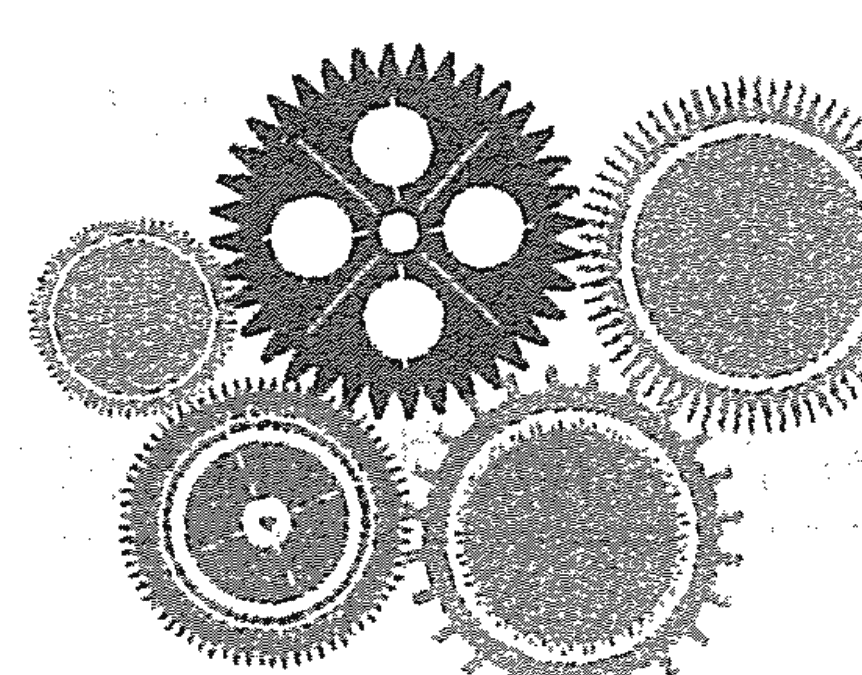

表现数字，代表我们在这个世界上表现自己的方式，做事的方式等。透过姓名，我们可以看到我们在大千世界种种不同的表现。

表现数字能显示出我们与生俱来的，并通过任何我们所做的事情或者工作而展现出来的天赋与才能，也能显示出我们可能会从事的工作性质和擅长的领域。具体来说，在小孩子阶段，表现数字就是他们天生拥有的优势或天资；而成人阶段，表现数字就是指我们可以很轻松做到并做好的事情或工作所擅长的部分。表现数字不同，每个人的天赋和做事的方式也会不同。

能不能充分发挥老天赐给我们的天赋，取决于挖掘与否，以及挖掘的深度。表现数字，可以作为孩子选报兴趣班时的参考；HR（人力资源）在选人用人时，也可把它当作依据；老师教学时，也可以做到因材施教。

表现数字的计算：用姓名的拼音相对应的数字相加可得，姓名以户口簿上注册在案的第一个姓名为准。后来改过的姓名，如果使用时间长，影响面广，一般要计算出原名和现用名的表现数字。

姓名中字母相对应的数字见下表。需要注意的是，因生命数字学源于西方，在英文的26个字母里没有“ü”，只有“v”，所以当碰到“ü”时对应“v”，数字是4。（见表7-1）

表7-1 名字中字母相对应的数字表

| 1 | 2 | 3 | 4 | 5 | 6 | 7 | 8 | 9 |
|---|---|---|---|---|---|---|---|---|
| a | b | c | d | e | f | g | h | i |
| j | k | l | m | n | o | p | q | r |
| s | t | u | v | w | x | y | z |   |

例：燕飞 yan fei
7 1 5 6 5 9
计算：7+1+5+6+5+9=33，3+3=6，表现数字为33/6

另一个需要说明的是，表现数字、内驱数字、个特数字、性情数字等，都是从姓名上获得的数字信息，姓名使用的时间越长，这个人身上相应数字的能量就越明显，时间久了自然就会在生活中体现出来。原名和改过的姓名，哪个使用时间长，哪个影响更大。不管是否使用过，户口簿上第一个姓名会有终生影响，因为那是出生之后，在法律上得到承认的姓名，镌刻着人生初期的烙印。随着时间的推移，第一个姓名的能量并不会减弱，而是会被后来的姓名能量遮挡，从而隐藏在后。所以在看表现数字、内驱数字、个特数字等与姓名有关的数字能量时，要写出现用名和曾用名，计算出它们各自的数字能量信息，去看数字之间的相互影响。关注公众号“苗琳生命数字”，生成你的生命地图，结合下文，了解你的表现数字。

以下是对表现数字1到表现数字9成人的工作和孩子兴趣选择的解读。

## 一、带头做事的表现数字1

表现数字是1的天赋，敢为天下先，敢于尝试别人没做过的事；有魄力、有自信、有担当，擅长带领人做事；做事雷厉风行，干脆、利落，擅长创业或开创类的工作以及需要不断开始的工作。不足是不擅长授权，耐力不足，不喜欢重复性工作，容易虎头蛇尾。

表现数字是1的人在工作中适合做领导，他们会发号施令，又喜欢亲力亲为带头干，决定的事情会自动自发、全力以赴去做，短期目标的执行力很强。工作中，要允许他们有自己作主的空间，允许他们用自己的方式做事。这类人一直都很忙，有事忙，没事也会找事忙，而且他们自己忙，也看不得别人闲着，好像浪费时间是在浪费生命一样。他们属于创业型人，不属于守业型人。

表现数字是1的孩子，喜欢自己的事情自己做，尤其喜欢做别人没做过的事情，闲不住，在小朋友中很喜欢带头，喜欢说了算，凡事喜欢亲力亲为，不喜欢别人插手。在进行兴趣爱好的选择时，一是选择有短期目标的项目，比如考级、比赛类的；二是选择他们有机会独立操作来完成的项目，比如画画、唱歌、骑车、轮滑等；三是选择能凸显出他们个人能量的项目，比如跆拳道、指挥、领唱、领舞独舞等。

案例分享：

大宏是集团网校的新任领导。俗话说，新官上任三把火，大宏上任后，马上召开会议，主要讲了三点内容：第一，当前招生的形势及招生的目标。第二，要求每个人将自己管理的网校详细情况，包括各网校的操作系统，全部汇报给他。第三，要求财务详细汇报所有网校的一切费用。

大家都暗吸一口气，新领导上任，可有得忙了。果不其然，大宏每天都监督大家去完成既定目标，同时他还用最快的速度掌握了各网校的系统和财务的基本情况。

大家慢慢发现，和上任领导不同的是，大宏给大家派任务的同时，他也会参与其中，和大家一起做。比如出去招生，上任领导是将活儿分派，只问结果，而大宏是亲自联系、亲自带人、亲自去跑；比如各网校的操作系统，前任领导根本不管，大宏却全部学会了，操作起来得心应手；最开心的要数财务，过去领导只会跟她要数据和报告，可大宏呢，每次都是把财务叫过去，拿出自己整理的报表让财务核对，账目清清楚楚，财务在佩服之余也省力不少。

大家都在背后议论：大宏是不是不信任咱们呀？怎么什么他都管？什么他都亲自做？但慢慢的，大家也就习惯了，有一个什么都管、什么都做的领导，自己还省心省事儿了呢，只要跟着他干就行了！在大宏的带领下，他们年年完成招生目标，各网校运转井然有序。大宏高兴的同时，也觉得自己很累，不过，一想到下一个招生目标，大宏浑身又充满了干劲。

## 二、合作配合的表现数字2

表现数字为2的天赋，敏感度高，察言观色能力强，有足够的包容心和耐心，心思细腻、做事细致、关注细节，是天生的公关高手，适合合作、调停和辅助，以及公关外交类工作。不足是太在乎关系的和谐，不喜欢冲突，容易放弃立场和原则，容易妥协和退让。

表现数字是2的人，配合性强，特别适合做表现数字1的搭档，配合表现数字1，做总经理、副总、助理、秘书、保姆等。他们感受力强，耐心、细心，可以快速知道表现数字1要什么，能综合听取各方面的意见；他们包容、敞开，善解人意，时时处处都表现得非常亲切、随和，处理关系时不会伤和气，擅长化解冲突和矛盾，建立和谐的关系，外交能力比较强，是天生的“外交家”。

表现数字2的人需要群体互动，工作上需要跟人合作，喜欢配合别人、支持别人，喜欢征求他人意见，喜欢有人推动自己。他们不喜欢自己做主，不喜欢创业，如果创业，也喜欢与人合作。他们是合作支持型的领导，凡事愿意征求大家意见，和大家协商，也喜欢采纳别人的意见，从谏如流。

表现数字为2的孩子，喜欢和人一起做事，学习要有伙伴。他们不喜欢独自一人，会觉得孤单无助，适合有人陪伴、与人合作或与其他人一起参加的项目；他们不喜欢发生人际冲突，特别在意和别人的关系，不建议参与摔跤、跆拳道等击打类的项目；另外，表现数字2的孩子喜欢有耐心、性格温和的老师，他们会因为喜欢老师而喜欢相应科目。

案例分享：

雪菲出生在一个普通的家庭。父亲是一名教师，也是一个循规蹈矩的人。妈妈是个开朗、善于交际的人，有很多朋友。雪菲从小就经常看到，妈妈的朋友遇到问题时，都会来找妈妈倾诉或帮忙，妈妈也总是很耐心地和她们交谈。原本哭哭啼啼的阿姨，总能在妈妈的陪伴和开导下高高兴兴地离开。耳濡目染，看到妈妈在和人交往中的表现和方法，她也学会了如何更好地与人相处。从小到大，她都有很多朋友，几乎所有的小朋友、同学都很喜欢她，都愿意和她说心里话。她也总是很热情，很有耐心地听朋友们诉说。

上小学的时候，爸爸开始让她学习小提琴，她非常喜欢这门乐器，初中、高中都没有放弃，并在大学的时候选择了艺术专业。

大学毕业后，雪菲回到自己的城市，办了一个小提琴工作室。由于她专业功底深，教学有耐心，深得小朋友和家长的喜爱。她很擅长和孩子沟通，无论什么样的孩子，她都可以运用自己的亲和力对其耐心讲解，让孩子喜欢上这门乐器。再加上她做事踏实，为人温和宽厚，脾气好，在当地的口碑非常好。人传人，人带人，找她学琴的特别多，工作室办得红红火火的。

很多人劝她在原有的基础上扩大规模，把工作室扩大成一个综合类的艺校，招聘老师授课，自己当一个经营管理者，这样盈利会大很多。可她并不是一个有野心的人，一想到要自己开公司、当老板，要打理那么多的事情，头都大了。她想继续像现在这样，每天和孩子们在一起，教他们拉拉小提琴，听他们说说学校里的事儿。当孩子们有些情绪或者思想上的波动，或者学习上遇到了困难时，她也喜欢帮他们出主意。她觉得这是最快乐、最舒服的生活方式。

而办艺校的话，自己要担很多的风险，承担更多的责任。和孩子们在一起多好呀，相处轻松、简单，没有勾心斗角，还可以很单纯地用喜欢且擅长的专业来养活自己，这就是自己想要的生活啊！

表面上看，雪菲是受妈妈的影响，而实际上，妈妈的表现和行为，恰好有助于雪菲的合作支持型天赋的发现和发挥。

我们看到，雪菲从小到大一直是小朋友和同学中人缘最好的，几乎所有的小朋友和同学都很喜欢她。因为她在乎关系，所以在朋友当中喜欢去聆听、去支持，大家也都愿意和她在一起，这充分表现出了“外交家”的特质。

同样我们看到，她教小提琴，首先是每天和很多孩子打交道，满足了她要和大家在一起的需要。在教学生的过程中，她的耐心、细心、平易近人、温文尔雅给了她很大的助力，这些都是一个优秀的老师必不可少的特质，所以学生们喜欢她，愿意跟她学。孩子愿意学，家长们自然就高兴，所以她的良好口碑就这样宣传出去了。

这一类型的人是不喜欢当老大的，不喜欢凡事冲在前头，更不喜欢发号施令指挥别人，这一点在雪菲身上体现得淋漓尽致。当朋友劝她扩大规模，做经营管理者时，雪菲退缩了，她觉得自己要承担更多的风险和责任，这是她不喜欢的，也不是她擅长的，所以她最后选择了继续维持现状，觉得这样已经足够开心、快乐、满足。

## 三、创意轻松的表现数字3

表现数字为3的优势，乐观开朗、幽默风趣，思维活跃、创造力强、创意多，擅长表达、表演和展示自我，适合舞台类、表演类和创意类工作。不足是逃避困难、压力和麻烦，想法多，变化也多，专注力和持续深入性欠佳。

表现数字为3的人，适合有创意的、轻松的、可以有自己想法的、人际关系不复杂的工作。他们适合放在一线那些需要展现阳光、快乐的岗位，例如前台接待类、服务类，或者演讲、设计、文艺等需要创意表达的岗位，例如设计类、与时尚美容有关的工作等。这些工作，他们会做得很投入，因为工作内容会不断变化，也不断给他们带来新的感觉，发挥好了就像天才，凭着热情就能打动人、感染人。他们也是非常好的销售。但他们天性多变，容易顾此失彼，不够严谨，做着做着就忘了重点，比如因为和别人聊得很尽兴，而忘记自己本来该做的事情。

表现数字为3的孩子，多才多艺，蹦蹦跳跳、写写画画、吹拉弹唱都很擅长。帮这类孩子选兴趣爱好，要好玩，还要轻松、不困难、不辛苦才行，因为复杂他们就不想做了，遇到困难也不想做了。可以选择表达、表演类的艺术班，如唱歌、绘画、手工类，或者手脚并用充满动感的，如架子鼓；弹钢琴也可以，但枯燥了他们就没兴趣了；跳舞也愿意，但压腿疼了他们就想逃跑。要允许他们尝试，从中找到他们喜欢的并鼓励他们学下去，因为只要是他们喜欢的，即使大人不用管，他们也会带着热情和热爱坚持下去。

案例分享：

老李性格开朗，为人单纯直爽，朋友相聚时总能逗大家开心，各种好玩儿的点子不断，只要他在，笑声就不断，他一直是朋友圈里公认的开心果。可是他的工作，却是最单调重复的工作，总是面对着一个个滴滴作响的大型仪器，定时查表、抄表、观测仪表盘等。朋友们很不理解，这么一个好玩儿的人，怎么能忍受这样一成不变的工作呢？

有一次，一个朋友有急事找他，去了他的车间，看到他在一个个仪器前停留、观察，喃喃自语着，时不时还大笑出声。这让朋友心生好奇，仔细一听，原来老李在说：“小白，今天乖不乖啊？哦，乖啊。好好，我看看，嗯……是，不错不错，表现不错，指标都正常。来，我们再看看小花去……”

好不容易等老李出来了，朋友赶紧询问这是怎么回事。原来，老李刚开始工作时，面对如此单调重复的工作，非常痛苦。后来，他自己不断调整，在工作中不断发现乐趣，把一台台仪器当成孩子，每天观察它们，和它们说话，从此便欲罢不能，一干就是好多年。

## 四、踏实忠诚的表现数字4

表现数字为4的天赋，忠诚，执行力、稳定性强，重视原则、纪律和制度；管理能力强，擅长化繁为简和防患未然，适合管理类、财务类及对忠诚和稳定要求高的工作，或与身体相关的工作。不足是死板、固执、默守陈规，不灵活。

数字4的能量是稳定和安全感，而且4是稳定性最强的数字，所以适合能给他们带来安全感的工作。他们执行力强，是模范工作者，是很稳定的管理者，也是最好、最忠诚的管理者，适合做大管家；他们做事严谨、规范，有逻辑、有框架，适合需要规划的、比较系统的工作；表现数字为4的领导，一板一眼，习惯用制度管人；他们很务实，很在乎工作带来的收入和保障，对企业有非常高的忠诚度，可以在一个岗位不厌其烦工作很多年，轻易不会跳槽，离职率低；他们计算、拨乱反正、化简为繁的能力很强，擅长在混乱中理出秩序来，所以财务类、档案管理类、家政服务类非常适合他们。另外，数字4的能量和身体有关，天生对身体感受力强，和身体有关的工作也比较适合他们，比如医生、推拿师、瑜伽教练等。

对于工作来说，表现数字4的人通常是忠臣，让他们改变不太容易，外力很难起作用。只有物质或安全受到影响时，才会发生改变。如果他们的生存安全底线被触碰，逼迫太紧容易做出极端行为，因为他们知道怎么把事情理顺，也知道怎么把事情弄乱。

表现数字为4的孩子，首先要确保安全感，他们上兴趣班或者到一个陌生的地方会先观察和感受，确保安全才能进入状态。他们谨慎，不适合挑战性、刺激性太强的游戏和项目；他们喜欢循序渐进、按部就班的感觉，所以有老师带领、有详细步骤讲解、有具体要求和做法的项目更适合他们，他们会听话照做，并按老师的要求认真完成；他们喜欢玩与大自然有关的游戏，如观察小猫、小狗、小虫子，种花、种草。

案例分享：

敏之是她们单位的领导之一，最近，单位调整分工，她的新岗位是分管财务与人事。她的新下属们很快发现，这个新领导仿佛并不好说话。她极讲原则，严格遵守单位的各项规章制度，有任何需要变动的，她都会再三考究、查阅历年资料，总之不会轻易变动。同时，对于没有可遵循的案例或是流程，她会很快制定成文，并上报，通过后立刻施行。

刚开始，负责财务的同事叫苦连天。从前的账务工作中，领导签字基本不过问，直接签完即可。可是这个新领导却看得极仔细，从票据的粘贴方式、角度到应该如何规范流程，她都要求大家按规章制度严谨、严格地执行。

与此同时，她还带领财务室完成历年财务账目的核查、清理，将不符合规章制度的行为逐一找出，进行整改。大家私下里悄悄议论敏之固执、不灵活、教条。可是没多久，大家发现单位报账的速度加快了，因为很多相关流程有了制度可依，相比以前完成得更快。同事们都竖起了大拇指，对她心服口服。

## 五、机智灵活的表现数字5

表现数字为5的天赋，灵活、机智、勇敢、胆大，能言善辩，应变能力和销售能力强，擅长处理复杂的人际关系，危机公关高手，天生的销售高手，适合销售类、公关类等具有挑战性的工作。不足是以自我为中心，无大局观念，不服管，软硬不吃。

表现数字为5的人，希望和适合的工作是自由的、不被约束的，有刺激、挑战和冒险的工作。他们精力充沛，喜欢自由自在，不受约束，不喜欢固定时间打卡上班的工作，不想整天待在办公室，适合自由职业和自由度高的岗位；他们是天生的销售高手，他们的销售能力不可复制，很多都是现场发挥出来的，什么东西都能卖，包括卖信念、理想和愿景，几乎无所不能，而且销售业绩通常会比较好；他们不按照常规出牌，也最适合危机公关类的工作，别人处理不了、应付不了、解决不了的问题和关系，让他们去处理，通常都能解决，令人叹服。表现数字5的领导，自己说了算，一言堂，想法和决策的变动性比较多。

表现数字为5的孩子，精力充沛，睡眠很少，胆子很大，喜欢运动，不喜欢被别人拘束，喜欢自由。选择的兴趣和爱好最好是具有刺激性、挑战性或运动类、竞技类、对体能要求高的项目；他们喜欢挑战没人敢做的事情，只要确保安全，可以放手让他们去体验；竞争性强、剧烈、有新鲜感、刺激感的项目都可以选择，比如赛跑、跆拳道、击剑、街舞、足球等；乐器中，架子鼓最能彰显其风范，双排键、三排键电子琴，头、手、脚并用，甚至屁股都在扭动的乐器，也是他们的最爱。

案例分享：

老卫今年已经50岁了，可不熟悉的人都以为他只有30多岁。他看起来总有使不完的劲儿，一头浓密的黑发，中气十足的声音，走路风风火火，很是帅气。

医学院毕业后，他就在家乡的小镇医院上班。后来他考上了外地一所医科大学，在脱岗进修两年后，去了大学期间认识的女友的家乡，并在女友父亲的医院里上班。随后，他又去北京一所大型综合医院进修了三年，在医院各相关科室轮流实习，练就了一身过硬的医术。大家都认为学成归来的他，一定会成为女友父亲的接班人，可他却出人意料放弃了，执意回到自己的家乡。

好友细问之下得知，原来他不喜欢别人说他是靠着女友才得到这一切的。最主要的是，他不喜欢拘束、一成不变、每天上班下班准点打卡的准接班人的工作，他喜欢生活中不断有新变化、新事物。于是他果断辞掉这份在别人眼里稳定、靠谱的工作，回家乡开了一间诊所。除了坐诊，诊所还附带销售药品和各类营养品，甚至还会带上时下流行的直销类产品。诊所被他办的很是红火，人流不断。诊所位置也不断变换着，从家里的小平房，到租的临街店铺，再到买下市中心的整幢商铺。

平时工作中，大家都知道，老卫最不喜欢有人在旁边指手划脚，只要他想好了，就要按他的来办。比如上新药品，护士忙着在架上摆好，他就在一边看着，也不说话，然后突然上前，把所有东西取下来，又重新按自己的想法摆一遍。

休息的时候，老卫在家是呆不住的。他喜欢开着车到处旅游，还曾带着妻子、孩子自驾去了新疆。最近，他爱上了爬山，爬遍了家乡附近大大小小的山头。在爬山的过程中，他还认识了一帮爱好奇石的朋友，然后他又开始琢磨着怎么倒腾奇石。现在诊所外立着的都是他雇人从山里拉回来的大石头。朋友们都笑说，他真是个能折腾的人。他自己也笑言，生命的乐趣就在于折腾！

## 六、负责律己的表现数字6

表现数字为6的天赋，善良、有爱心，愿意付出；责任心强，做事精益求精，严于律己，严于律人；愿意去帮助别人，也愿意去贡献自己。适合需要耐心、体现爱心和个人价值等的助人类、服务类工作。不足是追求完美，苛刻，付出没有得到回报或认可时，容易受伤，抱怨多。

表现数字为6的人，心地善良，做事认真负责，有耐心，有很高的社会道德标准。无论从事什么，都会要求自己先做人再做事，不会坑蒙拐骗，适合教育类、辅导类、医疗类、助人类，以及能体现爱心的工作，例如教师、心理咨询师、培训师、医生、社工人员等；他们追求品质美，适合与美有关的工作，如形象设计类、服装类、美容类等职业；表现数字6的人追求完美，做事精益求精，擅长找到不完美的地方，他们既带着责任，又带着爱，火眼金睛会发挥得淋漓尽致，所以也适合做检查、纠错类的工作，如质检员、测试员、调查员等；表现数字为6的领导，重情讲理，人格魅力大，喜欢在团队中制造大家庭的氛围，很多领导都把下属当家人对待，对他们关怀备至。

需要补充的是，他们喜欢当教师，不喜欢当律师，因为当律师有可能会伤害到别人。如果一定要当律师，也会把自己放在拯救者的位置上。他们需要价值感，个人存在感很重要，会把自己认为好的都给别人，并且期望对方能理解、接受和回应。如果对方没有任何回馈，或没有理解他们的良苦用心，他们就会抱怨，甚至伤害别人。他们不愿意欠别人的，其情感模式是“交易性”的爱，即我为你做些什么，你也要为我做些什么。

表现数字为6的孩子，特别善良，喜欢需要耐心、爱心和负责任的学习和活动。他们比较懂事，乐于助人，是个“小大人”，喜欢在团体中为大家做事，并且尽职尽责。如果选择了可能会伤害到他人的兴趣爱好，比如踢球时踢到了人，拳击、击剑时碰伤对方，他们会觉得自己做错了事，会内疚自责。为了避免再出现，他们宁可放弃也不愿意再尝试，所以尽量不要给他们选择可能出现这类情况的兴趣爱好。他们对美的感受有天生的优势，可以尝试让他们去学国画或者油画，芭蕾舞和国标也很适合他们。

案例分享：

在波波的记忆中，自己在三四岁时就已经非常懂事了。

那时爸爸去县城上班，妈妈一个人在田里忙碌，她就跟在妈妈身后，帮着妈妈做力所能及的活，一会儿跑去田头给妈妈端水，一会儿给妈妈递毛巾；爸爸下班回到家中，总是波波先跑过来，给他摆好拖鞋；要吃饭了，小小的她会主动帮爸爸妈妈准备碗筷。其实，波波还有两个哥哥、一个姐姐，可她总是比哥哥姐姐更贴心。

从小，她就很在意爸爸妈妈的评价和看法，会以父母的喜好为标准，努力去做父母心中的好孩子。中考时，原本以她的优异成绩，完全可以继续上高中、考大学，可哥哥们也在上大学，姐姐又出嫁了，她想早点工作帮爸爸妈妈减轻些负担，虽然心里有好多遗憾，还是报考了中专。

在学校，她对自己有很高的标准，常常见到她和老师、同学们探讨问题。讨论过程中，大家觉得她太过较真了，都有些怕和她一起讨论。中专四年，在要毕业的那年，她和一个男生走到了一起。有了自己心爱的男友，她总是无微不至地呵护和照顾着男友，两人感情极好。可是，毕业后，爸爸妈妈想要她回到本地工作，然后在本地找个可以依靠的人。她思虑再三，最终听从爸妈的意见，放弃了这段爱情，回本地做了一名小学教师，并找了在政府部门工作的爱人。她依旧像从前一样，在爸爸妈妈身边悉心照料着一切，在教师岗位兢兢业业，不辞劳苦。

讲到这些，波波说有时候会感觉心很累，一直以来她总觉得要做懂事的人，特别怕别人说自己不负责任，家里和工作上总有很多事情要求她不断地付出，体恤爸爸妈妈、支持哥哥姐姐、帮助学生。当大家习惯了，理所当然地接受她的付出时，她会感到委屈，很受伤。

## 七、明察秋毫的表现数字7

表现数字为7的天赋，学习力强，喜欢探索和钻研，专业度高，专业能力强；擅长观察、思考，明察秋毫，思维缜密，适合有技术含量、体现专业能力的研发类、技术类工作。不足是他们属于专才，不是全才，在自己熟悉和擅长的领域如鱼得水，在不熟悉不擅长的领域则显得很笨拙。

表现数字为7的人智慧，注重真才实学，重视专业，能透过现象抓本质，钻研得很深，会比同圈子的人更优秀，会在某个领域有自己的高度和成就，他们适合技术类、研发类工作，容易成为专家、学者或者发明家。专家、学者大多都是表现数字7的人。

表现数字7的人有文化修养，不追求物质，这样的人做领导，专业度高，专业能力强，不享受去管理涉及人情世故等方面的世俗事，可能会走“研发为龙头，专业为支撑”的管理路线。

他们喜欢专业的感觉，容易一根筋，高度认同“没有调查就没有发言权”“事实胜于雄辩”“时间是检验真理的唯一标准”，说话做事都要先心服才会口服，只有让他们理解明白了，他们才会真的心服。此外，刑侦类工作也是表现数字7的人很适合的工作。

表现数字为7的孩子，特别爱问为什么，喜欢研究和钻研，对什么都好奇，爱拆卸组装，经常把家里的东西拆开研究。他们不屑于太简单、太容易、毫无难度和技术性的兴趣爱好，喜欢研究探索、发明创造的过程，非常适合需要动脑思考、动手实践、有难度的项目，比如国际象棋、围棋、奥林匹克竞赛、航模设计、机器人等。当他们沉浸在独立思考和探索中时，会很投入，耐得住寂寞，不太喜欢互动，有时候显得有些清高、不合群。

案例分享：

自从成为一名准妈妈，辞职在家的菲琳的工作就变成了孕育、养育孩子。她买了很多书，孕期的、养育的，也订了很多知名杂志，如饥似渴地学习。

比如关于孕期，她一定要知道胎儿在每周、每月的基本特征和指标，会有哪些新的变化和增加什么新的本领，有可能出现什么情况，如何应对；等等；还有，孕妇在怀孕的每个阶段应该注意什么，可能出现什么反应，如何预防以及怎么解决，这些知识的习得，让她觉得她可以从容地面对整个孕期。

每次产检的时候，她都会和等待的孕妈妈们一起谈天、交流。因为她掌握了相当丰富的知识，那些孕妈妈们都喜欢和她聊胎儿的情况，有时甚至觉得菲琳比医生还专业。

孩子出生以后，菲琳更是一头扎进了如何养好孩子的知识海洋里。除了看书，她还参加一些网络和线下的课程，参加一些培训班。她要清楚地知道，孩子在每个阶段生理和心理的特征，以及父母正确的抚养方式是什么。

在孩子两三岁的时候，菲琳惊讶地发现，孩子的成长情况和书中写的一模一样。比如什么时候吃手，什么时候是空间敏感期，什么时候喜欢说“不”，等等。以至于菲琳会疑惑，到底是因为自己是按书养的，孩子才成长得和书中写的一模一样？还是孩子本就是这样成长的，书中只是对此进行概括总结？

带着这个疑问，菲琳开始观察和她家宝贝差不多大的孩子。她发现，孩子在什么阶段确实会出现什么特征，不同的就是父母的养育方式了。比如，孩子在空间敏感期的时候，会喜欢把东西扔到地上，而且他还要看着东西掉在地上，再让大人帮他捡起来，再扔。菲琳会配合孩子去体验这一过程。但是有很多家长就会觉得孩子故意捣乱、调皮，把东西都摔坏了，态度好一点儿的家长会把东西放起来不让孩子再扔了，有的家长则会斥责孩子。她发现，不同的养育方式给孩子带来的结果就是，自家的孩子很顺利地一个阶段一个阶段的成长，而那些没有被允许的孩子就会混乱一些，有的可能下一阶段到来的时候，还会再重复上一个阶段的行为。

菲琳尽自己所能给周围的家长们讲这些知识，让他们更清楚孩子的成长过程，并给他们提出正确的建议。很快，菲琳就在小区的“妈妈帮”里出名了，大家有问题都来找她，因为大家觉得她很专业。

当然，这只限于养育孩子方面。对她来说，孩子的成长是不可逆的，无论花费多少时间、精力她都觉得值得，所以乐此不疲。但是要让她做饭，弄电器，菲琳就会愁眉苦脸，这对她而言实在太难了，怎么搞也搞不好。所以，有时候她老公就会很奇怪，为什么明明看着那么专业的一个人，在另外一些事儿上怎么就这么笨呢？

在我们看来，菲琳对养育孩子很上心，很喜欢，会花大量的时间和精力去读书、参加课程，并且在实际生活中应用和检验。无论在孕期还是在养育孩子的过程中，我们发现她很快就能脱颖而出，成为“专家级”的人物；而且非常棒的是，她不仅要知道书上是怎么说的，更重要的是她会在实际生活中去检验。她会去思考，自己这样抚养孩子和别人家那样抚养孩子的区别是什么？带着这种观察和思考，她更加确信了自己所掌握的专业知识，并且把它传播出去。

同时，菲琳对于做饭、电器之类的事情不感兴趣，觉得很难，也并不像她老公所说的那样——“笨”，只是她的心思不在那里，所以她不愿意去探讨和研究，学不进去，也不愿意弄懂，这也是表现数字为7的人很明显的特质。我们要看到并尊重这类人的这部分天赋，允许他们把感兴趣的事儿做到极致。

## 八、领袖风范的表现数字8

表现数字为8的天赋，天生的领导者、领袖，组织能力、号召能力和影响力强；做事重视结果，有目标有方向；擅长整合资源，强强联手，是天生的高层管理者和幕后英雄。他们适合做与钱、权、名、利有关的工作，比如经商、从政或管理。他们的不足是以结果为导向，有时候会为了结果不择手段，抗挫能力弱，输不起。

数字8的核心能量是钱、权、名、利。表现数字为8的人，选择工作的焦点在于要么能挣钱，要么有权力，要么能体现力量；也会选择能发挥影响力、能够掌控全局之类的工作。因为他们目标明确，行动力强，为了最终的结果能屈能伸，通常都会在相应领域取得很高的成就。如果工作没有发展空间，他们不会投入和耗费太多时间和精力，会速战速决，因为“值不值”是他们取舍很重要的依据；他们有领导力方面的天赋，很有感染力和组织力，通常是一个群体里的领导者或灵魂人物，是天生的高层管理者，可以掌管全盘，适合做企业董事长、总经理、高管等。

在所有数字中，数字8能量的人最容易成为掌控者。他们成功的欲望很强烈，为成大事，能把所有的人都联合起来，强强联手，成就一番辉煌的事业。他们同样适合做与金钱有关的工作，他们擅长理财，有财富欲，喜欢玩金钱游戏，花钱有时候比赚钱多，非常适合做生意；年纪尚轻的表现数字8，至少可以让自己有机会和金钱接触，比如参与财务工作，如出纳、收银；他们还适合体现力量的工作或事业，如体育运动员、健身教练等。

表现数字为8的孩子，通常身体素质很好，能量很强大，喜欢展示自己的力量，喜欢所有事情的发生都在掌控之下。他们要知道一切的动向，所以给他们选择兴趣特长，可以选择运动类、竞技类、比赛类，他们会为了获得荣誉刻苦努力，享受一步一步超越并获得胜利的感觉；他们很有感染力，通常是群体中的灵魂人物，适合做团队带头人，班干部这类带官衔的都是他们喜欢的，如果他们对音乐感兴趣，指挥也很适合他们。另外，他们从小对金钱就会比较敏感，金钱观念很强，适合学理财。

案例分享：

经过多年苦读，毕业后的阿林终于进入一家建筑单位当了设计师。参加工作的第二年，他就被派到工地去做现场设计的代表。小伙子左右逢源，和甲方以及施工单位打成一片，人缘好的不得了。施工单位一位特别有背景和能力的人，也看上了这个小伙子，觉得他长得精神，说话办事也讨巧，还有能力，就认他当了干儿子。

后来，阿林开始接私活，慢慢地，他接的私活越来越多。但阿林从不忘本，他很明白自己能得到这些资源，是因为有单位这个大平台，所以每当他接了私活，就找同事干，找师父帮忙把关，找比他年长的、有经验的人来设计。平常的时候，也有事没事就请这些人吃吃饭、喝喝茶，或者带些礼物分给大家。逢年过节或外出归来，他总会给帮自己干私活的同事送些贵重的礼物。有时候，他甚至会直接把赚钱的机会让给别人。所以，阿林在单位特别吃得开，大家都很喜欢他。也因为这些原因，他还被领导提拔，职位和收入都得到了很大提升。后来他索性和上司进行沟通，提议把所有的私活都转交给公司，让大家一起来赚钱。经过协商，公司单独成立了一个设计公司，现在他已经是这家公司的总经理了。

## 九、慈悲大爱的表现数字9

表现数字为9的天赋，慈悲、大爱、有格局、有高度，擅长高屋建瓴、高瞻远瞩地做战略规划和长远策划，适合策划类、公益类、慈善类工作。他们的不足是理想主义，执行力弱，容易空想，好高骛远、眼高手低。

表现数字为9的人，适合务虚工作，他们擅长策划和构建，以定大局、方向、战略为主，不擅长落地执行，所以适合做战略类的事情，务虚不务实、动脑和动口；表现数字为9的人，感同身受能力强，是天生的演员，他们入戏感深，演什么像什么；因为数字9有数字1到数字8的所有能量，所以他们也适合做导演，有全局观。他们讲的都是伟大的、有高度的事情，适合做公益类、慈善类、教育类，以及能体现格局的事情，如义工、工会主席、妇女主任等；表现数字为9的领导，适合做董事长，需要很多支持系统来帮助他们具体做事。

表现数字为9的孩子，特别善良有爱心，很愿意帮助别人，有很强的感同身受能力，所以给他们选择兴趣班只要是不伤害别人的、可以帮助别人的、不会和他人发生矛盾冲突的都可以。要尽量满足他们大爱和高度的需要，塑造其价值、放大其格局，注入使命感、价值感，比如，对他们说：“好好训练，学校这件事，要靠你发扬光大。”他们会觉得这事情很重要、很大，不能辜负，就会很投入，也很享受这种感觉。他们有表演天赋，所以可以从小培养他们当小演员的能力，他们会演得惟妙惟肖。

案例分享：

退休后的李娜一直是大家心中特别值得交往的朋友，任何人有任何需求，只要说句话，她都会像对待自己的事情一样，全力以赴，提供各种可能性的帮助和支持。为此，很多朋友都特别感激她，也想为她做些事情来表达感激。刚好她的几个朋友想投资做个大健康的项目，缺少替他们“管事盯人”的总经理，大家商议后，都觉得李娜很值得信任，很有格局和胸怀，一致邀请她来负责。李娜不用坐班，只是代表他们几个经常出现一下就行，其实最主要的是他们想用挂名的方式，在经济上答谢李娜。李娜被“大健康”几个字吸引住了，便答应了。只是提出一个要求，她要负责顶层的设计，另外要有人和她配合执行。这几个朋友也爽快地同意了。

经过深思熟虑，她和这几个朋友就这个项目的规划做了详细的探讨，从一个人的健康讲到一家人的健康，到一个城市、一个社会、一个民族、一个国家的健康，乃至全人类的健康；新公司的愿景，就是要助力地球上的每个人都拥有健康。她讲得慷慨激昂，朋友们听得热血沸腾、信心百倍，犹如这个愿景已经实现一样，每个人内心都充满了骄傲和自豪，觉得这件事太有意义和价值了。于是，公司大张旗鼓地开了起来。李娜每天忙得不亦乐乎，在办公室里打电话、发信息、面试，逢人便谈“大健康”、谈公司的未来、谈如何助力地球人。很多人都被她的情怀和激情打动，参与的人和代理商越来越多，公司的业务也很顺利地开展了起来，做得风生水起。这几个朋友怎么也没想到，原本想答谢一下李娜的，没想到最后李娜却成就了公司，也成就了他们。

## 十、本章特别提示

表现数字能量纯正与否同样也受制于其他位置数字的影响，尤其是制约数字。很多人之所以没有勇气选择自己喜欢的工作，做自己想做的事情，关键在于被其他数字的能量限制，无法让表现数字的能量活出来。涉及表现数字中的每一个数字是否纯正，以及如何让它们纯正，就需要通过综合解图来逐一分析，这也是线下课程需要针对性训练的部分。

对表现数字的解读，除了核心个位数字的解读，通常还要看前面的数字，前面的数字越多，需要满足的条件越多，获得满意度的条件越多；当然，满足的程度越高，对工作的满意度也会越高。如：57/12/3 这组数字中，3 是核心数字、共性的部分和擅长的部分，5、7、1、2则是选择这份工作的其他条件。下面举例说明：

33/6：代表此人想要做（3）时尚的、（3）轻松的、（3）有自己的想法、（6）助人的、（6）能体现个人价值的事情。

44/8：代表想做管钱、有权的事儿，很稳定，追求物质上的满足。其中，8是能管钱的、能挣钱的，最少是能看到钱的岗位。4代表稳定性非常强，而且有做管理的特质。

41/5：核心数字5代表工作要自由的、灵活性很强的。前面的4代表要有金钱方面的保证，1代表要能做主，结合核心数字5，就是要自由，会在保证收入的基础上，把事做好。

49/13/4：13是个特殊的组合，是纠结数字。核心数字4代表工作一定要稳定。前面还有一个4，它代表收入要有保证。9是要有爱心的，能够体现价值的、自己被需要的，最重要的不能是坑蒙拐骗的工作。1代表要能做主。3是希望能把自己的想法放进去。

像49/13/4这样的组合，对工作的要求其实很多，能够完全符合这些能量的工作并不容易找到，有时候人们就会退而求其次，符合其中几个条件，虽有遗憾，也能接受。最痛苦的就是有些人的工作完全不符合表现数字的能量，他们本人又缺乏调整状态的能力，只能处于水深火热之中，满腹怨气。

另外，如57/12/3、39/12/3、30/3这三组数字，核心数字虽说都是3，都有共性条件，有创意、好玩、允许自己表达、事情不要太复杂，但因前面的数字能量不同，具体条件就有区别，比如说同样做销售这份工作，做什么产品、什么项目、什么性质、什么收入的销售，每个人的需求并不相同。下面举例说明一下：

第一组——核心数字都是3，57/12/3和39/12/3的不同

57/12/3：5代表要自由，不能坐班；7代表专业，要有自己的专业性；1意味着要在自己的范围内做主；2表示要跟人打交道。

39/12/3：3希望轻松一点儿、好玩一点儿；9表示绝对不能坑蒙拐骗，必须是正道的、正派的；1代表要在自己的范围内做主；2表示要跟人打交道。

第二组——核心数字都是7，25/7和52/7的不同

25/7：核心数字是7，表示一定要有技术含量；2代表要跟人打交道，是首先要满足的条件；5代表要有自由空间，是在满足了2之后再去满足的条件。

52/7：核心数字是7，表示一定要有技术含量；5代表先要自由空间，是否跟人打交道则是次要的。

第三组——核心数字都是9，36/9和45/9的不同

36/9：9的特质是适合做慈善、公益、务虚不务实的工作或者当演员等；3代表好玩一点儿、轻松一点儿；6表示能让自己付出爱心的，有耐心去做的。但是数字3在前面，如果是演员，意味着他们不喜欢去演很严肃死板的角色，喜欢好玩、有型有款的角色；而数字6，表示最好是善良的、正面的光辉角色。

45/9：4代表要物质，在乎是否有钱；5执着于是否有危险，是否自由。比如同样是一个人，同样是做义工，让他到寺庙还好，到监狱肯定就不行。如果是当演员的话，核心数字4代表他要感受到在整个过程中工资收入各方面是稳定的；45代表他要求过程是安全的，演的角色最好每次都不一样，等等。

第四组——核心数字都是2，47/11/2和38/11/2的不同

47/11/2：2要跟人家打交道，要合作，可做二把手或调停者；4代表最重要的是工作要稳定；7代表工作要有技术及技术含量；1代表不一定管事儿，能做主就行。

38/11/2：3代表要跳跃的、有很多变化的工作；8和1代表能挣到钱的，最好还能管事儿的工作。

# 第八章 “我爱的人就是你”——内驱数字解读

内驱数字又称灵魂驱策力（简称“内驱”），呈现的是我们人格结构中本我的部分，是我们内在最核心的部分，是我们的欲求和渴望，是我们内心的声音，也就是生命追求中那份我们最想要的感觉。通过这个位置的数字，我们可以洞悉自己和对方内心深处最真实的样子。

内驱数字是俗语“知人知面不知心”中“心”的部分，是驱使我们成为想要成为的自己的动力。面对这个数字，我们首先要有的思考是：怎样才是真实的我？我有没有忠实于真实的我？有没有活出真实的我？有没有觉察我内在是一个什么样的人？

针对内驱数字，第二个思考方向是：我的朋友、伴侣，以及被我喜欢和欣赏的那些人，他们身上什么能量让我心动了？下意识之中，我们也在试图从对方身上寻找出自己真正渴望的，会在无形中被具有这般能量的人吸引。不管是同性还是异性，他们身上一定有相应的数字能量，我们才会选择和他们成为朋友，而不是选择别人。所以，透过内驱数字，可以了解我们的情感关系、亲密关系，了解我们想成为一个什么样的人，我们喜欢什么样的人，我们愿意跟什么人在一起，我们跟他们在一起的时候要注意些什么，从而为我们寻找朋友、伴侣以及和他们互动提供借鉴。例如：内驱数字为5的人，一方面内心会喜欢自由，会被那些自由、活力充沛、狂野的人所吸引，另一方面会下意识地被那些无法一直陪伴在身边的人所吸引。

有时间可以把你曾经的男朋友、女朋友列出来，去看看是哪一种特别放射的能量，使他们在那个时间段成为你的朋友，使你愿意和他们走得很近。同样的道理，有些朋友，走了一段时间以后，我们就不愿意和他们交往了，会觉得他们变了，比如谈恋爱，一开始激情、浪漫、欣喜，特别想跟他结婚，过段时间却发现他不是那样的人了。这是因为那个人身上的能量不是恒定的，当他的数字能量变化的时候，你原有的感觉就消失不见了。当然，一些核心位置的能量，会一直伴随我们，当你选择那个人后，不管是朋友还是恋人，都会持续地放射。不同之处在于，当对方也拥有相应的能量的时候，你们情感联系的时间会很多；如果对方持续递减，就算曾经刻骨铭心，到最后也会变味儿，吸引你的能量不在了，你才想换个人去爱，换个方式去活。

因为内驱数字代表的是一个人最想成为的自己，并不表示他们已经成为。很多人临终的遗憾就是这辈子对不起自己，没有为自己去活。而他们此生能否成为最想成为的自己，能否活出数字的纯正能量，依然受制于制约数字和其他位置数字的影响，在综合解图里我们可以看得更加清楚和明白。同时因为这是他们最想成为的自己，当他们没有活出来的时候，就越发容易被身边具有这样能量的人深深吸引。他们喜欢、欣赏着对方，甚至迷恋对方，其实是一种情感的投射，好像在他们身上看到活出来后的自己一样。这也是为什么在解读内驱数字的时候，我们只要按照内驱数字的纯正能量去认可和肯定他们，他们都会非常受用的原因，他们潜意识中会有被看懂内心、渴望被满足的感觉。

这样，透过相应的数字能量，就能够很客观地看待一个人，同时反躬自省，观察到自己的能量也会变化。另外，通过对内驱数字的了解，可以在人际沟通时灵活使用，如销售工作中做到投其所好，一分钟内找准切入点，更好地建立连接。至于每个数字到底代表什么能量，相关的人是怎么样被吸引的，后文一一细说。

这里先讲内驱数字的计算方法：把姓名中所有的“元音”字母对应的数字相加，即名字中有 a o e i u 时，先写出它们所对应的数字，然后相加，最后直到个位数。（见表 8-1）

表8-1 内驱数字解读

| 1 | 2 | 3 | 4 | 5 | 6 | 7 | 8 | 9 |
|---|---|---|---|---|---|---|---|---|
| a | b | c | d | e | f | g | h | i |
| j | k | l | m | n | o | p | q | r |
| s | t | u | v | w | x | y | z |   |

例：燕飞 y a n f e i
1 5 9
计算：1+5+9=15，1+5=6，内驱数字为 15 / 6

关注公众号“苗琳生命数字”，输入相应信息，生成你的生命地图，结合下文，了解你的内驱数字。

## 一、独立担当的内驱数字1

内驱数字为1的人，内在特别渴望成为数字1纯正能量的人，也就是想成为自信、独立、担当、干练、有领导魄力的人，想成为有力量的人，想体验自己的独立道路，渴望创立自己的东西。有的人完全忠于本我，能活出1的纯正能量；有的人没办法活出本我，会不断拿结果来证明自己。

想成为那样的人，代表着自己也有这个能量，所以才会在身边出现具有这种能量的人时怦然心动，因为那是自己骨子里最喜欢的味道和感觉，没法不被吸引。内驱数字是1的人要在内在里建立自信，而不是只从结果上证明。如果身边有这类人，要经常给予他们肯定，并采用激将法，他们就会越来越独立，越来越有担当与自信。

内驱数字是1的人，总想做自己的主人，所以不喜欢跟随别人的意见，有挑战权威的倾向，很难服人，除非是很权威、很有力量的人；他们在亲密关系会要求对方配合自己，有时候也会进入1的能量过少，很没自信，很脆弱。

内驱数字为1的人，喜欢独立的、男性化明显的人，喜欢做事情干脆利落、坦率、开诚布公的人，喜欢思路清晰、说话简明扼要、重点突出的人。如果是女人，她们喜欢的男性要有男人味，要是敢担当的、阳刚自信的“爷们儿”，不喜欢没主见、软弱的男人。男性内驱数字是1的人，喜欢的女人是能独挡一面、独立性强、不过分依赖男人、不靠人养活的“大女人”。无论内驱数字1是男性还是女性，他们都喜欢听到“你真棒”“你太厉害了”“你真了不起”“你是独一无二的”“你太有本事了”这类崇拜和欣赏的肯定语。因此，如果你的另一半内驱数字为1的话，你需要花时间去投其所好，经常肯定和欣赏他，视他为生命中的“第一”。但是千万留意他可不认为他也得如此待你，这一点要想清楚。

两个人的内驱数字都是 1 时，他们期望对方待自己如国王、王后一样，总是希望对方都听自己的，都照自己的话去做，结婚后会经常会为谁来做主、谁听谁的而争吵，但并不容易离婚。因为每次争吵，他们都会发现对方就是自己喜欢的，越吵越亲，觉得对方真够味儿，自己就喜欢这种感觉，欲罢不能，使得两人吵架就像做游戏，通过争吵重新发现对方，并越来越欣赏对方。打是亲，骂是爱，不打不骂不恋爱，就是对内驱数字 1 情感关系的描述。同样，在闺蜜、发小模式中也是这样，因为互相欣赏才有了互相之间的排斥，而排斥的恰恰是彼此最欣赏的。

从他人（父母、恋人、朋友、客户）的角度，如果对方内驱数字是 1，我们应该如何和喜欢的 TA 互动呢？干脆利落、手脚麻利、不拖泥带水；言简意赅、条理清晰、不兜来兜去；独挡一面、自信有力、不依赖、不柔弱；批评时对事不对人，不拿别人和 TA 进行比较；认可对方，多说肯定鼓励的话，最愿意听到的话是“你真棒、你真行、你真厉害、你太了不起了、你太有魄力了、你太有本事了”。

最后我们来了解下内驱数字 1 的人的互动底线。他们害怕激将法、怕别人说 TA 不行、做不到，会为了证明自己意气用事；一旦受不了贬低和打压，会触底反弹，破坏力大。

案例分析：

张某和邓某都是内驱数字 1 的人，他们相识 30 年，据称，邓某的性格与张某比较合，邓某是重庆女孩，性格比较直爽，有什么就说什么；两个人一同创业发展，一起走过 30 年，恩爱的感情从没变过的，看起来还是像初恋一样美好；他们之间的沟通方式，从来都是喜欢互怼的，不管老婆怎么怼自己，张某看邓某的眼神永远是宠溺且娇羞的。

据说，为了离婚，张某在离婚前拼命挣钱以补偿前妻，拍戏所得也全部给了前妻；不仅如此，即便在离婚后张某还掏钱给前妻在成都买了房子。所以，在这件事上很多人都说张某够爷们儿。

## 二、亲切平和的内驱数字 2

内驱数字为 2 的人，内心想成为一个亲切、平和、有耐心、平易近人的人，希望自己能包容、接纳和顺势，他们也会努力去成为这样的人。如果是女人，会特别希望自己很有女人味，温柔而细腻。内驱数字 2 的人，渴望关系，渴望融合，他们总感觉自己是不完整的，需要陪伴，需要去依赖别人，要透过另外一个人才能活出自己，就如同在母体中一样；他们吃软不吃硬，不喜欢强势、霸道的人，也不喜欢太严肃、太自私的人。

内驱数字为 2 的人最害怕发生冲突，与他们交流的语言，一般用征求意见的方式去说为好；他们喜欢描述的感觉，容易掉进细节里，冗长无序，在交流时要学会温柔地打断，而不是强势阻止。另外，在他们面前只要不太强势，不太霸道，就会有很好的关系。

在爱情关系方面，内驱数字为 2 的人，较情绪化，感情热切而强烈，他们十分享受亲密关系，也恨极独处；对内驱数字为 2 的人而言，凡事有伴儿是很重要的。但也由于太热衷亲密关系，不免容易挑剔伴侣，他们很会要求对方，而一旦遭拒，则又沮丧不已。由于并非每个人都喜欢承担这样紧迫的情感压力，因此很多人都会抗拒，甚至对他们避之唯恐不及。

内驱数字为 2 的人喜欢亲切的、脾气好的、平易近人的、好相处的人。内驱数字为 2 的女性喜欢儒雅斯文，亲切、体贴、细腻，在一起很放松的“暖男”，她们不喜欢强势、不懂得心疼自己的男人；内驱数字为 2 的男人很喜欢更具女人味的女人，喜欢对方温柔、小鸟依人一样依赖自己，他们很喜欢身体接触，比如拥抱、抚摸、亲吻，喜欢女人留长发、穿高跟鞋，语调嗲嗲的，媚态娇羞的样子。两个内驱数字都是 2 的人在一起，和内驱数字 1 的完全不同，他们都很在乎对方，彼此你依我依，情意绵绵，如胶似漆；而且他们不想破坏关系，都想听对方的，满足对方的想法和意愿，拿主意时会推来推去，谁也不愿意做决定，很多时候最后选择的都是折中方案。

从他人（父母、恋人、朋友、客户）的角度，如果对方内驱数字是 2，我们应该如何和喜欢的 TA 互动呢？态度亲切友好、细声慢语、不强势蛮横；耐心聆听、主动询问、少批判反对；措辞精准，要说清细节，更要关注感受；允许的情况下可以身体抚触，抚摸或轻拍背部和手臂；体贴关心，多说温暖的话，最愿意听到的话是“你性格真好、你脾气真好、你真有耐心、你真亲切、你真体贴、你真温柔、你真有女人味”。

最后让我们来了解下内驱数字 2 的人的互动底线。他们害怕发生冲突和矛盾，害怕关系破裂，害怕当面争执和吵闹，会为了避免冲突和关系稳定妥协和讨好；一旦撕破脸，不再在乎关系，会走向极端。

案例分析：

娱乐圈有一句话：有一种友情叫何某对谢某，何某就是内驱数字 2。只要说起在娱乐圈里的异性纯友谊，大家会立马想到何某与谢某，他俩之间的友谊经历了十余年。对谢某来说，何某亦师亦友，是无人可以替代的存在；对何某来说，谢某就如自己的亲妹妹一般，总是守护在她的身边。他们从未爆出过有任何的不快，并且时间越长磨合越紧密。谢某与张某结婚的时候，司仪是何某，他几度泣不成声。何某对所有人说：“她幸福，就是我最大的幸福。”这就是真情流露的表现。

对于内驱数字 2 的人来讲，所谓恩爱，就是好好说话。杨绛先生的内驱数字就是 2，钱钟书先生心中“最贤的妻，最才的女”。在婚姻中，她细心、耐心和包容。典型的一件事情是杨绛在医院生孩子时，钱先生说自己在家里干了坏事。他打翻了墨水瓶，把房东家的桌布染了。杨绛说：“不要紧，我会洗。”钱先生说：“墨水呀！”杨绛安抚他：“墨水也能洗。”回家后，钱先生不小心又把台灯弄坏了。杨绛问清楚了是什么灯，说：“不要紧，我会修。”换了别的夫妻，这种状况，真的会暴走，会怨怼。至少也是这样的对话吧：“老娘在医院辛苦地生孩子，你却连这点小事儿都做不好！一点忙都帮不上，只会添乱！要你做什么？”然而他们就这样一个犯傻，一个包容；一个犯错，一个温柔地说不要紧。杨绛先生的包容心可见一斑。

“我和谁都不争，和谁争我都不屑”，这是杨绛翻译的兰德的诗句，也是她的人生观与温柔坚定内心的彰显。

## 三、风趣幽默的内驱数字 3

内驱数字为 3 的人，渴望成为一个风趣幽默、简单好玩的人，一个积极、乐观、有创意的人。

内驱数字为 3 的人，内心纯净，想法如孩子般单纯。他们没有太多心机，把人和事都想得很简单，所以很容易轻信和冲动；他们喜欢被别人赞美和欣赏，怎么夸奖都不为过；他们不喜欢复杂，不喜欢悲情，不会安慰人，遇到这些情况时“闪”功一流，比如说“离家出走”“顾左右而言他”；他们有艺术细胞，在吹拉弹唱、艺术创意等某一方面会很擅长。著名演员邓超就是内驱数字 3 的人，他的幽默和搞怪在演艺界里是数一数二的了。

内驱数字 3 的人，喜欢轻松快乐的氛围，他们缺少耐心，和他们谈正事的时间别太长，不能长篇大论，否则他们会走神溜号、坐不住。另外要给他们留足面子，不要在众人面前去批评和指责他们。

在情感关系中，被内驱数字 3 喜欢的人，一定具备以下某一方面的特质：积极、乐观、幽默、开心，热情、简单、单纯、有创意。他们喜欢简单纯粹的关系，即使走入婚姻，也像个没有长大的孩子，对什么都好奇，什么都想尝试，很贪玩。要经营好和内驱数字 3 的人的情感，需要和对方有共同的爱好，比如都喜欢吃喝玩乐，都喜欢艺术，都喜欢文艺，等等。这样两个人都会享受和对方在一起的感觉，夫唱妇随，琴瑟相和，乐在其中。同为内驱数字 3 的孙俪和丈夫邓超之间的互动——一起演戏，一起搞怪，一起嗨，就是内驱数字 3 的楷模。如果没有什么共同的爱好，会怎样呢？那就相当于“爱上一个不回家的人”，他们会按捺不住地去满足自己玩乐的需要，寻找有共同爱好的玩伴，创造各种可能性；作为伴侣，解决的办法只有接受对方，不受对方干扰，学会自娱自乐，不然，内驱数字 3 的人不开心，闹情绪，就会出现女的回娘家，男的躲到父母家，享受当孩子的快乐，不肯回来。

从他人（父母、恋人、朋友、客户）的角度，如果对方内驱数字是 3，我们应该如何和喜欢的 TA 互动呢？有共同的兴趣爱好；轻松简单，不复杂；好玩多变，不枯燥；开心快乐，不悲情；积极乐观，不负面；赞美表扬，多说夸奖认可的话，最愿意听到的话是“你真有趣，你真幽默，你真乐观，你多才多艺，你唱、跳、说、写、读方面做得真好，你很潮，你很时尚，你真美”。

最后让我们来了解下内驱数字 3 的人的互动底线。他们害怕没面子，害怕被当众嘲讽、批评，害怕别人觉得 TA 的表现没有那么好，会为维护面子和挽回面子去做事。一旦颜面尽失，会逃避现实，走向抑郁和自闭。

案例分析 1：

邓某和孙某的内驱数字都是 3，他们是娱乐圈中的一对模范夫妻。他们总是被人捆绑在一起，每次出现头上就好像写着“恩爱”两个字，结婚 8 年从没见他们吵过架。他们恩爱的表现形式就是搞怪，两人经常在社交平台上互损对方。两个人都有搞怪的特征，结合在一起，那可不得了，看他们的嬉笑打闹已经成为很多网友们的日常了。对他们夫妻来说，就是有趣的灵魂终会相遇，命运就是最好的安排。

案例分析 2：

我有位大学同学 H，内驱数字就是 3，印象中最深刻的就是她特别爱出去玩儿，回来总是一脸的开心，经常乐呵呵的。她很简单，没有心机，可以用单纯来形容，而她的这种纯真也会带给我们很多的快乐，那是一种类似于孩子般的快乐。对于电视或电影，她一向喜欢喜剧类的，逃避悲情片，远离恐怖片。她性格积极乐观，幽默风趣，对于新奇的、好玩儿的事物喜欢围观，一旦遇到复杂的、她不喜欢的或者不擅长的，就立刻闪人。

后来 H 恋爱了，长相平凡的她，在众多选择中，选择了一位外表相当帅气的男孩。我们都很担心地说，你这样就不怕 HOLD 不住他吗？帅哥都靠不住啊！不料，H 用她萌哒哒的眼神看着我们说：“你们想那么多做什么？谈恋爱，我一定不能亏待自己，才华与颜值，我要让颜值陪伴我一生，我就喜欢他好看！”

这就是追求简单、快乐、轻松，毫无心机的内驱数字 3 的典型。

## 四、诚实稳重的内驱数字 4

数字 4 的能量是安全、规则、真实，所以内驱数字 4 的人渴望成为踏实、务实、真实、稳定、安全、诚实可信的人。他们说到做到，求真求实，不虚伪，也不喜欢被欺骗。从外在形象看通常属于端庄得体、落落大方类型的，感觉上就让人很安心。他们追求安全感、稳定感，对于物质很重视，比如房子、车子和钱财；他们讲规则，守规矩，值得信任。

和内驱数字为 4 的人交流，要摆事实、讲道理、拿证据，眼见为实，耳听为虚，没有真凭实据的东西，他们不会接受；他们有界限和原则性，看重承诺和信誉，人情和事情分得很清，“我的就是我的，答应我的事情不能反悔，不许变卦”；他们不一定喜欢卖保险的人，但是会买保险，因为他们需要通过这样的方式让内心更安全和踏实；他们轻易不会改变自己，包括饮食起居、衣食住行方面的习惯，一个发型通常维持很多年不变，朋友之间也很忠诚。在讲规则方面，他们与数字 6 不同，后者讲的规则是社会化、伦理道德等约定俗成的，而内驱数字 4 规则是自己制定和认为的，属于主观的，跟外界没关系。

内驱数字为 4 的人，喜欢的人要有数字 4 的特质。他们喜欢看起来诚实可靠、稳重、务实、有规矩、讲原则的人，不喜欢夸夸其谈、言行不一、说假话的人。和内驱数字 4 的女人谈恋爱，她们不一定喜欢对方送玫瑰花，更喜欢巧克力、钻戒等实在的礼物。

和内驱数字 4 的人在一起，不管是恋爱关系，还是朋友关系，忠诚度高，维系情感久，没有极其特殊情况，关系都是非常稳定的。与某些内驱数字为 4 的人相处有时并不容易，因为他们只许州官放火，不许百姓点灯，只要求对方，不要求自己，而且振振有词，也不太容易改变。体现在恋爱婚姻关系中，就是同样的事情，他们会把伴侣管得很严格，对自己却要求很宽松，如果对方能够接受这种不足，就不太容易有婚姻问题。

在爱情关系方面，内驱数字为 4 的人喜欢稳定，最讨厌改变，他们也是在所有内驱数字当中，最固执也最不愿改变自己的人。这种态度所造成的问题，是当和内驱数字为 4 的人起冲突而错又在他们时，最好有心理准备别和他们争执，因为哪怕费尽唇舌，他们都会依然故我，坚持己见。原因是他们很主观，又要安全感，而那又绝非任何人可以给他们的。和内驱数字为 4 的人处理问题时，唯一的解决办法就是先照他们的要求去做，以此测试他们的观点是否正确。如果恰好相反而他们又执迷不悟的话，就必须有耐心，然后开始做功课，去收集详细的证据，再用这些证据和他们沟通才可能有效。

从他人（父母、恋人、朋友、客户）的角度，如果对方内驱数字是 4，我们应该如何和喜欢的 TA 互动呢？说话算数、注重承诺，不出尔反尔；遵守时间、遵守规则，不随心所欲；态度真诚，行事稳重，不轻狂浮躁；摆事实、讲道理，用事实说话；送礼物要看得见、摸得着、真实存在，不喜欢不实用、华而不实的东西；最愿意听到的话是“你真诚实、你真稳重、你真坦诚、你真客观、你说话算数、你言而有信、你有诚信、你很靠谱、你很值得信任、你让人有安全感”。

最后让我们来了解下内驱数字 4 的人的互动底线。他们害怕事情不在预期，不喜欢计划发生改变，不能触碰生存安全底线，会为了安全感去做事，哪怕玉石俱焚。

案例分析 1：

郑某就是内驱数字 4 的人。她从 18 岁开始和许某恋爱，两人一度分分合合，互相陪伴了对方 20 多年，才修得同船渡；当年他们结婚的时候，还有个热搜叫“郑某到底有多爱许某”；许某一次又一次出轨，郑某就像个初涉情场的傻女孩，一次次的选择了原谅；郑某初恋就是许某，在一起之后，一直都是他。

案例分析 2：

女孩 L 和老公是在网上认识的，聊了一段时间后，相约第一次见面，见面的地址是两个人都比较喜欢的火锅店。细节来了，点餐的时候两人并没有因为第一次约会而铺张浪费点一桌子菜，而是商量着点了彼此爱吃的菜，分量也合适。重点是第二次见面的时候，她未来老公把自己的房产证、学位证、目前的经济状况明细和银行卡都带来了，告诉她这就是目前他的物质状况，然后把家里的各种人物和关系以及现状，非常客观和真实地介绍了一遍。L 的内驱数字是 4，当她看到和感受到这一切的时候，觉得这个男人就是她要的，于是就开始深入交往，并很快走入了婚姻。

都说女人喜欢花，喜欢老公或男朋友在过情人节的时候送自己鲜花。可 L 就不喜欢，恰好 L 的老公也不喜欢送这些（她老公内驱数字也是 4），更喜欢送钱或化妆品。有次 L 跟他老公开玩笑说：“过情人节，人家都送 999 朵玫瑰，我也不要 999 朵，也不用 99 朵，送 9 朵意思一下好啦。”你猜她老公怎么回？她老公直接掏出 1 万元现金放在她面前说：“用 99 张叠成玫瑰，剩余的一张给叠玫瑰的人当小费。这个怎么样？钞票也是红色的！”听的 L 直点头，心花怒放，老公就是实在！

这就是内驱数字 4 的人，喜欢实实在在、看得见摸得着的东西，也喜欢踏踏实实做事情，只有这样他们才会有安全感。

## 五、浪漫激情的内驱数字 5

内驱数字为 5 的人，最想成为的是自由、独特、冒险、刺激并能活在当下的人，他们精力旺盛，独特有个性，喜欢与众不同；内驱数字为 5 的人，不管表面多斯文和安静，都有一颗狂放不羁的心；他们不服管，喜欢自由，也不喜欢管任何钱、人、物；他们不是什么人都愿意交往，在选朋友方面也很挑剔，没有独特性是没办法长久交往的；能够走到他们的生命中变成朋友的人，也通常都具有和他们相似的特质。

与内驱数字为 5 的人相处，不管与男性还是女性，在互动时彼此需要有空间，既包括身体的空间，也包括精神的空间。他们很在乎别人是否尊重他们的隐私，不喜欢被别人知道自己的全部，也不喜欢被别人天天盯着、管着、跟着；和他们相处，说话要有技巧，不要使用命令性语言；与他们发生冲突的时候，他们软硬不吃，很难伺候，办法是先置之不理，他们会自我反思，如果他们不对，最后也会主动求和。

在情感世界里，内驱数字是 5 的人，喜欢狂野、个性、胆大、浪漫的人，无论怎样，对方一定要有些与众不同的地方，才能入他们的“法眼”；他们渴望自由，自由对他们来说比婚姻更重要，“生命诚可贵，爱情价更高，若为自由故，两者皆可抛”描述的就是内驱数字 5 的情感观。他们不愿意被爱和责任束缚，如果在婚姻中责任和义务太多，会选择逃离婚姻。所以在情感关系中，要像朋友一样对待他们，给他们自由和一定的空间，最好有一个完全属于他们自己的房间，方便他们想一个人睡时使用。

对内驱数字 5 的人来说，爱情关系的模式最好是友谊般的关系，因为朋友之间是来来去去的，因此内驱数字为 5 的人有时候会表现得好像爱情并没什么大不了似的。他们希望对方是出于自由意愿地爱他们，而非被迫去爱；他们希望对方不要左右他们，因为他们也不会去控制对方。

他们身上多有浪漫的细胞，生活中会不断制造各种浪漫，比如会有浪漫的求婚，也希望婚姻中充满激情。结婚后对他们在人、事、物方面的欲求不要限制太多，否则压抑过多，会导致他们要么不顾后果摧毁性爆发，要么隐隐压抑，隐瞒，不让对方知道，悄悄去满足自己。两个内驱数字为 5 的人在一起，彼此都不愿意限制对方，有时候还互不干扰，适合周末夫妻和异地恋，或者经常有一个人不在家，反而会有小别胜新婚的感觉。

从他人（父母、恋人、朋友、客户）的角度，如果对方内驱数字是 5，我们应该如何和喜欢的 TA 互动呢？给予空间和自由，不约束不控制；要浪漫并接受独特性，不按照常规出牌；在言语、着装、思想、行为等某个方面要有个性；活在当下，事前不要求，事后不限制；把对方当作公众人物，注重对方隐私；多说给对方允许的话；最愿意听到的话是“你真勇敢、你真大胆、你真有个性、你真独特、你真另类、你精力真好、你太有想法了、你太浪漫了、你太

## 六、善良有爱的内驱数字 6

数字 6 代表爱、无条件付出、承担责任，内驱数字为 6 的人希望自己是个好人，一个有爱心的人，一个善良的人，一个对的人。他们心地善良，热情周到，主动付出，愿意承担责任，散发着关怀和爱，和他们在一起，能感受到亲人般的温暖；他们容易妥协，不擅长拒绝别人，受伤了会说狠话却做不出狠事，只要别人一说好话，就不好意思再计较了；他们追求完美，做事精益求精，很让人放心；他们的信念里有很多应该怎样，最受不了理所应当。所以和他们相处、交朋友时，要多给予回馈，物质和精神上的都可以，哪怕就是一句“这件事，让你费心了”，他们都能知道自己的付出和用心你已经收到了，他们会觉得自己做对了。亲朋好友要多对他们说“我爱你”“有你真好”之类承认他们价值的话，让他们能经常感受到亲朋好友对他们的在意和关怀，他们就会很满足，也更珍惜这段关系。当然，内驱数字为 6 的人需要学会尊重自己的内心，才能不委屈自己，不会成为牺牲者。他们要经常对自己说：“我选择，我负责。”

内驱数字为 6 的人，喜欢的人首先要人品好，人品（品行、德行）是内驱数字 6 的人衡量一个人是否值得交往最重要的依据，也是前提条件，否则只会“交人不交心”。人品好的人通常善良、有爱心、有责任心，愿意付出，注重感情，而这些同样是内驱数字 6 所喜欢的特质。他们喜欢那些很需要自己、对自己有期待和要求的人。他们追求平衡，付出没有回报，就会失衡，容易抱怨，由爱生恨。

内驱数字为 6 的人信仰爱情，也不断追求爱情，问题则出在罗曼史开始后，他们会深爱对方远甚于爱自己，然后就是无止尽地牺牲自我，也不管对方是否值得他们这样不计血本地投入爱情、时间与金钱。内驱数字为 6 的人，常常会忽略对方在利用他们的警兆，而仍旧飞蛾扑火似地深陷于爱情幻想中，直到终有一天对方不再需要而把他们甩掉。

在所有数字当中，内驱数字为 6 的人拥有最多心碎的故事，有某种因素使得他们相信自己是大家免费的心理医生与临床医师，所以只要有人需要帮忙，他们都认为那是他们的责任，义不容辞。也正因为这样，使得他们很难交到身心健康的恋爱对象，因此也无法享受到令人满意的爱情关系。所以内驱数字为 6 的人，他们的人生课题是先学会把自己照顾好，先顾好自己才可能享受到圆满的爱。不过有个现象，就是很多内驱数字为 6 的人所选择的工作，恰恰都和医疗、助人有关。

“为你生，为你死，为你守候一辈子——只要我愿意”是内驱数字 6 的人爱对方的模式，只要对方用心用情爱自己，他们就会全情投入，全力付出和承担，把对方当孩子一样宠爱，默默地为他们做所有能做的事情，做所有认为是为对方好的事情，心甘情愿，在所不辞。只是自己倾心付出后，如果长时间没有得到对方的回应，比如感谢和认可，理解和回报，或者对方渐渐视为理所应当，内驱数字 6 的人就会逐渐收回付出，开始计较、抱怨和指责，他们会觉得“我为你做了这么多，你应该……事实上，你却没有……”，比如“更加爱我”“对我更好”“更珍惜我”“更愿意为我付出”等，他们会像怨妇（夫）一样向熟悉的人去抱怨来发泄内心的不满，而且他们特别喜欢翻旧账，一旦翻起旧账来，会把自己置于绝对的受害者位置。而他们的伴侣有时候还会莫名其妙，觉得“我又不需要她为我做这些，是她自己要做的”，这样的话会让内驱数字 6 的人更加受伤，觉得自己的付出和为对方好并没有被对方接收到，说明对方没有对自己用心。于是夫妻间的关系就会陷入抱怨和指责的循环中，直到由爱生恨，变得不再付出，冷漠、绝情，和最初拼命爱的样子天壤之别。我们经常看到或听人说到一些夫妻，曾经爱得天崩地裂，最后分手时反目成仇，分手后多年提起来依然怨声载道，这些怨男恨女的能量都是不纯正 6 的表现。

如果和内驱数字为 6 的人谈恋爱，必须非常留意双方关系中的平衡问题。最重要的也是唯一需要做的，不是为他们做多少事，而是为他们用了多少心，用了多少情。

从他人（父母、恋人、朋友、客户）的角度，如果对方内驱数字是 6，我们应该如何和喜欢的 TA 互动呢？要热心勤快，嘘寒问暖，关怀备至，不冷淡冷漠；善良有爱，负责用心，默默付出，不求回报；及时回馈，及时认可，及时感恩，不忘恩负义；注重品质，讲究品味，低调奢华有内涵，不粗俗；礼尚往来，有情有义，家人般互动，不冷酷无情；多说感谢、感激、知恩图报的话；最愿意听到的话是“你真善良、你真热心、你真有耐心、你真有责任心、你充满爱、你有母性光辉、你很精致、你很愿意付出、你很有品味”。

最后我们来了解下内驱数字 6 的人与人互动的底线。他们害怕做错事和做坏人，不能被冤枉和欺骗，会为了做好人、做对事去做事，为了清白感会牺牲自己。

案例分析 1：

李某和王某都是内驱数字 6 的人，他们的互动充分体现了纯正的 6 能量。李某恋爱时为了追到王某，每天都要发上百条信息，搜集各种笑话逗她开心，生日为她摆宴；王某生病了立马推掉一切工作飞到她身边悉心照料；陪她打通宵麻将也丝毫不觉得疲倦……王某这个不食人间烟火的天后，婚后居然也过起了相夫教子的日子，且心甘情愿；王某穿着普通的休闲装去超市、菜市场，跟别人讨价还价；跟李某一起去上育儿班，带女儿上特长班……

离婚时，王某在微博中写下：“这一世，夫妻缘尽至此。我还好，你也保重。”李某在微博里写道：“希望你现在是快乐的，我的高中女生。”离婚后，两个人没有互撕，也没有形同陌路，依旧像家人和朋友一般相处。他们甚至还可以同时出席女儿的生日宴会，在慈善晚宴上共舞，好像一家人从未分开过一样。

案例分析 2：

小玲有个非常要好的朋友 G，两人经常一起聚会、串门、过节等。G 的老公就是内驱数字 6，是个典型的老好人，有求必应。聚会的时候他会买很多菜，会非常热情地招待朋友。平常在家里也经常做饭、打扫卫生，做得不亦乐乎；看问题、想事情很周到，很为对方着想，就是对岳父岳母家的大小事情也都非常上心，心甘情愿地付出；在周围人眼里简直就是老公们的楷模，好男人的标杆。而他本人做这一切也非常开心，觉得自己的付出很值了，不仅得到了亲朋好友的肯定，自己的价值还得到了体现。

但以前他可不是这样的！之前他也一样地付出，却抱怨连连，牢骚满腹。和家人在一起时，他经常把自己为家人做过的事情拿出来说，觉得自己做的这些事情别人似乎都看不见，或者当成了理所当然，连个笑脸都没有，更别说一句感谢的话了。他常常觉得很委屈：“我做这么多，还不都是为了你们啊，你们为什么都看不到我的好呢？为什么都没有人说我好呢？”抱怨的次数多了，大家也会有烦的时候，不愿意听，他就更加委屈，觉得没人能够理解他，也一度导致夫妻感情出现了裂痕。

小玲了解了这些情况之后，就开导 G，当老公付出一些劳动后，一定要及时肯定和回馈谢意。G 很不能理解，都是自己人，为什么一定要表示感谢？那不是很生分吗？小玲耐心解释，内驱数字 6 的人就是需要别人看到自己的付出并及时回馈，不然他会感觉自己的辛苦如石沉大海，会异常伤心难过。

G 听了小玲的话后，将信将疑，但还是依照小玲的建议回去做了。这种方法居然非常管用，俩人很快前嫌尽释，老公对 G 的回应很是受用，夫妻关系也越来越好。

## 七、智慧单独的内驱数字 7

内驱数字为 7 的人，想成为一个智慧、专业、有内涵、身心合一的人。他们喜欢思考，擅长钻研和研究，对自己感兴趣的人、事、物会投入很多精力和时间；他们喜欢独处，喜欢一个人旅行，享受一个人呆着的感觉，所以很享受无人打扰的清静。由于很追求这种感觉，他们在人群中显得很孤傲，有一种抽离出去的感觉，而且他们不想参与的时候，经常置身事外，让人觉得不易亲近。其实他们属于被动交流的人，遇到懂他们的人，他们才会侃侃而谈，否则干脆闭口不谈，他们是典型的“酒逢知己千杯少，话不投机半句多”；总而言之，与他们互动的时候要有品位、有内涵、有专业度，要懂他，要多说“我理解你”、“我懂你”，这比“我爱你”更重要。

内驱数字 7 的人，喜欢的是懂他们的人，他们在情感上对被别人懂得的需要超过其他任何需要。对懂他们的人容易一见钟情、一见如故，他们在意与对方精神上的交流，喜欢心有灵犀、心心相印、心照不宣的默契，这些才是最重要的；他们并不太关注对方的外在条件，是所有数字中唯一一个不在乎对方形象、年龄、身份、地位、金钱、阅历和经历的人，只要有共同的精神交流空间，老少皆宜，所以他们的恋爱会让人觉得不般配，比如老少恋、姐弟恋。事实上，他们追求的是柏拉图式的恋爱，在意的是彼此心灵的匹配，其他的可有可无。他们在交朋友方面也同样如此。他们身边的朋友三教九流，有达官贵人、平民百姓，有耄耋老人、垂髫小孩，不拘一格，什么人都有。

要想和内驱数字为 7 的人维持健康的情感关系，必须要确保自己不会被严词拷问击倒。不然索性欣然面对，让事实说话，借此可以发现关系中待改善的地方，而使得彼此关系更好。如果不这样的话，他们可能因无法发掘事实真相而抱怨不已，最后也许会因为对方不肯面对事实，使他们误以为对方有问题而导致关系破裂。因此和内驱数字是 7 的人谈恋爱，也意味着绝不容许回避事实。

从他人（父母、恋人、朋友、客户）的角度，如果对方内驱数字是 7，我们应该如何和喜欢的 TA 互动呢？要主动交流，寻找共同感兴趣的话题；有共同的精神追求和爱好，侧重精神层面的交流；给予精神空间和身体空间，让对方有独处的时候；说话做事要有理有据，有因有果，知其然知其所以然；伯牙子期，酒逢知己千杯少；多说理解、明白、懂得对方的话；最愿意听到的话是“你真智慧、你真博学、你真专业、你爱动脑筋、你理解力强、你擅长思辨、你懂得多、你很有内涵、你很有深度、你身心合一”。

最后我们来了解下内驱数字 7 的人与人互动的底线。他们害怕自己不知道，会为了知道和弄明白做事情。走极端时容易思虑过重，身心分裂。

案例分析 1：

章某和刘某的老少恋

1993 年出生的章某（内驱数字 7）去美国学习，认识了留学的 1973 年出生的刘某。2014 年 3 月，章某被爆与刘某恋爱。

章某的择偶标准不是一般人想象那样只认钱不认人，同时她也不是一个看脸的女孩子。相比较于高富帅，章某更看重的是人品和才华，她需要的是一个能够让自己仰望的男人，而刘某恰好具备了这些，所以两人一拍即合。

从恋爱到结婚组建家庭，再到后来有了女儿，尽管外界流言蜚语满天飞，但他们似乎并未搭理，只是用时间证明他们真的很幸福。

案例分析 2：

小谭是一家公司的销售经理，最近他们想与 W 公司谈合作，将公司的产品供应给这家大型企业。W 公司业务非常广泛，所以对产品的需求量也非常大，如果能够签下这个订单，对部门的业绩会有很大的贡献。

可 W 公司负责这个项目的周总似乎很难互动，总是一副高冷范儿，不愿意多聊，小谭几次拜访都没有跟他聊到产品上。就这样，三个月快过去了，就在小谭决定放弃的时候，有一天，习惯逛书店的他居然偶遇了周总，小谭发现，一向高冷的周总竟捧着一本《象棋奇招破解》看得津津有味，很入神。小谭不禁一阵暗喜，于是走过去打招呼，聊了一会儿得知周总对象棋非常有研究，而恰巧小谭也是个象棋爱好者，也喜欢研究象棋的招数，很自然的，他们聊起了象棋并一发不可收拾。不觉间，日头偏西，而他们觉得彼此之间的共鸣实在太多，远没聊够。于是，他们又相约有时间厮杀几把，更好的切磋交流。

最终的结果可想而知，小谭不仅拿下了 W 公司的订单，还成功收获了一枚高段位象棋棋友。同事们知道后，都大跌眼镜，打趣说，早知道他好这口儿，初次拜访时就应该带上象棋。

## 八、高大强权的内驱数字 8

内驱数字为 8 的人，渴望成为有财富、有权力、有力量、有影响力的人，希望自己是上流社会的人，是领袖人物。他们做事有目标，一旦认准不屈不挠，执着而有耐力；他们容易被有钱、有权、有力量或上层社会的人吸引，喜欢强强联手，整合资源的能力非常强；他们喜欢从有力量的人身上学习力量，喜欢以物质的形式去表达重视和在乎，等级观念比较强；他们轻视甚至看不起弱小无能的人，将人分为三六九等，让人觉得他们有点儿势利，其实他们是看不起不抗争、不努力或不肯吃苦、不肯奋斗的人；他们容易被奢华和高大上的物品所吸引，认为这些更有档次和格调，更体现一个人的身份，所以他们总是喜欢买贵的、好的和稀缺的东西。与内驱数字 8 的人交流的时候要特别注意，因为他们喜欢掌控，不喜欢被掌控，不喜欢别人强势的对待。

爱情对内驱数字是 8 的人来说，是延续彼此友谊的终生誓约。爱情本身并不是他们所追求的，他们的想法比较实际，他们期望的爱情关系既是一种友谊，也是生意伙伴，同时也是罗曼史，这些要求有时候很难兼顾。为了让他们的爱人更成功，他们不免催促得比较急。因此如果你的另一半是内驱数字为 8 的人，他们可能就会希望你多赚点钱或者要求你对婚姻多付出一些，甚至对小孩也得奉献多一些。如此要求不一定是他们对你的表现不满意，只是他们要见到他周遭的人都能充分发挥自己的潜能。他们必须了解毕竟他们不是别人的教练，不要老是催别人去发展自身潜力，应该多花些时间与心思来培养相互之间的关系。

内驱数字 8 的人喜欢的伴侣，一定要有以下特质中的某一些，否则是不会让他们心动的，要么有钱、有权、有力量，要么有能力、肯努力、身强体壮；他们期待伴侣比自己更有力量、更有本事、更优秀。在所有数字中，这个数字的男性是唯一允许并支持伴侣比自己更优秀的人，伴侣比自己能力强，收入高，他们不仅不会羡慕、嫉妒，还希望别人羡慕自己。所以很多人成了内驱数字 8 的人的伴侣后，会被对方推动着去努力和进步，变得越来越优秀。他们在与伴侣互动时，喜欢用物质来表达爱，真爱的话会很舍得花钱，喜欢送贵重或稀缺的礼物，会把物质的价值和情感的分量划等号。

从他人（父母、恋人、朋友、客户）的角度，如果对方内驱数字是 8，我们应该如何和喜欢的 TA 互动呢？要能屈能伸，吃苦耐劳，不退缩；呈现力量和能力，展示影响力和号召力，不懦弱；强强联手，有身份、有地位、有权势、有知名度；用贵重和稀缺的礼物来表达情感；成为高富帅、白富美之类的人；多说展示自身能力和水平的话；最愿意听到的话是“你真能干、你真有影响力、你真有组织力、你真有号召力、你太有人格魅力了、你太成功了、你太有名了、你是领袖、你是英雄”。

最后我们再了解下内驱数字 8 的人与人互动的底线。他们害怕失败和一无所获，会为了避免失败或没有效果去做事，为达目的会铤而走险，不择手段。

案例分析：

我的一个学员叫小美，她的男友当初追求她时，就很喜欢送她贵重的礼物，带她去高档的餐厅吃饭。小美虽然很喜欢他，但男友的行为总让她产生疑惑：是不是我在他眼里就是个拜金女孩？他为什么总是喜欢花很多的钱在我身上？而且男朋友的经济条件也并不是特别好。所以她告诉男朋友，明白他的心意，也很感动，同时要考虑实际情况，以后尽量不要花这么多的钱。男朋友听了只是笑笑说：“亲爱的，虽然我不是很富有，但我想把最好的给你，唯有那样，我才会对得起自己对你的爱，我一定要给你我认为最特别的爱。”

如果是普通女孩，可能会被吓跑。但小美学过生命数字学，她清楚地了解男友的内心，所以开始刻意引导和帮助男友，让其扬长避短。现在男友已经变成了丈夫，事业有成不说，他们还有了爱的结晶——小小美！

## 九、奉献博爱的内驱数字 9

内驱数字为 9 的人，特别想成为慈悲、无私、有大爱、有格局、有高度和有使命的人。他们很为别人着想，很需要被人需要的感觉；他们博爱、慷慨大方、不求回报，这也造成了没有界限感，很容易侵入别人的空间，不分你我，认为“你的是我的，我的也是我的”或者“你的是你的，我的也是你的”；他们总把同情当作爱，会特别关注哪些人需要自己献出爱，会下意识地吸引生活中有特殊经历的人，比如值得同情的、命运坎坷的、身世悲惨的、遇到严重困难的、需要他们帮助的人，尤其是大家不理睬的、特别可怜的人。为了这些人，他们也会倾其所有去付出、去给予，同时他们也很享受每个人都需要他、每个人都离不开他们的感觉；与他们相处，装穷、示弱、扮可怜非常有效，这也令他们经常被人榨取，很容易成为“殉道士”。

内驱数字为 9 的人，喜欢和他们一样有慈悲大爱和悲天悯人之心的人。当然，他们经常会把同情当作爱，也经常被那些需要他们的异性吸引，误以为对方对他们的强烈需要就是爱，自己强烈的在意对方、想为对方付出就是爱，所以特别建议他们要学会区分，一定要找个真正爱他们的人，否则他们的爱会被索取的人榨取耗干；跟他们谈恋爱，要特别表达对他们的需要，让对方感觉到自己的存在很有价值，才会更珍惜这份情感；做他们的爱人，要扩大胸怀，不要强迫他们的爱只停留在自己一个人身上，因为他们的爱是大爱，除了家庭的小情小爱，他们还有家国天下的大爱需要去奉献，这些大爱流淌出来，会流向更多人、更多事，会做更多有益于他人甚至是社会和国家的事情。

从他人（父母、恋人、朋友、客户）的角度，如果对方内驱数字是 9，我们应该如何和喜欢的 TA 互动呢？表达在意和需要，表达诉求和期待，不忽略；胸怀大爱、悲天悯人，不伤及无辜；关心民生疾苦，关心宇宙万物，与之心有戚戚焉；谈理想、谈未来，谈国家、谈世界，要有高度、有格局、有远见；多说在乎对方、需要对方的话；最愿意听到的话是“你真大爱、你真慷慨、你真大方、你真慈悲、你有格局、你有使命、你有高度、你胸怀天下、你无私奉献、你菩萨心肠”。

最后，让我们了解下内驱数字 9 的人与人互动的底线。他们害怕不被需要，被忽略，会为了别人对自己的需要去做事；对其需要被无限放大时，会成为殉道士。

案例分析 1：

任某和李某都是内驱数字 9 的人，他们都是来自东北，当年是同班同学。在大学四年里，两人经常一起合作拍广告，甚至多次出外表演。

大学毕业后，两人一起签了同一家公司，而且经纪人也是同一人，两人在影视发展越来越好，后来两人又一起做起生意。正是因为他们的这种互相需要，互相支持和帮助，才有了彼此之间革命般的友谊。

案例分析 2：

R 女士很能干，上得厅堂，下得厨房，里里外外一把好手，家里的一切大小事情都打理得非常好，工作也稳定，业务能力强。美中不足的是，她总是没办法跟老公很好地相处，因为老公经常往外面跑，很少在家里呆，也很少为家里做事情，这让她非常郁闷，整日疑神疑鬼的，甚至怀疑老公外面是不是有人。

之后发生了一件事，让她彻底爆发了。她老公的一个男同事外派工作，留下妻子和女儿在本地，走之前这位男同事嘱咐 R 的老公多帮忙照顾自己的妻女，因为娘儿俩在本地没有其他亲人。R 的老公立刻答应了，平时有事没事总去看她们。有天早上下起了瓢泼大雨，R 的老公起了个大早说：“同事不在家，她们娘儿俩挺不容易的，我去送她们上学和上班吧。”R 本来正睡懒觉，听到她老公的话一下子跳起来说：“那我们呢？我们也要去上班、上学！”结果她老公说：“你和儿子上班和上学的地方离家都不远，你们自己去吧。”R 气得差点没背过气去。

因为这件事，R 几乎和老公闹到要离婚的地步，而老公和身边的一些朋友都觉得她小题大做，甚至无理取闹。后来在咨询的过程中，R 才了解到老公是内驱数字 9 的人，也明白了他为什么会有这样的一些表现，原来是因为很多时候他在家里不被需要才导致了这样的结果，他在家里找不到价值感和存在感，才会外求释放能量。

之后，R调整了自己的模式，变得不再事事都大包大揽，开始在老公面前示弱求助，寻求他的帮助和支持，孩子的事情也尽量让他更多地参与，慢慢家里就越来越离不开他；工作上也经常请老公给些意见和建议，帮忙出出主意，等等，久而久之，他们的关系越来越和睦，家里的欢声笑语也越来越多，老公对家庭和家人的重视度也越来越高。

## 十、本章特别提示

至此，内驱数字核心位置数字1到数字9所代表的能量都解读完了。同表现数字一样，核心数字前面的数字也是有影响的，即想成为什么样的人，并被什么样的人吸引。只要前面的数字能量能活出来，那核心部分自然就容易做到。下面举几个例子，简要说明一下：

内驱数字为25/7的人：核心是想成为拥有7特质的人，即有品位、有内涵、身心合一的人，但要先成为随和的、人际关系非常好的2的人，还要有自由自在、不被约束的5的特质，才能活出7的身心合一。

内驱数字为24/6的人：核心是想成为有爱心、有责任心、顾家的6的人，同时要随和、人际关系好、务实、踏实，才能做到心中所想。

内驱数字为45/9的人：核心是想成为慈悲、大爱、慷慨、大方的9的人。同样，首先要做到踏实、务实，同时还能自由自在。

内驱数字为31/4的人：核心是想成为踏实、务实、真诚的人，还要有安全感，同时还要积极、乐观，开心、简单，并且独立、担当等。

因为内驱数字也代表人们喜欢什么样的人，尤其是在选择伴侣和朋友上，一目了然。由几个数字组成的内驱数字，解读的时候，需要明确核心数字是必要条件，至少占了50%-60%的比重，核心位置前面的数字占了40%-50%的比重，属于次要条件。这几个条件，满足的越多，满意度越高，这也是为什么有些人对伴侣总是觉得“样样都好，就是……”美中不足的感觉就是来自于某个能量没有被满足。

下面举例说明：

能让内驱数字 32/5 的人倾心爱上的人，必要条件是有数字 5 的能量，比如浪漫、激情或狂野独特；其次才是要有 3 的幽默风趣、好玩和 2 的体贴温暖。对方不具备哪一个条件，就会有哪个能量的“美中不足”。

接下来我们再看相同核心数字的不同解读：

29/11/2，38/11/2，47/11/2，56/11/2，核心位置都是数字 2，他们喜欢的人都是一样的吗？有对也有错，说“对”的原因在于，因为他们喜欢的人必备条件是核心数字 2，所以他们都喜欢温和、亲切、体贴、温暖的这类人。

说“错”的原因在于他们喜欢的是同一类，同时这同一类人又各有不同。

29/11/2 喜欢的人除了要有数字 2 的特质外，还要有数字 9 的大爱，要有悲天悯人的心，还要有数字 1 的独立、自信和担当。

38/11/2 喜欢的人除了要有数字 2 的特质外，还要有数字 3 的风趣幽默，要有数字 8 的力量和影响力，要有数字 1 的独立、担当和自信。

47/11/2 喜欢的人除了要有数字 2 的特质外，还要有数字 4 的踏实和务实，还要有数字 7 的智慧和懂得，还要有数字 1 的独立、担当和自信。

56/11/2 喜欢的人除了要有数字 2 的特质外，还要有数字 5 的狂野、粗犷和浪漫，要有数字 6 的爱和负责任，要有数字 1 的独立、担当和自信。

由上面的举例，大家可能明白，为什么有些红娘明明是按照对方的要求帮助挑选的，结果当事人却这不满意那不满意，其实就是因为对方的要求通常都是核心数字的部分，却忽略了前面其他数字的影响。

关于内驱数字的解读，同样可以应用在理解父母为什么“明明爱我，却又不喜欢我”；应用在客户身上，投其所好；用在孩子身上，懂得如何做孩子最喜欢的父母。

# 第九章
“我的数字人格”
——个人特质数字解读

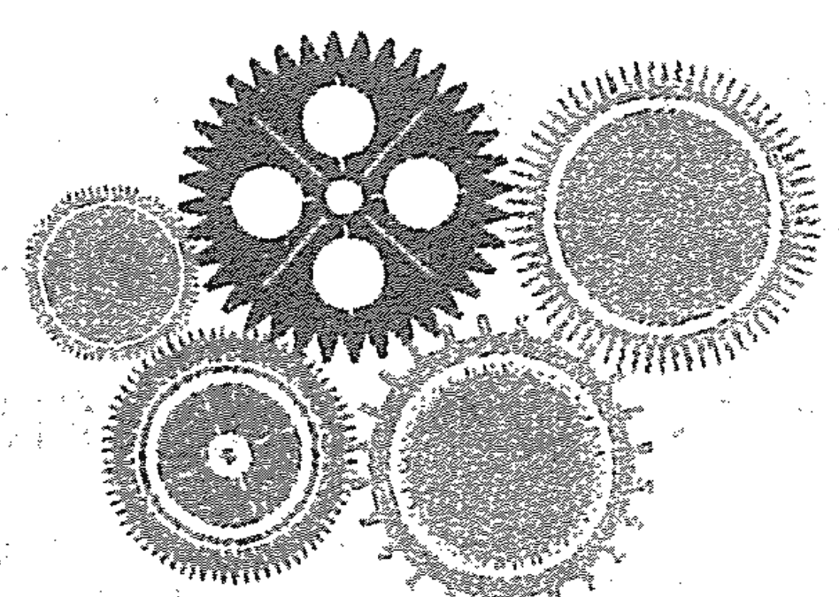

# 生命数字学——来自毕达哥拉斯的数字智慧

个人特质（简称“个特”）就是人们通常讲的性格，是后天形成的，体现在社会交往或者是人际互动时，在具体的环境中如何去展现自己。人们的社会角色直接决定了他们在不同人群所表现出的不同状态。个人特质特指的是我们与普通人在一般人际关系上，处理日常互动的方式，是我们呈现给世界或他人的样子。它和我们在亲情、友情和爱情这些安全稳定的关系里面呈现出的“本我”的样子并不相同，我们俗称个人特质为“面具”。事实上，个人特质就像我们所穿的衣服，从外到里可能有几件，每一件都是衣服，同时每一件带给人们的感觉都是不同的。个人特质也是如此，可以从外面的数字一层一层向内，直到触碰到最里面的数字，而每一层的数字何时展现出来，是以交往的时间、交往的深度决定的。也就是说，交往的时间越久，交往的深度越深，可以看到的层次也就越多，越接近核心数字。

个人特质更多展现的是一个人的角色特征，而不是他们最真实和本我的样子，比如说我是老师，我可能是学生眼中严肃的女老师；我还是个妈妈，和孩子在一起时可能就会变得像个可爱的小女孩了；我又是女性，在朋友面前就是一个娇柔的小女人。严肃、可爱和娇柔，哪一个是最真实的我呢？都是，又都不是，因为我还有其他很多面向，很多角色中的样子。这就是个人特质，是不同角色里面我们展示出来的样子，这个样子是我们感觉舒服的。所以个人特质也说明了在普通社会交往的时候，我们用什么样的性格特质去跟对方互动，才能令我们足够舒服。我们会根据所在场合、面对的人群、彼此熟悉程度来迅速赋予当时当下自己角色的一些特征，也就是说，个人特质是根据情况在几个数字里面进行切换的。所以有些人在不同的圈子，人们对他们的评价会有不同甚至完全相反，比如第一次见面的人认为他很诚恳，很值得信任；长期接触却觉得他很精明，很会算计。

例如：个人特质数字为 29/11/2：第一印象是这个人很好相处、随和亲切（2 的能量）；再相处的话觉得这个人心很软，大爱，很愿意为别人做事（9 的能量）；再相处下去会发现他很自我，凡事都要自己作主，有些时候很强势，过于坚持自己的想法（1 的能量）；相处得更深入、了解的更多，会发现他在随和的同时，没主见、没原则，这是他的核心特质，也就是最里面的数字——2。

个人特质数字计算方法：姓名中所有的辅音字母对应的数字相加，即“a o e i u”以外的所有字母对应的数字相加。同样，要先写出各个字母所对应的数字，然后把它们相加，最后同样计算到个位数，就是个人特质各个层面的数字及内在核心数字。（见表9-1）

### 表9-1 个人特质数字解读

| 1 | 2 | 3 | 4 | 5 | 6 | 7 | 8 | 9 |
|---|---|---|---|---|---|---|---|---|
| a | b | c | d | e | f | g | h | i |
| j | k | l | m | n | o | p | q | r |
| s | t | u | v | w | x | y | z |   |

例：燕飞 yanfei
7 56
计算：7+5+6=18 1+8=9 个人特质为 18 / 9

此外还有一个简单的计算方法，就是用表现数字的总和直接减去内驱数字的总和，便得出个特数字。同样，如果结果是两位数，要再次相加，最后计算到个位数。例如燕飞，表现数字为 33/6，内驱数字为 15/6，其个人特质数字就是 33-15 =18，18 为两位数，通过相加，即 1+8=9，所以其个人特质数字为 18/9。

个人特质数字解读方法：从外向内往里看，各个数字一一对应，每个数字的能量都会呈现出个人特质对人的影响，这种影响也是终生的。个人特质是第一时间识人最直接、最快捷的工具和标准，这个数字的能量是否纯正，同样也受制于制约数字和其他位置的数字能量。这需要综合解图的时候全面考虑。

接下来就让我们来了解各个核心数字的解读，核心位置前面有其他数字的，只需要按照以下 1-9 的解读对号入座就好。比如 25/7 的解读，就需要综合解读，参看以下数字 2 的解读、数字 5 的解读和数字 7 的解读。

关注公众号“苗琳生命数字”，了解你的个人特质。

## 一、带头做主的个人特质数字1

当别人都不愿意、不主动做一件事时，个人特质数字 1 的人会是人群中站出来的那一个。在人际互动中，他们很独立，愿意担当、愿意带头，愿意也比较容易成为领导和带头人。有时会表现得能量过多，喜欢命令和指挥他人，让别人听自己的。

## 二、随和亲切的个人特质数字 2

在人际关系中，个人特质数字 2 属于支持配合的那类人。他们擅长斡旋，在人际关系中如鱼得水，深得人心；他们平易近人，性格温和，脾气好，人缘好，女人给人的感觉贤惠和温柔，男人给人的感觉斯文和儒雅。

## 三、幽默爱美的个人特质数字 3

个人特质数字为 3 的人的特点是风趣幽默，是人际关系中最擅长制造轻松欢乐氛围的人；他们通常都很爱美，在意自己的外在形象，穿衣打扮有个性、时尚、有型有款。

## 四、诚恳务实的个人特质数字 4

个人特质数字为 4 的人，老实、踏实、诚恳、务实。他们稳重、端庄，长着一张诚实可信、不欺骗人的脸；他们做事严肃认真，循规蹈矩，一本正经，有时候会很固执地坚持自己的原则。

## 五、特立独行的个人特质数字 5

个人特质数字为 5 的人，特立独行，与众不同，他们的独特表现在外在形象、言语表达、思维方式、做人做事等很多方面。他们追求自由、独立，所以不受约束，不服管；他们善于逆向思维和差异性思维，天马行空，创意无限；有些个人特质 5 的会表现得狂放不羁，胆大妄为。

## 六、热心挑剔的个人特质数字 6

个人特质数字为 6 的人，总体而言，他们是人际关系中最热心肠、最愿意帮助别人和为别人做事的人，他们愿意负责任、愿意付出，是容易妥协的好人；过于热心的他们有时候会给人多管闲事的感觉；他们看人、看事常用伦理道德的标准去评判，有时候比较挑剔。

## 七、清高较真的个人特质数字 7

个人特质数字为 7 的人，是典型的文艺范儿，追求文艺气息，文化与文学，喜欢问“为什么”，有点儿较真，有点儿清高，不是特别容易接近；有些人会很孤僻，不合群，在群体中会抽离自己。

## 八、阴阳平衡的个人特质数字 8

个人特质数字为 8 的人，喜欢操控，喜欢凡事都在自己的掌控之中，但不是事无巨细都要自己做主，只是需要知道这件事是怎么回事，知道在做什么就行，会以“知道”和“尽在掌控之中”为满足感；他们很容易结交到有钱、有权、有实力的人，贵人缘很足，容易有偏财，口头语是“为什么这件事我不知道。”

## 九、游刃有余的个人特质数字 9

个人特质数字为 9 的人，因为数字 9 拥有数字 1 到数字 8 的所有能量，加之擅长感同身受，所以他们适应环境的能力非常强，在人际关系中游刃有余；只要他们愿意，可以和数字 1 到数字 8 中任何一个数字能量的人友好相处，随时做到见人说人话，见鬼说鬼话。他们既能够很好地保护自己，又能够建立很好的关系，因此有“变色龙”之称。

## 十、案例与特别提示

J 公司最近招聘了一批新员工。周末，公司人事部组织了一场新员工户外拓展培训，我们就以这家公司新组建团队的成员为例，逐一解读一下个人特质表现。

### （一）个人特质数字 1

培训过程中，老师穿插了各种团队互动游戏。由于互相之间不太熟悉，刚开始有些冷场。不过很快，培训老师发现团队中的小易总是第一个做自我介绍，第一个积极配合游戏，第一个勇敢挑战游戏体验，还自告奋勇担任团队小组长。在小易的带领下，团队成员很快热络起来，大家跟着他一起突破了每个具有挑战性的游戏，整个团队从慢热到热情高涨，本次培训取得了非常好的效果。

像小易这样，在团队中第一个跳出来担当的人，往往就是个人特质数字为1的人。这类人在陌生场合通常很快就能成为那个带头的人。

### （二）个人特质数字2

在J公司的新团队中，尔雅表现得非常随和。她喜欢跟大家一起行动，而且很和善，好沟通。大家还发现尔雅很好说话，几乎不发表自己的意见，总是配合和支持大家。由于天气炎热，大家对于培训老师安排户外拓展有些想法，想据理力争一番。尔雅劝慰大家：我们都是新员工，不要为难老师，有话好好说。

像尔雅这类给人随和、温柔、易相处印象的人，往往就是个人特质数字2的类型。在人际关系中，她（他）们是支持配合型的。

### （三）个人特质数字3

小文是团队里打扮最独特的型男，发型一直梳得一丝不苟。彼此熟悉后，小文成了团队里那个最会搞笑逗趣的“开心果”，只要有他在，再劳累、辛苦的培训都变得简单、轻松、快乐起来。

像小文这样，在群体里总是不经意地扮演着“开心果”形象的人，通常是个人特质数字为3的人。

### （四）个人特质数字4

团队中的小严，不苟言笑，但每个练习他都能很认真地完成。公司要求在这次培训过程中不得接听手机，以免影响培训效果。其他小伙伴都把手机放在了包里，小严则压根就没带手机进培训场地，并且还劝大伙儿也都不要带手机，以至于大家都觉得他有点儿较真了。对培训老师要求的活动规则，小严记得都特别牢，不但自己严格遵照，还积极监督大家一起遵守规则。

小严的特质，就很符合个人特质数字4的特征。

### （五）个人特质数字 5

团队中，最受不了小严的就是小伍了。他对刻板的小严非常有意见，总是偷偷把手机揣在兜里，时不时拿出来看看，生怕漏接女友的电话。小严因为团队的规矩几次提醒他，他并不理睬，依然我行我素。
小伍，就是那个最害怕受约束的人，这就是个人特质数字 5 的特质。

### （六）个人特质数字 6

璐璐是团队里的好心人，她总是很细心地照顾每一个人，像帮队友带个饭、背个包等，她都能积极主动地帮忙。在团体活动中，她总能很负责任地为大家服务，与组内队友一起挑战难关。在她的照顾下，大家都觉得很温暖。不过，璐璐有时候也爱抱怨，总觉得公司这次活动安排存在细节上的不妥。在她的理想中，公司的团队活动应该更完美、更理想。
显然，璐璐是个人特质数字 6 的女孩，愿意付出，容易妥协，难免抱怨和批判。

### （七）个人特质数字 7

团队中最不引人注意的就是小琦了，大家几乎很少听到他公开发表意见和建议，他好像很享受一个人待着。就算是一起完成团队练习时，他也总是在完成后就安静地退到一边。对于一个新的练习，他总是要与教练多次确认，搞清楚规则和练习目的后，才会去参加练习。整个团体活动下来，小琦跟团队队员的交流极少，大家都觉得他很高冷。
这就是个人特质数字 7 的表现：不容易接近，有点儿小清高，不合群。

### （八）个人特质数字 8

在团队中，小强绝对是个超级“学霸”，每个练习他都完成得非常完美，每次排名都很靠前，他的力量感和荣誉感都非常强。在他的组内，他要求每个人都必须完成得最好，鼓励大家“我们一定不能落后，你们有什么困难跟我说就行，我会解决的”。
像小强这样在团队中很快表现出领袖风范的人，就是个人特质数字为 8 的类型。

### （九）个人特质数字 9

YOYO 是团队里年龄最小的一个。她长着一张圆乎乎的娃娃脸，一直笑眯眯的，大家都非常喜欢她，不仅因为她可爱单纯，更因为她能够与每一个人愉快相处。大家都感觉到她总是能发现每个人的需要，谁需要鼓励了，谁需要陪伴了，谁需要休息了，她总是能迅速感知并施以援手。她跟每个人都合得来，连最高冷的小琦都会跟她多说几句话。大家一致认为，YOYO 真是一个人缘超好的人。

像 YOYO 这样，能在团队中迅速与大家打成一片，有如此好的人际关系的人，就是个人特质数字 9 的特质。

当然，以上我们对个人特质的阐释是用最后一位数字，也就是核心数字来进行的。在对个人特质的核心数字解读前，也要先解读出前面数字的表现，这样才能更好地解读出核心个人特质的能量。下面举一些例子，以供大家学习、探索。

27/9：表面上很好相处，平易近人；进一步接触非常较真，想获得他们的认可，必须彻底让他们心服口服；再接触发现内心很柔弱，很有爱心。只要在他们面前稍微示示弱，他就替你全做了。

18/9：表面独立、干练，很省心；再接触发现，他一定要做主，要能够控制。在他面前直接示弱扮可怜，就能通过。

21/3：第一印象很随和，再接触有些自我，骨子里其实很单纯、简单。也就是说一开始挺好说话，坚持起来却不让步，最后看明白了，实际上是个单纯的小孩。

30/3：表里比较一致，爱美，喜欢好玩儿的，单纯。

41/5：表面很稳重、一本正经、很稳定，做事干净利索、果断，最后接触到核心，才发现根本管不住，不好搞定，是要自由的人。

36/9：表面没什么心机，很单纯，再接触觉得特别小心眼儿，爱计较，付出必要回报，深层接触发现说些好话就全听你的了。对这类人一定要说好话，否则 6 过少的能量就出来了。

15/6：如果是女性，乍看是知性的、干练的；如果是男性，乍看是独立自信的。再接触发现，这人自以为是，很自我，不受约束；深度接触的话，会发现这个人很善良。只要你对他说些好话，他就放弃自己的独立和自由了。

32/5：表面上看单纯、简单、好玩儿，感觉也很平易近人、柔美，实际上特立独行，根本管不了。

31/4：3代表好说话、单纯、简单，1意味着干脆利落，很独立，这是表面现象；再到核心数字4，才发现这是个非常固执、很难改变的人。

28/10/1：第一印象特别好，亲切，温柔。接下来发现，他并不好通融，而且还有点小势利；最后发现，他凡事都要按照他的想法去做，是一个很想事事都自己做主的人。

# 第十章
“我的生存大环境”
——循环数字的解读

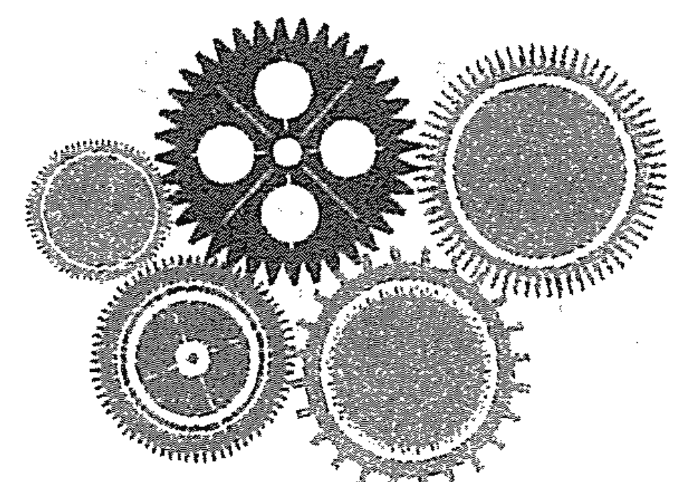

# 生命数字学——来自毕达哥拉斯的数字智慧

循环数字是指人在成长过程中，某一阶段的生存环境，而这个环境不是指自然环境和社会环境，而是指人们所处的人文环境，尤其是与交往的人构成的社交环境。循环数字是个静态的数字能量，人和循环数字的关系，一种像周敦颐的《爱莲说》中描述的“莲之出淤泥而不染，濯清涟而不妖，中通外直，不蔓不枝，香远益清，亭亭净植”，置身于这样的循环数字能量中，同时保持自己的独特和纯正；另外一种情况，就是随波逐流，与世浮沉，完全被循环数字能量所影响，无法活出应有的独特和纯正。

整体而言，循环数字对人的影响没有其他数字那么大，但我们必须特别关注第一循环数字对人的影响，因为这是一个孩子出生后到长大成人的环境，而父母将是这个环境的主要缔造者，无论是从经济环境还是沟通环境、学习环境，父母都起着至关重要的作用，不可小觑。故此，学过生命数字学的父母，更要对照孩子循环数字的能量，修正自己，给孩子一片利于他们生长的土壤，让他们健康地茁壮成长。

循环数字计算方法：出生的年月日分别相加，得出的个位数字，其中“月”是第一循环，对应第一高峰的时间段，指这段时间的生存大环境。由于它对应第一高峰，第一循环的影响至少会影响人27年，是很重要的生存环境数字。“日”对应第二、第三高峰的时间段，会持续18年；“年”对应第四高峰的时间段，直到终老。

我们在解读循环数字的时候，通常要把制约数字、高峰数字、挑战数字和循环数字放在一起去解读，才能客观地去分析一个带着制约能量的人，在怎样的循环环境下，去面对自己的高峰和挑战，这也是在综合解图中需要灵活掌握的部分，惟其如此，我们才能灵动而客观地去解读这个人的能量变化，才能够准确地看出循环数字对他们的影响是哪一种。

关注公众号“苗琳生命数字”，输入相关信息，生成你的生命地图，结合下文，了解你的循环数字。

## 一、独立忙碌的循环数字 1

循环数字是 1 的人通常生活在阳性、独立、自信和不断开拓、忙碌做事的环境中，交往的人也大多是具有这样特质的人，平时都很忙碌，各做各的事情，有事情互相会联系，也是比较干脆利落，平时互动并不多。

第一循环数字是 1 时，往往母亲或女性抚养人在家中担当的多，对孩子的教育不温柔，偏强势，管教方式也相对严厉，父亲及男性抚养人对孩子的影响被弱化，这也是母亲和女性抚养人需要调整的。

## 二、和谐温暖的循环数字 2

循环数字是 2 的人通常处在一个祥和、温暖、包容、和谐的环境中，人们互相之间都很在意关系，互相体贴照顾，彼此之间经常会有各种各样的互动交流和合作，其乐融融。

第一循环数字是 2 时，往往父亲或男性抚养人教育这个孩子的方式偏柔和，多慈爱，这和他们自身的性格没有关系。也许他们是严厉而暴躁的，唯独面对这个孩子的时候，他们尽现柔软一面，就像贝克汉姆宠爱女儿小七一样，是他们对待这个孩子的方式。还有的是女性过分强势，让男人在家里没有地位，显得比较软弱，这会导致孩子爱父亲，却又看不起父亲，所以父母都要调整彼此的身份和状态才可以。

## 三、丰富多彩的循环数字 3

循环数字 3 的人通常处于一个轻松、好玩的环境中，会有很多朋友。朋友们从事的多是与美、创意、表达有关的工作，大家会有很多点子和创意，经常聚在一起；同时循环数字 3 的人的圈子会变来变去，有专门一起出去吃喝玩乐的，有一起跳舞运动的，有一起学习提升的，有一起带孩子出去玩的，不一而足。最特别的是这些圈子之间的人很少有交集，因为大家都是因为共同爱好才聚到一起的，爱好不同，不介入。

第一循环数字是 3 的人，父母或抚养人双方或一方很在意面子，很在乎别人对孩子和自己的评价，会有意识地让孩子在人前赢得好的评价和认可。时间久了，会造成孩子自尊心过强或贪慕虚荣，太在意别人的眼光和看法，死要面子活受罪。

## 四、恒定不变的循环数字 4

循环数字 4 的人，整体处在一个稳定踏实，让人很有安全感的环境中。这个环境中的人都比较讲规则，重承诺，说好的事情轻易不会改变；他们通常都是交往很多年的人，有的甚至几十年，彼此已经非常信任。交往时间短或不靠谱的人，是很难被这个环境的人接纳的。最重要的，其中一个人不认可不接受，其他人也会照做；他们交流的话题都比较现实和务实，比如柴米油盐酱醋茶，金钱、家庭、婚姻情感和健康之类的，他们身边很多都是踏踏实实做事情、稳定生活过日子的人。

第一循环数字是 4 时，父母或抚养人双方或一方会有很多规矩和规条的约束，孩子有被桎梏的感觉，安全感不够。

## 五、无拘无束的循环数字 5

循环数字 5 的人通常处在一个有个性、与众不同、无拘无束的环境中，这个环境的人大多有独特性，比如人生经历的独特、外在形象的独特、言行举止的独特或思维想法的独特；他们喜欢旅游和刺激，喜欢享受一切美好，喜欢活在当下，特立独行、天马行空，自驾、漂流、探险、徒步等都是他们喜欢的；他们平时互不干扰，可以多年不联系，一旦联系，依然像昨天还在一起一样，完全没有隔阂和陌生感。

第一循环数字是 5 时，父母或抚养人会对孩子放手，孩子相对比较自由，只是他们的生活环境会有变化，比如经常搬家或换学校、换班级、换老师，对于有些注重稳定或适应慢的孩子，这样的多变会造成安全感差，适应能力不足。

## 六、亲如一家的循环数字 6

循环数字是 6 的人，周围的人大都很有爱心和责任心；他们都非常负责任，很多人从事与爱心、责任心、助人有关的工作；他们爱美、低调，注重品质；他们很顾家，在意家的温暖和温馨；他们对待交往的人也像对待家人一样，急对方之所急，想对方之所想，有什么好的事情和物品都会及时分享出去，所以彼此之间互动的像个大家庭一样，你家有事我帮忙，我家有事你帮忙，大家无事，就经常安排家庭日，带着各自的家人集体出去游玩。

第一循环数字是 6 时，父母和抚养人双方或其中一方对孩子会有很多标准与要求，有许多应该与不应该，他们把达成标准和爱不爱孩子捆绑在一起，让孩子觉得得到爱是有条件的，是需要付出代价的，长久以往会造成孩子对爱的认知偏差。

## 七、我行我素的循环数字 7

循环数字 7 的人，通常处在一个有知识、有文化、有层次、追求内涵与品质的大环境中。周围人大都很有学问、爱学习，格调高雅，喜欢身心灵、禅修、哲学等；他们爱思考和钻研，彼此有共同的话题，经常可以为某个感兴趣的话题钻研、探索和讨论很久；他们很在乎互相之间精神层面的交流，所以能走进他们圈子的人通常都有这些特质，属于志同道合的人；他们很少谈物质世界的东西，经常被取笑是“阳春白雪”，在普通人眼中，他们是清心寡欲、不食人间烟火的一群人。

第一循环数字是 7 时，父母或抚养人对孩子的身心发展比较在意，开明的家长会关注孩子是否身心合一。有一部分家长会过分关注学习，认为学习好就代表一切都会好，对孩子的学习成绩和表现过分苛责，导致孩子从小过多时间花费在学习功课上，没有更多的时间和自由做自己想做的事情，内心很孤独。

## 八、钱权优越的循环数字 8

循环数字 8 的人，通常处在物质条件优越的环境，比如身处生意场或政界等高端圈子，周围有权、有钱、有力量的人特别多；这个环境的人之间经常会有利益上的往来互动，都很在意对方的能力和权势，所以经常会有勾心斗角、尔虞我诈和攀比炫耀的情况。对于有些人来说，这样的环境充满“铜臭”，无法适应。其实人生在世，什么样的环境、什么样的人都有他们存在的意义，接受也许是最好的选择。

第一循环数字为 8 时，其父母或抚养人不管自身经济条件如何，都会尽自己所能地为孩子提供最好的经济支持，有些甚至超过承受能力去“富养”孩子，曾经见过环卫工借钱给孩子买高档手机，就是此类。与同龄人相比，这个孩子的物质生活优于绝大多数人。第一循环数字 8 环境中的父母或抚养人，也会对孩子偏操控，他们要知道孩子怎么样、做什么、为什么，要做到心中有数，尽在掌控之中。当然，他们的掌控是以掌控大局、大方向为主，至于细节，他们一般不关注。

## 九、人见人爱的循环数字 9

循环数字 9 的人，周围通常有一群大爱、慈悲和无条件付出的人，他们有使命感、责任感，关注宇宙万物，经常去做公益、慈善类的事。置身这样的环境，也很容易被感化，想去做更多的事情，想去奉献和付出。有些人会在这个循环数字阶段接触宗教，甚至皈依宗教，去传经布道。

第一循环数字是 9 时，孩子是在一个人见人爱的环境中，走到哪里都被关注、被照顾，有吃百家饭、穿百家衣的感觉。他们的周围都是有大爱、慈悲的人，处在这样一个无条件的爱的环境，孩子自然也有一份大爱和慈悲。

# 第十一章
“我如何跟自己玩”
——性情数字解读

# 生命数字学——来自毕达哥拉斯的数字智慧

性情数字强调的是一个人与自身四体之间的关系。人的四体是指身体（肉身）、头脑体（思考的大脑）、情绪体（情绪、感受、意欲）和直觉体（灵感，第六感）。性情数字代表自己跟自己四体互动的方式。透过性情数字，我们可以了解自己以及其他人是怎么思考事情，又是怎么处理自己的情绪、面对自己的身体和对待自己的直觉的。

性情数字的能量同样会存在过多、过少、纯正三种状态，能否活得纯正，依然要看其他位置数字对这个数字的综合影响，比如一个制约数字是4的人，头脑2，如果制约数字4过多，头脑2的能量就容易变得不纯正。

性情数字的计算来自对姓名的计算，所以姓名的更改会改变一个人的性情数字。再说具体点，改姓名不能改变人生大的方向，但能改变自己和自己的关系，毕竟对人生大方向影响显著的，主要是自己的出生年月日。

性情数字的计算方法：
身体：姓名中的数字4、数字5出现的次数相加所得。
情绪体：姓名中的数字2、数字3、数字6出现的次数相加所得。
直觉体：姓名中的数字7、数字9出现的次数相加所得。
头脑体：姓名中的数字1、数字8出现的次数相加所得。（见表11-1）

例：燕飞 yan fei
7 1 5 6 5 9

表11-1 性情数字解读
| 身体（4、5） | 情绪体（2、3、6） | 直觉体（7、9） | 头脑体（1、8） |
| :--- | :--- | :--- | :--- |
| 出现次数：2次5 | 1次6 | 1次7+1次9=2 | 1次1 |

所以：身体数字为2 情绪数字为1 直觉数字为2 头脑数字为1
需要说明的是，无论任何时候，只要性情数字出现0次的情况，都可以把该性情数字解读为：无法预测，捉摸不透，任何可能性都会有。

关注公众号“苗琳生命数字”，输入相关信息，生成你的生命地图，结合下文，了解你的性情数字。

## 一、身体数字

身体数字是一个人使用身体的方式，也是身体向外界展示的方式。当我们了解了身体数字，就可以更加尊重我们身体能量的需要，懂得如何满足身体的需要并配合身体的需要，让自己和他人处于一种更放松更舒服的状态，让身心更加健康。

1. 身体数字为 1
身体闲不住，始终处于一种工作或忙碌状态。除了睡觉之外的其他时间，身体都处于某种“动”的状态，哪怕坐在那儿也是脚动、手动、脑子动。比如坐在那里听课，脚要不断动，要不就挪挪位置动一动，再者就是手开始玩弄笔，或者舔舌头、咽口水、转眼珠，脑子动来动去，琢磨好吃的，等等。在家休息，躺在沙发上，要么看电视，要么听音乐，要么抖脚，要么嘴巴吃东西，要么哼歌，要么想事儿。即使在打坐时，头脑要么是在数数，要么是在想事儿。

这种人可以非常独立的做事情，有自己的方式，而不论别人如何。他们会设定目标，然后去达成目标。只是强迫身体过多做事，会用力过猛，有时有硬撑的感觉。

他们自己不闲着，也见不得别人闲着，否则会认为是在浪费生命。他们会把自己的身体最大限度地用起来，很少处在静止状态。

2. 身体数字为 2
身体会很敏锐，有相对很敏感的部位；任何时候身体都需要有依靠的感觉，有人时靠人，没人时靠物，很粘人，喜欢拉着、牵着、搭着，睡觉都会抱个物品，或者腿跨在被子上，要不手里抱个东西，如枕头、垫子等。

身体数字是 2 的人会比较依赖，喜欢有人陪伴着，喜欢和别人一起做事。

3. 身体数字为 3

他们的身体是创意的“祖师”，凡事喜欢用很有创意的方式去做，身体灵活多变，手势动作多；身体的表演能力和绽放能力强，会很有创意地展示自己，很有魅力。

特别注重身体的感觉，他们注意公众形象，注重仪表，尤其是在外人面前和公众场合，非常注重身体姿势的规范，表现的有型有款，不出格，优雅、端庄，站有站相、坐有坐相、躺有躺相。即使和爱人孩子在一起，他们也非常注意举止，彬彬有礼、落落大方。因为在意在公众场合的状态和形象，所以身体数字 3 的人，特别喜欢照镜子，他们不错过任何可以照镜子的机会，让形象始终处于让自己满意的状态。

他们在外面的样子与在家里未必一致，在家里，他们喜欢穿让身体舒适的内衣，尤其是女性，会购置各种款式和风格的家居衣服和鞋子，既讲究舒适度，又要有美感，让自己在家里都是“放松地优雅而美丽”，很多人有“内衣控”。

4. 身体数字为 4

身体数字 4 的人身体的感受力最强，他们的身体似乎有天生的感受力，对环境的、对人体的感受力都很强，比如不舒服汗毛竖起来、浑身鸡皮疙瘩，比如找经络穴位，他们学一遍就可以很精准地找到。如果身边人身体不舒服，他们在旁边就能感受到哪里不舒服，还能用手找到对方不舒服的具体位置，这样的人做与身体有关的工作，能做得特别好，比如针灸、按摩，中医和外科医生。

还有一类身体数字 4，能量一直在过少里，表现为身体特别僵硬，敏感度低，感受力差，灵活性差，走路姿势很僵硬，像机器人一样，总体来说就是身体灵活度不够，尤其是在跳舞方面，显得机械、笨拙、死板。

身体数字是 4 的人，当他们不关注身体的时候，身体会有强烈的讯号提醒他们呵护自己的身体，多与潜意识沟通，多与躯体对话，有助于他们的健康。

5. 身体数字为 5

身体数字 5 的人最大的表现就是需要空间，身体的空间、心理的空间全部都要。对他们来说，约束了身体，就等于约束了心灵。他们不喜欢被限制，不喜欢穿收身的、让身体有紧绷感的衣服，不喜欢穿束缚脚的鞋子，不喜欢睡狭窄的只能翻身的床，他们喜欢的是宽松、宽大、宽敞！因为5对隐私的需要，他们还需要完全属于自己的空间，没人去干涉和打扰。对他们来说，如果有一个完全属于自己的房间，一张大大的床，想怎样放松就怎样放松，那将是无限美好的。

身体数字5的人，随性，自由，走路蹦蹦跳跳、伸胳膊踢腿都是常见的情况。他们的肢体动作跨度大，能量过多时会渴望极度的刺激感，会纵欲和冒险。如果身体没刺激，对他们来说就好像没活着一样，像酷跑、赛车之类刺激的运动都是他们钟爱的。

对于身体数字是5的人来说，身体能量旺盛，是需要经常运动和宣泄的，如果被压抑了，就会发炎、发烧、长痘痘、口腔溃疡，各种外伤也会比较多。

6. 身体数字为6

身体数字6的人身体与心灵经常不在一个频道上，心在付出时，会完全忘记身体的存在，从而忽略了身体的需要和感觉。比如，干完活后才发现脚受伤了，干活的时候根本就没注意到；或者经常投入做事，关注点只在怎样把事情做好，结果完全忘记自己还没有吃饭，甚至都没有意识到肚子饿不饿。这在很多妈妈身上特别常见，比如带孩子出去玩，她们所有的心思都放在了孩子身上，经常回到家才感觉到全身酸痛无力。总之，能量不纯正的身体数字6会很尽责的做事，不懂得爱惜自己的身体，对身体的照顾是不够的。

## 二、情绪体数字

情绪体数字（以下简称情绪数字）是一个人情绪表达和释放的方式，也是一个人感觉的外在呈现方式。了解情绪数字，可以让我们更尊重自己和他人的情绪感受，也更懂得如何和情绪感受互动，让自己和他人都能更轻松和快乐。

以下，我们侧重来了解每个人负面情绪的表达和释放方式。

1. 情绪数字为 1

情绪数字 1 的人表达情绪的方式是他们有情绪会直接发泄，点火就着，经常瞬间爆发，快速结束，所以他们的情绪来得快，去得也快；“炮药房放火，一点就着”就是对情绪数字 1 的描述。他们的情绪通常自生自灭，不过夜，也不记仇，情绪释放完才会自然结束。他们有情绪时，尤其是生气时是听不进劝慰的，甚至周围的人越劝他们火气越大，最后变成了“火上浇油”；他们常说的话是“能不能让我自己待一会儿？”“能不能让我静一会儿？”“能不能别惹我啊？”“能不能别再劝我啊？”所以他们有情绪的时候，尽量给他们足够的时间和空间，不要去干预，让他们自己去消化和处理，直到从情绪中走出来，就没事儿了。

2. 情绪数字为 2

情绪数字 2 的人情绪非常敏感，容易受环境影响。冰火两重天、阴晴不定是他们情绪的常态。他们容易沉溺和淹没在自己的情绪里，容易受人暗示和影响，只要能影响他们的人去安抚他们，心情可以马上发生改变；同时他们也容易陷入别人的情绪中，与对方同喜同悲。看电影、电视时比剧中人物哭得还伤心的通常都是情绪数字 2 的人。

能量过多的情绪数字 2 的人，陷入情绪时会喋喋不休，又哭又闹，不依不饶，一定要和引起他们情绪的人说的明明白白。那种为了一件事半夜都会把伴侣从被窝里拉出来要说清楚、不说清楚不允许睡觉的就是情绪数字 2 过多的表现。当然，他们这样做的原因是想让对方关注到自己的情绪，有强烈的倾诉欲望，通常只要允许他们充分彻底地表达完情绪，比如哭够、说完，与此同时陪在他们身边，拥抱抚摸他们，他们很快就会从情绪中走出来，甚至都不需要对方说太多、做太多。

情绪数字 2 过少的人则完全相反，他们有情绪通常是不表达，忍气吞声，用不说话、不交流、不互动、冷战的方式，或者专门说尖酸刻薄、对方最不愿意听、对方听了最难受的话来攻击对方，其实是刀子嘴豆腐心，伪装的强硬。他们用这些方式来表示自己正在情绪里，希望对方以柔克刚，能说些柔软的、温暖体贴的话哄哄自己，或是不管自己怎么“作和强硬”都能不离不弃地陪伴和拥抱自己，颇有“我就要看看你怎么样对我”的感觉。遇到懂他们这种模式的，拥抱亲吻，一招制胜；遇到不懂的，人仰马翻，旷日持久的冷战就此开始。

3. 情绪数字为 3

情绪数字 3 的人情绪变化快，有情绪时一定要用某种方式表达出来，忍不久，憋不住；“给点儿阳光就灿烂”、“干打雷不下雨”就是对情绪数字 3 的描述。他们的情绪都表现在面部表情上，喜怒皆形于色，高兴不高兴一眼就可以看得出来；他们表达情绪的方式有很多种，也很简单，唱歌、跳舞、哭诉、吼骂、运动、购物、暴食、厌食、摔砸东西，只要能把情绪释放出来，这些方式他们都会使用；假如现实条件不允许他们这样去释放情绪，他们会由向外表达转为向内攻击，会用憋闷、捶打或其他伤害自己身体的方式来宣泄负面的情绪。所以要引导他们用正确的释放方式表达情绪，而不是伤害自己。如果一直没有机会表达出来，他们的嗓子就会出问题，会患口腔溃疡、咽炎、气管炎等口腔咽喉部位疾病。

4. 情绪数字为 4

情绪数字 4 的人会用自己的身体去感受情绪、记住情绪，而不擅长去表达和释放情绪。“君子报仇，十年不晚”就是对情绪数字 4 的人的描述。当他们有情绪的时候，他们的身体首先会有反应，比如心慌、头晕、腹胀、背痛等，然后才会意识到自己在情绪里；他们很容易被情绪所困，习惯生闷气，心结不易打开，容易沉浸在过往的情绪中难以释怀，很多年都会对那份情绪耿耿于怀。如果情绪没有得到释放和解决，他们很难轻易原谅给他们带来情绪的人，多年之后提及触发情绪的事情，都会有非常激烈的情绪反应，包括身体都会有当年的反应，好像刚刚发生一样。

情绪数字 4 的人因为用身体来记住情绪，如果情绪不释放和表达出来，随着时间的累积，就容易积压在身体里，像细菌一样影响他们的身体健康，严重的会产生很多慢性疾病，尤其是脏器类的疾病，比如肝病、肺病、心脏病等。因为情绪淤堵，心结不开，很多情绪数字 4 的人都会有便秘或痔疮。所以情绪数字 4 的人要学会尊重有情绪的事实，提高自我觉察能力，同时掌握一些释放情绪的方法或者参加我们线下针对身体和情绪的工作坊，可以有效地释怀过去，调整身体，恢复健康。

5. 情绪数字为 5

情绪数字 5 的人会有两种截然不同的表现，“不在沉默中死亡，就在沉默中爆发”形象地描述了这两种情况。第一种是处在压抑状态，非常隐忍，喜怒不形于色，有情绪的时候会非常克制自己，做到面不改色心不跳，甚至外人都察觉不到他们在情绪里，他们对情绪的克制和隐忍一般人并不容易做到。因为情绪完全被压抑下去，只能向内攻击，而情绪数字 5 本身又能量旺盛，造成这份压抑的情绪需要找到出口释放出去，就会出现身体的“自残自虐”，常见的就是身体出现“骨火”重，也是中医所说的肝火盛，经常上火、燥热，发炎、发烧、长痘和口腔溃疡之类的，这些通常都是情绪无法释放攻击到身体所致。被父母限制非常严重的小孩尤其严重，很多孩子从小到大一直扁桃体发炎，每次发烧都是发高烧，甚至小小年纪就把扁桃体切除了，仔细询问，他们大都有个无法自由表达和释放情绪的家庭环境。

情绪数字 5 的另外一种表现是反其道而行之——爆发，而且是具有摧毁性、杀伤力比较大的爆发，典型的不鸣则已，一鸣惊人。在情绪状态下非常冲动，完全被情绪所控，不管不顾，不计后果，会有非常极端的身体动作，也会带来极端的后果，包括突袭、打砸、暴力伤害甚至伤亡的出现。很多人事后都不知道也不理解自己为什么会有那种状态，事实上在爆发那一刻，他们已经变成了情绪的奴隶，身不由己。

平时情绪数字 5 的人，喜欢极致化地表达自己的情绪，带有夸大和自编自演自导的成分，会小题大做，比如他们有开心的事情时，周围的人可能全都能感受到。

6. 情绪数字为 6

情绪数字 6 的情绪表达方式也是两种，“一半是海水一半是火焰”，爱与恨在这两种情绪最容易出现。能量纯正和过多的时候，会用爱去浸泡对方，用对对方好的方式来表达情感，会表现出充分的满足感和价值感；能量过少的时候，则会用恨来表达情绪，会用控制、指责、抱怨、唠叨等方式来表达不满，希望对方按照自己的标准和要求来做，如果对方不配合，就会感到非常受伤和失望。

## 三、头脑体数字

头脑体数字（以下简称头脑数字）强调的是一个人对自己想法的态度，是一个人大脑思考问题的模式。人的行动大多受大脑支配，所以了解了头脑数字，就了解这个人为什么这样想，为什么这样做，以及如何去配合理解他们的想法；或者如何通过影响改变他们的想法，改变他们的做法。

- 1. 头脑数字为1
头脑数字1有主见，想法多，行动力快；不容易受别人干扰，不会轻易放弃自己的想法，很执着和坚持；想到了就会去验证，会把想法变成行动。头脑1优点在于，很清晰地知道自己要的是什么，怎么去做；不足是他们考虑问题容易一根筋，钻牛角尖，不到黄河不死心，不撞南墙不回头。幸运的是，他们执着而不固执，当他们发现自己的想法不对时，会马上换一个想法，从而放弃。

- 2. 头脑数字为2
头脑数字2想法多，只是坚持性不够，经常因为对方强势或迎合对方而放弃自己的想法；他们容易被外界影响，容易随波逐流；为了不发生冲突，容易人云亦云，立场不坚定，常让人觉得没主见，风吹草，两边倒。他们的口头禅是“随便”。

- 3. 头脑数字为3
头脑数字3有创意，灵感多，思维跳跃，想法特别多，变化也特别多；有时会在瞬间发生变化，让别人无所适从，感觉不靠谱，比如吃饭。短时间内关于吃饭地点、口味可能会变化几次；他们想事情、谈事情经常会跑题，跟他们在一起，要紧盯他们的思维。一起商量事情的时候，一定要和他们确认最后的想法，比如要问他：“除了这个还有吗？”“这个是定下来的吗？”，否则他们想法太多，最后连自己都糊涂。

- 4. 头脑数字为4
头脑数字4想事情非常规范，框架感很强，有逻辑，有条理，有顺序，按部就班。比如他们想什么事情，会想得很清晰，就像脑袋里装着一个档案馆一样，按照规律和逻辑分门别类的能力极强。他们的想法是有非常清晰而明确的标准支持的，只是这里的标准很多时候是他们主观的，而不是社会通用的，所以要说服他们并不容易；他们想事情会比较全面和细致，未雨绸缪、防微杜渐，做好一切准备，不打无准备的仗，所以有时候事情没按他们的预计，突然大拐弯的时候，他们会很不适应，也会有情绪。

头脑数字4非常固执，认死理，喜欢在自己的世界按照自己的想法思考问题，会执着地坚持自己的想法，很难轻易改变。他们很擅长将想法合理化。在他们的想法里，只要不符合自己的标准和想法，就算所有人都认为他们应该改变，他们都会视而不见、听而不闻。他们既不考虑也不参考其他人的意见，不管对错，依然故我，并不会去改变。他们还有一整套非常合乎逻辑的道理和理由来解释不改变的原因，铁证如山面前，他们依然坚持自己的想法。所以他们经常被人们认为是“最强大脑”，是撞了南墙也不回头、见了黄河也不死心的“死脑筋”，是刀枪不入、油盐不进的“老顽固”，是戏曲家关汉卿口中的“蒸不烂、煮不熟、锤不破、吵不爆的响当当的一颗铜豌豆”。他们的改变只来自一种情况：他们自己想改。只要他们自己想通了，“转过弯”或迫于生存安全的需要只有改变这唯一的一条路了，他们会迅速180度大转变，转变的速度快而惊人。

头脑数字4和头脑数字1人的区别是，头脑数字4是坚持而且执着，不到万不得已绝对不改变；而头脑数字1是坚持而不执着，只要发现不对，随时会改变和放弃自己的想法。

- 5. 头脑数字为5
头脑数字5的思维非常敏捷，发散性思维、逆向思维能力特别强；思考问题天马行空，从不按常规思考，逻辑未必严密，却总是很独特；他们反应极快，思维具有跨角度、多维度、跳跃性的特点，很灵活和随性；很多人都跟不上头脑数字5的人的思维，感觉跨度太大，与他们交流探讨会很吃力。比如大家在交流晚上吃啥，他们可能已经想到“中国饮食文化的起源或者各地地方菜都是什么，甚至是未来人类没有食物怎么活着”之类的事情，不同频的感觉特别明显。

在头脑风暴这类事情上，大家一起动脑筋出主意的时候，头脑数字3和头脑数字5的人参与时特别明显。常人不敢想的，头脑数字5的人全都敢想，想的很多角度都非常有特色和个性，甚至不受世俗约束的想法，完全是从无到有的原创。所以在头脑风暴的领域中他们有很多特殊优势，除了跳跃性思维太严重；由于他们以自我为中心的状态，所以他们想到什么之后，会在自己的世界里去完善想法，自编、自导、自演，容易把事情复杂化。

- 6. 头脑数字为6
头脑数字6思考问题有对错、好坏标准，想事、做事特别容易陷入是非对错；思考方式都以“应该”为标准，话语里“应该”这个词也很多，所有的“应该”都是社会性标准，如伦理道德、社会规范、约定俗成的社会标准等；他们喜欢讲道理，能量过多就会上纲上线，用道德、制度要求别人，会找出很多社会公认的这样做对或不对的理由。

## 四、直觉体数字

直觉首先是一份感觉，常被大家说成“灵感”“第六感”“潜意识”“超感知能力”“冥冥中的声音”，是一份不经过理性思考就有的感觉；一个人内在越平静、越安宁，对这种感觉的捕捉能力和感受能力就越强；尊重直觉，能够天人合一，可以让我们的人生少走很多弯路，更顺遂，更轻松地完成人生的各种课题。

直觉是个很细腻的声音，只要尝试去思考和分析，就会失去它。要信任直觉的声音，必须尊重自己的感觉。

- 1. 直觉数字为1
灵光乍现，突然开窍，经常有“突然想通了”“突然莫名其妙跳出个想法”“突然豁然开朗”的感觉。

- 2. 直觉数字为2
“直觉力大师”的数字，直觉来得快而准，有时候说不清是哪儿来的，就是突然感觉到的，要尽量尊重这种感觉，跟着感觉走。

- 3. 直觉数字为3
直觉来自于表达，在对其他人表达或描述的时候，获得灵感和直觉，这其中包括各种方式的表达，如声音、动作、艺术等。最典型的是在语言表达上，如写作时写着写着就有灵感了，说着说着就找到感觉了，等等；当他们找不到直觉的时候，想办法去表达，表达的过程中会启动直觉。

- 4. 直觉数字为4
直觉讯息来自身体，身体感受极其灵敏，能用身体感受信息。身体的感觉就是直觉到的信息，比如会突然觉得身体哪里不舒服，恶心、头疼等。同时，直觉数字4的人是非常好的身体治疗者，他们能通过碰触别人的身体，直觉到对方的身体状况是怎样的，治疗性工作或身体方面的工作都适合他们。

- 5. 直觉数字为5
通常在活动或运动中获得直觉，在感官享受中找到灵感。对他们来说，不能让身体卡在那里不动，要有身体的活动，通过唱歌、跳舞、运动，就很容易找到直觉。

- 6. 直觉数字为6
在无条件的付出过程中，会才思泉涌。只要专注在付出和负责任上，而不是为自己，他们的直觉就会来的很快。

# 第十二章 两个特殊数字——黑洞数字和成熟数字解读

## 一、黑洞数字

生命数字学认为，每个人的生命中都有数字1到数字9的能量，都会受到这些能量的影响。在整张生命数字地图上，按照21个位置（包括双位数字）逐一去看，数字1到数字9并不一定都会出现，那些没有显示出来的数字，一样会在这个人的生命中出现，只是影响大小不同而已。如果没有显示出来的数字比较多，没有显示的每个数字对一个人的影响就只占一小部分，并不是特别聚焦和强烈；反之，如果没有显示出来的数字比较少，这些比较少的能量聚集在一个人身上，就会显得比较强烈和明显。这种感觉就好像我们看一幅画，画面色彩越多、越杂，每个单独的色彩越不明显，而画面色彩种类越少，每一种颜色就会越凸显。所以我们把生命数字地图上没有显示出来的、对人影响比较大的数字，定义为黑洞数字。具体指的就是生命数字地图中，不包括个人年、循环数字、性情数字这几个位置，其他位置中没有出现的数字1到数字9的个数，当数量小于或等于3个的时候，这几个没有出现的数字就被视为黑洞数字。

黑洞数字就像人生天幕，一直在，但我们经常意识不到它的存在，哪怕相应的能量在相应的人身上表现的很多、很强，我们也不易觉察。就好像我们每天生活在空气中，却经常忽略空气的存在一样，唯有空气质量不好或极度需要空气的时候，我们才意识到空气的存在和重要。而整个生命数字地图中，在个人年数字和黑洞数字一致变成合成数字的时候，这个数字的能量对当事人的影响就会特别强烈，务必要活纯正。

比如王菲的黑洞数字是9，在她身上，9的能量是很多的，这不是某一个阶段的能量，而是她与生俱来的能量，会表现在人生的很多方面，是伴随一辈子的，所以她会有信仰，并且很虔诚，也就不足为奇了。

## 二、成熟数字

一个人从出生到长大成人，需要经历从无知到有知、从不能到能的过程，这个过程中，人们开始认识世界万物、人间百态，锻炼各种能力，并学习如何和人、事、物共处，学习长大成人的近3万多种人类行为。这个过程中，人们经历了读书、就业、结婚生子，直到36岁左右，大多数人通过逐渐成长基本达到成熟状态。这个从成长到成熟的过程，也是一种能量变化的过程，这种能量在生命数字地图中被称为成熟数字，这种能量随着年龄的增长，通常会越来越强烈，日后对生命的影响也会越来越大。

因为这个能量推动了整个生命的成长和发展，对人生发挥了助益提升的作用，所以它只有纯正的状态，没有过多和过少之说，这也是生命数字地图中唯一一个只有纯正能量的数字。同时这个能量纯正的程度，每个人会有不同，区别主要在于从出生到36岁之间，这个人是否尊重了他们自身的能量特质，尤其是制约数字和表现数字，他们是否用自己最享受和最擅长的方式去面对所有的成长和学习。如果“是”，这个能量的纯正程度就会比较高，反之，就会比较低。这种感觉就好像有些人才出生就被高人说“命好”，后来发现却不尽然，因为命好并不等于什么也不去做，命好也需要人们在生命历程中去做事、去修己，成熟数字的纯正程度解读也是如此。

成熟数字计算方法：用生命道路的个位数加上表现数字的个位数，相加得出的个位数，书写时只写单独的个位数。

例如：
燕飞：表现数字为33/6，生命道路为38/11/2，计算：6+2=8，其成熟数字为8。

成熟数字的能量解读参照数字能量的纯正状态即可，在此不再单独解读。

# 第十三章 “我为何而来”——生命道路数字解读

# 生命数字学——来自毕达哥拉斯的数字智慧

我是谁？我为何而来？我要到哪里去？这是亘古永恒的灵魂追问，哲学也无法精准回答。而生命数字学透过神秘的数字，找到了解答这些神秘问题的钥匙，告诉我们自己是谁，又该如何运作生活，走好自己的人生路。

生命道路是生命数字地图中最重要、最关键的一个数字，图中的任何一个数字都是为生命道路服务的，因为它直接代表着我们一生所要走的、所要面对的、所要承受的、所要改变的人生之路，也是一个人一生的课题。在这条路上的任何一个年份（个人年）、任何一个阶段（高峰和挑战）、任何一份工作（表现）、任何一段关系（内驱）、任何一个在社交中的表现（个特），都是生命道路的组成部分。也就是说，生命数字地图中其他20个位置，都是因生命道路而存在。人生从生到死的过程，就是生命道路。因此任何一个位置的状态，都会决定生命道路当时的状态，比如恋爱、结婚、生子之类的人生大事，也同样是生命道路上的大事。

生命道路的计算办法很简单：用出生年月日（阳历）的每个数字逐一相加，直到相加为个位数，比如出生年月日为1968年7月7日，年月日相加就是1+9+6+8+7+7=38，缩减为3+8=11，再缩减为1+1=2，生命道路为38/11/2。

因为生命道路囊括了其他所有位置的能量，所以用任何一个位置的解读来说明生命道路都无可厚非。同时每个生命道路都有一生相对恒定的表现，接下来侧重这些恒定表现的解读。由于生命道路也同样有过、过少和纯正三种能量的存在，以下解读中也包括了这三种能量的具体表现，大家可以根据能量的表现去甄别属于哪一种。

关注公众号“芷琳生命数字”，生成你的生命地图，结合下文，了解你的生命道路。

## 一、勇往直前的生命道路1

生命道路为1的人，天生就是领导，他们非常独立，不轻易相信别人。根据《圣经》，上帝创造的第一个人亚当就是典型代表，他所有的事都自己来，他可以自我照顾得很好，也没有与人分享的概念。由于太独立又不太在意别人，生命道路为1的人显得有些独裁，希望大家都听他们的。他们做起事来，也仿佛这世界就没有其他人一样。他们常给人一种冷冷的、不太在乎，甚至有些距离的感觉；他们外表很刚强，但内心很脆弱，喜欢报喜不报忧或独自疗伤；他们接受开诚布公的表达，喜欢坦诚、直接，不喜欢拐弯抹角，讨厌指桑骂槐。

生命道路为1的人闲不住，有事自然要忙，没事也会找事忙。如果不是身体吃不消，他们根本不会休息。在他们的认知里，时间就像生命一样，不能浪费。关键是他们自己忙碌，还看不得别人闲着。这样的丈夫，一般不喜欢太太做全职太太。这样的妻子，也看不得老公无所事事。

生命道路为1的人在工作中，喜欢亲力亲为，喜欢当老大，成员要跟得上他们的节奏。而且一般跟得上他们就带，跟不上就不带了。但这不代表他们不会授权，他们是担心对方做得达不到自己的要求，教的过程太麻烦，还不如自己去做，所以他们不擅长授权。

生命道路为1的人适合定短期目标，享受从无到有的过程。他们并不适合长期目标，即使是长期目标，也建议分解成一个个的小目标。他们是创业型的人，敢为天下先，通常是所在人群中第一个敢于“吃螃蟹”的人，喜欢不断创新，所以不是守业型的人。

生命道路为1的人和生命道路为8的人有共同之处，但前者是领导气质，做事时很果断，会快速行动带头干；后者则是领袖气质，会深思熟虑后组织别人干。

生命道路为1的人不喜欢被批评，特别害怕别人看不起自己，比较适用激将法。从情绪上看，他们容易冲动，简单粗暴。

## 二、圆融顺势的生命道路2

生命道路为2的人，有一种双重性格，他们可以在极端独立和极度依赖中任意游离。我们可以从《圣经》中亚当和夏娃的依存关系，清楚地理解这一点。

夏娃天生就依赖着亚当，生命道路为2的人也特别依赖别人。有些人甚至形容生命道路为2的人常像水蛭一样依附他人。他们也确实会给人“我很依赖你，也很需要你”的感觉，可是如果对方一旦不顺从他们的要求，他们也可以立刻转向非常独立的一面。因此，生命道路为2的人，要学习不要过度依附他人，试着在过度依赖与过于独立间平衡取舍。

生命道路为2的人特别敏感。因为敏感，人比较情绪化，对别人的行为、言谈特别在意，身体和皮肤也很敏感，容易肠胃和皮肤过敏。他们察言观色能力强，喜欢向别人询问，要答案，其实他们心中已经有答案，问遍所有人只是去求证一下自己的想法是否可行，最后他们通常还是会按自己的想法做。因此，生命道路为2的人问问题时，我们可以不回答或直接询问对方的想法，因为他们问问题通常不是因为不知道，而是为了求证。

生命道路为2的人特别容易掉到细节中。这里才开始，又要去处理相关的某一点；某一点处理完了，又会找到另外一个需要解决的点，最后导致偏离主题，事情无法完成，造成拖延，所以迟到对他们来说是常有的事情；他们通常是事情不到最后不做，拖到再也不能拖不下去了，会快马加鞭、加班加点迅速完成。所以他们做事，最好别人能推一下或“踹一脚”，可以保证效率更高。

生命道路为2的人内心有很多冲突，内耗严重，经常感到内在有两个声音在打架，想解决又不想解决，很纠结。他们一生的很大能量都浪费在内耗上，解决的角度是多做、少想。

生命道路为2的人是直觉力大师，直觉力超强，感知对方的能力也很强，所以不免跟着感觉走，容易走极端。有些人表现为非黑即白，缺少弹性，没有灰色地带；另一些人则表现为天生的外交高手，特别擅长把关系处理得和谐、融洽，在人际关系中比较圆融；还有一些人，有讨好的特质，有时会为了关系说一些违心的话。

生命道路为2的人是天生的二把手、辅助者和配合者，他们擅长守业；他们很擅长沟通，同时也是非常好的聆听者，只是喜欢兜圈子，容易掉入细节，经常长时间讲话却没有主题。

## 三、多才多艺的生命道路3

生命道路为3的人多才多艺，唱歌、画画、手工、设计、跳舞、乐器等，与生俱来，只要想学可以样样行。当然，样样行的另一面往往是“样样都通，样样稀松”，差不多就行。不过鉴于其拥有艺术天分，如果真正喜欢并且投入做，必有成就。

问题在于，生命道路为3的人，只知道自己不喜欢什么和不要什么，而不明确自己喜欢什么和要什么。所以，要允许他们多尝试，允许“花心”，尝试过才能知道什么是自己想要的，并且一定要契合自己喜欢的，做自己喜欢的同时，喜欢自己所做的，人生才会过得很顺；或者至少要找到工作以外的平衡点，一定要有自己的偏好，能自娱自乐，否则会活得很压抑。

家庭中第一个出生的小孩，绝对是集三千宠爱于一身的，而被骄纵惯了的小孩，恰恰是生命道路为3的人。由于家中会允许他们去做所有他们想做的事，因此生命道路为3的人极富创造力，是天生的艺术家。他们的沟通能力也是与生俱来的，他们能为大家带来欢乐，并为世界创造美感。缺点则是，当他们被迫必须得面对现实时，他们的表现又真的会像被宠坏的小孩一样。像画家毕加索或其他艺术家型的人物，都可以算是生命道路为3的人的典型代表。

生命道路为3的人特别喜欢被赞美、喜欢听好话，怎么夸都不为过，也极不喜欢听批评，所以对他们要公开表扬，私下批评。谁让他们死要面子活受罪呢？与他们相处，尤其是在外人和公众场合要留足面子，否则他们自尊心会受伤，很难释怀。

生命道路为3的人内心很简单，点子多，创意多，但容易表面化，耐力和专注力不够。他们不喜欢所有悲情的感觉、场景和事情，不擅长表达感情，不会说“我爱你”，也不太会哄人、安慰人；对于不喜欢的事情或感觉，“闪”功一流，会快速逃避，在熟悉的人面前他们的表达会多些。

生命道路为3的人能量过少会很木讷、负面、消极，为人处世很被动，看问题很悲观，容易聚焦不好的和负面的，经常挑刺，跟他们在一起会让人备感无聊、无趣和压抑。

## 四、按部就班的生命道路4

生命道路为4的人做事情循规蹈矩，墨守成规，原则性非常强；擅长化繁为简，拨乱反正，能快速把混乱的变得很整齐；他们非常务实、稳重，可信度很高；只是他们改变起来很难，一旦认准了就会很坚定和彻底，不接受则坚决不接受；他们不仅个性如此，连发型、生活用品、喜欢的衣服风格、爱吃的饭菜等都常年不变；说服他们很难，可一旦说服了他们就会非常信任和认可对方。他们的改变一定是从自己有意愿开始，否则容易原地打转。

生命道路为4的人安全感不足，会把拥有当做安全，喜欢囤积物品，同类的东西会很多。例如相同款式的衣服、玩具等；他们喜欢存钱，认为备用金是必须的，喜欢固定资产，但凡看得见、摸得着的都行，不喜欢虚幻看不见的和容易发生变化的，如股票；很看重物质上拥有的感觉，很现实。他们不喜欢住高楼（安全感不足），喜欢低楼层。

生命道路是4的人是天生的管理人才，善于归纳整理，为了追求安全感与稳定，凡事都条理分明。汽车制造商福特先生就是生命道路为4的人的典型代表。福特并没有发明汽车，但是他将汽车的制造过程有系统地架构了起来，使得汽车得以大量生产。这种系统条理井然有序的特长，就是生命道路为4的人的天赋异禀。他们可以化繁为简，快速整合，在能带给他们安全感的事情上竭尽所能、全力以赴。同样，他们恨极了冒险。

生命道路为4的人，其人生课题是认清安全感的真正来源，并进一步认识到安全感的建立是源自内心，而非由外界取得。金钱并不能带来安全感，因为它会随着全球经济与物价波动而随时起伏。至于爱，也不等于安全感，因为爱

## 五、自由洒脱的生命道路 5

生命道路为 5 的人天生要学习的课题就是自由。他们热爱自由，热爱运动，天马行空，无拘无束，喜欢毫无牵绊地享受生命所带来的一切，自由对他们来说比什么都重要。如果能量压抑太久，身体特别容易出状况，有些人甚至会长年口腔溃疡，要彻底解决的话，需要给压抑的能量找到出口。他们需要认清的事实是，过度的自由常会导致毁灭，而其人生课题是如何建设性地运用自由，以及驾驭自由导向成功的人生。

生命道路为 5 的人是天生的销售高手，这里的“销售”不仅仅指看得见的产品，也指无形的精神层面的东西，比如服务、感觉。他们的这一个特质属于无师自通根本无法复制，因为连他们自己也说不太清楚怎么做到的。其实这是因为他们的应变能力非常强，很灵活，在特殊情况下能自由发挥甚至超常发挥。比如一款产品，不管他们懂不懂，用没用过，经过他们的描述，都会让人以为他们非常熟悉和了解这款产品，都能卖得很好，用行话叫“骗死人不偿命”，而且他们自己说过什么，过后就会忘记。他们爆发力惊人，应变能力强，极其擅长危机公关擅长处理应急事件和突发事件，容易在很短时间内出结果，甚至有时候临上场还没想好怎么做，同样可以把事情很快解决，就是借助了他们的爆发力，也是数字 5 全然活在当下成为能量中心的状态，好像一切都可以为他们所用。比如有些学生，平时学习很一般，考前临阵磨枪，考试也能有突飞猛进的提升，让旁观者特别无法理解。

生命道路为 5 的人特别喜欢视觉、听觉、触觉、嗅觉、味觉方面的感官享受，易得“上瘾症”。他们十分依赖人体的五种感官来过生活，至于这感官上的自由会带来什么样的结果，他们是很少去思索的；他们精力充沛，能量旺盛，喜欢一切新奇和刺激的感觉，不走寻常路。在恋爱期间喜欢激情和浪漫，喜欢空间感，包括身体的空间和心灵的空间，不喜欢被管、被粘着、被腻着，周末夫妻和异地恋非常适合他们。

生命道路为 5 的人是“压抑高手”，平时很能隐忍和克制自己，不显山、不露水，脾气爆发时常带有破坏性、摧毁性，不鸣则已，一鸣惊人。他们比较难伺候，得理不饶人，软硬不吃，对应的最佳方法就是置之不理，他们会去反思自己的行为，经常会主动回头道歉化解冲突。

生命道路为 5 的人会有无厘头的恐惧，并容易因此把简单的事情复杂化，擅长在自我的世界里自编自导自演，会因恐惧多而先发制人，或陷入恐惧中难以自拔。如果说这有什么优势的话，那就是适合当演员和导演，或做类似性质的事情。

生命道路为 5 的人很在乎隐私，总觉得自己是个公众人物，所以在公众场合不要与其谈论隐私。他们也是世间“最难服人”的一类人，是最难被管理的人，除非有让他们欣赏或畏惧的本事，否则是不可能让他们认可和顺从的。

## 六、完美自律的生命道路 6

生命道路为 6 的人很多是“苦命”的好人，他们善良、有爱心，愿意付出，容易越界；他们喜欢把自己认为好的给别人，并不考虑是不是对方最想要的和喜欢的，而是以“我是为你好”的名义硬塞给别人，经常有“强奸”民意之嫌；他们愿意付出，同时对付出有期待，得不到回报就会很受伤；他们经常在抱怨和内疚之间徘徊，做了“好事”没有得到回报就抱怨，这份抱怨来自于“这件事儿我为你做了，没有得到你的回报，我会觉得不舒服”，没做时又会内疚，觉得自己不好、不对，这里的“回报”包括了物质和精神上的，最重要的是要代表一种心意。

生命道路为 6 的人追求完美，有标准，对自己和别人都很严苛，严于律己也严于律人。自己一旦犯错误，别人原谅他了，他们还不能原谅自己，还会经常批判自己。他们生性爱美，有非常好的审美眼光，追求有品质、有内涵的美，无论是穿衣打扮还是生活状态，都很有档次和品位，自成风格。

生命道路为 6 的人非常有耐心，喜欢说教，喜欢讲道理，适合教育、辅导别人的工作，或者助人为乐的工作。他们若是当老师，特别喜欢讲道理，很容易上纲上线，上升到伦理道德的标准上面，告诉学生做人应该怎样，做事应该怎样。听他们讲话，会觉得他们的精神境界很高，也特别有道理，当然，能否实施，能否做到则是另一回事。这不同于生命道路为 7 的人，如果生命道路 7 的人当老师，会喜欢讲感受，讲自己的经历、体验和实例，更加让人心服口服。

生命道路为 6 的人喜欢为别人付出，同时害怕承担责任。一旦涉及对错、好坏，因为不想做坏人，不想做错事，就容易找借口、找理由推卸责任。由于追求完美，很怕因为他们而令事情不完美，当事情结果不妙时他们就会自我谴责，但不是发自内心的自省，而是会找一些理由和借口，让别人觉得不是他们不想做好，是某某原因造成这种结果的。这种不负责任的行为，他们自己往往还意识不到。

生命道路为 6 的人要学会拒绝别人，学会为自己的选择负责。与他们在一起时，一定要记得在他们付出的时候给他们肯定和相应的回报，物质的或精神的都行，说些感谢、感激、认可的话有时候比什么都重要。

生命道路为 6 的人很在意自己在别人心目中的形象，他们想做好人、做对的人，所以容易活成别人心中的自己；他们容易由爱而生恨，由全力付出变成完全不负责任，习惯翻老账；很多战争其实都是由数字 6 的人挑起的，因为他们有强烈的好坏、对错、是非之分，很容易对别人挑剔、批判。在这一点上，生命道路 6 的人与生命道路 2 的人呈两极化，前者是按自己认为的道德标准衡量是与非，后者是做事情走极端，要么妥协到底，要么强硬不屈。

生命道路为 6 的人和生命道路为 3 的人，都在意别人的评价，都在乎自己是不是一个很好的人，都好面子。前者在意人好事对，后者在意“面子”。在标准方面，生命道路为 6 又与生命道路为 4 的人类似，不过前者坚持的是社会的、伦理的、道德的规则，而后者坚持的是自己主观的规则，和外界并没有多大关系。

## 七、智慧博学的生命道路 7

生命道路为 7 的人，对感兴趣的事情会弄得非常明白，会在某个领域钻得很深，成为这方面的专家；对不感兴趣的事情不会涉猎甚至花费时间，所以会表现得比较无知。

生命道路为 7 的人是天生的分析师，就像爱因斯坦一样。他们喜欢探索和研究，学习能力非常强；喜欢发问，喜欢要答案；喜欢打破沙锅问到底，凡事必究真相，因此外在的表相绝对无法满足他们。出于天性，生命道路为 7 的人对任何事都想去抽丝剥茧，试图挖出隐藏其中的秘密。问题常出在当生命道路为 7 的人找出事实真相后，也还是无法接受它。因此，生命道路为 7 的人要学会接受事实。

根据《圣经》，数字 7 是一个完美的数字，它代表着上帝的大能。由于数字 7 的天生灵性，因此很多生命道路为 7 的人天生就对宗教、身心灵、玄学、神秘学和其他形而上的灵性探索类学问非常有兴趣，而且他们当中很多人都曾在人生中某些时期想皈依，奉献自己在灵性上的追求。

由于分析能力过人，使得生命道路为 7 的人几乎从事任何行业都会成功。只要他们能专心一致，很容易就会进入状态并且表现得出类拔萃。另外，他们天生就很幸运，使得他们很容易成功，常有别人梦寐以求的好机会。当然，当机会来的时候，如果要梦想成真就得及时把握，辛勤耕耘，但生命道路为 7 的人，常因得来容易而变得疏懒。

生命道路为 7 的人属于被动外交型人，他们擅长观察，不擅长表达，不熟悉的人完全没有话讲，更不会主动找话说，一旦熟悉了，如果有共同语言就会滔滔不绝，相见恨晚；他们非常需要个人空间，需要被人理解，交往的人精神上要有共鸣；他们独来独往，享受孤独，既不追名逐利，也不趋炎附势，秉承“有缘千里来相会，无缘对面不相逢”“酒逢知己千杯少，话不投机半句多”的原则，超然物外的活在红尘中，清高而另类。

生命道路为 7 的人喜欢争辩，同时易上脑，较真、表面化，本本主义，喜欢引经据典，喜欢在学术上、道理上争锋，这是 7 的能量过多的表现；他们关注的事情一定要弄明白，不明白就放不下，要么不服，要么心服口服；如果他们心里不接受的，就无法用语言讲出来，换言之，让他们撒谎不容易。

7 是个非常幸运的数字，生命道路为 7 的人一生中经常有峰回路转的感觉，贵人较多。他们天生直觉力很强，有灵性和慧根，身心合一的时候会有超感知能力，所以当理性的脑袋和直觉的内心打架时，他们应该听从自己的直觉，尊重自己的内心。

## 八、运筹帷幄的生命道路 8

生命道路为 8 的人追求权力、富贵、名声、名誉，想进入上流社会。他们有耐力，有能力，有等级观念。他们非常幸运，生命中容易成达官遇贵人；做事能屈能伸，能成大事，容易在政界或商界做出成绩；格局大，成功后会做一些有益国家、社会的事情。

生命道路为 8 的人有洞察事物的潜力，一旦窥出端倪，他们也有开发它的本事。就像园丁一样，他们喜欢从育种开始，然后按部就班地栽培灌溉，直到它开花结果。生命道路为 8 的人可以将一个意念具体化，并逐渐实现它，最常见到他们将这项才华发挥得淋漓尽致的就是在经营事业方面了，他们是天生的生意人。希腊船王奥纳西斯就是代表，他能将一个小小的生意机会扩大成一个庞大的企业王国。

生命道路为 8 的人喜欢操控，软硬兼施，喜欢一切尽在自己的掌控之中；害怕失控、失败，会做很多准备，以防失败。他们的财富与名声如果是一直走正路所得，就会一直有；如果来路不正，则容易跌跟头，“一夜回到解放前”。

生命道路为 8 的人命中带财，要么当领袖，要么做生意。他们喜欢用物质表达爱，因为他们拥有双倍的 4 的能量，极度需要安全感，不做无准备之事，也不打无把握之仗。对他们来说，值得的、有用的、有意义的事情才会花时间、精力去做，不值得、没用、没意义的事情根本不会浪费时间去做，这也让人们觉得他们很势利。

数字 8 是幸运数字，对生命道路为 8 的人来说，正念很重要，因为他们心想事成的能力很强。想什么成就什么成，想什么不成什么就不成。

生命道路为 8 的人生是钢丝绳上的人生，人生中的一切都围绕“结果”而活，只做和结果有关的事情。他们的口头语是“有用”“没用”，容易为达目的不择手段，是以结果为导向最强的数字能量，执着于结果以及与结果有关的事，实用主义至上。他们喜欢强强联手，擅长整合资源，对他们有用的都会拿来用，身边总能吸引很有能量、很有本事的人；他们喜欢有能力的人，看不起弱小、无能、不努力、不奋斗的人，喜欢做幕后英雄，做领袖。

## 九、胸怀天下的生命道路 9

生命道路为 9 的人有大格局，具有数字 1—8 的所有能量，是数字能量的集大成者，他们所有的东西都能容纳，同理心（能够深层地理解别人感受的能力）和慈悲最多。慈悲是一种能量的完整，接受人类的弱点，包容人类的所有，一个慈悲的人所想和很多人是不一样的。他们是天生的演员，感同身受能力强；他们环境适应能力非常强，不在乎吃穿好不好，差不多就可以；他们的使命主要是奉献，有慈悲和大爱，是带使命而来的人，被称为“上帝的义工”“老天爷的孩子”。

生命道路为 9 的人天生有服务别人的本能，典型的代表人物就是特蕾莎修女。她努力想帮助印度无家可归的病童，却发现当地的医生拒绝救援。在许多孩童陆续丧生后，她立誓倾其所有，绝不再让无辜的孩童因贫困缺乏治疗而死亡。最终她做出了斐然的成就，也获得了全人类的尊敬。

梦想是生命道路为 9 的人的力量源泉，但问题常常是现实不允许。因此生命道路为 9 的人的人生课题，就是简简单单地将服务人群的理念落实到现实生活中，而非只是梦想。很多生命道路为 9 的人，喜欢说大话，经常编织梦想，但他们的梦想只是挂在嘴边，口头说说而已，最后就会变成空想。生命道路是 9 的人必须建立实际而且具体可行的目标，最重要的是要有行动。

生命道路为 9 的人没有界限，这辈子生来就是奉献的，但奉献之后经常会受伤，所以经常处于“开/关心门”的状态，并不断反复。尤其是受伤后，“关心门”的动作往往会由一个人延伸到一类人，以偏概全，经常会说“没有一个好东西”“全部都是……”。同时，他们受伤时的关门放弃是很决绝的，关门时不解释、不说理由，很多被关门的人还觉得莫名其妙，事实上他们的关门已经考虑了很久，一再受伤后才下决心行动。

生命道路为 9 的人一生会有很大、很多种情绪的经历，经历很多情感的波动和起伏。这里不是指与异性之间的情感，而是他们本人的情绪和感受体验，是说其人生路上有很多故事，情感上的大喜大悲体验多，过得比很多人都丰富。如果没有大的情绪发生，生命就会很苦涩、很干瘪。生命中所有的出现，就是要生命道路为 9 的人无条件地、完全地接受。生命道路为 9 的人要学习在生命中首先是要对自己慈悲。

生命道路为 9 的人表演能力强，擅长演戏，以假乱真、假戏真做能力强，所以他们在生活中，经常把自己想过的、说过的，以为是真的做过的。他们的表演能力与生命道路为 5 的人不同，他们是演什么像什么，而后者主要是随机应变。

生命道路为 9 的人容易成人之美，特别需要被人需要。如果别人不需要他，就会觉得自己没有价值，甚至人生没有意义，都不知道为了什么活着，所以他们很容易吸引别人来需要他们、榨取他们；他们博爱，会同时同程度地在乎很多人，从而把自己“陷”进去，这主要是因为他们觉得对方值得同情，易把同情当成爱。面对生命道路为 9 的人只需装穷、示弱、扮可怜，就会得到垂怜和同情。

生命道路为 9 的人能量过少时，人易敏感、多疑、不信任，会很吝啬，面相长得比较尖酸刻薄；纯正能量的 9 的人则相貌圆润、慈眉善目。

生命道路为 9 的人通常有宗教信仰，如果没有，建议背靠宗教，人生会顺得多。他们适合做策划和战略，因为很有格局和高度，只是容易空想，执行能力不强，最好的搭档是数字有 4 的人。

## 十、本章特别提示

总之，数字的能量是互相交叉、相互影响和作用的，要想生命道路上少一份坎坷，就要尽量活好每一个数字的能量。生命道路个位数前面的双位数字，被称为“天赋数字”，是指老天赋予人们要活出的能量。如果能量纯正，后面生命道路也比较容易活纯正，生活就会多一分轻松、快乐。比如生命道路 27/9，其中，2 要顺势，7 要身心合一，做到脑和心统一，才能做到 9 的慈悲与大爱。下面再举几例，更好地说明天赋数字与生命道路之间的关系：

如 56/11/2、29/11/2、38/11/2 这三组数字，生命道路均为 2，但其间也有不同。56/11/2：追求的是自由，更在乎的是付出和回报；29/11/2：在乎的是人际关系，在乎别人是否需要他们；38/11/2：在乎的是能否找到自己真正喜欢的，能否活得很轻松愉悦，能否掌控很多事情。

他们在乎的不相同，但最终的路径是相同的。

进一步来说，56/11/2 这组数字，5 容易过少，会有很多恐惧，很多无厘头的担忧，会压抑自己；6 代表有标准，追求回报，但得不到回报会抱怨，因此他们不一定是独立自信的，并且很难在人群中做到包容和顺势、柔软与接纳；而在 38/11/2 这组数字中，如果 3 不知道自己要什么，就易负面、挑刺，就不可能做到顺势；8 是操控，希望一切事情在自己掌握之中，但能量过少就会完全被操控、被利用，完全算不上顺势。

再如 25/7、34/7 两组数字相对比：25/7 中，2 过少会硬邦邦，5 有时胆大，无法无天，有时胆小，在 2 与 5 两个数字两头晃，就做不到身心合一的 7 了；34/7 中，3 太要面子，4 什么事情都要求稳，也做不到 7 的身心合一。

解读过程中，要尽可能地多角度询问，综合解读。例如遇到生命道路为 27/9 的，可以问对方是否特别在意别人的感觉？是不是特别在意关系？有时会不会硬邦邦？如果考虑 7 过多，就要询问对方是不是容易上脑，经常弄不明白就不做，曾经延误过时机？如果考虑 7 过少，就尝试着问对方是不是不爱想太清楚，平常是不是感觉差不多就行了？ 9 最重要的人生课题是信任，当 2、7 的能量不纯正时，就不能做到完全地信任生命中的一切，有时会过分敏感，过分上脑；有时又过分反依赖、硬邦邦，或者对什么事儿都特别轻信，从而活不出数字 9 那份对生命的信任。

# 第十四章
“我生命的学习”
——生命道路的数字宣言

以下是生命道路的数字宣言，是对每个数字在生命道路上的提醒。不同的数字，拥有不同的能量特质，可以参考下面所列出的每一个生命数字所能发挥的最好方式，来帮助自己在今生的学习。

## 一、生命道路 1

- ◇ I am an independent individual and loving myself the way I am gives me confidence.
- ◇ 我是个独立的个体，爱自己原本的样子能给予我自信。

## 二、生命道路 2

- ◇ I can respond in a soft, open and sensitive way to whatever comes my way.
- ◇ 我能以柔软、敞开又灵敏的方式来响应生命中发生的任何事情。

## 三、生命道路 3

- ◇ Expressing myself in a creative way gives me joy.
- ◇ 用一种带有创意的方式来表达我自己，会带给我喜悦。

## 四、生命道路 4

- ◇ Things are exactly as they need to be. I accept and experience the reality of whatever is. Trust doesn’t mean that things will be alright. Trust means that things are already alright.
- ◇ 事情正是它们现在应该有的样子，我接受并体验当下的一切。信任不是说事情将会变的没有问题，而是事情现在已经没有问题。

## 五、生命道路 5

- ◇ I am fully alive and in my energy，and my life is a moment by moment adventure.
- ◇ 我充满活力、并根植于我的能量当中，我的生命是一次又一次的冒险。

## 六、生命道路 6

- ◇ I know that loving myself and taking responsibility for the truth in my heart is the only way I can give or love another unconditionally.
- ◇ 我知道爱自己、为我真实的心负责任，这是我唯一能够无条件爱人与被爱的方式。

## 七、生命道路 7

◇ My life is a mystery to be lived not a problem to be solved. Only when I allow myself to not know can I experience and understand what is.
◇ 我的生命是一个待体验的奥秘，而不是一个待解决的问题。只有当我允许自己不知道，我才能体验与了解当下真实的一切。

## 八、生命道路 8

◇ I have the power to fulfill my real desire in the world.
◇ 我拥有在这个世界上实现我的真实欲望的力量。

## 九、生命道路 9

◇ I can trust and let go into life. The more I can learn to trust, the more and more generous existence becomes towards me.
◇ 我可以信任并放手进入生活。我越能学会信任，存在对我就越慷慨。

# 第十五章 生命地图中的双位数字

生命数字地图中的双位数字主要有天赋数字、卓越数字和纠结数字三大类，下面给大家逐一解读：

## 一、天赋数字

天赋数字特指生命道路中最后一个个位数前面的双位数，最前面的两个是最重要的，它指示了我们修正生命道路的路径和方法。要活好自己生命道路的每一阶段，先要活好前面的天赋数字，也就是老天赋予人们可以活出的能量。这些数字能量活好了，生命道路就会减少一些磕绊，多一些平坦。

天赋数字也受全图其他位置能量是否纯正的影响，所以能量也有过多、过少或纯正，通常会存在两种能量左右摇摆的情况。只有不断地修正，天赋数字才越来越纯正，后面的生命道路才能通畅。

不过，为了让人们完成生命道路这个课题，生命道路前面双位数的数字能量通常都不纯正，可能会过多或过少，需要去调整和修正。例如生命道路是28/10/1时，其天赋数字2和8活得纯正了，1就会向着纯正走。也就是说，要活出1的纯正这个终极目标，就要先活好2，学会顺势、学会接纳一切。而8是阴阳平衡的意思，平衡好自己的能量，1自然就活出来了，就会自信、担当。

再如37/10/1是生命道路时，3代表好奇，有想法，点子特别多；7表示落地，研究怎么把想法变成事实；1意味着自己执行，自行尝试。总的来说，就是创意与执行力集于一身，一定会有成就，而且不依靠别人，自己都能完成。

## 二、卓越数字

卓越数字又称大器晚成的数字，卓越本身超越于优秀，特指36岁之后人生才开始有大成就或大成功的数字。这里所说的大成就、大成功，并不表示之前没有获得成就，而是相对常人理解的成就而言，之前的更像是成绩。比如马爸爸表现数字是 20/2，他在公司上市之前已经取得了巨大成功，只是相比较公司上市后他在全球的影响力，前者可以理解为成绩，属于优秀级，后者是成就，属于卓越级。当然，也有人在人生的前半段并没有取得成绩，而后半生直接获得成就。有卓越数字的人，只要把这个数字能量活纯正，通常人生都会有成就，尽管可能会晚些。

卓越数字一共有 18 组数字组合，这些组合被分成了两类：

第一类：前面的数字是一样的，是重复的数字组合，一共 9 组，分别是 11/2、22/4、33/6、44/8、55/10/1、66/12/3、77/14/5、88/16/7、99/18/9。

这类数字是前面力量的双倍，要有成就，就需要把前面的数字能量双倍地活出来，也就是这类数字组合的人，有双倍的课题和使命要完成。比如 11/2，是双重领导力和决策力；22/4，是双倍的洞察力和直觉力，他们只要专注于前面的数字，确保处于纯正状态，后面的其他数字也会比较纯正。

第二类：100 以内的整数，前面的数字是数字 1 到数字 9，后面的数字为 0，一共有 9 组。分别是 10/1、20/2、30/3、40/4、50/5、60/6、70/7、80/8、90/9。

这类数字的生命会兜圈，属于螺旋式上升，就好像在磨豆浆，只要坚持，就会出来；考验的是坚持力，所以要聚焦于一点，集中发展这一个数字；集中火力冲一个目标，坚持不懈，不放弃、不动摇、不改变，比如事业上确定了方向就不要随便换，坚持到底，做到 1 米宽 1 万米深，自然就会有成就。比较特别的是 30/3，这是个大器晚成的组合。这一组合一定要找到自己喜欢的、适合的才好，因为数字 3 的人不太容易知道自己究竟要什么，所以一定要多去体验，多去尝试。

## 三、纠结数字

纠结数字表示在一个组合中，数字和数字之间的能量互相拉扯和限制，无论想修正哪一个数字，都有被其他数字掣肘之嫌。遇到这类数字组合时，内心会很纠结，经常有被困住的感觉。纠结数字一共有三组，按照纠结程度的不同依次为 13/4、14/5、16/7，这三组数字有时候是独立存在的，有时候是和其他数字组合在一起的，比如 49/13/4。只要包含有上面三组数字的都属于纠结数字，只是和其他数字组合在一起纠结程度会比独立存在的弱些，也就是说 13/4 与 49/13/4 相比，后者纠结小些、弱些。其他和这三组数字排列顺序不同的，都不是纠结数字。

纠结数字不一定就不好，只是说明有这类数字的人要比其他人多了更多的自我探索和突破。

通常来说，纠结数字出现在生命数字地图上的哪个位置，就说明这个位置所代表的角度容易纠结和矛盾，内耗比较严重。表现数字上有纠结数字，说明工作上内心很纠结和矛盾，比如想要高收入，却又不想面对复杂的人际关系，想轻松却又不想失去光环。这会导致他们很多能量被各种想法内耗掉，只有内心涌动，却未必有真正的行动，也不能身心合一地充分发挥职场的优势。有些人会经历一些困难和波折，甚至怀才不遇。内驱数字上有纠结数字，是情感关系上会很矛盾和纠结，比如想挺直腰杆做个男人，又担心因为自己的做法引起对方不满，造成家庭变动；想过平平淡淡的日子，内心又有对浪漫激情的各种憧憬。这些难以取舍和化解的矛盾，会让他们更多停留在思想斗争上，无法迈出改变的步伐，导致在亲情、友情和爱情方面总有遗憾和不满。在个人特质数字上有纠结数字，代表在人际互动上或者性格上，有很多让他们纠结和冲突的部分，比如既想和所有人搞好关系，又不想主动去交往；既想维护自己的身份和尊严，又想给人亲民的印象。这份纠结和内耗，会让他们在人际互动中无法真实地做自己，人际关系也会给他们带来很多压力。在生命道路上有纠结数字，代表在人生道路上，经常陷入矛盾和冲突中，患得患失、左右为难，比如什么都想要，什么都不想舍，这样的思想压力会非常大，遇到什么事情都不轻松。当整个人的状态不轻松的时候，他们去面对外界的一切也都无法潇洒应对，无法自如选择和放下。所以有的人一生都不是那么顺畅和轻松，人生的每次坎坷和波折都会让他们消耗得很厉害。

接下来我们看看纠结数字的特点是：

- (1) 13/4、14/5、16/7，这三组数字，纠结程度呈逐步升级趋势。
- (2) 只要让后面的个位数纯正，就能跳出纠结；也可以把重点放在前面的数字去修。
- (3) 起名时，要尽量避免纠结数字，这样各个方面就会多一些轻松，少一些纠结。

### 1. 13/4 的解读

#### （1）综合解读

13/4 代表有想法、有点子、有行动力，但因安全感不足，不敢去做，容易焦虑，身体能量会被卡住。1、3、4 三个数字能量的撕扯，造成了纠结和矛盾的产生。因为数字 1 的能量代表独立开创，喜欢做自己没做过或别人不敢做的事，做第一个吃螃蟹的人；数字 3 的能量代表有创意、有想法、点子多，但变来变去，负面想法多；数字 4 的能量则代表寻求安全感、稳定感，有很多的规矩和规条，害怕改变和尝试未知的事物。

数字 1 在这个组合中，想独立开创，想证明自己，想冲出去尝试未知，4 却追求稳定安全，有很多规矩和规条，他们之间会有拉扯。具体说来是 1 在往前冲的时候，4 的安全感没有了，因此 4 会约束 1。3 是有创意，想法非常多，同时又变来变去，躁动不安，与 4 的不想改变又会纠结在一起，形成多维度的拉扯。

#### （2）具体表现

首先，情绪上的焦虑；其次，会有安全感被困住的感觉；再次，是想做做不成的郁闷和负面情绪。

#### （3）如何跳出

对于 13/4 这个数字组合的突破，重点在于后面的数字 4。把 4 的安全感活好，从内在建立起安全感后，它才会允许 1 往前冲，才会配合 3 的好奇心和探索欲望。当然，当不断带着 3 的好奇心和创意进行尝试，1 的自信心越来越足够，4 的安全感也能建立起来。

### 2. 14/5 的解读

#### （1）综合解读

14/5 代表心中有特立独行的想法，但因为恐惧而不敢行动，好似被卡在战场上，无法冲锋，也无法撤退。具体说来，是 1、4、5 三个数字的能量相互撕扯。因为数字 1 的能量是往前冲，做自己没有做过的事；数字 4 的能量是安全感不足，求稳，不敢行动；数字 5 的能量是天马行空、自由、冒险、有莫名的恐惧，会被想象的无厘头的恐惧吓住。因为无厘头的恐惧随时都可能会有，和数字 4 的安全感相比，出现的情况和频次会更多，纠结和矛盾的次数也就会更多，对一个人的影响面也更广，所以才会说 14/5 比 13/4 更加纠结和内耗。

如前所述，当 1 往前冲的时候，4 没了安全感。4 追求稳定与安全，5 却是自由自在的，不受约束，喜欢冒险，天马行空。一个天马行空的人，怎么可能要他一成不变？怎么可能完全安全？所以他心里想的和做的相互冲突，三种力量的拉扯，最终使他想法虽多但就是无法改变，从而画地为牢，固步自封。

#### （2）具体表现

首先，容易有想去冒险的恐惧和害怕改变的担忧；其次，是想拥有安全感之后再行动，没有安全感之前不敢动；再次，是能量无法释放的压抑和无力感。

#### （3）如何跳出

这个组合中，重点要把后面的数字 5 的能量活出来，这样前面就会活好。具体说来，就是恐惧什么，先面对和跨越什么。没有了恐惧，1 才敢去冲，敢去做。没有了恐惧感，4 的安全感也就足够了，就会配合 1 和 5。当然，也可以允许 1 在 4 想好规划好就去做，边做边穿越恐惧。

### 3. 16/7 的解读

#### （1）综合解读

这是头脑 7 和标准 6 的拉扯组合，1 会因为他们的冲突而无法行动。因为数字 1 的能量是想到就想尝试，想做没做过的任何事；数字 6 的能量是有标准，追求完美，不想做错；数字 7 的能量是爱思考，追求身心合一，先了解计划好，再行动。因为 7 的能量在于人的思考，而思考随时随地都存在，并且影响着生活中的方方面面，所以当出现 16/7 组合的时候，意味着会在任何时候、任何方面都容易纠结、矛盾和内耗，所以这一组数字比 13/4 因为安全感纠结、比 14/5 因为无厘头的恐惧而纠结覆盖面更广，出现的频次更多，头脑里为此消耗的能量也更多，这也是为什么它的纠结级比其他两个更高的原因。

先看 1 和 6 的拉扯：其一，6 做事情时，有一份标准和要求在先，会问应该和不应该；1 则想都不想，就冲出去了。其二，6 会考虑会不会做错，做错了怎么办？而 1 是只要做到就行，并不在乎别人怎么看。6 会限制住 1 的行动，1 会造成 6 的抱怨。

再看 6 和 7 的拉扯：首先，6 有很多标准和要求，而这些标准是属于社会伦理道德方面的，而 7 讲究身心合一，在乎自己的感觉和认知，不认可、不心服口服的不愿意也不想去做。所以 7 不一定认同 6 的标准，6 也未必接受 7 想要的感觉。

再看 1 和 7 的拉扯：1 做了再说，鲁莽冲动，7 要想好了才做，很理智严谨。7 会认为 1，想都没想就去做，完全没有计划性，不认可，从而产生拉扯。

#### （2）具体表现

首先，容易抑郁和焦虑，自己和自己做斗争；其次，抱怨成为其最大的特点，并因太上脑，导致思维被卡住，跳不出来。

#### （3）如何跳出

7 要允许自己不知道，允许自己多去体验，当 7 能够身心合一的时候，理性世界和感性世界也是合一的。1 对未知的尝试也是一种探索，6 追求完美和有标准也是尊重自己的心，没有什么不能接受的，也没有什么是不能尝试的。当然，也可以聚焦在先按照 6 的标准想好，再发挥 1 的能量去做，7 在边做边想中去完善调整到自己想要的状态。

## 关于印发《关于进一步加强和改进新形势下高校宣传思想工作的意见》的通知

各省、自治区、直辖市党委教育工作部门、教育厅（教委），新疆生产建设兵团教育局，中央和国家机关有关部委教育司（局），教育部属高等学校：

现将《关于进一步加强和改进新形势下高校宣传思想工作的意见》印发给你们，请结合实际，认真贯彻执行。

中共教育部党组
2015年1月19日

## 关于进一步加强和改进新形势下高校宣传思想工作的意见

高校是意识形态工作的前沿阵地，肩负着学习研究宣传马克思主义、培育和弘扬社会主义核心价值观、为实现中华民族伟大复兴的中国梦提供人才保障和智力支持的重要任务。做好高校宣传思想工作，加强高校意识形态阵地建设，是一项战略工程、固本工程、铸魂工程，事关党对高校的领导，事关全面贯彻党的教育方针，事关中国特色社会主义事业后继有人，对于巩固马克思主义在意识形态领域的指导地位，巩固全党全国人民团结奋斗的共同思想基础，具有十分重要而深远的意义。

近年来，高校宣传思想工作明显加强，显示出蓬勃生机和良好势头。但是，面对意识形态领域复杂形势和艰巨任务，高校宣传思想工作还存在一些亟待解决的问题。一些地方和高校对宣传思想工作重视程度不够，工作力度不大；一些高校课堂教学、讲座论坛、网络等阵地管理存在薄弱环节；一些师生员工思想政治意识淡薄；宣传思想工作队伍建设亟待加强。这些问题必须引起高度重视，切实加以解决。

为深入贯彻落实党的十八大和十八届三中、四中全会精神，深入贯彻落实习近平总书记系列重要讲话精神，进一步加强和改进新形势下高校宣传思想工作，现提出如下意见。

### 一、充分认识加强和改进新形势下高校宣传思想工作的重要性

1. 高校宣传思想工作是党的宣传思想工作的重要组成部分。高校是培养人才的重要基地，是知识创新的重要源头，是文化传承创新的重要载体。加强和改进高校宣传思想工作，对于坚持社会主义办学方向、培养德智体美全面发展的社会主义建设者和接班人，对于推动高等教育改革发展、维护高校和谐稳定，对于服务国家经济社会发展大局，具有十分重要的意义。

2. 当前，高校宣传思想工作面临新的形势和挑战。国际国内形势深刻变化，意识形态领域斗争尖锐复杂，各种思想文化交流交融交锋更加频繁，互联网等新兴媒体快速发展，对高校师生思想观念、价值取向、行为方式产生深刻影响。高校宣传思想工作必须主动适应新形势新变化，增强针对性实效性。

3. 加强和改进新形势下高校宣传思想工作，必须高举中国特色社会主义伟大旗帜，以马克思列宁主义、毛泽东思想、邓小平理论、“三个代表”重要思想、科学发展观为指导，深入学习贯彻习近平总书记系列重要讲话精神，紧紧围绕“四个全面”战略布局，全面贯彻党的教育方针，坚持立德树人根本任务，遵循宣传思想工作规律和学生成长规律，以理想信念教育为核心，以社会主义核心价值观为引领，以提高师生思想道德素质和科学文化素质为目标，以改革创新为动力，着力构建大宣传工作格局，着力加强意识形态阵地建设，着力提升宣传思想工作队伍素质，着力增强宣传思想工作实效，为推动高等教育事业科学发展、办好人民满意的教育提供坚强思想保证和强大精神力量。

### 二、主要任务

4. 坚持不懈用中国特色社会主义理论体系武装师生。深入学习宣传党的十八大和十八届三中、四中全会精神，深入学习宣传习近平总书记系列重要讲话精神，引导师生深刻领会其科学内涵、精神实质、根本要求，增强道路自信、理论自信、制度自信。推动中国特色社会主义理论体系进教材、进课堂、进头脑。加强高校思想政治理论课建设，创新教学方法，增强教学效果。加强哲学社会科学学科体系建设，坚持以马克思主义为指导，构建具有中国特色、中国风格、中国气派的学科体系、学术体系、话语体系。

5. 坚定不移培育和弘扬社会主义核心价值观。把社会主义核心价值观体现到课堂教学、校园文化、社会实践、网络空间等各个方面。加强师德师风建设，引导教师以德立身、以德立学、以德施教。加强大学生思想政治教育，引导学生勤学、修德、明辨、笃实。广泛开展文明校园创建活动，营造健康向上的校园文化氛围。

# 第十六章 生命地图中的合成数字

在整张生命数字地图上，在不同的位置同时出现的相同的数字，称为合成数字。

不同位置出现相同的数字，这些位置的数字虽然相同，能量纯正与否却各有不同。能量都纯正，彼此互相推动；而能量不纯正，有的可能是过多，有的可能是过少。他们在同一时间段里存在，就会有能量的冲突和拉扯，比如一个能量过多，一个能量过少，因为程度的不同，要么过多的推动了过少的，要么过少的拖住了过多的，导致共同坠落谷底或者撞车。这种感觉特别像两列并行的火车和两列在同一轨道相向而开的火车，并行的火车代表能量一致，带来的震动和轰鸣声会非常大，而同一轨道相向而开的火车倘若不是提前刹车，极有可能会造成两车相撞、车毁人亡的惨状。所以我们经常说，一见合成，要么有故事，要么有事故。到底是哪一种，具体情况会怎样，需要看这个人当下其他位置和这组能量的互相影响，这也是综合解图必须要掌握的基本技能。

接下来给大家概述下整个生命数字地图中常见的合成数字。

## 一、生命道路与其他位置数字相同

1. 生命道路与高峰数字相同（包括制约数字）
代表在此高峰期间，这个数字的能量很强烈，需要把这个数字修纯正的呼声很强烈；如果不纯正，受这个数字的影响会很大，感觉被拉扯得很厉害，相应的数字能量就会由主动转为被动。

与制约数字相同：生命道路代表一辈子要走的路，它与制约数字相同时，代表一辈子的路并不是自己擅长的，需要边走边摸索，容易因为制约数字的不纯正影响了生命道路的顺畅。所以打破制约数字的制约，对生命道路至关重要。

与其他高峰数字相同：高峰数字好比风口，就像一阵风一样，可以把人吹上去，生命道路则代表一辈子要走的路，需要能量推动。所以当两者一致时，代表在此高峰期间，要活出相应高峰的能量，让潜能发挥出来，就需要双倍的力量。

举例来说：生命道路和高峰数字都为 4 时，从生命道路的角度来说，数字 4 的人这一生都在建立内心的安全感；而高峰数字 4 则代表这一期间开始会为赚更多钱而去努力工作，开始想要拥有更多物质，而这一切主要还是为了建立内心的安全感。高峰 4 的方向是正确的，努力的方法却不对，因为外在的安全感永远无法真正获得，这就会陷入怎么干都觉得还不够努力，获得多少都觉得仍不够安全的状态。两个位置数字的能量就容易抵消掉，高峰潜能也没活出来。这也导致要把高峰数字活出来，潜能挖掘出来，就需要双倍的力量去建立内在的安全感。

总之，当高峰数字和生命道路相同时，表示在这个时间段里要尽力把这个数字能量活纯正，通常情况下能量易被拉扯下来，必须引起重视。

2. 生命道路与个人年相同

个人年代表这个数字的能量是当年的课题，需要去活好、去做好的部分，或者说是个人不擅长这本应该做好的部分。而相应的生命道路（阶段）原本就是要去修正和调整的，自然也就不擅长了。

当生命道路和个人年相同时，代表两种都不擅长的能量在一起会合，然后“撞车”。如果数字能量都不纯正的话，这一年就会过得不太舒服，或者很难受。

所以在这一年，需要我们用双倍的能量把相应的数字能量活出来，尽管我们不愿意这么做，但至少这一年要这么活。

详解每一个个人年与生命道路相同可能会遇到的情况：

当个人年与生命道路同为 1 时：冲击主要来自担当与自信心上。这一年，不管有没有自信、愿不愿意担当，都会有事情发生逼着人们站出来去承担，越觉得自己不行，越是会逼着站出来去做，无法逃，也逃不掉。

当个人年与生命道路同为 2 时：要着重关注、重视人际关系的问题。通常这一年人际关系上会有些纠葛，如果不肯低头示弱，很容易因为得罪人，有大事件发生。

当个人年与生命道路同为 3 时：这一年有些事情会让自己感觉自尊心受损，没面子，如果过分维护，最终会造成颜面尽失、两败俱伤的局面。

## 个人年与生命道路同为4时：通常这一年身体容易出现问题，要关注健康，如有不适，及时诊治。如果不面对这个事实，就容易因小失大，贻误病情；另外在这一年，可能会看到生活中的真相，要学会面对，如果拒绝这种能量的影响，通常会造成更多真相呈现，面对和接受的心路历程更加艰难。

个人年与生命道路同为5时：与欲望有关的方面可能会出状况，要注意分寸，点到为止；工作上一般也会有主动或被动的变化；这一年害怕什么，就要面对什么，否则会有因为不计后果而造成的人生缺憾。

个人年与生命道路同为6时：要解决好与家人、亲朋好友的关系，否则易出现家人反目、四面楚歌的局面。

个人年与生命道路同为7时：要尊重心的声音，不要过分上脑，要修心养性；不顺势，易出现身心不合、心力交瘁的状况，严重者精神上会有异常。

个人年与生命道路同为8时：要注意阴阳能量的平衡，获得钱、权、名、利，要走“正道”，否则可能会与权威人士发生冲突，也有可能会有钱、权、名、利的损失。

个人年与生命道路同为9时：断舍离的阶段，如果不肯放手，过分抓取，可能会失去更多。

## 3. 生命道路与挑战数字相同

生命道路与挑战数字代表的阶段都是人们不擅长的，表示在此期间，易陷入不顺畅或是非之中。在此期间，不建议当法人或担保，尤其是生命道路、挑战数字、个人年相同之年；也不建议借钱给别人，容易惹是非。在此期间能量如果不纯正，会过得很不舒服，有时会莫名其妙地生病。

这是因为生命道路和挑战数字都是自己不擅长的，人生不舒服的记忆也多发生在这个阶段。只有把生命道路活纯正，才不会被挑战数字拉下水。

当生命道路和挑战数字同为1时：易陷入与男性有关的，需要站出来的事情里。

当生命道路和挑战数字同为2时：易陷入人际关系冲突，尤其是与女性有关的是非里。

当生命道路和挑战数字同为3时：易陷入口舌是非，与表达和面子有关。

当生命道路和挑战数字同为4时：易陷入身体方面的问题。

当生命道路和挑战数字同为5时：易陷入两性关系、纵欲方面的问题。

当生命道路和挑战数字同为6时：易陷入与亲情、友情、爱情有关的问题。

当生命道路和挑战数字同为7时：易陷入由于轻信，上当被骗的局面里。

当生命道路和挑战数字同为8时：易陷入钱没了、官没了、降职了、被贬了之类的困境。

挑战没有9，所以不存在生命道路与挑战9相同的情况。

## 4. 生命道路与表现数字相同

表现数字对孩子来说意味着天资禀赋和优势，对大人来讲代表职业优势。当两者相同时，孩子的天资禀赋不一定能活出来。一是自己不知道，二是家长不允许那么活。大人则易把生活和职业混为一谈，把工作当成生活的全部。

当两者相同，需要通过工作去活出生命道路的能量，去修正相应数字的纯正能量。比如两者都是4，需要通过工作建立自己的安全感。如果工作不能给自己带来安全感，生活就会很乱，很不舒服。再如两者都是6，表示易把工作与家人混为一谈，工作中会有很多投射，要把工作当成家一样，要对领导负责任、忠诚，要有主人翁责任感，但付出过多未得到回报，导致受伤；把同事当成亲人，把下属当成很重要的人，无条件地为他们好。所以，需要在无条件付出基础上，学会不求回报，同时要明白在工作中没有亲情、友情和爱情，同事和下属也不是家人，这些感情不尽相同。

## 5. 生命道路与内驱数字相同

生命道路与内驱数字相同时，代表需要通过情感关系，包括亲密关系、朋友关系，活出生命道路的能量，即情感至上，为情而活，通常情感会起起伏伏。情感顺，生活各方面都顺；情感不顺，生活各方面也不顺。

生命道路、表现数字、内驱数字相同时，会把工作和生活完全重合在一起，无法分开；对待工作会像对待爱人一样，不喜欢就不愿意做。

生命道路与内驱数字同为1时：在婚姻情感关系中要学会独立、自信、担当，在婚姻中越担当，生命道路会越顺。

生命道路与内驱数字同为2时：在婚姻情感关系中要学会包容和接纳。通常此时男人容忍度不够，总希望对方多给自己一些陪伴和支持，有时又会嫌对方烦，两边走极端；而女人又不够温柔。如果不调整，就会觉得生活很被动，无法由心而活。

生命道路与内驱数字同为3时：一方面代表在婚姻情感关系中要学会积极乐观，另一方面暗示这类人天天想着玩儿，不想承担责任，希望对方把自己当小孩儿宠着。修纯正了，生活才有乐趣，否则会觉得活着很无聊，没意思。

生命道路与内驱数字同为4时：在婚姻情感关系中要学会面对真相，要务实。生活中，有的人安全感不够，活得过分现实，过分在意对方给自己带来的物质满足，从而影响了情感的和谐；如果不调整，就总是在不满足中生活，也不开心和轻松。

生命道路与内驱数字同为5时：在婚姻情感关系中要学会在自由中保持自我的存在。通常出现的状况是：渴望自由、不希望被管；又渴望激情，不调整就会觉得生活很压抑。

生命道路与内驱数字同为6时：在婚姻情感关系中要学会无条件付出，不求回报。如果有太多标准，对方不回报自己就不舒服，日子就会过得很辛苦，会觉得人生很辛苦。

生命道路与内驱数字同为7时：生活中容易出现对方不懂自己就不说了，话不投机半句多的情况；在婚姻情感关系中要学会理解对方，才能有所突破，否则总觉得人生太孤独。

生命道路与内驱数字同为8时：在婚姻情感关系中要学会欣赏对方。而有些人的问题在于，对方有本事还行，如果对方弱了就会看不起，转而欣赏别人。只有纯正了，才能因为好的情感带来好的生活状态，情感旺，家业旺，人生旺。

生命道路与内驱数字同为9时：在婚姻情感关系中要学会对待自己的需要，逐步改变一旦不被需要，就向外寻找存在感的模式，不然一直会在各种被需要里被索取。

## 6. 生命道路与个人特质数字相同

提示我们要通过性格活出生命道路的能量，要完善自己的性格，主要是在外界的人际互动中不断修正自己。

## 7. 生命道路与成熟数字相同

提示我们36岁以后生命道路可能会有转机。另外，成熟数字虽是纯正能量，但如果生命道路不纯正，偏离轨道很严重，成熟数字的推动作用就不会太强，支持力度也有限。怎么看成熟数字的推动强度呢？要看之前的制约数字和表现数字能量活得怎么样。举例来说，面对一个该有钱而没钱的人，展开解读时就要询问：“你是有很多机会能挣到钱的，问题是你都没抓住是吧？”“你是不是有这样的机会，别人让你挣到更多钱时，你觉得自己不配拥有那些钱，对吗？”这样的询问会很容易让对方看到自己的行为模式和认知结构，这也再次验证了生命数字学是最容易贴近对方内心的工具，里面充满了无穷的智慧。

## 二、高峰数字与其他位置数字相同

### 1. 与个人年数字相同

高峰数字是往上走的潜能，个人年数字是要活出来的能量，但自己不擅长。强调的是在那一年里，特别需要把个人年数字的能量活出来，否则本来有的潜能和可能性就没机会发挥出来，二者会抵消。

### 2. 与挑战数字相同

高峰数字的能量往上走，挑战数字的能量往下拽，两股能量互相拉扯、纠结、内耗。比如高峰数字和挑战数字均为3，上3下3。在这个特定的高峰期，想为自己活，会参与一些和表达创意有关的事情。而在这一阶段，挑战3容易消极、负面，不太享受表达。

于是，高峰数字想为自己活，挑战数字却说不行，因为想为自己活是需要付出代价的；高峰数字说“我要站出来，让大家看到我”，挑战数字却说“站出来很容易丢脸”；高峰数字要坚持个人的想法，挑战数字会说“你的想法很幼稚”……高峰数字和挑战数字总在打架、纠结，人就这样内耗着，无形中平添很多的烦恼。

### 3. 与表现数字相同

表现数字是天资禀赋，对成年人来说多指工作；高峰数字是潜能，要透过工作活出高峰数字能量，让潜能在工作中发挥。在那个时间段之内，主要精力通常会在工作上，不纯正时，容易出现能量过多状态。

### 4. 与内驱数字相同

提示我们，在相应的特定时间段，主要精力要花在情感关系上。透过情感关系，其潜能才能发挥出来。

### 5. 与个人特质数字相同

提示我们，在特定时间段里，要透过性格的完善发挥其潜能，在人际互动中不断完善自己的高峰能量。

### 6. 与成熟数字相同

提示我们，在特定时间段里，潜能加上正能量，能量会比较纯正。如果不纯正，则易过多。

## 三、挑战数字与其他位置数字相同

### 1. 与个人年相同

表示此年经历丰富，相当于在不顺畅的人生阶段（挑战数字对应的时间段）遇到了需要修正相同能量的年份（个人年的能量），在这一年里需要双倍的力量将相应数字能量活好，活纯正。

### 2. 与表现数字相同

表示在工作方面要面对挑战数字能量的考验。能量如果不纯正，在特定时间段，学习或工作上容易遇到困难或障碍，需要在学习或工作中将能量活纯正。

### 3. 与内驱数字相同

表示在特定时间段里，情感和亲密关系上会有一些困难和障碍，需要在亲密关系中将能量活纯正。

### 4. 与个人特质数字相同

表示在特定时间段里，在人际互动和性格上会遇到一些问题，需要完善，将相应的数字能量活纯正。

### 5. 与成熟数字相同

第一挑战数字与成熟数字相同时，成熟数字支持作用微乎其微。第二、第三、第四挑战数字与成熟数字相同时，成熟数字皆有推动力，其力量大小决定推动力大小。

## 四、个人年数字与其他位置数字相同

### 1. 与表现数字相同

总体来说，个人年的能量需要通过工作来呈现，并经历调整和修正的过程。也就表示在那一年，工作上需要活出个人年的纯正能量。
举例来说，生命道路、个人年、表现数字均为8时，工作会发生与钱、权、名、利有关的事情，还不能强出头、不能硬碰硬，要时时发正愿，用阴阳平衡的能量去面对所有的事，人生才会顺畅。

### 2. 与内驱数字相同

表示在那一年，在亲情、友情、爱情方面可能有需要面对和调整的。

### 3. 与个人特质相同

表示在那一年，需要更多地在人际互动中完善自我性格，或被迫在性格上做出很大改变。

### 4. 与成熟数字相同

表示在那一年，可能会弱化个人年带来的困难。

## 五、表现数字与其他位置数字相同

### 1. 与内驱数字相同

表示对待工作像谈恋爱一样，喜欢就做，不喜欢就不做，不太会在工作上委曲求全。选择工作会很认真，一定要选自己喜欢的，一旦选定很容易在工作做一些不可思议的突破和调整。同时，工作顺了，家庭也会好；家庭好了，反过来工作会更顺，会有良性的连锁反应。

### 2. 与个人特质相同

代表这类人面具不多，在工作、人际互动中的表现是一样的。

## 六、内驱数字与个人特质数字相同

表示其在亲密关系和社会上的人际互动模式基本一致。

# 第十七章 生命地图中的相似数字

数字能量异彩纷呈，每个数字都呈现出不一样的模式，写就不一样的精彩，同时在某些方面又有极其相似的地方，识别起来容易混淆，在综合解图时就更容易失之毫厘，谬以千里。只有当我们能够精准地识别这些能量之间细微的差别，才能在解读时做到丝毫不差、精准到位。下面就针对容易混淆的一些数字能量的共性和差异性，予以详细说明。

### 1. 数字1和数字4

**共性**：忙碌

**差异性**：数字1是不允许自己闲下来的，有事忙，没事找事忙；数字4是为了忙完计划中的事情后能闲下来。

### 2. 数字1和数字8

**共性**：有力量，有领导力，有目标感

**差异性**：
数字1：力量来自于自身的阳刚和魄力，领导力体现在亲力亲为带领大家一起干，目标感来自于为了达成目标后证明自己可以做到。
数字8：力量来自于整合资源的能力，领导力体现在组织和指挥有能力的人一起干，目标感来自于为了达成目标后获得的结果而努力去做。

### 3. 数字2和数字6

**共性**：容易妥协

**差异性**：数字2的妥协是为了不破坏关系，不得罪对方；数字6的妥协是不想做恶人，不想做错事。

### 4. 数字2和数字7

**共性**：喜欢要答案，害怕孤单，直觉力很强

**差异性**：
数字2：喜欢要答案，虽然心中有答案，但还是想知道对方的答案是否和自己一样；害怕孤单，是因为需要陪伴，找的陪伴者也需要符合自己的感觉；直觉力很强，直觉来自于感觉，属于直觉力大师的数字。
数字7：喜欢要答案，是心中不知道为什么，为了弄明白而去询问；害怕孤单，是因为无法享受单独，只要置身人群就会踏实；直觉力很强，身心合一时方有。

### 5. 数字3和数字5

**共性**：都擅长销售

**差异性**：数字3的销售得益于单纯可信，感染力强，未必卖什么都行。
数字5的销售无师自通，不可复制，是天生的销售高手，能快速了解对方的心理，因人而异去做，有形无形的都可以销售。

### 6. 数字3和数字6

**共性**：爱美

**差异性**：数字3追求时尚、前卫、夸张、流行，服饰会有很多的装饰，图案也都比较艳丽；数字6追求有品位、有内涵，低调，但不失奢华。

### 7. 数字4和数字5

**共性**：恐惧，与身体有关

**差异性**：
数字4：恐惧来自于害怕计划好的发生变化，安全感不足所致；与身体有关在于对于身体关注少，会屏蔽身体的感觉，导致身体出现慢性疾病。
数字5：恐惧来自于无厘头的、没来由的、不合常规的担心和害怕；与身体有关在于当其过分压抑自身能量，就会造成身体有炎症。

### 8. 数字4和数字6

**共性**：有规则和标准

**差异性**：数字4的规则是自己主观的规则，不关乎别人，不关乎对错；数字6的规则是符合社会规范、道德伦理的，有对错、有好坏。

### 9. 数字4和数字7

**共性**：擅长做计划

**差异性**：
数字4：擅长做计划，会事无巨细，条分缕析规划得清清楚楚，不希望有任何闪失，不愿接受变化的出现。
数字7：擅长做计划，会为了提前都知道，为了规避因不知道造成的不舒服，能接受计划发生变化。

### 10. 数字4和数字8

**共性**：都在乎物质

**差异性**：数字4在乎看得见、摸得着、固定的、实实在在的纯物质；数字8不仅在乎纯物质，还在乎金钱、权力和名望，虚的、实的都要。

### 11. 数字6和数字9

**共性**：有爱心，愿意付出和奉献

**差异性**：数字6的爱以人为主，侧重亲情、友情、爱情，是家庭范围内的爱；数字9是大爱，人、事、物都有，遍及宇宙万物间。

### 12. 数字2、数字5和数字7

**共性**：灵性数字

**差异性**：数字2直觉力很强，数字5灵感很强，数字7的灵性来自于身心合一。

### 13. 数字2、数字6和数字8

**共性**：喜欢控制

**差异性**：数字2以依赖的方式让人离不开、无法拒绝，是软操控；数字6用为对方付出和爱的方式让人离不开，也是软操控；数字8是软硬兼施，是软硬结合的控制。

### 14. 数字3、数字5和数字7

**共性**：好奇心强，想法多

**差异性**：
数字3：好奇的原因是觉得好玩有趣；想法多的侧重点在创意多，点子多。
数字5：好奇的原因在于寻找刺激和挑战，想尝鲜；想法多在于逆向思维和发散性思维，不走寻常路。
数字7：好奇的原因在于想知道为什么，想弄明白；想法多在于想探索究竟，知其然还要知其所以然。

### 15. 数字3、数字7和数字8

**共性**：幸运数字

**差异性**：数字3的幸运来自于积极乐观的态度，数字7的幸运来自于贵人相助，数字8的幸运来自于心想事成的愿力。

### 16. 数字3、数字5和数字9

**共性**：擅长表演

**差异性**：数字3的表演是喜欢被关注，享受聚光灯的感觉；数字5的表演是以自我为中心，自编自导自演；数字9是天生的演员，享受入戏的感觉。

### 17. 数字4、数字7和数字9

**共性**：都是禅的数字

**差异性**：数字4关注身体的修行，倾向于道家；数字7修心灵、知识和学问，倾向于身心灵；数字9是大爱、博爱，奉献，倾向于宗教。

# 第十八章 生命数字学特殊盘点

## 一、数字1到数字9的核心特点串烧

### 1. 代表性

数字1：代表父亲，男人，阳性，独立，自信，担当；代表行动力；代表新的开始。

数字2：代表母亲，女人，阴性，柔软，包容，接纳，顺势；代表人和人之间的关系与合作。

数字3：代表创造力；代表表演、表达；代表好玩、有趣、幽默，热情的像单纯的孩子。

数字4：代表物质，制度、规条；代表房子、车子、票子；代表身体；代表真实存在的自然界。

数字5：代表着自由、变化，精力充沛，以我为中心做一些事情，喜欢尝试、尝鲜；代表着所有的感官享受。

数字6：代表着责任心，亲情、友情和爱情；代表着无条件的爱，无条件的付出；代表着承担责任；代表着心的真实性；代表善良。

数字7：代表着智慧、头脑，研究、计划，身心合一的感觉；代表单独和学习思考。

数字8：代表金钱、权力、名誉、利益；代表阴阳平衡的力量。

数字9：代表大爱、无私、慷慨、奉献；代表理想、格局；代表宗教，道；代表战略、策略；代表同理心，演员。

### 2. 目的性

数字1：是为了证明自己而活，你说我不行，我非要做给你看，而不是为了自己真正的想法而活。

数字2：是为了迎合别人、配合别人而活，有依赖的需要，为了关系的和谐而活。

数字3：是为了面子而活，为了让别人说我好、说我棒、说我这件事儿做得漂亮；在公众场合的感觉不错，却不能活成自己真正的样子。

数字4：为了安全感而活，为了内在那份稳定而活；害怕改变，会为之防御，以避免改变的发生，活得很累、很僵。

数字5：为了规避无厘头的恐惧而活，会放弃做很多事情，包括活在已发生事情的后怕里。

数字6：为了做个好孩子、做个好人、做个别人心目中正确的人而活，不太容易活出自己真实的声音，不会拒绝别人。

数字7：为了知道和弄明白而活，导致虽然知道了很多，但没有活在当下，丢了真实生活的体验。

数字8：为了结果而活，目标导向强，心想事成的能力强，心里有大局，是帅才。

数字9：为了别人的需要而活，有同情心、怜悯心，怕别人不需要他，外人比家里人更重要。

### 3. 挑战性

数字1：自卑、怯弱、不自信，不接受自己。

数字2：硬邦邦，反依赖，没有弹性，比较敏感。

数字3：消极、负面、被动，在生活中让人感到压抑。

数字4：不面对真相，活得不真实，活在自己的状态里，散乱，工作狂，过分地消耗自己的身体。

数字5：压抑，不允许自己去享受生活、不允许自己去实现或者表现自己的欲望；困在禁欲、压抑的状态中，不向外宣泄，只是自我攻击，有时也会有宣泄过多的情况，如纵欲。

数字6：标准高，付出求回报，爱抱怨、计较，因爱生恨，要放下标准，放下期待，学会无条件付出。

数字7：不爱思考，不爱动脑筋，轻信，害怕独处，要透过现象看本质，享受单独。

数字8：资格感不足，贫穷意识，懦弱无能，要学会阴阳平衡，正念对他们很重要。

挑战数字没有数字9，只有数字0到数字8。

### 4. 价值感

每一个数字都追求一份价值感，或者说是一种能量的满足，具体来说如下：

数字1：追求的是可以独立担当，同时被肯定认可的感觉。

数字2：追求的是一份和谐的关系，可以顾及到方方面面，而没有冲突。如果可以，会倍感有价值。

数字3：追求的是别人眼中的好，在意的是好形象、好评价。得到他人的欣赏和赞美，价值感马上倍增。

数字4：追求的是稳定、原则。如果可以遵守规则，按计划做到，就会有价值感；如果没做到万无一失，计划和规则有纰漏，就觉得没价值，很挫败。

数字5：追求的是成为能量中心的感觉，我的人生我做主的感觉。如果不能全然的做自己，不能去体验刺激的经验，不能活在当下，则全无价值感。

数字6：追求的是“我是一个好人”“我做的事情都对”“我的存在对大家很有意义”“我很重要”，反之，则失去了价值感，会自我批判，内疚抱怨。

数字7：追求的是深度的内涵和不俗，是精神追求者。精神的满足和专业的高度能带来极大的价值感。

数字8：追求的是对人、事、物的全面掌控以及对成功的渴望和拥有，失去这一切，会觉得自己很没用。

数字9：追求的是别人对他们的需要——需要被需要。当拥有极大的被需要感时，也是他们觉得自己最有价值的时候。否则，会觉得自己的存在没有意义，不知道为什么而活。

## 二、高峰数字和挑战数字的掣肘关系

高峰数字是正能量数字，是人生的潜能，能量往上走；挑战数字是不纯正能量，是人生的困难和障碍，能量往下拽。要想发挥潜能，发挥正能量，活出高峰的极致状态，需要面对和突破挑战，或者绕过挑战，让挑战的能量减弱或消失，降低或消除对高峰数字的拉扯和影响。

举例来说：

高峰9、挑战7：高峰9意味着开始拓展格局了，开始关注大爱是什么？使命是什么？自己能为这个世界、这个社会、全人类做些什么贡献？在这个状态下，梦想和格局会很大。挑战7代表大多数时候不愿意融入到大圈子里面去，不愿意让自己变成一个社会人。这种情况下，两种能量会有拉扯，一方面想去做公益、想去做慈善，需要实现自己的格局、梦想、使命；另一方面又不喜欢太世俗的社交，不喜欢把自己变成一个需要在人群中不断说话、发声的人，而且他们很享受那份单独的私人空间和自己的小世界。他们也想抛头露面、振臂高呼，让全世界人民都听到自己的声音，但又不想牺牲自己的形象、时间和私密空间。

高峰8、挑战1：高峰8希望挣钱，有名有利，希望有更好的创业机会与发展，希望企业有更好的发展，希望整个团队有发展，但挑战1的内心又总觉得自己有些时候不够好，那份不自信经常会自己往下拉自己，消耗能量。

高峰1、挑战8：高峰1知道自己是个男人，需要顶天立地，要承担责任，不管是为了家庭还是为了孩子、老婆，都应该站出来的。挑战8的心里又觉得自己不怎么样，能力也不强，真的能做到那么好吗？有钱有名又怎样？挑战8的能量不纯正时，高峰1就容易被拽下来，无法活出自信和力量，更做不到担当和承担责任。

# 第十九章 数字与心理咨询

开篇我们说过，生命数字学是一门快速而精准地知人、知面、知心的学问，可以用于任何识人、读人的时候。而作为从事沟通交流和助人职业的咨询师们，尤其需要掌握这门学问，让自己驾轻就熟地灵活应用，可以润物细无声或直指人心地和对方建立信任的关系。为了让大家掌握沟通的角度和语言表达的方法，特别为大家整理了这些话术，供你们与核心数字 1-9 能量的人进行状态调控，建立信任从而顺畅沟通。期待你们能够将它们变成自己的语言，经常使用，相信你们一定会变成众人膜拜的读心大师、沟通大师，祝福大家！

## 一、常规通用话术

1. 你能和我说说真实的情况是怎样的吗？
2. 你当时的感觉是什么？这种感觉持续的时间久吗？
3. 当时你心里舒服吗？你喜欢这样的感觉吗？
4. 你希望他们怎么做你才舒服？
5. 这些事情对你有什么影响吗？
6. 你觉得你的现状和这些事情有关系吗？如果有，是什么样的关系呢？
7. 你还想继续这样吗？如果不想，你想怎么改变呢？

## 二、数字1到数字9能量解读的参考话术

使用方式：

1. 针对生命数字地图中所有数字汇总下来最多或比较多（5个以上）的数字能量。
2. 针对五大核心位置（制约、生命道路、表现、内驱、个特）中的个位数数字。
3. 针对黑洞数字。

### 数字 1

1. 你和父亲的关系怎么样，能和我说说具体情况吗？你和他很亲近吗？他是不是一个脾气很好的男人啊？你小时候他经常在家陪你吗？
2. 你有没有发现，无论你平时表现多好、外人评价你有多么好，你还是觉得自己还不够好，总觉得还有比你更好的？
3. 你是否有这样的情况：其实自己并不确定能否把这件事做好，只要你身边有人说你一定行、肯定行，你硬着头皮都会全力以赴去做这件事情？而且结果通常都是让你很满意的？
4. 你有没有觉得无论你多么能干、多么有本事，很多时候还是觉得身边没有人能支持你、帮助你，只能靠自己？其实你也经常渴望有个特别有力量的人来支持你一下的，对吗？
5. 你有没有觉得虽然你知道父亲有很多优点，可是因为他性格暴躁、太严厉，你总觉得他并没有给你应该有的支持和鼓励？某种程度上你有没有觉得你的父亲没有让你更自信，而是让你更加自卑？
6. 因为父亲性格温和，你经常会心疼父亲，甚至觉得母亲太凶，替父亲鸣不平；同时你也埋怨父亲为什么不反抗、为什么不能男人点儿、为什么不勇敢？有没有觉得你内心有点看不起父亲，觉得他不够爷们儿和男人啊？
7. 你有没有发现，你愿意对父亲很孝敬，能为他做所有你能做的事情，就是无法做到在他面前撒娇、示弱、说软话？你甚至都无法做到和他有任何肌肤之亲，比如拥抱啊、依偎啊？
8. 你有没有发现，你其实不是接受不了自己有缺点和不足，有需要调整和改变的你是愿意去面对的，只是如果对方总是拿别人和你比来比去的，你就会很不舒服甚至会有情绪，对吗？
9. 你做事一直很有自己的想法，如果提醒别人几次他们还不会做或者总是做不好，你宁可自己去做，也不愿意再提醒他们了。因为你觉得太麻烦了，有提醒他们的时间自己早就做完了，对吗？
10. 你有没有发现你是个闲不住的人？你属于那种有事忙、没事找事忙的一类。最主要的，当你自己忙碌的时候，你还接受不了身边的人闲着无所事事。你觉得时间很宝贵，什么都不做是一种浪费，所以如果不是生病，你会把时间安排的满满的，你喜欢这样的充实感，对吗？
11. 你有没有觉得你是一个报喜不报忧的人？牙碎了会咽在肚子里，胳膊断了会藏在袖子里，你不愿意别人看到你的脆弱和无助，更习惯一个人默默消化，独自舔血疗伤，对吗？

### 数字 2

1. 你其实很容易心软的，尤其是当别人讲到一些触动感觉和感受的事情，你很容易受到影响，比如看电影、电视，特别容易被感动，有时候比里面的演员哭的还厉害？是这样的吧？
2. 你是不是很在乎周围人的感受？如果气氛不对劲，你很会顾全大局，斡旋和平衡各种关系；平时你也会比较注意周围人的表情、动作、语气之类的，你会默默观察，尽可能地去调节气氛，让大家都更舒服和更和谐，对吗？
3. 很多时候，你都有自己的想法，虽然你很喜欢征求别人的意见。你想听听别人的意见，看看和自己想的是否一致；你想参考一下，看看有没有自己考虑不周到、需要去调整的地方。是不是这样啊？
4. 你是不是特别不愿意和别人发生冲突、矛盾？尤其是争执、吵架之类的，你能规避的尽量规避，哪怕是自己吃点儿亏、受点儿罪也不愿意和人撕破脸、伤了和气，对吗？
5. 你平时是不是很少发脾气？当然一旦发脾气都是忍无可忍了，所以也不管得不得罪人，什么话都敢说，有时候什么话最难听、什么话最伤人，你就专门选择这些话来说。你说这些话不是为了伤害对方，有时候就是想让对方看到、知道你都被气成什么样了。你更关注地是让对方知道你非常生气，而不是把说的付诸实际行动。平时我们说的刀子嘴、豆腐心就是你这样的，对吗？
6. 关于生气，你有没有意识到，你有时候不是因为事情而生气。真正让你生气的是对方居然把你这么好脾气的人都惹生气了！你并不喜欢生气时的自己，更不喜欢用生气、发脾气的方式去解决问题，有时候是在生自己的气，你讨厌别人逼着你生气的感觉，对吗？
7. 你有没有意识到，你很喜欢有人陪伴的感觉？不管是做人还是做事，你都享受身边有个人可以听你说说话、聊聊天、出出主意的感觉，即便他们能力、眼界不如你，也不一定真的能够帮到你，有人陪着的感觉对你来说就足够了，对吗？
8. 作为一个女人，无论你性格多么坚强，内心都特别希望自己是一个温柔的女人，希望自己也能小鸟依人般地去做个会撒娇、任性、刁蛮的小女人。从着装和打扮，你也希望自己是个温柔似水、风情万种的女人。只是有时候没有人帮你，也没有人可以让你依靠，你也就只能如“女汉子”一般去硬撑了。
9. 做为一个男人，你有没有觉得其实你并不想做那种性格豪爽、粗犷的男人，你并不喜欢那种大大咧咧、对人吆五喝六的大男人。你更想做个温文尔雅、有内涵的男人。对于你来说，有话好好说、有事好好商量的感觉挺好的。尤其对女人，你觉得男人就应该对她们细心点，就应该好好呵护她们、保护好她们，为自己心爱的人洗衣服、做饭有什么？天经地义。你有没有这样的想法啊？
10. 你有没有发现自己其实有时候是很粘人的，如果和谁关系好了，你很希望他们经常在自己身边；从情感关系来说，你不太享受两地分居或异地恋的感觉，你更愿意朝夕相守、耳鬓厮磨的感觉，对吗？
11. 你有这样的情况吗？就是特别能拖延。比如明明一个星期前就应该做好的事情，或者是有足够时间可以做好的事情，你也知道事情紧急，早晚都需要做完，可是你就是心急人不急，各种各样的事情和理由都可以成为不去做这件事的借口。直到再不做来不及了、再不做不行的时候，你会通宵达旦地加班、赶时间，一鼓作气把事情快速做完，自己还挺有成就感的。最关键的是，这样的情况还经常发生。是这样的吗？
12. 你有没有发觉你其实挺能说的，而且和什么人都可以聊？关键是有时候为了避免冷场，你会主动找一些话说，让气氛活跃起来。所以很多人说你自来熟，其实你只是不喜欢社交场合大家太生疏、太有距离感的感觉而已。

### 数字 3

1. 你有没有觉得你很注重自己的言谈举止和在外人面前留下的印象？比如什么场合穿什么衣服？有什么礼节啊？你是心里有数并且尽量符合场合要求的，对吗？
2. 你有什么具体的爱好和兴趣吗？有没有人说你多才多艺？比如琴棋书画、诗词歌赋、吹拉弹唱。有的人文笔好、有的人唱歌好，这些好像天生就会，比那些训练过的都专业。其实是不是连你自己也搞不懂，为什么在这些方面好像无师自通、不学就会呢？这就是天赋啊。
3. 你有没有觉得你是个特别简单的人，没有什么心机，更不愿意去和别人耍心眼。不是你不懂人情世故，而是觉得那些太复杂了。勾心斗角、蝇营狗苟的事情你根本不屑于参与，你觉得又不好玩又麻烦，还不如自由自在、开心快乐的好。是这样的吗？
4. 你其实很怕麻烦的，太枯燥的、太无聊的、太复杂的、太困难的事情你都不享受，甚至有些时候能逃就逃、能躲就躲，对吗？像很多女人喜欢“作”，你就不喜欢这样的感觉，有话直说、有事直讲，作什么作啊，不嫌累？人生得意须尽欢，莫使金樽空对月，对吗？
5. 有没有发现你比很多人更在意面子呢？如果你有什么做得不好、做得不对的，在家里、私下里说都没关系，可是如果对方一定要在大庭广众之下或家人面前批评你或给你指出来的话，你会特别尴尬，超级没面子，恨不得找个地缝钻进去。明明一句道歉就能解决的事情，有时候就是因为对方伤了你的面子，让你不愿意原谅、不能释怀，对吗？
6. 你其实是个非常简单的人，很多事情你不愿意费脑筋去想为什么，更不愿意去刨根问底，你更喜欢直来直去。所以你有时候说话不太委婉，心里想什么嘴上就会说什么，也会因为这个常被别人说你说话不好听，对吗？当然因为你天性率直，不拐弯抹角，所以很多人也特别喜欢你这个性格，你身边的大多数人都是乐天派、开朗乐观，对吗？
7. 你有没有发现你有时候比较冲动，抗诱惑能力会弱些？比如去商场买东西，亲戚朋友和你说什么比较好的时候，你只要感觉还行又觉得对方说的有道理，你通常会不加思考直接买单的。所以你买东西都比较爽快，很多做生意的人都特别喜欢你这样性格的人，对吗？其实你是觉得没必要那么复杂，喜欢就买，多简单的事情啊，你不明白为什么有些人买个东西要纠结那么长时间，对不对啊？
8. 你有没有觉得你做事特别容易凭感觉，很多时候差不多就行了。比如学一样东西、做一件事，你很聪明，也很容易就能学会，只是你很少有毅力要求自己必须达到最高水平。对你来说，60分万岁，多一分浪费。所以经常有人说你是“外行里的内行，内行里的外行”，对吗？
9. 你有没有意识到你有个模式，就是做什么事情容易注重形式而忽视内容。比如要去学游泳，你会提前把泳衣、泳帽、泳镜、鼻塞、耳塞都准备好，“行头”必须齐全，事实上最后可能你只游了几次就不了了之了。类似的还有画画准备道具啊、学车准备各类工具啊、健身准备各类器材啊，都是一样的。形式大于内容，是吗？

### 数字 4

1. 你有没有发现你做事特别有计划性？你基本不打无准备的仗，什么时间做什么、怎么做、为什么做，以及需要提前做什么准备，你都会提前想清楚，确保万无一失，对吗？
2. 你有没有觉得你的生活特别有规律？起床、吃饭、健身、工作，都有固定的习惯，比如健身，多年如一日，风雨无阻，你的意志力是很多人无法比拟的，对不对？
3. 因为你对自己各方面的要求，基本上不允许自己出现迟到这样的事情，更不太允许事情不在你的计划之中，你永远会给自己留一条备选路线，避免到时候来不及准备，所以你的生活基本都是按照你的规划在进行，对吗？
4. 对你来说，承诺大于天，不管是你答应别人的事情还是别人答应你的事情，你都会特别重视。你觉得一诺千金，所以你会尽自己所能全力以赴去兑现承诺，你也会期待别人用同样的方式对待自己的承诺，对吗？也因为这样，一旦对方出尔反尔，完全不为自己说过的话负责任，你会怀疑这个人的人品，甚至因此再也无法信任这个人，对吗？
5. 你有没有觉得你平时信任一个人很难，一旦信任了再去改变也很难。所以你和很多朋友、闺蜜、死党都是很多年的情感、革命一般的情义，最重要的是无论你们认识多少年，都一直很信任彼此，其他新来的人很难插入到你的朋友圈，对吗？
6. 你有没有发现你对新鲜事物的接纳通常都有个过程，有时候一开始完全拒绝尝试、更无法相信，直到后来有机会让你尝试过并建立信任了，你才会真正地去接受。所以你要么不信，一旦信了就不容易再改变，对吗？
7. 你不是一个特别愿意去尝试新鲜事物的人，对吗？你不喜欢生活中有太多的变动。比如你喜欢的饭店、超市、游乐场所，通常都是固定的；你喜欢用的品牌，从衣食住行到方方面面都会很固定，就连理发师、发型，不到万不得已你都不愿意做出太大的改变。有人曾经一种发型维持很多年。你是这样的吗？
8. 你有没有发现有一类人是很难让你信任的，尤其是那些特别能说、光说不做、吹牛撒谎的人，你根本就无法去相信他们；你更喜欢那些说话做事特别靠谱、真诚并且脚踏实地的人，所以有人说你特别务实、接地气，是这样的吗？
9. 你有没有感觉到，你不是一个爱给别人画大饼的人、爱听别人画大饼的人？你更愿意立足现实，比如在工资、福利、房子、车子等看得见摸得着的物质方面，让你实实在在拥有才是最现实的。其他的梦想啊、将来啊、以后啊……对你来说，都是虚的。从居家过日子来讲，你是个非常会过日子的人，对吗？
10. 你有没有发现在你的世界里，是分屋里和屋外人的？你认可和接纳的人，属于屋里人，是圈内人，即使他们犯了错误，你也会包容、理解和原谅他们；你不认可和接纳的人，属于屋外人，是圈外人，无论他们怎样表现，你都无法发自内心地接纳他们。这就造成了对屋外人有“事不关己高高挂起”的感觉，对吗？

### 数字 5

1. 你有没有发现你是个睡眠少、精力好的人啊？平时不管多累，只要稍事休息，你很快就可以满血复活。论熬夜，很多人拼不过你，同样一夜不睡，第二天很多人已经困得不行了，而你还可以精神抖擞地做事。
2. 你是否意识到你有这样的模式？很多事情出现和发生的时候，你并不知道应该怎么去做、怎么解决，可是真到了去面对和解决的时候，你就会莫名其妙地有了灵感、找到了方法，让事情迎刃而解。甚至你都会很佩服自己能有这样的方法解决这些问题，是不是啊？
3. 你有没有觉得你的思维网络特别发达啊？你很少按照常规思考问题，你有非常好的差异性思维和逆向思维能力，所以你总是可以发现和别人不同的角度。你做人、做事也是如此，你不喜欢按照常规出牌，所以很多别人做不到、想不到的事情，到你这里都变得非常正常和自然，最主要别人觉得匪夷所思，你却见怪不怪，对吗？
4. 你不喜欢在公众场合和外人面前谈自己的私事，对吗？因为在你看来，私人的事情都是属于隐私，不能也不应该让太多的人知道，毕竟每个人都应该有自己的一些秘密的。所以你对于那些什么事情都告诉别人的人、什么事情都说给别人听的人，是不太认可的，对吗？
5. 你平时特别不喜欢别人对你发号施令、指手画脚，对吗？即使有些事情需要别人交代和安排，你也希望对方只要告诉你做到什么程度、要什么样的结果就可以了。你不喜欢对方盯、管、跟，你想有更多自由发挥的空间。在做这些事情的过程中，你会有自己的想法和不一样的做法，你也不想向任何人汇报、更不想每个过程别人都知道，你不喜欢那种众目睽睽之下毫无自己空间的感觉，对吗？
6. 你有没有发现，你很喜欢尝试新鲜的、没有体验过的、与众不同的事物？吃饭购物等，你更喜欢去尝鲜、猎奇，那些你没有听到过的名字、没有见到过的东西，更容易吸引你的注意力。所以很多人都觉得你胆大，什么都敢去尝试，其实是因为你不喜欢跟风，更不喜欢走寻常路，对吗？
7. 你更容易被那些有着特殊想法、新奇做法，穿着打扮、说话做事比较另类个性的人吸引，对吗？你觉得每个人都应该有个性、有独特性，你不喜欢随波逐流，你更愿意引领潮流，对吗？像穿衣服撞衫、跟风流行这类事情，你根本不屑，你更愿意成为那不一样的烟火。你也不太在乎别人如何看，鹤立鸡群、独领风骚的感觉你更享受，对吗？
8. 你有没有发现，因为环境不允许，你其实经常压抑你自己真实的想法？你骨子里有很多叛逆、狂放不羁、自由自在的驱动力，你也想体验这些不一样的生活和感受。当现实不允许的时候，你会把自己的想法隐藏起来，不让外界知道，然后悄悄地去满足自己，所以你其实是有很多别人不知道而你自己知道的小秘密的，对吗？
9. 你有没有发现，你注重感觉和体验，所以涉及感官刺激类的体验，你很喜欢极致化地去体验和享受，比如美食，你喜欢就想吃个够；比如好玩刺激的，你喜欢过够瘾的感觉。所以一旦有你特别喜欢和享受的，有时候会很贪恋这样的感觉，会上瘾。当然，一旦你过够瘾了，也就再也无法有任何兴致了。而这也是很多人无法理解的，他们会诧异为什么同样的人、同样的事情，喜欢到昏天昏地的是你，厌恶到极致的也是你，对吗？
10. 你在交朋友这方面是否有这样的感觉，就是平时你不喜欢别人约束你，你也不愿意去约束别人，所以和朋友在一起，有事则聚、无事就散，大家相对都比较自由。纵使很多年不见，在一起的时候也好像昨天才见过一样，完全没有生疏感和距离感。你是这样的吗？
11. 你在生活中有没有发现自己不太喜欢拥堵、狭小的空间，更喜欢宽敞、明亮的空间，置身其中，你会更加自在？同样的，你也喜欢自己的家尤其是床宽大些，有些时候甚至喜欢一个人拥有一个房间的感觉。有时候外人搞不懂你为什么要分床睡，其实你只是希望睡觉的地方宽敞些、屋里没人干扰、自由自在。这样的模式也会反映在着装方面，比如特别不喜欢穿收身的、紧绷的、贴身的衣服，尤其那些限制了自己举手投足的装扮，能不穿就不穿，对吗？
12. 你随机应变、临场发挥的能力特别强，在特定情境和场合下，你能游刃有余、纵横捭阖。只是事情结束后，你会忘记即兴发挥的内容，也包括自己说了什么、做了什么。所以会造成别人认为你在撒谎，说了做了你都不承认，事实上，你不是在撒谎，只是忘了而已，对吗？

### 数字 6

1. 你感觉自己是不是一个精益求精的人？比如你对很多事情都有自己的标准，你会全力以赴按照这个标准去做，即使过程中多了很多体力、脑力甚至财力的付出，你也心甘情愿，对吗？

### 数字 7

1. 你是个特别爱思考的人，对吗？生活中很多事情都容易引起你的思考，你很想知道为什么；从人到事到物，都会触动你的好奇心，让你很想去弄明白为什么会这样；当然，有时候你只是一时好奇心起，知道了也就算了；如果是你特别感兴趣的点，你会拿出打破砂锅问到底的精神，探索到底，直到自己完全明白为止。是这样的吗？

2. 你有没有发觉自己不是轻易服人的人？无论他们是什么身份地位，也不管他们有多少财富，你都不会因此就人云亦云或趋炎附势。在你心里，那些真正有能力、有学识、有本事、有工匠精神的人，无论尊卑贵贱，都值得你去尊重，你认为他们才是真材实料、值得尊重和敬佩的人。对专业人士，你天生有一份敬重，你发现了吗？

3. 你是否意识到你是观察能力和总结能力特别强的人？你特别擅长逻辑思维，很容易透过现象看到本质，很容易找到事物的规律性。很多在别人认为很复杂的事情，经过你的梳理和分析后，会一下子变得很简单、很容易。所以你身边有很多人特别愿意听你谈论对事情的想法和看法，他们会觉得你特别有深度和见解，对吗？

4. 和很多人相比，你有没有觉得自己其实是一个很能够独处的人？你可以自己宅在屋里很多天，不和外界交流互动，依然安之若素。可是绝大多数的人这样过几天，就会觉得特别寂寞和孤独。对你来说，这是清静、是享受，对吗？

5. 你有着丰富的内心世界，加上强大的逻辑性，所以头脑和感觉经常打架。理性和感性本来应该是手拉手、肩并肩做事的，在你这里，却经常是理性占了上风，脑袋里的思考甚至都没有停下来的时候，所以会有人说你喜欢上脑，说你太理性，对吗？

6. 你在选择朋友的时候和很多人不一样，你只愿意和那些能够与自己有精神交流的人互动，对不对？没有共同语言的人，你甚至连陪着说一会儿话都会觉得浪费时间。至于那些无聊的应酬、话不投机的聚会，你是能不参加就不参加、能回避就回避的，对吗？有时候一群人吃饭或K歌，你可以做到一个人默默地观望，全程不参与、不说话、不互动，是不是这样？

7. 你有没有感觉你是个特别需要空间的人？比如说你每天的时间都被安排的满满的，你要开会、陪客人，直到回房间睡觉，没有任何时间是属于你自己的。在这样的状态里你很容易心烦意乱，会莫名其妙地想发火。这也导致白天没时间的你晚上会很晚睡觉，你想让一段时间是完全属于自己的，哪怕无所事事，第二天你都会心里舒服很多。其实你只是需要每天有一段时间和空间是属于你自己的，你需要有让自己身心合一的独处时间，对吗？

8. 你有没有觉得你天生对神秘学、神啊、灵啊之类的有好奇心？你对未知的世界有着很强的探索欲望，你想知道的“为什么”很多，甚至有一些到现在为止科学都无法解释清楚。因此你身边会有很多宗教人士、懂玄学神秘学的人，只是让你心服口服的人并不多。是这样的吗？

9. 你不是一个热衷应酬和社交的人，对吗？对你来说，无意义的社交还不如独处来的轻松自在，所以你很少主动去结识他人，很少主动融入到别人的圈子里，你更愿意远远地、抽离地看着所有人，默默观察，心知肚明而不言的感觉其实你很享受的，对吗？

10. 你有没有发现自己是个在社交方面很被动的人？有的人会觉得你很高冷、孤傲。其实如果对方主动要认识你，出于礼貌，你一般都不会拒绝的，对吗？如果对方要请教你什么问题，你也是知无不言、言无不尽的，只是你不愿意主动花时间去社交而已，因为你觉得和不熟悉、没有共同语言的人在一起，浪费时间，话不投机半句多，对吗？

11. 你有没有感觉到自己其实是一个心服才能口服的人？如果你心里不认同这个人或这件事，无法违背内心地说出对他们的认同。比如你知道某个人、某件事不是大家认为的那样好，你就没有办法违心地告诉别人真的好。如果能让你说好的，那真的是你发自内心认可的好，对吗？

12. 你有没有觉得自己特别幸运，经常会有“山重水复疑无路，柳暗花明又一村”的感觉？很多时候，你身边会出现自己都想不到的贵人和机会，让你可以轻松地走出困境，而这种天无绝人之路、时时有贵人的感觉连你都无法理解，对吗？

### 数字 8

1. 你是否意识到自己是个意志力特别坚强的人？当你决定做一件事的时候，你会非常用心地做准备，并且在过程中全力以赴，不管遇到怎样的困难、压力和挫折，咬着牙都会让自己坚持下去，并克服重重困难，直到实现你要的目标或结果。你是这样的吧？

2. 你有没有发觉你是一个非常理性和客观的人，冲动对你来说是极少的？任何事情出现，你都会缜密得思考、分析，觉得对自己有用、值得做你才会做。如果觉得不值得或无用、无意义的事情，你是能不做尽量不做，因为你觉得不值得。很多时候，值不值得、有没有用才是你要不要做选择最重要的理由。对吗？

3. 你是否意识到你很欣赏那些很努力、有能力、有本事的人，你愿意和这样的人打交道？在他们身上，你能够感受到他们挑战自我、提升自我的拼搏精神，这也是你欣赏他们的原因，而这样的精神在你的身上也有，是这样的吗？当然，对于那些不求上进、不思进取、安于现状、不努力、不勤奋的人，你完全无法有好感，甚至不愿意和他们交往互动，你觉得他们很无能、很没用，骨子里很看不起这类人的，对吗？

4. 你有没有发觉你是个特别有梦想的人？你渴望自己是有能力、有本事、有才华、有影响力、有号召力的人，你也渴望自己能做成一些惊天动地的大事。为家庭，你希望光宗耀祖、光耀门楣；为工作，你希望星星之火、可以燎原；为国家，你希望国富民强、为国争光；为社会，你希望天下兴亡、匹夫有责；所以你能屈能伸，是“天将降大任于是人也，必先苦其心志，劳其筋骨，饿其体肤，空乏其身，增益其所不能……”一样的人物。在你的信念里，这辈子如果碌碌无为，你会觉得自己很没本事、很失败。对吗？

5. 你喜欢和有能量的人在一起生活和共事，你喜欢强强联手，对吗？无论在怎样的环境中，你总是会成为那个最有影响力和号召力的人。你可以整合各类资源为你所用，更可以让很多事情因为你而发生。很多人愿意唯你马首是瞻，你很容易在人群中脱颖而出，那是因为你有强大的整合资源的能力。很多时候，你就是大家的桥梁和纽带，你就是那个领袖型的人物，对吗？

6. 你有没有发现自己一直很幸运啊？无论你自己属于哪一类人，你身边总是有贵人帮你，有些甚至是素昧平生的；最重要的，你好像很少在金钱上有困难，每次没钱的时候，很快就会有个机会让你有一些钱，帮你度过难关，是这样的吗？

7. 你心想事成的能力特别强，经常是你想什么来什么，你发现了吗？比如你希望飞机准时、希望天气晴朗、希望有车位等这类事情，经常能够如愿以偿，对吗？其实是你的念力决定了这一切。吸引力法则在你身上有特别好的体现，你容易想什么成，什么就成；想什么不成，什么就不成，对吗？

8. 你喜欢用物质来表达爱，对吗？对于自己重视和在意的人，你喜欢送给他们贵重或稀缺的礼物来表达他们对你的重要性。很多时候你都不舍得给自己买，却舍得送给你认为最重要的人，是这样的吗？

9. 你接受别人的礼物，会用礼物的贵重与否来衡量对方对你的重视程度，对吗？如果对方送给你的是便宜或普通平常的礼物，你通常不屑一顾，甚至转手送人，同时你也会在心里给对方减分；如果对方出手大方，阔绰大气，你在接受礼物的同时，也会给对方多加些分，对吗？

10. 在你的世界里，人和人是有尊卑贵贱和贫富高低之分的，你很注重这种阶级和阶层的感觉，对不对？你更享受跻身上流社会的感觉，你也会很注意生活中高大上的感觉，品牌、高端、奢华、贵重、档次都是你非常在意的，你也会通过类似的方式把人自动分为三六九等，你只愿意和你层级接近或比你高的人交往，是这样吗？

### 数字 9

1. 你有没有发现你是个特别容易心软的人？你不仅对人充满慈悲心，还很容易悲天悯人，对世间万物，都充满了慈悲和大爱。你看不得人可怜、受不了别人的示弱、更忍受不了别人的贫困潦倒，你很容易被这样的人吸引，想倾己所有去帮助他们，想拯救他们脱离苦海，是这样的吗？

2. 你身边经常会有很多需要你支持和帮助的人，对吗？你有没有发现，你很享受被别人需要的感觉？对于那些独立性强、自理能力和各方面生活都很好的人，你特别放心，即便是家人，你也很少去关注他们，更不会用太多时间、精力和金钱去支持他们，因为你觉得他们不需要你就可以过得很好了。相反的，那些你认为需要你的人，你会不遗余力地去帮助他们。这种“爱哭的孩子有奶吃”的感觉会让身边的亲人有时候无法理解你，他们会认为你胳膊肘往外拐，对亲人冷酷无情、吝啬小气，对外人慷慨大方，有这样的情况吗？

3. 你胸怀天下，属于非常有格局、高度和远见卓识的人。任何事情到你那里，你都会从生命、人生、社会、国家、宇宙、自然等多维角度去思考，经过你的构思和策划，很普通的事情都会变得很伟大、很有意义、很值得去做。很多人说你擅长策划，你手中好像有马良的神笔，能够为大家勾勒出一幅幅美好未来的图画。你更擅长这些战略层面的事情，真正涉及如何让梦想照进现实，如何实现这些战略，你并不擅长也不感兴趣。是吗？

4. 是不是很多人说你有非常好的感同身受的能力，很有同理心？因为你很容易和周围的人、事、物同频共振，感受到他们的能量，所以也很容易进入到他们的感觉中，就像看电影入戏一样，很容易代入其中，不能自拔。这样的好处是你随时随地都可以给予周围人需要的支持和帮助，坏处就在于一旦入戏太深，特别容易背负别人精神上的负担和包袱，心力交瘁、能量耗竭。你有这样的感觉吗？

5. 你认为万物有情，天下为一家，对吗？所以你经常会换位思考，没有界限；能量纯正的时候，你乐于奉献自己，你会觉得“我的是你的，你的还是你的”，只要你好，不分你我；能量不纯正的时候，就会变得抓取，不信任、不放手，“我的是我的，你的也是我的”，会变得自私、吝啬和无情，好像换了个人一样。你有这样的情况吗？

6. 你不是一个在乎物质和金钱名利的人，对吗？这些东西在你看来生不带来、死不带去，没什么好执着的。所以你可以吃百家饭、穿百家衣，为所有人做“义工”。对他人的奉献和支持是你最有价值和成就感的事情了。一旦你被人伤害，就会关闭心门，屏蔽所有相关的人，默默疗伤，同时不再信任这些人。如果不是他们主动示弱或需要你帮助，你的心门就会一直关闭下去，不再打开，有人因此觉得你很绝情，对吗？

7. 你天生有演员的特质，演什么像什么，对吗？你身上有导演的特质，可以从无到有策划出一部戏出来。因为你有极强的同理心，对于你来说，假戏真做很容易。有时候你甚至会困惑，到底自己说过的、做过的哪些是真，哪些是假？现实和梦境对你来说经常会被混淆。你有这样的情况吗？

8. 你其实是人际交往的高手，只要你愿意，可以很快和任何人变得熟络并能建立很好的关系，对不对？你天生有极强的环境适应能力，在任何场合，你都可以如鱼得水、游刃有余，见人说人话、见鬼说鬼话的能力也特别强。如果有人说你有“变色龙”特质，就是指这方面的能力，对吗？

9. 你似乎天生和宗教有缘分，也有普渡众生、慈悲为怀之心，愿意为了更多人的幸福、更高的理想去奉献自己的全部，你经常会觉得自己是有使命的人，来人世间一遭要为人类做贡献。所以你经常做义工、志愿者和慈善事业。在无法明辨黑白的情况下，你有时候也会被蒙蔽，被打着为人类做贡献幌子的人欺骗，让自己成为“殉道士”。对吗？

## 三、针对数字1—9能量不纯正的辅导角度

生命数字学让我们拥有了一个认识自己和他人的工具，让我们可以抽离出来，以旁观者的角度来认识自己，读懂他人；生命数字学也给了我们日常觉察和修正自身能量的方向，通过对当下处于何种能量状态的快速觉察，随时随地调整自己和指导他人，回到纯正状态。同时面对生命的课题，面对各种原因造成的能量不纯正，很多人还是容易陷入积习已久的模式，“掉进坑里”不能自拔。针对这类情况，一对一咨询和辅导以及深度创伤处理，就必不可少了。

在此，为大家整理了数字 1—9 能量不纯正可能需要的部分辅导角度，供使用者参考：

1. 数字 1
（1）重建与父亲的关系
（2）自信心的培养和建立
（3）对自我的接纳
（4）目标的管理
（5）对肯定和批评的重新认知

2. 数字 2
（1）重建与母亲的关系
（2）情绪的疏导
（3）重建人际关系
（4）语言表达的艺术
（5）皮肤问题的处理

3. 数字 3
（1）重建积极正向人生观
（2）负面限制性信念的破除
（3）成长类创伤的辅导
（4）艺术天赋的探索
（5）职业生涯规划

4. 数字 4
（1）安全感的建立
（2）应变能力的训练
（3）觉察和抽离能力的训练
（4）身体感受力的训练
（5）限制性信念的破除

5. 数字 5
（1）勇气和魄力的培养
（2）无厘头恐惧的消除
（3）成长创伤的辅导
（4）情绪的释放和疏导
（5）活在当下的训练

6. 数字 6
（1）重建与父母的关系
（2）内在小孩的辅导
（3）界限的建立和维护
（4）无条件爱的学习
（5）付出和收取的平衡

7. 数字 7
（1）身心合一训练
（2）重建自我认知
（3）身体感受力训练
（4）内观和冥想练习
（5）各类头脑静心

8. 数字 8
（1）力量感训练
（2）资格感建立
（3）抗挫力培养
（4）重建与财富的关系
（5）梦想愿景规划

9. 数字 9
（1）认知并建立界限
（2）学习对自己慈悲
（3）信任感建立
（4）同理心培养
（5）务实能力的训练

以上辅导角度供咨询师们参考，对于不是从事该职业同时有自我突破和成长需要的读者，可以和我们预约进行一对一辅导或走入线下课程，在专业人士针对性指导下完成。

# 第二十章 生命数字地图综合解图案例解读

生命数字学的解读，主要有两种方式：

第一种方式是单一的数字解读，针对某一个位置进行阐述和分析，它可以让我们快速而直观地觉察和调整此位置的数字能量。不足在于无法深入探究和彻底改变，因为该位置数字纯正与否还涉及其他位置数字的影响，如果不加以考虑，解读和应用上都会有些偏颇。

第二种方式是综合解读，也就是文中提及的综合解图，这是把所有相关数字能量都结合在一起的解读方式。通过点线面的分析，我们可以看到数字之间的相互影响，比如推动或拉扯，包括此数字的不纯正可能是源自彼数字的不纯正，要修正这个数字的前提是要修正另外一个数字。综合解图的意义就在于我们不再割裂地去解读一张地图和地图背后的人，而是从多维的角度、用立体的方式，从时间、空间和角度上对一张数字地图进行客观而灵动的解读，让这张地图成为那个人，栩栩如生地站在我们面前，和解读者们互动。

要达到综合解图点线面、时空角游刃有余自由穿梭的最高境界，需要经历几个解图能力层次的提升：

第一层次，看数字解图，也就是只能单一位置地解读。这是第一种解读方式，也是最初级、最基础的解读方法，并且是解读高手必经之路，因为只有把基本功夯实了，在此基础上的综合运用才能娴熟，这属于武林高手“手中有剑、心中无剑”的阶段。

第二层次，看图解数字，也就是根据生命数字地图上不同的位置，来解读数字和数字之间的影响。比如，制约数字是如何影响个人年能量的？挑战数字是如何影响工作和情感的？等等。这一层次必须建立在第一层次已经过关的基础上，知识点的娴熟是重中之重，否则根本无法去理解能量间的影响及可能带来的变化。这属于武林高手“手中有剑、心中有剑”的阶段。

第三层次，综合解图，也就是可以针对任何位置、任何主题进行数字地图的解读。这个时候地图已经变成了一个随时可以拆分或重新组合的积木，需要什么就可以组合成什么形状。比如如何去解读一个人当下的健康状况？如何去解读这两个人为什么今年要离婚？如何解读合作伙伴之间究竟怎么样处理关系才能合作共赢？等等。这些都不再局限于某一个数字，也不再局限于某一张地图，数字和数字的关联可以从过去到现在，也可以从甲图到乙图，瞬间飘移，快速组合发酵。产生新的能量。而我们这些解读者，反而像对方生命的导演，为对方陈述着他们生命一幕又一幕大戏的演绎过程，让对方有所思、有所想、有所觉察，煞是过瘾！这属于武林高手“手中无剑，心中有剑”的阶段，也是我们线下课程重点训练的部分。你想拥有这个能力，请关注公众号，预约课程。

第四层次是直觉解图，也是数字解图的最高境界，能做到这一步，一定是对数字的知识点信手拈来，对综合解图的角度、原因分析的有理有据。这里说的直觉并不是指超感知能力，而是当我们对所学所用已经精进到成为自己的一部分，就会进入自动化地反应阶段，比如会开车的人，他们上车后根本不需要去考虑如何启动、如何行驶，车就在他们的手里、脚下，车人合一，不分彼此。而对于数字解图来说，当我们能够对每一种数字能量了如指掌，当我们能对每一个数字之间的关系娴熟掌握的时候，对方的言谈举止、所作所为都是能量的展示，我们会自动化反应出对方身上的能量是什么以及能量状态怎样。这个时候有没有对方的生命数字地图都已经不再重要，我们的聚焦点已经不再是地图，而是面前的这个人和这个人身上每时每刻呈现的数字能量。这个时候，就已经是武林高手“手中无剑，心中无剑”的境界了。达到这种境界并不容易，需要每一位解读者秉持着对学问和每个生命个体的尊重，勤学苦练，积累经验，全方位地训练方可能达成。

生命数字学的解读除了以上四个层次解读能力的要求之外，还有不同的解图应用解读。比如一个人生命数字地图的解读我们已经很娴熟，如果两张图放在一起，我们如何解读？包括夫妻、亲子、朋友、同事和客户等，如何去解读两张图的相互关系及互动方式？比如三张图，父母和孩子，我们又如何让父母都能发挥正面能量，和孩子有效配合，一家人共同成长呢？比如企业图，一个企业的生存发展，受制于企业的创立者和管理者，企业也是一个系统，如何顺应企业发展的能量去经营？如何调整人的能量更好地管理企业？这些都需要通过几张地图同时去解读。这些不仅仅是综合解图，而是多张生命数字地图的综合解图，对解读者的要求就更加高，没有一定数量和时间的解图经验，根本做不到有的放矢、纵横捭阖地解读这些综合的能量，更不要说提出合理化建议和方案了。

生命数字学是一门浅入深出的学问，随着学习的深入、应用经验的积累和解图层次的提升，很多人开始越来越谦卑和严谨，越来越尊重每一个数字能量，尊重每一张地图，尊重每个人的生命以及他们的人生轨迹。

本书篇幅有限，侧重点是以生命数字学的基础普及为主，无法针对综合解图的具体方式、方法和角度做详细阐述，更无法三言两语就提升一个人的综合解图能力。有需要的朋友可以参加我们的线下课程，线下课程的重点是通过大量现场的训练、演示和研讨，找到综合解图的规律，从而娴熟掌握综合解图的技能。我们的课程也主要是致力于培养具有第四层次能力、掌握第三层次能力的专业人士。

现在很多人都已经将生命数字学应用于咨询和自我觉察，有很大的直观性和实用性，大家要珍视每一个个案生命的独特性，切不可看到一个数字就生搬硬套，强行下结论。同时在解读的时候要秉承解图的三条原则，不可肆意妄为，口无遮拦。

生命数字解图三大原则：

1.  看破不说破：只说对方关注的，不说对方没有提及和不想了解的。
2.  多问、少说、多求证：每个人都活在自己的主观世界里，要少说，多去询问和确认，才能和对方同频，才能确定对方理解的和我们所表达的是一致的。
3.  解读要传递正能量：只说能给对方增加力量的话，不说降低或消除对方力量的话。

生命数字地图

| 姓名 | 年龄 | 拼音 | 出生日期 |
| :--- | :--- | :--- | :--- |
| 周某 | 46岁 | zhoumou | 19741018 |

图20-1 生命数字地图

下面以周某为例，示范一个第二层次的解图，以下以解读这个人的能量为主，不是主题解读。这里无任何褒贬之意，只为教学示范，如有对周某的冒犯，实属无意，敬请谅解。

周某，1974年10月18日出生。

首先看她的第一循环数字是1，假设她就在面前，开始切入咨询提问；

> ☆“在这个过程中，我会做我能做到的，同时你要给我一些回应。我希望这些是真实的，你觉得不方便，可以选择不说。”

> ☆“我想先了解一下，针对你的成长经历，你对你妈妈怎么看？你觉得妈妈对待你，是一个很温柔的、有耐心的女人，还是偏硬朗的、干脆利落的？你觉得她是个有点硬、有点强势的妈妈吗？另外你妈妈是个爱担当、愿意做主的人吗？”

通过以上求证，可以很快与咨询人互动起来。她讲完后，你心里就有数了。

第二步，接下来看图说话，先把图过一遍，然后先看制约数字和第一挑战数字。循环数字是1，表示妈妈过强。第一挑战数字为8，表示自己力量不够，资格感不足。制约数字为1，会容易过少，表示为不自信，觉得自己不够格。同时，制约数字为1，代表父亲要么不经常在家；要么很严厉；要么比较弱，做不了主。据此，接下来可以逐一耐心询问：

> ☆“我很好奇，从图上看，爸爸对你影响蛮大的，能不能说说你的父亲？你爸爸经常不在家吗？在家是你妈妈做主，还是爸爸做主？对于你爸爸的性格和脾气，你怎么看待？”

她会告诉你相应的信息，在这个过程中你就会获得自己想要的信息。然后根据第一挑战数字8，你接着问：

> ☆“在生活中，你是一个资格感很强的人吗？有没有觉得自己资格感不是很足？比如说不敢要，不敢拿，不敢说，等等。你觉得你是什么事情都会为自己争取的人吗？当别人为某些事情和你争吵，要求你必须服从时，你觉得你是抗争呢，还是顺从？”

其实你是在解读她的第一挑战数字8，只是她不知道而已。然后你可以试着问：

☆ “你觉得今天让你争取些什么事情，你会全力以赴吗？”

通过询问上述三个数字的相关问题，相应数字能量在她身上是怎样的情况，就会得到了解：是纯正？还是过少？或者过多？这样的问话会聊到她所经历的事情，会让她觉得你能说到自己心里去，会很容易深入交流，相互嵌入，并进行进一步分析。其结论就是，周某的爸爸脾气好，有耐心，妈妈比较强势和有力量，自己又不敢去反抗。在这种环境下，她并不想变成妈妈那样，而且找男人坚决不能找像爸爸那样的。同时，她的制约数字1与第一挑战数字8，会想要保护自己的爸爸。这样的话，她小的时候还是很乖的。

总结：这样一个乖女孩长大后，首先要找个有力量的、能照顾她、保护她的男人。她第一挑战数字是8，自己又是个女孩子，在情感世界里，会怎样呢？我们了解到，周某的爸爸是电影院的放映员和画海报的，小时候经常带她看电影。爸爸有点儿像妈妈的感觉。对于这样的女孩子，如果遇到一个高大、威猛、有力量的男人，会怎样？会欣赏，会喜欢，会不习惯，会无法更好地互动？谈恋爱会经历很多困难。

第二循环阶段：在32岁到33岁这个转折点，她会进入到一个数字9的环境：大爱，有信仰、演员、演艺类的圈子。上面是高峰数字3，下面是挑战数字6，在这样的一种环境中，她的3和6的能量会是一种什么状态？过多还是过少？首先，这是一个骨子里不太自信的女孩子，但表面还是要撑一撑，表现的很独立的样子。进入高峰数字3，则表示要为自己活了。而挑战数字又是6，说明容易受到亲朋好友的伤害，同时对别人挑剔，追求完美。而一个不够自信的人，再进入挑战数字是6的阶段，她会有更多标准，会对别人更挑剔，也会使她身边的人觉得她要求太高。这样的话，两个数字的能量容易过少。因为挑战数字6会直接影响到高峰数字3。挑战6的整体能量是容易挑剔，容易对周围的人尤其是亲朋好友有许多要求，她自己又不是特别自信，同时又想表现得有力量，便很难以轻松好玩的心态去看一些事情，容易能量过少。据此我们可以问：

☆ “你在32岁至33岁的时候是不是发生了些什么？”“我能够看到的是在这时候，你人生有个很大的转折年，在那个时候，你人生有个很大的转折，我们称之为转折年，那两年你发生了什么？比如，换工作、职业上提升、结婚生子等这些对人生很有影响的事情。”这时如果她提到了，就问她，“你觉得对你人生有怎样的影响呢？你觉得那个影响是推动你向着更好迈进，还是对你有制约，让你有不好的感觉？”她又会表达她自己的想法。我们又可以从看到当时她是越来越好，还是往坏的地方发展。答案非此即彼，可能是转折年推动她往上走，也有可能刚好那年被能量拽下来。接着，我们再问：“转折年以后会发现你的人际圈子和以前不一样了吗？”以前是循环数字1在主导她，圈子是自己创业的小圈子，是独立的，自己做自己的。现在的交际圈子却变了，我们可以来求证这点，问她：“你以前的圈子是各顾各的，现在圈子里的人都喜欢互相支持别人。你有这份感觉吗？”她会说“是啊是啊，没错没错”等类似的话。

☆ 针对第二挑战数字6，可以再问她：“32岁至33岁时，家庭方面对你来说有什么不太好的影响吗？包括父母、情感关系、朋友关系等。有的话，你是能接受，还是有受伤的感觉？”这是引导性发问，看周某资料，就有和某某恋爱时轰轰烈烈，但结果很崩溃。“你觉得有受伤的感觉吗？”她会说有或没有，然后问她：“收获了什么呢？”再看高峰数字3，据此提问：“你有没有发现，现在你有越来越多的机会被别人看到？也许在舞台上，也许是更多的机会发表一些言论等。你也比较享受聚光灯下聚焦的感觉。你有这种感觉吗？”

☆ 针对高峰数字3和挑战数字6的过多或过少，可以继续问：“其实有些事情很简单，但是在你这里总觉得有瑕疵、不满意。你有这种感觉吗？”对周某来说，她特别享受演自己喜欢的角色的感觉，乐在其中。这里说的每一句话都在告诉她，她在当下的状态，但是没有告诉她数字，只有我们自己知道，你只是根据数字跟她聊天并验证自己所学而已。

☆ 问话结束后，要做个总结：“我为什么这么问呢？是想让你看到，在你人生中这两个阶段是怎么走过来的，在这个过程中对你影响最多的又是什么。”

然后，我们可以一步一步，问她生命地图上所有的相关位置与相关数字。

☆ 问她的生命道路31/4：“在你内心深处，你是一个特别需要稳定的人，是这样的吗？”“你不喜欢在没有准备好的情况下做特别大的改变，你有这种感觉吗？”

☆ 问她的黑洞数字5：“你是不是在稳定的基础上，想要多一份自由？想让自己的人生有不同的体验？有这种感觉吗？”再次不断地求证。

☆ 问她的个人特质数字27/9：“在人际互动中，你是否发现自己很容易和陌生人打成一片，人际沟通能力特别强，大家都觉得你很好相处，对吗？和大多数人比，你的人缘属于特别好的，对不对？这是因为其个人特质数字中有2；“如果你愿意的话，你和什么人都能很好地相处，如果你不愿意，你会抽离出来看待别人，对吗？”这是因为其个人特质数字中有7；“只要你愿意，没有你搞不定的关系，关键在于你愿不愿意，对吗？”这是因为她个特数字中9在起作用。这样个人特质数字组合27/9就被问全了，接下来，她自然可以围绕被问到的展开说。

☆ 问她的内驱数字12/3：“你重新觉察一下，你的好朋友或曾经和你有过情感经历的人，这些人是不是都有单纯简单的特质？你生命中有深度交往的人，你有没有发现他们都不是很复杂？和你在一起的人都是很好的玩伴，是这样的吗？我所说的玩伴，包括你的女性朋友和异性朋友。你有这种感觉吗？因为你有些男孩特质，玩伴中男生偏多一些。是这样的吗？”从一些资料上可以看出，周某确实和男人相处的很好，和女人相处的一般。

☆ 继续问她的内驱数字12/3：“你有没有发现，你的朋友们，都有一个好的特质：要刚强的时候很刚强的，要柔和的时候很柔和。他们都不是复杂的人，需要担当时很自信，不需要担当都很随和。你不喜欢谈论世界上悲催的事情，你会制造很多乐子，让自己很享受、很开心，对不对？”

☆ 周某的表现数字和内驱数字一样，这意味着她会把工作和情感混在一起。据此我们可以问：“你做的演艺类的工作都是你喜欢做的，如果你不喜欢，就不接了。你有这感觉吗？”她会说：“是，是。”“你忠诚于自己内心的，我行、我愿意、我可以就去做，不行、不愿意、不可以就不做，对不对？”说到她的心里去后，再和她求证。

☆ 问她黑洞5影响下的成熟数字7：“你有个明显特质，那就是不服管。在你内心深处有一颗特别渴望自由的心，是这样吗？在36岁之后，特别享受你一个人独处。之前你也比较享受一个人自由自在，现在，你会发现自己越来越喜欢独处，喜欢一个人的感觉，是这样吗？”我们一直没有说最终答案，还是在求证。

☆ 问她的性情数字之身体数字1：“我特别好奇，生活中你有没有这种感觉，你是个闲不住的人？你特别享受动的感觉。比如做家务、听歌等。特别是很享受身体工作的状态。哪怕是休息，身体也要尽量活动活动，是这样的吗？”

☆ 问她的头脑数字2：“当然了，我觉得有一点，也许你自己意识到了，在很多事情上，你不会特别坚持自己的想法。你认为因为意见不同发生冲突很不好，大家争执时，你会放弃自己的想法。是这样吗？”这里其实是在婉转地说她会妥协，我们心中有数就好。

☆ 问她的情绪数字4：“你有一些我们所认为特别执着的状态。对于你来说，生命中，尤其是在情感世界中，要爱就是真的爱，要不爱就是真的不爱。你不会有中间的混合状态，是这样吗？”“今天我要谈谈你的爱情，我想特别了解一下，在谈爱情之前，你问问自己，是不是不喜欢就不接受了？也就是喜欢就是喜欢，不喜欢就真不喜欢？”这里想求证的是情绪数字4的人会忠实于自己的内心感受。

☆ 问完这个问题，询问就结束了，整个过程大约持续40分钟左右。在咨询过程中，不是要我们告诉她答案，那不叫咨询，而是我们通过了解她处在什么状态，让她看到自己。我们是帮她梳理清楚，在过程中，每个点都是可以往下展开的，比如问她：“你到现在为止，有没有确切地知道自己被伤害的感觉？你知道为何被伤害吗？只因你真心想为他们好，哪怕他们说声‘谢谢’就好。其实你内心很期待他们回应，你感觉呢？”“你之所以受伤，是因为你的期待没有得到满足，是吗？”

☆ 然后是辅导过程：“如果重新来过，怎么才能不受伤？”“你为什么要对他们好呢？你愿意继续对他们好吗？”“你再受伤害呢？那就不期待了吧。真的不期待你觉得会怎样呢？你怎么做才能让自己不期待呢？”对她来说，每个点切进去，都能使她的自我认知更清晰。

☆ 可以结合着问问个人年：“在这个过程中，我们想了解一下你过去的状况。如在2010年（个人年和生命道路都是4）的时候？那一年发生了什么让你觉得接受不了？让你在2011年（个人年、黑洞数字都是5）的时候做出改变的原因是什么？我为什么要问呢？因为那一年的数字能量告诉我，你有些情况出现，我想跟你求证一下。是这样的吗？”

☆ 辅导过程进行到一定程度，收回来，问：“说到这里，你有什么要问的吗？具体是哪一点？”“你在这个过程中，对你自己了解了吗？”“假如情感重新来过，你会如何做选择？你觉得要用什么方法去选择？你现在有些什么方法可以做选择？哪些地方是你目前觉得困难的？”“如果今天我们不看这张图，你梳理一下你的过去，你觉得你是个什么样的人？你是怎么想事情的？怎么面对困难的？你人生怎么规划的？你希望自己是一种什么样的生活状态？你能不能活出你自己？你享受你现在的样子吗？”

另外，辅导尽量以认知为引导方向。有些人一说到父亲就痛苦，抱怨连连。我们要帮他分析，问：“你现在接受你父亲吗？你喜欢他吗？到现在你还觉得你和父亲的关系对你有影响？”他说，“是啊，是啊”。你就接着问，“对你的影响在哪里？”他通常会说很多角度。同样，面对一个女人，可以问：“你觉得作为一个女人，你内在力量足够吗？”“怎么不足够？对你有什么样的影响？”她通常也会说很多角度。“作为一个女人你觉得你和男性互动怎样？你觉得是跟父亲的关系影响了你吗？到现在为止你有没有发现，你刚才所讲的，婚姻也好，你自己也好，是不是和父亲有一定关系的？对于你来说，你觉得这个问题该解决吗？想不想解决？对于这种情况，给你做个人辅导，你愿意吗？”“呼吸，闭眼，想象爸爸在面前，和他对话。”可以自然地进入辅导环节，因为能量被父亲制约了，所以要释放情绪，同时交还角色，这才是最有针对性的辅导。

不管如何辅导，最终的目的都是让他们深入了解自己。比如上面，我们一看周某的图就知道，她要做接受父母的辅导，要做资格感练习，要学会正确表达，要建立自己内心的安全感，要接受自我，这是五个大问题，所以她至少要做五次辅导才好，每一次都要配合相应的心理辅导方法。

☆ 再来看一下，周某为何会结婚？当时她的高峰数字和内驱数字一样是3，说明在这个时间段，她会比较关注情感，要透过情感关系活出她的能量，同时又和表现数字一样，说明在这个高峰期间，她也需要在工作中活出这个能量。侧面来看，也就是说她难免将工作和情感混为一谈，或者到工作中去找情感。如我们所知，其男友都是圈里人，都是在工作中找到的。因为她的工作就是她的生活，她的生活就是她的情感，她的情感就是她的工作，完全混在一起。

以上解读只是让大家看到：根据书上现有内容，如何做到第二层次的解图。若想拥有第三层次综合和系统的解图能力，需要学习专业的解图思路、解图角度和解图方法，也需要大量的实战演练，文字尚不能完成此目标。请关注公众号“苗琳生命数字”，走入相应的训练课程，定能如虎添翼。

# 第二十一章 数字无好坏，爱自己就是全然地接纳自己

# 生命数字学——来自毕达哥拉斯的数字智慧

对于我们来说，数字没有好坏之分，数字的能量也如此，每一个数字都有背后的美意，能量不纯正，只是提醒我们要去调整和修正了。现在我们已经知道了调整和修正的方向，只要有勇气去面对就可以解决，就像苦难是化了妆的礼物一样，我们要有信心去看到背后的美好。

以下这段文字，是一位和笔者一样从事心理工作的老师兼作家游涵先生所写。这是他关于如何去看待我们的过去，尤其是负面经历的解读。笔者觉得非常形象地让我们知道如何面对不堪、伤痛和苦难，而这个角度，和生命数字学中如何看待数字能量的过多、过少完全一致，特此分享给大家。

在此深深地感谢游涵老师。

一只狗受伤后，会躲起来舔伤口。它的唾液可以疗伤，如果伤势不重，过些日子伤口就会愈合。可我们接触过的一些人，特别是有心理困扰的人，却不习惯自我疗伤。当被触及到心灵创伤时，他们本能的反应是回避与否认，进而对抗、结怨。也就是说，他们不会正视自己的负面，或者说不敢。

这是为什么呢？我们都有一种经验：手上扎了一根刺，挺疼，却小得看不清、找不到，我们就会反复触摸那个区域，心里既希望拔掉（根除）它，又怕碰到它。当我们自己无法拔掉它时，往往会对它采取视而不见的做法。久而久之，它或许会长到肉里，与我们的身体共存，可这并不代表它不是异物。于是，我们“带着它”待人接物，突然有一天，在接触某人或某物时又触碰到那个区域——一阵疼痛袭来，会让我们本能地躲开、掩饰或对抗：“你弄疼我了。”其实，那个疼的根源（刺）本来就在我们身上，环境只是助力。可也正因如此，我们会排斥或树立对立面，自己给自己缔造出许多对手。

有人说，人类掩饰心灵创伤，与小狗正视伤口存在本质不同。这话也不尽然，大多数的孩子对自己的所谓伤口、负面都能做到不加掩饰。比如一个孩子，当他摔了一跤时，看到自己的手划破了，会本能地哭出来，以此表达自己的需要和疼痛。如果换成这个孩子的父母，同样是摔了一跤，也划破了手，甚至更痛苦些，或者推而广之，比如他们在工作上或人际交往上的失足与痛苦，但他们一般不大可能像孩子般表达和正视。

作为男人，他们也许会说“没什么”，以此显示自己更像个男人；作为女人，她们也许会说“没事”，以此显示自己更像个女人。总之，他们不会像孩子那样，把“疼”直接表达出来。

# 第二十一章 数字无好坏，爱自己就是全然地接纳自己

人，她们可能会说“这都是命”，或者习惯性地把负面推诿给环境，“都是因为……我才……”他们不允许、也不习惯把自己的真实情绪表达出来，无法和当下的疼痛、情绪在一起。因此，他们会带着这些“刺”继续生活，一旦再被触及，仍然会发作，进而缔造对立。

然而，是什么将这种本能扼杀的呢？可以想象，当一个孩子因摔倒而哭泣时，有的家长一定会说：“别哭，哭不是好孩子！”当然，家长们不会意识到这句话的后果，可孩子会认为：“如果把疼痛的感受通过情绪真实地表达出来，家长有可能就不爱我，不接受我，那我可能就不说痛了。”家长的暗示对孩子来说，无异于威胁。于是，为了让家长满意，孩子选择了压抑真实的情绪，不再让它流露出来，无论是感受、兴趣、情绪或行为……这些本能的流露，都要通过家长的筛选才会成为孩子自己的东西。

孩子是为了更好的生存，变得不那么真实，不敢接纳自己的负面情绪，因为真实的后果往往是家长不满。孩子从父母那里学会了对自己的态度，包括对自己的接纳程度。当哭泣被允许和接纳时，当说实话也不会遭到冷落和体罚时，即使犯了错，孩子也不会撒谎，也不会掩饰自己的真实。从父母对自己的态度里，他们学会了对情绪的接纳程度——无论我对或错，父母都无条件地接纳我、爱我，于是，我也接纳自己的正负面。

但大多数家庭往往相反：哭泣时，我讨厌你；快乐时，我喜欢你。听话时，我爱你；不听话（有自己的主见）时，我可能抽回我的爱。成绩好，我买礼物给你；成绩差，我会骂你。表达欲望时，可能遭到体罚；孩子撒谎时，逃过一劫……这些事件积累起来，形成了孩子成长过程中的安全感，而这些也是孩子怕失去爱，才得出的种种经验。

这些经验会形成一个人的价值观和生存观念，一旦有人触及到上述某件事的源点，那个“抽回爱”的感受便会自动发作，让我们疼，让我们恐惧。为此，我们习惯性地掩饰和逃避，却根本不会想到，那只不过是童年经验的复苏。

因此，我们习惯性地不接纳自己，不会像一个孩子，或一只狗那样，真实地包容完整的自己，只是以安全的面具存在于所处环境。为了让别人满意，我们承袭着与父母共存的成长经验。是的，那也许正是父母希望的结果，可是我们在获得部分安全感的同时，丧失了同自己接触的机会。我们可以尽量做到对得起所有人，却恰恰对不起自己。对不起自己、不接纳自己的状态表现为自责、罪恶感、自卑等，那么，隐藏或排斥、讨厌或否定自己的所谓负面，也许是最佳选择。

曾经有一位中年女性，与老公多年没有性生活。当然，她和许多人一样，一方面对老公的表现挑三拣四，进而发展到否定所有异性；另一方面，又总在手机里发一些黄色段子，以排遣、表达本能欲望；同时又特别喜欢帮助别人，以此转移自己的焦虑，并尽可能不让别人注意到自己的问题，只看到自己的乐于助人。

其实，这是因为她在童年时期遭到过长辈的性侵犯，才得出性不良的经验，这就是她心中的“刺”，她老公肯定是经常让她“疼”的人，那么也自然成为她排斥的对象。但同时，本能的正常欲望又驱使她想根除那根刺，便围着它左右徘徊，于是发一些黄段子。可她又怕别人觉察到这一切，便以热情和乐于助人加以掩饰。

还有一位男性，他长年与领导无法和睦相处，只要上司命令或要求他，他就不自觉地加以排斥。他认为自己这么做是替同事们打抱不平，所以经常以“出头鸟”的身份向领导讨公道。因此，他多次失去提升的机会，也换了多家单位。后来我了解到，原来他是因为童年时期遭受过父亲的长期打骂，也因为他的表现，父亲放过了其他子女，把愤怒全部宣泄在他一人身上。长大后，这演变为他对权威的敌意，那根“刺”反复在与领导接触时发作，让他屡遭不顺。

更有甚者，一位中年女性在得知先生出轨后，既不分手，也不和谈，二人近十年貌合神离、行同陌路。原来，她在成长过程中也经历过父母冷战而没有离婚的过程。那时，父亲也有外遇，但母亲一再忍受，并声称是为了孩子才忍气吞声……于是，这种宁可彼此折磨也不分手的经验被她承袭下来，进而导致她的乳腺出现癌变。

上面这三位都想尽力做个好人，可他们没有能力看到，也不敢正视自己的经历创伤，越是疼，就越排斥和逃避，进而导致逃避与对环境的恐惧。这是人本能的防御机制，也是不接纳自己的真实表达。

当然，他们的逃避和敌意都是当年遗留下来的，是一个孩子没能如愿的“心灵断层”——那根“刺”是与父母共存时落下的，发作于今天的环境与身体。可是，现在的他们已经不再是孩子，智慧和力量都已经强大无比，完全有能力解决当年的问题，不再让这些创伤一再地影响他们生命质量。

如果他们能够全然地接纳自己，首先就应该让成长经历中的童年自我真实地表达情绪，知道那不是自己的错，一切都是被迫形成的。就像一个本该是贵族的人若从小便与乞丐生活，将来有机会得到财富或权利，他也有可能不会享用。为了找回自己的本来面目，找回尊贵的身份，他们应该穿越时光隧道，回到童年，让创伤事件重现，在那根刺扎入时便奋力拔出，或者根本就不再让伤害发生。是的，现在的成人绝对做得到，他们有的是力气和胆量对当年的不良事件说不，替那个儿童表达真实情绪，而且没有人敢阻挡他们，想哭就哭，想发作就发作，疼就是疼，怕就是怕……今天的自己，有权真实，替那个孩子真实，让身体记忆复苏，把遗留的所谓负面能量释放出来。从此，那个孩子笑了，一个接纳自己的人回来了，这就是爱自己的开始。

以上其实是一个基本的心理辅导过程，我们经常带领着学员重返心灵成长之路，目的就是用现在的力量拔除当年的“刺”，尽可能地做到接纳自己。因为人类是最高等的动物，一旦修改了当年的因，那么如今或未来的果也就会随之改变，有些改变几乎在当下就会发生。

接纳自己的程序一旦被输入，许多平时积累的负面能量就会蠢蠢欲动，因为它们本身就相互联系、触类旁通，因此许多情绪会涌上来，平时根本想不起来的一些往事也会以种种状态浮上水面。其实那只不过是真实的自我渴求被拯救的复苏本能。于是，一场生命能量的更新开始了，美好的未来也就此开始了！

笔者寄语：

如果你有刺，如果你有伤，如果你有痛，请先看到自己，全然地接纳自己；我会陪着你，去找到刺，去疗伤，去放下痛，去开始属于你自己的人生！

# 第二十二章 适用于任何位置 数字1到9的数字诗歌

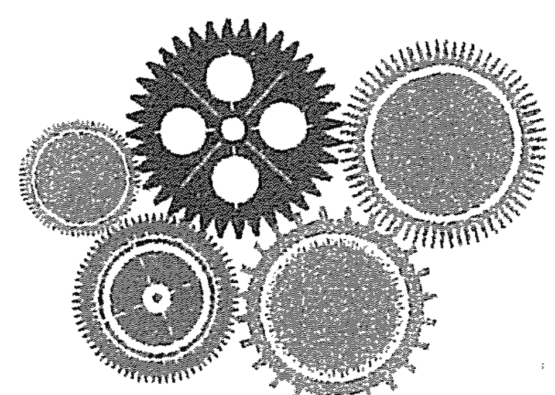

# 生命数字学——来自毕达哥拉斯的数字智慧

### 数字 1 创造和自信

创造力之能量，如浪潮一般
是滋养大地的太阳，雷电撞击的闪光
吸入这股能量，感受它的力量
它能创造、滋养或毁灭
你如何引导创造力之能量
它是淤塞还是畅通无阻
它如何以正面方式表现
如何以负面方式表现
自信地释放出内心之创意，人生将如何
有人自称尚未找到自我
但自我不是找来的，而是自己创造出来的

> ——汤玛斯·沙兹

### 数字 2 合作与平衡

想象有两只手，一只张开，准备施予
一只紧握如拳，准备抗拒
你最常伸出哪一只手
两只手伸出的频率相同吗
是否容许自己接受与付出相当
是否助人过度而心生嫌恶
你的责任何时尽
他人的责任何时开始
可曾寻得人生的平衡点
和别人做朋友之前
先得和自己做朋友

> ——小罗斯福总统之妻、人道主义者伊莲娜·罗斯福

### 数字 3 表达与创造

想象玫瑰蓓蕾紧闭的花瓣
包裹着一颗耀眼的心
充满热情
却未完全展现它的美
直到花朵绽放
它因怀疑而紧闭不开
自我怀疑如何影响你的人生
你坦然表露情感
抑或如玫瑰花蕊紧紧掩藏
伟大的发现皆来自那些
感情先于思考者

> ——帕克斯特

### 数字 4 稳定与程序

像一座施工中的宅宇
地基已打妥，主体架构已立起
按部就班进行
你的人生之宅如何呢
它是否揭露你的人生目的
可曾加固地基
可曾按部就班构筑人生

> ——欧莎·强森

### 数字 5 自由与规范

想象一只高飞的鸟，感受到一种自由
为了彻底体验人生
她必须落地，费力地筑巢
如此的规范产生另一种
体验深奥人生的自由
你可曾感到自由
或受局限
能否运用规范探索人生之深奥
在深奥中找到另一种自由
冒险不存在于外界，而是存在于内心

> ——大卫·葛瑞森

### 数字 6 完美与接纳

像正义与平等的天平，保持完美的平衡
代表公正与崇高理想
理想指引你的人生，抑或统御你的人生
你的愿景为何
如何付诸实行
能否接纳自己，接纳他人
或处处要求完美
能否欣赏人生隐含之美
能否欣赏不完美之完美
所谓接纳，意指不论发生什么
不论我们如何反应
旨为追求至善及学习所需

> ——佚名

### 数字 7 信赖与坦诚

想象你看见一个阴暗洞穴
一朵明亮的大花漂浮于黑暗之中
因内在智慧而熠熠生光
但花朵藏于洞穴中，因它不懂自己的美
深怕暴露自己，见了光，将受到摧残
你像不像这朵花
可曾邀请他人进入你私密的空间
何不怀着自信走出洞穴
表露真心、脆弱和内心的光芒
能轻松过生活即代表我们愿意信赖别人

> ——佚名

### 数字 8 富足与权利

想象一个丰富的角杯
满装五颜六色的水果、宝石、黄金
准备与愿意站出来，一起踏上旅程的人分享
你喜不喜欢这样的丰富
如何踏入世界
丰富的角杯是否已存在你的心中
若失去钱财，我们真正的财富即是自我价值

> ——佚名

### 数字 9 正直与智慧

想象一位孤独的智者沿着一条暗路走着
黎明仍未到来，他手里提着一盏灯笼
就像是指引他人去路的一盏明灯
遮掩孤独的智者，为他人照亮去路
只能照亮他们心中想去往的道路
如果他偏离了路径
其他追随的人也会跟着偏离
如果你是这位智者
你能使自己成为别人追随的典范吗
你能利用自己的德行启发他人吗
我的生命就是我的导师

> ——印度圣雄甘地

# 后记

### 后记① 提出“万物皆数”理论的毕达哥拉斯

在爱琴海东面，被一片海水包围着的是现在仍旧属于希腊的萨摩斯岛。萨摩斯岛在希腊的东方，也属于旧称的小亚细亚地域，离希腊本土的雅典大约有400多公里的海路。岛上阳光充足，气候湿润，温度适宜，成了葡萄生长的乐园，这里酿造的葡萄酒，蜚声海内外，酿酒也就成了小岛居民的主营生计。

大约在公元前570年，一个小男孩在小岛上出生了，他的名字叫毕达哥拉斯。想要了解毕达哥拉斯，就像是研究远古超新星的残余物。我们今日所能见到的，是膨胀的白炽气体云与迷蒙的尘土。我们推测，唯有巨大的爆炸才有可能产生这种现象。然而，当我们朝中心看，想找出爆炸的来源时，超亮的火球却又让我们无法看清。因为有关他的身世，留下的文字记载很少，流传下来的，更多的是关于他的研究和成就。

接下来，就让我们一起来了解下这位伟人的巨大成就。

毕达哥拉斯，今人尊崇为数字、几何、天文、音乐之父，希腊哲学家、数学家。他费尽一生心血研究数字与宇宙的关系，提出“万物皆数”的观点，认为数字是万物的原则、起始的根基。他相信数字不只是用来测量东西的工具，也同时具备能量与频率，并且会以音乐或热能等能量形式呈现于生活当中，正如音乐能影响人的情感，数字也会直接影响人的生活。物理、化学、人、特质特性、时间周期、地点、食物的种类，以及每件存在的事物，一切自然现象和人世间现象，从宇宙结构到四季变化，从音乐到人生，无不受数字的支配，也都可以用数字来解释。

毕达哥拉斯在年轻的时候，去过埃及和巴比伦，学习埃及人的几何学知识和巴比伦人的数学知识。那时的埃及和巴比伦，已经有了很高程度的建筑工艺技巧，是那些有志于将来留下印记的人朝圣之地。

埃及人那种快速的几何测量和计算，给毕达哥拉斯留下了深刻的印象，似乎埃及人知道许多几何学的点、线和面的关系。但毕达哥拉斯觉得，埃及人是将那些关系视作是当然的，是天经地义的，他们并没有去推究这些几何关系后面究竟隐藏着什么样的奥秘。回国后，毕达哥拉斯终日研究隐藏在数字后面的秘密。

他首先探究数字和几何图形的关系。他的智慧在这里派上了用场，他通过几何与逻辑的分析，从数学上严格证明了只要是直角三角形，平方关系就一定正确；反过来，只要平方关系成立，三角形就一定是直角三角形。毕达哥拉斯相信，他不需要去一一验证所有的三角形，不论何时、不论何地，哪怕天长地久，海枯石烂，平方关系永远正确。

这就是著名的毕达哥拉斯定理，即“勾股定理”，它让毕达哥拉斯成为古希腊数学家中的一位名人。几乎每个学过勾股定理的人都知道他发现这个定理的轶事。据说他发现勾股定理之后欣喜若狂，宰杀了一百头牛祭神，勾股定理也因此在西方被戏称为“百牛定理”。

对毕达哥拉斯及其追随者而言，数是神圣的，他们将数视为宇宙最根本的来源与组织化的原则。毕达哥拉斯有充分的自信相信他是对的，因为他是在数学上证明了关系的正确。所谓的“数学的证明”是这样的：第一步，先利用一些绝对显而易见的，无需证明的事实作为基础，它们叫公理；第二步，在公理的基础上，通过一环扣一环的逻辑演绎和推理，去证明一个结论成立。因此，如果公理正确，每一步的演绎逻辑正确，则结论就一定正确。不论何时何地，不论外在环境如何改变，数学证明的结论永不改变。这就是数学证明的魅力和美，它是绝对的。

毕达哥拉斯将科学思想的焦点从物质转移到了形式上，他认为若是没有形式，包括模式、组织与关系（以数字表达最为完整）等在内的任何事物都不可能存在。毕达哥拉斯强调形式，从而开启至今在科学中仍普遍可见的重要对话。其中一个范例即是量子理论，以概率取代实体，物质化为纯信息。

毕达哥拉斯再次转向，研究数与自然的关系。有一天，他路过萨摩斯岛上的一家铁匠铺，铁匠们挥动铁锤敲击物件的声音一般来说都是杂乱无章的噪音。但是，毕达哥拉斯感觉有时候铁锤敲击的声音有着美丽动听的韵律和谐感，这是一种类似于音乐的和声。他感觉很奇怪，于是开始长时间聆听和研究其中和声的原因。他发现，如果不同的铁锤的重量依次成整数比值，它们共同敲击物件时，和声就会出现。这就是说，如果第一把铁锤的重量为 10 公斤，第 2 把铁锤的重量是第一把的 1/2，即 5 公斤，第三把为第一把的 1/3，即 3.33 公斤，以此类推，那么，这些铁锤的共同敲击就会出现和声。

毕达哥拉斯从铁锤和声得到结论，让他欣喜若狂。他知道，他有事情要做了。他马上开始研究琴弦在何时会产生和谐的音乐声。结论也是在弦的长度的 1/2 处、1/3 处或 1/4 处按压弦，弦的声音就会产生和谐的声音。

我们可能永远无法得知，琴弦长度与音符之间的简洁关系，这是世上首度证明人类的主观经验（我们在弹奏八度、五度和四度和弦时听到的谐调）具有纯数学的基础。在这里重要的是数的关系，构成琴弦的物质则无关紧要。弦长比例为 2:1 时，总是产生八度音，3:2 时是五度音，4:3 时是四度音。亚瑟·柯斯勒写道：“这是人类首度将质成功简化为量的做法，从而开启了科学的大门。”对毕达哥拉斯及其追随者来说，这是一个神奇的发现，仿佛众星在天上清楚排出字来一样惊人。他们在那些嗡嗡作响的琴弦与整数比例中，发现创造的奥秘。范围无限的音调就像是本源的无限。数是创造音符与其和谐关系的限制原则，也是建立形式与模式并决定人类所见、所听内容的限制原则。

在毕达哥拉斯的思想中，这个观察结果形成了宇宙定律。若前四个数掌控着声音与音乐，那么数与其彼此间的关系必然无处不在。此外，数支配一切，而物质只要按照这些神圣比例分割即可，其本身并不重要。他们认为数不仅是抽象的概念、秩序的来源，还是组成宇宙的实际物质。

毕达哥拉斯提出美也是由数来决定的，这就是伟大的“黄金比例”。它的定义是把一条线段分割为两部分，较短部分与较长部分长度之比等于较长部分与整体长度之比，其比值是一个无理数。凡是物体的长宽比符合黄金比例的话，则物体会呈现和谐的美。黄金比例的比值大约是 0.618。0.618 也是一个神奇的数。2500 多年后，中国数学家华罗庚在推广他的优选法时，正是用了比值 0.618 来决定实验的选点的，效率由此提高。据说达芬奇的不朽名画蒙娜丽莎，以及古希腊的绝美雕塑断臂维纳斯的体形都利用了黄金比例。

“万物皆数”的观点提供了一种解释世界的思路，毕达哥拉斯相信万物都包含数，甚至万物都是数，上帝通过数来统治宇宙。

作为一位卓越的精神导师，毕达哥拉斯是现代生命数字学的始祖。在探索生命奥秘的过程中，他发现数字对一个人有极大的影响，无论是有形的物质部分还是无形的精神和行为，都与数字息息相关，密不可分。他认为自然的神秘，所给予人的永远超出了人的预期。透过对数字的了解，透过这门探索数字精神内涵的哲学，可以揭示宇宙秘密。他的生命数字学有自己独立的数字系统，该数字系统结合了数字、几何学和算数的原理，从这些方面综合来找出数字的象征意义。他向世人指出：通往幸福人生之路，乃在于发展自我（个人成长），追求真、善、美，要充分运用直觉。他教导世人必须经由身、心、灵的不同层面来了解自己，借由这方面的知识选择适合自己的生活方式、职业、才能、饮食和运动等，而这一切，都可以从数字中找到规律和方向。这，就是我们分享的生命数字学。

深深致谢毕达哥拉斯为人类觉醒所做出的巨大贡献！

### 后记② 经由认识你自己，才能认识这个世界

我是谁？我从哪里来？我到哪里去？ 经由认识你自己，才能认识这个世界。

在古希腊德尔菲神庙门楣上镌刻着这样一个神谕——“人啊！认识你自己。”“认识自己”也是苏格拉底最爱说的一句话，他特别爱用这句话来教育他的学生。

我们每个人的人生都会遇到三大终极问题，这三大问题在我们生命的不同阶段、以不同的方式出现，或自问，或被问：我是谁？我从哪里来？我要到哪里去？

当我们身不由己，被迫屈从于外界压力的时候，当我们随波逐流的时候，我们会问“我是谁”；当我们对生命的意义感到困惑的时候，我们会问自己“我为什么活着？我活着的目的是什么”；浑浑噩噩的人生不是我们要的，生不如死的生活也不是我们要的，前方的路，一片迷茫，我到底从哪里来，又要到哪里去呢？

人生有太多我们百思不得其解又很值得我们思考的问题，在思考探索的过程中，我们又有了新的问题，问题叠着问题，我们经常会深陷其中而不能自拔。很多人，终其一生，也没有想明白人生这三个终极问题。可是生命总有尽头，撒手人寰之际，我们是满怀骄傲幸福地离开，还是满腹遗憾不忍地离去？

《临终护理札记——弥留之际的遗憾》的作者卢东杰采访了上千个临终护理员，在他们护理过的千千万万人中，每个人都有自己的故事，所有故事的遗憾大都指向“我没有怎样”，回头去看，才发觉自己并不了解自己，也没有完全活出自己。所以，夜深人静的时候，问问你自己，什么才是你真正追求的生活？什么样的人生才是你要度过的人生？最终，你要成为什么样的自己？

如果我们能够活出苏格拉底的那句格言“认识自己”，这些问题也许就都有了答案。

- 认识了自己，你就知道你是谁；
- 认识了自己，你就知道你从哪里来；
- 认识了自己，你就知道你要到哪里去。

可是，我还不认识我自己啊？我们怎么才能认识我自己呢？

苏格拉底认为，要认识自己，首先就要经常对自己进行审视，他说“未经审视的人生不值得过。”曾子曰：“吾日三省吾身：为人谋而不忠乎？与朋友交而不信乎？传不习乎？”可见审视自己确实是个技术活，经常审视自己的内心，你才能知道自己是谁。

审视完自己之后，要通过周围的环境，才能定义自己。就像我们要定义一件物品，就要定义它的颜色、形状等属性。从哲学上说，列宁就是通过物质和不同于物质的意识的关系来定义的，他说物质是通过人的意识复写、摄影与反映，但是又不以人的意志而转移的一种客观存在。简单地说，物质不是意识，但是必须通过意识才能认识物质，人不是环境，也要通过环境才能认识人。

认识我们自己还要通过我们和周围人之间的关系。科学家发现狼孩没有意识，狼孩不能算真正意义上的人，他们是人，又不是人。是人，只是肉体的人；不是人，是因为他们周围没有其他人，他们没有了社会属性，只能说是人这种动物，而不是严格意义上的人。

狼孩没有意识这个事实说明，作为人的意识不是生来就有的，意识是自然界长期发展的产物，但不是纯粹的生物学过程，它是社会的产物，是精神现象，不是物质现象。所以无论是人类意识还是个人意识的形成都离不开社会，离开了社会，离开了人与人之间的社会关系，就无所谓意识。

我们认识自己也是如此，我们是爸妈的儿女，是儿女的爸妈，是兄弟的兄弟，是朋友的朋友，这些相互关系，定义了我们自己。作为人，我们有着太多的角色与属性，所以审视自己是一个多角度、全方位的过程；作为人，我们是不断进步、不断成长的，所以审视自己又是一个长期的过程。

总之，要认识世界，首先要认识自己。要认识自己，就要像锻炼身体一样不断审视自己。

《生命数字学——来自毕达哥拉斯的数字智慧》就是让你拥有一个认识自己的工具，让你抽离出来，以旁观者的角度来审视你自己、分析你自己、研究你自己，直到你终于认清自己，读懂自己；你就可以轻松地回到生活中，带着觉察和反思，去结识同频共振的人，做自己想做、适合做的事情，去自己想去的地方，过自己想过的生活，直到成为自己想成为的自己，圆满一生。

此时，当您终于放下手中厚厚的书，是否有拨云见日、全身畅快的感觉？这是一份内在的照见，更是一份生命的觉醒，恭喜您，终于有机会开始深入了解陪伴很多年的那个“您”。

当然，这本书就像一本字典或词典，让我们轻松快捷地学到很多知识、概念和理论。在需要的时候快速查找确认，这也是我撰写此书的初衷之一——为我们的学员提供一本生命数字学的“工具书”。窥一斑不足以观全貌，这还是属于认知层面的部分，我们认识很多字词，并不代表我们能写出内容精彩、令人拍案叫绝的文章。

每个人的生命都是灵动而多变的，每时每刻都是一个崭新的自己，这就需要我们具备综合解图能力，具备发展观、全局观，学会客观全面地解读每个人的生命能量。知识依靠认知就可以获取，能力则需要刻意培养和实践训练，本人暂时无法通过文字清晰而明确地传递这种能力给您。所以如果您想具备综合解图的能力，也唯有通过专业的学习和大量的训练。

纸上得来终觉浅，绝知此事要躬行，欢迎走入我们的系列课程，期待有缘相见，深深地祝福你！

# 附录

### 附录一 数字1-9的三种能量表现

| 数字表现 | 纯正 | 过多 | 过少 |
| :--- | :--- | :--- | :--- |
| 数字1=男人 | 自信/阳刚 | 自负/自大 | 自卑/软弱 |
| 数字2=女人 | 柔软/包容 | 迎合/讨好 | 生硬/硬邦邦 |
| 数字3=孩子 | 表达/喜悦 | 聒噪/亢奋 | 沉默寡言/消极负面 |
| 数字4=物质基础 | 真实/稳定 | 较真/固执 | 自欺欺人/散乱 |
| 数字5=能量中心 | 自由/冒险 | 不服管/狂野 | 压抑/胆小 |
| 数字6=家庭和爱 | 爱和责任 | 多管闲事/过度承担 | 冷酷无情/不负责任 |
| 数字7=精神世界 | 思考/研究 | 上脑/教条 | 轻信/蠢笨 |
| 数字8=钱权名利 | 影响/力量 | 贪婪/暴力/操控 | 贫穷/懦弱/被操控 |
| 数字9=使命梦想 | 慈悲大爱 | 过度慷慨/滥爱 | 多疑/吝啬 |

### 附录二 生命数字学——来自毕达哥拉斯的数字智慧（综合解图训练）
——8大板块、30个维度的综合解析

| 一、自我探索解图 | |
| :--- | :--- |
| 1. 过往数个个人年能量探索 | 2. 过往亲情往来探索 |
| 3. 过往友情经历探索 | 4. 过往爱情经历探索 |
| 5. 过往职业和事业经历探索 | 6. 过往财富探索 |
| 7. 过往人际关系探索 | 8. 过往高峰体验探索 |
| 二、全图综合解图训练 | |
| 1. 从制约解全图训练 | 2. 从黑洞解全图训练 |
| 3. 从个人年解全图训练 | 4. 从性情数字解全图训练 |
| 三、双人图解图训练 | |
| 1. 亲子关系解图训练 | 2. 夫妻关系解图训练 |
| 3. 合作者关系解图训练 | 4. 上下级关系解图训练 |
| 四、三人图解图训练 | |
| 1. 家庭图解图训练 | 2. 企业高层关系解图训练 |
| 3. 三方关系解图训练 | |
| 五、企业图解图训练 | |
| 六、一对一数字咨询训练 | |
| 七、多对一数字咨询训练 | |
| 八、生活应用主题解图训练 | |
| 1. 兴趣爱好选择解图训练 | 2. 职业规划解图训练 |
| 3. 工作事业调整解图训练 | 4. 人际关系协调解图训练 |
| 5. HR识人用人解图训练 | 6. 财富收入解图训练 |
| 7. 身心健康解图训练 | 8. 情绪疏导游解图训练 |

### 附录三 专业的人做专业的事，幸福在路上

| 心累的女人必看 | 家有孩子必看 |
| :--- | :--- |
| 1. 为孩子的事情——心力交瘁 | 1. “慢”：说话慢，走路慢，反应慢 |
| 2. 为夫妻的事情——一筹莫展 | 2. “闹”：爱哭，不睡觉，睡不着觉 |
| 3. 为爸妈的事情——有心无力 | 3. “晃”：走路不稳，肩膀歪斜，易摔跤 |
| 4. 为感情的事情——焦头烂额 | 4. “怕”：怕声大，怕人凶，怕黑，怕一个人 |
| 5. 为工作的事情——进退两难 | 5. “笨”：不理解，不明白，不知道，不会 |
| 6. 为身体的事情——痛不欲生 | 6. “动”：皱眉、挤眼、咧嘴、耸肩、发怪声（频繁出现） |
| 7. 为过去的事情——耿耿于怀 | 7. “厌”：厌学，厌家，厌社会 |
| 8. 为了所有人，唯独丢了你自己 | |
| 无论您内心多么强大，您首先是个女人，需要爱，需要被看见，需要保护和关怀，需要陪伴和支持，需要倾诉和理解…… | 孩子的教育不可逆，任何成功都比不上教育孩子的失败！看见即改变，切勿因无知无畏耽误孩子一生！ |
| 当您或您的孩子出现以上情况时，请扫描二维码，联系罗老师，专业的一对一辅导和远程调理一定能帮到您们！ | |

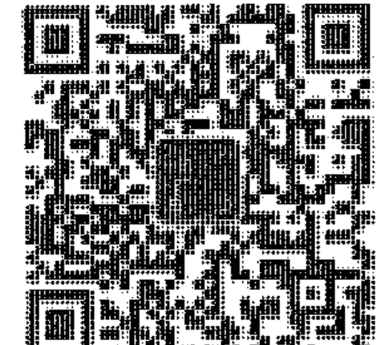

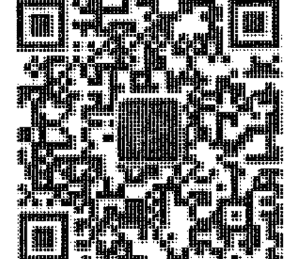

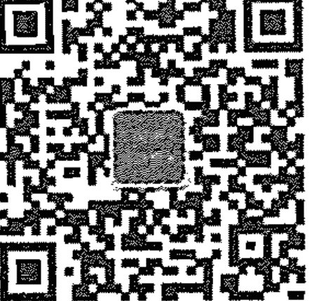

助理微信

作者微信

茁琳生命数字

如果您想全面了解您的生命数字地图，如果您有困惑想咨询或了解课程，欢迎加微信或到公众号留言，扫描上图您需要的二维码，关注公众号：茁琳生命数字。