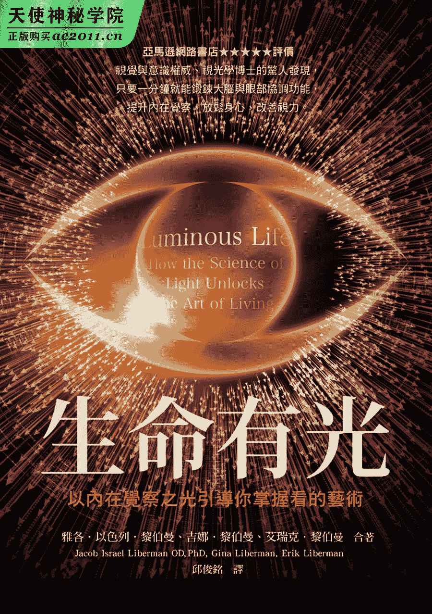

# 目录

1.  封面
2.  探索生命书系总序
3.  题词
4.  本书赞誉
5.  对黎伯曼博士著作之赞誉
6.  版权声明
7.  免责声明
8.  推荐序　让光引导你创造出充满意义的生命
9.  前言　发现光之科学与生命的奇迹
10.  第一章　来自光的引导
11.  第二章　内在光芒
12.  第三章　依光而活
13.  第四章　光的智性
14.  第五章　梦中之光
15.  第六章　脱离心智场域
16.  第七章　发现内在天赋
17.  第八章　觉知是药
18.  第九章　令你屏息的事物
19.  第十章　真正的吸引力法则
20.  第十一章　全光谱的生活
21.  第十二章　在科技世界的生活
22.  第十三章　注视越少，看见越多
23.  第十四章　吸引你目光的事物
24.  跋
25.  致谢
26.  章节附注
27.  参考资料
28.  版权页

# 探索生命书系总序

二〇一二年前，众声喧哗，末日预言不绝于耳。

一方面，我本着对“赛斯资料”的信任，也祈求他独排众议的说法得以证实。简言之，他声称二十一世纪上旬，世界虽然仍有战事与天灾，却无第三次世界大战。并且，到二〇七五年时，人类将有一个大同世界！另一方面，即使成为“一百只猴子的寓言”中的一员，我也想默默地为世界的未来尽一份力，为达成“一体平等”的灵性觉悟而努力。

我不敢声称自己已开悟，而且我最喜爱的“赛斯”也从没提过这个词儿。不过，在求道的过程里，我无意中悟出“除了神没有别人。除了爱没有别的。”（There is No One but God. There is Nothing but Love.）当下，在无边的寂静安宁中，我的心中充满了狂喜与爱，这份爱又满溢为感恩之情！我体会到我一直在宇宙的爱中，宇宙的爱也一直在我心中。而，世人也莫不如此！不同的是，有没有体会到，有没有连上线。在一体平等的感悟中，我谦逊地臣服，自然放心又自在。不由得散播出爱──平等的频率！

于是，完成了告别之作《与神同心──依爱随行》，我便退休下来。想读的都读了，想分享予读者的也都真诚地写了下来。此生足矣！

在《与神同心》的后记里曾提及我的天命──推介与翻译新时代的好书──已经完成了。没想到二〇一五年四月，素未谋面的蒋圣光先生，带着家人约我在中华新时代协会见面。历经海外创业的艰辛，如今他已是卓然有成的企业家。他开门见山地说，自己读遍了我推介的新时代书籍，也邀同家人一起钻研。哇！这让我立即视为知音，因为，连我都没有主动要求家人研读呢。

作为一位成功的企业家，可以想见，蒋先生必然是位有主见，有魄力，并且格外有执行力的人。他说，运用从新时代书里得到的智慧，他成就了他的事业。如今，他想（并且已着手进行）设立出版社。一方面找回一些已绝版的新时代书籍，一方面当然也将眼光放远，胸襟放大，继续以自由开放的精神，开创“探索生命书系”，向生命致敬，完全不计盈亏。

由美返台近四十年了。从一九八九年开始，我正式投入新时代运动。当时，曾将我心中陶炼出来的“新时代运动”七要素，作为选书立说的准绳；并有助于分辨何谓“新时代”这个新“范型”（paradigm）与二十世纪中期前的旧范型有何不同。

这七个要素就是：

一、我们皆为神的一部分：有神论，但此神并非有组织宗教高高在上的“偶像”，而是无形无相，一切的根源。祂乃是宇宙意识，我们的“源场”，而我们皆为其分出的一小片。祂透过我们每一个来体验物质世界，完成整个拼图。

二、你创造你的实相：你有多生多世的生命，并且是个多次元的存在。因此，不怨天不尤人，为自己的一切负起责任。从而省视自己为何作出如此的选择，要学习的是什么。

三、肯定人生的意义：不悲观，不耽溺。最重要的是培养清明的觉知和一体的慈悲。

四、道德的内在性：不盲目跟从传统，不媚俗。返归自性，找到内心那一念灵明，依之做人处事。

五、身心健康是种自然状态：心理有问题，郁闷不快乐，自怜或自恨，能量堵塞不觉知时，才会不适。

六、环境保护：这攸关全人类的存亡。我们不能再视而不见，当作是别人的事。生态环保，人人有责！

七、无条件的爱：也就是对人的一体大爱，而非在关系中只顾自私自利的比较、争夺、交换、控制。

至今，觉得那篇文字，还是相当切中新范型的精神。

不具权威性和强迫性，新时代不是宗教。它不崇拜偶像，也不自立为偶像。没有阶级组织，没有教条，没有戒律，也不等待外在的神明、圣贤、大师来拯救你。

赛斯说，认识自己就是认识神，因为你们都是和祂同一幅料子裁制出来的！

虽然，普罗大众仍不见得了解新时代的“奥义”。但至少，经过三十年的“百花齐放”，现今社会上也习于其种种的观念和用语。从生活面的应用：慢活，身心的放松平衡，爱自己从而爱别人，更新而平等的亲子关系，伴侣关系；到最深的灵性认知：生死学，生态保育，宇宙论，哲学思辨，或多或少都看到新范型的影响。整体而言，社会风气无形中也改善了不少，好比，双赢互利，人权以至动物权的伸张，性别平等的推广，人们彼此相处的包容，体谅与温暖─此间往往看到人性的光辉！

这个人间世，就是我们的舞台。贩夫走卒，帝王将相，都是我们生前和梦中不断参与编写，而于醒时演出的一齣齣好戏。所谓的觉醒，就是参透了镜花水月，将注意力由外在舞台返照回来，成为中立的观者，醒悟自己演出的意义！能如此，就是找回了自性，开始走向返乡之路。

不知从何时开始，我自觉到我有一项特性：我不会以个人追求自心的明晰、自在与幸福为满足，仍深爱着人类自古以来种种文化艺术哲学上的成果，为之赞叹不已！同时，也深深牵挂着人类未来的展望与福祉。当然，也关注着现世的兄弟姊妹，世间的种种困惑和苦难。记挂着、记挂着……不会忘也不想忘，作不了佛家所谓的自了汉。但由于相信自由平等，也从不愿将自己的喜好和浅见强加于人，只能以出书的方式，给大家一个提醒和自由选择的机会。

安然度过了二〇一二年，不过，世局天象，时时风云诡谲！我有幸活着一天，就要为世界人类的平安幸福努力一天！所以，蒋先生要我写篇总序，替“探索生命书系”揭开序幕时，便答应了下来。但愿，我过去的努力，促使世界进入新时代，现在则有助于世界迈向黄金时代。

且让我们共同为未来的大同世界，尽其所能地提供贡献吧！

# 题词

宇宙中有个核心一直将知识、力量与灵感传给我们，我的头脑仅是负责接收讯息而已。虽然还未究竟这核心的诸多秘密，但是我知道它是存在的。

──尼古拉‧特斯拉（Nikola Tesla）^(（注 1）)

# 本书赞誉

视觉不仅止于眼睛，探索生命从心开始。

吴承臻

澳洲行为视光师，台湾低视能防盲学会秘书长

《低视力学》共同作者

本书将光、意识、临在、觉知等等的灵修概念，化为实际运用的生活指引，让我们能真正“看见”自己与世界。

彭芷雯

一心学院创办人，心灵作家

本书突破了实相与心灵的界线，透过讲述光和意识的关联，让人们更加的“临在”。

安一心

华人网络心灵电台共同创办人

千万不要被书名煳弄了，本书绝不是你以为在谈光能量的课程，绝对是超越你所认知的灵修书，它将东方智慧与西方新时代思想紧密融合，非常赞叹雅各‧黎伯曼博士以西方灵性思维，全新诠释我们老祖宗老子的智慧。一本值得珍藏的著作不单是内容，而是它能够以一种厚实的思想为主干，吸引与挪移看似毫无关连的独立思想，黎伯曼博士完全做到这一点。

宇色

我在人间系列暨塔罗牌作者

华人网络心灵电台主持人

雅各‧黎伯曼巧妙结合现代科学与哲学智慧以揭示光的秘密，让全世界能够从中获取全然的转变与疗愈。

布鲁斯‧立普顿博士（Bruce H. Lipton, PhD）

生物学家，着有《信念的力量》（The Biology of Belief）

《蜜月效应》（The Honeymoon Effect）

在读过本书后，你所看见的一切真的会超出你的想像。

劳瑞‧杜西医师（Larry Dossey, MD）

着有《一心》（One Mind）

本书对于光与意识的深入探索，能帮助我们看到光与意识对于身为人类的我们在各方面的影响。

狄帕克‧乔布拉医师（Deepak Chopra, MD）

着有《你就是宇宙》（You Are the Universe）

意识的探索有许多途径，而黎伯曼博士所走的途径，亦即光与视觉之道，都在本书中有着精妙的论述。我非常推荐这本书！

阿米特‧哥斯瓦米博士（Amit Goswami, PhD）

量子物理学家，着有《自我意识的宇宙》（The Self-Aware Universe）

本书就像是一副视力为 1. 0 的眼镜，让我们能看到存在、临在与自己的发光本质，而且说不定这是我们有生以来第一次可以看得那么清楚的时候呢。

麦可‧伯纳‧贝克维（Michael Bernard Beckwith）

着有《灵性解放》（Spiritual Liberation）

雅各‧黎伯曼博士在本书中清楚解释与你有关的真理，能够强化你的天生聪慧，并且能允许宇宙的智性扩展你在生命层面的视野。

唐纳德‧埃普斯坦（Donald M. Epstein）

EpiEnergetics 能量疗法创始人

着有《疗愈的十二个阶段》（The 12 Stages of Healing）

# 对黎伯曼博士著作之赞誉

那些应要去珍惜、分享以及最重要的实践之灵性真诀的精华，都藏在简练与质朴中。

艾克哈特‧托勒（Eckhart Tolle）

着有《当下的力量》（The Power of Now）

雅各‧黎伯曼……引导我们以具有力量的新观点来看待自己、亲密关系，还有对内与对外的个人视野。

约翰‧葛瑞博士（John Gray, PhD）

着有《男人来自火星，女人来自金星》

（Men Are from Mars, Women Are from Venus）

雅各‧黎伯曼是我喜爱的灵性导师之一！

露易丝‧贺（Louise Hay）

着有《创造生命的奇迹》（You Can Heal Your Life）

雅各所分享的概念……反映出目前那股新兴的体认……觉知会改变所有的经验，无一例外。

盖瑞‧祖卡夫（Gary Zukav）

着有《新灵魂观》（The Seat of the Soul）

我喜欢黎伯曼博士所著的《源自空无之心的智慧》（Wisdom from anEmpty Mind）！

尼尔‧唐纳‧沃许（Neale Donald Walsch）

着有《与神对话》（Conversations with God）系列书籍

貌似简单，实为深奥的洞见。

邦妮‧瑞特（Bonnie Raitt）

创作歌手

阅读黎伯曼博士的作品就像是倾听我自己所说的话。

拉姆‧达斯（Ram Dass）

着有《活在当下》（Be Here Now）

黎伯曼博士的著作《光：未来的医学》是关于借由眼睛获得光的疗效之里程碑。

弗里兹‧霍尔维希医师（Fritz Hollwich, MD）

着有《眼睛的感光性对于人类及动物的新陈代谢之影响》

（The Influence of Ocular Light Perception on Metabolism in Man and in Animal）

雅各‧黎伯曼的先进思想将深刻的健康智慧与灵性了解带进光与光疗中，使光与光疗的奇迹效果开始有属于洞见的新层次。

盖布里尔‧考森斯医师（Gabriel Cousens, MD）

着有《灵性养分》（Spiritual Nutrition）

黎伯曼博士的美妙著作中所具有的敏锐度、深刻的人性关怀及精妙的洞见，使其成为存在状态的全新秩序之指导手册。

珍‧休斯顿（Jean Houston）

着有《人的可能》（The Possible Human）

对于整体健康而言，光是关键的环境因素之一。真的，眼睛就是灵魂之窗。《光：未来的医学》帮助我们打开那扇灵魂之窗。

诺曼‧席利医师（Norman Shealy, MD）

美国整全医疗协会（American Holistic Medical Association）创始会长

雅各‧黎伯曼博士结合个人与临床的多年经验及其病患常出现的惊人疗效，而发展出新医疗范型的基本模式。

约翰‧欧特博士（Dr. John Ott），光生物学先驱

着有《健康与光》（Health and Light）

雅各‧黎伯曼博士是意识启发技术的先锋，为现实的科学与形上的玄学做出能够发挥彼此长处的结合。而在二者兼容的专业领域中，很少有人能像他那样可以汲取深奥的智慧原则，并应用这些洞见与研究，还将自己开创出来的“新”见解提供给“愿意去看”的人知道。

丹‧米尔曼（Dan Millman）

着有《深夜加油站遇见苏格拉底》（Way of the Peaceful Warrior）

# 版权声明

版权所有。除了可能会在评论中引述简短段落的评论人以外，在没有得到出版商书面同意之前，本书全部或部分均不得以任何形式或方式，包括电子、机械或其他形式翻印、储存在可供检索的媒介或传递。

# 免责声明

本书所载信息系以教育为目的，并无取代合格医事执业者或治疗师的诊断及治疗之意。对于运用书中建议所达到的功效，我们无法给予明确或间接的保证或责任承担。

# 推荐序　让光引导你创造出充满意义的生命

──詹姆士‧欧须曼博士（James L. Oschman, PhD）

着有《能量医学之科技基础》（Energy Medicine: The Scientific Basis）

在回想自己的个人成长所遇到的转折，还有遇到良师与一些概念，促使自己加速觉醒到更从容、更健康、更快乐与更成功的人生时，你会觉得人生竟因一个简单概念而改变，真是太神奇了。

许多年以前，我跟一位科学家住在一起，而她所示现的至简生活方式改变了我。她不安排自己的生活、不费力思索及计划自己的下一步，而是在一早起床之后处理第一件自行冒出来的事情、然后处理第二件，之后依样处理当天后续的事情。无论生活中的挑战有多困难或复杂，这样的作法使她能毫不费力地通过那些考验，不去思索、抉择、计划或担忧可能会发生的状况。虽然这一切听起来相当简单，然而雅各‧黎伯曼博士在这本书中以宽阔许多的背景脉络来探讨这种存在状态。

任何吸引你目光的事物，事实上也在找你。黎伯曼借由思考光在这个过程所扮演的角色，而在这本书中详细阐述这种放松又具生产力的生活状态。光将你的觉知带到自己的责任，时时引导你创造出充满目的与意义的生命。“我们无需安排任何事物的优先顺序，因为生命的智性已经为我们安排妥当。”这种的留白生活，就是他所说的临在（presence）。“不知道……会让真正的智慧自行示现”等概念以及其他许多想法就收录在你手上这本颇具重要性的书中。

黎伯曼解释这种面对日常生活的态度，使我们能够允许光以及其忠实伙伴：呼吸，来引导自己并“以更透澈的了然与更深邃的接受来看见自身生命的内在运作”。他还引述印度圣雄甘地对于古老智慧的摘要（参见第四章），亦即“宇宙中有股力量，如果我们允许的话，它将透过我们创造出奇迹的结果”。

我目前的研究当中有部分即是将宇宙中这股“力量”背后的科学化为文字纪录。黎伯曼的著作使我的探索过程大为加快，他指出那股力量为“我们内在的导引系统”赋予活力，而“该系统也跟那赋予宇宙万物生命的事物无从分割”。臣服在这股力量的“纯粹觉知”，能引领到奇迹与深层疗愈。“我们在身体与情绪方面的许多疾患，也许是身体被那些与身心安适冲突的概念所误导的结果。”（参见第八章）

本书将使你以全新的角度“真正看见”自身进化过程中的光与呼吸所具有的多种角色。它将帮助你发现自己的人生目的或命运，并了解当自己活出目的与命运时，为何能够产生出个人的本质、改变自己以及周遭的世界。而我喜欢的说法则是，当你在朝向生命目的或是顺从自身命运前进时，你的船帆会招满风力，而需要的工具也会出现。

在讲述故事时，黎伯曼大多会从一段经验的回想开始，并引出一个简单、深入但很少人会问的问题，后面会跟着相应的答案，然而答案的揭露过程可能会跟答案本身一样令人瞠目结舌。例如，他探讨了我们在梦中所经验到的光之来源，而梦境会显现出我们的内在光芒所形成的彩光是如何与自己的潜意识心智互动，以揭露深藏在自身清醒状态经验里面的真相，也就是我们的“无限本性”（参见第五章）。我们的故事与信念塑造出自己在清醒时的行为，而当我们去收集这些相关线索时，就能有更加透澈的了然以及更加明智的行为。

黎伯曼引述《塔木德经》（Talmud）里面的话语：“我们在看待事物时，不是以事物的本貌观之，而是以自己的存在状态待之。”放下我们对于自身存在状态以及可能性的信念，就会创造出发光的空间，能让我们向纯粹的觉知、无限的潜能与可能性敞开，以及发现那位处在我们里面的真正天才。无意识的灵感加上意识的活动，将会带来激励，继而实践，最后就是创造性的具现（参考第七章）。这就是受到灵感启发的行为之真正出处，如同爱因斯坦所言，为了要有创意：“想像力比知识更加重要。”

世界一流的运动选手、音乐家、舞者等等，当他们在达到完美的表现时会经验到一种意识状态，黎伯曼称之为“域”（zone），而他的工作就是协助顶尖运动选手更稳定进入这个“域”。我也因为一九九二年的经验开始朝着同样的方向努力。当时我正在观看奥林匹克冠军赛，花式熘冰选手伊藤绿（Midori Ito）的传奇表演与动作使我不禁感动流泪。虽然在之前的练习有遇到一些困难，她在比赛开始时还是展现出惯常的充分冷静与自制，其动作组合包括两个三周跳的连续组合以及三周半跳跃，后者使她成为第一位完成此动作的奥运熘冰女性选手。这段令人震撼的经验使我开始了个人探索，并在二〇〇三年出版《用于治疗及个人表现的能量医学》（Energy Medicine in Therapeutics and Human Performance），以及确认我称为“系统性协力运作”（systemic cooperation）之意识暨生理的状态。当处在“域”中时，人全身上下的组织、细胞与化学分子一起合力运作，那是自然、迅速、从容且直觉的过程，让表演者体现出全然的活力、临在、清晰及优雅。而黎伯曼在本书提出的一分钟静心，能够帮助我们进入“域”并以那种状态生活，这真是多么棒的礼物啊！

为了让身体各部分都能完美协力运作，细胞之间必具有快速通讯的方式，而以光速移动的光能为高速的生理整合运作提供完美的通讯机制。最近已经出现关于生物光子学的新兴跨领域研究，而黎伯曼在光与视觉的研究与洞见会是该类研究的关键。

雅各‧黎伯曼博士是真正具有远见的先驱者，他对于视觉的研究引导出关于光与视力的珍贵洞见，从而揭露出看见与生活的新方式。对于帮助人们维持自己最珍贵的礼物：视力，我想不出还有什么经验能比这还要更加圣洁与满足。黎伯曼的有些发现实在非比寻常，使他不得不进行仔细的科学研究以使自己信服它们的正确性，而其结果就是在须经同侪审查程序的科技期刊发表的一系列杰出论文，使他成为世上最富创意且受人高度推崇的视觉科学家之一。在本书中，黎伯曼使我们都能运用他的卓越发现，所以它不只是一本用来阅读与享受的书，而是一趟改变生命的旅程。

# 前言　发现光之科学与生命的奇迹

四十年前我还在担任视光师的时候，曾经历视力突然出现非常明显改善的现象，但当时的视力矫正技术其实并没有什么进步。那次奇迹事件所带来的效果持续至今已有四十年之久，它让我了解到，当我们用眼睛看事物时，并没有真的以眼睛来“看”。这促使我致力于找寻真见（true seeing）的源头，也就是光、视力与意识之间的链接。最重要的是，我开始问自己：我是谁？真正的观者又是谁？

为了解答这些问题，我开始学习量子物理学及神经科学，而这些知识启发我去深入探索那种使我的视力明显改善的心智状态。因此我开始对自身心智的运作进行实时性实验，希望能找出通往深层疗愈得以发生的意识状态之“门户”，让我能够教导他人如何重现我的经验。而这几年的探索，不仅改变我的生命，而且还找出一些关于光与视力的基本事实。这些洞见让我能够帮助数以千计的病患恢复他们的自然视力且无须使用眼镜，并成为我的最初两本著作：《光：未来的医学》（Light: Medicine of the Future）及《拿下眼镜来看》（Take Off Your Glasses and See）之根基。

之后的二十五年，我则是深入探索生命、意识以及那种难以捉摸、称为“临在”的状态。而这段时期的发现，也帮助我弄清楚光是如何持续引导我们的生命，你们也会在本书读到这部分。此外，这些突破是我在二〇〇六年一项发展结果之基础，衍伸出一台首度得到专利、业经临床证实、获得美国食品药物局认可的医学仪器，能够明显改善视力，也使我得以在二〇一〇年首次担任精微能量与能量医学研究国际协会（International Society for the Study of Subtle Energies and Energy Medicine, ISSSEEM）的主席。

##### 光的引导

为了让大家更加了解我的发现，就让我们从光以及对其较为概括的理解开始讲起。光不只是波与粒子，它还传布意识。光不仅是让我们为了看见东西而得要找到的“外在事物”，光还会找到我们、引导我们，其方式就像光会找到植物并引导它朝向光生长那样。它的里面有种天生充满活力的事物。而让我们感到惊奇的是，光不只从我们的眼睛与皮肤进入身体，也从我们体内散发出来。

想想看婴儿是如何看待周遭的世界，光点燃他们的觉知，完全没有思想、信念或担忧的阻碍，并从婴儿那里以纯粹临在的表现回照世界，这就是他们的眼睛之所以闪亮的原因。而当我们从心智处于自由状态的婴儿，逐渐长大成被教导要去寻找生命、爱与工作的成人时，我们忽略一项事实，亦即我们的眼睛与心智并不是设计来寻找光，而是用来回应光。

先进的研究已经确认，眼睛内含约十亿个工作元件，不仅能侦测到成形之前的单一光子，还能整合这信息并以快到无法想像的速度传递到我们的脑部，这整个过程发生在意识心智对其思考并指引我们要看的事物之前。此外，研究人员已经发现人类的眼睛含有大量的隐花色素（cryptochrome），这是让动物能靠地球电磁场定位的“第六感”化学分子，使我们能对准那引导众多物种的族群迁徙，甚至是繁殖周期之隐形“时钟与罗盘”。

##### 寻找临在

无论盛行的信念怎么说，达到临在状态跟思考或尝试处在当下没有关系。它反倒是当我们眼睛与心智因光的启动，而在同一时间专注在同一地方时所出现的自然状态。我们的眼睛会回应光的邀请与指引，开始舞出瞄准、对焦、追踪与合作的细致动作。当光来“唤醒”我们的时候，我们的眼睛会瞄向它所散发的事物而启动全神贯注的临在。虽然我们通常会把临在当成是注意力，然而它跟肌肉的紧张没有关联。临在并不是那种选择专注自身环境中的一部分，并强迫、刻意忽略其他部分的过程，而是非自主地回应生命智性为我们指向自身最大潜能的邀请。

我们的临在程度直接与自身眼睛能够从容、正确瞄准的程度有关。当眼睛很有效率地瞄准，使眼神接触并因而认知到那在呼唤它们的事物时，我们就经验到一致性（congruence），那是聚合的状态、是内外世界的完美对准，届时周围的外在噪音将消失无踪。

以上所言是我在担任视光师及从事视觉科学研究的时候发现的。当患有视觉问题的病患来找我诊视时，我发现他们的眼睛所看向的地方几乎都不是他们心所在的地方。他们的眼睛与心智之间的不一致，干扰他们去经验临在的自然能力。

在一九七六年发表的研究中，我发现将近七成的病患并没有看着自己认为正在看的地方，代表他们的眼睛与心智并没有在同一位置上达成一致。此外，有一半以上的实验者看得太用力，显示他们倾向去催促事物，而不是容许事物在自己的眼前展现出来。我也观察到，当病患越努力去看见或了解事物时，越会屏住自己的呼吸，所以真正看到的程度就越少；但是当他们恢复自然的呼吸韵律时，就会放松下来，其视力与学习能力也会有明显的改善。

这就是临在为何如此少见的原因。当我们的肉眼（我们的人生经验有八到九成是由它们接收的）并没有对准我们的“心灵之眼”时，是不可能经验到临在或合一的状态。如果你身处中年或老年且已经习惯使用老花眼镜，应会知道不戴眼镜来读药房的营养补充品瓶罐标签上面的小字会是什么感觉。当你越努力尝试，你的眼睛就越紧张，然而瓶罐上面的文字仍然无法聚焦清楚。如果要将文字看得清楚，需要你放掉努力、柔化自己的焦点，容许你的心智与眼睛能够自然地自行对准。虽然这个过程无法强迫，但是你可以学习如何借由我在本书后面提出的一分钟视觉练习而使其自然发生。

只要用一根绳子跟几个珠子，你就能“看懂”我的意思，并且直接经验到自身眼睛与心智的对准过程，这个过程并不是以强迫来进行，而是容许。由于觉知具有治疗的性质，一旦你经验到这个过程，你将不会回到旧有的观看或存在模式。

##### 你对人生过敏吗？

对我们而言，还有另一个原因使得临在如此捉摸不定，那就是我们的情绪伤痛，或是我所谓的对人生过敏。对于生命在自己内在呈现或触发的事物，如果你已学会选择抵抗或是逃离它们的话，你将很难经验临在。临在并不是拣择自己的经验：好，我会在这件事上临在；不，我不想在那件事上临在。生命的智性总是在指引我们朝向临在，我们在每一个片刻都有机会经验生命的引导，让我们能够从容地呼吸。然而，个人生命的早期创伤以及情绪的缺省立场，使我们在面对特定人物与状况时会自动退缩。我们通常只会看到那些让自己感到害怕、不舒服，或是受不了的人物或经验，而没有觉察到这状况之所以发生的原因。

这就是光之科学与生命的奇迹结合之处，因为我们对于色彩与生命两者的回应倾向一致。在执业的过程中，我发现病患会过敏的颜色，在频率层面会呼应他们难以处理的生命经验，所以当他们看着那些颜色时，就会出现能在生理与情绪层面影响自己的反应，而这些反应会填塞他们的心智并阻挡他们与临在的链接。一旦他们运用我在本书后面解释与展示的“色彩同类疗法”，而能够接纳那些原本会引发反应的色彩，他们将能在原本会触发反应的生命经验中经验到更完整许多的临在。

##### 吸引你目光的事物是什么？

当我的孩子还很小的时候，观察他们让我获益良多。就像绝大多数小孩那样，他们时常玩完玩具就丢在原地。我一直要求他们要收十玩具，但他们看似只在我坚持的时候才做。后来我有种强烈的感觉：如果我看见了什么，那就会是我的责任。我思索着如果自己开始回应任何吸引我目光的事物，到底会发生什么事情。所以我开始了一项不间断的练习：任何事情只要进入我的觉知，就会变成我的责任。我会专注在自己的责任上，也会完成自己所专注的事情。我用一周的时间练习、不随便忽略任何事物，即使是星期日，我还是会在街上捡十烟蒂。

在那周之后，我变得更加知足。我了解到自己花多少时间在担忧自己的处境、希求能够有所改变，但在每次要决定下一步该做什么时，一切却总是变得不清不楚。然而在这次实验中，当我把任何吸引自己注意力的事情当成是接下来要进行的合理步骤时，那清晰会自行显现出来。这种处于临在的练习算是一种动态静心，让我感觉到不用勉强自己安排个人事务的优先顺序。因为生命已经做好安排，并将我的觉知引向任何需要注意的事物。此外，当我停止无视自己正在看的事物时，我的临在更加深化，视力也有着同样的变化，而当时的感想就是，自己在执业时看到的视力丧失症状，其根本原因其实绝大多数应是“无视自己所见”。本书会鼓励你练习，好让你自己“看见”那改变生命的事物竟是如此简单，并且让焕然一新的空间感及从容感立刻浮现。

我现在知道生命一直在给予我们学习的课程，如果我们每时每刻自然回应任何呼唤自己的事物，不仅会经验到令人惊喜的恩典与临在状态，还会发展出真正的自尊感受，也就是知晓自己必能面对生命为我们带来的事物。借由无选择的生活，我们就能受益于宇宙的引导罗盘，经验到更少的压力、更多的喜乐、灵感、爱以及感谢。

##### 与生命融合

我最初发表的两本著作：《光：未来的医学》及《拿下眼镜来看》，主要在分享改革性的想法、具治疗性的疗法，以及能够提供这些服务的执业人士之名单。本书则结合四十五年的临床研究以及当代科学的直接经验，创造出能让你在家实践与整合的新生命哲学，以带来迅速、明显、永久的蜕变。

本书探讨光、视力与意识之间的链接，以及它对临在的必然影响。本书将带你走到科学与灵性、量子物理学与神秘学、神经科学与东方哲学的交会之处，它系以科学为基础、以研究及个人经验为依靠，将两种远古灵性智慧改造成一套实际可行的哲学。本书附带的工具能帮助你总算可以经验到那种摸不着边但又很有深度的状态，也就是我们所谓的临在。

当我们“努力”临在时，仍会被过度努力与思考的模式所困，迷失在思索、计划与焦虑中，无法以完全的觉知回应光的邀请，因此我们会从这些关注所创造的狭隘管状视野来看世界，而这些想法将我们的实相锁定成位置、将光凝滞成物体。

如果我们不再努力尝试临在，而是转到我们的呼吸、将眼与心智对准一致并回应生命的邀请时，临在就找到我们。当我们在接纳生命（以及光）所要给予的一切时，那时涌现的状态就是临在。当我们停止寻找时，就会开始发现。借由放松注视的力道，我们就看到更多事物。当我们容许自身内在之光与外在引导我们的光融合时，就会经验到合一。当我们从容放松到自己没有选择可做的状态时，就不会有混淆、事后诸葛、思索或寻求答案的状况，有的仅是存在，即对于生命的如实接受。

借着临在，生命变得充满奇迹。我们不仅感觉变好，而且压力消散、身体复元。我们对生命的回应变得更加流动，逐渐培养出与任何呈现的情况相处的能力，并跟孩童一样随顺回应生命。婴儿与孩童并没在寻求任何事物，他们仅是回应任何吸引他们注意力之事物。当我们唤醒这道位于自身内在的天生能力时，我们的生命会出现根本的转变。我们会进入一种称为“域”、“流”（flow）或是“天才意识”（genius consciousness）的状态，在那里的“我们”会消失，而我们的知识不再局限于五感所接收的部分。我们对自己与他人会更有同理心、更有直觉。我们不再去一个接着一个地反应状况，而是开始跟着生命流动越来越能觉察到经验即将出现之时，所以变得能够“迎接”它们。这真是奇迹般的存在状态。

光里面的编码事物，有人可能会称之为“神圣灵感”，为我们灌注深切的渴望，那是超越任何私欲或物欲，以赐与我们的视力来接纳自己对合一的最深渴望。而唯有观照（witness）能如此处在当下、如此广阔无际、如此泰然自若。每事每物的出现都是如此清楚与闪耀。而后续的平安感受如此喜乐，也许会让我们感动落泪。

无论经历了多少奇迹，新发生的奇迹总是让人感到惊奇，使人们对于更多这类经验更感兴趣，而它们也在提醒我们生命的一切真的是不可思议。在过去二十五年当中，我已经从一名视光师兼视觉科学家转变成着迷于意识与生命科学的“我”（I）博士。我几乎每天都在赞叹这个非凡的世界，以及我在世界生活所遇到的人们。我乐于分享自己所知道的事物，因为它转变了我的生命，而我相信它也能够转变你的生命。

# 第一章　来自光的引导

> 无论是科学的智性追求或是心灵的神秘寻求，那道光总在前方召唤，而在我们的本质中奔腾的意志就会予以回应。
> 
> ──英国天文学家亚瑟‧爱丁顿（Arthur Stanley Eddington）

在菲律宾海域，帕劳的一个岛屿上有一大片湖泊，每到破晓时分总会开始上演一段舞蹈。数百万个茶杯大小的金色水母，朝着日升的光向东方快速游去，等到遇上晨日的光芒就会停下来，然后跟随太阳由东往西的弧形轨迹与步调缓慢移动。在日落的时候，这些独特的无嵴椎动物也就来到湖的西缘休息，等到明天早上再开始同样的舞蹈。

世上有无数个物种都会以日光来引导自己的生命之旅，这些水母仅是其中之一。根据海洋生物学家所言，座头鲸会运用日光，再配合星辰与地球的磁力牵引，来指引它们每年的万里迁徙。不论洋流的方向为何，这些鲸鱼的游动轨迹是一直线的：往北寻找食物、朝南寻觅配偶。若用地球东西经度来看，每年的轨迹相差不到一度。

南极洲的每个秋天，国王企鹅总会排成一列，走上通往内陆繁殖地的七十哩（约一一三公里）艰险路程。一旦抵达该处，它们就会两两成对交配。母企鹅在下蛋之后，会小心翼翼地将蛋移到公企鹅的双脚间，然后回到海上寻找食物，而公企鹅会用腹部底下与双脚上方形成的空间来孵蛋。在接下来的两个月，这些公企鹅不会进食，一边平衡脚上的蛋、一边聚拢在一起，而那时的气温也会下降至华氏零下一百度（约摄氏零下七十三点三度），风速也会达到每小时一百哩（约一六一公里）。在整个公企鹅群里，体温上升的公企鹅会往团体边缘移动，而位在团体边缘、体温下降的公企鹅会缓慢地往内移动来取暖，这整个就像是一套复杂精致的舞蹈。等到母企鹅回返、雏鸟孵出后，全体又会沿着那段长达七十哩的路程回到海边，就好像它们是一个生命体。每只企鹅都是一个细胞，与整个生命体缠连在一起。

除了水母、鲸鱼及企鹅之外，还有许多其他的生物依靠自身内在的功能，形影不离地对准外界的引导，以开始那非比寻常的迁徙旅程，从蝴蝶到鸣禽都有这种现象。在研究这些了不起的表现时，我们通常会惊叹它们从甲地旅行到乙地的能力。没有地图、没有路标、没有全球卫星定位技术，它们怎会知道要如何到达目的地呢？而且不会改变路径、不会迷路、不会自我怀疑，也不会彼此争论哪一条路才是正确的？

我们绝大多数都是只从《探索频道》或是电影《企鹅宝贝》（March of the Penguins）之类的纪录片得知这些故事。然而当我们把这现象应用到自己的生活时，它反倒使我们停下日常惯性，让我们了解到自己其实忽略很多周遭正在发生的活动。

几年前，我搬去夏威夷茂宜岛，当时有只灰毛黄眼的俄罗斯蓝猫坐在租屋处的门廊盯着我看。它每天都会在同一时间过来，后来我知道这只小母猫是野猫，邻居寇尔都称它小椒。我会从附近的市场买几个猫食罐头，打开其中一罐放在门廊上，而它会狼吞虎嚥地把食物吃完。之后我在门廊那里放置食物与水给小椒，而它每天都会来吃。就这样过了五个月，我们也开始对彼此更加友善。

之后有一天，我看到寇尔抱着装着小椒的厚纸箱，便出声问他。

“你要带它去哪？”

“我有个朋友住在岛的另一边，她想养它。”

那个朋友的住处离我们有三十五哩（约五十六公里）。虽然我还满喜欢小椒，但是我知道这应是最好的安排，因为在几天后我就要前往欧洲。

三个月后，朋友从机场接我回到那栋屋子，我看到小椒就在那里等我。

这状况实在太过意外，于是我走去寇尔的屋子问他：“你何时带小椒回来的啊？”

“我没带它回来啊。”

于是我们一起走回我的屋子，而当寇尔看到猫时，只说一句“天啊！”就赶快打电话问他的朋友：“你怎么把那只猫送回来了？”

他朋友答说：“没有啊，那只猫在你放下后很快就跑掉了，之后就没看到它了。”

小椒居然能刚好在我回来的时候自己找路回到这里，让我感到十分惊讶，所以我将它改名为拉妮（Lani），也就是夏威夷语“天堂”的意思。不久之后，我就带它一起搬去新的住处。

然而，我们人类看似不太可能进行上述这些旅行，更别说那些容易在陌生都市迷路，甚至连在购物中心停车场也会迷路的人们。其实跟水母、鲸鱼及其他了不起的生物一样，我们人类也装备着同样的导引科技。举例来说，鸟类的视网膜含有高浓度的光敏性蛋白质隐花色素，就像眼里有内建的罗盘那样，让它们能够侦测地球的磁场。但隐花色素并不是鸟类独有的物质，它其实是一种存在于微生物、植物与动物里面的古老蛋白质，协助许多物种控制每日生理周期以及侦测磁场。有些研究人员认为，鸟类的确能够“看见”覆盖在正常视野上方的那个隐形磁场。^(（注 1）)

人类在过去被认为只拥有五种感官，而像鸟、鲸、海龟等动物则拥有第六感，能让它们在这些长程迁徙中为自己指引方向。然而，美国麻州大学医学院（University of Massachusetts Medical School）的科学团队发现人的眼睛也含有高浓度的隐花色素。尤有甚者，如果一只果蝇正常的磁力第六感已经改变，当人的隐花色素基因移植到这只果蝇时，这只果蝇就会恢复本身跟其他正常果蝇一样的磁场侦测能力。这些实验显示出人类的隐花色素也能当成针对磁力的感官来用，意谓我们也许装备着这种第六感，能对准行星的天然导引系统。^(（注 2）)

不过这些动物跟我们有个明显的差别：它们不会因为思考而忽略自身内在导引系统、它们不会质疑太阳的弧形轨迹、它们不会选择跟随或选择不跟随，它们不会信任光、也不会不信任光。当光指引它们前往目的地时，它们仅是跟随着光。然而我们不禁要问：光是什么？

##### 光是什么？

从人类的第一个日出开始，先知们就一直在思索光的本质，怀疑这个遍及一切的神秘现象，必定在根本上与我们对于神、生命以及存在意义的大哉问有关。基督教的圣经告诉我们，生命是从光的出现开始，而几乎所有的灵性传承都认为光等于造物者，他们还提及“圣光”、“神光”等名词，并将灵性进化描述为“启蒙、开悟”（enlightenment，译注：若按英文字根来解释，就是“进入光中”）的过程。

一般认为健康与身心安泰是光的展现（或发亮），也就是一种无从描述的光明、闪耀。而散发光芒的身体健康，基本上是我们“内在太阳”之力的作用，当我们的觉知扩展时，我们的光芒看似会跟着变亮。在最亮的时候，这道光辉能被肉眼看见。这也就是伟大的表演者常会被称作“明星”，圣人的传统画像都会有明亮的光圈包围以代表“启发”（illumined，字面有照亮之意）的原因。

我们的口语表达也有许多用于描述光在日常生活的无数具现。我们会用“容光焕发”来描述孕妇的气色，在有所启发时会说“灵机一动”。我们用“聪明”来描述很会动脑筋的人，而当人们改变信念或想法时，我们会说他们总算“开窍”了。在提到新的想法时，我们也许会说“灵光乍现”，而在希望某人能够放松下来时，我们也许会建议他“开心一点”（lighten up，字面有变亮之意）。

科学家们也想要解开光的本质之谜。一六四〇年意大利天文学家伽利略在给哲学家福尔图尼奥‧利切蒂（Fortunio Liceti）的信中写着：“我总认为自己无法知晓光的本质，只要让我确定了解这项对我来说已是无望达成的知识，要我终生关在只有面包和水可吃的监牢里面都愿意。”^(（注 3）)在一九一七年左右，物理学家爱因斯坦在给朋友的信中写着：“我将终其一生沉思光的本质！”^(（注 4）)到了一九五一年，他承认自己已用五十年的沉思来尝试了解光的本质，但是一直停在起步阶段而没有进展。

然而，爱因斯坦在追求光的奥秘过程当中发展出相对论，确立达到光速的时候，时间停止存在。此外，无质量的光子能够横越整个宇宙而不用任何能量。所以就光束而言，时间与空间并不存在。^(（注 5）)

不过，更为近期的量子物理学家将光描述为物质实相的基础。如果我们了解量子理论被认为是史上最成功的科学论述，且现代科技约有五成是以它为基础的话，就会知道他们对于光的这种描述具有非常重大的意义。根据理论物理学家大卫‧玻姆（David Bohm）所言：“光是能量，也是信息、内容、形式与架构。它是每一事物的潜能。”^(（注 6）)

我们生活在一个看似由光所造并予以滋养的宇宙。德国作家及政治家歌德曾说过：“所有的生命皆起源于光，并在光的影响之下发展……”当我们将植物、动物或人们安置于暗处实验时，就会凸显出歌德的主张，我们会注意到实验对象的生命力与身心状态逐渐低落，最后来到生命的终止。没有了光，就没有活下去的意志，简直就是失去那簇驱动灵魂的火花。

借由这样的认知，我们在科学、健康照护与灵性之间的人为分界逐渐消失，一切追溯到最后都是光。若就神秘主义者、科学家与治疗师的专业角度来看，他们现在都同意光具有人类觉醒、疗愈与蜕变的秘密。只是，我们现在还是不清楚光是什么。

光是由光子形成，一般认为物质或实相的基础，即次原子粒子，是由光子组成。光子没有形式、隐形且没有属性，它们没有物质、没有重量，也没有电荷，所以无法被直接观察或测量。

这就是我们未曾真正看到光的原因。不过我们所看、所听、所闻与所触的每一事物都是由光子构成。美国博学家兼作家华特‧罗素曾说，不仅视觉“是借由我们的眼睛来感受光波的知觉”，连“听觉也是借由我们的耳朵来感受光波的知觉。味觉与嗅觉是感受光波在口与鼻反应的知觉”。^(（注 7）)

大卫‧玻姆则是探究更深，并说：“所有的物质都是凝结的光”。^(（注 8）)玻姆所描述的量子实相系奠基在一个简单的原理：光与生命是处在两种不同状态，即有形（物质）与无形（光）的同一能量。光若处在有形或凝结的状态中，其能量就构成宇宙的所有物质，成为我们所见、所触、所测量的每一事物。玻姆的陈述提及了光到物质的转变，包括光如何成为生命以及光的势能，而爱因斯坦的著名方程序 E=mc²就是在描述这个过程。然而同样重要的是，生命或物质如何再次成为光。

如果你先去思索植物以及它们在整个生命周期如何受到光的引导与转变的话，也许就能比较容易想像有形与无形之间的无缝互动。

首先，植物“看到”发出光的地方并自然地调整自己到对准光的最佳姿势。对于植物来说，感知光的不同品质与数量之能力非常重要，因为这能力确保叶子能在最好的位置以最不费力的方式收集阳光，同时也能够引导根部朝向具有理想湿度之土壤生长。

植物的这种让自己处在最佳时间与最佳位置的奇迹过程，使得光合作用得以加速进行，而光在光合作用中将二氧化碳与水结合而创造出糖分，而糖分即是有机系统的必要燃料。当人类与动物吃下植物，前述结合过程所形成的糖分又被分解回二氧化碳与水，接着二氧化碳会从肺排出去、水由汗与尿液排掉，只有光留在生物体里面。

基本上，我们依靠阳光而活。植物吸收来自太阳的无形光能并储存在叶子上。当我们吃这些植物时，其实就在吃进凝结的光并运用之，让它的无形本质，也就是光，留在我们体内。

艾萨克‧牛顿爵士在其著作《光学》（Opticks）的一七一七年第二版中提到：“肉体与光不是能够相互变换吗？身体绝大多数的活动力不是从进入体内的光之粒子中获得吗？对喜爱变化的大自然来说，身体成为光、光成为身体，这样的变换非常符合大自然法则。”^(（注 9）)

我们就像植物那样对光产生反应，持续移动以使自己更能对准光以及藏在其中的意识，同时又能与最支持我们的身体、情绪及灵性发展的光之质量互动，我们都是光的生物。

##### 光如何引导我们

就在此刻，光正领着你的眼睛到这些文字上，照亮其意义并创造出你与本书的链接，这链接称为临在。如果没有光，你就无法看见这些文字，它们就不会呈现在你眼前。说真的，光将这些文字带到你面前，同时创造出感知与意义间不可分割的知觉。那道将你所阅读的文字带到你面前的光，也会“揭露”（bring to light，字面有“带到光中”之意）那些能激励你进化的必要人物、状况与机会。它亦步亦趋地引领着你，让你能在适合的时间处在适合自身需要的地方。然而，我们必须记住如何认出光。

这过程其实跟我们所看到的每一事物相同。从太阳、电灯或火焰而来的光，在物体反射而与我们的眼睛互动，同时释出关于这些物体的能量与信息，这些能量与信息再经过神奇的转换过程而成为看似充满光的影像。不过，它不是真的光，仅是我们对于“明亮”的心智诠释。

许多人认为眼睛就是装在脸上的两个摄影镜头，事实上它们是脑的分支，而这一对精密且复杂的分支皆是设计来吸收与散发光的。每个眼睛包含一亿两千六百万个光接收器，其中约有百分之九十五（称作杆状细胞，rods）散布在视网膜上，剩下的百分之五（称作锥状细胞，cones）主要聚集在称作黄斑的微小区域。杆状细胞非常敏感，会在低亮度的环境发挥作用，也会对物体移动有反应。比较没有那么敏感的锥状细胞，则适用于色彩的辨识与高分辨率的视觉。

若根据细胞的设计来看，杆状细胞看似能在我们的意识心智认知到事物的形体之前就已感知到它们。事实上，美国洛克斐勒大学（Rockefeller University）及奥地利的分子病理学研究中心（Research Institute of Molecular Pathology）的科学家最近指出人眼能够侦测到光的单一光子。^(（注 10）)由于光子是最小且不可分割的能量单位，这项发现清楚确认我们的眼睛具有能在实相的量子层次运作的设计，我们的视觉已借由进化而变得更加锐利，能以自己的最大潜能发挥作用。

不过就技术层面而言，光子是不可见的。它们不会创造出脑部可以看见的影像，但如此微弱的光仍能“吸引”眼睛注意，这现象使十八世纪的散文作家强纳生‧斯威夫特（Jonathan Swift）所说“真正的视觉就是可以看见隐形事物的能力”有了新的意义。在回应如此近乎无限微小的隐约邀请时，眼睛会反射地移向吸引它的事物，而我们的自主意识并没有介入这个过程。上述研究的主持人阿里帕夏‧菲泽瑞（Alipasha Vaziri）说：“最让人感到惊奇的是，它并不像看见光。那几乎就是一种感觉，近似于想像出来的事物。”^(（注 11）)

锥状细胞会在需要的时候仔细检视事物，然而这过程需要更亮的光才能进行。所以当验光师问你哪个看得比较清楚，是第一个还是第二个的时候，锥状细胞会让你知道这两者的差别。你可以看到，视觉基本上是个与世界相连的过程，持续为我们对准更大的整体，只有在需要的时候才会聚焦在细节上。基本上我们的生活经验，就是来自于眼睛与光链接，持续不断的互动的结果。

视觉的过程，也就是我们对于自己所见的回应，是在光进入眼睛之后几千兆分之一秒开始。^(（注 12）)这整个过程是以光速进行，并使那编入光中的信息送到脑部及所有与其相连的系统转译。我们也许会想“看那辆车”，事实上是光从那辆车反射过来、吸引我们的眼睛、进入我们的脑部，并传送讯号到各种不同的神经末端，而这一切在“看那个东西”的想法浮现前就已老早完成，所以这也就是“它好吸睛”的说法背后的智慧。但是，我们很少会质疑自己所说的“它”是指什么事物。我个人的感觉是：“它”即是圣经用于指称“神”的那道光，也就是量子物理学家将之描述为意识的无形根基、导引我们生命中的每一步骤的那道光：生命智性。

光不仅引导我们的视力，还引导我们的呼吸、我们的心跳、我们的醒睡周期（sleep-wake cycles）等。眼睛也含有非视觉的感光细胞，它们已发展成在杆状细胞与锥状细胞开始运作将光处理成视觉的过程之前就会发挥功能。事实上，这些细胞也许在婴儿出生时候就已出现，证实进入眼睛的光会从生命的最早阶段开始引导身体的动态平衡。

当光进入眼睛时，整个脑部都会亮起来，因为光并不是只去脑部的视觉皮质、让我们得以看见而已，它还沿着含括整个脑部的数条不同路径前进，强烈影响我们所有的生命维持功能，像是情绪、平衡与协调性都含括在内。举例来说，进入眼睛的光会到达“脑中之脑”，也就是下视丘，而它会调节自律神经系统以及内分泌系统，还有我们对压力的反应与适应。下视丘会使用由光启动的讯息，跟身体真正的主宰腺体松果体联络。而座头鲸之所以能在每年的迁徙中运用光，也是依靠松果体这个器官。

印度的神秘学家将松果体称作“第三眼”，十七世纪的数学家及哲学家笛卡尔称之为“灵魂的宝座”。它是身体用来调节众多调节系统的器官，能够跟身体的所有细胞在同一时间共享关于环境光的变化及地球电磁场的信息。借着这过程，每个细胞都能从容提升自己并将自身功能对准大自然母亲的节奏，将我们带到自然的合一状态，不需耗费力气或心思。

当光接触到身体的能量场时，会先与松果体共振。身为内分泌交响乐团的指挥，松果体会接着活化脑下垂体、甲状腺、胸腺、胰脏、性腺及肾上腺，并且自行将光能转译成电力、磁力，以及最后面的化学能量。现在已经证实，对于那些描述身体的主要能量中心或脉轮运作之古老医学系统，人体的内分泌活化顺序可以与之完全对应。^(（注 13）)

除了透过眼睛造成视觉与非视觉的影响之外，光还借由名为光生物调节作用（photobiomodulation）的机制引导身体的数兆细胞，催化在ＤＮＡ层面刺激与（或）抑制细胞活动的一系列事件。^(（注 14）)这过程显示出细胞的发电厂粒线体，在吸收光之后，就会明显影响三磷酸腺苷（adenosine triphosphate, ATP）的生产，而后者可是细胞用来推动众多代谢过程的能量^(（注 15）)，像是制造ＤＮＡ、核酸、蛋白质、酶及其他需要用于修补或再生细胞零件的生物材料，还有支持细胞分裂与恢复动态平衡等等。

所有在生物层面的生命都是由光构成，其生存也仰赖着光。太阳系系指“从属或源自太阳”之意。事实上，进入身体的日光有百分九十八是从眼睛进入、百分之二是从皮肤进入。所以，光是生命的主要养分，身体是生物型态的光接收器，眼睛则是用来接收与散发光的生物性透明窗口，而所有的生理功能都需要光才能运作。例如，常去晒太阳的话，静止心率、呼吸频率、血压与血糖都会下降，而活力、力量、耐力、耐压性及血液携带、运送氧气的能力都会提升。

我对于光以及它的治疗应用方式的调查已逾四十五年，所得到的结论就是：生命智性借由光召唤我们，引导并照亮我们的整个生命旅程。光与生命是不可分的。

# 第二章　内在光芒

> 汝诸人各自有无价之宝：从眼门放光，照见山河大地。
> 
> ──长庆大安禅师

我们的眼睛不仅吸收光，也会反射、散发光。我们的眼睛真的能在一些状况中发亮，在其他状况中变得黯淡。请回想上次自己跟婴儿互动的时候，你也许发出了一些逗弄的声音或是扮个鬼脸，然后就注意到婴儿眼中的星光。然而当你望向正在焦虑或是生病的人时，会发现他们的眼睛似乎失去本有的光彩。这现象的原因是什么呢？就像那句常被引述的莎士比亚名言：“眼睛是灵魂之窗。”

我们在第一章看到许多生物在进行非比寻常的旅程时，它们的内在事物会形影不离地对准外界事物的引导。我们的生命旅程也是以同样的方式受到光的引导。当这种对准发生的时候，我们的内在就会浮现所谓临在的合一状态，我们的眼睛会闪闪发亮，而且接下来的旅程目标也会变得清晰。

我是在视光学训练的第三年首度觉察到这种现象，当时著名的行为视光师约翰‧史崔普（John W. Streff）前来访问南方视光学院（Southern College of Optometry）。那时史崔普是耶鲁大学的格赛尔孩童发展机构（The Gesell Institute of Child Development）视觉研究的主持人，他对于压力引起的视觉症候群的描述相当有名，该症候群现在被命名为史崔普病征（Streff syndrome）。那时他刚抵达学校，在学生活动中心跟一群学生及一位记者闲聊，然后他就问：“有没有志愿者啊？”那位二十几岁的年轻男记者就举手示意。

史崔普医师使用一台名为检影镜（retinoscopy）的复杂仪器，将光照进记者的眼里，观察光在视网膜的反射。

史崔普医师说：“现在请你想像自己在打网球。”

当那位男士在想像时，史崔普医师就从检影镜的顶端看进去，他的脸距离男士的眼睛大约有二十吋（约五十一公分）的距离。有一小段时间，大家都安静期盼着后续发展。然后史崔普医师说：“你现在正好打到球……这里，再打到一次……又打到一次。”

我觉得他在开玩笑，史崔普医师怎会知道这位记者正在想像打到球呢？

他又继续说着：“这里，你打到了……又打到一次。”

那位男士笑了，我们大家也跟着笑了，虽然我们还不知道他笑的原因。然后那位记者就大声说：“你都是刚好在我想像之前讲出来呢！”

虽然听起来也许奇怪，然而在近期的《公共科学图书馆：生物学》（PLOS Biology）期刊中，有个国际研究团队在一篇同侪审查的论文中指出：“看到事物与觉知到事物之间有着时间差。”^(（注 1）)而过去发表的心理学与行为实验结果所支持的新理论“时间片段理论”（time slice theory），则是认为我们的脑是在多个简短的时间框架中处理无意识的信息，接着将这些框架集结叠接起来，变成我们所认知的无间断的意识信息流，就像电影那样。

基本上，我们并没有在刺激发生的当下经验到它们，而是相较之下延迟许久才会意识到它们。换句话说，在光被转译成我们自觉的生命经验之前，我们的眼睛早已对光产生回应。而当我们逐渐变得更加觉知到自身内在与周遭世界所发生的最小可觉差（just noticeable differences）时，就能回应那些更加精细、幽微的生命面向，终将得以看见那些在众人眼中隐去的事物。

我当时并不知道这一点，但是史崔普医师已经发展出高度的觉察力，使他能够注意到检影镜发出的光与记者眼睛发出的光融合在一起的时候，让他能够洞悉记者尚未觉知到的事物。

史崔普医师说：“再试一次吧。”那位记者就继续想像自己参加网球比赛。

然后史崔普医师说：“这是正手击球。”

“这个反手击球不错，”他继续说着：“喔，你刚打中高吊球……”然后就一直说出自己的见解。

我们都对这场示范感到震惊，大家几乎同时发声，连珠炮地提问。对我而言，那天的经验明白表示出视觉中有个跟视力检查或眼镜无关的面向。对于觉知到尚未发生之事，我已有许多经验，然而当时的我实在无法想像史崔普医师怎能仅靠探看人的眼睛，就能看见对方正在心中描绘的事物。我深受启发，便自愿在史崔普医师来访期间开车载他到各个地方，好向他提问。

在史崔普医师的示范后不久，有位六岁女孩的在校成绩不佳而且表现有点笨拙，她的双亲认为应该是视力不良的关系，所以带她来学院的诊所检查。我就像史崔普医师之前所做的那样，使用检影镜看进这个小女孩的眼睛，一边观察她的眼睛、一边在她眼前更换不同度数的镜片。当不同度数的镜片改变前方视力检查表的影像，绝大多数患者的眼睛会出现反射性的变化，然而这位小女孩的眼睛几乎静止不动、反射迟缓，看起来相当黯淡，就像里面没有光在进出那样。她无法看，然而她在生理层面并没有导致眼力不佳的理由。无论我使用何种处方，她的眼睛就是不会回应，就好像她处在任何事物都无法触及的地方，所以我开始怀疑她是否曾经受到创伤，遮蔽了自身视力。

虽然当时在视光学院的我才刚升上三年级，然而我在教科书上读过，情绪问题有时会造成暂时性的视力丧失，称为歇斯底里性视盲（hysterical blindness）。我清楚知道眼镜帮不了她，所以我脱下临床医师的白袍、坐在地板上，做出一件过去未曾做过的事情。

我问她：“你学会字母跟数字了吗？”

她说她都学会了。

“很好，那我们来玩游戏！我用手指头在你背上写个数字让你猜，好吗？”

然后我用食指轻画一个数字，但她看起来相当困惑。

接着我转身说：“要不要换你写在我身上？在我背上写个数字或字母，看我猜不猜得到？”

那次诊疗结束时，我已经看到变化，就像她打开一扇门让我进入她的世界那样。由于我帮助她发现自己除了眼睛之外还能从感觉看到东西，她对我有了信任，眼睛也看似变亮一些，也几乎马上猜对字母与数字。我在接下来的几周都是用这方式与她一起诊疗，到第十次诊视结束时，我在她背后写三字母组成的英文字及两位数的数字，她几乎都能完全正确辨识。她能用眼睛追踪球、能在平衡木上走路，而且看东西的视力是 20／20（等于台湾的 1.0）。她无疑已用不同的方式看这个世界，而我也是如此。

在我的执业后期，我开始要求病患在我观察他们的眼睛时完成一些不一样的项目，有的是阅读、有的是心算、有的则是想像。在一开始，我注意到他们的瞳孔在回应光时会有预期的扩张及收缩，就像瞳孔在呼吸一样。然而我有个出乎意料之外的发现，即是每当人们在努力的时候，他们的瞳孔就会收缩，眼睛里面的光也跟着黯淡下来，就好像“努力”会使视觉变成狭窄管状与昏暗那样。而当他们停下那些努力时，他们的瞳孔会突然扩张并充满光。这种戏剧化的改变会瞬间发生，因为瞳孔也会回应发生在自律神经系统的任何感官、情绪或心智的改变。

我这一生在阅读方面总有障碍，也一直听到“再努力一点”的话语，但上述的发现帮助我了解的是，我们的天生设计应是以些许努力或无努力的方式来运作的。我开始了解到，我们身为人类的潜能取决于努力与享受之间的微妙平衡。以下两张照片的拍摄时间间隔不到几秒钟，旨在表现同一孩童眼睛的实时变化。

|  |
| 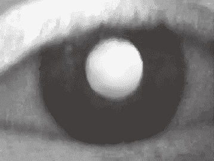 |
| 图说：图一：这是在用检影镜检视时出现的瞳孔变化，呈现出努力与放松之间的差异。 |

也许这就是德文的视力写成 Augenlicht（意思为眼之光）的原因，也是希腊人说“我正在失去我的光”意思等同“我正在失去我的视力”的缘故吧。

由于有那次与六岁小女孩一起诊疗的机会，我发现个人的情绪状态与眼睛有着密切的链接。好的感觉会使瞳孔扩展，让更多的光进出眼睛，而光扩展我们的视野，让我们的脑能够接受与吸收更多信息。换句话说，喜乐让我们更能看见、记忆与了解，扩展我们看向世界的窗口。

当病患的生命观是荒凉无希望的时候，他们的视野也会反映出来，通常会缩减成狭窄管状视野，瓦解他们的觉察以及感知并回应生命的能力。也许这就是中国古代哲学家老子之所以会说“运用内在的光芒，回复自身原有的明视”之原因吧。（译注：语出老子《道德经》第五十二章：“用其光，复归其明”。）

而结果是，瞳孔是身体最敏感的自律神经系统活动变化传感器，对于进入眼睛的光以及从眼睛出去的光都有相同的反应程度。然而这并不是新的想法，早在西元二世纪，著名的希腊哲学家与医师盖伦（Galen）就曾说过，视觉源自脑，并从眼睛出去。此外，西元九世纪的伊斯兰学者绝大多数都相信光会从眼睛散发出来。也许瞳孔真的是“灵魂之窗”，可以接收来自外界的光并将内在的光散发出去，这就是我之前提到的对准。

由于我们的知识没有介入瞳孔的改变，所以它们会揭露出我们最深层的感受。在《人类动物》（The Human Animal）一书中，动物学家、动物行为学家以及人类社会生物学专家德斯蒙德‧莫里斯（Desmond Morris）写道：“瞳孔无法说谎，因为我们无法有自觉地控制它们。”^(（注 2）)职业扑克选手时常在玩牌时会戴着太阳眼镜，就是因为不想显露自己对手上那副牌的感受。

眼睛不仅反映我们最深层的部分，也会揭露人与人之间的真挚情感连系。事实上，莫里斯博士确认：“人们在交往的初期，眼睛会散发出充满活力的讯号。由于瞳孔会在看到喜爱的事物时会比平常再稍微扩张一点，我们可以得知自己是否‘被爱’……另一方面，如果我们近看伴侣的脸，而对方的瞳孔缩至针孔大小时，那么还不如放弃这段关系。”^(（注 3）)

近期在《实验心理学期刊：总论》（Journal of Experimental Psychology: General）发表的研究中，研究人员发现当我们非常投入在相互表达与倾听时，彼此的瞳孔会一起扩张，就好像彼此的心智合为一体那样。^(（注 4）)

我的早期工作受到这类研究的激励，因为这些研究确认我们的眼睛会比身体其他部位更加生动地强力反映我们的生理、情绪及灵性的发展。这对我来说等同神的示现，因为除了与史崔普医师相处的经验以外，我所得到的教导都在说光与眼睛的互动是严格的单向道。然而如同前述，包括柏拉图、欧几里德与托勒密在内的古代哲学家都相信光从眼睛散发出来，而眼睛在处理视觉时是发射与接收兼具的过程。

##### 信任生命的引导

光在人类能量系统的行进过程所呈现的难易程度，会反映出我们对于自身生命指引的信任程度。如果我们信任生命，就会活在从容的流动状态，同时因为没有损失光，眼睛和气场也会显得明亮。不过，如果我们不信任生命，就会预先设想且费力尝试，眼睛就失去可以让人看见的自然光彩。我们眼中的光会显示我们的光含量，是我们与生命一致性与连贯性的测量器，反映出我们的意识状态。当我们的眼睛看似变得无光或黯淡时，代表目前是沉重、停滞且缺乏生命力的状态。而当眼睛变得明亮时，代表现在是感恩、流动与朝气的状态。

我也观察到我们的呼吸循环会反映出我们与生命的链接程度。当我们的眼睛变得明亮时，我们的吸气是完全的，吐气也是如此。由于呼吸是生理连贯性的根本指标之一，会表现出那与生命本有韵律关联的扩张与收缩之节奏。因此要是压抑呼吸的流动，无疑会在许多方面对我们造成重大的影响。然而绝大多数人的呼吸方式都相当浅薄与不规律。沙吉难陀大师（Swami Satchidananda）也证实，并在其著作《通往和平之路》（Pathways to Peace）中写道：“在正常呼吸时我们只使用七分之一的肺容量而已。”^(（注 5）)

在观察到思考会使我的病患屏住呼吸、减低他们的眼睛散发的光时，我就纳闷会是什么原因造成这种现象。我记得学校教我的是“要努力”、“要尽自己所能”，然而我最终的成功并不是靠这两者达成的。我后来了解到，努力也许并不是创造性突破的关键，而“预先设想”通常是企图对抗自身对于未知的恐惧，但是这种企图可能会遮掩我们真正要找的答案。婴儿与幼儿并不会预先设想或寻求任何事物，他们反倒是回应任何吸引他们的注意力的事物，以接受那股众人都能取用的知识之流的引导。

所以我开始鼓励病患，在面对自认困难的任务时，意识到自己正在进行的微妙心思。我帮助他们用内在之光照见那些冒出来的想法与担忧以及自己想要“达到胜利”的策略，还有更重要的是，那些策略是否真的有效。在这样的过程中，他们直接经验到预先设想其实会一直扯他们的后腿。

在其中一项练习中，我套用密友兼同事雷‧戈特利布医师（Ray Gottlieb）所介绍的技术，这项技术是由罗伯特‧佩普尔（Robert Pepper）发展出来，是佩普尔压力疗法（Pepper Stress Therapy）的一部分。我用一张大图，上有数排各指不同方向的箭头，请病患在说出每个箭头所指方向的同时，将手臂往箭头指向的反方向移动。可以想见这样的方式会引发混淆（如果没有造成惊慌的话），以及想要“把事情做正确”的期望，而且附带屏住呼吸的倾向。不过，当病患发现这情况而开始呼吸时，他们的才华就会自行闪现出来。

我还记得一位来参加工作坊的年轻女士。我请她摘下厚重的眼镜站在图表前，距离则是以能够看清楚的最远距离为准。由于那些箭头图案还满大的，所以她能够站在三呎（约一公尺）远的距离看清它们。每次完成练习时，我就请她深呼吸一次，接着稍微站离图表远一点。而她在二十分钟之内就已经后退到距离图表二十五呎（约七‧五公尺）处，且依然能够看得清楚。在这段练习后，我检查她的视力已有百分之两百的改善。

到目前为止，我已让数千名对象使用这种练习及其他类似方式，包括美国奥运选手以及世界级的运动选手。这样的练习每次都能带来注意力、记忆协调性以及运动表现的明显改进，还有回应复杂状况的速度、准确度与弹性也出现同样的改变。我在观察中感到最有趣的部分，则是我们的系统的天生配置看似是回应生命，而不是指挥生命。这部分就成为我后来在哲学探索时的切入点。

当我们停止思考、开始回应时，就能够表现突出。如果我们试着预期并控制发生在自身周遭的一切，而不是在生命呈现自身时予以回应的话，就会变得绑手绑脚、表现也跟着下滑。然而，当我们跟着生命流动、流往它引导我们的方向时，就会正眼直视生命。这经验让我们能够发现新层次的从容以及不费力的临在。当我们认知到生命智性总会先安排好下一步时，会使我们在跟随生命的邀请、朝向自身最伟大的潜能前进的过程中，激发出有机且平衡的合作形式。

接下来要讲的故事是关于我收到探索自身可能性的“邀请”。在一九六九年的春天，我获得牙医学校的入学许可，然而前提是我得在秋天注册之前完成三门暑期预修课程。当时的我联系迈阿密当地唯一合乎资格的大学（因为我要在这里过暑假），才知道其中两门课会同时开，所以我无法在那年秋天注册前完成三门预修课程，代表我得再等一年才能入学。

那天下午，有位学校兄弟会的朋友说他要去曼非斯拜访家人，问我要不要一起，我便答应了。当我们抵达目的地时，朋友就载我到处游览。在沿着大马路开车经过一间视光学院时，我觉得非常想要停在那里。这满奇怪的，因为我当时从没考虑走视光学这条路。于是我大叫：“回头！”朋友停下车子，而我真的是用跑的去招生办公室询问申请事宜。由于是假日，绝大多数学校员工与学生都在休假，办公室里面并不忙碌，所以我顺利约到隔天与招生主管的会面。

我跟招生主管说明自己如何在经过他们的学校时出现想要停留的灵感，我出示牙医学校的入学许可通知书，询问他们的修业资格跟牙医学校相比有何不同。他说修业资格几乎完全一样，而准备要开的班只剩一个名额，问我是否想要申请入学。我拿出昨晚填好的申请表以及我的成绩单，他在审视后讶异地望着我说：“虽然没有前例可循，不过如果你想要的话，那个空缺就给你！”他接着说明，我只需要通过牙科学校指定的三门科学预修课程中的两门就可以了。

在我隔周回到佐治亚大学时，一封有条件的入学许可通知书已经在等着我了。于是我在那个夏天念完迈阿密大学的两门课程，在一九六九年秋天到南方视光学院开始修业。

##### 视力 20／20 的先见之明

我在许多年前曾观察一位正在工作的艺术家，注意到他会不时后退并凝望自己的画布，所以我问他在看什么。他说自己没有特定要看什么东西，仅是站在后面看看有无似未完成的事物。当他站在那里的时候，我留意到他的眼睛是随机扫视画布，只会暂停在吸引眼睛注意力之事物。我很快明了到，这位艺术家的眼睛为他显现画布上比较需要更多注意力的地方，而我们的眼睛也会以同样的方式随时受到任何需要我们的临在之事物的吸引。

我们的眼睛持续回应着吸引它们的光。当我们发现这种隐约但影响深远的自身机制时，就会开始信任光的引导，毫不怀疑地跟从它，而且更能清晰看见与接受自身生命的内在种种运作。

一九七〇年代后期，我正值离婚前的分居阶段，当时的生活出现一连串令人非常难过的事件。冲突的情况一直反复出现，而我的反应总是勃然动怒。有天在一次这类经验发生过后，我认出这个模式为何会在自己的生命中一再重复。在那之后，事件的发生与我对该事件因何发生的觉察之间的时间差开始缩短。我了解到这是意识的进化，而且有时还能在事件发生时就认知到正在发生的情况。我马上就想：“啊哈！我总算达成了！”然而一旦小我想要夸耀自己的功劳时，我又退到起点。

过了一段时间之后，我有个奇迹般的经验，那时的我发现自己身处本来会感到心烦的状况，但是我却感觉平静并带着完全的觉知。我感觉到很深的谦卑，就好像处在恩宠的状态。在那经验后不久，我又一次在自身惯性中被止住。事情发生后，我会马上了解自己早在几分钟之前已经感知到它的发生。这只是巧合，还是说觉知能够先于经验呢？生命智性是否有可能与我们有着无可分离的链接，并以预知的形式来引导我们呢？

二〇〇四年十二月，在巨浪撞入斯里兰卡与印度的沿岸地区前，野生动物与家畜似乎都知道即将要发生的事情，它们开始尖叫并逃到安全的地方，而其结果就是很少野生动物在海啸冲击的时候死亡，但是有超过十五万人在那场灾难中丧生。

如同在前一章所述，专家相信动物拥有第六感，能帮助它们比人类更早认知到危险。然而人类也拥有第六感，跟动物的唯一差别是我们已被教育要质疑自己的直觉“知道”，并且要信任自己的“思考”。我们相信“视力 20／20 的后见之明”，因为我们绝大多数的人都要等到事情发生之后才觉知到它们。然而，如果我们天生就能在事情发生之前感知它们呢？如果我们的先见之明就是视力 20／20 呢？在荣格心理学中，直觉是让我们在事情发生之前就能感知的心理功能。许多艺术家都是“超前自己的时代”，信任自身直觉并用于引导他们的视觉作品。

##### 看见无形能量

我在二〇一〇年被选为 ISSSEEM 主席，这个团体由对意识在健康与身心安适的影响有兴趣的科学家、医师与身心安适治疗师所组成。而在年度会议结束三周之后，我有个不寻常的经验。

有天晚上熟睡时，我觉察到自己正在观察睡在床上的自己，也注意到身体的胸部起伏与呼吸声音。我也认知到自己那副睡着的身体正在作梦，因为我能够看到那梦境。

那段梦境是二〇一一年的 ISSSEEM 会议，那时有两个人在向一大群观众介绍我出场，其中一位是我女儿，另一位则是我的好友。然后我以主席的身分致词，完毕之后接受大家起立鼓掌。

几个月后，我的女儿来电问我是否允许她那时的男友向二〇一一年的会议提出演讲主题的申请。我虽然答应，然而由于他是在非洲带野生动物观赏旅行队，我实在无法想像他会呈上哪种与这团体有关的主题。

到了十月初，计划委员会在美国加州召开，为演讲者名单做最后确认。当我们开始讨论那些申请者，我的同僚们对一个提案感到非常有兴趣，那是关于讨论人类与非洲野地的动物进行有意识的接触，提案人就是那位男士，而我只是默默地听着。委员会在几分钟之内就同意邀请他来演讲。我从来没跟他们说那位男士是我女儿的男友。

结果，我的女儿就跟男友一起参加二〇一一年的会议。原本会中指派 ISSSEEM 前主席来为观众介绍我出场，但是他在最后一刻突然生病，变成是我的女儿与好友布莱恩来担任这项任务，而观众在我致词之后真的起立鼓掌。原来我并不是作梦啊。

这经验如此有趣是有许多原因，像是我过去所学关于睡眠的知识中，是用“无意识”来描述深度无梦的睡眠，然而当时的意识其实是明显地清醒与觉知，表明觉察的“永在”本质。

例如，有篇刊登在二〇一三年《公共科学图书馆：综合》（PLOS One）期刊的研究，发现那些宣称在熟睡中保持觉察、本身富有经验的静心人士，他们在熟睡时被观察到的脑部活动基本上与醒时一样。^(（注 6）)为了更深入确认此事，近期在《认知科学趋势》（Trends in Cognitive Sciences）的二〇一六年十二月号期刊有篇综合分析所提出的看法是，意识在个体进入熟睡时并不会关闭。^(（注 7）)根据该篇论文作者之一的英属哥伦比亚大学（University of British Columbia）教授伊凡‧汤普森（Evan Thompson）所言：“不论是处于些许觉知感受或是感知自身状态、自身存在的感觉，即便日常心智活动（想法、情绪、内心影像）已经安静下来甚至停止，意识都会在熟睡时继续着。”^(（注 8）)这些研究所呈现的证据，再加上直接的个人经验，使我相信意识也是遍及一切的事物，就像光那样。

##### 沧海一粟

几年前，当灵性导师拉姆‧达斯（Ram Dass）拜访茂宜岛时，我邀请他参加自己已参与多年的男性团体。在分享彼此经验的时候，有位团体成员请拉姆‧达斯谈谈关于临在的主题。

“临在，”他说：“就像果仁蜜饼（baklava）那样包含所有东西：坚果、蜂蜜、薄面皮。”

用这方式来描述临在还真有趣，但又如此真实。临在是纯粹的觉知，容纳了每一事物，即便是在我们自认为自己没有临在的时候。我们大多数人会认为临在跟他人、自己的感觉或特定情况有关。然而，这样的看法是依据我们是彼此分离地各自过活的概念，而不是对于我们就是生命，且与每一生物紧密相连的认知。

在任何时候，每一事物与每个个体都是彼此紧密相连与共同合作。而推动潮汐、改换季节的那股力量，也是使我们的心脏能够跃动的力量。所以当一个洞见或感受突然呈现在我们的觉知中时，那并不是意外，那是生命智性在寻找我们，从容地指引我们前往人生旅途的下一步。没有什么好去思索、考虑或选择，我们只要观察，就能被引导到自己应该要在的地方以及自己需要做的事情。

觉察与经验是连成一体的，而当这部分清楚时，我们所以为的个人自我，就像小水滴那样将与一体的汪洋融合，创造出临在的波浪，将无限朝所有方向扩展出去。当我们的内在光芒与那股点亮自身意识的光芒融合的时候，我们将不费力地被推向我们的源头，就像花儿会被推向太阳那样。

# 第三章　依光而活

> 我们摄进身体的所有能量都是来自于太阳。^(（注 1）)
> 
> ──匈牙利生物学家亚伯特‧圣捷尔吉（Albert Szent-Györgyi）

西元一八九六年，威尔伯‧阿特沃特（Wilbur Atwater）与法兰西斯‧班乃迪克（Francis Benedict）进行了一系列关于代谢的实验，其研究报告指出人体在热的产量与生理活动会与摄食养分的卡路里值相符。^(（注 2）)他们的发现便成为卡路里理论的基础。

根据阿特沃特的发现，法兰西斯‧班乃迪克与詹姆斯‧哈里斯（James Harris）在一九一九年发展出哈里斯─班乃迪克方程序（Harris–Benedict equation），使人们得以计算个体的基础代谢率，或是人体在休息时需要多少卡路里。

这套理论流传五十多年都没有被质疑，然而在一九七二，有一群由保罗‧韦伯（Paul Webb）带领的科学家运用尖端科技进行一系列的研究，想要重复阿特沃特及班乃迪克所做的结果。而韦伯刊载在《美国临床营养期刊》（American Journal of Clinical Nutrition）的发现，揭露出新陈代谢所生产的能量理论值与身体实际生产的数量之间有着明显的差异。^(（注 3）)该差异被称作“未被测量的能量”，即是指人体所产生的能量中有百分之二十三并不是来自个体所摄食的卡路里。

为了进一步证实自己的发现，韦伯检视所有与该主题相关的科学研究，他发现这些研究不仅确认他的发现，而且还展现出一个倾向，亦即研究越是精确，关于那股无法以科学解释的庞大能量之证据就越清楚。

考虑到来源未明的能量的确存在之事实，韦伯就在能量平衡的计算中导入新的变量，并命名为 Qx。这项变量是代表来源未明的能量，或是源自所谓空无（nothingness）的能量。

能量源自“空无”的想法虽然对于西方的头脑而言会觉得奇怪，然而东方文化觉察这股神秘的生命能量已有数千年之久，它在中国被称为气、在印度被称为普拉纳（prana），而著名的奥地利心理分析家威廉‧赖希（Wilhelm Reich）称之为奥刚（orgone）。

韦伯的研究不仅揭露卡路里理论的缺失，也显示出人体会从未知的源头获得能量（或生命力）。这项研究也发现，食物越缺乏，未被测量的能量就越多。换句话说，身体看似会从一个未知的源头接收大量的能量，而且如果我们吃得越少，身体所接收的能量就越多。

韦伯的发现似乎能由瑜伽行者普拉德‧雅尼（Prahlad Jani）的例子予以证实，这位行者宣称自己从一九四〇以来未曾进食或饮水。^(（注 4）)虽然这个例子听起来令人无法相信，然而这位瑜伽行者曾经身处两次最严格的科学控管环境，但这两次研究都认为他的生理状态是正常的。

二〇〇三年普拉德‧雅尼于于印度亚美达巴德（Ahmedabad）的史特林医院（Sterling Hospital）接受长达十天的精密检查。^(（注 5）)那次研究中有数十位医学专家参与评估雅尼的状态，并进行所有相关测试，包括每日的红血球计数与电脑断层扫描。此外，他会在一间没有食物、饮水，厕所也被封住的上锁房间接受全天的监控，他的衣物与床单会被仔细检查是否有尿液痕迹，而当临床研究人员从上锁的房间带他去办公室或实验室接受医学检验时，都会有移动式摄影机在旁拍摄。

这项研究计划由乌尔曼‧杜夫医师（Urman Dhruv）批准、监督，他宣称雅尼在这十天中没有从口摄取任何食物，连任何液态的食物也没有，期间也没有排尿或排便。而根据这项研究发起人苏西耶‧夏哈医师（Sudhir Shah）的说法，则是“我们都是受过科学教育且从事研究的医师……然而我们的所有知识都完全无法预料这种情况”。^(（注 6）)

在正常情况下，人类若不喝水的话，预期能活十到十五天。然而，人类如果不吃、不喝、不尿长达四至六天，体内应会有高浓度的尿毒废物，但是雅尼的血液与代谢在研究期间都维持在安全范围！

二〇一〇年，雅尼再次于史特林医院接受为期十五天的严格评估，这次有来自印度的国防生理暨同类学科研究中心（Defence Institute of Physiology and Allied Sciences, DIPAS）的三十五人团队进行研究。^(（注 7）)在长达十五日的不食、不饮、不尿也不排便后，所有针对雅尼的医学检验仍是正常的结果^(（注 8）)，而研究人员认为雅尼甚至比一些岁数只有他一半的人们还要健康^(（注 9）)。来自 DIPAS 的代表在二〇一〇年宣称会去规画后续的研究，其中包括调查雅尼的身体是从何处获得支持自身的能量。^(（注 10）)

尼古拉‧特斯拉曾在《克莱尔周刊》（Collier's Weekly）于一九〇一年二月九日发行的刊物中写道：“生物体为何不能从环境中获得表现种种生命功能所需要的一切能量，而得从摄取食物中获得？”^(（注 11）)时至今日，《水的第四态》（The Fourth Phase of Water）作者、华盛顿大学生物工程教授杰拉德‧波拉克博士（Gerald H. Pollack）也许能说明这样的过程如何在现实发生。

##### 活水

根据波拉克所言：“实验证据显示光会传递能量给水，包括身体的水分。而在特定情况下，那能量也许能够提供足以支持生命的能量。”^(（注 12）)波拉克与他的团队已确认水除了固态、液态与气态之外，还有第四态。身体的细胞是由这种含有光的“活水”所构成，不同于一般的水。

与一般的水（H[2]O）相比，第四态的水二氧化三氢（H[3]O[2]），更黏、更沉、更有秩序、更偏碱性，且因自身化学构造而含有更多可用的氧气。^(（注 13）)这种活水含有负电荷，能像电池那样储存含在阳光里面的能量，并在需要的时候输送。由于将水进行结构化的能量是来自太阳，你也许会说身体是颗生物光电池，装载着持续被太阳充电的“活水”。

尽管有普拉德‧雅尼所经历过的严格医学评估及详尽科学观察、波拉克的当前研究发现，以及那部相当震撼人心、由导演彼得‧史特宾格（P. A. Straubinger）制作的纪录像片《生命源于光》（In the Beginning There Was Light）^(（注 14）)，绝大多数的医师与科学家仍然不会思考我们的身体也许真的能以阳光运作的可能性。

##### 光之力

我在前面提过诺贝尔奖得主亚伯特‧圣捷尔吉的话：“我们摄入身体的所有能量都是来自太阳。”借由光合作用，太阳的能量被储存在植物里面，而动物与人类就吃食植物以使用这股由光创造的能量。然而我们是否能用多花时间在户外晒自然光的作法来更加支持这过程呢？如果太阳能可以为家庭、车辆与城市供应能量，那么阳光也许能为人类生命充电的想法难道是天方夜谭吗？

根据医师兼光生物学家亚历山大‧温煦（Alexander Wunsch）的看法，身体所产生的能量当中只有三分之一来自我们所摄食的食物^(（注 15）)，然而这个比例取决于我们晒得的光。究其根本而言，身体的能量生产过程牵涉到很多步骤，并不是只要摄食光就好。最容易满足我们每日阳光最小需求量的方式，即是每天花点时间到户外走走，并将我们的皮肤尽量暴露。阳光是大自然为生命设计的最佳燃料混合物，身体是靠食物与光两者来补给能量，这就为何阳光对我们的健康与身心安适如此重要。

也许这就是为何几百年来在各文化中，禁食与日光浴会并用在灵性与身体的净化、更新与补充的原因。这种作法能够帮助我们从疾病与受伤中恢复，并在防护与治疗数种慢性健康病症方面有明显的效果。^(（注 16）)减少摄食并增加身处大自然的时间之作法，是否能以想像不到的方式影响我们的健康与身心安适呢？

虽然本章关于活在光中的信息非常美妙，然而我并没有建议任何人应当停止摄食，况且我本人也很爱吃东西。不过，我认为现在的重点应当是正视光的重要性，它不只引导我们的眼睛，也引导我们的所有生理机能以及整趟生命旅程。那由临在的门户所接收的光之引导，不仅指挥着我们的每个生活面向，同时也会在我们连想都想像不到的层面滋养我们。

食物的营养价值会与它的光含量有关。有机蔬果若在其成熟时摘取并趁新鲜时食用的话，会是充满光且营养丰富。想想看，每天减少摄食、多花时间在户外以直接获取光的超纯滋养，而不是间接由食物获取的话，会有多大的健康益处。

摄取比较单纯、分量较少的食物，这种作法已经显示能够借由防护身体的细胞出现退化以及其他重大健康风险，促进较为健康的老化过程。此外，目前也确认实验动物若没有喂到饱的话，会活得更久且更健康，而且很少发展出像是癌或心脏疾病等与老年相关的病理变化。^(（注 17）)根据澳洲新南威尔斯大学（University of New South Wales）的演化生物学家玛歌‧阿德勒博士（MargoAdler）所言：“食物的减少使得身体的‘细胞回收’（cellular recycling）与修复机制的频率增加。”^(（注 18）)也许这就是研究人员称普拉德‧雅尼还比一些岁数只有他一半的人们还要健康的原因。

雅尼的非凡健康状况不仅只是因为他不吃不喝的事实，还有他也接受来自日光浴的巨大健康益处，因为在户外活动的时间会刺激维生素Ｄ的生产。这一点非常重要，因为维生素Ｄ的缺乏是与日晒时间不足有关的状况^(（注 19）)，所以它已经成为现代流行病，并与癌症、心脏疾病、骨质疏松症、黄斑部退化及免疫不全等“文明病”的发生率提高有着密切关联^(（注 20）)。科学家也已确认日光相关的维生素Ｄ缺乏，与失智症及阿兹海默症的发展有明显关系^(（注 21）)。

如你所见，阳光大幅影响我们生命的所有面向，从整体健康与身心安适，到视力的品质与效率均是如此。这些关于光的惊人发现，加上我的个人视力出现立即疗愈的情况以及使用光疗法的临床经验，点燃那些与我一起努力的人们内在的好奇心，让他们能敞开接受自身内在的新可能性。我接受的训练使我相信，疾病具有传染性，但身心健康的传染力更强。也就是说，病患的恢复可能性会直接依照我能为可能性保留多少空间之比例而增加。

##### 身心健康是会传染的

几年以来，许多人在听了我的演讲后跟我联络，称他们仅是向可能性敞开，视力就出现改善，或是完全不用戴眼镜。他们当中有许多人还持续跟我保持联络，其中有位女士在参加光的讲座后，写了以下的讯息给我：“我的弱视所出现的自发性缓解是你引起的。在聆听你的话语之后，我可以不用戴眼镜就能看东西。”^(（注 22）)

而就我所知，一位曾在幼年时找我诊治的病患，现在已是成功的演员，育有一个孩子。她最近这样说：

> 我记得自己当时对于要去医生的办公室感到兴奋。虽然那时只有五、六岁，但是我还记得自己在弹簧埝上跳来跳去，还有无糖的棒棒糖。更重要的是，我还记得黎伯曼医师拿下我的眼镜并跟我说我以后都不需要眼镜的那天。我记得自己从小就戴眼镜，直到他告诉我以后都不需要眼镜。而我从那时候起再也用不到眼镜。即便我们家的视力很糟糕，然而我的视力仍一直保持 20／20。^(（注 23）)

由于在成长过程看到双亲被诊断出数种癌症，我这一生几乎都生活在恐惧中。我的父母都存活下来，然而对于癌症复发的恐惧在我的家族烙下永远的印记。我知道杀死病患的通常不是疾病本身，而是疾病的诊断。许多人能够清除身体的癌，然而很少人能够清除内心的想法。

而在执业的时候，我也注意到那些已确诊有学习问题的患者也有同样现象，例如注意力缺乏症（attention deficit disorder, ADD）或阅读障碍（dyslexia）。我们通常能够解决病患的问题，然而一旦被贴上标签，诊断结果就会成为他们身分认同的一部分。以下是能够说明这状况的个人真实故事：

一个周六下午，当我在用牙线剔牙时，注意到自己的喉咙出现一个从未见过、看似棕色的团块，我的思绪马上跳回到父亲被诊断出喉咙有癌化组织的那一刻。我一直检视自己的喉咙，每次观看那个棕色团块时总觉得它好像在变大。我很害怕，心脏怦怦乱跳、额头满是汗水。

我在前一刻的感觉还相当美好，但现在却觉得自己快死了。我想过要去医院，但害怕自己也许会被诊断为绝症，那么这一生所做的一切都将付诸流水。在处于这种状态一阵子后，我拿起电话联络医生友人。

他问：“怎么了？”

“维克多，我好害怕。我爸妈都在我小时候得到癌症。”

“我不懂，这有什么问题呢？”

“我的父母目前都很好、很健康，但是癌症一直让我很害怕，因为我们从来都没有真的认真谈论癌症。”

“我还是不晓得发生什么事。”

“是这样的……我今天下午照镜子的时候，看到喉咙后面有个棕色团块，看起来像是痣或是类似的东西。”

在提出几个问题后，他要我用手指头触碰那个团块。当好不容易把手挤入到能够摸到口腔后面的程度后，我居然勾出一个东西，那块黏在手指尖的东西是午餐吃的巧克力马卡龙碎片！

对于患者所要面对的疾病，健康照护执业人士应当要找到新的观点及新的讨论方式。将诊断当成标签的作法通常会使病患感到害怕，从而限制医病双方对于病患本身复元能力的信念。我们关于生命的想法与信念，会限制住自己完整体验生命的能力。由于我个人对于可能性的视野已然拓展，让我得以经验我们那股非比寻常的疗愈能力，并在信任生命智性中自然活出我们的最高潜能。

# 第四章　光的智性

> 万事万物的开始与结束都由一些我们无从控制的力量所定，昆虫如是、星辰亦然。无论是人类、植物或宇宙尘埃，我们都随着远处无形笛手缓慢吹奏的神秘旋律起舞。
> 
> ──亚伯特‧爱因斯坦

二〇一二年，我接受首次在夏威夷茂宜岛举办的 TEDx 大会之演讲邀请。当我坐在观众席聆听其他人的演说时，其中一位讲者，科学家兼作家盖瑞‧格林伯格博士（Gary Greenberg）说出一句令我印象深刻的话：“每个细胞都有自己的工作。”

当我坐在那里思索这句话时，才了解它的含义相当深奥。心肌细胞推动血液、红血球输送氧气、白血球抵御感染、脂肪细胞储存多余能量，免疫细胞则攻击外来的有机体。而这句话之所以深深撼动我的地方，在于认知到我们每一个人就像这些细胞一样，也都有要完成的特定工作。

我时常说，我们每个人就像是各自不同的树。有些树又高又瘦，也容易随风摇摆，有的比较厚实而不那么柔软。有些树以花或果实来款待其他生物，有的则是长有要求其他生物小心的保护突刺。就像树木那样，我们也都各自不同，并在维持生命的完整与平衡上发挥独一无二的功能，就如同伟大的印度贤者拉玛那‧马哈希（Ramana Maharshi）所言：“个体为了特定的目的而存在。”而生命智性一直使我们朝向那方向前进。

各时代的灵视者似乎都认为，宇宙系根据一种未被看见的和谐而不停活化与调节自身，而我们是那齣舞码的复杂舞步。根据西元前四世纪由季蒂昂的芝诺（Zeno of Citium）所创建的斯多葛学派（Stoicism）之哲学：“整个宇宙是由一种有序力量所组织而成……而人类也有这样的组织或指引元素。”^(（注 1）)

印度圣雄甘地也说出与上述古老哲学相呼应的话语：“宇宙中有股力量，如果我们允许的话，它将透过我们创造出奇迹的结果。”^(（注 2）)

推动并引导我们生命的力量，也是推动我们太阳系内各行星在轨道上运行的力量。我现在知道自己的生命目的是帮助他人看见。从我出生以来，生命智性一直支持我去发现自己的本貌以及自己要分享的事物，以帮助我了解到这个生命目的。而这一切就是从我的名字开始。

犹太人的文化非常重视为小孩命名这件事，因为他们相信个人的名字代表自己与过往世代及自身命运两者的链接。东欧犹太人的习惯是用已逝亲戚的名字为小孩命名，除了可以荣耀前人之外，也能让他们的精神永垂不朽。我的出生名是雅各‧以色列‧黎伯曼（Jacob Israel Liberman），就跟我祖父一模一样。我是约瑟夫‧开应‧黎伯曼（Joseph Chaim Liberman）的儿子，属于以色列利未支派（tribe of Levi, the Levites，此支派的男性为专司事奉祭祀的灵性领袖）的后代。而在生命的旅程中，我发现“雅各‧以色列”这个名字准确描述出我的本质、我的生命经验，以及我的存在目的。

年轻的时候，我对自己的出生名没有共鸣。但在一九八八年我四十岁的时候，我在参加一场演讲时突然得到启发，其内容是关于圣经先知们及他们如何面对困境。当时那位精神科医师的讲者说到先知雅各（Jacob）在与一位有超常力气的人物摔角后，被授予“以色列”（Israel）之名，因为他与人、神搏斗皆获胜利。那时我已经历一次痛彻心扉的离婚及后续六年的严重恐慌症，所以我肯定能与他所描述的“雅各”之名相应。

而在一九九二年于以色列教学时，有个经验使我更加明白自己的名字与自身命运间的关系。有天晚上，在开车前往萨法德市（Tzfat）时，接待我的主办人夫妇迷了路。当他们把车停到一旁来看地图时，附近有一栋屋舍的门后透出一缕光芒。我们前去敲门，希望能得到指引。此时有位留着灰色长发的蓄胡男士前来应门，我的主办人向那位男士介绍自己与他的妻子，然后跟对方说我来自美国，名字是雅各‧以色列。那位先生凝视我的眼眸深处说“我等你很久了”，并邀请我们进屋。

接下来的几个小时，他解释生命之树（Tree of Life）在犹太神秘学中是卡巴拉（Kabbalah）奥秘教导的核心象征，而先知雅各就处在生命之树最中央的位置，与天地一起整合给予及接收的品质。“雅各，”他说：“代表脚跟或是与大地的链接。以色列意谓头顶或是与天界的链接，换句话说，以色列系指向神看齐。”

“当雅各成为以色列时，”他说：“就是他开悟的时候。他了解到，只要与神直接保持链接，他的道路将永远被照亮。”在这之后，虽然我们才刚认识，他却拿出一个美丽的大卫之星送我，并说那是他为我制作的礼物。那天深夜时分，我想起父亲总是劝我“走在正道上”，思索着这会不会是他用来提醒的方式，要我一直能真实面对自己的最高使命。

我的生命帮助我看到自身独特贡献的意义之另一例子，则是跟我在一九七六年时视力出现奇迹般恢复有关。在一次已维持数年的日常静心中，我经验到特定观看方式，让我一时无法了解或描述。虽然眼睛是闭上的，但是我能够看到包括自己在内的整个房间。那视野是如此完整清晰到几乎闪着光芒，感觉就像自己是具有许多眼睛的无限场域，同时在每个有利位置观看。那里不仅是有着视觉的清晰，还有一种毫无疑问与答案的深刻觉察：那感受是一种知者已然不在的知。我感觉自己俨然变成了天空。

在张开眼睛后，我能看得十分清楚，所以我开车去自己的办公室检查眼睛。我的视力改善百分之三百，然而眼睛的光学检验结果完全没任何变化。时至今日，我还是不知道一切是怎么发生的。不过我经验到的是从容地从一个位于自身眼睛后面的源头去看，而那样的看并无任何观察点。于是我停止“注视”（looking），而开始“看见”（seeing）超越单纯视觉的事物，并着手将这些发现串联起来以分享给其他人。尽管那启示发生在四十年前，现在的我仍然可以不用眼镜就能看得很清楚，依然分享着我对于看、存在与生活的洞见。这是我的人生志业，是我喜爱做的事情，也是我的存在理由。

##### 我们如何接收生命智性

圣经说神是光（约翰一书 1:5），是全能（约伯记 9:4-10）、全知（诗篇 147:5），而且无所不在（诗篇 139:7-10）。祂创造天地（创世纪 1:1），并以自己的形象创造人类（创世纪 1:27）。而圣经对于神的描述到现在之所以令人着迷，是因为量子物理学家也是以同样的方式来描述光，只是使用不一样的术语而已。他们宣称光是所有已存事物的基础，其表现就像是全能、全知且无所不在的事物。就根本上来说，我们在生命中所体验到的每个被认知为物质的事物，都是一种无形本质的有形表现，其本质就是光，人类则是光的全像焦点。

当神的光（亦即物理学家所指的那道构成实相基础的隐形之光）与我们的“内在之光”（即意识之光）互动与融合时，我们就突然启动并进入到那种称为临在的接受状态，或称为前后连贯的引导，在那里我们自然会接收到自身生命旅程的下一步。

这道“内在之光”并不只是健康与觉知的常见隐喻，它也是可以量化的现象。许多研究纪录都指出，包括人类在内的所有生物都会散发出一种称为生物光子辐射（biophoton emission）的低强度光，会在每个生化反应之前就反映出个体的身心安适或疾病的状态。^(（注 3）)如果这道“内在之光”没有散发，细胞内与细胞间的沟通将不会发生，那些为保持生命体平衡而催化的生化反应也不会发生。细胞层面与组织层面的和谐程度越高，身体就越能像电池那样留住自己的光能，生物光子辐射也会降低。

除了所有生物都会散发的生物光子辐射之外，下至浮游生物、上至鲨鱼的海洋生物有一半以上，会制造自己的光来引诱猎物、吓退猎者、吸引配偶以及沟通，其中辐鳍鱼类（ray-finned fishes）更达百分之八十。^(（注 4）)例如美国自然历史博物馆（American Museum of Natural History）的科学家最近发现到，一些特定生物会吸收光，再散发出不同颜色的光。^(（注 5）)根据研究人员所言，这种再次散发的光，又称为生物萤光（biofluorescence），其对比性会有所增强，让鱼类能够彼此沟通。

人类也会吸收光，以不一样的色彩重新散发在自己的生物场域或气场中，变成一种围绕个人的幽微萤光或虹光场域。根据我多年对此现象的观察，我们所吸收的光以及重新散发的光看似能够反映出我们的身体、理性、情绪及灵性层面的安适状态。我们的信念以及与这些信念关联的情绪，会影响我们与各种波长光之间的相处方式，为我们的世界与我们的气场染上色彩。然而，绝大多数的人并没留意这种关于自身存在状态的微妙指示，因为我们大多都没去发展看见气场的自然能力。

人体是由大约三十七兆个细胞构成^(（注 6）)，它们一直以无法想像的速度彼此沟通与合作，这代表细胞“看见”那道编入光中的智性之能力^(（注 7）)，对于我们在健康与身心安适的各个面向都相当重要。

很明显地，这项能力在复杂的生物处理程序相当重要，像是植物的光合作用，或是光子与眼睛互动所启动的视觉程序。然而一项刊在《科学》（Science）期刊的新研究指出，一种在紫色细菌（purple bacteria）里面的光敏蛋白质，它对光的引导所做的回应表现得就像是“眼睛”那样，整个过程几乎是在一瞬间完成的，而这个研究捕捉到当前最清楚的画面。^(（注 8）)

德国科学家马厄利尔‧施密特（Marius Schmidt）与他的同僚，还有来自 SLAC 国家加速器实验室（SLAC National Accelerator Laboratory）的研究人员，他们借由世界上最强的Ｘ光雷射以及最快的照相机，摄得一个光敏黄蛋白质（photosensitive yellow protein）于十万兆分之一秒中产生的细微排列变化，这样的结果比过去的结果还要快上千倍。

这项重大发现揭露这种蛋白质对光的初始反应如何创造出内部的骨牌效应，好为它的生物功能做准备。在这项发现之前，研究人员都从未观察到生物分子对光反应的关键细节。

我们的细胞对光的瞬间回应方式，仅是这趟神奇探索之旅的开始。因为每个人都是宇宙这个生物体的细胞之一，我们天生就是要永无止境地彼此沟通与合作。这过程显示出我们活在关联式宇宙中，里面的每事每物彼此紧密相连。

##### 心连心

现代的科学已经证实，我们基本上是无可分离的，是同一生物体的多个面向，持续影响彼此并接受彼此的影响，就如同歌德所写的：“这世界的组织方式如此神圣，使得我们每一个人都能在自身时空与其他一切事物达到平衡。”而根据理论物理学家大卫‧玻姆所言：“每一事物都与一切其他事物相连，会因其他事物发生事情而（立即）受到影响。”^(（注 9）)就本质而言，关系是存在最根本的面向。彼得‧渥雷本（Peter Wohlleben）在其著作《树的秘密生命》（The Hidden Life of Trees）中写道：“森林里的树就像是懂得社交的个体。它们会计算、学习与记忆、照料生病的邻居、遇到危险彼此示警……还有它们会因未知的理由，从根部持续供应糖分给早已树倒所留下的古老树桩，好让它们继续活着。有的时候，那些成对的树……彼此根部的链接紧密到一方若死，另一方也会跟着死去。”^(（注 10）)

就人类而言，能够与他人形成具有意义的链接应该算是心的功能。我们通常用交心来指称这项能力。

很久以来，科学家总认为头脑是身体交响乐团的指挥，指示身体该做何事、何时该做以及做到何种程度。然而心数研究院（Institute of HeartMath）所进行的研究则指出，不仅心送往脑部的信号数量大于脑部传给心的信号数量，而且这些由心产生的信号会大幅影响脑部功能。就身体而言，心产生出最有力且范围最广的电磁场，比脑的电磁场振幅还要大上六倍。此外，心的磁场比脑的磁场还要强五千倍，而且能在距身体数呎远被侦测到。

心会反映我们的情绪状态，牵动我们与周遭人们的生理机能。如果你这么想的话，这推论算是相当合理。当我们感觉到爱、亲密、感谢或欣赏时，我们的心创造出具有传染性的谐音频率。^(（注 11）)但是当个人生命出现扰乱时，我们的心跳模式也会将其反映出来，也算是“衷心表示”这词的另一新义。

狄恩‧欧尼斯医师（Dean Ornish）在其著作《爱与存活：亲密关系的疗愈力之科学根基》（Love and Survival: Healing Power of Intimacy）中写道：“我不晓得还会有什么能比爱与亲密更加强势的治疗要素，其在个人生命品质、疾病发生率、各种原因的早夭方面所造成的重大影响，是饮食、吸烟、运动、压力、基因、药物、手术都无法企及的程度。”^(（注 12）)欧尼斯所描述的爱与亲密是对于合一的渴望，而这渴望是生命基质与生俱来的能力。

宇宙的每事每物都有存在的理由，都与同一股生命智性紧密相系并受其引导。当认知到彼此的链接会产生出我们个体与集体的潜能时，我们更能从容呼吸、感觉到更深的放松，进而体验那将我们链接在一起的无条件之爱与亲密。

##### 从心而看

多年来，我总是在训练医师及其他医疗照护领域人士的时候说：“别处理任何你不爱的人。”理由很简单：提供协助者与接受协助者之间的关系，是治疗过程最有力的面向。当我们经验到真挚的爱与关怀时，自然会放松下来并信任自己会被妥善照顾（in good hands，译注：字面之意是“被善意之手握住”）。这链接所具有的力量，能够消融我们的恐惧，并帮助我们把问题视为因祸得福。

我有幸能够处理一位少女的个案，她允许我在她逐渐将危机转变成机会、挖掘出爱与亲密的巨大疗愈力量时象征性地握住她的手。

二〇一二年有位母亲跟我联系，因为她的十六岁女儿正处于健康危机中。在经历连续数天的头痛后，她的女儿出现头晕目眩、恶心以及急性视力减退的现象。这位妈妈带她去看医生，然后是视光师，他们做了一连串的测试，结果一切正常。这位少女被转介到眼科医师及神经科医师，进行电脑断层扫描、核磁共振扫描以及一些血液检查，结果都是阴性。她也接受整嵴师与头荐骨治疗师的治疗，但状况仍然没有改善。这位少女开始担心，因为除去视力的状况之外，她其实还满健康的，也没处在不寻常的压力中，每个医师都说她应当能够正常看见东西，但她就是不行。

在首次会面时，我检查这位少女的视力，发现她只能看见视力检查表的大Ｅ，这在法律上已算是目盲。而在她描述自身症状的过程中，我突然有个直觉，感觉她在二〇〇六年曾经历过意义重大的事件。即便不晓得这个想法从哪里冒出来的、也不知道是否与个案对象有关，我还是询问她在二〇〇六年是否有发生过任何创伤。虽然她自己想不起来，她母亲说她的外婆在那年去世。她就在那时流下眼泪，于是我们先用温和的光疗程以及一对用于“柔化一切所见”（soften the world）、度数非常轻微（屈光度为+.50）的老花眼镜治疗。以下是她对于治疗第一周的回想：

> 当我第一次看着蓝绿色光时，开始想起自己的外婆而哭泣。我了解到自己在她去世时并没好好地哭过……当大家跟外婆告别时，我通常会离开现场，因为我不想让别人看到我哭……我持续哭了五天，直到所有过去曾压抑的伤痛、罪恶感与感受总算再次浮现出来才停住。

经过九天的光疗，她的视力已有百分百的好转，于是我请她每天做两次治疗并继续戴着那副眼镜。当时的她跟我说，蓝绿色光现在已是她的朋友，因为它帮助她忆起过去一切不想感受的事物。

她说：“当情绪起来的时候，我有时会哭、有时会笑、有时仅是望着那道光。如果那天在学校过得不好，我就会释放出藏在里面的感受。如果那道光是人的话，就会知道我对于每一事物的感受。”

她继续接受治疗，视力也跟着改善、人也觉得更放松，能更容易表达自己的想法。当结束光疗时，她对于生命的观点已经改变，视力改善百分之四百，也能以更轻松的态度适应新状况，不再觉得自己必须扛起照顾别人的责任。她现在反倒喜欢逗人们笑。

在与这位少女一起处理问题的期间，我认知到漠视或否定我们所收到的无形引导有多容易。事实上，这引导有时会在分享的时候带来足以改变生命的效应。当我在询问二〇〇六年是否发生过任何创伤经验时，那仅是赐给我的暗示，而不是来自我的想法。然而它打开机会之门，让我们彼此有着更大的信任，使一连串可能会改变这位少女的人生目标之事件得以加速进行。

##### 指引之手

当我们越不专注于有形世界而更加专注在无形世界时，生命将变得越来越丰富。我们会越来越觉察到那道将我们移去注意特定方向的“召唤”，那是觉知之海的先导波，为我们的罗盘指出下一个要去的方向。那些能够进入这种看见的人们，我们有时候称他们为“直觉工作者”或“灵媒”，然而我们都会有类似的经验。

正坐在书桌旁边的你，脑海中突然闪过某人的影像，而你未加思索就拿起电话拨那个人的号码，当对方接到来电而听到你的声音时，他们会说：“我刚好也想到你！”或是你的电话响起，就是那位你刚感知到的人打来的，在在证实你所感觉到的链接超出理性心智的范围。

而在一九八六年发生的不寻常经验，使我更加确信我们是无可分离的。当时我正在洗澡，突然心中感到一阵刺痛并开始啜泣，因为我突然知道那位亦师亦友的同僚艾略特已经过世。我从淋浴间走出来，全身湿答答地走到房间的电话那里，拨着他在纽约的号码，电话是他太太接的，我噼头就问：“小莉，他何时走的？”

她说：“雅各，你怎会知道？他才刚去世没多久。”

我们太常因为专注在想要完成的事情上，而错过那些指引自身旅程的精微事物，但真正的奇迹就藏在那些“低语”里面。在处理过数千人的状况后，我逐渐了解到自己要做的工作并不一定在辨认与解决问题，反倒是悄悄退到幕后，让生命智性引导整个过程。当我以身为接收到的无形信息以及病患的身心安适之间的媒介自居时，我总算发现做越少、成就越多，事无事、无事不立。

这很像我会在第八章讨论的道家“为无为”概念，事“无事”并不意谓无事发生。我们仅是容许一个更大的事物来引导，而这过程又会加强我们对生命智慧的信任。十七世纪的修士、医师兼神秘主义者安格勒斯‧希莱修斯（Angelus Silesius）在其言语中流畅地表达这个概念：“神的爱与喜乐遍及各地，只有当你不在的时候，祂才能来找你。”

十七世纪的法国剧作家莫里哀（Molière）曾说：“如果我们不去干涉自然，她会从自己掉进的失序当中逐渐复元。但是我们的焦虑、不耐却糟蹋这整个过程，结果所有人几乎都是死于治疗自己的药物，而不是身上的疾病。”^(（注 13）)

我们所在的宇宙之设计是以最节省的方式来动的，无论我们讨论的主题是身体、大自然，或是宇宙整体的运作均是如此。这代表生命会是超效率的，而且会以最少的努力来运作。最少的努力就是被称作临在的状态。本章所分享的疗愈经验，描绘出临在的力量如何将那身为神之工具的智慧提供给每个人。

智慧并无作者，它默默无名地流经我们。生命智性毫不费力地引导自然以及其中所有居民。当这股引导流经我们的时候，我们的人格就消失了，留下的是一道具有感染力的光，将每个人、每事每物都带入内外安适的状态。

##### 自发性疗愈

不久之前，我坐在当地三温暖的蒸气房内，注意到有位正要走出去的男士。他扶墙走路的样子，似是视力或身体有着残疾。他后来又小心翼翼地走进蒸气屋，坐下来自我介绍。在数分钟的咳嗽之后，他跟我说他患有类似多发性硬化症的病症，会明显影响他的大动作与精细动作的运动协调、说话以及绝大多数的内在生理功能。他也跟我说，在得知自身疾病诊断之前曾有数年担任老师兼作家。

他问我在做什么工作，于是我跟他说自己正在写一本新书，是关于生命总会引导我们去做心中了然之事。他就在那一刻开始热烈分享自己的兴趣，而在我倾耳聆听的过程，他就在我眼前蜕变。他的说话变得更清楚、平衡与协调变得更正常，脸不再那么红肿，眼睛也变得清澈有神。他不再是四十五分钟之前我所遇见的那位男士。

在他讲完之后，我跟他说他拥有庞大的智慧，需要他再次出来教导。当他热切分享自己心中了然之事时，就像自身疾病奇迹般地消失无踪那样。

这就是我们的热情被点燃时可能会发生的情形，而我们会感受对于彼此、对于生命本身的无条件之爱。根据《奇迹课程》（A Course in Miracles）所述：“奇迹会自然发生，那是爱的众多表达形式。真正的奇迹就是引发那些奇迹的爱。就某方面来说，来自爱的一切都是奇迹。”^(（注 14）)在认出我们的生命目的以及自己与所有存在事物形成的密不可分之链接的过程中，我们接纳那股照亮人生旅程的伟大奥秘，生动表达出临在以及其中流溢出来的爱与关怀。

到目前为止，我已经分享那股在光中编码的生命智性如何持续引导我们的眼睛、我们的生理及我们的生命。它逐渐形塑我们的人性，并逐渐灌注持续的满足状态。然而当绝大多数人在想到光的时候，他们所想的是太阳产生的光。但是当太阳的光不可得的时候，我们要如何看见并得到指引呢？晚上会是什么引导我们呢？

# 第五章　梦中之光

> 人所遗忘之事会在梦中嘶喊求救。
> 
> ──诺贝尔文学奖得主伊利亚斯‧卡内提（Elias Canetti）

你可曾想过，当我们眼睛闭上、周围也没有光的时候，是怎么在梦中看见事物的呢？以及如何聆听、嗅闻、品尝，甚至触碰事物呢？夜里，我们的梦包含非常逼真的影像、思绪、声响、人声与主观的感受，它们给人的感觉如此真实，以致于当我们醒来时，通常会认为自己真的经历过。那么我们在日间与梦里的看见方式有什么不同之处呢？

物理学家亚瑟‧札炯克（Arthur Zajonc）在其著作《捕捉光芒：光与心智的交缠历史》（Catching the Light: The Entwined History of Light and Mind）详述由他主导的尤里卡专案（Project Eureka）实验，其中写道：

> 关于观察一个充满光的空间会看到什么，这是简单但又令人吃惊的展示，仅使用细心制作的盒子以及一台直接将光照进盒子的强力投影机即可。我们在制作过程非常小心，确保光不会照亮盒子的内壁或里面的物体，因此在那里面只有纯粹的光，而且很多。问题是：观察者会看到什么？如果完全只剩下光本身的话，它看起来会是什么模样？^(（注 1）)

我们会期望在这种新奇装置里面看到什么呢？应该是一些跟光有关的事物吧。然而札炯克真正看到的是“完全的黑暗！我只看到全黑的空间，没有别的。”^(（注 2）)札炯克的实验明白展现出，光是那股不可见之潜能，让我们能奇迹般地看见所有事物。我们在清醒时认为自己可以看见的一切事物，事实上是光与眼睛互动而引发能量的释放，而意识心智将其转译成看似充满光的图像。然而我们所认为是光的那道光明，仅是心智的印象而已，而不是光的本身。因此，既然夜里没有光让意识心智转译成图像，那么是何种事物让我们能在黑暗中看见梦境呢？

我们知道光在白天指引并照亮我们的人生旅程，然而若要回答前述的问题，我们得先来检视光与意识之间的链接。

我在第一章提到光与生命是同一股能量的不同存在状态，即有形（物质）与无形（光）。在有形的状态中，光形成宇宙中所有物质；在无形的状态中，光就是纯粹可能性的领域。那位在二十世纪向许多西方人士引介静心的灵性领袖帕拉宏撒‧尤迦南达（Paramahansa Yogananda），是以“那股形塑有穷造物的宇宙智性振动”来表示光。

光与意识两者均为无形，比时间、空间及物质还要更加基本，是宇宙及我们对宇宙的经验之根基。光是物质宇宙的源头，也是物质宇宙所含信息内容的传递者。同样地，意识是一切有情个体用来经验物质宇宙并从中萃取智慧的方式。科学家告诉我们，光将整个宇宙相互连接起来，而我们有许多伟大的领航者相信意识遍及一切。

根据一九一八年物理诺贝尔奖得主、被誉为量子理论之父的马克思‧普朗克（Max Planck）所言：“我将意识视为根本的事物。我们无法超越意识。我们所谈论的每一事物、我们所认为存在的每一事物都代表着意识的存在。”^(（注 3）)

没有光的话，就没有可以用来看、听、闻、尝或想像的事物。没有意识的话，这个世界以及它所包含的一切真的会消失无踪，而且也没有能够经验的事物，因为我们无法分别实相的存在与我们对它的经验。从古至今，那些已经觉知自身无限潜能的人类个体会认为意识就是光，光就是意识。然而物理学家对于太阳光的描述与灵性神秘主义者对于意识光的经验，为何两方的表达如此相似？

当人们去看电影时，会对投射在银幕上栩栩如生的影像非常投入，甚至忘记光线与影片内容都是来自藏在他们后方的放映机。我相信光、意识以及个人生命经验的运作方式也类似如此。那被称为光的生命源头，以及那被称为意识的无限可能性，都是来自同一个源头，也是我们所有人的同一源头。

哲学家艾伦‧沃茨（Alan Watts）在其著作《人、自然与人的自然》（Man, Nature, and the Nature of Man）中表示：“有内必有外、有外必有内，看似殊途、其实同归。”^(（注 4）)光只有一道、意识只有一个，它们无从分割。

就理论而言，我们可以说光与意识各自是无形且不可见。然而没有意识的话，光无法存在，而没有光的话，意识无法存在。我们每个人都是依着自身想法与信念来回应生命，而且也因为我们对于投射在名为生命的银幕上之个人幻相过于投入，我们就忘记所有人都是来自同道光、同个意识。

虽然我们将生命当成是可以看见的一连串经验，然而我们所见并非全貌。生命一直光速切换着可见与不可见的开关，这现象就类似在观看电影时将之当成一直呈现的影像来经验，即便那只是正在高速移动的连续分割画面。

可见的相位包含那些由我们的感官所感知的自身生命内容，而不可见的相位则是称为意识的无数可能性领域。就像放映机里面的影片将光转变成我们在银幕上看到的电影，那些刻画在心智的想法将意识之光转变成多彩频率，让我们将其经验为生命。

根据著名身心疗愈专家狄帕克‧乔布拉（Deepak Chopra）所言：“在构思、建造、掌管及成就一切我们所谓的属世事物上，意识是这些动作的存在基础。”^(（注 5）)著名的天文学家卡尔‧萨根（Carl Sagan）也说：“宇宙就在我们里面……我们是宇宙用来认识自己的方式。”^(（注 6）)我们的身体以及我们的心智，是否有可能其实是从同一创造子宫“光”，所生出来的孪生子呢？

光与眼睛的视网膜的互动，会引发一连串刺激视觉皮层的事件。至于光如何被转变成我们所看见的多彩世界，仍然是个与意识无法分割的谜团。无论我们所谈论的是日间的观看还是梦里的观看，两者都需要光与意识，唯一的差别大概在于参与的意识层面。

日间的观看所牵涉到的主要是太阳光与意识心智（意识当中满载内容的面向）的互动，创造出我们所居住的世界，充满形式、想法及语言。而在夜里梦境的观看所牵涉到的主要是意识光与无意识心智的互动，创造出不受时空限制的实相，能让可以辨认的事物与空想的事物同时出现。

梦境是我们对于生命的恐惧与关注能以象征性的方式呈现之处，在二十世纪心理分析学家卡尔‧荣格（Carl Jung）所称的客观精神或意识的加速下，让我们能有深入的觉察以协助整合个人的生命。如果有幸的话，我们也许能有一场清明梦并了解身处梦中的自己也正在观看梦境，就像我之前分享的那段关于身为 ISSSEEM 主席致词的清明梦境。如果当时的清明更加透彻许多，我们也许甚至会了解到，观者、也就是正在作梦的个体，与梦境本身是一体的。

我最近指导一位个案，这位客户的梦境生动描绘出意识之光是如何在夜晚的黑暗中引导我们、照亮我们的人生旅程，同时揭开观看的真正本质。虽然她戴隐形眼镜已有二十五年，能有 20／20 的视力，但是她的梦表示出她开始走上那以新方式去“看”的历程，然而她本人则是在几个月后才意会到自己正在经历这趟历程。

这位客户在知道自己的男友还对前女友念念不忘时，希望彼此的关系能更透明，但是男友拒绝如此。而她在当天晚上作这样的梦：

> 他跟我一起坐在车内，我开车沿着一条黑暗且尘土飞扬的道路前进，但车头灯没亮……然后我们开到“主要干道”上，我看见有一辆车从我的左侧过来。那辆车的车头灯照亮那条路，而突然发现自己无法看清楚。我就跟男友说：“我刚想到自己没戴隐形眼镜，无法看得非常清楚。我觉得这样开车并不安全。”
> 
> “那你不应该开车。”他说完就下车，要换到驾驶座这边。

这位客户继续向我说明：“我在他上车之前就醒来了。”

“在那场梦之后，我了解到自己看不清楚这段关系的真实情况，还有我希望我的伴侣能换到‘驾驶座’上。”她说。

她本来是因为担心自己的视力而来找我，并且一开始就询问用雷射原位角膜磨镶术（LASIK）来“矫正”自己的近视，好使自己不用戴眼镜看东西。我让她看到自己能以原本眼镜矫正的一半度数视力阅读 20／20 的文字，并解释她的问题并不在眼睛，她的视力其实有进步。我建议她使用度数较轻的眼镜，告诉她只在绝对需要的时候才戴眼镜，且留意在拿眼镜时所经验到的任何感觉或情绪。

在后续回诊时，她说当自己没戴眼镜时，会感觉比较放松，阅读时比较不会紧张，也不再出现强迫打扫的行为。再次检查的结果显示她的视力已有改善，所以我建议她用度数更轻的眼镜矫正视力，并询问她是否记得在拿到自己的第一副眼镜前发生的人生大事。她马上回答：“记得，那时我离家出走了。”接着她说，父亲像是因为精神病发作而在她十二岁时离家，家中随即陷入一段混乱的时期。而当她开始回想当时在自己的生命中所发生的事件时，她知道那是“不囿于自身眼睛的了解之关键”。

她的视力随着我们的疗程持续改善，也注意到自己有几次出门时没戴隐形眼镜。她能更轻松地呼吸，接受外在世界发生的事物而不是设法抓住世界。她后来了解到自己对于无法看清的不舒服感受，是在反映出自己的脆弱感受，而且那脆弱又被别人“看见”的不自在感觉。这项启示带来一场充满虚渺光线的梦境，而其所具现的纯净品质对她来说实是振奋人心，若用她所说的话来表示，就是“具有灵魂品质的观看”。在那场梦之后不久，她的视力又再次改善。

当我们的疗程步入尾声时，她又作了具有强大力量的梦：

> 我开着车，有意加速赶上一群朋友，但我听到车子发出尖锐的声响，这才意会到自己已经失速……车子摇晃地驶过一个有很多人的停车场，接着从停车场另一侧的峭壁冲出去，然后在我努力解开安全带的时候滞留在空中。
> 
> 突然，我与车子平安回到停车场，停妥在停车位。有位认识的女士从乘客座的车窗看着我、表情很严肃。我问她刚才发生什么事，她说每个人都眼睁睁地看着车冲出去，然而后续的发展就像是大地延伸出去接住我那样，所以我才能开回来并将车停在停车位。当她问我如何做到时，知道这是奇迹的我回答说：“我只知道自己感觉并不孤单，而且备受照顾。”

“当我醒来后，”她解释着：“那是我首次非常相信梦是真实的。而且无论是不是梦，它给人的感觉就像是‘事情开始变成可能’的完美测量方式。当意识扩展的时候，名为人类的车辆就能做到更多的事情，我们也以不同的眼光看待事物，而实相也会依此转变。”

借由意识之光，在梦中所揭露的事物会为我们提供对于自身内在生命的深入洞见。根据二十世纪初心理分析学家西格蒙‧佛洛伊德所言：“对于梦境的解释是了解心智的无意识活动之王道。”^(（注 7）)你也许可以说梦是在提炼意识，并在日间引导我们到领悟、睿智行动与更加透彻的明晰之新层次。我们在梦里经验到的视野深度，让我们得以瞥见自己的无垠本质。所以现在的问题就是如何在清醒时分连上这股无垠的本质。

# 第六章　脱离心智场域

> 个人是整体的一部分、受限于时空的一部分，而整体就是我们所谓的宇宙。人类个体对于他自己、他的想法与感受的经验方式就像是他与整体是分离的，算是自身意识的错觉……我们应当以脱离这道桎梏为己任，并借由扩张自己的慈心去接纳所有生物及大自然整体所呈现的美而为之。
> 
> ──亚伯特‧爱因斯坦

如果忘记自己的名字、年龄、性别、肤色、宗教、喜好、健康状态，以及其他从人群中区别自己的描述，我们会是谁呢？如果我们彼此都不认为对方跟自己不一样的话，我们的生命会是什么模样？

我们在生命中遇到的问题，大多来自认为自己与他人是分离的误解，因为事实上我们是与彼此以及宇宙中的所有其他事物有着无可分离的链接。但是我们已经受到这种受限的实相观点之制约，将自己的心智与身体当成“我”，并将除此之外的事物当成“非我”，而其结果就是孤独、嫉妒、暴力与偏见。

当有些人的想法、肤色、性别、宗教、性取向或身体特征与我们不同时，我们受限的偏见就会朝外具现成战争、异端审问、族群净化、恐怖活动及种族屠杀。这些暴力行为都是在试图消灭“非我”与维护“我”。许多战争都是为了证实我的神比你的神还要好而打的。但是真正的暴力是我们终其一生经验到的内在纷争，因为我们不知道自己的本貌而相信自己与他人根本不一样。

著名的物理学家大卫‧玻姆在其著作《整体性与隐秩序》（Wholeness and the Implicate Order）写道：“到处蔓延渗透的人我分别……现正阻止人类为整体利益协力合作。说真的，即便那是关乎生存也是如此，而这种分别的起源因素，即是那种将事物当成天生与自己有别……的想法。”^(（注 1）)

如果物理学家提出的看法是整个宇宙系由称为光的单一、发亮的可能性所组成（我们会在第八章多加讨论），^(（注 2）)而历史上的古老奥秘经典也用光来称呼神与意识^(（注 3）)，那么这种分别的幻相是如何存在的呢？

##### 一切唯心造

在基本层面，所有的存在事物是一片无限潜能之海，只在被仪器或身为观者的人们测量时才会具现成特定结果的无限可能性。理论上，观察者应该不会影响观察对象并做出客观的观察，然而科学已经证明这是不可能的。我们无法与自己的经验分开，因为观者与被观对象会借由观者的观点而出现无可分离的链接。^(（注 4）)

量子物理让我们瞥见心智如何将无限可能性的场域转变成看似明确的形式。我们内在的观察者就是意识心智，其观点是由定义明确的想法、信念与记忆交织而成的网络，而这些想法、信念与记忆都是关乎我们已经创建起来并视之为实相的一切。意识心智会依据那些受到制约的自身概念，而向无形的环境投射定义与意义，将其原本的无限可能性限缩成我们称为“实相”的部分集合。借此你可以说心智将光（无形）转变成物质并指定该物质的意义。而其结果就是心智制作出物质（原子与分子的任何组合）并看重之（具有重要性）。

只要我们继续以意识心智的镜片所提供的受限视野来看待自己的经验，就会一直被锁在二元性的回路中。借由评断自身经验为好或坏、对或错、黑或白，我们就陷进自己的幻相，认为自己经验为“不一样、不寻常”的事物跟自己是分离的。然而就像拉比犹太教（Rabbinic Judaism）核心经典《塔木德经》的表述：“我们在看待事物时，不是以事物的本貌观之，而是以自己的存在状态待之。”（Berakhot 55b，译注：Berakhot 有颂祷之意。）我们看待自己的方式，也就是我们看待世界的方式。经验者若不存在的话，经验无法存在。在量子层级中，若没有观察者，就不存在任何事物，因为不会有独立于意识之外的实相。那么意识是什么呢？

对于许多人来说，所谓的意识（consciousness）就是限缩在自我意识（self-consciousness），意即能够觉察自身以及自己的内外环境之状态。然而意识远远超过这种状态，必得用局部（local）与非局部（nonlocal）的表达方式才能描绘出它的轮廓。

与局部意识相关的是意识心智（conscious mind），也就是无限宇宙囿於单一观点时所创造出形体、自我与选择的日常实相。与非局部意识相关的是无意识心智（unconscious mind），也就是光还未被意识心智的观点转变成物质之前所存在的无形、无我、无选择之无限潜能。无意识不能分析，因为没有一个分离的“我”去观察它。在《社会性动物》（The Social Animal）一书中，美国记者大卫‧布鲁克斯（David Brooks）写道：“如果意识心智就像是一位站在高台上、从远处观察世界并以语言线性分析事物的将军，那么无意识心智就像是数百万个基层侦查兵，迅速横越整片山水，持续传回讯息并产生立即的回应。他们与周围的环境没有保持距离，而是深深地沉浸其中，到处迅速游走，互相渗透彼此的心智、环境与概念。”^(（注 5）)

我们都已被制约去相信自己掌控着自己的生命，然而生命中绝大多数的事情都发生在我们的意识觉知之外，只有少数能为我们掌控。

据《自觉宇宙》（The Self-Aware Universe）的作者物理学家阿米特‧哥斯瓦米（Amit Goswami）所言：“意识我（conscious self）在绝大多数时间当中没有意识到绝大多数的事物，以及无梦睡眠中的每一事物。矛盾的是，无意识……则是在所有时间中意识到所有的事物，且从来不睡。”^(（注 6）)

事实上，我们的体内每一秒都会发生数以兆计的活动。我们对此浑然不知，没有人得提醒去心脏跳动、提醒身体呼吸，或是提醒体内数以兆计的细胞要更新自己。我们没有人得去唤醒太阳、推动潮汐或改换季节。然而我们绝大多数都把重点放在认为自己是什么人及横过自身意识的想法，以致于忘记自身生命绝大部分的运作并不需要我们的思想或管控。

既然自我的意识心智与无限潜能的无意识心智两者均是个人整体性的面向，我们为何将自己与意识心智的受限观点画上等号，并舍弃无意识心智的无垠视野呢？

##### 虚幻的我

佛洛伊德将婴儿早期的存在状态称为“海洋般的喜乐”，意即除了自身的无边无际之外，不会觉察到其他的事物。这种纯粹觉知之所以存在，是因为婴儿的脑部还没具备将自己与世界区别出来的网络链接。这种关于自我觉察的天生缺乏，表示降生到这世界的我们即“内建”经验一体性的能力。

当婴儿逐渐发展，并与自身环境及环境里面的人们互动的过程中，他们开始逐渐觉察到周遭人们对自身行为的反应。有些特定行为是在能被接受的范围之内，有些行为则被厌恶，甚至有时会因此受到惩罚。这经验虽然在一开始会有所混淆，然而终究会训练孩童去注意、调整自身存在状态，尝试去“适应环境”并表现出周遭人们可以接受的行为。在这段针对行为的自我引导与自我调节的过程中：“自我对话”（self-talk）首度出现。

随着时间经过，这种提供安慰的内在对话开始呈现出自己的性格，使得“我”的个体感受以及维持人我分离幻相的相应神经回路得以浮现。而其结果，就是他们原本自然不费力的存在状态，逐渐被一连串“正常”的制约行为所取代。当小孩逐渐长大、变得更加习惯“幻相”自我的声音时，这股原是用于评断的内在声音开始在孩童的生命中变得更具分量，孩童开始习惯与它互动，最后接受它为自身独特性的真实可信表现。

这时，支持幻相自我的根系已创建妥当，运用这个人格覆盖孩童的无限本性，而这人格的自我重要性说服孩童一切得靠自己来，得要促成事情发生才行。在达成这目标的尝试过程中，他们习于事先预想，希望能透过彰显他们所谓的自由意志来掌控生命。

##### 在心智场域中生活

当个人尝试确保自身行为可被接受、自身需要可获满足的过程中，这种持续在担忧、策画与预演的模式，也就是佛陀所谓的猴子心智的声音变得越来越大声、越来越让人分心。个人对于脑海里面的那道声音如此认同，使它能将个人的心智转成镜之迷宫，把个人的身体变成自身想法的活动画布。

我们的固有合作天性到最后被替换成更具竞争性的生活方式，为的是产生安全、保障及可预测性。然而，毕竟这个一直在改变的世界并没有安全网之类的设备，我们的努力通常带来非常大的压力以及空虚感，因为我们的世界不会去配合自身心智的模型。

根据“我们拥有自由意志”的信念，我们会认为自己之所以无法具现出自己想要的生活，必定是自己有什么问题，或是自己有做或没做的事情在干扰自己。于是我们企图辨识问题，通常会怪罪在个人的阴影，并学习如何吸引我们想要的事物的秘诀，以活出既快乐又成功的人生。

我们阅读书籍、参加工作坊，一直在兜着圈子试着赶走自己的阴影。然而我们跑得越快、阴影跟随我们的速度就越快，无论我们去到哪里或做什么事情，阴影都不会消失。如果你看到一个人在追赶自己的影子，你应该会认为那人在发疯，然而这完全就是我们在认为自己有问题时所做的事情。我们所认为的阴影，只不过是一个等待我们去接纳及取回的个人本性面向。透过意识心智来看世界的后果之一，就是我们会去评判论断每一事物……包括我们自己。

认为“自身现况必有不足之处”是有害的概念。尽管我们做尽一切“正确”之事，像是静心、遵守饮食戒律、跟随一种灵性道途，也就是我们相信能够达到开悟的方程序，却一直错失真正的心灵宁静。我对于这种方程序深有感触，因为我在人生旅途上做过许多同样的事情。

我们许多人认为只要自己的所有片段都完整的话，就会成为自己想要成为的人，于是在这上面花费许多时间。多年以来，我都是把自己的生命藏在学位与证书的后面，以期能够说服众人相信我很聪明，然而后来有个人跟我说：“你一直都在假扮某个人，然而你早就是那样的人了。”就像狗最后追到一直在前面逃跑的尾巴，然后才发现这尾巴是长在自己身上那样，我总算认知到自己早就是自己想要成为的那个人，如同诗人艾略特（T. S. Eliot）所言：“我们不应该停止探索，一切探索的尽头将是抵达起点，并且如同初次认识它一样。”^(（注 7）)

自我改善的概念乍听之下很棒，然而它所依据的想法时常是“自己有什么问题”与“自己与其他事物是分离的”，于是我们为了要有改变而尽量做每件事情，而没了解到自己是宇宙整体不可或缺的一部分，一直都在持续进化。若用希腊哲学家赫拉克利特（Heraclitus）的话来说，唯一的“常”即是“变”。

对于在那条通往完整的旅程上所面对的障碍，我们感觉它们是自行出现来限制自己的成长，而没了解到自己所感觉到的压力以及受到限制的感觉，其实是自身发展与进化的动力来源。

想想龙虾是如何生长的，它是一种身体柔软的动物，生活在不会扩张的硬壳中。当龙虾成长时，它的壳使它感到不舒服及受限。为了处理这种痛苦的困境，龙虾会爬进岩石底下，那是个让它感觉安全、不会被掠食的鱼类发现的地方，然后蜕下旧壳并长出新壳。终其一生，它一直重复这个过程，亦即当它长到超出硬壳的限度时，就会进入暂时的安全隐蔽之处，直到长出稳当且舒适的新壳为止。

生命中的每一事物都是以同样方式生长的，为了使进化过程萌芽，就需要特定压力因子。因此当你觉得难受的时候，不见得一定是自己做错事或是走错路，也许那仅是生命智性在温柔提醒你，改变的时候到了。

物体在挡到光时会产生阴影。我们无论何时挡住那道引导自身生命之光时，就会产生阴影，直到当我们变得透明并对准那道光时，就如同太阳在我们头顶正上方的时候，阴影就会神奇地消失无踪。

我们的真正觉醒，就是了解到自己并没有问题。每一片刻中，我们都只能是自己已是的人物，然而我们若去寻求这项领悟的话，是不会发现它的。这领悟通常会在我们最是意想不到的时候出现。

二〇〇二年的一天，我坐在长沙发上、眼睛望向墙壁，留意到天花板边缘的细致装饰板条、墙壁上的美丽艺术作品以及家中呈现的干净禅风格调。我所注意到的美，是在反映出自己在当时的看见方式，而它也呼应着当时在我生命中的每一事物。

突然间，我感觉到头顶上好像有蜂蜜在缓慢倾注下来的感觉。我闭上眼睛，注意到这感觉扩张到前额与太阳穴，然后当这感觉延伸到我的眼睛时，眼泪就流了下来，而我因领悟到自己没有问题，从来都没有问题，而深感震撼。那是无条件的接受之时刻，是随着恩典自然产生的礼物。

##### 超觉神经学

我在一九七三年学习这种目标在减轻压力并使心智平静的静心修行方式。经过数个月的每日练习，我已能达到很深的静默状态：烦恼就像身体感受那样消失，心智的聒噪与情绪的冲突减至最低，只留下寂静、宽阔的觉知。这些早期经验，伴随自身视力的疗愈（也是发生在静心的时候），其影响如此深远，让我开始思索静心的过程如何改变我们对实相的看法。

马库斯整合健康机构（Marcus Institute of Integrative Health）的研究主任安德鲁‧纽伯格博士（Andrew Newberg）运用血液流动情况当成脑部活动的指标。他发现藏传佛教徒在静心时，他们的脑中产生自我与其他一切间的分离感之部分出现活动下降的现象，产生一体感的部分则是出现活动增多的现象。^(（注 8）)此外，魏斯曼脑部造影与行为实验室（Waisman Laboratory for Brain Imaging and Behavior）主任理乍得‧大卫森博士（Richard J. Davidson）在研究达赖喇嘛那里的几位精通静心的修行者时，发现他们脑中与喜悦、快乐及慈悲感受相关联区域之活动出现明显增长，同一区域也出现非常强的γ波（gamma waves），代表超升的意识与喜乐。^(（注 9）)而罗兰德‧范‧维克博士（Roeland Van Wijk）也有支持上述两者的发现，他观察到健康的直觉静坐修行者之生物光子辐射比对照组低百分之三十五，代表有机体的整合性会降低光的损失。^(（注 10）)由于意识与我们的身心安适无法分离，且最佳健康时生物光子辐射最低，所以范‧维克的研究即指出，当我们断开自身制约反应并进入一种与生命合一的状态时，身体的功能运作就会越和谐。^(（注 11）)

爱因斯坦说过：“在研究人员的持久努力背后，潜藏着一股更加强势、更加神秘的驱力，那就是个人想要领会存在与实相的渴望。”无论这股想要了解实相的驱力引导我们从显微镜观察至小至微之事物，还是从望远镜查看广大无垠的事物，或是借由静心播下存在的种子，科学家与神秘学家的目标是一样的：发现自身存在的源头。

##### 融入一体

我们已习于依恋意识心智，以致于忘记自己之所以能察觉意识心智活动，其唯一原因就是自己的无分别本质持续观照着每个片刻。除了经验老到的静心人士以外，我们绝大多数的人都会忽略这道观照的纯粹，反倒倾听那在数毫秒之后冒出的熟悉语音对于刚才观照的一切所做的评论。而意识心智的声音总是在思索、考量一个事物的好坏，或是生活中想不想要某个事物。

观照与意识心智就像太阳与月亮那样：两者看起来都在发光。然而，其中之一是光源、另一个则是光源的反射。观照就像太阳，它是无意识心智的无限潜能；意识心智就像月亮，借由二元性与制约的透镜来反射出对于实相的有限解读。意识心智本身并不会孕育想法，它仅是对刚才的观照思考出的回应而已。

根据《汤玛斯福音》（Gospel of Thomas）所载，耶稣曾提过超越意识心智的二元性，祂是这样说的：“当你使二成为一……内如外、外如内……上如下……男与女变成完全一样的时候，那么你将进入神的国度。”^(（注 12）)

在接受生命的如是呈现时，我们接纳意识心智与无意识心智的分裂，让它们融入自身本性的整体。我们大多数人只经验自己所相信在自身生命中为真实或可能的事物。不过，要是我们能够暂停自己的信念并仅是观照、不带任何观点地接受所看到的一切，又会如何呢？根据十九世纪的诗人威廉‧布莱克（William Blake）所言：“对人类而言，如果所有的感知途径都能清理干净，每一事物都将显出本貌，也就是无限。”^(（注 13）)

当别人问我们是谁时，我们会提供自己的名字。如果他们问我们做什么，我们会说出自己的职业，像是医生、律师、水电工。若是他们请我们描述自己时，我们会说自己是男生或是女生、白人或其他人种、已婚或未婚、同性恋或异性恋。然而如果除去这些标签，我们到底是谁？

我们全都已经被训练成将宇宙的无限可能性缩减成自己的狭隘个人观点。然而请不用太过担心，因为自我所创造出来的限制是个人朝向自我了解的生命旅程当中不可或缺的一部分，那限制终将成为个人突破囚牢、通往无限自由的催化剂。

在《拉马纳‧马哈希的教导精髓》（The Essential Teachings of Ramana Maharshi）一书中，这位受人景仰的印度贤人说：“思绪是因着思想者而生起。思想者就是自我，如果去找寻它的话，它就会自动消失。”^(（注 14）)为了穿透自我的帷幕，马哈希的建议是个人应在思想生起时安静地问：“这个想法是谁的？”在这之后，你也许会听到“我的”，然后就问：“我是谁？”

每次当我依此建议练习时，我的幻相，亦即脑海中那股喋喋不休的说话声，会无限地扩张出去，唯一留下的是含括一切的宽阔感受。思绪的思想者、事情的行事者及个体性的感受消失无踪，唯一留下的是纯粹的觉察。

# 第七章　发现内在天赋

> 如果无尽环绕地球的月亮得到自我意识，它应会完全相信自己是按照己意来走自己的路……那么，一个被赐与更高洞察力的存在个体……在观察人及其作为时，应会对人的幻相，亦即自认所做一切皆依自己的自由意志，微笑以对吧。
> 
> ──亚伯特‧爱因斯坦

身为人类的我们已被制约，相信自己的想法是促成自身行动的唯一原因。我们已经忘记灵感，亦即那股推动我们为其具现的事物，而它的定义是“即刻、直接施行在心智或灵魂的神圣影响”。^(（注 1）)然而当我们一直听到“我们创造我们的实相”的叙述时，很容易遗忘那份传达给我们的礼物。这就带出一个有趣的问题：在回应这个灵感时，我们真正会有多少比例的自由意志（也就是心智的延伸）呢？

虽然我们绝大多数都安于相信人生是把握在自己的手上，但是神经科学的专家已有相关研究，发现我们的认知行为，包含抉择、情绪、行动、行为，当中只有百分之五是有意识的，剩下的百分之九十五均出自无意识心智。^(（注 2）)认知心理学家提摩西‧威尔森（Timothy D. Wilson）在其著作《佛洛伊德的近视眼》（Strangers to Ourselves）写道：“有些研究人员甚至大胆推测所有的工作几乎都是无意识心智在做，意识心智也许仅是幻相而已。”^(（注 3）)

人脑有两种非常不同的处理系统。^(（注 4）)第一系统的回应非常快速、具直觉性与无意识，系由大脑的右半球与古老的边缘系统，即大脑的“爬虫类脑”部分所控制。第二系统的反应缓慢、具逻辑性与有意识，系由大脑的左半球与现代的新皮质所控制。直觉属于第一系统的一部分，而研究人员发现它为我们提供的立即答案经常是正确的，而第二系统会比这过程更晚许多才开始运作。^(（注 5）)这方面的一些研究甚至显示出我们的生理，或说是我们的身体功能，能在电脑择定的问题贴出来之前二至三秒就预测出正确答案。^(（注 6）)

爱因斯坦在与伟大的音乐教育先驱者铃木慎一（Shinichi Suzuki）对谈时说：“相对论的理论是借由直觉发生在我身上的，而音乐是背后的驱力。我的双亲从我六岁的时候就让我开始学小提琴，我的新发现是音乐性的感知所带来的结果。”^(（注 7）)

由于现代的科技能以实时的方式研究脑部，科学家现正观察工作时的抉择过程，并做出一些令人目瞪口呆的结论。

二〇〇七年，柏林伯恩斯坦计算神经科学中心（Bernstein Center for Computational Neuroscience）约翰─狄伦‧海恩斯（John-Dylan Haynes）博士以功能性磁振造影（functional MRI）技术进行一连串的实验。受试者躺进的脑部扫描仪，装有一面能闪现一连串随机字母的显示荧幕，而受试者的两手食指附近都有个按钮，他请受试者一感觉到想按按钮的冲动，就用左手或右手食指按下按钮，并记住自己在荧幕中看到哪个字母时决定要用哪只手。而海恩斯与他的团队能在受测者自己意识到决定用哪一边手指的七秒之前，就确定他要用左边或右边的手指。^(（注 8）)

海恩斯与他的团队接着要求受测者在看到荧幕的数字序列时，决定要加上还是减去两个数字。而受测者在面对比较复杂的问题时的表现，则是在意识到自己正在做这些决定前四秒会有关于抉择的脑活动。

虽然脑部这种提早四到七秒的反应^(（注 9）)看来似乎是颇短的间隔，然而想到脑部每秒会有两万兆位元的信息到处移动，几秒的差距就显得非常重要。

这些研究中的人类个体都确定自己的选择是出自于有意识的审思，意即他们的自由意志，然而这让人不禁会想：如果我们并不是真的知道一个决定是何时与如何形成的话，我们要如何确信这个决定是自己所做的呢？

虽然这些经过仔细控制与重现的研究不能完全排除自由意志的存在，然而它们的确指出，相较于那个位在我们的体内、早在我们有意识地决定去做一件事之前就已知道我们要做什么事的事物，我们的有意识选择对于行动的影响其实没有多少。这个在我们里面的事物通常被称作直觉、内在知晓或是“高我”，它知道何者对我们是最为有益的事物，即便我们并不清楚来龙去脉。

虽然我们已被引导到相信自己是一直在做出有意识的决定，海恩斯的研究则明白指出我们的预知能力远比过去的想像还要庞大许多。

##### 跟随你的心

海恩斯的研究得到心数研究院的罗林‧麦克雷提博士（Rollin McCraty）更进一步确认，后者发现心脏具有跟脑部同样对于未来事件的预知感受^(（注 10）)。麦克雷提博士与他的团队向一群受测者显示一连串经乱数选取、含有中立或是强烈情绪内容的图片，并在过程中监测他们的生理现象。而在实验总结时，研究人员会有一整份关于每个受测者所看到的图片、放映次序以及受测者在看到图片时的生理反应之纪录。

他们在处理这些资料后，发现每个受测者的生理反应在特定程度上都与每张图片的情绪内容相符。当他们观看强烈情绪的图片时，生理现象会变得躁动，而在观看中立情绪的图片时，生理现象则呈现平静。这是预料中的正常结果。

然而让人意外的是，心脏不仅在脑部回应之前数秒就已回应，而且是在每张图片出现在荧幕之前就已开始回应。当受测者在看到恐惧影像的六秒之前，他们的心脏已经显现激动的反应，并一五一十地通知脑部，为那句“了然于心”的成语赋予新的意义。然而对于我们在世界中所遭遇的事物，这不仅限于心脏，也是我们的本能的已知感或直觉。

这些研究明显指出我们拥有内建的ＧＰＳ系统，能以预知的方式引导我们那些自认是自己做出的选择或反应。这是合理的，因为我们晓得量子原则是意识（局部）心智认为自己是知道的，而无意识（非局部）心智就是知道，虽然它并不知道自己知道！那么，我们一直以来被制约要去依从的有意识之想法，它又是扮演什么样的角色呢？

近期在《行为科学与脑科学》（Behavioral and Brain Sciences）期刊公布的一项研究中，旧金山州立大学（San Francisco State University）神经科学副教授艾兹奎尔‧摩赛拉（Ezequiel Morsella）率领的研究团队所做出的结论，则是脑部的所有工作几乎都在无意识的层级进行，当这过程完毕且需要化为实际行动时，才由意识心智执行这项非常微小的任务。^(（注 11）)

究其根本，即使意识心智看起来很忙，也很乐意把功劳揽在自己身上，我们其实很少控制自己的思想过程。即便是说话，我们的说话内容都是首先由潜意识为自己拟定的。

一九七七年，我受邀去佛罗里达国际大学（Florida International University）为一群博士生演讲。我花好几个小时准备讲稿并做出四十张提示卡。而当我从舞台侧边要走去中央讲台时，我了解到自己的每句讲词，都是以自认为该主题的“专家”身分来撰写并演练的。突然间，我手上精心准备的提示卡全滑了出去、撒在舞台上。事情发生太快，我根本来不及全部捡起来，所以我只好继续走，在讲台后面站定、试着稳住自己。

在那长似永恒的静待片刻之后，我深吸一口气，跟观众分享刚才发生的情况。起初有几位观众笑了出来，然后我跟所有的观众同时深叹一口气，就像肩上的世界重担消失无踪那样，这时候我及观众都不用再演了。于是原本关于学习障碍的一小时演讲，变成三小时关于不费力学习之轻松讨论会。那天的活动结束后，我知道自己不再需要准备讲稿，或是事先为演讲做任何准备。只要我对主题了然于心，信任那些毫不费力地流过我的事物即可。

在以这种方式进行超过两千场的演讲、研讨会与工作坊之后，我逐渐了解到，在过程中所分享的讯息并不一定得从负责思考的心智而来。我们都是生命智性的载具，天生就是要以毫不违和的存在形式来表达自身独特天赋与人生目的。这里请让我详细说明我的意思。

有天，一位病患来我这里抱怨视野模煳，于是我请她读视力表上的字。她能看见的最小行是 20／80（视力 0.25），与她的自诉症状相符。然而不知为何，我感觉她的心脏后方左上背区域一直吸引我的目光。我不确定为何如此，由于当时视力表还投射在前面，我问她是否可以让我把手轻轻放在她的背后。当我这样做的时候，她发出“哇”的声音并把整个视力表读完，而且完全正确。我不知道生理层面到底发生了什么，但是我的确知道有个事物引导我至那个位置。

越是努力去找出这种状况的成因，我的了解就越少。然而，在这样的矛盾中藏着一项影响我日后工作方向的真理：无论何时，当我专注在一件事物时，就会错过我忽略的每一事物。在试着构思帮助病患的方法时，我的视野就会收缩而限制在自己认为要去追求的解答上。在我的意识心智试着想出直觉早就知道的事物时，可能性的无限领域会出现大幅度的限制。然而，当敞开焦点时，意识会扩展开来，而我就能意识到吸引自身目光的事物。换句话说，除了留意吸引自身目光的事物之外，任何想让事情发生的尝试都只会限制我的感知。当我越是对“无所寻”感到舒适时，处理病患的经验会越深入。^(（注 12）)不过，我不再满足于只是检查眼睛，只是成为一位视光师，而是渴求了解“看”的真正意义。

然而，为了探究看的意义，我们得要探究得比肉眼机制还要更深，才能领会我们的看从何而来。我们用来看的眼睛、用来听的耳朵、用来说的嘴巴、用来吸气的呼吸，是由谁或是什么在背后主导呢？

如果我们有幸能觉察到这些奥秘现象背后的源头，也许会一并发现自己比较不像是在活出生命，而是生命正在活出我们。而且虽然我们所经验的一切持续在改变中，“我们”仍保持一样。根据十三世纪苏菲诗人贾拉尔‧鲁米（Jalal ad-Din Rumi）所言：“你看到的每一事物都有留在未显世界的根源。形式可能会变，然而本质仍然保持一样。好景都会消失、善言都会消逝，但是不要就此灰心，因其所来之处是永恒、发光的源头，它不断扩展出去、给予新的生命及喜乐。”^(（注 13）)

##### 创造就是合作

如果创造是未显（unseen）到已显（seen）、无形到有形、概念到实体的转变过程，且非局部意识即是那与无意识心智有关的无限可能性场域，那么最有可能的灵感源头看来就是无意识心智。当灵感借由无意识心智而使意识心智有所明悟时，会刺激意识心智进入兴奋（excitation）状态，接着就是实践（implementation），而这一切都会导向具现（manifestation）。

实践的阶段也许会需要“思索”，而这就是意识心智参与创造过程、成为不可或缺的一部分之所在。一旦无意识心智指出方向，由意识心智实践时，合作创造的舞码就此开始。当我们没有灵感但却使自己忙于推动事情，就会涌现孤独与绝望的感受，那是一种由自己产生的焦虑，会久据脑海不散，就像日本谚语所说的：“远见若无行动，仅是白日梦；行动若无远见，则是一场噩梦。”

我们已非常习于努力在自己生命中推动事情，所以我们认为自己一人要为自身生命经验负责。然而我们必须记得，没有自行发生的事物，生命里面的每事每物都是相互链接，而我们的呼吸甚至并不依赖我们。生命一直以我们为其呼吸，不断启发我们，它是创造性与合作性的过程，是真正的伙伴关系。

所谓的觉醒，并不是关乎祢的旨意必成与我的意愿必成之间的问题，也不是关乎处在无选择与做选择的状态，而是认知到这场创造之舞，是需要无意识心智与意识心智两者的存在才能合力完成。

亨利‧大卫‧梭罗（Henry David Thoreau）曾写道：“眼睛是依着一个无法被我们的意志控制之独立轴心转动，其轴就是灵魂之轴，就像地球的轴就是诸天的轴那样。”^(（注 14）)

也许此时该是将我们的提示小卡以及简报讲稿摆在一旁，开始以心生活的时候。我们的心智演练想要确保事物会照我们的意思来走，然而直到我们可以不用安全网之前，我们永远无法发展在生命钢索上横行的能力。只有在我们放下意识的安全措施，接纳每一刻、信任那自由来到我们面前的事物时，我们的内在天赋才会自行展现其深奥之处。

##### 发现内在精灵

爱因斯坦说过：“所有伟大的科学成就必定从直觉知识开始。我相信直觉与灵感……有的时候，即便尚未知道原因，我仍会有认为自己是对的确定感觉。”^(（注 15）)所以他那关于科学里面的创意工作之名言，就是“想像比知识更加重要”。

许多重要的发现与洞见发生在我们没有去寻求它们的时候，像是亚历山大‧佛莱明（Alexander Fleming）意外发现的青霉素（penicillin，又称青霉素）。诸如安全玻璃、烟雾侦测器、Ｘ光造影以及许多现今相当流行的药物，都是不经意发现的。此外，有一项发表在二〇〇五年关于欧洲发明家之研究，该研究发现超过五成的专利都是发明家在从事不相关的研究，或是没有想要发明什么东西时冒出来的想法。^(（注 16）)

我们常把意外发现或共时事件归因为运气，然而心理分析师荣格在一九二〇年代首先提出这种理论，他相信事件能以因果关系进行符合逻辑的链接，或是即便其链接原因并不明显或是难以解释，它们仍能以明显有意义的方式链接在一起。^(（注 17）)对于那些明显相关但无因果关系的事件，荣格称之为“有意义的巧合”。

今日的物理学家是把共时性当成量子纠缠的表现来解释，也就是两个或多个粒子（或者是两个或多个想法、人物或事件）一旦链接之后即保持永远且无视距离远近的链接，因此当其中一个粒子受到特定行动的影响时，就能观察到其他粒子也有类似的变化。

英文的“机缘巧合”（serendipity）具有惊喜（pleasant surprise）之意，系源自波斯神话故事，该故事的主角是三位来自瑟伦迪普岛（Isle of Serendip，即今日的斯里兰卡）、具有超强观察力的王子。然而“机缘巧合”并不仅是指乱数凑到的好运，也是在描述我们内在精灵引导我们的方式。

英文的天才、天赋（genius）原初的定义是指某人、某地的“指导灵”（guiding spirit）。而当我们不经意地跟随指导灵并经验到后续发生的奇迹时，这种出乎意料之外的惊喜与奇迹时刻通常会成为我们的至高喜乐。以下是熟识的朋友所分享的真实故事，美妙地阐明这个过程。

比尔‧汤普生（Bill Thompson）觉得自己已经工作过度，需要休息。他住在美国俄亥俄州，拥有一间来客量大的五金行，并长期兼任店长，所以现在想要好好休息透气一下。他跟好友到当地的酒吧，在喝了些酒并讲到自己觉得压力太大、都没有足够的时间去钓鱼时，有位坐在距离他们几个座位远的男士突然插话进来，用权威的语气提出这样的建议：“我知道阿拉斯加那里有个很好的钓鱼行程，应该会是你一生中最好的钓鱼假期。你去过阿拉斯加吗？如果你没去过的话，就应该去那里。那里有我认识的人，他会提供所有你要用到的钓鱼及露营工具，然后用自己的小船载你到无人岛，留你独自一人在那里整天钓鱼、沉淀自己的灵魂。我跟你保证，你的人生将会永远改变。”

比尔并没把这位提出假期建议、一副自认很会的男士放在心上，然而他不知怎地就是知道自己会去那里，有种无论如何一定要去的感觉。

一个月后，他搭机飞往阿拉斯加。由于过去从未参加单人野外钓鱼旅行之类的活动，他觉得兴奋、好奇，但又害怕孤单一人。在转机换乘一架看来属于古早边境地区才会有的小型飞机之后，他总算见到那位在海边小村开设旅行用品店、安排钓鱼冒险旅程的老板，并同意参加为期三天的单人旅程。他的向导除了准备一些样式朴素的露营装备之外，连食物及所有需要的钓鱼器具也都为他打理妥当。然后他们搭着小船，于阿拉斯加的寒冷水域行进两个小时之后，就抵达那个无人小岛。

比尔感觉这趟旅程经验安排得真是安静又体贴：白天够暖、晚上够凉、海里有很多鱼，还能吃着自己钓过最肥美的鱼。他每晚都梦见自己的童年，希望自己的生命中能有更多的爱。三天之后，比尔觉得自己焕然一新，他的响导依约开船前来接他回到小村，船上还有另一位钓客，他昨天去别的岛度假，也要一起搭船回去。

当比尔开始把装备搬上小船时，另一位钓客高兴地大叫：“杰西，我真是无法相信我的眼睛！你怎会在这里！来这里怎都没跟我讲？我真是不敢相信哪！”但比尔对于被人误认感到不舒服，怎会有人把他错认为自己所熟识的对象？于是他说：“不好意思，你认错人了。”

那个人坚持比尔就是杰西，最后他发现比尔是认真的，而且真的不认识他，他大胆地说：“那么，你一定有个双胞胎兄弟呢。”

时间似乎在那一刻冻结，比尔感觉到眼泪从脸上流下。“我的确有个双胞胎兄弟。”他说：“我们是在四岁的时候分开。我们的母亲放弃监护权，将我们送去领养。我只知道兄弟的名字就是杰西，已经三十六年没看到他了。”于是他们俩连想都没想就相拥而泣。

在回去小村的船上，那位钓客解释杰西是他的好友，他跟身为木匠的杰西都住在北加州。杰西跟比尔应该是同卵双胞胎，而且杰西稍早前提过自己多年以来一直渴望见到另一个兄弟，也时常梦到他。

于是几周之后，这对双胞胎在加州重聚。酒吧的那位男士说得没错，这趟钓鱼之旅永远改变他的人生。

就像逆流而上，我们对于生命之流的抗拒是需要努力的，而当我们运用意志使事情遵照自己的安排时，也是一样的状况。我们投入的能量越多，越会经验到更多的阻力。而当我们一直无法使事情按照自己的安排来发展时，只会更加强化“自己无论怎么做都无法做对”的幻相。

然而，当我们领悟到自身内在的导引系统与那股推动宇宙万物的事物形影不离时，我们的个体幻相将会逐渐消融下去，而我们变得更加轻松并开始以新的视野看待生命。

我在父母临终之前，问他们这一生是否有找到自己可以控制的事物。

母亲说：“一切都不归我们管。”

父亲则说：“只能如实接受一切。”

这些话语出自两位都活到九十几岁的长者，使我对于犹太人的谚语：“人劳情苦思、神一笑置之（Der mentsh trakht un Got lakht; Man plans and God laughs）”有着更加深刻许多的认识。

诗人约翰‧奥多诺休（John O'Donohue）在其著作《灵魂之友：居尔特智慧之书》（Anam Cara: A Book of Celtic Wisdom）中写道：“你的灵魂知道你命运的地理位置。只有你的灵魂才握有那张关于你未来的地图，因此你能够信任这迂回、模煳难辨的自身面向。如果你真的信任的话，它会带你到自己需要去的地方，然而更重要的是，它会教导你依着善的节奏踏上人生旅程。”^(（注 18）)而你从人生旅途所习得的善之旋律，仅是跟随自身内在引导时候会获得的礼物之一，不过长久的知足应是这当中最为根本的礼物。

# 第八章　觉知是药

> 觉知是现存最伟大的炼金术。
> 
> ──奥修

有位中年妇女因天生内斜视而来找我。她在过去已做三次矫正手术，虽然双眼的眼位恢复正常，但是变成持续的复视，使她无法阅读或开车，而且得要用眼罩遮住一眼才行。她表示自己的生活品质很糟糕。

我在听完她的故事之后，突然“灵光一现”知道自己应该可以帮得上忙。我先不告诉她我真正的打算，只是拿下她的眼罩并为她的双眼分别戴上软式隐形眼镜，让其中一眼能够清楚看远，另一眼则是清楚看近。

此时我检视她同时使用双眼观看时的视力，发现她无论远近都能轻易读出视力 20／20 那行字。我请她站起来，在办公室里面到处行走，然后到户外走几分钟，再回来跟我说她的感觉。当她回来之后，她说隐形眼镜感觉很舒服，也能看得很清楚，接着突然大叫：“我的老天！复视没有了！”我则是对于知道自己能够帮得上忙感到满意而微笑。

然而再过几分钟之后，她带着奇怪的表情回头望着我说：“我认为你没有了解我的问题。”然后她再次开始跟我说她的故事，虽然我已经听过一遍。我向她解释自己刚做的事情以及她不再有复视的原因，然而这位女士仍然无法接受这样的可能性，亦即自己可以不用再忍受那个困扰一生的问题。

这段经验让我想到一个故事：一位男士去找医生，花许多时间讲述他的慢性背痛，然后问医生是否能够帮助他。医生检查那位男士的背部、照Ｘ光片后，跟他说明自己可以怎么帮助他减缓背痛。但是那位男士马上回答，说他并不认为那样的作法会有效。在听他说完之后，医生请这位男士至少也要尝试一周，看看有没有效果。然而这位男士还是继续坚持认为那是无效的作法。到了最后，医生就说：“我想我能减缓你的背痛，但风险就是你会完全没有话题可讲。”

艰困的生命经验常会僵化我们的观点，使我们难以思索自己的生命可以有不同的可能性。然而，随着状况的改变，我们的观点也能逐渐柔软、感知的范围能够扩张，让我们能把自己所谓的问题“看成”是解决方案，而就结果而言，也是通往自由解脱之路的一部分。如果我们有幸能不带观点经验生命，即便仅是短暂片刻，意识就会扩张并催化全面的改变，有时甚至是立刻发生。

《纽约时报》畅销书《癌症完全缓解的九种力量》（Radical Remission: Surviving Cancer Against All Odds），作者凯莉‧透纳博士（Kelly A. Turner）在书中表示，自己所研究的癌症完全缓解存活者个案当中，几乎每个人都运用自身直觉引领那些与自身疗愈过程有关的决定。^(（注 1）)根据透纳医师所言，她所研究的癌症存活者学会使用来自脑部某部分的内在引导，那是在人类脑部的进化过程中、当日常生存与危险还是形影不离时所发展的部分。

由于我们现今大多活在算是比较安全的环境，所以通常不会用到我们脑中能够快速、准确感知危险并知道如何避免的边缘系统与爬虫脑。然而这些脑部结构的价值不仅在于侦测与避免危险，这些固有的内在知晓层次以及内含的脑部直觉中心，也能让我们发展出对于生命的真实信任以及能够给予自己的指引。

由于直觉是从无意识心智的无限可能性里面产生的，其指引会带来独特的宽阔觉察层次，而这层次通常具有治疗效果的价值，所以这也许是直觉在透纳医师的研究个案之恢复过程中具有如此明显重要性的原因。

从我们的无意识心智浮现出来的指引会带来某种程度的纯粹觉察，而这种觉察具有产生全面疗效的可能性，因为它就是来自那推动并调节整个宇宙的源头。可敬的印度导师尼萨加达塔‧马哈拉吉（Nisargadatta Maharaj）对于觉察力的说法，则是“就像太阳升起而使整个世界活动起来那样，自我觉察对于心智的改变也是如此。在平静且稳定的自我觉察之光照耀之下，内在的能量苏醒过来并行使奇迹，完全无须你费心。”

现代医学自从萌芽以来就在检视心智与身体之间的关系，然而直到一九八五年神经药理学家甘德丝‧柏特博士（Candace Pert）所进行的研究才算明了，她的研究显示出边缘系统产生的情绪会影响免疫系统、从而创造出深度相互依赖的回馈回路之机制

柏特博士以及其他身心领域研究先驱的发现，在在显示我们的每个想法、主意以及信念都会具现成化学讯息分子，这种化学讯息分子能够影响我们的生理，并使全身每一细胞同时经验到它们。这些发现指出，心智的每一种状态都会具现为所谓的神经胜肽、神经传导物、荷尔蒙与费洛蒙等化学分子，而这项发现成为身心医疗或心理神经免疫学的基础。

我们对于生命的观点，决定自身经验在情绪与心理方面如何对自己造成影响。我们对于特定经验相关的心智与情绪层面的意义，会产生出一系列各自不同的讯息分子，以指挥我们的细胞加快、放慢、迁移、复制，甚至死亡。我们对于生命的信念，若与真实经验这些信念相较，对于我们的健康与快乐的影响程度更大。

绝大多数的疾病是由压力引起，而绝大多数的压力是个人的生命信念不符合真实生命经验所造成的结果。我们为自己的信念赋予非常庞大的重要性，因为我们相信它们是真实的。然而当我们查阅辞典时，就会发现信念（belief）与想法（thinking）、概念（idea）虽然是同义词，然而它却是事实、真相（truth）的反义词。如果我们的信念引导我们的生理现象，那么我们在身体与情绪方面的许多疾患，也许是身体被那些与身心安适冲突的概念所误导的结果。

关于个人信念与情绪会影响个体生理的发现，使许多专注在改变信念与解决情绪课题的治疗方式得以兴起。不过，如果我们不再以形成自身观点的信念或想法来看待生命，反倒接受生命在每一片刻的展现，那么会发生什么情况呢？

在处理数以千计的个案之后，我逐渐了解当我们越是接纳生命所带给我们的事物时，就会有越深的知足。而当我们越是抗拒生命时，我们的压力与失衡程度就越大。所以，我们要如何开始不带着个人观点来看待生命呢？而这样的作法会带来什么影响呢？

##### 敞开焦点

当我在实验不同的意识状态会如何影响自己的视力时，曾得到指引去练习从头后面来看。我想像那种处于自身内在持续观看的机制，也出现在自己后方约十二到十八吋（约三十到四十六公分）的地方，比自己的头部还要稍微高些。令我惊讶的是，当我进行这样的切换时，经验到明显的改变，这样的感觉就像处在意识转变状态，仅是从一个具有无限视野的地方望着，没有要找什么东西。我的视野突然扩展，而形成类似望远镜的广角观看方式，这使我对于不以注视去看的个人能力寄予深厚的信任。我越是在走路与开车时练习这项技巧，就越容易使用这种观看方式。我也注意到，在维持这种状态的期间，自己原本有的身体疼痛或不舒服会消失不见。

于是我开始在出现头痛或身体其他部位的疼痛时，就练习这项技术。如果我想像自己从头后方略高之处观看时，疼痛真的消失不见。经过一段时间之后，我开始了解到，我们的身体不适绝大多数都不是来自肉体的疼痛，而是来自我们习于认同心智对于疼痛与时常伴随的痛苦之信念。

借由从没有观点之处观看，那股将我们的疼痛紧抓不放的心智胶水通常就会溶解。我已引导我那年迈的母亲、我的孩子以及许多客户进行这项练习，发现这样的作法在减缓例如头痛与牙痛等种种痛苦非常有效。我已习于这种新的观看方式，并领悟到这种状态类似于一九七六年视力瞬间改善时所进入的纯粹觉察状态。然而什么是觉察呢？它在面对其他身体疾患会有“治疗效果”吗？

##### 何谓觉察

在提到觉察时，我们绝大多数会认为就是将自己的注意力放在特定的事物，而这就暗指主体（具有意识的个体）以及客体（个体意识到的事物）的存在，暗示我们是从意识心智的透镜观看世界。虽然我们通常把觉察一词与心智的活动画上等号，然而它其实是完全不同的事物。意识心智，或说是自我，依靠识别而活，永远超越不了二元性（duality）。而二元性本身完全是心智的架构，暗示观者与被观者的存在。然而，纯粹的觉察是与无二（nonduality）同一意思，只在心智被提升时存在，基本上是一种无心（no-mind）的状态。

当我们变得越有意识，就会观照到更多发生在自身内外的事情，即我们的想法、感受与行动。而当我们观照更多，心智的“我”逐渐消失，只留下纯粹的觉察。扩展的意识层次会使观照苏醒，而观照者的主体逐渐消失，仅留下觉察，即没有注视的观看视野，或说是纯粹的在（isness）。

扩展的意识，例如透纳医师的癌症存活者用来指引自身治疗过程的直觉，是医药治疗中不可或缺的部分，^(（注 2）)如同临床治疗总要技艺与科学兼具那样。虽然今日的电子化健康照护纪录系统常能提供基于实证的决策协助，医师仍然得依从那最重要的临床工具，也就是自己的直觉。以下是关于我们的直觉如何能够正确发挥作用的例子，即便是远距也能做到。

几年以前，我的母亲跟我说，妇科医师在替她做检查时发现有个可疑的东西，建议她做子宫切除的手术。我想知道那位医师发现的状况，但母亲说那位医师并不确定那是什么东西，但他觉得直接做子宫切除手术就好，因为我的母亲在过去已有几次癌症复发的病史。

在那当下，即使相距约两千哩（约三千两百公里），我还是能清楚“看见”母亲，而且可以看见她的左腰下面有个团块，但是我知道她并不需要手术。我跟母亲说那不是癌症，并建议她去给其他医师评估看看。于是她去找其他医师来看，而他们在考量第一位医师的意见后，也是建议进行子宫切除手术。不过，我还是跟母亲保证她没罹患癌症，也不需要做手术。

她就问我：“你是怎么知道的呢？”

“因为我看得到啊。”

在那时候，即使我已在几年前帮助母亲从其他医师宣告束手无策的目盲状况恢复过来，我的父母还是对我发脾气，因为他们过去已习惯依循医师的指示。

我不晓得母亲到底看了多少个妇科医师与外科医师，但是他们都根据第一位医师的意见，建议做子宫切除手术。于是，我请母亲只要再去给另一位专科医师看，并在看诊时请那位医师跟我联络。如果她愿意让我跟这位医师说话，那么我会同意接受该医师的建议。

于是母亲在次周去给新的医师诊视，并在诊间评估时拨电话给我。当我询问他的建议时，这位医师也是依据母亲过往的癌症病史而建议做子宫切除手术。

我就问他：“如果她是你的母亲，你会建议要做何种检查以确定她需要手术呢？”

“嗯，当然要做核磁共振检查啰。”

“那么她做过核磁共振检查吗？”

对方在沉默良久之后说：“她没有做，但我会让她做这项检查。”

母亲的核磁共振检查结果显示那是个良性纤维瘤，并不需要动手术。

信任我们的内在指引，能为我们的生命以及自身周遭人们的生命带来巨大的影响。它能够唤醒看见的更深层次，让我们能在恩惠中航向自己的日常经验，无须预先设想。

##### 不用眼睛的看见

我们全都太过习惯以眼睛观看，以致于忘记不用眼睛的看见会是什么样的感觉。然而这是信任自身内在视觉与其引导时能够得到的巨大好处，让我们在“看”的时候不会给眼睛任何压力。当我们信任自身视力当中的非实质部分时，我们的肉眼就能放松并保持灵活、有效率且恢复迅速。自从更加倚重这种“内在”视力，我发现时值七十岁的自己仍可不靠眼镜就能看清远近。

我的视光师是这么说的；

> 这段时间以来，黎伯曼医师虽是我的诊疗对象，然而他在看的时候不需要也不依赖眼镜。我在一开始就对这现象感到惊讶，因为我对他所做的首次诊视，是在他六十岁的时候，而当时的处方显示出他那时仅有轻微的散光。那时的我本来以为他会需要用到老花眼镜，然而他居然能够不靠任何矫正方式就能以视力 20／20 阅读。现在的他已经七十岁，虽然远视与散光的程度都比以前高，还是能够不用眼镜阅读并且视物清晰。从担任视光师十三年的专业经验来看，我从未看过有其他同龄的人能具有跟他在不戴眼镜时同样好的矫正视力。

##### 透过神的眼睛来看

对我来说，这些经验所带来的提醒是我们的真正本质即是纯粹觉知，那是一种非实质的视野，总是观照着那被称为生命的一切。不幸的是，我们已被引导去相信自己只能借由肉眼才能看见。但是，如果我们事实上都是透过神的眼睛来看的话，那会是什么情况呢？根据中世纪基督教神秘学家埃克哈特大师（Meister Eckhart）所言：“我用来看见神的眼睛，也就是神用来看见我的眼睛；我的眼与神的眼是一、看是一、知是一、爱是一。”^(（注 3）)

十九世纪佛教临济禅师说过“见佛杀佛”，那是因为如果你在自己之外看到佛陀，那并不是佛陀，神、佛、源头以及观照都处于我们的内在。印度贤者拉玛那‧马哈希以我（Self）、与神同等的我（Self as God）来论述纯粹觉知。而狄帕克‧乔布拉在他的著作《力量、自由与恩典：从永续喜乐的泉源活出来》（Power, Freedom, and Grace: Living from the Source of Lasting Happiness）分享印度吠陀所表达的意思：“我不在世界里面；世界在我里面。我不在身体里面；身体在我里面。我不在心智里面；心智在我里面。当我于内在的回旋中反复创造的时候，就创造出身体、心智与世界。”^(（注 4）)

在道家思想中，他们将这种状态称作“为无为”，或是无动之动。有人则称之为无为（nondoing），这种意识状态并不是到处闲晃、无所事事，而是以柔软似水的态度回应生命的引导。竞技运动员则将无作为称作“处在‘域’中”。在这种状态中，针对任何状况的适切反应都会自然发生，人的智性无须加以编修，而它会随着个人对于生命的推动力量总会先行于前的认知而出现。因此，我们的行动不是根据意识心智的欲望所做的一意孤行，而是对于生命的邀请所做出的回应。无作为是指我们自动回应着生命为自己带来的事物，感觉自己不需要去开始任何事情。老子对于这过程的描述很美，而他是这么说的：“无为而无不为……及其有事，不足以取天下。”（译注：出自《道德经》第四十八章。）

当我们在想像宇宙中身为万事万物之基础的那股推动之力时，多会想成是位在自身之外，且全见、全知及遍及一切的事物。根据定义，我们应当要觉察到这股与一切思言行无可分割的力量，让它能够有效率地引导我们。若是留心观察，我们也许就会发现，无论我们选择用什么名字称呼这样的力量，它一直都“在”我们里面，总是保持觉知。除了那持续在观照的力量以外，每一事物都在不断改变中。我们是那总是存在的、不可分割的觉知场域，它的存在并不依靠身心的身体、心智与情绪层面的经验。每一事物都有来去，只有觉知例外。

如同我们被制约去相信“我们”即是那在心智与脑部组装而成的幻相自我（ego），这项制约也能被加以分解，因为觉知具有治疗的效果。觉知，或是柏拉图所说的存在，其治疗力量在柏拉图于公元前三六〇年所著的《智者篇》（The Sophist）对话录中提到：“我会注意那些具有影响他物的力量或能被他物影响的事物，因为这代表那事物具有真实的存在，即便只能作用片刻，即便缘起有多么微不足道、影响有多么渺小，皆是如此。所以我确信‘存在’的定义就是纯然的力。”^(（注 5）)

我们与意识心智的认同，一直在支持着幻相，使得幻相自我庞大到逾越自身存在目的。然而当我们越来越与观照认同而不是心智的喃喃自语时，我们就观照得更多。我们的意识一直扩张，释出令人意外且遍布在个人清醒时分的可能性。佛教禅宗将这道通往扩张状态的门户称为三托历（satori）（或说是眉心轮的唤醒），据说它象征着对于个人真正本质的明白。老子曾说：“知人者智，自知者明。”（译注：出自《道德经》第三十三章。）

虽然我们在清醒时分的观看受到自身信念的制约，然而在特定状况下，我们的视力具有超越这些限制的潜力，挖掘出纯粹觉察的自然状态。其中之一即是那些具有濒死经验、在医学上曾被专家认定死亡的人们，他们的报告让科学界得以进行严谨的研究。

在公布于著名的《刺胳针》（Lancet）期刊的一篇长达十三年关于濒死经验的研究当中，研究人员发现心跳停止的生还者当中回报有濒死经验者占百分之十二，而其中有百分之二十四的人可以正确无误地想起那些在心跳停止期间、脑部已无电活动时所发生的事情。^(（注 6）)在回顾与总结各种关于濒死经验且经过同侪审查的研究所提出的证据之后，弗吉尼亚大学医学院研究员爱德华‧凯利（Edward Kelly）与同僚在《不能缩减的心智》（Irreducible Mind）写道：“我们相信诸如此类的证据，基本上会与认为意识系由脑部种种过程产生的主流信条发生冲突，而它们所支持的另类观点，则是认为脑部活动比较像是滤网，因某种缘故而限制可以在清醒意识中冒出来的材料。”^(（注 7）)

然而，我们得要有濒死经验才能觉醒吗？为何不让自己有濒生经验而得到同样的结果呢？也许我们自己的直接经验，会是唤醒全新观看方式的关键。

# 第九章　令你屏息的事物

> 呼吸是将生命连接到意识的桥梁，使你的身体与思想合而为一。每当心智变得纷乱时，就用呼吸来重整自己的心智。
> 
> ──一行禅师

综观历史，人类为了想要觉醒而使用祈祷、静心、瑜伽、饮食、武术、迷幻药物与奉献师尊等方式。由于我在过去个人生命历程中曾使用过其中数种方式，所以能够证实它们的价值。然而对我来说，自己在最后了解到的是觉醒并不关乎应用那些能够平静心智、净化身体或经验不同的意识状态之特定技术，而是在于逐渐蜕下自己的自我以显出自己的自然存在状态。

为了达到这样的状态，我花很多时间在注意那能自然吸引我目光的事物，以及何种事物通常会阻挡我对于周遭世界的视野。当我开始察觉自身心智冒出的持续对话时，就注意到自己在屏住呼吸，不经意地使自己的细胞窒息。这项发现帮助我了解到，我们的一呼一吸远不只是动作而已。

六千年前的中国贤哲所观察到的是，生命总会借由改换扩张与收缩的状态而将自己带回平衡。自然具有均一的秩序：有升就有落、有增就有减、有恶化就有缓解。自然界的各个面向都能看到这种被称为阴阳的原始韵律，若跟随它的流动，我们就能与生命的推动力量和谐相处。

这股原初的脉动在身体各个生理功能都看得到：从呼吸、心跳到头荐骨律动及视力都是如此。身体总是在寻求内在环境的恒定，我们则是倾向把这种反复的韵律想成是呼吸的循环，认为这过程是由“自己”启动的。然而我们的呼吸循环是与其他每一生物的呼吸循环紧密交织，包括地球、太阳系以及宇宙本身也算在内。那将生命吹进无限宇宙的事物，也将生命吹进我们，而这道非常根本的流动就是生命的心跳，亦即身心安适的频率。

在西方世界创立苏菲团体的圣者哈兹拉特‧依那亚特‧可汗（Hazrat Inayat Khan）曾说：“人的内心反映着整个宇宙。而当人心反映出整个宇宙时，人也许就能被称作是宇宙之心。”这种关于相互关联性的表达之所以存在，是因为心与宇宙都有一样的形状，^(（注 1）)产生的电磁场也相似。此外，心、呼吸与宇宙都具有同样的螺旋移动模式。^(（注 2）)

当这种内在恒定的过程是自由流动时，我们的心与呼吸会和谐调节一致，生理层面会有连贯性，让我们能以临在、清晰与恩典从容回应生命。我们的身体健康与情绪安适都会大为改善，而我们的眼睛会焕发出象征十分健康的光彩。此外，处在这状态也能提升直觉，为我们提供关于尚未发生之事的导引与信息。

然而，任何的努力或紧张都会限制呼吸、紧缩肌肉、窄化觉察、黯淡目光并降低表现，因为宇宙之心即是动，而任何干扰其移动的事物都会阻碍生命、健康与身心安适。为了经验完整的个人可能性，我们必须借由认知到自己的呼吸是这道原初韵律的根本表现、反映着我们与一切生命的源头之链接，而重建“流动”的自然状态。英文的灵（spirit）源自拉丁文 spiritus（意谓呼吸），该字也与“光”有关。任何干扰呼吸的事物会削弱生命力，使我们的光变得黯淡。而当我们屏住呼吸时，就会阻碍自身看见、如实存在及回应生命的能力。

根据心理分析先驱兼作者亚历山大‧罗文（Alexander Lowen）所言：“灵魂并不是虚无飘渺的概念。个人的灵魂会被具现在自己的活力、眼睛的光辉、声音的共鸣，以及动作的优美中。”^(（注 3）)我们的灵魂、我们的呼吸以及我们的光是形影不离的。

而马格斯‧朱萨克（Markus Zusak）在《偷书贼》（The Book Thief）里面写道：“要怎么判断一个东西是否具有生命呢？就是去检视有无呼吸。”^(（注 4）)呼吸反映出我们的活力程度，呼吸自然且容易的人们很少生病，也比较有长寿的倾向。然而大多数人都有屏住呼吸的现象，或是以浅薄、不规则的方式呼吸。这也许是吸烟会如此流行多年的原因之一，毕竟也许那是吸烟者唯一会深深呼吸的时候。呼吸的流动反映出我们生命的流动，那么我们为何常常屏住呼吸呢？什么事物会使我们停住呼吸？什么事物会使我们恢复呼吸呢？

##### 我思故我在

人类是地球上最进化的物种，这是我们从很早以来所接受的教导。我们被鼓励去使用自己的心智以想出新主意、做适当决定，以及解决问题。好几年来，我们一直被告知要“预先设想”、“头脑就是要拿来用的”说词，于是变得对思想上瘾。根据神经造影实验室（Laboratory of Neuro Imaging）的看法，一般人在一天的想法数量平均约为七万个，^(（注 5）)然而这一切都发生在自身心智的隐密处，表面上则是以自己处在一种智性过程当成掩饰。但是就其本质而言，我们的想法大多是具有创造性的呢？还是说仅在担心未知事物、改换觉得不舒服的思想主题，以及反复预演以使事情可以如己所愿呢？

年幼的时候，我因为阅读障碍而花许多时间在担心自己的学校功课，以及尝试找出能让自己合格的必要方法。有时我会作弊、偷看别人的考卷，因为我确定别人的答案是正确的。不过到后来，我了解到真正的欺骗并不是那些表现于外的举动，而是内在所发生的状况，亦即那些我们藏起来不让别人知道、也不让自己知道的内在策画。然而，我们还是看得到、觉察得到，但是并不了解自己其实是在发现真正天赋的机会中欺骗自己。

当我们思考、担忧或企图想出办法时，我们会自动屏住呼吸，而我们在找的答案就会卡在快要想起来但又出不来的状况。不过，当我们不再思索与尝试时，那答案毫不费力地瞬间出现在我们面前。就像爱因斯坦所言：“在发现的路上，智性并没有什么帮助，反而是意识内在的一跃，你可以称为直觉或其他觉得适合的名字，答案就来到你面前，虽然你并不知道它的过程或原因。”^(（注 6）)每当我们紧抓一个想法时，就会屏住呼吸不放，所以与其说“我思故我存在”，不如说“我呼吸，所以我接受”会比较好。

##### 让静心成为生命的一部分

绝大多数人只注意到自己在焦虑时常会屏住呼吸。我是在一九七八年身心崩溃时了解到这个现象，那时我注意到在恐慌症发作的时候，呼吸会变得困难。由于情绪的起起伏伏实在频繁，当时的我得要找到能够维持中心的方法。由于呼吸的觉察是进入静心状态的门户，于是我的静心练习成为个人身心稳定的重要来源。

那时虽然我每天会静心一到两次、每次二十分钟，但与自己在每天十六个小时的清醒时分相比实是杯水车薪。当我在静心的时候，一切都会变得平静许多，然而过不久就会发现自己又再搭上情绪的云霄飞车，无法维持自身内在原有的平静程度，于是我尝试不一样的方法。令我觉得惊奇的是，这方法不但容易，而且能够减缓我的焦虑以及降低恐慌症的发作次数，不过在向大家说明自己的发现以及如何进行之前，请先让我分享它对我为何如此有益。

安德鲁‧纽伯格博士的研究指出，我们的脑天生可以经验两种截然不同的实相。在日常生活的实相中，我们以二元性的目光与自我的受限信念来看待外在的世界。然而在静心的时候，来自外在世界的输入明显被减弱，而个体则是由不二与合一的目光来经验生命。

我们的觉醒取决观点的切换，亦即从认同自己絮叨无休的心智切换到了解自己本是纯粹的觉察，亦即一直观照着身心出现的持续变化之觉察。当这种切换发生时，为了要由新的目光经验生命，我们的脑功能会被重新引导去滋养必需的神经链接。纽伯格的发现，再加上理乍得‧大卫森博士的研究结果，使我们知道静心对自己如此有益的缘故：因为它启动脑部与较高意识、强化的注意力及喜悦、快乐与慈心的感受有关的区域。

绝大多数人都熟悉静心具有减压的益处，而且所有人都想在自身生命中经验到更高层次的专注力与更大的喜乐。然而人们大多不会静心，因为他们会说自己“太忙”，没有时间坐下来静心二十分钟。不过，如果我们从具有非凡效果、不会干扰自身日常活动的一分钟静心开始做起的话，那会是什么光景呢？

在你开始后述的一分钟静心之前，先闭眼片刻，保持呼吸并注意自己每当进入思考时，会有屏住呼吸的倾向。当你开始察觉到自己的想法会阻挡呼吸时，你的觉知将会自行启动自然的呼吸循环。而当你开始再次呼吸时，就会重建自身自然的流动状态。可以说，你不是在呼吸，就是在思考。思考会喂养心智并使身体挨饿，而呼吸能安抚心智，并为身体激发、充填生命。

跳脱自己头脑之过程是从留意呼吸与思考之间的相反关系开始的。当呼吸启动时，思考就会关闭，反之亦然。与呼吸相连的持续扩张与收缩，即是那道原初生命韵律在身体里面表现自身的方式。

我们所认为的思想，只不过是意识的暂时表达形式、是生命之海表面的短暂波浪。当我们专注在那种瞬间即逝的具现、忘记自己是它的观察者时，就会发现自己被它的罗网缠住。然而当我们开始觉察那道罗网时，那觉察所持有的真理将使我们得以解脱。

就像教室里面原本有许多喧闹的学生，他们会在老师的注视当中安静下来，我们自己的觉察所持有的力量终会铺设出通往自身解脱的道路。以下的一分钟呼吸静心将会帮助你看穿心智的烟雾弹，看到自身真正本性的清晰与宽阔。

通常我们在论及那些视为技巧或是操练的活动（像是接下来要讲的方法）时，都会相信如要造成改变，就是要重复练习它们。但是我未曾找到能够支持这个想法为真的证明。就我的经验而言，重复并不是造成改变，它所造成的是我们以新的方式看待事物的事实。如同我在前一章所言，觉察具有治疗效果。如果造成改变需要花费力气，那么维持改变也会需要花费力气。如果维持改变需要花费力气，那么它大概不会维持下去，因为身体天生会顺着最小阻力之路行进。

> ##### 一分钟呼吸静心
> 
> ###### 第一周：
> 
> 今晚当你躺在床上时，花一分钟闭上眼睛，留意自己的胸部如何扩张与收缩。每当你留意到一个想法或是一些内在对话时，就让觉察自动带你回到自己的呼吸。持续留意自己的呼吸，直到自然睡着。
> 
> 如果你晚上醒来要上厕所，就坐着上（即便你习惯站着上），同时闭上眼睛、仅是观察自己的呼吸。当你上完厕所回到床上时，还是持续留意自己的呼吸，直到再次睡着。每当你在夜间醒来或是发现很难睡着时，仅是观察自己的呼吸，并知道每当一个想法生起时，觉知会自动引导你回到自己的呼吸，
> 
> 睡醒时，花一分钟闭上眼睛、再度留意自己的呼吸，直到自己觉得已经准备好要起来开始当天的活动。每当你上厕所时，就坐着上，同时闭上眼睛，观察自己的呼吸、观察自己的思绪，并观察自己就是那位观察者。饭前、饭后，以及每当你感到焦虑、担忧或是受不了时，都利用大约一分钟的时间观察自己的呼吸。在搭乘地铁等公共运输工具时，或在整个日常生活中，每当自己有想要留意自己的呼吸时，就直接做。不需计算次数，不过如果可以的话，每当想到的时候就重复这个练习。
> 
> ###### 第二周：
> 
> 经过一周的时间，在将一分钟呼吸静心整合至自己的日常生活后，你也许会希望将每次静心长度减至三十秒，同时增加进行的频率。虽然整天都做一件事听起来困难，事实上非常容易，因为你要做的事情仅是留意自己的呼吸而已。一直持续保持注意，直到“觉察自身呼吸”已变成跟呼吸一样自然。
> 
> ###### 第三周：
> 
> 在留意自身呼吸两周之后，尝试在眼睛睁开且在刷牙、吃饭、看电视、散步的时候进行，特别是开车的时候。从把车开出停车场车道时即开始留意呼吸，一直到最近的路口。之后再继续留意呼吸，一直到第三个红绿灯。然后再继续留意呼吸，直到广播电台正在播放的歌曲结束、抵达下一个停靠站或是要上高速公路的交流道路口。
> 
> 在将呼吸觉察整合进入自身生活的几周中，你会开始觉得这动作非常自然，可能会忘记已经维持多久或是有多常做。当这些短暂空档连接起来时，那在心智清空、外界消失时出现的宽阔感受就能维持更久。天与地合而为一，唯一留下的是本有的平安以及仅是存在的宽阔。

##### 动中觉察

在早期的戏剧表演中，演员们会用手持的面具创造出心目中的角色（persona），然而真人是隐于面具后面，只由眼孔向外窥视。英文的“人”（person）是从拉丁语 personare（传声）衍生的，换句话说，人并不是面具或角色，而是个“借由面具或角色表达出自己”的本质。我们绝大多数会将自己的真实本质，也就是观照，与意识心智的角色所创造的喋喋不休搞混。

下列的一分钟箭头静心，将会让你直接注意到这种虚假的角色认同如何阻碍自己自由呼吸、从容学习、经验真实临在的能力。在将一分钟箭头静心内化成你的日常活动之过程中，还是持续进行前述的一分钟呼吸静心。

> ##### 一分钟箭头静心
> 
> 在开始之前，请准备一大张卡纸与几支麦克笔，画出跟下图一样的箭头图表。将画好的图表贴在墙上或门上与眼睛等高的位置，确保图表前有足够的空间，让你可按需要站近或站远。如果你有戴眼镜，觉得不戴也可以的话，就摘下眼镜。请站到能够舒适看着箭头图案的位置。
> 
> 每次静心都从左上角的箭头开始并以站姿进行，膝盖微弯并记得整个过程都要和缓地呼吸。整个静心做完约需一分钟，至于重复的间隔长短可以按照自己的意思进行。
> 
> ###### 箭头静心第一阶段
> 
> 一、从左上方的第一个箭头开始看，将自己的头与眼睛转向箭头所指的方向，然后回到中间。运用你的呼吸来引导你的移动，例如：吸气、将头缓慢转向箭头所指方向……吐气、将头转回中间。
> 
> 二、现在吸气并把头转向第二个箭头所指的方向。当你在不费力或紧张的情况下舒服地转头到最远的角度之后，再吐气且转头回到中间。
> 
> 三、继续朝箭头所指方向转动头与眼睛，直到做完整张图表。记得过程中都要呼吸。
> 
> | 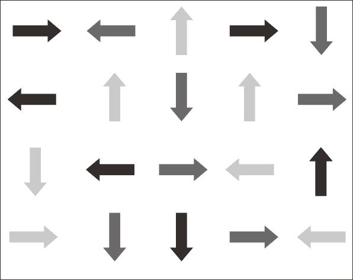 |
> | 图说：图二：一分钟箭头静心图 |
> 
> 如果你的脑中开始思考、忘记自己正做到哪里，或是感觉混乱时，闭上眼睛、缓慢呼吸，再次从左上角的箭头开始即可。持续每天进行几次一分钟箭头静心，直到头与眼睛能跟随各个箭头方向平顺转动，过程中都没有屏住呼吸。若能轻易看清楚图表，你想要后退离图表远一点是没有问题的。在能够轻松进行箭头静心第一阶段之后，就可以换到下一个静心阶段。
> 
> ###### 箭头静心第二阶段
> 
> 一、开始时先放松膝盖、缓慢呼吸。
> 
> 二、然后开始将头转向每个箭头所指方向的反方向，像是第一个箭头指向右方，就将头转向左方；第二个箭头指向左方，就将头转向右方，后续依此类推。而流程会像这样：吸气、将头慢慢转到与箭头相反的方向……吐气、将头转回中间。
> 
> 当你开始进行这阶段的箭头静心时，是否感觉到自己的迟疑或觉得需要在内心演练一下呢？如果是这样的话，就闭上眼睛呼吸，然后等自己准备好之后，再从左上角第一个箭头开始进行。每天做几次这种练习，直到你能在箭头与箭头之间从容转动头及眼睛，且呼吸没有停止或受到干扰。
> 
> ###### 箭头静心第三阶段
> 
> 一、开始时先放松膝盖、缓慢呼吸。
> 
> 二、这阶段要做的是讲出每个箭头所指的方向，不用转头。而流程会像这样：放松地看向图表，吸气、保持呼吸……吐气、说“右方”……吸气、保持呼吸……吐气、说“左方”，后续依此类推。
> 
> 如果你注意到任何紧张或分心，就闭上眼睛及深呼吸。当你准备好的时候，再从第一列开始做。一旦你在这阶段的静心都能重复地顺利进行，也许就可以换到下一个阶段。
> 
> ###### 箭头静心第四阶段
> 
> 一、开始时站在箭头图表前面感觉舒适的距离。缓慢吸气及吐气，放松地看向图表，膝盖保持微弯。
> 
> 二、在留意自身呼吸的同时，讲出每个箭头所指方向的反方向名称。例如第一个箭头指向右方，那么你要说“左方”；而第二个箭头指向左方，你就要说“右方”，后续依此类推。
> 
> 请记得要放慢进行，如果分心的话，就闭上眼睛、做个深呼吸，然后从第一个箭头再度开始做。如果你还挂念着别的事情，请在自己觉得比较从容的时间进行这项静心。
> 
> ###### 箭头静心第五阶段
> 
> 一、开始时就跟平常在做箭头静心第四阶段一样。
> 
> 二、在留意自身呼吸的同时，讲出每个箭头所指的方向，同时将双手手掌摆向箭头的方向。例如第一个箭头既然指向右方，那么你就要说“右方”并将手掌移向右边，后续依此类推。
> 
> 请记得移动放慢、呼吸保持韵律，就像自己在用慢动作移动那样。如果你分心，就闭上眼睛、做个呼吸，并再次从第一列开始。只要你能够容易、不费力气看清图表，想要后退离图表远一点是没有问题的。
> 
> ###### 箭头静心第六阶段
> 
> 一、站在箭头图表前方感觉舒服的距离，并留意自己的呼吸、膝盖微弯的站姿以及轻松的目光。
> 
> 二、在这一阶段，请讲出箭头的方向，同时将双手手掌摆向反方向。例如第一个箭头既然指向右方，那么你就要说“右方”并将手掌摆向左边；第二个箭头既然指向左方，那么你就要说“左方”并将手掌摆向右边，后续依此类推。如果你有迟疑，就暂停、呼吸，然后再次开始。
> 
> 这阶段的静心也许在一开始会感到相当困惑，所以请慢慢进行，让每次移动自行展现。持续进行箭头之间的转换过程，直到变得平顺。当这样的状况发生时，呼吸会变流畅、心智变安静、嘴巴会说话、手臂会移动，且完全不需要你费力参与其中。
> 
> 如果你还想要更进阶一点，可以跟着下述的静心步骤做做看。
> 
> ###### 箭头静心第七阶段
> 
> 一、跟往常一样站在箭头图表前方感觉舒服的距离，并留意和缓的呼吸以及轻松的目光。
> 
> 二、将双手往箭头方向摆过去，同时说出反方向的名称。例如第一个箭头既然指向右方，那么你就将手掌摆向右边并同时说“左方”；第二个箭头既然指向左方，那么你就将手掌摆向左边并同时说“右方”。
> 
> 三、当你能够顺畅且正确地进行这种变化形式时，那么箭头静心第六阶段与第七阶段请交换做。第一趟是说出箭头方向，手往反方向摆，直到做完整张图；接着的第二趟是手往箭头方向摆，并说出相反的方向。练习时将这两种变化形式一直切换，直到你能够顺利在它们之间流动。

借着进行一分钟箭头静心，我们很快会留意到那些会限缩呼吸、失去流动的心智策略，阻碍我们从容学习与经验真实临在的能力。当呼吸充分时，心智会安静，生命会顺流而行（flow）；当呼吸浅薄时，心智会活跃，生命会蜗步慢行（slow）。上述静心的目的，是要去留意那些会使我们屏住呼吸的事物，以及留意这些简单动作如何让呼吸重新开始。

无论我们参与哪些部分，身体总是扩张与收缩、肺持续充气与吐气，而呼吸则是生命脉动的表现。在呼吸的并不是我们，而是生命是以我们为其呼吸。

我在几年前与一位年轻男士分享这个练习，他现在是成功的演员及歌手，也开始在指导后学。以下是他的经验：

> 在做箭头静心时，它让我面对了在高难度表现的经验中所遇到的恐惧，即那种“我不知道自己在做什么，甚至不晓得自己要怎么切入其中”的感受。这种练习让我有机会面对那道恐惧，不必背负“努力”的重担。最后我领会到，那道“努力”欺骗了我，让我相信自己仍然没有达到自己想要的目标。
> 
> 我还记得在练习中会有种更深的事物来接手的感受，它转变“努力”的范畴，使我进入有些人会称之为“域”的深度学习状态。就我的感觉而言，它好像是种在嗡嗡作响或振动的流动性。
> 
> 我跟学生分享我个人所用的这套练习，让他们也能首度亲身经验临在：无论面前的任务有多困难，临在都在。这让他们直接知道，一切表演，事实上是一切存在的根基，就在于自己能够维持多深入的体现（embodied）并链接自己的呼吸。他们了解到，即便在面对“冒险”时，只要他们不离弃自己、不躲在自身心智的后面，总会有种安全感存在。

关于这套练习的讨论其实很难，因为它穿透理性的了解而成为受到启发的行动。在经验“毫不费力的精通”的方面，它是我所遇过最有效的工具。

##### 活在“域”中

我们对于生命以及生命本身之间的想法有着重大的差异。在静心闭关时体验平安是一回事，身处在生命的日常挑战中还能维持平安又是另一回事。若是与一般的存在状况相比，在日常活动中如能处在“域”里面，将是充满平安与热情的生活，这也是能够发展、扩增的技术。不过，我们首先得要发现那常使我们离开“域”、削减我们看见及经验临在的事物。

在日常生活作息的二十四小时中，我们最平静的时候就是夜间的睡眠。对于许多人来说，在睡着之前最后所发出来的声音就是放松的叹息声，那是我们在表达可以不用再努力挣扎了。此时，日间的担忧、挂念与挑战通通被扫到一边，我们的心智安静下来，总算可以休息。所以，如果我们在日间能链接到那种感觉的话，不是挺好的吗？当然可以！然而我们必须了解到，我们会把自己的认同当真。如果我们把意识心智的习惯性唠叨、担忧与挂念当成是自己的话，那么它就会成为我们的实相、占据我们的生命。不过，如果我们了解到自己其实是寂静、平安的观照，那么它就会成为我们的实相，而生命则会展现出不一样的滋味。

我们已被教导自己的思想能力是与生俱来的属性，然而每当我们与总是在寻求意义、了解与控制生命的心智互动时，就剥夺了自己经验深刻平安的机会，因为那宁静是来自对“宇宙万物会自己照料自己”的了悟。任何需要发生的事物，都会在需要的当下发生，因为生命正在引导我们的每一步伐。我们的真正疗愈是来自这领悟所伴随的无条件接受。

借由运用本章所分享的一分钟静心练习，我们会发现进入“域”与停留在“域”的方式。接下来我会讨论生命智性如何带给我们那能催生出进化过程所必需的确切经验。请对真正的吸引力法则有心理准备。

# 第十章　真正的吸引力法则

> 人不会借由想像光的形状而开悟，而是意识到黑暗。然而，后者的过程令人感到不愉快，所以并不受欢迎。
> 
> ──卡尔‧荣格

公元前四百年左右，西方医学之父希波克拉布底（Hippocrates）曾说过：“疾病是由相似的事物产生，并借由应用同类的事物而被治愈。”而十六世纪的帕拉塞尔苏斯（Paracelsus），即第一位注意到有些疾病的根源是心理疾病的医生，宣称小剂量的“致病事物也能治病”。虽然这原则与一九七六年山姆‧赫尼曼（Samuel Hahnemann）所创建的同类疗法技术相比非常基本，但我相信希波克拉布底与帕拉塞尔斯其实在描述的是大自然的疗愈基础原则，因为他们在观察自身与周遭人们的生命动态时，这项原则变得相当明显。

就像每个人都有独特可供辨识的指纹，元素周期表上的每个化学元素也会散发出明确的光谱指纹。而当加热单一元素到进入激发态（excited state）时，借由分光仪就能观察到这些具有特征的彩光线条，即是所谓的夫朗和非谱线（Fraunhofer lines）。当同样的元素冷却下来、用光源（例如太阳）照着它时，它从光源中吸收的部分跟在激发态所释出的谱线完全一样。

举例来说，氢气在受热时会散发出一组可见光谱线，看起来就像彩光带那样。然而，如果阳光照在冷的氢气上，氢元素所吸收的光能区段等同它受热时所产生的谱线位置。^(（注 1）)

所有元素处在有光的环境中时会自行吸收的能量，等同它们在激发态时散发的能量。这一点相当重要，因为我们住在充满光的地球，你可以将整个身体想成是处于动态的大量元素。这代表我们每个人一直在散发出彩光的能量指纹，持续吸引那些与它完全符合的能量。这就是真正的吸引力法则。我们会吸引自己所散发的事物，而我们需要的事物，就是自己所吸引来的事物。

至于要如何将这概念应用到我们的日常生活，请想想以下的可能性：生命一直给予我们的经验，就像强效的同类疗法药剂，是用来激发必要的觉知，以带入自身相关的疗愈及成长中。所以，在我们生命中出现的人与事其实是进化的药剂，持续为我们反映出那些需要注意的事物，而它们是从我们的意识状态对于所有面向都能安好的渴望当中提炼出来的。虽然我们抗拒的事件最后通常会带有情绪过敏的反应，这些反应可以成为疗愈的指标，为我们吸引来那些正是需要接受才能激励自身发展的事物，如同古老智者所言的“危机即是转机”。年轻的我在面对自身生命的重压时，并不知道这个事实。

##### 生命的科学

我的婚姻在一九七七年突然破裂，最后导致了痛苦的离婚。就像许多人一样，在遭受意料之外且难以理解的伤痛打击后，我崩溃了。在后续六年中的每一天，整天我都经历着严重的恐慌症。然而几乎因此失能的我，开始去找治疗师治疗，因为他问的问题，使我最后能转换自己对自身生命的了解以及关怀他人的方式，这问题就是：关于你与妻子的关系，这次的分手让你学习到什么呢？

我的回答是：我娶了外表是女性的父亲。

我的父亲很爱我，然而他的个性非常挑剔，很难表达自己的感受。例如，他在我从视光师的学校以班上前十名的成绩毕业时说：“你为什么没去当眼科医生呢？”

我的妻子并没有像我父亲那样挑剔，然而她很难表达自己的感受，这在当时造成类似的关系动力（她现在是我的密友）。如果她对一件事物感到很生气，但是又无法表达出来的话，我的回应也会像是在回应自己的父亲那样，就是觉得自己受到误会。那模式完全一样。

然后当我回顾自己的生命时，我了解到妻子并不是我唯一一位变装的父亲。在这段关系之前，我跟前任亲密伴侣也有类似的关系动力，跟所有男性密友、雇主及学校的大多数教师也有同样的情况。自己与父亲之间的那些未解课题一再浮现。

这情况就像是我的朋友、爱人以及老师出于特定原因一起策划来启动、疗愈这些早期的心理伤痛。我了解到自己的生命并不是由一连串随机事件组成的，事实刚好相反，它是共时协同（而且看似具有磁性）的过程，借由吸引那些必需的恰当经验与人物到我这里，促进我的疗愈。这项发现不仅转变我的生命，而且也引导出我在下一章要分享的治疗技术。

在离婚之后，那段又长又艰困的时期使我了解到，通往身心安适的路通常崎岖不平。根据身兼作家的心理医师罗洛‧梅（Rollo May）所言：“成为完整人类的过程并非无痛。”^(（注 2）)我们都有机会以开明的心接纳每个状况，认知到在面对自身生命中的干扰与阻碍时，并不必得把它们当成问题来对待。砂粒的刺激使牡蛎造出珍珠。无论我们讨论的是物理、化学或是人际互动，分裂瓦解通常都是带来改变的催化剂。电子在受到扰动时，会跳跃至更高能量的轨道。化学反应会发生在动态平衡或稳定受到扰动的时候。而人们常在受到压力的时候转变自己，就像洗衣服那样，衣服也是需要搅动才能洗吧！

##### 人属同类疗法

也许你跟我一样，也已经注意到自身生命当中会一直出现特定类型的人，也许那是童年缺席的父母身影，或是国中一年级那个一直耻笑你、使你感觉卑微容易受欺的恶霸。

那位特定的人物在某个时候也许会离开你的人生，不过如果你跟这个人有重要的课题没解决的话，看似还是会再次出现具有相同性格的其他人。而其结果，就是在伴侣换了又换、工作变了又变、生命历练改了又改的过程中，你总觉得自己好像被跟踪着，无论去到哪里，总是不断发生同样的经验，就像受人喜爱的格言所说的：“无论去到哪里，你还是你。”（Wherever you go, there you are.）

通常我们会尽量避开那些会让自己不高兴的人物，不过在绝大多数的案例中，无论我们转到哪里，他们就在那里，最后我们就会明白自己没有可以逃跑或躲藏的地方。我们的唯一选择，就是把他们当成解药的一部分去接纳他们，因为对我们来说，那些诱发自身伤痛的人们其实是套上伪装的祝福。借由按下我们的情绪按钮，他们把隐藏的事物推到台面上，帮助我们去敞开、觉知与疗愈自己，以经验更多生命所要给予的一切。

我将这个过程称为“人属同类疗法”（human homeopathy）。同类疗法是奠基在“造成相似症状之事物能够治疗出现相似症状的疾病”（like cures like）的另类疗法。基本上，引发我们症状的物质终究也是解药的一部分，用同类疗法所做成的药剂会在能量层面跟它对应的病症一模一样。而在人属同类疗法中，我们对于特定的人、特定的经验会有过敏的反应。直到此刻之前，在遇到这类状况、出现过敏反应时，你大概会想办法推开它，或是设法让自己分心以镇定下来。当我们在生命中经验到那些会触发敏感性或情绪反应的事物时，我们的心智会自动试图改换焦点或是撤退，为的是保护我们不被不舒服的感受所影响。然而，其实还有另一条路，就是接受并接纳那个过敏原。就此刻而言，你的生命中也许有一个或多个让你过敏的状况或人物，而当你遇到这些人、事、物的时候，就会从安适（ease）的状态变成不适（dis-ease）的状态，若是放着不管的话，不适将有可能成为疾病（disease）的根基。因此，就像医学用同类疗法的诊治原则那样，治疗的答案并非逃避，而是温柔接纳那状况或人物，直到自己能够自然接受它或他的治疗价值。

我们能够借由留意树木的根在处置阻碍的方式，学习到许多关于生命的原则。当树根遇到岩石挡在生长路径时，它们通常会环绕并把那些岩石纳入怀里，最后把原本的阻碍转用来强化自身根基。我们的生命也是一样的情况。当我们接纳那股奇迹般的生命智性时，我们的根就会扎得更深而能提供流动的稳固感受，让我们即使在面对强风时仍能泰然自若并接受引导。

“但是，”你也许正在想：“我不想在自己的生命中接纳那些难以相处的人物或状况啊！”当然你不会想这样做，而且你也不需要这么做。另一种方式则是你可以认出他们或它们所代表的事物，而这种事实上温和许多的作法会使那股紧张自行消散。我把这过程称为彩光同类疗法（color homeopathy）。

##### 彩光同类疗法

虽然我从一九七一年起就将彩光运用于治疗上，但是真正首度接触整套名为“共振疗法”（Syntonics）的彩光疗法系统，是在一九七七年由同僚兼好友赖瑞‧杰柏洛克博士（Larry Jebrock）引介给我的。共振疗法系运用照入眼睛的彩光，重新平衡脑部里面影响视觉功能的区域。在将共振疗法用在十几位具有视力问题的病患身上之后，我发现得到的治疗结果意义非凡，因此我以自己的名义主持三个前瞻性研究，以评估光的色彩还会影响哪些身体功能。

在一开始，我先让病患照彩虹的所有彩光，以观察特定彩光如何影响他们的视觉，也影响其心情与表现。例如有些人体内有太多的热，其形式也许是发烧、发炎，另一种象征形式即是发怒，我会用冷凉的彩光治疗，让对象照蓝绿光，使发炎反应和缓下来、体温下降并安抚他们的苦恼。如果他们的问题是源自缺乏热，像是脸色苍白并忍受慢性病症，我会让他们照温暖的黄绿光以增加他们的能量与活力。

而在最后的研究中所收集到的资料，便成为我的博士学位论文基础。这些资料显示出共振疗法能够增进注意力、学习与记忆，在治疗偏头痛、疼痛以及眼部发炎、头部创伤方面也有效果。^(（注 3）)然而它的主要益处在于能够扩张个人的视野（亦即人在往前直视时，能够看到的周边范围）以及视觉记忆（记忆自己所见的能力）。你的视野若能扩张，不仅在看的时候更加不费力，还会对你的整体观点造成显著影响，让你能将生命看成整体而不是以管窥之。

在指导该研究的过程中，我也发现色彩与人的情绪具有密不可分的链接。对于同一种颜色，不同的人会有不同的反应。每个人看起来都会对有些颜色感到舒服，而对另一些颜色感到不适。

所以我开始询问病患关于他们喜欢与不喜欢的颜色。当我用他们不喜欢的颜色短暂照射时，会引发轻微（有时可没那么轻微）的激动，使得病患释出难过或其他与不舒服的过往经验链接的情绪感受。他们的表现就像对特定颜色有过敏反应，因为这些色彩唤醒旧有的伤痛记忆以及伴随的感受。苏菲诗人鲁米不也跟我们说过：“伤口就是光进入你的地方。”

人属同类疗法的概念一直出现在我面前。我开始询问病患的过往，果真特定的色彩与他们生命中的敏感课题有着明确的关联。即使是我自己，在看靛蓝光时会马上出现恐慌，因它牵带出我与父亲的伤痛记忆。我心想，是否少量的靛蓝光就是自身疗愈所需要的事物？

于是我用不同的方式尝试。我在一开始先观看自己觉得舒服的色彩，然后以柔和、少量的形式逐渐给自己照个人觉得不舒服的色彩。这样做的效果十分明显，所以我也为病患提供同样的疗程。在这过程中的发现实在令人着迷，我的病患在接受光的全光谱之后，不仅视野更加扩展，也让他们能够接触到过去未曾察觉的感受、记忆以及生命的其他面向。许多病患表示，在个人感知变得更加宽阔时，就会有自发性的直觉。有些病患甚至出现预视，让他们得以一瞥后来会发生的事件。于是这现象越来越清楚，一旦我们能接受光的全光谱，就能接纳生命的全光谱。

彩光同类疗法是如何做到这样的成效呢？色光会熘到我们的自觉意识后面、越过大脑皮层，进入原始的脑干区域，那里管控我们对色彩的天生反应。它穿透我们的情绪与记忆中心，同时引发明显的身心反应。彩光同类疗法在带出限制我们视野的情绪根源时，也使我们终于能从旧有创伤解脱出来。

心理治疗能够有同样的效果吗？或许可以，然而根据我在使用彩光同类疗法的临床经验，观看色光通常在触及深层课题方面会快速许多。心理治疗的运作速度是依生命而定，彩光同类疗法的运作速度则是依光而定，而且情绪层面的抵抗无法阻挡它的效果。当你在观看特定色光的那刻，就会出现联想，那是一种初始的经验。

你也许会认为，颜色不过就是颜色。为何特定颜色会与我的感受有关系呢？如果你去询问物理学家关于实相的本质以及生命的根基，他们会跟你说的是，生命中的每一事物，你的每一所见、所闻、所感、所尝及所触都是一种振动。就拿物体来说，没错，它看来是固体，然而当你用显微镜来看它时却不是那回事。当你持续放大自己观察的目标，到最后只会看到它的振动印记而已。在最根本的层次，其实是光的振动在支持着实相。色光仅是我们对于以特定频率振动之光的视觉感知而已。

就像我们对于一些生命经验能够容易接受或是难以接受那样，组成那些经验的能量频率也一样会让我们有舒适或不适的感受。我们会以回应特定生命经验的方式来回应特定的色光。然而我们并不是回应色彩本身，而是回应那股被我们诠释为色彩的振动频率。我们各自对于色光的诠释甚至会有极大的差异，像是你对红色的诠释可能是别人用在蓝色的诠释。不过，即便你对特定色光的感知比较不一样，这并不会影响你对它的感觉。绝大多数的科学家在过去都认为具有正常视力的人在观看色彩时会有相似的经验，^(（注 4）)因为他们对于色彩的感知系与通用的情绪反应链接，然而现在根据美国华盛顿大学眼科教授杰伊‧内兹（Jay Neitz）的研究，这种观点已经改变。

在二〇〇九年的《自然》（Nature）期刊所登载的研究中，内兹与同僚使用病毒注入天生仅对蓝色与绿色敏感的猴子之眼睛^(（注 5）)，使一部分负责绿光感知的杆状细胞也能感知红色。即便猴子的脑天生仅会感知到绿色与蓝色，它们会自发地适应，使猴子能够看到红色。该研究的结果显示，光的波长并不会有既定的感知方式，换句话说，我们每个人都有各自独特的色彩感知力，或说是个人独有的色彩光谱。

根据生物光学研究的先驱者弗里茨─亚伯特‧波普教授（Fritz-Albert Popp）所言：“虽然目前仍处在尚未完全了解光与生命之间的复杂关系之阶段，但我们现在能够断言，我们的一切代谢功能都仰赖着光。”^(（注 6）)由于光是由不同的波长（也就是我们所感知的色光）所组成的，我们在代谢色光的方式会与自己在代谢生命的方式形影不离，而当我们接纳光的全光谱，就能拥抱生命的全部色彩。

# 第十一章　全光谱的生活

> 万法齐观，归复自然。
> 
> ──禅宗三祖僧璨

光与生命之间有着密不可分的关联。我们感知为色彩的光之频率能像特定生命经验那样触发特定的思想、感受与情绪。而当我们提升对于光的可见光谱之接受度的时候，也就更能活出更加生动璀璨的生命。因此，色光具有启动我们的潜能、释放我们与生俱来的光明之力量。

为了经验这种动态的链接，请让我为你带领一段短的观想。如果手边有记事本的话，就能方便你简略记下自己的观察，有些人则喜欢用录音设备。无论如何，请先完整读过下列观想步骤一遍后，再闭上眼睛做做看。

> ##### 彩光圆罩观想
> 
> 想像自己正舒适地坐在一间有透明圆罩的屋中，阳光能透过圆罩照耀进来，让你笼罩在一片柔和纯粹的光中。现在想像手边有个调节器，能让你把光的亮度逐渐调到自己觉得最舒适的程度。当你吸气的时候，想像自己在装填这道纯粹的光，并留意自己的感受。
> 
> 对你来说，这是舒服的感受吗？当你沐浴在光中，你的呼吸或心律有改变吗？你是感觉自在，或是在脑海中浮现任何感觉、影像或记忆呢？你想要待久一点，还是想进行下一步呢？当你准备好时，做几个深呼吸并简略记下你在这段经验中注意到的任何事物。
> 
> 现在想像你可以选择把透明圆罩的色彩改成红色。你对这样的改变有什么感受呢？你期待看到红色吗？态度是欣赏的？中立的？还是说你想要换到橙色的透明圆罩呢？请按照自己的直觉来进行自己觉得最舒适的动作。
> 
> 如果你决定要略过红色并换到橙色透明圆罩的话，请记下自己略过红色。然而，如果你决定要经验红色的话，请想像圆罩下的整个空间充满着柔和的红光，并用想像出来的调节器逐渐增强色光的强度，直到觉得最舒适的程度。然后在红光中继续呼吸，并观察自己对此有什么感受。留意任何浮现出来的身体感受、情绪或记忆。
> 
> 你想在红色圆罩停留多久就留多久。而当你准备好时，想像圆罩恢复成一开始的柔和、纯粹的光。现在做几个深呼吸并简略记下自己所注意到自身对红光的反应。
> 
> 继续依照这样的步骤来经验彩虹的其他色彩，即橙、黄、绿、蓝、靛（像是深邃海底的深蓝色）、紫。彻底经验每种色光，并且按照自己的意思长待或暂留，甚至略过一些色光圆罩都可以。请记得要记下出现在各种色光的身体感受、感觉、反应或记忆。

##### 了解彩光观想

前述的观想可能会相当强大，而每个人对此的反应均不相同。有的人在观想特定色光时会哭泣，有的人告诉我一种色光让他感到很深的舒适与喜悦，而另一种色光会引出忧伤。有的人则是在开始观想一种或其他种色光时，立即经验到从内心深处涌现的焦虑或怒气。有的人对一些色光的厌恶感强烈到完全无法使自己观想它们。这些反应对于我们的内在领域提供相当有价值的洞见，让我们能够瞥见心灵深处。

不久前我曾指导一位名为华特的退休医学教授，他的视力因为糖尿病的关系有非常严重的问题。在最初的谘询当中，他跟我说他在八岁的时候才知道自己以前有位兄长，而那位兄长在他三岁时因不明原因溺毙。在知道这件事后不久，他逐渐出现心脏方面的问题并被诊断出第一型糖尿病。根据华特所述，那笼罩在兄长之死的谜团从童年开始一直萦绕在心。

以下是我们在做彩光观想时，他提供的回馈。

> 纯粹的光：“我并不完全感到舒服。担心。我无法看清楚。”
> 
> 红光：“这让我感到焦虑。威胁、不舒服、担心。这是我在看向母亲的脸庞时会有的感觉。”
> 
> 橙光：“这挺舒服的。它不像红光那样使我的心智看起来改变很大。这色光不会带我到别的地方，我就是在这里而已，完全没有问题。”
> 
> 黄光：“这让我想起温水澡。它比橙光还要好。让人感觉舒服，觉得生气盎然、充满能量。这是回家自在的感觉。”
> 
> 绿光：“我得要退避。它让我感觉倦怠、沉重。还有伤痛与沮丧。我在成长期间都会回避它。”
> 
> 蓝光：“这是疗愈的色彩。我的呼吸变得顺畅。但是我的父亲出现，阻挡我的疗愈。现在我又再次看见母亲，她是焦虑的源头。”
> 
> 靛光：“这感觉很吸引人。现在我的感觉很复杂，想要把它变成纯蓝色，而不是靛蓝色。我一直改换那道色光，因为它引出焦虑，甚至比红光的焦虑引发程度还要多。这让我想起兄长的溺水。在那事件之后，我的母亲不再让我去海里玩，因为担心我也会溺水。”
> 
> 紫光：“这感觉很好。有种放心与疗愈的感受。”

我们之前未曾碰面，而上述这些洞见是来自这位男士与我通电话时所叙述的内容，想想看要多少次心理治疗才能揭露出这五分钟的观想所引起的一切！

现在花些时间回顾自己记下来的那些针对各种色光的自身经验。哪些色光带给你平安、温暖与喜乐呢？哪些色光让你感觉不舒服、使你退缩或停下手边的动作，或是变得焦虑或难过呢？你会闪避、直接快速穿过或是完全略过哪些色光？

那些使你退缩的色光，象征着你在可见光谱中会感到敏感或“过敏”的部分。当你对特定色光感到厌恶时，例如红色，你会尽量避免光谱中你把它看成是红色的部分，也会同样避开生命众色当中呼应红色的部分。请让我详细说明。

想像自己在出生之后所有的经验都录成影片，然后想像你正要去看那部影片。当你在电影院找到舒适的位置之后，就被链接上一系列生物回馈监测器，以记录自己对看到的每一事物之反应。那些反映出欢乐时光的情节会将你的呼吸、血压与脑波带到平衡且平静的状态。在这过程中，你会放松、扩展视野，让自己更愿意去看、去经验。

反过来说，那些反映着不舒服的事件之景象会限制你的呼吸，使你的肌肉紧绷、心跳加速并扰动你的情绪，此外还会缩减你的视野，真的会关闭你所见的部分范围、降低你从容接受与拥抱生命的能力。即便电影院银幕上显示的事件仅是光的投射而已，并不是正发生在真实世界的事件，你的身体仍依照它们在你里面激起的情绪而以接受或拒绝当成回应。

如同有些经验会比其他经验来得容易被人们接受那样，这些色光在能量层面与一些经验相对应，人们在观看时也会有舒服或不舒服的感受。所以如果我们对色光谱的接受有限，那么我们能接受的光量与生命量也会受限。而当我们逐渐对这些色光的过敏反应减敏时，我们将以更多的敞开与接受来经验生命。

对于前面所提到的华特，如果你能想像一栋有七个房间构成的屋子，并把每种色光看成是其中一个房间的话，那么就很容易看到他觉得自在的房间只有两个：黄光房间与紫光房间。对于其他的房间，他只会偶尔去一下或甚至完全避开，因为它们引发了那些由童年记忆造成的深层焦虑。

也许你的屋子也有类似的状况。你的屋子也有七个房间，然而你限制自己只去其中一、两个房间。如果你对每一个房间都能舒适以对的话，会有什么样的感觉呢？想想看，自己若在面对生命的各个区块都能感到如同在自己家那样的自在，生命会扩张到多大呢？

借由彩光同类疗法的帮助，你将能逐渐接受那些自己为之退却的色光，超越自己对它们的过敏，更重要的是超越自己对这些色光在自身生命所象征的人物与经验的厌恶。在华特的例子中，当他面对那由特定色光带出来的伤痛记忆之后，就能经验到更大的安适，因为他至少填补笼罩在兄长溺死事件的空白时光，最后他的视力有所改善，而他所得到的洞见让他终能放下这个谜团。

现在让我们来练习另一种观想，它会帮助我们揭露出自身对色光的过敏与自身健康与身心安适的关系。这项练习会用到纸笔。

> ##### 人体图观想
> 
> 想像自己全身赤裸地站在一面与自己等高的镜子面前。当你看向自己的镜影时，观想扫描自己的身体。从脚开始逐渐往上移动，留意那些不容易放松、曾有感染、做过手术、受过伤、有慢性疼痛或承受过往情绪伤痛的部位。例如，如果你常有花粉过敏的症状，那么也许你的鼻窦就是要把问题呈现给你看的身体部位。或者你的问题也许是反复发生的膀胱感染、头痛、背痛或者不孕。然后请在纸上画下人体简图（火柴棒人形图即可），并把所有那些发生问题的区域，或是过往曾有身体或情绪方面创伤的区域圈起来。接着查看下页脉轮图，检视自己的身体问题及其对应的脉轮，并与自己会过敏的色光比较。

在为数千人进行彩光同类疗法之后，我注意到他们会过敏的色光绝大多数会与身体上具有疾患、受伤或情绪张力的区域有很接近的重叠现象，例如前述的华特，他的脚没有感觉，在性与消化方面也有问题，都跟红色及橙色脉轮有关。他还提到自己的心脏曾因情绪的原因受到强烈冲击、颈部有关节炎、视力也有问题，对应到绿色、蓝色及靛色脉轮。在华特的例子中，他的色光过敏与身体及情绪的问题完全相符。

| 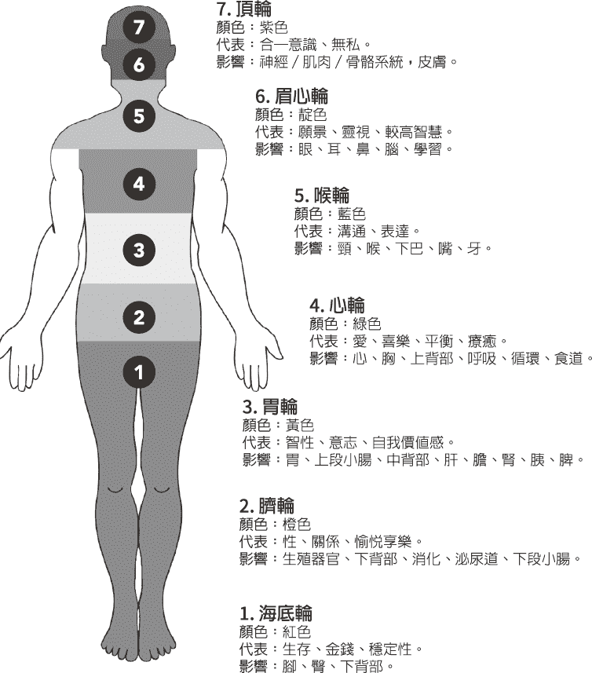 |
| 图说：图三：人体七脉轮图 |

虽然运用这两种观想已有数十年，我仍对人们感到不舒服的色光居然与自身有状况的身体部位完全符合之现象感到惊奇。其关联性非常明显，例如有些对红光厌恶的人也许会跟我说自己有下背痛，有些对蓝光不舒服的人也许会提及自己很难表达己意、具有牙疾或是甲状腺的问题。在许多病例中，当病患运用彩光冥想克服这些“过敏”时，有更多的能量流往对应的身体部位，以支持他们的生理功能、整体安适与疗愈能力。当我与波普教授分享这些观察时，他也肯定地说：“当细胞在健康状况良好时，它会均等回应所有属于可见光谱的色光。”^(（注 1）)我也在病患身上注意到同样的现象，当他们健康良好、对生命感到知足时，就会从容且均等地回应所有色光。

##### 彩虹体

你也许会疑惑这样的事情怎有可能发生，毕竟色光仅是光在特定频率振动、具有特定波长的光，例如红光的波长约在六二五到七六〇奈米（nanometers,nm），而紫光的波长约在三八〇到四三五奈米。

根据《核进化：彩虹体的发现》（Nuclear Evolution: Discovery of the Rainbow Body）的作者、身兼哲学家与科学家身分的克里斯多福‧希尔斯（Christopher Hills）所言，脉轮位于身体的七个主要内分泌腺体之处，这些线体由可见光谱的七种色光所启动，与健康、快乐及高等意识的实现有关。^(（注 2）)由于脉轮不仅关联到我们的身体健康，而且也与灵性进化有关，每个脉轮都象征着我们生命旅程中的单一面向。

有鉴于此，我发现第三脉轮有个值得注意的地方，这脉轮与黄光有关，有人描述它是智性、意志与自我价值的中心，然而它只占可见光谱的百分之六点五。反观第一、六、七脉轮，这些与直觉、内在指引与较高层次的了悟有关的脉轮，占可见光谱的百分之八四点二。这种明显的差异，更进一步指出我们的智性与内在引导在自身意识开展过程的各自贡献。

意识就像棱镜，将那称为光的不可见振动转成我们称之为色彩的可见振动。波普教授曾这样说过：“当细胞失衡时，就会选择性地对光产生反应。”^(（注 3）)就像吃得不好会导致营养不良那样，无法吸收光的全部光谱就会导致“光照不良”（mal-illumination）。^(（注 4）)当我们对于阳光的全光谱之接受度降低时，会难以完整健康及身心安适的状态运作。

##### 为色光过敏现象减敏

借由有系统地观想感觉不舒服的色光，我们能够对那些诱发生活压力的习惯因子减敏。根据我的临床研究与观察，色光是我们的生命经验在能量面的基础。借由绕过自身意识的防御，色光让我们能清楚瞥见自己藏得最深的敏感性。依照我们自己的步调来和缓地观想特定的颜色，这方法能够帮助我们克服对于色光的敏感，从而克服对于生命的敏感。当我们对于这些色光越来越感到舒适的时候，我们将会经验到更庞大的身体活力、情绪安适，还有轻松从容。

以下就是进行的方式：每天一到两次，每次以一到两分钟的时间回到观想色光的圆罩。每次仅是去看一道色光，并按自己的需要调亮或调淡。当身处一种色光的你觉得已经吸收色光到舒服的程度时，就换去下一道色光。你可以按自己的意思与步调来调动色光的顺序，所以在处於单色光中时，并不需要给予自己超过能够容易吸收的程度。把这方法当成是一种冥想。在自家的隐密空间，让自己可以在个人的圆罩中休息，唤出自己所需要的一切。如果你觉得焦虑、躁动，你也许会在让自己觉得抚慰的色光中镇定下来。如果你觉得自己相当稳定并归于中心，你也许能够踏上那通往自身生命秘境的旅程，让色光催化出探索心灵深处的旅程。

| 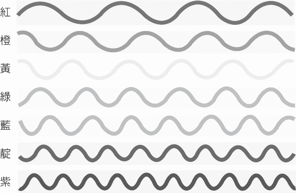 |
| 图说：图四：色光的波长 |

你不用处在让自己感到受不了的程度，如果你对于特定色光感觉吃不消，只要用想像的刻度表把它降至舒服的程度即可。在过程中，你将会发现自己逐渐能够调高亮度，而且能够待得更久，最后能够接受那些让自己在一开始感觉不舒服的色光。

##### 测量自己的进展

当你在克服对于特定色光及其象征事物的敏感时，你的整体身心安适的状况会改善，平安与宽阔的感受也会遍布于自身生命中，取代那些在过去刺激你的敏感性。然而在过程中，你也许想要评估自己的进度并看看自己是否在深入运用特定色光时获得益处，因此请用下列观想来评估。

> ##### 光之圆筒观想
> 
> 想像自己的身体里面有排成一列的七个储存圆筒（请参考后页图），第一个圆筒装红光，隔壁的圆筒装橙光，再过去的圆筒装黄光，后续则是绿光、蓝光、靛光与紫光。现在想像有一道光束照进自己的眼睛、穿过意识的棱镜而分成七道液态的光流，即红光、橙光、黄光、绿光、蓝光、靛光与紫光，每道光流都会流入对应的储存圆筒。现在请观察每个圆筒并留意它们有多满。
> 
> 你也许会注意到一些圆筒是满的、有些是空的，其他则是在这两个极端之间的程度。对于自己在一开始无法接受的那些色光，你是否注意到自己已有能力接受更多了呢？
> 
> 对于之前感到不适的色光以及它们所唤醒的感受与记忆，当你针对它们为自己减敏时，你的所有脉轮将会打开，让自己的心智能够放松、健康能够改善，而意识能够自然地扩展。当你让光穿透自己，就像自己是透明的事物时，生命就此变成活的静心。与其感觉自己得要长期忍受那些感觉不舒服的经验，你反倒能自发地去看、去回应发生的每一状况，让真正的临在常驻于自己的生命里。
> 
> | 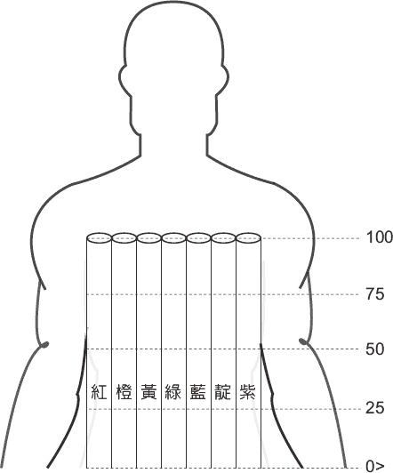 |
> | 图说：图五：光之圆筒观想 |

##### 什么是开悟？

当我们想到开悟时，所想像的是没有欲望或受苦的觉醒状态。我们甚至会想像出某人在静心或为信徒们提供灵性教导的模样。然而，开悟也许仅是意谓着明亮、透明，即发光的生命。

想像一片透明无瑕的玻璃，不去反射、扭曲或吸收穿过自己的光。就理论而言，当光穿透像这样的纯净玻璃片时会是百分百地穿过，就像那片玻璃根本不存在似的。然而当那片玻璃存有任何瑕疵时，就会改变穿透光的质与量。

我们每个人就像纯净无瑕的玻璃，原是能让所有进到自己的光传送出去。然而我们对生命的想法，会像透光过程的瑕疵那样遮掩我们天生的透明。我们如何看待生命，就决定生命在经过我们时有多轻易。而当心智净空时，想法就会消失，只留下我们所是的纯粹之光。

犹太人的圣经提到神是以这样的话语开始创造：“要有光”（创世纪 1:3），然而直到创造过程的第三天之后，神才带来“天上……光体、可以分昼夜”（创世纪 1:14）。根据圣经的记述，神在第四天创造的太阳、月亮与星辰，它们的可见光与第一天的无形光创造之光，即生命智性有着明显的区分。

光与生命是同一本质的两种表现，而我们与创造之光的融合，象征自己能够欢迎光的全部光谱以及生命的全部色彩。也许我们的生命是一趟由光引导的旅程，而意识在这旅程中持续扩展，直到它与创造自己的那道光合而为一。

##### 成为光

当我在好几年前卖掉诊所的时候，有人问我为何连一台设备都不留，那时我的回应是，我觉得我能用心与双手做任何自己需要做的任何事情。于是对方接着问我为何不拿走自己的光仪器，而我的回应就是：“你运用光，直到你看见光。一旦你看见光，你就成为光。”

当太阳升起时，花朵便转而向它生长以吸收它的光。而在日落时，花朵便逐渐退缩下来休息，为明天、为自身进化的下一阶段准备好自己。人类的回应方式也是如此。我们因日间的光而醒来、持续使自己对准那道光，最后退回自己的住处并休息，为自身生命旅程的下一步准备好自己。

创造就是光转换为物质的过程，而开悟就是将物质返还为光的过程。我们肉身生命的旅程是从灵魂的物质化开始，并在物质的灵性化结束。我们的意识决定自己能够吸收的光谱频率，这些频率将物质灵性化而成为能量，使我们得以发光。而当意识在扩展的同时，我们的发光也会如此。我们尚未能够吸收的光频就会被反射出去，而为我们吸引来对应的生命经验，逐渐帮助我们接受之前感觉不舒服的一切。当我们能够吸收阳光的全部光谱：“我们”就消失了，仅留下太阳的全像焦点。

# 第十二章　在科技世界的生活

> 人已经成为自身所造工具的工具。
> 
> ──亨利‧大卫‧梭罗

我在这本书中从头到尾一直在谈的是我们持续受到光、生命智性的引导，并在前一章说明我们拥抱光的全光谱之能力，与我们接受生命的全部色彩之能力有直接的关联性。然而我们习惯让心智的絮叨阻碍或遮掩那道经由自身内在导引所接收到的生命智性。

由于我们已经处在高度放大的“科技接管”（technology takeover）现象，全球各地都开始反思这种过程。科技的普遍使用，就像我们对思想的瘾头那样，变成持续的信息流，不断阻碍我们的生命之“流”。这种打扰的模式是从电话的出现开始，以行销包装成“拨号、等待”。然而现在的我们，不论是眼睛、耳朵或手指，都是日夜无休地黏着我们的科技、寻找网络上的信息，被电邮、简讯、推特或是脸书的新留言串大量轰炸。我的朋友荣恩称这类科技是“造成全体人类无法专心的武器”。

不过，这种使全体人类无法专心的现象，会如何影响我们的临在程度与面对个人生活中日常需要的处理能力呢？根据二〇一〇年凯萨家庭基金会（Kaiser Family Foundation）的报告，八到十八岁的孩童平均每天花七小时又三十八分钟在娱乐媒体上。^(（注 1）)同时美国疾病管制与预防中心（Centers for Disease Control and Prevention）则指出，被诊断出患有注意力缺失／过动障碍症（attention deficit hyperactivity disorder, ADHD）的病例数量惊人激增情况已超过十年。^(（注 2）)此外，根据一项刊于二〇一〇年八月的《小儿科》（Pediatrics）期刊、以两千一百位大学生为对象的研究，发现接触荧幕媒体会与注意力问题有关。^(（注 3）)不仅如此，根据已故《纽约时报》畅销作者暨心理免疫学家保罗‧皮尔萨（Paul Pearsall）所言，我们所有人都变得对媒体有过度狂热的倾向，而发展出算是成人注意力不足症（adult attention deficit disorder, AADD）的形式。^(（注 4）)

而这样的分心仅是冰山一角。巨量的日常文字讯息与电邮，使我们在这些活动停止之后难以自处。虽然三不五时会出现的孤单感是正常情况，然而我们对于科技所实现的无休互动之瘾头，会在科技突然无法使用时加深这种感觉，你只要想想自己在发现手机拨不出去、网络连不上时的感觉就知道我所讲的意思。我们一直检查电邮与文字讯息的瘾头，是否有可能造成我们无法真正与他人链接，以及在没有持续的刺激之下就找不到满足感呢？

除了科技对我们的注意力及没有科技时的从容自处能力所造成的影响外，我们也要检视自己与自己的装置之互动，会如何干扰我们的基本沟通与社交技能之发展。许多研究人员观察到，人与人之间的每日对话变得越来越稀少，^(（注 5）)只要想想自己在使用电话或见面谈话的频率，以及自己使用文字讯息或电邮沟通的频率，就会知道事实如此。

我们这些出生在电脑与智慧型手机时代之前的人们，会自然发展这些社交技能，因为我们当时的生活绝大多数都仰赖人与人之间的直接沟通。然而这一切到现在已经改变，而孩童所受到的影响出乎大家意料之外。许多父母实在忙于与自己的手持装置互动，于是为了安抚及娱乐孩子，就时常给他们玩电子游戏，而不是亲自与孩子互动。这样的结果就是今天有许多孩童在成长时已内建着对于小型电子装置的依赖，使他们难以面对日常社交场面。他们通常会发现自己很难与对方眼神交会，甚至连非常单纯、没有科技从中协助的面对面互动也难以处理。

随着时间过去，这些孩子忘记如何与他人相处，因为他们已经习惯使用科技来逃避直接接触其他人以及生命本身。事实上，有些神经科学家认为网际网络的运用会改变脑部的神经链接。^(（注 6）)

我们活在信息时代，然而信息并非智慧。信息是由头脑来传播的，但智慧是由心来沟通的。智慧来自直接的经验，而直接的经验则来自自己与他人、世界的互动。我们在面对面的互动中传递原始、非语言的示意，以在潜意识的层次沟通关键的信息。这些经由眼睛、表情、身体语言及费洛蒙传达的信号触发直觉的反应，而这些在数百万年来进化到极致的非语言沟通技巧，让我们能在世界中顺利运作，不过它们只会发生在彼此的临在中。

我们越依附科技，人与人之间的链接就会减少，也失去更多处理日常生活压力因子的能力。不幸的是，我们对于自身电子装置的依赖程度，已经大到如果没有连上网络的话，自己会变得很难正常运作，即使仅是短暂断线也会如此。

举例来说，中国大陆的手机用户有十二亿，而对于像是电脑荧幕、手机与电子游戏的科技，他们所展现的瘾头已经强烈到让该国医生认为这已经算是临床疾病的程度。^(（注 7）)中国已经成立许多网瘾戒除中心，使年轻人完全隔离所有媒体。而中国所发生的状况也特别能让美国父母引以为鉴，因为美国父母通常会为了使小孩安静下来而给他们手机或平板电脑，然后注意到这些小孩花许多时间黏在荧幕前面玩电子游戏，即便是在休假、野外散步或是开车都是如此。事实上，在《精神疾病诊断与统计手册》（Diagnostic and Statistical Manual of Mental Disorders, DSM）的第五版，已把网络游戏障碍症（internet gaming disorder）认定为应当需要更多临床研究的病症。^(（注 8）)

我曾在一九七八年的日志写下这段话：“引发意外事故、压力及身体疾患的原因就是时间的概念。我们发展出时间的概念来改善我们的效率及掌控我们的命运。不幸的是，我们所创造出来的怪物一直与我们竞争，而且不断获胜。如果我们不再与时间竞赛的话，我们就不会有意外事故。如果我们不去‘预先设想’，我们的器官就不用费力工作，也不会经常故障。时钟正控制着我们。”而今天的我还会加入更新的部分，就是时间的概念使我们与当下可得的临在之流分开。

那时的我并不知道这些话语有多么真实，然而现在控制我们的事物已经不只是时钟，还有我们的电脑、平板电脑、手机、网络等许多事物。原本设计来为我们“节省时间”、提供协助的科技，现在转而无时无刻地管控我们、照顾我们，以及检查我们。今日我们已经很难找到可以不被看见、拍照或摄影的地方。我们的电脑与手机之行销概念是“量身打造”与“聪明”，因为它们能预测我们的欲求并提供服务，我们的地位则降阶成只是“使用者”而已，你注意到这样的转换了吗？虽然我们的装置很“聪明”，但身为伟大生命智性的我们必得时时警觉我们的科技所带来的益处与害处，因为科技会将我们与较高的引导分开。

我们过去常花许多时间与人面对面地相处，好使我们能够看进对方的眼睛并感觉其临在。现在这个过程大多被电邮、文字讯息所取代，运气好的话还有视讯。我们过去在感觉到自己与某人有链接的时候，就会约对方出去见面；现在我们是从网络约会平台寻找伴侣，而那些平台是以个人对于伴侣的期望概念与数据媒合。我们过去会在感觉来电的时候，就跟对方形成亲密的关系；现在的性大多都在网络上，仅是粗浅的色情讯息及网络色情作品。所谓的等待时机与来电感跑去哪里了呢？

我们过去用人工处理的事物，现在的电脑几乎都能做到，而且更有效率。过去有许多人知道如何找零，现在是由收银机告诉我们要找给客人多少零钱。如果收银机不为我们提供这项信息的话，我们会怎么办呢？我们还会算得出要找多少零钱给客人吗？我们在过去会记住时常联络的人之电话号码，而现在我们不再需要去运用或发展自己的记忆功能，因为现在的拨号大多用快速拨号，或是要求虚拟语音助理 Siri 为我们拨号。如果你真的去问的话，现在的人大多不会记得密友的电话号码。如同运动跟维持健康有关，记忆的运用也会与记忆的保存有关。医师在过去会花时间运用直觉及服务精神、医学专业训练为病患诊断与治疗。然而现今的实证医学与电脑化的病症模块，使医师很难发挥出那股无法衡量的自身智慧，也没有时间去了解自己的病患。

如同你所看到的，现代科技非常有效率地接管我们的生活，然而这仅是在反映着精于此道的幻相自我。随处可见的科技一直在仿效那占据内心的虚拟自我。这就是所谓的“创造自己的实相”吗？如果是这样的话，这种实相的价值到底是什么？我们如何在运用这些由自己发展出来的美好科技时，能够不用伤害到自己的健康、喜乐以及与自然的链接呢？

许多年前，当我还在视光学院念书时，学习到关于近点压力（near-point stress）概念，这发生我们在读书或使用电脑时，将眼睛过久限制在二维平面的状况，而其特征即是会出现与压力有关的生理变化。这状况之所发生，是因为人类天生是以三维形式来观看世界，其神经生理构造也是如此设定，所以任何会使我们的天生能力及生命的全神贯注无法正确搭配的活动或环境，就会创造出压力而削减我们的生活品质并有可能引发疾病。^(（注 9）)

当视力被束缚住时，就会让你有受困的感觉，就像失去自由那样，而这有可能引来各式各样的压力相关症状与异常行为。犯罪的人一般会被徒刑在没有窗户的狭小牢房，到户外走动的时间也被限制。具有暴力倾向的罪犯会被徒刑在视野受到限制的单人牢房，每天长达二十三小时，让他们的眼睛无法逃离禁闭，也看不到白天的光线。

我们若长期将自己的三维视野范围限缩在手机或电脑荧幕上，就会像在电梯里面待太久到想要逃离那样。人眼原本是用来看远的，不过由于我们花如此多的时间在看电脑荧幕以及手机，我们的眼睛就会因为过度工作、没有频繁休息而出现疲劳，最后常导致近视与散光。

每当你花太多时间注视近处时，就会注意到自己抬头望向远方时，所看到的景象在一开始是模煳的。这种暂时性的望远朦胧情况，正是近点压力的常见早期症状之一，其他常见症状还有眼睛疲劳、头痛、复视、流眼泪及眼睑抽搐。

电脑与手持装置普遍使用的结果，就是视力恶化变成是世界上健康方面数量最大的流行疾病，而且还在不断增长。澳洲国立大学伊恩‧摩根（Ian Morgan）在《刺胳针》期刊指出，住在中国大陆、台湾、日本、新加坡与南韩的青壮年约有九成患有近视^(（注 10）)。而这些数据更进一步证实二〇〇九年美国国家眼科研究所（National Eye Institute）的研究^(（注 11）)，该研究发现美国人民的近视发生率若与一九七〇年代早期相比已增长百分之六十六，真是令人担忧。

科学家知道环境与个人是否会发展出近视有关，他们相信凝视电脑荧幕或手机是促成这种流行病的主要因子。然而，澳洲在二〇一五年刊登的新研究则是指出，那些比较不常在户外活动的近视孩童，会有视力恶化的现象。^(（注 12）)根据这项研究的结果，研究人员建议孩童至少要每天有一到两小时的户外活动，以避免近视或减缓其进展。

美国人民戴眼镜者占三分之二，然而在出生时即需眼镜者其实不到百分之一。^(（注 13）)几乎所有六十岁以下美国人都在使用电脑，九成都觉得眼睛疲劳，即电脑视觉症候群（computer vision syndrome）。这些数据跟欧洲电脑使用者的情况差不多。根据国际电信联盟（International Telecommunication Union）的看法，世上有多少人（七十亿），手机几乎就有多少支（六十八亿）。^(（注 14）)

年轻人患有近视的比例激增的现象相当显著。只要从近视者的眼镜看出去，就会发现它会将所有事物看起来变得更小、更近。而潜藏在近视底下的原因，则是个人为了回应不自然但被社会接受的要求，真的缩减自己的视野，用眼镜矫正仅是模仿他的概念性适应作为而已。

由于电脑及手持装置的使用会明显削减我们的视野，就能容易想见长时间使用这类科技如何能够造成视力的适应。我们越常专注在近距离的数码科技，就创造出更多的视觉压力。我们的视野越是缩减，观看、记忆、学习就越少，而其结果就是我们在工作的时候效率变低，跟这类科技对我们的行销说词相反。

最近那趟去纽约市的行程，让我警觉到现代科技是如何对我们的基本人类功能造成严重影响，其中包括视力、听力、敏感性、健康与死亡率。我在搭乘地下铁时亲眼目睹这种严重的影响，绝大多数的乘客都戴着耳机、专心凝视自己的智慧型手机，无意识地将自己的周边视野限缩到手机荧幕的大小。

我也注意到街道或地下铁那里的人们很少眼神交会。然而唯有眼神交会才能完全活化脑部的特定区块，那区块让我们能够正确看待他人及我们的环境，并予以正确的处理与互动。^(（注 15）)当我们与某人眼神交会时，我们其实在交换彼此的光，这也就是我们常在看到某人之前先感觉到对方的注视之原因。即便是全盲的人，他们的脑部在自己被他人注视时也会出现可以测得的活动。

不过，为了让我们能够看见彼此的光，眼神交会并不是唯一方法。夏威夷原住民在传统上会借由分享彼此的呼吸、承认彼此的神性或光。这个被称为分享生命气息“ha”（夏威夷语）的古老仪式，是在欢迎客人来临时进行的，主客彼此互按对方的鼻梁并同时吸气。虽然这个时代的人际交往在很多方面已经被无线通讯所取代，而合作也被竞争取而代之，我们一定不要忘记自己还是有想与他人及自己所在的世界链接的需求，这是每个人都会有的需求。

科技除了严重影响我们的视力、行为及天生的社交技能之外，其他的副作用则是影响我们的健康及生物韵律。其中一个例子就是智慧型手机、笔记本电脑、电视、ＬＥＤ灯及其他许多装置会散发出明亮的蓝光，让我们的脑即使在夜间也会错认为白天。^(（注 16）)晚间接受这种蓝光的照射会出现的问题，即是它的波长会影响我们身体的生物时钟，抑制分泌引发睡眠的褪黑激素，使我们无法入睡。一般人若在睡前观看电视或使用行动装置，也许会难以入睡或维持睡眠，而使早上的起床变得特别痛苦。

新的研究也指出，夜间若接受由智慧型手机与电脑荧幕散发的同种蓝光照射，会影响我们的新陈代谢，可能使我们的体重增加并影响身体调节葡萄糖的能力。^(（注 17）)夜间照到明亮的光会与较高的血糖峰值有关，而值得注意的是，当血糖长期维持在高值时，罹患糖尿病的风险就会更高，也会使体脂肪增加、体重增加。

考虑到蓝光对我们的新陈代谢及醒睡周期的负面影响，睡前两小时即关闭所有会散发蓝光的荧幕、遮蔽所有蓝光ＬＥＤ光源会是很好的方式。此外，我会建议在手机打开类似 iPhone 具有的夜间护眼（night shift）功能，也可以下载名为 f.lux（justgetflux.com）的应用程序，以依据每日的时间调整电脑荧幕所显示的色彩、降低荧幕所散发的蓝光。如果夜间使用电脑与手机能够严重影响身体的新陈代谢以及生物时钟，那么我们的许多城市不论日夜都是亮的，这样会造成多大的影响呢？

近期的地面测量以及卫星数据显示，全世界有百分之八十三的人口、欧美有百分之九十九的人口，所在地的夜空比以往的星空还要亮百分之十。^(（注 18）)例如生活在新加坡、科威特及卡塔尔的居民会承受最大程度的光污染，因为他们生活在最亮的夜空之下。而生活在中非共和国及马达加斯加的居民所受到的光污染最是轻微。

我们的夜空已经很亮，而根据德国地球科学研究中心（German Research Centre for Geosciences）克里斯多福‧凯巴（Christopher Kyba）博士所言：“欧洲有两成的居民、美国有三成七的居民生活在不会用到夜视能力的环境。”^(（注 19）)然而光污染除了影响我们的眼睛之外，另一个要注意的重点是它有可能对我们的健康产生负面的影响。

过去十年以来，有些研究提到夜间照射人工光线会提高罹癌的风险，特别是那些需要荷尔蒙才能生长的癌症，像是乳癌^(（注 20）)与前列腺癌。除了关于夜班工作的女性具有较高的罹患乳癌机会的事实之外，美国康乃迪克大学（University of Connecticut）流行病学家理查‧史帝文斯（Richard Stevens）及以色列海法大学（University of Haifa）的同僚也指出。若与光污染最少的国家相比，光污染最高的国家罹患乳癌风险要高出三成到五成^(（注 21）)。

然而光污染除了影响视力、新陈代谢、醒睡周期及特定癌症以外，也可能会加速老化。近期在《当前生物学》（Current Biology）期刊发表的研究，研究人员发现整天照射人工光线的年轻小鼠，最后会在健康方面出现与提早老化相关的种种现象。^(（注 22）)虽然我们不会像该研究中的小鼠那样连续接受人工光线照射六个月，我们当中有许多住在大都市的人们，到了夜间仍然承受光的大量照射，甚至在闭眼睡觉时也是如此。事实上，全球人口有八成是一整晚都生活在人工照明中。

迄今，一些已发表的不同研究均表示，夜间若有太多的光，将会扰乱我们的自然睡眠周期^(（注 23）)，而对健康造成的影响有情绪失常、糖尿病及体重增加，还有心脏疾病^(（注 24）)、癌症及骨质不健康^(（注 25）)。然而，上述的小鼠研究也有好消息，当小鼠回复到正常的光暗周期达两周之后，它们所经验到的发炎、肌肉虚弱、骨质流失之现象都会改善。

为了想节省经济支出与能源消耗，许多社区都将传统的街灯改为节能的ＬＥＤ灯。不幸的是，这些高强度的ＬＥＤ灯会散发出大量蓝光，对我们醒睡周期的影响会比传统街灯多出五倍。事实上，最近的大型调查结果指出，居住区域的夜间照明越亮，居民越会出现少睡、睡眠品质不佳、更加疲惫、肥胖等现象，日间的工作表现也会降低。^(（注 26）)

在美国医学会（American Medical Association）二〇一六年年度大会中，医师们都同意普遍性的夜间照明所带来的负面影响，^(（注 27）)并做出特定的指南，供社区用来减少高强度ＬＥＤ灯对人体健康及环境的负面效果。

为了减少光污染对健康所造成的负面影响，研究人员建议采用下列方式：

一、卧房加装足以使房间变暗的遮光物，如果可以的话，让夜晚的黑暗时间长达九至十小时。

二、避免在即将上床睡觉前观看电视或使用电脑工作。睡觉的时候，请关闭卧房里面的灯光、电视与电脑。如果可以的话，睡前关闭无线网络，并避免在夜间受到光照，即使是短暂照明也不例外。

三、如果你习惯晚上起来上厕所，就装一盏黯淡的红光夜灯，因为相较其他色光，红光对于我们自然褪黑激素分泌的干扰算是最少。

为了在阅读、使用电脑或手持装置时保护我们的眼睛及优化视力表现，请考虑采用以下建议：

一、使用足够的照明，并在可以的时候，使用自然光。

二、将你的书桌转向窗户。

三、坐在舒适、背能挺直的椅子上。

四、记得呼吸、眨眼并放松地看。

五、把自己的手机放在离你较远的地方，而不是放在离你很近的地方。

六、每十五分钟抬头往上看、往远看、呼吸，起身走动一分钟。

七、做一张像下图的书签，在阅读书籍时使用。

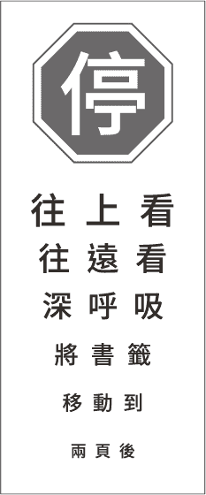

今日的科技是了不起的礼物，也在各方面改善我们的生活品质。然而，就像它具有许多好处那样，科技也会带来许多负面的效果。不过，就像驾驶人在开车时得要保持清醒并使车辆维持在车道中间那样，我们得要记得如何同时身处于世且不属于世。

我们拥有电脑没有的事物，就是自己与那股推动宇宙之力无从分离的链接，因此我们有能力去经验电脑永远无法达到的智性层次。

有句古老谚语是这样说的：“打不过则加入。”然而在科技这方面，我的建议是两种方式都别用。我们当然能够受益于今日的科技发展，但在做自己的事情时也绝对不要忘记时常休息片刻。更重要的是，让彼此有充足的时间眼神对望，感觉那道链接我们的光，并经验真实人际接触与沟通的精髓。我们需要让自己的直觉引导我们以及脑中信息。虽然电脑在以后也许会达到人工智能的水准，它们仍将无法达到那无时无刻指引我们的伟大生命智能之智慧。

# 第十三章　注视越少，看见越多

> 我一心一意地追寻生命中新的观点、形象与洞见。这样的追寻不仅包括客体，还有主客之间的空间。
> 
> ──路易丝‧奈维尔森（Louise Nevelson）

这些日子以来，我最常看到的事物之一，即是人们的多工情况，他们同时在所有地方，也同时不在任何地方。以科技为基础的社会来说，这是正常的现象，因为人们分心或出神的程度已严重到无法将自身心智专注在自身眼睛所见。也许你也有过这样的经验，你跟一些人在对话的时候注意到对方虽然望着你，但是他们的人显然不在那里。这就是心不在焉的人最为明显的征象：眼睛聚焦在某个事物，心智却专注在别的事物上。

我是在一九七三年首次注意到这种现象，当时还未出现今日的科技发展与相关发明。当时刚开始执业的我，注意到几乎每位患者的病史都呈现视力逐年恶化的趋势，而他们就一直换用度数更高的镜片。虽然这些镜片改善他们的视力，但是他们并未处理问题的根源，于是他们的眼睛持续变差。由于我对于自己的眼睛有过同样的经验，便主持一项研究以定出开立适当处方镜片之方法，以改善个体视觉表现、防止视力更加恶化。

这篇在一九七六年发表的研究结果指出，超过一半以上的参与者都看得太用力了。此外，百分之六十九的研究对象都没有看着他们认为自己在看的地方，他们的眼睛与心智并没有聚合在同一点上。于是我开始思索，是否这样的不一致跟这些人所经验到的视力恶化有关。

这让我想到行为视光学（behavioral optometry）之父史格芬顿医师（A. M. Skeffington），他的论点是现代社会所强加的“社会强迫性、集中在近处的视力劳动”与我们的生理构造并不相容，因而引发出的压力反应，就是我们的眼睛会对准（aiming）比它们的对焦（focusing）之处还要更近的地方。^(（注 1）)由于对准与对焦是眼睛与心智两者一起进行的动作，你也可以说史格芬顿医师注意到类似我在自己的研究中看到的压力反应，并用自己的话表达出来。

儿童发展专家阿诺德‧葛塞尔医师（Arnold Gesell）在他的学术著作《视力：论视力在婴幼儿及孩童的发展》（Vision: Its Development in Infant and Child）中也提到这种在眼睛与心智之间出现的不一致。对于那些眼看某处、心智跑到别处的病患，葛塞尔的形容是：“真要说的话，他们并不是观望涵盖眼睛所看的点之‘空间’，而是注视在眼睛所看的‘点’上。”^(（注 2）)几年以来，我在数以千计的病患身上看到如同他所描述的不一致现象，那是过多的视觉努力而使个人在感知与表现的流动性出现碎裂的结果。

不过，当我教他们做一分钟魔术（布洛格）线练习（One-Minute Magic〔Brock〕String Exercise，请见纸本书第二七八页）之后，出现惊人的成果。一旦解决他们的视力与心智之间的不一致或是分心现象，他们的临在与注意力就有明显的改善，在个人生活的各个领域的表现也是如此。那篇早期研究的结果加上我的临床经验，显示出不费力才是视力天生的运作方式^(（注 3）)，同时也证实我的猜测：借由越少的注视，我们会看见越多。不过这观念跟我所受到的教育相左。

##### 你在看着自己认为正在看的地方吗？

布洛格线（Brock string）是时常用于视力训练的工具，以费德瑞克‧布洛格（Frederick W. Brock）医师为名。由于使用布洛格线的效果如此正面，我在一九八〇年代早期设计出一款能让医师用于病患的同类电子装置。在受到视力专业人士的肯定回馈之启发后，我在二〇〇二年发展出更为先进的版本，而这项视力训练设备是首度得到专利、获得美国食品药物局认可、经临床证实的医学仪器。那些经同侪审查的系列研究显示出该仪器对视觉表现有着整体的明显改善，更进一步证实重建视觉一致性（visual congruence）会有的广泛好处。这些结果总结成下列四项业已发表的研究结果。

二〇〇三年，美国太平洋大学视光学院（Pacific University College of Optometry）的研究发现，持续三周每天使用该仪器十分钟后，会在瞄准、追踪、对焦及双眼团队合作的能力有着明显的增进，阅读的效率及理解也有改善。^(（注 4）)而在关于生活品质的问卷调查中，研究对象表示注意力、警觉力（alertness）、阅读及运动表现都有改善。

一项在二〇〇四年完成的独立研究，对于该仪器单独运用在少棒联盟球员挥棒表现之效果评估。其结果显示出仅使用该仪器达三周，球员的挥棒表现就有九成的改善。^(（注 5）)在研究结束后不久，该棒球队以败部复活的方式赢得他们的首次联赛冠军。

第三项则是二〇〇五年以夏威夷宜伊郡警察局（Maui County Police Department）为对象的研究，其成员在视觉注意力、认知速度及范围、射击表现方面有明显的改善。^(（注 6）)此外，警事训练生在身体回应的准确度与适当性也有明显可见的改善。

另一项于二〇〇七年由美国东北州立大学视光学院（Northeastern State University College of Optometry）所进行的先行研究，则显示原本诊断有注意力缺失／过动障碍症的研究对象，在视觉注意力、对焦与深度知觉（depth perception）方面呈现明显的改善。^(（注 7）)这些视力训练的研究所展现的改善，指出该仪器用于优化我们观看及回应世界的方式，具有非常深远的影响力。

当我们看向事物时，会认为自己是直接看着对象，然而我们要如何确定自己的眼睛与心智并没有望着同一地方呢？如果没有的话，这样的情形会有什么后果呢？

举例来说，假设我们在玩棒球，当投手向我们投出球时，我们对于准确定出这颗球的时空位置之能力，就决定我们能否击球以及何时击球。如果我们的眼睛与心智在同一时间专注在同一地方，就能正确感知球的位置（一致性）以及挥棒击球的时机（连贯性），因为我们的身体运动会反映出视觉与心智之间是否精确对准。

我在本书第二章首度谈到一致性与连贯性，它们与我们无时无刻对于个体本身以及自他关系之无缝调整有所关联。不过，如果眼睛与心智没有同时专注在同一地方的话，我们的行动就会产生不一致与不连贯，表现的能力也会降低。这也许能够解释为何特定个体会有习惯性早到或迟到的现象，因为他们对于抵达目的地所需时间或是得要移动的距离理解错误。这种没有对准的状况扭曲我们对于时间与空间的感受。

我在几年前有幸指导一位年轻、资质不凡的高尔夫球选手。当我观察她的推球动作时，注意到她因过度专注而使眼睛过度内聚。这现象影响到她的比赛成绩，因为她对物体的认知位置比实际位置还要更靠近自己。在觉知到这个现象并将视觉训练纳入每日行程之后，她的眼睛与心智已能聚合在一起，比赛成绩也持续进步，让她发挥出自己的真正天分，她现在已是美国女子职业高尔夫球协会（Ladies Professional Golf Association）的顶尖选手。这种将我们的肉眼与心智之眼（若用葛塞尔的话，则是“涵盖眼睛所看的点之‘空间’”）做出适当对齐的能力，能够解放我们的潜能，不仅对运动员如此，对任何人类个体都是如此。

我的视觉问题是从小开始的，我总觉得自己一定有什么问题。尽管有这样的不安全感，我还是念了美国佐治亚大学，后续获得视光学与视觉科学的博士学位。然而大量的阅读需求使我的眼睛备受压力，于是在大学入学后十天之我就拿了眼镜来戴。虽然眼镜让我能看得比较清楚，然而我越去戴它，视力的恶化就越严重，而且阅读仍然很吃力。当时的我看似每半年左右就要换度数更高的矫正镜片，然而还是读不到几分钟就会睡着。

这样的模式到了我进视光学院就读时仍然存在，直到第二学年结束时我已难以完成学校指派的作业，我觉得自己应该会不及格。就在那时发生了奇迹，有人要我去学院的实习诊所检查视力。为我检查的学生说，我的双眼并没有对准而且合作不良，他建议我做一些视力训练，并把需要用到的设备借我。

不久后，我就拿起那个设备、进行其中一项指定练习达五分钟，接着阅读一个小时，而在阅读时呈现的舒适及理解的程度是我前所未有的体验，就像脑中有盏灯亮了起来，开始促发一直沉睡到刚才的功能。对于发生的一切，我当时真的感动到哭了出来，因为知道自己的生命从那一刻起已经改变。

之后的两个月，我每天都做视力训练。直到毕业前的每一学季，我几乎都得到院长表扬成绩优秀的荣誉。那在一九七一年的视觉训练经验，使我能够以之前不认为自己可以的方式上课、阅读与学习，也消除自己一定有问题的信念。

当我的视力状况在一九七六年完全解除之后，不仅改变我对于何谓看见的意义之了解，也让我的病患认知到自己也有这种可能性。有位由我诊治的年轻女士已经戴了七年的眼镜，开车时无法不戴眼镜，然而她的故事说明了知识如何就是力量。

在二〇〇八年美国经济崩盘后，她的家庭没有能力负担位于圣地牙哥的房子，且夏威夷为她的父亲提供优渥的专业工作机会，于是全家被迫搬去夏威夷。

当时她只有十二岁，因无法负荷远离自己老家、学校与朋友所带来的伤痛，于是陷入沉重的负面情绪与沮丧，并在搬家后六个月内注意到视力的恶化。

当我询问当时她的视力如何恶化时，她说视野像是被自己的恐惧遮蔽那样。那时的她对世界感到害怕而退缩，不愿与其他人事物接触。而当她总算走出自己的壳、抬头往外看时，发现自己再也无法看清楚。她每年都会换上度数更高的眼镜，并称眼镜已变成她的安心毛毯（security blanket）。

我在初诊时鼓励她尽量少戴眼镜，每天进行布洛格线及一分钟呼吸静心的练习。在依照我的建议进行一周的练习后，她分享下述的经验：

> 这过程是一场挣扎，也是一场领悟。每当我了解自己能够观看时，生命像是为了我，将自己呈现在我眼前，而我也能辨识所有的事物。然而当我陷入疑虑时，所有的物体都变得比较模煳。自从上次诊视以来，我经历了像云霄飞车那样强烈高低起伏的情绪，这些情绪不是来自暂时的恐惧（也就是低的情绪），就是来自自己想要成长的决心（也就是高的情绪）。
> 
> 我的身体感觉像是要透过哭泣而从眼睛清出大量的水分，才能使眼睛能有更进一步的改善。这样的说法听起来相当疯狂！但是我的视力看似在每次哭泣之后会变得更加清晰。我感觉自己像是用意识而非眼睛来看，每当我的心智出现跳跃性的改善时，眼睛也会毫不费力地跟上。

##### 换你试试看

我现在要分享这种可能性给你。首先让我们来了解你在注视事物时的眼睛与心智聚焦的位置，还有这样的觉知如何催化出深远的改变。

在注视事物时，我们自然会认为眼睛与心智会像下图六那样聚焦在同样的点上。从左右两边的眼睛延伸出来的直线代表眼睛各自所看的方向，而那个圆形的放射记号代表观看的目标，两线的交会处则代表双眼视线交会的地方。

| 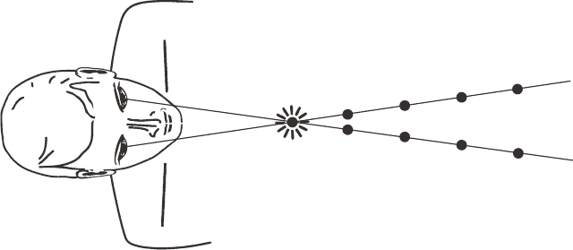 |
| 图说：图六：眼睛与心智一致专注在同一点上 |

然而，在绝大多数的情况下，双眼视线的交会位置其实比我们认为自己在看的位置还要远些或近些。图七所表示的是，个体的双眼瞄准位置比他们所看物体之真正位置还要更近。即便当事人认为自己在看着该物体，其眼睛瞄准的点事实上比物体的位置还要前面，于是他们在开车时也许会提前反应，因为若与自己与前车之间的实际距离相比，他们对于自己与前车之间所认定的距离还要更短。由于时间与距离具有关联，他们也许会倾向提早赴约，因为他们自认可以运用的时间比真正可供运用的时间还要少。

|  |
| 图说：图七：个体的双眼瞄准位置比他们所看物体之真正位置更近 |

而图八所表示的是，个体的双眼交会位置比他们所看物体之真正位置还要更远。虽然他们认为自己正在看着目标，但是他们的眼睛事实上瞄准的是位于目标后方的点上，所以他们在开车时有可能倾向在最后关头才做出反应，因为若与自己与前车之间的实际距离相比，他们对于自己与前车之间所认定的距离还要更长。他们也许会倾向迟到，因为他们自认可以运用的时间比真正可供运用的时间还要多。

我们对于时间与空间的判断，是根据我们认为那与自己有关的事物所在位置而定。在开车的时候，我们的反应时间是根据自己与前车之间的距离之估计而定。我们认为前车距离自己有多远，就决定我们认为自己在踩煞车之前还有多少时间。有些人习惯迟到，因为他们认为自己的时间很够，而那些倾向早到的人，其原因是他们并不认为自己有足够的时间。如同你所看到的，视力的表现仅是它的冰山一角。

| 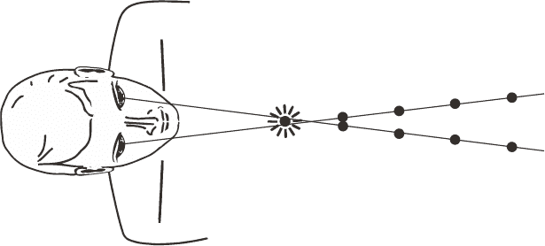 |
| 图说：图八：个体的双眼瞄准位置比他们所看物体之真正位置更远 |

##### 一分钟魔术（布洛格）线练习

为了可以亲身体验，请准备一条大约八呎（约二‧四四公尺）长的白绳，以及三到四颗直径约为八分之三吋（几近一公分）的圆形色珠。将白绳穿过珠子，绳子两端打结，然后将其中一端绑在门把上，请参考图九所示。

将一张椅子放在距离门把大约八呎的距离，让你坐下来练习时眼睛是朝着门把的方向，也能将那条线完全拉直。接下来则将那几个色珠在绳上一一摆开，使它们之间的距离相等，但最靠近你的珠子务必放置在距离你的脸部十二到十六吋（约三〇‧五到四〇‧六公分）的位置。接着坐下来、将绳子一端拉到贴着自己的上唇或是鼻子处，因此绳子应是拉紧的状态。

| 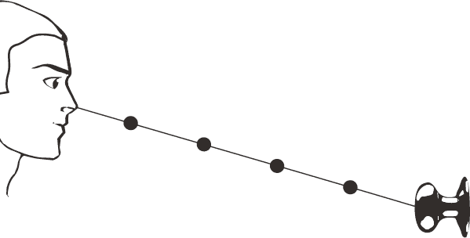 |
| 图说：图九：一分钟魔术（布洛格）线练习 |

现在看向距离门把最近的珠子。如果你的双眼有协力运作，你看到的影像会是两条线往所注视的珠子延伸，形成Ｖ字形（参考图十）。如果你正在看的珠子之影像是双重的，或是偶而只看到其中一条线时，也许你的双眼在协力运作方面有困难，或是其中一只眼睛有时会停止运作。如果这种情形在进行下列几页所描述的练习之后还是没有改善，请考虑去看行为视光师，并且可能要做一些视觉训练。不过，如果你看到的影像与下图十类似，请闭上其中一只眼睛来看，接着再换成另一只眼睛闭起来看。你将会注意到每当自己闭上其中一只眼睛时，其中一条线就会消失，代表自己所看到的每一条线都是单一眼睛朝前投射的影像。

| 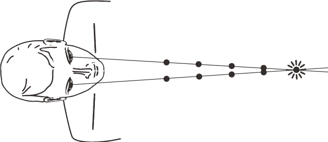 |
| 图说：图十：这个人注视较远的珠子，而他的眼睛协力运作良好，准确瞄向自己正在看的物体之真正位置。 |

现在以比较靠近自己的珠子来重复上述练习。如果你的眼睛有在协力运作，你将再次看见两条线对准自己正在注视的珠子，而这次的交会点会在珠子或其附近形成下图十一的Ｘ形。

每当你看着较远的珠子时，两条线形成的形状会像Ｖ字。每当你望向较近的珠子时，两条线会形成像是Ｘ字的形状。借由创造出从眼睛投射出去的绳线影像，这个练习能让你“看见”自己在观看物体时的双眼真正对准之位置，以及两只眼睛是否有在团队合作。

再做一次练习，并看向最靠近自己的珠子，留意两条白线交会处与珠子的相对位置。如果两条线倾向交会在比自己所注视的珠子还要更靠近自己的位置上（如图十二所示），就代表你倾向把事物的位置看成比其真实所在之处还要更近。

| 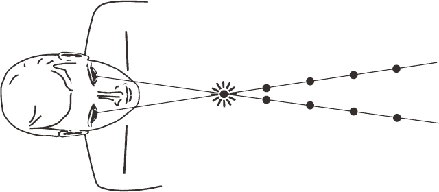 |
| 图说：图十一：这个人注视较近的珠子，而他的眼睛协力运作良好，准确瞄向自己正在看的物体之真正位置。 |

如果两条线看似交会在比自己所注视的珠子还要更远离自己的位置上（如图十三所示），代表你倾向把事物的位置看成比其真实所在之处还要更远。

现在暂时闭上眼睛。呼吸，在觉得准备好之后，让自己的眼睛自然地从第一个吸引自己目光的珠子切换到下一个想看的珠子，后续以此类推。当你的眼睛在不费力地前后切换的过程中，留意自己在看近处的珠子时，两条线是否成Ｘ字，而在看较远的珠子时，两条线是否成Ｖ字。当你能轻松完成这项练习时，逐渐将最靠近自己的珠子稍微移近一些，直到距离自己四到六吋（约一〇‧二到一五‧二公分）为止。

| 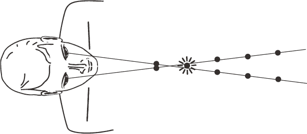 |
| 图说：图十二：倾向把事物的位置看成比其真实所在之处还要更近的人，其视线对准的情况。 |

这项觉知扩展练习在一开始能够每天进行三次、每次一分钟，最后增加为每小时进行一次、每次一分钟。当你的眼睛与心智融合在一起时，你将一直注意到两条白线会朝自己所看的珠子会合，并经验到前所未有的更大临在感及注意力。

| 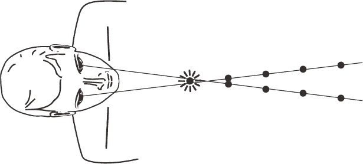 |
| 图说：图十三：倾向把事物的位置看成比其真实所在之处还要更远的人，其视线对准的情况。 |

##### 那是谁在注意这一切呢？

现在你已经察觉到一项事实，虽然你认为自己在看向特定事物，这不一定代表你的眼睛正直接对准它。你现在也已经看到自己单一眼睛在看东西时所瞄准的地方。但你可曾留意到，是谁或是什么事物在注意这一切呢？注意到你的肉眼及心智正在看的地方之那个“我”是谁呢？

如果我们反思生命中的常变本质，无论是我们的思想或是情绪，还是世上的气候与潮汐，所有事物总有来去。虽然我们的身体、心智与经验在自己的人生当中一直改变，那段觉知观照一直都在、从不动摇、不会衰老，也不受时间影响。

我们花费如此大量的时间，尝试改变生命中自己无法接受的事物，然而自由解脱并不是从改变外在世界开始，而是来自于领悟到自己是观照世界的不变之眼。借由对准肉眼、心智之眼及觉察之眼，我们再次经验到自己的天生状态：自己与一切如一，也就是“合一”（oneness）的一致性与连贯性。

# 第十四章　吸引你目光的事物

> 光为了欣赏自己而创造出来的器官就是眼睛。
> 
> ──歌德

在我发现看见的意义，以及更重要的是，真正是谁在做看见这件事的过程中，我了解到视力训练不仅可以改善视力及视觉表现，还能够恢复我们与生命源头本身的一致性与连贯性。它能够帮助我们发现自身“看”的真正源头，而它所提供的从容指引，让我们能与生命之流融合，经验到自身最伟大的潜能。西元四世纪的中国哲学家庄子曾以下列文字美妙表达出这种流动状态：

> 婴儿可以整天看着而不眨眼，
> 
> 那是因为他的眼睛并没聚焦在任何特定事物上。
> 
> 他并不知道自己要走去哪里，
> 
> 也不知道停下来要做什么。
> 
> 他将自己与周遭环境融在一起，
> 
> 并随顺与之移动。
> 
> 这就是心灵卫生之道。
> 
> ──出自《杂篇：庚桑楚》。原文为“儿子……终日视而目不瞚，偏不在外也。行不知所之，居不知所为，与物委蛇，而同其波。是卫生之经已。”^(（注 1）)

庄子所描述的是婴儿的眼睛与生命的移动无缝接合的状态。虽然在我们的心智发展过程当中，这种流动性常被制约或遗忘掉，然而那天生对于合一的渴望是内建在宇宙的基本架构中，一直吸引我们回归自己的源头。那股吸引力就是那道引起我们注意的光，触发瞄准、对焦、追踪与团队合作的动态过程。由于过去已深入探索这些功能，我确认它们是我们对生命的参与、吸收、了解与回应等能力。简而言之，即完全经验临在的基础。

我们的眼睛在瞄准时即启动这项过程，加上同时对焦以提供清晰度，才会有对于所见之物的了解，于是“我看到”成为“我知道”的同义语句。

由于生命的风景不断改变，我们的眼睛会持续追踪这些变化，让我们能在需要的时候动态瞄准与对焦。这种对于所见事物予以准确及适当的回应之动态能力（详细说明请参考第十三章），说明一致性如何是我们的各个发展面向不可缺的部分。

人的两只眼睛在同时瞄准、对焦及追踪时，各自对于世界有着稍微不同的影像与诠释。当这些观点由脑部的视觉皮层及较高阶的视觉中心处理之后，我们就会经验到单一的三次元影像。^(（注 2）)当两只眼睛合并它们的观点时，它们就是在团队合作以产生深度知觉，也就是葛塞尔医师所称“有机进化的至宝”^(（注 3）)。

绝大多数人会把深度知觉的定义限缩在以三次元或三維的形式观看可见世界。然而当眼睛在有效率地瞄准、对焦、追踪及团队合作的时候，它们创建了基础，让我们能够获得超越肉眼所见的深入了解，包括对于电磁频谱波长不在三八〇到七六〇奈米狭窄范围（即科学所认为的人类视觉感知范围）的无形世界之一瞥。可以说我们除了觉察到树的本身之外，也变得能够觉察到树的根部。

对于绝大多数人而言，我们的看见（vision）已经分裂（di-vision），人们借由选择自身喜爱事物、避免自身不要的事物而分裂实相。而活在一千四百年前的禅宗三祖僧璨，在那篇著名的《信心铭》写下这样的诗句：

> 至道无难、唯嫌拣择；但莫憎爱、洞然明白；
> 毫厘有差、天地悬隔；欲得现前、莫存顺逆；
> 违顺相争、是为心病……^(（注 4）)

古老的智慧告诉我们，真正的看见并不是二元的，而是无分别的清晰与明白、不被想法与信念阻挡的状态。耶稣曾经说过：“眼睛就是身上的灯。你的眼睛若瞭亮，全身就光明。”（马太福音 6:22）我们的观看及后续光明的“单一性”，反映出我们天生就能活在合一的状态、圆满自身在看见过程中的终极潜能。借由体现庄子所称婴儿的流动性，我们并不得要像自己所认为的现况那么努力，因为光自然会照亮我们应要看见的一切。

能更进一步证实这一论述就是眼睛的视网膜，它系由百分之九十五的杆状细胞及百分之五的锥状细胞组成，代表认知活动系由无意识心智或由意识心智主导的比例。由于杆状细胞负责预知性整体视觉，而锥状细胞是用在注重细节的局部审视，所以可以肯定眼睛就像心智那样，在使用它们来看时也应当以不费力的方式为之，而它们算是实质反映出为与不为之间的变动界线。不过，当我们已经耗费一生在刻意寻求而不是直觉观看时，即便自己的生理构造也是用来回应生命而不是主动出击，我们如何让不费力的看见能够发生呢？

我在第十二章中讨论到绝大多数人是如何整天望着自己的智慧型手机与电脑，造成自身眼睛疲劳以及持续性视野压缩，到后来常会形成近视。虽然这是当前的流行病，然而视觉限制与近视的关系并不是新的知识。

法兰西斯‧杨博士（Dr. Francis Young）的早期研究指出，当猴子被安置在视觉受到限制的环境达三个月时，其中约有百分之七十五的猴子变成近视。^(（注 5）)更甚的是，在视觉受限的地方工作的美国海军潜水艇海员，发展近视的速度比其他军种快上许多。^(（注 6）)然而在另一个以没有阅读或近距工作的原住民文化为对象的研究中，那里的年轻人几乎没有出现近视。^(（注 7）)

当我们长期限缩自己的视力时，其结果就是削减自身眼睛在应付远近视力需求时的动态切换能力。由于眼睛算是脑部往前延伸的部分，为身体提供如何移动、如何回应生命的信息，那么维持视觉的弹性对于我们所做的每件事而言都相当重要。因此，当视觉的灵活度弱化的时候，就会使我们在一致性、连贯性与流动性的能力发挥上大打折扣，降低我们在回应生命多变景色时所需要的快速、准确及有效率的回应能力。更甚的是，葛塞尔医师曾写下这样的文字：“如果物种的眼睛变得过度特化，该物种的末日也许就不远了。”^(（注 8）)

虽然葛塞尔是在一九四九年表达出他的担忧，然而对于这种可能性的讨论永远刻不容缓。因为我们的眼睛引导自己的每个动作以及自己对于世界的观点，它们也就决定我们回应世界的方式。在更深的层次，我个人认为葛塞尔是在预先警示我们失去看见（vision）能力的严重后果，无论那是指现实的视力或是比喻的远见均是如此。

虽然许多人认为视力训练仅是眼球运动，但它其实是关于毫不费力的看见之意识扩展过程，也就是用心来看，而不是借由心智及限缩自身视野的累积信念来看。如果我们总是追寻生命，而不让生命来找我们的话，就无法回归到庄子讲的婴儿所具有的纯净视野。生命借由光的本身所给予的引导，无时无刻都与我们同在。

##### 那一场实验

我在引言中提到自己曾在多年前孩子还小时做过长达一周的实验，其基础概念即任何吸引我目光的事物都是在寻求我。在那一周，任何事情只要进入我的觉知，就成为我的责任，而我会专注在自己的责任上，也会完成自己所专注的事情。这实验所带来的影响如此强大，于是它成为我的生命基石，因它让我见识到的是，跟随生命指引的这个动作如何带领我们从这一刻走到下一刻，创造出充满目的与意义的人生。

所以我们若要能够自动回应吸引自身目光之事物的话，该怎么做呢？首先，我们必须认知到的是，光持续在吸引我们的注意，而那道光就是圣经用来指称神、物理学家用来描述一切存在之基础的同一道光，它创造、引导并滋养所有生物的发展与进化，也指引着种籽长成大树，而树上所结果实能够喂养这个世界，并以更多的种籽来使地球更加繁茂兴盛。

一旦认知到这项事实，我们就会去回应任何吸引自身注意的事物，不需为任何事情安排优先顺序，因为生命智性已经为我们做这件事。生命中的每一事物都有相等的价值，洗涤餐盘的方式跟擦洗自己孩子的背部相同，所以一旦帐单寄来，就去付清；电话响了，就接起来；得到灵感，就去创造；感觉到爱，就去表达。当问题落在自己的身上时，欢迎它、然后处理它。拥抱生命，则它将引导你前去的方向不仅是自己的，还有包括周遭人们的优质健康与身心安泰。如同甘地曾说过的，你的生命即是你的讯息，而你的讯息是有感染力的。对任何吸引自己注意的事物予以回应，不仅使你得以自由，也使每个人得以自由。

我们经常提到活在当下或是想变得有“灵性”，然而灵性并不代表要变成什么，仅是指照顾眼前一切、认知到自己的生命即是自己的静心而已。带着清晰，我们成为凡人，仅是照顾任何来到我们面前的事物而已，持续这样做所发展出来的领悟，即是无论出现什么事物，都是我们要相遇的对象。

以前当我没在当下把事情处理好的话，它们会回过头来找我，使我觉得难以负担。后来我发现生命从不会在错误的时机带给我们任何事物，处在自然的每一事物之运作，既单纯又美妙。

##### 让我们开始吧

接下来的二十四个小时，去回应任何进入你的觉知之事物。你所注意到的每一事物，其实都一直在找你，那么你就去照料、完成它们。如果你注意到自己的床铺需要整理，那就动手整理。如果流理台的水槽有个盘子，即使那不是你的，仍然把它洗净、擦干、放定位。如果你还有欠别人的钱或收到一张无法负担的帐单，那就尽早告知对方（不要等到最后一分钟才做），让他们知道你的情况，并向对方保证自己会在可以的时候尽快处理。当你感受到周围人们的爱时，就对他们说出“谢谢你”、“我爱你”以表达自己的爱与感激。当你注意到周边有地方需要整理时，就去清理那里。如果有需要修理的事物，就着手处理而不拖延。在合理的期间内回复电邮或电话。如果有人需要帮助，就去帮忙。将马桶坐埝擦干净、擦干厨房流理台水槽附近区域、将垃圾拿出去丢，并在别人帮助你或为你调理餐点时表达自己的谢意。究其根本精神，就是不再假装自己没看见，而开始承认自己看见多少事物。

借由认知与接受自己的看见程度，会触发一个过程，使我们的意识能够持续扩展。仅是致力于任何进入我们的觉察之事物，就会是我们在自我发展方面最有价值的练习。我们的真实洞见来自每天在亲密关系中、在经营公司中、在荣耀自身承诺中的临在经验。当我们愿意张开眼睛看向触动自己的每一事物时，就是在练习最高层次的看见。

##### 种下善的种籽

我曾听过一段故事，有位年迈的犹太智者（rabbi）在临终时，讲述自身想要改变世界的终生努力之感想。他说，自己在年轻时，周游各国分享自己的讯息，但是没有出现什么改变。于是他决定在自己的国家分享自己的教导，然而仍然没有任何改变。所以他就专注在照顾自己的社群，意外发现还是无人想听。最后，觉得气馁的他回到家里向自己的太太与小孩讲述自己的看法，然而即使是他们，也因为太忙而听不进去。他讲完后沉默下来，然后深叹地说：“当初要是从我自己开始就好了。”

当我们尝试为巨大的改变策画时，例如拯救亚马逊雨林或是终结全球饥饿，会忘记这改变应从自己开始。光总是在推动我们、引领我们，而当我们醒觉到这项事实时，就会了解到，照顾好自己的眼前事物，仅是表达自己的感谢、倾听他人的故事或以微笑、拥抱鼓励别人，将会对这世界带来深远的影响。就像苹果佬约翰尼（Johnny Appleseed，著名的美国育苗家兼传教士约翰‧查普曼）那样，我们也是在自己的路上边走、边种下善的种籽。

# 跋

> 我们的目的藏在我们的喜乐、灵感、振奋里面。当我们依着自身生命所显现的事物而行动时，就会显示出自己的目的。
> 
> ──詹姆士‧金恩（James King）

本书的要义在于你的生命一直在寻找你，它借由临在持续给予引导，使你有机会完成自身存在的缘由。这项基本事实不仅适用于人类，也适用在每一存在事物。我们一直得到引导，不是偶尔，而是持续如此！那通往自身觉醒、自由、知足及最高潜能的关键都是一样的，做你所爱、爱你所做，世界就会来到你面前。这是因为做你所爱与跟随自身引导是一样的，都能为生命智慧与自身领悟创造出真实的信任、完全的正直、毫无疑虑的敬意与毫无条件的爱之基础。

在这些篇章中，我所分享的是那些使自己醒觉到新实相的经验，其主轴在于新的看见方式如何影响我们的日常生活。就我套用新的看见方式之经验而言，每件事物虽然还是看起来一样，但已是完全不同。由于了解到生命包含许多经验，有些令人高兴、有些则不那么让人开心，我持续扩展自己对于生命本貌的接受程度。而我也醒悟到一件事实：虽然没有人会对伤痛、丧失、疾病、财务问题或人际关系的压力感到舒适，这些经验全部都是我们的生命旅程及灵性发展之基础不可或缺的部分。

童年的我没有读很多书，我当时的学习大多来自个人的直接经验，而不是正规教育。在这过程中，我发现自己的包容天性，了解到生命并不在于他我之间的对抗。生命一直在乎的是“我们”，我们全部。我们若能了解每个人都有自己要做的事，而这对于整体的完整性而言是必要的一部分，也使个体能与其他一切事物紧密相连，我们就能获得从谦逊培养出来的包容性。

当有件事让我参与其中时，会使我专注在该事的每一细节。而这样的专注系来自无选择的生活态度，因为当我们接受生命的引导时，就不用去思索选择、决定或选项。我们的所有能量会自然地专注在自己所接收到的引导，因为我们知道自己被引导去完成的每一事物都是神圣的事工。无论自己的生命旅途中发生什么事情，那些神圣事工会使我们维持正确的方向并继续前进。

我们的肉眼是用来观看有形的外在世界，心灵之眼则是用来观看无形的世界。当这两种眼能够流畅合作时，一致性与连贯性就融为一体而成为看见与存在的新方式之启动信号。

就像喜爱日照的植物之叶片会转而朝向光，这个宇宙基本要素那样，我们借由临在回应生命的态度也是如此。这个基本要素就是照亮所有可见事物的无形之力，当我们闭上肉眼仍在继续观看，在睡眠时继续欣赏梦境的觉知场域。

我在整本书当中尽量为自己的洞见提出科学的证据，然其重点在于了解到，虽然我们得要认可现代科学的伟大成就，不过也要知道，对于人类灵魂而言的真正重要事物，科学无法为我们提供相关的解释。

奥地利物理学家埃尔温‧薛丁格（Erwin Schrödinger）在其著作《大自然与希腊人》（Nature and the Greeks）写道：

> 对于身为旁观者的我而言，科学所描绘出来的现实世界看起来很不一样。它的确提供许多基于事实的信息，把我们的所有经验都放在非常前后一致的秩序里面，然而对于真正触动我们的心、真正跟我们有关系的事物，科学却是死寂不语。关于红与蓝、苦与甜、实质的痛苦与属世的欢乐，科学无法为我们多说什么，而它也不晓得美丑、善恶、神与永恒。科学有时会假装回答这些领域的问题，然而那些答案通常会愚蠢到我们不会想要认真看待。^(（注 1）)

现在我已经七十岁，那在年轻时对于科学真理的追寻已换成一种明白的感受，它无需任何证明，仅是臣服于自己的不知、好让真正的智慧自行示现而已。每当这些悄声低语经过我的觉察领域时，它们所赐与的机会让我不仅得以成长，还能支持其它正走在各自人生旅途上的人们，这过程令我感到谦卑。

我此刻的感觉是，我们的后见（hindsight）、洞见（insight）与先见（foresight）能组合起来而创造出自己的完整视野（total vision），消融我们在看见的分别，开始看到自己与其他人的内在神性。我的视光师、视觉科学家及共振疗法治疗师的工作使我自己的看见得以精炼，而生命智性使我感到不可思议之处，在于它如何在这段精炼过程之初激发我去深入探究这些科学领域、从而使我准备好接受自己的人生志业，最后又推动着我放下那些方法，好让我的人生目的，也就是自己的临在，终能浮现。

现在我最大的快乐在于引领自己所指导的人们，这事工以三项原则为基础：

一、人际关系的疗愈过程没有阶级之分，所有参与的人必得在同一高度或得到对等的理解。

二、我们真的没有问题，没有需要修理整治之处。在我的经验中，若我们能与将我们视为完整个体的人共处一些时候，通常就足以转变我们对于自己的看法。这样做的话，光是接触、联系就能令人心满意足（contact is content）。

三、所谓的指导工作（mentorship）是在使个体能准备好迎接人生中最重要的日子，也就是展开双翼、飞出巢穴，开始振翅翱翔在人生种种风景之上，以回归到自身本质的那一天。

当我们的行走、表达、倾听、日常处理与人前的表现更加显出自己的本质时，我们就确实地将自己的看见延伸出去而触及这个世界，因为我们就是那道光，一直引领、照亮自身的旅程。

# 致谢

这本书得到了许多人的帮助，有人为我提供灵感、有人帮助我看得更清楚，有的人则是跟我合力将这本书一页一页地建构出来。每个人的贡献都在精炼我想以文字沟通的精华。

首先，我要感谢我的父母：索妮雅（Sonia）与乔瑟夫‧黎伯曼（Joseph Liberman），他们所传递的真实与正直让我能抬头挺胸地生活在这个世界上。

其实要去表达自己心中了然的事物还真不容易，然而幸好有三位功力高深的作家为我提供协助。第一位是我的儿子艾瑞克（Erik），他帮助我创造出这本书的初稿，当时名为《深度感知》（Depth Perception）。后来则是约翰‧奈尔森（John Nelson）协助我把原初的回忆录转变并扩展成更加宽阔、更加落实的讯息。我的女儿吉娜（Gina）则在最后协助我厘清并细致调整书中讯息，才成为你在前面所看到的一切文字。

此外，我还要感谢好友布莱恩‧布瑞翎博士（Dr. Brian Breiling）、珍妮佛‧奈尔森博士（Dr. Jennifer Nelson）以及大卫‧卡普拉立克（David Kapralik 别名伊立力 Ilili）。我也想要感谢海蒂‧尔哈特（Heidi Erhardt）、史黛芬妮‧泰德（Stephanie Tade）以及麦克‧埃贝林（Michael Ebeling）所给予的鼓励、协助与爱的支持；还要感谢萝伦‧哈里斯（Lauren Harris，www.teawaterdesigns.com）的美妙图画；更要感谢导演彼得‧史特宾格（Peter Straubinger）让我使用那部了不起的纪录片《生命源于光》（In the Beginning There Was Light）里面的讯息与研究。

我要特别感谢我的经纪人史提夫‧哈里斯（Steve Harris），还有佐治亚‧休斯（Georgia Hughes）、马克‧艾伦（Marc Allen）及整个新世界书库（New World Library）的出版团队，感谢你们相信我以及本书的讯息，让这个构想得以开花结果。

在最后，我要深深感谢我的伴侣黛博拉（Deborah）所给予的爱以及在本书撰写过程的持续支持。

# 章节附注

##### 题词

1\. Nikola Tesla, in Nikola Tesla and David H. Childress, The Fantastic Inventions of Nikola Tesla (Stelle, IL: Adventures Unlimited Press, 1993), 1.↑

##### 第一章　来自光的引导

1\. Ed Yong, “Humans Have a Magnetic Sensor In Our Eyes, but Can We Detect Magnetic Fields?” Discover, June 21, 2011, http://blogs.discovermagazine.com/notrocketscience/2011/06/21/humans-have-a-magneticsensor-in-our-eyes-but-can-we-see-magnetic-fields/#.VwtLtquBDCx.↑

2\. Lauren E. Foley, Robert J. Gegear, and Steven M. Reppert, “Human cryptochrome exhibits light-dependent magnetosensitivity,” Nature Communications 2 (2011), doi:10.1038/ncomms1364.↑

3\. Dan Hofstadter, The Earth Moves: Galileo and the Roman Inquisition (New York: W. W. Norton, 2010), 68.↑

4\. Albert Einstein, in William W. Hay, Experimenting on a Small Planet: A History of Scientific Discoveries, a Future of Climate Change and Global Warming (New York: Springer Nature, 2016), 185.↑

5\. Peter Russell, “From Science to God: The Journey of a Devout Skeptic,” Bridges Magazine 1 (2009): 8–11, http://issseem.org/content/uploads/files/Bridges_2009_1.pdf.↑

6\. David Bohm, The Essential David Bohm, ed. Lee Nichol (Abingdon-on-Thames, UK: Routledge, 2003), 154.↑

7\. Walter Russell, The Secret of Light (Waynesboro, VA: University of Science and Philosophy, 1947), 43, 44.↑

8\. David Bohm, “Of Matter and Meaning: The Super-Implicate Order,” ReVision 6, no. 1 (Spring 1983): 34–44.↑

9\. Isaac Newton, Opticks: Or, A Treatise of the Reflections, Refractions, Inflections and Colours of Light, 2nd ed. (London: Sam Smith and Ben, Walford, 1717), 349.↑

10\. Jonathan N. Tinsley, Maxim I. Molodtsov, Robert Prevedel, David Wartmann, Jofre Espigule-Pons, Mattias Lauwers, and Alipasha Vaziri, “Direct detection of a single photon by humans,” Nature Communications 7 (2016), doi:10.1038/ncomms12172.↑

11\. Alipasha Vaziri, cited in Mary Pascaline, “Human Eye Can Detect Even Individual Photons, The Smallest Unit of Light: Study,” International Business Times, July 21, 2016, http://www.ibtimes.com/human-eyecan-detect-even-individual-photons-smallest-unit-light-study-2393524.↑

12\. “Discovery by SU Physicist Alters Conventional Understanding of Sight,” Syracuse University News, June 24, 2011, http://www.syr.edu/news/articles/2011/as-sight-research-06-11.html.↑

13\. Leonard A. Wisneski, “A Unified Energy Field Theory of Physiology and Healing,” Stress Medicine 13, no. 4 (1997): 259–65.↑

14\. Tiina Karu, “Mitochondrial Mechanisms of Photobiomodulation,” YouTube, November 22, 2014, https://www.youtube.com/watch?v=NIU2oLbe4-I (presentation given at the 2011 conference of the International Light Association in Ste-Adele, Canada. )↑

15\. Ralph Hill, “Photomodulation with LED Light Sources,” beautymag online,http://beautymagonline.com/technology-treatments/20-technology-treatments/1159-photomodulation-2.↑

##### 第二章　内在光芒

1\. Michael H. Herzog, Thomas Kammer, Frank Scharnowski, “Time Slices: What Is the Duration of a Percept?” PLOS Biology 14, no. 6 (2016), doi.org/10.1371/journal.pbio.1002493.↑

2\. Desmond Morris, The Human Animal: A Personal View of the Human Species (New York: Crown, 1994), 130.↑

3\. Morris, The Human Animal, 130.↑

4\. Olivia Kang and Thalia Wheatley, “Pupil Dilation Patterns Spontaneously Synchronize across Individuals During Shared Attention,” Journal of Experimental Psychology: General 146, no. 4 (2017): 569–76.↑

5\. Swami Satchidananda, Pathways to Peace (Buckingham, VA: Integral Yoga Publications, 2004), 1.↑

6\. Fabio Ferrarelli et al., “Experienced Mindfulness Meditators Exhibit Higher Parietal-Occipital EEG Gamma Activity during NREM Sleep,” PLOS ONE 8, no. 8 (2013), doi.org/10.1371/journal.pone.0073417.↑

7\. Jennifer M. Windt, Tore Nielsen, and Evan Thompson, “Does Consciousness Disappear in Dreamless Sleep?” Trends on Cognitive Sciences 20, no. 12 (December 2016): 871–82, http://dx.doi.org/10.1016/j.tics.2016.09.006.↑

8\. Evan Thompson, cited in Olivia Goldhill, “Cognitive Science Backs Up the Ancient Indian Philosophy That We’re Conscious Even in Deep Sleep,” Quartz India, December 4, 2016, http://qz.com/852486/cognitive-science-backs-up-the-ancient-indian-philosophy-that-were-conscious-even-in-deep-sleep.↑

##### 第三章　依光而活

1\. Albert Szent-Gyorgyi, Introduction to a Submolecular Biology (New York: Academic Press, 1960).↑

2\. “The Calorie Myth,” In the Beginning There Was Light, http://www.lightdocumentary.com/the-caloriemyth.html.↑

3\. P. Webb, J. F. Annis, and S. J. Troutman Jr., “Energy Balance in Man Measured by Direct and Indirect Calorimetry,” American Journal of Clinical Nutrition 33, no. 6 (June 1980): 1287–98. http://ajcn.nutrition.org/content/33/6/1287.abstract.↑

4\. Tom Rawstorne, “The Man Who Says He Hasn’t Eaten of Drunk for 70 Years: Why Are Eminent Doctors Taking Him Seriously?” Daily Mail, last modified May 7, 2010, http://www.dailymail.co.uk/news/article-1274779/The-man-says-eaten-drunk-70-years-Why-eminent-doctors-taking-seriously.html.↑

5\. Rajeev Khanna, “Fasting Fakir Flummoxes Physicians,” BBC News, last modified November 25, 2003, http://news.bbc.co.uk/2/hi/south_asia/3236118.stm.↑

6\. Sudhir Shah, cited in“The Case of Prahlad Jani,” In The Beginning There Was Light, accessed September 15, 2017, http://www.lightdocumentary.com/prahlad-jani.html.↑

7\. Sanal Edamaruku, “India’s Man Who Lives on Sunshine,” Guardian, last modified May 18, 2010, http://www.theguardian.com/commentisfree/belief/2010/may/18/prahlad-jani-india-sunshine.↑

8\. “Experts Baffled as Mataji’s Medical Reports Are Normal,” DNA India, last modified May 7, 2010, http://www.dnaindia.com/india/report-experts-baffled-as-mataji-s-medical-reports-are-normal-1380169.↑

9\. Rawstorne, “The Man Who Says He Hasn’t Eaten or Drunk for 70 Years. ”↑

10\. “Study Proves Gujarat Man’s Claim of Living Without Food, Water,” DNA India, last modified July 17, 2010, http://www.dnaindia.com/india/report-study-proves-gujarat-man-s-claim-of-living-without-food-water-1411144.↑

11\. Nikola Tesla, “Talking with the Planets,” Colliers Weekly, February 9, 1901, http://teslacollection.com/tesla_articles/1901/colliers/nikola_tesla/talking_with_the_planets.↑

12\. Gerald H. Pollack, “How Breatharianism Works: The Science of Light and Water,” Light Documentary (blog), March 18, 2016, https://lightdocumentary. space/2016/03/18/how-breatharianism-works-the-scienceof-light-and-water.↑

13\. Gerald Pollack, “Can Humans Harvest the Sun’s Energy Directly Like Plants?” GreenMedInfo.com, last modified June 1, 2015, http://www.greenmedinfo.com/blog/can-humans-photosynthesize-1.↑

14\. P. A. Straubinger, In the Beginning There was Light (Austria, 2010) DVD; http://www.lightdocumentary.com.↑

15\. Alexander Wunsch, cited in Joseph Mercola, “How LED Lighting May Compromise Your Health,” Mercola.com, last modified October 23, 2016, http://articles.mercola.com/sites/articles/archive/2016/10/23/near-infrared-led-lighting.aspx?utm_source=dnl&utm_medium=email&utm_content=art1&utm_campaign=20161023Z1&et_cid=DM123594&et_rid=1723202311.↑

16\. Kay Uzoma, “The Benefits of a Three-Day Juice Fast,” Livestrong.com, last modified November 2, 2015, http://www.livestrong.com/article/422825-benefits-of-fasting-for-the-immune-system.↑

17\. Annie Sneed, “Hunger Gains: A New Idea of Why Eating Less Increases Life Span,” Scientific American, last modified April 14, 2015, http://www.scientificamerican.com/article/hunger-gains-a-new-idea-of-whyeating-less-increases-life-span.↑

18\. Margo Adler, cited in Jo Willey, “Eat Less, Live Longer: Cutting Back on Food Can Help Repair the Body, Says New Study,” Express, last modified March 19, 2014, http://www.express.co.uk/life-style/health/465647/Eat-less-live-longer-Cutting-back-on-food-can-help-repair-the-body-says-new-study.↑

19\. Jordan Lite, “Vitamin D Deficiency Soars in the U. S., Study Says,” Scientific American, last modified March 23, 2009, http://www.scientificamerican.com/article/vitamin-d-deficiency-united-states.↑

20\. Stephan Silbernagl et al., Taschenatlas der Physiologie (Stuttgart, Germany: Thieme, 2001).↑

21\. University of Exeter, “Link Between Vitamin D, Dementia Risk Confirmed,” Science Daily, June 6, 2014, http://www.sciencedaily.com/releases/2014/08/140806161659.htm.↑

22\. Mary G. letter to author, March 30, 1998.↑

23\. Natalie G. email to author, September 10, 2013.↑

##### 第四章　光的智性

1\. Marcus Aurelius, The Essential Marcus Aurelius, trans. Jacob Needleman and John P. Piazza (New York: Tarcher, 2008), xxv.↑

2\. Mahatma Gandhi, in David L. Kahn, Boundless Paradox: Awakening in the Collective Dream (Morrisville, NC: lulu.com, 2015), Kindle.↑

3\. Marco Bischof, “Biophotons—The Light in Our Cells,” Journal of Optometric Phototherapy (March 2005): 1–5\. See also“What Is Biophoton Science,” Health Angel Foundation, http://www.biontology.com/research/what-is-biophoton-science.↑

4\. Anne Bolen, “Living Light: Glowing Organisms Have Captured Our Curiosity for Centuries, yet Scientists Are Still Discovering How They Glow—and Why,” National Wildlife, May 25, 2016, http://www.nwf.org/News-and-Magazines/National-Wildlife/Animals/Archives/2016/Bioluminescence.aspx; and Rachel Nuwer, “Way More Fish Can Make Their Own Light Than We Thought,” Smithsonian.com, June 8, 2016, http://www.smithsonianmag.com/science-nature/way-more-fish-can-make-their-own-light-we-thought-180959346/?no-ist.↑

5\. Russ Swan, “Glow in the SHARK: Marine Creatures Radiate More Light the Deeper They Swim and May Use the Trick to‘Talk’to Each Other,” Daily Mail, last modified April 26, 2016, http://www.dailymail.co.uk/sciencetech/article-3559484/Glow-SHARK-Marine-creatures-radiate-light-deeper-swim-use-tricktalk-other.html.↑

6\. Eva Bianconi et al., “An Estimation of the Number of Cells in the Human Body,” Annals of Human Biology 40, no. 6 (2013), http://dx.doi.org/10.3109/03014460.2013.807878.↑

7\. Guenter Albrecht-Buehler, “Cell Intelligence,” last updated April 9, 2013, http://www.basic.northwestern.edu/g-buehler/frame.htm.↑

8\. Kanupriya Pande et al., “Femtosecond Structural Dynamics Drives the Trans/Cis Isomerization in Photoactive Yellow Protein,” Science 352, no. 6286 (May 6, 2016): 725–29, doi:10.1126/science.aad5081.↑

9\. David Bohm, in John Gribbin, Schrodinger’s Kittens and the Search for Reality: Solving the Quantum Mysteries (New York: Back Bay Books, 1996), 159.↑

10\. Sally McGrane, “German Forest Range Finds Trees Have Social Networks, Too,” New York Times, January 29, 2016, https://www.nytimes.com/2016/01/30/world/europe/german-forest-ranger-finds-that-trees-havesocial-networks-too.html. See also Peter Wohlleben, The Hidden Life of Trees: What They Feel, How They Communicate: Discoveries from a Secret World (Vancouver, BC: Greystone Books, 2016).↑

11\. Arjun Walia, “Not Just Brain to Body: Researchers Discover That the Hear Sends Signals to the Brain,” Collective Evolution, October 30, 2015, http://www.collective-evolution.com/2015/10/30/not-just-brainto-body-researchers-discover-that-the-heart-sends-signals-to-the-brain.↑

12\. Dean Ornish, Love and Survival: The Scientific Basis for the Healing Power of Intimacy (New York: HarperCollins, 1998), chap. 1.↑

13\. Molière, The Dramatic Works of Molière, Volume 3, ed. Henry Van Laun (Philadelphia: Gebbie & Barrie Publishers, 1879), 548.↑

14\. Helen Schucman, A Course in Miracles, Combined Volume, Third Edition (Mill Valley, CA: Foundation for Inner Peace, 2007), 3.↑

##### 第五章　梦中之光

1\. Arthur Zajonc, Catching the Light: The Entwined History of Light and Mind (New York: Oxford University Press, 1993), 2.↑

2\. Zajonc, Catching the Light, 2.↑

3\. The Observer, January, 25, 1931, as cited in“Max Planck,” Wikiquote, last modified August 5, 2017, https://en.wikiquote.org/wiki/Max_Planck.↑

4\. Alan Watts, Man, Nature, and the Nature of Man (New York: Macmillan Audio, 1991), audiobook.↑

5\. Deepak Chopra, “Explorations in Consciousness and Healing,” Bridges Magazine 20, no. 1 (2010): 4.↑

6\. Carl Sagan, in Karen Schroeder Sorensen, Cosmos and the Rhetoric of Popular Science (Maryland: Lexington Books, 2017), 51.↑

7\. Sigmund Freud, cited in Jonathan Lear, Freud, 2nd ed. (New York: Routledge, 2015), 90.↑

##### 第六章　脱离心智场域

1\. David Bohm, Wholeness and the Implicate Order (London: Routledge & Kegan Paul, 1980), xii.↑

2\. Deepak Chopra, “Explorations in Consciousness” (keynote address, at ISSSEEM annual conference, Westminster, CO, June 28, 2009, 2009);Mark Comings, “The Quantum Plenum: The Hidden Key to Life, Energetics and Sentience,” Bridges Magazine 17, No. 1 (Spring 2006): 4–13, 20.↑

3\. Peter Russell, From Science to God: A Physicist’s Journey into the Mystery of Consciousness (Novato, CA: New World Library, 2004), chap. 6.↑

4\. “Observer effect,” Wikipedia, last modified March 1, 2017, https://simple.wikipedia.org/wiki/Observer_effect.↑

5\. David Brooks, The Social Animal: The Hidden Sources of Love, Character, and Achievement (New York: Random House, 2011), ix.↑

6\. Amit Goswami, personal conversation with author, February 2014.↑

7\. T. S. Eliot, “Little Gidding,” Four Quartets (New York: Faber and Faber, 1942), 144–45.↑

8\. Andrew Newberg, Eugene D’Aquili, and Vince Rause, Why God Won’t Go Away: Brain Science and the Biology of Belief (New York: Ballantine Books, 2002).↑

9\. Jon Kabat-Zinn and Richard J. Davidson, The Mind’s Own Physician: A Scientific Dialogue with the Dalai Lama on the Healing Power of Meditation (Oakland, CA: New Harbinger, 2013).↑

10\. Roeland Van Wijk, Guido Godaert, and Eduard P. A. Van Wijk, “Human Ultra Weak Light Emission in Consciousness Research,” in Jason T. Locks, ed., New Research on Consciousness (Hauppauge, NY: Nova Science, 2006).↑

11\. Roeland Van Wijk, Light in Shaping Life: Biophotons in Biology and Medicine (Amersfoort, Netherlands: Meluna Research, 2014).↑

12\. Saying 22, The Gospel of Thomas, trans. Thomas O. Lambdin, Gnostic Society Library,http://gnosis.org/naghamm/gthlamb.html, accessed September 20, 2017.↑

13\. Steve Clark and Jason Whittaker, eds. Blake, Modernity and Popular Culture (Basingstoke, UK: Palgrave Macmillan, 2007), 177.↑

14\. Ramana Maharshi, The Essential Teachings of Ramana Maharshi: A Visual Journey, ed. Matthew Greenblatt (Carlsbad, CA: Inner Directions, 2001), 15.↑

##### 第七章　发现内在天赋

1\. “Inspiration,” Dictionary.com, http://www.dictionary.com/browse/inspiration?s=ts.↑

2\. Marc Van Rymenant, “95 Percent of Brain Activity Is Beyond Our Conscious Awareness,” Simplifying Interfaces (blog), August 1, 2008, http://www.simplifyinginterfaces.com/2008/08/01/95-percent-of-brainactivity-is-beyond-our-conscious-awareness.↑

3\. Timothy D. Wilson, Strangers to Ourselves: Discovering the Adaptive Unconscious (Cambridge, MA: Belknap Press, 2002), 24.↑

4\. Jag Bhalla, “Kahneman’s Mind-Clarifying Strangers: System 1 & System 2,” Big Think, http://bigthink.com/errors-we-live-by/kahnemans-mind-clarifyingbiases, accessed September 20, 2016.↑

5\. Antoine Bechara et al., “Deciding Advantageously Before Knowing the Advantageous Strategy,” Science 275, no. 5304 (February 1997): 1293–95, doi:10.1126/science.275.5304.1293.↑

6\. Daryl J. Bem, “Feeling the Future: Experimental Evidence for Anomalous Retroactive Influences on Cognition and Affect,” Journal of Personality and Social Psychology 100, no. 3 (March 2011): 407–25, doi:10.1037/a0021524.↑

7\. Shinichi Suzuki, Nurtured by Love: A New Approach to Education, trans. Waltraud Susuki (New York: Exposition Press, 1969), 90.↑

8\. Kerri Smith, “Neuroscience vs Philosophy: Taking Aim at Free Will,” Nature 477 (2011): 23–25: doi:10.1038/477023a.↑

9\. Jeff Bollow, “How Fast Is Your Brain?” The Phenomenal Experience (blog), http://thephenomenalexperience.com/content/how-fast-is-your-brain, accessed September 20, 2017.↑

10\. Chris Walton, “Does Your Heart Know Your Future?Check This Mind Boggling Research!” Gamma Mindset (blog), January 24, 2015, http://www.gammamindset.com/blog/does-your-heart-know-yourfuture-check-this-mind-boggling-research.↑

11\. Ezequiel Morsella et al., “Homing in on Consciousness in the Nervous System: An Action-Based Synthesis,” Behavioral and Brain Sciences 39 (January 2016), doi:10.1017/S0140525X15000643.↑

12\. The mechanics of open focus, as well as many of my experiences employing this technique with patients, are explored at greater length in Take Off Your Glasses and See: A Mind/Body Approach (New York: Harmony, 1995).↑

13\. Jalal ad-Din Rumi, in Will Johnson, The Spiritual Practices of Rumi: Radical Techniques for Beholding the Divine (Rochester, VT: Inner Traditions, 2007), chap. 2.↑

14\. Henry David Thoreau, cited in Arnold Gesell, Vision: Its Development in Infant and Child (New York: Paul B. Hoeber, 1949), 3.↑

15\. Albert Einstein, quoted in Leon Gunther, The Physics of Music and Color (New York: Springer Science and Business Media, 2011), 5.↑

16\. “How to Cultivate the Art of Serendipity,” New York Times, January 2, 2016, http://www.nytimes.com/2016/01/03/opinion/how-to-cultivate-the-art-of-serendipity.html?_r=0.↑

17\. “Synchronicity,” Wikipedia, last modified August 10, 2017, https://en.m.wikipedia.org/wiki/Synchronicity.↑

18\. John O’Donohue, Anam Cara: A Book of Celtic Wisdom (New York: Harper Perennial, 1997), 57.↑

##### 第八章　觉知是药

1\. Kelly Turner, “The Science Behind Intuition,” Psychology Today, May 20, 2014, https://www.psychologytoday.com/blog/radical-remission/201405/the-science-behind-intuition.↑

2\. “Checkbox Medicine: Evidence versus Intuition,” Medical Economics, June 25, 2012, http://medicaleconomics.modernmedicine.com/medical-economics/news/modernmedicine/modern-medicinefeature-articles/checkbox-medicine-evidence-ve.↑

3\. Meister Eckhart, cited in Gary Lachman, The Secret Teachers of the Western World (New York: Tarcher-Perigree, 2015), 222.↑

4\. Deepak Chopra, Power, Freedom, and Grace: Living from the Source of Lasting Happiness (San Rafael, CA: Amber-Allen Publishing, 2006).↑

5\. Plato, The Dialogues of Plato, trans B. Jowett, vol. 4, 3rd edition revised (London: Oxford University Press, 1892); http://oll.libertyfund.org/titles/plato-dialogues-vol-4-parmenides-theaetetus-sophiststatesman-philebus.↑

6\. Pim van Lommel et al., “Near-Death Experience in Survivors of Cardiac Arrest: A Prospective Study in the Netherlands,” Lancet 358, no. 9298 (December 2001): 2039–45, doi:10.1016/S0140-6736(01)07100-8.↑

7\. Edward Kelly and Emily Williams Kelly, Irreducible Mind: Toward a Psychology for the 21st Century (Lanham, MD: Rowman and Littlefield, 2009), 365.↑

##### 第九章　令你屏息的事物

1\. Charles Muses and Arthur M. Young, eds., Consciousness and Reality (New York, Avon Book, 1983).↑

2\. Bob Whitehouse, “At the Heart of the Matter, What Do Heart, Breath, and Universe Have in Common?” The Heart of Better Breathing (blog), http://breatheheartfully.com/blog/?p=68.↑

3\. Alexander Lowen, Joy: The Surrender to the Body and to Life (New York: Penguin, 1995), 314.↑

4\. Markus Zusak, The Book Thief (New York: Alfred A. Knopf, 2005), 38.↑

5\. “How Many Thoughts Do We Have per Minute?,” Reference.com, https://www.reference.com/world-view/many-thoughts-per-minute-cb7fcf22ebbf8466#, accessed September 20, 2017.↑

6\. Albert Einstein, quoted in The Human Side of Scientists, ed. Ralph E. Oesper (Cincinnati, OH: University of Cincinnati, 1975), 58.↑

##### 第十章　真正的吸引力法则

1\. “Absorption/Emission Lines,” Khan Academy, https://www.khanacademy.org/partner-content/nasa/measuringuniverse/spectroscopy/a/absorptionemission-lines, accessed September 20, 2017.↑

2\. Rollo May, foreword to Existential-Phenomenological Alternatives for Psychology, by Ronald S. Valle and Mark King (New York: Oxford University Press, 1978).↑

3\. "The Effect of Syntonic (Colored Light)Stimulation on Certain Visual and Cognitive Functions,” Journal of Optometric Vision Development 17, no. 2 (June 1986): 4–15.↑

4\. Natalie Wolchover, “Your Color Red Really Could Be My Blue,” Live Science, June 29, 2012, http://www.livescience.com/21275-color-red-blue-scientists.html.↑

5\. Katherine Mancuso et al., “Gene Therapy for Red–Green Colour Blindness in Adult Primates,” Nature 461 (8 October 2009): doi:10.1038/nature08401.↑

6\. Fritz-Albert Popp, “Dr. Fritz-Albert Popp,” Biontology Arizona, https://www.biontologyarizona.com/drfritz-albert-popp, accessed September 20, 2017.↑

##### 第十一章　全光谱的生活

1\. Fritz-Albert Popp, personal interview with author at the International Institute of Biophysics, Neuss, Germany, July 7, 1999.↑

2\. Personal conversations with Christopher Hills from 1983 to 1996.↑

3\. Fritz-Albert Popp, personal interview with author at the International Institute of Biophysics, Neuss, Germany, July 7, 1999.↑

4\. Jacob Liberman, Light: Medicine of the Future (Rochester, VT: Bear and Co., 1991), 51.↑

##### 第十二章　在科技世界的生活

1\. Victoria J. Rideout, Ulla G. Foehr, and Donald F. Roberts, Generation M2: Media in the Lives of 8-to 18-Year-Olds (Menlo Park, CA: Henry J. Kaiser Family Foundation, 2010), 1; https://kaiserfamilyfoundation.files.wordpress.com/2013/01/8010.pdf?version=meter+at+2&module=meter-Links&pgtype=Blogs&contentId=&mediaId=%25%25ADID%25%25&referrer=&priority=true&action=click&contentCollection=meter-links-click.↑

2\. Lesley Alderman, “Does Technology Cause ADHD?” Everyday Health, last modified August 31, 2010, http://www.everydayhealth.com/adhd-awareness/does-technology-cause-adhd.aspx.↑

3\. Edward L. Swing et al., “Television and Video Game Exposure and the Development of Attention Problems,” Pediatrics 126, no. 2 (August 2010), http://pediatrics.aappublications.org/content/126/2/214.↑

4\. Paul Pearsall, in Burl Burlingame, “New Book Takes Shine Off Multitasking,” Honolulu Star-Bulletin, July 15, 2002, http://www.paulpearsall.com/info/press/1.html.↑

5\. Katherine Bindley, “When Children Text All Day, What Happens to Their Social Skills?” Huffington Post, last modified December 10, 2011, http://www.huffingtonpost.com/2011/12/09/children-textingtechnology-social-skills_n_1137570.html.↑

6\. Fiona Macrae, “Facebook and Internet‘Can Re-Wire Your Brain and Shorten Attention Span, ’” Daily Mail, last modified September 15, 2010, http://www.dailymail.co.uk/sciencetech/article-1312119/Facebookinternet-wire-brain-shorten-attention-span.html#ixzz1ftJtJjF2.↑

7\. Jane E. Brody, “Screen Addiction Is Taking a Toll on Children,” Well (blog), New York Times, July 5, 2015, http://well.blogs.nytimes.com/2015/07/06/screen-addiction-is-taking-a-toll-on-children/?_r=3.↑

8\. Stephanie Sarkis, “Internet Gamily Disorder in DSM-5,” PsychologyToday.com, July 18, 2014, https://www.psychologytoday.com/blog/here-there-and-everywhere/201407/internet-gaming-disorder-in-dsm-5.↑

9\. S. Boyd Eaton, Melvin Konner, and Marjorie Shostak, “Stone Agers in the Fast Lane: Chronic Degenerative Diseases in Evolutionary Perspective,” American Journal of Medicine 84, no. 4 (April 1988): 739–49.↑

10\. Alice Park, “Why Up to 90%of Asian Schoolchildren Are Nearsighted,” Time, May 7, 2012, http://healthland.time.com/2012/05/07/why-up-to-90-of-asian-schoolchildren-are-nearsighted.↑

11\. Susan Vitale, Robert D. Sperduto, and Frederick L. Ferris III, “Increased Prevalence of Myopia in the United States Between 1971–1972 and 1999–2004,” JAMA Ophthalmology 127, no. 12 (2009): 1632–39, doi:10.1001/archophthalmol.2009.303.↑

12\. Scott A. Read, Michael J. Collins, and Stephen J. Vincent, “Light Exposure and Eye Growth in Childhood,” Investigative Ophthalmology & Visual Science 56, no. 11 (October 2015): 6779–87, doi:10.1167/iovs.14-15978.↑

13\. “Vision Facts and Statistics,” MES Vision, https://www.mesvision.com/includes/pdf_Broker/MESVision%20Facts%20and%20Statistics.pdf,accessed September 20, 2017.↑

14\. Tim Fernholz, “More People Around the World Have Cell Phones Than Ever Had Land-Lines,” Quartz, February 25, 2014, https://qz.com/179897/more-people-around-the-world-have-cell-phones-than-everhad-land-lines.↑

15\. Kate Murphy, “Psst. Look Over Here,” New York Times, May 16, 2014, http://www.nytimes.com/2014/05/17/sunday-review/the-eyes-have-it.html?_r=0.↑

16\. Fiona MacDonald, “Bright Light at Night Time Can Seriously Mess with Your Metabolism, Study Finds,” ScienceAlert, May 20, 2016, http://www.sciencealert.com/checking-your-phone-at-night-could-bemessing-with-your-metabolism.↑

17\. Ivy N. Cheung et al., “Morning and Evening Blue-Enriched Light Exposure Alters Metabolic Function in Normal Weight Adults,” PLoS ONE 11, no. 5 (2016): e0155601, doi.org/10.1371/journal.pone.0155601.↑

18\. Fabio Falchi et al., “The New World Atlas of Artificial Night Sky Brightness,” Science Advances 2, no. 6 (June 2016): e1600377, doi:10.1126/sciadv.1600377.↑

19\. Rebecca Morelle, “Light Pollution‘Affects 80%Of Global Population, ’” BBC News, June 10, 2016, http://www.bbc.com/news/science-environment-36492596.↑

20\. Eva S. Schernhammer et al., “Rotating Night Shifts and Risk of Breast Cancer in Women Participating in the Nurses’Health Study,” JNCI: Journal of the National Cancer Institute 93, no. 20 (October 2001): 1563–68, doi:10.1093/jnci/93.20.1563.↑

21\. Itai Kloog et al., “Nighttime Light Level Co-Distributes with Breast Cancer Incidence Worldwide,” Cancer Causes Control 21, no. 12 (December 2010): 2059–68\. doi:10.1007/s10552-010-9624-4.↑

22\. Eliane A. Lucassen et al., “Environmental 24-hr Cycles Are Essential for Health,” Current Biology 26, No. 14 (July 2016): 1843–53, doi:10.1016/j.cub.2016.05.038.↑

23\. Anahad O’Connor, “How Sleep Loss Adds to Weight Gain,” Well (blog), New York Times, August 6, 2013, http://well.blogs.nytimes.com/2013/08/06/how-sleep-loss-adds-to-weight-gain/?_r=1.↑

24\. “Insufficient Sleep Cycle—Especially for Shift Workers—May Increase Heart Disease Risk,” American Heart Association, June 6, 2016, http://newsroom.heart.org/news/insufficient-sleep-cycle-especially-forshift-workers-may-increase-heart-disease-risk.↑

25\. Robert Preidt, “Sleep Apnea May Be Linked to Poor Bone Health,” WebMD, April 15, 2014, http://www.webmd.com/sleep-disorders/sleep-apnea/news/20140415/sleep-apnea-may-be-linked-to-poor-bone-health.↑

26\. “AMA Reports Affirms Human Health Impacts from LEDs,” Phys. org, June 22, 2016, https://phys.org/news/2016-06-ama-affirms-human-health-impacts.html.↑

27\. “AMA Adopts Guidance to Reduce Harm from High Intensity Street Lights,” American Medical Association, June 14, 2016, https://www.ama-assn.org/ama-adopts-guidance-reduce-harm-high-intensitystreet-lights.↑

##### 第十三章　注视越少，看见越多

1\. Martin H. Birnbaum, Optometric Management of Nearpoint Vision Disorders (Santa Ana, CA: Butterworth-Heinemann, 2008).↑

2\. Arnold Gesell, Francis L. Ilg, Glenna E. Bullis, Vision: Its Development in Infant and Child (New York: Paul B. Hoeber, 1949), 183.↑

3\. Jacob Liberman, “Prescribing for Performance and Prevention,” Journal of the American Optometric Association 47, no. 8 (August 1976): 1058–64.↑

4\. Hannu Laukkanen and Jeff Rabin, “A Prospective Study of the EYEPORT Vision Training System,” Optometry 77, no. 10 (October 2006): 508–14.↑

5\. Teresa Bowen and Lisa Horth, “Use of the EyeportTM Vision Training System to Enhance the Visual Performance of Little League Baseball Players,” Journal of Behavioral Optometry 16, no. 6 (2005): 143–48.↑

6\. Jacob Liberman and Lisa Horth, “Use of the EYEPORT Vision Training System to Enhance the Visual Performance of Police Recruits: A Pilot Study,” Journal of Behavioral Optometry 17, no. 4 (2006): 87–92.↑

7\. Hanni Hagen, Gary Wickham, and W. C. Maples, “Effect of the Eyeport System on Visual Function in ADHD Children: A Pilot Study,” Journal of Behavioral Optometry 19, no. 2 (2008): 37–41.↑

##### 第十四章　吸引你目光的事物

1\. Zhuangzi, quoted in Bruce Lee and John Little, Bruce Lee: Artist of Life (North Clarenden, VT: Tuttle, 2001), 6.↑

2\. Jenny Read, “Early Computational Processing in Binocular Vision and Depth Perception,” Progress in Biophysics and Molecular Biology 87, no. 1 (January 2005): 77–108, doi:10.1016/j.pbiomolbio.2004.06.005↑

3\. Arnold Gesell, Francis L. Ilg, and Glenna E. Bullis, Vision: Its Development in Infant and Child (New York: Paul B. Hoeber, 1949), 3.↑

4\. Seng-Ts’an, Hsin-Hsin Ming: Verses on the Faith-Mind, trans. Richard B. Clarke (Buffalo, NY: White Pine Press, 2001).↑

5\. Francis A. Young, “The Development of Myopia,” Contacto 15, no. 1 (1971): 36–42.↑

6\. Ira Schwartz and N. Elaine Sandberg, “The Effect of Time in Submarine Service on Vision,” Naval Submarine Medical Research Laboratory Report, no. 253 (Falls Church, VA: Bureau of Medicine and Surgery, Navy Department, 1954).↑

7\. Francis A. Young et al., “The Transmission of Refractive Errors within Eskimo Families,” American Journal of Optometry and Archives of the American Academy of Optometry 46, no. 9 (1969): 676–85.↑

8\. Arnold Gesell, Francis L. Ilg, and Glenna E. Bullis, Vision, 32.↑

##### 跋

1\. Erwin Schrödinger, Nature and the Greeks (Cambridge, UK: Cambridge University Press, 1954), 95.↑

# 参考资料

身心和谐视光学院（College of Syntonic Optometry）

──www.collegeofsyntonicoptometry.com

视觉发展之视光师协会（College of Optometrists in Vision Development）

──www.covd.org

国际光协会（International Light Association）

──www.international-light-association.org

视光发展计划基金会（The Optometric Extension Program Foundation）

──www.oepf.org

生命有光：以内在觉察之光引导你掌握看的艺术

作者：雅各‧以色列‧黎伯曼（Jacob Israel Liberman）、吉娜‧黎伯曼（Gina Liberman）、艾瑞克‧黎伯曼（Erik Liberman）

译者：邱俊铭

出版者：一中心有限公司

电子书制作日期：2020年4 月

版权所有‧侵权必究