# 生命的游戏：禅塔罗手册

當你變成一個沒有形式的意識之流，那麼每一件事都會適合。那麼你會適合生命，生命也會適合你——突然間每一件事都變得完全沒有問題。

作者◎奧修（OSHO）
譯者◎謙達那

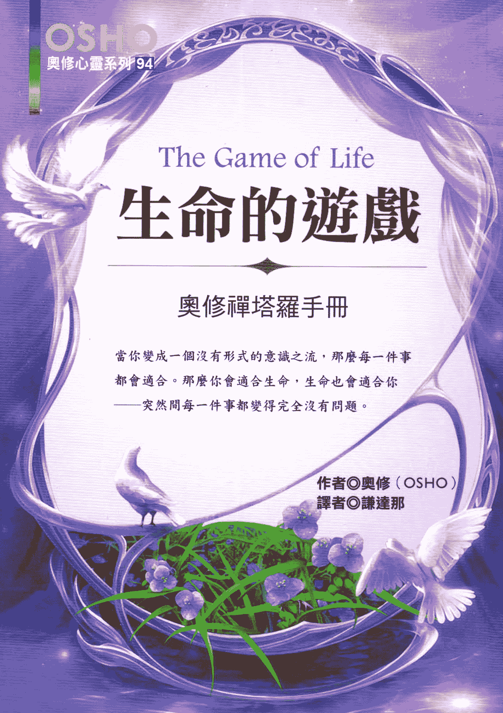

## 引言：預測未來

唯有當未來是未定的，自由才能夠存在，但是未定的未來是不可能預測的。一個很美的人可能明天會殺人。明天是未定的。

有一件非常基本的事必須記住，那就是每當我們做任何事──占星、未來的建議、星座解讀、手相、易經占卜、或塔羅牌解讀──任何跟未來有關的事，基本上都是在讀那個人的無意識。它跟未來的關係很小，反而跟過去的關係比較多，但因為未來是由過去所創造出來的，所以它跟未來也有關係。

因為人們的生活就好像是一部機器，所以預測是可能的。如果你知道那個人的過去，除非那個人是一個佛，否則你就可以預測他的未來，因為他將會重複它。如果在過去他是一個容易生氣的人，他攜帶著生氣的傾向，那個傾向將會影響到他的未來。

一般而言，一個無意識的人會一再一再地重複他的過去，它就像是一個輪

## 生命的遊戲

子的現象，他會重複它，他沒有辦法不是這樣。他無法將任何新的事物帶進他的生命，他沒有辦法突破，因此所有那些算命占卜的科學可以有用武之地。如果你們變得更覺知、更警覺，它們就發揮不了作用。

你沒有辦法分析一個佛的星座，或是看他的手相，因為他可以完全免於過去，他在當下完全是空的，所以沒有什麼東西可以讓你解讀！

人們對生命和時間之間的差別有一個很大的誤解。時間被認為是由三個狀態所組成：過去、現在、和未來——那是錯誤的。時間只有過去和未來，生命才是由現在所組成的。

對於那些想要生活的人來講除了生活在當下這個片刻之外沒有其他的方式。只有現在是存在性的，過去只不過是記憶的累積，而未來則是你的想像和你的夢。

真實的存在是此時此地。對於那些只是想要去思考生命、生活、和愛的人而言，過去和未來是非常美的，因為它們給予無限的空間。他們可以裝飾他們的過去，使它變得盡可能地美——雖然他們從來沒有真正去經歷它。當它來到現在，他們並不在那裡，有的就只是影子或映像。他們一直在跑動著，而在

## 生命的遊戲

識而變成一個純粹的知者，他只是達到了清晰的看法，在他的眼裡沒有理論和思想。他的頭腦已經不再是一個頭腦，他的頭腦是聰明才智，純粹的聰明才智；他的頭腦已經不再填塞著一些廢物，他的頭腦已經不再填塞著一些借來的知識。他很覺知，他是一團覺知的火。

你是否曾經聽過有任何傻瓜發瘋的？它從來沒有發生過。我一直在找尋看有沒有愚蠢的人發瘋的記載，但是從來沒有找到過一個。當然，一個傻瓜是不可能發瘋的，因為要發瘋的記載，但是從來沒有找到過一個。當然，一個傻瓜是此：傻瓜比所謂聰明的人來得更健康。他們生活在當下，他們知道自己是傻瓜，所以他們並不擔心別人對他們的看法。他們會很長壽，最後的笑屬於他們。

記住，生命必須是一個很長的平衡。然後，剛好在中間的時候，你就可以跳脫，那個能量會往上竄升，你會開始往上走。關於所有對立的兩極，你必須是如此。不要成為一個男人，也不要成為一個女人，要成為兩者，這樣的話你才

## 019  O、傻瓜

能夠兩者都不是。不要成為聰明的，也不要成為一個傻瓜，要成為兩者，這樣你才能夠超越。

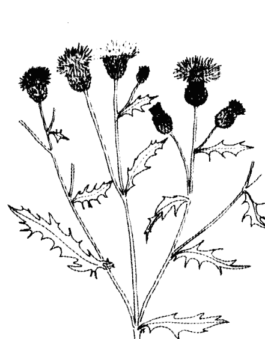

## 生命的遊戲 020

## I、存在（宇宙的整個存在）

我們是存在的一部分，我們跟它並不是分開的。即使我們想要跟它分開，我們也做不到……你越是跟存在在一起，你就越是活生生的。

那就是為什麼我堅持要很全然地生活、很強烈地生活，因為你生活得越深入，你就越能夠接觸到存在。你是由它生出來的，每一個片刻你都被你的每一個呼吸和每一個心跳更新且賦予活力、賦予生命——存在在照顧著你。

當你開始觀照你的呼吸，你會開始看到一個偉大的現象——透過你的呼吸，你繼續在跟存在連繫——沒有間斷地，沒有假日。不論你是醒著的，或是睡覺，存在都繼續將生命倒進你裡面，並將所有那些死的東西拿出來。

當我說：「存在照顧你。」我並不是在講哲學，哲學大部分是無稽的。我只是在陳述一項事實。如果你變得很有意識地覺知到它，這會在你裡面產生出一個很大的信任。我所說的「存在照顧你」可以激發出你的一種意識，使你能

## I、存在（宇宙的整個存在）

夠產生出一種對存在信任的美。我並不是叫你去相信一個假設性的神，我並不是叫你要對彌賽亞或救世主有信心，這些都是幼稚的慾望，想要有某一個父親的角色來照顧你。但它們都是假設性的。
世界上並沒有任何救世主，存在本身就夠了。
我想要你去探索你跟存在的關係，從那個探索產生出信任——不是相信或信仰。信任有一種美，因為它是你的經驗。信任將會幫助你放鬆，因為整個存在都在照顧你，不需要有存在主義者所說的苦悶。不需要有任何焦慮，也不需要有任何苦惱，不需要有存在主義者所說的苦悶。
整個存在是活生生的，沒有一樣東西是沒有生命的。這就是禪宗的基礎之一——整個存在是活生生的，所以它能夠將神的觀念拋棄，那是不需要的。整個存在是活生生的、敏感的、聰明的，你可以在裡面成長而達到開悟的神聖經驗。
一個知道他跟存在關係很深的人不可能犯下任何錯誤來反對存在或反對生

## 生命的遊戲

命，那簡直就是不可能，他只會散發出喜樂、祝福、和優雅，他的源頭是耗用不盡的。當你找到了你那耗用不盡的生命源頭以及它的狂喜，那麼你是否有一個神就不重要了，是否有一個地獄或有一個天堂也不重要，它根本就不重要。所以當一些宗教人士讀到禪的時候，他們會覺得很困惑，因為它並沒有談到任何他們一開始所被教導的東西。它在談論一些奇怪的對話，因為它裡面好像什麼都沒有……沒有神的位置，沒有天堂，也沒有地獄。禪是一種科學的宗教，它的追尋並不是基於信念，它的追尋是基於經驗。一種科學是走向外在，另外一種科學是走向客觀的實驗，禪是基於主觀的經驗。一種科學是走向外在。

## II、內在的聲音

當存在已經準備好要從我們存在最深處的核心來告訴我們，我們卻很不必要地繼續從外在尋求忠告。它已經在那裡，但是我們從來沒有去聽那個靜止的、小小的聲音。

事實上，因為我們活在一個非常嘈雜的頭腦裡，所以我們無法傾聽，頭腦裡面有太多的喋喋不休在進行著，除非你使你的頭腦變得完全寧靜，否則那個很小的聲音無法穿透。

在美国的很多大学裡，他們做了一些完全寧靜的試驗。當然他們的實驗是關係到外在的噪音。有一次，一個音樂家進入到一個完全隔音的房間裡，沒有任何來自外在的噪音。他進入到那個房間，他感到很驚訝，因為他被告知在那裡面是完全安靜的，他是一個受過訓練的音樂家，他並沒有耳聾，他的耳朵對聲音很敏銳，但是他感到非常困惑，他開始聽到兩種聲音。他衝出去告訴那個

## 生命的遊戲

指導員說：「到底是怎麼一回事？我聽到兩種聲音。」
那個指導員笑了，他說：「是的，會有兩種聲音存在，一種是你心跳的聲音，另外一種是你血液循環的聲音。這兩種聲音我們無法避開，因為它們跟著你。」
沒有人曾經聽過它們，但是如果你進入到一個完全安靜的房間，百分之百跳聲會這麼大，幾乎好像那個心跳聲，你也一定會覺得很訝異，你無法想像你的心跳聲會這麼大，幾乎好像那個心跳聲，你也一定會覺得很訝異，你無法想像你的心跳聲會這麼大，幾乎好像那個心跳聲，你也一定會覺得很訝異，你無法想像你的心跳聲會這麼大，幾乎好像那個心跳聲，你也一定會覺得很訝異，你無法想像你的心跳聲會這麼大，幾乎好像那個心跳聲，你也一定會覺得很訝異，你無法想像你的心跳聲會這麼大，幾乎好像那個心跳聲，你也一定會覺得很訝異，你無法想像你的心跳聲會這麼大，幾乎好像那個心跳聲，你也一定會覺得很訝異，你無法想像你的心跳聲會這麼大，幾乎好像那個心跳聲，你也一定會覺得很訝異，你無法想像你的心跳聲會這麼大，幾乎好像那個心跳聲，你也一定會覺得很訝異，你無法想像你的心跳聲會這麼大，幾乎好像那個心跳聲，你也一定會覺得很訝異，你無法想像你的心跳聲會這麼大，幾乎好像那個心跳聲，你也一定會覺得很訝異，你無法想像你的心跳聲會這麼大，幾乎好像那個心跳聲，你也一定會覺得很訝異，你無法想像你的心跳聲會這麼大，幾乎好像那個心跳聲，你也一定會覺得很訝異，你無法想像你的心跳聲會這麼大，幾乎好像那個心跳聲，你也一定會覺得很訝異，你無法想像你的心跳聲會這麼大，幾乎好像那個心跳聲，你也一定會覺得很訝異，你無法想像你的心跳聲會這麼大，幾乎好像那個心跳聲，你也一定會覺得很訝異，你無法想像你的心跳聲會這麼大，幾乎好像那個心跳聲，你也一定會覺得很訝異，你無法想像你的心跳聲會這麼大，幾乎好像那個心跳聲，你也一定會覺得很訝異，你無法想像你的心跳聲會這麼大，幾乎好像那個心跳聲，你也一定會覺得很訝異，你無法想像你的心跳聲會這麼大，幾乎好像那個心跳聲，你也一定會覺得很訝異，你無法想像你的心跳聲會這麼大，幾乎好像那個心跳聲，你也一定會覺得很訝異，你無法想像你的心跳聲會這麼大，幾乎好像那個心跳聲，你也一定會覺得很訝異，你無法想像你的心跳聲會這麼大，幾乎好像那個心跳聲，你也一定會覺得很訝異，你無法想像你的心跳聲會這麼大，幾乎好像那個心跳聲，你也一定會覺得很訝異，你無法想像你的心跳聲會這麼大，幾乎好像那個心跳聲，你也一定會覺得很訝異，你無法想像你的心跳聲會這麼大，幾乎好像那個心跳聲，你也一定會覺得很訝異，你無法想像你的心跳聲會這麼大，幾乎好像那個心跳聲，你也一定會覺得很訝異，你無法想像你的心跳聲會這麼大，幾乎好像那個心跳聲，你也一定會覺得很訝異，你無法想像你的心跳聲會這麼大，幾乎好像那個心跳聲，你也一定會覺得很訝異，你無法想像你的心跳聲會這麼大，幾乎好像那個心跳聲，你也一定會覺得很訝異，你無法想像你的心跳聲會這麼大，幾乎好像那個心跳聲，你也一定會覺得很訝異，你無法想像你的心跳聲會這麼大，幾乎好像那個心跳聲，你也一定會覺得很訝異，你無法想像你的心跳聲會這麼大，幾乎好像那個心跳聲，你也一定會覺得很訝異，你無法想像你的心跳聲會這麼大，幾乎好像那個心跳聲，你也一定會覺得很訝異，你無法想像你的心跳聲會這麼大，幾乎好像那個心跳聲，你也一定會覺得很訝異，你無法想像你的心跳聲會這麼大，幾乎好像那個心跳聲，你也一定會覺得很訝異，你無法想像你的心跳聲會這麼大，幾乎好像那個心跳聲，你也一定會覺得很訝異，你無法想像你的心跳聲會這麼大，幾乎好像那個心跳聲，你也一定會覺得很訝異，你無法想像你的心跳聲會這麼大，幾乎好像那個心跳聲，你也一定會覺得很訝異，你無法想像你的心跳聲會這麼大，幾乎好像那個心跳聲，你也一定會覺得很訝異，你無法想像你的心跳聲會這麼大，幾乎好像那個心跳聲，你也一定會覺得很訝異，你無法想像你的心跳聲會這麼大，幾乎好像那個心跳聲，你也一定會覺得很訝異，你無法想像你的心跳聲會這麼大，幾乎好像那個心跳聲，你也一定會覺得很訝異，你無法想像你的心跳聲會這麼大，幾乎好像那個心跳聲，你也一定會覺得很訝異，你無法想像你的心跳聲會這麼大，幾乎好像那個心跳聲，你也一定會覺得很訝異，你無法想像你的心跳聲會這麼大，幾乎好像那個心跳聲，你也一定會覺得很訝異，你無法想像你的心跳聲會這麼大，幾乎好像那個心跳聲，你也一定會覺得很訝異，你無法想像你的心跳聲會這麼大，幾乎好像那個心跳聲，你也一定會覺得很訝異，你無法想像你的心跳聲會這麼大，幾乎好像那個心跳聲，你也一定會覺得很訝異，你無法想像你的心跳聲會這麼大，幾乎好像那個心跳聲，你也一定會覺得很訝異，你無法想像你的心跳聲會這麼大，幾乎好像那個心跳聲，你也一定會覺得很訝異，你無法想像你的心跳聲會這麼大，幾乎好像那個心跳聲，你也一定會覺得很訝異，你無法想像你的心跳聲會這麼大，幾乎好像那個心跳聲，你也一定會覺得很訝異，你無法想像你的心跳聲會這麼大，幾乎好像那個心跳聲，你也一定會覺得很訝異，你無法想像你的心跳聲會這麼大，幾乎好像那個心跳聲，你也一定會覺得很訝異，你無法想像你的心跳聲會這麼大，幾乎好像那個心跳聲，你也一定會覺得很訝異，你無法想像你的心跳聲會這麼大，幾乎好像那個心跳聲，你也一定會覺得很訝異，你無法想像你的心跳聲會這麼大，幾乎好像那個心跳聲，你也一定會覺得很訝異，你無法想像你的心跳聲會這麼大，幾乎好像那個心跳聲，你也一定會覺得很訝異，你無法想像你的心跳聲會這麼大，幾乎好像那個心跳聲，你也一定會覺得很訝異，你無法想像你的心跳聲會這麼大，幾乎好像那個心跳聲，你也一定會覺得很訝異，你無法想像你的心跳聲會這麼大，幾乎好像那個心跳聲，你也一定會覺得很訝異，你無法想像你的心跳聲會這麼大，幾乎好像那個心跳聲，你也一定會覺得很訝異，你無法想像你的心跳聲會這麼大，幾乎好像那個心跳聲，你也一定會覺得很訝異，你無法想像你的心跳聲會這麼大，幾乎好像那個心跳聲，你也一定會覺得很訝異，你無法想像你的心跳聲會這麼大，幾乎好像那個心跳聲，你也一定會覺得很訝異，你無法想像你的心跳聲會這麼大，幾乎好像那個心跳聲，你也一定會覺得很訝異，你無法想像你的心跳聲會這麼大，幾乎好像那個心跳聲，你也一定會覺得很訝異，你無法想像你的心跳聲會這麼大，幾乎好像那個心跳聲，你也一定會覺得很訝異，你無法想像你的心跳聲會這麼大，幾乎好像那個心跳聲，你也一定會覺得很訝異，你無法想像你的心跳聲會這麼大，幾乎好像那個心跳聲，你也一定會覺得很訝異，你無法想像你的心跳聲會這麼大，幾乎好像那個心跳聲，你也一定會覺得很訝異，你無法想像你的心跳聲會這麼大，幾乎好像那個心跳聲，你也一定會覺得很訝異，你無法想像你的心跳聲會這麼大，幾乎好像那個心跳聲，你也一定會覺得很訝異，你無法想像你的心跳聲會這麼大，幾乎好像那個心跳聲，你也一定會覺得很訝異，你無法想像你的心跳聲會這麼大，幾乎好像那個心跳聲，你也一定會覺得很訝異，你無法想像你的心跳聲會這麼大，幾乎好像那個心跳聲，你也一定會覺得很訝異，你無法想像你的心跳聲會這麼大，幾乎好像那個心跳聲，你也一定會覺得很訝異，你無法想像你的心跳聲會這麼大，幾乎好像那個心跳聲，你也一定會覺得很訝異，你無法想像你的心跳聲會這麼大，幾乎好像那個心跳聲，你也一定會覺得很訝異，你無法想像你的心跳聲會這麼大，幾乎好像那個心跳聲，你也一定會覺得很訝異，你無法想像你的心跳聲會這麼大，幾乎好像那個心跳聲，你也一定會覺得很訝異，你無法想像你的心跳聲會這麼大，幾乎好像那個心跳聲，你也一定會覺得很訝異，你無法想像你的心跳聲會這麼大，幾乎好像那個心跳聲，你也一定會覺得很訝異，你無法想像你的心跳聲會這麼大，幾乎好像那個心跳聲，你也一定會覺得很訝異，你無法想像你的心跳聲會這麼大，幾乎好像那個心跳聲，你也一定會覺得很訝異，你無法想像你的心跳聲會這麼大，幾乎好像那個心跳聲，你也一定會覺得很訝異，你無法想像你的心跳聲會這麼大，幾乎好像那個心跳聲，你也一定會覺得很訝異，你無法想像你的心跳聲會這麼大，幾乎好像那個心跳聲，你也一定會覺得很訝異，你無法想像你的心跳聲會這麼大，幾乎好像那個心跳聲，你也一定會覺得很訝異，你無法想像你的心跳聲會這麼大，幾乎好像那個心跳聲，你也一定會覺得很訝異，你無法想像你的心跳聲會這麼大，幾乎好像那個心跳聲，你也一定會覺得很訝異，你無法想像你的心跳聲會這麼大，幾乎好像那個心跳聲，你也一定會覺得很訝異，你無法想像你的心跳聲會這麼大，幾乎好像那個心跳聲，你也一定會覺得很訝異，你無法想像你的心跳聲會這麼大，幾乎好像那個心跳聲，你也一定會覺得很訝異，你無法想像你的心跳聲會這麼大，幾乎好像那個心跳聲，你也一定會覺得很訝異，你無法想像你的心跳聲會這麼大，幾乎好像那個心跳聲，你也一定會覺得很訝異，你無法想像你的心跳聲會這麼大，幾乎好像那個心跳聲，你也一定會覺得很訝異，你無法想像你的心跳聲會這麼大，幾乎好像那個心跳聲，你也一定會覺得很訝異，你無法想像你的心跳聲會這麼大，幾乎好像那個心跳聲，你也一定會覺得很訝異，你無法想像你的心跳聲會這麼大，幾乎好像那個心跳聲，你也一定會覺得很訝異，你無法想像你的心跳聲會這麼大，幾乎好像那個心跳聲，你也一定會覺得很訝異，你無法想像你的心跳聲會這麼大，幾乎好像那個心跳聲，你也一定會覺得很訝異，你無法想像你的心跳聲會這麼大，幾乎好像那個心跳聲，你也一定會覺得很訝異，你無法想像你的心跳聲會這麼大，幾乎好像那個心跳聲，你也一定會覺得很訝異，你無法想像你的心跳聲會這麼大，幾乎好像那個心跳聲，你也一定會覺得很訝異，你無法想像你的心跳聲會這麼大，幾乎好像那個心跳聲，你也一定會覺得很訝異，你無法想像你的心跳聲會這麼大，幾乎好像那個心跳聲，你也一定會覺得很訝異，你無法想像你的心跳聲會這麼大，幾乎好像那個心跳聲，你也一定會覺得很訝異，你無法想像你的心跳聲會這麼大，幾乎好像那個心跳聲，你也一定會覺得很訝異，你無法想像你的心跳聲會這麼大，幾乎好像那個心跳聲，你也一定會覺得很訝異，你無法想像你的心跳聲會這麼大，幾乎好像那個心跳聲，你也一定會覺得很訝異，你無法想像你的心跳聲會這麼大，幾乎好像那個心跳聲，你也一定會覺得很訝異，你無法想像你的心跳聲會這麼大，幾乎好像那個心跳聲，你也一定會覺得很訝異，你無法想像你的心跳聲會這麼大，幾乎好像那個心跳聲，你也一定會覺得很訝異，你無法想像你的心跳聲會這麼大，幾乎好像那個心跳聲，你也一定會覺得很訝異，你無法想像你的心跳聲會這麼大，幾乎好像那個心跳聲，你也一定會覺得很訝異，你無法想像你的心跳聲會這麼大，幾乎好像那個心跳聲，你也一定會覺得很訝異，你無法想像你的心跳聲會這麼大，幾乎好像那個心跳聲，你也一定會覺得很訝異，你無法想像你的心跳聲會這麼大，幾乎好像那個心跳聲，你也一定會覺得很訝異，你無法想像你的心跳聲會這麼大，幾乎好像那個心跳聲，你也一定會覺得很訝異，你無法想像你的心跳聲會這麼大，幾乎好像那個心跳聲，你也一定會覺得很訝異，你無法想像你的心跳聲會這麼大，幾乎好像那個心跳聲，你也一定會覺得很訝異，你無法想像你的心跳聲會這麼大，幾乎好像那個心跳聲，你也一定會覺得很訝異，你無法想像你的心跳聲會這麼大，幾乎好像那個心跳聲，你也一定會覺得很訝異，你無法想像你的心跳聲會這麼大，幾乎好像那個心跳聲，你也一定會覺得很訝異，你無法想像你的心跳聲會這麼大，幾乎好像那個心跳聲，你也一定會覺得很訝異，你無法想像你的心跳聲會這麼大，幾乎好像那個心跳聲，你也一定會覺得很訝異，你無法想像你的心跳聲會這麼大，幾乎好像那個心跳聲，你也一定會覺得很訝異，你無法想像你的心跳聲會這麼大，幾乎好像那個心跳聲，你也一定會覺得很訝異，你無法想像你的心跳聲會這麼大，幾乎好像那個心跳聲，你也一定會覺得很訝異，你無法想像你的心跳聲會這麼大，幾乎好像那個心跳聲，你也一定會覺得很訝異，你無法想像你的心跳聲會這麼大，幾乎好像那個心跳聲，你也一定會覺得很訝異，你無法想像你的心跳聲會這麼大，幾乎好像那個心跳聲，你也一定會覺得很訝異，你無法想像你的心跳聲會這麼大，幾乎好像那個心跳聲，你也一定會覺得很訝異，你無法想像你的心跳聲會這麼大，幾乎好像那個心跳聲，你也一定會覺得很訝異，你無法想像你的心跳聲會這麼大，幾乎好像那個心跳聲，你也一定會覺得很訝異，你無法想像你的心跳聲會這麼大，幾乎好像那個心跳聲，你也一定會覺得很訝異，你無法想像你的心跳聲會這麼大，幾乎好像那個心跳聲，你也一定會覺得很訝異，你無法想像你的心跳聲會這麼大，幾乎好像那個心跳聲，你也一定會覺得很訝異，你無法想像你的心跳聲會這麼大，幾乎好像那個心跳聲，你也一定會覺得很訝異，你無法想像你的心跳聲會這麼大，幾乎好像那個心跳聲，你也一定會覺得很訝異，你無法想像你的心跳聲會這麼大，幾乎好像那個心跳聲，你也一定會覺得很訝異，你無法想像你的心跳聲會這麼大，幾乎好像那個心跳聲，你也一定會覺得很訝異，你無法想像你的心跳聲會這麼大，幾乎好像那個心跳聲，你也一定會覺得很訝異，你無法想像你的心跳聲會這麼大，幾乎好像那個心跳聲，你也一定會覺得很訝異，你無法想像你的心跳聲會這麼大，幾乎好像那個心跳聲，你也一定會覺得很訝異，你無法想像你的心跳聲會這麼大，幾乎好像那個心跳聲，你也一定會覺得很訝異，你無法想像你的心跳聲會這麼大，幾乎好像那個心跳聲，你也一定會覺得很訝異，你無法想像你的心跳聲會這麼大，幾乎好像那個心跳聲，你也一定會覺得很訝異，你無法想像你的心跳聲會這麼大，幾乎好像那個心跳聲，你也一定會覺得很訝異，你無法想像你的心跳聲會這麼大，幾乎好像那個心跳聲，你也一定會覺得很訝異，你無法想像你的心跳聲會這麼大，幾乎好像那個心跳聲，你也一定會覺得很訝異，你無法想像你的心跳聲會這麼大，幾乎好像那個心跳聲，你也一定會覺得很訝異，你無法想像你的心跳聲會這麼大，幾乎好像那個心跳聲，你也一定會覺得很訝異，你無法想像你的心跳聲會這麼大，幾乎好像那個心跳聲，你也一定會覺得很訝異，你無法想像你的心跳聲會這麼大，幾乎好像那個心跳聲，你也一定會覺得很訝異，你無法想像你的心跳聲會這麼大，幾乎好像那個心跳聲，你也一定會覺得很訝異，你無法想像你的心跳聲會這麼大，幾乎好像那個心跳聲，你也一定會覺得很訝異，你無法想像你的心跳聲會這麼大，幾乎好像那個心跳聲，你也一定會覺得很訝異，你無法想像你的心跳聲會這麼大，幾乎好像那個心跳聲，你也一定會覺得很訝異，你無法想像你的心跳聲會這麼大，幾乎好像那個心跳聲，你也一定會覺得很訝異，你無法想像你的心跳聲會這麼大，幾乎好像那個心跳聲，你也一定會覺得很訝異，你無法想像你的心跳聲會這麼大，幾乎好像那個心跳聲，你也一定會覺得很訝異，你無法想像你的心跳聲會這麼大，幾乎好像那個心跳聲，你也一定會覺得很訝異，你無法想像你的心跳聲會這麼大，幾乎好像那個心跳聲，你也一定會覺得很訝異，你無法想像你的心跳聲會這麼大，幾乎好像那個心跳聲，你也一定會覺得很訝異，你無法想像你的心跳聲會這麼大，幾乎好像那個心跳聲，你也一定會覺得很訝異，你無法想像你的心跳聲會這麼大，幾乎好像那個心跳聲，你也一定會覺得很訝異，你無法想像你的心跳聲會這麼大，幾乎好像那個心跳聲，你也一定會覺得很訝異，你無法想像你的心跳聲會這麼大，幾乎好像那個心跳聲，你也一定會覺得很訝異，你無法想像你的心跳聲會這麼大，幾乎好像那個心跳聲，你也一定會覺得很訝異，你無法想像你的心跳聲會這麼大，幾乎好像那個心跳聲，你也一定會覺得很訝異，你無法想像你的心跳聲會這麼大，幾乎好像那個心跳聲，你也一定會覺得很訝異，你無法想像你的心跳聲會這麼大，幾乎好像那個心跳聲，你也一定會覺得很訝異，你無法想像你的心跳聲會這麼大，幾乎好像那個心跳聲，你也一定會覺得很訝異，你無法想像你的心跳聲會這麼大，幾乎好像那個心跳聲，你也一定會覺得很訝異，你無法想像你的心跳聲會這麼大，幾乎好像那個心跳聲，你也一定會覺得很訝異，你無法想像你的心跳聲會這麼大，幾乎好像那個心跳聲，你也一定會覺得很訝異，你無法想像你的心跳聲會這麼大，幾乎好像那個心跳聲，你也一定會覺得很訝異，你無法想像你的心跳聲會這麼大，幾乎好像那個心跳聲，你也一定會覺得很訝異，你無法想像你的心跳聲會這麼大，幾乎好像那個心跳聲，你也一定會覺得很訝異，你無法想像你的心跳聲會這麼大，幾乎好像那個心跳聲，你也一定會覺得很訝異，你無法想像你的心跳聲會這麼大，幾乎好像那個心跳聲，你也一定會覺得很訝異，你無法想像你的心跳聲會這麼大，幾乎好像那個心跳聲，你也一定會覺得很訝異，你無法想像你的心跳聲會這麼大，幾乎好像那個心跳聲，你也一定會覺得很訝異，你無法想像你的心跳聲會這麼大，幾乎好像那個心跳聲，你也一定會覺得很訝異，你無法想像你的心跳聲會這麼大，幾乎好像那個心跳聲，你也一定會覺得很訝異，你無法想像你的心跳聲會這麼大，幾乎好像那個心跳聲，你也一定會覺得很訝異，你無法想像你的心跳聲會這麼大，幾乎好像那個心跳聲，你也一定會覺得很訝異，你無法想像你的心跳聲會這麼大，幾乎好像那個心跳聲，你也一定會覺得很訝異，你無法想像你的心跳聲會這麼大，幾乎好像那個心跳聲，你也一定會覺得很訝異，你無法想像你的心跳聲會這麼大，幾乎好像那個心跳聲，你也一定會覺得很訝異，你無法想像你的心跳聲會這麼大，幾乎好像那個心跳聲，你也一定會覺得很訝異，你無法想像你的心跳聲會這麼大，幾乎好像那個心跳聲，你也一定會覺得很訝異，你無法想像你的心跳聲會這麼大，幾乎好像那個心跳聲，你也一定會覺得很訝異，你無法想像你的心跳聲會這麼大，幾乎好像那個心跳聲，你也一定會覺得很訝異，你無法想像你的心跳聲會這麼大，幾乎好像那個心跳聲，你也一定會覺得很訝異，你無法想像你的心跳聲會這麼大，幾乎好像那個心跳聲，你也一定會覺得很訝異，你無法想像你的心跳聲會這麼大，幾乎好像那個心跳聲，你也一定會覺得很訝異，你無法想像你的心跳聲會這麼大，幾乎好像那個心跳聲，你也一定會覺得很訝異，你無法想像你的心跳聲會這麼大，幾乎好像那個心跳聲，你也一定會覺得很訝異，你無法想像你的心跳聲會這麼大，幾乎好像那個心跳聲，你也一定會覺得很訝異，你無法想像你的心跳聲會這麼大，幾乎好像那個心跳聲，你也一定會覺得很訝異，你無法想像你的心跳聲會這麼大，幾乎好像那個心跳聲，你也一定會覺得很訝異，你無法想像你的心跳聲會這麼大，幾乎好像那個心跳聲，你也一定會覺得很訝異，你無法想像你的心跳聲會這麼大，幾乎好像那個心跳聲，你也一定會覺得很訝異，你無法想像你的心跳聲會這麼大，幾乎好像那個心跳聲，你也一定會覺得很訝異，你無法想像你的心跳聲會這麼大，幾乎好像那個心跳聲，你也一定會覺得很訝異，你無法想像你的心跳聲會這麼大，幾乎好像那個心跳聲，你也一定會覺得很訝異，你無法想像你的心跳聲會這麼大，幾乎好像那個心跳聲，你也一定會覺得很訝異，你無法想像你的心跳聲會這麼大，幾乎好像那個心跳聲，你也一定會覺得很訝異，你無法想像你的心跳聲會這麼大，幾乎好像那個心跳聲，你也一定會覺得很訝異，你無法想像你的心跳聲會這麼大，幾乎好像那個心跳聲，你也一定會覺得很訝異，你無法想像你的心跳聲會這麼大，幾乎好像那個心跳聲，你也一定會覺得很訝異，你無法想像你的心跳聲會這麼大，幾乎好像那個心跳聲，你也一定會覺得很訝異，你無法想像你的心跳聲會這麼大，幾乎好像那個心跳聲，你也一定會覺得很訝異，你無法想像你的心跳聲會這麼大，幾乎好像那個心跳聲，你也一定會覺得很訝異，你無法想像你的心跳聲會這麼大，幾乎好像那個心跳聲，你也一定會覺得很訝異，你無法想像你的心跳聲會這麼大，幾乎好像那個心跳聲，你也一定會覺得很訝異，你無法想像你的心跳聲會這麼大，幾乎好像那個心跳聲，你也一定會覺得很訝異，你無法想像你的心跳聲會這麼大，幾乎好像那個心跳聲，你也一定會覺得很訝異，你無法想像你的心跳聲會這麼大，幾乎好像那個心跳聲，你也一定會覺得很訝異，你無法想像你的心跳聲會這麼大，幾乎好像那個心跳聲，你也一定會覺得很訝異，你無法想像你的心跳聲會這麼大，幾乎好像那個心跳聲，你也一定會覺得很訝異，你無法想像你的心跳聲會這麼大，幾乎好像那個心跳聲，你也一定會覺得很訝異，你無法想像你的心跳聲會這麼大，幾乎好像那個心跳聲，你也一定會覺得很訝異，你無法想像你的心跳聲會這麼大，幾乎好像那個心跳聲，你也一定會覺得很訝異，你無法想像你的心跳聲會這麼大，幾乎好像那個心跳聲，你也一定會覺得很訝異，你無法想像你的心跳聲會這麼大，幾乎好像那個心跳聲，你也一定會覺得很訝異，你無法想像你的心跳聲會這麼大，幾乎好像那個心跳聲，你也一定會覺得很訝異，你無法想像你的心跳聲會這麼大，幾乎好像那個心跳聲，你也一定會覺得很訝異，你無法想像你的心跳聲會這麼大，幾乎好像那個心跳聲，你也一定會覺得很訝異，你無法想像你的心跳聲會這麼大，幾乎好像那個心跳聲，你也一定會覺得很訝異，你無法想像你的心跳聲會這麼大，幾乎好像那個心跳聲，你也一定會覺得很訝異，你無法想像你的心跳聲會這麼大，幾乎好像那個心跳聲，你也一定會覺得很訝異，你無法想像你的心跳聲會這麼大，幾乎好像那個心跳聲，你也一定會覺得很訝異，你無法想像你的心跳聲會這麼大，幾乎好像那個心跳聲，你也一定會覺得很訝異，你無法想像你的心跳聲會這麼大，幾乎好像那個心跳聲，你也一定會覺得很訝異，你無法想像你的心跳聲會這麼大，幾乎好像那個心跳聲，你也一定會覺得很訝異，你無法想像你的心跳聲會這麼大，幾乎好像那個心跳聲，你也一定會覺得很訝異，你無法想像你的心跳聲會這麼大，幾乎好像那個心跳聲，你也一定會覺得很訝異，你無法想像你的心跳聲會這麼大，幾乎好像那個心跳聲，你也一定會覺得很訝異，你無法想像你的心跳聲會這麼大，幾乎好像那個心跳聲，你也一定會覺得很訝異，你無法想像你的心跳聲會這麼大，幾乎好像那個心跳聲，你也一定會覺得很訝異，你無法想像你的心跳聲會這麼大，幾乎好像那個心跳聲，你也一定會覺得很訝異，你無法想像你的心跳聲會這麼大，幾乎好像那個心跳聲，你也一定會覺得很訝異，你無法想像你的心跳聲會這麼大，幾乎好像那個心跳聲，你也一定會覺得很訝異，你無法想像你的心跳聲會這麼大，幾乎好像那個心跳聲，你也一定會覺得很訝異，你無法想像你的心跳聲會這麼大，幾乎好像那個心跳聲，你也一定會覺得很訝異，你無法想像你的心跳聲會這麼大，幾乎好像那個心跳聲，你也一定會覺得很訝異，你無法想像你的心跳聲會這麼大，幾乎好像那個心跳聲，你也一定會覺得很訝異，你無法想像你的心跳聲會這麼大，幾乎好像那個心跳聲，你也一定會覺得很訝異，你無法想像你的心跳聲會這麼大，幾乎好像那個心跳聲，你也一定會覺得很訝異，你無法想像你的心跳聲會這麼大，幾乎好像那個心跳聲，你也一定會覺得很訝異，你無法想像你的心跳聲會這麼大，幾乎好像那個心跳聲，你也一定會覺得很訝異，你無法想像你的心跳聲會這麼大，幾乎好像那個心跳聲，你也一定會覺得很訝異，你無法想像你的心跳聲會這麼大，幾乎好像那個心跳聲，你也一定會覺得很訝異，你無法想像你的心跳聲會這麼大，幾乎好像那個心跳聲，你也一定會覺得很訝異，你無法想像你的心跳聲會這麼大，幾乎好像那個心跳

## Ⅲ、創造力

畫家畫畫，創造出圖畫；詩人寫詩，創造出美麗的詩；舞蹈家創造出舞蹈……但是所有這些都只是片片斷斷的。一個宗教人士創造出他自己，宗教人士是最偉大的藝術家。

唯一能夠真正跟存在同調的方式就是成為具有創造力的。當你在創造某樣東西，不論它是什麼——陶瓷、一首歌、一曲音樂、一個舞蹈，不論它是什麼，每當你在創造，你就加入了存在，你不再是跟它分開的。事實上你消失了，而存在開始透過你來創造。如果你能夠抓住那些片刻，如果你能夠覺知到那些沒有自我而只是創造流經你的稀有片刻，那麼那個創造就變成靜心的。

每一位創造者都知道那些片刻，但只是模糊地知道。詩人知道有時候那些片刻你根本就毫無靈感，你想要創造某樣東西，但是什麼東西都出不來。你越努力，那個可能性就越少：：：因為那個努力只是意味著自我的努力。創造力唯有當自我不在的時候才會發生，當你很放鬆、處於深度的休息之中、一點都沒有慾望想要做些什麼，那個時候才會發生。突然間你被掌握了，有某種未知的力量壓服了你，佔據了你。沒錯，你真的就是被佔據了。詩人、畫家、雕刻家，他們都知道這些片刻，但是唯有當它們不見了，他們才知道那些片刻，他們就只是記得它們。當他們回顧，他們會感覺到有很重要的東西在那裡，但是它已經不復存在。唯有當它們已經不在，他們才能夠抓住那些片刻，而靜心者是當它們在的時候來抓住那些創造性的片刻，神秘家則是可以當下就覺知到那些片刻，那個差別是很大的。

一旦你覺知到你不存在，但你還是在──自我已經不復存在，但你還是──你就會對你自己的存在有一種全新的體驗。佛陀稱之為涅槃──沒有自己。創造者會常常來造訪，唯一的事就是當它在的時候他必須抓住它。靜心就是抓住那些片刻，而創造力就是創造出那些片刻。當創造力和靜心會合，你就回到家了，那個旅程已經完成了。

## IV、叛逆者

叛逆者的情況是非常令人興奮的：每一個片刻他都會面臨難題，因為社會有一個固定的模式、固定的理想。叛逆者無法隨著那些固定的理想，他必須遵循他自己內在的聲音。

叛逆者已經拋掉過去，他不會重複過去，他將一些新的東西帶進了世界。那些逃離世界和社會的人是逃避主義者。他們真的是拋棄了責任，但是他們不了解說當他們拋棄了責任，他們同時也拋棄了自由。這是生命複雜的地方：自由和責任是一起存在的，當其中一個走掉，另外一個也會一起走掉。

你越是一個自由的愛好者，你就越會準備好去接受責任。但是離開世界，離開社會，就不可能有任何責任。必須記住：一切我們所學習的，都是透過負責任來學習的。過去已經摧毀了「責任」（responsibility）這個字的美。他們幾乎使它成為「義務」（duty）的同義詞，但事實上並非如此。義務是你不願意做的事，它是你心靈奴役的一部分。你對長輩的義務，你對小孩的義務──它們不是責任。了解「責任」這個字是非常重要的，你必須將它分成兩個部分：反應（response）和能力（ability）。

你可以以兩種方式來行動──一種是固定式的反應，另外一種是真實而且自然的反應。固定式的反應來自你過去的制約，它是機械式的。真實反應的能力是成長最偉大的原則之一。你並不是遵循任何命令，或任何戒律，你只是遵循你的覺知。你就像一面鏡子一樣在運作，反映出那個情況，並且對它做出真實而自然的反應──不是來自你的記憶，不是來自過去類似情況的經驗，不是來自那個情況的舊的反應，而是以新鮮的、新的方式來行動，根據當下的情況來反應。

那個情況不是舊的，你的反應也不是舊的──兩者都是新的。這個能力就是叛逆者的品質之一。

## V、空

在你裡面創造出空就是靜心的目標，但是這個空跟負面的觀念無關。它是充滿的，很豐富地充滿的。它是那麼地充滿，以致於它開始洋溢。佛陀將這個空定義成洋溢的慈悲。

空可以是空虛的，也可以是非常充滿的。它可以是負面的，也可以是正面的。如果它是負面的，它就好像是死亡和黑暗一樣，宗教稱之為地獄。它是地獄，因為在它裡面沒有喜悅、沒有歌唱、沒有心跳，也沒有歡舞。沒有什麼東西在開花，也沒有什麼東西是敞開的，一個人就只是空虛的。

這個空虛的空使人們產生很大的恐懼。那就是為什麼尤其在西方，除了少數的神秘家，像戴奧真尼斯、愛克哈特、和波愛美等人會說神是空之外，其他人從來沒有這樣說，但他們並不是西方思想的主流，西方一直以負面的意味來思考空，因此它對空產生出很大的恐懼。他們一直在告訴人們說空的頭腦是魔鬼的工作坊。

東方也知道空的正向面，它是對人類意識最大的貢獻之一。說空是魔鬼的工作坊，佛陀聽了一定會覺得好笑。他會說：唯有在空裡面，唯有在空無裡面，神性才會發生。但他是談論正面的現象。

對佛陀而言，或是對馬哈維亞而言，或是對禪師和道家而言，空只是意味著沒有東西。所有的東西都消失了，因為東西消失了，所以留下純粹的意識。那個鏡子是空的，裡面沒有任何映像，但那個鏡子是存在的。意識是沒有內容物，但意識是存在的。當它充滿著內容物，有很多東西在裡面，你無法知道它內容物，那就是我們所說的沒有頭腦（NO BRAIN）或靜心。

在你裡面創造出空無是靜心的目標，但是這個空無跟負面的概念無關。它是那麼地充滿，以致於它開始洋溢。佛陀將這個空定義成洋溢的慈悲。

「慈悲」（compassion）這個字是很美的。它跟「熱情」（passion）這個字具有相同的字根。當熱情被蛻變，當想要去追求或找尋別人的慾望已經不復存在，當你自己本身就足夠了，當你不需要任何人，當對別人的慾望已經消失，當你是十分地快樂和喜樂，只是很單獨，但不孤獨，那麼熱情就變成了慈悲。

只有空可以是無限的，有什麼東西一定是有限的。唯有空才可能有生命和存在的無限廣大。神並不是某一個人，祂什麼人都不是，或者說得更正確一點，祂是空無。神並不是什麼東西，祂是空無。祂是一個具有創造力的空，也就是佛陀所說的「尚雅」(surya)——空。

空無並不是意味著它什麼都沒有，空無只是意味著它是一切。空無意味著沒有東西的那個品質。東西是形式，空無是一種沒有形式的能量，它可以呈現出無數的形式，它只能呈現出無數的形式，因為它沒有形式的抗拒。它可以以無數的方式來表現它自己，因為它沒有執著，它沒有固定。它可以開成一朵蓮花。它可以是一首歌，也可以是一支舞，也可以是寧靜。一切都可以開成一朵玫瑰，也可以開成一朵蓮花。它可以是一首歌，也可以是一支舞，也可以是寧靜。一切都可以開成一朵玫瑰，也可以開成一朵蓮花。它可以是一首歌，也可以是一支舞，也可以是寧靜。一切都可以開成一朵玫瑰，也可以開成一朵蓮花。

能量，因为空無意味著沒有形成任何形式。一旦那個形式形成了，就會變得有限。

## 生命的遊戲

思想是一個世界，因此佛陀稱頭腦為「世界」。當一個思想升起，就是有一個波浪從意識之湖升起，一個形式產生了，那個形式只是暫時的、短暫的。不久之後它將會消失，它不會永駐，它不是永恆的，不要執著於它。看著它來，看著它去；看著它升起，看著它消失，但是不要執著於它。思想在意識裡升起，也在意識裡再度消失，但是你要記住意識，那是你真實的存在，那是你真理。

制。一旦那個形式形成了，你就不是完全地自由，你的形式變成你的枷鎖，因此，靜心是進入空無。

## VI、愛人

對別人而言，愛看起來好像是瘋狂，至少對那些不懂得什麼是愛的人是如此，但事實上，所有的愛都是瘋狂的，所有的愛都是盲目的。對「不是愛人」而言，愛是盲目的；對愛人而言，愛是唯一可能的眼睛，它可以看到存在的最核心。

愛是目標，生命是旅程。一個旅程沒有目標一定會成為神經病的、偶發的、隨便的，它將不會有任何方向。某一天你會走向北方，另外一天你會走向南方。它將會是偶發性的，任何事都可以引導你到任何地方。你將會是一塊漂流的木頭，除非那個目標很明顯。

親密（Intimacy）這個字來自一個拉丁文的字根intimacy，它意味著你的內在，你最內在的核心。除非你在那裡有什麼東西，否則你沒有辦法跟任何人親密。你沒有辦法允許親密，因為你會看到那個洞、那個傷口，以及膿從那裡流。

你甚至沒有聽過你自己的歌，你的生命是一團瘋子，你不知道你要走到哪裡，出來。你會看到你不知道自己是誰，你是一個瘋子，你不知道你要走到哪裡，出來。你甚至沒有聽過你自己的歌，你的生命是一團混亂，而不是一團和諧。因此會害怕親密，甚至連愛人都很少變得很親密。只是在性方面跟某人連結並不是親密。性器官的高潮並不代表親密的一切，它只是它的外圍，在親密當中可以有它，也可以不要有它。

親密是一個截然不同的層面，它是允許別人進入你，就像你看你自己一樣來看你，允許別人從你這一邊來看你，邀請某人到你存在最深處的核心來。在現代的世界裡，親密已經漸漬在消失，甚至連愛人都不親密了。現在友誼只是一個字，它已經消失了。那個理由是什麼呢？那個理由就是沒有什麼東西可以分享。誰會想要去顯示自己內在的貧乏？一個人會想要假裝「我是富有的」，我已經到達了，我知道我在做什麼，我知道我要走到哪裡。一個人還沒有準備好要敞開，一個人還不夠勇敢去敞開，去顯示出自己內在的混亂，去成為脆弱的。別人可能會剝削你，那個恐懼是存在的。看到你不是你自己，看到你是一個主人，別人可能會變成主人。因此每一個人都試圖要保護自己，好讓沒有人知道他內在的無助，否則他會被剝削。這個世界有太多的剝削了。

愛是目標，一旦那個目標很清楚，你內在的豐富就會開始成長。那個傷口會消失而變成一朵蓮花，那個傷口是愛的魔術。愛是世界上最偉大的煉金術力量。那些知道如何運用它的人可以到達最高峰。

當你根本不需要一個人，當你完全能夠自足，當你單獨一個人可以非常快樂、非常狂喜，這樣的話，愛才可能。但即使是這樣，你也沒有辦法確定別人。你的愛是否真實，你只能確定一件事：你的愛是否真實。你怎麼能夠確定別人？

但是當你自己有愛，你不見得需要別人的愛。

然而當你是昏睡的，你會需要別人的愛，即使它是虛假的，你也會需要它。享受它！不要創造出焦慮，要試著變得越來越清醒。

有一天，當你真的很清醒，你就能夠愛，但是現在你還想要利用任何人，你只是想要分享。你擁有的愛，但是那就夠了！管他們怎麼樣。但是現在你還想要利用任何人，你只是想要分享。你依靠你自己就可以很喜樂，你就不會想要利用任何人，你只是想要分享。你擁有的愛，但是那就夠了！管他們怎麼樣。

## 生命的遊戲

有很多，有很多在洋溢，你會想要有人來分享它。有人準備來接受你會覺得很感動。

現在你會非常擔心別人有沒有真正愛你──因為你對你自己的愛並不確定。有一件事：你對於你自己的價值不確定。你無法相信有人真的會愛你。你在你自己裡面沒有看到任何東西。如果你無法愛你自己，別人怎麼能夠愛你？它似乎是不真實的，它似乎不可能。

你愛你自己嗎？你甚至連這個問題都不曾問過。人們恨他們自己，人們譴責他們自己──他們繼續譴責，他們一直認為他們是很糟糕的，別人一定是愚弄你、欺騙你，一定有其他的原因。她一定是在追求其他的東西；他一定是在追求其他的东西。沒有辦法確定別人，首先要確定你自己。一個能夠確定他自己的人就能夠確定整個世界。

## VII、覺知

你就是覺知。它並不是你所做的事，它也不是必須去做的事──你的本性就是覺知。

覺知並不是頭腦的一部分。它流經頭腦，但它並不是頭腦的一部分。它就好像是個電燈泡──電流經它，但電並不是燈泡的一部分。如果你打破燈泡，你並沒有打破電。它的表達會受阻，但是它的潛力仍然被保存著，你再換另外一個燈泡，那個電又會開始流動。

頭腦只是一個工具，那個電又會開始流動。當頭腦被超越，覺知就停留在它本身。那就是它的一部分，但是覺知會流經它。當頭腦需要流動，即使一個佛在對你講話的時候，你也必須使用頭腦，因為講話的時侯他需要流動，流動他內在的池子。他必須使用工具和媒介，然後頭腦就會運作，但頭腦只是一個工具，你並沒有使用頭腦全部的能力。如果你用了它全部的能力，它將會變成正確的知識。我們使用我們的頭腦，就好像某人把飛機當作汽車在使用。你可以切掉飛機的機翼，然後將它當作汽車來使用，那也可以，它將會像汽車一樣地運作，但你是愚蠢的，那部汽車是可以飛的！你並沒有用到它全部的能力！

你使用你的頭腦來做夢、想像、和發瘋，你並沒有好好地使用它，你將它的機翼切掉了。如果你連機翼也一起用，它也可以變成正確的知識，它可以變成智慧，但那也是頭腦的一部分，那也是工具。那個使用者仍然停留在背後，使用者不可能成為被使用的。你在使用它，你是覺知。靜心所有的努力都是意味著去知道這個純粹的覺知，不必透過任何媒介。

一旦你可以不要有任何工具而知道它，你就可以知道它！這唯有在頭腦停止運作的時候才能夠被知道。當頭腦停止運作，你就可以知道它！你將會覺知到那個覺知的存在，你充滿著它。頭腦只是一個工具，一個通道。如果你想要，你可以使用頭腦；如果你不想要，你就可以不要使用它。身體和頭腦兩者都是工具。你不是工具，你是隱藏在這些工具背後的主人，但是你已經完全忘記了，你變成了那個工具。這就是戈齊福所說的認同，也是印度的瑜伽行者所說的變成跟那個你不是的合而為一。

當我們說頭腦停止了，我們的意思是說你的認同斷掉了。如此一來，你知道這是頭腦，這是「我」，那個橋樑斷掉了。如此一來頭腦就不是主人，它變成只是一個工具，它落入到它正確的位置，所以每當你需要它的時候，你就可以使用它。

只是藉著觀照，頭腦並不會停止，腦細胞並不會停止，它們反而會變得更活躍，因為衝突會變得比較少，能量會變得比較多。它們會變得更新鮮。你會更正確地使用它們，但是你不會覺得它們是你的重擔，它們也不會強迫你去做什麼事。它們不會把你拉到這裡，推到那裡，你將會成為主人。

但只是藉著觀照，它是怎麼發生的？因為那個枷鎖是因為沒有觀照才發生的。那個枷鎖之所以發生是你不警覺，所以如果你變警覺，那個枷鎖就會消失，那個枷鎖就只是不覺知。其他什麼都不需要，只要變得更覺知——不論你做什麼。

不論你做什麼，一定不要在昏睡中行事。看著每一個行為，每一個思想，每一個感覺。很清醒地看著，同時行動。每一個片刻都非常寶貴，不要將它浪費在昏睡當中。如果你利用每一個片刻作為機會來變得更有意識，那個意識就會漸漬成長。有一天，你將會突然發覺那個光在裡面燃燒。如果你很努力地走向它，某一天早上你起來的時候，你會突然變成一個全新的——不執著、具有愛心，但是完全不涉入。停留在世界裡，但是是一個山上的觀看者。這是一個必須去達成的似非而是的真理：停留在世界裡，但是從山上來觀照，同時，在世界裡，又不屬於它。

賤金屬就是這樣被蛻變成黃金。在無意識的情況下你是賤金屬，有了意識，你就變成黃金，你被蛻變了，只需要那個覺知的火。你不需要其他的東西，每一樣東西都有了。有了覺知的火，一個新的情境就發生了。

## VIII、勇氣

成長的確需要一樣東西，那就是勇氣。那是最基本的宗教品質。其他每樣東西都比較平凡，可以在稍後才出現，但勇氣是最基本的東西，是第一要事。

你是一顆種子。種子可以有四種可能性，種子可以永遠保持是一顆種子，封閉起來，沒有通風口，不跟存在交流，死的，因為生命意味著跟存在交流。而種子是死的，它尚未跟大地交流，跟天空、空氣、風、太陽、和星星交流，它自己裡面，外面圍繞著中國的萬里長城。種子生活在它自己的墳墓裡。

第一個可能性是種子可以保持是一顆種子。這是非常不幸的——一個人可能保持只是一顆種子。所有的潛能都任由你支配，所有的祝福都準備灑落在你身上，但是你可能永遠都不打開你的門。

第二個可能性是種子可能會夠勇敢，會深深潛入泥土，它的自我會死掉，它會拋棄它的盔甲，開始跟存在交流，變成跟大地合而為一。這需要很大的勇氣，因為誰知道？這個死可能是最終的，在它之後或許不會再出生，有什麼保證呢？沒有保證，它是一個賭博。只有少數人會湊足勇氣去賭博、去冒險。成為一個求道者就是一個賭博的開始。你冒著失去生命的危險，你冒著失去自我的危險。你在冒險，因為你放棄了你所有的安全。你將窗戶打開……怎麼知道誰會進來——朋友或敵人？誰知道？你會變得很容易受到傷害。追尋就是這樣，那就是佛陀一生當中在教導的。持續四十二年的時間，將種子蛻變成植物——那是他的工作——蛻變一般的人，使他們成為求道者。

種子會有什麼危險呢？它完全被保護著。但是植物一直都處於危險之中，植物非常柔軟。種子就好像是一顆石頭，很堅硬，隱藏在一層硬殼的背後。但是植物必須經歷一千零一種危險。那是第二階段：種子融入土壤，一個人的自我消失了，固定化的人格外殼消失了，而變成一棵植物。

第三個可能性，它甚至更稀少，因為並不是所有的植物都能夠達到可以開花的程度……很少人達到第二階段，在那些達到第二階段的人當中也只有很少人可以達到第三階段——開花的階段。為什麼他們不能達到第三階段——開花的階段？因為貪婪，因為吝嗇，他們不準備分享……因為沒有愛。要變成一棵樹需要勇氣，要變成一朵花需要愛。一朵花意味著樹木打開它的心，釋放出它的芬芳，要變成一棵樹需要愛。雖然種子要拋棄盔甲有困難，但它還是可以變成一棵植物。就某方面而言，那是容易的。種子只要累積更多更多，種子只要從土壤攝取養份。樹木只是攝取水、空氣、和陽光，它的貪婪並不會受到打擾，相反地，它的野心會被滿足。它繼續變得越來越大、越來越大。但是有一個片刻會到來，當你攝取太多了，就必須分享。你已經受益很多，現在你必須服務。神給了你很多，現在你必須感謝，而感謝的唯一方式就是灑出你的寶物，將它們還給存在，要像存在對你一樣地不吝嗇，那麼樹木就會長出花朵，它會開花。

第四個階段是芬芳。花朵仍然是粗糙的，它仍然是物質的，但芬芳是微妙的，它幾乎是非物質的。你無法看到它，它是看不見的。你只能聞到它，你抓不到它。要跟芬芳對話需要一種非常敏感的了解。超出芬芳之外就沒有什麼。

芬芳會消失在宇宙之間，變成跟它合而為一。这就是種子的四個階段，這也是人的四個階段。不要停留在種子的階段。要湊足勇氣——拋棄自我的勇氣，拋棄安全的勇氣，變成容易受傷的勇氣。但是之後也不要停留在樹木的階段，因為一棵沒有花朵的樹木是貧乏的，一棵沒有花朵的樹木是空虛的，一棵沒有花朵的樹木缺少某種非常重要的東西。它沒有美感——沒有愛就沒有美。唯有透過花朵，樹木才能夠表達它的愛。它從太陽、月亮、和大地攝取了那麼多，現在是要給予的時候了！

## IX、單獨

有一些事只能單獨一個人做。愛、祈禱、生命、死亡、美感經驗、喜樂的片刻——這些都是當你單獨的時候才來臨。

沒有人想要單獨。世界上最大的恐懼就是單獨一個人被留下來。人們做了一千零一件事就只是為了不要單獨被留下來。你模仿你的鄰居，這樣你才會像他們，那麼你就不會單獨被留下來。你喪失了你的個體性，你只是成為模仿者，因為如果你不是模仿者，你就會單獨被留下來。

你變成群眾的一部分，你變成教會的一部分，你變成某個組織的一部分。不管怎麼說，你就是想要融入群眾，在那裡你才會覺得自在，你才會覺得你並不是單獨的，有很多人像你一樣——有很多佛教徒像你一樣，有很多基督徒像你一樣，有很多教徒像你一樣——你並不是單獨的，你一樣，有很多回教徒像你一樣，無數的他們……你並不屬於任何教會或廟，成為單獨的的確是最偉大的奇蹟，那意味著現在你不屬於任何教會或廟。

## 生命的遊戲

試著來了解這個：你生下來的時候是單獨的，你死的時候也是單獨的。這兩者是生命中最偉大的片刻：生和死。你生下來的時候是單獨的，你死的時候也是單獨的。當你靜心的時候，你會再度成為單獨的。那就是為什麼靜心是兩者——死和生。你的過去死掉，你誕生成新的、未知的。

即使在愛當中，當你認為你們是在一起的，你們也並沒有真正在一起，而是有兩個單獨。在真正的愛當中並沒有失去什麼。當兩個愛人坐在那裡，如果他們是真的相愛，他們並不會試圖佔有對方，他們並不會試圖支配對方，因為那並不是愛，那是恨的方式，那是暴力的方式。如果他們相愛，如果那個愛是來自他們的單獨，你將會看到兩個很美的單獨在一起。他們就好像喜馬拉雅山的兩個山峰，聳入雲霄，但是是分開的。他們不會互相干涉。事實上，深刻的愛只會顯示出純粹的單獨給你。

所有那些真實的永遠都會把你帶到單獨。愛、祈禱、生命、死亡、美感經驗、喜樂的片刻——這些都是當你單獨的時候才來臨。當你處於愛之中，你認為你是跟某人在一起，或許那個人只是反映出你的單獨，那個人只是一面鏡子，在它裡面，你的單獨被反映出來，但是你越深入愛，你就知道得越深，即使你的愛人也無法穿透到那裡。你的單獨是絕對的，它這樣是很好的，否則你將會是一個公共的東西，你將不會有任何最內在的核心——在那裡你可以是單獨的——那麼你就可以被侵犯。但你的單獨是絕對的，沒有人能夠侵犯它。

## IX、單獨

你也没有办法一直拒绝它，因此会有疑虑，会有恐惧。一个旧有的一直在承诺，但是那些承诺从来都没有兑现。旧有的虽然是熟悉的，但是是悲惨的。新的或许会是不舒服的，但会带给你喜乐。所以你无法拒绝它，你也无法接受它，因此你会摇摆不定，你也会颤抖，内在会产生很大的痛苦。这是很自然的，事情一直都是如此，将来也都会是如此。

人会对旧的满意。没有人曾经满意于旧的，因为不论它是什麽，你已经都知道了。一旦知道了，它就变成重复的，一旦知道了，它就变成无聊的、单调的。你想要去除它，你想要探索，你想要冒险，你想要变成新的，但是当那个新的来敲你的门，你就缩回来，你就退缩，你就隐藏在那个旧有的里面。这是一个两难式。

我们要如何变成新的？——每一个人都想要变成新的。需要勇气，不是一般的勇气，而是需要特别的勇气。整个世界充满著懦夫，因此人们已经停止成長。如果你是一個懦夫，你怎麼能夠成長？對於每一個新的機會，你都縮回來，你閉起你的眼睛。這樣你怎麼能夠成長？你怎麼能夠存在？你只能假裝存在。

我們要如何變成新的？我們並不是自己就會變成新的。新的來自彼岸，新的來自存在。頭腦總是舊的，從來不是新的，它是過去的累積。新的來自彼岸，它是一個禮物，它來自彼岸，它屬於彼岸。

那個未知的和那個不可知的，那個來自彼岸的東西進入到你裡面。它進入到你裡面，因為你從來不是封閉的，你從來不是分開的；你不是一個孤島。你或許已經忘了彼岸，但是彼岸從來就沒有忘記過你。小孩或許已經忘記了母親，但是母親從來沒有忘記小孩。部分或許會開始想：「我是分開的」，但是整體知道你並不是分開的。整體已經進入到你裡面，它仍然跟你有連繫。那就是為什麼那個新的繼續在進來，雖然你並不歡迎它。它每天早上都來，它每天晚上都來，它以一千零一種方式來。如果你有眼睛可以看，你將會看到它繼續來到你身上。

唯有當你很深而且很全然地接受那個新的，你才能夠被蛻變。你無法將那個新的帶到你的生命中，那個新的會自己來，你可以選擇接受它或拒絕它。如果你拒絕它，你保持是一顆石頭，封閉的、死的。如果你接受它，你就變成一朵花，你開始敞開……在那個敞開當中就是慶祝。

那個新的是一個傳訊者，那個新的是一個訊息，它是一個福音。聽取那個新的，跟著它走。我知道你會害怕。儘管害怕，你還是要跟著那個新的走，你的生命將會變得越來越豐富，有一天你將能夠釋放出隱藏的光輝。

當任何事變成重複，你就會開始像機器人一樣地行動。除非你有很高的聰明才智，除非你很靜心，除非你有很深的愛，它繼續蛻變你和你的愛人，好讓每一次你注視著愛人的眼睛，它都是不同的，它都是新的——新的花朵已經綻放，季節已經改變——否則每一件事一定會變成重複。

除非一個人可以繼續改變，否則每一件事一定會變成重複。一個人都可以生活在愛之中，但是每一個人都會變成地獄。其實世界上的每一個人都可以生活在愛之中，但是每一個人都會變成地獄。其實世界上的每一個人都可以生活在愛之中，但是每一個人都會變成地獄。其實世界上的每一個人都可以生活在愛之中，但是每一個人都會變成地獄。其實世界上的每一個人都可以生活在愛之中，但是每一個人都會變成地獄。其實世界上的每一個人都可以生活在愛之中，但是每一個人都會變成地獄。其實世界上的每一個人都可以生活在愛之中，但是每一個人都會變成地獄。其實世界上的每一個人都可以生活在愛之中，但是每一個人都會變成地獄。其實世界上的每一個人都可以生活在愛之中，但是每一個人都會變成地獄。其實世界上的每一個人都可以生活在愛之中，但是每一個人都會變成地獄。其實世界上的每一個人都可以生活在愛之中，但是每一個人都會變成地獄。其實世界上的每一個人都可以生活在愛之中，但是每一個人都會變成地獄。其實世界上的每一個人都可以生活在愛之中，但是每一個人都會變成地獄。其實世界上的每一個人都可以生活在愛之中，但是每一個人都會變成地獄。其實世界上的每一個人都可以生活在愛之中，但是每一個人都會變成地獄。其實世界上的每一個人都可以生活在愛之中，但是每一個人都會變成地獄。其實世界上的每一個人都可以生活在愛之中，但是每一個人都會變成地獄。其實世界上的每一個人都可以生活在愛之中，但是每一個人都會變成地獄。其實世界上的每一個人都可以生活在愛之中，但是每一個人都會變成地獄。其實世界上的每一個人都可以生活在愛之中，但是每一個人都會變成地獄。其實世界上的每一個人都可以生活在愛之中，但是每一個人都會變成地獄。其實世界上的每一個人都可以生活在愛之中，但是每一個人都會變成地獄。其實世界上的每一個人都可以生活在愛之中，但是每一個人都會變成地獄。其實世界上的每一個人都可以生活在愛之中，但是每一個人都會變成地獄。其實世界上的每一個人都可以生活在愛之中，但是每一個人都會變成地獄。其實世界上的每一個人都可以生活在愛之中，但是每一個人都會變成地獄。其實世界上的每一個人都可以生活在愛之中，但是每一個人都會變成地獄。其實世界上的每一個人都可以生活在愛之中，但是每一個人都會變成地獄。其實世界上的每一個人都可以生活在愛之中，但是每一個人都會變成地獄。其實世界上的每一個人都可以生活在愛之中，但是每一個人都會變成地獄。其實世界上的每一個人都可以生活在愛之中，但是每一個人都會變成地獄。其實世界上的每一個人都可以生活在愛之中，但是每一個人都會變成地獄。其實世界上的每一個人都可以生活在愛之中，但是每一個人都會變成地獄。其實世界上的每一個人都可以生活在愛之中，但是每一個人都會變成地獄。其實世界上的每一個人都可以生活在愛之中，但是每一個人都會變成地獄。其實世界上的每一個人都可以生活在愛之中，但是每一個人都會變成地獄。其實世界上的每一個人都可以生活在愛之中，但是每一個人都會變成地獄。其實世界上的每一個人都可以生活在愛之中，但是每一個人都會變成地獄。其實世界上的每一個人都可以生活在愛之中，但是每一個人都會變成地獄。其實世界上的每一個人都可以生活在愛之中，但是每一個人都會變成地獄。其實世界上的每一個人都可以生活在愛之中，但是每一個人都會變成地獄。其實世界上的每一個人都可以生活在愛之中，但是每一個人都會變成地獄。其實世界上的每一個人都可以生活在愛之中，但是每一個人都會變成地獄。其實世界上的每一個人都可以生活在愛之中，但是每一個人都會變成地獄。其實世界上的每一個人都可以生活在愛之中，但是每一個人都會變成地獄。其實世界上的每一個人都可以生活在愛之中，但是每一個人都會變成地獄。其實世界上的每一個人都可以生活在愛之中，但是每一個人都會變成地獄。其實世界上的每一個人都可以生活在愛之中，但是每一個人都會變成地獄。其實世界上的每一個人都可以生活在愛之中，但是每一個人都會變成地獄。其實世界上的每一個人都可以生活在愛之中，但是每一個人都會變成地獄。其實世界上的每一個人都可以生活在愛之中，但是每一個人都會變成地獄。其實世界上的每一個人都可以生活在愛之中，但是每一個人都會變成地獄。其實世界上的每一個人都可以生活在愛之中，但是每一個人都會變成地獄。其實世界上的每一個人都可以生活在愛之中，但是每一個人都會變成地獄。其實世界上的每一個人都可以生活在愛之中，但是每一個人都會變成地獄。其實世界上的每一個人都可以生活在愛之中，但是每一個人都會變成地獄。其實世界上的每一個人都可以生活在愛之中，但是每一個人都會變成地獄。其實世界上的每一個人都可以生活在愛之中，但是每一個人都會變成地獄。其實世界上的每一個人都可以生活在愛之中，但是每一個人都會變成地獄。其實世界上的每一個人都可以生活在愛之中，但是每一個人都會變成地獄。其實世界上的每一個人都可以生活在愛之中，但是每一個人都會變成地獄。其實世界上的每一個人都可以生活在愛之中，但是每一個人都會變成地獄。其實世界上的每一個人都可以生活在愛之中，但是每一個人都會變成地獄。其實世界上的每一個人都可以生活在愛之中，但是每一個人都會變成地臟。

生命的遊戲

的重擔，繼續找到新的層面來跟人們連結，繼續唱出新的歌。一個人必須將它看成是一個重點，一個基本的重點——我不
要像機器一樣地生活，因為機器沒有生命，它只有效率。世界需要你成為一部
機器，因為世界需要效率。
但是你自己的存在需要你完全不機械化，需要你是不可預測的，每天早上
你都必須是新的。

XI、突破

在英文裡面有兩個很美、很重要的字，一個是BREAKDOWN（崩潰），另外一個是BREAKTHROUGH（突破）。崩潰是你不知道任何靜心，並且你的邏輯變得不管用。突破則是你進入一個新的世界，一個新的洞見，一個新的看法。

如果你的頭腦崩潰了，不必擔心。可以利用這個結構瓦解的狀態。在那個狀態下，不必擔心你會發瘋；在那個狀態下，可以溜進心裡面。在未來的某一天，當心理學真的變成熟，每當有人頭腦發瘋，我們就能夠幫助他移向內心，因為在那個狀態下會有一個機會打開，那個崩潰可以變成一個突破。舊有的結構已經瓦解了，現在他已經脫離理智的掌握，在那個片刻，他是自由的。現代的心理學試圖繼續調整他，使他回到舊有的結構。所有現代的努力都是調整性的：如何使他再度變正常。但是真正的心理學會利用這個機會，因為舊有的頭腦已經消失了，有一個空隙法。

生命的遊戲

產生。利用這個空隙引導他走向另外一個層面——心的層面。引導他走向他存在的另外一個中心。

當你在開車的時候你會換檔。每當你在換檔的時候，你會先打到空檔，從一個檔換到另外一個檔必須先經過空檔。當頭腦崩潰時，你就是處於空檔的狀態，就在這個時候，你再度成為就像你出生的時候一樣。利用這個機會將能量從舊有的腐爛的結構中導引出來。離開那個廢墟，進入內心。忘掉理智，讓愛成為你的中心、你的目標。每一個崩潰都可以變成一個突破，每一個頭腦的失敗都可以變成心的成功。

能量有很多層，第一層是非常小的一層，它只是用在日常生活——早上起床、吃早餐、洗澡、上班、賺取你的麵包，然後回家，大概就是那一類的工作。那是非常小的一層。

當你開始靜心，你必須從第一層取出能量，那是一項新的工作。舊有的工作還在持續，但是新的能量還沒有產生。如果你繼續下去，你將會來到一個完全精疲力竭的點。唯有到那個時候，在那個完全精疲力竭當中，才會有一個突破。

Xi、突破

破，然後能量就會開始從第二層流進你裡面，然後你就永遠不會疲倦。相反地，你會覺得你有更多的能量，比你所能夠使用的來得更多；你已經接觸到更深的能量源頭。那是第二個源頭，它是很大的。

有時候也會有這樣的情況發生：你已經很疲倦了——你下班回家，想要睡覺。突然間你家失火了，頓時你所有的疲勞都消失了。第二層是在應付緊急情況的能量層。當你真的碰到生死問題，你就可以用到那一層能量。當你進入那一層，你會充滿能量，你不會疲倦，也不會想睡覺。第一層是個人的，第二層是集體的，第三層是宇宙的。很少有人可以達到第三層，達到第三層就是成道。

生命的遊戲 058

XII、新的洞見

追求心靈並不是在練習任何美德，追求心靈是得到新的洞見。美德會隨著那個洞見而來，它自己會來，它是一項自然的副產物。當你有了清晰的洞見，事情就會開始改變。

- 這是一個開始
- 一個新生活的開始
- 一個新的洞見的開始
- 一個新的存在方式的開始
- 你必須拋棄很多
- 你必須斷掉所有的過去
- 不要再攜帶著它
- 它是一個不必要的重擔

它會阻礙你的成長
它會使你癱瘓
漸漸、漸漸地，它會堆積成一座山
一個人就被壓碎在山底下
一個人必須每一個片刻都能夠讓過去死掉
這樣它才永遠不會累積
那就是一個求道者的途徑——
每一個片刻都讓過去死掉
這樣你才能夠永遠保持年輕、新鮮、和活生生
活在現在就是活在神的面前
當你來到我這裡，你生活在墳墓裡
當你來到我這裡，你是一個患有麻瘋病的乞丐，你是死的
當你開始拋棄你的死氣沈沈

生命的遊戲

當你開始拋棄你的自我──那是你死氣沈沈的肇因，你就開始得到一個生命新的洞見，你就開始過著一個新的生活，你復活了。但是它需要一顆謙虛的心，需要一個非自我主義的人，需要一個準備臣服的人，需要一個能夠對神說：『由你作主。』的人。神並不是一個你在未來的某一天將會碰到的人，神是一個經驗，是你融解之後的一個經驗，是你的自我消失之後的一個經驗（自我是虛假的自己），當你的自我不復存在，剩下來的是什麼？

XII、新的洞見

只是純粹的浩瀚或無限的空無
但那個空無並不是負向的
那個空無是一種新的充滿
從自我的這一面來看，它是空無
從整體的這一面來看，它是充滿的
從舊有的觀點來看，它是空無
但它是一個新生，一個新的洞見誕生了
它是洋溢的──帶著力量的洋溢
這個力量是無始無終的

頭腦是混亂。思想加上思想──有無數的思想在那裡叫囂、衝突、互相打架、爭著要得到你的注意。無數的思想把你拉到無數的方向，你還能夠繼續保持不散掉，那真的是一項奇蹟。你勉強保持完整，但那只是一個表面，在它的背後是一群叫囂的群眾，是一個內戰，持續的內戰。思想互相打架，思想等待

生命的遊戲

著你去滿足它們，它是一個很大的混亂，那就是你所說的你的頭腦。但是如果你覺知到頭腦是混亂的，而你不跟頭腦認同，你就永遠不會沈淪。頭腦將會變得無能。因為你會持續觀照，你的能量就會慢慢撤回來，離開頭腦，它就不會再被滋養。

一旦頭腦死掉，你就誕生成一個「沒有頭腦」（no mind），那個誕生就是成道。那個誕生首度把你帶到和平之地，帶到蓮花樂園。它把你帶到喜樂和祝福的世界，否則你將會一直停留在地獄裡。目前你生活在地獄裡，但是如果你作了決定，如果你下了決心，如果你選擇意識，你現在就可以跳——從地獄跳進天堂。

XIII、蛻變

要將痛苦和罪惡蛻變成美好事物的藝術就是要認清與之相反的事物是必要的。唯有透過那個接受才可能蛻變。

要將痛苦和罪惡蛻變成美好事物的藝術就是要認清與之相反的事物是必要的。唯有透過那個接受才可能蛻變。

要將痛苦和罪惡蛻變成美好事物的藝術就是要認清與之相反的事物是必要的。唯有透過那個接受才可能蛻變。

要將痛苦和罪惡蛻變成美好事物的藝術就是要認清與之相反的事物是必要的。唯有透過那個接受才可能蛻變。

要將痛苦和罪惡蛻變成美好事物的藝術就是要認清與之相反的事物是必要的。唯有透過那個接受才可能蛻變。

要將痛苦和罪惡蛻變成美好事物的藝術就是要認清與之相反的事物是必要的。唯有透過那個接受才可能蛻變。

要將痛苦和罪惡蛻變成美好事物的藝術就是要認清與之相反的事物是必要的。唯有透過那個接受才可能蛻變。

要將痛苦和罪惡蛻變成美好事物的藝術就是要認清與之相反的事物是必要的。唯有透過那個接受才可能蛻變。

要將痛苦和罪惡蛻變成美好事物的藝術就是要認清與之相反的事物是必要的。唯有透過那個接受才可能蛻變。

要將痛苦和罪惡蛻變成美好事物的藝術就是要認清與之相反的事物是必要的。唯有透過那個接受才可能蛻變。

要將痛苦和罪惡蛻變成美好事物的藝術就是要認清與之相反的事物是必要的。唯有透過那個接受才可能蛻變。

要將痛苦和罪惡蛻變成美好事物的藝術就是要認清與之相反的事物是必要的。唯有透過那個接受才可能蛻變。

要將痛苦和罪惡蛻變成美好事物的藝術就是要認清與之相反的事物是必要的。唯有透過那個接受才可能蛻變。

要將痛苦和罪惡蛻變成美好事物的藝術就是要認清與之相反的事物是必要的。唯有透過那個接受才可能蛻變。

要將痛苦和罪惡蛻變成美好事物的藝術就是要認清與之相反的事物是必要的。唯有透過那個接受才可能蛻變。

要將痛苦和罪惡蛻變成美好事物的藝術就是要認清與之相反的事物是必要的。唯有透過那個接受才可能蛻變。

要將痛苦和罪惡蛻變成美好事物的藝術就是要認清與之相反的事物是必要的。唯有透過那個接受才可能蛻變。

要將痛苦和罪惡蛻變成美好事物的藝術就是要認清與之相反的事物是必要的。唯有透過那個接受才可能蛻變。

要將痛苦和罪惡蛻變成美好事物的藝術就是要認清與之相反的事物是必要的。唯有透過那個接受才可能蛻變。

要將痛苦和罪惡蛻變成美好事物的藝術就是要認清與之相反的事物是必要的。唯有透過那個接受才可能蛻變。

要將痛苦和罪惡蛻變成美好事物的藝術就是要認清與之相反的事物是必要的。唯有透過那個接受才可能蛻變。

要將痛苦和罪惡蛻變成美好事物的藝術就是要認清與之相反的事物是必要的。唯有透過那個接受才可能蛻變。

要將痛苦和罪惡蛻變成美好事物的藝術就是要認清與之相反的事物是必要的。唯有透過那個接受才可能蛻變。

要將痛苦和罪惡蛻變成美好事物的藝術就是要認清與之相反的事物是必要的。唯有透過那個接受才可能蛻變。

要將痛苦和罪惡蛻變成美好事物的藝術就是要認清與之相反的事物是必要的。唯有透過那個接受才可能蛻變。

要將痛苦和罪惡蛻變成美好事物的藝術就是要認清與之相反的事物是必要的。唯有透過那個接受才可能蛻變。

要將痛苦和罪惡蛻變成美好事物的藝術就是要認清與之相反的事物是必要的。唯有透過那個接受才可能蛻變。

要將痛苦和罪惡蛻變成美好事物的藝術就是要認清與之相反的事物是必要的。唯有透過那個接受才可能蛻變。

要將痛苦和罪惡蛻變成美好事物的藝術就是要認清與之相反的事物是必要的。唯有透過那個接受才可能蛻變。

要將痛苦和罪惡蛻變成美好事物的藝術就是要認清與之相反的事物是必要的。唯有透過那個接受才可能蛻變。

要將痛苦和罪惡蛻變成美好事物的藝術就是要認清與之相反的事物是必要的。唯有透過那個接受才可能蛻變。

要將痛苦和罪惡蛻變成美好事物的藝術就是要認清與之相反的事物是必要的。唯有透過那個接受才可能蛻變。

要將痛苦和罪惡蛻變成美好事物的藝術就是要認清與之相反的事物是必要的。唯有透過那個接受才可能蛻變。

要將痛苦和罪惡蛻變成美好事物的藝術就是要認清與之相反的事物是必要的。唯有透過那個接受才可能蛻變。

要將痛苦和罪惡蛻變成美好事物的藝術就是要認清與之相反的事物是必要的。唯有透過那個接受才可能蛻變。

要將痛苦和罪惡蛻變成美好事物的藝術就是要認清與之相反的事物是必要的。唯有透過那個接受才可能蛻變。

要將痛苦和罪惡蛻變成美好事物的藝術就是要認清與之相反的事物是必要的。唯有透過那個接受才可能蛻變。

要將痛苦和罪惡蛻變成美好事物的藝術就是要認清與之相反的事物是必要的。唯有透過那個接受才可能蛻變。

要將痛苦和罪惡蛻變成美好事物的藝術就是要認清與之相反的事物是必要的。唯有透過那個接受才可能蛻變。

要將痛苦和罪惡蛻變成美好事物的藝術就是要認清與之相反的事物是必要的。唯有透過那個接受才可能蛻變。

要將痛苦和罪惡蛻變成美好事物的藝術就是要認清與之相反的事物是必要的。唯有透過那個接受才可能蛻變。

要將痛苦和罪惡蛻變成美好事物的藝術就是要認清與之相反的事物是必要的。唯有透過那個接受才可能蛻變。

要將痛苦和罪惡蛻變成美好事物的藝術就是要認清與之相反的事物是必要的。唯有透過那個接受才可能蛻變。

要將痛苦和罪惡蛻變成美好事物的藝術就是要認清與之相反的事物是必要的。唯有透過那個接受才可能蛻變。

要將痛苦和罪惡蛻變成美好事物的藝術就是要認清與之相反的事物是必要的。唯有透過那個接受才可能蛻變。

要將痛苦和罪惡蛻變成美好事物的藝術就是要認清與之相反的事物是必要的。唯有透過那個接受才可能蛻變。

要將痛苦和罪惡蛻變成美好事物的藝術就是要認清與之相反的事物是必要的。唯有透過那個接受才可能蛻變。

要將痛苦和罪惡蛻變成美好事物的藝術就是要認清與之相反的事物是必要的。唯有透過那個接受才可能蛻變。

要將痛苦和罪惡蛻變成美好事物的藝術就是要認清與之相反的事物是必要的。唯有透過那個接受才可能蛻變。

要將痛苦和罪惡蛻變成美好事物的藝術就是要認清與之相反的事物是必要的。唯有透過那個接受才可能蛻變。

要將痛苦和罪惡蛻變成美好事物的藝術就是要認清與之相反的事物是必要的。唯有透過那個接受才可能蛻變。

要將痛苦和罪惡蛻變成美好事物的藝術就是要認清與之相反的事物是必要的。唯有透過那個接受才可能蛻變。

要將痛苦和罪惡蛻變成美好事物的藝術就是要認清與之相反的事物是必要的。唯有透過那個接受才可能蛻變。

要將痛苦和罪惡蛻變成美好事物的藝術就是要認清與之相反的事物是必要的。唯有透過那個接受才可能蛻變。

要將痛苦和罪惡蛻變成美好事物的藝術就是要認清與之相反的事物是必要的。唯有透過那個接受才可能蛻變。

要將痛苦和罪惡蛻變成美好事物的藝術就是要認清與之相反的事物是必要的。唯有透過那個接受才可能蛻變。

要將痛苦和罪惡蛻變成美好事物的藝術就是要認清與之相反的事物是必要的。唯有透過那個接受才可能蛻變。

要將痛苦和罪惡蛻變成美好事物的藝術就是要認清與之相反的事物是必要的。唯有透過那個接受才可能蛻變。

要將痛苦和罪惡蛻變成美好事物的藝術就是要認清與之相反的事物是必要的。唯有透過那個接受才可能蛻變。

要將痛苦和罪惡蛻變成美好事物的藝術就是要認清與之相反的事物是必要的。唯有透過那個接受才可能蛻變。

要將痛苦和罪惡蛻變成美好事物的藝術就是要認清與之相反的事物是必要的。唯有透過那個接受才可能蛻變。

要將痛苦和罪惡蛻變成美好事物的藝術就是要認清與之相反的事物是必要的。唯有透過那個接受才可能蛻變。

要將痛苦和罪惡蛻變成美好事物的藝術就是要認清與之相反的事物是必要的。唯有透過那個接受才可能蛻變。

要將痛苦和罪惡蛻變成美好事物的藝術就是要認清與之相反的事物是必要的。唯有透過那個接受才可能蛻變。

要將痛苦和罪惡蛻變成美好事物的藝術就是要認清與之相反的事物是必要的。唯有透過那個接受才可能蛻變。

要將痛苦和罪惡蛻變成美好事物的藝術就是要認清與之相反的事物是必要的。唯有透過那個接受才可能蛻變。

要將痛苦和罪惡蛻變成美好事物的藝術就是要認清與之相反的事物是必要的。唯有透過那個接受才可能蛻變。

要將痛苦和罪惡蛻變成美好事物的藝術就是要認清與之相反的事物是必要的。唯有透過那個接受才可能蛻變。

要將痛苦和罪惡蛻變成美好事物的藝術就是要認清與之相反的事物是必要的。唯有透過那個接受才可能蛻變。

要將痛苦和罪惡蛻變成美好事物的藝術就是要認清與之相反的事物是必要的。唯有透過那個接受才可能蛻變。

要將痛苦和罪惡蛻變成美好事物的藝術就是要認清與之相反的事物是必要的。唯有透過那個接受才可能蛻變。

要將痛苦和罪惡蛻變成美好事物的藝術就是要認清與之相反的事物是必要的。唯有透過那個接受才可能蛻變。

要將痛苦和罪惡蛻變成美好事物的藝術就是要認清與之相反的事物是必要的。唯有透過那個接受才可能蛻變。

要將痛苦和罪惡蛻變成美好事物的藝術就是要認清與之相反的事物是必要的。唯有透過那個接受才可能蛻變。

要將痛苦和罪惡蛻變成美好事物的藝術就是要認清與之相反的事物是必要的。唯有透過那個接受才可能蛻變。

要將痛苦和罪惡蛻變成美好事物的藝術就是要認清與之相反的事物是必要的。唯有透過那個接受才可能蛻變。

要將痛苦和罪惡蛻變成美好事物的藝術就是要認清與之相反的事物是必要的。唯有透過那個接受才可能蛻變。

要將痛苦和罪惡蛻變成美好事物的藝術就是要認清與之相反的事物是必要的。唯有透過那個接受才可能蛻變。

要將痛苦和罪惡蛻變成美好事物的藝術就是要認清與之相反的事物是必要的。唯有透過那個接受才可能蛻變。

要將痛苦和罪惡蛻變成美好事物的藝術就是要認清與之相反的事物是必要的。唯有透過那個接受才可能蛻變。

要將痛苦和罪惡蛻變成美好事物的藝術就是要認清與之相反的事物是必要的。唯有透過那個接受才可能蛻變。

要將痛苦和罪惡蛻變成美好事物的藝術就是要認清與之相反的事物是必要的。唯有透過那個接受才可能蛻變。

要將痛苦和罪惡蛻變成美好事物的藝術就是要認清與之相反的事物是必要的。唯有透過那個接受才可能蛻變。

要將痛苦和罪惡蛻變成美好事物的藝術就是要認清與之相反的事物是必要的。唯有透過那個接受才可能蛻變。

要將痛苦和罪惡蛻變成美好事物的藝術就是要認清與之相反的事物是必要的。唯有透過那個接受才可能蛻變。

要將痛苦和罪惡蛻變成美好事物的藝術就是要認清與之相反的事物是必要的。唯有透過那個接受才可能蛻變。

要將痛苦和罪惡蛻變成美好事物的藝術就是要認清與之相反的事物是必要的。唯有透過那個接受才可能蛻變。

要將痛苦和罪惡蛻變成美好事物的藝術就是要認清與之相反的事物是必要的。唯有透過那個接受才可能蛻變。

要將痛苦和罪惡蛻變成美好事物的藝術就是要認清與之相反的事物是必要的。唯有透過那個接受才可能蛻變。

要將痛苦和罪惡蛻變成美好事物的藝術就是要認清與之相反的事物是必要的。唯有透過那個接受才可能蛻變。

要將痛苦和罪惡蛻變成美好事物的藝術就是要認清與之相反的事物是必要的。唯有透過那個接受才可能蛻變。

要將痛苦和罪惡蛻變成美好事物的藝術就是要認清與之相反的事物是必要的。唯有透過那個接受才可能蛻變。

要將痛苦和罪惡蛻變成美好事物的藝術就是要認清與之相反的事物是必要的。唯有透過那個接受才可能蛻變。

## 生命的遊戲

但是因為有太多的光，所以你看不到它們。只有在有對照的情況下，它們才能夠被看到。

因為有罪人，所以才可能有聖人，因此佛陀叫我們不要恨罪人，因為他使聖人的存在成為可能。他們是同一個錢幣的兩面。

了解了這個道理之後，一個人既不會執著於那個好的，也不會逃離那個壞的。一個人會接受兩者，將它們視為都是生命的一部分。在那個接受當中你就
可以蛻變事情，唯有透過那個接受才可能蛻變。

在你能夠蛻變痛苦之前，你必須變成一個觀照，那是第三個要點。第一，不要抗拒邪惡。第二，知道那個相反的事物並不是相反的事物，而是互補的東西，它們無可避免地必須結合在一起，所以就保持沒有選擇。然後第三個是：它認同，因為如果你是你痛苦的一個觀照，你就能夠吸收它，如果你變成跟它認同，你就無法吸收它。

當你跟你的痛苦認同，你就會想要拋棄它，你會想要將它逐開，因為它是那麼地痛苦。但如果你只是保持觀照，那麼痛苦就會喪失它所有的荊棘、所有的刺。然後也會有痛苦，但你是它的一個山上的觀看者。你只是一面鏡子，它

## XIII、蛻變

跟你無關。快樂來了又去，不快樂也是來了又去，它是一個正在經過的表演，你就只是在那裡，就像一面鏡子反映出它。生命來了又去，死亡來了又去，鏡子一點都不會受到它們的影響。鏡子會反映，但是它一點都不受影響，那些東西不會印在鏡子上面。

當你觀照的時候就會產生一個很大的距離。唯有在那個觀照當中，你才能夠將賤金屬蛻變成黃金。唯有在那個觀照當中，你才會變成一個內在的科學家，一個不涉入的觀察者。如此一來你就知道相反之物並非相反之物，它們是可以互相轉變的。那麼問題就不是在於要摧毀世界上的邪惡，而是要將邪惡蛻變成有益的東西，將毒素蛻變成瓊漿玉液。

這是很值得考慮的：「按照我這樣的生活方式，我喜樂嗎？」如果一個人活得並不喜樂，那麼他就必須冒險。他必須去嘗試新的路線、新的生活型態、新的追尋。這是可以確定的：你並沒有什麼好失去的。透過你舊有的生活型態，你並沒有找到喜樂。如果你已經找到，那麼就不需要新的。舊有的已經變得沒有意義，這是可以確定的。新的可能會是有意義的，也可能是沒有意義的。但是至少新的有可能會是有意義的。舊有的已經被經歷過了，你已經看過它、活過它、了解它，但是並沒有得到什麼，就好像一個人試著要從沙裡擠出油。想要從沙裡擠出油，這種事需要多久才會使你感到苦惱？

我並不是說新的一定會給你喜樂，因為喜樂比較不是依靠那個路線，比較是依靠那個走它的人。因此真正的改變並不是在於路線，而是在於走它的人，但改變路線是一個開始。你在外在，所以那個蛻變也必須從外在開始。如果你湊足勇氣去改變外在，它將會增強你的勇氣去改變內在。如果有幾滴喜樂開始灑落在你身上，那麼你對新路線的找尋將可以帶著喜悅和熱情去開始。

## XIV、整合

在你的中心，你是整合的，否則你根本就無法存在。你怎麼可能沒有一個中心而存在？

整合跟『想要變成什麼』（becoming）無關。事實上想要變成什麼的一切努力都會使你不整合。

整合已經存在於你存在的最核心，它不需要從外面帶進來。在你的中心，你是整合的，否則你根本就不會存在。沒有一個中心你怎麼能夠存在？牛車移動，輪子移動，因為它有一個不動的中心，輪子必須憑藉著它來移動。憑藉著輪軸來移動。車子要移動一定要有一個輪軸，你或許知道它，或許不知道它。

你活著，你呼吸，你是有意識的，生命在移動，你或許並沒有覺知到，但它是存在的。沒有它，你不可能存在。所以第一件事，最基本的事是：『想要變成什麼』並不是問題之所在。你已經是了，你只要向內走去看它，它是一個發現而不是一個成就。

## 生命的遊戲 070

## XV、制約

任何你從別人那裡學來的都不是你，那是你外表的性格，你必須再度找到你的天真。在別人開始在你身上蓋上一層又一層的外表性格之前，在別人開始使你變文明之前，你必須找到你的本質。

在東方有一個古老的寓言故事。有一隻母獅子在從一個山丘跳到另外一個山丘的當中生下了一隻小獅子，在途中，那隻小獅子掉進了綿羊群。那些綿羊開始餵起這隻小獅子，不知道牠是一隻獅子——牠們的敵人。那隻小獅子也不知道牠是一隻獅子，因為牠的周圍都是綿羊，所以牠走在綿羊群裡面就好像是——一隻綿羊。

綿羊從來不會單獨行走，牠們都是一大群一起走，幾乎快要互相踏到對方，身體互相摩擦。牠們害怕單獨，單獨是危險的，任何野生動物都可以抓住牠們，牠們必須在一起。

而獅子總是獨來獨往，從來不一大群一起走。

獅子有一個很大的領土，牠們不希望任何人進入到牠們的領土。有時候獅子會佔據好幾英哩的區域，其他的獅子不可以進來，否則將會有一番撕殺，直到其中的一隻死掉，或者也許兩隻都死掉。牠們是獨來獨往的。

但是這隻獅子不知道牠是一隻獅子，牠不知道自己長得怎麼樣。牠漸漸長大，但是這隻獅子也不知道牠是一隻獅子，牠不知道自己長得怎麼樣。牠漸漸長大，但是這隻獅子也不知道牠是一隻獅子，牠不知道自己長得怎麼樣。牠漸漸長大，但是這隻獅子也不知道牠是一隻獅子，牠不知道自己長得怎麼樣。牠漸漸長大，但是這隻獅子也不知道牠是一隻獅子，牠不知道自己長得怎麼樣。牠漸漸長大，但是這隻獅子也不知道牠是一隻獅子，牠不知道自己長得怎麼樣。牠漸漸長大，但是這隻獅子也不知道牠是一隻獅子，牠不知道自己長得怎麼樣。牠漸漸長大，但是這隻獅子也不知道牠是一隻獅子，牠不知道自己長得怎麼樣。牠漸漸長大，但是這隻獅子也不知道牠是一隻獅子，牠不知道自己長得怎麼樣。牠漸漸長大，但是這隻獅子也不知道牠是一隻獅子，牠不知道自己長得怎麼樣。牠漸漸長大，但是這隻獅子也不知道牠是一隻獅子，牠不知道自己長得怎麼樣。牠漸漸長大，但是這隻獅子也不知道牠是一隻獅子，牠不知道自己長得怎麼樣。牠漸漸長大，但是這隻獅子也不知道牠是一隻獅子，牠不知道自己長得怎麼樣。牠漸漸長大，但是這隻獅子也不知道牠是一隻獅子，牠不知道自己長得怎麼樣。牠漸漸長大，但是這隻獅子也不知道牠是一隻獅子，牠不知道自己長得怎麼樣。牠漸漸長大，但是這隻獅子也不知道牠是一隻獅子，牠不知道自己長得怎麼樣。牠漸漸長大，但是這隻獅子也不知道牠是一隻獅子，牠不知道自己長得怎麼樣。牠漸漸長大，但是這隻獅子也不知道牠是一隻獅子，牠不知道自己長得怎麼樣。牠漸漸長大，但是這隻獅子也不知道牠是一隻獅子，牠不知道自己長得怎麼樣。牠漸漸長大，但是這隻獅子也不知道牠是一隻獅子，牠不知道自己長得怎麼樣。牠漸漸長大，但是這隻獅子也不知道牠是一隻獅子，牠不知道自己長得怎麼樣。牠漸漸長大，但是這隻獅子也不知道牠是一隻獅子，牠不知道自己長得怎麼樣。牠漸漸長大，但是這隻獅子也不知道牠是一隻獅子，牠不知道自己長得怎麼樣。牠漸漸長大，但是這隻獅子也不知道牠是一隻獅子，牠不知道自己長得怎麼樣。牠漸漸長大，但是這隻獅子也不知道牠是一隻獅子，牠不知道自己長得怎麼樣。牠漸漸長大，但是這隻獅子也不知道牠是一隻獅子，牠不知道自己長得怎麼樣。牠漸漸長大，但是這隻獅子也不知道牠是一隻獅子，牠不知道自己長得怎麼樣。牠漸漸長大，但是這隻獅子也不知道牠是一隻獅子，牠不知道自己長得怎麼樣。牠漸漸長大，但是這隻獅子也不知道牠是一隻獅子，牠不知道自己長得怎麼樣。牠漸漸長大，但是這隻獅子也不知道牠是一隻獅子，牠不知道自己長得怎麼樣。牠漸漸長大，但是這隻獅子也不知道牠是一隻獅子，牠不知道自己長得怎麼樣。牠漸漸長大，但是這隻獅子也不知道牠是一隻獅子，牠不知道自己長得怎麼樣。牠漸漸長大，但是這隻獅子也不知道牠是一隻獅子，牠不知道自己長得怎麼樣。牠漸漸長大，但是這隻獅子也不知道牠是一隻獅子，牠不知道自己長得怎麼樣。牠漸漸長大，但是這隻獅子也不知道牠是一隻獅子，牠不知道自己長得怎麼樣。牠漸漸長大，但是這隻獅子也不知道牠是一隻獅子，牠不知道自己長得怎麼樣。牠漸漸長大，但是這隻獅子也不知道牠是一隻獅子，牠不知道自己長得怎麼樣。牠漸漸長大，但是這隻獅子也不知道牠是一隻獅子，牠不知道自己長得怎麼樣。牠漸漸長大，但是這隻獅子也不知道牠是一隻獅子，牠不知道自己長得怎麼樣。牠漸漸長大，但是這隻獅子也不知道牠是一隻獅子，牠不知道自己長得怎麼樣。牠漸漸長大，但是這隻獅子也不知道牠是一隻獅子，牠不知道自己長得怎麼樣。牠漸漸長大，但是這隻獅子也不知道牠是一隻獅子，牠不知道自己長得怎麼樣。牠漸漸長大，但是這隻獅子也不知道牠是一隻獅子，牠不知道自己長得怎麼樣。牠漸漸長大，但是這隻獅子也不知道牠是一隻獅子，牠不知道自己長得怎麼樣。牠漸漸長大，但是這隻獅子也不知道牠是一隻獅子，牠不知道自己長得怎麼樣。牠漸漸長大，但是這隻獅子也不知道牠是一隻獅子，牠不知道自己長得怎麼樣。牠漸漸長大，但是這隻獅子也不知道牠是一隻獅子，牠不知道自己長得怎麼樣。牠漸漸長大，但是這隻獅子也不知道牠是一隻獅子，牠不知道自己長得怎麼樣。牠漸漸長大，但是這隻獅子也不知道牠是一隻獅子，牠不知道自己長得怎麼樣。牠漸漸長大，但是這隻獅子也不知道牠是一隻獅子，牠不知道自己長得怎麼樣。牠漸漸長大，但是這隻獅子也不知道牠是一隻獅子，牠不知道自己長得怎麼樣。牠漸漸長大，但是這隻獅子也不知道牠是一隻獅子，牠不知道自己長得怎麼樣。牠漸漸長大，但是這隻獅子也不知道牠是一隻獅子，牠不知道自己長得怎麼樣。牠漸漸長大，但是這隻獅子也不知道牠是一隻獅子，牠不知道自己長得怎麼樣。牠漸漸長大，但是這隻獅子也不知道牠是一隻獅子，牠不知道自己長得怎麼樣。牠漸漸長大，但是這隻獅子也不知道牠是一隻獅子，牠不知道自己長得怎麼樣。牠漸漸長大，但是這隻獅子也不知道牠是一隻獅子，牠不知道自己長得怎麼樣。牠漸漸長大，但是這隻獅子也不知道牠是一隻獅子，牠不知道自己長得怎麼樣。牠漸漸長大，但是這隻獅子也不知道牠是一隻獅子，牠不知道自己長得怎麼樣。牠漸漸長大，但是這隻獅子也不知道牠是一隻獅子，牠不知道自己長得怎麼樣。牠漸漸長大，但是這隻獅子也不知道牠是一隻獅子，牠不知道自己長得怎麼樣。牠漸漸長大，但是這隻獅子也不知道牠是一隻獅子，牠不知道自己長得怎麼樣。牠漸漸長大，但是這隻獅子也不知道牠是一隻獅子，牠不知道自己長得怎麼樣。牠漸漸長大，但是這隻獅子也不知道牠是一隻獅子，牠不知道自己長得怎麼樣。牠漸漸長大，但是這隻獅子也不知道牠是一隻獅子，牠不知道自己長得怎麼樣。牠漸漸長大，但是這隻獅子也不知道牠是一隻獅子，牠不知道自己長得怎麼樣。牠漸漸長大，但是這隻獅子也不知道牠是一隻獅子，牠不知道自己長得怎麼樣。牠漸漸長大，但是這隻獅子也不知道牠是一隻獅子，牠不知道自己長得怎麼樣。牠漸漸長大，但是這隻獅子也不知道牠是一隻獅子，牠不知道自己長得怎麼樣。牠漸漸長大，但是這隻獅子也不知道牠是一隻獅子，牠不知道自己長得怎麼樣。牠漸漸長大，但是這隻獅子也不知道牠是一隻獅子，牠不知道自己長得怎麼樣。牠漸漸長大，但是這隻獅子也不知道牠是一隻獅子，牠不知道自己長得怎麼樣。牠漸漸長大，但是這隻獅子也不知道牠是一隻獅子，牠不知道自己長得怎麼樣。牠漸漸長大，但是這隻獅子也不知道牠是一隻獅子，牠不知道自己長得怎麼樣。牠漸漸長大，但是這隻獅子也不知道牠是一隻獅子，牠不知道自己長得怎麼樣。牠漸漸長大，但是這隻獅子也不知道牠是一隻獅子，牠不知道自己長得怎麼樣。牠漸漸長大，但是這隻獅子也不知道牠是一隻獅子，牠不知道自己長得怎麼樣。牠漸漸長大，但是這隻獅子也不知道牠是一隻獅子，牠不知道自己長得怎麼樣。牠漸漸長大，但是這隻獅子也不知道牠是一隻獅子，牠不知道自己長得怎麼樣。牠漸漸長大，但是這隻獅子也不知道牠是一隻獅子，牠不知道自己長得怎麼樣。牠漸漸長大，但是這隻獅子也不知道牠是一隻獅子，牠不知道自己長得怎麼樣。牠漸漸長大，但是這隻獅子也不知道牠是一隻獅子，牠不知道自己長得怎麼樣。牠漸漸長大，但是這隻獅子也不知道牠是一隻獅子，牠不知道自己長得怎麼樣。牠漸漸長大，但是這隻獅子也不知道牠是一隻獅子，牠不知道自己長得怎麼樣。牠漸漸長大，但是這隻獅子也不知道牠是一隻獅子，牠不知道自己長得怎麼樣。牠漸漸長大，但是這隻獅子也不知道牠是一隻獅子，牠不知道自己長得怎麼樣。牠漸漸長大，但是這隻獅子也不知道牠是一隻獅子，牠不知道自己長得怎麼樣。牠漸漸長大，但是這隻獅子也不知道牠是一隻獅子，牠不知道自己長得怎麼樣。牠漸漸長大，但是這隻獅子也不知道牠是一隻獅子，牠不知道自己長得怎麼樣。牠漸漸長大，但是這隻獅子也不知道牠是一隻獅子，牠不知道自己長得怎麼樣。牠漸漸長大，但是這隻獅子也不知道牠是一隻獅子，牠不知道自己長得怎麼樣。牠漸漸長大，但是這隻獅子也不知道牠是一隻獅子，牠不知道自己長得怎麼樣。牠漸漸長大，但是這隻獅子也不知道牠是一隻獅子，牠不知道自己長得怎麼樣。牠漸漸長大，但是這隻獅子也不知道牠是一隻獅子，牠不知道自己長得怎麼樣。牠漸漸長大，但是這隻獅子也不知道牠是一隻獅子，牠不知道自己長得怎麼樣。牠漸漸長大，但是這隻獅子也不知道牠是一隻獅子，牠不知道自己長得怎麼樣。牠漸漸長大，但是這隻獅子也不知道牠是一隻獅子，牠不知道自己長得怎麼樣。牠漸漸長大，但是這隻獅子也不知道牠是一隻獅子，牠不知道自己長得怎麼樣。牠漸漸長大，但是這隻獅子也不知道牠是一隻獅子，牠不知道自己長得怎麼樣。牠漸漸長大，但是這隻獅子也不知道牠是一隻獅子，牠不知道自己長得怎麼樣。牠漸漸長大，但是這隻獅子也不知道牠是一隻獅子，牠不知道自己長得怎麼樣。牠漸漸長大，但是這隻獅子也不知道牠是一隻獅子，牠不知道自己長得怎麼樣。牠漸漸長大，但是這隻獅子也不知道牠是一隻獅子，牠不知道自己長得怎麼樣。牠漸漸長大，但是這隻獅子也不知道牠是一隻獅子，牠不知道自己長得怎麼樣。牠漸漸長大，但是這隻獅子也不知道牠是一隻獅子，牠不知道自己長得怎麼樣。牠漸漸長大，但是這隻獅子也不知道牠是一隻獅子，牠不知道自己長得怎麼樣。牠漸漸長大，但是這隻獅子也不知道牠是一隻獅子，牠不知道自己長得怎麼樣。牠漸漸長大，但是這隻獅子也不知道牠是一隻獅子，牠不知道自己長得怎麼樣。牠漸漸長大，但是這隻獅子也不知道牠是一隻獅子，牠不知道自己長得怎麼樣。牠漸漸長大，但是這隻獅子也不知道牠是一隻獅子，牠不知道自己長得怎麼樣。牠漸漸長大，但是這隻獅子也不知道牠是一隻獅子，牠不知道自己長得怎麼樣。牠漸漸長大，但是這隻獅子也不知道牠是一隻獅子，牠不知道自己長得怎麼樣。牠漸漸長大，但是這隻獅子也不知道牠是一隻獅子，牠不知道自己長得怎麼樣。牠漸漸長大，但是這隻獅子也不知道牠是一隻獅子，牠不知道自己長得怎麼樣。牠漸漸長大，但是這隻獅子也不知道牠是一隻獅子，牠不知道自己長得怎麼樣。牠漸漸長大，但是這隻獅子也不知道牠是一隻獅子，牠不知道自己長得怎麼樣。牠漸漸長大，但是這隻獅子也不知道牠是一隻獅子，牠不知道自己長得怎麼樣。牠漸漸長大，但是這隻獅子也不知道牠是一隻獅子，牠不知道自己長得怎麼樣。牠漸漸長大，但是這隻獅子也不知道牠是一隻獅子，牠不知道自己長得怎麼樣。牠漸漸長大，但是這隻獅子也不知道牠是一隻獅子，牠不知道自己長得怎麼樣。牠漸漸長大，但是這隻獅子也不知道牠是一隻獅子，牠不知道自己長得怎麼樣。牠漸漸長大，但是這隻獅子也不知道牠是一隻獅子，牠不知道自己長得怎麼樣。牠漸漸長大，但是這隻獅子也不知道牠是一隻獅子，牠不知道自己長得怎麼樣。牠漸漸長大，但是這隻獅子也不知道牠是一隻獅子，牠不知道自己長得怎麼樣。牠漸漸長大，但是這隻獅子也不知道牠是一隻獅子，牠不知道自己長得怎麼樣。牠漸漸長大，但是這隻獅子也不知道牠是一隻獅子，牠不知道自己長得怎麼樣。牠漸漸長大，但是這隻獅子也不知道牠是一隻獅子，牠不知道自己長得怎麼樣。牠漸漸長大，但是這隻獅子也不知道牠是一隻獅子，牠不知道自己長得怎麼樣。牠漸漸長大，但是這隻獅子也不知道牠是一隻獅子，牠不知道自己長得怎麼樣。牠漸漸長大，但是這隻獅子也不知道牠是一隻獅子，牠不知道自己長得怎麼樣。牠漸漸長大，但是這隻獅子也不知道牠是一隻獅子，牠不知道自己長得怎麼樣。牠漸漸長大，但是這隻獅子也不知道牠是一隻獅子，牠不知道自己長得怎麼樣。牠漸漸長大，但是這隻獅子也不知道牠是一隻獅子，牠不知道自己長得怎麼樣。牠漸漸長大，但是這隻獅子也不知道牠是一隻獅子，牠不知道自己長得怎麼樣。牠漸漸長大，但是這隻獅子也不知道牠是一隻獅子，牠不知道自己長得怎麼樣。牠漸漸長大，但是這隻獅子也不知道牠是一隻獅子，牠不知道自己長得怎麼樣。牠漸漸長大，但是這隻獅子也不知道牠是一隻獅子，牠不知道自己長得怎麼樣。牠漸漸長大，但是這隻獅子也不知道牠是一隻獅子，牠不知道自己長得怎麼樣。牠漸漸長大，但是這隻獅子也不知道牠是一隻獅子，牠不知道自己長得怎麼樣。牠漸漸長大，但是這隻獅子也不知道牠是一隻獅子，牠不知道自己長得怎麼樣。牠漸漸長大，但是這隻獅子也不知道牠是一隻獅子，牠不知道自己長得怎麼樣。牠漸漸長大，但是這隻獅子也不知道牠是一隻獅子，牠不知道自己長得怎麼樣。牠漸漸長大，但是這隻獅子也不知道牠是一隻獅子，牠不知道自己長得怎麼樣。牠漸漸長大，但是這隻獅子也不知道牠是一隻獅子，牠不知道自己長得怎麼樣。牠漸漸長大，但是這隻獅子也不知道牠是一隻獅子，牠不知道自己長得怎麼樣。牠漸漸長大，但是這隻獅子也不知道牠是一隻獅子，牠不知道自己長得怎麼樣。牠漸漸長大，但是這隻獅子也不知道牠是一隻獅子，牠不知道自己長得怎麼樣。牠漸漸長大，但是這隻獅子也不知道牠是一隻獅子，牠不知道自己長得怎麼樣。牠漸漸長大，但是這隻獅子也不知道牠是一隻獅子，牠不知道自己長得怎麼樣。牠漸漸長大，但是這隻獅子也不知道牠是一隻獅子，牠不知道自己長得怎麼樣。牠漸漸長大，但是這隻獅子也不知道牠是一隻獅子，牠不知道自己長得怎麼樣。牠漸漸長大，但是這隻獅子也不知道牠是一隻獅子，牠不知道自己長得怎麼樣。牠漸漸長大，但是這隻獅子也不知道牠是一隻獅子，牠不知道自己長得怎麼樣。牠漸漸長大，但是這隻獅子也不知道牠是一隻獅子，牠不知道自己長得怎麼樣。牠漸漸長大，但是這隻獅子也不知道牠是一隻獅子，牠不知道自己長得怎麼樣。牠漸漸長大，但是這隻獅子也不知道牠是一隻獅子，牠不知道自己長得怎麼樣。牠漸漸長大，但是這隻獅子也不知道牠是一隻獅子，牠不知道自己長得怎麼樣。牠漸漸長大，但是這隻獅子也不知道牠是一隻獅子，牠不知道自己長得怎麼樣。牠漸漸長大，但是這隻獅子也不知道牠是一隻獅子，牠不知道自己長得怎麼樣。牠漸漸長大，但是這隻獅子也不知道牠是一隻獅子，牠不知道自己長得怎麼樣。牠漸漸長大，但是這隻獅子也不知道牠是一隻獅子，牠不知道自己長得怎麼樣。牠漸漸長大，但是這隻獅子也不知道牠是一隻獅子，牠不知道自己長得怎麼樣。牠漸漸長大，但是這隻獅子也不知道牠是一隻獅子，牠不知道自己長得怎麼樣。牠漸漸長大，但是這隻獅子也不知道牠是一隻獅子，牠不知道自己長得怎麼樣。牠漸漸長大，但是這隻獅子也不知道牠是一隻獅子，牠不知道自己長得怎麼樣。牠漸漸長大，但是這隻獅子也不知道牠是一隻獅子，牠不知道自己長得怎麼樣。牠漸漸長大，但是這隻獅子也不知道牠是一隻獅子，牠不知道自己長得怎麼樣。牠漸漸長大，但是這隻獅子也不知道牠是一隻獅子，牠不知道自己長得怎麼樣。牠漸漸長大，但是這隻獅子也不知道牠是一隻獅子，牠不知道自己長得怎麼樣。牠漸漸長大，但是這隻獅子也不知道牠是一隻獅子，牠不知道自己長得怎麼樣。牠漸漸長大，但是這隻獅子也不知道牠是一隻獅子，牠不知道自己長得怎麼樣。牠漸漸長大，但是這隻獅子也不知道牠是一隻獅子，牠不知道自己長得怎麼樣。牠漸漸長大，但是這隻獅子也不知道牠是一隻獅子，牠不知道自己長得怎麼樣。牠漸漸長大，但是這隻獅子也不知道牠是一隻獅子，牠不知道自己長得怎麼樣。牠漸漸長大，但是這隻獅子也不知道牠是一隻獅子，牠不知道自己長得怎麼樣。牠漸漸長大，但是這隻獅子也不知道牠是一隻獅子，牠不知道自己長得怎麼樣。牠漸漸長大，但是這隻獅子也不知道牠是一隻獅子，牠不知道自己長得怎麼樣。牠漸漸長大，但是這隻獅子也不知道牠是一隻獅子，牠不知道自己長得怎麼樣。牠漸漸長大，但是這隻獅子也不知道牠是一隻獅子，牠不知道自己長得怎麼樣。牠漸漸長大，但是這隻獅子也不知道牠是一隻獅子，牠不知道自己長得怎麼樣。牠漸漸長大，但是這隻獅子也不知道牠是一隻獅子，牠不知道自己長得怎麼樣。牠漸漸長大，但是這隻獅子也不知道牠是一隻獅子，牠不知道自己長得怎麼樣。牠漸漸長大，但是這隻獅子也不知道牠是一隻獅子，牠不知道自己長得怎麼樣。牠漸漸長大，但是這隻獅子也不知道牠是一隻獅子，牠不知道自己長得怎麼樣。牠漸漸長大，但是這隻獅子也不知道牠是一隻獅子，牠不知道自己長得怎麼樣。牠漸漸長大，但是這隻獅子也不知道牠是一隻獅子，牠不知道自己長得怎麼樣。牠漸漸長大，但是這隻獅子也不知道牠是一隻獅子，牠不知道自己長得怎麼樣。牠漸漸長大，但是這隻獅子也不知道牠是一隻獅子，牠不知道自己長得怎麼樣。牠漸漸長大，但是這隻獅子也不知道牠是一隻獅子，牠不知道自己長得怎麼樣。牠漸漸長大，但是這隻獅子也不知道牠是一隻獅子，牠不知道自己長得怎麼樣。牠漸漸長大，但是這隻獅子也不知道牠是一隻獅子，牠不知道自己長得怎麼樣。牠漸漸長大，但是這隻獅子也不知道牠是一隻獅子，牠不知道自己長得怎麼樣。牠漸漸長大，但是這隻獅子也不知道牠是一隻獅子，牠不知道自己長得怎麼樣。牠漸漸長大，但是這隻獅子也不知道牠是一隻獅子，牠不知道自己長得怎麼樣。牠漸漸長大，但是這隻獅子也不知道牠是一隻獅子，牠不知道自己長得怎麼樣。牠漸漸長大，但是這隻獅子也不知道牠是一隻獅子，牠不知道自己長得怎麼樣。牠漸漸長大，但是這隻獅子也不知道牠是一隻獅子，牠不知道自己長得怎麼樣。牠漸漸長大，但是這隻獅子也不知道牠是一隻獅子，牠不知道自己長得怎麼樣。牠漸漸長大，但是這隻獅子也不知道牠是一隻獅子，牠不知道自己長得怎麼樣。牠漸漸長大，但是這隻獅子也不知道牠是一隻獅子，牠不知道自己長得怎麼樣。牠漸漸長大，但是這隻獅子也不知道牠是一隻獅子，牠不知道自己長得怎麼樣。牠漸漸長大，但是這隻獅子也不知道牠是一隻獅子，牠不知道自己長得怎麼樣。牠漸漸長大，但是這隻獅子也不知道牠是一隻獅子，牠不知道自己長得怎麼樣。牠漸漸長大，但是這隻獅子也不知道牠是一隻獅子，牠不知道自己長得怎麼樣。牠漸漸長大，但是這隻獅子也不知道牠是一隻獅子，牠不知道自己長得怎麼樣。牠漸漸長大，但是這隻獅子也不知道牠是一隻獅子，牠不知道自己長得怎麼樣。牠漸漸長大，但是這隻獅子也不知道牠是一隻獅子，牠不知道自己長得怎麼樣。牠漸漸長大，但是這隻獅子也不知道牠是一隻獅子，牠不知道自己長得怎麼樣。牠漸漸長大，但是這隻獅子也不知道牠是一隻獅子，牠不知道自己長得怎麼樣。牠漸漸長大，但是這隻獅子也不知道牠是一隻獅子，牠不知道自己長得怎麼樣。牠漸漸長大，但是這隻獅子也不知道牠是一隻獅子，牠不知道自己長得怎麼樣。牠漸漸長大，但是這隻獅子也不知道牠是一隻獅子，牠不知道自己長得怎麼樣。牠漸漸長大，但是這隻獅子也不知道牠是一隻獅子，牠不知道自己長得怎麼樣。牠漸漸長大，但是這隻獅子也不知道牠是一隻獅子，牠不知道自己長得怎麼樣。牠漸漸長大，但是這隻獅子也不知道牠是一隻獅子，牠不知道自己長得怎麼樣。牠漸漸長大，但是這隻獅子也不知道牠是一隻獅子，牠不知道自己長得怎麼樣。牠漸漸長大，但是這隻獅子也不知道牠是一隻獅子，牠不知道自己長得怎麼樣。牠漸漸長大，但是這隻獅子也不知道牠是一隻獅子，牠不知道自己長得怎麼樣。牠漸漸長大，但是這隻獅子也不知道牠是一隻獅子，牠不知道自己長得怎麼樣。牠漸漸長大，但是這隻獅子也不知道牠是一隻獅子，牠不知道自己長得怎麼樣。牠漸漸長大，但是這隻獅子也不知道牠是一隻獅子，牠不知道自己長得怎麼樣。牠漸漸長大，但是這隻獅子也不知道牠是一隻獅子，牠不知道自己長得怎麼樣。牠漸漸長大，但是這隻獅子也不知道牠是一隻獅子，牠不知道自己長得怎麼樣。牠漸漸長大，但是這隻獅子也不知道牠是一隻獅子，牠不知道自己長得怎麼樣。牠漸漸長大，但是這隻獅子也不知道牠是一隻獅子，牠不知道自己長得怎麼樣。牠漸漸長大，但是這隻獅子也不知道牠是一隻獅子，牠不知道自己長得怎麼樣。牠漸漸長大，但是這隻獅子也不知道

## 生命的遊戲

你記不得那三年的原因是因為在那段時間你沒有性格（或人格）。是人的概念。你無法精確地知道你是誰，因為要知道你是誰，你必須穿透你以人格為名義所累積的那些垃圾而深入到你自己的內在，你必須再度變成一個小孩。你所知道的你自己是你的性格（或人格）。你知道你有某一個名字，但你是否覺知到，當你來到這個世界的時候，你是沒有名字的？

你受過某些教育，你具有某種資格，但是你來到這個世界的時候，你是沒有名字的。你受過某些教育，你具有某種資格，但是你來到這個世界的時候，你是沒有名字的。你受過某些教育，你具有某種資格，但是你來到這個世界的時候，你是沒有名字的。你受過某些教育，你具有某種資格，但是你來到這個世界的時候，你是沒有名字的。你受過某些教育，你具有某種資格，但是你來到這個世界的時候，你是沒有名字的。你受過某些教育，你具有某種資格，但是你來到這個世界的時候，你是沒有名字的。你受過某些教育，你具有某種資格，但是你來到這個世界的時候，你是沒有名字的。你受過某些教育，你具有某種資格，但是你來到這個世界的時候，你是沒有名字的。你受過某些教育，你具有某種資格，但是你來到這個世界的時候，你是沒有名字的。你受過某些教育，你具有某種資格，但是你來到這個世界的時候，你是沒有名字的。你受過某些教育，你具有某種資格，但是你來到這個世界的時候，你是沒有名字的。你受過某些教育，你具有某種資格，但是你來到這個世界的時候，你是沒有名字的。你受過某些教育，你具有某種資格，但是你來到這個世界的時候，你是沒有名字的。你受過某些教育，你具有某種資格，但是你來到這個世界的時候，你是沒有名字的。你受過某些教育，你具有某種資格，但是你來到這個世界的時候，你是沒有名字的。你受過某些教育，你具有某種資格，但是你來到這個世界的時候，你是沒有名字的。你受過某些教育，你具有某種資格，但是你來到這個世界的時候，你是沒有名字的。你受過某些教育，你具有某種資格，但是你來到這個世界的時候，你是沒有名字的。你受過某些教育，你具有某種資格，但是你來到這個世界的時候，你是沒有名字的。你受過某些教育，你具有某種資格，但是你來到這個世界的時候，你是沒有名字的。你受過某些教育，你具有某種資格，但是你來到這個世界的時候，你是沒有名字的。你受過某些教育，你具有某種資格，但是你來到這個世界的時候，你是沒有名字的。你受過某些教育，你具有某種資格，但是你來到這個世界的時候，你是沒有名字的。你受過某些教育，你具有某種資格，但是你來到這個世界的時候，你是沒有名字的。你受過某些教育，你具有某種資格，但是你來到這個世界的時候，你是沒有名字的。你受過某些教育，你具有某種資格，但是你來到這個世界的時候，你是沒有名字的。你受過某些教育，你具有某種資格，但是你來到這個世界的時候，你是沒有名字的。你受過某些教育，你具有某種資格，但是你來到這個世界的時候，你是沒有名字的。你受過某些教育，你具有某種資格，但是你來到這個世界的時候，你是沒有名字的。你受過某些教育，你具有某種資格，但是你來到這個世界的時候，你是沒有名字的。你受過某些教育，你具有某種資格，但是你來到這個世界的時候，你是沒有名字的。你受過某些教育，你具有某種資格，但是你來到這個世界的時候，你是沒有名字的。你受過某些教育，你具有某種資格，但是你來到這個世界的時候，你是沒有名字的。你受過某些教育，你具有某種資格，但是你來到這個世界的時候，你是沒有名字的。你受過某些教育，你具有某種資格，但是你來到這個世界的時候，你是沒有名字的。你受過某些教育，你具有某種資格，但是你來到這個世界的時候，你是沒有名字的。你受過某些教育，你具有某種資格，但是你來到這個世界的時候，你是沒有名字的。你受過某些教育，你具有某種資格，但是你來到這個世界的時候，你是沒有名字的。你受過某些教育，你具有某種資格，但是你來到這個世界的時候，你是沒有名字的。你受過某些教育，你具有某種資格，但是你來到這個世界的時候，你是沒有名字的。你受過某些教育，你具有某種資格，但是你來到這個世界的時候，你是沒有名字的。你受過某些教育，你具有某種資格，但是你來到這個世界的時候，你是沒有名字的。你受過某些教育，你具有某種資格，但是你來到這個世界的時候，你是沒有名字的。你受過某些教育，你具有某種資格，但是你來到這個世界的時候，你是沒有名字的。你受過某些教育，你具有某種資格，但是你來到這個世界的時候，你是沒有名字的。你受過某些教育，你具有某種資格，但是你來到這個世界的時候，你是沒有名字的。你受過某些教育，你具有某種資格，但是你來到這個世界的時候，你是沒有名字的。你受過某些教育，你具有某種資格，但是你來到這個世界的時候，你是沒有名字的。你受過某些教育，你具有某種資格，但是你來到這個世界的時候，你是沒有名字的。你受過某些教育，你具有某種資格，但是你來到這個世界的時候，你是沒有名字的。你受過某些教育，你具有某種資格，但是你來到這個世界的時候，你是沒有名字的。你受過某些教育，你具有某種資格，但是你來到這個世界的時候，你是沒有名字的。你受過某些教育，你具有某種資格，但是你來到這個世界的時候，你是沒有名字的。你受過某些教育，你具有某種資格，但是你來到這個世界的時候，你是沒有名字的。你受過某些教育，你具有某種資格，但是你來到這個世界的時候，你是沒有名字的。你受過某些教育，你具有某種資格，但是你來到這個世界的時候，你是沒有名字的。你受過某些教育，你具有某種資格，但是你來到這個世界的時候，你是沒有名字的。你受過某些教育，你具有某種資格，但是你來到這個世界的時候，你是沒有名字的。你受過某些教育，你具有某種資格，但是你來到這個世界的時候，你是沒有名字的。你受過某些教育，你具有某種資格，但是你來到這個世界的時候，你是沒有名字的。你受過某些教育，你具有某種資格，但是你來到這個世界的時候，你是沒有名字的。你受過某些教育，你具有某種資格，但是你來到這個世界的時候，你是沒有名字的。你受過某些教育，你具有某種資格，但是你來到這個世界的時候，你是沒有名字的。你受過某些教育，你具有某種資格，但是你來到這個世界的時候，你是沒有名字的。你受過某些教育，你具有某種資格，但是你來到這個世界的時候，你是沒有名字的。你受過某些教育，你具有某種資格，但是你來到這個世界的時候，你是沒有名字的。你受過某些教育，你具有某種資格，但是你來到這個世界的時候，你是沒有名字的。你受過某些教育，你具有某種資格，但是你來到這個世界的時候，你是沒有名字的。你受過某些教育，你具有某種資格，但是你來到這個世界的時候，你是沒有名字的。你受過某些教育，你具有某種資格，但是你來到這個世界的時候，你是沒有名字的。你受過某些教育，你具有某種資格，但是你來到這個世界的時候，你是沒有名字的。你受過某些教育，你具有某種資格，但是你來到這個世界的時候，你是沒有名字的。你受過某些教育，你具有某種資格，但是你來到這個世界的時候，你是沒有名字的。你受過某些教育，你具有某種資格，但是你來到這個世界的時候，你是沒有名字的。你受過某些教育，你具有某種資格，但是你來到這個世界的時候，你是沒有名字的。你受過某些教育，你具有某種資格，但是你來到這個世界的時候，你是沒有名字的。你受過某些教育，你具有某種資格，但是你來到這個世界的時候，你是沒有名字的。你受過某些教育，你具有某種資格，但是你來到這個世界的時候，你是沒有名字的。你受過某些教育，你具有某種資格，但是你來到這個世界的時候，你是沒有名字的。你受過某些教育，你具有某種資格，但是你來到這個世界的時候，你是沒有名字的。你受過某些教育，你具有某種資格，但是你來到這個世界的時候，你是沒有名字的。你受過某些教育，你具有某種資格，但是你來到這個世界的時候，你是沒有名字的。你受過某些教育，你具有某種資格，但是你來到這個世界的時候，你是沒有名字的。你受過某些教育，你具有某種資格，但是你來到這個世界的時候，你是沒有名字的。你受過某些教育，你具有某種資格，但是你來到這個世界的時候，你是沒有名字的。你受過某些教育，你具有某種資格，但是你來到這個世界的時候，你是沒有名字的。你受過某些教育，你具有某種資格，但是你來到這個世界的時候，你是沒有名字的。你受過某些教育，你具有某種資格，但是你來到這個世界的時候，你是沒有名字的。你受過某些教育，你具有某種資格，但是你來到這個世界的時候，你是沒有名字的。你受過某些教育，你具有某種資格，但是你來到這個世界的時候，你是沒有名字的。你受過某些教育，你具有某種資格，但是你來到這個世界的時候，你是沒有名字的。你受過某些教育，你具有某種資格，但是你來到這個世界的時候，你是沒有名字的。你受過某些教育，你具有某種資格，但是你來到這個世界的時候，你是沒有名字的。你受過某些教育，你具有某種資格，但是你來到這個世界的時候，你是沒有名字的。你受過某些教育，你具有某種資格，但是你來到這個世界的時候，你是沒有名字的。你受過某些教育，你具有某種資格，但是你來到這個世界的時候，你是沒有名字的。你受過某些教育，你具有某種資格，但是你來到這個世界的時候，你是沒有名字的。你受過某些教育，你具有某種資格，但是你來到這個世界的時候，你是沒有名字的。你受過某些教育，你具有某種資格，但是你來到這個世界的時候，你是沒有名字的。你受過某些教育，你具有某種資格，但是你來到這個世界的時候，你是沒有名字的。你受過某些教育，你具有某種資格，但是你來到這個世界的時候，你是沒有名字的。你受過某些教育，你具有某種資格，但是你來到這個世界的時候，你是沒有名字的。你受過某些教育，你具有某種資格，但是你來到這個世界的時候，你是沒有名字的。你受過某些教育，你具有某種資格，但是你來到這個世界的時候，你是沒有名字的。你受過某些教育，你具有某種資格，但是你來到這個世界的時候，你是沒有名字的。你受過某些教育，你具有某種資格，但是你來到這個世界的時候，你是沒有名字的。你受過某些教育，你具有某種資格，但是你來到這個世界的時候，你是沒有名字的。你受過某些教育，你具有某種資格，但是你來到這個世界的時候，你是沒有名字的。你受過某些教育，你具有某種資格，但是你來到這個世界的時候，你是沒有名字的。你受過某些教育，你具有某種資格，但是你來到這個世界的時候，你是沒有名字的。你受過某些教育，你具有某種資格，但是你來到這個世界的時候，你是沒有名字的。你受過某些教育，你具有某種資格，但是你來到這個世界的時候，你是沒有名字的。你受過某些教育，你具有某種資格，但是你來到這個世界的時候，你是沒有名字的。你受過某些教育，你具有某種資格，但是你來到這個世界的時候，你是沒有名字的。你受過某些教育，你具有某種資格，但是你來到這個世界的時候，你是沒有名字的。你受過某些教育，你具有某種資格，但是你來到這個世界的時候，你是沒有名字的。你受過某些教育，你具有某種資格，但是你來到這個世界的時候，你是沒有名字的。你受過某些教育，你具有某種資格，但是你來到這個世界的時候，你是沒有名字的。你受過某些教育，你具有某種資格，但是你來到這個世界的時候，你是沒有名字的。你受過某些教育，你具有某種資格，但是你來到這個世界的時候，你是沒有名字的。你受過某些教育，你具有某種資格，但是你來到這個世界的時候，你是沒有名字的。你受過某些教育，你具有某種資格，但是你來到這個世界的時候，你是沒有名字的。你受過某些教育，你具有某種資格，但是你來到這個世界的時候，你是沒有名字的。你受過某些教育，你具有某種資格，但是你來到這個世界的時候，你是沒有名字的。你受過某些教育，你具有某種資格，但是你來到這個世界的時候，你是沒有名字的。你受過某些教育，你具有某種資格，但是你來到這個世界的時候，你是沒有名字的。你受過某些教育，你具有某種資格，但是你來到這個世界的時候，你是沒有名字的。你受過某些教育，你具有某種資格，但是你來到這個世界的時候，你是沒有名字的。你受過某些教育，你具有某種資格，但是你來到這個世界的時候，你是沒有名字的。你受過某些教育，你具有某種資格，但是你來到這個世界的時候，你是沒有名字的。你受過某些教育，你具有某種資格，但是你來到這個世界的時候，你是沒有名字的。你受過某些教育，你具有某種資格，但是你來到這個世界的時候，你是沒有名字的。你受過某些教育，你具有某種資格，但是你來到這個世界的時候，你是沒有名字的。你受過某些教育，你具有某種資格，但是你來到這個世界的時候，你是沒有名字的。你受過某些教育，你具有某種資格，但是你來到這個世界的時候，你是沒有名字的。你受過某些教育，你具有某種資格，但是你來到這個世界的時候，你是沒有名字的。你受過某些教育，你具有某種資格，但是你來到這個世界的時候，你是沒有名字的。你受過某些教育，你具有某種資格，但是你來到這個世界的時候，你是沒有名字的。你受過某些教育，你具有某種資格，但是你來到這個世界的時候，你是沒有名字的。你受過某些教育，你具有某種資格，但是你來到這個世界的時候，你是沒有名字的。你受過某些教育，你具有某種資格，但是你來到這個世界的時候，你是沒有名字的。你受過某些教育，你具有某種資格，但是你來到這個世界的時候，你是沒有名字的。你受過某些教育，你具有某種資格，但是你來到這個世界的時候，你是沒有名字的。你受過某些教育，你具有某種資格，但是你來到這個世界的時候，你是沒有名字的。你受過某些教育，你具有某種資格，但是你來到這個世界的時候，你是沒有名字的。你受過某些教育，你具有某種資格，但是你來到這個世界的時候，你是沒有名字的。你受過某些教育，你具有某種資格，但是你來到這個世界的時候，你是沒有名字的。你受過某些教育，你具有某種資格，但是你來到這個世界的時候，你是沒有名字的。你受過某些教育，你具有某種資格，但是你來到這個世界的時候，你是沒有名字的。你受過某些教育，你具有某種資格，但是你來到這個世界的時候，你是沒有名字的。你受過某些教育，你具有某種資格，但是你來到這個世界的時候，你是沒有名字的。你受過某些教育，你具有某種資格，但是你來到這個世界的時候，你是沒有名字的。你受過某些教育，你具有某種資格，但是你來到這個世界的時候，你是沒有名字的。你受過某些教育，你具有某種資格，但是你來到這個世界的時候，你是沒有名字的。你受過某些教育，你具有某種資格，但是你來到這個世界的時候，你是沒有名字的。你受過某些教育，你具有某種資格，但是你來到這個世界的時候，你是沒有名字的。你受過某些教育，你具有某種資格，但是你來到這個世界的時候，你是沒有名字的。你受過某些教育，你具有某種資格，但是你來到這個世界的時候，你是沒有名字的。你受過某些教育，你具有某種資格，但是你來到這個世界的時候，你是沒有名字的。你受過某些教育，你具有某種資格，但是你來到這個世界的時候，你是沒有名字的。你受過某些教育，你具有某種資格，但是你來到這個世界的時候，你是沒有名字的。你受過某些教育，你具有某種資格，但是你來到這個世界的時候，你是沒有名字的。你受過某些教育，你具有某種資格，但是你來到這個世界的時候，你是沒有名字的。你受過某些教育，你具有某種資格，但是你來到這個世界的時候，你是沒有名字的。你受過某些教育，你具有某種資格，但是你來到這個世界的時候，你是沒有名字的。你受過某些教育，你具有某種資格，但是你來到這個世界的時候，你是沒有名字的。你受過某些教育，你具有某種資格，但是你來到這個世界的時候，你是沒有名字的。你受過某些教育，你具有某種資格，但是你來到這個世界的時候，你是沒有名字的。你受過某些教育，你具有某種資格，但是你來到這個世界的時候，你是沒有名字的。你受過某些教育，你具有某種資格，但是你來到這個世界的時候，你是沒有名字的。你受過某些教育，你具有某種資格，但是你來到這個世界的時候，你是沒有名字的。你受過某些教育，你具有某種資格，但是你來到這個世界的時候，你是沒有名字的。你受過某些教育，你具有某種資格，但是你來到這個世界的時候，你是沒有名字的。你受過某些教育，你具有某種資格，但是你來到這個世界的時候，你是沒有名字的。你受過某些教育，你具有某種資格，但是你來到這個世界的時候，你是沒有名字的。你受過某些教育，你具有某種資格，但是你來到這個世界的時候，你是沒有名字的。你受過某些教育，你具有某種資格，但是你來到這個世界的時候，你是沒有名字的。你受過某些教育，你具有某種資格，但是你來到這個世界的時候，你是沒有名字的。你受過某些教育，你具有某種資格，但是你來到這個世界的時候，你是沒有名字的。你受過某些教育，你具有某種資格，但是你來到這個世界的時候，你是沒有名字的。你受過某些教育，你具有某種資格，但是你來到這個世界的時候，你是沒有名字的。你受過某些教育，你具有某種資格，但是你來到這個世界的時候，你是沒有名字的。你受過某些教育，你具有某種資格，但是你來到這個世界的時候，你是沒有名字的。你受過某些教育，你具有某種資格，但是你來到這個世界的時候，你是沒有名字的。你受過某些教育，你具有某種資格，但是你來到這個世界的時候，你是沒有名字的。你受過某些教育，你具有某種資格，但是你來到這個世界的時候，你是沒有名字的。你受過某些教育，你具有某種資格，但是你來到這個世界的時候，你是沒有名字的。你受過某些教育，你具有某種資格，但是你來到這個世界的時候，你是沒有名字的。你受過某些教育，你具有某種資格，但是你來到這個世界的時候，你是沒有名字的。你受過某些教育，你具有某種資格，但是你來到這個世界的時候，你是沒有名字的。你受過某些教育，你具有某種資格，但是你來到這個世界的時候，你是沒有名字的。你受過某些教育，你具有某種資格，但是你來到這個世界的時候，你是沒有名字的。你受過某些教育，你具有某種資格，但是你來到這個世界的時候，你是沒有名字的。你受過某些教育，你具有某種資格，但是你來到這個世界的時候，你是沒有名字的。你受過某些教育，你具有某種資格，但是你來到這個世界的時候，你是沒有名字的。你受過某些教育，你具有某種資格，但是你來到這個世界的時候，你是沒有名字的。你受過某些教育，你具有某種資格，但是你來到這個世界的時候，你是沒有名字的。你受過某些教育，你具有某種資格，但是你來到這個世界的時候，你是沒有名字的。你受過某些教育，你具有某種資格，但是你來到這個世界的時候，你是沒有名字的。你受過某些教育，你具有某種資格，但是你來到這個世界的時候，你是沒有名字的。你受過某些教育，你具有某種資格，但是你來到這個世界的時候，你是沒有名字的。你受過某些教育，你具有某種資格，但是你來到這個世界的時候，你是沒有名字的。你受過某些教育，你具有某種資格，但是你來到這個世界的時候，你是沒有名字的。你受過某些教育，你具有某種資格，但是你來到這個世界的時候，你是沒有名字的。你受過某些教育，你具有某種資格，但是你來到這個世界的時候，你是沒有名字的。你受過某些教育，你具有某種資格，但是你來到這個世界的時候，你是沒有名字的。你受過某些教育，你具有某種資格，但是你來到這個世界的時候，你是沒有名字的。你受過某些教育，你具有某種資格，但是你來到這個世界的時候，你是沒有名字的。你受過某些教育，你具有某種資格，但是你來到這個世界的時候，你是沒有名字的。你受過某些教育，你具有某種資格，但是你來到這個世界的時候，你是沒有名字的。你受過某些教育，你具有某種資格，但是你來到這個世界的時候，你是沒有名字的。你受過某些教育，你具有某種資格，但是你來到這個世界的時候，你是沒有名字的。你受過某些教育，你具有某種資格，但是你來到這個世界的時候，你是沒有名字的。你受過某些教育，你具有某種資格，但是你來到這個世界的時候，你是沒有名字的。你受過某些教育，你具有某種資格，但是你來到這個世界的時候，你是沒有名字的。你受過某些教育，你具有某種資格，但是你來到這個世界的時候，你是沒有名字的。你受過某些教育，你具有某種資格，但是你來到這個世界的時候，你是沒有名字的。你受過某些教育，你具有某種資格，但是你來到這個世界的時候，你是沒有名字的。你受過某些教育，你具有某種資格，但是你來到這個世界的時候，你是沒有名字的。你受過某些教育，你具有某種資格，但是你來到這個世界的時候，你是沒有名字的。你受過某些教育，你具有某種資格，但是你來到這個世界的時候，你是沒有名字的。你受過某些教育，你具有某種資格，但是你來到這個世界的時候，你是沒有名字的。你受過某些教育，你具有某種資格，但是你來到這個世界的時候，你是沒有名字的。你受過某些教育，你具有某種資格，但是你來到這個世界的時候，你是沒有名字的。你受過某些教育，你具有某種資格，但是你來到這個世界的時候，你是沒有名字的。你受過某些教育，你具有某種資格，但是你來到這個世界的時候，你是沒有名字的。你受過某些教育，你具有某種資格，但是你來到這個世界的時候，你是沒有名字的。你受過某些教育，你具有某種資格，但是你來到這個世界的時候，你是沒有名字的。你受過某些教育，你具有某種資格，但是你來到這個世界的時候，你是沒有名字的。你受過某些教育，你具有某種資格，但是你來到這個世界的時候，你是沒有名字的。你受過某些教育，你具有某種資格，但是你來到這個世界的時候，你是沒有名字的。你受過某些教育，你具有某種資格，但是你來到這個世界的時候，你是沒有名字的。你受過某些教育，你具有某種資格，但是你來到這個世界的時候，你是沒有名字的。你受過某些教育，你具有某種資格，但是你來到這個世界的時候，你是沒有名字的。你受過某些教育，你具有某種資格，但是你來到這個世界的時候，你是沒有名字的。你受過某些教育，你具有某種資格，但是你來到這個世界的時候，你是沒有名字的。你受過某些教育，你具有某種資格，但是你來到這個世界的時候，你是沒有名字的。你受過某些教育，你具有某種資格，但是你來到這個世界的時候，你是沒有名字的。你受過某些教育，你具有某種資格，但是你來到這個世界的時候，你是沒有名字的。你受過某些教育，你具有某種資格，但是你來到這個世界的時候，你是沒有名字的。你受過某些教育，你具有某種資格，但是你來到這個世界的時候，你是沒有名字的。你受過某些教育，你具有某種資格，但是你來到這個世界的時候，你是沒有名字的。你受過某些教育，你具有某種資格，但是你來到這個世界的時候，你是沒有名字的。你受過某些教育，你具有某種資格，但是你來到這個世界的時候，你是沒有名字的。你受過某些教育，你具有某種資格，但是你來到這個世界的時候，你是沒有名字的。你受過某些教育，你具有某種資格，但是你來到這個世界的時候，你是沒有名字的。你受過某些教育，你具有某種資格，但是你來到這個世界的時候，你是沒有名字的。你受過某些教育，你具有某種資格，但是你來到這個世界的時候，你是沒有名字的。你受過某些教育，你具有某種資格，但是你來到這個世界的時候，你是沒有名字的。你受過某些教育，你具有某種資格，但是你來到這個世界的時候，你是沒有名字的。你受過某些教育，你具有某種資格，但是你來到這個世界的時候，你是沒有名字的。你受過某些教育，你具有某種資格，但是你來到這個世界的時候，你是沒有名字的。你受過某些教育，你具有某種資格，但是你來到這個世界的時候，你是沒有名字的。你受過某些教育，你具有某種資格，但是你來到這個世界的時候，你是沒有名字的。你受過某些教育，你具有某種資格，但是你來到這個世界的時候，你是沒有名字的。你受過某些教育，你具有某種資格，但是你來到這個世界的時候，你是沒有名字的。你受過某些教育，你具有某種資格，但是你來到這個世界的時候，你是沒有名字的。你受過某些教育，你具有某種資格，但是你來到這個世界的時候，你是沒有名字的。你受過某些教育，你具有某種資格，但是你來到這個世界的時候，你是沒有名字的。你受過某些教育，你具有某種資格，但是你來到這個世界的時候，你是沒有名字的。你受過某些教育，你具有某種資格，但是你來到這個世界的時候，你是沒有名字的。你受過某些教育，你具有某種資格，但是你來到這個世界的時候，你是沒有名字的。你受過某些教育，你具有某種資格，但是你來到這個世界的時候，你是沒有名字的。你受過某些教育，你具有某種資格，但是你來到這個世界的時候，你是沒有名字的。你受過某些教育，你具有某種資格，但是你來到這個世界的時候，你是沒有名字的。你受過某些教育，你具有某種資格，但是你來到這個世界的時候，你是沒有名字的。你受過某些教育，你具有某種資格，但是你來到這個世界的時候，你是沒有名字的。你受過某些教育，你具有某種資格，但是你來到這個世界的時候，你是沒有名字的。你受過某些教育，你具有某種資格，但是你來到這個世界的時候，你是沒有名字的。你受過某些教育，你具有某種資格，但是你來到這個世界的時候，你是沒有名字的。你受過某些教育，你具有某種資格，但是你來到這個世界的時候，你是沒有名字的。你受過某些教育，你具有某種資格，但是你來到這個世界的時候，你是沒有名字的。你受過某些教育，你具有某種資格，但是你來到這個世界的時候，你是沒有名字的。你受過某些教育，你具有某種資格，但是你來到這個世界的時候，你是沒有名字的。你受過某些教育，你具有某種資格，但是你來到這個世界的時候，你是沒有名字的。你受過某些教育，你具有某種資格，但是你來到這個世界的時候，你是沒有名字的。你受過某些教育，你具有某種資格，但是你來到這個世界的時候，你是沒有名字的。你受過某些教育，你具有某種資格，但是你來到這個世界的時候，你是沒有名字的。你受過某些教育，你具有某種資格，但是你來到這個世界的時候，你是沒有名字的。你受過某些教育，你具有某種資格，但是你來到這個世界的時候，你是沒有名字的。你受過某些教育，你具有某種資格，但是你來到這個世界的時候，你是沒有名字的。你受過某些教育，你具有某種資格，但是你來到這個世界的時候，你是沒有名字的。你受過某些教育，你具有某種資格，但是你來到這個世界的時候，你是沒有名字的。你受過某些教育，你具有某種資格，但是你來到這個世界的時候，你是沒有名字的。你受過某些教育，你具有某種資格，但是你來到這個世界的時候，你是沒有名字的。你受過某些教育，你具有某種資格，但是你來到這個世界的時候，你是沒有名字的。你受過某些教育，你具有某種資格，但是你來到這個世界的時候，你是沒有名字的。你受過某些教育，你具有某種資格，但是你來到這個世界的時候，你是沒有名字的。你受過某些教育，你具有某種資格，但是你來到這個世界的時候，你是沒有名字的。你受過某些教育，你具有某種資格，但是你來到這個世界的時候，你是沒有名字的。你受過某些教育，你具有某種資格，但是你來到這個世界的時候，你是沒有名字的。你受過某些教育，你具有某種資格，但是你來到這個世界的時候，你是沒有名字的。你受過某些教育，你具有某種資格，但是你來到這個世界的時候，你是沒有名字的。你受過某些教育，你具有某種資格，但是你來到這個世界的時候，你是沒有名字的。你受過某些教育，你具有某種資格，但是你來到這個世界的時候，你是沒有名字的。你受過某些教育，你具有某種資格，但是你來到這個世界的時候，你是沒有名字的。你受過某些教育，你具有某種資格，但是你來到這個世界的時候，你是沒有名字的。你受過某些教育，你具有某種資格，但是你來到這個世界的時候，你是沒有名字的。你受過某些教育，你具有某種資格，但是你來到這個世界的時候，你是沒有名字的。你受過某些教育，你具有某種資格，但是你來到這個世界的時候，你是沒有名字的。你受過某些教育，你具有某種資格，但是你來到這個世界的時候，你是沒有名字的。你受過某些教育，你具有某種資格，但是你來到這個世界的時候，你是沒有名字的。你受過某些教育，你具有某種資格，但是你來到這個世界的時候，你是沒有名字的。你受過某些教育，你具有某種資格，但是你來到這個世界的時候，你是沒有名字的。你受過某些教育，你具有某種資格，但是你來到這個世界的時候，你是沒有名字的。你受過某些教育，你具有某種資格，但是你來到這個世界的時候，你是沒有名字的。你受過某些教育，你具有某種資格，但是你來到這個世界的時候，你是沒有名字的。你受過某些教育，你具有某種資格，但是你來到這個世界的時候，你是沒有名字的。你受過某些教育，你具有某種資格，但是你來到這個世界的時候，你是沒有名字的。你受過某些教育，你具有某種資格，但是你來到這個世界的時候，你是沒有名字的。你受過某些教育，你具有某種資格，但是你來到這個世界的時候，

## 生命的遊戲

## XVIII、前世

一個夢來臨，接著又有另外一個夢，它又接著另外一個夢。求道的旅程從一個片刻開始，進入到另外一個片刻。一個片刻又一個片刻，那些片刻繼續在消失，但是那個求道的旅程仍然繼續在進行。

我的建議是：不要問我輪迴的理論是真或是假。對我而言，它是真的，但是對你而言它不是——它還不是。不要先作決定——不管是正向的或負向的。對這個假設保持敞開，然後去探詢。如果你能夠進入到你另外一個前世，那就足以證明每一個人都有一個很長很長的過去。如果你能進入到你另外一個前世，那就足以證明每一個人都有一個很長很長的過去。

我沒有教條可以教給你，只有方法讓你自己去找出真理。任何不是由你自己找到的真理都不是真理。唯有當你自己找到它，真理才是真理。

當你晚上躺下來睡覺，當睡覺開始降臨到你身上，幾乎抓住你的時候，將你的意識帶到你頭腦的最後一個思想，然後再進入睡覺；當你早上醒來準備離開你的床，回頭找到你醒來的第一個思想。你將會對那個結果感到很驚訝。晚上的最後一個思想變成隔天早上的第一個思想；同樣地，死亡前的最後一個慾望變成出生時的第一個慾望。

在死亡的時候，身體會分解，但是頭腦會繼續它的旅程。你身體的年齡或許是五十歲，但是你頭腦的年齡可能是五百萬年。即使是在現在，你所有的前世和這一世的頭腦全部都在你裡面。佛陀給予這個發生一個很有意義的名字，他是第一個這樣做的人，他稱之為意識的儲藏庫。就像一個儲藏庫一樣，你的頭腦儲存了你所有前世的一切記憶，所以頭腦是非常古老的。你的頭腦並非只是成為人這幾世的儲藏庫，你以前曾經是動物或樹木的那幾世的所有記憶也都

## XIX、天真

在你裡面。

那些深入了解意識儲藏庫的人說，當一個人看到一朵玫瑰，如果那個愛的感覺突然在他的頭腦裡膨脹起來，那個原因是在他的內在深處有一個記憶——他曾經是一朵玫瑰，那個記憶在感覺到一朵玫瑰的震動時重新被點燃。如果一個人非常愛狗，那也不是偶然的。在他的意識儲藏庫裡面有一些記憶使他覺知到跟狗的親屬關係。任何發生在我們生命中的都不是偶然的。在這些發生的背後有一個微妙的因果關係的過程在運作。

「我是誰？」是一個非常基本的問題，也是一個非常存在性的問題。「我是誰？」是一個問題，它涉及我們存在的全部，它的深度和高度全部包括。這個問題會帶領我到誕生之前的我，以及所有的前世，這個問題能夠帶領我到太古初期的我。這個問題深奧的程度是無限的，它的旅程也是同樣地深奧。

如果你真的想知道，你將必須拋棄你所有的知識，你必須脫掉你的學習。你必須再度變天真，就像一個小孩一樣，帶著驚奇的眼睛，帶著警覺。

佛陀本身並不是博學多聞的，耶穌也不是，穆罕默德也不是。他們都是很單純的人，但就是因為他們具有很好的單純、天真、和如孩子般的品質，所以他們能夠穿透他們存在的最核心。他們有真知，但他們能夠知道他們的真理，他們能夠到達他們存在的最核心。他們的真知是透過覺知和觀照。他們的真知並不是透過經典，他們的真知來自靜心、覺知、意識、記得、警覺、和觀照。不真實的知識來自經典：真知。記住那個來源：真知。很容易就可以學到不真實的知識，而且你可以吹噓它，但是你將會仍然保持是一個傻瓜——一個有學問的傻瓜，但一樣是一個傻瓜。

如果你真的想知道，你將必須拋棄你所有的知識，你必須脫掉你的學習。你必須再度變無知，就像一個小孩一樣，帶著驚奇的眼睛，帶著警覺。你將不僅能夠知道你自己的本性，你也會知道存在於世界上的本性——存在於樹木裡的本性，存在於鳥類、動物、岩石、和星星裡的本性。如果你能夠知道你自己的本性，你就能夠知道存在的一切。

天真是你的本性，你不需要變成它，你已經是它，你一生下來就是天真。然後一層又一層的制約就被加諸在你的天真之上。你的天真就像是一面鏡子，制約就像是一層一層的灰塵。鏡子並沒有失去，它只是被達成，鏡子已經在那裡——或者也可以說，在這裡。鏡子並不需要被達成，鏡子不需要被失去，它只是隱藏在一層又一層的灰塵背後。

你不可能去到其他任何地方。即使你想要，那也是不可能的。那剛好就是本性的定義：本性意味著那個無法被拋棄的。但是你可以忘記它。你不可能失去它，但是它會被忘記。

事情剛好就是這樣發生。鏡子並沒有失去，但是被遺忘了，之所以被遺忘，是因為它已經不再像一面鏡子一樣地運作。並不是說它有什麼瑕疵，只是有很

## 生命的遊戲

個名字都通不過。

所有偉大的科學發現都是以這種非常神秘的方式找到的——以這種所謂不科學的方式。一旦你放掉努力，你就變得很放鬆，你就變得很柔軟、很寬廣、很敞開。發覺頭腦不再緊張，它就浮現了。

天真存在，你只是忘了它——你被社會弄得將它給忘了。社會是狡猾的。好幾世紀以來，人們已經學習到，唯有當你是狡猾的，你才能夠在社會上生存，你越狡猾，你就越會成功，那就是整個政治的遊戲：要成為狡猾的，要比別人更狡猾。它是一個經常的奮鬥和競爭，看看誰比較狡猾。比較狡猾的人將會成功，將會成為有權力的。

經過好幾世紀的狡猾之後，人類學到了一件事：保持天真是危險的，你將無法生存。因此父母試著迫使小孩不要天真。老師、學校、專校、和大學，它們的存在都是要使你變得更狡猾、更伶俐。雖然他們稱之為聰明才智，但它並不是聰明才智。

記住，聰明才智並不是違反天真的。聰明才智是天真的味道，聰明才智是天真的芬芳。

## XIX、天真

天真並不需要被達成，它已經存在了。它只需要被發現——或是被重新發現。你必須拋掉所有你從別人那裡學來的，這樣的話，你就會立刻成為天真。

因此我反對所有借來的知識。不要摘錄聖經的內容，不要摘錄吉踏經的內容，不要像鸚鵡一樣，不要一直依靠著借來的資訊生活，開始找尋和追尋你自己的聰明才智。

需要一個否定的過程，它必須透過否定來達成。你必須否定一切別人所給你的。你必須說：「這不是我的，因此我不能說它是怎麼樣。它或許是真實的，或許是不真實的，誰知道？別人說它是如此，除非它變成我的經驗，否則我沒有辦法同意或不同意。我將不會相信或不相信。我將不會成為一個天主教徒或是一個共產主義者，我將不會成為一個印度教教徒或是個回教徒，我不允許我有任何意識形態。」因為不管你跟隨什麼人，你都會在你身上累積灰塵。

我的工作並不是要教給你什麼，而是要幫助你去發現你自己。只要你拋掉所有的知識。它會讓你覺得痛，因為你攜帶著那些知識已經很久了，你以那些知識為傲——你的學士學位、碩士學位、和博士學位，你一直在自誇那些學位。我突然告訴你：拋掉所有那些無意義的東西。

只要像小孩一樣單純，只要再度成為一個小孩，就像你剛出生的時候一樣，就像神送你來到這個世界的時候一樣。在那個如鏡子般的狀態下，你將能夠反映出「那個是的」。天真是到達真知的門。知識是障礙，天真是橋。

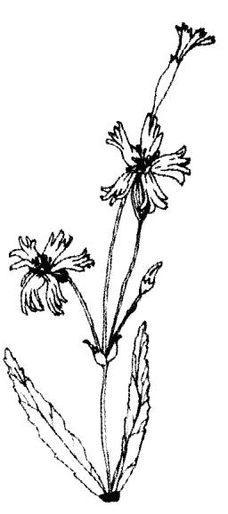

## XX、超越幻象

要脫離幻象需要一些努力，因為我們已經投資很多在它們裡面。它們是我的希望，我們透過它們在繼續生活。

頭腦生活在幻象之中。頭腦只不過是所有的幻象累積在你裡面：記憶的幻象，想像的幻象，以及夢、希望和慾望等幻象。在所有這些幻象的裡面：「我是」的幻象，或是「自我」的幻象。那是最根部，是幻象的核心，其他所有的幻象都圍繞在它的周圍。它們支持它，它們滋養它，是幻象的核心，其他被它所滋養，它是一種互惠的安排。在這兩者之間，你和你真實的存在就完全喪失了。

靜心只是意味著脫離這種幻象的狀態，脫離夢、慾望、過去、和未來，只是生活在圍繞著你的當下那一個片刻。完全存在於當下那個片刻，沒有思想，就是生活在真實的存在之中。要脫離幻象需要一些努力，因為我們已經生活在那些幻象裡面有很長的時間，它已經幾乎變成一個習慣，它已經幾乎成為我們的第二天性。它需要花一些努力的另外一個原因是：我們已經投資很多在它們裡面。它們是我們的希望，我們透過它們在繼續生活。放棄它們意味著放棄未來，放棄所有的希望，而我們不知道要如何不帶著希望地活在現在。

這就是整個藝術：不帶著希望地活在現在。記住：不帶著希望生活並不是意味著失望地過活。不帶著希望生活只是意味著當下這個片刻是那麼地美，誰會去管未來？誰會去理睬它？並不是說一個人生活在絕望和失望之中，而是一個人非常滿足於現在，以致於沒有留下任何空間去想未來。

一個過著失望生活的人是過著一種空虛的生活，他不知道現在是什麼，未來也消失了。他只是為未來在生活，他一直在追尋明天，但是明天永遠不會來。一個人繼續努力想要抓住未來，但是它永遠沒有辦法被抓到，所以他就繼續追逐下去。到了最後，死亡接管了，但是你永遠沒有辦法被抓住。這是無數的人的故事：他們一直生活在希望之中，但是不曾被滿足過，他們死的時候也是不滿足的。

不要帶著希望去生活只是意味著生活在此時此地，知道沒有明天，它一直都是今天，然後就會有一種完全不同的生活開始在你裡面結晶起來，它是那麼地喜悅，一個人不會去想過去，也不會去想未來。

唯有當現在非常空虛，我們才會去想過去和未來，因為我們不知道如何生活。在當下這個片刻。所以我們不是走向過去就是走向未來，因為我們不知道如何生活。在當下這個片刻，過去已經不復存在，而未來尚未存在，兩者都是空的，在這兩個空之間就是當下這個片刻，當下這個片刻就是一切。

好幾世紀以來，在東方我們一直在做的努力並不是去解決難題。比方說，在你的惡夢當中，有一隻獅子一直跟著你，你不知道要怎麼辦，你試著要去解決這個難題。心理分析就是這樣在做。或者你會試圖去找出它來自哪裡，它一開始是怎麼發生的——「為什麼這隻獅子會跟隨著你？這個恐懼來自哪裡？為什麼我要爬到樹上去？」然後你碰到一個很會分析事情、很會解釋事情的專家，他精於理論，他可以告訴你，一開始它是怎麼發生的。或許它是出生時的創傷，或者也許是你的雙親對你不好，或者也許這隻獅子代表某一個人。只要直接洞悉牠的眼睛——它是你太太或是你先生，你在害怕你太太或是你先生。那是基本的難題之所

在，難題並不在於那隻獅子來自哪裡，或者那隻獅子的象徵性意義是什麼。那不是真正的問題，真正的問題是你認為那隻獅子是真實的。心理分析是什麼。那助你去覺知頭腦是不真實的東西，是幻象，是馬亞（Maya）。事實上，它使你更陷入泥淖之中，它帶著你更深入根部，但是幻象不可能有任何起因。它將會一直想要走到根部，但是你不會到達。幻象不可能有任何起因。

讓我再重複一次，因為這將會使那個差別變得很清楚。幻象不可能有任何起因。起因，所以你無法找尋那個起因。你可以一直一直繼續下去。你可以進入一個事。容格進入更深，他找到了像集體潛意識這樣的东西。而且做得很好，但是它並沒有解決任何人的無意識……佛洛依德就是這樣做，而且做得很好，但是它並沒有解決任何後你可能會找到宇宙無意識，以及諸如此類的東西，一層又一層地。你可以繼續下去，然後你可能會找到宇宙無意識，以及諸如此類的東西，一層又一層地。你可以繼續下去，然後你可能會找到宇宙無意識，以及諸如此類的東西，一層又一層地。你可以繼續下去，然後你可能會找到宇宙無意識，以及諸如此類的東西，一層又一層地。你可以繼續下去，然後你可能會找到宇宙無意識，以及諸如此類的東西，一層又一層地。你可以繼續下去，然後你可能會找到宇宙無意識，以及諸如此類的東西，一層又一層地。你可以繼續下去，然後你可能會找到宇宙無意識，以及諸如此類的東西，一層又一層地。你可以繼續下去，然後你可能會找到宇宙無意識，以及諸如此類的東西，一層又一層地。你可以繼續下去，然後你可能會找到宇宙無意識，以及諸如此類的東西，一層又一層地。你可以繼續下去，然後你可能會找到宇宙無意識，以及諸如此類的東西，一層又一層地。你可以繼續下去，然後你可能會找到宇宙無意識，以及諸如此類的東西，一層又一層地。你可以繼續下去，然後你可能會找到宇宙無意識，以及諸如此類的東西，一層又一層地。你可以繼續下去，然後你可能會找到宇宙無意識，以及諸如此類的東西，一層又一層地。你可以繼續下去，然後你可能會找到宇宙無意識，以及諸如此類的東西，一層又一層地。你可以繼續下去，然後你可能會找到宇宙無意識，以及諸如此類的東西，一層又一層地。你可以繼續下去，然後你可能會找到宇宙無意識，以及諸如此類的東西，一層又一層地。你可以繼續下去，然後你可能會找到宇宙無意識，以及諸如此類的東西，一層又一層地。你可以繼續下去，然後你可能會找到宇宙無意識，以及諸如此類的東西，一層又一層地。你可以繼續下去，然後你可能會找到宇宙無意識，以及諸如此類的東西，一層又一層地。你可以繼續下去，然後你可能會找到宇宙無意識，以及諸如此類的東西，一層又一層地。你可以繼續下去，然後你可能會找到宇宙無意識，以及諸如此類的東西，一層又一層地。你可以繼續下去，然後你可能會找到宇宙無意識，以及諸如此類的東西，一層又一層地。你可以繼續下去，然後你可能會找到宇宙無意識，以及諸如此類的東西，一層又一層地。你可以繼續下去，然後你可能會找到宇宙無意識，以及諸如此類的東西，一層又一層地。你可以繼續下去，然後你可能會找到宇宙無意識，以及諸如此類的東西，一層又一層地。你可以繼續下去，然後你可能會找到宇宙無意識，以及諸如此類的東西，一層又一層地。你可以繼續下去，然後你可能會找到宇宙無意識，以及諸如此類的東西，一層又一層地。你可以繼續下去，然後你可能會找到宇宙無意識，以及諸如此類的東西，一層又一層地。你可以繼續下去，然後你可能會找到宇宙無意識，以及諸如此類的東西，一層又一層地。你可以繼續下去，然後你可能會找到宇宙無意識，以及諸如此類的東西，一層又一層地。你可以繼續下去，然後你可能會找到宇宙無意識，以及諸如此類的東西，一層又一層地。你可以繼續下去，然後你可能會找到宇宙無意識，以及諸如此類的東西，一層又一層地。你可以繼續下去，然後你可能會找到宇宙無意識，以及諸如此類的東西，一層又一層地。你可以繼續下去，然後你可能會找到宇宙無意識，以及諸如此類的東西，一層又一層地。你可以繼續下去，然後你可能會找到宇宙無意識，以及諸如此類的東西，一層又一層地。你可以繼續下去，然後你可能會找到宇宙無意識，以及諸如此類的東西，一層又一層地。你可以繼續下去，然後你可能會找到宇宙無意識，以及諸如此類的東西，一層又一層地。你可以繼續下去，然後你可能會找到宇宙無意識，以及諸如此類的東西，一層又一層地。你可以繼續下去，然後你可能會找到宇宙無意識，以及諸如此類的東西，一層又一層地。你可以繼續下去，然後你可能會找到宇宙無意識，以及諸如此類的東西，一層又一層地。你可以繼續下去，然後你可能會找到宇宙無意識，以及諸如此類的東西，一層又一層地。你可以繼續下去，然後你可能會找到宇宙無意識，以及諸如此類的東西，一層又一層地。你可以繼續下去，然後你可能會找到宇宙無意識，以及諸如此類的東西，一層又一層地。你可以繼續下去，然後你可能會找到宇宙無意識，以及諸如此類的東西，一層又一層地。你可以繼續下去，然後你可能會找到宇宙無意識，以及諸如此類的東西，一層又一層地。你可以繼續下去，然後你可能會找到宇宙無意識，以及諸如此類的東西，一層又一層地。你可以繼續下去，然後你可能會找到宇宙無意識，以及諸如此類的東西，一層又一層地。你可以繼續下去，然後你可能會找到宇宙無意識，以及諸如此類的東西，一層又一層地。你可以繼續下去，然後你可能會找到宇宙無意識，以及諸如此類的東西，一層又一層地。你可以繼續下去，然後你可能會找到宇宙無意識，以及諸如此類的東西，一層又一層地。你可以繼續下去，然後你可能會找到宇宙無意識，以及諸如此類的東西，一層又一層地。你可以繼續下去，然後你可能會找到宇宙無意識，以及諸如此類的東西，一層又一層地。你可以繼續下去，然後你可能會找到宇宙無意識，以及諸如此類的東西，一層又一層地。你可以繼續下去，然後你可能會找到宇宙無意識，以及諸如此類的東西，一層又一層地。你可以繼續下去，然後你可能會找到宇宙無意識，以及諸如此類的東西，一層又一層地。你可以繼續下去，然後你可能會找到宇宙無意識，以及諸如此類的東西，一層又一層地。你可以繼續下去，然後你可能會找到宇宙無意識，以及諸如此類的東西，一層又一層地。你可以繼續下去，然後你可能會找到宇宙無意識，以及諸如此類的東西，一層又一層地。你可以繼續下去，然後你可能會找到宇宙無意識，以及諸如此類的東西，一層又一層地。你可以繼續下去，然後你可能會找到宇宙無意識，以及諸如此類的東西，一層又一層地。你可以繼續下去，然後你可能會找到宇宙無意識，以及諸如此類的東西，一層又一層地。你可以繼續下去，然後你可能會找到宇宙無意識，以及諸如此類的東西，一層又一層地。你可以繼續下去，然後你可能會找到宇宙無意識，以及諸如此類的東西，一層又一層地。你可以繼續下去，然後你可能會找到宇宙無意識，以及諸如此類的東西，一層又一層地。你可以繼續下去，然後你可能會找到宇宙無意識，以及諸如此類的東西，一層又一層地。你可以繼續下去，然後你可能會找到宇宙無意識，以及諸如此類的東西，一層又一層地。你可以繼續下去，然後你可能會找到宇宙無意識，以及諸如此類的東西，一層又一層地。你可以繼續下去，然後你可能會找到宇宙無意識，以及諸如此類的東西，一層又一層地。你可以繼續下去，然後你可能會找到宇宙無意識，以及諸如此類的東西，一層又一層地。你可以繼續下去，然後你可能會找到宇宙無意識，以及諸如此類的東西，一層又一層地。你可以繼續下去，然後你可能會找到宇宙無意識，以及諸如此類的東西，一層又一層地。你可以繼續下去，然後你可能會找到宇宙無意識，以及諸如此類的東西，一層又一層地。你可以繼續下去，然後你可能會找到宇宙無意識，以及諸如此類的東西，一層又一層地。你可以繼續下去，然後你可能會找到宇宙無意識，以及諸如此類的東西，一層又一層地。你可以繼續下去，然後你可能會找到宇宙無意識，以及諸如此類的東西，一層又一層地。你可以繼續下去，然後你可能會找到宇宙無意識，以及諸如此類的東西，一層又一層地。你可以繼續下去，然後你可能會找到宇宙無意識，以及諸如此類的東西，一層又一層地。你可以繼續下去，然後你可能會找到宇宙無意識，以及諸如此類的東西，一層又一層地。你可以繼續下去，然後你可能會找到宇宙無意識，以及諸如此類的東西，一層又一層地。你可以繼續下去，然後你可能會找到宇宙無意識，以及諸如此類的東西，一層又一層地。你可以繼續下去，然後你可能會找到宇宙無意識，以及諸如此類的東西，一層又一層地。你可以繼續下去，然後你可能會找到宇宙無意識，以及諸如此類的東西，一層又一層地。你可以繼續下去，然後你可能會找到宇宙無意識，以及諸如此類的東西，一層又一層地。你可以繼續下去，然後你可能會找到宇宙無意識，以及諸如此類的東西，一層又一層地。你可以繼續下去，然後你可能會找到宇宙無意識，以及諸如此類的東西，一層又一層地。你可以繼續下去，然後你可能會找到宇宙無意識，以及諸如此類的東西，一層又一層地。你可以繼續下去，然後你可能會找到宇宙無意識，以及諸如此類的東西，一層又一層地。你可以繼續下去，然後你可能會找到宇宙無意識，以及諸如此類的東西，一層又一層地。你可以繼續下去，然後你可能會找到宇宙無意識，以及諸如此類的東西，一層又一層地。你可以繼續下去，然後你可能會找到宇宙無意識，以及諸如此類的東西，一層又一層地。你可以繼續下去，然後你可能會找到宇宙無意識，以及諸如此類的東西，一層又一層地。你可以繼續下去，然後你可能會找到宇宙無意識，以及諸如此類的東西，一層又一層地。你可以繼續下去，然後你可能會找到宇宙無意識，以及諸如此類的東西，一層又一層地。你可以繼續下去，然後你可能會找到宇宙無意識，以及諸如此類的東西，一層又一層地。你可以繼續下去，然後你可能會找到宇宙無意識，以及諸如此類的東西，一層又一層地。你可以繼續下去，然後你可能會找到宇宙無意識，以及諸如此類的東西，一層又一層地。你可以繼續下去，然後你可能會找到宇宙無意識，以及諸如此類的東西，一層又一層地。你可以繼續下去，然後你可能會找到宇宙無意識，以及諸如此類的東西，一層又一層地。你可以繼續下去，然後你可能會找到宇宙無意識，以及諸如此類的東西，一層又一層地。你可以繼續下去，然後你可能會找到宇宙無意識，以及諸如此類的東西，一層又一層地。你可以繼續下去，然後你可能會找到宇宙無意識，以及諸如此類的東西，一層又一層地。你可以繼續下去，然後你可能會找到宇宙無意識，以及諸如此類的東西，一層又一層地。你可以繼續下去，然後你可能會找到宇宙無意識，以及諸如此類的東西，一層又一層地。你可以繼續下去，然後你可能會找到宇宙無意識，以及諸如此類的東西，一層又一層地。你可以繼續下去，然後你可能會找到宇宙無意識，以及諸如此類的東西，一層又一層地。你可以繼續下去，然後你可能會找到宇宙無意識，以及諸如此類的東西，一層又一層地。你可以繼續下去，然後你可能會找到宇宙無意識，以及諸如此類的東西，一層又一層地。你可以繼續下去，然後你可能會找到宇宙無意識，以及諸如此類的東西，一層又一層地。你可以繼續下去，然後你可能會找到宇宙無意識，以及諸如此類的東西，一層又一層地。你可以繼續下去，然後你可能會找到宇宙無意識，以及諸如此類的東西，一層又一層地。你可以繼續下去，然後你可能會找到宇宙無意識，以及諸如此類的東西，一層又一層地。你可以繼續下去，然後你可能會找到宇宙無意識，以及諸如此類的東西，一層又一層地。你可以繼續下去，然後你可能會找到宇宙無意識，以及諸如此類的東西，一層又一層地。你可以繼續下去，然後你可能會找到宇宙無意識，以及諸如此類的東西，一層又一層地。你可以繼續下去，然後你可能會找到宇宙無意識，以及諸如此類的東西，一層又一層地。你可以繼續下去，然後你可能會找到宇宙無意識，以及諸如此類的東西，一層又一層地。你可以繼續下去，然後你可能會找到宇宙無意識，以及諸如此類的東西，一層又一層地。你可以繼續下去，然後你可能會找到宇宙無意識，以及諸如此類的東西，一層又一層地。你可以繼續下去，然後你可能會找到宇宙無意識，以及諸如此類的東西，一層又一層地。你可以繼續下去，然後你可能會找到宇宙無意識，以及諸如此類的東西，一層又一層地。你可以繼續下去，然後你可能會找到宇宙無意識，以及諸如此類的東西，一層又一層地。你可以繼續下去，然後你可能會找到宇宙無意識，以及諸如此類的東西，一層又一層地。你可以繼續下去，然後你可能會找到宇宙無意識，以及諸如此類的東西，一層又一層地。你可以繼續下去，然後你可能會找到宇宙無意識，以及諸如此類的東西，一層又一層地。你可以繼續下去，然後你可能會找到宇宙無意識，以及諸如此類的東西，一層又一層地。你可以繼續下去，然後你可能會找到宇宙無意識，以及諸如此類的東西，一層又一層地。你可以繼續下去，然後你可能會找到宇宙無意識，以及諸如此類的東西，一層又一層地。你可以繼續下去，然後你可能會找到宇宙無意識，以及諸如此類的東西，一層又一層地。你可以繼續下去，然後你可能會找到宇宙無意識，以及諸如此類的東西，一層又一層地。你可以繼續下去，然後你可能會找到宇宙無意識，以及諸如此類的東西，一層又一層地。你可以繼續下去，然後你可能會找到宇宙無意識，以及諸如此類的東西，一層又一層地。你可以繼續下去，然後你可能會找到宇宙無意識，以及諸如此類的東西，一層又一層地。你可以繼續下去，然後你可能會找到宇宙無意識，以及諸如此類的東西，一層又一層地。你可以繼續下去，然後你可能會找到宇宙無意識，以及諸如此類的東西，一層又一層地。你可以繼續下去，然後你可能會找到宇宙無意識，以及諸如此類的東西，一層又一層地。你可以繼續下去，然後你可能會找到宇宙無意識，以及諸如此類的東西，一層又一層地。你可以繼續下去，然後你可能會找到宇宙無意識，以及諸如此類的東西，一層又一層地。你可以繼續下去，然後你可能會找到宇宙無意識，以及諸如此類的東西，一層又一層地。你可以繼續下去，然後你可能會找到宇宙無意識，以及諸如此類的東西，一層又一層地。你可以繼續下去，然後你可能會找到宇宙無意識，以及諸如此類的東西，一層又一層地。你可以繼續下去，然後你可能會找到宇宙無意識，以及諸如此類的東西，一層又一層地。你可以繼續下去，然後你可能會找到宇宙無意識，以及諸如此類的東西，一層又一層地。你可以繼續下去，然後你可能會找到宇宙無意識，以及諸如此類的東西，一層又一層地。你可以繼續下去，然後你可能會找到宇宙無意識，以及諸如此類的東西，一層又一層地。你可以繼續下去，然後你可能會找到宇宙無意識，以及諸如此類的東西，一層又一層地。你可以繼續下去，然後你可能會找到宇宙無意識，以及諸如此類的東西，一層又一層地。你可以繼續下去，然後你可能會找到宇宙無意識，以及諸如此類的東西，一層又一層地。你可以繼續下去，然後你可能會找到宇宙無意識，以及諸如此類的東西，一層又一層地。你可以繼續下去，然後你可能會找到宇宙無意識，以及諸如此類的東西，一層又一層地。你可以繼續下去，然後你可能會找到宇宙無意識，以及諸如此類的東西，一層又一層地。你可以繼續下去，然後你可能會找到宇宙無意識，以及諸如此類的東西，一層又一層地。你可以繼續下去，然後你可能會找到宇宙無意識，以及諸如此類的東西，一層又一層地。你可以繼續下去，然後你可能會找到宇宙無意識，以及諸如此類的東西，一層又一層地。你可以繼續下去，然後你可能會找到宇宙無意識，以及諸如此類的東西，一層又一層地。你可以繼續下去，然後你可能會找到宇宙無意識，以及諸如此類的東西，一層又一層地。你可以繼續下去，然後你可能會找到宇宙無意識，以及諸如此類的東西，一層又一層地。你可以繼續下去，然後你可能會找到宇宙無意識，以及諸如此類的東西，一層又一層地。你可以繼續下去，然後你可能會找到宇宙無意識，以及諸如此類的東西，一層又一層地。你可以繼續下去，然後你可能會找到宇宙無意識，以及諸如此類的東西，一層又一層地。你可以繼續下去，然後你可能會找到宇宙無意識，以及諸如此類的東西，一層又一層地。你可以繼續下去，然後你可能會找到宇宙無意識，以及諸如此類的東西，一層又一層地。你可以繼續下去，然後你可能會找到宇宙無意識，以及諸如此類的東西，一層又一層地。你可以繼續下去，然後你可能會找到宇宙無意識，以及諸如此類的東西，一層又一層地。你可以繼續下去，然後你可能會找到宇宙無意識，以及諸如此類的東西，一層又一層地。你可以繼續下去，然後你可能會找到宇宙無意識，以及諸如此類的東西，一層又一層地。你可以繼續下去，然後你可能會找到宇宙無意識，以及諸如此類的東西，一層又一層地。你可以繼續下去，然後你可能會找到宇宙無意識，以及諸如此類的東西，一層又一層地。你可以繼續下去，然後你可能會找到宇宙無意識，以及諸如此類的東西，一層又一層地。你可以繼續下去，然後你可能會找到宇宙無意識，以及諸如此類的東西，一層又一層地。你可以繼續下去，然後你可能會找到宇宙無意識，以及諸如此類的東西，一層又一層地。你可以繼續下去，然後你可能會找到宇宙無意識，以及諸如此類的東西，一層又一層地。你可以繼續下去，然後你可能會找到宇宙無意識，以及諸如此類的東西，一層又一層地。你可以繼續下去，然後你可能會找到宇宙無意識，以及諸如此類的東西，一層又一層地。你可以繼續下去，然後你可能會找到宇宙無意識，以及諸如此類的東西，一層又一層地。你可以繼續下去，然後你可能會找到宇宙無意識，以及諸如此類的東西，一層又一層地。你可以繼續下去，然後你可能會找到宇宙無意識，以及諸如此類的東西，一層又一層地。你可以繼續下去，然後你可能會找到宇宙無意識，以及諸如此類的東西，一層又一層地。你可以繼續下去，然後你可能會找到宇宙無意識，以及諸如此類的東西，一層又一層地。你可以繼續下去，然後你可能會找到宇宙無意識，以及諸如此類的東西，一層又一層地。你可以繼續下去，然後你可能會找到宇宙無意識，以及諸如此類的東西，一層又一層地。你可以繼續下去，然後你可能會找到宇宙無意識，以及諸如此類的東西，一層又一層地。你可以繼續下去，然後你可能會找到宇宙無意識，以及諸如此類的東西，一層又一層地。你可以繼續下去，然後你可能會找到宇宙無意識，以及諸如此類的東西，一層又一層地。你可以繼續下去，然後你可能會找到宇宙無意識，以及諸如此類的東西，一層又一層地。你可以繼續下去，然後你可能會找到宇宙無意識，以及諸如此類的東西，一層又一層地。你可以繼續下去，然後你可能會找到宇宙無意識，以及諸如此類的東西，一層又一層地。你可以繼續下去，然後你可能會找到宇宙無意識，以及諸如此類的東西，一層又一層地。你可以繼續下去，然後你可能會找到宇宙無意識，以及諸如此類的東西，一層又一層地。你可以繼續下去，然後你可能會找到宇宙無意識，以及諸如此類的東西，一層又一層地。你可以繼續下去，然後你可能會找到宇宙無意識，以及諸如此類的東西，一層又一層地。你可以繼續下去，然後你可能會找到宇宙無意識，以及諸如此類的東西，一層又一層地。你可以繼續下去，然後你可能會找到宇宙無意識，以及諸如此類的東西，一層又一層地。你可以繼續下去，然後你可能會找到宇宙無意識，以及諸如此類的東西，一層又一層地。你可以繼續下去，然後你可能會找到宇宙無意識，以及諸如此類的東西，一層又一層地。你可以繼續下去，然後你可能會找到宇宙無意識，以及諸如此類的東西，一層又一層地。你可以繼續下去，然後你可能會找到宇宙無意識，以及諸如此類的東西，一層又一層地。你可以繼續下去，然後你可能會找到宇宙無意識，以及諸如此類的東西，一層又一層地。你可以繼續下去，然後你可能會找到宇宙無意識，以及諸如此類的東西，一層又一層地。你可以繼續下去，然後你可能會找到宇宙無意識，以及諸如此類的東西，一層又一層地。你可以繼續下去，然後你可能會找到宇宙無意識，以及諸如此類的東西，一層又一層地。你可以繼續下去，然後你可能會找到宇宙無意識，以及諸如此類的東西，一層又一層地。你可以繼續下去，然後你可能會找到宇宙無意識，以及諸如此類的東西，一層又一層地。你可以繼續下去，然後你可能會找到宇宙無意識，以及諸如此類的東西，一層又一層地。你可以繼續下去，然後你可能會找到宇宙無意識，以及諸如此類的東西，一層又一層地。你可以繼續下去，然後你可能會找到宇宙無意識，以及諸如此類的東西，一層又一層地。你可以繼續下去，然後你可能會找到宇宙無意識，以及諸如此類的東西，一層又一層地。你可以繼續下去，然後你可能會找到宇宙無意識，以及諸如此類的東西，一層又一層地。你可以繼續下去，然後你可能會找到宇宙無意識，以及諸如此類的東西，一層又一層地。你可以繼續下去，然後你可能會找到宇宙無意識，以及諸如此類的東西，一層又一層地。你可以繼續下去，然後你可能會找到宇宙無意識，以及諸如此類的東西，一層又一層地。你可以繼續下去，然後你可能會找到宇宙無意識，以及諸如此類的東西，一層又一層地。你可以繼續下去，然後你可能會找到宇宙無意識，以及諸如此類的東西，一層又一層地。你可以繼續下去，然後你可能會找到宇宙無意識，以及諸如此類的東西，一層又一層地。你可以繼續下去，然後你可能會找到宇宙無意識，以及諸如此類的東西，一層又一層地。你可以繼續下去，然後你可能會找到宇宙無意識，以及諸如此類的東西，一層又一層地。你可以繼續下去，然後你可能會找到宇宙無意識，以及諸如此類的東西，一層又一層地。你可以繼續下去，然後你可能會找到宇宙無意識，以及諸如此類的東西，一層又一層地。你可以繼續下去，然後你可能會找到宇宙無意識，以及諸如此類的東西，一層又一層地。你可以繼續下去，然後你可能會找到宇宙無意識，以及諸如此類的東西，一層又一層地。你可以繼續下去，然後你可能會找到宇宙無意識，以及諸如此類的東西，一層又一層地。你可以繼續下去，然後你可能會找到宇宙無意識，以及諸如此類的東西，一層又一層地。你可以繼續下去，然後你可能會找到宇宙無意識，以及諸如此類的東西，一層又一層地。你可以繼續下去，然後你可能會找到宇宙無意識，以及諸如此類的東西，一層又一層地。你可以繼續下去，然後你可能會找到宇宙無意識，以及諸如此類的東西，一層又一層地。你可以繼續下去，然後你可能會找到宇宙無意識，以及諸如此類的東西，一層又一層地。你可以繼續下去，然後你可能會找到宇宙無意識，以及諸如此類的東西，一層又一層地。你可以繼續下去，然後你可能會找到宇宙無意識，以及諸如此類的東西，一層又一層地。你可以繼續下去，然後你可能會找到宇宙無意識，以及諸如此類的東西，一層又一層地。你可以繼續下去，然後你可能會找到宇宙無意識，以及諸如此類的東西，一層又一層地。你可以繼續下去，然後你可能會找到宇宙無意識，以及諸如此類的東西，一層又一層地。你可以繼續下去，然後你可能會找到宇宙無意識，以及諸如此類的東西，一層又一層地。你可以繼續下去，然後你可能會找到宇宙無意識，以及諸如此類的東西，一層又一層地。你可以繼續下去，然後你可能會找到宇宙無意識，以及諸如此類的東西，一層又一層地。你可以繼續下去，然後你可能會找到宇宙無意識，以及諸如此類的東西，一層又一層地。你可以繼續下去，然後你可能會找到宇宙無意識，以及諸如此類的東西，一層又一層地。你可以繼續下去，然後你可能會找到宇宙無意識，以及諸如此類的東西，一層又一層地。你可以繼續下去，然後你可能會找到宇宙無意識，以及諸如此類的東西，一層又一層地。你可以繼續下去，然後你可能會找到宇宙無意識，以及諸如此類的東西，一層又一層地。你可以繼續下去，然後你可能會找到宇宙無意識，以及諸如此類的東西，一層又一層地。你可以繼續下去，然後你可能會找到宇宙無意識，以及諸如此類的東西，一層又一層地。你可以繼續下去，然後你可能會找到宇宙無意識，以及諸如此類的東西，一層又一層地。你可以繼續下去，然後你可能會找到宇宙無意識，以及諸如此類的東西，一層又一層地。你可以繼續下去，然後你可能會找到宇宙無意識，以及諸如此類的東西，一層又一層地。你可以繼續下去，然後你可能會找到宇宙無意識，以及諸如此類的東西，一層又一層地。你可以繼續下去，然後你可能會找到宇宙無意識，以及諸如此類的東西，一層又一層

## XX、超越幻象

他們說『前世』，還有『前世的前世』，然後繼續往前推，但是你什麼地方都沒去成。不論你是走哪一條路，你都會碰到一個點，在那個點上你會看到這整個事情都沒有用。

看清頭腦的沒有用，看清幻象不可能有任何起因，它是無法被分析的，那麼唯一你所能夠做的事就是使你自己變得警覺一點、覺知一點。在那個覺知當中，夢就消失了，它就不會抓住你。一旦頭腦不會在那裡抓住你，你就成為一個完全新的人，一個新的意識在你裡面誕生了。

## 生命的遊戲 096

## XXI、完成

記住一個基本的法則：任何完成的事都會被拋掉，因為如此一來再攜帶著它就沒有意義了；任何未完成的事都會停留，它會等著被完成。存在真的是一直都在追求完成。整個存在有一個基本的傾向，就是要將每一件事完成。它不喜歡未完成的事，因為它會懸在那裡，它會等在那裡，而且，存在不會匆匆忙，它可以等上幾百萬年。

你記得任何你已經完成的事嗎？在你的人生當中有任何片刻或任何經驗你可以說它是已經完成或是很全然的嗎？如果你有任何完成的經驗，頭腦永遠都不會回到那個點，因為那是不需要的。根本就 不需要！它是完全沒有用的。頭腦會試圖去完成每一件事。頭腦有一個想要完成的傾向，這是必要的，否則不可能生活。所以每一個人在自己的內在所攜帶的經常性的自言自語事實上是你錯誤生活的部分──未完成的生活。沒有一件事是結束的，然後你又繼續從事新的開始，如此一來，頭腦就繼續堆積未完成的事情。它們永遠無法被完成，但是它們會變成頭腦的重擔──經常的重擔，越來越增加的重擔──那產生出自言自語。

那就是為什麼當你變得越老，你就會有越多的自言自語。老年人會開始大聲講話，因為那個擔子變得太重而失去控制。注意看老年人，他們坐在那裡腳會一直動，或者他們會自言自語或是做出某些身體的姿勢。他們到底在幹什麼？你認為他們瘋了，你認為他們年紀老了，所以變得比較笨，不，情形並不是那樣，是因為他們有一個很長的未完成的生命，所以如果死亡已經越來越接近，頭腦急著想要完成每一件事，但它似乎不可能！所以如果你真的想要停止這個自言自語，換句話說想要達到寧靜，那麼就不可能！所以如果你真的想要停止這個自言自語，換句話說想要達到寧靜，那麼就不可能！所以如果你真的想要停止這個自言自語，換句話說想要達到寧靜，那麼就不可能！所以如果你真的想要停止這個自言自語，換句話說想要達到寧靜，那麼就不可能！所以如果你真的想要停止這個自言自語，換句話說想要達到寧靜，那麼就不可能！所以如果你真的想要停止這個自言自語，換句話說想要達到寧靜，那麼就不可能！所以如果你真的想要停止這個自言自語，換句話說想要達到寧靜，那麼就不可能！所以如果你真的想要停止這個自言自語，換句話說想要達到寧靜，那麼就不可能！所以如果你真的想要停止這個自言自語，換句話說想要達到寧靜，那麼就不可能！所以如果你真的想要停止這個自言自語，換句話說想要達到寧靜，那麼就不可能！所以如果你真的想要停止這個自言自語，換句話說想要達到寧靜，那麼就不可能！所以如果你真的想要停止這個自言自語，換句話說想要達到寧靜，那麼就不可能！所以如果你真的想要停止這個自言自語，換句話說想要達到寧靜，那麼就不可能！所以如果你真的想要停止這個自言自語，換句話說想要達到寧靜，那麼就不可能！所以如果你真的想要停止這個自言自語，換句話說想要達到寧靜，那麼就不可能！所以如果你真的想要停止這個自言自語，換句話說想要達到寧靜，那麼就不可能！所以如果你真的想要停止這個自言自語，換句話說想要達到寧靜，那麼就不可能！所以如果你真的想要停止這個自言自語，換句話說想要達到寧靜，那麼就不可能！所以如果你真的想要停止這個自言自語，換句話說想要達到寧靜，那麼就不可能！所以如果你真的想要停止這個自言自語，換句話說想要達到寧靜，那麼就不可能！所以如果你真的想要停止這個自言自語，換句話說想要達到寧靜，那麼就不可能！所以如果你真的想要停止這個自言自語，換句話說想要達到寧靜，那麼就不可能！所以如果你真的想要停止這個自言自語，換句話說想要達到寧靜，那麼就不可能！所以如果你真的想要停止這個自言自語，換句話說想要達到寧靜，那麼就不可能！所以如果你真的想要停止這個自言自語，換句話說想要達到寧靜，那麼就不可能！所以如果你真的想要停止這個自言自語，換句話說想要達到寧靜，那麼就不可能！所以如果你真的想要停止這個自言自語，換句話說想要達到寧靜，那麼就不可能！所以如果你真的想要停止這個自言自語，換句話說想要達到寧靜，那麼就不可能！所以如果你真的想要停止這個自言自語，換句話說想要達到寧靜，那麼就不可能！所以如果你真的想要停止這個自言自語，換句話說想要達到寧靜，那麼就不可能！所以如果你真的想要停止這個自言自語，換句話說想要達到寧靜，那麼就不可能！所以如果你真的想要停止這個自言自語，換句話說想要達到寧靜，那麼就不可能！所以如果你真的想要停止這個自言自語，換句話說想要達到寧靜，那麼就不可能！所以如果你真的想要停止這個自言自語，換句話說想要達到寧靜，那麼就不可能！所以如果你真的想要停止這個自言自語，換句話說想要達到寧靜，那麼就不可能！所以如果你真的想要停止這個自言自語，換句話說想要達到寧靜，那麼就不可能！所以如果你真的想要停止這個自言自語，換句話說想要達到寧靜，那麼就不可能！所以如果你真的想要停止這個自言自語，換句話說想要達到寧靜，那麼就不可能！所以如果你真的想要停止這個自言自語，換句話說想要達到寧靜，那麼就不可能！所以如果你真的想要停止這個自言自語，換句話說想要達到寧靜，那麼就不可能！所以如果你真的想要停止這個自言自語，換句話說想要達到寧靜，那麼就不可能！所以如果你真的想要停止這個自言自語，換句話說想要達到寧靜，那麼就不可能！所以如果你真的想要停止這個自言自語，換句話說想要達到寧靜，那麼就不可能！所以如果你真的想要停止這個自言自語，換句話說想要達到寧靜，那麼就不可能！所以如果你真的想要停止這個自言自語，換句話說想要達到寧靜，那麼就不可能！所以如果你真的想要停止這個自言自語，換句話說想要達到寧靜，那麼就不可能！所以如果你真的想要停止這個自言自語，換句話說想要達到寧靜，那麼就不可能！所以如果你真的想要停止這個自言自語，換句話說想要達到寧靜，那麼就不可能！所以如果你真的想要停止這個自言自語，換句話說想要達到寧靜，那麼就不可能！所以如果你真的想要停止這個自言自語，換句話說想要達到寧靜，那麼就不可能！所以如果你真的想要停止這個自言自語，換句話說想要達到寧靜，那麼就不可能！所以如果你真的想要停止這個自言自語，換句話說想要達到寧靜，那麼就不可能！所以如果你真的想要停止這個自言自語，換句話說想要達到寧靜，那麼就不可能！所以如果你真的想要停止這個自言自語，換句話說想要達到寧靜，那麼就不可能！所以如果你真的想要停止這個自言自語，換句話說想要達到寧靜，那麼就不可能！所以如果你真的想要停止這個自言自語，換句話說想要達到寧靜，那麼就不可能！所以如果你真的想要停止這個自言自語，換句話說想要達到寧靜，那麼就不可能！所以如果你真的想要停止這個自言自語，換句話說想要達到寧靜，那麼就不可能！所以如果你真的想要停止這個自言自語，換句話說想要達到寧靜，那麼就不可能！所以如果你真的想要停止這個自言自語，換句話說想要達到寧靜，那麼就不可能！所以如果你真的想要停止這個自言自語，換句話說想要達到寧靜，那麼就不可能！所以如果你真的想要停止這個自言自語，換句話說想要達到寧靜，那麼就不可能！所以如果你真的想要停止這個自言自語，換句話說想要達到寧靜，那麼就不可能！所以如果你真的想要停止這個自言自語，換句話說想要達到寧靜，那麼就不可能！所以如果你真的想要停止這個自言自語，換句話說想要達到寧靜，那麼就不可能！所以如果你真的想要停止這個自言自語，換句話說想要達到寧靜，那麼就不可能！所以如果你真的想要停止這個自言自語，換句話說想要達到寧靜，那麼就不可能！所以如果你真的想要停止這個自言自語，換句話說想要達到寧靜，那麼就不可能！所以如果你真的想要停止這個自言自語，換句話說想要達到寧靜，那麼就不可能！所以如果你真的想要停止這個自言自語，換句話說想要達到寧靜，那麼就不可能！所以如果你真的想要停止這個自言自語，換句話說想要達到寧靜，那麼就不可能！所以如果你真的想要停止這個自言自語，換句話說想要達到寧靜，那麼就不可能！所以如果你真的想要停止這個自言自語，換句話說想要達到寧靜，那麼就不可能！所以如果你真的想要停止這個自言自語，換句話說想要達到寧靜，那麼就不可能！所以如果你真的想要停止這個自言自語，換句話說想要達到寧靜，那麼就不可能！所以如果你真的想要停止這個自言自語，換句話說想要達到寧靜，那麼就不可能！所以如果你真的想要停止這個自言自語，換句話說想要達到寧靜，那麼就不可能！所以如果你真的想要停止這個自言自語，換句話說想要達到寧靜，那麼就不可能！所以如果你真的想要停止這個自言自語，換句話說想要達到寧靜，那麼就不可能！所以如果你真的想要停止這個自言自語，換句話說想要達到寧靜，那麼就不可能！所以如果你真的想要停止這個自言自語，換句話說想要達到寧靜，那麼就不可能！所以如果你真的想要停止這個自言自語，換句話說想要達到寧靜，那麼就不可能！所以如果你真的想要停止這個自言自語，換句話說想要達到寧靜，那麼就不可能！所以如果你真的想要停止這個自言自語，換句話說想要達到寧靜，那麼就不可能！所以如果你真的想要停止這個自言自語，換句話說想要達到寧靜，那麼就不可能！所以如果你真的想要停止這個自言自語，換句話說想要達到寧靜，那麼就不可能！所以如果你真的想要停止這個自言自語，換句話說想要達到寧靜，那麼就不可能！所以如果你真的想要停止這個自言自語，換句話說想要達到寧靜，那麼就不可能！所以如果你真的想要停止這個自言自語，換句話說想要達到寧靜，那麼就不可能！所以如果你真的想要停止這個自言自語，換句話說想要達到寧靜，那麼就不可能！所以如果你真的想要停止這個自言自語，換句話說想要達到寧靜，那麼就不可能！所以如果你真的想要停止這個自言自語，換句話說想要達到寧靜，那麼就不可能！所以如果你真的想要停止這個自言自語，換句話說想要達到寧靜，那麼就不可能！所以如果你真的想要停止這個自言自語，換句話說想要達到寧靜，那麼就不可能！所以如果你真的想要停止這個自言自語，換句話說想要達到寧靜，那麼就不可能！所以如果你真的想要停止這個自言自語，換句話說想要達到寧靜，那麼就不可能！所以如果你真的想要停止這個自言自語，換句話說想要達到寧靜，那麼就不可能！所以如果你真的想要停止這個自言自語，換句話說想要達到寧靜，那麼就不可能！所以如果你真的想要停止這個自言自語，換句話說想要達到寧靜，那麼就不可能！所以如果你真的想要停止這個自言自語，換句話說想要達到寧靜，那麼就不可能！所以如果你真的想要停止這個自言自語，換句話說想要達到寧靜，那麼就不可能！所以如果你真的想要停止這個自言自語，換句話說想要達到寧靜，那麼就不可能！所以如果你真的想要停止這個自言自語，換句話說想要達到寧靜，那麼就不可能！所以如果你真的想要停止這個自言自語，換句話說想要達到寧靜，那麼就不可能！所以如果你真的想要停止這個自言自語，換句話說想要達到寧靜，那麼就不可能！所以如果你真的想要停止這個自言自語，換句話說想要達到寧靜，那麼就不可能！所以如果你真的想要停止這個自言自語，換句話說想要達到寧靜，那麼就不可能！所以如果你真的想要停止這個自言自語，換句話說想要達到寧靜，那麼就不可能！所以如果你真的想要停止這個自言自語，換句話說想要達到寧靜，那麼就不可能！所以如果你真的想要停止這個自言自語，換句話說想要達到寧靜，那麼就不可能！所以如果你真的想要停止這個自言自語，換句話說想要達到寧靜，那麼就不可能！所以如果你真的想要停止這個自言自語，換句話說想要達到寧靜，那麼就不可能！所以如果你真的想要停止這個自言自語，換句話說想要達到寧靜，那麼就不可能！所以如果你真的想要停止這個自言自語，換句話說想要達到寧靜，那麼就不可能！所以如果你真的想要停止這個自言自語，換句話說想要達到寧靜，那麼就不可能！所以如果你真的想要停止這個自言自語，換句話說想要達到寧靜，那麼就不可能！所以如果你真的想要停止這個自言自語，換句話說想要達到寧靜，那麼就不可能！所以如果你真的想要停止這個自言自語，換句話說想要達到寧靜，那麼就不可能！所以如果你真的想要停止這個自言自語，換句話說想要達到寧靜，那麼就不可能！所以如果你真的想要停止這個自言自語，換句話說想要達到寧靜，那麼就不可能！所以如果你真的想要停止這個自言自語，換句話說想要達到寧靜，那麼就不可能！所以如果你真的想要停止這個自言自語，換句話說想要達到寧靜，那麼就不可能！所以如果你真的想要停止這個自言自語，換句話說想要達到寧靜，那麼就不可能！所以如果你真的想要停止這個自言自語，換句話說想要達到寧靜，那麼就不可能！所以如果你真的想要停止這個自言自語，換句話說想要達到寧靜，那麼就不可能！所以如果你真的想要停止這個自言自語，換句話說想要達到寧靜，那麼就不可能！所以如果你真的想要停止這個自言自語，換句話說想要達到寧靜，那麼就不可能！所以如果你真的想要停止這個自言自語，換句話說想要達到寧靜，那麼就不可能！所以如果你真的想要停止這個自言自語，換句話說想要達到寧靜，那麼就不可能！所以如果你真的想要停止這個自言自語，換句話說想要達到寧靜，那麼就不可能！所以如果你真的想要停止這個自言自語，換句話說想要達到寧靜，那麼就不可能！所以如果你真的想要停止這個自言自語，換句話說想要達到寧靜，那麼就不可能！所以如果你真的想要停止這個自言自語，換句話說想要達到寧靜，那麼就不可能！所以如果你真的想要停止這個自言自語，換句話說想要達到寧靜，那麼就不可能！所以如果你真的想要停止這個自言自語，換句話說想要達到寧靜，那麼就不可能！所以如果你真的想要停止這個自言自語，換句話說想要達到寧靜，那麼就不可能！所以如果你真的想要停止這個自言自語，換句話說想要達到寧靜，那麼就不可能！所以如果你真的想要停止這個自言自語，換句話說想要達到寧靜，那麼就不可能！所以如果你真的想要停止這個自言自語，換句話說想要達到寧靜，那麼就不可能！所以如果你真的想要停止這個自言自語，換句話說想要達到寧靜，那麼就不可能！所以如果你真的想要停止這個自言自語，換句話說想要達到寧靜，那麼就不可能！所以如果你真的想要停止這個自言自語，換句話說想要達到寧靜，那麼就不可能！所以如果你真的想要停止這個自言自語，換句話說想要達到寧靜，那麼就不可能！所以如果你真的想要停止這個自言自語，換句話說想要達到寧靜，那麼就不可能！所以如果你真的想要停止這個自言自語，換句話說想要達到寧靜，那麼就不可能！所以如果你真的想要停止這個自言自語，換句話說想要達到寧靜，那麼就不可能！所以如果你真的想要停止這個自言自語，換句話說想要達到寧靜，那麼就不可能！所以如果你真的想要停止這個自言自語，換句話說想要達到寧靜，那麼就不可能！所以如果你真的想要停止這個自言自語，換句話說想要達到寧靜，那麼就不可能！所以如果你真的想要停止這個自言自語，換句話說想要達到寧靜，那麼就不可能！所以如果你真的想要停止這個自言自語，換句話說想要達到寧靜，那麼就不可能！所以如果你真的想要停止這個自言自語，換句話說想要達到寧靜，那麼就不可能！所以如果你真的想要停止這個自言自語，換句話說想要達到寧靜，那麼就不可能！所以如果你真的想要停止這個自言自語，換句話說想要達到寧靜，那麼就不可能！所以如果你真的想要停止這個自言自語，換句話說想要達到寧靜，那麼就不可能！所以如果你真的想要停止這個自言自語，換句話說想要達到寧靜，那麼就不可能！所以如果你真的想要停止這個自言自語，換句話說想要達到寧靜，那麼就不可能！所以如果你真的想要停止這個自言自語，換句話說想要達到寧靜，那麼就不可能！所以如果你真的想要停止這個自言自語，換句話說想要達到寧靜，那麼就不可能！所以如果你真的想要停止這個自言自語，換句話說想要達到寧靜，那麼就不可能！所以如果你真的想要停止這個自言自語，換句話說想要達到寧靜，那麼就不可能！所以如果你真的想要停止這個自言自語，換句話說想要達到寧靜，那麼就不可能！所以如果你真的想要停止這個自言自語，換句話說想要達到寧靜，那麼就不可能！所以如果你真的想要停止這個自言自語，換句話說想要達到寧靜，那麼就不可能！所以如果你真的想要停止這個自言自語，換句話說想要達到寧靜，那麼就不可能！所以如果你真的想要停止這個自言自語，換句話說想要達到寧靜，那麼就不可能！所以如果你真的想要停止這個自言自語，換句話說想要達到寧靜，那麼就不可能！所以如果你真的想要停止這個自言自語，換句話說想要達到寧靜，那麼就不可能！所以如果你真的想要停止這個自言自語，換句話說想要達到寧靜，那麼就不可能！所以如果你真的想要停止這個自言自語，換句話說想要達到寧靜，那麼就不可能！所以如果你真的想要停止這個自言自語，換句話說想要達到寧靜，那麼就不可能！所以如果你真的想要停止這個自言自語，換句話說想要達到寧靜，那麼就不可能！所以如果你真的想要停止這個自言自語，換句話說想要達到寧靜，那麼就不可能！所以如果你真的想要停止這個自言自語，換句話說想要達到寧靜，那麼就不可能！所以如果你真的想要停止這個自言自語，換句話說想要達到寧靜，那麼就不可能！所以如果你真的想要停止這個自言自語，換句話說想要達到寧靜，那麼就不可能！所以如果你真的想要停止這個自言自語，換句話說想要達到寧靜，那麼就不可能！所以如果你真的想要停止這個自言自語，換句話說想要達到寧靜，那麼就不可能！所以如果你真的想要停止這個自言自語，換句話說想要達到寧靜，那麼就不可能！所以如果你真的想要停止這個自言自語，換句話說想要達到寧靜，那麼就不可能！所以如果你真的想要停止這個自言自語，換句話說想要達到寧靜，那麼就不可能！所以如果你真的想要停止這個自言自語，換句話說想要達到寧靜，那麼就不可能！所以如果你真的想要停止這個自言自語，換句話說想要達到寧靜，那麼就不可能！所以如果你真的想要停止這個自言自語，換句話說想要達到寧靜，那麼就不可能！所以如果你真的想要停止這個自言自語，換句話說想要達到寧靜，那麼就不可能！所以如果你真的想要停止這個自言自語，換句話說想要達到寧靜，那麼就不可能！所以如果你真的想要停止這個自言自語，換句話說想要達到寧靜，那麼就不可能！所以如果你真的想要停止這個自言自語，換句話說想要達到寧靜，那麼就不可能！所以如果你真的想要停止這個自言自語，換句話說想要達到寧靜，那麼就不可能！所以如果你真的想要停止這個自言自語，換句話說想要達到寧靜，那麼就不可能！所以如果你真的想要停止這個自言自語，換句話說想要達到寧靜，那麼就不可能！所以如果你真的想要停止這個自言自語，換句話說想要達到寧靜，那麼就不可能！所以如果你真的想要停止這個自言自語，換句話說想要達到寧靜，那麼就不可能！所以如果你真的想要停止這個自言自語，換句話說想要達到寧靜，那麼就不可能！所以如果你真的想要停止這個自言自語，換句話說想要達到寧靜，那麼就不可能！所以如果你真的想要停止這個自言自語，換句話說想要達到寧靜，那麼就不可能！所以如果你真的想要停止這個自言自語，換句話說想要達到寧靜，那麼就不可能！所以如果你真的想要停止這個自言自語，換句話說想要達到寧靜，那麼就不可能！所以如果你真的想要停止這個自言自語，換句話說想要達到寧靜，那麼就不可能！所以如果你真的想要停止這個自言自語，換句話說想要達到寧靜，那麼就不可能！所以如果你真的想要停止這個自言自語，換句話說想要達到寧靜，那麼就不可能！所以如果你真的想要停止這個自言自語，換句話說想要達到寧靜，那麼就不可能！所以如果你真的想要停止這個自言自語，換句話說想要達到寧靜，那麼就不可能！所以如果你真的想要停止這個自言自語，換句話說想要達到寧靜，那麼就不可能！所以如果你真的想要停止這個自言自語，換句話說想要達到寧靜，那麼就不可能！所以如果你真的想要停止這個自言自語，換句話說想要達到寧靜，那麼就不可能！所以如果你真的想要停止這個自言自語，換句話說想要達到寧靜，那麼就不可能！所以如果你真的想要停止這個自言自語，換句話說想要達到寧靜，那麼就不可能！所以如果你真的想要停止這個自言自語，換句話說想要達到寧靜，那麼就不可能！所以如果你真的想要停止這個自言自語，換句話說想要達到寧靜，那麼就不可能！所以如果你真的想要停止這個自言自語，換句話說想要達到寧靜，那麼就不可能！所以如果你真的想要停止這個自言自語，換句話說想要達到寧靜，那麼就不可能！所以如果你真的想要停止這個自言自語，換句話說想要達到寧靜，那麼就不可能！所以如果你真的想要停止這個自言自語，換句話說想要達到寧靜，那麼就不可能！所以如果你真的想要停止這個自言自語，換句話說想要達到寧靜，那麼就不可能！所以如果你真的想要停止這個自言自語，換句話說想要達到寧靜，那麼就不可能！所以如果你真的想要停止這個自言自語，換句話說想要達到寧靜，那麼就不可能！所以如果你真的想要停止這個自言自語，換句話說想要達到寧靜，那麼就不可能！所以如果你真的想要停止這個自言自語，換句話說想要達到寧靜，那麼就不可能！所以如果你真的想要停止這個自言自語，換句話說想要達到寧靜，那麼就不可能！所以如果你真的想要停止這個自言自語，換句話說想要達到寧靜，那麼就不可能！所以如果你真的想要停止這個自言自語，換句話說想要達到寧靜，那麼就不可能！所以如果你真的想要停止這個自言自語，換句話說想要達到寧靜，那麼就不可能！所以如果你真的想要停止這個自言自語，換句話說想要達到寧靜，那麼就不可能！所以如果你真的想要停止這個自言自語，換句話說想要達到寧靜，那麼就不可能！所以如果你真的想要停止這個自言自語，換句話說想要達到寧靜，那麼就不可能！所以如果你真的想要停止這個自言自語，換句話說想要達到寧靜，那麼就不可能！所以如果你真的想要停止這個自言自語，換句話說想要達到寧靜，那麼就不可能！所以如果你真的想要停止這個自言自語，換句話說想要達到寧靜，那麼就不可能！所以如果你真的想要停止這個自言自語，換句話說想要達到寧靜，那麼就不可能！所以如果你真的想要停止這個自言自語，換句話說想要達到寧靜，那麼就不可能！所以如果你真的想要停止這個自言自語，換句話說想要達到寧靜，那麼就不可能！所以如果你真的想要停止這個自言自語，換句話說想要達到寧靜，那麼就不可能！所以如果你真的想要停止這個自言自語，換句話說想要達到寧靜，那麼就不可能！所以如果你真的想要停止這個自言自語，換句話說想要達到寧靜，那麼就不可能！所以如果你真的想要停止這個自言自語，換句話說想要達到寧靜，那麼就不可能！所以如果你真的想要停止這個自言自語，換句話說想要達到寧靜，那麼就不可能！所以如果你真的想要停止這個自言自語，換句話說想要達到寧靜，那麼就不可能！所以如果你真的想要停止這個自言自語，換句話說想要達到寧靜，那麼就不可能！所以如果你真的想要停止這個自言自語，換句話說想要達到寧靜，那麼就不可能！所以如果你真的想要停止這個自言自語，換句話說想要達到寧靜，那麼就不可能！所以如果你真的想要停止這個自言自語，換句話說想要達到寧靜，那麼就不可能！所以如果你真的想要停止這個自言自語，換句話說想要達到寧靜，那麼就不可能！所以如果你真的想要停止這個自言自語，換句話說想要達到寧靜，那麼就不可能！所以如果你真的想要停止這個自言自語，換句話說想要達到寧靜，那麼就不可能！所以如果你真的想要停止這個自言自語，換句話說想要達到寧靜，那麼就不可能！所以如果你真的想要停止這個自言自語，換句話說想要達到寧靜，那麼就不可能！所以如果你真的想要停止這個自言自語，換句話說想要達到寧靜，那麼就不可能！所以如果你真的想要停止這個自言自語，換句話說想要達到寧靜，那麼就不可能！所以如果你真的想要停止這個自言自語，換句話說想要達到寧靜，那麼就不可能！所以如果你真的想要停止這個自言自語，換句話說想要達到寧靜，那麼就不可能！所以如果你真的想要停止這個自言自語，換句話說想要達到寧靜，那麼就不可能！所以如果你真的想要停止這個自言自語，換句話說想要達到寧靜，那麼就不可能！所以如果你真的想要停止這個自言自語，換句話說想要達到寧靜，那麼就不可能！所以如果你真的想要停止這個自言自語，換句話說想要達到寧靜，那麼就不可能！所以如果你真的想要停止這個自言自語，換句話說想要達到寧靜，那麼就不可能！所以如果你真的想要停止這個自言自語，換句話說想要達到寧靜，那麼就不可能！所以如果你真的想要停止這個自言自語，換句話說想要達到寧靜，那麼就不可能！所以如果你真的想要停止這個自言自語，換句話說想要達到寧靜，那麼就不可能！所以如果你真的想要停止這個自言自語，換句話說想要達到寧靜，那麼就不可能！所以如果你真的想要停止這個自言自語，換句話說想要達到寧靜，那麼就不可能！所以如果你真的想要停止這個自言自語，換句話說想要達到寧靜，那麼就不可能！所以如果你真的想要停止這個自言自語，換句話說想要達到寧靜，那麼就不可能！所以如果你真的想要停止這個自言自語，換句話說想要達到寧靜，那麼就不可能！所以如果你真的想要停止這個自言自語，換句話說想要達到寧靜，那麼就不可能！所以如果你真的想要停止這個自言自語，換句話說想要達到寧靜，那麼就不可能！所以如果你真的想要停止這個自言自語，換句話說想要達到寧靜，那麼就不可能！所以如果你真的想要停止這個自言自語，換句話說想要達到寧靜，那麼就不可能！所以如果你真的想要停止這個自言自語，換句話說想要達到寧靜，那麼就不可能！所以如果你真的想要停止這個自言自語，換句話說想要達到寧靜，那麼就不可能！所以如果你真的想要停止這個自言自語，換句話說想要達到寧靜，那麼就不可能！所以如果你真的想要停止這個自言自語，換句話說想要達到寧靜，那麼就不可能！所以如果你真的想要停止這個自言自語，換句話說想要達到寧靜，那麼就不可能！所以如果你真的想要停止這個自言自語，換句話說想要達到寧靜，那麼就不可能！所以如果你真的想要停止這個自言自語，換句話說想要達到寧靜，那麼就不可能！所以如果你真的想要停止這個自言自語，換句話說想要達到寧靜，那麼就不可能！所以如果你真的想要停止這個自言自語，換句話說想要達到寧靜，那麼就不可能！所以如果你真的想要停止這個自言自語，換句話說想要達到寧靜，那麼就不可能！所以如果你真的想要停止這個自言自語，換句話說想要達到寧靜，那麼就不可能！所以如果你真的想要停止這個自言自語，換句話說想要達到寧靜，那麼就不可能！所以如果你真的想要停止這個自言自語，換句話說想要達到寧靜，那麼就不可能！所以如果你真的想要停止這個自言自語，換句話說想要達到寧靜，那麼就不可能！所以如果你真的想要停止這個自言自語，換句話說想要達到寧靜，那麼就不可能！所以如果你真的想要停止這個自言自語，換句話說想要達到寧靜，那麼就不可能！所以如果你真的想要停止這個自言自語，換句話說想要達到寧靜，那麼就不可能！所以如果你真的想要停止這個自言自語，換句話說想要達到寧靜，那麼就不可能！所以如果你真的想要停止這個自言自語，換句話說想要達到寧靜，那麼就不可能！所以如果你真的想要停止這個自言自語，換句話說想要達到寧靜，那麼就不可能！所以如果你真的想要停止這個自言自語，換句話說想要達到寧靜，那麼就不可能！所以如果你真的想要停止這個自言自語，換句話說想要達到寧靜，那麼就不可能！所以如果你真的想要停止這個自言自語，換句話說想要達到寧靜，那麼就不可能！所以如果你真的想要停止這個自言自語，換句話說想要達到寧靜，那麼就不可能！所以如果你真的想要停止這個自言自語，換句話說想要達到寧靜，那麼就不可能！所以如果你真的想要停止這個自言自語，換句話說想要達到寧靜，那麼就不可能！所以如果你真的想要停止這個自言自語，換句話說想要達到寧靜，那麼就不可能！所以如果你真的想要停止這個自言自語，換句話說想要達到寧靜，那麼就不可能！所以如果你真的想要停止這個自言自語，換句話說想要達到寧靜，那麼就不可能！所以如果你真的想要停止這個自言自語，換句話說想要達到寧靜，那麼就不可能！所以如果你真的想要停止這個自言自語，換句話說想要達到寧靜，那麼就不可能！所以如果你真的想要停止這個自言自語，換句話說想要達到寧靜，那麼就不可能！所以如果你真的想要停止這個自言自語，換句話說想要達到寧靜，那麼就不可能！所以如果你真的想要停止這個自言自語，換句話說想要達到寧靜，那麼就不可能！所以如果你真的想要停止這個自言自語，換句話說想要達到寧靜，那麼就不可能！所以如果你真的想要停止這個自言自語，換句話說想要達到寧靜，那麼就不可能！所以如果你真的想要停止這個自言自語，換句話說想要達到寧靜，那麼就不可能！所以如果你真的想要停止這個自言自語，換句話說想要達到寧靜，那麼就不可能！所以如果你真的想要停止這個自言自語，換句話說想要達到寧靜，那麼就不可能！所以如果你真的想要停止這個自言自語，換句話說想要達到寧靜，那麼就不可能！所以如果你真的想要停止這個自言自語，換句話說想要達到寧靜，那麼就不可能！所以如果你真的想要停止這個自言自語，換句話說想要達到寧靜，那麼就不可能！所以如果你真的想要停止這個自言自語，換句話說想要達到寧靜，那麼就不可能！所以如果你真的想要停止這個自言自語，換句話說想要達到寧靜，那麼就不可能！所以如果你真的想要停止這個自言自語，換句話說想要達到寧靜，那麼就不可能！所以如果你真的想要停止這個自言自語，換句話說想要達到寧靜，那麼就不可能！所以如果你真的想要停止這個自言自語，換句話說想要達到寧靜，那麼就不可能！所以如果你真的想要停止這個自言自語，換句話說想要達到寧靜，那麼就不可能！所以如果你真的想要停止這個自言自語，換句話說想要達到寧靜，那麼就不可能！所以如果你真的想要

## 生命的遊戲

師父是你的未來：你能夠變成的，他已經變成，師父只不過是你自己的展現：你是一顆種子，而他是一朵花。讓師父成為對你的一個邀請——邀請你到內在的源頭，邀請你到內在的花朵。那個可能性是存在的，除非那個可能性變成事實，否則你永遠不會滿足。除非一個人變成神，否則不會有祝福，也不會有喜樂。每一個人都是一個潛在的神，整個生命就是一項要將潛力蛻變成事實的任務。

## 火之王——創造者

創造者的喜悅就是在那個創造本身，沒有其他的報酬。

唯一值得被稱為美德的美德就是創造力。你創造什麼是無關緊要的，但是它必須對生命有助益，它必須能夠美化存在，使生活變得更喜悅，使歌曲變得更美妙，使愛變得更燦爛——創造者的生活方式。有無數的人在生活，他們都不創造任何東西。生活的原則之一是：除非你創造——它或許是一幅畫、一首歌、或一支舞——否則你無法喜樂，你將會停留在痛苦之中。唯有創造能夠帶給你你的尊嚴，它幫助你完全開花。

創造者不可能是群眾的一部分。創造者必須學習單獨，跟別人分開，學習孤寂的美，因為唯有處於那個空間，你的潛力才會開始化為事實。創造者的生活方式到了最後會引導你到你自己，因為你遠離群眾，遠離大

## 生命的遊戲

多數的人──你進入單獨。一個畫家在他的洞見裡是絕對單獨的；一個舞者在他的舞裡面也是絕對單獨的。

有一次，有人問偉大的舞者尼津斯基（Nijinsky）說：「你在很多觀眾面前跳舞不覺得緊張嗎？」他說：「就我而言，我會覺得緊張，但只是緊張到舞蹈開始之前的那個點。一旦我進入了我的舞蹈，我是完全單獨的，其他沒有人。不只是別人消失，有時候有一個片刻會來到，那是最偉大的片刻，到了那個片刻，甚至連我自己都消失了，而只有那個舞存在。」

科學家曾經對尼津斯基作觀察，有時候他會跳得很高，那是身體辦不到的，因為有地心引力。更令人驚訝的是當他下來的時候，他會很慢地下來，就好像一片葉子慢慢飄落到地面上，一點都不匆忙。那也是地心引力所不允許的，地心引力會強力地將東西往下拉。

人們問他關於這一點，他說：「它對我來講是一個奧秘。每當我試著努力去做，它從來不發生，因為我在那裡，或許我就是那個地心引力。當我完全忘掉我自己，突然間它就在了──我只是一個觀看者，就好像你也是個觀看者一樣，充滿驚奇。我不知道它是怎麼發生的。」

## 火之后｜分享

你越分享，你就會有越多。在一般的經濟學裡，如果你分享你就失去，但是在心靈的經濟學裡，如果你你分享，你就會得到更多。

在一般的經濟裡，你必須成為一個吝嗇的人，唯有如此，你才能夠變富有……累積，從來不分享。在心靈的經濟裡，如果你是一個吝嗇的人，任何你所擁有的都將會失去。唯有當你能夠分享，它才會存在，它是一個生活的經驗。藉著分享，它才會繼續流動。

我聽說有一個年輕人剛中了樂透的大獎，他非常高興。他停下了他的車子，因為有一個乞丐站在那裡。其實他每天都會站在那裡，但是他從來沒有停下的他的車子，但今天是不同的，他給了他一張百元大鈔。那個乞丐笑了。

那個人說：「我不了解，你為什麼笑？」他說：「我想起……以前我也有一輛自己的車子，當時我也跟你一樣慷慨。我之所以笑是因為不久之後你也會站在我旁邊。不要那麼慷慨！從我的經驗中學習一些事。」

在一般的經濟裡，你一給出什麼東西，那個部分就減少了，但是你是否曾感覺過，藉著給予愛，你的愛就變少了嗎？或者是藉著分享你的喜悅，你會感覺到你的喜悅變少一點嗎？

如果你注意看，你將會感到驚訝：藉著分享，你的喜悅會多一些；藉著愛，你愛的源頭會更流動，你會變得更可愛。藉著跳舞……只是跟你的朋友分享你自己，你將不會發現你自己失去什麼，而會得到什麼。

不要聽別人的意見，他們只知道一般的經濟學，他們一點都不知道更高的經濟學，在那裡，給予是分享，不給予是非常具有破壞性的。

你給得越多，你就擁有越多；你給得越少，你就擁有越少。如果你根本不給予，你就什麼東西都沒有。

更全然地給予，不要有任何遲疑，不要有任何保留。不要聽別人的意見，聽取你自己的經驗，注意看你自己的東西嗎？或者你得到某些東西？根據這個經驗來作決定。

## 火之騎士——強烈

一切都依那個求道者而定，依他熱情和強烈的找尋而定。它依你強烈的程度而定。

如果你的追尋只是溫溫的，那麼那個最終的就會離你非常遠。如果你的渴求很全然，毫無保留，你直接跳進去，沒有留下任何東西，全部投入，你以一個完整的有機統一體跳進去——你的憤怒、你的愛、你的恨、你的貪婪，全部一起，你賭下你的一切，賭下任何自然所給你的，那麼那個距離幾乎是沒有。

它依你的強烈而定，你強烈的程度將會決定神性與你那沒有神性的昏睡之間的距離。

你是否曾經注意過，每當你對任何事很強烈的時候，你自己就消失了？你愛上某一個人，在你強烈的愛之下，你自己就消失了。你不復存在，只有愛存在。或是你處於憤怒之中，在那個很強烈、很全然的憤怒之中，你自己就消失

## 生命的遊戲

了。你不再存在，只有憤怒存在。

你可以注意看你的日常生活，每當有什麼東西在那裡，佔據著你，全部都佔據了，你就找不到自己。那是一個強而有力的線索：唯有當你做一件事只給出半顆心，你自己才會存在。那個你退回來的部分就變成自己。

如果你完全投入作畫，或是做某件事，唱一首歌、或跳舞、或彈吉他，如果你完全投入，你將會立刻看到，你並不在那裡。某種來自彼岸的東西佔據了你。你自己不在了，只有不是你自己在。

事實上你曾經來到這個點很多次，只是你自己並不知道。看到一個很美的落日，你完全迷失在那個美裡面，一下子，你完全沒有自己的概念，你並不在那裡。有一種完全不同的品質：你不在那裡。有某種東西在那裡，但是你無法稱之為『我』，你不能說它是自我的凍結狀態，因為你是液體狀的、流動的。

這就是克利虛納姆提所說的當觀察者變成那個被觀察的。

落日就在那裡，它的能量是那麼地強，它佔據了你。那個觀察者消失而進入那個被觀察的。那個落日是全部；你並不是分開的，你並不是冷漠地站在一旁看著，你並不是一個旁觀者。你在它裡面，你是它的一部分，你開始感覺一

## 火之騎士——強烈

種融解或融合。

因此美是一種解放的經驗，愛是一種解放的經驗，音樂、偉大的音樂是一種解放的經驗。你曾經知道過這些片刻，它們很自然地來，然後就走了，但是你從來沒有辦法很科學地將它們記錄下來，你並沒有靜心冥想它們，你並沒有洞察隱藏在它們裡面的鑰匙。

那個鑰匙就是：每當你不存在，神性就存在。

這種事可以有意識地做，那麼就不需要等待落日，因為那畢竟是一種依賴。那麼就不需要等待愛的發生，因為那也是一種依賴。一下子，但是之後它會變成一個枷鎖。如果你愛上一個女人或男人，那是令人解放的，那就是為什麼人們會墜入情網，但是遲早他們將會發覺那個解放的經驗消失了、蒸發了，等到他們醒過來的時候，他們會突然發覺他們處於枷鎖之中——被鎖鏈綁住了，被監禁了。

那個非常令人解放的愛到底怎麼了？它是如何變成一個監禁的？你變得依賴它，你變得沈溺於它；它是那麼地美，所以它變成你的一種藥。一旦任何事物變成一種藥，一旦你沈溺於任何事物，不論它是什麼，你都是處於枷鎖之中。

## 生命的遊戲

中，那麼它就不會解放，它無法解放，它會變得很醜陋，每一件事物都會酸掉，都會變苦，或是變成有毒的。不，一個人沒有辦法藉著這些小小的美、愛、或音樂的經驗來解放。不錯，它們可以給你一些瞥見，但是那些瞥見無法變成你的存在狀態，你必須學習達到無我的奧秘。

每一個能夠給你某種自由的經驗基本上都是一種無我的經驗。所以，與其要依賴什麼東西，倒不如開始使你自己變得無我。靜靜地坐著，消失，不要存在。當你在工作，消失，不要存在。每當你有時間，你就學著消失，然後慢慢地、慢慢地，那個訣竅就會產生。那麼你可以繼續工作二十四個小時，過著你正常的生活，但是你並不在那裡。在你裡面會有一種純粹的、寧靜的狀態。

那個寧靜的狀態就是神性。

只要看看一個三歲的小孩，你將會看到活生生是什麼樣子，他是多麼地喜悅，他對周遭所發生的事是多麼地敏感，他是多麼地警覺，沒有一件事可以逃過他的眼睛。他在每一件事上面是多麼地強烈，多麼地全然——如果他生氣，

## 火之小兵——遊戲的心情

他就只是生氣，純粹地生氣。看一個小孩在生氣是很美的，因為老年人總是不全然，即使他們在生氣，他們也沒有全然生氣，他們會有所保留。他們不會全然地愛，他們也不會全然地生氣，他們做什麼事都不全然，他們總是在算計。他們的生命變成溫溫的，它從來沒有達到一百度的強度——在一百度事情才會蒸發，事情才會發生，革新才可能。

但是小孩一直都活在一百度裡——不論他做什麼事。如果他恨你，他就全然地恨你；如果他愛你，他也會全然愛你，他不需要花時間，他也不需要思考它。就在一個片刻之間就可以改變。他從他的眼睛看出他是多麼地全然。

因為它很全然，所以它不會留下痕跡。那就是全然的美，它不會累積心理記憶。只有部分的生活會留下心理記憶。任何你只是部分地去經驗的事都會懸在那裡，那個懸而未決的事在你的一生當中都會持續下去。有千千萬萬件事在那裡，懸而未決。

## 生命的遊戲

那就是整個「業」的理論——未完成的工作、未完成的行動繼續等待著被完成，它們繼續催促著你，叫你「完成我」，因為每一個行動都想要被完成。但是如果你生活得很全然、很強烈，你就可以免於它，你經歷了那個片刻，然後它就結束了。你不需要往回看，也不需要往前看，你只要停留在那個此時此地，沒有過去，也沒有未來，那就是我所說的慶祝的意思。在一個真正慶祝的片刻，只有現在存在。

## 火之小兵——遊戲的心情

不可能有任何地圖可以讓你達到遊戲的心情。所有的地圖都引導你到嚴肅。遊戲的心情是當所有的地圖都被燒掉。沒有路可以走到遊戲的心情，因為遊戲並不是一個目標，它不可能是一個目標。當你忘掉目標，當你並沒有要去到任何地方，當那個想要去到哪裡的觀念被拋開，那麼就在此時此地，那個遊戲的心情就會開始在你裡面成長。

遊戲根本沒有涉及目標。那個在一起就是很美的──為了純粹的喜悅！在一個較好的世界裡，有了更多的了解，比賽將會消失，只有遊戲。沒有人是贏家，也沒有人是輸家，因為那個贏和輸的概念是非人性的，是不需要的。為什麼我們沒有辦法享受純粹的在一起？不應該有記點或算分數，遊戲是不應該有任何結果的。

## 生命的遊戲

如果你對踢足球有興趣，那麼你就去踢足球，只要玩一玩！不要尋求結果。如果有結果介入，你就會變得嚴肅，那個遊戲就被破壞了，它變得幾乎好像在做生意。享受純粹的能量流動，享受那個片刻，不要為了其他任何事而犧牲掉它。

來一個小小的練習：好好地笑一下！好好地跳支舞！

在剛開始的時候，它或許會看起來有點笨拙，因為你已經很久沒有笑了。嘴角或許已經失去了彈性，但是它會變好……只要給一些機會讓嘴角再度學習它。它們不可能失去能力，或許會暫時忘記，但是它將會再度恢復活力。

一個人永遠不可能忘記如何笑。它就好像游泳一樣，你不可能忘掉它。一旦你知道它，你就不可能忘記。你或許已經五十年沒有去到河裡，但是五十年後你突然去到那裡，你也會游，你甚至不需要回想它。

當你是一個小孩的時候你就在笑了。每一個小孩生下來的時候都會笑，但是只有非常少數幸運的人死的時候也在笑，一個死的時候在笑的人已經到達了。但是如果你想要死的時候笑，你將必須笑著生活。

## 水之王——治療

要小心你的創傷，不要讓它滋長，要將它治好。唯有當你走到根部，它才會被治療好。去到根部，跟整體在一起。

每一個人生下來都是要保持健康快樂的。每一個人都在找尋健康和快樂，但是在某一個地方有某些東西失去了，每一個人都變得很痛苦。痛苦應該是一個例外，但是它卻變成了一般的情況。快樂應該是一般的情況，但是它卻變成了一個例外。我想要有這樣的一個世界：每一個人生下來的時候都是：佛陀被記得，但是沒有人會記得他們，因為他們是一般的情況。現在的情況是：佛陀被記得，基督被記得，老子被記得，因為他們是例外，否則誰會去管他們？如果每一個人都會記得他們？那麼那只是般的情況。它應該像這樣才對。

老子說：「當世界變成真的有道德，那麼就不可能成為一個聖人。」當世界變成具有宗教性的，那麼就不需要宗教。人們就只是很有宗教性，宗教是不需要的。當秩序和規範自然存在，「秩序」和「規範」這樣的字眼就不需要了。唯有當有混亂，才會有秩序的概念產生。在沒有規範的情況下，人們才會開始談論規範；唯有當疾病存在，人們才會開始談論治療；唯有當失去愛，人們才會談論愛。但是基本上治療是愛的一個功能。

永遠不要將病人視為一個病人。將他看成一個來學習的人。幫助他，但是不要以一個專家的姿態出現，要像一個普通人在幫助他，那麼就會很有治療效果。否則一個治療會持續好幾年而幾乎沒有什麼結果，或者，有時候那個結果反而有害。

「靜心」（meditation）這個字和醫藥（medicine）這個字來自同一個字根。醫藥意味著那個可以治療身體的，靜心意味著那個可以治療心靈的，這兩者都是治療的力量。

另外一件必須記住的事是：「治療」（healing）這個字和「完整」（whole）這個字也是來自同樣的字根。被治療意味著成為完整的，不缺任何東西。另外一個字「神聖的」（sacred）也是來自同樣的字根。治療、完整、和神聖都是來自同樣的字根。靜心具有治療作用，它能夠使你變完整，成為完整的就是成為神聖的。神聖跟屬於任何宗教或是屬於任何教會無關，它只是意味著在你裡面你是完整的，不缺什麼，你是滿足的。你就是存在想要你成為的樣子，你已經達成了你的潛力。

## 水之后——接受性

一個人必須變成女性化的，一個人必須變成具有接受性的，而不是具有侵略性的。一個人必須學習放鬆的藝術而不是學習如何征服世界的策略。

缺乏行動力是負向的，但接受性是正向的，它們兩者看起來很類似。你需要非常具有穿透力的眼睛才能夠看出缺乏行動力和具有接受性之間的差別。具有接受性是一種歡迎、一種等待，在它裡面有一種祈禱。接受性是一個子宮。缺乏行動力是遲鈍、死氣沈沈、絕望。接受性是一種主人，沒有什麼事要期待，沒有什麼事要發生，它是落入昏睡，它是落入一種冷漠，冷漠和昏睡是一種毒素。

但是變成冷漠的同樣東西可以變成超然，那麼它就具有一種完全不同的味道。冷漠看起來很像超然，但它不是，冷漠只是沒有興趣。超然並不是沒有興趣，但是仍然帶著不執著的能力。當它存在的時候，你就

## 生命的遊戲

去享受那個片刻，當那個片刻開始消失，就好像每一件事都一定會消失，你就讓它走，那就是超然。

昏睡是一種負向的狀態。一個人就好像一團泥巴躺在那裡——不可能成長，不是能量洋溢，也沒有開花。但是同樣的能量可以變成一個很大的能量池——不去任何地方，也不做任何事，只是能量一直累積、一直累積。

科學家說，到了某一個點，量的改變可以變成質的改變。加熱到一百度，水就會蒸發，到九十九度時，它還不會蒸發，到了九十九點九度，它還是不蒸發，但是只要再加零點一度，水就會作量子跳躍。

正向的女性化品質並不像昏睡，它就像一個浩瀚的能量池。當能量聚集、累積，它就會經歷很多品質的改變。

## 水之騎士｜信任

信任是「是」：知道這個存在是我們的母親，知道自然是我們的源頭，它不可能反對我們，它不可能對我們有敵意。看到了這一點，了解了這一點，信任就產生了。

拋棄你的懷疑、你的思想、和你的頭腦，然後「跳」，投進整體裡面，信任整體（TWO WHEELS）。

這是奧秘中的奧秘，這把鑰匙可以打開所有到達天堂的門。

記住，你們之中有很多人可以透過這個途徑而到達，因為這是最簡單、最容易的，同時也是最堂皇、最魔術般的。另外兩個途徑比較枯燥。愛的途徑非常青蔥翠綠，它不像是一個沙漠，它是一個花園，有小鳥在歌唱，有花朵在綻放，有微風在吹動。你可以跳著舞去，為什麼要那麼嚴肅？你可以笑著去，為什麼要那麼嚴肅？

## 水之騎士——信任

鎖。漸漸地，那個懷疑的能量就會被信任的能量所吸收。你一直都在這裡，但是你已經錯過很多次。為什麼？那個理由一直都是一樣的——你無法信任。你一直都在找尋論點來反對「跳」，有無限的可能性，你可以一而再，再而三地找尋反對的論點，因為一旦你滋長懷疑，它就會如癌細胞一樣地成長，然後它會延續它本身，不需要你去助長它，它會繼續像癌細胞一樣地成長。發生在信任的情況也是一樣。

所以要記住：那個問題並不是「當沒有懷疑，我就信任。」那是不可能的，那個時間永遠不會來到。你必須在懷疑存在的時候信任。注意看它的美，如果你能夠在有懷疑存在的時候信任——人類的頭腦就是這樣，很脆弱、很分裂，你必須在有懷疑存在的時候信任，如果你能夠在有懷疑存在的時候信任，它意味著你對信任的注意力比較多，對懷疑的信任比較少；你對懷疑存在的時候漠不關心，你的整個注意力都朝向信任。然後有一天將會來到，到時候那個懷疑會消失，因為如果你不給予注意，你就不給它食物——注意就是食物。如果你不給予注意，懷疑無法持續下去。

## 生命的遊戲

## 水之小兵——了解

在你的了解當中，你就自由了。

你只能夠了解你所經驗過的，了解從來不會超越你的經驗。你可以累積文字，你可以變成學者，偉大的學者，然後你會再度處於一種新的幻象之中——由那些資訊所產生出來的幻象。你擁有越多的資訊，你就越會覺得你知道。真知是活生生的經驗，資訊只是累積在記憶系統裡。電腦也可以做它，它並沒有什麼特別，它跟人性沒有特別的關係。

某一天，有兩隻大老鼠走進電影院，牠們直接跑進放映室，進入到裡面之後，牠們吃掉了整卷的底片。吃完之後，其中一隻老鼠看著另外一隻說：「你喜歡那部電影嗎？」
另外一隻老鼠回答：「不，我比較喜歡書。」

## 水之小兵——了解

這就是學者——他們就像這兩隻老鼠！他們一直在吃文字，他們一直在累積文字。他們可以累積像山那麼高的文字，他們可以變得能言善道，他們可以欺騙別人，那也不是很嚴重，因為他們只能欺騙那些已經被欺騙的人，他們自己，那再加害他們更多。但是藉著欺騙別人，他們也漸漸、漸漸欺騙了他們自己，那才是最大的問題。

當頭腦了解，它會問：「要如何？是的，它是對的；現在要如何做它？」記住這個差別：在「頭腦」裡，知識和行動是兩件不同的事；在「心」裡，知識就是行動。

蘇格拉底說：知識是美德。多少年代以來，他的話都沒有被了解，甚至連他的弟子柏拉圖和亞里斯多德都沒有正確地了解他。當他說知識是美德，他意味著有一種傾聽和了解的方式，在那個當中，當你了解一件事，你就不可能要透過牆走出來，你就不可能以別的方式來做。當你看清這就是門，你就不可能要透過牆走出來，看清帶來行動。如果我告訴你：「這是門。」每當你要出來，請你從門出來，因為如果你想門走出來。看清意味著行動。

## 生命的遊戲

當有一個情況，你可能會受打擾，你就憋住你自己，你就控制住你自己。

控制是一個醜陋的字眼。它不是三字經，但是它跟三字經一樣醜陋。

當我說自由，我並不是意味著放縱。當我說自由，你或許會了解成放縱，它就會立刻將它了解成放縱。放縱是控制相反的那一端。自由剛好在中間——在那個沒有控制也沒有放縱的點上。

自由有它本身的規範，但它並不是被任何權威所強迫的，它來自你的覺知，來自真實。自由永遠都不應該被誤解成放縱，否則你將會再度錯過。

覺知帶來自由。在自由當中是不需要被控制的，因為你才被強迫控制，如果你維持放縱，社會將會繼續控制你。就是因為你才被強迫控制，所以才有警察的存在，以及法官、政客、和法庭，他們繼續強迫你要控制你自己。在控制你自己的當中，你錯過了成為活生生的整個要點，因為你錯過了慶祝。如果你太過於控制，你怎麼能夠慶祝？

你可以選擇控制或放縱。你可以說：「如果我放掉控制，我將會變成放縱。」但是我要告訴你，如果你變得有覺知，你就可以選擇放縱或放縱。如果你我拋棄放縱，我就會變成控制。

## 雲之王──控制

知，控制和放縱兩者都會消失。它們是同一個硬幣的兩面，在覺知當中，它們是不需要的。

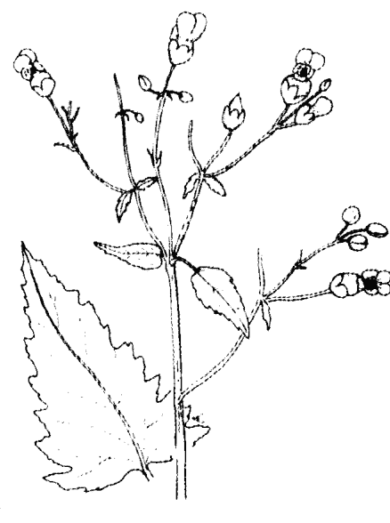

## 生命的遊戲

## 雲之後｜道德律

沒有比愛更高的法則，所以愛是道德律真正的基礎──不是法典，也不是戒律。

那些自認為正當的人、道德家、和生活嚴謹的人，他們一直都準備要譴責，要送越來越多人到地獄去，要將人們釘死在十字架上，要殺人或摧毀。他準備受苦，準備成為一個受虐者，準備經歷各種愚蠢的苦行，只是為了要享受那種優越的感覺，享受那種比你更神聖的感覺，以及享受那種「你們都是罪人，而我是聖人」的感覺。

真正的聖人具有一種完全不同的品質。他並不是遵循道德律的；他知道人的限度，因為他本身也經歷過那些人的限度之苦。他可以原諒，他是了解的。他不可能原諒，因為他對自己也很嚴苛。道德家從來不原諒，也從來不了解；他不可能原諒，因為他對自己也很嚴苛。

## 雲之後——道德律

道德律是一種社會現象，社會需要它，因為社會是由無數人所組成的，它必須保持某種秩序、某種規範，否則會變得很混亂。道德律可以維持那個秩序，道德律在你裡面創造出一個良心。良心以一個內在的警察來運作，它不允許你做任何違反法律或違反傳統的事。社會將某些觀念印在你的心，如此一來你就被這些觀念所駕馭。只要你違反那些觀念，它們就會折磨你，它們會變成你的一個惡夢。如果你遵循它們，你就覺得你不會那麼受折磨。

所以不道德的人會發現他自己陷入兩種困難。一種是來自外在，因為他會開始失去人們的尊敬；在他的世界裡，受人尊敬在人們的眼光裡是最有價值的東西，因為它是自我的一種滋養。當你不受尊敬，你的自我就開始消失，你的自我會覺得受傷。第二，某種你內在的東西會開始折磨你——你的良心。那個良心也是由同一個社會所創造出來的。

因此，社會會從兩方面來給你壓力——外在和內在，你就被壓碎在這兩塊屬。他很不容易才達到他所謂的品格，所以他唯一能夠得到的喜悅就是比你更神聖的感覺。他怎麼能夠原諒？如果他原諒，他就無法享受他所踏上的自我的旅程。

## 生命的遊戲

他們並不是道德的人，懦夫一直都是道德的人。事實上，懦夫是那些在道德的假象下，不敢面對真實的人。他們害怕面對自己的內在，害怕承認自己的不完美，因此他們用道德來掩蓋自己的恐懼。懦夫不可能是不道德的人，懦夫一直都是道德的人。事實上，有道德的人，所謂有道德的人，他們不可能是不道德的——那太危險了，太冒險了。有道德的人，所謂有道德的人，他們不可能是不道德的——那太危險了，太冒險了。有道德的人，所謂有道德的人，他們不可能是不道德的——那太危險了，太冒險了。有道德的人，所謂有道德的人，他們不可能是不道德的——那太危險了，太冒險了。有道德的人，所謂有道德的人，他們不可能是不道德的——那太危險了，太冒險了。有道德的人，所謂有道德的人，他們不可能是不道德的——那太危險了，太冒險了。有道德的人，所謂有道德的人，他們不可能是不道德的——那太危險了，太冒險了。有道德的人，所謂有道德的人，他們不可能是不道德的——那太危險了，太冒險了。有道德的人，所謂有道德的人，他們不可能是不道德的——那太危險了，太冒險了。有道德的人，所謂有道德的人，他們不可能是不道德的——那太危險了，太冒險了。有道德的人，所謂有道德的人，他們不可能是不道德的——那太危險了，太冒險了。有道德的人，所謂有道德的人，他們不可能是不道德的——那太危險了，太冒險了。有道德的人，所謂有道德的人，他們不可能是不道德的——那太危險了，太冒險了。有道德的人，所謂有道德的人，他們不可能是不道德的——那太危險了，太冒險了。有道德的人，所謂有道德的人，他們不可能是不道德的——那太危險了，太冒險了。有道德的人，所謂有道德的人，他們不可能是不道德的——那太危險了，太冒險了。有道德的人，所謂有道德的人，他們不可能是不道德的——那太危險了，太冒險了。有道德的人，所謂有道德的人，他們不可能是不道德的——那太危險了，太冒險了。有道德的人，所謂有道德的人，他們不可能是不道德的——那太危險了，太冒險了。有道德的人，所謂有道德的人，他們不可能是不道德的——那太危險了，太冒險了。有道德的人，所謂有道德的人，他們不可能是不道德的——那太危險了，太冒險了。有道德的人，所謂有道德的人，他們不可能是不道德的——那太危險了，太冒險了。有道德的人，所謂有道德的人，他們不可能是不道德的——那太危險了，太冒險了。有道德的人，所謂有道德的人，他們不可能是不道德的——那太危險了，太冒險了。有道德的人，所謂有道德的人，他們不可能是不道德的——那太危險了，太冒險了。有道德的人，所謂有道德的人，他們不可能是不道德的——那太危險了，太冒險了。有道德的人，所謂有道德的人，他們不可能是不道德的——那太危險了，太冒險了。有道德的人，所謂有道德的人，他們不可能是不道德的——那太危險了，太冒險了。有道德的人，所謂有道德的人，他們不可能是不道德的——那太危險了，太冒險了。有道德的人，所謂有道德的人，他們不可能是不道德的——那太危險了，太冒險了。有道德的人，所謂有道德的人，他們不可能是不道德的——那太危險了，太冒險了。有道德的人，所謂有道德的人，他們不可能是不道德的——那太危險了，太冒險了。有道德的人，所謂有道德的人，他們不可能是不道德的——那太危險了，太冒險了。有道德的人，所謂有道德的人，他們不可能是不道德的——那太危險了，太冒險了。有道德的人，所謂有道德的人，他們不可能是不道德的——那太危險了，太冒險了。有道德的人，所謂有道德的人，他們不可能是不道德的——那太危險了，太冒險了。有道德的人，所謂有道德的人，他們不可能是不道德的——那太危險了，太冒險了。有道德的人，所謂有道德的人，他們不可能是不道德的——那太危險了，太冒險了。有道德的人，所謂有道德的人，他們不可能是不道德的——那太危險了，太冒險了。有道德的人，所謂有道德的人，他們不可能是不道德的——那太危險了，太冒險了。有道德的人，所謂有道德的人，他們不可能是不道德的——那太危險了，太冒險了。有道德的人，所謂有道德的人，他們不可能是不道德的——那太危險了，太冒險了。有道德的人，所謂有道德的人，他們不可能是不道德的——那太危險了，太冒險了。有道德的人，所謂有道德的人，他們不可能是不道德的——那太危險了，太冒險了。有道德的人，所謂有道德的人，他們不可能是不道德的——那太危險了，太冒險了。有道德的人，所謂有道德的人，他們不可能是不道德的——那太危險了，太冒險了。有道德的人，所謂有道德的人，他們不可能是不道德的——那太危險了，太冒險了。有道德的人，所謂有道德的人，他們不可能是不道德的——那太危險了，太冒險了。有道德的人，所謂有道德的人，他們不可能是不道德的——那太危險了，太冒險了。有道德的人，所謂有道德的人，他們不可能是不道德的——那太危險了，太冒險了。有道德的人，所謂有道德的人，他們不可能是不道德的——那太危險了，太冒險了。有道德的人，所謂有道德的人，他們不可能是不道德的——那太危險了，太冒險了。有道德的人，所謂有道德的人，他們不可能是不道德的——那太危險了，太冒險了。有道德的人，所謂有道德的人，他們不可能是不道德的——那太危險了，太冒險了。有道德的人，所謂有道德的人，他們不可能是不道德的——那太危險了，太冒險了。有道德的人，所謂有道德的人，他們不可能是不道德的——那太危險了，太冒險了。有道德的人，所謂有道德的人，他們不可能是不道德的——那太危險了，太冒險了。有道德的人，所謂有道德的人，他們不可能是不道德的——那太危險了，太冒險了。有道德的人，所謂有道德的人，他們不可能是不道德的——那太危險了，太冒險了。有道德的人，所謂有道德的人，他們不可能是不道德的——那太危險了，太冒險了。有道德的人，所謂有道德的人，他們不可能是不道德的——那太危險了，太冒險了。有道德的人，所謂有道德的人，他們不可能是不道德的——那太危險了，太冒險了。有道德的人，所謂有道德的人，他們不可能是不道德的——那太危險了，太冒險了。有道德的人，所謂有道德的人，他們不可能是不道德的——那太危險了，太冒險了。有道德的人，所謂有道德的人，他們不可能是不道德的——那太危險了，太冒險了。有道德的人，所謂有道德的人，他們不可能是不道德的——那太危險了，太冒險了。有道德的人，所謂有道德的人，他們不可能是不道德的——那太危險了，太冒險了。有道德的人，所謂有道德的人，他們不可能是不道德的——那太危險了，太冒險了。有道德的人，所謂有道德的人，他們不可能是不道德的——那太危險了，太冒險了。有道德的人，所謂有道德的人，他們不可能是不道德的——那太危險了，太冒險了。有道德的人，所謂有道德的人，他們不可能是不道德的——那太危險了，太冒險了。有道德的人，所謂有道德的人，他們不可能是不道德的——那太危險了，太冒險了。有道德的人，所謂有道德的人，他們不可能是不道德的——那太危險了，太冒險了。有道德的人，所謂有道德的人，他們不可能是不道德的——那太危險了，太冒險了。有道德的人，所謂有道德的人，他們不可能是不道德的——那太危險了，太冒險了。有道德的人，所謂有道德的人，他們不可能是不道德的——那太危險了，太冒險了。有道德的人，所謂有道德的人，他們不可能是不道德的——那太危險了，太冒險了。有道德的人，所謂有道德的人，他們不可能是不道德的——那太危險了，太冒險了。有道德的人，所謂有道德的人，他們不可能是不道德的——那太危險了，太冒險了。有道德的人，所謂有道德的人，他們不可能是不道德的——那太危險了，太冒險了。有道德的人，所謂有道德的人，他們不可能是不道德的——那太危險了，太冒險了。有道德的人，所謂有道德的人，他們不可能是不道德的——那太危險了，太冒險了。有道德的人，所謂有道德的人，他們不可能是不道德的——那太危險了，太冒險了。有道德的人，所謂有道德的人，他們不可能是不道德的——那太危險了，太冒險了。有道德的人，所謂有道德的人，他們不可能是不道德的——那太危險了，太冒險了。有道德的人，所謂有道德的人，他們不可能是不道德的——那太危險了，太冒險了。有道德的人，所謂有道德的人，他們不可能是不道德的——那太危險了，太冒險了。有道德的人，所謂有道德的人，他們不可能是不道德的——那太危險了，太冒險了。有道德的人，所謂有道德的人，他們不可能是不道德的——那太危險了，太冒險了。有道德的人，所謂有道德的人，他們不可能是不道德的——那太危險了，太冒險了。有道德的人，所謂有道德的人，他們不可能是不道德的——那太危險了，太冒險了。有道德的人，所謂有道德的人，他們不可能是不道德的——那太危險了，太冒險了。有道德的人，所謂有道德的人，他們不可能是不道德的——那太危險了，太冒險了。有道德的人，所謂有道德的人，他們不可能是不道德的——那太危險了，太冒險了。有道德的人，所謂有道德的人，他們不可能是不道德的——那太危險了，太冒險了。有道德的人，所謂有道德的人，他們不可能是不道德的——那太危險了，太冒險了。有道德的人，所謂有道德的人，他們不可能是不道德的——那太危險了，太冒險了。有道德的人，所謂有道德的人，他們不可能是不道德的——那太危險了，太冒險了。有道德的人，所謂有道德的人，他們不可能是不道德的——那太危險了，太冒險了。有道德的人，所謂有道德的人，他們不可能是不道德的——那太危險了，太冒險了。有道德的人，所謂有道德的人，他們不可能是不道德的——那太危險了，太冒險了。有道德的人，所謂有道德的人，他們不可能是不道德的——那太危險了，太冒險了。有道德的人，所謂有道德的人，他們不可能是不道德的——那太危險了，太冒險了。有道德的人，所謂有道德的人，他們不可能是不道德的——那太危險了，太冒險了。有道德的人，所謂有道德的人，他們不可能是不道德的——那太危險了，太冒險了。有道德的人，所謂有道德的人，他們不可能是不道德的——那太危險了，太冒險了。有道德的人，所謂有道德的人，他們不可能是不道德的——那太危險了，太冒險了。有道德的人，所謂有道德的人，他們不可能是不道德的——那太危險了，太冒險了。有道德的人，所謂有道德的人，他們不可能是不道德的——那太危險了，太冒險了。有道德的人，所謂有道德的人，他們不可能是不道德的——那太危險了，太冒險了。有道德的人，所謂有道德的人，他們不可能是不道德的——那太危險了，太冒險了。有道德的人，所謂有道德的人，他們不可能是不道德的——那太危險了，太冒險了。有道德的人，所謂有道德的人，他們不可能是不道德的——那太危險了，太冒險了。有道德的人，所謂有道德的人，他們不可能是不道德的——那太危險了，太冒險了。有道德的人，所謂有道德的人，他們不可能是不道德的——那太危險了，太冒險了。有道德的人，所謂有道德的人，他們不可能是不道德的——那太危險了，太冒險了。有道德的人，所謂有道德的人，他們不可能是不道德的——那太危險了，太冒險了。有道德的人，所謂有道德的人，他們不可能是不道德的——那太危險了，太冒險了。有道德的人，所謂有道德的人，他們不可能是不道德的——那太危險了，太冒險了。有道德的人，所謂有道德的人，他們不可能是不道德的——那太危險了，太冒險了。有道德的人，所謂有道德的人，他們不可能是不道德的——那太危險了，太冒險了。有道德的人，所謂有道德的人，他們不可能是不道德的——那太危險了，太冒險了。有道德的人，所謂有道德的人，他們不可能是不道德的——那太危險了，太冒險了。有道德的人，所謂有道德的人，他們不可能是不道德的——那太危險了，太冒險了。有道德的人，所謂有道德的人，他們不可能是不道德的——那太危險了，太冒險了。有道德的人，所謂有道德的人，他們不可能是不道德的——那太危險了，太冒險了。有道德的人，所謂有道德的人，他們不可能是不道德的——那太危險了，太冒險了。有道德的人，所謂有道德的人，他們不可能是不道德的——那太危險了，太冒險了。有道德的人，所謂有道德的人，他們不可能是不道德的——那太危險了，太冒險了。有道德的人，所謂有道德的人，他們不可能是不道德的——那太危險了，太冒險了。有道德的人，所謂有道德的人，他們不可能是不道德的——那太危險了，太冒險了。有道德的人，所謂有道德的人，他們不可能是不道德的——那太危險了，太冒險了。有道德的人，所謂有道德的人，他們不可能是不道德的——那太危險了，太冒險了。有道德的人，所謂有道德的人，他們不可能是不道德的——那太危險了，太冒險了。有道德的人，所謂有道德的人，他們不可能是不道德的——那太危險了，太冒險了。有道德的人，所謂有道德的人，他們不可能是不道德的——那太危險了，太冒險了。有道德的人，所謂有道德的人，他們不可能是不道德的——那太危險了，太冒險了。有道德的人，所謂有道德的人，他們不可能是不道德的——那太危險了，太冒險了。有道德的人，所謂有道德的人，他們不可能是不道德的——那太危險了，太冒險了。有道德的人，所謂有道德的人，他們不可能是不道德的——那太危險了，太冒險了。有道德的人，所謂有道德的人，他們不可能是不道德的——那太危險了，太冒險了。有道德的人，所謂有道德的人，他們不可能是不道德的——那太危險了，太冒險了。有道德的人，所謂有道德的人，他們不可能是不道德的——那太危險了，太冒險了。有道德的人，所謂有道德的人，他們不可能是不道德的——那太危險了，太冒險了。有道德的人，所謂有道德的人，他們不可能是不道德的——那太危險了，太冒險了。有道德的人，所謂有道德的人，他們不可能是不道德的——那太危險了，太冒險了。有道德的人，所謂有道德的人，他們不可能是不道德的——那太危險了，太冒險了。有道德的人，所謂有道德的人，他們不可能是不道德的——那太危險了，太冒險了。有道德的人，所謂有道德的人，他們不可能是不道德的——那太危險了，太冒險了。有道德的人，所謂有道德的人，他們不可能是不道德的——那太危險了，太冒險了。有道德的人，所謂有道德的人，他們不可能是不道德的——那太危險了，太冒險了。有道德的人，所謂有道德的人，他們不可能是不道德的——那太危險了，太冒險了。有道德的人，所謂有道德的人，他們不可能是不道德的——那太危險了，太冒險了。有道德的人，所謂有道德的人，他們不可能是不道德的——那太危險了，太冒險了。有道德的人，所謂有道德的人，他們不可能是不道德的——那太危險了，太冒險了。有道德的人，所謂有道德的人，他們不可能是不道德的——那太危險了，太冒險了。有道德的人，所謂有道德的人，他們不可能是不道德的——那太危險了，太冒險了。有道德的人，所謂有道德的人，他們不可能是不道德的——那太危險了，太冒險了。有道德的人，所謂有道德的人，他們不可能是不道德的——那太危險了，太冒險了。有道德的人，所謂有道德的人，他們不可能是不道德的——那太危險了，太冒險了。有道德的人，所謂有道德的人，他們不可能是不道德的——那太危險了，太冒險了。有道德的人，所謂有道德的人，他們不可能是不道德的——那太危險了，太冒險了。有道德的人，所謂有道德的人，他們不可能是不道德的——那太危險了，太冒險了。有道德的人，所謂有道德的人，他們不可能是不道德的——那太危險了，太冒險了。有道德的人，所謂有道德的人，他們不可能是不道德的——那太危險了，太冒險了。有道德的人，所謂有道德的人，他們不可能是不道德的——那太危險了，太冒險了。有道德的人，所謂有道德的人，他們不可能是不道德的——那太危險了，太冒險了。有道德的人，所謂有道德的人，他們不可能是不道德的——那太危險了，太冒險了。有道德的人，所謂有道德的人，他們不可能是不道德的——那太危險了，太冒險了。有道德的人，所謂有道德的人，他們不可能是不道德的——那太危險了，太冒險了。有道德的人，所謂有道德的人，他們不可能是不道德的——那太危險了，太冒險了。有道德的人，所謂有道德的人，他們不可能是不道德的——那太危險了，太冒險了。有道德的人，所謂有道德的人，他們不可能是不道德的——那太危險了，太冒險了。有道德的人，所謂有道德的人，他們不可能是不道德的——那太危險了，太冒險了。有道德的人，所謂有道德的人，他們不可能是不道德的——那太危險了，太冒險了。有道德的人，所謂有道德的人，他們不可能是不道德的——那太危險了，太冒險了。有道德的人，所謂有道德的人，他們不可能是不道德的——那太危險了，太冒險了。有道德的人，所謂有道德的人，他們不可能是不道德的——那太危險了，太冒險了。有道德的人，所謂有道德的人，他們不可能是不道德的——那太危險了，太冒險了。有道德的人，所謂有道德的人，他們不可能是不道德的——那太危險了，太冒險了。有道德的人，所謂有道德的人，他們不可能是不道德的——那太危險了，太冒險了。有道德的人，所謂有道德的人，他們不可能是不道德的——那太危險了，太冒險了。有道德的人，所謂有道德的人，他們不可能是不道德的——那太危險了，太冒險了。有道德的人，所謂有道德的人，他們不可能是不道德的——那太危險了，太冒險了。有道德的人，所謂有道德的人，他們不可能是不道德的——那太危險了，太冒險了。有道德的人，所謂有道德的人，他們不可能是不道德的——那太危險了，太冒險了。有道德的人，所謂有道德的人，他們不可能是不道德的——那太危險了，太冒險了。有道德的人，所謂有道德的人，他們不可能是不道德的——那太危險了，太冒險了。有道德的人，所謂有道德的人，他們不可能是不道德的——那太危險了，太冒險了。有道德的人，所謂有道德的人，他們不可能是不道德的——那太危險了，太冒險了。有道德的人，所謂有道德的人，他們不可能是不道德的——那太危險了，太冒險了。有道德的人，所謂有道德的人，他們不可能是不道德的——那太危險了，太冒險了。有道德的人，所謂有道德的人，他們不可能是不道德的——那太危險了，太冒險了。有道德的人，所謂有道德的人，他們不可能是不道德的——那太危險了，太冒險了。有道德的人，所謂有道德的人，他們不可能是不道德的——那太危險了，太冒險了。有道德的人，所謂有道德的人，他們不可能是不道德的——那太危險了，太冒險了。有道德的人，所謂有道德的人，他們不可能是不道德的——那太危險了，太冒險了。有道德的人，所謂有道德的人，他們不可能是不道德的——那太危險了，太冒險了。有道德的人，所謂有道德的人，他們不可能是不道德的——那太危險了，太冒險了。有道德的人，所謂有道德的人，他們不可能是不道德的——那太危險了，太冒險了。有道德的人，所謂有道德的人，他們不可能是不道德的——那太危險了，太冒險了。有道德的人，所謂有道德的人，他們不可能是不道德的——那太危險了，太冒險了。有道德的人，所謂有道德的人，他們不可能是不道德的——那太危險了，太冒險了。有道德的人，所謂有道德的人，他們不可能是不道德的——那太危險了，太冒險了。有道德的人，所謂有道德的人，他們不可能是不道德的——那太危險了，太冒險了。有道德的人，所謂有道德的人，他們不可能是不道德的——那太危險了，太冒險了。有道德的人，所謂有道德的人，他們不可能是不道德的——那太危險了，太冒險了。有道德的人，所謂有道德的人，他們不可能是不道德的——那太危險了，太冒險了。有道德的人，所謂有道德的人，他們不可能是不道德的——那太危險了，太冒險了。有道德的人，所謂有道德的人，他們不可能是不道德的——那太危險了，太冒險了。有道德的人，所謂有道德的人，他們不可能是不道德的——那太危險了，太冒險了。有道德的人，所謂有道德的人，他們不可能是不道德的——那太危險了，太冒險了。有道德的人，所謂有道德的人，他們不可能是不道德的——那太危險了，太冒險了。有道德的人，所謂有道德的人，他們不可能是不道德的——那太危險了，太冒險了。有道德的人，所謂有道德的人，他們不可能是不道德的——那太危險了，太冒險了。有道德的人，所謂有道德的人，他們不可能是不道德的——那太危險了，太冒險了。有道德的人，所謂有道德的人，他們不可能是不道德的——那太危險了，太冒險了。有道德的人，所謂有道德的人，他們不可能是不道德的——那太危險了，太冒險了。有道德的人，所謂有道德的人，他們不可能是不道德的——那太危險了，太冒險了。有道德的人，所謂有道德的人，他們不可能是不道德的——那太危險了，太冒險了。有道德的人，所謂有道德的人，他們不可能是不道德的——那太危險了，太冒險了。有道德的人，所謂有道德的人，他們不可能是不道德的——那太危險了，太冒險了。有道德的人，所謂有道德的人，他們不可能是不道德的——那太危險了，太冒險了。有道德的人，所謂有道德的人，他們不可能是不道德的——那太危險了，太冒險了。有道德的人，所謂有道德的人，他們不可能是不道德的——那太危險了，太冒險了。有道德的人，所謂有道德的人，他們不可能是不道德的——那太危險了，太冒險了。有道德的人，所謂有道德的人，他們不可能是不道德的——那太危險了，太冒險了。有道德的人，所謂有道德的人，他們不可能是不道德的——那太危險了，太冒險了。有道德的人，所謂有道德的人，他們不可能是不道德的——那太危險了，太冒險了。有道德的人，所謂有道德的人，他們不可能是不道德的——那太危險了，太冒險了。有道德的人，所謂有道德的人，他們不可能是不道德的——那太危險了，太冒險了。有道德的人，所謂有道德的人，他們不可能是不道德的——那太危險了，太冒險了。有道德的人，所謂有道德的人，他們不可能是不道德的——那太危險了，太冒險了。有道德的人，所謂有道德的人，他們不可能是不道德的——那太危險了，太冒險了。有道德的人，所謂有道德的人，他們不可能是不道德的——那太危險了，太冒險了。有道德的人，所謂有道德的人，他們不可能是不道德的——那太危險了，太冒險了。有道德的人，所謂有道德的人，他們不可能是不道德的——那太危險了，太冒險了。有道德的人，所謂有道德的人，他們不可能是不道德的——那太危險了，太冒險了。有道德的人，所謂有道德的人，他們不可能是不道德的——那太危險了，太冒險了。有道德的人，所謂有道德的人，他們不可能是不道德的——那太危險了，太冒險了。有道德的人，所謂有道德的人，他們不可能是不道德的——那太危險了，太冒險了。有道德的人，所謂有道德的人，他們不可能是不道德的——那太危險了，太冒險了。有道德的人，所謂有道德的人，他們不可能是不道德的——那太危險了，太冒險了。有

## 雲之後──道德律

但當你是道德的，社會會給你足夠的報酬，它會盡可能給你很多自我保留。不僅是在這一世，連來世也會幫你照顧。天堂裡還有一些地方特別為你保留。罪人在此受苦，罪人也會在天堂受苦，而所謂的聖人不僅在這裡受到尊敬，他也将會在彼岸受到尊敬。這是一個策略，一個社會上非常微妙的心理策略，為的是要來剝削你。但是因為這個策略的緣故，你已經完全不知道真正的道德律是什麼，你已經完全不知道那個不被恐懼所指使、不是來自懦弱、不是恐懼導向的真正道德律是什麼。

歷史上的諸佛及諸位成道者給了我們一個完全不同的道德律的看法：真正的道德律不是來自良心，而是來自意識。他們存在絕對同調的生活。有時候它或許跟社會同調，因為社會本身並非永遠都跟存在同調。每當社會跟存在不同調，你就跟社會同調。每當社會跟存在同調，有時候它不見得跟社會同調。但是一個真正有道德的人從來不會去管社會，他甚至準備冒他生命的危險。蘇格拉底曾經這樣做，耶穌也曾經這樣做，佛陀經常生活在危險之中。事情一直都是這樣，簡單的理由

## 生命的遊戲

是：他們是按照他們自己的光在生活。如果它適合社會，那很好；如果它不適合社會，它對社會不好，但是它跟你無關。社會必須改變它自己。如果你去做，你將會為你自己創造出焦慮和痛苦，因為如此一來你會變成目標導向的，你會想：「我會成功嗎？」——你會變得比較顧慮到結果，而比較不顧慮到過程，然後你將會經常擔心，不論發生什麼，你都會感到挫折。

如果你成功了，你將會感到挫折，因為成功所帶給你的並不是你原來想要的東西；如果你失敗了，當然你也會處於痛苦之中，因為那些失敗的人會處於痛苦之中，那些成功的人也會處於痛苦之中。那些成功的人已經沒有希望了，他變得完全絕望。現在他已經可以有希望，而一個真正成功的人比那些失敗的人更痛苦，因為失敗的人還可以有希望，而一個真正成功的人已經沒有希望了，他變得完全絕望。現在他已經可以有希望，而一個真正成功的人比那些失敗的人更痛苦，因為失敗的人還可以有希望，而一個真正成功的人已經沒有希望了，他變得完全絕望。現在他已經可以有希望，而一個真正成功的人比那些失敗的人更痛苦，因為失敗的人還可以有希望，而一個真正成功的人已經沒有希望了，他變得完全絕望。現在他已經可以有希望，而一個真正成功的人比那些失敗的人更痛苦，因為失敗的人還可以有希望，而一個真正成功的人已經沒有希望了，他變得完全絕望。現在他已經可以有希望，而一個真正成功的人比那些失敗的人更痛苦，因為失敗的人還可以有希望，而一個真正成功的人已經沒有希望了，他變得完全絕望。現在他已經可以有希望，而一個真正成功的人比那些失敗的人更痛苦，因為失敗的人還可以有希望，而一個真正成功的人已經沒有希望了，他變得完全絕望。現在他已經可以有希望，而一個真正成功的人比那些失敗的人更痛苦，因為失敗的人還可以有希望，而一個真正成功的人已經沒有希望了，他變得完全絕望。現在他已經可以有希望，而一個真正成功的人比那些失敗的人更痛苦，因為失敗的人還可以有希望，而一個真正成功的人已經沒有希望了，他變得完全絕望。現在他已經可以有希望，而一個真正成功的人比那些失敗的人更痛苦，因為失敗的人還可以有希望，而一個真正成功的人已經沒有希望了，他變得完全絕望。現在他已經可以有希望，而一個真正成功的人比那些失敗的人更痛苦，因為失敗的人還可以有希望，而一個真正成功的人已經沒有希望了，他變得完全絕望。現在他已經可以有希望，而一個真正成功的人比那些失敗的人更痛苦，因為失敗的人還可以有希望，而一個真正成功的人已經沒有希望了，他變得完全絕望。現在他已經可以有希望，而一個真正成功的人比那些失敗的人更痛苦，因為失敗的人還可以有希望，而一個真正成功的人已經沒有希望了，他變得完全絕望。現在他已經可以有希望，而一個真正成功的人比那些失敗的人更痛苦，因為失敗的人還可以有希望，而一個真正成功的人已經沒有希望了，他變得完全絕望。現在他已經可以有希望，而一個真正成功的人比那些失敗的人更痛苦，因為失敗的人還可以有希望，而一個真正成功的人已經沒有希望了，他變得完全絕望。現在他已經可以有希望，而一個真正成功的人比那些失敗的人更痛苦，因為失敗的人還可以有希望，而一個真正成功的人已經沒有希望了，他變得完全絕望。現在他已經可以有希望，而一個真正成功的人比那些失敗的人更痛苦，因為失敗的人還可以有希望，而一個真正成功的人已經沒有希望了，他變得完全絕望。現在他已經可以有希望，而一個真正成功的人比那些失敗的人更痛苦，因為失敗的人還可以有希望，而一個真正成功的人已經沒有希望了，他變得完全絕望。現在他已經可以有希望，而一個真正成功的人比那些失敗的人更痛苦，因為失敗的人還可以有希望，而一個真正成功的人已經沒有希望了，他變得完全絕望。現在他已經可以有希望，而一個真正成功的人比那些失敗的人更痛苦，因為失敗的人還可以有希望，而一個真正成功的人已經沒有希望了，他變得完全絕望。現在他已經可以有希望，而一個真正成功的人比那些失敗的人更痛苦，因為失敗的人還可以有希望，而一個真正成功的人已經沒有希望了，他變得完全絕望。現在他已經可以有希望，而一個真正成功的人比那些失敗的人更痛苦，因為失敗的人還可以有希望，而一個真正成功的人已經沒有希望了，他變得完全絕望。現在他已經可以有希望，而一個真正成功的人比那些失敗的人更痛苦，因為失敗的人還可以有希望，而一個真正成功的人已經沒有希望了，他變得完全絕望。現在他已經可以有希望，而一個真正成功的人比那些失敗的人更痛苦，因為失敗的人還可以有希望，而一個真正成功的人已經沒有希望了，他變得完全絕望。現在他已經可以有希望，而一個真正成功的人比那些失敗的人更痛苦，因為失敗的人還可以有希望，而一個真正成功的人已經沒有希望了，他變得完全絕望。現在他已經可以有希望，而一個真正成功的人比那些失敗的人更痛苦，因為失敗的人還可以有希望，而一個真正成功的人已經沒有希望了，他變得完全絕望。現在他已經可以有希望，而一個真正成功的人比那些失敗的人更痛苦，因為失敗的人還可以有希望，而一個真正成功的人已經沒有希望了，他變得完全絕望。現在他已經可以有希望，而一個真正成功的人比那些失敗的人更痛苦，因為失敗的人還可以有希望，而一個真正成功的人已經沒有希望了，他變得完全絕望。現在他已經可以有希望，而一個真正成功的人比那些失敗的人更痛苦，因為失敗的人還可以有希望，而一個真正成功的人已經沒有希望了，他變得完全絕望。現在他已經可以有希望，而一個真正成功的人比那些失敗的人更痛苦，因為失敗的人還可以有希望，而一個真正成功的人已經沒有希望了，他變得完全絕望。現在他已經可以有希望，而一個真正成功的人比那些失敗的人更痛苦，因為失敗的人還可以有希望，而一個真正成功的人已經沒有希望了，他變得完全絕望。現在他已經可以有希望，而一個真正成功的人比那些失敗的人更痛苦，因為失敗的人還可以有希望，而一個真正成功的人已經沒有希望了，他變得完全絕望。現在他已經可以有希望，而一個真正成功的人比那些失敗的人更痛苦，因為失敗的人還可以有希望，而一個真正成功的人已經沒有希望了，他變得完全絕望。現在他已經可以有希望，而一個真正成功的人比那些失敗的人更痛苦，因為失敗的人還可以有希望，而一個真正成功的人已經沒有希望了，他變得完全絕望。現在他已經可以有希望，而一個真正成功的人比那些失敗的人更痛苦，因為失敗的人還可以有希望，而一個真正成功的人已經沒有希望了，他變得完全絕望。現在他已經可以有希望，而一個真正成功的人比那些失敗的人更痛苦，因為失敗的人還可以有希望，而一個真正成功的人已經沒有希望了，他變得完全絕望。現在他已經可以有希望，而一個真正成功的人比那些失敗的人更痛苦，因為失敗的人還可以有希望，而一個真正成功的人已經沒有希望了，他變得完全絕望。現在他已經可以有希望，而一個真正成功的人比那些失敗的人更痛苦，因為失敗的人還可以有希望，而一個真正成功的人已經沒有希望了，他變得完全絕望。現在他已經可以有希望，而一個真正成功的人比那些失敗的人更痛苦，因為失敗的人還可以有希望，而一個真正成功的人已經沒有希望了，他變得完全絕望。現在他已經可以有希望，而一個真正成功的人比那些失敗的人更痛苦，因為失敗的人還可以有希望，而一個真正成功的人已經沒有希望了，他變得完全絕望。現在他已經可以有希望，而一個真正成功的人比那些失敗的人更痛苦，因為失敗的人還可以有希望，而一個真正成功的人已經沒有希望了，他變得完全絕望。現在他已經可以有希望，而一個真正成功的人比那些失敗的人更痛苦，因為失敗的人還可以有希望，而一個真正成功的人已經沒有希望了，他變得完全絕望。現在他已經可以有希望，而一個真正成功的人比那些失敗的人更痛苦，因為失敗的人還可以有希望，而一個真正成功的人已經沒有希望了，他變得完全絕望。現在他已經可以有希望，而一個真正成功的人比那些失敗的人更痛苦，因為失敗的人還可以有希望，而一個真正成功的人已經沒有希望了，他變得完全絕望。現在他已經可以有希望，而一個真正成功的人比那些失敗的人更痛苦，因為失敗的人還可以有希望，而一個真正成功的人已經沒有希望了，他變得完全絕望。現在他已經可以有希望，而一個真正成功的人比那些失敗的人更痛苦，因為失敗的人還可以有希望，而一個真正成功的人已經沒有希望了，他變得完全絕望。現在他已經可以有希望，而一個真正成功的人比那些失敗的人更痛苦，因為失敗的人還可以有希望，而一個真正成功的人已經沒有希望了，他變得完全絕望。現在他已經可以有希望，而一個真正成功的人比那些失敗的人更痛苦，因為失敗的人還可以有希望，而一個真正成功的人已經沒有希望了，他變得完全絕望。現在他已經可以有希望，而一個真正成功的人比那些失敗的人更痛苦，因為失敗的人還可以有希望，而一個真正成功的人已經沒有希望了，他變得完全絕望。現在他已經可以有希望，而一個真正成功的人比那些失敗的人更痛苦，因為失敗的人還可以有希望，而一個真正成功的人已經沒有希望了，他變得完全絕望。現在他已經可以有希望，而一個真正成功的人比那些失敗的人更痛苦，因為失敗的人還可以有希望，而一個真正成功的人已經沒有希望了，他變得完全絕望。現在他已經可以有希望，而一個真正成功的人比那些失敗的人更痛苦，因為失敗的人還可以有希望，而一個真正成功的人已經沒有希望了，他變得完全絕望。現在他已經可以有希望，而一個真正成功的人比那些失敗的人更痛苦，因為失敗的人還可以有希望，而一個真正成功的人已經沒有希望了，他變得完全絕望。現在他已經可以有希望，而一個真正成功的人比那些失敗的人更痛苦，因為失敗的人還可以有希望，而一個真正成功的人已經沒有希望了，他變得完全絕望。現在他已經可以有希望，而一個真正成功的人比那些失敗的人更痛苦，因為失敗的人還可以有希望，而一個真正成功的人已經沒有希望了，他變得完全絕望。現在他已經可以有希望，而一個真正成功的人比那些失敗的人更痛苦，因為失敗的人還可以有希望，而一個真正成功的人已經沒有希望了，他變得完全絕望。現在他已經可以有希望，而一個真正成功的人比那些失敗的人更痛苦，因為失敗的人還可以有希望，而一個真正成功的人已經沒有希望了，他變得完全絕望。現在他已經可以有希望，而一個真正成功的人比那些失敗的人更痛苦，因為失敗的人還可以有希望，而一個真正成功的人已經沒有希望了，他變得完全絕望。現在他已經可以有希望，而一個真正成功的人比那些失敗的人更痛苦，因為失敗的人還可以有希望，而一個真正成功的人已經沒有希望了，他變得完全絕望。現在他已經可以有希望，而一個真正成功的人比那些失敗的人更痛苦，因為失敗的人還可以有希望，而一個真正成功的人已經沒有希望了，他變得完全絕望。現在他已經可以有希望，而一個真正成功的人比那些失敗的人更痛苦，因為失敗的人還可以有希望，而一個真正成功的人已經沒有希望了，他變得完全絕望。現在他已經可以有希望，而一個真正成功的人比那些失敗的人更痛苦，因為失敗的人還可以有希望，而一個真正成功的人已經沒有希望了，他變得完全絕望。現在他已經可以有希望，而一個真正成功的人比那些失敗的人更痛苦，因為失敗的人還可以有希望，而一個真正成功的人已經沒有希望了，他變得完全絕望。現在他已經可以有希望，而一個真正成功的人比那些失敗的人更痛苦，因為失敗的人還可以有希望，而一個真正成功的人已經沒有希望了，他變得完全絕望。現在他已經可以有希望，而一個真正成功的人比那些失敗的人更痛苦，因為失敗的人還可以有希望，而一個真正成功的人已經沒有希望了，他變得完全絕望。現在他已經可以有希望，而一個真正成功的人比那些失敗的人更痛苦，因為失敗的人還可以有希望，而一個真正成功的人已經沒有希望了，他變得完全絕望。現在他已經可以有希望，而一個真正成功的人比那些失敗的人更痛苦，因為失敗的人還可以有希望，而一個真正成功的人已經沒有希望了，他變得完全絕望。現在他已經可以有希望，而一個真正成功的人比那些失敗的人更痛苦，因為失敗的人還可以有希望，而一個真正成功的人已經沒有希望了，他變得完全絕望。現在他已經可以有希望，而一個真正成功的人比那些失敗的人更痛苦，因為失敗的人還可以有希望，而一個真正成功的人已經沒有希望了，他變得完全絕望。現在他已經可以有希望，而一個真正成功的人比那些失敗的人更痛苦，因為失敗的人還可以有希望，而一個真正成功的人已經沒有希望了，他變得完全絕望。現在他已經可以有希望，而一個真正成功的人比那些失敗的人更痛苦，因為失敗的人還可以有希望，而一個真正成功的人已經沒有希望了，他變得完全絕望。現在他已經可以有希望，而一個真正成功的人比那些失敗的人更痛苦，因為失敗的人還可以有希望，而一個真正成功的人已經沒有希望了，他變得完全絕望。現在他已經可以有希望，而一個真正成功的人比那些失敗的人更痛苦，因為失敗的人還可以有希望，而一個真正成功的人已經沒有希望了，他變得完全絕望。現在他已經可以有希望，而一個真正成功的人比那些失敗的人更痛苦，因為失敗的人還可以有希望，而一個真正成功的人已經沒有希望了，他變得完全絕望。現在他已經可以有希望，而一個真正成功的人比那些失敗的人更痛苦，因為失敗的人還可以有希望，而一個真正成功的人已經沒有希望了，他變得完全絕望。現在他已經可以有希望，而一個真正成功的人比那些失敗的人更痛苦，因為失敗的人還可以有希望，而一個真正成功的人已經沒有希望了，他變得完全絕望。現在他已經可以有希望，而一個真正成功的人比那些失敗的人更痛苦，因為失敗的人還可以有希望，而一個真正成功的人已經沒有希望了，他變得完全絕望。現在他已經可以有希望，而一個真正成功的人比那些失敗的人更痛苦，因為失敗的人還可以有希望，而一個真正成功的人已經沒有希望了，他變得完全絕望。現在他已經可以有希望，而一個真正成功的人比那些失敗的人更痛苦，因為失敗的人還可以有希望，而一個真正成功的人已經沒有希望了，他變得完全絕望。現在他已經可以有希望，而一個真正成功的人比那些失敗的人更痛苦，因為失敗的人還可以有希望，而一個真正成功的人已經沒有希望了，他變得完全絕望。現在他已經可以有希望，而一個真正成功的人比那些失敗的人更痛苦，因為失敗的人還可以有希望，而一個真正成功的人已經沒有希望了，他變得完全絕望。現在他已經可以有希望，而一個真正成功的人比那些失敗的人更痛苦，因為失敗的人還可以有希望，而一個真正成功的人已經沒有希望了，他變得完全絕望。現在他已經可以有希望，而一個真正成功的人比那些失敗的人更痛苦，因為失敗的人還可以有希望，而一個真正成功的人已經沒有希望了，他變得完全絕望。現在他已經可以有希望，而一個真正成功的人比那些失敗的人更痛苦，因為失敗的人還可以有希望，而一個真正成功的人已經沒有希望了，他變得完全絕望。現在他已經可以有希望，而一個真正成功的人比那些失敗的人更痛苦，因為失敗的人還可以有希望，而一個真正成功的人已經沒有希望了，他變得完全絕望。現在他已經可以有希望，而一個真正成功的人比那些失敗的人更痛苦，因為失敗的人還可以有希望，而一個真正成功的人已經沒有希望了，他變得完全絕望。現在他已經可以有希望，而一個真正成功的人比那些失敗的人更痛苦，因為失敗的人還可以有希望，而一個真正成功的人已經沒有希望了，他變得完全絕望。現在他已經可以有希望，而一個真正成功的人比那些失敗的人更痛苦，因為失敗的人還可以有希望，而一個真正成功的人已經沒有希望了，他變得完全絕望。現在他已經可以有希望，而一個真正成功的人比那些失敗的人更痛苦，因為失敗的人還可以有希望，而一個真正成功的人已經沒有希望了，他變得完全絕望。現在他已經可以有希望，而一個真正成功的人比那些失敗的人更痛苦，因為失敗的人還可以有希望，而一個真正成功的人已經沒有希望了，他變得完全絕望。現在他已經可以有希望，而一個真正成功的人比那些失敗的人更痛苦，因為失敗的人還可以有希望，而一個真正成功的人已經沒有希望了，他變得完全絕望。現在他已經可以有希望，而一個真正成功的人比那些失敗的人更痛苦，因為失敗的人還可以有希望，而一個真正成功的人已經沒有希望了，他變得完全絕望。現在他已經可以有希望，而一個真正成功的人比那些失敗的人更痛苦，因為失敗的人還可以有希望，而一個真正成功的人已經沒有希望了，他變得完全絕望。現在他已經可以有希望，而一個真正成功的人比那些失敗的人更痛苦，因為失敗的人還可以有希望，而一個真正成功的人已經沒有希望了，他變得完全絕望。現在他已經可以有希望，而一個真正成功的人比那些失敗的人更痛苦，因為失敗的人還可以有希望，而一個真正成功的人已經沒有希望了，他變得完全絕望。現在他已經可以有希望，而一個真正成功的人比那些失敗的人更痛苦，因為失敗的人還可以有希望，而一個真正成功的人已經沒有希望了，他變得完全絕望。現在他已經可以有希望，而一個真正成功的人比那些失敗的人更痛苦，因為失敗的人還可以有希望，而一個真正成功的人已經沒有希望了，他變得完全絕望。現在他已經可以有希望，而一個真正成功的人比那些失敗的人更痛苦，因為失敗的人還可以有希望，而一個真正成功的人已經沒有希望了，他變得完全絕望。現在他已經可以有希望，而一個真正成功的人比那些失敗的人更痛苦，因為失敗的人還可以有希望，而一個真正成功的人已經沒有希望了，他變得完全絕望。現在他已經可以有希望，而一個真正成功的人比那些失敗的人更痛苦，因為失敗的人還可以有希望，而一個真正成功的人已經沒有希望了，他變得完全絕望。現在他已經可以有希望，而一個真正成功的人比那些失敗的人更痛苦，因為失敗的人還可以有希望，而一個真正成功的人已經沒有希望了，他變得完全絕望。現在他已經可以有希望，而一個真正成功的人比那些失敗的人更痛苦，因為失敗的人還可以有希望，而一個真正成功的人已經沒有希望了，他變得完全絕望。現在他已經可以有希望，而一個真正成功的人比那些失敗的人更痛苦，因為失敗的人還可以有希望，而一個真正成功的人已經沒有希望了，他變得完全絕望。現在他已經可以有希望，而一個真正成功的人比那些失敗的人更痛苦，因為失敗的人還可以有希望，而一個真正成功的人已經沒有希望了，他變得完全絕望。現在他已經可以有希望，而一個真正成功的人比那些失敗的人更痛苦，因為失敗的人還可以有希望，而一個真正成功的人已經沒有希望了，他變得完全絕望。現在他已經可以有希望，而一個真正成功的人比那些失敗的人更痛苦，因為失敗的人還可以有希望，而一個真正成功的人已經沒有希望了，他變得完全絕望。現在他已經可以有希望，而一個真正成功的人比那些失敗的人更痛苦，因為失敗的人還可以有希望，而一個真正成功的人已經沒有希望了，他變得完全絕望。現在他已經可以有希望，而一個真正成功的人比那些失敗的人更痛苦，因為失敗的人還可以有希望，而一個真正成功的人已經沒有希望了，他變得完全絕望。現在他已經可以有希望，而一個真正成功的人比那些失敗的人更痛苦，因為失敗的人還可以有希望，而一個真正成功的人已經沒有希望了，他變得完全絕望。現在他已經可以有希望，而一個真正成功的人比那些失敗的人更痛苦，因為失敗的人還可以有希望，而一個真正成功的人已經沒有希望了，他變得完全絕望。現在他已經可以有希望，而一個真正成功的人比那些失敗的人更痛苦，因為失敗的人還可以有希望，而一個真正成功的人已經沒有希望了，他變得完全絕望。現在他已經可以有希望，而一個真正成功的人比那些失敗的人更痛苦，因為失敗的人還可以有希望，而一個真正成功的人已經沒有希望了，他變得完全絕望。現在他已經可以有希望，而一個真正成功的人比那些失敗的人更痛苦，因為失敗的人還可以有希望，而一個真正成功的人已經沒有希望了，他變得完全絕望。現在他已經可以有希望，而一個真正成功的人比那些失敗的人更痛苦，因為失敗的人還可以有希望，而一個真正成功的人已經沒有希望了，他變得完全絕望。現在他已經可以有希望，而一個真正成功的人比那些失敗的人更痛苦，因為失敗的人還可以有希望，而一個真正成功的人已經沒有希望了，他變得完全絕望。現在他已經可以有希望，而一個真正成功的人比那些失敗的人更痛苦，因為失敗的人還可以有希望，而一個真正成功的人已經沒有希望了，他變得完全絕望。現在他已經可以有希望，而一個真正成功的人比那些失敗的人更痛苦，因為失敗的人還可以有希望，而一個真正成功的人已經沒有希望了，他變得完全絕望。現在他已經可以有希望，而一個真正成功的人比那些失敗的人更痛苦，因為失敗的人還可以有希望，而一個真正成功的人已經沒有希望了，他變得完全絕望。現在他已經可以有希望，而一個真正成功的人比那些失敗的人更痛苦，因為失敗的人還可以有希望，而一個真正成功的人已經沒有希望了，他變得完全絕望。現在他已經可以有希望，而一個真正成功的人比那些失敗的人更痛苦，因為失敗的人還可以有希望，而一個真正成功的人已經沒有希望了，他變得完全絕望。現在他已經可以有希望，而一個真正成功的人比那些失敗的人更痛苦，因為失敗的人還可以有希望，而一個真正成功的人已經沒有希望了，他變得完全絕望。現在他已經可以有希望，而一個真正成功的人比那些失敗的人更痛苦，因為失敗的人還可以有希望，而一個真正成功的人已經沒有希望了，他變得完全絕望。現在他已經可以有希望，而一個真正成功的人比那些失敗的人更痛苦，因為失敗的人還可以有希望，而一個真正成功的人已經沒有希望了，他變得完全絕望。現在他已經可以有希望，而一個真正成功的人比那些失敗的人更痛苦，因為失敗的人還可以有希望，而一個真正成功的人已經沒有希望了，他變得完全絕望。現在他已經可以有希望，而一個真正成功的人比那些失敗的人更痛苦，因為失敗的人還可以有希望，而一個真正成功的人已經沒有希望了，他變得完全絕望。現在他已經可以有希望，而一個真正成功的人比那些失敗的人更痛苦，因為失敗的人還可以有希望，而一個真正成功的人已經沒有希望了，他變得完全絕望。現在他已經可以有希望，而一個真正成功的人比那些失敗的人更痛苦，因為失敗的人還可以有希望，而一個真正成功的人已經沒有希望了，他變得完全絕望。現在他已經可以有希望，而一個真正成功的人比那些失敗的人更痛苦，因為失敗的人還可以有希望，而一個真正成功的人已經沒有希望了，他變得完全絕望。現在他已經可以有希望，而一個真正成功的人比那些失敗的人更痛苦，因為失敗的人還可以有希望，而一個真正成功的人已經沒有希望了，他變得完全絕望。現在他已經可以有希望，而一個真正成功的人比那些失敗的人更痛苦，因為失敗的人還可以有希望，而一個真正成功的人已經沒有希望了，他變得完全絕望。現在他已經可以有希望，而一個真正成功的人比那些失敗的人更痛苦，因為失敗的人還可以有希望，而一個真正成功的人已經沒有希望了，他變得完全絕望。現在他已經可以有希望，而一個真正成功的人比那些失敗的人更痛苦，因為失敗的人還可以有希望，而一個真正成功的人已經沒有希望了，他變得完全絕望。現在他已經可以有希望，而一個真正成功的人比那些失敗的人更痛苦，因為失敗的人還可以有希望，而一個真正成功的人已經沒有希望了，他變得完全絕望。現在他已經可以有希望，而一個真正成功的人比那些失敗的人更痛苦，因為失敗的人還可以有希望，而一個真正成功的人已經沒有希望了，他變得完全絕望。現在他已經可以有希望，而一個真正成功的人比那些失敗的人更痛苦，因為失敗的人還可以有希望，而一個真正成功的人已經沒有希望了，他變得完全絕望。現在他已經可以有希望，而一個真正成功的人比那些失敗的人更痛苦，因為失敗的人還可以有希望，而一個真正成功的人已經沒有希望了，他變得完全絕望。現在他已經可以有希望，而一個真正成功的人比那些失敗的人更痛苦，因為失敗的人還可以有希望，而一個真正成功的人已經沒有希望了，他變得完全絕望。現在他已經可以有希望，而一個真正成功的人比那些失敗的人更痛苦，因為失敗的人還可以有希望，而一個真正成功的人已經沒有希望了，他變得完全絕望。現在他已經可以有希望，而一個真正成功的人比那些失敗的人更痛苦，因為失敗的人還可以有希望，而一個真正成功的人已經沒有希望了，他變得完全絕望。現在他已經可以有希望，而一個真正成功的人比那些失敗的人更痛苦，因為失敗的人還可以有希望，而一個真正成功的人已經沒有希望了，他變得完全絕望。現在他已經可以有希望，而一個真正成功的人比那些失敗的人更痛苦，因為失敗的人還可以有希望，而一個真正成功的人已經沒有希望了，他變得完全絕望。現在他已經可以有希望，而一個真正成功的人比那些失敗的人更痛苦，因為失敗的人還可以有希望，而一個真正成功的人已經沒有希望了，他變得完全絕望。現在他已經可以有希望，而一個真正成功的人比那些失敗的人更痛苦，因為失敗的人還可以有希望，而一個真正成功的人已經沒有希望了，他變得完全絕望。現在他已經可以有希望，而一個真正成功的人比那些失敗的人更痛苦，因為失敗的人還可以有希望，而一個真正成功的人已經沒有希望了，他變得完全絕望。現在他已經可以有希望，而一個真正成功的人比那些失敗的人更痛苦，因為失敗的人還可以有希望，而一個真正成功的人已經沒有希望了，他變得完全絕望。現在他已經可以有希望，而一個真正成功的人比那些失敗的人更痛苦，因為失敗的人還可以有希望，而一個真正成功的人已經沒有希望了，他變得完全絕望。現在他已經可以有希望，而一個真正成功的人比那些失敗的人更痛苦，因為失敗的人還可以有希望，而一個真正成功的人已經沒有希望了，他變得完全絕望。現在他已經可以有希望，而一個真正成功的人比那些失敗的人更痛苦，因為失敗的人還可以有希望，而一個真正成功的人已經沒有希望了，他變得完全絕望。現在他已經可以有希望，而一個真正成功的人比那些失敗的人更痛苦，因為失敗的人還可以有希望，而一個真正成功的人已經沒有希望了，他變得完全絕望。現在他已經可以有希望，而一個真正成功的人比那些失敗的人更痛苦，因為失敗的人還可以有希望，而一個真正成功的人已經沒有希望了，他變得完全絕望。現在他已經可以有希望，而一個真正成功的人比那些失敗的人更痛苦，因為失敗的人還可以有希望，而一個真正成功的人已經沒有希望了，他變得完全絕望。現在他已經可以有希望，而一個真正成功的人比那些失敗的人更痛苦，因為失敗的人還可以有希望，而一個真正成功的人已經沒有希望了，他變得完全絕望。現在他已經可以有希望，而一個真正成功的人比那些失敗的人更痛苦，因為失敗的人還可以有希望，而一個真正成功的人已經沒有希望了，他變得完全絕望。現在他已經可以有希望，而一個真正成功的人比那些失敗的人更痛苦，因為失敗的人還可以有希望，而一個真正成功的人已經沒有希望了，他變得完全絕望。現在他已經可以有希望，而一個真正成功的人比那些失敗的人更痛苦，因為失敗的人還可以有希望，而一個真正成功的人已經沒有希望了，他變得完全絕望。現在他已經可以有希望，而一個真正成功的人比那些失敗的人更痛苦，因為失敗的人還可以有希望，而一個真正成功的人已經沒有希望了，他變得完全絕望。現在他已經可以有希望，而一個真正成功的人比那些失敗的人更痛苦，因為失敗的人還可以有希望，而一個真正成功的人已經沒有希望了，他變得完全絕望。現在他已經可以有希望，而一個真正成功的人比那些失敗的人更痛苦，因為失敗的人還可以有希望，而一個真正成功的人已經沒有希望了，他變得完全絕望。現在他已經可以有希望，而一個真正成功的人比那些失敗的人更痛苦，因為失敗的人還可以有希望，而一個真正成功的人已經沒有希望了，他變得完全絕望。現在他已經可以有希望，而一個真正成功的人比那些失敗的人更痛苦，因為失敗的人還可以有希望，而一個真正成功的人已經沒有希望了，他變得完全絕望。現在他已經可以有希望，而一個真正成功的人比那些失敗的人更痛苦，因為失敗的人還可以有希望，而一個真正成功的人已經沒有希望了，他變得完全絕望。現在他已經可以有希望，而一個真正成功的人比那些失敗的人更痛苦，因為失敗的人還可以有希望，而一個真正成功的人已經沒有希望了，他變得完全絕望。現在他已經可以有希望，而一個真正成功的人比那些失敗的人更痛苦，因為失敗的人還可以有希望，而一個真正成功的人已經沒有希望了，他變得完全絕望。現在他已經可以有希望，而一個真正成功的人比那些失敗的人更痛苦，因為失敗的人還可以有希望，而一個真正成功的人已經沒有希望了，他變得完全絕望。現在他已經可以有希望，而一個真正成功的人比那些失敗的人更痛苦，因為失敗的人還可以有希望，而一個真正成功的人已經沒有希望了，他變得完全絕望。現在他已經可以有希望，而一個真正成功的人比那些失敗的人更痛苦，因為失敗的人還可以有希望，而一個真正成功的人已經沒有希望了，他變得完全絕望。現在他已經可以有希望，而一個真正成功的人比那些失敗的人更痛苦，因為失敗的人還可以有希望，而一個真正成功的人已經沒有希望了，他變得完全絕望。現在他已經可以有希望，而一個真正成功的人比那些失敗的人更痛苦，因為失敗的人還可以有希望，而一個真正成功的人已經沒有希望了，他變得完全絕望。現在他已經可以有希望，而一個真正成功的人比那些失敗的人更痛苦，因為失敗的人還可以有希望，而一個真正成功的人已經沒有希望了，他變得完全絕望。現在他已經可以有希望，而一個真正成功的人比那些失敗的人更痛苦，因為失敗的人還可以有希望，而一個真正成功的人已經沒有希望了，他變得完全絕望。現在他已經可以有希望，而一個真正成功的人比那些失敗的人更痛苦，因為失敗的人還可以有希望，而一個真正成功的人已經沒有希望了，他變得完全絕望。現在他已經可以有希望，而一個真正成功的人比那些失敗的人更痛苦，因為失敗的人還可以有希望，而一個真正成功的人已經沒有希望了，他變得完全絕望。現在他已經

## 雲之騎士—抗爭

只是浪費掉他們的整個生命。你們有一個格言，你們說：「沒有像成功那麼成功的。」我將它作了一些改變，我說：「沒有像成功那麼失敗的。」

失敗是失敗，成功也是失敗。只有一個可能性：你知道你的本性。只有那個可以滿足，只有那個永遠不會失敗。但那並不是「想要變成什麼」的一部分，它跟時間無關。現在，就在當下這個片刻，它就在那裡。它已經在那裡，呈現出全然的光輝。國王已經在你裡面的寶座上，但是你從來不看那裡。你在追尋金錢、知識、聲望、權力，所以你出去了。對於那些出去的人我要說：進來！

放棄學習，將所學的脫掉。進來！放棄做者，學習如何無為而做，這是最大的奧秘，是能夠發生在任何人身上最大的奇蹟——你只是變成一個通道、一個工具、一支中空的笛子，然後那些歌就開始透過你流露出來。

不要擋在你和你自己之間。請你將你自己擺在一旁，不要擋路。你只要學會一件事——學會如何站在旁邊，你就算是學到了一切。然後你會覺知到，每一件事都會自己進行。整體在運作，部分是不需要運作的，它只需要參與，它只需要不製造麻煩和衝突，它只需要跟整體在一起。

## 生命的遊戲

不要狡猾和算計，不要試圖成為聰明的，你越聰明，你就會越痛苦。你只有在天真的狀態下，像小孩子一樣天真的狀態下，才能夠跟這個存在連繫。

你所有的「聰明」都會一再一再地把你引導到虛假，新的虛假。一個人必須放棄「聰明」（小聰明）。了解這個要點，那就是耶穌說：「除非你再度變成一個小孩，否則你無法進入神的王國。」這句話的意思。他是在說，放棄你的「聰明」，不要狡猾和算計，不要試圖成為「聰明」的，你越「聰明」，你就會越痛苦。你只有在天真的狀態下，像小孩子一樣天真的狀態下，才能夠跟這個存在連繫。

從不知道的狀態來運作，永遠不要從知道的狀態來運作。只有你的天真能夠有所幫助。你們全部都變成知識淵博的人。你們讀了很多書、很多經典，你們累積了很多知識。現在在教會裡、在學校裡、或是在大學裡學了很多，你們累積了很多知識。現在封閉的人——你們全部都變成知識淵博的人。

你越了解，你就越知道你懂得很少。當了解成長，知識就開始消失──以同樣的比例。一個人變得越了解，他就會變得越離開知識。最終的真知是絕對的天真，就像小孩子一樣純潔。

是的，蘇格拉底這樣講是對的，他說：「我只知道一件事，那就是我根本什麼事都不知道。」記住，唯有當你拋棄了所有的原則，心靈的覺知才會打開。這是禪宗很重要的訊息：將原則拋開。不要侷限在任何原則，心靈的覺知才會打開。這是禪宗很重要的訊息：將原則拋開。不要侷限在任何原則，心靈的覺知才會打開。這是禪宗很重要的訊息：將原則拋開。不要侷限在任何原則，心靈的覺知才會打開。這是禪宗很重要的訊息：將原則拋開。不要侷限在任何原則，心靈的覺知才會打開。這是禪宗很重要的訊息：將原則拋開。不要侷限在任何原則，心靈的覺知才會打開。這是禪宗很重要的訊息：將原則拋開。不要侷限在任何原則，心靈的覺知才會打開。這是禪宗很重要的訊息：將原則拋開。不要侷限在任何原則，心靈的覺知才會打開。這是禪宗很重要的訊息：將原則拋開。不要侷限在任何原則，心靈的覺知才會打開。這是禪宗很重要的訊息：將原則拋開。不要侷限在任何原則，心靈的覺知才會打開。這是禪宗很重要的訊息：將原則拋開。不要侷限在任何原則，心靈的覺知才會打開。這是禪宗很重要的訊息：將原則拋開。不要侷限在任何原則，心靈的覺知才會打開。這是禪宗很重要的訊息：將原則拋開。不要侷限在任何原則，心靈的覺知才會打開。這是禪宗很重要的訊息：將原則拋開。不要侷限在任何原則，心靈的覺知才會打開。這是禪宗很重要的訊息：將原則拋開。不要侷限在任何原則，心靈的覺知才會打開。這是禪宗很重要的訊息：將原則拋開。不要侷限在任何原則，心靈的覺知才會打開。這是禪宗很重要的訊息：將原則拋開。不要侷限在任何原則，心靈的覺知才會打開。這是禪宗很重要的訊息：將原則拋開。不要侷限在任何原則，心靈的覺知才會打開。這是禪宗很重要的訊息：將原則拋開。不要侷限在任何原則，心靈的覺知才會打開。這是禪宗很重要的訊息：將原則拋開。不要侷限在任何原則，心靈的覺知才會打開。這是禪宗很重要的訊息：將原則拋開。不要侷限在任何原則，心靈的覺知才會打開。這是禪宗很重要的訊息：將原則拋開。不要侷限在任何原則，心靈的覺知才會打開。這是禪宗很重要的訊息：將原則拋開。不要侷限在任何原則，心靈的覺知才會打開。這是禪宗很重要的訊息：將原則拋開。不要侷限在任何原則，心靈的覺知才會打開。這是禪宗很重要的訊息：將原則拋開。不要侷限在任何原則，心靈的覺知才會打開。這是禪宗很重要的訊息：將原則拋開。不要侷限在任何原則，心靈的覺知才會打開。這是禪宗很重要的訊息：將原則拋開。不要侷限在任何原則，心靈的覺知才會打開。這是禪宗很重要的訊息：將原則拋開。不要侷限在任何原則，心靈的覺知才會打開。這是禪宗很重要的訊息：將原則拋開。不要侷限在任何原則，心靈的覺知才會打開。這是禪宗很重要的訊息：將原則拋開。不要侷限在任何原則，心靈的覺知才會打開。這是禪宗很重要的訊息：將原則拋開。不要侷限在任何原則，心靈的覺知才會打開。這是禸宗很重要的訊息：將原則拋開。不要侷限在任何原則，心靈的覺知才會打開。這是禪宗很重要的訊息：將原則拋開。不要侷限在任何原則，心靈的覺知才會打開。這是禪宗很重要的訊息：將原則拋開。不要侷限在任何原則，心靈的覺知才會打開。這是禪宗很重要的訊息：將原則拋開。不要侷限在任何原則，心靈的覺知才會打開。這是禪宗很重要的訊息：將原則拋開。不要侷限在任何原則，心靈的覺知才會打開。這是禪宗很重要的訊息：將原則拋開。不要侷限在任何原則，心靈的覺知才會打開。這是禪宗很重要的訊息：將原則拋開。不要侷限在任何原則，心靈的覺知才會打開。這是禪宗很重要的訊息：將原則拋開。不要侷限在任何原則，心靈的覺知才會打開。這是禪宗很重要的訊息：將原則拋開。不要侷限在任何原則，心靈的覺知才會打開。這是禪宗很重要的訊息：將原則拋開。不要侷限在任何原則，心靈的覺知才會打開。這是禪宗很重要的訊息：將原則拋開。不要侷限在任何原則，心靈的覺知才會打開。這是禪宗很重要的訊息：將原則拋開。不要侷限在任何原則，心靈的覺知才會打開。這是禪宗很重要的訊息：將原則拋開。不要侷限在任何原則，心靈的覺知才會打開。這是禪宗很重要的訊息：將原則拋開。不要侷限在任何原則，心靈的覺知才會打開。這是禪宗很重要的訊息：將原則拋開。不要侷限在任何原則，心靈的覺知才會打開。這是禪宗很重要的訊息：將原則拋開。不要侷限在任何原則，心靈的覺知才會打開。這是禪宗很重要的訊息：將原則拋開。不要侷限在任何原則，心靈的覺知才會打開。這是禪宗很重要的訊息：將原則拋開。不要侷限在任何原則，心靈的覺知才會打開。這是禪宗很重要的訊息：將原則拋開。不要侷限在任何原則，心靈的覺知才會打開。這是禪宗很重要的訊息：將原則拋開。不要侷限在任何原則，心靈的覺知才會打開。這是禪宗很重要的訊息：將原則拋開。不要侷限在任何原則，心靈的覺知才會打開。這是禪宗很重要的訊息：將原則拋開。不要侷限在任何原則，心靈的覺知才會打開。這是禪宗很重要的訊息：將原則拋開。不要侷限在任何原則，心靈的覺知才會打開。這是禪宗很重要的訊息：將原則拋開。不要侷限在任何原則，心靈的覺知才會打開。這是禪宗很重要的訊息：將原則拋開。不要侷限在任何原則，心靈的覺知才會打開。這是禪宗很重要的訊息：將原則拋開。不要侷限在任何原則，心靈的覺知才會打開。這是禪宗很重要的訊息：將原則拋開。不要侷限在任何原則，心靈的覺知才會打開。這是禪宗很重要的訊息：將原則拋開。不要侷限在任何原則，心靈的覺知才會打開。這是禪宗很重要的訊息：將原則拋開。不要侷限在任何原則，心靈的覺知才會打開。這是禪宗很重要的訊息：將原則拋開。不要侷限在任何原則，心靈的覺知才會打開。這是禪宗很重要的訊息：將原則拋開。不要侷限在任何原則，心靈的覺知才會打開。這是禪宗很重要的訊息：將原則拋開。不要侷限在任何原則，心靈的覺知才會打開。這是禪宗很重要的訊息：將原則拋開。不要侷限在任何原則，心靈的覺知才會打開。這是禪宗很重要的訊息：將原則拋開。不要侷限在任何原則，心靈的覺知才會打開。這是禪宗很重要的訊息：將原則拋開。不要侷限在任何原則，心靈的覺知才會打開。這是禪宗很重要的訊息：將原則拋開。不要侷限在任何原則，心靈的覺知才會打開。這是禪宗很重要的訊息：將原則拋開。不要侷限在任何原則，心靈的覺知才會打開。這是禪宗很重要的訊息：將原則拋開。不要侷限在任何原則，心靈的覺知才會打開。這是禪宗很重要的訊息：將原則拋開。不要侷限在任何原則，心靈的覺知才會打開。這是禪宗很重要的訊息：將原則拋開。不要侷限在任何原則，心靈的覺知才會打開。這是禪宗很重要的訊息：將原則拋開。不要侷限在任何原則，心靈的覺知才會打開。這是禪宗很重要的訊息：將原則拋開。不要侷限在任何原則，心靈的覺知才會打開。這是禪宗很重要的訊息：將原則拋開。不要侷限在任何原則，心靈的覺知才會打開。這是禪宗很重要的訊息：將原則拋開。不要侷限在任何原則，心靈的覺知才會打開。這是禪宗很重要的訊息：將原則拋開。不要侷限在任何原則，心靈的覺知才會打開。這是禪宗很重要的訊息：將原則拋開。不要侷限在任何原則，心靈的覺知才會打開。這是禪宗很重要的訊息：將原則拋開。不要侷限在任何原則，心靈的覺知才會打開。這是禪宗很重要的訊息：將原則拋開。不要侷限在任何原則，心靈的覺知才會打開。這是禪宗很重要的訊息：將原則拋開。不要侷限在任何原則，心靈的覺知才會打開。這是禪宗很重要的訊息：將原則拋開。不要侷限在任何原則，心靈的覺知才會打開。這是禪宗很重要的訊息：將原則拋開。不要侷限在任何原則，心靈的覺知才會打開。這是禪宗很重要的訊息：將原則拋開。不要侷限在任何原則，心靈的覺知才會打開。這是禪宗很重要的訊息：將原則拋開。不要侷限在任何原則，心靈的覺知才會打開。這是禪宗很重要的訊息：將原則拋開。不要侷限在任何原則，心靈的覺知才會打開。這是禪宗很重要的訊息：將原則拋開。不要侷限在任何原則，心靈的覺知才會打開。這是禪宗很重要的訊息：將原則拋開。不要侷限在任何原則，心靈的覺知才會打開。這是禪宗很重要的訊息：將原則拋開。不要侷限在任何原則，心靈的覺知才會打開。這是禪宗很重要的訊息：將原則拋開。不要侷限在任何原則，心靈的覺知才會打開。這是禪宗很重要的訊息：將原則拋開。不要侷限在任何原則，心靈的覺知才會打開。這是禪宗很重要的訊息：將原則拋開。不要侷限在任何原則，心靈的覺知才會打開。這是禪宗很重要的訊息：將原則拋開。不要侷限在任何原則，心靈的覺知才會打開。這是禪宗很重要的訊息：將原則拋開。不要侷限在任何原則，心靈的覺知才會打開。這是禪宗很重要的訊息：將原則拋開。不要侷限在任何原則，心靈的覺知才會打開。這是禪宗很重要的訊息：將原則拋開。不要侷限在任何原則，心靈的覺知才會打開。這是禪宗很重要的訊息：將原則拋開。不要侷限在任何原則，心靈的覺知才會打開。這是禪宗很重要的訊息：將原則拋開。不要侷限在任何原則，心靈的覺知才會打開。這是禪宗很重要的訊息：將原則拋開。不要侷限在任何原則，心靈的覺知才會打開。這是禪宗很重要的訊息：將原則拋開。不要侷限在任何原則，心靈的覺知才會打開。這是禪宗很重要的訊息：將原則拋開。不要侷限在任何原則，心靈的覺知才會打開。這是禪宗很重要的訊息：將原則拋開。不要侷限在任何原則，心靈的覺知才會打開。這是禪宗很重要的訊息：將原則拋開。不要侷限在任何原則，心靈的覺知才會打開。這是禪宗很重要的訊息：將原則拋開。不要侷限在任何原則，心靈的覺知才會打開。這是禪宗很重要的訊息：將原則拋開。不要侷限在任何原則，心靈的覺知才會打開。這是禪宗很重要的訊息：將原則拋開。不要侷限在任何原則，心靈的覺知才會打開。這是禪宗很重要的訊息：將原則拋開。不要侷限在任何原則，心靈的覺知才會打開。這是禪宗很重要的訊息：將原則拋開。不要侷限在任何原則，心靈的覺知才會打開。這是禪宗很重要的訊息：將原則拋開。不要侷限在任何原則，心靈的覺知才會打開。這是禪宗很重要的訊息：將原則拋開。不要侷限在任何原則，心靈的覺知才會打開。這是禪宗很重要的訊息：將原則拋開。不要侷限在任何原則，心靈的覺知才會打開。這是禪宗很重要的訊息：將原則拋開。不要侷限在任何原則，心靈的覺知才會打開。這是禪宗很重要的訊息：將原則拋開。不要侷限在任何原則，心靈的覺知才會打開。這是禪宗很重要的訊息：將原則拋開。不要侷限在任何原則，心靈的覺知才會打開。這是禪宗很重要的訊息：將原則拋開。不要侷限在任何原則，心靈的覺知才會打開。這是禪宗很重要的訊息：將原則拋開。不要侷限在任何原則，心靈的覺知才會打開。這是禪宗很重要的訊息：將原則拋開。不要侷限在任何原則，心靈的覺知才會打開。這是禪宗很重要的訊息：將原則拋開。不要侷限在任何原則，心靈的覺知才會打開。這是禪宗很重要的訊息：將原則拋開。不要侷限在任何原則，心靈的覺知才會打開。這是禪宗很重要的訊息：將原則拋開。不要侷限在任何原則，心靈的覺知才會打開。這是禪宗很重要的訊息：將原則拋開。不要侷限在任何原則，心靈的覺知才會打開。這是禪宗很重要的訊息：將原則拋開。不要侷限在任何原則，心靈的覺知才會打開。這是禪宗很重要的訊息：將原則拋開。不要侷限在任何原則，心靈的覺知才會打開。這是禪宗很重要的訊息：將原則拋開。不要侷限在任何原則，心靈的覺知才會打開。這是禪宗很重要的訊息：將原則拋開。不要侷限在任何原則，心靈的覺知才會打開。這是禪宗很重要的訊息：將原則拋開。不要侷限在任何原則，心靈的覺知才會打開。這是禪宗很重要的訊息：將原則拋開。不要侷限在任何原則，心靈的覺知才會打開。這是禪宗很重要的訊息：將原則拋開。不要侷限在任何原則，心靈的覺知才會打開。這是禪宗很重要的訊息：將原則拋開。不要侷限在任何原則，心靈的覺知才會打開。這是禪宗很重要的訊息：將原則拋開。不要侷限在任何原則，心靈的覺知才會打開。這是禪宗很重要的訊息：將原則拋開。不要侷限在任何原則，心靈的覺知才會打開。這是禪宗很重要的訊息：將原則拋開。不要侷限在任何原則，心靈的覺知才會打開。這是禪宗很重要的訊息：將原則拋開。不要侷限在任何原則，心靈的覺知才會打開。這是禪宗很重要的訊息：將原則拋開。不要侷限在任何原則，心靈的覺知才會打開。這是禪宗很重要的訊息：將原則拋開。不要侷限在任何原則，心靈的覺知才會打開。這是禪宗很重要的訊息：將原則拋開。不要侷限在任何原則，心靈的覺知才會打開。這是禪宗很重要的訊息：將原則拋開。不要侷限在任何原則，心靈的覺知才會打開。這是禪宗很重要的訊息：將原則拋開。不要侷限在任何原則，心靈的覺知才會打開。這是禪宗很重要的訊息：將原則拋開。不要侷限在任何原則，心靈的覺知才會打開。這是禪宗很重要的訊息：將原則拋開。不要侷限在任何原則，心靈的覺知才會打開。這是禪宗很重要的訊息：將原則拋開。不要侷限在任何原則，心靈的覺知才會打開。這是禪宗很重要的訊息：將原則拋開。不要侷限在任何原則，心靈的覺知才會打開。這是禪宗很重要的訊息：將原則拋開。不要侷限在任何原則，心靈的覺知才會打開。這是禪宗很重要的訊息：將原則拋開。不要侷限在任何原則，心靈的覺知才會打開。這是禪宗很重要的訊息：將原則拋開。不要侷限在任何原則，心靈的覺知才會打開。這是禪宗很重要的訊息：將原則拋開。不要侷限在任何原則，心靈的覺知才會打開。這是禪宗很重要的訊息：將原則拋開。不要侷限在任何原則，心靈的覺知才會打開。這是禪宗很重要的訊息：將原則拋開。不要侷限在任何原則，心靈的覺知才會打開。這是禪宗很重要的訊息：將原則拋開。不要侷限在任何原則，心靈的覺知才會打開。這是禪宗很重要的訊息：將原則拋開。不要侷限在任何原則，心靈的覺知才會打開。這是禪宗很重要的訊息：將原則拋開。不要侷限在任何原則，心靈的覺知才會打開。這是禪宗很重要的訊息：將原則拋開。不要侷限在任何原則，心靈的覺知才會打開。這是禪宗很重要的訊息：將原則拋開。不要侷限在任何原則，心靈的覺知才會打開。這是禪宗很重要的訊息：將原則拋開。不要侷限在任何原則，心靈的覺知才會打開。這是禪宗很重要的訊息：將原則拋開。不要侷限在任何原則，心靈的覺知才會打開。這是禪宗很重要的訊息：將原則拋開。不要侷限在任何原則，心靈的覺知才會打開。這是禪宗很重要的訊息：將原則拋開。不要侷限在任何原則，心靈的覺知才會打開。這是禪宗很重要的訊息：將原則拋開。不要侷限在任何原則，心靈的覺知才會打開。這是禪宗很重要的訊息：將原則拋開。不要侷限在任何原則，心靈的覺知才會打開。這是禪宗很重要的訊息：將原則拋開。不要侷限在任何原則，心靈的覺知才會打開。這是禪宗很重要的訊息：將原則拋開。不要侷限在任何原則，心靈的覺知才會打開。這是禪宗很重要的訊息：將原則拋開。不要侷限在任何原則，心靈的覺知才會打開。這是禪宗很重要的訊息：將原則拋開。不要侷限在任何原則，心靈的覺知才會打開。這是禪宗很重要的訊息：將原則拋開。不要侷限在任何原則，心靈的覺知才會打開。這是禪宗很重要的訊息：將原則拋開。不要侷限在任何原則，心靈的覺知才會打開。這是禪宗很重要的訊息：將原則拋開。不要侷限在任何原則，心靈的覺知才會打開。這是禪宗很重要的訊息：將原則拋開。不要侷限在任何原則，心靈的覺知才會打開。這是禪宗很重要的訊息：將原則拋開。不要侷限在任何原則，心靈的覺知才會打開。這是禪宗很重要的訊息：將原則拋開。不要侷限在任何原則，心靈的覺知才會打開。這是禪宗很重要的訊息：將原則拋開。不要侷限在任何原則，心靈的覺知才會打開。這是禪宗很重要的訊息：將原則拋開。不要侷限在任何原則，心靈的覺知才會打開。這是禪宗很重要的訊息：將原則拋開。不要侷限在任何原則，心靈的覺知才會打開。這是禪宗很重要的訊息：將原則拋開。不要侷限在任何原則，心靈的覺知才會打開。這是禪宗很重要的訊息：將原則拋開。不要侷限在任何原則，心靈的覺知才會打開。這是禪宗很重要的訊息：將原則拋開。不要侷限在任何原則，心靈的覺知才會打開。這是禪宗很重要的訊息：將原則拋開。不要侷限在任何原則，心靈的覺知才會打開。這是禪宗很重要的訊息：將原則拋開。不要侷限在任何原則，心靈的覺知才會打開。這是禪宗很重要的訊息：將原則拋開。不要侷限在任何原則，心靈的覺知才會打開。這是禪宗很重要的訊息：將原則拋開。不要侷限在任何原則，心靈的覺知才會打開。這是禪宗很重要的訊息：將原則拋開。不要侷限在任何原則，心靈的覺知才會打開。這是禪宗很重要的訊息：將原則拋開。不要侷限在任何原則，心靈的覺知才會打開。這是禪宗很重要的訊息：將原則拋開。不要侷限在任何原則，心靈的覺知才會打開。這是禪宗很重要的訊息：將原則拋開。不要侷限在任何原則，心靈的覺知才會打開。這是禪宗很重要的訊息：將原則拋開。不要侷限在任何原則，心靈的覺知才會打開。這是禪宗很重要的訊息：將原則拋開。不要侷限在任何原則，心靈的覺知才會打開。這是禪宗很重要的訊息：將原則拋開。不要侷限在任何原則，心靈的覺知才會打開。這是禪宗很重要的訊息：將原則拋開。不要侷限在任何原則，心靈的覺知才會打開。這是禪宗很重要的訊息：將原則拋開。不要侷限在任何原則，心靈的覺知才會打開。這是禪宗很重要的訊息：將原則拋開。不要侷限在任何原則，心靈的覺知才會打開。這是禪宗很重要的訊息：將原則拋開。不要侷限在任何原則，心靈的覺知才會打開。這是禪宗很重要的訊息：將原則拋開。不要侷限在任何原則，心靈的覺知才會打開。這是禪宗很重要的訊息：將原則拋開。不要侷限在任何原則，心靈的覺知才會打開。這是禪宗很重要的訊息：將原則拋開。不要侷限在任何原則，心靈的覺知才會打開。這是禪宗很重要的訊息：將原則拋開。不要侷限在任何原則，心靈的覺知才會打開。這是禪宗很重要的訊息：將原則拋開。不要侷限在任何原則，心靈的覺知才會打開。這是禪宗很重要的訊息：將原則拋開。不要侷限在任何原則，心靈的覺知才會打開。這是禪宗很重要的訊息：將原則拋開。不要侷限在任何原則，心靈的覺知才會打開。這是禪宗很重要的訊息：將原則拋開。不要侷限在任何原則，心靈的覺知才會打開。這是禪宗很重要的訊息：將原則拋開。不要侷限在任何原則，心靈的覺知才會打開。這是禪宗很重要的訊息：將原則拋開。不要侷限在任何原則，心靈的覺知才會打開。這是禪宗很重要的訊息：將原則拋開。不要侷限在任何原則，心靈的覺知才會打開。這是禪宗很重要的訊息：將原則拋開。不要侷限在任何原則，心靈的覺知才會打開。這是禪宗很重要的訊息：將原則拋開。不要侷限在任何原則，心靈的覺知才會打開。這是禪宗很重要的訊息：將原則拋開。不要侷限在任何原則，心靈的覺知才會打開。這是禪宗很重要的訊息：將原則拋開。不要侷限在任何原則，心靈的覺知才會打開。這是禪宗很重要的訊息：將原則拋開。不要侷限在任何原則，心靈的覺知才會打開。這是禪宗很重要的訊息：將原則拋開。不要侷限在任何原則，心靈的覺知才會打開。這是禪宗很重要的訊息：將原則拋開。不要侷限在任何原則，心靈的覺知才會打開。這是禪宗很重要的訊息：將原則拋開。不要侷限在任何原則，心靈的覺知才會打開。這是禪宗很重要的訊息：將原則拋開。不要侷限在任何原則，心靈的覺知才會打開。這是禪宗很重要的訊息：將原則拋開。不要侷限在任何原則，心靈的覺知才會打開。這是禪宗很重要的訊息：將原則拋開。不要侷限在任何原則，心靈的覺知才會打開。這是禪宗很重要的訊息：將原則拋開。不要侷限在任何原則，心靈的覺知才會打開。這是禪宗很重要的訊息：將原則拋開。不要侷限在任何原則，心靈的覺知才會打開。這是禪宗很重要的訊息：將原則拋開。不要侷限在任何原則，心靈的覺知才會打開。這是禪宗很重要的訊息：將原則拋開。不要侷限在任何原則，心靈的覺知才會打開。這是禪宗很重要的訊息：將原則拋開。不要侷限在任何原則，心靈的覺知才會打開。這是禪宗很重要的訊息：將原則拋開。不要侷限在任何原則，心靈的覺知才會打開。這是禪宗很重要的訊息：將原則拋開。不要侷限在任何原則，心靈的覺知才會打開。這是禪宗很重要的訊息：將原則拋開。不要侷限在任何原則，心靈的覺知才會打開。這是禪宗很重要的訊息：將原則拋開。不要侷限在任何原則，心靈的覺知才會打開。這是禪宗很重要的訊息：將原則拋開。不要侷限在任何原則，心靈的覺知才會打開。這是禪宗很重要的訊息：將原則拋開。不要侷限在任何原則，心靈的覺知才會打開。這是禪宗很重要的訊息：將原則拋開。不要侷限在任何原則，心靈的覺知才會打開。這是禪宗很重要的訊息：將原則拋開。不要侷限在任何原則，心靈的覺知才會打開。這是禪宗很重要的訊息：將原則拋開。不要侷限在任何原則，心靈的覺知才會打開。這是禪宗很重要的訊息：將原則拋開。不要侷限在任何原則，心靈的覺知才會打開。這是禪宗很重要的訊息：將原則拋開。不要侷限在任何原則，心靈的覺知才會打開。這是禪宗很重要的訊息：將原則拋開。不要侷限在任何原則，心靈的覺知才會打開。這是禪宗很重要的訊息：將原則拋開。不要侷限在任何原則，心靈的覺知才會打開。這是禪宗很重要的訊息：將原則拋開。不要侷限在任何原則，心靈的覺知才會打開。這是禪宗很重要的訊息：將原則拋開。不要侷限在任何原則，心靈的覺知才會打開。這是禪宗很重要的訊息：將原則拋開。不要侷限在任何原則，心靈的覺知才會打開。這是禪宗很重要的訊息：將原則拋開。不要侷限在任何原則，心靈的覺知才會打開。這是禪宗很重要的訊息：將原則拋開。不要侷限在任何原則，心靈的覺知才會打開。這是禪宗很重要的訊

## 生命的遊戲

## 彩虹之騎士｜慢下來

將你做事的步調慢下來。如果你在走路，就慢慢走，不必急；如果你在吃東西，就慢慢吃；如果你在講話，就慢慢講。將所有的步調都慢下來，你將會發現你很容易就可以變寧靜。

急急忙忙扼殺了很多人。人們急急忙忙，根本毫無理由，又沒有要去什麼地方，但他們還是急急忙忙。他們變得越來越快速。似乎快速本身就是目標。如果有人出具任何意見說那及為什麼你要那麼快速。個速度可以增加，人們會願意立刻接受它。

有一個很古老的故事，一個道家的故事。有一個人發明了一種機器可以從井裡提水。他來到一個花園看到一個老年人，一個非常老的人，跟一個年輕的男孩，他們兩個人都在從井裡提水，那是一項艱難的工作，那個老年人一直在流汗。

## 彩虹之騎士——慢下來

那個老人說：「你是否聽過一種機器設備？現在已經不需要再這樣提水！」

那個老年人說：「先不要講！當我那個男孩不在的時候，我再跟你講。」

當那個男孩去拿食物，那個老年人說：「不要在這裡胡說八道，如果他聽到這個，他還太年輕，他可能會被它所腐化。」

那個人說：「你在說什麼？你到底有沒有常識？我是說你可以省下很多勞力。」

但是那個老年人說：「那麼一個人要用那些勞力來做什麼？這樣做是為了什麼？我已經一百歲了，我仍然有活力可以做我所有的工作。如果我依靠機器設備，我現在或許已經死掉了。我那個男孩還很年輕，請你不要在他的面前說這樣的事情，否則他或許會採納你的意見，或許會變得對那個有興趣，年輕人比較愚蠢！」

這並非只是一個故事。事實上，所有作為科學進步基礎的偉大發明在一開始的時候都是來自東方——中國和印度。但是印度和中國從來沒有去發展它們，因為他們知道得很清楚，速度和效率只會創造出更多的煩惱，只會使人們變得更緊張……並沒有辦法節省時間！即使時間有節省下來，一個人要用那些時間來做什麼？他將會用那些時間來煩惱。首先你會有空下來的時間，然後你會變得擔心和焦慮，同時要求一些娛樂，因為如此一來你要用那些時間來做什麼？首先你省下時間，然後你又問說要如何殺時間。所以有一些人在推銷一些觀念，看看如何變得更快速、更有效率；然後有一些人繼續在推銷一些觀念，看看有多餘時間的時候要如何來娛樂自己，它真的是很荒謬！

所以，嘗試一件事──慢下來。只是藉著將一般的過程慢下來，你將會看到你變得多麼和平。慢慢地吃，不慌不忙！如果你只用二十分鐘的時間來吃，為什麼不用四十分鐘？不需要匆忙！享受那個食物！多嚼幾下，它將會消化得更好。你的身體將會覺得更自在。當然，當身體變得很自在，頭腦也會覺得很自在。

有時候，當你沒有什麼事要做，只是靜靜地坐著，什麼事都不做。不需要看報紙，也不需要看電視，不需要瘋狂地急著佔據你自己，那是逃離你自己的方式。所以，有時候當你無事可做，你要覺得很快樂說你有無事可做的時間，然後只是靜靜地坐著，看著星星或看著樹木，或者只是閉起你的眼睛向內看。

如果你能夠每天至少靜坐一個小時，在三、四個月之內，你將會首度知道和平是什麼。除非一個人知道和平是什麼，否則他並不知道生命是什麼。唯有當那個和平浮現，當那個和平的泉水開始在你裡面流動，你才會感覺到生命的意義，否則生命真的是無謂的紛擾。

151 彩虹之騎士 慢下來

## 生命的遊戲

## 彩虹之小兵｜冒險

生命是一個冒險。經常去冒險，每當有來自未知的呼喚，你就要聽它。冒一切險，進入那未知的，因為這是唯一能夠生活得最盡致的方式。

生命是一個大冒險，但是人們非常害怕，以致於他們執著於那個熟悉的、已知的、規範得好好、和合乎邏輯的，他們從來沒有超越頭腦的界線。如果你生活在頭腦裡，你就是生活在墳墓裡；如果你超越頭腦，你才真正誕生，你才算是從墳墓走出來。

一個人可以很強烈地去活每一個片刻，很冒險地去活每一個片刻，使得每一個片刻都變成一個偉大的禮物，因為它帶來那麼多的喜悅，那麼多的狂喜。但是一個人必須準備好繼續拋掉過去，因為它帶來那麼多的喜悅，那麼多的狂喜。

但是一個人必須準備好繼續拋掉過去，因為它帶來那麼多的喜悅，那麼多的狂喜。但是一個人必須準備好繼續拋掉過去，因為它帶來那麼多的喜悅，那麼多的狂喜。但是一個人必須準備好繼續拋掉過去，因為它帶來那麼多的喜悅，那麼多的狂喜。但是一個人必須準備好繼續拋掉過去，因為它帶來那麼多的喜悅，那麼多的狂喜。但是一個人必須準備好繼續拋掉過去，因為它帶來那麼多的喜悅，那麼多的狂喜。但是一個人必須準備好繼續拋掉過去，因為它帶來那麼多的喜悅，那麼多的狂喜。但是一個人必須準備好繼續拋掉過去，因為它帶來那麼多的喜悅，那麼多的狂喜。但是一個人必須準備好繼續拋掉過去，因為它帶來那麼多的喜悅，那麼多的狂喜。但是一個人必須準備好繼續拋掉過去，因為它帶來那麼多的喜悅，那麼多的狂喜。但是一個人必須準備好繼續拋掉過去，因為它帶來那麼多的喜悅，那麼多的狂喜。但是一個人必須準備好繼續拋掉過去，因為它帶來那麼多的喜悅，那麼多的狂喜。但是一個人必須準備好繼續拋掉過去，因為它帶來那麼多的喜悅，那麼多的狂喜。但是一個人必須準備好繼續拋掉過去，因為它帶來那麼多的喜悅，那麼多的狂喜。但是一個人必須準備好繼續拋掉過去，因為它帶來那麼多的喜悅，那麼多的狂喜。但是一個人必須準備好繼續拋掉過去，因為它帶來那麼多的喜悅，那麼多的狂喜。但是一個人必須準備好繼續拋掉過去，因為它帶來那麼多的喜悅，那麼多的狂喜。但是一個人必須準備好繼續拋掉過去，因為它帶來那麼多的喜悅，那麼多的狂喜。但是一個人必須準備好繼續拋掉過去，因為它帶來那麼多的喜悅，那麼多的狂喜。但是一個人必須準備好繼續拋掉過去，因為它帶來那麼多的喜悅，那麼多的狂喜。但是一個人必須準備好繼續拋掉過去，因為它帶來那麼多的喜悅，那麼多的狂喜。但是一個人必須準備好繼續拋掉過去，因為它帶來那麼多的喜悅，那麼多的狂喜。但是一個人必須準備好繼續拋掉過去，因為它帶來那麼多的喜悅，那麼多的狂喜。但是一個人必須準備好繼續拋掉過去，因為它帶來那麼多的喜悅，那麼多的狂喜。但是一個人必須準備好繼續拋掉過去，因為它帶來那麼多的喜悅，那麼多的狂喜。但是一個人必須準備好繼續拋掉過去，因為它帶來那麼多的喜悅，那麼多的狂喜。但是一個人必須準備好繼續拋掉過去，因為它帶來那麼多的喜悅，那麼多的狂喜。但是一個人必須準備好繼續拋掉過去，因為它帶來那麼多的喜悅，那麼多的狂喜。但是一個人必須準備好繼續拋掉過去，因為它帶來那麼多的喜悅，那麼多的狂喜。但是一個人必須準備好繼續拋掉過去，因為它帶來那麼多的喜悅，那麼多的狂喜。但是一個人必須準備好繼續拋掉過去，因為它帶來那麼多的喜悅，那麼多的狂喜。但是一個人必須準備好繼續拋掉過去，因為它帶來那麼多的喜悅，那麼多的狂喜。但是一個人必須準備好繼續拋掉過去，因為它帶來那麼多的喜悅，那麼多的狂喜。但是一個人必須準備好繼續拋掉過去，因為它帶來那麼多的喜悅，那麼多的狂喜。但是一個人必須準備好繼續拋掉過去，因為它帶來那麼多的喜悅，那麼多的狂喜。但是一個人必須準備好繼續拋掉過去，因為它帶來那麼多的喜悅，那麼多的狂喜。但是一個人必須準備好繼續拋掉過去，因為它帶來那麼多的喜悅，那麼多的狂喜。但是一個人必須準備好繼續拋掉過去，因為它帶來那麼多的喜悅，那麼多的狂喜。但是一個人必須準備好繼續拋掉過去，因為它帶來那麼多的喜悅，那麼多的狂喜。但是一個人必須準備好繼續拋掉過去，因為它帶來那麼多的喜悅，那麼多的狂喜。但是一個人必須準備好繼續拋掉過去，因為它帶來那麼多的喜悅，那麼多的狂喜。但是一個人必須準備好繼續拋掉過去，因為它帶來那麼多的喜悅，那麼多的狂喜。但是一個人必須準備好繼續拋掉過去，因為它帶來那麼多的喜悅，那麼多的狂喜。但是一個人必須準備好繼續拋掉過去，因為它帶來那麼多的喜悅，那麼多的狂喜。但是一個人必須準備好繼續拋掉過去，因為它帶來那麼多的喜悅，那麼多的狂喜。但是一個人必須準備好繼續拋掉過去，因為它帶來那麼多的喜悅，那麼多的狂喜。但是一個人必須準備好繼續拋掉過去，因為它帶來那麼多的喜悅，那麼多的狂喜。但是一個人必須準備好繼續拋掉過去，因為它帶來那麼多的喜悅，那麼多的狂喜。但是一個人必須準備好繼續拋掉過去，因為它帶來那麼多的喜悅，那麼多的狂喜。但是一個人必須準備好繼續拋掉過去，因為它帶來那麼多的喜悅，那麼多的狂喜。但是一個人必須準備好繼續拋掉過去，因為它帶來那麼多的喜悅，那麼多的狂喜。但是一個人必須準備好繼續拋掉過去，因為它帶來那麼多的喜悅，那麼多的狂喜。但是一個人必須準備好繼續拋掉過去，因為它帶來那麼多的喜悅，那麼多的狂喜。但是一個人必須準備好繼續拋掉過去，因為它帶來那麼多的喜悅，那麼多的狂喜。但是一個人必須準備好繼續拋掉過去，因為它帶來那麼多的喜悅，那麼多的狂喜。但是一個人必須準備好繼續拋掉過去，因為它帶來那麼多的喜悅，那麼多的狂喜。但是一個人必須準備好繼續拋掉過去，因為它帶來那麼多的喜悅，那麼多的狂喜。但是一個人必須準備好繼續拋掉過去，因為它帶來那麼多的喜悅，那麼多的狂喜。但是一個人必須準備好繼續拋掉過去，因為它帶來那麼多的喜悅，那麼多的狂喜。但是一個人必須準備好繼續拋掉過去，因為它帶來那麼多的喜悅，那麼多的狂喜。但是一個人必須準備好繼續拋掉過去，因為它帶來那麼多的喜悅，那麼多的狂喜。但是一個人必須準備好繼續拋掉過去，因為它帶來那麼多的喜悅，那麼多的狂喜。但是一個人必須準備好繼續拋掉過去，因為它帶來那麼多的喜悅，那麼多的狂喜。但是一個人必須準備好繼續拋掉過去，因為它帶來那麼多的喜悅，那麼多的狂喜。但是一個人必須準備好繼續拋掉過去，因為它帶來那麼多的喜悅，那麼多的狂喜。但是一個人必須準備好繼續拋掉過去，因為它帶來那麼多的喜悅，那麼多的狂喜。但是一個人必須準備好繼續拋掉過去，因為它帶來那麼多的喜悅，那麼多的狂喜。但是一個人必須準備好繼續拋掉過去，因為它帶來那麼多的喜悅，那麼多的狂喜。但是一個人必須準備好繼續拋掉過去，因為它帶來那麼多的喜悅，那麼多的狂喜。但是一個人必須準備好繼續拋掉過去，因為它帶來那麼多的喜悅，那麼多的狂喜。但是一個人必須準備好繼續拋掉過去，因為它帶來那麼多的喜悅，那麼多的狂喜。但是一個人必須準備好繼續拋掉過去，因為它帶來那麼多的喜悅，那麼多的狂喜。但是一個人必須準備好繼續拋掉過去，因為它帶來那麼多的喜悅，那麼多的狂喜。但是一個人必須準備好繼續拋掉過去，因為它帶來那麼多的喜悅，那麼多的狂喜。但是一個人必須準備好繼續拋掉過去，因為它帶來那麼多的喜悅，那麼多的狂喜。但是一個人必須準備好繼續拋掉過去，因為它帶來那麼多的喜悅，那麼多的狂喜。但是一個人必須準備好繼續拋掉過去，因為它帶來那麼多的喜悅，那麼多的狂喜。但是一個人必須準備好繼續拋掉過去，因為它帶來那麼多的喜悅，那麼多的狂喜。但是一個人必須準備好繼續拋掉過去，因為它帶來那麼多的喜悅，那麼多的狂喜。但是一個人必須準備好繼續拋掉過去，因為它帶來那麼多的喜悅，那麼多的狂喜。但是一個人必須準備好繼續拋掉過去，因為它帶來那麼多的喜悅，那麼多的狂喜。但是一個人必須準備好繼續拋掉過去，因為它帶來那麼多的喜悅，那麼多的狂喜。但是一個人必須準備好繼續拋掉過去，因為它帶來那麼多的喜悅，那麼多的狂喜。但是一個人必須準備好繼續拋掉過去，因為它帶來那麼多的喜悅，那麼多的狂喜。但是一個人必須準備好繼續拋掉過去，因為它帶來那麼多的喜悅，那麼多的狂喜。但是一個人必須準備好繼續拋掉過去，因為它帶來那麼多的喜悅，那麼多的狂喜。但是一個人必須準備好繼續拋掉過去，因為它帶來那麼多的喜悅，那麼多的狂喜。但是一個人必須準備好繼續拋掉過去，因為它帶來那麼多的喜悅，那麼多的狂喜。但是一個人必須準備好繼續拋掉過去，因為它帶來那麼多的喜悅，那麼多的狂喜。但是一個人必須準備好繼續拋掉過去，因為它帶來那麼多的喜悅，那麼多的狂喜。但是一個人必須準備好繼續拋掉過去，因為它帶來那麼多的喜悅，那麼多的狂喜。但是一個人必須準備好繼續拋掉過去，因為它帶來那麼多的喜悅，那麼多的狂喜。但是一個人必須準備好繼續拋掉過去，因為它帶來那麼多的喜悅，那麼多的狂喜。但是一個人必須準備好繼續拋掉過去，因為它帶來那麼多的喜悅，那麼多的狂喜。但是一個人必須準備好繼續拋掉過去，因為它帶來那麼多的喜悅，那麼多的狂喜。但是一個人必須準備好繼續拋掉過去，因為它帶來那麼多的喜悅，那麼多的狂喜。但是一個人必須準備好繼續拋掉過去，因為它帶來那麼多的喜悅，那麼多的狂喜。但是一個人必須準備好繼續拋掉過去，因為它帶來那麼多的喜悅，那麼多的狂喜。但是一個人必須準備好繼續拋掉過去，因為它帶來那麼多的喜悅，那麼多的狂喜。但是一個人必須準備好繼續拋掉過去，因為它帶來那麼多的喜悅，那麼多的狂喜。但是一個人必須準備好繼續拋掉過去，因為它帶來那麼多的喜悅，那麼多的狂喜。但是一個人必須準備好繼續拋掉過去，因為它帶來那麼多的喜悅，那麼多的狂喜。但是一個人必須準備好繼續拋掉過去，因為它帶來那麼多的喜悅，那麼多的狂喜。但是一個人必須準備好繼續拋掉過去，因為它帶來那麼多的喜悅，那麼多的狂喜。但是一個人必須準備好繼續拋掉過去，因為它帶來那麼多的喜悅，那麼多的狂喜。但是一個人必須準備好繼續拋掉過去，因為它帶來那麼多的喜悅，那麼多的狂喜。但是一個人必須準備好繼續拋掉過去，因為它帶來那麼多的喜悅，那麼多的狂喜。但是一個人必須準備好繼續拋掉過去，因為它帶來那麼多的喜悅，那麼多的狂喜。但是一個人必須準備好繼續拋掉過去，因為它帶來那麼多的喜悅，那麼多的狂喜。但是一個人必須準備好繼續拋掉過去，因為它帶來那麼多的喜悅，那麼多的狂喜。但是一個人必須準備好繼續拋掉過去，因為它帶來那麼多的喜悅，那麼多的狂喜。但是一個人必須準備好繼續拋掉過去，因為它帶來那麼多的喜悅，那麼多的狂喜。但是一個人必須準備好繼續拋掉過去，因為它帶來那麼多的喜悅，那麼多的狂喜。但是一個人必須準備好繼續拋掉過去，因為它帶來那麼多的喜悅，那麼多的狂喜。但是一個人必須準備好繼續拋掉過去，因為它帶來那麼多的喜悅，那麼多的狂喜。但是一個人必須準備好繼續拋掉過去，因為它帶來那麼多的喜悅，那麼多的狂喜。但是一個人必須準備好繼續拋掉過去，因為它帶來那麼多的喜悅，那麼多的狂喜。但是一個人必須準備好繼續拋掉過去，因為它帶來那麼多的喜悅，那麼多的狂喜。但是一個人必須準備好繼續拋掉過去，因為它帶來那麼多的喜悅，那麼多的狂喜。但是一個人必須準備好繼續拋掉過去，因為它帶來那麼多的喜悅，那麼多的狂喜。但是一個人必須準備好繼續拋掉過去，因為它帶來那麼多的喜悅，那麼多的狂喜。但是一個人必須準備好繼續拋掉過去，因為它帶來那麼多的喜悅，那麼多的狂喜。但是一個人必須準備好繼續拋掉過去，因為它帶來那麼多的喜悅，那麼多的狂喜。但是一個人必須準備好繼續拋掉過去，因為它帶來那麼多的喜悅，那麼多的狂喜。但是一個人必須準備好繼續拋掉過去，因為它帶來那麼多的喜悅，那麼多的狂喜。但是一個人必須準備好繼續拋掉過去，因為它帶來那麼多的喜悅，那麼多的狂喜。但是一個人必須準備好繼續拋掉過去，因為它帶來那麼多的喜悅，那麼多的狂喜。但是一個人必須準備好繼續拋掉過去，因為它帶來那麼多的喜悅，那麼多的狂喜。但是一個人必須準備好繼續拋掉過去，因為它帶來那麼多的喜悅，那麼多的狂喜。但是一個人必須準備好繼續拋掉過去，因為它帶來那麼多的喜悅，那麼多的狂喜。但是一個人必須準備好繼續拋掉過去，因為它帶來那麼多的喜悅，那麼多的狂喜。但是一個人必須準備好繼續拋掉過去，因為它帶來那麼多的喜悅，那麼多的狂喜。但是一個人必須準備好繼續拋掉過去，因為它帶來那麼多的喜悅，那麼多的狂喜。但是一個人必須準備好繼續拋掉過去，因為它帶來那麼多的喜悅，那麼多的狂喜。但是一個人必須準備好繼續拋掉過去，因為它帶來那麼多的喜悅，那麼多的狂喜。但是一個人必須準備好繼續拋掉過去，因為它帶來那麼多的喜悅，那麼多的狂喜。但是一個人必須準備好繼續拋掉過去，因為它帶來那麼多的喜悅，那麼多的狂喜。但是一個人必須準備好繼續拋掉過去，因為它帶來那麼多的喜悅，那麼多的狂喜。但是一個人必須準備好繼續拋掉過去，因為它帶來那麼多的喜悅，那麼多的狂喜。但是一個人必須準備好繼續拋掉過去，因為它帶來那麼多的喜悅，那麼多的狂喜。但是一個人必須準備好繼續拋掉過去，因為它帶來那麼多的喜悅，那麼多的狂喜。但是一個人必須準備好繼續拋掉過去，因為它帶來那麼多的喜悅，那麼多的狂喜。但是一個人必須準備好繼續拋掉過去，因為它帶來那麼多的喜悅，那麼多的狂喜。但是一個人必須準備好繼續拋掉過去，因為它帶來那麼多的喜悅，那麼多的狂喜。但是一個人必須準備好繼續拋掉過去，因為它帶來那麼多的喜悅，那麼多的狂喜。但是一個人必須準備好繼續拋掉過去，因為它帶來那麼多的喜悅，那麼多的狂喜。但是一個人必須準備好繼續拋掉過去，因為它帶來那麼多的喜悅，那麼多的狂喜。但是一個人必須準備好繼續拋掉過去，因為它帶來那麼多的喜悅，那麼多的狂喜。但是一個人必須準備好繼續拋掉過去，因為它帶來那麼多的喜悅，那麼多的狂喜。但是一個人必須準備好繼續拋掉過去，因為它帶來那麼多的喜悅，那麼多的狂喜。但是一個人必須準備好繼續拋掉過去，因為它帶來那麼多的喜悅，那麼多的狂喜。但是一個人必須準備好繼續拋掉過去，因為它帶來那麼多的喜悅，那麼多的狂喜。但是一個人必須準備好繼續拋掉過去，因為它帶來那麼多的喜悅，那麼多的狂喜。但是一個人必須準備好繼續拋掉過去，因為它帶來那麼多的喜悅，那麼多的狂喜。但是一個人必須準備好繼續拋掉過去，因為它帶來那麼多的喜悅，那麼多的狂喜。但是一個人必須準備好繼續拋掉過去，因為它帶來那麼多的喜悅，那麼多的狂喜。但是一個人必須準備好繼續拋掉過去，因為它帶來那麼多的喜悅，那麼多的狂喜。但是一個人必須準備好繼續拋掉過去，因為它帶來那麼多的喜悅，那麼多的狂喜。但是一個人必須準備好繼續拋掉過去，因為它帶來那麼多的喜悅，那麼多的狂喜。但是一個人必須準備好繼續拋掉過去，因為它帶來那麼多的喜悅，那麼多的狂喜。但是一個人必須準備好繼續拋掉過去，因為它帶來那麼多的喜悅，那麼多的狂喜。但是一個人必須準備好繼續拋掉過去，因為它帶來那麼多的喜悅，那麼多的狂喜。但是一個人必須準備好繼續拋掉過去，因為它帶來那麼多的喜悅，那麼多的狂喜。但是一個人必須準備好繼續拋掉過去，因為它帶來那麼多的喜悅，那麼多的狂喜。但是一個人必須準備好繼續拋掉過去，因為它帶來那麼多的喜悅，那麼多的狂喜。但是一個人必須準備好繼續拋掉過去，因為它帶來那麼多的喜悅，那麼多的狂喜。但是一個人必須準備好繼續拋掉過去，因為它帶來那麼多的喜悅，那麼多的狂喜。但是一個人必須準備好繼續拋掉過去，因為它帶來那麼多的喜悅，那麼多的狂喜。但是一個人必須準備好繼續拋掉過去，因為它帶來那麼多的喜悅，那麼多的狂喜。但是一個人必須準備好繼續拋掉過去，因為它帶來那麼多的喜悅，那麼多的狂喜。但是一個人必須準備好繼續拋掉過去，因為它帶來那麼多的喜悅，那麼多的狂喜。但是一個人必須準備好繼續拋掉過去，因為它帶來那麼多的喜悅，那麼多的狂喜。但是一個人必須準備好繼續拋掉過去，因為它帶來那麼多的喜悅，那麼多的狂喜。但是一個人必須準備好繼續拋掉過去，因為它帶來那麼多的喜悅，那麼多的狂喜。但是一個人必須準備好繼續拋掉過去，因為它帶來那麼多的喜悅，那麼多的狂喜。但是一個人必須準備好繼續拋掉過去，因為它帶來那麼多的喜悅，那麼多的狂喜。但是一個人必須準備好繼續拋掉過去，因為它帶來那麼多的喜悅，那麼多的狂喜。但是一個人必須準備好繼續拋掉過去，因為它帶來那麼多的喜悅，那麼多的狂喜。但是一個人必須準備好繼續拋掉過去，因為它帶來那麼多的喜悅，那麼多的狂喜。但是一個人必須準備好繼續拋掉過去，因為它帶來那麼多的喜悅，那麼多的狂喜。但是一個人必須準備好繼續拋掉過去，因為它帶來那麼多的喜悅，那麼多的狂喜。但是一個人必須準備好繼續拋掉過去，因為它帶來那麼多的喜悅，那麼多的狂喜。但是一個人必須準備好繼續拋掉過去，因為它帶來那麼多的喜悅，那麼多的狂喜。但是一個人必須準備好繼續拋掉過去，因為它帶來那麼多的喜悅，那麼多的狂喜。但是一個人必須準備好繼續拋掉過去，因為它帶來那麼多的喜悅，那麼多的狂喜。但是一個人必須準備好繼續拋掉過去，因為它帶來那麼多的喜悅，那麼多的狂喜。但是一個人必須準備好繼續拋掉過去，因為它帶來那麼多的喜悅，那麼多的狂喜。但是一個人必須準備好繼續拋掉過去，因為它帶來那麼多的喜悅，那麼多的狂喜。但是一個人必須準備好繼續拋掉過去，因為它帶來那麼多的喜悅，那麼多的狂喜。但是一個人必須準備好繼續拋掉過去，因為它帶來那麼多的喜悅，那麼多的狂喜。但是一個人必須準備好繼續拋掉過去，因為它帶來那麼多的喜悅，那麼多的狂喜。但是一個人必須準備好繼續拋掉過去，因為它帶來那麼多的喜悅，那麼多的狂喜。但是一個人必須準備好繼續拋掉過去，因為它帶來那麼多的喜悅，那麼多的狂喜。但是一個人必須準備好繼續拋掉過去，因為它帶來那麼多的喜悅，那麼多的狂喜。但是一個人必須準備好繼續拋掉過去，因為它帶來那麼多的喜悅，那麼多的狂喜。但是一個人必須準備好繼續拋掉過去，因為它帶來那麼多的喜悅，那麼多的狂喜。但是一個人必須準備好繼續拋掉過去，因為它帶來那麼多的喜悅，那麼多的狂喜。但是一個人必須準備好繼續拋掉過去，因為它帶來那麼多的喜悅，那麼多的狂喜。但是一個人必須準備好繼續拋掉過去，因為它帶來那麼多的喜悅，那麼多的狂喜。但是一個人必須準備好繼續拋掉過去，因為它帶來那麼多的喜悅，那麼多的狂喜。但是一個人必須準備好繼續拋掉過去，因為它帶來那麼多的喜悅，那麼多的狂喜。但是一個人必須準備好繼續拋掉過去，因為它帶來那麼多的喜悅，那麼多的狂喜。但是一個人必須準備好繼續拋掉過去，因為它帶來那麼多的喜悅，那麼多的狂喜。但是一個人必須準備好繼續拋掉過去，因為它帶來那麼多的喜悅，那麼多的狂喜。但是一個人必須準備好繼續拋掉過去，因為它帶來那麼多的喜悅，那麼多的狂喜。但是一個人必須準備好繼續拋掉過去，因為它帶來那麼多的喜悅，那麼多的狂喜。但是一個人必須準備好繼續拋掉過去，因為它帶來那麼多的喜悅，那麼多的狂喜。但是一個人必須準備好繼續拋掉過去，因為它帶來那麼多的喜悅，那麼多的狂喜。但是一個人必須準備好繼續拋掉過去，因為它帶來那麼多的喜悅，那麼多的狂喜。但是一個人必須準備好繼續拋掉過去，因為它帶來那麼多的喜悅，那麼多的狂喜。但是一個人必須準備好繼續拋掉過去，因為它帶來那麼多的喜悅，那麼多的狂喜。但是一個人必須準備好繼續拋掉過去，因為它帶來那麼多的喜悅，那麼多的狂喜。但是一個人必須準備好繼續拋掉過去，因為它帶來那麼多的喜悅，那麼多的狂喜。但是一個人必須準備好繼續拋掉過去，因為它帶來那麼多的喜悅，那麼多的狂喜。但是一個人必須準備好繼續拋掉過去，因為它帶來那麼多的喜悅，那麼多的狂喜。但是一個人必須準備好繼續拋掉過去，因為它帶來那麼多的喜悅，那麼多的狂喜。但是一個人必須準備好繼續拋掉過去，因為它帶來那麼多的喜悅，那麼多的狂喜。但是一個人必須準備好繼續拋掉過去，因為它帶來那麼多的喜悅，那麼多的狂喜。但是一個人必須準備好繼續拋掉過去，因為它帶來那麼多的喜悅，那麼多的狂喜。但是一個人必須準備好繼續拋掉過去，因為它帶來那麼多的喜悅，那麼多的狂喜。但是一個人必須準備好繼續拋掉過去，因為它帶來那麼多的喜悅，那麼多的狂喜。但是一個人必須準備好繼續拋掉過去，因為它帶來那麼多的喜悅，那麼多的狂喜。但是一個人必須準備好繼續拋掉過去，因為它帶來那麼多的喜悅，那麼多的狂喜。但是一個人必須準備好繼續拋掉過去，因為它帶來那麼多的喜悅，那麼多的狂喜。但是一個人必須準備好繼續拋掉過去，因為它帶來那麼多的喜悅，那麼多的狂喜。但是一個人必須準備好繼續拋掉過去，因為它帶來那麼多的喜悅，那麼多的狂喜。但是一個人必須準備好繼續拋掉過去，因為它帶來那麼多的喜悅，那麼多的狂喜。但是一個人必須準備好繼續拋掉過去，因為它帶來那麼多的喜悅，那麼多的狂喜。但是一個人必須準備好繼續拋掉過去，因為它帶來那麼多的喜悅，那麼多的狂喜。但是一個人必須準備好繼續拋掉過去，因為它帶來那麼多的喜悅，那麼多的狂喜。但是一個人必須準備好繼續拋掉過去，因為它帶來那麼多的喜悅，那麼多的狂喜。但是一個人必須準備好繼續拋掉過去，因為它帶來那麼多的喜悅，那麼多的狂喜。但是一個人必須準備好繼續拋掉過去，因為它帶來那麼多的喜悅，那麼多的狂喜。但是一個人必須準備好繼續拋掉過去，因為它帶來那麼多的喜悅，那麼多的狂喜。但是一個人必須準備好繼續拋掉過去，因為它帶來那麼多的喜悅，那麼多的狂喜。但是一個人必須準備好繼續拋掉過去，因為它帶來那麼多的喜悅，那麼多的狂喜。但是一個人必須準備好繼續拋掉過去，因為它帶來那麼多的喜悅，那麼多的狂喜。但是一個人必須準備好繼續拋掉過去，因為它帶來那麼多的喜悅，那麼多的狂喜。但是一個人必須準備好繼續拋掉過去，因為它帶來那麼多的喜悅，那麼多的狂喜。但是一個人必須準備好繼續拋掉過去，因為它帶來那麼多的喜悅，那麼多的狂喜。但是一個人必須準備好繼續拋掉過去，因為它帶來那麼多的喜悅，那麼多的狂喜。但是一個人必須準備好繼續拋掉過去，因為它帶來那麼多的喜悅，那麼多的狂喜。但是一個人必須準備好繼續拋掉過去，因為它帶來那麼多的喜悅，那麼多的狂喜。但是一個人必須準備好繼續拋掉過去，因為它帶來那麼多的喜悅，那麼多的狂喜。但是一個人必須準備好繼續拋掉過去，因為它帶來那麼多的喜悅，那麼多的狂喜。但是一個人必須準備好繼續拋掉過去，因為它帶來那麼多的喜悅，那麼多的狂喜。但是一個人必須準備好繼續拋掉過去，因為它帶來那麼多的喜悅，那麼多的狂喜。但是一個人必須準備好繼續拋掉過去，因為它帶來那麼多的喜悅，那麼多的狂喜。但是一個人必須準備好繼續拋掉過去，因為它帶來那麼多的喜悅，那麼多的狂喜。但是一個人必須準備好繼續拋掉過去，因為它帶來那麼多的喜悅，那麼多的狂喜。但是一個人必須準備好繼續拋掉過去，因為它帶來那麼多的喜悅，那麼多的狂喜。但是一個人必須準備好繼續拋掉過去，因為它帶來那麼多的喜悅，那麼多的狂喜。但是一個人必須準備好繼續拋掉過去，因為它帶來那麼多的喜悅，那麼多的狂喜。但是一個人必須準備好繼續拋掉過去，因為它帶來那麼多的喜悅，那麼多的狂喜。但是一個人必須準備好繼續拋掉過去，因為它帶來那麼多的喜悅，那麼多的狂喜。但是一個人必須準備好繼續拋掉過去，因為它帶來那麼多的喜悅，那麼多的狂喜。但是一個人必須準備好繼續拋掉過去，因為它帶來那麼多的喜悅，那麼多的狂喜。但是一個人必須準備好繼續拋掉過去，因為它帶來那麼多的喜悅，那麼多的狂喜。但是一個人必須準備好繼續拋掉過去，因為它帶來那麼多的喜悅，那麼多的狂喜。但是一個人必須準備好繼續拋掉過去，因為它帶來那麼多的喜悅，那麼多的狂喜。但是一個人必須準備好繼續拋掉過去，因為它帶來那麼多的喜悅，那麼多的狂喜。但是一個人必須準備好繼續拋掉過去，因為它帶來那麼多的喜悅，那麼多的狂喜。但是一個人必須準備好繼續

## 火之2／行動：可能性

路，然後邀請我們繼續進行，它不會阻止我們。自然為什麼要阻止我們將水轉變成冰，如果你希望這樣做的話，而或許你寧可將它轉變成蒸汽。如果你想要去到地獄或天堂，自然都會樂於幫你清除道路。不管你想要活或想要死，自然永遠都願意合作。去活是自然的，去死也是自然的，你對它們兩者的選擇能力也是自然的。如果你能夠掌握這個自然的多層面性，你要了解我所說的話就不會有困難。

受苦是自然的，快樂也是自然的；醒過來是自然的，睡覺也是自然的，自然包含無限的可能性。有趣的是：我們並不是生活在自然的外面，我們是自然的一部分，我們的選擇也是由於我們所擁有的在我們裡面的自然能力。

當一個人變得越來越有意識，他選擇的能力就會變得越來越深入。一個人越是無意識，他的選擇能力就越不深入。

比方說，水放在太陽下不可能不變成蒸汽——不變成蒸汽對它來講一定很困難。水沒有辦法選擇要不要變成蒸汽，如果它停留在陽光下，它一定會變成蒸汽；放在冰冷的天氣裡，它一定會變成冰。水就是必須經歷這樣的事，雖然它並不知道它在經歷它，因為它的意識非常低，或者根本就無意識，或者它的意識是睡眠狀態的。

## 生命的遊戲

人面臨了更多的選擇，因為他的意識是更進化的。他不僅透過他的身體來選擇，他也透過他的頭腦來選擇；他不僅選擇在地球上旅行，他還選擇了垂直的旅行──進入太空，那也是在他的選擇力量之內。

雖然這個領域還沒有被研究過，然而我覺得，在不久的將來，科學可能會發現樹木有自殺的傾向──樹木或許不選擇活下去，它可能會想要在濃密的森林裡待短一點，然後早一點死，這一點尚未被發現。

在人類裡面我們可以很清楚地看到有些人有自殺的傾向──他們不選擇活下去，他們繼續在找尋死的方式。他們不論在哪裡看到了一根刺，他們就會像瘋子一樣地衝向它，花朵並不吸引他們。他們不論在哪裡看到了勝利，他們就會找藉口避開。人們會找尋千千萬萬個論點來反對成長的可能性，但是當他們確定了腐敗，他們就會埋頭走向那個方向。

所有的選擇都對人敞開。當一個人變得越有意識，他的選擇就會引導他走向快樂；當一個人變得越無意識，他就會越走向痛苦。

## 火之3／行動：正在經驗

坐在一朵花旁邊，不要成為一個人；坐在一棵樹旁邊，不要成為一朵花；坐在一條河裡，不要成為一個人；在河裡洗澡，不要成為一棵樹；要成為一個人，要成為一棵樹；要成為一個人，要成為一條河。流，那麼就有無數的神秘訊息會傳達給你。它不是一種溝通，它是一種交融。

看！感覺！碰觸！但是不要想。當思想進入，你就被丟出軌道，那麼你就是封閉的，被關在你自己的牢房裡。思想是一個私有的世界，它屬於你。那麼你就是封閉的，被關在你自己的牢房裡。不思想，你就不再被封閉起來；不思想，你是敞開的，你變成多孔的——存在流進你裡面，你也流進存在裡面。

頭腦傾向於去解釋。在你看到某樣東西之前，你已經在想它了，因此傾聽變成了。你聽我講話，甚至在我說出任何事情之前，你就已經在想它了，因此傾聽意味著你是敞開的、具有接受性的，但是並沒有能。但你必須學習傾聽，傾聽意味著你是敞開的、具有接受性的，但是並沒有在思考。

## 生命的遊戲

你是觀眾，全部都是虛假的。找尋那個主要的。當你開始找尋那個主要的，你將會變成一個參與者。你將會知道，舞蹈只能以一種方式被知道──那就是跳舞。如果你只是站在岸邊看到他在水中做些什麼，你怎麼能夠知道游泳是什麼？你會看到那個人在用手划水，你會看到他在水中做些什麼，但是你怎麼會知道發生在他身上的興奮，你怎麼會知道對河流的感覺，以及那個浮力和那個喜悅？如果你只是站在岸邊，你怎麼能夠知道對河流的感覺，順著河流流動的感覺，以及跟著河流跳舞的感覺？

跳進河裡，那是知道生命的唯一方式。跳進河裡，永遠不要成為一個旁觀者。旁觀者是世界上最可憐的人。參與，透過參與會有愛產生，透過參與會有真理產生，透過參與會有美產生，透過參與到了最後會有神出現。

每一個門都是敞開的，但是如果你只是冷漠地站在一旁，如果你不參與，如果你保持是一個旁觀者，那麼就沒有機會。是你自己在錯過它，否則每一個片刻都有很多機會。機會永遠不會來，也不會去，它一直都在那裡，利用它！

## 生命的遊戲

跳下去，冒險下去，賭下你所擁有的一切，那個門就會立刻打開。下一次，打從一開始就要記住：參與每一件事，不要袖手旁觀……你保持一個距離，你只是涉入到某一個程度，你很聰明，很會算計，那麼就沒有機會，因為機會只為那些全然跳進去的人存在。你可以繼續站在岸邊，你將會保持口渴。你必須彎下身子，用你的雙手捧水來喝！河流就在那裡，河流隨時可供利用，但你還是必須做些什麼，它才能夠解你的渴。

所以下一次，直接跳進去！

這是我的感覺：如果有神的話，祂不會問你：你做了什麼對的事，做了什麼錯的事；你犯了什麼罪，遵循了什麼美德，祂不會這樣問。如果有神的話，祂會問：你的生命是一個慶祝或是一個悲傷？那不會這樣問。如果有神的話，祂會問：你的生命是一個慶祝或是一個悲傷？那不會這樣問。如果有神的話，祂會問：你的生命是一個慶祝或是一個悲傷？那不會這樣問。如果有神的話，祂會問：你的生命是一個慶祝或是一個悲傷？那不會這樣問。如果有神的話，祂會問：你的生命是一個慶祝或是一個悲傷？那不會這樣問。如果有神的話，祂會問：你的生命是一個慶祝或是一個悲傷？那不會這樣問。如果有神的話，祂會問：你的生命是一個慶祝或是一個悲傷？那不會這樣問。如果有神的話，祂會問：你的生命是一個慶祝或是一個悲傷？那不會這樣問。如果有神的話，祂會問：你的生命是一個慶祝或是一個悲傷？那不會這樣問。如果有神的話，祂會問：你的生命是一個慶祝或是一個悲傷？那不會這樣問。如果有神的話，祂會問：你的生命是一個慶祝或是一個悲傷？那不會這樣問。如果有神的話，祂會問：你的生命是一個慶祝或是一個悲傷？那不會這樣問。如果有神的話，祂會問：你的生命是一個慶祝或是一個悲傷？那不會這樣問。如果有神的話，祂會問：你的生命是一個慶祝或是一個悲傷？那不會這樣問。如果有神的話，祂會問：你的生命是一個慶祝或是一個悲傷？那不會這樣問。如果有神的話，祂會問：你的生命是一個慶祝或是一個悲傷？那不會這樣問。如果有神的話，祂會問：你的生命是一個慶祝或是一個悲傷？那不會這樣問。如果有神的話，祂會問：你的生命是一個慶祝或是一個悲傷？那不會這樣問。如果有神的話，祂會問：你的生命是一個慶祝或是一個悲傷？那不會這樣問。如果有神的話，祂會問：你的生命是一個慶祝或是一個悲傷？那不會這樣問。如果有神的話，祂會問：你的生命是一個慶祝或是一個悲傷？那不會這樣問。如果有神的話，祂會問：你的生命是一個慶祝或是一個悲傷？那不會這樣問。如果有神的話，祂會問：你的生命是一個慶祝或是一個悲傷？那不會這樣問。如果有神的話，祂會問：你的生命是一個慶祝或是一個悲傷？那不會這樣問。如果有神的話，祂會問：你的生命是一個慶祝或是一個悲傷？那不會這樣問。如果有神的話，祂會問：你的生命是一個慶祝或是一個悲傷？那不會這樣問。如果有神的話，祂會問：你的生命是一個慶祝或是一個悲傷？那不會這樣問。如果有神的話，祂會問：你的生命是一個慶祝或是一個悲傷？那不會這樣問。如果有神的話，祂會問：你的生命是一個慶祝或是一個悲傷？那不會這樣問。如果有神的話，祂會問：你的生命是一個慶祝或是一個悲傷？那不會這樣問。如果有神的話，祂會問：你的生命是一個慶祝或是一個悲傷？那不會這樣問。如果有神的話，祂會問：你的生命是一個慶祝或是一個悲傷？那不會這樣問。如果有神的話，祂會問：你的生命是一個慶祝或是一個悲傷？那不會這樣問。如果有神的話，祂會問：你的生命是一個慶祝或是一個悲傷？那不會這樣問。如果有神的話，祂會問：你的生命是一個慶祝或是一個悲傷？那不會這樣問。如果有神的話，祂會問：你的生命是一個慶祝或是一個悲傷？那不會這樣問。如果有神的話，祂會問：你的生命是一個慶祝或是一個悲傷？那不會這樣問。如果有神的話，祂會問：你的生命是一個慶祝或是一個悲傷？那不會這樣問。如果有神的話，祂會問：你的生命是一個慶祝或是一個悲傷？那不會這樣問。如果有神的話，祂會問：你的生命是一個慶祝或是一個悲傷？那不會這樣問。如果有神的話，祂會問：你的生命是一個慶祝或是一個悲傷？那不會這樣問。如果有神的話，祂會問：你的生命是一個慶祝或是一個悲傷？那不會這樣問。如果有神的話，祂會問：你的生命是一個慶祝或是一個悲傷？那不會這樣問。如果有神的話，祂會問：你的生命是一個慶祝或是一個悲傷？那不會這樣問。如果有神的話，祂會問：你的生命是一個慶祝或是一個悲傷？那不會這樣問。如果有神的話，祂會問：你的生命是一個慶祝或是一個悲傷？那不會這樣問。如果有神的話，祂會問：你的生命是一個慶祝或是一個悲傷？那不會這樣問。如果有神的話，祂會問：你的生命是一個慶祝或是一個悲傷？那不會這樣問。如果有神的話，祂會問：你的生命是一個慶祝或是一個悲傷？那不會這樣問。如果有神的話，祂會問：你的生命是一個慶祝或是一個悲傷？那不會這樣問。如果有神的話，祂會問：你的生命是一個慶祝或是一個悲傷？那不會這樣問。如果有神的話，祂會問：你的生命是一個慶祝或是一個悲傷？那不會這樣問。如果有神的話，祂會問：你的生命是一個慶祝或是一個悲傷？那不會這樣問。如果有神的話，祂會問：你的生命是一個慶祝或是一個悲傷？那不會這樣問。如果有神的話，祂會問：你的生命是一個慶祝或是一個悲傷？那不會這樣問。如果有神的話，祂會問：你的生命是一個慶祝或是一個悲傷？那不會這樣問。如果有神的話，祂會問：你的生命是一個慶祝或是一個悲傷？那不會這樣問。如果有神的話，祂會問：你的生命是一個慶祝或是一個悲傷？那不會這樣問。如果有神的話，祂會問：你的生命是一個慶祝或是一個悲傷？那不會這樣問。如果有神的話，祂會問：你的生命是一個慶祝或是一個悲傷？那不會這樣問。如果有神的話，祂會問：你的生命是一個慶祝或是一個悲傷？那不會這樣問。如果有神的話，祂會問：你的生命是一個慶祝或是一個悲傷？那不會這樣問。如果有神的話，祂會問：你的生命是一個慶祝或是一個悲傷？那不會這樣問。如果有神的話，祂會問：你的生命是一個慶祝或是一個悲傷？那不會這樣問。如果有神的話，祂會問：你的生命是一個慶祝或是一個悲傷？那不會這樣問。如果有神的話，祂會問：你的生命是一個慶祝或是一個悲傷？那不會這樣問。如果有神的話，祂會問：你的生命是一個慶祝或是一個悲傷？那不會這樣問。如果有神的話，祂會問：你的生命是一個慶祝或是一個悲傷？那不會這樣問。如果有神的話，祂會問：你的生命是一個慶祝或是一個悲傷？那不會這樣問。如果有神的話，祂會問：你的生命是一個慶祝或是一個悲傷？那不會這樣問。如果有神的話，祂會問：你的生命是一個慶祝或是一個悲傷？那不會這樣問。如果有神的話，祂會問：你的生命是一個慶祝或是一個悲傷？那不會這樣問。如果有神的話，祂會問：你的生命是一個慶祝或是一個悲傷？那不會這樣問。如果有神的話，祂會問：你的生命是一個慶祝或是一個悲傷？那不會這樣問。如果有神的話，祂會問：你的生命是一個慶祝或是一個悲傷？那不會這樣問。如果有神的話，祂會問：你的生命是一個慶祝或是一個悲傷？那不會這樣問。如果有神的話，祂會問：你的生命是一個慶祝或是一個悲傷？那不會這樣問。如果有神的話，祂會問：你的生命是一個慶祝或是一個悲傷？那不會這樣問。如果有神的話，祂會問：你的生命是一個慶祝或是一個悲傷？那不會這樣問。如果有神的話，祂會問：你的生命是一個慶祝或是一個悲傷？那不會這樣問。如果有神的話，祂會問：你的生命是一個慶祝或是一個悲傷？那不會這樣問。如果有神的話，祂會問：你的生命是一個慶祝或是一個悲傷？那不會這樣問。如果有神的話，祂會問：你的生命是一個慶祝或是一個悲傷？那不會這樣問。如果有神的話，祂會問：你的生命是一個慶祝或是一個悲傷？那不會這樣問。如果有神的話，祂會問：你的生命是一個慶祝或是一個悲傷？那不會這樣問。如果有神的話，祂會問：你的生命是一個慶祝或是一個悲傷？那不會這樣問。如果有神的話，祂會問：你的生命是一個慶祝或是一個悲傷？那不會這樣問。如果有神的話，祂會問：你的生命是一個慶祝或是一個悲傷？那不會這樣問。如果有神的話，祂會問：你的生命是一個慶祝或是一個悲傷？那不會這樣問。如果有神的話，祂會問：你的生命是一個慶祝或是一個悲傷？那不會這樣問。如果有神的話，祂會問：你的生命是一個慶祝或是一個悲傷？那不會這樣問。如果有神的話，祂會問：你的生命是一個慶祝或是一個悲傷？那不會這樣問。如果有神的話，祂會問：你的生命是一個慶祝或是一個悲傷？那不會這樣問。如果有神的話，祂會問：你的生命是一個慶祝或是一個悲傷？那不會這樣問。如果有神的話，祂會問：你的生命是一個慶祝或是一個悲傷？那不會這樣問。如果有神的話，祂會問：你的生命是一個慶祝或是一個悲傷？那不會這樣問。如果有神的話，祂會問：你的生命是一個慶祝或是一個悲傷？那不會這樣問。如果有神的話，祂會問：你的生命是一個慶祝或是一個悲傷？那不會這樣問。如果有神的話，祂會問：你的生命是一個慶祝或是一個悲傷？那不會這樣問。如果有神的話，祂會問：你的生命是一個慶祝或是一個悲傷？那不會這樣問。如果有神的話，祂會問：你的生命是一個慶祝或是一個悲傷？那不會這樣問。如果有神的話，祂會問：你的生命是一個慶祝或是一個悲傷？那不會這樣問。如果有神的話，祂會問：你的生命是一個慶祝或是一個悲傷？那不會這樣問。如果有神的話，祂會問：你的生命是一個慶祝或是一個悲傷？那不會這樣問。如果有神的話，祂會問：你的生命是一個慶祝或是一個悲傷？那不會這樣問。如果有神的話，祂會問：你的生命是一個慶祝或是一個悲傷？那不會這樣問。如果有神的話，祂會問：你的生命是一個慶祝或是一個悲傷？那不會這樣問。如果有神的話，祂會問：你的生命是一個慶祝或是一個悲傷？那不會這樣問。如果有神的話，祂會問：你的生命是一個慶祝或是一個悲傷？那不會這樣問。如果有神的話，祂會問：你的生命是一個慶祝或是一個悲傷？那不會這樣問。如果有神的話，祂會問：你的生命是一個慶祝或是一個悲傷？那不會這樣問。如果有神的話，祂會問：你的生命是一個慶祝或是一個悲傷？那不會這樣問。如果有神的話，祂會問：你的生命是一個慶祝或是一個悲傷？那不會這樣問。如果有神的話，祂會問：你的生命是一個慶祝或是一個悲傷？那不會這樣問。如果有神的話，祂會問：你的生命是一個慶祝或是一個悲傷？那不會這樣問。如果有神的話，祂會問：你的生命是一個慶祝或是一個悲傷？那不會這樣問。如果有神的話，祂會問：你的生命是一個慶祝或是一個悲傷？那不會這樣問。如果有神的話，祂會問：你的生命是一個慶祝或是一個悲傷？那不會這樣問。如果有神的話，祂會問：你的生命是一個慶祝或是一個悲傷？那不會這樣問。如果有神的話，祂會問：你的生命是一個慶祝或是一個悲傷？那不會這樣問。如果有神的話，祂會問：你的生命是一個慶祝或是一個悲傷？那不會這樣問。如果有神的話，祂會問：你的生命是一個慶祝或是一個悲傷？那不會這樣問。如果有神的話，祂會問：你的生命是一個慶祝或是一個悲傷？那不會這樣問。如果有神的話，祂會問：你的生命是一個慶祝或是一個悲傷？那不會這樣問。如果有神的話，祂會問：你的生命是一個慶祝或是一個悲傷？那不會這樣問。如果有神的話，祂會問：你的生命是一個慶祝或是一個悲傷？那不會這樣問。如果有神的話，祂會問：你的生命是一個慶祝或是一個悲傷？那不會這樣問。如果有神的話，祂會問：你的生命是一個慶祝或是一個悲傷？那不會這樣問。如果有神的話，祂會問：你的生命是一個慶祝或是一個悲傷？那不會這樣問。如果有神的話，祂會問：你的生命是一個慶祝或是一個悲傷？那不會這樣問。如果有神的話，祂會問：你的生命是一個慶祝或是一個悲傷？那不會這樣問。如果有神的話，祂會問：你的生命是一個慶祝或是一個悲傷？那不會這樣問。如果有神的話，祂會問：你的生命是一個慶祝或是一個悲傷？那不會這樣問。如果有神的話，祂會問：你的生命是一個慶祝或是一個悲傷？那不會這樣問。如果有神的話，祂會問：你的生命是一個慶祝或是一個悲傷？那不會這樣問。如果有神的話，祂會問：你的生命是一個慶祝或是一個悲傷？那不會這樣問。如果有神的話，祂會問：你的生命是一個慶祝或是一個悲傷？那不會這樣問。如果有神的話，祂會問：你的生命是一個慶祝或是一個悲傷？那不會這樣問。如果有神的話，祂會問：你的生命是一個慶祝或是一個悲傷？那不會這樣問。如果有神的話，祂會問：你的生命是一個慶祝或是一個悲傷？那不會這樣問。如果有神的話，祂會問：你的生命是一個慶祝或是一個悲傷？那不會這樣問。如果有神的話，祂會問：你的生命是一個慶祝或是一個悲傷？那不會這樣問。如果有神的話，祂會問：你的生命是一個慶祝或是一個悲傷？那不會這樣問。如果有神的話，祂會問：你的生命是一個慶祝或是一個悲傷？那不會這樣問。如果有神的話，祂會問：你的生命是一個慶祝或是一個悲傷？那不會這樣問。如果有神的話，祂會問：你的生命是一個慶祝或是一個悲傷？那不會這樣問。如果有神的話，祂會問：你的生命是一個慶祝或是一個悲傷？那不會這樣問。如果有神的話，祂會問：你的生命是一個慶祝或是一個悲傷？那不會這樣問。如果有神的話，祂會問：你的生命是一個慶祝或是一個悲傷？那不會這樣問。如果有神的話，祂會問：你的生命是一個慶祝或是一個悲傷？那不會這樣問。如果有神的話，祂會問：你的生命是一個慶祝或是一個悲傷？那不會這樣問。如果有神的話，祂會問：你的生命是一個慶祝或是一個悲傷？那不會這樣問。如果有神的話，祂會問：你的生命是一個慶祝或是一個悲傷？那不會這樣問。如果有神的話，祂會問：你的生命是一個慶祝或是一個悲傷？那不會這樣問。如果有神的話，祂會問：你的生命是一個慶祝或是一個悲傷？那不會這樣問。如果有神的話，祂會問：你的生命是一個慶祝或是一個悲傷？那不會這樣問。如果有神的話，祂會問：你的生命是一個慶祝或是一個悲傷？那不會這樣問。如果有神的話，祂會問：你的生命是一個慶祝或是一個悲傷？那不會這樣問。如果有神的話，祂會問：你的生命是一個慶祝或是一個悲傷？那不會這樣問。如果有神的話，祂會問：你的生命是一個慶祝或是一個悲傷？那不會這樣問。如果有神的話，祂會問：你的生命是一個慶祝或是一個悲傷？那不會這樣問。如果有神的話，祂會問：你的生命是一個慶祝或是一個悲傷？那不會這樣問。如果有神的話，祂會問：你的生命是一個慶祝或是一個悲傷？那不會這樣問。如果有神的話，祂會問：你的生命是一個慶祝或是一個悲傷？那不會這樣問。如果有神的話，祂會問：你的生命是一個慶祝或是一個悲傷？那不會這樣問。如果有神的話，祂會問：你的生命是一個慶祝或是一個悲傷？那不會這樣問。如果有神的話，祂會問：你的生命是一個慶祝或是一個悲傷？那不會這樣問。如果有神的話，祂會問：你的生命是一個慶祝或是一個悲傷？那不會這樣問。如果有神的話，祂會問：你的生命是一個慶祝或是一個悲傷？那不會這樣問。如果有神的話，祂會問：你的生命是一個慶祝或是一個悲傷？那不會這樣問。如果有神的話，祂會問：你的生命是一個慶祝或是一個悲傷？那不會這樣問。如果有神的話，祂會問：你的生命是一個慶祝或是一個悲傷？那不會這樣問。如果有神的話，祂會問：你的生命是一個慶祝或是一個悲傷？那不會這樣問。如果有神的話，祂會問：你的生命是一個慶祝或是一個悲傷？那不會這樣問。如果有神的話，祂會問：你的生命是一個慶祝或是一個悲傷？那不會這樣問。如果有神的話，祂會問：你的生命是一個慶祝或是一個悲傷？那不會這樣問。如果有神的話，祂會問：你的生命是一個慶祝或是一個悲傷？那不會這樣問。如果有神的話，祂會問：你的生命是一個慶祝或是一個悲傷？那不會這樣問。如果有神的話，祂會問：你的生命是一個慶祝或是一個悲傷？那不會這樣問。如果有神的話，祂會問：你的生命是一個慶祝或是一個悲傷？那不會這樣問。如果有神的話，祂會問：你的生命是一個慶祝或是一個悲傷？那不會這樣問。如果有神的話，祂會問：你的生命是一個慶祝或是一個悲傷？那不會這樣問。如果有神的話，祂會問：你的生命是一個慶祝或是一個悲傷？那不會這樣問。如果有神的話，祂會問：你的生命是一個慶祝或是一個悲傷？那不會這樣問。如果有神的話，祂會問：你的生命是一個慶祝或是一個悲傷？那不會這樣問。如果有神的話，祂會問：你的生命是一個慶祝或是一個悲傷？那不會這樣問。如果有神的話，祂會問：你的生命是一個慶祝或是一個悲傷？那不會這樣問。如果有神的話，祂會問：你的生命是一個慶祝或是一個悲傷？那不會這樣問。如果有神的話，祂會問：你的生命是一個慶祝或是一個悲傷？那不會這樣問。如果有神的話，祂會問：你的生命是一個慶祝或是一個悲傷？那不會這樣問。如果有神的話，祂會問：你的生命是一個慶祝或是一個悲傷？那不會這樣問。如果有神的話，祂會問：你的生命是一個慶祝或是一個悲傷？那不會這樣問。如果有神的話，祂會問：你的生命是一個慶祝或是一個悲傷？那不會這樣問。如果有神的話，祂會問：你的生命是一個慶祝或是一個悲傷？那不會這樣問。如果有神的話，祂會問：你的生命是一個慶祝或是一個悲傷？那不會這樣問。如果有神的話，祂會問：你的生命是一個慶祝或是一個悲傷？那不會這樣問。如果有神的話，祂會問：你的生命是一個慶祝或是一個悲傷？那不會這樣問。如果有神的話，祂會問：你的生命是一個慶祝或是一個悲傷？那不會這樣問。如果有神的話，祂會問：你的生命是一個慶祝或是一個悲傷？那不會這樣問。如果有神的話，祂會問：你的生命是一個慶祝或是一個悲傷？那不會這樣問。如果有神的話，祂會問：你的生命是一個慶祝或是一個悲傷？那不會這樣問。如果有神的話，祂會問：你的生命是一個慶祝或是一個悲傷？那不會這樣問。如果有神的話，祂會問：你的生命是一個慶祝或是一個悲傷？那不會這樣問。如果有神的話，祂會問：你的生命是一個慶祝或是一個悲傷？那不會這樣問。如果有神的話，祂會問：你的生命是一個慶祝或是一個悲傷？那不會這樣問。如果有神的話，祂會問：你的生命是一個慶祝或是一個悲傷？那不會這樣問。如果有神的話，祂會問：你的生命是一個慶祝或是一個悲傷？那不會這樣問。如果有神的話，祂會問：你的生命是一個慶祝或是一個悲傷？那不會這樣問。如果有神的話，祂會問：你的生命是一個慶祝或是一個悲傷？那不會這樣問。如果有神的話，祂會問：你的生命是一個慶祝或是一個悲傷？那不會這樣問。如果有神的話，祂會問：你的生命是一個慶祝或是一個悲傷？那不會這樣問。如果有神的話，祂會問：你的生命是一個慶祝或是一個悲傷？那不會這樣問。如果有神的話，祂會問：你的生命是一個慶祝或是一個悲傷？那不會這樣問。如果有神的話，祂會問：你的生命是一個慶祝或是一個悲傷？那不會這樣問。如果有神的話，祂會問：你的生命是一個慶祝或是一個悲傷？那不會這樣問。如果有神的話，祂會問：你的生命是一個慶祝或是一個悲傷？那不會這樣問。如果有神的話，祂會問：你的生命是一個慶祝或是一個悲傷？那不會這樣問。如果有神的話，祂會問：你的生命是一個慶祝或是一個悲傷？那不會這樣問。如果有神的話，祂會問：你的生命是一個慶祝或是一個悲傷？那不會這樣問。如果有神的話，祂會問：你的生命是一個慶祝或是一個悲傷？那不會這樣問。如果有神的話，祂會問：你的生命是一個慶祝或是一個悲傷？那不會這樣問。如果有神的話，祂會問：你的生命是一個慶祝或是一個悲傷？那不會這樣問。如果有神的話，祂會問：你的生命是一個慶祝或是一個悲傷？那不會這樣問。如果有神的話，祂會問：你的生命是一個慶祝或是一個悲傷？那不會這樣問。如果有神的話，祂會問：你的生命是一個慶祝或是一個悲傷？那不會這樣問。如果有神的話，祂會問：你的生命是一個慶祝或是一個悲傷？那不會這樣問。如果有神的話，祂會問：你的生命是一個慶祝或是一個悲傷？那不會這樣問。如果有神的話，祂會問：你的生命是一個慶祝或是一個悲傷？那不會這樣問。如果有神的話，祂會問：你的生命是一個慶祝或是一個悲傷？那不會這樣問。如果有神的話，祂會問：你的生命是一個慶祝或是一個悲傷？那不會這樣問。如果有神的話，祂會問：你的生命是一個慶祝或是一個悲傷？那不會這樣問。如果有神的話，祂會問：你的生命是一個慶祝或是一個悲傷？那不會這樣問。如果有神的話，祂會問：你的生命是一個慶祝或是一個悲傷？那不會這樣問。如果有神的話，祂會問：你的生命是一個慶祝或是一個悲傷？那不會這樣問。如果有神的話，祂會問：你的生命是一個慶祝或是一個悲傷？那不會這樣問。如果有神的話，祂會問：你的生命是一個慶祝或是一個悲傷？那不會這樣問。如果有神的話，祂會問：你的生命是一個慶祝或是一個悲傷？那不會這樣問。如果有神的話，祂會問：你的生命是一個慶祝或是一個悲傷？那不會這樣問。如果有神的話，祂會問：你的生命是一個慶祝或是一個悲傷？那不會這樣問。如果有神的話，祂會問：你的生命是一個慶祝或是一個悲傷？那不會這樣問。如果有神的話，祂會問：你的生命是一個慶祝或是一個悲傷？那不會這樣問。如果有神的話，祂會問：你的生命是一個慶祝或是一個悲傷？那不會這樣問。如果有神的話，祂會問：你的生命是一個慶祝或是一個悲傷？那不會這樣問。如果有神的話，祂會問：你的生命是一個慶祝或是一個悲傷？那不會這樣問。如果有神的話，祂會問：你的生命是一個慶祝或是一個悲傷？那不會這樣問。如果有神的話，祂會問：你的生命是一個慶祝或是一個悲傷？那不會這樣問。如果有神的話，祂會問：你的生命是一個慶祝或是一個悲傷？那不會這樣問。如果有神的話，祂會問：你的生命是一個慶祝或是一個悲傷？那不會這樣問。如果有神的話，祂會問：你的生命是一個慶祝或是一個悲傷？那不會這樣問。如果有神的話，祂會問：你的生命是一個慶祝或是一個悲傷？那不會這樣問。如果有神的話，祂會問：你的生命是一個慶祝或是一個悲傷？那不會這樣問。如果有神的話，祂會問：你的生命是一個慶祝或是一個悲傷？那不會這樣問。如果有神的話，祂會問：你的生命是一個慶祝或是一個悲傷？那不會這樣問。如果有神的話，祂會問：你的生命是一個慶祝或是一個悲傷？那不會這樣問。如果有神的話，祂會問：你的生命是一個慶祝或是一個悲傷？那不會這樣問。如果有神的話，祂會問：你的生命是一個慶祝或是一個悲傷？那不會這樣問。如果有神的話，祂會問：你的生命是一個慶祝或是一個悲傷？那不會這樣問。如果有神的話，祂會問：你的生命是一個慶祝或是一個悲傷？那不會這樣問。如果有神的話，祂會問：你的生命是一個慶祝或是一個悲傷？那不會這樣問。如果有神的話，祂會問：你的生命是一個慶祝或是一個悲傷？那不會這樣問。如果有神的話，祂會問：你的生命是一個慶祝或是一個悲傷？那不會這樣問。如果有神的話，祂會問：你的生命是一個慶祝或是一個悲傷？那不會這樣問。如果有神的話，祂會問：你的生命是一個慶祝或是一個悲傷？那不會這樣問。如果有神的話，祂會問：你的生命是一個慶祝或是一個悲傷？那不會這樣問。如果有神的話，祂會問：你的生命是一個慶祝或是一個悲傷？那不會這樣問。如果有神的話，祂會問：你的生命是一個慶祝或是一個悲傷？那不會這樣問。如果有神的話，祂會問：你的生命是一個慶祝或是一個悲傷？那不會這樣問。如果有神的話，祂會問：你的生命是一個慶祝或是一個悲傷？那不會這樣問。如果有神的話，祂會問：你的生命是一個慶祝或是一個悲傷？那不會這樣問。如果有神的話，祂會問：你的生命是一個慶祝或是一個悲傷？那不會這樣問。如果有神的話，祂會問：你的生命是一個慶祝或是一個悲傷？那不會這樣問。如果有神的話，祂會問：你的生命是一個慶祝或是一個悲傷？那不會這樣問。如果有神的話，祂會問：你的生命是一個慶祝或是一個悲傷？那不會這樣問。如果有神的話，祂會問：你的生命是一個慶祝或是一個悲傷？那不會這樣問。如果有神的話，祂會問：你的生命是一個慶祝或是一個悲傷？那不會這樣問。如果有神的話，祂會問：你的生命是一個慶祝或是一個悲傷？那不會這樣問。如果有神的話，祂會問：你的生命是一個慶祝或是一個悲傷？那不會這樣問。如果有神的話，祂會問：你的生命是一個慶祝或是一個悲傷？那不會這樣問。如果有神的話，祂會問：你的生命是一個慶祝或是一個悲傷？那不會這樣問。如果有神的話，祂會問：你的生命是一個慶祝或是一個悲傷？那不會這樣問。如果有神的話，祂會問：你的生命是一個慶祝或是一個悲傷？那不會這樣問。如果有神的話，祂會問：你的生命是一個慶祝或是一個悲傷？那不會這樣問。如果有神的話，祂會問：你的生命是一個慶祝或是一個悲傷？那不會這樣問。如果有神的話，祂會問：你的生命是一個慶祝或是一個悲傷？那不會這樣問。如果有神的話，祂會問：你的生命是一個慶祝或是一個悲傷？那不會這樣問。如果有神的話，祂會問：你的生命是一個慶祝或是一個悲傷？那不會這樣問。如果有神的話，祂會問：你的生命是一個慶祝或是一個悲傷？那不會這樣問。如果有神的話，祂會問：你的生命是一個慶祝或是一個悲傷？那不會這樣問。如果有神的話，祂會問：你的生命是一個慶祝或是一個悲傷？那不會這樣問。如果有神的話，祂會問：你的生命是一個慶祝或是一個悲傷？那不會這樣問。如果有神的話，祂會問：你的生命是一個慶祝或是一個悲傷？那不會這樣問。如果有神的話，祂會問：你的生命是一個慶祝或是一個悲傷？那不會這樣問。如果有神的話，祂會問：你的生命是一個慶祝或是一個悲傷？那不會這樣問。如果有神的話，祂會問：你的生命是一個慶祝或是一個悲傷？那不會這樣問。如果有神的話，祂會問：你的生命是一個慶祝或是一個悲傷？那不會這樣問。如果有神的話，祂會問：你的生命是一個慶祝或是一個悲傷？那不會這樣問。如果有神的話，祂會問：你的生命是一個慶祝或是一個悲傷？那不會這樣問。如果有神的話，祂會問

## 火之5／行動：全然

我說，不論你做什麼，你就去做它，但是要很全然地做它。如果它是好的，你將會離開它，那就是成為很全然的美。如果它是不好的，你將會離開它，那就是成為很全然的美。

永遠都要做你想做的，但是要很全然地做它。我從來不說要去做什麼——那不是我的方式。我說，不論你做什麼，你就去做它，但是要很全然地做它。如果它是好的，你將會離開它，那就是成為你的一部分；如果它是不好的，你將會離開它，那就是成為很全然的奧秘。你無法很全然地跟著魔鬼，你只能很全然地跟著神，所以那個準則就是要很全然。

我並不是說不要犯罪，我沒有戒律。我沒有說：「做這個，這是道德的、美德的。」我沒有這樣說。我說不論你想要做什麼，你就去做。如果你想要成

我並不是說不要犯罪，我沒有戒律。我沒有說：「做這個，這是道德的、美德的。」我沒有這樣說。我說不論你想要做什麼，你就去做。如果你想要成

## 生命的遊戲

為一個小偷，就成為一個全然的小偷。如果它是美德，它將會變成你的一部分；如果它不是美德，你將會離開它。如果它是值得的，你將會享受它；如果你想要生氣，就全然地生氣。如果那個準則是要全然。所以如果你想要漂泊，你就漂泊——但是不要抗拒；如果你想要抗拒，那麼就全然抗拒，不要漂泊！我並沒有叫你漂泊。永遠都要記住，我從來不給你方向。我又是何許人要給你方向？那些指示你的人是操控者。我只是給你一個了解。所以你要選擇。如果你一隻腳踏在一條船，而另外一隻腳踏在另外一條船，你將會陷入困難。那些船走向完全相反的方向，你將會被撕成很多片斷，每一樣東西都瓦解，那麼生命就變成一個悲劇，它一定會變成這樣。當你很整合，生命是快樂的，快樂是整合的一個功能。一個佛從來不懺悔，他從來不會往回看，沒有這個必要。他所做的每一件事，他都將它做得很全然、很完美。

## 火之6／行動：成功

你就只是繼續行動，享受任何可供利用的。如果成功了，就享受它；如果失敗了，也享受它，因為失敗也帶來一些成功所無法帶來的享受，成功也帶來一些失敗所無法帶來的喜悅。

如果你想要成功，你將會保持痛苦。你或許會成功，或許不成功，但有一件事是可以確定的：你將會保持痛苦。如果你想要成功，你機會好而成功，你因為巧合而成功，它將不會滿足你，因為這是頭腦的方式。任何你所得到的都會變得沒有意義，頭腦會開始走慾望永遠沒有辦法被滿足，因為不論你得到什麼，你一直都可想像更多。那個「更多」和你所擁有的之間的距離都會保持一樣。這是在人類經驗裡面最經常保持一樣的事之一：每一件事都會改變，但是

## 生命的遊戲

那個你所擁有的和你想要擁有的之間的距離會經常保持一樣。愛因斯坦說：時間的速度保持一樣——那是唯一經常保持一樣的東西。諸佛說：頭腦的速度經常保持一樣。真實的情況是：頭腦和時間並不是兩樣東西，它們兩者是一樣的；同一樣東西的兩個名稱。

所以如果你想要成功，你或許會成功，但是你將不會滿足。如果你不滿足，那麼成功有什麼意義？而且我說，你會成功只是偶然的，有比較多的可能會失敗，因為並非只有你在追求成功，有無數的人都在追求成功。

在一個六億人口的國家裡，只有一個人能夠當首相——有六億人想要當總統或首相。你很可能會失敗，就數學來講，失敗似乎比成功來得更確定。如果你失敗，你會覺得挫折，你的整個生命似乎都浪費掉了。如果你成功了，你也沒有辦法真正成功；如果你失敗，你就失敗了——這就是整個遊戲。

但是如果你反對成功，那麼你會再有另外一個成功的概念，那就是：如何拋棄這個想要成功的荒謬。然後你會有另外一個概念……那個距離就又產生了，那個慾望就又產生了。那整個遊戲又再度開始。

## 火之7／行動：壓力

跟生命奮鬥根本不會有所幫助。奮鬥是破壞性的，它沒有什麼意義。努力是不需要的。

所有私人的目標都違反宇宙本身的目標；所有私人的目標都違反整體的目標。所有私人的目標都是神經病的。出類拔萃的人知道、感覺到：「我跟整體並不是分開的，不需要去找尋任何我自己的命運。事情在發生，世界在運行——稱之為神——是祂在做事。它們都自己發生，我不需要作任何奮鬥或任何努力，我不需要為任何事抗爭，我可以放鬆下來，只是存在。」出類拔萃的人並不是一個做者，平庸的人是一個做者。當然，平庸的人會處於緊張、焦慮、壓力、和痛苦之中，一直都坐在一個火山上，它隨時都會爆發，因為他生活在一個不確定的世界裡，但是相信著好像它是確定的。一個富有的人擁有每一樣他生緊張，在內在深處他知道沒有一件事是確定的。

## 生命的遊戲

所能夠擁有的東西，但是在內在深處他知道他什麼都沒有，這使得一個富有的人甚至比一個窮人來得更窮。

一個窮人從來沒有那麼窮，因為他仍然帶著希望：或許某一天，命運會降福給他；或許某一天，他將能夠到達或達成，他可以希望。富有的人已經到達了，他的希望已經滿足了，現在，突然間，他發覺並沒有什麼事是滿足的。所有的希望都被滿足了，然而並沒有什麼事是滿足的。他已經到達了，但是他根本就沒有到達——它一直都是一個夢的旅程，他連一英吋都沒有移動。

要踏上一個快快樂樂之旅。讓這個生命成為一個沒有要去到什麼地方的快樂旅程──從無處到無處。你從無處來，你也沒有要去到哪裡，在這個當中是存在的閃現。當它在的時候就享受它、慶祝它，不要為了要去到某一個地方而摧毀它，沒有什麼地方要到達，而且，更重要的，在我們裡面並沒有一個人要去到達。旅者是不存在的，旅者是一個虛構的神話。朝聖的旅程是真實的，但朝聖的旅者是虛假的。

## 火之8／行動：旅行

生命永遠永遠都是一個持續，它並沒有在走向最終的目的。那個求道的旅程本身，那個旅程本身，就是生命。生命並不是要到達某一點，它是沒有目標的。

你去到一個目標要做什麼？沒有人這樣問，因為每一個人都試圖在生命中訂下某一個目標，但是它隱含著什麼……

如果你真的到達人生的目標，然後怎麼樣？然後你將會看起來很尷尬。無處可去……你已經到達了最後的目標——在那個旅程當中，你失去了每一樣東西。你一定是失去了每一樣東西，所以，赤裸裸地站在最終的目標，你將會像一個白癡一樣，往四處看：那個意義在哪裡？你曾經很費力地追趕，你曾經非常擔心，而結果竟然是如此。

我曾經告訴過你們一則泰戈爾的故事，它是一首歌，那個在歌裡面的故事

## 生命的遊戲

說：『好幾世紀以來，我都一直在找尋神，有時候祂就在月亮的旁邊，但是等我去到那裡，祂已經又搬到另外一個星球。我看到祂在另外一個星球，但是等我去到那裡，祂又搬走了。這種情況一直繼續下去，但是想到祂就在那裡就讓我覺得很高興，有一天我將會找到祂。祂能躲多久？祂能逃多久？』

『有一天，我去到一個屋子，那裡掛著一塊板子說這是神的家。我大大地鬆了一口氣，我的目的地已經達到了，我走上階梯，正要敲門，我同時覺知到：『等一下，再想一想！如果神來開門，你要怎麼辦？你下一步要做什麼？』』

你的整個生命是一個旅程，一個求道的旅程，你一直在找尋。從好幾百萬年以來，你一直都被訓練成一個跑動者，突然間你碰到了神，你變得無話可說，你要說什麼呢？

你是否曾經想過？如果你在一個偶然的機會碰到神，你會不知道要說什麼，祂也不知道要說什麼。你會不必要地把自己耗盡，一切都結束了。最終的目標意味著最終的死。

當一休禪師說：『沒有最終的目標，沒有什麼事具有任何價值。』他這樣說。

## 火之9／行動：精疲力竭

說是對的。每一件事都只是要用來享受、跳舞、和歌唱，但是不要問價值，不要問什麼是美德，什麼是好的。享受每一件事，繼續進入不同的求道旅程，同時很清楚地知道，生命並不會在任何地方終了，那個旅程將會繼續，那個旅行將會繼續，那個路是沒有盡頭的。

前幾天，我讀到：「一般的美國人每年為車子花了一千五百個小時，一年下來總共開了大約七千多英哩，同時必須賺錢照顧車子、供以車庫、停車、以及支付高速公路過路費。他所投資在車子上面的每一個小時只涵蓋了在他車上的五英哩。」

「在高速公路很少的國家裡，人們大部分是用走路的。美國人和這些落後地區的人的差別是：美國人每天花了百分之二十五的時間在與交通有關的事情上面，其他地區用走路的人則只花了百分之五的時間。」

照這個數據看起來，講究速度、想要快速到達目的地的努力似乎只會帶來技術和快速的交通工具居然還花了百分之二十五，這簡直是荒謬！它到底是為

## 生命的遊戲

了什麼？這整個事情的發生就是因為速度──你必須快速到達。首先，沒有什麼地方要到達，第二，也不需要那麼快。要踏上一個快快樂樂之旅。讓這個生命成為一個沒有要去到什麼地方的快樂旅程──從無處到無處。你從無處來，你也沒有要去到哪裡，在這個當中是存在的閃現。當它在的時候就享受它、慶祝它，不要為了要去到某一個地方而摧毀它，沒有什麼地方要到達，而且，更重要的，在我們裡面並沒有一個人要去到達。旅者是不存在的，旅者是一個虛構的神話。朝聖的旅程是真實的，但朝聖的旅者是虛假的。

你要去哪裡？你認為在未來的某一個地方有某一個目標要被達成嗎？生命已經在這裡！為什麼要等待未來？為什麼要為了未來而延緩它？延緩是自毀的。生命是緩慢的，因此你沒有辦法感覺到它，它非常緩慢，而且你又是不敏感的，否則延緩是唯一的毒素。你一步一步在殺死你自己。你一直在延緩，你一直在錯過此時此地的生命。

要活躍很容易，要不活躍也很容易。有一些人很活躍，一直都很活躍，從早到晚一直都沒有休息。發生在西方的情形就是這樣，人們已經變得太活躍，他們甚至連一個片刻都沒有辦法坐下來休息。甚至連坐在他們漂亮而且舒適的

## 火之9／行動：精疲力竭

椅子上，他們也是很浮躁，他們一直在換姿勢，無法休息。他們的整個生命都動盪不安，他們需要一些事來佔據他們，他們透過活動把他們自己逼瘋。在東方，人們變得非常不活躍、非常懶惰，他們因爲他們的懶惰而死，他們因爲他們的懶惰而貧窮。他們繼續在譴責整個世界，好像他們的貧窮是因爲世界的貧窮是因爲別人，然而他們的貧窮是因爲他們的懶惰，他們怎麼會富有？他們的貧窮並不是因爲他們完全沒有行動力，這樣他們怎麼會有生產力？他們非常懶惰。他們的貧窮是因爲他們不活動，所以他們被剝削了，即使你將所有印度有錢人的錢都拿來分配，貧窮也不會消失。不錯，所有那些有錢人都會變貧窮，但是窮人的錢都拿來分配，貧窮也不會消失。不錯，所有那些有錢人都會變貧窮，但是窮人的錢都拿來分配，貧窮也不會消失。不錯，所有那些有錢人都會變貧窮，但是窮人的錢都拿來分配，貧窮也不會消失。不錯，所有那些有錢人都會變貧窮，但是窮人的錢都拿來分配，貧窮也不會消失。不錯，所有那些有錢人都會變貧窮，但是窮人的錢都拿來分配，貧窮也不會消失。不錯，所有那些有錢人都會變貧窮，但是窮人的錢都拿來分配，貧窮也不會消失。不錯，所有那些有錢人都會變貧窮，但是窮人的錢都拿來分配，貧窮也不會消失。不錯，所有那些有錢人都會變貧窮，但是窮人的錢都拿來分配，貧窮也不會消失。不錯，所有那些有錢人都會變貧窮，但是窮人的錢都拿來分配，貧窮也不會消失。不錯，所有那些有錢人都會變貧窮，但是窮人的錢都拿來分配，貧窮也不會消失。不錯，所有那些有錢人都會變貧窮，但是窮人的錢都拿來分配，貧窮也不會消失。不錯，所有那些有錢人都會變貧窮，但是窮人的錢都拿來分配，貧窮也不會消失。不錯，所有那些有錢人都會變貧窮，但是窮人的錢都拿來分配，貧窮也不會消失。不錯，所有那些有錢人都會變貧窮，但是窮人的錢都拿來分配，貧窮也不會消失。不錯，所有那些有錢人都會變貧窮，但是窮人的錢都拿來分配，貧窮也不會消失。不錯，所有那些有錢人都會變貧窮，但是窮人的錢都拿來分配，貧窮也不會消失。不錯，所有那些有錢人都會變貧窮，但是窮人的錢都拿來分配，貧窮也不會消失。不錯，所有那些有錢人都會變貧窮，但是窮人的錢都拿來分配，貧窮也不會消失。不錯，所有那些有錢人都會變貧窮，但是窮人的錢都拿來分配，貧窮也不會消失。不錯，所有那些有錢人都會變貧窮，但是窮人的錢都拿來分配，貧窮也不會消失。不錯，所有那些有錢人都會變貧窮，但是窮人的錢都拿來分配，貧窮也不會消失。不錯，所有那些有錢人都會變貧窮，但是窮人的錢都拿來分配，貧窮也不會消失。不錯，所有那些有錢人都會變貧窮，但是窮人的錢都拿來分配，貧窮也不會消失。不錯，所有那些有錢人都會變貧窮，但是窮人的錢都拿來分配，貧窮也不會消失。不錯，所有那些有錢人都會變貧窮，但是窮人的錢都拿來分配，貧窮也不會消失。不錯，所有那些有錢人都會變貧窮，但是窮人的錢都拿來分配，貧窮也不會消失。不錯，所有那些有錢人都會變貧窮，但是窮人的錢都拿來分配，貧窮也不會消失。不錯，所有那些有錢人都會變貧窮，但是窮人的錢都拿來分配，貧窮也不會消失。不錯，所有那些有錢人都會變貧窮，但是窮人的錢都拿來分配，貧窮也不會消失。不錯，所有那些有錢人都會變貧窮，但是窮人的錢都拿來分配，貧窮也不會消失。不錯，所有那些有錢人都會變貧窮，但是窮人的錢都拿來分配，貧窮也不會消失。不錯，所有那些有錢人都會變貧窮，但是窮人的錢都拿來分配，貧窮也不會消失。不錯，所有那些有錢人都會變貧窮，但是窮人的錢都拿來分配，貧窮也不會消失。不錯，所有那些有錢人都會變貧窮，但是窮人的錢都拿來分配，貧窮也不會消失。不錯，所有那些有錢人都會變貧窮，但是窮人的錢都拿來分配，貧窮也不會消失。不錯，所有那些有錢人都會變貧窮，但是窮人的錢都拿來分配，貧窮也不會消失。不錯，所有那些有錢人都會變貧窮，但是窮人的錢都拿來分配，貧窮也不會消失。不錯，所有那些有錢人都會變貧窮，但是窮人的錢都拿來分配，貧窮也不會消失。不錯，所有那些有錢人都會變貧窮，但是窮人的錢都拿來分配，貧窮也不會消失。不錯，所有那些有錢人都會變貧窮，但是窮人的錢都拿來分配，貧窮也不會消失。不錯，所有那些有錢人都會變貧窮，但是窮人的錢都拿來分配，貧窮也不會消失。不錯，所有那些有錢人都會變貧窮，但是窮人的錢都拿來分配，貧窮也不會消失。不錯，所有那些有錢人都會變貧窮，但是窮人的錢都拿來分配，貧窮也不會消失。不錯，所有那些有錢人都會變貧窮，但是窮人的錢都拿來分配，貧窮也不會消失。不錯，所有那些有錢人都會變貧窮，但是窮人的錢都拿來分配，貧窮也不會消失。不錯，所有那些有錢人都會變貧窮，但是窮人的錢都拿來分配，貧窮也不會消失。不錯，所有那些有錢人都會變貧窮，但是窮人的錢都拿來分配，貧窮也不會消失。不錯，所有那些有錢人都會變貧窮，但是窮人的錢都拿來分配，貧窮也不會消失。不錯，所有那些有錢人都會變貧窮，但是窮人的錢都拿來分配，貧窮也不會消失。不錯，所有那些有錢人都會變貧窮，但是窮人的錢都拿來分配，貧窮也不會消失。不錯，所有那些有錢人都會變貧窮，但是窮人的錢都拿來分配，貧窮也不會消失。不錯，所有那些有錢人都會變貧窮，但是窮人的錢都拿來分配，貧窮也不會消失。不錯，所有那些有錢人都會變貧窮，但是窮人的錢都拿來分配，貧窮也不會消失。不錯，所有那些有錢人都會變貧窮，但是窮人的錢都拿來分配，貧窮也不會消失。不錯，所有那些有錢人都會變貧窮，但是窮人的錢都拿來分配，貧窮也不會消失。不錯，所有那些有錢人都會變貧窮，但是窮人的錢都拿來分配，貧窮也不會消失。不錯，所有那些有錢人都會變貧窮，但是窮人的錢都拿來分配，貧窮也不會消失。不錯，所有那些有錢人都會變貧窮，但是窮人的錢都拿來分配，貧窮也不會消失。不錯，所有那些有錢人都會變貧窮，但是窮人的錢都拿來分配，貧窮也不會消失。不錯，所有那些有錢人都會變貧窮，但是窮人的錢都拿來分配，貧窮也不會消失。不錯，所有那些有錢人都會變貧窮，但是窮人的錢都拿來分配，貧窮也不會消失。不錯，所有那些有錢人都會變貧窮，但是窮人的錢都拿來分配，貧窮也不會消失。不錯，所有那些有錢人都會變貧窮，但是窮人的錢都拿來分配，貧窮也不會消失。不錯，所有那些有錢人都會變貧窮，但是窮人的錢都拿來分配，貧窮也不會消失。不錯，所有那些有錢人都會變貧窮，但是窮人的錢都拿來分配，貧窮也不會消失。不錯，所有那些有錢人都會變貧窮，但是窮人的錢都拿來分配，貧窮也不會消失。不錯，所有那些有錢人都會變貧窮，但是窮人的錢都拿來分配，貧窮也不會消失。不錯，所有那些有錢人都會變貧窮，但是窮人的錢都拿來分配，貧窮也不會消失。不錯，所有那些有錢人都會變貧窮，但是窮人的錢都拿來分配，貧窮也不會消失。不錯，所有那些有錢人都會變貧窮，但是窮人的錢都拿來分配，貧窮也不會消失。不錯，所有那些有錢人都會變貧窮，但是窮人的錢都拿來分配，貧窮也不會消失。不錯，所有那些有錢人都會變貧窮，但是窮人的錢都拿來分配，貧窮也不會消失。不錯，所有那些有錢人都會變貧窮，但是窮人的錢都拿來分配，貧窮也不會消失。不錯，所有那些有錢人都會變貧窮，但是窮人的錢都拿來分配，貧窮也不會消失。不錯，所有那些有錢人都會變貧窮，但是窮人的錢都拿來分配，貧窮也不會消失。不錯，所有那些有錢人都會變貧窮，但是窮人的錢都拿來分配，貧窮也不會消失。不錯，所有那些有錢人都會變貧窮，但是窮人的錢都拿來分配，貧窮也不會消失。不錯，所有那些有錢人都會變貧窮，但是窮人的錢都拿來分配，貧窮也不會消失。不錯，所有那些有錢人都會變貧窮，但是窮人的錢都拿來分配，貧窮也不會消失。不錯，所有那些有錢人都會變貧窮，但是窮人的錢都拿來分配，貧窮也不會消失。不錯，所有那些有錢人都會變貧窮，但是窮人的錢都拿來分配，貧窮也不會消失。不錯，所有那些有錢人都會變貧窮，但是窮人的錢都拿來分配，貧窮也不會消失。不錯，所有那些有錢人都會變貧窮，但是窮人的錢都拿來分配，貧窮也不會消失。不錯，所有那些有錢人都會變貧窮，但是窮人的錢都拿來分配，貧窮也不會消失。不錯，所有那些有錢人都會變貧窮，但是窮人的錢都拿來分配，貧窮也不會消失。不錯，所有那些有錢人都會變貧窮，但是窮人的錢都拿來分配，貧窮也不會消失。不錯，所有那些有錢人都會變貧窮，但是窮人的錢都拿來分配，貧窮也不會消失。不錯，所有那些有錢人都會變貧窮，但是窮人的錢都拿來分配，貧窮也不會消失。不錯，所有那些有錢人都會變貧窮，但是窮人的錢都拿來分配，貧窮也不會消失。不錯，所有那些有錢人都會變貧窮，但是窮人的錢都拿來分配，貧窮也不會消失。不錯，所有那些有錢人都會變貧窮，但是窮人的錢都拿來分配，貧窮也不會消失。不錯，所有那些有錢人都會變貧窮，但是窮人的錢都拿來分配，貧窮也不會消失。不錯，所有那些有錢人都會變貧窮，但是窮人的錢都拿來分配，貧窮也不會消失。不錯，所有那些有錢人都會變貧窮，但是窮人的錢都拿來分配，貧窮也不會消失。不錯，所有那些有錢人都會變貧窮，但是窮人的錢都拿來分配，貧窮也不會消失。不錯，所有那些有錢人都會變貧窮，但是窮人的錢都拿來分配，貧窮也不會消失。不錯，所有那些有錢人都會變貧窮，但是窮人的錢都拿來分配，貧窮也不會消失。不錯，所有那些有錢人都會變貧窮，但是窮人的錢都拿來分配，貧窮也不會消失。不錯，所有那些有錢人都會變貧窮，但是窮人的錢都拿來分配，貧窮也不會消失。不錯，所有那些有錢人都會變貧窮，但是窮人的錢都拿來分配，貧窮也不會消失。不錯，所有那些有錢人都會變貧窮，但是窮人的錢都拿來分配，貧窮也不會消失。不錯，所有那些有錢人都會變貧窮，但是窮人的錢都拿來分配，貧窮也不會消失。不錯，所有那些有錢人都會變貧窮，但是窮人的錢都拿來分配，貧窮也不會消失。不錯，所有那些有錢人都會變貧窮，但是窮人的錢都拿來分配，貧窮也不會消失。不錯，所有那些有錢人都會變貧窮，但是窮人的錢都拿來分配，貧窮也不會消失。不錯，所有那些有錢人都會變貧窮，但是窮人的錢都拿來分配，貧窮也不會消失。不錯，所有那些有錢人都會變貧窮，但是窮人的錢都拿來分配，貧窮也不會消失。不錯，所有那些有錢人都會變貧窮，但是窮人的錢都拿來分配，貧窮也不會消失。不錯，所有那些有錢人都會變貧窮，但是窮人的錢都拿來分配，貧窮也不會消失。不錯，所有那些有錢人都會變貧窮，但是窮人的錢都拿來分配，貧窮也不會消失。不錯，所有那些有錢人都會變貧窮，但是窮人的錢都拿來分配，貧窮也不會消失。不錯，所有那些有錢人都會變貧窮，但是窮人的錢都拿來分配，貧窮也不會消失。不錯，所有那些有錢人都會變貧窮，但是窮人的錢都拿來分配，貧窮也不會消失。不錯，所有那些有錢人都會變貧窮，但是窮人的錢都拿來分配，貧窮也不會消失。不錯，所有那些有錢人都會變貧窮，但是窮人的錢都拿來分配，貧窮也不會消失。不錯，所有那些有錢人都會變貧窮，但是窮人的錢都拿來分配，貧窮也不會消失。不錯，所有那些有錢人都會變貧窮，但是窮人的錢都拿來分配，貧窮也不會消失。不錯，所有那些有錢人都會變貧窮，但是窮人的錢都拿來分配，貧窮也不會消失。不錯，所有那些有錢人都會變貧窮，但是窮人的錢都拿來分配，貧窮也不會消失。不錯，所有那些有錢人都會變貧窮，但是窮人的錢都拿來分配，貧窮也不會消失。不錯，所有那些有錢人都會變貧窮，但是窮人的錢都拿來分配，貧窮也不會消失。不錯，所有那些有錢人都會變貧窮，但是窮人的錢都拿來分配，貧窮也不會消失。不錯，所有那些有錢人都會變貧窮，但是窮人的錢都拿來分配，貧窮也不會消失。不錯，所有那些有錢人都會變貧窮，但是窮人的錢都拿來分配，貧窮也不會消失。不錯，所有那些有錢人都會變貧窮，但是窮人的錢都拿來分配，貧窮也不會消失。不錯，所有那些有錢人都會變貧窮，但是窮人的錢都拿來分配，貧窮也不會消失。不錯，所有那些有錢人都會變貧窮，但是窮人的錢都拿來分配，貧窮也不會消失。不錯，所有那些有錢人都會變貧窮，但是窮人的錢都拿來分配，貧窮也不會消失。不錯，所有那些有錢人都會變貧窮，但是窮人的錢都拿來分配，貧窮也不會消失。不錯，所有那些有錢人都會變貧窮，但是窮人的錢都拿來分配，貧窮也不會消失。不錯，所有那些有錢人都會變貧窮，但是窮人的錢都拿來分配，貧窮也不會消失。不錯，所有那些有錢人都會變貧窮，但是窮人的錢都拿來分配，貧窮也不會消失。不錯，所有那些有錢人都會變貧窮，但是窮人的錢都拿來分配，貧窮也不會消失。不錯，所有那些有錢人都會變貧窮，但是窮人的錢都拿來分配，貧窮也不會消失。不錯，所有那些有錢人都會變貧窮，但是窮人的錢都拿來分配，貧窮也不會消失。不錯，所有那些有錢人都會變貧窮，但是窮人的錢都拿來分配，貧窮也不會消失。不錯，所有那些有錢人都會變貧窮，但是窮人的錢都拿來分配，貧窮也不會消失。不錯，所有那些有錢人都會變貧窮，但是窮人的錢都拿來分配，貧窮也不會消失。不錯，所有那些有錢人都會變貧窮，但是窮人的錢都拿來分配，貧窮也不會消失。不錯，所有那些有錢人都會變貧窮，但是窮人的錢都拿來分配，貧窮也不會消失。不錯，所有那些有錢人都會變貧窮，但是窮人的錢都拿來分配，貧窮也不會消失。不錯，所有那些有錢人都會變貧窮，但是窮人的錢都拿來分配，貧窮也不會消失。不錯，所有那些有錢人都會變貧窮，但是窮人的錢都拿來分配，貧窮也不會消失。不錯，所有那些有錢人都會變貧窮，但是窮人的錢都拿來分配，貧窮也不會消失。不錯，所有那些有錢人都會變貧窮，但是窮人的錢都拿來分配，貧窮也不會消失。不錯，所有那些有錢人都會變貧窮，但是窮人的錢都拿來分配，貧窮也不會消失。不錯，所有那些有錢人都會變貧窮，但是窮人的錢都拿來分配，貧窮也不會消失。不錯，所有那些有錢人都會變貧窮，但是窮人的錢都拿來分配，貧窮也不會消失。不錯，所有那些有錢人都會變貧窮，但是窮人的錢都拿來分配，貧窮也不會消失。不錯，所有那些有錢人都會變貧窮，但是窮人的錢都拿來分配，貧窮也不會消失。不錯，所有那些有錢人都會變貧窮，但是窮人的錢都拿來分配，貧窮也不會消失。不錯，所有那些有錢人都會變貧窮，但是窮人的錢都拿來分配，貧窮也不會消失。不錯，所有那些有錢人都會變貧窮，但是窮人的錢都拿來分配，貧窮也不會消失。不錯，所有那些有錢人都會變貧窮，但是窮人的錢都拿來分配，貧窮也不會消失。不錯，所有那些有錢人都會變貧窮，但是窮人的錢都拿來分配，貧窮也不會消失。不錯，所有那些有錢人都會變貧窮，但是窮人的錢都拿來分配，貧窮也不會消失。不錯，所有那些有錢人都會變貧窮，但是窮人的錢都拿來分配，貧窮也不會消失。不錯，所有那些有錢人都會變貧窮，但是窮人的錢都拿來分配，貧窮也不會消失。不錯，所有那些有錢人都會變貧窮，但是窮人的錢都拿來分配，貧窮也不會消失。不錯，所有那些有錢人都會變貧窮，但是窮人的錢都拿來分配，貧窮也不會消失。不錯，所有那些有錢人都會變貧窮，但是窮人的錢都拿來分配，貧窮也不會消失。不錯，所有那些有錢人都會變貧窮，但是窮人的錢都拿來分配，貧窮也不會消失。不錯，所有那些有錢人都會變貧窮，但是窮人的錢都拿來分配，貧窮也不會消失。不錯，所有那些有錢人都會變貧窮，但是窮人的錢都拿來分配，貧窮也不會消失。不錯，所有那些有錢人都會變貧窮，但是窮人的錢都拿來分配，貧窮也不會消失。不錯，所有那些有錢人都會變貧窮，但是窮人的錢都拿來分配，貧窮也不會消失。不錯，所有那些有錢人都會變貧窮，但是窮人的錢都拿來分配，貧窮也不會消失。不錯，所有那些有錢人都會變貧窮，但是窮人的錢都拿來分配，貧窮也不會消失。不錯，所有那些有錢人都會變貧窮，但是窮人的錢都拿來分配，貧窮也不會消失。不錯，所有那些有錢人都會變貧窮，但是窮人的錢都拿來分配，貧窮也不會消失。不錯，所有那些有錢人都會變貧窮，但是窮人的錢都拿來分配，貧窮也不會消失。不錯，所有那些有錢人都會變貧窮，但是窮人的錢都拿來分配，貧窮也不會消失。不錯，所有那些有錢人都會變貧窮，但是窮人的錢都拿來分配，貧窮也不會消失。不錯，所有那些有錢人都會變貧窮，但是窮人的錢都拿來分配，貧窮也不會消失。不錯，所有那些有錢人都會變貧窮，但是窮人的錢都拿來分配，貧窮也不會消失。不錯，所有那些有錢人都會變貧窮，但是窮人的錢都拿來分配，貧窮也不會消失。不錯，所有那些有錢人都會變貧窮，但是窮人的錢都拿來分配，貧窮也不會消失。不錯，所有那些有錢人都會變貧窮，但是窮人的錢都拿來分配，貧窮也不會消失。不錯，所有那些有錢人都會變貧窮，但是窮人的錢都拿來分配，貧窮也不會消失。不錯，所有那些有錢人都會變貧窮，但是窮人的錢都拿來分配，貧窮也不會消失。不錯，所有那些有錢人都會變貧窮，但是窮人的錢都拿來分配，貧窮也不會消失。不錯，所有那些有錢人都會變貧窮，但是窮人的錢都拿來分配，貧窮也不會消失。不錯，所有那些有錢人都會變貧窮，但是窮人的錢都拿來分配，貧窮也不會消失。不錯，所有那些有錢人都會變貧窮，但是窮人的錢都拿來分配，貧窮也不會消失。不錯，所有那些有錢人都會變貧窮，但是窮人的錢都拿來分配，貧窮也不會消失。不錯，所有那些有錢人都會變貧窮，但是窮人的錢都拿來分配，貧窮也不會消失。不錯，所有那些有錢人都會變貧窮，但是窮人的錢都拿來分配，貧窮也不會消失。不錯，所有那些有錢人都會變貧窮，但是窮人的錢都拿來分配，貧窮也不會消失。不錯，所有那些有錢人都會變貧窮，但是窮人的錢都拿來分配，貧窮也不會消失。不錯，所有那些有錢人都會變貧窮，但是窮人的錢都拿來分配，貧窮也不會消失。不錯，所有那些有錢人都會變貧窮，但是窮人的錢都拿來分配，貧窮也不會消失。不錯，所有那些有錢人都會變貧窮，但是窮人的錢都拿來分配，貧窮也不會消失。不錯，所有那些有錢人都會變貧窮，但是窮人的錢都拿來分配，貧窮也不會消失。不錯，所有那些有錢人都會變貧窮，但是窮人的錢都拿來分配，貧窮也不會消失。不錯，所有那些有錢人都會變貧窮，但是窮人的錢都拿來分配，貧窮也不會消失。不錯，所有那些有錢人都會變貧

生命的遊戲

光下，不要想工作｜不要想到辦公室，也不要想到那些檔案。
忘掉世界，躺在陽光下，享受它。唯有當你學會無為而為的奧秘，你才可能這樣。然後當你在辦公室，你就做任何需要做的；在工廠裡，你就做任何需要做的，但是即使當你在做的時候，你也要保持觀照：在內在深處，你就做任何需要做的，但是那個中心是完全歸於中心，外圍像輪子一樣在轉動，但是那個中心，處於很深的眼，那個中心是不動的。這樣的人是完美的人：他的靈魂在休息，但是他的外圍在行動，在世界上的一千零一件事。那就是為什麼我說不要離開世界，要停留在世界裡。在世界上行動，做任何需要做的事，但是仍然保持超越的、超然的、分開的，就像池塘裡的蓮花。

火之10／行動：壓抑

你一直將所有社會所拒絕的垃圾丟進你的無意識裡，但是要記住，任何你所丟進那裡的東西都會變得越來越是你的的一部分，它會進入到你的手，進入到你的骨頭，進入到你的血液，進入到你的心跳。

有了壓抑，頭腦就會分裂。你所接受的部分變成有意識的，你所拒絕的部分變成無意識的，這種劃分是不自然的，這種劃分的發生是因為壓抑。你一直將所有社會所拒絕的垃圾丟進你的無意識裡，但是要記住，任何你所丟進那裡的東西都會變得越來越是你的一部分，它會進入到你的手，進入到你的骨頭，進入到你的血液，進入到你的心跳。

現在心理學家說，幾乎有百分之八十的疾病都是因為感情的壓抑所引起的：有那麼多心臟的疾病意味著有很多憤怒被壓抑在心的部位，有很多恨，所以心被毒化了。

為什麼？為什麼人會壓抑那麼多而變得不健康？因為社會教你控制，而不

火之10／行動：壓抑

是教你蛻變，蛻變的方式是完全不同的。首先，它根本不是控制的方式，它剛好相反。

在控制的時候你壓抑，在蛻變當中你表達，但是不需要將它表達在別人身上，因為別人是無關的。下一次你覺得生氣的時候，繞著你自己的家跑七圈，之後坐在一棵樹下，看看那個憤怒跑到哪裡去。你並沒有壓抑它，你並沒有控制它，你並沒有將它發洩在別人身上，因為如果你將它發洩在別人身上，就會有一個連鎖反應產生，因為別人跟你一樣愚蠢，跟你一樣無意識。如果你將它發洩在別人身上，幫助你將它釋放掉。但是通常別人跟你一樣無知，如果你將憤怒發洩在他身上，他會產生連鎖反應：你發洩在他身上，他發洩在你身上，你們兩個壓抑，然後就會產生連鎖反應：你發洩在他身上，他發洩在你身上，你們兩個人就變成敵人。

不要將它發洩在任何人身上，它就好像你要嘔吐，你不會將它吐在別人身上。憤怒需要吐出來，你可以去到洗手間將它吐出來！它會淨化整個身體，如果你將那個嘔吐壓下來，它是危險的，當你將它吐出來，你就會覺得恢復活上。

火之么／行動：源頭

坐禪剛好就是這樣：當能量就只是在那裡，沒有要去到任何地方，只是在原始的源頭脈動，只是在那裡發出光芒，像一朵蓮花一樣地開花，既不向外走，也不向內走，它就只是在此時此地。

當我說向內走，我只是在說不要一直在頭腦裡活動。整個社會都把你的能量逼向頭腦。所有教育的基本技巧都是教你如何使你的能量只是在頭腦裡脈動——如何使你成為一個偉大的醫生。世界上所有的教育都是在教你如何使你成為一個偉大的數學家，或是如何使你從那裡取出能量，將它放進頭腦裡，走到基本的源頭——世界上所有的教育系統都是禪宗要求你要走出頭腦，將它轉變成思想和意象，以及創造思考。它有它的用處。禪宗並不是不知道頭腦能量的用處，但是如果所有的能量都用在頭腦，你將永遠沒有辦法覺知到你的永恆。你或許會成為一個偉大的思想家

火之么／行動：源頭

和哲學家，但是你將永遠無法從經驗中知道生命是什麼，你將無法從經驗中知道什麼是跟整體合而為一。

當能量只是在中心脈動……當它並沒有要走向任何地方，當它既不在頭腦裡，也不在心裡，而是在源頭——心從它取得能量、頭腦從它取得能量的源頭，在那裡脈動著，那就是坐禪的意義。坐禪意味著只是坐在源頭，不要移向任何地方。這樣的話會有一股很大的能量產生，能量可以蛻變成光和愛，蛻變成更偉大的生命，蛻變成慈悲，蛻變成創造力。它可以採取很多種型式，但是首先你必須學習如何待在源頭。然後那個源頭將會決定你的潛力在哪裡。你可以從源頭休息，它將會帶領你到你的潛力。它並不是意味著你的潛力在那裡。你可以將能量移向頭腦；當你需要愛，你可以將能量移向心。但是你不需要一天二十四小時都在思考。當你不思考，你可以放鬆而退回你的中心——那使得禪宗的人可以經常保持滿足、警覺、和喜樂。有一種喜樂圍繞著他，它不是一個行為，它只是一種能量的放射。

坐禪是禪宗的方法，就字面上而言，它只是意味著坐著，坐在哪裡？

生命的遊戲

說在開始的時候有語言是完全錯誤的。聲音應該比較好，但那也是不對的。寧靜應該比聲音來得好，但是寧靜也需要耳朵，就好像聲音需要耳朵。你認為當你不在你的房間，在那裡就有寧靜嗎？那是不可能的。不錯，是沒有噪音，但是也沒有寧靜。噪音和寧靜兩者都是耳朵的經驗。所以，在開始的時候是什麼？沒有寧靜……沒有聲音……沒有語言。

佛陀和他的話語似乎是更科學的：就只有空無。那個空無是我們的本質存在。我們來自那個空無，有一天我們也將會消失而進入那個空無。那個空無作朋友，因為它將是你永恆的家。跟空無作朋友就是靜心的意思。所以要跟那個空無作朋友，因為它將是你永恆的家。跟空無作朋友就是靜心的意思。所以要跟那個空無作朋友，因為它將是你永恆的家。跟空無作朋友就是靜心的意思。所以要跟那個空無作朋友，因為它將是你永恆的家。跟空無作朋友就是靜心的意思。所以要跟那個空無作朋友，因為它將是你永恆的家。跟空無作朋友就是靜心的意思。所以要跟那個空無作朋友，因為它將是你永恆的家。跟空無作朋友就是靜心的意思。所以要跟那個空無作朋友，因為它將是你永恆的家。跟空無作朋友就是靜心的意思。所以要跟那個空無作朋友，因為它將是你永恆的家。跟空無作朋友就是靜心的意思。所以要跟那個空無作朋友，因為它將是你永恆的家。跟空無作朋友就是靜心的意思。所以要跟那個空無作朋友，因為它將是你永恆的家。跟空無作朋友就是靜心的意思。所以要跟那個空無作朋友，因為它將是你永恆的家。跟空無作朋友就是靜心的意思。所以要跟那個空無作朋友，因為它將是你永恆的家。跟空無作朋友就是靜心的意思。所以要跟那個空無作朋友，因為它將是你永恆的家。跟空無作朋友就是靜心的意思。所以要跟那個空無作朋友，因為它將是你永恆的家。跟空無作朋友就是靜心的意思。所以要跟那個空無作朋友，因為它將是你永恆的家。跟空無作朋友就是靜心的意思。所以要跟那個空無作朋友，因為它將是你永恆的家。跟空無作朋友就是靜心的意思。所以要跟那個空無作朋友，因為它將是你永恆的家。跟空無作朋友就是靜心的意思。所以要跟那個空無作朋友，因為它將是你永恆的家。跟空無作朋友就是靜心的意思。所以要跟那個空無作朋友，因為它將是你永恆的家。跟空無作朋友就是靜心的意思。所以要跟那個空無作朋友，因為它將是你永恆的家。跟空無作朋友就是靜心的意思。所以要跟那個空無作朋友，因為它將是你永恆的家。跟空無作朋友就是靜心的意思。所以要跟那個空無作朋友，因為它將是你永恆的家。跟空無作朋友就是靜心的意思。所以要跟那個空無作朋友，因為它將是你永恆的家。跟空無作朋友就是靜心的意思。所以要跟那個空無作朋友，因為它將是你永恆的家。跟空無作朋友就是靜心的意思。所以要跟那個空無作朋友，因為它將是你永恆的家。跟空無作朋友就是靜心的意思。所以要跟那個空無作朋友，因為它將是你永恆的家。跟空無作朋友就是靜心的意思。所以要跟那個空無作朋友，因為它將是你永恆的家。跟空無作朋友就是靜心的意思。所以要跟那個空無作朋友，因為它將是你永恆的家。跟空無作朋友就是靜心的意思。所以要跟那個空無作朋友，因為它將是你永恆的家。跟空無作朋友就是靜心的意思。所以要跟那個空無作朋友，因為它將是你永恆的家。跟空無作朋友就是靜心的意思。所以要跟那個空無作朋友，因為它將是你永恆的家。跟空無作朋友就是靜心的意思。所以要跟那個空無作朋友，因為它將是你永恆的家。跟空無作朋友就是靜心的意思。所以要跟那個空無作朋友，因為它將是你永恆的家。跟空無作朋友就是靜心的意思。所以要跟那個空無作朋友，因為它將是你永恆的家。跟空無作朋友就是靜心的意思。所以要跟那個空無作朋友，因為它將是你永恆的家。跟空無作朋友就是靜心的意思。所以要跟那個空無作朋友，因為它將是你永恆的家。跟空無作朋友就是靜心的意思。所以要跟那個空無作朋友，因為它將是你永恆的家。跟空無作朋友就是靜心的意思。所以要跟那個空無作朋友，因為它將是你永恆的家。跟空無作朋友就是靜心的意思。所以要跟那個空無作朋友，因為它將是你永恆的家。跟空無作朋友就是靜心的意思。所以要跟那個空無作朋友，因為它將是你永恆的家。跟空無作朋友就是靜心的意思。所以要跟那個空無作朋友，因為它將是你永恆的家。跟空無作朋友就是靜心的意思。所以要跟那個空無作朋友，因為它將是你永恆的家。跟空無作朋友就是靜心的意思。所以要跟那個空無作朋友，因為它將是你永恆的家。跟空無作朋友就是靜心的意思。所以要跟那個空無作朋友，因為它將是你永恆的家。跟空無作朋友就是靜心的意思。所以要跟那個空無作朋友，因為它將是你永恆的家。跟空無作朋友就是靜心的意思。所以要跟那個空無作朋友，因為它將是你永恆的家。跟空無作朋友就是靜心的意思。所以要跟那個空無作朋友，因為它將是你永恆的家。跟空無作朋友就是靜心的意思。所以要跟那個空無作朋友，因為它將是你永恆的家。跟空無作朋友就是靜心的意思。所以要跟那個空無作朋友，因為它將是你永恆的家。跟空無作朋友就是靜心的意思。所以要跟那個空無作朋友，因為它將是你永恆的家。跟空無作朋友就是靜心的意思。所以要跟那個空無作朋友，因為它將是你永恆的家。跟空無作朋友就是靜心的意思。所以要跟那個空無作朋友，因為它將是你永恆的家。跟空無作朋友就是靜心的意思。所以要跟那個空無作朋友，因為它將是你永恆的家。跟空無作朋友就是靜心的意思。所以要跟那個空無作朋友，因為它將是你永恆的家。跟空無作朋友就是靜心的意思。所以要跟那個空無作朋友，因為它將是你永恆的家。跟空無作朋友就是靜心的意思。所以要跟那個空無作朋友，因為它將是你永恆的家。跟空無作朋友就是靜心的意思。所以要跟那個空無作朋友，因為它將是你永恆的家。跟空無作朋友就是靜心的意思。所以要跟那個空無作朋友，因為它將是你永恆的家。跟空無作朋友就是靜心的意思。所以要跟那個空無作朋友，因為它將是你永恆的家。跟空無作朋友就是靜心的意思。所以要跟那個空無作朋友，因為它將是你永恆的家。跟空無作朋友就是靜心的意思。所以要跟那個空無作朋友，因為它將是你永恆的家。跟空無作朋友就是靜心的意思。所以要跟那個空無作朋友，因為它將是你永恆的家。跟空無作朋友就是靜心的意思。所以要跟那個空無作朋友，因為它將是你永恆的家。跟空無作朋友就是靜心的意思。所以要跟那個空無作朋友，因為它將是你永恆的家。跟空無作朋友就是靜心的意思。所以要跟那個空無作朋友，因為它將是你永恆的家。跟空無作朋友就是靜心的意思。所以要跟那個空無作朋友，因為它將是你永恆的家。跟空無作朋友就是靜心的意思。所以要跟那個空無作朋友，因為它將是你永恆的家。跟空無作朋友就是靜心的意思。所以要跟那個空無作朋友，因為它將是你永恆的家。跟空無作朋友就是靜心的意思。所以要跟那個空無作朋友，因為它將是你永恆的家。跟空無作朋友就是靜心的意思。所以要跟那個空無作朋友，因為它將是你永恆的家。跟空無作朋友就是靜心的意思。所以要跟那個空無作朋友，因為它將是你永恆的家。跟空無作朋友就是靜心的意思。所以要跟那個空無作朋友，因為它將是你永恆的家。跟空無作朋友就是靜心的意思。所以要跟那個空無作朋友，因為它將是你永恆的家。跟空無作朋友就是靜心的意思。所以要跟那個空無作朋友，因為它將是你永恆的家。跟空無作朋友就是靜心的意思。所以要跟那個空無作朋友，因為它將是你永恆的家。跟空無作朋友就是靜心的意思。所以要跟那個空無作朋友，因為它將是你永恆的家。跟空無作朋友就是靜心的意思。所以要跟那個空無作朋友，因為它將是你永恆的家。跟空無作朋友就是靜心的意思。所以要跟那個空無作朋友，因為它將是你永恆的家。跟空無作朋友就是靜心的意思。所以要跟那個空無作朋友，因為它將是你永恆的家。跟空無作朋友就是靜心的意思。所以要跟那個空無作朋友，因為它將是你永恆的家。跟空無作朋友就是靜心的意思。所以要跟那個空無作朋友，因為它將是你永恆的家。跟空無作朋友就是靜心的意思。所以要跟那個空無作朋友，因為它將是你永恆的家。跟空無作朋友就是靜心的意思。所以要跟那個空無作朋友，因為它將是你永恆的家。跟空無作朋友就是靜心的意思。所以要跟那個空無作朋友，因為它將是你永恆的家。跟空無作朋友就是靜心的意思。所以要跟那個空無作朋友，因為它將是你永恆的家。跟空無作朋友就是靜心的意思。所以要跟那個空無作朋友，因為它將是你永恆的家。跟空無作朋友就是靜心的意思。所以要跟那個空無作朋友，因為它將是你永恆的家。跟空無作朋友就是靜心的意思。所以要跟那個空無作朋友，因為它將是你永恆的家。跟空無作朋友就是靜心的意思。所以要跟那個空無作朋友，因為它將是你永恆的家。跟空無作朋友就是靜心的意思。所以要跟那個空無作朋友，因為它將是你永恆的家。跟空無作朋友就是靜心的意思。所以要跟那個空無作朋友，因為它將是你永恆的家。跟空無作朋友就是靜心的意思。所以要跟那個空無作朋友，因為它將是你永恆的家。跟空無作朋友就是靜心的意思。所以要跟那個空無作朋友，因為它將是你永恆的家。跟空無作朋友就是靜心的意思。所以要跟那個空無作朋友，因為它將是你永恆的家。跟空無作朋友就是靜心的意思。所以要跟那個空無作朋友，因為它將是你永恆的家。跟空無作朋友就是靜心的意思。所以要跟那個空無作朋友，因為它將是你永恆的家。跟空無作朋友就是靜心的意思。所以要跟那個空無作朋友，因為它將是你永恆的家。跟空無作朋友就是靜心的意思。所以要跟那個空無作朋友，因為它將是你永恆的家。跟空無作朋友就是靜心的意思。所以要跟那個空無作朋友，因為它將是你永恆的家。跟空無作朋友就是靜心的意思。所以要跟那個空無作朋友，因為它將是你永恆的家。跟空無作朋友就是靜心的意思。所以要跟那個空無作朋友，因為它將是你永恆的家。跟空無作朋友就是靜心的意思。所以要跟那個空無作朋友，因為它將是你永恆的家。跟空無作朋友就是靜心的意思。所以要跟那個空無作朋友，因為它將是你永恆的家。跟空無作朋友就是靜心的意思。所以要跟那個空無作朋友，因為它將是你永恆的家。跟空無作朋友就是靜心的意思。所以要跟那個空無作朋友，因為它將是你永恆的家。跟空無作朋友就是靜心的意思。所以要跟那個空無作朋友，因為它將是你永恆的家。跟空無作朋友就是靜心的意思。所以要跟那個空無作朋友，因為它將是你永恆的家。跟空無作朋友就是靜心的意思。所以要跟那個空無作朋友，因為它將是你永恆的家。跟空無作朋友就是靜心的意思。所以要跟那個空無作朋友，因為它將是你永恆的家。跟空無作朋友就是靜心的意思。所以要跟那個空無作朋友，因為它將是你永恆的家。跟空無作朋友就是靜心的意思。所以要跟那個空無作朋友，因為它將是你永恆的家。跟空無作朋友就是靜心的意思。所以要跟那個空無作朋友，因為它將是你永恆的家。跟空無作朋友就是靜心的意思。所以要跟那個空無作朋友，因為它將是你永恆的家。跟空無作朋友就是靜心的意思。所以要跟那個空無作朋友，因為它將是你永恆的家。跟空無作朋友就是靜心的意思。所以要跟那個空無作朋友，因為它將是你永恆的家。跟空無作朋友就是靜心的意思。所以要跟那個空無作朋友，因為它將是你永恆的家。跟空無作朋友就是靜心的意思。所以要跟那個空無作朋友，因為它將是你永恆的家。跟空無作朋友就是靜心的意思。所以要跟那個空無作朋友，因為它將是你永恆的家。跟空無作朋友就是靜心的意思。所以要跟那個空無作朋友，因為它將是你永恆的家。跟空無作朋友就是靜心的意思。所以要跟那個空無作朋友，因為它將是你永恆的家。跟空無作朋友就是靜心的意思。所以要跟那個空無作朋友，因為它將是你永恆的家。跟空無作朋友就是靜心的意思。所以要跟那個空無作朋友，因為它將是你永恆的家。跟空無作朋友就是靜心的意思。所以要跟那個空無作朋友，因為它將是你永恆的家。跟空無作朋友就是靜心的意思。所以要跟那個空無作朋友，因為它將是你永恆的家。跟空無作朋友就是靜心的意思。所以要跟那個空無作朋友，因為它將是你永恆的家。跟空無作朋友就是靜心的意思。所以要跟那個空無作朋友，因為它將是你永恆的家。跟空無作朋友就是靜心的意思。所以要跟那個空無作朋友，因為它將是你永恆的家。跟空無作朋友就是靜心的意思。所以要跟那個空無作朋友，因為它將是你永恆的家。跟空無作朋友就是靜心的意思。所以要跟那個空無作朋友，因為它將是你永恆的家。跟空無作朋友就是靜心的意思。所以要跟那個空無作朋友，因為它將是你永恆的家。跟空無作朋友就是靜心的意思。所以要跟那個空無作朋友，因為它將是你永恆的家。跟空無作朋友就是靜心的意思。所以要跟那個空無作朋友，因為它將是你永恆的家。跟空無作朋友就是靜心的意思。所以要跟那個空無作朋友，因為它將是你永恆的家。跟空無作朋友就是靜心的意思。所以要跟那個空無作朋友，因為它將是你永恆的家。跟空無作朋友就是靜心的意思。所以要跟那個空無作朋友，因為它將是你永恆的家。跟空無作朋友就是靜心的意思。所以要跟那個空無作朋友，因為它將是你永恆的家。跟空無作朋友就是靜心的意思。所以要跟那個空無作朋友，因為它將是你永恆的家。跟空無作朋友就是靜心的意思。所以要跟那個空無作朋友，因為它將是你永恆的家。跟空無作朋友就是靜心的意思。所以要跟那個空無作朋友，因為它將是你永恆的家。跟空無作朋友就是靜心的意思。所以要跟那個空無作朋友，因為它將是你永恆的家。跟空無作朋友就是靜心的意思。所以要跟那個空無作朋友，因為它將是你永恆的家。跟空無作朋友就是靜心的意思。所以要跟那個空無作朋友，因為它將是你永恆的家。跟空無作朋友就是靜心的意思。所以要跟那個空無作朋友，因為它將是你永恆的家。跟空無作朋友就是靜心的意思。所以要跟那個空無作朋友，因為它將是你永恆的家。跟空無作朋友就是靜心的意思。所以要跟那個空無作朋友，因為它將是你永恆的家。跟空無作朋友就是靜心的意思。所以要跟那個空無作朋友，因為它將是你永恆的家。跟空無作朋友就是靜心的意思。所以要跟那個空無作朋友，因為它將是你永恆的家。跟空無作朋友就是靜心的意思。所以要跟那個空無作朋友，因為它將是你永恆的家。跟空無作朋友就是靜心的意思。所以要跟那個空無作朋友，因為它將是你永恆的家。跟空無作朋友就是靜心的意思。所以要跟那個空無作朋友，因為它將是你永恆的家。跟空無作朋友就是靜心的意思。所以要跟那個空無作朋友，因為它將是你永恆的家。跟空無作朋友就是靜心的意思。所以要跟那個空無作朋友，因為它將是你永恆的家。跟空無作朋友就是靜心的意思。所以要跟那個空無作朋友，因為它將是你永恆的家。跟空無作朋友就是靜心的意思。所以要跟那個空無作朋友，因為它將是你永恆的家。跟空無作朋友就是靜心的意思。所以要跟那個空無作朋友，因為它將是你永恆的家。跟空無作朋友就是靜心的意思。所以要跟那個空無作朋友，因為它將是你永恆的家。跟空無作朋友就是靜心的意思。所以要跟那個空無作朋友，因為它將是你永恆的家。跟空無作朋友就是靜心的意思。所以要跟那個空無作朋友，因為它將是你永恆的家。跟空無作朋友就是靜心的意思。所以要跟那個空無作朋友，因為它將是你永恆的家。跟空無作朋友就是靜心的意思。所以要跟那個空無作朋友，因為它將是你永恆的家。跟空無作朋友就是靜心的意思。所以要跟那個空無作朋友，因為它將是你永恆的家。跟空無作朋友就是靜心的意思。所以要跟那個空無作朋友，因為它將是你永恆的家。跟空無作朋友就是靜心的意思。所以要跟那個空無作朋友，因為它將是你永恆的家。跟空無作朋友就是靜心的意思。所以要跟那個空無作朋友，因為它將是你永恆的家。跟空無作朋友就是靜心的意思。所以要跟那個空無作朋友，因為它將是你永恆的家。跟空無作朋友就是靜心的意思。所以要跟那個空無作朋友，因為它將是你永恆的家。跟空無作朋友就是靜心的意思。所以要跟那個空無作朋友，因為它將是你永恆的家。跟空無作朋友就是靜心的意思。所以要跟那個空無作朋友，因為它將是你永恆的家。跟空無作朋友就是靜心的意思。所以要跟那個空無作朋友，因為它將是你永恆的家。跟空無作朋友就是靜心的意思。所以要跟那個空無作朋友，因為它將是你永恆的家。跟空無作朋友就是靜心的意思。所以要跟那個空無作朋友，因為它將是你永恆的家。跟空無作朋友就是靜心的意思。所以要跟那個空無作朋友，因為它將是你永恆的家。跟空無作朋友就是靜心的意思。所以要跟那個空無作朋友，因為它將是你永恆的家。跟空無作朋友就是靜心的意思。所以要跟那個空無作朋友，因為它將是你永恆的家。跟空無作朋友就是靜心的意思。所以要跟那個空無作朋友，因為它將是你永恆的家。跟空無作朋友就是靜心的意思。所以要跟那個空無作朋友，因為它將是你永恆的家。跟空無作朋友就是靜心的意思。所以要跟那個空無作朋友，因為它將是你永恆的家。跟空無作朋友就是靜心的意思。所以要跟那個空無作朋友，因為它將是你永恆的家。跟空無作朋友就是靜心的意思。所以要跟那個空無作朋友，因為它將是你永恆的家。跟空無作朋友就是靜心的意思。所以要跟那個空無作朋友，因為它將是你永恆的家。跟空無作朋友就是靜心的意思。所以要跟那個空無作朋友，因為它將是你永恆的家。跟空無作朋友就是靜心的意思。所以要跟那個空無作朋友，因為它將是你永恆的家。跟空無作朋友就是靜心的意思。所以要跟那個空無作朋友，因為它將是你永恆的家。跟空無作朋友就是靜心的意思。所以要跟那個空無作朋友，因為它將是你永恆的家。跟空無作朋友就是靜心的意思。所以要跟那個空無作朋友，因為它將是你永恆的家。跟空無作朋友就是靜心的意思。所以要跟那個空無作朋友，因為它將是你永恆的家。跟空無作朋友就是靜心的意思。所以要跟那個空無作朋友，因為它將是你永恆的家。跟空無作朋友就是靜心的意思。所以要跟那個空無作朋友，因為它將是你永恆的家。跟空無作朋友就是靜心的意思。所以要跟那個空無作朋友，因為它將是你永恆的家。跟空無作朋友就是靜心的意思。所以要跟那個空無作朋友，因為它將是你永恆的家。跟空無作朋友就是靜心的意思。所以要跟那個空無作朋友，因為它將是你永恆的家。跟空無作朋友就是靜心的意思。所以要跟那個空無作朋友，因為它將是你永恆的家。跟空無作朋友就是靜心的意思。所以要跟那個空無作朋友，因為它將是你永恆的家。跟空無作朋友就是靜心的意思。所以要跟那個空無作朋友，因為它將是你永恆的家。跟空無作朋友就是靜心的意思。所以要跟那個空無作朋友，因為它將是你永恆的家。跟空無作朋友就是靜心的意思。所以要跟那個空無作朋友，因為它將是你永恆的家。跟空無作朋友就是靜心的意思。所以要跟那個空無作朋友，因為它將是你永恆的家。跟空無作朋友就是靜心的意思。所以要跟那個空無作朋友，因為它將是你永恆的家。跟空無作朋友就是靜心的意思。所以要跟那個空無作朋友，因為它將是你永恆的家。跟空無作朋友就是靜心的意思。所以要跟那個空無作朋友，因為它將是你永恆的家。跟空無作朋友就是靜心的意思。所以要跟那個空無作朋友，因為它將是你永恆的家。跟空無作朋友就是靜心的意思。所以要跟那個空無作朋友，因為它將是你永恆的家。跟空無作朋友就是靜心的意思。所以要跟那個空無作朋友，因為它將是你永恆的家。跟空無作朋友就是靜心的意思。所以要跟那個空無作朋友，因為它將是你永恆的家。跟空無作朋友就是靜心的意思。所以要跟那個空無作朋友，因為它將是你永恆的家。跟空無作朋友就是靜心的意思。所以要跟那個空無作朋友，因為它將是你永恆的家。跟空無作朋友就是靜心的意思。所以要跟那個空無作朋友，因為它將是你永恆的家。跟空無作朋友就是靜心的意思。所以要跟那個空無作朋友，因為它將是你永恆的家。跟空無作朋友就是靜心的意思。所以要跟那個空無作朋友，因為它將是你永恆的家。跟空無作朋友就是靜心的意思。所以要跟那個空無作朋友，因為它將是你永恆的家。跟空無作朋友就是靜心的意思。所以要跟那個空無作朋友，因為它將是你永恆的家。跟空無作朋友就是靜心的意思。所以要跟那個空無作朋友，因為它將是你永恆的家。跟空無作朋友就是靜心的意思。所以要跟那個空無作朋友，因為它將是你永恆的家。跟空無作朋友就是靜心的意思。所以要跟那個空無作朋友，因為它將是你永恆的家。跟空無作朋友就是靜心的意思。所以要跟那個空無作朋友，因為它將是你永恆的家。跟空無作朋友就是靜心的意思。所以要跟那個空無作朋友，因為它將是你永恆的家。跟空無作朋友就是靜心的意思。所以要跟那個空無作朋友，因為它將是你永恆的家。跟空無作朋友就是靜心的意思。所以要跟那個空無作朋友，因為它將是你永恆的家。跟空無作朋友就是靜心的意思。所以要跟那個空無作朋友，因為它將是你永恆的家。跟空無作朋友就是靜心的意思。所以要跟那個空無作朋友，因為它將是你永恆的家。跟空無作朋友就是靜心的意思。所以要跟那個空無作朋友，因為它將是你永恆的家。跟空無作朋友就是靜心的意思。所以要跟那個空無作朋友，因為它將是你永恆的家。跟空無作朋友就是靜心的意思。所以要跟那個空無作朋友，因為它將是你永恆的家。跟空無作朋友就是靜心的意思。所以要跟那個空無作朋友，因為它將是你永恆的家。跟空無作朋友就是靜心的意思。所以要跟那個空無作朋友，因為它將是你永恆的家。跟空無作朋友就是靜心的意思。所以要跟那個空無作朋友，因為它將是你永恆的家。跟空無作朋友就是靜心的意思。所以要跟那個空無作朋友，因為它將是你永恆的家。跟空無作朋友就是靜心的意思。所以要跟那個空無作朋友，因為它將是你永恆的家。跟空無作朋友就是靜心的意思。所以要跟那個空無作朋友，因為它將是你永恆的家。跟空無作朋友就是靜心的意思。所以要跟那個空無作朋友，因為它將是你永恆的家。跟空無作朋友就是靜心的意思。所以要跟那個空無作朋友，因為它將是你永恆的家。跟空無作

## 火之么／行動：源頭

知道最終真理的人不承認神的假設。在那個空無當中，他們並沒有找到任何神，除非你想要稱空無為「神」，那麼就沒有問題，但是它將會導致對空無的誤解。我自己達到了這樣的結論：與其說「沒有神」——因為它將會導致對空無的傷害到人們而不會有任何幫助——倒不如說「有神性」。只是品質會不必要地問題：空無並不是空的，空無是充滿的、滿溢的。它充滿著意識，意識是神聖的品質，你可以稱之為神性。整個存在都是由同樣的東西所做成的，你可以稱之為空無，你也可以稱之為神性。

那個發光的源頭就在你裡面，它並不是在你的外面。如果你在外在找尋，你會白費功夫。閉起你的眼睛，走進你自己裡面，它就在那裡……從亙古以來就在那裡等著，它是你最內在的本性。你是發光體，你的本性存在是發光的，這個發光體並不是借來的，它是你最內在的核心，它就是你。

你就是光——照亮你自己的光。

## 生命的遊戲

## 水之2／感情：友誼

你知道友誼是什麼嗎？它是愛的最高形式。在愛當中一定會有慾存在，但是在友誼當中，所有的慾都消失了。在友誼當中沒有粗糙的東西，它變成非常精微的。

它不是使用別人，它甚至不是需要別人，它是跟分享有關的。你擁有太多人，你都會感激他。並不是因為你給了他很多，所以他會感激你，或者他必須愛他們、允許他來給出他所有的人。

與其創造出朋友關係，倒不如創造出友誼或友善，讓它成為你存在的一個品質，讓它成為圍繞著你的一個氣氛，所以你對你所接觸的每一個人都很友善。

## 水之3／感情：慶祝

慶祝是一種感情，它是出自感激的祈禱，它是表揚我們所接收到的禮物……

能夠活著就是非常大的一個禮物，但是人們非常不懂得感激，他們已經忘記如何感謝神。他們從來沒有對存在感到驚奇，他們從來沒有覺得非常感激，感激到需要對大地鞠躬。他們很像石頭，沒有感覺，對很多事都視若無睹。就是因為有這些人，所以生命喪失了它的喜悅和慶祝。

記住：動物能夠玩耍，但是只有人才能夠慶祝。這是人的特權，其他沒有一種動物能夠慶祝。是的，牠們能夠玩耍，但玩耍是一回事，慶祝又是完全不同的一回事。慶祝是一種感謝，它是出自感激的祈禱，它是表揚我們所接收到的禮物……它是了解，它是洋溢著對神的愛，因為祂為我們做了很多。只要活著

跳舞分開，整個生命必須變成一個跳舞，它可以去散步，同時跳舞。
讓生命進入你，變得更敞開、更有接受性、感覺更多。到處都有充滿驚奇的小事。注意看一個小孩，將它留在花園裡來看他。你也應該像他一樣，充滿驚奇：跑步去抓這隻蝴蝶，跑步去摘那朵花，玩泥土，在沙堆裡滾來滾去。神性從每一個地方碰觸著這個小孩。
如果你能夠生活在驚奇之中，你就能夠慶祝。不要生活在知識裡，要生活在驚奇裡。你什麼事都不知道。生命是令人驚訝的，隨時都有令你驚訝的事會出現，以一個驚訝來經驗它，以一個不能預測的現象來經驗它，每一個片刻都是新的。試試看！試試看並不會有什麼損失，或許你會得到一切。

## 水之4／感情：轉入內在

靜心是蛻變意識型態的整個藝術，向外走的意識會開始轉入內在，然後一個人會開始覺知到無數的禮物，然後非常小、非常普通的事也具有無比的重要性。

靜心意味著一百八十度的轉向。平常我們都集中焦點在外在，在靜心當中，我們改變焦點，我們把焦點放在我們自己身上。靜心意味著經驗我們自己的內在，它是一個往內走的旅程。

一旦你嘗到了即使只是一滴瓊漿玉液，那麼悲慘、痛苦、和整個生命的難題都會消失，如此一來你已經知道要走向哪一個正確的方向，你已經知道要敲哪一個正確的門……

耶穌說：「敲門，那個門將會為你打開。」但問題是要敲哪一個門，要去哪裡敲門？隨便敲一個門是不會有幫助的。除非你開始敲內在的門，否則不會

有一個古老的寓言：在一個晴朗的下午，有一隻烏龜在陸地上散步，牠在一棵被陽光照射的樹下休息，隨後在樹叢裡漫步玩耍，然後牠回到池塘裡，牠的朋友，一隻魚，問他：「你去了哪裡？」牠說：「我到陸地上去散步。」那隻魚說：「你說『在陸地上散步』是什麼意思？你一定是意味著游泳。」那隻烏龜笑了，牠說：「不，那不是游泳，我是在堅硬的土

一切的東西都像它們現在這樣，沒有什麼東西走錯了，也沒有什麼東西需要導正。一切的東西都像它們現在這樣，沒有什麼東西走錯了，也沒有什麼東西需要導正。一切的東西都像它們現在這樣，沒有什麼東西走錯了，也沒有什麼東西需要導正。一切的東西都像它們現在這樣，沒有什麼東西走錯了，也沒有什麼東西需要導正。一切的東西都像它們現在這樣，沒有什麼東西走錯了，也沒有什麼東西需要導正。一切的東西都像它們現在這樣，沒有什麼東西走錯了，也沒有什麼東西需要導正。一切的東西都像它們現在這樣，沒有什麼東西走錯了，也沒有什麼東西需要導正。一切的東西都像它們現在這樣，沒有什麼東西走錯了，也沒有什麼東西需要導正。一切的東西都像它們現在這樣，沒有什麼東西走錯了，也沒有什麼東西需要導正。一切的東西都像它們現在這樣，沒有什麼東西走錯了，也沒有什麼東西需要導正。一切的東西都像它們現在這樣，沒有什麼東西走錯了，也沒有什麼東西需要導正。一切的東西都像它們現在這樣，沒有什麼東西走錯了，也沒有什麼東西需要導正。一切的東西都像它們現在這樣，沒有什麼東西走錯了，也沒有什麼東西需要導正。一切的東西都像它們現在這樣，沒有什麼東西走錯了，也沒有什麼東西需要導正。一切的東西都像它們現在這樣，沒有什麼東西走錯了，也沒有什麼東西需要導正。一切的東西都像它們現在這樣，沒有什麼東西走錯了，也沒有什麼東西需要導正。一切的東西都像它們現在這樣，沒有什麼東西走錯了，也沒有什麼東西需要導正。一切的東西都像它們現在這樣，沒有什麼東西走錯了，也沒有什麼東西需要導正。一切的東西都像它們現在這樣，沒有什麼東西走錯了，也沒有什麼東西需要導正。一切的東西都像它們現在這樣，沒有什麼東西走錯了，也沒有什麼東西需要導正。一切的東西都像它們現在這樣，沒有什麼東西走錯了，也沒有什麼東西需要導正。一切的東西都像它們現在這樣，沒有什麼東西走錯了，也沒有什麼東西需要導正。一切的東西都像它們現在這樣，沒有什麼東西走錯了，也沒有什麼東西需要導正。一切的東西都像它們現在這樣，沒有什麼東西走錯了，也沒有什麼東西需要導正。一切的東西都像它們現在這樣，沒有什麼東西走錯了，也沒有什麼東西需要導正。一切的東西都像它們現在這樣，沒有什麼東西走錯了，也沒有什麼東西需要導正。一切的東西都像它們現在這樣，沒有什麼東西走錯了，也沒有什麼東西需要導正。一切的東西都像它們現在這樣，沒有什麼東西走錯了，也沒有什麼東西需要導正。一切的東西都像它們現在這樣，沒有什麼東西走錯了，也沒有什麼東西需要導正。一切的東西都像它們現在這樣，沒有什麼東西走錯了，也沒有什麼東西需要導正。一切的東西都像它們現在這樣，沒有什麼東西走錯了，也沒有什麼東西需要導正。一切的東西都像它們現在這樣，沒有什麼東西走錯了，也沒有什麼東西需要導正。一切的東西都像它們現在這樣，沒有什麼東西走錯了，也沒有什麼東西需要導正。一切的東西都像它們現在這樣，沒有什麼東西走錯了，也沒有什麼東西需要導正。一切的東西都像它們現在這樣，沒有什麼東西走錯了，也沒有什麼東西需要導正。一切的東西都像它們現在這樣，沒有什麼東西走錯了，也沒有什麼東西需要導正。一切的東西都像它們現在這樣，沒有什麼東西走錯了，也沒有什麼東西需要導正。一切的東西都像它們現在這樣，沒有什麼東西走錯了，也沒有什麼東西需要導正。一切的東西都像它們現在這樣，沒有什麼東西走錯了，也沒有什麼東西需要導正。一切的東西都像它們現在這樣，沒有什麼東西走錯了，也沒有什麼東西需要導正。一切的東西都像它們現在這樣，沒有什麼東西走錯了，也沒有什麼東西需要導正。一切的東西都像它們現在這樣，沒有什麼東西走錯了，也沒有什麼東西需要導正。一切的東西都像它們現在這樣，沒有什麼東西走錯了，也沒有什麼東西需要導正。一切的東西都像它們現在這樣，沒有什麼東西走錯了，也沒有什麼東西需要導正。一切的東西都像它們現在這樣，沒有什麼東西走錯了，也沒有什麼東西需要導正。一切的東西都像它們現在這樣，沒有什麼東西走錯了，也沒有什麼東西需要導正。一切的東西都像它們現在這樣，沒有什麼東西走錯了，也沒有什麼東西需要導正。一切的東西都像它們現在這樣，沒有什麼東西走錯了，也沒有什麼東西需要導正。一切的東西都像它們現在這樣，沒有什麼東西走錯了，也沒有什麼東西需要導正。一切的東西都像它們現在這樣，沒有什麼東西走錯了，也沒有什麼東西需要導正。一切的東西都像它們現在這樣，沒有什麼東西走錯了，也沒有什麼東西需要導正。一切的東西都像它們現在這樣，沒有什麼東西走錯了，也沒有什麼東西需要導正。一切的東西都像它們現在這樣，沒有什麼東西走錯了，也沒有什麼東西需要導正。一切的東西都像它們現在這樣，沒有什麼東西走錯了，也沒有什麼東西需要導正。一切的東西都像它們現在這樣，沒有什麼東西走錯了，也沒有什麼東西需要導正。一切的東西都像它們現在這樣，沒有什麼東西走錯了，也沒有什麼東西需要導正。一切的東西都像它們現在這樣，沒有什麼東西走錯了，也沒有什麼東西需要導正。一切的東西都像它們現在這樣，沒有什麼東西走錯了，也沒有什麼東西需要導正。一切的東西都像它們現在這樣，沒有什麼東西走錯了，也沒有什麼東西需要導正。一切的東西都像它們現在這樣，沒有什麼東西走錯了，也沒有什麼東西需要導正。一切的東西都像它們現在這樣，沒有什麼東西走錯了，也沒有什麼東西需要導正。一切的東西都像它們現在這樣，沒有什麼東西走錯了，也沒有什麼東西需要導正。一切的東西都像它們現在這樣，沒有什麼東西走錯了，也沒有什麼東西需要導正。一切的東西都像它們現在這樣，沒有什麼東西走錯了，也沒有什麼東西需要導正。一切的東西都像它們現在這樣，沒有什麼東西走錯了，也沒有什麼東西需要導正。一切的東西都像它們現在這樣，沒有什麼東西走錯了，也沒有什麼東西需要導正。一切的東西都像它們現在這樣，沒有什麼東西走錯了，也沒有什麼東西需要導正。一切的東西都像它們現在這樣，沒有什麼東西走錯了，也沒有什麼東西需要導正。一切的東西都像它們現在這樣，沒有什麼東西走錯了，也沒有什麼東西需要導正。一切的東西都像它們現在這樣，沒有什麼東西走錯了，也沒有什麼東西需要導正。一切的東西都像它們現在這樣，沒有什麼東西走錯了，也沒有什麼東西需要導正。一切的東西都像它們現在這樣，沒有什麼東西走錯了，也沒有什麼東西需要導正。一切的東西都像它們現在這樣，沒有什麼東西走錯了，也沒有什麼東西需要導正。一切的東西都像它們現在這樣，沒有什麼東西走錯了，也沒有什麼東西需要導正。一切的東西都像它們現在這樣，沒有什麼東西走錯了，也沒有什麼東西需要導正。一切的東西都像它們現在這樣，沒有什麼東西走錯了，也沒有什麼東西需要導正。一切的東西都像它們現在這樣，沒有什麼東西走錯了，也沒有什麼東西需要導正。一切的東西都像它們現在這樣，沒有什麼東西走錯了，也沒有什麼東西需要導正。一切的東西都像它們現在這樣，沒有什麼東西走錯了，也沒有什麼東西需要導正。一切的東西都像它們現在這樣，沒有什麼東西走錯了，也沒有什麼東西需要導正。一切的東西都像它們現在這樣，沒有什麼東西走錯了，也沒有什麼東西需要導正。一切的東西都像它們現在這樣，沒有什麼東西走錯了，也沒有什麼東西需要導正。一切的東西都像它們現在這樣，沒有什麼東西走錯了，也沒有什麼東西需要導正。一切的東西都像它們現在這樣，沒有什麼東西走錯了，也沒有什麼東西需要導正。一切的東西都像它們現在這樣，沒有什麼東西走錯了，也沒有什麼東西需要導正。一切的東西都像它們現在這樣，沒有什麼東西走錯了，也沒有什麼東西需要導正。一切的東西都像它們現在這樣，沒有什麼東西走錯了，也沒有什麼東西需要導正。一切的東西都像它們現在這樣，沒有什麼東西走錯了，也沒有什麼東西需要導正。一切的東西都像它們現在這樣，沒有什麼東西走錯了，也沒有什麼東西需要導正。一切的東西都像它們現在這樣，沒有什麼東西走錯了，也沒有什麼東西需要導正。一切的東西都像它們現在這樣，沒有什麼東西走錯了，也沒有什麼東西需要導正。一切的東西都像它們現在這樣，沒有什麼東西走錯了，也沒有什麼東西需要導正。一切的東西都像它們現在這樣，沒有什麼東西走錯了，也沒有什麼東西需要導正。一切的東西都像它們現在這樣，沒有什麼東西走錯了，也沒有什麼東西需要導正。一切的東西都像它們現在這樣，沒有什麼東西走錯了，也沒有什麼東西需要導正。一切的東西都像它們現在這樣，沒有什麼東西走錯了，也沒有什麼東西需要導正。一切的東西都像它們現在這樣，沒有什麼東西走錯了，也沒有什麼東西需要導正。一切的東西都像它們現在這樣，沒有什麼東西走錯了，也沒有什麼東西需要導正。一切的東西都像它們現在這樣，沒有什麼東西走錯了，也沒有什麼東西需要導正。一切的東西都像它們現在這樣，沒有什麼東西走錯了，也沒有什麼東西需要導正。一切的東西都像它們現在這樣，沒有什麼東西走錯了，也沒有什麼東西需要導正。一切的東西都像它們現在這樣，沒有什麼東西走錯了，也沒有什麼東西需要導正。一切的東西都像它們現在這樣，沒有什麼東西走錯了，也沒有什麼東西需要導正。一切的東西都像它們現在這樣，沒有什麼東西走錯了，也沒有什麼東西需要導正。一切的東西都像它們現在這樣，沒有什麼東西走錯了，也沒有什麼東西需要導正。一切的東西都像它們現在這樣，沒有什麼東西走錯了，也沒有什麼東西需要導正。一切的東西都像它們現在這樣，沒有什麼東西走錯了，也沒有什麼東西需要導正。一切的東西都像它們現在這樣，沒有什麼東西走錯了，也沒有什麼東西需要導正。一切的東西都像它們現在這樣，沒有什麼東西走錯了，也沒有什麼東西需要導正。一切的東西都像它們現在這樣，沒有什麼東西走錯了，也沒有什麼東西需要導正。一切的東西都像它們現在這樣，沒有什麼東西走錯了，也沒有什麼東西需要導正。一切的東西都像它們現在這樣，沒有什麼東西走錯了，也沒有什麼東西需要導正。一切的東西都像它們現在這樣，沒有什麼東西走錯了，也沒有什麼東西需要導正。一切的東西都像它們現在這樣，沒有什麼東西走錯了，也沒有什麼東西需要導正。一切的東西都像它們現在這樣，沒有什麼東西走錯了，也沒有什麼東西需要導正。一切的東西都像它們現在這樣，沒有什麼東西走錯了，也沒有什麼東西需要導正。一切的東西都像它們現在這樣，沒有什麼東西走錯了，也沒有什麼東西需要導正。一切的東西都像它們現在這樣，沒有什麼東西走錯了，也沒有什麼東西需要導正。一切的東西都像它們現在這樣，沒有什麼東西走錯了，也沒有什麼東西需要導正。一切的東西都像它們現在這樣，沒有什麼東西走錯了，也沒有什麼東西需要導正。一切的東西都像它們現在這樣，沒有什麼東西走錯了，也沒有什麼東西需要導正。一切的東西都像它們現在這樣，沒有什麼東西走錯了，也沒有什麼東西需要導正。一切的東西都像它們現在這樣，沒有什麼東西走錯了，也沒有什麼東西需要導正。一切的東西都像它們現在這樣，沒有什麼東西走錯了，也沒有什麼東西需要導正。一切的東西都像它們現在這樣，沒有什麼東西走錯了，也沒有什麼東西需要導正。一切的東西都像它們現在這樣，沒有什麼東西走錯了，也沒有什麼東西需要導正。一切的東西都像它們現在這樣，沒有什麼東西走錯了，也沒有什麼東西需要導正。一切的東西都像它們現在這樣，沒有什麼東西走錯了，也沒有什麼東西需要導正。一切的東西都像它們現在這樣，沒有什麼東西走錯了，也沒有什麼東西需要導正。一切的東西都像它們現在這樣，沒有什麼東西走錯了，也沒有什麼東西需要導正。一切的東西都像它們現在這樣，沒有什麼東西走錯了，也沒有什麼東西需要導正。一切的東西都像它們現在這樣，沒有什麼東西走錯了，也沒有什麼東西需要導正。一切的東西都像它們現在這樣，沒有什麼東西走錯了，也沒有什麼東西需要導正。一切的東西都像它們現在這樣，沒有什麼東西走錯了，也沒有什麼東西需要導正。一切的東西都像它們現在這樣，沒有什麼東西走錯了，也沒有什麼東西需要導正。一切的東西都像它們現在這樣，沒有什麼東西走錯了，也沒有什麼東西需要導正。一切的東西都像它們現在這樣，沒有什麼東西走錯了，也沒有什麼東西需要導正。一切的東西都像它們現在這樣，沒有什麼東西走錯了，也沒有什麼東西需要導正。一切的東西都像它們現在這樣，沒有什麼東西走錯了，也沒有什麼東西需要導正。一切的東西都像它們現在這樣，沒有什麼東西走錯了，也沒有什麼東西需要導正。一切的東西都像它們現在這樣，沒有什麼東西走錯了，也沒有什麼東西需要導正。一切的東西都像它們現在這樣，沒有什麼東西走錯了，也沒有什麼東西需要導正。一切的東西都像它們現在這樣，沒有什麼東西走錯了，也沒有什麼東西需要導正。一切的東西都像它們現在這樣，沒有什麼東西走錯了，也沒有什麼東西需要導正。一切的東西都像它們現在這樣，沒有什麼東西走錯了，也沒有什麼東西需要導正。一切的東西都像它們現在這樣，沒有什麼東西走錯了，也沒有什麼東西需要導正。一切的東西都像它們現在這樣，沒有什麼東西走錯了，也沒有什麼東西需要導正。一切的東西都像它們現在這樣，沒有什麼東西走錯了，也沒有什麼東西需要導正。一切的東西都像它們現在這樣，沒有什麼東西走錯了，也沒有什麼東西需要導正。一切的東西都像它們現在這樣，沒有什麼東西走錯了，也沒有什麼東西需要導正。一切的東西都像它們現在這樣，沒有什麼東西走錯了，也沒有什麼東西需要導正。一切的東西都像它們現在這樣，沒有什麼東西走錯了，也沒有什麼東西需要導正。一切的東西都像它們現在這樣，沒有什麼東西走錯了，也沒有什麼東西需要導正。一切的東西都像它們現在這樣，沒有什麼東西走錯了，也沒有什麼東西需要導正。一切的東西都像它們現在這樣，沒有什麼東西走錯了，也沒有什麼東西需要導正。一切的東西都像它們現在這樣，沒有什麼東西走錯了，也沒有什麼東西需要導正。一切的東西都像它們現在這樣，沒有什麼東西走錯了，也沒有什麼東西需要導正。一切的東西都像它們現在這樣，沒有什麼東西走錯了，也沒有什麼東西需要導正。一切的東西都像它們現在這樣，沒有什麼東西走錯了，也沒有什麼東西需要導正。一切的東西都像它們現在這樣，沒有什麼東西走錯了，也沒有什麼東西需要導正。一切的東西都像它們現在這樣，沒有什麼東西走錯了，也沒有什麼東西需要導正。一切的東西都像它們現在這樣，沒有什麼東西走錯了，也沒有什麼東西需要導正。一切的東西都像它們現在這樣，沒有什麼東西走錯了，也沒有什麼東西需要導正。一切的東西都像它們現在這樣，沒有什麼東西走錯了，也沒有什麼東西需要導正。一切的東西都像它們現在這樣，沒有什麼東西走錯了，也沒有什麼東西需要導正。一切的東西都像它們現在這樣，沒有什麼東西走錯了，也沒有什麼東西需要導正。一切的東西都像它們現在這樣，沒有什麼東西走錯了，也沒有什麼東西需要導正。一切的東西都像它們現在這樣，沒有什麼東西走錯了，也沒有什麼東西需要導正。一切的東西都像它們現在這樣，沒有什麼東西走錯了，也沒有什麼東西需要導正。一切的東西都像它們現在這樣，沒有什麼東西走錯了，也沒有什麼東西需要導正。一切的東西都像它們現在這樣，沒有什麼東西走錯了，也沒有什麼東西需要導正。一切的東西都像它們現在這樣，沒有什麼東西走錯了，也沒有什麼東西需要導正。一切的東西都像它們現在這樣，沒有什麼東西走錯了，也沒有什麼東西需要導正。一切的東西都像它們現在這樣，沒有什麼東西走錯了，也沒有什麼東西需要導正。一切的東西都像它們現在這樣，沒有什麼東西走錯了，也沒有什麼東西需要導正。一切的東西都像它們現在這樣，沒有什麼東西走錯了，也沒有什麼東西需要導正。一切的東西都像它們現在這樣，沒有什麼東西走錯了，也沒有什麼東西需要導正。一切的東西都像它們現在這樣，沒有什麼東西走錯了，也沒有什麼東西需要導正。一切的東西都像它們現在這樣，沒有什麼東西走錯了，也沒有什麼東西需要導正。一切的東西都像它們現在這樣，沒有什麼東西走錯了，也沒有什麼東西需要導正。一切的東西都像它們現在這樣，沒有什麼東西走錯了，也沒有什麼東西需要導正。一切的東西都像它們現在這樣，沒有什麼東西走錯了，也沒有什麼東西需要導正。一切的東西都像它們現在這樣，沒有什麼東西走錯了，也沒有什麼東西需要導正。一切的東西都像它們現在這樣，沒有什麼東西走錯了，也沒有什麼東西需要導正。一切的東西都像它們現在這樣，沒有什麼東西走錯了，也沒有什麼東西需要導正。一切的東西都像它們現在這樣，沒有什麼東西走錯了，也沒有什麼東西需要導正。一切的東西都像它們現在這樣，沒有什麼東西走錯了，也沒有什麼東西需要導正。一切的東西都像它們現在這樣，沒有什麼東西走錯了，也沒有什麼東西需要導正。一切的東西都像它們現在這樣，沒有什麼東西走錯了，也沒有什麼東西需要導正。一切的東西都像它們現在這樣，沒有什麼東西走錯了，也沒有什麼東西需要導正。一切的東西都像它們現在這樣，沒有什麼東西走錯了，也沒有什麼東西需要導正。一切的東西都像它們現在這樣，沒有什麼東西走錯了，也沒有什麼東西需要導正。一切的東西都像它們現在這樣，沒有什麼東西走錯了，也沒有什麼東西需要導正。一切的東西都像它們現在這樣，沒有什麼東西走錯了，也沒有什麼東西需要導正。一切的東西都像它們現在這樣，沒有什麼東西走錯了，也沒有什麼東西需要導正。一切的東西都像它們現在這樣，沒有什麼東西走錯了，也沒有什麼東西需要導正。一切的東西都像它們現在這樣，沒有什麼東西走錯了，也沒有什麼東西需要導正。一切的東西都像它們現在這樣，沒有什麼東西走錯了，也沒有什麼東西需要導正。一切的東西都像它們現在這樣，沒有什麼東西走錯了，也沒有什麼東西需要導正。一切的東西都像它們現在這樣，沒有什麼東西走錯了，也沒有什麼東西需要導正。一切的東西都像它們現在這樣，沒有什麼東西走錯了，也沒有什麼東西需要導正。一切的東西都像它們現在這樣，沒有什麼東西走錯了，也沒有什麼東西需要導正。一切的東西都像它們現在這樣，沒有什麼東西走錯了，也沒有什麼東西需要導正。一切的東西都像它們現在這樣，沒有什麼東西走錯了，也沒有什麼東西需要導正。一切的東西都像它們現在這樣，沒有什麼東西走錯了，也沒有什麼東西需要導正。一切的東西都像它們現在這樣，沒有什麼東西走錯了，也沒有什麼東西需要導正。一切的東西都像它們現在這樣，沒有什麼東西走錯了，也沒有什麼東西需要導正。一切的東西都像它們現在這樣，沒有什麼東西走錯了，也沒有什麼東西需要導正。一切的東西都像它們現在這樣，沒有什麼東西走錯了，也沒有什麼東西需要導正。一切的東西都像它們現在這樣，沒有什麼東西走錯了，也沒有什麼東西需要導正。一切的東西都像它們現在這樣，沒有什麼東西走錯了，也沒有什麼東西需要導正。一切的東西都像它們現在這樣，沒有什麼東西走錯了，也沒有什麼東西需要導正。一切的東西都像它們現在這樣，沒有什麼東西走錯了，也沒有什麼東西需要導正。一切的東西都像它們現在這樣，沒有什麼東西走錯了，也沒有什麼東西需要導正。一切的東西都像它們現在這樣，沒有什麼東西走錯了，也沒有什麼東西需要導正。一切的東西都像它們現在這樣，沒有什麼東西走錯了，也沒有什麼東西需要導正。一切的東西都像它們現在這樣，沒有什麼東西走錯了，也沒有什麼東西需要導正。一切的東西都像它們現在這樣，沒有什麼東西走錯了，也沒有什麼東西需要導正。一切的東西都像它們現在這樣，沒有什麼東西走錯了，也沒有什麼東西需要導正。一切的東西都像它們現在這樣，沒有什麼東西走錯了，也沒有什麼東西需要導正。一切的東西都像它們現在這樣，沒有什麼東西走錯了，也沒有什麼東西需要導正。一切的東西都像它們現在這樣，沒有什麼東西走錯了，也沒有什麼東西需要導正。一切的東西都像它們現在這樣，沒有什麼東西走錯了，也沒有什麼東西需要導正。一切的東西都像它們現在這樣，沒有什麼東西走錯了，也沒有什麼東西需要導正。一切的東西都像它們現在這樣，沒有什麼東西走錯了，也沒有什麼東西需要導正。一切的東西都像它們現在這樣，沒有什麼東西走錯了，也沒有什麼東西需要導正。一切的東西都像它們現在這樣，沒有什麼東西走錯了，也沒有什麼東西需要導正。一切的東西都像它們現在這樣，沒有什麼東西走錯了，也沒有什麼東西需要導正。一切的東西都像它們現在這樣，沒有什麼東西走錯了，也沒有什麼東西需要導正。一切的東西都像它們現在這樣，沒有什麼東西走錯了，也沒有什麼東西需要導正。一切的東西都像它們現在這樣，沒有什麼東西走錯了，也沒有什麼東西需要導正。一切的東西都像它們現在這樣，沒有什麼東西走錯了，也沒有什麼東西需要導正。一切的東西都像它們現在這樣，沒有什麼東西走錯了，也沒有什麼東西需要導正。一切的東西都像它們現在這樣，沒有什麼東西走錯了，也沒有什麼東西需要導正。一切的東西都像它們現在這樣，沒有什麼東西走錯了，也沒有什麼東西需要導正。一切的東西都像它們現在這樣，沒有什麼東西走錯了，也沒有什麼東西需要導正。一切的東西都像它們現在這樣，沒有什麼東西走錯了，也沒有什麼東西需要導正。一切的東西都像它們現在這樣，沒有什麼東西走錯了，也沒有什麼東西需要導正。一切的東西都像它們現在這樣，沒有什麼東西走錯了，也沒有什麼東西需要導正。一切的東西都像它們現在這樣，沒有什麼東西走錯了，也沒有什麼東西需要導正。一切的東西都像它們現在這樣，沒有什麼東西走錯了，也沒有什麼東西需要導正。一切的東西都像它們現在這樣，沒有什麼東西走錯了，也沒有什麼東西需要導正。一切的東西都像它們現在這樣，沒有什麼東西走錯了，也沒有什麼東西需要導正。一切的東西都像它們現在這樣，沒有什麼東西走錯了，也沒有什麼東西需要導正。一切的東西都像它們現在這樣，沒有什麼東西走錯了，也沒有什麼東西需要導正。一切的東西都像它們現在這樣，沒有什麼東西走錯了，也沒有什麼東西需要導正。一切的東西都像它們現在這樣，沒有什麼東西走錯了，也沒有什麼東西需要導正。一切的東西都像它們現在這樣，沒有什麼東西走錯了，也沒有什麼東西需要導正。一切的東西都像它們現在這樣，沒有什麼東西走錯了，也沒有什麼東西需要導正。一切的東西都像它們現在這樣，沒有什麼東西走錯了，也沒有什麼東西需要導正。一切的東西都像它們現在這樣，沒有什麼東西走錯了，也沒有什麼東西需要導正。一切的東西都像它們現在這樣，沒有什麼東西走錯了，也沒有什麼東西需要導正。一切的東西都像它們現在這樣，沒有什麼東西走錯了，也沒有什麼東西需要導正。一切的東西都像它們現在這樣，沒有什麼東西走錯了，也沒有什麼東西需要導正。一切的東西都像它們現在這樣，沒有什麼東西走錯了，也沒有什麼東西需要導正。一切的東西都像它們現在這樣，沒有什麼東西走錯了，也沒有什麼東西需要導正。一切的東西都像它們現在這樣，沒有什麼東西走錯了，也沒有什麼東西需要導正。一切的東西都像它們現在這樣，沒有什麼東西走錯了，也沒有什麼東西需要導正。一切的東西都像它們現在這樣，沒有什麼東西走錯了，也沒有什麼東西需要導正。一切的東西都像它們現在這樣，沒有什麼東西走錯了，也沒有什麼東西需要導正。一切的東西都像它們現在這樣，沒有什麼東西走錯了，也沒有什麼東西需要導正。一切的東西都像它們現在這樣，沒有什麼東西走錯了，也沒有什麼東西需要導正。一切的東西都像它們現在這樣，沒有什麼東西走錯了，也沒有什麼東西需要導正。一切的東西都像它們現在這樣，沒有什麼東西走錯了，也沒有什麼東西需要導正。一切的東西都像它們現在這樣，沒有什麼東西走錯了，也沒有什麼東西需要導正。一切的東西都像它們現在這樣，沒有什麼東西走錯了，也沒有什麼東西需要導正。一切的東西都像它們現在這樣，沒有什麼東西走錯了，也沒有什麼東西需要導正。一切的東西都像它們現在這樣，沒有什麼東西走錯了，也沒有什麼東西需要導正。一切的東西都像它們現在這樣，沒有什麼東西走錯了，也沒有什麼東西需要導正。一切的東西都像它們現在這樣，沒有什麼東西走錯了，也沒有什麼東西需要導正。一切的東西都像它們現在這樣，沒有什麼東西走錯了，也沒有什麼東西需要導正。一切的東西都像它們現在這樣，沒有什麼東西走錯了，也沒有什麼東西需要導正。一切的東西都像它們現在這樣，沒有什麼東西走錯了，也沒有什麼東西需要導正。一切的東西都像它們現在這樣，沒有什麼東西走錯了，也沒有什麼東西需要導正。一切的東西都像它們現在這樣，沒有什麼東西走錯了，也沒有什麼東西需要導正。一切的東西都像它們現在這樣，沒有什麼東西走錯了，也沒有什麼東西需要導正。一切的東西都像它們現在這樣，沒有什麼東西走錯了，也沒有什麼東西需要導正。一切的東西都像它們現在這樣，沒有什麼東西走錯了，也沒有

## 水之4／感情：轉入內在

但是人具有夢想和欲求的能力，夢想的能力就是問題之所在。那麼你會開始走向未來，你會開始計劃未來。你停留在這裡，但是你的頭腦可以走進未來。它就好像是一個夢，你在普那睡覺，但是你可以夢到加爾各答或芝加哥或華盛頓或莫斯科。你整個晚上都在普那，早上醒來的時候你並不會在莫斯科或芝加哥，你醒來的時候還是會在普那。然後你會笑：「我漫遊太多了。」當你夢到莫斯科的時候，你並沒有去到那裡，你還是在這裡。你一直都在這裡，此時此地是唯一真實的存在，沒有其他的。但是慾望可以創造出一個夢，在慾望當中，你會繼續走向外在。

那麼，轉入內在意味著什麼？它意味著看清慾望的沒有用，看清夢想的沒有用。這個問題很重要，它是非常有關的。

## 生命的遊戲

一旦能量不走向任何地方……記住，我要再重複，轉入內在並不是走入內在。當能量根本不移動，當沒有任何活動，當每一件事都是靜止的，當一切都停止——因為當你看清了慾望的沒有用，你就不可能走向任何地方，沒有什麼地方可以去——靜止就降臨了。世界停止了，那就是轉入內在的意思。突然間你就在內在了。你一直都在那裡，只是現在你醒過來了，夜晚已經結束，早晨來臨了，你是清醒的。這就是佛性的意思——變成覺知的、清醒的，覺知到那個已經是的。

記住白隱禪師（白隱慧鶴）所說的：從最初開始，所有的人都是佛。從最開始到最終點。在開始的時候，在中間，以及在結束時，所有的人都是佛。

## 水之4／感情：轉入內在

在天空的認識是非常膚淺的。唯有藉著知道內在的天空，我們才能夠知道外在的。那個內在的是基礎，那個外在的只是一個開花，那個內在的才有根。外在的要依靠內在的，外在的只是一個圓周，內在的是中心。就好像外在的天空是寬廣的、無限的，內在的也是一樣，但是又更寬廣、更無限。

靜心是去熟悉它的唯一方式。靜心只不過是轉入內在的過程。我們都在向外看，我們都把焦點放在外在，我們必須學習向內看，我們必須放鬆。我們的肌肉已經變得緊張，變得僵硬，它們必須被弄得有彈性一點。我們的頸部已經癱瘓了，因為好幾世以來我們都一直在向外看，因此我們已經喪失了轉入內在的能力，否則它是一個簡單的過程。靜心並不是什麼困難的事，它非常簡單，甚至連一個小孩都可以做它。小孩比成人更容易做到，因為成人已經變得更固定在外在，他已經變得更執著於外在。

藉著成為一個求道者，你是在你的生命中踏出了決定性的一步。一個人所能踏出的最重要的一步是：「現在我將開始探索我內在的本質，了解我是誰。」那是一個偉大旅程的開始，那是一個走向「那最終的」的偉大求道。

## 生命的遊戲

旅程。

繼續轉入內在。每當你有機會轉入就轉入。轉入內在是一個非常簡單的行為，不需要任何人的幫助。不需要梯子，也沒有門要打開。只要閉起你的眼睛，向內看。坐在巴士裡，或是坐在火車裡……你隨時都可以做它，漸漸、漸漸地，你甚至不需要閉起你的眼睛。那個「記住」自己就會停留在那裡。

## 水之5／感情：執著於過去

一個活在現在的人，既不擔心過去，也不擔心未來，是新鮮的、年輕的；他既不是一個小孩，也不是一個老年人。一個人到了最後一口氣仍然可以保持年輕。

有一件事必須記住：過去已經不復存在。執著於過去就是執著於那個已經死掉的。它是非常危險的，因為它阻礙了你的生命，它困累了你的生命——現在的生命和未來的生命。一個人必須一直繼續使自己免於那些死掉的過去。那是生命的基礎之一：每一個片刻都繼續在更新你自己，讓你的過去死掉，然後重新被生出來。那個已經走掉的已經走掉了，甚至不要往回看，往回看並不是一個好的現象。

小孩子從來不會往回看，他們一直都往前看。他們的過去沒有什麼事可以讓他們往回看——沒有過去，他們只有未來。老年人從來不看未來，因為未來就只有死亡，他們想要避開它，他們不想去談論它。他們一直都往回看，他們裝飾他們的記憶，使它們看起來很美。一切他們所擁有的就是記憶的收集，他們繼續在改善那些記憶，但是當他們實際在經驗那些事情的時候，他們並沒有享受它，但未來是一片黑暗，一個人需要某些慰藉，而他們就只能夠在過去找到慰藉。

## 生命的遊戲

人繼續在夢想權力、聲望、和受人尊敬。每當他得到它，就會有挫折。最快樂的人就是那些從來沒有達成他們慾望的人；不快樂的人就是那些已經成功地達成他們慾望的人——然後就會有挫折。

慾望的本質就是做夢，唯有當事情不存在，你才能夠做夢。你可以夢想鄰居的太太——你怎麼能夠夢想你自己的太太？你曾經夢想過你自己的太太嗎？

它從來沒有發生過。你可以夢想別人的太太，別人或許也在夢想你的太太。

任何離得很遠的看起來都比較美，走近一點，事情就開始改變了。真相會使幻象破滅。

成為覺知的意味著不做夢，成為覺知的意味著拋棄你平常無意識的睡覺。我們是夢遊的人。我們繼續生活，但我們的生活是非常膚淺的。在內在深處有很多很多很多夢。夢的暗流一直在繼續著，那個暗流繼續腐化我們的洞見。那個做夢的暗流一直使我們的眼睛矇上一層烏雲；那個做夢的暗流繼續使我們的頭腦雜亂。

一個生活在昏睡當中的人永遠沒有辦法聰明——覺知是聰明才智最純粹的火焰。一個生活在昏睡當中的人會變得越來越愚蠢。如果你生活在昏迷當中，你就會變愚蠢，你就會變呆滯。這個呆滯必須被摧毀，唯有藉著變得更覺知，它才能夠被摧毀。

## 水之6／感情：愛情夢

人是害怕的，他需要某人給他一個感覺，讓他覺得他是受歡迎的，他不需要害怕。至少對某一個人你不需要充滿著恐懼。這樣是好的，但這並不是佛陀或耶穌所說的愛。他們說愛是一種存在的狀態，而不是一個關係。所以要超越關係，漸漸成為只是具有愛心的。除非你進入靜心，否則你做不到這樣，除非你知道內在那個不朽的，除非你覺得你就是存在（ΦΧΣΦΦ），否則超越關係的愛是困難的。

開始以這樣的方式來默想：如果你在街上走，默想經過的人都是夢。那些店、那些店主、顧客、和來來往往的人，一切都是夢。房子、汽車、火車、和飛機，一切都是夢。

你將會立刻對你裡面某種很重要的發生感到很驚訝。當你認為「一切都是夢」，突然間，像閃光一樣，有一件事會進入你的看法：「我也是個夢。因為如果所看到的都是夢，那麼誰是這個「我」？如果客體是一個夢，那麼主體也是一個夢。如果客體是虛假的，主體怎麼可能是真實的？不可能。

如果你將每一樣東西都視為一個夢，突然間你會發覺某種東西從你的存在溜出去：自我的概念溜掉了。這是放棄自我的唯一方式，同時也是最簡單的方式。

## 生命的遊戲

痛苦的發生是由於你的夢，一個人必須覺知到這個現象，不要將責任丟給別人，否則你將會創造出另外的夢。看清是你自己在投射，但是很難看清。

在電影院裡，你會注視著銀幕，你從來不會往回看——投影機是在背後。影片並不是在銀幕上，銀幕上只是光和影的投射。影片只存在於背後，但是你從來不看它，投影機也是在那裡。

你的頭腦就在這整個事情的背後，頭腦就是投影機，但是你一直都在看別人，因為別人就是那個銀幕。

當你陷入情網，那個人似乎很美，無與倫比；當你恨的時候，那個人似乎又變成最醜的，你從來沒有覺知到，同樣的那個人怎麼可能是最醜的，同時又是最美的。

當你愛上的時候，那個人是一朵花、一朵玫瑰，一座沒有刺的玫瑰花園；當你不喜歡，當你恨的時候，那個花朵就消失了，只剩下刺，那麼就不再是一座花園，它變成最醜的、最髒的，你連看都不想看。你從來沒有覺知到你在做什麼。玫瑰花怎麼可能消失得那麼快？一分鐘就消失了，甚至連一分鐘都不需要。這個片刻你愛，下一個片刻你恨，同一個人，同一個銀幕，但是整個故事都改變了。只要注意看，你將能夠看出，這個人並不是重點，是你在投射某些東西。當你投射愛，那個人就看起來很可愛；當你投射恨，那個人就看起來很醜陋。那個人並不是這樣，你並沒有看到真正的他。透過頭腦的眼睛，你無法看清真相。

如果你真的想要知道真理是什麼，經典是幫不了忙的，去到喜馬拉雅山上，看著花朵，但是不要讓頭腦說些什麼，只要看著它。這是困難的，因為舊有的習慣會想要加以解釋。

木拉那斯魯丁向法院申請離婚，他告訴法官說：「我不可能再跟她相處。」

甚至連法官都感到很震驚，他說：「每天？」

那斯魯丁說：「是的，每天！而且不是同一個男人，每天都是一個新的男人。」

為了要安慰那斯魯丁，法官說：「那麼你一定覺得很受傷。你回到家已經疲勞了，你認為你太太一定在等你，帶著愛來迎接你、歡迎你，而你回家卻發人。」

## 水之7／感情：投射

現每天都有新的男人藏在衣櫃裡。那斯魯丁說：「是的，我覺得非常受傷，因為我一直都找不到任何掛衣服的地方。」

你如何解釋事情是依你的頭腦而定的。所以達到真理的唯一方式是：學習如何直接看事情，如何拋開頭腦的幫助……頭腦這個代理機構就是問題之所在，因為頭腦只會創造出夢，所以要怎麼辦？

嘗試在小的事情上面不要把頭腦帶進來。你看著一朵花，就只是看，你不成語言，就只是看。頭腦會覺得不舒服，不自在，因為頭腦會想要說些什麼。你只是告訴頭腦：「靜下來！讓我看，我將只是看。」

在剛開始的時候會有困難，但是你可以從你比較不涉入的事情開始。很難看著你太太而不把話語帶進來，因為你太涉入了，你對她有很多感情上的依附。不管你是氣她的或是愛她的，你都有太多的涉入。

注意看一些中性的東西——一顆石頭、一朵花、一棵樹、日出、飛翔的小鳥、或是在空中移動的雲。只要看一些你不太涉入的東西，你可以保持超然的情況。漸漸地，你會變得更懂得如何操作。它就像游泳，在剛開始的時候，你會覺得害怕。

## 水之8／感情：放手

當海洋在呼喚你，要信任它——跳下去，然後消失在它裡面。

信心或信任的本質就是放開來。害怕的人永遠沒有辦法放開來。他一直都是敵對處於防衛狀態下，他一直都在保護他自己，他一直都在抗爭，他一直都是敵對的。甚至連他的祈禱和他的靜心也只不過是在保護他自己的一個策略。一個懷有信心的人知道如何放開來。

一個懷著信心的人總是生活在危險之中。危險是他的庇護所，不安全是他的安全，深入的探詢是他唯一所愛的。他想要探索，他想要去到存在的最深處，或是去到存在的最高點。他想要知道它是什麼——「圍繞著我的是什麼？我一直是稱之為『我』的是什麼？我是誰？」

一個強者準備要臣服，他知道不需要害怕。「我屬於存在，在此我並不是一個陌生人。存在像母親一樣地照顧我，存在不可能對我有敵意。存在把我帶到這裡，我是存在的產物，存在有某些命運要透過我來達成。」

強者一直都會感覺到那個命運——「我在此是要做某種存在需要的事，除了我之外其他沒有人能夠做它，否則我為什麼要被創造出來？」所以他自己一直都準備要進入黑暗，去找尋，去追尋。

那些不能信任的人會失敗，因為他們認為他們自己比全世界、比整個存在都更聰明。你的智慧算什麼？你的聰明才智算什麼？甚至連一個水滴都不如。當海洋在呼喚你，要信任它——跳下去，然後消失在它裡面。

有一些事可以透過努力而達成，但是也有一些事永遠沒有辦法透過努力而達成。那些能夠透過努力而達成的事永遠都是世俗的——金錢、權力、和聲望；那些無法透過努力而達成的事永遠都是崇高的——愛、祈禱、靜心、神、和真理。

所有那些真正重要的總是以神的恩典來臨，你只要變得有能力接收它。你無法達成它，你只能接收它。你無法做任何正向的努力來走向它。我們的手非常小，我們所能達到的也有限，但是我們可以等待，充滿能量靜靜地等待。我們的心可以強而有力地跳動著等待，全身脈動地等待。在那個等待當中，那個超越的會穿透，永恆會穿透進入時間，天空會來到大地。

一個人必須學習如何等待，一個人必須學習如何成為不努力的，一個人必須學習如何處於臣服的狀態，一個人必須學習如何處於放開來的狀態。生命中最偉大的奧秘就是放開來、臣服、和信任存在的奧秘。

## 水之9／感情：懶惰

一個人必須能量洋溢，一個人必須很自在，但是不懶惰；一個人必須很放鬆，但是不懶惰。

頭腦傾向於懶惰，所有的懶惰都是在頭腦。頭腦想要避開任何努力，所以頭腦不想進入新的層面。它仍然執著於舊有的，執著於熟悉的，因為它知道在那裡它可以運作得很好。它很熟練，而且很擅長，因此一旦你固定下來，你就不想改變。

有很多人繼續跟一個女人或一個男人生活在一起，並不是因為他們愛那個男人或那個女人，而只是因為那是熟悉的。換另外一個女人會有新的麻煩，而且必須從頭開始，他們就是很懶惰。

人們繼續過著原來的生活方式，即使它是痛苦的，即使除了痛苦以外其他沒有什麼好處，他們還是會繼續，因為至少它是熟悉的，它是已知的，他們對它已經很熟練，他們可以繼續昏睡。頭腦是懶惰的，這個懶惰是障礙之一。

懶惰是一種負面的狀態。一個人必須能量洋溢，一個人必須很自在，但是不懶惰；一個人必須很放鬆，但是不懶惰。懶惰和自在看起來很類似，很容易造成誤解，分不清哪一個是哪一個。如果你很享受你的單獨，它不可能是懶惰，因為懶惰總是會有某種罪惡感，覺得「我正在做我不該做的事」，或是「我並沒有加入存在」。懶惰意味著你已經脫離了存在的創造力——當宇宙每天都繼續在創造，你卻站在一旁無所事事。

我的整個教導是：很放鬆、很自在地面對每一件事。不論你有沒有在做些什麼，那並不是要點。即使當你什麼事都不做，你也必須是能量洋溢的。這些樹木並沒有在做什麼事，但它們是能量洋溢的。在它們的花朵、在它們的顏色、在它們的翠綠、在它們的新鮮，以及當它們在陽光下和夜晚的星空下那種絕對赤裸的美，你都可以看到洋溢的能量。除了在人類的頭腦裡之外，在任何地方生命都不是一個緊張。很自在地面

## 生命的遊戲

對生命，沒有任何緊張，沒有任何匆忙——那並不是懶惰，那是自在。

懶惰的人認為他們是享樂主義者，但是懶惰的人永遠不可能是一個享樂主義者。成為一個享樂主義者你需要做很多工作，這樣你的能量才會很流動，才會一直流動，永遠不會凍結。成為一個享樂主義者是一個很大的努力，需要做很多工作。並不是你去喝酒、跟女孩子睡覺，你就認為你是一個真正的享樂主義者，那根本就不是享樂主義。喝酒跟享樂主義有什麼關係？一個真正的享樂主義者不可能喝酒，因為喝酒會使他變得不敏感，他就沒有辦法享受那麼多，酒會使頭腦變遲鈍。喝酒不會使你變得更覺知，相反地，它會使你的覺知減弱。

你會認為一個處於昏迷之中的人是在享受喜樂嗎？或是一個躺在街上的酒鬼是處於喜樂狀態嗎？他只是避開會有痛苦和會有快樂的情況，他避開了兩者。他不是一個享樂主義者，因為享樂主義者是一個選擇快樂的情況的人，他避開了痛苦，同時努力將痛苦拋掉。它是一種經常的努力來保持快樂。

它是一個很大的平衡……就好像走在鋼索上。每一個片刻，一個人都必須平衡他自己來對抗痛苦……贊成天堂，反對地獄。地獄就在那裡，在你的旁邊張大著口在打哈欠，如果你走錯了腳步，你就完了。
並不是一個人躺在床上，有酒和美女相伴，他就是一個享樂主義者。他只是一個傻瓜！真正的享樂主義者是諸佛，因為他們變得非常有意識，以致於每一個小小的經驗都會帶來很大的喜悅。當佛陀看著一朵花，它幾乎就是天堂。當你喝醉酒，步履蹣跚地走回家，誰會去管開在路邊的玫瑰花？
一個享樂主義者並不是一個到處跟任何女人睡覺的人，他這樣做是自毀的……他是在浪費他的能量。他並沒有進入任何很深的親密，因為喜悅來自親密，他只是一個打了就跑的事件。所以你們都誤解我了，但我知道事情就是會這樣，我說了一些事，你們誤解了，然後就開始做你們自己的事。但你們就是這樣在學習，沒有其他的方式。我必須繼續冒險說些事情，但是我知道得很清楚，有某些事一定會走錯，但你們就是要以這樣的方式來學習。
當我說成為一個享樂主義者，我的意思是說每一個片刻都要很喜悅，每一個片刻都盡可能強烈地喜悅，因為那個片刻將不會再出現，它過了之後就永遠沒走掉了。學習愛的藝術，唯有如此，你才能夠快樂。如果只是放縱，它永遠沒辦法使任何人快樂。需要偉大的藝術。要畫畫，一個人需要學習繪畫的藝術；要游泳，一個人需要學習游泳的藝術。人們認為要喜樂不需要學習什麼，其實它是一項最偉大的藝術，繪畫和音樂跟它比起來並不算什麼。它們可以成為更大的和諧的一部分，但是它們並不算什麼……只是一些片斷。所以，要脫離你的懶惰，不要找懶惰的藉口，不要成為愚蠢的。我並沒有叫你們要成為愚蠢的，我叫你們要成為一個享樂主義者……享樂主義者是世界上最聰明的人。

## 水之10／感情：和諧

你剛好就在死亡和生命的中間──你兩者都不是。你不必執著於生命，也不必害怕死亡。你是琴弦和琴弓之間的音樂。你是那個撞擊、那個會合、那個融合、那個和諧，以及由它所產生出來的那個最美的。

赫拉克賴脫說：「隱藏的和諧比那個明顯的更好。」

你是否曾經看過河流，有時候它走向左邊，有時候它走向右邊，有時候向南，有時候向北，你會看到這條河流前後非常不一致，但是有一個隱藏的和諧：它會到達大海。不論它走到哪裡，大海就是目標。有時候它必須走向相反的方向──向北，因為那個斜坡是向南的；有時候它必須移向剛好相反的方向──向南，因為那個斜坡是向北的，但是在每一個方向上，它都是在找同樣的目標：它走向大海。你將會看到，它到達了。

想想一條前後一致的河流，它說：我要一直走向南方，因為我怎麼能夠走向北方？人們會說我是前後不一致的。亞里士多德的河流永遠無法到達大海，它們太前後一致了，太執著於表面了，它們不知道隱藏的和諧——透過相反的兩極來求得。它們完全不知道那個可能性，但那個可能性是存在的。

赫拉克賴脫說：「隱藏的和諧比那個明顯的更好。」……但是很困難，你會經常有困難。人們期望你前後一致，隱藏的和諧並不是社會的一部分。它是和諧宇宙的一部分，但是不屬於社會。社會是人造的事，社會似乎把每一件事都看成靜態的，以此來運作出整個計劃。社會製造出道德律和法規，每一件事都是不動的，那就是為什麼道德律可以持續很多個世紀。每一件事都在改變，但是死的規則卻仍然繼續著。每一件事都繼續在改變，而所謂的道德家卻一直繼續在倡導同樣的事情，那是完全無關的——但他們跟他們的過去是一致的。完全無關的事繼續在進行著……

道德家是一個生活在表面上的人。他為那些經典生活，但是那些經典並沒有為他。他遵循那些規則，但有為他。

## 水之么／感情：順著流走

信任意味著你不抗爭；臣服意味著你不把生命看成敵人，而是看成朋友。一旦你信任生命的河流，突然間你就會開始享受。

你在水中游泳，你去到河裡游泳，你在做什麼？你信任水。一個好的泳將非常信任水，他幾乎變成跟河流合而為一。他不抗爭，他不會去抓水，他不會僵硬和緊張。

如果你很僵硬、很緊張，你將會被淹沒；如果你很放鬆，河流將會照顧你。那就是為什麼每當有人死掉，那個屍體就會漂浮在水面上。這是一個奇蹟，太神奇了！活人會被河流淹沒，死在裡面，死人卻能漂浮在水面上，這到底是怎麼一回事？死人會知道一些活人所不知道的關於河流的奧秘。活人會抗爭，河流是敵人，他會害怕，他無法信任；但是死人無法抗爭，死人完全放鬆，一點緊張都沒有，突然間，那個身體就浮上來了。河流會照顧，沒有一條河流會淹沒死人。

信任意味著你不抗爭；臣服意味著你不把生命看成敵人，而是看成朋友。一旦你信任生命的河流，突然間你就會開始享受。不管你是在玩水、在游泳，或者只是漂浮，或是潛水，都會有很大的喜悅產生。但你跟河流並不是分開的，你會融入它，跟它合而為一。

臣服意味著你生活的方式就跟一個好的泳將在河裡游泳一樣。生命是一條河流，你可以抗爭，或者你可以漂浮；你可以推著河流，試圖抵抗那個水流，或者你可以順著河流漂浮，河流帶領你到哪裡，你就去哪裡。臣服並不是向誰臣服，它只是一種生活方式。

水是沒有侵略性的，它從來不抗爭，它不用抗爭就可以走出它自己的路。中國人或日本人就是從水那裡學到了柔道或柔術。不要抗爭就可以求得勝利，透過臣服來征服——為無為。

從水學習一件事：它可以跨越很大的石牆，花崗石牆。它不抗爭，它一直都靜靜地流動，如果那個石頭太大了，它就會找尋另外的路，它會繞過它。

但是漸漸、漸漸地，那個花崗石就溶於水而變成沙。問海中的沙，看看它們是從哪裡來的，它們來自山區。它們會告訴你一個很大的秘密：「到了最後水會贏。我們很堅硬，我們知道……『水怎麼可能會贏？』所以我們非常非常鎮定，我們無法相信這個可憐的水，那麼柔軟，那麼沒有傷害性，那麼非暴力……它怎麼可能摧毀我們？但是它卻摧毀了我們。」這就是女性能量的美。不要像一塊岩石！要像水一樣——很柔軟、很女性化。

## 雲之2／頭腦：精神分裂

精神分裂並不是發生在少數人身上的種病，它是人類的正常狀態。每一個人都是分裂的。

有一個科學家叫作史金納（B. F. Skinner），他做了一個實驗值得我們的記憶。他用白老鼠作實驗。白老鼠餓了兩、三天，所以牠已經變得非常飢餓，事實上，現在牠就只是飢餓，準備跳下去吃任何可以吃到的東西。然後將白老鼠放在一個平台上，在平台下方有兩個相似的盒子，同樣的大小，同樣的顏色，同樣的大盒子。那隻老鼠立刻就跳下去，連想一下都不想，但是每當牠跳進右邊的盒子，另外一個盒子裡，那裡有一個地板門的陷阱，所以牠會透過那個地板的門掉到食物。兩、三天之後，牠就學會了那個詭計：牠會跳進左邊的盒子而避開右邊的盒子。

然後史金納作了一個改變，他改變了盒子的位置。當那隻老鼠跳進左邊的盒子，牠就遭到電擊，如此一來，牠就變得很困擾，不知道哪一個才對，所以在跳之前，牠會猶豫和顫抖，牠會懷疑。哲學家就是這樣──他是一隻白老鼠，他會顫抖和懷疑，到底是左邊還是右邊，要如何選擇？誰曉得……？但是之後牠會再度習慣，然後史金納又會作改變。那隻老鼠變得非常混亂，雖然牠很餓，牠也會在那裡等待，身體在顫抖，看看這個盒子又看看那個盒子，要如何決定？然後牠就做了一個你也會這樣做的決定：他會跳在兩個盒子之間。但是那裡沒有食物，這是無濟於事的。在經過了幾個星期的實驗之後，那隻老鼠就發瘋了，就變成神經病的。

## 生命的遊戲

是跳在中間。要了解這個難題需要聰明才智，需要非常具有穿透力、非常敏銳的聰明才智——沒有其他的答案。我將不給你們任何答案，只要了解那個難題就是答案。當你了解了那個難題，那個難題就消失了。

精神分裂並不是發生在少數人身上的種病，它是人類的正常狀態。每一個人都是分裂的。你可以在你自己的生活當中觀察它。當你身邊沒有女人，或是沒有男人，或是沒有愛情，你就會想或幻想愛。愛似乎成為目標，它似乎成了生命的意義。當你跟一個女人或一個男人在一起，愛似乎成為目標，它似乎成了生命的意義。

教士和你們的政客也是精神分裂的，他們繼續在談論完全相反的目標，他們繼續在你裡面創造出分裂。

我們具有一種非常二分性的意識形態。如果神是光，那麼誰是黑暗？那麼一定有兩個神──也有黑暗之神。那麼不僅你是精神分裂的，你的整個存在也是分裂的。不僅你是分裂的，你也將存在本身分裂了。

不，白天是美的，夜晚也是美的。白天是神聖的，夜晚也是神聖的。當你知道「白天」（day）這個字跟「神聖的」（sacred）這個來自同樣的字根，所以白天是神聖的，那麼夜晚或許會感到很驚訝。它們兩者來自同樣的字根，但其實夜晚也是神聖的。

但語言的本質就是會劃分。如果我告訴你：「你是我的敵人，而你是我的朋友。」那麼我就劃分了，那麼在我的眼裡，我也說某人是我的敵人，我恨別人。我說：「我很快樂。」那意味著不快樂是不歡迎的。語言會劃分，語言以分裂為基礎，以很深的分裂為基礎──不分別較低的和較高的，不分達到一種沒有分別的覺知（無分別心）。

## 雲之2／頭腦：精神分裂

別物質的和心靈的。達到一種超越的知覺，因為波浪就是海洋，海洋就是波浪，它們是在一起的。你曾經看過有海洋沒有波浪的嗎？你曾經看過有波浪沒有海洋的嗎？「一」存在於「二」之中。有很多顏色，有七種顏色，但它們都是同一個東西的兩極。「一」存在於整個光譜都屬於一，都屬於光。從最黑的黑到最白的白，整個光譜都屬於一道光。

## 雲之3／頭腦：封閉

我反對隔離。事實上你必須融解自我，而不是隔離它……如果你想要拋棄任何東西，那麼就拋棄你自己。

使你自己跟整個存在隔離會造成痛苦。痛苦是隔離和不連結的副產物。當你跟神聖的源頭不連結，你就處於痛苦之中。當你變成一個孤島，痛苦就存在了；我們被教導成為孤島，我們被教導成為自我，成為小小的島，因此世界上有那麼多的痛苦。

我們並不是要成為孤島的，我們是大陸。我們並不是分開的，沒有什麼東西跟任何其他的東西是分開的。這整個存在是一個互相依賴，每一樣東西都是互相連結的。看到那個互相連結就是看到神。看到互相依賴就是拋棄自我的概念，在那個拋棄當中，喜樂就產生了。成為喜樂的就是成為有神性的。最終的頂峰就是你不只是喜樂的，你就是喜樂。

## 生命的遊戲

這三個名詞必須被記住：依賴、獨立、和互相依賴。你是依賴的，你在找尋獨立，而我所教導的是互相依賴。你是依賴的，因為到處你都會覺得你是依賴的，到處都會有限制介入。如果你愛一個人，你就會變得依賴他或她。在每一個地方都會帶來依賴，那麼就會有一個概念產生，認為在世界上你永遠不能獨立，所以你就想要逃離世界。你可以逃離，但是你永遠無法獨立，你只能被欺騙。即使在喜馬拉雅山上，你也並不能獨立，你仍然要依賴太陽，如果太陽不升起，你將會立刻死掉；你必須依賴氧氣和空氣，如果氧氣消失，你將會死掉；你必須依賴水，你必須依賴一千零一樣東西。

依賴必須被了解，而不是被避開。如果你了解依賴，你將會立刻了解，隱藏在它背後的是互相依賴。依賴只是一種錯誤的解釋。那些知道的人同時也知道，不只是你依賴太陽，太陽也依賴你。如果沒有你，太陽無法存在，就好像如果沒有太陽，你也無法存在。甚至連一片小小的葉子也會被存在所懷念，沒有它，存在將永遠不會是完整的。如果沒有它，星星是偉大的，也沒有什麼東西是渺小的，因為存在是「一」。在存在裡，沒有什麼東西是偉大的，也沒有什麼東西是渺小的。

這就是所謂的生態學：互相依賴。生態學不只是屬於這個地球，它屬於整體。生態學是一個心靈的現象。

大多數人都將互相依賴解釋成依賴，這是一種錯誤的觀念，因為有了這個錯誤的觀念，所以就會有錯誤的慾望產生：如何成為獨立的。從這個錯誤又會產生另外一個錯誤。你不可能單獨存在，如果有人教你獨立——有一些人在教導這個——他們是在教導純粹的愚蠢。你是部分，你跟整體是一體的，你是海洋中的一個波浪。波浪不可能是獨立的，你怎麼能夠從海洋中取出波浪？我要告訴你們，海洋也沒有辦法跟波浪分開，如果沒有波浪，海洋也會消失。波浪無法沒有海洋，海洋也無法沒有波浪分開，因為波浪只是波浪，海洋也會消失。波浪的緣故，所以產生了分開。你說波浪和海洋，事實上沒有波浪和海洋，它全部是「一」——是海洋在波動。波浪並不是東西……它是一個過程、一個活動，是海洋的呼吸。你和你的呼吸並不是兩樣東西：你是那個呼吸，那個呼吸是你。你呼吸，那個呼吸也呼吸你——它們是不可分的。

生命是「一」。神就是這個「一」、這個互相依賴的另外一個名字，愛又是另外一個名字，它甚至比神來得更好，因為神已經被神學家摧毀了，愛仍然

## 生命的遊戲

是純粹的、處女般的。  
我不教導隔離，因為我想要你離開自我，而不是離開世界。世界不是問題，世界非常美，它是純粹的喜悅，在它裡面並沒有什麼不對。是你裡面有錯誤，而不是世界裡面有錯誤。拋棄你裡面的錯誤，不要拋棄世界。

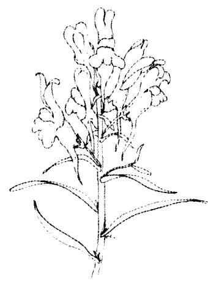

## 雲之4／頭腦：延緩

永遠都要將每一個片刻想成最後一個片刻，就好像根本就不會有明天，那麼你要做什麼？  
開始成為喜樂的，不要將它延緩到明天，不要說：「明天我將會成為喜樂的。」這樣做一定會永遠錯過它。如果不是現在，那麼就永遠沒有辦法。甚至連一個片刻的延緩都不需要。永遠都要將每一個片刻想成最後一個片刻，就好像根本就不會有明天，那麼你要做什麼？

如果再來將不會有明天，那麼你要做什麼？  
持處於痛苦之中嗎？你會拋棄這整個事情，然後你會說：「讓我跳舞，讓我歌唱，讓我暢所欲為！所有這些無意義的事已經夠了——這個瑣事，這個垃圾……」你將會忘掉所有那些小事，那些事就在一個片刻之前你還認為很重  
要，因為你以前認為你將會永遠活下去。

## 生命的遊戲

## 雲之5／頭腦：比較

當你比較，你就錯過了，那麼你會一直看著別人。不會有兩個人是一樣的，不可能。每一個人都獨一無二的，每一個人都優越的，但這個優越是不能比較的。

從前有一個門徒去找一個禪師，他問他說：「為什麼有一些人很聰明，有一些人很愚笨？為什麼有一些人很美，有一些人很醜？為什麼有一些人很聰明，有一些人很醜？為什麼有一些人很聰明，有一些人很醜？為什麼有一些人很聰明，有一些人很醜？為什麼有一些人很聰明，有一些人很醜？為什麼有一些人很聰明，有一些人很醜？為什麼有一些人很聰明，有一些人很醜？為什麼有一些人很聰明，有一些人很醜？為什麼有一些人很聰明，有一些人很醜？為什麼有一些人很聰明，有一些人很醜？為什麼有一些人很聰明，有一些人很醜？為什麼有一些人很聰明，有一些人很醜？為什麼有一些人很聰明，有一些人很醜？為什麼有一些人很聰明，有一些人很醜？為什麼有一些人很聰明，有一些人很醜？為什麼有一些人很聰明，有一些人很醜？為什麼有一些人很聰明，有一些人很醜？為什麼有一些人很聰明，有一些人很醜？為什麼有一些人很聰明，有一些人很醜？為什麼有一些人很聰明，有一些人很醜？為什麼有一些人很聰明，有一些人很醜？為什麼有一些人很聰明，有一些人很醜？為什麼有一些人很聰明，有一些人很醜？為什麼有一些人很聰明，有一些人很醜？為什麼有一些人很聰明，有一些人很醜？為什麼有一些人很聰明，有一些人很醜？為什麼有一些人很聰明，有一些人很醜？為什麼有一些人很聰明，有一些人很醜？為什麼有一些人很聰明，有一些人很醜？為什麼有一些人很聰明，有一些人很醜？為什麼有一些人很聰明，有一些人很醜？為什麼有一些人很聰明，有一些人很醜？為什麼有一些人很聰明，有一些人很醜？為什麼有一些人很聰明，有一些人很醜？為什麼有一些人很聰明，有一些人很醜？為什麼有一些人很聰明，有一些人很醜？為什麼有一些人很聰明，有一些人很醜？為什麼有一些人很聰明，有一些人很醜？為什麼有一些人很聰明，有一些人很醜？為什麼有一些人很聰明，有一些人很醜？為什麼有一些人很聰明，有一些人很醜？為什麼有一些人很聰明，有一些人很醜？為什麼有一些人很聰明，有一些人很醜？為什麼有一些人很聰明，有一些人很醜？為什麼有一些人很聰明，有一些人很醜？為什麼有一些人很聰明，有一些人很醜？為什麼有一些人很聰明，有一些人很醜？為什麼有一些人很聰明，有一些人很醜？為什麼有一些人很聰明，有一些人很醜？為什麼有一些人很聰明，有一些人很醜？為什麼有一些人很聰明，有一些人很醜？為什麼有一些人很聰明，有一些人很醜？為什麼有一些人很聰明，有一些人很醜？為什麼有一些人很聰明，有一些人很醜？為什麼有一些人很聰明，有一些人很醜？為什麼有一些人很聰明，有一些人很醜？為什麼有一些人很聰明，有一些人很醜？為什麼有一些人很聰明，有一些人很醜？為什麼有一些人很聰明，有一些人很醜？為什麼有一些人很聰明，有一些人很醜？為什麼有一些人很聰明，有一些人很醜？為什麼有一些人很聰明，有一些人很醜？為什麼有一些人很聰明，有一些人很醜？為什麼有一些人很聰明，有一些人很醜？為什麼有一些人很聰明，有一些人很醜？為什麼有一些人很聰明，有一些人很醜？為什麼有一些人很聰明，有一些人很醜？為什麼有一些人很聰明，有一些人很醜？為什麼有一些人很聰明，有一些人很醜？為什麼有一些人很聰明，有一些人很醜？為什麼有一些人很聰明，有一些人很醜？為什麼有一些人很聰明，有一些人很醜？為什麼有一些人很聰明，有一些人很醜？為什麼有一些人很聰明，有一些人很醜？為什麼有一些人很聰明，有一些人很醜？為什麼有一些人很聰明，有一些人很醜？為什麼有一些人很聰明，有一些人很醜？為什麼有一些人很聰明，有一些人很醜？為什麼有一些人很聰明，有一些人很醜？為什麼有一些人很聰明，有一些人很醜？為什麼有一些人很聰明，有一些人很醜？為什麼有一些人很聰明，有一些人很醜？為什麼有一些人很聰明，有一些人很醜？為什麼有一些人很聰明，有一些人很醜？為什麼有一些人很聰明，有一些人很醜？為什麼有一些人很聰明，有一些人很醜？為什麼有一些人很聰明，有一些人很醜？為什麼有一些人很聰明，有一些人很醜？為什麼有一些人很聰明，有一些人很醜？為什麼有一些人很聰明，有一些人很醜？為什麼有一些人很聰明，有一些人很醜？為什麼有一些人很聰明，有一些人很醜？為什麼有一些人很聰明，有一些人很醜？為什麼有一些人很聰明，有一些人很醜？為什麼有一些人很聰明，有一些人很醜？為什麼有一些人很聰明，有一些人很醜？為什麼有一些人很聰明，有一些人很醜？為什麼有一些人很聰明，有一些人很醜？為什麼有一些人很聰明，有一些人很醜？為什麼有一些人很聰明，有一些人很醜？為什麼有一些人很聰明，有一些人很醜？為什麼有一些人很聰明，有一些人很醜？為什麼有一些人很聰明，有一些人很醜？為什麼有一些人很聰明，有一些人很醜？為什麼有一些人很聰明，有一些人很醜？為什麼有一些人很聰明，有一些人很醜？為什麼有一些人很聰明，有一些人很醜？為什麼有一些人很聰明，有一些人很醜？為什麼有一些人很聰明，有一些人很醜？為什麼有一些人很聰明，有一些人很醜？為什麼有一些人很聰明，有一些人很醜？為什麼有一些人很聰明，有一些人很醜？為什麼有一些人很聰明，有一些人很醜？為什麼有一些人很聰明，有一些人很醜？為什麼有一些人很聰明，有一些人很醜？為什麼有一些人很聰明，有一些人很醜？為什麼有一些人很聰明，有一些人很醜？為什麼有一些人很聰明，有一些人很醜？為什麼有一些人很聰明，有一些人很醜？為什麼有一些人很聰明，有一些人很醜？為什麼有一些人很聰明，有一些人很醜？為什麼有一些人很聰明，有一些人很醜？為什麼有一些人很聰明，有一些人很醜？為什麼有一些人很聰明，有一些人很醜？為什麼有一些人很聰明，有一些人很醜？為什麼有一些人很聰明，有一些人很醜？為什麼有一些人很聰明，有一些人很醜？為什麼有一些人很聰明，有一些人很醜？為什麼有一些人很聰明，有一些人很醜？為什麼有一些人很聰明，有一些人很醜？為什麼有一些人很聰明，有一些人很醜？為什麼有一些人很聰明，有一些人很醜？為什麼有一些人很聰明，有一些人很醜？為什麼有一些人很聰明，有一些人很醜？為什麼有一些人很聰明，有一些人很醜？為什麼有一些人很聰明，有一些人很醜？為什麼有一些人很聰明，有一些人很醜？為什麼有一些人很聰明，有一些人很醜？為什麼有一些人很聰明，有一些人很醜？為什麼有一些人很聰明，有一些人很醜？為什麼有一些人很聰明，有一些人很醜？為什麼有一些人很聰明，有一些人很醜？為什麼有一些人很聰明，有一些人很醜？為什麼有一些人很聰明，有一些人很醜？為什麼有一些人很聰明，有一些人很醜？為什麼有一些人很聰明，有一些人很醜？為什麼有一些人很聰明，有一些人很醜？為什麼有一些人很聰明，有一些人很醜？為什麼有一些人很聰明，有一些人很醜？為什麼有一些人很聰明，有一些人很醜？為什麼有一些人很聰明，有一些人很醜？為什麼有一些人很聰明，有一些人很醜？為什麼有一些人很聰明，有一些人很醜？為什麼有一些人很聰明，有一些人很醜？為什麼有一些人很聰明，有一些人很醜？為什麼有一些人很聰明，有一些人很醜？為什麼有一些人很聰明，有一些人很醜？為什麼有一些人很聰明，有一些人很醜？為什麼有一些人很聰明，有一些人很醜？為什麼有一些人很聰明，有一些人很醜？為什麼有一些人很聰明，有一些人很醜？為什麼有一些人很聰明，有一些人很醜？為什麼有一些人很聰明，有一些人很醜？為什麼有一些人很聰明，有一些人很醜？為什麼有一些人很聰明，有一些人很醜？為什麼有一些人很聰明，有一些人很醜？為什麼有一些人很聰明，有一些人很醜？為什麼有一些人很聰明，有一些人很醜？為什麼有一些人很聰明，有一些人很醜？為什麼有一些人很聰明，有一些人很醜？為什麼有一些人很聰明，有一些人很醜？為什麼有一些人很聰明，有一些人很醜？為什麼有一些人很聰明，有一些人很醜？為什麼有一些人很聰明，有一些人很醜？為什麼有一些人很聰明，有一些人很醜？為什麼有一些人很聰明，有一些人很醜？為什麼有一些人很聰明，有一些人很醜？為什麼有一些人很聰明，有一些人很醜？為什麼有一些人很聰明，有一些人很醜？為什麼有一些人很聰明，有一些人很醜？為什麼有一些人很聰明，有一些人很醜？為什麼有一些人很聰明，有一些人很醜？為什麼有一些人很聰明，有一些人很醜？為什麼有一些人很聰明，有一些人很醜？為什麼有一些人很聰明，有一些人很醜？為什麼有一些人很聰明，有一些人很醜？為什麼有一些人很聰明，有一些人很醜？為什麼有一些人很聰明，有一些人很醜？為什麼有一些人很聰明，有一些人很醜？為什麼有一些人很聰明，有一些人很醜？為什麼有一些人很聰明，有一些人很醜？為什麼有一些人很聰明，有一些人很醜？為什麼有一些人很聰明，有一些人很醜？為什麼有一些人很聰明，有一些人很醜？為什麼有一些人很聰明，有一些人很醜？為什麼有一些人很聰明，有一些人很醜？為什麼有一些人很聰明，有一些人很醜？為什麼有一些人很聰明，有一些人很醜？為什麼有一些人很聰明，有一些人很醜？為什麼有一些人很聰明，有一些人很醜？為什麼有一些人很聰明，有一些人很醜？為什麼有一些人很聰明，有一些人很醜？為什麼有一些人很聰明，有一些人很醜？為什麼有一些人很聰明，有一些人很醜？為什麼有一些人很聰明，有一些人很醜？為什麼有一些人很聰明，有一些人很醜？為什麼有一些人很聰明，有一些人很醜？為什麼有一些人很聰明，有一些人很醜？為什麼有一些人很聰明，有一些人很醜？為什麼有一些人很聰明，有一些人很醜？為什麼有一些人很聰明，有一些人很醜？為什麼有一些人很聰明，有一些人很醜？為什麼有一些人很聰明，有一些人很醜？為什麼有一些人很聰明，有一些人很醜？為什麼有一些人很聰明，有一些人很醜？為什麼有一些人很聰明，有一些人很醜？為什麼有一些人很聰明，有一些人很醜？為什麼有一些人很聰明，有一些人很醜？為什麼有一些人很聰明，有一些人很醜？為什麼有一些人很聰明，有一些人很醜？為什麼有一些人很聰明，有一些人很醜？為什麼有一些人很聰明，有一些人很醜？為什麼有一些人很聰明，有一些人很醜？為什麼有一些人很聰明，有一些人很醜？為什麼有一些人很聰明，有一些人很醜？為什麼有一些人很聰明，有一些人很醜？為什麼有一些人很聰明，有一些人很醜？為什麼有一些人很聰明，有一些人很醜？為什麼有一些人很聰明，有一些人很醜？為什麼有一些人很聰明，有一些人很醜？為什麼有一些人很聰明，有一些人很醜？為什麼有一些人很聰明，有一些人很醜？為什麼有一些人很聰明，有一些人很醜？為什麼有一些人很聰明，有一些人很醜？為什麼有一些人很聰明，有一些人很醜？為什麼有一些人很聰明，有一些人很醜？為什麼有一些人很聰明，有一些人很醜？為什麼有一些人很聰明，有一些人很醜？為什麼有一些人很聰明，有一些人很醜？為什麼有一些人很聰明，有一些人很醜？為什麼有一些人很聰明，有一些人很醜？為什麼有一些人很聰明，有一些人很醜？為什麼有一些人很聰明，有一些人很醜？為什麼有一些人很聰明，有一些人很醜？為什麼有一些人很聰明，有一些人很醜？為什麼有一些人很聰明，有一些人很醜？為什麼有一些人很聰明，有一些人很醜？為什麼有一些人很聰明，有一些人很醜？為什麼有一些人很聰明，有一些人很醜？為什麼有一些人很聰明，有一些人很醜？為什麼有一些人很聰明，有一些人很醜？為什麼有一些人很聰明，有一些人很醜？為什麼有一些人很聰明，有一些人很醜？為什麼有一些人很聰明，有一些人很醜？為什麼有一些人很聰明，有一些人很醜？為什麼有一些人很聰明，有一些人很醜？為什麼有一些人很聰明，有一些人很醜？為什麼有一些人很聰明，有一些人很醜？為什麼有一些人很聰明，有一些人很醜？為什麼有一些人很聰明，有一些人很醜？為什麼有一些人很聰明，有一些人很醜？為什麼有一些人很聰明，有一些人很醜？為什麼有一些人很聰明，有一些人很醜？為什麼有一些人很聰明，有一些人很醜？為什麼有一些人很聰明，有一些人很醜？為什麼有一些人很聰明，有一些人很醜？為什麼有一些人很聰明，有一些人很醜？為什麼有一些人很聰明，有一些人很醜？為什麼有一些人很聰明，有一些人很醜？為什麼有一些人很聰明，有一些人很醜？為什麼有一些人很聰明，有一些人很醜？為什麼有一些人很聰明，有一些人很醜？為什麼有一些人很聰明，有一些人很醜？為什麼有一些人很聰明，有一些人很醜？為什麼有一些人很聰明，有一些人很醜？為什麼有一些人很聰明，有一些人很醜？為什麼有一些人很聰明，有一些人很醜？為什麼有一些人很聰明，有一些人很醜？為什麼有一些人很聰明，有一些人很醜？為什麼有一些人很聰明，有一些人很醜？為什麼有一些人很聰明，有一些人很醜？為什麼有一些人很聰明，有一些人很醜？為什麼有一些人很聰明，有一些人很醜？為什麼有一些人很聰明，有一些人很醜？為什麼有一些人很聰明，有一些人很醜？為什麼有一些人很聰明，有一些人很醜？為什麼有一些人很聰明，有一些人很醜？為什麼有一些人很聰明，有一些人很醜？為什麼有一些人很聰明，有一些人很醜？為什麼有一些人很聰明，有一些人很醜？為什麼有一些人很聰明，有一些人很醜？為什麼有一些人很聰明，有一些人很醜？為什麼有一些人很聰明，有一些人很醜？為什麼有一些人很聰明，有一些人很醜？為什麼有一些人很聰明，有一些人很醜？為什麼有一些人很聰明，有一些人很醜？為什麼有一些人很聰明，有一些人很醜？為什麼有一些人很聰明，有一些人很醜？為什麼有一些人很聰明，有一些人很醜？為什麼有一些人很聰明，有一些人很醜？為什麼有一些人很聰明，有一些人很醜？為什麼有一些人很聰明，有一些人很醜？為什麼有一些人很聰明，有一些人很醜？為什麼有一些人很聰明，有一些人很醜？為什麼有一些人很聰明，有一些人很醜？為什麼有一些人很聰明，有一些人很醜？為什麼有一些人很聰明，有一些人很醜？為什麼有一些人很聰明，有一些人很醜？為什麼有一些人很聰明，有一些人很醜？為什麼有一些人很聰明，有一些人很醜？為什麼有一些人很聰明，有一些人很醜？為什麼有一些人很聰明，有一些人很醜？為什麼有一些人很聰明，有一些人很醜？為什麼有一些人很聰明，有一些人很醜？為什麼有一些人很聰明，有一些人很醜？為什麼有一些人很聰明，有一些人很醜？為什麼有一些人很聰明，有一些人很醜？為什麼有一些人很聰明，有一些人很醜？為什麼有一些人很聰明，有一些人很醜？為什麼有一些人很聰明，有一些人很醜？為什麼有一些人很聰明，有一些人很醜？為什麼有一些人很聰明，有一些人很醜？為什麼有一些人很聰明，有一些人很醜？為什麼有一些人很聰明，有一些人很醜？為什麼有一些人很聰明，有一些人很醜？為什麼有一些人很聰明，有一些人很醜？為什麼有一些人很聰明，有一些人很醜？為什麼有一些人很聰明，有一些人很醜？為什麼有一些人很聰明，有一些人很醜？為什麼有一些人很聰明，有一些人很醜？為什麼有一些人很聰明，有一些人很醜？為什麼有一些人很聰明，有一些人很醜？為什麼有一些人很聰明，有一些人很醜？為什麼有一些人很聰明，有一些人很醜？為什麼有一些人很聰明，有一些人很醜？為什麼有一些人很聰明，有一些人很醜？為什麼有一些人很聰明，有一些人很醜？為什麼有一些人很聰明，有一些人很醜？為什麼有一些人很聰明，有一些人很醜？為什麼有一些人很聰明，有一些人很醜？為什麼有一些人很聰明，有一些人很醜？為什麼有一些人很聰明，有一些人很醜？為什麼有一些人很聰明，有一些人很醜？為什麼有一些人很聰明，有一些人很醜？為什麼有一些人很聰明，有一些人很醜？為什麼有一些人很聰明，有一些人很醜？為什麼有一些人很聰明，有一些人很醜？為什麼有一些人很聰明，有一些人很醜？為什麼有一些人很聰明，有一些人很醜？為什麼有一些人很聰明，有一些人很醜？為什麼有一些人很聰明，有一些人很醜？為什麼有一些人很聰明，有一些人很醜？為什麼有一些人很聰明，有一些人很醜？為什麼有一些人很聰明，有一些人很醜？為什麼有一些人很聰明，有一些人很醜？為什麼有一些人很聰明，有一些人很醜？為什麼有一些人很聰明，有一些人很醜？為什麼有一些人很聰明，有一些人很醜？為什麼有一些人很聰明，有一些人很醜？為什麼有一些人很聰明，有一些人很醜？為什麼有一些人很聰明，有一些人很醜？為什麼有一些人很聰明，有一些人很醜？為什麼有一些人很聰明，有一些人很醜？為什麼有一些人很聰明，有一些人很醜？為什麼有一些人很聰明，有一些人很醜？為什麼有一些人很聰明，有一些人很醜？為什麼有一些人很聰明，有一些人很醜？為什麼有一些人很聰明，有一些人很醜？為什麼有一些人很聰明，有一些人很醜？為什麼有一些人很聰明，有一些人很醜？為什麼有一些人很聰明，有一些人很醜？為什麼有一些人很聰明，有一些人很醜？為什麼有一些人很聰明，有一些人很醜？為什麼有一些人很聰明，有一些人很醜？為什麼有一些人很聰明，有一些人很醜？為什麼有一些人很聰明，有一些人很醜？為什麼有一些人很聰明，有一些人很醜？為什麼有一些人很聰明，有一些人很醜？為什麼有一些人很聰明，有一些人很醜？為什麼有一些人很聰明，有一些人很醜？為什麼有一些人很聰明，有一些人很醜？為什麼有一些人很聰明，有一些人很醜？為什麼有一些人很聰明，有一些人很醜？為什麼有一些人很聰明，有一些人很醜？為什麼有一些人很聰明，有一些人很醜？為什麼有一些人很聰明，有一些人很醜？為什麼有一些人很聰明，有一些人很醜？為什麼有一些人很聰明，有一些人很醜？為什麼有一些人很聰明，有一些人很醜？為什麼有一些人很聰明，有一些人很醜？為什麼有一些人很聰明，有一些人很醜？為什麼有一些人很聰明，有一些人很醜？為什麼有一些人很聰明，有一些人很醜？為什麼有一些人很聰明，有一些人很醜？為什麼有一些人很聰明，有一些人很醜？為什麼有一些人很聰明，有一些人很醜？為什麼有一些人很聰明，有一些人很醜？為什麼有一些人很聰明，有一些人很醜？為什麼有一些人很聰明，有一些人很醜？為什麼有一些人很聰明，有一些人很醜？為什麼有一些人很聰明，有一些人很醜？為什麼有一些人很聰明，有一些人很醜？為什麼有一些人很聰明，有一些人很醜？為什麼有一些人很聰明，有一些人很醜？為什麼有一些人很聰明，有一些人很醜？為什麼有一些人很聰明，有一些人很醜？為什麼有一些人很聰明，有一些人很醜？為什麼有一些人很聰明，有一些人很醜？為什麼有一些人很聰明，有一些人很醜？為什麼有一些人很聰明，有一些人很醜？為什麼有一些人很聰明，有一些人很醜？為什麼有一些人很聰明，有一些人很醜？為什麼有一些人很聰明，有一些人很醜？為什麼有一些人很聰明，有一些人很醜？為什麼有一些人很聰明，有一些人很醜？為什麼有一些人很聰明，有一些人很醜？為什麼有一些人很聰明，有一些人很醜？為什麼有一些人很聰明，有一些人很醜？為什麼有一些人很聰明，有一些人很醜？為什麼有一些人很聰明，有一些人很醜？為什麼有一些人很聰明，有一些人很醜？為什麼有一些人很聰明，有一些人很醜？為什麼有一些人很聰明，有一些人很醜？為什麼有一些人很聰明，有一些人很醜？為什麼有一些人很聰明，有一些人很醜？為什麼有一些人很聰明，有一些人很醜？為什麼有一些人很聰明，有一些人很醜？為什麼有一些人很聰明，有一些人很醜？為什麼有一些人很聰明，有一些人很醜？為什麼有一些人很聰明，有一些人很醜？為什麼有一些人很聰明，有一些人很醜？為什麼有一些人很聰明，有一些人很醜？為什麼有一些人很聰明，有一些人很醜？為什麼有一些人很聰明，有一些人很醜？為什麼有一些人很聰明，有一些人很醜？為什麼有一些人很聰明，有一些人很醜？為什麼有一些人很聰明，有一些人很醜？為什麼有一些人很聰明，有一些人很醜？為什麼有一些人很聰明，有一些人很醜？為什麼有一些人很聰明，有一些人很醜？為什麼有一些人很聰明，有一些人很醜？為什麼有一些人很聰明，有一些人很醜？為什麼有一些人很聰明，有一些人很醜？為什麼有一些人很聰明，有一些人很醜？為什麼有一些人很聰明，有一些人很醜？為什麼有一些人很聰明，有一些人很醜？為什麼有一些人很聰明，有一些人很醜？為什麼有一些人很聰明，有一些人很醜？為什麼有一些人很聰明，有一些人很醜？為什麼有一些人很聰明，有一些人很醜？為什麼有一些人很聰明，有一些人很醜？為什麼有一些人很聰明，有一些人很醜？為什麼有一些人很聰明，有一些人很醜？為什麼有一些人很聰明，有一些人很醜？為什麼有一些人很聰明，有一些人很醜？為什麼有一些人很聰明，有一些人很醜？為什麼有一些人很聰明，有一些人很醜？為什麼有一些人很聰明，有一些人很醜？為什麼有一些人很聰明，有一些人很醜？為什麼有一些人很聰明，有一些人很醜？為什麼有一些人很聰明，有一些人很醜？為什麼有一些人很聰明，有一些人很醜？為什麼有一些人很聰明，有一些人很醜？為什麼有一些人很聰明，有一些人很醜？為什麼有一些人很聰明，有一些人很醜？為什麼有一些人很聰明，有一些人很醜？為什麼有一些人很聰明，有一些人很醜？為什麼有一些人很聰明，有一些人很醜？為什麼有一些人很聰明，有一些人很醜？為什麼有一些人很聰明，有一些人很醜？為什麼有一些人很聰明，有一些人很醜？為什麼有一些人很聰明，有一些人很醜？為什麼有一些人很聰明，有一些人很醜？為什麼有一些人很聰明，有一些人很醜？為什麼有一些人很聰明，有一些人很醜？為什麼有一些人很聰明，有一些人很醜？為什麼有一些人很聰明，有一些人很醜？為什麼有一些人很聰明，有一些人很醜？為什麼有一些人很聰明，有一些人很醜？為什麼有一些人很聰明，有一些人很醜？為什麼有一些人很聰明，有一些人很醜？為什麼有一些人很聰明，有一些人很醜？為什麼有一些人很聰明，有一些人很醜？為什麼有一些人很聰明，有一些人很醜？為什麼有一些人很聰明，有一些人很醜？為什麼有一些人很聰明，有一些人很醜？為什麼有一些人很聰明，有一些人很醜？為什麼有一些人很聰明，有一些人很醜？為什麼有一些人很聰明，有一些人很醜？為什麼有一些人很聰明，有一些人很醜？為什麼有一些人很聰明，有一些人很醜？為什麼有一些人很聰明，有一些人很醜？為什麼有一些人很聰明，有一些人很醜？為什麼有一些人很聰明，有一些人很醜？為什麼有一些人很聰明，有一些人很醜？為什麼有一些人很聰明，有一些人很醜？為什麼有一些人很聰明，有一些人很醜？為什麼有一些人很聰明，有一些人很醜？為什麼有一些人很聰明，有一些人很醜？為什麼有一些人很聰明，有一些人很醜？為什麼有一些人很聰明，有一些人很醜？為什麼有一些人很聰明，有一些人很醜？為什麼有一些人很聰明，有一些人很醜？為什麼有一些人很聰明，有一些人很醜？為什麼有一些人很聰明，有一些人很醜？為什麼有一些人很聰明，有一些人很醜？為什麼有一些人很聰明，有一些人很醜？為什麼有一些人很聰明，有一些人很醜？為什麼有一些人很聰明，有一些人很醜？為什麼有一些人很聰明，有一些人很醜？為什麼有一些人很聰明，有一些人很醜？為什麼有一些人很聰明，有一些人很醜？為什麼有一些人很聰明，有一些人很醜？為什麼有一些人很聰明，有一些人很醜？為什麼有一些人很聰明，有一些人很醜？為什麼有一些人很聰明，有一些人很醜？為什麼有一些人很聰明，有一些人很醜？為什麼有一些人很聰明，有一些人很醜？為什麼有一些人很聰明，有一些人很醜？為什麼有一些人很聰明，有一些人很醜？為什麼有一些人很聰明，有一些人很醜？為什麼有一些人很聰明，有一些人很醜？為什麼有一些人很聰明，有一些人很醜？為什麼有一些人很聰明，有一些人很醜？為什麼有一些人很聰明，有一些人很醜？為什麼有一些人很聰明，有一些人很醜？為什麼有一些人很聰明，有一些人很醜？為什麼有一些人很聰明，有一些人很醜？為什麼有一些人很聰明，有一些人很醜？為什麼有一些人很聰明，有一些人很醜？為什麼有一些人很聰明，有一些人很醜？為什麼有一些人很聰明，有一些人很醜？為什麼有一些人很聰明，有一些人很醜？為什麼有一些人很聰明，有一些人很醜？為什麼有一些人很聰明，有一些人很醜？為什麼有一些人很聰明，有一些人很醜？為什麼有一些人很聰明，有一些人很醜？為什麼有一些人很聰明，有一些人很醜？為什麼有一些人很聰明，有一些人很醜？為什麼有一些人很聰明，有一些人很醜？為什麼有一些人很聰明，有一些人很醜？為什麼有一些人很聰明，有一些人很醜？為什麼有一些人很聰明，有一些人很醜？為什麼有一些人很聰明，有一些人很醜？為什麼有一些人很聰明，有一些人很醜？為什麼有一些人很聰明，有一些人很醜？為什麼有一些人很聰明，有一些人很醜？為什麼有一些人很聰明，有一些人很醜？為什麼有一些人很聰明，有一些人很醜？為什麼有一些人很聰明，有一些人很醜？為什麼有一些人很聰明，有一些人很醜？為什麼有一些人很聰明，有一些人很醜？為什麼有一些人很聰明，有一些人很醜？為什麼有一些人很聰明，有一些人很醜？為什麼有一些

## 雲之5／頭腦：比較

向內看你自己，你將會經驗到很大的獨特性。所有的自卑感都會蒸發掉、消失掉，它是由你和錯誤的教育所創造出來的，也是由一種微妙的計謀所創造出來的——比較的計謀。一旦你知道了你自己的獨特性，你就不需要跟隨任何人。你可以從每一個人身上學習，一個聰明的人甚至可以從白癡的身上學習，因為有少數的事情你只能從白癡的身上學習，一個聰明的人甚至可以從白癡的身上學習，因為他們是白癡的專家。至少要看他們、觀察他們，這樣你就可以避免掉生命中的一些事。

你可以從每一個人身上學習，不僅可以從人，也可以從動物學習，從樹木、雲、和河流學習。但是沒有模仿的問題，你沒有辦法變成一條河流，從一朵玫瑰花學習到某些事。你無法變成一朵玫瑰花，那個流動，那個放開來。你可以從一朵玫瑰花學習到某些事。你看到玫瑰花是那麼地織細，但是在風中、在雨中、在太陽下又是那麼地強壯。到了晚上它可能就凋謝了，但是它一點都不介意，它在當下那個片刻是很喜悅的，你可以從玫瑰花學習到如何活在當下。就在現在，它在風中跳舞，在雨中跳舞，對未來一點都不害怕，也不擔心。到了晚上，花瓣將會凋零，但是誰會去管晚上？這個片刻就是存在的一切，這個跳舞

## 生命的遊戲

就是存在的一切。

從玫瑰花學習某些事，從振翅飛翔的小鳥學習某些事：那個勇氣——進入到沒有界線的天空的勇氣。從所有的來源學習，但是不要模仿。然而唯有當你找到了正確的狀態去開始，才可能那樣，那個正確的狀態就是認識你自己。

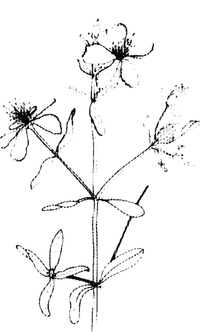

## 雲之6／頭腦：重擔

生命是一個經常的復甦。它每一個片刻都在死，也每一個片刻都在誕生成新的。但是你繼續攜帶著舊有的頭腦，這樣的話，你在任何地方都不適合。

生命是一個活動，是經常的流動，每一個片刻它都是新的。但是頭腦呢？

頭腦從來不是新的，它總是落後。生命和頭腦之間總是不一致──它一定是如此。你看到一朵花，當你了解到你不會再看到它，它已經不再一樣了，生命已經移動了。你看到一條河流，但是你不會再看到同樣的河流兩次。赫拉克賴脫說：「你無法踏進同樣的河流。」我要說，你甚至無法踏進同樣的河流一次，因為河流經常在流動。

頭腦一認出什麼東西，它就已經不再一樣了，頭腦總是繼續累積死的腳印。生命存在一次，之後就不再是如此。

## 生命的遊戲

我們被訓練成頭腦，那是我們的不幸。你繼續錯過生命，而且你將會繼續錯過它，除非你拋棄頭腦，除非你開始從沒有頭腦的狀態來生活。那麼你就跟生命合而為一，那麼你跟你頭腦之間的不一致就消失了，你就不再根據某些觀念來生活，因為觀念屬於頭腦，你不會根據任何意識形態、宗教、經典、或傳統來生活，你只是由你存在的空無來生活。

在剛開始的時候甚至很難想像一個人要如何由空無來生活，但是所有的樹木都是由空無成長的，星星也是由空無移動的，整個存在都是由空無存在的，它完全沒有問題。只有人類具有一個荒謬的概念，認為沒有頭腦將會很難存在，因為存在和頭腦是兩個分開的層面，不僅是分開，而且是對立的。如果你想要跟頭腦成為一致的，你將會跟生命變得不一致。

## 雲之7／頭腦：政治手腕

我們的文化、我們的教育、和我們的宗教都以很微妙的方式在教我們成為偽君子。除非你深入探詢，否則你永遠都不知道你一直在做些什麼。

隨著你的成長，社會一直教你要這樣，要那樣，因此你開始變成一個偽君子，你變得跟你的虛偽認同。就在晚餐的時候，我告訴我的朋友說，第一個說「誠實為上策」的這個人一定是一個非常狡猾的人。誠實並不是一個策略，如果它是策略，那麼它就不是誠實。如果誠實是有利的，那麼它是最好的策略。問題是哪一個比較有利？

就在今天，我的朋友提醒我她在一本書上所看到的一句話，有兩個字非常有意思，她從來沒有將那些字湊在一起：策略（policy）和政治（politics）；

## 生命的遊戲

禮貌（politeness）和政治。禮貌是什麼？它是一種政治。這兩組字都是來自同樣的字根。所有這三個字：politics（政治）、policy（策略）、和politeness（禮貌）都具有同樣的字根，它們都意味著同樣的事。但是你認為禮貌是一個好的品質，你從來不會以政治手腕來思考它，但事實上它是政治手腕。成為一個謙恭有禮的是一種防衛措施。在歐洲，你們會握手，為什麼你們要握手腕？為什麼不握左手？它的確是政治的一部分。握手並不是什麼友善的事，它只是一個姿勢說：「我的右手是空的，裡面沒有刀子或什麼東西。」當你們在握右手的時候，你們無法抽出你們的劍，因為不可能用左手……除非你剛好是一個左撇子。它只是讓對方確認你不會傷害他，他也讓你確認他不會傷害你。漸漸、漸漬地，它變成互相問候的一個象徵。

在印度，你問候的時候是用兩隻手，但那也只是顯示你的兩隻手是空的。它遠比握手來得好，因為誰知道左手會怎麼樣？有時候甚至連右手都不知道左手，所以最好是顯示兩隻手都是空的，那更好，而且更禮貌。但你是在說：「我是完全沒有防衛的，你不需要防著我，也不需要擔心我，你可以放鬆。」

## 雲之8／頭腦：罪惡感

罪惡感（罪惡感）這個字永遠都不應該被使用，這個字會使人作錯誤的聯想，一旦你使用了它，你就會陷住在它裡面。

罪惡的觀念是在人裡面創造出罪惡感的一種技巧。你必須了解罪惡和罪惡感的整個策略。除非你使一個人覺得有罪惡感，否則你沒有辦法在心理上奴役他，你不可能將他監禁在某種意識形態裡，或是監禁在某一個信念系統裡。但是一旦你在他的頭腦裡創造出罪惡感，你就取走了他所有的勇氣，你就摧毀了他所有的冒險精神，你就壓抑了他以他自己的力量成為一個個人的所有可能性。用罪惡感的概念，你幾乎謀殺了在他裡面人性的潛力，他永遠無法獨立。那個罪惡感將會迫使他去依賴一個救世主，或是依賴天堂和地獄的觀念，或是依賴天主，以及所有那些。

要創造出罪惡感，一切你所需要的只是非常簡單的事：開始挑出他的錯誤。

## 生命的遊戲

或罪惡。它們就只是一些錯誤，那也是人之常情。比方說如果有人在數學上犯了一個錯誤──他把二加二算成了五──你並不會說他犯了一個罪，他只是不夠警覺，他沒有注意他在做的事，或者也許他沒有做好準備，他沒有做家課。他的確是犯了一項錯誤，但錯誤並不是罪惡，它是可以被更正的。對於錯誤不需要覺得有罪惡感，最多只需要覺得很愚蠢。

罪惡感是你所接受的一個概念，你可以拒絕它，它是可以被拒絕的，因為它並不是存在的一部分。

罪惡感並不是一種自然的現象，它是由教士們所創造出來的，他們利用罪惡感來剝削人類。整個虛假宗教的歷史都包含在罪惡感（罪）這個字裡面，它是最被毒化的字。要小心它，永遠都不要使用它，因為在你潛意識的頭腦裡，它還有很深的根。你無法在任何動物身上找到罪惡感，動物就只是存在，牠沒有理想，沒有藝術，牠存在，就只是存在，牠沒有要達成完美，因此動物是美的、天真的。

理想使人腐化。一旦你有理想要達成，你就永遠沒有辦法自在，你就永遠

## 雲之8／頭腦：罪惡感

我反對罪惡感——由教士們所創造出來的罪惡感——但是有一種不同類型的罪惡感並不是由教士們所創造出來的，那種罪惡感是非常有意義的。如果你覺得在生命中有更多的東西，而你覺得你不夠努力去達到它，那種罪惡感就會產生。你會覺得有罪惡感，然後你會覺得你在你自己的成長路線上創造出障礙，你會覺得你是懶惰的、無氣力的、無意識的、昏睡的，你不夠整合，你無法走向你的命運，然後就會有一種罪惡感產生。當你覺得你有可能性，而你並沒有把它轉變成實際，那麼就會有罪惡感產生，那種罪惡感是完全不同的。

遠沒有在家的感覺，你就永遠沒有辦法滿足。不滿足就像影子一樣地跟隨著理想，而你對你自己越不滿意，你就會變得越不可能達到理想，這是一個惡性循環。如果你不會對你自己不滿意，你就會變得越不可能達到理想，這是一個惡性循環。如果你你不會對你自己不滿意，你就會變得越不可能達到理想，這是一個惡性循環。如果你你不會對你自己不滿意，你就會變得越不可能達到理想，這是一個惡性循環。如果你你不會對你自己不滿意，你就會變得越不可能達到理想，這是一個惡性循環。如果你你不會對你自己不滿意，你就會變得越不可能達到理想，這是一個惡性循環。如果你你不會對你自己不滿意，你就會變得越不可能達到理想，這是一個惡性循環。如果你你不會對你自己不滿意，你就會變得越不可能達到理想，這是一個惡性循環。如果你你不會對你自己不滿意，你就會變得越不可能達到理想，這是一個惡性循環。如果你你不會對你自己不滿意，你就會變得越不可能達到理想，這是一個惡性循環。如果你你不會對你自己不滿意，你就會變得越不可能達到理想，這是一個惡性循環。如果你你不會對你自己不滿意，你就會變得越不可能達到理想，這是一個惡性循環。如果你你不會對你自己不滿意，你就會變得越不可能達到理想，這是一個惡性循環。如果你你不會對你自己不滿意，你就會變得越不可能達到理想，這是一個惡性循環。如果你你不會對你自己不滿意，你就會變得越不可能達到理想，這是一個惡性循環。如果你你不會對你自己不滿意，你就會變得越不可能達到理想，這是一個惡性循環。如果你你不會對你自己不滿意，你就會變得越不可能達到理想，這是一個惡性循環。如果你你不會對你自己不滿意，你就會變得越不可能達到理想，這是一個惡性循環。如果你你不會對你自己不滿意，你就會變得越不可能達到理想，這是一個惡性循環。如果你你不會對你自己不滿意，你就會變得越不可能達到理想，這是一個惡性循環。如果你你不會對你自己不滿意，你就會變得越不可能達到理想，這是一個惡性循環。如果你你不會對你自己不滿意，你就會變得越不可能達到理想，這是一個惡性循環。如果你你不會對你自己不滿意，你就會變得越不可能達到理想，這是一個惡性循環。如果你你不會對你自己不滿意，你就會變得越不可能達到理想，這是一個惡性循環。如果你你不會對你自己不滿意，你就會變得越不可能達到理想，這是一個惡性循環。如果你你不會對你自己不滿意，你就會變得越不可能達到理想，這是一個惡性循環。如果你你不會對你自己不滿意，你就會變得越不可能達到理想，這是一個惡性循環。如果你你不會對你自己不滿意，你就會變得越不可能達到理想，這是一個惡性循環。如果你你不會對你自己不滿意，你就會變得越不可能達到理想，這是一個惡性循環。如果你你不會對你自己不滿意，你就會變得越不可能達到理想，這是一個惡性循環。如果你你不會對你自己不滿意，你就會變得越不可能達到理想，這是一個惡性循環。如果你你不會對你自己不滿意，你就會變得越不可能達到理想，這是一個惡性循環。如果你你不會對你自己不滿意，你就會變得越不可能達到理想，這是一個惡性循環。如果你你不會對你自己不滿意，你就會變得越不可能達到理想，這是一個惡性循環。如果你你不會對你自己不滿意，你就會變得越不可能達到理想，這是一個惡性循環。如果你你不會對你自己不滿意，你就會變得越不可能達到理想，這是一個惡性循環。如果你你不會對你自己不滿意，你就會變得越不可能達到理想，這是一個惡性循環。如果你你不會對你自己不滿意，你就會變得越不可能達到理想，這是一個惡性循環。如果你你不會對你自己不滿意，你就會變得越不可能達到理想，這是一個惡性循環。如果你你不會對你自己不滿意，你就會變得越不可能達到理想，這是一個惡性循環。如果你你不會對你自己不滿意，你就會變得越不可能達到理想，這是一個惡性循環。如果你你不會對你自己不滿意，你就會變得越不可能達到理想，這是一個惡性循環。如果你你不會對你自己不滿意，你就會變得越不可能達到理想，這是一個惡性循環。如果你你不會對你自己不滿意，你就會變得越不可能達到理想，這是一個惡性循環。如果你你不會對你自己不滿意，你就會變得越不可能達到理想，這是一個惡性循環。如果你你不會對你自己不滿意，你就會變得越不可能達到理想，這是一個惡性循環。如果你你不會對你自己不滿意，你就會變得越不可能達到理想，這是一個惡性循環。如果你你不會對你自己不滿意，你就會變得越不可能達到理想，這是一個惡性循環。如果你你不會對你自己不滿意，你就會變得越不可能達到理想，這是一個惡性循環。如果你你不會對你自己不滿意，你就會變得越不可能達到理想，這是一個惡性循環。如果你你不會對你自己不滿意，你就會變得越不可能達到理想，這是一個惡性循環。如果你你不會對你自己不滿意，你就會變得越不可能達到理想，這是一個惡性循環。如果你你不會對你自己不滿意，你就會變得越不可能達到理想，這是一個惡性循環。如果你你不會對你自己不滿意，你就會變得越不可能達到理想，這是一個惡性循環。如果你你不會對你自己不滿意，你就會變得越不可能達到理想，這是一個惡性循環。如果你你不會對你自己不滿意，你就會變得越不可能達到理想，這是一個惡性循環。如果你你不會對你自己不滿意，你就會變得越不可能達到理想，這是一個惡性循環。如果你你不會對你自己不滿意，你就會變得越不可能達到理想，這是一個惡性循環。如果你你不會對你自己不滿意，你就會變得越不可能達到理想，這是一個惡性循環。如果你你不會對你自己不滿意，你就會變得越不可能達到理想，這是一個惡性循環。如果你你不會對你自己不滿意，你就會變得越不可能達到理想，這是一個惡性循環。如果你你不會對你自己不滿意，你就會變得越不可能達到理想，這是一個惡性循環。如果你你不會對你自己不滿意，你就會變得越不可能達到理想，這是一個惡性循環。如果你你不會對你自己不滿意，你就會變得越不可能達到理想，這是一個惡性循環。如果你你不會對你自己不滿意，你就會變得越不可能達到理想，這是一個惡性循環。如果你你不會對你自己不滿意，你就會變得越不可能達到理想，這是一個惡性循環。如果你你不會對你自己不滿意，你就會變得越不可能達到理想，這是一個惡性循環。如果你你不會對你自己不滿意，你就會變得越不可能達到理想，這是一個惡性循環。如果你你不會對你自己不滿意，你就會變得越不可能達到理想，這是一個惡性循環。如果你你不會對你自己不滿意，你就會變得越不可能達到理想，這是一個惡性循環。如果你你不會對你自己不滿意，你就會變得越不可能達到理想，這是一個惡性循環。如果你你不會對你自己不滿意，你就會變得越不可能達到理想，這是一個惡性循環。如果你你不會對你自己不滿意，你就會變得越不可能達到理想，這是一個惡性循環。如果你你不會對你自己不滿意，你就會變得越不可能達到理想，這是一個惡性循環。如果你你不會對你自己不滿意，你就會變得越不可能達到理想，這是一個惡性循環。如果你你不會對你自己不滿意，你就會變得越不可能達到理想，這是一個惡性循環。如果你你不會對你自己不滿意，你就會變得越不可能達到理想，這是一個惡性循環。如果你你不會對你自己不滿意，你就會變得越不可能達到理想，這是一個惡性循環。如果你你不會對你自己不滿意，你就會變得越不可能達到理想，這是一個惡性循環。如果你你不會對你自己不滿意，你就會變得越不可能達到理想，這是一個惡性循環。如果你你不會對你自己不滿意，你就會變得越不可能達到理想，這是一個惡性循環。如果你你不會對你自己不滿意，你就會變得越不可能達到理想，這是一個惡性循環。如果你你不會對你自己不滿意，你就會變得越不可能達到理想，這是一個惡性循環。如果你你不會對你自己不滿意，你就會變得越不可能達到理想，這是一個惡性循環。如果你你不會對你自己不滿意，你就會變得越不可能達到理想，這是一個惡性循環。如果你你不會對你自己不滿意，你就會變得越不可能達到理想，這是一個惡性循環。如果你你不會對你自己不滿意，你就會變得越不可能達到理想，這是一個惡性循環。如果你你不會對你自己不滿意，你就會變得越不可能達到理想，這是一個惡性循環。如果你你不會對你自己不滿意，你就會變得越不可能達到理想，這是一個惡性循環。如果你你不會對你自己不滿意，你就會變得越不可能達到理想，這是一個惡性循環。如果你你不會對你自己不滿意，你就會變得越不可能達到理想，這是一個惡性循環。如果你你不會對你自己不滿意，你就會變得越不可能達到理想，這是一個惡性循環。如果你你不會對你自己不滿意，你就會變得越不可能達到理想，這是一個惡性循環。如果你你不會對你自己不滿意，你就會變得越不可能達到理想，這是一個惡性循環。如果你你不會對你自己不滿意，你就會變得越不可能達到理想，這是一個惡性循環。如果你你不會對你自己不滿意，你就會變得越不可能達到理想，這是一個惡性循環。如果你你不會對你自己不滿意，你就會變得越不可能達到理想，這是一個惡性循環。如果你你不會對你自己不滿意，你就會變得越不可能達到理想，這是一個惡性循環。如果你你不會對你自己不滿意，你就會變得越不可能達到理想，這是一個惡性循環。如果你你不會對你自己不滿意，你就會變得越不可能達到理想，這是一個惡性循環。如果你你不會對你自己不滿意，你就會變得越不可能達到理想，這是一個惡性循環。如果你你不會對你自己不滿意，你就會變得越不可能達到理想，這是一個惡性循環。如果你你不會對你自己不滿意，你就會變得越不可能達到理想，這是一個惡性循環。如果你你不會對你自己不滿意，你就會變得越不可能達到理想，這是一個惡性循環。如果你你不會對你自己不滿意，你就會變得越不可能達到理想，這是一個惡性循環。如果你你不會對你自己不滿意，你就會變得越不可能達到理想，這是一個惡性循環。如果你你不會對你自己不滿意，你就會變得越不可能達到理想，這是一個惡性循環。如果你你不會對你自己不滿意，你就會變得越不可能達到理想，這是一個惡性循環。如果你你不會對你自己不滿意，你就會變得越不可能達到理想，這是一個惡性循環。如果你你不會對你自己不滿意，你就會變得越不可能達到理想，這是一個惡性循環。如果你你不會對你自己不滿意，你就會變得越不可能達到理想，這是一個惡性循環。如果你你不會對你自己不滿意，你就會變得越不可能達到理想，這是一個惡性循環。如果你你不會對你自己不滿意，你就會變得越不可能達到理想，這是一個惡性循環。如果你你不會對你自己不滿意，你就會變得越不可能達到理想，這是一個惡性循環。如果你你不會對你自己不滿意，你就會變得越不可能達到理想，這是一個惡性循環。如果你你不會對你自己不滿意，你就會變得越不可能達到理想，這是一個惡性循環。如果你你不會對你自己不滿意，你就會變得越不可能達到理想，這是一個惡性循環。如果你你不會對你自己不滿意，你就會變得越不可能達到理想，這是一個惡性循環。如果你你不會對你自己不滿意，你就會變得越不可能達到理想，這是一個惡性循環。如果你你不會對你自己不滿意，你就會變得越不可能達到理想，這是一個惡性循環。如果你你不會對你自己不滿意，你就會變得越不可能達到理想，這是一個惡性循環。如果你你不會對你自己不滿意，你就會變得越不可能達到理想，這是一個惡性循環。如果你你不會對你自己不滿意，你就會變得越不可能達到理想，這是一個惡性循環。如果你你不會對你自己不滿意，你就會變得越不可能達到理想，這是一個惡性循環。如果你你不會對你自己不滿意，你就會變得越不可能達到理想，這是一個惡性循環。如果你你不會對你自己不滿意，你就會變得越不可能達到理想，這是一個惡性循環。如果你你不會對你自己不滿意，你就會變得越不可能達到理想，這是一個惡性循環。如果你你不會對你自己不滿意，你就會變得越不可能達到理想，這是一個惡性循環。如果你你不會對你自己不滿意，你就會變得越不可能達到理想，這是一個惡性循環。如果你你不會對你自己不滿意，你就會變得越不可能達到理想，這是一個惡性循環。如果你你不會對你自己不滿意，你就會變得越不可能達到理想，這是一個惡性循環。如果你你不會對你自己不滿意，你就會變得越不可能達到理想，這是一個惡性循環。如果你你不會對你自己不滿意，你就會變得越不可能達到理想，這是一個惡性循環。如果你你不會對你自己不滿意，你就會變得越不可能達到理想，這是一個惡性循環。如果你你不會對你自己不滿意，你就會變得越不可能達到理想，這是一個惡性循環。如果你你不會對你自己不滿意，你就會變得越不可能達到理想，這是一個惡性循環。如果你你不會對你自己不滿意，你就會變得越不可能達到理想，這是一個惡性循環。如果你你不會對你自己不滿意，你就會變得越不可能達到理想，這是一個惡性循環。如果你你不會對你自己不滿意，你就會變得越不可能達到理想，這是一個惡性循環。如果你你不會對你自己不滿意，你就會變得越不可能達到理想，這是一個惡性循環。如果你你不會對你自己不滿意，你就會變得越不可能達到理想，這是一個惡性循環。如果你你不會對你自己不滿意，你就會變得越不可能達到理想，這是一個惡性循環。如果你你不會對你自己不滿意，你就會變得越不可能達到理想，這是一個惡性循環。如果你你不會對你自己不滿意，你就會變得越不可能達到理想，這是一個惡性循環。如果你你不會對你自己不滿意，你就會變得越不可能達到理想，這是一個惡性循環。如果你你不會對你自己不滿意，你就會變得越不可能達到理想，這是一個惡性循環。如果你你不會對你自己不滿意，你就會變得越不可能達到理想，這是一個惡性循環。如果你你不會對你自己不滿意，你就會變得越不可能達到理想，這是一個惡性循環。如果你你不會對你自己不滿意，你就會變得越不可能達到理想，這是一個惡性循環。如果你你不會對你自己不滿意，你就會變得越不可能達到理想，這是一個惡性循環。如果你你不會對你自己不滿意，你就會變得越不可能達到理想，這是一個惡性循環。如果你你不會對你自己不滿意，你就會變得越不可能達到理想，這是一個惡性循環。如果你你不會對你自己不滿意，你就會變得越不可能達到理想，這是一個惡性循環。如果你你不會對你自己不滿意，你就會變得越不可能達到理想，這是一個惡性循環。如果你你不會對你自己不滿意，你就會變得越不可能達到理想，這是一個惡性循環。如果你你不會對你自己不滿意，你就會變得越不可能達到理想，這是一個惡性循環。如果你你不會對你自己不滿意，你就會變得越不可能達到理想，這是一個惡性循環。如果你你不會對你自己不滿意，你就會變得越不可能達到理想，這是一個惡性循環。如果你你不會對你自己不滿意，你就會變得越不可能達到理想，這是一個惡性循環。如果你你不會對你自己不滿意，你就會變得越不可能達到理想，這是一個惡性循環。如果你你不會對你自己不滿意，你就會變得越不可能達到理想，這是一個惡性循環。如果你你不會對你自己不滿意，你就會變得越不可能達到理想，這是一個惡性循環。如果你你不會對你自己不滿意，你就會變得越不可能達到理想，這是一個惡性循環。如果你你不會對你自己不滿意，你就會變得越不可能達到理想，這是一個惡性循環。如果你你不會對你自己不滿意，你就會變得越不可能達到理想，這是一個惡性循環。如果你你不會對你自己不滿意，你就會變得越不可能達到理想，這是一個惡性循環。如果你你不會對你自己不滿意，你就會變得越不可能達到理想，這是一個惡性循環。如果你你不會對你自己不滿意，你就會變得越不可能達到理想，這是一個惡性循環。如果你你不會對你自己不滿意，你就會變得越不可能達到理想，這是一個惡性循環。如果你你不會對你自己不滿意，你就會變得越不可能達到理想，這是一個惡性循環。如果你你不會對你自己不滿意，你就會變得越不可能達到理想，這是一個惡性循環。如果你你不會對你自己不滿意，你就會變得越不可能達到理想，這是一個惡性循環。如果你你不會對你自己不滿意，你就會變得越不可能達到理想，這是一個惡性循環。如果你你不會對你自己不滿意，你就會變得越不可能達到理想，這是一個惡性循環。如果你你不會對你自己不滿意，你就會變得越不可能達到理想，這是一個惡性循環。如果你你不會對你自己不滿意，你就會變得越不可能達到理想，這是一個惡性循環。如果你你不會對你自己不滿意，你就會變得越不可能達到理想，這是一個惡性循環。如果你你不會對你自己不滿意，你就會變得越不可能達到理想，這是一個惡性循環。如果你你不會對你自己不滿意，你就會變得越不可能達到理想，這是一個惡性循環。如果你你不會對你自己不滿意，你就會變得越不可能達到理想，這是一個惡性循環。如果你你不會對你自己不滿意，你就會變得越不可能達到理想，這是一個惡性循環。如果你你不會對你自己不滿意，你就會變得越不可能達到理想，這是一個惡性循環。如果你你不會對你自己不滿意，你就會變得越不可能達到理想，這是一個惡性循環。如果你你不會對你自己不滿意，你就會變得越不可能達到理想，這是一個惡性循環。如果你你不會對你自己不滿意，你就會變得越不可能達到理想，這是一個惡性循環。如果你你不會對你自己不滿意，你就會變得越不可能達到理想，這是一個惡性循環。如果你你不會對你自己不滿意，你就會變得越不可能達到理想，這是一個惡性循環。如果你你不會對你自己不滿意，你就會變得越不可能達到理想，這是一個惡性循環。如果你你不會對你自己不滿意，你就會變得越不可能達到理想，這是一個惡性循環。如果你你不會對你自己不滿意，你就會變得越不可能達到理想，這是一個惡性循環。如果你你不會對你自己不滿意，你就會變得越不可能達到理想，這是一個惡性循環。如果你你不會對你自己不滿意，你就會變得越不可能達到理想，這是一個惡性循環。如果你你不會對你自己不滿意，你就會變得越不可能達到理想，這是一個惡性循環。如果你你不會對你自己不滿意，你就會變得越不可能達到理想，這是一個惡性循環。如果你你不會對你自己不滿意，你就會變得越不可能達到理想，這是一個惡性循環。如果你你不會對你自己不滿意，你就會變得越不可能達到理想，這是一個惡性循環。如果你你不會對你自己不滿意，你就會變得越不可能達到理想，這是一個惡性循環。如果你你不會對你自己不滿意，你就會變得越不可能達到理想，這是一個惡性循環。如果你你不會對你自己不滿意，你就會變得越不可能達到理想，這是一個惡性循環。如果你你不會對你自己不滿意，你就會變得越不可能達到理想，這是一個惡性循環。如果你你不會對你自己不滿意，你就會變得越不可能達到理想，這是一個惡性循環。如果你你不會對你自己不滿意，你就會變得越不可能達到理想，這是一個惡性循環。如果你你不會對你自己不滿意，你就會變得越不可能達到理想，這是一個惡性循環。如果你你不會對你自己不滿意，你就會變得越不可能達到理想，這是一個惡性循環。如果你你不會對你自己不滿意，你就會變得越不可能達到理想，這是一個惡性循環。如果你你不會對你自己不滿意，你就會變得越不可能達到理想，這是一個惡性循環。如果你你不會對你自己不滿意，你就會變得越不可能達到理想，這是一個惡性循環。如果你你不會對你自己不滿意，你就會變得越不可能達到理想，這是一個惡性循環。如果你你不會對你自己不滿意，你就會變得越不可能達到理想，這是一個惡性循環。如果你你不會對你自己不滿意，你就會變得越不可能達到理想，這是一個惡性循環。如果你你不會對你自己不滿意，你就會變得越不可能達到理想，這是一個惡性循環。如果你你不會對你自己不滿意，你就會變得越不可能達到理想，這是一個惡性循環。如果你你不會對你自己不滿意，你就會變得越不可能達到理想，這是一個惡性循環。如果你你不會對你自己不滿意，你就會變得越不可能達到理想，這是一個惡性循環。如果你你不會對你自己不滿意，你就會變得越不可能達到理想，這是一個惡性循環。如果你你不會對你自己不滿意，你就會變得越不可能達到理想，這是一個惡性循環。如果你你不會對你自己不滿意，你就會變得越不可能達到理想，這是一個惡性循環。如果你你不會對你自己不滿意，你就會變得越不可能達到理想，這是一個惡性循環。如果你你不會對你自己不滿意，你就會變得越不可能達到理想，這是一個惡性循環。如果你你不會對你自己不滿意，你就會變得越不可能達到理想，這是一個惡性循環。如果你你不會對你自己不滿意，你就會變得越不可能達到理想，這是一個惡性循環。如果你你不會對你自己不滿意，你就會變得越不可能達到理想，這是一個惡性循環。如果你你不會對你自己不滿意，你就會變得越不可能達到理想，這是一個惡性循環。如果你你不會對你自己不滿意，你就會變得越不可能達到理想，這是一個惡性循環。如果你你不會對你自己不滿意，你就會變得越不可能達到理想，這是一個惡性循環。如果你你不會對你自己不滿意，你就會變得越不可能達到理想，這是一個惡性循環。如果你你不會對你自己不滿意，你就會變得越不可能達到理想，這是一個惡性循環。如果你你不會對你自己不滿意，你就會變得越不可能達到理想，這是一個惡性循環。如果你你不會對你自己不滿意，你就會變得越不可能達到理想，這是一個惡性循環。如果你你不會對你自己不滿意，你就會變得越不可能達到理想，這是一個惡性循環。如果你你不會對你自己不滿意，你就會變得越不可能達到理想，這是一個惡性循環。如果你你不會對你自己不滿意，你就會變得越不可能達到理想，這是一個惡性循環。如果你你不會對你自己不滿意，你就會變得越不可能達到理想，這是一個惡性循環。如果你你不會對你自己不滿意，你就會變得越不可能達到理想，這是一個惡性循環。如果你你不會對你自己不滿意，你就會變得越不可能達到理想，這是一個惡性循環。如果你你不會對你自己不滿意，你就會變得越不可能達到理想，這是一個惡性循環。如果你你不會對你自己不滿意，你就會變得越不可能達到理想，這是一個惡性循環。如果你你不會對你自己不滿意，你就會變得越不可能達到理想，這是一個惡性循環。如果你你不會對你自己不滿意，你就會變得越不可能達到理想，這是一個惡性循環。如果你你不會對你自己不滿意，你就會變得越不可能達到理想，這是一個惡性循環。如果你你不會對你自己不滿意，你就會變得越不可能達到理想，這是一個惡性循環。如果你你不會對你自己不滿意，你就會變得越不可能達到理想，這是一個惡性循環。如果你你不會對你自己不滿意，你就會變得越不可能達到理想，這是一個惡性循環。如果你你不會對你自己不滿意，你就會變得越不可能達到理想，這是一個惡性循環。如果你你不會對你自己不滿意，你就會變得越不可能達到理想，這是一個惡性循環。如果你你不會對你自己不滿意，你就會變得越不可能達到理想，這是一個惡性循環。如果你你不會對你自己不滿意，你就會變得越不可能達到理想，這是一個惡性循環。如果你你不會對你自己不滿意，你就會變得越不可能達到理想，這是一個惡性循環。如果你你不會對你自己不滿意，你就會變得越不可能達到理想，這是一個惡性循環。如果你你不會對

## 生命的遊戲

我並不是在談論教士們在人類裡面所創造出來的罪惡感：「不要吃這個，否則你將會覺得有罪惡感，不要做那個，否則你將會覺得有罪惡感。」……他們譴責無數的事情，所以如果你吃了，如果你喝了，如果你做這個和那個，你就會被罪惡的感覺所圍繞著。我並不是在談論那種罪惡感，那種罪惡感必須被拋棄。事實上，那種罪惡感幫助你停留在你所在的地方。那些罪惡感不讓你去知道內在真正的罪惡感。他們在一些小事情上面創造出太多無謂的紛擾——你是一個罪人，你為什麼要在晚上吃東西，那些教徒就會大驚小怪，認為「你是有罪的」，你做錯事了。跟一個女人或先生離婚，天主教徒就會在你裡面創造出罪惡感——你做錯事了。

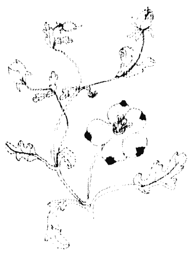

## 雲之9／頭腦：憂傷

做某些事，而你並沒有做它；當你看到你有很多潛力，但是你並沒有將那個潛力轉變成事實；當你看到你攜帶著很多寶物的種子，它們是可以開花的，而你並沒有盡一己之力，你就只是停留在痛苦裡，那麼你就會覺得自己有很大的責任。如果你沒有履行那個責任，你會覺得有罪惡感，這種罪惡感是很有意義的。

當你在悲傷的時候，要進入你的悲傷，而不要逃避到某種活動裡，或是利用某些事來佔據你。不要跑去找朋友或是去看電影，或是聽收音機，或是看電視，不要逃避它，不要不理它，要將所有的活動都拋開，閉起你的眼睛，進入它，看看它是什麼，為什麼它會這樣，看著它，但是不要有譴責，因為如果你譴責，你就沒有辦法看到它的全部。看著它，不要判斷。如果你判斷，你就沒有辦法看到它的全部。看著它，不要評估。只要你看著它，你就可以看到它所有的面。你將會感到它是什麼。看著它，就好像它是一朵花，它是悲傷的；好像它是一朵雲，它是暗的，但是是沒有判斷地看著它，這樣你才可以看到它所有的面。

## 雲之9／頭腦：憂傷

很驚訝，你越是深入它，它就越會開始消散。如果一個人能夠深入他的憂傷，他將會發覺所有的憂傷都蒸發掉了。在那個憂傷的蒸發當中就是喜悅，就是喜樂。

有兩種類型的悲傷，其中一種是有原因的：你失去一個朋友，所以你覺得很憂傷；某人死掉，你覺得很憂傷，但是有肇因的，任何有肇因的事都不可能是永久的。你會找到另外一個朋友，你會有另外一個愛人，你會忘掉它，只需要一些時間，然後它就會被療癒。但是有一種存在性的憂傷是沒有肇因的，它會持續下去，沒有什麼原因，它就只是你成長的一部分。

你變得覺知到生命的沒有意義。你繼續做事，但是你已經變得有能力看透它們，你知道它是沒有意義的，因此而有憂傷。你知道它沒有問題，它使一個人繼續忙著，但它就只是沒有意義的，因此而有憂傷。你已經看透你所希望的事，但是現在你可以看清所有的希望都是沒有基礎的，沒有什麼事會發生，一個人可以繼續希望，然後有一天就死掉，然後每一件事都沒有了：金錢沒有了，關係沒有了，友誼沒有了，或遲或早，每一件事都會歸於烏有。每一件事都會來到終點，來到窮途末路，然後一個人就陷住在那裡。不知道為什麼，就只是繼續著，然後一個人就拖著自己的生命開始做其他的事。一個人必須做些什麼，否則生命會變得太負擔了，所以一個人就繼續使自己保持被佔據。但是一個人在內在深處知道這一切都沒有用，它是一個白癡所講的故事。

當這樣的事發生，它是很美的，它是蛻變的開始。你是一個解除幻象的人，唯有解除幻象的人可以追尋。當世界對你來講已經沒有希望，你可以往內走，當外在已經完全失敗，我說完全……即使只有一點點希望存在，你也會繼續找尋，那麼就仍然會有一些幻象存在。當你完全解除幻象，當外在已經不再有吸引力，當你已經看清它而發覺它是不足的，如此一來，你已經來到了那個了解的點，你已經了解到它沒有什麼，你已經了解到它全部都是沙漠，沒有綠洲，當你看清所有的綠洲都只是幻象——你可以創造出它們，但是當你接近，它們就消失了——那麼你就會「跳」進內在。

你是你自己的—盞燈。當佛陀即將過世的時候，這是他給世界最後的訊息。他的大門徒阿南達又哭又泣的，佛陀說：「停！你在做什麼？你為什麼又哭又泣的？」

阿南達說：「你就要離我們而去了，我跟著你四十年，我跟你走在一起，睡在一起，吃在一起，聽你講話──我就好像是你的一個影子，但是……你在的時候我都沒有辦法成道，現在我為了你要離開而哭。」

「沒有你，我可能沒有辦法成道。現在沒有辦法成道。當你在的時候我都沒有辦法成道，我錯過了這麼偉大的機會。現在沒有了你，那就更沒有辦法成道，我錯過了這麼偉大的機會。我之所以哭泣並不是因為你即將要死掉，因為我知道你不會死。我之所以哭泣是因為現在我沒有希望了，現在，隨著你的死，我靈魂的黑夜就開始了。」

「我之所以哭泣，不是為你哭，而是為我自己哭。」

佛陀笑著說：「不必擔心，因為你的光就在你自己身上，我並沒有帶走你的光。我以前也不是你的光，否則你可能已經成道了──如果以我的力量可以使得你成道的話。成道必須靠你最內在的能力，所以要勇敢，阿南達，要成為你自己的光。」

佛陀過世之後只有二十四小時，阿南達就成道了，這到底是怎麼一回事？這是一個奧秘。他跟佛陀生活在一起四十年，在佛陀死後只有二十四小時，他就成道了。佛陀的死是一個很大的震撼，那個最後的訊息穿透得非常深。

當佛陀還活著，阿南達就只是馬馬虎虎地聽著：「好，如果今天我錯過，明天我還可以再聽到，所以何必匆忙？如果今天早上錯過，那沒有關係，還有隔天早上。」他就只是半睡半醒地聽著。佛陀一而再，再而三地說同樣的事情，所以要聽多久呢？一個人會開始覺得他已經知道了，一個人會開始覺得：「是的，我以前聽過這個，所以有什麼意義？為什麼不小睡一下？小睡一下是很好的。」

但是當佛陀即將過世，阿南達一定很警覺，他真的在顫抖——一想到要在黑暗中跌跌撞撞億萬年。而佛陀說：「不必擔心，你的光就在你裡面。」這句話徹底打擊到他。或許那是他首度真正聽到。在那四十年裡面，他一定都錯過了，那或許是他首度沒有耳聾，在那個當下，他變得很清晰。那個情況使他連最根部都顫抖起來，他連最基礎的部分都被震撼到。佛陀即將要離開了……當你跟一個像佛陀這樣的人生活在一起四十年，那是很難的。一想到就要沒有他了就讓人覺得很困難。幾乎不可能相信。阿南達一定想自殺。在佛教的經典裡並沒有這樣的記載，但是我說他一定有想到要自殺，那個念頭一定有發生在他身上，因為那也是人之常情。跟佛陀生活在一起四十年，然後佛陀即將要過世，而還沒有什麼事發生在他身上，他仍然保持像沙漠一樣，甚至還不是一個綠洲，他已經錯過了那個機會。

他的眼睛一定變得很清澈。這個死一定就像一把劍一樣地刺穿他，這個片刻一定非常銳利，而佛陀說：「成為你自己的光。」然後過世，他立刻就過世。這是在這個地球上所說的最後一句話：成為你自己的光。

這句話徹底打擊到他，這句話穿透了阿南達的心，在二十四小時之內就成道了。

發光的源頭就在你裡面，它並不是在你外面，如果你在外面找尋它，你的找尋是沒有用的。閉起你的眼睛，進入你自己的內在。它就在那裡：從亙古以來就在等待。它是你最內在的本性。你是發光體，你的存在是發光的。這個發光體並不是借來的，它是你最內在的核心，它就是你。

你是光——是你自己的光。

## 雲之10／頭腦：再生

真正的聖人會再度變成一個小孩，那個圓圈是完整的——從小孩回到小孩。但那個差別是很大的……第一次出生是屬於身體的，第二次出生是屬於意識的。

查拉圖斯特將意識的進化分成三個象徵性的東西：駱駝、獅子、和小孩。駱駝是一種背負著重擔的動物，準備被奴役，從來不反抗，他永遠沒有辦法說不。他是一個相信者，一個跟隨者，一個忠實的奴隸，那是人類意識最低的層次。

獅子是一個革命，革命的開始是一個神聖的「不」。在駱駝的意識裡總是需要一個人來領導，需要一個人來告訴他：「你要做這個。」他需要誠信，他需要所有的宗教、所有的教士，以及所有神聖的經典，因為他無法信任他自己。他沒有勇氣，沒有靈魂，沒有對自由的渴望，他是服從的。

## 雲之10／頭腦：再生

獅子是對自由的渴望，是一種要摧毀所有監禁的慾望。獅子不需要任何領導者，他本身就足夠了，他不允許其他任何人來告訴他：「你要。」這對他的自尊是一種侮辱。他只能說：「我要。」獅子是責任，同時是一種很大的努力要脫離所有的枷鎖。

但即使是獅子也不是人類成長的最高點。最高點是當獅子經歷一種蛻變而變成一個小孩。小孩是天真，它不是服從，也不是不服從；它不是相信，也不是不相信——它是純粹的信任，它是對存在、對生命、以及對一切它所包含的品質的最高峰。這些象徵性的東西非常美。

查拉圖斯特不贊成弱者，不贊成所謂的謙虛，他不贊成耶穌所說的：「溫順的會受到祝福。」或是「貧窮的會受到祝福。」或是「謙虛的會受到祝福。」他反對自我，但是他不反對自尊。自尊是人的尊嚴，而自我是一個虛假的存在，一個人永遠不要將它們看成同義詞。自我是剝奪你的尊嚴和自尊的東西，因為自我必須依靠別人，依靠別人的意見，依靠別人怎麼說。自我是非常脆弱的。別人的意見會改變，然後自我就消失在空氣中。

自我是大眾意見的一個副產物。它是由他們所給你的，他們也可以將它帶走。自尊是一種完全不同的現象。獅子有自尊。看森林裡的鹿，牠有一種自尊，一種尊嚴，一種優雅。一隻孔雀在跳舞，或是一隻老鷹在遠處的天空飛翔，牠們沒有自我，牠們不依賴你的意見，牠們就只是很有尊嚴。牠們的尊嚴來自牠們本身的存在。這一點必須被加以了解，因為所有的宗教都一直在教導人們不要驕傲，要謙虛。這一點必須被加以了解，因為所有的宗教都一直在教導人們不要驕傲，要謙虛。他們在全世界創造出一種誤解，好像有自尊的驕傲和成為一個自我主義者是同義詞。

查拉圖斯特非常清楚，他贊成強者，贊成勇敢的人，贊成毫無恐懼地進入不曾被走過的未知領域的冒險者，他贊成無懼。一個有自尊的驕傲的人，唯有在一個有自尊的驕傲的人能夠成為一個小孩，這真的是奇蹟。

所謂基督徒的謙虛只是倒過來的自我。自我倒立著，但它是存在的，你可以在你們的聖人裡面看到他們比平常人更是一個自我主義者。他們的自我來自他們的虔誠、他們的苦行、他們的心靈、他們的神聖、甚至是他們的謙虛。沒有人比他們更謙虛。自我有一種非常微妙的方式會從後門進來。你或許會將它從前門丟出，但是它知道有一個後門。

選擇駱駝作為最低的意識是完全正確的。人最低的意識是殘缺的，它想要被奴役。它害怕自由，因為它害怕責任。它準備背負盡可能多的重擔，它以背負重擔為樂，它也會背負很多借來的知識。一個有尊嚴的人不允許他自己背負著很多借來的知識。它背負著道德律，那是由死人交給活人的，它是死人在駕馭活人。一個有尊嚴的人不允許死人來統治他。

他這些毒素：叫他要相信，要有信心，不要懷疑，不覺知的、昏睡的，因為別人一直給他「不」的人已經喪失了他的尊嚴。一個不能說「不」的人……他的「是」也沒有什麼意義。你看出它的含意了嗎？唯有當你有能力說「不」，那個「是」才有意義。如果你沒有能力說「不」，你的「是」是無能的，它並不意味著什麼？

因此駱駝必須變成一隻很美的獅子，寧死也不願意被奴役。你無法使一隻獅子成為一隻駱駝。獅子具有一種其他動物所沒有的尊嚴，他沒有寶物，沒有王國，他的尊嚴就只是在他存在的風格裡——無懼的，不害怕未知的，即使冒著生命的危險也準備要說不。這個說「不」的準備、這個叛逆，使他清理掉所有駱駝所遺留下來的泥巴——一切駱駝所遺留下來的痕跡和腳印。唯有在獅子之後，在偉大的「不」之後，小孩神聖的「是」才可能。

小孩說「是」並不是因為他害怕，他說「是」是因為他愛，因為他信任。他說「是」是因為他是天真的，他無法想像他會被欺騙。他的「是」是一種極度的信任，它不是出自恐懼，而是出自很深的天真。唯有這個「是」能夠引導他到達意識的最高峰——也就是我所說的神性。

就意識而言，小孩是進化的最高峰，但小孩只是一個象徵性的東西，它並不意味著小孩是存在最高的狀態。小孩在象徵意義上被使用，因為他並不是博學多聞的。他是天真的，因為他是天真的，所以他充滿著驚奇；因為他並不是博學多聞的，所以他的靈魂渴望那神秘的。小孩是一個開始：小孩必須永遠都是——一個開始、一個遊戲；永遠都是歡笑，從來不嚴肅。

一個神聖的「是」是需要的，但神聖的「是」只能在神聖的「不」之後來臨。駱駝也說「是」，但它是奴隸的「是」，他無法說「不」，他的「是」是沒有意義的。獅子說「不」！但他無法說「是」，它違反他的本性。它會讓他想到駱駝。不管怎麼說，他已經從駱駝掙脫出來，說「是」很自然地會再度提醒他駱駝和奴隸的「是」。不，在駱駝裡的動物沒有能力說「不」。在獅子裡，它有能力說不，但沒有能力說「是」。

小孩不知道駱駝，也不知道獅子，那就是為什麼查拉圖斯特說：「小孩是天真和健忘的……」他的「是」是很純的，他同時具有一切的潛力可以說「不」。如果他沒有說它，那是因為他信任，而不是因為他害怕；不是出自恐懼，而是出自信任。當那個「是」來自信任，它是最大的蛻變。

這三個象徵的東西是很美、很值得記憶的。記住，你目前處於駱駝所在的地，同時記住，你必須走向獅子，並且記住，你不可以停留在獅子的階段，你必須更向前一步，去到一個新的開始，去到天真，去到一個神聖的「是」，去到小孩。

## 生命的遊戲

如果你了解，世界是一個使你變得更有意識的偉大設計。你的敵人是你的朋友，詛咒是祝福，不幸可以轉變成幸運。它只依靠一樣東西：如果你知道覺知的鑰匙。

那麼你可以將每一樣東西都轉變成黃金。當某人侮辱你，那是使你保持警覺的片刻；當你太太注視著別人，而你覺得受傷，那是使你保持警覺的片刻。當你覺得悲傷、憂鬱、低潮，當你覺得整個世界都在反對你，那是你要警覺的片刻。當你被黑夜所包圍，那是要使你的燈保持亮著的時候。所有那些情況都會被證明是有幫助的，因為它們就是為此存在的。

我唯一的工作就是要讓你有一個清楚的概念，看看你如何能夠變得更有意識。我稱之為靜心——不論你是在工作、走路、或坐著，都要處於靜心狀態。

我不相信別人所說的靜心——你做了十分鐘、二十分鐘，然後就恢復平常的你二十四小時，然後再靜心二十分鐘，這是愚蠢的。

它就好像告訴一個人說每天早上呼吸二十分鐘，然後全部忘掉它，因為其一樣，所以不論你在做什麼，隔天早上你就可以再呼吸。對我而言，靜心剛好就像呼吸一樣，所以沒有任何意識地舉起你的手，不論你在哪裡，都要很有意識地做它。比方說你

但是你也可以帶著全然的覺知來舉起你的手，就只是無意識地，出自習慣。品質是非常不同的。那個行為是一樣的：一個是機械式的，另外一個是可以看看這兩者之間的差別。那個行為是一樣的：一個是機械式的，另外一個是可以看看這兩者之間的差別。那個行為是一樣的：一個是機械式的，另外一個是可以看看這兩者之間的差別。

試試看，因為它是味道和經驗的不同。當你在走路的時候，只要嘗試幾分鐘有意識地走路，踏出每一步都很警覺，你將會感到很驚訝，你走路的品質是完全不同的，它是放鬆的。沒有緊張，還有一種微妙的喜悅，那是由你放鬆的走路所產生出來的。你越是覺知到這種喜悅，你就會變得更喜歡成為清醒的。

當你吃東西的時候要帶著覺知來吃。人們就只是將食物丟進他們的嘴裡，甚至連嚼都不嚼，就只是吞下去。在美国有三千萬人口正在遭受過胖之苦。我們生活在一個奇怪的世界裡：在衣索匹亞每天有一千人快要死掉，因為他們沒有食物，而在美國有三千萬人快要死掉，因為他們食物太多了。

這些遭受肥胖之苦的人無法抗拒吃得越來越多。醫生幫不了他們，除非當他們在吃東西的時候變得更有覺知。作為覺知的副產物，有幾件事會發生。他們吃東西的速度會慢下來，他們會開始去嚼它，因為除非你好好地嚼你的食物，否則你是將不必要的重擔加在你的整個系統上。

你的胃沒有牙齒。每一口東西必須嚼四十二次，這樣你所吃下去的東西才會變成液體狀的。一個有覺知的人只會喝，因為在他嚥下去之前，他已經將那個固體的食物改變成液體的。奇怪的是，當你嚼了四十二次，你就會很享受那個滋味，同樣咬一口食物，有意識的人會比無意識的人多嘗到四十二倍的滋味。這是簡單的算術：無意識的人必須吃四十二口食物才能有同樣的滋味，然後他會變胖而仍然不滿足，他還想吃更多。有意識的人只吃他身體所需要的那麼多，他會立刻覺得現在已經不需要了，那個飢餓感已經沒有了，他已經滿足了。

所以我的靜心是一種完全不同的方法，它必須散佈在你所有的二十四小時裡面，甚至在要進入睡覺的時候，也要保持警覺看看那個睡意是如何降臨到你身上，它是那麼地慢，那麼地寧靜，但你還是可以聽到它的腳步。那個黑暗在成長，你是放鬆的——你可以感覺到那個肌肉、那個身體，以及緊張的部分在阻止睡眠——不久之後你會看到整個身體都放鬆下來，同時睡意也來臨了。漸漸、漸漸地，就會有一個很大的革命發生。睡覺降臨到你身上，但是內在深處有某種東西繼續保持清醒，即使是在睡覺當中，它也是清醒的。

## 彩虹之2／身體：一個片刻接著一個片刻

頭腦無法信任當下這個片刻，它總是害怕，所以它會計劃。是恐懼在計劃；透過計畫，你錯過了每一件事——每一件美好和真實的事，每一件神聖的事，你都錯過了。

生命是如此的一個流動，沒有一樣東西可以保持不變，每一樣東西都在移動。赫拉克萊托斯曾經說過，你無法踏進同一條河流兩次——你怎麼能夠計劃？等到你踏進第二次，就已經有很多水流過去了，它已經不再是同樣的河流了。如果過去重複它本身，那麼才可能計劃，但是過去從來不會重複它本身，那也只是因為你無法看到整體。

赫拉克萊托斯再說：太陽每一天都是新的。當然你會說那是同樣的太陽，但它是不可能是同樣的。有很多東西已經改變了：整個天空已經不同了，整個星星的模式已經不同了，太陽本身也變得更老一些。現在科學家說，在四百萬年裡面太陽將會死掉，它的死期越來越近，因為太陽是一個活的現象，它已經非常老了，它必須一死。

很多太陽被生下來，它們活著，然後它們會死掉。四百萬年對我們來講是非常長的時間，但是對太陽來講不算什麼，它就好像下一個片刻它將會死掉。當太陽死掉，整個太陽系都將會消失，因為太陽是源頭。太陽每一天都死一點點，它變得越來越老，越來越老，它不可能是同樣的。每一天那個能量都失去一些，有很多能量透過光線被丟出來。太陽每一天都變得少一些，耗掉一些，它已經不一樣了，它不可能是一樣的。

當太陽升起，它升起在一個不同的世界上，旁觀者也已經不一樣。昨天你也許是充滿著愛，那個時候你的眼睛是不同的，當然太陽看起來也會有所不同。昨天你太陽或許看起來好像是一個神，有某種詩的品質圍繞著你，你透過那個詩來看太陽為神，他們一定充滿著很多詩。他們是詩人，他們愛上了存在，他們不是科學家。他們並不是在找尋物質是什麼，他們在找尋心情是什麼。他們崇拜太陽。

他們一定是非常快樂、非常喜樂的人，因為唯有當你感覺到一種祝福，你才能夠崇拜；唯有當你感覺到你的整個生命是一個祝福，你才能夠崇拜。

昨天你也許是一個詩人，但今天你根本就不是一個詩人，因為每一個片刻那個河流都在你裡面流動，你也在改變，昨天事物互相都配合得很好，而今天每一件事物都一團糟；你在生氣，你很抑鬱，你很悲傷。當旁觀者已經很好，而今天太陽怎麼可能是一樣的？每一件事都在改變，所以一個有了解的人從來不會很精確地計劃未來，他不可能如此，但是他比你更準備好去迎接未來。這是似非而是的現象。你計劃，但是你並沒有像他準備得那麼好。

事實上，計劃意味著你覺得非常不足，所以你才計劃，否則為什麼要計劃？有一個客人來，你計劃你要跟他說什麼，多麼荒謬！當客人來，你難道不能很自發性地來面對他嗎？但是你害怕，你不相信你自己，你不信任；你計劃，你要先預演。你的生命是一個演戲，它並不是真實的，因為唯有在演戲的時候才需要預演。記住：當你先預演，任何發生的事都將會是一個演戲，不是真實的事。客人還沒有來，你就已經在計劃你要說什麼，你要如何來讚美他，你要如何反應，你已經說了一些事。在你的頭腦裡，那個客人已經到了——你正在跟他講話。

事實上，等客人到達的時候，你已經對他感到膩了。事實上，當客人到達的時候，他已經跟你在一起太久了，你已經厭煩了，任何你所說的都將不是真實的。它將不是來自你，而是來自記憶。它將不是從你的存在迸出來的，它將是來自你所做的預演。它是虛假的，你們不可能有真正的碰面，因為一個虛假的人怎麼能夠跟別人碰面？也許你的客人也是一樣，他也是在計劃，他也已經對你感到膩了。他已經談了太多，現在他想要保持沉默，而任何他所說的都是來自預演。

所以，不論在什麼地方，當有兩個人碰面，事實上是有四個人碰面——至少，還可能更多。兩個真實的人在背景，兩個虛假的人在互相碰面。每一件事都是假的，因為它來自計劃。即使當你愛一個人，你也是在計劃，在預演——你要做出什麼動作，要如何接吻，姿勢要如何——每一件事都變成虛假的。你為什麼不信任你自己？當那個片刻到來，你為什麼不信任你自己的自發性？為什麼你不能信任當下這個片刻，它總是在害怕，所以它會計劃。計劃意味著頭腦無法信任當下這個片刻。

## 彩虹之3／身體：引導

我們已經喪失了跟內在引導的連繫。每一個人生下來都有那個內在的引導，但是你並沒有讓它好好地運作、好好地發揮功能，它幾乎麻痺了，但是它可以復活。

禪師們教劍道，將它當成一種靜心，他們說：「一個片刻接著一個片刻都要隨著內在的引導，不要思考。讓內在的本性做任何發生在它上面的事，不要用頭腦加以干涉。」

這是非常困難的，因為我們都被訓練成用我們的頭腦。我們的學校，我們的專科學校，我們的大學，我們的整個文化，以及文明的整個模式都在教我們的頭腦，我們已經喪失了跟內在引導的連繫。每一個人生下來都有那個內在的引導，但是你並沒有讓它好好地運作、好好地發揮功能，它幾乎麻痺了，但是它可以復活。

不要用頭腦思考。事實上是根本就不要思考，只要行動。你必須很警覺，不要思考，只要從內在感覺——有什麼東西來到頭腦。你或許常常會感到混亂，因為你不知道它是來自內在的引導或是來自頭腦的表層，但是不久之後你就會知道那個感覺和那個差別。當某樣東西來自內在，它會從你的肚臍往上走，你可以感覺到那個流、那個溫暖，從肚臍往上走。每當你的頭腦在思考，它就只是在表面、在頭部，然後它會往下走。如果你的頭腦決定某些事，那麼你的頭腦會接收到它，但是它不屬於頭腦。它來自彼岸，所以頭腦會怕它。它是可靠的，因為它來自彼岸——沒有任何理由，也沒有任何證明，它就只是這樣浮現上來。

你可以 在某些情況下來試試看。比方說你在森林裡迷路。試試看，不要思考，只要閉起你的眼睛，坐下來，成為靜心的，不要思考。因為那是沒有用的——你怎麼能夠思考？你不知道。但是思考只能用在想一些你已經知道的事，即使在無法想出什麼的時候你也會繼續思考。思考只能用在想一些你已經知道的事，你在想些什麼？但你還是會在森林裡迷路，你沒有任何地圖，也沒有人可以問，你在想些什麼？

想。那個思考將只是一種煩惱，而不是一種思考。你越煩惱，內在的引導就會變得越無能。

不要煩惱。坐在一棵樹下，拋開思想，讓它漸漸消失，只要等待，不要思考。不要製造問題，只要等待。當你覺得沒有思想的片刻來臨了，那麼就站起來開始行動。不論你的身體移動到哪裡，就讓它移動，你只要成為一個觀照，不要干涉，這樣的話，那條失去的道路很容易就可以被找到，但唯一的條件就是：「不要用頭腦干涉。」

這種事在無意中已經發生過很多次。偉大的科學家說，每當有一個偉大的發現，它從來不是由頭腦所發現，它總是由內在的引導所發現。

居禮夫人一直試著要解決一個數學問題，她已經盡了她最大的力量，一切可能的事她都做了，然後她覺得已經精疲力竭，有很多天、很多個星期，她都一直在工作，但是都沒有結果，她覺得快要發瘋了，沒有一條路可以走到答案。然後有一天晚上，在精疲力竭之餘，她倒下來睡著了。當天晚上，在一個夢中，那個結論突然浮現，因為她非常關心那個結論，所以那個夢就被打斷了，她醒過來，立刻將那個結論寫下來，因為在那個夢裡面沒有中間過程，只有結論。她將它寫在一張便條紙上，然後又去睡覺。到了早上，她感到很困惑，那個結論是對的，但是她不知道它是怎麼達成的，沒有過程，也沒有方法。然後她試著去找出那個過程，如此一來，事情就變得容易多了，因為答案已經在手上，從結果推論回去是容易的。她因為這個夢而贏得諾貝爾獎金，但是她一直都不知道它是怎麼發生的。

當你的頭腦已經精疲力竭，無法再做任何事，它就會退下來，在那個退下來的片刻當中，內在的引導會給你暗示、線索、和鑰匙。那個因為看到人體細胞的內在結構而贏得諾貝爾獎金的人也是在夢中看到它的。他在夢中看到人類細胞的整個內在結構，然後到了早上他就畫出它的圖。他本身也無法相信它會是這樣，所以他必須研究好幾年，在研究好幾年之後，他才能夠下結論說那個夢是真實的。

另外有一次也是發生在居禮夫人身上，當她知道了這個內在引導的內在過程，她就決定要試試看。那一次是她想要解決一個問題，所以她想：「為什麼要煩惱，為什麼要那麼努力去嘗試？先去睡覺算了。」她睡得很好，但是沒有所謂答案出現，因此她感到很困惑。她試了很多次：當有一個難題出現，她就立刻跑去睡覺，但是答案一直都沒有出現。首先理智必須去嘗試，徹底地嘗試，唯有如此，答案才會浮現。頭腦必須完全精疲力竭，否則它會繼續運作，即使在夢中也會繼續運作。

所以現在科學家說，所有偉大的發現都是直覺的，而不是理智的，這就是內在引導的意思。

拋棄頭腦，掉進這個內在的引導，它就在那裡。

## 慷慨是真正的財富。

## 彩虹之4／身體：守財奴

窮人總是很慷慨，富人從來不慷慨。他們就是這樣在變富有的。如果一個富人是慷慨的，那是革命發生了。唯有當一個富人達到了很深的了解，了解財富是沒有用的，他才會變慷慨。唯有當他知道這個世界所能給予的一切都不值得拿，他才可能變慷慨——然後他就會開始分享。

否則你會繼續累積更多更多又更多。頭腦會一直要求更多，沒完沒了。如果你不警覺，全世界的財富也不夠，因為頭腦不會去管你擁有多少，它只會繼續說：「更多！」

據說當亞歷山大大帝來到印度，他碰到一個偉大的神秘家戴奧真尼斯。戴奧真尼斯是偉大的蘇菲徒之一。戴奧真尼斯通常光著身子在生活，就像動物一樣。他的裸體非常美——我們之所以會試圖隱藏是因為醜，而不是因為美。

頭腦會繼續要求更多更多又更多，它不會管你擁有多少。你或許是一個乞丐，它要求更多；你或許是一個國王，它也會要求更多。頭腦的本性就是要求更多，因此他是貧窮的；他繼續欲求更多，因此他是貧窮的。很難找到一個真正富有的人。

慷慨是真正的財富。成為慷慨的、分享，你並不需要很多東西。成為慷慨的，你只要分享任何你所擁有的。你所擁有的或許不多，但那不是要點。誰擁有什麼呢？誰能夠擁有到足夠？它從來不可能很多，它從來不可能足夠。誰擁有什麼都沒有，你或許只是一個路上的乞丐，但你還是可以成為慷慨的。當一個陌生人經過，你難道不能微笑嗎？你可以微笑，但你還是可以跟一個陌生人分享你的存在，那麼你就是慷慨的。當某人在悲傷的時候，你難道不能唱首歌嗎？你可以在微笑之前你都是慷慨的——微笑並不要花費什麼。但是你已經變得很吝嗇，甚至在微笑之前你都要想三次——到底要不要微笑？到底要不要唱歌？到底要不要跳舞？——事實上是：到底要不要存在？

## 生命的遊戲

如果你什麼都沒有，那麼就分享你的存在，那是最大的財富，每一個人生下來就擁有它。分享你的存在，張開你的雙手，迎向別人，心中懷著愛，不要把任何人想成陌生人，沒有人是陌生人，或者每一個人都都是陌生人。如果你分享，那麼就沒有人是陌生人；如果你不分享，那麼每一個人都都是陌生人。

你或許是一個非常富有的人，但是是一個守財奴，一個不分享的人，那麼你自己的小孩就是陌生人，你自己的太太就是陌生人，因為你怎麼能夠跟一個吝嗇的人會合？他是封閉的，他已經死在他的墳墓裡。你怎麼能夠走向一個吝嗇的人？如果你走向他，他會逃掉，他總是在害怕，因為每當有人接近，分享就開始了。對一個吝嗇的人而言，甚至連握手都是危險的，因為誰知道？握手可能會產生友誼，然後就會有危險。

一個吝嗇的人一直都很警覺，都護衛著自己，不允許任何人太接近。他跟每一個人都保持距離。微笑是慷慨的，因為它會打破距離。如果你對一個人太接近，他跟你的乞丐微笑，那個距離就拉近了，他就不再是一個路邊友。現在，如果他肚子餓，你就必須想辦法。最好是不要隨便對別人微笑，這樣比較安全，比較經濟，比較不會有危險。

## 彩虹之4／身體：守財奴

問題不在於分享什麼東西，它是一個單純分享的問題——不論你擁有什麼！如果你其他什麼都沒有，你至少還有一個溫暖的身體，你可以靠近某一個人坐著，給他溫暖，你可以微笑，你可以跳舞，你可以唱歌，你可以笑，同時幫助別人笑。

## 彩虹之5／身體：局外人

當你進入到你存在的中心，你就不再是一個局外人。你首度成為局內人。

每一個人都都是局外人，不管你怎麼偽裝，你仍然保持是一個局外人。除非一個人進入神，否則他仍然是這個存在的局外人。我們偽裝，我們試圖創造出一個小小的關係的綠洲——朋友、親戚、小孩、先生、太太——我們試圖隱藏在這些事情的背後，但是死亡一來就摧毀了這一切，突然間我們就赤裸裸地站在局外。

不，在這個世界裡，你不可能是一個局內人，除非你進入神。這個世界屬於神。唯有透過屬於神，你才會變成這個存在的一部分，否則是不行的。這些樹木對你來講將會是陌生的，這些小鳥、太陽、月亮、沙、和雨也是陌生的。每一樣東西都將會是陌生的，除非你跟神性取得連繫，有了那個連繫，整個生命的品質都改變了。

## 彩虹之6／身體：妥協

妥協是醜陋的……真理怎麼能夠跟謊言妥協？

宗教如果沒有魔鬼就無法存在。他們需要一個神，也需要一個魔鬼，所以，如果你在他們的廟裡只看到神，不要被誤導了。魔鬼就隱藏在那個神的背後，因為沒有一個宗教可以不要有魔鬼而存在。

某些事必須被譴責，某些事必須被抗爭，某些事物必須被摧毀。沒有辦法全部被接受，只有部分能夠被接受，這是非常基本的。任何宗教都無法全部接受你，只有你的一部分可以被接受。他們說：「我們接受你的愛，但是不接受你的恨，要將恨摧毀。」這是一個非常深的難題，因為當你完全把恨摧毀，愛也被摧毀了——因為它們並不是「二」。他們說：「我們接受你的寧靜，但是不接受你的憤怒。」摧毀憤怒，你的活生生就被摧毀了，然後你將會成為寧靜，但不是一個活生生的人——只是一個死氣沈沈的人。那種寧靜不是生命，

宗教一直都將你一分為二：邪惡的和神聖的。他們接受神聖的，而反對邪惡的——邪惡的必須被摧毀。所以如果有人真的去遵循它們，他將會得到一個結論：當魔鬼被摧毀，神也被摧毀了。但是沒有人真的去遵循它們，那將會得到一個結論：當魔鬼被摧毀，神也被摧毀了。但是沒有人真的去遵循它們，那將會得到一個結論：當魔鬼被摧毀，神也被摧毀了。但是沒有人真的去遵循它們，那將會得到一個結論：當魔鬼被摧毀，神也被摧毀了。但是沒有人真的去遵循它們，那將會得到一個結論：當魔鬼被摧毀，神也被摧毀了。但是沒有人真的去遵循它們，那將會得到一個結論：當魔鬼被摧毀，神也被摧毀了。但是沒有人真的去遵循它們，那將會得到一個結論：當魔鬼被摧毀，神也被摧毀了。但是沒有人真的去遵循它們，那將會得到一個結論：當魔鬼被摧毀，神也被摧毀了。但是沒有人真的去遵循它們，那將會得到一個結論：當魔鬼被摧毀，神也被摧毀了。但是沒有人真的去遵循它們，那將會得到一個結論：當魔鬼被摧毀，神也被摧毀了。但是沒有人真的去遵循它們，那將會得到一個結論：當魔鬼被摧毀，神也被摧毀了。但是沒有人真的去遵循它們，那將會得到一個結論：當魔鬼被摧毀，神也被摧毀了。但是沒有人真的去遵循它們，那將會得到一個結論：當魔鬼被摧毀，神也被摧毀了。但是沒有人真的去遵循它們，那將會得到一個結論：當魔鬼被摧毀，神也被摧毀了。但是沒有人真的去遵循它們，那將會得到一個結論：當魔鬼被摧毀，神也被摧毀了。但是沒有人真的去遵循它們，那將會得到一個結論：當魔鬼被摧毀，神也被摧毀了。但是沒有人真的去遵循它們，那將會得到一個結論：當魔鬼被摧毀，神也被摧毀了。但是沒有人真的去遵循它們，那將會得到一個結論：當魔鬼被摧毀，神也被摧毀了。但是沒有人真的去遵循它們，那將會得到一個結論：當魔鬼被摧毀，神也被摧毀了。但是沒有人真的去遵循它們，那將會得到一個結論：當魔鬼被摧毀，神也被摧毀了。但是沒有人真的去遵循它們，那將會得到一個結論：當魔鬼被摧毀，神也被摧毀了。但是沒有人真的去遵循它們，那將會得到一個結論：當魔鬼被摧毀，神也被摧毀了。但是沒有人真的去遵循它們，那將會得到一個結論：當魔鬼被摧毀，神也被摧毀了。但是沒有人真的去遵循它們，那將會得到一個結論：當魔鬼被摧毀，神也被摧毀了。但是沒有人真的去遵循它們，那將會得到一個結論：當魔鬼被摧毀，神也被摧毀了。但是沒有人真的去遵循它們，那將會得到一個結論：當魔鬼被摧毀，神也被摧毀了。但是沒有人真的去遵循它們，那將會得到一個結論：當魔鬼被摧毀，神也被摧毀了。但是沒有人真的去遵循它們，那將會得到一個結論：當魔鬼被摧毀，神也被摧毀了。但是沒有人真的去遵循它們，那將會得到一個結論：當魔鬼被摧毀，神也被摧毀了。但是沒有人真的去遵循它們，那將會得到一個結論：當魔鬼被摧毀，神也被摧毀了。但是沒有人真的去遵循它們，那將會得到一個結論：當魔鬼被摧毀，神也被摧毀了。但是沒有人真的去遵循它們，那將會得到一個結論：當魔鬼被摧毀，神也被摧毀了。但是沒有人真的去遵循它們，那將會得到一個結論：當魔鬼被摧毀，神也被摧毀了。但是沒有人真的去遵循它們，那將會得到一個結論：當魔鬼被摧毀，神也被摧毀了。但是沒有人真的去遵循它們，那將會得到一個結論：當魔鬼被摧毀，神也被摧毀了。但是沒有人真的去遵循它們，那將會得到一個結論：當魔鬼被摧毀，神也被摧毀了。但是沒有人真的去遵循它們，那將會得到一個結論：當魔鬼被摧毀，神也被摧毀了。但是沒有人真的去遵循它們，那將會得到一個結論：當魔鬼被摧毀，神也被摧毀了。但是沒有人真的去遵循它們，那將會得到一個結論：當魔鬼被摧毀，神也被摧毀了。但是沒有人真的去遵循它們，那將會得到一個結論：當魔鬼被摧毀，神也被摧毀了。但是沒有人真的去遵循它們，那將會得到一個結論：當魔鬼被摧毀，神也被摧毀了。但是沒有人真的去遵循它們，那將會得到一個結論：當魔鬼被摧毀，神也被摧毀了。但是沒有人真的去遵循它們，那將會得到一個結論：當魔鬼被摧毀，神也被摧毀了。但是沒有人真的去遵循它們，那將會得到一個結論：當魔鬼被摧毀，神也被摧毀了。但是沒有人真的去遵循它們，那將會得到一個結論：當魔鬼被摧毀，神也被摧毀了。但是沒有人真的去遵循它們，那將會得到一個結論：當魔鬼被摧毀，神也被摧毀了。但是沒有人真的去遵循它們，那將會得到一個結論：當魔鬼被摧毀，神也被摧毀了。但是沒有人真的去遵循它們，那將會得到一個結論：當魔鬼被摧毀，神也被摧毀了。但是沒有人真的去遵循它們，那將會得到一個結論：當魔鬼被摧毀，神也被摧毀了。但是沒有人真的去遵循它們，那將會得到一個結論：當魔鬼被摧毀，神也被摧毀了。但是沒有人真的去遵循它們，那將會得到一個結論：當魔鬼被摧毀，神也被摧毀了。但是沒有人真的去遵循它們，那將會得到一個結論：當魔鬼被摧毀，神也被摧毀了。但是沒有人真的去遵循它們，那將會得到一個結論：當魔鬼被摧毀，神也被摧毀了。但是沒有人真的去遵循它們，那將會得到一個結論：當魔鬼被摧毀，神也被摧毀了。但是沒有人真的去遵循它們，那將會得到一個結論：當魔鬼被摧毀，神也被摧毀了。但是沒有人真的去遵循它們，那將會得到一個結論：當魔鬼被摧毀，神也被摧毀了。但是沒有人真的去遵循它們，那將會得到一個結論：當魔鬼被摧毀，神也被摧毀了。但是沒有人真的去遵循它們，那將會得到一個結論：當魔鬼被摧毀，神也被摧毀了。但是沒有人真的去遵循它們，那將會得到一個結論：當魔鬼被摧毀，神也被摧毀了。但是沒有人真的去遵循它們，那將會得到一個結論：當魔鬼被摧毀，神也被摧毀了。但是沒有人真的去遵循它們，那將會得到一個結論：當魔鬼被摧毀，神也被摧毀了。但是沒有人真的去遵循它們，那將會得到一個結論：當魔鬼被摧毀，神也被摧毀了。但是沒有人真的去遵循它們，那將會得到一個結論：當魔鬼被摧毀，神也被摧毀了。但是沒有人真的去遵循它們，那將會得到一個結論：當魔鬼被摧毀，神也被摧毀了。但是沒有人真的去遵循它們，那將會得到一個結論：當魔鬼被摧毀，神也被摧毀了。但是沒有人真的去遵循它們，那將會得到一個結論：當魔鬼被摧毀，神也被摧毀了。但是沒有人真的去遵循它們，那將會得到一個結論：當魔鬼被摧毀，神也被摧毀了。但是沒有人真的去遵循它們，那將會得到一個結論：當魔鬼被摧毀，神也被摧毀了。但是沒有人真的去遵循它們，那將會得到一個結論：當魔鬼被摧毀，神也被摧毀了。但是沒有人真的去遵循它們，那將會得到一個結論：當魔鬼被摧毀，神也被摧毀了。但是沒有人真的去遵循它們，那將會得到一個結論：當魔鬼被摧毀，神也被摧毀了。但是沒有人真的去遵循它們，那將會得到一個結論：當魔鬼被摧毀，神也被摧毀了。但是沒有人真的去遵循它們，那將會得到一個結論：當魔鬼被摧毀，神也被摧毀了。但是沒有人真的去遵循它們，那將會得到一個結論：當魔鬼被摧毀，神也被摧毀了。但是沒有人真的去遵循它們，那將會得到一個結論：當魔鬼被摧毀，神也被摧毀了。但是沒有人真的去遵循它們，那將會得到一個結論：當魔鬼被摧毀，神也被摧毀了。但是沒有人真的去遵循它們，那將會得到一個結論：當魔鬼被摧毀，神也被摧毀了。但是沒有人真的去遵循它們，那將會得到一個結論：當魔鬼被摧毀，神也被摧毀了。但是沒有人真的去遵循它們，那將會得到一個結論：當魔鬼被摧毀，神也被摧毀了。但是沒有人真的去遵循它們，那將會得到一個結論：當魔鬼被摧毀，神也被摧毀了。但是沒有人真的去遵循它們，那將會得到一個結論：當魔鬼被摧毀，神也被摧毀了。但是沒有人真的去遵循它們，那將會得到一個結論：當魔鬼被摧毀，神也被摧毀了。但是沒有人真的去遵循它們，那將會得到一個結論：當魔鬼被摧毀，神也被摧毀了。但是沒有人真的去遵循它們，那將會得到一個結論：當魔鬼被摧毀，神也被摧毀了。但是沒有人真的去遵循它們，那將會得到一個結論：當魔鬼被摧毀，神也被摧毀了。但是沒有人真的去遵循它們，那將會得到一個結論：當魔鬼被摧毀，神也被摧毀了。但是沒有人真的去遵循它們，那將會得到一個結論：當魔鬼被摧毀，神也被摧毀了。但是沒有人真的去遵循它們，那將會得到一個結論：當魔鬼被摧毀，神也被摧毀了。但是沒有人真的去遵循它們，那將會得到一個結論：當魔鬼被摧毀，神也被摧毀了。但是沒有人真的去遵循它們，那將會得到一個結論：當魔鬼被摧毀，神也被摧毀了。但是沒有人真的去遵循它們，那將會得到一個結論：當魔鬼被摧毀，神也被摧毀了。但是沒有人真的去遵循它們，那將會得到一個結論：當魔鬼被摧毀，神也被摧毀了。但是沒有人真的去遵循它們，那將會得到一個結論：當魔鬼被摧毀，神也被摧毀了。但是沒有人真的去遵循它們，那將會得到一個結論：當魔鬼被摧毀，神也被摧毀了。但是沒有人真的去遵循它們，那將會得到一個結論：當魔鬼被摧毀，神也被摧毀了。但是沒有人真的去遵循它們，那將會得到一個結論：當魔鬼被摧毀，神也被摧毀了。但是沒有人真的去遵循它們，那將會得到一個結論：當魔鬼被摧毀，神也被摧毀了。但是沒有人真的去遵循它們，那將會得到一個結論：當魔鬼被摧毀，神也被摧毀了。但是沒有人真的去遵循它們，那將會得到一個結論：當魔鬼被摧毀，神也被摧毀了。但是沒有人真的去遵循它們，那將會得到一個結論：當魔鬼被摧毀，神也被摧毀了。但是沒有人真的去遵循它們，那將會得到一個結論：當魔鬼被摧毀，神也被摧毀了。但是沒有人真的去遵循它們，那將會得到一個結論：當魔鬼被摧毀，神也被摧毀了。但是沒有人真的去遵循它們，那將會得到一個結論：當魔鬼被摧毀，神也被摧毀了。但是沒有人真的去遵循它們，那將會得到一個結論：當魔鬼被摧毀，神也被摧毀了。但是沒有人真的去遵循它們，那將會得到一個結論：當魔鬼被摧毀，神也被摧毀了。但是沒有人真的去遵循它們，那將會得到一個結論：當魔鬼被摧毀，神也被摧毀了。但是沒有人真的去遵循它們，那將會得到一個結論：當魔鬼被摧毀，神也被摧毀了。但是沒有人真的去遵循它們，那將會得到一個結論：當魔鬼被摧毀，神也被摧毀了。但是沒有人真的去遵循它們，那將會得到一個結論：當魔鬼被摧毀，神也被摧毀了。但是沒有人真的去遵循它們，那將會得到一個結論：當魔鬼被摧毀，神也被摧毀了。但是沒有人真的去遵循它們，那將會得到一個結論：當魔鬼被摧毀，神也被摧毀了。但是沒有人真的去遵循它們，那將會得到一個結論：當魔鬼被摧毀，神也被摧毀了。但是沒有人真的去遵循它們，那將會得到一個結論：當魔鬼被摧毀，神也被摧毀了。但是沒有人真的去遵循它們，那將會得到一個結論：當魔鬼被摧毀，神也被摧毀了。但是沒有人真的去遵循它們，那將會得到一個結論：當魔鬼被摧毀，神也被摧毀了。但是沒有人真的去遵循它們，那將會得到一個結論：當魔鬼被摧毀，神也被摧毀了。但是沒有人真的去遵循它們，那將會得到一個結論：當魔鬼被摧毀，神也被摧毀了。但是沒有人真的去遵循它們，那將會得到一個結論：當魔鬼被摧毀，神也被摧毀了。但是沒有人真的去遵循它們，那將會得到一個結論：當魔鬼被摧毀，神也被摧毀了。但是沒有人真的去遵循它們，那將會得到一個結論：當魔鬼被摧毀，神也被摧毀了。但是沒有人真的去遵循它們，那將會得到一個結論：當魔鬼被摧毀，神也被摧毀了。但是沒有人真的去遵循它們，那將會得到一個結論：當魔鬼被摧毀，神也被摧毀了。但是沒有人真的去遵循它們，那將會得到一個結論：當魔鬼被摧毀，神也被摧毀了。但是沒有人真的去遵循它們，那將會得到一個結論：當魔鬼被摧毀，神也被摧毀了。但是沒有人真的去遵循它們，那將會得到一個結論：當魔鬼被摧毀，神也被摧毀了。但是沒有人真的去遵循它們，那將會得到一個結論：當魔鬼被摧毀，神也被摧毀了。但是沒有人真的去遵循它們，那將會得到一個結論：當魔鬼被摧毀，神也被摧毀了。但是沒有人真的去遵循它們，那將會得到一個結論：當魔鬼被摧毀，神也被摧毀了。但是沒有人真的去遵循它們，那將會得到一個結論：當魔鬼被摧毀，神也被摧毀了。但是沒有人真的去遵循它們，那將會得到一個結論：當魔鬼被摧毀，神也被摧毀了。但是沒有人真的去遵循它們，那將會得到一個結論：當魔鬼被摧毀，神也被摧毀了。但是沒有人真的去遵循它們，那將會得到一個結論：當魔鬼被摧毀，神也被摧毀了。但是沒有人真的去遵循它們，那將會得到一個結論：當魔鬼被摧毀，神也被摧毀了。但是沒有人真的去遵循它們，那將會得到一個結論：當魔鬼被摧毀，神也被摧毀了。但是沒有人真的去遵循它們，那將會得到一個結論：當魔鬼被摧毀，神也被摧毀了。但是沒有人真的去遵循它們，那將會得到一個結論：當魔鬼被摧毀，神也被摧毀了。但是沒有人真的去遵循它們，那將會得到一個結論：當魔鬼被摧毀，神也被摧毀了。但是沒有人真的去遵循它們，那將會得到一個結論：當魔鬼被摧毀，神也被摧毀了。但是沒有人真的去遵循它們，那將會得到一個結論：當魔鬼被摧毀，神也被摧毀了。但是沒有人真的去遵循它們，那將會得到一個結論：當魔鬼被摧毀，神也被摧毀了。但是沒有人真的去遵循它們，那將會得到一個結論：當魔鬼被摧毀，神也被摧毀了。但是沒有人真的去遵循它們，那將會得到一個結論：當魔鬼被摧毀，神也被摧毀了。但是沒有人真的去遵循它們，那將會得到一個結論：當魔鬼被摧毀，神也被摧毀了。但是沒有人真的去遵循它們，那將會得到一個結論：當魔鬼被摧毀，神也被摧毀了。但是沒有人真的去遵循它們，那將會得到一個結論：當魔鬼被摧毀，神也被摧毀了。但是沒有人真的去遵循它們，那將會得到一個結論：當魔鬼被摧毀，神也被摧毀了。但是沒有人真的去遵循它們，那將會得到一個結論：當魔鬼被摧毀，神也被摧毀了。但是沒有人真的去遵循它們，那將會得到一個結論：當魔鬼被摧毀，神也被摧毀了。但是沒有人真的去遵循它們，那將會得到一個結論：當魔鬼被摧毀，神也被摧毀了。但是沒有人真的去遵循它們，那將會得到一個結論：當魔鬼被摧毀，神也被摧毀了。但是沒有人真的去遵循它們，那將會得到一個結論：當魔鬼被摧毀，神也被摧毀了。但是沒有人真的去遵循它們，那將會得到一個結論：當魔鬼被摧毀，神也被摧毀了。但是沒有人真的去遵循它們，那將會得到一個結論：當魔鬼被摧毀，神也被摧毀了。但是沒有人真的去遵循它們，那將會得到一個結論：當魔鬼被摧毀，神也被摧毀了。但是沒有人真的去遵循它們，那將會得到一個結論：當魔鬼被摧毀，神也被摧毀了。但是沒有人真的去遵循它們，那將會得到一個結論：當魔鬼被摧毀，神也被摧毀了。但是沒有人真的去遵循它們，那將會得到一個結論：當魔鬼被摧毀，神也被摧毀了。但是沒有人真的去遵循它們，那將會得到一個結論：當魔鬼被摧毀，神也被摧毀了。但是沒有人真的去遵循它們，那將會得到一個結論：當魔鬼被摧毀，神也被摧毀了。但是沒有人真的去遵循它們，那將會得到一個結論：當魔鬼被摧毀，神也被摧毀了。但是沒有人真的去遵循它們，那將會得到一個結論：當魔鬼被摧毀，神也被摧毀了。但是沒有人真的去遵循它們，那將會得到一個結論：當魔鬼被摧毀，神也被摧毀了。但是沒有人真的去遵循它們，那將會得到一個結論：當魔鬼被摧毀，神也被摧毀了。但是沒有人真的去遵循它們，那將會得到一個結論：當魔鬼被摧毀，神也被摧毀了。但是沒有人真的去遵循它們，那將會得到一個結論：當魔鬼被摧毀，神也被摧毀了。但是沒有人真的去遵循它們，那將會得到一個結論：當魔鬼被摧毀，神也被摧毀了。但是沒有人真的去遵循它們，那將會得到一個結論：當魔鬼被摧毀，神也被摧毀了。但是沒有人真的去遵循它們，那將會得到一個結論：當魔鬼被摧毀，神也被摧毀了。但是沒有人真的去遵循它們，那將會得到一個結論：當魔鬼被摧毀，神也被摧毀了。但是沒有人真的去遵循它們，那將會得到一個結論：當魔鬼被摧毀，神也被摧毀了。但是沒有人真的去遵循它們，那將會得到一個結論：當魔鬼被摧毀，神也被摧毀了。但是沒有人真的去遵循它們，那將會得到一個結論：當魔鬼被摧毀，神也被摧毀了。但是沒有人真的去遵循它們，那將會得到一個結論：當魔鬼被摧毀，神也被摧毀了。但是沒有人真的去遵循它們，那將會得到一個結論：當魔鬼被摧毀，神也被摧毀了。但是沒有人真的去遵循它們，那將會得到一個結論：當魔鬼被摧毀，神也被摧毀了。但是沒有人真的去遵循它們，那將會得到一個結論：當魔鬼被摧毀，神也被摧毀了。但是沒有人真的去遵循它們，那將會得到一個結論：當魔鬼被摧毀，神也被摧毀了。但是沒有人真的去遵循它們，那將會得到一個結論：當魔鬼被摧毀，神也被摧毀了。但是沒有人真的去遵循它們，那將會得到一個結論：當魔鬼被摧毀，神也被摧毀了。但是沒有人真的去遵循它們，那將會得到一個結論：當魔鬼被摧毀，神也被摧毀了。但是沒有人真的去遵循它們，那將會得到一個結論：當魔鬼被摧毀，神也被摧毀了。但是沒有人真的去遵循它們，那將會得到一個結論：當魔鬼被摧毀，神也被摧毀了。但是沒有人真的去遵循它們，那將會得到一個結論：當魔鬼被摧毀，神也被摧毀了。但是沒有人真的去遵循它們，那將會得到一個結論：當魔鬼被摧毀，神也被摧毀了。但是沒有人真的去遵循它們，那將會得到一個結論：當魔鬼被摧毀，神也被摧毀了。但是沒有人真的去遵循它們，那將會得到一個結論：當魔鬼被摧毀，神也被摧毀了。但是沒有人真的去遵循它們，那將會得到一個結論：當魔鬼被摧毀，神也被摧毀了。但是沒有人真的去遵循它們，那將會得到一個結論：當魔鬼被摧毀，神也被摧毀了。但是沒有人真的去遵循它們，那將會得到一個結論：當魔鬼被摧毀，神也被摧毀了。但是沒有人真的去遵循它們，那將會得到一個結論：當魔鬼被摧毀，神也被摧毀了。但是沒有人真的去遵循它們，那將會得到一個結論：當魔鬼被摧毀，神也被摧毀了。但是沒有人真的去遵循它們，那將會得到一個結論：當魔鬼被摧毀，神也被摧毀了。但是沒有人真的去遵循它們，那將會得到一個結論：當魔鬼被摧毀，神也被摧毀了。但是沒有人真的去遵循它們，那將會得到一個結論：當魔鬼被摧毀，神也被摧毀了。但是沒有人真的去遵循它們，那將會得到一個結論：當魔鬼被摧毀，神也被摧毀了。但是沒有人真的去遵循它們，那將會得到一個結論：當魔鬼被摧毀，神也被摧毀了。但是沒有人真的去遵循它們，那將會得到一個結論：當魔鬼被摧毀，神也被摧毀了。但是沒有人真的去遵循它們，那將會得到一個結論：當魔鬼被摧毀，神也被摧毀了。但是沒有人真的去遵循它們，那將會得到一個結論：當魔鬼被摧毀，神也被摧毀了。但是沒有人真的去遵循它們，那將會得到一個結論：當魔鬼被摧毀，神也被摧毀了。但是沒有人真的去遵循它們，那將會得到一個結論：當魔鬼被摧毀，神也被摧毀了。但是沒有人真的去遵循它們，那將會得到一個結論：當魔鬼被摧毀，神也被摧毀了。但是沒有人真的去遵循它們，那將會得到一個結論：當魔鬼被摧毀，神也被摧毀了。但是沒有人真的去遵循它們，那將會得到一個結論：當魔鬼被摧毀，神也被摧毀了。但是沒有人真的去遵循它們，那將會得到一個結論：當魔鬼被摧毀，神也被摧毀了。但是沒有人真的去遵循它們，那將會得到一個結論：當魔鬼被摧毀，神也被摧毀了。但是沒有人真的去遵循它們，那將會得到一個結論：當魔鬼被摧毀，神也被摧毀了。但是沒有人真的去遵循它們，那將會得到一個結論：當魔鬼被摧毀，神也被摧毀了。但是沒有人真的去遵循它們，那將會得到一個結論：當魔鬼被摧毀，神也被摧毀了。但是沒有人真的去遵循它們，那將會得到一個結論：當魔鬼被摧毀，神也被摧毀了。但是沒有人真的去遵循它們，那將會得到一個結論：當魔鬼被摧毀，神也被摧毀了。但是沒有人真的去遵循它們，那將會得到一個結論：當魔鬼被摧毀，神也被摧毀了。但是沒有人真的去遵循它們，那將會得到一個結論：當魔鬼被摧毀，神也被摧毀了。但是沒有人真的去遵循它們，那將會得到一個結論：當魔鬼被摧毀，神也被摧毀了。但是沒有人真的去遵循它們，那將會得到一個結論：當魔鬼被摧毀，神也被摧毀了。但是沒有人真的去遵循它們，那將會得到一個結論：當魔鬼被摧毀，神也被摧毀了。但是沒有人真的去遵循它們，那將會得到一個結論：當魔鬼被摧毀，神也被摧毀了。但是沒有人真的去遵循它們，那將會得到一個結論：當魔鬼被摧毀，神也被摧毀了。但是沒有人真的去遵循它們，那將會得到一個結論：當魔鬼被摧毀，神也被摧毀了。但是沒有人真的去遵循它們，那將會得到一個結論：當魔鬼被摧毀，神也被摧毀了。但是沒有人真的去遵循它們，那將會得到一個結論：當魔鬼被摧毀，神也被摧毀了。但是沒有人真的去遵循它們，那將會得到一個結論：當魔鬼被摧毀，神也被摧毀了。但是沒有人真的去遵循它們，那將會得到一個結論：當魔鬼被摧毀，神也被摧毀了。但是沒有人真的去遵循它們，那將會得到一個結論：當魔鬼被摧毀，神也被摧毀了。但是沒有人真的去遵循它們，那將會得到一個結論：當魔鬼被摧毀，神也被摧毀了。但是沒有人真的去遵循它們，那將會得到一個結論：當魔鬼被摧毀，神也被摧毀了。但是沒有人真的去遵循它們，那將會得到一個結論：當魔鬼被摧毀，神也被摧毀了。但是沒有人真的去遵循它們，那將會得到一個結論：當魔鬼被摧毀，神也被摧毀了。但是沒有人真的去遵循它們，那將會得到一個結論：當魔鬼被摧毀，神也被摧毀了。但是沒有人真的去遵循它們，那將會得到一個結論：當魔鬼被摧毀，神也被摧毀了。但是沒有人真的去遵循它們，那將會得到一個結論：當魔鬼被摧毀，神也被摧毀了。但是沒有人真的去遵循它們，那將會得到一個結論：當魔鬼被摧毀，神也被摧毀了。但是沒有人真的去遵循它們，那將會得到一個結論：當魔鬼被摧毀，神也被摧毀了。但是沒有人真的去遵循它們，那將會得到一個結論：當魔鬼被摧毀，神也被摧毀了。但是沒有人真的去遵循它們，那將會得到一個結論：當魔鬼被摧毀，神也被摧毀了。但是沒有人真的去遵循它們，那將會得到一個結論：當魔鬼被摧毀，神也被摧毀了。但是沒有人真的去遵循它們，那將會得到一個結論：當魔鬼被摧毀，神也被摧毀了。但是沒有人真的去遵循它們，那將會得到一個結論：當魔鬼被摧毀，神也被摧毀了。但是沒有人真的去遵循它們，那將會得到一個結論：當魔鬼被摧毀，神也被摧毀了。但是沒有人真的去遵循它們，那將會得到一個結論：當魔鬼被摧毀，神也被摧毀了。但是沒有人真的去遵循它們，那將會得到一個結論：當魔鬼被摧毀，神也被摧毀了。但是沒有人真的去遵循它們，那將會得到一個結論：當魔鬼被摧毀，神也被摧毀了。但是沒有人真的去遵循它們，那將會得到一個結論：當魔鬼被摧毀，神也被摧毀了。但是沒有人真的去遵循它們，那將會得到一個結論：當魔鬼被摧毀，神也被摧毀了。但是沒有人真的去遵循它們，那將會得到一個結論：當魔鬼被摧毀，神也被摧毀了。但是沒有人真的去遵循它們，那將會得到一個結論：當魔鬼被摧毀，神也被摧毀了。但是沒有人真的去遵循它們，那將會得到一個結論：當魔鬼被摧毀，神也被摧毀了。但是沒有人真的去遵循它們，那將會得到一個結論：當魔鬼被摧毀，神也被摧毀了。但是沒有人真的去遵循它們，那將會得到一個結論：當魔鬼被摧毀，神也被摧毀了。但是沒有人真的去遵循它們，那將會得到一個結論：當魔鬼被摧毀，神也被摧毀了。但是沒有人真的去遵循它們，那將會得到

## 彩虹之7／身體：耐心

當人們開始往內在下功夫，沒有耐心是最大的障礙。無限的耐心是需要的。它在下一個片刻就能夠發生，但是需要無限的耐心。

有一個禪宗的格言說：「慢慢地匆忙。」那是對的！匆忙，那是對的，因為你將會死，就那個意義而言要匆忙。但是在內在，如果你太匆忙，你將會錯過，因為你將會太早下結論，在你的眼睛看準之前就下結論。不要太早下結論。

慢慢地匆忙。只要等待！去到那裡坐著等待，漸漸地，有一個看不到的新世界會變得清楚，會出現在你的面前。你會變得融入它，那裡，那個寧靜會發出它自己的音樂。它一直都在那裡，但是因為它非常寧靜，所以需要受過良好訓練的耳朵。它不像噪音，它像寧靜，內在的聲音就像是無形的。在內在沒有時間，也沒有空間，而一切你像寧靜，內在的形式就像是無形的。

## 生命的遊戲

所知道的不是在空間裡就是在時間裡。東西在空間裡，事件在時間裡，現在物理學家說這兩樣東西並不是二，即使時間也只是空間的第四個層面。你只知道時間和空間，你只知道東西和事件的世界，你不知道那個「觀照的自己」的世界，它是超越這兩者的，它不侷限在任何空間，也不知道那個「觀照的自己」的世界，它是超越這兩者的，它不侷限在任何空間，也不侷限在任何時間。有一個沒有時間的持續；有一個空間，但是沒有任何長、寬、高——它是一個全然不同的世界。你需要融入它，所以不能沒有耐心——沒有耐心是最大的障礙。我感覺到，當人們開始往內在下功夫，但是沒有耐心是最大的障礙，需要無限的耐心。它在下一個片刻就能夠發生，但是需要無限的耐心。如果你缺乏耐心，它或許好幾世都沒有辦法發生，因為沒有耐心就沒有辦法達到耶穌所說的沈靜。即使你在期待，那也是一種打擾。如果你在等待，期待著某種特別的事將會發生，那麼將不會有什麼事發生。如果你在等待，期待著某種特別的事將會發生，那麼將不會有什麼事發生。所有的期待都屬於死的世界，屬於時間和空間的層面。

沒有一個目標是屬於內在的。除了等待和無限的耐心之外沒有方法可以到達它。耶穌曾經說過：「耐心地看著。」有一天，你會突然被點亮。有一天，你會突然被點亮。

## 彩虹之8／身體：平凡

那個被找到的自己並不知道異常的、倒錯的、神經病的頭腦。它會變得很簡單、很平凡，但那個平凡是發光的。

我聽說：

有一個國王和一個大祭司兩個人在清晨祈禱，當時的天色還很暗，他們在廟裡互相看不到對方。國王說：「我的上帝，我只是一個無名小卒，請降福給我！」那個大祭司也說了同樣的事，或許是用不同的語言，但那個內容是一樣的：「我是一個無名小卒，請降福給我們！」然後他們兩個人都很驚訝地聽到有第三個聲音。到了那個時候，請降福給我們！——然後他們可以看到鎮上最窮的乞丐也在那裡祈禱，他說：「上帝，我是你腳下的灰塵，我是一個無名小卒，請降福給我們！」國王眨了一下眼睛，轉向那個大祭司說：「看！是誰在說他只是很平凡，」

## 彩虹之8／身體：平凡

他是一個無名小卒，看！是誰在說：「我是一個無名小卒？」就只是一個乞丐！國王可以說：「我是一個無名小卒。」大祭司可以說：「我是一個無名小卒。」但是一個乞丐？那是多麼地自我主義！多麼地矯飾！

他們兩個人取笑那個乞丐試圖想要像國王或大祭司一樣的那個概念，他也是在誇大說他是一個無名小卒，那個國王和大祭司認為那是侮辱的。

當然，他們可以說他們是無名小卒，因為每一個人都知道他們不是，甚至連上帝都知道他們不是！他們只是無名小卒，因為他們是謙虛的。他有什麼好謙虛的？他本來就是一個無名小卒，而他說：「我是一個可憐的乞丐，我是一個無名小卒。」這樣說有什麼意義？

記住，你們所謂的聖人試圖在神面前成為謙虛的，但這只是為了能夠在人們的眼裡成為更高的。但我心目中的宗教人士是他甚至不會聲稱他的平凡，他不聲稱什麼。他就只是很平凡，不論他是怎麼樣。

有人問臨濟禪師：「在你成道之前你在做什麼？」

他說：「我通常在砍柴和從井裡挑水。」

那個人又問：「現在你已經成道了，你在做什麼？」

他說：「一樣，我也是在砍柴和從井裡挑水。」

那個人感到很困惑，他說：「我無法了解，那麼這有什麼差別？那麼這有什麼意義？以前你在砍柴和挑水，現在你繼續做同樣的事，那麼這有什麼差別？」

臨濟笑了，他說：「那個差別就是：以前我在做它的時候，我必須去做它，那是一個責任，而現在它是一種喜悅，那個品質改變了，雖然那個工作是一樣的。」生活上的小事必須藉著你內在的蛻變而被改變，這個我稱之為宗教的品質，每一件事都變得很神聖。洗澡、做愛、吃東西、睡覺——每一件事都變得很神聖。

自我不讓你成為平凡的，它想要你成為不凡的，成為特別的，成為超級貴賓。它不允許你成為平凡的、簡單的，成為無名小卒，成为空無——空無是你真實的本性。在那個平凡當中，在那個沒沒無聞當中，就是你真正的家。外在就只是悲慘、受苦、死亡、極度的痛苦、和不安。安身於你單純的天真，什麼都不知道……就只是存在，你就變成一個沒有任何帝國的國王。根本就沒有帝國。

## 彩虹之9／身體：時機成熟

唯一的可能的成熟就是透過生活。

我的整個著重點在於要活在當下這個片刻，不論它是怎麼樣，而且要帶著無比的能量來經驗它。

如果你在年輕的時候是一個年輕人，你在年老的時候將會是一個老年人——非常聰明。你將會知道生命中所有好的和壞的——白天和黑夜，夏天和冬天——一切你都將會知道。憑著你自己的經驗，會有一種智慧產生。當你即將要過世，你將已經十分享受過你的生命，因此你也會能夠享受你的死亡。

唯一一個已經享受過他的生命的人才會變得有能力享受他的死亡。如果你有能力享受你的死亡，你就算是打敗了死亡，那麼對你來講就不會再有出生，也不會再有死亡——你已經學會了那個課程。

有一次我帶我的一個教授去到一個很美的地方，全世界都沒有像這樣的地

## 彩虹之9／身體：時機成熟

方存在。我以前住在傑波普，在離那裡十三英哩的地方有一條很美的河流叫作那瑪達河。那條河有兩英哩流過大理石的山丘，那個大理石的山丘延伸了兩英哩，那個美景彷彿不屬於這個世界。在滿月的夜晚，它簡直是難以置信，你無法相信它就在那裡。它非常不真實！它具有一種催眠的能量在裡面。

我在一個滿月的夜晚帶著我那年老的教授去到那裡，當時正值午夜，月亮高掛在天空，他簡直無法相信世界上有這麼美的地方，他說：「多麼美的地方！死在這裡是很棒的。」

但是為什麼會有這個概念產生？說「多麼美的地方！生活在這裡一定很棒。」才對，不是嗎？說「多麼美，多麼令人喜愛！美到可以在這裡唱歌跳舞。」才對，不是嗎？但是，他竟然說：「多麼美的地方！死在這裡是很棒的。」為什麼一直要執著於死亡？你難道不能享受什麼嗎？你難道不能為任何事高興嗎？要覺知到這樣的傾向。下一次，當有這麼美的片刻經過，要跳舞！歌唱！畫畫！愛！死亡將會照顧它本身。它有一天會來臨，當它來臨的時候你必須是成熟的，而唯一可能的成熟就是透過生活。深入地生活，全然地生活，完整地生活，所以當死亡來敲你的門的時候，你已經準備好了——就像一顆成熟的果實要掉落下來一樣地準備好。只要吹來一陣微風，那個果實就會掉落下來，有時候甚至不要吹風，那個果實也會因為它自己的成熟和重量而掉落下來。死亡必須就像那樣，那個準備好必須是透過生活。

每一個人都在找尋，每一個人都必須找尋，但是沒有人能夠藉著找尋而找到。有一天那個找尋必須被拋掉，但是當我說「必須被拋掉」，我只是意味著一個人必須去到它的最終點，在那裡它會自己掉下來。當沒有找尋、沒有渴望、沒有慾望、沒有什麼地方要去、沒有什麼事要達成，那個片刻真的是很大的喜樂。一個人已經回家了，一個人已經達到放鬆，一個人處於深度的休息狀態……頭腦裡甚至連一個微波都沒有，在那個狀態下，神就發生了。

那是會來臨的，不要匆匆忙忙，不要操縱它，它將會來臨。多找尋一些，如果你想要快一點結束它，要盡可能跑得快一點，這樣它就會早一點結束。如果你慢慢走，它可能需要花很多時間。目前就想要停止它是未成熟的，讓它成熟，當果實成熟，它就會掉下來。

## 彩虹之10／身體：四海一家

唯有當靜心帶給你一道光，它每天晚上都照耀著你，到了那個時候甚至連死亡對你來講已不是死亡，而是到達神性的門。帶著那個光在你的心中，死亡本身就被人蛻變成一個門，你就進入了宇宙的靈魂，你就跟海洋合而為一。除非你知道那個海洋般的經驗，否則你算是白活了。

現在一直都是正確的時機，那個果實一直都是成熟的，你只需要鼓足勇氣進入到你內在的森林。那個果實一直都是成熟的，那個時機一直都是正確的時機，沒有所謂錯誤的時機。

## 彩虹之10／身體：四海一家

一旦你了解你自己，你就了解了整個人類。在那個了解當中就會有一個偉大的洞見產生，在那個洞見當中我們都是兄弟姊妹，我們都乘坐同一條船。

為什麼人們變成牆？因為牆可以被規範，它們給你一個界線，一個特定的形狀和形式──印度人稱之為名字和形式。如果你是融解的和流動的，你就沒有界線，你不知道你在哪裡，以及你在哪裡結束，別人在哪裡開始。你繼續跟別人混在一起，以致於所有的界線都漸漬變成像夢一般的，有一天它們都會消失，事實就是這樣，事實是沒有界線的。你認為你在哪裡停止？在你的皮膚嗎？平常我們會認為：「當然，我們在我們的皮膚裡面，皮膚是我們的牆、我們的界線。但是如果你沒有空氣圍繞著它，你的皮膚會活不下去。如果你的皮膚沒有呼吸周遭所提供的氧氣，你的皮膚會活不下去。將你周遭的大氣帶走，你將會立刻死掉，即使你的皮膚沒有被刮傷，你也會死掉，所以那個不可能是你的界線。有兩百英哩的大氣層圍繞著地球，那是你的界線嗎？那也不可能不是你的界線。如果沒有太陽，這個氧氣、這個大氣、這個溫暖和生命就無法存在。如果太陽停止存在或死掉……有一天它將會發生。科學家說，再四百萬年，太陽就會冷卻下來而死掉，然後這個大氣就沒有辦法存活，你就會立刻死掉。所以太陽是你的界線嗎？

但是現在物理學家說，這個太陽跟某一個能量的中心源頭是相連的，目前我們還找不到那個中心，但是已經引發猜測，因為沒有一樣東西是沒有關連的。所以我們要怎麼決定我們的界線在哪裡？樹上的一顆蘋果並不是你，然後你吃了它，它就變成你。所以它只是在等著變成你，它是潛在的你，它是未來的你。然後你排出糞便，你將體內的很多垃圾丟出。就在一個片刻之前，它還是你，所以你要在哪裡作決定？

我在呼吸。在我裡面的氣是我，但是就在一個片刻之前，它或許是你的氣。它一定是如此，因為我們在一個共同的大氣裡呼吸，我們互相都會有氣的交換，我們互相都是對方的一部分。你在我裡面呼吸，我也在你裡面呼吸。

不僅呼吸是如此，生命也是如此。你是否曾經觀察過？你會覺得某些人非常有活力，他們洋溢著能量。當你看到他，就會有一個反應，就會覺得某些人不是生在你裡面，你也會變成洋溢著能量。然後有另外一些人……只是看到他們的臉，你就會覺得你的能量往下沈，他們的「在」就是一種毒素，他們一定是將某些有毒的東西倒進你裡面。當你去到一個人的旁邊，你變得發出光芒、很快樂，突然間有某種東西在你的心裡跳動，你的心跳得更快，這個人一定是將某些東西倒進你裡面。

我們都會互相倒給對方某些東西，那就是為什麼在東方「沙特桑」（satsang：師父與門徒的聚會）變得非常非常重要。跟一個已經知道的人在一起，只是在他的「在」裡面就足夠了，因為他一直會將他的本質存在倒進你裡面。你或許知道，或許不知道。你或許今天可以認出它，或許今天認不出它，但是某一天那個種子將會開花。

我們都互相將某些東西倒進對方，我們不是分開的孤島。一個冷漠的人會變成好像一個孤島，那是一種不幸，那是很大的不幸，因為你本來可以變成一個廣大的大陸，而你卻決定變成一個孤島。當你可以變成你想要的那麼富有，你卻決定要保持貧窮。

記住：每一個人都──或許那個人是亞歷山大大帝，或者只是一個路邊的乞丐──每一個人都跟其他的任何人一樣脆弱。在內在深處他是一樣的──同樣的意識，同樣的恐懼，同樣的死亡，同樣的色慾，同樣的愛──這一切都同樣存在於一個人。

接受你自己，讓你的無意識顯露給你，每一個人都都是這樣。知道了它，你就變成一個不同種類的人。透過接受它、珍惜它，你就將革命帶進了你的生命。當你帶著那個了解去看別人，你就找不到陌生人，你會發現所有的人都是朋友。

每一個人都在找尋朋友。每一個人都躲在一道牆的背後，等待別人來跟你握手。每一個人都在等待那個──有人來擁抱，有人來愛你，或是有人來跟你愛……

沒有人跟你在任何一方面是不同的，一旦你了解你自己，你就了解了整個人類。在那個了解當中就會有一個偉大的洞見產生，在那個洞見當中，我們都是兄弟姊妹，我們都乘坐同一條船。

當地球上有無數的人在慶祝、歌唱、跳舞、狂喜、醉在神性裡，就不可能有任何全球性的自殺。當世界充滿著宴樂和歡笑，當每一個人都那麼明智、那麼健康、那麼自然、那麼自發性，怎麼可能會有戰爭？

第三次世界大戰將不會發生！我預測這樣！它將不會發生，因為有你們，因為地球上到處都有我的人！他們是唯一的希望。唯有無數的佛才能夠創造出和平、愛、慈悲、和慶祝的氣氛。

生命並不是要給你來謀殺或摧毀的；生命是要給你來創造、來歡欣、來慶祝的。

當你在哭泣，當你在痛苦，你是單獨的。當你在慶祝，整個存在都會加入你，唯有在慶祝當中，我們才會碰到那最終的、那永恆的；也唯有在慶祝當中，我們才會超越生死輪迴。

## 彩虹之么／身體：心智圓熟（成熟）

心智圓熟跟你的生活經驗無關，它跟你內在的旅程或內在的體驗有關。一個人越是深入他自己，他就越成熟。當他到達他存在的核心，他就是完全成熟的。但是在那個片刻當中，那個人消失了，只留下他的「在」……自己消失了，只留下寧靜。知識消失了，只留下天真。對我而言，成熟是達成的另外一個名字：你已經充分達成你的潛力，它已經變成實際的。種子已經走過一個很長的旅程，現在開花了。成熟具有一種芬芳。它使一個人變得很美。他的行動是愛，他的不行動也是愛；成熟是愛；他的生命是愛，他的死亡也是愛，他本身就是一朵愛之花。西方人有定義成熟，但那不是非常幼稚的。西方人所說的成熟意味著你不再天真無知，透過生命的經驗你已經成熟了，你不會很容易就被騙，你不會被剝削，你在你裡面有某種東西像一塊堅硬的石頭——一種保護、一種安全。這種定義是非常平凡、非常世俗的。是的，在世界上你會找到這種類型的成熟的人。但是我對成熟的看法完全不同，而且跟這個定義是一百八十度的相反。成熟不會使你變得堅硬如石，它反而會使你變得很有接受性、很柔軟、很單純。成熟對我而言是一種心靈現象。

## 附錄：奧修禪塔羅與其他塔羅牌對照表

|  |  | A | B | C |
|---|---|---|---|---|
| 主牌 | 主牌 | 主牌 | 主牌 | 愚者 |
|  | O | 傻瓜 | 愚者 | 愚者 |
|  | I | 存在 | 賢者 | 魔術師 |
|  | II | 內在的聲音 | 女祭司 | 女祭司 |
|  | III | 創造力 | 女皇 | 女皇 |
|  | IV | 叛逆者 | 皇帝 | 國王 |
|  | V | 空 | 教皇 | 教皇 |
|  | VI | 愛人 | 愛人 | 愛人 |
|  | VII | 覺知 | 戰車 | 戰車 |
|  | VIII | 勇氣 | 調整 | 力量 |
|  | IX | 單獨 | 隱士 | 隱士 |
|  | X | 改變 | 命運之輪 | 命運之輪 |
|  | XI | 突破 | 慚 | 正義 |
|  | XII | 新的洞見 | 倒吊人 | 倒吊人 |
|  | XIII | 蜕變 | 死亡 | 死亡 |
|  | XIV | 整合 | 藝術 | 節制 |
|  | XV | 制約 | 魔鬼 | 魔鬼 |
|  | XVI | 雷電 | 塔 | 塔 |
|  | XVII | 寧靜 | 星星 | 星星 |
|  | XVIII | 前世 | 月亮 | 月亮 |
|  | XIX | 天真 | 太陽 | 太陽 |
|  | XX | 超越幻象 | 永恆 | 審判 |
|  | XXI | 完成 | 宇宙 | 世界 |
|  |  | 師父 |  |  |

生命的遊戲 336

| 副牌 | | | | |
|---|---|---|---|---|
| 火／權杖／權杖 | | 火：通曉行動 | 權杖 | 權杖 |
| | 么 | 源頭 | 權杖一 | 權杖一 |
| | 二 | 可能性 | 主權 | 權杖二 |
| | 三 | 正在經驗 | 美德 | 權杖三 |
| | 四 | 參與 | 完成 | 權杖四 |
| | 五 | 全然 | 勝利 | 權杖五 |
| | 六 | 成功 | 勝利 | 權杖六 |
| | 七 | 壓力 | 英勇 | 權杖七 |
| | 八 | 旅行 | 飛逝 | 權杖八 |
| | 九 | 精疲力竭 | 力量 | 權杖九 |
| | 十 | 壓抑 | 壓抑 | 權杖十 |
| 宮廷牌 | 侍者／公主 | 遊戲的心情 | 權杖公主 | 權杖侍者 |
| | 騎士／王子 | 強烈 | 權杖王子 | 權杖騎士 |
| | 皇后 | 分享 | 權杖皇后 | 權杖皇后 |
| | 國王 | 創造者 | 權杖騎士 | 權杖國王 |
| 水／聖杯／聖杯 | | 水：通曉感情 | 聖杯 | 聖杯 |
| | 么 | 順著流走 | 聖杯一 | 聖杯一 |
| | 二 | 友誼 | 愛 | 聖杯二 |
| | 三 | 慶祝 | 富足 | 聖杯三 |
| | 四 | 轉入內在 | 奢華 | 聖杯四 |
| | 五 | 執著於過去 | 失望 | 聖杯五 |
| | 六 | 愛情夢 | 歡樂 | 聖杯六 |
| | 七 | 投射 | 放縱 | 聖杯七 |
| | 八 | 放手 | 急情 | 聖杯八 |
| | 九 | 懶惰 | 快樂 | 聖杯九 |
| | 十 | 和諧 | 飽足 | 聖杯十 |
| 宮廷牌 | 侍者／公主 | 了解 | 聖杯公主 | 聖杯侍者 |
| | 騎士／王子 | 信任 | 聖杯王子 | 聖杯騎士 |
| | 皇后 | 接受性 | 聖杯皇后 | 聖杯皇后 |
| | 國王 | 治療 | 聖杯騎士 | 聖杯國王 |

附錄

| 雲／寶劍／寶劍 | | 雲：通曉頭腦 | 寶劍 | 寶劍 |
| --- | --- | --- | --- | --- |
| | 么 | 意識 | 寶劍一 | 寶劍一 |
| | 二 | 精神分裂 | 和平 | 寶劍二 |
| | 三 | 封閉 | 愛傷 | 寶劍三 |
| | 四 | 延緩 | 休戰 | 寶劍四 |
| | 五 | 比較 | 挫敗 | 寶劍五 |
| | 六 | 重擔 | 科學 | 寶劍六 |
| | 七 | 政治手腕 | 徒勞無益 | 寶劍七 |
| | 八 | 罪惡感 | 干擾 | 寶劍八 |
| | 九 | 愛傷 | 殘酷 | 寶劍九 |
| | 十 | 再生 | 毀滅 | 寶劍十 |
| 宮廷牌 | 侍者／公主 | 頭腦 | 寶劍公主 | 寶劍侍者 |
| | 騎士／王子 | 抗爭 | 寶劍王子 | 寶劍騎士 |
| | 皇后 | 道德律 | 寶劍皇后 | 寶劍皇后 |
| | 國王 | 控制 | 寶劍騎士 | 寶劍國王 |
| 彩虹／金幣／金幣 | | 彩虹：通曉身體 | 金幣 | 金幣 |
| | 么 | 心智圓熟 | 金幣一 | 金幣一 |
| | 二 | 一個片刻接著一個片刻 | 改變 | 金幣二 |
| | 三 | 引導 | 工作 | 金幣三 |
| | 四 | 守財奴 | 力量 | 金幣四 |
| | 五 | 局外人 | 擔憂 | 金幣五 |
| | 六 | 妥協 | 成功 | 金幣六 |
| | 七 | 耐心 | 失敗 | 金幣七 |
| | 八 | 平凡 | 謹慎 | 金幣八 |
| | 九 | 時機成熟 | 獲得 | 金幣九 |
| | 十 | 四海一家 | 財富 | 金幣十 |
| 宮廷牌 | 侍者／公主 | 冒險 | 金幣公主 | 金幣侍者 |
| | 騎士／王子 | 慢下來 | 金幣王子 | 金幣騎士 |
| | 皇后 | 開花 | 金幣皇后 | 金幣皇后 |
| | 國王 | 豐富 | 金幣騎士 | 金幣國王 |

奧修國際靜心休閒度假中心

奧修國際靜心休閒度假中心著落在印度孟買東南方約一百英哩處的普那（Pune），離孟買車程約四個半小時。普那本來是印度國王和富有的英國殖民的避暑勝地，如今已經發展成一個現代的都市，孕育著幾所大學和一些高科技工業。

該度假中心佔地三十二英畝（約四萬坪），該區被稱為可利工公園（Kor-eggon Park）。每年大約有來自一百個不同國家的一萬五千人參訪這個度假中心，他們可以住在附近的旅館或私人公寓。

度假中心節目的安排是根據奧修對有品質的新人類的洞見，訪客可以高高興興地參加每天的活動，或是放鬆進入寧靜和靜心。大多數的活動都是在有空調的現代建築設施裡進行，活動內容包括靜心、個案、短期工作坊、和長期訓練課程。有很多治療師都是他們個別領域的世界領導者。課程內容從創造藝術到完整的健康治療、個人成長、奧祕科學、以及帶有「禪」味的運動和娛樂，課程中還會討論到男女關係和重要的人生轉變過程。整年都有課程在進行，同時每天都有密集的奧修動態靜心活動在進行，你也可以選擇在青翠的熱帶花園裡放鬆休息，或是在靜心俱樂部裡游泳、打網球。

度假中心內的餐廳和咖啡屋提供傳統的印度食物和各國的食物，由社區自己栽種的有機蔬菜所做成。度假中心裡面所飲用的水是經過自己過濾的，可以安心飲用。

閣下如果有興趣前往參訪奧修國際靜心休閒度假中心，可以上網查資料www.oshoo.com，或是來電奧修中心。

關於靜心，請參看『靜心觀照』一書，奧修心靈系列之五十六。

奧修連絡地址

(1) 奧修資料中心（奧修出版社www.osho-publishing.com.tw） 10062台北市臨沂街 33 巷 4 號 2F (捷運忠孝新生站, 2號出口——忠孝公園) 電話：(02)2395-1891；聯絡人：塔棒（Tabaan） 傳真：(02)2396-2700 流通項目：原文書、中文書、CD（音樂、演講）、DVD、奧修照片、Aura-Soma（靈性彩油） 上班時間：10:00 a.m. ~ 18:00 p.m.（星期一 ~ 星期五）

(2) 奧修台北靜心中心 10557台北市延吉街50巷6號1樓 電話：(02)2577-8655 連絡人：巴克提（Bhakti）

(3) 奧修資訊中心（創見堂） 10045 台北市重慶南路一段75號11樓 （離台北車站不遠） 電話：(02)2375-1471; 連絡人：李瑪琍（Vismaya） 上班時間：14:00 ~ 21:30 p.m. 每三個月有創見雜誌，歡迎索取

(4) 奧修花園靜心中心 25155 台北縣淡水鎮沙崙路156巷6號1F 電話：(02)2805-7959 傳真：(02)2805-4822 e-mail：osho@oshogarden.org

(5) 溶光身心靈成長中心
10845 台北市昆明街142號4樓之一 B室
電話：0956-041-520；連絡人：蔡嘉家（Medhavi）
網址：http://www.light4u.com.tw

(6) 耕心文教中心
30041 新竹市中央路267號3樓
電話：(03)535-7546；連絡人：呂秀珍（Anurag）
網址：www.osholove.idv.tw

(7) 祕密花源
35341 苗栗縣南庄鄉東村中正路3巷2號
電話：(037)822-325；連絡人：飛魚
網址：www.mysticgarden.tw

(8) 蘇克拉奧修靜心中心
40359台中市美村路一段462號B1
電話：(04)2375-5350；連絡人：瑪格亞（Marga）
行動電話：0952-657-646

(9) 聖風靜心教學中心
40254台中市南區仁和路258號2F
電話：(04)2280-5866；連絡人：巫秀卿（Pavane）
行動電話：0939-754-247

(10) 沙緹亞台中靜心中心
40349台中市中美街22號13F之1
電話：(04)2378-5158；連絡人：荷田（Jila）

(11) 奧修台中資訊中心
40763台中市西屯區福雅路111巷32號
電話：(04)2462-6692；連絡人：Parjata 帕兒佳塔

(12) 還原身心靈工坊 (www.hwanyuan.com)
60042 嘉義市國華街123-10號3F之2
電話：(05)222-0905；連絡人：吳心諭

(13) 奧修台南靜心中心
70460台南市北區北成路80巷22弄19號4F
電話：(06)251-0026；連絡人：陳珍漢 教授（Namito）

(14) 奧修身心靈工作坊
81357 高雄市左營區大順一路314號3樓
電話：(07)550-6625；連絡人：阿嘉娜（Agyana）

奧修連絡地址

(15) 蘇菲色彩能量工作室
80043高雄市新興區金門街107號3F之5
電話：(07)223-4626；連絡人：李德榮（Gunja）

(16) 奧修新好命藝術工作室
網址：www.osho-dynamic-zen.com.tw
電話：0911-176-409；連絡人：陳靚（Lonica）

(17) 奧修資訊中心
80457高雄市鼓山區美術東二路60號1F
Tel：(07)553-4321；連絡人：郭秀櫻
手機：0931-832-789

(18) 奧修全然靜心舍
香港灣仔駱克道68號，偉信商業大廈602室
電話：852-2528-0678；傳真：2528-0627
e-mail：oshohk@yahoo.com
連絡人：Amira雅美娃，Sakshin悉善

(19) 奧修禪意間
香港中環擺花街40號2字樓
電話：852-8104-0822；傳真：852-2964-9483
e-mail：flowwithu@hotmail.com
連絡人：林森（Surdham）

(20) 香港新時代中心
香港鰂魚涌英皇道1065號東達中心9樓906室
電話：852-3184-0974
e-mail: info@hknewage.hk
網址：http://www.hknewage.hk/

(21) 香港清水觀 Shimizu Meditation Center
香港九龍鑽石山大有街2-4號，旺景工業大廈B座9/F, 9室
電話：852-3853-1990 連絡人：Miss Sea

(22) Osho International
410 Park Avenue, 15th Floor
New York, NY 10022
TEL: +1 212.231.8437; FAX: +1 212.658.9508
Mobile: +1-347-210-1492（worldwide）
e-mail: Klaus.steeg@oshointernational.com
www.osho.com/oshointernational

奧修心靈系列

www.osho-publishing.com.tw

+   1. 道之門
6. 草木自己生長—禪的真髓
8. 橘皮書—奧修的靜心技巧
9. 女人與婚姻
12. 智慧金塊
13. 當鞋子合腳時—莊子的故事
14. 生命、愛與歡笑
15. 靜心冥想—狂喜的藝術
17. 信心銘—禪宗三祖僧璨真言
18. 般若心經
19. 老子道德經（第二卷）
22. 白雲之道
24. 金錢與工作—新人類的生活觀
25. 老子道德經（第一卷）
27. 死亡的幻象
28. 金剛經
32. 莊子—空船
33. 老子道德經（第三卷）
35. 奧修禪塔羅（大開本）
36. 36 & 38靜心與健康（上、下冊）
37. 老子道德經（第四卷）
41. 醒悟的話語
42. 靜心之路
44. 46. 找尋奇蹟（上、冊）
47. 蛻變占卜卡——洞見與寓言
48. 花落繽紛——禪宗小故事，人生大道理
49. 52 & 53 瑜伽之書（上、中、下）
54. 54至55. 譚崔經典（一） & （二） 每冊
56. 靜心觀照—修行的指引（修訂一版）

+   定價 280 元
定價 300 元
定價 240 元
定價 250 元
定價 200 元
定價 350 元
定價 200 元
定價 300 元
定價 360 元
定價 350 元
定價 360 元
定價 400 元
定價 360 元
定價 780 元
定價 360 元

奧修心靈系列

+   57. 57至58.芥菜種子（上、下冊）耶穌說 定價 350 & 380 元
59. 了解性、超越性——從性到超意識 定價 380 元
60. 佛卡——發現佛陀 定價 600元
61. 61至68.譚崔經典（三） ~(十) 每冊 定價 300 元
69. 奧修演講DVD 主題：靜心是什麼？ 定價 350 元
70. 奧修演講DVD 主題：觀照、覺知、警覺 定價 350 元
71. 奧修演講DVD 主題：愛與恨 定價 350 元
72. 奧修演講DVD 主題：破碎的家庭 定價 350 元
73. 奧修演講DVD 主題：靜心的奇蹟 定價 350 元
74. 奧修演講DVD 主題：生活有任何意義嗎？ 定價 350 元
75. 奧修演講DVD 主題：非暴力哲學 定價 350 元
76. 奧修演講DVD 主題：存在並非只是物質 定價 350 元
77. DVD主題：壓抑–所有宗教的基本策略 定價 350 元
78. DVD主題：那個沒有對錯的地方 定價 350 元
79. DVD主題：死刑–不是懲罰而是報復 定價 350 元
80. DVD主題：成為你自己和知道自己 定價 350 元
81. DVD主題：神並不是答案，而是難題 定價 350 元
82. DVD主題：沒有神 定價 350 元
83. DVD主題：經文冗長，良夜苦短 定價 350 元
84. 與奧修交融—奧修身邊的趣聞逸事 定價 250 元
85和86菩提達摩—最偉大的禪師（上、下冊） 定價 350, 380元
87. 和 88.譚崔經驗 & 譚崔洞 定價 各400 元
89. 一杯茶 定價 320 元
90. 和91.畢達哥拉斯（第一卷 和 第二卷） 定價各400 元
92. 查拉圖斯特拉（一） 定價 350 元
93. 查拉圖斯特拉（二）（將於2014年7月出版） 定價 350 元
94. 生命的遊戲——奧修禪塔羅手冊 定價 350 元

奧修心靈系列

## 神奇塔羅系列

## 譚崔經驗
- 薩拉哈的皇家之歌 -

## 易經禪卡
- 現代易經卡 -

古時候的「易經」似乎深奧難懂，但其實它可以是簡易的，如果你能夠了解存在的變與不變的道理。本書跳脫了複雜難懂的屬性，以一種直接可以了解的方式將作者對人生深刻的體會呈現在她獨樹一格的圖畫和文字裡。作者帕德瑪也是譽譽國際的「奧修禪卡」的作者。

薩拉哈是譚崔洞見的創始者，它是非常重要的，尤其是在人類歷史上現在這個時刻，因為新人類正在努力被誕生，一個新的意識正在敲著門，未來將屬於譚崔。薩拉哈是我最喜愛的人之一，那是我舊有的愛情事件。如果我用我的手指頭來數十個人類偉大的恩人，薩拉哈一定是那十個裡面的其中之一，如果我只用五隻手指頭來數，我也無法放掉薩拉哈。

定價 400 元

定價 880 元（書+牌）

获取更多好书，请加微信：13641926204 或 QQ:715104687

## 奧修心靈系列

## 譚崔經典 (一)
- 奧秘之書 (第一卷，上冊) -

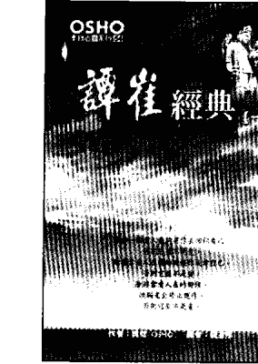

## 譚崔經典 (二)
- 奧秘之書 (第一卷，下冊) -

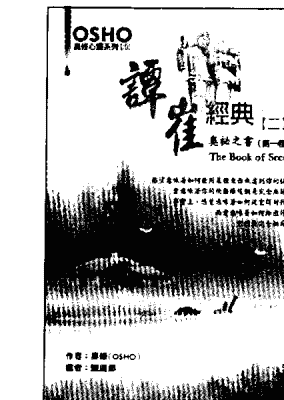

當你帶著慾望的眼睛去看一個人，那個人就變成一樣東西。那就是為什麼慾望的眼光是令人厭惡的，因為沒有人喜歡變成一樣東西。當你帶著慾望的眼睛來看你的太太，或是女人或男人，對方就會覺得受到傷害，而當你帶著愛來看一個人，對方就覺得被提升了，他變成獨一無二的。

第一步就是要接受。停留在事實上面——這是非常科學的——停留在憤怒、貪婪、和性的事實上。全然地了解那個事實，不要只是碰觸到它的外表，要徹底地知道整個事實，進入到它的根部。記住，每當你進入到任何事的根部，你就超越了它。接受、深入，進入到最根部，這就是譚崔。譚崔代表深入的經驗，任何真正被經驗的事都可以被超越，而任何被壓抑的事永遠無法被超越。

定價 300 元

定價 300 元

获取更多好书，请加微信：13641926204 或 QQ:715104687

## 生命的遊戲

作者：奧修(OSHO)  
譯者：謙達那(Chandana)  
發行人：林國陽  
美編：李宜芝  
校對：德瓦嘉塔  
出版者：奧修出版社  
10062 台北市臨沂街 33 巷 4 號 2 樓  
電話：(02)2395-1891；(02)2395-9797  
傳真：(02)2396-2700；(02)2395-7722  
登記證：局版臺業字第5531號  
劃撥帳號：12463820(書、CD、DVD)  
帳戶名稱：林國陽  

總經銷：聯寶國際文化事業有限公司  
地址：22180台北縣汐止市康寧街169巷27號8樓  
電話：(02)2695-4083；傳真：(02)2695-4087  
網址：www.book24.com.tw  
總公司：70254台南市新義南路23號  
電話：(06)291-2919(代表號)；傳真：(06)291-4540  

印刷所：卡樂彩色印刷有限公司  
初版：1994 年 10月  
修訂3版：2016年3月  

定價：350 元  

版權所有・翻印必究・缺頁或裝訂錯誤請寄回更換  
ISBN：978-957-8693-86-9  

获取更多好书，请加微信：13641926204 或 QQ:715104687

## 國家圖書館出版品預行編目資料

生命的遊戲/奧修(OSHO)原著.謙達那(Chandana)譯  
--修訂2版-- (奧修心靈系列：94)  
台北市, 奧修出版社, 2014.08  
面：公分  

譯自：The Game of Life  

ISBN 978-957-8693-86-9(平裝)  

1. 靈修  

192.1  

103013344  

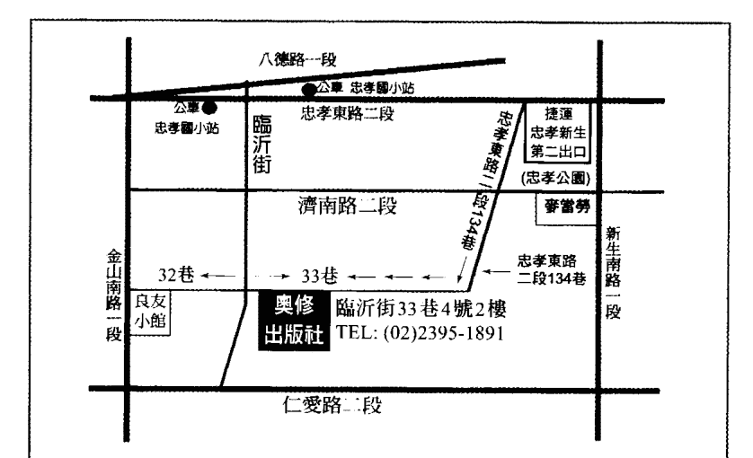  

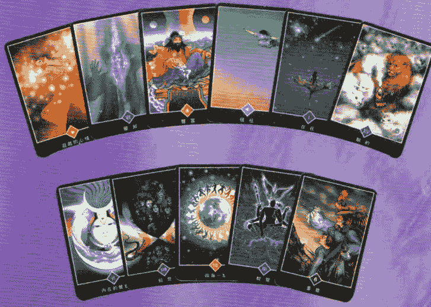  

生命是一個經常的復甦。它每一個片刻都在死，也每一個片刻都在誕生成新的。但是你繼續攜帶著舊有的頭腦，這樣的話，你在任何地方都不適合。  

生命是一個活動，是經常的流動，每一個片刻它都是新的。  

但是頭腦呢？頭腦從來不是新的，它總是落後。頭腦的本質就是它無法跟生命成為一體。生命在繼續進行，頭腦會落後。生命和頭腦之間總是不一致——它一定是如此。  

