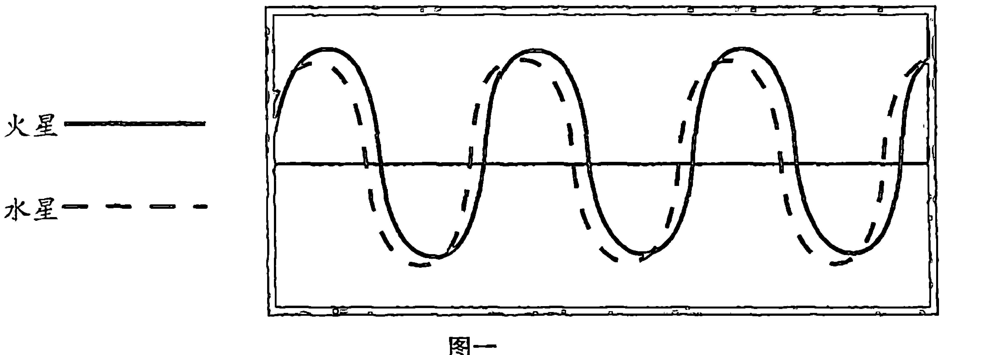
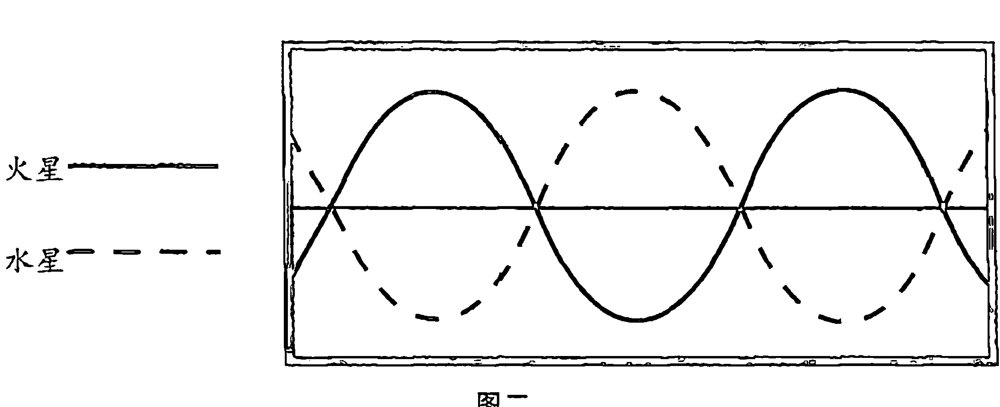
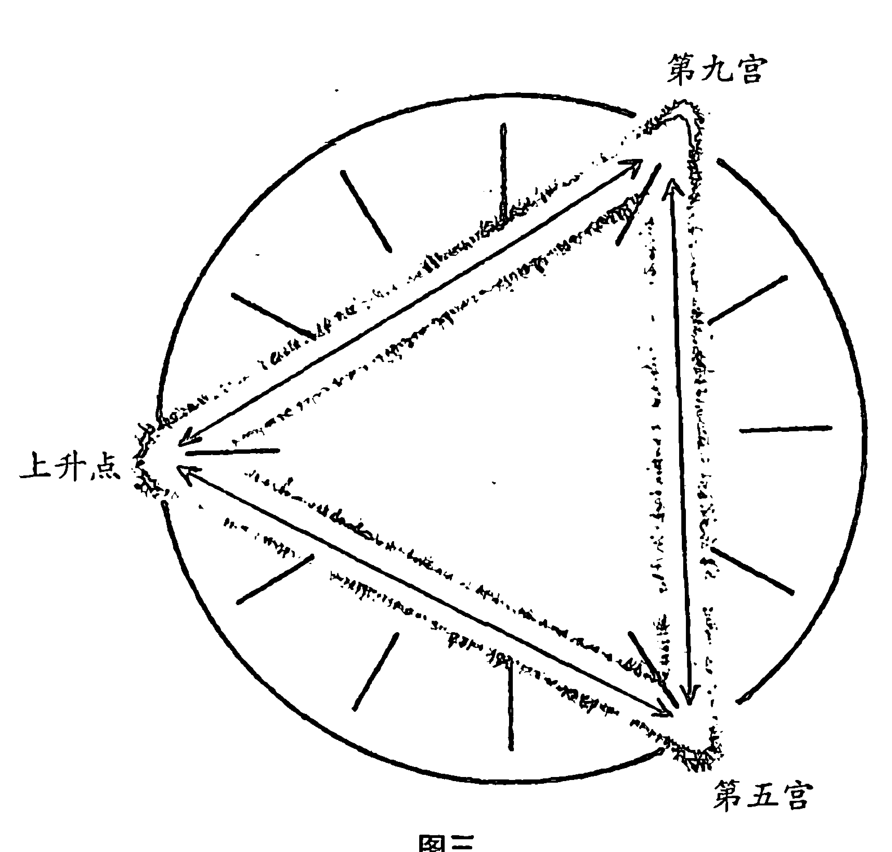

# 生命的轨迹

# 译序 灵修与占星

胡因梦

我对占星学的着迷大约是从高中时代开始的，启蒙书应该说是老友刘铁虎翻译的《巴比伦占星术》。虽然询问初见面者的太阳星座早已成为我的日常惯例，但是对占星学的深入程度却始终没怎么提升，直到好友韩良露的几本贡献卓越的占星力作问世，才算是获得了一窥堂奥的机会。

八年前，太阳落宝瓶座的金铭成为我生命中最重要的任务伴侣。为了帮助这位“宇宙的旁观者”找到一个发挥创造力的管道，也为了帮助我们彼此厘清一些性格上的难题，我开始鼓励他研究占星学，同时在自我觉察的内在工作之中，加进了深度占星学这项辅助工具。

由于在每个当下觉察身心的变化早已是例行之事，而 33 岁那年觉醒的生理拙火（内气）也已经进展到相当精微的程度，因此我能明确地意识到除食物、环境以及周遭的信息场之外，似乎还有一些其他的因素在影响着身心，使其产生一种阶段性的变化，而且是在脉轮的精微层次上发生的。甚至连忧郁症的出现，都跟这些无形的影响力或势力有关。

大约在 2003 年的阳历七八月间（中元节左右），我觉察到头顶的顶轮附近，经常有振动频率十分不稳定的能量波试图进入我的脉轮里面，而且会造成全身的能量瞬间被“锁住”，接着就会出现一种难以言喻的郁闷感。那是一种十分真切的觉受，丝毫不带有自我暗示的成分。曾经体验过长达三年的产后忧郁症，经常与失眠等十几种慢性病症状共处的我，从未尝过如此束手无策的感觉。由于干扰是来自于肉眼看不见的次元，所以我意识到必须向处理“灵扰”（psychic attack）的专家求助，在这样的因缘之下，我才真正有机会深入于灵疗与能量医学的奥妙内涵。但更重要的是，这些艰难无比的精微次元考验，让我亲身印证了深度占星学在生命周期循环以及自我转化上面的惊人发现。原来我所感受到的那些无形势力，有一大部分是源自于宇宙行星为人所带来的阶段性影响力与挑战。

这项发现开始促使我从占星学的性格分析层面，转为观察五个外行星所造成的生命周期循环。回顾人生中最大的变动阶段，应该是在生下女儿之后长达八年的调理与转化过程。有趣的是，女儿诞生的日期恰好是土星（业力之王）快要接近我六宫（健康宫）宫头的时段。当土星正式进入六宫（大约是土星推进双鱼座24度左右），我就被迫于产后忧郁症的强大压力之下，痛改以往忽略身体健康、不爱运动的习性。我每天早晚按部就班地快走45分钟，并且在各种另类疗法的领域里当起自我实验的白老鼠。上述所有的作风，都完全吻合土星进六宫所带来的改变与影响，因为它就是要我们为自己的身心健康和日常习惯负起责任。

更有趣的是，女儿诞生的那一天，刚好也是天王星（主掌变动、意外、瓦解以及汰旧换新之星）正接近我本命四宫的阶段。当时我所做出的人生重大决定，包括将两栋非常满意的市区住宅匆匆卖掉，搬到远离尘嚣的市郊社区里去生活，后来又曾移民加拿大等等，事后回顾起来都十分符合天王星在家庭宫位所做出的大刀阔斧的改革。虽然当时的作风的确流于冲动，但诚如 Howard Sasportas 所说的，“有时天王星也会迫使一个人搬家……因为停留在老旧的情境里，某些潜力可能无法施展出来”。此外，海王星也刚好在那时接近四宫宫头，海王星所象征的“为照料他人而搁置自己的需求”，正是新生儿诞生之后初为人母者所面临的挑战。同时天王星与海王星进四宫，在自我转化上也意味着摆脱童年创伤、发展出真正的独立性和客观性、与内在最深的神性连结。我产后每日固定静心两小时，过程中尽量怀着客观意识与经络严重阻塞所带来的焦虑休戚共处，然后慢慢地深入于心灵底层的本体——那个不受任何现象影响的部分，因而对“平等自性”有了真实的体证。这些经验都十分符合天、海进四宫的意涵。

至于 2003 年中元节左右出现的无形干扰，我在翻译阿若优的这本书时，才明白原来土星进八宫意味着，“在这个阶段许多人会经验到深刻的痛苦，但原因很难清楚地指出，有人甚至把这个阶段的经验描述成‘炼狱’”。他同时又提到，“最常见的现象是，人会在此阶段寻求保护，以建立最深的‘灵魂的安全感’”。这些心理现象上的精准诠释，令我感到十分震撼，因为长久以来我最不擅长的就是寻求保护（火象星座过多的人有逞强倾向），而土星进八宫正是我此生唯一一次积极向专家求救的阶段。寻求“灵魂的安全感”，令我臣服于权威一段时日，甚至出现了月亮狮子座很难发展出的谦卑心态。但是当土星正式进九宫之后，我就厘清了过往种种精微体验上面的认知，整理出了一套身心灵的连锁观点。如同阿若优所描述的，“土星进九宫乃是要消化多年以来的经验，将它们和各种有意义的理想、哲学以及自我改善的摄生法连结起来。”

当土星推进我的本命十宫，分别与位置十分接近的月亮及南交点呈合相时，一对居住在马来西亚与我有宿缘的夫妇（两个人的海、土分别与我的上升点呈合相，同时在星盘比对上竟然有六十多个产生关联的相位）跟我们结成了莫逆之交。多年来我一直有种深层的“乡愁”，好像我是一个异乡人，很难碰到同一个“灵团”的伙伴。然而这对夫妇却能让我和金铭破例陪他们一同旅游，我们也经常到他们在马来西亚的一座热带雨林里办工作坊，分享“大家族”欢聚的喜悦，而这全是在土星与象征前世业力的南交点，以及象征家族或内在之家的月亮形成合相时发生的事（这两位友人各自有日、月座落于月亮所掌管的巨蟹座）。由于这份经验，我内心深处的无归属感和童年的孤独充分被揭露，更重要的是我借由不间断的觉察突破了许多强烈的情绪幻相，而终于能落实无憾地生活在台湾这个环境里。就在月亮代表的深层潜意识问题解除之后，土星便推进我本命盘十宫里的冥王星形成合相。这时你很清楚地发现，土冥合相的确揭露了过往数十年的因果总结——我译介的二十多本心灵书籍，开始继个人传记之后陆续在大陆出版，获得意料之外的回响，也达成了冥王星落十宫在社会影响力上面的正向作用。

我之所以巨细靡遗地将自己的生命周期经验与读者分享，为的就是帮助大家具体了解本书的意义与目的。诚如阿若优所强调的：“占星学这个宇宙语言还有许多内在意义足以促进灵性上的成长，提升人们的觉知。”“占星学确实能论述不同层次的意识或经验的不同面向，而且远远超过逻辑头脑所能理解的范畴。”此外阿若优也同意，“人的确可以透过禅定、不间断的修持以及把心敞开到立即觉知当下最核心的实相，来提升我们的直观能力。”

占星学这门“业力科学”如果运用错误，很容易流于将焦点固着于剧情和外在事件，进行过度琐碎的性格分析，或是将其变成一种自我合理化的借口，而丧失了它最深层的价值。荣格经常在他的著作里指出：一个人若是无法觉知到内在的冲突，那么外在世界就会逼不得已将那份冲突“演示”出来，并撕裂成两极对立的情况。换言之，如果自我觉察的程度提升，业力就会显现于更精微的次元。按照我亲身体验，这样的观点是相当真切的，不过精微次元的功课未必比粗钝次元的功课来得容易，然而一旦学会了细腻的辨识与觉察，自我转化与成长的确能帮助一个人变得更完整、更清明。灵修与占星学都是达成这项目地的最佳工具。

本书是我在众多西方占星著作里拣选出来的“必读”之作。史蒂芬·阿若优秉持着朴实而严谨的态度，统合了人本占星学、荣格心理学以及东西方的灵性教诲，发展出这本属于现代占星学正向潮流的畅销佳作。此作品目前已被翻译成九国语言，深受占星学界以及西方读者的推崇。希望本书能够为致力于成长和向自我完善转化的读者，带来一种对宇宙隐微秩序的赞叹，以及因了悟这份秩序而必然生起的宁静与安全感。

# 前言 占星学的真义

人生起了很大的变化时，我开始对占星学产生兴趣，后来又深深地沉浸在荣格的著作里一段时间，那时我已经知道还有许多东西是这些占星教科书尚未提及的。换句话说，我早已直觉地知道在传统占星学的象征符号与拟古式的语言背后，还埋藏着更博大的智慧、更深刻的生命法则，以及能够让忠诚的占星学子在灵性层次上产生精纯理解的洞见。因此当我一本又一本地吸收消化这些占星著作时，我立即发现自己已经在搜寻这些象征符号更深远的含义了；我认为这个宇宙语言还有许多内在意义足以促进灵性上的成长，提升人们的觉知。

当我开始进行我的研究之后，才越来越明白占星学确实能论述不同层次的意识或经验的不同面向，而且远远超过逻辑头脑所能理解的范畴。但显然只有高等的直观之心（也可称为“灵魂之眼”）才能真的了解占星学的深层含义与支脉。随着年龄的增长，我发现人确实可以透过禅定、不间断的修持以及把心敞开到立即觉知当下最核心的实相，来提升我们的直观能力。

我早期在做研究时虽然不像西方文化里的许多人那样对占星学抱持怀疑态度，但很快就对古代与现代占星学者的著作感到极度失望，因为里面的思想、辨识力、客观性以及灵性上的觉醒均嫌不足。这些著作不但只聚焦于事件、预测或肤浅的个性分析，而且即便是所谓的“奥秘占星学”（esoteric astrology）——偶尔能精确地描述某些人的状况——也多半是一些荒谬的论断或说教；它们规避了占星元素核心意义的探讨[1]。基于这些原因，我觉得自己确实很幸运，能快速地发现丹恩·鲁依尔（Dane Rudhyar）的著作，甚而有机会深入于瑜伽、治疗、东方宗教以及许多精神导师的教诲，同时还能以多年的时间研究荣格无与伦比的科学探索。这一切的追寻，加上我自己对能量场与日俱增的清晰体察、长期以来对梦境启示的研究，并直观地将这些生命的各个次元统合到最核心的灵性典范上，才逐渐发展出一种令我欣慰的应用和理解占星学的方式。

但我并不是在说我已经发展出一套“诠释”占星学的“封闭系统”。那样的体系正好是我无法忍受的局限，况且坚持己见的方式很快就会变得僵固与不恰当。其实我想表达的只是我目前的理解方向与咨商方式，因为这种方式对我个人的成长很有帮助，也比较能为我的案主和学生们带来更富建设性的利益——远远超过传统事件派占星学或奥秘占星学的那些无法验证的理论与假设。这么多的占星著作中有许多误谬的、甚至是毫无根据的推测，若是将它们应用在个案的情况里而不去敏锐地感应当事人的意识层次，将会造成极严重的伤害。即便我们以诚实不欺的方式去粗略地测试这些说法，也还是会发现它们大多是十分荒唐的见解，而且大部分与真实的生活经验毫无关系。

读者也许有兴趣知道，当初我开始研究占星学的时候，本命盘里正好有下述的推运角度：土星与本命盘的上升点呈合相，海王星与金星也有角度，冥王星与天王星则正落在处女座，与我本命盘的天王星形成紧密相位，而这些全都是所谓的“紧张”或“硬式”相位。我提到这一点乃是为了说明占星学对我而言不但是全职事业，更是一种追求真理的思考方式，而且一向是也仍然是改善我的本性、激励我在当下的经验里朝着更高典范发展的工具。这本书就是我在察证生命的统合法则与占星学的深层意涵时，所产生的想法之总结，其中包括我很难从占星教科书里获得了解的种种主题，甚至是根本没出版过的一些东西。我无意撰写一本充斥着成套“诠释”的“占星食谱”，而且已经假设读者们对传统占星学的基本定义、星座、行星或相位，都有了初步的认识。

在这本书里我主要想阐明占星学的某些次元。占星学有各种层次的诠释方式，但深层意涵、内在次元、以成长为导向的经验性诠释层次，却是一直被忽略的。如果你对那些公式化的预测、陈腔滥调的概念以及简化的性格分析已经感到很满足了，那么本书将不会和你产生任何关联，但是那些仍然在质疑以下问题的人，却会觉得它很有用、很能增长见闻。譬如占星学为什么会产生作用？为什么某些人会有某些相位？眼前看似困难的人生阶段究竟带有什么目的？为什么有些人能够以实在的态度面对问题？

本书主要是根据个人经验和临床经验撰写出来的，而且我尽量做到让它可以实用。但由于我们探讨的主题太精微，范畴又太广，因此某些主题只能做高度的推测；因为我不能说自己在终极议题上已经有了一切答案，更不能声称自己是证入高层意识、有能力了悟生命更高次元的人。无疑的，本书绝不是一套诠释本命盘的机械化法则，它必须配合个人经验及直觉来加以应用。在我们研究占星学的前几个阶段里，特定的法则也许可以带给我们一些引领，不过逐渐就得把它们搁置一旁，因为宇宙的一体性和爱自然会转化那些仔细设想出来的法则与原则，而且会越来越成为生活中启发个人的当下实相，让我们了解面对另一个人的迷思有什么意义。

任何一种玄学上的研究，都可能令学生在层出不穷的次要现象里迷失方向，使我们无法认清这些都只是终极实相反映出的某些面向罢了。高层意识的一体性反映成低层的存在时，势必会从“大一化为繁多”，人越是远离实相，生命就越显得矛盾及多样化。但只要与那最高层的“大一”相应，你就会越来越清楚本命盘是一个统合的整体，而且这些象征符号都是活的。人并不是由不同的元素组合成的，他是神圣潜能的一个活生生的单位，而本命盘所显示的成长过程（推进和移位），也不是互不相干、重复发生的周期循环；它们是不断在发展的意识的不同面向，而这些面向都同时在各个次元里运作着。我觉得作为占星学的从业者或学生，若想把这门知识当成是一种敏锐的、能够饶益他人的个人化技艺，就无须担忧目前正在泛滥的那些预测方式或诠释技巧。我的学生们时常问我：“我到底该从何处入手去看一个人的星盘？”其实你如果能彻底了解星盘里的任何一个元素，它自然会引领你进入那示现出万象的核心部分。换句话说，一开始只要谈你真正了解的东西，将它和个案的真实经验联结，然后任其自由发展就对了。如同爱因斯坦所说的，如果能进入任何一个事物的核心，你终将遇上最深的实相与真相。

我所指出的这些素朴的道理并不是一种无法了解的典范，它不是听起来很美妙但完全无法被应用的东西；它是从我们对内在无限潜能的觉知以及对宇宙一体性的洞察而发展出来的品质。东方的智者曾经说过，心智本是真理的残杀者，也是清明洞见的敌人。一个人的心智的确会迷失于本命盘的烦琐细节里，而再也看不见案主的整体性与价值了。若是有这种情况发生，那么心智就成了真理的敌人，它只会用令人困惑的细节来障蔽住当下的问题。或许案主会暂时被各式各样的新奇说辞所吸引而觉得舒坦一些，但这种快感究竟能维持多久呢？此人很快就必须以专注而深入的态度面对眼前的难题了。

虽然如此，心智仍然可以当做高层自性的工具，它能协助我们领略奥妙莫测的生命实相以及个人的命运。占星时的对谈品质，完全取决于占星师的心智纯净度、专注力的深度与其人生典范。那些企图屏除哲学和灵性价值的人，往往会声称这样的取向是不科学的、过于神秘的，或者与合乎情理的占星基本教义无关。以我的角度看来，这样的说法几乎是完全不了解他们在为人咨商时所造成的影响。现今占星圈子里显而易见的混乱以及初学者挥之不去的困惑，只能借由我们工作底端的哲学与灵性意涵来予以厘清。

虽然我试图将读者引至整全与素朴的方向，但我不认为宣扬孰真孰假会是我的职责。此书的本质乃是用我自己的理解和价值观来提出合理的意义，同时提供一种对不同要素的辨识方向。此外我也经常论及所谓的星盘“主题”，以便呈现出元素统合之后的素朴性。这样的方式被许多占星学家详细阐述过，譬如吉波拉·都宾斯博士（Dr. Zipporah Dobyns）就不断提及占星符号里的 12 个规则，它们几乎可以涵盖本命盘的所有元素；李察·艾德曼（Richard Ideman）也经常谈到这些要素之间的“对话”，亦即将行星、星座及宫位统合成一个连贯的整体。我也时常采用“交替作用”[1] 这个字眼来描述这 12 个规则之间的交互作用。我觉得任何一个研究占星学的人都可以借由这个途径获益——若是把这种观察星盘要素的方式理解成一种哲学结论，便能彻底转化好坏吉凶的分类诠释方式。

最后我必须声明的是，像这样一本论及业力、转世与自我转化的占星书籍，必须奠基于某些假设之上，而这些假设与一般常识底端未说出的假定是完全冲突的，也跟大部分的占星诠释类型相左。我会这么做的原因是，我们一旦认清转世与业力便是生命的事实，而且已经

> [1] “交替作用”（interchange）也许是某些读者所不熟悉的占星法则，所以我想说明一下。我们可以先举几个七与十的“交替作用”来加以说明：譬如土星落在天平座；土星落在七宫；金星落在摩羯座；金星落在十宫；金星与土星的所有相位；七宫与十宫的所有冲突相位（90 度），以及天平座与摩羯座的所有冲突相位。
>
> 另外一个例子则是四与十的交替作用：土星落在巨蟹座；月亮落在摩羯座；月亮落在十宫；土星落在四宫；月亮与土星的所有相位；四宫与十宫的所有对立相位，以及巨蟹座与摩羯座的所有对立相位。
>
> 一个人的本命盘若是有某种类型的交替法则以两种或多种情况呈现出来，那么这股动力就会构成所谓的生命次要“主题”。但如果本命盘包含了三种或三种以上的情况，那就是生命的重要“主题”了。

在依持灵性典范致力于自我转化，那么所有以事件为导向的传统占星学之标签、定义及诠释，都会由里向外翻转过来。一旦选择了这种范畴更宽广的途径，亦即以感官知觉范围外的高层实相做基础的途径，就会发现最重要的解答都不是从外在而是由内产生的。与其执著于某种情境或某个生命阶段的感觉是否轻松舒适，不如去洞察困境里要学习的功课及成长潜力是什么，同时在面对顺境时也不宜失去平衡或变得过度自负。若是能以这种态度去面对人生，那么物质次元的便利性或生活状况的舒适与否，就不再是最重要的元素了；我们将会把自我成长的过程和内心的存在状态，当成是首要之事。

举例来说，假设一个人本命盘里的金星与月亮、海王星、天王星或土星都成 90 度角，那我们就不该把此人可能面临的关系或恋情上的问题视为首要之事，反而应该认清这些经验在意识发展的大范畴内的意义是什么、目的是什么，或者究竟能让我们学到什么东西。因此我将尝试为读者指出一种理解本命盘、推进法、移位法以及星盘比对的方向，这个方向是透过对星盘深层次元的解析来诱发内在的觉醒，从而让一个人意识到自己的需求、潜力以及人生目的。这绝不是一个能轻易达成的任务，因为人生是一种多次元的发展，虽然大部分人都能察觉到某个推进相位所显示出的表层现象，但那个现象底端同时还存在着深层的意义，而且这份改变或生命的发展方向很可能演变成种种的发展支脉。占星家最困难的挑战和责任就是为案主阐明其中的意义，帮助案主把注意力放在最重要的发展过程上，而不是只注重表面的改变。荣格在他的著作里经常指出一点：你没有觉察到的事情就会变成你的“命运”。如果你不为这些发生的事负起责任，或者无法认清你也是促使它发生的原因之一，便可能会觉得事情是从外面来的。我们越是能带着觉知去跟内在的活动产生联结，那么占星学——不是一种操控命运的方式，也不是能带来惊喜的把戏——便越能提供给你一种理解自我发展阶段的工具。我们应当善用这个机会来进行自我转化。

## 第一章 业力

> 人身上发生的事就是他人格的写照。他代表的是某种铸型以及可以接合在一起的个个碎片。随着生命的进展，这些碎片将会按照既定的设计一一落回原处。

——荣格

许多的玄学家、占星家以及其他关怀宇宙法则的人，均以各种方式沿用过“业力”（Karma）这个名词，因此在思考占星学与业力的关系时，我们必须先厘清这个名词的意义。基本上它指的就是宇宙法则里的因果律，与《圣经》格言“人种的是什么，收的也是什么”十分雷同，但是又比俗世因果概念的范畴更宽广一些；很显然的，一个播下蓟花种子的人是不可能种出玫瑰来的。业力法则与牛顿机械定律“每个作用力必定产生反作用力”很近似，但其涵盖范围的广度却有差异。业力法则假定人转世投生乃是连续不断的经验，而且绝不会在物质世界投生一次就了结了。从这个角度来看，业力法则可以被视为一种维持与达成宇宙正义及平衡性的方式；它其实是一个最单纯、最能涵盖一切生命律法的法则。它跟某些人所说的“机会法则”（Law of Opportunity）——为了让我们变得越来越像神，宇宙必须带给我们一些机会去学习我们最需要突破的心灵功课——是不可分的。

业力的概念本是奠基于两极现象之上的，宇宙借着这个律法才能维持平衡。这种平衡状态并不是一种惯性，而是不断地在动、在变化中的平衡性。这个概念之中有一种假设，那就是个人的“灵魂”（某些学派所说的“存有”）里面有一种因力，会逐渐形成一种“果”，而引发这个过程的本能就是“意志”。这整个因力现象的结构便是所谓的“欲望”，欲望可以看成是用意志力来引导个人的能量，然后将某种冲动或想法示现出来。

当然有关业报的概念是无法与转世理论区分开来的。有些作者认为业力与转世本是用来象征或隐喻某种宇宙作用力的法则，而这种作用力比一般人所设想的还要精微得多，不过大部分能接受转世与业力之说的人，通常对传统的显明定义已经感到很满足了。多数人都认为转世的目的只是暂时投生为一个必朽的灵魂或存有，借着肉身这个媒介来地球学习特定的功课，或是依照特定的方式发展自己，以便进入更高层的意识或存在。根据伟大的透视眼艾德格·凯西（Edgar Cayce）——通称为“沉睡中的先知”（The sleeping Prophet），也是杰斯·史坦恩（Jess Stern）的畅销名著之书名——在“灵命解读”（psychic reading）时所传达的转世理论[1]，一切存有被创造出来之后就不断投生于地球，为的是学习最根本的心灵功课：爱、耐性、谦和、平衡、信心、奉献精神，等等。根据凯西的理论，人若是能了解宇宙的基本律法，诸如转世、业力、恩宠、物以类聚、境由心生等法则，将会为心灵的发展带来助益，其中的“恩宠法则”（Law of Grace）是凯西的“灵命解读”中最重要的一环。

如同牛顿机械定律与现代量子物理学的显明对比，业力法则似乎也比恩宠法则的层次粗浅许多。按照凯西的说法，一个人如果能敞开自己与内在的“基督意识”（Christ Consciousness）联结，那么因果律就会被恩宠法则取代。所谓的“基督意识”指的就是人类经验中如如不动的一体性，它不是在二元对立的运作层次里发生的，因此我们若是接受了艾德格·凯西的恩宠法则概念，就会发现业力法则并不是我们生命最底层的驱力。虽然如此，能够了解业力法则的运作模式还是很有帮助的。凯西曾经说过：“人类的每一世都是过去所有转世的‘我’之总合。”“过去所造作的一切，不论好坏，都包含在目前这一世的机会里。”当他为数千名个案做灵命解读时，总是不断地强调当人面对特定困难或压力时，只不过是在“跟过去的自己相遇”罢了——换句话说，这个人现在必须面对他过去世里造作出来的经验了。

业力法则最粗浅的表现层次便是《圣经》格言所说的：以牙还牙，以眼还眼[1]。我们绝不能忽视欲望的力量，因为它就是引发业力的最深驱力，然而只有小我才有欲望，我们最核心的自性或本体并没有任何欲望，它与万物本是一体的。业力法则基本上要告诉我们的就是：“你终将尝到你欲望的后果。”不过当然只有在经验到这些后果时，我们才会明白自己欲望的支脉是什么。

举例来说，某个人很渴望世俗财富，因此未来的某世他终于诞生在一个奢华的家庭里。他既然已经拥有了自己想要的一切，总该满足了吧？结果却并非如此，因为其他的欲望又产生了。心的本质就是不断地制造欲望，它是不会停歇下来的。事实上这个人或许已经发现他所拥有的这些财富不但无法带来满足，甚至变成了一种恐怖的负担！至少他贫穷时没什么东西可以损失，因此是自由的，现在虽然拥有了财富，却不断地害怕会失去那些自己已经不再渴望但仍然执著的东西。接下来的问题则是：一个人要如何释放掉这些锻造出欲望的执著，以便再度获得自由呢？（杰出的英国诗人威廉·布莱克 [William Blake] 称这种执著为“由心念打造成的手铐”。）其实所有的解脱道与自我证悟法门追求的就是这份自由。

在许多心灵导师的著作与教诲之中，都可以发现对业力法则的本质以及运作上的洞见，这些导师大部分来自东方世界，因此他们的教诲多半根植于佛教或印度教。帕拉玛韩撒·尤伽南达 (Paramahansa Yogananda) 可以说是第一位到西方世界弘法的东方大师，他写过一本优美而富启发性的传记《一位瑜伽士的自传》(Autobiography of a Yogi)，以下是从其中摘录出来的一段话：

[1] 读者若想查看《圣经》里有关业力与转世的部分，请参阅《约伯记》十四：十四；《传道书》一：十一；《耶利米书》一：五；《马太福音》十七：九～十三 & 十六：十三～十四；《马可福音》六：十五；《路加福音》九：八；《约翰福音》三：七 & 一：二十一及二十五；《歌罗西书》三：三；《犹大书》一：四；《启示录》三：十二。

命运、业力与定数——不论你怎么称呼它——指的就是一种正义法则，它决定了我们的种族、我们的肉体结构以及心智与情绪的特质。我们必须认清的是我们很难逃脱这些基本模式，不过我们还是可以学习如何去顺应它，而此处就必须用到意志力了。我们在有限的理解之下仍然有选择和辨认的自由，因此若是能正确地行使我们的选择权，悟性自然会增长。一旦做了选择，人就必须接纳他的选择所带来的后果，然后继续运作下去。

尤伽南达进一步解释了如何有效地处理个人的业力，以及什么才是面对命运的正确态度：

> 过往业力的种子如果被神圣的智慧之火烤过，就不可能再发芽了……一个人的自我了悟越深，越能运用精微的心灵能量来影响整个宇宙，而其本身也不再被无常的现象（业力）所染着。

尤伽南达对占星学也很熟习，因为他的上师就是一位精通古老科学与艺术的大师，因此他对占星学的见解是很值得参考的：

> 一个孩子诞生那一天的时辰，便是天体射线与他个人的业力交织出数学上的一致性的时刻。他的个人星盘是一个深富挑战性的图像，里面呈现了他无法更改的历史以及未来可能发生的结果。只有那些具有直观智慧的人才能正确地诠释个人本命盘，但很少有人具备这种智慧。
偶尔我会要求某些占星家根据星盘择出我最艰困的时段，不过最终我还是能达成自己所设定的任务，但是在那些时段里，许多艰困的挑战仍然会伴随着我的成就一同出现。对神圣护持力的信心以及正确地运用上天赋予人的意志力，往往能帮助我克服所有的障碍，因此我的罪业终究获得了宽释。

在佛教传统里，解脱道与心灵修持最终的目标就是“涅槃”，许多追求佛家智慧的西方人都未能正确地诠释这个名相。“涅槃”字面上的意思就是“业力之风不再吹袭了”。换句话说，唯一能够让心灵有所进展的便是觉醒（“佛”的意思就是“觉者”），或是把意识提升至超越幻觉或业力的层次。从这些教诲中我们可以得知，对治业力最根本的方式就是超越它。只要我们转世到肉体中，业力法则一定会以某种形式影响我们；如果能够对此生的业力模式有所了解，将会带来极大的帮助，或者至少可以让我们以毅力、接纳及感恩的态度来面对我们的命运。

### 定业、今生所造之业与藏业

印度有一种古老的传统把业力法则分析得很深入，它将业力分成了三种类型[1]。“定业”（Pralabd Karma）乃是一个人在此生一定会面临的定数、命运或业力。这种基本的业力模式是无法更改的，因此人只能在此生面对这些经验模式。不过据说透过灵修、心灵导师的帮助或者靠着上主的恩赐，也许可以把特别重的业所造成的影响降低，如同把“刀伤”变成“针刺”一般。

“今生所造之业”（Kriyaman Karma）指的是我们此生造作出来的业，但是在未来世才会受到果报。某些修炼途径之所以会强调严格的戒律，就是要控制修行者的行为，避免造出更多的业而阻碍了此人未来的心灵发展。除了严格的戒律之外，避免在今生造业的主要方式就是不执著、不产生强烈的欲望，同时要在履行每日的义务时培养出正确的心态与超然的态度。当然，维持正确的心态与超然的态度是非常困难的，因此大部分的灵修教诲皆主张，缺少了冥想的帮助是绝无可能达到那种境界的。

最后一种业便是所谓的“藏业”（Sinchit Karma），它指的是我们多生多世贮藏下来的业，在这一世里并不显得特别活跃。根据这些教诲的说法，我们已经有过成千上万的转世经验，累积了无数的业力，因此不可能在一世里面对所有的思想与行动的业果——我们的身体、精神和情绪都可能被击垮——所以这些业必须被贮藏起来，不能完全派给这一世去面对。根据这些教诲，我们将会在未来世里面临这些业报，除非我们能碰到一个完美的灵性上师帮助我们释放这些重担。

梅尔·巴巴（Meher Baba）是一位旅居美国拥有众多门徒的心灵导师，他也用类似的话阐述业力的运作模式：

> 以一般粗钝肉身示现的你，将一次又一次地转世，直到你证悟了自己的“真我”为止。但是你的心却只会诞生一次，死亡一次；若是以这个角度来看，你是不落入轮回的。你的粗钝肉身一直在改变，但你的心（心智体）却始终如一，没有任何改变。一切的印象都储存于此心之中。这些印象将会在后续的转世中被耗尽或完全抵消。你将会诞生为女人、男人、穷人、富人、聪明人或愚笨的人，拥有了这些丰富的经验，才能帮你转化所有的二元对立形式。

我想任何一个熟悉占星学的精确度与有效性的人，都无法否认本命盘（natal birthchart）确实能揭露一个人的主要生命模式：潜能、才华、执著的焦点、难题以及主要的心智特质。若是能接受这个观点，那么本命盘很显然透露出了一个人现世定业的蓝图或 X 光片。我在我的著作《占星、心理学与四元素》（Astrology, Psychology, and the Four Elements）里面，曾详细说明星盘可以视为一个人的能量模式的蓝图，而这些能量会同时在各个次元里显现出来：身体、心智、情绪及灵性次元，同时也跟地、水、火、风四大元素有关。然而“藏业”却不显示在本命盘里，因为它们不会完全分发给这一世。同样的，今生所造之业也不会显示出来，因为我们似乎还保有某种程度的自由意志，即使很有限，但还是能决定我们在这一世将造作出什么样的业。虽然真相就是如此，可我并不想让读者留下“一切都是命定”的印象，好像我们对自己的业力是束手无策的，无法以正确的方式来改变我们的人生。其实情况恰好相反，虽然本命盘显示出了我们的业力，并因而阻碍了我们的自由，造成了我们的束缚，但本命盘仍然可以让我们认清生命的哪个领域需要被转化，或者我们目前的表达模式有哪些需要改变。就像艾德格·凯西在他的灵命解读中所说的“心即是建构者”，我们的心驻留在何处，我们就会变成什么样子。如果我们能以细腻的方式改变自己的态度及思维模式，或者经常能借由静坐来联结高层意识，不只是拥有并且能活出生命力，那么或许就可以从束缚中解脱出来，和宇宙的律动调成一致。如同20世纪最伟大的占星学家丹恩·鲁依尔所强调的，发生在人身上的事件本身，远不及人对事件的反应来得重要。这句话总结了我们在面对业力时的心灵与心理发展的可能性。换句话说，我们对经验所抱持的态度才是最关键的要素。我们的态度本身就能决定在面对困境时将会受苦，或者将学会生命要教给我们的功课。

因此本命盘能显示出我们的心智模式或过往的制约，亦即梅尔·巴巴所指的内心的“印记”。本命盘显示的就是我们过往的思想与行为所造成的现世业果。这些老旧的、根深蒂固的模式是极不容易改变的，只是运用显得有点老派的意志力，毫无疑问地将无法改变那些强而有力的模式。这些模式也不可能借由时髦的“新时代”心理治疗术语或是膨胀自我的流行哲学——“我创造我的实相；我终于明白是我一直在……”让自己受苦；我现在已经能掌握我的人生了”——而轻易地改变。人类的心灵演化过程比这些观念要精微多了。当我们面临非常严重的挑战时，这些老旧的、单凭意志力便能解决问题的方式，一定会遭到瓦解，而企图合理化自己的冲突及灵性危机，也只能暂时遏阻生命的洪流，紧接着这股能量就会像奔放的急流一般无法控制地倾泻出来，而这只会赤裸裸地揭露肤浅的假灵修之中的逃避倾向。业力模式是既真实又强烈的，这些习性不可能靠着一些鼓舞士气的积极思考就在一夜之间消褪，这些生命驱力必须被认清被接纳，而且要充分地加以关注才行。

自我认识与自我了悟乃是证入神性的必要前奏，但是在前面的阶段里，一个追寻真理或追求更高形式的占星学的学生，经常会因为洞察到自己的诸多负面特质、情绪及习惯模式而感到挫败。当一个人发展到这个阶段时，身为他的辅导者或引领者的占星师或其他角色，就势必得付出更多的关怀了。咨商者此刻应该为对方详加解释：门只要打开一道小小的缝，就会有一束光射进黑暗的屋子里，这时空气中所有的尘埃和脏东西都会显现出来。换句话说，当你在自我认识的道路上跨出第一步时——也许是占星学或其他能带来启发的方式——你很快就会发展出一种对自己、对命运以及对本命盘的负面态度。同时我们还要进一步地说明，当那道光变得越来越明亮时，做学生的就更容易察觉自己的缺点、弱点或负面特质，但那份觉知是应该被欣然接受的，因为它显示出了更深的自我认识与更明确的发展阶段。辅导者应该鼓励学生善用这份洞见来采取富有建设性的行动，从而转化个人的人生，不再为自己的恐惧和焦虑找借口。同时老师还要更进一步地为学生们指出，当自我认识的程度提升时，业力往往会显现于更精微的次元。因为她或他现在已经敞开心门来认识自己，于是就不再需要靠外在的戏剧化事件或冲击，让自己从心灵的沉睡或昏睡状态里觉醒过来。如同荣格所指出的：

心理学的法则告诉我们说，若是无法察觉内在的情境，它们就会投射出来变成外在的命运，也就是说，一个人若是无法觉知到内在的冲突，那么外在世界就会逼不得已将那份冲突“演示”出来，而且会撕裂成两极对立的情况。(Aion, P.71)

因此下面这个说法应该是很保险的，那就是，致力于自我成长与自我认识不但能帮助一个人变得整全、快乐及清明，而且采取这样的行动往往能克服前期的困惑与挫败，开始在每个当下减轻心中的痛苦。

我们会发现我们都受到了某些业力的影响，但过去曾经种下的种子终将会变成我们的收获。占星学可以提供我们一个蓝图，让我们认清我们的执著、问题、才华与心智倾向，并且能提供我们一条道路——让我们跨出成长的第一步——来了解我们的特定业力是什么，同时能帮助我们面对这些内在与外在的挑战，使我们得到一种对业力的洞见来超越它们的影响。艾德格·凯西“灵命解读”的 #5124 - L - 1，很明确地阐述了本命盘的确能反映过去世的业力：

> 从一个人诞生的时辰，可以发现其本命盘的行星坐落的星座和宇宙之间的紧密关系，因为人就是上主造出来的创造伙伴。这些行星坐落的位置显示出一个人将如何完成上主在地球所行使的计划。在人世的这段期间里，人被赋予了一个进入物质世界的机会，但这些行星并不能显示一个人是善良的或邪恶的。

因此，本命盘所彰显的乃是过去世的力量到底是被误用了，还是充分发挥了它的创造性。如果我们接受了这个有关个人心智与意志力的概念，就必须为我们本命盘的定数、命运及问题负起责任。从某个关键性的角度来看，整张本命盘除了彰显出业力之外，没有其他的东西了。本命盘里的每一个象征符号都可以被假设成我们过去世的行为、成就及欲望的业果；譬如土星一向被称为业力之王，不过这个假设也的确太简化了些。占星学可以称作是不折不扣的“业力科学”——一种认清责任和接纳它的方式。

## 本命盘的特定要素

在解析本命盘的过程里，任何一种元素都可以被看成是业力的象征，不过有某些特定的要素必须格外加以留意。这些要素在本书的后几章里将会详细地讨论，但概要的说明必须在这里先提出来。

## 土星

在许多占星家的眼中，被称为“业力之王”的土星代表的就是个人生命里的主要业力课题。土星之所以被称为“业力之王”，并不是因为它是个人星盘里唯一象征业力的元素，而是土星的位置和相位揭露了我们最特殊最具体的考验，以及我们时常会经历到的痛苦与挫折。由于一般人经常把业力看成是负向的、不易处理的问题，所以土星带来的考验也被许多人视为一种“业”的作用力，不过当然这只是一种过于简化的粗糙观点，同时也曲解了业力真正的意义。比较正确的说法或许是：本命盘中的土星（宫位以及0度、90度、180度相位）代表着我们最“困难”的业报。这些困难的土星相位揭示了被固化的习性模式，而这些固着的行为与思想往往会阻碍创造力的流动。因为这些相位揭露了过去世曾经被误用的才华或权力，所以此生必须将其导入更具建设性的正轨，亦即从根本上修正我们的态度和处理方式。这些相位（也包括150度、45度及30度在内）会造成内在的紧张而激发出巨大的能量；我们可以利用这些能量发展出更高的觉知和创造力。土星是形式与结构的行星，我们会发现与土星成紧密相位的行星，往往能带来新的表达形式（参照第五章有关土星的探讨）。

但土星并非本命盘中唯一象征障碍的指标，几乎所有被过度强化、缺乏能量或特别紧张的相位——不论涉及的是什么行星——都是必须成长与发展的部分。占星学最重要的观念就是生命的发展是带着目的性的，我们面临的各种难题背后都埋藏着正向理由。杰出灵媒亚瑟·福特（Arthur Ford）曾经说过：

> 肉体的障碍越大，灵魂越有机会偿还宿债，而得以更快速地达成心灵上的成长。如果能以乐受的态度来克服肉体上的障碍，那么此人的心灵成长甚至会超越拥有一切世俗福报之人；其报偿不是物质形式而是心灵的拓展。在这一世里克服的障碍越多，灵魂回返物质世界磨炼性格的次数就越少。(from A World Beyond by Ruth Montgomery,P.45)

## 相位与元素

有关相位（aspects）的议题将留待第六章详细讨论，现在我们只大略提及几个重点。从业力的角度来诠释本命盘，所有的 90 度与 180 度相位都显示出必须调整的复杂性格，而且要发展出觉知力来包容这些相互歧异的生命态度[1]。90 度相位通常存有相互矛盾的目的性，并且会干扰彼此的表现，因此必须使其中的力量变得和谐，不过通常得花上多年的时间，才能缓慢地发展出新的行为模式以及更深的自我认识。180 度相位则代表虽相反却能互补的情况，而且会在与人互动时立即感受到这一点。这种对立相位特别需要注意的是他人的渴求、期待与观点，但只有发展出对其中所涉及的力量与驱力的觉知，才能达成上述的和谐性。荣格在他炼金术的研究里经常引用古老的炼金格言：Tertium non datur，意思是第三种元素（单凭它就能解决个人冲突与对立问题）并没有被赋予。荣格进一步地解释说，冲突一向无法在其固有的层次得到解决，必须提升至更高的层次与视野才行。因此，90 度与 180 度相位虽显示出最紧张的牵制力量，但也是最有成长潜力的领域，所以应该欢喜地接受此一事实。

另一个与紧张相位有关的要素，就是我一直在注意的四元素；你可以在其中发觉张力最大的行星是哪几个。由于紧张相位通常被视为必须调整和建立崭新处理方式的性格特质，所以涉及其中的任何一个行星（尤其是个人行星）不但得根据其本质和基本原理来检视，同时也要根据那个星座的元素来加以观察。我在《占星、心理学与四元素》一书中曾详细说明过四元素的议题：四元素揭露了个人可以立即体认到的能量水平和生命面向，而任何一个星座的元素如果包含一或多个张力过高的行星，就代表生命的那个面向必须加以调整及粹炼。行星坐落的星座元素往往显示出最强烈的执著与渴望、此生最重要的目的，以及哪一个领域会在此生继续带来必须被转化的困扰。此外一个人本命盘里的某个星座如果呈现合相或星群（Stellium）的情况，那么它们就会跟另一个行星或数个行星形成紧张相位，而且这个星座的元素也必定彰显出此人必须处理的生命面向——可能需要更和谐、更正向地表达那股能量，或是把其中强烈而粗糙的执著倾向琢磨得细致一些。

某些实例或许能厘清最后这个观点。如果被强化的行星是落在水象星座，那么此人就必须琢磨其情绪以及情绪的表达方式，亦即此人可能在今生过度粗糙或冲动地表达他或她的情绪。某种程度的情绪管理（不是抑制）或许是必要的，如此才能带来转化这股能量的内在驱力。此人的本能反应也许是过度压抑或掌控性过高，因此必须学习以建设性的方式来运用其情绪能量，并且要学会保护自己不受外界负面能量的影响，但又不至于封闭住自己的生命之水。此人可能会太执著于情绪上的满足而将其置于一切事物之上。

如果被强化的行星或相位是落在火象星座，那么此人就必须学会控制其自我中心倾向与冲动的行为模式，并发展出爱、敏感度与耐性。细致而节约地运用这股激烈的能量，将会比反抗或夸大自我更富有创造性。此人必须学会活在当下，发展出臣服于更高意志或神圣力量的谦冲胸怀。火象星座被强调也可能意味着必须学习接纳，承认自己的弱点与更深的需求，在痛苦时懂得求助。火象人通常不愿意承认自己有内在需求；这种倾向伴随着执著于外在行动的生命态度，经常会阻碍他们当下立即觉知到内在的活动。

如果被强化的行星是落在风象星座，那么此人就必须学会管理自己的思维以及对别人表达意见时的态度。幻想、心智上的逃避倾向、对未来不必要的投射、不实际的计划以及把事情合理化的习惯，到目前为止或许已经达成了任务，因此必须重建这整个生命领域，并试着去了解心智可以是非常好的仆人，却是很糟的主人。此人可能太执著于理性知识、聪明的点子、“科学”的论据以及符合规则的概念。他或她应该记住的是，饱学之人如果无法将知识运用在现前的经验上，就等于骡子驮了一整背的书一样。知识很可能变成一种负担，而人的心智也可能变成对“知识”有无尽渴求的怪兽。

如果被强化的行星是落在土象星座，就可能过于执著感官享受、世俗价值、舒适的生活、名望、财物及世智辩聪。此人毫无疑问地必须探索什么能为其带来最恒久最真实的满足。觉察目前的生存需求（金钱、食物、居所等等），可以令她或他选择更深刻更具有启发性的活动，而非不断地试图建立安全感——随时会被摧毁——来弥补生活中缺乏喜悦与活力这个事实。土象星座过于被强化的人可能倾向于“实际”的思想和生活方式，而从不允许生活里出现更富有超越性的思想及活动。

某位心灵导师曾经说过：“业力就是执著。”因此本命盘，尤其是被过于强化的那些部分，往往能显示出我们的执著或业力。从这个角度来看一个人的星盘及生命特质，将会产生全新的了解和认识，这样一来，对本命盘的特质作出“好”“坏”的评断、批判或错误的分辨，就会因此而消融掉。本命盘、相位或人都不能以好坏来论断，因为我们都是这场宇宙大戏的一部分；在这个物质次元里我们都被卷入了自己的业网中。此观点一旦被认清之后，接下来的问题就是：我们要如何才能脱离这些已经涉入的业力和受制的存在模式呢？我们从许多大师的心灵教诲之中得到的一致看法都是，无论你多么渴望、愿意或期待解脱，成效都不会太明显。只有执著于一个更好的东西才能使人摆脱旧有的模式。举例来说，如果一个乞丐手里只有三分钱，而这些钱居然也掉了，那么这名乞丐一定会匆忙地去找他仅有的这些钱。但如果在他掉钱时突然看见路上有张五元钞票，他一定不会管原先的钱而赶紧去追那张钞票了。因此，光是厌倦老旧的自我、老旧的存在模式、长期的内在冲突是不够的。由于过往的习性会一直拖住我们不放，而我们也觉得脱离这些习性模式太远是很不安全的事，所以必须找到某种强而有力的东西来摆脱掉这些业力倾向。唯一真正有效而无限制的力量，就是某种形式的灵性力量，在这一点上，我想要让读者自己去找出合适的灵修方式。不论我们选择的道路是什么，有一则圣经格言永远可以为我们带来不变的信心：“你们找，必然找着；你们敲，必然为你们打开。”

## 代表“业力”的星座

现在必须探讨十二星座里哪几个的特质与业力或转化有关。许多优质的占星著作皆阐明过每一个星座必须学习和发展的态度[1]，不过我还是要提出以下三个星座的某些业力面向：处女座、双鱼座及天蝎座。在十二星座之中，这三个星座很显然与业力带来的危机有关。

处女座与双鱼座被强化的人（不只是太阳，也包含这两个星座的能量被过度强化的其他行星和相位），似乎必须负起超越其能力的重担，包括肉体上的艰苦工作和责任（处女座），以及情绪上的困惑与扰动（双鱼座）。

原因是这些星座象征着自我发展上的关键阶段。发展和演化到这个阶段的人已经不能不面对过往的行为和态度的果报了（双鱼座代表的是生命一整个循环的截止，处女座代表的则是收成），因为这两个星座都象征着净化、为下一步的发展做准备。处女座要处理的是自我的净化，同时要了解明显行为背后的动机是什么。此外天蝎座也是特别与业力攸关的星座。人发展到这个阶段必须学习诚实地面对她或他真实的欲望是什么，也必须了解它们背后的驱力是什么，因此星盘里有强烈天蝎倾向的人，往往会被神秘学、玄学、经验中的禁忌以及死亡的奥秘所吸引。这些人会意识到他们生命最负面的面向，由于他们深知自己的动机是如此不可信任、如此无情，所以他们自然会怀疑别人的动机，缺乏对别人的信赖。天蝎座象征的是死亡与再生，星盘里有强烈天蝎倾向的人时常会挣扎在老旧的执著与深切的重生渴望之间。

## 水象宫位

所谓的水象宫位（四、八、十二宫），一向被称为“灵魂的三位一体”或是“精神的三位一体”，它们组合成了与个人业报攸关的另一种要素[1]。虽然十二宫在传统占星学里被称为“业债宫”，但“所有”的业都是令我们桎梏于物质次元和有限意识的债务，而所有的水象宫位皆与过去有关，均显示出已经形成情绪直觉反应的制约力，也就是业力。从某个层面来看，这些宫位与灵魂最深的渴望息息相关，而这些渴望在本质上有一部分是觉察不到的。水象宫位的周期循环显示出借由吸收消化旧有的要素、放弃无用的残渣，来获得更高的觉知。情绪上的废物与耗尽的情绪化行为模式必须先清除掉，灵魂才能清晰地展现自己。

水象宫位被强化的人通常都活在自己的世界里，而且很难被了解（尤其是太阳落在这些宫位里）。他们有一大半的能量是在潜意识层次运作的；他们的动机有一大半是被非理性、无法解释、令人不知所措的细微因素所左右。他们敏感的反应往往无法逆料，你永远不知道有什么东西会激起他们的老旧回忆、昔日的创伤，或者激化了他们某个恼人的心结。因此这些水象宫位提醒我们要摆脱萦怀的记忆，获得心灵上的宁静，让过往经验造成的恐惧浮现出来，然后充分意识到这些感受。

李察·艾德曼（Richard Ideman）这位占星家首创以心理学词汇建构出占星学概念，他曾经表示水象宫位象征的是不同形式的恐惧：四宫代表对回归无助童年的恐惧，八宫代表对社会禁忌的恐惧，十二宫则代表对失序及不和谐的恐惧。然而这些恐惧到底源自何处呢？很显然是源自于过往的经验——可能是过去世的制约、特定的训练、特定的创伤经验或惊吓。因此行星落在水象宫位往往会展现出业力模式、偏颇的情绪、无法被意识到的动机和恐惧。它们就像鬼魂一样仍然在作祟，而且在某种程度上是无法被觉知到的，所以会在暗中破坏显意识的发展方向。这些能量或驱力正等着我们的努力来获得更新；除非我们诚实地面对它们，借着勇敢的行动来释放掉它们，否则是永无宁日的。

水象宫位的行星显示出精微或无意识层面里发生的事；它们揭示了此生的某些深刻经验的源头——虽然是源自于过去世，却仍然活跃着，而且构成了此生主要的生命能量。只要我们对这些面向不知不觉，那么水象宫位的行星所形成的精神作用力，就无法变成创造力或清醒的指令。这些部分一旦被我们觉知到，就能带来巨大的活力。水象宫位里的行星会透露出带着转化性、压倒性或是被忽略的生命要素。自我意识经常会卡在受制的表达模式里，因此周期性地面临一些源自内心深处的挑战，是应该被欢喜接受的事。这样的经验可以为我们带来重生。显现在水象宫位里的经验所导致的自我消解、失序、自我迷失或人格的彻底消融，往往能激发一个人的洞见和心灵上的启悟。一个人的水象宫位若是被强化，就代表其中的元素必须被“再度体认”（请注意，“再度体认”指的是目前已经遗忘或无法察觉、但必须重新加以认识的元素）。这些宫位里的行星呈现出的紧张相位会带来许多负面情绪，若是能清醒地察觉它们所象征的生命驱力，就能够加以改善，因此古人才会把行星视为值得崇敬的“神祇”（一种宇宙势力）。他们认为人如果轻忽了这些宇宙势力，必定会遭到“天谴”。

接下来我们要把这几个水象宫位的意义大致说明一下。

### 第四宫

第四宫透露的是跟今生的原生家庭、家、内在主权、家居生活的安宁以及安全感相关的种种因素。它攸关我们的童年经验，使我们了解自己与父母或成长过程中影响我们至深之人的业力关系是什么。第四宫也代表我们对宁静的渴望，渴望一个能够被保护被滋养的环境。第四宫被强化的人不但需要这样的环境，而且他们本身也倾向于保护和滋养别人（请注意，四宫如果有天王星或火星，比较显示不出这个领域里的宁静或祥和）。四宫被强化的人经常会寻求隐密的生活方式，或者会从父母关系带来的情绪波动中抽离出来，也许是与他们保持距离，或者更细腻地跟这些对父母的感觉妥协。

### 第八宫

第八宫同样也显示出对私密性的需求，不过此人通常不易亲近，也不易了解。与四宫型的人相左的是此人不但想获得隐私权，同时还渴望权力。她或他很想对世界产生影响力，又希望能拥有隐私权；这股动机非常强烈，而且会驱使此人追求与其业力相关的各种目标。八宫也代表过去世的某种局限，这股业力有时可以被察觉到，但仍然是一股源自无意识底端的强大情绪能量，而且是以直觉形式在运作的。

八宫里的行星透露出情绪上的冲动倾向，我们可能会试图控制它们，不过通常会将其隐藏在内心深处。虽然冥王星、天蝎座或八宫被强化的人经常想消除这些冲动，但光凭意志力是无法办到的；这些冲动只能借由当下的自我转化来加以超越和更新。光凭压抑和自我控制，永远无法有效地对治八宫的行星带来的生命议题。此人必须涉入与他人的关系，不时地冒一点风险，才能让其中的能量自由地流动，同时让最深的感觉和驱力浮现到表面。因此八宫可以说攸关多生多世的性经验、亲密关系上的价值观以及对别人的影响所涉及的责任。八宫也代表向往安宁的心境，这份安宁感能帮助此人释放长久以来的情绪和本能冲动所导致的压力。当然，这份安宁与满足感与灵魂追求的终极保障和救赎是息息相关的，但只有从欲望和任性的冲动倾向中解脱出来，才能达到这种境界。可惜八宫被强化的人很少能领悟他们最深渴望的本质是什么，他们通常会企图满足情绪上的需求——金钱、性、世俗权力、玄学知识等等——来建立内心的安宁。其实他们真正应该超越的是情绪对他们的掌控，如此才能体认宁静只是自我转化和心灵净化的副产品。

### 第十二宫

十二宫透露的则是完全在我们掌控之外的一些影响力。她或他终有一天会发现，借由一般的世俗活动根本无法满足这些内心最深的渴望，但这份体认往往得经由多年的痛苦才能发展出来。十二宫之中仍然带着八宫的那种对宁静的渴求，但另外还有一份对灵魂终极解脱的需求。十二宫里的行星象征着一股压倒性的能量，只有将这股能量导向更高的自我认识、众生一体的证悟以及更无私的服务和奉献，才能有效地处理它。十二宫要消化的乃是生命各个面向的经验，尤其是对

[1] 我觉得人之所以会以“不同的方式面对人生”，或许可以合理地假设为多生多世以来曾经有过不同的经验。举例而言，如果一个人在某一世被训练成战士，另一世又当过传统的家庭主妇和母亲，那么这一世就可能出现牡羊座与巨蟹座的 90 度角。此人感受到的内在张力，很可能源自于过去世在自我表现方式上的差异。

[1] 尤其是丹恩·鲁依尔的《占星三联图》(Astrological Triptych) 与《占星学之星座》(Astrological Signs),依莎贝尔·佩冈 (Isabel Pagan) 的《黄道十二宫的解析》(Signs of the Zodiac Analyzed), 琼·哈吉森 (Joan Hodgson)《从黄道看转世》(Reincarnation through the Zodiac), 都是能深入分析星座意义的好书。

[1] 请参照《占星、心理学与四元素》中的第十六章，“元素与宫位”。

## 其他众生的一份责任

借由某种形式的奉献、灵性修持或无私的服务，此人才能从过去世的业报和伴随而来的心理印记中解脱出来。全方位地与过去世的经验联结，也能为此人带来艺术创作上的无尽想象，以及对众生之苦乐的一份深刻的了解与同理心。八宫与十二宫都跟玄学、形而上学及修行有关，也跟深刻的痛苦与再生、对当下的心理及精神真相的觉察有关。八宫和十二宫最大的不同就在于八宫里的行星议题必须在当下立即面对并加以转化，十二宫里的行星议题则可以被超越。前者可能得透过当下所涉及的关系来觉察老旧的倾向，后者却能屹立于问题之上。

### 落在水象宫位的行星

我们可以从以上的说法得知水象宫位对存在的精微次元有很大的影响，然而它们的影响力并不容易解释，也不很显著。就我的经验来看，本命盘中的四、八、十二宫是最难以说明的，因为你永远不知道这些能量是从哪个次元显现出来的。举例而言，土星如果落在这些水象宫位里，就会显现出深沉的僵固倾向，一种无法被意识到的情感表达上的抗拒性。某些个案有时也会出现一种退缩的本质、明显的恐惧，或是罪疚感、负担及情绪上的沉重压力。不过这类人往往会对无意识里的驱力或玄学有甚深的了解，譬如弗洛伊德、占星家费雯·罗勃逊 (Vivian Robson) 以及通神学会的安妮·贝赞特 (Annie Bessant)，都有土星落在十二宫。

再举几个行星落在水象宫位的例子，或许就能把这个观点阐释得更清楚些。譬如月亮如果落在这些宫位里，那么此人的安全感或情绪上的支撑感就会比较含糊，或是无法被意识到。他们经常需要一种秩序来强化他们的安全感，这也是为什么许多占星师都有月亮落在这些宫位的理由，他们似乎能够从这项研究里发现一种秩序和支持的力量。如果水星落在水象宫位里，那么此人的心智运作模式就会比较倾向于直觉而非逻辑思考。他们的观点和沟通经常显得含糊不清，有时又极为细腻而敏锐。他们的心智会自然倾向于深度思考——偶尔会出现过度思考——或者往往有玄学才华、感应力或灵性上的研究及写作能力。如果火星落在这些宫位里，那么此人可能会被无法掌控的力量所驱使，其目标也无法轻易地加以定义。这股驱力有点像着了魔似的，譬如梵谷就有火星落在十二宫；或者此人会把他的热情导向解决别人的困难以及对抗自己的负面倾向，甚至会过度严苛地对待自己。不过无可否认，火星落入水象宫位在自我发展上确实会带来有效的激励。

金星落在水象宫位则代表无法在表面的活动或关系里得到满足。这种倾向会导致此人向内探索，或者会利用灵性上的追求来满足情感的需求。如果木星落在这些宫位里，那么此人在精神上的需求只能借由更深的生命驱力来达成。他通常会有慷慨的心胸，可以帮助他度过艰难时期，并且能在一切都显得很萧瑟时仍然保有良好的士气。外行星如果落在水象宫位则代表敏锐而显著的直觉力，或是具有活跃的无意识能量。

简而言之，落在水象宫位的行星通常代表比较难以满足或不易体察到的深层需求，因此只有借着深切的内在体悟方能得到满足。其实落在任何一个水象宫位的行星都可以被解释成个人本质的某个面向，或是生命经验的某个向度，而且只能通过内在的追寻来得到满足。换句话说，这个人必须变成真理的追寻者或内在次元的探索者。在他对内心活动没有足够了解之前，是无法满足心底的那份渴望的。如果此人在灵性上尚未臻于成熟，或者还没采取实际行动去认识和面对内心的动机与本质，那么这些落在水象宫位的行星就可能带来很大的麻烦。她或他一旦觉知到这些渴望背后的目的，并了解了这种暂时性的挫败和渴求最根本的原因是什么，便往往会经验到意识上必要的转化。

## 月亮

一个人此生的人格乃是奠基于过去世的基础之上的。因为四宫坐落于本命盘的底端且构成了我们整个人格的基础，所以月亮按传统的说法也掌管巨蟹座及四宫——象征着我们对自己最深的一份感觉。心理学家所谓的“自我意象”与月亮的性能十分类似，但月亮象征的自我意象通常无法被充分意识到，它只能含糊地指出我们的真相。传统上，占星家总是把月亮和过去连在一块儿，包括此生的童年环境以及跟父母的关系（尤其是母亲），或是根据轮回转世的观点而提出更宽广的解释。许多占星学著作都阐明月亮代表的是过去，太阳显示的是现在的方向，上升星座则指出未来的发展方向。就大部分的情况来看，这样的说法可能是正确的，不过一切的发生皆汇集于当下，而每一个当下都会影响我们的态度、行动和发展方向。我们如何感觉自己以及什么是令我们最舒服的表达方式（月亮），都会对我们目前的生活模式产生巨大影响。

月亮代表的是过去的经验和行为模式残留下来的一种意象，因为我们对其很熟悉，所以通常感到很自在。换句话说，月亮象征——尤其要考虑其星座的位置——特定的心智与情感的业力模式，它可能会抑制或帮助我们表达自己，也可能影响到我们适应外在世界的能力。如果月亮的相位是和谐的，就代表源于过去的自发反应模式能帮助此人适应社会、生活以及其自我表现；如果月亮的相位呈现出紧张的能量，就代表此人无法自在地适应生活或负面的自我意象，而这种情绪上的倾向是必须革除的。我们需要注意的是，月亮象征的自发反应和情绪模式在童年时会特别明显，因为那时人的行为比较单纯而不受压制。因此，月亮的星座和相位对一个人的童年有最显著的影响，但随着年龄的增长，这些老旧的模式就可能逐渐被革除，即使本命盘里的月亮相位显示出某些情绪障碍也一样。我指的并不是月亮星座不再有任何重要性，因为它永远象征着一个人最根本的存在方式。我想要强调的是，与月亮相位攸关的问题和冲突确实有可能彻底革除，至少可以调整成比较健全的态度。

由于月亮是一个非常复杂的象征符号，其定义又十分多样化，因此最妥当的解释方式就是做个纲要：

- 一、月亮象征一个人与大众互动时反映出的自我。月亮呈现紧张相位代表的是此人无法和谐地展现自己，以便别人以正向态度做回应。月亮呈现和谐相位，则显示此人与大众互动时有能力和谐地展现自己，而且能够知道大众的喜好是什么（换句话说，一个人若是能以直觉正确地回应别人，别人就会以正向方式回应他）。因此月亮呈和谐相代表我们能够在那个领域自然地投射出自己，以得到良好的回应。
- 二、月亮呈紧张相位代表错误的自我意象。奠基于老旧模式和身份感的自我意象，已经不再能正确地描绘此人目前的真实本质。这种错误的自我意象经常反射成下列行为：过度敏感，以错误方式看待事物，为琐碎小事而过度反应，以无法展现内在本质和真实人格的方式修饰自己，或是过度自我防卫。
- 三、本命盘月亮坐落的宫位，显示出我们必须在那个领域里得到更多的回响，如此才能更客观地看待自己，发展出内在的祥和感。
- 四、月亮的星座往往彰显出自我防卫的方式。譬如月亮落在火象星座会有愤怒的反应；月亮落在风象星座会有理性思考、争辩或议论的反应；月亮落在水象星座会产生退缩倾向或轻易流露出情绪；月亮落在土象星座则比较有耐力。
- 五、月亮星座也象征着自然产生的表达模式，以及令我们感到安全的行为模式，因为月亮的星座代表舒适自在的旧模式（除非相位太紧张）。举例而言，月亮落摩羯座往往会在老成持重的行为里找到安全感；月亮落金牛座通常会在粗俗纯朴的行为里找到安全感；月亮落狮子座则会在戏剧化的展现或受人瞩目的行为里找到安全感。
- 六、由于月亮代表某种存在模式的表现动力，而这股冲动是很自然又私密的，因此月亮星座也代表你必须表现出来的某种东西，如此才能对自己产生美好的感觉。如同格兰特·路易（Grant Lewi）所言，月亮确实显示出“内心最深的渴望”，月亮的相位则显示出一个人表达这种存在模式的自在度，以及获得幸福的能力。
- 七、月亮星座象征太阳能量的运用及其目的，因此太阳与月亮呈和谐相、次和谐相或合相（或者太阳和月亮的元素相配），都代表稳定的力量和创造潜能，因为太阳的能量可以轻易借由实际的方式展现出来。

从以上的论述我们应该很清楚地得知月亮的星座、宫位及相位在本命盘中如何揭示业力讯息。本命盘的其他元素可能都不及月亮这么直接地衔接过去世的行为和模式，但我们还是不宜过度简化地说：“你的月亮落狮子座，所以你在过去世是一名演员。”这样的诠释或许偶尔能生效，但通常没有任何建设性，而且会带给案主一种印象，好像占星师只会以耸动的方式引人注目罢了。真正的重点是月亮所象征的此生需求究竟是什么。如果想从业力的观点建设性地诠释本命盘，就必须为案主阐明可能感受到却无法认同或认清的内在动机与压力。

总结是，我们每个人都有机会达成内在的和谐性，而且也都有机会接纳其他人，即使在人格层次上我们与对方并不相融。重点是我们该要求自己与所有的人或经验都和谐共处吗？我们能不能演化出一种成熟而抽离的意识，来帮助我们观察自己在这出宇宙大戏里扮演的角色？我们能不能对自己的冲突、复杂性与反复无常一笑置之？更重要的是我们能不能信任宇宙基本上是和谐的，而所有的纷扰皆源自于我们狭窄的视野？这些问题的答案将决定我们能面对自己的业报到什么程度，以及目前我们正在制造出什么样的业力[1]。

[1] 宽容与豁达的品质可以被看成是木星的影响，有了这些品质才能面对人生的起伏以及业力带来的幽暗经验。这些宏大的视野与接纳的态度确实能带来很大的帮助，不过本书对这点着墨并不多，因此读者或许可以参照我的另外两本书里对木星的探讨：《占星学在职业上的应用》(The Practice & Profession of Astrology) 第 157 页，以及史蒂芬·阿若优的《星盘解析手册》(Stephen Arroyo's Chart Interpretation Handbook)第 77 页。

## 第二章 转化

> 没有任何一位占星家或心理学家能以超越本身层次的角度，来诠释生命以及命运。
> ——丹恩·鲁依尔

历史上的某些时期人类曾迫害、放逐、刑求及骚扰过占星学和其他玄学的研究者。在这些阶段里此类研究者必须发展出隐密语言、密码或象征符号来进行彼此之间的沟通。玄学或隐密语言确保了这些人的安全，但是在 20 世纪的美国，情况却有了戏剧性的改变。虽然从事占星研究或灵疗工作的人偶尔还是会被骚扰，不过民主体制下的人民的确有更多的自由去探索个人成长的种种方法。一般大众对各种形式的玄学、灵修和通灵议题越来越感兴趣，从此类书籍的销售量、课程演讲的参与人数以及媒体对这类议题的重视，都可以看得出来。不过这股热潮一旦消退，或许又只剩下了一小部分认真的学生在进行研究；这种现象在每个时代都出现过。

不论未来占星学领域里会出现什么，我觉得有两件事是确定的。第一，许多认真的学生都渴望见到一种新颖而现代化的占星语言，而且已经对那些发展出此类语言的人做出了回应。第二，许多对占星学好奇的人读了几本传统著作或上了几堂课之后，便失去了兴趣；他们之中有许多人本来可以继续对占星学保有兴趣的，但不幸的是，这个领域未能以现代化及富建设性的诠释方式来教导那些实际和正向思考的人。今日的占星学仍经常以古老的方式呈现出来，这些方式都根植于过多的信念而非真实的知识和理解，因此人们必须靠着一股着迷的动力才能维持长远的兴趣。

把占星学维持在一种密学层次，在今日已经没有必要了，我们可以借由直接的体认来面对占星学的神秘向度，而这便是我在本书里试图做到的事。我觉得把占星学弄成一种神秘的东西，只是一种自我的把戏罢了，就好像在说：“你看我的见解多么深刻，我竟然可以看透宇宙的奥秘！”另外有些占星师或即将成为占星师的人之所以会把事情神秘化，主要是因为她或他欠缺真正的了解。其实越是能透过当下的体验来产生真正的了解（不是只凭着理论上的推演），你所表达的东西就越简单实际。如同爱因斯坦所说的，如果你真的理解了某个东西，那么即使是小孩也能听懂你的解说。如同我在前言中所说的，占星领域甚至整个世界观都需要一种单纯而统合的法则，换句话说，我们为什么要玩那种自我中心的占星猜谜游戏，何不直接面对生命的原型法则呢？

但什么是单纯而统合的占星法则呢？首先我们应该认同的是，应用在个人生命上的占星学要处理的就是转化问题。换句话说，占星学乃是对自然的变化、循环、成长及毁坏过程的一种洞察。同时我们也应该赞同的是，占星学能提供我们一种经验性语言，而这种语言在描述个人的内在经验及其连续不断的变化[1]上是很有帮助的。占星学并不必然象征一个人的外在情境或事件，虽然它在许多情况下也能产生这种作用。其实占星学更能象征一个人的内在经验，以及这份经验如何与此人的整个生命模式相融。举个例子，某人在土星与本命盘的太阳呈90度角时“坠入情网”，但占星师之中却很少有人能从这个相位正确地推演出此人正在展开一段新的“爱情”关系，不过一个熟知土星推运深层意涵的占星家，就能够比较深刻地阐述这份经验的意义，以及此人在这个阶段里会有什么感受，或者这份关系最富张力的时间会有多长。这个例子显示出占星工作必须从案主那儿得到一些回响，而且以对谈形式进行咨商会比单方面的“解盘”要正确得多。

[1] 在《占星、心理学与四元素》的第79页里，我已经试图从经验的角度来解释占星学的基本元素：行星是经验的次元，星座是经验的特质，宫位则是经验的不同领域。

我在前一段阐释了应用在个人生命的占星学要处理的就是转化问题。或许以概要的形式来加以说明会比较确切一些，譬如以行星位置为基准的占星咨商，通常可以阐明下列几种个人性的转化议题：

- 太 阳：转化身份认同与创造力的表现模式。
- 月 亮：转化对自己的感觉以及跟自己相处的舒适度。
- 水 星：转化思想、觉知模式以及心智的表达方式。
- 金 星：转化情感的价值观、表现模式以及对亲密性的需求的了解。
- 火 星：转化意志力的确立方式以及对自己真正渴求的事物的了解。
- 木 星：转化信念、抱负以及未来的长期计划——这些都承诺了改善的可能性。
- 土 星：转化企图心、优先选择性及工作结构。
- 天王星：转化生命的自由度、个人性目的与个人性特质。
- 海王星：转化生命的灵性典范与社会理想。
- 冥王星：转化内在力量与资源的运用，特别是跟心智和意志力的运用有关的转化。

我们会在本书中重复提到这些不同类型的个人性转化，而这些详尽的说明应该能厘清这些转化所带来的意义与范畴。但若想以较为健全及和谐的方式来经验这些转化过程，就必须具备正确的态度，并且要跟这些行星代表的能量与力量保持正确关系。我们必须有意识地跟存在的所有面向调和，才能彻底开放地面对不断出现的转变。这种开放度与和谐的心态，会直接影响到我们身心灵的健康。荣格派心理学家罗伯·史丹恩（Robert M.Stein）曾经说过：

> 身心症的研究几乎完全是从因果律的角度来看身心之间的关系，但古老的非因果律巫医典范，却主张疾病是一种神圣作用力的结果。巫医理论的基础是，罚人生病的神祇既是致病亦是疗愈的关键所在，因此它不像对抗疗法那样去跟疾病格斗，反而与疾病建立起良好关系，一种与神圣力量之间的正确关系。(from *Body and Psyche: An Archetypal View of Psychosomatic Phenomena*; Spring 1976)

古老的说法主张行星乃是我们必须崇敬的神祇，我们必须对这些内在和外在力量格外注意，才能活在健全的状态里。既然“处罚人的神祇既是致病也是疗愈的关键所在”，我们就必须认清本命盘显示出的任何一个生命难题，皆暗示着我们必须跟那股宇宙力量或法则建立更良好的关系。换句话说，生命的那个领域必须产生某种程度的转变才行。一味地假装那个难题是一种可以被压抑或忽略的困扰，乃是徒劳无益的态度。这样的态度在一般流行的占星术里经常会看到：“不必太担心，只要这颗行星推进下一个星座时，一切就 OK 了。”给予这类建言的占星师所不了解的是，案主目前没产生什么困扰，可能是因为他借由过去的经验已经学会或消化了某些问题，进而得到了正确的洞见与统合；但如果目前面临的冲突或必须下的决定未能有效地处理，问题就会在未来重新浮现，不过出现的形式与目前的或许有些不同。

在许多古老的文化里，行星一向被视为天界的神祇，或至少是某种灵力的示现。印度教的某个支派就认为行星是上天派来管辖各种创造领域，以及执行种种业报的主宰。如果我们能够将神祇视为宇宙法则的神力的显现，那么从古人的角度来看待这些行星就会变得很容易了；我们会将其视为宇宙法则和神圣力量的象征或反映。进一步地研究东方的各种古籍，也能够让我们了解宇宙结构和占星元素的真实意义及模式。譬如吠陀哲学就主张，任何一界天的法则所掌管的乃是低于这界天的一切存有，因此不论我们有没有领悟到这一点，占星学其实就是一种掌管低等次元的高等法则。但愿借由对这些高等法则的了解，我们可以更和谐自在地适应眼前经验背后的宇宙旨意。

## 日月法则

古吠陀哲学进一步地指出，在物质界与心智次元之间还有许多亚次元；它首先提到的就是太阳世界，然后是月亮世界，接下来还有无数的次地带。它同时还指出肉眼能见的太阳与月亮，只是精微次元的日月能源的反映。吠陀经与启愿诗（Shastras）是印度最古老的经典，没有人知道这些教诲出自何处，不过它们都主张个人的灵魂是从灵界沿着日月之光来到物质世界的。也许这就是为什么太阳和月亮在占星学中会这么重要的原因，而且一个人本命盘里的所有元素都跟太阳、月亮的星座及相位息息相关。假设灵魂真的是神圣力量的核心单位，那么其本身应当是完整而圆满的，但是当灵魂转世到二元世界之后，便有了所谓的好坏、日夜或男女的两极对立。灵魂似乎是根据日月的位置而呈现出两极性的，换句话说，它会反映成存在的两个面向，示现成意识与无意识、积极与消极、男性与女性。但这么一来完整性就不见了，界分也于焉产生。在大部分的情况下，女人确实跟她们的月亮特质比较相应，男人则跟他们的太阳特质相应，不过我们必须了解我们现在所讲的乃是原型法则，此法则不可能在活人身上示现成纯粹的形式。因此确实有许多男人（譬如巨蟹座、金牛座与双鱼座被强化的人）比较能表达月亮的特质；有许多女人（牡羊座、宝瓶座与天蝎座被强化的人）则比较能自在地表现出太阳的力量和独立性。

虽然科学观点认为太阳比月亮大得多，但我总觉得日、月的相对直径和距离是很有趣的一种象征，因为从地球来看两者的大小几乎是相同的。这不只代表太阳与月亮的势力在我们的生活中是同等重要的，同时也很清楚地显示从地球来观察天际，即使是一度之差也十分巨大[1]。此外太阳与月亮既然在视觉上的大小是相同的，那么占星学家就更有理由将月亮星座的重要性与太阳星座的重要性等同视之，而且做综合性的诠释时，也必须考虑太阳与月亮的相位。

然而日、月到底有哪些法则呢？我们仍然可以在荣格的著作里看到它们在心理意义上所代表的最清晰的诠释。荣格将月亮的势力与原型式的女性法则连贯在一起，将太阳的力量与男性法则联结在一起，几千年来的占星家和炼金士也都是这么主张的。荣格更进一步地将女性法则定义为“爱洛斯”(eros)，但并不是现代观点认为的那种纯粹的肉体吸引力，而是以更宽广的角度来看人与人之间的关系。同时他又将男性法则定义为“拉格斯”(logos)。

> 女性心理是根植于爱洛斯法则的，一种让事物结合与松解的力量，而自古以来男性一向是被拉格斯法则所掌理的 (from *Woman in Europe*; Collected Works,Vol.10;par.254)。因此男人形诸于外的态度通常是逻辑与客观性，或者可以说是观念导向的，女性特质则偏向于感觉导向。但是就灵魂而言，情况刚好相反：在内心里男性偏向于感觉，女性则偏向于思考。因此一个可能令男人彻底绝望的情境，女人却可以在其中找到慰藉和希望。基于这个理由，男人比女人更容易轻生自杀。虽然有许多女人是社会情境的受害者，譬如妓女，但男人也经常是无意识的冲动的受害者，例如酗酒和其他恶习 (from *Psychological Types*;C.

[1] 这样的认识可以促使占星家采用行星相位上较小的容许度，因为他们会发现太阳和月亮即使是一度之差，都会令它们的直径增加一倍。一般经常采用的日月相位的10度容许度，往往会造成这两者的直径扩大20倍！

女性意识具有一种月亮特质，它发出的光是一种温和的月光，能够将事物融合成一片而不是造成界分。它不会像烈日那样暴露出事物残酷无情的界分性，而能够以欺人的微光将远近的事物都融为一体，也能神奇地将渺小的事物转化成巨大的东西，把高的转成低的，为所有的色彩罩上一层朦胧的蓝光，并且将夜晚的景致调和成一种无可猜疑的整体性。

若想把差异性极大的个人结合成一个大家庭，就必须有月亮般的意识才办得到。依照这种意识来说话和行动不但不会干扰到局部之间的和谐，同时还能促成它们的统合。因此何处有深渊，月光均能将其抚平 (from *Mysterium Coniunctionis*; C.W., Vol.14; par.223 & 227)。

虽然各个文化及世代在性别角色的表现模式上有很大的差异，(许多占星师都经常忽略这个事实！) 但追求个人的完整性已经成为许多西方人最关心的事了。荣格以短短的一句话简明地阐述了我们对整合阴阳两面（太阳与月亮）的需求；这种朝向完整性的发展，正是占星学可以带来利益的生命领域。

人际关系会引领我们进入精神世界，或是理智与灵性的中间地带——它既能含容这两者，又不会让它们丧失自己的特质。男人若想跟女人和解，就必须冒险进入这个地带。外在情境迫使女人追求各种男性特质，这样她才不会停留在老旧的、纯属本能反应的阴性特质里，或是在男性世界里迷失方向。因此男人也将被迫发展出他的阴性面向，开启他对心灵及爱洛斯的认识。这是他无法逃避的一项任务，除非他甘愿以小男生的方式尾随于女人身后，远远地暗自崇拜着女性，但又十分惧怕自己将成为一个藏身于女人口袋里的东西 (from *Woman in Europe*; par.258)。

个人的阴阳整合显然是心理与灵性发展的理想方向，但却不是普遍可以见到的现象。事实上，两性之间的诸多问题都跟缺乏这种完整性有直接关系。让我再引用荣格的一句话：“女人被彻底阻隔于她先生的精神世界之外，男人被彻底阻隔于他妻子的情感世界之外，这几乎是经常在发生的事了。” (from *Marriage as a Psychological Relationship*; C.W., Vol.17; par.331c)

如果我们逐渐能意识到自己的完整性，那么我们所运用的占星学也应该能反映这份正在发展的完整性才对。一旦透过自己的经验认清了文化里的性别角色，我们就会把案主视为一个能突破性别角色局限的个体。在我们尚未发展出这份洞见之前，还是经常会以主观的态度看待我们的案主，或是以无益于求助者的性别偏见来提供建言（在许多占星传统里也有各种性别上的偏见，但并不像某些极端分子想象的那么离谱；某些人之所以认为占星学对女性有性别上的歧视，乃是因为占星学时常谈到原型式的男性与女性法则，但是他们并没有了解其潜在的完整性）。举例而言，将 19 世纪占星学的僵固婚姻观用在现代年轻人身上，显然是不妥的做法；但若是将适用于年轻人身上的假定或说法，运用在老一辈生活模式比较传统的人身上，也同样是不妥的做法。

## 日月位置反映出我们与父母的关系

本命盘里日、月的位置也能反映出我们跟父母的关系，以及我们体验到的他们。在这一世里，父母构成了我们的人生、我们的身份，以及我们性格的显明与具体根源。早期的许多占星著作留给我们一种印象，好像我们可以从本命盘一成不变地推演出父母相处的情况以及我们和他们的关系，譬如他们离了婚或其中一人早逝等。但是我发现要推演出这些确切的洞见并不容易，也许偶尔能从星盘的数据猜测出一些正确的事实来，不过即便是如此，也不能真的证明什么或提供任何有用的洞见。这只不过是一种猜谜游戏罢了。然而我们为什么要花时间和精神去猜测只要询问一下案主便能得到的解答呢？在我看来，太阳和月亮的位置，尤其是它们的相位，通常象征着一个人的内心所体认到的父母，或者父母在此人心中代表着什么，譬如他们之间的关系是不是正向的，此人与他们的关系所带来的感觉是什么，等等。我们应该弄清楚的是，本命盘主要显示的是我们的经验，而不必然是某种情境的客观事实。举例来说，我曾经见过许多个案的父母经常吵架，甚至最后以离婚收场，但这孩子的星盘却显示出太阳与月亮的和谐相位，而且并不像传统的说法那样经历到家庭生活的瓦解；此人似乎并没有因父母失和而受到严重影响。我也曾见过其他人的星盘里有太阳与月亮的90度相位，还有几个显示出父母“情结”的指标，然而这些人的父母却和谐愉悦地相处了几十年。就这些个案的情况而言，你不妨假设此人眼中的父母代表的是冲突的存在方式，以及矛盾的自我表现模式（特别是太阳与月亮呈90度角），而这种情况造成了此人与父母相处上的某些问题，或者在其内心里制造了主动与被动、掌控与接受之间的冲突。大部分人的星盘里的日、月与其他行星多少都会有和谐或紧张相位，仔细地分析这些要素、与个案探讨其最深的感觉，往往会揭露此人虽然与父母之中的一人有某种程度的和谐关系，然而在其他层面上所经验到的，却是极大的挫败与冲突。譬如一个人的月亮若是与水星呈和谐相，却跟金星成90度角，那么此人就可能与母亲有良好的心智交流，但是会缺乏身体上的亲密感，或是不易产生爱的感觉。

## 透过星盘认清我们独特的表现模式

透过星盘来分析一个人早年生活的心理状态，最有用的方式就是认清我们独特的业力与自我表现模式，无可避免地会引发他人的反应，尤其是跟我们朝夕相处的人。我们自己的问题不该怪罪到父母身上，而且把自己的责任投射到别人身上是没有任何建设性的。我指的并不是亲子关系不需要仔细检视，或不需要接受心理治疗，情况刚好相反！亲子之间经常存在着特别严重的业力。如果亲子关系确实有严重问题，那么我们不但要检视个人本命盘，还要观察两张星盘比对之下的细节。有些人因为先天本质截然不同而完全无法相融，在这种情况下再怎么努力也无法使两者相像。他们或许可以学习如何更完整地接纳彼此，并给予对方足够的自我表现空间，但他们可能仍旧不想待在对方身边太久。

孩子必须生活在父母的能量场里面，换句话说，父母会创造出一种氛围，而孩子就在这种氛围里生活与呼吸。等到一个人越来越成熟独立之后，便可能逐渐发现自己真正的本质与父母的氛围并不相融，但这种氛围仍然以心理惯性的形式存在于他的心中。如果是这种情况，那么此人就必须发现以及发展出自己的氛围，一种有益于他真实本质的生活和关系的模式。通常四宫宫头的星座象征的是能够令此人感觉舒服的氛围。如果拿父母的星盘与此人的星盘对照着观察，而不仅只是分析他个人的本命盘，那么我们往往可以看出他是否能在父母的氛围里感觉舒适健康，以及与此氛围相关的制约模式是否能帮助他的自我表达。每个人都必须对这个问题有所领会，才能发展出一种抽离的观点来客观地看待自己的孩子，体认到他们也需要独立的空间。如果这份客观性无法发展出来，那么此人通常会无意识地重复父母的错误。如同荣格所言：“重蹈原生家庭的覆辙可以说是一种心理上的原罪，或是代代相传的‘亚翠德斯诅咒’（The curse of the Atrides）”（from *Mysterium Coniunctionis*; C.W., Vol. 14; par.232）。

美国文化缺少一种彻底脱离父母的成年启蒙仪式，因此人们只能在漫长的发展过程里不断地说服自己：我已经是个独立自主的大人了。在这个冒险转化自己的阶段里，年轻人除了含糊的承诺与开车、饮酒的执照之外，并没有足以保护他或她的神话或圣典。因为这个国家缺乏一种可以让人从某种生活模式进入另一个阶段的启蒙仪式，所以这个过程通常会拖延到近 30 岁左右，而且往往无法彻底完成；个人根本无法摆脱童年的模式与需求。美国的文化典范是如此高超而不切实际，几乎没有人可以达到那些标准，因此这个国家里的孩子们往往变成了假扮成人的懦弱之人。这个国家里没有真正的王者，除了我们自身之外没有绝对的权威，因此一切都只能仰仗自己了。这是非常令人惊骇的事，而我们的反应往往是急切地向外追求安全感，匆匆扮演起社会、职业或家庭角色，这么一来我们就避开了自己应负的责任而试图去取悦别人，并且逃脱了那份与自己的理想达成协议的负担。有许多人的内心已经逐渐死亡，到了中晚年才发现心底有一股隐约的怨怼感，但是又没有明显的对象。我们不但不能领会我们怨怼的就是自己的无知、愚蠢及懦弱，反而将这股怨恨投射到某些定义不明、公开漠视社会压制性价值的团体身上，或是投射到一些具有压制性结构、束缚住我们自由的团体上面。

在一个社会里我们必须寻找属于自己的启蒙与转化工具，在这一点上占星学的确扮演着某种富有价值的角色，不过我们必须记住占星学并不是一种与生活有别的东西。它既不是信仰，也不是一门包罗所有知识的科学，而是许多工具中的一种；我们可以借由各种方式来运用它。在个人生涯里，占星学可以领导我们穿越种种的转变、艰苦的过渡期与草创期。它能提供我们一种宇宙性的框架和目的，为每一个重要经验注入深刻的意义，这是大部分宗教无法做到的事。若想把占星学当成一种专业咨商工具，就必须洞察社会角色、父母的影响力与制约力，以及个人必须穿越的原型式转化阶段，才能达成有效的咨商。社会或宗教若是无法提供理解的工具来认识这些重要的过程和需求，那么就必须寻求其他的方式。占星学可以说是无数人都在寻求的理解人生的方式之一。

## 高层意识

在这本书里我经常用到“高层意识”或“高层觉知”这类名相，尚未探讨到占星学的某些特定元素之前，我们必须先厘清这些名相。某些占星家曾公开表示从本命盘可以看出一个人的意识演化阶层——根据某些相位和行星的位置，可以得知一个人的灵魂演化是否很高，或者是不是“老灵”等等。我觉得这是一个严重的错误。这不但会误导一个人在自我认识上的方向，而且会导致与别人相处时的自我合理化态度，尤其是那些经验不足尚未发展出深刻认识的占星生手。我们都是朝着爱与光明在发展的挣扎中的灵魂，或许我们各自所处的位阶有所不同，但都是走在同一条路上。此生的本命盘象征的就是我们在这条路上所处的特定阶段。丹恩·鲁依尔曾不厌其烦地解释本命盘如何揭示生命的构成模式[1]，但本命盘并不能显示此结构里的内涵和意识阶层。虽然一个有灵性倾向、对心理层面敏感的占星师往往能直观到别人的意识阶层（若想帮助案主认识自己，就必须有能力细致地描述个案的意识阶层），不过这样的洞识主要是源自于占星师本人，而不是凭着本命盘就能够看出来的。理想上一个人确实可以直观眼前的案主来达成深度的了解，并能直觉地综合本命盘里所有的能量模式，但即使有足够的敏感度可以感应到对方的意识阶层，也必须在下论断时十分审慎地运用这份直觉。本章一开始便引用鲁依尔的一段话来说明为何要如此审慎；因为我们每个人都是有限的，我们的理解层次和我们的价值观，往往会限制住我们的客观性以及咨商的有效性。

[1] 在《占星、心理学与四元素》的第四章里可以找到这些结构的复杂解析。

从本命盘推测案主的意识层次或灵性发展的程度，是一种十分受制的咨商方式。难道我们无法在此生让自己的意识有所成长吗？但愿我们能够！我很幸运有一对比我小十岁的同卵双胞胎妹妹，我一直看着她们成长，发展出属于自己的生活方式。她们出生的时间非常接近，她们的本命盘也几乎完全相同，连上升星座都只差 $1\frac{1}{2}$ 度。根据某些占星家的说法，这两个人的心灵发展应该处于相同层次才对；虽然两人的本命盘都能正确而概括地描绘出她们的心理特质，但其实她们的心灵层次是截然不同的。其中之一是素食者，对占星学感兴趣，很能自省，特别有灵性倾向；另一个则非常外向，完全不像她姐姐那样对这类事物感兴趣。

我们不但要知道占星学能产生什么作用，同时也要知道它的局限是什么，因此我必须在此强调，我们不能只根据占星学的论据来判断一个人的意识层次。此外，虽然本命盘清楚地彰显出原型式的业力模式，但我们仍然无法从星盘中看出这些模式的明确示现方式，也无法知道一个人将会遇见什么样的业力，我们只能把本命盘看成是一面镜片，借由它我们的注意力以及感应力可以集中；当然某些人确实有能力借由感应力来觉察特定业力经验的细节，不过这跟单纯地运用本命盘是截然不同的方式。

因此到底该怎么解释“高层意识”呢？我所能想出的最佳类比就是电力与灯泡的关系。意识能量（电力）流动得越强烈，觉知（光度）就越清醒。一个不知不觉的灵魂就像是一支 15 瓦特的电灯泡，而一般人大概是 60 瓦特的灯泡；高阶禅定门徒也许能达到两百瓦特的亮度，但一个完美的灵性大师却可能接通无限量的光源；即使用 1 兆瓦特的灯泡都不足以象征这种层次的意识。当我们的意识能量专注和纯净到某个程度时，觉知之光便可能在此生中从 75 瓦特提升至 200 瓦特的层次。或许这个类比有点笨拙，但重点是我们的本命盘确实显示出被我们这个层次的觉知所照亮的潜能结构。这觉知之光若是能加以培育、滋养以及获得发展的机会，那么本命盘所彰显的能量形式的轮廓，就能够在日常生活里以更正向更融通的方式展现出来。我们若是能够让这种情况发生，便是真的有所成长了——心理与灵性的成长——而这也是一种真实的自我转化。

# 第三章 转化的关键
## 第一部分：天王星与海王星

> 开心起来吧！我儿，我们的狂欢已经结束了。我们的这些演员，我曾经告诉过你的，原本都只是一些精灵，而现在已经消失了踪影。如同幻影虚妄的构成一般，那人云的楼阁、瑰巍的宫殿、庄严的庙堂，甚至地球本身，抑或地球上的一切事物，同样都终将消失踪影。就像是一场无实质性的野台戏，不曾留下任何影像。我们皆是梦中人物，我们渺小的一生都是在梦中完成的……

——莎士比亚《暴风雨》

过去十年里有许多占星著作均阐明过土星之外的行星——天王星、海王星及冥王星——的意义，但是我不可能将这些意义全部浓缩在一两章里，而且这也不是我最主要的目的。在目前这个章节里，我将试着厘清三王星的运作有什么意义，譬如这些行星带来的个人性转化和生命的动力特质是什么，而这些能量与经验层次都是个人可以立即感受到的。占星学的著作或演讲经常告诉我们，三王星也跟群体特质、世代差异或“集体业报”有关。虽然三王星确实与上述的因素攸关，但任何一个以心理学为导向的占星咨商师，都必须从实际的、经验性的观点，来认识土星之外的行星对个人生命有何意义，这些力量毕竟只能通过其世代族群的组成分子才能产生作用。我觉得大部分的占星著作对天王星及海王星的解释都比冥王星要清楚，所以下一章将整个用来深入探讨冥王星，而本章将着重于天王星与海王星，不过这三个外行星仍然是彼此相关的转化力量。借由这些带着超越性的力量，人类往往会经验到思维模式、意识层次、生活方式以及自我表达能力上的巨大改变。

## 影响个人心灵最深的三王星

我的感觉是，三王星会立即影响到个人心灵生活最深的面向，但这些巨大的力量本是从超自然次元爆发出来进入物质世界的，因此它们也会示现成物质世界的改变。现代占星学有一派（从灵魂成长的角度来看人类的发展）主张，三王星只能强而有力地影响那些在灵性上已经觉醒的人。根据其说法，三王星的能量确实会影响我们的精微体，但只有当一个人达到演化的某个阶段时，这些精微体才会被意识到。此学派有一个理论认为，随着宝瓶时代的进展，越来越多的灵魂将受到三王星的影响，它们会促使一个人朝着更高的次元旋进。我当然比较赞同三王星——而非古老占星学所说的前面七个行星——与高等能量有关（至少与更细致更富有穿透力的能量有关），我也同意个人的意识阶层确实会决定三王星带来的影响将如何被经验到，但我仍然觉得只强调那些“高度演化”的灵魂才可能对这些行星能量产生反应，是一种过度笼统的说法。更正确的说法或许是，一个觉知力比较高的人往往能成为这些行星力量最纯净、最细致、最富有建设性的表现管道，就其他行星而言也是如此。不过我们绝不能武断地说：具破坏性的革命分子不易感受到天王星的作用力，黑手党成员不易感受到冥王星的作用力，有毒瘾者不易感受到海王星的作用力——其实这些人也都在展现三王星能量的某个面向，虽然其展现方式显然不是最佳的。

天王星、海王星与冥王星象征的是不断促使我们的意识改变的力量（但愿是一种成长）。杰出占星学家丹恩·鲁依尔称这些外行星为“银河系的大使”（ambassadors of the galaxy），他在《占星观点》（Astroview）这本杂志里发表过一篇文章：

> 任何一个有机系统或宇宙单位都受到两股力量的影响。其中的一股力量会把此系统中的每一部分拉向中心（譬如地心引力），另外还有一股来自外太空的引力；这是一个能容纳前者的更大系统。太阳系的行星以及地球上的生命多少都受银河引力的影响，同时我们也受我们这个系统里太阳引力的反向影响。
> 土星代表的就是这两股相反引力之间的基本界线。土星轨道之内的行星主要是太阳系的受造物与属下；土星之外的行星则是我多年来一直沿用的“银河系的大使”。这些银河系的星群将所有能量灌注于太阳系上面，它们并不全然属于太阳系。它们只是在太阳系的势力范围内产生作用，将我们这个小系统与银河这个大系统联结起来（太阳是中心，土星的轨道环绕在其周）。

三王星象征着宇宙或银河的推进力量（实际经验上是一种逐出力量），它们能促使个人成长，令个人意识与更大更富有包容性的生命力结合，而这些势力各有不同的示现方式。从地球的角度来观察这些外行星，你会发现它们运行的速度十分缓慢，因此每一个行星停留在黄道某星座的时间往往有好多年。我们会发现一整个世代的男女会经验到相似的改变，虽然改变的焦点因人而异，而且得根据宫位和角度来决定。

再者，我们也可以在星盘比对中发现宇宙的演化趋力如何借由人际关系在运行着。恒久以来的“代沟”问题便是外行星促使个人成长及拓宽意识的实例。与不同世代的人深入接触往往会带来痛苦的觉醒经验，从而促使我们发展出更开放的心胸以及更整全的人生观。把两个出生时间相隔数十年的人的本命盘做个对照，你会发现个人星盘的三王星不但各自落在不同的星座上，而且经常落在对方星盘的不同宫位里。换句话说，假设我把我二宫里的本命冥王星（就说是狮子座二度好了）放在我父亲本命盘的狮子座二度上，那么它可能会落在他星盘里的任何一个宫位，却绝不可能落在他的冥王星坐落的那个宫位。我们因此而发现，不同世代的人因紧密关系所造成的重大改变，将会带来崭新的秩序，并且会以崭新的方式影响这两个人，促使他们转化，或是急遽地改变他们对生命某个特定领域的态度。

## 没有任何一种觉醒是不带着痛苦的

让我再进一步地厘清这一点。假设有一位比我年长或年轻 20 岁的人，他的三王星都落在我的第九宫，那么此人就极可能强烈地影响我的信念、理念、宗教倾向与自我改进计划（九宫议题），而且是带着天王星的革命性、海王星的精神性及练达度，或是冥王星的深刻转化力道。在这种情况下，三王星的能量就会以崭新而富挑战性的方式影响这两个人。因此和不同世代的人互动比同辈更困难，因为这样的关系必定会让我们跳脱老旧的思想与行为模式，这样的关系势必会让我们朝着更宽广的方向成长（可以说是一种更“宇宙化”的方向），所以跟不同世代的人互动经常会威胁到我们，而且必须付出许多努力。因此我们必须面对那个宫位所显示出的某种痛苦，同时也可能在面对转化时产生某种形式的焦虑，但诚如荣格所言：“没有任何一种觉醒是不带着痛苦的。”当然我们之中也有人是很乐意学习及接受挑战的，特别是从拥有不同人生观和经验的人身上学到一些东西。如果我们可以对人生与学习保持开放态度，并且认清他人经验里的价值，那么与不同世代的人互动所产生的挑战就能够被接纳，甚至乐在其中了。

每个人生命里的基本要素都是相同的，这些基本力量或生命次元自始以来一直存在于所有人的身上，它们会促使人往特定的方向发展，至于这些力量能够被意识到什么程度，则多半取决于星盘的相位所显示的要素之间的关系，同时还要看特定时空背景里有些什么来自环境的影响或文化规范。在占星学上，这些力量乃是由太阳、月亮、水星、金星及火星所代表的[1]。木星和土星代表的则是个人行星与三王星之间的中段，通常攸关我们与社会规范、信念及目标之间的关系。

[1] 在《占星、心理学与四元素》的第 86 页，我概略地说明了行星所代表的个人、集体以及超个人要素。

七个行星的星座、宫位及相位，往往显示出这些力量如何在个人身上产生作用。在某种程度上，这七个行星象征的诸多因素是可以借由对当下经验的觉知和凝聚的意志力，来加以修正的。

三王星则完全在我们掌控之外，个人根本无法控制这些行星的能量，但还是能控制自己受它们影响时所产生的态度。个人可以调整自己对这些巨大力量的觉知方向。前面我们已经说过，三王星的作用力一向能促成被影响的那个领域的改变，如果三王星与其他七个行星呈“轻松”相位，那么带来的改变将是和谐的，不会造成太大的分裂。但三王星若是与其他行星呈紧张相位，其改变就比较难以“应付”了，也就是说我们会很难控制眼前的情况而被这些力量击溃。因此，三王星象征的能量远比其他行星有力量得多，单凭意志力和决心绝不足以应付这些能量。

## 三王星为人的生命带来集中焦点的改变

举例来说，如果三王星之一与另一个行星呈 90 度角，那么这两股力量就会不和，这时其中之一必须退让才行。我们有时会长期地抗拒改变带来的压力，但其实只是在抗拒让自己变得更整全罢了，因此这份抗拒力最终只是一种自我打击倾向。让我举出梅尔·巴巴的例子来说明本命盘的紧张相位。梅尔·巴巴是一位被追随者视为神人的印度精神导师，有人曾经问过他是不是神，他的回答是：“我还会是谁呢？”梅尔·巴巴本命盘的太阳是落在第一宫，与坐落于四宫呈合相的冥王星及海王星成 90 度角（冥王星与海王星合相，同时与九宫的月亮成 150 度角）。因此梅尔·巴巴的自我身份感（一宫的太阳特别强而有力）与冥王星及海王星（落于代表存在根源的四宫）所象征的巨大力量互不相让。这个紧张相位激发出的巨大能量意味着其中的一方必须让步，而最后让步的乃是分裂出来的小我意识。如此一来太阳元素便成了更大力量的体现管道，月亮则变成让这些力量集中及散播的要素。如果我们能认清海王星有一部分象征的是神秘意识，冥王星象征的是心灵的再生潜能，我们就会发现这位伟大的精神导师之所以能体现宇宙力量的关键所在。太阳与月亮的宫位（能够让这些力量运作的管道）揭示了这些影响力所显现的生命领域。太阳落在一宫（自我身份的宫位）代表此人完全认同生命的创造性，月亮落在九宫（宗教及追寻真理的宫位）则提供了成为精神导师的符码。

这个例子揭露了三王星的诠释方式。由更大的力量所造成的“渴望见到”的显现，将会替一个人的生命带来集中焦点的改变，这个现象可以借由三王星的紧密相位而精确地指出。因此，三王星会活化由土星、木星、水星、金星、火星、太阳及月亮所代表的心理要素，就好像能源本是来自天王星、海王星及冥王星，其他七个行星则是可以让这些能量流通的管道。三王星与其他七个行星形成的相位决定了这些能量流通的方式。

由于三王星在黄道运行的速度十分缓慢，因此它们的确会对人类的某些世代产生特定影响，这些影响也会因某个区域盛行的文化而改变。本命盘里显现出的三王星相位透露了一个人对待内心深处的转化力量的态度，同时也揭露了他对那个特定时代的态度。由于这些相位和社会环境有关，因此在观察它们与某个时期的社会潮流的关系时，可能得提出一个问题：此人到底是保守分子，还是彻头彻尾的革命分子，抑或是温和的改革派？他与其时代的改变力量能不能协调一致，能不能开放地接纳“银河系的大使”捎来的信息，还是会忽略或对抗崭新意识造成的阵痛？

除了本命盘的宫位和相位之外，三王星推进的相位和宫位也非常重要。这些细节将在第九章里详细讨论。我在此要提醒的是，三王星推进本命盘时所形成的敏感相位将会带来最深远最持久的影响。接下来我会简短地描述三王星的个别意义，以及个人将如何体认这些行星的推进力量。

## 天王星：伟大的解放者、觉醒者与启蒙者

天王星象征着生命模式的突然改变、意识上突然产生的变化、掠过心头的洞见、快速浮现的新观念以及原创的想法。天王星可以被看成是一个管道，强而有力的能量会以闪电般的速度借由它而进入个人意识。天王星同时也示现成一股独立、叛逆、不合常规、原创、非传统、无法逆料的冲力。天王星带来的影响不会让一个人变得稳定，却会让一个人变成新观念的诞生管道。如果一个人本命盘里的天王星十分强而有力，那么与天王星形成相位的行星所象征的因素就会被磁化、活化及强化；如果一切都运行得很顺利，还可能因此而获得天启。所以我们通常把天王星看成是突发冲动的象征，这股力量会穿透土星的自我防卫倾向和意识心的思维障碍而爆发出来。我认为天王星并不像某些人所说的那样一定会带来破坏性的行为，只有当我们抗拒它的影响时才会示现成一种破坏力。不过由于抗拒经常存在，尤其是天王星呈现紧张相位，因此天王星推进时往往会让我们体验到混乱。

在推运上，天王星会在相关的领域里革除掉老旧的模式，大肆改造一个人的存在方式。它会带来势如破竹的转变，让一个人的意识重组（一开始可能会搅乱秩序）以达到新的成长。在心理上，它会让一个人的下意识产生某些概念、感觉及领悟。在行运上，它会跟任何一种形式的压抑相互抵触。如果一个人一直活在压抑的态度里，而且本质里的活力元素受到了忽略、漠视或阻碍，那么几乎可以确定的是，天王星与个人行星一旦成合相、冲突相或对立相，势必会立即为此人本质里的这些部分带来一股相互抵触的张力。天王星一向会让自然的韵律加快速度，于是此人就可能经验到一股紧张的、兴奋的、焦虑的驱力，一种极度想获得自由与改变的动力。从最佳的角度来看，天王星是一个伟大的解放者、觉醒者与启蒙者，它会扰动一个人的内在与外在，从此以后事物就变得截然不同了。

## 以革命性的冲动来突破老旧的结构

这个行星可以拿神话里的普罗米修斯（Prometheus）来类比，他从天神那里盗火让人类拓宽他们的知识。大部分的人在天王星推进时都会渴望付诸行动，以满足他们对自由、实验及刺激的需求。他们经常会采取激进的行动来改变令他们窒息的生命情境，但是有一小部分的人会在天王星推进时经验到纯属内在次元的转变，譬如他们会在内心里隐微地改变自己的态度、理解的方式与自我表达的模式。他们的外在生活也经常会跟这份崭新而觉醒的态度相互辉映，但变化并不十分明显。当天王星推进时，个人经常会想从拘束或挫败的生命情境里逃脱出来，不过有时也会示现成更富有建设性的处理方式，譬如此人可能会假设目前的生命情境在根本上是健全而带着弹性的，因此他可以在旧有的制约，譬如婚姻、工作或其他领域里，带来一些根本的改变。借由这样的挑战来拓展对自己的认识，经常比抛弃旧有的一切、急切地投入于完全陌生的情境要好得多。当然这并不是在否定彻底改革或跳到另一极有时也是必要的。

许多人会把天王星看成是一种文化上的影响力，因为土星结束之处便是天王星的开始。土星标示出了自我意识的界线，也象征着集体文化的标准或规范（弗洛伊德所说的文化上的“超我”），因此土星是僵固而紧缩的；天王星则刚好相反，它是以革命性的冲动来突破老旧的结构。土星僵固的界线遇上了天王星，通常会分崩离析。个人在心理上经验到的天王星驱力不但很容易领会，而且对一个能够接受新奇事物的人来说，甚至是充满着鼓舞力量的。

在古老的占星学里水星一向被视为神的使者，这听起来和鲁依尔所说的“银河系的大使”非常近似。那个时代的占星学通常把水星与人类的创造才能联结在一起，不过据我们所知，古时候的占星家并不晓得有天王星的存在，但仍然有许多炼金士发觉在理性思考的底端还有一股更深更高的创造力。那些炼金士把这股创造力与玄学里的水星结成了一体的两面，但是从现代观点来看，我们怀疑他们指的或许就是天王星的作用力，只是他们没有这个象征符号可以表达自己经验到的东西。此假设背后的事实很可能就像无数的现代占星学家所认为的——与希腊古占星学主张的水星擢升位置在处女座这个版本相左——水星擢升的位置应该是宝瓶座，天王星的主宰星座。

## 宇宙灵性源头的创造力

丹恩·鲁依尔在他深刻而富启发性的《占星学三联图》这本书里，将天王星诠释成“宇宙灵性源头的创造力”。鲁依尔将天王星看成是个人发展阶段里的一种“质变”，而一个经过质变之后的人往往会成为宇宙意识创造能量的集中点。他同时主张天王星可以被视为“神的声音”，“根据印度传统的说法，这是宇宙神秘之声的创造力，它弥漫在所有的空间里……”，伴随着天王星所形成的相位，宇宙意识的创造力会以极快的速度被觉知到。这是因为心灵的敏感度提升了，故而能够从高等次元里获得知识及洞见。

天王星代表的是直观式的洞见以及超越时空局限的理性运作。天王星之所以会驱使一个人去进行实验，是因为它令人意识到认知是没有界线的；这是一种内在的信心，使人相信自己有能力以更富包容性的方式来了解生命，而且她或他有权利追求这些知识，不论世俗观点的指令是什么（当然也有许多天王型人会过度融入于探索及实验的兴奋感中，他们经常会有极端的态度和意见，因此被视为狂热分子、漠视传统之人以及意志力超强的顽固分子）。不过天王型人所拥有的直观力并不违背逻辑。格兰特·路易（Grant Lewi）30年前就指出天王星的运作是非常合乎逻辑的，不过由于这份逻辑运作的速度十分迅速，所以看起来就像是一种直觉似的。他同时也说明天王星象征的是拓展到超意识层次的视野，因此我们可以把它诠释成“通往宇宙意识原型次元”的一份认知能力。一个人若是能超越土星的界线而探入天王星与海王星的次元，那么一切因逻辑所造成的二元性及界分形式都会消失。到了这个阶段人就能超越二分法，同时看见事物的两面而不再是非黑即白了。换句话说，物化的逻辑思考里面的二分法，将会被更富有包容力以及更整全的当下洞识所取代。天王星坐落的宫位则揭示一个人可能会在哪个领域里经验到这股能造成觉醒的潜能。在这个领域里，此人会体验到突发的改变、洞见，以及想要拓展自由度的种种感觉。此人会想在这个领域里脱离传统规范，自由地表达自己，而且往往会在这个领域里排拒传统和无用的累赘。

如果一个人的天王星落在基本宫位（一、四、七、十宫），她或他就会有付诸行动的强大驱力，并且会以明显而生动的方式突破传统。反之，如果天王星落在固定宫位（二、五、八、十一宫）或变动宫位（三、六、九、十二宫），那么此人还是会有强烈的冲动想要改革传统，但可能是在日常生活里以隐微的方式将这些感觉付诸行动，而且表面上显得有点保守。

## 海王星：超越任何界线，与宇宙合一

海王星象征的是完全在我们掌控之外的力量，因为它超越了逻辑思考的理解范畴，真正能了解海王星的方式就是臣服于它；在定义和运作上它是超越任何界线的，只有与它融为一体、变成没有疆界的状态时，我们才能认识它。所以海王星一向与神秘主义、奥秘事物、宇宙一体性、灵性发展以及灵感有关，同时它也象征着无相、幻觉、消融力、想象力与理想主义。我认为最有用的描述方式，就是把它定义为想要消融于另一种意识状态（可高可低）、从各种局限之中逃脱出来的冲动，此局限包括物化的存在方式、乏味无聊的生活形式，以及人格与自我的种种局限。因此我们可能借由自我破坏的行动或建设性的行动来寻求出路。海王型人可能是有逃避倾向和难以捉摸的，但也可能是能够洞察精微次元或慈悲的（或两者兼具）。

个人所经验到的海王星的“影响”，包括本命盘里的宫位、相位及推运，经常带着一种困惑、不确定性、“飘在半空中”以及精神恍惚的感觉。当一个人开始有意识地面对海王星，但尚未落实下来平衡自己的精神状态时，是经常会有这种感觉的。这份困惑部分是源自于一种惯性态度，亦即要求任何一种新的经验都要“符合”既定的思维类别。然而一个人永远不可能为海王星设下界线，你怎能把一个无界线又无相的东西纳入有限的概念和生命结构里呢？换句话说，我们会经验到海王式的困惑或恍惚感，主要是因为我们人格的某个面向或生命的某个模式遭到幻灭或消解时，我们对其产生了抗拒。一个人若是没有落实到物质世界，海王星负向的一面就会变得十分明显。我们可以说，除非一个人能够与土星带来的压力、现实性及责任达成和解，否则是不足以用落实态度去面对三王星所带来的强烈扰动的。换句话说，我们必须采取天王星的洞见与自由精神、海王星的灵感和理想主义，然后以踏实的态度体现它们，将其整合到日常生活里，看看这些陈义甚高的意向是否能落实[1]。若是无法以诚实勤勉的态度来整合它们，它们就经常会带来巨大的不满足感或心理上的搅扰，进而造成人格上更严重的分裂。

[1] 如果一个人的本命盘里有土星、天王星或海王星的紧密相位，譬如合相、冲突相或对立相，那么就格外有必要做到这一点。

## 落实于大地的锚

有一个很好的例子可以拿来说明为什么人在心理或精神转化的阶段里要落实到现实世界，这个例子就是荣格的传记《记忆、梦与反思》(Memories, Dreams, Reflections)。在这本书里荣格描述当年他如何经验到最强烈的“与无意识的对质”(confrontation with the Unconscious)——他遇上了好几个原型人物及存有，与它们产生了神交——唯一能够让他穿越这场意识上的彻底转化的，就是他始终还能回过头来眷顾他在现实世界里的某个位置，一份他所熟悉的专职工作。若是缺少了这个让他落实于大地的锚，他觉得自己很可能会像一艘小船，在大海的暴风雨里无助地载沉载浮，遭逢到心理上的瓦解。目睹许多人在迷幻药上的实验，便可以了解这种瓦解带来的破坏性是什么了；以人为力量强行打开心灵通往三王星所象征的强烈能量管道，是十分危险的事。这些人之中确实有人体验到灵性与精神层面的实相而经历了生命的深刻转化，但是他们之中大部分的人年纪都还太轻，并没有现实世界及职责上的扎实基础，因此很难将这些洞见与尚未成形的人格切实地统合在一起。将这种对高层实相的惊鸿一瞥统合到尚在发展中的人格结构里，乃是转化意识与生活方式必要的努力，许多案例都证实，这样的做法才能带来创造性与最终的成果。但是在集体无意识的大海里载沉载浮并不是一件容易的事，而且广泛地做过这类药物实验的人都会告诉别人说，他们发现这类人之中有许多根本未曾到达过彼岸，而且经过多年的努力之后，到现在还在企图抓住一些东西让自己稳定下来。

## 透过幻灭来认识更高的实相

在任何一个本命盘里，与海王星呈紧密相位的行星所象征的要素，其敏感度与精致度势必会提高。不过这份敏感度往往会示现成幻觉、自欺、困惑，甚至会示现成那个生命次元的分裂，因为海王星可能会在生命的某个领域里造成不实际的理想或幻想，不过这些困扰通常也会促使一个人寻求解决办法。在寻求解答的过程里，此人其实是在透过幻灭来认识更高的实相，如此一来海王星的这些相位就会让那些被理想化的事物及心灵倾向，呈现出正相意义。在第六章里我们会进一步地解说海王星在个人灵性追求上的意义是什么；由于占星学的教科书里很难看见对海王星的正确又清晰的解说，所以在此我要先说明几件事。我在前面已经提过海王星会消融掉意识里的僵固模式，而这会让我们察觉我们惯常想法的局限性，发现还有更大更宽广的东西是我们从未臆测过的。涉入一个更整全、更无实质性的东西，会被某些人看成是一种深奥的神秘经验或是蒙受了“恩宠”。我自己的经验则是，海王星与个人行星或上升点呈合相、冲突相、对立相的人，通常会积极地追寻某种灵修之道作为他或她人生的主要工作。对求道者而言，显然这些“紧张”相位并不是“坏”相位。由紧张相位激发出的能量会促使一个人将自己的灵性倾向付诸行动，并且会在那个生命领域里付出极大的努力。卡特（C.E.O. Carter）也发觉到，海王星的紧张相位比轻松相位更能揭示艺术上的创造性和灵性上的进展。我认为他的《占星学的相位》（The Astrological Aspects）在相位这个议题上比任何一本书都更富有洞见。下面这段话是卡特对金星与海王星呈不和谐相的解说：

> 从某方面来看，这些紧张相位比和谐相位、次和谐相更能带来明确的结果，因为它们会赋予一个人心灵上的不满足感，并且会促使一个人不停地追求在现实世界不易实践的理想，尤其是跟爱有关的理想。这种相位显示出的理想的确非常高超，因此可能会有持续性的对人事物的不满，进而显现出不易取悦或暴躁易怒的态度，但也可能拥有崇高的志愿或是有能力达成更整全的内在体悟。
> ……许多伟大艺术家的本命盘里都有这种海王星与金星的不和谐相位。虽然这两个行星呈和谐相比能带来快乐与顺利的情境，但不和谐相似乎在成就、道德及艺术能力的发展上并不比和谐相要差；事实上，它们也许更能制造出高能量。

卡特提到的这种“心灵上的不满足感”，确实会在个人本命盘的海王星与个人行星或上升点呈合相、冲突相、对立相的情况里，发现到这一点。这份不满足感源自于海王星提高了人对未知实相及非物质势力的敏感度。如果一个人能觉知到更精微更高超的次元，就很难再有耐性活在感觉如同监牢般的物质世界里。以我看来，若想与生命中的海王能量形成正确关系，就必须体认到不断向外寻求理想或解脱是不可能如愿的。只有接受了土星的责任意识之后，这些愿望才能达成，因为我们的理想必须借由自己的创造性和贡献方能落实。换句话说，我们必须向内探求、活出心中的理想。不停地想让外在情境变得更完美，包括更完美的工作、更理想的婚姻或是更美好的居家环境，乃是徒劳无益的事。海王星会驱使一个人执著于心中的完美形象，令人想逃脱日常生活的痛苦。极度敏感的人显然必须活在一个不会剥夺他或她心灵能量的适意环境里，而且工作的形式也不能太紧张，但执意要让每件事都变得完美才能全心全意地生活，乃是一种永远无法带来安宁的态度。

## 灵性理想的误解及谬用

某些占星著作认为海王星象征的是我们对社会及他人的一份责任义务，在极端的情况下甚至会以罪疚感的形式呈现出来。无可置疑的，这确实是许多人会经验到的海王式能量，你甚至可以说呈现出这种情况的海王星相位，显示出我们必须偿还过去世里对他人欠下的业债。不过这种有关海王星的说法只对了一半，因为这些感觉背后的动机并没有解释清楚。对他人的这份责任感难道没有其他的理由吗？难道所有的情况都代表对别人欠下了业债吗？或者这只是一种笼统的解释罢了？以我看来，这份对人类、社会、受苦的人以及动物的责任感，乃是源自于我们感受到了我们与众生的一体性。如果一个人强烈地感受到自己与其他人都是一样的（甚至在本质上与其他动物都是相同的），那么此人怎么会吝于帮助那些有需求的人呢？这份给予的精神并不是一种慷慨的态度，而是体会到了别人与我们在本质上是相同的。这是一种当下自发的责任感；如果我不把这份责任感付诸实践，我真的可能会觉得十分内疚。这份认同所有人的倾向无疑地是一种美好的心灵品质，但还是必须联结现实因素才行，否则此人就可能被别人操控、利用，甚至为满足别人的需求而耗尽所有的能量。极少有人不需要任何形式的帮助或援助，只因为我们感觉自己与众生是一体的，并不意味我们内在有足够的力量可以支持一切众生。我们必须意识到上主在这里也有角色要扮演，不论我们做了什么，它还是有它的角色要扮演，因此我们不需要负起它的责任。我们经常发现海王型人会耗尽他们的精力，企图满足他们对别人的那份永不知足的责任感。这是一种对灵性理想的误解及谬用，里面经常伴随着各种形式的自欺，以为自己的灵性发展已经很高了。海王星的运作模式可能是所有行星中最隐微的，而海王星与个人行星所呈现的紧张相位，往往显示此人有某种隐匿的“灵性上的自我主义”(spiritual egotism) [1]。

[1] 如果太阳与海王星成合相、冲突相与对立相，往往很容易出现“灵性上的自我主义”，因为太阳象征的是一个人的自我与身份认同。任何个人行星或上升点与海王星呈上述相位，也会示现成明确的“灵性上的企图心”，尤其是本命盘里有海王星与这些行星成90度角，因为90度角的本质就是某种类型的企图心。当然企图心既可能导向徒劳无益地追求灵性上的权力，或是在灵性团体里追求世俗权力，但也可能借着持之以恒的心灵修炼而非追求个人荣耀，来达成某种精神境界。

## 宇宙合一性的支撑与治疗能量

从以上的解说我们可以发现，海王星带给每一个人的影响，完全取决于我们对它的态度、我们赋予它的价值，以及我们如何把这些精微次元的经验纳入自己的生命结构里。如果能以开放的心胸迎接海王星带来的冲击，便可能体验到心灵视野、想象力与灵感的提升。我们可能会见到原型意象，感受到无时间性的实相。如同丹恩·鲁依尔所说的，海王星“在任何层次上都是宇宙合一性的支撑与治疗能量”。鲁依尔进一步地指出：

> 如果一个人已经把他的灵魂转化成让上主居住的圣殿，那么他的意识范围就会扩张到整个宇宙，他心智的运作也能消融掉所有的对立性，让一切事物都含摄在它的多次元逻辑之内——对他而言，上主的回应便是一种恩宠 (from *Astrological Triptych*)。

本命盘里海王星坐落的宫位，显示出一个人会在哪个领域直接受到恩宠或接收到转化心灵的影响力，同时也显示出一种体认恩宠与心灵实相的潜力。人的确可能经验到非物质性的力量，提升正向的心灵敏感度，威廉·戴维森医生 (Dr. William Davidson) 称其为“天使降福” (angelic benediction)，指的是一种高层的庇佑与引领，但也可能示现成一种自我破坏倾向 (例如着魔、自欺或能量的耗损)。精微的海王能量及其相位将如何统合到整个生命结构里，就取决于我们有多诚实、多勇敢以及多落实了。我们必须以土星的现实性作为基础，才能充分运用和赏识海王星带来的提升。前面我们谈到荣格如何以落实于世间工作及职责的态度来面对无意识里的挑战，因此一个人若想在不混乱的情况下开放地领受海王星的影响，就必须统合土星与海王星的特质，形成一种面对生命的健康态度。若是不能在明确的范围内建立起人生的运作模式，又如何能意识到无限性的价值呢？

符合海王星最高形式的法则是极为罕见的事，毕竟有几人能声称自己已经摆脱了想逃离残酷现实的各种自欺、不实际的妄想或欲望呢？基于这个理由，本命盘海王星坐落的宫位通常代表过度理想化的生命区块和经验领域，而且问题经常源自我们所不了解的无意识和超意识。我们会在那个领域里寻找理想典范，相信我们想要相信的东西；至于为什么会逃避这个生命领域，我认为往往是源自于下意识的恐惧，因为当下立即揭露它会迫使我们面对心中的空虚，因此我们宁愿驻留在黑暗里，维持着那份神秘感，而不愿去觉察那些长久以来被我们理想化的事物其实并不如我们想象的那么有价值。我们经常把精神性的渴望投射到世俗性的事物上，结果是造成了许多困惑。我们必须有敏锐的辨识力（处女座对应于海王星主宰的双鱼座）——才能认清什么是真正的心灵成长，否则我们可能会终身投入于某个生命领域，总想借其来满足我们的渴望，解除心底的孤独。

我时常怀疑本命盘的三王星是否跟过去世或两世之间的经验有关。譬如天王星代表的是洞见、原创性与才华，然而这份洞见和新知究竟出自何处呢？海王星揭露的则是预知力和想象力，以及与日常的物质世界距离甚远的神秘合一境界。本命盘里与海王星有关的相位代表的是一种与生俱来的心象，或许也包括两世之间其他次元的经验。与天王星有关的相位则代表过去世里早已吸收的知识，今生只是将其表达出来罢了。我认为本书第十一章的内文将会为读者带来一些启发，因为艾德格·凯西的“灵命解读”广泛地探索了两世之间的灵界经验与行星的关系。

土星之外的行星代表超越个人性的意识层次，它们涉及的是转化的能量与生命的精微次元。这三王星全部与直观、超感能力以及类似的敏感性有关，但每一个行星都不太相同，而且每一个都不能被单独视为直观或感应能力的行星。从心灵的角度来看，三王星涉及的都是高等次元，其差别如下：

天王星：代表的是对高层意识的理解力。高层意识指的是能统合二元对立性的活络真理。

海王星：代表的是在情感上与高层意识相应的能力，一种对高等次元的渴望与着迷。

冥王星：代表的是将心灵转化的渴望付诸实践的能力。它可以把高层意识与真实的存在结合，使我们了解所有的欲望和执著都必须被净化、被揭露，而且所有的动机都必须加以面对。处在这样的意识层次上，你已经不再满足于高等知识或是对高层意识的迷恋；你会想在转化过程中直接体验所有的念头和情绪。

## 第四章 转化的关键——第二部分：冥王星

> 大海看似凶残，实则仁慈；
> 我对它们的诅咒是缺乏理由的。

——莎士比亚《暴风雨》

大部分的占星学家都认为冥王星象征的是生命复杂而深奥的面向，因此本命盘的冥王星在定义上总是带着一股神秘的氛围。自从它被发现以来，许多人都试着替它下过定义；虽然占星家们想出了一些有用的定义，许多文章也阐述过冥王星在“集体业报”与世俗事件上的“影响力”，但我尚未发现任何与冥王星有关的定义可以用来周全地解释一个人的心理结构。冥王星似乎总有一些隐微而难以用逻辑概念说明的部分。与冥王星相关的每件事都有点不寻常及古怪，并且暗示着一个无法思议的浩瀚次元，不但行星的运作上是如此，这个行星本身的运转方式也是如此。

冥王星的轨道与其他行星的轨道一样都是椭圆形的，不过其轨道比太阳系任何一个主要行星的轨道都显得更椭圆。这是因为其他行星的轨道距离地球的轨道，或称为黄道，均在七度之内，而冥王星的轨道却距离黄道整整 17 度。这个行星与太阳的距离大约是 40 个天文单位，“天文单位”指的是地球与太阳之间的平均距离。一个天文单位大约是 9300 万公里，因此 40 个天文单位的距离大致是 37 亿公里。由于冥王星的轨道是如此之椭圆，因此它与太阳的距离差异可以大到 18 亿公里，最小的距离也将近有 28 亿公里，稍微短于太阳与海王星的距离；它与太阳之间最大的距离则大约是 46 亿公里，比太阳与海王星的距离多出近 65 个百分比。如同其他的行星一样，它也是以反时钟方向从西至东环绕着地球运转。它绕太阳公转一周大约是地球的 250 年，因此在冥王星的世界里一年等于地球的两个半世纪。冥王星现在正接近它轨道上的近日点[1]；它会在1989年经过近日点，那时它与太阳的距离将会比太阳与海王星的距离（28亿公里）稍微近一些，届时冥王星与地球及太阳的距离都是最接近的，我们可以从地球清晰地观察到它。

如果冥王星的轨道与海王星的轨道处在同样的平面上，那么冥王星入近日点时就会稍微进入海王星的轨道。虽然这两个行星的轨道平面是如此接近，但是它们的轨道不会有任何交集，因此冥王星最靠近太阳时会比海王星更接近太阳。根据纽约海顿天文馆的法兰克林博士的说法，1978年12月11日那天冥王星的轨道将会比海王星更接近太阳，而且会一直停留在那个位置直到1999年的3月14日。许多占星学家都对这个时期做出了某些评论，他们认为世界的文化发展这时会有重大改变。丹恩·鲁依尔特别指出，当冥王星比海王星更接近太阳时，将会为人类集体意识的深层面向带来“播种”效应。他写道：

> 从某个角度来看，我们可以说冥王星象征的是种子落在年尾分解及施肥后的残余腐质土里（海王星分解后的产物）；也可以看成是基督复活前的“地狱经验”。当冥王星切入海王星的轨道时，人类会从过往的历史里释放出来，并且会借由对未来的深刻洞识而象征性地受胎。因此在冥王星环绕太阳的周期里面，这些阶段可以说是极为重要的。

这些阶段会经常出现集体无意识以及人类理想的再度极化，而这多少会强化人性底端的某些元素，并且会普遍出现在人类当中。

马克·爱德蒙·琼斯（Marc Edmund Jones）曾经说过，历史上的这些冥王时期“在地球上促成了事物全面而彻底的改革”。吉波拉·都宾斯（Zipporah Dobyns）进一步地阐明了她对这些阶段的观点：

> 20世纪最后1/4的时段里，天蝎座的特质将会被再度强调……从1980年中期至1990年中期，冥王星将会落在它自己的星座上。人类会发现在这段期间必须学习分享地球的资源。占星学里“八”这个数字，不论是冥王星、天蝎座或第八宫，都代表我们必须借由亲密同侪来认识自己，并且要以尊重别人权益的态度来学会自我克制。

冥王星的影响力会在这个阶段里增强，这样的说法在20世纪初艾德格·凯西的“灵命解读”里就出现过：

> 冥王星的这些影响乃是要促成宇宙或地球一带的成长——冥王星的影响力会逐渐增强，并且会促成未来的某些明确的活动或人类的成长，使人类更能朝灵性层面进展……我们可以说目前有些人正在逐渐觉醒。

未来的一两百年内，冥王星将会为人类在灵性上的跃升带来巨大影响，因为届时它最接近地球上的活动，不过要说明的是，其影响力是逐渐在增强的，并不是已经确立了（Reading 1100 – 1127；quoted in Margaret Gammons’s Astrology and the Edgar Cayce Readings, P.46）。

冥王星最不寻常的一点就在于其意义包含了许多相反的特质，在后面我们会详加叙述。单从天文学的观点来研究这个行星，不可避免地一定会面临测量上的问题，从最微小到最巨大的都有。举例来说，冥王星的亮度大约是第十四等级的行星，这意味它的亮度是月黑风高的夜晚里肉眼可见亮度最微弱行星的 1/1600。这样微弱的亮度再加上它超小的体积，很容易使我们忽略掉它的力量。任何一个与冥王星（或天蝎座及第八宫）相关的事物都不易从表面得到正确判断，也不易从表面的特质来加以理解。自从发现冥王星之后，我们对浩瀚行星系统的概念以及对人性本质的了解便有了巨大进展。以前天文学家总认为我们的太阳系至多是 60 个天文单位，现在他们却认为全部直径是 80 个天文单位，甚至更大一些，因为太阳的重力场范围其实延伸至冥王星之外。科学家现在认为，若是以光速在太阳系的面积内旅行——以每秒 186000 公里的光速在真空中旅行——大约要 11 个小时才能从这一端抵达另一端。最近有越来越多的占星学家主张，冥王星在个人本命盘里象征的意识扩张潜力，与冥王星被发现后所促成的对太阳系广度的进一步认识，可以说是相匹敌的。

冥王星运作的深度与精微度不可能借由几个名人的星盘就能有所认识，毕竟这些人的内在问题和经验的深刻面向绝不是我们可以轻易得知的。因此若想对冥王星进行最深入的研究，就必须借助我们自己的以及亲友的星盘才行。从冥王星来看个人经验或集体现象，其所象征的永远是一股极为集中的力量；因为这股力量是如此地集中，所以冥王星现象的形式与大小就无关紧要了。譬如原子弹就被视为一种冥王式力量，虽然原子弹的体积并不大，但是它释放出的能量却如此的惊人。如同前面所说的，此行星本身就带着这种特质；它的体积虽然比地球小，但是对地球生命的影响却比其体积要大得多。因此冥王星的能量是从超越物质形式的某个源头发射出来的。这股先验的能量是很不明显的，而且一向以对立形式示现出来，因为先验性的能量只有透过其反面才能被了解：光明与黑暗、快乐与痛苦、壮观的演出与其后坐力，此外核能与化学杀虫剂的大量运用也被视为一种冥王现象。两者都是巨大的力量，而我们也都见识了它们带来的一些成果。不过它们也造成了许多具有破坏性的负面后果，譬如基因上的损害、放射性的毒害，以及为土壤、食物及水源带来的化学污染。因此，运用冥王星能量的人必须具足精神修为，才能善用这股深远而巨大的力量。我们可以说深度治疗与心灵进化的活动，乃是让冥王能量不至于变成负面后坐力的两个重要经验领域。

## 冥王星的推进

冥王星能量的运作方式，可以借由冥王星推进本命盘形成重要相位时的意义来加以观察。虽然第九章将会探讨到这些推运的细节，但现在我们必须先说明一下，才能厘清冥王星代表的核心法则是什么。冥王星推进时通常会显示出死亡与老旧事物的毁灭，因为老旧事物毁灭了之后，新的东西才能生长出来。卡特曾经写道：“所有的淘汰过程都是由冥王星造成的，包括自愈力促成的汰旧过程在内。”在治疗上鼓吹自愈力的人都主张疗愈必须先从排毒着手，体内的毒素以及使能量阻塞的障碍物必须先排除掉，才能够让自然的疗愈力更新我们的身体。卡特说“沸腾”也是一种小规模的冥王能量运作模式，因为它会使一些必须被排除掉的东西浮到表面。当冥王星被发现时，就是冥王星的势力以大规模形式运作的时期。当时弗洛伊德创立了深度心理学（把所有压抑的心理问题揭露出来），纳粹主义也是在那个时期兴起的（让埋藏在“文明”底端的魔性浮现出来）。当冥王星推进时也会带来同样的影响，它会使那些应该被淘汰或摧毁的东西浮出表面。

几年前我的一位案主因精神濒临崩溃而来见我。他平日里极为矜持，那时却变得既偏执又歇斯底里。他说他对他的爱人充满着各式各样的偏颇想象。我们翻开天文历查看当时他本命盘的推进行星究竟形成了什么相位，于是他所经验到的事情立即有了清晰的解释。原来他的冥王星与金星正形成 90 度角。接着我向他解释冥王星推进时会摧毁老旧的思想和行为模式，淘汰掉阻碍他成长的心灵残渣，而且由于冥王星与金星呈冲突相，他的经验很自然会影响到他的情感生活与亲密关系。似乎他在亲密关系上的所有恐惧、理想、幻想及期待全都被逼上了台面，不论他所期待的是什么，这些心态全遭到淘汰与肃清。这些说明让他对心底深处发生的事有了一些了解，不过他仍旧得彻底体验这些情绪才行。占星咨商令他获得了一些纾解；几天后他告诉我他已经和某位心理医师敲定了咨商时间，为的是进一步了解内心深处的一些感觉。这个相位过后事情变得和缓了些，但是当冥王星逆行回来再度与本命盘的金星成冲突相时，同样的经验又出现了，不过这次的力道已经小了许多。冥王星第三次与他本命盘的金星成冲突相时，这段艰辛的情感转化过程便结束了，那时他才认清他跟女友的关系的真相，于是他决定暂缓婚事；他似乎对自己每天的情感生活更知足了。除此之外，他一切的价值认同，不论是攸关爱、婚姻、金钱或审美上的偏好，都经历了彻底的转变。到了几年后的现在，从更成熟的眼光来看当时的经验，感觉上虽然既痛苦又充满着困惑，却开启了一扇门，使他产生了崭新的洞见。那份截然不同的人生视野到现在仍影响着他的生活态度。

### 从不再对心灵有用的形式及内容中解脱出来

这一点说明了三王星无法被过分强调的原因：这些关键性的变数带来的影响并不是那么明显，必须透过时间才能产生清晰的洞见。在这些阶段里出现的改变是那么凝聚和强烈，它们为整个人生带来的弦外之意又是那么精微，因此大部分的人都不可能在短时间内认清这类推运的完整意义是什么。可能得花上十年的时间，才能彻底了解这些转化阶段里自己的深层意识究竟发生了什么事。当三王星推进正相位时当事人并不知道发生了什么，他只是觉得脚下的地毯被抽走了，顿时失去了方向。旧有的一切已经不能再挽回，脚下又没有立足之地；没有熟悉而明确的路标可以依循，所以是一种非常不安全的感觉，此外还会出现生理或心理上的各种瓦解征兆。我时常发现三王星推进任何一个行星时的真实经验并不会带来太大的压力，不像后续的结果那么令人紧张、恐惧和焦虑，因为人毕竟是习惯的动物，很少有人会放弃老旧模式带来的安全感。人们经常会抗拒这些改变——其结果是更加强了内在的紧张与压力。唯一能让我们渡过这些阶段、维持住某种程度的平衡性的，就是对生命本有的智慧和秩序的一份不可动摇的信心，但是这份信心必须奠基于对宇宙律法的真实认识。当源自于恐惧的假信心面临真正的挑战时，不可避免地一定会瓦解，而这便是占星学最能产生价值的地方，因为它能引领一个人去发现模塑我们的宇宙律法里面，有哪些真实可靠的知识足以带来高度的洞察力，或是一种会逐渐发展成智慧的超然性。

虽然有某些占星家坚持主张冥王星推进时将带来某种形式的分离——与人、事物或活动的分离——不过从上述的例子可以看出冥王星运作的方式非常深奥，远比无常的现象深邃多了。我的意思并不是说大规模的外在事件不会随着这类推运出现，我其实要强调的是不论当时有没有明显的外在改变，那份经验的意义从来就不是明显的；因为这些在最深的精神层面产生的改变会延续很久的时间，而且是那么的深刻，因此理智心根本无法领略它们真实的目的是什么。前面提到的那个例子，分离的情况的确发生了，不过是在很深的情感层面发生的。借由淘汰旧有的生命模式，当事人摆脱了阻滞其内在发展的一些障碍，他和那些会带来阻碍及破坏的心理模式“分离”了，但是跟某个女人的关系却变得更深刻更亲密，而且对自己情感需求的了解以及和另一个人的联结能力，都有了快速的增长。因此，冥王星推进时往往会令陈旧的外在活动或自我表现模式彻底了结，而且不可避免地会为我们的内心带来一种提示，要我们放掉老旧的心理模式或不再能带来心灵成长的内容。当这些老旧模式被瓦解时，我们自然会感到恐惧和焦虑，因为自我的可能性变得更多元化，在心理上更自由一些。随着冥王星而出现的幻想、偏执倾向及幻觉，便是这种精神残渣被扰动后浮上表面的结果。

在神话学里冥王星一向与冥府相关。如同冥王在冥府里拘留波希凤（Persephone）一般，冥王星的能量在个人星盘里也象征着困住我们的一些老旧模式，以及精神上的废物[1]。在希腊神话里，冥王星则等同于海德斯（Hades）或戴奥尼索斯（Dionysos）。如同学者克兰依（Kerenyi）所言，海德斯与冥王都被视为戴奥尼索斯的“代号”。其实酒神戴奥尼索斯等同于冥王这件事，恰好给了我们一个线索，使我们了解为什么人在酒精的影响下会变得如此冲动；因为酒精会激起无意识里的驱力，一些老旧的记忆。克兰依曾经写道：“波希凤被她的父亲——地府里的宙斯、海德斯或戴奥尼索斯——所诱拐……”这位地府里的宙斯就等于是冥王，而这位神祇之所以被称为宙斯，正是因为他拥有慑人的力量。

在希腊人的眼里，冥王星与太阳神阿波罗是对立的，因此冥王一向被视为所有新生命的不共戴天之敌。这个诠释方式也可应用在占星学上；因为个人星盘里的太阳代表的是我们吸收进来的东西，以及最深的自我会在哪个领域里展现出来；而冥王星彰显的却是人格的哪些面向必须先淘汰掉，然后自我才能成长，同时也代表我们会在哪个领域显现老旧与冲动的存在模式。如同前面提到的，冥王星与地府里的神圣力量（戴奥尼索斯）有关，后者掌握了富饶之钥，同时也能赋予或夺走一切存在于自然形式内的生命力。这种生与死、光明与黑暗、新与旧的两极对立，透露了冥王星如何与最深奥的生命进程相连，如何在生命经验的最深层面活动。

### 地底的力量

从这个角度来看，冥王星也可以被视为荣格所谓的“地底的力量”（chthonic power）——压倒性的、非个人性的大地势力；与冥王星相关的无情与残暴特质，也可以在大自然的优胜劣汰、强者恒存定律中瞥见一般。生命历程中确实有一种超自然定律在引领着一切，但处于物质次元的我们，仍经常感受到那股非个人性的残酷力量，而且往往会形成无法减轻的恐惧与惊慌。冥王星与大地的深层力量相关这件事，或许就是凯西所指的：冥王星与地球的活动是最接近的。

如果有人想要更贴近地去感受这股属于地底的力量，我建议你不妨依照希腊神话的指示，去找个有大型无花果树的地方，体会一下树底下的那股冥王能量。千百年来无花果树一向代表的是大地的创造力，因为它甚至可以在沙漠里生长。我以前常去北加州某座山丘的某棵巨大的无花果树下静坐。我一向被那个区域散发出来的强烈能量所吸引，那种感觉犹如回到了史前时代——当人们还有能力直接体验宇宙力量或能量的那种时代。即使外面的温度高达华氏 110 度，这棵无花果树下的温度仍然十分清凉。这棵老树的直径超过四英尺，而整棵树的高度起码有五十英尺。最奇特的是，我从未听过希腊神话里有关冥王星与无花果树的事。后来当我得知这段神话故事的时候，才开始觉得这段古老的传说应该不只是根据现实能量的一种体验，因为我当时的月

[1] 当冥王星推进某些位置时，人们经常会有冥府经验，譬如某些事或某个人突然从眼前消失了，就像被带进了地府似的。另外有些情况则是旧有的人或事突然再度出现；当冥王星重复地推进某个特定的点时，往往会有消失之后又重新出现的情况。某些人也会在这个阶段里跟犯罪活动产生关系。派翠西亚·赫斯特（Patricia Hearst）〔译注：1974年2月4日，美国报业巨子赫斯特的19岁孙女派翠西亚在伯克利大学校区遭到左派暴力游击组织“共生解放军”（Symbionese Liberation Army）绑架，即使家属已经缴清赎金，依旧未被获释。同年4月15日，派翠西亚被一家旧金山银行的监视器拍到，她手持自动步枪，穿着共生解放军制服，与绑架她的恐怖分子一起抢银行，之后还具名在地下报刊上面撰文支持共生解放军推翻美国资本主义政府的主张〕就是最好的例子，因为当冥王星与她本命盘里的月亮接近合相时，她突然消失到地下游击组织里。如果一个人本命盘里的冥王星与太阳或其他个人行星呈紧张相位，此人也可能会跟地下犯罪组织有关系。

## 冥王星的宫位

因此我们可以说，冥王星在个人本命盘里的位置，透露了仍然活跃的老旧自我或人格的旧壳子，而且仍含藏着不可忽视的浓缩精神能量。只要这股能量不被意识到而仍然与生命的老旧模式联结在一起，那么它就会以心理情结的形式表现出来，进而在我们的意识里促成冲动的、挥之不去的思想及行为。反之，这股能量若是能从那个旧壳子里释放出来，我们就可以清醒地运用它来帮助我们把太阳星座的本质展现出来，而这个新的存在形式乃是我们的发展不可或缺的。因此冥王星在个人星盘上（包括宫位）象征着过去世的欲望及行动所导致的深层精神印记；它们在今生会示现成隐微而无法解释的执迷和冲动。换言之，我们已经弄不清楚这股欲望的真实本质是什么了，但仍然受它摆布着，而且经常令我们十分痛苦。因此，冥王星坐落的宫位也代表老旧的欲望或行为模式所显现的领域，而这股压倒性的冲动带来的后果往往是痛苦的。

另外还有一种解释，冥王星坐落的宫位象征着我们会尝到最深业报的领域。土星常被形容成“业力之王”，但土星揭露的乃是特定的业力试炼以及必须学会自律的部分，冥王星的宫位显示出的经验领域，则是我们会跟老旧的自我或过去的欲望相遇的地方。与这个老旧的自我相遇经常会带来必要的痛苦，而这也说明要活出古老格言：“认识你自己”有多么困难了。个人本命盘里的冥王星透露出我们在深层意识里必须进行的转化工作，同时也代表必须放下、淘汰或拒绝的存在模式。冥王星代表火星的“高八阶”（higher octave）行星能量，两者都有极强大而独断的影响力，同时也都透露出其能量应该发展的特定方向。火星代表的是我们在现世应该努力的方向，冥王星代表的则是我们最深层的精神结构里应该转化的业力。不论冥王星落在哪个宫位都会强化那个宫位的能量，你会在其中立即接触到一股深埋的浓缩力量。这股巨大的力量可能被用来确立一个人的欲望，而且方式是一意孤行的、无情的、不愉快的；或者也可以将其导正为正向的意志力与心力，来帮助我们提升到更高的层次。本命盘里冥王星坐落的宫位，代表我们会在那个领域里将自己的意志强加在别人身上。但这个生命领域也是个人成长会产生戏剧化进展的地方。

换言之，冥王星坐落的宫位暗示着一个人可以运用的巨大能量，这股能量往往会带来深度、周密性、洞见与专注力，不过前提是我们必须以清醒的方式运用这股能量。冥王星的宫位同时也代表令此人感觉孤独和孤立的生命领域，我们可能会在这个领域里埋首于自己的兴趣，而这会彰显出一种反社会特质，因为我们对这个领域经常感到焦躁不安或要求过高。这股焦躁倾向乃是源自于身份遭到威胁而生起的深切感受，因为每一件与这个经验领域相关的事物都在瓦解中，而个人的存在基础也遭到了破坏。在这里我们会看到太阳（一个人此生真正的身份）与冥王星（过去世的老旧身份，不过现在仍活跃着）的两极对立。这个老旧的身份必须被摧毁，此人才能经验到崭新的存在方式。

## 过去世带到今世的生命模式

举几个例子或许能更清楚地说明冥王星与过去世的关系。本命盘的冥王星落在第一宫真可说是冥王星最辛苦的位置了，因为此人会在他此生的第一个二十五年或更长的时间里持续地经验到认同危机，而这种经验往往会严重地影响这个人的自我形象。但这种感觉究竟是怎么产生的呢？我觉得只有轮回和业力之说才能解释得清楚。譬如我有两个朋友，根据一位可靠的通灵者的说法，这两个人过去世里经验到的某种作用力，在此生仍然相当活跃。两人的冥王星都落在一宫——代表个人身份的宫位。其中的一人据说曾经是奴隶，可想而知这份被贬抑的经验当然会造成她缺乏自信，以及从童年起就显现出的阶段性认同危机。另一个人据说曾经在亚特兰提斯的时代里被残酷地当成科学实验工具，而这当然也会严重地影响她的身份感，造成她在自我认同上的一些问题。另外一个人的冥王星则是落在本命盘的第五宫，据说她过去世曾经是某个大家族的主事者，在别人身上滥用过权力，而这种倾向一直延续到今生，导致她总是忘记别人也有自己的欲望和主权（第五宫通常与狮子座的贵族气息相关）。此外，艾德格·凯西也通过对自己的灵命解读而得知他曾经是古埃及时代的一位大祭司，凭着对社会的影响力，他模塑了成千上万人的生活。这个解读很符合凯西冥王星落入十宫所代表的权威性，而且任何一位读过凯西传记的人都会发现，他经常与他那个时代里的权威人物起冲突。

由此而知冥王星坐落的宫位代表的是从过去世带到今世的生命模式。从过去世带来的力量仍然存在着，但显然必须以新的方式加以运用。那个老旧的生命模式必须死亡，新的存在方式才会开展出来。此刻你可能会问，我们该如何在老旧模式下开展出新的存在方式呢？我只能说你必须带着觉知放下老旧的模式，并敞开心胸接受别人的影响，这样才能学会在那个生命领域里发展出新的态度。然而对冥王型或天蝎型的人来说，“放下”是格外困难的事，因为他们害怕放下之后的敞开状态会令他们变得十分脆弱，而且可能把自己的权利拱手让给了他人。如果一个人根本不信任别人，也不信任自己的动机，甚至不相信上帝或生命本身，又如何能放得下呢？任何一个人的冥王星、天蝎座或第八宫被强化的话，都会面临这两难之局，因此我们可以说，对治这类问题的第一步就是要学会信赖，尤其是要冒点险，不时地敞开心胸，并且要领会无论发生任何事都有办法处理。冥王星被强化的人有一种矛盾的天性，他们对外在的活动和挑战带来的痛苦毫无所惧，却对自己深层的感受带来的痛苦恐惧万分。

这个学习新的存在方式的过程，乃是要让我们的自我表现模式或意志力的运用变得更练达，这个过程通常被称为一种“重生”。因此我们可以说，冥王星的宫位透露出我们必须在那个生命领域里获得重生，而这种重生往往把原先的冲动、无情与任性，转化成有能力清醒地运用这股集中的能量，来发展出洞见、对精微力量的理解（经常会示现成超时代的认知）以及运用意志力来促成创造的行动。冥王星的能量也可以转化成一种治疗管道，事实上，以徒手治疗或是以其他系统的接触治疗为主的人，本命盘里都有显著的冥王星能量。我必须强调的是，冥王星的能量在治疗上之所以会如此有效，就是因为它既是一种外放的强势能量，也代表一种带有接收性的敏感度。接下来的段落将提供一些指引与提示，来诠释冥王星在本命盘坐落的宫位所显现的意义。请务必谨记在心：这些诠释只是一个引子，为的是导引出你自己的洞见。至于这些不同的潜力究竟是正向还是负向的，就必须由你自己去判断了。

## 冥王星在一宫

一宫是自我身份的宫位，冥王星坐落于此宫，显示这个人的自我身份感必须彻底改变。虽然他具有透析式的理解力，但他的缺乏安全感，往往会阻碍他自在地展现自我。他强制性地需要听取别人对他的看法，才能产生对自己的崭新感受，而他的防卫性也经常阻碍他敞开心胸。与人深入合作对他而言是极为困难的事，因此他时常感觉孤独，甚至与家人或朋友逐渐疏离。如果冥王星的能量能够被创新地运用，此人就可能展现出强大的专注力、对更高的精神层次或社会理想的奉献，以及对生命深层意义的真知灼见。

## 冥王星在二宫

冥王星落于此宫，显示出对物质资源不可遏止的掌控欲，目的只是为了借此来达成内心的平安；其实这种掌控或占有倾向就是内在扰动的乱源。此人对人事物的占有态度必须转化，才能够在价值观上获得重生。冥王星落于这个宫位也显示此人在金钱的花用上有强迫倾向，因此必须学会自制，不过在建立物质安全感上却十分有策略；他能够了解金钱代表的深层能量是什么。

## 冥王星在三宫

冥王星落于此宫，显示此人在攸关沟通的种种事宜上有过度周密的倾向。他需要确知自己的想法有没有清楚地传达出来，而这会示现成一种急躁的说话方式，但也可能转化成深度沟通上的创造性。同时他也可能有徒手治疗的能力，在各种形式的研究上也有天分。

## 冥王星在四宫

冥王星落于四宫，显示此人的强迫倾向通常会在内心深处或家庭里示现出来。他有一股想要追求安全感的强大驱力，而这会促使他不断地寻找一个可以完全掌控的栖身之所。同时也代表他的家庭生活可能会因为他的任性顽强而产生剧变或争斗，所以他必须在安全感、内在的祥和与知足上彻底改造自己。不过冥王星落于此宫，也代表对他人的情感需求的一份洞察力，以及有能力透视无意识里的活动。

## 冥王星在五宫

此人有一股想成为重要人物或是以更宏大的方式表达自己的驱力，但这股想要出人头地的欲望却经常遭到横阻，故而迫使他必须重新评估自己的欲望为何如此强烈。若是能将这份驱力转成清醒而实际的运用方式，那么此人将可能在创造的领域里发展出非凡的洞识。他的这份创造工作可能会远远领先其时代，从其中发展出的力量和周全性一定会让他逐渐被时代接纳。与孩子或爱人的亲密关系也会帮助此人对自己产生深刻的认识，然而他在此类关系里展现出的强制性却必须去除掉。此宫位的关键就在于必须学习知足常乐，并且要学会运用这股强大的能量做出某些特殊的事情，而不是总想被人当成特殊人物来看待。

## 冥王星在六宫

冥王星落于此宫，显示此人若不是非常想帮助别人或为人服务，就是想让自己成为一个有用的人。但是他虽然有服务别人的驱力，却往往不被那些接受他帮助的人所感激。此人最佳的工作方式就是单独作业，或是将那股改革的能量用在自身的转化上。冥王星坐落于这个宫位，也代表个人的健康议题或者某种严重的疾病可能会是一个媒介，令此人达成人生态度上的重大转变，并因而净化了自己的价值观。有的个案还会展现出治疗天分。

## 冥王星在七宫

冥王星落于此宫，显示此人会在婚姻或亲密关系上产生真正的个人性转变。他经常会在亲密关系上出现强制性的痛苦或情绪。虽然此人很想给别人自由，也很想被爱，可就是不易亲近。他一旦发现对方在他的生命里握有大权，跟对方合作就会变得十分困难。此宫位可能会有长久的婚姻，但只有在愿意改变自己的情况下婚姻才会顺利。

## 冥王星在八宫

冥王星落于此宫，显示此人急于想运用权力来影响世界，譬如借由社会认可的管道、深刻的心力或玄奥力量来达成目的。他也可能倾向于操控别人或坚持要别人按照他的价值观来改变自己。如同冥王星在六宫的人一样，此人最好学会让别人做自己，并且要运用冥王星的能量来转化自己，同时也经常会有强制性的性经验，而且是痛苦的。转化这些复杂情结的关键就在于重建权力的运用方式，包括肉体、心智、社会、情绪及心灵等各个层面。

## 冥王星在九宫

冥王星落于九宫，显示此人会展现出强烈的信念和理想，也会拥有足以引领人生的信念和理想。若是以负面方式示现出来，则可能带着教条主义、自以为是、想要说服别人或改变别人信仰的倾向。若想改革这份倾向，就该领略荣格所说的：某个人的救赎，很可能是另一个人的诅咒；他应该放下那股想借着向别人说教来证明自己的信念的欲望。此外我们也经常发现，这类人在多年后也许会彻底改变自己对上帝、真理或人生价值上的态度。

## 冥王星在十宫

冥王星落于十宫，显示此人对权威人物缺乏耐性；他会厌恶那些大权在握的人，或者急于想成为杰出人物以得到别人的认可。此人经常能达成他所追求的社会地位，不过通常会涉及长期而痛苦的自我价值与动机上的重新评估。此人必须彻底转化他对外在成就、权威及声望的态度。理想上，冥王星落于此宫象征着有能力看穿外在形式的权威，发展出更深刻的行使权威的态度。

## 冥王星在十一宫

冥王星落于此宫，显示此人很想被人接纳，而且想发展出某种程度的客观性与清明度。此人的某些固着想法必须改变，才能达成他最终极的目的和愿望。此外他也可能过度强调未来而忽略了当下。冥王星落入这个宫位的人应该学习靠自己而非他人来达成满足，并且要认清只有在社会需求的框架内完成他在自我转化与净化上的创造性目的，才能满足他最深的期许。

## 冥王星在十二宫

冥王星落于此宫，显示此人必须借助某种信念或具有超验性的真理来转化自己的情绪，如此才能从情绪的困境里解放出来。这种再教育的过程往往需要长期独处或减少与社会的互动，因为与他人互动经常会激起老旧的、恼人的情绪反应。他应该小心不要让褊狭的罪疚感或自我迫害倾向占上风，而关键就在于建构对生命的超世俗态度。这种心灵上的转化一旦有了显著的进展，此人便可能体验到外在形式底端的宇宙合一性。

冥王星坐落于任何一个宫位，都可能带来非个人性的——但是可以控制的——高层意识，并且能够将意志力导向创造性的活动上。跟土星一样，冥王星的负面特质一向是被过度强调的，不过只有在干预它的运作时，这股能量才会转成负向。

## 冥王星的相位

在我的经验里，冥王星涉及的相位是一个星盘里最难理解的元素，因为你永远不知道其中的潜力将如何示现出来。虽然天王星的本质经常被描述成“无法预料”，对我而言冥王星的活动似乎更难逆料。在许多情况里，那些所谓的和谐相位与不和谐相位之间也没多大差异。事实上，当你开始去探究这三王星的相位时，你会发现所谓的紧张相位往往是最富有创意和最具有心灵倾向的，因此当我们在衡量这些相位的意义时，真的只能仰赖自己的人生哲学以及我们最重视的生命目的。如果我们此生主要的目的只是想活得轻松，没有烦恼（也可能因此而失去成长及开创的机会），那我们就不妨多少采纳一下传统所谓的紧张/轻松、好/坏、硬式/软式等相位的说法。但若是有能力以更复杂、更深刻的角度来看生命的可能性，我们就很难依照这种简化的分类法去定义人的各种经验。对我而言最明显的事实就是，假设我们认为宇宙间确实有一种创造性的智慧，而一切生命都是从其中示现出来的，那么生命的每一种经验都应该由这更高的智慧所引领的，而且带着特定的目的。我们能质疑这份目的性吗？质疑它只会透露出我们的无知。认为我们比这个宇宙建筑师懂得更多，乃是一种胆大妄为的态度。在第六章里我会以更具有建设性——与一般占星教科书相较——的方式来诠释这些相位。前面的某些问题，尤其是有关冥王星相位的议题，我们将会在第六章里进一步地探讨，不过在此我们可以厘清一些有关冥王星特质的论点。

冥王星与其他行星形成的相位，往往会揭露一个人能不能轻易地运用冥王星的能量，或者能不能轻松地通过冥王星带来的重生过程。虽然行星之间的和谐相及冲突相都会带来类似的发展与转化，但冲突相比较会令一个人抗拒改变。如果相位比较和谐（120度或60度），那么案主就会有一种内在的认知，知道这种改变乃是必要的，进而准备好去接受这份改变。尤其是冥王星与太阳或月亮呈和谐相的人，特别有一种与生俱来的对成长与转化的自然过程的了解。他们理所当然地认为应该放下老旧模式、敞开心胸去接受新的可能性，但这并不意味他们不会体验到冥王星带来的痛苦，他们只是把这份痛苦视为生命必要的经验罢了。

## 冥王星的困难相位带来的张力

以下的例子足以描述冥王星呈紧张或轻松相位，将会带来什么类型的转化。多年前我曾经为一位30岁的男士咨商，当时我们谈到他的情绪反应与惯常的情绪状态，他的说法是：“我发现我永远都在改革自己的情绪状态，而且是有意识地在改变我每一个当下的反应。”此人在那个阶段里对占星学的了解十分有限，对冥王星相位的意义也很陌生，但只要看一下他的星盘就会明白是什么原因了。原来他本命盘里的冥王星与月亮刚好是120度角！还有什么象征符号更能贴切地描述我们经验到的现象呢？但真正的重点是，他完全能意识到自己持续地带着觉知在影响这一部分的转化和改造。他对这个部分没有任何抗拒，也不觉得有什么困难，他认为这只是日常生活里一直在进行的转化过程罢了。然而同样的经验若是发生在冥王星与月亮呈合相、冲突相或对立相的人身上，那么他虽然也觉得有必要改变自己的情绪反应以适应日常生活的挑战，但还是会把这件事看成是一种困难，而且不太愿意做这种改变。

冥王星与个人行星呈现出任何一种相位，都代表此人会在那个行星象征的议题上产生某种认识或重生。如果形成的相位是合相、冲突相、对立相或挣扎相（150度），那么这份认识在个人成长上就应该被看成是必要的。换句话说，凡是与冥王星形成相位的行星，都象征着那个层面的经验必须被转化成更高或更清明的表达形式。在比较紧张的相位里面，合相、冲突相及挣扎相代表的是内在的张力与挑战；我们可能会把它看成是必须全心面对的议题，但也可能选择逃避或闪躲。此外与冥王星呈对立相的行星，通常代表的是我们在某份关系里呈现出来的冲动、强求与任性倾向。与冥王星形成相位的行星及宫位往往能提供我们足够的讯息，让我们知道这份特定关系真正的问题是什么。在我的经验里，与冥王星呈对立相的人很少能认清其关系里的问题乃是源自于他们的隐微要求——要求对方变成完全不同的人。事实上，就因为冥王星的本质带着某种强制性的情结或无法被意识到的倾向，所以我接触的个案若有冥王星的强制行为模式而无法立即接受此一事实，也就无足为奇了。只有那些已经能诚实——甚至是无情地——检验自己真相的人，才会意识到自己最深的感受和动机，然后才能了解他们星盘里的冥王星有什么意义。冥王星的困难相位带来的张力，通常会让人以特别具有爆发性的方式来展现冥王的力量。

## 和谐相位可能带来的创造性

120度与60度相位，则意味着冥王星的创造力可以轻易地表现出来；但这一点并不是必然的。这些相位的确代表有一个开放的管道可以表现这股能量，不过这股能量若是不够精炼或尚未获得更新，那么此人就会轻易地表现出负向与冲动的冥王力量。

譬如，有一位我曾经咨商过的女性案主，她落在九宫的冥王星刚好与月亮呈120度角。冥王星落在九宫代表僵固的、强制性的意见及信念，而且是从过去世带到今生的；这是冥王星落九宫的一般定义，除非此人的根本信念已经转化了。这位女士对那些僵固信念的执著，不断地让她的成长遭受打击。她的想法既没有逻辑，也不是基于个人的启示或直觉上的。她的信念模式以及从中产生的意见，似乎是过去世的制约所造成的，而且她觉得从其中解放出来是很困难的事。不论她有多么不满意今世的生活，不论她得到了多少面对今世的解决方法，她总是有办法建立起某种僵固的信念，并利用这些信念来合理化自己的不敢冒险或不愿改变。因此即便她的冥王星与其他行星呈和谐相，也只代表她会轻易展现出自我挫败的态度和意见罢了。只有当她转化了这个领域所代表的特质，成功地释放掉这些强制性的倾向，这种120度的和谐相位才能展现出创造性。

冥王星的相位也可以带给我们一种线索，让我们知道一个人会如何运用自己的意志力与脑力。虽然将一般通则用在个人身上是必须留意的事，不过我还是很确定合相、冲突相及对立相，的确代表经常将自己的意志无情地用在他人身上。但这些相位也代表有潜力发展出极大的勇气和内在力量，不过前提是此人必须察觉自己是在误用权力，并且要学会控制这种倾向。冥王星的力量若是能以富于创造性的方式表达出来，此人可能会展现出极高的自制力、对灵性发展无可动摇的奉献精神以及应变的才智。

## 冥王星、第八宫及天蝎座的深层本质

某回我从李察·艾德曼——著名占星学者与演说家——的谈话里，得到了另一种对冥王星相位的洞见。他认为冥王星与“社会禁忌”有关，冥王星被强化的人对社会禁止的领域往往怀有一种恐惧。这个攸关禁忌的概念是很有用的，因为它清楚地阐释了冥王星、第八宫以及天蝎座的深层本质。譬如我越来越发现天蝎型及冥王型的人特别会有某种程度的偏执倾向，原因之一是这份深层的内在恐惧，如同我早先提到的，其实是源自于这类人并不相信自己或别人的感觉及动机。但另一个理由却是，这类人之所以会有这种恐惧，往往是因为他们对打破社会道德或家庭禁忌怀有罪疚感。

冥王型人对生命的禁忌领域有极强烈的爱恨冲突。他们要不是在这些禁忌领域里直接付诸行动来满足自己的兴致，否则就会在脑子里向往这些事或压抑住想付诸行动的欲望，因此他们经常会被罪疚感所困扰，甚至觉得自己可能因违犯这些禁忌而遭到报应。以我的观察，那些拒绝透过直接行动来面对自己真实欲望的人，最容易形成负面反应、偏执倾向或丧失活力等种种的痛苦。当一个人把他最深的欲望付诸行动时，至少内心的禁忌和情感上的执著会被揭露出来，继而让此人可以开始为自己最深的感觉负责。

但我们如何把这个“禁忌”概念运用在冥王星的特定相位上呢？冥王星不论呈现出合相、冲突相或对立相，都会让一个人在面对禁忌议题时感受到压力。这些禁忌领域可能是性、宗教、伦理道德、家庭、社会，有时也同时包含两个领域或所有领域。大部分人的第一个反应就是想借着压抑来控制这份倾向，但有些人也会逐渐发现这股幽禁的转化力量能驱使他们面对禁忌，突破自己的制约。某种程度的突破似乎是必要的，然后才能发挥那个相位的转化潜能。因为精神上的垃圾、恐惧、执著及负面倾向必须被带到表层意识，才能得到质变或成长。若是不了解监狱的结构是什么，每道门的锁要怎么开，警卫何时会下班，又如何能逃出这座监狱呢？因此每件事都必须在当下面对才行。

某些有冥王星与个人行星呈紧张相位的人，由于能意识到这股挥之不去的潜藏力量，而对其产生了巨大的恐惧，甚而失控（他们以为自己可以控制这股力量，其实是办不到的！），因此他们经常会无情地操控别人，以高度的意志力压制住自己的情绪，并且否认这股力量是实存的，来应对心中的恐惧。这样的反应当然只会强化心中的那股紧迫感，进而让问题变得更严重。这种压抑倾向时常会示现成“着魔”式的冲动行为，就好像被一股完全无法意识到的能量所掌控似的。其实这个人真的是被这股能量“附身”了，他被一股强烈的驱力迷住了，却又拒绝面对它，但只要他继续装出“用意志力便能解决问题”的态度，就可能会带给他无止境的麻烦。为什么冥王星、天蝎座及第八宫会跟转化有关？原因就在于它们都和欲望攸关，而这些欲望又会形成我们的执著，让我们产生冲动的行为。深入这些感受的核心或探入这些欲望的动机及源头，不但能为我们的日常经验带来启发，同时也能让我们照见此生的业力模式。

## 第五章 土星的本质与周期

> 忍一时之气，免百日之灾。
——中国谚语

> 小不忍则乱大谋。
——《论语》

长久以来，土星在大部分的占星著作中都被视为一种“邪恶”的影响力，是多数人不愿面对的一个经验次元，而且除了隐忍之外似乎也找不到什么正向目的。但是在过往的一二十年里，现代占星学发展出了一种富于建设性的风潮，其中的许多作者开始以更正向、更有成长价值的方式来定义土星[1]。由于这种正向途径已经广为人知，所以我不觉得有必要再以过多的理性分析来说服读者。虽然如此，我还是觉得土星的某些作用力，尤其是当它推进不同宫位与其他行星成相位时，的确有许多内涵需要厘清。尤其要厘清的是土星在心理及灵性转化上产生的影响。首先让我们略为陈述一下土星最重要的意涵：

- 一、代表自我保护与自我紧缩的特质，往往会以防卫或惧怕的态度呈现出来，或者会示现成追求世俗成就的野心以及责任义务的达成。因此它标示出了一个人会退缩到哪个领域，以便发展出更坚强的内在力量和仰赖自己的能力。
- 二、代表形式、结构与稳定性的法则；因此土星与法律、文化、社会传统、父亲以及所有的权威象征有关。
- 三、代表借由生命不断重复的课题在每个当下达成学习的目的，同时也跟时间法则有关。这些法则会带来许多经常被提及的土星特质：严肃、谨慎、世智辩聪、耐性、经济现实及保守主义。

> [1] 带有正向意味的著作如下：马克·罗伯森 (Marc Robertson) 的《土星的推进》(The Transit of Saturn)，诺亚·泰尔 (Noel Tyl)《星盘与身份认同》(The Horoscope as Identity)；另外丽兹·格林 (Liz Greene) 的《土星：以新观点看老恶魔》(Saturn: A New Look at an Old Devil)，我认为是一本能洞察土星在心理上的象征意义的好书。

土星在希腊神话里一向与时间之神相关，这位神祇总是以无情及大公无私的态度行使正义。同时土星也跟“固着化”有关，譬如生命与人格的老旧模式会随着时间而变得越来越僵固。渐进式的学习方式可能令有土星倾向的人封闭自我，进而变得不敢尝试新颖的事物，也不敢透露自己真实的感觉，甚至充满着疑虑和自我压抑。但同样的经验却可能让另一个人发展出对恒久价值的敏感度，或者更有能力展现出效率、秩序及稳健的特质。也有人会发展出安祥和抽离的智慧。

- 四、代表对个人生命结构及尊严的守护，或者想透过现实成就来获得安全与保障。
- 五、根据丹恩·鲁依尔的观察，土星与一个人的“根本本质”或“真实自我”有关，因为大部分的人只是活在时尚、社会模式、传统及自我的把戏里，并没有活出自己最深的本质，所以土星才会在许多占星家及学员们的心目中变得如此负面。土星经常被体认成严重的羞辱或命运的挑战，目的是要促使我们开始留意自己最根本的本质是什么。土星确实是一个会带来重大考验的老师，尤其是当我们脱离了自己真正的本质时，其考验往往显得格外艰难。
- 六、在心理上，土星代表的是自我情结的某个面向，而这个面向通常会随着年龄的增长变得越来越僵化——换句话说，这些根深蒂固的行为模式和态度往往会让一个人郁结在恐惧里。同时土星也跟荣格所说的心理阴影层有关，里面充斥着畏惧和罪疚感；我们通常会把这些特质投射到别人身上。还有人拿土星来象征阿基里斯的脚踝，一种退缩本能[1]。但诚如鲁依尔所指出的，土星同时也象征着想实践先天潜能的深层野心。在感觉上，这股企图心就像是一种内在压力，会促使我们依照内心的潜力模式来达成某种明确的成就。

> [1] 对阿基里斯的脚踝 (Achilles heel) 一般的解释是“致命的弱点”。——译注

土星最重要的定义是集中焦点的经验与学习，而且只能在肉体和物质次元里达成。透过物质的阻力与肉身带来的存在压力，我们才有机会发展出更深的理解和更大的耐性。因此土星经常被描述成掌管粗钝物质次元的法则。当一个人转世到物质世界时，他的能量场会遭到压缩，进而变成一种凝固状态，这就是为什么尘世生活才是最佳学习经验的理由，因为在这里我们可以借着深度的体验、聚焦的工作以及在当下立即看到行动的结果，来达成这场学习。因此，尘世生活的痛苦、紧张与压力往往具有演化及发展的目的，如同诗人艾略特（T.S.Eliot）的描述：物质次元就是时间与永恒的交叉点。土星是一颗有时间性的行星，透过物质世界的土星经验——里面的一切事物都运行得十分缓慢，而且必须艰苦地努力才能让事情发生或发展——我们才能达成最高层次的心灵进展。这里的一切似乎都运作得太缓慢了，因此我们的耐性在过程里一直遭到试炼，但若是能将内心抗拒物质世界的那层阻力降低，坚持地运作下去，我们就会发现什么是持久的、什么是短暂的，或者在何处遭到了挫败、何处通过了试炼。土星的活动清楚地显示出我们的欲望与执著的代价是什么，它严厉地彰显出我们的自我局限，同时也让我们认清当死亡来临时唯一可以带走的东西，就是我们对这个世界的深刻了解和浓缩的省察。它让我们认清了工作的价值，因为美好的信念或理想若是不能通过努力而应用在日常生活里，也是没有多大意义的。因此土星带来的压力应该被视为一种推动力，帮助我们去完成那些必须完成的工作，这样我们才不会企图逃避那些令我们畏惧的事物。

## 土星：物质次元的真正本质

土星带来的压力与热恼，可以帮助我们发展出佛教所谓的“金刚心”或“金刚不坏之身”，而这便是我们最根本、最深刻的本性。但若是只注重土星的发展而缺乏爱与轻松的态度，也可能变得僵化、死寂。心智与情感如果受到土星法则的影响而极端地展现出固着和窒碍的生命态度，那么这些堆叠的负面特质将会排挤掉生命力与真爱的本质，然后我们的灵魂便开始感到饥渴、衰萎，因为它的生命之水不见了。因此与土星互补的乃是木星（有时也包括海王星）。我们不但需要努力（土星），同时也需要上天的恩宠（木星/海王星）；不但需要当下的经验以及被证明的事实（土星），同时也需要信心（木星/海王星）。努力与恩宠是同时运作的，它们是一体的两面。借由努力我们可以打开一个通道，让上天的恩宠能够贯通进来。缺少了努力，恩宠是不会降临到个人生命里的。不过有一点必须加以说明的是，在个人的灵性成长上，除非上天的恩宠降临其身，否则是很难付出任何努力的。因此缺少了努力，恩宠不容易出现；缺少了恩宠，我们也不会付出任何努力。我们会发现木星与土星或海王星与土星象征的是一对互补行星，在观察一个人的本命盘时必须参照这两者。

然而土星还是不该被过度强调，因为土星之外的三王星比土星的转化力量更强大、更深刻。土星代表的是物质次元的真正本质、促使我们完成必要任务的影响力，以及从客观的现实角度所看到的事物真相。土星之外的三王星却代表凌驾于物质世界之上的意识层次与存在次元。土星能带领我们去经验物质世界的局限，因此本命盘的土星力量被激活时，都是一个人必须面对生命某个次元遭到局限的时段。换句话说，你在物质次元是不可能拥有一切的，也不可能变成每一个你所幻想的状态；反之，土星之外的三王星却能帮我们朝着存在与经验的无限性发展。它们是浩瀚无边的，它们承诺了无止境的成长。

从灵性净化的角度来看，土星会带来两种最大的贡献：第一，它会非常缓慢而确切地让我们明白物质世界的现实真相是什么，不过前提是我们必须先厘清自己的希望、愿望、幻想、自欺以及所有的欲望。第二，我们在物质世界里的土星经验，会为我们发展过程中的每一个步骤带来试炼；土星是不允许任何自欺、逃避或强辩的。土星让我们看见在灵性成长上我们有多专注或多凝聚，因此面对土星带来的经验，我们必须回答以下这个问题：“目前我的运势很差，那么我所认为的自知之明或灵修基础，能不能让我以温和、接纳或坚忍的态度面对现前的业力呢？”有许多灵魂似乎在两世之间的过渡期里体验过精微次元的光辉与壮丽，然而一旦转世到地球，随着年龄的增长以及人格的发展，这些属于高层实相的觉知就会逐渐沉潜到意识底端；只有那些把生命能量完全集中于灵性典范上的人，才能够跟这些高层实相产生清晰的相应。只有那些真正献身于灵性面向、开始转化自我及执著倾向的人，才能在物质次元的压力下维持住高层意识。大部分的人都还保有一些属于高层次元、“梦中世界”及“天堂”的记忆，或者还记得一些比目前更理想、更美好的境界。但是这份记忆通常已经模糊了，而且只会令人感到不满足、不愉悦。根据古往今来的各种灵性教诲，似乎只有通过专注禅定才能清晰地觉知那种理想的境界，因此我们应该在此生就开始持续地修持，如此方能增加对高层意识的觉知。我们可以说，海王星代表的是对物质次元局限性的逃避倾向，或是与更精微的一体性融合的渴望，但真正能促使我们朝着一体性进展的却是土星！

## 本命盘的土星

个人本命盘里的土星是非常复杂的，不过有关土星的星座和宫位还是可以概略地加以说明，至于土星的相位，我们将会在后面的章节里加以探讨。根据土星落入的星座之特质与元素，可以很容易地分析出土星带来的意义。以下是土星落入的四组星座的概略解释：

土星落在基本星座（牡羊座、巨蟹座、天秤座、摩羯座）：土星落入这些星座跟组织力和个人性的能量运作有关，但能量主要的表现模式（不论是地、水、火、风任何一种元素）似乎受到了阻碍或带着保留态度，这暗示着此人渴望自我表现的模式能变得稳定，但必须通过努力才能发展出这份品质。

土星落在固定星座（金牛座、狮子座、天蝎座、宝瓶座）：土星落在这些星座一向代表的是高度的意志力以及会障蔽住爱的僵固模式，因此必须重建最核心的生命力、最深的自我与基本元气。这种位置通常会显现出缺乏信赖感、缺乏爱或不能宽恕的倾向。这些问题固然可以找到补救办法，不过这类倾向绝对是存在的。这些话听起来或许有点笼统，但你不妨问问自己有没有遇见过任何一位土星落在固定星座的人，是真正能给予、能自在地表达热情，或者在面对别人的需求时能展现融通反应的？你真的很难遇见！

土星落在变动星座（双子座、处女座、射手座、双鱼座）：土星落在这些星座的人必须重建自己的心智模式与思维的运作模式。这些人头脑里的想法经常是负面的，并且容易担忧或坚持己见。这些倾向很可能是从过去世的训练和局限里产生出来的，因此这些人必须重组自己的思考模式，改变他们在理解日常经验及操控日常经验上的心力运用方式。

我们可以借助一些特定的法则，来进一步探索土星落入的星座及宫位的意义。以下所有的概念都可以运用在个人本命盘里，尤其是在分析土星落入的宫位时特别有价值，因为每一个宫位都可以指出大部分人的特定经验领域。但若想把这些原则运用在土星落入的星座上，则必须对一个人的深层心理本质和心灵能量的流动，有更深的洞见和认识。

- 一、土星在星盘中的位置显示出你可能会过度执著，或是以自我为中心的领域，而且往往会在那个领域里用极端过分的方式控制自己；你会在那个生命领域以自我防卫的方式产生反应，因为你已经被绑在一个负面的纠结里。因此你必须体验过那个领域的许多艰难的功课之后，才能拆掉那些自我中心与自我防卫的藩篱。
- 二、如同某位精神导师曾经写过的：“义务与责任（土星）乃是牵制住心智的水闸。”因此本命盘里土星落入的领域，就是我们会经验到特定业力与责任义务的领域，而它会帮助我们发展出心智活动和欲望上的纪律。这份纪律也能反过来帮助我们为自己的行动、欲望以及这个领域里的困难负起责任。这份纪律也许会在某个阶段里被体认成挫折或压制，但是每一位咨商师或治疗师都应该知道，挫折会把一个人扔回到自己身上，进而带给她或他发展出内在力量的机会。
- 三、在本命盘里，土星象征的是非常敏感的关键点，在这个生命领域里，个人可能会借由认真的、周全的、有效的方法来克服局限（也可能在那个领域的四周筑起藩篱来保护自己，故而发展出了更深的负面倾向）。土星的位置显示出会产生自卑感、自惭形秽或压抑倾向的领域，如果其中的挑战没有被妥当地面对，往往会形成尖酸刻薄的反应。但若是能接纳土星的挑战而建立起新的结构，以及那个生命领域的正确态度，那么土星的位置将会透露整个人生最深满足的实现之处。
- 四、土星的位置揭示出让你觉得沉重或重要的经验，你经常会觉得你必须在那个领域里努力工作、建立起稳定性。同时你也必须在那个领域里学会现实中的必要事物，方式是付出额外的努力和额外的责任，虽然你对这个领域经常感到恐惧或焦虑。
- 五、土星的位置显示出特别令你觉得受伤的社会规范和期待，你会很想在这个领域里得到赞同或活出某种成就。另外有许多个案则会在那个特定的领域里，彻底拒绝扮演社会角色或遵守规范。

其实这些人只是害怕在那个生命领域里遭到失败，因此这样的行径不该只从表面来判断。由于此人感觉那个生命领域是如此的重要，所以才会想彻底拒绝或逃避它，而不愿面对心中的恐惧，承担起这项艰难的任务。

## 土星的相位

本命盘的土星相位显示出一个人能否完成生活中不得不完成的事。这些相位透露出此人是否能适应社会生活、当前的现实、必须完成的事，以及文化上的规范和标准。土星是教导我们有关现实及地球法则的良师，因为它必定会让我们体认到耐性、节制、不走极端、负起责任以及努力工作的真谛。这些相位不但使我们了解一个人将以何种方式投入社会，同时也代表此人在这个生命领域的自我表现，是否会受到妥当感或受欢迎程度的限制。换句话说，此人对社会接纳度的看法也许是不正确的，他可能会觉得自己不妥当或不被接受而自闭于某个领域里，但客观情况并没有对他的表现方式加诸真正的制约。换句话说，我们所感受到的社会压力很可能是过去世的业力造成的制约，不过这份内在制约也会促使一个人成长。土星的紧张相位确实会彰显出一个人与约定俗成的标准的对立，包括感觉与行为上的对立，但我们必须深入地检视这些相位在心理及灵性上的意义，才能理解这些感觉与行为的原由是什么。

或许你可以说土星法则示现出的负面倾向只是一种恐惧罢了。因此土星呈紧张相位代表此人可以借着清明的纪律，以及将土星相位展现出的能量稳定下来，而跟某种特定的恐惧和解，至少此人必须学会适应或排除掉这份倾向。透过实际地面对那份恐惧和障碍，我们可以开始在那个生命领域展现出不同的态度与习惯模式。一旦有胆量面对恐惧，并且心甘情愿地付出努力来转化我们生命的那个面向，我们惧怕的那份黑暗的本质就会消散，继而揭露出另一个存在的面向或另一种生命的挑战，而里面的焦虑和过度小心的倾向往往是我们习以为常的。下述的一些困难相位可以用来说明以上的观点。

### 土星与月亮或太阳呈合相、冲突相、对立相

经常出现一种害怕展现真实自我的恐惧。由于害怕遭受批评、犯错或表现，经常会导致这些人不敢尝试新颖的事物，因此他们必须以崭新的方式来稳定和建构自我感与自我形象，而且必须借助目前的能力、成就及毅力来达成，而非强调过去的错误、局限或过失（一个人的业果）。这些人必须以崭新的勇气为自己负起责任，并且要学会在自我表现和生活形式上冒一点险，如此才能深入地发现自己真正的能力或表达力。此外，呈对立相位的人经常会把恐惧投射到别人身上。

### 土星与火星呈合相、冲突相、对立相

这些人可能会惧怕性爱、确立自己或是在这些领域里冒险，但也可能过度强调野心或性能力来得到补偿。这些人在运用和展现这股独断的本能驱力时，必须学会自律和重整自己。也有许多人会因此而献身于某种高度专业化的工作，借由这样的工作他们可以把大量的性能量升华。

### 土星与水星呈合相、冲突相、对立相

这些人会相当执著于智力和知识，也会强调自己的心智能力。这些倾向是起因于害怕被当成是愚蠢、反应迟缓或说话含糊的人。虽然这些相位可能显示出严重的心智障碍，譬如语言障碍、学习与阅读缓慢或没有能力精确地使用语言，但是从我的经验看来，更常出现的情况却是会努力学习某种技艺（而且经常会成功），来证明她或他的能力及智力。不过这份能力也可能发展得过于极端而导致此人变得思想僵固，有心智上的傲慢倾向，与他人交换意见时甚至会显现出更严重的水星问题。关键就在于这些人必须重建和稳定智能以及心智的表达模式，而不再固着于受制的概念或意见。

## 土星与金星呈合相、冲突相、对立相

这些人可能害怕太自在地给予别人关爱，会让自己变得脆弱易感。这种倾向也许跟早期的家庭经验有关，譬如父母之中有一人的态度过于冷淡，但也有许多情况是从过去世带来的业果。这些人经常与人保持距离，似乎要确保这样的孤独状态并延续到下一世。还有的情况则是下定决心要面对人际关系的所有面向，尤其是爱情关系，故而展现出强烈的责任感与可靠性。但即使是这样，他们仍然会显现出一种冷淡或疏离的态度，进而诱发拒绝的行为。有这些相位的人必须学会重建或重新定义施与受以及爱，而且通常必须历经失望和痛苦的爱情关系，方能促使这些人重新检视这个生命领域。

## 土星的和谐相位

我们论及的这些土星相位都是传统占星学所谓的紧张相位，仔细地探讨这些相位确实比谈论和谐相更有必要，也更能带来帮助，因为它们代表一个人必须调整及付出努力的经验领域。不过土星的和谐相也值得加以留意，虽然这些相位通常不会出现僵化和惧怕的态度。基本上我们可以说，土星的和谐相位大多展现出与土星成相位的那个现实领域的适应力，虽然此人仍旧可能示现出某种程度的小心与保留，不过通常会是一种正向的审慎态度或常识性的理解力，而非令人瘫痪的压抑倾向。有这些相位的人似乎具备极佳的时间感和运用精力的能力，而且会把自律视为生活的必要事实而非强硬的制约。与土星呈和谐相的行星能量往往可以和谐地运行，虽然其中带有某种程度的谨慎与现实感，而这种倾向通常会让此人的速度放缓，对这个生命领域抱持着实事求是的态度。

由于土星法则在定义上刚好与信心呈两极对立，因此任何一个土星的相位（不论是和谐或不和谐）都代表缺乏信心的生命领域。土星呈任何相位最正向的意义（尤其是涉及到个人行星或上升点），代表的都是我们可以在那个领域发展出崭新的信心。我们可以借由试炼、工作及经验本身来发现自己真正的能力是什么。换句话说，借由实际地评估努力的结果或看到多年的努力成果，我们可以客观地决定是否误判了自己的能力，或是过去的潜在才华现在已经被证明是事实。时间的考验与经验可以帮助我们发展出真实而持久的信心，这份信心乃是奠基于当下的事实，不再是基于期望、幻觉、自我膨胀或空泛的概念。透过土星带来的压力我们可以发展出强大的内在力量，这股力量部分是来自于我们知道自己已经完成了必须完成的工作，而且彻底地为自己负起了成长的责任。

从以上的论述我们可以做个总结，那就是有关本命盘的土星诠释，永远都应该注意到时间的重要性，因为土星的相位目前呈现出的意义与几年后的意义不一定相同。目前看来它可能是困难的，几年后同样的能量却可能带来极大的助益。虽然许多著作都带给读者一种观念，好像土星不可避免地一定会令人感到忧郁或障蔽住所有的信心。事实上土星在一个人年轻时造成的信心的缺乏，很可能在多年后为此人带来无可动摇的信心和稳定度，但这完全取决于如何面对土星为我们带来的挑战。

## 土星的推进

许多玄学与宗教传统都十分强调七年一个周期的循环，包括身体的生长、心理的发展、世界大事以及灵性上的进化。艾德格·凯西的“灵命解读”充满着这种七年一个周期的论点，特别是与健康有关的议题。

根据这些“灵命解读”，人类可以在七年的周期里改变身心灵大部分的情况，不过前提是他们必须真的想有所改变。如果凯西的这个观点就像他的其他观点一样被证实是正确的，那么人类在身心灵的更新或再生上就几乎是没有限制了。以下是艾德格·凯西的“灵命解读”里的一些可以说明这些周期的摘要：

> 你难道没听说过人体每七年就彻底更新一次吗？在这段期间是不需要有任何焦虑不安的，因为常识告诉我们一切自有安排。但你的心若是执著于眼前的问题，它就会变成一种苦恼！如果你认为你的胃或肝出了问题，这个问题就会继续存在！即使是这种情况，身体——包括身心灵三个层面——还是会把问题排除掉，不过前提是你不能执著于那份焦虑！（#257 – 249）

> 有一份解剖学与病理学上的报告，是用第三眼的功能作出的攸关七年周期的研究报告。我们可以从其中发现，那些靠着精神食粮而活的人，往往能利用内在之光照亮所有的阴暗角落。那些纯粹借着物质事物而活的人，却会变成“科学怪人”(Frankenstein)，因为他们除了物质和心智的影响力之外，其他层面的影响就一无所知了。（#262 – 20）

> 这样的情况（肌肉紧绑）是不可能在一天、一周或一年内解除的，它必须经过七年才能活化、改变或消散。（#1710 – 10）

> 在这个案例里，我们发现他必须运动、照料自己、时时检视身体的活动……身体的表现会不断地改变。当七年的周期循环结束时，身体在七年前的状态已经完全被汰换掉了，然而换上的又是什么呢？是老旧的倾向变本加厉，还是被连根拔除了？（#2533 – 6）

丹尼尔·乐文生博士 (Dr. Daniel Levinson) 也做过有关七年周期的研究。他是耶鲁大学医学院的心理系教授，在一次由曼宁格基金会 (Menninger Foundation) 主办的研讨会上，他提出了一份报告；他发现没有任何生命结构可以持续七或八年以上。由于乐文生是一位心理学家，因此他的计算方式是以数百人多年来的心理发展做基础的。

乐文生博士的发现后来被盖尔·希伊 (Gail Sheehy) 采纳而完成了她的《旅程：成人生活可测的危机》(Passages: Predictable Crises in Adult Life)。在这本书里她采访了数百人的心智状态，以及在不同阶段里的生命价值观。她概略地举出了容易呈现重大改变、重要抉择或快速发展的生命阶段。对大部分的占星家而言，这些受访之人的重要生命阶段，不足为奇地几乎都跟土星呈合相、冲突相或对立相的时段有关。如果再加上天王星推进本命盘所形成的冲突相及对立相在内，你就能更完整而精确地指出这些人的重大改变阶段。这对占星家来说已经不是什么新鲜的事了。1940 年格兰特·路易发行了他的占星著作《大众占星学》(Astrology for the Millions)，书中他率先提出了对土星周期的解释，因而为读者提供了一个可以运用在个人生活里的有力的占星工具。在那本书中路易清楚地描述了土星推进的旅程，那些观点正是读者可以在希伊的著作里读到的心理学上的重大“发现”。此外荣格在多年前也指出过，最重大的心理危机往往会伴随着土星或天王星的推进而出现，但我并不是在藐视乐文生和希伊的贡献，因为任何一种能进一步证实生命周期的观点都符合这种正向趋势。事实上我觉得所有的占星家皆可从希伊的著作中获益，因为它清晰地阐明了男女在危机时段里的反应的差异，这样的认识会让占星咨商师特别着重女人在特定时段里的某些经验面向，以及男人在其他生命领域里的经验历程。事实上希伊不时地在书中阐明这些危机时刻在经验上的意义是什么：

我们跟某些外壳特别坚硬的甲壳类动物并没有什么不同。龙虾必须借由褪掉坚硬的外壳才能成长。它每一次从内向外扩张时，监禁它的外壳都必须先卸脱掉。在此过程中它会先暴露在毫无保护的情况里，然后新的外壳才会长出来代替旧有的。

人类成长阶段的每一个旅程也同样得卸掉外在的保护结构。我们也会变成毫无屏障的脆弱生命——回归到胚胎状态可以使我们以前所未有的方式伸展自己。(P.20)

但二十来岁时的幻想，还是能令我们带着兴奋与热情付出自己的承诺，并且让我们维持住这种长期的承诺以便获得人生中的某些经验。(P.88)

如果有读者还不熟悉土星推进呈合相、冲突相、对立相的一般意涵，不妨参照格兰特·路易、诺亚·泰尔 (Noel Tyl) 以及马克·罗伯森 (Marc Robertson) 的占星著作。既然在这个议题上已经出版了这么多杰出的书籍，我就没有必要在此复述了，不过某些关键性的概念还是值得提出来，因为它们会在占星咨商和理解土星周期上带来特别的助益。但我并不是在暗示单凭土星推进形成的相位，就能评估个人生命的重大改变阶段，其实任何一个做深度咨商工作的占星师，毫无疑问地都应该参照五个外行星推进的相位、新月与其相位，以及太阳与月亮的移位。因此我们将在后面的章节里探讨三王星的推进和移位。虽然如此，土星的周期仍然能提供我们特别完整而有用的象征，来说明人类的成长、成就及趋近成熟的历程。

土星向来是个伟大的导师，而土星的推进，特别是与本命盘呈合相、冲突相、对立相时，经常会被体认成学习某些特定功课的阶段，这种经验甚至会促使人们说出：“土星似乎在我耳边对我低声细语，告诉我目前应该做些什么，才能从眼前的制约和挫败中解脱出来。”五个外行星推进本命盘的行星形成正相位时，都会让我们有一种受到神明指示的感觉。三王星的能量经常被体认成冲动或强制性的驱力，土星则往往被体认成教导我们重要功课的原型导师。

我还记得多年前当土星与我本命盘的水星呈对立相时，我进入了一种深刻的学习阶段，那种感觉就像是被一种高等能量以系统化及刻意的方式在指引着。它似乎完全知道我需要学些什么，而且除非我付出足够的心力去学习它带给我的功课，否则它绝不会减轻我头脑里的压力。有时那股压力强烈得像是要爆炸似的，许多深刻的洞见不断地灌进我的脑子里。感觉上，土星的影响力一向与精确化或具体化的驱力有关，因此我当时觉得有必要把我得到的启示写下来。等到一个月后，当这个推进的角度过去时，我已经累积了一页又一页的札记，往后每当我的人生出现困惑时，我都会拿这札记来参考。虽然许多书籍都主张土星推进水星形成相位时会造成忧郁倾向，但是对我而言那个阶段却带来了深刻的启示。我在这里要说明的重点是，我们确实可以敞开心胸接纳土星的客观性和智慧，深入地去体会它推进时带来的特定功课。

## 土星推进原位

我在前面强调过土星推进本命盘形成合相、冲突相及对立相，大约是七年一个循环。在这些时段里几乎总是会出现重大的调整，例如修正态度、做出重要决定、更改我们对责任的观点，有时也会从根本上改变生活方式、职业、工作结构以及私人生活的形式。在所有的推进相位里，土星推进原位（大约是 29 岁及 58 岁）在占星著作中是最受瞩目的，但不幸的是有关这些重要阶段的观点大多是负向的，强调的都是这些阶段有多么艰辛，因此以比较深入的态度来看土星的推进原位，似乎是一种恰当的选择。我必须强调的是，以下的许多概念也可适用于土星的其他推进相位。

首先要厘清的是，所谓的土星推进原位在感觉上是非常艰辛的时期，其实完全得取决于前面的 29 年是怎么过的，譬如有没有达成某些特定的目标，有没有深入理解人生或完成创造性方面的追求；此外，一个人的根本本质被压抑到什么程度或展现到什么程度，也是很重要的事。但我们无法从本命盘完全推演出上面这些问题的答案，因为人往往有能力适应和调整本命星图所显现的潜能。虽然如此，我们还是可以借着土星坐落的位置与相位，来获得有用的指示。如果本命盘的土星透露出可观的压力，那么此人便可能难以面对必须完成的现实事物，这么一来，此人就会在土星推进原位时经验到更大的压力，因为她或他会发现为了发展生命的模式与潜力，必须做出进一步的调适。

譬如，某人的本命盘里有土星与个人行星成十分接近的合相、冲突相与对立相，那么此人就会在土星第二次推进原位时，发现这些相位所显示的问题变得更尖锐了，故而必须采取某种确切的行动来面对这些问题。只要面对的行动被延后或是这份需要被抑制了下来，那么土星推进原位时的压力就不可能停歇下来。不过此人一旦面对了这些问题，那么不论其中的感觉有多痛苦，压力和担忧都会明显地减轻。从另一方面来看，如果本命盘的土星与其他行星大多形成和谐相位——尤其是土星与太阳或月亮呈和谐相——那么此人就可能在多年的发展过程里，把土星的特质和现实的责任意识统合到他的人格中；因此，土星的功课毫无意外地一定会降临，而且会把发展多年的生命导向变得更稳固更明确。但如果一个人的本命盘里既有土星的和谐相位，也有不和谐相位，那么当土星推进原位时，此人的某个生命领域虽然会出现建设性的发展与信心的增强，但同时也会面临其他层面的问题。

## 土星第一次推进原位

本命盘的土星第一次推进原位的头 29 年里，主要是根据以往的制约、业力、父母的影响以及社会压力而产生种种的反应。在那段生命历程里，人们通常无法从根本上意识到自己是谁或处在什么状态。但是土星第一次推进原位时，感觉却像是旧债已了，许多老旧的业力模式或责任似乎突然卸脱了。那段时期会让人有一种非常复杂的存在感；无法改变人生结构的制约与内在的自由会同时出现，甚至会产生兴奋和提振士气的喜悦。那份制约乃是源自于此人比过往更能意识到自己的人生目的，因此必须从那个阶段就开始发展那份可能性、完成那个目的。你不再认为自己有无限的机会与选择；你已经达成了年轻时的幻想，完成了自己的实验，所以从那个阶段开始，你就必须演出你在这场宇宙大戏里的特定角色了，即使你根本不知道自己是如何被指派来演出这个角色的。你对自己以及对别人的责任已经变得越来越清晰，但某些责任在感觉上是非常沉重与受制的。同时你又体验到一种深刻的自由，因为你发现自己不再受老旧的恐惧、责任与制约的束缚了。这份自由也可能是源自于更清晰地了解了自己真正的能力、需求及创造潜力。

如果你从很年轻就等着有一天能找到真正的自己，开始发挥自己的影响力，信心十足地展现自己，那么你的等待已经结束了。现在就是采取行动、工作、活在当下、接纳自己的生命意义的时刻，因为你已经知道该走什么路了。这种转化阶段不是立即完成的，其实在土星推进原位后的两至两年半左右，转化不间断地在进行着。如果你从童年到青春期一直觉得自己受到了阻碍，似乎总是在浪费时间，强忍着那些既无法控制又不能带来满足的事物，那么在这个时期的你能量可能会突然增强，企图心也会比较旺盛，有一种等待已经结束的解放感。你觉得终于可以带着某种程度的觉知来模塑自己的人生。如同格兰特·路易在《大众占星学》这本书里所说的：

> 当这个推进的相位结束之后，你会感觉内在的许多制约都脱落了。你已经清除掉本质里的一些老旧的东西，并且准备采取积极的行动，不再受制于复杂的情结或人格上的困扰。简而言之，你已经把幼稚的东西抛掉，开始准备以成人的身份立足于这个世界。

> 土星推进原位乃是意志力在人生中运作的最重要时刻，它会令人产生前所未有的无拘无束感……你不会再像此刻这么自由了。不过这时你必须以智慧做出抉择，因为你此刻的自由意志将会决定长期的命运走向，甚至影响到你的余生。

## 第二个 29 年的循环

因此你若是能以勇气和诚实的态度来面对土星的第一次推进原位，那么在土星的第二个 29 年的循环里你就会更清明更富有行动力、不再受制于恐惧或焦虑，从而更能为自己的经验负责。人如果能在这个阶段里体悟到人生真正的目的是什么，就更能够在往后的生活里安住于当下，因为她或他已经学会带着充分的觉知和接纳的态度来顺应内在的规则，所以就变得更有耐性。在这个阶段里，一个人的世俗成就与权威性已经通过直接的方式打下了巩固的基础，而且对自己从此该扮演的角色也产生了明确的洞识[1]。本命盘里土星的宫位以及由土星主宰的宫位，在这个阶段都会得到进一步的定义和深化的体解，而且通常会出现显著的生理变化，因为土星对物质性的存在一向有种亲和性。这时不只会出现令人感觉被局限住的健康问题，同时也会造成重心上的改变，进而让人发现自己还蕴藏着更深的能量在体内。这时一个人的能量水平会比二十来岁的时候降低许多，不过可以使用的能量却比以往集中，是一种更可靠、更稳定的能流；这时的重心会从头部、颈部降到骨盘一带以及下腹。能量不再集中于头部而开始均匀地遍布全身，这种情况变成了真实的日常经验。他发现自己不再像年轻时那样需要用到那么多精力。精力可以自然地保存下来，而且变得很稳定，因此人们可以在此时学会如何运用这崭新的能量运作模式。

[1] 观察名人星盘里的土星推进原位的时间，可以很快地确定这种占星传统的正确性。譬如葛楚·史坦恩（Gertrude Stein，1874—1946 年）就是在 29 岁时土星正好推进了原位，就这一点她在《Fernhurst》这本书里仔细地阐述过：“从童年期、青春期到青年期的头 29 年里，会有许多令人困惑、必须不断奋斗的问题出现——譬如对人生的目标、意义与力量感到不确定，心中的愿望无法达成，于是只好颠簸地将能量用在错误的方向，历经许多的风暴和压力来发展出自己的人格。29 岁乃是生命趋向成熟阶段的一道直挺挺的窄门，一通过这道窄门，所有的困惑和骚动都变成了具体的形式与目的；我们会以渺小而艰困的现实取代伟大而黯淡的各种可能性。”“此外，我们美国式的生活方式并不强迫人去做某些事，我们可以随着自己的欲望和机会经常地变换职业，因此一个人的青年期往往会延迟至 29 岁。到了近 30 岁时，我们才会发现自己真正想付出努力的志业是什么。”

## 土星推进其他行星

土星推进释放出的能量品质都是类似的，不论与其形成相位的本命盘行星是什么都一样，也由于所有的土星推进相位皆可体认成某个生命面向上的个人性反应，而依据的往往是土星的法则和教训，因此我觉得只要把某些关键性的概念描述出来，便足以了解土星推进带来的意义是什么了。在这一章的前面我已经试着说明土星推进时形成的合相、冲突相及对立相是最重要的相位；我们也可以说土星推进个人星座、上升点或原位时通常可以被明显地意识到，然而土星推进木星、天王星、海王星及冥王星所带来的经验与感受，却只能偶尔被直接地察觉。一个人对这些外行星带来的感受能觉察到什么程度，大部分得取决于此人对内在活动有多少觉知，或是对这些行星在本命盘的位置、力量及角度的意义察觉到什么程度。我个人曾观察过土星推进木星、天王星、海王星或冥王星形成 10 度内的角度时，所发生的某些极为重大的经验，不过通常必须在几个月或几年后，才能领略到其中的深层意涵。以下的基本原则可以适用于任何一种土星的推运：

-   一、土星一向会让它所涉及的那个面向的自然韵律放缓下来；这时你会产生一种：“事情什么时候才结束啊？”的感觉，这种感觉往往会让我们专注在自己的经验上面，充分地活在当下，并且能帮助我们集中精力和保存能量。

-   二、土星推进时会深化和凝聚我们的知觉，同时会让我们变得更抽离更客观。譬如当土星与金星形成相位时，你对爱的态度会变得超然与客观，同时在爱的施与受上面也会发展出更深的能力，因为你的注意力比较能集中于当下，因此对自己的所作所为、与人分享爱的态度以及爱带给你的意义，都会有更深的觉知。

-   三、土星推进时经常会带给你一种感觉，就好像“命运之手”已经伸进你生命被设计好的那个领域里，它往往会驱使你面对你在那个领域里的恐惧。面对这些感觉可能十分困难，甚至觉得极为残酷，但你若想在那个领域建立起更深的安全感或更踏实的态度，那么跨出这一步就是必要的。

-   四、土星的推进会让一个人体认到自己必须决定和必须做的事，不过前提是他真的想以自尊自重的方式来负起人生的责任。

-   五、土星推进会施压于个人，土星会让某个特定的经验与面向变得明确而具体；它会以一两种方式来试探你在那个领域里的态度或优先选择，如此才能促使你产生更实事求是的态度。你可能会觉得正在遭逢眼前情况的试炼，看看自己是否构得上某种标准；或者你会觉得内在有股冲动想要检视那个生命领域，看看它是否符合自己新发现的价值和需求。这种试炼会被体认成局限或是挫败，完全取决于一个人觉知的广度，但这样的压力却能带来自力更生的能力，发展出那个特定领域的内在力量。

-   六、土星推进可以帮助你在某个领域里建立起信心，让你发现自己真正的能力是什么，努力多年的成果是什么。一旦更实际地认清自己的能力，便能负起对生命的责任。

-   七、土星推进时往往能缓和发展过度的倾向，譬如在某个生命领域里。命领域里展现出的过度自尊、过度的活动、过度的执著、过度的依赖，甚至是过度的信仰。

## 土星推进不同的宫位

上述的概念可以用来说明土星推进不同宫位的意义，其中的差异如下：土星推进本命盘与某些行星呈正相位，象征的是体悟人格的某个特定面向的意义之历程，同时也会让人感受到这个面向最深的本质；土星推进任何宫位都代表那整个领域和经验的意义正在明朗化。土星推进某个宫位带来的改变比推进某个行星带来的改变更容易被体察到，当然这个通则仍然有许多例外。如果一个人本命盘里的任何行星“被附带地强化”，亦即与其相关的宫位有强化作用，那么当土星推进这个宫位时，就会带来额外的重要性与力量；因为土星这时会跟某个特定的行星形成合相。换句话说，如果一个人本命盘的金星是落在第七宫，那么当土星合相金星时，土星也会进入第七宫，如此一来我们就拥有了两种象征符号，可以帮助我们了解此人对伴侣和爱的需求上的觉知的定义，以及建构的过程。这便是我所谓的“星盘主题”，因为此人会在这股压力之下，以更实际的态度面对关系中的感受与活动。她或他会在几个月或两年多的时间里面对这个重要的主题。土星推进任何一个宫位都代表此人必须或试图建构与厘清的生命经验，而且她或他确实应该对这个领域建立起稳固而持久的了解。

## 面对当下的现实

若想了解土星在任何一个特定宫位的意义，就必须全盘了解土星为十二个宫位带来的生命经验和趋近成熟的过程。同时我们也要认清我们为什么要强调这种周期循环的某个起点。本命盘土星坐落的位置显然是这整个周期循环和成长过程的焦点，虽然格兰特·路易早期对土星周期的说明带来了占星学在实用性上的突破，并且提供了许多有价值的洞见，但我仍然觉得他只强调了土星周期的某个面向：世俗成就和职业目标上的意义。如果你只想把土星的推进用在生命经验的实际面向上，那么你就该像他一样特别强调土星进四宫乃是土星进十宫前的起点。按照路易的看法，土星推进一、二、三宫可以说是一种“晦暗不明的阶段”——他不认为这些阶段有什么重要性，因为这只是为将来尚未明朗化的成就做准备的时期。如果你只想把占星学应用在职业辅导、个人工作、公司的经营或政府机构的管理上，那么路易的观念在应用上应该已经足够了，而且通常是相当正确的。但如果你涉及的是更细致更私密的咨商形式，就必须把更个人性的需求与感受纳入考量。你不能只是告诉案主未来的七年内会进入晦暗不明的阶段，因此她或他只能耐心地等候某份“意义不详”的工作或职业，而这份工作将会逐渐为其人生带来某种深刻的价值与鼓舞。

这类利用占星咨商承诺美好未来的做法，经常被证实是一种空泛或逃避的作风，其目的只是为了掩饰占星者的无知和错误的认识。为案主提供虚幻的希望绝不是真正的咨商，这只是在鼓励一个人把焦点集中于幻觉上，而非面对当下的事实与感受。虽然大部分的占星咨商师都声称他们不想成为算命师，但这种作风就是一种江湖术士的做法！占星学运用到的行星象征符号之中，没有任何一个比土星更能唤醒我们去面对当下的现实。我想我们可以在这里以更富建设性的方式，为案主、朋友或自己解析土星的周期将会带来什么样的经验。

其实观察土星周期最佳的方式，就是把土星象征的发展过程视为一个整体，尤其要强调的是土星进第一宫的意义，因为第一宫代表的是本命盘里最个人性的领域。若是把第一宫看成是整个周期循环最重要的阶段，而非晦暗时期的开端，就不会把土星周期视为仅能代表事业或职业变化的象征符号，因为它也象征着个人在心理及灵性层面的发展。我们将会以这种方式来探讨土星推进不同宫位的意义，但是在尚未详细讨论每个宫位之前，应该提出一种观察土星推进的另类方式，那就是把这些宫位分成比路易的定义更宽广更侧重于心理层面的四大面向。马克·罗伯森也在他《土星的推进》（*The Transit of Saturn*）一书中以丹恩·鲁依尔发展出的观念提出了类似的解说。以下是这些观点的概要：

- 一宫、二宫及三宫：土星推进这三个宫位，透露出我们在自我觉察与生存方式上的成长。
- 四宫、五宫及六宫：土星推进这三个宫位，透露出我们在理解力与自我表达模式上的成长。
- 七宫、八宫及九宫：土星推进这三个宫位，透露出与他人互动方式上的成长，以及视他人为独立个体的觉知上的发展。
- 十宫、十一宫及十二宫：土星推进这三个宫位，透露出对他人和社会的影响以及表达上的成长。

应该要注意的是，以上的观念只是一种概括式的说法，目的是为了让占星者有一种对土星周期意义的整体感。在大部分的情况下，最正确的态度就是把这些概论放在心中，作为理解土星推进某宫位所显现之经验的参考背景。另外有一点也值得提出来的是，土星推进某宫的定义会随着它越来越趋近那个宫位而有所改变。当土星开始要进入一个宫位时（土星离某宫宫头大约六度时我们就有感觉了[1]，虽然原则上它还是在前一宫里），会让人强烈地感受到一股想要在这个生命领域做点什么的冲动，甚至比正式进入此宫还要强烈。土星进入某个宫位所带来的问题，通常会在头一年左右被明显地感受到。那个阶段一过，此人便似乎被迫学会了如何以更实际的态度来处理这个生命领域的问题，故而能进一步地面对其中的功课。以多快的速度学会土星的功课，当然是因人而异的事，因此这些概念绝不能变成教条，但是土星推进某宫的前半段时期，确实会让人感受到土星的沉重压力，同时也会产生最强烈的挫败感以及想要采取行动的驱力，一旦对这个领域有了更深的了解和稳定度之后，压力虽然仍旧存在着，感觉上已经不再那么强烈或沉重了。这个概论尤其适用于宫位里没有行星的情况，但如果有行星坐落于此宫，那么当土星与这个行星成正合相时，通常都是感受到达巅峰的时刻。如果我们已经学会以正确态度面对土星进入某宫第一阶段的内外压力，那么第二阶段就可以被看成是更深入地了解个中意涵的时期。

当土星快要离开某宫进入另一宫时（距离下一宫的宫头大约六度左右），经常会产生与土星将要离开这一宫之基本定义相关的事件、经验或领悟。这时经常会发生一些能清楚象征过去两三年来的努力有多巩固的事件，而这些重要的事件通常不会随着其他行星的推进或移位出现。换句话说，在大部分的情况下，除了土星离开某个特定宫位之外，没有任何占星元素足以象征眼前所发生的这类事。那个事件通常会带来一种释放感或是一种进化与满足，就好像在为土星进入另一宫之前做准备似的。我会特别强调这一点，是因为我重复地看见这种现象在发生，身为一名占星师，自然会急着想找到特定的推进、移位或方位来说明这种经验。事实上，同样的现象也会在月亮从一个宫位移进另一个宫位时发生。我可以写一整本书来描述与这类经验相关的个案历史，不过我们现在必须探讨的是土星推进每一宫的含义。

## 土星推进一宫

当土星推进这个宫位时，一种新的秩序会被创造出来，土星在十二宫时的旧秩序则会被消融掉。当土星趋近以及合相上升点时，你往往会有一种落实于大地的感觉，而这会让你认清过去的行为模式和行动的结果是什么，也会促使你对自己以及自己的行为更负起责任。这时，经常会有某些外在情况驱使你去面对一直被你忽略或视为理所当然的重要事实及情境。这类经验会令人开始认清自己的某些实际面向。大部分人在这种时刻会比较能察觉自己在未来发展上的缺失和需求，因此通常会在这个阶段积极地寻求别人的意见，来认清自己的真相是什么。人们可能会从朋友、咨商师、心理治疗师、占星师或其他类型的治疗者那里寻求忠告。简而言之，这是一个对自己的看法比较落实的阶段，你会更清楚你想要创造出什么样的你，而且会借由专注的努力和更诚实的评估来建构一个新的“你”。你会在这段时间开始更深刻地认识自己，认清自己的潜在能力是什么。土星推进十二宫及一宫时往往会产生个人性危机，而经历一段长达五年的重生过程。在这漫长的阶段里，旧有的人格结构无可挽回地被抛诸脑后，但是会用什么样的新结构、新方式来面对人生和展现自己，大部分还得仰赖你在这个阶段能够多诚实地面对自己。我的感觉是，土星在十二宫和一宫的五年阶段里，应该被看成是个人生命中最重要的转化期之一，因此最好能把土星进一宫和十二宫的意涵都弄清楚，而不是把这两者当成各自独立的阶段。

“重组自我”应该是土星进一宫最恰当的描述方式，因为当土星离开十二宫时，人们通常会觉得像新生儿一般，不但充满着好奇，而且对每件事都抱持开放态度，但是又缺乏人格的纪律或特定的结构。土星推进十二宫时显现出来的潜能尚未统合到整个生命中，因此当土星进入一宫时你通常会觉得想要变成某种东西，并且会积极地发展自己，不再停留于十二宫所象征的开放却被动的存在状态。这时你会付出可观的努力去维持住一种新的身份或更深的信心；当土星快要离开一宫时，人们可能会遇到某种经验或某个人，来引领他认清自己的完整性。这份完整性及坚强感乃是根植于一种深层的恒久价值，以及对自己身的责任及核心特质的深切体认。

土星通过上升点进入一宫时，通常在身体上也会出现一些明显的变化。体重不费力就减轻了乃是常见的现象，有时甚至会变得消瘦而憔悴。这时身体的能量通常很低，而且会示现成消化不良、疲惫或忧郁。不过我们应该认清这是建构新身体和新人格的大好机会。但是建构这一切是需要毅力、纪律以及下工夫的。我见过许多身体强健的人，由于没有在这个阶段改善自己在健康上的习惯，也没在饮食和生活上节制自己，所以这段时间就白白浪费掉了。我也曾目睹过许多羸弱多病的人在这个阶段开始进行养生食疗，结果健康状态变得极佳，甚至在土星还未离开一宫时就显得活力充沛了！

换句话说，土星推进一宫可以说是土星周期的关键时段，因为在这个时段里我们会创造出我们想要的自己，并且会认清我们的业力究竟要我们变成什么样的人。因此接下来的29年里一个人所涉及的外在活动，都是从这个阶段的价值观和某种特质直接产生出来的。土星推进一宫的确可以被视为“晦暗”期，因为人们在这个时期主要关注的焦点只有自己，因此不会活跃地投入任何一种公开的社交活动或企图心的达成（当然也有例外！）。在转化与急速成长的阶段，我们多少都得从外在活动退回到内心世界。同时我要指出的是，在这个阶段人们经常会开始一种新的研究、兴趣，或建立一个长期目标，而这个目标逐渐会变成一种全职的事业或志业，因为代表事业与志业的行星（土星）正位于象征开端的宫位里（第一宫）。当土星推进十二宫时，一个人过去最主要的志愿和长期目标可能会瓦解或不再有任何意义，新的目标与事业上的关注则会在土星进入一宫时开始形成。人们此时并不清楚这些被关注的目标会在未来的岁月里扮演何种角色，可是却有一股力量导引着他们朝特定的工作去努力，即使她或他对这样的工作仍抱持抗拒态度。毕竟，土星在感受上往往是推动我们人生的命运之手，而这只是土星在我们未来导向上扮演的角色之一。

## 土星推进二宫

当土星进二宫时，对自己身份的考量就结束了，因此经常会有一种显著的解放感，还有一种必须落实下来生产出一些东西的强烈感受。许多人会出现下面这种感觉：“我对不断地考量自己或自己的问题已经很烦了。我对我是谁现在应当很清楚了，如果继续考虑这些问题，就会显得太过于自我沉溺。我现在只想到现实世界里去进行某些事，达成具体的成就或赚些钱。”因此当一个人的土星推进二宫时往往会有建构经济基础的强烈欲望，而且会努力安排或用某种方式来巩固收入、投资、储蓄、生活，或是做一些生涯规划。人们经常会在这个阶段白手起家创立事业，以正式或非正式的方式学习某种技艺，或接受某种具体的训练以便未来能赚钱谋生。换句话说，这是一个打基础的时段，以便在物质世界建立保障和稳定性；但这时人们还在准备阶段，所以收入通常不丰，因此会对金钱或其他的安全要素感到焦虑，但是以我的经验看来，认为土星进入这个宫位会导致一个人负债、变得贫穷或遭受考验，乃是夸大其词的说法。大部分的人确实会在这个生命领域里感受到土星的压力，然而我接触过的个案却多半能以实际的方式面对这些考量，同时也都没经历过经济上特别严重的灾难。有位案主甚至在土星进入二宫时赢得15000美元的大奖；还有一些案主在这个阶段开始接受新的训练或开创新事业，后来逐渐变得非常成功。

人们往往会在这个阶段真切地意识到经济上必须完成的事，这份压力会促使一个人很实际地去学习生存的功课。这段时期的一开始如何照料你的物质需求，将会对你在这个阶段的经验造成很大的影响。必须谨记在心的是，土星的速度是既缓慢又坚定的，若是能耐心地处

理这个时期的现实问题，通常都会在未来获利。你也许并不会立即得到明显的利益，但若是能面对这份需求，在不忽视个人代价的情况下建构经济与安全保障的基础，那么这些基础就会为你往后的许多年带来好处。土星推进二宫的意义并不仅仅局限于物质事务，因为这是一般人会立即感受到的生命情境，所以我才会集中地探讨这个层面。其实我们可以说，这是一个以缓慢而切实的方式累积各种资源的时段，包括物质和心理上的资源，而它们都能为你带来更大的信心，因为你明白自己已经拥有了某些支撑与动力以及深层的理解和资源，可以让你度过余生。同时这也是清点你过去（二宫就是三宫的十二宫）是如何在运用特定的技术与概念的阶段，看看它们是否帮助你生产出了一些东西，或者被证实是无效及不实际的。如果它们被证实是有价值的，而且你对它们已经运用自如了，那么你通常会在土星准备离开这个宫位时经验到经济情况的改善。

## 土星推进三宫

当土星推进三宫时，原先的那些对现实事物的考量现在都安歇了下来，而开始以深度的学习来加强职业资历的累积，以及增长个人的价值感。这个阶段的感觉不再像前面的土象宫位那么沉重，不过土星推进三宫的主要意义还是得看此人是以智力发展为导向，或者所涉及的工作与沟通、旅游有关。在这个阶段里人们往往会有无谓的担忧，见解或知识深度上的不足感通常会变得很明显。这是应该专注于新观念、新技巧、新事实的阶段，而这些都会强化一个人在表达上的深度与实用性。这也是做研究或进行深度思考的最佳时段；人们会把精力倾吐在建构自己的教育计划、改善教书或写作的方法、建立表达意见的模式，对于严肃的分析、实用的思想以及更精确地表达概念的能力，也会越来越重视。许多人会在这个阶段里挑灯夜读，还有些人则发现他们说话的语气和方式改变了。这样的发展之所以会产生，是因为人们感觉自己必须对概念和见解建立更扎实的基础结构，因此人们会在这个阶段里接受更多的教育，或是进行私下的研究来达成目的。虽然本阶段学到的观念、论据及技巧在未来并不一定会用到，但是对各种技术和观点的熟谙，却能提供更宽广的知识背景，以便将来在比较和研判各种理论和观念时可以用得上，对于以经验作基础的方法也会比较有辨识力。

为了加深自己在智力上的安全感，在这个阶段里扩大学习和研究的范畴是必要的；因为之前你一直是以抽象的方式在表达意见和观念，并没有直接的经验。有许多个案也显现出旅行活动的增加，原因是职业或家庭的职责使他必须这么做。同时这也是个不再“漫无目标”的阶段，包括智识领域，也包括和他人的关系在内。人们往往会清楚地界定与亲友关系的底限在哪里。

## 土星推进四宫

土星进四宫是落实于安全保障与基本需求的阶段，同时也要处理归属感和内心的安宁之类的问题。你可能会认真地考量自己在社群中的位置是什么，而且往往会在居家环境里建立秩序及巩固感。当然不同的人会有不同的理解，不过通常会显现出两种与家有关的现象：第一，你原先的室内设计功能无法达成你的目的，因此可能会在这个阶段里改变居家环境，在屋子里或院子里增建一些设施，甚至会搬新家；第二，你的家庭责任会变得沉重而明确。你可能会觉得被周围的环境束缚住了，因此想进一步认清自己的界限在哪里，包括家庭生活，也包括人生志业在内（十宫与四宫呈两极对立）。事实上，当土星进四宫时就该规划好未来的志业应当如何发展，而这也许会导致你搬迁办公的地点或做生意的地点，至少你可能会重整你的工作环境。最后要提醒大家的是，土星进四宫往往会让人经验到某些业果，这些业果是跟过去的创造力或恋情有关的，因为四宫可以说就是五宫的十二宫。

## 土星推进五宫

土星推进五宫与土星推进一宫是很类似的——都会让一个人对自己抱持更认真的态度，而且经常出现活力低落的情况。由于五宫是跟太阳和狮子座相关的宫位，所以土星推进此宫会影响到一个人的喜悦感、自发性以及心中的安宁。有人曾抱怨过他们在这个阶段几乎没有一点乐趣，而且觉得自己不被爱、不被欣赏。如果能认清土星进此宫最主要的目的是要促使我们察觉自己如何在运用生命力——身体及性上面的能量、爱的能量以及其他形式的创造力——就会了解为什么会产生那些负面的感觉了。我们并不是突如其来地经验到前所未有的阻碍和制约，而是认清了削弱以及制约住能量的恐惧和障碍是什么，或者创造力与爱的本质是被什么样的恐惧或障碍遮蔽了。简而言之，我们可以在这个阶段开始面对那些令我们感到衰弱、缺乏创造力、不被爱或无法爱人的恐惧和习性。我们也可以更深入地探索自我表达的模式，同时以负责和守纪律的方式，而非戏剧化的夸示和空泛的卖弄与人互动。

土星在这个阶段带来的压力会把你抛回到自己身上，让你发展出属于自己的创造力和爱，而不再向外寻求这方面的满足。但是那份孤独和不被爱的感觉，也可能让你无意识地向伴侣、孩子、爱人或其他人索求更多的关注；你可能在不知不觉的情况下变得过于苛求而令你想接近的那个人感到不悦，继而使你产生被拒绝的感觉。这时如果能以诚实、尽责的态度表达出真实的情感和忠诚性，那么这个阶段也可能带来很深的满足；你会发现缺少了责任感，这个世界根本不会有真正的爱。你对别人表达出的爱此时会变得更具有保护色彩，而这样的感觉在面对孩子时会显得格外强烈，因为这正是与孩子深入联结以及负起责任的阶段。这个时期也可能被带有土星特质、摩羯特质或年长的人吸引，因为你会在这类人身上感受到一种目前所缺乏的稳定性。土星的冷静、淡漠以及理所当然的态度，在这个阶段会显得很有魅力，因为你正在缓慢地学习对情感的需求抱持客观和不执著的态度。有人也会在土星推进五宫时想要利用别人（无意识地希望自己能堕入情网）来减轻那份孤独感，或者企图逃避自己缺乏深刻而可靠的爱这个事实。

这个阶段内心会生起一股强大的压力，试图创造出某些东西来，而这会迫使你在创作的习惯上养成良好的纪律，并且会更努力地让自己的创造管道畅通无阻。如果你在艺术领域里有一些企图心，那么这段时期就应该有规律地进行你的创作，不再仰赖瞬间产生的“灵感”。你会发现任何一种创作活动，都是宇宙能量通过你这个管道完成的，并不是直接从你的内在发出的。换句话说，如果我们的业力要我们创造出某种东西来，我们就必须按部就班地付出一些努力，好让这股创造的能量通过我们展现出来。不过这点很难办到，因为我们在这个阶段里通常是信心不足的，因此可能会害怕失败或封闭住自己。这时我们会以过度认真的态度来看待生命的所有面向，因为我们把自己看得太严重了。其实就算是卓然有成的作家、艺术家或其他人，往往也都会在这个阶段经验到工作上的挫败。如果我们能够在这段期间认清灵感是很平常的东西，工作却不平常——95%的创意都来自艰苦的工作——我们就能巩固自己的信心，让创作表达上的方法变得更扎实。诚如亨利·米勒（Henry Miller）在他的札记里所写到的：“如果你创作不出东西来，就该努力地工作！”此外威廉·福克纳（William Faulkner）也回答过他在何时进行写作的问题：“我只有在想写的时候才写……但我每天早上都想写点东西！”

由于五宫本是游戏、嗜好以及娱乐的宫位，所以土星进五宫也会对这些领域造成影响。这时人们经常会工作过度，很难把时间空下来享受自己，即使是休假也很难放松，因为你会一直思索着某些严肃的

## 土星推进六宫

土星进六宫是一个人在思想、工作、健康以及习惯上自我调整与改变的阶段。人被内在的渴望及外在的压力所驱使，而变得在现实生活上更有组织力、更能自律，尤其是工作和健康这两方面。变换工作以及工作结构是很常见的事，同时也可能出现慢性病症状。我见过一个相当没有组织力也没有效率的人，突然在此阶段变得干练起来，连他自己也禁不住说道：“我简直不敢相信这些日子以来我做了多少事。我的效率变得奇佳无比！”土星进六宫会促使我们决定自己该做什么，并且有能力分辨什么是重要的事、什么是无关紧要的事。有时辨识力会在这个阶段变得过于活跃，乃至于因过度苛求而导致身心症或忧郁症。这种自我苛求倾向也会让我们开始发现，与我们一起工作或生活的人对我们真正的感觉是什么。我们会认清自己究竟是有用的，还是被别人当成了一种负担。换句话说，由于六宫就是七宫的十二宫，所以我们会在这个阶段意识到各种关系的结果是什么。

土星进六宫主要处理的是每一个层次的自我净化。在这个阶段产生的许多健康问题，其实都跟一个人的饮食习惯以及血液中的高度污染有关。身体似乎会在这个阶段抛掉许多不净的东西；若是不跟这个净化过程合作，某些病症就会示现出来，因此土星推进此宫，乃是调整饮食、建立运动习惯以及其他良好习惯的最佳时机；或者我们可以在这个阶段进行断食、尝试有净化作用的食疗。这个阶段最重要的就是健康问题和工作问题，这些功课会让你意识到必须在日常生活里建立起某种习惯模式，以便土星通过下降点进入七宫时开始面对另一个生命阶段。

## 土星推进七宫

就像土星推进任何一个宫位一样，此宫位也会同时示现出不同层次的现象。譬如我的某些案主在这个阶段开始建立工作上的伙伴关系，当土星推进八宫时，经济情况就变得更巩固了些。所有的关系在这个阶段都会被认真看待，人们经常会在此时为特定的关系负起更多的责任。大部分的人似乎都会把焦点放在重要关系或婚姻关系上。当土星通过下降点开始往天顶的方向推进时，人们往往会认清自己在关系上的需求、局限及责任是什么；人们也会在这个阶段逐渐进入更大的社会舞台，参与更多的社交活动。如果你在过去一直把某份重要关系视为理所当然，或者觉得这份关系并不符合自己的需求，那么这个阶段就可以用更实在的态度来面对它（土星推进本命盘的金星形成相位时，也会有同样的情况发生）。土星会让你在某个生命领域里变得更落实，因此土星进入此宫，意味着你应该试着以更明确更稳重的态度，来面对那些会影响你整个身份认同以及生活方式的关系（请留意，当土星与下降点合相时，就会同时与上升点成180度角！）。如果你对关系的期待过高，或者觉得它无法再维持下去了，那么在此阶段就可以用更客观更超然的方式面对这些事实。同时你在关系中的态度和行为也可能变得有点冷淡与保留，因此你的伴侣或许会质疑你为什么显得比平常退缩了许多。其实你只是想跟对方保持一点距离，看看自己到底该涉入这份关系到什么程度；这么做至少不会让你的伴侣把情况想象得更糟。无疑地，这是一个试炼婚姻和亲密关系的阶段，但这个阶段所感受到的压力有多大，完全取决于这份关系多年来的品质以及真实状态是什么。

在我的经验里，土星推进七宫所造成的离婚率，不会比木星推进七宫更高——因为当木星推进此宫时，我们会想打破目前的关系带来的局限性，但土星推进此宫却是为关系做决定或付出承诺的时段，最重要的是你会在这个阶段以更客观的方式看待你的伴侣——你会发现她或他是一个有别于你的独立个体，而不是一个让你投射的对象或附属品。简而言之，如果一份关系是健康而富有弹性的，它就会让你充分体验你自己，并且会让你以充分的觉知去跟其他人或社会互动。如果是这样，那么这份关系就可以维持下去；这将会是你在这个阶段里认清的真相，虽然这份认识必须历经艰难的考验。但如果一份关系是不健康的，那么这份关系的本身以及你对待它的方式，就必须在这个阶段重新加以厘清，此外你也必须决定你将付出多少的精力让这份关系变得可行。

## 土星推进八宫

土星进入八宫强调的是财务情况、性爱、心理或灵性等各个层面的问题。由于八宫是跟冥王星以及天蝎座相关的，因此这个阶段最重要的就是终结某些老旧的生命模式——放下强烈的欲望或执著——当这个阶段结束时，你很可能会体验到一种重生。在这个阶段里，某些外在情况可能会带给你挫败而促使你去面对一些事实，或者你会发现欲望的终极支脉是什么，长久以来自己是如何在运用力量的，包括经济、性、情绪、灵性及玄奥次元的力量。有许多人在这个阶段会经验到深刻的痛苦，但原因很难清楚地指出。有些人甚至把这个阶段的经验描述成“炼狱”，因为他们的欲望和执著会经历一段去芜存菁的过程，而他们对深层生命能量的觉知也会觉醒。简而言之，这是一个面对生命底端的时段，也是面对被忽略被怠慢的核心经验的阶段。有许多人似乎会在此时专心致志于精神生活的核心实相、死后的世界以及死亡等重要的面向。这也是一个以更实在的态度面对死亡这个无情事实的阶段，这种对死亡的觉知会促使一个人投入于遗产、共同资产以及不动产的处理。这个阶段也会促使人面对其他的重要财务问题，但最常见的现象是人会在此阶段寻求保护自己的方法，并且会建立最深的“灵魂的安全感”。

同时这个阶段也会认清性生活的意义，以及自己是如何在运用性能量的。某些个案会显示出性方面的挫折，从而促使她或他变得更自足与自律。还有的人会切断某些性的出口或活动，学会养精蓄锐，把能量运用在治疗和更富建设性的目的上。还有许多人会在此时大量地进行玄学上的研究，从事灵性上的锻炼或其他形式的探索。我觉得很重要的一点是，我们应该把八宫看成是九宫的十二宫，换句话说，土星推进八宫会让你看到企图活出自己的理想或信念的结果是什么，而这会示现成一种转化——可能是喜悦的，也可能是借由必要的痛苦来进一步地厘清人生的理想。

## 土星推进九宫

土星推进九宫乃是要消化多年以来的经验，将它们和各种有意义的理想、哲学或自我改善的摄生法联结起来。许多人会在这个阶段建立起对事物更深的了解，也许是通过旅行、学术训练、听演讲、参加教会活动，或是借由个人专注的研究来发展出这份理解。我看过有人把上述的这些可能性全都涵盖在内，甚至去国外读书进修。基本上，这是弄清楚自己的终极理想的阶段，方式也许是在哲学、宗教、形而上学的领域进行研究，或是对法律、社会问题的理论深入地探究。你的人生信念需要在这个阶段予以厘清，因为它会变成往后引领你以及指引你的典范。

简言之，大部分的人会在这段时期产生自我改善的强大驱力，这意味着让自己符合更高的思想典范。另外有些人则会渴望到世界各地旅行，或者研究不同的主题来成就更宽广的生命视野。对那些比较能接受一般的自我改善观念的人，这个阶段也可以开始一种学术训练上的规划。这是运用心智能量的大好时段，也是通过教学、演讲或出版来影响别人的时期。同时我们必须注意九宫就是十宫的十二宫，因此它代表你的企图心所带来的成果，而这可能示现成不满足与焦躁不安，或是认清自己在表达知识方面必须下更大的工夫。这个时段也在为继起的十宫阶段铺路做准备，那时你的成就将取决于这个阶段在思想典范上下了多少工夫。

## 土星推进十宫

土星通过天顶进入十宫时通常关注的是企图心的达成。你会期待达成事业上的某种成就，建立自己在社会中的角色和地位，发挥你对社会的影响力，巩固工作的结构。有时这个阶段也会感受到属于这个领域的挫败感，或者因肩负过多的责任而产生焦虑。但这种情况会发生，主要是因为你所建立的事业结构不够实际或压力太大，因此并不符合你真正的本质。与传统占星学的说法相左的是，你的企图心不一定会在这个阶段遭逢挫折。其实这个阶段只代表你必须更加了解自己的企图心的范围和意义。事实上有些人的事业会在这个阶段达到顶峰，完成可观的成就与声望，虽然从我的经验看来，这样的现象并不如格兰特·路易所预期的那么常见，但也算是普遍了。同时这个阶段也会让人对自己已经达到的成就产生一个超然的视野，这跟一厢情愿地认定自己的成就是截然不同的，也跟一般人眼中的声望有所差异。如果我们把十宫看成是十一宫的十二宫，就可以进一步地把这个阶段看成是你的人脉、目标及个人独特的人生目的（十一宫）的结果（十二宫）。如果你在此阶段对事业或职业结构产生了挫败感，那么就代表你未能有效地把个人目标和社会理想统合在一起。你可以在土星进入十一宫时朝着这个方向去努力。

## 土星推进十一宫

大部分的占星著作都没有把十一宫的定义说清楚，它们经常都是含糊而令人困惑的。在我看来，本宫最主要象征的是你此生的个人性志向、你在社会里的作用以及未来想要的发展。它可能是最具有未来性的宫位。若是有太阳或重要行星落在此宫，那么此人就会特别关注未来的发展，包括他们想在未来达成的境界，以及社会将朝着什么样的方向发展。

因此土星推进十一宫，暗示着你将在这段期间发现自己已经做了什么、还未做什么、未来该做的是什么，尤其是与他人或整体社会将产生什么样的关系。你会在这段期间弄清楚你可以带给别人什么，因为你已经拥有了某种社会地位（在十宫时打下的基础）。这个阶段最重要的就是认清自己的个人性目标：不再是事业上的目标，而是个人此生真正的目标，你真正想成为的那种人，以及你最适合在人群中扮演的角色。你会在此阶段认清自己最私密的期望、愿望以及与人类的需求相关的个人性志向。你会在这个阶段里以负责的态度对待所有人，而这份强烈的关怀将促使你用更清明的态度来面对朋友、同志以及更大的团体。有时你甚至必须与某些朋友或团体切断联系，或者你会在与他们互动的方式上负起更大的责任。举例而言，某位女士在土星推进十一宫时变成了单身旅游团的导游。由于此宫与宝瓶座有关，因此这个阶段你会把自己在前面十宫的所学散播出去，或布施给他人。

## 土星推进十二宫

如同我们在一开头所提到的，土星推进十二宫与一宫可以说是人生最重要的时段之一。土星在十二宫会让你面对土星在其他十一个宫位的周期循环的结果，包括曾经有过的思想、行为以及欲望的总结。你在一宫时所展现的自我，现在已无可避免地让你必须面对它所带来的果了。如果这是此生土星第一次来到十二宫，那么从过去世带来的业果就会在这个阶段面临一种了结。无论如何这都是某个老旧的循环周期的结尾，因此人往往会经验到不满足、困惑、失去方向，还有一种当老旧的生命结构瓦解时的情绪制约感。换句话说，那些曾经带给我们意义与方向的企图心、价值、优先选择、活动及信念，都会在土星进入十二宫时消解掉；因此，这个阶段的头一年左右会有一种失落或缺乏方向的感觉，直到你确立了新的价值以及对生命更练达的态度为止。

许多人会在这个阶段实验各种面对人生的方式，这时旧有的执著已经被证实是空虚而不再有生命力的，因此你会在这个阶段厘清自己的理想和终极的灵性导向。简而言之，这是一个厘清生命的超验或精微次元的时段，虽然这些面向通常很难言喻，但只有它们才能帮助我们在面临人生的障碍及挑战时，产生出内在的力量。

十二宫一向被称为自我孤立的宫位，因此在这个阶段也会出现某种程度的孤立倾向。这个时期的上半段经常会感觉自己是处在一种情感被监禁的状态里，外在世界好像变得很遥远，很不真实。这是应该朝着内在发展的时段，如此方能接上情感与灵性的能源；如果我们在此时无法有意识地选择向内探索的方向，那么外在情况就会迫使我们经验到某种形式的孤立，而这会让我们毫无选择地必须以超然的观点来省视我们的人生。不过我所见到的情况大部分是案主渴望摆脱外在世界的挂碍，选择一种孤立的生活形式，譬如跑到寺庙里闭关，或者放下那些过去认为有意义的活动以及人际互动。这是一个研究灵修、神秘学或玄学的大好时光。也有许多人会特别想要往音乐、诗词或视觉艺术上发展，因为这些东西必须借由意象、能量振动以及直觉表达出来；逻辑和理性思考这时已经失去了它们的作用力。也有的人会朝着人道活动和社服工作去发展，借此而找到人生的价值。

这个阶段经常会出现健康议题，而且是无法诊断出的身心症，似乎只有靠着心理治疗与灵修才能生效。身体的能量在这个阶段也会非常低落，因为旧有的人格结构已经完全消解掉了，情绪上自然会出现被掏空的感觉。其实老旧的结构被消解掉，为的是让新的生命方向和结构诞生出来。这个阶段之所以会觉得没有方向，乃是因为内心正在等待、织梦以及探索新的方向，所以往往缺乏牢固的界线或足以落锚的基地。这时你正在等待和准备着新结构的诞生，但只有当土星通过上升点进入一宫时，这个基地才能建立起来。这时如果能认清一个崭新的“你”正要被塑造出来，而它是没有任何负担的，那么当土星从十二宫渐渐趋近于上升点时，你就会变得越来越轻松，越来越快活。

## 第六章 本命盘的相位带来的转化

> 若想让一棵树的树枝伸向天堂，它的根就必须深入地狱。
——中古世纪炼金格言

> 一个人也许会朝着完美奋斗，但必须在相反的那一面受足了苦，
才能使自己变得完整。
——荣格

上面这两句话我们要永远牢记在心，才能了解占星学相位的意义：生命本身需要我们遭遇各式各样的经验，包括光明的、黑暗的、好的、坏的、容易的、艰难的，这样我们才能增长自我觉知，变得更完整。我们之中有许多人已经了解了一个事实，那就是越困难、越痛苦的经验，越是能帮助我们理解人生，促进我们日后的成长。由于20世纪初期的英国与美国正弥漫着各种类别的意识形态，所以大部分的占星著作都没有将这一点考虑进来。那个阶段发行的占星著作几乎把本命盘的每一对元素，都按照“轻松”或“困难”相位的分类法来分成好相位或坏相位，于是某种狭窄而扭曲的人生观，就在阅读过这些书籍的人的心中发展出来。

近几年来，有许多占星著作及演讲家对这些负向的、扭曲的观点产生了反动，而发展出了比较细致的、更倾向于心理学的观察角度，这种趋势的创始者其实是丹恩·鲁依尔及马克·艾德蒙·琼斯。不过这种对极端言论的反动，也令许多以成长为导向或采取正向态度的先驱们，为了弥补传统占星学犯下的错误而走向另一个极端——过度强调生命的光明面，故而忽略了黑暗面。过去被视为困难的相位，这时开始涂上了理想的糖衣，因而忽略了某些困难相位确实能显示一个人真正的问题，甚至可能是此人最重要的缺失或负面特质。因此依我看来，现在正是以更实际的态度来面对占星学的时刻，这意味着我们必须对自己和自己的人生观抱持更实际的态度。人生是充满着艰辛与烦恼的，但也因为如此，才能为我们的灵魂带来深刻的学习经验。如果把本命盘看成是代表生命潜能与模式的象征符码，那么此象征符码势必包含一个人最关键的问题在内，而这些有问题的领域正是我们可以成长和学会重要功课的部分。不过本命盘通常无法显示我们会以何种态度去面对我们的业力和宇宙遗产。由于我们无法单凭本命盘就能决定内心会产生什么态度，所以占星师在衡量行星结构时必须十分小心，因为它们虽然彰显出了一个人内在的某些主要“潜能”，但并不意味这些潜能已经示现成既定事实。因此在任何一次的占星咨商对谈里都必须注意到这一点，才能让占星咨商师清晰地意识到某种足以引领个案的态度和典范。

由于某些人能够把困境和问题视为生命的一部分，内心经常保持乐观，因此本命盘显示出的困难相位在这类人眼里并不是什么重大问题；如果占星咨商师过度强调这些困难面向，案主可能会觉得这位咨商师只是在激起各式各样的烦恼，而没有建设性的目的。星盘解读往往会变成占星师这一方的单向表演。反之，占星师若是能向案主解释困难相位乃此生必须面对的挑战，那么一位倾向于积极思考的案主，就会有兴趣想知道这些挑战将为他的性格、内在力量以及认知带来何种启示，而那些过度在意自己、容易惶恐不安的人，则可能会从崭新的角度去看待这些困难。挑战、困境或问题不但有益于我们的健康，还应当被视为一种学习必要功课的机会，诚如荣格曾经说过的：

> 惧怕命运是很容易理解的一种现象，因为命运既无法估量，又充满着未知的危机。官能症式的迟疑倾向会促使人采取旁观态度、不涉入任何带有危险性的生存挣扎，借此来逃避积极的行动。但任何一个拒绝体验人生的人势必会压制住生之欲望——换句话说，他势必会造成某种程度的自杀（from *Symbols of Transformation*, CW Vol.5, par.165）。

当然，没有任何一位占星咨商师会认为自己是在鼓励案主发展出“官能症”式的行为；但是让案主对命运感到恐惧，认为只有好相位出现时才能采取行动，并想尽办法躲开危险以及困难的情境，这样的占星形式其实是在促成案主过度依赖占星师，而且会阻碍案主发展出真正的自信。或许传统所谓的困难相位只是在指出案主内心最大的压力点，而这份压力也还是可以用乐受的态度来面对的。我要再一次引用荣格的话：压力越大，潜能就越大。对立的元素之间往往会产生最大的能量。

基于这个理由，本书后面涉及到相位的几个章节，将不会采用传统所谓的轻松／硬式、好／坏的分类方式，而是以下面的分类法呈现出来：

动力或挑战相位：这两种名称指的就是传统所谓的“紧张相位”或“不和谐相位”，包括90度角、180度角、150度角、某些合相（要看涉及的行星是什么），以及某些45度角、135度角和其他的小相位（要看星座的元素之间是否和谐）。这些角度都跟内在压力有关，而且往往会促成某种确切的行动，或至少会在那个特定领域里发展出更高的觉知。虽然这些相位确实有“不和谐”的成分，但这样的形容词经常会误导案主，因为案主还是有可能负起责任，发展出比较和谐的表现方式，减轻从其中释放出来的紧张压力。

和谐或流畅相位：这两种名称指的就是传统所谓的“轻松相位”或“好相位”，包括60度角、120度角、某些合相（要看涉及的行星是什么），以及某些小相位（要看星座的元素之间是否和谐）。这些相位与自发的能力、才华、理解力及表达力有关，通常有这些相位的人比较能轻松地、前后一贯地运用与发展这些能力。这类人可以在任何时刻撷取这些稳定而可靠的心理资粮，虽然她或他可能倾向于将能量和注意力凝聚在比较具挑战性及动力的相位上。这些流畅相位确实代表能发展出不凡才华的潜力，而这些相位与动力相位的不同之处，就在于它们代表的是已经发展得相当稳固的存在状态和表达能力；动力相位却代表必须借由努力、明确的行动或新的表达形式来进行调整。

在详细探讨相位之前，我们不妨检视一下为何动力相位比较受占星学的关注。是因为有负面倾向的占星师在强调人生的困难面向上获得了虐待狂式的享受，还是有其他的对这个现象的解释呢？卡特在他的《占星学的相位》这本书里做了一些厘清，他说：“不和谐相比较会示现成明显而清楚的外在现象，因此较容易拿出来谈论。”卡特的这个观点证实了某个占星学派——宇宙生物学派 (Cosmobiology) ——的一贯主张，此学派几乎完全漠视和谐相而比较喜欢参照动力相位；其实任何一个熟习宇宙生物学派底端之假设与导向的人，都很清楚他们感兴趣的主要是事件、重大的改变、明显的创伤，以及在物质世界发生的事，而非个人面对经验时的心理反应或灵性上的意义。我自己也很强调这些动力相位，但并不是因为我的咨商方向与宇宙生物学派相似，而是因为这些角度代表人可以借由聚焦的经验获得成长。此外由于我的咨商经验主要来自与个案的对话（我不完全仰赖本命盘的研究和探索），因此比较倾向于通过案主的人生危机来发现正向潜能。基于这个理由，在这一章里我将会强调动力相位，借以厘清大部分占星教科书的负面诠释。我尤其会集中探索三王星所涉及的相位，因为它们特别能揭示个人业力的转化。

## 从现代观点看相位

20世纪末期，现代占星学出现了许多新的理论、诠释方式以及各种层次的应用法则，故而导致了难以消化和理解的后果，尤其是有关相位的议题，似乎非得通过大部头的著作才能说清楚。现代的研究与临床经验显示中点（midpoints）、行星完型图（planetary pictures，涉及许多行星与中点的占星完型图）以及泛音盘（harmonics）均能提供占星师额外的工具来理解人类，而且经常比传统的方法更能带来洞见。我们发现不同行星之间的关系（亦即人类的心理／身体／能量等不同次元的关系）不是只参照两个行星之间的相位就算了，也不能像多少世纪以来的传统占星学那样一直强调某些特定的角度。如同本书前言所提到的，现代占星师已经很习惯于谈论行星之间的对话或交互作用，即使没有传统所谓的紧密相位，行星之间仍存在着各种关系。越来越多的人发现行星所涉及的任何一种配置，皆能决定某些心理因素的本质以及释放出的能量之基调。这些要素令人很难在诠释特定相位上建立可靠的法则，因为你会发现同样的一种基本相位，往往会有各种不同的示现方式。

因此，如果有人一直在关注占星学最新的研究发现，觉得有必要将这些新的洞见整合到他们的咨商中，同时觉得基于自重必须重新评估传统占星学的有效性，那么他们就会发现占星学已经变得越来越困难，越来越复杂。这层发现令这个领域里的某些人不禁感叹时不我与，然而这些不断在增生的方法和概念还是带来了两种正向效果。首先，它能促使我们更致力于研究出富有整合性的方法，就像我在我的几本著作中尝试做到的那样。在占星学的框架内早就埋藏了这样的整合原则，我们不需要通过电脑分析再去发明或发现新的法则，我们只需要以更深的理解与更清晰的认识将其运用在生活上面。第二，这些新概念可以让占星学员或从业者更加认清本命盘不只是刻板而简化的资讯来源，因此他们必须仰赖自己的洞见、体认和咨商能力，来发展出属于个人形式的占星方式。

占星领域看似永无止境的成长与发展，让其他的要素也不得不纳入考量。其中比较明显的一点是，如果占星咨商师有相当多的客户需要咨商，那么即使是传统的占星技法都很难完全应用上，更何况是那些创新的方法了。对这样的专业占星咨商师而言，生存考量与顾客当前的需求通常会超越他心智的好奇倾向，如果把焦点集中在顾客的需求而非层出不穷的增生资料，那么某些基本的占星法则所能提供的资讯已经足够了，因此很少会动用到更深的洞见。譬如我发现韦恩（Wynn）发展出来的“关键周期循环系统”（Key Cycle System）[1]，就是极为精确而富有穿透力的方法。我发现它经常能清楚地象征某些人的发展或导向，比一般采用的推进和移位法要更精准些，虽然如此，我却根本没时间将其用在自己身上，更何况是我的那些案主了。但我很少会记挂它，虽然我发现它通常能带来额外而可靠的资讯。我的咨商方向是跟个案建立起私人性对谈，星盘对我而言主要是一种引领系统和人格结构蓝图。忽略掉一些比较琐碎的资讯，应该不会让一位优秀的咨商师在帮助顾客得到更清晰更正向的人生洞识上碰到阻碍！

另外有一个必须谨记在心的观点，如果我们把本命盘看成是一张乐谱，那么它必定会示现出不同的主旋律。这些主旋律可以通过许多占星方法来发掘，但大部分时候采用复杂的新技法并不能揭露任何重要的新主题，而只能进一步地强调或提出一些传统方法之外的细节。换句话说，这些流行的新技法并不能提供可以立即用得上的攸关个人心理本质的洞见。这些新观点都十分有趣，也很具有挑战性，或许它们会促成更多的研究数据和预测上的应用，但那些面临困境的人又该怎么办呢？这些方法该如何运用在咨商里面呢？它们如何能协助占星师帮助个案了解自己，而不只是说服一些“科学家”，成功地预测某些事件？这种种情况令我们更加认清占星学已经变成高度专业化的领域，其中的一些占星师主要的工作是咨商，其他人则埋首于研究或是理论上的创新，重点在于每一位占星从业者都得察觉自己独特的角色乃是要促成占星学的拓展。如果一个人的角色是占星咨商师，那么不论非正式地协助亲朋好友，或是已经成为专职的占星从业者，都得小心不要让咨商情况变得过度复杂。原型式的人类问题或剧情通常会重复再三地出现，其强烈度就像从未发生过一般，因此帮助个案面对这些问题是需要高度技巧的。我们的目的乃是要协助个案洞察自己的情境，让他们借由更深的了解来活出更完整的自己。

[1] 韦恩的《关键周期循环》最初是发表在 1970 年的美国占星师联盟（AFA）的会报里面，目前仍然可以在此机构的会册里找到这一系列的文章。

## 特定相位的性质

许多作者都谈到个人能量场里的几个能量中枢（行星）与相位之间的关系。在威廉·戴维森医师有关医药占星学的演讲里，我们可以发现某些最实际的攸关这些行星势力与身心关系的洞见。在这场演讲里，他以相当具有原创性的方式探讨了不同相位与各种疾病之间的关联，不过当然，相位代表的能量潜力是跟好坏无关的，它们只是朝着和谐及快乐或有害及痛苦的方向去展现的倾向罢了。戴维森医师在医学领域里体认到的占星象征符号的应用，无疑说明了动力相位确实比和谐相更容易带来身体上的疾病；因为动力相位会激起内在的紧张，在身心上造成压力。但一个人将如何处置这份压力，或如何疏通这股能量来释放内在的紧张，才是会不会逐渐导致严重的健康问题，或将其运用在创造性目的上的关键所在。我们不该低估心智和意志的力量，因为我们的思想、理想以及欲望，可以为我们能量场里的这些势力带来微细的改变。持怀疑论的科学家已经通过超觉静坐的实验，证实了禅修确实能改变身体的某些韵律，而且能释放身心的压力。

另外有一个观点必须再度提出来，那就是占星师必须依照行星的本质来衡量每一个相位的意义。有许多可观的证据已经证实传统所谓的“和谐相位”能带来利益这件事并不真确，因为它们经常也会带来挥霍无度或其他的问题。举例来说，有海王星呈和谐相的人可能会展现出海王星的负面特质：嗑药问题、逃避倾向、虚伪的灵性追求或不够落实的态度，甚至是严重的心理解离倾向，譬如精神病、无法控制的妄想症、妄自尊大的错觉，或是没有能力有效地面对物质世界。另外有天王星呈和谐相与天王星呈动力相位的人，同样也可能显示出自我中心、无法与人合作或“我是全知的”症候群，而且会对自己的兴趣过度亢奋，乃至于对别人极不耐烦。木星呈和谐相的人则可能显现出懒散的自我耽溺倾向，总想依赖别人而非靠自己来完成艰苦的工作。相反的，行星形成的动力相位（细节将在下面的章节里继续探讨），却往往象征着极大的专注力、内在力量以及创造力，虽然无可否认它们也会彰显出冲突与问题（有时是同时出现）。如果我们能认清努力和痛苦中的价值，而非将本命盘看成是跟生活分开来的现象，就能够以正确、深刻以及实际的方式来了解这些相位。我最喜欢的诠释相位的法则如下：

> 落在特定星座上的行星，代表的是自我表现与追求圆满的根本冲动。相位则透露了能量流动的实际状态，以及个人必须付出多少努力才能把特定的冲动表达出来，或者才能满足某种需求。

换句话说，特定的相位并不能告诉我们这个人会或不会做这件事或那件事；它无法告诉我们一个人能不能达成和体认某些事，也无法告诉我们此人将付出多少努力才能达成某种结果。我们可以再加进一些解释，那就是整张星盘必须佐以个案的历史、背景、周遭的环境以及特定的教育训练，才能够让我们产生清晰的概念来判断此人真正的才干与业力模式，能不能促使她或他去满足这些冲动和需求。

了解一般占星法则的局限之后，我们现在可以开始从能量流动的理论来分析相位的特质，不过必须记住，下面这些概念只是在描述特定能量在精微次元的运作方式，而这些能量可以示现成各种不同的行为模式和人格特质。为了化繁为简，我们将以早先谈到的动力或挑战相位以及和谐或流畅相位来分类。流畅相位显示出两股涉入的能量（亦即个人存在的两种次元）是以和谐的方式在共振的，而且会在个人的能量场里彼此补强，有点类似两种磁波和谐地融成一种统合的复杂能量。譬如说，如果水星与火星呈和谐相，那么这两股能量融合起来就会制造出心智上的力量、强而有力的表达方式、强韧的神经系统，以及有能力将想法付诸明确的行动。就好像水星以其智力引领火星的自我坚持，同时火星也能强化水星的观点和言语上的表达能力。这样的行星互动关系或许可以用图一来说明。

换句话说，流畅相位代表的是一种稳定而强韧的存在状态与一致性，也就是能够以轻松而流畅的方式运用能量（但这并不意味个案不会误用这些能量，只代表个案可以轻松地让能量流露出来）。

动力相位则显示涉及的能量无法以和谐方式共振。它们似乎会干扰到彼此的表现，而且会在能量场里制造压力，就好像两股磁波的关系不和谐，故而形成了一种不稳定或焦躁的基调，但不稳定或焦躁的能量也会促使人采取确切的行动以解决内在的紧张。让我再次引用水星与火星的例子，假若这两个行星之间呈现动力相位，就会示现出沟通上（水星）的不耐烦倾向（火星），或是在学习（水星）上有强大驱力（火星）、在表达概念及意念（水星）上有过度用力的倾向（火星），神经系统容易受刺激或是批判性过强等。但若是能成功地控制和引导这股内在的紧张与过敏倾向，这类人反而有能力凝聚强大的驱力，发展出卓越的心智技巧。这两个行星之间的关系可以用图二来说明。

拿图二的能量图对照电学上的理论，将会带来更大的帮助。电学上有一种说法是，间隔 60 度的三面电流通常是阻力最小的，这相当于占星学里的次和谐相（60 度）及和谐相（120 度）的概念。反之，呈 90 度或 180 度的电流则是张力最强的，往往会让电线的温度升高，有时电压也会变得过高或者完全没有电压。这相当于占星学的冲突相及对立相，因为它们会让个人的能量变得不规律，时而和谐，时而制造出相互的干扰或静止状态。这种能量流动上的变更，卡特称之为“间歇发作”的能量展现；个案时而具备大量的能量，有时又觉得精力耗竭。请注意一下图二，那两条线有时交错，有时分离，变动性显得很大。当张力达到巅峰时，会有更多的能量释放出来；这股额外的能量可以被有意识地导向某种建设性的目标，否则就可能为个人的生命带来爆发性的问题。

尼可拉斯·迪沃尔（Nichlas De Vore）的《占星百科全书》（*Encyclopedia of Astrology*）对相位提出了卓越的概论，我觉得这本书的确是占星领域里的经典之作，里面充满着学术与常识上的启发性。这本书指出，一切有机体都是由细胞构成的，细胞的形状和六角形的蜂巢很类似，而六角形又是最主要的和谐结构模型。工程界的人最近也“发现”六角形是最强韧最节约的储藏柜形式，其实数百万年来蜜蜂一直在建造这样的储藏室。书中继续谈到有关相位的问题：

> 当创造之光于外呈现60度角、于内呈现120度角时，必然会照亮一个结构的所有部分，而且影响是非常均衡的。无论是60或120度角，创造之光都能够以和谐的振动激励成长。与其相反的则是一种结晶化的过程，在磁学与电学里都可以发现到它，亦即两股力量以直角相互影响——一种会破坏有机体的几何关系，其结果是两股伴随在大自然左右的不相容力量，不顾它们对彼此的反感，共同携手朝着整体的和谐性而努力；一个是基于90度角相位差，另一个则是基于六角形的相位——冲突相与和谐相。占星学上的假设是：大自然里不同结构的潜藏能量会借由90度角的相位释放出来，而这是对组织结构有害的；120度角的相位则是大自然建设性的一面，借由这股能量，有机体会被创造出来，并因为获得滋养而持续地存在，直到这个有机体再度遇见破坏性的相位为止。(P.26)

从以上的解说我们可以推演出两种相位的分类方式：“能量释放”组以及“结构维系”组。能量释放组的相位指的当然是90度角与180度角，虽然某些合相以及小相位（要看涉及的行星和星座的元素是什么）也象征特别具有动力的模式。结构维系组的相位主要是60度角与120度角，但某些合相与小相位也可纳入这个类别中。除了行星的角度之外，我们还要观察其星座的元素，才能决定它是动力相位或和谐相位。“结构维系”这句话的意思，也可以用能量流动得格外稳定来描述。先前曾解释过六角形乃是特别稳定以及能够带来生命力的结构，其实正三角形也是一个自给自足的形式；金字塔就是最显著的代表，它比数千年后建造的任何建筑物都要持久。能量释放组的相位所代表的结构乍看上去是极为稳定的，但是从能量流动最有利的点去看这个结构，却显得不太稳定，而且比六角形、正三角形容易毁坏。一个人的本命盘里最好有能量释放与结构维系这两组相位，因为能量场会因此而产生两组互补的能量。

至于能量如何通过结构维系的相位而运作，答案应该是很明显的，因为这些相位大多涉及到和谐元素的组合。还有一点必须提出来，那就是，能量将如何通过动力相位而释放出来？如果动力相位涉及的是基本星座，那么释放出来的能量就会显得焦躁不安、有强大的行动驱力、勇于开始新的计划以及面对危机。这个人通常是一个充满着计划的行动家，而且追求的方向很具体。如果涉及的是固定星座，就会有根深蒂固的习性模式，继而促成极为专注的能量，并且会示现成顽固的意志。不过这股能量一旦释放出来，就会有达成具体成就的非凡意志力与能力。如果涉及的是变动星座，那么释放出来的能量则似乎会通过心智的管道显现出来，而且兴趣十分广泛，总是渴求各式各样的经验来满足学习欲。

以下将概略说明主要相位的某些重要观念：

**合相：**

本命盘里的任何两个行星之间的合相（或是行星与上升点呈合相），都应该被视为星盘的重点，因为它代表的是两股生命力的紧密互动与融合。在占星学里合相是最强而有力的，尤其是涉及个人行星（太阳、月亮、水星、金星及火星）或上升点的合相。上述行星的合相几乎永远能描绘出一个人生命的主要面向、首要动机与需求，以及特别强烈的能量流动模式和个人性的展现。合相的基调就是行动与自我投射，我们会发现个人行星或上升点成合相，通常会显示出一个人在自我展现上最持之以恒、意味最深长的面向，而且比其他面向更能代表这个人的本质。

### 次和谐相（60度）：

多年来我一直不清楚次和谐相的意义，直到有人告诉我上升点的次和谐相通常会连接到三宫宫头或十一宫宫头，而这两个宫头都跟风象星座有关，也跟朋友、心智上的追求以及借由不同的经验来进行实验有关。因此，次和谐相似乎涉及到对新奇事物的开放度，包括接触新的人、新的观念、新的态度；而且它象征着借由新的人或观念来达成新的学习。次和谐相主要代表的是伸缩性和理解的潜能，而且属于一种心智面向，不过还是要考量涉及的行星是什么。最重要的一点是，次和谐相或许代表我们可以在某个人生领域培养出崭新层次的理解，以及可以带来更自由的客观性。

### 和谐相（120度）：

和谐相意味着能够以轻松自在的能量建立表现的管道，（不过要看涉及的行星是什么，因为有时也会显现出缺乏纪律的倾向。）和谐相使人不需要建立新的结构或做出显著的调整，便能创意十足地运用这股能量。和谐相所涉及的行星代表生命某个面向的能量可以自然地统合，而且可以和谐地共同运作。此相位往往显示出一种“存在”而非“做”的形式；因为拥有这种相位的人往往会把其中的能力或才华视为理所当然；而不觉得有必要将这股能量运用在建设性的方向。甚至有许多个案对自己天生的才华完全察觉不到，除非别人鼓励他们，才会去善用这些能量。因此，和谐相代表我们可以在某个生命领域经验到复杂能量的和谐流动。它们代表一个人可以放松和享受自己的那个面向；至于其中的因果业力究竟是什么，我们不妨假设这些相位象征的是过去世已经发展出来的能力，所以此生才能如此轻易地显现出来。

### 挣扎相（150度）：

行星呈150度角，通常显示的是两个生命领域之间的强烈能量流，但此人可能会觉得这两股能量太冲动或不断地带来困扰。此人几乎必须发展出超越这种冲动的敏锐辨识力以及某种形式的自律，才能为这两个生命领域带来转化。由于涉及的两种元素必须依赖对方的能量，所以此人可能会发现不加以处理的话，似乎很难满足另外那股能量所代表的需求或冲动。因此，此人应该辨认的就是如何细致地调整自己对那两个生命领域的态度，而不是完全革除掉过去的模式或造成内心的隔阂感。

### 冲突相（90度）与对立相（180度）：

本书前几章已经解释了许多挑战相位代表的潜能。在这两种挑战相位中，冲突相是比较麻烦的，因为它通常代表涉入的两个行星元素是不和谐的，而且必须付出很大的努力，才能整合这两股分歧的能量。冲突相显示出能量必须被解放的领域，而且得借由特定的行动才能建立新的能量结构。反之，对立相涉及的行星则是互补的元素，因此经常显示出一种能量场里的过度刺激，这尤其会为个人关系带来最大的挑战。

这种相位通常代表缺乏客观性，因为此人会将其本质里的一些面向投射到对方身上，所以很难分辨到底是自己的问题还是别人的问题。但个人本命盘与合盘里的冲突相及对立相，却能促使我们去觉察自己的欲望与能量。我们可以说我们需要冲突相及对立相带来的挑战，同时也要靠和谐相带来的资源去面对这些挑战。挑战相位涉及的张力可以驱使我们采取行动，来改变内心与外在的不如意情境；如果我们不面对这些挑战，就会停留在挫败和骚乱里。

挑战相位比和谐相位的能量要高出许多，为了释放内在的张力，人往往会在这些生命领域里付出更多的努力。一旦能有效地面对这些挑战，此人就会获得比和谐相更大的满足感。我们可以说，冲突相位代表你必须在当下面对的能量，和谐相位则代表你能自然地投入其中。不过单看本命盘还是无法判断你会偏爱紧张相位带来的挑战，还是和谐相位带来的自在感。许多占星学家都认为冲突相位具有一种土星特质：你不得不处理的问题。另一种土星特质则是恐惧，因为我们会害怕面对本命盘里的冲突相位所代表的难题。在面对这些难题时，我们必须记住恐惧才是我们最大的敌人，害怕挑战会使我们缺乏足够的能量来有效地面对问题。我们时常会看见一张本命盘里非常缺乏冲突相与合相，这些人似乎从不学习面对问题和挑战，他们总是活在自己的世界里（一个充满幻觉的世界）；他们的问题似乎都是在这一世创造出来的，而非由过去世的业力延续下来的。

### 相位与业力

挑战相位所涉及的行星，让我们明确地看到此生必须面对的业力是什么，这类相位尤其能显示出我们最深的执著和最不平衡的情绪模式。这些受制或障蔽住的能量，似乎在某种程度上能促使我们发现当下的行为、情绪、思想及欲望的真相是什么，如果这些思想或行为不能畅然无阻地展现出来，我们又如何能学到任何东西呢？我们只会延续旧有的模式而没有任何自省或自我分析。挑战相位反映出我们在过去世如何误用了能量；基于这个理由，那些负面习气才会延续到这一世。虽然如此，我们还是可以在这一世转化这些不平衡或受制的业习。和谐相、次和谐相以及合相也可能显示出执著倾向，不过这些执著倾向并不会造成精神上的破坏性，也不会带来生命力的阻碍或低落的情绪。本命盘里的特定相位必须和其他元素一起考量，而且要拿来对照。个案目前的生活形式、成就以及理想；以下的说明或许能为读者带来一些相位上的指引。下面的这些行星如果形成挑战相位，就会显示出以下所描述的执著倾向：

- 太阳：执著于自己是与众不同的人。
- 月亮：执著于过往的历史、家庭、宗族与俗世生活的宁静（期望外在世界能变得完美）。
- 水星：执著于心智和智力上的优越性。
- 金星：执著于他人、身体上的舒适以及情绪上的满足。
- 火星：执著于行动、成就、赢得别人的欢心以及达成自己的欲望。
- 木星：好大喜功（缺乏谦逊的胸襟）。
- 土星：执著于权力、权威性、声望以及社会的认可。

接下来的章节里我想集中探讨天王星、海王星以及冥王星的相位。土星的相位已经在第五章里探讨过了；除了土星的相位之外，三王星所涉及的相位才是真正的“转化相位”（我们将会在第十章里论及上升点的相位）。此外我将会强调三王星与个人行星形成的相位，因为这些相位会在内心造成直接而带有强迫性的驱力。

## 天王星的相位

如果土星相位代表的是缺乏自由、必须自律或是在表现上保持低调的领域，那么天王星的相位就代表必须敞开心胸去经验新的事物，而且要以彻底客观的态度面对真相。天王星与个人行星所形成的相位，显示出我们在那些生命领域里有极强的冲动想获得表现上的自由，而且想不断地进行实验、得到激励。在其相关的领域里，我们很想与众不同，从绑手绑脚的传统以及过去的制约里得到更大的独立性，因此经常显现出一种原创力、发明能力与豁达的客观性。虽然有天王星与个人行星或上升点成紧密相位的人，都可能有表达模式上的正向展现，但我们还是得牢记天王星代表的是一种高度紧张、容易激动以及善变的振动频率，它一瞬间便可能产生改变而跳到另一极，而且不断地需要刺激。这种没有目标的改变，往往会导致缺乏耐性、狂热主义和一意孤行。在考量天王星的相位或其他外行星的相位时，如果只从建设或破坏的角度去衡量一个相位，往往会造成误判；因为天王星比其他任何一个行星都更能代表意识的两极面向，因此绝不是非此即彼的。换句话说，一个天王型人通常会同时展现出正向与负向特质。集中探讨天王星的相位本质时，我们不妨建立下面几个原则：

一、天王星的相位透露出一种能量流动或活动上的突发性韵律；它会在瞬间改变，而且是完全无法预料的。天王星能量的创造性会连带地出现一些不尽理想的特质。

二、根据威廉·戴维森医师的说法，天王星与突发性的活动有关，所以慢性病很可能是由这种能量上的痉挛所造成的[1]。天王星的能量对肉体的影响是很激烈的，因此任何一个与天王星特别相应的人，都应该学会处理天王星在神经系统上造成的持续性压力。

三、天王星会强化任何一个它所接触到的东西，因此与天王星形成紧密相位的个人行星通常会被强化，速度也会加快，同时会产生高伏特的洞见、惊人的冲劲与体验。（天王星与电力相关似乎是真实不虚的事；人类发现天王星的那个时期正是全球都在普遍利用电子科技的时代；此外，天王型人一向以惊世骇俗的作风闻名于世。）

> [1] 威廉·戴维森医师的这篇有关医药占星学的演讲稿，是由纽约蒙罗占星学推广局（Astrological Bureau, Monrol N.Y）发行的。

四、天王星带来的客观性与非个人性的自由精神，在某种情况下可以说是一种正向品质，然而这种倾向往往会伴随着缺乏热情、甚至是冰冷的抽离态度，对自己的深层感受以及对别人都是如此。不过这一点得取决于它所涉及的星座是什么。

五、基本上，天王星是很难被僵化地归类或清楚地加以说明的，因为它会打破所有的准则，而且非常乐于粉碎传统惯例。

六、总结来说，天王星会在某一个人的生命领域里造成从一极跳到另一极的现象，并且会快速地斩掉过去世带来的习性痕迹。它会通过令人兴奋的、吓人的或带来创伤的危机，让人进入新的经验领域。不论以哪种形式，不论喜不喜欢，你都会面临选择崭新生活方式的实验机会。

在考量以下的行星相位时，我主要想探讨的是这些能量以及经验的特质，不过我将会特别强调紧张相位的能量是如何显现的。我不想浪费你我的时间去重复其他作者已经诠释过的内容，譬如卡特的《占星学的相位》以及艾伦·欧肯 (Allan Oken) 的《天宫图、道路及其旅者》(The Horoscope, the Road and Its Travellers)，这两本书都包含了相位上的卓越解释[1]，此处我主要想说明的是那些我认为比较有趣、不寻常、重要或未被详加理解的相位。

## 太阳与天王星的相位

有这些相位的人会被天王星的能量影响，而带着自我中心、容易兴奋和无法揣测的特质。此人在各式各样的活动上经常都带有创意，可是却很难在任何一个专业领域里定下心来，因为她或他不断地需要新的刺激，而且非常不喜欢落入例行公事。因此这些人在一生中可能会经历各种生活方式、工作类型以及不同的关系。他们很想加入更大的团体或完成更宏大的目的，同时却觉得与人合作是很费力的事，而且显得缺乏耐性。他们在本质上几乎永远带着一种独立性，似乎认为自己有权力做任何事，而不管已身的责任义务是什么。你会在这些人的身上发现一种“我什么都知道”的态度，尤其是呈紧张相位的人特别容易显现这份特质。

不过这些人真的是富有科学精神；他们会开放地经验任何事情，为的是亲自弄清楚孰真孰假。太阳与天王星成紧密相位会显现出太阳在宝瓶座的特质。这些人的生活结构与自我表现模式会有阶段性的巨大改变，当其他的行星推进或移位而与太阳成重要相位时，通常也会活化天王星的能量。

和谐相位与紧张相位的差异可以用下面的观点来看待：太阳与天王星呈和谐相的人，通常都能在既定的生活结构里整合自己的冲动、实验以及洞见；太阳与天王星呈紧张相位则会经验到一股内在的张力，驱迫着他们以激进的手段跨越目前的生活方式进入未知领域。若是呈和谐相，此人的意识就比较容易在旧有的基础上建立新的人生态度与人生方向；呈紧张相位的人则经常感觉自己必须去除掉所有老旧的痕迹，方能彻底经验自己的潜能。这两者都会有突发的洞见——虽然这些洞见有时并不正确，也不可靠——呈紧张相位的人比较会在不确知的情况下产生极端的见解。

和谐与紧张相位都会促使一个人去探索思想与行为的新疆界；两者的差异似乎就在于，呈紧张相位的人比较无法处置那股想要改变的冲动，而且比较难承受后续发展出来的张力，因此会借着脱离常轨或老旧的生活形式来释放那股张力。呈紧张相位的人故而时常抛弃其他人会珍惜的事物，他们对更新颖、更自由的生活领域感到兴奋，而且似乎觉得为了进入新的领域，必须无情地、毫不保留地放弃旧有的一切。因为他们认为有权力去做自己想做的事，所以对自己的计划也不太保密。他们会展现出毫不妥协的诚实与诚恳，而且对别人的感受通常是不够敏感以及缺乏分寸的。如同我的那位太阳与天王星合相的编辑所言，不论太阳与天王星成什么相位，这类天王型人的任务就是要彻底表达他们的个人性，以证实每个人与生俱来的独特性和价值。如果能超越自我中心倾向，这些人往往会成为真正富有人道精神的天王能量管道。

## 月亮与天王星的相位

上面描述的天王星与太阳相位的特质和准则，也可以运用在天王星与月亮的相位上。如同卡特所指出的，月亮与天王星的相位经常显现出适应人生变化上的困难度，以及缺乏伸缩性的特质，不论和谐或紧张相位皆是如此。因为和谐相的能量通常比较懒散，因此有这类相位的人不太愿意适应外在的改变，只想停留在目前的惯性行为里。某些呈紧张相位的人也会出现缺乏伸缩性的态度，不过其中有些人却很急于改变，故而能迎接那些更新自己生活方式的外来刺激。星盘里有月亮与天王星呈紧张相位的人，似乎别无选择地必须适应周期性的剧变，而且早年就会出现这样的倾向。如果从月亮落在宝瓶座的角度去理解这类相位，可能更容易明白一些，因为这些人既渴求变化与多样性，又极力想掌控一切，故而发展出了抗拒改变的倾向。宝瓶座既带着开放的实验性，又带有一种对特定观念或态度的狂热倾向和固着特质。如果一个人的月亮也是落在宝瓶座的话，这种复杂度就会更明显。

有这类相位的人具有特别敏锐的直觉（和谐相通常显示出可靠而稳定的直觉力），因为月亮本身就是一个带着接受性和直觉力的行星。月亮与天王星呈紧张相位的人经常渴望以激烈的方式改变自己的身份，并且想去除过往的制约。这类人里面有许多会在此生经验到一或多次的名字上的变更。有的人是因为母亲改嫁而在年轻时就改了名字；还有的人换名字是因为它能象征身份上的转变。

卡尔·培恩·托比（Carl Payne Tobey）曾发表过一些有关相位的犀利见解，他指出那些有行星与天王星呈紧张相位的人，经常会在做决定时感受到一股“溃堤般的洪水”从内心涌出。这些人可能会不停地搬家，拥有这些相位的男性也可能觉得一夫一妻制大大约束了他们想要做实验的需求，同时也制约了他们在情感上的表达模式。托比同时指出，月亮与天王星呈和谐相位，会带来极为独特和有益的品质，譬如能够在某个领域里帮助别人提高工作效率。他说：“卓越的反省力，令这类人在任何情况下都能产生正确反应。”同时他指出，这类人可以在正确的时间产生正确的洞见；他们内心的反应与当下的行动能恰当地调和一致。也就是说，一个人的个人行星（特别是太阳、月亮或水星）若是与天王星呈紧密相位，往往有能力在一瞬间从其他次元撷取信息和知识来对治眼前的问题。只要他们能辨认什么是真实而客观的知识，什么是狂热而情绪化的主张，就可以善用这些信息。

## 水星与天王星的相位

水星与天王星的相位象征着逻辑意识与宇宙意识之间的调和性，不过要考量的是它们之间的和谐程度有多高。这些相位都代表一个人的神经系统与觉知受天王星的影响而加快了速度，以至于能够展现出极大的洞察力、发明才能、原创力以及记忆力；不过其心智运作的方式却不太可靠，有些反复无常，紧张相位尤其如此。这些相位象征着一种不寻常的联想力，可以把毫不相干的概念串联成洞见。这类人心智运作的速度快到令人觉得有点不合逻辑，甚至有点荒谬，而且他们多半会对那些思维迟缓的人不耐烦。如果一个人的心智很明显地和天王星相应，那么其概念通常会显得相当合乎逻辑，虽然她或他可能会在做结论前省略掉分析的过程。这类人也可能对传统教育中的道德感到不耐烦，因为这会让创意或原创思想受到限制。

虽然他们的心智似乎是通过直观而非逻辑在运作着，但其实是经过逻辑思考的。这类人几乎永远有神经紧张的倾向，而且思想显得有些古怪，其原创想法的幅度非常宽广，虽然缺乏前后的连贯性。某些极端的例子会显示出“我什么都知道”的现象，而且有崇拜知识的倾向。有这些相位的人几乎都会被瞬间出现的洞见或新切入的想法所撼动，因此似乎缺乏心智上的自制力，而且思想前后不太一致。关键之一就在于这类人对自己的想法感到无比的兴奋，而且会对自己的心智运作方式着迷，以至于很少能安静下来聆听别人说话，也很难吸收别人的回应来修正自己最初的印象。这种缺乏耐性的态度会造成他们无法轻松地与人产生关系；如果我们根本无法聆听别人的观点，又如何与人建立关系呢？尤其是水星与天王星呈对立相的人，特别会显现出反复无常的心智运作模式。此类人可能有详尽而精准的记忆力，能够快速地理解新观点，但某些时候却显得心不在焉或极为固执己见。虽然他们的心智活动前后不一致，却似乎有能力在重要时刻向自己的知识库里撷取洞见；他们的心智往往能够在紧要关头发挥充分的作用。我认识的一位医生就有水星与天王星的对立相位，此人在医学院就读时向来是不念书的，只有在考试前才临时抱佛脚。他可以在考前快速抢记书中的内容，而且获得高分，他最后是以第三名毕业的。在个人层面他没有任何亲近的朋友，因为他根本无法和谐地与人交流：他对每一个人都缺乏耐性，因此没有人喜欢接近他。他极为固执己见，而且缺乏这类相位所显示的开放心胸。这种对立相位的困难之一就是无法与人沟通，而他就是一个明显的例子。

## 金星与天王星的相位

大部分的占星教科书对金星涉及的相位诠释得都很差，因此在探讨金星与天王星的相位之前，我们应该厘清一个与金星相位有关的重点。本命盘里的金星相位以及它所坐落的星座，通常会显示出一个人与人互动时是否能带着觉知。金星呈紧张相位并不意味着此人不被爱，或是无法在内心里感受到爱；紧张相位代表此人可能会压制住爱的表现，同时也可能阻止自己从别人那里获得关爱。

金星与天王星的所有相位在传统占星著作里诠释得也都很差，尤其是紧张相位。传统上认为这两个行星的紧张相位就是所谓的“离婚相位”，而且认为它们和性欲反常、性关系杂乱有关。当然这些相位与此类经验的确有些关系，但是按照卡特的说法，这些相位“并不倾向于杂交或低俗下流，说它们与性欲反常有关，是极为夸张的讲法”。虽然有此类相位的某些人似乎是带着这种倾向，但大部分的人却是以更细致的方式在展现这些能量。通常他们都强烈地渴求情绪上的兴奋感与浪漫冒险，至于在性或感官享受上会涉入到什么程度，则取决于金星坐落的星座是什么，同时还要看星盘里的要素有哪些。如果金星是落在天蝎座或金牛座，那么在性上面的实验能力一定高于金星落在天平座、双子座或狮子座，因为金星落在某些星座比金星落在其他星座，更需要借由身体的表达来获得情绪的释放和亲密感。这些人通常会想经验各式各样的关系，而且会想在亲密关系上拥有极大的自由；某些情况下这份需求可能会展现成同性恋、双性恋、集体性游戏或是其他反传统的行为（因为天王星会促使我们以激进的形式突破文化上的规范）。不过大部分有这类相位的人，尤其是呈和谐相的人，往往会表现出所谓的“温和的反传统倾向”；他们大部分会对异性产生强烈兴趣，而且几乎都有活跃的社交生活，交往的人也都不会是太保守的人。

金星与天王星成和谐相的人，会展露出与各式各样的人和谐共处的开放度，但即使是和谐相位，还是存在着一个显著的问题，那就是善变与非个人性的特质令此人很快就对不再令人兴奋的关系感到厌倦。疏离而不带着个人性的天王星与敏感而个人导向的金星之组合，并不是最适合的互动关系；不过和谐相毕竟不像紧张相位那样显得困难重重。

金星与天王星组合中的冲突相位在情绪的不安上可以说是达到了巅峰。我们经常会发现这类人有自我中心、冷淡、对人不敏感的倾向，他们往往不顾别人、坚持自己有做任何实验的权力，这种倾向为他们最重要的关系制造了浩劫。合相、冲突相、挣扎相及对立相都可能显现出同样的倾向；不过其中的对立相特别容易有关系上的问题，因为金星本身以及对立相的本质都象征着关系。这些紧张相位的自我中心倾向经常被人点出来，却从未就内在动力的角度说明过。其实这类人通常对个人性的亲密之爱感到恐惧，他们觉得这样的承诺会限制他们情感上的自由度。他们的情绪能量场里总是带着一股紧张又反复无常的特质，而这会示现出不安全感或难以取悦的态度，虽然你并不会立即察觉到这一点。他们有一种不想被爱的倾向，因为他们习惯于把承诺下去的情感突然收回来。害怕受伤往往会让一个人注定受伤，而害怕遭受拒绝通常是这类有紧张相位的人十分常见的心态。这些人会无意识地向他们的伙伴、爱人或朋友发出下面的讯息：“我并不真的需要你！”借此来处置自己的情感，因此他们会奉自由之名给他们的伴侣极大的空间。然而这个空间有时可能会变得太大，乃至于两个人之间的鸿沟越来越深。他们的伴侣可能会收到一种讯息：“我已经对你感到厌烦了。我不需要你了。”这么一来，这些人就会强迫他们的伴侣去寻找更深刻更温暖的关系。有紧张相位的人会同时示现出自我中心与不够敏感的行为模式，但同时又会抱怨：“没有人爱我。”我们可能会假设这种处理关系的模式是从过去世延续下来的，但重点是这样的能量模式仍然会在此生出现。这些人会在此生继续制造出自己的不幸。这类相位的转化目的似乎是要让人学习自由（天王星）地给予爱（金星），不过要带着某种程度的敏感度与平衡性，才不至于太背离人类的情感模式。

## 火星与天王星的相位

火星与天王星之间的相位往往显示出强而有力的能流，而且会示现成果断、进取以及源源不绝的能量。这类相位会显现出一种强烈的不安于室倾向，以及容易兴奋的特质，尤其是在性驱力、肉体活动与野心上面。这类人通常拥有一些勇气、领导才能、发明创造的才能以及独立性。如同卡特所言，这类人“非常了解自己的心智运作模式”，但不能简化地说他们永远能理解其背后的动机是什么，因为这些相位代表的是冲动的冒险精神与行为。这些人会被新的知识领域和活动所激励（必须看火星落在什么位置），而且经常会有工程和机械方面的才华（我认识的两位女工程师都有火星与天王星的对立相位）。这些相位会带来极大的紧张度，尤其是冲突相，它们会不时地爆发出愤怒和暴力的举动（身体、言语或情绪上的暴力），而且会无意义地破坏一些东西，或者会出现性行为上的暴力。虽然这些相位以暴力著称并不是没有理由的，但这些强而有力的能量并不需要以这类形式展现出来，举例而言，许多的治疗者、发明家或超级推销员都有火星与天王星的相位。露斯·蒙哥马利的那本精彩著作《天生的治疗者》（*Born to Heal*），就提到过一位火星与天王星呈90度相位的A先生，此人的传记也显示他确实可以运用这些能量来达成治疗效果。不过还是要看火星和天王星或其他行星之间的关系是什么，以及火星坐落的星座位置是什么。如果这两个行星或其中之一与个人行星或土星成和谐相，那么此人的暴力倾向就会降低。在衡量这些相位时有一些重要的问题必须考量：此人控制这些力量与引导这些力量的能力够不够，所涉及的活动能不能吸收这些强烈的能量。其实这类能量最佳的特质就是可以处理各式各样的挑战和危机。事实上，她或他经常无意识地在寻找挑战和危机。如同卡特所说的，“在危机时刻这些相位会显示出最佳的表现”。

冲突相尤其特别会显现出缺乏耐性的特质，而此人的无法放缓脚步或降低自我的极端倾向，可能是这个相位最糟的特质了。他们的意志力里面经常带着狂热倾向，而且非常渴求粗糙的刺激，如同卡特所说的，“不计后果地想要依自己的方式行事”。如果他们能够以更专注更细致的方式来经验这股兴奋感，那么这些相位就可能呈现出不寻常的创造力。然而大部分拥有这类相位的人都强烈地需要自由，完全不喜欢任何形式的制约，因此他们的能量场会散发一种焦躁和恼人的氛围。如果是这种情况，那么卡特的评论就是正确的：“这类人并不适合一般的生活形式，尤其不适合婚姻生活或任何一种受制的例行生活方式……” 我经常怀疑这类人在过去世里是不是曾经有过战争经验，或者曾受过肉体与精神上的苦行训练。

总括来看，我们可以说天王星与所有的个人行星形成的相位（尤其是紧张相位）均显示出我们的态度、能量的调节与基本的生命结构必须产生根本上的转化，如此才能突破那些阻碍我们发展的老旧存在模式。因此，天王星的相位必须接受的挑战就是学习平衡那份对自由的需求，并且要为自己许下的承诺负责。借由强烈的能量扰动及强化，某种特定的经验层面（与天王星形成相位的行星所代表的面向）就会历经一些转化，如此方能促使我们在短时间内借由大幅度的经验来获得一些成长。借着天王星的影响我们会被推进未来，开始接触到崭新而潜力无限的经验，同时能抱持着开放的胸襟与客观的态度。

## 海王星的相位

如同天王星的相位一样，海王星的相位也代表我们生命中的某些次元（要看涉及的其他行星是什么），我们可以在这些次元里经验到崭新层次的自由。不过天王星与海王星所象征的自由是带着微细与重要差异的。如果天王星象征的是个人主义、自我中心、任性、表达上的冲动，那么海王星象征的就是终极的、超验的解脱渴望，也就是渴望摆脱自我与人格的束缚，从理智与自我的疆界里解脱出来。海王星象征着与众生合一，与所有的存在融为一体，消弭掉一切的疆界、界分以及自我中心倾向。或许对海王星本质最实际的描述，就是其相位代表的是逃脱各种束缚的企图，包括传统、自我、物质世界以及日常生活的严酷考验。虽然许多书籍都正确地说明了海王星相位与想象力有关，而挑战相位则会显露出自欺、困惑及闲散的倾向，但是它们都没有强调海王星最重要的一个事实：海王星与任何个人行星或上升点呈紧密相位，皆显示出有能力立即体悟经验上的灵性面向以及众生的一体性，而且挑战相位比和谐相位更能将灵性典范融入日常生活里。不过这些相位确实可能以负面形式显现成自欺、灵性上的自我主义、自我破坏式的逃避倾向，或者逃避对自己以及别人的种种责任。虽然如此，这类相位显现出的负面特质仍然代表此人已经开始感受到灵魂深处的渴望，不过她或他尚未了解这些感受的核心意义，也没学会辨认这些感受的正确方法。之所以会有困惑，往往是由于此人仍想借助外在世界的满足来达成高层意识的觉知，或是彻底体悟到灵性上的理想境界，而这自然会导致幻觉，因为海王星在本质上代表的是与内在的源头联结，以及与经验的无形次元相应。事实上我们可以说，海王星的挑战相位就是要让我们细腻地体认到灵性层面的价值与实相，其方式是彻底经验到幻灭！与海王星成紧密相位的行星代表的就是这个遭到幻灭的经验次元。

如同我们在第三章所提及的，海王星的挑战相位比和谐相更能显示出创意与生产力，其实我们可以把海王星与个人行星的紧张相位视为“灵性追寻者的相位”。当然这并不意味着有这种相位的人都会有意识地追求生命中的灵性面向；不过当一位占星咨商师看见海王星与个人行星的紧张相位时，她或他确实应该以同理心去探索此人更深层的灵性倾向，而不是只聚焦在这个相位所呈现出的日常问题上面。若是能强调这些相位的深层意涵以及此人最深的渴望，那么占星咨商师就可能发现眼前的个案对困境有了截然不同的洞察，甚至领略到生命中的困惑是带着灵性意义的，是对灵性发展有利的！因为当我们从灵性的角度去看问题时，整个视野会产生根本上的改变：过去的重大问题现在变成了一种恩赐，过去认为无法承受的痛苦，现在却成了促使我们朝着超验次元与悟境去发展的道路。

## 第六章 本命盘的相位带来的转化

由于第三章已经探讨过海王星相位的概要，所以我们现在可以继续建立某些基本原则来帮助我们理解这些相位。读者也许可以温习一下第三章有关海王星的段落，然后再阅读下面的几个原则：

一、海王星相位代表的是通往无限与无量境界的生命领域。当一个人体验到真正的开放性时，便可能面临生命的某个具有无限可能性的次元——它与既定的思维结构完全无关，而且是无形无相的——这时就会体认到卡特所说的海王式困惑，“一种逃避具体行动和判断的倾向”。这种不确定状态会一直带来困扰，直到此人发现必须采取确切的行动，从有限的观点里付出必要的承诺为止，因为我们仍然活在肉身里面。换句话说，只要我们还是活在相对次元里，就必须在相对次元里行动，虽然我们的灵性会告诉我们：这样的观点是虚妄不实的。我们永远不可能认识任何一个行动中的所有精微含义，也不可能认识未来业力的全貌；因此我们必须活在当下，尽我们所能去行事，然后把其余的留给上主。如同某位精神导师所说的，活在相对次元里应该像个“诚心诚意的演员”，把分派给我们的角色尽可能地演好：活在世间，但不属于它。如果我们不想变成海王式自欺倾向的受害者，那么敏锐而细致的灵性辨识力就是必要的，因为有了它，才能处理海王星带来的强烈影响。

二、任何一个与海王星深深相应的人（譬如海王星与个人行星成紧密相位，或是个人行星落在双鱼座、海王星落在第一宫、上升点落在双鱼座），都急需找到一种明确而有纪律的方式，以表达她或他想要超越现状或逃脱束缚的那股冲动。除非此人发现或是为某种灵性典范许下承诺——为自我发展制定计划或是找到一条灵性修持的道路——否则根本没有可能达成内心的祥和；因为那股神圣的不满足感会一直持续下去，直到她或他采取了确切的方式来对治这个问题为止。

三、海王星的任何一个紧密相位都可能（但并非永远如此）显示出此人有能力和极精微的次元交感。这样的洞察力不但是源自于此人意识里的灵性次元，某些情况下甚至可能是源自于心灵导师、灵界向导或星光界之存有的指示。这便是戴维森医师所说的“天使降福”，亦即真的得到其他次元的存有的保护和引领。举个例子，你有时会遇见某些美国人（尤其是年轻人）很清楚地知道他们有灵界向导，这些向导在过去世里曾经是美国印第安人，而且是善于和不同次元进行交感的人，因为这就是他们在地球生活时受到的训练。不过当我们开始谈到灵界向导以及此类现象时，必须留意在这种海王式的经验领域里，诚实与清晰的辨识力是绝对必要的；因为有许多海王型人显然已经陷落在此类幻觉中，故而往往以膨胀的态度夸耀自己的精神境界或“眼通能力”。除非我们能彻底落实下来，以诚实的态度面对自己，否则海王星可能会诱使我们去相信我们想要相信的事物，或是看见我们想要看见的东西。直接的灵性体悟与想象之间只有一线之隔。

四、在上段里我们曾指出某些海王星相位可能代表对灵性能量的误解或误用。海王星与个人行星呈紧张相位经常暴露出一种业力模式——误解或误用了灵性能量，如果是这种情况，那么此人在今生就必须面对这些倾向，并且要非常直接而积极地处理灵性上的理念与能量。换句话说，她或他必须建立一个新的结构，借由这个新的结构，此人才能以更升华更洗炼的态度落实地展现海王星能量。如果能做到这一点，那么过去世带来的困惑、自我破坏式的逃避倾向以及自我膨胀的心态，才会逐渐地降低，继而越来越意识到灵性层面的精微内涵。

五、与海王星呈紧密相位的任何一个行星的敏感度都会提升，其所象征的经验面向也可能受到启发而变得更细微，甚至变得更“精神化”。然而敏感度一旦提高，并且打开了通往未知以及超验次元的管道，那么我们也会变得过于易感或是能量容易耗竭。此外，那份开放度如果令我们过于信赖别人而失去了防卫性，也很容易上别人的当。

海王星代表的敏感度和细腻特质，在本质上当然是一种正向特质，然而这样的特质和态度在物质世界并不是特别适合的。你如果不想受别人操控或是不想让自己的能量耗竭，那么这样的接纳性和精微度就必须受到保护。如果一个人拥有这么高的敏感度，那么活在这个物质世界势必得“像蛇一样的足智多谋，像鸽子一般温柔”。海王星的能量会让一个人变得极为善感，乃至于容易被人欺骗、利用、占便宜，而且会为那些不该负责的事感到责无旁贷（源自深切的慈悲心），因此我们必须学习保护自己，但又不至于阻绝掉这份善感的品质。某位智者曾劝告过一条蛇不要再去咬任何人，因为那是邪恶的行为。这条蛇接受了智者的劝告，但不久它就发现自己经常被当地的居民骚扰，而且时常被孩子们用木棍毒打，因为这些人都发现蛇不再咬人了。于是这条蛇又去见那位智者，向他抱怨自己的两难之局：“我如何保持在无害的状态，同时又不会因为受欺负而想去伤人呢？”这位智者的回答是：“我告诉你不要咬人，但我没告诉你不要发出嘶嘶声啊！”或许海王型人的确应该培养发出嘶嘶声的能力！

我们现在可以检视一下海王星与个人行星互动的情况，而且要像早先的天王星段落那样强调其中的紧张相位。

## 太阳与海王星的相位

这些相位代表被更大更富有包容性的视野所引领。这种宏观视野在本质上可能是人道主义的、政治的、艺术的或属灵的。根据卡特的见解，太阳与海王星合相是占星家本命盘里最常见的相位，而这两个行星的其他相位，也经常显现于那些对生命无形力量特别感兴趣的人的星盘里。一般的艺术家或是对各种类型的美感刺激很敏锐的艺术家，其星盘里都时常见到这些相位。这类人多半能立即感受到能量的震动，也许是借由音乐、色彩、灵气、不寻常的治疗方式或其他方式而感受到的。这两个行星的组合并不意味此人就是不实际的（与许多占星教科书的诠释相左），事实上这类人往往会显现出不寻常的世俗能力（但也有人是完全“飘在半空中的”），不过还是要检查整个星盘里的其他元素是什么。

有这些相位的人通常都富有远见。你会很惊讶地发现这些人之中有多少真的达成了自己的愿景！传统教科书经常指出这些相位缺乏清晰的头脑，但似乎指的并不是这类人处理外在世界的方式，而是她或他对自己的觉知。他们往往显示出强烈的自欺倾向，尤其是挑战相位，而且几乎永远缺乏清晰的自我觉知，对自己的观察也不实际。正确而实际的自我认识是很罕见的，因为他们很难客观地看待自己。这类人需要从别人那里得到一些反馈，才能发展出清晰的自我感。由于他们对自己以及自己的动机缺乏洞见，所以很容易受骗。如同卡特所说的：“这类人由于虚荣心、同情心或是两者兼具而经常被玩弄。”虽然如此，他们仍然是非常敏感而富有慈悲心的（带着一种非个人性的特质），而且道德标准很高、有灵性倾向或是具有人道情怀。主要的问题就在于他们拒绝面对自己的真相，即使真相是正面的、能带来鼓舞的。由于他们会低估自己的能力，所以时常忽略掉自己的某些创造潜能。

## 月亮与海王星的相位

上面描述的太阳与海王星相位，同时也能适用于月亮与海王星的相位。不过其中有几个特点格外明显。由于月亮与海王星都是十分敏感、富直觉力以及接纳性很高的行星，因此这样的组合往往带有神秘色彩、直觉力以及理想主义倾向，而且会献身于一份理想典范（请注意，月亮与巨蟹座、海王星与双鱼座都跟奉献有关）。由于这两个行星与不断在改变的、缺乏结构的能量相关，因此经常会示现出内在的焦躁不安，或是对自己以及所有事物都感到失望的一种“神圣不满足感”。这类人很难安顿下来，因为他们似乎直觉地知道无常的生命之流将会冲走他们的努力。

他们经常把父母或其中一人过度理想化；在男人的星盘里，挑战相位（包括合相）往往显示出寻找伴侣上的困难，因为很少有人能符合他们的期望，此外他们也经常把女人过度理想化（包括母亲在内）。他们非常渴求情绪上的关怀、滋养及抚慰，而且极难被满足；没有人能符合月亮／海王型人投射在别人身上的那种无私的形象，而这通常便是这类人无意识地在寻找的对象。由于月亮象征的是潜意识的制约模式，因此其自欺的潜力甚至比拥有海太相位的人更大。基于这个理由，这两个行星呈现出任何一种紧张相位，都需要以绝对诚实的态度来加以面对，并且要尽可能地避开容易造成托词的情况，如此才能揭露自己真正的欲望与需求。如果有这个相位的人能活出自己的理想而非去追寻这份理想，那么此人就会变成灵性洞见与悲悯心的管道。

## 水星与海王星的相位

这两个行星的互动一向显现出特别敏感、有直觉力、甚至是富有远见的特质；水海相位往往示现出思想上的灵感与显著的艺术才能，但也可能示现成精微的操控力或是把自欺合理化的习性。他们可能会跟生命的高层次元相应，故而对美、色彩、音乐及神秘的真理有敏锐感受，而且想象力格外活跃。他们或许有能力取得难以用言语表达的洞见或信息，这是因为海王星会让心智通往无限次元，或是能立即观察到当下的细微现象。这份观察力若是以意象、象征或艺术的形式表现出来，会比逻辑化的言词更容易表达一些。事实上，这些人经常觉得用言语表达是很挫败的事，不过也有人发展出了写诗的能力。他们通常有写作才华，而且是以小说、诗、玄学／神秘学或幻想的方式呈现出来的；他们比较不适合系统式的论述。由于他们的觉知已经敏锐到一种程度，所以很难让自己的思想变得有结构。从表面上看来，他们的观察力和智慧似乎并不高；当他们与人交谈时，如果只从表面来观察，可能会觉得其思想简直是混乱不堪，但同时又觉得他们似乎能感应到你潜意识里的欲望和动机。凭着这份直觉，他们往往有能力发现别人真实的动机，甚至能借此来操控别人而又不透露出自己真实的想法；他们对别人能一览无遗，同时又能掩饰住自己的欲望和观点（冥王星与水星有相位的人，也会显现这种特质）。这样的倾向显然无法带来真正的交流；明确而真实的关系互动会被朦胧的恐惧以及潜意识的欲望所抑制，因为他们会不顾别人的意见与事实，只愿相信自己想要相信的东西。

水海的挑战相位经常显示出无法控制妄念的倾向，其心智会漫无目的地撷取各种无头绪或不相干的观点，而没有任何节制。缺乏专注力是另一个显见的特质，如果你很强调思想上的逻辑性与精确度，那么跟这类人沟通是很容易被激怒的。事实上，跟这类人沟通有时几乎是不可能的事，除非你能感应到海王星想要表达的精微觉受。这种掩盖简单事实的倾向会替这些人带来各式各样的麻烦，其中之一就是经常为无谓的事担忧。这些人若是能面对当下这一刻的事实，便能减轻心中的担忧。这些相位也时常显现自欺倾向（无意识的），尤其是挑战相位，因为水星代表的就是沟通与理性思考。这些相位会让一个人合理化自己的动机而无法面对其中的真相。从最好的角度来看，即使是挑战相位，也能让一个人展现非凡的创意、高尚的理想以及对未来的远见，或者会被宗教情怀以及灵性议题所启发。此类人在说话时往往示现出神秘的氛围与魅力，这股充沛的能量乃是源自于更高的意识次元。

## 金星与海王星的相位

我们在第三章里曾引用过卡特对金海挑战相位的描述，因此没有必要再重述这些概念了。我们现在要强调的是，金星与海王星的挑战相位代表最真诚的心灵追寻以及对神秘境界的渴望，这是因为金星这颗爱的行星受海王星影响而大大提高了敏感度与理想性，故而让拥有这些相位的人根本无法满足于世俗的关系，她或他真正渴望的是高层的合一境界。对爱和世俗制约不断地感到幻灭，导致这类人往往会朝着灵性的方向去追寻。换句话说，他们向往的是最高境界的爱，而这份渴求是不属于这个世界的。因此这类人会无意识地企图逃避亲密关系中的承诺，他们似乎全神贯注于理想之爱，一种不存在但又有渺茫可能性的完美合一之爱；这份情感上的执迷会让这类人逃避眼前的真实关系。我们可以说那份朦胧的梦想（有时是朦胧的恐惧！）阻止了这类人建立真正的关系，而他们竟然还质疑自己的关系为什么会失败！若想跟有金海相位的人建立真实而彻底的关系，势必会对此人的无法付出承诺以及无法捉摸的举止感到挫败。问题不在于这类人没有爱，事实上他们通常是极为仁慈和充满着悲悯的，真正的问题就在于他们感受到的爱是扩散而没有焦点的（海王星！！），他们那种有容乃大的感受很难缩小到一个人身上。同样的倾向也会在金星落于双鱼座的人身上发现。我的一位朋友曾经向我描述过这类人：“没错，他们确实很有爱心，但他们对所有人都抱持这样的态度，所以你怎么知道你在他们心中的意义究竟是什么？”基于这个理由，有金海相位的人感觉最舒服的状态就是把爱散播给更多的人，而不是只局限在一个人身上。

这些人会由于心胸开放以及慈悲为怀而经常遭到玩弄，要获得他们的同情是很容易的事，他们甚至会基于同情而付出爱，尤其是挑战相位。你会发现他们的情感与性导向中都缺乏辨识力，因为他们把每一个人都想象得很好，所以容易遭到愚弄（海王星很容易把别人的观点及动机理想化），因此他们往往跟不太高尚的人产生关系，继而让自己的情感或肉体遭受到伤害。在情感上无法聚焦的特质，也会在性上面带来一些困难；你怎么可能一边三心二意地对其他人充满着幻想，一边又积极地涉入于某份关系呢？我曾经看过一些女性，她们虽然被异性吸引，却很难在一个例行的关系里继续保持性上面的兴趣。为了让她们热情地投入于一份关系中的情感和性爱，其伴侣通常必须符合某种理想的形象，或是必须借助人为刺激才行（譬如音乐、烛光、酒精、药物等等）。换句话说，这份关系必须注入一些东西才能变得不平常。也许上面的描述可以解释为什么初次碰见这些人的感觉是那么友善而充满着爱心，但他们却很难拥有一份令其满意又具备生命力的关系。

最后，这些相位的艺术能力也应该探讨一下。如同卡特所描写的，“这些相位的组合代表最卓越的艺术才华。它们与美的关系远胜于道德及科学”。其中的艺术才华可能展现在音乐、戏剧、绘画、素描、诗或其他领域；有这些相位的人也经常会通过各种媒介来表达自己，但并不是所有的人都能善用其中的能量，因为金海相位往往显现出被动与懒散的倾向（取决于坐落的星座以及其他相位）。不过他们几乎都有美学上的敏感度，而且有极高的品味。其中的90度相位是最多产的，因为这类人比较倾向于通过工作来发展这份表达的天赋。

## 火星与海王星的相位

这些相位彰显出的建设性与破坏性、正向与负向特质的差异是很大的，而且远远超过海王星的其他相位，这可能是由于火星与力量及确切的行动有关，而上述的那些行星与海王星形成的相位多半着眼在感受或观点上面。火星与海王星相位的能量展现取决于下面几个因素：一、此人的意识层次和理想典范；二、所涉及的星座；三、本命盘里其他的因素，譬如与这两个行星有关的其他相位。无论如何，你经常会在这类人身上同时发现这两个行星的正向与负向展现方式，尤其是她或他正在很努力地改善火星所展现的粗糙能量。这两个行星的组合会强烈地刺激一个人的想象力，在某些情况下会带来旺盛的企图心与抱负（可能是实际或不实际的），但也可能演变成自欺、逃避或恐惧。不论是什么模式，此人通常很难承认或看见自己的缺失，因为他是如此地深陷在自己那高昂而遥不可及的愿景中。卡特很简洁地描述了这类人的特质：“对海王星／火星有相位的人来说，一般的例行生活实在太单调乏味了，他追求的乃是灵魂的大爱以及浪漫的愿景。”基于这个理由，我们不难在艺术家、电影与电视明星以及著名的运动员的星盘里面，看见这样的行星相位。这些人在众人面前展现自己的才华似乎是很自在的事，而且也的确富有魅力，不过并不是每个人都偏爱公众人物的生活方式。其中的男性特别容易引起大众的注意，因为他们能投射出火星的阳刚力量，譬如保罗·纽曼（Paul Newman）有海火120度，马克·史毕兹（Mark Spitz）有海火合相，O.J.辛普森（O.J.Simpson）有海火120度。后面这两位不但在体育上表现杰出，后来还成为演员及电视实况转播员。至于保罗·纽曼，除了演戏之外，他在运动领域里最富火星色彩的赛车上也有成就。

上面这些解说都不足以描述这类相位所象征的特质。这些能量的组合可能示现在各个不同的层次，如果只注意某种特质的展现，势必会造成许多误解，因此强调心理动力面向比观察外在行为要更有用一些。从最积极的面向来看这类人，他们通常有能力把自己的理想付诸实践、拥有直观的远见、充分实践自己的愿景，包括世俗成就与精神上的渴望在内。从最坏的角度来看，这两个行星的组合可能会示现成恐惧，或是被非理性的潜意识欲望所驱动的行为，一种完全不知道自己想要什么的困惑，或者不想把自己从愿景中拉回到残酷的现实里。几乎不可避免地，此人必须学会面对心理和情感的未竟之事，也必须以实际的方式来面对不明确的情况。如果他们想获得宁静，就必须厘清左右他们行动的那些欲望和理想。

我们几乎可以写一整章来探讨这些相位的性爱层面，不过有几个重点可以先提出来。我们在前面提过，火海相位经常出现在受公众欢迎的男性星盘里，因为它们象征着理想的男性形象。不过有这种相位的女人也很具有性魅力。这两种性别的人都会沉溺在各种性幻想中，同时也时常会对自己的性取向感到困惑，或不知道什么是最妥当的性活动与性生活。由于海王星会开启各种的可能性，至少在潜意识层面会如此，因此这些人往往被自己的幻想和感受所混淆。对男人而言，他的男性自我以及性上面的身份认同，经常是会带来冲突的领域，尤其是挑战相位。你会发现这些人很容易涉入性活动之中，而且并不是自己真正想要的；有时他们是基于同情，有时是出于恐惧，有时则是为了证实自己的性能力而去做这件事。不过大部分的情况都是以理想化或夸张的方式来运用自己的力量。这两个行星的组合最显著的就是诱惑倾向，有的情况是积极地去诱惑别人；另外的情况则是毫无选择地接受别人的诱惑。不论情形是什么，性这件事都会被理想化，而且会被体认成一种无法遏止又令人兴奋的事。

同时我们也经常发现有这类相位的男人对同性恋是绝对厌恶的，甚至会抓住每一个机会来贬低或批评这样的生活方式（这些相位有时也会在积极追求同性恋关系的人的星盘里发现；不过根据我的经验，这种情况并不多见）。还有的情形则是，有这些相位的男人为了弥补自己在性认同上的恐惧，往往会发展出大男人主义情结，甚至培养出一种超级男性化的行为模式（譬如打猎、对枪支着迷、喜欢从事危险的消遣活动等）。从灵性层面来看，与这些相位攸关的所有恐惧、疑虑及困惑，都会变成清晰的精神转化目标，如同依莎贝尔·希基（Isabel Hickey）所说的：“海王星会消融掉所有的动物性。”换句话说，这类人会渴望把火星能量转向更高的层次去发展，甚至选择禁欲的生活方式（把性上面的表现与高层理想结合）。当强烈的欲望（火星）变得宇宙化时（海王星），此人还会有性欲吗？我们可以说，这两个行星的组合乃是要把狭窄的火星能量拓宽成宇宙性的层次。伴随着这场学习的过程，这些人会开始发现他们不可能拥有每一个勾起他性幻想的人，但也许得花很长的时间才能学会这一点。因此这些人在性上面往往显现出不是过度、就是完全隔绝的倾向；有的人甚至会演变成彻底禁欲的情况（海王星永远象征着一种彻底放下的可能性）。

如果我把其他的跟这些相位有关的特质都描述出来，这个章节将会变得过于冗长，因此我鼓励大家阅读格兰特·路易在《天晓得》（*Heaven Knows What*）这本书里所诠释的海火相位。路易似乎已经发现这些相位和以下的特质有关：一、强而有力的个人魅力，有能力让事情奇迹式地发生；二、灵性上的领导力及思维能力。在最高的层次上，这些相位会显现出极大的自我淬炼能力、灵性上的奉献精神以及变成超验力量的管道。

## 冥王星的相位

在第四章里我们已经详谈过冥王星的本质与相位，因此我们可以立即进入冥王星与个人行星相位的探讨。读者可以重温一下第四章所提到的有关冥王星相位的段落。

## 太阳与冥王星的相位

个人星盘里有这类相位的人，会展现出太阳落在天蝎座的一些特质：渴望重塑自己、强大的意志力、性格强烈、迷恋权力、对自己的动机和欲望深藏不露，对他人以及对自己都有显著的无情倾向。他们喜欢用极端而有力的方式来行事或展现自己，尤其是挑战相位。这些人需要以激进的方式转化自己，或去除掉不再符合理想的老旧生命模式，那些拥有和谐相的人一旦觉察到这个转变过程，通常会比较容易达成真正的转化。有这类和谐相位的人比较容易顺利地放下老旧模式，并且容易理解旧的不去新的不生的宇宙法则。然而不论是挑战相位或和谐相位，几乎性格上都有冲动倾向，这类人会被无意识里的东西驱动，而朝向自己也不太明白的目标前进。事实上，在这些人身上发生的事经常可以用“无法测度”来形容，因为他们会经验到不能以理性来解释的一些“巧合”，或是经验到一些带有目的性的神秘机遇以及交会。挑战相位几乎永远会出现强烈的阶段性权力挣扎；此人的整个身份认同也经常遭到急遽的改变，以及间歇性的危机；此人不只会改变对自己的看法，连日常生活的自我表现也会跟着起变化。

对女人来说，这些相位带来的困扰似乎比男人还多，不过上面提到的那些特质男女都有。我发现在女性的星盘里，这些相位往往代表她们跟父亲以及其他的男性有很大的问题。她们缺少和父亲的交流，也得不到父亲的关爱，而这会带来一种无法享有爱以及怨恨的感觉。此即这类女性经常会寻找有权势的丈夫（甚至是无情的或有犯罪倾向之人）的理由，因为她们会把这类男人幻想成能带给自己爱或力量的权威人物。此外这些人本身也可能对伴侣要求过高，甚至可以无情到驱走自己真正渴望的爱。有这些相位的人无论男女都有自我炫耀倾向，你很难在其身上看到谦虚的特质，因此他们不容易有和谐的亲密关系，除非在自己身上下极大的工夫；尤其是对立相位的人，特别会对自己的亲密伴侣要求过高（无意识地）。他们似乎希望自己的伴侣能变成截然不同的人，而且通常会散发出这样的讯息（虽然他们极少能意识到自己的举动）。除非对方变成截然不同的人，否则他们是无法完全接纳对方的，而这显然是不可能办到的事！因此有对立相位的人会对亲密关系极度失望。冥王星与金星、月亮成对立相的人也有这种倾向。

会示现出这类问题的大多是挑战相位。由于冥王星和我们内在的某些无法被意识到的力量攸关，因此挑战相位的力量和张力，似乎能迫使一个人发现内在的冲突以及转化的必要性。相反的，和谐相虽然比较能轻松地达成生命的转化目的，但是有和谐及次和谐相的人之中，仍然有许多无法充分发现这些相位带来的创造潜力和利益，因此这一段的解说主要是应用在星盘里有紧张相位的情况。

还有一种解说似乎也能帮助大家了解这类相位与父亲之间的关系。我不断地发现冥太有紧张相位或太阳落在第八宫（冥王宫）的人，往往会因为跟父亲分离而在内心留下极深的伤痕。这种分离也许是身体上的（父亲离开或过世了，甚至有许多情况是消失了），或者父亲虽然在眼前，但心理上跟孩子有很大的距离。还有少数的情况会把父亲视为偶像，喜欢腻在父亲身边，或是对父亲抱持不实的正向观点。另外有些情形则是对父亲过度执著，而无法建立明确的身份认同。此外，查理斯·杰恩（Charles Jayne）对有冥太相位的男性也做了值得检视的研究：这类男性会跟女性有特别密切的联结（通常是母亲）。不论情况如何，我们都必须理解这样的紧密联结其实是一种自我的消融，也就是让自己融入于另一个人的生命里（或者完全被吞没），乃至于彻底丧失了自我的身份或信心（请留意，有这种冥王相位的人可能是被吞没的人，也可能是吞没别人的人）。这么紧密的关系会让一个人失去自己的独特性以及真正的成长；这种模式会严重地阻碍一个人发展成独立成熟的人。这种紧密度乃是奠基于极强的执著习性，并不是真正的爱和关怀；真正的爱一向是支持与鼓励而非占有或操控。我们经常看见这类披着爱的外衣而实则以冷淡态度在操控另一个人的情况。因此本命盘里有冥王星与太阳、月亮、金星或上升点呈紧张相位的人，若是能客观地看待自己的重要关系，尤其是自己的父母，就有机会可以认清父母的行为中的真实动机是什么。

## 月亮与冥王星的相位

对冥太相位的描述也可适用于冥月的相位，不过后者可能会有更显著的极端化情绪。有这些相位的人跟月亮落在天蝎座的人相当类似：激进、极度敏感；对自己非常不满意，想要以新的方式重塑自己；有很强的心灵感应力，渴望探究生命的奥秘和别人的动机；想要突破社会禁忌，尤其是突破父母的影响和童年制约。他们通常会奋不顾身地献身于某个目标，而且非常有自制力；他们在危机时显得格外有办法，重生能力极强（请留意巨蟹座和月亮的法则，以及天蝎座和冥王星的法则；这些法则都跟自我保护有关）。

由于月亮象征的是自我意象以及一个人对自己的感受，而冥王星（尤其是挑战相位）透露了摧毁和去除老旧模式的倾向，因此这两个行星的组合往往透露出对自己的无情与苛求；他们对老旧的情绪制约感到很不舒服，因此很想摧毁掉旧有的形象和身份，极端的情况下甚至会示现成自杀倾向——最终极的自我毁灭。不论如何，这些人往往会经验到阶段性的自我敌视和强烈的情绪扰动。这些人最需要的就是一种集中的自我转化课程，以改变他们的本能反应模式，如此才能以更客观更富有伸缩性的态度面对日常的经验。

这些人往往有“母亲情结”（Mother Complex），或者有一位掌控性很高、把自己的恐惧投射在孩子身上、利用细腻的要求去吞没子女的母亲（也可能有一位不懂得给予爱的父亲）。有这类相位的女性有时也想变成一名“超级母亲”（Super Mother），包括拥有许多孩子（向别人展示自己的母性力量），在一个组织或团体生活里扮演领头的角色。此外这类人也可能想变成修道院的女院长，或是孤儿院的主持人。太阳与冥王星有紧密相位的女性也有这种倾向。根据查理斯·杰恩对移位和出生时间的校定研究，冥王星通常是拿来象征母亲的，因此当月亮和冥王成相位时，母性倾向可能会更强烈。但这并不意味这类欲望都会被体认到，其实有这些相位的人往往会被这类欲望所掌控。从这个角度来看，我们可以把冥王星看成是神话里的恐怖母神原型，譬如印度教里的卡利女神（Kali）就是一种拥有大能的母性偶像，她一面哺育着她的孩子，一面却将他们吃进肚子里。这股力量中的无情特质是非常明显的，但人们通常很崇拜这股掌有生杀大权的力量。

这两个行星的组合（尤其是对立相），同时也显示出一种无意识地认同别人、对别人有过高要求的倾向，因为此类人通常会把别人视为自己的延伸。他们会在心理上细微地要求别人全神贯注于自己身上，借此来建立起自己的身份认同，因此他们会强烈地想要吞没别人或是被别人吞没。不论是哪种情况，此人都渴望毁掉自己的身份或企图与人融合来达成这一点。

## 水星与冥王星的相位

这两个行星的组合与水星落在天蝎座十分类似。他们都会展现出极高的专注力，而且对玄学、性及其他禁忌领域很感兴趣。他们心灵的敏感度与心智上的专注力通常很明显，不过有时也会示现成失控或格外守密以及畏惧的形式。如果是后者，里面就会有一种对最糟情境的恐惧，或者有时以为自己已经拥有了通灵能力，而其实只是负面情绪在作祟罢了。他们通常能以刻意而直接的方式运用心力，甚至能通过细腻的操控力和意志力来胜过别人。因此有这类相位的人应该放下自己对玄学知识的研究以及玄奥的修炼方式，代之以严格的伦理道德和精神修持典范。

具有挑战相位的人特别倾向于喋喋不休地高谈阔论，并且会不断地把自己的想法强加于别人身上，即使这些概念本身并不是那么有意义。换句话说，他们想带给别人的印象其实是言词后面的那股力量，而人们往往会认为这么强而有力的言词一定有某些重要性。这些人会通过沟通把沸腾的情绪释放出来，即使是未经仔细思考甚至是毫不相干的想法，也能讲得兴头十足。某些情况里，这些人在意见表达上的冲动特质，会令他们以完全缺乏逻辑的方式去表达自己的概念或信念，甚至完全不屑以律己的态度来检视自己的想法。还有一些人会感受到内在巨大的张力，但似乎很难以清晰或前后贯通的方式表达心中真正的想法，因此这类人有时会发展出一种言语表达上的拘谨态度，而这也和水星与月亮、土星、天王星或海王星呈挑战相位十分类似。我们可以从水冥的相位看到心智运作的方式，但无法单凭某个相位就了解一个人认知能力的品质，因为心智的产物还是要观察整体意识的展现才行。

## 金星与冥王星的相位

这些相位与金星落在天蝎座的许多特质是相通的：有魅力、对公众有吸引力、具有教主般的领导力；渴望突破爱、性、关系上的各种禁忌；以强烈、冲动和无情的态度涉入于情感。通常会有守秘、善妒及好批评的特质，不过必须看金星涉及的星座是什么，如果金星是落在宝瓶座和天秤座，就会拒绝耽溺在这样的感觉里。如同金星落在天蝎座一样，有金冥相位的人——尤其是紧张相位——都会想探索情感与性爱的神秘面向，或者不顾痛苦地深入去体验情感与关系的底层，并且会把自己在性与情感上的操纵力发挥到极致。他们会觉得情感上的满足和深刻的亲密性乃是不可或缺的部分，是不容逃避也不容忽视的经验领域。虽然某些人会企图逃离自己的深层感受和需求，但他们从不觉得这种逃避倾向能带来快乐，因为他们生命的关键部分并没有活出来。从另一方面来看，即使是突破了某些制约与禁忌，也很少有情绪上的满足感。这些相位的关键就在于对情感的滋养有点贪得无厌，好像他们内心有一个永远也填不满的爱的无底洞。这种倾向有一部分是源自于不知道该如何处置爱，他们可能会追求越来越多的东西来填满自己的需求，而这会使我们认清冥金相位的核心意义：彻底转化自己对爱和关系的处置方式。在这种转化过程里老旧的价值会被摧毁，妨碍转化的关系可能会结束，或者他们本身会转变成一种更真实的存有。他们对享乐和快乐的了解会变得更细致——借由情感上的折磨——而内心会历经脱胎换骨的过程。

这样的转化固然是十分符合理想的，然而在转化的道路上这些人究竟会经验到什么呢？可能会产生的经验或倾向我们已经提过了，但还有一点是值得留意的，有这类相位的人往往会利用自己的吸引力或友善态度来获取金钱、权力，或者只是为了膨胀自我。这些人往往无法发现自己真正的动机是什么，但其他人也许会识出这些行为的背后是有预谋的，而且态度是迂回的。

有冥金紧张相位的人会以非个人性又带点强迫性的热情与人相处。起初他们似乎非常友善而富有爱心，接着你就会发现他们真实的动机并不是那么无私的，但或许他们并不能意识得到。我曾经看过冥金合相的人脸上带着最虚假的微笑，看上去是那么细腻而易感，似乎想借此来让我忽略掉他们真正的需求是什么。他们好像在说：“我会做你要我做的一切事情，因为我是这么体恤而友善，不过你最好按照我的方式去做，否则……”散发出这样的磁场当然会吸引同样频率的人到自己的生命里，而有这些相位的人（尤其是对立相）似乎经常会跟带着冥王特质的人建立亲密关系，如此一来，他们的强迫倾向就会变得更严重。因此这类人经常会觉得孤独、不被爱、被利用、被忽略、被掌控，或者觉得情感耗尽。然而就是在这种沮丧的时刻，此人才会开始跟内心最深的真相连接，继而领略到那份对深刻之爱的需求。

有紧张相位的人往往会出现性方面的问题，或是出现性心理失调的情况。同性恋或双性恋倾向也很常见；即使是不把自己的冲动付诸行动，这类人也时常会对同性或异性产生强烈的怨恨。需要留意的是，这种怨恨的形式也会在异性恋者的身上发现。因为冥王星会示现成爱恨交织的情况，所以我们时常发现这些人会陷入自我破坏的行为模式里，或是对自己的性经验抱持既憎恶又被吸引的态度。最后要提醒大家的是，金星与冥王星成合相或对立相的人，往往被迫学会放下情感上的执著倾向。有这类相位的几位个案曾不断地出现爱人或未婚夫突然消失或死亡的事。有位男士订过四次婚，每一次当他正准备结婚之前，伴侣就突然过世了。这便是我所谓的冥王星“不可测度”的本质，这一连串事件的背后显然有某种目的，但却很难以逻辑来解释清楚。

## 火星与冥王星的相位

与火星落在天蝎座一样，这两个行星组合成的能量或许是最强烈而赤裸的力量的展现了。由于火星代表的是欲望和意志力，也代表在物质世界完成特定任务的能量，而冥王星象征的则是无意识底端的欲望与意志，或是在“地下世界”完成某些工作，因此这两个行星的组合暗示着具有建设性或破坏性的行动潜力。就像火星落在天蝎座一样，这两个行星组合成的能量很可能以极端的形式展露出来，因为这股赤裸的能量是从生命最深处释放出来的。这种极端倾向主要是由两个原因造成的：此人具有源源不绝的精力可以运用，而且有一部分是以无意识的形式在运作的。再者，有这类相位的人几乎永远都想控制住这股带着强迫性的能量，因此上面的盖子一旦被掀开来，就可能会造成能量的爆发。

这类人特别会用秘密的，甚至是迂回而不实的方式来完成一些事情（就某些事来说是很有效的），同时这类人的行事方式也显得特别周密。这种行为模式往往会遭致“无情”的评价，原因是他们痛恨事情只做到一半，而且倾向于一针见血地去看问题，对可能有的反弹也毫不畏惧。因此这类相位会显示出缺乏耐性、冷酷以及毫不妥协的特质，而且有无尽的勇气，可以在危机时刻果断地采取行动。有这类相位的人特别能胜任需要快速做出决定和许诺的工作。

任何一个带有火冥挑战相位的人，都必须勇敢地面对权力的本质；权力背后的价值观是什么，对这类人而言甚至是更重要的事。这些能量如果能带着人道精神和悲悯的胸怀，那么这些人就会成为改革和具体行动的表达管道。有许多人虽然向往改革工作，但鲜有几人真的能付诸实践，如果这些能量的展现是有纪律的——有这类相位的人往往是自律甚严之人——那么其心智和意志力就能贡献给自我转化或世俗结构的改变。但这些力量如果无法妥当地加以引导，甚至基于自私的理由而迷恋权力的话，就可能演变成不择手段以及“强权即是公理”的态度，继而导致反社会及犯罪行为，甚至完全不顾伦理道德与社会价值。

想借由权力来成就一些事情，可能会导致“不管怎样，我就是要做自己想做的事”的蛮横态度。这种态度比较奇特的部分就在于这类人并不真的知道自己想要什么。他们多半是被一股具有强迫性的力量所驱使，或者可以说是被这股压倒性的表现力量所占据。不论以建设性或破坏性的方式去运用这股力量，两者身上都可以发现这类执迷与不满足的心态。总之，这是一种会驱使人不顾一切达成目标的使命感，但进一步地来看，这种为使命献身的狂热态度是非常利于自我转化的，因为我们可以将欲望彻底转变成更高的抱负。

不过这类人一旦将这些能量倾注在自我转化上，就不得不面对某些问题了。首先，个人的演化过程是非常缓慢的，因此不耐烦以及无情的倾向，往往会导致对自我局限和失败的过度苛求。过去他们可能对社会或他人要求过高，现在却把这份要求转向了自己，因此这类人必须认清这股带有强迫性的表现力，就像是一个必须被妥当驾驭的野兽一般。如果此人过度认同精神修持上的成败，那么她或他就会在内心制造出更大的张力和挫败感。因此首先他们必须认清自己的那份想要改造一切的需求是什么；第二步则是要开始了解这个过程的微细与复杂面向；接着就是要采取温和的行动，把心安住在当下这一刻。另一个重点则是要认清自己心中出现的愤怒与厌恶感。这些情绪里面的暴力，乃是源自于长期以来无法察觉自己最深的欲望及挫折。这些相位确实会显现出一种自我压抑倾向，而这类人通常对自己的本质以及累世的业力浑然不觉。处置个中愤怒的解药，就是要培养对自己以及对别人的宽恕能力。

## 月亮的相位

虽然这一章的目的是要探讨三个外行星的相位，但我们还是不能不提到与转化有关的月亮相位，因为月亮与过去世的制约——业力——是密切攸关的。

若想正确地诠释月亮的相位，我们必须先了解一个基本原则：月亮与其他行星的相位，代表一个人将如何运用和表现过去世的经验及制约的业果。换句话说，这些相位透露出我们的直觉反应将会干预我们的表达欲望、满足我们的需求，还是能够为我们的自我带来支持及鼓励，替内心奠定安全与宁静的基础。月亮的和谐相位意味着相关领域的业力模式是带着伸缩性的，而且能正确无误地展现我们的能力，让我们以丰沛的情感及创意来善用这些自发反应。月亮的挑战相位则会令其相关的生命领域出现某种僵固的业力模式。我们会因此而无法轻松地适应这些问题，生命力也无法流畅无阻。我们会在那个领域里不断地经验到一股紧张感，而这会在日常生活里示现成过度敏感的反应。事实上，“过度敏感”可以被看成是形容月亮紧张相位的关键字眼：月火的紧张相位意味着对确立自我这件事过度敏感；月水的紧张相位意味着对自己的意见和观念过度敏感；月木的紧张相位意味着对自己的自我过度敏感，因为你会想带给别人有能力或慷慨等印象。如果一个行星跟月亮成紧张相位，那么此人大致会出现怕失去根基的恐惧，亦即怕失去情感上的安全感，或者怕跨出老旧的自我表现模式及行为之后会容易受伤，因此他们无法以不同的能量形式来展现自己。从另一方面来看，月亮所涉及的和谐相位则显示出一种轻松自在的情绪能量，而这些能量与所涉及的行星有关。这些相位的能量展现会让我们不受恐惧的阻碍，并且能注入一种正向情绪，因为此人会在日常经验里体会到这些面向的舒适感。

另外还有一个跟相位有关的重点，那就是月亮涉及的紧密相位都会带给我们一种自我形象感。如果相位是和谐的，我们就能客观地看待自己在那个领域的本质与能力，如果相位是90度或180度角，我们则往往无法以客观正确的态度来看待自己在那个领域的展现。当然，如果能以自然舒适的方式展现自己，别人也会以热情舒适的态度回应我们。当我们展现出紧张或不舒服的感觉时，别人也会接收到这些能量，因此月亮的相位使我们了解别人或一般大众会如何对我们产生反应，或者对我们的感觉是否舒服。

罗勃·詹斯基（Robert Janskys）的《行星相位的诠释》（*Interpreting The Aspects*）这本书里有关月亮的相位，可以作为我们最后的指南。当我看到这种概略而又极为有用的分类方式时，我突然发现月亮相位运作的方式可以是截然不同的，而且往往得取决于涉入的其他行星。简单地说：一、月亮跟太阳、金星、水星或火星成紧张相位，代表无法把自己的真实感受“表达”出来。二、月亮和其他行星形成紧张相位，则往往感觉自己无法妥当地面对生活的要求。

如果读者能把这些原则运用在月亮的种种相位上，会是十分有用的。

## 了解本命盘的主体

一旦对特定相位有了深入的了解，就可以更广泛地将其运用在相位的 12 个基本法则上，如同我们在前言里所提到的，我们必须按照这 12 个基本法则来综合地研判本命盘里的元素，才能侦查出这张星盘里的各种主题。在看一张星盘时，我们不但得观察其中的相位，同时还要观察宫位以及涉入的行星。这比按照占星教科书来诠释个别的相位要难得多；由于一张星盘所涉及的相位、星座及宫位是如此的复杂，因此不可能立即学会整合性的观察。每一个相位都会被涉及的星座所局限，而每一个行星的能量不但被相关的相位所影响，同时也会被星座的位置所染着。

举例来说，一个人的星盘里如果有火星落在天蝎座（这种 1 与 8 的占星数字的组合，通常会让火星能量染上冥王星色彩），同时还有火星与冥王星的紧密相位（又是一种 1 与 8 的组合），那么这两种能量就会彼此补强，同时火星的能量也会被冥王星强化。如果火星落在八宫或冥王星落在一宫，那么这个主题就会更明显。

另一个例子或许也能帮助大家了解如何进行综合式的分析，尤其是初阶和中阶的占星学员。譬如一个人有水星落在摩羯座，那么这个人的心智特质就会近似所有水星坐落这个位置的人。但如果这个人的土星也跟水星成紧密相位，那么同样的主题就会有两种强化的形式：占星数字 3 与 10 的互动（如果这个人的水星是落在处女座，则又会强化 6 与 10 的关系），那么占星数字 3 与 10 的互动就是一个主题了。同一种基本的动力被强化之后，我们就会发现此人非常强调细节的处理，而且思维方式既严肃又实际，带有神经紧张倾向，并且会很努力地发展出确切的概念。如果一个人的本命盘里还有别的元素可以代表这类法则的互动（譬如水星落在十宫，土星在三宫或六宫），那么这个主题更可能主宰此人的一生。如此一来占星师就能确定这是咨商时必须强调的主题。

此外占星学员也发现，不同行星形成的格局很难加以诠释，只有通过多年的经验才能克服这似乎无法克服的障碍；因为你必须有能力整体地去看星盘的格局，同时还得把涉入的行星的意义融会贯通。许多占星教科书都在讨论有关格局的理论（大三角、大十字、大风筝以及三刑会冲等等），但这种解说方式往往让事情变得更复杂。人们通常会忽略掉一个事实，那就是所有的要素和细节都只是在象征一个人的不同侧面，因此在看这些格局时必须记住下面三个基本原则，它们比那些格局本身甚至更重要一些：

-   一、与其把焦点集中在格局上（不论是大三角、大风筝或上帝手指等等），不如去了解所涉及的行星的意义是什么，以及和其他行星的关系是什么。如此才能正确地将这些意义融会贯通，然后正确地反映此人是如何经验这些能量的。传统所谓的格局都有其创造力与生产力，因为它们都代表能量的交互作用以及行星象征法则的强化。

-   二、我们应该根据一张星盘里行星的重要性，来决定该聚焦于哪个格局的哪些行星上面。譬如，一个行星如果是太阳、月亮、上升点或其他行星的星座主宰行星，那么它就会是特别重要的。换句话说，一个行星若是参与了一张星盘中最重要的主题，故而以操控性的方式决定了一个人的表现，那么我们就必须特别留意这个行星在某个格局中的角色。

-   三、我们应该留意某个格局所涉及的任何个人行星或上升点，因为这个要素象征着整个格局在能量展现上最直接的模式；而且它揭露了一个人的存在被部分意识到的面向，故而对此人的日常经验有最直接的影响。此人往往会认同这个个人行星的意义，故而能理解和修正这股能量的展现。换句话说，此人对这些经验面向可以带着觉知来调整，因此整个格局的能量展现模式就能得到修正。

如果一个相位的意义完全无法被阐明，那么就可以采用一个经常能揭露某些事实的技法，亦即占星师与自己或客户之间的“内在对话”。我们可以扮演每一种行星的角色，看看我们内在的这些能量会示现成什么样的语言、行动或情绪。如果一个人活出了某个行星的相位的需求与驱力，就好像自我的这两个部分对彼此有了认识，而且学会了如实接受彼此。运用这个技法处理紧张相位带来的阻碍和冲突似乎特别有用，因为此人非常需要在那些领域里得到统合。这样的内在对话多年来一直被成功地运用在心理剧以及完型治疗上，而这是占星师应该熟悉的处理过程。这样的处理方式通常能够让个案立即经验到某个相位所象征的困难，这种当下的体验比抽象探讨更强而有力，也更能带来清晰的觉知。

## 第七章 业力与关系

> 人际关系的目的是为了自我揭露而非获得满足。
> 人，尤其是朋友，乃是令我们发现自己的一面镜子。
> ——H.F. 威克利

我们可能得写一整本书，才能解释占星元素如何指出了人际关系和其中的业力，因此在这一章里我将集中探讨星盘比对上常见的问题，以及该如何斟酌其所涉及的模式。虽然我主要想探讨的是土星、天王星、海王星、冥王星的相位与宫位，但并不意味着其他元素就不带有业力的暗示了。事实上，如同本书先前提到的，我们可以把整张星盘都看成是业力的示现！如果说业力法则的确自动牵引着个人生命里的一切事物——至少它的一般模式、结构及情况都受到了牵引——那么我们和其他人的关系尤其会受业力影响，因为人与人不断地借由施与受交换着能量。我们甚至可以说任何一份关系都不断地在业力账户里提款或存款，类似一种偿还旧债和修正执著倾向的活动。某些情况下我们必须给对方一些东西，别的情况下我们则是要接收一些东西。还有的关系似乎很公平地在交换着能量，好像业力之秤借由人与人的互动细致地达成了平衡。

身为一名占星师以及婚姻与家族咨商顾问，我已经见识过成千上万的人，而这些经验都清晰地揭示了一个无法逃避的事实：当我们做星盘比对分析时，虽然有无数的元素可以拿来代表不同种类的吸引力与契合度，但只有几个关键性的要素，能够象征关系中的具体问题。这些会在关系中带来问题的相位，往往涉及到一个人的土星、天王星、海王星、冥王星，与另一个人的个人行星或上升点的紧张相位[1]。

> [1] 我在此假设读者已经熟悉星盘比对的基本程序，它们分别是：(一) 先找到两人之间的紧密相位；(二) 看看其中一张星盘的宫位被另一个人的行星如何活化。另外一个重要的程序则是根据元素观察一下两人的个人行星与上升点是否和谐，因为双方个人行星的元素也会显示出明确的冲突（譬如一个人的火星落在土象星座，另一个人的火星落在火象星座）。

这些相位显示双方可能会经历显著的冲突、失和、理想的幻灭、压制、不信任或操控。它们每一个都揭露了特定的能量互扰，而当事者往往将其体认成一种难以调和的重大困难与障碍，但这并不意味着这些相位缺乏正向效能或无法被改善，因为呈现出张力的领域，也暗示着最大的学习机会。在大部分的情况下，这类相位通常显示双方都必须提高互动中的觉知，并且要发展出新的对待方式，如果他们还想让这份关系持续下去以及获得满足的话。虽然如此，那份张力有时仍大到令人无法适应的程度，因为两人的本质相差太远，再怎么努力也无法发展出和谐性。不过两人最主要的能量、理想及目标如果能够相应（至少个人行星与上升点仍然有几个和谐相位），那么这些紧张相位就能提供促进自我觉知的刺激，而且可以让双方学着去欣赏彼此的独特性与个人性。

## 关系中的挑战相位

研究星盘比对也要像观察本命盘一样，必须将注意力集中在正相位上面；在所有的相位里面，合相可以说是最有力量的，而星盘比对中涉及到的个人行星或上升点的挑战相位，甚至比本命盘的这些相位更能显示出冲突或不和谐性，但某些对立相却除外，因为它们彰显出了强烈的吸引力、激励及完整感（譬如月月对立、太月对立、金月对立、金太对立或金金对立）。关系中的挑战相位比个人本命盘的挑战相位更可靠地揭示出当事者能立即察觉的问题。这些相位之所以能让我们了解一份关系的主要问题，乃是因为当事者可能在很小便开始学习统合本命盘里的冲突倾向，而且早已懂得如何管理这些能量，但是跟另一个人形成关系之后，却往往无法改善伴侣的能量。我们只有尽可能地去跟对方互动。如果她或他所展现的太阳、月亮或金星的能量无法与我们的相容，那么除了学习不批判、不论断、不强求地接纳对方之外，也没什么其他的办法了。我们只能学习适应她或他的存在方式而不能改变什么。事实上，我们若是要求对方以不自然或不真实的行为来满足我们的需求，事后往往会觉得更挫败，因为我们对伴侣的依赖会变得恼人的明显，而对方那不自然的行为也无法令彼此感觉满意。

或许我们可以举个例子，来说明本命盘与星盘比对的某些特定相位。如果一个人的本命盘里有水星与土星的冲突相，那么她或他就必须努力地学习一些技巧和认识事实，并且要发展有效又自制的表达模式，或者必须把智力和语言能力当成是最重要的事，而且需要很长的时间才能显现出效果与改变，不过此人无疑地会做出自觉性的调整。然而在一份关系里面的土星若是与另一方的水星呈冲突相的话，那么水星这方就会感受到土星人的保留、要求或批判带来的压力，而且不论怎么逃避或试图改变都没用。水星人可能会发现只有改变自己对土星人的态度，才能解决这个问题。事实上他可能会逐渐发现，这种被迫建立的思维与沟通模式上的自制力，是非常有利于自己的。虽然如此，这个相位显示出的能量互扰仍然存在，水星这方会意识到与土星人紧密互动或生活在一起，神经系统还是有一种沉重的负担感，智力上的信心也会降低，这位土星人所展现的批判性有多强，水星人受到的影响当然就有多大，即便是没有说出的负面念头，也会威胁到对方的能量场。

同样的，土星人再怎么样努力也无法改变水星人的思维模式，如果他被水星人的思想所威胁，那么他要不是从这份关系退缩下来，否则就得敞开心胸，去看看对方究竟为自己的理解带来了多大的启发性。水星人的想法很可能有利于土星人的工作或企图心的达成，因为水星人能够提供不同的观点，并且能帮助土星人放松某些僵固的偏见，理由是水星比较有伸缩性，土星则是拘谨的。无可否认的，这个相位还是带着许多正向特质，我只是在用这个例子来说明，借由星盘比对分析更能认清某些本命盘相位的特质。

如果两张星盘的四个外行星之一，呈现出一个以上的合相、冲突相或对立相，我们就必须斟酌这会不会是关系中的主题了。举个例子，如果玛丽的土星与我的月亮合相，同时也跟我的金星呈冲突相，那么很显然她对我的情绪反应会产生批判、挫折感或是会忽略我，而我和她的情绪连接方式也可能激发她土星的恐惧与防卫倾向。另外一个例子则是，如果我的天王星与南希的太阳呈对立相，并且与她的火星呈冲突相，那么我的冷淡和无法预料的行为便可能令她觉得无法仰赖我，或是不能做出任何需要我合作的计划，因为我可能随时从她的活动和愿景中抽离出来。她甚至可能对我产生怨恨，因为我让她感到挫败。这样的关系主题，几乎永远会出现在一方的外行星与对方的内行星或上升点呈紧张相位的情况里。如果一方本命盘的四个外行星之一重复地与另一方的个人行星形成相位，这个主题也会显现出来。举例来说，如果我的天王星与杰瑞的火星成冲突相，而他的天王星又跟我的火星呈对立相，那么这种爆发性的能量互扰就会加倍地强化。我记得在某次有关星盘比对的演讲里，我举过一个相位被三重强化的例子：我认识这对夫妇已经许多年了，我观察到这些被强化的相位确实是他们关系中的重要主题。这些相位如下：

-   他的金星与她的海王星合相；她的金星与他的海王星合相。
-   他的土星与她的金星呈对立相；她的土星与他的金星呈冲突相。
-   他的天王星与她的太阳呈对立相；她的天王星与他的太阳呈冲突相。

这些相位的意义，将会在后续段落里越来越清晰地呈现出来。如果你对露易斯·萨尔金（Lois H Sargent）的《如何处置你的人际关系》（How to Handle Your Human Relations）很熟悉的话，就会立刻明白这些相位是如何示现的。简单地说，这两人的金海合相所代表的怜悯与同情，仍不足以让他们容忍彼此的金土相位带来的挫败感，也不足以处理太天相位造成的不稳定性及突发的能量。事实上他们结婚两年后就离婚了，虽然他们婚前曾断断续续地（天王星！）生活在一起好多年。

另外还有一个在斟酌两张星盘的相位时必须注意的元素：一个人的行星将如何与另一个人星盘里的主要相位产生关系？举例来说，如果一个人的上升点强化了我星盘里最紧密的冲突相，而且跟其中的一个行星呈合相、与另一个行星呈冲突相，那么这个人在我生命中的角色就是要带给我挑战，让我去面对我生命领域里极为困难的问题。我也许很不喜欢这样的挑战带来的挫败感，也不喜欢这必要的自我认识带来的痛苦，但并不意味着这份关系就是不好的，或者我们是“不合适的”。如果我能带着觉知去解决这种冲突相所造成的矛盾与紧张，就可能在比较属灵及内省的一刻，深深感恩对方带给我的挑战。如果某人的水星强化了我本命盘里相同的冲突相，我则可能通过与那个人对谈来察觉我的问题；事实上，与这样的人交流也许特别能带来有效的治疗经验，因为她或他可以立即和我内在的冲突相应。

让我举个例子来说明一方的个人行星与他人的重要相位之间的关系：如果一个人的金星与我本命盘里的某个重要冲突相成 120 度角，那么此人就有能力帮助我调解经常带给我困扰的表现方式；此人也许会对我产生鼓励和安慰的作用。上述所有论点都应该在星盘比对时牢记于心，因为不这么做的话你的解释将会显得很肤浅，而且无法探索到这份关系最深的意义。此外，你也无法让两位案主对如何处置这份关系有更清晰的认识。在下面的段落里我将采用“交集相位”（interaspect）这个词汇，而非更啰唆的“星盘之间的相位”（interchartaspect）来代表两张星盘之间的主要角度。在 1976 年的占星学年会里，肯尼司·内格斯夫妇做了一场精彩的演说，我就是在那次的演说里首次听到这个词汇的。这是一个很确切而有用的名相，而且在星盘比对解析的专门用语上做出了某种贡献。

## 土星的挑战交集相位

当我开始做星盘比对咨商时，我仍然受传统占星学的影响，认为两张星盘之间的土星呈紧张相位是不好的，而且注定会让一份关系失败（可能会导致离婚）。当时我完全不理解为什么每对婚姻伴侣的星盘之间，至少会有一个或多个土星的相位，包括那些已经结婚数十年的人在内。最常见的是其中一人的土星与对方的太阳、月亮、金星或上升点形成相位。但是在几百对星盘里重复地看到这类相位之后，我就开始明白土星的核心意义以及它和业力之间的关系了。首先，土星通常象征着事物的持续性，或者揭露了一种想建立安全持久的生命结构的渴望，即使经验证实这是行不通的。此外，土星的相位在星盘比对里也代表某种特定的执著业习（其中的一人或两人都有执著于彼此的僵固习性），而且你会发现所有的重要关系在本质上都带着一种业力，因此我们如果把重要关系（特别是婚姻伴侣）看成是一种建构好的安排，那么这些相位就会出现截然不同的意义。理由是这两个人必须通过彼此来学习放下期待与执著，而且得偿还对彼此的宿债。有几个关键性的字眼可以拿来形容这些交集相位：安全感、尊重、权限以及责任。让我们逐一地检视一下这些与关系及其业力有关的相位。

## “时间”能揭露土星带来的真相

土星这方与他人的个人行星或上升点形成相位时，经常会显现出对另一方的谨慎感。当个人行星或上升点这一方刚刚进入与土星人的关系时，往往会带着一种小心甚至是恐惧的感觉，就好像她或他下意识地知道与土星人之间有很重的业力要完成。想要逃避这份关系、甚至完全避开它，在相遇初期是十分常见的现象。但这种初期的疑虑如果被克服了，而此人已经积极地投入于这份关系，那么两人就会产生极有保障的感觉。即使他们不相信轮回转世，仍然会觉得在一起非常舒服安全，就好像旧识一般，甚至有种久别重逢的熟悉感。这类相位显现出的执著倾向是相当强烈的，双方似乎必须做出承诺，才会对这份关系的某些负面部分有所认知，好像只有这样才能绑在一起一段时间，去面对这份关系所涉及的业力。与土星有关的事物确实要靠时间来揭露一些真相；随着时间的演进，未能立即认清的业力会逐渐被揭露。由于这些业力是埋藏在安全感底端的，因此当它们变得明朗化之后，两人的安全感就会受到危害。土星这方尤其会感觉受到威胁，因为对方似乎已经有了成长。通常土星这方会无意识地要求对方停留在原状，或至少展现出什么也没改变的样子，但事实上对方已经成长，也改变许久了，而且根本不想再照着土星人强加的那套老旧的模式生活了。这些强求通常会以批判新的行为模式的方式展现出来，而且会以专横的态度运用自己的权威（土星人通常是拥有权威的一方），或者会展现出恐惧和自我防卫的行为模式。如此一来，原先的安全感就变成了一种恼人的习性，因为这份安全感是奠基于过去世的关系、下意识的记忆与老旧的互动模式上的——这一切对目前双方的发展都不再适合。这类问题主要的改善方式，就是土星人必须学习放下自己的那些基于恐惧的要求，并且要从内在转变成一个自给自足的人。他必须运用本有的自制力来转化自己，而非要求对方做出改变。同样的，另一方也必须学习不再延续令土星人感到焦虑不安的表现模式。事实上她或他可能会发现，土星人提出的权威之见或批评，在根本上是很有价值，而且是有益的。

## 奠基于爱与责任的关系

如果某人的土星与你的个人行星或上升点呈合相、冲突相或对立相，你就可能觉得此人在某方面是超越你的，比较极端的情况是你可能会觉得一切都受那个人的支配，或者你对她或他的权威性有一份深切的敬重感。你会十分景仰或崇拜对方（至少有一段时间是如此）。如果某人本命盘的行星为你自己的十宫带来了能量，也可能有同样的体认，因为十宫就是土星的宫位，所以带有相同的含义。在这样的关系里，其中的一方会以为对方仍然握有掌控权，而这可能是由于过去世把权力交给了对方。如果真是这样的情况，你就会觉得对土星人有一份义务，想要取悦他来获得他的赞许；同样的，土星人也会觉得对你有一份责任。因此一方或双方都有很深的亏欠感，这份感觉会一直持续到还完了债为止。这个过程可能需要很长的时间，但往往会在土星推进形成重要相位时，以特别集中的方式完成。我必须指明的是这份亏欠感乃是一种精神模式，其本身就是制造无尽业力的执著倾向，因此只有当你准备好要放下对那个人的执著时，才会感觉债已经还完了；通常当土星回归到它本来的位置，或者当土星与你的太阳、上升点、月亮、金星或其星座的主宰行星呈合相时，就是旧债了结的时候。我必须强调的是，虽然双方都有一种亏欠感，但个人行星或上升点这方通常会觉得对土星那方有种长期的责任意识，即使无法从对方身上获得任何东西也一样。

这些相位在关系中是最麻烦的，因为彼此都带着沉重的责任及义务感，而形成了事业上的承诺与婚姻的伙伴关系。换句话说，当你试图达成明确的目标，想要掌控自己的生活、金钱及能量，或是企图做出重要的选择时，如果都必须与另一个人融成一体，那么这份关系势必会涉及到领导以及委派权力的问题。在这种以目标为导向的关系里，往往会产生权力以及权威性上的冲突，但星盘里的其他相位若是能显现出和谐、关怀及体恤的情感，而且可以用客观与成熟的态度面对过往的模式，那么这份关系就可能会是极富生产力的。有这种相位的关系几乎都带着对彼此的强烈忠诚感，不过我们必须承认的是，这些正向的土星品质有时也会退化成怨恨、嫌恶与丧失活力，尤其是在婚姻里面——这样的生命结构可能会在合作与一致性上带来最高的试炼。

## 天王星的挑战交集相位

这类相位象征两种不同的业力模式：一是无法预测或分分合合的老旧模式的重现；二是为了弥补过去世太缺乏自由而再度形成关系。我个人的感觉是，这些相位代表过去世的关系是无法预测或分分合合的。从各种的通灵报告以及我自己的直观看来，那些在此生经验到业力模式重现的人，往往会落入两种类别中的一种。第一种关系是过去世太自由、太缺乏个人性，譬如两人曾经是好友，不过对待彼此的方式并不是十分可靠。第二种类别是当时的情况无法让这份关系维持稳定或继续下去，譬如不断地有战乱发生，两人因而变得聚散无常。如果是后者，那么两人只能短暂地相聚而变得对彼此没有太高的期许，但是在碰面时却极为兴奋。其结果是两人此生第一次相遇时也会有一种兴奋感，而且这份关系会发展得很快，感觉也十分强烈，有时甚至在几周或几个月内便决定结婚。此外，两人会期待这种兴奋感能延续下去，但短时间后却对例行的生活方式感到失望。其中一人会试图借着分开或强调自己的自由来维持住那份兴奋感。

## 非传统的结合方式

这类关系里永远带着一种自由的基调，其实任何关系都需要某种程度的自由来促进成长或保有真实性，因此这类相位也会示现成挚友或是尊重对方需求的关系。虽然如此，天王星毕竟是个极端的行星，而这种朝着个人自由发展的倾向往往会变得太极端，进而导致两人怀疑这份关系是否真的存在。某些天王星相位会令个人行星或上升点这一方怨恨天王星人对自由、非个人性以及保持距离的坚持；而天王星人也可能抗拒对方加诸在他身上的限制。如果两人的关系里有几个紧张的天王星相位，那么非个人性和独立性就会占有主控地位，进而导致两人忽略对方的需要和欲望，或者虽然生活在一起，却没有心智与情感的交流。不论是哪种情况，这些相位都会展现出天王星断断续续、分分合合的节奏，不断地在分合之中做调整。这种相位一方面虽然可以获得己身的自由，一方面却觉得这种自我中心的生活方式里缺少了亲密性，然后又会从这种挫败和孤独感中爆发出愤怒或反叛，最后则会因再度结合而获得兴奋感。这种相处的方式非常不稳定，结合的状态很快就会演变成两人之间的鸿沟。我们经常会看见某些关系永远处于濒临分手的边缘，却总是无法结束，这样的关系似乎总带着一种无法预测与不确定的基调。在关系一开始的阶段，这类感觉可能会带来很大的挫败，然而一旦对这份关系的节奏习以为常，而且接受了暂时分开的需求（必须有某种程度的自给自足和伸缩性才办得到！），那么这份关系就能持续下去，而且会变得十分理想。这绝对会是一种非传统的结合方式，两人只能学着接受它，而不能企图让这份关系符合传统所认为的“正确”模式。如果一份关系里的天王星调子太强的话，亦即有许多天王星的挑战相位，那么这两人就会变得越来越独立，越来越抗拒合作，甚至不能再继续下去。

这类关系里的一方或双方会不时地想逃离一阵子，如果不去做点新鲜或令人兴奋的事，通常会感到窒息。如果另一方抗拒这种暂时性的分离，那么两人之间的紧张就会加强。换句话说，如果某人的个人行星或上升点与我本命盘的天王星呈合相、冲突相及对立相，那么对方的本质就会刺激我去追求改变与兴奋感，但是对方如果抗拒我展现出天王星的需求与冲动，那么我的天王星倾向就会变得更强！其实我们必须认清一点，我们只能给天王星一方更多的空间和自由，才能让这份关系茁壮起来。天王星就像它所主宰的星座（宝瓶座）一样，对各种形式的忌妒和操控都感到十分厌恶，因此一个人本命盘的天王星若是与你的任何个人行星呈紧张相位，而你觉得她或他已经开始对你感到乏味了，那么你就应该记住：阻止对方去做实验或积极地追求独立自主，势必会制造更多的问题。如果他或她能活出那份对改变和自由的需求，那么老旧的模式就会变成令人兴奋的转化，如此一来就能够为乏味的关系带来新的热情。

## 海王星的挑战交集相位

这里指的挑战相位主要是冲突相及对立相，它们会示现成星盘比对中最困难的部分。个人行星与海王星合相通常被列为和谐相位，因为它会把关系中的利角磨圆，就像个人行星与金星呈和谐相一样。理由是和谐相（60度和120度角）通常是一种带着同情与怜悯的能量，可以使其中的一方对另一方生起感应作用。在海王星与个人行星所有的合相中，只有海火合相是最麻烦的；但即使是这个相位，也会示现成某种正向的形式。别的合相也会带来问题，但主要是起因于过度的同情或怜悯。海王星与个人行星成合相，通常象征着对彼此的强烈认同，还夹杂着一份责任感（如果一方的十二宫被另一方的行星所强化，也会有这种感觉）。其中会有一种把对方理想化的倾向，而这会令我们不求回馈地帮助对方。从业力的角度来看，我们可以说我们确实欠了对方一些东西，因此在潜意识里想要借由任何一种形式来偿还旧业。由于我们带着如此强烈的责任感，所以会给予对方无尽的包容、谅解、臣服及忍耐，甚至觉得他不需要回报任何东西，如此一来我们就可以通过他而学会不期待。这种责任感与土星的相位带来的责任感不太一样，因为后者有一种必须偿还的感觉。就海王星的相位而言，我们的内心会有一种很深的感觉，好像对方在过去世曾帮助过我们，所以我们很渴望回馈此人一些东西，不过我们必须小心不要让这种感觉变成因得不到回馈而导致的怨恨，或者因莫名的亏欠感而让对方任意地利用我们。

## 强烈的困惑和失去判断的感觉

这种关系涉及的业力是极难捉摸的，因此很难详细地解说。我们只需要把这些相位看成是一种暗示，明白这份关系里的某个部分确实带着某种业力，但仍然得清晰地辨认那份感觉到底是过去世的亏欠，还是会导致怨恨的一种困惑。在呈现出冲突相及对立相的情况里，上述的感觉会变得很明显，不过更常见到的是一种截然不同的模式会显现出来。海王星这方通常会有逃离对方的影响的需求（尤其是个人行星与海王星呈相位）。当海王星这方面遭到对方的挑战时，往往会显现出强烈的困惑以及失去判断的感觉，海王星人只有逃开这股能量才能集中精神或清晰地运作。

举个例子，我曾经跟一位水星与我的海王星呈冲突相的编辑合作过，她是一位优秀的编辑，我们一向互动得很愉快。有一次我们共同审阅某个章节的内文，她先把整段内文读了一遍，并且做了一些笔记，目的是要告诉我有哪几段需要修正，等我读完一遍之后，再与她共同决定哪些部分需要润饰及修改等等。在这么密切的合作之下，我才发现她的水星与我的海王星之间有多么紧张了。当她为我指出不同的段落时，我竟然会完全失焦，落入彻底困惑的状态。以这种方式做编辑工作实在太浪费时间，也太令人感到挫败，于是我们只好停工。在工作时我发现我必须距离她十尺远，才能脱离她能量场的影响、专注于手上的工作。一旦脱离她灵光场的范围，我就能专注而清晰地思考了。最后我们发现，如果我单独作业，而她只要建议哪个地方需要修正，工作就会变得十分有效率。这就是我的海王星与她的水星成90度角造成的情况；但是她的水星在表达上也遭到了挫折，因为我根本不了解她在说些什么，每当我们开始校订时，她就会变得非常紧张焦虑。

## 不实际的理想化倾向

海王星的交集相位往往会呈现上述的困惑，有时也会显现成一种轻微的焦虑，或者示现成极大的误解及错误的诠释，甚至是欺骗。欺骗之所以会产生，多半是海王星人不愿彻底面对某些事情。海王星人之所以不愿意把事情说清楚或者完全不表明态度，目的只是为了不让对方在不明白整个真相之前做出任何假设。海王星想维持住自己的自欺倾向，而且对以具体方式解决困难感到很不舒服、很不确定。借由逃避问题以及保持含糊态度，才可以防止对方的影响，同时又无须做出任何承诺。如果一方的海王星相位与对方的太阳形成相位，这类的互动方式就会在这份关系里变得十分显著，进而显现出一种惯性逃避倾向（海王星人），而太阳这方也会有某种程度的挫败感，因为她或他给出真实而富有创意的能量之后，往往得不到直接的回应或认可。海王星与太阳合相也带有同样特质，但这种相位偶尔会显现出对彼此的认同，就好像是同一个人似的。有时特别亲密的关系也会出现这种相位，两人之间有一种细致又强烈的爱的感觉。对立相位也会显现出这种神秘特质，但上述的困难还是十分明显。冲突相则是其中最令人感到挫败的相位，同时也最容易制造出更大的矛盾；虽然两人偶尔也会有强烈的认同感，不过这份关系还是奠基于一种不实际的理想化倾向，因为这份认同感通常源自于潜意识里的偏见及幻觉。

## 冥王星的挑战交集相位

前面几章已经描述过的冥王星特质，都可以用来解析星盘比对中的挑战相位。在那些章节里我曾说过冥王星与操控性、并吞性以及正向的转化潜力有关，这些定义也都可以运用在星盘比对里的冥王星相位。事实上我们可以很轻易地举出这些相位的另类示现方式，因为这些能量会以相当极端的方式展现出来，包括正向与负向在内。虽然如此，我们还是应该记住冥王星就像占星学的其他要素那样，也会以两极化的方式呈现出来；曾经是极负向的状态，经过一段时日之后就会转为极正向的展现方式。凡是与冥王星有关的事物，我们都很难预测最终的行为或经验会是什么。因为冥王星永远想透视经验的底层、探究最核心的意义，而且喜欢以无情及强烈的方式面对所有经验，因此在探讨星盘比对里的冥王星相位时，我们主要针对的就是它的操控与转化特质。换句话说，冥王星人要不是打击对方的士气，甚至以贬低对方的方式带来助益（促成对方的自我贬抑）；否则就会鼓励对方以专注和决断的方式进行自我转化。是否能呈现出后面这种情况，就得看冥王星人在灵性觉醒上已经到达什么程度了。我们很难期待一个在灵性上尚未觉醒的人，或者仍然被无意识的冲动操控的人，能够为另一个人带来灵性上的成长。

## 深入底层探究冥王星的含义

试图了解两张星盘中的冥王星相位一向是很困难的事，通常必须涉及某种程度的猜测与直观力，或者必须对这两人的互动有很深的认识才行；因为冥王星极少会是表面化的活动，除非我们对这两人的互动有很深的认识，否则根本不可能描述得出这类相位的示现方式。此外冥王星的含义通常是非常复杂的，如果只凭着表面的现象就做出判断，一定不可能彻底了解冥王星相位的意义。假设约翰的冥王星与我的水星呈冲突相，那么其他人可能会认为约翰总是在影响我去思考一些禁忌议题，或者要我表达一些对社会产生威胁性的观点，而一个喜欢批判的旁观者便可能会说：“你看约翰对那个老兄的影响有多大，他根本是在压制对方的推理能力和常识嘛！这个约翰真是恶劣！”然而我所体认到的与约翰的关系，却是非常有价值的。表面上看来他或许是在贬抑我，但也许我真的需要深入到生命的核心，看看我自己的心智和情绪里还有哪些老旧的废物、恐惧、过时的态度或冲动是需要淘汰的。借由这种深入的探究，我可能会产生前所未有的勇气以及对自己的了解，即使约翰的动机完全是负面的，又有谁能断定我无法从这种挑战中获得成长呢？我一旦从这份经验里获得了成长，或许就能自在地告诉约翰说：你可以消失了！

另外还有一个理由可以说明为什么必须谨慎地诠释这类相位。由于冥王星移动的速度非常缓慢，因此我们等于是在跟千千万万人共享同样的相位。举个例子，如果我的冥王星刚好与太阳成对立相，那么我本命盘的太阳就会跟我差不多年龄的人的冥王星成对立相。这不是意味着我与这千千万万个人的关系，都有着相同的基本模式吗？答案当然是否定的。重点是只有我这个世代的人才会经由这个对立相强化我的能量；但最主要的问题还是在我身上，不在别人身上！因此当我看见两个人的星盘里有冥王星（或是天王星、海王星）被强化的现象时，我通常不会去强调这些相位，而会去找更具有人性的面向。只有当星盘比对里的冥王星主题浮现时，譬如冥王星呈现数个挑战相位（有时也包括某人的行星落在双方本命盘的八宫里），那么我就会留意冥王星所象征的潜力了。比对年龄相仿的两个人的星盘时，其中一人的冥王星往往会跟另一方的冥王星形成相位，但比对年龄相隔非常远的两张星盘时，却更容易发现这一类的挑战相位。因此，一个人的冥王星若是与他人的个人行星成合相、冲突相或对立相，就应该看成是这份关系之中极为重要的特质。不过我还是要再强调一点，即便没有重要的冥王星相位，两人的八宫若是被强化，也会显露冥王星的特质。一个人的八宫若是被另一个人的个人行星所强化，那么八宫这方的人就会想操控、吞没、转化或改造另一个人。

## 冥王星为关系带来的主题

从业力的角度来看，冥王星为一份关系带来的主题，乃是要这两人或其中一人学会如何独立生活，并且要让对方以最自然最自发的方式成长。不过这门功课是很难做的，因为冥王星被强化，似乎意味着两人在过去世曾过度融入于彼此，他们的身份已经融成一体，因此依赖性、亲密性或操控性往往是被过度强化的。此刻我们自然会联想到母子关系，不过也可能是其他类型的关系，譬如两人在过去世里曾经是彼此相属的爱人、夫妻或主仆关系。这类关系的另一面往往跟权力有关。在大部分的情况下，冥王星人是握有大权的一方，特别是跟另一个人的太阳、月亮或上升点有相位的话。有时这种操控性并不是十分强烈，但多少还是存在着，因此其中的一人通常会感受到从冥王星那一方散发出来的磁力。除非冥王星人能自动放弃对另一方的操控，否则对方将逐渐发现她或他必须从这扰人的能量场里抽身出来，才能自由地呼吸与生活。

## 合盘

既然这一章主要是在说明特定关系里的业力元素，那么我们就该谈一下特定关系里的主要目的是什么。直到最近我才对合盘(Composite Chart) [1] 产生兴趣，虽然我已经在这上面做了一些实验。我之所以会缺乏兴趣，主要是因为我阅读过的有关合盘的解释，没有一个能够应用在我对它的实验里。由于其中缺乏有意义的哲理以及可以带来启发的理论，所以我不禁开始怀疑这整个技法纯粹是一种臆测，甚至可能是毫无价值的东西。当我把某些书籍里的诠释应用在合盘时，这些感觉就更强烈了，因为它们完全不符合我的经验。

后来我遇到一位名叫茱迪·温斯汀 (Judy Weinstein) 的占星家，她在合盘上下过许多工夫。她建议我应该把合盘看成是特定关系的生命目的指南，从这个崭新的观点来看合盘，一切都有了清晰的意义。过往看似毫无道理的元素，现在似乎都有了意义，因为它们往往显示出两个人之间所涉及的特定活动，以及由两个人共同形成的自发表现。不久之后我前往西雅图做了一场演讲，另一位名叫琼·马尔斯登 (June Marsden) 的占星家也告诉我说，她发现这样的解说方式对合盘而言是正确而有用的。往后我个人的经验也都证实了合盘能揭露一份关系的主要生命目的。因此，如果我们遇见一位似乎在我们生命里扮演重要角色的人，而传统的星盘比对方式又不能有效地说明这份关系的意义，这时我们就可以把她或他的星盘跟我们的做一个合盘。这么做也许可以更清楚地揭露这份关系的目的是什么，以及两个人合起来的能量最根本的表现方式是什么[1]。

> [1] 合盘是由两个人的太阳、月亮等行星的中点组合成另一个星盘，这张星盘最主要的能量展现与两人本命盘的能量展现是不一样的。强调上升点以及有行星坐落的宫位，但不强调相位与星座，乃是诠释合盘的最佳方式，不过诠释合盘必须奠基于正确的生辰。

> [1] 我最近觉得合盘是一个稀世珍品，它可以让人对宇宙的惊人秩序产生激赏的感受，而且可以被描述成一份关系的人格特质，以及两人共同形成的倾向、兴趣、经验领域、密集的施与受等等。然而我已经不再认为我们可以借由任何一种技巧来决定一份关系真正的目的。而且我必须强调，如果两人的星盘没有透露出能量层次上的相配性，那么即使是最令人感到兴奋的合盘，也很可能跟真实生活毫无关系。我觉得合盘应该被看成是一份关系的人格特征，而不必然是这份关系的核心能量。

## 第八章 转化的周期循环——第一部分：移位法

> 一个未经检视的人生是不值得活的。
——苏格拉底

> 道法自然。
——老子

本章以及接下来要探讨的推进法（transit）章节，将检视这两种方法中最重要的主题，以便理解人类发展及成长的周期循环之本质。有关推进法的探讨近代有许多著作已经很详尽地解说过了，但“移位法”（progression）这个主题——虽然拥有广大市场的占星杂志约略提及过它——却并没有被赋予同样深切的关注[1]。因此当我们试图对占星学做出现代化的改革时，仍然得发展出妥当而适切的语言，以便从经验性的观点来理解它，而非从传统的角度把移位法看成是外在事件的观察线索。我在本章里想要探讨的就是这种崭新的解析方式，但首先我们必须先定义好要探讨的移位法究竟是什么类型，同时要区分推进法与移位法的意义有何不同。

## 次级移位系统

目前占星学家所采用的移位法起码有十几种，这个事实应该让我们意识到移位法所涉及的经验有多么细微了；如果移位法不可避免地与确切的、易于被观察到的经验及事件有关，那么我们可能会认为只有几种方式会被运用到，因为经由多年的测试已经证实了它们的有效性。从某个程度来看，大部分的占星师都偏好几种特定的方法，然而这份偏好到底是基于这些方法值得被信赖，还是因为大部分的占星学派只教授这几种方法，就不得而知了。不过有一点是很明显的，西方的占星师经常采用的方法只有下面两种：“次级移位系统”（Secondary Progressions，或“一天代表一年法”[A Day for a Year]），以及近年来流行的“太阳弧移位法”（Solar Arc）。由于这两种方法是我比较有经验的，所以我想把我的解说设定在这两种方法上面。根据我的经验，次级移位法在了解心理发展、重要的成长以及内心议题的揭露上是比较适合的，虽然特定的事件以及重大的经验也会随着出现。假设我们参照的是移位的太阳与月亮形成的相位，那么这种移位法的可靠度就是很高的（不论我们是否能察觉当时示现出来的情况），但若是把这种移位法用在其他行星上面，就不是那么可靠了。这代表人们比较能意识到移位的太阳及月亮的相位所显示的成长与发展，但其他的行星就不带有这类的意义或实际的价值了。譬如移位的火星、水星或金星跟个人生活里明显的趋势虽然有关，但并不是所有的人都能认同或了解个中的意义，因此关键就在于一个人能察觉内在的改变及动力到什么程度。有些人声称他们可以觉知所有次级移位形成正相位时带来的影响，其他的人则只能体认到太阳和月亮移位时的相位。

> [1] 诺亚·泰尔（Noel Tyle）的《扩张的当下》（The Expanded Present）是一个例外，这是一本很有价值且深富教育性的著作，它不但列举了各种移位法以及运用的方式，同时还进一步地运用经验性的心理动力语言，来表达特定移位相位的意义。

## 太阳弧移位法

从另一方面来看，太阳弧移位法似乎比次级移位法更可靠一些，主要是因为太阳弧移位法会涉及到所有行星而不仅只是太阳和月亮，因此它对本命盘行星的影响似乎比较均匀。太阳弧移位法比大部分的次级移位法更能揭露明确的事件（除了次级移位法的月亮移进本命盘与某个行星成合相之外），因此有越来越多的事件派占星师采用这个方法。由于太阳弧移位法主要是在了解和预测外在的事件以及情况的明确改变，因此我觉得凡是对个人内在生活比较感兴趣的人，都应该强调次级移位法，但并不是要排除太阳弧移位法。由于太阳弧移位法的计算方式，是基于跟次级移位法的太阳（大约一年一度）同样移进速度的行星之上的，因此它跟移位法里的行星以一年一度的速度移进很类似。卡特以下的这段说明似乎可以运用在太阳弧移位法上：“假设我准备把其他所有的移位法都排除掉，至少我会保留一年一度的计算方式，因为我发现它们从未失效过……” (from *Some Principles of Horoscopic*, P.75)。

但我们必须谨记在心的是，太阳弧移位法比次级移位法更容易测试，原因是后者象征的是非常微细的生命发展方式，所以其意义无法被立即察觉到。由于本书的重点主要是放在星盘的内在次元与个人经验上面，因此我所说的特定移位角度的内涵，多半是以次级移位法为主的。太阳及月亮的移位通常是最可靠也最能代表内在的重大发展，因此我要探讨的就是这两个行星在次级移位法里面的定义。

## 推进及移位法的差异

尚未详细探讨特定的移位角度之前我要先提出一个概念：我们首先要区别推进及移位这两种方法在定义和应用幅度上的差异。某些人经常提到移位法显示的是内在的发展，推进法显示的则是环境与外在情况的改变，其实这种过度简化的说法忽略了其中最主要的元素。以此种方式来区分这两种方法，乃是用人为的假设来设定有内在与外在或个人与环境的分别。其实外在世界就是我们的业力以及内在情境的投射，我们都体验过情绪或态度上的变化如何彻底改变了我们对外在情况的观点。特定的移位角度有时会跟外在的某个事件相关，有时也会在意识里产生变化，或是两种现象同时出现；推进法也是同样的情况。我在前言里曾指出过，我们的业力和命运将会示现成外在的某些情境和事件，但究竟会示现到什么程度，那就得看我们的自觉意识有多高了。罗勃·韩特 (Robert Hand) 在他的《推进中的行星》(Planet in transit）这本书的前言里写了一篇精彩的引言，厘清了内在与外在经验的人为二分法：

> 我们所谓的客观陈述，其实是一种集体性的主观经验。或许真有一种在个人经验之外的绝对现实，但这跟我们的日常生活是毫不相干的。我们永远是在意识的连续场里产生对世界的反应，并且觉知到自己的反应。

韩特继续细腻地比较了移位法及推进法的异同，我希望读者能研究一下他的观察。接下来所引用的这段文字，就是出自他的精彩结论：

> 占星学的象征符号可以借由不同的方式呈现出来，其中的推进法代表的是你生命的象征符号将如何在时间中展露出来，移位法也是一样，但推进法比移位法更能提供详细的解说。移位法显示的通常是较长时段的概略生命结构。

我们同时也发现推进法指的是比较确切的能量上的联结，而且是可以立即感受到的，大部分的移位法揭示的则是情绪的变化、新的兴趣、新的生活导向，但我们很难在整个能量场里感受到这些能量模式上的变化。就好像本命盘里的行星已经设定好了一种宇宙能量模式的制约，我们只是按照被设定好的频率及速度不断在振动着。虽然如此，大宇宙环境里的变化，仍然能显示我们跟其中的能量是和谐的还是冲突的。

行星的推进可以暂时改变我们星盘里的能量模式，方式是在我们一贯的存在形式中添加其他的频率振动。这种新的能流会在行星推进的相位消失时结束，继而揭露那个相位带来的微小变化。还有的情况是个案似乎消化了这些新加进来的能量（可能会示现成某个生命面向上态度的改变），虽然本命盘的基本能量模式仍然保留着，但重大的人格变化显然已经发生了。移位所形成的角度，往往会揭露人人都可能经验到的周期循环模式；换句话说，我们从诞生以来一直交感着的能量场，规律又自然地造成了内心阶段性的改变，而这些改变可以透过移位的角度观察出来。

我认为许多占星学派过度强调移位法的重要，甚至彻底否定了行星推进的影响力。我完全无法理解一个采用推进法数年之久的人，竟然会将其所提供的极为有用的洞见抛诸脑后。另外，我认为有些占星师太过于强调所谓的“移位星盘”，他们的方法是利用目前的移位角度建构出一个星盘，然后以抽象的跟个人本命盘无关的方式来诠释它。我和其他的许多占星者一样，皆主张所有的移位及推进法都应该和本命盘联结，因为这样的方式比较能揭露一个人的成长、显示出本命盘的各种潜力。同时我也赞同卡特的说法：推进法比移位法更能揭示人生的重大改变，基于这个理由，做占星咨商时推进法往往比移位法要更实用，如同卡特所说的：“就个人经验的层次来看，我认为我不太平静的一生有 3/4 的部分都可以借由推进法获得正确的理解。” (from *Some Principles of Horoscopic Delineation*, P.73)

卡特最后的那句“正确的理解”，就是这整个争议之中的关键词。因为你一旦懂得如何正确地运用推进法，就会通过研究以及实际操作而发展出自己的洞见。你会发现起码有 90%的重大经验与人生阶段，都可以借由推进法得到明确的理解。接下来的章节里我将指出占星教科书极少提到的正确使用推进法的概念，不过当然，某些时刻的生命循环经验是无法借由任何方式来了解的，虽然这样的时刻并不多见。如果我们在理智上够诚实，而且拒绝拿行星周期循环的意义来诠释所有的生命经验，那么我们就会承认某些经验是无法借由任何方式来了解的。卡特早在 1927 年所出版的《占星学的七大问题》(*The Seven Great Problems of Astrology*) 一书中谈到了这个议题，他的说法可以同时运用在推进法和移位法上面：

我们一旦发现导致某个特定阶段的发展的肇因时，通常会以为自己已经拥有了攸关自然和谐性的美妙范例。
这时我们必须念及那些移位的行星带来的发展迹象，其实并不会永远明确地示现出来；有时我们必须承认许多事件的发生是没有明显迹象的，或者可以说发展的迹象无法产生作用，或是在错误的时间产生作用，甚至以相左于占星预测的方式在作用着。
有许多占星系统已经被倡导出来，新的系统也不断地在出现，但我怀疑是否真有完美的诠释方式。理由是生命的复杂性是无解的，不但个人层次上是如此，与他人的关系也是如此……期待一个完美的占星解说系统乃是过度乐观的态度，特别是许多人都受到同一个事件的影响：譬如某位雇主死了，那么许多雇员都会受影响，难道这些人的天顶都会出现应该有的迹象吗？如果是这种情况的话，那么就意味着这样完美的占星解说，已经让人陷入一种机械化的模式了。(P.10)

卡特的正确说法应该可以帮助我们认清占星学本是一门艺术，在这门精致的艺术之中，占星师不但是位艺术家，同时也是最主要的表达媒介；而推进法、移位法以及其他的技法，都只不过是运用这门艺术的工具罢了。还有一个重要观点是初学者必须花很长时间才能领悟的，许多经验老道的占星从业员也未必能了解，那就是由推进法、移位法所象征的人生历程，都只是一个活生生的人的一部分罢了。这些生命的改变阶段与周期循环并不是突如其来互不相干的，如同我在引言中所说的，它们都是一个统合且继续在发展的意识的所有面向，而且同时在不同的存在次元运作着。换句话说，所谓的一个人的太阳与火星成 90 度角这件事，并不是真有其事，这绝不是你可以去百货公司购买或是由某人送给你的东西；这其实是从你、你的本质、你目前的生命情境以及你未来的潜能里产生出来的。真正发生的事也许可以用下面这句话来表达：“你的太阳已经移位到某个能活化你的火星的点。”这意味着你的身份认同、意识及运用创造力（太阳）的方式，已经移位到某个可以让你确立自己（火星）的阶段。因此，你可以进一步地统合火星的能量到你的生命中，而且从此以后会更有能力掌握和消化这股能量。

换句话说，我们对移位情况的解释必须变得更个人化，更能与个人的本质相应（与本命盘相应）。只有以这种方式来诠释移位及推进的相位，才能让我们进一步地了解自己。换言之，移位或推进的行星相位带来的影响，都得仰赖我们本命盘呈现出的特质。举个例子，当太阳或月亮的移位与本命盘的土星呈和谐相时，往往代表这个人正在经历快速的成长和深刻的满足感。这时虽然还是得付出一些努力，但此人可能会把这些努力看成是理所当然，并且会从中获得很大的满足。如果木星也涉及进来的话，那么此人若是无法以健康流畅的方式和木星相应，就算是有和谐相位，也可能浪费掉大好的机会。最重要的是，次级移位的行星角度（尤其是日月的角度），可以带给我们一个机会整合我们本质里的不同面向，使我们更能支配自己的能量。因此，理解这些移位行星的相位，可以使我们对自我转化的奥秘产生了解，并且能帮助我们随着时间而变得更成熟。

我前面提到过，正确地了解推进法，可以让占星者掌握住一个人重要生命阶段大约 90%的内涵，因此我们可能会质疑是否还有必要再运用移位法，特别是某些受尊崇的占星家从不使用它。我的观点是，各种方法都应该有所了解，并且要实验一段时间，然后再专注于那些可以带来最佳成效的方法。我个人会建议学生去学习次级移位法以及太阳弧移位法，然后把焦点放在移位中的太阳与月亮。虽然移位的太阳与月亮的相位只能象征生命重要经验中的一小部分，但这些经验仍然是非常重要的。其他还有几个次级移位系统也很值得关注，我在此章的后段将会谈到。

## 移位的太阳

移位的太阳跟本命盘形成的角度可以用很多方式来解释，以下的资讯代表的是我认为有意义的诠释方式，即使是没有任何占星知识的个案，也能够轻易地了解其中的意思。

我在观察移位的太阳时，通常着重的是它跟本命盘里的行星形成的相位，不像其他的占星师，我很少去关注移位太阳的星座与宫位，因为我觉得这些元素的重要性往往被过度强调了。虽然移位的太阳目前坐落的星座与宫位确实有某些重要性，但因为它会停留在某个星座及宫位长达 30 年之久，所以在咨商时很难指出特定的意义。不过移位的太阳如果正在改变星座或宫位，这时我就会加以留意了，因为这些改变的阶段是很重要的，而个案也往往会感受到价值观上的变化。不论移位的太阳落在什么星座及宫位，个案势必会在一两年内以某种方式适应这种改变，届时就不会像正面临改变时的感受那么强烈了。因此在观察移位中的太阳时，相位最能彰显出目前此人关注的事物的意义。虽然我们应该着重在合相、冲突相及对立相，但移位的太阳与本命盘形成的所有正相位，都可能有明显的意义，即便是 30 度或 45 度角也一样。移位的太阳因为速度非常缓慢，因此形成的正相位维持在 15 分内（大约 1/4 度）可以长达六个月的时间。在这段期间里，两股强而有力的能量会交织在一起一段时间，因此当事者势必会开始察觉某种程度的内在压力以及想要改变的冲动，即使当时呈现的是所谓的小相位。

以上的探讨让我意识到一个问题，在诠释移位的太阳相位时，到底该采取什么样的容许度呢？换句话说，我们怎么知道移位的太阳形成的相位最活跃的时间有多长？不同的占星师对这个问题通常有不同的说法，因为每个人的心性都有所不同，某些人可能对内在的改变以及能量的新发展方向，比别人来得敏感一些。接下来的章节将会谈到更多有关容许度的问题，我个人采用的系统比一般建议的一度要小一些，因为如果采用的是一度的容许度，那么移位的太阳相位带来的感受就会长达两年之久。这样的容许度有时也是有用的，然而我的经验通常不是如此，因为大部分的人根本没时间注意人生中重大的改变，直到改变力量强大到逼着他们不得不关注为止。我比较喜欢用 1/2 度的容许度来看相位的接近，用 1/4 度来看相位的离开，这意味着大部分的人必须等移位的太阳快要形成正相位之前的六个月左右，才会开始感受到它的影响。正相位一旦脱离，强烈的感受就会开始消失（在三个月内），虽然完全消化这份经验还需要更长的时间。根据我的体验，大部分人会在六个月左右的时间里，消化完太阳移位的相位所带来的感受。这段期间人们往往会体验到最强烈的感受。

## 快速发展与成长的阶段

太阳移位的相位可以借由太阳与狮子座的定义来加以理解，譬如渴望变成某种理想的状态或是渴望表现自己，如果我们从这个角度来看移位的太阳形成的相位，就会发现它一向代表一个人正在吸纳新的存在品质，以及发展出新的表现模式。当移位的太阳与其他行星形成相位时，我们就开始有机会跟那些行星象征的潜能相应，并觉察到这些象征符号在我们人生里的意义是什么。为了厘清我刚才所说的“吸纳新的存在品质”，不妨快速地回想一下狮子座的能量是怎么运作的；狮子座的人通常会说：“我将会变成那样的人”，然后就会朝着那份愿景去发展。他们会彻底变成自己想要的状态，虽然目前他们并不是自己渴望的那副样子，但这并不会带给他们任何阻碍。他们会采取立即的行动来朝着那个方向发展，因此他们是自我转化的最佳范例。虽然还有其他改变自己的方式，但狮子座确实能彰显出太阳运作的法则。如果把这个概念放在太阳的移位上，我们就可以说当移位的太阳与本命盘的行星形成相位时，你会更像那个行星的特质。在这个相位形成的阶段里你会比以往的改变更大，不论你能不能觉知得到，这个改变的历程都会发生。我们可以说，太阳与狮子座象征的是想要比目前的自己更完善更卓越的一种渴望。如果你明白太阳象征着变得更好的渴望，那么我们就会明白移位太阳的相位代表的是快速发展与成长的阶段；我们整个人格都会在这个阶段里产生变化，而自我表现的范畴也会在这个阶段里拓宽。

我的档案里有些范例可以用来解释移位的太阳形成的相位：

### 移位的太阳与火星合相（一位 25 岁的男性）

他开始呈现出阳性特质、个人性的力量与性格。过往的恐惧及制约（本命盘的土星与火星呈冲突相）曾阻碍他去追求自己想要的东西，现在似乎越来越无法造成威胁了；事实上，这是一段在信心和勇气上快速成长的阶段，他再也不会回到以往的那种恐惧与自我怀疑的行为模式中了，因为他似乎已经彻底消化了火星的能量。他跟火星的本质更接近了：他变得更无惧、更能确定自己、更有力量，同时也更能发动新的计划和采取行动，即使这些计划可能涉及到某些危机。这算是一段急速转化的过程。

### 移位的太阳与金星合相（一位 48 岁的女性）

她从未结过婚，而且从未经验过爱或性上面的关系，在这个阶段里她开始对自己这个被忽略的部分有所觉知，她与两个男人发展出了性关系，虽然这两份关系都没有维持太久。同时她也被自己的行为和欲望产生的冲突所困扰，但这毕竟是一个快速成长的阶段，因为她跟金星代表的需求、欲望以及潜力联结得比较深了，继而产生了对自己的女性魅力与吸引力的信心，同时也比较能敞开心胸去面对金星象征的经验次元。在这个阶段里她变成了金星代表的那种人——敏感度加强了，情感深度也增加了。

### 移位的太阳与木星成 90 度角（一位 19 岁的男性）

这是一个拓展自我、改善自己以及冒险的阶段。他在这个阶段里实验了各种新的观念、理念、生活方式及理想，也比较能够在人际互动中增长自知之明。这是一段发现自己、变得更有信心、更快乐独立的阶段。他同时也找到了新的宗教上面的兴趣，因为他首次接触到东方宗教的轮回观念以及道家哲学。在经济上也有人送了他一辆车子和上大学的津贴。

### 移位的太阳与海王星合相（一位 26 岁的女性）

她显现出更理想主义的倾向，而且真的朝着这些理想在生活。心灵层面上她也开始觉醒，并且更能察觉以往忽略掉的复杂细微的生命元素。这个阶段的一开头她辞去了自己的工作，退隐了三个月，在这段期间她发展出一些比过往的生活更富启发性的未来计划。她对医学领域开始产生兴趣，甚至去追求这方面的知识长达好几年的时间，因而获得了内在的满足。在这个阶段里，她对业力和命运也更能开放地接纳了。

### 移位的太阳与天王星合相（一位 27 岁的男性）

他的外在生活与内在的个人性及目的感都产生了巨大变化。在这个阶段的一开始他搬到另一州去居住，为的是寻求新的事业发展方向：他在大学主修的是心理学，这时却转而求取音乐硕士学位，几个月后他又放弃了硕士学位而回到原先的住处，为的是研究占星学与占星咨商。由于他之前没有任何咨商经验，而且从未认真研究过占星学，因此这是一个激进的新方向。他变得更像天王星人，不但他的外在世界有许多改变，同时也变得对占星学越来越感兴趣。

### 移位的太阳与冥王星成 90 度角（一位 30 岁的男性）

他在这个阶段脱离了旧有的模式，发现自己已经不再是一个受大学经验影响的年轻人。这个阶段里他消化了一个事实，他发现过去的一切已无可挽回，过去的那些面对人生情境的机械化及冲动反应，也不再令他感兴趣或感到满意。这个阶段里同时出现了令他有再生感的为期三周的病痛，复原之后他彻底结束了过往赖以维生的工作，开始朝着新的事业方向发展。生病的那段期间，他发现自己再也无法活在以往的那些毫无意义、毫无启发性的活动里，他变得更像一个冥王星人（正向的！），开始以无情的方式行使他的生活，并且更专注于目标的追求。

### 移位的太阳与土星成 90 度角（一位 25 岁的男性）

在这个阶段里，他的价值观与观念变得比以往保守了一些。他吸收了许多土星特质，某些是源自于他和一位老教授之间的冲突。他觉得有必要暂停研究所的学业，于是用了五星期的时间来考虑自己是否该继续完成这份企图心。这个阶段一过去，基于许多现实因素他辞去了工作，离开了研究所，而且越来越像土星人那样，能够接受社会建制里的某些资深成员，也变得更有耐性了。

上面的例子应该可以让读者更明白这种对移位太阳的解释，以便在实际咨商时加以运用，然后我们才能认清这种着重于心理成长的占星咨商方式是否适用。虽然移位的太阳形成的小相位、120 度以及 60 度角并不能显示出心理上的重大发展，但还是值得加以关注。移位的太阳呈合相、冲突相及对立相时，则永远能揭示自我转化上的重要阶段，而且在这个阶段里个案也比较能整合本质里的显著部分。如果一个人与其精微面向较为相应，那么他或她就会察觉重要的业力模式正在被激化，或是被自己觉知到。那些对内在活动不太敏感的人则会在此阶段经验到某些外在事件，继而迫使他们面对内在的某些部分，同时会在这个阶段里出现人格上的发展与成熟度的增长。

## 移位的月亮

移位的月亮是一个格外有价值的参考点，因为它行进的速度比较快，所以它跟本命盘的行星形成的相位和坐落的宫位，都可以运用在诠释上面。此外，移位的月亮在个人本命盘里的周期循环（大约 27 年至 28 年）也可以跟推进的土星周期（二十八年半至三十年）形成完美互补。移位的月亮进入的宫位，代表你会开始觉知到的生命经验领域，你会觉得不断地被那个领域里的事物所吸引[1]。相反的，推进的土星坐落的宫位，如同我们在第五章所描述的，则特别能代表促使我们付出努力或带着觉知去表达的生命领域。以下的解说可以显示移位的月亮进入的宫位之意义：

- 一、从过去世带来的潜意识态度和反应，会在与其相关的领域里变得更明显。
- 二、当月亮移位至某个宫位时，我们会把许多注意力集中在那个领域里的经验上。
- 三、当月亮移进另一个宫位时，兴趣上的变化往往会变得很明确，尤其是当它跟本命盘的行星成正相位时。

> [1] 请留意月亮象征的是印度占星学所谓的“心智”，它代表不断在流动的思绪、感受、印象、情绪、脑中的意象、心理上的需求以及种种的回忆，而这一切都是我们一般所处的“心智状态”。与这一类心智状态有别的乃是水星所象征的理智心，而理智心只是意识心里面的一部分机能，因此认为心智完全是由水星所掌管的，乃是一种不正确的说法，虽然我们不能否认水星的作用力完全隶属于心智层面。

## 移位的月亮进入的宫位

四、当月亮移进不同的宫位或是和本命盘的行星呈紧密相位时，新的关系或人脉会因此而建立起来。

五、一个人的整个情绪会借由月亮移进的宫位显示出来，因此当一个人消化了这份崭新的经验时，心理上的发展就会变得很明确（请注意月亮是跟滋养、照料及喂养有关的行星，因此也跟消化赖以维生的事物有关；或者我们可以说月亮移进的宫位也代表我们赖以维生的经验领域）。

六、某些情况下，月亮移进的宫位也代表日常的环境与情境；不过大部分时候揭示的是我们脑子里关注的事物。

七、月亮移进的宫位代表我们生命力的导向，因此那个经验领域或兴趣导向会特别吸引我们，有时会让我们变得格外敏感，容易产生反应。

当移位的月亮或推进的土星落在角宫（angular house）时，往往会出现一些显著的活动，落在续宫（succedent house）则会追寻安全感或建构一些东西，落在终止宫（cadent house）则会出现崭新的经验与学习，而且会涉及到旅游或教育训练。移位的月亮（有时也可以适用于土星与木星的推进）可以进一步地借由与其相关的星座元素，来为其坐落的宫位分类：

通过风象宫位（三、七、十一宫）：会刺激我们做计划，产生新的概念和新的关系，并且能获得对事物的客观洞识。

通过火象宫位（一、五、九宫）：会刺激我们采取行动以及为事物付出承诺，或是对事物产生创造力及愿景。通常会热切地投入于外在世界。

通过水象宫位（四、八、十二宫）：会刺激我们产生反省，想要退回到内心世界去更深入地认识自己，因此可能出现显著的灵性成长，心灵的敏感度也会增加。

通过土象宫位（二、六、十宫）：会刺激我们察觉眼前必须完成的事，以及跟责任义务相关的事情，使我们意识到该如何适应外在世界。有时也显示出必须借由努力来偿还某些特定的业债。

我们需要留意的是，移位的月亮如果落在火象或风象宫位，通常会显现出情绪上的放松，远胜于落在土象或水象宫位。事实上，当一个人的月亮移进另一个宫位时，我们会立即察觉情绪上的明显改变。如果进入火象或风象宫位，能量的流动则会比较流畅，进入水象或土象宫位却似乎会遭到阻碍。举个例子，假设一个人过去的两年半移位的月亮都是落在八宫，而现在则进入了九宫，那么此人的整个行为举止都会改变，譬如从沉重、紧张及内省的情绪，转变成乐观、富有冒险精神以及爱开玩笑的情绪。

当月亮正要离开或正要进入另一个宫位时，通常都会出现明确的事件或经验，这一点我们在第五章曾提到过，但我并不是在说月亮进入另一宫永远都会出现重大而明确的经验。如果我们采用的是寇区宫位制，就会发现当月亮靠近另一个宫位大约 6 到 8 度时往往会出现这种情况，所以我一向对这个可能性抱持警觉态度。因此月亮移进任何一个宫位的旅程都可以用下面的解释来描述，而这也可以运用在土星的推进上：当一个行星刚进入一个宫位时，我们通常必须做一些决定，或者会意识到一种新的成长方向，但接近一个宫位的尾端时，我们的计划与努力的结果就会示现出来，而且是很具体很明确的。似乎那些潜力在一开始是抽象的——以一种活跃的想法或想象呈现出来——现在却变成了具体的形式。这件事一旦发生，我们就会看见由那个宫位所代表的生命领域变得更落实了，而且感觉上也更舒适更熟悉了。

推进的土星以及移位的月亮还有一种对等性：这两个行星都会在 27 岁和 30 岁之间回归到原位。土星回归到原位代表的是接纳自己的命运安排，尤其是跟外在世界的关系；而月亮移位至原来的位置，则会显现出较为主观及私密的感受。如同土星回归原位的阶段一样，月亮回归原位也是一个学习接纳自己本质的时段，同时要学会接纳内在的需求和感受，但主要是给了你一个跟自己和谐相处的机会。父母、社会、宗教以及教育带给我们的压力，全都会造成我们对自己的不确定感，使我们不知道做自己是不是正确的事。基于这个理由，大部分的人都会发展出对自己某个部分的不信任，甚至经常感受到一种隐约的不舒服，好像我们的某些部分得不到外在的权威人士认可似的。但是当月亮移进原先的位置时，我们就可以脱离童年的不安全感，以毫无罪咎感或毫不窘迫的态度来跟自己的真相共处。本命盘的月亮坐落的星座及角度可以看出这方面的现象；本命盘的月亮星座所显示的某种特质，现在也开始更自在地展现出来，而其相位所显示的某种程度的张力，现在也能释放出来变成富有建设性与创意的能量。

一宫：代表的是一个新阶段的开始，人们会觉得从无法掌控的种种因素里，又回归到自己身上。这时会显得比较有信心和独立，也更能以自发的方式和外在世界绝大部分的生命联结。可能会有一种解放感！

二宫：会以更坚实的态度面对自己的计划、工作及谋生的活动。为安全保障奠定好基础（特别是物质上的保障），依据的是更深更实际的价值观。

三宫：会以更自发的态度回应别人，因为觉得可以从别人那里学到一些东西。这时会出现强烈的追求各种经验的欲望，而且必须发展出变通的能力。

四宫：这时会发觉某个循环周期结束了，但新的发展带来了一些干扰。这是一个想要回归内在做些准备的阶段，因此待在家里的时间会比较长。在这个阶段里人会需要进入一个像子宫般的私密环境，以便发展出内在的某些新的部分。

五宫：在这个阶段里会有更多的信心和富足感，可以更正确地感觉自己的能力，也更清晰地认识自己的潜力和创造力。同时能冒险表达自己，满足自己在爱、享乐及自我认同上的需求。如果你能够给自己机会或是被赋予了机会，那么在这个阶段就可以发现自己有了相当大的成就。

六宫：这是净化自己的阶段，你会借由自我分析、照顾自己的健康，或者有规律地学习一些东西，来为自己的人生创造出新的意义。有时生理上会出现一些问题，来促使你重新评估与改善自己。当你发现自己的种种缺失时可能会产生一些沮丧感；这个阶段里的快乐主要是源自于奉献服务。

七宫：会有一种强烈的想要与人分享的倾向。会把更多的能量放在一对一的关系或是与公众的互动上面。新的关系可能会开始，老旧的关系会结束，尤其是月亮接近此宫的尾端时。喜欢投入于各种的社交关系。

八宫：所有的生命议题在这时都会深化，对许多人而言，这会是最沉重而深刻的生命阶段，玄学、形而上学以及灵性上的兴趣往往会出现，同时负面倾向也会显现出来：贪婪、自大、吝啬、权力斗争等冲突和痛苦。这是一个改善自己和追求更深价值观的阶段。由于突破了许多社会禁忌，所以受制的老旧价值观现在已经被视为是肤浅及空洞的。感觉上就像处在炼狱一般。

九宫：会想拓宽自己的视野，认清什么是终极真理，发展并改善自己，寻求某些明确而带着理想性的生活方式或信念。对那些仍然在追寻中的人而言，这是一个不断质疑和寻找的阶段，对那些自以为已经找到某些东西的人而言，这往往是演讲、出版、与人分享理念的阶段。不论是外在或内在都会有长途旅行的渴望。

十宫：这是一个充满企图心的阶段，会不断地想达成某些目的及成就。对人生抱持非个人性的抽离态度，因此会有某些人跟你的现实目标完全吻合，或者完全不吻合。很想在世上达到某种地位，因此可能会在事业成就上付出最大的努力，但不一定能真的达成，尤其是那些 35 岁以下的人。

十一宫：会更清楚地意识到你的社会责任及义务，社会意识也越来越强，并且会领略到你跟他人的关系里的意义（譬如该如何与别人的生活调和，自己到底满足了他们的哪些需求）。这时会清楚地感受到自己是否被人接纳，或是否受人欢迎。这个阶段可能会把自己的知识大量地传播给别人，为众人服务。

十二宫：这是一个被抛回到自己身上的重要阶段，并且会感觉你已经从曾经带来秩序和意义的活动里脱离了出来。会出现孤独的感受（可能是形势造成的，或者自己有需要退隐下来）。这时所有该逝去的东西都会消逝，只剩下了过往经验带来的核心精神意义。

月亮移位的星座也必须纳入考量，虽然在我的经验里它极少有明显的重要性。由于本命盘是一个统合的整体，因此分析移位月亮的意义最理想的方式，就是将其坐落的星座特质及宫位的定义统合在一起。某些占星家曾经告诉我说，他们特别容易跟他们目前的月亮移进的星座所代表的那种人形成关系，在这一点上我虽然没有很明确的发现，但因为看见许多这类的例子，所以觉得这是一个值得研究的观点。

## 移位的月亮相位

移位的月亮形成的重要相位，如同前面提到过的，通常是合相、冲突相以及对立相。当月亮与本命盘的行星形成这些相位时，往往会出现明显的发展或经验，虽然偶尔也有例外。根据我个人的体验来看，合相必定会出现某些明显的事件、经验或领悟；因此我认为合相是最有力量的相位，其次才是对立相及冲突相。此外，其他移位的月亮正相位也值得注意（包括 60 度以及 150 度角），虽然这些相位并不意味有重大的发展，但仍旧可以被视为促成某些确切行动的因素。譬如我就是在移位的月亮与我本命盘的金星成正 60 度角时结婚，那时我对移位法一无所知；当时只有这个正相位可以显示结婚的可能性。其实我真正想说的是，只着重于合相、冲突相及对立相，已经足以提供占星师最重要的资料了。移位中的月亮不但跟内在的改变有关，而且形成的相位也经常示现成外在事件，譬如遇见一个未来会扮演重要角色的人，或是产生新的兴趣与活动，出现重大的转化历程和决定。事实上，移位的月亮相位比移位的太阳相位更能彰显出明确的外在事件，似乎移位的月亮象征的是必须遭遇到的业力、情况及事件。当然并不是所有重大事件都是由移位的月亮相位所代表的；但最强而有力的月亮相位，确实能代表别的方法无法显示出的重要事件或经验。

根据一般原则我会建议大家采用一个月的容许度（在正相位的前后），因为这段期间可能发生的情况或许会示现出来。根据我的经验这样的方式似乎是比较正确的，理由是许多移位和推进的相位似乎并不会造成作用，除非月亮驱动了它们。因此当我们采用一个月的容许度时，推进的月亮形成的角度与移位的月亮形成的角度，就会带来两个时间点。在移位的月亮有多长的影响力这一点上，我跟卡特的观点是相同的，他说移位的月亮相位通常只会持续一个月左右，除非是合相或对立相——他所谓的“最强而有力的相位”——否则不可能有更长久的影响力了。

## 其他重要的移位相位

在这一章里我只想谈谈本命盘四交点的移位相位，而这会涉及到两种类型，两者都与生命的重大发展有关。我们可以用下面的方式来描述它们：

- 一、移位的上升点或天顶与本命盘的行星形成的相位，会同时涉及移位的下降点或天底。
- 二、移位的行星与本命盘的四交点成合相。

第一种解析方式可能会使占星学员感到困惑，因为天顶或上升点移位所形成的相位实在有太多种了。我通常会建议初学者采用太阳弧移位法，也就是看一看移位的太阳走了几度几分，然后加进到本命盘的上升点或天顶的度数里就对了。另外还有一个最常见的计算上升点移位的方式，就是采用太阳弧移位法，确立移位的天顶星座的位置，然后输入出生地的经纬度，就会找到移位的上升点的位置。在卡特的《占星法则解析》(Some Principles of Horoscopic Delineation) 一书中，他十分强调这些类型的移位法：

> 移位的上升点或天顶与本命盘形成的相位……，据说是所有占星指标中最强而有力的，它们几乎都会制造出划时代的事件。移位的太阳与本命盘形成的相位在重要性上也不小，不过在影响的幅度上或许还是轻了些。(P.74)

当一个人的移位上升点或天顶与本命盘行星成相位时（尤其是合相），此人就会立即将这些行星象征的能量、特质及活动纳入自己的生命里；而这些相位往往会显示出新的领悟、明确的决定或是重要的事件。

当移位的行星与本命盘的上升点或天顶形成相位时（特别是合相），人往往会直接觉知那个移位的行星所象征的经验面向。与天顶形成的相位通常会影响到长期计划、野心以及生命结构；与上升点形成的相位则会显示出个人生活里的新发展、觉知上的改变、重要的新嗜好，或是自我表现模式上的改变。举个例子，如果移位的金星与天顶合相，那么你的长期计划就会有所进展，事业的展望或社会地位也会有乐观的发展。如果移位的金星与上升点合相，那么由金星象征的生命面向就会立即被你觉知到，例如新的恋情、经济上的发展、艺术活动或愉悦的社交等等。移位的行星若是与下降点或天底合相，也是值得留意的重点，这类合相往往会令人察觉关系上的发展（下降点），或是家庭生活以及生活情境上的发展。又由于上升点／下降点以及天顶／天底会在本命盘里形成巨大能量，因此与这四交点合相往往会造成明显的对立情况，若想了解这类的移位角度，我建议你仔细考量对立交点以及对立宫位之间的两极活动，譬如与天顶合相可能会显现购买新家（天底）的情况。这个例子代表本命盘里的元素并不是互不相干的，而是相互产生共鸣的一个整体。

# 第九章 转化的周期循环——第二部分：推进法

> 觉醒是不可能没有痛苦的。
——荣格

在这一章里我主要想呈现一种化繁为简的综合性概念，重点是放在推进法带来的成长潜力与转化效果，因此我将试着解释各种推进法的核心含义，并阐明它们的实际用法，包括它们所象征的特定经验以及可以被预测出的重大改变时段。由于许多著作已经有系统地探讨过推进法，而且其中有几本写得相当清楚，所以我觉得没有必要再以逐一列举的方式来阐明其中的法则。那样的诠释方式非得再写一本厚重的专书才行。格兰特·路易的《大众占星学》是最佳的有关推进法的著作，即使是35年之后，这本书仍然值得详细研究；第二本是罗伯·韩特的《推进中的行星》；还有一本是瑞士的占星学家亚历山大·鲁伯提（Alexander Ruperti）从人本及整合观点撰写出的《转化的循环周期》（Cycels of Becoming）[1]。因此，与其重复叙述这些书籍已经探讨过的要素，不如提供更具体的有关推进法的看法，以便读者理解人生的各种转化阶段，同时我也想提出一些在运用推进法上有意义又可靠的指南。

我想强调的是一些极少能看见的有关推进法的概念，而这是我花了多年才领悟出来的：推进法的核心概要。整体来讲占星学其实是非常简明的东西，它主要是在描述四种基本的能量（四元素），而每一种行星的运行法则都显示出一种凝聚的能量流动方式。推进的行星涉及的一切相位，都只是以某种方式在活化某些能量的流动，而且是带着特定韵律的。举个例子，所有的行星推进本命盘的金星时，全都跟你本命盘的行星与金星互动的法则一样；换句话说，它们都活化了金星象征的经验次元，并且影响了金星的星座所代表的元素能量；每一个推进的行星都会以不同的方式活化或影响其能量的流动。推进的行星中以五个外行星最为重要（除了新月与本命盘行星形成紧密相位之外），它们会激起无意识的反应，让你与本命盘的某些要素产生联结。当五个外行星推进时，都会在无意识里造成压力，为的是促使你改变、转化以及放下，更重要的是促使你产生觉知！我们可以说所有的推进相位根本的意义都是相似的。或许这样的概论会引起占星家的困惑或愤怒，但如果我们考量下面的一些观点，也许就不会觉得这么激进了：

一、每个人都是一个活生生的单位，而所有的推进相位都会反映出人的内在改变。如果某个推进的相位影响了整体的一部分，那么它势必会影响到全体；因此，当特定的推进相位集中在一个人生命的一个或两个经验次元时，其实就影响了这整个人。

二、所有的推进相位都是要让你面对已经准备好要面对的经验，不论你是否清楚面对这些经验的时机已经成熟。行星的推进会让你察觉生命的某些面向已经准备好要消化分解了。如果你能够跟自己的存在模式以及成长韵律调和一致，并领略到人生本是一场学习的过程，那么从更高层的发展角度来看，你所经验的一切事物对你都是好的。因此，极少有任何推进相位会真的令你感到惊讶，因为你已经意识到自己的确需要去面对它们了。事实上，你可能事先已经对它们产生了渴望，即便你知道这些经验可能会带来压力、痛苦，或必须下工夫面对。然而在大部分的情况下，人还是会倾向于对抗自己必须面对的经验，基于这个理由，人面临未能预知的挑战的反应，很可能是：“我不想要它！快点把它弄走吧！”这种反应就像是小孩在赌气一般。

通常行星推进依循的法则只有 12 种，因此任何一个特定的行星推进你的本命盘或重要的交点，基本上的意义都是相似的。因为在那段时间里推进的行星都在活化你的某种特定的能量。举个例子，冥王星推进的所有角度都会在你的人生里带来类似的议题，因为在那个阶段里冥王星的能量或运作会特别强而有力。不论冥王星推进的是上升点、太阳、月亮、金星或其他行星，你都会在某种程度上感受到冥王星的力道（行星推进个人行星及上升点通常是最重要的相位，但还是有许多例外的情况）。因此当我们发现某个特定的行星在接近时，的确该试着去了解它所有的内涵；不过我们仍然要记住一个事实，譬如当冥王星与本命盘的行星形成任何一个相位，都是一个人生命里的冥王时刻！个案对某个阶段的生命特质保持觉知是很重要的事，其重要性等同于记下可能会发生的经验。如果个案的某个生命时段里有许多重要的推进相位正在形成，那么占星咨商师如果只为这位个案详解每一个相位的内涵，便阻碍了个案为自己找出生命模式的可能性。咨商师可能会因为讲述太多的细节而造成个案的情绪困扰。反之，如果占星咨商师能缓慢而清晰地为个案解析一生中的哪个阶段，可能会有哪些面向的能量被活化，就可以让个案领会到生命的某种秩序。

## 关键性的转化阶段

在过去的五年里，我的个案至少有 70% 是在经验到重大推进相位时打电话要求我咨商的。重要推进相位象征的是关键性转化阶段以及急剧的改变，因此大部分的人感受到冲突、紧张、困惑而促使他们寻求专业帮助时，往往都有一个以上的推进相位正在同时发生。譬如说，乔治的木星正与本命盘的上升点合相，冥王星则跟他的合相的金星与水星成 90 度角，而且天王星也和他的月亮成 90 度角，因此他不可避免地进入了紧张而重要的改变阶段，而且会在一年多的时间里重整人生方向。或许为他解释每一个相位的细节是一种妥当的做法，但如果能在描述细节之后，再做一个有关此阶段的特质及生命基调的综合概论，可能会更恰当一些。乔治或许会在后续的一年里回想起咨商师为他做过的细节分析，不过他真正能够记住的很可能只是咨商师对这个阶段做出的摘要，并因而对那个阶段的整个状况产生了洞识。

我前面提到过某些人对不愉快的经验会产生孩子般的赌气反应，一种面对痛苦时的抗拒倾向。唐娜·康宁汉 (Donna Cunningham) 在《占星月刊》(Horoscope Magazine) 里写过一系列精彩的文章，解析人面对痛苦时所产生的反应，其标题是“从灵性及心理的角度看推运”，这是我所见过有关这个议题的最佳论述[1]。康宁汉在这个系列的第一部分写道：“我们的某些情绪上的痛苦，其实是没有得到自己想要的东西的赌气反应”，而“行星推进时的痛苦情绪，似乎也源自于抗拒改变”。她同时从成长的角度提出了面对痛苦的正向态度：

> 痛苦乃是祈求帮助的代名词；如果我们留意它，做出一些带有建设性的事情，就可以避免进一步的麻烦，并且能踏入生命比较健康的阶段。

痛苦经常会在适应更大的外在要求时产生，但我们这个体会因为适应这份要求而成长；不久我们更高层的运作方式里就不会再有痛苦了，感觉上甚至是相当正常的一件事。在灵性层次上当我们试图伸展自己的时候，也会经验到某种形式的痛苦。

[1] 这些文章全都包括在唐娜·康宁汉的新书《自我觉察上的占星指南》(An Astrological Guide to Self-Awareness) (由 CRCS 出版社发行)。这本书同时包含许多着眼于心理及个人成长的观点；作者是以正向而踏实的语言在撰写这本书的，所以风格十分清新。

痛苦；不久之后我们就会比以往运作得更好了。推进的行星形成的紧张相位经常会带给我们伸展自己的动力，如果我们无法自动自发做到的话，它们甚至会提供一些情境来迫使我们发展出伸缩性。

我认为推进的行星之所以会带来巨大的痛苦，不外乎是因为在治疗、成长和强化自己的过程中产生了副作用。我们犯的错误就在于太专注于痛苦而非成长的过程……

康宁汉同时也解释说：“行星推进所形成的事件并不是各自孤立无法被你掌控的，它们其实是你整个心理发展过程中的某些部分。”如同她所指出的，在占星咨商中若想善用推进法，就得询问个案过去一两年里发生了什么事，同时要查看那个阶段有哪些重大相位带来了影响。这么做不但能让我们感觉到此人仍然在体受的一些个人性改变，同时也能获得一些线索来帮助我们了解此人如何面对宇宙所带来的成长。一旦了解了这个人面对生命危机时的惯性反应，我们就可以很轻易地调整我们的表达方式，来帮助他或她了解目前正在经验什么。同时这样的问题也可以让我们清楚此人本命盘的象征符号，是如何在日常经验里示现出来的。若是无法感受星盘的动力活动如何在真实经验里示现出来，就势必很难完全了解某个推进的相位的内涵，更别说是预测未来会发生什么事了。不过当然，我个人比较倾向于去了解一个人而非做出某些预测，因为把焦点放在预测上，会让个案的注意力从目前正在进行的事上面转移到未来。康宁汉是一位领有执照的社会工作者，而且有丰富的辅导经验，她在她的文章里也表达了相同的看法：

> 占星师如果把过多的注意力放在事件上，便容易忽略掉个人的心理现象形成的过程。事件就像是路标一样，往往比行进的道路更显著，然而你并不是从某个城镇立即跳到另一个城镇，你是逐步在行进的。事件很可能是你行进过程中的顶点，或者是促使你踏上旅程的触媒，因此最有利的方式就是把它们看成内在趋势的外在指标。如果解读行星的推进时只把焦点专注于事件上，我们就无法利用它来促进自我认识与改变了。

在重要的推进角度形成时，我们会感受到内在有一股想要改变的驱力（如果对自己有足够的觉知），或者我们会遭遇某些外在情况来促使我们改变，或是两者兼具。行星的推进可以被看成是内在的一个气压计，能够反映出一个人内在环境里的“改变”，而外在的情况也会反映出内心的情境，尤其是当你需要一些鼓励来帮助你向内觉察时。行星的推进无法和一个人的成长分开，尤其是五个外行星与本命盘形成重要相位时，而这便是我们要在本章里探讨的议题。你可以借着这些经验获得深刻及彻底的转化，也可以逃避它们，或逃避内在的那些想要改变的压力。采取后面一种态度的人，可能会在推进的角度离开之后，又回复到思想与行为的老旧模式里，即使眼前面对的是崭新的情况。这种态度很可能会造成不知所措的后果，因为老旧的行为模式已经显得空洞、不自然、令人困窘，并且制造出了可观的挫败感和丧失方向的感觉。更甚的是，当下一个类似的转化阶段的能量启动时，你可能会被迫再度面对同样的议题。

## 推进法与业力

推进的行星角度会显示出一个人的业力能量是如何释放出来的，而非释放出了什么东西。换句话说，它们揭露的是经验的特质，而无法事先指出将会产生何种经验。推进的行星会让业力示现得更清楚、更明显。每一个相位都会以某种方式激化业力能量，它们的速度、特质、强烈度与深度都不相同，能促成我们产生觉察的事件也不相同（请参照以下的段落，来了解每一个推进的行星之间的差异）。在每个行星推进的时段里，我们都可能播下新的业力种子，或者收获以前播下的种子的业果。大部分的情况下我们都无法了解自己究竟是在面临过去的业果，还是在制造未来必须面对的业力，或是两者兼具。因此我们在面对所有的经验时，都应该假设我们是在制造出新的业力，并且要以审慎的态度去面对眼前的情况。如果我们已经尽力而为，但仍旧无法避免让事情变得更复杂，而且感觉上是一种对灵性成长的负面影响，那我们就该假设这是从过去世带来的必须偿还的业果。

## 播下业种或收成业果

就像康宁汉前面说过的那段话，事件也许是某个成长过程的结果，但也可能是一个新开端的触媒。同样的，我们虽然无法确切地知道我们是在播下业种或收成业果，但推进的行星形成的相位的确能显现出一些差异。土星与冥王星推进本命盘的行星时往往是业果收成的时刻，我们会在这些阶段里面对过去的行为与思想的总结。事实上，这就是为什么土星会在过去的历史里被视为业力之星的原因，因为当它与本命盘形成相位时，往往会造成明显的命定事件。当冥王星推进本命盘形成相位时，通常也会显现出类似的经验模式，而它所造成的事件不但是命定的，还是深不可测的。

木星与天王星的推进则跟播种的时刻有关，并且能揭示未来的发展方向。在木星推进本命盘形成相位的时段里，特别是木星与上升点成合相时，我们经常能瞥见未来会发生的事，可能是借由梦境、一闪而逝的直觉，或是透过未来导向的强烈念头而获知。同时我也发现，木星与本命盘的太阳成合相或是成120度角，也会出现带着预知性的梦、预感或异象；而两种情况下所显示出的未来发展，都会从这些真实的洞见里产生出来。由于射手座本是由木星主宰的星座，所以它一向和未来的愿景或预言有关（威廉·布莱克〔William Blake〕，这位木星与太阳合相在射手座的诗人，便曾经发表过许多的预言诗及图画）。不过我们当然要小心一点，不要以为这样的经验就是绝对真理的神圣启示了，尤其是那些木星或海王星被强化的人特别要谨慎。然而这些洞见仍然是极有价值的，因为它们不但能指引未来的计划与活动，同时也能提供信心和力量。但我们也必须了解并不是每个人都能够和未来的启示相应，因为某些人的开放度还不足以接收到这些讯息，有的人则没有足够的觉知可以发现它们，还有的人是因为分析式的思想太多，而无法领悟木星带来的洞见。

同样的，当天王星推进本命盘的时候（尤其是跟上升点、太阳或上升点的主宰行星形成相位时），我们也会接收到有关未来发展的洞见，而且这时所经验到的洞见或许得花十年以上的时间，才会在物质世界里实践出来。但是从其中产生的兴奋感与快速的领悟，往往会带来势必将开花结果的可靠指示。因此木星与天王星推进本命盘所经验到的感受，可以进一步地用来说明我在第五章里提到的现象：当行星推进而形成重要相位时，我们经常会得到一些信息与指示。至于这些信息是源自于行星本身、指导灵、无意识心或其他的源头，则是无关紧要的事。重要的是当我们产生这些体验时，不妨视其为某个特定的行星正在与我们对话，并且在提供我们一些可以理解及运用的信息。

## 地平线以上／以下的宫位

我们也可以借由行星推进的宫位来获得业力上面的启示。这样的考量几乎永远集中于那些有木星及土星推进的宫位。因为个人行星推进每一个宫位的速度太快，故而无法显示出重要的趋势，不过偶尔我们会发现火星推进的宫位也能揭示某些重要的活动。从另一个角度来看，天王星、海王星及冥王星推进的宫位，在占星咨商时的用处却不大（只有在变换宫位时才有意义，尤其是通过四交点的时候），这是因为三个外行星停留在一个宫位的时间实在太长了，而且他或她会在一段时间之内就适应了这些行星的能量振动。但木星在一个宫位只停留一年，土星则会停留两年半，所以个案可以看见明显的生命阶段的形成。基于这个理由，木星与土星推进宫位里才会变成最重要的启示，因为它们会揭露个案生命循环的结构、特质与韵律。

至于一个人将如何体认木星与土星推进地平线以上的宫位，或是地平线以下的宫位，则完全取决于此人的基本生命态度。如果你是一个喜欢反观自己的内向型人，而且偏好的是隐密的生活方式，那么当木星以及／或土星推进地平线以上的宫位时，你就会觉得与这些宫位相关的活动是你不得不进行的，而不是你真的想要进行的；你可能发现你必须面对各式各样的情境与责任义务（如果你是非常外向的人，这时就会觉得极为满足，因为外在的目标与责任在你的生命里占了主要地位）。但假如你是一个内向的人，那么当木星以及／或土星推进地平线以下的宫位时，你就可能会投入那些生命领域，并且在其中工作，而你是基于对安全感和快乐的需求，自动自发地去做这些事的。一个比较外向的人在这段时间里可能会觉得被迫转向内在，远离外界的耗能与分心活动。

大致上看来，当木星推进地平线以上的宫位时，你的外在活动通常会增加，为的是与生命的律动相应而增长信心。你会对别人的需求、期待和欲望更敏感，而且想要与他们和谐相处。这时大部分的支撑都是来自于外界。但是当木星开始进入地平线以下的一宫时，你就会对自己想做的事更有信心，因为你不再管别人是否赞同你了。你在这个阶段里会感受到木星的扩张与保护能量，因此你已经不需要在意别人的做法和说法了。土星也是同样的情况，当土星通过后面六个宫位时，你会涉入到外在的许多责任、义务及业力重负里面；而头六个宫位则会显示出个人性与私密层面的考量，以及认真工作的态度。因此当土星推进地平线以下的宫位时，你会解决与个人性的焦虑、不安全感以及基本能力有关的业力。

## 推进的行星造成的影响

各种推进的行星形成的经验，往往会被描述成对一个人的“影响”。接下来的一系列解说就是在描述这些行星所造成的影响：

- 冥王星：会把问题带到表面再加以转化，通常会终止一种老旧的生命形式或表现方式。
- 海王星：会让感受变得更细致、敏感及灵性化，或是让事物消融掉以及逐渐被削弱。
- 天王星：会让自然的韵律加速，促进改变，带来瓦解和改革，令人觉察到意识底端的东西。
- 土星：令自然的韵律延迟与减缓，继而让你专注于眼前的经验，或者会带来限制，使人以更实际的方式面对生命。
- 木星：促成新的计划、愿景与改善，使你意识到未来的可能性，并促使你敞开心胸面对新的经验与领域。
- 火星：扰乱正常的韵律，令其产生更高的能量，并促使你想要采取行动；往往会带来急躁的感觉。
- 金星：为经验带来和谐的能量，而且在能量的展现上也比较祥和。有时会出现令人愉悦的消息，或者会放松原来的紧张感。
- 水星：并没有太大的重要性，不过会出现沟通与会晤方面的事宜。
- 太阳与月亮：必须看成是一组行星；新月的位置是最重要的，因为它会替相位中的行星带来能量。满月也会为本命盘的行星带来活力。

我想要用几句话来解释太阳与月亮推进时的观察方式。虽然有许多书籍都列出了太阳或月亮在推进时个别造成的“影响”，但月亮的推进极少是带有重要性的，虽然它们似乎也会活化其他的推进或移位的相位。同样的，推进的太阳也很少有显著的重要性，虽然它们偶尔也会造成一两天的显著改变。但即使是如此，太阳和月亮仍旧会形成一组完全两极化的能流，因此在研究它们的推进相位时必须交互参照着去观察。研究推进的相位时应该同时参照新月与满月的月相推进法。新月是极为有力的，当它与本命盘的行星成合相、对立相或冲突相，或是力量比较小的冲突相时，都会带来激化作用。新月及满月似乎并没有显著特质或影响力，它们只会把本命盘显示出的潜力激化。新月与本命盘的行星形成相位，则往往代表某个重要的经验发生了。

某些新月或满月的时刻也是日食或月食的时刻，这样的天体现象在传统上通常被视为最富有影响力，而且远胜于其他的圆缺时刻。但我个人的经验促使我认为日、月食在本命盘里并没有太大的作用。我们必须回顾一下传统占星学为什么会考量日、月食的影响力，这是因为早期占星学主要是运用在世俗事件的预测上。事实上那些传统法则至今仍然被事件派占星学所采用。我本身并没有足够的经验可以论断事件派占星学，不过某些研究者早已发现与日、月食相关的重要定义，而且也发现日、月食通过不同国家所造成的象征意义。

我个人的感觉是，日、月食在个人星盘里的重要性不会大于一般的新月或满月，除非此人目前所处的位置可以看见日、月食。古代以地球为中心的占星学是完全从地球的位置来观察行星的，因此我们在应用这个基本假设时也必须前后一致。这意味着只有在日、月食与本命盘形成重要相位，而且在居住的地方可以用肉眼看到它们，才会为我们带来强而有力的信息。否则的话，我觉得我们只需要把日、月食看成是新月或满月就行了。

新月是很有力量的，因为它们会增强某些经验领域的能量，即使它和本命盘的行星没有形成紧密相位也一样。这类经验的重要性虽然比不上紧密相位形成的经验，但还是会产生明显的情绪变化、某种类型的活动或生命基调。举个例子，如果新月落在三或九宫，那么接下来的一个月里就可能有较多的旅行机会；如果新月落在五宫，我们则可能有强大的驱力想要赌博、买东西或享受；新月如果落在十二宫，则会令某些人回顾过往一年的思想及欲望带来的结果。换句话说，新月可以使我们了解一年里所发生的固定循环模式。即使是不相信占星学的人，也会受新月的影响而产生某些体认，譬如我们都听过某些朋友说出类似于下面的这些话：“我生命里的重大事件似乎都发生在秋季。”或者“每一年到了这个时期我就会有健康上的问题。”观察新月的循环不但使我们了解了一年的趋势，同时也能够让我们正确地找出产生变化的阶段。

## 被活化的行星之要旨

在这一段里我要说明被推进的行星活化的本命行星之含义。换句话说，当某个行星推进本命盘的某个点或行星时的一般定义究竟是什么？答案是，本命盘里的那个行星所象征的经验面向将会被活化。如同我在本章一开始所提到的，我觉得这种诠释方式比较能让我们简要地感受到推进法的主旨。举个例子，任何一个推进的外行星与本命盘的水星形成相位，都会以类似的方式示现出来：譬如土星、天王星、冥王星与本命盘的水星呈挑战相位时，我们往往会感受到一股想要脱离老朋友和旧识的驱力。这股驱力背后的动机会随着行星的不同而显现出差异：以土星来说，当它与水星形成相位时，我们会不想再浪费时间和心力在那些不能满足我们实际需求的人身上；如果天王星与水星形成紧张相位，我们会不耐烦某份关系的迟缓和缺乏刺激；如果是冥王星与水星形成紧张相位，我们则会对一份关系的肤浅感到不满足，因为那个阶段我们需要更深刻更强烈的交流。但是在大部分的情况下，从那些内在驱力产生的行为模式几乎都是类似的。

## 冥王星

当推进的行星与本命盘的冥王星形成相位时，通常会影响到一个人的内在力量以及才能的运用。有时心灵感应经验会变得很明显，但也会出现冲动的思想和行为模式。不过对内心世界的觉知不够的人，将很难感受到行星推进冥王星所代表的意义。其所形成的相位有时会标示出某段生命乐章的结束，特别是推进的行星是土星、天王星或海王星，而最终往往只留下了久远的回忆与空洞的外壳。

## 海王星

行星推进本命盘的海王星，对有灵性倾向的人是格外重要的。由于海王星本身代表的是极为被动的状态，因此必须被其他的行星（尤其是土星、天王星、冥王星或新月）激活，才能强烈又富建设性地示现出它的特质。上述几个外行星与海王星形成的相位，经常显示出理想上的转变与定义上的更新，或者会促使我们去面对自己的逃避倾向，心灵的敏感度也会在这个阶段里提升。我见过许多人在天王星与本命海王星合相时格外能提升意识的层次。当土星或冥王星激化本命盘的海王星时，则会出现不太严重的危机，因为这两个行星都会令我们产生某种驱力，想要整合自己的理想或是洗刷旧有的逃避及自欺倾向，在这个阶段里会出现某些情况，促使我们面对我们一直忽略的事物，而且经常会出现性方面的问题（特别是冥王星推进本命盘的时候）。原因是西方文化特别会在这个领域里产生自欺、不实际的理想、伪善以及严重的情绪困扰；因为西方文化缺乏活跃的神话，或其他能够正确地理解性能量与心灵实相（海王星）的方式。

## 天王星

行星推进本命天王星会影响我们的自在度、表达个人独特性与原创性的能力，并促成想要改变以及追求刺激的态度。这类的推进角度也会促使一个人去冒险。当天王星被木星、土星、海王星或冥王星活化时，我们对独立性的概念往往会产生重大改变。

## 土星

当行星推进本命的土星时，往往会对一个人的生命结构以及长期的发展产生影响，不过最显著的感受还是跟物质上的安全感有关。在这个阶段里，一个人的工作、事业或日常事务会成为注目焦点；不但事业领域里的角色会受影响，同时也会影响到家庭主妇和母亲的角色。当木星与本命土星形成相位时，通常会带来事业上的改善或扩张，天王星、海王星、冥王星与本命土星形成相位，则往往造成对工作或社会地位的不确定与不安全感。

## 木星

当行星推进本命木星形成相位时，则会影响一个人的未来计划和愿景，包括财务上的投资、教育或旅游计划，或是会借由宗教、哲学、形而上学的活动来改善自己。因此当四个外行星推进本命的木星时，会促使一个人修改未来的计划，让人意识到自己真实的潜力在哪里。

## 火星

当行星推进本命的火星时，你在自我确立和追求目标的方式上往往会改变，而且会越来越意识到自己想要的是什么（海王星的推进则是一个例外），此外身体和性能量也会起变化。就男人而言，他们对自己的男性气概与力量的信心可能会有惊人的改变，男女两性都更有能力确立自己的欲望。

## 金星

外行星推进本命金星时，会在好几个领域里产生变化，包括关系与情绪层面的活动、财务状况、美学上的品味以及个人价值观。这些推进的角度都跟日常生活的满足感或快乐有关。不论是男人或女人，在社交的舒适度以及是否有吸引力之类的感受上，都会产生变化；女性则往往会在自己的性享受和信心上产生明显的转变。

## 水星

外行星推进本命水星的重要性经常被低估，因为这些相位通常不会为眼前的情况带来立即的改变，也不会造成特别痛苦的危机。但由于外行星和水星形成相位会影响一个人的思想及表达方式，而且“你将会变成你所想的那副模样”，因此我们还是应该把它们看成是重要的推进角度。特别是当五个外行星与水星形成相位时，我们意识心的运作方式仍然会受到强烈影响，进而逐渐导致生命态度上的彻底改变（虽然这些改变可能是很细微的，而且是别人无法立即觉察到的），或者会投入于新的技艺或研究领域。

## 月亮

当外行星推进本命的月亮形成相位时，则往往会影响到我们对自己的感受，譬如我们对自己的感觉以及目前的生活情况有多自在，我们对孩子、父母、家庭生活或是与“根源”有关的领域抱持什么观点等等。这个阶段里最主要的考量就是安全议题，因此心里总是在思索着与归属感相关的事物。女人则往往更能意识到自己的女性特质，以及这份特质与未来计划的关系。无论是男性或女性都有机会强化自己的阴性特质：一种温柔、能够给予滋养的存在品质。

## 太阳

任何一个行星与本命太阳形成相位都是很重要的，即使推进的行星是金星、火星或水星，因为任何行星与太阳形成相位都会让我们立即意识到。这些相位会影响我们在自我表现上面的信心，也会影响我们的创造潜力与幸福感。它们对你的整个人生态度都会产生影响，同时也会影响到你的自我表现方式，或是直接影响到你的活力。

行星推进本命盘的任何一个行星对个人都是很重要的事，不过还是要看此人对那个行星的能量是如何呼应的。如果这个被推进的行星是上升点、太阳星座或月亮星座的主宰行星，那么它所造成的影响一定比落在与本命盘主题无关的行星要明显得多。如果某个特定的行星主宰着某个宫位，那么其所象征的生命领域，就会在其他行星推进时引起我们的注意。举个例子，如果水星主宰你的第六宫，那么当五个外行星与水星形成挑战相位时，不但会示现成外行星推进水星的种种变化，而且往往会跟你的工作、健康或谋职上的议题有关。五个外行星与上升点或下降点形成合相，也是非常重要的角度，可能会以戏剧化又立即的方式带来长期的影响。这类的推进相位不但会影响你惯常的生命态度，以及你对自己的信心，同时还会影响你的健康与活力。五个外行星推进上升点的主宰行星也会带来类似的影响，尤其明显的是健康和自我表现上的基调。如同古老的占星法则所说的：当行星通过上升点时，其主宰行星坐落的宫位也必须加以留意。我发现这个法则是十分正确的，因此当所有的行星通过上升点时都要加以留意；即使是金星或水星通过上升点，也会带来非凡的意义，尤其是这个行星在你的本命盘里特别有力量的话。同时还要注意的是，本命盘的任何一个行星若是跟太阳或月亮呈紧密相位，或是落在一宫里，在这时也会变得非常敏感，因为你特别能够跟这股能量相应。

## 五个外行星的推进

在接下来的段落里，我将概括地阐述这些推进的外行星的主要原理，同时要以确切的方式来呈现这些原理，以便初学者能立即运用。到目前为止我们应该已经明白这五个外行星的推进为什么比其他的行星重要，不过提及一些有关它们的实例，或许更能证实前面所谈到的各种观点。

## 木星的推进

木星推进本命盘的任何一个宫位，都可以明确地描述成：
（一）借由更宽广的经验来理解那个生命领域；（二）拓宽那个生命领域的视野，并且改善它；（三）行动会造成未来的发展，或者行动是以未来的考量做基础的。木星的推进总是会带来过度扩张的倾向，进而导致资源与能量的耗损。但是与许多书籍所说的恰好相反，人们往往在木星与本命盘形成角度时（包括 90 度角在内）信心十足地立即采取行动，去做他们早就想做的事情。换句话说，你长久以来所渴望的计划与行动在这个阶段里会付诸实践，因为这时的你会更有信心，也很想改善眼前的情况。但似乎有更多的人会采取不必要的保留态度，而不是在日常生活里过度扩张自己，因此当木星推进时通常能提供一些机会来突破这些制约。举一些实例或许可以澄清这些观点。

木星推进一宫时，一来可以更加了解何种自我表现方式能够令自己感觉活泼自然；二来可以拓宽自我表现的幅度；三是能够以自我表现上的未来愿景和终极目标作为行动的基础。拿我的情况做个例子，我就是在木星推进一宫时（与我本命太阳成对立相）开始撰写有关四元素的文章，并且发现这些文章很快就组合成一本书的内容，而有三家出版社都提出了想出书的邀约，这就是我的《占星、心理学与四元素》会问世的原因；我其实并没有计划要写这么一本书，事实上我想写的是其他的主题。因此，我确实很惊讶自己对四元素有这么多话想要讲。我认为当时木星带来的扩展能量的确不可否认。

另外还有一个关于木星的例子，我有两位女性个案一向在性上面有严重的制约，但是当木星推进她们的八宫时，她们对性的态度就开始变得很开放，也比较愿意冒险；她们对性能量在生命中的位置有了更深的了解，同时也更能清楚地觉知自己的性与情感的需求。另外有两位案主在木星与本命木星成 90 度角时，开始扩张自己的事业，并且提高了产品的售价；与某些占星书籍所说的刚好相反，这两个人的收入都增加了，同时也通过这种扩张的行为而让事业变得更成功，甚至没有任何负面影响。值得一提的是，推进的木星与本命盘的木星成 180 度角，经常比 90 度角要麻烦一些。90 度角似乎能促成新的行动或是新的发展，并且会立即采取行动，但木星的 180 度角虽然会带来极正向和幸运的时段，不过也有些人会特别经验到某个领域里的障碍，或是本命盘里的行星象征的困难被强化。举个例子，某位男士的木星与本命盘的狮子座土星成对立相时，经验到了严重的背痛，另外一位男士则是在木星与本命金星成对立相时以特价出售他的产品，结果无人问津而一无所获。

当推进的木星与本命四交点合相时，一向会造成强烈的影响。木星推进与太阳成合相则会带来信心上的增长，并且会加强创造力，但明显的世俗成就却不一定会发生（木星与本命太阳形成 90 度、120 度、180 度时，也会增强信心）。木星推进与月亮形成合相，也会带来信心上的增长，并且会带来事情上的顺遂，有的人则会在这个阶段对外来刺激产生过度反应，不过出现的相位往往是 90 度和 180 度角。当推进的木星与本命的水星形成合相时，则经常出现新的计划、点子以及教育上的愿景。推进的木星与本命行星形成合相，几乎永远会带来新的信心以及宗教感受上的加强。木星在一个宫位的影响力通常会持续一年左右，它所带来的主要困难可以用底下四个字来总结：过度增强。如果我们在木星的推进阶段里不过度夸大自我表现的能量，就没有必要不去冒一些险，因为木星不但承诺了更多的报偿，同时还能增加你对自我的了解与满足感。

## 土星的推进

土星的法则与特质已经在第五章详细地解释过了，因此在这一段里只需要做个概略式的总结就够了。土星推进与本命行星形成挑战相位时，会逼着你以更实际的态度去面对事物，尤其是你一直在逃避的那些事情。这些角度可能会形成某些疾病、麻烦、挫败感或是事物的延迟，然而只有在你忽略了对自己或他人的某些责任，或是没有用实际的态度来衡量事物时，才会发生这种情况。这些土星的相位并不会造成麻烦，它们只会促使你去面对那些缺乏纪律或结构的内在生命领域。它们会试探你的人生品质以及你的承诺，并且会让你的生命韵律减缓，以便专注而深入地体验一些事情。

推进的土星与本命冥王星合相时，往往会带来一些通灵经验或是灵性上的体悟，或者会促使你在自我转化上下工夫，同时也会让你留意到自己最深的责任是什么，进而促使你改变自己的坏习性。

当土星与本命水星成 90 度时，则会体验到身体及心理上的某些症状。譬如某位男士的本命水星与推进的土星成 90 度角时，他的神经系统开始变得十分紧张，进而表现成严重的牙痛（他去看牙医，却查不出有任何蛀齿）。在这个阶段里他做了一些深刻的思考，虽然这些想法令他有些沮丧，却使他避开了一些未来的麻烦，因为他决定不跟另一个人结成事业伙伴。虽然这个合伙关系看起来可能会在财务上带来一些新的机会，但后来发生的一些事证实他如果跟这个人合伙，将会失去大部分投注下去的钱、时间与能量。

另外有一个人的土星与本命天王星成合相，还有一个人是土星与天王星成 90 度角，他们全都在这个阶段里经验到一些挫败，并且都渴望获得更大的自由。后来他们也都领悟到自己必须接纳这个阶段所带来的制约感，因为只有这样才能发展出更实际的创造形式，也更能实际地运用理想与创意。我们可以说推进的土星与本命天王星形成相位时，往往会让人明白什么是真正的自由，同时会令人以自动自发的负责态度来管束自己，以更有结构的方式运用自己的创意，而在内心里体认到深刻的振奋感。

我见过一个年轻人的土星与其本命盘的木星成对立相的例子。这是我所见过最有趣的例子之一。土星推进本命木星往往会示现出自我改善、未来成长的计划和愿景上的确立，而这个年轻人所体认到的也就是这些现象。通常这类的角度是跟财务、教育及心智的发展有关，但是他的经验比较不寻常。当土星与他的本命木星成对立相时，他在两天中出现了两次灵视经验，这两个画面都跟内在的智慧和力量有关。其中的一次灵视出现了一个美国印第安人，他代表的是这个年轻人所缺乏的耐性与理解力。这名印第安人似乎是位精神向导或灵性上的援手，在危急时特别能带来支持与帮助。另一个画面出现的则是一位全副武装的维京战士，象征的是这个年轻人在发挥创造力上面所需要的力量和勇气。他后来的总结是，这两个经验带给了他更大的信心（木星！），因为他不但认清了自己还有更深的精神资粮可以撷取，同时也更实际地了解了未来将会变成的状态。

## 天王星的推进

我已经在第三章里提到天王星推进时的基本意义，同时也指出了天王星一向与突发性以及速度加快有关。天王星推进本命盘的任何一个点，都会令那个阶段产生时间加速的感觉；每当生命的律动加速时，你自然会有勇气去进行实验和达成新的成长。这些推进的相位并不必然会“造成”突发事件，但我们往往会在那个时段里无意识地引来一些突发事件。有一个方式可以描述这些相位的基本法则：我们会在这个阶段里以更抽离更客观的角度，来看待某个经验的面向，不过前提是必须敞开心胸，摆脱掉一切老旧的制约、传统、习性，以及社会文化上的偏见。如同所有的外行星推进的法则一样，天王星也会激化那些已经准备好要发生的事，因为你已经有了成长。在这个阶段里，所有的驱力都会促使你采取行动来获得成长。你必须快速而自由地成长。事实上，当天王星推进时会显现出摆脱老旧生命模式的作风，不过当然也可能会停留在老旧的例行公式里，理由是我们渴望安全感、惰性很强、对改变感到焦虑。即使我们已经摆脱了某些老旧的生活方式，但只要天王星推进本命盘形成角度，所有能带来成长的必要改变还是会突然出现，或许我们尚未察觉，这些突发事件在大部分的情况下，都是由我们日渐增长的不满足思想、感受及行为所促成的。即使我们面临的是自己不想要的创伤经验（某个挚友的死亡或离去），我们仍旧会在几个月或几年之后发现这件事对我们是有利的，因为它让我们变得更独立，更能自力更生。天王星推进的主要意义，就是要让我们意识到内在自由的本质。它会使我们摆脱掉所有的义务、恐惧、业力以及不可或缺的事物，而且会令我们觉察到一种独立的存在状态，以及我们独特的人生主旨。

譬如，某位男士在天王星推进本命太阳形成 90 度角时辞去了惯常的工作，因为他发现他必须追求更具有创造性的工作，而这是他从小就向往却一直忽略的愿景。

另外有位男士在天王星与本命太阳合相时，突然接收到另外一个次元带给他的启示，这些启示全都跟宇宙法则、灵性的演化以及占星学的真理有关。他同时也发现他本质上是需要一个伴侣的，除非他结婚，否则根本无法获得真正的自由。因此他在这个阶段里遇见了某个人，而且很快地完成了婚事。这两个例子都显示对自己的核心本质有了领悟。

另外有位 24 岁的女性在天王星推进本命水星形成 90 度角时，突然发现她已经摆脱掉旧有的思想与行为，甚至连装扮自己的方式也不大相同了（请注意上升点以及它的主宰行星都跟外表有关）。她把头发剪掉了一大半，开始学习东方的行禅方法，并且辞去了全职的工作，为的是拥有更多的自由来追求更富有创意的活动。这所有的了悟已经酝酿了一两年，在那段期间里她一直感觉不满足，有一股想要从根本上改变自己的强烈欲望，但时机一直没有成熟，而改变的方向也不确定，直到这个角度形成为止。

另外有位男士在天王星推进本命土星形成 90 度角时，忽然发现他根本就拥有做自己喜欢的事的自由，因此不需要为了谋生赚钱而紧抓着旧有的工作模式不放。他察觉自己本来就拥有选择的自由，可以摆脱掉旧有的义务、责任以及基于恐惧的习性；于是他停止了原本的事业，开始去追求更富创意的全职工作。在他采取行动之前，老旧的工作早已令他感觉乏味透顶，甚至到达快要精神崩溃的程度。

天王星推进本命金星与火星，几乎永远会促使一个人在性和情感上进行大胆的实验；虽然这些经验可能会对既有的关系（婚姻）造成极大的威胁，但无论是付诸行动或是面对这些冲动而得到的客观意识，多少都会促使一个人去改善现有的关系。在这些相位形成的阶段里通常会出现可观的扰动；尤其是推进本命火星形成挑战相位时，特别会示现成强烈的渴望，想要从事一些更能带来兴奋感的活动。不过这也会令一个人察觉自己的金星或火星真正的需求是什么，并且会让人以前所未有的方式来展现这些能量。如同我们在前面所提到的，天王星推进本命海王星通常跟灵性的觉醒有关，或者会产生超验次元的经验，而这些深层意识的经验都只能以“神秘体验”来加以描述。

## 海王星的推进

在第三章里我们也提到了海王星的核心法则，因此我们只需要概略地了解海王星的推进相位代表的是与无形次元的接触。虽然在感受上这个阶段会带来极大的不确定感，但同时也可以体认成借由精微化和灵性化的过程，来获得灵感与启蒙。这个阶段可以让我们领会生命更精微的功课，并且能体认无形无相的元素比日常琐事（大部分人所认为的终极实相）更重要、更有力量。海王星的能量振动会渗透我们的意识，令我们感应到那些带着无限可能性的次元，进而促使我们快速地拓宽觉知的范围，甚至能够与存在的宇宙次元交感。推进的海王星会带给我们机会修正自己的理解以及态度行为，其方式是磨砺我们对无形势力的觉知。这个阶段如果不根据某种心灵典范来面对这些挑战，我们就会感到困惑、不着边际。

某些特定的例子可以促使我们了解海王星推进时的意义，因为我们很难以合乎逻辑的方式来解释海王星的超验能量。某位 34 岁的女性在海王星推进本命太阳形成 90 度角时，经历了长达一年半的个人层面的转变。在这个阶段里与她结缡 12 年的丈夫离开了她，而且既不打算回到他们的关系里，也不真的想了结这份关系，就这样她被搁置在半空中，不知是否该开始一段属于自己的新生活，还是应该等待对方做出明确的决定。她在这个阶段里发展出对占星学、轮回以及相关领域的兴趣，这些知识帮助她了解了自己正在经验的问题。她首次获得一些属于灵性层面的观点，这些观点带给她勇气去做出离婚的决定，并且让她在自我成长上跨出了一大步，不再病态地依赖她先生。在这个阶段里她获得了一种前所未有的自在感与独立感（太阳），她的生命里首度出现了成长的可能性。

另外有一个六岁大的男孩在海王星与本命太阳成合相时，开始接触到一位来自印度的灵性大师，因为这名男孩的母亲是这位大师的追随者。在没有预警的情况下，这名男孩突然跑到大师面前要求皈依，但自始以来从未有 20 岁以下的人接受过皈依。这名男孩想必已经准备好要跟灵性的源头产生联结，因为那位大师竟然答应为他举行皈依仪式，并且带着他进入了某种内在的灵性体验，他因为这份体验而变得快乐无比，被震撼得几乎说不出话来。

当海王星推进本命金星形成紧密相位时，往往会更深入更细腻地了解爱的意义。某位女士在海王星与本命金星形成对立相时遇见了一位男士。当时的情况相当特殊，他们的关系一开始就像童话故事一般，似乎是一种命定的缘分，这份关系被一种充满着魅力的氛围环绕着，但是当正相位离开之后，她就开始发现这只是一场幻象罢了。那位男士的太阳星座是带有灵性倾向的双鱼座，借由他，她结识了许多同类型的人（请留意金星代表的不只是浪漫爱情，同时还涉及到各式各样的关系）。在这个阶段里她对灵性议题有了兴趣，也产生了一些了解，虽然她并没有认真地研究。在这名男士的影响之下，这位女士花了许多钱去上操控心灵的课程，但是她始终不清楚自己为什么会产生上课的动机。在上课的过程里她出乎意料地体验到自己的感应能力。当这个相位接近尾声时，她开始对这位男士的疏离态度感到失望，并意识到她爱上的只是心中的理想而非那个人本身。虽然她在情感及物质上都觉得被这个男人“骗了”，不过那些经验还是让她对爱有了更深的了解。

另外有一个人在海王星推进本命金星成合相时，发现他眼前的爱情关系开始逐渐消解。他对他的爱人所抱持的理想化观点遭到了破坏，因为他发现她竟然跟他最好的朋友有染。在这之前他一直以为这个女人是他的拥有物。借由这件事所带来的痛苦，他开始察觉他在各种重要关系里感受到的嫉妒和占有欲。因此这个经验里面包含了重要的功课，而这些功课涉及到他生命的许多领域（海王星总是与普遍性有关）。借由痛苦的感受他不但发展出了面对情感的抽离态度，并且修正了许多他对爱的看法，同时他的心也敞开到可以考虑跟另一个女人建立新的关系。

在海王星推进本命盘时，我们的想象力会变得十分活跃，而且会缺乏专注力及效率（尤其是海王星与本命火星、土星形成相位时）。在这个阶段里物质事务可能会暂时遭逢困难，但是在灵性与无形次元的体验上，却会留下无法磨灭足以引领一生的记忆。

## 冥王星的推进

有关冥王星推进的含义在第四章都谈过了，因此这里只要做个摘要就够了。冥王星推进时会迫使你了结那些应该被革除的生命章节。这些相位会告诉你该“放下了”，如果你不这么去做，就会被迫经历一些痛苦。这些推进的相位会借由淘汰掉生命表层的老旧形式，来揭露埋藏在内心的一些资源。冥王星推进时不但会让某些东西彻底消失，让你的某个部分陷入困境，同时会让你的某个早已被遗忘的面向或是老旧的感觉、活动与人，重新在你眼前出现。换句话说，这些推进的相位能够蜕掉老旧的壳子，以便揭露内在的某个核心，让你经验到自由、喜悦与创造性。它们能够帮助我们体验到年轻时曾感受过的自发性与能力，虽然这些东西已经被文化模式或业力埋没掉了。当冥王星离开后一切的事物都更新了，于是我们再度体认到自己的核心本质，而开始将其展现出来。冥王星推进的感觉就像是一场驱魔仪式，或是一种外科手术（身体、情绪、心智及灵性都包括在内），我们的某个部分会因此而彻底地改变。

我们可以借由对天蝎座的深入了解来洞察冥王星的本质。一年之中的天蝎时段（至少在北半球）代表的乃是生命力从大自然的外在形式隐退下来，然后凝聚在种子里面。令人惊讶的是，这个时段在美国文化里是以万圣节挖空的南瓜来象征的。事实上空心南瓜灯象征的就是死亡，因为空洞的头颅里闪闪发亮的烛光，象征的就是离开人世的那股生命力的余光（天蝎型人经常会觉得自己像个空洞的壳子，他们对自己的那些老旧的强迫性行为非常不满，但又排除不掉）。传统上，万圣节乃是死者还阳的日子，活着的人在这时可以跟各式各样的灵魂及圣人直接接触。孩子们被允许在这天晚上出外游荡，超过就寝的时间都没关系，甚至可以挨家挨户乞讨食物，直到太阳升起来为止（象征着世间的生命）！的确，天蝎座以及冥王型人似乎跟生命的阴暗领域特别有缘，其方式也许是带着建设性的态度，或者交杂着恐惧与着迷的心态。这天晚上孩子们会穿上各式各样的奇装异服，就像是一些在觅食的孤魂野鬼一般。

天蝎型或冥王型人总是挂念着与死亡有关的事物，如果他们惧怕死亡，就一定会害怕冥王星推进时的力量。天蝎座与冥王星代表的是穿透到生命核心的一股驱力，直到与另一种能源（人或神圣的次元）融合在一起，而体认到纯粹的生命力为止。由此可知冥王星推进时会让我们与核心力量产生联结，并且会经验到最强烈、最浓缩以及最彻底的生命经验，进而揭露我们的核心本质以及最纯粹的正向潜能。当这样的情况出现时，应该被革除的情绪与思维习惯就会渐渐消失或是被否决掉。

接下来的例子可以阐明这些推进的相位是如何运作的。一位 43 岁的女性在推进的冥王星与本命一宫的火星成合相时，经验到了丈夫的死亡。她从未遇见过适合的男人，直到她先生出现为止。他帮助她重拾信心与力量，但是他们结婚只有几年他就过世了。这个经验最重要的部分就在于她又重新变得自给自足，有能力确立和主导自己的人生（这些都是由火星所象征的）。在她还未接触占星咨商之前，她已经发现自己必须开始学习自力更生，运用内心深处的资源。

另外有位 27 岁的女性在冥王星推进本命的水星成合相时，净除了许多老旧的态度与回忆。这段期间她最明显的外在表现就是放松了。许多（水星掌管的是神经系统的活动），而且态度和思想也比以往显得深刻多了。我们可以说她之所以能放松下来，乃是由于觉察力加深了，紧张的习惯被冥王星解除掉了。

另外有三个例子也可以说明冥王星与本命天王星成90度角时，会有什么样的示现：（一）某位年轻的女士在这个阶段里转化了她对自由的观念，她决定不再跟随一个有暴力倾向的改革组织，而开始学习整脊疗法；（二）另外有位女士在这个阶段突然生了一场病，而且与过去的两个男友再度相遇，同时她一直渴望的个人自由，也变得比较明确了；（三）某位年轻男士在这个阶段经历了漫长的心理煎熬以及灵性上的转化，他的梦境变得十分活跃，对占星学也开始产生兴趣，对心理咨询和梦境分析也比较能适应了。

一位35岁的女性在冥王星与她的本命金星形成90度角时，经历了非常严重的情绪转化过程，虽然那些经验令她十分痛苦，但最终还是让她对爱产生了更令人愉悦的了解。与她结缡15年的丈夫在这段期间离开了，不久之后一位好友也瘫痪了（此人的本命盘里有天王星与火星合相，而这个阶段又有天王星推进，与这两颗行星成对立相）。这真是一个剥除掉执著倾向的阶段，她因而得到了无可取代的深入体认。

另外有位30岁的男性在冥王星推进与本命太阳成合相时，离开了他辛苦经营八年的事业。当这个相位接近时，他的情绪和身体都生病了，几乎有一个月不能下床。在逐渐复原的过程里，他不但发现自己已经不能继续目前这个耗尽能量的工作，同时也开始阅读许多新书，这些书所涉及的领域后来都变成了他的事业选择。他所有老旧的谋生手段似乎突然被扫除一空，剩下的只有他年轻时非常感兴趣的事物；这些他所熟悉的早年的能力，后来都成了他事业上的新方向。

最后这个例子对那些想寻求某种灵性途径的人而言，会格外具有启发性：冥王星推进与本命海王星形成相位时，往往示现成极大的不满足感和困惑的心境，因为老旧的渴望、理想及幻想都会浮出表面。这时人们往往可以洞察到自己的真实渴望与动机，也能洞察到那些促成不实际的行为举止的深层情绪。这时虽然会升起强烈的逃避欲望，但却能体认到自己最终其实是在逃避某个挥之不去的东西：必须面对自己最真实的欲望和需求，并转化自己以及自己的理想。这个阶段通常会出现幻觉式的、带有逃避倾向的活动；自欺也会变得显而易见。简而言之，当冥王星推进时我们会产生想要改革自己的欲望，这时的焦点会放在自己的理想上面，同时会面对长久以来一直遭到自己背叛的生命领域。人们经常会在这个阶段里去面对那些带有自欺倾向的行事方式，而且极少有人会在这些相位结束之后，仍然无法面对产生自欺的那个生命领域。这个阶段虽然会出现许多明显的失望反应，但这通常是源自于不实际的梦想或自欺，这类的失望反应会促使我们认清更深更可靠的生命价值。

## 推进的时间点

我早先提到过，行星的推进是无法根据僵化的原则来定义的，因为大部分还是得取决于个人的敏感度，以及得用多久的时间来消化经验与个中的意义。举个例子，我看过有人在15岁时（推进的土星与本命的土星成对立相）经历到的挫败或创伤，一直持续困扰这个人长达15年之久，直到土星回归原位时此人才彻底了解和接纳了那个阶段的意义！还有许多类似的模式可以在此解析一下，因为五个外行星推进时都带着相同特质，它们在个人生命里造成的影响实在太深了，因此往往令人无法招架，更何况是在短时间内便统合这整个经验的意义。

事实上，所有心理治疗技法的目的都是要促成一个人的统合，使其接纳各种不同的经验，虽然经验发生的那个阶段的痛苦很难令人彻底面对。这些心理治疗技法与传统占星学是十分不同的，但这两种方式可以完美地互补（那些主张占星师无法借由心理学学到任何东西的人，其实是在执著于一种不完整的咨商形式，因为他们并没有在处理个案的情绪。极少数的占星师可以变成够格的治疗师，因此占星咨商师至少该留意一下，看看什么样的治疗方式可以运用在个案的情绪问题上）。事实上占星学最大的价值，就在于它能够帮助我们以更快更彻底的方式，消化吸收某个经验所带来的意义；我们可以说占星学是一种“预防医学”，它可以减低我们对密集心理治疗的需求。

占星学在解决孩子问题上面特别有用。小孩之中很少有人具备足够的觉察力、洞见或力量，来帮助他们面对童年的痛苦经验，因此就像大部分的成年人一样，小孩往往会忽略、否定、压抑他们的痛苦感受。如此一来，他们就会把面对这些情绪的时间拖延到成年之后。由于大部分的成年人都不了解小孩的感受，而且会把他们的感受看成是不重要的，因此小孩获得的忠告多半是：“不要担心，这是必经的过程，长大之后你就会知道这根本是不重要的事。”但是对小孩来说那件事确实是很重要的！如果父母、辅导者、老师或亲友们懂得占星学，他们就可以透视孩子的内在经验，而开始以更敏感的态度来面对他们。如果有人真的能了解孩子正在经历什么，这些童年的痛苦经验就可以获得改善！

但是当我们回到特定推进相位的时间点这个主题时，我们会发现观察这些时间点比较像是一门艺术而非科学，因为这是纯属个人性的事物。虽然如此，我们还是可以概略地提出一些有用的指导方针，等到占星者有了足够经验以后，她或他就能以特定的方式去感受各种推进相位的影响。

当我们在观察行星的推进时，最重要的就是要留意某些占星书籍很少提及的部分：行星在推进时将来回重复三次（海王星或冥王星甚至会来回五次），时间会长达好几个月。譬如，冥王星与我本命的月亮形成90度角之后就会往前推进，接着又会倒退回来与月亮再次形成90度角，然后又重复一次。甚至有些情况是冥王星倒退回去再形成这个角度两次。推进的行星偶尔会进入它的“停滞”状态（这时它显然没有任何活动，既不前进也不后退），而这是非常强而有力的时段！如果我们看见一个特定的推进相位在几个月的时间里重复出现几次的话，我们就该把它看成是改变与转化过程的某种代表，而这份转化将会是非常深刻的，而且会在第一次正相位之前就开始出现，最后一次的相位形成之后还会持续一段时间。就好像这段期间的正相位标示出了能量流动上的巅峰，即使当行星暂时脱离正相位，这种改变的过程仍然会在某种程度上持续下去。当正相位出现时，重要的经验与发展不一定会永远示现出来，但有时也还是会显现出来。正相位通常是播种的阶段，这时我们对个中能量的感受通常是最强烈的。如同我们早先所提到的，第一次出现的相位通常代表一个改变阶段里最令人震撼的经验；如果出现的是紧张相位，那么就代表此人会经验到最麻烦的状态（这里应该指出的是，如果本命盘里被激化的行星是逆行的话，那么当行星倒退回来再度形成相位的时段，就会出现最强烈的经验）。这就好像你必须在第一次形成相位时清除掉一些障碍，以便敞开心胸去接受接下来的必要功课。

至于推进时所采用的容许度问题，我们或许可以简化一点采取以时间为准而非以度数为准的容许度。如同我们在第八章所提到的，我认为以正相位前后一个月的时间来设定容许度，应该是比较重要的计算方式，这意味着推进的月亮将会在这两个月的时间里与外行星形成相位的行星合相两次。如果我们采用的是比较僵化的一度容许度，则比较会忽略与特定经验相关的行星相位。由于太阳和月亮的推进会调整我们生命的能流，所以我们应该了解它们所形成的影响力，可能会在正相位形成的前后就被感觉到了。大体而言一个月的容许度已经是最大的极限，因为大部分的情况下，两周的容许度（包括推进的月亮的完整循环）已经足以概括地显示出特定相位所形成的强力时段。但我必须再强调这只是一种指导原则，因为实际咨商时往往会出现几个不符合惯常法则的推进行星。接下来我要解说的就是有关它们的概论。

## 新月

新月与本命盘的行星形成紧密相位，通常会在日／月成正合相之前的几天便开始示现出来。因为当推进的月亮接近推进的太阳时，它们的能量会开始融合，而当推进的月亮进入推进的太阳星座时，释放出来的能量就会更强。

## 水星、金星及火星的推进

若想理解这些行星推进时的意义，通常采用一度的容许度就行了。譬如以火星为例，当它推进本命盘与太阳成对立相时，通常最强的能量至多维持三天。这一类行星推进时的星座位置本身，或许能象征短时间内的一般趋势。举个例子，当推进的金星落在你的太阳星座时，那个阶段就会显现出想要形成关系的渴望，或是想结识新的人。

## 木星与土星的推进

除了上面所提到的以时间为准的容许度之外，在衡量木星与土星的推进时，也应该考量这些推进的行星坐落的星座位置；因为光是看这两个行星推进的星座位置，或是你本命盘的太阳、月亮或其他行星的星座是否被它们推进，都可以得知几个月之内你的整个态度会不会染上这些星座的色彩，即使没有形成紧密相位也一样。譬如当木星推进你的月亮星座时，你在自我表现上的信心往往会增强，而这份新的感受可能会持续一整年之久。当土星推进你太阳的星座时，你会以严肃的态度建构你在创造力上面的运用方式。这股想要建构的渴望，往往会在土星与本命太阳成紧密相位时开始被强化。我同时还要强调的是，木星的推进会在正相位形成之前的四到六个月，就让我们开始体验到未来发展上更大的可能性（请留意木星代表的是对未来的愿景）。相反的，土星一向被视为与拖延及减缓有关的行星，因此当土星的正相位过去之后的一年半阶段里，许多重要的发展也会出现。

## 天王星的推进

天王星的推进只有在正相位前的五度左右才被视为是重要的；它们的星座位置通常不及木星／土星的星座位置来得重要。天王星推进形成的相位是占星学里有关相位设定上最精确的，因为它们似乎会在形成正相位时立即显现出迹象。如同查理斯·杰恩以及依莎贝尔·希基所指出的，这些推进的相位在矫正星盘时特别有用。最后我还要指出的一点是，那些在本命盘里显现出强烈天王星能量的人（大部分都会投入于占星学的研究），将会对这一类的推进相位特别敏感，因此在正相位尚未形成之前，他们就会感受到生命的步调已经开始加速，在这种情况下前面提到的五度容许度就派上用场了。

## 海王星的推进

这些推进的相位往往取决于个人的感应程度。那些完全投入于粗钝世界之生存与责任义务的人，通常会在正合相的一两度内才会发现海王星的某个相位已经形成了；然而那些对精微次元比较有感应力的人，却会在正相位形成前的五度左右，就开始感受到海王星的能量振动。如同天王星一样，推进的海王星落入的星座位置对个人而言也不是那么重要。

## 冥王星的推进

冥王星的推进相位格外强而有力，甚至在正相位形成前的五度左右就开始有感觉了。除了木星与土星之外，我认为冥王星也应该赋予更大的容许度，因为冥王星推进本命盘与行星形成正相位所带来的影响，是大部分人都能察觉到的。当冥王星形成正相位的五度之前，亦即大约一年前左右，大部分的人已经感受到它所带来的强大影响了。冥王星似乎会腐蚀掉老旧生活形式的基础，以便让人产生深刻而大幅度的改变，就像是在重生的潜力尚未明朗化之前，便开始让人做些准备。人们通常会在充满着困惑的情况下对新的事物抱持开放态度；而当冥王星推进形成正相位时，人们往往会经验到疲惫、乏味、追寻以及情绪上的痛苦，这些感受会深深地影响一个人，继而引发精神上的困惑。但痛苦或困惑最终还是会令人获益。虽然我们的教育经验和文化偏见会令我们害怕混乱，但若是能面对这个转化阶段里出现的所有情况，便能学到宝贵的功课。如同卡洛·佩恩·陶比（Carl Payne Tobey）在《内在空间占星学》（*The Astrology of Inner Space*）这本书里所说的：永远不要惧怕混乱，因为从混乱之中一定会生出某些东西来。与其担忧某种混乱的情况，不如等待重生。你的心或我的心之所以会惧怕混乱，主要是因为它无法看见全貌。

# 第十章 上升点与天顶：人格结构的重要元素

> 只有那些具有直观智慧的人，才能正确地诠释个人本命盘；但很少有人具备这样的智慧。
——帕拉玛罕撒·尤迦南达

多年来我一直想了解上升点与天顶的意义，我听过许多有关这个主题的演讲，也阅读过许多这方面的著作，但只有当我开始做占星咨商、深入地探索本命盘的各种构成要素之后，才逐渐对这两个占星要素有所领会。在我还未得到一对一的咨商经验之前，这些有关上升点与天顶的理论都只是一些抽象概念，而且没有多大用处。我觉得这种直接的咨商经验是绝对必要的，理由有二。首先，上升点象征着整个自我最自发最直接的表现方式，几乎没有什么言辞能完全捕捉其核心本质，因此它几乎带着一种超验性的重要价值，因为它能促使一个人统合自己，变成一个能完整运作且充满动力的个体。第二，天顶的意义在一个人年轻时似乎显得比较抽象——随着年龄的增长，彻底地参与社会之后，人们会更重视自己的企图心的达成，而且人格结构也会建立起来，成为一种既定的模式——这时天顶的意义就会越来越明显，也越来越容易被了解。若是能了解土星的特质与天顶之间的关系，我们就能辨别天顶代表的乃是对统合生命结构的追求，以促使人格臻于成熟。

另外值得一提的是，法国的统计学家米歇尔·古奎伦（Michel Gauquelin）已经确立了上升点与天顶的重要性，尤其是这两个点与其他行星成合相的情况。古奎伦的研究似乎彰显出上升点与天顶并不是它们那一宫的起点，而是重要能流的集中点。一宫与十宫可能在上升点与天顶之前的几度就开始了。根据他的研究所显示的事实，落在传统所谓的十二宫或九宫的行星似乎格外重要，也就是距离一宫和十宫宫头前几度之远的行星。这项发现确立了我和其他占星家已经在自然沿用的某个准则：将宫头视为每一宫比较有力量的区域，而不是一个宫位绝对明确的开端。但这并不意味宫头就是一个宫位的中间地带。我个人认为宫头以及它左右六度的地带，是任何一个宫位最强而有力的区域，因此我一向在宫头这个部分采取六度的容许度。根据传统占星学的讲法，一个人诞生的那一刻与其上升点交会的那个行星，通常被视为一个人生命中格外有力的影响。至于为什么接近地平线的行星会带来特别重要的影响，我们将会在下面的章节里加以阐述。

## 上升点

任何一个落在上升点的行星，都应该被视为个人生命里特别显著的特质与能量（行星推进上升点也会带来格外强烈的感受）。由于大部分的占星学都是以地球为中心的，因此人们往往会根据地球上观察到的天体因素的表象，来辨认其重要性，如果直接观察天文现象本身，也可能显现出这样的趋势（从占星学的观察里撷取而来的）。的确，坐落于地平线上的行星的能量确实会被扩大！不妨想象一下地平线上金黄色的满月，它看起来非常巨大，比往常的直径要大出一倍之多。许多人把这个现象归因于大气层所造成的视觉扭曲（接近地平线的太阳、其他行星及星座，也会出现这种情况）；虽然满月呈现出的金黄光晕很可能是由污染的空气、尘埃，或其他的大气元素所造成的，但它们并不会使月亮的直径加大。月亮靠近地平线时虽然看起来比较接近地球，其实并非如此（月亮挂在观察者的头顶上方时，才是最接近的距离）。令人惊讶的是，造成这种扩大的感觉，完全是一种视觉上的作用。如果你用照相机把地平线上的月亮及头顶上的月亮拍摄下来，它们的直径是完全相同的，它们的大小根本没有改变。因此科学家认为这个现象只是一种视觉幻象，虽然如此，以地球为中心的占星学仍然认为肉眼看见的现象才是重要的。因此我们应该把上述的现象看成是一种象征，亦即靠近地平线的任何一颗行星，在我们生命里都是格外重要的，因为它的“影响力”会扩大！

让我们举出一个实例来阐明靠近上升点的行星的重要性，譬如有位男士的太阳落在摩羯座，月亮落在处女座，而上升点落在巨蟹座。如果我们想从这三个元素来评量此人的整体性格，那么很显然他应该是相当保守的人：谨慎、自我保护、追求安全感，甚至对不是扎根于文化或传统的事物都抱持怀疑态度。然而这位男士的天王星与上升点成合相（可能是落在十二宫，也可能是落在一宫这边），于是我们发现他的人格出现了截然不同的另一面。虽然本命盘里的几个要素都指向保守与传统的特质，但加上了天王星的能量，就会显现出高度的实验性、非正统倾向，以及对新颖的事物比较能采取开放态度。他非但没有变成一个充满恐惧与怀疑的守旧分子，反而彰显出思想前进与某种程度的革命倾向。事实上，这位男士永远不会满足于摩羯的那种只强调责任与自制的生活方式，因为他不但渴望、同时会付诸行动来经验各种不同的事物，自在地展现自己。

假设另外有位女士的太阳是落在宝瓶座，月亮落在射手座，上升点则是落在狮子座！这三种正向而积极的能量组合，会让我们期待看到一个以夸张态度展现自己的人。然而这位女士的上升点也跟冥王星成合相，所以她表现自己的态度很可能带着上升点落在天蝎座的特质：守秘、易怒、深思熟虑以及自我压抑。简而言之，她可能会害怕展现出其他元素象征的那种自发性。在这个例子里，靠近上升点的冥王星扩大了冥王的特质，而且比冥王星落在本命盘的其他区域更有力量。

上升点代表的是特别能够让我们意识到的特质，而这也就说明了推进的行星通过上升点为什么会特别有力量；因为它会影响我们最敏感的生命领域，以及能量场的特定面向。某些占星家曾经说过，上升点代表的是我们诞生时吸进第一口大气的那一刻，我不知道这是不是确实的说法，但是我所经验过的治疗方式（尤其是两极治疗法），都使我相信上升点与身体联结的部分，代表的就是我们的肉体与精微能量场的衔接点，因此它是强大能流涌进的部分。接下来我还要指出有关上升点的一些定义：

- 一、上升点代表的是一个人在别人眼中的形象，但这并不代表这个形象就能正确地描绘此人的人格特质；它只是别人对此人的第一印象罢了。事实上，上升点代表的自我形象与当事者对自己的感觉，往往是截然不同的。
- 二、上升点代表一个人与外在世界的主动融合方式，因此早期的占星论述一向认为它揭露的是一个人的“气质”。
- 三、上升点象征着命运的某个重要面向，你必须以上升点的方式来表现自己以及活出自己，才能感觉完整与自由。
- 四、上升点（尤其要根据它的元素：地、水、火或风）透露出直接活化肉体的那股能量的特质，因此可能显现出风元素或火元素的传导性，或是水元素或土元素的抗拒性，这其中的关联可以解释为什么行星推进上升点，会强烈地影响你的活力、外貌以及健康状态。
- 五、另外有一点可以说明上升点与肉体的联结：肉身建构出了你当下的物质环境。当我们诞生下来的时候，在某种程度上我们的身体以及母亲的身体组成了早期的整个生存环境；虽然长大之后我们会比较认同自己的身体而遗忘了早期的环境，但身体仍然是我们环境里的主要部分。这就是为什么上升点经常会拿来跟早期的环境联结的原因，因为我们与外在世界的接触，多半是通过跟上升点的相应而达成的。我们的身体（上升点）将外在环境纳入我们的存在之中，因此上升点决定了我们将如何看待周遭的环境，以及成长之后会以什么态度面对外在世界。
- 六、有人认为上升点代表的面向是跟“自我”有关的。虽然我们不能说上升点与自我有直接关系，但上升点确实能代表自我的某个重要面向。当一个人遭遇到威胁时，他要不是摆脱掉上升点所象征的表现形式，进入太阳所代表的更安全的人格模式里，不然就是会进一步地强调上升点的特质，来确保自己的个人性与生存上的安全感。由于上升点在本命盘里与牡羊座相关，因此上升点一向代表一个人的自我表现方式，但这不该被视为是一种负面特质，除非此人在自我表现上过于冲动。
- 七、早先我们提到过上升点代表“超验”的面向，这是因为上升点会彰显出我们如何自发而纯然地与生命融合；它代表超越我们的“理解”的存活方式。因此太阳星座比上升点更能透露我们是如何“理解”以及消化各种经验的，上升点揭露的则是我们对自己的独特性的感受方式，同时也代表自发的行动与觉知的制高点。

最后这一段所描述的上升点的超验特质，或许一开始并不容易认清，因此值得再详加解析一番。上升点标示出了十二宫（超越意识掌控之外的事物）与一宫（我们可以自觉地加以运用的力量）之间的界分。因此任何一个行星落在上升点（包括本命盘、推进或移位的行星），都代表能够被我们立即察觉的宇宙法则、能量或作用力。荣格派心理学家派崔克·哈尔丁（Patrick Harding）进一步地解释了这个观点：

> 如果出生的时间非常正确，那么上升点代表的正是子宫里的生活与外在生活的交接点，因此它揭示了两者之间的一个无时间性地带，而这个无时间性的点似乎、甚至一定跟孩子的精神上烙下上升星座的特质有关。

如果我们把上升点看成是无意识的子宫与有意识的外在世界的中点，那么当一切都达成平衡以及处在无时间性的状态时，按

## 上升星座的主宰行星

上升星座的主宰行星以及它坐落的宫位和星座位置，乃是分析一个人的上升星座时必须同时考量的要素。事实上我们可以说，上升点落牡羊座有 12 种基本型态（取决于火星的星座位置），上升点落金牛座也有 12 种基本型态（取决于金星的星座位置），以此类推等等。上升星座的主宰行星的星座与宫位，是一个星盘里极为重要的元素，但主宰行星若是天王星、海王星或冥王星，那么其宫位就比星座的位置更重要一些。主宰行星的位置代表的是能促使你行动的主要能量和经验领域。此外，上升星座的主宰行星坐落的星座元素，则往往显示出让你的身体能量流动的经验层面。由于上升点本身代表的是“做你自己”的一般经验，同时也代表你自然的本质，因此主宰行星坐落的宫位代表的就是整个生命活动的特定领域，你可以在其中立即经验到自己的核心本质。一旦与那个生命领域相遇，同时也接受了其所代表的能量类型，你就会觉得更有活力，更愿意表达自己，而且内心也更有安全感。

上升点的主宰行星所涉及的相位也是格外重要的，特别是跟太阳、月亮或上升点本身形成的相位。这些相位之所以如此重要，乃是因为它们代表的是能够影响你自我表现的某些动力。上升点的主宰行星与一个人的健康和身体能量的高低也有密切关系，只要观察一下行星推进上升点的主宰行星所呈现出来的状态，就能明白这一点。因此，这一类的推进相位跟一个人的健康、活力或外表的改变都有密切关联。举个例子，我有一名个案是位 34 岁的男性，他的上升点落在处女座，当推进的天王星与他本命的水星成 90 度角时，他的精神突然历经了彻底的崩解。虽然推进的天王星与任何一个人的本命水星成 90 度角，都可能产生精神上的压力，但如果上升点的主宰行星不是水星，就不可能有如此强烈的影响。

我们可能会质疑上升点的行星为什么如此重要，甚至超过太阳星座的主宰行星，尤其涉及的是生命态度上的彻底改变或深刻而立即的经验。以我看来，这个问题的答案必须回到一个非常古老的概念：自古以来人们一向认为上升点的主宰行星统管着整体人生以及诞生的那一刻。在各种古老的占星学概念里面，上升点的主宰行星一向被视为上天指派下来掌管一个人的整体人生的神祇。比较现代化的说法则是，上升星座的主宰行星的本质，往往为一个人带来了整体性的基调，包括他所有的经验以及他跟外在世界互动的方式。因此其主宰行星的星座位置，就象征着经验的特质、能量的流动方式，以及掌控一个人此生存方式的惯常倾向。虽然我不能说自己已经拥有足够的经验，可以证实上面提到的那个古老的概念，但我曾经有过一个带给我强烈印象的体验，或许借由它便能确切地证实这个说法。

几年前我被邀请去一个待产友人的家里，目的是要记录孩子诞生的正确时辰，因此我可以说那个小孩的出生时间是极为精准的。就在孩子快要生下来的那一刻，我心里大致计算了一下，于是假设这个孩子的上升点是落在宝瓶座。当这个小孩生出来的时候，整间屋子都弥漫着一股强烈又坚实的能量。那一刻屋子里所呈现出的压力感，只能以土星的能量振动频率来加以描述，于是我向其中的某位人士表达了我的感觉。夜里当事情稳定下来而这名新生儿已经入睡之后，我开始很精确地画出了他的星盘，出乎我的意料之外，他的上升点竟然落在 28 度的摩羯座，因此他上升点的主宰行星正好就是土星，而我根本无法想象除了土星之外还有什么行星能带来那么坚实的能量。由于诞生到这个物质世界本来就是一种土星式的事件，因此即使这个小孩的上升星座的主宰行星是金星或木星，也很难说我不会经验到类似的感受。不过我觉得这个例子还是值得提出来，因为通过它可以鼓励人们去留意一下，看看灵魂降生到物质次元带来的能量振动会是什么感觉。

现在我们应该已经清楚，如果不同时考量与上升点有关的所有复杂元素，就不可能完全了解上升点的意义。换句话说，上升星座的特质以及它的主宰行星（包括它的星座与宫位），还有第一宫里面的行星，全都会形成你生命里最主要的冲动、需求和倾向。这所有的元素加起来就成了整个人格结构在平衡性上的支点，同时它们也揭露了一个人的自我是如何投射出来的。如果一个人无法自在地表现这些能量，就可能发展出一种内在的紧张感，甚至会有乏味、无趣、缺乏方向与目的之倾向。下面我要举出一个实例来说明如何将诸多的元素统合起来解释。就让我们拿上面提到的那名婴儿的上升点作为例子好了：

-   一、上升点落在摩羯座。
-   二、上升点的主宰行星是土星，落在双子座及第五宫，与金星及水星成合相。
-   三、第一宫里的木星落宝瓶座。

我们可以用下面的方式来描述这些元素的组合：

想要以谨慎的态度（上升点落摩羯座）、深刻的创造性（土星落第五宫）来面对人生，包括心智与情绪两个层面（水星与金星都跟土星合相）；需要深入地思考，并且以严肃的方式来表达自己的思想（土星落在双子座与水星合相）；渴望透过自制力与组织力来看到确实的创造成果（上升点落摩羯座以及土星落第五宫）。这所有的特质都染上一层乐天而不拘小节的慷慨色彩，并且带着一股独立的自信心（木星落在宝瓶座）。

## 上升点的相位

上面提到过另一个与上升点有关的要素，亦即行星与上升点形成的紧密相位。传统上认为这样的相位会影响一个人的性格和气质，但极少有书籍将这类相位的诠释涵括在内。在这个简短的段落里我不准备做出有系统的诠释，但还是有几个重要的观点可以牢记在心，以便认清一张星盘里最重要的上升点的相位意义。根据一般的法则，上升点的相位代表一个人把自己展现给外在世界的方式，这包括以轻松自然的方式（合相、60度角以及最重要的120度角）展现出来，还是以某种程度的压抑、紧张、自制，或是格外强烈的企图心（90度角与180度角）而展现出来。换句话说，上升点的相位透露出一个人的各种面向（由本命的行星所象征）与上升点的能量不断驱使我们做出的自我表现模式，究竟是和谐的还是不一致的。

上升点的对立相位则往往透露出内心的分裂，这会让一个人不断地意识到内在的紧张感，因为有一股强烈的驱力，促使他或她呈现出与内心完全相反的活动模式。这种内在的紧张感会激发巨大的能量，并且会示现出特别复杂的意识类型。这样的人经常会在两种不同的人生方向之间变来变去，有时会强调其中的一种自我表现模式，别的时间则会聚焦在另一种发展方向上。移位的月亮或推进的木星及土星，似乎会阶段性地激发此人本质里的这两个面向。

与上升点成90度角的行星，通常象征着一个人早期环境的本质，而且往往示现成压抑或制约倾向（尤其是涉及的行星落在第四宫），或者会示现成强烈的成就欲（如果涉及的行星是落在第十宫）。换句话说，上升点的90度角有两种基本类型：一、与四宫成90度角会显现情绪上的压抑倾向，让我们无法自发地展现上升星座的表现方式；二、与十宫成 90 度角则显示内在有一股驱力，会迫使我们完成某种成就。

上升点与其他行星成 60 度角，通常代表的是那个行星能够在学习阶段形成时以流畅的方式运作。当那个经验面向还没有跟上升点的能量整合之前，做些小小的修正是必要的，不过这个转化阶段通常很快速，而且令人感到鼓舞。

行星与上升点成合相或 120 度角是应该放在一起观察的，因为它们和某个鲜少被提及的重要占星现象有关，亦即由一、五、九三个火象宫位构成的大三角。

## 火象星座构成的大三角

由火象星座构成的大三角在基本的占星书籍里都提到过，但由火象宫位构成的大三角却很少被提及。这些书籍之所以忽略掉这个类型的大三角，乃是因为它们代表的是跟超验性有关的能量流动模式。我已经提过上升点可以被看成是无时间性的自发能量的展现模式，因此很自然的我们会不知道该如何描述它，这样的特质也可以适用于火象宫位构成的大三角，因为火象宫位一向与纯然的存在及转化有关。由它们所代表的自我表现上的纯粹性，在某些情况下可以被明确地归类为属灵倾向（尤其是当一个人不再认同其自我，而能够让创造力借由她或他流露出来，也就是说把自己看成是宇宙创造力的示现管道）。

我一开始做占星研究工作就被这些火象宫位给困住了，那时我还未看到任何一本书提及这样的现象。这项发现是我画了成打的灵性大师的星盘之后出现的。当时我正试图从他们的本命盘里找出共通的要素，很显然他们的火象宫位里都有许多行星。在努力想了解这个模式但无法成功的情况下，我做了一个鲜明的梦，梦境中我获得一个启示，我看见由上升点、五宫及九宫所构成的大三角，变成了一团不停在转动的火红能量球。这个梦带给我的即时体悟很难用言语描述，但这的确是个直接而深刻的了悟，它让我明白了这些宫位象征的能量是什么情况。在这个段落里我画了一张发光的大三角图形，目的就是要传达那个梦境的意象。（请见图三）

这个概念的实际运用方式，就是去领略与上升点成合相或 120 度的行星带有什么潜力，但这并不意味这样的行星配置就一定代表属灵倾向，因为多数的情况下这三个宫位被强化并不能明确地标上属灵特质，理由是大部分的人无可否认都是以自我为中心的。不过就整体而言，这些宫位展现出的特别富有动力的创造能量，的确能够以自发和强而有力的方式表现出来。与上升点成合相或 120 度的行星所代表的经验次元，往往会以某种程度的正向、自然与立即的方式展现出来，而且是星盘里的其他要素无法代表的。举个例子，某人的火星如果与上升点成合相，或是从五宫、九宫的领域与上升点成 120 度角，那么此人很可能是天生的领导者，而且带着某种程度的勇气，甚至在态度举止上显得有些粗率。或者某人的土星落在相似的位置，那么他的性格就会带着一种实际倾向，而且很能抓住时机，同时会展现出超越她或他年龄的智慧。

## 我们最核心的本质

虽然这三个火象宫位都有所差异，而且也都有自己的定义，但我们必须留意的是，坐落于这个动力十足的大三角内的行星，很可能对一个人的生命导向产生强大影响。事实上这些火象宫位最简单的描述方式，就是一、五、九宫的宫头星座加上坐落于这些宫位里的行星（尤其是与上升点形成紧密相位的行星），都象征着一个人对整体生命的态度！由于我们对生命的态度往往会决定我们的经验（因为你内在的能量会吸引某些特定的经验），因此我们很容易就可以了解这些要素为什么会在一个人的生命模式里扮演重要角色。另外还有一点要考量的是，我们对人生的态度和我们对自己的态度是不可分的。事实上我们可以说它们是同一种东西。很显然我们对人生抱持的态度就是源自于我们对自己的态度，反之亦然。我们都见过某些人的人生哲学变得比较正向时，其自我信心也会产生变化。因此火象宫位的大三角象征的就是我们最核心的本质，同时也代表我们面对人生的一贯态度。

### 第一宫和其中的行星：显示出一种自发的能流

第一宫和其中的行星会显示出一种自发的能流，它的正向振动频率会让一个人的性格展现出高度的自我中心倾向，以及格外明显的自尊。很显然这两种展现方式是此类能量的极端表现，但我们并不难看到这样的例子。任何一个与上升点合相的行星，都代表我们对那个部分的自己感到很满意。举个例子，如果太阳与上升点合相，那么此人往往显现出孩子般的慷慨特质，或者会以戏剧化的方式兴高采烈地夸耀自己的能力。太阳与上升点合相跟上升点落在狮子座十分相似，虽然太阳与上升点合相所显现的自我中心与自豪倾向，通常比上升点落在狮子座更显而易见。另外有个例子则是水星与上升点合相，这类人往往会展现出学习和智力上的自傲。有时水星与上升点合相的人会想要弄清楚每一个琐碎的事物，而这往往会导致不必要的麻烦与担忧。这类人会有特别敏锐的头脑和言语上的表达能力，而且表达的方式十分戏剧化，不过他们的意见经常是他们最糟的敌人。

### 第五宫以及其中的行星：源源不绝的创造力

第五宫以及其中的行星透露的是源源不绝的创造力，同时也象征着某种程度的自信心，或至少会觉得必须获得真正的自信。由于五宫与狮子座及其主宰行星（太阳）有关，因此我会逐渐认为这个宫位的力量仅次于一宫，是十二个宫位里能量次强的，也就不足为奇了；因为五宫不但代表一个人的创造潜力，同时也代表一个人的能量自发地涌出的方式。在实际进行咨商时，任何一个落入五宫的行星（尤其是在跟上升点成紧密的120度角）都会影响一个人的自我投射方式与范围，其影响力跟一宫里的行星是同样强烈的。

### 第九宫以及其中的行星：未来导向的信念和愿景

第九宫以及其中的行星象征的是未来导向的信念和愿景，而且是富有创造性的。第九宫攸关一个人的生命态度，这样的特质甚至超越一宫或五宫，原因是九宫在传统上暗示着一个人的宗教信仰和哲学倾向。许多书籍都提到过九宫以及其中的行星与高等心智息息相关；由于我们的高层愿景和信念最能操控我们的生命态度，因此我们会发现九宫的元素与火象宫位的大三角代表的倾向，是协调一致的。

### 第五宫的真实含义

这三个宫位里面五宫最容易被误解，因为一般都认为这个宫位与小孩、赌博、恋爱事件以及娱乐相关。事实上五宫有更深的意义，因为它跟我们刚才提到的火象宫位大三角的超验性有关。我必须说世代以来的占星家一直不重视这个宫位与太阳之间的关系，是十分令人惊讶的事！虽然五宫的能量往往显示出感官上的享受、孩童般的自我中心倾向以及恋爱事件，但这所有的活动都根植于想要冒点险，以便借由个人的人格来体现更大的宇宙力量。如同我们曾经说过的，五宫代表的是爱的力量或是对力量的爱，在最佳的情况下，它代表的是让神的爱与光流过自己的一种能力，同时也代表对生命之善怀抱着单纯的信念。它意味着让创造力借由我们示现出来，同时也代表身心层面与孩子们的联结（渴望一个超越自我的东西能借由我们诞生出来）。小孩和真正的创造性都能教导我们一些功课，让我们学会做自己真正爱做的事，以便获得充满着喜悦的生命力。这份喜悦本是一种天赐的才华或是一种神圣的恩赐，而不是感官上的享乐。1973年英国占星学会月刊登出了一篇丹尼斯·艾尔威尔（Dennis Elwell）的有关五宫的文章，在这篇富有洞见的文章里他写道：

> 五宫……代表的是我们对生命的信心的气压计，尤其是我们对生命无法计数的元素的信心；生命带给我们的保障就像是一项不需要被批准的礼物、一份不求自来的恩赐，只因为我们是值得的。

在五宫所象征的事物中，堕入爱河可能是超越我们掌控之外的，另外像生孩子、带着创造性的工作甚至在赌局中赢钱，都不是我们所能掌控的事。艾尔威尔指出爱情可能是盲目的，但五宫以及太阳法则所代表的灵性意义，也可能包含在爱情里面：

> 或许只有当我们爱上一个人的时候，才会以他应该被看待的方式来看待他！……当我们在谈恋爱时，我们的生命温度会完全改变：我们会开始以冷淡的态度来看待自己，我们的缺点也会变得过于明显，然而我们对我们所爱的人却充满着温暖、爱慕与兴致。

当我们谈恋爱时，天空看起来比往常要蓝得多，所有的生命经验都会被强化，每样事情似乎都更美好了，因为那时我们才开始看见事物的本来面目；我们的爱之火终于将“自我”燃烧掉了！因此我们可以说五宫既代表自我的火焰，也代表能够把自我燃烧掉的爱之火。整体来看，由火象宫位构成的大三角全都包含这个核心意义！因此这些宫位里的行星几乎永远都带着重要性，特别是与上升点成紧密相位的行星，更应该被看成是一个人在发展上的巨大力量！

## 天顶及其相位

几乎所有的占星学教科书都提过天顶乃是本命盘里的重要部分，但很少有书籍能够让我们了解它的意义。其实大致上我已经发现，与十宫或天顶有关的元素都带着相同的意义，这不但包括天顶的星座，同时也包括天顶星座的主宰行星以及坐落在十宫里的行星：这些元素全都代表一个人所期待、仰慕与努力发展出的存在方式、人格特质以及能力。天顶的星座象征的是我们成年后会自然成长的方向（我们年轻时这些特质是以种子的形式隐藏在我们之内），不过这些特质往往需要付出努力方能获得。举个例子，天顶落在牡羊座的人非常羡慕别人的勇气和力量，故而会渴望发展出这份果断的特质。天顶落在金牛座代表一个人会羡慕宁静、自在与美，因此会努力发展出这些特质。天顶落在天蝎座透露出一个人对魅力以及权力的尊崇，因此他会竭力追求相似的特质。天顶落在双鱼座则代表此人仰慕别人身上的慈悲与直觉力，故而会有意识地培养这些特质。

天顶星座的主宰行星显得格外重要，是因为主宰行星坐落的宫位往往代表你真正的人生志业，而志业这个字的意思就是“朝着你的召唤前进”。不但天顶的星座与你的志业有关，十宫里的其他元素也都跟你志业上的导向息息相关，但是根据我的经验来看，最有用的元素还是天顶星座的主宰行星坐落的宫位，因为这个宫位代表最符合你真正召唤的经验领域。你会觉得你终于做了你应该做的工作，前提是你必须了悟自己真正该从事的志业是什么。有趣的是天顶就坐落于一个人本命盘的顶端，因此天顶与其主宰行星象征的便是企图心与意旨深远的成就的“顶峰”。另外有一种方式也可以说明天顶与十宫里的元素，那就是它们都象征着你所“重视”的东西。特别是坐落在十宫里的行星（尤其是跟天顶合相的行星，也包括九宫里与天顶成合相的行星在内）都跟这种重要感相关，这类行星代表的是一个人特别尊崇的存在方式、特质或活动。由于他们尊崇这些特质，所以会在公众场合展现出这些特质，或是表现出此种类型的能量，以博得别人的赞美（因此十宫与天顶通常跟一个人的“声誉”有关）。下面一个例子可以帮助我们厘清这个观点：

-   如果水星落在十宫内，那么此人就会觉得受教育和博学是很重要的事，他们如果没有得到自己所期待的教育，就会努力地达成或驱策别人达成这个目标。
-   如果金星落在十宫内，那么此人往往会重视美（包括艺术上的表现），同时也会注重自己的外表，而且会花很多的金钱及能量来改善这方面的事物。
-   如果土星落在十宫内，那么此人就会特别重视某种实际形式的成就，因为他会特别尊崇耐力、工作表现以及处理责任义务的能力。
-   如果天王星落在十宫内，那么保持独立以及独立思考，对此人而言会是很重要的事。
-   如果冥王星落在十宫内，那么此人便可能重视自己的权威性、权力以及影响力。

我们还可以列出许多代表其他行星的解释，但这可能会花费过多的言辞。不过还有一点必须加以说明的，譬如金星落在十宫内与十宫头的主宰行星是金星（亦即天顶的星座是金牛座或天秤座），在意义上是十分近似的。另外举个例子，火星落十宫的一般意义与十宫头的主宰行星是火星（亦即天顶落在牡羊座）也十分相似，这两种情况都会让一个人特别执著于这个相关行星所象征的价值与特质。唯一的差别就在于落十宫内的行星应该被看成是更确切更集中的能量。

除了我们已经提到的上升点的合相之外，我们也要关注一下与天顶形成相位的行星，这些相位在大部分的教科书里几乎完全被忽略，唯一可以找到的有关这个议题的研究，据我所知只有薇薇亚·杰恩（Vivia Jayne）的《四交点的相位》（Aspects to Horoscope Angles）。在此书里她说明了行星与天顶的相位（包括 60 度、120 度、90 度）的意义，远不及造成那个相位的行星本身来得重要。我自己的经验也让我做出同样的结论，但我确实觉得与天顶形成的 120 度角比合相的力量要差一些，因为与天顶合相的行星元素往往跟天顶一样。杰恩的著作列举了与天顶形成相位的每一个行星的意义，因此我不需要在此重复叙述了。除了传统所说的天顶相位会影响你在公开场合的表现、职业及志业的目标之外，我们还得了解任何一个与天顶成紧密相位的行星，通常都代表会促成你的世俗地位与结构的能量及导向，同时也跟你对社会的贡献有关。

## 星盘比对中的四交点

鲜少有书籍能详尽地阐明一个人的本命行星，与另一个人的上升点、天顶或其主宰行星形成之相位的意义，其中一个例外就是露易斯·H·萨尔金的《如何处置你的人际关系》，在这本书里她重复地提到上升点及其主宰行星，以下是她说过的几段话：

判断两个人之间是否有吸引力，最重要的是观察一张本命盘的上升点与另一个人的行星之相位，这一点不但攸关于婚姻，而且在所有的关系配对上都占有重要性。

一个人的太阳、月亮、金星或火星落在对方的上升点或下降点的星座上，都代表这两个人之间会有强烈的吸引力。

除非一个人的上升点或下降点的星座跟对方的行星之星座合并，否则单凭吸引力是很难演变成婚姻的。根据我个人的经验，我甚至会说单凭吸引力永远无法演变成婚姻，除非一方或双方的上升点或下降点有上述相位。

象征人格的上升点决定了一个人与他人之间的吸引力。一方的上升点跟另一方的行星形成相位，就如同行星与行星之间形成相位一样，势必会确立和支撑两张星盘之间的舒适度与相配性。

我建议读者不妨阅读一下萨尔金的著作，以便更详细地了解星盘比对中的上升点及其主宰行星。在这本书的第一部分，她举出了许多可能发生在上升点、下降点及其主宰行星的相位。这些说明以及这整本书都值得研究，但我主要想强调的是四交点形成的一切相位在星盘比对中都非常重要，因为格外亲密或重要的关系不可能不出现四交点的紧密相位。

但萨尔金的著作并不注重两张星盘之间的天顶相位（也包括天底的相位）。我虽然也认为做星盘比对时上升点及下降点的相位比天顶重要，但我的经验却告诉我凡涉及到天顶的相位仍旧非常重要。在上升点的相位这个部分，假如某人的太阳或木星与我的上升点成 120 度角或合相，那么此人就会鼓励我以更自发和充满活力的方式去表现我自己，换句话说，这个人对我生命的影响会立即示现在个人层次上，而这会使我的各种表现以及我对生命的整体态度增色不少。星盘比对时所有涉及到上升点的相位，都带着这种共通的主题：它们全都象征着对一个人的自发性、活力以及经验的真实性的强大影响（涉及到下降点的相位也极为有力量，但比较聚焦在关系的互动上）。反之，星盘比对中的天顶相位则往往显示出特定类型的人际互动，最常见的是一方的权威性对另一方的生命产生支配作用，但这样的模式并不一定局限在事业、亲子关系或受雇的关系。类似的模式也经常会在爱人、婚姻伴侣或好朋友的星盘比对中发现。

## 星盘比对中的天顶相位

星盘比对中的天顶相位通常会显示出两种主要的模式：一、一个人的行星如果跟你的天顶形成相位，他就会以相当明确的方式帮助你展现你在事业成就上的潜能；二、此人会很明显地借由某种形式的操控性，来阻碍你去追求你想达成的野心。由于天顶与土星的特质及活动有关，因此任何一个人的行星与你的天顶成紧密相位，都可能会在你的人生里扮演重要的促成者角色，他要不是帮助你变成一个社会上有用的人，否则就会通过权威的影响力来阻碍你达成某种事业成就。如果一个人的本命行星与我的天顶成紧密相位（尤其是合相），那么我很可能会尊崇这个人所展现的特质与能力。我会非常仰慕这个人，虽然我的仰慕可能太过度了一点；我会不知不觉地受其操控，但事后又觉得很后悔。如果从业力角度来看星盘比对中的天顶，或是十宫里的元素被强化（类似星盘比对的土星相位）的现象，就会发现一方可能在过去世里习于对另一方施展权威，而这种情况（这会自动涉及到四宫的课题被强化）似乎代表这两个人在过去世里是亲子关系。

举个例子或许更能厘清这一类的关系，譬如某人的本命太阳与你的天顶合相，那么你就会发现此人不但鼓励你成就自己，而且会采取确切的行动来帮助你达成事业目标，同时她或他还会以家长的方式庇佑你。事实上你们彼此都很想保护对方，就像是亲子关系一般，借由这样的关系你可能会受到鼓舞（太阳尤其是跟鼓舞有关的行星；但若是还有其他的行星涉及到里面的话，你受到的影响就会有所不同），而发展出更大的信心来达成事业目标。

星盘比对时还有最后一个元素需要留意，那就是两人的上升点的主宰行星成紧密相位。其相位的正确类型是什么并不重要，因为两人的主要人生导向已经有非常紧密的关系了（我必须指出的是，合相或流畅相位在大部分情况下确实会显现更和谐的互动模式；但两个主宰行星的相位若是呈现紧张的情况，这份关系就会出现某种类型的障碍、冲突或挫折，即使这两个人很合得来，甚至维持了多年的关系也一样）。我一向把双方上升点的主宰行星相位看成是重要业缘的证据，但这在星盘比对中是比较罕见的业力元素。通常上升点或下降点跟另一个人的行星落在同样的星座是比较常见的情况，因此我们必须对前者付出额外的关注。两人上升点主宰行星的紧密相位可以看成是格外明确的象征符号，因为这已经足以说明两人为何特别能彼此鼓舞。我们可以说星盘比对时其他层次的互动，都比不上主宰行星的相位来得重要，就好像两人的关系完全环绕在这个能量互换的枢纽上，因此双方会以何种态度来面对这种情况，将会是这份关系在发展上的关键。

# 第十一章
## 艾德格·凯西「灵命解读」的占星概念

人在地球上生活的每一个周期循环，都会带给灵魂存有另一次的抉择机会，使它从物质世界的活动里产生出另一股驱力。然而这一切都只是为了暗示这个存有，使其了解这些驱力如何以及为何会成为整体生命经验的一部分。人进入物质世界的寄居之旅并不是偶然发生的，它是一种延续下来的模式或目的；每一个灵魂都可以从灵界看见这些作用力而被其吸引。生命之河的转折完全可以在“那里”看得一清二楚。

> ——艾德格·凯西的“灵命解读”（#3128 - 1）

艾德格·凯西的灵命解读包含了不容忽视的占星讯息。我的感觉是不论你涉及何种学派的占星学，都可以从凯西的解读里获益。这些资料的深度与广度是十分惊人的，而且由于资料的保存完好详尽，因此在研究上有很高的价值。凯西一开始借由灵命解读为人们剖析过去世的因果时，其实并不相信占星学，但是他所提供的解析几乎永远涵盖占星学的某些“作用力”在内，不过熟悉传统西方占星学的人可能会觉得其中的解说很不寻常。由于凯西总试图从好几个不同的次元来解读一个人的生命现象，所以采用的语言有时会造成困惑，但我们可以试着厘清他的解读中与占星学有关的概念，借以拓宽我们对传统占星学的理解。我要检视的是凯西的解读中的两个面向：一、他如何借由行星“作用力”的运作模式以及对占星学应用范畴的定义，来厘清占星学的传统。二、他有哪些解析是跟传统占星学的理论相左或者起对比作用的。

若想详尽地阐明凯西的观念，可能要写一整本书才行，事实上玛格丽特·盖蒙（Margaret Gammons）的《占星学与艾德格·凯西的灵命解读》（*Astrology and the Edgar Cayce Readings*），已经很有系统地呈现了凯西对每一个行星本质的解析，并将其与传统占星著作对行星的一贯解释做了一些对照。此外，她还详尽地列举了凯西的解读里有关相位、宫位以及其他要素的细节。我认为对占星学深层面向感兴趣的读者都该阅读此书，不过我觉得还是有必要在此说明凯西的解读中的一些概念，因为它们可以立即整合到一般的占星咨商里头。凯西的灵命解读大体来讲是很难了解的，他的一些有关占星学的说法往往显得太不寻常，所以想要在凯西的言论里找到本命盘的简易解说的人，通常会感到困惑。

我个人曾拜访过凯西图书馆（位于维吉尼亚海滩的凯西启蒙研究总部），为的是看到第一手的解读资料。其档案室里的资料包括了许多接受过解读的人的生辰，因此我们可以从其中撷取一些来绘制星盘，以便了解凯西对这些人的本命盘做了什么解析。花费了许多时间和努力之后，我发现其中只有一小部分的讯息可以用在我的占星咨商里，其他的概念几乎完全无法被理解，或者显然是源自于某种无法再找到的古老占星体系。虽然如此，凯西的数千个有关其他主题的灵命解读讯息，仍然被证实是十分准确的，我个人觉得我们必须假定这些占星资料也是同样准确的，不论我们是否能彻底明白个中的含义。接下来的段落里我将试图呈现出一些我认为有价值的资料。

首先必须说明的是，凯西所有的解读都是以轮回、业力、个人的灵性成长以及高层意识的发展为主的，因此他的许多概念与本书的主题格外相应。凯西强调人的每一次转世都包含了过去多生多世的业力总结，亦即我们每个人在此生遭逢到的经验，都只是在“跟自己相遇”罢了。现在的我们就是过去的自己的混合体；过去世建立起来的一切，不论善恶，均涵盖在今生的机会里。凯西鼓励我们去认清，过去世里我们对宇宙创造源头的体认以及对生命典范的追求成果，就是今日的我们。如同我们在本章一开始所提到的引言，灵魂“可以从灵界看到这些作用力而被其吸引”。换句话说，我们都会被最适合我们成长的行星相位的能量振动，以及其他星盘的作用力所吸引。凯西的灵命解读强而有力地证实了古老的小宇宙与大宇宙交感的概念，因为他曾经说过：“那些示现于宇宙的核心势力，全都会显现在一个人的身上，同时也会显现在人的灵魂层面上。”（“灵命解读” #900 – 70）众生一体乃是凯西最根本的教诲，而这种一体性并不是含糊的幻境，它们其实是生命的基本事实：

从物质世界的角度来看，那些掌管地球以及其中之存有的法则或律法，是在转世的一开始就设定的。同样的，那些律法也掌管着天体之中的所有行星、恒星、星座与星群。这所有的势力其实是一体的……（“灵命解读” #3744 — 4）

除了上面提到的盖蒙的著作之外，汤玛斯·萨格鲁（Thomas Sugrue）撰写的凯西传记《生命之河》（There is a River），也论及凯西对占星学的观点。萨格鲁阐明了凯西对太阳系的概念，他说凯西把太阳系看成是灵魂种种经验的周期循环的象征。这个周期循环系统有八个面向，它们都跟行星（太阳与月亮这两个提供能量的星体除外）相通。这些行星代表的是生命不同面向的焦点，同时也象征着意识的种种层次[1]，借由这些意识层次，灵魂可以从物质世界转换到灵界。地球则可以被看成是太阳系的实验场，因为只有在这里意志力才能充分发挥作用，在其他次元里灵魂会受到较大的约束，以确保它学到正确的功课。根据凯西的灵命解读，灵魂只有在物质次元里才能学会一些功课，因为灵魂必须借着意志力的运用及努力，方能有所成长。

根据凯西的说法，行星之间的相位组合代表的是灵魂的模式，黄道十二星座则象征灵魂投生到地球的 12 个基模，它们代表的是一个人的人格、气质以及心智状态，而肉身就是这些灵魂基模的具体化展现，或者可以说反映出了“灵魂的个体性”。诚如凯西所说的：“黄道十二星座是业力的各种图样；行星是织布机；意志力则是织布者。”（“灵命解读” #3654 — L — 1）

与许多玄学传统一样，凯西认为行星与我们的七个脉轮（能量中枢）有关，同时也攸关我们的内分泌系统。看起来行星的作用力以及我们的业力，有一部分是通过这些内分泌腺体和能量中枢示现出来的，这不但会影响到我们的身体，同时也影响了我们的心智、情绪与能量体。凯西的灵命解读里有一个特别有趣的例子，借由这个例子我们可以了解日月法则与我们的人格和个人性之间的关系：“你的人格本是一种物质性的展现；你的个人性则是灵魂的性格。”（“灵命解读”#2995 – 1）对我而言这段话指的是月亮（所谓的“人格”）象征的复杂情绪模式和倾向，与我们在物质次元的经验是紧连着的。的确，人们经常提到月亮揭露了从过去世里带来的制约反应和“灵魂的拉扯”。凯西的灵命解读似乎与我在前面的章节里提到的观点——月亮代表的特质是从我们的业力之中直接反映出来的——是相同的。从另一个角度来看，许多的占星著作都主张太阳星座与个体性相关，很显然我们不能说太阳代表灵魂本身，也不能说太阳星座跟我们内在的那个与上主联结的一体性相关，因为太阳的每一个星座都只是 12 个星座中的一个罢了。虽然如此，我仍然认为“太阳及其星座代表的是灵魂的人格”这句话是十分精确的，因为太阳星座的特质与我们的存在方式太有关联了，而且能够代表我们本质里最灿烂、最富有创意及活力的面向。

## 灵魂表现的管道

凯西的解读里四处可见有关业力的主题，而且有好几本书全部在讲凯西对轮回及业力的概念，其中最好的是吉娜·舍明那拉（Gina Cerminaras）的《灵魂转生的奥秘》(Many Mansions) [1]，以及诺艾尔·兰利（Noel Langley）的《艾德格·凯西的转世概念》(Edgar Cayce on Reincarnation)。其中的某些概念特别能帮助我们了解基本的占星议题。举个例子，一个人为何以及如何在特定的时间转世到地球，并呈现出一个特定的本命盘？这个问题可以通过对艾德格·凯西灵命解读的研究来获得厘清。

据说轮回转世通常是在受孕那一刻决定的，因为父母提供了一个给灵魂表现的管道。崭新的模式（近似于鲁依尔所说的本命盘象征着灵魂的种子模式）借由父母灵魂模式的融合而创造了出来。父母的交合及受孕似乎会形成特定的能量振动，而这会吸引一个处于发展状态的灵魂，因为其振动模式很符合这个灵魂在成长上的需要。但凯西坚持主张本命盘的绘制应该根据诞生的时刻而非受孕的时辰，因为那个时刻最能象征一个人的本质，而且是最有利于自我分析的。

凯西的灵命解读同时也不断谈到各种类型的周期循环，而我已经在第五章里谈过七年一次循环的概念。现在再引用其中的一段文字，或许能让我们进一步地了解生命的周期循环，因为这对占星咨商中涉及的推进法与移位法，将会是十分重要的概念。

> 灵魂进入地球的目的就是要终结某个生命周期循环，使其更接近于无限量的神——它了解这个存有转世到地球的目的是什么。（“灵命解读” #3131 - 1）

我们必须在一世的转生里完成不同的生命周期循环，而这或许可以解释不同的相位与我们的关系。凯西暗示行星的位置可以显示出一个人“在这个行星上所扮演的角色，而非这个行星在此存有上所扮演的角色”。换句话说，行星的位置（尤其是相位）或许能揭露我们在过去世是否克服了一些试炼，或者有多彻底地完成了生命经验的各个周期循环。这个概念与许多占星家的主张相符，亦即本命盘的紧张或挑战相位揭露了一些未竟之事，或是尚未彻底达成某个生命周期循环的了悟，而非毫无理由毫无目的地阻碍一个灵魂的表现。事实上凯西曾经说过：“你就是一个正在形成中的神。”因此我们的本命盘可以显示目前我们正处于发展中的哪个阶段，以及我们正在完成哪个阶段的学习与进展。

凯西的灵命解读里有好几次提到另一种类型的生命循环周期，亦即某些人会在好几次的转世里受到同样的星体作用力的影响。

> 有时我们会发现灵魂存有转世到地球是为了结束某个周期循环，它会跟过去在地球旅居时一样经历到同样的星盘作用力（在同样的月份和日子里诞生，但时辰不一样）；它会发现自己已经经历到的生命周期活动，跟前一世旅居地球的生命周期是一样的，而且潜伏和显现出来的驱力也都一样。（“灵命解读” #2814 — 1）

如果真有这样的生命周期循环，那么它显然和我以前就认为的过于简化的轮回模式有所冲突。这种简化的说法是：如果一个人此生的太阳是牡羊座，下一世的太阳就会落在金牛座，或是上升点落在牡羊座。占星著作及教诲里充斥着这一类的理论，但我一向觉得这些是含糊不清完全不实际的说法。毫无疑问的，不同的转世势必会出现截然不同的星盘模式，但我认为任何一种模式都得适合自己的本质，而且能反映出她或他将以多快的速度学会必要的功课。

凯西同时也提到另一种类型的业力经验，或许他的说法可以帮助我们了解，占星的周期循环就像生命的某个章节结束，而另一个章节又开始了。汤玛斯的《生命之河》对这个模式做了如下的解释：

> 影响人格的种种转世经验，会反映在一个人的生命模式里。有时一个孩子的父母会重新创造出适合某种经验的环境，长大之后他的伴侣又会创造出另一种环境。有时这些作用力会以阶段性的方式呈现出来：童年及原生家庭可能会制造出一种情境，中学和大学又会创造出另一种情境，婚姻可能是第三种情境，事业则是第四种情境……所有的业力问题会在一个人准备好的情况下呈现给他。(P.319)

## 行星的寄居之旅

“行星寄居之旅”是凯西最根本的占星学理念，同时也是有别于传统占星教诲的部分。事实上，凯西对行星寄居之旅的描述才是最富有革命性的观点，而且可能会让占星学有关作用力的所有理论，换上令人兴奋的崭新视野。我一向觉得传统及现代占星学的结构里较弱的一环，就是缺少了一种富有意义及说服性的理论，来说明占星学的要素为什么以及如何跟我们地球的生命有关。凯西的“行星寄居之旅”或许可以完美地补上这个空缺。然而他所谓的行星寄居之旅究竟是什么意思呢？我在本章的前几段曾提到每个行星都代表意识的某个层次，或是经验的某个面向；从转世的角度来看，当灵魂脱离肉身之后，会穿越这些不同的面向。凯西重复地断言星盘的作用力乃是一个人生命里的事实，因为灵魂每一次脱离地球之后，都会穿越、停留以及联结由行星所象征的各个经验次元。

> 行星的驱力不只存在于诞生那一刻的太阳、月亮或任何一个行星上面；因为灵魂存有本是宇宙意识的一部分，而它的确曾经寄居在那些行星的环境里。（“灵命解读” #2132 – L – 1）

因此，凯西的“灵命解读”暗示我们，灵魂的确在这些不同的次元里旅居过。似乎借由不同次元的存在经验，我们才能跟行星所象征的各种能量及特质相互交感。事实上，灵魂可能穿越的层次并不限于太阳系的行星，因为凯西的“灵命解读”里多次提到其他星球也会对我们产生类似的影响：

> 我们将会发现灵魂存有在行星寄居之旅获得的经验，往往会变成我们内在的某些驱力，这些驱力可能会在白日梦的情况里出现，也可能在最深的冥思中出现。由此看来星盘的相位确实会影响我们的日常经验，但这种影响力乃是源自灵魂的行星寄居之旅，而非诞生那一刻的行星或星座的位置。（“灵命解读” #1895 — 1）

凯西同时也不断提到“灵魂启程”的行星。这意味着灵魂还未投生之前最后的意识次元或经验面向，就是那个行星。这“灵魂启程”的行星通常是最接近天顶的行星，但或许还有其他要素会阻止我们把这个指导原则当成是绝无仅有的律法。把灵命解读与本命盘做了许多对比之后，我们确实可以说最接近天顶的行星，就象征着灵魂转世之前最后旅居的次元，因此它也代表一个人特别能相应的特质。

凯西的“灵命解读”指出了我们未来灵魂成长上的需求，以及我们最近一次转世的生命形态，同时也解析了为什么灵魂在死后有的会被天王星所吸引，有的则被金星吸引等等。我们最近一次转世经验中所消化的东西，以及内建进来的思维与行动，都是我们离开肉身穿越其他次元的强大驱力。

死亡之后我们会立即进入一个无意识阶段，这个阶段将有多长，乃是由灵魂存有的灵性发展所决定的。死亡之后灵魂或心灵是借由最近一次的地球经验的心智产物支撑着。不论我们在物质次元里收获的是什么，这时都会派上用场。（“灵命解读” #3744）

凯西对灵魂在两次转世之间寄居于其他次元的概念，或许可以解释行星如何对我们的此生产生“作用”。如果过往我们确实对宇宙的那些次元有融合感，那么我们就会发现目前我们跟这些生命面向的相应，并不是一种意外或是由神秘的行星射线所支配的；因为我们真的在旅居这些行星的次元时消化了这些特质，并且跟这些能量产生了联结。

我很惊讶地发现在露斯·蒙哥马利的著作《转世前的世界》（*The World Before*）这本书里，著名的灵媒亚瑟·福特（Arthur Ford）也同样传达了行星寄居之旅的概念。这本书里的讯息据说是福特死后借由通灵管道传递出来的，其中的观念跟凯西的概念十分接近。书中第十三章的标题就是“行星之旅”，内文描述的是灵魂在出体情况下如何探访其他星球，甚至能够到大角星（Arcturus）或其他的星球上面游览一番。这些灵命解读同时也强调地球才是灵性进化最佳的场所，而地球周围的整个宇宙环境，也都是灵魂成长及发展的广大系统的一部分。

如果一个人在物质界的成长已经臻于完美，那么这些行星之旅就会变得毫无痛苦，因为此人已经有能力穿越所有的试炼，但其他未臻完美的人却会明确地感受到这些试炼所带来的痛苦。这些探访之旅在自我转化上是必要的，其目的乃是为了弥补对别人的伤害、去除优越感以及自我中心的态度。这其实是一种扯平因果的历程，我们一再地告知你们：要在物质世界里面对自己，清点自己的所作所为，改善及修正对别人的错误言行举止，因为在地球上完成这些功课，比在探访行星的时候遭受灵性上的折磨要容易多了。因此何不趁着现在就开始净化阿卡夏档案（Akasha Record）[1] 里的记录？你要评量自己对别人做出了哪些伤害，并且要立即补偿或是去帮助那些惧怕你的人。但如果别人伤害了你又该怎么办呢？这是他们自己造下的业，当他们“跟自己相遇时”自然要偿还的，因此就留给他们去面对吧，不过你还是要尽可能通过宽恕与忘怀来帮助他们。在物质世界做到这一点是比较容易的，一旦脱离掉肉身，考验就会变得十分艰辛，故而要利用余年修正错误，并且要善用肉身带来的转化机会。(P.164 – 165)

> [1] 阿卡夏（Akasha）是一个梵语字，它跟宇宙最基本的乙太（Ether）物质有关，其成分属于一种电波的灵能（Electro-Spiritual）。宇宙创生以来的每一个声、光、活动或意念，都印记在阿卡夏档案之表面，永远不会消逝。它就像是一种感应板，能自动感应一切印象而予以记录，不妨将其视为大宇宙的一台巨型照相机。凯西在出神状态之下可以调准阿卡夏的振波，借以调取个案的因果记录，以达成灵疗效果。——译注

福特的解读近一步地描述了这些行星之旅的经验：

> 我们会冒险奔向火星、海王星、天王星等领域，去体验一下那些新奇的感受。起先我们会“观想”自己已经在那里了，然后我们会变成一道尖锐的穿透黑暗的光束，接着在不知不觉的情况下我们已经到达，譬如说火星的表面…… (P.159)

亚瑟·福特对土星的观点是特别有趣的一个部分，因为它跟传统认为的土星象征负面特质及困境是相左的：

> 土星正是灵性获得提升的地方，只有面对了其他行星的作用力之后，才有能力面对土星的挑战，因为完成土星的功课是极为重要的……大部分的人都尚未准备好接受最终极的试炼，所以会先学习其他行星的功课。(P.164)

福特对于土星的观点，也经由艾德格·凯西对土星的论点所证实——“所有不足的部分都要受到土星的重新模塑。”这种土星与“重新模塑”之间的关系，跟我在第五章里所说的土星的作用力很类似，因为人所体验到的土星就像是一双宇宙之手，默默地伸进我们的生命里，重新模塑着我们的存在方式。

凯西和福特都提到大角星乃是一个与灵性成长、提高觉知有关的重要次元，福特曾说过：“大角星是一个很有趣的恒星，它对我们的灵性成长有明确的影响。”凯西也进一步地阐明大角星不但代表高层意识，同时也是灵魂从我们的太阳系进入宇宙其他星系的一扇门。凯西曾经替一位灵性发展特别高的人做灵命解读，在解读中凯西描述了这个现象：

> 太阳系里面的太阳并不是唯一的中心点，因为灵魂存有甚至造访过大角星的次元……从那里意识可以进入其他次元，而灵魂也可以为了特定的任务回返地球。（“灵命解读” #2823 – L – 1）

凯西的“灵命解读” #630 – 2 提供了他的占星观点以及行星之旅的明确概要：

若想对我们这一世的经验有所帮助，就得重视灵魂在地球的寄居之旅，同时也要重视占星学或行星的各种相位。我们应该了解的是灵魂确实旅居过这些行星，其重要性甚至超过行星的相位（90度、120度等等），因为行星的作用力会影响灵魂存有或肉身的表现方式。

但这并不意味我们应该忽略古人的研究，而是要持平地加以理解。如同我们曾经指出的：以下的作用力对灵魂存有而言并不是那么重要，譬如月亮落在宝瓶座，太阳落在摩羯座，金星或水星落在某个宫位以及某个星座，月亮与太阳坐落于同样的星座，某个行星的位置是这个那个等等。最重要的是灵魂曾寄居在那些行星上面，所以才会形成这些相位！

虽然凯西对占星学的观点与传统的说法有显著的不同，但他仍鼓励人们去研究占星学，如果人们真想对占星学有正确了解的话。因为这会在自我认识上带来很大的帮助。在好几个灵命解读里他甚至提供了星盘诠释上的某些暗示。

对人的命运影响最大的，首先是太阳的能量，然后是接近太阳的行星或是诞生那一刻趋近上升点的行星。也就是说，人的种种倾向是由他降生时的行星所掌管的。除了意志力或意志的作用力之外，人的命运一向是被行星的势力所影响的。（“灵命解读” #3744）

凯西的“灵命解读”里到处可见他对意志力的强调，他想借由不断的提醒，来建立人们对星盘作用力的正确观点，亦即人必须借由努力而非依赖行星的作用力，来掌握自己的生命。

某些人曾经指出过，你们都是宇宙意识或神的一部分，而万物都在宇宙意识或宇宙觉知之内：包括行星、恒星、太阳及月亮。

然而到底是它们主宰着你，还是你主宰着它们，答案是，它们是为你所用的。没错，这就是它们所扮演的角色……你就像是上主身体的一个微粒，因此借由我们的思想及行为，我们都在和它一同创造……（“灵命解读” #2794 - 3）

你也许会问说，我们到底该如何着手研究占星学，并从中获得最高的利益，或者我们也许根本不该去学它，以防变得过度依赖它。在“灵命解读” #3744 的资料里，个案提出了下面这个问题：“我们是不是应该研究行星对我们造成了什么影响，以便了解我们的那些更深的倾向，因为这些倾向都受到行星的左右？”凯西的回答是：

如果研究的态度是正确的，那么占星学将会是非常、非常、非常值得研究的东西，然而要如何进行研究才算是正确的呢？我们可以借由那些已经被人们发展出来的占星知识来了解行星的作用力，同时也要了解意志力永远可以引领人往更高的层次发展。

我的感觉是凯西的灵命解读里有关占星方面最有价值的部分，就是它可以帮助我们从灵性发展的角度去看占星学，并将这门古老的艺术及科学看成是自我了解的实用工具。此外，凯西的观点不但能让我们了解占星学对内在世界的影响，同时也可以让我们看见它的局限。如果我们接受凯西深富启发性的忠告，就能够以不执著和谦虚的态度来善用占星学，并提醒自己以及个案，意志力和努力才是日常生活里面对业力的关键所在。不论在私人生活里或是在专业工作的层面，我们都应该以严肃的态度来看待占星学；它绝不只是一个可以满足好奇心，随时供我们把玩的室内游戏。我们的本命盘反映出的是现在的我们、过去的我们以及未来的我们，同时也是——如同凯西所指出的——我们在过去多生多世里对自己最高的理想典范做出的努力。再也没有什么东西比占星学更严肃，更富有个人性了，因此它是值得我们尊敬与敬畏的。第十二章末我将提供一项练习，来帮助我们认清今生最高的理想典范，而凯西的灵命解读也不断提醒我们，拥有最高的理想是极为重要的事。

至于此生究竟是进步了，还是退步了，这点得取决于一个人是否能坚持自己的理想，以及如何在心智与物质的互动关系里活出这份理想。

人生是一场带着目的性的经历，人若是能运用目前的能力、缺点、挫败及美德，来达成其灵魂想要在三次元世界里完成的目的，那么他将会在这里发现到自己。（摘自《生命之河》）

## 第十二章 占星师与咨商

> “兔子很聪明。”小熊维尼很审慎地说道。
“是的，兔子很聪明，而且很有头脑。”小猪答道。
沉默了一阵子小熊维尼才回答说：“或许这就是他从来没真的了解任何东西的理由。”
——A.A 密尔尼 (A.A.Milne),《小熊维尼的家》
*(The House at Pooh Corner)*

自从我开始撰写《占星、心理学与四元素》里面的“如何在咨商中利用占星学”这个章节，有许多和占星咨商相关的事一直在发生，因此我想在这里跟各位做个分享。最近我厘清了这方面的某些议题，这些越来越清晰的想法，让我开始以更健康而新颖的角度来看待我的工作、我人生的目的与动机，以及占星咨商的本身。

多年前当我开始研究占星学的时候，我就感觉我必须以一对一的咨商方式来助人，但我不知道该用何种形式去进行这件事。我知道占星学是一个非常有价值的工具，然而我并不想成为也不想被看成是一名占星师，事实上有好多年我都拒绝这个标签，在某种程度上我仍然拒绝接受它。到现在为止，做了多年的专业占星咨商师之后，我才开始习惯被看成是一名“占星家”——我也的确对这个头衔产生了自在感，但我仍坚持我主要的工作是一对一的辅导或咨商；占星学只是我恰好在运用的一项重要工具罢了。我的本命盘里有许多行星都落在第七宫，因此一对一的咨商对我而言是很自然的事，而且已经变成我生命中非常重要的部分，同时也带来了相当深刻的学习经验。我越来越清楚地看到即使我不熟谙占星学，仍然会以私人咨商的形式来帮助众人。最近这些想法变得越来越清楚，其实真正重要的是占星者本身而非占星学。占星学是一门非常个人化的技艺，人们基于许多理由想要寻找的，就是这些能厘清、帮助及引领他们的人。等一下我会详细探讨这样的想法，但首先我想简短地谈论一下我在寻找意旨深远的工作结构与咨商方式时所经历到的事情，或许这些经验可以帮助某些年轻的占星学子。

## 占星学与心理学：两种理解生命的不同途径

如同我已经提到过的，我并不想被人看成是一名不实际的、夸大的、时常遭逢毁谤的占星师，因此很自然我会考虑拿个心理学的博士学位，变成一名心理学家——被社会认可的、有着安全舒适工作的人——然后做我喜欢的咨商和治疗工作；这时有或没有占星学的辅助就不重要了。于是我进入心理研究所深造，准备继续攻读博士学位，但不久事情就开始变得相当明朗化，因为即便是最开放最解放的大学教授，也无法接受整个占星学的概念以及它的种种支脉。当我谈到占星学的时候，他们的神情显得相当紧张，很显然他们都受到了心智与情绪上的消化不良之苦，因为他们必须以自己完全不熟悉的方式来吸收这些占星学观点。他们之所以会消化不良，我觉得纯粹是因为将生命奠基于未经检视的假设上面——我们能够掌控我们所有的命运——于是自我就变得十分僵固。

简而言之，凭着超高的毅力以及竭尽所能地运用说服力（移位的太阳与我本命的土星成 90 度角），再加上一位富有同情心的教授的协助（他的日、月及上升星座都是巨蟹座！），我终于完成了研究所的硕士课程。然后我听从内在的声音而认清，整个美国或许没有任何博士课程能适合我的叛逆性与喜好质疑的本质。同时我也发现，心理学的学术圈子里所采用的人格理论、治疗技法以及临床实验上的研究，大概只有百分之十的内容是跟我心目中的真实生活相关的。但这并不意味占星师不该去研究这百分之十的内容；事实上我觉得人们不但应该学习这些东西，而且如果不学的话，很可能会变成极糟的咨商师。我听过许多占星师说出类似下面这种话：“你不认为占星学里面已经包含了所有的心理学吗？”当然，由于占星学是一种理解生命的象征语言，因此它的确具备各种象征心理经验的符码，不过上述的问题之中的暗示却是：既然占星学是这么棒的一个工具，那么就干脆不要管那些恼人的心理学算了！这就好像在说你对基督教的喜好甚于印度教，毕竟两者都是在处理神的问题，不是吗？这样的说法乃是把占星学看成了一种宗教般的信仰，好像你只能选择其中的一种似的。这样的态度忽略了一个事实：占星学与心理学是两种不同的理解生命以及个人内在活动的途径，它们可以为彼此提供宝贵的知识，而许多最前卫最有创意的占星学家，都证实了融合这两门学问所带来的价值。[1]

> [1] 史蒂芬·阿若优后来又出版了许多占星学与咨商方面的文章，如果想获得就职与占星哲学方面的观点，不妨阅读阿若优的《占星学的职业训练》(The Practice & Profession of Astrology)、《关系与生命周期循环》，以及他跟丽兹·格林合著的《现代占星学的新视野》。——原著编按

我愿意率先承认许多心理学的理论和治疗技法，都是奠基于不实或极为受制的假设之上的，它们往往反映了发展出它们的那些理论家的偏见。假设你采取了这些偏颇的生命观点，那么你可能会发现那些观念反映的正是你自己的偏见。大部分的心理学理论都不是奠基于宇宙真理之上的，通常只是个人一知半解的论点的投射罢了。人只要想设计或提出一种系统来描述和解释人类的活动，但又没有宏大的宇宙观可以当做自己概念的基础，往往就会产生投射。虽然我觉得占星家可以从心理学的复杂学问与理论之中获益，但还是不该把心理学过度理想化。心理学家比起占星学家更像是一群在黑暗中摸索的人。大部分的情况下星盘确实可以阐明生命经验的一些事实，但并不能阐明最深的肇因，然而心理学也极少能阐明经验最根本的肇因！因此当我们在寻找最根本的肇因，或试图回答个案其经验最深的理由为何的时候，我们就会发现占星学在那一刻已经开始变成一门咨商艺术了。因为这时占星家的特定宗教信仰、灵修体验以及哲学上的训练，就开始发挥作用了。占星从业员越是能体悟这个事实，就越能提升工作的品质，同时也会开始敞开心胸与更宏大的生命目的产生联结。

我对我目前工作的态度是很难用言语来表达的，我既不认同“心理学家”这个头衔，也不认同“占星学家”这个称谓，我只是把自己看成是一名辅导者，一个为人指出生命经验最深意义的人。我认为这就是占星工作最主要的目的之一。我把占星学看成是一种非常有价值、而且值得敬畏的启蒙工具，因为它能帮助人更完整地生活以及理解人生。但是对我而言它并不是一种宗教信仰或生活方式；它只是一门非常个人化的技艺。如果运用占星学可以帮助别人更清晰地认识自己的个人特质、创造与成长的潜力，那么它也一定能够帮助占星从业者本身，去发现他内在的那个超越一切标签或职业封号的原创目的。换句话说，一个人若是发现他生命的原始目的就是要成为专业咨商师，那么他就该明白，能成为那些在物质次元的暴风雨中寻找生命方向的人的向导，是极为幸运的一件事。至于该冠上何种标签，却不是什么重要的事情，我们可以称自己为心理学家、占星学家、人生顾问、辅导者、向导、朋友、好邻居或仆人都可以。最重要的还是这份工作的品质，以及跟人深入接触时所展现出的意识特质。

因此当我的学生问我该如何成为专业占星咨商师，是否有学校可以去上、有课程可以去参加，或者是否需要通过什么考试，参加什么组织等等，我给他们的答案通常是：“你，才是最重要的！”占星学并不是一个有别于你的东西，你也不是要成为一个充满着无意义的资料和上万种资讯的电脑。不过当然，基本的知识还是要懂得，同时也要熟悉占星学的各个支派以及诠释方式上的不同途径。但这一切仍然只是背景而已，一个供你建立自己的工作与事业结构的基础，有了这个基础你个人的创造力才能展露。通过这份工作，你将学会活出自己的潜力；借由做你自己，你将会成为你自己。当你通过所有的检测尺度而被任命为真正合格的占星师的那一刻，你会有一种不可思议的美妙感觉。假设你选择以咨商方式来谋生，那么你必须知道人们会来找你并不是因为你拥有了一些知识，而是因为你这个人所拥有的特质。诚如荣格所说的，医生本身的人格决定了他是否能带来疗效。你所运用的系统是什么最终会变得无关紧要，因为重要的是你会从你的经验中发展出自己的体系：你就是让你的意识流动的管道，因此你本身就是一个体系。

我过往的经验以及最近的感受使我产生了一些想法，我认为占星学必须被当成是咨商的一部分，而不是一个自给自足、从私密对谈中孤立出来的东西。除非我们把占星学运用在特定的人或特定的情况里，否则不可能善用它所有的潜力。我觉得有许多占星师已经忘了自己的工作最重要的目的是什么，因为他们太耽溺在占星学的细节、头脑游戏、无尽的数学计算以及玄奥的解析里面。我们很难一方面思索着种种细节以及各不相干的事件，同时又能体认我们所面对的个案的完整性，而达成最高的咨商效果。丹恩·鲁依尔的思想之所以卓越，就在于他不断地提醒我们占星学还有更高的目的，我们所面对的个案乃是一个完整的人。但我们仍然会说：“这个观念真的很棒！”接着就把它遗忘了。人是一种受习性宰制的动物，除非占星师本身能持续地检视自己，并且能不断地厘清自己工作的目的与意义，否则不可避免地一定会落入某些惯性模式里，以至于逐渐障碍到他的咨商工作所需要的开放度。

这种开放度是十分必要的，因为我觉得占星师比其他咨商者更可能扮演宇宙秩序、智慧及洞见的管道。借由本命盘这个镜片，占星师可以集中他的意识来认清一些超越逻辑之外的事物，或至少感受到有这份可能性。当你勤奋地运用占星学多年之后，你会发现你的直觉力变得更敏锐了，你的感应力也增加了，而你对生命的惊叹更会让你超越一切疆界。换句话说，占星咨商师的作用就像是一个灵媒或是通往宇宙的天线，其所感应到的经验次元，是超越逻辑解析或任何既定的心理学理论的。因此，这个管道的理想典范、价值观、动机、人生目的与纯粹度，一定会对个案产生巨大的影响。基于这个理由，占星学才会变成一门彻底个人性的技艺，而且永远无法电脑化、教条化，或显然无法以其他学科的方式来传授。

按照以上的方式来运用占星学，就能够为咨商者本人带来进化与修正的机会，让内在的力量以及每一个人都有的潜力发展出来。然而一个人该如何与其他次元相应呢（如果占星咨商师的本命盘里有三个外行星的重要相位）？我认为答案应该是开放的心胸（能够防止自大倾向或过多的自我）以及彻底而持续的演练。我们必须不断地运用这些已经发展出来的能力，否则一个月里面如果只看一两张星盘，那么这些新发展出来的能力很快就会消失。因此当我的学生向我表明他们想成为专业占星咨商师的时候，我通常会问他们一星期之中会看几张星盘。他们到底是在纸上谈兵，还是已经在直接运用这些理论，并通过亲身经验去测试每个占星要素，同时借由亲身经验来消化这些要素的核心意义？如果他们回答说一星期只看两张星盘，我就会要求他们至少要看三到四张。只有通过不断地深入演练，才能将占星学这门如此需要高深技巧的艺术，变成一个完善的咨商工具。

我们不可能在毫无付出的情况下获得任何东西。一个只在周末玩一玩占星学的人，不可能获得足够的经验来发展出高品质的咨商能力。举个例子，如果你生病了，你会想去看一名只利用余暇做诊疗的医师吗？若想达到占星学上最高的程度，我们就必须有丰富的实务经验以提供我们必要的资历和胸襟，来发展出对个案处境的洞见。如果我们一生中只研究过亲朋好友的星盘，我们所能撷取的经验就很有限了。假如有人问我们当天王星推进上升点时会发生什么事，而我们仅有的经验就是茉莉阿姨与比尔叔叔在这个相位时离婚了，那我们很可能轻率地偏重离婚这件事，而忽略掉这时也可能在生命态度上产生有利于两人婚姻的革命性改变。

同样的，占星者也很容易因为看见某些相位，就习惯性地期待个案将面临最麻烦、最具煽动性或是会造成创伤的事件。这种负面倾向之所以会产生，乃是因为占星咨商师——就像其他的助人者一样——很自然地会看见事情困难的一面。大部分的个案之所以会寻求咨商，就是因为他们觉得自己有了麻烦、很难下决定，或者想厘清心中的某些焦虑以及不满足感。然而那些成千上万从不寻求协助，也从不与任何专业助人者预约咨商时间的人，又该怎么办呢？很显然他们的人生也有许多起起伏伏的冲突与危机，他们也势必会经历四个外行星的推进及移位所带来的困难相位。他们在这些周期循环里又会遭遇到什么呢？我觉得凡是有良知的占星师，都会主动询问个案之外的其他人的生辰，然后去研究他们的星盘，与他们建立对谈，以便测试这些所谓的危机时段还有哪些示现的可能性。任何一个助人者如果不谨慎地观察这些有问题的人与一般正常朋友的生命现象之差异，就会很容易发展出褊狭的观点。

阿道夫·古根包尔－克雷格（Adolf Guggenbuhl-Craig）写了一本书名叫《助人行业中的权力》（*Power in the Helping Professions*），书中很深入地探讨了助人者的整个孤立倾向。这位作者是瑞士苏黎世荣格学会的会长，这整本书都展现出他在咨商与治疗上的深度及洞见。他很清楚地阐明了咨商者、医师或治疗者的角色，很可能严重地损伤自己私生活里的某些关系，而且往往令一个人在不知不觉中变成其所排斥的那种“假先知”或“江湖郎中”。这本书的其他章节也论及此类的重要主题：如何有效地解决“治疗者”这个角色所制造出的问题。他说如果你想维持个人的完整性以及工作的效果，就必须发展出自知之明以及诚实的自我检视能力；同时还要面对咨商时的性困扰和种种的失误。简而言之，古根包尔－克雷格医师的这本书，很彻底地探讨了所有咨商师必须面对的共通问题，包括私人生活以及专业工作。

在还没谈及其他占星咨商的议题之前，我似乎应该在此提及我今天接到的一封信里的一句话，这句话可以被看成是一种“同时发生性”的现象，因为当我正在写这个章节时，我看到了这封信里的下面这句话：

> 如果治疗者能够有效地生活，他的治疗自然会有效……咨询师若是没有按照自己的忠告去生活，那么一切都只是一场游戏罢了。(from *Beyond Counseling & Therapy* by Carkhuff and Berenson)

我们同样也可以说，占星学这门一对一的咨询艺术只有在占星师有效地生活时，才能充分发挥效果。如果我们的占星咨询无法与我们的生活方式统合，它就会变成一种技术游戏。这门技术或许十分稀奇有趣，不过从根本上来看还是毫无意义的。

## 不提供意见的咨询艺术

虽然许多占星师都认为他们主要的任务是为个案提供意见，虽然人们会去找占星师就是想得到一些意见，但我还是对随便告诉别人该做什么或不该做什么的咨询方式采取保留态度。首先我们必须很诚实地问自己，我们真的知道眼前这个人应该做什么吗？诚如荣格所说的：

> 认为自己永远知道什么事对病人有利或不利，乃是一种冒失的想法。或许他根本就知道什么是对自己不利的，但他仍然会去做这件事，而且势必会带来内心的罪咎感。然而从经验至上的角度来看，这件事对他而言可能是十分有利的。或许他必须体验一下邪恶的力量，吃一点苦头，因为只有这样他才能放弃他对别人的伪善态度。或许命运、无意识、上帝——不论你称其为什么——必须给他重重的一击，让他在泥泞里打一翻滚，因为只有这么激烈的方式才能击中要害，将他从幼稚的行为里拉出来，让他变得成熟一些。如果他根本不觉得自己需要被拯救，那么别人又如何知道该怎么拯救他呢？（*Civilization in Transition*, Vol.10, *Collected Works*）

这段话里面的智慧好几次唤醒了我。举个例子，我经常会在为个案做过咨商的几个月后再度见到她或他，但是我发现他们根本没按照我无比聪明的建议去行事，或者在我们详谈之后很快又发生了某些事，于是他们必须以全新的角度去看问题，甚至是问题的背景完全改变了。

这时你可能会问，那么占星师究竟能做什么呢？他工作的目的究竟是什么？如果不能提供特定的意见，他又能贡献什么呢？他能贡献的就是他的洞见、理解与支持；他可以借由占星学厘清一些问题、提供一种秩序感与意义、帮助人提高意识的层次，以及让对方看见目前情境中的终极价值。以这种方式来运用占星学，就能帮助个案更有效地面对他们的人生，发现他们在宇宙周期循环中的功课，并且帮助他们真正洞察自己，了解自己和外在世界的关系。本命盘并不是一个看一看就了事的僵固之物，它其实是一个可以帮助人发现自己、了悟自己的生命蓝图。占星学最大的目的并不是要改变一个人的命运，而是要借由增长觉知来圆满自己的人生。即使所有的相位和暗示都让我们清楚地认识了一个人的情境，但仍然有某些因素会促成更复杂的后果。容我再度引用荣格的话：

> 人生中的重大事件通常无法借由意志力或合乎理性的分析来下决定，有时反而必须依循直觉以及其他神秘的无意识元素。一双鞋也许合某个人的脚，但却会让另一个人感到痛苦不堪；没有任何一种生活食谱是适合所有人的。每一个人的内心都携带着自己的生命程式——一个别人无法战胜的非理性程式。（*From The Practice of Psychotherapy*, Vol.16, *Collected Works*）

## 理想典范的重要性

我们对个案产生的重大影响除了源自于我们说了什么，更重要的是我们如何看待个案的价值观与理想典范。荣格经常提醒我们说，治疗者或咨商者永远不该损伤、批判或轻忽个案的价值观和理想。我们应该以平等的态度对待个案，而不是高高在上地指导对方。因此说教是不该发生的事，但寻求占星咨商的人往往都是缺乏理想典范而产生了价值上的匮乏感。大部分人的行动都跟某些理想有关，却很少有人会去厘清这些促使他们行动的典范究竟是什么。长时间地研究艾德格·凯西的“灵命解读”，让我认清了一个人的理想典范的重要性，凯西的解读不断地强调人要对自己的理想有所觉察。他经常建议人们去做一个简单的练习来帮助他们厘清其中的问题，而我也经常向个案提及这一点（当行星推进本命海王星或海王星推进本命盘的行星时，这项练习会显得格外有用；因为在这些时段里，只有去觉知最高的理想典范或超验的实相，才能带给当事者一种秩序感）。这项练习如下：

- 一、拿出一张纸，画出三个栏框，然后再写上三个标题：灵、心、身。
- 二、仔细地思考一番（可能需要花上几天的时间），然后在每个栏框里写下你在那个生命领域里的理想典范。换句话说，你想要在身心灵三个层面上变成什么模样？
- 三、采取行动，把这些理想典范付诸实践，方式是带着觉知去消化或演练。举个例子，如果你想要在身体上变得更强壮、更有活力，那么也许你就该改善你的饮食，开始做运动上面的规划；如果你想变得更有爱心，更符合神性，就该有规律地练习静坐。
- 四、要记住自己的理想典范会随着时间改变，你21岁时所渴望的东西，不一定会跟你50岁时渴望的东西相同，因此你的理想典范如果产生了明显的变化，就请你自由地更改已经写下来的东西。
- 五、最重要的是必须朝着这些理想典范去努力，如果彻底达成了这些理想的人格特质，它们就不再是你的指标了。

我会提出这些观点，乃是为了说明个案的理想不但是占星咨商者可以运用的有效方法，同时我们提供给个案的建议也都该符合其所渴望的理想典范。事实上我们给予的建议若是不符合一个人的最高理想，那么这个建议就无法与此人最深的本质达成一致，继而变得毫无用途，这么一来，不但咨商者的建议会被忽略或遭到排拒，有时甚至会为一个充满着烦恼的人带来更多不协调的声音。简而言之，如果占星咨商师能够忠于自己的理想，同时也能觉知个案的典范与价值观，那么这份咨商工作就能够为自己带来深刻的启示，以及美妙而细腻的生命经验。

> 心理学的法则告诉我们说，若是无法察觉内在的情境，它们就会投射出来变成外在的命运，也就是说，一个人若是无法觉知到内在的冲突，那么外在世界就会逼不得已将那份冲突“演示”出来，而且会撕裂成两极对立的情况。

——荣格（Carl Gustav Jung）

> 我早已直觉地知道，在传统占星学的象征符号与拟古式的语言背后，还埋藏着更博大的智慧、更深刻的生命法则，以及能够让忠诚的占星学子在灵性层次上产生精纯理解的洞见。……我认为这个宇宙语言还有许多内在意义，足以促进灵性上的成长、提升人们的觉知。

——史蒂芬·阿若优（Stephen Arroyo）

> 这些艰难无比的精微次元考验，让我亲身印证了深度占星学在生命周期循环以及自我转化上面的惊人发现。原来我所感受到的那些无形势力，有一大部分是源自于宇宙行星给人所带来的阶段性影响力与挑战。

——胡因梦