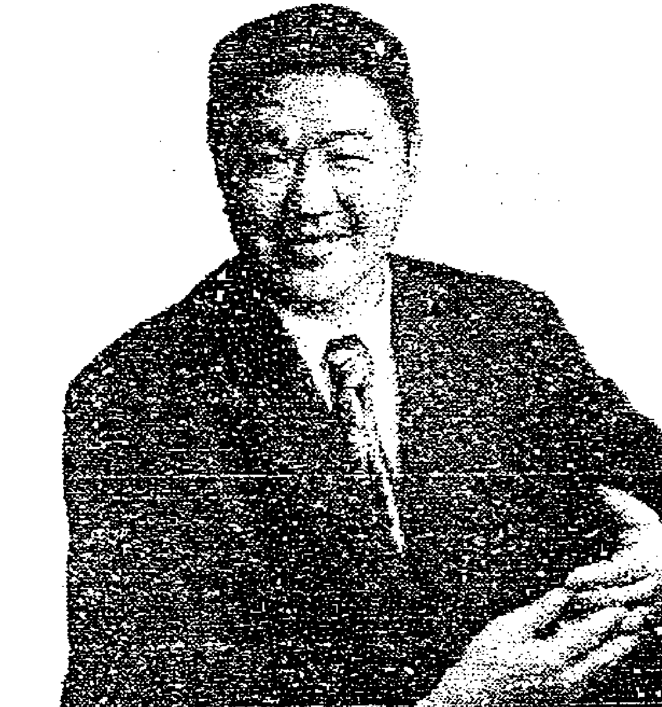
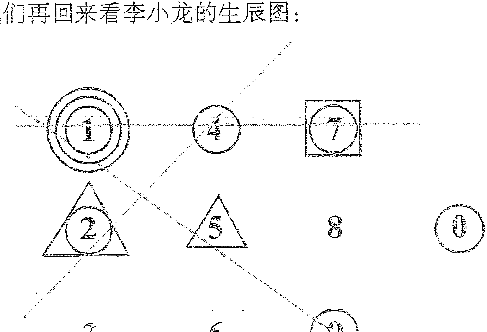
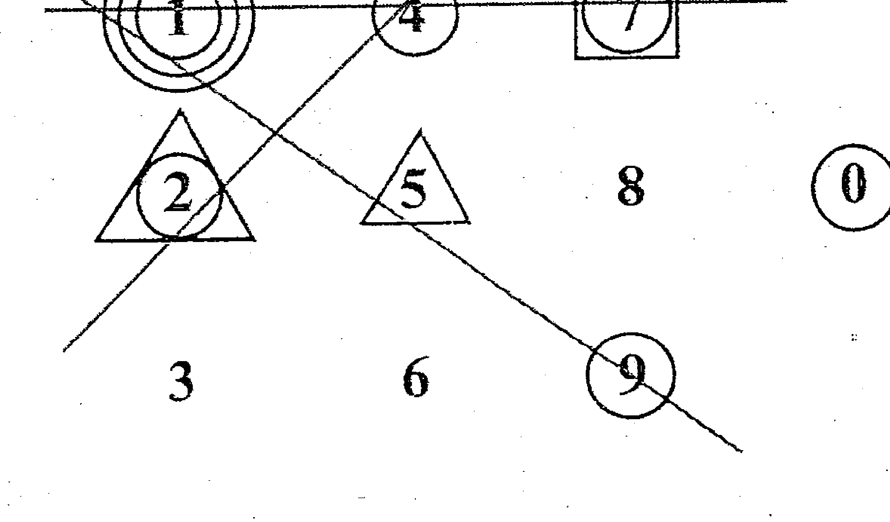
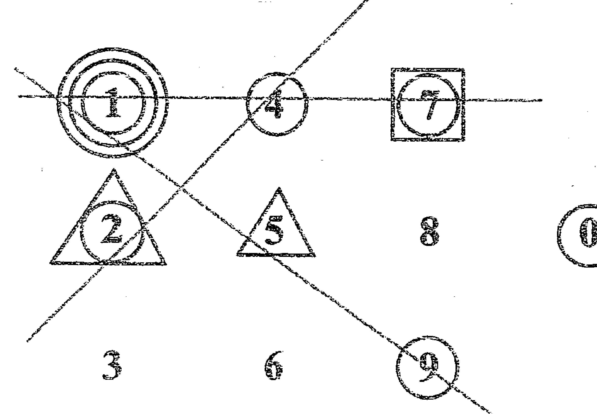

# 生命第一密码

## LIFE CODE

赵英凯 著

> 想想看——
> 
> 什么是只有你能做，而别人不能做的
> 
> 什么是由你做，会比别人做，做得更好的
> 
> 什么是你在这个家庭或这个团队中别人无法替代的

南方出版社

## 代序 增加“幸福指数”的工具

赵英凯，谢谢您的贡献！以您为荣为傲！恭喜您新作的诞生，它必将令更多人受惠，也许人生也因此而更精彩，更期待您诸多后续作品早日横空出世！

陈颖怡

——2011 年 1 月

陈颖怡，原《广州日报》记者，广州电视台《女人夜话》、《今日鉴赏》等栏目嘉宾主持。毕业于华南师范大学地理系，拥有多年性格分析及星相学研究、教学经验。其性格解读课程在南方人才市场、广州企业家商会、博士俱乐部、中国形象管理第一顾问机构、全国瑜伽专业委员会及多家 500 强企业、工、青、妇组织巡讲，是培训界炙手可热的明星讲师。


## 代序 寻找真我的起步

人生是一个成长的过程，当下在我们面前出现的人、事、物都是帮助我们成长的，帮助我们成为更有智慧、更有爱心、更有创造力量的人。而其中的源头与关键就是要先知道我们自己是谁，来到这个世界的真正使命与目的是什么，而《生命第一密码》就是帮助我们找到自己是谁的一本书。

你了解你的天赋吗？知道自己在什么领域容易成功吗？人生没有希望，只有创造！而在创造之初，先知己尤为重要。

生命第一密码属于数字统计科学，起源于古希腊，可以让我们知道几千年来古圣先贤了解自我性格的智慧密码。那是一股先天的，具有最纯洁的爱，无限的智慧，无穷创造力的能量场。

那为什么要了解自己呢？因为你内在以为你是谁，外在就会展现是谁。既然了解自己如此重要，又有什么样的工具和通道可供我们选择呢？初识“生命第一密码”时让我非常惊讶，为什么会有如此简单而准确的数字工具，能让我们在短短几分钟之内了解自己及他人的性格特征、健康状况、情感状况以及个人喜好和事业特长等等，这使我不得不赞叹宇宙的奇妙，先人的智慧——实有得遇知音的感觉！

思想有四个层面：零度思想、明了思想、运用思想、彻悟思想。而对于工具产品在客户心中的定位，零度思想是：这个产品对你来说可有可无；明了思想是：这个产品你欣喜接受；运用思想是：这个产品你渴望得到；而彻悟思想是：这个产品让你有必须得到的感受。毕达哥拉斯创造的凝聚了两千六百年智慧的“生命第一密码”恰恰属于后者。无论对于了解

# 生命第一密码

自己，还是认识身边的人；无论对于想成为最知心的伴侣，还是最优秀的父母；无论对于想要成为知人善用的领导，还是最卓越的销售人员，“生命第一密码”都必不可少。

而在了解了自己之后，人生最重要的决定是什么呢？答案是和谁一起成长！而《生命第一密码》也是帮助你了解成长队伍最好的方法。

关于本书的作者赵英凯，是我培养出的另一个“师傅”。他在十年前就跟随我在全国各地学习，悟性之高令我惊叹。而最重要的是他具有一颗纯洁而大爱的心。他的梦想是通过古老的智慧协助每一个人找到真正的自己，成为更有爱心，更有智慧，更有创造力量的人，从而回归真我。

祝福生命第一密码，祝福赵英凯，祝福每一个想要了解自己、奉献爱心的人士，让我们一起努力，共同为构建一个充满爱心、智慧和创造力量的幸福社会奉献我们的绵薄之力。

吴学文，学贯中西，被公认为亚洲最具震撼力和影响力的国际讲师，现今，由他直接培养的学生已经超过 50 万人。吴老师拥有丰富的事业履历（包括银行界、企业管理、国际贸易、房地产发展、营销界、保险界和培训顾问），用 20 年时间亲力研究各个领域的“道”。他的“真我智慧学”让很多人受益良多。



## 毕达哥拉斯的遗产

希腊与希伯来两大文化体系对西方文化至今仍产生着十分深刻的影响。希腊文化中的自然与理性，希伯来文化中的意识，几千年来渗透到西方社会的各个领域中，为西方文明的不断进步提供了源源不竭的动力。

中国著名的思想家、教育家，儒家学派的创始人孔子和古希腊伟大的哲学家、数学家毕达哥拉斯（约公元前 580 ~ 500 年）是同一时代的人，也是两种不同文化传统的创立者和代表者（古代中国的儒家学和古希腊的毕达哥拉斯学派）。虽然这两位思想家所在的人文环境和地理环境相差遥远，但他们有关“和”的思想以及对音乐功能的认识却表现出极大的相同点。

毕达哥拉斯出生于希腊的一个小岛。他自幼聪明好学，曾在名师门下学习几何学、自然科学和哲学。后来，因为向往东方的智慧，经过万水千山来到巴比伦、印度和埃及，吸收了阿拉伯文明和印度文明。所以，人们对他的智慧感到不可思议，以至于曾把他看作是太阳神阿波罗的儿子。其实，他的智慧一方面来自于他的天赋，另一方面是与他后天的经历与自身的努力分不开的。

一次，毕达哥拉斯路过一家铁匠铺，听到铁锤打击铁砧的声音，辨听出了四度、五度和八度三种和谐音。他猜想是由于铁锤重量的不同导致了声音的不同，于是通过称量不同铁锤的重量确认了这种关系。

随后，他又在竖琴上做进一步试验。根据不同长度弦的振动，发现了弦的长短与和谐音的关系。证明音乐中蕴藏着数的奥秘，竖琴之所以能发出悦耳的音调，是因为合乎一定数的关系。因此，“毕达哥拉斯是千古第

# 生命第一密码

一人表现声音与数字比例相对应，比任何人更早把一种看来好像是质的现象——声音的和谐——量化，从而率先建立了日后成为西方音乐基础的数学学说。”

又一次，毕达哥拉斯应邀到朋友家做客。对主人家地面上一块块漂亮的正方形大理石发生了兴趣。他没有心思听别人闲聊，沉思于脚下的排列规则，他在四块大理石拼成的大正方形上，均以每块大理石的对角线为边，画出一个新的正方形，他发现这个正方形的面积正好等于两块大理石的面积；他又以两块大理石组成的矩形对角线为边，画成一个更大的正方形，而这个正方形正好等于五块大理石的面积。于是，结果出来了：直角三角形斜边的平方等于两条直角边的平方和。著名的毕达哥拉斯定理就这样诞生了。

为了庆贺自己的发现，毕达哥拉斯用了一头公牛祭祀庙宇里的神像。这种做法足见他对于学术的热爱与至诚之心，想想当今社会上像这样以纯学术为乐的能有几人？他对知识完美的追求，对知识的狂热，对知识创造的尊重精神是极其宝贵的一笔精神财富。

无论是解说外在物质世界，还是描写内在精神世界，都不能没有数学。毕达哥拉斯最早悟出了“万事万物背后都有数的法则在起作用”这个道理。可以说正是毕达哥拉斯“万物皆数”的理论，奠定了生命第一密码的理论基础，才让我们今天可以去探索各自生命的路途，以及所获得的课题与精彩。

上天在我们出生的时候，给了我们一份礼物：生日。父母则给了我们另外一份礼物：姓名。如果，我们认识到世界上一切皆是能量的话，那么生日和姓名也是能量，生命第一密码能帮助我们揭开各自生日数字的奥秘。

作为第一个提出生命密码概念的人，毕达哥拉斯认为美好人生的第一个前提就是发掘人生的课题是什么，如何发挥优势，改进不足。生命数字不仅仅是对自己的认知和生命状态的了解，也代表了每个人的生命特征和身份特质，以及此生我们每个人的生命功课。

希望生命第一密码成为人与人之间连接的桥梁，沟通的纽带。让我们共同走进生命数字的未知世界，一起去探讨关于生命的真谛吧！

## 目录

## 前言

渴望更多的了解自我，一直伴随着人类发展的进程。慢慢的，人们认为自己对自己更明白，也更能体会周围的人。但为什么还会出现人际之间沟通不畅呢？究其原因，原来是每个人都有不同的面。就像平时两个人交流时，其实是六个人在交流：

- 一是别人以为的你；
- 二是你自己以为的你；
- 三是真正的你。

而对方也是。所以交流不顺畅也就很自然的发生了。因为我们经常和我们以为的他对话，而并不是真实地站在对方的角度上。

的确，性格不同，就会有不同的结果，即使同样一件事也是一样的：

比如：为了保护生灵全民要吃素！

有人听到这个消息的第一反应是：假新闻吧，怎么可能啊！

环保主义者却在研究它的真实可行性。

爱好健康的人则感觉这主意不错，以后可以多吃素食，但也要荤素搭配。

有些人则说，这不是我关心的问题，大家怎么样，我就跟着怎么样。

面对同样的一个问题，为什么人们的反应却如此地大不相同呢？很简单：每个人的性格是不一样的，看待问题的角度也不一样。

在美国，有一位妈妈把自己的爱女送进幼儿园。老师告诉孩子“O”是一个字母，这本来没错吧，哪知道这位妈妈怒气冲冲地找到老师，质问他为什么把孩子本可以充分想象的思想给扼杀掉了，原本孩子可以把“O”看作是太阳；也可以把它看成是一轮满月，或是一个篮球，看成许许多多有趣的事物，然而老师的教育方法把可爱宝宝的头脑给禁锢住了。为此，这位妈妈把老师告上了法庭，结果这位妈妈胜诉了，法官判定：教育应该灵活多样，不可以千篇一律……

这位妈妈是正确的。因为每一个人看待问题的角度是不同的。

在工作中大家应该都有这样的体会：你和你的上司相处的很好，沟通没有障碍。可是换了一个领导之后，你用同样的态度去对待他，可能就难以沟通，很难达成共识。为什么呢？就因为不同的人有不同的性格，而你用同样的方式应对当然不行了。

电影《狮王争霸》中，阿宽把十三姨的狗给吃了，事后他的理由是“十三姨，人们喜欢狗的方式是不同的……”。必须承认，阿宽太有才了！人对狗的态度都是这样的，何况说对人呢？

我们在明白了人的不同性格对事情会做出不同的反应之后，最想做的就是希望更多的了解自己，了解他人。古圣先贤用他们的智慧给我们开辟了很多条路，比如我们中国人最熟悉的《易经》，其实就是古圣先贤总结出的生活哲学，但它实在是太过于博大精深，很多人研究了一辈子才初窥端倪。

本书给您介绍的方法是来自古西伯来的智慧结晶，经由当代“数学之父”、哲学家、勾股定理创始人毕达哥拉斯整合而成的【生命第一密码】，属于数字统计科学。它比《易经》更简单，比九型人格更全面，经由你先天的生日和名字来了解你的天赋，是一门综合学科。当我们善用性格分析学时，您会发现自己的幸福指数、和谐指数都会自然的提升。

## 第一章 让每个人成为“唯一”

每个人的生命只有一次。生命，错过了就不再回来。我们要做的不只是珍惜，而是创造精彩。

很多人每天奔波却不知为了什么，很多人终日忙碌却终不可得。究其原因，是因为他们的心中没有关于人生的完整蓝图。人，不缺乏运动，而缺乏思考。小的时候总听父母讲要尽终日乾乾之功，可是没有梦想的人能做的也只是替别人的剧本添色。而自己，则慢慢地迷失、消亡。

青春年少时，哪个不是满怀梦想，哪个不是抱负满腔。成功的人和大多数人的区别只在于，他读懂了自己的剧本，掌握了自己的命运。我们要做的，不是羡慕别人，而是实现自我。

想过吗？你真正要的是什么？想要成为什么样的人？过什么样的生活？拥有什么样的财富和保障？在什么领域成功？受到什么样的尊敬？只有认清了自己，才能真正做个独一无二的人。

非要做唯一的自己吗？不一定。但是，如果你的生活是和大多数人一样的，你获得的“尊重”就会小于其他人。如果你愿意接受这个现实，在别人的剧本中扮演个角色也未尝不可。

唯一的感觉，贝多芬在音乐中找到了，李小龙在功夫中找到了，马拉多纳找到了足球，梦露找到了表演。那么你的唯一是什么？你相信你自己是重要的吗？

## 唯一的价值

有一所寺庙只有七个小和尚，其中六个人每天外出耕种，第七个则留在寺庙里料理杂务。

有一天，寺院开会，其中一个小和尚不以为然地说，第七个小和尚整天游手好闲，不出去工作就有饭吃，他应该和其他六个人一样，外出耕种，赚取他自己的粮食，其他人也附和他的说法。

第七个小和尚照着他们的意思，第二天一早也跟着大家一起出门工作。到了晚上，当他们带着疲惫的身体回家时，没有明亮温馨的灯光向他们招手，桌上也没有香喷喷的饭食等待他们。

现在他们终于明白自己是如何的愚蠢了，竟然否认了小兄弟的默默奉献。他们一致请求第七个和尚继续他以前的工作。

和尚们又再度过着和睦融洽、快乐平安的生活了。

寺院的故事告诉我们，每个人都很重要。但唯一呢？如果我们能明白到底什么事是只有我能做，而别人不能做的，到底有什么事，是我比别人做得更好的，到底我在这个团队中有什么是别人没有办法替代的，那么“唯一”就出现了。就好像在泰坦尼克号上，如果你有能力做船长，那你可以把握航向，不让船撞到冰山上。如果我们只能做个乘客，那就尽情地享受豪华游轮的盛宴。而如果你只能做个小小木塞，那就堵住那个窟窿吧，因为没有了你，泰坦尼克也会沉没。不为别的，只为世上缺不了唯一的你。

而生命第一密码就是借助数字统计学的桥梁来揭示每个人异于他人的天赋，让你成为独一无二的自己。而它的创始人，“数学之父”毕达哥拉斯也正是通过破解与我们的生命息息相关的数字的意义去认识自己的人生，和谐生命中的关系：夫妻关系、亲子关系、婆媳关系、工作关系、业务关系等等，最终取得成功的人生。

## 我懂它的心

“人与人之间一切的误会、猜疑和隔阂，都出于‘不了解’。”
——恩菲斯

库房大门上有一副坚固的门锁，粗大的铁棒自以为很有办法，一定可以打开这把锁，但是不管它用撬的、锤的方法，费了很大的劲，都无法打开门锁。

钢锯看不过去，接着上场，但是任凭它左锯右拉，门锁还是纹丝不动。

这时，一把毫不起眼的钥匙悄悄出现，扁平弯曲的身子，一副弱不禁风的样子。当它钻进锁孔时，一下子就把那副坚固的门锁打开了。

“你是怎么做到的?” 铁棒和钢锯不解地问道。

“因为我最懂它的心。” 钥匙轻柔地回答。

每个人的心门上都有一把大锁，唯有真正具有关怀与慈爱的人才能打得开。面对我们的家人或周围的朋友，你是不是真正了解他们内心的需要？能不能给予他们最贴心的帮助？

希望本书能助你发现自己的特质，和谐你的关系，帮你重塑信心，从而做最好的唯一的自己。

## 生命第一密码可以为我们带来什么？

最重要的是了解自己，其后是和谐生命中的关系。

我们自己还不了解自己吗？其实人有的时候并不真的了解自己。为什么我们会在某些场合或遇到某些人时会有特别的情绪？为什么我们遇到某些事时会有特别的举动？其实每个人都有三个身份：第一，别人以为的你；第二，你以为的你自己；第三，真正的你自己。很多时候，我们认为了解的自己，都是自己以为的自己而已，只有随着年龄的增长，阅历的增加才会真正明白自己内心的需求，成熟而真实。但也有很多人至死都未曾明白，或临终时才恍然大悟。

在我的学习过程中，最不喜欢的就是看教条的课本了，那就让我满足下自己的“私欲”用故事开始吧。

## 天生我材必有用

> “一尺之材，必有一尺之用。”

有一个孩子，从小就好动，对许多事物都很好奇，几乎所到之处，东西不是被他拆掉，就是被他摔坏或撞坏，因此被冠上“破坏大王”的称号。

由于恶名远扬，大家都很害怕他出现，无论在家中、邻里、学校，甚至他毕业后，到了上班的地方，情形还是一样。所以他一直在换工作，最后实在是没有办法，他只好辞掉工作，想办法创业自己当老板，没想到这一次他竟然成功了。

他公司的业务量比别人多，可是效率却比同行高，顾客也都很满意，你知道他从事的是什么工作吗？原来他开了一间拆房子的公司。

每个人都是一座富含宝藏的矿山，需要努力开采与挖掘，别让上天所赐的珍宝白白被埋没了，好好发挥你的才能吧！

了解自己之后可以和谐生命中的关系。那为什么两个人交流，总有鸡同鸭讲的不顺畅呢？就像前面刚刚提到的，其实每个人都有三个不同的面，因此两个人的交流其实就相当于六个人在谈话，而我们常常认为的“优待”则是把自己最喜欢的给予对方。但己之所欲，真的是人之所欲吗？

## 小白兔钓鱼

小白兔想去钓鱼，但是鱼儿怎么才能上钩呢？听说给它吃最好的就可以了，那最好吃的是什么？最后，小白兔为它的鱼儿去菜市场买了根新鲜的胡萝卜。

我们有没有为我们周围的鱼儿买过胡萝卜呢？其实在我们受到的教育和生活体验中，己所不欲勿施于人，是我们更多和更容易能体会到的。

## 公平

法国北部诺曼底的一个小镇，有位面包师傅常到隔壁农场买牛油。面包师傅发现每回购得一点五公斤重的牛油块，都被人偷斤减两，而且问题一再重演。终于，忍无可忍之下，他将农场主人揪送法办。

法官问农家：“您没有磅秤吗？”

“有的。”

“您少了称重量的砝码吗？”

“我是少了几粒砝码块，重量不齐。”

“那您又如何能秤出牛油块的重量呢？”

“跟您据实禀报，法官。根本不需要砝码！”

“怎么可能？”

“事情是这样子的，当面包师傅很赏光地到农场买牛油后，我也决定采购他做的面包。而且，每次就用他送来的一点五公斤面包当作砝码，秤出等重的牛油回卖给他。如果他不服，认为被欺诈，这不是我的错，而是他自己的问题。”

## 不要把我们认为不好的东西给予别人，因为那样我们会收获同样的结果。

己所不欲勿施于人，己之所欲施之于人，那和谐人际关系最重要的是什么呢？其实当有一天，我们放下我们以为的他，用他喜欢的方式，做到人之所欲施之于人的时候才是真正的快乐。

## 最长的安可曲

“处人不可任己意，要悉人之情；处事不可任己见，要悉事之理。”

——吕坤

钢琴家阿瑟·史凯瑞伯琴艺出众，但他生平最不愿意做的一件事，就是演奏结束之后再表演安可曲。

可是，有一次当他在巴黎演出时，听众却不管他肯不肯再演奏，一直鼓掌不停，经过好长一段时间的拉锯，史凯瑞伯拗不过，最后终于屈服，他同意再弹一曲。

他坐下去的时候是午夜一时四十分，当他再站起来时已经是凌晨五点五分了。他弹了一支连续三小时又二十分钟的长曲子。

从此，各地的听众再也不敢勉强他了，这也是他唯一的一首安可曲。

其实这是一个两败俱伤的结果，观众的愿望没能满足，琴师的心情也没人能知道。人之所欲施之于人是多么的重要啊。这也是本书中我们着重解决的问题。

## 什么是生命第一密码？

人出生来到这个世界上，究竟是偶然的奇迹，还是老天的意旨？我们为何生为张三，而不是李四？是什么决定了我们的唯一和独特？我们又该如何认识和应用我们与众不同的天赋和潜能？凡此种种。每个人都渴望了解自己生命的奥秘、自己的人生以及自己未来的命运。

古代人认为，人的出生并非巧合，出生年月日已在某些方面决定了自己的性格和未来的命运。比如我们是中国人，重孝道，重礼仪。古希腊哲学家、数学之父毕达哥拉斯（Pythagoras）也认为，数学具有生命上的意义，可以揭露万事万物背后的真理。他创建了一门艺术兼科学，称之为数字学（Numerology），借数字来诠释人生的意义。由于可以通过它揭示人的天赋潜力和性格特质，所以也称为生命第一密码。

那破解这个生命密码，是否有助于我们认识我们的人生和天赋呢？

毕氏认为：与我们切身相关的数字，如出生年月日，加以“解译”，就可以知道我们性格的优点和缺点及与生俱来该学习的技能。按照毕达哥拉斯的说法，天生的性格会自动牵引我们学习改变命运的技能，人生的成败也在于我们是否学会了该学的功课。

那是不是我们的命运已经注定，怎么努力都无用了呢？这是不是迷信呢？生命第一密码是数字统计科学，是创命论而非宿命论。天生之时虽然重要，但也还有地之利，人之和。命为天定，运为勤来。想要创造精彩的人生是与后天的努力分不开的。

在各种与我们相关的数字中，出生年月日无疑是最重要的，因为它是我们人生中的第一组数字，而且这组数字终身不会改变。其他的数字如证件号码、电话号码、门牌号码等，当然对我们自身也会有所影响，但由于这些数字会不时变化，因此，影响程度比不上生日对我们的重要性。

那么，在同一天出生的人的性格和天赋都一样吗？当然，不管在同一天有多少人出生，生日数字所造成的影响都是一样的，但由于后来会有许多其他的数字或因素像生日数字一样影响我们，因而决定了我们每个人性格的发展和人生的走向。这种现象在双胞胎身上可以得到印证：双胞胎的出生年月日完全一样，但性格的发展和人生却可能完全不同，而除了生日之外第一个会影响其性格不同的，则是因为姓名不同（姓名也可通过一种特殊的方式变成数字）。生日数字透露出了每个人对人生的梦想，也就是每个人真正想从生命中得到些什么。为了实现这个梦想，我们也就必须面对各种形式的挑战，其后才能达成目标和梦想。同时，生日数字也会揭示每个人的潜在天赋和才能，不同出生日期的人会有不同的天赋和才能，因而，不同的人就会有适合各自不同的职业。例如，某人有沟通的天分，那么他就可以在律师、推销员、新闻记者、演说家、政治家等行业大施拳脚。某人有表演的特长，那他就可以在电视、电影、舞台上一展风采。

生命第一密码的应用范畴十分的广泛。因为它是你并不了解但是又是你与生俱来左右你生活的“本性”，扪心自问：你真的了解、懂得你自己吗？恐怕我们不敢回答，再或你了解、懂得亲人、朋友、同事甚或对手吗？恐怕我们更不敢回答。那好，生命第一密码可以帮助我们回答这些问题。人们总想在自身短暂的生命当中证明自己的价值，无论他从事什么职业，身处何种环境。可是我们并不真正地认识自己，也不知道怎样发挥自己，生命第一密码有助于我们真正地找到自我，发现自己并不知晓的天赋和才能，最终实现成功的人生。

## 找出你的生命第一密码

要破解自己的生命第一密码，首先要了解几个概念，即什么是生命数、天赋数及卓越数。

步骤 1. 确定你的出生年、月、日。

请注意我们的生日都要用阳历生日，也就是公元 × × 年 × × 月 × × 日。

因为生命第一密码起源于西方，而农历或我们平时讲的阴历都是中国的历法，要用万年历转换过才能使用。

步骤 2. 写下你的生日，并把他们单独相加，包括零。

例如：
1980 年 3 月 14 日
计算：1 + 9 + 8 + 0 + 3 + 1 + 4 = 26

步骤 3. 找到你的天赋数和生命数。

天赋数是以公历（阳历）出生日期（年、月、日）的数字相加直至最后得到的双位数。

生命数是以公历出生日期（年、月、日）的数字相加直至最后得到的个位数。

至于卓越数，后面会详细说明。

了解并学会运用这些概念，就可以帮助你破解生命第一密码，同时也就有助于你认识自己，并做真正的自己。

# 生命第一密码

拿刚刚的例子说：

```
1 + 9 + 8 + 0 + 3 + 1 + 4 = 26
```

得出的双位数 26，在此我们把它单独看，就是我们的两个天赋数：2 和 6

而把两个天赋数相加，得到的个位数，就是我们的生命数：2 + 6 = 8

由此我们知道案例：1980 年 3 月 14 日的天赋数为 2、6，生命数为 8。

步骤 4. 写下你的生命数组合并了解它们的意义。

例如：

1980 年 3 月 14 日

天赋数：2 和 6；生命数：8

我们通常的写法是：26/8

斜线前面代表天赋数字，后面则是你的生命数。

天赋数：是你前进的方向，也是我们成长的路途，相对于生命数，其能量较弱。

天赋数也是你能达成生命数正向能量的阶梯，也就是说，你依次学习好天赋数能量的课题，才能真正活出你的生命能量。

生命数：是我们人生的使命，也是我们来到这个世界上的意义。是我们的目标，也是我们人生的目的地。也是对我们影响最大的数字。（这里和我们平时讲的幸运数字不是一个概念）

## 特别案例：

- 1) 如果天赋数得出的是：10；20；30；40。那你的生命数就是把他们相加即可：1 + 0 = 1；2 + 0 = 2；3 + 0 = 3；4 + 0 = 4。
  而最终的写法就是：10/1；20/2；30/3；40/4。
  而像这样天赋数和生命数相同，代表天赋能量会相对集中，在某个领域特别容易成长，详情请参考具体数字，及“0”数解读。

- 2) 如果天赋相加之后还是双位数，请再相加一次成为个位，如生日相加后得到 29，2 + 9 = 11，11 不是一个个位数，那就需要再加一次 1 + 1 = 2；而最后其天赋数就是 2、9、1、1 四个，生命数为 2。最终写法为：2911/2（更多请参看后面案例）。

步骤 5. 重新验算，确保无误。

这一步非常重要，因为越是简单，我们就越容易出错。

## 常犯的错误：

- 1) 没有把月份或日期的双位数拆开相加。比如 10 月份，相加的时候不是加 10，而是加 1 再加 0；如 23 日，不是加 23，而是加 2 加 3。
- 2) 把出生年份简化成两位相加。如 1969 年出生的人，应该是 1 + 9 + 6 + 9；如果只相加 6 和 9 就不对了，我们在这里要特别留意。
- 3) 生命第一密码从生日中的相加最大会得到 47，所以，如果相加得到大于 47 的，一定是计算错误，请重新计算。

在我们身边最大相加日期为：1999 年 9 月 29 日；相加：1 + 9 + 9 + 9 + 9 + 2 + 9 = 48；4 + 8 = 12；1 + 2 = 3；天赋数：4、8、1、2；生命数：3

## 更多案例：

有些朋友喜欢把出生日期分别相加，这样也是可以的。

## 例如：

A 君生日为 1981 年 8 月 6 日

计算如下：

年：1 + 9 + 8 + 1 = 19

月：8

日：6

再将三项的和相加：

19（得自年） + 8（得自月） + 6（得自日） = 33（天赋数）

然后将双位数的两个数字相加：

3 + 3 = 6（生命数）

在生命第一密码中我们不做双位数的运算，所有的数字都是单独相加，并具有单独的意义。

所以，我们将总和得到的双位数 33 看做是两个单位数 3 和 3，称为“天赋数”，这个数字代表个人的天赋才华，因此对一个人将来在社会上的发展极为重要。这个双位数会揭示我们随着年龄增长而日渐表现出来的天赋。我们越成熟，个性越圆融，才华会越凸显。天赋数代表我们心智成熟、灵性提升时所呈现的才气，但这些天赋不是我们需要学习的主要内容。

我们需要将天赋数中的两个数字相加，就会得到我们破解生命第一密码的主要内容。继续刚才的例子，3 + 3 = 6，因此数字 6 就是破解我们生命第一密码的钥匙，此数称之为“生命数”。因此 A 君的天赋数是 3、3，他的生命数是 6。

生命数对人的影响最大，天赋数次之，所以当我们计算出以后，就先看你的生命数，之后再看天赋数。如 A 君，就先看生命数 6，再看天赋数 3、3。

之后希望更多了解，再看第六章整体解图，可以了解一个更加详尽的你。

B 君生日为 1970 年 10 月 1 日

计算如下：

1 + 9 + 7 + 0 + 1 + 0 + 1 = 19

（注：生命第一密码中没有双位数，所以 10 月份在相加时把其看做 1 和 0）

1 + 9 = 10

1 + 0 = 1

天赋数：1、9、1、0；

生命数：1。

生命数只有一位，所以要一直相加至个位数。如 B 君，年、月、日相加之后的和为 19，1 + 9 = 10，10 不是个位数，所以还要再加一次：1 + 0 = 1。

所以 B 君的天赋数就有 4 个，分别是 1、9、1、0，而生命数为 1。

(注：0 有 0 的意义。天赋数 0 的影响比生日数的影响更大。而生日数中在数字后面的 0 有意义，如 1970 年或 10 月份。在数字前的没有意义，如 03 月)

也许有人会说，我不喜欢我的生命数，我的生命数不好。其实，一个人的出生年月日是不可能改变的，那么他的生命数也不可能改变。而另一方面，生命数字没有好与坏之分，每个数字都有先天赐予的天赋。所以，不管你是哪个数字，你都应该勇敢地“做自己”。因为只有你成为了自己，你才是其他人没有办法复制和超越的。第一密码就是让每个人成为人生第一，唯一的密码。

## 应该采用哪个出生日期？

计算生命数和天赋数要用到出生日期，即生日。但有些人的生日不止一个，这主要是因为采用的是不同的纪年方式，有的用公历，有的用阴历，因而造成一个人有不同的出生日期。那么，应该以哪个出生日期为准呢？计算生命数和天赋数要用公历日期（即阳历，可查万年历将阴历转换为阳历）。另外，有很多朋友问我，如果身份证上的生日是错的（有可能因为各种原因出现错误），那应该用哪个生日？答案当然是用你自己真实的，因为那个才是真正的你自己。而那个错的生日虽然会给你带来影响（就像我们常用的手机号、门牌号），但不是决定性的影响，这些数字我们会在后续的课程中详加解释。

## 我们身边有可能出现的数字组合

一共有 39 种组合，分别是：

| 10/1 | 20/2 | 30/3 | 40/4 |
|------|------|------|------|
| 11/2 | 21/3 | 31/4 | 41/5 |
| 12/3 | 22/4 | 32/5 | 42/6 |
| 13/4 | 23/5 | 33/6 | 43/7 |
| 14/5 | 24/6 | 34/7 | 44/8 |
| 15/6 | 25/7 | 35/8 | 45/9 |
| 16/7 | 26/8 | 36/9 | 46/10 |
| 17/8 | 27/9 | 37/10 | 47/11 |
| 18/9 | 28/10 | 38/11 | 48/12 |
| 19/10 | 29/11 | 39/12 | 49/13 |

另：2000 年以后出生的，还可能会直接加出单独的生命数。如：2001 年 3 月 2 日；计算：2+0+0+1+3+2；生命数为 8。那天赋数字呢？请参看《黄金命盘》工具牌或与我们联系参加生命第一密码体验之旅。生命第一密码工作室 QQ：908910814 电话：18666008769

当我们知道自己的生命第一密码后，我们就可以像查字典一样开始自己的探索之旅了，先看生命数，再看天赋数。如：32/5 就先看 5 数（因为生命数对我们影响最大），再看 3 和 2 数。

## 特别提示：切忌贴标签

当我们通过生命第一密码去了解自己或一个朋友的时候，切忌把人标签化，你不是 31/4、32/5；那只是对你影响最重要的特点，因为在生活当中影响我们的能量还有很多，比如：背景、家庭、环境、阅历，在数字中如你常用的名字、手机号、车牌号、门牌号，甚至你的 QQ 号、银行密码号码等，都会帮你吸引不同的能量。而数字能量中也有过多、纯正和不足的能量。只有当我们正确认识它们的时候，才能更深入、准确的了解。

而当我们作为初学者，不能准确、全面的表达时，最好只用能“建立”他的语言（请参看第七章“成为助人助己的生命第一密码解读师”）。

## “1”数的个人特质

## 1. 有主见，天生的领袖

1 是万事万物的开始，是开天辟地的数字，所以生命数为 1 的人经常希望做别人不敢做、不能做的事情。他们是帝王，是君主，是天生的领袖，充满自动自发的精神；他们也很有主见，有动力，可以勇往直前，直指自己的目标与成就。他们勇敢，肯冒险犯难去完成心中的理想。所以，1 数的人很可能会成为英雄或历史上的伟大人物。

## 亚当的故事

《圣经》上讲述了这么一个故事：混沌之初，上帝创造了亚当。他是世上唯一的人，只能自求多福。他必须依靠一己之力建造遮风蔽雨之所，觅食，保护自己。如果受伤或者生病了也必须自己想办法医治。他无依无靠，无人与他交流，所以没有机会学习沟通，形成了自强独立的个性。

1 数就是这样，他们肩负比他人更重要的使命，就是开创。起初，他们为实现自己的想法而努力，没有人理解、支持，仅凭心中勇往直前、希望。

## 2. 行动取向型

生命数为1的人很像是一辆具有动力的车子，有着一切靠自己的内在动力。面对所有的挑战，他们都会像前苏联作家高尔基笔下的海燕，勇敢并快乐着。这些朋友在小的时候就是“孩子王”，伙伴都会很自然地服从他的领导。“我是司令！你们听我的保管没错。”说这话时，他会十分坦然，很骄傲，很可爱。

生命数为1的人天生拥有领导力，常常受到大多数人的尊敬。他们做事果断有权威，对于有意义的事业他们会毫不犹豫地为之宣传、赞助，并也由此得到大家的尊敬。

## 英雄惜英雄

有一次，爱因斯坦获邀去欣赏卓别林的艺术表演。他非常欣赏卓别林的艺术天分，因此在观赏完毕后写了一封信给卓别林，称赞他说：“您主演的影片《淘金记》，世界上所有的人都懂，您一定会成为人们心目中的伟大人物。”卓别林在看过信后，马上提笔回信说：“您使我更加钦佩，您的相对论，世界上没有一个人懂，可是您却早已是人们心目中的伟大人物。”

## 3. 独立，自尊心强

生命数为1的人非常独立，自尊心强，不轻易相信别人。根据《圣经》，上帝创造的第一个人亚当就是典型的生命数为1的代表。他所有的事都得自己来，他可以自我照顾得很好，但却没有与人分享的概念。在1的世界里，他们希望所有的人都是独立的个体，他们其实不那么爱冒风险，但还是冲劲十足。他们精力充沛，不容易疲劳。因为他们要带领大家向前冲，他们也不喜欢身边的人依赖他们。

## 4. 爱憎分明

1 数的人爱憎分明，他们喜欢的人，就把他们当自己的家人看；不喜欢的人，就是谁说他好也没用。这种非黑即白的思考模式的优点是比较容易做决定，这种力排众议的风格，是领导力的必备特质。缺点，就是有的时候会流于极端，有一言堂的倾向，只要他做主了，谁也不能更改。

## 5. 喜欢做焦点人物，自信

生命数是1的人是魔术师，因为他有从无到有的能力，喜欢做焦点人物，经常一意孤行，而由于太独立又不太在意别的结果，生命数为1的人显得有些自私。他们总是希望大家都听他的，他们做起事来，也仿佛这世界没有其他人一样；他们常给人一种冷冷的、不太在乎别人的感受，甚至有些距离的感觉。但他们那无以伦比的开创力是没有人可以比拟的。

生命数为1的人在生活中有着十分的自信。他们不喜欢听命令、听指挥，喜欢自己做老板。他们做任何事情都想依靠自己的力量去完成，而不依赖其他人。但是，具有讽刺意味的是，他们却不得不依赖很多人。例如：也许他会认为他可以不依赖员工，因为他们依赖他才有工作，可以任何时候解雇他们，然后再用新人。在他的世界里，每一个人都可以被取代，除了他自己以外。但是事实上，他只有依靠别人才能完成自己的事业，特别是当他的事业成长超过他可以自己管理的程度之外时。如果他把所有为他衷心出力的人都赶走，他最后将不得不去用那些只会逢迎和最不值得信赖的人来完成他的事业。而这些人又怎能完成他的事业呢？在这种时候，他必将怀疑他们的忠诚度，而他们也必然对他心生恐惧。因此，不管对他的事业、生活、家庭而言，他自给自足的幻想终将破灭。因此，1数的朋友应该在这个方面务实一些，最大限度地发挥你领导的特长，把工作分配出去。相信朋友们的能力。大家齐心协力共同努力，这样做，他的事业肯定会蒸蒸日上。

## 6. 喜欢创新

生命数为1的人喜欢不断地创新，他们容易对单调重复的工作或生活方式感到厌烦。他们需要经常变换角色或者同时身兼数职，这样比较符合他们的口味。自己开公司自然更好，因为他们既喜欢当老板，也喜欢做伙

## 7. 喜欢炫耀

生命数为1的人总喜欢作秀，喜欢炫耀自己，所以有时候很容易得意忘形，暴露自己的缺点（就像孔雀开屏时，在它美丽的背后，总会露出秃秃的尾巴）。生命数是1的人总是闲不住，因为他们总会以世界和谐为己任。他们总是不停地寻找目标，找到目标后又会拼命地去达成目标，所以1数的人总会感觉很累，而且压力也会很大。所以，懂得合作的1数才能成就真正的辉煌。

## 8. 性格直爽

生命数为1的人都很直爽，他们喜欢直来直去，不会弯弯绕，喜欢有事直说，是标准男人的做事风格。即便是女人，她们的性格也很直爽，有巾帼不让须眉的豪气。他们对待其他人，也不喜欢拐弯抹角，希望对方也能像自己一样，勇于表达自己的主张。他们通常不喜欢矫揉造作的人。

这种直爽表现在工作中就是不喜欢听别人的命令，更不喜欢别人对他们指手画脚，他们希望按自己的方式做事情，也不喜欢一窝蜂似地跟潮流。他们满脑子新点子，喜欢标新立异，跟随只会让他们感觉失去了自己，让他们觉得没有面子，这是生命数为1的人最不能忍受的事情。他们更愿意不拘一格，而当他们有了这样的想法时，就很容易做到独特。所以生命数为1的人很适合做开疆辟土的帝王、领袖。开门见山、单刀直入地谈生意往往也比较容易成功。但这种行为方式如果使用在恋爱与婚姻关系里，就会让对方感觉他们很冷酷、无情，更无浪漫可言，甚至还有点自私。所以，适时的发挥天赋和调整缺点是1数需要注意的。

## 9. 感情生活

感情这个东西一直是十分神秘的。它就像生活中的一团火，太近了可能会烫伤，太远了又感觉很寒冷。生命数是1的朋友对这一点体会应该更加深刻，因为他们对感情的付出是深切而真诚的，可是别忘了他是带着天生的领导性而来的，所以他们并不善于表达感情。“别人应该听我的。”这是他们心中的一个信念，别人要按他的话来做。他们期望对方待他们如国王、王后一样，而对方是怎样的感受他很少愿意去顾及。因此，如果你决

## 10. 肯定自我

古时候有个国王，有一天，在自己的御花园里散步，他忽然发现高大挺拔的橡树枯萎了，就走过去问他：“橡树啊橡树，为什么你枯萎了？”橡树很不开心地皱皱眉，说：“因为我没有柳树飘逸。”国王转过头看看柳树，发现它也枯萎了，就问：“飘逸的柳树啊，为什么你也枯萎了？”柳树闻言，沮丧地抬起头：“亲爱的国王啊，因为我没有玫瑰芳香！”国王轻轻地摇了摇头，看看玫瑰，发现它也枯萎了，不解地问：“玫瑰啊玫瑰，你如此芳香，难道你也有什么不满足？”玫瑰看了看他的身边说：“因为我没有橡树挺拔！”

这就像极了生命数为1的人，他们总是能发现别人的优点，有的时候显得不够自信。他们并不差，只是他们太想自己是最优秀的了，所以他们总是希望追求顶尖的感觉。国王郁闷地往皇宫走去，忽然，他不经意地看到甬道边开着一朵娇艳欲滴的紫罗兰，就惊奇地

## LIFE CODE
人生课题

生命数为1的人最主要的人生课题就是要避免因太过独立而导致的孤立，要学会信任别人，并与人通力合作。

对于生命数为1的人而言，要多支持和鼓励他人，不要只希望获得别人对自己的注意和仰慕，也要多给别人以关注，尤其是当他们值得自己这么做时。不要太自恃清高，当学会了如何感激别人时，也会让自己感觉更良好，人际关系也会更融洽，也更容易获得他人的支持和尊敬。如果他们能多些合作，少些竞争，将会是不错的领导和领袖。

生命数是1的朋友你应该时刻注意一点：不能产生总是要压制他人的想法。这有时会给你带来十分大的麻烦，保持宽厚的心胸，多多和他人合作是你应常常做的。不给别人留面子、挤兑别人的做法会招致大家的厌烦。换个角度来思考，你不顾及别人的感受，以自己为中心，那会是“高处不胜寒”的感觉，为什么要脱离人群呢？当1数开始学会与合作的时候，就会变成一个可爱的人、一个可靠的朋友、一个优秀的人，而不是一个高高在上经常冷面向人的领导。

自强、自立是人的一大优秀品格，但这并不意味着不合作、不分享。生命数是1的人从内心深处总希望完全的独立，不去依靠别人。其实每个人

# 生命第一密码

都需要自给自足，都是生命的主宰。即使自己拥有强大的能力，用合作、分享的方式也更容易达成目标。所以，根据解读以后，1 数的朋友你应该懂得对他人敞开心扉的重要性，无私地付出你的智慧，和大家共同分享。学会与别人合作，接纳他人。运用你天生具有的领导力，正确使用你的天赋，取长补短，这样你会很容易成功。

另外，“1”数要记得，永远不要着急做决定。

## 和凝买鞋

五代时，冯道与和凝都在朝为官，两人交情很好。

有一天，冯道穿了新买的靴子到和凝家去拜访。和凝一看，这双靴子正和他两天前叫仆人去买的那双一模一样。

于是，和凝就问：“你这双靴子多少钱买的？”

只见冯道举起右脚，不慌不忙地说：“便宜！便宜！才五百！”

和凝一听，对着站在身旁的仆人甩了一个巴掌，骂道：“一模一样的靴子，为什么你说要一千元呢？”

此时，冯道缓慢举起左脚说：“这只也是五百。”

这下子，和凝真是羞红了脸。

急什么？在出重言之前，试试先吸几口气，甚至先走一走、缓一缓。有些时候，乱发脾气反而会成为笑柄，何不先冷静一下呢？

## 人生目标

生命数是 1 的朋友你们现在知道了自己的生命密码，也就知道了自身的强势和不足。那么，在自己的人生道路上就要充分发挥潜能，展现自我天赋。现在最需要做的是找到真实的自己。

1 数是天生的领导。首先要先思考，再选择目标，弄明白自己的真正需要之后，再去努力达成。只有这样才可以发挥你强大的影响力。要想完成你的目标你必须走出一条属于自己、完全独立的路。这对你来说绝非什么难事，是你的天性使然。当然了，这肯定要有一个过程，至于时间的长短则完全取决于你自己的态度了。想要让你的生活更加快乐，不让自已成为孤家寡人，那你就应从当下做起，深入地思考，想清楚什么才是你真正的需要，把不切实际的念头尽快地扔到废纸篓里去，选择好自己的主动阵地，努力地拿下它，这样你的生活将会丰富多彩，你生命的功课就会尽快完成，你快乐的生命就将重新翻开！

## LIFE CODE
沟通之道

对生命数为 1 的人来讲，绝不能对他们颐指气使，做事要先咨询他们。和他们沟通要简单明了，直截了当，他们不喜欢拐弯抹角。生命数为 1 的人总是认为，别人能做到的他们也一定能做到，甚至能完成得更加出色。他们希望别人在乎他们的意见，总之，和他们在一起，就把他们当成帝王看，即使要表达不同的意见，也要用他们能接受的方式才行。

另外，1 数的人在意价格。不喜欢强制推销，如果希望他们认可你的产品，不妨多给他们些空间。总之，把他们当“上帝”或“帝王”对待就对了。

## LIFE CODE
健康之道

生命数为 1 的人发现，随着他们逐渐接近独立，身体也会随之更加健康。但如果情况相反，其他人太过于依赖他，并对他有所求的时候，生命数为 1 的人的健康就不是那么理想了。问题是，生命数为 1 的人的独立不是只有自己一个人在战斗，而是指他能在一个环境和团队中有决定权，所以

# 生命第一密码

生命数为1的人在与他人相处时要多为对方着想，保持好心情。

+ 1. 生命数为1的人总是想太多的事情，容易心里紧张，易患头痛、神经痛、骨骼痛（感冒先上头），所以放松是最重要的课题。
+ 2. 生命数为1的人肠胃功能也不是太好，中年后可能会有极胖或极瘦的征兆。（对于肠胃，建议1数的朋友，饭后半小时内不要喝汤、喝粥、喝水，因为这样会冲淡胃酸，造成消化不良。要记得“饭前喝汤，苗条健康，饭后喝汤，如喝砒霜”的道理）

## 调理小验方

+ 验方① 偏头痛：白萝卜250克，海带100克。文火炖熟，盐少许，佐餐食用，连服30天。
+ 验方② 肠胃调理（腹胀、腹痛、肠胃虚弱、食欲差）：党参30克，炒糯米100克。沸水冲泡5分钟，代茶饮用，常服。
+ 验方③ 肥胖，调节血脂：冬瓜250克，粳米100克，煮粥。当晚餐用，常服。
+ 验方④ 头痛（各种头痛均可）：生白萝卜汁，每次滴鼻孔两滴（两鼻孔都滴），一日两次，连用4-5天。期间忌吃花椒、胡椒。
+ 验方⑤ 内、外痔疮：大田螺每天一只，将盖去掉。放入冰片1钱，5分钟后取田螺水涂肛门，每天2次，连用7天，期间忌吃酒、辛辣物。
+ 验方⑥ 清肝行气，活血消斑：丝瓜络10克，白菊花10克，玫瑰花5克，红枣5枚。将上述材料洗净，放入茶壶中，加入适量水，煮开后浸泡5分钟即可饮用。
+ 验方⑦ 益气健脾，润肠排毒：核桃仁200克，茯苓100克，白芷100克，蜂蜜350克。将桃仁碾碎成粉状备用。在砂锅内加水600ml，把茯苓、白芷一起下锅，连煮三次，每次去渣留汁250ml，大概需要半小时。然后将三次提炼的汁加热，在锅内倒入1瓶蜂蜜，不停地搅拌，直至汁液

## 需要补充的营养

+ 1. 肠胃功能需要额外补充的营养：蛋白质（鱼、肉、豆、蛋、奶）、VB（绿叶菜、不食饲料的动物肝脏）、有益菌群、膳食纤维；
+ 2. 放松神经系统需要额外补充的营养：矿物质钙、镁、VB；
+ 3. 预防心脏负担过重、预防骨质疏松：蛋白质、VB、矿物质钙、镁、VC、健络精华（Glucosamine）。

## 适宜运动

早晚各下蹲 30 次。（调理肠胃）

## 适合的职业

生命数 1 的生命轨迹：这是一个富有男子气概的数字，并暗示着这个人是个天生的领袖，独立自主，常有新点子，善于当机立断做决定。你一直觉得如果你不能得到至高的权力就不能满足于现状，所以掌控你的事业吧！一个选择是成为一名不考虑学位、可以独立完成的自由职业者——老板、艺术家、导演、SOHO 族、特性独立的发明家、培训师、政客、演艺人员、公司主管、业务员……另一方面，你勇敢的性格会使得你在某些具有“攻击性”的领域获得成功，比如法律，又或者是工程学这样极其需要韧性的领域！

# 生命第一密码

提醒：但由于 1 数无法做重复性高或者太单调的工作，所以要小心陷入百艺而无一精的情形。

## 举例：

马丁·路德（美国黑人领袖） 出生日期：1929 年 1 月 15 日 生命数为：2810/1

著名的美国民权运动领袖，将“非暴力”（nonviolence）和“直接行动”（direct action）作为社会变革方法的最为突出的倡导者之一。

戈尔巴乔夫（前苏联总书记） 出生日期：1931 年 3 月 2 日 生命数为：1910/1

末代苏联共产党中央总书记，第一位兼最后一位苏联总统。俄苏政治家，国务活动家，苏联改革和“公开性”的创始人。

乔治·华盛顿 George Washington 出生日期：1732 年 2 月 22 日 生命数为：1910/1

开创性的领袖，美国首任总统，美国独立战争大陆军总司令。被尊称为美国国父，和亚伯拉罕·林肯并列为美国历史上最伟大的总统。

汤姆·克鲁斯 Tom Cruise 出生日期：1962 年 7 月 3 日 生命数为：2810/1

美国著名影星，从饰演高中生偶像成功转型至饰演成人角色，成为名利双收的超级影星，创造超 10 亿美元的票房成绩，多次荣获奥斯卡奖项。从青春偶像到成熟的影坛巨人，汤姆·克鲁斯凭借的不仅仅是人见人爱的英俊外表和迷人微笑，更多的是坚定的意志与认真的作风。

1 数的克鲁斯目标感强烈，给自己划定了一个期限：十年之内成为一名有所作为的演员。开始他在就读的高中内出演一些戏剧，但很快便辍学去了纽约。在那里，他每日以热狗和米饭充饥，搜寻着每一个试镜的机会，“就像丛林中的一头野兽”。而这无数次的试镜均以失败告终，理由是他“不够英俊”，或者表演“热情得过了头”。从一个小角色到青春偶像再到实力将派的转变，克鲁斯无疑是 21 世纪好莱坞人人崇拜的典范：不满 40 岁的他早已跻身 2000 万美元俱乐部；在票房成绩上他仅次于头发已花白的哈里森·福特；他还拥有自己的制片公司。

## 第五章 生命第一密码解读

周星驰 出生日期：1962 年 6 月 22 日 生命数为：2810/1

著名演员，兼导演、编剧、电影监制以及电影制作人。曾获 1998 年国际杰人会港澳杰人之星奖。香港号称“东方好莱坞”，年产电影上百部，大小演员如恒河沙数，但是近二十年来票房榜单上的头把交椅，几乎始终都是“双周一成”轮流坐。这三位票房号召力至高的巨星中，演技多次获得专业奖项承认的，要数周润发和周星驰；有能力独立制作电影，作品能够冠以本人大名的，只有成龙与周星驰；而演出的影片不仅富于个人特色又极具社会代表性，甚至被作为一种文化现象来反复解读的，唯周星驰一人而已。他那非逻辑性和带有神经质的演技，开创了“无厘头”文化，成为香港文化的重要一环，因而他担纲演出的电影更历破票房记录，为香港喜剧带来另一出路和高峰，但他并不满足，还在继续前进。

三毛（原名：陈懋平） 出生日期：1943 年 3 月 26 日 生命数为：2810/1

曾就读中国文化大学哲学系，肄业曾留学欧洲，婚后定居西属撒哈拉沙漠加纳利岛，并以当地的生活为背景，写出一连串脍炙人口的作品。她的足迹遍及世界各地，她的作品在全球华人广为流传，在大陆也拥有广大的读者，生平著作和译作十分丰富，共有 24 种。

曾经，三毛的母亲缪进兰评价她的性格最为特行卓立、不依常规，及不能忍受虚假。所以，父母要在她身边看守着每一脚步是否踏稳。在感情方面，三毛也是富于传奇性。那种敢爱敢为的性格，与她作品中充满炽热的感情是相互交融和一致的，也是两岸三地无数读者喜爱她作品的原因。

邓亚萍 出生日期：1973 年 2 月 6 日 生命数为：2810/1

前国家队乒乓球运动员，邓亚萍是夺取世界乒乓球冠军次数第三多的女选手。身高仅 1.55 米的邓亚萍手脚粗短，似乎不是打乒乓球的料，但她凭着苦练，以罕见的速度、无所畏惧的胆色和顽强拼搏的精神，在其运动生涯中，获得过 18 个世界冠军，连续两届 4 次奥运会冠军，邓亚萍是第一个蝉联奥运会乒乓球金牌的球手，被誉为“乒乓皇后”，是乒坛里名副其实的“小个子巨人”。邓亚萍的出色成就，改变了世界乒乓球坛只在高个子中选拔运动员的传统观念。

如何增加数字能量

数字能量是指希望拥有的数字力量，想要获得的时候才额外增加。就本身生命数字而言，这个数字的能量已经很强了，无需再去增加。但如果有某方面特别需要的时候还是可以适当加强。而缺乏此数字的人，为了自身的发展和谐，可着意增加其能量。

1 数的能量适用于：想要拥有动力、灵感、启示；需要当领导、做决策；独立承担责任；必须化繁为简；需要新点子或新活力时。

可用以下方式增加 1 数能量：

1 的能量颜色：红色（想拥有“1”的能量就增加红色）。

红色是彩虹的第一色，代表了权柄、力量、活力与冲动。因此，想让别人认同自己的观点时，需要订立目标时，想要冲锋陷阵、找工作、谈生意、寻找爱人时，都可以在生命中增加包括粉红在内的各种或深或浅的红色以增加“1”数的力量。

# 红色的情绪疗愈功能：

勇敢对于我们十分重要，在大家的生命历程当中都会时不时地产生出恐惧、犹豫不决等不好的情绪，怎么办呢？谁也不愿意让自己在这样环境中挣扎，那就用红色来帮助你吧。不放弃、不犹豫、勇往直前是红色可以为你带来的。乐观向上是红色的本性。

在工作和事业上我们有时也会感到力不从心，对成功产生怀疑，那是因为你此时缺少了热情和勇气。无须担心，红色可以帮助我们找到这宝贵的勇气与热情。试试吧，红色确实可以做到这些。

能量食物：十分的简单明了，1 数的能量食物是所有的单一食品。它们易消化，能很快地把营养提供给你，不需要过多的程序。急需耐力和体力的时候，它们是首选，蜂蜜的效果是最好的。水果和坚果也不错，另外像包子、饺子、馄饨、汉堡等也是“1”的能量食物，但因为这些食品中含有淀粉，需要转化以后才能消化，所以效果略差。

# 穿衣风格

1 数能量的人我们已知道喜欢标新立异，所以在穿着上想要获取到 1 的能量，那就大胆地展现吧，只要和别人不同就行。例如头发、服饰、首饰、配饰、背包、鞋子等，要穿出独特的风格，但也不要披着树叶就出来哟。风格独特最重要，怎么独特您自己拿主见吧。

# 能量音乐

什么样的音乐、歌曲能让我们热血沸腾？答案十分明显，慷慨激昂的、悲壮雄浑的等以单纯元素演绎出来的音乐，如军歌、国歌、冲锋号等。“五星红旗迎风飘扬，胜利歌声多么响亮……”每当听到它时，我们就不知不觉地沸腾起来，“1”是开天辟地、永争第一的代表，所以听到 1 数的音乐都会让我们激动不已。

想想看，战争时期需要勇敢杀敌时、大会需要订立目标时、颁奖表彰时，都会有属于“1”的音乐出现。另外，《壮志在我胸》《精忠报国》《拉法斯基进行曲》《国际歌》也是 1 数的音乐。去欣赏它们吧，它可以增加你需要的那个 1。

## LIFE CODE

# 1 数的组合类型

10/1：这样的组合只有在 2000 年以后出生的人才会拥有，具有最典型的“1”的特质。

如：2002 年 4 月 2 日出生的孩子，那么以上对于 1 数的描写都适用。

1910/1：这个是能量最强的 1 数组合类型，很容易成功。他们拥有双重性格，起初他们很像是独立而坚强的领导者，目标很明确，不喜欢听命令听指挥，喜欢标新立异，有时会有一言堂的倾向。

但进一步接触后，就会发现他们其实内心充满爱心，体贴而乐于付出，不但对员工好，也会考虑大家的利益。他们有天使般的大爱，对世界充满怜悯，他们希望由他们带头完成的项目是能给全人类带来福音的，就像是 1910/1 典型的代表华特·迪斯尼一样成为大家的幸福。但因为是

# 生命第一密码

“1”数的组合，所以他们更表现为对自己喜欢的人的悉心照顾。由于“1”和“9”的原因，他们内心中常会相互矛盾，除非他们能了解到这也许就是造成他们内心不平静的原因，否则他们常常会无所适从，很难体会到开心与幸福。

而此类型的 1 数组合在成功后，也是一定会把慈善事业看得很重的人。

2810/1：这是最好相处的“1”的组合，有这样生命数的人感情丰富而多变，非常在乎他人的感受，仗义而重视朋友，是那种生意可以不做，但朋友不能不做的人，所以和他们在一起会非常舒服。

但有时他们也会展现出坚强和敏感的一面，尤其在利益面前，他们渴望成功、权力和地位。他们喜欢在大平台、大舞台上表现自己，而一旦有大的空间和环境，他们是那种上去了就不想下来的人。所以，用他们亲切和温和的手腕，想成功一点都不难，尽管一路行来有可能让很多人受伤。所以 2810/1 的人要注意在生意中也要像在生活中一样，多顾忌对方的感受，这样您的成就会更大。

另外，2810/1 组合的双重性格还很明显，在工作中和生活里可能是完全不同的两个人，他们一方面独立而自主，另一方面会非常依赖和配合，所以他们生活中的朋友和工作中的同事在描述他们的时候通常不太一样。

# 邓亚萍语录

很多与邓亚萍（出生日期 1973 年 2 月 6 日，生命数为 2810/1）同一个时代的乒乓球运动员都想打败邓亚萍，但每一个上场的运动员都说只要看到邓亚萍那霸气的眼神，就知道没有机会取得那场比赛的胜利。邓亚萍有一句经典语录：我只要能赢你的，就决不会输给你。无论是什么样的比赛，大的，小的，只要上场，我百分百付出。我就是要给对手造成一种压力，那就是邓亚萍不可战胜的；我不比别人聪明，但我能管住自己。我一旦设定了目标，绝不轻易放弃。也许这就是我成功的一个经验吧。

# 第五章 生命第一密码解读

邓亚萍就是最好的 2810/1 的例子，工作中目标感强，霸气。但生活中又不缺乏温和细腻，很平易近人。如果能多注意休息，劳逸结合就更好了。(2810/1 的人通常缓压能力不足)

3710/1：这是最才华洋溢的“1”的组合。他们容易被人激发，创造力丰富，主意点子多，属于原创思考型的人。对灵性、潮流和时尚也有别的“1”数所没有的感觉，他们在乎外在，所以不但自己是“1”数组合类型中最漂亮的，而且也是所有 1 数里最有气质的。他们做出的设计也是最优秀的。同时，他们对自己的主意点子和设计有非常强的自信，不喜欢别人指指点点，所以如果希望提出对他们的想法有影响的建议，一定要在他们做决定之前，多表扬少批评。

另外，3710/1 是所有“1”数组合类型中最在乎感觉的。他们交朋友、做工作都是，常常是高兴了，一天能干三天的事；不高兴，三天干不了一天的活。爱质疑，喜欢问为什么，知道了为什么后就会很安全踏实，反之，就会很不自在。这个特质有时候会限制他们的脚步，常常让他们裹足不前。但如果运用的好，是有成为某些方面专家或大师的潜质。

# 维生素之父

卡尔·宏邦（出生日期 1887 年 6 月 25 日，生命数为 3710/1）是维生素工业之父。他自主创立的品牌，已有 75 年历史。在上个世纪三十年代，当整个社会对健康和营养还处于混沌的年代，卡尔·宏邦的生意也没有完全稳定，但他却觉得是为自己的信念做决定的时候了。他在 1935 年毅然辞掉了正职工作，全身心投入到他的生意中去。所有人都觉得他疯了，因为当时整个美国的失业率高达 25%，正处于大萧条时期，他却反其道而行。没有一个强大的信念支持，他是不可能成功的。

7 数的专业性和 1 数的开创性、目标感，造就了 3710/1 能成为专家式的领袖。卡尔·宏邦先生就是这样一位杰出代表。

# 生命第一密码

4610/1：这个组合是工作最勤奋、最在乎家庭的“1”的类型。他们个性稳重踏实，乐于付出，有把握的事情马上去做，没把握的事情绝对不做。喜欢给周围所有人以安全感，但有时候他们自己却缺乏安全感。所以早期他们会用物质来满足自己，希望能赚更多的钱，所以他们会比其他组合更早富有。

另外，因为他们喜欢照顾人，所以在他们身边总会出现一群人希望依赖和依靠他们，但对他们来讲，又不希望别人依赖他们太久，最终还是希望别人能自己照顾自己。如果对方做不到，他们也会生气。这个“1”数组合也是最容易为情所困的类型，一方面他们喜欢爱情和家庭带来的安全感，但又不喜欢必须有所付出才能维系的感情。

4610/1 的人很孝顺，对父母很好，对朋友也很仗义，但是他们喜欢用自己的方式去爱，不太懂得拒绝，所以他们要学习的是如何对自己的心说“yes”。

# 典型人物

华特·迪斯尼（Walt Disney）出生于 1901 年 12 月 5 日，生命数：1910/1

华特·迪斯尼是个很了不起的人，他创造了能打动全球人心弦的神奇的迪斯尼世界。但在此之前已有一长串的事迹证明他才华不凡。生命数为 1 的人独具的领导能力与原创力在他身上表现无遗。就拿人见人爱的米老鼠来说吧，老鼠原是人人喊打、众所厌恶的动物，打破脑袋也不会有人想到，一只小小的老鼠竟给全世界带来这么多欢乐，而且历久不衰。

华特·迪斯尼首创了卡通电影——《白雪公主与七个小矮人》，这是第一部彩色电视系列卡通。他的迪斯尼动画明星为他赢得了 30 多座金像奖，而今日，他的公司已成为全美国最强健的公司之一。当给予比获得多

# 第五章 生命第一密码解读

时，生命数为 1 的人的天赋就已发挥到极致。华特·迪斯尼所给予这世界的是快乐与梦想，而他一手创造的迪斯尼乐园就是使人有梦想、有欢笑的乐土。

其他的生命数为 1 的人还有：美国影星汤姆·克鲁斯（Tom Cruise，1962 年 07 月 03 日，2810/1）、美国国父乔治·华盛顿（George Washington，1732 年 2 月 22 日，1910/1）、影星杰克·尼克尔森（Jack Nicholson，1937 年 04 月 22 日，2810/1）、英国电影演员卓别林（Charlie Chaplin，1889 年 04 月 16 日，3710/1）、德兰修女（1910 年 08 月 27 日，2810/1）、拿破仑·波拿巴（1769 年 08 月 15 日，3710/1）。

## LIFE CODE

生命数 1 的剪影

生命数为 1 的人有帝王之才，自尊心强，是天生的领导。他们做事喜欢按自己的方式，不喜欢听别人的命令和指挥，更不喜欢跟在别人屁股后面走。所以有时也会有一言堂的倾向。他们爱憎分明，喜欢一个人的时候，怎么都行；不喜欢的时候，怎么看也不顺眼。他们喜欢表现自己，喜欢作秀，也喜欢让别人都以他为中心。他们有才华，喜欢标新立异，满脑子新点子，所以总是闲不住。他们不停地找寻可以发挥自己才能的目标，确立目标后又开始勇往直前地去实现。

1 数的人总是说：“如果我做到了……一切就 OK 了！”他们从小就喜欢和比自己优秀的朋友混在一起，但由于他们太喜欢比较，所以总让他们陷于“比上不足比下有余”的尴尬境地，这也让他们有时候丧失自信，而看不到自己的优秀所在。生命数为 1 的人，是生命的宠儿，从相信自己出发吧，相信自己，必将创造一个属于自己的全新的天地。

# 给 1 数的话

1. 一个伟大的人，先要知道什么可以不做。
2. 冲动会降低自己的判断力。
3. 恼怒是片刻的疯狂，所以你要控制你的感情，否则感情便会控制你。
4. 我是独一无二的，而别人也是如此。
5. 我肯定我自己，在我生命中，我就是发光的太阳。
6. 我放下和别人的竞争和比较。
7. 在做重大决定时，先不要说出口，把它记录下来，分别在 9 小时、11 小时、22 小时后再看反应。
8. 易怒是品格上最显著的弱点。
9. 当一个人冲动或大声说话时，其实是因为他缺少安全感。
10. 知道他要索要的心，你就可以做皇帝。
11. 没头脑的冲动，只会让自己陷于被动。
12. 有缺点的人终归是人，完美的苍蝇始终是苍蝇。
13. 想当好的士兵，就要敢于冲锋陷阵，想当好的军官，还要懂得策略。
14. 大多数人说对的，不一定是真理。
15. 在不利的环境中，所有人都希望有人能站出来，带领他们寻找希望。
16. 胸怀是被委屈撑大的，而没有胸怀则做不了帝王。

# 第五章 生命第一密码解读

生命数 2 属于阴性，具有女性的能量，代表接纳、顺应与敏感度。他们通常走的是一条关于响应、接纳、经验的道路，也很容易为情所困。生命数 2 是关于“关系”的，线条是他们的代表标志，因为两点就会连成线，线条用于把东西绑在一起，所以 2 数也和依赖有关。2 数代表了宇宙间所有的二元对立：男与女、黑与白、阴与阳、热与冷等等。

## LIFE CODE

# “2”数的个人特质

1. 知心、体贴的朋友

生命数为 2 的人是个很好相处的人，他们很贴心，总是知道你现在需要什么，是个非常好的知心朋友。

先来看一则小故事吧：

# 异乡的温暖

有一个业务经理因公出差，独自一人在陌生而遥远的异地过圣诞夜，他漫步在几乎空无一人的街道上，内心感到十分孤单，最后，走进一家灯火通明的餐馆里。他选了张桌子，一个人静静地吃着晚餐。

餐后他召唤侍者买单，侍者告诉他：“先生，坐在附近那桌的一位先生请我告诉你，他猜你是一个外地人，在此地一定是举目无亲，因此他未征得你同意，在这个圣诞夜做东请你吃饭，希望你见谅，也请你接受他及这个城市的好意。”

这是一份来自于 2 数的温暖，也完全体现 2 数的特点，贴心而善解人意。

生命数为 2 的人很容易与人交心，并在很年轻的时候就有种特别的天赋“感同身受”，所以很多人在与他们交往后都会有相见恨晚的感觉。他们与人交往会投入真挚的感情，能体恤别人，总是将心比心地照顾他人的需要。他们善于倾听，情感细腻而丰富。因此，生命数为 2 的人做演员通常都会有很大成就，他们常会把剧情中的人物当成自己，甚至比他更开心或更悲伤，即使表演结束，也很难从剧中走出来。从现实的角度说，生命数为 2 的人也很容易为情所困。

2. 分析能力、辨识能力极佳

他们喜欢发问和思考，这有时不免让人觉得他们很挑剔或总是在抱怨。他们很能享受与朋友或伴侣的亲密关系，非常痛恨独处，因而会经常挑剔朋友或伴侣，一旦遭遇拒绝，他们就会表现得非常泄气。生命数为 2 的人善于分工合作，具有极佳的辨识能力，加之聪慧安稳、思维敏捷，因而常常拥有出色的艺术气质；同时，他们都很优秀，通常都一精多长、多才多艺。

# 说话的艺术

> “失足尚可挽回，失言无法补救。”
> 
> ——西班牙谚语

有一个人为了庆祝自己的四十岁生日，特别邀请了四个朋友，在家中吃饭庆祝。

三个人准时到达了。只剩一人，不知何故，迟迟没有来。

主人有些着急，不禁脱口而出：“急死人啦！该来的怎么还没来呢？”

其中有一人听了之后很不高兴，对主人说：“你说该来的还没来，意思就是我们是不该来的，那我告辞了，再见！”说完，就气冲冲地走了。

一人没来，另一人又被气走了，这人急得又冒出一句：“真是的，不该走的却走了。”

剩下的两人，其中有一个生气地说：“照你这么讲，该走的是我们啦！好，我走。”说完，掉头就走了。

又把一个气走了。主人急得如热锅上的蚂蚁，不知所措。

最后剩下的这一个朋友与主人交情较深，就劝这人：“朋友都被你气走了，你说话应该注意一下。”

这人很无奈地说：“他们全都误会我了，我根本不是说他们。”

最后这朋友听了，再也按捺不住，脸色大变道：“什么！你不是说他们，那就是说我啦！莫名其妙，有什么了不起。”

说完，铁青着脸走了。

有时候我们说者无心，听者有意，三言两语就把人全得罪光了。在平日生活中，我们是否也犯过一些言语表达上的错误，造成一些不必要的误会呢？2 数的人对于外人或刚认识的朋友，总是倾听比讲话多，但一旦熟络了，就不太在意语言上的修饰。而如果我们作为 2 数的朋友，也要知道他真的是说者无心，这样才能成为一生的朋友。

# 3. 合作能力强

生命数为 2 的人合作能力比独立工作能力更强，非常适合团队合作，善于协调人际关系，所以非常适合做人事、政委、协调员等工作。但因为合作能力强，反之，也会有独立性不足的缺点。他们做任何事都喜欢有人陪伴，即便是自己一个人可以做好的事情，如果旁边没有人在，工作效率也会大打折扣。

他们眼光锐利，能够察觉别人很可能忽略的细节。他们很善于协调组织工作，例如搭配服饰、居家摆设和协调人际关系等。他们可以把最合适的人放在最合适的位置上，从而将他们的才能发挥到极致。他们也很擅长解决人际关系问题，因而他们通常都有很广泛的人脉。如果他们把这种组合的天赋发挥到文字上，他们就能成为作家、文学家等。

# 合作

有一个善良的朋友看见两个饥饿的人，于是送给他们一篮鱼和一根钓竿，其中一人选择了鱼，另一人拿走了钓竿。拿走鱼的人马上就迫不及待地升起火烤鱼，然后将鱼一扫而光。他一次吃光了所有的鱼，不久之后，他就饿死了。拿走钓竿的人，空着肚子忍受饥饿，举步维艰地去找寻可钓鱼的地方。他长途跋涉终于找到了一片蔚蓝的海岸，但是当他到达时全身的力气也都使尽了，最后终于体力不支倒卧在海边而撒手人寰。

另外，又有两个饥饿的人，善心人士也同样给他们一篮鱼和一根钓竿。但这两个人并没有各自拿走一样东西，而是相互协商，共享这两样东西。他们先填饱肚子，然后再一起出发去寻找可钓鱼的地方。他们到达海边以后，两人就携手合作，用钓竿捕鱼为生。

大家同心协力相互帮忙，才能共得美好的未来。而这更是 2 数的特长。

# 4. 二元对立

生命数 2 的特质本身就是二元对立的。如果是女性，性格中稍带男性的阳刚特质，而生命数为 2 的男性则具备了女性细腻的一面。有时从外型上，就很容易看出他们的这种特质。比如说，许多生命数为 2 的男性经常在镜子前整理自己的形象，而女性则常常表现出霸权主义。

我们大家都明白，一件事物总是具有它的两面性。但知道归知道，能够常常清楚地看到并深知里面深刻道理的人就十分少见了。而 2 数的人就能够做到这一点。“阴阳相济，福祸相倚”在他们看来是个很容易的道理，因此，2 数的人在性格上也具有他的两面性。如果你想要真正了解他，只凭他在工作中的某个表现是不行的，因为他在生活中的状态很可能是另外一个人，没有一个长期的相处你是不能感受到他的真性情的。打一个比方说：在工作中他可能是勤奋、高效、独立的，而在生活中他也许就十分依赖，不喜欢做主。你说哪一个才是他？其实两个都是，因为他具有特殊的两面性。生命数为 2 的人个性都较强而且呈两极的刚柔兼具。另外，他们的双重性格还表现在，他们可以在极端独立和极度依赖中任意游离。有人说他们就像水蛭一样，喜欢依附他人，而他们也的确给人他很依赖你也很需要你的感觉。

可是如果你一旦不顺从或不顾及他的这种要求，他们也可以立刻转身离你而去，转向他们非常独立的一面。

# 5. 口才好，善沟通

生命数为 2 的人是天生的外交公关人才。他们善于沟通，口才好，而且永远拥有良好的人际关系。他们感情亲切温和，对于情感和关系的话题非常感兴趣，而且特别敏感，因为他们认为人和人之间的关系是应该互相依存的。所以 2 数性格的人也特别喜欢把两个单独的个体给凑在一起，比如：帮人介绍朋友，帮人介绍工作，等等。而且因为在乎人际关系，他们还特别不喜欢争吵，不喜欢莽撞粗鲁的人。就是看见两个人有矛盾了，2 数的人也是那个喜欢在中间调停的人。如此这般，怎能人缘不好。

另外，2 数的人还非常善于倾听。

## 倾听

“外交家是这样一个人，他一直让你说话，而他从中得到他想要的东西。”

有一个名叫玛利亚的女孩，外表并不是十分出众，在学业上的表现也是平平。但是每一次的干部选举名单上总是有她，并且每一回都是高票当选。她在学校到处受人欢迎，总能轻而易举地获得他人的友谊，因此引起刚接任的老师对她的好奇与注意。

老师不动声色、悄悄地注意她，结果发现，玛利亚跟任何人交谈时，眼睛总是注视着对方，并且不时点头示意。只要有人找她说话，她也一定马上放下手边的事情，专心地倾听对方的讲话。老师将玛利亚叫到办公室对她说：“我终于知道你受欢迎的原因了！”

一个能够随时用心倾听别人说话的人，比能说多种语言还要有用。因为好的倾听者不只获得友谊，而且处处受欢迎，并能从别人的谈话当中学习到许多事情。这就是天生的外交公关人才的秘密。

## 7. 感情生活

情感对于生命数是2的人来说实在是太重要了。他们的一生中有很大一部分精力要投入到维系情感上去。所说的情感不单指爱情上的，对于友谊也一样。正是因为要尽力去维系情感，所以在人际关系中他们永远是被动的。有的时候为了留住朋友的感情，他们会作出看似不可接受的举动，只因为他们太在乎了。

一个人的独处对2数人来说是件很不容易的事情。对待爱情，2数的人也比较情绪化，他们的感情热切而强烈，十分享受情侣之间的亲密关系，也很会创建这种关系。所以无论做任何事情他们都喜欢有人陪伴。

在和情侣的交往中，即使觉得不合适，2数的人也不会主动提出分手；即使关系搞僵了，他们也要努力维系；即使最终分开，他们也希望和曾经的伴侣成为好朋友，这样做只是因为他们把情感看得比什么都重要。为了

# 生命第一密码

和自己的情侣保持情感上的高度亲密，他们常常不免求全责备。也正因此他们对自己的伴侣会很挑剔，常常要求对方顺应自己的意愿，一旦遭拒，他们就会沮丧不已。由于并非每个人都喜欢承受这种紧迫的情感压力，因此很多人都会抗拒，甚至对这种要求过多的2数的人避之唯恐不及。所以当你和2数的朋友花前月下时，你必须要明白他对你的渴求是什么。如果你能接受，并且也愿意听从他的，那你就好去享受如胶似漆的浓浓爱意吧，那样的感觉会让你很幸福。

另一方面，也常见于2数人的情况，那就是当他们要求过多，却未相应付出的话，那对方也许就得与其协商公平合理与等量回馈的问题了。不妨与生命数为2的人沟通哪些要求可以接受，而哪些则超出了承受的范围。如果无法取得共识，那么是否应继续交往，就得从长计议了。而这也或许意味着生命数为2的人还没学会他的人生课题：既不要过度依赖别人，同时也要公平对待对方。

如果生命数为2的人这些天赋都能得到发挥，他们无疑会名利双收，也就能独立生活。否则，就会变得很挑剔，整天怨这怨那，还会把自己的失败怪在别人头上。更有甚者，他们会变得自私自利，总觉得生活不尽如人意，并开始怨天尤人。总之，2数的人只有天赋得以展现，他们的生活才会变得快乐而和谐。

## 人生课题

世界上所有的事物都会有它的双面性，摆在生命数为2的朋友们面前是两条不同的生命道路。

依赖的感觉有时会让你无从选择，无所适从，这个时候你是十分不快的。即使这样，也不放弃你对爱情和事业的依赖，那它肯定就会成为你人生道路上的绊脚石。不仅如此，你本来十分优秀的天性也会因此而被埋没。尖酸刻薄，抱怨无休，这种做法会导致2数的朋友们自暴自弃，对生活失去信心，从而沉沦下去，一事无成。他们还会觉得自己被利用，被抛弃，总认为别人不在乎自己，这都是过分依赖所导致的结果。为什么不建立一种健康的生活方式呢？你是有这个能力的，仔细地分析所面对的问题，不断地让自己保持清醒的头脑，不要过分地依赖什么，让自己果敢起来。你的天性可以告知你，什么才是生活的正确方向，最大限度地运用你的智慧，摆脱那些依赖所造成的束缚，按照正确的轨道开足马力安全运行，开始自己崭新的生活。

## 人生目标

懂得了自己的人生密码就要整理一下自己的人生目标。生命数为2的人很在乎人际关系，所以他们的人生也是要以坚固的情感作为人生基础的。自己在工作中过多地承担责任和做决策不是它们的特长，合作是2数人的优势，在合作中最能发挥他们的作用，工作关系也会更顺畅。另一方面，他们的一生注定要和情感密不可分。坚固、甜蜜的情感是他们生活幸福的基础。拥有了良好的感情生活，对所有的事情他们就可以产生强大的动力和十足的信心。私人生活上，他们和另一半要能够长相厮守、恩恩爱爱的，把爱让两个人尽情分享，那想让生命数是2的人取得非凡成就是很有可能的。因为他们确实有潜能，有天赋，只要让他们的感情生活顺风顺水那一切都有可能。一个人独处对他们的是残酷的，所以，要让他们时时可以感到来自外界的悉心呵护与关爱，这样他们的航船就能朝着正确的人生方向勇往直前。

换句话说，生命数为2的人只有靠近情感的时候才能得到成长和发展。

## 沟通之道

生命数为2的人不喜欢做主，和他们在一起的时候，最好不要总让他们做决定，应该多发挥他们善于关注细节和变化的长处，遇事时最好多由

# 生命第一密码

自己做决定。但要记得向他们解释清楚为什么要这样做，永远不要让他们感觉受到了威胁，也不要让他们感觉你是在破坏关系或者是制造距离。

他们很希望得到感激，因为他们是因为信任你才让你做出决定，所以你当然可以做主，但是必须要清楚：决定是为了让双方关系更好。如果没有让生命数为2的人感受到这一点，他们就会变得挑剔而多愁善感。

生命密码为2数的人，对价格不是很在乎，在乎的是彼此的关系和感觉。

## 健康之道

生命数为2的人会发现，只要找到能完全依赖放心的人，就会快乐无比，健康也会随之呈现出最好的状态。反之，如果他感觉身边的人想要把关系转淡或有意逃避，他们的健康就会出现状况。因此，生命数为2的人最好生活在群体里。但有时，能让生命数为2的人完美依赖的人很难出现，就算找到了，也很难持久。因此，2数的人想要让自己健康，最需要学习的就是消除依赖感，学会独立。

- 1. 生命数为2的人上呼吸道、黏膜系统先天都比较薄弱，尤其是鼻子，要注意鼻炎。所以要多吃白色的东西润肺，如梨、山药、百合、银耳、莲子等。
- 2. 生命数为2的人也易患贫血。
- 3. 小腿容易患静脉曲张，建议少穿皮鞋（因血管流通不好，易出汗脚，易有味道）。
- 4. 生命数为2的人对称器官的能力也相对较弱，应加以细心护理。如：眼睛、肺、肾、女士乳房等。
- 5. 多注意肠胃，容易便秘。（当“1”和“2”数上都有圈时，详情参看整体解图）

## 调理小验方

验方① 便秘：香蕉 500 克，蘸炒半熟的黑芝麻 25 克。每日一剂，连服 5 天。

验方② 贫血、血小板低、牙出血：赤小豆、花生米、红糖各 30 克，红枣 10 枚。煮汤，每天中午喝，常服。

验方③ 鼻炎：往两侧鼻孔处滴入数滴芝麻油。每日 2 次，常用。

验方④ 腿抽筋：桑树果一两，煎一碗汤一次喝下。每日 2 次，连服 5 天。

验方⑤ 耳鸣、耳聋：当归 15 钱，黑豆 30 克，红糖 30 克，水煎服，日 2 次，2 周见效。菊花 30 克，芦根 30 克，冬瓜皮 30 克，水煎服，每日 2 次，2 周见效。

验方⑥ 鼻炎（包括过敏性鼻炎、萎缩性鼻炎和鼻窦炎，有的流脓流水、鼻涕多，有的闻味不灵敏）：用黄砖一块，放火上烧烫，取下，将一调羹醋倒在热砖上，此时有大量热气上冒，患者用鼻闻其热气，一日 2 次，连用 7 天，消热，消炎，解毒通窍，对各类鼻炎，有特效。

验方⑦ 贫血：杀鸡、鸭时，将鲜血流在一张干净白纸上，晒干揉成粉，用葡萄酒调服，一日 2 次，连服半月。期间忌海带。

验方⑧ 胸闷气胀：白萝卜籽 5 钱，煎一碗汤服，一日 3 次，连用 3 天，有消积顺气之功效。

验方⑨ 健脾祛黄，养阴润肤：杏仁 15 克，苡米 50 克，百合 50 克。苡米洗净，水中泡 2 小时，干百合洗净泡 30 分钟。杏仁洗净拍碎，水中浸泡 30 分钟。把苡米、杏仁同下锅中，加适量水，煮至八成熟，放入百合煮熟即可。可放少量冰糖或白糖调味。

## 需要补充的营养

- 1. 增加黏膜系统机能需要的营养：类胡萝卜素、VA、VE；
- 2. 增强免疫系统需要的营养：蛋白质、多种维生素与矿物质、松果菊提取物；
- 3. 改善血液循环系统需要的营养：辅酶 Q10、VC、VE、蛋白质；
- 4. 改善肠胃消化功能需要的营养：蛋白质、VB、有益菌群等。

## 适合的职业

生命数为 2 的人的生涯轨迹：2 是个阴柔的数字——作为生命数来说，它暗示着你拥有极大的能量去克服重重障碍。你天生就比别人更适合做那种不仅需要努力工作而且还得凭借直觉的事情，擅长分析细节和分工合作——如果这份苦差事还有着高回报，那就更好了！由于天生心思细腻容易察觉他人情绪，懂得要配合他人，喜欢和谐的工作环境，凡是能发挥团队合作及协调人际关系方面的工作，2 数的人都能轻松愉快地胜任。所以你擅长的工作领域包括秘书、助理、分析师、观察员、教育、医药、导游、护理人员、演员、人力资源、政委、红娘、律师、艺术家、作家、记者、侦探、外科医生、古董商以及心理学家，因为这些领域的工作不仅需要生命数为 2 的耐心，而且还需要你教书育人的特质。

提醒：由于 2 数的人容易依赖他人，所以要多学习独立自主。

查理斯王子（英国）全名为：查理斯·菲利普·亚瑟·乔治·蒙巴顿
出生日期：1948 年 11 月 14 日  生命数为：2911/2

从 9 岁的那一刻开始，查尔斯王子生活的主题就是等待，等待成为英联邦的国王，直到他 2008 年 11 月 14 日度过自己的 60 岁生日，成为英国历史上最老的威尔士亲王。查尔斯王子在生日前夜接受英国广播公司 BBC

## 第五章 生命第一密码解读

的采访，被问到是否喜欢自己的工作时，他说：“不知道，有一点吧，也许我觉得必须这样做，尽可能多地帮助这个国家的人。”他的工作始终未变——50年的王子。只是现在的查尔斯似乎并不渴望坐上国王的位子，他有了更多属于自己的生活。多年来，英国媒体报道查尔斯王子，常常是瞄准他的过失。这个继承了父亲菲利普亲王耿直性格又有点羞怯的王子，虽然很有幽默感，却一直没有很好的技巧来适应自己公众人物的角色。不过，这位威尔士亲王在有机农业、慈善、环保、教育以及建筑等方面所做的努力，如今成了他颇有远见的证明，媒体对他的偏见也在慢慢矫正。

## 威廉·杰斐逊·克林顿 William Jefferson Clinton 出生日期：1946 年 8 月 19 日 生命数为：3811/2

克林顿是美国历史上仅次于西奥多·罗斯福和约翰·甘迺迪的第三年轻总统，也是首位出生于二战后的总统。克林顿是自富兰克林·罗斯福总统以来首位连任成功的民主党总统，他的当选也结束了共和党连续 12 年执政的历史。在克林顿的执政下，美国经历了历史上和平时期持续时间最长的一次经济发展，克林顿以 65% 的民意支持率结束任期，创下了二战后美国总统离任最高支持率纪录。此后，克林顿一直进行公开演讲和人道主义工作，成立了威廉·J·克林顿基金，致力于艾滋病和全球变暖等国际问题的预防。

在自传《我的生活》中写到：“在我 16 岁那年的某个时候，我决定将以当选官员的身份进入公共生活。我喜欢音乐，也觉得自己会很出色，但我知道我永远都成不了约翰·科尔特兰或者斯坦·盖茨。我对医学感兴趣，自认为可以成为一名好医生，但我知道我永远都成不了迈克·德贝基。但我知道我可以在公共服务领域出类拔萃。”

## 罗纳德·威尔逊·里根 Ronald Wilson Reagan 出生日期：1911 年 2 月 6 日 生命数为：20/2

美国政治家，第 33 任加利福尼亚州州长，第 40 任总统，也是一名伟大的演讲家。在踏入政坛前，里根也担任过运动广播员、救生员、报社专栏作家、电影演员、电视节目演员和励志讲师，并且是美国影视演员协会的领导人。他的演说风格高明而极具说服力，被媒体誉为“伟大的沟通

# 生命第一密码

者”。历任总统之中，他就职年龄最大。他是历任总统中唯一一位演员出身的总统。

盖洛普民意测验做了一次谁是最受欢迎的美国总统的调查，罗纳德·里根得到最高的 87% 支持，并在接下来的每年的许多民调测验中继续被选为最好的美国总统之一。里根有一次如此说道：“领导者的教训是相同的：要辛勤地工作、了解事情的真相、乐于倾听并了解他人、要有坚强的责任感和指挥感，并替你所代表的人民作出最好的决定。”

## 大卫·贝克汉姆 David Robert Joseph Beckham 出生日期：1975 年 5 月 2 日 生命数为：2911/2

英格兰足球运动员，前任英格兰代表队队长，目前效力于美国洛杉矶银河。曾于 1999 年及 2001 年夺得世界足球先生亚军，是运动品牌阿迪达斯的代言人。贝克汉姆在球场上司职右前卫或中前卫，最著名的是他右脚精准的长传、中传和极其出色的定位球，在俱乐部和国家队生涯中都以此获得了大量助攻和进球。

## 纪晓岚（纪昀）雍正二年六月十五日 出生日期：1724 年 7 月 26 日 生命数为：2911/2

清代文学家，他才华横溢，文思敏捷，勤奋好学，博古通今，襟怀夷旷，机智诙谐，常常出语惊人，妙趣横生，盛名当世。乾隆十九年进入翰林院，开始了他的官宦生涯。先后担任山西、顺天乡试的主考官，并曾视学福建。纪昀在奔忙于学官和侍奉皇帝期间，每每君臣之间、同僚之间，多有酬唱应答，妙语佳对，不仅赢得广泛赞誉，而且也颇得乾隆帝嘉奖。

传闻纪晓岚与和珅结怨颇多，事实上，二人的关系就像是忘年交。年轻的和珅处世外向泼辣，年老的、处世内敛圆滑的纪晓岚会时时善意提醒和珅。两人既有政见不同带来的争吵，也有默契的配合。在工作中，更多的是和珅对纪晓岚的关照；在人际关系上，更多的是纪晓岚对和珅的帮助。同时，纪晓岚对自己的能力也非常了解，在文学上固然无人可比，但在治国和理财上，自己远不如和珅。而纪晓岚本身就只是一个御用文人，也就是说，纪晓岚与和珅不会有不可调和的利益冲突，另一方面两个人也是当时清朝最重要的两个支柱，乾隆最仰仗的两个大臣，如果真的斗的不

## 第五章 生命第一密码解读

可开交，那就不可能有康乾盛世了。

## 李嘉诚 出生日期：1928 年 7 月 29 日 生命数为：3811/2

现任长江实业集团有限公司董事局主席兼总经理。1981 年获选为“香港风云人物”，1981 年获委任为太平绅士，1989 年获英女皇颁发的 CBE 勋衔，1992 年被聘为港事顾问，1995～1997 年任特区筹备委员会委员，被评为 1993 年香港“风云人物”、1999 年亚洲首富等。

“做人的一等智慧，经商的一流学问”，意思是说你要相信世界上每一个人都精明，要令人信服并喜欢和你交往，那是最重要。这就是李嘉诚先生的做人之道。“讲信用，够朋友。这么多年来，差不多到今天为止，任何一个国家的人，任何一个省份的中国人，跟我做伙伴的，合作之后都成为好朋友，从来没有一件事闹过不开心，这一点是我引以为荣的。”“要成为一位成功的领导者，不单要努力，更要听取别人的意见，要有忍耐力，提出自己的意见前更要考虑别人的意见，最重要的是创出新颖的意念。”

## 如何增加数字能量

数字能量是指希望拥有的数字力量，想要获得的时候才额外增加。就本身生命数字而言，这个数字的能量已经很强了，无需再去增加。但如果有某方面特别需要的时候还是可以适当加强。而缺乏此数字的人，为了自身的发展和谐，可着意增加其能量。

2 数的能量适用于：需要耐心或弹性；想改善人际关系时（特别是爱情）；关注细节；协调人际关系；深入思考问题；表演；需要写作；需要找关系开发利润时。

可用以下方式增加 2 数能量：

能量颜色：橙色。

橙色是彩虹的第二色。如果你想和别人建立和谐的关系，希望人缘好，让大家感觉你很合群，同时希望与大家同心协力就多在你的生命中增加橙色。

## 橙色的情绪疗愈功能：

伤痛在我们的生活中是不可避免的，但如果无休止地把自己封闭在这种状态之中是不明智的，也很危险，因为它可以很容易让我们颓废。所以，利用橙色让大家从悲伤中解脱出来。当我们感觉到被深深伤害时，心理所产生的痛苦难以言表，这时橙色也可以帮你疗伤，让你看到自己应有的价值。

橙色也是所有色彩中对巨大伤悲、亲人去世、失去重要人或物时，最具有疗效的颜色。

## 能量食物

大家都说“上善若水”，水的特点总让人觉得亲切。2数的能量食物就是以水为主的，水质的汤锅和饮料是2数的代表。其实在现实生活中你可以注意到，我们想要拉近彼此间的距离时，肯定少不了喝茶、品咖啡、敬酒。这些是2数特有的能量。懂得了它以后，我们更可以好好利用。

需要注意的是：进行这个过程时要特别掌握好节奏。这样所得的效果会更好！

## 穿衣风格

品味，要穿出品位来，这是2数的重要特点，品味并非品牌，主要是说搭配要和谐，比如颜色要协调，穿出来要给人一种典雅之感。标新立异并不适合2数，接近大众但不入俗套最好。

## 能量音乐

2数的能量音乐十分的热情与奔放，表达情感是它的特征。许多朋友很喜爱足球，看巴西的足球非常享受。他们的艺术足球就像是一曲桑巴，热情而奔放。拉丁舞曲也是2数音乐的代表。2数的人经常希望通过音乐向对方表达好感，也希望对方对他好。

## 2 数的组合类型

11/2：这样的组合只有在2000年以后出生的人才会拥有，如2001年5月3日出生的孩子，它同时具有1数和2数的特质。11/2我们也称之为“卓越数”（在第六章的整体解图中会有详释），11和2有同样的能量，迭加后能成为更高。当清除掉自我导向的敏感、根植于自己的内在时，可以为了更高的能量成为一条通道，那是一种神性的能量。他可以转化成创造性的灵感、治疗的通道。所以拥有11/2数的朋友都应该善用自己的潜能。

29/11/2：他们是典型的双重性格的2数类型，通常都很依赖别人，但有时候他们又很独立。这种性格特点有时让他们的内心非常矛盾，所以这个组合的人，在工作和生活中常常表现得不是同一个人。他们是天生的领导，很容易发现事情的关键点，因而问题解决起来总会得心应手。但这是在他们当上领导以后才会明显，在工作初期他们常常会喜欢按自己的方式闯天地，虽然一样有天赋创意，但常常会想的多，做的少。

29/11/2会是所有组合中人缘最好的一群，他们很在乎人际关系，常常是那种生意可以不做，朋友不能不做的人，又有很强的开拓能力，所以很容易成功。但重要的是，要看他们是不是能把心中的梦想付诸实践。

29/11/2也是所有“2”数组合类型中最有爱心的，他们无论对朋友，对世界都有一颗慈悲的心。但有时就是因为太善良，相信所有人都是好人，也总会上当受骗。可29/11/2的朋友要知道老人长讲的“吃亏是福”，可能会被人骗，但老天会记得你，所以29/11/2也是所有组合中最有福、宗教最有缘分的“2”数类型。

11/2和29/11/2、38/11/2、47/11/2的人天生具有教学与领导的能力，也是四大卓越数之一（参见有关本书卓越数的内容），他们一旦能充分发挥自己的天赋，就很容易功成名就。

38/11/2：这个组合在个性上极为特殊，他们既富有创意，又能用务实的手法解决问题。但这两种性格并不容易调和融洽，因此很多38/11/2

# 生命第一密码

人们常会有挫折感。他们也想像其他的2数一样能找到依靠，但有的时候又会固执己见。

但38/11/2常被人称作是生意上的全才，因为他们独立工作也可，配合能力也不错，还能有非常多的创意和主意，但是有的时候也因为会的太多而分心。所以对于38/11/2来说，认清什么是你真正想做、适合做的则非常重要。

38/11/2因为有3数的特质，所以也非常在乎“外在”和“感觉”，他们会是所有“2”数组合中最漂亮、最帅的一群，但切忌只关注外表而忽略内心。

另外，他们还有其他“2”数组合所没有的特质；就是他们喜欢变化和大舞台，经常有让人摸不透他们想法的感觉。他们不喜欢受人掌控，而是喜欢大权在握、做老板的感觉，所以38/11/2很适合自我创业。对选择项目和金钱的累积也是独有一套。

47/11/2：这是一个最在乎安全感的“2”数组合类型，他们无论做什么事情，出发点首先都是安全感，有把握的事情马上去做，没把握的事情绝对不做。决不轻易地喜欢一个人和一件事，但一旦喜欢了，就是一条道走到黑，很难改变。

但因为47/11/2的人偏财运很好，总能有贵人相助，因此他们总能有从任何事情中牟利的本事。他们踏实肯干，任劳任怨，是个非常好的第一线工作者，但他们却不喜欢别人指挥命令他们。

他们对待事情要求很高，凡事都喜欢搞清楚，一旦明白了心里就很踏实，不知道原委时就会很缺乏安全感。但如果他们善用这些特长，加之自身能力又强，只要他们肯努力付出，就足以让他们心想事成。47/11/2是所有“2”数组合类型中最有可能成为大师级人物的一群。当然重要的是学会缓压和控制情绪，居室中多些天蓝色以及多听些轻快的音乐可能是您不错的缓压手段。

20/2：这是最典型的生命数2的组合。他们感性而温暖，温柔而细腻，不管什么性格的人和他们在一起都不会感觉不舒服。他们也是所有“2”数组合类型中最在乎他人情绪的一群，但非常需要注意的就是不要

## 第五章 生命第一密码解读

“过”，有些时候 20/2 的人因为太在乎他人的情绪而迷失自我，总活在别人的感觉和世界当中，会让自己很累很辛苦。要知道，只有完全的接纳自己，喜欢自己的人，别人才会更喜欢和他在一起，也就永远不会孤单和寂寞的感觉了。

另外，他们也是双重性格比较明显的生命数 2。有时候他们在外人面前越光鲜灿烂，独处的时候内心可能就会越孤独痛苦，而他们自己却不知道这是为什么。他们之所以在乎与人有良好的人际关系，其实也是因为自己内心需要别人的关心。这个组合的人最希望找到自己的依靠。

所以 20/2 的朋友从接纳真实的自己开始吧，那样你才能拥有真正的内心力量，不用再去讨好和逢迎谁。做真正的自己时，你会成为所有美好关系的中心。帮别人介绍朋友、介绍工作、开导受伤的心灵、调停不满、以及所有的政治思想工作都是 20/2 最为擅长的事情。

## LIFE CODE
典型人物

罗纳德·威尔逊·里根 (Ronald Wilson Reagan)，美国第四十任总统，生日为 1911 年 2 月 6 日，生命数为 20/2。

生命数为 2 的人能同时看到事情的正反两面，而且同时具有双重性格。美国前总统里根可说深得此特性的好处。他原本是个电台的运动播报员，后来被发掘到好莱坞发展，拍了 50 多部电影，而双重性格正是演员必备的才能之一。里根最特殊的天赋是他能向大众表达他立场始终一致的乐观天性，纵使在他遭遇刺杀，以及后来做结肠癌手术时，在公众面前他仍不改坚毅不屈的生活态度。

生命数为 2 的人另一项才能是能发现事情的本源，正是此项才能将里根带上了政治之路。他非常关心美国的未来，而且深信答案是回归旧时的保守主义。他在总统任期内的施政特色是：以基本政策增强国力，包括减

## 生命数 2 的剪影

生命数为 2 的人总是说：‘如果别人能接受我……那就好了。’ 他们情感细腻，温柔贴心，总能知道别人在想什么，而且能发自内心地去关心别人。生命数为 2 的人都可以成为非常好且能交心的朋友。他们喜欢合作，不喜欢孤身奋战；务实，善辩，善于分析事情的本质。另一方面，他们口才好，讲话直截了当，但常因为心直口快而得罪人。生命数为 2 的人非常注重周围人际关系的和谐，他们感情亲切温和，对于情感和关系的话题非常感兴趣，而且特别敏感，因为他们认为人和人之间的关系是应该互相依存的。所以 2 数性格的人也特别喜欢把两个单独的个体凑在一起，比如做媒、介绍工作等等。而且因为在乎人际关系，他们还特别不喜欢争吵，不喜欢莽撞粗鲁的人。就是看见两个人有矛盾了，2 数的人也是那个喜欢在中间调停的人。如此这般，怎能人缘不好。

另外，2 数的人也很有品味，且文笔极佳，能从文字中体会心情。

## 给 2 数的话

- 1. 我很享受好朋友的陪伴。
- 2. 我永远不会孤独，因为我能感受到爱。
- 3. 人的心会避开不舒服以及感到痛苦的地方，向着舒服又温暖的地方，这是人之常情。
- 4. 懂得寻求帮助是有能力的人的体现。
- 5. 让专业的人做专业的事，是我的特长。
- 6. 只有站在对方的角度，才能得到最大的惊喜。
- 7. 我们能很好地在乎陌生人的感受，其实好朋友是更需要我们呵护的。
- 8. 我享受我的品味，并希望把它也带给我周围的人。
- 9. 我享受合作，但独立也是我需要学习的功课。
- 10. 多接触积极的人，就不会有消极的情绪影响我。
- 11. 我是一个善于聆听的人，说服力也最强。

## 生命数字3

生命数3代表创造力、情绪化和喜悦。他们拥有1数和2数所产生的潜力，进而创造出尽善尽美的事物。他们要学习如何以正面、有创意的方式去表达他们的能量，而不是无益的浪费。

## “3”数的个人特质

- 1. 头脑好，反应快
生命数为3的人头脑好，反应快，常常是你一个问题没问完，他已经有十个答案等着你了。他们好奇心强，艺术感强，懂得欣赏。他们充满活力，拥有非凡的学习能力，善于沟通，因而拥有很好的人缘。他们是长袖善舞的社交花蝴蝶，精力充沛，活泼有趣，喜欢逗人开心，常常能给周围人带来欢笑。他们乐于也需要经常和他人进行交流，只要是自己喜欢的，不管什么话题，他们都能聊得津津有味。

- 2. 富有创意
生命数为3的人，富有创意，不喜欢按常规出牌，外号“破坏教主”，总是喜欢打破常规想问题。他们的情绪通常都很高涨，创意多，喜欢大情大性，喜欢寻找，更喜欢高潮带来的享受。但总是在快到终点的时候，只顾用脑袋思考，而忽略了内心的感受。

## 有创意的广告

李先生去应征一家广告公司创意总监的职位。

一回家，李太太就抢先问道：“事情怎么样？”

李先生说：“明天就开始上班，月薪十五万，还有红利奖金。”

李太太听了，真是惊喜交集，忍不住往下追问：“待遇既然不错，想必应征的人一定不少吧？”

“大概有三四十人，都是广告界的精英。”李先生答。

“录取了几个？”

“只录取了一个，就是我。”李先生很神气地说。

“那考些什么题目呢？”

“只考一道题。”李先生说，“总经理分给我们每人一张白纸，任凭我们在上面画些东西。然后他把考卷从楼上的窗口撒向街道，看过路的人究竟先争谁的考卷。有的人在纸上写着非常动听的语句，有的在上面画着裸体美女，有的则画了有趣的漫画，有的则折成漂亮的纸艺品……

“那么，你呢？”李太太迫不及待地问。

“我什么也没画，只在纸上贴了三张一千元的钞票。”李先生得意地回答。

3 数的人不喜欢按常规出牌，有创意，这绝对是优点，但也要切记不要只要小聪明而忽略了大智慧。

## 3. 关注外在

观察生命数为 3 的人的穿着、发型，甚至他们所交的朋友就可以发现，他们看待世界有自己一套独特的方式，喜欢从表面来看，尤其是他们很在意别人和自己的外在形象，因为他们认为别人会通过外表来评判他们。即使找朋友或交朋友，他们也必须找外形不错、看着顺眼的人。这样

## 修佛修心

“有人终身追逐幻影，所得也只是幻影而已。”

有一个苦行僧到一个禅师的门下去求佛法，禅师对他说：“欲求何法？”他回答说：“想参禅以了脱生死。”禅师就说：“好吧！我要看看你如何参禅。”

次日，禅师坐在寺门口，拿了一块砖头在地上磨着。苦行僧经过时看见这一幕，就问禅师说：“您为何在此磨砖呢？”禅师说：“我在磨砖做镜呢！”苦行僧大笑说：“砖如何能磨成镜呢？砖越磨越损，根本无法做成镜子。”禅师于是对他说：“既然磨砖无法成镜，那你坐禅难道就能成佛吗？”苦行僧恍然大悟道：“对呀！学佛不只是学禅而已，还应该学佛心才对呀！”

## 4. 喜欢表扬，不喜欢批评

生命数为3的人只喜欢表扬，却听不得批评。因此，要想给生命数为3的人提建议，首先应先夸奖，然后再婉转地提出建议。如果夸奖的次数比批评的次数多，那么3数肯定能和对方保持良好的人际关系。3数会和真正从心里喜欢他们的人成为朋友。所以有人说，生命数为3的人像被宠坏的孩子。但孩子为什么能得到宠爱呢？因为他们足够可爱。就像你在游乐场里就能轻易地发现3数的可爱之处，因为他们很胆小，总是喊“怕死了，怕死了，吓死我了”。

# 生命第一密码

生命数为 3 的人一旦觉得别人对自己某些方面看轻时，就会很生气。在出现的人际关系问题中，很多时候是因为他们自我价值感过度膨胀。3 数的人要时刻自省，如果有自我膨胀的倾向，请先审查一下自己是不是期待太多。要知道，如果别人发现你的成就和优点，他们自然会让你知道的。如果别人的赞美不如你所期待的那样，那么很有可能是你的成就并不如自己所想象的那么大。

他们理想经常过高，拒绝面对现实，因而很难拥有真正的快乐。家里第一个出生的小孩，绝对是集三千宠爱于一身的，而那些被骄纵惯的孩子，就是 3 数人性格特质的典型代表。由于家中会允许他们去做所有他们想做的事，因此生命数为 3 的人极富创造力，是天生的艺术家。他们的沟通能力是与生俱来的，他们能为大家带来欢乐，并为世界创造美感。遗憾的是，他们有时不免太理想化，反而会有好高骛远的现象。尤其是当他们被迫必须面对现实时，他们所有的表现有时真的很像被宠坏的小孩一样（很多艺术家类型的人物都可以算是生命数 3 的典型代表）。

艺术其实是最有格调、有创意的沟通方式。对生命数为 3 的人来说，表达内心最深处的想法和感受，就是将天赋发挥得淋漓尽致，如此一来，他们似乎也赋予了他们所做的艺术作品或表达的信息以灵性，因而这些也有了影响他人、改变他人的作用。

## 5. 口才好，擅表达

生命数为 3 的人拥有非凡的语言能力，他们口才好，善表达，言辞幽默，擅长组织。遇到他们感兴趣的人和事就会滔滔不绝，在兴头上时，他们不喜欢被别人打断，如果被迫中止，他们会非常不高兴，也顿时失去了继续高谈阔论的兴趣。遇到这样的人，只能先听他们把话讲完，否则，他们一旦得不到认同，也就别想继续和他们交往了。对于话题，他们讲别人或表面的东西时会十分轻松自然，却无法说出内心的感受。

生命数为 3 的人，很清楚自己不要什么，却不知道自己真正想要什么。但反过来，他们如果高兴，只要有他们在的场合，气氛总会非常热烈，周围的人也会随之被带动而出现高潮。所以生命数为 3 的人要很好地运用这些特质，为团队带来幸福欢乐，并鼓励他人发挥自己的才能。

## 第五章 生命第一密码解读

在我们身边红透半边天的著名相声表演艺术家郭德纲（1973 年 1 月 18 日）就是其中的代表人物。

## 6. 喜欢交际

生命数为 3 的人喜欢社交，他们乐于给人一种他们看待人生总是随和安逸的假象，而事实则不然。他们总是有一些问题纠缠在心中，无法解脱：为何他们总是无法真正快乐起来？为何所有人和所有事总是跟不上他们的节奏？他们之所以无法快乐，无法解脱心中的苦闷，其实是他们没有认清一个事实，那就是他们的理想过高，太不切实际。

某些生命数为 3 的人很容易让人感觉不舒服，也因为他们总是强烈地陷在自己感兴趣的事情中，并认为自己的想法才最迷人、最有创意，以至于经常忽略了他人的感受。如果你有过这样的情况，请记住：有时恰恰是你的聪明让你和他人产生了距离，别人不会因此而感到兴奋，分享你的兴趣，而是受到挫折。生命数为 3 的人要经常审视自己在人际关系冲突中所扮演的角色，摆正自己的位置，才能拥有一颗平常心，多站在对方的角度想想吧，也许有时感受别人的梦想，是件会让你和大家都快乐的事。

另外，3 数的人还很容易轻视那些不如他们聪明的人，但是，即使他们不如你聪明，也并不意味他们愚蠢，或他们的意见不值得听。试着接受别人的想法，不要总嘲讽或太苛刻地批评他人的意见。记住，聪明才智有很多种，即使你的天赋比别人强，你也没有权利嘲笑别人。要学会用天赋服务别人，而不是抵抗别人。

## 7. 情感关系

在情感关系上，生命数为 3 的人对配偶早就有一个标准。对方应该是什么样的身高、体重、职业以及种种细节在 3 数的人的脑海中都有一个自己的标准，只要这样的人出现了，那就是他的梦中情人。这段感情将来会怎样？他可不管。只要遇到了他梦寐以求的对象，3 数的人就会不顾一切地冲上去，而一旦坠入爱河他就无法自拔。对于爱情的选择，他们似乎会走上一条永不回头的路，婚后也是一样。假如因为种种原因而不得不分开，或是一段恋情还没有真正开始，他们都始终会单方面地一往情深。

# 生命第一密码

这样的故事听了都让人伤心。只有等到他们找到了另一个更合适的一半才会结束。

许多生命数为 3 的人岁数不小还是孤家寡人，那是因为他们的要求太过苛刻，虽然他们永远都会说没有，只要“感觉”好就行。但就是这样一个个“感觉”，能满足他们的是少之又少。如果，终于有一天他们决定不再单身了，那一定是在他们的生活中出现了一个十分特殊且才华横溢的人。这个人一旦成为了 3 数生活中的一部分，那 3 数简直感觉妙不可言，他会觉得自己一下子生活在天堂，心里所有的梦想似乎全都成了现实。他们常常说：真是太棒了！可是，要知道，激情过后是理智的真实，当那完美的光环渐渐消失掉时，3 数的人会觉得他们的伴侣并非十全十美，也只不过是一个世间凡人。这个事实他们无法接受，梦想的泡沫破碎了，那个天堂也不知道跑到哪里去了，和谐的生活被争吵所代替。这样的争吵往往是来源于一些琐碎的小事，而目的只有一个，迫使他的爱侣作出适合他的改变。

这怎么能行呢？此路不通！生命数是 3 的朋友对自己永远也不会满意。所以即使他们的情侣为他们作出了改变，但这样的付出并不能让我们的 3 数朋友真正快乐。你改掉了这个他看似是个缺点的错误，过不多久另一个错误又被他挑出来了。因为情况并不是在别人身上，而是他把对自己各个方面的不满意转嫁到了其伴侣的身上。这样的不满意也许是他对自己的工作、自己的外表、自己的经济状况有意见，总之是出于自己，但他又拒绝面对现实，那你——他的伴侣只有代其受过。

如果你恰好是 3 数伴侣的话，你常常会发现自己处在一种进退两难的境地。只要你的伴侣对什么事情不满意了，那你无论说什么、做什么也得不到好。其实这时你要理解他，也许是他对自己的某一方面又有了意见，于是迁怒于你了。所以，多多体谅他吧，解决你们感情上的问题最行之有效的办法就是把你的爱大量大量付出给他。换句话说，就是以鼓励的方式来加强他的自信，这样的方式也会给他勇气去重新思考他的理想，也许成功就离他不远了。

有很多 3 数朋友的情感不顺利，其实是由于自己的天赋未得到发挥，

## 第五章 生命第一密码解读

校长秘书很不礼貌地说：“校长整天都会很忙。”

老太太回答说：“没关系，我们可以等他。”

过了几个钟头，他们一直坐在那里。秘书终于决定通知校长，校长不耐烦地同意接见他们。

老太太告诉校长：“我们有个儿子曾经在贵校读过一年书，但是去年，他发生意外去世了，我丈夫和我想要在校园里为他建一个纪念物。”

校长并没有被感动，反而觉得可笑，粗声地说：“夫人，我们不能为每一位读过哈佛而死亡的人建立雕像。如果我们这样做，我们的校园看起来会像墓园一样。”

老太太很快地说：“不是，我们不是要树立一座雕像，我们想要捐一栋大楼给哈佛大学。”

校长看了一下他们的穿着，轻蔑地说：“你们知不知道建一栋大楼要花多少钱？我们学校的任何一栋建筑物都超过七百五十万美元。”

这时，老太太沉默不语了。校长很高兴，心想总算可以把他们打发掉了。只见老太太转向她丈夫说：“只要七百五十万就可以建一座大楼，那我们为什么不干脆成立一所大学来纪念我们的儿子？”她的丈夫也点头同意。

就这样，斯坦福夫妇离开了哈佛，在加州成立了斯坦福大学来纪念他们的儿子。

以外表来判断人是十分愚蠢的，这样不但贬低了别人也贬低了自己，也正因此而失去了宝贵的机会。古圣先贤曾说：敬人者人恒敬之。这才是真正的处世真理。3 数的课题也是要超越对外在的关注，而转向内在，这样将会拥有不同的人生。

## 人生目标

3 数的朋友们，你们一定要记住这样的忠告：什么才是你自己真正想要的，这比你知道不想要什么更为重要！有的东西放在那里一定会吸引你，但你要看清它的本质。你是真正地从心里喜欢它吗？什么是自己的真实梦想？确定好以后就不要放弃，要努力地完成它，尽自己的所能来实现它。

3 数的人因其聪明敏感，所以也很容易从周围的朋友身上吸取能量，那么交什么样的朋友，“与谁同坐”就非常重要了。想想看，如果与你一同成长的朋友都喜欢 K 歌，那总有一天你会被拉进 KTV；如果他们喜欢打牌，也总有三缺一的时候；但如果他们都积极向上，受人尊敬，拥有百万千万家资，那你也会成为他们中的一员。因为 3 数的人总会在眼界之内找到并成为最好的，重要的就是你能不能看到、感受到。因此，3 数的人另外的人生目标就是找到让自己信服的、优秀的导师、朋友，并经常和他们在一起，步入那个环境，那 3 数也将成为像他们一样的人，获得同样的成就。

## 沟通之道

与生命数为 3 的人沟通，首先要注意的是永远都不要批评他们，多赞美，少挑毛病。谈话时，先让他们知道他们能得到自己想要的东西，然后再解释方法。他们会相信那些听起来好到不能再好，甚至简直是不真实的东西。他们很在乎他人对他们的看法，尤其是他们的形象。

生命数为 3 的人在买东西时不在意价格，因而很容易买一些华而不实的产品，而他们购买的理由，要么是东西让他们感觉好，要么是他们喜欢卖东西的人。

## 健康之道

生命数为 3 的人发现，只要能拟订出可以朝目标前进的计划，他们的健康状况就会很好。

- 1. 在身体上要多注意保护眼睛，看书、用电脑、看电视时间超过一小时就要休息一会儿。否则他们的眼睛就会干涩、流泪。
- 2. 生命数为 3 的人总是很容易发生一些小伤害，常常会碰个桌子角、椅子腿什么的，莫名其妙地就会青一块紫一块。
- 3. 睡眠质量不好，不是睡的时间少，而是经常睡了好久还感觉累。
- 4. 易头晕、头痛、耳鸣等。

## 调理小验方

验方① 神经衰弱：睡前 1 小时，拌温开水喝米醋 10 毫升（调理失眠）。

验方② 神经衰弱：猪脑 1 两，加入蜂蜜一调羹，蒸熟吃，1 日 1 次，连吃 5～10 天。

验方③ 记忆力差：鹅蛋 1 只，打入碗内加适量白糖搅匀，蒸熟早晨空服，连吃 5 天，有清脑益智功能，对增强记忆力有特效，期间忌吃海带、花椒、动物血、酒、绿豆。

验方④ 流泪眼、沙眼：干桑叶 1 两，加一碗水烧开，每日洗眼 3～5 次，连用一星期。

验方⑤ 白内障（晶状浑浊、视力下降）：白蒺藜 250 克，羊肝 250 克，白糖 200 克，研为末，每次服 15 克，日服 2 次，8 周见效。

验方⑥ 牙出血（经常出血或刷牙引起）：花椒 10 粒，醋 3 两，浸 2 天后口含，一次 3 分钟，一日 2 次，连用 5 天。

# 生命第一密码

验方⑦ 红枣首乌茶：红枣 8 枚，何首乌 20 克，600 毫升水，煮开后小火再煮 30 分钟即可。

验方⑧ 中医养脾肺，益气健脾，润肠排毒：核桃仁 200 克，茯苓 100 克，白芷 100 克，蜂蜜 350 克。将桃仁碾碎成粉状备用，在砂锅内加水 600 毫升，把茯苓、白芷一起下锅，连煮 3 次，每次去渣留汁 250 毫升，大概需要半小时。然后将 3 次提炼的汁加热，在锅内倒入 1 瓶蜂蜜，不停地搅拌，直至汁液浓缩，放入核桃粉，再熬 2 分钟后收汁装瓶，冷却 3 小时左右后即可，冬天可直接放在室外。每日 20 克，早晚各一次，长期食用见效。

验方⑨ 益气健脾，祛湿美白：白芷 5 克，白术 10 克，白茯苓 30 克。将以上三味洗净，同入水煮开后小火 10 分钟即可当茶饮用。

## 需要补充的营养

- 1. 保护眼睛、预防视疲劳：青花素，类胡萝卜素，VA，VE。
- 2. 预防毛细血管破裂：VC，VE。
- 3. 改善神经系统：蛋白质，多种维生素，矿物质钙，镁等。

## 适宜运动

- 1. 经常把手搓热，捂在眼睛上，眼睛要努力睁大，可缓解视疲劳。
- 2. 常看绿色和转眼球对视力有好处。

## 适合职业

生命数 3 的生涯轨迹：这是一个极具创造力的数字——同时也是个不按常理出牌的家伙！记住，你永远都不会满足于那种朝九晚五式的都市生活，因为你是个生性勇敢的人，喜欢变化，善于沟通和喜爱欢乐气氛。（生命数 3 不喜欢循规蹈矩的工作）不要害怕去学那种传统意义上“没市场”的专业——如果你对电影感兴趣或者你才思敏捷，你就有可能像你的那些学医的朋友一样成功。媒体、艺术创作、公关、企划、广告设计、美发师、化妆师、服装设计、音乐创作、演艺人员、销售、人力资源等是个不错的选择。

3 数从小也会展现舞蹈与绘画的天赋。

提醒：善变及爱面子的 3 数，在职场常不守规则，总是挑战传统以及一些既定方法，喜欢按照自己的方式来做事，所以有时真是让老板头疼不已。

梅艳芳 出生日期：1963 年 10 月 10 日 生命数为：21/3

中国香港著名歌手和电影演员，是大中华地区乐坛和影坛巨星，曾于 1985 年至 1989 年连续五年获得香港十大劲歌金曲的“最受欢迎女歌星”奖，1998 年获香港乐坛最高荣誉“金针奖”，成为香港乐坛最年轻的终身成就奖得主。多变的舞台形象，为她赢得“百变天后”的称号。影视方面，她因主演影片《胭脂扣》而获得香港电影金像奖以及台湾电影金马奖的最佳女主角奖，2002 年凭借《男人四十》获得中国长春电影节和华语电影传媒大奖的最佳女主角奖。

20 世纪 70 年代香港本土音乐开始崛起，至 80 年代达到辉煌巅峰，梅艳芳正是在粤语歌坛的华丽盛世大红大紫，凭其精湛的歌艺、华丽的服饰、夸张的浓妆和大胆的表演，引领时代潮流，开创了华语流行乐“百变形象”的先河。在梅艳芳出现之前，歌手的表演重在唱功，人们以“听”为主；梅艳芳出现之后，歌手的表演不再限于“听”，而从此多了“看”。可以说，梅艳芳是香港流行乐一个时代的标志之一。

# 生命第一密码

郎咸平 出生日期：1956 年 6 月 21 日 生命数为：30/3

美国宾西法尼亚大学沃顿商学院博士；现任香港中文大学讲座教授；曾任沃顿商学院、密西根州立大学、俄亥俄州立大学、纽约大学和芝加哥大学教授。郎咸平作为世界级的公司治理和金融专家，主要致力于公司监管、项目融资、直接投资、企业重组、兼并与收购、破产等方面的研究，成就斐然。郎咸平是位观点鲜明而且具有世界级学术成就、在中国有极高知名度的大师级学者。2004 年，他用最为传统的财务分析方法，痛陈国企改革中的国有资产流失弊病，质疑某些企业侵吞国资，并提出目前一些地方上推行的“国退民进”式的国企产权改革已步入误区。引起巨大的影响，被称之为“郎旋风”。

(3 数的观点鲜明，角度新颖，郎咸平是其中代表。)

丹尼尔·雷德克利弗 (Daniel Radcliffe) 出生日期：1989 年 7 月 23 日 生命数为：3912/3

《哈利波特》系列成就了他。他扮演的哈利·波特形象风靡全球，成为最炙手可热的少年明星之一。(一个拥有想象力的剧本，必须有个能表现的明星。)

黄晓明 出生日期：1977 年 11 月 13 日 生命数为：30/3

2008 年中国电视剧辉煌 30 年最具影响力的电视剧演员，2009 年时尚先生颁奖盛典获“年度最受欢迎男演员奖，年度十大娱乐风云人物。在 2007 年的“福布斯内地名人榜百人名单”中，黄晓明以 1100 万的收入位列第 24 位，位于内地新晋男演员之首。(3 数在乎外在形象，黄晓明是典型的时尚先生。)

徐熙媛（大 S） 出生日期：1976 年 10 月 6 日 生命数为：30/3

台湾艺人，为“金星娱乐”经纪人公司旗下艺人，17 岁时以一首《十分钟的恋爱》出道，后与小 S 主持“娱乐百分百”。2001 年，饰演《流星花园》中杉菜一角，入围金钟奖最佳女主角奖。到目前为止大 S 已经身兼唱片歌手、主持人、一线女主角、电影女明星、作家等多种职业，她已经成为亚洲当红女明星。

大 S 在娱乐圈中爱美是出了名的，是时尚圈的潮人代表，其穿衣搭配备

## 奥黛丽·赫本（Audrey Hepburn） 出生日期：1929年5月4日 生命数为：30/3

著名电影女演员，奥斯卡影后，晚年曾任联合国儿童基金会特使。身为好莱坞最著名的女星之一，她以高雅的气质与有品味的穿着著称。1999年，她被美国电影学会选为百年来最伟大的女演员第3名。奥黛丽·赫本的一生，是光辉灿烂的一生，她在黄金时代所创造的银幕形象，正如她自身一样，留给人们美好的印象太强烈了。她在电影史上所占的独特的一页，是不会被岁月所抹掉的。奥黛丽·赫本是影坛上难得一见的瑰宝：她的容貌清纯秀丽，既不俗艳，而又耐看，很多摄影师喜欢为她拍照以捕捉那“无法比拟的美”。有“时装圣经”之称的时装杂志《VOGUE》2004年的时尚名人投票中，赫本以29%的票数，荣登女性榜首。《VOGUE》杂志发言人表示：“大家觉得奥黛丽·赫本高贵又有气质，她的美丽永恒不变！一讲到Style，人人都会立刻想起她！”2004年6月，赫本又被著名的时尚杂志《ELLE》评选为有史以来世界最美丽女人第1名，得票率为76%。“她是自然与美丽的化身，她皮肤细嫩，性情温和、活泼，她的微笑散发着独特的魅力和内在美。”《ELLE》杂志的主编罗西·格林如是说。2006年4月，英国《新女性》杂志对5000多名读者进行调查选出古今百位大美女，结果赫本再次荣登榜首。

（奥黛丽·赫本外号“行走的梦”，是时尚的引领，是3数的榜样。）

## 费雯丽（费雯·玛丽·哈特利）（Vivien Mary Hartley） 出生日期：1913年11月5日 生命数为：21/3

英国电影演员。她成功地饰演了《乱世佳人》中的斯佳丽·奥哈拉和《欲望号街车》中的布兰奇·杜波依斯，两度获得奥斯卡最佳女主角。1999年，她被美国电影学会选为百年来最伟大的女演员第16名。

她使人倾倒的美貌经常使人忽略了她作为一个演员的惊人成就。大美人很少会成为伟大的演员——因为她们不必要这么做。费雯不一样，有抱负，有恒心，认真，有灵感。

慈禧 叶赫那拉·杏贞 出生日期：1835 年 11 月 29 日（道光十五年十月十日） 生命数为：30/3

慈禧太后是晚清同治、光绪两朝的最高决策者，她以垂帘听政、训政的名义统治中国 47 年。慈禧博学多才，能书善画，书法长于行书、楷书，绘画有花卉等传世。

长期以来，有关慈禧的史学论著和文艺作品，大都只讲慈禧祸国殃民的一面，甚至把一些与慈禧毫不相干的恶行也加在慈禧的身上。一个通过政变登上政治顶峰的女人，哪会是蠢人？很多事情并不是她愚蠢，而是作为清政府的主事人，她的立场不能和中华民族的立场完全一致。

她的成功在于在男人统治的世界上，夺得了本应由男人把握的最高权力，并且按照自己的意志，做出了一番事业。人们不禁要问，当时入宫的秀女何止千百，何以独有慈禧脱颖而出？三度垂帘听政、两决皇储、乾纲独断、运大清国脉于她的股掌之上，并且极大地影响了中国近代历史的走向。显然，要回答这个问题，我们又绝不能回避慈禧所独有的能力和人格魅力。

## 如何增加数字能量

数字能量是指希望拥有的数字力量，想要获得的时候才额外增加。就本身生命数字而言，这个数字的能量已经很强了，无需再去增加。但如果某方面特别需要的时候还是可以适当加强。而缺乏此数字的人，为了自身的发展和谐，可着意增加其能量。

3 数的能量适用于：想要发挥创意；需要创造出与美有关的产品；想要自己更时尚漂亮；想要开心快乐；确认理想；促销产品；表达心中的想法。

可用以下方式增加 3 数能量：

## 能量颜色

黄色，彩虹的第三色，也是太阳的颜色。黄色让人充满希望、乐观和动力。所以想让自己更有活力、更开朗、更能发挥创意，就多增加黄色吧。黄色还有个特殊的用处，就是有助于你提高销售能力。

## 黄色的情绪疗愈功能

天生有一种忧郁的眼神会让大家喜爱，可你若心情忧郁就是大问题了。当你真的忧郁时黄色是可以帮助你来摆脱它的。黄色对于情绪的神奇之处在于它能够把我们埋在内心深处的压抑带到表面上来，使我们认识自己。内心深处的自尊和喜悦也可能通过黄色使其激发。

## 能量食物

大家都爱吃的、看起来漂漂亮亮的食物都是3数能量的范畴。它们口感好，很能吸引人，但不一定有营养，如：冰激凌、糕点、巧克力等诱人的零食。看起来色彩亮丽的水果也是3数的人们喜欢的，比如说香蕉、芒果、火龙果、西红柿等等。

## 穿衣风格

今年的时尚是什么？流行什么样的衣服？看看3数的朋友就知道了。想要增加3的能量，就穿时尚的、流行的好了。把自己打扮成一个时尚模特，3的能量即会不约而至。

## 能量音乐

3数的能量音乐听起来就像躺在柔软的沙滩上，感觉着海浪、微风轻轻抚慰躯体和心灵的音乐。另外，像圣诞音乐、儿歌类也是3数的音乐，诸如《小毛驴》《二小放牛郎》等歌曲，它们能让你获取3数的能量。

## 3数的组合类型

奇妙的数字“12”：数字“12”所象征的意义：完整圆满。我们熟悉的星座有12个；一年有12个月；一天有12个时辰（中国古代计时方法）；一个音域有12个音符；人也有12经络。因此，12这个数字组合在

# 生命第一密码

数字学中可以说具备了数字 1 和数字 2 的天赋，而 3 正是 1 和 2 之和。也就是说，数字 3 也拥有数字 1 和数字 2 的潜力。

30/3：这种组合具有生命数 3 最典型的性格。他们理想主义色彩浓厚，关注表象，充满浪漫情怀，不时展现任性的言行举止。他们在乎别人的评价，有时对别人的看法很难超然于物外。尤其是对自己的设计和外在搭配十分自信，他们常常敢穿别人不敢穿的衣服和颜色，而每个看起来不可思议的选择他们都会演绎得那样完美。所以当你想布置居室或希望买到最漂亮最合适的衣服时，不妨请其帮你做参谋。30/3 来到这个世界上就是给大家带来创意和美的。

30/3 的创意是他们的优势，但常常会需要别人或物的激发，绝对属于是灵感或感觉式人物，他们不太喜欢做主，凡事都喜欢别人安排好了，他来享受。30/3 组合的人很清楚自己不要什么，但不太清楚自己真正想要什么。

30/3 组合的人其实是非常有才华的，他们天生所拥有的恩赐也许是其他人一生奋斗都没有办法达成的。但他们也是生命数为 3 的人中最缺乏自信的，因为他们需要太多的认可和赞美。其实 30/3 组合的人只要清楚地知道自己真正想要的是什么，活出真正的自己，超越别人的评价，他们就会像 30/3 典型的代表人物奥黛丽·赫本一样给世界带来惊喜。

## 不以性感取胜的美女

作为一名电影新秀，奥黛丽·赫本（出生日期 1929 年 5 月 4 日，生命数 30/3）参演了让她一举成名的影片《罗马假日》，片中赫本饰演的女主人公把一头秀发剪短，竟使这种短发风靡一时，世界各地女性争相仿效，发型被誉为“赫本头”。赫本特立独行的扁平身材、短发、平底鞋、剪裁合体的简洁裤装、衬衣等等，将当时的女性从简·罗素式的蓬松卷发、紧身毛衣、紧身窄裙和高跟鞋的束缚中解放出来，被称为“第一位不以性感取胜的美女”。

3 数是可以引领时尚的人，而其中以 30/3 的能量为最，奥黛丽·赫本

## 第五章 生命第一密码解读

就是他们中间的最佳代表。

另外，台湾红星大 S（徐熙媛）（1976 年 10 月 6 日）也是 30/3 能量比较显著的代表，她的外号叫“美容大王”，非常注重仪容外表，喜欢研究各种美容知识，经常把自己当“白老鼠”，尝试各种美容技术及保养品，朋友都称她的爱美已到达疯狂地步，固有此称呼。她把自己的美容心得写成《美容大王 1》及《美容大王 2》两本书，均大受读者欢迎，有非常高的销量，《美容大王 1》现已破百万的销售量！

12/3：这种命数组合是非常特别的。拥有这种组合的人看起来非常独立，其实他们很在乎人际关系。他们年轻时看起来就比较老成（拥有心思缜密和感同深受的能力），常常能体会到他人的心思，并且非常有灵性，在他们的人生中可能有几个不同的层面，但不管是哪个面，都是充满魅力的。只要回归真我就能发挥他们的领导能力和创造能力，以及应付一切挑战的能力。

但 12/3 如果做决定太快时，就往往容易出问题，冷静下来，避免主观和武断的毛病那将是成就非常巨大的组合。

21/3：这个组合的生命数和 12/3 组合正好相反，他们比 12/3 组合的人更容易接近，人缘更好。可是，一旦与之熟悉了或交谈到更深层次话题的时候，就能感受到他们的主观与强势，甚至有点固执的性格特征。21/3 组合的人，往往在很年轻时就拥有了丰富的个人资源，他们有双巧手，东西到了他们手里就会变得更加好看，而他们也是生命数 3 中最有品味的一群。

另外，21/3 的人也深蕴“外圆内方”之道，但要注意的是找到其中的契合点，因为只有把真正内心想的表现出来才会最真实。这是可为帅可做谋士的组合。

## “百变天后”梅艳芳

香港歌手梅艳芳（出生日期 1963 年 10 月 10 日，生命数 21/3）凭着精湛的歌艺、华丽的服饰、夸张的浓妆和大胆的表演，引领了香港的时代潮流。在梅艳芳出现之前，歌手重在唱功，人们以“听”为主；梅艳芳出现之后，歌手的表演不再限于“听”，而从此多了“看”。特别是 1985 年，她推出的唱片《坏女孩》不仅歌词大胆，表演和装扮也极为前卫，一举拿下一千万的销量佳绩。梅艳芳开创了华人娱乐圈“包装”时代的第一人，她的嗓音低沉而略带沙哑，歌声总是有种独特的霸气；而她的舞姿是妖艳和性感的结合体，东方女人的柔和美完全被这妖艳的女子击得粉碎，时而妖女，时而淑女，给她带来了“百变天后”的称号。

21/3 和 30/3 的区别就是加入了 1 数和 2 数的能量，他们引领时尚（3 数）的同时，还会追求标新立异（1 数）和百变多重（2 数）。梅艳芳就是其中最好的例子，她在台上和生活中是完全不同的两种人，甚至在舞台上，你也可以欣赏到天后的很多面。1 数的人在乎事业，所以他们不一定像 30/3 那样美得专注，但却是可以把美和艺术推而广之的人。

3912/3：这个组合的 3 数心智能力极强，艺术才华横溢。他们常常是小的时候就拥有艺术或体育方面的天赋，另外他们的文笔很好，很容易从文字中体会心情。

他们也是 3 数组合中最富有爱心的一群，他们感情细腻，乐于付出，有大爱。一旦成功了，做慈善和为世界大同服务是他们的梦想。但最大的缺点就是有的时候不够实际，想得多，做得少，所以这个组合的 3 数要多发挥自己的合作能力，找到自己信赖的导师，看清自己的路，让梦想变成现实。这个组合也是 3 数中最容易为情所困的。

另外，3912/3 的人对金钱不太有概念，经常是算大钱不算小钱，买车买房还算计算计，但和朋友出去，谁多花点谁少花点从来不在意。这些倒

## 第五章 生命第一密码解读

也没什么，但 3912/3 的朋友要清楚，当有一天你希望通过自己的努力去帮助更多人的时候，金钱也是其中非常重要的因素，所以，合理的财商知识和金钱规划，也是此组合需要学习的课题。

4812/3：这个组合的生命数 3 是最有威力也是最容易成功的人。他们勤奋努力，在自己喜欢的事情和工作上会非常投入和执着。他们在年轻时喜欢追求外在的安全感，如大的房子、名车、名牌服装和包包。他们认为拥有了这些，就会感觉很安全。这个类型的 3 数如果能超越对物质的享受，发挥自己在创意及领导力方面的才华，将极有可能实现自己的远大目标。

4812/3 的人是拥有非常强大的敛财本领的一群，他们拥有运作大事件的一切本领。但就是有的时候太过于谨慎，缺乏了那么点冒险精神。4812/3 的人完全可以组织自己的决策智囊团，集众人之力是很有可能成就一番大事业的。

但如果非要给 4812/3 的朋友提个醒的话，缓解压力是必须要学习的课题，千万不要为了自己的大目标大梦想而葬送了身体的健康，要记住：当你没时间休息的时候，就已经是该休息的时候了。

## LIFE CODE
典型人物

约翰·韦恩（John Wayne），生日为 1907 年 5 月 26 日，生命数为 30/3。

生命数为 3 的人最大的才能是传达理想。这类人感觉是他们自知甚深，了解他们自己是什么人、要什么东西。

他们不是变色龙，不会人云亦云，他们非常执着于自己的理想，除非碰到南墙，否则绝不轻言改变，属于不到黄河心不死类型的人。美国演员约翰·韦恩，因参演了一系列的西部电影而闻名，然而在这些影片里他并不是在表演，而是在诚实地表现自己而已。他崇尚独立、热爱自由、坚守法律，并且只扮演牛仔，这简直就是他的理想的翻版；而他的特征也就是美国的特征。事实上，很多人相信约翰·韦恩是美国的缩影，足以代表美国的独立精神，他自身就代表了世界各国对美国的看法，即崇尚自由、无畏无惧。从某一方面来说，约翰·韦恩真是太幸运了，因为他个人的理想正好与美国的理想不谋而合。生命数 3 严格的风格使得他生活严谨而择善固执，大家喜欢他，一方面也正是因为他从不令人感到意外。

其他生命数为 3 的人有：古巴前领导人卡斯特罗（Fidel Alejandro Castro Ruz，1926 年 8 月 13 日，30/3）、悬疑大师希区柯克（Alfred Hitchcock，1899 年 8 月 13 日，3912/3）、美国电视剧名人比尔·寇斯比（Bill Cosby，1937 年 7 月 12 日，30/3）、流行乐手大卫·鲍伊（David Bowie，1947 年 1 月 8 日，30/3）、流行乐手奥莉薇亚·纽顿·约翰（Olivia Newton—John，1948 年 9 月 26 日，3912/3）、梅艳芳（1963 年 10 月 10 日，21/3）、邓丽君（1953 年 1 月 29 日，30/3）、姚明（1980 年 9 月 12 日，30/3）、罗纳尔多（C 罗、小小罗）（1985 年 2 月 5 日，30/3）。

## 生命数 3 的剪影

生命数为 3 的人反应快，头脑好，常常是你一个问题没问完，他已经有十个答案在等着你了。他们拥有完美的创意与沟通才华，好奇心强，艺术感好，懂欣赏，活力充沛，人缘好。生命数为 3 的人经常被人称作“破坏教主”，其常常打破常规想问题。不过，他们有时也会太挑剔，太理想化。他们也很在乎别人的评价，只能表扬，不能批评。生命数为 3 的人，如果想永远得到表扬而没有批评，最重要的就是主动询问：“您看这件事，我哪里可以做得更好？”另外，3 数的人还非常关注外在，思想前卫，所以他们永远都不会老。

3 数的人总是说：“如果我可以把……搞得好看，那就好了。”

## 给 3 数的话

- 1. 我喜欢鼓舞并激励我周围的人，而我也很乐于你们同样对我。
- 2. 假如没有内在美，任何外貌的美丽都是不完美的。
- 3. 不要只关注外表，而要深入内心，有时外表往往与事实不符，而世人却容易被表面的装饰所欺骗。
- 4. 当有特别的想法和创意时，要随时记录下来，之后把它付之实践。很可能会有很大的惊喜哦。
- 5. 能量 3 数很能从身边的朋友身上汲取能量，所以“与谁同坐”就非常重要了。
- 6. 切忌在背后议论他人短长。
- 7. 评判他人的时候，要根据他人的长处，而不是他人的短处。
- 8. 我可以用我完美的创意让世界更美好。
- 9. 我很幽默，但不是建立在他人的痛苦上。
- 10. 我是最懂得欣赏的，我也会用我美的眼睛帮助我身边更多的人。

## 生命数字 4

生命数 4 的能量是关于一般事物及其本身的内在安全感。去做那些需要做的同时，试着不要太过倔强或固执。喜乐来自于寻常事物以及来自于所看见事情的原貌。他们的代表标志是正方形，是稳定与坚固的象征。此外，十字架也代表 4 数，基督教的本质类似 4 数所象征的意义，它要求保守的言行举止，诚实的态度，值得依靠，全然的信服，以及提供来生的信靠。

生命数 4 是关于实在、接受性、真实与工作的。

## “4” 数的个人特质

- 1. 专注，踏实

生命数为 4 的人做事专注，组织能力强，工作有条不紊，给人安全踏实的感觉。他们懂得“构思”，目标明确，会集中精神去追求自己心中的需求。他们目光敏锐，面对当前状况经常一目了然，以有条不紊的方式迅速解决问题。他们对有把握的事情马上去做，没有把握的事情绝对不做。他们绝不轻易相信一件事情，所以如果想取信生命数为 4 的人，一是要证据确凿；二是要给他们充分的时间去亲自检验一切正确无误。同样，如果他们相信了，就会全力以赴地投入到自己的信服中去。加之他们工作能力很强，做事专注，因此是个很好的工作者，以至于经常被人称为“工作狂”。虽然累，但是他们能从辛苦中得到最好的经验。

世界首富比尔·盖茨就是生命数为 4 的人，他甚至连恋爱都是在办公室里谈的，盖茨和妻子梅琳达都是工作狂，两人都喜欢下班后在办公室里加班。在两人还没有确定关系前，盖茨每天从自己的办公室窗口望出去，正好可以看到梅琳达。直到有一天，盖茨来到了梅琳达的办公室，大胆地对她说：“请你永远为我点亮这盏灯！”从此，他们成了好朋友，办公室也成为他们经常约会的地方。

## 2. 精益求精

生命数 4 的人虽无 1 数或 3 数的人那么有创意，但他们精益求精的才能却无人能及。如果与他们合作，4 数的人能最快地发现你的长处，并告诉你如何做得更快、更好、更安全，完全让你想象不到他们是如何做到这些的。

他们能够改变事物，不需要耗费时间从零开始、从无到有地发明东西，只需在很成熟的事情中做出选择，这就是别人永不能及的天赋。

## 精益求精的比尔·盖茨

小时候，老师给比尔·盖茨（出生日期 1955 年 10 月 28 日，生命数 31/4）所在的四年级学生布置了一篇有关人体特殊作用的作文，要求四五页的篇幅。结果，盖茨利用他爸爸书房里的百科全书和其他医学、生理、心理方面的书籍，洋洋洒洒地一口气写了 30 多页。又有一次，老师布置同学写篇不超过 20 页的故事，盖茨浮想联翩，竟写出长达 100 页的神奇而又曲折无比的故事，使老师和同学都十分惊讶！大家说他：“不管盖茨做什么事，他总喜欢精益求精（4 数），不鸣则已，一鸣惊人（1 数），不然他是不会甘心的。”

## 3. 工作能力强

4 数的人工作能力很强，所以常常会很快忙完手中的事情，之后就会去帮助别人。但有一点要谨记在心，要在他人开口求助时再帮助别人，这样受帮助的人会更尊重你的苦心，对人才真的有帮助。生命数为 4 的人若能善用组织能力和建立安全感的天赋过日子，就可以在生活中学习到安全感的真谛。只要掌握学习的时机，勇于改变，人生观正确，就能拥有任谁也夺不走的成就。

## 4. 不喜欢冒险

生命数为 4 的人不喜欢冒险，比较喜欢稳定的情感关系。他们很忠诚，不喜欢改变，对事业和家庭都是一样。在他们没能找到能给自己提供安全感的工作和爱人前，会做很多尝试，但一旦决定了，他们就会一直坚守下去，直到他们失去安全的感觉。很多大公司的中高层主管也都是生命数为 4 的人，因为他们不想改变。生命数为 4 的人也可教导他人如何创造健康稳定的生活，并解决各种各样的难题。

对于婚姻，他们也是永远不会主动提出离婚的那一群。但也正因为不爱冒险，使得生命数为 4 的人也许很年轻时就会很有钱，就像我们都熟悉的比尔·盖茨。他们以为只有很努力很努力才能赚到钱，所以他们很小就会很忙，就会很拼命地工作。但对生命数为 4 的人来说，物质的拥有并不能让他们满足，因为他们永远不可能得到所有他们想要的东西。人不是东西，所以物质从来无法满足人最深层的需求。

## 商队的奇遇

> “快乐不能靠外来的物质和虚荣，而要靠自己内心的高贵与正直。”

当一群长途跋涉的商队正准备在山谷扎营休息时，忽然所有的人都被一道强光所笼罩，天上有一个雄厚低沉的声音对他们说：“尽你们全力捡拾地上的石头，把它们放在你们的皮袋里，明天天亮时，你们将会感到既快乐又悲伤。”

他们遵命收集了大大小小的石块。第二天天亮时，他们发现皮袋里的每一颗石头竟然都变成了灿烂缤纷的钻石。

果然，他们因得到钻石而高兴万分，却也因为当初没有收集更多的石头而感到悲伤。

这不正是许多人的心态吗？

没有什么事务能真正填满人心的欲望之洞，除了惜福、知福、感恩、报恩。

即使拥有爱情，也不等于拥有安全感，因为爱你的人可能会离去，甚至消逝；而朋友也不可能给你真正的安全感，因为有些人你永远弄不清楚他背后的动机是什么。安全感的唯一来源就是你自己，只有在你真正能体会到信任和接受的时候，安全感才会产生。

另一方面，生命数为 4 的人应订立一个更远大的人生目标，这也能让他们获得安全感。想想看，如果知道工作是要让更多的人幸福，那么每当工作的时候，就能感觉到快乐与安全。但如果只是为了谋生赚钱，改变自己的境遇，那么很可能就会常常出现挫折感，老觉得钱赚得不够。所以生命数为 4 的人要有远大理想，并努力工作去实现这个理想，进而肯定自我，从而找到所需要的全部。

## 6. 喜欢稳定的感情

在情感关系方面，生命数为 4 的人喜欢稳定，讨厌改变，他们也是所有生命数字当中，最固执也最不愿改变自己的人。一旦你和生命数为 4 的人起冲突而错又在他们时，你最好做好心理准备不要和他们争辩，因为无论你如何费尽唇舌，他们都依然故我，坚持己见。造成这种状况的原因是因为他们缺乏安全感，而那又是绝非任何人可以给他们的。如果你的另一半恰好是生命数为 4 的人，在他生气，甚至翻出很多陈年旧事和你喋喋不休的时候，你最需要做的不是和他辩论，而是抱住他，告诉你有多爱他，其他的事都不重要。因为这个时候是他最缺乏，最需要安全感的时候。而当他满足了自己安全感的需求时，那些陈芝麻烂谷子的事，他就会统统忘记。

生命数为 4 的人要切记，尽量不要让自己太暴躁或防御性太强。当他们心情不好时，就会变得急躁，甚至会找对方麻烦，尽管有时事情都是自己造成或自找的。这时，他们最需要做的是抗拒自己发牢骚或往坏处想，更不要做出伤害自己的事情。要知道，4 数最大的敌人就是自己，他们比别人更容易伤害到自己。

恋爱时，他们会要求对方很多，如果对方个性很独立的话，他们的恋爱之路就会崎岖不平。如果爱情触礁，他们也会不计代价来挽回破碎的爱情。如果得不到安全感，他们会变得非常顽固，甚至卑劣。他们不明白安全感该往何处找，于是终日寻寻觅觅。如果他们自认找到了，不论是来自爱情也好，职业或宗教信仰也罢，他们都会拼死去维护这种安全感。对于生命数为 4 的人来说，失去安全感比死亡更可怕。他们受不了需要重新再寻找安全感的打击。所以爱上生命数为 4 的人是一件很辛苦的事。

## 善嫉的太太

有一位太太十分爱自己的丈夫，但是她的嫉妒心十足，每天丈夫回来她总是查看他的皮包甚至衣服，看看有无别的女人的痕迹。为此，丈夫每天都要为安抚她去买一些零食，像对待一个小孩似的。

一次，丈夫因为工作实在太忙了，连续几天没有买回零食，这下太太可气得不行了，索性坐下来落起了眼泪。丈夫问道：“你怎么了？为什么伤心？”妻子说道：“实在是忘记了，你已经不爱我了，居然好几天没给我买一点点东西。”“不是的，不是的，这几天工作实在太多太累，我忘了。”“什么忘了？不可能！你肯定是喜欢上了一个不吃零食的女人！”

爱上 4 数的人有时候会让你感觉很辛苦，因为他们是那种只许州官放火，不许百姓点灯的人，可一旦 4 数的人学习信任的功课直至超越，他们会是个很好的伴侣的。

生命数为 4 的人很擅长使生活的物质层面稳定，他们常常选择没有风险和稳定的工作和生活方式。而另一方面，生命数为 4 的人常常对自己无法控制的事感到害怕。假如他们天性悲观又心胸狭隘的话，会使问题更加雪上加霜。因此，最佳的解决之道是要求他们勇敢地面对他们对不安全感和风险产生的恐惧。他们应学会接受改变，视改变为契机，利用天赋重建稳定，以追求更进一步的成长。他们一直追求的安全感只能自精神信仰中获得，必须心态平和。他们应该欢迎改变的来临，因为改变也意味着有机获得，必须心态平和。

## 信任可以敞开关上的大门

有一位父亲跟儿子在户外玩。儿子爬到墙上想往下跳，他让父亲在下面接住他。在他准备跳下来之前，父亲跟他讲了一个故事：这个故事中也有一位父亲跟儿子。故事中的父亲是美国的一个富翁。这个富翁的儿子有一天爬到一面墙上往下跳。这位富翁张开双臂在下面等着接住他的儿子。可是当他的儿子跳下去的时候，这个富翁却闪身躲开了。富翁的儿子摔在地上，一面哭一面很困惑地看着父亲，不知道他为什么要这样做。这时候，这个富翁跟他的儿子说：“我让你跌一跤是为了让你学到一课——这个世界上就连父亲有时也未必信得过，何况其他陌生人。”讲完了富翁与儿子的故事，这位讲故事的父亲也伸出双臂，对儿子说：“来，跳下来吧，我会接住你。”这时儿子心里不安起来，这个故事已经令他内心产生了怀疑与犹豫。父亲连声催促他。于是儿子咬咬牙闭上眼睛跳了下去。他以为会摔在地上，但当他睁开眼的时候发现自己躺在父亲的怀里。他父亲跟他说：“我也想让你学到一课——有时连陌生人你都可以相信，更何况是你的父亲。”

## 管理天才

生命数为4的人还是天生的管理人才，善于归纳整理。为了追求安全感与稳定，他们凡事都条理分明。美国汽车制造商福特就拥有很强的4数能量。福特并没有发明汽车，但是他将汽车的制造过程有系统地架构了起来，使得汽车得以大量生产，这种条理分明、井然有序的特长就是4数能量的天赋异禀。他们可以化繁为简，快速整合，然而促使这项才能天生卓越的潜在因素却是他们天生缺乏安全感；这种与生俱来的不安全感会使他们竭尽所能地全力以赴，也许只有这样才能带给他们安全的感觉。

## 福特的故事

福特汽车公司的创办人福特一世，把工作流程加以改革后，一辆汽车的制作时间缩短为一小时三十分，而该公司所生产的黑色T型福特车也因此大卖，生产总量超过一千五百万辆。

但是他坚持一成不变的款式，不管部署如何建议，都不愿改变车子的造型，他认为T型车是全世界最好的车子，所以给了另一家小车厂GM公司可趁之机，轻而易举就掠夺了大部分市场。

福特T型车销售量停滞不进，业务急转直下，甚至一落千丈。面对市场的激烈竞争，福特一世犯下不愿调整的大错后，也在不知所措的情况下，不得不黯然隐退了。

直到福特三世上任，经过他的大力改革，积极研发各种新车型，才挽回颓势，重新站稳福特汽车在汽车市场中的地位。

善用流程、缩短制造时间是因为4数的天赋善于构建、归纳及整理。这其实也是4数在乎安全感的表现。而之后的一成不变，也是4数很典型的特质，他们害怕改变，其实也是因为在乎安全感。

生命数为4的人也是建筑好手，因为建设也是一种很好的建立安全感的方法。

## 人生课题

信任与安全是一个说不完的话题。生命数为4的人要明白：超越物质，才能建立真正的内在安全感。有这样一点你要明白：就算你拥有了物质上的一切，你也不会产生真正的安全感。所以，建立起内在的安全感才是你要做的。其中，真正的信任是很重要的。首先，要相信别人。想想看，你的生命中一定有值得你信赖的人。如果想不出，就让自己和值得信赖的人接近，并加入他们的圈子，这么做也可能意味着会被拒绝，但值得你一试。同时，也要知道，信任自己也很重要。如果4数人的不安全感来自于“不信任”，那需要用一生的时间来学习。请你记住，真正内心的信任会让你无比强大！

## 真正的信任

安全感来自于内心的信任。

有一位著名的小提琴家，在一次演奏会上发现手上所拿的小提琴，居然不是自己平日所珍爱的那把名琴，而是一把破损不堪的旧琴。原来是被人故意掉了包，存心让他在演奏会上出丑。

他心中非常懊恼，但是演奏时间已到，他必须上台表演。

他对听众说：“今天我要证明给各位看：音乐并不在乐器里，乃是在人心里。”

于是，他就用心地演奏起来，听众从那把破旧的小提琴里，听到一阵阵悠扬悦耳的音乐，个个如痴如醉。在演奏结束时，大家都给予他最热烈的掌声，肯定了他的音乐才华和演奏技巧。

另一方面，生命数为4的人要愿意承担风险，试着接受改变，并把改变当做是成长的机会。唯有成长和发展自己的才华，才能找到真正的安全感。

## 人生目标

内心得到了极大的安静与平和，解决了困扰着自己的安全感的问题，对于生命数是4的人来说，一切问题就迎刃而解了。4数的朋友倾其所有心血在给自己和他人创建着安全的营垒，无论是在经济上或是爱情上都是如此。在他们身上，情感上的安全就像是一把双刃剑，牢固的感情、长久的爱恋可以让他们把所有的精力投入到事业中去。可是他不晓得，感情是要精心呵护的，长期把所有时间付出在工作上，感情危机肯定不期而至，瓦解了的感情无论你怎样挽回也是挽回不了的。所以，4数的朋友，真正的安全就在你的心中，让你不安分的心回归宁静，一切才会美好。

要想让自己的路走得更长更久，要想让自己的心永久保持清静，要想让自己的头脑始终清醒，最好的办法是懂得休息。身心得到了充分的休息，你的工作才能轻松自然，你的事业才能蒸蒸日上。无休止的劳动只能是身心疲惫，事倍功半。无论你是怎样的忙碌，抽出时间来让自己歇歇吧。蓝天白云、高山流水也是生活中必不可少的组成。为什么不让自己放松一下，以便更好地为理想努力呢？所以，懂得休息是4数成熟的标志。

## 休假的重要

> “只知工作而不知休息的人，犹如没有刹车的汽车，极其危险。而不知工作的人，则和没有引擎的汽车一样，无丝毫用处。休息的真正滋味，唯有工作的人方能体会。”

——福特

有一位业务经理办事效率极高，业绩良好，而且充满热情，似乎永不疲倦，可是他坚持每年一定要定期度假。

有一项重大合作正在进行中，可是他仍旧请了几天假走了。因此同事就责怪他，他就说：“我需要休息。我发现一年的工作，可以在十一个月中做完。可是要我花十二个月的时间来完成，我却不行。”

为了让身心得到安顿，休息是绝对必要的。其实不单休息是为了要走长远的路，走长远的路更是为了休息。学习让身心常保自在，工作自然轻松。

## 忙里偷闲

有一个成功的企业家长期以来都过着繁忙紧张的生活，每天忙于生意与交际应酬。他每天总是起得很早，有时连早餐都没吃就赶着上班开会，一整天忙得不可开交，经常到三更半夜才休息。然而每天事情还是那么多，时间永远不够用，因此他总觉得日子过得很累。

有一天，他比平常更早起床，四周还很安静。他走到花园，看见花园的树枝有些杂乱，就拿起剪刀稍稍修整了一下，然后泡了一杯咖啡坐了下来，静静地欣赏眼前的一切。他在身心放松、毫无压力的环境中，度过了一个美好的早晨。一整天他都精神奕奕，心情十分愉快，他发现这种感觉很好。从此，每天都抽出一些时间，到花园里放松自己，让自己忙里偷闲，体验那种自然带来的乐趣。

再忙都必须要有放松的时间，即使几分钟也好，去观赏外面美丽的花草，抬头看看天空的云彩或满天的星星。选择任何一种让自己愉快的方法，慰劳自己疲惫的身心，适当的休息才能走更长远的路。

## LIFE CODE
沟通之道

在与生命数为4的人沟通时要记住，他们相信眼见为实、耳听为虚。要想他们接受你的想法，你必须拿出他们能接受的证据，或能给他们以安全感的理由。最好是采用专业人士的口吻，而不是嬉笑调侃。还有，记得永远不要转移主题和模糊焦点。

另外，4数购物时很在意价格，他们喜欢能给他们带来安全踏实的销售模式。

## 健康之道

生命数为4的人如果能找到安全感的寄托，比如一份踏实的工作或是一个温柔体贴的好伴侣，他们就会很健康；反之，当他们失去了安全感，健康也随之变糟，他们会变得多疑，心慌，甚至抑郁。生命数为4的人要记得，心情不好甚至焦虑没什么大不了的，因为每个人都会有这种时候，所以我们要学会适应它，并找到原因，加以克服。

4数的人想要保证自己拥有安全感的另一个简单的方法就是：让自己不饿、不冷、不孤单。这里有两个方面：一个是外在，一个是内心。有的时候内心的寒冷更可怕。

- 1. 生命数为4的人，思想压力通常很大，因为他们凡事总是要求尽善尽美，有的时候容易进入自己的小圈子或情绪中出不来，长此以往，将会有抑郁的倾向。所以，生命数为4的人非常需要缓压，经常听听轻音乐或是去大自然中散步会是个不错的选择。
- 2. 4数还和3数的人有点相像，他们的睡眠都不是很好，其实这些都是由压力造成的。
- 3. 能量4数和7数的健康要联合起来看，如果这两个数字上面都有圈，而其中一个数字上面有两个圈以上，女性要注意可能会患有经前期症候群，月经可能提前或者滞后，这些都是需要引起我们注意的。如果同时有两个圈以上，要多注意乳腺状况。

## 调理小验方

验方① 月经前期（提前）：青皮6克，山楂9克，红糖15克，水煎；经前3天服，连服5天至来潮。

验方② 月经后期（滞后）、痛经：生姜60克；红糖30克；水煎半小时，经前一天服，连服5天。

验方③ 乳腺增生、子宫肌瘤：瓜蒌90～120克。水煎1小时，加入红糖适量，每日一剂，连服12天。

验方④ 润肤抗辐射：白木耳100克，枸杞10克，冰糖少许。将银耳泡发后洗净。把银耳放入锅中，煮开后小火炖1.5小时左右，放入枸杞、适量冰糖炖煮熟即可饮用。特别适合电脑前工作的人食用。

## LIFE CODE
适宜运动

- 1. 痛经：每天按摩腹部5分钟。经期时热敷下腹5分钟。
- 2. 每天早晚做“995”乳房操各30次。以双手手指，圈住整个乳房，按压乳房周围组织，每次停留3秒钟；双手张开，分别由乳沟处往下平行按压到乳房外围。双乳间作八字形按摩。

## LIFE CODE
需要补充的营养

- 1. 缓解压力需要的营养：蛋白质、维生素B、矿物质钙、镁。
- 2. 改善妇科需要的营养：维生素B、维生素E、钙、月见草精华、大豆异黄酮、蛋白质等。

## LIFE CODE
适合职业

生命数4的职业生涯轨迹：不要因为你喜欢有规律的模式而觉得自己死板，你有着不可思议的职业道德，并且脚踏实地勤奋工作。追求稳定和安全感是务实的4数人的使命，你更适合那些需要集中注意力和有条款约的领域，比如运动员或者建筑师。同时，你也能轻易地得到优秀的组织能力，所以学习商业或者金融管理也能让你很快获得成功。尤其擅长公司战略、组织设计、企业信息系统建设、人力资源体系等方面的咨询。由于生性务实不爱变动，能从事单调重复性高的工作，适合具有稳定性或专业性强的工作，尤其有机械天才，一看就懂得如何运作及如何修理。他们对数字也很在行，因此与数学有关的行业，如会计、科学、工程，以及有关安全和稳定的行业都很适合，比如公务员、警察、技术人员等。

提醒：由于4数的保守态度，不善变通及缺乏弹性，有时会让自己及周围的人比较难办。

玛格丽特·希尔达·撒切尔（Margaret Hilda Thatcher） 出生日期：1925年10月13日 生命数为：22/4

她是英国保守党这块“男人的天地”里的第一位女领袖，她是英国历史上第一位女首相，而且是蝉联三届，任期长达11年之久的女首相。英国自19世纪初叶，利物浦勋爵连任三届共15年以后，再没有任何一位首相有过如此之长的执政时间。她是英国历史上第一个以其所推行的一套政策而被冠之以“主义”和“革命”的首相，也是20世纪最优秀的首相之一。

撒切尔夫人的这种精神是她不懈追求的动力，如果没有刻苦的奋斗，她怎能当选为下院议员？如果没有刻苦的奋斗，她怎能娴熟地应用信息对付对手？如果没有刻苦的奋斗，她怎能成为保守党领袖？如果没有刻苦的奋斗，她怎能立足于这个“男人的世界”之中，成就“铁娘子”的美名？无论做什么事情，你的态度决定你的高度。“永远争坐第一排”是一种积极的人生态度，激发你一往无前的勇气和争创一流的精神。在这个世界上，想坐第一排的人不少，但真正能够坐在“第一排”的人却不多，许多人之所以不能坐到“第一排”，就是因为他们只是把“争坐第一排”当成一种人生理想，而没有采取具体行动。

尼古拉·萨科齐（Nicolas Sarkozy） 出生日期：1955年1月28日 生命数为：31/4

法国总统，在法国政坛属于少壮派人物。萨科齐是传统右翼代表，以“直言敢干”的强势作风著称。像拿破仑一样拼命工作：萨科齐是个不折不扣的“工作狂”。他每天早晨6点起床，先浏览当天的报纸，然后吃早餐，再向办公厅主任布置一天的工作。接下来就是一个接一个的会议、招待会，晚上还要把文件带回卧室。据他身边的人介绍，他每天都要工作17个小时以上。

“我唯一所求就是将法国人民团结在一个新的法国梦周围，在这个博爱共和国中，人人都有自己的一席之地，多样化再不会被视为一种威胁，而是一种财富。”——萨科齐“头号警察”的称号名不虚传。

武则天 出生日期：624年2月17日 生命数为：22/4

中国历史上唯一的正统女皇帝，是继位年龄最大的皇帝（67岁即位），又是寿命较长的皇帝之一（终年82岁），也是一位女诗人和政治家。

威尔·史密斯（Will Smith） 出生日期：1968年9月25日 生命数为：40/4

美国演员，同时也是嘻哈歌手。他曾获奥斯卡奖和金球奖提名，在音乐方面也拿下多座格莱美奖。他是少数在美国三大主要娱乐媒体——电影、电视和音乐方面同时获得成功的艺人。

威尔·史密斯曾经说过如果不是他的父亲教会他如何做人，他也许就没有今天的成就。父亲是个非常刻板的人，但他却是威尔的启蒙老师，他不会用大的道理教育子女，却总能用一些身边的小事让他们懂得道理。在威尔12岁时，父亲决定在商店前面建一面新墙。于是，威尔的父亲拆掉旧墙（大概有16英尺高，40英尺长）。他对孩子说，把新墙建起来就是这个夏天和以后的工作了。威尔和弟弟站在那里想：这太难了，永远也不会完成这个艰巨的任务。他们在整个夏天里一点一点地砌，接着是冬天，然后进入春天。终于有一天一面新墙出现了。威尔受到的启发是，他今天不必建一道完美的墙，只需要砌一块完美的砖。

李连杰 出生日期：1963年4月26日 生命数为：31/4

著名动作明星，国际功夫巨星，武术家，慈善家，“壹基金”创始人，“国际武术联合会”、“中国武术协会”形象大使，“世界武博会”形象大使。新加坡籍华人。

中国红十字会“李连杰壹基金计划”是由中国红十字会“博爱大使”李连杰先生发起的，是在中国红十字总会架构下独立运作的慈善计划和专案。本计划本着“人道、博爱、奉献”的红十字精神，倡导分担别人的困难，让自己更快乐。旨在向有心灵心理创伤和疾患的青少年提供各种形式的帮助；向在各种灾难和突发事件中遭受创伤的人士提供尽可能的人道援助。

中国红十字会“李连杰壹基金计划”改变了以往发生灾难后再组织捐款，进行救援的做法，加强防灾备灾的意识，平时积累，一旦灾难发生就可以快速反应，进行紧急救助。同时本计划还关注青少年心理健康问题，这在国内的各类公益慈善项目中几乎是空白，但青少年是祖国的未来，他们的成长是关乎国家的大事，这个问题的日益严重已经到了不容忽视的地步。

中国红十字会“李连杰壹基金计划”提出“1人+1元+每1个月=1个大家庭”的概念，即每人每月最少捐一元，集合每个人的力量让小捐款变成大善款，随时帮助大家庭中需要帮助的人。（作为功夫明星的李连杰我们已经很熟悉了，而从这个例子我们又了解到功夫之王的另外一面：通过精简和改变流程，让救助更迅速。通过提出壹基金计划，让慈善更务实，走近每个人的生活。这些都是4数的天赋及特质）

张曼玉 出生日期：1964年9月20日 生命数为：31/4

中国香港著名演员，1964年9月20日出生于香港，以“香港小姐”亚军及最上镜小姐奖身份开始出道，后出演多部影视剧，因其出色的演技而囊括多个电影奖项。截至2010年，她是获得香港电影金像奖和台湾电影金马奖最佳女主角奖最多的人：其中金像奖最佳女主角奖5次，金马奖最佳女主角奖4次。另外她凭借《阮玲玉》获得柏林国际电影节最佳女主角奖，2004年她凭借影片《错过又如何》获得第57届戛纳国际电影节最佳女演员奖。张曼玉多次获得国际电影节的最佳女主角奖，因此在国际上具有一定的知名度。

“现在的内地人太像香港人，什么都讲钱钱钱，一切都要快快快，他们连看一本书的时间都没有，看电影只晓得斯皮尔伯格和007。我觉得新一代人应该懂得平衡，在赚了很多钱以后，补齐人生中缺失的一块。”“我喜欢用大大的心情，来做一些小小的事情，比如做家务和走路都可以有好心情。”

《号外》30周年的专访：“作为女演员，年龄的增长有什么影响？”“20多岁时十日不眠不休没有问题，三十七八岁时拍《花样年华》十几个月，开始不喜欢夜班，感到辛苦，那时候我开始想 What is film to me? It's been my priority for 20 years, is it myself that should be the priority now? 不可以永远是工作为先。我自问不是个 career minded 的人，多年来我身处很多事情之中，要去应对，但现在我手上的时间多了，我找到了一种生活的方向，一种令自我感到舒服的方向，不想因为一个戏去放弃我生活中舒服及重要的东西，要我放下生活去拍五个月的戏，一定要非常值得才可以。我喜欢电影，但电影不是我的全部。”

张丰毅 出生日期：1956年09月01日 生命数为：31/4

中国电影演员。从影以来，张丰毅在数十部电影、电视剧中饰演了许多不同的角色，而这些角色都给观众留下了自然亲近的感觉。张丰毅之所以能把角色塑造得不温不火，形神兼备，是与他平时对艺术追求的执着和严谨分不开的，他具有男子汉的坚强意志，肯吃苦，肯钻研，他认为形体是一种银幕语言，因此，他平时十分注重锻炼自己的外在形体。同时，他还注意自己的内在艺术涵养，因为他认为光有健壮的形体还不能称其为是好演员，因此，他努力学习各种知识，博览群书，积累经验，不断超越自己。为创造角色，他有意和各行各业的人打交道，观察人生，观察生活。所以他获得了成功，在观众中有银幕硬汉的赞誉。

彭丽媛 出生日期：1962年11月20日 生命数为：22/4

女高音歌唱家，中国当代民族声乐代表人，中国第一位民族声乐硕士，中国人民解放军最年轻的文职将军，也是深受军内外观众喜爱的著名军旅歌唱家，第八届、第九届、第十届全国政协委员，中华全国青联联合会副主席，总政歌舞团第一批“国家一级演员”，享受国务院颁发的第一批“政府津贴”，中国音乐家协会理事，全国妇联执委，中国音乐学院客座教授，上海师范大学音乐学院兼职教授，总政歌舞团艺术指导。

“艺术成就到了一定的阶段，人品是最后的较量”，这是彭丽媛学艺的另外一个收获。随和的她永远把为人的谦和作为与歌唱并重的事情。生活中的彭丽媛更愿意做一个普通的女人，有时间相夫教子是一件幸福的事，“我经常穿着运动服，骑着自行车到菜市场买菜，卖菜的见到我说：‘你长的真像彭丽媛……’”每当听到别人这么说自己，彭丽媛心中就有一种掩藏不住的喜悦。彭丽媛的形象在人们的心目中是平和而简单的，那种心静的状态就是彭丽媛特有的魅力。

蔡康永 出生日期：1962年3月1日 生命数为：22/4

台湾著名的节目主持人、作家。1990年获得美国加州大学洛杉矶分校电影电视研究所编导制作硕士学位后，返回台湾参加电影制片以及编剧、影评的工作。主持过众多知性节目。其名人访谈节目《真情指数》和青老年人沟通节目《两代电力公司》、综艺访谈节目《康熙来了》最为成功。曾连续4届主持金马奖颁奖典礼。蔡康永也曾出版过多本散文著作，包括《痛快日记》、《LA流浪记》和《那些男孩教我的事》等畅销作品。

> “如果羡慕成功者的富贵，请别一味模仿他们富贵后的事，那些名牌表呀包呀酒呀车呀，都是他们富贵后的事，硬撑着模仿了，也只能图个穷开心而已。要模仿，就模仿他们富贵前的事，他们那些鹰般的探查、蛇般的专注、蚁般的搜括、蛹般的耐心，全是些风吹日晒、灰头土脸的事啊。”（康永给残酷社会的善意短信）

## 如何增加数字能量

数字能量是指希望拥有的数字力量，想要获得的时候才额外增加。就本身生命数字而言，这个数字的能量已经很强了，无需再去增加。但如果有某方面特别需要的时候还是可以适当加强。而缺乏此数字的人，为了自身的发展和谐，可着意增加其能量。

4数的能量适用于：需要建立安全感；需要找到方法改进事物；需要理清问题所在；需要确保产品品质；需要财务上的安全感时。

## 可用以下方式增加 4 数能量：

## 能量颜色：绿色。

是彩虹的第四色，也是植物和大自然的颜色，代表着健康与成长。通常外科医生进入手术室时都要穿绿色手术服，这会让人感觉有信心和安全感。

## 绿色的情绪疗愈功能：

灵魂也会遭受“灾难”，当我们的灵魂感到不安或受伤时，绿色的功能可以显现出来了，它是灵魂所需的避难港湾。大家在快速的生活节奏中，经常会产生焦躁不安的坏情绪。这是正常的，但我们需要去平抚它，不可以听任这种情绪发展下去。那么绿色是我们的必须选择，它不但能安抚这坏情绪，还可以使大家找到心的正确方向，帮我们回归内在，做回真我，增加内心的信任和安全感。

## 能量食物

4 数的能量食物十分容易获取，土特产、农家饭都是它的代表。纯美的本质，不华丽，不哗众取宠，但能让每个人都吃得饱饱的。它的味道未必是最好的，可是最为实惠。“绿色食品”让我们觉得安全、健康。4 数的食物很多，世界上任何人也离不开的，米、面、玉米都是。

健康而又能吃饱的食物是最会让人有安全感的。

## 能量音乐

一曲莫扎特的小提琴曲你是不可以改动的，演奏它们不需要什么临场反应和即兴发挥，就好比你把施特劳斯的圆舞曲加入嘻哈元素，改得再好也会有很多人不认同。4 数的能量音乐就是古典音乐，又名“完美音乐”。对于乐手而言，最好的表演和演奏就是忠实地呈现作者的原汁原味。而这也正是 4 数能量的天分，把见到的如实表现出来，甚至更好。

## 生命数 4 的组合类型

纯粹的 4：公元 2000 年后，第一个单纯的 4 数出现了。如 2000 年 1 月 1 日出生的小孩，相加的总和是 4。在初级班的学习里，没有天赋数，只有生命数。那么生命数 4 所有的表述都适合他。

40/4：这种组合具有最典型的生命数 4 的性格。他们单纯，就事论事，可以很快地发现事情的本质，有把握的事情马上去做，没有把握的事情绝对不做，并能快速加以解决。对于梦想，他们几乎没有内在冲突，而且绝不轻易妥协。但如果他们的目标不太切合实际，他们通常会因为无法达成目标而变得不快乐，甚至非常寂寞。

所以 40/4 的人要明确到底什么是真正能给自己带来安全感的事情，从信任出发，找到内心的安宁。而不是只关注外在，如汽车、房子，或其他人身上。而此种“4”数组合类型如果安全感问题解决了，做事会无往不利。

当然，其中缓压也是非常重要的课题。经常去草原或海边走走吧，会让你有好心情。

22/4：拥有这种生命数组合的人亲切、友善，非常在乎人际关系。和他们在一起会让你有如沐春风的感觉，真心而贴心，而且他们完全没有功利目的，总是从对方的角度出发。他们是那种生意可以不做，朋友不能不做的人。知道你需要什么，关心别人时希望关心到别人的内心，而受关心时也希望对方能明白自己的心思。

22/4 也是所有“4”数组合中合作能力最强的，他们喜欢共同发展事业，不喜欢单打独斗。而一旦他们找到自己信赖的人和事业，他们的能量是非常巨大的。

如果说他们想从你那里得到点什么，那就只有安全感了。他们喜欢合作，但有的时候不够果断，也常常因为感情用事而阻碍了成功。他们的某些梦想，常常是以牺牲感情为代价才能达成。所以 22/4 的人要记得，真正的安全感永远不是来源于外在，而是内心。信赖往往创造出美好的世界。

## 典型人物

比尔·盖茨（Bill Gates），生日为 1955 年 10 月 28 日，生命数为 4（31/4）。

生命数为 4 的人的才能表现在组织和建筑方面，这已经很清楚地经由比尔·盖茨证明了，他小小年纪就求知若渴，着迷于电脑科技。他和朋友保罗·艾伦（Paul Allen）很早就成为电脑界的顽童，受美国数字设备公司之邀，负责找出系统程序中的错误，亦即勘误（Debug）。高中阶段，两人就合组电脑读卡机公司，亦即后来微软（Microsoft）的前身。有趣的是，比尔·盖茨这些举动完全符合生命数为 4 的人的特征，也就是不愿单打独斗，宁愿和好友保罗·艾伦共创天下。他 32 岁时，个人电脑上市，IBM 邀他写操作系统，这次又是生命数为 4 的人的风格，他不从头写起，反而花了 5 万美元，从西雅图电脑公司买下一套写好的操作系统，然后加以修改。这套系统也就是后来的 MS-DOS，自此而后微软迅速成长，又自创革命性的视窗操作系统 Windows。比尔·盖茨现在管理着 18000 名员工。

生命数为 4 的名人还有：英国前首相撒切尔夫人（Margaret Hilda Thatcher，1925 年 10 月 13 日，22/4）、性格影星阿诺德·施瓦辛格（Arnold Schwarzenegger，1947 年 7 月 30 日，31/4）、情歌王子胡里奥·伊格莱西亚斯（Julio Iglesias，1943 年 9 月 23 日，31/4）、宋庆龄（1893 年 1 月 27 日，31/4）、心理分析大师弗洛伊德（Sigmund Freud，1856 年 5 月 6 日，31/4）。

## 生命数 4 的剪影

生命数为 4 的人做事专注，组织能力强，工作有条不紊，是个很好的工作者。有把握的事他们会马上去做，没把握的事绝对不做。总有人说他们是工作狂，但其实那都是因为在乎安全感。找不到安全感时，就希望用忙碌来填补内心的空洞；而一旦找到了能给他们带来安全感的人或事，就不愿意放弃和改变，甚至会上瘾。他们是那种能给别人安全感，但有的时候自己却缺乏安全感的人，希望得到别人的呵护和照顾。所以他们总活得很累，但也总能从中得到最好的经验。而如果 4 数能穿越安全感的课题，他们将无所不能。

4 数的人总是说：“如果我拥有……那我就安全了。”

## 给 4 数的话

1. 没有时间休息，就是该休息的时候了。  
2. 养成对每件事都往好处想的习惯，比日进斗金更有价值。  
3. 绝对没有什么事情好担心。  
4. 我不再认同自己创造出来的恐惧。  
5. 只有我能够使自己真正快乐。  
6. 我可以感受到我的情绪，而不觉得受到伤害。  
7. 我欢迎所有令我快乐的事。  
8. 我学习把痛苦当作一个提醒自己去倾听身体智慧的信号。  
9. 我越正向地看待世界和自己，就越吸引正向的人。  
10. 每天早晨我醒来，都开心地期待着上天带给我的礼物。  
11. 信赖往往创造出美好的世界。  
12. 当你决定相信一个人的时候，就应该完全地相信他。  
13. 安全感不能从外面得到，只有内求。金钱、名望、权力，甚至信仰，都只能增加我们某一时段或某一方面的安全感，而只有真正懂得信任和接受的时候才能真正拥有安全感。  
14. 安全的来源也可以通过一个神圣的人生目标来达成，如果知道工作就是要让更多的人幸福，那么每当工作的时候，就能感到安全和幸福；但如果只是为了赚钱谋生，改变自己的境遇，那很可能就会常常出现挫折感，老觉得钱赚得不够。因此，更高的目标，可以借着努力工作进而肯定自我来达成。

## 生命数 5 的能量

生命数 5 的能量是非常充沛的，自由自在，有时则是一股散乱的力量。它是有关超越恐惧而达到最终的自由。在每一个片刻中，自发地去做自己。生命数 5 的代表标志是星形，象征潜力与实现梦想的能力（魔术中通常使用星星），五角形还象征自由（例如美国的五角大楼），所以生命数 5 也是最富人性化的数字。先有自由，才谈得上追求快乐和幸福。但“5”通常也是一个很大的放纵者——这条路是有关于通过而超越感官。

## “5”数的个人特质

生命数为 5 的人，为人热情、豪爽，崇尚至高无上的自由。“若为自由故，两者皆可抛”说的就是生命数为 5 的人。他们喜欢依赖感官生活，不希望被别人左右；喜欢毫无牵绊地享受生命带来的一切。他们活泼，人缘好，不论走到哪里都会受到大家的欢迎。他们通常口才也很好，人聪明，行动力强，信息灵通，喜欢冒险，爱好旅游。他们对所有能调动视觉与感官的事情都很敏感。5 数也是所有数字中最乐于享受当下，最会缓解压力的数字了。

## 享受现在

有一次打车，刚坐下，一张笑容可掬的脸庞就转了过来，伴随着是轻快愉悦的声音：“你好，请问要去哪里？”真是难得的亲切，我心中有些讶异，随即告诉了他目的地。他笑了笑：“好，没问题！”然而没走两步，车子又在车阵中动弹不得了。前座的司机先生手握方向盘，开始轻松地哼起歌来，显然心情不错。于是我问：“看来你今天心情很好嘛！”

他笑得露出了牙齿：“我每天都是这样啊，每天心情都很好。”

“为什么呢？”我问：“大家不都说不景气，工作时间长，收入都不理想。”

司机先生说：“没错，我也有家有小孩要养，所以开车时间也跟着拉长为 12 个小时。”

“不过，日子还是要开心地过的，我有个秘密……”他停顿了一下：“说出来先生你别生气，好吗？”“当然好，只要是快乐的秘密。”司机说：“我总是换个角度来想事情。例如，我觉得出来开车，其实是客人付钱请我出去玩。像今天一早，我就碰到像你这样的先生，花钱请我跟你到阳明山去玩，这不是很好吗？等下到了阳明山，你去办你的事，而现在是花季，我就正好可以顺道赏赏花。反正来都来了嘛，更何况还有人付钱呢？”

漂亮！多精彩的一个秘密！快乐，其实就是享受现在。

## 1. 口才好，天生的演说家

生命数为 5 的人大多拥有演说和促销的天分，能口吐莲花，化腐朽为神奇，所以永远不要挑战他们的沟通能力，因为你根本说不过他们。和他们争辩，多半你得甘拜下风。数字 5 代表五官中的“口”，因而他们不但口才好，而且声音悦耳，甚至还可以靠“口”赚钱。对于音乐，熟悉 5 数的人都知道，他们不管在开心还是不开心的时候，都希望用歌声来表达自己的情感，而且非常投入。有的时候甚至你会从他们的口中听到些连他们自己都不知道名称的小调。

## 希特勒的演讲天份

> “我的一切成就都是用演讲取得的。”
——希特勒

1919 年 6 月，德国政府设立了负有专门使命的特别委员会，希特勒（出生日期 1889 年 4 月 20 日，生命数 32/5）被送进慕尼黑大学的特种训练班受训；老师发现希特勒是一个注意听讲、口才过人的学员，就提请上级注意。这样一来，希特勒很快被派到慕尼黑的团队去演讲，宣扬与和平主义、社会主义、民主主义等危险思想作斗争。对希特勒来说，这是他第一次得到承认，而且他擅长演说的专长一下子被证实了。后来，当希特勒策划“向柏林进军”夺权失败后，在服刑的 8 个月期间，他继续口若悬河地大讲特讲。最后，当希特勒出狱时，狱中的大多数工作人员都变成了忠实笃信的纳粹主义分子。

希特勒的口才与精力惊人，他曾创下了在一年内竞选 5 个不同的职位，7 天内拜访 20 座城市，一天内公开演讲 10 次的记录。几乎每次演讲都是脱稿进行，而且针对各地选民关心的不同问题，他演讲的内容也各不相同。当时有报刊曾经这样评论希特勒：“此人正在用演讲杀人。”后来的历史证明了这句话的高瞻远瞩。

## 2. 快乐的源泉

生命数为 5 的人是个非常有趣的人，他们幽默、机智、气派，对 5 数自己和他周围的人都是快乐的源泉。要善用这些天赋，但还要把握好说话的尺度，幽默过了头或笑话讲过了火也会让别人不舒服，或伤害到别人。

## 3. 欲望和恐惧一样强

生命数为 5 的人不喜欢承担责任，有的时候甚至会逃避压力，害怕抉择。对他们来讲，常常是欲望和恐惧一样强。他们的口头禅常常是：“我很想做（说）……但是我害怕。”如果非要他们做出承诺，就要让他们知道因为承诺他们可以得到更多的选择。他们之所以逃避压力和责任的原因就是他们不希望就此失去自由，他们喜欢成就之后的结果，却不适应在此之前过程中的诸多限制。他们虽不喜欢承诺，可一旦定下目标，就一定会实现，因为这也许在他心中已经很多遍地计算过赔率了。因此，生命数为 5 的人要学会抱着恐惧一起跑，只有穿越了恐惧，才能得到真正的自由。要记得，恐惧其实就是兴奋的前奏，做到“……我怕……但我去！”

## 超越心中的恐惧

> “如果你是弱者，你自己乃是你的最大敌人；如果你是勇者，你自己乃是你的最佳之友。”
——拿破仑

有一个小男孩兴奋地跑来跑去，完全忘记邻居的水泥车道是新铺的，一不小心，他一脚踏进还没有干的水泥上。小男孩心里害怕，因为平整漂亮的水泥地，已经印上一个清晰的脚印。

他心里想，幸好没有人发现他犯了这个错，只要不讲出来，是没有人会怪他的。他回到家把鞋子洗干净，在门前的阶梯上静坐了一会，一直觉得心里不安，终于决定告诉他的邻居伯伯：“很对不起，刚才我误踩在你们的新水泥地上。”

邻居伯伯随着孩子走到现场察看后，拍拍他的肩膀说：“好孩子，很高兴你告诉我这件事，现在我还能修补它。假如你不马上告诉我，等水泥干掉后，这些脚印就无法修补了。”

很多事情其实还有转变的空间，只要我们愿意勇敢地面对。当你不怕解决问题时，问题反而好解决。记得：“我怕……但我做”。

你正面对一些需要抉择的事吗？趁着今日就将它解决，让自己的心灵从这些捆绑中得到真正的自由。

## 生命数 5 的特点

生命数为 5 的人喜欢有弹性的时间，依自己的步调去完成想要完成的事。他愿意出现的时候，你不打电话他们也会到；不想出现的时候，就是打 100 个电话，他也会找出 101 个理由加以拒绝。所以和生命数为 5 的人约会，迟到是在所难免的。如果他们非常准时，一定是特意给自己心中施加了某种压力。在所有数字能量中，5 数的人是最为随性的。

## 4. 爱好自由

生命数为 5 的人喜欢有弹性的时间，依自己的步调去完成想要完成的事。他愿意出现的时候，你不打电话他们也会到；不想出现的时候，就是打 100 个电话，他也会找出 101 个理由加以拒绝。所以和生命数为 5 的人约会，迟到是在所难免的。如果他们非常准时，一定是特意给自己心中施加了某种压力。在所有数字能量中，5 数的人是最为随性的。

## 5. 人缘好，受人欢迎

生命数为 5 的人通常会有很好的人缘。他们能轻松地与人闲聊，说笑，侃侃而谈。他们拥有天生的舞台感，表现欲强；传达的信息简洁，明快，富有感染力，所以如果他们站在舞台上总会有不俗的表现。他们非常在乎别人的看法，即使没人的时候也会凭空制造出很多双眼睛，给自己增加压力。

## 6. 多才多艺

多才多艺的 5 数，其成就不可限量。试想滔滔雄辩的人再加上非凡的促销本事，如果能用于造福他人、启发世人将是多么了不起的事啊！因此，生命数为 5 的人应该善用才华，鼓励众人为美好的人生努力奋斗。

他们兴趣广泛，对所有未知的事情和经历都充满了好奇，容易激动和兴奋，喜欢享受当下的感觉。他们有非常强的自发性，对每一个经历都很陶醉；对每一种刺激都有立即的反应。他们是天生的乐天派，富有朝气，活泼而精力充沛。生命数为 5 的人通常是通才，几乎没有什么事情是他们不知道的，因为他们的信息通常都很灵通。

但对一个事情过于兴奋地投入也常常让他们后续的持续力不够。比如说要进行某种运动，他们通常会先买齐所有装备，然后兴致勃勃地参与进去，但一遇到困难或过了所谓的兴奋期，他们就很难再坚持。因此，生命数为 5 的人要知道自己真正想要什么，而不是一时的兴奋，或明确地知道现在的所为只是为了填补自己的好奇心，如果是那样，可以先进行尝试，至于装备，等你真正喜爱上的时候再说吧。

## 想要博采众家之长，也要先有根基

古时，有个郑国人想学一门手艺，他想到雨伞人人都要用，便去学做雨伞。

三年后，手艺学成了，师傅送给他一整套做雨伞的工具，让他自谋生计。可是正好遇上大旱灾，连个问雨伞价格的人都没有，这人一气之下，把工具全扔了。

后来，他看卖水车的生意很兴旺，便改行去学做水车。三年学成，谁知又遇上连续大雨天，河水暴涨，水车没人要。他只好重新购置做伞的工具。可是，待他工具准备齐全，天又放晴了。

过了不久，郑国闹盗贼，家家要做防卫武器，这个郑国人又想去学铸铁的技术。可是岁月不饶人，他已拿不动大锤，剩下的只有唉声叹气了！

5 数要记得，凡事不可由兴而为，如果只是娱乐还好，但要是一生都误进去，就有些得不偿失了。重要的是在做事之前，先要清楚自己真正想要的是什么，再付诸行动。而要博采众家之长，先要找好自己的根基，有了永不变的根本，才可兼容并蓄。“功夫之王”李小龙就是博采众家之长的典范，他的根基是中国功夫咏春拳，在此基础上融汇了所见所闻，创立了中外闻名的“截拳道”，终成一代宗师。而李小龙的生命中，5 数的能量也很强，也是所有 5 数值得学习和思考的。所以，当你想要做之前，先想想，找到你的“1”了吗？

## 心性专一有始有终

相传，一位得道高僧来到一座无名荒山，山间茅屋中金光闪烁，高僧料定此间必有高人，遂前往一探究竟。原来，茅屋中有一位老人，

# 生命第一密码

正在虔诚礼佛，老人目不识丁，从未研读佛经，只是专注地念着大明咒。高僧深为老人的修为所动，只是他发现老人将六字真言中的两个字念错了，他指点老人正确的梵音读法后便离开了，想老人日后的修为定能更上一层楼。然而，一年后，他再次来到山中，发现老人仍在屋中念咒，但金光不再。高僧疑惑万分，与老人交谈后得知，老人以往念咒专心致志，心无旁骛，而得高僧指点后总是过于关注其中两字的读法，不由心绪烦乱。

佛说把心集中在一个地方，没有办不到的事。因此，立于人世，不管做哪一行，无论做什么事，都要精神专一、有始有终。专注于心是做人做事的大原则，博而不专、杂而不精，必会制约人生发展的高度。

## 7. 通才

生命数为5的人的优势是通而不是专，只有认识到自己的优势，才能发挥自己的优势。他们秉承着“什么都略懂一点，生活便多彩一些”的理念，将兴趣上的许多领域互相滋润。而他们的最佳状况是深刻地吸收各种经验，学会欣赏，懂得感激，并对生活中的所有惊奇存有敬畏之心；同时对生活充满信心，让自己的心情保持愉悦。把自己的兴趣点连成一个巨大的平台，也许不是创始，但却能成为更大的搭建。如此，生命数为5的人才能体会到一种超越了简单的肉体和精神合一的美好世界。

## 8. 学会适度

生命数5是命盘的中心，就好像太极图中阴阳的交合点。如果他们能控制好，将会是最强的所在；反之，也会成为最容易被恶魔侵犯的领域。因为5数的人聪明、好学、机灵而讨人喜欢，所以在很小的时候他们就表现得很出色。但这到底是好还是坏呢？好的方面当然有很多，如果能有一个他们很信任的导师在身边扶持、帮助、矫正，小树一定会成长为栋梁之材；反之，如果放纵欲望的增加，生命数为5的人就会渐渐沉迷于多姿多彩的事情和经历中，最终会变成为一个热切的消费者。事业上一无所获却热衷于物质享受。到了这时，金钱的需求也会大幅增加，随之而来的就是

## 贪心

自己的欲望在扩大，他不能说不。这时他就会超乎寻常地活跃起来，在各种各样的活动中你都可以见到他的身影，这个时候他倒是敢想敢做。在他的脑海里根本没有计划性这个词。其实呢，他内心深处无聊得很，这种无聊让他心生恐惧，所以他要在各种场合下不停地说笑，尽量让自己在各种活动中提高激情，在兴奋和新奇中获取所谓的快乐。活跃、激情是他所需要的，只因为他内心无聊，内心恐惧。这种假的面具是他刻意要去维持的，他们把自己沉溺于昂贵且具有炫耀性的消费中，因而贪心会越来越重。你真的要选择如此的生活方式吗？当然不会。其实这是所有人都知道的，谁不想自己的一生充实而富有意义呢？

所以，以上的种种看似可怕，但其实都可以防患于未然，或者把它们转化成正能量表现出来。所谓的“随心所欲”其实并不是真正的自由，它只会让自己更空虚。而如果他们处于一种健康的状态，则有更大的抱负和目标，并有能力和意愿去帮助他人。他们也会成为社交名流、鉴赏家，及引领时尚的人，而这其中的关键就在于环境和一个值得信赖的优秀导师。

快乐通常是间接产生的，它是你献身于某种有价值的事物的副产品。当你做了正确的事情之后，快乐就会随之产生。当调理顺的时候，人就能感觉到这种快乐，而不用到处去寻找。因此，不要让快乐变成生活的主要目标，因为它有可能把你引向错的方向，重要的是我们要知道它如何才会来。

所以生命数为5的人要注意，不要让自己为一时的冲动所驱使。调节内在的冲动，培养更好的判断力，值得做的事才做。当你越能控制你内在的冲动时，就越能控制自己，也越能更多地探索自己，从而专注于更有意义的事情。

由于生命数为5的人对于自由的看重，他们也会将心比心，尽量不去限制别人，甚至遇到需要帮助的情况，他们也会挺身而出，为别人打抱不平。生命数为5的人痛恨一切不平等待遇和缺乏爱心的人。而一旦有人威胁到他们的自由，他们通常会变得好战且具侵略性。所以他们可能是你最好的朋友，也很容易成为你的敌人。

## 9. 感官发达，爱好美食

生命数为 5 的人感官发达，他们对食物很挑剔，爱好美食是他们的天性。但如果太过挑剔，也有可能乐极生悲，例如他们可能会暴饮暴食、工作过度，或运动过量。功夫之王李小龙的生命数虽然是 7（25/7），但他也受到了很强的 5 数能量影响，他爱好美食，酷爱运动，但过多的锻炼，让他的身上甚至连一点脂肪也没有。

生命数为 5 的人除了味觉发达以外，对色彩、视觉的东西也十分敏感。他们还有一个“特异功能”：即使一个地方没去过，但只要看过照片、图片，或是听过别人的讲解介绍，这个地方就会在他们的脑海里成像，然后再用超凡的口才表述出来，可以让很多人有“身临其境”的感觉，其实那只是他的想象而已。例如悲情画家梵高（出生日期 1853 年 3 月 30，生命数为 23/5），作为后印象派画家，他的画最主要的特点就是开辟了用色彩表现艺术家主体的情感世界的一条道路，这也是区别于同时代其他画家忠实于色服从于光的理念。在他的作品中色彩强烈到将要破坏空间和形象的地步，展现了一个为火热的激情所灼烧的世界。

## 10. 情感关系

对于生命数是 5 的人来说，爱情看起来更像是朋友之间的友谊。天性自由奔放的他们怎么愿意被拴得牢牢的呢？所以作为他们的爱侣常常会有这样的一种感觉：他对自己的爱究竟有多少？如果他爱，为什么看起来他对爱情会显得有些无所谓呢？一句话：他希望自由。也就是说他不希望被你左右，同时他也不会去左右你，他要你的爱是出于自由意愿的，被迫的事情谁也做不来、缠绵死守、灯尽油枯这种黛玉式的爱从他们那里是找不到的。爱的极限在哪里他们拿捏得十分清楚，可是怎样经营一段美好的爱情对他们来说也是个问题，把大量的时间用在工作和朋友那里是他们随时可以做到的，而对自己的爱人他却不知怎么安排。所以，当你爱上了一个 5 数的朋友，请你把单独和他在一起的时间固定下来，就像初恋时一样，不然会是一件挺闹心的事，和他的恋爱感觉像是在看一场变化无穷的魔术表演，你一定要随时追赶，不然你就无法和他步调一致。

## 人生课题

当我们和我们的情侣确定了关系以后，脑子里总是在想：他现在正在做什么？和谁在一起？恨不得每一分钟都给对方打一个电话，这是我们共同的经历。然而这一点对于生命数是 5 的人可就是一个莫大的压力了，即便他十分爱你，也会犹豫是否要和你步入婚姻的殿堂。因为对于要求极度自由的他来说，这种爱会让他产生巨大的压力。在这样的压力之下他感觉不堪重负。所以，宁可分开也不要你来牵绊他的自由。所以如果你是 5 数的伴侣的话，请给他留些空间，你们的感情反而更好。

另一方面，作为 5 数的我们，也要理解伴侣的心思，不是所有人都会对你如此的需要自由有安全感。因此，请多花些心思与时间投入爱情，因为爱情是属于非常有建设性地运用自由，如果能很有勇气地面对，那么也可以充分地去享受做个幸福乖巧的爱人。

或者，只能多花些时间去找那个能信任并能给你真正自由的爱人，虽然并不容易，但谁让你愿意如此选择呢？而且，5 数的朋友即使结婚了，也希望和伴侣保持一种好像情人的关系，就是不一定天天见面，若即若离就好。原因还是自由。如果不能办到，他们宁愿单身，因为这样来得更轻松。

家庭对于其他生命数字来讲可能是个安全、舒适的港湾，但对生命数为 5 的人来说，有“家”只是为了可以放心地离开。

当生命数为 5 的人没有了自由的限制，就会生活得非常愉快。他们很善于应付三教九流的人物，不但能顺畅地沟通，还总能让人同意自己的意见。这也是其他生命数字所没有的天赋潜能。他们风趣幽默，谦虚好学，再加上一流的口才，很多人都喜欢和他们在一起，虽然他们并不喜欢应酬。

生命数是 5 的人往往因为追求他们所认为的自由而失控，继而一无所获。因为他们当下的那个自由是无束缚的不受管制。那是真正的自由吗？其实，那只是自己用手捂住了眼前的烦恼，不去看的结果。而问题依然存在。

# 生命第一密码

在，当问题爆发时，“快乐的自由也将不复存在”。

真正的自由首先是要有明确的目标。这个目标是你真正要从心里所想达成的人生目的。一旦成就，你就会获得真正由内心迸发的无限快乐。5数的朋友们天生拥有旺盛的精力和强烈的欲求，他们对所有事情都会很热心，过度无节制的追求反而得不到那份快乐，其他所欲求的一切也终是泡影。轻易地承诺会让你来逃避承诺，时刻牢记这句话：“物极必反”。明白了这个道理，真正的自由就到了，也自然是否极泰来了！怎样认识自由，又建设性地运用它、驾驭它，从而迈向成功就是你的人生课题。

## 摆脱恐惧的束缚

有一个人，在高中时代和两个朋友闯了一个大祸，他们在半夜爬到学校的水塔上，用油漆写了几句污辱校长的话。

第二天，这件事立刻轰动全校，他的两个朋友被带到校长办公室，被狠狠地教训了一番，唯独他成了漏网之鱼。

过了二十年，他在良心不安、几经挣扎之下，还是打了电话给那位早已退休的校长。校长其实早在当时就知道是他干的，当然也立刻原谅了他。

最后校长说了一句话：“你的同学早已放下了心头的重担，而你这二十年来，却一直还背着这个担子。”

你是否还有一些没有放下来的担子？可能是一个歉疚，可能是一个迟迟未表达的谢意，也可能是一个必须说出来的真相……你有勇气去面对并且解决吗？当恐惧和欲望一样强时，勇敢去做吧。

## 人生目标

生命数为5的人穷其一生都在追求自由。工作赚钱为的只是享受自由的空间。他们还有谈话、沟通、交心的欲望。无拘无束的生活是生命数5的最大的目标。

因为在沟通、谈话和交心上，他们都有着很强的欲望，所以他们在工作的销售能力上是别人所比拟不了的，也是让人羡慕的。他们谈判的能力十分强大，可是他们不愿意承担什么巨大的责任，不喜欢用时间换成就，害怕自负盈亏的压力。老板？还是让别人干吧，合作倒是个很好的主意。

对于爱情，生命数为5的人也不喜欢对方的依赖性太强，这样他们才能有更多的自由，所以他们希望的爱情关系更像是情人，而不是伴侣。

心智也是要养分来加强的。有了养分，它才可以更加充分地刺激5数朋友的精神生活。精神生活的丰富是完全能够成为推动他们完成人生计划的勇气的。怎样可以使他们的精神生活丰富起来呢？这个时候他们就要经常地阅读、观察新的事物；聆听、品尝新的经验，在学习这些新事物的过程中完善并充实自己。

5数的朋友们，当你懂得、明确了自己的人生目标之后，你肯定就知道了做事是要重质而不重量，你的经验不可能永远让你挥霍，你也应来汲取，不然的话，你的欲求心理将永远无法得到满足，只要把你的精力倾注于当下，你才有机会体验“质”的重要和不可替代。有了“质”作为你的基础，你的生活无疑会是令人十分羡慕的。记住，好好关注你的当下。

## 活在当下

古罗马有一尊万人尊仰的“两面神”，它有两张脸，一张脸可以看到过去，另外一张脸可以看到未来，所以两面神很是得意。一天，一个智者路过他面前，并没有像其他人那样跪拜两面神，只是摇摇头

说了两个字“可惜”。于是，两面神很诧异地问道：“可惜什么？”智者回答道：“虽然你有着非凡的本领，可以看到过去和未来，但是你却忽视了现在。过去的已经过去了，你看到的过去已经无法挽回了；未来呢？虽然你可以知道未来的事，但是你连现在都没有把握好，还谈什么未来？”

## 沟通之道

- 1. 生命数为 5 的人在沟通的时候，不只是讲话，还会同时在心里衡量每句话是否限制到了自由。如果让他们感觉受到了限制，即使不是故意的，他们也会发火。不要命令他们，因为这也会让他们不自在，要温柔谨慎并用委婉尊重的口吻请求其协助，这样一般都会百试不爽。
- 2. 生命数为 5 的人一向不喜欢承诺，所以不要指望他能给你什么肯定的答案，“再看看……”是他们的口头语。他们喜欢顺其自然，按事情的发展做出决定，所以你永远不用问他们后天、下周、下个月的安排。和他们说话，要让其感受到你并不是很在意结果，即使他有变化，你也无所谓。这样他们通常会很轻松，也容易达到很好的效果。
- 3. 买东西时，生命数为 5 的人在乎价格，除非付款方式很自由。

## 健康状况

生命数为 5 的人拥有的自由越多，身体就会越健康。一旦别人开始限制，或加以束缚，他们的健康就会很快出现状况。生命数为 5 的人需要做的是：鼓足勇气承担责任，获得真正的自由，从而解放思想，让身心

## 健康

健康。

## 适宜运动

- 1. 多拍打心包经（左臂臂弯处）。
- 2. 平时多慢跑或游泳对强健心脏也很有好处。

## 适合的职业

生命数 5 的生涯轨迹：做个 5 数人可不太轻松哦，因为你非常聪明，学习力超强，思维前瞻，从而能胜任任何工作。5 数最崇尚自由，享受冒险，追求流行和新鲜的事物，善于交谈，社交能力强，天生具有市场嗅觉，善于观察社会大方向，并能在谈笑间轻松地说服别人，因而非常适合销售推广，适合的工作如销售业务、媒体工作者、旅行业、旅行作家、美食家、网络店主、演说家、歌唱家等。多关注那些最能让你感觉幸福的事物——多参加团体活动，少给自己太多框框。你对公共关系或亟需创造力的广告事业的悟性超群，而且还喜欢时不时地冒冒风险，所以，你有自主创业的本事。事实上还真挺美好，许多生命数 5 的人是消防队员或特技演员——你可是稀有、勇猛的人种！另外，与营养、健康有关的工作，如营养师、厨师、美食评论家也很适合你哦。

## 需要补充的营养

- 1. 改善呼吸系统需要的营养：蛋白质、VB、VA、类胡萝卜素、VE 等。
- 2. 预防心脏病需要的营养：蛋白质、VA、VC、VB、辅酶 Q10、深海硅鱼油、卵磷脂等。

## 生命第一密码解读

## LIFE CODE

调理小验方

- 验方① 咽炎：罗汉果1个，沸水冲泡5分钟，代茶饮，每日一换。
- 验方② 咽炎：丝瓜1条，胡萝卜1根，黄瓜1根，榨汁，放入蜂蜜30克。每日一剂，常服。
- 验方③ 润肺：鸭梨1只，去皮，放入川贝10克，隔水蒸熟，放入冰糖适量。吃梨喝汤，连用5剂。
- 验方④ 咽喉痛（咽部干燥疼痛、有异物感，急、慢性均可）：用绿茶茶叶泡浓茶约2两水量，加入半两蜂蜜搅匀，每日分几次漱喉并慢咽下，每日一剂，连用3~5天，消炎镇痛，湿润咽喉，治急、慢性咽喉炎。期间忌吃烟、酒及一切有刺激性食物。
- 验方⑤ 声音嘶哑（咳嗽、讲话太多、唱歌、内火大等原因引起的音哑）：打一只鸡蛋入碗内，加一调羹醋、搅匀蒸熟食用，一日一剂，连吃2~3天，声音响亮。期间忌辣。
- 验方⑥ 干咳（感冒或其他原因引起均可）：生黑芝麻3钱（约一调羹），冰糖适量，捣碎开水冲调，早晨空腹服用，连服3天，期间少吃鱼类。
- 验方⑦ 早搏：柏子仁15克，放入猪心内，隔水蒸熟，分次服用，连服3剂。
- 验方⑧ 心动过缓：当归、生姜各75克，瘦羊肉150克，加入桂皮适量，盐少许，文火炖熟，吃肉喝汤，每日一剂，一周2次。

# 生命第一密码

验方⑨ 心脏病、冠心病：花生壳一次一两，绿豆 5 钱，煎一碗汤服下，一日 2 次，需半月。

验方⑩ 苦瓜清心饮：苦瓜 200 克，苹果 2 个、橘子 6 个、蜂蜜适量。将苦瓜洗净去籽切块、苹果去皮去籽后榨汁，倒入橘子汁蜂蜜调味即可。

验方⑪ 双瓜清心饮：白茅根 60 克，竹叶 30 克，白萝卜 50 克，黄瓜 50 克，冬瓜 100 克。将白萝卜、黄瓜、冬瓜洗净切小滚刀块备用；白茅根、竹叶单用纱布包好；先煮冬瓜、白萝卜 30 分钟，同时下人纱布包，再下人黄瓜煮 2 分钟加盐等调味即可。

## 适合的职业

生命数 5 的生涯轨迹：做个 5 数人可不太轻松哦，因为你非常聪明，学习力超强，思维前瞻，从而能胜任任何工作。5 数最崇尚自由，享受冒险，追求流行和新鲜的事物，善于交谈，社交能力强，天生具有市场嗅觉，善于观察社会大方向，并能在谈笑间轻松地说服别人，因而非常适合销售推广，适合的工作如销售业务、媒体工作者、旅行业、旅行作家、美食家、网络店主、演说家、歌唱家等。多关注那些最能让你感觉幸福的事物——多参加团体活动，少给自己太多框框。你对公共关系或亟需创造力的广告事业的悟性超群，而且还喜欢时不时地冒冒风险，所以，你有自主创业的本事。事实上还真挺美好，许多生命数 5 的人是消防队员或特技演员——你可是稀有、勇猛的人种！另外，与营养、健康有关的工作，如营养师、厨师、美食评论家也很适合你哦。

## 生命第一密码解读

## 富兰克林·德拉诺·罗斯福（Franklin Delano Roosevelt）出生日期：1882 年 1 月 30 日 生命数为：23/5

美国历史上唯一蝉联四届（第四届未任满）的总统。罗斯福在 20 世纪的经济大萧条和第二次世界大战中扮演了重要的角色。被学者评为是美国最伟大的三位总统之一，同华盛顿和林肯齐名。

美国著名记者约翰逊在罗斯福传记中写道：“他推翻的先例比任何人都多，他砸烂的古老结构比任何人都多，他对美国整个面貌的改变比任何人都要迅猛而激烈。然而正是他深切地相信，美国这座建筑物从整体来说，是相当美好的。” 罗斯福是 20 世纪最受爱戴和最令人憎恨的美国总统。他受人爱戴是因为虽然他出身贵族，但他相信平凡人的价值，并且为维护百姓的权利而战；他受人爱戴还因为他有着慑人的魅力。他愉快地工作，对未来充满信心。他带领美国走出经济困境，改变了美国人的生活方式。然后为了捍卫民主政体，帮助世界实现了安全。

## 亚伯拉罕·林肯（Abraham Lincoln）出生日期：1809 年 2 月 12 日 生命数为：23/5

美国第 16 任总统。他领导了美国南北战争，颁布了《解放黑人奴隶宣言》，维护了美国的联邦统一，为美国在 19 世纪跃居世界头号工业强国开辟了道路，使美国进入经济发展的黄金时代，被称为“伟大的解放者”。

## 王安石 出生日期：1021 年 1 月 18 日 生命数为：14/5

北宋杰出的政治家、思想家、文学家、改革家，唐宋八大家之一。有《王临川集》《临川集拾遗》等存世。官至宰相，主张改革变法。诗作

## 第五章 生命第一密码解读

《元日》《梅花》等最为著名。

王安石执政之所以敢作敢为，矢志改革，是受其进步哲学思想的影响，他把“新故相除”看作是自然界发展变化的规律，从而树立了“天变不足畏，祖宗不足法，人言不足恤”的大无畏精神。这些进步思想在他的文学作品中也闪烁着夺目的光彩。

刘基 元武宗至大四年六月十五 出生日期：1311 年 7 月 1 日 生命数为：14/5

元末明初军事谋略家、政治家及诗人，通经史、晓天文、精兵法。他以辅佐朱元璋完成帝业、开创明朝并尽力保持国家的安定，因而驰名天下，被后人比作为诸葛亮。朱元璋多次称刘基为：“吾之子房也。”

刘基自幼聪颖异常，天赋极高。在家庭的熏陶下，他从小就好学深思，喜欢读书，对儒家经典、诸子百家之书都非常熟悉。尤其对天文、地理、兵法、术数之类更是潜心研究，颇有心得。他的记忆力非常好，读书一目十行，过目成诵。而且文笔精彩，所写文章非同凡俗。刘基一生足智多谋，为明王朝的建立立下汗马功劳。他对形势判断准确，思维缜密，能预测事情的发展方向。虽然他本人并非真如民间传说那样，有呼风唤雨的本事，但从他的判断和预测能力来看，料事如神并非过分的评语。他和诸葛亮一样，已经作为智慧的象征被老百姓铭记。

安吉丽娜·朱莉（Angelina Jolie） 出生日期：1975 年 6 月 4 日 生命数为：32/5

美国好莱坞著名演员，社会活动家。毕业于美国纽约大学电影学系。安吉丽娜·朱莉于 2005 年当选世界著名男性杂志《男人帮》一年一度的百大性感女星排行榜第一位。

安吉丽娜·朱莉的一切都是好莱坞的话题，她与父亲的决裂，她的感情、婚姻和漫天的绯闻，她的慈善事业——这个女人的一举一动都牵引着好莱坞的视线。

马龙·白兰度（Marlon Brando） 出生日期：1924 年 4 月 3 日 生命数为：23/5

从 1950 年开始就可以称得上是美国最棒的演员。他自然、完美而独特的演戏风格使他成为影坛最有影响力的人物之一。他在电影业上的贡献和成就将永远被记载在电影史上，谁也不能否认他是最出色的演员之一，是好莱坞的一个神话。

他自小顽皮好动，性格倔强，从不好好学习。中学毕业后到纽约，进了一家戏剧学校攻读表演艺术。虽未必是“叛逆”角色的先驱，却是其中最具代表性、最能发扬光大的人物。他为自己，也为观众建立了一种风格、一种特性、一种典范。他就是以那独树一帜的“反英雄”格调，突破传统，超越常规，在影坛辉煌了十年。很少人能像他那样，既是魅力十足的男性性感象征，又有令人称道的出色演技。因此他就在影坛“不可一世”般地闪亮了十年。当人们以为他一蹶不振终将万劫不复时，他却一如传说中的火鸟，神话般地从死亡中复活，从灰烬中重生，以新的荣耀、新的璀璨、新的震惊开始了他影艺生涯的第三个十年。

张艺谋 出生日期：1951 年 11 月 14 日 生命数为：23/5

电影导演，北京奥运会开幕式总导演。他以执导充满浓浓中国乡土情味的电影著称，艺术特点是细节的逼真和主题的浪漫互相映照，是中国大陆“第五代导演”的代表人物之一。

在中国，张艺谋似乎是电影界的一个神话，他从来不拍电视剧，只拍电影。而他的电影，不论是城市题材还是农村题材，不论是现代还是当代，总是令人刮目相看。在他看来，“城市题材和农村题材不能构成一个话题，现在好的题材不多，我只是找有感觉的、合适的拍”，“我只想拍我感兴趣的东西，一种清新、自然和返朴归真的东西”。张艺谋认为，有些拍得好的商业电影有一定的艺术性，艺术电影也有一定的商业性。他的电影总能在市场上激起反响，要么在国外拿奖，要么在国内上座，这就是张艺谋胜人一筹之处。从他执导第一部影片《红高粱》到现在，他拍的影片从来没有赔过钱，这也是张艺谋很自豪的事。（张导把 2 数的细腻、3 数对色彩的品味、5 数的自由奔放都展现得淋漓尽致。）

## 如何增加数字能量

数字能量是指希望拥有的数字力量，想要获得的时候才额外增加。就本身生命数字而言，这个数字的能量已经很强了，无需再去增加。但如果有某方面特别需要的时候还是可以适当加强。而缺乏此数字的人，为了自身的发展和谐，可着意增加其能量。

5 数的能量适用于：需要用语言表达感情时（如演讲、歌唱）；销售业务；表演；需要争取自由；想要运用感官体验（味觉、嗅觉等）；想要鼓励他人；想写出受欢迎的题材；想赢得大家喜爱时。

可用以下方式增加 5 数能量：

## 能量颜色：蓝色

蓝色是彩虹的第五色，是天空和大海的颜色，它会让人开朗、自由、放松。它会让人生命中充满动力，无拘无束地生活。另外，如果你想让别人从你身上学到东西，就多增加蓝色吧。

## 蓝色的情绪疗愈功能：

真诚的心声是最能打动人心的，口齿伶俐、天花乱坠总给人华而不实的感觉，你心里的话才是真实的。有的时候由于种种原因，尤其是自身的原因，我们的心声无从表达，这是一件十分痛苦的事情。蓝色是解决这个问题的首选，它的能量可以赶走恐惧，让我们“开口说话”。5 数的能量色彩是蓝色，它还能够帮助大家抚平你内心深处的伤痛。

## 能量食物：好吃而美味

能量 5 数是所有数字中最“馋”的，所以想增加 5 数的能量就要吃美味食物。那什么能让食物美味呢？答案是酱料。想想看，有几个人第一次吃“宫保鸡丁”“鱼香肉丝”会感觉不好呢？就是因为它们够味。意大利菜、法国菜、中餐中以酱汁料理的好吃的食物，都很适合能量 5 数，这些菜的特点是一定要用高超的技巧烹调，不一定健康，但一定要口味丰富。川菜、湘菜、年夜饭、好吃的大餐，甚至是“菜汤儿”，只要美味，都会增加 5 数的能量。

## 生命数 5 的组合类型

纯粹的“5”：公元2000年后，纯粹的“5”就会出现，例如2001年1月1日的孩子生命数就是纯粹的5。因此，前面讲述的所有关于生命数5的内容都适用。

14/5：这个类型的5数组合，是最独立而最具开创性的了。他们能独当一面，有自己的思想和做事方式，不喜欢听指挥，但做事踏实。是那种认准目标就一条道走到黑的人。只要他们坚定最初的想法，抱着恐惧一起走，很容易有特别的成就。

14/5 的人在做事之初都会十分顺利，因为他们独立而坚强，但一旦把事情做大，他们合作能力弱的特点就会表露出来。所以学习借助别人的力量，懂得请求帮助，是14/5组合需要学习的课题。

另外，他们的生活和工作是完全不同的两面。这个组合也是所有生命数5中最具有事业心的组合。但有的时候他们的内心不够强大，经常需要别人的鼓励和照顾，但他们自己却又不愿意表现出来。他们需要别人呵护时，通常也是他们照顾别人的时候。

23/5：这个类型的5数是最在乎人际关系的组合，也是最贴心，最容易成为朋友的类型。是那种生意可以不做，朋友不能不做的人。和他们在一起，你会永远被疼爱和理解，他们就好像是大哥哥、大姐姐，甚至是妈妈、爸爸。他们拥有一颗敏感的心，就是说他们小的时候不显小，老的时候也不显老，常常能懂得对方的心思。所以他们想哄你高兴的时候，知道你为什么高兴，想惹你生气的时候，也知道你为什么生气。所以如果从事演艺和艺术，23/5 的人会比别人更容易有成就。但他们偶尔性起时也会展现出孩子的一面，创意而多变。

23/5 也是生命数“5”中合作性最强、依赖性最强的组合。他们不太喜欢自己创业，喜欢在一个大平台上做些具体的事。喜欢和人打交道，不太喜欢和死板的机器打交道。

另外，他们也非常关注外在、自由、品味和浪漫。

32/5：这个组合的生命数 5，充满了创意和点子。机灵、聪明、头脑好、反应快，常常是你一个问题没问完，他已经有十个答案等着你了。他们不喜欢按常理出牌，经常有让你意想不到的主意。他们很清楚自己不要什么，但很少知道自己真正想要什么。他们非常敏感，所以几乎不会被陌生人所伤害，而能伤害他们的人都是亲人或朋友。

32/5 的人有趣、开朗，是个很好的开心果，并且很容易从生活中提取笑料，而且还特别知道你需要什么。他们口才好，文笔佳，有演讲天赋及诗人的浪漫情怀。特别喜欢和好朋友讲喜欢的话题，而一旦讲起来就滔滔不绝，还特别不喜欢别人打断自己，一被打扰就感觉全无。所以他们虽然贴心，但有时也会情绪化。感情用事时所爆发出的能量，也常常让人吃惊。所以凡事有计划对于 32/5 的人来讲就非常重要了。

另外，32/5 的人还非常在乎自己和对方的外在形象，所以也是所有“5”数组合类型中最“臭美”的类型，但也正是这个特点，让他们永远充满活力，不会老。他们对所有色彩感觉的东西都十分敏感，相对于晦涩难懂的书籍，他们更喜欢听音乐、看电影、看话剧等有声儿、有影儿的。

41/5：这个类型的生命数5，是最在乎安全感的组合。他们做什么事情都会先从安全感出发，而一旦获得了安全感，往往表现出很强的能量。他们工作独立，不喜欢依赖，是个勤劳的实干家，是那种有把握的事情马上去做，没把握的事就绝对不做的人。而且他们也不喜欢改变。41/5组合的人要记得，不要太在乎所谓的外在安全感，因为即使他们真的得到了，却又感觉似乎失去了自由。尤其是在爱情方面，为了安全而结合，忽略了对自由的关注，可能会走一辈子，却不一定获得真正的幸福。

41/5的人独立，自主，拥有领导力，是那种拥有目标后行动力很强的人，不喜欢听命令指挥，喜欢按自己的方式做事情，但有时候会有一言堂的倾向（我做主了，谁也不能更改）。但当一件事情他们没有明确的想法时，又会陷入想要安全和喜欢变化的矛盾中，从而让自己禁锢不前。

所以真正知道自己的需要，制定可行的计划，增强合作能力，41/5的人将会有大成就。

## 典型人物

亚伯拉罕·林肯（Abraham Lincoln），第十六任美国总统，生日为1809年2月12日，生命数23/5。

在历任美国总统中，亚伯拉罕·林肯真正称得上是自由的信徒与斗士，他因解放黑奴而赢得“大解放者”之名。热爱自由并促进生命尊严是生命数为5的人的天赋，然而要发挥这项天赋并非易事，因为太容易树敌。或许也就是因为他解放黑奴而树敌太多，最后惨遭势力强大的敌人暗杀。

其他生命数为5的人还有：被苹果打到头的牛顿（Sir Isaac Newton，1642年12月25日，23/5）、希腊船王奥纳西斯（Aristotle Onassis，1906年1月15日，23/5）、悲情画家梵高（Vincent Van Gough，1853年3月30日，23/5）、领袖毛泽东（Mao Tse Tung，1893年12月26日，32/5）、德国之痛希特勒（Adolf Hitler，1889年4月20日，32/5）。

## LIFE CODE

生命数5的剪影

生命数为5的人，为人热情、豪爽，崇尚至高无上的自由。他们活泼好动，人缘好，口才佳，深受他人的欢迎，拥有演说家的天分。他们想出现的时候，不打电话也会来；不想出现的时候，打100个电话也没用。他们聪明，信息灵通；喜欢冒险，爱旅游；爱美食；喜欢所有视觉与感觉的东西。行动力强，有的时候也会放纵自己，随心所欲做事。生命数为5的人还不愿意受制约，同时也缺乏勇气承诺。有品味，喜欢新奇，做事有时易分心，常常中途放弃。但生命数为5的人一旦能发挥自己的天赋，就会成为众人的中心。

## 给 5 数的话

- 1. 我允许恐惧像云一样来去自由。
- 2. 当恐惧和欲望一样强时，勇敢去做，抱着恐惧一起走。
- 3. 我享受当下，并创造未来。
- 4. 千万不要认为什么事情都很容易。
- 5. 有些时候你可以做得非常好，但是关键就在于你想不想去做。
- 6. 切记，即使是微不足道的规定，也要认真遵守。
- 7. 想要和得到，中间还有两个字——做到。只有做到才能得到。
- 8. 我们要的自由不是无目标的散漫，而是真正达成目标后心灵的自由。

## 生命数 5 的组合类型

纯粹的“5”：公元2000年后，纯粹的“5”就会出现，例如2001年1月1日的孩子生命数就是纯粹的5。因此，前面讲述的所有关于生命数5的内容都适用。

14/5：这个类型的5数组合，是最独立而最具开创性的了。他们能独当一面，有自己的思想和做事方式，不喜欢听指挥，但做事踏实。是那种认准目标就一条道走到黑的人。只要他们坚定最初的想法，抱着恐惧一起走，很容易有特别的成就。

14/5 的人在做事之初都会十分顺利，因为他们独立而坚强，但一旦把事情做大，他们合作能力弱的特点就会表露出来。所以学习借助别人的力量，懂得请求帮助，是14/5组合需要学习的课题。

另外，他们的生活和工作是完全不同的两面。这个组合也是所有生命数5中最具有事业心的组合。但有的时候他们的内心不够强大，经常需要别人的鼓励和照顾，但他们自己却又不愿意表现出来。他们需要别人呵护时，通常也是他们照顾别人的时候。

23/5：这个类型的5数是最在乎人际关系的组合，也是最贴心，最容易成为朋友的类型。是那种生意可以不做，朋友不能不做的人。和他们在一起，你会永远被疼爱和理解，他们就好像是大哥哥、大姐姐，甚至是妈妈、爸爸。他们拥有一颗敏感的心，就是说他们小的时候不显小，老的时候也不显老，常常能懂得对方的心思。所以他们想哄你高兴的时候，知道你为什么高兴，想惹你生气的时候，也知道你为什么生气。所以如果从事演艺和艺术，23/5 的人会比别人更容易有成就。但他们偶尔性起时也会展现出孩子的一面，创意而多变。

23/5 也是生命数“5”中合作性最强、依赖性最强的组合。他们不太喜欢自己创业，喜欢在一个大平台上做些具体的事。喜欢和人打交道，不太喜欢和死板的机器打交道。

另外，他们也非常关注外在、自由、品味和浪漫。

32/5：这个组合的生命数 5，充满了创意和点子。机灵、聪明、头脑好、反应快，常常是你一个问题没问完，他已经有十个答案等着你了。他们不喜欢按常理出牌，经常有让你意想不到的主意。他们很清楚自己不要什么，但很少知道自己真正想要什么。他们非常敏感，所以几乎不会被陌生人所伤害，而能伤害他们的人都是亲人或朋友。

32/5 的人有趣、开朗，是个很好的开心果，并且很容易从生活中提取笑料，而且还特别知道你需要什么。他们口才好，文笔佳，有演讲天赋及诗人的浪漫情怀。特别喜欢和好朋友讲喜欢的话题，而一旦讲起来就滔滔不绝，还特别不喜欢别人打断自己，一被打扰就感觉全无。所以他们虽然贴心，但有时也会情绪化。感情用事时所爆发出的能量，也常常让人吃惊。所以凡事有计划对于 32/5 的人来讲就非常重要了。

另外，32/5 的人还非常在乎自己和对方的外在形象，所以也是所有“5”数组合类型中最“臭美”的类型，但也正是这个特点，让他们永远充满活力，不会老。他们对所有色彩感觉的东西都十分敏感，相对于晦涩难懂的书籍，他们更喜欢听音乐、看电影、看话剧等有声儿、有影儿的。

41/5：这个类型的生命数5，是最在乎安全感的组合。他们做什么事情都会先从安全感出发，而一旦获得了安全感，往往表现出很强的能量。他们工作独立，不喜欢依赖，是个勤劳的实干家，是那种有把握的事情马上去做，没把握的事就绝对不做的人。而且他们也不喜欢改变。41/5组合的人要记得，不要太在乎所谓的外在安全感，因为即使他们真的得到了，却又感觉似乎失去了自由。尤其是在爱情方面，为了安全而结合，忽略了对自由的关注，可能会走一辈子，却不一定获得真正的幸福。

41/5的人独立，自主，拥有领导力，是那种拥有目标后行动力很强的人，不喜欢听命令指挥，喜欢按自己的方式做事情，但有时候会有一言堂的倾向（我做主了，谁也不能更改）。但当一件事情他们没有明确的想法时，又会陷入想要安全和喜欢变化的矛盾中，从而让自己禁锢不前。

所以真正知道自己的需要，制定可行的计划，增强合作能力，41/5的人将会有大成就。

## 生命数 6 的个人特质

+ 1. 愿意付出，乐于助人

生命数为6的人是个需要被需要的人，他们乐于助人，善解人意，愿意承担责任，有爱心，有时爱别人胜过爱自己。他们喜欢生命和平，但有时又太过于沉默，不太能真实地表达自己的想法。

生命数为6的人是个非常好的倾听者，他们愿意理解你，保护你，鼓励你。不管是如何相识，他们都以付出为乐。如果“有幸”被他们纳入了自己真正的朋友圈，那么他将会随时为你“两肋插刀”。对朋友的要求，生命数为6的人是很难拒绝的。他们爱结交朋友，“护犊子”（保护亲近的人），但又十分在乎尊重的感觉。就像传说中的“老大”，只不过没有做老大的架子而已。

## 两肋插刀的来历

唐朝著名大将秦琼曾为救朋友，染面涂须去登州冒充响马，路过两肋庄时，有两条路横在面前，一条路通向登州，一条路通往家乡。绝在岔道想起了自己的老母和妻儿，犹豫片刻，但最终还是为了朋友，视死如归去了登州。两肋庄岔道体现出秦琼的深重义气，后来被世人传为“两肋岔道，义气千秋”。

他们善于为自己做决定，却拙于面对自己的问题，而另一方面他们又总能帮助他人解决困难。他们常常会被一些有问题、需要帮助的人围着，并很容易为他人做出承诺；而一旦做出承诺就会全力以赴，所以他们通常会活得非常辛苦。也许是心理有某种因素使得生命数为6的人相信，他们是大家免费的心理医生与临床医师，只要有人需要帮忙，他们都认为那是他们的责任，义不容辞。也正因为如此，与生命数为6的人亲近的对象通常是那种充满依赖性、需要帮助和关怀的群体。他们为了帮助而爱，因此很多时候他们无法享受到令人满意的情感关系。

生命数为6的人在善解人意、对他人痛苦感同身受的同时，还必须学会控制自己的情绪及投入的程度，要多点理智。也就是说，帮助别人也要有限度，别把自己累垮了。当然，他们乐于帮助他人的本性是不会改变的，但如果他们能适度地学习一些治疗的方法，尤其是心理学方面的知识，这样就可以迅速了解情况，找出问题症结所在。同时，要及时防止自己陷入他人的事情太深，只有照顾好自己，才能有精力去助他人一臂之力。

这是生命数为6的人一生需要学习的课题，但需要很多修炼和经历才能做到。成熟的生命数为6的人是懂得量力而为的，要学会说“NO”。真正明了自己内心的声音，为自己负责的时候，才是成熟的开始。

## 第五章 生命第一密码解读

进你们之间的关系。要记得，当别人并未像你预期的那样表现时，不要直截了当地撤回你的帮助。在别人求助你时，你当然可以帮助他们，但尤其需要注意的是，教会他们如何钓鱼，而不是直接给他们鱼吃。

生命数为6的人有的时候让人感觉很贴心，有的时候又会给人有等价交换的感觉：就是我对你怎样，你也要对我怎样，如果对方做不到，就会不开心。所以他们有的时候像火、像花，温暖而灿烂；受伤之后又像冰、像石头，寒冷而坚硬。保护自己的人总认为花不会永恒，石头才会，但不要忘了，石头是永远也没有办法体会花的美。生命数为6的人要真正超越对可能没有回报的恐惧，发挥潜质，才能让生命开出美丽的鲜花。要记得，无论什么决定都要从心出发，把所有的应该、不应该都抛掉，做自己，永远都不要依赖从别人那里得到的爱。

善良的6数，由心而发地做你自己吧，不用去刻意要求回报，因为有些事，并不像它看上去那样。

## 有些事并不像它看上去那样

两个旅行中的天使到一个富有的家庭借宿。这家人对他们并不友好，并且拒绝让他们在舒适的客人卧室过夜，而是在冰冷的地下室给他们找了一个角落。当他们铺床时，较老的天使发现墙上有一个洞，就顺手把它修补好了。年轻的天使问为什么，老天使说：“有些事并不像它看上去那样。”

第二晚，两人又到了一个非常贫穷的农家借宿。主人夫妇俩对他们非常热情，把仅有的一点点食物拿出来款待客人，然后又让出自己的床铺给两个天使。第二天一早，两个天使发现农夫和他的妻子在哭泣，他们唯一的生活来源——一头奶牛死了。年轻的天使质问老天使为什么会这样，第一个家庭什么都有，老天使还帮助他们修补墙洞，第二个家庭尽管如此贫穷还是热情款待客人，而老天使却没有阻止奶牛的死亡。

# 生命第一密码

“有些事并不像它看上去那样。”老天使答道，“当我们在地下室过夜时，我从墙洞看到墙里面堆满了金块。因为主人被贪欲所迷惑，不愿意分享他的财富，所以我把墙洞填上了。昨天晚上，死亡之神来召唤农夫的妻子，我让奶牛代替了她。所以有些事并不像它看上去那样。”

有些时候事情的表面并不是它实际应该的样子。如果你有信念，你只需要坚信，付出总会得到回报。

## 6. 追求完美

生命数为6的人也是所有生命数字中最在乎秩序与完美的，他们之所以很多时候抢着做事，是因为在乎心中的完美标准。比如说摆椅子，他们心中也许想摆成排排坐的样子，可是让别人干，很有可能会摆成圆形，那么他们宁可自己辛苦一点，也要亲自执行。

在初识生命数为6的人的时候，你能感觉到最贴心的呵护，他们有天生爸爸妈妈的味道，喜欢照顾别人，会让你感觉无微不至。但如果时间长了，或成为他们最亲近的人，有的时候你会受不了他们那种好，他们甚至会照顾得连你自己都会不好意思。之所以出现这样的情况，一部分原因是由于生命数6本身就渴望被需要，另一部分原因是生命数为6的人在乎完美。所以他们认为好或有帮助的东西就一定要你接受，有点“强奸民意”的意思，如果不接受，他们就感觉在你面前没有价值，或感觉不被需要。他们总说：“应该怎样……应该怎样……”，比如，做妈妈的经常会和孩子讲“天气凉，要多穿衣服”，而生命数为6的妈妈不但说，而且还会同时把她认为需要的衣服拿到面前，如果孩子不穿，妈妈就会很不高兴。长此以往，他们就很难和别人很好地相处，因为没有人能满足他们的完美。如果对方执意不肯，生命数为6的人就会受伤，于是他们总是抱怨说：“我全都是为了你，对你这么好，你还这个样子。”

成熟的生命数为6的人，应该问问自己：什么是别人真正需要的，然后再帮助他们。如果你给的是他们真正需要的，而不是你认为会取悦他们

## 7. 不懂拒绝

生命数为6的人总是有求必应，有时候即使让自己为难的事情也会为了朋友而不忍拒绝，他们就是大家通常说的“为朋友两肋插刀的类型”。很多生命数为6的朋友肯定都有过别人向他们借钱不还的经历。如果借钱的人到时间没还或对方不懂得感激，他们就会很受伤，就会不由自主地想起那个时候自己是多么困难或为难，但还是竭力去帮助朋友。因此，成熟的生命数为6的人，是学会拒绝的人，或者说，要学会给熟人定规矩。常言道：给人一碗米是恩人，给人一袋米就是仇人。谁也不希望谁比谁强，在帮人的时候，除了在乎他的现状，还要体会人的心理。就拿借钱来说，三个问题可保无忧：①做什么用？②什么时间还？③您看这个利息合适吗？然而对于生命数为6的人来说，第三个问题最难启齿，但同时这也是最重要的，因为利息让人感觉平等，也就是说从心理上我不欠你的，因为我给了你利息，也就更不会失去所谓的朋。如果不会拒绝，当然会成为人们口中的老好人，但一个总说“YES”的人，其实他们心中肯定有很多对应的“NO”，而一旦这些积蓄爆发出来，破坏力可能是巨大的。

生命数为6的人应该要检讨一下自己是否有顺从别人、为了和睦相处而做别人希望自己做的事的倾向。不断地顺从别人，真的能使自己的人际关系圆满吗？请记住，如果我们没有表现出真正的自己，就不可能真正地发自内心去爱别人。这也意味着，我们必须由心出发，成为真正的自己，唯有如此，才能在别人最需要时真正地施以援手。

## 8. 感情生活

在爱情方面，他们是那种为爱可以舍去一切的人，只有爱情才是至高无上的。这就是生命数是6的人对待爱情的态度。

在爱情动力的驱使下，6数的朋友是一个很好的倾听者，作为他们的情侣你可以无尽无休地把自己的一切事说给他们听，而他则始终不会给你一丝丝不耐烦的感觉。在爱情关系当中，所有的劳务他愿意无条件地一个

# 生命第一密码

人承担。每一个细节他们都会精心地照顾到，对于爱情的信仰，我们不要去对6数的人有丝毫怀疑。

为了自己的爱侣，6数的人可以把自己所有的一切毫无保留地奉献出来，什么叫多愁善感？在他们身上表现的一览无余、淋漓尽致。当他们确定你为情侣以后，当然是在你也认可的情况下，他对你的爱将远远超出对自己的爱。他真的可以为了爱把自己牺牲掉。在他的脑海中，自己的位置已经被你的爱而淹没。这样的爱有时让我们感到心疼，感到呼吸都会困难。在他们爱的包裹之下，多少让我们有些恐惧，以至怕因为自己的小小疏忽而伤害他，所以选择退却甚至离开。

6数的朋友爱自己的伴侣是毫无顾忌的。对方是否真的喜欢他，也不会去考虑，真是个爱情至上主义者。有一点6数的人可一定要清楚：你的情侣是个善良的人还好，如果他并不爱你，而且又是一个别有用心的人那你可就惨了。因为你不会考虑对方是否值得你把所有的爱、时间、金钱全部花费在他身上，你对爱不计血本的付出有时会让你受伤害。在这个世界上善良的人虽占大多数，但谁敢确保你遇上的人就不是另有所图呢？你善良的弱点被他利用占尽了便宜，而你却毫不知晓，依旧保留对爱情的无限幻想当中。直到有一天你被累垮了，无法付出了，而爱的蜜月也消失无踪或对方干脆不再需要你而把你甩掉。所以6数的人要知道，无条件的爱，首先是要无条件的爱回你自己。

而如果有一天你听到6数的人离婚了，那一定是爱情已经阵亡。在一段爱结束后，他会无法忍受寂寞所带来的巨大痛苦，会立即去寻找一段新的恋情，一旦他找到了，他就会不惜一切代价结束原来所有的一切，把自己所有的精力投入到新的爱情当中。为了爱准备牺牲一切，也不惜牺牲一切。

如果你在和生命数为6的人谈恋爱的话，你必须非常留意双方关系中的平衡问题。如果他们投入太多，你就必须阻止他们，向他们解释虽然你很感谢他们如此厚爱，但是如果付出不均衡，就会危害到彼此的关系。或者干脆向他点明当他为你做任何事时，也先为他自己做好，不要让你自己被他过度宠爱，否则最后你可能就会失去他。

## 人生课题

生命数是6的人要知道：如果把你的爱全部倾注出去而不给自己留下一点点，那并非是一件完美的事情。因为你首先要照顾好自己，只有照顾好自己才能更好地去照顾别人、爱别人，否则的话你往往会被爱所伤害，因为你的天性就是如此。你能够吸引很多需要照顾、问题多的人，他们需要得到爱，而你又是一个可以付出爱的人，直到精疲力尽。你太在乎别人的意见了，有时你甚至可以生活在别人的世界里。长此以往，你可能忘记了自己也是一个凡人。为什么不在照顾别人时也来照顾一下自己，多爱一下自己呢？努力去试试吧，一定可以有不错的回报。

总结了许多，就是说6数的朋友们的人生课题应该认清自己的能量，有多大的力量办多大的事情，对于需要帮助的请求你要量力而行，自己能力所不能办到时要学会拒绝，打肿脸充胖子是决不可取的。情感上、体力上和经济上的事都一样，“自私”一点可以很有成效地保护你，学会对自己也关爱一些。

## 人生目标

6数的人在某种意义上说是很伟大且无私的，但是有一点请你记住：只要懂得爱自己了，你才能真正而更好地去爱别人。

热心地过了头会让你十分尴尬的。量力而行、懂得怎样拒绝对6数的人来说很重要。帮助别人使其快乐的同时也要让自己身心愉悦。知道了这些，你就可以尽情发挥你的特质，做你想要做的事，大胆地去帮助、修复和鼓励别人吧！你的人生将在关爱、付出当中升华。

## 沟通之道

生命数为6的人总是自告奋勇地承担责任，希望在付出的同时也能得到他人的尊重，因此，要想和他们保持很好的沟通，就不能命令他们如何去做，而是请他们协助。只要让生命数为6的人感觉到他被需要，并得到尊重，他们会不介意为你做任何事情。

在购物时，他们在意价格（除非某个产品能让大家都受益）。

## 与6数沟通要学会尊重、感激，绝不能认为理所当然

有一个人出外旅行，来到一条水流湍急的河边，他站在那里束手无策。有一个住在附近的人，看到他遭遇困难，就走过来，很爽快地把他扛到肩上，送到对岸。

由于这人没什么钱，不能给那个好心人适当的报酬，他站在河边，觉得过意不去，但正当他心里这样想的时候，看到那个人又回到对岸，继续把不能过河的人送过来。

于是，他走到那人身边说：“现在我已经不再感激你了。根据我的观察，你有帮助任何人渡河的癖好。”

我们常以为某些人的热心是他的天性，视为理所当然，这往往是我们对父母或朋友的态度。学习常存感谢的心，并且期勉自己也成为能助人的人。

## 健康之道

通常来说，生命数为6的人只要能帮助解决问题，感觉自己被人需要时，健康状况就会很好。然而，如果他们付出后没有得到相应的回报，就

## 生命第一密码解读

会在精神、情感、心理、身体各个层面感到疲惫，从而影响到健康。若不想这样，就要在帮助别人之前先解决好自己的问题，把自己照顾好，让生活平衡才是健康之道。

1. 生命数为6的人因为要不停地去帮助他人，所以要注意别累坏了自己。血管问题是生命数为6的人需要注意的。另外，别忘了多喝水，多喝水是最好的排毒方法。
2. 肩、背、脖子也容易酸痛，还要注意腰椎和颈椎。
3. 注意肠胃，容易腹泻。

正因为他们在总是给别人做治疗，因此，放松自己就格外重要。所有自然疗法的方式都适合他们，像刮痧、拔罐、耳烛、脐烛、足浴、全身按摩等。

## 调理小验方

验方① 结肠炎（腹泻）：香蕉 250 克，隔水蒸熟，拌入炒熟的黑芝麻 25 克，分次服用，连服 3 剂。

验方② 颈椎痛：羊骨头（生的、煮过均可）2 两，砸碎炒黄，浸白酒 1 斤，3 日后擦颈部，一日 3 次，一般不过 15 天，疗效显著。

## 适宜运动

1. 擦后颈部 10 次，并上下移动，抓拿后颈部，依次用大拇指点揉左右风池、天柱、天鼎等穴。用拇指对颈背部痛点按揉。
2. 将五指分开，如梳头状自前向后梳 10 次。
3. 分别用左右手揉擦对侧前颈各 10 次；揉拿对侧肩井穴各 10 次。

## 需要补充的营养

因为生命数为6的人经常给他人做治疗，所以本身能量的需求也会大大增加。做完自然疗法（刮痧等）后营养的补充就非常重要。而自然疗法（物理疗法）和营养补充的关系，就好像是一个给小树松土，一个是浇水，每个步骤都非常重要。

1. VB：解压，缓解疲劳（因为做按摩之前一般都很疲劳的）。
2. 钙：能稳定神经的矿物质，还能促进更好的睡眠，并有助于恢复能量。
3. VC：能增加抵抗力，也可以让皮肤变白（刮痧为泻，会导致抵抗力减低）。
4. 鱼油：可让血管“通”而不“痛”（刮痧后皮肤会青紫）。

## 适合职业

生命数6的生涯轨迹：首先，6数是一个社会数字，非常重视人际关系的和谐及朋友之间的义气，所以不管你想从事什么工作或者产业，它最好和“与人沟通，与人交流”相关。另外你特别容易被医学所吸引，具有审美观和治疗能力，并且因为6这个数字使得你会承诺或者倾向去坚守一份工作，你最好早一点将自己投身于你的研究之中。你可能会想要通过辅修整体医学或者按摩，来充实你对于生物或者医学的研究。另外，因天生适合治疗和帮助他人，你还可以选择美容师、医生、营养师、心理咨询师、护士、公共关系师、厨师、作曲家、哲学家、设计师、服务业、城市规划，或者风景设计等。不管你选择怎样的路径，它应该包括为了对他人的博爱而工作。

提醒：6数要避免过度的完美主义性格而对人对事要求过于苛刻，更要避免一时的情感泛滥而去承担不属于自己责任的工作，以免吃力不讨好。

## 第五章 生命第一密码解读

好。记得，先照顾好自己，再照顾他人。

理查德·米尔豪斯·尼克松（Richard Milhous Nixon） 出生日期：1913 年 1 月 9 日 生命数为：24/6

美国第 37 位总统。1972 年 2 月访华，打开了两国关系的大门，成为访问中国的第—位美国总统。1974 年 8 月 8 日因“水门事件”被迫辞去总统职务，成为美国历史上第一个为了躲避国会对其滥用职权进行制裁和定罪而辞职的总统。

尼克松的一生历经成功和失败。“永远不要放弃奋斗”这句尼克松曾多次讲过的话，不仅集中反映了他的性格，也是他一生的真实写照。每年的 6 月 17 日——水门事件的纪念日，对尼克松来说都是一个痛苦的关卡，因为许多媒体会举行各种各样的活动来反思那段对尼克松来说极不光彩的日子，不断有新的录音资料公布出来，记者会在不同的场合发出攻击性的提问责难尼克松。尼克松以极大的耐心和真诚的悔恨来求得公众的原谅，并用实际行动来等待时间的裁决。他的行为终于让美国人感动了，他重新赢得了人们的信任。

赵匡胤 出生日期：927 年 3 月 21 日 生命数为：24/6

中国北宋王朝的建立者，庙号太祖。

赵匡胤称帝后，也很尊重和重用读书人。他一方面命令臣子要注意选拔有才能而缺少资历的人担当重任；另一方面，他自己也随时留心内外百官，见谁有什么长处和才能，他都暗暗地记在本子上。每当官位出缺，他就翻阅本子，选用适当的人去担任。这使臣得致力于提高自己。赵匡胤在陈桥兵变后回师进入汴京皇宫时，见宫妃抱着一个婴儿，就问是谁的儿子，回答说是周世宗子。当时，范质、赵普、潘美都在一旁，赵匡胤问他们怎么处理。赵普等回答说：“应该除去，以免后患。”赵匡胤说：“我接人之位，再要杀人之子，我不忍心。”就把这婴儿送给潘美抚养，以后也没再问起过，潘美也一直没有向太祖提起这婴儿。这婴儿成人后，取名惟吉，官至刺史。

蒋雯丽 出生日期：1969 年 6 月 20 日 生命数为：33/6

中国大陆著名女演员，获得众多专业奖项。1993 年与电影摄影师、导

# 生命第一密码

演顾长卫结婚。作为一名演员，蒋雯丽从《牵手》到《刮痧》再到《大宅门》，其所塑造的每一个人物形象都深受观众喜爱。1994 年日中合拍的电视剧《大地之子》在日本播出后，蒋雯丽还被评为“日本公众最喜欢的女人”和“最好的妻子”。

银幕下，蒋雯丽是“关爱女孩”行动形象大使，通过公众人物的号召力，为改善女孩生存成长环境，充分保证女孩的生存权、发展权、参与权和受教育权利做出贡献。蒋雯丽还是一位充满爱心的慈善大使。

## 梁朝伟 出生日期：1962 年 6 月 27 日 生命数为：33/6

华人社会具有影响力的香港著名演员，因其出色的演技而囊括多个电影奖项。截至 2009 年，他是获得香港电影金像奖和台湾电影金马奖最佳男主角最多的人：其中金像奖最佳男主角 5 次，金马奖最佳男主角 3 次。另外，他凭王家卫的《花样年华》获得戛纳电影节最佳男演员奖。2008 年，凭《色戒》获得台湾电影金马奖最佳男主角奖。作为当今华语影坛演技“最出色”的巨星之一，外形与实力兼备的梁朝伟，在影迷心目中的形象堪称完美！

蓝色也许是大多数歌迷影迷对于梁朝伟的解读。的确，忧郁的蓝色是梁朝伟在一个又一个的电影镜头当中逐渐堆砌起来的。这么多年来，周围的人总是在议论梁朝伟的眼神，梁朝伟自己的解释是，他从小生活在单亲家庭，他有些自闭，自闭的伟仔喜欢一个人对着镜子说话，因此他练就了杀死人的眼神。关于感情，“在我印象中最完美的爱情就应该是我和我妈妈那样，无论我做错什么事，对方都会永远包容我。”“感情就像一个杯子，你把它打破后，不管你如何努力去修补，它的裂痕始终存在。”

## 张国荣 出生日期：1956 年 9 月 12 日 生命数为：33/6

是一位在全球华人社会和亚洲地区有影响力的著名歌手、演员和音乐人，大中华地区乐坛和影坛巨星、演艺圈多面发展最成功的代表之一。他是 1980 年代香港乐坛的殿堂级歌手之一；1991 年获香港电影金像奖最佳男主角奖；1993 年主演的《霸王别姬》打破中国内地文艺片在美国的票房纪录，他亦凭此片蜚声国际影坛，并获得日本影评人大奖最佳外语片男主角奖以及中国电影表演艺术学会特别贡献奖；1999 年获香港乐坛最高荣誉“金针奖”。

张国荣生前一直热心于公益慈善事业，总是尽自己的力量去帮助别人，即使生日都让来客将礼物折成现金捐助给慈善机构。他逝世前的最后一天，原本是约定为香港护苗基金拍摄公益宣传片。他为人低调，做过的许许多多善事都是悄悄进行，不愿意因媒体的大肆渲染而使其变味。

## 郭敬明 出生日期：1983 年 6 月 6 日 生命数为：33/6

中国大陆“80 后”作家群代表人物之一。2005 年 3 月，《福布斯》杂志中文版推出的“福布斯 2005 名人榜”中，郭敬明排名第 92 位。主要代表作长篇小说《幻城》，主编畅销杂志《最小说》。

## 陈晓旭 出生日期：1965 年 10 月 29 日 生命数为：33/6

是 1987 年版《红楼梦》电视连续剧中林黛玉一角的扮演者，其对黛玉这个人物的诠释，深受众多中国观众的喜爱。结束《红楼梦》的拍摄之后，她开始走上经商之路，多年的奋斗换来了过亿资产。自 1999 年皈依佛法后，曾经学佛 7 年，其间对佛教事业献出了几千万元的捐赠。

## 布兰妮（Britney Jean Spears） 出生日期：1981 年 12 月 2 日 生命数为：24/6

美国流行音乐女歌手、舞者、作曲人、作词人、女演员、作家。1999 年，布兰妮发行的第一张唱片“Baby One More Time”创下 13 亿张销售记录，令她一炮而红。美国《纽约时报》最近统计全球歌手的合约酬金、巡回演唱会及福布斯每年公布的收入，得出“全球娱乐界最富有女歌手”排行榜。布兰妮名列第 5，且是前 5 名中最年轻、出道时间最短的。若说麦当娜是流行音乐界的女皇，那么，布兰妮绝对有资格成为改写流行音乐脉动的女神！入主 21 世纪新生代偶像潮名词，从邻家女孩的清纯形象，摇身一变狂野外放模样，抢足媒体所有版面与锋头，点燃一波波 Teen Pop 跟风潮流，入选美国《富士比》杂志“最具影响力的名人”，造就属于 E 世代的青春神话。伴随布兰妮一路成长蜕变轨迹，短短九年间惊创全球 83 000 万张唱片销售量，站上“全美音乐史上卖座最佳女歌手”第 9 名的位置，芳龄 22 岁就在好莱坞星光大道上拥有专属的一颗星星。

## 张爱玲 出生日期：1920 年 09 月 30 日 生命数为：24/6

中国现代作家，家世显赫，祖父张佩纶是清末名臣，祖母李菊耦是朝廷

# 生命第一密码

重臣李鸿章的长女。张爱玲一生创作大量文学作品，类型包括小说、散文、电影剧本以及文学论著，她的书信也被人们作为著作的一部分加以研究。

张爱玲的性格中聚集了一大堆矛盾：她是一个享乐主义者，又是一个对生活充满悲剧感的人；她是名门之后，却又常常宣称自己是一个自食其力的小市民；她在文章里同读者拉家常，人情练达，但生活中却始终与人保持着一定的距离，不让外人窥测她的内心。这一切似乎都在预示着她后半生的凄凉结局。

## 赵忠祥 出生日期：1942 年 1 月 16 日 生命数为：24/6

中国中央电视台著名主持人。在中央电视台工作 40 余年，担任过新闻、专题、综艺等各类重要节目的播音与主持工作。主持过《春节联欢晚会》、国庆庆典等大型晚会。同时他还是全国政协委员、中国野生动物保护协会常务理事、中国环境科学学会常务理事。2010 年 68 岁的赵忠祥，重返中央电视台一套节目与朱迅搭档再次主持《动物世界》和《人与自然》，赵忠祥主持的节目又一次受到了观众的热捧。赵忠祥晚年沉迷于汉学，并将大量精力投入到了旧体诗创作之中。据业内人士透露：至 2010 年秋，赵忠祥的诗词水平已经超过了中华诗词学会的多数专家。

深厚的文化功底，特殊的播音天赋，多种因素的综合，使他成为拥有电视观众最多的著名主持人。他的经历并不平坦，不过，他是一位主张宽容、与人为善的人。凡是过去伤害过他的人，他都不愿再报以牙眼，恩恩怨怨何时了呢？从某种意义上说，正是这一次次的挫折与磨难，把他推进别无选择、只能向前的境地。像挨了一鞭子的马，一个劲地往前跑，不要在原地打作一团。

## 如何增加数字能量

数字能量是指希望拥有的数字力量，想要获得的时候才额外增加。就本身生命数字而言，这个数字的能量已经很强了，无需再去增加。但如果有某方面特别需要的时候还是可以适当加强。而缺乏此数字的人，为了自身的发展和谐，可着意增加其能量。

6 数的能量适用于：想要为他人解决问题；需要修理东西；承担责任；成为个好丈夫（妻子）；必须兼顾理想和现实；希望别人记得你的好时。

可用以下方式增加 6 数能量：

能量颜色：靛蓝（青）。

这是彩虹的第六色。古时的人用靛青色做领袖的袍子，我国道教崇尚的颜色也是靛蓝，其能展现出如皇家一般的高贵气质，以及绝对的权力和责任。如果想让人感觉你值得信赖，并可以解决一切难题，靛蓝色可以帮助你传达这样的信息。

## 靛蓝（青）色的情绪疗愈功能：

我们往往在面对一件重要的事情时要去深刻地思考，这时 6 数的靛青色能量可以帮助大家来看到事物的本质，用它来辅助我们能收到事半功倍的效果。当大家看清了某种事物的本质之后，我们当然也就知道该如何进退了。此外，6 数的能量还可以让我们感到被一股神秘的力量所保护所祝福。一些徒劳无功的做法在它的“照看”下会被我们自觉地放弃，从而投入到心灵的主宰之中去。

## 能量食物：

所有具有治疗作用的食物都是能量 6 数的食物，如新鲜的蔬菜；或有健康疗效的饮食方法，如素食。能量 6 数的饮食方式要从“食物可以治病，也可以致病”的角度来看。蔬菜、葱、姜、蒜等也是典型的能量 6 数的食物。

## 穿衣风格：

实用而健康、材质自然、轻松而舒服的服装。流行与否不必去太在意，只要舒服就是最好。另外衣服和包包的口袋多，不怕脏，这也是它的一大代表性。

## 能量音乐：

情歌及有治疗作用的音乐。6 数的能量音乐很像能量 2 数的，但中间“爱”的气息会更浓。情歌、灵修音乐、催眠音乐都是很典型能量 6 数的音乐。

## 生命数 6 的组合类型

纯粹的 6：公元 2000 年后，第一个纯粹的生命数为 6 的人就出生了，如 2001 年 1 月 2 日出生的人，他们的生命数就是纯粹的 6，前面所有对于生命数 6 的描述都适合他们。

15/6：这个类型是生命数 6 所有组合中最健康的。他们独立，具有开创精神，开朗而乐于付出。他们不喜欢听从别人的命令和指挥，爱好自由，喜欢按照自己的方式做事。是那种拥有目标后，行动力很强的人。喜欢一个人的时候怎么样都行，不喜欢一个人的时候怎么样也看不上。

这个类型的人愿意承担责任，却又很有分寸，分得清什么是自己的，什么不是，这都要感谢组合中有 5 数的能量。他们也是所有生命数 6 组合中最会缓解压力的人。他们的矛盾在于，在是否提供帮助上，思想经常会挣扎，想伸出援手，又不想让他人的事妨碍自己的自由。

爱好旅游，喜欢冒险，喜欢从事没有经历和尝试过的事情，不喜欢被拘谨束缚。在事业上，喜欢自己当老板，不喜欢朝九晚五给人打工的感觉。另外，他们对与人打交道的工作比与机器打交道更感兴趣。

24/6：这个类型是生命数 6 组合中人缘最好、最贴心的人。他们的性格平和、细腻，很善解人意，也善于处理人际关系，是那种生意可以不做、朋友不能不做的人。他们很感性，很容易走进别人的情绪中，你和他说点高兴的事，他会比你更高兴，和他说点悲伤的事，他会比你更悲伤。也会很清楚你需要什么，所以如果小的时候向艺术表演方面培养，会有不错的成就。

6 数在付出后需要回报，不一定是金钱，他们要的是仅仅是一个微笑、感激或认可。但 24/6 即使在付出没有得到应有的回报时，他们也是所有组合中最给他人面子的，绝不会当众表现出自己内心的感受，但同时，他们的自我保护系统也就打开了，只不过外人感受不到而已。他们需要学习的是真正的信任、独立和承担责任时的由心而发。

33/6：这个类型是生命数 6 中最有创意的一个组合，也是四大卓越数之一（参见有关本书卓越数的内容）。他们敏感、善沟通，但不喜欢做决定。他们很清楚自己不要什么，但不清楚自己真正需要什么。他们很容易跟着别人的脚步行事，不过，一旦找到自己真正想要的路，他们就会发挥出巨大的能量，所以选择适合的朋友对于这个组合就尤为重要。从周围环境吸取能量，从而发挥、创造到极致，是这个组合特有的才华。

他们也是生命数 6 组合中最善于治疗的人。他们敏感，喜欢承担责任，并能用卓越的口才表达自己内心的想法，也更愿意对有需要的人施以援手。这个类型的人也是最容易为情所困的人，付出时，因为掺杂着情感，通常会承担更多的责任；而付出没有得到相应的回报和感激时，一旦受伤就很难走出来。

33/6 也是所有“6”数组合类型中最“臭美”的一群，但也正因为他们在乎外在形象，所以永远不会老，是所有组合中最帅气、最漂亮的一群。另外他们还很在乎他人的评价，只能表扬，不能批评。所以想和 33/6 的人搞好关系，多表扬、少批评则十分重要。他们不太喜欢做主，喜欢别人安排好了他们去做具体的事情，但创意十足，常常是那种别人一句话没说完，他已经准备好十个答案的人。

但不太懂得拒绝的特质会让其很辛苦，所以真正明白自己内心所想就非常重要了。

42/6：这是生命数 6 中最实际、最在乎安全感的组合。他们勤劳，善合作，肯付出，忠于自己的理想，不喜欢改变。是那种有把握的事情马上去做，没把握的事情绝对不做的人。

但他们有时候为了满足被重视的感觉和安全感，甚至不惜去迎合别人，这就包括了相当程度的自我牺牲。这个组合的朋友很多，但真正能交心的却不多。他们常常是笑的时候同大家一起，而哭的时候，却只有自己一个人。凡事小心翼翼，不敢把自己的感情完全释放出来。

他们不轻易喜欢一个人或一件事，但一旦喜欢了，就不会轻易改变。喜欢结交朋友，还特别“护犊子”（我的孩子，我可以说他不好，别人说）。

## 典型人物

列宁，生日为 1870 年 4 月 22 日，生命数：24/6。

列宁是“苏联之父”，他解救大众的理想是 6 数的最佳典型。列宁出生于贫穷而不义的专制沙皇时代，人民想要的是改变，但要怎么变呢？1887 年，由于暗杀沙皇亚历山大三世失败，列宁的哥哥被处决了。列宁赞成俄罗斯要做些改变，遂开始在政治示威中扮演愈来愈重要的角色。他研读马克思的共产主义，相信只有共产主义才能解救一贫如洗的广大苏俄农民。他写了几本书阐述这一理念。他后来成为俄国共产党的中坚分子，并誓言解放受压迫的人。列宁成功的秘密，是他不计代价维护自己真诚的理念。许多人也有同样的坚毅与决心，却因害怕表露自己真实的想法而终归挫败。列宁不但明白自己的理念，而且最终也让别人都明白。

## 6 数的秩序

十月革命胜利后的一天，列宁到理发馆去理发。当时，屋子里已经来了很多人。列宁一进门，便问谁是最末位的一位，意思是按照先后的次序等候。等着理发的人都认识列宁，知道列宁日夜为国家大事操劳，每一分钟都是极其宝贵的。于是急着对他说：“谁是末了一位这不要紧，现在空出位置来，请你先理吧。”列宁回答说：“谢谢诸位同志们。不过这是要不得的，应该按班次和秩序。我们自己订的法律，应该在一切琐碎的生活里去遵守它。” 列宁一面说着，就一面找个椅子坐下来，并从衣袋里掏出一张报纸看起来。等着理发的人们看到列宁态度很坚决，再没有说什么，都以敬佩的眼光看着他们的革命领袖。

在规定、制度、公约面前，人们是一律平等的，比如理发要按先后次序，这对谁都应该一样——不管是普通群众还是革命领袖。人们之所以向列宁投来敬佩的眼光，就在于他以普通顾客的身份出现，并且在人们衷心地要求他可以不讲秩序的时候，他仍然坚持“在一切琐碎的生活里”讲秩序。

其他的生命数为 6 的名人还有：张国荣（1956 年 9 月 12 日，33/6）、发明大王爱迪生（Thomas Edison，1847 年 2 月 12 日，24/6）、梁朝伟（1962 年 6 月 27 日，33/6）、爱因斯坦（1879 年 3 月 14 日，33/6）、圣女贞德（1412 年 1 月 6 日，15/6）、沃伦·巴菲特（1930 年 8 月 30 日，24/6）、山姆·沃尔顿（1918 年 3 月 29 日，33/6），迈克尔·杰克逊（1958 年 8 月 29 日，42/6）。

## 生命数 6 的剪影

生命数 6 的人乐于助人，善解人意，愿意承担责任，有爱心，爱别人胜过爱自己。从小就喜欢做应该做的事，做对的事。有小妈妈或小爸爸的影子，是把别人照顾好自己就踏实的人。是非常好的倾听者。总愿意鼓励保护他人。6 数的人还非常孝顺，注重朋友和家庭。但有时会不太懂得拒绝，容易做出承诺，而一旦承诺了就会尽力去做到。太过关注别人，而忽略自己。所以 6 数的人需要做的是真正了解自己“心”的感受。

他们擅长帮助别人解决困难，却拙于处理自己的困难。

6 数的人总是说：“我应该……才好（对）”。

## 给 6 数的话

- 1. 你是你自己最好的治疗师。
- 2. 做好事做在暗处，点亮天上的灯，心中的灯才能亮。
- 3. 先照顾好自己，才能照顾好他人。
- 4. 学会拒绝有时同付出一样重要。要懂得照顾自己的心。
- 5. 我怀着感谢与爱的心情，来付自己的账单。
- 6. 我虽然沉默，但我充满了力量。
- 7. 当我把愤怒的能量转变成爱的疗愈能量时，就会产生美好的转变。
- 8. 只懂得把不成器的人赶出去，而不懂得包容，这是不行的。
- 9. 没有惦念打不穿的铜墙铁壁。
- 10. 在阳光下扬名立万是件很容易的事，困难的是默默地奉献自己，并温柔地滋润所有干涸的心，这才是最难的。
- 11. 活在这个世界上，被人需要是极幸福的。

## “7”数的个人特质

生命数为 7 的人直觉敏锐，细心，能力强，喜欢追求真理。生命数为 7 的人是所有生命数字中逻辑性最强的，他们精于研究，观察入微，善于发现问题的结症所在。但有的时候他们也很情绪化，总喜欢跟着感觉走。他们对宗教、哲学等也都饶有兴趣。

- 1. 喜欢学习、钻研
生命数为 7 的人喜爱学习，会为拥有知识而感到兴奋，并且在某方面常常能成为专家。他们喜欢独立思考，善于创新和发明，常常能创造出非常有价值的想法及观念，并带领大家更清晰和透彻地理解这个世界。
生命数为 7 的人有远见，思想开放，注重事情的整体面，能让事情更具有连贯性，并能看清事情的本来面貌。他们常常能发现新事物，而且非常聪明，经常会成为历史上重要的天才，如贝多芬、李小龙、玛丽莲·梦露等。
- 2. 追求完美
生命数为 7 的人追求完美，天生具备分析事物的天赋，对答案除非百分之百肯定，否则很难令他们满意。也正因为如此，他们比较喜欢问“为什么”，以至于有人经常跟他们开玩笑说：“十万个为什么都是生命数 7 的人写的。”他们经常对某个问题的答案抱怀疑的态度，是那种喜欢打破砂锅问到底的人。只要他们能专心一致，就很容易进入状态，而且表现得出类拔萃。这也是让他们有成为科学家或“大师”的先决条件。

## 追求完美

米开朗基罗是人类史上杰出的艺术大师，他无论雕刻还是绘画，速度都很慢，总是花许多时间在那里沉思、推敲、琢磨，力求作品的完美。

有一次，友人拜访米开朗基罗，看见他正为一个雕塑做最后一个修饰。然而过了一段日子，友人再度拜访，看见他仍在修饰那尊雕像。

友人责备他说：“我看你的工作一点都没有进展，你动作太慢了。”

米开朗基罗说：“我花许多时间在整修雕像，例如让眼睛更有神、肤色更亮丽、某部分肌肉更有力等等。”

友人说：“这些都只是一些小细节啊！”

米开朗基罗说：“不错！这些都是小细节，不过把所有的小细节都处理妥当，雕像就变得完美了。”

## 3. 一旦习惯，不愿改变

在获得答案前非常喜欢问“为什么”，但当生命数为 7 的人一旦得到认可的答案时，他们就认为这答案是唯一正确的，从而总是说“我知道了”，不再进行任何体验。比如，如果生命数为 7 的人总喝一个特定牌子的矿泉水，因而熟悉了它的味道和感觉，那么他们心中就会有了固定的模式。下次同样的瓶子中即使装的是雪碧或酒，他也依然毫不怀疑地认为那不过还是一瓶矿泉水，而体验就是真正喝一口才知道与之前是不是有什么不同。

## 习惯与自然

一根小小的柱子，一截细细的链子，拴得住一头千斤重的大象，这不荒谬吗？可这荒谬的场景在印度和泰国随处可见。那些驯象人，在大象还是小象的时候，就用一条铁链将它绑在水泥柱或钢柱上，无论小象怎么挣扎都无法挣脱。小象渐渐习惯了，再也不挣扎，直到长成了大象，可以轻而易举地挣脱链子时也不挣扎。

驯虎员本来也像驯象人一样成功，他让小虎从小吃素，直到小虎长大。老虎不知肉味，自然不会伤人。驯虎人的致命错误在于他摔了一跤之后让老虎舔净他流在地上的血，老虎一舔不可收拾，终于将驯虎员吃了。

小象是被链子绑住，而大象则是被习惯绑住。

老虎曾经被习惯绑住，而驯虎人则死于习惯（他已经习惯于他的老虎不吃人）。

习惯几乎可以绑住一切，只是不能绑住偶然。

对人和事也是这样，不要太快下结论。某些生命数为 7 的人容易根据很少的资讯就妄下结论；或是当新的讯息出现时，也不愿改变当初的想法。想想看，你是否也有这方面的倾向，赶快做些改变吧，因为它会造成许多问题。

## 4. 喜分析，易困惑

生命数为 7 的人有很强的理解能力，但却缺乏对人的同情心。因此，要想办法发展你对他人的同情心，从他人的立场去理解他们所面对的问题。带着同情和关心去观察他人，这样你那温柔的情感将会浮现，并能软化你的锐利棱角。如果你能认同他人，而不是站在远远的地方分析他们，那么你会变得可以信赖他人，活得也更放松、更快乐。切记，不要只用你的脑子，多用点心，这样才能让你变得更圆满。

## 5. 经历是智慧的真谛

生命数为 7 的人最大的困难来自于对未知的恐惧，所以他们一生都在寻求所谓的智慧。通常来讲，他们总以为看书、看报、看资料就能拥有智慧，以为自己知道了就不用再进行体验了。其实，殊不知，智慧和头脑只有三分之一的关系，只有更多地体验和感觉才能得到智慧的真谛。

因此，生命数为 7 的人要知道，智慧是真的了解和明白，只有知识 + 了解 + 体验 + 感觉才会让他们真正得到自己所希望的。

而如果不进入体验，生命数为 7 的人就很可能变成“经师”：只有从书本学来的死知识。而生命数为 7 的人需要的是通过体验来完善自我；让自己真正变成“人师”：有理论基础，并通过人生的经历和体验验证过的经验之谈。而生命数为 7 的人在追求智慧的过程中，跟随的老师不同，也会让他们的成就不同。

## 6. 需要独处的空间

生命数为 7 的人乐于与人相处，但他们也常需要时间独处以韬光养晦，重新充电。没错，静心可以引发智慧，但要搞清孤独与单独的区别，孤独是因为外在的原因；而单独则是自己选择的。如果陷入孤独和负面的情绪中，生命数为 7 的人可能情绪更糟，很久都走不出来，甚至会有抑郁的倾向，或想遁入空门。所以生命数为 7 的人要的是单独、平静地自己学习，聚合智慧，或是和某个值得你信任的人经常说说心里话，不管他是不是能帮助你。你需要的是自然而然真实地表达自己的情感，而且感受到对方的回应，这样他将会发现自己并不像想象中的与世隔绝，或是那么与众不同。“发现自己”的最正确的方式之一，就是和别人建立起某种关系。记得，不要让自己的心孤单、孤独，如果这样，不妨走出去，多到开心的环境当中，你自然就会快乐。

## 7. 运气好，总有贵人相助

生命数为 7 的人似乎总比别人走运。很多数字学里面，都认为生命数 7 是最完美的数字，也是神的数字，因为它是第一个奇数与偶数（3 + 4）相加所得的数字（西方的数字学中认为 1 数和 2 数不是真正的数字），所以他们一生总有贵人相助，当危险来临的时候也能很好地保护自己。而也由于他们总是追求至高无上的真理和精神世界，因此，他们手气不错，运气也很好，常常会中一些大小奖项，令所有人羡慕，仿佛上天特别照顾他们似的。

不过，好运也常常会让生命数为 7 的人懒惰，总认为车到山前必有路，而容易得到的东西也就不太会懂得珍惜了，自然不想辛勤工作。其实，他们若是认真起来，好运会让他们比旁人更早、更迅速，也更容易获得成功。但他们若是懒惰，等于白白浪费天赐的才华，总以为事情都能迎刃而解，成功都会从天上掉下来，因此常常错失良机，延迟了理想的实现。所以，他们应该勉励自己辛勤工作，这样用不着多久就会有成绩，好运也会让他们如虎添翼。

## 8. 敏感而情绪化

另外，生命数为 7 的人感觉非常准确，所以和他们谈话不用绕圈，直接表达心里话就好。但有的时候他们会把这样敏锐的感觉变成敏感，再加上自己喜欢质疑的态度和情绪化的性格，常常会让自己不开心。要记得，不要把每件事都太个性化——不要太过于暴躁，不要以为每句话都是针对自己的。

生命数为 7 的人虽然敏感，但他们不记仇，不管发生了多大的事情，只要说过去了就过去了。但当有一天，他们没像往常一样把情绪发泄出来，而是很平静地要求独处，这个时候的事情可就不小了。因为当他们一旦走入自己的情绪中就很难出来。而让他有如此情绪的人，可就要多费苦功了。

所以生命数为 7 的人要注意，不要花太多的心思在自己的感觉上，也许他们已经知道，感觉并不是他们内心真正的支柱。不要把自己和自己的感觉画上等号。他们有的时候会认为了解自己必先了解自己的感觉，尤其是不开心的事情，在做任何事之前都是如此。但他们也许并不知道，自己并不等同于它的感觉，负面感觉本身并不会导出正面的结果。请随时记住：你的感觉告诉你的只是当下的感受，而真正的情况未必就会如此。而那些消极负面的问题问得越多，就越会不开心，甚至难以自拔，郁郁寡欢。

## 死人才没问题

> “痛苦与快乐像黑暗与光明相互交替，只有知道怎样使自己适应它们，并能聪敏地去化解的人，才懂得怎样生活。”
——斯特恩

有个人一脸失意地去找朋友聊天。他无奈地对朋友说：“我整天遇见的只有问题，我简直受够了。如果你能帮助我解决所有问题，我愿意马上捐赠一笔钱到慈善机构去。”

他的朋友说：“就我所了解，有一个数千人居住的大社区，他们没有一个人有问题，你喜欢去那里吗？”

“那里听起来似乎是我想要去的地方。”这人兴奋地回答。

他的朋友带他来到一座墓园，对他说：“就我所知，没有问题的人都已经死了。”

## 第五章 生命第一密码解读

只要活着就有一箩筐的问题，这本是生活的常态。

与其诅咒黑暗，不如点亮蜡烛，勇敢面对问题，你必会获得解决问题的智慧。

况且这世间的问题和永恒相比，是微不足道的。

让自己的心灵超越眼前的不顺吧！

## 9. 初识会感觉难以接近

初和生命数为7的人接触，有的时候会感觉他们难以接近，甚至有点冷酷无情。其实这一是因为他们是逻辑取向的人，二也出于生命数7本能的自我保护。可一旦熟络，就能感到他们人道精神的一面：乐于助人，为他人着想。也正因为生命数为7的人这样特立独行的性格，往往在人群中一眼就认得出来。他们会有自己独特的穿着、风格和感受。

## 10. 喜欢质疑

生命数为7的人能一眼看穿事物问题所在，因为他们很在乎品质的概念。他们从来只说诚实的话，也会让那些经不起批评的人难以接受。他们不介意是否独自工作，事实上，他们往往宁愿一个人做事。他们有一股天生的魅力，可以诱发别人最好的一面，这也使得他们非常适合在与社交、政治及销售有关的工作方面发挥。

为保持自己状态的稳定，他们不断地选择变化，内心又在尽力去保持平衡而不去变化。在变与不变的转化过程当中，7数的人会常常质疑着身边的一切。

变和不变在这里看是一种矛盾，但7数的人却不这样看。因为质疑，他们会常常分析自己的心理和人生，继而发现有些事情的发生是那么的不正确、不平衡，甚至是没道理。这样挑战就产生了，你挑起了挑战就要去迎接它，而不是选择逃避，你可以质疑，但事实就是事实。所以7数的人你要学会接受现实，而接受了，心态也自然能得到调整，从而适应生活。不要装作一无所知，这样你也改变不了什么。有时候，生命数是7的人发现了重大的事物需改变，如离婚、转业、移民等，然而却不去采取行动，一味地得过且过，能躲就躲。虽然知道这样的改变可以使生活得到巨大的改善，可他们还是惧怕，宁可维持，也不行动，也因此而错过了机会。7数的人从内心盼望生活稳定，事业成功，可与别人有所不同的是，他们对人生的要求十分的严格。由于社会无法给他们提供他们所渴望的那种生活，因此，他们只有常常改变使自己不断学习和成长，施展自己的智慧来控制人，用以保持状况的稳定，以达到符合社会的要求。他们一方面竭尽心思保持不变，一方面又不断求变，如此的双重标准便出现了：宽以待己，严以待人。这样的矛盾，会使7数的人更加灰心，永远处在变与不变的进退两难之中。

所以，生命数为7的人必须学会不在乎世俗的眼光，放弃控制他人的想法，勇于改变生活。只有改变才能获得更多，生活才会幸福。他们必须接受自己的个性如此，不要再惧怕改变，当确认真理就在眼前，唯有学习和改变才能获得幸福。

## 11. 感情关系

对于爱情，7数也受自己的天性所使。生命数是7的人在爱情上产生不快乐的时候也会去探讨原因，找出那个使自己不痛快的真相。在和7数的人谈情说爱时，你的思维会时常紧绷，对你们之间的一切他有事必问，而且一定要问出一个究竟来。这样会让你产生你们到底爱过没有的问题。就像那句老话说得一样，实话最伤人。不然，你可以选择让事实说话，欣然去面对他的询问，这样可以发现你们关系中需要改进的地方，使得你们的关系更健康、更良好。如果总是让问题存在，那7数的人会穷追不舍，会因找不到答案而抱怨不休。你不能把事实告诉他，他会认为你有问题而最终使得关系破裂。如果你真的爱他，这个结果是你最不愿意看到的。所以，当你和7数的人谈恋爱，绝不可以回避事实。另外有一点你也要明白：如果他们认为你是他们的梦中情人，会爱得死去活来、轰轰烈烈。所以，一起加油吧。

## 小故事

《圣经》上说，7是个完美的数字，是上帝的数字。数字7事实上是要修习的最后一门学分，要理解其中奥妙，请先将每一个数字当成是一个大家庭的成员。

父亲是1数，1数发现人可以独立生活。

2数是母亲，将爱与分享带到人间，也使生命开始繁衍并孕育了第一个孩子。

3数创造美与艺术，因为他要表达生命的欢欣和感恩。

4数觉得3数浮夸、不切实际，认为人要努力工作来构筑安全感。

5数出生后，受不了4数的诸多限制，相信人生理应多姿多彩，因而向往自由。

6数自5数之处学习到自由的重要，但自由并非一切，真正的快乐应来自付出、承诺和照料人际关系，因此发展出协助他人的能力，希望能造福人群。

7数出生即综合了1数到6数的知识，他开始向一切质疑，确定他的知识完整无缺。7数因天赋分析能力而发现并发展许多新事物，从而帮助全人类。但是这样还不够，7数在追求真理的同时，还质疑上帝是否存在。

最后7数发现上帝真的存在，而且全知全能，拥有解决人生一切难题的能力。7数忽然感到害怕，他该不该与众人同享这个真相？还是保留以谋一己之利？

## 人生课题

在人生的道路上，挑战是无可避免的。勇敢地面对真理，接受事物真相是生命数为7的朋友最大的人生课题。

# 生命第一密码

天生具有分析、提出疑问的天赋，如果不能利用这个天赋就会十分的沮丧。这就是7数朋友的特性。当他们知道了事物的真相，找到了生活的根本却又觉得生活是虚伪的，现实的情况他们又不敢大胆面对了，被这样状态所包裹还能有什么幸福可言？由于7数的人善于分析，因此他们觉得所有事情尽在自己掌握之中，目标很明确。但这个时候他们并不快乐，因为他知道在这个目标达到之后还会有另外的许许多多的问题需要解决。这样的日子周而复始，年复一年，永远有新的问题和新的目标。每当他们的目标快要达到的时候，整个心态非但不能放平静，反而愈加闷闷不乐。他们懂得对于真理的追求是没有止境的。成功完成了一件事情对我们来说应该是值得兴奋的，可对于7数的人来说，却恰恰相反。成功对他们来说是另一个追求的开始，他们的人生就是一个不间断的追求真理的过程。只要停止下来，他们就会郁闷得无聊，就有一种被挫败的感觉。其实7数的人大可不必这样。你既然拥有天生的总结分析能力，何不尽量正面地运用它呢？各种事物的种种变化你完全可以洞察出来，你可以让各种关系保持健康平衡。只要你认识到了努力的重要性，勤奋认真地迎接各种机会，你就能十分轻松地打造出一个属于你自己的天空。“一分耕耘一分收获”才是真理。

另外，7数的朋友们常常好运不断，但是好的运气总有完结的一天。不去努力，时时等待幸运来帮助自己是很消极的，面对你所发现的真相，勤奋务实是做人做事的正途！

## 7数的课题：对于质疑有没有更好的解决办法？

一位军官的朋友想向他打听某项军事机密。

他不想严辞拒绝而使对方难堪，又不能因私废公。于是他故作神秘地问道：“你能保守秘密吗？”“能！”对方答道。“那么，我也能。”军官严正地说。

## 人生目标

生命数是7的人总觉得自己的人生是在哪里出了差错，从而心中不安，郁郁寡欢。其实问题很简单，你首先要接受事实的真相，对待它采取准确的态度与行动，从而最终解决掉它就可以了。

生命数是7的人应该保持你独特的天性，那就是求知的欲望和好奇心。这样你就可以不断正确分析和质疑发生在你身边的各种大大小小的事物，让自己在心灵的层次上更加完善。对于新事物要敢于尝试，多结交一些新的朋友，和他们共同分享新的观念，这样你的心胸会更开放，一切也就生动起来，你的人生也就快乐而踏实。

## 沟通之道

生命数为7的人天生爱追根究底，喜欢借不断问问题来了解自己想知道的，这使得他们的个性开放大方。

问题会发生在和他们沟通时，当你说出你的想法时，他们会质疑你、挑战你，如果你没有准备好，他们马上又会关起沟通的大门。所以，与他们沟通时，要谨慎而坦率。当他们提出问题时，要快速回复，避免产生疑惑。与生命数为7的人讨论事情时，先别急着证明你是对的，而要用点外交手腕：只需要提出问题，但表明你还没有决定，也并不知道真相，这可以让他们觉得他们也参与了分析，并对事情有所帮助。当你说出你的想法时，要用“事情可能是怎样”的方式而不是“事情就是这样”的方式来表达，然后在结论呼之欲出时打住。如此一来，生命数为7的人会开始勤动脑筋思考，而且很快就会找到答案——结果他们不仅同意你的观点，也许还能指点一些你没注意到的细节呢。永远不要催促或逼迫他们采取行动。

## 健康之道

生命数为7的人会发现，当他们的生活受制于各种限制与压力，或者环境不允许他们提出质疑的时候，他们的健康会变糟，但他们在做研究和学习新事物的时候，健康状况会变好。

要注意肾、膀胱（4和7上都有圈，而又都有两个圈以上的，女士要注意妇科。详情参阅整体解图）。平时多吃黑色食品补肾，如黑米、黑豆、黑木耳、黑芝麻等。

## 调理小验方

验方① 补肾：水鸭一只，腹内放入去皮大蒜60克。隔水蒸熟，分次服用，连服3只。

验方② 保肝、补肾：黑豆、绿豆、红豆各30克，煮汤，每日中午喝。

另外水的质量，对肾脏的修复十分必要。

验方③ 肾亏腰痛：丝瓜籽半斤，炒黄，研成粉。白酒送服，每次1钱，一日2次，服完即止。此方还可治妇女产后腰痛。

验方④ 脱发、头屑、头痒：每次用桑树根皮4钱，水2斤，烧开洗头，一日一次，洗后勿用清水过头，连用5天，能促进头皮血液循环，有固发作用，并治头屑、头痒，可再生发。

验方⑤ 保肝肾黑芝麻盐：芝麻炒熟研粉加盐混合，每天早晚各吃2勺，连续吃18天。

## 第五章 生命第一密码解读

验方⑥ 去色斑乌发护肤：黑芝麻（熟）加当归研粉，等量混合，每次一勺，3次/天，连续服用半年。

验方⑦ 黑枣橙味茶：黑枣10枚+橙汁15毫升+水蜜桃汁15毫升——拌匀+红茶包2个+水500毫升，煮10分钟即可，可加蜂蜜、红糖、白糖、冰糖调味。

## LIFE CODE

适宜运动

- 1. 每天倒走1000米；叩齿9的倍数；睡前踮高10分钟。
- 2. 太极拳：太极拳是以腰部为枢纽的一项缓慢运动，非常适合体质有些虚弱的中老年人锻炼。
- 3. 自我按摩腰部：两手掌握对搓，将手心搓热后分别放在腰部，上下按摩，至腰部有热感为止。
- 4. 刺激脚心：以左手擦右脚心，以右手擦左脚心。每天坚持一次，一次10分钟。
- 5. 强肾操：（1）两足平行，足间距同肩宽。目视鼻端，两臂自然下垂，两掌贴于裤缝，手指自然张开。脚跟提起，连续呼吸9次不落地。（2）再吸气，慢慢曲膝下蹲，两手背逐渐转前，虎口对脚踝。手接近地面时，稍用力握成拳（有抓物之意），吸足气。

## LIFE CODE

需要补充的营养

- 1. 提升抵抗压力需要的营养：蛋白质、多种维生素与矿物质复合物、VB、矿物质钙、镁等；
- 2. 增加免疫力需要的营养：蛋白质、B族维生素、松果菊提取物、大蒜素等。

## 适合职业

生命数7的生命轨迹：这个数字暗示着你是一个实用主义的梦想家——你会让你的思想天马行空，直到想出真正有创意的解决办法。因为你拥有一个能够从智力、知性的角度来看待幻想的头脑，天性喜欢打破沙锅问到底，比别人更具有研究精神。7数做事心思细腻，拥有很强大的分析、组织和掌控能力，适合从事资料搜集和研究型的工作，所以理论科学非常适合你，错综复杂的事物也可能引发生命数为7的人的兴趣，如学者、专家、教授、研究人员、化学或其他分析科学、文学、军事、侦探、调查人员、咨询顾问、企划行销等。你在艺术方面也很厉害，所以你也很适合学习那种高深概念的、类似于舞台艺术或是现代舞等。另外7数通常可以轻松地在精神上和他人沟通，如果你对神学很感兴趣，你可以考虑学习并成为某一宗教的领袖（或是类似的职位）。

提醒：喜欢研究及追求真理的7数，往往一投入工作后就变得相当严肃，要注意的是得失心以及自我的人际关系哦。记得，真正的智慧是向内求来的。

戴安娜王妃（Diana Spencer） 出生日期：1961 年 7 月 1 日 生命数为：25/7

威尔士亲王查尔斯的第一任妻子，亦是威廉王子和哈里王子的亲生母亲。1987 年 6 月，戴安娜将她所拍卖的 79 件服装所得 350 万英镑，全部捐给慈善事业。她的品行深深地感动了普通人，尤其是苦难之中的人们。不论白金汉宫多么殚精竭虑地贬低戴安娜的影响力，经过十几年的王室婚姻之后，戴安娜依然不可动摇地成为全球瞩目的对象，在历次公布的民意测验中，她都是王室最受欢迎的成员之一，她为英国的工业、旅游、健康等领域创造了巨大的经济价值和社会价值。

她不想受到全世界的关注和爱慕，她想要的全部就是查尔斯能看到一个真正的她，一个担惊受怕的年轻女孩子，渴望依偎在他的怀中，渴望他的拥抱和爱抚，渴望他告诉她她多么可爱。几年过去了，她尝试寄情公众职责，把伤痛埋葬在工作中。如果她不能赢得他亲密的爱，起码可以通过对公众的奉献赢得他的赞许，因为她知道责任对他意味着什么。但是，无论她做什么都是错的；无论她怎样努力，都难以与查尔斯沟通，更不要说其他王室成员。“我的身边围满了人，然而我是这样的孤独。”

## 玛丽莲·梦露（Marilyn Monroe） 出生日期：1926 年 6 月 1 日 生命数为：25/7

是美国 20 世纪最著名的电影女演员之一。她动人的表演风格和正值盛年的殒落，成为影迷心中永远的性感女神、性感符号和流行文化的代表性人物。1999 年，她获美国电影学会百年来最伟大的女演员第 6 名。

玛丽莲·梦露的一生富于传奇色彩。她在担任配角期间曾经演出过 13 部电影，直至《飞瀑怒潮》（1953）面世才走红。其后直至 1962 年猝逝，10 年间共主演了 11 部电影，几乎片片皆受欢迎。除了银幕上的倩影外，她又留下了不少千娇百媚的艳照，很容易令影迷睹物思人。此外，不少影视制片人又以梦露的生平故事拍摄成电影电视片，企图塑造梦露第二，诸如此类的梦露现象，可以说是独一无二的。

## 丘吉尔（Winston Churchill） 出生日期：1874 年 11 月 30 日 生命数为：25/7

1953 年诺贝尔文学奖得主（获奖作品《第二次世界大战回忆录》），曾于 1940～1945 年及 1951～1955 年期间两度任英国首相，被认为是 20 世纪最重要的政治领袖之一，带领英国获得第二次世界大战的胜利。被美国杂志《展示》列为近百年来世界最有说服力的八大演说家之一。2002 年，BBC 举行了一个名为“最伟大的 100 名英国人”的调查，结果丘吉尔获选为有史以来最伟大的英国人。

丘吉尔未上过大学，他的渊博知识和多方面才能是经过刻苦自学得来的。他年轻时驻军于印度南部的班加罗尔，在那里有半年多的时间“每天阅读四小时或五小时的历史和哲学著作”。

在通向胜利的漫长岁月里，丘吉尔在其演讲中多次发出战斗到底的誓言，表达了英国人民的心声。他说：“我们将永不停止，永不疲倦，永不让步，全国人民已立誓要负起这一任务：在欧洲扫清纳粹的毒害，把世界从新的黑暗时代中拯救出来。……我们想夺取的是希特勒和希特勒主义的生命和灵魂。仅此而已，别无其他，不达目的，誓不罢休。” 丘吉尔在世人心目中已成为英国人民英勇不屈的斗争精神的集中象征。《星期日泰晤士报》评论说：“今天，温斯顿·丘吉尔不仅是英国精神的化身，而且是我们的坚强领袖。不仅英国人，整个自由世界都对他无比信任。”

康熙 出生日期：顺治十一年三月十八，1654 年 5 月 4 日 生命数为：25/7

清朝第四位皇帝，也是清军人关以来第二位皇帝，年号“康熙”，通称康熙皇帝，为中国历史上的成功帝王之一。

可以说他在帝王当中是最勤奋学习的一个，对自己讲学习，对朝政讲勤慎。康熙的亲政就是从他 14 岁的时候开始的，就是早上晨时（八点）开始，每天早上晨时开始与大臣们讨论奏报，议商一些军国的大事，无论寒暑无一例外。北京的冬天是很冷很冷的，就在乾清门前，举行最高朝廷会议，这个实在是不容易。而且清朝的皇帝御门听政从康熙到光绪一直坚持下来。

康熙这个人在处理军国大事的时候非常的谨慎，可以说慎之又慎，不是脑门一热一拍板就这么办了。康熙早年在他宫廷的柱子上写了三藩及河务、漕运三件大事。康熙亲自派侍卫逆黄河而上一直到黄河源头星宿海，往返行程两万里，绘制了黄河全图，这是中国历史上第一次，经过实际探勘绘制成的黄河图，把黄河的来龙去脉搞清楚了，任用贤能的官员来治河。

茱莉亚·罗伯茨（Julia Roberts） 出生日期：1967 年 10 月 28 日 生命数为：34/7

在近几年的好莱坞影坛，朱丽娅·罗伯茨仿佛是一枝雨后春笋，短短几年之内迅速走红，上升速度既快而且突然，片酬逐年提高。朱莉亚·罗伯茨如今已是好莱坞身价最高的女演员了。在“人物”杂志公布 2005 年“50 名全世界最漂亮人物”排行榜中，奥斯卡影后茱莉亚·罗伯茨获选为封面人物，创下三度荣登这项排行榜封面的最高纪录。

拍摄《风月俏佳人（Pretty Woman）》时，茱莉亚的片酬不过 30 万美金，但她仅用了 3 年时间，就顺利完成了片酬大跃进，达到 800 万美金。之后，好片不断，成为好莱坞第一个进入 2000 万俱乐部的女演员。她是天价，更是宝贝。观众爱她，捧她场，她主演的电影一律大卖，不管文艺片或是商业片。成名之后，朱莉亚·罗伯茨对她每次露面所引起的麻烦有些恼羞成怒，她很快就发现不管是在公众面前或者在私人生活中，她简直就像是一条活在鱼缸中的金鱼。

# 生命第一密码

这套理论，而这套理论要在 100 年之后才能得到验证。”在表面的张扬之下，他其实非常谨慎、务实，他并不相信市面上任何主流的说法，只盯着自己的脚下，过草地一般试探着、实践着、分析着。

张朝阳的本性是沉默的。他自己解释说：“我话少的原因是因为我追求真实。说一些没用的话，我觉得是一种做作。我是个比较沉默寡言的人，很内向。如果为了应酬不得不说话，往往告诉自己：这仅仅是在应酬。我性格上最大的特点就是：追求真实到了一种残酷的地步。无论对自己还是对别人，不能忍受半点不真实。我要求无论自己还是他人，都要诚实，不讲假话。有的人讲某些话的时候，可能他并没有讲假话，但他话语的背后隐藏着某种心理，当他的某种心理状态在作怪的时候，我不能忍受，会给他剥出来。追求真实源于对人的关注、对人的内心世界的关注，同时跟学物理有关。学物理总要探究事物的根本原因，对世界上所发生的事情都要探个究竟。”

## 张学友

出生日期：1961 年 7 月 10 日  
生命数为：25/7

在亚洲地区和整个华人社会具有影响力的实力派音乐巨星和著名电影演员，香港乐坛“四大天王”之一，在华语地区享有“歌神”的称誉。90年代中期为张学友事业巅峰时期；根据 IFPI 国际唱片协会统计，张学友的唱片销量仅次于当时如日中天的已故美国歌手迈克尔·杰克逊，当时排名世界第二。截止 2006 年，其全球正版唱片销量已达 1.2 亿张之多，为华人之首。

## 鲁迅

出生日期：1881 年 9 月 25 日  
生命数为：34/7

毛主席评价他是伟大的无产阶级的文学家、思想家、革命家，是中国文化革命的主将。他被人民称为“民族魂”。

鲁迅先生的小说写的是平凡人的平凡生活，没有离奇的故事，没有引人入胜的情节，却充满了无穷的艺术魅力。这种魅力是从哪里来的呢？是从他对人、对生活细致入微的描写和对人内在微妙心理人木三分的刻画中带来的。

## 如何增加数字能量

数字能量是指希望拥有的数字力量，想要获得的时候才额外增加。就本身生命数字而言，这个数字的能量已经很强了，无需再去增加。但如果有某方面特别需要的时候还是可以适当加强。而缺乏此数字的人，为了自身的发展和谐，可着意增加其能量。

7 数的能量适用于：需要了解及分析事情；需要检验品质；深入调查；需要花较多时间做决定；想要拥有好运气；想要对他人的语言真伪做判别时。

可用以下方式增加 7 数能量：

## 能量颜色：紫色

彩虹最后一色，也是人眼能看见的最高色频。紫色是人与神的连接，穿紫色会立刻引起注意，并带来好运气。

## 紫色的情绪疗愈功能：

许多人不得不承认，在当今的社会环境中，大家的心是无法彻底而纯粹健康，有时我们的心理压力还是很严重的。紫色既然是由等比的红色和蓝色所组成，因此也拥有等比的红色和蓝色的完美情绪疗愈能力。它是通过最深层次潜意识和性灵无限的桥梁，是疗愈几乎所有心理疾病的完美色彩。紫色可以帮助我们回到孩提时代，治疗我们最深层次的古老的创伤。当下为人处世的根本之处从紫色中都可以找到，因此它可以处理我们的种种身心上所存在的问题。薰衣草的淡紫色是最强有力的疗愈色彩，尤其是针对严重的情绪问题。

## 能量食物

原汁原料是 7 数能量的最爱，那些新鲜材料做的简单而营养美味的食物，如日式寿司、生鱼片、烧烤、以海鲜及肉为主的菜品。7 数的人十分注意食物是否新鲜，是否品质良好。

穿衣风格：注重做工。

# 生命第一密码

7 数的人是十分讲究服装的做工的。他们可以不受约束的搭配，有时在视觉上让你感到并不时尚，但是他在意服装的品质。这样的特点很像疯狂的科学家或爵士乐手，不是吗？什么都能穿，但要懂衣服的人都称赞他们的选择。

## 能量音乐：率情随性的曲风

“道是无情却有情”，在残酷的无情世界中依然充满了希望，这样的音乐风格要到哪儿去找呢？一切都是有可能的。十分率情随性的音乐还是有许多的，这就是 7 数的能量音乐。爵士乐怎么样？如果你需要增加 7 的能量，那让自己置身在爵士乐中吧。爵士乐，有助于能量 7 数的人将心思专注在眼前的可能性上面，让人在无情的世界里还能感受到希望。

另外，民歌也是 7 数的能量音乐。

## 生命数 7 的组合类型

纯粹的 7：公元 2000 年后，第一个单纯的 7 数就出现了。例如：2001 年 3 月 1 日出生的孩子，生命数相加就为 7。在初级班的学习里，他们没有天赋数，只有生命数 7。前述所有对生命数 7 的描述都适合他们。

16/7：这个组合类型的人非常坚强而独立，爱憎分明，愿意为自己喜欢的人和事付出，甚至不计回报。他们爱憎分明，喜欢一个人的时候，怎么样都行，不喜欢一个人的时候则怎么看不上，有时候会有一言堂的倾向（我决定了，谁都不能改变）。

他们善于解决问题，目标感强，当专注于自己的目标时，很容易成功。常常很忙，是那种没有目标的时候拼命找目标，有了目标后拼命达成目标的人。

但有的时候很容易在情感关系上受伤。16/7 的人要注意，不要太过于固执己见，柔和一点可能会更加通达。他们喜欢结交朋友，但一旦成为朋友后，他们会对比别人比对自己还好。善于解决他人的问题，拙于解决自己的问题。而且不太懂得拒绝，“NO”从嘴里总是很难讲出来。所以明白自己的心，对自己的心说“YES”则是非常重要的。

25/7：这是生命数7组合中双重性格最明显、最爱好自由的组合。他们热爱和平，人缘好，口才佳，有深入人内心的能力，容易感同身受。是那种看喜剧会笑得比别人更开心，看悲剧会比别人更伤心的那种。他们凡事以对方的感情感觉出发，是那种生意可以不做，朋友不能不做的人。合作能力强，很清楚对方真正需要什么，贴心而有品位。但害怕孤单，凡事喜欢有人陪着，大到开个公司做个业务，小到吃个饭去个洗手间。但这并不是说你想哄他开心陪着他就好了，因为25/7的人还特别需要自己的空间，当他们想独处时，你不停的围在身边，反而是压力。是远是近，全凭他们的心情决定。

他们爱好自由，不喜欢拘束，兴趣爱好广泛。对美景、美食、音乐、色彩等一切有感觉的东西敏感，而对那种晦涩难懂书籍，他们通常是敬而远之。他们还是所有“7”数组合中唱歌最好听的，高兴时也唱，不开心也唱，不管真正的水平如何，但很容易自我陶醉。

这个类型的生命数7很容易在选择的行业中平步青云，但需要更大及更博爱的目标，否则很容易因压力过大而出现身体状况。25/7组合的人重要的是找到自己的路，为了更伟大的目标而努力，并学会缓压。

34/7：这个组合是生命数7中非常善于创意的类型，他们关注外在，点子多，是策划和创意的好手。只能表扬，不能批评，他们很在乎他们在别人心目中的感觉。而且不但在乎感觉，还很在乎自己和对方的外在形象。所以他们也是“7”数组合中最帅气、最漂亮的一群。

口才佳，喜欢和好朋友讲喜欢讲的话题，而一旦讲起来，就滔滔不绝，而且还特别不喜欢别人打断，一旦终止了，就没有感觉和兴趣继续了。他们人聪明，创意多，不是那种喜欢做主做决策的人，却是那种可以让事情更丰满、更精致的人。可一旦要把创意变成现实时，有的时候他们又不敢放开手脚把想象的变为现实。这一点是34/7需要学习并加以改进的。工作中也要分配好时间，不要喜欢做的就做到疯狂，不喜欢的根本不

## 生命数 7 的剪影

比较爱怀疑答案（除非百分之百地肯定，否则对答案很难满意），打破砂锅问到底，还问砂锅在哪里。有偏财运。当危险来临时能很好地保护自己。一生好运，总有贵人相助。好运有时会让他们懒惰。情绪化，高兴了，一天能干三天的事，不高兴，三天干不了一天的活，总喜欢跟着感觉

## 给 7 数的话

1. 幸福的秘诀：不是只做自己想做的事，而是喜欢自己所做的事。  
2. 要来的早晚要来，一切都不会太坏。  
3. 学着把痛苦当做一個提醒自己去倾听身体智慧的信号。  
4. 每天早晨醒来，都喜悦地期待这一天会带给我的礼物。  
5. 我可以感受到我的情绪，而不觉得受到伤害。  
6. 经验如跳板，是不可多得的导师。  
7. 无论从哪方面学习，都不如从自己所犯的错误中学习来得快。  
8. 最有意义的事就是好好享受每一天。  
9. 当我受情绪控制时，我要选择到开心的环境中去。  
10. 多关注我身边人的真实想法，也许是我很需要做的。

## 数字8在此学习如何在这个世界使用他们的权利和力量

去平衡接受和进取这两种能量的力量。信任自己有能力去表现出他们想要什么。数字8是一种组织、管理，有时也是智商的能量，它常会出于操控而被误用。生命数8的代表标志为八角形。这一标志含有稳定、权利和保护的意义。

## LIFE CODE

“8”数的个人特质

生命数为8的人是个能量非常大的人，他们来到这个世界上就是为了体会成功。他们的人生舞台会越来越大，而且上了就不会下来。生命数为8的人是天生的领导者，适合做主导性工作，或自我创业。他们有天生的权力欲和领导力，具有出众的商业头脑，对做生意兴趣浓厚，风险越大越觉刺激。而且他们财运极佳，只要诚实就无往不利。他们自信而坚强，做事重结果。公关能力极强。生命数为8的人与任何人共事都会非常愉快，并且善于组织。无论走到哪里，他们都会浑身散发着高贵的气息，拥有相当的魅力，让人值得信赖。

## 1. 一生追求成功

生命数为8的人很重视利益分配，在乎成功的感觉。常常不服输，明知自己错了也不会承认，想从他们嘴里听到“对不起”三个字非常难，除非他有求于你。那么什么时候知道生命数为8的人犯错了呢？很简单，他们对你殷勤、主动做事的时候，常常是为了弥补某种错误。他们的掌控性、竞争力、自尊心都很强，适合参加各种竞赛，他们的性格也让他们很容易夺冠。他们最爱说的话就是“我就是要得到”。

## 选择决定生活

有三个人要被关进监狱三年，监狱长满足三人一人一个要求。

美国人爱抽雪茄，要了三箱雪茄。法国人最浪漫，要一个美丽的女子相伴。而犹太人说，他要一部与外界沟通的电话。

三年过后，第一个冲出来的是美国人，嘴里鼻孔里塞满了雪茄，大喊道：“给我火，给我火！”原来他忘记要火了。

接着出来的是法国人。只见他手里抱着一个小孩，美丽女子手里牵着一个小孩，肚子里还怀着第三个。

最后出来的是犹太人，他紧紧握住监狱长的手说：“这三年来我每天与外界联系，我的生意不但没有停顿，反而增长了200%。为了表示感谢，我送你雪茄、美女，外加一辆劳施莱斯！”

什么样的选择决定什么样的生活。8数的人不管身处何种境地，眼中都只关注大平台、冠军。但取之有道，用之有道，永远秉承一颗忠义的心，不被金钱左右，就是8数需要学习的课题了。

生命数8在音乐中就是高八度的音节“1”，因此它也像生命数1一样拥有领导才华和追求独立的特质。不同的是，生命数为8的人喜欢更大的舞台，他们不仅仅满足于成为自己或一家之主。生命数为8的人的理想是一个公司，甚至一个国家；他们也会更多地去追求物质的满足，而且会远远超过实际需求的数目。生命数为8的人最讨厌的就是别人的懒惰，所以如果做他们的合作伙伴或员工，偷懒可是行不通的。不过，生命数为8的人要学会的是不但能开发别人的潜力，也能脚踏实地、按部就班地做事，发挥自己的特长，这样他们就一定能有所成就。生命数为8的人有的时候太过于关注生意和事业，由于目标感太强，可能有时为了达到目的而投机取巧。因此，生命数为8的人要真正明白为什么做，以及真正想要达成何种目的；在生活中则不要把利益看得太重，才会让生活更圆满。

## 要求别人前自己先做到

螃蟹妈妈见小蟹走起路来东转西弯地横着走，就教导小蟹说：  
“你走起路来怎么这样？要直直地往前走！”

小蟹回答说：“妈妈，你先走给我看，如果你能直直地往前走，  
我就会努力学着直走。”

生命数为8的人天生好强，总是抱着只能成功、不能失败的信条。但  
成功和失败又是对立的，而害怕失败只会增加他们的压力。所以他们从来  
也不会承认失败，虽然挫折有时候会给他们更大的动力，可一旦生命数  
为8的人真正承认失败时就会很惨。他们会一下子迷失了自己，再也找不到  
往常的自己。这个时候他们往往会“消失”，这样的时间有可能会是一  
周、一月、一年，甚至是一辈子。由此可见失败对于生命数为8的人打击  
会很大，甚至会让他们想到“死”。只有他们真正穿越内心的魔障，才会  
真的走出来。所以生命数为8的人要记得，心里不痛快就直说无妨，不要  
压抑。一旦找到不快乐的原因，要马上解决。如不迅速地从迷失中走出  
来，可能会承担更大的损失。那么到底要如何做呢？首先生命数为8的人  
要有完整的人生及事业规划，并真正知道自己要什么，要付出什么代价。  
另外，生命数为8的人要改变对成功的定义，要从每次的经历中都找到成  
功的地方（经验），而不是只把目光盯在那一点点不完美上。而最重要  
的是要有令人信服的老师和朋友作为生命数8的人的智囊团。

## 2. 善于开发及捕捉机会

生命数为8的人善于开发及捕捉机会，独具慧眼，且兼具建设力，能  
由一个意念发展成一个王国，并最终实现其梦想。这种特质为他们提供了  
极佳的市场判断能力，从而使他们有机会赚取大笔财富，因为生命数为8  
的人不怕风险，并会为了成功有破釜沉舟的气势，因而，他们在公关、人  
际开发能力上都是好手。而8数也是所有数字中最会做生意的一群。

## 生财有道

有两家卖广东粥的小店门对门做生意，两边出入的客人差不多，到了中午都是川流不息。但是到了打烊结账的时候，右边的这一家总比左边的多几千元。

探究其原因，原来左边的这一家粥店，当客人点了一碗广东粥后，服务人员就会问：“请问要不要多加一份皮蛋?” 于是有人加，有人不加。而右边的这一家，当客人点好了之后，服务人员就会对客人说：“请问要加一个还是两个皮蛋?” 大多数的人都不好意思不加，所以就会加一个皮蛋，至于爱吃皮蛋的就会加两个。虽然一样由客人自己做选择，但由于表达方式的不同，自然右边这家赚的要比左边这家多了。

## 3. 充满自信，自尊心强

生命数为 8 的人都充满自信，觉得自己很棒，有高度的自尊心，相信自己和自己认定的事情。他们能够适应周遭的环境，总是精力充沛，常常很吸引人、充满魅力并受众人欢迎。他们通常有强烈的进取心，要让自己更好，并尽可能地成为佼佼者。他们通常在某方面很杰出，常令人羡慕不已。很多人都希望像他们那样，甚至模仿他们。生命数为 8 的人知道如何将事情以大家可以接受和不得不接受的方式提出来。

## 4. 能量强大，喜欢掌控

生命数 8 是所有生命数字中能量最强的，这种能量可以让他们心想事成。不管是积极还是消极的，都一样会应验，如分开、结合、离婚、束缚等。他们所有今天的一切都是自己内心的显现，因为能量足够强。所以对于生命数为 8 的人最重要的就是想什么。多往自己脑海中装入梦想和幸福吧，那样真正想要的就都能得到。而问题是生命数为 8 的人是不是真的想。

## 过度的掌控

妈妈，您知道我为什么五年之内只回了两次家吗，因为回家谁都  
不舒服，还是少回为妙。不是因为别的，只因为在家里没有我的空间。您的掌控，让我无法喘息。从小的时候开始，您就安排好我的一切；到现在工作了，结婚了，都有自己的孩子了，您还是要让女儿听您的话，要是女儿不听，您就非常生气。真的不是女儿不孝，只是想要哪怕一丝自由的空间。这么多年我也不敢直接表达我的想法，只能  
用这五年无声的表白希望您理解。

# 生命第一密码

8 数能量喜欢一切尽在掌握之中，但其中的度，是 8 数要注意学习的课题。过多，周围的人会感觉你是在支配、控制，从而引起逆反；过少，又会变为冷漠，无效率。

## 5. 喜欢大舞台

生命数为 8 的人喜欢大舞台，喜欢赚钱，喜欢掌控的感觉。但这种欲望有时会激起他们性格中的黑暗面：不停地追求物质，而且拥有多少都不满足，而一旦钱财真正多了的时候，又想去涉足政治……还不能满足则可能会制造暴力及战争。这些如不加以注意都会惹出大麻烦。生命数 8 的人容易过度视金钱为权力的来源，有钱会让他们做任何他们想要做的事情。生命数为 8 的人感觉自己很重要，别人都会服从他们。

所以生命数为 8 的人非常需要注意的就是要明白自己真正的欲望，赚钱到底为了什么，想成为什么样的人，得到什么样的尊重。一定要明白人生不只是权和钱及“我比钱大”的道理。要知道受人尊敬的不完全是你的外在的金钱和权力，而是一个人的内心和人品。真正拥有人心的人才会做永生永世的赢家。想想看，很多在去世之后还能受人尊敬的大企业家，他们做了什么？他们是让自己的财富能帮助更多的人，为众人造福，才能让自己不朽。

## 聪明的犹太人

美国宇航局要招收新的宇航员，分别有一个德国人、法国人和犹太人来应聘。在问到渴望的薪水时，德国人说：我要 3 000 块。那么怎么分配呢？德国人答道：1 000 给我父母；1 000 给我老婆；1 000 留给我自己。轮到法国人了：我要 4 000 块。1 000 给我父母；1 000 给我老婆；1 000 留给我自己；1 000 给我的情人。犹太人说：我要 5 000。那你怎么分配呢？大人：1 000 给您；1 000 留给我自己。剩下的 3 000，我雇德国人来开宇航船。

德国人没有任何损失，因为他的要求就是 3 000。而犹太人另外

## 第六章 生命第一密码解读

2 000 块的分配也是很奇妙的。这充分体现了 8 数的大舞台，和喜欢整合的能力，但千万记住，要用大智慧，而不是小聪明。

生命数为 8 的人喜欢掌控，喜欢大舞台，为了成功也会不辞辛劳，一旦他们找到自己的目标，就会无所畏惧地上路。哪怕通往目标的道路上都是荆棘、毒蛇，他们也会大步向前。生命数为 8 的人还特别喜欢结交朋友，尤其是大人物或比自己优秀的人。再加上他们的“整合”能力，常常能让他们玩得起“大游戏”。

## 6. 情感关系

在爱情关系方面，生命数为 8 的人对待情侣很会呵护照顾，让被爱的人时时感受到他们的浪漫与温馨，但有时也常常会牺牲自我。这就是生命数是 8 的人在爱情中的表现。为了使他们的伴侣在事业上更为出色、更加成功，他会时不时地催促你，显得很是着急。因为他不只是把情侣当做爱人，最好还是个生意伙伴，他的想法在我们看来未免有些过分实际，但他就是这样，爱情本身并不是他们追求的。对于他们来说，爱情可以是延续双方友谊的一份终身誓言和约定。爱情即是友谊，又是生意伙伴，同时也是一部浪漫史。但在现实生活当中这些事很难共同兼顾的。他们希望自己身边的人都可以充分地发挥自己的潜能。当然这里也包括他们爱的伴侣，他会希望你能多赚点钱，对婚姻多付出一些，他们的做法并非对你有什么不满意，只是要你用尽潜能。所以，8 数的朋友们，请你不要把自己放在一个不该是你所处的位置上，你大可不必去催促人家应该怎样去做，你要在爱情上多用心来培养彼此的情感，多花一些时间对待感情。因为爱情就是单一的情感。对待生命数为 8 的人，他们的另一半就要敏感些，因为 8 数的人常常会隐瞒自己的真正情绪。为的是让并不顺利的事看起来十分顺当，这样的做法是不可取的。你要鼓励他们，有什么真实的感觉尽管说出来，让 8 数的人知道表达真实感受并没有什么不好，而且不管他们说什么，你都还是会爱他，并且愿意不计代价地为他的感觉妥协。如此，幸福不愁不来。

## 人生课题

8 数的人生道路有着两条截然不同的过程，就看你自己如何来选择。

因为生命数为 8 的人是成功的典范，所以如不加以节制就会使他们自己充满了梦想与欲望。对待物质的追求更是如此。拼命地工作是为了达到满足自己的欲望，为了自己的梦想他们可以找一个帮助自己实现梦想的人结婚，而后果如何呢？时间长了，生活对于他们会变得了然无味。真真正正可以亲近交心的人哪里找得到呢？无穷无尽的欲望把原本应该和顺丰满的人生搅得天昏地暗。委屈、无奈一大把。

另选一条：“诚实”是你最大的人生课题。诚实地对待自己，诚实地对待他人，先静下心来想一想：我的人生想要得到的究竟是什么？能达到的目标是什么？我究竟想要成为一个怎样的人？在明确了这些问题之后，8 数的朋友们就可以脚踏实地地做事了。这些问题越明确，干劲就越大，当然成功也就指日可待了。

## 人生目标

伯乐是我们用来比喻知人善任的人的。可还有一点大家要知道，伯乐本身就是一个拥有超强才华的人，这一点用来说我们 8 数的朋友最为恰当不过了。

生命数是 8 的人很会发现人才，但是发现自己的才华从而充分展现自己才是他们真正的人生目标。我们可以肯定地说：8 数的人如果把精力用在自己的身上，充分地发挥发展自己的某种特长，功成名就对他们来说简直易如反掌！重要的是他们对有潜力的人和事有着十分敏锐的感觉，他们有能力把一块璞玉雕成绝世佳品。需要特别提醒的是：记住那句至理名言。

## 识人用人

曾国藩颇有用人之明，曾提拔了左宗棠、李鸿章等名将，他精明独到的判断力，常常能慧眼识英雄，为朝廷发掘了不少的人才。

某次，李鸿章带了三个人请曾国藩任命差遣，当时曾国藩刚吃饱饭正在散步，他有缓行三千步的习惯，所以那三人就在一旁恭候。

散步之后，李鸿章请他接见那三人，曾氏却说不必了，李鸿章很惊讶，曾氏说道：“在散步时，那三人我都看过了，第一个低着头不敢仰视，是一个忠厚的人，可以给他保守的工作。第二个喜欢作假，在人面前很恭敬，等我一转身，便左顾右盼，将来必定阳奉阴违，不能任用。第三个人双目注视，始终挺立不动，他的功名，不在你我之下，可委以重任。”

后来三人的发展，果然不出曾氏所料，而第三人就是开发台湾有功的刘铭传。

## 沟通之道

和生命数为 8 的人沟通，最重要的是要让他们明白付出后的利益所在及发展潜力，他们必须看到你的建议里面能让他们成长的部分。别想对他们动之以情，这只会让他们觉得你太软弱，从而对你缺乏兴趣。你必须强调他们能从计划中得到什么。一旦他们看到了潜力，就会达成你的心愿。他们有的时候会讲“不”，但这不见得就是拒绝，而是他们的一种谈判手段。

# 生命第一密码

另外，生命数为 8 的人不喜欢别人对他们强势，如果他们有被强迫的感觉，他们一定会反击。所以，与生命数为 8 的人沟通时，要把他们当成更成功的人，这样将会减少很多阻力。他们很在乎形象，所以在拜访生命数为 8 的人，外在形象也是很重要的。

对于产品的价格，他们开始不在乎，除非让他们感觉产品很高贵或是可以在未来获利，他们才会放弃计较价格的问题。

## 健康之道

生命数为 8 的人会发现，只要到了他们向往的舞台，从事自己可以掌控的事业，无论是自己的，还是别人的，他们的健康状况都会变好。万一付出和收获不成正比，或是失去了对事情的掌控权，他们的健康状况就会变糟。而让生命数为 8 的人放下压力，轻松面对的秘诀就是他们的人生课题：“诚实”，尤其是诚实地面对自己。

他们需要注意生殖、泌尿系统的健康问题。

“数字 2 和数字 8 上”同时有圈，而其中任意一个数字中有两个圈的，要注意家族的糖尿病病史。(详情参看整体解图)

“数字 4、数字 7 和数字 8 上”都有圈，其中任一个数字上有两个圈以上的男士要注意前列腺。

## 调理小验方

- 验方① 前列腺炎：每日早晚生嗑南瓜子 30 粒，常服。
- 验方② 前列腺炎：麝香 0.5 克，白胡椒 7 粒，研成细末，装瓶备用。将肚脐用酒精洗净，将麝香放入肚脐内，再将胡椒粉盖在上面，后盖圆白纸一张，外用胶布贴紧，每隔 7～10 日换药 1 次，10 次为 1 疗程。
- 验方③ 前列腺肥大：冬瓜籽 30 克、黑木耳 15 克、秦皮 15 克，水煎服，一日 2 次。
- 验方④ 尿频（小便次数多）：生韭菜籽 3 两，研成粉，每次 2 钱用白开水送服，一日二次，一般需服 2～10 天。期间忌浓茶、牛奶。
- 验方⑤ 糖尿病：猪胰一条，冬瓜皮 1 两，加水煮熟，可加少量油、盐和调料（勿加酒、糖）吃下，一日一剂，连吃 20 天。

## 适宜运动

1. 糖尿病适宜运动：有氧运动。就是强度低、有节奏、持续时间较长、大肌肉群的运动、消耗葡萄糖、运动脂肪、增强心肺功能的运动，比如快走、慢跑、爬楼梯、打太极拳、游泳、骑自行车、跳舞、打球等。而赛跑、举重、投掷、跳高、跳远、拔河、肌力训练等属于无氧运动，是您的身体难以承受的，应该避免参与。

2. 前列腺适宜提肛运动：思想集中，收腹，慢慢呼气，同时用意念有意识地向上收提肛门，当肺中的空气尽量呼出后，屏住呼吸并保持收提肛门 2～3 秒钟，然后全身放松，让空气自然进入肺中，静息 2～3 秒，再重复上述动作；同样尽量吸气时收提肛门，然后全身放松，让肺中的空气自然呼出。每日 1～2 次，每次 30 下或 5 分钟。

## 需要补充的营养

改善生殖系统、泌尿系统需要的营养：蛋白质；多种维生素与矿物质，特别是维生素 A、类胡萝卜素、维生素 C。

## 适合职业

生命数 8 的生涯轨迹：这个数字意味着权威！拥有着生命数 8 的人天生就懂得商业法则，追求名与利就是 8 数给人的强烈印象。企图心极强的 8 数很善于借用人际关系来达成目标，8 数人本身对金钱数字的概念极佳，对于理财有独特看法，所以多数老板都是 8 数。企图心和坚定意志力是 8 数的特点，适合做老板、高层主管、演艺圈、金融保险业、银行、总经理、总统、政治人物、运动员等。

8 数对于一切规章制度不仅很在行，也享受着参与制订的过程。或许“公平/正义”对你而言就像闪闪发光一般吸引着你，因此不妨考虑报读法律或者政治学。与此同时，由于你总是更希望自己能生活在一个稳定的体系里面，所以当你面临择业的时候，也会不由自主地选择大集团，并渴望通过自己不断的努力以及强烈的商业道德，爬上权力的高峰。而你身上那种高度集中的注意力，同样也会在外科医生和心理学家身上体现出来。

提醒：8 数对于无能的人总是缺乏耐性及包容心，甚至会有攀权附贵、不择手段的情形，此点是 8 数要时刻提醒自己的。

## 举例：

伊丽莎白·泰勒 Elizabeth Taylor 出生日期：1932 年 2 月 27 日 生命数为：26/8

被誉为是世界影坛上不可多得的瑰宝。她被看做是美国电影史上最具好莱坞色彩的人物，惯有“好莱坞常青树”和“世界头号美人”之称，尤其以一双漂亮的蓝紫色眼睛闻名于世。她是史上第一个薪水百万美元的演员，两获奥斯卡金像奖，一获奥斯卡人道主义奖。在她身后，无数人声名鹊起，又归于孤寂，而泰勒的魅力却长久不衰。1999 年，被美国电影协会选为百年来最伟大的女演员第 7 名。

名利是她活力的源泉，公众目光是她永远的侍从。她从不知适可而止，对她来说，要么万人之上，要么一文不名。

## 第五章 生命第一密码解读

毕加索 Pablo Picasso 出生日期：1881 年 10 月 25 日 生命数为：26/8

西班牙画家、雕塑家。法国共产党党员。是现代艺术的创始人，西方现代派绘画的主要代表。是当代西方最有创造性和影响最深远的艺术家，他和他的画在世界艺术史上占据了不朽的地位。毕加索也是位多产画家，据统计，他的作品总计近 37 000 件。

毕加索是个不断变化艺术手法的探求者，印象派、后期印象派、野兽的艺术手法都被他汲取改选为自己的风格。他的才能在于，他的各种变异风格中，都保持自己粗犷刚劲的个性，而且在各种手法的使用中，都能达到内部的统一与和谐。他有过登峰造极的境界，他的作品不论是陶瓷、版画、雕刻都如童稚般的游戏。在他一生中，从来没有特定的老师，也没有特定的子弟，但凡是在二十世纪活跃的画家，没有一个人能将毕加索打开的前进道路完全迂回而进。

刘德华 出生日期：1961 年 9 月 27 日 生命数为：35/8

香港著名艺人，曾获香港荣誉勋章，大中华地区乐坛和影坛巨星，华人娱乐圈的代表人物之一。刘德华是娱乐圈影、视、歌多栖发展的代表之一。作为歌手，他是 90 年代香港乐坛“四大天王”之一，吉尼斯世界纪录大全中获奖最多的香港歌手；作为演员，他曾两度获得香港电影金像奖最佳男主角，2004 年凭借《无间道Ⅲ》获得台湾金马奖最佳男主角，目前参与演出的电影已经超过 100 部。现任映艺音乐的老板，是亚洲新星导演计划的发起人。

甄子丹 出生日期：1963 年 7 月 27 日 生命数为：35/8

武术家、演员、导演。参与多部西方电影的演出与幕后，与成龙、李连杰同为国际知名的华人武打演员，还担任香港李小龙协会理事、世界明星厨师联合会副主席。

甄子丹拥有超越东西方和好莱坞之间分界线的能力和经验，他能讲流利的英语、粤语、汉语，出生在中国大陆，年少时在波士顿，近年在香港，现在在纽约和洛杉矶之间，他以全新的方式定义了“四海为家”。他的电影放射了他的亮光并驱动着这个被他观察的世界，电影制作对甄子丹来说是流动不息的，是画面、音乐，还有观众与艺术家信息的交流。他给武术动作电影带来一种新的风格。

李阳 出生日期：1969 年 6 月 22 日 生命数为：35/8

疯狂英语的创始人。1994 年，李阳辞去在广东电台的工作，创办李阳·克立兹国际英语推广工作室，全身心投入在中国普及英文、向世界传播中文的事业上。迄今为止已经在全国各地义务讲学一千多次，听讲人数近千万人。他的奉献精神，赢得了民族工业的鼎力支持，在企业的赞助下，李阳向全国赠送了五百多万套学习卡，为革命老区培训师资并赠送了二十多万元的学习资料。李阳的讲学集爱国主义教育、人生激励和科学快捷的教法与学法于一体。他那发奋进取、百折不挠的传奇经历、强烈的爱国主义激情和极富感召力的卓越口才构成了他独特的人格魅力，鼓舞着千千万万的英语学习者迈上了语言和人生的成功之路，在更高层次、更深意义上掀起了中国空前的征服英语热潮。

这个不时冒出新奇想法的天生演说家，这些年来，他的最高纪录是一天飞转 6 个城市，算不得空中飞人，也快极品飞车了。在北京，他正在寻求一个 2 000 平方米的大办公室，其间可以进行全方位的指挥和奥运讲师的培训。他对这间超大办公室的构想，是拥有 20 ~ 30 个房间，一个房间培训一个项目，精神培训、技能培训、语法培训，全方位一站式的服務。"或许用‘英语超市’来形容比较合适。更准确的说，我就是想复制一万 个李阳，让他们奔赴全国各地。"

## 刘欢 出生日期：1963 年 8 月 26 日 生命数为：35/8

流行歌手、著名歌唱家。他演唱的很多歌曲在中国大地广为流传，经久不衰，其创作和演唱的作品多次获奖。早在 1987 年的抽样调查中知名度就已达 87%，自 1985 年夺取首都高校英语和法语两项歌曲大赛的冠军以来，一直屹立于歌坛之巅，成为当之无愧的中国流行歌坛“大哥大”。多年来，一直关注着刘欢的媒体曾经毫不吝啬地为他冠以各种各样的美名：“中国歌王”“中国流行歌坛第一人”“中国主流音乐的教父级人物”“中国流行乐坛的一面旗帜”“流行乐坛的常青树、不倒翁”“著名歌唱家”“流行音乐家”等等，多年的磨砺使刘欢历久弥新，他甚至成为“的确”……

## 如何增加数字能量

数字能量是指希望拥有的数字力量。想要获得的时候才额外增加，就本身生命数字而言，这个数字的能量已经很强了，无需再去增加。但如果有某方面特别需要的时候还是可以适当加强。而缺乏此数字的人，为了自身的发展和谐，可着意增加其能量。

8 数的能量适用于：想成为刚柔并济的领导人；想成为企业大亨；需要处理重大问题；想要找出企业出路或开发新财源的方法；想帮助他人发挥潜能；想参与政治事务时。

可用以下方式增加 8 数能量：

能量颜色：金色（智慧、金钱、权力）。

佛教色彩，金色可以让人感觉成功（但不要俗气）。

## 金色的情绪疗愈功能

一代天王张国荣如果经常置身于金色的环境中，他也许就不会因过度忧郁而英年早逝。是的，代表 8 数能量的金色对因忧郁而产生轻生的念头有着良好的治疗效果。这一点请大家牢牢记住。人的一大美德就是宽恕。金色可以帮助我们学会这一美德。宽恕自己也宽恕他人，净化灵魂，洗涤悲伤也是金色所能带给大家的。如果你的 8 数能量不足。用金色来补充吧。

## 生命数 8 的组合类型

纯粹的 8：公元 2000 年后，第一个单纯的生命数 8 就出现了。例如：2003 年 1 月 2 日出生的孩子，生命数相加为“8”，那么前边叙述的所有生命数 8 的特质都适合他们。

17/8：这个组合是所有生命数 8 最在乎工作和事业的类型，也是非常容易成功的类型。他们独立、有主见、具有开拓性，同时具有无与伦比的领导才能。他们喜欢自己当老板，不喜欢给别人打工的感觉。爱憎分明，喜欢一个人的时候怎么都行，不喜欢一个人的时候怎么看不顺眼。有时候会有一言堂的倾向（这事我做主了，谁也不能更改），但他们总是很忙，有目标的时候拼目标，没有目标的时候拼命找目标，所以他们的压力也会很大。因此，他们要学会多到开心的环境中去，拥有自己的缓压方式就尤为重要了。但 17/8 有时也会个性很急，所以千万记住，不要在有情绪时做决定。

他们不随便投入到什么事情里面，但一旦认准一件事就希望做好，有时候会有完美型性格。他们凡事喜欢知道始末原由，是那种喜欢打破沙锅问到底，还得问砂锅在哪里的人。而一旦搞清楚了就会非常踏实，反之就会特别没有安全感，从而裹足不前。

但也因为他们对事业的执著，有的时候会忽略家庭，所以平衡对 17/8 组合的人来讲也是关键。

26/8：这个生命数 8 组合是最在乎人际关系的类型，又因为他们喜欢付出，希望在大平台上展现自我，所以他们非常适合做企业高管。他们是那种生意可以不做，朋友不能不做的人。所以把重要的大客户交给他们维护是件很适合的事情。也因为他们总是能走进对方的心里，所以也会是个很懂得人性化管理的领导。他们善于合作，但又不喜欢听命令听指挥，所以在一个大平台上做一个区域性领导很适合。或在自我创业中以合作的方式相互补充，则会有不错的效果。

另外，26/8 的人双重性格比较明显，在工作中和在家里常常是不同的两个人。在工作里面他们喜欢大平台、大舞台、大场面、大事情，但在家里里面，他们的依赖性就会很强了，喜欢细腻而放松的环境。凡事都喜欢有人陪着，不太喜欢做主，比较喜欢别人安排好了，自己去享受的感觉。

他们敏感而细腻，看到不平事或有人需要帮助时总是挺身而出。喜欢结交朋友，总是对朋友比对自己还好，是那种能为朋友两肋插刀的人，而且还非常“护犊子”（我的朋友，我可以说他们不好，别人说不行）。对于朋友开口请求帮助总是不忍拒绝。但他们也有自己的底线，一旦有人触犯了，他们就会把你踢出他的圈子，到那时，你的死活，他也就不再关心了。

他们还非常孝顺，在乎家庭，所以也是“8”数组合中很适合做老公或老婆的人。他们会对你很好，但有时，他会是那种“只许州官放火，不许百姓点灯”的人。那就看你能不能很好的享受其中了。

有的时候他们也会犹豫不决，但他们的合作能力比独立工作能力要更强。当 26/8 组合的人开始学会拒绝，避免承担不必要的责任时，他们的前途将不可限量。

35/8：这是生命数 8 组合中最在乎生活情趣，也是最浪漫的类型。

# 生命第一密码

他们爱好自由，不喜欢受人管制，所以自我创业的比例会更大。不喜欢听命令听指挥，喜欢天马行空的感觉。在事业上，不喜欢和机器打交道，更喜欢和人打交道。不喜欢朝九晚五的工作，更喜欢能自己安排时间。如果所从事的事业还能让其每天学到新东西，他们就会更喜欢了。

在生活中，他们在乎别人对他们的看法。在乎外在，只能表扬，不能批评。是所有“8”组合中最漂亮，也是最帅气的一群。他们穿衣服总是十分特别，敢穿别人不敢穿的风格、款式和颜色。但不管如何打扮，他们都会像从大宅门里出来的。这也是因为他们拥有天生的贵气。

主意多、点子多，常常是你一个问题没问完，他已经有十个答案等着你了。人聪明，口才佳。特别喜欢和好朋友讲喜欢讲的话题，而且还特别不喜欢别人打断他说话，如果被人打断了，就没兴趣继续说下去。

他们还非常在乎感觉，喜欢音乐等动感的东西。所以对电影、演唱会、话剧总是比对晦涩难懂的书籍更感兴趣。他们还是“8”数组合中最在乎美食的，他们还喜欢旅游、冒险和所有没有经历过的新奇事物。

这个组合类型拥有很多别人梦寐以求的特质：绝佳的沟通、演讲能力，超强的业务、销售能力，以及处理错综复杂人际关系的政治手腕。他们的问题是：如果目标的达成要付出极大的代价，他们就会裹足不前。同时，他们的欲望和恐惧一样强，而这时如果能抱着恐惧一起走，冲出去就会看到新的天空。

而35/8需要注意的是，要订立自己的长期目标，知道自己真正想要什么。不能让吸引你的事情太多了，分心也会让你能量分散，从而降低你的成就。有了自己的“1”，再博采众家之长，也许是不错的选择。

## 44/8

这个组合的人非常少见，也是四大卓越数（请参考本书有关“卓越数”的内容）之一。他们勤劳，工作能力强，大局观好，能给人非常强的安全感。他们是那种有把握的事情马上去做，没把握的事情绝对不做的人。凡事从安全感出发，所以所有人和他们在一起时，都会特别的踏实。但他们却是那种可以给别人安全感，而自己本身缺乏安全感的人。

他们可能很年轻就开始有了金钱意识，很早就开始赚钱。因为他们初期认为的安全感来源大都是外在或物质的。大房子、好车子、好老公、好孩子可以上好学校，这些都需要很多钱啊。他们喜欢拥有的感觉，这也是他们初期努力赚钱的一大动力。但到了后期，他们拥有这些以后，就会感觉原来不过如此，他们就会用自己的能力帮助更多的人。到后期，他们真正信任的时候，无论什么都不会让他们失去安全感。

开始的时候，他们会感觉时间不够用，赚的钱怎么都没有办法满足自己的梦想，所以他们就会拼命工作，是那种典型的“工作狂”。他们的娱乐很少，认为那些都是没什么事的人才干的事。所以事业上容易很早出成就，天眷勤人嘛。但同时他们也会大量透支身体，让该享受自己奋斗成果的时候，没有好身体享受了。所以，缓压是44/8非常重要的课题，除了我们以上提供的很多方法外，还可以多交些“5”数的朋友，他们能让你开心快乐，缓解压力。

所以44/8的人，如果能找到人生目标，他们会是一个非常容易成功的类型。但也正是因为需要安全感，所以有的时候他们不太愿意改变：在找到自己喜欢的人和事之前，会拼命地寻找，而一旦找到就很难更换。所以学会营造内在安全感，以及与他人的合作对于44/8组合的人而言就显得尤为重要了。

另外，他们对钱的敏感度，是所有组合中最强的。

## LIFE CODE

典型人物

曼德拉 出生日期：1918年7月18日 生命数：35/8。

出生于南非特兰斯凯一个大酋长家庭，先后获南非大学文学学士和威特沃特斯兰德大学律师资格，当过律师。曼德拉自幼性格刚强，崇敬民族英雄。他是家中长子而被指定为酋长继承人。但他表示“决不愿以酋长身份统治一个受压迫的部族”，而要“以一个战士的名义投身于民族解放事业”。他毅然走上了追求民族解放的道路。1944年，他参加南非非洲人国大（简称非国大）。1948年当选为非国大青年联盟全国书记，1952年先后任非国大执委、德兰士瓦省主席、全国副主席。同年年底，他成功地组织并领导了“蔑视不公正法令运动”，赢得了全体黑人的尊敬。为此，南非当局曾两次发出不准他参加公众集会的禁令。

1961年6月，曼德拉创建非国大军事组织“民族之矛”，任总司令。1962年8月，曼德拉被捕入狱，当时他年仅43岁，南非政府以政治煽动和非法越境罪判处他5年监禁。1964年6月，他又被指控犯有以阴谋颠覆罪而改判为无期徒刑，从此开始了漫长的铁窗生涯。在狱中长达27个春秋，他备受迫害和折磨，但始终坚贞不屈。1990年2月11日，南非当局在国内外舆论压力下，被迫宣布无条件释放曼德拉。1991年7月他当选为非国大主席。1994年4月，非国大在南非首次不分种族的大选中获胜。同年5月，曼德拉成为南非第一位黑人总统。

其他的生命数为8的名人还有：著名影星芭芭拉·史翠珊（Barbra Streisand，1942年4月24日，26/8）、瑞典女星英格丽·褒曼（Ingrid Bergman，1915年8月29日，35/8）、意大利演员马斯楚安尼（Marcello Mastroianni，1924年9月28日，35/8）、美艳影星伊莉莎白·泰勒（Elizabeth Taylor，1932年2月27日，26/8）、画家毕加索（Rembrandt Pablo Picasso，1881年10月25日，26/8）、刘德华（1961年09月27日，35/8）、邓小平（1904年8月22日，26/8）、马英九（1950年7月13日，26/8）、安德鲁·卡耐基（1835年11月25日，26/8）。

## 生命数8的剪影

生命数为8的人是能量非常强大的人，他们的舞台会越来越大，上了就不想下来。他们适合自己做生意，不喜欢帮人打工。他们有天生的权力欲和领导力，自信，做事重结果。

他们很重视利益分配。不轻易认输，明明错了也不承认，总是通过随后的努力把错误补回来。他们适合参加竞赛，并容易夺冠。他们善于创造。

## 给8数的话

1. 永远不要仅仅为了钱去做自己不情愿的事情。
2. 金钱本身无所谓好坏，就看你如何认定。
3. 想要拥有大舞台，先要拥有大人物的能量，而能量的充足与否，则看你交往什么样的朋友。
4. 不断地追逐金钱，只会让自己眼盲，耳盲，心也盲。
5. 做生意也有经常找不到依靠的时候，这时如果依赖金钱，就全完了。
6. 赚钱虽然很重要，但如何花、花得有意义更重要。
7. 让人悔恨一辈子的，不是名落孙山，而是没有重新开始。
8. 到了谷底之后的每一天都是向上的。
9. 一个有邪念的人，就是有了能力，也难成大事。
10. 要清楚心中最想要的是什么，不要被小利迷住了眼睛。
11. 只有面对问题时不冲动，才能让自己不被动。

## 生命数字9

生命数9的能量是所有其他能量的综合体，所以它是能够了解并且心领神会的。圆圈代表9，而数字9和任何数相加终成个位时，9都会消失，如：9 + 8 = 17，1 + 7 = 8。所以数字9拥有强大的包容和爱的能力。也就是说，生命数为9的人走的是一条由对个人的小爱到非个人的大爱的道路。用宽广敞开的能量去接纳和进入世界。

生命数9是关于同理心、慈悲、信任和放开的。

## “9”数的个人特质

生命数为9的人拥有非常完美的想象力，是个完美的人道主义者，他们淡泊名利，有施恩不图回报的宽大胸襟。他们心地善良，乐于助人，拥有常人无法想象的能量，与宗教有很深的缘分。喜欢在舞台上展现自己。生命数为9的人通常是梦想家，而不是实践家。他们也是优秀的服务者，喜欢活在人群中。另外，他们也爱好美食，食量大，喜欢吃的就吃个不停，不喜欢的就一口不动。他们是天上掉下来的天使的化身。

但有的时候他们可能会不切实际，空想多，容易相信别人，也易被别人利用；同时他们做事有时也不专注，善变，缺乏处事原则。和他们在一起，要少批评，多表扬。

1. 喜欢付出，有大爱

生命数为9的人天生就有服务他人的本能，他们总是说：“如果别人需要我……我就有价值了。” 他们是大爱心的人，以付出为乐。生命数6和生命数9都有喜欢付出的特质，区别在于生命数6主要是喜欢更多地为人服务，而生命数9则不一定是对人。比如说，生命数为9的人在街道上

## 好人一生平安

爱是不会老的，它留着的是永恒的火焰与不灭的光辉，世界的存 在，就以它为养料。

> ——左拉

刚一入冬，邻居们就看到小区里的热心人贴出的广告：各位司机师傅，天气冷了，会有流浪的猫狗躲在您的车底下靠近排气管和发动机取暖，请各位司机大佬在开车前检查一下车底。无论是否发现有猫狗在自己车下，都请您先按一声喇叭，好告诉它们车要开了，确保它们已经离开，以免误伤。只是举手之劳而已，很简单就可以做到，愿好人一生平安。

生命数为9的人似乎在服务他人方面无人能出其右。不管是做飞行员、出租车司机、美容美发师、侍应生、护士，还是医生，他们都能让人有如沐春风的感觉，并将他人照料得无微不至。他们很自然地就能给大家的生活带来轻松，他们能让人开怀大笑，而且也能指引大家如何让生活过得更丰富。

## 施比受更为有福

人在心中应该设身处地想到的，不是那些比我们更幸福的人，而只是那些比我们更值得同情的人。

——卢梭

圣诞节时，保罗的哥哥送他一辆新车。圣诞节当天，保罗离开办公室时，一个男孩绕着那辆闪闪发亮的新车，十分赞叹地问：“先生，这是你的车？”

保罗点点头：“这是我哥哥送给我的圣诞节礼物。”

男孩满脸惊讶，支支吾吾地说：“你是说这是你哥哥送的礼物，没花你半毛钱？我也好希望能……”

保罗以为他是希望能有个送他车子的哥哥，但那男孩所谈的却让保罗十分震撼。

“我希望自己能成为送车给弟弟的哥哥。”男孩继续说。

保罗脱口而出地邀请他：“你要不要坐我的车去兜风？”

男孩兴高采烈地坐上车，绕了一小段路之后，那孩子眼中充满兴奋地说：“先生，你能不能把车子开到我家门前？”

保罗微笑着，他心想那男孩必定是要向邻居炫耀，让大家知道他坐了一辆大车子回家。

没想到保罗这次又猜错了。

“你能不能把车子停在那两个阶梯前？”男孩要求。

男孩跑上了阶梯，过了一会儿保罗听到他回来的声音，但动作似乎有些缓慢。原来他带着跛脚的弟弟出来，将他安置在台阶上，紧紧地抱着他，指着那辆新车。

只听那男孩告诉弟弟：“你看，这就是我刚才在楼上告诉你的那辆新车。这是保罗他哥哥送给他的哦！将来我也会送给你一辆像这样

## 第五章 生命第一密码解读

的车，到那时候你便能去看看那些挂在窗口的圣诞节漂亮饰品了。”

保罗走下车子，将跛脚男孩抱到车子的前座。满眼闪亮的大男孩也爬上车子，坐在弟弟的旁边。就这样他们三人开始了一次令人难忘的假日兜风。

那一次的圣诞夜中，保罗才真正体会耶稣所说的“施比受更有福”的道理。

他们对于别人的需求非常敏感，也认为助人是件义不容辞的事。他们可以单纯地为了助人而全心付出，这不是一般人能够做到的。但是，他们多半无法真正解决别人的问题，他们所做的往往是让对方在当下的感觉中减少痛苦，而不是找出痛苦的根源并加以解决。结果，生命数为9的人经常扛下了很多超出自己能力范围的重责。

生命数为9的人要记得，在服务和照顾别人之前，也要先照顾好自己。只有这样才会拥有更强大的心智和能量。

我们要有意、故意、特意想好的、说好的、听好的、感受好的，就会得到好的。

## 2. 容易相信和信任他人

纯洁的生命数9的人非常容易相信和信任别人，再加上他们无与伦比的爱心，所以受骗的指数就比较高。他们总是说：“万一是真的呢！”就是被骗了，他们还是相信世上好人多。生命数9的朋友都会说：“他是个大好人，就是有的时候有点‘傻’。”而正是这种“傻”劲，也会给生命数9带来无穷的福报和恩泽。生命数9需要做的，不是听别人的评价，而是做自己，享受自己就好。

快速地从受伤害的情绪中走出来对于生命数9非常重要。生命数9情绪上痛苦的经历、伤痛，其实是让他们学会包容和接纳，从而成为更完美的人。在学习过程中可能会有很多来自父母、家庭、工作等方面的伤痛，但只要放下了，走出来，就会拥有新的蓝天。记得，心碎了，心就开了。

## 天堂

一个人去寻找天堂，在历尽千难万险之后终于找到了。他欣喜若狂地站在天堂门口大声欢呼：“我来到天堂了！”

天堂的守门人走了过来，十分诧异地问：“这里就是天堂？”

欢呼者顿时傻了：“你难道不知道这儿就是天堂吗？”

守门人茫然地摇头：“不知道。”

然后守门人又问：“你从哪里来？”

“地狱！”

守门人仍是茫然。

欢呼者慨然嗟叹：“怪不得你不知天堂何在，原来你没去过地狱！”

天堂是地狱的终极，地狱是天堂的走廊。不经历地狱，哪知道天堂；不经历痛苦，哪知道快乐；不经历丑陋，哪知道美好……

成熟的9数会是从容淡定的，那是一种超然的静，山崩于前而不变色。不是因为他们没有情感，而是因为他们经历过了，之前所有的情感波动都是为了大爱无心。

生命数9对于情绪能量的吸引也是非常强的，常常不希望什么，却能出现什么。因为能量强，所以他们不喜欢贪婪、无情、借钱不还等的，身边却会出现这样的人。所以生命数为9的人要学会容许所有的存在，学会对“大事件”的信任。多想好的，就会得到好的。

## 宁静的平安源自信任

> “聪明的人都从内心找到永恒的宁静。”

有两个画家，相约各画一幅图画来表露平安之意。

## 第五章 生命第一密码解读

第一个画家画了一个大湖，风平浪静，湖面如镜，山上的美景在水中映得清清楚楚。

第二个画家画了一片极大的瀑布，旁边有一颗小灌木的枝子弯在水中，它顶端的分枝上搁着一个小巢，几乎被浪花浸湿，中间睡着一只知更鸟。

结果，第一幅画仅表现出了安静凝滞，第二幅画则呈现出平安。

生命数为9的人是个完美的人道主义者，他们心地善良，乐于助人，非常适合做义工或终生的好朋友。一旦和生命数为9的人交往，有的时候感觉就像生活在天堂，他们也乐于在付出中找寻自我。

## 3. 想赚钱，又不好意思谈钱

但对于金钱，有的时候他们就像得了过敏症，在所有的生命数字中，生命数为9的人其实最想赚大钱，但也是在嘴里说最不在乎钱的一个类型。对于赚钱的能力，生命数9对自己是非常有信心的，但往往事与愿违。越是想追求，就越赚不到。他们总认为纯洁的关系中掺杂了利益就再也不神圣了，所以生命数为9的人最适合做销售，也最不适合。因为他们喜欢一个东西的时候，真的是由心而发地喜爱并向别人推广，大家也能被他的能量所感染，从而接受。但当需要成交的时候，他们不好意思收钱的特点就出现了，他们常常会说：“要喜欢你就先用，感觉好再给我钱。”结果可想而知，他们常会因此背上巨大的压力，直到最后送不起，亏不起，感觉自己不是做销售的料。

那么生命数为9的人如何能让销售业绩提升呢？首先他们自身能正确地理解金钱的意义，要知道，只有富有了，才能帮助更多的人。一个简单迅速的改变也能获得成功：只要找个生命数为8的合作伙伴就好。由生命数为9的人负责介绍产品，等对方感兴趣的时候，再由生命数为8的人促成下单，这样，销售就会非常顺利。即便如此，当生命数为8的人提钱的时候，生命数9还在想，合不合适现在说呢？不管怎样，要钱对生命数9来说是最不好意思的事情。同样的事情还会出现在大家AA制付款的时候，

# 生命第一密码

如果让生命数为9的人收钱，他们常常会给其他人免掉零头。这就是我们“傻傻”的生命数为9的朋友。可他们赢得的却是大家的信任、爱戴与真诚的心。只要他们放掉对金钱的欲望，单纯地付出，那时金钱就会像是生命数9的影子一样，源源不断地来。这也许就是老人总讲的傻人有傻福吧。

生命数为9的人如果能享受自己的“傻”，无私地、不计回报地全心帮助他人，也会有很多不可思议的事情发生。他们服务的程度可超越人类的极限，有如神助。在全心奉献人群、救赎大众的同时，他们也会鸿福齐天，功成名就的。

## 善举的奖励

第二次世界大战在欧洲打得不可开交的时候，战况一夕数变。盟军统帅艾森豪威尔将军有一天要赶着回总部开会。

当天大雪纷飞，气温甚低，车子一路奔驰。忽然，艾森豪威尔看到一对法国老夫妇坐在马路旁饮泣。他立即命令身旁的翻译官去了解详情，一位参谋阻止他道：“我们得赶回总部开会，这种事还是交给当地警方处理吧!”

“等到警察赶到时，这对老夫妇可能早已冻死啦!”艾森豪威尔坚持地说。

原来，老夫妇正准备去巴黎投奔自己的儿子，但因为车子抛锚，不知如何是好。于是，艾森豪威尔立即请这对夫妇上车，顾不得正要召开的紧急会议，特地绕道去了趟巴黎。

然而，他的善心义举得到了回报。原来，当天几个纳粹狙击手埋伏在艾森豪威尔平常所走的那条路上，如果没有他的善行，他恐怕躲不过这场劫数，整个欧洲战史说不定都会改写呢!

## 4. 拥有完美的想象力

生命数为9的人还拥有他人所没有的完美想象力，是所有生命数字中最多才多艺的类型，具有无拘无束的自由灵魂。他们相信世界上没有任何事是无法达成的，因此他们永远不会嫌计划太大，而相信梦想也都能成真。喜爱梦想是生命数9的力量泉源。他们之所以会如此自信，因为他们从小就发现，无论什么事他们总是一学就会。他们会在脑海中走完自己的一生，所以很多人会说生命数为9的人是梦想家，而不是实践家。他们脑海中的风景、图画，甚至是喜剧效果都要比任何一个好莱坞大片精彩。所以许多著名的小说和电影都出自生命数为9的人之手。而他们自己导演的是喜剧还是悲剧，那就要看生命数9当时的心情了。但千万不要将那些悲剧的情节与自己的生活联系起来，否则，也一定会成真。

## 5. 需让梦想变成现实

生命数为9的人有的时候容易身心分离，因为他们太喜欢幻想了，所以睡觉、做梦、做白日梦也成了他们生活的一部分。而在别人的眼中，他们的梦想会有些疯狂，因而经常招来众人的非议，而这也正是生命数9最不能接受的。假如是当面指出，他们先是充耳不闻，之后则恼羞成怒，立刻表现出一副只有他们知道某些高深学问和秘密而别人不懂的样子。生命数为9的人也从来不认为自己的梦想不会实现。生命数为9的人如果能脚踏实地，拥有明确的目标、成熟的心智，那么成功就离他们不远了。

## 空想成不了天才

有一天，一个父亲与孩子们谈起“天才”这个名词。他们认为能成为天才一定是非常愉快的事。譬如说，在他们想象中，一个诗人躺在树下的草地上，抬头凝视碧绿又闪烁着阳光的树叶，蓦然地拿出纸笔来，在灵感的狂热下，就写出不朽的诗句。

我们来看看一些人对“天才”的定义：

美国历史学家卡莱尔说：“所谓天才，只是指忍受无穷痛苦的雅量。”

发明家爱迪生说：“天才是九十九分的努力再加上一分的灵感。”

# 生命第一密码

音乐家帕德·雷夫斯基说：“在成为天才之前，我曾下过苦工。”

意大利艺术家米开朗基罗说：“假使人家知道我曾辛勤工作才能够如此杰出，他们就不会觉得太奇怪了。”

小提琴家萨拉萨特说：“天才？这话从何说起？37年来，我每天练琴14小时，他们却说我是天才!”

生命数为9的人还是天生的演员，加上他们丰富的创意才华、超强的学习力、完美的想象力，使他们在艺术界的成就也将不小。国际上的很多著名演员和导演也都是生命数为9的人。

## 6. 感情生活

生命数为9的人是个很好的朋友，但如果被生命数为9的人爱上，在幸福的同时也会有要窒息的感觉。这是因为生命数为9的人喜欢给予，也很喜欢占有。有时他们会连对方的空间也一起要过来，让你完全需要他，这时候生命数9的另一半就会有恐惧的感觉了。所以生命数为9的人要学会给自己空间，也要给对方空间。先照顾好自己，再照顾和要求对方。生命数为9的人爱得很投入，但当一旦决定分开的时候，就会完全放开，不会有一点留恋。生命数为9的人甚至有纵欲或禁欲的倾向。

除此之外，千万要记得，别让生命数为9的人负担太多超过他们分内的家务，虽然他们都竭尽所能地做到，但是在筋疲力尽之后，他们会怪你占他的便宜。另一方面，有些生命数为9的人也有懒惰的一面，只有你说什么，他才会做什么。这种情况的发生是因为他们相信在他们的梦想中，他们不需要动手做任何事。

生命数为9的人喜欢付出，也喜欢积攒，而正是因为不喜欢拒绝，所以他们会拥有很多别人说有用，但其实对他们自己是负累的东西。因此，要学会放手，明白自己内心真正的渴求，对生命数9来说非常重要。而当他们真正放下了，才会感到轻松。生命中从来没有注定的不幸，只有死不放手的执著。

## LIFE CODE
人生课题

生命数是9的人有一个很大的难题亟待去解决，那就是为了身边的人他们总是尽可能地去满足，进入一个完完全全的没有自我的奉献状态之中，俨然就是一个天使。这本无可指摘，但是回过头来想一想自己心中的梦想呢？依旧分毫未动地尘封在角落当中。如此境况长久下去，怎能不让我们9数的朋友郁郁寡欢、闷闷不乐呢？

何不换一下生活状态，该付出时依然去付出，但同时你要兼顾自我，清楚自己的梦想在何方，知道自己心中的所属所愿，并且对自己的梦想与愿望加以专注。自己的所求所愿也是十分重要的，另外，对待来自他人的建议和批评如果乐于接受，生命数为9的人将能加快他们实现梦想的速度。

## LIFE CODE
人生目标

生命数为9的人要懂得自己生命的意义，如果在你的身边是干旱的大地，你就要变成一条河流；如果你的身边是无尽的黑暗，那么你就要成为一轮明月。你肩上的担子很重，因为你要把纯洁的爱带到这个世界上。但是有一点你必须清楚：爱别人并不是只去帮助他们摆脱当下的痛苦，而是要帮助他们改变命运，以获取永远的幸福与安康。因为一时的改变并不能让他们真正快乐，明天他们依然痛苦，还将走他们的老路。所以9数的人生目标就是改变那些不如人意的命运，让你的爱充满人间。比如一个乞丐，你在他乞讨的碗里即便放满了钱，而当他花完之后，他还是个乞丐，还会在同样的地点继续乞讨。而命运的改变则是，让他抬起头，看到希望，知道自己也能自力更生，自己也拥有赚钱的能力。那才是真正地拯救了他。推想开来，如果这样，会有多少人可以幸福生活啊。这就是9数人的使命。

## 沟通之道

生命数为9的人，是天生的梦想家、理想主义者，所以和他们沟通就要理解他们的心情。梦想对他们来说高于一切，任何质疑他们梦想或建议的人都将被他们打压。而如果你想让他们更为务实，则必须要用他们能接受的方式。生命数为9的人对于批评或强势从不买账，一般是你说你的，他们想他们的。他们喜欢的方式是你和他们一起梦想，甚至放大他们的梦想，在他们兴奋之余，提供一条可通往梦想的路。他们更容易接受轻松的建议，而不是板起脸来的说教。他们自有一套自己的说法，而我们根本也不用浪费时间去弄懂。永远不要批评他们的想法，记住，他们是上帝的孩子，他们从来不会认为自己有什么想法是错的，是不能可实现的。

9数的人对于价格没有概念。

## 健康之道

生命数为9的人发现，只要容许他们梦想，并能有机会实现时，健康就会良好。而当筑梦之路受阻时，健康则会出现状况。因此，明白自己真正想要什么，画出自己的人生蓝图，并付诸实践，才是生命数9人生幸福快乐的源泉。

生命数为9的人要清楚，许多梦想之路并不是一个人可以走完的，所以多听取他人建设性的意见尤为重要。成功是不会送上门来的，一味天真地等待伯乐出现，只会虚度一生。想要美梦成真，一定要务实地工作，懂得合作，并坚持到底，更有助于梦想的实现。

- 1. 生命数为9的人饮食不要过量，同时要注意四肢神经炎。
- 2. “1、5、9”三个数字同时有圈，而其中任何一个数字上有两个圈的人，要注意心脑血管问题或家族病史。（详情参看整体解图）

## 调理小验方

- 验方① 调节血脂：醋泡7天的熟花生米，早晚各服15粒，常服。
- 验方② 降脂茶：枸杞子、决明子、菊花各3克，大枣3枚泡水当茶饮。
- 验方③ 治疗高血压：菊花+绿茶等量泡水喝。
- 验方④ 桑葚酒：桑葚300克洗净晾干放入米酒（红葡萄酒）瓶内+冰糖100克，盖好盖子拧紧，放阴凉处2~3月即可，每天2~3杯，坚持食用。有脂肪肝的人可常吃，补益效果好。

## 适宜运动

1. 最好的运动是步行：1992年，世界卫生组织指出：步行是世界上最好的运动。一项对1645名65岁以上老人的前瞻性研究发现：每周步行4小时以上的老人，患心血管疾病的几率，比每周步行少于1小时的老人要少69%，病死率会少73%。步行应成为中老年人良好的保健运动，步行也能对心血管病起到有效的预防作用。

2. 不宜过度运动，不宜晨练，要等太阳出来后做适量运动。推荐太极、太极拳。

## 需要补充的营养

- 1. 改善肠胃功能需要的营养：蛋白质、B族维生素、益生菌；矿物质钙、镁等。
- 2. 降低高脂血症需要的营养：蛋白质、多种维生素与矿物质、深海鱼油等。

## 适合职业

生命数9的生命轨迹：全身能量集中在头部的9数，拥有聪明才智与与生俱来的领导能力。你的关注焦点是在全人类身上，因为9就是关于帮助人类的数字。也许是通过研习我们的过去来帮助我们更好地理解未来（比如说考古学），也许是通过采取科学的方法来帮助人类更好地认知现在（例如人类学、社会学相关领域）。注重精神与灵性发展，是个感性与理性的合体，擅长帮助他人，带给他人快乐，由于能提供最好的服务，生命数为9的人几乎能胜任所有职业，如从事幼师、服务生、任何交通工具的驾驶员、医护人员、牧师、神职人员、政治家、社工人员、心灵工作、命理师等。他们在学习新的事物时，常能举一反三，青出于蓝而胜于蓝。另外，娱乐业能让生命数9充分发挥想象力，获得满足感，所以喜剧演员、音乐家、作曲家、歌手、艺术家、设计师、舞者也是适合他们的职业。

提醒：9数要尽量避免因为过度的理想化而不切实际以及独善其身等。需要增强自己的理财观念。

甘地 Mohandas Karamchand Gandhi 出生日期：1869 年 10 月 2 日 生命数为：27/9

尊称圣雄甘地，是印度民族主义运动和国大党领袖。他既是印度的国父，也是印度最伟大的政治领袖。他带领国家迈向独立，脱离英国的殖民统治。他的“非暴力反抗”主张，也就是“nonviolent protest”，影响了全世界的民族主义者和那些争取和平变革的国际运动。他对道德完善、心灵宁静以及人格完美的不懈追求。为世人惊叹并永远铭记。他是人类良知的代言人。

被 1999 年《时代》杂志评选为 20 世纪风云人物第一位的是爱因斯坦，第二位是罗斯福总统，第三位便是印度的甘地，甘地是以个人之力抗拒专制、拯救民权和个人自由的象征。伦敦《新闻纪事报》报道：“一位

# 生命第一密码

78 岁的瘦弱老人竟以神奇力量震撼了整个世界，赋予世界新的希望；他所显示的力量，可以胜过原子弹的威力。” 埃及报纸颂扬甘地是“东方世界一位品德高尚的儿子，将其毕生精力献给和平、宽仁与博爱事业”。

## 赵雅芝 出生日期：1954 年 11 月 15 日 生命数为：27/9

香港女演员。1971 年毕业于天主教崇德英文书院。1973 年，参加香港无线电视台举办的第一届香港小姐选举，荣获第四名。曾被评为“无线四大花旦”，代表作有《上海滩》《戏说乾隆》《新白娘子传奇》等。

12 岁以前的她是开朗、外向的，12 岁以后则愈来愈安静，安静是因为坚持过一种她想要的生活。在她的笑容里，能看到一种像少女一般纯净的精神，这种精神在任何时候都微弱而尖锐地闪着光。她的心干净，所以她会一直美丽下去，因为岁月会漂洗一切杂质，会让该成金子的变成金子，会让纸变成灰。赵雅芝演戏，并没有受过任何正规训练。开始非常吃力，吃了不少苦头，别人不愿轻易向她泄露绝招，一切都得自己摸索，从失败、碰壁中领悟诀窍。不过，她聪明好学，不怕困难，即使遭到别人的奚落、排挤，也不在乎，更懒得计较，一心一意要把人物演好。她为人和气，处世大方，对于搭档的演员，她都主动体谅照顾。

## 葛优 出生日期：1957 年 4 月 19 日 生命数为：36/9

真正使葛优走上演艺之路的，是 1988 年由王朔小说改编的影片《顽主》，他的外型与表演都恰合了王朔笔下那种“冷面热心”幽默成性的小人物，他扮演的银幕形象显得轻松、到位，获当年金鸡奖最佳男演员奖提名。从此，葛优星运亨通。1993 年主演张艺谋导演的《活着》获戛纳影帝，接着和冯小刚五度合作，成为中国贺岁电影支柱、当之无愧的百姓影帝。

葛优以其良好的悟性，内向的性格，使他的表演张驰有致，以大量的平淡衬托瞬间的精彩，令人物形象既贴近生活又不乏味，并使内在的幽默感成为保持人物张力的有效手段。

他一直以来坚持关注社会弱势群体，积极参与慈善公益活动。2004 年 1 月，北京市慈善协会正式聘请葛优为形象大使，自此他的身影更加频繁地活跃在扶贫济困的第一线，他以极大的热情为困难群众服务。多年来，

# 生命第一密码

葛优所作的善行善举不胜枚举。他不但自己做慈善，还以他的人格魅力影响身边的人参与慈善，奉献爱心。

## 梅兰芳 出生日期：1894 年 10 月 22 日 生命数为：27/9

京剧大师。形成自己的艺术风格，世称“梅派”。梅兰芳先生在促进我国与国际间文化交流方面做出了卓越的贡献。他是我国向海外传播京剧艺术的先驱，也使我国京剧艺术跻入了世界戏剧之林。梅兰芳与斯坦尼斯拉夫斯基、布莱希特并称为世界三大表演体系。

## 徐熙娣（小 S） 出生日期：1978 年 6 月 14 日 生命数为：36/9

台湾著名主持人，以主持《康熙来了》这档栏目而闻名，风格以恶搞为主，成为台湾女主持的代表人物。

很多人都说小 S 在主持节目时完全是个疯子，这话一点不夸张。小 S 独特的主持风格是《康熙来了》的制胜法宝之一，口齿伶俐，能掌控大局。并巧妙地将无厘头搞笑耍宝发扬光大，也是小 S 率真性格的体现，更是她广受粉丝追捧的根本原因。一路看来，小 S 能成为台湾女主持的代表人物，绝非幸运和一日之功。就像台湾的综艺节目一样，也是在摸索中不断成长，也曾被质疑被否定，但最终树立了自己独特的风格和极高的人气。在这个紧张而疲惫的年代，恶搞、无厘头已成了大众娱乐的欣赏趋势，谁是搞怪放松的高手，谁就是最红的那一个。

## 李宁 出生日期：1963 年 9 月 8 日 生命数为：36/9

中国著名男子体操运动员。他创造了世界体操史上的神话，因此被誉为“体操王子”。退役后进入了商业界，以其姓名命名的“李宁牌”服装及健力宝饮料多次赞助各种体育活动，为体育事业的发展做出了巨大贡献。有“天才”“神童”“体操界的巨人”“中国王牌”等美誉，是体操界少有的获得此类荣誉的运动员。

此外，李宁本人也非常热心于公益事业。李宁亲自担任了“中华骨髓库”大使、“中华健康快车”慈善基金会理事与大使，他还帮助贫困落后地区的白内障患者恢复视力等。在 2008 年和 2009 年这两年，李宁对公益慈善事业的投入分别达到 1.01 和 1.1 亿元。

## 如何增加数字能量

数字能量是指希望拥有的数字力量。想要获得的时候才额外增加，就本身生命数字而言，这个数字的能量已经很强了，无需再去增加。但如果有某方面特别需要的时候还是可以适当加强。而缺乏此数字的人，为了自身的发展和谐，可着意增加其能量。

9 数的能量适用于：需要发挥想象力；带给别人欢乐；启发人性中善的一面；创造梦想并加以实现；想要轻松地面对事情；拥有一段快乐时光；避免功利的思维方式；想要有超脱世俗的思考；不想让自己感觉太严肃时。

可以用以下方式增加 9 数的能量：

能量颜色：白色（所有颜色的组合）。

医生、护士、牧师、服务生都是白衣天使，能让人感受到干净、诚实、纯洁和信任。当想为别人好时，可多穿白色服装。

## 白色的情绪疗愈功能

一个人如果不能把自己的心门打开，而过度的内向的话，那么就会导致被人们所不理解。在社会生活中，一个人是不可以独居的。9 数的能量色白色可以帮助我们敞开自己；白色是纯净与平和的来源。这是十分重要的。在你感到生活忙而无序时，白色的环境能让你恢复内在的平静。有一点需要提醒大家，在纯白色房间中的时间过长会使人生凄凉和孤独的感觉。另外，大家都知道白色是所有色彩的组合，所以它具有包容性。也正因此它可以开发我们的创造力和开拓能力。想让自己近期增加这样的力量，你不妨让自己处在一个白色的氛围中，并多穿一些白色的服装。

能量食物：酒（仗义）或下酒菜、开胃菜。数字 9 是高八度的 2 (Re)。能量 2 数喝酒或饮料是为了建立关系，而能量 9 数则是为了玩乐同欢。此外，冰淇淋、蛋糕、点心也是能量 9 数的食物，但千万别过量，它会使你发胖的。

## 穿衣风格

9 数能量的增加可以通过衣服来实现。穿上引领时尚的服装就能办到，既引人注意，又能传达某种讯息，舞台气息也十分浓厚。不要保守老气，在某些情况下“震撼”一下更好，你打扮是为了要引起大家的注意，上佳的结果是可以引人深思受到别人尊重或让人发笑的服装。舞台气息嘛，大家可以去充分想象。能量 9 数的衣着可引领时尚。

能量音乐：放松、冥思、反省的歌曲。同时，宗教的、大自然的音乐也是 9 数能量的拥有者，它能让我们放松，使我们反省与冥思。宗教与大自然的音乐从某种意义上讲是包容的音乐，它们深沉而自然，可以很好地帮助大家从中获取 9 的能量。

如班得瑞的音乐，也是生命数 9 的典型音乐。

## 生命数 9 的组合类型

纯粹的 9：公元 2000 年以后，纯粹的生命数 9 就会出现，比如 2001 年 4 月 2 日出生的小孩，其生命数为纯粹的 9。那么前面所有关于生命数 9 的描述都适合他们。

18/9：这个组合是所有生命数 9 中事业上最容易成功的类型。他们独立，有主见，具有开拓精神，喜欢大舞台，又富有爱心，是天生的领导者。他们爱憎分明，喜欢一个人的时候怎么都行，不喜欢一个人的时候，怎么也看不上。不喜欢听命令听指挥，喜欢自己做老板，不喜欢给别人打工的感觉。

独立工作能力比合作能力更强，喜欢大平台，大舞台，大事情，大场面。一生都在追求成功的感觉，害怕失败。所以想从他们嘴里听到“对不起”三个字是不容易的。他们总会很忙，没有目标的时候忙着找目标，有了目标后又忙着实现目标。18/9 的人对机会和项目的敏感度很强，有眼光，是那种很懂得选项目的人。常常能把一个主意变成一个王国。

## 生命第一密码解读

而难能可贵的是，他们又富有大爱心，当他们成功以后，慈善是他们一定会做的。他们是那种把别人照顾好自己就踏实的人。

但当他们能力还没有达到自己的理想时，有的时候会苦恼于义务为人做事而没有酬劳。

27/9：这是生命数9组合中最在乎人际关系的类型。他们贴心，是很好的朋友，而且感情丰富，是那种生意可以不做，朋友不能不做的人。知道他人所需，很容易感同身受。是那种看喜剧马上会笑，看悲剧马上会哭的人。总以别人的感受出发，喜欢结交朋友；有大爱。

但有的时候他们也会容易走进感情的漩涡而无法自拔。多往好处想，对于27/9组合的人来说十分重要。因为一旦进入负面的为什么的思考中，27/9组合的人将成为悲剧导演大师。他们喜欢分析事物，是那种打破沙锅问到底，还得问砂锅在那里的人。但他们其实又并不真的想知道事情的真相。

总有贵人相助，一生好运。但有时也会因为好运而懒惰，总是想船到桥头自然直。情绪化，喜欢跟着感觉走。是那种高兴了一天能干三天的事，不高兴三天干不了一天活的人。有时会需要自己的空间，享受独处。但要记得，在心情不好时，还是多到人多的地方去，那样会让你心情好得更快。

这个类型的9数有过于理想化的倾向，总是想等待问题自行解决或消失，而不愿主动采取行动，解决问题。所以，把想法化成现实，增加自己的行动力则非常重要了。

36/9：这个生命数9的组合是天生的梦想家，拥有常人所没有的想象力。他们聪明，头脑好，反应快，点子多，常常是别人一句话没说完，他已经准备好了十个答案。他们在乎外在，所以是所有“9”数组合类型中最漂亮、最帅气的一群。只能表扬不能批评，所以想和他们处理好关系，只要每天表扬他们的次数比批评的多就好了。

愿意付出，愿意为他人服务，喜欢结交朋友，是那种对朋友比对自己还好的人。但一旦有人触犯他们的底线，那你的死活和他就没有太多关系了。不太懂得拒绝，尤其是在好朋友请求帮助的时候，所以学会真正对自

# 生命第一密码

己的心说“YES”则非常重要。

他们爱憎分明，对他人敏感而喜欢承担责任。在乎家庭，孝顺。也是所有“9”数组合类型中最适合做老公、老婆的一群。

但有时会想的多，做的少。如果能脚踏实地、按部就班地把梦想变成现实就一定会有成就。

45/9：这是生命数9组合中很矛盾的类型。他们爱好工作，在乎安全感。是那种有把握的事情马上去做，没把握的事情绝对不做的人。不轻易喜欢一个人、一件事，而一旦喜欢了，投入了，就很难改变。

但是如果工作久了，没有适当的放松也会让他们承受不了。矛盾中他们又会对新鲜事物感兴趣。长时间的工作会让他们感觉失去了自由，而长时间的休闲又会让他们失去安全感。所以对于45/9来说，工作和休息的平衡十分重要。

他们只要拥有了安全感，找到了工作的乐趣时，就希望用旅游、美食、美景奖励自己。工作中他们不喜欢和机器打交道，更喜欢和人交往。不喜欢一成不变的工作，更希望每天能学到新东西。喜欢付出，有大爱。

喜欢探求未知，但一旦要进入或实行时又因为不想改变或害怕而放弃。45/9也是所有生命数9组合中能力最强的类型，一旦他们找到自己真正想要的目标时，就会义无反顾地投入并实现这一目标。

## 典型人物

圣雄甘地 出生日期：1869 年 10 月 2 日 生命数：27/9

生命数为9的人的天赋才华是对人道主义的贡献。这种天分并不容易发挥，因为这需要有自我牺牲精神。而甘地，他不只有自我牺牲精神，而且他简直是在燃烧自己的生命，将自己的全部都奉献给了印度人。甘地已然成为历史的传奇人物，因为他为了印度人的自由和人权，放弃了自己的

## 生命第一密码解读

一切。甘地原是个律师，当他在南非执业时受到严重的种族歧视，这种亲身经历让他下定决心扭转现况。他回到印度后看到印度的状况，便明白了他的使命。他完全把自己奉献给了大众，他每周一进行断食斋戒，以控制感官压抑性欲，以便保留最大的精力在公众事务上。他志愿照顾受瘟疫侵袭的病人而大家却避之唯恐不及。为了获得印度的独立和自由，他领导印度人民采取了非暴力不合作运动。如果一个人准备义无反顾地奉献自我，就没什么可以阻挡得了的了！

其他的生命数为 9 的名人还有：猫王埃尔维斯·普雷斯利（Elvis Presly，1935 年 1 月 8 日，27/9）、周杰伦（1979 年 1 月 18 日，36/9）、黎明（1966 年 12 月 11 日，27/9）。

## 生命数 9 的剪影

生命数为 9 的人拥有非常完美的想象力，是个完美的人道主义者。他们淡泊名利，有施恩不图回报的宽大胸襟。心地善良，乐于助人，拥有常人无法想象的能量，与宗教有很深缘分。他们常常是梦想家，而不是实践家。他们是优秀的服务者，喜欢活在人群中。

戏剧化，喜欢大情大性，有表演天赋，也会是个非常好的演员。

但有的时候他们会不切实际，空想多，容易相信别人，易被利用，做事不专注，善变，缺乏处事原则。和他们在一起，要少批评，多表扬。

> 9 数的人总是说：“如果别人需要我……我就有价值了。”

## 给 9 数的话

- 1. 凡事停留在希望上，奇迹是不会发生的。
- 2. 希望是一种理智的镇定剂，一种狡猾的自我欺骗。

# 生命第一密码

- 3. 上帝借你的身体传给世间爱，就一定会给你补回来。
- 4. 忍受痛苦比接受死亡需要更大的勇气。
- 5. 把梦想一步步地变成现实是我现在最需要做的。
- 6. 突破金钱对我的束缚，大爱心是需要有大能力的。
- 7. 放开是收获的开始。
- 8. 照顾好自己，才能更好地照顾天地。
- 9. 上天可能会用一种痛苦的方式对我们进行磨炼，但记得，心碎了，心就开了。
- 10. 因为爱过，所以慈悲；因为懂得，所以宽容。
- 11. 我正把天堂带到人间。

## 解读“0”数

数字“0”是一个比较特殊的数字，在初级班中我们简单了解就好。首先，我们要先了解什么样的“0”才有意义。

我们要清楚“0”数在数字后面才有意义，比如：1970年中的“0”；10月份中的“0”；20日中的“0”。而我们平时念身份证时喜欢念我是03月04日出生的，这个“0”就没有意义。

## 1. 激发相连数字灵性

“0”数是个很能从其他数字身上吸取能量的数字，可引发所有数字的灵性。所以拥有“0”数的人，对本身所拥有的数字和“九宫图”中能量较强数字相连的数字都会激发其灵性。如：

1980 年 10 月 30 日
生命数为：22/4

## 生辰图

在这张图里面，“5”数与生命数“4”和天赋数“2”相邻。因为“0”数上面有三个圆圈，属于多圈数字。所以也会激发与能量最强的“2”数、“4”数相连的“5”数。换句话说，这张图的主人也会有“5”数的特质，但相较其他数字较弱罢了。

与“5”数相同的还有“7”数。因为这张图上，生命数“4”为能量最强的数字，因为多圈数字“0”的参与，它（4数）周围的所有数字都会有其相应的激发。但不如“5”数能量强的原因是因为“7”数边另一个相邻数字“8”上面只有一个圈。

同理，“1”数则是除生命数“4”、天赋数“2”、多圈数字“0”后能量最强的数字，因为它不但同“5”数一样受到激发，并且本身还有两个圈，两项相加则能量加倍。

最后，我们再看看图中的“6”数，虽然它旁边的“3”数和“9”数上也各有一个圈，但是因为能量较弱，所以，虽然有“0”数的参与，但是“6”数的能量也很难被激发。

## 2. 汲取周围人的能量

对于“0”数本身的能量吸取，因为学习力强，所以永远不会成为平常人。也就是说，要不然成为最好的，要不然可能就是那个最坏的。所以对于拥有“0”数能量的人，交往什么样的朋友就至关重要了。

有一个特殊的群体，就是2000年以后出生的孩子，他们身上都会有“0”，所以从外界汲取能量的能力，比现在的成年人也会更强。所以我们常常说现在的孩子很聪明。经常会语出惊人。因为他们无论对电影，电视，还是周围人的言行都会十分敏感，学起来也会特别的快。对于家长，我们希望孩子拥有什么样的特长，就多让他接触什么。比如希望他更善良、慈悲，就多让他们去养些小动物培养爱心；希望他们尊师重教，希望他们孝顺，那你只要对父母好，他们就会跟着做了。反之，不希望他们拥有什么样的特质，就避免让他们与其接触，比如不希望他们残忍、暴力，就让他们少看点类似的电影。

## 3. 让人有企图心

能量“0”数是那种“天将降大任于斯人也”的类型。既然如此，也必然会“劳其筋骨，饿其体肤”，突破了才能成才。他们拥有其他数字所没有的强烈企图心，希望自己成为最优秀的一群。因为有这样的心，再加上“0”数天生聪明、机灵、好学，所以他们的成长速度通常比平常人都快。但凡事都有两面性，速度快了，遇到的挑战也就越多，如果突破了，他们的成就就是一日千里，反之，则会因为努力上进受挫后放弃，变成听天由命。

也因为他们在乎感觉，所以放弃和下滑的速度也不是常人的速度。易受环境影响。但“0”数要记得，就好像竹子长节，每一个节其实都是成长的礼物。美丽的经历，“0”数朋友们，尽情享受吧。记得，无论多困难都不要忘记了心中的梦想，那样你将会力量无穷。

## 第六章 整体解图

我们已经了解了对于我们人生影响最重要的数字——生命数，那也是我们人生路途的终极愿景，或者说我们要活出的样子和目标。但如果想全面了解一个个体，还需要非常详尽的整体解图。这样，我们才能更明确和清晰地看清自己和他人的几个面，以及面对事情的应对方式。

### 整体解图的几个步骤：

- 1. 画出生辰图。
- 2. 了解数字对我们影响力的排序。
- 3. 按数字的影响力解读。
  - ① 解读生命数。
  - ② 解读天赋数及多圈数字。
  - ③ 解读缺乏数字。
  - ④ 解读连线。
- 4. 解读健康、音乐及颜色。
- 5. 卓越数。

## LIFE CODE

- 1. 画出生辰图

例如：
C 君生日为 1962 年 2 月 13 日。

计算如下：

年：1 + 9 + 6 + 2 = 18

月：2

日：1 + 3 = 4

三项相加的和为：

18 + 2 + 4 = 24

天赋数为：2、4

再将所得的双位数的两个数字相加：

2 + 4 = 6

生命数为：6

之后画出生辰图：1  4  7

           2  5  8  0

           3  6  9

这“三．三”图，又称九宫格，为常用图亦是固定图。

生日日期数用圆圈识别；

天赋数用三角形识别；

生命数用正方形识别。

生命数对人的影响最大，

天赋数影响次之，

圆圈影响较小。

三角形相当于两个圆圈；

正方形相当于3个圆圈；

生辰图中同一个数字上圆圈越多，则对其影响也越大。

连线：一条直线可穿过所有有标示的数字就可成为连线（圆圈、三角形、正方形都可）。

连线共有 8 条主线（3 个数字连在一起的）、4 条副线（两个数字连在一起的）。

8 条主线：123、147、159、258、357、369、456、789。

4 条副线：24、26、48、68。

例 1：李小龙 出生日期：1940 年 11 月 27 日 生命数为：25/7。

例 2：刘德华 出生日期：1961 年 09 月 27 日 生命数为：35/8。

例 3：克林顿 出生日期：1946 年 8 月 19 日 生命数为：3811/2。

克林顿的生命数为：1 + 9 + 4 + 6 + 8 + 1 + 9 = 38；3 + 8 = 11；1 + 1 = 2。（有些人的出生日期加起来会得到两个双位数，没关系，继续相加直到得到一个个位数为止，而前面 4 个数字也都为其天赋数。）有人会问，天赋数到底是两个好，还是四个好？其实，自己的就最好。天赋数只是人生走过的路途，有人喜欢多看两次风景，有人喜欢少停两次，哪有什么好和不好呢。

例4：梅艳芳 出生日期：1963 年 10 月 10 日 生命数为：21/3。

## 2. 了解数字对我们影响

- ① 对我们影响最大的数字当然是生命数。
- ② 其次是生日数。
- ③ 之后是天赋数的十位数。
- ④ 之后是星座数。
- ⑤ 之后是天赋数的个位。
- ⑥ 之后是生日月份。
- ⑦ 之后是生日年份（因为现在的成年人都是 19 × × 年出生的，所以这里的“1”和“9”对我们影响最小）。

（注：关于生日数、星座数、月份、年份等数字意义的影响会在续作《生命第一密码·黄金命盘》一书中详细解释，或与我们联系参加生命第一密码修行之旅。）

对于初学者来说，主要掌握生命数和天赋数的解读就好了。

## 3. 按数字的影响力解读

例如：李小龙的出生日期为 1940 年 11 月 27 日；生命数为 25/7（2 和 5 为天赋数，7 为生命数）。

### ① 首先解读生命数字

解读：李小龙生命数为7，那就先解释生命数7的特质。

生命数为7的人：直觉敏锐，精于研究，细心，能力强，喜欢追求真理，具备分析事物的天赋。正是由于这些优秀的特质让他们有成为大师或科学家的潜质。他们永远不满足于答案，喜欢把事情搞清楚搞明白，对不解的事情总是会问个不停（叶问刚开始教李小龙功夫时，总是让李小龙天天站桩，小龙不解，问题多多），但一旦认可，就认为这答案是唯一的（决定学武时，愿意放弃其他的一切）。李小龙的“截拳道”并不单单是一种武术的名称，而是一种哲学思想（“截”为防守；“拳”为进攻），其实讲的就是攻守之道，而它的基础为中国功夫咏春拳。因为生命数7好研究、好质疑的特质，李小龙在叶问师傅认为完美的“咏春拳”上不停地加以改进，博采众家之长（能量5数的特质）。再加上李小龙大学修习的哲学专业以及中国道家的哲学思想，从而创立了中外闻名的“截拳道”。

生命数为7的人一生好运，总有贵人相助。李小龙在香港及刚刚赴美期间，遇到了很多贵人（邵伯、布莱尔、徐大姐、木村等），这些贵人总是在他困难或需要帮助的时候向他伸出援手。

生命数为7的人是喜欢追求智慧的人。所以李小龙也不想只是把“截拳道”变成功夫的一种，而是研究其规律，让众人明白，使其受惠于大家。（李小龙语：拳，为运动之道、健身之方。术，为取人之妙、胜人之法。然而，妙从哪来，术从哪得呢？就在于阴阳的转换之间。攻击的同时，也是防守空当的显现，防守的一刹那，正是你出拳的最佳时机。换句话讲：你打我，你就有了让我打你的空当。所谓盛极而衰，否极泰来。）

生命数7有的时候也会情绪化，喜欢跟着感觉走。李小龙在决定学功夫的时候，就自作主张地办了退学手续。

生命数7喜欢追求真理，精于研究，甚至不惜以身试招。（李小龙语：想要知道真正的感觉，只有以身试招，拳头打在身上，才会知道真正的威力。）

生命数7有时过于追求完美，因而给自己过大压力。在拍《唐山大兄》《猛龙过江》等片时，要求完美（不但要求自己完美，也要求合作伙

伴完美)，动作感觉不好的时候就要重拍，不是最完美，绝不过关。这是生命数7非常大的优点，但是如果不懂数得好好缓解压力，就会对身体造成损害（李小龙在拍片忙时一天，甚至几天只睡几小时，而只要醒了他就练功或进行创作）。

在李小龙的好朋友伊诺山度教授对其说的一段话中也体现出了明显的生命数7的特质：“这个世界上本来就没有完美，你却一直在追求完美。凡事，你总要求很高，没有人能达到你的高度，也很难跟得上你。理智的时候，它可以帮助你把世界上所有的繁杂事情理出头绪。相反，要是你身心疲惫到了极点，你的心智就会大打折扣。”

由此也可看出，生命数为7的人是天才，但休息以及调整自己的心情、学会缓解压力，对于他们而言就非常重要了。

与李小龙特点相近的25/7组合中还有玛丽莲·梦露、贝多芬等人。

### ② 然后解读天赋数字及多圈数字

注：多圈数字是指一个数字上的圈数多于3圈，圈数越多影响越大。但不管一个数字上有多少圈，初学者还是要先解释生命数，之后才是天赋数及多圈数字。

从李小龙的生辰图来看，除生命数“7”，天赋数“2”“5”外，只有1数上多过3个圈，所以“功夫之王”也有一定的1数特质。

#### A. 第一个天赋数字2

数字2有一个很明显的特质，就是感同身受，很能知道对方（或角色）在想什么，能理解他人的心思，在乎人际关系。

比如：李小龙、梦露用表演，贝多芬用音乐走进人的内心，他们会是很好的演员，也会是很好的朋友。李小龙刚到美国打工时受到了他人的排挤，虽然很生气，但因为工作是好朋友介绍的，为了不让朋友为难，于是他决定主动离开。很多著名影星和艺术家都拥有数字2的能量。

数字2善于合作，有生活品味，爱批评，善指正，情感丰富，不喜欢落单，文笔佳等特点也在功夫之王李小龙身上显露无疑。

#### B. 第二个天赋数字5

数字5爱好自由（李小龙是典型的自由派）；喜欢的事会自动出现，不喜欢的事决对勉强不来；不喜欢听他人的命令和指挥，害怕受限制。

数字5遇到限制自己自由的事情会抗争，遇到别人自由受限的时候也会勇于拔刀相助（李小龙见义勇为的事情可不少）。口才好，有演说家的天分（李小龙曾多次在大学和公众场合演讲他的“截拳道”理论，而他的妻子琳达，也正是李小龙在大学演讲时认识的）。

数字5爱好广泛，对什么都有兴趣，再加上生命数7的喜好研究，在乎完美，才能真正达到博采众家之长。李小龙在小时候看斗鸡时，就着意研究其中的攻守之道，后来又把恰恰舞步、拳击步法、跆拳道腿法、菲律宾拳、日本空手道、韩国跆拳道、柔术等糅合在一起，去其糟粕，取其精华，创立了“截拳道”的哲学思想。这多有赖于5数和7数能量的协同作用。

另外，数字5在乎感官体验：李小龙喜欢美食，爱好旅游，喜欢冒险，喜欢唱歌，这也是众人所知。

#### C. 多圈数字1

李小龙的生辰图上除生命数、天赋数外，只有数字1上多过3个圈。那我们看看“功夫之王”的数字1的特质。但这里的3个圈和生命数7上的方块（同样相当于3个圈）的影响力是不一样的。也不如2数上3个圈（天赋数的三角，相当于两个圈，加上一个生日数）的影响大，甚至也不如天赋数5。但比其他数字（4、9、0、3、6、8）的能量要强得多。

### ③ 解读缺乏数字

注：缺乏数字是在生辰图上没有画圈的数字，其数字能量也会相应缺乏，而有些数字上圈数少于3圈，该数字能量也会依次减弱。而对于有些缺乏数字代表的意义如果和能量强的数字有冲突，以能量强的数字为主。

缺乏数字通常讲的是数字反面的优点。人生活在社会中要与不同性格的人合作，所以要多发挥我们的优势，找到自己的优点，这样才可能成为无可替代的人。

#### A. 缺乏数字1

只有2000年以后出生的人才会在生辰图上完全没有数字1。但有些人数字1上只有一个圈或两个圈，也就是说，数字1的能量相对稍弱。

缺乏数字1的人，独立工作能力相对较弱，不会有个人主义和独立行动的特点，一切喜欢团队合作；做事时往往保留精力，喜欢有人协助，利用资源，不太喜欢白手起家的感觉。

缺乏数字1的可能优点：虽不善于独立工作，但合作能力可能会更强。

#### B. 缺乏数字 2

缺乏数字 2 的人不太善于合作，自我保护能力很强，有的时候容易受伤（尤其是感情方面），但对别人会比对自己好。

缺乏数字 2 的可能优点：合作能力虽然不强，但开创性及独立工作能力可能更好。

#### C. 缺乏数字 3

缺乏数字 3 的人喜欢独立思考，不太擅长讲话；更在意内在而相对忽略外在；不太喜欢多变的事情；不喜欢幻想，更喜欢实际的东西；重视经验，不善于创新。

缺乏数字 3 的可能优点：虽然缺少创意，但决策性也许更好。

#### D. 缺乏数字 4

缺乏数字 4 的人不喜欢受束缚，易受他人影响，改变多；会让人有“飘”的感觉；比较理想化，有时会让人感觉没有条理。

缺乏数字 4 的可能优点：更容易被人感染和激发，创造力丰富。

#### E. 缺乏数字 5

缺乏数字 5 的人主动性相对较差，有的时候需要别人指导和督促；较内向，总被“恐惧”笼罩；对爱情缺乏安全感。

缺乏数字 5 的可能优点：稳重、谨慎。最大的优点不是行动力，而是洞察力。

#### F. 缺乏数字 6

缺乏数字 6 的人对他人的需求迟钝，要别人直接讲明白才行；不太愿意承担超过自己能力的责任；对人坦诚，不轻易受人影响；要学着多感受他人的感受，人际关系才会更和谐。

缺乏数字 6 的可能优点：生性活泼，能给周围的人带来轻松愉悦的感觉。

#### G. 缺乏数字 7

缺乏数字 7 的人喜欢热闹，但不见得会参与；心胸开阔，很容易相信别人；但偏财运较差，想要成功需要更努力的工作，而非靠运气或投机取巧。

缺乏数字 7 的可能优点：正财运会相对更强，开朗而懂得放松，永远不会抑郁的倾向。

第六章 整体解图

Ⅱ. 缺乏数字 8：缺乏数字 8 的人不在乎权势、金钱，不善理财（所以给缺乏数字 8 的人做小时工很划算，他们刚脱下来的衣服里，或许久没用的包包里有很多钱，而他们自己都不知道，因而可能会有很多意外惊喜）。所以缺乏 8 数的人需做些强制理财（如：保险，定额定投，储蓄计划）或多和理财有方的人交流。

缺乏数字 8 的人相对于其他人，更喜欢表达自己内心的感受。

缺乏数字 8 的可能优点：在乎朋友，仗义，不拘小节，肯为朋友付出。

Ⅰ. 缺乏数字 9（只有 2000 年以后出生的孩子才可能没有数字 9）：缺乏数字 9 的人常缺乏爱心，他们更多在乎自己的需要。他们需要开发想象力，要以造福人类为宗旨，切莫汲汲营营于一己之私利。

缺乏数字 9 的可能优点：更富有决断力，坚强，不优柔寡断。

2000 年以后出生的孩子生辰图里都会有很多数字 0，而数字 0 最大的优点就是能从旁人那里汲取能量、优点。所以，你想成为什么样的人或达成什么样的成就，就接触什么样的环境。

现在让我们再回来看李小龙的生辰图：



从生辰图上看：李小龙缺乏数字：3、6、8。

生命第一密码

缺乏数字 3：李小龙更喜欢独立思考，更在乎内在（也是因为生命数 7 的特质，李小龙写训练笔记和做研究时更喜欢自己一个人）。

缺乏数字 6：李小龙生性活泼，不喜欢受约束。

缺乏数字 8：对金钱没有概念，在乎朋友，花钱大方。李小龙在初到美国时虽然经济窘迫，但对于朋友却从不吝啬，花钱大方，以至于周围的朋友都看不过去，劝他要多学学理财。

④ 解读连线

连线共有主线 8 条（3 个数字连在一起的）、副线 4 条（2 个数字连在一起的）。

8 条主线：123、147、159、258、357、369、456、789。

4 条副线：24、26、48、68。

连线显示个人天赋或志向，如果连线不止一条，连线上圆圈越多的影响力越大。

特别情况：

A. 没有连线或只有一条连线的人：非常清楚自己的喜好和目标，不轻易承诺一件事情，而一旦承诺了，就会说到做到。做事专注，但有时不喜欢改变。

其实图标上越简单的人，个性也越单纯，矛盾也越少，一旦找到自己的方向就很容易做出成绩。

B. 连线 4 条或以上：上帝赐予的天赋比较多，所以做什么都行。但有时也会因此而易分心，如果被太多的东西所吸引就会陷入博而不精的境地。所以做事要学会专注，以生命数为准找到最适合自己的工作及目标，如此才能集中天赋，并充分发挥其作用。

C. 同时拥有“123”“369”连线的人——感性。

D. 同时拥有“147”“789”连线的人——理性。

A. 主线

123 连线：有主见，对人生有期望；手很巧，创造力强，在小的时候就有艺术及体育方面的天赋；有品味，懂欣赏，给人推荐的关于“美”的事物大家都会喜欢，如电影、服装、饰物等；富有创作天分；拥有强大的领导力；不拘小节。

常常能发现事情的关键，但有时会想的多做的少（当没有5时），需要真正能理解的配合。

当然，并不是说没有123连线的人就没有艺术天赋，但会缺乏没有圆圈数字的相应特质。如没有“2”的人需要学习色彩搭配、写作技巧等，没有“3”的人需要开发自己的创造力。

147连线：喜欢赚钱及积累财富，追求高品质生活，用了好东西就不能用差的，希望生活在社会顶层。如果拥有147连线，但生辰图上没有数字8时，则表明虽然喜欢赚钱，却对钱没什么概念。

另外，拥有147连线的人，身体灵活、敏感，行动力强，喜欢运动健身，易成为运动员，喜欢真实的感觉。

159连线：有很强的进取心及事业心，每天都在为自己的梦想而努力。对各行各业都充满兴趣，只要投入工作就很开心快乐，但有时容易因忙于工作而忽略家庭。目标感强，一旦知道自己想要什么，就会马上去做。

容易成为女强人或大男人（建议：多关注家人的需要，平衡最重要）。

258连线：外向，人缘好，容易与人交心。长袖善舞，表演天赋极强，不怯场。勇于表达内心的感受，但有时讲话太直接，想到什么，都希望表达出来，会因说者无心而得罪人。重感情，重朋友，有时对朋友会比对自己还好。喜欢大家一起合作，共同创造财富，而不是自己独享。

有品味，拥有浪漫诗人的文笔。（很容易被细腻的文字感动，容易感同身受。）

357连线：善于表达，沟通能力强，人缘好，受人欢迎，提出的意见和想法很容易被人接受，有用语言让他人采取行动的天赋。爱听称赞，喜欢掌声，但如果沉醉其中，一旦失去则会非常失落。好奇心强，一旦对一个人感兴趣，就希望知道关于他所有消息。

在乎感觉，在乎外在，喜欢和能听得懂自己话的人交流，而一旦讲起来就是滔滔不绝，特别不喜欢别人打断自己说话。

B. 副线

24 连线：做事说话灵活，为人伶俐，讨人喜欢，但有时太过于想知道他人的需要，并照着去做，反而不好。要真正明白自己内心的需要，照顾好自己，才能更好地照顾他人。

拥有 24 连线的人希望维持现状不变，但又希望能成长；他们总是处在这样的矛盾中。成长即意味着改变，勇敢一点吧。另外，他们的敛财本领也很出众，加之本身对人性的敏感，很容易通过合作帮助自己和众人发财。但切忌不要滥用这些天赋，有时小聪明会害人害己。

解读健康、音乐及颜色

（1）数字健康

这里的健康是指某些器官先天的缺陷性，也许会在你一生中的某个阶段显现（比如累的时候、遭遇恶劣环境的时候，或年龄稍大的时候等）。生命第一密码是数字统计科学，不一定百分之百准确，但肯定有其参考价值。解读健康也是根据一个数字上的圈数的多寡来判断，圆圈越多则表明这方面的健康要越加注意，如果数字上的圈数少于两圈，则所代表的健康特质并不明显。几个数字联合起来看时，又需特别关注。

A. 数字 1 的健康：数字 1 能量强的人总是想太多的事情，所以容易心理紧张，易患头痛、神经痛、骨骼痛（感冒先上头），所以对于数字 1 上圆圈多的人，放松才是最重要的课题。

另外，生命数为 1 的人肠胃功能也不是太好，中年后可能会有极胖或极瘦的征兆（在生辰图中 5 上没圈时更是如此）。

B. 数字2 的健康：数字2 能量强的人呼吸道、黏膜系统先天都比较薄弱，尤其是容易患鼻炎，所以要多吃白色的食物润肺，如梨、山药、百合、银耳、莲子等。另外，数字2 的人易患贫血。同时，他们还要注意小腿，容易患静脉曲张。建议少穿运动鞋（因血管流通不好，容易汗脚，容易患香港脚）。另外，2 数能量强的人对称器官的能力也相对较弱，应加以细心护理。

而当数字1 和数字2 上都有两个圈以上时，容易患便秘。

C. 数字3 的健康：数字3 能量强的人在眼睛的保护上要格外注意，看书、用电脑、看电视时间超过一小时就要休息一会儿，否则他们的眼睛就会干涩、流泪。另外，数字3 的人总是容易发生一些小伤害，身上会莫名其妙地青一块紫一块。3 数能量强的人睡眠质量都不好，不是因为睡的时间少，而是经常睡了好久还会感觉累。他们易头晕、头痛、耳鸣。

D. 数字 4 的健康：数字 4 能量强的人，思想压力通常很大，因为他们凡事总是要求尽善尽美，有时候容易进入自己的小圈子或情绪中出不来，长此以往，将会有抑郁症的倾向。所以，数字 4 的人非常需要减压，经常听听轻音乐或是去大自然中呼吸呼吸新鲜空气是不错的选择。另外，数字 4 的人还和数字 3 的人有点相像，他们的睡眠都不是很好，其实这些都是由压力造成的。

另外，数字 4 的人和数字 7 的人的健康要联合起来看，如果这两个数字上面都有圈，而其中任一数字上面有两个圈以上的女性可能会患有经前期症候群，月经可能提前或者错后，这些都是需要引起注意的地方。如果同时有两个圈以上，要多注意乳腺状况。

E. 数字 5 的健康：5 数能量强的人，呼吸系统先天薄弱。要注意支气管问题（数字 2 和数字 5 上都有两圈以上的要特别注意）。

另外，5 数的人心脏功能也较弱，需要加以注意。

F. 数字 6 的健康：数字 6 能量强的人，因为要不停地帮别人治疗，所以要注意别累坏了自己。血管问题是数字 6 需要注意的。另外，别忘了多喝水，多喝水是身体最好的排毒方法。其他需注意的有：肩、背、脖子容易酸痛，要注意保护腰椎和颈椎。

正因为数字 6 总是给别人做治疗，自己的放松才格外重要。所有自然疗法的方式都适合数字 6：刮痧、拔罐、耳烛、脐烛、足浴、全身按摩等。

G. 数字 7 的健康：数字 7 要注意肾、膀胱。数字 4 和数字 7 上都有圈，而且都有两个圈以上的女士要注意妇科问题。

H. 数字8的健康：数字8要注意生殖系统、泌尿系统问题。数字2和数字8上同时有圈，而其中任一数字中有两个圈以上的，要注意家族的糖尿病病史。

数字4、数字7、数字8上都有圈，其中任一数字上有两个圈以上的男士要注意前列腺问题。

I. 数字9的健康：数字9的饮食不要过量，要注意四肢神经炎。数字1、数字5和数字9上3个数字同时有圈，而其中任一个数字有两个圈以上的人，要注意心脑血管问题或家族病史。

现在让我们再回来看李小龙的生辰图：



从生辰图上看：李小龙 1、2、5、7 的数字能量比较强（解读健康时也要按数字能量的先后顺序解读，如，先解读生命数及其连带健康；之后是天赋数；接下来才是多圈数字）。

数字 7 要注意：肾、膀胱问题。

数字 2 和数字 5：要注意上呼吸道问题，感冒时容易先上嗓子或鼻子。另外，数字 5 的人心脏功能很可能会稍差。

数字 1 和数字 2：易患便秘。

另外，数字 1 的人在紧张或工作忙的时候会有偏头痛。李小龙在拍电影《死亡游戏》时就经常偏头痛，但这是因为工作压力大，还是因为武打时的打击已无从考证，但数字 1 能量强的人在这方面是相对较弱的。

同时，李小龙有 159 连线，并且其中两个数字上有两个圈以上，所以他应该注意心脑血管或家族病史。

（注：李小龙是“功夫之王”，他的健身计划和身体素质都有异于常人，所以这里只是讲这张生辰图中的典型健康与大家学习分享。）

（2）数字能量音乐及颜色

数字音乐是指希望拥有数字能量的一种阳性表象。想要获得的时候才额外增加，就本身能量很强的数字而言，这个数字的能量已经很强了，无需再去增加。但如果有某方面特别需要的时候，还是可以适当加强。而缺乏此数字的人，为了自身的发展和谐，可着意增加其能量。

A. 数字 1 的能量音乐：以慷慨、悲壮等单纯元素演绎出来的音乐，如军歌、国歌、冲锋号等。

数字 1 是开天辟地、永争第一的代表，所以人们听到属于数字 1 的音乐也就会不自然地热血沸腾。想想看，战争时期，需要勇敢杀敌时、大会需要订立目标时、颁奖表彰时，都会有属于数字 1 的音乐。如《壮志在我胸》《精忠报国》《向天再借五百年》《国际歌》等都是数字 1 的能量歌曲。

能量颜色：红色。

B. 数字 2 的能量音乐：最适合热情奔放的曲风，如拉丁风格及地中海国家的音乐。数字 2 的能量音乐以表达情感为主，他们常常希望通过音乐向对方表达好感，也希望对方对自己也有好感。

能量颜色：橙色。

C. 数字 3 的能量音乐：轻柔的音乐或童谣。如《小毛驴》《二小放牛郎》等歌曲。

能量颜色：黄色。

D. 数字 4 的能量音乐：数字 4 的能量音乐是古典音乐，又名“完美音乐”。演奏它们不需要什么临场反应和即兴发挥，也不能改变原曲的创作。对于乐手而言，最好的表演和演奏就是忠实地呈现作者的原汁原味。而这也正是数字 4 的天分，能把见到的如实地表现出来，甚至更好。

能量颜色：绿色。

E. 数字 5 的能量音乐：摇滚乐。凡是感觉好玩儿、呐喊、争取自由、发泄不满、会让心情舒畅的，都是能量 5 数的音乐。如《结果》《嘻唰唰》《野人》《歌剧魅影》等。

能量颜色：蓝色。

F. 数字 6 的能量音乐：情歌及有治疗作用的音乐。数字 6 的能量音乐很像数字 2 的，但中间“爱”的气息会更浓。情歌、灵修音乐、催眠音乐都是数字 6 很典型的能量音乐。

能量颜色：青色（靛蓝）。

G. 数字 7 的能量音乐：率情随性曲风的音乐、爵士乐等。（有助于其将心思专注在眼前可能性上面，让人在无情世界里还能感受到希望。）

能量颜色：紫色。

H. 数字 8 的能量音乐：煽情、流行的广告歌曲。国歌、挽歌、学校校歌等，都能增加数字 8 的能量。

能量颜色：金色。

I. 数字 9 的能量音乐：放松、冥思、反省的歌曲。引人发笑的歌、宗教音乐、大自然音乐等，如班得瑞的音乐。

能量颜色：白色。

现在让我们再回来看李小龙的生辰图：



从生辰图上看：李小龙的缺乏数字分别为3、6、8。

也就是说，如果“功夫之王”想要生命和谐的话不妨多加入数字3、6、8的能量音乐和颜色（而个别功能及带来的能量用途，请参看数字能量中的详细解析）。

李小龙数字能量1、2、5、7相对较强，由于其本身就具有了很强的能量，所以其相对应的音乐、颜色、食物、穿着就无需多加强。但如果遇到特殊情况，也可着重加强。如在比武时，需要超过对方的强大能量，不妨就多加些数字1的能量音乐及颜色。而所有人听到激昂的音乐都会更有激情，并且更加勇敢。

放松时，不妨多些数字5的能量音乐及颜色。节奏快的摇滚乐或好玩的音乐都能让人发泄并开心。而所有人见到蓝色——大片天空和大海的时候，心情都会放松。

其他同理。总之，你希望获得什么样的能量，就多增加其能量音乐、颜色、食物及穿着。反之，则减少。如不希望自己研究的情绪紧绷，那就减少紫色。但如果今天你想去拉斯维加斯赌两把，紫色还会给你带来好运气呢。

当大家掌握了能量的获取方法时，就会应用得更加得心应手。

## 5. 解读卓越数

在本书前面的章节中，朋友们已经知道了什么是自己的天赋数。也就是我们的出生年、月、日相加以后最后的那两位数字，注意是两位。如13、24是我们获得天赋的能力。多半人的天赋数是两个不相同的数字。这些情形我们在前面做了介绍。提醒大家注意的是：在发展你的天赋时，要平衡两个数字的能量，并且有创意地让他们结合在一起，不然的话你的内心会充满矛盾，也就是受制于他们了。

好了，现在我们来具体说说卓越数。什么是卓越数呢？你或是你身边的朋友，有没有出现过这种情况：出生日期相加以后所得出的天赋数是两个相同的数字，如果有，那么他的天赋数就是卓越数。在我们的生命密码当中，卓越数的组合有四种，即：11/2，22/4，33/6，44/8。拥有卓越数的朋友一定是非常有才华的人，他们所具有的能量是十分巨大的，很让我们羡慕。

还有一些朋友，他们的出生日期相加之后的和为整数。如10、20、30、40。但要注意了，0对你十分重要，因为它可以把它前面的那个数字的普通力量带到卓越数阶段。所以，这些朋友也会拥有过人的才华。只是能量不如真正的卓越数那样完美，但仅次于它。

并不是说你拥有卓越数就可以在人生的道路上一帆风顺，事实恰恰相反，这些朋友的人生是最为坎坷的。他们惹出来的麻烦也比其他人多很多，只有充分地明白了自己的特点，有选择、有理智地发挥自身才能，才能达到正确的目标。

这些人具有天生的才华是毋庸置疑的，但这种潜力处于一种“冬眠”的状态，造成这种现象的原因有几个。他们的潜力巨大但却并未被开发。因此，他们往往灰心丧气，大有一种怀才不遇之感，继而也许会随波逐流。潜力得不到开发，才华就会被埋没，也就无幸福可言了。具有卓越数的人的潜能太大、太丰富了，正因为太丰富，所以也很容易“难产”，卓越数须努力，千万不要因难产而夭折，这样会造成很大的损失。

通常，天赋数的两个数字不相同，所产生的冲突可以减少天赋的力量。而卓越数的两位数相同，可以达到相乘的效果，所以天赋极强并且火力十分集中。这就像步枪和机关枪的对比，但如果机枪运用不当，它完全可以不被正确使用从而支配起了主人来了。

“天将降大任于斯人也”完全可以应用于拥有卓越数的朋友。所以要获取成功，就必须有一番异常艰苦的努力。摆在面前的大困难，是大关卡，突破了你就可以上升到另外一个境界，世俗一些说就是飞黄腾达；但如果面对困难望而却步，不思进取，那只会一蹶不振，并很可能沉沦下去，最终一无所获，一事无成。

拥有卓越数的朋友，不要因为有天生的巨大能力而自负，你出生时和他人没什么两样，在生活中一样要面对现实的人生。卓越数的能量在“冬眠”时，它的主人和我们大家一样，也一定并必须参加人生课题的考试，只有精心准备才能唤醒属于自己的能量，才能充分发挥潜力的作用。拥有卓越天赋数的人往往会觉得自己潜力无穷，但是却有劲儿使不上。不用急，等待性格成熟之后，加以不间断的刻苦磨练，你那种令人羡慕的卓越数的潜力一定可以达到至高的巅峰。

具有卓越数的人小时候就知道他在哪个方面拥有天赋，但是却没有机会施展，也不知对自己的天赋加以细心培养。这时的他们觉得别人和自己一样，并没有什么异常之处。自己有的别人也一定会有，很少有天赋卓越数的人会认为自己天赋禀异从而费心血来刻意培养。

有卓越数的人应该和普通人一样担负起应尽之责，因为整个社会是大家一起组合而成的。当然，他们会对自己潜能的职业感兴趣，因而它可以发展他们的能力，伟大的科学家爱因斯坦、沃尔玛公司的创始人山姆·沃尔顿就是很好的例子，他们都拥有卓越数33/6。由于种种原因，很少有人能够遵守自己的本能而勇敢地去选择自己所应拥有的职业，这一点是十分遗憾的。

具有卓越数的人常常觉得自己有能力、有责任来建立一番丰功伟业，甚而可以促进整个世界的大融合，然而只有梦想是不够的，他们只有充分地利用天生来的能量，追随自己心中的那个梦想，经过自己不懈的努力，梦想才可以实现，并且相比其他人更轻而易举。但如果违背了自己本能所赋予的梦想，无论他拥有怎样的天赋，也无法心想事成。

对于初学者来讲，我们整体解图部分就结束了。如果你想了解更多，如两个人之间的情感、子女教育、一个人的三个面及人生各个时段的最大天赋与挑战及一生发展的过程（童年、青年、中年、老年），请参看续作《生命第一密码·黄金命盘》及《生命第一密码·人生地图》或与我们联系参加生命第一密码体验之旅，在课程中学习和感受能量。希望你在了解自己，感受他人的同时，获得完美和谐的人生。

## 第七章 成为助人助己的生命第一密码解读师

我们学习了生命第一密码，很多人在了解自我体会到了它的神奇后，也会忍不住帮身边的人去展示他们的生辰图。那在此过程中我们要注意些什么呢？首先我们来看一则小故事吧！

## 最好与最坏的菜肴

古代有一位国王，命令聪明的大臣给他做一道世界上最好的菜。几天之后，这位大臣献给国王一碟由不同动物的舌头所做的菜！

后来，国王又叫这位大臣做一道世界上最坏的菜给他。没过几天，大臣把调制好的菜捧到国王面前，赫然又是一碟舌头。

于是国王就问这位大臣，他先后要的是两种不同的菜，何以竟给他同样的东西。这位大臣解释说，如果将舌头善加利用，就是一种伟大的才能，但若用做伤害与刻薄的工具，则又是最可怕的了。

舌头虽小，力量却大。在团体当中，言语的使用，更应格外地谨慎小心。我们很少受到身体的伤害，但几乎每个人都曾受到过言语的伤害，特别是来自那些和你最亲近的人。

从上面的故事中你体会到什么了吗？不错，很多时候我们就在用口中的剑伤害别人，尤其是当你掌握了某种他人没有的技术时。所以我们要时刻记住：

- 永远讲积极正面建造他人的话，当我们的水平不足时，很容易因为我们的言语而伤害到对方。有的时候消极的语言，即便是真的，我们也要闭嘴不讲，或是换成另外的、对方可以接受的积极的方式讲出来。
- 永远不要肯定一件事的结果，或用论断的口吻及言语谈论事情。
- 永远不要说：“我说话直，但没有坏心，你别在意。”
- 不要对一件事太过于肯定。生命第一密码是数字统计学，并不一定百分之百准确。
- 只提建议，不提意见。
- 在展示生命第一密码的时候，不要讲“算”，这样会让人感到有迷信的色彩。
- 本来正确的话，如果不注意说话的时间、地点、对象，也会出问题。
- 永远记得成功是成功之母。

很多人都在追寻成功的感觉，但秘诀到底是什么呢？记得儿时问父母，得到的答案永远是“失败是成功之母”。那失败真的可以让我们成功吗？是不是我们要想成功就得先失败呢？我小小的脑海中一直存着这个疑问，直到有一天听到了一个故事——《饥饿的鱼》。这个故事的内容是：有位心理学家把一条饥饿的大鱼放在玻璃缸里，中间用一块透明的玻璃板把鱼缸隔开，另一边放进去很多小鱼。可想而知，饥饿的大鱼看见近在咫尺的美味，便飞快地冲了过去，但结果却是重重地撞到玻璃板上，但它并不放弃，而是鼓起更大的劲撞了过去，但结果还是一样。因为饥饿，它仍然不放弃，可就在它一次次地撞到玻璃板上的同时，信心也在一点点地受到挫折。饥饿大鱼的信心终于丧失殆尽，累得在那里呼呼喘气。这个时候，心理学家拿掉了中间的玻璃隔板，无数条小鱼就在大鱼身边游来游去，这时只要大鱼轻轻地往前探一下头就可以吃到小鱼，但此时它就连这探一下头的勇气都没有了……

从这个小故事中我们可以感悟到，其实单纯的失败并不会让我们成功。“失败是成功之母”这句话也只是希望我们在失败中总结经验和教训。那些失败中的经验何尝不是我们宝贵的财富呢，但人们往往只记住失败的痛苦，一些人从失败中站了起来，他们成为成功的典范，但更多的人就像那条饥饿的大鱼，在失败中沉沦。

建立信心就是成功的关键所在，也是成功的第-步。而成功要的就是在点滴中建立自信，肯定自己，挖掘和放大自己的天赋、优势。要发现自身在点滴中的闪光点，只有关注好的，才会得到好的。

## 自信与美丽

珍妮是个总爱低着头的小女孩，她一直因觉得自己长得不够漂亮而感到自卑。有一天，她到饰物店去买了只绿色的蝴蝶结，店主不停地赞美她戴上蝴蝶结真漂亮，珍妮虽然不相信，但是她还是很高兴，不由昂起了头。由于急于让大家看见，出门时与人撞了一下都没在意。

珍妮走进教室，迎面碰上了她的老师：“珍妮，你昂起头来真美！”老师爱抚地拍拍她的肩说。

那一天，她得到了许多人的赞美。她想一定是蝴蝶结的功劳，可当她往镜子前一照，才发现头上根本就没有蝴蝶结，原来她的蝴蝶结早在出饰物店时就被撞丢了。

# 生命第一密码

自信原本就是一种美丽，而很多人却因为太在意外表而失去很多快乐和机会。

他人的肯定也会给自己带来更多的信心，从而坚定自己成功的信念。

赞美和认可的力量是不可估量的，它不但可以增强自己的信心，还能挖掘自己的潜能。每个人的潜能都是超乎自己想象的，所以我们才要更多、更清楚地了解自己的特长和天赋，把自己的能力发挥到极致，这样才会走向成功。

世界上是有吸引力法则的，想什么，经过努力就会得到什么。香港女性的成功偶像吴彩云女士在她的“可能思想”中也指出，没有我不会和不能的。要给自己一个好的心理暗示，当我们总强调“不”的时候，就会得到“不”的答案，反之亦然。男人想健康就要先戒烟；人们想成功，先要戒口。当我们遇到还没有开发的天赋时，唯一的答案就是：学了就会！而我们现在需要做的就是认识自己的天分，建立信心，并将天分充分发挥。

当我们想要认识自己时，第一步就是肯定自己，建立自信是非常重要的。而当你拥有了自信，也就拥有了成功的钥匙。接下来你需要做的，就是帮助别人让他们也拥有自信。鼓励的话是很重要的，在我们以后帮朋友展示生命密码的时候，切记：只讲积极正面的语言，而消极的语言，即便是对的，我们也要咬住舌头，不说！

最后祝您在生命成长的路上一帆风顺！

## 第八章 解答疑议

### 解答疑议

1. 生命第一密码是迷信吗？

答：生命第一密码是数字统计科学，不是迷信。玄学是什么？其实就是没有被证实的科学。而科学，从某种程度上说就是已被人证实了的远古人认为的玄学。生命第一密码之所以会被很多人认为是迷信，是因为他们不了解它。其实它就是古人用千百年的经历、经验统计出来的经典。既然是统计学，它就不一定百分之百准确，但肯定有其道理。

2. 既然是2000多年前的统计学，那现在还适用吗？

答：统计学是在研究规律。既然是规律，就不受时间和地点的限制，是在任何情况下都可以使用的准则。

不受地点限制是指在所有地方都有效，不管是什么社会、什么文化背景；不受时间限制是指绝对不会发生改变，因为我们生活在一个变化越来越快，也越来越剧烈的时代，所以这一点显得尤为重要。

一切变得更加复杂、更加混乱，更新、更好的产品层出不穷。因此，在这样的时代里，明确方向、找到永恒的真理是十分必要的。

在此请容许我作点解释：

这些规律不是我发明出来的，它们如同自然法则一样，是世间固有的。而发现它们的是2500年前古希腊哲人毕达哥拉斯。无论我们愿不愿意，它们都影响着我们的生活。即使我们反对，它们也不会失效。我所做的只是将这些规律用通俗易懂的语言进行了诠释和整理。

3. 生日不能变，是不是性格也不会变了，那努力还有什么用？

答：生命第一密码是创命论，而非宿命论。天生之时虽然重要，但也有地之利、人之和呢。命为天定，运为勤来。想要创造精彩的人生和后天的努力一定是分不开的，但并不是说，我们不需要了解先天的天赋。

4. 使用哪个生日？

答：展示生辰图时要用公历生日，也就是我们俗称的“阳历”。如果是“阴历”（农历）生日可用万年历帮其转换后再用（现在手机里很多都有万年历）。

5. 什么数字会对我们有影响？

答：在各种与我们相关的数字中，出生年月日无疑是最最重要的，因为它们是我们人生中的第一组数字，而且这组数字终身不会改变。其他的数字如名字（名字也可用特殊的方法转换成数字）、证件号码、电话号码、门牌号码等当然对我们自身也会有所影响，但因为这些数字会不时变化，因此，尽管它们也会对我们产生影响，但影响程度比不上生日。对于其他数字的解释会在续作《生命第一密码——黄金命盘》中详细解释。

6. 在同一天出生的人的性格和天赋都一样吗？

答：当然，不管在同一天有多少人出生，生日数字所造成的影响都是一样的，但由于后来会有许多其他的数字或因素在影响我们，因而影响了我们每个人性格的发展和人生的走向。这种现象在双胞胎身上可以得到印证：双胞胎的出生年月日完全一样，但性格的发展和人生却可能完全不同，而除了生日之外，第一个会影响其性格的，则是名字（名字也可通过一种特殊的方式变成数字）。

7. 有人的天赋数是两个，有的人是四个，为什么，哪个好？

答：我们要计算生命数就要把生日相加成个位数：

如：刘德华出生日期是1961年9月27日，生命数为：1 + 9 + 6 + 1 + 9

+2 +7 =35；3 +5 =8。

刘德华的生命数为8；天赋数为3、5。

但有些时候我们加出来还是个双位数，那我们就再相加一次，直至个位。

如：克林顿出生日期是1946年8月19日，生命数为：1+9+4+6+8+1+9=38；3+8=11；1+1=2。

克林顿生命数为2；而3、8、1、1四个数字都是其天赋数。

有人会问，到底是两个天赋数好，还是4个好？其实，是自己的就最好。天赋数只是人生走过的路途，有人喜欢多看两次风景，有人喜欢少看两次，哪有什么好和不好之分呢。

8. 是不是只有拥有卓越数的人才能成功呢？

答：非也。天生我材必有用，只不过各人的才能不一样而已。拥有卓越数的人如果不努力会比其他人沉沦得更快。而没有卓越数的人，只要了解了自己的最大天赋，发挥好自己，做好自己，那他们也将拥有一个别人羡慕且无可替代的一生。

9. 生命第一密码的修习中导师占有什么样的地位？

答：至关重要！很多人很有天赋，可以从很多渠道获取知识，但对于能量的体验和纠正就需要非常有经验的导师加以扶持。看过本书后，您会感觉算法非常简单，连小孩子都可以学会，这些用于我们了解自我早已足够，对理解我们周围的人也很有帮助。但如果作为生命第一密码解读师还远远不够。很多人只是学习了技法，但因为没有受过专业的心理学、成功学、营养学、能量学的课程锻炼而会出现偏差。导师则可带领我们体会生命能量。

## 附录1 认识色彩

### 能量 1 数的代表色：红色

1 数是阳性，也是男性的数字，代表生命力、激情、坚强和活力。而1数的代表颜色红色也有同样的功效，让我们一起来认识。

当我们看到鲜艳的旗帜升起时，你的心里会产生一种怎样的变化呢？没错，是激动。红色带给我们的是激情、力量、奔放和勇敢，它包含着种种热烈的因素。在本书所介绍的九种能量色彩之中，红色是最原始、最本能，也是最具霸气的“生命”象征。在彩虹七色中，红色是最能传达出热情与能量，从而让人鼓起干劲和斗志的色彩。喜欢红色的人，行动力强，外向并充满勇气，敢于挑战一切，而且活力充沛。当然反之也有冲动，不经缜密思考而行动容易导致失败。喜欢红色的乐天朝气蓬勃，反之又会感情起伏激烈，喜怒哀乐都写在脸上，因而喜欢红色的人外在沉稳，内在却是充满了力量。

红色在佛教中是“生命和创造性的色彩”。西方脉轮中的海底轮是生命力的代表，而颜色就是红色。脉轮理论中提到，海底轮位于脊椎底部，是我们 的基础、生命原动力。第一脉轮主管着维持生命活力必须的生命能量。

从心理学的角度，红色是可以表现热情、生命力、健康、积极外向、强有力、压迫性魅力的色彩。红色总是让人联想到太阳、火焰，总让人兴奋、炎热、活泼、热情、充实、饱满，具有挑战性。所以总让人有炎热、强有力、不灭、恐怖的感觉。也正是因为红色能让人联想到火焰和鲜血，所以它有警觉危险的含义，是容易本能察觉和进入眼睛的色彩。红色变成深色或者带紫味的红的时候，即形成稳重的、庄严的色彩，如舞台布景、会议厅的地毯；若是粉红色则有着温柔、愉快、多情、幸福、含蓄、梦想的感觉，代表着年轻有活力。

众所周知，在欧洲的西班牙，有一项传统的活动——斗牛（据考证，斗牛是为了看台上看斗牛的人激动，而不是让牛激动，因为牛是色盲，牛是布的抖动和出栏前在狭小空间遭受长时间禁锢而激动。平日里，以温顺、憨厚而著称的牛，在见到斗牛士们手中挥舞的红布之后便疯狂地对斗牛士们发起凶猛的攻击，直到它的生命完结。其实，在对红色产生的刺激人与牛的反应是相同的。比如：一个斗士看到自己的同伴被敌人杀害，鲜血四溅的时候，他就会不顾一切地冲上前去和对手进行搏斗。而正是红色激发了他的斗志，使他亢奋，使他不惧危险从而战胜了内心的恐惧。

在现实生活当中，我们要学习如何巧妙地利用红色的积极作用来最大限度地发挥出自己的正向潜能，从而更为便捷地让我们的工作、学习、事业达到理想的高度。

### 最大限度发挥红色正潜力

红色有一种提高运动能力和增强竞争意识的心理效果。据悉，英国达拉姆大学的研究人员对此进行了研究，统计出了拳击、跆拳道和摔跤等竞技项目中穿红色运动衣与蓝色运动衣的运动员之间的胜负比率。统计结果显示，穿红色运动衣的运动员获胜的几率明显高于穿蓝色运动衣的运动员。这个研究提醒我们，如果对手与我们实力相当时，我们穿红色运动衣更加容易获胜。同时，红色不仅可以提高运动能力，增强竞争意识，由于它是膨胀色，还可以给对手造成压迫感，迫使其丧失斗志。

同样的道理也体现在生活的其他方面。如果你细心观察就会发现，美国总统参加竞选辩论或大型竞选活动时，多半都会打上红色的领带，来诱使选民相信他是合格的领袖。所以如果你想对他人宣誓这个掌权的印象时，可以系条红色领带或丝巾；当你打算对某人或某种情况说“不”的时候，

# 生命第一密码

当你面对心仪已久，可又不敢表白的意中人时，可以穿上红色的衣服或配件来增加勇气，此外，也可让他注意到你的存在。当收到他的邀约时，如果想让他知道你的心意，可以戴个红色垂坠的耳环或丝巾，富有动感的红耳环，就能引起他的注意，让他明白你的新意。

## 红色的创意

如果我们留意就会发现，生活中处处充满了红色，而且那些头脑聪明的人早已将红色为己所用了。

张艺谋的成名作《红高粱》获得了第38届西柏林国际电影节的最高奖“金熊奖”。其中极度张扬的“红色魅力”，起到了相当重要的作用。红色代表了青春、生命、自由和活力。影片一开始，我们就感觉到红色扑面而来，第一个画面特写“我奶奶”（巩俐饰演）那张红润的脸，年轻漂亮。紧接着就是红色盖头、红袄、红鞋以及夺目耀眼的红轿子，一派结婚喜庆。然而画外音的解释是，这位姑娘就要嫁给一个半百的麻风病人，换回的只是一头大黑骡子，此时的红色立刻给人以一种躁动、愤怒感。电影中最经典的是结尾处“爷爷”（姜文饰演）视野中天地都变成了红色，这里的红色是悲愤的代表，正像原作者莫言在小说中描述的一样，“八月深秋，无边无际的高粱红成一片汪洋血海。高粱高密辉煌，高粱凄婉可人，高粱爱情激荡”。导演张艺谋非常巧妙地运用了红色给人的心理效果，让影片《红高粱》取得了蜚声中外的成就。

## 圣诞老人为什么总穿红色衣服？

留着长长的白胡子、穿一身红衣服的圣诞老人是圣诞节不可缺少的角色。据说圣诞老人是一个名叫圣尼古拉斯的圣人。每年圣诞的时候，他都会给孩子们分发礼物。后来，人们以圣尼古拉斯为原形塑造出圣诞老人这一形象。

但是，你却不知道圣诞老人最初并没有统一的服装。据资料记载，还出现过穿蓝色衣服的圣诞老人。到了1931年，美国可口可乐公司为了满足宣传的需要，在圣尼古拉斯祭祀服装的基础上为圣诞老人设计服装，并把公司的形象色——红色作为圣诞老人衣服的颜色。由于可口可乐公司的大力宣传，穿红色衣服的圣诞老人形象很快就得到推广。

原来圣诞老人穿红色衣服是商业宣传的影响啊！红色是膨胀色，有利于形象的推广，如今可口可乐的红色包装印象也深入人心了。

## 红水晶——点燃内心深处的热情宝石

说到红色，中国人总是有着又爱又恨的纠葛。爱的是它与生俱来的强烈美感，恨的是它出现在每个节庆之中，让人觉得它有那么点俗艳，但它又象征勇气、青春、活力。如补充感情能量的红发巾，在佩戴时更加抢眼，也体现了佩戴者的热情似火。红宝石，在圣经中被誉为是所有宝石中最珍贵的，浓厚的红色融入紫色，给人富足尊贵的印象。红宝石炙热的红色使人们总把它和热情、爱情联系在一起，被誉为“爱情之石”，象征着热情似火，爱情的美好、永恒、坚贞。不同色泽的红宝石，来自不同的国度，却同样意味着吉祥。红宝石的红色之中，最有价值的是颜色最浓、被称为“鸽血红”的宝石。在我国，清代官员的顶带制度规定，亲王以下至一品官员其冠顶均用红宝石。红色具有强烈的主导作用，它的性格所代表的是十分旺盛的“肾上腺素”的分泌，可以使人提高兴奋度，让机体富含警觉性，反应灵敏，把我们的情绪和身体导入“战斗态势”。所以，当我们面对考试或者职场挑战时，佩戴红色的水晶、穿红色的衣服，会让你更自信，更容易进入战斗状态。

## 奥运会经典一幕

雅典奥运会时，我们都记住了刘翔身披国旗环场奔跑，并且跳上领奖台的一幕。其实成就这经典一幕的，除了主角刘翔以外，还有他披着的红色国旗。曾经代表革命的红色，此时代表热烈而喜庆，与当时获胜的气氛正好契合。于是，刘翔身披国旗的景象也就成了经典。与此相同的记忆就是早先有“东方神鹿”之称的王军霞身披国旗的记忆。红色就是如此让人充满力量和斗志。

红色能让人联想到火焰和鲜血，有着警觉危险的意思，也有医治的含义，是容易被人本能察知并进入眼睛的色彩。信号灯和报警灯都采用红色，火警的警报灯，车身的颜色，包括消防员的服装色彩都是鲜明的警觉意味的鲜红色。120急救车灯，医疗标志，红十字，鲜红的色彩让这些设施和职业多了威严警示和神圣的意味。红十字会的“红十字”是一个专有标志，依照日内瓦公约的规定，红十字具有国际法上的效力，非战时仅有各国红十字会或国际委员会、国际联合会可以使用，战时则作为战地医疗人员的保护标志，任何武装部队均不得攻击标志红十字的车辆、人员、设施，否则即为战犯。

## 红色的几种变异色

### 1. 猩红色

所谓猩红色是指在红色中混合了一些橙黄色。猩红色是一种比红色更为强烈、更为具有主导能力的十分奇怪的颜色。你可以注意看一下，一些高层的聚会所用的地毯几乎都是猩红色的。它可以让人非同寻常的快乐，能让人享受生活。同时也可以让你说做就做，因为这是猩红色的个性。它最大限度地发挥了红色的印象，给人力量强大的感觉，这个色彩蕴涵了十分充沛的能量，沸腾的热情和旺盛的生命力。它可以在需要行动的时候赋予行动者力量。你想要在一个期限内完成你的一项工作吗？你要去参加一项重要的赛事吗？那你完全可以用猩红来帮助自己。它可以增强你的行动能力和坚持度，并让你从中拥有快乐和尊严。不过如果使用范围太广，会给观看者一种压迫感。

### 2. 绯红色

在红色中添加一丝丝蓝色就是绯红。这是个低明度，具有沉稳效果的色彩。那么它拥有什么能力呢？傍晚时分，太阳即将落人大海，这时海天交接那一处的美丽色彩是否让你的心灵净化？是否可以让你烦躁的心绪沉静下来？同时是否让你感觉增加了力量？这些就是绯红神奇的疗愈能力，在我们的情绪上，它比红色带来的激烈要温和而柔软，对待生命和爱情，我们不需要温柔和蔼吗？这个色彩所具有的厚重气息，让人感觉到可以安心交付一切的包容力。

### 3. 品红

品红由红色和紫色组合而成，由于兼具了光谱两端的能量，因而给人很有个性的感觉。歌德在色彩论中提及品红是无法抗拒的色彩。而在印刷行业中，青、黄、品红是色彩三原色，在表现其他各种色彩的过程中起着非常重要的作用。既有着红色蕴涵的强大能量，又兼具了紫色的精神，这使得品红这个色彩取得了平衡，同时具备了爱、平和、力量的含义。品红常用于羊毛、丝绸织物和锦纶织物的染色以及皮革、纸张、肥皂、木材、医药和化妆品的着色，还用于生物着色。

### 4. 酒红

这是法国Bourgogne（勃艮第）地区所生产的葡萄酒的色彩，它看上去要比葡萄酒的色彩暗很多，但是如果葡萄酒经过几十年的酿造，就会带着这种深色感觉的色相了。那种不屈不挠，静静流动的能量，坚强的意志，都在这个色彩中所体现出来。

### 5. 玫瑰粉

融入了淡紫的粉色。粉色是红色的伙伴，提高红色的明亮度，混入白

# 生命第一密码

色就变成了粉色。在玫瑰粉中红色所具备的强烈刺激性、热情、精力充沛的印象弱化，多了华丽却不失温柔的女人味。玫瑰粉看起来很柔和，因为含有象征着能量的红光，所以仍然具有力量的一面。这是个表现女性外刚内柔的色彩。这个色彩里还包含着“宽大”“真爱”的粉色特质，从而给人精神上的温暖感，产生绵绵的甜蜜的幸福感。

## 红色的生理疗愈功能

红色是生命色。爱和愤怒，喜悦和愤怒都与红色有所关联。

红色是生殖系统所反射的颜色。因此，生殖器官工作不正常，妇女的月经问题，血管的粥样硬化、贫血、心脏病等与心血管及生殖器官有关的问题，都可以用红色来帮助改善。

正确认识红色对于我们的意义吧，让它帮助我们获得不断的惊奇和喜悦。

骨、足、脊椎、直肠、免疫系统容易受到红色的影响，人在红色的环境里，血压和体温会有所升高，呼吸和心跳加速。红色对血液中的血红蛋白起作用，可以通过摄取红色食物改善贫血。

## 能量2数的代表色：橙色

2数是关系的数字，会让我们有个好人缘，感受到温暖与鼓励。而2数的代表颜色橙色也有同样的功效，让我们一起来认识。

清晨的太阳总是让我们感到无限的温暖，让我们精神饱满，这就是橙色带给我们的能量。橙色是可以让人感觉到喜悦和幸福色彩的，它代表了“力量和快乐”。橙色中涵盖了红色的强大能量，又包含了黄色的明亮和知性。因为橙色既不像红色那么强烈，也不像黄色那么明亮，强烈的印象柔和下来，转化成恬静女性化的色彩，所以橙色给人华丽舒适的印象，从而

## 橙色的治疗效果

2003年，美国佛罗里达大学研究生科特尼·乔·艾芝（Kortney-JoEdge）做了一项针对佛罗里达医学院所属杉德思医院（Shands Hospital）心脏科病房慢性病人的研究。研究主题为《病房墙壁的颜色是否会影响病人康复的速度》。研究人员将医院的10个心脏科病房里，面对病床的墙面分别漆成4种不同的颜色——橙色、绿色、紫色、米色。并观察分别住在不同颜色病房内的39位26~89岁病人的焦虑指数、需接受住院治疗的天数，以及需求药物来减缓疼痛的次数有无明显的区别。结果经过了四个星期，对39位（男女各半）住院病人的观察实验显示，橙色的墙面不论对降低病人的焦虑指数、减少住院天数还是缓解疼痛，都是最理想的选择。住在橙色病房里的病人，在住院期间对缓解疼痛的药物已不具依赖性。目前国内病房仍然以白色为主，试想如果将一些病房粉刷成橙色或者摆放一些橙色的饰物，就可以让病人心态平和，缓轻病痛，我们又何乐而不为呢？

## 橙色——充满幸福与爱的亲切色彩

橙色的名字取自水果，这一点就让人感觉特别亲切。橙色是活力的象征，是高兴和欢喜的颜色。因此，橙色是万圣节的色彩主旋律。与“南瓜灯”相呼应的橙色是万圣节前夜的传统颜色。万圣节时，有些家庭还将家里的大餐桌用橙色、黄色、草绿色渲染出浓浓的乡村气氛，音响里面放着舒缓淳朴的乡村乐曲，这些暖暖的橙色给人快乐、休闲、温馨的感觉。我们大家都不愿意提及伤悲这个词，但是我们又不可避免地遇到它。当你遭

# 生命第一密码

遇到了悲痛时，建议大家到橙色的环境中去。橙色真的可以让我们有温暖如家的感觉。

橙色可以左右人的直觉。泰国、印度、缅甸和尼泊尔等国的僧侣都穿橙色的僧袍。僧侣们之所以愿意终生穿橙色是因为他们认为橙色代表着至高无上的幸福和爱，而幸福和爱是最让人舒服的感觉。许多朋友外出游历时总到过禅堂庙宇，当你见到橙色为底衬的神像时是否感到十分的舒适？答案是肯定的，他让大家易于接受，人们也大多数自愿地接近他。橙色在日本也被称作“黄丹”，自古就是宫廷中皇太子服专用的色彩，昭示着东升的旭日，因此，橙色常常被作为高贵和崇高的色彩使用。

## 橙色——毋庸置疑的好人缘

对于橙色的好人缘，我们毋庸置疑，还记得你在每次路过水果摊时的想法吗？当我们不知道买点什么的时候，通常会买点橘子。因为他看起来更诱人，谁都可以吃。同理，在日常的工作中，如果你想要尽快地让同事们接受你，从心中愿意和你真情相处。不妨给自己多一些橙色。那样你就可以很容易成为拥有良好人际关系的办公室达人。

在工业设计中，色彩设计也在产品设计里扮演了非常重要的角色，因为，色彩运用的高明与否强烈地左右了产品的品位、销售定位，以及人们的消费欲望。在现代行销学中，产品使用一定的装饰色彩，往往有增强产品形象的感染力、加强识别记忆、影响消费心理和传递产品概念的作用。联通“沃”3G品牌店、LOGO都采用了橙色，特别是品牌店外壁和内部装修的橙色概念让人感到格外温馨，让顾客对联通“沃”产品一下子就有了亲切感。联通的“橙色风暴”就是充分利用橙色效果的一种体现，联通用“橙色风暴”搭建起了与顾客的“好人缘”。因为橙色代表了“力量和快乐”。橙色蕴涵力量的含义在生活中有着比较广泛的运用，通常在天气预报中，尤其在灾难预警中常有用到。在自然天气中的所谓的橙色警报，蓝色警报，红色警报是天气预报预警信号，一般预报台风、暴雨、高温、寒潮、低温寒冷、雷雨大风、大风等灾害天气，总体分为4级（Ⅳ、Ⅲ、Ⅱ、Ⅰ级），按照灾害的严重性和紧急程度，颜色依次为蓝、黄、橙、红色，同时以中英文标识，分别代表一般、较重、严重和特级严重。这个做法是我国沿袭欧洲和美国，在近两年才开始的。一般来说，在橙色信号以上，人们就不宜外出了，并且要做好防灾准备了。

## 橙色的性格

橙色性格的人，通常活力十足。他们喜欢大自然，并且渴望与自然浑然一体，他们喜欢户外运动，在林中漫步，喜欢青翠的树木和可爱的动物。如果被束缚在房间里，他们会感觉到生活毫无乐趣。橙色性格的人还非常清楚自己的主张，为人黑白分明，积极向上，而且野心十足，社交能力强，但是橙色性格的人反之也有着“乏味”“执拗”“花里胡哨”“傲慢”“歇斯底里”的一面，他们依据个性来做事的方式，容易被人觉得罗嗦或讨厌，也容易在追求过程中走火入魔，激怒对方。他们非常感性化，但是通常很清楚自己在做些什么。他们处世的态度让他们能结交到好朋友，由于同情弱者的情结，他们总会很热心地去帮助那些值得帮助的人，而他们“礼贤下士”这一点也受到他人赞扬，“橙色”的好人缘对他们来说是一笔宝贵财富。

## 橙色的几种变异色

### 1. 珊瑚色

美丽的珊瑚总让人把它当做饰品随时佩在身上。它的那种可爱颜色让我们爱不释手，为什么大家能从心里面毫无条件地去喜欢这种色彩呢？那是因为珊瑚色是接近于橙色的，它能使我们成为一名很优秀的倾听者。用心去倾听朋友的诉说是一种建立美好人际关系的基础。因此，拥有这样的优点，谁不愿意去接纳呢？

另外，珊瑚色能够让人富有同情心并善于取悦于人，这是它的本质所决定的。拥有珊瑚色特质的朋友可以在伙伴遇到困难时挺身而出、拔刀相助。他们是难得一遇的好朋友，他的个性疾恶如仇，对待不正确的事情很

# 生命第一密码

难妥协。这些优秀的本性特点足以让我们毫不犹豫地为自己添上一些美丽可爱的珊瑚色了，不是吗？

### 2. 琥珀色

琥珀的色彩能使我们产生一种神秘的感觉，通常具有这种颜色特质的人是与生俱来的神学家和灵学家。他们对生命本身总是有十分敏锐的直觉和强烈的灵感。还有就是你可以“感受得到”他的存在，但是往往你又“看不到”他，很矛盾吗？其实不然！留意一下自己的身边的人，有的人每天都陪在我们的身边，他们静静地不会引起大家的注意，从不对你指手画脚。一旦他们从我们身边离开，我们就会觉得原来他们是不可缺少的、是对于我们有极大帮助的。就像我们的房子，每天我们住在里面，却往往忽视了它的真实存在。可有一天我们失掉了它以后，会觉得它对于我们无比重要！而直觉（第六感）也是。

### 3. 驼色

俗话说的“骆驼色”，就是像骆驼皮毛一样的色彩。就像是在沙漠中慢慢穿行的骆驼一样，感觉坚实而平稳，持续而有毅力。让人觉得安详、稳定却又在默默行进。其实驼色中暗藏了红色。偶尔红色的能量忽隐忽现。所以驼色是那种坚实而有力量的色彩。如果用驼色形容人，那就是形容一个人勤勤恳恳、明智、安静而质朴并且刚毅的品格。

### 4. 茶色

日本江户时代出现了“茶色”这个色彩名称。用茶的煎汁进行茶染，染出来的色彩称之为茶染。这就是“茶色”的起源，茶色是橙色渐渐变的浓厚之后形成的暖色系的成员。可以让人联想到“大地”“农田”“树干”。茶色的感觉是沉稳，安全，安定，信赖等等。也许这是大地的色彩，所以影响人对它的认知，所以茶色是个在很多场合都能放心使用的色彩。从色彩疗法的观点看，茶色包含很多含义，比如“信赖”“团结”“坚实”“安全”“朴素”“自信”“忠实”等等。茶色看上去没有刺激感，所以很适合放于起居室等放松的场所，如同回到大地母亲的怀抱中，安全安心。喜欢茶色的人，为人坚实而沉稳，散发着温暖值得信赖的气息。是那种重视安定安全，行事脚踏实地，不渡危险之桥的人。一旦你开始讨厌这个色彩，表示你处于丧失自信，畏缩不前，挫折，不满足的状态。

### 5. 咖啡色

这是取自咖啡色彩的名称。有活力，坚实而沉着，可信赖并且比较自信。同时，还有些稍显强硬的感觉，并且有茶色里消极的一面，比较顽固，因为咖啡色里橙色的明度比较低，所以在时装上常用于下装，在一些立体设计中用于基础部分。可以和其他色彩融合搭配，强调其安定的感觉，根据配色，还可以表现出高级的感觉。

## 橙色的生理疗愈功能

在人的生理结构当中，橙色所代表的是腹腔的颜色，也是脉轮中腹轮的颜色。它所反射的部位有：腹腔、肾脏、下腰和直肠。如果大家的这些器官产生了不协调，那么就会导致不能吸收食物中的营养成分。容易受橙色影响的腹部跟人的心情大有关系。如果总为过去的事闷闷不乐，或者沉溺于以往的各种情感，就会导致肠胃机能弱化，出现便秘。反之如果对什么事都轻易放弃，容易引起腹泻。橙色对身心强化有很深的影响。当人的情绪失落消极时，或者感觉抑郁苦闷甚至痛苦时，就可以通过橙色来治疗。因此，我们一定要注意保护好我们的橙色区域。

了解了橙色的疗愈功能，就要充分利用它给我们带来的积极因素，把自己的生活变得更加美好。

## 能量3数的代表色：黄色

3数是美与创造力的数字，会让我们反应更敏捷，头脑更清晰，美丽可爱而拥有创造力。而3数的代表颜色黄色也有同样的功效，让我们一起来认识。

黄色是象征阳光色的色彩，也是彩虹七色中最明亮最轻快的色彩，代表着“希望”“幽默”“知识”。在印度教中，黄色意味着“光”“不灭”“真理”。在以佛教为首的东方宗教中，黄色被誉为最崇高的色彩。僧人的衣装和寺院佛阁多采用黄色。黄色在我们的视觉上是十分绚丽明亮的，无论在何种情况下，它总能吸引大家的注意。一位小朋友身穿一件黄色衣服，你会觉得他总是在跳动，顽皮而可爱，似乎总是在不停的变化，不知道休息。大概没有人会不喜欢黄色，大家从心里都希望它能永远地和自己在一起，这其中的道理就不用说了。

黄色在所有的色彩中是最热情、最明亮、最辉煌和最能表达情感的颜色。在心理学上，黄色意味着“光芒”与“轻快”。另外还象征着“纯洁”“公正”“正确”“幽默”“幸福”“知识”“小心”等。黄色的智慧中有着“收集信息结合知识”的微妙含义，求知欲旺盛的人往往更喜欢黄色。另外，在日本多数人都把太阳画成红色，但在西方一般都把太阳画成黄色。因此从太阳崇拜的情节中，黄色又衍生出“爱”“理智”“洞察力”等含义。

温暖的黄色是一种太阳创造的色彩，它负载有欢乐、富有、正义、光明、尊贵和丰收等意义。国际政治团体中，黄色代表自由主义者。画家梵高用炽热的黄色描绘丰收的麦田，表达他对生活与自然的热情。艺术家作品中对色彩的偏爱，往往反映了他们不同的精神追求，梵高所追求的也就是黄色所负载的理念和智慧。梵高在阳光灿烂的庄园中，见阳光交织成的飞舞的色彩，画出了闻名于世的《向日葵》。在这幅画中，他以米黄色的壁为背景，用明黄、柠檬、橘黄等各种黄色的变化构成向日葵如太阳般的大圆盘，使人感觉到了画面放射出的太阳淡淡的硫黄色光辉，让人印象深刻，仿佛真正触摸到了黄色的实体。

黄色有着金色的光芒，具有高贵和神圣感，因此，明黄色曾是我国帝王权势的象征。中国封建朝代从宋朝以后，明黄色就成为皇帝的专用颜色，如“以黄为贵”。中华民族被称为炎黄子孙，中国人有黄皮肤，我们称土地为黄土地，实际上黄色对中国来说是一种重要标志，它给人一种明亮、亮丽、崇高的感觉，有强烈的视觉冲击力。黄色中的金黄色代表中国

## 附录 1 认识色彩

皇家，代表皇帝。黄色是黄金的颜色，因此也有财富的含义。黄色还具有浓重的宗教气息，佛教建筑、服装及一切装饰，旧时西藏“黄教徒”的衣冠中都有黄色。

喜欢黄色的人，开朗而风趣，可以带给他人快乐，表情丰富，才华横溢，总是能令人觉得新鲜。但是黄色也有消极的一面，那就是轻快可能变成“轻率”，自由可能变成“任性”，不负责任的行动给他人造成麻烦，尖酸刻薄，非难他人等等情况也是有的。黄色自古以来也常用做金色的代用色，是一种被尊重的尊贵色彩。另一方面，日本江户时代曾流行过的通俗绘图小说，使用的就是被称为“黄封皮”的黄色封面，里面写着俏皮话或讽刺小说。大概江户时代的人们就从黄色身上感觉到了幽默的元素吧。黄色又意味着素雅、超然物外。沙漠之黄令人感到干枯荒凉、寂寞孤独。秋叶的枯黄，含有生命枯竭的消极意义。人脸之黄，则是不健康的标志。黄色光度高、色性暖，其感情意义以积极方面为主。带消极意义的、大都不是标准黄色，而是光度、纯度较低的深、暗、浑色。

## 黄色的创意

在商业运作中，也有很多商家选择黄色作为底色来吸引大家注意。在街边走时，我们也总会看到很多通体黄色的酒店，比如如家快捷酒店等。当我们没有想好吃点什么好的时候，麦当劳“M”的黄色标致就会特别抢眼，你是否有同样的感触呢？黄色的标致格外引人注意。从知觉心理学来看，黄色视认性强，远看也很醒目，作为唤起注意的色彩被广泛使用，经常用于信号灯，交通标志，施工现场等场合。不管是用于物体上还是工作人员的服装上，黄色都是能引起注意的最佳颜色。在事故频发的高速公路上，黄色的标记非常显眼，并且还可以随着车灯的闪烁引起比较强烈的反光，这种适中的色彩和亮度，不仅给司机以小心驾驶的警示，更重要的是反光出来的亮度可以当做是蜿蜒无数公里的公路路灯，这样既达到了醒目的效果，又节约了能源。不过因为明黄亮度高，如果周围的色彩很亮的话，就会变得难以识别。为了引起注意，使用黄色时用深色作背景，会更醒目，亮色看起来比较突出，暗色看起来比较遥远，所以被暗色环绕的黄色看起来会很显眼。我们大家所熟知的麦当劳餐厅（McDonald's Corporation）是大型的连锁快餐集团，它的著名的 LOGO 是个大大的黄色 M 加上红色的 McDonald's 文字。在世界上大约拥有三万间分店，主要售卖汉堡包、薯条、炸鸡、汽水、冰品、水果沙拉。麦当劳餐厅遍布在全世界六大洲百余个国家。麦当劳叔叔是麦当劳速食连锁店的招牌吉祥物和企业的形象代言人，官方设定本名叫做罗纳德·麦当劳（Ronald McDonald），是友谊、风趣、祥和的象征，他总是传统马戏小丑打扮，黄色连衫裤，红白条的衬衣和短袜，大红鞋，黄手套，一头红发。他在美国 4–9 岁儿童心中，是仅次于圣诞老人的第二个最熟悉的人物，他象征着麦当劳永远是大家的朋友。麦当劳叔叔鲜明的大黄色，给儿童和成人都留下了深刻的印象，也真正让顾客感受到了友谊，风趣和祥和。

黄色是个知性、让人看起来很聪明很有智慧的颜色。所以，什么时候你希望别人眼中的你是个有能力的人，什么时候你就穿黄色的衣服。在公司里对领导和同事做简报，或到客户公司做提案陈述时，男士可以穿件浅黄色的衬衫，或系条黄色的领带；女士则可以穿黄色的套装，或在冬天黑色的套装外，系上一条鲜黄色的丝巾。如果你带领着一个有关创意的团队，而团队现在正在为某一个重要的案子绞尽脑汁。这段期间，你不仅要多穿黄色的衣服来刺激他们的创意，而且要在办公室里放一些明显的黄色。例如：贴在墙上记录进度的进程表，可以用黄色的纸张；专为这个案子制作的资料夹可以是黄色的；还有为团队打气用的水果零食也尽量是黄色的。

黄色可以活化右脑，也对运动神经有兴奋的作用。照顾体力和脑力都已逐渐退化的老人时，要多穿可以刺激他体力和智力的黄色衣服。老年人本身也需要黄色的刺激，以及黄色所激发的对未来的希望和憧憬。此外，黄色也是有助于沟通的色彩，对于因年迈忧郁而不喜欢说话的老人，可以激起他和他人沟通的意愿，也有助于大脑的健康。

## 黄色的性格

黄色的特性是天资聪颖，反应敏捷，头脑清晰。喜欢黄色的人大都喜欢权力和控制他人，他们在作出决定之前，会考虑各方面的意见，进行综合分析，最后果断地作出决定，所以他们会是很出色的领导。这样的人也很有生意头脑，尤其代表色是黄色的女性，由于自尊心强，又对自己的能力极具信心，所以她们从来都不想改变自己，以自我为中心，很顽固。虽然大部分属于黄色的人都很理性，但是他们又不乏幽默，对身边大小事都很感兴趣，可惜却容易半途而废。他们通常自我封闭，不会让很多人走进他们的生活，即使遇到压力，也会尽量展示自己轻松的一面，而把自己不愉快的情绪隐藏起来。

生命数是3 的人有许多优点是大家都想要获得的。当然了，不要认为只有生命数是3 的朋友才拥有这样的优点，其他的人可以用巧妙的方法来弥补这方面的不足。怎么办呢？给自己的生活中加添黄色嘛！它可以帮你积极应变，从而富有弹性。会让你放弃一些保守，开始喜欢那些新生的事物。如果你想和他人沟通，让自己反应机敏，能言善辩，就选择黄色的环境吧。如果你打算分析研究你的业务，黄色也可以给你带来意想不到的效果。

## 黄色的变异色

- 1. 象牙色

象牙自古就是很贵重的物品，十分的稀有。真正成为英语的色彩名称则是在十四世纪后半叶。淡淡的灰黄色显得很低调，奢华的极致便是不张扬。象牙色容易与其他色彩搭配，经常被用于时装设计中。纯度低所以不显眼，色彩低调所以适合个性强的人或是年轻人使用，以达到展现沉稳气质的效果。可以说，适用于各种场合的“没有个性”，正是这个色彩的个性所在。

- 2. 香槟黄

像香槟的泡沫一样会轻轻裂开的轻快色彩，闪耀着耀眼光芒的 Champagne-yellow，象征着理性和幸福。Champagne-yellow 的色彩明亮清澈，更加凸现出黄色具备的智慧光芒。清晰干净的色调，强调出亮黄的积极一面，作为基本色使用会给人一种“希望”的感觉。

- 3. 柠檬色

柠檬是讨人喜欢的，它的味道让人留恋。有许多的人对它情有独钟。它一旦进入你的口中就让你的精神为之兴奋。柠檬的黄也是一样的。它所代表的是实事求是。从你的内心深处只有实事求是才能真正让你兴奋。因为是你看见了问题！具有柠檬色特质的人喜欢直截了当地与人沟通，十分讨厌信口开河的不切实际，他们对待所发现的问题一定会不留情面地批评、批判，从不会拐弯抹角。可以说这种特性是把双刃剑……所以，我们要认真对待这些特性，正确理解、运用其中的正面。

- 4. 卡其色

KHAKI 在波斯语中指“灰尘”。可以想象，卡其色就是尘土的颜色。土黄色，一种介于浅黄褐色和中浅黄褐色之间的一种颜色，所以卡其成为颜色的一种代称。这种黄褐色经常被用于军装，起初，卡其色是英国热带地区制服特有的颜色，后来日本陆军的制服用的也是这个色彩，因为 KHAKI 属于令人联想到土地的棕色系色彩，所以给人一种沉稳的印象。KHAKI 很容易与其他色彩搭配，可以用在很多场合，是很重要的色彩，常用于外套，西装，短裤等通过独具匠心的配色，可以表现出精致考究的感觉。卡其色也是可以很时尚的色彩。是一些街头表演者和一些潮流达人的最爱，显得非常地有活力，生机和希望。

## 黄色的生理疗愈功能

黄色在脉轮中代表我们的太阳神经丛。人体中七个脉轮的第三个，有个别称叫“能量脉轮”，一边回转一边吸收黄色的能量。能够帮助我们的身体排毒，促进胃消化液的分泌和滋补清洁消化腺，也能促进淋巴循环。你看它有多忙碌？可不止这些，它还有许多其它疗愈性能呢。它对大家的胰腺、肝、胆囊、消化系统、胃、中枢神经甚至皮肤都有一定的疗愈功能。黄色食物比如香蕉、玉米，就是很好的垃圾清理剂，它们可以强化消化系统与肝脏的功能，同时还能清除血液中的毒素。黄色也与胰岛素的分泌有关。为糖尿病所扰的时候，不妨多看看黄颜色的东西，摄取黄色的食物，让生活中多一些黄色。

黄色的食物能帮助保持正面开朗的好心情，增加幽默感，黄色食物同时可以让人集中精神，所以，阅读时别忘了喝杯甘菊茶或者吃点栗米、果仁之类的黄色小食品，这样可以帮助你的思维迅速进入状态。

黄色是漂亮的、动感的，对我们十分重要。如果您的生活中多些黄色会让您更加快乐幸福。

## LIFE CODE
能量 4 数的代表色：绿色

4 数是身体与安全感的数字，会让我们有被拥抱呵护的感觉，拥有安全感。而 4 数的代表颜色绿色也有同样的功效，让我们一起来认识。

## 绿色——生命与和平的颜色

绿色意味着平衡和协调，是主管感情和健康，关系着肉体和感情两方面成长的色彩，绿色所象征的都是温和，平衡感优秀的人，并且诚实，机智，善于协调人际关系，深受信赖。

绿色是彩虹七色中正中央位置的“平衡与协调之色”。同时也是植物的色彩，象征着“自然”和“生命”，有着“健康”和“治愈”的印象，清爽鲜明。光是看着绿色就能感觉到超群的治愈效果，仿佛是“人造植物”，绿色可以放松眼睛。对缓解全身紧张也很有效果。如果想在起居室营造出放松的氛围，可以摆放些观赏植物，或者使用绿色的纺织品，可以令身心得到很好的恢复。但是，如果使用的绿色面积太大，有可能让精神过度松懈，失去干劲。

绿色是不冷不暖的中性色，同时具有蓝色和黄色两种色彩的特性，是一种冷暖平衡的色彩。绿色被当做是“爱”的色彩。代表勇敢强健的男性之爱。

从心理学上，绿色象征着“平衡”“协调”“自然”“和平”“健康”“治愈”“新鲜”“朝气”“希望”等等。这是爱与协调的色彩，所以有平息兴奋和不安的作用。在心神不定或心慌意乱的时候，看看绿色，或者穿着佩带绿色，能起到很好的安抚效果。相反地，想采取积极的行动时就要注意使用方法了。

绿色是自然界中最广泛存在，司空见惯的色彩，有着一种安心感，容易为人所接受。反过来，因为太司空见惯了，所以有一种存在感弱化的倾向。如果想要吸引人的注意力，强调某些东西的时候，绿色就不适合使用了。从对色彩的好恶来看，喜欢绿色的人一般都很沉稳，谨慎；并且平衡了。既不会有很大的激情，善于处理人际关系。有道德，擅长保持平常心。既不会有很大的激感，也不会犯很大的差错。诚实，机智，深受信赖。但是由于非常热爱和平，不喜欢争端，这种态度有时候也会给周围的人一种优柔寡断的印象。绿色是容易被大众接受的色彩，特别讨厌这个色彩的人，一般都不擅长交际，容易被周围孤立。

绿色总给我们带来美好，春天总让人倍加珍惜。一片绿叶、一枝新柳会让我们感到无比的欣喜。在朱自清先生的散文《绿》中，他把绿色的美描写得淋漓尽致。在我们的生活中，人们总把安全而美好的事物与愿望和绿色紧密地联系在一起。

绿色是植物的颜色，它可以代表生命以及生命的状态，嫩绿色代表新的生命和弱小的生命状态；发枯黄的绿色代表一种枯萎的生命状态或陈旧的生命状态；青翠的绿色代表勃勃生机的状态；深绿色则代表成熟而具有沧桑感的生命状态。绿色应该可以表示为心情平静，心旷神怡，安详娴静。心情安定、舒适，有助于健康的恢复。绿色代表健康，使人对健康的人生与生命的活力充满无限希望；绿丝带寓意爱心；轻盈飘动的绿丝带，象征着快乐和愉悦的心情，这是我们实现生命价值、创造美好生活的生生不息的源泉。

绿色是和平，是雅典圣火中橄榄枝的颜色；是 29 届奥运会在北京举行的起始点，传递奥运，传递和平。绿色是环保；它是无需任何包装的生命。绿色是一切万物的根源，是人类赖以生存的颜色。绿色是希望，是对未来憧憬的颜色，是万物复苏的颜色。

关注生态环境的组织常用绿色做代表颜色，例如绿色和平。绿党是政党的名称，在很多个国家中使用。绿色是穆斯林的传统颜色。穆罕默德在圣训中称水、绿叶、美丽的脸孔是三样好的事物。伊斯兰教国家利比亚的国旗是纯绿色的。在台湾，绿色是“台独”的象征颜色，因为台独的政党民进党的党旗是绿的，故名；现时台湾政治上分成两大阵营：泛绿联盟与泛蓝联盟。中世纪时绿色代表邪魔（包括龙），有时又代表爱。这些象征意义现代已不明显。绿色有准许行动之意，因为交通讯号中绿色代表可行。绿色可以起保护色的作用，所以陆军和野战队通常用绿色制服。在美国，因为美元背面的颜色是绿色，所以绿色代表金钱、财富和资本主义。在西方股票市场，绿色代表股价上升；在中国股票市场则相反。（主要原因是因为中国喜欢红色，又代表中国共产党，所以把红色设为上涨，按照规定，下跌要使用上涨的反色，所以中国的下跌是绿的。但西方传统中绿色代表安全，红色代表警戒，所以是绿涨红跌。）英文中 Little Green Men（小绿人）代表外星人。在中国的五行学说中，绿色是木的一种象征。

绿色是植物的颜色，在中国文化中有生命的含义，也是春季的象征。世界上大多数国家的军服颜色都以绿色为基调。绿色亦是环保的象征（特别是在广告内），绿色软件是指软件无需安装便可使用，移除后也不会有任何残留记录留在本机电脑上。性格色彩中代表和平、友善、善于倾听、不希望发生冲突的性格。在韩国，绿色是许多组合的代表色，Click-B、SS501 的应援色都是绿色。在中国，绿色是周笔畅、张翰等明星的应援色，“汉堡”（张翰粉丝的统称）称绿色为“绿色海洋”。绿色还代表和平、宁静、自然、环保、生命、成长、生机、希望、青春……

## 绿色能量平衡与安全感

在我们的生命数字里，绿色是4数的代表颜色，他们会带给我们安全感，具有非常强烈的社会责任感。有着十分可贵的“平衡”特点。在办公室的人际关系中，“派系”是最敏感，也最让人伤脑筋的问题，如果处理不好，轻则人际关系和工作情绪受到影响；重则，莫名其妙地成为了牺牲品，甚至丢掉工作饭碗。如果你目前所处的工作环境正波涛汹涌地进行着派系争斗，如果你不想表态选边站，又不想因此而招致横祸。那么，可以在一星期的工作日中，间隔地穿两天绿色系的衣服，其余3天则佩戴一些绿色的首饰，此外，去买一个绿色的杯子、放一盆绿色的盆栽在办公桌上，也能得到绿色平衡的帮助。

如果孩子在学校总是受同学欺负，性格内向的他既不敢告诉老师，也不敢还手，揪心的你又不能天天到学校陪着他，怎么办呢？答案是：给他穿一些明亮的黄绿色衣服。黄色是勇敢、智慧、理性的颜色；绿色是平衡、自信的颜色。在色彩的明亮度上也有讲究，对于弱小自卑的孩子，要用明亮的颜色来照亮他的心灵，在视觉上扩大他的形象，同时也不容易被人忽略。如果必须穿学校制服，可以在内衣、手帕、袜子、书包、铅笔盒等等物件上采用亮黄绿色。

绿色是追求正义、公平、价值的色彩，一旦它出现在心中，许多世俗所谓的幸福就很难去挑战它。其实，绿色所代表的爱情关系是寻求和谐的，希望在家庭和自己的心中取得和睦的平衡。但很不幸的是，有时爱情所带来的苦涩的嫉妒、窒息的占有、金钱的困扰，都让追求和谐的绿色感到无力的痛苦，因为他需要在天平的两端做出决定。如果你正被夹杂在人际关系的两端，两边都是你在乎的人，例如：要好的朋友之间，妈妈与老婆之间，或妈妈与老公之间。这种在夹缝中试图取得平衡，是十分难受和压抑的事。你只要稍微往哪一边倾斜，就马上会受到另一边的责怪。弄得你自己筋疲力尽，几近崩溃！让绿色来帮助你吧！如果两边都是和你年龄相仿的人，那么绿色的平衡作用会更加明显。

## 绿色的财富潜力

绿色特性的朋友，既有行动力又能冷静思考，兼具理性和感性，他们乐意去帮助每一个人，但是又不失自我立场，做事不会逾越本分，他们往往是很好的聆听者，经常充当顾问的角色。由于他们性格冷静又热爱和平，所以面对事情能够冷静处理，不感情用事，容易成为别人最好的朋友。

绿色特性的朋友会喜欢享受生活，同时还十分擅长于积累财富。然而他们并非是葛朗台一样的贪财，反而乐于把财富与他人分享。他们是十分优秀的生意人。而且，绿色绝对是所有颜色中“聚财”能力最强的色彩。如果你是个管不住自己花钱欲望的人，或正在为困窘的经济而烦恼，去给自己换一个绿色的钱包，看看它能为你带来什么神奇的效果吧。如果你正在申请一笔银行贷款，去面见银行贷款部门的经理时，男士最好穿上灰色的西服和浅绿色的衬衫。灰色传递了忠厚老实的心理意象，绿色则是个招财的颜色。

在商业设计中，绿色所传达的清爽、理想、希望、生长的意象，符合了服务业，卫生保健业的诉求，在工厂中为了避免工作时眼睛疲劳，许多工作的机械也是采用绿色，一般的医疗机构场所，也常采用绿色来作空间色彩规划即标示医疗用品。邮政是连接千家万户的使者，它的形象色也是绿色。鲜艳的绿色是一种非常美丽、优雅的颜色，它生机勃勃，象征着生命。绿色宽容、大度，几乎能容纳所有的颜色。绿色的用途极为广阔，无论是童年、青年、中年、还是老年，使用绿色决不失其活泼、大方。在各种绘画、装饰中都离不开绿色，绿色还可以作为一种休闲的颜色。

绿色是大自然赋予我们的神奇色彩，但凡和平、友好的事情大家都不吝惜用绿色来表达对其的喜爱。例如，绿色生活、绿色家园、绿色食品等。外科医生进入手术室时的绿色着装，也是因为可以让患者感到安全并充满信心。有人说，健康安全是人生的基本追求，其实这也是至高的理想。只有拥有了健康和安全，生活才会更有意义，为了我们的理想，请让你的生活中充满绿色吧！

## 绿色的几种变异色

- 1. 翠绿色（祖母绿、翡翠绿）

代表希望。正所谓“黄金有价玉无价”，完美的玉石当属翡翠。这种颜色让我们感到十分的美好。一件祖母绿的饰品，只听它的名字就足以让人幸福，而拥有这种特质的人一生之中都会拥有许多美好的事物，无论是心灵上的或是物质上的、财富上的。你的生命如果缺少这些，请试一试用翠绿色来弥补一下吧，或者是去多和一些生命数为4的朋友相处吧。EMERALD-GREEN 像宝石 EMERALD 一样的绿色，为了能调出像 EMERALD 一样美丽的绿色颜料，人们进行了研究，并在十六世纪末将 EMERALD 命名为表现绿色的色彩名称。它成为绘画用色则是从 19 世纪开始的。无垢清澈的鲜艳色彩，给人一种希望满满、积极向上的印象。EMERALD-GREEN 色彩华丽，比起工作时间，更适合用在休闲场合。

- 2. 蓝绿色

蓝绿色（代表纯粹），水蓝宝石，是意味着海水的宝石，兼具蓝绿两种色彩的色相中，蓝色显得更为深厚，所以蓝色的洁净感更为强烈。搭配高明度的浅色，可以表现出清爽。搭配明度低的色彩，可以表现出精神和知性。搭配中性色或冷色，可以突出蓝色的纯粹。

这种颜色同时拥有怜悯与理解。它是宇宙智慧的象征。在平日里你是否把你最私人的秘密、最深处的隐藏对蓝天细语，对绿色大地倾吐呢？是的，因为蓝天大地值得你信任。这也正是蓝绿色的特有内在。当你面对这种性格的人时，你可以把你的秘密告诉他，他会像一潭沉静的湖水，静静地守护你那并不安定的灵魂。在你身边，他从不张扬，从不炫耀。只是让你放心地把你自己交付给他，使你安心。他们给予你的是深入灵魂的慰藉。

- 3. 橄榄绿

代表和平。OLIVE 在西方是广为人知的植物，在旧约《圣经》里也出现过。橄榄叶是和平与安全的象征，实际上它不仅可以食用，还有很多其他各种各样的用途。橄榄绿属于浓厚的浊色，由于其中包含了很多黄色，所以隐隐表现出黄色的知性，这个色彩的明度和纯度都比较低，显得很有安定感，给人一种非常诚实可信的印象。现多用于形容“中国人民武装警察部队”官兵（包括内卫、交通、森林、黄金、水电、边防、消防、警卫），因为他们的军装是橄榄绿色，橄榄是和平的象征，安定的色彩，能让人觉得塌实，稳定，安全。28 届雅典奥运会上，在这届奥运会上除了许多精彩、激烈的比赛外，给优胜者们颁奖的场面也非常的激动人心。伴随着来自五湖四海的运动员们灿烂的笑容和激动的泪花，一顶顶桂冠戴到他们头上。28 届奥运会共需要 2553 顶桂冠，全部采用克里特岛的橄榄树叶制成，需要摘取 6 万枝橄榄树枝，再一个一个手工编制。代表和平的橄榄绿色花环成了雅典奥运会的独特风景线。

- 4. 薄荷色

代表痛快。有着清爽独特香味的薄荷，不但可以食用，而且还被应用在药品和化妆品中，是一种很贴近日常生活的植物。薄荷也有很多种类，而 MINT 这个色彩则属于 SPEARMINT（绿薄荷），叶子颜色一样的浓绿色。就如 MINT 给人们的印象一样，它是一个清爽感满溢的色彩，同时又因为蓝色深厚，显示出安定沉稳的感觉。

- 5. 孔雀绿

代表品格。Peacock 指的是雄孔雀。Peacock-green 是取自孔雀羽毛的色彩，介于蓝色和绿色之间的浓厚蓝绿色。有着沉稳印象的这一色彩中，透出自夸美丽的孔雀的清高和充实感。搭配低色调的色彩，可以增加整体的厚重感，表现出品格的高尚。

## 绿色的生理疗愈功能

如果你受到惊吓，对事物感到疲倦，对食物反胃恶心，或因各种生理因素而引发的头痛都可以用绿色进行舒缓。用专业术语讲，绿色能安定平衡被过度刺激的细胞和虚幻。由于绿色的生命能量和对心脏、胸腺的功能，可以使它成为非常好的神经滋补剂。尤其针对不同神经性生理反应，如腹泻、恶心、头痛及反胃。脉轮中心轮的颜色也正好是绿色。

绿色是缓解鼻窦炎、过敏性鼻炎的疗愈色彩。在过敏性鼻炎高发的春季、秋季，可以让孩子多穿绿色的衣服，带着绿色的手帕，吃大量绿色的蔬果，可以预防并减缓鼻炎的发作和症状。

绿色还可以提高人的听觉感受性，缓解紧张神经，解除眼睛的疲劳，有利于思维集中，提高工作效率。绿色的神奇之处让我们在生活中去用心体会吧。

## 蓝色性格与潜力

除了热爱自由，蓝色性格的人还具有很强的团队协调能力，他们讲究礼貌，为人也很谦虚谨慎。他们热爱自由，但又绝不是头脑冲动的人，在行动前会制定周密的计划。他们还是谨慎派，严格遵守各种规则。和平主义者也有喜欢蓝色的倾向。

蓝色是博大的色彩，辽阔的天空和海洋的景色都呈蔚蓝色。无论淡蓝色还是深蓝色，他们都是智慧、深远、永恒、沉静、寒冷、理智、诚实、智慧的象征。另一方面又有冷淡、保守等意味。蓝色在纯净的情况下并不代表感情上的冷漠，它只不过代表一种平静、理智与纯净而已。蓝色与橙色是补色关系，性质与橙色正相反。与橙色的外向型能量相反，蓝色的能量是内向型的，给人一种冷静的印象。比如看到身穿蓝色衣服的人，就会觉得这个人很知书达礼并且正派。冷静的蓝色系服装很容易获得他人的信任，很适合用在商业上。

蓝色犹如深海和宇宙。在神秘的境地固步自封，不向外界透露自己的奥妙。因此蓝色性格的人往往喜欢呆在个人世界里，并且对别人也存在戒备心理，从不轻易向人表露自己的真情。蓝色性格的人喜欢和平、不好斗，但这也时常给他们带来困扰，特别是在一些场合中显得有些懦弱。比如，对后辈或者弱小的对手，他们特别谦虚、和蔼，而对于强硬的对手或上司，他们有时候会压抑自己、委曲求全，不能说出自己的真实想法。

## 生活中的蓝色

纵观全世界，蓝色是最受欢迎的颜色。蓝色象征着和平与幸福，例如代表幸福和好运的“蓝鸟”（blue bird）（出自作家梅特林克的童话剧，也有人译作“青鸟”）等。据说在古希腊，蓝色象征着美神 APHRODITE ( VENUS)。在英国，贵族血统被称为“蓝血”（Blue Blood），皇室和王族女性所穿的深蓝色服装被称为“皇室蓝”。在基督教中，蓝色是圣母玛利亚的象征，是希望之色。在英国王室中，将王室女性身穿的深蓝色称为 ROYAL - BLUE（贵族蓝、品蓝），而伊斯兰的寺院中多使用美丽的蓝色。所以蓝色自古就被当做名人一样的色彩来看待。象征着“和平”与“博爱”的蓝色，深受人们喜爱。很多国家把蓝色用在国旗上，像法国国旗就是蓝、白、赤三色旗。此外，蓝色还象征着年轻，在中国和日本都有“青春”（青即指蓝色）一词。总之，蓝色给人的印象中好的居多。

蓝色给人的好印象虽多，但并不是说它一点负作用都没有。比如，蓝色给人一种不成熟、悲伤和失落的感觉。在中国，形容人心情沉重时，经常会说“脸都变蓝了”。产后抑郁症在英语中则叫做“Maternity Blue”。蓝色属于冷色调，给人一种冰冷的印象。

蓝色有沉稳的特性，具有理智、准确的意象，在商业设计中，强调科技效果的商品或企业形象，大多选用蓝色作为企业色。比如有“蓝色巨”之称的 IBM，当之无愧是 IT 领域里的领袖。它的数以千计的经理人员都统一地穿蓝色衣服，蓝色是 IBM 的企业色。另外，蓝色也代表忧郁，如果房间里蓝色过多也会感到压抑的，尤其是婴儿，长时间处于蓝色的空间里会哭个不停。

蓝色还有镇静效果，可以使人的 情绪平静下来，还可以降低血压。适合在卧室安眠，但如果使用面积太大，则容易造成能量下降。我们经常说的“蓝色心情”就是蓝色的副面作用的表现。在热闹的游戏间或是 PARTY 上，还是不要大面积使用蓝色为好。我们注视天空的时候，会有一种被吸引过去的感觉，这是因为冷色系的色彩是后退色。蓝色是后退色，因而蓝色物体看上去比实际距离远。蓝色还可以使人感觉时间过得很快。蓝色不仅可以稳定人的精神状态，还可以降低血压，平稳呼吸，使肌肉得到放松。总之，蓝色可以让人摆脱紧张不安的状态。睡前换上蓝色的睡衣，会更容易入睡，还可以降低血压，平稳呼吸。

在许多国家警察的制服是蓝色的。警察和救护车的灯一般是蓝色的。因为蓝色有着勇气、冷静、理智、永不言弃的含义。许多空军和海军的军装是蓝色的。一般空军为天蓝色，海军为深蓝色。蓝领一般指工厂中从事体力劳动的工人。这个称呼来自于工人一般工作时穿的蓝色的工作服。与此相对的是白领，一般指办公室中的职员，他们一般穿白衬衫。在伊斯兰教中，蓝色是一种纯洁的颜色。欧洲的贵族往往被称为有“蓝色的血”。有人认为这个称呼来自于他们苍白的皮肤。在西方蓝色一般是男孩的颜色，女孩一般用粉色。男孩的衣服、玩具、幼儿车等往往是淡蓝色的。有意思的是这个习惯是从第一次世界大战后才开始的。在此之前蓝色是女孩的颜色，而粉色是男孩的颜色。因此同性恋的男人过去在西方也被称为“蓝色”的。蓝色袜子俱乐部（blue—stocking clubs），指当时文化圈里的私人聚会。因为参加这种聚会的绝大多数是妇女，而那时的妇女还不能够进入大学学习。“蓝色袜子”这个词很快就专门针对妇女并因此被赋予了歧视的含义。在英国，婚礼风俗要求每个新娘的嫁妆如下：“Something old，something new，something borrowed，something blue。”（一些旧的，一些新的，一些借来的，一些蓝色的——即忠诚。）Blue hour 即蓝色时间，在美国和英国都很流行，它指下班后的时间，也就是放松的时间。在台湾泛蓝联盟是一个政治集团。在美国蓝色一般是美国民主党的颜色。在英国和加拿大蓝色是保守党的颜色。蓝皮书一般是一部年书或类似的参考书。从 1860 年开始以最高速度横渡大西洋的船只被授予“蓝色佩带”的称号。蓝带一般用来标志质量非常高的事物。牛津大学的颜色是深蓝色，剑桥大学的颜色是浅蓝色。在西方受内伤时皮下的淤血往往被称为蓝色块。在中国人们称这样的淤血为乌青块。在医学的示意图中静脉一般被画成蓝色，实际上静脉血是紫红色的。微软的 Windows 系统在系统发生无法矫正的错误的情况下显示蓝屏死机。国际商用机器公司的昵称是“大蓝色”（Big Blue）。该公司制造的第一台战胜国际象棋世界冠军盖利·卡斯帕罗夫的计算机被称为深蓝。在英语国家中，假如在一个月中有两次满月的话，这个现象被称为“蓝月”。MSN 是一个国际性的交流沟通工具，它整个网站的感觉和抬头都是蓝色的，包括很有标志性的拥抱着的蓝色小人。QQ 的最基本界面也都是蓝色的，所以说蓝色是沟通之色。INTERNET 的标志以及肩负着中国 13 亿人之间交流的中国移动和中国电信，包括各种认证标记等都是蓝色。

## 蓝色的几种变异色

- 1. 孔雀蓝  
代表贵重。PEACOCK - BLUE，孔雀脖子周围羽毛的颜色。虽然看起来是一种蓝色浓厚的鲜艳色彩，但因为色调较暗，所以给人一种沉着冷静、礼节周到、一丝不苟的印象。因此这个色彩经常被用在商业场合。搭配低明度的色彩会让人觉得太过死板，所以还是搭配明亮的色彩比较好。孔雀蓝也是蓝色中最神秘的一种，几乎没有人能确定它正确的色值所在，是模糊色的一种，不同的人会对它有不同的诠释，代表的意义是“隐匿”。在印刷领域里，这种颜色会和设想分开很大的误差。在精神领域里，这个颜色是遥不可攀的神界的颜色，是除了金银之外的一种特殊色。

- 2. CERULEAN - BLUE 天蓝  
代表冷静。CERULEAN 在拉丁语中是“天空”的意思。十六世纪末开始，作为表现天空颜色的英语色彩名称开始使用，清晰透彻的蓝色，让人感觉到诚意和冷静。具备蓝色的镇静效果，同时清晰的色相又给人一种冰冷的印象。搭配同样强势的色彩，可以达到华丽的效果。

- 3. 湖蓝  
深邃的蓝色，却又带着跳脱的亮光，美丽的像是沉浸在无尽的静谧中的湖水。代表着“等待”。从颜色的暗示来说，湖蓝是禁语的颜色，通常在充斥这样颜色的地方，人们的对话都会减少。

- 4. ROYAL - BLUE 品蓝、宝蓝  
代表格调。ROYAL - BLUE 被当做是英国皇室的正统色。作为皇室的象征，常被用于各种公开活动中。浓厚鲜艳的蓝色，表现出理智和权威性，是个格调很高的色彩，因此有的时候会让人感觉到它色彩望尘莫及的倨傲气势。需要注意的是，这个色彩的冲击力很强，使用面积太广的话会给人造成压迫感。在传说中希望女神的原型就是一颗蓝色的钻石。所以宝石一样的靓丽幽蓝就成了“希望”的代名词。在心理上，宝石蓝和紫色一样，都会给人高贵的感觉，并且引起人们的注意。

- 5. 蓝紫  
就是蓝莓的那种颜色，喜欢浆果的人看到这个颜色就会想到森林的掩映中一个个小蓝莓的酸甜味道。这个颜色的意思也和蓝莓一样是“神秘”。在美容领域里，这个颜色会给人安静的诱惑的感觉，而在一般的运用上，这个颜色太过于扩张化而给人骄傲的感觉。

## 蓝色的生理疗愈功能

蓝色相对于我们身体的反射区域腺体是甲状腺以及副甲状腺，所对应的感官则是喉咙、上肺部、头骨的底部及上手臂。因此如喉咙发炎、甲状腺症状以及呼吸急促等，都可以运用蓝色帮助我们进行治疗。另外，对于

## 能量6数的代表色：靛青色

6 数是心与责任的数字，能使我们更多的关爱自己，照顾他人。而 6 数的代表颜色靛青色也有同样的功效，让我们一起来认识。

靛青色是“创意和直觉之色”，是彩虹七色中最暗的色彩。靛青色被夹在蓝紫之间。不是很显眼，但由于其中也含有蓝色和红色的要素，在表面的平静中潜藏着红色的活动能量，给人一种不屈不挠的感觉。靛青色非常具有创造性，影响着创意和直觉，关系着心灵的眼睛。一般靛青色就是指深蓝色，但以靛色为原料调制出来的色彩中，有着各种各样微妙的变化，比如很浅的蓝色，偏绿的色彩等等。从这一层上意义来说的话，靛青色可以说是孕育色彩的创造之色，极大地拓宽了色彩的印象。人们见到这种颜色应该感谢造物主，因为靛青色具有一种十分神奇的灵性能量。在脉轮中靛青色代表眉心轮，位置有点像传说中二郎神第三只眼的地方。第三只眼掌管着透视的能力，关系着直觉和睿智。是可以用心眼看到很远地方的能量中枢。既可以看到客观存在的事物，也能够正确审视内在的自己。它可以帮助我们更深一层地去思考一件事情。如果你遇到难以解决的问题，不妨把自己置身于靛青环境当中，它完全可以帮助大家来解析事物的本质所在，从而看见它的真实结构，了解它的真正意图，告诉我们应该在什么时候往前走上一步，又应该在什么样的时候后退一步。也就是说它具有真正的理性。许多人也许到现在也弄不清楚它是怎样的一种色彩。在这里可以告诉各位，我国道教所崇尚的就是此种颜色，古时候的人们把所穿的袍子的领袖都做成靛青色，它能显现出一种高贵的气质，让人产生一种信赖、无所不能的感觉。

靛青色是宇宙的颜色，正像经历了漫长的岁月，守望着万千星宿的诞生与死亡，孕育着伟大历史的宇宙一样，靛青色性格的人也会用很长的时间塑造自己、构筑自己的人际关系。他们总是稳健而踏实地做自己该做的事情和喜欢做的事情，而绝对不会急躁。因此，靛青色性格的人做事认真甚至会着迷，特别热衷于研究。正是由于这个原因，他们可能会成为学者或者某个领域的专家。不过人类的眼睛天生对靛青色光频比较不敏感，能明辨其他色彩系的人往往不能将靛色由蓝色和紫色中区分出来。包括以萨克·艾西莫夫（Isaac Asimov）在内的评论者曾建议靛青色不应看做单独的色彩，而应属于蓝色系色或紫色系色。

从心理学角度看，靛青色代表着“聪明”“智慧”“理性”“创造”“贤明”“意志”“信念”等。从表面上看靛青色的平静感觉很强，潜藏的红色则在无意识中起着作用。因此靛青色具有两面性，是一个非常复杂而不可思议的色彩。喜欢靛青色的人，能够坦率思考，感觉敏锐且想象力丰富，有着能够灵敏感知各种事情的能力和智慧，能够完美地统一、协调事物的表里两面。擅长在各种场合将蓝色和红色的两种性质平衡在一起。相反讨厌靛青色的人或者靛青色消极一面跑出来的时候，思想容易变得僵化无法理清思路。

靛青色的人喜欢用自己的光芒来照亮别人，能够给人足够的安全感，这可能是因为他们自己本身的性格就比较被动，不容易让人产生戒备心，经常给人稳重踏实的感觉，因而也就很受欢迎。靛青色性格的人拥有非常高的人格魅力，即使他们的事情总是很多，但他们宁愿自己吃亏也不愿意拖累到朋友亲人。他们的性格很谨慎，但又很爽快，知道尊敬他人，他们是非常理想的朋友和恋人。

我们说靛青色的人很被动，但是他们并不是天性木讷的，而是更加包容和内敛。他们不愿吹捧自己，而是先让别人充分了解自己，在了解自己的过程中打动对方。因此，在人际关系密切以前，他们通常比较被动地迎合对方。如果对方喜欢夸夸其谈，他们就会成为最好的听众，并会努力营造出热烈的气氛；如果对方沉默寡言，他们会变得悠闲起来，与对方淡然交谈。但是不要被他们的表象迷惑哦，他们本身实际上是很有主见的，因此也具有很高的审美眼光，好恶分明。在他们的生活当中没有“好像”“可能”“如果”这些相对脱离现实的东西。从他们的天性之中可以秀出非常强的意志力和行动力。他们的心思单纯，行动起来义无反顾，他们有着对“真相”的崇敬和渴求的性格。

靛青色的人有着“待人如子”的优良品格，总是把关爱送给身边的人。爱他人的心超出爱自己。但是他们很少在别人面前透露自己的感情，而实际上他们拥有其他颜色都比不上的热烈感情，因此，对于自己的工作，他们有很强的使命感；对家庭、友人、恋人都有近乎慈爱的责任感。如果与他们成为敌人，他们会是非常冷酷、可怕的。一旦惹怒了她们，将会是非常恐怖的事情。而且，一旦关系破裂也会难以修复。如果与他们是朋友或者家人，则是非常值得信赖的亲人。靛青色性格的人还是现实主义者，如果对方没有值得尊重的地方，他们不会认真的与他交往。可以说，他们虽然属于来者不拒，但是实际上会建立少而精的友情。

靛青色里所含有的蓝黑色，代表着他们是固执的，他们下了决心的事情往往就难以改变了。而靛青色里所含的紫黑色则代表了感恩情绪。靛青色性格的人心中充满了责任与爱，感恩的信念也牢固的扎根在他们的心里。但是有时候过多的感恩情绪对人的心理来说是一种包袱，所以与靛青色性格的人交往的时候，要知道他们是充满感恩情绪的。如果你想要欺骗他，那就要考虑后果了。如果你选择了他，心里就要接受这种感恩，不要哪天回过头来，又要抱怨这种感恩情怀让你感到压抑了。

靛青色性格的人还有一个有趣的特质，就是他们具有“是”和“不是”的双重性格。当他做事的时候，就像计算机一样固执严格地遵守程序，让人看来近乎冥顽；可是在人际关系上，他又拥有很强的煽动力和十分夸张的喜剧张力。不要在靛蓝色性格的人面前虚假做作，这会招致他们的厌烦与痛恨。

古代华夏文化中称蓼蓝草为蓝，可以用做染料，而从其中所提炼出来的靛青染料则称为青，颜色比蓼蓝草本身还深。周朝战国时期荀子在《劝学》中有言：“青，取之于蓝，而青于蓝”，而北齐刘昼在《崇学》中亦写道：“青出于蓝而青于蓝，染使然也。”均是用来比喻学生胜过老师，后人胜过前人。此即“青出于蓝”（The students surpass the teacher）这句成语的由来的。大多种类的茄子皮是靛青色。所谓的紫萝卜及紫番茄其实也是靛青色。古代玛雅文化将靛青色视为对怀孕妇女和胎儿有保平安作用的颜色。因此，玛雅孕妇经常装着靛青色衣服保护自己和胎儿以避免危险及祈求顺产。灵媒宣称可以透过他们的第三眼观察灵气，在灵气中靛青色总与强烈的灵性和直觉有关。由美国超自然心理学家发现一群三眼轮有着突出靛青色灵气的孩子而命名靛童（Indigo Children）。这群孩童天资聪颖且重视自尊，但却不容易接受世故习俗与社会规范而产生抵抗现象。因此，很容易去破坏旧体制，并担负起新变革。苹果电脑 iMac G3 有十三种色彩系，其中一种是靛青色。因为靛蓝能让人十分安心舒适，给人很强的安全感，受保护的感觉，所以很多国际知名旅店包括国内很多快捷酒店都是用靛青色来营造那种让旅行者舒心的氛围。对于保险业，更是容易让人感到心安，受保障的行业，所以很多保险公司都会用靛青色突显保险对人的强大的保障和安全感。

## 靛青色的几种变异色

- 1. 亮蓝  
STRONG - BLUE 是色相很强的深蓝色。这个色彩经常会被使用在制服上面，所以给人一种有规律有礼节的感觉。搭配偏黑的色彩，会表现出严谨认真的印象。搭配棕色系的色彩，认真中又浮现出社交的气氛。单独使用就会表现出很有规律的感觉。

- 2. 海蓝  
这一名称来自于水兵制服的色彩。在法语中是“水手”的意思，后来成了英语的色彩名称。MARINE - BLUE 的色相很深，给人非常平稳的感觉。

- 3. 海军蓝、深蓝  
NAVY-BLUE 也就是所谓的“海军蓝”，19 世纪中期成为英语的色彩名称。这种在靛染中调制出来的深藏蓝色，作为海军制服的色彩广为人知。这种色彩浓厚而稳重，与纪律严明的海军很是相配。因为 NAVY-BLUE 给人认真而强硬的印象十分强烈，所以推荐搭配暖色和中性色来平衡整体效果并制造出变化感。

## 靛青色的生理疗愈功能

靛青色在所有的色彩当中是最有效的止痛剂。它有很强的洁净能力，可以净化污染，无论对空气、水源或是食物的污染它都行之有效。靛青色所对应的身体部位是骨骼系统，尤其是我们的背部脊椎；它还对应我们的脑垂体，这可是人体最复杂的内分泌主宰，主管着全身的激素分泌水平并控制许多体内器官的协调与生理作用。靛青色对我们身体的许多部位都有着很好的疗愈效果。尤其是对甲状腺机能亢进有着被专业界公认的的良好疗效。另外，它对高血压、腰痛、坐骨神经症、偏头痛、湿疹、呼吸道感染、肺炎以及气喘，也都有着缓解的作用。

充分认识靛青色对于我们的作用，可以帮助我们更好地进行生活、学习和工作。正确运用它完全可以使得我们做任何事都取得显著的成效。

## 能量 7 数的代表色：紫色

7 数是精致与幸运的数字，能使我们从学习中增长智慧。幸运而高贵。而 7 数的代表颜色紫色也有同样的功效，让我们一起来认识。

毋庸置疑，紫色是高贵的，是神秘而精神性很高的“灵性之色”，在

## 认识色彩

中国的传统文化里，紫色是尊贵的颜色，如北京故宫又称为“紫禁城”，我国有一句俗话叫做“紫气东来”。说紫色是祥瑞的象征。在欧洲以至世界各地，古时候紫色是皇族的专用服色，许多国家甚至禁止平民百姓穿紫色的衣服，用以彰显贵族的气派。日本自古也将紫色当做是高贵的象征。平安时代，紫色是最高地位的人的色彩，这源于中国古代对北极星的崇拜。在西方，紫色亦代表尊贵，常成为贵族所爱用的颜色，这缘于古罗马帝国蒂尔人常用的紫色染料仅供贵族穿着，而染成衣物近似绯红色，亦甚受当时君主所好。在拜占庭时代，来自王族嫡系的皇帝会将“紫生”（born to the purple）一词加于自己的称号，表明自己的正统出身，以别于靠其他手段获得王位的君主。自古以来紫色就是宗教的颜色。紫色是象征虔诚的色相，在基督教中，紫色代表至高无上和来自圣灵的力量。犹太教大祭司的服装或窗帘、圣器，常常使用紫色。天主教称紫色为主教色。主教穿紫色；红衣主教穿朱红色。待降节（等待耶稣的诞生）的主要颜色是紫色。紫色代表神圣、尊贵、慈爱，在高礼仪教会（如天主教、圣公会），会换上紫色的桌巾和紫色蜡烛。和西方不同，在中国传统文化里，紫并非正色，乃为红色加蓝色组合而成。有关紫色的最早运用。当首见于《论语》，《论语·阳货》中有“恶紫之夺朱也，恶郑声之乱雅也，恶利口之覆邦也”。由于《论语》这一典故，人们往往把以邪犯正，以下乱上比做以紫夺朱。王莽篡汉，《汉书·王莽传》则书为“紫色蛙声，余分闰位”，把王莽篡汉说成是以紫夺朱，蛙声打鸣。清时之文人曾骂满清王朝为“夺朱非正色，异姓尽称王”，这也是以紫夺朱的运用。紫色在电阻值中代表7。紫色在京剧脸谱中代表沉着稳重的角色，如常遇春。不管是东方西方，紫色都被当成高贵的色彩，所以认为紫色材料的东西也是非常贵重的。

紫色是混合了红色的能量于热情、蓝色的智慧于冷静的神秘色彩。由于具备了红色和青色这两种完全相反的色彩特质，所以有着不可思议的吸引人的魅力。不夸张地说，紫色是能立即让人引起重视的，人们注意力可以被它毫不费力的吸引过来，那种非凡的气度让人不可久视。紫色有着“生命的终结”这一层意思，我们可以不要把它视为死亡，而是发展到了极点。它是最高的，前边我们说过，红色是向上的，奔波的，蓝色是自由的，沉静的。而由这两种异常分明的色彩而组成的紫色，就拥有了极为复杂的意义，因为它囊括了动与静。

紫色特质的人，他的性格是十分吸引人的。这种吸引力十分神秘，他们看起来神圣而不可侵犯。可是亲近之后又会觉得他十分的恭敬谦卑。就好比是生活里，你无意之中发现了一名恬静端庄的女孩，她美艳绝伦而又安若处子，令你不自主地想去亲近她，而当你接近她时，却发现了她优雅的气质与高贵的姿态把你心中那一份轻薄的念头赶去的无影无踪，心中升起了一种无比尊敬。使你望而却步，就是这奇异的紫色之神让你莫名、让你身亡、让你不能亵渎。它永远对我们保留了一种神秘。

紫色性格拥有的这种神秘不可理解的复杂情调，促使拥有紫色性格特质的人适合成为艺术家类型的人，他们内心强烈渴求世人的肯定，他们总是努力地做得更好，无论是在信仰、情感或是精神方面。但是有时过于追求完美而对自己极为苛刻，同时也在极力与自己做着艰苦的斗争。喜欢紫色的人通常具备艺术家的特质，容易多愁善感。但机智中带有感性，观察力特别敏锐。虽然自认平凡，但相当有个性。在公开场合中显得沉默而内向。但常常容易滥用你的感情，以致造成很多不必要的误会，这种不是恶意的滥情，在事后别人告诉你之后，你会很认真的反省，但也容易再犯。喜欢紫色的人的性格优雅而高尚，具有丰富的感受性，细腻而敏感，审美趣味高雅。对于那些对形状、颜色、质感、和谐平衡感等把握不好的人，他们会觉得很愚蠢。这类人内心非常坚强，但是外表却很平和沉静，对算命、卜卦以及眼睛看不见的神秘力量怀有浓厚兴趣，容易相信这一套。对于能够在自己心灵深处唤起共鸣的事物，会不顾一切地为之感动，并热烈地向往，但是这一面却不大为别人所理解。

紫色特质的人，一般都有很高的精神性，直觉敏锐，深谋远虑，冷静而有行动力，有成为精神领袖的资质。他们有积极向上的精神，没什么物欲。渴望知识，热爱读书，为了能够成就理想的自我，他们会在自己的生活中和别人的生活 中努力追求答案。喜欢紫色的人总是能交到很多朋友，因为他们考虑别人总是比考虑自己多。但是，不可否认的是，由于他们喜欢以一种不确定的方式去寻求答案而难免遭遇失败和挫折，因此也会变得郁郁寡欢。一旦过头了就会变得脱离现实，变得不切实际。另外，紫色的消极影响冒出来的时候，可能受到潜藏的红色的影响变得易怒易悲，还会被孤独和忧郁困扰。他们会尽量避免与不懂得体察别人心情，事事以自我为中心，不考虑别人感受的人接触，为此，他们有时给人的感觉有点“阳春白雪和者寡”，难以接近。紫色似乎是色环上最消极的色彩。尽管它不像蓝色那样冷，但红色的渗入使它显得复杂、矛盾。它处于冷暖之间游离不定的状态，加上它的低明度的性质，也许就构成了这一色彩在心理上引起的消极感。与黄色不同，紫色可以容纳许多淡化的层次，一个暗的纯紫色只要加入少量的白色，就会成为一种十分优美、柔和的色彩。随着白色的不断加入，也就不断的产生出许多层次的淡紫色，而每一层次的淡紫色，都显得很柔美、动人。

紫色是个挑剔的色彩，因为紫色包含两种完全相反的要素，所以有些人会对此感到不安或讨厌紫色。另一种说法紫色在自然界中并不十分常见，所以不容易被人接受，总之人们对紫色的感觉比较极端。从心理学角度看，紫色象征着“高贵”“气派”“尊严”“洗练”“精神性”“直觉”“神秘”“幻想”“改观”等。另外，紫色也有消极的一面，比如会引起人“不安”“悲伤”“孤独”等情绪。

紫色代表一种强烈的感情，因此才会有“紫色的热情”（Purple passion）的说法。紫色虽不象红色那么火热，但它似乎也可以像红色那么快的烧尽所有的东西。紫色爱情是高贵纯洁的爱情，它不看重俗气的金钱，唯一能打动它的也许只有从心而出的那份无可替代的真爱！紫色爱情是孤单带着些许疼痛的爱情，也许这只是因为它的颜色就注定了与生俱来的悲伤和绝望！紫色爱情是冷漠中蕴藏着火热的爱情，也许就如《小王子》中的狐狸一样，等待属于她的王子出现，然后就会随着他的脚步走出洞来。

也或者这是一生都要在等待中度过的爱情！一切紫色的爱情都是颓废中期-待希望，快乐中伴随痛苦。也许这些也只有经历了那种紫色的人才会懂。

紫色的色彩性格非常注重精神与心灵层次，在爱情里紫色性格的人容易成为理想主义者，他们对爱情的细节非常讲究，既严于律己，也严于律人。所以和紫色的人交往，除非个性相投，否则对他们近乎吹毛求疵的高标准，另一半会感到窒息得想逃跑。另外，紫色拥有不可亵玩的高贵和来自骨子里的冷漠，所以即便你已亲密地和他谈恋爱，也会觉得他在你们之间设定了一座高墙。

由于紫色具有强烈的女性化性格，所以在商业的用色设计中受到很大的限制。我们常见的紫色主要集中在和女性有关的商品或企业上，其他产品类的设计不常采用紫色。一般情况下，紫色会给人高贵的印象，但实际上如果偏蓝色则显得高雅，偏红色则显得品位低下，根据色相不同，也有显得低俗的时候，所以紫色是个颇难以掌握的色彩。

## 紫色的几种变异色

- 1. 紫罗兰色  
相对于紫色，紫罗兰色容易让人亲近，它并没有纯正紫色那么浓郁强烈。但它也拥有紫色的一些特征。所以，具有这种性格的人大都有与生俱来的灵心和慧根，头脑中似乎充满了来自宇宙间的智慧，也正因此，他们行事、为人低调。在他的工作领域中虽然取得了很高的成就，但是却从不凭此而哗众取宠。想要与之相处是件比较困难的事情，因为他们是追求完美的理想主义者，所以有时难免与现实和周围格格不入。

- 2. 紫水晶色  
据说 amethyst 是希腊语，意思是“千杯不醉”。水晶历来就以灵异而著称。是宗教和通灵的重要宝石，也是权威的象征。色相浓厚的紫色，闪烁着灵感，也有让人昏昏欲睡，进入梦乡的效果。现在又加上了灵异的紫  
色，它的能量可想而知了。紫水晶同时拥有代表天空的蓝色和大地土壤的绯红，这天地的融合使得这一颜色具有紫色系中最完美的神性和灵性，也使得拥有此种色彩性格的人成为了弱势群体的守护者。他们会无条件地保护受苦的孩子，虚弱的病者，被人欺辱的弱者、动物乃至大地等。他也是追求完美的现实主义者。但与紫罗兰色不同的是：他们为所相信的真理和信念而献身并以此为乐。他不会在乎是否与周围格格不入，也并不在乎与主流渐行渐远。一句话，他们是真正的圣者。

- 3. 熏衣草  
代表品格。这个名字取自熏衣草花的色彩，19 世纪中期成为英语的色彩名称。熏衣草的浅紫色是很有乐趣的，感觉是很不经意的，据说有让人回忆春天或是年轻时的往事的感觉。熏衣草的花瓣过去被当做香水的替代品在洗浴的时候用，lavender 来自拉丁语中“洗”这个词语。这是一个让人感觉到高尚品格的色彩，根据配色的不同可以演绎出“摩登”或“华丽”的效果。这一紫色和缓平静，有这像熏衣草香气一样可以镇定精神的治愈效果。并且 lavender 让人感觉到女性理想的知性和美丽。

- 4. 丁香  
代表清纯。Lilac 意味着像丁香花一样的色彩，在十八世纪后半叶成为了英语的色彩名称。这个清纯的淡紫色，给人一种浪漫而柔美的印象。紫色是很难使用在服装上的色彩，但 Lilac 可以给人一种讲究，洗练的印象。根据配色的不同可以表现出华丽的感觉，可以用做珠宝设计的印象色。

## 紫色的生理疗愈功能

在色彩和生理的对应关系中，紫色所反射的是：头顶。既是大脑、颅骨和松果体。在脉轮中，紫色所对应的是顶轮，位置也是在头顶正上方。它可以使得我们的所有肌肉都得到松弛，包括心肌。所以它是疗愈心悸的妙方。凡是与头部或脑神经有关的生理症状它都有疗愈的功效。紫色对眼  
睛、耳朵和神经系统会起到一个安抚作用，它也会压抑人的情感，特别是愤怒的情绪。

在紫色系当中，紫丁香是最好的免疫系统增强色彩，应特别注意的是，使用紫色做为疗愈用途时要留意其使用长度和强度。因为过度和过长时间处于紫色环境中，极有可能导致忧郁情绪的产生，严重时会有自杀的倾向。如实在需要，可以在衣饰上添加一些纯金色的元素，以此作为忧郁的对抗剂。

紫色特征让我们似乎产生了许多神秘感甚至伴有一丝恐惧，其实只要我们认识并了解了它，我们就可以正确地运用紫色的能量，从而为我们创造出各种丰富的价值，造就一个传奇却又人人可以达到的至高境界。

## 紫色的食物

紫色的食物是赏心悦目、延年益寿的佳品，比如紫薯、黑刺莓、茄子、紫葡萄等等。这是因为紫色的食物含有花青甘色素，对改善血液循环、保护心脏都有很好的作用。同时它们还能增强毛细血管的弹性，保护毛细血管，预防小血管出血，改善心血管功能。常吃紫茄子、紫葡萄对预防高血压、心脑血管疾病，保护心脏以及遏制出血有一定作用。无论如何，将紫色摆上饭桌就是一件非常令人赏心悦目的事情。

## 能量8数的代表色：金色

8数是力量、金钱、影响力的数字，让我们把内在的智慧表象化，展现力量，获取金钱、权利与成功。而8数的代表颜色金色也有同样的功效，让我们一起来认识。

金色给人一种丰富而豪华的印象，同时又是太阳光的色彩，充满神圣的感觉。提起金色，在我们的脑海里一定会浮现出财富、权威、光芒、智慧等等，似乎世界上所有美好的事情都可以和金色联系上。世界上大多数国家的皇族颜色都是以金色为基调，他们通常用金色来制作衣服。在中国神话里德高望重的神仙方可用金色的服饰，如东海龙王、如来。在中国的五行学说中，金色是金属色的一种象征。金色自古之时就与神社佛阁等神  
圣之地联系在一起，作为表现高贵事物的色彩被人们使用至今。佛教寺院中有很多金光闪闪的佛像，在埃及，金色还被当成太阳神 RA 的象征。在古希腊，金色还象征着不死。另外据说象征着光芒的黄色和金色，起源于古代意味着“光辉”的词语。因为金子稀少而珍贵，所以受到那些地位很高的人比如皇族的喜爱。金色既是神的象征，也是权利的象征。中国传统文化中的神兽貔貅，大多以通体金色的形象出现，貔貅是招财的瑞兽，只进不出。还有传统文化中的财神，招财猫、金蟾蜍。灿烂的金色都代表了财富的积累，神明赋予的祥瑞，金色无时不给人以金钱财富的感觉。金色在现代也代表着高级、豪华和气派。很少有人可以对黄金视而不见，它总会吸引你的眼球儿，总会使人浮想联翩。我们对于它都有一种占有欲，都从内心深处喜爱它。它在我们面前永远散发出巨大的能量。这就是金色的诱惑，因为它可以让人们体会到成功的喜悦，财富的满足。

金色特质的人，理想高而自尊心强。因为金色是最辉煌的色彩，所以金色特质的人有着成为真正的领导者的潜质，并且喜欢威风凛凛，引人注目。拥有金色特质的人也是走到哪里都会引人注目的。他不会刻意地去做什么就可以使周围的人产生依附的感觉。在色彩疗法中，金色是全能的治疗色。彩虹七色各自对应各自的脉轮，根据色彩不同治疗效果也不一样，但是金色却可以一肩挑起所有色彩的任务。金色与白色一样，是一种守护的色彩。在要发生什么重要事情的日子里，佩带金色的饰品。可以令周身都笼罩上一层金色的守护光。

所以，他是天生的组织者、领导者。他有着很大的智慧。面对荣誉、诋毁他是不为所动的。因为他充满了自信，他的内在有着成熟的稳定力。纯金是在烈火和千锤百炼下才得以生成的。所以，他们不必再会为人生的目标而去寻寻觅觅。他明白自己“是什么”，他懂得自己“要什么”。你见过哪一位总统、企业家会在就职后才去制定自己要去做什么吗？站到那个高度以后会问自己是谁吗？是的，他不会。

因此，如果你想要拥有掌控力，要获得成功，希望自己可以轻易地驾驭事业，无须多说，给自己一些弥足珍贵的金色吧。

## 金色的应用

色彩的运用法则是与运用空间息息相关的。我指的运用空间是色彩的运用场所和比率。金色是百搭色，更是大自然中至高无上的纯色，它是太阳的颜色，它代表着温暖与幸福，也拥有照耀人间、光芒四射的魅力。金色具有极醒目的作用和炫耀感。有的企业喜欢用金表示他对企业在业内地位的期望。如“金山杀毒”“金山词霸”“金鹰网”，夫妻对婚姻有美丽的期待，所以有了“金婚”这个词，这是婚姻完美的极致。它具有一个奇妙的特性，就是在各种颜色配置不协调的情况下，使用了金色就会使它们立刻和谐起来，并产生光明、华丽、辉煌的视觉效果。虽然在服饰方面亮丽金色的点缀越趋流行，但金色抢眼，属于膨胀色，容易将着装者的优点和缺点都放大出来。金色与紫色叠加在一起，摩登初体验。紫色与金色搭配能彰显出低调奢华的美感。如果是空间装修方面：金色、银色可以与任何颜色相陪衬，但金色和银色一般不能同时存在，只能在同一空间使用金或银的一种。用金色搭配黑色是最安全，搭配灰色同样典雅。

金色，是一种最辉煌的光泽色，更是大自然中至高无上的纯色，它是太阳的颜色，它代表着温暖与幸福，也拥有照耀人间、光芒四射的魅力。自古以来，黄金的价值赋予金色以满足、奢侈、装饰、华丽、高贵、炫耀、神圣、名誉及忠诚等象征意义。金色具有一个奇妙的特性，就是在各种颜色配置不协调的情况下，使用了金色就会使它们立刻和谐起来，并产生光明、华丽、辉煌的视觉效果。但如果大片的运用金色，对空间和个体的要求就非常高，一不小心，就容易把自己打扮得像个暴发户或者拜金人士。因此，在服饰方面要注意自己的气质特征和场合，比如，在庆典或聚会时，穿金色的晚装，就会使你成为众人注视的焦点。可是，如此华丽的装扮，一旦进入常人的生活，就容易流于庸俗，所以金色的搭配非常重要。

商业应用中，用金色可以提高价值，给人一种拥有财富和地位的感觉。一般的消费者不会拥有黄金卡，只有您的消费能力到达了一定水平后  
才能拥有，这就给人一种财富的象征感。我们再思考，五粮液将自己的保健酒起名为“黄金酒”是有用意的，送人“黄金酒”会让自己很有面子，这是一种财富的证明，而很多消费者也会因此而购买“黄金酒”馈赠亲友。在体育界，第一名的奖励就是金牌，由此金色还给人胜利和荣誉的印象。世界杯大赛中，除了冠军奖杯还有两项重要的个人荣誉：金球奖和金靴奖。维也纳金色大厅是维也纳最古老、最现代化的音乐厅，也是每年举行“维也纳新年音乐会”的法定场所。维也纳金色大厅是意大利文艺复兴式建筑，外墙黄红两色相间，屋顶上竖立着许多音乐女神雕像，古雅别致。维也纳交响乐团每季度至少在此举办 12 场音乐会。金色大厅，是维也纳也是世界上著名的音乐厅之一。金色大厅是维也纳音乐生活的支点，也是维也纳爱乐乐团的常年演出场地。维也纳新年音乐会按照传统都会在这里举行，每年随着新年音乐会通过电视转播将该大厅金碧辉煌的装饰和无与伦比的音响效果展现在全世界的观众面前。一些重要的有象征意义的建筑内部，比如人民大会堂等等，在装修的色彩上大都以金色为首选，金色很好地体现了建筑所赋予的强大政治影响力和历史意义。金色很好的诠释了权利、影响力以及建筑本身不可逾越的核心性地位。金球奖（不同于足球金球奖），由好莱坞外国记者协会于 1943 年主办，是美国影视界最重要的奖项之一，金球奖共设有 24 个奖项，金球奖的被提名者名单通常是在圣诞节前公布，颁奖晚会则选在一月中旬举行。金球奖颁奖晚会的举办地点曾多次变动，不过近几年似乎已经固定在贝弗利山的希尔顿饭店。作为每年第一个颁发的影视奖项，金球奖被许多人看做是奥斯卡奖的风向标。近十几年来二者结果的对比似乎也能很好地证明这一点。“金顶针”奖的奖杯是镀金的，最初由宝石店 Cartier 赞助。“金顶针”奖对国际时装界具有重大的影响。皮尔卡丹说：“无疑，金顶针奖已获得国际时装界的广泛赞扬，在影响法国手工高级时装创新的同时，又轰动了世界。”

## 金色的生理疗愈功能

金色在人的身体上没有所对应的器官，但是它可以作为黄色的延伸来为我们服务。金色对消化不良、敏感、发炎也具有一定的疗效。在彩光治疗中，金色光常被用来帮助解决妇女更年期所产生的情绪问题，同时它对男性朋友的更年期情绪问题也有帮助。对金色的向往应该可以让我们立即行动起来。抓住当下的机会，马上去做一番自己应该做的事业去吧。

## 能量 9 数的代表色：白色

9 数是信任与大爱的数字，在欧洲，白色总是象征着友谊与爱情的纯洁无瑕。白色还是光明的象征色。让我们在信任中得尝圆满，9 数也是放松和奉献的数字。那就让我们一起来认识一下 9 数的代表色——白色。

有着基本物理知识的人都知道，白色是自然界所有颜色的集合，它看起来柔和而又平静，而其实它坚强无比。黑字白纸，我们读书时会很安静，但时间长了你的眼睛会感觉很花，感觉很疼，这是由于白色的坚强。在一个热闹的夜宴上，人们花枝招展、珠光宝气，而忽然出现了一位白衣女子，她马上会把所有的眼光都吸引过来，这就是白色的神奇！

既然白色是所有颜色的总和，所以它便具有了包容和平等的性质。它可以理解任何事。总发现有的时间里，我们的内心会因某些因素变得昏暗。这个时候我们多么希望能出现白色的光芒，驱走黑暗恐惧，照亮晦涩无助的心灵！

如若你不小心病倒了，在病痛时你最希望见到的是“白衣天使”，因为她给你带来了安全。你很信任她，在她的照料下，你不会觉得紧张，更不会有对未知的恐惧。生活中的各种服务行业的服装，比如糕点技师的服装、厨师的制服，都是纯粹的白色，白色能给人干净清爽的感觉，而且非

## 认识色彩

常安心，非常信任，信任他们能做出非常可口、对人体没有伤害的美味来；会快乐地接受他们的服务。的确，在白色的环境中，所有的一切是如此的纯净和光洁，它让我们内心安详。

白色是一个美丽无垢、富有大爱的色彩。就像干净的白色只要有一点污垢就会很显眼一样，自己心中如果有一点点阴暗，仿佛立刻能显现出来。拥有了白色特质的人，他会取悦于人，周围的人喜欢和需要什么，他就会迎合地去做什么，他不会顾及自己是否真的喜欢。这样做他可以被人很快地认可，从而证明了自己，但同时他也付出了巨大代价。因为他本身并不喜欢，也许因此自己的内心会压抑，真实的自己孤独而不快乐。所以先爱自己再奉献付出也是十分重要的。喜欢白色的人，平衡感强，理想高远，既是完美主义者，又有孤独的一面。

白色有着美好的象征，白色特质的人会带着好奇心观察周围的人，他们也很容易与周围融为一体。他们志向高远，不论对恋爱还是事业，都抱有很高的理想和追求，多半是个完美主义者，但是他们会向着自己的目标努力，态度认真、才能出众。而且，他们的个性实在、责任感强、做事努力认真负责，所以深受他人信赖。白色特质的人不喜欢情感外露，不爱好表现，看待事物会探索其内在本质，而不是单看光辉璀璨的外表。白色特质的人无论做什么，总是带着一种圣洁的生活态度，不爱弄虚作假，虽然他们看上去很害羞，但实际上他们是非常外向活泼的。此外，白色特质的人大多都有一颗温柔、善良的心，而且家庭观念也很强。

白色还是年轻的象征，因而人想变得年轻时也会想到白色。随着年龄的增长，女性会越来越喜欢白色，这或许是因为她们想从白色中找回逝去的青春吧。

## 白色的应用

白色在全世界都被视为崇高、神圣的颜色，因而受到人们的尊敬。在古埃及，白色是神的象征色。在罗马，天界的使者身穿白衣。驱魔的护身符多为白色，神和精灵的法术被称为“白魔法”。在中国的传统神话故事里，众神仙也总是踩着白色的祥云，白色让人感受到无比的神圣和坚定的信仰。在基督教中，白色是耶稣的象征色。西方婚礼上新娘身穿白色婚纱，代表纯洁的爱情。西方童话中的“白雪公主”是聪明、善良、美丽的化身。美国华盛顿的“白宫”是国家权力的象征；“白厅”则是英国伦敦中央政府机关集中的街道；西方国家发布正式文件叫“白皮书”。白色是美好、希望、幸福、快乐、纯洁、吉利、平安、善意、合法、公平的颜色。

西方婚礼上新娘身穿白色婚纱，代表纯洁的爱情。特别是在欧美，白色是结婚礼服的主要色彩，表示爱情的纯洁与坚贞，也有说白色是上帝最喜欢的颜色。白色还象征着净化，在世界主要宗教中，白色被当做神圣的色彩，在很多国家，白色代表着居丧。白色身为没有色相的无彩色，象征着“无”，有天真无邪、清澈无垢的感觉。

在青藏高原、内蒙古草原上，白色是最为常见的颜色：漫长冬季的茫茫雪原，用青稞磨出的面，骑的白马，放养的羊群，挤的牛奶、羊奶等。自古以来，藏族、蒙古族等少数民族就认为白色象征着纯洁、美好、吉祥、善良，人们珍视洁白的颜色。雪域高原的房屋墙壁上刷白灰，逢年过节时住宅的门楣、门帘、家具上用青稞面点白点或划白线，用白粉撒出各种吉祥图案，并为茶壶、盛酒器皿系上哈达或羊毛。甚至人们在自己的衣领上也用糌粑点上一圈白点。在交通要道的山口、路口石堆的顶端置以白色石头。煨桑时，也要撒上雪白的糌粑。在《格萨尔王传》以及民间故事中，以白人、白马、白云、白鹤等白色之物象征善良。同时，还赋予珠穆朗玛峰神奇的赞美，说山峰间环绕着一条长长的洁白的哈达（有别的颜色，多数为白色）。在藏传佛教寺院的铜饰门环上，经常可以看到系着数条白色的哈达，伴着叮咚作响的檐铃，随风飘舞着。春天到来时，农家又将哈达系于农具之上进行耕作，祈愿五谷丰登。而蒙古民族与藏民族一样，赋予白色纯洁、吉祥的含义，将一年的正月称为“查干萨拉”，“查干”即为白色，为一年的开始。洁白蕴含着人间一切崇高、吉祥、美好的内容。

希腊岛屿圣托里尼（Santorini）是在希腊大陆东南200公里的爱琴海。上由一群火山组成的岛环。圣托里尼岛环上最大的一个岛也叫圣托里尼岛，别名锡拉岛。

岛上共有13个村落，岛的一边紧靠火山口有四个小镇：锡拉（Thira），Imerovigli，Firastefani以及伊亚（Oia）。在小岛的西面，那些崖边所建的房子一律刷成白色，岛上到处林立极具特色的白色方块房。众所周知，古希腊文化中神的故事涉及宇宙和人类的起源、神的产生及其谱系等内容。古希腊古罗马文学中的神和人都具有自由奔放、独立不羁、狂欢取乐、享受人生的个体本位意识，而在困难面前又表现出艰苦卓绝、百折不挠的精神。神圣们都住在白色的伟岸建筑里，穿着圣洁的白色的衣服，衣服上有着流畅的线条，独有的希腊披挂式褶皱。也许当地居民正是这种对神的崇拜，和对和平自由的向往，从而岛屿上有了非常著名并且感官怡然的白色建筑。岛屿附近还拥有著名的黑色沙滩。在二十世纪下半叶，考古学家在岛的南边，阿科罗提利（Akrotiri）挖掘到古代都市遗址，发现精彩的壁画艺术，又给这里增加了神秘的色彩，这让圣托里尼岛成为神圣、大爱、和平的一方净土。

在商业设计上，白色代表了科技、高档，但是在商业设计中都会在纯白色中混搭一些其他的色彩，如乳白、牙白、米白、苹果白等，这是因为纯白色会带给别人冷峻、寒冷的感觉。在生活用品、服饰用色上，白色是永远流行的主要色彩，可以和任何颜色搭配。在各类水晶中，白水晶是象征如意圆满的晶中之王。透明的白色水晶拥有强大的磁场，有聚焦、集中的功能，所以一直以来就有人拿它供佛。想想看，你是否在影片中看见吉卜赛的算命师，算命时放一颗很大的水晶球在旁边？其实白色水晶可以协助你专心，增强学习能力，还可以拿来避邪、护身、聚福气，促进血液循环治头痛等。白水晶像太阳光一样，包含着红橙黄绿青蓝紫七种颜色，是最平衡又最丰富的能量，是“水晶之王”，代表了如意圆满。

## 白色的生理疗愈功能

很简单，白色对我们的淋巴系统有十分明显的净化功能，对皮肤分泌过量而引起的痤疮感染有杀菌净化的能力，另外，它对皮肤的湿润度、柔韧度、光泽度都有很好的帮助。

白色对心脏、精神、神经和情绪能够起到很好的安抚作用，也有助于培养活力和获得支持性的情感。白色可增多体内药物和化学成分，还可以减轻疼痛。白色的衣服可以反射热能，防止温度升高，但是可以透光。也就是说，白色的衣服可以将所有光能传导到人体中，非常有利于健康。白色食物是蛋白质和钙质的丰富源泉，并且白色的食物让人感觉清洁可口。我们经常吃的白米和白面是饮食金字塔根基的一部分，是身体不可或缺的能量之源。通常来说，豆腐、牛奶、奶酪等白色食物是钙质丰富的食物，所以，平时经常吃这些白色食物能让我们的骨骼更加健康。另外，白色果蔬颇受心血管病人的青睐，如白萝卜、大蒜、花菜、土豆、冬瓜、竹笋、莴苣等，所含纤维素及一些抗氧化物质具有提高免疫功能、预防溃疡病和胃癌、保护心脏等作用。其中，大蒜所含蒜氨酸、大蒜辣素等成分，还可以降血脂，防止冠心病、杀菌、降低胃癌的发生。白色鱼肉中含有的脂肪酸能减少胰腺癌风险并有刺激肌体解毒机制的作用。

## 代表人物（球星篇）

生命数字代表一个人的天赋，而从他们的表现中也不难看出他们异于常人的地方，这里，让我们看看足球明星的表现。从中了解生命数字的能量。

足球明星中主要集中于下面几个典型的生命数字：

数字1：独立；目标感强；是天生的领导；在球场上的表现为天生的杀手（进球者）或阻断进攻的屏障（后卫）。

数字2：拥有感同身受的能力及特别的敏锐度。足球场上表现为操控比赛的能力超强（核心人物）。

数字3：在乎外在，创意十足，足球场上表现为技术好，拥有让人眼花缭乱的假动作。

数字7：精于研究，细心，追求完美。足球场上表现为任意球大师。

## 生命数为1的典型球星

数字1：独立；目标感强；是天生的领导；在球场上的表现为天生的杀手（进球者）或阻断进攻的屏障（后卫）。

1. 巴蒂斯图塔：出生日期为1969年2月1日；生命数为2810/1。
2810/1：数字1，射手天赋。数字2，操控比赛能力强。数字8，大局观好，喜欢追求更大平台（在职业生涯末期转会罗马，只为追求一次联赛冠军）。

他是世界上最全面的射手之一，是公认的天才。他的左右脚都能大力射门，头球也非常出色。他的雄性的声音激荡在绿茵场上，他的大力射门、雷霆一击令后卫战栗、令门将胆寒，他的158粒入球使他成为意甲联赛中进球最多的外援，他的意甲联赛连续11场进13球的纪录至今仍无人能及。他也被球迷冠以“战神”的美称。

## 2. 梅西：出生日期为1987年6月24日；生命数为3710/1。

如今巴塞罗那的当红小生梅西，也是不需赘述的足球天才，他被誉为球王马拉多纳的接班人。生命数为3710/1：数字3，拥有魔鬼般的脚法、技术和假动作。数字7，追求完美。数字1，天生的杀手，可以左右比赛结果的人。

在一次巴萨对桑坦德竞技的比赛中，梅西的个人表演达到了巅峰。比赛中他多次轻松过人，其中一次高速连过5人的场面堪称经典。而第52分钟，他又巧妙骗过对方后卫射门得分。在意大利体育报纸《全体育》组织的“金童奖”的评选中，梅西以压倒性的优势击败鲁尼当选“2005年年度欧洲最佳新秀”。

2007年4月18日，国王杯半决赛首回合巴塞罗那队主场同赫塔费队的比赛中，诺坎普球场再次见证了伟大的一刻：全场比赛第29分钟，中场得球的梅西晃过两名赫塔费球员的夹防长途奔袭，此后面对着三名上前包夹的赫塔费后卫，梅西再次轻巧地从人群中闪过进入禁区。在扣过了出击门将路易斯·加西亚后，梅西用右脚将球送进了空门！这是一个与1986年世界杯上马拉多纳千里走单骑攻破英格兰队大门如出一辙的进球！

## 其他生命数为1的球星：

荷兰小飞侠罗本：出生日期为1984年1月23日；生命数为2810/1。

意大利进球机器托尼：出生日期为1977年5月26日；生命数为2810/1。

## 生命数为2的典型球星

数字2：拥有感同身受的能力及特别的敏锐度。足球场上表现为操控比赛的能力超强（核心人物）。

1. 贝利：出生日期为1940年10月23日；生命数为20/2。

球王贝利，只因为这个称号，我们就不需要为他掌控比赛的能力做过多评价。这里用另外一个小小片段来了解一下生命数20/2的贝利是如何处理人际关系及表现感同身受的。

贝利曾同绰号为“独狼”的巴西球星罗马里奥（生命数为34/7）有一段口水战，最终以“独狼”的道歉而告终。“独狼”罗马里奥在里约热内卢进行的一场友谊赛之前通过媒体向贝利道歉：“我希望借此机会就我所说的那些不敬的话向贝利说声对不起，那些话并非出于我的本意，在我的心中他依然是球王贝利。”两代巴西球王的这场口水战源于之前贝利接受采访时表示，他建议罗马里奥趁早退出球坛，他应该退休了，再过一个月他将39岁了。现在的罗马里奥对于足球来说已经太老了。听到贝利的这番话之后，罗马里奥大骂贝利：“在足球场上贝利是历史上最伟大的球员，他是我们的球王，但是他需要用一支臭鞋来堵住自己的嘴巴。”可当贝利听到这些话时却没有动怒，对记者说：“我是罗马里奥的球迷。我不知道媒体是如何转述我的话，我只知道当时记者让我预测罗马里奥什么时候退役，我说当你在事业顶峰的时候就应该急流勇退。我选择退役的时候，本还可以再为国家队和俱乐部效力一段时间。罗马里奥误解了我的话，如果是那样的话我向他道歉，他近况并不是很好，我本意不是想雪上加霜，希望他能够理解。”

## 2. 马拉多纳：出生日期为1960年10月30日；生命数为20/2。

阿根廷球王马拉多纳在球场上被用的最多的一个词就是主宰。他是公认的足球天才，生命数20/2的典型特质就是感同身受，但一般人只能感受的是情感和人际关系，而马拉多纳感受的却是足球的生命。他用他人没有的敏锐度感受着队友、对手和足球的心情。我们可以看看众多的球星们是如何评价他的：

## 众球星评价马拉多纳

查尔顿：“迭戈能够入选是因为他是我见过带球奔跑最快的人，并且足球在他的控制下是完美的。有他的地方是令对手恐怖的，你根本不可能把他截下来。他总是适时出现在能够得分的最佳位置。”

普拉蒂尼：“齐达内用足球能做的事，马拉多纳大概用橘子就能完成了吧。”

费拉拉：“那时候我们的训练每次都会有很多的媒体和球迷来观看。而在那时候出于表演性质的，教练有时会对着马拉多纳射出非常具有力量的球，而马拉多纳面对那种射门一样的球却用肩部把球的力道卸下并顶过头顶，然后用另一边的肩膀把球顶回教练。更恐怖的是我们像日常便饭一样一次又一次地看到马拉多纳那么做，你相信吗？”

马西莫：“我曾经和济科、普拉蒂尼，以及马拉多纳是队友。但如果有人问我他们之间谁最好，那不用说，我肯定会回答是马拉多纳。我们以前常常看见他在开会的时候轻易地把柠檬或者橘子当球耍，而也正是因为有他，我们队员才会把整支球队的命运都交到他手上，对他的能力给予绝对的信任。”

加拉斯科：“拥有完美的对球的控制技术的人，他是我见到过的唯一一个。马拉多纳他控制着球急速奔跑的时候，又或是他开始渗入对方后防线的时候，那球给我一种好像就粘在他脚上的感觉。如果没记错的话，那是我们第一次和马拉多纳训练时的事了。当时我们所有的队员都情不自禁地停下各自的训练，目不转睛地看着马拉多纳的脚和粘在他脚上的球。为什么？因为他表演的那些控球动作和技巧我们都是第一次见到。我想，像他那样的球员应该是不会再出现第二个的了。”

弗朗西斯科利：“我只能说，他是一位非常了不起的天才运动员。他的天才在于变化莫测，我们常常不知道他究竟要往哪边走，是往左还是往右！他是防不胜防的（这充分体现了马拉多纳数字2特质的敏锐度、顺势和直觉）。”

比拉尔多：“剩下的人守住球门，进攻的事交给马拉多纳。”

布冯：“终极的最佳11人就是一个守门员加9个后卫再加一个马拉多纳。”

## 其他生命数为2的球星

大卫·贝克汉姆：出生日期为1975年5月2日；生命数为2911/2。

米兰铁闸巴雷西：出生日期为1960年5月8日；生命数为2911/2。

米兰常青树马尔蒂尼：出生日期为1968年6月26日；生命数为3811/2。

法国球王普拉蒂尼：出生日期为1955年6月21日；生命数为2911/2。

盘带王德尼尔森：出生日期为1977年8月24日；生命数为3811/2。

## 生命数为3的典型球星

数字3：在乎外在，创意十足，足球场上表现为技术好，拥有让人眼花缭乱的假动作。

最具有代表性的数字3莫过于30/3组合了，但当球场上的30/3组合类型太过于注重技术的漂亮，而忽略了实用性的时候，就会被人评价为华而不实。但当有一天30/3组合开始转变，就像数字3真正能让梦想变成真的时候，那C罗现在的成就（金球奖）就很好解释了。

1. 克里斯蒂亚诺·罗纳尔多（C罗、小小罗）：出生日期为1985年2月5日；生命数为30/3。菲戈的评论道：“克里斯蒂安诺他太棒了，我想对于英超后卫来说，他的技术太豪华了。”葡萄牙传奇人物尤西比奥对他赞不绝口：“作为球员，他可以随心所欲，有时他控制球的技术会让我拍拍脑袋，可还是不明白他是如何做到的。”

2. 劳尔·冈萨雷斯：出生日期为1977年6月27日；生命数为3912/3。数字3，在乎外在和创造力，拥有出色的脚法和技术。数字9，愿意付出。数字1，杀手（目标感强，进球机器）。数字2，拥有操控比赛的能力。生命数3，加强数字3的特质，并且在乎外表，帅气十足。

劳尔是银河战舰皇家马德里的旗帜，也是皇马历史上进球最多的球员（现为309球），冠军联赛进球60个，为欧洲冠军杯历史最佳射手。

## 其他生命数为3的球星

德罗巴：出生日期为1978年3月11日；生命数为30/3。

罗比尼奥（巴西单车少年）：出生日期为1984年1月25日；生命数为30/3。

## 生命数为7的典型球星

数字7：精于研究，细心，追求完美。足球场上表现为任意球大师。

1. 路易斯·菲戈：出生日期为1972年11月4日；生命数为25/7。25/7：数字2，对比赛有完美的洞察力和操控力。数字5，行动力强。数字7，精于研究，追求完美，拥有精准的传中和任意球。

菲戈在近十年的世界足坛上都书写了重要的篇章。菲戈无疑是世界上最具实力的球星之一，他技术意识出众，场上战斗作风顽强，曾经是葡萄牙足球黄金一代的代表，在世界足坛，几乎没有球员可以阻止菲戈的边路突破。

2. 罗伯特·巴乔（昵称：忧郁王子）：出生日期为1967年2月18日；生命数为34/7。34/7：数字3，在乎外在和创造力，拥有出色的脚法和技术。数字4，勤奋的工作者，在乎安全与秩序。数字7，精于研究，追求完美，但有的时候太过于严格要求而让自己充满压力，则会有一种忧郁的气息，在球场上表现为拥有精准的传中和任意球，但有时也会压力过大（1994年世界杯巴乔罚失点球的一幕）。

## 其他生命数为7的球星

罗巴特·卡洛斯：出生日期为1973年4月10日；生命数为25/7。
范德法特：出生日期为1983年2月11日；生命数为25/7。
舍甫琴科：出生日期为1976年9月29日；生命数为43/7。
罗马里奥：出生日期为1966年1月29日；生命数为34/7。
欧文：出生日期为1979年12月14日；生命数为34/7。
维埃拉：出生日期为1976年6月23日；生命数为34/7。

另外，在球星里面还有一个特别的人群，就是生命数为4的球星，数字4因为他们的勤勤恳恳，所以都会有不小的成就。但他们在乎安全感的本质有的时候会让他们为了自己的安全感而改变。但如果关注的是外在的安全感，而没有真正从内得到的话，有的时候会让人生出现偏差。生命数为4的人本身并不喜欢改变，所以人到了新的环境中会用很久的时间适应，从而丢失了上好的状态。而内心的强大，才是数字4真正需要做的。

## 生命数为4的典型球星

巴拉克：出生日期为1976年9月26日；生命数为40/4。
亨利：出生日期为1977年8月17日；生命数为40/4。

数字在人的一生中会有很多的影响，这些只是其中的一个特质，并不代表全部，写这些球星的目的也是让我们的球迷读者能更好地了解数字能量和特点，生命第一密码不是宿命论，而是创命论，不要迷失在数字当中，要借此发现和展现自己的天赋。

## 附录3

## 代表人物（影星篇）

## LIFE CODE

## 1 数的影星

生命数为1的影星，说话做事喜欢按自己的方式，有自己的见解和主见，不喜欢听从别人指挥，外在气质出众，满脑子新创意和想法，喜欢作秀，爱憎分明。

于小彤 出生日期：1994年5月27日 生命数为：3710/1。

## 现实中的美少年宝玉

2010年沸沸扬扬的年度大戏，新版《红楼梦》夺了无数人的眼球，那个清秀、稚嫩、无比贵气、杏眼含春的翩翩美少年，完美地诠释了曹雪芹笔下和大家心目中少年贾宝玉的形象。于小彤2005年考入北京舞蹈学院附中学习芭蕾；2007年被著名导演陈凯歌看中，出演电影《梅兰芳》中少年梅兰芳；2008年被知名导演李少红看中，出演新版《红楼梦》少年宝玉。小彤的表演入神、入微、真实、童真、为人笑、为人哭、磊落有主见。现实中的小彤做事喜欢按自己的方式，不喜欢被命令和指挥，爱憎分明，喜欢在别人面前展现自己的才华，满脑子新点子，总是闲不住，有点喜欢比较，偶尔会丧失一些自信。

这个看似乖乖的少年，其实是个喜欢冒险与恶搞的“恶童”。在新版电视剧《红楼梦》开机前，剧组集结了被挑选出来的演员进行了数月的封闭训练。

# 生命第一密码

闭式培训，培训地点选在了远离市区的拉斐特城堡。城堡一时间俨然成了青春伊甸园，对于天性活泼的于小彤来说简直是“如鱼得水”，因常常调皮捣蛋，“劣迹斑斑”的他渐渐成了兄弟姐妹中最“出彩”的一个，结果被大家起了一个与《红楼梦》原著小说中宝玉相同的绰号——“混世魔王”，大家甚至为他写了一部《恶童日记》。在开机前为期两个月的封闭训练中，一刻都闲不下来的于小彤常常在课余时间“欺负”同学，曾赖在饰演宝钗的李沁刚换洗干净的床单上吃水果，惹得李沁哭着向导演“告状”。不过“厚脸皮”的于小彤又总是哥哥长、姐姐短地甜甜叫着，一脸腻歪歪的“坏笑”让大家都没了脾气。诸如强迫饰演黛玉的蒋梦婕辅导他古筝，一个人偷偷划船却险些落水等这一系列乐事糗事频繁曝光。

《红楼梦》剧组前往苏州三元二村社区参加活动，活动期间原本融洽的气氛在将近尾声时却变了味，小宝玉的扮演者于小彤与台下观众发生冲突。消息一经爆出，可谓对新版《红楼梦》雪上加霜。江苏当地媒体采访活动主持人陈勇舟讲述了当时的具体情况。据陈勇舟回忆，由于当日气温炎热，本就容易让人感到心浮气躁，而在活动即将结束时，一位台下观众站在高处喊了几句带有攻击性的话，“大致的意思就是李少红玷污了经典，剧组的人滚出去”。也许是见惯了大场面，李少红等主创大多未予理会随即退场，但剧组中最小的演员于小彤却冲到该名男子面前，欲与其发生肢体冲突。由于工作人员的及时制止，于小彤虽然做出了推搡和挥拳的动作，但均被及时拉离了观众身边，而演员杨洋也试图劝小师弟“熄火”。可以看出，虽然于小彤被及时制止，但在其脸上，怒气却迟迟未消。

事后小彤很担心，很不安，觉得自己做错了，怕喜欢他的人因为他的行为不再支持他，喜欢他了。小彤的生命数是1，他永远都能很好地掌握自己人生的航向。

## 生命数为 1 的影星还有：

汤姆·克鲁斯 Tom Cruise 出生日期：1962 年 7 月 3 日；生命数为：2810/1。

凯特·温斯莱特 Kate Winslet 出生日期：1975 年 10 月 5 日；生命数为：2810/1。

## 生命数为 2 的影星

生命数为 2 的影星，是对生活很有品味的人。他们善于倾听，对事物有感同身受的天性，因此十分受朋友欢迎。2 数的男性常显出阴柔细腻的一面，而 2 数的女性通常直爽痛快。

赵薇 出生日期：1976 年 3 月 12 日；生命数为：2911/2。

## 大大咧咧的“小燕子”

1997 年，《还珠格格》这部电视剧让赵薇的名字迅速上位，红火程度一时无人能出其右。在众人眼里，她就是“小燕子”，蹦蹦跳跳、天真无邪地忽闪着两只大眼睛。那一年，赵薇 21 岁，明星之路就此在她脚下展开。曾经有人说她“会像流星一样坠落”“昙花一现”，可赵薇却眼看着越来越风光。现在，大家说起赵薇，频率最多的词就是“成熟”。

赵薇是一个非常具有 2 数性格的人，她在现实生活中也是个大大咧咧如同“小燕子”般的人，这也许是她将“小燕子”演的活灵活现的原因之一。熟悉赵薇的人在形容她的时候，不约而同用了“大大咧咧”这个词，赵薇自己也说，“我就是太善良，觉得这个世界上还是好人多。我演的小燕子是特别泼辣的，但我的遗传基因里没有这种东西。我是那种时间越久，大家可能会越清楚的那种人。”她说话比较直爽，直来直去，不喜欢绕弯子、矫揉造作，也是因为这样的性格，她比较容易得罪人。在拍《还珠格格》时，搭档苏有朋曾说：“赵薇特别大大咧咧，说话时嗓门特别大且硬梆梆，一点不像女孩子，刚在一起拍戏时，赵薇常对着我喊‘哎，’”

## 朴实天真，好友众多

在圈内，赵薇有很多好朋友，他们愿为赵薇付出，愿与她共呼吸同命运。赵薇说自己性格上的弱点是善良，都是与世俗不相符的一些东西。赵薇信念感非常好，她说我一旦相信你，我会非常相信你。

特立独行、声音如天籁的歌坛实力派天后——王菲，与赵薇是圈里最好的朋友。2005 年 7 月，王菲和李亚鹏秘密举行了婚礼，而婚礼上的伴娘，正是刚刚考上北影导演专业研究生的赵薇。王菲怀孕五个月的时候，得知腹中孩子是先天兔唇，赵薇敏感地察觉到好友有了心事。赵薇偶尔去看她，提起肚子里的宝宝，她也是一脸若有所思的样子。赵薇以为王菲是怀孕太辛苦患了产前抑郁症，所以她特地托父亲从老家买来最好的阿胶，给王菲补气血。后来，得知事实真相后，她支持王菲毅然生下孩子的决定。对朋友，赵薇总是心思细腻，考虑周全，所以人际关系也特别好，其圈中至交好友还有陈坤、黄晓明、韩红等。

## 生命数为 2 的影星还有：

袁立 出生日期：1972 年 07 月 12 日；生命数为：2911/2。

刘青云 出生日期：1964 年 2 月 16 日；生命数为：2911/2。

贾静雯 出生日期：1974 年 10 月 7 日；生命数为：2911/2。

陈坤 出生日期：1976 年 2 月 4 日；生命数为：2911/2。

## 生命数为 3 的影星

生命数为 3 的影星还有：

金铭 出生日期：1980 年 11 月 19 日；生命数为：30/3。

徐帆 出生日期：1967 年 1 月 15 日；生命数为：30/3。

吴孟达 出生日期：1953 年 1 月 2 日；生命数为：21/3。

陆毅 出生日期：1976 年 01 月 06 日；生命数为：30/3。

梅艳芳 出生日期：1963 年 10 月 10 日；生命数为：21/3。

## 生命数为 4 的影星

生命数为 4 的影星还有：

李连杰 出生日期：1963 年 4 月 26 日；生命数为：31/4。

张曼玉 出生日期：1964 年 9 月 20 日；生命数为：31/4。

李冰冰 出生日期：1973 年 2 月 27 日；生命数为：31/4。

威尔·史密斯 Will Smith 出生日期：1968 年 9 月 25 日；生命数为：40/4。

张静初 出生日期：1980 年 2 月 2 日；生命数为：22/4。

温兆伦 出生日期：1964 年 11 月 18 日；生命数为：31/4。

张丰毅 出生日期：1956 年 9 月 1 日；生命数为：31/4。

## 生命数为 5 的影星

生命数为 5 的影星还有：

袁泉 出生日期：1977 年 10 月 16 日；生命数为：32/5。

小沈阳 出生日期：1981 年 5 月 8 日；生命数为：32/5。

林依晨 出生日期：1982 年 10 月 29 日；生命数为：32/5。

徐静蕾 出生日期：1974 年 4 月 16 日；生命数为：32/5。

金城武 出生日期：1973 年 10 月 11 日；生命数为：23/5。

宋丹丹 出生日期：1961 年 8 月 25 日；生命数为：32/5。

## 生命数为 6 的影星

生命数为 6 的影星还有：

吴彦祖 出生日期：1974 年 9 月 30 日；生命数为：33/6。

梁朝伟 出生日期：1962 年 6 月 27 日；生命数为：33/6。

任达华 出生日期：1955 年 3 月 19 日；生命数为：33/6。

迈克尔·杰克逊 Michael Joseph Jackson 出生日期：1958 年 8 月 29 日；生命数为：42/6。

## 生命数为 7 的影星

生命数为 7 的影星还有：

赵本山 出生日期：1957 年 10 月 2 日；生命数为：25/7。

## 幽默风趣而机智的语言大师

赵本山是土生土长的东北人，东北黑土地深厚的文化底蕴滋养了赵本山，7 数人的天生机智幽默，他对发笑的艺术是如此稔熟，加之他骨子里天生的那种喜剧感觉，形成了赵本山小品独特的艺术魅力——把一切生活中的东西拿过来，经过赵本山的嘴一说出来，就是经典的笑话。赵本山小品的生命线是语言，他特有的语法、语音、语汇具有一种穿透力，他一张嘴就是一串串的疙瘩话、俏皮话、歇后语、练语，包袱抖得特别响，妙语连珠，使观众深深地陶醉。他就这样靠着幽默的语言和聪慧的头脑，以北方农民独特的幽默、夸张和滑稽瞬间征服了亿万观众。

其实，赵本山的语言看似轻松，却耐人寻味，正是 7 数的敏锐洞察力，对生活、对人生、对艺术的深刻理解和感悟，让他准确地抓住了各种人物的转折关系，也准确地抓住了观众心理和情绪，每一句话、每一字都能和观众心理合上拍。“就兴你们年青人连蹦带跳，又搂又抱，我们老年人就只能干靠”，《相亲》里徐老蔫这一句话说到观众心坎里，让人捧腹大笑的同时，心里还有种酸溜溜的感觉。著名学者余秋雨对赵本山的小品艺术非常欣赏，他说：“笑也需要一个由头，赵本山小品给人们提供了这个由头，艺术家经过高超的艺术，善良的挑逗，使人们开怀大笑，放松身心，愉悦情感，从农民到教授谁不需要会心地一笑呢。”

## 直觉敏锐，依靠直觉和面相识人

赵本山是个靠直觉认人的人（7 数特性），他看人只凭第一印象，如果第一眼不对，他就再也不会喜欢这个人。并且在用人方面，赵本山有非常大的随意性。他某次拍广告，认识了厂家的代言人吴一迪，立马就让她来自己公司上班；去云南拍《落叶归根》，他从当地带个司机回家；去满洲里谈合作，把一个舞蹈演员及其父母都带回来；在开原拍戏时抢救的一个司机，也成为他企业的员工。赵本山是一个对细节非常注重的人，对生活有深刻的感知和观察。本山传媒的艺术总监刘双平认为他非常神奇，“一万元一沓的钱，他捏一下就知道少一张还是两张，车速多少迈他不看表就知道”。马力也评价赵本山是“全中国最聪明的农民”，他只学过三四天钢琴，还是在不怎么认识简谱的情况下硬背的，就敢上台表演，虽然指法全错了，但比在音乐学院学习过两年的马力弹得还流畅。

## 能力强，追求事业难以兼顾家庭

赵本山说，自己一辈子没对不起过别人，唯一对不起的就是大女儿。对于与前妻的离异，他一直心怀内疚。他说，“我现在之所以让她多念书，就是要让孩子明白，当初我和她妈离婚不是爸负心。女儿念过的书可多了，什么音乐学院、舞蹈学院、戏校、外语学院全念过。可哪个都念得不”

# 生命第一密码

怎么好，反正我就花钱给弄呗。

“我和妻子（马丽娟）的第一次吵架就是为了大女儿。再婚以后，孩子从农村第一次到我家来，我媳妇一句话也没跟她说。等送走孩子，我就发脾气了。我问她，你凭啥不跟孩子说话。你爱我不？女儿身上有我的血，你要是爱我，就必须爱她！不然，我们就离婚。媳妇听我的话了，从那之后，对大女儿特别好。现在女儿有啥话不和我说总和她说，她们娘俩处得可好了。”

宋祖英 出生日期：1966 年 8 月 13 日；生命数为：34/7。

## 幸运的湘西辣妹子

湘西农村很苦，宋祖英八九岁就帮父母下地干活了。父亲去世后，柔弱瘦削的母亲含辛茹苦抚养她和弟弟、妹妹。宋祖英开始帮母亲分担重负，上山砍柴，下地挑粪，她都干过。宋祖英成名更多的是依靠自己的努力，但是不可否认她是个非常幸运的人。宋祖英上初中时，幸运之神意外降临，她考上了县剧团，成为古丈县歌剧团学员班的新学员，1982 年成为正式演员。1984 年底，宋祖英被调入湘西自治州歌舞团。1985 年 9 月，幸运之神再次向她招手——她考入中央民族学院，成为宋家第一代大学生。1991 年宋祖英进入海政歌舞团后不久，认识了金铁林夫妇，并与彭丽媛、张也、董文华、阎维文一起成为他们的学生。后来她又在维也纳金色大厅开演唱会，是中国第一位在维也纳开唱的中国歌手，这奠定了她在民族歌坛皇后的地位。1990 年春晚舞台之前，苗族姑娘宋祖英已经在全国性的青年歌手大赛中暂露头角，但她真正为大多数人所认识和了解，还是通过 1990 年的春晚。1990 年是 12 生肖中的马年，这一年正好是宋祖英的本命年。凭借着一曲悠美动听的《小背篓》，24 岁的她第一次登上春晚舞台就马到成功，随后迅速成名。

## 忠诚，不喜欢改变喜欢稳定的婚姻关系

谈及自己的丈夫，宋祖英动情地说：“我是一个传统的女人，我的婚姻和千千万万普通百姓的婚姻一样，宁静、平和、坚实、快乐。我珍惜多年来给予我幸福的丈夫。他是我的爱人、朋友和兄长。”宋祖英为人低调，也是一个非常保守的女性。她说：“我爱人很爱护我，他就像大哥哥那样，老让着我，我觉得是一种依靠。从 15 岁出来开始，一直到后来认识我先生，有十几年了。我经常跟我先生说，你别太让着我了，那样我会横行霸道的……”一个家庭有了孩子才称得上完美，宋祖英也这样认为。39 岁时宋祖英有了自己的孩子，怀孕 3 个月后，对当时演出任务较重的宋祖英在体力方面是个严峻的挑战。在完成有关演出后，她暂别舞台，回家一心一意孕育宝宝。

## 附录 3 代表人物（影星篇）

莱昂纳多·迪卡普利里奥 Leonardo Wilhelm DiCaprio

出生日期：1974 年 11 月 11 日；生命数为：25/7。

## 集完美、神秘的魅力为一身

最初认识莱昂源于他在 1997 年那部最为卖座的电影《泰坦尼克号》中饰演的男主角杰克，那是一张英俊完美的脸，配上那双略带忧郁的神秘的双眸，让大家一下记住了这位来自好莱坞的新秀。他永远是那么年轻朝气，看上去像个青春大男孩，因为一部《泰坦尼克号》为世人所知的莱昂最爱把头发抹的油光锃亮，往后一梳，很不刻意，却出奇的霸气，抿着嘴巴作矜持成熟状，却忍不住对着镜头坏笑，流出了蛊惑的光，生怕迷恋了他一个邪恶的眼神，就被这个美丽的天使悄悄带到地狱去旅行。

## 25/7 的双重性格

青少年时的莱昂，一方面张扬，狂放，另一方面在叛逆的背后，他又有着诗人般的敏感，细腻和忧郁。在 1995 年的《全蚀狂爱》中的莱昂，幻化为美丽才情的诗人蓝波，像壮美的景观，碰撞你的心灵，也仿佛火山般可以灼烧你，毁灭你……莱昂的演绎惟妙惟肖，连在餐桌上打嗝也变成了恃才傲物的象征。

青年的莱昂进入了他事业的“情人”岁月，1996 年的新《罗密欧与》

# 生命第一密码

8 数的影星喜欢发展大的平台，个人能力比较强，上去了就不会下来，适合比较有竞争力的角逐，他们对角色的领悟独具匠心，善于抓住一些让自己的演绎事业更广阔更好的机会，个性敏感细腻，善于抓住角色灵魂！

王珞丹 出生日期：1984 年 1 月 30 日；生命数为：26/8。

一部 80 后励志片《奋斗》让高挑纯美带点清瘦的阳光女孩王珞丹为大家所认识，生活中的王珞丹声音甜美，还带着一丁点的羞涩，酷爱白裙子，平时的装扮比较阳光，还有点中性，带点男孩子气，说话大大咧咧，不过甜美外形下是个非常有主见的姑娘。而让王珞丹家喻户晓的还是 2010 年红遍全国的电视剧《杜拉拉升职记》。那个打不死的超级玛丽，那个容易犯错的小迷糊，那个顽强工作很上进的杜拉拉仿佛是王珞丹本人的写照。小珞丹曾经学习架子鼓，小男生一样的英姿飒爽，是个全校都认识的名人呢！运动会可连续拿 11 项的第一名呢！（8 数人是非常争强好胜的一族）

王珞丹对事业有着自己的规划，她向往更大的舞台，更能让自已发挥能量的地方，极具市场判断力，并且也非常善于开发和捕捉机会！（8 在音节中是高音 1，所以它也像生命数字 1 的人一样拥有领导才华和追求独立的特质）

当初赵宝刚导演为《奋斗》选角时，大家都知道电影圈有个张艺

# 生命第一密码

谋，电视圈有个赵宝刚，一般演员如果有幸能参演赵导的戏，不管被分配什么角色，都会应接下来，王珞丹当时资力还不是特别的深，但她非常有自己的想法，她对导演说，如果演不了米莱这个角色，也不用安排别的角色了！好朋友打电话骂她是不是头上长包了？能演赵导的戏是多好的机会，管他什么角色。珞丹都还没来得及后悔，没几天就接到了导演的电话。

珞丹对自己的演绎事业有自己独特的一套方案，也正因为这样，我们才看到今天的珞丹，演绎了众多的角色，塑造了一个个个性鲜明的形象！珞丹在选剧本的时候，她会这样去判断同时几个剧本该选择哪个最适合自己。好导演加十分，好的合作演员加十分，好的制作班底加十分，好的播出平台加十分，角色有拓展性加十分，片酬高加十分，听起来很有意思的选择根据，却着实让珞丹在自己的演绎道路上突飞猛进！

珞丹善于开发捕捉机会，她对事业要求非常严谨，遇到好的机会也会非常努力的去争取，主动去跟导演争取机会。

赵导的《我的青春谁做主》里的钱小样，一开始她觉得有点闹，后来觉得角色还是非常个性鲜明，有拓展性的。于是珞丹隔两天就给导演打一个电话“导演啊，我有时间啊，我真的有时间啊！你觉得合适随时召唤我啊！”导演说正在看剧本，还没怎么清楚，再隔两天，又给导演打电话“导演啊导演，我有时间啊！我真的有时间啊！”导演说这次可能合作不了了，她挺小小的失落了一下，可是开机前十天钱小样的角色还是落在了毛遂自荐的珞丹身上！

李宇春 出生日期：1984 年 3 月 10 日；生命数为：26/8。

## 一夜成名不是神话

2005 年超级女声海选进 50 时，李宇春凭借一首经典老歌《我的心里只有你没有他》载歌载舞演唱了短短几十秒就获得 pass 卡（直通 50 强）。而这首被广大“玉米”传唱的《我的心里只有你没有他》，竟然是李宇春的一次期末作业。第一次听完李宇春演唱这首歌的于老师，告诉她唯一不够好的是没有肢体语言的配合，希望她下次来的时候能有拉丁舞的基本动作。根本不爱上形体课的李宇春，一番恶补后，她终于又唱又跳考了 90 多分，是她进校以来的最高分。李宇春的女中音既是她的特色，又是她的局限，但是李宇春是个勤快的人，她为了心中的音乐梦想一直准备着，最终抓住了超级女声这个平台，一举成名。从此，她从学校的小舞台，迈向了社会的大舞台，而且成名后一直处于顶级流行歌曲天后的地位。

## 生活一直掌控在自己手中

8 数特质的人知道自己追求什么，并且踏实的追求，他们有很好的掌控力和竞争力，适合参加各种竞争。他们心中总有这样的信念：“我就是要得到。”

李爷爷给生于 3 月 10 日的这个小女孩取名为“李宇春”，意思是“宇宙里的春天”。李爸爸说整个家族没有一个人从事与艺术有关的工作，按照他们的设想，李宇春最好能找个稳当的工作，比如公务员或者是公司职员。“谁知道她偏偏要唱歌。”从小学过画画、书法、射击、篮球的李宇春，终于决定要走音乐这条路，拗不过的李爸爸只好为她找了专业老师进行了一个月的考前培训，临考前老师丢下一句“能考上是奇迹，考不上是正常”。然而老师的话并没有让宇春气馁，“考试和放榜我都陪她去了，然而找遍了每一行都没有李宇春的名字，我们都打算转身走了，突然在贴榜

# 生命第一密码

处转角被人群遮住的一个地方看到她的名字。她突然高兴得跳起来，这孩子什么都放在心里，这是我头一次看她那么开心。

范冰冰 出生日期：1981 年 9 月 16 日；生命数为：35/8。

## 不做章子怡第二

范冰冰在拍完《非常完美》后，有记者采访她时抛出“范冰冰有成为章子怡第二潜力”时，范冰冰先是脸一沉，做出一副生气样，“我要走了。”而后又一本正经的说，“每个人都有自己的本分，我辛苦拍戏，老天爷自会给我公正的评价，第一第二对我来说没有意义。章子怡，中国有一个就好了，我只喜欢做范冰冰第一，不喜欢做谁第二。”

## 从不傍男人

2009 年，范冰冰创造了一年内女演员上映电影最多的记录。《麦田》《非常完美》《十月围城》《东风雨》，再加上 2009 年年初上映的《新宿事件》、年底上映的《未来警察》，还有一部全英文对白的法国电影《stretch》，这一年，范冰冰仅在大荧幕上就有 7 部作品亮相。除了演戏之外，范冰冰还成立了自己的工作室，当起了老板。由她制片的首部电视剧《胭脂雪》收视率超高，让只想保本的范冰冰赚的盆满钵溢。从 15 岁就租房住的“北漂”，到小有名气的《还珠格格》中的“金锁”，再到一线女明星，最后变身成为了女老板，范冰冰跨过了一道道门坎，她自称是个女权主义者，“我最希望听到别人这样评价我——范冰冰是个有肩膀的人。因为我花的每一分钱都是自己挣的，绝不靠男人。”

## 生命数为 8 的影星还有：

刘德华 出生日期：1961 年 9 月 27 日；生命数为：35/8。

甄子丹 出生日期：1963 年 7 月 27 日；生命数为：35/8。

归亚蕾 出生日期：1944 年 6 月 2 日；生命数为：26/8。

## 9 数的影星

生命数为 9 的人是天生的演员，丰富的创意才华，超强的学习力，完美的想象，夸张的舞台表现力，所以在演艺界的成就会很大。他们淡泊名利，胸襟宽广，喜爱美食。

## 文特沃斯·厄尔·米勒三世 Wentworth Earl Miller III

出生日期：1972 年 6 月 2 日；生命数为：27/9。

一部美国电视剧《越狱》让全世界的人都认识了这个轮廓分明英俊的年轻人文特沃斯·厄尔·米勒，生命数为 27/9 的米勒。介于自己复杂的血统，米勒极具人道主义，维护人格平等。对自己的理想无比坚信，他是天生的演员，创意丰富，超强的学习力，和完美的想象力，是所有数字中最多才多艺的类型。他相信没有什么事是没有办法办到的，哪怕是他过着白水泡面生活的时候，他都不曾怀疑过自己的梦想。他的梦想很远大，并且他也坚信自己能完成自己的梦想，米勒还很喜欢美食，享受美食给自己带来的快乐。

没有希望的淡季，FOX 的《越狱》脱颖而出，至少 1 000 万的美国人坐在电视机前等候。但此剧是一个可笑的秘密计划，一个帅小伙将监狱的蓝图文身在自己的身体上，来帮助他拯救他狱中的哥哥——这需要一个能使它卖座的演员。总制片 Brett Ratner 需要一个轮廓鲜明的家伙，但又不能像狱中的犯人们。他在选角时遇到了困难，直到他想起了米勒，一个谜一般的演员——毕业于普林斯顿。“米勒对自己很冷静”，Ratner 说。他的眼神十分深邃难以捉摸。“他很聪明，但又不像其他那些只有漂亮脸庞的年轻人。”

# 生命第一密码

轻演员。这是个复杂的角色。我甚至不知道米勒是否能诠释。” 虽然拍摄时每天要花 4 个小时来完成整副文身，但他并不觉得有什么辛苦和困难。这样紧张的拍片进度，加上一夜成名会使大多数人忘乎所以，Muse Watson 说，“但是米勒却没有变，仍然是那个脚踏实地，聪明讨喜的年轻人。我拍最后一场戏的那晚，我们擦肩而过，事后他特地留言给我，说很遗憾没有时间和我当面道别。如果我的朋友（米勒）有一天成为大明星，那绝对是他应得的。” 米勒对种族歧视的问题感悟很深“可能和一群白人朋友站在一起，某些人可能说出不会在我家庭聚会上说出的话，很伤人。有人叫你‘黑鬼’，就像被捅了一刀子。每当遇到这种情况都像新添了一个小伤疤，但是太多的伤疤和流血至死其实没什么分别。每次这种事情发生，你都面临窘境：我该对这个聚会喊停吗？理想的说，每次都该这么做。但是比起教育别人我有更好的事情要做——只要具体情况具体分析，虽然伤疤也因此添了不少。”

有人问米勒如果给他足够打动他的钱，他是否会去做公司职员？“这和钱没有关系。因为表演对我来讲，是最好的选择。表演是一种可以感动你的事业，同时能使你去感动更多的陌生人。当你表演的时候，他们或许会坐在你的跟前，又或许会在屏幕前注视着你。如果让我去做周围都见不到人的工作，我会感到恐惧。所以即使我重新去当临时工，即使当演员并不是个完美的工作，我仍不会后悔我做出的决定。”

米勒对自己最大的放任纵容就是每周换家餐馆。在芝加哥拍戏时，每个礼拜他都会去不同的餐馆就餐。

葛优 出生日期：1957 年 4 月 19 日；生命数为：36/9。

## 诚信与爱心

影迷在路上认出他，让他签名、拍照、他从不拒绝。要是影迷手头没有带笔或相机，只要没急事，葛优会对他说：“你去买根笔吧”“你回屋去取相机吧，我等着”，只要他说了等，就一定会站在原地纹丝不动的等。别人问葛优为什么这么实诚，葛优的回答让人心生温暖，“我或许已经签

## 父母精神物质双孝顺

“葛优这么忙，平时有没有时间来看望二老啊？”听到这个提问，葛存壮老师脸上露出了满足的笑容，“他昨晚就来过，有朋友送给他一些螃蟹，他想着让我们也尝尝鲜，就马上给我们送了过来。”

葛老告诉记者，葛优常年在外拍戏，为了不让父母挂念，他给自己定下了几条不成文的规矩：每次出门前一天，他都会回家看看父母，陪父母聊一聊。葛优不敢坐飞机，每回出门都乘火车，旅途中他也会时不时地往家打电话。进了宾馆，他做的第一件事一定是给父母打电话，告诉父母住在哪家宾馆、哪个房间以及房间的电话号码。在外拍戏时，一般都是两三天就往家里打一次电话，即使再忙，间隔的时间也不会超过四五天。

“他每次都不会空着手过来，小则带点吃的、用的，大则带着冰箱、电视。”葛老指着家里的双开门冰箱、液晶大彩电说：“这些都是葛优买的！他买东西从来不事先打招呼，扛着新的就过来了……”

## 顾家的6数

这么多年来葛优每次出门拍戏，身边必带一个人——媳妇贺聪。他说，媳妇跟着去了剧组，就等于把家搬了过去，这样他就真能把拍戏当成生活的一部分了。不拍戏时，葛优则会在家里陪着妻子，跟她抢着做饭、洗衣、拖地板……结婚23年，这个习惯一直没有变过。

在这个浮躁的娱乐圈，葛优对妻子的专一、钟情真得算是奇迹，因此经常有人会惊讶的问葛优“怎么还没换”，对此葛优的回答是：“当初人家跟我好的时候，我什么都不是，她跟着我同甘共苦，一句埋怨都没有。现在我好了，就把人家给踹了？咱真干不出这样的事儿！”

## 对小动物也会格外关心

葛优在插队的时候曾经喂了两年多的猪。有一次，师傅看见葛优发呆，就问：“想什么呢？”猪圈中央有块露天空地，几头小猪正趴在地上晒太阳，葛优坐在一头小猪身边，一边给它挠痒痒，一边发着呆，连师傅来了都没发觉。听到师傅叫他，葛优抬起了头，一脸着急的样子，“师傅，这几天给猪喂食时，我发现了一个问题，我把食往槽里一倒，大猪呼啦呼啦全跑过来了，小猪根本挤不进去。等大猪吃饱了，食也没剩几口了，照这样下去，那小猪不就永远长不大了吗？”

听到徒弟这个烦心事儿，师傅笑了，他知道这个城市里来的徒弟很喜欢小动物，这圈摇头晃脑的小猪又是他看着出生的，他对它们的感情可深着呢！于是，师傅拿起墙角上一根长木棍对葛优说：“以后你放猪食时，记得用这根木棍赶走那些先跑进来的大猪，让小猪先去吃。”葛优高兴地从师傅手中接过木棍，从此以后，他喂猪时又多了一项任务——赶走大猪，保护小猪。有时光用木棍还赶不走那些贪吃的大猪，他就干脆用脚把它们踢走。

除了认真，葛优对猪还特有感情，比如别人把猪食往槽子里一倒就完事儿了，他一定会看着猪吃完，见哪头猪吃的不香了，他还要观察半天，看它是不是病了。每次喂完食就可以去休息了，但葛优不走，他会陪着猪晒太阳，给猪挠痒痒。

## 数字3的在乎形象，喜欢拍照

如今，葛优已从小猪倌变成了大明星，谈起徒弟的人生大转变，赵师傅说，其实早在插队期间，葛优就已经显露出了些文艺特质，其中最明显的就是喜欢拍照。

1978年底，在插队时的平房小院门前，葛优按照某张电影海报上男主人公的打扮给自己戴了一个围脖，再学着男主人公的表情和动作，请人用爸爸的相机给自己拍了一张表情特别丰富的照片，这张照片成了他人生中第一张带有表演性质的“剧照”。很多年后，葛优回忆起当年拍摄那张照片时的情景，葛优说，那应该是自己想当演员念头的最初萌芽。

## 生命数为 9 的影星还有：

赵雅芝 出生日期：1954 年 11 月 15 日；生命数为：27/9。

李贞贤（韩） 出生日期：1980 年 2 月 7 日；生命数为：27/9。

黎明 出生日期：1966 年 12 月 11 日；生命数为：27/9。

## 数字情感

1 数的爱情：1 数想成为爱情关系的支配者，做为他的爱人，必须全心全意关注他，并把他当做生命中的第一。假如无法主导，他会制造麻烦，乱发脾气，情绪低落，另寻新欢，用这些技巧来掌握那些缺乏安全感和自信的人，恐吓战术使伴侣更卖力，更听话，于是 1 数可以控制一切，我行我素，仿佛他们不在乎随时准备分手。

2 数的爱情：2 数很容易陷入感情，一旦成为爱人，就希望无论是心灵或是肉体的亲近，也渴求有人可以说话，与他们一起分析事务或是提出批评。在爱情里很黏人，只要两人能亲近，不在乎谁是支配者。如果爱情冷却，他们会埋怨评估，但关系再怎么糟，他们还会看好的一面，难以决策。

3 数的爱情：3 数内心有一个完美标准，但最后往往和一个“还不坏”建立关系。但若遇到梦中情人，就会深陷情网仿佛置身于天堂。但当现实浮现时，3 数会施加压力要对方改变，显得十分固执而不讲理。象一个被宠坏的孩子。当对方拒绝改变时，他们会十分不快乐。但假使关系结束，他们还会继续爱着对方，直至有其他意中人。

4 数的爱情：4 数寻求安全与依靠，而爱情关系确实可以提供，故此 4 数是最需要爱情的一群人。双方问题显现时，4 数觉得痛苦也不愿改变。4 数偏好规律而爱情没有变化缺乏新鲜趣味，会累积厌烦感，会致使关系冷却，爱意消失。但 4 数不会轻言分手。

## 附录4 数字情感

5数的爱情：5数要的是有趣，可以尊敬和学习的对象并给予他们充分的自由。如果符合这些标准他们会爱的很深。他们活在当下，活在充满爱意的时刻，但爱情需要全然的献身和责任，会使他们感到压力，于是觉得维持长期伴侣关系是个挑战。能与5数厮守的人，必须足够独立与自信。

6数的爱情：6数喜欢关心照顾别人，爱情中的责任让他们感觉生命充实完整。他们需要被人需要，易于成为变色龙去赢得伴侣的欢心。付出太多没有回馈时，他们会感觉自己被利用。但无论自己多不快乐，关系多么糟糕，他们也不愿意伤害对方。

7数的爱情：7数多愁善感且多变，愿意与有趣且会让其成长的人交往，但当觉得需要付出更多而感到有压力时，会产生抗拒。关系变糟时，宁愿耗下去，等着有一天答案自行浮现。

8数的爱情：8数感兴趣的是有潜力的人，无论是已开发还是尚待开发，在关系中8数想居于主导地位，督促对方，希望对方成长，最后在金钱上有表现。8数需要你的肯定和感谢，遭对方反抗时会影响到关系的发展。

9数的爱情：9数会爱上有才华，有魅力，有意义的人，或是承诺其梦想可以成真的人。但当发现梦想无法达成或者老是遭到批评时，他们的爱意消退。但并不显现出来，而是刻意拼命付出自己，努力表现快乐，以求关系改善。这样通常牺牲自己的健康。

【想了解更多关于数字爱情或数字之间的相合程度可参考续作《生命第一密码——情感密码》。参加过生命第一密码体验之旅的朋友，可参考辅助工具，数字情感扑克。】

## 附录5 星座

- 白羊座：3 月 21 日——4 月 20 日代表数字：1
- 金牛座：4 月 21 日——5 月 21 日代表数字：2
- 双子座：5 月 22 日——6 月 21 日代表数字：3
- 巨蟹座：6 月 22 日——7 月 22 日代表数字：4
- 狮子座：7 月 23 日——8 月 21 日代表数字：5
- 处女座：8 月 22 日——9 月 23 日代表数字：6
- 天秤座：9 月 24 日——10 月 23 日代表数字：7
- 天蝎座：10 月 24 日——11 月 22 日代表数字：8
- 射手座：11 月 23 日——12 月 22 日代表数字：9
- 摩羯座：12 月 23 日——1 月 20 日代表数字：1
- 水瓶座：1 月 21 日——2 月 19 日代表数字：2
- 双鱼座：2 月 20 日——3 月 20 日代表数字：3

## 解决之数

| 黄金命盘 解决之数 |
|---|
| 1-2-3 5 |
| 1-2-4 5 |
| 1-2-5 5 |
| 1-2-6 4 |
| 1-2-7 5 |
| 1-2-8 5 |
| 1-2-9 5 |
| 1-3-4 1 |
| 1-3-5 5 |
| 1-3-6 1 |
| 1-3-7 5 |
| 1-3-8 5 |
| 1-3-9 5 |
| 1-4-5 1 |
| 1-4-6 8 |
| 1-4-7 5 |
| 1-4-8 5 |
| 1-4-9 5 |
| 1-5-6 2 |
| 1-5-7 7 |
| 1-5-8 5 |
| 1-5-9 5 |

| 黄金命盘 解决之数 |
|---|
| 1-6-7 4 |
| 1-6-8 4 |
| 1-6-9 3 |
| 1-7-8 4 |
| 1-7-9 5 |
| 1-8-9 5 |
| 2-3-4 6 |
| 2-3-5 2 |
| 2-3-6 6 |
| 2-3-7 5 |
| 2-3-8 5 |
| 2-3-9 5 |
| 2-4-5 8 |
| 2-4-6 8 |
| 2-4-7 4 |
| 2-4-8 5 |
| 2-4-9 5 |
| 2-5-6 8 |
| 2-5-7 5 |
| 2-5-8 6 |
| 2-5-9 7 |

## 黄金命盘 解决之数

| 2-6-7 | 5 |
| 2-6-8 | 5 |
| 2-6-9 | 6 |
| 2-7-8 | 5 |
| 2-7-9 | 5 |
| 2-8-9 | 5 |
| 3-4-5 | 1 |
| 3-4-6 | 6 |
| 3-4-7 | 1 |
| 3-4-8 | 6 |
| 3-4-9 | 6 |
| 3-5-6 | 3 |
| 3-5-7 | 7 |
| 3-5-8 | 5 |
| 3-5-9 | 9 |
| 3-6-7 | 5 |
| 3-6-8 | 5 |
| 3-6-9 | 5 |
| 3-7-8 | 5 |
| 3-7-9 | 5 |
| 3-8-9 | 5 |

## 黄金命盘 解决之数

| 4-5-6 | 8 |
| 4-5-7 | 7 |
| 4-5-8 | 8 |
| 4-5-9 | 7 |
| 4-6-7 | 4 |
| 4-6-8 | 8 |
| 4-6-9 | 4 |
| 4-7-8 | 4 |
| 4-7-9 | 5 |
| 4-8-9 | 5 |
| 5-6-7 | 9 |
| 5-6-8 | 7 |
| 5-6-9 | 7 |
| 5-7-8 | 5 |
| 5-7-9 | 8 |
| 5-8-9 | 7 |
| 6-7-8 | 9 |
| 6-7-9 | 9 |
| 6-8-9 | 7 |
| 7-8-9 | 5 |

数字间因能量不同，而总会发生冲突。那我们就需要为冲突找出一个可以解决的数字，也就是我们常说的“解困之轮”：它是我们的修订方案，让我们集中才华与风格，以此化解冲突。【而关于解困之轮的更多解释，会在续作《生命第一密码——黄金命盘》中详细解释】

## 后记

本书经过一年磨砺，最终成稿。但自己仍有慢工出粗活之感，幸得众同仁、师长们的积极支持、鼓励，才有今天的成果。在这里，我要特别感谢我的启蒙老师刘建军和曾红玫夫妇，他们是我人生的领航者；感谢我的五位生命数字学老师曼格拉、DAVIE、钟善盈、周兴权、宝怡；感谢人类思维行为模式定位学创始人武立先生、国际著名外汇分析师 CC 陈老师和整体疗法创始人郑先苗老师，你们都是充满大爱的老师。

我还要感谢我的税务教练郝林老师，在演讲方面让我有了很大提升；感谢我塔罗导师阿希卡先生，让我认识了人生智慧的能量来源；最后，还要感谢我生命中的亲人和良师益友—张志国老师。

说不完的感恩、感动和感谢。感谢自己和所有有志于让生命中人际关系圆满和幸福的人，感恩本书中所有的主人公和故事，真希望有天可以向你们当面致谢，如有机缘也希望能与我联系。让我们共同怀有一颗感恩的心，体会人间的爱与温暖。感谢所有的朋友，我也会把你们给我的爱，让更多的人体会到。

当有一天，了解自我的课程能进入到大中小学；让每一位朋友在自己的初始就能了解自我的天赋，明白自己的潜能，学习一生的课题，让我们用我们爱人的方法去爱他们，那世界就不会有纷争。了解自我和他人，己之欲，人之欲，很多困惑也许就能解决在问题前，而不是问题后。

生命第一密码是几千年智慧的结晶，作者诚惶诚恐的和各位分享，更兼学识未能达到可谈经论道之境界，故书中难免有偏颇的意见和观点，敬请读者、同仁批评指教，希望能让您在生命第一密码体验之旅中有所收益，在此感谢！

赵英凯

2007年9月

## 图书在版编目（CIP）数据

生命第一密码/ 赵英凯著， 一海口：南方出版社，2011.7

ISBN 978-7-80760-427-3

- I. ①生... II. ①赵... III. ①成功心理—通俗读物 IV. ①B848.4-49

中国版本图书馆CIP数据核字（2011）第125087号

生命第一密码 赵英凯 著

| 责任编辑：蒋正萌 | 封面设计：贺玉婷 |
| 出版发行：南方出版社 | 邮政编码：570208 |
| 社址：海南省海口市和平大道70号 | 电话：(0898) 66160822 传真：(0898) 66160830 |
| 印刷：天津市蓟县宏图印务有限公司 | 开本：880×1230 1/32 |
| 印张：23 | 字数：423千字 |
| 版次：2011年7月第1版 | 2011年8月第1次印刷 |
| 书号：ISBN 978-7-80760-427-3 | 定价：80.00元 |

如有影响阅读的印装质量问题，请与承印厂联系调换（0551-2671569）