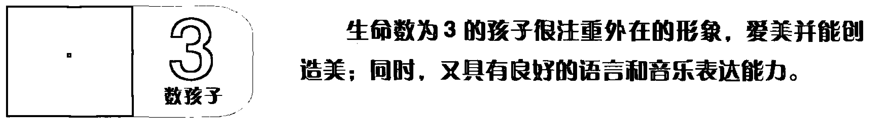

## 生命第一密码：亲子关系

### 亲子关系

赵英凯 著

广东人民出版社

## 生命第一密码：亲子关系

赵英凯 著

出 版 人：金炳亮

责任编辑：林秀钰

封面设计：林小玲

责任技编：周 杰

出版发行：广东人民出版社

地 址：广州市大沙头四马路 10 号（邮政编码：510102）

电 话：(020) 83798714（总编室）

传 真：(020) 83780199

网 址：http://www.gdpph.com

印 刷：广州市穗彩彩印厂

书 号：ISBN 978 - 7 - 218 - 07816 - 8

开 本：787 mm × 1092 mm  1/16

印 张：14.25      插 页：1      字 数：180 千字

版 次：2012 年 7 月第 1 版

印 次：2012 年 7 月第 1 次印刷

定 价：30.00 元

如发现印装质量问题，影响阅读，请与出版社（020 - 83795749）联系调换。

售书热线：(020) 83790604      83791487      邮 购：(020) 83795240

## PREFACE
序 言

父母给予我们生命并塑造了我们的性格。处在家庭教育的接受方，提及“教子”，大概总是一件稍觉尴尬，甚至难以启齿的隐私。从呱呱坠地到牙牙学语，从少不更事到律己待人，太多的幼稚童贞让我们回首一笑，太多的年少痴狂让我们追悔惋叹，而这一切都被父母看在眼里、装在心上，他们是我们的第一任老师，也是身教言传的人生表率。

我们从事青少年素质教育工作多年，在大量的案例中发现，我们从孩童时期开始，一生中要经历很多次学习，不管是学习基础知识还是接受各种职业培训，到头来残酷的现实却是那样的无奈：学无所用。父母花费了大量时间、金钱，却并没有培养出多少优秀的才子，更多的是充斥在社会中的一些“机器人”。这其中最根本的原因就是，父母永远都在按照自己的兴趣、爱好和理想在设计孩子的未来……结果就可想而知了。

赵英凯老师的生命第一密码理论仅仅通过生日的数字，通过简单的计算就可以神奇地找到并了解孩子的性格特点、兴趣爱好，并可以通过数字信息规划孩子未来人生，简直是不可思议。

读了赵老师的这本书，忽然的一瞬间里发觉一切都是如此的有趣，原来，当一个人从小开始就有一个正确的人生规划，幸福快乐及成功的结果就会变得如此的简单……

（本文作者分别为北京众志卓越教育集团董事长、总裁）

2012 年 7 月

## 毕达哥拉斯的遗产

希腊与希伯来两大文化体系对西方文化至今仍产生着十分深刻的影响。希腊文化中的自然与理性，希伯来文化中的意识，几千年来渗透到西方社会的各个领域中，为西方文明的不断进步提供了源源不绝的动力。

中国著名的思想家、教育家、儒家学派的创始人孔子和古希腊伟大的哲学家、数学家毕达哥拉斯（约公元前 580 - 前 500 年）是同一时代的人，也是两种不同文化传统的创立者和代表者（古代中国的儒家学派和古希腊的毕达哥拉斯学派）。虽然这两位思想家所在的人文环境和地理环境相差遥远，但他们有关“和”的思想以及对音乐功能的认识却表现出极大的相同点。

毕达哥拉斯出生于希腊的一个小岛。他自幼聪明好学，曾在名师门下学习几何学、自然科学和哲学。后来，因为向往东方的智慧，经历万水千山来到巴比伦、印度和埃及，吸收了阿拉伯文明和印度文明。所以，人们对他的智慧感到不可思议，以至于曾把他看做是太阳神阿波罗的儿子。其实，他的智慧一方面来自于他的天赋，另一方面是与他后天的经历与自身的努力分不开的。

一次，毕达哥拉斯路过一家铁匠铺，听到铁锤打击铁砧的声音，辨听出了四度、五度和八度三种和谐音。他猜想是由于铁锤重量的不同导致了声音的不同，于是通过称量不同铁锤的重量确认了这种关系。

随后，他又在竖琴上做进一步试验。根据不同长度弦的振动，发现了弦的长短与和谐音的关系。证明音乐中蕴藏着数的奥秘，竖琴之所以能发出悦耳的音调，是因为合乎一定数的关系。因此，“毕达哥拉斯是千古第一个表现声音与数字比例相对应，比任何人更早把一种看来好像是质的现象——声音的和谐——量化，从而率先建立了日后成为西方音乐基础的数学学说”。

又一次，毕达哥拉斯应邀到朋友家做客。对主人家地面上一块块漂亮的正方形大理石产生了兴趣。他没有心思听别人闲聊，而是沉思于脚下的排列规则，他在4块大理石拼成的大正方上，以每块大理石的对角线为边，画出一个新的正方形，他发现这个正方形的面积正好等于2块大理石的面积；他又以2块大理石组成的矩形对角线为边，画成一个更大的正方形，而这个正方形正好等于5块大理石的面积。于是，结果出来了：直角三角形斜边的平方等于两条直角边的平方和。著名的毕达哥拉斯定理就这样诞生了。

为了庆贺自己的发现，毕达哥拉斯用了一头公牛祭祀庙宇里的神像。这种做法足见他对学术的热爱与至诚之心，想想当今社会上能有这样以纯学术为乐的有几人？他对知识完美的追求，对知识的狂热，对知识创造的尊重精神是极其宝贵的一笔精神财富。

无论是解说外在物质世界，还是描写内在精神世界，都不能没有数学。毕达哥拉斯最早悟出了“万事万物背后都有数的法则在起作用”这个道理。可以说正是毕达哥拉斯“万物皆数”的理论，奠定了生命第一密码的理论基础，才让我们今天可以去探索各自生命的路途，以及所获得的课题与精彩。

上天在我们出生的时候，给了我们一份礼物：生日。父母则给了我们另外一份礼物：姓名。如果，我们认识到世界上一切皆是能量的话，那么生日和姓名也是能量，生命第一密码能帮助我们揭开各自生日数字的奥秘。

作为第一个提出生命密码概念的人，毕达哥拉斯认为美好人生的第一个前提就是发掘人生的课题是什么？如何发挥优势，改进不足。生命数字不仅仅是对自己的认知和生命状态的了解，也代表了每个人的生命特征和身份特质，以及此生我们每个人的生命功课。

希望生命第一密码成为人与人之间连接的桥梁，沟通的纽带。让我们共同走进生命数字的未知世界，一起去探讨关于生命的真谛吧！

## 目录 | CONTENTS

序言 王尚乔 刘宇森 / 1

前言 毕达哥拉斯的遗产 / 1

## 第 1 章 找出你与孩子的生命第一密码

生命数字没有好与坏之分，每个数字都有先天赐予的天赋。当我们知道自己及孩子的生命第一密码后，我们就可以像查字典一样开始自己的探索之旅。

+ 1 什么是生命数和天赋数 / 3  
2 如何计算生命数和天赋数 / 4  
3 计算生命数和天赋数时常犯的错误 / 8  
4 生命数字没有好坏之分 / 9  
5 我们的生日可能会构成的生命数组合 / 10

## 第 2 章 认识生命第一密码

当我们通过生命第一密码去了解自己或孩子的时候，切忌把人标签化，因为在生活当中影响我们的能量还有很多。

+ 1 数 独立自尊 直爽独断 / 13  
2 数 知心体贴 善于协调 / 19  
3 数 才思敏捷 注重面子 / 25

### 第3章 解读孩子的生命第一密码与亲子关系

每个孩子一出生即拥有其特有的生命数，也即拥有其特有的性格天赋，家长如何去发掘、引导孩子，与孩子和谐快乐相处，并让孩子可以扬长避短，人尽其才？

## 1 数孩子 天生的领导 / 71

1 数孩子能力出众，拥有领袖之才，是带着强烈的使命感来到这个世界上的，他们要做的是创造和改变世界。

## 2 数孩子 宰相之才 / 89

2 数孩子从小就有深入人心、感同身受的特质。所以说，2 数的孩子从小就善解人意，喜欢与他人合作，而且眼光锐利，心眼活络，一如古代的宰相一样。

## 3 数孩子 聪明的小军师 / 108

生命数为 3 的孩子很注重外在的形象，爱美并能创造美。同时，又具有良好的语言和音乐表达能力。

## 4 数孩子 将军风范 / 120

4 数孩子非常重视安全感，他们做事专注、稳重踏实，而且具有超强的组织能力。他们做事精益求精，是天生的管理人才。

+ 4 数 专注踏实 不喜冒险 / 31  
5 数 崇尚自由 害怕承诺 / 36  
6 数 乐于助人 勇担责任 / 42  
7 数 敏感好学 当断不断 / 49  
8 数 自信自尊 天生好强 / 56  
9 数 富有爱心 喜欢幻想 / 62  
0 数 天生聪明 善于吸收 / 67

## 5 数孩子 口吐莲花的天使 / 138

5 数孩子口才极佳，具有很高的演讲天赋。他们聪明伶俐，走到哪都会受到欢迎。他们喜欢自由自在的状态，不希望有束缚，总是按自己的兴趣去做事。对于自己喜欢的事，即使要冒险也会全力以赴。

## 6 数孩子 传播爱的小使者 / 154

6 数孩子是爱的使者，他们就像夏日里路边的一棵大树，总是在被需要的时候出现。他们天生就具有一种责任感，乐于助人，善解人意，愿意付出。

## 7 数孩子 探求真理的小科学家 / 170

7 数孩子直觉敏锐，在他们身上总让人觉得有一种神秘的力量，使他们显得十分具有灵气。他们的运气极好，总是在出现问题的时候会有人来帮助他们。

## 8 数孩子 绝对领袖 / 182

8 数的孩子有着与生俱来的强大能量，他们相当自信，喜欢大场面，总是在不停地追求着成功。展现在他们面前的平台越大，他们就越兴奋。

## 9 数孩子 爱心梦想家 / 199

9 数孩子天生就具有宽广的胸襟，能够包容他人；他们情感强烈，对周围的人和事充满了爱；他们想象力丰富，特别是遇到困难时，他们总能用自己的想象力为大家描绘希望。

## 结语 真正地接纳我们的孩子 / 214

## 后记 让我们一起祝福你的孩子 / 218

## 第 1 章 找出你与孩子的生命第一密码

生命数字没有好与坏之分，每个数字都有先天赐予的天赋。当我们知道自己及孩子的生命第一密码后，我们就可以像查字典一样开始自己的探索之旅。

## 什么是生命数和天赋数

想要接纳和了解我们的孩子，用他们喜欢的方式和他们沟通，就先要了解我们自己以及宝贝的生命第一密码。

首先要了解几个概念，即什么是生命数和天赋数。

天赋数是以公历（阳历）出生日期（年、月、日）的数字相加直至最后得到的双位数。

生命数是以公历出生日期（年、月、日）的数字相加直至最后得到的个位数。

天赋数：是我们前进的方向，也是我们成长的路途，相对于生命数，天赋数能量较弱。

天赋数也是我们能达成生命数正向能量的阶梯，也就是说，我们依次学习好天赋数能量的课题，才能真正活出我们的生命能量。

生命数：是我们人生的使命，也是我们来到这个世界上的意义。是我们的特性，也是我们人生的目标。也是对我们影响最大的数字。（这里和我们平时讲的幸运数字不是一个概念）

## 如何计算生命数和天赋数

步骤 1 确定你的出生年、月、日。请注意我们的生日都要用阳历生日，也就是：公元某年某月某日。因为生命第一密码起源于西方，而农历即我们平时讲的阴历，都是中国常用的历法，要用万年历转换为阳历才能使用。

步骤 2 写下你的生日，并把生日中的每个数字单独相加，包括零。例如：1980 年 3 月 14 日计算：1 + 9 + 8 + 0 + 3 + 1 + 4 = 26

步骤 3 找到你的天赋数和生命数。上一步骤得出的双位数 26，把它单独看，就是我们的两个天赋数：2 和 6。而把两个天赋数相加，得到的个位数，就是我们的生命数：2 + 6 = 8。由此我们知道：1980 年 3 月 14 日出生的人天赋数为 2、6；生命数为 8。

步骤 4 写下你的生命数组合并了解它们的意义。例如：1980 年 3 月 14 日出生。天赋数：2 和 6；生命数：8。我们通常的写法是：26/8。

### 第1章 找出你与孩子的生命第一密码

斜线前面代表天赋数字，后面代表生命数。

对于 2000 年以后出生的孩子，还可能会直接加出个位数的天赋数和生命数。

如：2001 年 3 月 2 日出生。

计算：2 + 0 + 0 + 1 + 3 + 2 = 8，天赋数和生命数都是 8。

这里我们就按单独数字 8 数来解读，数字单一，代表他的生命能量相对集中，更容易在某一个特定领域里面成功。

## 特别案例：

+ 1) 如果天赋数得出的是：10；20；30；40，那生命数也是把每个数字相加就好：1 + 0 = 1；2 + 0 = 2；3 + 0 = 3；4 + 0 = 4。  
而最终的写法就是：10/1；20/2；30/3；40/4。

2) 如果您的天赋数相加之后还是双位数，请再相加一次成为个位数，如您的生日数字相加后得到 29，2 + 9 = 11，11 不是一个个位数，那您就需要再加一次 1 + 1 = 2；而最后其天赋数就是 2、9、1、1 四个，生命数则为 2。最终写法为：2911/2。

步骤 5 重新验算，确保无误。

这一步非常重要，因为越简单的，我们就越容易出错。

## 更多案例：

有些朋友喜欢把出生日期分别相加，这样也是可以的。

## 例 1：

A 君生日为 1981 年 11 月 15 日。

计算如下：

年中数字相加：1 + 9 + 8 + 1 = 19。

月中数字相加：1 + 1 = 2。

日中数字相加：1 + 5 = 6。

再将三项的和相加：

19（得自年） + 2（得自月） + 6（得自日） = 27。

然后将双位数的两个数字相加：

2 + 7 = 9

这样得出天赋数为 2，7；生命数为：9。

在生命第一密码中我们不做双位数的运算，所有的数字都是单独相加，并具有单独的意义。

所以，我们将生日数字相加得到的总和27 看做是两个单位数2 和7 称为“天赋数”，这个数字代表个人的天赋才华，对一个人将来在社会上的发展极为重要。这个双位数会揭示我们随着年龄增长而日渐表现出来的天赋。我们越成熟，个性越圆融，才华会越凸显。天赋数代表我们心智成熟，灵性提升时所呈现的才气，但这些天赋不是我们需要学习的主要内容。

我们需要将天赋数中的两个数字相加，就会得到我们破解生命第一密码的主要内容。继续刚才的例子，2 + 7 = 9，因此这个数字9 就是破解我们生命第一密码的钥匙，此数称之为“生命数”。上述 A 君的天赋数是 2、7，他的生命数是9。

生命数对人的影响最大，天赋数次之，所以当我们计算好以后，就先看你的生命数，之后再看天赋数。如 A 君，就先看生命数9，再看天赋数2、7。

## 例2：

B 君生日为 1970 年 10 月 1 日

计算如下：

1 + 9 + 7 + 0 + 1 + 0 + 1 = 19（注：生命第一密码中没有双位数，所以10 月份在相加时把其看做 1 和 0）；

1 + 9 = 10；

1 + 0 = 1。

得出天赋数为：1，9，1，0；生命数为 1。

生命数只有一位数，所以要一直相加至个位数。如 B 君：年、月、日

## 生命第一密码：亲子关系

## 计算生命数和天赋数时常犯的错误

1）没有把月份或日期的双位数拆分相加。比如10月份，相加的时候不应加10，而是加1再加0。23日，不是加23，而是加2加3。

例：1970年10月23日

正确算法是：1 + 9 + 7 + 0 + 1 + 0 + 2 + 3 = 23，2 + 3 = 5，天赋数为2，3；生命数为5，写法：23/5。

2）把出生年份简化成两位相加。如1969年出生的人，应该是1 + 9 + 6 + 9；如果只相加6和9就不对了，我们在这里要特别留意。

3）生命第一密码从生日数字中的相加得到的最大数是48，所以，如果您相加得到大于48的，一定是您计算错误，请重新计算。

生日日期相加后得出最大数为：1999年9月29日出生，数字相加：1 + 9 + 9 + 9 + 9 + 2 + 9 = 48；4 + 8 = 12，1 + 2 = 3；这里天赋数为：4、8、1、2，生命数为：3，写法：4812/3。

## 生命数字没有好坏之分

也许有人会说：我不喜欢我的生命数；我的生命数不好。其实，一个人的出生年月日是不可能改变的，那么他的生命数也不可能改变。而另一方面，生命数字没有好与坏之分，每个数字都有先天赐予的天赋。所以，不管你的生命数是哪个数字，你在人生里都应该勇敢地“做自己”。因为只有你成为了自己才是其他人所没有办法复制和超越的。第一密码就是让每个人成为人生第一和唯一的密码。

## 生命第一密码：亲子关系

我们的生日可能会构成的生命数组合一共有 39 种，分别是：

+ 10/1  
11/2  
12/3  
13/4  
14/5  
15/6  
16/7  
17/8  
18/9  
1910/1  
20/2  
21/3  
22/4  
23/5  
24/6  
25/7  
26/8  
27/9  
2810/1  
2911/2  
30/3  
31/4  
32/5  
33/6  
34/7  
35/8  
36/9  
3710/1  
3811/2  
3912/3  
40/4  
41/5  
42/6  
43/7  
44/8  
45/9  
4610/1  
4711/2  
4812/3

## 独立自尊 直爽独断

### 一、个性特质

#### 1) 天生领袖

1 数是万事万物的开始，是开天辟地的数字，所以生命数为 1 的人经常做别人不敢做、不能做的事情。他们有天生的领袖特性，充满自动自发的精神；可以勇往直前，直指自己的目标与成就。所以，1 数的人很可能会成为英雄或历史上的伟大人物。

### 2) “海燕”精神

生命数为 1 的人很像是一辆具有动力的车子，有着“一切靠自己”的内在动力。面对所有的挑战他们都会像苏联作家高尔基笔下的《海燕》，勇敢并快乐着。这些朋友在小的时候就是“孩子王”，伙伴都会很自然地服从他的领导。“我是司令！你们听我的保管没错。”说这话时，他会十分坦然、很骄傲、很可爱。

#### 3) 独立自尊

生命数为 1 的人非常独立，自尊心强，不轻易相信别人。他们冲劲十足带领大家向前冲，精力充沛，不容易疲劳。他们也不喜欢身边的人依赖他们。

### 4）爱憎分明

1 数的人爱憎分明，他们喜欢的人，就把他们当自己的家人看；不喜欢的人，就是谁说他好也没用。这种力排众议的风格，是领导力的必备特质。缺点就是有的时候有一言堂的倾向。

### 5）焦点人物

生命数是 1 的人喜欢做焦点人物，经常一意孤行，而由于太独立又不太在意别人，结果是，生命数为 1 的人显得有些自私。但他们那无与伦比的开创力是没有人可以比拟的。

### 6）致力创新

生命数是 1 的人喜欢不断地创新，他们容易对单调重复的工作或生活方式感到厌烦。他们需要经常变换角色或者同时身兼数职，这样比较符合他们的口味。自己开公司自然更好，因为他们既喜欢当老板，也喜欢做伙计兼会计和送货员，大小通吃，亲力亲为。所以生命数为 1 的人开公司有个特点，就是自己在的时候，业绩会非常的好，并且稳定，而一旦自己离开（生病或度假），业绩就会一落千丈。如果想改变，只有从生命数为 1 的人放手开始，多让员工承担责任。

生命数为 1 的人能力很强，所以在很多时候都在不停地发散自己的能量，换句话说，就是他们很难接收别人的能量。

### 7）喜欢炫耀

生命数为 1 的人总喜欢作秀，喜欢炫耀自己，所以有时候很容易得意忘形，暴露自己的缺点。生命数是 1 的人总是闲不住，他们总是不停地寻找目标，找到目标后又会拼命地去达成目标，所以 1 数的人总会感觉很累，而且压力也会很大。

### 8）性格直爽

生命数为 1 的人都很直爽，他们喜欢直来直去，不会弯弯绕，喜欢有事直说，是标准男人的做事风格。即便是女人，她们的性格也很直爽，有巾帼不让须眉的豪气。他们通常不喜欢矫揉造作的人。

这种直爽表现在工作中就是不喜欢听别人的命令，更不喜欢别人对他们指手画脚。他们满脑子新点子，喜欢标新立异，以求独特。所以生命数为 1 的人很适合做开疆辟土的领袖型人物。开门见山、单刀直入地谈生意往往也比较容易成功。

### 二、典型人物

罗纳德·威尔逊·里根：美国第四十任总统，生日为 1911 年 2 月 6 日，生命数为 20/2。

比尔·克林顿：1946 年 8 月 19 日，3811/2。

麦当娜：1958 年 8 月 16 日，3811/2。

张学良：1901 年 6 月 3 日，20/2。

迈克尔·乔丹：1963 年 2 月 17 日，2911/2。

演员朱莉·安德鲁斯：1935 年 10 月 1 日，20/2。

球王贝利：1940 年 10 月 23 日，20/2。

“足球上帝”马拉多纳：1960 年 10 月 30 日，20/2。

李嘉诚：1928 年 7 月 29 日，3811/2。

### 三、健康之道

1. 生命数为 2 的人上呼吸道、黏膜系统先天都比较薄弱，尤其是鼻子，要注意鼻炎。所以要多吃白色的东西润肺，如梨、山药、百合、银耳、莲子等。  
2. 生命数为 2 的人也易患贫血。  
3. 生命数为 2 的人还要注意小腿，容易患静脉曲张。建议少穿运动鞋（因血管流通不好，易汗脚，易有味道）。  
4. 生命数为 2 的人对称器官的功能也相对较弱，应加以细心护理。如：眼睛，肺，肾，女士乳房等。  
5. 生命数为 2 的人要注意肠胃，容易便秘。

### 四、调理小验方

验方① 便秘：香蕉 500 克，蘸炒半熟的黑芝麻 25 克。每日一次，连服 5 天。  
验方② 贫血、血小板低、牙出血：赤小豆、花生米、红糖各 30 克，红枣 10 枚。煮汤，每天中午喝，常服。  
验方③ 鼻炎：往两侧鼻腔处滴入数滴芝麻油，每日 2 次，常用。  
验方④ 腿抽筋：桑树果一两，煎一碗汤一次喝下，一日 2 次，连服 5 天。  
验方⑤ 耳鸣、耳聋：当归 15 克，黑豆 30 克，红糖 30 克，水煎服，每日 2 次，2 周见效。菊花 30 克，芦根 30 克，冬瓜皮 30 克，水煎服，每日 2 次，2 周见效。  
验方⑥ 鼻炎（包括过敏性、萎缩性鼻炎和鼻窦炎，有的流脓流水、鼻涕多，有的闻味不灵敏）：用黄砖一块，放火上烧烫，取下，将一调羹醋倒在热砖上，此时有大量热气上冒，患者用鼻闻其热气，一日 2 次，连用 7 天，消热、消炎，解毒通窍，对各类鼻炎有特效。  
验方⑦ 贫血：杀鸡、鸭时，将鲜血流在一张干净白纸上，晒干揉成粉，用葡萄酒调服，一日 2 次，连服半月。期间忌海带。  
验方⑧ 胸闷气胀：白萝卜籽 25 克，煎一碗汤服，一日三次，连用 3 天有消积顺气之功效。  
验方⑨ 健脾祛黄，养阴润肤：杏仁 15 克，薏米 50 克，百合 50 克。薏米洗净，泡水中 2 小时，干百合洗净泡 30 分钟。杏仁洗净拍碎，水中浸泡 30 分钟。把苡米、杏仁同下锅中，加适量水，煮至 8 成熟，放入百合煮熟即可。可放少量冰糖或白糖调味。

### 五、需要补充的营养

1. 增加黏膜系统机能需要的营养：类胡萝卜素、维生素 A、维生素 E。  
2. 增强免疫系统需要的营养：蛋白质、多种维生素与矿物质、松果菊提取物。  
3. 改善血液循环系统需要的营养：辅酶 Q10、维生素 C、维生素 E、蛋白质。  
4. 改善肠胃消化功能需要的营养：蛋白质、维生素 B、有益菌群等。

### 六、能量颜色

橙色。橙色是彩虹的第二色。如果你想和别人建立和谐的关系，希望人缘好，让大家感觉你很合群，同时希望与大家同心协力，就多在你的生命中增加橙色。

#### 橙色的情绪疗愈功能：

伤痛在我们的生活中是不可避免的，但如果无休止地把自己封闭在这种状态之中是不明智的，也很危险，因为它很容易让我们颓废。这时候可以利用橙色让自己从悲伤中解脱出来。另外，当我们感觉到被深深凌辱，心理所产生的痛苦难以言表时，橙色也可以帮你疗伤，让你看到自己应有的价值。

橙色也是所有色彩中对巨大伤悲、亲人去世、失去重要人或物时，最具有疗效的颜色。

### 七、能量音乐

2 数的能量音乐十分的热情与奔放，表达情感是它的特征。许多生命

## 生命第一密码：亲子关系

数为 2 的朋友很喜爱足球吧？看巴西的足球多么的享受。他们的艺术足球就像是一曲桑巴，热情、奔放。拉丁舞曲是 2 数音乐的代表。2 数的人经常希望通过音乐向对方表达好感，也希望对方对他好。

### 八、生命数 2 的剪影

生命数为 2 的人总是说：“如果别人能接受我……那就好了。” 他们情感细腻，温柔贴心，总能知道别人在想什么，而且能发自内心地去关心别人。生命数为 2 的人都可以成为非常好且能交心的朋友。他们喜欢合作，不喜欢孤身奋战；他们务实，善辩，善于分析事情的本质。另一方面，他们口才好，讲话直截了当，但常因为心直口快而得罪人。生命数为 2 的人非常注重周围人际关系的和谐，他们感情亲切温和，对于情感和关系的话题非常感兴趣，而且特别敏感，因为他们认为人和人之间的关系是应该互相依存的。所以 2 数性格的人也特别喜欢把两个单独的个体给凑在一起，比如：做媒、介绍工作，等等。而且因为在乎人际关系，他们还特别不喜欢争吵，不喜欢莽撞粗鲁的人。就是看见两个人有矛盾吵嘴了，2 数的人也是那个喜欢中间调停的人。如此这般，怎能不好。

另外，2 数的人也很有品位，且文笔极佳，能从文字中体会心情。

### 才思敏捷 注重面子

### 一、个性特质

#### 1) 才思敏捷

生命数为 3 的人头脑好，反应快，他们好奇心强，艺术感出色，懂得欣赏。他们充满活力，更拥有非凡的学习能力，善于沟通，常常能给周围人带来欢笑。不管什么话题，他们都能聊得津津有味。

#### 2) 富有创意

生命数为 3 的人，富有创意，不喜欢按常规出牌，外号“破坏教主”，总是喜欢打破常规想问题。

3 数的人虽然创意很多，但并不一定都是好主意，他们喜欢恶作剧或耍小聪明，但因为他们只喜欢表扬，不喜欢批评，所以想出的那些坏点子总是让别人去实施，而自己躲在后边享受乐趣。喜欢谈论他人是非或恶作剧，有时也会让生命数为 3 的人失去别人的信任或减少别人对他们的安全感，所以想要让自己变得值得信赖，就要学会努力地为他人保守秘密，抗拒自己想要利用别人隐私替自己带来好处或开心的欲望。

#### 3) 关注外在

观察生命数为 3 的人的穿着、发型，甚至他们所交的朋友就可以发现，他们很在意别人和自己的外在形象，因为他们认为别人会通过外表来评判他们。即使找朋友或交朋友，他们也必须找外形不错、看着顺眼的人。但有时也恰恰因为生命数为 3 的人太关注外在，因而看事物不免流于表面，做事情或看待事物总会有不深入的毛病。

#### 4) 只爱表扬勿批评

生命数为 3 的人只喜欢表扬，却见不得批评。因此，要想给生命数为 3 的人提建议，首先应当先夸奖，然后再婉转地提出建议。生命数为 3 的人像极被宠坏的孩子。

生命数为 3 的人一旦觉得别人对自己某些方面轻视时，就会很生气。所以，生命数为 3 的人要注意：如果别人的赞美不如你所期待的那样，那么很有可能是你的成就并不如自己所想象的那么大。

#### 5) 鼓舌如簧

生命数为 3 的人拥有非凡的语言能力，他们口才好，善表达，言辞幽默，擅长组织。遇到他们感兴趣的人和事就会滔滔不绝，在兴头上时，他们不喜欢被别人打断，如果被迫中止，他们会非常不高兴，也顿时失去了继续高谈阔论的兴趣。生命数为 3 的人，很清楚自己不要什么，却不知道自己真正想要什么。他们如果高兴，只要有他们在的场合，气氛总会非常热烈，周围的人也会随之被带动而出现高潮。

#### 6) 长袖善舞

生命数为 3 的人喜欢社交，他们乐于给人一种他们看待人生总是随和安逸的假象，而事实则不然。他们总是有一些问题纠缠在心中，无法解脱，那就是他们的理想过高，太不切实际。

某些生命数为 3 的人很容易让人感觉不舒服，因为他们总是强烈地陷在自己感兴趣的事情中，并认为自己的想法才最迷人，最有创意，以至于经常忽略了他人的感受。另外，3 数的人还很容易轻视那些不如他们聪明的人。记住，聪明才智有很多种，即使你的天赋比别人强，你也没有权利嘲笑别人。

### 二、典型人物

梅艳芳：1963 年 10 月 10 日，21/3。

郎咸平：1956 年 6 月 21 日，30/3。

丹尼尔·雷德克利弗：1989 年 7 月 23 日，3912/3。

《哈利波特》系列成就了他。他扮演的哈利·波特形象风靡全球，成为最炙手可热的少年明星之一。

黄晓明：1977 年 11 月 13 日，30/3。

徐熙媛 (大 S)：1976 年 10 月 6 日，30/3。

奥黛丽·赫本：1929 年 5 月 4 日，30/3。

著名电影女演员，奥斯卡影后。

费雯丽 (费雯·玛丽·哈特利)：1913 年 11 月 5 日，21/3。

英国电影演员。她成功地饰演《乱世佳人》的斯佳丽·奥哈拉和《欲望号街车》的布兰奇·杜波依斯，两度获得奥斯卡最佳女主角奖。1999 年，她被美国电影学会选为百年来最伟大的女演员第 16 名。

慈禧太后 (叶赫那拉·杏贞)：1835 年 11 月 29 日（道光十五年十月十日），30/3。

古巴前领导人卡斯特罗：1926 年 8 月 13 日，30/3。

悬疑大师希区柯克：1899 年 8 月 13 日，3912/3。

美国电视剧名人比尔·寇斯比：1937 年 7 月 12 日，30/3。

流行乐手大卫·鲍伊：1947 年 1 月 8 日，30/3。

流行乐手奥莉薇亚·纽顿－约翰：1948 年 9 月 26 日，3912/3。

邓丽君：1953 年 1 月 29 日，30/3。

姚明：1980 年 9 月 12 日，30/3。

克里斯蒂亚诺 · 罗纳尔多 (C 罗、小小罗)：1985 年 2 月 5 日，30/3。

### 三、健康之道

- 1. 在身体上要多注意保护眼睛，看书、用电脑、看电视时间超过一小时就要休息一会儿。否则眼睛就会变得干涩，流泪。
- 2. 生命数为 3 的人总是容易发生一些小伤害，常常会碰个桌子角、椅子腿什么的，莫名其妙地就会青一块紫一块。
- 3. 睡眠质量不好，不是睡的时间少，而是经常睡了好久还感觉累。
- 4. 易头晕、头痛、耳鸣等。

### 四、调理小验方

验方① 神经衰弱：睡前一小时，米醋 10 毫升拌温开水喝（调理失眠）。

验方② 神经衰弱：猪脑 1 两，加入蜂蜜一调羹，蒸熟吃，一日一次，连吃 5 至 10 天。

验方③ 记忆力差：鹅蛋一只，打入碗内加适量白糖搅匀，蒸熟早晨空腹服用，连吃 5 天，有清脑益智功能，对增强记忆有特效，期间忌吃海带、花椒、动物血、酒、绿豆。

验方④ 流泪眼、沙眼：干桑叶 50 克，加一碗水烧开，放凉后每日洗眼 3 至 5 次，连用一星期。

验方⑤ 牙出血（经常出血或刷牙引起）：花椒 10 粒，醋 150 克，浸 2 天后口含，一次 3 分钟，一日 2 次，连用 5 天。

验方⑥ 养脾肺，益气健脾，润肠排毒：核桃仁 200 克，茯苓 100 克，白芷 100 克，蜂蜜 350 克。将桃仁碾碎成粉状备用。在砂锅内加水 600 毫升，把茯苓、白芷一起下锅，每次水煮至 250 毫升，即将汁倒出，再加水煮至 250 毫升，如此三次。然后将三次提炼的汁加热，在锅内倒入蜂蜜，不停地搅拌，直至汁液浓缩，放入核桃粉，再熬两分钟后收汁装瓶，放冰箱里，在北方冬天可直接放在窗外。每日服 20 克，早晚各一次，长期食用见效。

验方⑦ 益气健脾，祛湿美白：白芷 5 克，白术 10 克，白茯苓 30 克。将上三味洗净，同入水煮开后小火滚 10 分钟即可当茶饮用。

### 五、需要补充的营养

- 1. 保护眼睛、预防视觉疲劳：叶黄素、类胡萝卜素、维生素 A、维生素 E。
- 2. 预防毛细血管破裂：维生素 C，维生素 E。
- 3. 改善神经系统：蛋白质、多种维生素、矿物质钙、镁等。

### 六、适宜的运动

- 1. 经常把手搓热，捂在眼睛上，眼睛要努力睁大，可缓解视觉疲劳。
- 2. 常看绿色和转眼球对视力有好处。

### 七、能量颜色

黄色，彩虹的第三色，也是太阳的颜色。黄色让人充满希望、乐观和有动力。所以想让自己更有活力、更开朗、更能发挥创意，就多增加黄色吧。黄色还有个特殊的用处，就是有助于你增加销售。

### 八、能量音乐

3 数人的能量音乐应该是听起来就像躺在柔软的沙滩上，任由海浪、微风轻轻抚慰躯体和心灵的音乐。另外，像圣诞音乐、儿歌类也是 3 数的音乐。诸如《小毛驴》等歌曲，它们能让 3 数的你获取到能量。

## 九、生命数 3 的剪影

生命数为 3 的人反应快，头脑好，常常是你一个问题没问完，他已经有 10 个答案在等着你了。他们拥有完美的创意与沟通才华，好奇心强，艺术观好，懂欣赏，活力充沛，人缘好。生命数为 3 的人经常被人称作“破坏教主”，其常常打破常规想问题。不过，他们有时也会太挑剔，太理想化。他们也很在乎别人的评价，只能表扬，不能批评。生命数为 3 的人，如果想永远得到表扬而没有批评，最重要的就是主动询问：“您看这件事，我哪里可以做得更好？”另外，3 数的人还非常关注外在，思想前卫，所以他们永远都不会老。3 数的人总是说：“如果我可以把……搞得更好看，那就好了。”

### 一、个性特质

- 1. 专注踏实
生命数为 4 的人做事专注，组织能力强，工作有条不紊，给人安全踏实的感觉。他们对有把握的事情马上去做，没把握的事情绝对不做。他们绝不轻易相信一件事情，所以如果想取信于生命数为 4 的人，一是要证据确凿；二是要给他们充分的时间去亲自检验一切正确无误。

- 2. 精益求精
生命数为 4 的人虽无 1 数或 3 数的人那么有创意，但他们精益求精的才能却无人能及。如果与他们合作，4 数的人能最快地发现你的长处，并告诉你如何做得更快、更好、更安全，完全让你想象不到他们是如何做到这些的。

- 3. 工作力强
4 数的人工作能力很强，所以常常会很快忙完手中的事情，之后就会去帮助别人。但有一点要谨记在心，要在他人开口求助时再帮助别人，这样受帮助的人会更尊重你的苦心，对人才真的有帮助。

## 生命第一密码：亲子关系

## 4. 稳打稳扎

生命数为 4 的人不喜欢冒险，比较喜欢稳打稳扎。很多大公司的中高层主管也都是生命数为 4 的人。生命数为 4 的人也可教导他人如何创造健康稳定的生活，并解决各种各样的难题。

对于婚姻，他们也是永远不会主动提出离婚的那一群。但也正因为不爱冒险，使得生命数为 4 的人更愿意受雇于人，而不是自己当老板。

## 5. “忧国忧民”

生命数为 4 的人，总是能给别人安全感，而自己本身缺乏安全感。因为他付出的，恰恰是他其实想要获得的。比如大家一起吃饭，4 数的人总是给同桌的人都倒上茶，夹上菜，但之后却发现，自己的杯子里和碗里面却是空空的。

4 数的人总是觉得自己不断地受到伤害，还容易感到孤独、寂寞，有时甚至有强迫症倾向，如睡觉前，总要反复检查门有没有锁好。

4 数的人希望拥有安全感，但是，除非他们拥有真正的信任，否则，他们不可能从别人那里得到安全感。

## 6. 管理天才

生命数为 4 的人还是天生的管理人才，善于归纳整理。他们凡事都条理分明。美国汽车制造商福特就拥有很强的 4 数能量。福特并没有发明汽车，但是他将汽车的制造过程有系统地连接构建了起来，使得汽车得以大量生产。

善用流程、缩短制造时间是因为 4 数的天赋善于构建、归纳及整理。这其实也是 4 数在乎安全感的表现。生命数为 4 的人也是建筑好手，因为建设也是一种很好的建立安全感的方法。

### 二、典型人物

玛格丽特·希尔达·撒切尔：1925 年 10 月 13 日，22/4。

她是英国保守党这块“男人的天地”里的第一位女领袖，她是英国历史上第一位女首相，而且是创造了蝉联三届、任期长达 11 年之久的女首相。

尼古拉・萨科齐：1955 年 1 月 28 日，31/4。

法国总统，在法国政坛属于少壮派人物。

武则天（武曌）：公元 624 年 2 月 17 日，22/4。

中国历史上唯一一个正统的女皇帝，也是登基时年龄最大的皇帝（67 岁即位），又是寿命最长的皇帝之一（终年 82 岁）。

威尔・史密斯：1968 年 9 月 25 日，40/4。

美国演员，同时也是嘻哈歌手。他曾获奥斯卡奖和金球奖提名，在音乐方面也拿下多座格莱美奖。

李连杰：1963 年 4 月 26 日，31/4。

著名动作明星、国际功夫巨星、武术家、慈善家，“壹基金”创始人，“国际武术联合会”和“中国武术协会”形象大使，“世界武博会”形象大使。

张曼玉：1964 年 9 月 20 日，31/4。

中国香港著名演员，以“香港小姐”亚军及最上镜小姐奖身份开始出道，后出演多部影视剧，因其出色的演技而囊括多个电影奖项。

张丰毅：1956 年 9 月 1 日，31/4。

中国电影演员。从影以来，张丰毅在数十部电影、电视剧中饰演了许多不同的角色，而这些角色都给观众留下了自然亲近的感觉。在观众中有银幕硬汉的赞誉。

比尔·盖茨：1955 年 10 月 28 日，（31/4）。

动作片巨星阿诺德・施瓦辛格：1947 年 7 月 30 日，31/4。

心理分析大师弗洛伊德：1856 年 5 月 6 日，31/4。

### 三、健康之道

1. 生命数为 4 的人思想压力通常很大，因为他们凡事总是要求尽善尽美，有的时候容易进入自己的小圈子或情绪中出不来，长此以往，将会

有抑郁的倾向。所以，生命数为 4 的人非常需要缓压，经常听听轻音乐或是去大自然中会是个不错的选择。

2. 4 数还和 3 数的人有点相像，他们的睡眠都不是很好。其实这些都是由压力造成的。

3. 女性要注意可能会患有经前期症候群，月经可能提前或者错后，还要多注意乳腺状况。

### 四、调理小验方

验方① 月经前期（提前）：青皮 6 克，山楂 9 克，红糖 15 克，水煎；经前连服 5 天至来潮。

验方② 月经后期（错后）、痛经：生姜 60 克，红糖 30 克，水煎半小时，连服 5 天。

验方③ 乳腺增生、子宫肌瘤：瓜蒌 90 ~ 120 克。水煎 1 小时，加入红糖适量，每日一剂，连服 12 天。

验方④ 润肤抗辐射：银耳 100 克，枸杞 10 克，冰糖少许。将银耳泡发后洗净放入锅中，煮开后小火炖 1.5 小时左右，再放入枸杞、适量冰糖炖煮熟即可饮用。特别适合电脑前工作的人食用。

### 五、需要补充的营养

1. 改善压力需要的营养：蛋白质、维生素 B、矿物质钙、镁。

2. 改善妇科需要的营养：维生素 B、维生素 E、钙、月见草精华、大豆异黄酮、蛋白质等。

### 六、适宜运动

1. 痛经：每天按摩腹部 5 分钟。经期时热敷下腹 5 分钟。

2. 每天早晚做“995”乳房操各 30 次。以双手手指圈住整个乳房，按压乳房周围组织，每次停留 3 秒钟；双手张开，分别由乳沟处往下平行按压，一直到乳房外围；双乳间作八字形按摩。

### 七、能量颜色

绿色。绿色是彩虹的第四色，也是植物和大自然的颜色，代表着健康与成长。通常外科医生进入手术室时都要穿绿色手术服，这会让人感觉有信心和安全。

### 八、能量音乐

4 数的能量音乐就是古典音乐，又名“完美音乐”。对于生命数为 4 的乐手而言，最好的表演或演奏就是忠实地呈现作者的原汁原味。而这也正是 4 数能量的天分，把见到的能如实表现出来，甚至更好。

## 九、生命数 4 的剪影

生命数为 4 的人做事专注，组织能力强，工作有条不紊，是个很好的工作者。有把握的事他们会马上去做，没把握的事绝对不做。总有人说他们是工作狂，但其实那都是因为在乎安全感。找不到安全感时，就希望用忙碌来填补内心的黑洞；而一旦找到了能给他们带来安全感的人或事，就不愿意放弃和改变，甚至会上瘾。他们是那种能给别人安全感，但有的时候自己却缺乏安全感的人，希望得到别人的呵护和照顾。所以他们总活得很累，但也总能从中得到最好的经验。而如果 4 数能克服安全感的问题，他们将无所不能。

4 数的人总是说：“如果我拥有……那我就安全了。”

## 生命第一密码：亲子关系

### 一、个性特质

- 1. 天生演说家
生命数为 5 的人大多拥有演说和促销的天分，他们不但口才好，而且声音悦耳，甚至还可以靠“口”赚钱。对于音乐，他们不管在开心还是不开心的时候，都希望用歌声来表达自己的情感，而且非常投入。

- 2. 快乐源泉
生命数为 5 的人幽默、机智、有气派，对自己和他周围的人都是快乐的源泉。

- 3. 犹豫难决
生命数为 5 的人不喜欢承担责任，有的时候甚至会逃避压力，害怕抉择。对他们来说，常常是欲望和恐惧一样强。他们之所以逃避压力和责任，就是他们不希望就此失去自由，可一旦定下目标，就一定会实现。那么，生命数为 5 的人为什么会害怕抉择呢？其症结就在选择越多，就越会让他们陷入犹豫之中，不能自拔。生命数为 5 的人要记住，想要成就任何事情都必须专注，有所选择及承诺，不逃避责任，才能真正走向成熟。

## 4. 爱好自由

生命数为 5 的人喜欢有弹性的时间，依自己的步调去完成想要完成的事。所以生命数为 5 的人约会迟到是在所难免的。如果他们非常准时，一定是特意给自己心中施加了某种压力。在所有数字能量中，5 数的人是最为随性的。

## 5. 人见人爱

生命数为 5 的人通常会有很好的人缘。他们能轻松地与人闲聊，说笑，侃侃而谈。他们拥有天生的舞台感，表现欲强；所以如果他们站在舞台上总会有不俗的表现。

## 6. 多才多艺

多才多艺的 5 数，其成就不可限量。试想滔滔雄辩的人再加上非凡的促销本事，如果能用于造福他人、启发世人将是多么了不起的事啊！他们兴趣广泛，对所有未知的事情和经历都充满了好奇，容易激动和兴奋，他们是天生的乐天派，富有朝气，活泼而精力充沛。生命数为 5 的人通常是通才，似乎没有什么事情是他们不知道的。

但对一件事情过于兴奋地投入也常常让他们后续的持续力不够。比如说要进行某种运动，他们通常会先买齐所有装备，然后兴致勃勃地参与进去，但一遇到困难或过了所谓的兴奋期，他们就很难再坚持。

## 7. 饕餮之徒

生命数为 5 的人感官发达，他们对食物很挑剔，爱好美食是他们的天性。但如果太过挑剔，也有可能乐极生悲，例如他们可能会暴饮暴食、工作过度，或运动过量。生命数为 5 的人除了味觉发达以外，对色彩、视觉的东西也十分敏感。他们还有一个“特异功能”：即使一个地方没去过，但只要看过照片、图片，或是听过别人的讲解介绍，这个地方就会在他们的脑海里成像，然后再用超凡的口才表述出来，可以让很多人有“身临其境”的感觉，其实那只是他的想象而已。

### 二、典型人物

阿道夫·希特勒：1889 年 4 月 20 日，32/5。

文森特·威廉·凡·高：1853 年 3 月 30 日，32/5。

荷兰后印象派画家。

富兰克林·德拉诺·罗斯福：1882 年 1 月 30 日，23/5。

美国历史上唯一蝉联四届（第四届未任满）的总统。

亚伯拉罕·林肯：1809 年 2 月 12 日，23/5。

美国第 16 任总统。被称为“伟大的解放者”。

王安石：1021 年 1 月 18 日，14/5。

北宋杰出的政治家、思想家、文学家、改革家，唐宋八大家之一。

刘伯温（刘基）：1311 年 7 月 1 日（元武宗至大四年六月十五），14/5。

元末明初军事谋略家、政治家及诗人，通经史、晓天文、精兵法。他以辅佐朱元璋完成帝业、开创明朝并尽力保持国家的安定而驰名天下。

安吉丽娜·朱莉：1975 年 6 月 4 日，32/5。

美国好莱坞著名演员，社会活动家。

马龙·白兰度：1924 年 4 月 3 日，23/5。

从 1950 年开始就可以称得上是美国最棒的演员。是好莱坞的一个神话。

张艺谋：1951 年 11 月 14 日，23/5。

牛顿：1642 年 12 月 25 日，23/5。

希腊船王奥纳西斯：1906 年 1 月 15 日，23/5。

### 三、健康之道

1. 生命数为 5 的人，呼吸系统先天薄弱；要注意支气管问题。（平时多吃白颜色的食物润肺，如：山药，梨，银耳，百合等）

2. 生命数为 5 的人心脏能力也较弱。（多吃红色食物补心，如：红豆，红枣，石榴，西红柿等）

### 四、调理小验方

- 验方① 咽炎：罗汉果 1 个，沸水冲泡 5 分钟，代茶饮，每日一换。
- 验方② 咽炎：丝瓜 1 条，胡萝卜 1 根，黄瓜 1 根，榨汁，放入蜂蜜 30 毫升。每日一次。常服。
- 验方③ 润肺：鸭梨 1 只，去皮，放入川贝 10 克，隔水蒸熟，放入冰糖适量。吃梨喝汤，连用 5 剂。
- 验方④ 咽喉痛（咽部干燥疼痛、有异物感，急、慢性均可）：用绿茶叶泡浓茶约 200 毫升，加入 25 克蜂蜜搅匀，每日一次分几口漱喉并慢咽下，连用 3 至 5 天，消炎镇痛，湿润咽喉，治急、慢性咽喉炎。期间忌抽烟、喝酒及吃一切有刺激性食物。
- 验方⑤ 声音哑（咳嗽、讲话太多、唱歌、内火大等原因引起的音哑）：鸡蛋一只，打入碗内，加醋一调羹、搅匀蒸熟食用，一日一剂，连吃 2 至 3 天，期间忌辣。
- 验方⑥ 干咳（感冒或其他原因引起均可）：生黑芝麻 15 克（约一调羹），冰糖适量，捣碎开水冲调，早晨空腹服，连服 3 天，期间少吃鱼类。
- 验方⑦ 早搏：柏子仁 15 克，放入猪心内，隔水蒸熟，分次服用，连服 3 剂。
- 验方⑧ 心动过缓：当归、生姜各 75 克，瘦羊肉 150 克，加入桂皮适量，盐少许，文火炖熟，吃肉喝汤，每日一剂，一周 2 次。
- 验方⑨ 心脏病、冠心病：花生壳 50 克，绿豆 25 克，煎一碗汤服下，一日 2 次，连服半月。
- 验方⑩ 苦瓜清心饮：苦瓜 200 克，苹果 2 个，橘子 6 个，蜂蜜适量。

## 生命第一密码：亲子关系

验方① 双瓜清心饮：白茅根 60 克，竹叶 30 克，白萝卜 50 克，黄瓜 50 克、冬瓜 100 克。将白萝卜、黄瓜、冬瓜洗净切成小块备用；白茅根、竹叶各用纱布包好；先把冬瓜、白萝卜、白茅根、竹叶放适量水煮，约 30 分钟后，再下黄瓜煮 2 分钟加盐等调味即可。

### 五、需要补充的营养

- 1. 改善呼吸系统需要的营养：蛋白质、维生素 B、维生素 A、类胡萝卜素、维生素 E 等。
- 2. 预防心脏病需要的营养：蛋白质、维生素 A、维生素 C、维生素 B、辅酶 Q10、深海鲑鱼油、卵磷脂等。

### 六、适宜运动

- 1. 多拍打心包经，左臂臂弯处。
- 2. 平时多慢跑或游泳对强健心脏也很有好处。

### 七、能量颜色

蓝色。蓝色是彩虹的第五色，是天空和大海的颜色，它会让人开朗、自由、放松。它会让人生命中充满动力，无拘无束地生活。另外，如果你想让别人可以从你身上学到东西，就多增加蓝色吧。如果我们的心声无从表达，这是十分痛苦的一件事情。蓝色是解决这个问题的首选。它的能量可以赶走恐惧，让我们“开口说话”。蓝色，它还能够帮助大家抚平内心深处的伤痛。

### 八、能量音乐

5数的能量音乐是强烈的摇滚乐。它可以让5数的人心情十分的舒畅。它是一种发泄，是一种呐喊和自由。有谁听到了迈克尔的音乐还会无动于衷？在所处的环境中放一些诸如崔健、猫王的音乐，5数的能量就随之而来了。好玩儿、刺激是他们的主旨。

## 九、生命数5的剪影

生命数为5的人，为人热情、豪爽，崇尚至高无上的自由。他们活泼好动，人缘好，口才佳，深受他人的欢迎，拥有演说家的天分。他们想出现的时候，不打电话也会来；不想出现的时候，打100个电话也没用。他们人聪明，信息灵通；喜欢冒险，爱旅游，爱美食，喜欢所有视觉与感觉的东西。行动力强，有的时候也会放纵自己，随心所欲做事。生命数为5的人还不愿意受制约，同时也缺乏勇气承诺。有品位，喜欢新奇，做事有时易分心，常常中途放弃。但生命数为5的人一旦能发挥自己的天赋，就会成为众人的中心。

5数的人总是说：“我想做（讲）……但我怕。”

### 一、个性特质

1. 助人为乐  
生命数为6的人是需要被需要的人，他们乐于助人，善解人意，是个非常好的倾听者，愿意承担责任，有爱心，有时爱别人胜过爱自己。他们喜欢和平，但有时又太过于沉默，不太能真实地表达自己的想法。只要有人需要帮忙，他们都认为是他们的责任，义不容辞。

不管是如何相识，他们都以付出为乐。如果“有幸”被他们纳入了真正的朋友圈，那么他们将会随时为你“两肋插刀”。但成熟的生命数为6的人要学会说“不”。要及时防止自己陷入他人的事情太深，只有照顾好自己，才能有精力去助他人一臂之力。

2. 在乎家庭，孝顺父母  
生命数为6的人也是所有生命数字中最在乎家庭、孝顺父母的人，不管是做了国家总理，还是小商小贩，对父母总是没得说的，所以有生命数为6的孩子或家人，都是一件十分幸福的事情。而生命数为6的人也是最适合做丈夫或妻子的。

## 三、医者父母心  
生命数为6的人出于本能，喜欢修补和医疗，范围从机器到人心。他们对治疗有着不可思议的天分，几乎不必费心学习，学习只是使治疗技巧更精进。

## 四、惠及人群  
生命数为6的人还擅长管理和交际。不论身居何职，他们总能令人有如沐春风之感。如果生命数为6的人是作曲家，他谱出的曲子就会有给听众疗伤止痛的功效。如果他们是厨师，烹调出来的饭菜也会让客人觉得有疗效、美味又营养。如果他们是医生或营养师，又会让病人感觉安全可靠。如果是理财顾问也会给人值得信赖的感觉。很多生命数为6的人所选择的工作都是和医疗、营养、理财、发明有关的工作。

但生命数为6的人要清楚，先学会照顾自己，才能有精力更好地照顾别人。

## 五、付出盼回报  
在所有生命数字中，生命数为6的人拥有最多“心碎”的往事，甚至很多人都曾一度试图轻生，因为他们的付出不都有“回报”。生命数6是所有生命数字中最在乎尊重的，他们不怕辛苦，却怕付出得不到应有的尊重和认同。如果别人没给或忘记给，他们就会感觉很受伤。所以，生命数为6的人不要有自己做了好事必得回报的心态，你为别人做了些什么之后，不要试图去提醒别人给予你回报。就让事情顺其自然吧，可能别人会记住你的好而感激你，也可能没有反应，何必耿耿于怀？

生命数为6的人有的时候让人感觉很贴心，有的时候又会给人有等价交换的感觉：就是我对你怎样，你也要对我怎样，如果对方做不到，就会不开心。要记得，无论什么决定都要从心出发，把所谓的应该、不应该都抛掉，善良的6数人，由心而发地做你自己吧，不用去刻意要求回报。

## 六、追求完美  
生命数为6的人也是所有生命数字中最在乎秩序与完美的，他们之所  
以很多时候抢着做事，是因为在乎心中的完美标准。比如说摆椅子，他们想要摆成排排坐的样子，可是让别人干，很有可能会摆成圆形，因此他们宁可自己辛苦一点，也要亲自执行。他们甚至会照顾得连你自己都不好意思。之所以出现这样的情况，部分原因是由于生命数6本身就渴望被需要，部分原因是因为生命数为6的人在在乎完美。

## 七、不懂拒绝  
生命数为6的人总是有求必应，有时候即使让自己为难的事情也会为了朋友而不忍拒绝。很多生命数为6的朋友肯定都经历过别人向他们借钱不还的事。如果借钱的人到时间没还或对方不懂得感激，他们就会很受伤。因此，成熟的生命数为6的人，要学会拒绝别人。

## 二、典型人物  
理查德·米尔豪斯·尼克松：1913年1月9日，24/6。  
美国第37位总统。1972年2月访华，打开了两国关系的大门，成为访问中国的第 一位美国总统。1974年8月8日因“水门事件”被迫辞去总统职务，成为美国历史上第一个为了躲避国会对其滥用职权进行弹劾和定罪而辞职的总统。

赵匡胤：公元927年3月21日，24/6。  
中国北宋王朝的建立者，庙号太祖。

蒋雯丽：1969年6月20日，33/6。  
中国大陆著名女演员，获得众多专业奖项。蒋雯丽还是一位充满爱心的慈善大使。

梁朝伟：1962年6月27日，33/6。  
华人社会具有影响力的香港著名演员，因其出色的演技而囊括多个电影奖项。外形与实力兼备的梁朝伟，在影迷心目中的形象堪称“完美”。

张国荣：1956年9月12日，33/6。  
一位在全球华人社会和亚洲地区有影响力的著名歌手、演员和音乐  
人，大中华地区乐坛和影坛巨星，演艺圈多面发展最成功的代表之一。

郭敬明：1983年6月6日，33/6。  
中国大陆“80后”作家群代表人物之一。2005年3月，《福布斯》杂志中文版推出的《福布斯2005名人榜》中，郭敬明排名第92位。主要代表作长篇小说《幻城》，主编畅销杂志《最小说》。

陈晓旭：1965年10月29日，33/6。  
是1987年版电视连续剧《红楼梦》中林黛玉一角的扮演者，她对黛玉这个人物的诠释，深受众多中国观众的喜爱。自1999年皈依佛教后，曾经学习佛学7年，其间对佛教事业献出了几千万元的捐赠。

布兰妮：1981年12月2日，24/6。  
美国流行音乐女歌手、舞蹈者、作曲人、作词人、女演员、作家。

张爱玲：1920年9月30日，24/6。  
中国现代作家，作品类型包括小说、散文、电影剧本以及文学论著，她的书信也被人们作为著作的一部分加以研究。

赵忠祥：1942年1月16日，24/6。  
中国中央电视台著名主持人。

## 三、健康之道  
通常来说，生命数为6的人只要能帮助别人解决问题，感觉自己被人需要时，健康状况就会很好。然而，如果他们付出后没有得到相应的回报，就会在精神、情感、心理、身体各个层面感到疲惫，从而影响到健康。若不想这样，就要在帮助别人之前先解决好自己的问题，把自己照顾好，让生活平衡才是健康之道。

生命数为6的人因为要不停地去帮助他人，所以要注意别累坏了自己。血管问题是生命数为6的人需要注意的。另外，别忘了多喝水。多喝水是最好的排毒方法。

肩、背、脖子也容易酸痛，还要注意腰椎和颈椎。

## 四、调理小验方  
验方① 结肠炎（腹泻）：香蕉250克，隔水蒸熟，拌入炒熟的黑芝麻25克，分次服用，连服3次。

验方② 颈椎痛：羊骨头（生熟均可）100克，砸碎炒黄，浸白酒500毫升，三日后擦颈部，一日三次，一般不过15天，疗效显著。

## 五、需要补充的营养  
因为生命数为6的人经常帮他人解决问题，所以本身能量的需求也会大大增加。做完自然疗法（物理疗法等）后补充营养品就非常重要。而自然疗法和营养补充的关系，就好像是给小树松土、浇水，每个步骤都非常重要。

1. 维生素B：解压，缓解疲劳。  
2. 钙：能稳定神经的矿物质。还能促进更好的睡眠、更好的休息，并有助于恢复能量。  
3. 维生素C：能增加抵抗力，也可以让皮肤变白（刮痧为泻，会导致抵抗力减低）。  
4. 鱼油：可让血管“通”而不“痛”（刮痧后皮肤会青紫）。

## 六、适宜的运动  
1. 以手掌擦后颈部10次，并上下移动，抓拿后颈部，依次用大拇指  
点揉左右风池、天柱、天鼎等穴。用拇指对颈背部痛点按揉。

2. 将五指分开，自前向后梳头10次。  
3. 分别用左右手揉擦对侧前颈各10次；揉拿对侧肩井穴各10次。

## 七、能量颜色  
靛蓝（青）。这是彩虹的第六色。古时的人用青色做领袖的袍子。我国道教崇尚的颜色也是靛蓝，其能展现出皇家一般的高贵气质，以及绝对的权力和责任。如果想让人感觉你值得信赖，并可以解决一切难题，靛蓝色可以帮助你传达这样的信息。

## 八、能量食物  
所有具有治疗作用的食物都是能量6数的食物，如新鲜的蔬菜；或有健康疗效的饮食方法，如素食。能量6数的饮食方式要从“食物可以治病，也可以致病”的角度来看。

## 九、能量音乐  
情歌及有治疗作用的音乐。6数的能量音乐很像能量2数的，但“爱”的气息会更浓。情歌、灵修音乐、催眠音乐都是很典型的能量6数的音乐。

## 十、生命数6的剪影  
生命数6的人乐于助人，善解人意，愿意承担责任，有爱心，爱别人胜过爱自己。从小就喜欢做应该做的事，做对的事。有小妈妈或小爸爸的影子，总是把别人照顾好自己就踏实的人。是非常好的倾听者。总愿意鼓励保护他人。6数的人还非常孝顺，注重朋友和家庭。但有时会不太懂得拒绝，容易做出承诺，而一旦承诺了就会尽力去做到。太过关注别人，而忽略自己。他们擅长帮助别人解决困难，却拙于处理自己的困难。所以6数的人需要做的是真正了解自己“心”的感受。

## 敏感好学 当断不断

### 一、个性特质

1. 学而不倦  
生命数为7的人喜爱学习。会为拥有知识而感到兴奋，并且在某方面常常能成为专家。他们喜欢独立思考，善于创新和发明，常常能创造出非常有价值的想法及观念，并带领大家更清晰和透彻地理解这个世界。  
生命数为7的人有远见、思想开放、能看清事情的本来面貌。他们常常能发现新事物，而且非常聪明，经常会成为历史上重要的天才。

2. 追求完美  
生命数为7的人追求完美，天生具备分析事物的天赋，对答案除非百分之百肯定，否则很难令他们满意。他们经常对某个问题的答案抱怀疑的态度，是那种喜欢打破砂锅问到底的人。只要他们专心一致，就很容易进入状态，而且表现出类拔萃。这也让他们有成为科学家或“大师”的可能。

3. 一成不变  
如果生命数为7的人总喝一种特定牌子的矿泉水，因熟悉了它的味道和感觉，他们心中就会有了固定的感觉。下次同样的瓶子中即使装的是雪  
碧或酒，他也毫不怀疑地认为还是那一种矿泉水。

4. 缺乏同情心  
生命数为7的人有很强的理解能力，但却缺乏对人的同情心。因此，要想办法增强对他人的同情心，从他人的立场去理解他们所面对的问题。带着同情和关心去观察他人，这样你那温柔的情感将会浮现，并能软化你的锐利棱角。切记，不要只用你的脑子，多用点心，才能让你变得更圆满。

5. 实践出真知  
生命数为7的人最大的困难来自对未知的恐惧，所以他们一生都在寻求所谓的智慧。只有更多地体验、实践和感觉才能得到智慧的真谛。因此，生命数为7的人要知道，智慧是真的了解和明白，只有知识 + 了解 + 实践 + 感觉才会真正得到自己所希望的知识。而生命数为7的人在追求智慧的过程中，跟随的老师不同，也会让他们的成就不同。

6. 孤身走我路  
生命数为7的人一般乐于与人相处，但他们也常需要时间独处以韬光养晦，重新充电。没错，静心可以引发智慧，但如果陷入孤独和负面的情绪中，生命数为7的人可能情绪很糟，很久都走不出来，甚至会有抑郁的倾向，或想遁入空门。记得，不要让自己的心孤单，人孤独，不妨走出去，多到开心的环境当中，你自然就会快乐。

7. 贵人相助  
生命数为7的人似乎总比别人走运。很多数字学里面，都认为生命数7是最完美的数字，也是神的数字，因为它是第一个奇数与偶数（3 + 4）相加所得的数字（西方的数字学中认为1数和2数不是真正的数字），所以他们一生总有贵人相助，当危险来临的时候也能很好地保护自己。

不过，好运也常常会让生命数为7的人懒惰，总认为车到山前必有路，而容易得到的东西也就不太会懂得珍惜了，自然不想辛勤工作。其实，他们若是认真起来，好运会让他们比旁人更早、更迅速、更容易地获得成功。

8. 敏感而情绪化  
生命数为7的人感觉非常准确，所以和他们谈话不用绕圈，直接表达心里话就好。但有的时候他们会把这样敏锐的感觉变成敏感，再加上自己喜欢质疑的心态，情绪化的性格，常常会让自己不开心。生命数为7的人虽然敏感，但他们不记仇，不管发生了多大的事情，只要让它过去了，就过去了。

所以生命数为7的人要随时记住：你的感觉告诉你的只是当下的感受，而真正的情况未必就是如此。多问好的为什么，生命数为7的人也是最会从中受益的。

生命数为7的人有的时候也很情绪化，总喜欢跟着感觉走。别的数字的人请假不上班也许是因为身体或其他事情，但生命数为7的人不上班往往是因为心情不好。生命数为7的人心情好的时候，可以一天干三天的活；不顺心的时候，可能三天也做不了一天的事。

所以，生命数为7的人需要注意的就是：避免为了等待“适当的好心情”而耽误事情。

9. 初相识 难接近  
初和生命数为7的人接触，会感觉他们难以接近，甚至有点冷酷无情。其实这一是因为他们的逻辑取向，二是由于生命数7本能的自我保护。可一旦熟络，就能感到他们热情的一面。

10. 当断不断 欲断还疑  
生命数为7的人从来只说诚实的话，也会让那些经不起批评的人难以接受。他们有一股天生的魅力，可以诱发别人最好的一面，这也使得他们非常适合在与社交、政治及销售有关的工作方面发挥能力。

为保持自己状态的稳定，他们不断地选择变化，内心又在尽力去保持平衡而不去变化。在变与不变的过程当中，7数的人会常常质疑着身边的一切。如有的时候，生命数是7的人发现了重大的事物需改变，如离婚、转业、移民等，然而却不去采取行动，一味地得过且过，能躲就躲，虽然  
他也知道这样的改变可以使生活得到巨大的改善，可他们还是惧怕。宁可维持，也不行动，也因此而错过了机会。他们一方面竭尽心思保持不变，一方面又不断求变，这样的矛盾，会使7数的人更加灰心，永远处在变与不变的进退两难之中。

## 二、典型人物  
戴安娜王妃：1961年7月1日，25/7。  
玛丽莲·梦露：1926年6月1日，25/7。  
丘吉尔：1874年11月30日，25/7。  
爱新觉罗·玄烨（康熙皇帝）：顺治十一年三月十八，1654年5月4日，25/7。  
茱莉亚·罗伯茨：1967年10月28日，34/7。好莱坞身价最高的女演员。  
周润发：1955年5月18日，34/7。  
张朝阳：1964年10月31日，25/7。搜狐公司董事局主席兼首席执行官。  
张学友：1961年7月10日，25/7。  
鲁迅：1881年9月25日，34/7。  
约翰·肯尼迪：1917年5月29日，34/7。  
贝多芬：1770年12月16日，25/7。  
李小龙：1940年11月27日，25/7。  
赵本山：1957年10月2日，25/7。

## 三、健康之道  
生命数为7的人会发现，当他们的生活受制于各种限制与压力，或者环境不允许他们提出质疑的时候，他们的健康会变糟，但他们在做研究和

## 四、调理小验方  
验方① 补肾：水鸭1只，腹内放入去皮大蒜60克。隔水蒸熟，分数次服用，连服3只。

验方② 保肝、补肾：黑豆、绿豆、红豆各30克，煮汤，每日中午喝。

另外：多喝干净水，对肾脏的修复十分必要。

验方③ 肾亏腰痛：丝瓜籽半斤，炒黄，研成粉，白酒送服，每次5克，一日2次，服完即止。此方还可治妇女产后腰痛。

验方④ 脱发、头屑多、头痒：每次用桑树根皮20克，水1000毫升，烧开洗头，一日1次，洗后勿用清水过头。连用5天，能促进头皮血液循环，有固发作用，并治头屑、头痒，可再生发。

验方⑤ 保肝肾黑芝麻盐：芝麻炒熟研粉加盐混合，每天早晚各吃2勺，连续吃18天。

验方⑥ 去色斑乌发护肤：黑芝麻（熟）+当归等量研粉混合。每次服一勺，一天3次，连服半年。

验方⑦ 黑枣橙味茶：黑枣10枚，橙汁15毫升，水蜜桃汁15毫升，拌匀加红茶包2个和水500毫升煮10分钟即可，可加蜂蜜或红糖、白糖、冰糖调味。

## 五、需要补充的营养  
1. 提升抵抗压力需要的营养：蛋白质、多种维生素与矿物质复合、维生素B、矿物质钙、镁等。

## 六、适宜的运动  
1. 每天倒走1000米；叩齿9的倍数；睡前踮脚10分钟。  
2. 太极拳：太极拳是以腰部为枢纽的一项缓慢运动，非常适合体质有些虚弱的中老年人锻炼。  
3. 自我按摩腰部：两手掌对搓，将手心搓热后分别放在腰部，上下按摩，至腰部有热感为止。  
4. 刺激脚心：以左手擦右脚心、右手擦左脚心。每天坚持1次，一次10分钟。  
5. 强肾操：两足平行，足间距同肩宽。目视鼻端，两臂自然下垂，两掌贴于裤缝，手指自然张开。脚跟提起，连续呼吸9次不落地。再吸气，慢慢曲膝下蹲，两手背逐渐转前，虎口对脚踝。手接近地面时，稍用力握成拳（有抓物之意），吸足气。

## 七、能量颜色  
紫色。彩虹最后一色，也是人眼能看见的最高色频。穿紫色会立刻引起注意，并带来好运气。紫色可以帮助我们回到孩提时代，治疗我们最深层次的古老创伤。熏衣草的淡紫色是最强有力的疗愈色彩，尤其是针对严重的情绪问题。

## 八、能量音乐  
率情随性的曲风音乐，如充满希望的音乐爵士乐。如果你需要增加7的能量，那让自己置身在爵士乐中吧。爵士乐有助于能量7数的人将心思

## 九、生命数7的剪影

比较爱怀疑答案（除非百分之百地肯定，否则对答案很难满意），打破砂锅问到底，还问砂锅在哪里。有偏财运。当危险来临时能很好地保护自己。一生好运，总有贵人相助。好运有时会让他们懒惰。情绪化，高兴了，一天能干三天的事，不高兴了，三天干不了一天的活，总喜欢跟着感觉走。直觉敏锐、精于研究、细心、能力强、喜欢追求真理。具备分析事物的天赋。追求完美。

7数的人总是说：“我知道了”，从而不再进入体验。

## 生命第一密码：亲子关系

### 自信自尊 天生好强

### 一、个性特质

+ 1. 只求成功，不许失败

生命数为8的人很在乎成功的感觉，常常不服输，明明错了也不认，想从他们嘴里听到“对不起”三个字可是非常的难，除非他们有求于你。

生命数为8的人喜欢更大的舞台，他们不仅仅满足于成为自己或一家之主。生命数为8的人的理想是拥有一个公司、甚至一个国家；他们也会更多地追求物质的满足，而且会远远超过实际需求的数目。生命数为8的人最讨厌的就是别人的懒惰，所以如果做他们的合作伙伴或员工，偷懒可是行不通的。

生命数为8的人天生好强，总是抱着只能成功、不能失败的信条。但成功和失败又是对立的，而害怕失败只会增加他们的压力。所以他们从来也不会承认失败，虽然挫折有时候会给他们更大的动力。可一旦生命数为8的人真正承认失败时就会很惨。他们会一下子迷失了自己，再也找不到往常的自己。这个时候他们往往会“消失”，这个时间有可能是一周、一月、一年，甚至是一辈子。由此可见失败对于生命数为8的人打击会很大，甚至会让他们想到“死”。只有他们能真正穿越内心魔障的时候，才会真的走出来。

+ 2. 善于开发及捕捉机会

生命数为8的人善于开发及捕捉机会，独具慧眼，且兼具创造力，能由一个意念发展成一个王国，并最终实现其梦想。这种特质为他们提供了极佳的市场判断能力，从而使他们有机会赚取大笔财富，因为生命数为8的人不怕风险，并会为了成功有破釜沉舟的气势，因而，他们在公关、人际开发能力上都是好手。

+ 3. 充满自信，自尊心强

生命数为8的人都充满自信，觉得自己很棒，有高度的自尊心，相信自己和自己认定的事情。他们能够适应周遭的环境，总是精力充沛，常常很吸引人、充满魅力并受众人欢迎。

+ 4. 能量强大，喜欢掌控

生命数为8的人是所有生命数字中能量最强的，这种能量可以让他们心想事成。生命数为8的人最重要的就是“想什么”！多往自己脑海中装入梦想和幸福吧。

生命数为8的人有善于洞察事物的潜力，一旦窥出端倪，就有开发它的本事。他们喜爱看到东西逐渐萌芽发展，就像园丁一样，喜欢从育种开始，然后按部就班地栽培灌溉，直到它开花结果。

为别人创造机会也是生命数8最大的潜力之一。运用自身的的力量为别人创造希望与成功的同时，也将会受到他人真正的拥戴。

他们总是说：“如果我可以掌控了……那就好了。” 当他们感觉受到限制时，生命数为8的人常常会选择自主创业，打造属于自己的天地。可通常，自己干时起点都会很低，此时合作和整合能力对于生命数8的人就非常重要了。

+ 5. 喜欢大舞台

生命数为8的人喜欢大舞台，喜欢赚钱，喜欢掌控的感觉。但这种欲望有时会激起他们性格中的黑暗面：不停地进行对物质的追求，而且拥有多少都不满足，而一旦钱财真正多了的时候，又想步入政坛……一旦不能满足则可能会制造暴力及战争。这些如不加以注意都会惹出大麻烦。所以生命数为8的人非常需要注意的就是要明白自己真正的欲望，赚钱到底为了什么，想成为什么样的人，得到什么样的尊重。一定要明白人生不只是权和钱及“我比钱大”的道理。要知道受人尊敬的不完全是你的金钱和权力，而是一个人的内心和人品。

生命数为8的人一旦找到自己的目标，就会无所畏惧地上路，哪怕通往目标的道路上都是荆棘、毒蛇，他们也会大步向前。生命数为8的人还特别喜欢结交朋友，尤其是大人物或比自己优秀的人。再加上他们的“整合”能力，常常能让他们玩得起“大游戏”。

和生命数为8的人沟通，最重要的是要让他们明白付出后的利益及发展潜力，他们必须看到你的建议里面能让他们壮大的部分。别想对他们动之以情，这只会让他们觉得你太软弱，从而对你缺乏兴趣。你必须强调他们能从计划中得到什么。一旦他们看到了潜力，就会达成你的心愿。他们有的时候会讲“不”，但这不见得就是拒绝，而是他们的一种谈判手段。

另外，生命数为8的人不喜欢别人对他们强势，如果他们有被压迫的感觉，他们一定会反击。所以，与生命数为8的人沟通时，要把他们当成比自己更成功的人，这样将会减少很多阻力。他们很在乎形象，所以在拜访生命数为8的人时，外在形象也是很重要的。

对于产品的价格，他们开始在乎，除非让他们感觉产品很贵或是可以在未来获利，他们才会放弃计较价格的问题。

### 二、典型人物

曼德拉：1918 年 7 月 18 日，35/8。

伊丽莎白·泰勒：1932 年 2 月 27 日，26/8。

被誉为世界影坛上不可多得的瑰宝。是美国电影史上最具好莱坞色彩的人物。

毕加索：1881 年 10 月 25 日，26/8。

+ 米开朗基罗：1475 年 3 月 6 日，26/8。
芭芭拉·史翠珊：1942 年 4 月 24 日，26/8。
英格丽·褒曼：1915 年 8 月 29 日，35/8。
马英九：1950 年 7 月 13 日，26/8。
安德鲁·卡耐基：1835 年 11 月 25 日，26/8。
刘德华：1961 年 9 月 27 日，35/8。
甄子丹：1963 年 7 月 27 日，35/8。
刘欢：1963 年 8 月 26 日，35/8。

### 三、健康之道

生命数为8的人会发现，只要到了他们向往的舞台，从事自己可以掌控的事业，无论是自己的，还是别人的，他们的健康状况都会变好。万一付出和收获不成正比，或是失去了对事情的掌控权，他们的健康就会变糟。而让生命数为8的人放下压力，轻松面对的秘诀就是他们的人生课题：“诚实”，尤其是诚实地面对自己。

他们需要注意生殖、泌尿系统的健康问题。

### 四、调理小验方

+ 验方① 前列腺炎：每日早晚生嗑南瓜子 30 粒，常服。
验方② 前列腺炎：麝香 0.5 克，白胡椒 7 粒，研成细末，装瓶备用。将肚脐用酒精洗净，将麝香放入肚脐内，再将胡椒粉盖在上面，后盖圆白纸一张，外用胶布贴紧，每隔 7～10 日换药 1 次，10 次为一疗程。
验方③ 前列腺肥大：冬瓜籽 30 克、黑木耳 15 克、秦皮 15 克，水煎服，一日 2 次。

### 五、需要补充的营养

改善生殖系统、泌尿系统需要的营养：蛋白质；多种维生素与矿物质，特别是维生素 A、类胡萝卜素、维生素 C。

### 六、适宜的运动

+ 1. 糖尿病患者适宜的运动：就是强度低、有节奏、持续时间较长、运用肌肉较多的有氧运动，以消耗葡萄糖、脂肪，增强心肺功能，比如快走、慢跑、爬楼梯、打太极拳、游泳、骑自行车、跳舞、打球等。而短跑、举重、投掷、跳高、跳远、拔河、健身等运动，是您的身体难以承受的，应该避免参与。

2. 患前列腺炎适宜提肛运动：思想集中，收腹，慢慢呼气，同时用意念有意识地向上收提肛门，当肺中的空气尽量呼出后，屏住呼吸并保持收提肛门 2～3 秒钟，然后全身放松，让空气自然进入肺中，静息 2～3 秒，再重复上述动作；同样尽量吸气时收提肛门，然后全身放松，让肺中的空气自然呼出。每日 1～2 次，每次 30 下或 5 分钟。

### 七、能量颜色

金色。佛教色彩，金色可以让人感觉成功（但不俗气）。如果你的 8 数能量不足，用金色来补充吧。

### 八、能量音乐

煽情、流行的广告歌曲，可以增强我们金钱的概念。国歌、挽歌、企业学校校歌等励志歌曲，都是8数的能量音乐，可以让他们获得能量。

### 九、生命数8的剪影

生命数为8的人是能量非常强大的人，他们的舞台会越来越大，上了就不想下来。他们适合自己做生意，不喜欢帮人打工。他们有天生的权力欲和领导力，自信，做事重结果。

他们很重视利益分配。不轻易认输，明明错了也不认，总是通过随后的努力把错误补回来。他们适合参加竞赛，并容易夺冠。他们善于开发及捕捉机会，且懂得理财。他们最爱说“我就是要得到”，是个天生的要做领导的人。他们独具慧眼，能由一个意念发展成一个王国，从而实现梦想。他们对生意、公关、人际关系的开发能力很强。他们最讨厌别人懒惰。生命数为8的人只要学会脚踏实地、按部就班地前进，就一定会有成就。

8数的人总是说：“如果我可以掌控……那就好了。”

## 生命第一密码：亲子关系

### 富有爱心 喜欢幻想

### 一、个性特质

+ 1. 喜欢付出

生命数为9的人天生就有服务他人的本能。他们是有大爱心的人，以付出为乐。生命数为6和9的人都有喜欢付出的特质，区别在于生命数为6的人主要是喜欢更多地为人付出，而生命数为9的人则不一定是对人。比如说，生命数为9的人在街上看见一个矿泉水瓶扔在地上，把它捡起来扔到垃圾桶里，他们会因此高兴半天。他们对世间所有的这一切都含有大悲悯心。生命数为9的人从小的时候就会天真夸张而充满爱心地说要去拯救地球。在所有生命数字的人当中他们和宗教、慈善最有缘分。

+ 2. 易信他人

纯洁的生命数为9的人非常容易相信别人，再加上他们无与伦比的爱心，所以受骗的机会就比较多。生命数为9的人的朋友都会说：“他是一个大好人，就是有的时候有点‘傻’。”而正是这种“傻”劲，也会给生命数为9的人带来无穷的福报和恩泽。生命数为9的人情绪上痛苦的经历、伤痛，其实是让他们学会包容和接纳，从而成为更完美的人。

生命数为9的人如果能享受自己的“傻”，无私地、不计回报地全心帮助他人，也会有很多不可思议的事情发生。他们服务的程度可超越人类的极限，有如神助。

+ 3. 对钱欲拒还迎

对于金钱，有的时候他们就像得了过敏症，在所有的生命数字中，生命数为9的人其实最想赚大钱，但也是在嘴里说最不在乎钱的一个类型。对于赚钱的能力，生命数为9的人对自己是非常有信心的，但往往事与愿违。越是想追求，就越赚不到。他们总认为纯洁的关系中掺杂了利益就再也不神圣了，所以生命数为9的人最适合做推广，但最好不做销售。因为他们喜欢一个东西的时候，真的是由心而发地喜爱并向别人推广，大家也能被他的能量所感染，从而接受。但当需要成交的时候，他们不好意思收钱的特点就出现了，他们常常会说：“你要喜欢你就先用，感觉好再给我钱。”结果可想而知，他们常会因此背上巨大的亏损，直到最后送不起，也亏不起了，从而感觉自己不是做销售的料。

+ 4. 拥有完美想象力

生命数为9的人还拥有他人所没有的完美想象力，是所有生命数字中最多才多艺的类型，具有无拘无束的自由灵魂。他们相信世界上没有任何事是没有办法达成的，因此他们的计划永远不会嫌大，而梦想也都能成真。所以许多著名的小说和电影都出自生命数为9的人之手。但千万不要将那些悲剧的情节与自己的生活联系起来，否则，也可能会成真。

+ 5. 让梦想变成现实

生命数为9的人有时候容易身心分离，因为他们太喜欢幻想了，所以睡觉、做梦、做白日梦也成了他们生活的一部分。而在别人的眼中，他们的梦想会有些疯狂，因而经常招来众人的非议，而这也正是生命数为9的人最不能接受的。他们也从来不认为自己的梦想不会实现。生命数为9的人如果能脚踏实地，拥有明确的目标、成熟的心智，那么成功就离他们不远了。

### 二、典型人物

甘地：1869 年 10 月 2 日，27/9。

被尊称为圣雄甘地，是印度民族主义运动和国大党领袖。他既是印度的国父，也是印度最伟大的政治领袖。

赵雅芝：1954 年 11 月 15 日，27/9。

香港女演员。1973 年，参加香港无线电视举办的第一届香港小姐选举，荣获第四名。曾被评为“无线四大花旦”之一。

葛优：1957 年 4 月 19 日，36/9。

他扮演的银幕形象显得轻松、到位，曾获金鸡奖最佳男演员奖提名。1993 年主演张艺谋的《活着》，获戛纳影帝称号，接着和冯小刚五度合作，成为中国贺岁电影支柱、当之无愧的百姓影帝。

梅兰芳：1894 年 10 月 22 日，27/9。

京剧大师。经多年努力磨炼创造了自成一派的艺术风格，世称“梅派”。

徐熙娣（小 S）：1978 年 6 月 14 日，36/9。

台湾著名的影星、主持人，以主持《康熙来了》这档栏目而闻名。

周杰伦：1979 年 1 月 18 日，36/9。

黎明：1966 年 12 月 11 日，27/9。

### 三、健康之道

+ 1. 生命数为9的人发现，只要容许他们梦想，并能有机会实现时，健康就会良好。而当筑梦之路受阻时，健康则会出现状况。因此，明白自己真正想要什么，画出自己的人生蓝图，并付诸实践，才是生命数9人生幸福快乐的源泉。
2. 生命数为9的人要清楚，许多梦想之路并不是一个人可以走完的，所以多听取他人建设性的意见尤为重要。成功是不会送上门来的，一味天真地等待伯乐出现，只会虚度一生。想要美梦成真，一定要务实地工作，懂得合作，并坚持到底，才有助于梦想的实现。

3. 生命数为9的人饮食不要过量，同时要注意四肢神经炎。

### 四、调理小验方

+ 验方① 调节血脂：醋泡熟花生米 7 天。早晚各服 15 粒。常服。
验方② 降脂茶：枸杞子、决明子、菊花各 3 克加大枣 3 枚，泡水当茶饮。
验方③ 治疗高血压：菊花、绿茶等量泡水喝。
验方④ 桑葚酒：桑葚 300 克洗净晾干放入米酒（或红葡萄酒）1 瓶内，加冰糖 100 克，拧紧盖子后放阴凉处 2 ~ 3 月即可，每天喝 2 ~ 3 杯，坚持服用。有脂肪肝的人常吃补益效果好。

### 五、需要补充的营养

+ 1. 改善肠胃功能需要的营养：蛋白质、B 族维生素、益生菌、矿物质钙、镁等。
2. 降低高脂血症需要的营养：蛋白质、多种维生素与矿物质、深海鱼油、卵磷脂、茶提取物。

### 六、适宜的运动

最好的运动是步行。1992 年，世界卫生组织指出：步行是世界上最好的运动。一项对 1645 名 65 岁以上老人的前瞻性研究发现：每周步行 4 小时以上老人比每周步行少于 1 小时者，其心血管病住院率减少 69%，病死率减少 73%。步行应成为中老年人良好的保健运动，是心血管病有效的预防措施。

## 生命第一密码：亲子关系

### 七、能量颜色

白色。医生、护士、牧师、服务生都是白衣天使，能让人感受干净、诚实、纯洁、可信任。当想对别人好时，可多穿白色服装。

### 八、能量音乐

放松、冥思、反省的歌曲。同时，宗教的、大自然的音乐也是9数人的能量音乐，它能让我们放松、使我们反省与冥思。宗教与大自然的音乐从某种意义上讲是包容的音乐。它们深沉而自然，可以很好地帮助大家从中获取9的能量。如班得瑞的音乐，也是生命数9的典型音乐。

### 九、生命数9的剪影

生命数为9的人拥有非常完美的想象力，是个完美的人道主义者。他们淡泊名利，有施恩不图回报的宽大胸襟。心地善良，乐于助人，拥有常人无法想象的能量，与宗教有很深缘分。他们常常是梦想家，而不是实践家。他们是优秀的服务者，喜欢活在人群中。

戏剧化，喜欢大情大性，有表演天赋，也会是个非常好的演员。

但有的时候他们会不切实际，空想多，容易相信别人，易被利用，做事不专注，善变，缺乏处事原则。和他们在一起，要少批评，多表扬。

9数的人总是说：“如果别人需要我……我就有价值了。”

### 天生聪明 善于吸收

数字“0”是个比较特殊的数字，首先，我们要了解什么样的“0”有意义。

“0”数在数字后面才有意义，比如：1970年中的“0”；10月份中的“0”；20日中的“0”。而如03月、04日中的“0”就没有意义。

另外，天赋数中的“0”也是有意义的，如：10/1，20/2，30/3，40/4中的“0”。

我们发现，2000年以后出生的宝宝，都会有“0”数，也无怪乎我们说这是聪明机智灵性的一代。但他们吸收环境的能力太强（受环境影响），所以，作为父母的我们，更加需要对他们倍加呵护，为他们选择一个优良的土壤，让他们健康成长。

### 激发相连数字灵性

“0”数是个很能从其他数字身上吸取能量的数字，可引发所有数字的灵性。

### 汲取周围人的能量

至于“0”数本身的能量吸取，因为学习力强，所以容易要不成为最好的，要不可能就是那个最坏的。所以对于拥有“0”数能量的人，交往什么样的朋友就至关重要了。

有一个特殊的群体，就是2000年以后出生的孩子，他们身上都会有很多“0”，从外界汲取能量的能力，比现在的成年人也会更强。所以我们常常说现在的孩子很聪明，经常会语出惊人。因为他们无论对电影、电视，还是周围人的言行都十分敏感，学起来也特别快。对于家长，我们希望孩子拥有什么样的特长，就多让他接触什么。比如希望他更善良、慈悲，就多让他们去养些小动物培养爱心，希望他们尊师重教，希望他们孝顺，那你只要对父母好，他们就会跟着做了。反之，不希望他们拥有什么样的特质，就避免和什么接触，比如：不希望他们残忍、暴力，就让他们少看点类似的电影。

拥有“0”数的小孩就像这个世间的小精灵，但因为太灵了，所以什么都会学。对于成年人也一样，你希望自己拥有什么样的成就，成为什么样人，拥有什么样的财富，就和什么人交往吧。“与谁同坐”（同谁一起成长）对于拥有“0”数能量的人至关重要。

### 让人有进取心

能量“0”数是那种“天将降大任于斯人也”的类型。既然如此，也必然要“劳其筋骨，饿其体肤”，经历过困境才能成才。他们拥有其他数字所没有的强烈进取心，希望自己成为最优秀的一群。因为有这样的心，再加上拥有“0”数的人天生聪明、机灵、好学，所以他们的成长速度往往比平常人快。但凡事都有两面性，速度快了，遇到的挑战也就多，如果突破了，他们的成就会是一日千里，反之，则会因为努力上进受挫后放弃，变得听天由命。

也因为他们在乎感觉，所以放弃和下滑的速度也不是常人的速度。但拥有“0”数的人要记得，就好像竹子长节，每一个节其实都是成长的礼物。拥有“0”数的朋友们，尽情享受美好的经历吧。记住，无论多困难都不要忘记心中的梦想。那样你将会力量无穷。

## 第 3 章 解读孩子的生命第一密码与亲子关系

每个孩子一出生即拥有其特有的生命数，也即拥有其特有的性格天赋，家长如何去发掘、引导孩子，与孩子和谐快乐相处，并让孩子可以扬长避短，人尽其才？

### 一、1 数孩子的个性特质

能够拥有一个生命数为 1 的孩子是件很骄傲的事情。因为他们是天生的领袖。如果善加培养，他们长大以后，就会出人头地，成就一番令人称羡的事业。

1. 目标感强，从小就胸怀大志

1 数的孩子能力出众，拥有帝王之才，是带着强烈的使命感来到这个世界上的，他们要做的是创造和改变世界。他们生命力强，做事果断，尤其是做自己喜欢的事情时，独立而专注。他们不畏挑战，意志坚定，喜欢在奋斗之后品尝成功的喜悦。他们喜欢按照自己的方式做事情，有自己的目标，不喜欢被强大的能量管控，更不喜欢跟在别人屁股后面走。

但是，由于他们目标感太强，偶尔也会显现出侵略性，尤其是和别的小朋友在一起的时候，总喜欢带头。为了达到目的，他们甚至可以不惜动用武力。假如父母不能循循善诱，使其走向正道，他可能会成为一个霸道的独裁者。他们天生具有阳性能量，但真正的领导者是非阴阳合济不能达成的。家长需要做的不是消除这种能量，而是想办法把他引到正确的道路上来。

有时候，1 数孩子也会毛躁或爱冲动，他们还会坚持己见，通常这也

2. 天生的领袖，希望被别人尊重

1 数孩子那种强烈的目标感，在他们几个月大的时候就会有了。他们想要什么，想玩什么，就必须得到。那个时候小家伙们还不会说话，但他会传递出那种强烈的信息，是所有人都能感受得到的。如果他没有达到自己的目的，就会大哭不止，这时，无论父母们怎么哄他吓他都无济于事。可是，一旦你满足了他的愿望，让他拿到他想要的，他就会迅速停止哭泣，并享受其中。

1 数孩子稍稍大一点，会讲话了，拥有表达自己想法的能力时，这样的特质会更加明显。他们不喜欢被人强迫做不想做的事，即使你摆出架子强迫孩子接受，他也一定是起而反抗。他们需要感觉到你尊重他们的渴望和需求，不喜欢被强迫或命令，尊重对于 1 数的孩子来说非常重要。

所以，1 数孩子的家长们，你在做决定的时候，请先征询他们的意见。对于反对，我们可以引导及商量，而绝不要用强制的手段。

波拿巴·拿破仑，1769 年 8 月 15 日（生命数为 3710/1）出生在科西嘉岛上，拿破仑从幼年起就具有坚韧不屈的个性，他宁愿受皮肉之苦，也从不向别人低头（1 数的典型特质）。拿破仑在学校学习期间经常与别人发生冲突，用拿破仑自己的话说：“我喜欢争吵、打架，我谁都不怕，见了什么人我不是打，就是抓。”对于拿破仑野蛮好斗的性格，即使老师也拿他没办法，“处罚对他不起任何作用”。

1 数小孩天生喜欢赢的感觉，处罚意味着告诉他们做错了，这是 1 数小孩最不能接受的。作为父母要用正确的方法引发出孩子的勇敢精神，而不是鲁莽和冲动。如果听任他们发展，野蛮好斗，就会拖住他们前进的步伐，从而成为一介莽夫。

1 数孩子为什么会喜欢争吵和打架呢？因为他们天生就想当第一名，想成为强者。当他们没有正确的方法获取时，就只有依靠肌肉和身体的较量来实现。当 1 数孩子打架之后，家长最需要做的不是和孩子一样，动用武力去教训孩子，而首先是认可。

3. 爱憎分明，对喜欢的人当家人看待

1 数的孩子一旦喜欢某个人的时候怎么都行，不喜欢一个人的时候，怎么看都不顺眼。

1926 年的一天，查尔斯·斯宾塞·卓别林（1889 年 4 月 16 日出生，生命数：3710/1）准备了丰盛的晚餐，以家宴的形式招待了爱因斯坦这位伟大的科学家。卓别林听完爱因斯坦夫人讲述的相对论发现过程后，惊呆了，“当啷”一声，不由自主地把手里的刀叉扔到盘子里，两只手合起来高速度地搓了几下，眼珠子在眼眶里用力转了几圈，然后对爱因斯坦说道：“爱因斯坦先生，您的确是位艺术家，是浪漫主义艺术家。从今天起，就从今天起，你将成为我艺术生涯里最好的朋友！”

1 数的小孩从小就有英雄情结，喜欢和有巨大能量的人成为朋友。正是爱因斯坦在科学界无人出其右，卓别林才对他惺惺相惜，推崇备至。所以，作为家长，完全可以用孩子的偶像去教育他，对于 1 数孩子来讲这是

4. 喜欢标新立异，满脑子都是新点子

数学巨人高斯的生命数是 1，他从小就喜欢标新立异，满脑子都是新点子。

上小学时，小高斯的一个教师名字叫布特纳，是当地小有名气的“数学家”。这位来自城市的青年教师，总认为乡下的孩子都是笨蛋，自己的才华无法施展。三年级的一次数学课上，布特纳对孩子们又发了一通脾气，然后，在黑板上写下了个长长的算式：81297 + 81495 + 81693 + … + 100701 + 100899 = ?

“哇！这是多少个数相加呀？怎么算呀？”学生们害怕极了，越是紧张越是想不出该怎么计算。

看到这一情景，布特纳很得意。他知道，像这样后一个数都比前一个数大 198 的 100 个数相加，这些调皮的学生即使整个上午都乖乖地计算，也不会算出结果的。

不料，不一会儿，小高斯却拿着写有答案的小石板走了过来，说：“老师，我算完了。”布特纳连头都没抬，生气地说：“去去，不要胡闹。谁想胡乱写一个数交差，可得小心！”说完，挥动了一下他那铁锤似的拳头。

可是小高斯却坚持不走，说：“老师，我没有胡闹。”并把小石板轻轻地放在讲台上。布特纳看了一眼，惊讶得说不出话来。没想到，这个 10 岁的孩子居然这么快就算出了正确的答案。

原来，小高斯不是像其他孩子那样一个数一个数地加，而是细心地观察，动脑筋，找规律。他发现一头一尾两个数依次相加，每次加得的和都是 182196，而求 50 个 182196 的和可以用乘法算出。

小高斯的难以置信的数学天赋，使布特纳既佩服，又内疚。从此，他再也不轻视乡下的孩子了。他给小高斯买来了许多数学书，并让他年轻的助手巴蒂尔帮助小高斯学数学。

1 数的孩子心里永远希望做最好，不喜欢被轻视，所以作为家长的我们，偶尔给孩子设立个假想敌，让他们去体验“赢”的感觉，也是个不错的方法，但要注意把握尺度。

5. 喜欢与众不同的人生，讨厌跟随

1 数的孩子喜欢与众不同，讨厌做别人已经在做或做过的事。一般而言，他们就像小国王或小皇后一样，不喜欢听命令听指挥。他们从小就很主见，想做的，想要的，就一定要达到目的。面对这样的孩子，如果家长们强把自己的想法加给他们，一定会适得其反，逼得他们叛逆。这不是家长想要的，更不是孩子想要的。

1 数的孩子愿意为了第一的目标，倾尽全力，所以作为父母要从小帮助孩子开阔眼界，慎重选择努力的方向。

沃尔特·迪斯尼（Walt Disney，1901 年 12 月 5 日出生。生命数为 1910/1）从小就喜欢做与众不同的事，而进入影视制作领域后，为了应用一项新技术新方法，甚至倾家荡产都不怕。因为他对新技术的执著和狂热，影片的制作成本越来越高，利润根本无从谈起，使公司长时间陷入财务困难（迪斯尼的生命数是 1，所以希望做事做到最好，但因为生命数 1910/1 组合中 9 数的特点，所以对金钱及成本控制完全没有概念）。但也正是由于他的坚持和执著（典型的 1 数特质），公司始终能够保持技术领先，并以技术创新取悦顾客，才使得迪斯尼构筑起一个竞争对手难以逾越的娱乐王国。

迪斯尼曾经投拍了一部名叫《艾丽斯梦游仙境》的动画片。他让一个真实的女孩在卡通影片中扮演艾丽丝。他认为，把真人和卡通放在一起表演应是卡通影片制作中的一个创举，必定能引起各界人士的注意，并得到他们的欢迎。他诚恳地向电影发行人士解释了他的创举，受到鼓舞之后立即投入制作。但是，《艾丽斯梦游仙境》因经费不足而停拍了。

不久，他失业了，正当他穷困潦倒的时候，突然想起了在堪萨斯车库里那只跑到画板上跳跃的老鼠。他立刻画出了一只老鼠的轮廓，《米老鼠》卡通片就这样诞生了。他也因此一举成名，成为伟大的艺术家。

1 数的人为了心中的理想不会放弃，他们会越挫越勇，锲而不舍，并

6. 从小喜欢做焦点人物，是名副其实的孩子王

1 数的孩子来到这个世界上就是来领导众人的，所以他们从小就喜欢做孩子王，喜欢成为众人的焦点，凡事都想争第一。有时，他们可以很独立，自己一个人玩。可一旦和大家在一起，就希望成为领导。而一遇到武力挑战，他们就会展现出阳刚的一面，甚至还会大打出手。这时，作为家长的我们，不要着急埋怨孩子，更不要因此处罚他们。打架当然不对，但要理解 1 数孩子的心思，他们天生就想带头，想成为第一，想成为最棒的，只是方法用错而已。

遇到这样的状况，父母应当先肯定他们的好胜心，告诉孩子他在你心中是多么的独一无二，他们就该成为领导者，让他们拥有无比的自信，当取得他们的信赖后再告诉他们真正的第一是怎么炼成的。提示孩子，不需要强迫别的孩子接受自己的支配，让别人自愿追随，这样才是真正的领导。

一次，卓别林正要登台演出，一位热心观众忽然提醒他：‘大师，你的上衣纽扣忘了扣上。’卓别林一怔，连忙表示感谢，并很快将上衣纽扣扣好。当他走到这位观众看不见的地方，却又解开它。一位前来采访的记者很是不解地问：‘你这是为什么？’

卓别林回答：‘我要扮演的是一位长途跋涉者，松开纽扣更能体现其辛苦、劳顿，给观众留下栩栩如生的形象。’

‘那你刚才为何不直接告诉那位观众呢？’

‘不！’卓别林加重了语气，‘指出观众的误解，有的是时间。在这里，最重要的是以一颗感谢的心去接受别人的善意，并首先在态度上给予回报！’

明确的目标感是 1 数人的明显特质，在这时，表演是最重要的，而排除误解需要花费很多时间。当下最重要的是什么，1 数人非常能抓关键点。

### 二、1 数孩子的培养策略

1 数的孩子就好像一块无瑕的美玉，除了出生后拥有的过人天赋以外，还需要工匠细心打磨，马虎不得。遇到这样的美玉，这样的孩子，那是上天赐予每位家长最好的人生礼物。

1. 多给他们成功的经验，培养其自信心

生命数为 1 的孩子天生就需要被关注，作为家长在这一点上要特别注意，要从小培养他们去赢！那种获得胜利的感觉对 1 数孩子尤其重要。如果你不给他们机会，他们就会“淘气”甚至闯祸，这是他们希望被关注的心态在作祟。

1 数孩子喜欢在一次次的胜利中增强自己的自信心。在他们胜利的时候，关注的人越多，气氛越热烈，赞美越真挚效果就越好。而选择的项目要在他们能力极限之下一点点，太低了，他们会失去挑战的欲望，感觉没意思；太高了，失败对他们的打击会很大。而面对接近他们的能力极限，又充满挑战的项目时，他们会更加充满斗志。甚至在他们平时的游戏中也是如此。

1 数的孩子目标感强，喜欢按着自己的方式做事情。迪斯尼在果冻厂、铁路线、邮局打工的同时，每周抽出 3 天去芝加哥艺术学院函授班学习解剖学、漫画技法和写作技巧，这是他一生当中唯一一次接受正规的艺术训练。在当时家里条件较差的情况下，母亲和哥哥还尽力出钱帮助他，并给他更多的关注，让他用几乎一半的时间学习绘画，这对他来讲是很大的鼓励。

孩子能否成才和父母关系非常大，尤其是 1 数孩子的父母，应多加鼓励孩子，使他们对未来充满希望，以乐观的心态勇往直前、敢挑重担。

卓别林出生于伦敦的贫民窟，父母都是杂耍剧团的演员。他出生后一

年，父母就离婚了。卓别林和比他大 4 岁的哥哥被母亲带走，由母亲一人抚育。母亲和孩子之间的感情极好。并且，无论处境多么艰难，他们都没有丧失对未来的希望和乐观的心态。

卓别林 6 岁那年的一天，妈妈去演出时把他也带到剧院。妈妈登场刚一开口，嗓子就哑了。她双手捂着脸，哭着跑回后台。场内一阵骚乱，观众们喊叫，吹口哨。剧院老板火了，他对卓别林妈妈大声咆哮着：

> “你给剧院砸锅了，给我滚！”

小卓别林瞪着一双惊恐的眼睛，愣愣地站在那里，他不知道发生了什么事情。

> “你唱不出来，就让你儿子去给我挣钱！”

发了疯的老板，一下把卓别林推上了舞台。小卓别林却毫不胆怯，大大方方地向舞台中央走去，混乱的剧场顿时安静下来。在耀眼的灯光下，卓别林站在妈妈之前唱歌的地方，双手叉着腰，唱起了人们非常熟悉的滑稽儿歌《杰克·琼斯》。他银铃般的声音，憨态十足的表演，立刻把全场观众迷住了。刚唱了一半，台下就响起热烈的掌声。人们欢呼雀跃，大喊：“唱得好，唱得好！"

1 数的孩子面对困难绝不会束手无策，他们沉着，敢于面对挑战，而这种克服困难后取得胜利的感觉，对 1 数孩子来说则更为重要。1 数孩子是永远不服输的，适当的激将法，会调动他们更大的能量。他们不喜欢弱者，对单纯的鼓励也不感冒，但如果给他们树立一个假想的“敌人”，他们会动力十足。但使用的语言一定要多加斟酌，要让孩子感觉自己是被爱的。

2. 让他们知道诚实是人生最重要的美德

乔治·华盛顿（George Washington，1732 年 2 月 22 日出生。生命数为 1910/1）是美利坚合众国的第一任总统。乔治小时候很调皮。有一天，他在花园里玩耍时，想试一试手中的斧头是否锋利。他随意选中一棵树使劲挥动斧头，没用多久，碗口粗的一棵树就被砍断躺在地上了。这可是父亲十分喜爱的一棵樱桃树啊，小乔治闯祸了。

果然，父亲发现后非常生气，立即追查是谁如此胆大妄为。孩子们正面面相觑之时，小乔治站出来说：“爸爸，这棵樱桃树是我用斧头砍倒的。我做错了，我不能撒谎，请你不要责备别人！”父亲先是一愣。然后气很快就消了，脸上绽出了欣喜之色：“啊，我的宝贝，快到我的身边来。你砍倒了我喜爱的樱桃树是不对的，但你已经百倍地偿还我了。你的诚实和勇敢，比这樱桃树更为宝贵。”

1 数孩子的父母要经常赞美孩子，即使该批评的事情，换一种方法在赞扬的同时指出他的缺点，像华盛顿的父亲一样，则会收到更好的效果。在这样的表扬下，孩子以后还会不诚实勇敢吗？

3. 给予礼物的同时，让他们拥有独一无二的帝王感觉

这样做的目的其实还是为了从小激发他们身上蕴藏的那独一无二的领导能量。最佳的方法是，要让他们感觉“特别”就好。

比如送他们一些很不一样的礼物，特别是代表第一和荣耀的礼物。如果孩子喜欢足球，可以送他们世界杯的仿真小模型、代表冠军荣耀的足球队队服；如果孩子喜欢功夫，可以送给他们代表战无不胜的双节棍；如果孩子喜欢舞蹈，可以送上只有顶级芭蕾舞演员才能拥有的舞蹈鞋。总之，送礼物时要让他们感觉到自己是最棒的，唯一的，做就做最好。礼物不是让他们目空一切，而是不停地给他们设立更高的目标。

4. 用独特的聚会让孩子更自信

这样做的目的是创造一个只有他是“焦点”的环境。在这里，只有荣耀、赞美和肯定。聚会的方式可以不限，只要能让他们有成为焦点的感觉就好。比如能让他终生记忆的生日聚会。父母可以请他的同学到家里或是什么地方玩，给他的好朋友都预备礼物，让同学们都谈谈他们眼中的 1 数小王子小公主。让孩子在有面子的同时，还可以收获一生的自信。

1 数的孩子从小就喜欢当“焦点”人物，做明星式的人物，父母可以让他们从小体验这样的感觉。孩子如果喜欢唱歌，就给他们一个特别的舞台，在大家的关注下，让他尽情表演。场景可以从家庭到学校，甚至专门的小礼堂只为他一人而开放。观众、伴奏、音响、服装，都按接待小明星

的准备。要让他精心准备，并提前彩排，让他在压力中释放自己全部的激情。

如果你做到了，他们就会信任你，把你视为死党，什么话都会和你说。1 数的孩子爱憎分明，喜欢的人怎么都行，不喜欢的人怎么看不上。如果他们把你当成是一伙的，那你的建议就很容易被接纳。你也可以借机教导他们如何善用领导力和其他天赋，教导他们应该去学哪些东西。

5. 培养合作能力

1 数孩子的领导能力是与生俱来的，他们也喜欢成为唯一，但这也使得他们在合作能力上有所欠缺，所以 1 数孩子最需要加强的是合作能力的培养。培养他们的情商，使他们乐于分享；帮助他们形成开放的心胸，善于接纳周围的人。1 数的孩子长大后可能会成为领导，如果家长从小就培养他们成为一个善于与下属合作的领导，那么他们会取得更大的成就，并赢得下属的忠诚。

## 三、不同生命数父母与 1 数孩子

1 数父母与 1 数小孩

在日常的生活中，1 数的孩子就像是上满了发条一样不停地运转。同时自己又充当着发动机的角色，一切的事物要随着他的意志发展。我们总在说，1 数的孩子就像帝王，可以想象，那 1 数的父母们就像太上皇、皇太后了。所以，在这样的家庭当中，发号施令就成了家常便饭！父母要孩子绝对服从，从主观上来说，孩子对于 1 数的父母来讲就是自己的私有“产品”，是没有发言权的。然而，我们要知道，1 数的孩子也是小皇帝！对于自己不愿接受的种种制约，在幼小的心灵当中也是坚决反抗的。来自父母的高压政策，1 数的孩子虽然只有无奈地听从，但心中的叛逆是非常强烈的。

可以肯定的是，随着孩子年龄的增长，1 数家庭里一场火星撞地球式的激烈碰撞迟早会爆发。父母与孩子之间的对抗在所难免。因此，1 数的

父母对待自己 1 数的孩子要给予充分的尊重和理解。从小就要培养孩子的独立和自信，因为这正是孩子身上具备的天赋，只需要将其激发出来就行。

了解到孩子的个性特质，就要运用正确的方法加以引导与激发。1 数的父母不要因为自己的强势而压倒孩子。如果长期采用强势的教育方式，1 数的孩子在高压之下会变得扭曲，因为他们也难以妥协。对孩子的指挥和命令，或许会造成他们表面惧怕，而心里不服，有时还可能会走向反面。所以，要找到互相可以接受的沟通方式。这种方式十分简单，只有两个字：“尊重!” 在父母尊重孩子的时候，孩子就可以对父母言听计从，就可以在父母的引导下走向一条成功的发展之路。

这种 1 数父母和 1 数孩子组合的家庭，就像是两代皇帝同时在朝，如果有一方屈尊，则相安无事。但要是遇到意见相左时，则纷争不已，因为两个 1 数都喜欢当领导，当帝王，都喜欢对方无条件地服从，而不是服从于人。

2 数父母与 1 数孩子

2 数父母和 1 数孩子，这是一对十分有意思的数字组合。在生活中我们往往会看到这样的一幕：孩子在不停地要东要西，父母在忙东忙西，孩子要骑大马，爸爸会趴下，孩子要吃什么，妈妈就去买来。稍不顺心，小皇帝就会大嚷大叫，而父母会尽自己所能为孩子服务，直到孩子高兴为止。这是 2 数父母对待 1 数孩子的写照。

2 数父母是心甘情愿被自己 1 数的孩子所“欺负”的，所以，我们会发现，1 数孩子很喜欢与 2 数的父母粘在一起的，因为他们可以行使自己“君王”的特权来指挥自己的“大臣”。我们已经知道，2 数的人就像是一

## 生命第一密码：亲子关系

个王朝中的丞相，他们对待自己的皇上会忠心耿耿，尽力辅助。即使皇上的行为有错误，他们也只是相当委婉地提出自己的建议，以此来满足皇帝的强势心理。

在日常的生活中，2数父母会站在1数孩子的角度来看待问题，不会把自己的思想强硬地加在孩子身上。他们很在意孩子的情绪，会适时地照顾到孩子的心理，从而使孩子感到十分舒服。2数父母很注意孩子的细节变化，十分理解孩子的需要。随着1数孩子的成长，他们往往会养成我行我素的习惯。为此，2数的家长对待1数的孩子不可以过分放手，这样很容易让孩子变得很张扬。要知道，适当的强势反而可以激发1数孩子的好胜心，可以让孩子在反对声中找到动力。这样对于1数孩子未来的发展是一个很好的促进作用，因为1数孩子在一定的压力下会越挫越勇。

2数父母随和、细心，所以平日里1数孩子也会和2数父母更亲近，关系更好。他们几乎不会有什么冲突，因为1数孩子根本就不惧怕父母（2911/2或3811/2及组合中有1数的父母则会有点不同，因为他们的天赋数中有1数能量）。另一方面，1数孩子对2数父母也会特别好，很喜欢为他们做事。所以这对组合里是父母有苦说不出，而孩子的感觉不错。

需要注意的是，千万不要太惯着孩子，要有底线，太过于按照孩子的意愿行为，会造成孩子难管，不听话，或不怕家长。爱与接纳，教导与管教同样重要。

#### 3数父母与1数孩子

3数父母是最在乎感觉的一个群体，所以他们高兴的时候什么都行，他们能用自己的三寸不烂之舌哄得1数孩子眉开眼笑，1数孩子也特别乐于接受这样的感觉。而在3数父母情绪不好的时候，或又赶上孩子犯错误，他们则会对孩子滔滔不绝，喋喋不休，而让1数孩子很少有说话的机会。3数父母往往在这时会把所有的包括孩子以往所犯的错误一口气说出来，让以“小皇帝”自居的孩子听得头皮发炸。但有一点，对于孩子的批评只能是自己，如果别人说孩子不好，3数的父母是不可以接受的，因为在他们心里孩子是完美的。

正是因为有这种性格特质，3数的父母常常会要求自己的孩子做事做得漂漂亮亮的。而1数的孩子是不会甘于听从任何人的安排，他们要按自己的方式来处理事情，他们有自己的思维方式。这样就会造成一种矛盾：3数父母要求孩子凡事干得漂亮，1数孩子却十分有主见，一定要按自己的方式来行动，再加上3数家长很情绪化，激动之下就不会尊重孩子的想法，固执地要孩子执行。1数孩子也会针锋相对，但迫于压力，只有屈从，时间久了就会与父母产生隔阂。所以，此时要求3数的父母不要只在孩子的外表上下工夫，一定要去挖掘孩子思想上的东西，充分尊重自己的孩子，以此来实现良好的沟通，知道孩子的内心世界，遇到问题让孩子做主，不可以过分地关注表面化的东西。

3数父母聪明、机智，永远有一颗童心，所以做他们的小孩也都会很开心。在3数父母眼里孩子就像一件艺术品，他们会精心打造。比如给孩子买不同的衣服，设计不同的造型。让孩子学很多技能，从而得到周围人的表扬。

3数父母要的是当下的成就感，机智而多变。而1数小孩更在乎真正的成就，以兴趣为导向。当他们目标一致的时候，相处会很融洽。而当1数小孩希望按照自己的方式做事，而不希望跟着父母的变化而变化时，矛盾就会产生。

#### 4数父母与1数孩子

无论是在何种情况下，只要涉及安全感的问题，对于4数的人来说都是最为重要的。正因如此，对于自己的孩子，4数的父母更是小心翼翼了，他们希望孩子生活在一个稳定的环境当中。可是1数孩子由于个性特质使然，头脑里想法多多，新鲜点子比比皆是，这对于把安全看做是头等大事的4数父母来说可是一个很危险的信号，他们可能会天天提心吊胆：一不留神没看住，孩子就会走出他们的视线。所以1数小孩是很能让4数父母头疼的。

为了安全感，4数父母会教导孩子做事要沉稳，要有十足的计划性，要反复考虑可行性。可这恰恰会让1数的孩子感到很沉闷，会感到失去了冲劲，从而失去了乐趣，这样重复单一的生活是1数孩子所不愿意接受的。所以孩子会不听话，会按照自己的方式来行动。那么4数的父母就会感觉有危机，于是就要彻底地拥有，双方的争执就此开始了。越是有分歧，父母就越是觉得失去了安全感，对待孩子也就更会严加管教，因而也会遇到孩子强烈的反抗，最终无疑会形成恶性循环。

还有一个现象就是，为了让孩子生活在稳定环境中，4数父母有时会顺应孩子的想法，尽量让孩子开心。因为这样家长才会觉得孩子不会疏远自己。这都是在刻意创造“安全”的气氛。在这种情况下，1数的孩子会很开心，因为他们可以做自己想做的事。

4数的父母对待1数的孩子要放开手脚，要正确引发孩子的好胜心理，做到既安全又活力四射。

4数父母不喜欢改变，而1数小孩又创意十足，如果做的恰恰是4数父母所希望的事，则大家相安无事，但如果和父母的想法有出入，则会招来强大的阻力。因为4数父母是那种有把握马上去做，没把握绝对不做的人。对他们来讲，创新和挑战也必须是在有计划的基础之上。其实，开创有的时候是营造另一种安全的开始，1数小孩有这个天赋，我们为什么不去协助他呢。信任往往创造出美好的世界。

#### 5数父母与1数孩子

对于1数的“小皇帝”“小公主”们来说，5数的父母大都会感到很幸福，因为5数的爸爸妈妈们会把孩子当做是自己的好朋友一样来对待。在这样的家里欢歌笑语是必不可少的。5数的父母希望孩子可以独立，因为他们不想为了满足孩子的需要而失去自己的空间，那样会影响到自己的悠然状态。如果没有时间来完成自己所感兴趣的事，那可是度日如年的感觉。正因如此，5数的父母们宁可凡事任由孩子自己做主，只要不触及底线就可以了。

1数的孩子可是需要被照料的，时刻记住他们的身份：“小皇帝!”事情自己做主可以，但是身后的事务，起居的事是要被人服侍的。这时，5数的父母可不愿意所有的时间被“小皇帝”占用。我们已经知道，5数的人是自由的追求者，1数的人则是十足的领导，虽然是孩子，但是强势的态度是本质，这就要求5数的父母们牺牲自己的“权利”，抽出足够多的时间、精力放在孩子的身上。如果在教育孩子的时候发现一些新鲜的内容在里面，5数的父母完全可以在其中得到满足。

在日常的生活当中，5数的家长是不肯轻易对孩子做出许诺的，有时也只是出于玩笑而答应了孩子的要求。而1数的孩子是很注意这点的，他们要求言必行，行必果！同时他们会不停地要求，索要，这是5数家长需要耐心解决的课题。

5数的父母遇到1数的孩子就像得到了珍宝，因为他们目光独特，善于发现孩子身上的优点。而1数小孩身上的目标感、领导力、勇气都是5数父母最喜欢的。所以他们会很宠着孩子，甚至会满足孩子的一些“无理”要求，而1数小孩也得到了一个最有力的支持者。不过当5数父母情绪化的时候，1数小孩就会不适应了。那种领导的地位失去，会使他们非常暴躁。而5数父母这时也完全失去平时的耐心，进而开始争权，矛盾产生。这是必须尽量避免的。

## 6数父母与1数小孩

在对待孩子的问题上，6数的父母们对于自己1数的孩子可以说是费心之极，费力之极了，因为在6数人来说，帮助别人和被需要是一件十分幸福的事情，而1数的“小皇帝们”在这样的家长面前可谓是没有丝毫后顾之忧。他们觉得跟父母的相处就像是朋友一样，有的时候甚至父母不像父母，孩子不像孩子，放松得很。

6数的父母们对待自己的孩子会把各个方面照料得很精细，大到发展道路，小到生活细节，在得到孩子一个小小回报时，父母会欣喜若狂，恨不得把自己的全部倾注出来。有一点我们可以观察到，1数小孩子十分独立并且很爱表现，希望自己很独特，而6数的家长们则为孩子计划好了一切，这使得孩子会感到“英雄无用武之地”，就会时不时地做出一些新奇的事情来，以此来证明自己。所以作为6数的家长，千万要避免把自己的意思强加给孩子的行为。这样不但会让孩子感觉到不被理解而受伤，也会让孩子感受到束缚。真正做到“人之所欲，施之于人”才是作为家长需要修习的。

但是，俗话说“孩子永远是自己的最好”，这句话在6数父母身上体现得淋漓尽致。在6数父母眼里，孩子是绝不可以受一点点委屈的。当1数的孩子做出一个决定之后是很难改变的，包括错误的决定，在这种情况下，6数父母也往往顺从孩子的意愿，最后几乎所有孩子的计划、决定都会得以实现。这很有可能造成孩子的以自我为中心的倾向，从而不去在乎别人的感受。我们知道，1数的孩子们本身就很自我的，如果家长们一味地顺应孩子的想法、做法，就会让孩子盲目自大，这一点是6数父母应该引起注意的。

总之，6数的家长们一定要采取正确的方法来教育孩子，不要过于放任孩子，这对他们以后的发展是有好处的。

6数的父母是天生最好的爸爸妈妈，他们对朋友、同事都很好，更不要说对自己的家人和孩子了。而1数小孩最享受这种无微不至的照顾，所以会和6数父母很好。只有当6数父母强迫1数小孩接受他们爱的时候，矛盾才会产生。而这时6数父母也会受伤，他们认为我们这么的爱你，你这孩子还如此的不听话，没有得到孩子的回馈，也是让6数父母心伤的一点。但6数父母忽略了一点，就是这样的关心照顾是孩子真正需要的，还是我们认为应该给孩子的。解决好这个问题，1数和6数的相处会十分融洽。

## 7数父母与1数小孩

1数的宝宝们有一种天不怕、地不怕的性格，有时会十分冲动。他们对待事物和人很有主观的一面，也很喜欢表现自己。而作为7数父母就会觉得孩子太顽皮，缺少所谓的“定性”，为了让孩子得到良好的发展，7数父母就会要求孩子不停地学习，用知识来稳定心态。一旦孩子不接受他们的建议，父母就会想象孩子是不是接受了别的不好的影响。于是就会无休止地地质问孩子，这时1数孩子的逆反心理就会呈现出来了，他们根本不去配合爸爸妈妈，这就使得父母产生了疑惑：这孩子怎么了？

生活当中，7数的父母们喜欢静静地思考，对于孩子的表现他们会不停地分析。比如在学习上，假如孩子有了不明白的地方，那么7数的家长就会不厌其烦地讲解，一定要把问题解决掉才会罢手。有的时候就像作业是给家长留的，父母做起来比孩子还有劲。另外，1数的孩子是不会静静地待在家里的，他们总要在发现新鲜事物上下工夫，总要证明自己可以，于是总要找机会在父母面前展现一把。可是7数的父母是要求安静的，所以对于孩子的吵闹很不以为然，这对于1数孩子来讲，是对自信心的打击。

## 8数父母与1数小孩

孩子是自己的骨肉，当然就是属于自己的，为了可以让孩子成大器，8数的父母会给孩子制定出一个“伟大”的发展方向。在8数父母的眼里，自己的孩子天生就是做大事的。在这种思想的驱使之下，他们会十分严格地要求孩子，希望孩子可以成就一番大的事业。

1数孩子在8数父母的眼中是潜力十足的，他们要去挖掘，有时不惜采取强烈的方式。这个时候请8数爸爸妈妈们注意了，自己的孩子是“皇帝”，虽然是小孩子，但他们不会轻易屈服于强权，他们不愿意听从别人，哪怕是父母的命令。从小他们就会和你抗争，在眼神当中就能够清楚地读出他们的个性。当然了，有时面对父母的行为他们会很无奈，这样就会产生压抑的感觉。我们往往会看到父母严厉地批评着孩子，而孩子默默无语，甚至委屈地接受。但在心里，1数的孩子肯定不服气，在孩子慢慢长大的过程当中，他们会渐渐摆脱束缚，按照自己的想法来完成计划，用行动不断地证明自己。

另一方面，在1数孩子的眼中，8数的爸爸妈妈是自己的偶像，同时也是自己的保护神。他们会发现父母有着很强的能力，只要是自己想要得到的东西，父母都会满足自己，这就会使得孩子的自信心日益增强。他们还会发现，只要听父母的话，一切条件都会达成。于是，1数的孩子就会以父母为榜样，努力地从家长身上学习，模仿他们的行为举止。但这些都是在1数孩子没有强烈觉得受到父母束缚、压抑的时候。

#### 9数父母与1数孩子

9数父母对于孩子的未来充满了想象和期待，甚至会把自己未完成的事业寄托在孩子身上。1数的孩子却有些任性，他们可不愿意听从家长为自己制定的发展道路，他们会十分执著于自己的决定。不过，如果孩子的梦想与父母的想法不谋而合，那就会是一番和谐的景象。

随着年龄的不断增长，9数父母会对自己的孩子更加宽容，即使是在1数孩子显现出自私的时候也是一样。父母的无私会让1数的“小皇帝”感到十分受用，十分舒服。在岁月的流逝当中，9数父母始终细心地照料着孩子的一切，1数的孩子也会感到家的温暖，会觉得自己的心里十分的安稳，从而放心大胆地去开创自己的新天地。

在孩子的成长过程中，9数的父母们越来越会发现自己的孩子拥有着独特的领袖气质。自己的理想、梦想完全可以依靠孩子来实现，于是对于孩子的爱更加炽烈，对孩子用尽最为体贴的方式加以呵护。

## 2数孩子从小就有深入人心、感同身受的特质。所以说，2数的孩子从小就善解人意，喜欢与他人合作，而且眼光锐利，心眼活络，一如古代的宰相一样。

2数的孩子能够与人感同身受，是因为他们自身的感情也非常丰富，而一个感情丰富的人对文字也会很敏感，所以2数孩子的写作能力往往会比较突出。如果在这方面加以正确引导，那么他们的这种能力就会得到发挥，日后或许会成为一流的作家、文学家。

### 一、2数孩子的个性特质

如果我们把1数称作阳性能量，那么2数就是阴性能量。拥有2数孩子的家长则非常幸福，因为生命数字是2的孩子来到这个世界上的目的就是维护和平的，在他们幼小的心灵深处，就懂得如何使自己所处的环境更和谐。

《易经》说：“地势坤，君子以厚德载物。”即一个拥有博大胸襟与高尚品德的人，不断进取，宽厚待人，自然会得到众人的敬佩与支持，进而取得巨大的成功。所以，2数的能量就是大地的能量，是一种完全接纳性质的能量。

## 2. 善于倾听，合作能力强

2数的孩子能够随时用心倾听别人说话，而且很容易与对方交心。他们与人交往会投入真挚的感情，能体恤别人，总是将心比心地照顾其他小朋友的需要。他们天生就具备与人感同身受的能力，与他们交往后大家都会有相见恨晚的感觉。正因为他们具备这种性格特质，他们的合作能力很强，非常善于协调团队合作和发挥别人的长处。

2数的孩子觉得和父母在一起很舒服，他们痛恨独处，尽可能避免一个人行事。有时，他们可以想出很多办法和父母在一起，这是2数孩子的天赋之一。

2数的孩子就像个“小大人儿”一样，他们乖，很听话，作为家长，我们一定要读懂孩子的心理，从小培养2数孩子的独立性，减少依赖性。

美国前总统罗纳德·里根（1911年2月6日出生，生命数为20/2）小时候有一天去鞋店定做皮鞋。鞋匠看到年幼的里根走进来，就问他：“你是想要方头鞋还是圆头鞋？”里根不知道哪种鞋适合自己，一时回答不上来。于是，鞋匠叫他回去考虑清楚再来告诉他。过了几天，这位鞋匠在街上碰到小里根，又问起鞋子的事情。里根仍然举棋不定，最后鞋匠对他说：

> “好吧，我知道该怎么做了，两天后你来取新鞋。”

去店里取鞋的时候，里根发现鞋匠给自己做的鞋子一只是方头的，另一只是圆头的。“怎么会这样？”他感到纳闷。“等了你几天，你都拿不定主意，当然就由我这个做鞋的来决定了。这是给你一个教训，不要让人家来替你做决定。”鞋匠回答说。

里根后来回忆起这段往事感叹不已：“从那以后，我认识到一点：自”

## 生命第一密码：亲子关系

己的事自己拿主意。如果自己犹豫不决，就等于把决定权拱手让给了别人。一旦别人做出糟糕的决定，到时后悔的是自己。

2数的孩子从小喜欢浪漫的环境，即使是一次普通的聚会，他们也会在环境上下工夫。比如过春节的时候，亲人们都聚在了一起，这时2数孩子就会出来营造环境，甚至有可能策划出一台家庭时装表演或家庭演唱会。

2数的孩子天生拥有别的孩子少有的接受能力，无意间就会从周围的人身上学习到一些技能，特别是容易受父母的影响。

网易CEO丁磊（1971年10月1日出生，生命数20/2），出生在一个高级知识分子家庭，他四五岁的时候，也很淘气，但不是像别的孩子一样整天在外面调皮捣蛋，而是喜欢待在家里摆弄他的小玩意：一些电子管、半导体之类的东西——丁磊的父亲是宁波一个科研机构的工程师，后来丁磊迷上无线电，很大程度上是受了父亲的影响。初中一年级的时候，他组装了自己的第一台六管收音机，在当时，那是一种最复杂的收音机，能接收中波、短波和调频广播，这项发明，在当地一时传为佳话，都说丁家出了个“神童”，长大以后一定是当科学家的苗子。

## 关注细节，情感丰富

情感细腻丰富、注重细节是2数孩子的一大特质，这也使得他们长大一些以后，具备良好的观察力。对于别人做的事，他们往往能一针见血地指出问题所在。所以，父母们会发现2数孩子有时候很挑剔，甚至会对一些身边的亲人产生抱怨。他们说起话来直来直去，往往自己说话得罪了人却不知道。凡此种种的主要原因是2数的孩子十分容易发现问题的所在。不过，也正是因为他们具备独特的观察力，所以他们往往会早于他人发现新的发展趋势。

1993年的一天，丁磊无意间在一本杂志上得知北京开了一个名叫“火腿”的BBS站。当时站上的内容很少，不过丁磊立刻意识到，BBS是以后发展的方向。第一次登录BBS的丁磊，当晚就在宁波搭建成了自己的BBS站。

### 第3章 解读孩子的生命第一密码与亲子关系

2数孩子的感情热烈，克服了自身的依赖性后，他们就会勇敢地面对一切，去取得胜利。

2数的孩子有一种积极响应的能力，就是感同身受，所以他们容易进入角色。这就需要家长教导他们什么是的，什么是错的，清晰的对错观念对孩子日后的发展起着非常重要的作用！

## 管住情绪，自己的事情自己做

2数的孩子在很小的时候就十分的情绪化，他们多愁善感，喜欢浪漫的事物。很容易进入各种角色中，可有时却很难把握自己的情绪发展，遇事犹豫不决。情绪化过于严重，会影响到孩子的正常发展。这就要求家长们注意引导孩子用积极的态度对待各种事物。

一条河流流动过快，会东奔西跑失去控制，失去正确的方向。当情绪化过于严重的时候，孩子就会产生偏激情绪。对待身边的事物、环境就会产生厌恶情绪。孩子情绪好的时候怎么样都行；情绪不好时，天王老子也不放在他们的眼里，这是十分危险的。

一般2数孩子是具有足够的耐心的，合作能力也很强，又具有敏锐的眼光，如果父母在这些方面着重培养他们，克服情绪化对他们的影响，就会使孩子的能力更上一层楼。

2数的家长不要采用强硬的态度来引导孩子，你只需要提醒他们，有些事情凭借孩子自己的能力，他们也是可以做得很好的。

2数的孩子对待感情是十分敏感的，从小他们就会很细心地观察事物，有着良好的洞察力，生硬的态度很容易使他们和你产生距离感。对于2数孩子来说，感情也是要用一生的时间来维系的。2数的孩子可谓“索爱”的一代，他们喜欢和群体打成一片，渴望别人能够接受他们，希望自己所处的环境是和平而美好的。不过父母要教导2数的孩子不要刻意为之，否则自己会很累，要懂得和谐的环境不是一味地靠取悦别人而达到的。

作为父母的我们，要在孩子小时候就为他们创造出一些独立的空间。教育孩子“自己的事情自己做”，让他们自己多拿主意，不要凡事都跟在别人后面。

## 生命第一密码：亲子关系

郭沫若（1892年11月16日出生，生命数2911/2）小时候虽然天资聪颖，但也很调皮。有一年，私塾旁边寺庙里的桃子熟了。郭沫若和小朋友们就偷偷地爬进去，不到半天工夫，桃树上的甜桃几乎全部进了他们的肚里。老和尚发现后大为生气，便跑去找私塾先生告状。先生痛感自己没有教育好学生，可是追问学生，无一人承认。先生生气了，上课时便口出上联，挖苦讽刺学生：“昨日偷桃钻狗洞，不知是谁？”看无人做声，先生就说：“谁要对得好，可以免罚，不打板子。”

学生们你瞧瞧我，我瞧瞧你，半天也没有一个敢回答的。先生明白郭沫若最顽皮，一定有他参加偷桃，所以决定叫他回答，也好罚他一下，警告他人。郭沫若无可奈何地站了起来，只思考了半分钟，便答道：“他年攀桂步蟾宫，必定有我。”先生听了非常高兴，连声夸奖，心想：对句不凡，表现了强烈的进取精神，将来必定会出人头地，干出一番大事业。结果全体偷桃学生，一律免罚了。

又一次，先生讲过岳飞和文天祥的故事后，问道：“国家兴亡，匹夫有责。你们该怎么办？”郭沫若立刻站起来答道：“要振兴中华多读书，为富国强兵读好书。”郭沫若是这样说的，也是这样做的，后来终于成了一位学识渊博，卓有成就的一代名人。

先生知道，这孩子虽然十分顽皮，若调教得好，可成大器；如任其自然，聪明反被聪明误。有一次先生给他单独出了一道作文题，叫做“大国五年，小国七年，必为政于天下也”。他一看就知道它出自《孟子》。令他不解的是，先生出这个题是仅仅希望自己泛论治国之道呢？还是别有深意？他一时觉得难以下手。放学以后，他又回去请教父亲和叔辈们，经他们一一指点，才猛然醒悟了。

原来他的大哥郭开文，五载寒窗，考上秀才；二哥郭开俊，七年苦读，中了举人。四川话“郭”与“国”同音，“大国”即指郭开文，“小国”即指郭开俊，原来先生是以此启发他，要他也学两位兄长，发愤攻读，将来能成为一个有建树的人。老师的一番苦心，深深打动了年幼的郭沫若的心，从此他读书非常用功。

### 第3章 解读孩子的生命第一密码与亲子关系

私塾先生对郭沫若的引导，从小在他的心中埋下成就大业的种子，使郭沫若在此后的人生中不曾忘记自己的志向。2数孩子的各种特质使他具备了成就一番事业的潜质，父母所要做的是恰当地引导，使他们志存高远，而不是耍小聪明。

## 双重性格，要学会平衡发展

2数孩子的双重性格比较突出。他们爱好和平、和谐，不愿与人发生冲突，合作能力强。但是，2数的女孩子会表现得比较有阳刚气、霸气、说话直、雷厉风行；而2数的男孩子则比较阴柔，会像小女孩似的喜欢照镜子，这是2数孩子的又一特质。

麦当娜（1958年8月16日出生，生命数为3811/2）从小争强好胜，爱出风头。在家中她总想要独占父亲的爱，因此很快成了众矢之的。妹妹波拉对麦当娜在家中表现出的霸气十分不满，这个生得人高马大，壮得像头小白熊似的姑娘，一心要教训教训麦当娜，并和其他几个兄弟姐妹串通一气，等待时机。

一天，她们看见麦当娜一个人在院子里，家中又没有大人，就悄悄从她背后一拥而上，将麦当娜按倒在地，一阵拳打脚踢。妹妹波拉朝麦当娜脸上猛吐口水。随后，他们又找来一些夹子，将麦当娜像晒衣服一样夹在后院的晾衣绳上，当场示众。

面对兄弟和妹妹的进攻，麦当娜岂会善罢甘休？这个凶狠好斗的小姑娘是绝不会宽恕自己的“敌人”的。在随后的一段时间里，她变得“心狠手辣，诡计多端”，想尽办法向她的兄弟和妹妹们报复。她一会儿是向父亲告状，一会儿又去搬弄是非，要么就去破坏那几个家伙的统一战线。一有机会，适逢敌弱我强之时，她也会趁机大打出手，占个便宜。总之，麦当娜不是好欺负的。

所以，父母应根据2数孩子的性格特质，在不影响他们天性的前提下，平时对2数女孩子多灌输一些阴柔的能量，对男孩子则多一些阳刚方面的培养，这样就可以使孩子的发展得到平衡。

## 不同生命数父母与2数孩子

#### 1数父母和2数孩子

可以肯定地说，1数的家长就是皇帝，而2数的孩子就是子民。在他们的眼中，孩子是要绝对服从自己的，而孩子也愿意所有的事情都由家长来决定。于是，我们会发现，1数的父母们在不停地发号施令，2数的孩子则按照家长的意愿行事。这种景象看似和谐，其实不然。因为天性使然，1数的家长需要绝对的权利，他们认为孩子是属于自己的，自己可以任意支配，从而忽略孩子的内心感受。

可是要知道2数孩子是需要被照顾的，比如，2数的宝宝会通过啼哭来表达对食物和要大人抱的需求，如果父母敏感地做出回应，宝宝就会懂得他自己内心的这些欲望是有意义的。他的啼哭带来了让他感到欣慰的回应。他把自己的需要表达出来，从而产生了好的结果。通过接受和回应宝宝发出的信号，父母就能够对宝宝的自我表达做出判断。2数的宝宝就能学会用许多不同的方式来表达自己，不必要再用哭的办法来得到他想要的东西。

如果一个2数的宝宝哭闹的时候1数的父母根本不去理他，那么2数的宝宝在很小的时候就学会了不再提出要求，把自己封闭起来，将情感埋藏在心里。其实1数父母并无恶意，只是受到了“别把孩子宠坏了”的建议的毒害。从表面上看，这个2数的小家伙是一个很“乖”的宝宝，实际上却潜藏着危机，长此下去他可能会成为一个消极的、内心愤怒而压抑的人。另一些2数的婴儿在得不到回应时会拼命地哭闹，会变得十分令人讨厌，而且总是怒气冲冲。这种宝宝会变成很难管教的孩子，他们会把这样的情感带入成年期。

孩子人虽小，却有着许多需求，而他们表达这些需求的能力又十分有限。这时父母就要注意调整自己，在孩子与你说话的时候，你应该俯下身子，眼睛处在与他的眼睛差不多的高度。即使是你不明白他想要说什么，也一定要全神贯注地听他说。你要对孩子做出一些身体语言的暗示（点点头、目光接触、手放在他肩膀上），让他知道你想要弄明白他的观点。如果你一时不能停下手头的工作来和孩子交流，你至少应该跟他讲讲话、用声音来和他沟通。他还没有足够成熟，还不能理解为什么这时候你的需求比他的更为紧迫，但是听到你和他交谈（比如：“告诉妈妈，你要什么……”），会有助于他感到你在关心他。

1数父母要避免2数的孩子把情感埋在心里。当孩子们对生活中的一些小挫折做出反应时（有时我们认为是“反应过度”），他们的愤怒往往会越来越剧烈。孩子们大多都是这个样子。那些事情在父母眼里虽“小”，但对他们来说却非常重要，父母是绝对不能忽视的，否则会对孩子的成长造成不良的影响。

有时候，孩子们表达自己情感的方式恰好冒犯了1数的父母，父母们会本能地对孩子的情感表达进行压制。此时，不善于表达情感的1数的父母向孩子传达了父母不接受他情感的信息，孩子会选择沉默。这就造成了“双输”的局面，2数的孩子失去了表达自己的能力，而父母成了不接纳孩子的父母，孩子学会了不再向你敞开心扉。这样，父母和孩子之间的距离就越拉越远了。

2数的孩子喜欢和家长天天粘在一起，满是依赖。孩子也许不懂得什么是浪漫，但他们情感丰富而细腻，喜欢生活在一个温暖、和谐的环境中。但是，1数的家长们可没有这种心情，他们做事雷厉风行，不愿意看到孩子整天粘人。此时，2数的孩子为了顺应父母，不得已违心做出听话的姿态——你让我做什么我就做什么，从而委屈自己。而结果是随着年龄的增长，2数的孩子就会不由自主地疏远父母。由于得不到来自1数父母的精心照看，孩子会变得挑剔、抱怨，会很情绪化。而有些1数父母并未因此而改变自己，反而更为强势，甚至出现打骂孩子的状况，从而使矛盾激化。这是不对的，为了避免不良结果的产生，1数的父母们要充分照顾2数孩子的心理，不可以过于强势，要允许孩子依赖。当然，培养孩子独立性是可以的，只不过要用一种委婉的方式。2数的孩子很会站在别人的角

## 生命第一密码：亲子关系

度来考虑问题，只要引导得当，1数父母和2数孩子之间的这种矛盾是会化解的。

所有教育得好的孩子，都具有强烈自信心。1数的家长则要千方百计地保护孩子最宝贵的东西——自信心。而自信，从来都是强者的专利。强者总是拥有足够的自信，弱者总是缺少起码的自信。因此，1数家长的首要任务就是要千方百计地使2数的孩子成为一个生活中的强者。做强者并非1数大人的特权，每个孩子也都希望并且有能力做强者，就看家长肯不肯给他机会。1数的家长只要别老在2数的孩子面前摆出一副“只有我能，你不能”的强势姿态，适当弱化自己、强化孩子的能力，那么自然而然地就可以把做强者的的机会递到孩子手上。帮助而不是阻止2数的孩子做生活中的强者，从而使他成为一个乐观自信、不畏艰难、勇往直前、积极进取的人，这是亲子教育义不容辞的使命之一。

在培养孩子成为强者时，1数的父母要做出表率，你们认为孩子是强者，2数孩子就会努力去做强者。

露露是一个生命数为2的女孩，她从小喜欢依赖，妈妈理解了露露的个性特质，就在日常生活中总是有意去引导露露做一个强者。

夏日的一天，露露跟着妈妈和哥哥鲁鲁一起到郊区的小树林里去野营。树林里真是气象万千，刚刚还晴空万里，突然间乌云压顶，大雨不期而至。

三个人当中只有露露的哥哥鲁鲁临出门时想着把自己的小雨衣塞到书包里，露露和妈妈都没带雨具。不过10岁的鲁鲁显然已经是个小男子汉了，在这种时刻，他根本不想独享雨衣，而是懂事地将它递给了妈妈，俨然一个“护花使者”，一点儿不在乎自己被雨水淋湿。妈妈呢，也很慷慨，好像也不在乎淋湿自己，从鲁鲁手里接过雨衣后又把它递给了露露。

露露不解地问道：“为什么你们把雨衣一个递给一个？”

“因为我们都是强者，强者要保护弱者。”妈妈笑着说。

露露眨了眨眼睛，接下来怎么样了？她也没有穿上雨衣，而是用它遮在了已经被雨水冲掉了几片花瓣的一株蔷薇上。

“亲爱的，现在你也是一个强者了!” 妈妈拍着手，几乎欢呼着说道。

#### 2数父母和2数孩子

在这种生命数组合的家庭里，和谐的气氛很浓厚，孩子希望父母的陪伴和照料，而2数的家长们也很会享受和孩子在一起的美好时光。2数的父母们十分关注孩子的细节，他们会很有耐心地培养孩子，教他们一些礼节上或行为上的知识，孩子也会听。但是，不要忘了，他们毕竟是孩子，心思不可能停留在这方面，时间长了，他们就会不耐烦，双重性格导致他们会出现情绪化。家长们此时也会很敏感，会觉得孩子的态度变化是有目的性的，于是父母和孩子就产生了一点小矛盾。这时，父母就要注意沟通方式了。2数的父母对待孩子十分亲切，这使得孩子更加愿意和父母相处在一起，原本就依赖性很突出的2数孩子就会更加依赖，因为爸爸妈妈对自己的照顾体贴入微。如孩子不小心跌倒了，2数的家长就赶紧跑过去扶他起来；孩子把扣子扣错了，2数的家长就赶紧帮他重扣；孩子在搭积木，眼看积木房子就快倒了，2数的家长就赶紧帮他扶稳积木；孩子的小手脏了，2数的家长就赶紧帮他洗；孩子鞋带松了，2数的家长就赶紧帮他系……如果2数父母总是这样“眼明手快”“服务周到”，那么永远也不要指望孩子成为强者，因为这种“热情善意”的包办代替，无疑是在降低孩子的自信：“这件事你做不好，你不行!”

中新浙江网曾经报道了一条新闻，福建人老黄想让儿子去工作，但又怕他累着，让他闲在家里。儿子整天好吃懒做，一不小心惹恼了他，竟爬上楼顶要跳楼。民警在楼下急着研究对策，老黄却赶来说：“你们走，你们走了，他就不发神经了。”

知子莫若父，见无人理睬，老黄的儿子自顾自地又钻回了被窝。

心理专家分析，老黄儿子的举动是心理不健康的一种表现，是极度渴望被关爱的一种表现。由于儿子从小被溺爱惯了，现在失去了那种感觉，心里极度渴望被关爱，便做出了这样的举动。专家建议家长们在孩子的教育上一定要科学，切莫过于溺爱，否则对孩子的成长极为不利。

## 生命第一密码：亲子关系

是绝对不可以的。在这样的环境中成长，即使孩子长大了也是离不开父母的。所以，我们要注意培养他们的独立性。在生活当中，如果父母对待其他人的态度好一些（这是不可避免的，因2数的人就是对人亲切），那么孩子就会觉得自己是不是不被喜欢了，因此就会很伤心，就感觉十分孤独，从而就会对父母发脾气。而父母也会认为孩子爱使小性子，认为孩子自私，但不想让孩子难受，就只能听从孩子的意愿。可随着孩子年龄的增长，也会在乎父母的感受，这样彼此压制内心的真实感受，使得家长和孩子的心里都不十分的快乐。这样的关系使得双方会很别扭，彼此像客人一样。出现这种状况的主要原因是2数孩子的依赖性和敏感在作怪，所以，破除孩子过分的依赖，消除多余的敏感是2数家长要格外注意的。

2数的家长在孩子要帮忙做事的时候，总是要么不忍心、要么不放心让孩子做，孩子的热情和兴趣就会受到打击，自卑感伴着惰性便在不知不觉中被2数家长的勤快养成了。等到有一天孩子终于长大了，2数的家长开始真正需要他的帮助时，孩子也懒得管了。所以，要让孩子充当“小大人”的热情和积极性不断升温而不是降温，从而让孩子在帮助他人的过程中找到成就感，培养他们的责任心、自信心。2数的父母不仅要懂得激发孩子乐于助人的意愿，更要学会坦然、欣然地接受孩子的帮助。当孩子要刷碗时，不要把他推开；当孩子要扫地时，不要夺走他手里的笤帚；当孩子要拎起一个口袋时，不要拒绝递给他……总之，2数的父母要学会忍心、放心、开心地接受孩子的“帮助”，这样才更有助于孩子自我价值感的实现和自信心的确立。

#### 3数父母和2数孩子

在以3数家长为主的家庭当中，欢歌笑语经常不断。我们已知道，2数的孩子很容易进入角色，那么长期处在父母所制造的欢乐环境中，孩子身上蕴藏的浪漫气质也就在无意当中被引发出来。生活中，3数的父母总喜欢把自己的孩子打扮得漂漂亮亮，可他们却不顾及孩子的感受，只是按照成年人的审美观去做，虽然这也可以把孩子装扮得十分漂亮，但孩子是否真正从心里喜欢呢？

3数的家长反应极快，头脑灵活，一会儿就会出现一个新的想法，他们今天也许会认为孩子应该学习音乐，而明天则认为还是体育比较适合孩子的发展，这样就会让孩子无所适从。2数的孩子虽然懂得跟随，但还是跟不上父母的想法，就会产生厌恶情绪。而3数的家长也会很情绪化，他们固执地认为自己的选择是正确的，为了让孩子成为一个完美的人才，他们会严格地要求孩子。这时候2数的孩子只能是被迫接受了，可因为逆反心理，孩子不会真正用心学习，结果就不言而喻了。所以，3数的家长不要用自己的喜好去决定孩子的发展，要充分了解孩子的内心。如果找到了孩子的兴趣，2数的孩子是十分愿意倾听父母的教导的。

2数孩子的语言组织能力一点不比3数父母小时候差，甚至在细致程度上会超过父母。这常常会给3数父母带来一种惊喜，他们会发现孩子遗传了自己的语言天赋。随着孩子的成长，家长还会发现2数孩子十分理解父母的心理，父母高兴孩子就会高兴，父母伤心孩子也伤心，这就使得家长感到欣慰。3数父母也可以根据孩子的这一特质，加强对孩子行为的引导，因为2数的孩子是很容易跟随父母的情绪而改变的，而养成正确的行为方式可以让孩子更健康地成长。

#### 4数父母与2数孩子

生活稳定有序、做事稳重踏实是4数父母对家庭和孩子的要求，所以在这样的家庭中，一切的运转要井然有序，要有一定的规矩，不按规矩的改变是不可以接受的。4数的父母会要求自己的孩子按计划办事，冒险的事情是绝对不可以做的。而2数的小孩子天生有着浪漫的因子，既然浪漫就会比常态有所不同，这使得父母很担心，害怕孩子不按常规发展，前途会受到影响。孩子的“不走寻常路”触及了父母安全感的神经，本来是一件小事在4数父母的眼里也会变得十分重大。其实，父母教导孩子稳重的同时，要允许他们发挥浪漫的想象能力，用他们自己的方式来完成属于他们自己的事情。

以4数父母的性格特质，他们会从身心上对孩子保持绝对拥有的态势，恰好2数的孩子依赖性极强，这使得他们相处融洽。不过在岁月流逝当中，为了生活的稳定和提高生活质量，4数父母就会把精力投入到工作当中，从而忽略了孩子的心理问题。而2数的孩子是很粘人的，在得不到父母的陪伴时就会感到心中不安，就会什么事情也做不下去。我们留心观察就会发现，2数的孩子在玩耍或写作业的时候，一定要父母陪在身边才可以安心进行下去，哪怕父母不说话，只要人在身边就可以了。而一旦没人陪伴，孩子玩也玩不下去，作业也写不好，如果父母忙于工作而顾不上孩子，长此下去，2数孩子的成绩和发展就会受到很大的影响。因此，4数父母再忙也要抽出时间和孩子多在一起，不要因为工作忽略孩子，要懂得2数孩子是需要心理安慰的。

#### 5数父母与2数孩子

对于5数的父母来说，拥有一个生命数为2的孩子简直是一种“痛苦”的事情，因为2数的宝宝很粘人，他们需要爸爸妈妈每天陪在自己的身边，最好是形影不离。可是5数的人却是把自己的自由看成是生命中的头等大事的，被孩子锁住手脚是难以接受的。但孩子毕竟是自己身上的肉，所以就只能“无奈”接受了，不过这只是被迫接受的。在5数家长的心里有一个愿望：孩子你快些长大吧！这样我就可以恢复自由了。

5数的人崇尚自由，十分喜欢生活在自己的空间当中，而2数的孩子依赖感极强，做任何事总希望有人伴随左右，当父母感到孩子的依赖打扰了他们的生活时就会感到恼火，而2数的孩子很在乎和谐关系和环境，这就使家长和孩子之间容易产生矛盾。2数的孩子很容易情绪化，又具有明显的双重性格，有时温柔友善，有时脾气暴躁，在得不到父母认可时，他们就会转身而去。表面上他们若无其事，而心里已有了主张。而5数的家长往往是事情过去就过去了，不会把情绪带到明天，他们只在乎当下的那种感觉。这种性格特质上的差异5数父母要特别加以注意，时间长了会和孩子产生代沟。孩子小的时候还不明显，但孩子稍大一点父母就应该时时留意观察了。

此外，在生活当中，5数的家长很难会对孩子做出许诺，而2数的孩子情感细腻丰富，注重细节，他们希望得到别人尤其是父母的认可，这时如果家长可以许诺并实行诺言，会让孩子和父母的关系拉得更近，一家人。

#### 6数父母和2数孩子

在所有数字之间会产生相容性，这一点从6数与2数之间体现得十分明显。6数的人对自己所认可的朋友是乐于付出的。对待朋友尚且如此，更何况是对自己的孩子呢？正所谓“含在嘴里怕化了，捧在手里怕摔了”。

在生活当中，6数父母对2数孩子那种舐犊情深的状态让人倍感亲切。爸爸妈妈对孩子呵护得无微不至，真正是事无巨细，这让2数宝宝感到如同掉进了蜜罐中。2数孩子的一生都是以感情为重的，那么对于来自父母的爱他们体会更深，这就更加使得孩子离不开父母，那种依赖的天性会更加凸显。作为父母这时一定要清醒地意识到过分的呵护其实是溺爱，把握住一个适当的度是教育孩子的重中之重。2数的孩子天生依赖感很强，会更加享受家长的爱，然而时间久了就会养成凡事依赖人的习惯，这就是不正常的。所以，对于6数的家长而言，对待2数的孩子要重点培养他们独立的一面，把父母的关爱与呵护转变成为推动孩子自强的动力，而不是为他们刻意制造出一个“避难港湾”。需要孩子自己做的事情就一定让他们自己去做，只有让孩子有独立的生活能力才是真正的关爱他们。

另外，在现实的生活当中，我们可以发现，6数的父母会用自己认为好的方式来对待孩子，而2数的孩子也会顺从家长的意愿，长期下去的话，2数的孩子就会隐瞒内心的想法。而有一天当父母发现自己所喜欢的东西孩子并不热衷时，就会有一种失落感，他们会因为孩子没有反应而伤心，这是家长和孩子容易产生矛盾的关键期。所以，6数的父母们一定要知道孩子真正的需要和喜好，这一点是6数父母们必须加以重点理解的。

#### 7数父母与2数孩子

7数的人往往是十分幸运的，这是他们天生所具有的能量形成的，而上天赐给他们的一份极大礼物就是拥有了一个性格温顺、待人友善的2数宝宝。在7数父母和2数孩子所组成的家庭里，父慈子孝，其乐融融的场面就是一道令人心旷神怡的风景。在生活当中，7数的父母有时候会喜欢自己一个人思考发生在工作上的种种问题，此时他们精神专注而常常忽略了孩子，而2数的孩子有些敏感，这时在他们的心里往往会觉得自己不满意了，所以，才会不理自己，于是就会出现情绪的波动。而父母发现了孩子不正常的情绪以后则会来问个究竟，一定要彻底明白孩子为什么会有变化，可是2数的孩子为了顺应家长的情绪怎么会说出自己的心里话呢？这就产生了一个不良的循环，天长日久就会对父母与孩子之间的关系产生影响，这一点是家长必须注意的。7数父母一定要和孩子多在一起，让孩子感觉到父母的关爱随时在自己身上。

其实绝大多数的7数父母对孩子的感情是十分热烈的。也正因为如此，才会出现我们开头所说的那种场面。需要注意的是家长在孩子长大一些以后，要允许他们有自己的隐私，不要对孩子的所有事情都要弄个明白清楚，这样的态度会使孩子压力很大。尤其2数的孩子，我们不要认为他们只会一味地顺从接受，在他们的身上可有着很强的阳刚之气，压力过大就会让他们出现逆反心理，会指责和抱怨，似乎在一夜之间他们从花朵变成了岩石，这种情绪的强烈反弹父母们一定要注意。同时，7数父母有时对孩子也会显出暴躁的一面，那是因为7数的家长也有比较强的敏感度，掌控好自己的情绪是7数父母和2数孩子要共同学习的课题。

#### 8数父母和2数孩子

2数孩子有着可以接纳一切的能量，他们希望和谐，喜欢浪漫，同时也具有足够的阳刚之气，在家庭当中他们更是希望拥有一个温馨柔和的气氛，这是8数父母要知道的。出于对孩子的关爱，8数父母们希望自己的孩子可以成为一个大有作为的人，能够取得非凡成就，于是他们就会十分严格地要求孩子，这就会使得孩子的生活当中缺少了亲情的一面。2数的孩子懂得接受，但是也要充分顾及到他们的内心情绪，不要因为他们能够倾听从而忽略孩子的真实想法。在2数孩子的体内具有倾听的能量，父母完全可以耐心地和他们交流，让他们勇敢地把自己的理想说出来，如果能够做到这一点的话，既让孩子发挥了良好特质，同时也满足了8数父母喜欢大气孩子的心理。

不过，说起来容易做起来困难，在生活中我们会发现8数父母在和孩子沟通时坚持己见，而2数的孩子也是十分执著的，他们酷爱较真，在家里常常出现父母和孩子争执不休的场面。有时即便8数的家长意识到是自己的错，他们也不会在嘴上承认，有时就运用家长的“特权”，迫于压力，2数的孩子只好带着情绪回到房间。8数父母看似胜利了，其实不然。要想让孩子成就事业，8数父母就要有耐心，2数的孩子很懂得选择跟随，如果家长可以做出一个好的榜样，孩子是十分容易受到影响的，2数孩子天生具有响应能力，在他们用良好的心情来接纳家长意见的时候，做出让父母惊喜的事情是家常便饭。想要得到这样的结果，8数父母只需稍加注意就可以达到，因为正确引导孩子，8数的父母想要的结果就会在自己的掌控之中轻而易举地达成。

#### 9数父母和2数孩子

在家庭生活中，9数的爸爸妈妈们很会享受和孩子的那种亲密关系，在父母心中孩子简直就是上天赐予的礼物，他们对待宝宝的爱，用语言实在是难以表述。而2数的孩子把感情看得几乎比生命中的其他都重要，对于2数孩子来说，在这种环境中生活会感到异常幸福。2数孩子生来就对9数父母有着割舍不断的情感，无论是年少时期还是日后成年之后，他们都会发自内心地对家长显现出超乎寻常的爱，这是与生俱来的能量在驱使他们。所以，这样的家庭，关系亲密、气氛和谐。

出于对孩子的疼爱和希望，9数父母会把自己的梦想让孩子继承下去，于是在不经意间常常给孩子灌输一些自己心里所想要完成的事情。我们已经知道，2数的孩子是良好的倾听者和跟随者，在日常的耳濡目染之间，父母的梦想也就成为他们心中的理想。因此，作为家长要明确自己所传达的信息是不是真正适合孩子，这是9数的父母应该着重加以细心考虑的。另外值得关注的是，和2数孩子的相处要把握度。家长和孩子可以成为朋友，但是也要注意作为父母的特殊身份，同时也要注意2数孩子是喜欢依赖的，如果在和孩子相处时过于在意亲密感觉，而不注意分寸，天长日久之后就会使孩子失去对父母应有的敬重。为了孩子的正常发展，采用一套合适的教育方法是作为家长要郑重思考的。

## 聪明的小军师

### 一、3数孩子的个性特征

生命数为3的孩子头脑聪明、反应快，他们对于美的事物天生就很敏感，表达和沟通的能力超强。从刚刚会说话开始，他们就喜欢用语言来表达自己的想法。

他们创意十足，满脑子是新鲜想法，在喜悦的时候，更可以创造出许多令人意想不到的“成果”来。很多3数孩子稍微长大一些后，就会用自己的办法来检验他们的创造力。他们会让孩子模仿自己，喜欢看家长模仿自己的各种动作，比如发出可笑的声音，向后爬等等。

他们喜欢大性情，很清楚自己不想要什么，但又不明白自己想要得到什么。对于批评他们绝不会接受，对于赞美却会照单全收。对于外在的东西，表面的现象他们会异常关注，尤其在乎其他人对自己的看法。

香港著名歌手梅艳芳（1963年10月10日出生，生命数为21/3），小时候既要上台表演又要兼顾学业，很不容易。而在那个时代，像她这样具有音乐天赋的孩子并不被人们认同，相反，她还时常遭到同学们的耻笑，说她是个“歌女”，是个没出息的孩子。这是她不能忍受的，由此也造就了她逆反的心理。

### 二、3数孩子的培养策略

#### 1. 用赏识激发创意

要想把3数孩子的创意发掘出来，就要运用正确的方法加以引导和激发。当孩子做出了所谓的小小“恶作剧”时，家长们首先不要急于指责，而是先加以肯定，对他们说：“你真聪明”，“你太有才了”。先让孩子高兴起来，然后告诉他把这样的方法用在其他事物上会把事情办得更好。另外，可以帮助孩子制定一个目标，待他达到时，就给予充分的赞美，这是调动孩子发挥创意的有效途径。

如果3数孩子说出自己的梦想时，父母不要总是说：等你长大了，就可以实现梦想了。而要陪孩子一起做梦，这是启发孩子创意的一个重要过程。

## 生命第一密码：亲子关系

比如，孩子说我梦想将来拥有一部跑车，一般的父母可能会说：你好好念书，以后赚了钱就可以买车了。这样回答没有错，但没有顺势引导孩子。父母可以问孩子要什么车型，有了车子想去哪里，为什么不选择其他的车子等，这类互动有助于激发孩子的想象力。发挥创意不是为了将来赚大钱，也非不切实际地做白日梦，而是帮助3数孩子掌握生命的价值，勇敢选择未来的道路。

## 引导孩子关注内在美

3数孩子对美具有很强的敏感性，他们能发现美，也能创造美，但会把过多的精力放在外表上，这时就要扬长避短，告诉孩子要更多地关注内在美。

一个人的外在固然十分重要，但是内涵更为重要，例如童话故事《白雪公主和七个小矮人》中，虽然白雪公主的后母也很漂亮，但是她内心恶毒，妒忌比她更美丽的白雪公主，发誓要把她置于死地，接二连三使用卑劣的手段陷害公主，但最后却害了自己……所以，我们要引导孩子，看事情不能只看表面。在关注外在的同时，更要注重内在美，那才是真正的美！

3数孩子在语言方面有超强的潜能，但是，家长在培养孩子语言表达和交际能力的同时，要让孩子在心灵上得到培养，内外兼修，不能停留在一般的夸夸其谈上，而要成为一个既口才出众又质朴懂事的孩子。

## 注意引导的方式

作为家长，发现孩子的不足时一定要指出来，但要注意方式方法。绝不可以把眼光只盯在孩子的错误上。在孩子的世界里，好的创意要多于恶作剧。所以，在孩子犯错时，父母可以在鼓励孩子好的创意时，借机告诉孩子应该怎样将事情做好。这样孩子就会很乐意将做错的事情改正。如果家长一味地顺从孩子的意志，就是溺爱了。既不伤害孩子的自尊，又要使他们明白自己的错误，对家长来讲是一个不小的挑战，但却是应该做到的。

## 不同生命数的父母与3数孩子

## 1 数父母与3 数孩子

在家庭生活中，1数的父母拥有绝对的领导权力，他们需要家庭成员的无条件服从，就是“一言堂”。发现了孩子的缺点，父母就会立即提出批评，并要求孩子马上按自己的意思照办。但是3数孩子可不接受父母对他们提出的批评。他们会很生气，原本阳光灿烂的脸马上阴雨绵绵，和父母说话的声音会立马提高一个八度，并且指出父母的许多错误。有意思的是，本来十分强势的父母似乎对孩子无可奈何。

所以，要想改正3数孩子的缺点，1数的家长首先要发现这些缺点中隐含的优点，并加以赞扬和肯定。然后说如果你不这样，事情会做得更漂亮，这样孩子就开心地接受了。如果不断地用强硬的方法，就会压制住3数孩子的创意，反而使他们得不到进步。

在1数家长和3数孩子组成的家庭当中，孩子的天真烂漫使父母十分开心。他们把孩子当做缓解工作压力的开心果，看见孩子就会开心，对他们要求也基本都会满足。而随着年龄不断地增长，3数孩子想要踏实下来。他们渴望在学业上可以取得令人骄傲的成绩，也希望自己可以很务实，但是他们天性活泼，很难使自己安定下来。此时他们就会找父母交流，而1数家长也很希望孩子可以和自己主动来交流。这个时候家里的气氛可能就会十分和谐、融洽。

如果这时3数孩子不能主动找家长沟通，说明他们害怕受到父母的批评，因为1数家长批评起来是毫不留情面的。而3数孩子最在乎别人包括父母对自己的看法，做事总要达到完美的程度，一旦出现瑕疵就会不开心，就怕受到批评。这时1数父母就要注意：要充分理解孩子，不要过于武断，不要让孩子产生畏惧心理。3数孩子创意十足，对他们的奇思妙想不要打压，要让他们开心快乐，只要做到这点，3数孩子就可以成为有用之才。

## 2 数父母与3 数孩子

2数父母会把家庭环境搞得十分和谐和浪漫，在得到宝宝以后，更会把感情放在孩子身上，对孩子无微不至，一刻都不想离开孩子。他们要充分享受和孩子的亲密之情。而3数孩子也会在心里感受到来自父母的关爱，无忧无虑地快乐成长。2数的人会把感情当做所有事物的基础，为人父母后更是如此。他们总是十分在乎孩子的感情，往往会对孩子的要求无条件接受。而3数孩子是想到什么就是什么，他们感觉到父母不会拒绝自己。

3数孩子异常聪明，他们满脑子尽是些新鲜点子，常常搞出许多恶作剧。时间长了，这会使2数的父母们头痛不已，而孩子还乐在其中。一旦3数的孩子养成了凭感觉做事的习惯，2数家长往往会抱怨、指责孩子。而3数孩子对于这些是不能接受的。这样，就会造成父母和孩子之间的矛盾。究其原因，这是家长们从小过于在乎孩子的态度而造成的。所以，在3数孩子年纪尚小的时候，2数父母就不能过于顺应孩子的思想。要用自己的耐心和亲情教导3数的孩子对学习产生浓厚兴趣，以激发孩子的聪明才智，使他们成为人见人爱的天才。

## 3 数父母与3 数孩子

可以肯定的一点是，在3数的父母与3数的孩子组成的家庭当中，首先不缺少欢歌笑语，一家人外出也总是人们目光的焦点。父母穿着时尚，孩子也能打扮得光彩照人，于是吸引来众多羡慕的眼光。作为3数父母，十分关注孩子的外在形象，如果在孩子身上出现了一点瑕疵，那简直是一件非常丢脸面的事。而随着时间的不断延续，3数的父母会发现自己3数的孩子在这方面所表现出来的特性和自己一模一样，孩子也会十分在意别人对自己的看法。当得到来自父母的表扬时，孩子也在心里更加喜欢自己的爸爸妈妈。当然，不要看他们的年龄小，对于是否真诚的表扬，孩子是明白的。

在家庭生活当中，由于都是3数的人，所以孩子只有在父母话较少时才获得长篇大论的时间。因为3数爸爸妈妈是不允许自己在说话的时候被打断的。在这种情况下，我们可以发现，3数孩子往往在外面十分活跃，回到家里却寡言少语。所以，作为父母，在家中一定要给孩子表达的机会，不要对孩子置之不理，否则会让他们很伤自尊。时间久了，甚至会和父母产生隔阂。3数父母要懂得自己和孩子的性格是同一类型的，当你们不快乐时，孩子也不愿接受。3数父母和3数孩子之间一定要互相顾及彼此的心理。只有这样才可以相处融洽，也便于3数孩子的正常发展。

3数父母要注意引导3数孩子在内涵上提高自己，不要由于过于关注事物的表象而忽略了内在，以致走弯路。

## 4 数父母与3 数孩子

在4数父母眼里，有了一个3数孩子是一件很闹心的事情。4数的爸爸妈妈们，希望自己的孩子可以沉稳、踏实，应该是一个很守规矩的人，但是他们发现，自己的3数孩子却是一个活泼好动、口齿伶俐的小家伙。

3数孩子的活泼可以给家里带来许多的快乐，他们可爱的样子往往会 让工作了一天的父母舒心而笑。4数父母回到了家中之后，自己3数孩子几乎成了缓解工作压力的宝贝，他们就像是自己种下的开心果。

不过，当孩子慢慢长大的时候，他们的心中有着许多出乎父母意料的“鬼主意”。他们会时常地搞出一些没谱的事情，这让4数家长很是不安。总觉得孩子太不踏实了，于是开始对孩子加以严格要求，给他们制定出一些条条框框。可是3数孩子的天性决定他们不可能是循规蹈矩的，失去了创意的世界对于3数的孩子来说是不允许的。可毕竟是来自父母的意志，孩子没办法正面抵抗，于是冷战开始了。

我们已经知道，3数孩子个性很强，如果他们接受你，就可以和你产生良好的沟通。而当他们对你有了不好的看法时，他们就不理你了，对待父母他们也是一样的。所以，当3数孩子不再和家长交流的时候，家长就要加以注意了。“不按套路出牌”是3数孩子的天性，因为他们头脑中有太多的想法，作为家长不要对孩子的想法和做法有过多的恐惧。要知道天性是不可以改变的，就好比4数父母不会改变自己务实的个性一样。因此，4数家长要允许孩子有自己的特点，不要刻意压制他们，以免让3数孩子在压力之下失去信心，从而阻碍孩子的发展。

## 5 数父母与3 数孩子

作为3数孩子的父母，5数家长就好像得到了一件宝贝一样。孩子的天真活泼、可爱顽皮时刻吸引着父母的注意力。在孩子身上有太多有意思的地方让5数的爸爸妈妈着迷。而在3数孩子的眼中，父母就像是好朋友一样。当孩子不断长大，5数的父母发现自己的家庭关系并不会因为孩子大了而存有什么秘密，反而可以和孩子产生更加良好的沟通与交流，几乎不会有所谓的代沟。这是因为5数父母很愿意和孩子做朋友，而3数孩子是十分善于表达的。这样就在父母和孩子之间架起了一座理解的桥梁。所以，5数家长和3数孩子是十分容易相处的。在这种数字组合的家庭当中，常常可以见到父母和孩子在一起畅谈的场面。

当然，凡事总有两面性，既有开心快乐的时候，也就会有不开心的时候。5数父母是很随性的，他们不愿用太多的时间来考虑同一件事情，也就偶尔会忽略孩子。而3数的孩子力求完美，浮想联翩，总希望可以得到父母不断的夸奖。当父母不再顾及自己的时候，孩子就会闹情绪，就会做出一些恶作剧，以此来吸引家长的注意力。这时，父母可就要批评他们了。但注意方法，毕竟3数孩子最不能接受的就是批评。如果父母没有意识到这一点，就要产生矛盾了。天长日久，就会影响到家长和孩子的亲密关系。因此，作为5数父母，一定要正确理解3数孩子的内心世界，走进他们的心里，和他们成为永远的朋友。

## 6 数父母和3 数孩子

在3数孩子身上，我们可以看到他们会经常自愿地去帮助别人，孩子的这种表现很让6数父母感到高兴。他们在孩子的身上似乎看到了自己的影子，于是对孩子更加宠爱，自己也在对孩子的爱中得到快乐。

3数孩子会在父母的关爱之下快乐地成长，他们知道用自己的欢笑可以让父母开心。这样，孩子就十分的自信。他们清楚在家长面前可以真正做自己。而6数父母发现自己的孩子是如此可爱并在慢慢成长的过程中，3数孩子的理想会越来越丰富。他们懂得自己想要什么，他们自由地发挥着头脑中的想法，甚至有时会不切实际。此时6数的家长往往会认为孩子小，可以有一些幻想，为了让孩子高兴，父母没有去正确地引导他们。这样就造成了3数孩子过于理想化和任性，为他们日后的发展设下了障碍。

其实，作为6数父母要知道一点，对3数孩子应该多鼓励他们用行动来实现自己的想法，教导孩子去实践，而非一味顺应他们的想法不做引导。

6数父母因为关爱孩子，有时会强迫他们按照自己认为对孩子好的方式来行为，而不是去了解孩子的天赋。这对于3数孩子是件异常苦恼的事情。孩子是不可被强迫的，3数孩子对于强迫更是不会屈从的。他们会因为被强迫而不再喜欢父母，甚至产生厌恶。6数家长对孩子的反应则不明就理，不明白孩子为什么会抵触自己的好意，从而感到自己浪费了心血。所以，为了避免这种情况的发生，6数家长应当及时发现3数孩子的兴趣和天赋，并加以正确的引导和教育。

## 7 数父母与3 数孩子

3数孩子聪明开朗，对于沉稳的7数父母具有足够吸引力。但由于天性的影响，3数孩子很难使自己安静、踏实下来。因此他们给人的感觉永远是在运动当中。这一特质让爱好安静、喜欢独处的7数父母很是头疼，既要让自己享受独处，又要照顾孩子的情绪，着实左右为难。时间久了，7数家长就会十分随性、情绪化，对孩子有些不耐烦。于是就拿出家长的特权来约束孩子的言行。这种极端的做法让3数孩子倍感受挫，觉得爸爸妈妈不认可自己，不爱自己了。于是孩子的情绪化也就显现出来，这又使得7数家长顾虑重重。他们会质疑孩子为什么会有如此变化，总是对孩子问个不停。而3数孩子更加认定父母对自己的爱护降低了，但毕竟是爸爸妈妈，于是孩子就表面对你微笑，心里对你厌烦，长期下去会导致3数孩子形成一种分裂性格。而在绝顶聪明的7数父母面前，3数孩子的这种阳奉阴违的做法很容易被父母看穿。此时，作为7数父母更加疑虑了，他们变得心事重重。

3数孩子一旦感到受了伤害，想要恢复是非常困难的。因此，7数父母不要随自己的情绪来对待孩子。只要让3数孩子开心快乐，他们是可以做好事情的，这无须7数父母过于顾虑。3数孩子在内心是渴望成为成功、实在的人的，7数父母要做的是给他们一个快乐的环境。

## 8数父母与3 数孩子

可以肯定的是，3数孩子十分崇拜自己的8数父母。因为8数家长往往是成功的典范，而3数孩子内心的渴望就是要取得成功。所以，3数孩子总是不经意会去模仿自己的父母，8数家长也因此而乐在其中。这样的家庭，父母和孩子会十分融洽地相处在一起，彼此感觉都很舒服。

3数孩子在生活中总是想法多多，是一个十足的小理想主义者。而8数父母很容易发现孩子想法的可行性，很会教导孩子用合适的方法来实现自己的理想。在8数父母的启发引导之下，3数孩子发现自己的想法竟然可以很快变为现实，对父母的崇拜也就更加炽烈了。

8数的父母很明白孩子需要什么，也知道孩子该怎样才可以成材，他们会不惜代价为自己的孩子创造条件。可是3数孩子往往有许多的奇思妙想，完全凭自己的感觉来决定自己的行动，对自己各种各样的奇思妙想并非自始至终有兴趣付诸行动，而善于发现孩子奇思妙想的8数父母在为孩子实现想法费力安排条件后发现孩子失去继续做下去的兴趣，会很恼火，他们可不希望孩子半途而废，会命令孩子按照计划把事情做完，结果使3数孩子的热情更加降低。当然，迫于父母的强势，3数孩子会在郁闷中草草了事，但和父母的意愿大相径庭。这让8数家长很不开心，于是采用较为严厉的方法来教导孩子。这时，父母和孩子之间更加严重的分歧便产生了。其实，8数父母完全不需要强迫3数孩子，只需要发挥自己的影响力，用自己的成功吸引孩子，让他们在模仿中明白，坚持是做好一件事的基本原则。

## 9数父母与3 数孩子

在日常的生活中，3数孩子往往会有许多的创意，他们善于表达，很爱美，这些明显的点正是9数的家长们所喜欢的。看到孩子可打破常规思考问题，喜欢标新立异，9数父母就会对孩子大力培养，希望孩子可以成就一番事业。

说来也怪，3数的孩子虽然有些顽皮，但对于9数父母却可以言听计从。3数的孩子有时会出一些“坏主意”让别人去做，他们则躲在后面欣赏自己的“杰作”。在被家长发现以后，本以为会招来一通批评指责，却没想到爸爸妈妈只是报以宽容一笑。这使得3数的孩子在心里更加喜欢自己的父母从而愿意与父母积极地交流和沟通。

我们说3数孩子是理想主义者，可9数的父母何尝不是呢？9数的父母也喜欢在生活中追求完美。正因如此，父母和孩子在生活当中才有着许多共同的话题。一天下来，3数孩子和9数父母总有说不完的话。

9数的父母对孩子关爱备至，他们把自己的孩子视如珍宝，对待孩子事无巨细，总是想把孩子照料得无微不至。孩子把来自父母的关爱也视为自然而然的事情。可随着年龄的增长，出于对其他新鲜事物的好奇，3数孩子往往就忽略了父母，这让9数家长感到为孩子做再多也无法满足他们，也得不到孩子的报答，于是开始伤心。其实他们大可不必，3数孩子只是注意力被吸引走了，并没有别的什么改变。明白了这一点，9数父母与3数孩子的关系就不会出现不愉快。

## 4 数孩子：最让家长踏实的小宝贝

#### 1. 重视安全感

4数孩子最为看重的是能否获取安全感，新的领域或陌生的世界往往会吓坏他们，他们的自我保护意识很强。同样一件事，别的孩子也许早已动手做了，而4数孩子只有当他们有把握时才会去尝试。没有把握的情况下，他们绝对止步不前。获得安全感是4数孩子最大的人生课题。

在生活中，大家可以发现，4数的孩子很小就会对父母，对玩具，对属于自己的东西有一种强烈的拥有感。

当他们还不会说话的时候，如果父母去抱别的孩子，他们就会用力拉扯父母的衣角，意思是让父母抱自己。假如父母没有理睬，他们就哭闹不止，直到达到自己的目的为止。他们睡觉的时候也喜欢抱着东西，虽然没有妈妈的体温，但是也能增加安全感。上幼儿园时，他们会特别喜欢待在某一个角落或窗户边上，因为那里没有喧嚣，静谧的空间会让他们没有陌生感；在家里吃饭，往往也喜欢坐在同一个位置上，因为那种味道让他们熟悉。这不同于2数孩子的那种依赖，而是他们天生就对安全度敏感。

他们喜欢口袋多的衣服，没有口袋的衣服，穿起来不知道手往哪里放。即使他们正挥舞着一双小手，但心里还是会想等一下要把它们藏到哪里才有安全感。

#### 2. 循规蹈矩

由于4数孩子非常重视安全感，所以他们喜欢一成不变，生活中循规蹈矩，比如只待在自己的小家里，不愿意出去玩，和外人接触也少。他们可以反复地做同样的事情，并且有始有终。他们不愿意去冒险，总是希望自己处在一个稳定的环境当中。

4数孩子循规蹈矩的特性表现在人际交往上，则是他们希望有稳定的社交圈。如，与同学和朋友在一起相处时间久了，他们就不愿意分开，即便是和朋友有了分歧甚至闹了矛盾，他们也不会首先掀起冲突。

所以，家长要学会给4数孩子提供交往空间。幼儿同伴和同学群体是宝贵的资源，要帮助4数孩子建立良好的伙伴关系，鼓励他们积极主动与同伴交往，在交往的过程中学会分享、合作等行为方式，获得积极的情绪体验。

#### 3. 做事专注

生命数为4的孩子是非常实在的，他们接受能力强，做事专注。做自己喜欢、感兴趣的事情（如看电视、做手工、玩电脑游戏、观察小动物等）往往注意力十分集中，并且不易受外界环境干扰。好动爱玩是孩子的天性，可是4数的孩子可以坐在一个地方玩很久，也可以把自己感兴趣的图片、故事书一口气看完，搭积木可以搭很长时间，复杂的拼图是他们的最爱。4数孩子无论做什么、玩什么，都特别专心。

4数的孩子在看书的时候，即使家长叫他们去吃饭，他们也会置之不理，再叫他们的时候，孩子反而会很不高兴，完全是一个“小学究”的模样。这就说明4数孩子是为了“工作”而来到这个世界上的。他们体内有着建设性的能量，把一件事情交给他们，他们会有条不紊、保质保量地把它完成好。专注是4数孩子的一个明显特质。

一天，早教中心举行宝宝大赛，几个宝宝聚在一起，比上课还热闹。

比赛开始了。项目还和预赛一样，穿珠子、插积木和赛跑，只不过时间由三分钟缩短为两分钟。小明真不错，总成绩排在第四名，和同学晓风并列季军。

## 第 3 章 解读孩子的生命第一密码与亲子关系

妈妈可高兴了，倒不是因为孩子拿到名次的缘故，而是小明在比赛的时候，表现出的那种专注神情。

因为参加决赛的宝宝人数多，加上裁判们和家长满满的挤了一屋子。小宝宝们全都很兴奋，自然影响了比赛时的注意力。但是小明是个例外，大姐姐们讲解比赛规则还有报单项成绩的时候，他兴奋地跑来跑去。可一旦姐姐们展示比赛项目，他就老老实实地坐在妈妈腿上，认真地看。比赛一开始，他就全神贯注于手上的玩具，甚至比赛结束了还不肯放手。正是因为这样，预赛时他还很陌生的插积木，决赛时以破纪录的 45 秒拿到了单项第一名。妈妈真的太高兴了！

以前小明在玩玩具的时候，妈妈时不时地会打断他，自以为是给他适当的提示和引导。后来，做幼师的小姑姑看见了，劝妈妈不要这样，而要让孩子专心地玩儿，尽量不要分散他的注意力。现在看来，小姑姑说的很对呀，幸好妈妈听取了她的建议。小明的爷爷说，小孩子专注于所做的事情是非常好的习惯，一定要培养好并保持下去。

世界首富比尔·盖茨从小就表现出超强的专注力。三四岁时，身为教师的母亲外出总是把他带在身边，当她在学校里向学生讲解西雅图的历史和博物馆的情况时，盖茨总是坐在全班最前面，尽管盖茨是个好动的孩子，但在教室里他表现得比其他学生还要专注、认真。盖茨从小酷爱读书，尽管他是个儿童，但他喜爱读成人的书。在自己家里，他可以随意翻阅父母的藏书。长着一头沙色头发的 7 岁男孩盖茨最喜欢反复看个没完的是那套《世界百科全书》。他经常几个小时地连续阅读这本几乎有他体重 1/3 重的大书，一字一句地从头到尾地看。他常常陷入沉思，冥冥之中似乎强烈地感觉到，小小的文字和巨大的书本，里面藏着多么神奇和魔幻般的一个世界啊！文字的符号竟能把前人和世界各地的人们无数有趣的事情记录下来，又传播出去。他又想，人类历史将越来越长……那么以后的百科全书不是越来越大而又笨重了吗！能有什么好办法造出一个魔盒来，只要小小的一个香烟盒那么大，就能包罗万象地把一大本大百科全书都收进

#### 4. 稳重踏实

4 数的孩子随着年龄的增长会呈现出稳重踏实的基本特质，他们做起事情来有条不紊、中规中矩、井井有条。在生活中我们会发现，当他们还不会开电灯的时候，对触手可及的那个开关他们也从不去动，宁可摸黑爬起来。而当他们一旦懂得了如何使用开关，他们的行动会很快变得效率很高。

4 数的孩子们能够看到事情的关键所在，很懂得应该用什么样的方法来处理所面临的问题是最有效的。并且，由于具有稳重踏实的个性，他们往往会时时警策自己。

一次，李鸿章（1823 年 2 月 15 日出生，生命数为 22/4）外出办事，当他走过一座村庄时，看见一只野兔奔跑而过。此时，随从盛宣怀心一动，纵马上前道：“久闻中堂大人射技惊人，今日能否让宣怀开开眼界？”

李鸿章目光四下搜寻，村头半截黄土墙上，一只芦花公鸡兀自站在那里，顾盼自雄。李鸿章笑笑，从腰间拔出左轮手枪，脸上倏忽杀气凝聚，举枪瞄准——久久，却没有响起枪声。再看李鸿章时，面色已是一派平和，那枪也垂了下来。

盛宣怀悟道：“中堂怕惊扰百姓？”

李鸿章点点头，反问道：“你们可知道‘身怀利器，杀心自起’这句话么？”盛宣怀和伍廷芳同时点头：“也曾听到过。”

李鸿章道：“我却是时时拿这句话来警策自己啊！一个人身上带着一把利刃，他会情不自禁的有拿着这利刃去砍杀、伤害他人的冲动；同样，一个人，哪怕他握有一点小小的权力时，他也会难以遏制地想将这个权力施于他人。这就是为什么县衙的差役，甚至一个收税的小吏，也经常作威作福，叱骂、殴打寻常百姓的缘故了。吾辈为国之大臣，一言一行都将使千百万人受其利害，因此，更要慎用权力。这把

#### 5. 组织能力强

4 数的孩子做事情精益求精，是天生的管理人才。在他们的成长过程中，他们也许没有 3 数孩子创意十足，但做事情却是做得又快又好。在与他人交往的时候，他们很容易发现别人的优点。在集体生活当中，他们可以与其他的同学分享自己的经验。

4 数的人很容易发现别人的优势是什么，因此容易成为组织者。

#### 6. 替别人着想

4 数的孩子做事情总是先替别人着想，乐意为别人服务。他们会想尽办法维系自己与他人的友谊，并想尽办法帮助别人解决问题。

被人指认为贼的私人助理弗格斯第二天必须上法庭，他向上司请半天事假，弗格斯的上司是个精明能干的女人，对人对事一向要求严格，她为弗格斯无理由请事假一事心怀不悦，并未准他的假。

第二天清晨，弗格斯还没想清楚该以什么样的借口再次向女上司请假，女上司就打电话过来，急于要知道他当天的打算。言外之意是她已经知道了他的事。

想不到单位的人这么快就知道了自己被诬告成贼这件事。弗格斯红了脸，仿佛他真的做了贼。他告诉女上司，他要去法院，然后直接回家，因为他没脸见其他人了，一个堂堂正正的事务总管却被别人指认为贼，想想都觉得丢人，真不知道同事们会怎样看他。

女上司告诉弗格斯：在处理完法院的事情后去见她。

正如弗格斯预料的那样，法庭审理还是没有结果。下午，弗格斯硬着头皮回到单位。推开单位的大门，同事们都不约而同停下了手中

## 生命第一密码：亲子关系

的工作，不过一秒钟，所有的目光都聚焦到弗格斯的脸上，弗格斯的脸一阵阵发烫，他一遍遍在心里说：我不是贼，不是，我是被人陷害的。可是，他成了“过街老鼠”，同事们不是斜眼瞄着他，就是绕他而行。弗格斯实在受不了这样的难堪，径自来到女上司的办公室。

女上司先开了口：“来，我们去散散步。”弗格斯还没明白是怎么回事，女上司已经出了门。

弗格斯跟随女上司来到走廊，女上司并没有和他说什么偷窃的事情，不过是和他聊聊他的孩子。提到孩子，弗格斯的紧张情绪立刻轻松下来，孩子的诸多趣事让他的脸上不自觉地露出笑容，一向严肃的女上司也不时地点头微笑。

女上司同他走遍了这座办公大楼的所有走廊，并带弗格斯进了茶室，这里的门时刻敞开着，女上司选了临近门口的座位坐下，并示意弗格斯坐在她的对面，使得经过和进入茶室的人第一眼就看得见他们。

事情很奇怪，当弗格斯再次推开办公室大门的时候，同事们的态度竟然有了 180 度的大转弯，他们的眼睛里盛满了友善，脸上挂满了笑容……

当弗格斯终于被宣判完全无罪，和他的妻子离开法院准备回家的时候，他看见他的女上司正穿过人群大步向他走来，与他及他的妻子一一拥抱。

“我想我不必对你说什么了，是吧？”女上司故意板着脸。

是的，还用说什么呢？在这一令人伤心烦神的事件中，女上司始终是弗格斯的朋友。她毫不吝啬自己的信任并巧妙机智地维护住弗格斯的尊严，使弗格斯能够勇敢地面对鄙夷，最终走出困境。这位女上司就是后来的英国第一任女首相撒切尔夫人（1925 年 10 月 13 日出生，生命数为 22/4）。

## 二、4 数孩子的培养策略

#### 1. 使孩子摆脱恐惧

由于 4 数的孩子对安全感这个问题异常敏感，对于新鲜事物他们不会轻易尝试，所以，父母要给予他们正确的引导，否则他们会一辈子缺乏安全感，甚至因此而错失许多可以开拓创新的机会。

4 数孩子有时会拒绝和抵触新事物和陌生人，这样会对他们以后的发展造成不利影响。为此，家长要告诉孩子应该接纳新事物和陌生人的出现，这是一种自然规律。

其实，在 4 数孩子的体内是具有接纳的天性的，就像花草接受阳光一样。只是接纳的过程不同，好比说洞穴中的小花，习惯在比较阴暗的环境中成长。但它们同样需要阳光，我们把他们移植到平原之上，他们开始也许不习惯，而在享受到了充足的阳光以后，就会尽情地接纳阳光并享受舒适的新环境。4 数的孩子们就是这样的小花，只要家长们加以正确的引导，他们就可以摆脱心中的恐惧，自然地接受一切可能发生的事情。

凡事都有两面性，4 数的孩子在乎安全感是无可厚非的，正常的安全感可以使孩子稳重务实，学习踏实，这是家长们希望看到的。同时，过于的敏感就会让他们心生恐惧，所以，培养孩子内在的安全感便是重中之重。作为父母应该注意的是，父母不可能整天守候在孩子的身边，家长提供的只是一种外在的保护形式，从小就要培养孩子通过自身锤炼建立内在的安全感。

#### 2. 锤炼组织能力

根据 4 数孩子的特质，家长要充分发掘他们遵循规律、讲究秩序的能力。

4 数的孩子做事十分有计划性，他们在做事之前，一定会反复考虑事情的细节，直到认为没有风险后，才会按部就班地投入进去。一切按计划进行是他们的信条，这是追求秩序化的具体表现，也是他们与生俱来的特点，也就是他们的优势所在。那么家长们就要在日常生活中加以重点激发了。

4 数孩子不缺乏计划性，具有良好的组织能力，家长就可以引导他们发挥这方面的才能。在孩子稍大时，让他们参与家里的财务管理，这对培养他们的秩序感具有积极作用。此外，把一件计划好的事情加以完善，以更有效率的方法处理事务是 4 数孩子的另一大特质。具备这样的特质，4 数的孩子很容易成为一个优秀的组织者和领导者。

4 数的孩子完全可以保质保量地完成任何一件交给他们的工作，他们做事精益求精，对事物的观察一目了然。这给他们成为一个良好的建造者提供了坚实的基础，如果父母引导、激发得当，孩子肯定会在自己以后的领域中取得成就。

#### 3. 为孩子营造轻松的环境

有一点，4 数孩子的家长要谨记，千万不要因为孩子的稳重和踏实而放松家长自己的责任，一定要给 4 数的孩子创造出一个轻松愉悦的生活环境。

作为 4 数孩子的家长，一定要懂得孩子在内心深处希望生活在轻松、愉悦的环境中，不要因为 4 数孩子听话，就忽略了他们内心的渴求。所以，父母要尽可能地为他们营造出这种环境，从而使孩子可以健康平稳地发展。

在与孩子的日常相处中，多给他们一些拥抱，让他们时时感到父母的关爱和保护。与 4 数孩子相处时，不要给他们制造紧张气氛，如果给他们太多的压力，孩子很容易产生强迫综合征，这是很糟糕的现象。

#### 4. 不要夸大

4 数的孩子十分沉稳，他们说话条理清晰，做事步步为营，就像是一部正常运转的机器。一旦周围出现了违反常规的事情，他们就会心神不安。所以，在和 4 数孩子相处的时候，不要在他们面前做出夸张的动作和表现，因为他们喜好沉稳，如果在这方面不加以注意，就会使得孩子产生厌恶心理。在家里，如果家长走来走去、指手画脚地指挥孩子干这干那，会让 4 数的孩子心生焦躁，不能专注，从而影响到孩子的学习和未来发展。

#### 5. 学会放松

对于 4 数孩子来说，没事可做是一件十分痛苦的事情。他们宁可重复一件简单的事，也不可以没有事情而闲下来。作业写不完他们是不会去玩的，在作业量大的时候，他们可以通宵达旦，而绝不会写到一半的时候去做别的事。反而到了假期该放松时，他们显得无所适从，宁可自己先学习下个学期的功课。这是一件让家长感到高兴的事。但孩子的学业固然重要，适当的自然轻松的休息也是必需的。如果只看眼前而不去引导他们锻炼身体、全面发展，那么在孩子长大成人后就会没有十足的活力，仅仅成为一个“工作狂”。

英国前首相撒切尔夫人的父亲对她的教育很严格，经常向她灌输这样的观点：无论做什么事情都要力争一流，永远做在别人前面，而不落后于人。即使是坐公共汽车，也要永远坐在第一排。父亲从来不允许她说“我不能”或“太难了”之类的话。

父亲的“残酷”教育培养了玛格丽特积极向上的决心和信心。在以后的学习、生活和工作中，她时时牢记父亲的教导，总是抱着一往无前的精神和必胜的信念，尽自己最大努力克服一切困难，事事必争一流。

玛格丽特上大学时，学校要求学生们上 5 年的拉丁文课程，她凭着自己的拼搏精神，硬是在一年内将其全部学完了。玛格丽特不光在学业上出类拔萃，她在体育、音乐、演讲及学校的其他活动方面也都一直走在前列，是学生中的佼佼者。

所以，家长应该用正确的方法教育生命数是 4 的孩子，让他们集中精力去追求目标。

#### 6. 让他们学会相信

4 数的孩子绝不轻易相信一件事情，一是要证据确凿，二是要给他们充分的时间亲自检验一下，这一切是否真的正确无误。

有一位父亲跟儿子在户外玩。儿子爬到墙上想往下跳，他让父亲在下面接住他。

在他准备跳下来之前，父亲跟他讲了一个故事，这个故事中也有一位父亲与儿子。故事中的父亲是美国的一个富翁。这个富翁的儿子有一天爬到一面墙上往下跳。这位富翁张开双臂在下面等着接住他的儿子。可是当他的儿子跳下去的时候，这个富翁却闪身躲开了。富翁的儿子摔在地上，一面哭一面很困惑地看着父亲，不知道他为什么要这样做。这时候，这个富翁跟他的儿子说：我让你摔一跤是为了让你学到一课——这个世界上就连父亲有时也未必信得过，何况其他陌生人。

讲完了富翁与儿子的故事，这位讲故事的父亲也伸出双臂，对儿子说：来，跳下来吧，我会接住你。这时儿子心里不安起来，这个故事已经令他内心产生了怀疑与犹豫。父亲连声催促他。于是儿子咬咬牙闭上眼睛跳了下去。他以为自己会摔在地面，但当他睁开眼的时候发现自己躺在父亲的怀抱里。他父亲跟他说：我也想你学到一课——连陌生人有时你也可以相信，何况是你的父亲。

## 三、不同生命数的父母与 4 数孩子

## 1 数父母与 4 数孩子

4 数的孩子十分需要一种安全、稳定的生活状态，这一数字的孩子大小事几乎都是要按时间表来进行。1 数的家长发现孩子的这些特点是很有安心的，他们觉得孩子很懂事，无需在他们身上花费太大的精力，家中有个听话稳重的孩子就可以让自己安心地去忙工作、忙事业。在 4 数孩子长大一些以后，他们懂得去支持父母的工作，不会去缠着家长要求什么，这样使得父母慢慢会忽略孩子。此时就出现了一个大问题，4 数的孩子觉得自己很孤独，内心产生恐惧，从而缺乏安全感，他们内心是非常希望和父母在一起的。而以 1 数父母的性格特质，他们要求孩子独立，他们要完成自己的计划而无暇顾及孩子，这使得孩子异常苦恼。

4 数的孩子不爱独处，也不喜欢一个人做事情，这并非孩子依赖性强，而是他们需要安全的感觉。可是，1 数的父母往往会对这些不以为然，发现孩子要和自己待在一起，父母就会找借口让孩子离开。时间长了，孩子就会越发缺少安全感，从而失去对父母的信赖，当 1 数的父母发现这个问题时，往往为时已晚。

4 数的孩子不会主动找家长交流，而 1 数的父母恰巧希望孩子主动和自己沟通，而非主动找孩子交流。长此以往，父母和孩子之间交流很少。而一旦 1 数父母主动找孩子谈心时，他们就会滔滔不绝，根本没有孩子表达的机会，完全打乱了孩子的情绪和计划，这为以后家长和孩子的关系埋下了不好的种子。所以，作为 1 数的家长，一定要给予 4 数孩子多一些关爱，不要忙于自己的事业而忽略孩子的心理，要给孩子一个安全稳定的生活环境。

## 2 数父母和 4 数孩子

2 数的父母在得到宝宝以后，会把所有的情感投在孩子身上。他们非常关注孩子的一举一动，在孩子身上出现的一点点变化他们都会发现，往往很简单的一件事情，2 数的父母也会十分紧张，从而把事情搞得很复杂。4 数的孩子在父母的厚爱之下，获得了足够的安全感，但会变成一种生活在温室中的状态。4 数的孩子不喜欢独自一个人玩耍，他们需要有人陪。在家里父母就成了他们的游戏伙伴，一旦父母有事离开，孩子就会觉得不舒服。而 2 数的父母也乐于享受和孩子在一起的亲密感觉。

4 数的孩子不善于也不愿意接受改变，一旦发现自己的生活有一些变化就会感到受到了威胁，所以他们会抗拒改变的发生。2 数的家长很能体会孩子的这种心理，他们会顺应孩子的意愿，慢慢 4 数孩子就会形成比较固执的性格。当父母不得已必须离开孩子的时候，4 数的孩子会显得十分不安，想尽办法让父母不要离开视线。这让父母感到十分无奈与为难。但是为了孩子的情绪，2 数父母往往还是放弃自己的意愿，顺从孩子的主张。随着孩子的长大，2 数的家长觉得应该对孩子的不善变通提出批评，要求孩子要懂得许多新事物，这让 4 数的孩子感到自己失去了家长的关爱，觉得自己不被理解。于是开始生出自我保护，有意离开父母去寻找一个稳定的空间。这种做法让 2 数家长很伤心，处理问题的情绪化使他们容易和自己的孩子较量、争执起来，从而使原本十分和谐的亲密关系骤然紧张起来，直到 2 数父母改变态度方告结束。但是即便 2 数父母首先示好，4 数的孩子也不会轻易接受，因为他们的态度是经过很长时间的审视才决定做出的。所以，2 数的家长对 4 数的孩子要从小引导他们独立多尝试新事物，多与别人接触，而不是一味只是顺应孩子意愿。

## 3 数父母和 4 数孩子

3 数的父母是理想主义的代表，他们有着许多想法，其中包括对孩子未来发展的计划。他们会把孩子的未来想象得异常完美，总觉得自己的孩子可以取得事业上的成功。因为 3 数的父母在内心是渴望成功的。

虽然 3 数父母很想让自己安定并且务实，但由于性格上是无法安静的人，所以当他们发现自己的 4 数孩子居然有着稳定务实的性格时，仿佛是上天赐予他们的礼物一样而欣喜若狂，他们觉得终于可以在孩子的身上来完成自己许多没完成的事了。而 4 数的孩子由于性格天生稳重，从而在内心喜欢生活在轻松愉快的环境中。而 3 数父母的开朗欢笑正好给他们提供了轻松的环境。因此，4 数孩子觉得在父母身边是愉快的，是安全的。这就使得家中的气氛十分温暖轻松。在这样的家庭当中，4 数孩子的天赋很容易得到激发。

可是，随着自己的慢慢长大，4 数孩子开始觉得自己 3 数的父母想法有时不太实际，这违背了他们的务实性格。于是孩子总想让父母改变做法，他们要做自己喜欢的事情而不是家长的理想。这让 3 数的父母很是不开心。孩子的这种表现完全是在挑战家长的领导权威（父母会这样想），于是争执出现了。

3 数的父母是凭感觉做事的，4 数的孩子是靠理性来行动的，其实这才是父母和孩子之间要平衡的。因此 3 数的父母对 4 数的孩子要多理解。首先要在孩子心里建立真正的信任，只要孩子信任了，认可了父母的理想，他们就会是完成这个理想的最佳人选。4 数孩子也要在成长的过程中懂得，自己 3 数父母的创意是无人能及的。

## 4 数父母和 4 数孩子

无论是父母还是孩子，4 数的人总是在创造一种安全感，最可以说明这一点的是，他们都不喜欢独处，总希望有人陪伴。于是，我们会发现，在这种家庭里，父母和孩子会相互陪伴，很少出现独自一人的情况，孩子在家里无论做什么事总是要叫家长一起来做。就算是要去一趟洗手间，只要有可能也会叫上爸爸或者妈妈。这是件很有意思的事。也就是说，只有父母的陪伴，4 数的孩子才会感到踏实。4 数的父母会把家中所有的事情安排得井井有条，他们要求孩子也是如此，孩子的行为举止几乎成了一套程序化，什么时候起床，什么时候学习，什么时候游戏休息都要按规矩来做的。走进他们的家庭世界，让我们感觉好像来到了军营，一切按部就班，有条不紊。而 4 数的孩子对这些也并不抵触，在孩子的心中，也只有这样才让自己觉得内心安定。然而要知道，他们终归是孩子，自然要有天真、爱玩的特性，长期处在这种环境下，对孩子的天赋是一种压制，而 4 数的家长往往因为忙于工作而忽略了这点。他们在不停地为孩子和家庭积累物质财富，他们觉得只要物质上有保障家庭就安全。

这其实是一个误区，在这种情况下，4 数孩子会觉得生活单调没有活力。根据 4 数孩子的性格特质，他们是希望生活在轻松自然的状态中，可是因为自己对安全问题的敏感，使得自己过于稳重。而 4 数的父母也是这样的，他们不会创造快乐的环境，因为他们的压力巨大，他们渴望取得大的成就。所以，他们往往就会对孩子忽略了，这就造成了家中气氛不快

## 生命第一密码：亲子关系

乐，这是会影响孩子正常发展的。

## 5 数父母与 4 数孩子

5 数家长和 4 数的孩子是一个奇妙的组合，在这样的家庭里，爸爸妈妈总在寻找新奇事物，完全生活在当下的感觉中。而 4 数的孩子墨守成规，总是刻意在维护一种稳定的环境。说这是矛盾吧，也不是，只是他们的天性不同，虽然性格不同，但并不妨碍家里的和谐气氛。5 数的父母发现孩子墨守成规，是一件挺有趣的事情，于是就会给孩子安排一些事情让他们去做，而自己去享受自在的空间去了。当孩子很听话地去执行父母的命令时，5 数的家长反而就不再去命令了，因为 4 数的孩子可以很沉稳地去做，也就不存在被打扰的情况了。

5 数的父母对待孩子也是爱意满怀的，他们为了孩子的将来也在劳神费力，希望孩子有所成就。当他们发现一件事情可以让孩子获得好处时，就会培养孩子在这方面的兴趣，只是时间不长，又发现了另一件也许对孩子帮助更大的爱好，于是再次引导孩子在此方面发展。但 4 数的孩子可不行，他们可不接受这种变来变去的做法，他们要把一件事情做得有始有终。另外，在没有绝对把握的时候，孩子不会去选择尝试新鲜事物，这样会让他们感到不踏实。没有规律的生活状态是 4 数孩子不可以接受的。4 数孩子做事按部就班，5 数父母不受规律支配，喜欢自由自在，因为天性造成了这样的局面，所以没什么可奇怪的。

5 数的父母在生活当中不会轻易许诺给孩子什么，他们也不要孩子许诺什么，只要可以轻松自在，他们就满足了。其实，4 数孩子也是希望这样的感觉的。因此，父母与孩子只要制定下一个共同目标，所有问题就可以迎刃而解了。

## 6 数父母与 4 数孩子

6 数的父母对待周围的人是无尽的帮助和付出，何况对待自己的孩子呢？而 4 数的孩子天生喜欢听从 6 数家长的话，这真是奇妙。6 数的父母在拥有了孩子以后那种强烈的责任感溢于言表，他们视孩子若珍宝，希望孩子在自己的羽翼下健康成长。4 数的孩子在父母的关爱之下也感受到了异常的安全感。他们不喜欢一个人孤独在家几乎不会发生。爸爸妈妈很清楚自己的孩子需要什么。回到家里，6 数的家长会把所有的精力放在孩子身上，为了孩子，他们可以付出所有，真的是“俯首甘为孺子牛”。这使得 4 数孩子倍感幸福。也正因为 6 数父母的精心呵护，使得 4 数孩子不愿离开父母。到了上学的时候，4 数孩子必须到学校去，他们会是最难送、最好接的一群，只有到了他们真正接受了新环境的时候才会稳定下来。这个过程无论对孩子还是对父母都是一种煎熬。也正因如此，更加显出了父母和孩子之间的亲情有多浓厚。

随着 4 数孩子的慢慢成长，6 数父母的关爱有增无减，为了孩子的未来发展他们开始培养自己的孩子。此时，6 数的父母会把自己认为好的方式给予孩子而不顾及孩子的感受。即使孩子提出建议，父母也只是口头应允，而依旧按自己的方式进行。这就使得 4 数的孩子感觉不开心了，不开心就会产生抗拒，结果又导致 6 数的父母伤心。“对你这么好，你还这样子!” 可终究是自己的孩子，所以还是要爱。4 数的孩子是很固执的，他们只按形成的模式办事。所以在 6 数的父母和 4 数的孩子之间，一旦发生了不同意见，虽然双方都很坚持，但最后大多是 以孩子的胜出结束。

## 7 数父母与 4 数孩子

7 数的家长是真理的追求者，他们总在探索着事物背后的真正原因。他们做事要求严谨，追求精益求精，因此，他们希望一个人独自思考，需要有自己独立的空间。在有了 4 数的孩子以后，7 数的家长不会因为孩子而改变自己的性格。而 4 数的孩子天生就缺乏安全感，所以他们希望与爸爸妈妈在一起，不喜欢一个人独处。然而，7 数的父母会发现，孩子不是想象中的那样缠人，只要不时的给孩子一个抚摸或是拥抱，他们的内心会异常安定，随意交给他们一个事情去做，哪怕那是一件繁杂单调的事情，孩子都会尽力去完成，根本无需担心他们会吵闹。4 数孩子的这种沉稳会让 7 数的父母由衷地喜欢。

随着 4 数孩子的长大，他们往往会 给家长一些解决家里问题的合理建议，这使得 7 数的家长惊讶不已——自己的孩子居然如此懂事。4 数的孩子也会发现，自己的父母会把事情做得很完美，使得孩子对父母心生敬仰。4 数的孩子渴望轻松自然，7 数家长的内心也希望自由自在，这种相同的心理让父母和孩子关系良好，气氛轻松。不过，随着时间的不断推移，7 数的父母因为要不断地探求，就需要自己独立的空间，他们不愿意受到各种各样的束缚。此时，4 数的孩子已经习惯了和家长在一起的状态，父母要独处，孩子会认为没有了安全感，他们坚持不一个人独处。而 7 数的父母情绪会受影响，从而以强硬态度对待孩子，结果父母和孩子都十分地不开心。这是作为 7 数家长要引起注意的。

## 8 数父母与 4 数孩子

作为 8 数的爸爸妈妈，无形当中就成了自己 4 数孩子的心中榜样。因为在 4 数孩子的眼中，自己的父母无所不能，可以常常看到父母在不断取得成功。这使得孩子十分骄傲自豪。因为 4 数的孩子内心深处有着强烈的渴望，就是要取得大的成就，恰巧自己的 8 数父母有着强大的能力，他们可以把心中梦想转变成为现实，这也就难怪孩子要崇拜父母了。孩子既然视父母为榜样，就要学习家长的行为。4 数的孩子一旦做出决定是不容易改变的，这就要求做父母的以身作则了。8 数的父母有着十分强的能量，身上有着领袖特质，他们喜欢自己的孩子听话，也希望自己的孩子可以按照家长所制定的方向来发展。所以他们要求孩子很严格。并且 8 数的家长会采取措施让孩子对自己言听计从，他们相信一定可以把孩子培养成为杰出人士。因为他们看出了 4 数孩子有坚忍不拔的个性，有稳重踏实的特质。所以，为了孩子他们会用尽心思。而 4 数的孩子也正是按父母的期望发展的，只是孩子会感到有压力，那是追求成功所带来的压力。

4 数的孩子心中也有自己的理想，当他们在成长的过程中产生的理想可能和父母不尽相同时，就会触动 8 数父母的心理，让家长感到失败的威胁。以 8 数人的特性，他们不能让自己失败，于是强势的态度便会激发出来。此时，4 数孩子会觉得父母不再爱自己，从而失去了安全感，没有了安全感的 4 数孩子会感到恐惧和孤独，这也使原本在心中强大的父母形象随家长态度的改变而大打折扣，从而和父母产生很大的矛盾。一旦长大以后矛盾不加以解决，对孩子和家长双方都将是一个很大的伤害。

## 9 数父母与 4 数孩子

现实主义和理想主义同在一个屋檐之下可以说是一道别样的风景。可我们不要以为他们会相处不和谐，我们知道代表浪漫主义的李白和代表现实主义的杜甫就是顶好的朋友。所以说 9 数的父母虽然梦想多，4 数孩子务实沉稳，但也可以其乐融融。9 数的父母对待孩子有着足够的疼爱之心，针对孩子他们可以付出所有的一切，4 数的孩子可以在 9 数的家长那里学到许多的知识，可以切身感受到来自父母无微不至的关怀。9 数的父母在家里总是在谈论各自的梦想，沉浸在无限的幻想之中。这些让 4 数的孩子受到影响，4 数的孩子需要有人陪伴，他们时常在父母身边，耳闻目睹家长的高谈阔论，自然觉得自己 9 数的父母十分的伟大。并且受父母的影响也去关心爱护别人。孩子的表现让 9 数的父母感觉可以把自己的理想交付孩子来实现。他们见到自己的 4 数孩子做事有条不紊，并且可以把交给他们的事情做得既快又好，更加坚定了信心。于是开始梦想以后的巨大成就了。

可是，随着 4 数孩子的成长，9 数的父母有一天忽然发现孩子会对自己想法提出质疑，这让父母大吃一惊。此时 4 数孩子已经感到父母有时的想法是不切实际的，所以他们不愿意接受。他们要做的是有把握的事情，而不是仅靠一个想法就去实施，他们已经知道什么是可以做而什么是不能实现的。他们心中没有华而不实的想法，这使得“做梦”的 9 数父母感到不可接受。于是和孩子之间就产生了分歧。这也是 9 数的父母和 4 数的孩子一生所要面对的课题。

## 5 数孩子

5 数孩子口才极佳，具有很高的演讲天赋。他们聪明伶俐，走到哪都会受到欢迎。他们喜欢自由自在的状态，不希望有束缚，总是按自己的兴趣去做事。对于自己喜欢的事，即使要冒险也会全力以赴。

### 一、5 数孩子的个性特质

- 1. 聪明伶俐、口才好

5 数孩子聪明伶俐，走到哪里都受到人们的欢迎。他们性格开朗大方，常常会给人们带来惊喜。他们解决问题的方法往往出乎大家的意料，常常会引得周围的人啧啧称奇。

宋代大文豪王安石 (1021 年 1 月 18 日出生，生命数为 14/5)，从小 就聪明伶俐，周围的人常常提出各种难题来考验他，最后都被他迎刃而 解了。

有一天，王安石到一家面馆吃面。进门后，拣了个座位坐下，老板、伙计有心考考他，故意不给他端面。王安石等了好久，看见后进门的人都吃上了面，便问跑堂的伙计：“师傅，我的面做好了么？”伙计答道：“就来。” 不大一会儿，只见跑堂的伙计手中拿着一双筷子交给王安石道：“伢仔，你的那碗面做好了，大师傅说要自己去端。”

王安石也不计较，径直来到厨房，只见灶墩上放着一碗热气腾腾的肉丝面，滚烫的面汤快要溢出碗外。大师傅笑眯眯地对王安石说：

“伢仔，这碗面是我特意为你做的，味道格外好，肉也特别多，你能把它端到堂前去，不泼了一滴汤，算你白吃，不要钱。”王安石问：“此话当真?”大师傅答道：“偌大的一个面馆，还出不起一碗面钱吗?”

王安石走到灶墩前，用筷子轻轻地往碗里一伸，把面条挑了起来，碗内只剩下半碗汤了。就这样，王安石左手端起汤碗，右手拿着筷子挑起面，顺顺当当地把一碗满满的热面条端到店堂前，并津津有味地吃了起来。这时，面馆里的人纷纷跷起大拇指称赞道：王安石真是神童啊!

- 2. 对当下全情投入

在生活中，5 数孩子就像正在蜕变的蝶蛹一样，可以把自己的所有精力投入到破茧而飞的那一瞬间，这一刹那的力量是石破天惊的。也就是说，5 数孩子在被自己感兴趣的事物所吸引后，他的全部身心都会投入进去，而不会被其他的东西分心。所以，5 数孩子在玩耍的时候，其他人怎么叫他都会无动于衷，置之不理。妈妈叫他去吃饭他也不去，妈妈急了，这时小家伙没办法只有听从了，但在心里会“恨你恨得要命”。可一旦事情过后，他也就计较了，还会像以往一样和妈妈十分亲热，这就是 5 数孩子，他们只关心当下的感觉。

- 3. 崇尚自由

崇尚自由是 5 数孩子的最大特点，他们从小就在心里给自己定下了生活的方向：“只有自由自在的生活，才可以获得开心和欢乐。”他们自由奔放，能量充足，就像是一匹千里马，在大道上奔驰。

5 数孩子天生喜欢生活在一个自由的状态当中，每天无拘无束的生活会让他们感到轻松愉悦。他们的思想也是天马行空，发现一件新奇的事物。

- 4. 喜欢冒险

5 数孩子喜欢刺激，敢于冒险，虽然心里也会有恐惧感，但他们还是抵挡不住挑战危险的诱惑。他们喜欢新奇而刺激的事物，游乐场上那些看似危险的项目总可以看到他们的身影。其实他们内心是恐惧的，但当欲望战胜了恐惧的时候，他们就会乐此不疲。不过在充分享受了新鲜与刺激之后，他们就感觉不过如此，就会失去兴趣。你再想用同样的方式吸引他们是不可能的了，因为他们早已经把精力放在挑战下一个目标上去了。

只要是新奇的具有刺激性的事物就可以吸引 5 数孩子的注意力，这就注定了他们喜欢改变。他们总要去发现可以吸引自己的事物，不喜欢一成不变的生活方式。他们的时间观念很差，全凭兴趣做事。如果他们想和你交流，就会主动出现，而他不想来的时候，你怎么请，他也不会来，这就是 5 数孩子的天性。

喜欢冒险和对未知事物的好奇是 5 数孩子的天性，由此所产生的恐惧也是他们的一大特质。其实，在生活中 5 数孩子缺乏勇气去真正地面对困难。因为他们害怕。他们有时半途而废，也是出于对未知结果的恐惧。他们享受当下只是暂时忘记了恐惧，而一旦去思考，就会失去冒险精神。5 数孩子有时会凭空想象出许多双眼睛，似乎总是在盯着自己，这更使他们害怕。这时，家长应该给予他们正确的引导，转移他们对恐惧的关注，鼓励他们坚持到底，告诉他们结果并不重要，重要的是自己勇敢地完成了一件事。

- 5. 随心所欲

5 数孩子是按自己的兴趣来办事的，他们想到什么就会动手做什么，就算是自己从未接触的东西，他们也要尝试，而当他们真正拥有的时候也就不会完全投入了。所以 5 数孩子是很随心所欲的，这种随心所欲会导致孩子的能量分散，在生活中容易分心。5 数孩子十分聪明，所以他们做什么都可以做得很出色，但也正因如此，他们总是被不断出现的新事物吸引，不能把所有精力完全集中在一件事上。比如在课堂上，他原本和大家一起听老师讲课，突然窗外飞来一只小鸟，这时他的注意力立马就会集中在小鸟上，对于老师的讲课内容置之不理。

虽然 5 数孩子精力很难集中，但对某些自己情有独钟的事情却表现出超强的能力。

美国游泳运动员迈克尔·菲尔普斯，小时候干什么事都不专心，却在游泳上有惊人的天赋。

“你儿子干什么事都专心不了!” 菲尔普斯的一位小学老师曾给出过这样的评价。可两年后菲尔普斯在游泳池中展露了自己的才华。

2004 年，在美国奥运选手的选拔赛中，菲尔普斯取得了 6 个单人游泳项目的雅典奥运会参赛资格，这些项目包括了每种可能的游泳姿势。最终他获得了雅典奥运会游泳项目的 6 枚金牌，2 枚铜牌。在 2008 年北京奥运会上他又破纪录地独揽 8 枚金牌而震惊世界。2011 年 7 月 27 日，菲尔普斯夺得上海世锦赛 200 米蝶泳冠军。

“当时，他的教练鲍勃告诉我，‘2004 年，他会出现在奥运会上，2008 年他会打破世界纪录，2012 年……’” 面对媒体的采访，菲尔普斯的妈妈戴比回忆说。现在看来，至少在游泳池里，曾经的那位问题儿童会专心致志。

- 6. 缺乏坚持

5 数孩子往往缺乏持之以恒的毅力，他们要求的是充满新意。当他们对一件事情感到索然无味的时候，不管它背后隐藏了多少价值他们都不会在乎，他们会选择放弃。正因如此，所以 5 数孩子做事总是“虎头蛇尾”。他们并非没有能力来完成，而是觉得失去了兴趣，对于没有兴趣的事情他们才不会投入呢。针对 5 数孩子的这种性格，家长要注意不断地给他们制造出一些悬念，让他们对待一件事情总怀有一种好奇心理，就像是一部充满了悬念的连续剧，使他们放不下。

采用循序渐进的方法引导孩子，养成他们坚持到底的毅力，让孩子明白只有坚持到最后才能得到意想不到的良好结果，这是一个行之有效的方法。

### 二、5 数孩子的培养策略

5 数孩子有很多的天赋，比如喜欢冒险、聪明伶俐、口才极佳、行动迅速等，但这些天赋如果不进行正确的开发就会埋没，有些甚至会起到反作用。所以，家长要仔细观察孩子，掌握孩子的个性特点，进行有针对性的培养和引导。

- 1. 有始有终，锤炼意志

在日常生活当中，5 数孩子做事常常出现半途而废的现象。这时，家长就不能袖手旁观，而应该通过正确的方法加以引导。5 数孩子聪明伶俐，父母首先应认可他们的优点，利用孩子的好奇心理，让他们对有益于未来发展的事情产生兴趣。5 数孩子对于自己所感兴趣的事是全身心投入的，只有在觉得没有意义的时候才会放弃，所以要尽可能让孩子始终保持热情，总有一种探寻事物发展结果的渴望心情。这样，在经过较长时间的培养锻炼，养成良好的习惯后，孩子就可以把精力集中起来，持之以恒，发挥出聪明的天赋，把每件事情做得很出色。具体来讲，5 数孩子的特质是“活在当下”，那家长就可以把事情分成若干阶段，制造出许多个“现在、片刻”，使孩子始终保持兴趣。

5 数孩子天赋极高，如果我们采用循序渐进的方法引导，让他们养成持之以恒的习惯，锤炼出坚持到底的毅力，那么孩子日后一定不会让我们失望。

王安石少有大志，负笈远游，曾挑着书箱行李，从家乡临川，来到宜黄鹿岗芗林书院求学。在名师杜子野先生指导下，他勤奋苦读，每至深夜。

一日，王安石翻阅王仁裕《开元天宝遗事》，得知李白梦见自己所用的笔头上长了一朵美丽的花，因此，才思横溢，后来名闻天下。于是他拿着书问杜子野先生：

“先生，人世间难道真会有生花笔吗？”

杜子野正色道：“当然有啊！事实上有的笔头会长花，有的笔头不会长，只是我们的肉眼难以分辨罢了。”

王安石见杜子野先生如此认真，便道：“那么先生能给我一支生花笔吗？”

于是，杜子野拿来一大捆毛笔，对王安石说：“这里是九百九十九支毛笔，其中有一支是生花笔，究竟是哪一支，连我也辨不清楚，还是你自己寻找吧。”

王安石躬身俯首道：“学生眼浅，请先生指教。”

杜子野摸着胡须，沉思片刻，严肃地说：

“你只有用每支笔去写文章，写秃一支再换一支，如此一直写下去，定能从中寻得生花笔。除此，没有别的办法了。”

从此，王安石按照杜子野先生的教导，每日苦读诗书，勤练文章，足足写秃了九百九十八支毛笔，仅剩了一支。一天深夜，他提起第九百九十九支毛笔疾书，突然，他觉得文思潮涌，行笔如云，一篇颇有见地的策论一挥而就。他高兴得跳了起来，大声喊：“找到了，我找到了生花笔了！”

从此，王安石用这支“生花笔”学习、写字，接着乡试、会试连连及第。以后又用这支笔写了许多改革时弊、安邦治国的好文章，被后人称为“唐宋八大家之一”。

- 2. 自由的真谛

5 数孩子追求至高无上的自由，以为他们的行为也无需约束。如果任由这个错觉无限扩展，就会使孩子放纵自己。所以，在日常的培养中要让孩子明白什么才是真正的自由，这是需要家长特别下工夫才能做到的。

自由是每个孩子所极为看重的，在 5 数孩子的心目中，无拘无束、任凭自己想做什么都可以去做就是自由。为此，父母应该学会引导他们，让他们认识到生活中没有绝对的自由。一个人的能量散乱，一心多用，行为散漫不受制约，这绝不是自由，真正的自由是首先要遵循规律。就像鱼必须游在江河海洋之中一样，一旦违反规律，离开了水，就无法生存了，更不用说什么自由了。

5 数孩子会对所有感兴趣的东西产生尝试心理，这是他们思想上渴望自由的一种具体表现。利用这个特质，家长可以使孩子得到多方面的发展。当他们在某一方面做得比较出色后，可以让他们再尝试其他的，这既符合孩子的特点，又可以让他们得到全面发展。

### 三、5 数孩子的培养禁忌

- 1. 过于制约

5 数孩子渴望生活在自由的环境中，他们活泼聪明，爱好运动，对外界的行为限制他们是不会接受的。作为 5 数孩子的爸爸妈妈们一定要注意多给孩子一些属于他们自己的空间，不要刻意地要求孩子应该怎样做。如果家长过于干涉孩子的事情，他们就会失去自由的想象空间，从而害怕接触新鲜事物，影响他们天赋的发挥。5 数孩子生性好动，让他们稳稳地坐在一个地方是他们难以接受的，所以，对待 5 数孩子不要过于制约，要发挥他们的特长。

一位父亲给儿子的信：

孩子！我常常对你发脾气，我常常骂你打翻东西，吃饭不细嚼慢咽，把两肘放在饭桌上，奶油涂得太厚……

就在刚才，我在书房看报，你怯生生地走过来，踟蹰不前。我不耐烦地叫道：

“你要什么？”

你一句话不说，只是飞快跑过来，双手搂住我的脖子亲吻，你吻过就跑了。

孩子，就在这时候，报纸从我手中滑落，我突然觉得：我怎么养成了一个坏习惯啊！挑错、呵斥的习惯——这就是我对待你的方法？孩子，不是我不爱你，只是我对你期待太高，不自觉地用自己年龄的标准去衡量你。

家长不要过于制约 5 数的孩子，要尽量设身处地去思考问题，让孩子心生同情才能达到批评的效果。

- 2. 使用命令

5 数孩子喜欢凭自己的兴趣去做事，他们不愿意听从别人的指挥和命令，因为这限制了他们的自由。家长们应细心观察孩子的兴趣，如果对孩子一味地要求，会让他们心生厌烦，会使孩子出现越来越坏的倾向。如果我们换一种方法，采用委婉的、柔和的表达方式，就会取得良好的效果。比如，我们可以邀请孩子协助做某件事而不是命令，并让他们对这事产生

## 生命第一密码：亲子关系

兴趣，这样5数孩子就会充分发动自己聪明的头脑而投入精力去干，结果就会皆大欢喜。

## 3. 故意恐吓孩子

5数孩子缺乏勇气面对困难，可是孩子又活泼好动，有时家长急于教导孩子，便采用吓唬的方法，其实这是万万不可的。也许这个方法短时间很管用，但所造成的后果是十分可怕的。这样会让孩子的恐惧心理加剧，更加不敢面对挑战，徒增心理压力，压制了他们的聪明才智。哪个父母愿意见到如此的后果呢？我们要做的是激发孩子的勇气，使他们敢于承担一切，万不可以因小失大。如果孩子可以超越恐惧，那么他就可以顺利达到真正自由和成功状态。

### 四、不同生命数父母与5数孩子

## 1 数父母和5 数孩子

我们常常把1数的人比做是皇帝，因为他们是天生的领导，具有独特的领袖气质和人格魅力。他们喜欢做带头人，也爱好对别人发号施令，在家里也是一样，无形当中他们会制定出一些条条框框让家庭成员去遵守。可是，1数父母会发现自己的5数孩子对他们的强势显得无所谓，不管还好，一管反而变本加厉，如果再用强则孩子表面上听从，转身继续我行我素，一点办法都没有。

其实1数父母们是十分爱孩子的，只是他们的性格让他们无法表现得很温柔；而5数孩子也并非不听话，也只是因为天性爱好自由不愿被束缚。在生活中，1数家长喜欢5数孩子自由的性格，希望孩子主动地和自己交流，以此知道孩子在想什么；5数孩子也十分愿意说，所以孩子和父母的沟通不是问题，孩子喜欢我行我素，做事不需有人陪，恰巧1数父母希望孩子可以独立，当他们看到孩子的这个特点之后，心里是很满意的。

5数孩子喜欢尝试新事物。他们的兴趣可以马上被新奇的东西吸引，从而尽情投入进去，只是在失去兴趣和遇到困难时，他们就不再做并躲避开。对于孩子的这种性格，1数父母很恼火，他们会对孩子提出更严厉的批评。可对批评5数孩子是很抵触的，于是就会刻意地躲开父母，这种情况对1数家长来讲是一种挑战。

## 2 数父母与5数孩子

在多数人的眼中，5数孩子既可爱又让人费心。他们异常聪明，能说会道，可是行为又总让人捉摸不定，想法天马行空，并且是想到什么就马上去做，丝毫没什么前兆可言，这让周围的人有时哭笑不得。不过2数父母可以完全接纳自己孩子的种种做法。在家庭生活当中，5数孩子喜欢说笑，可以把心里的想法毫无保留地尽情表达出来。2数父母则恰好喜欢倾听孩子，所以总是能够和孩子一起分享他们的快乐。

5数孩子做自己喜欢做的事时，父母可以陪伴他们把事情做完，同时会委婉地给他们提出合理的建议，以让5数孩子的天赋得到发挥。所以，孩子愿意和父母在一起交流和沟通。但和自己的5数孩子在一起时，2数家长会在心里有一股压力，因为他们十分在意孩子的情绪，总是要对孩子种种行为做出回应。如果不做回应，就害怕影响孩子的状态，从而使得孩子不开心。而5数孩子却很少顾及父母的感受，他们完全沉浸在自己的情绪当中。

5数孩子不喜欢整天和家长待在一起，他们需要自己独立的空间，不想在行为上受到约束。在思想上他们要求有绝对的自由，想做什么就做什么。5数孩子很清楚自己的2数父母很看重细节，如果和父母长时间待在一起，他们会害怕受到控制。孩子想要和家长交流时他们会主动地找到父母，而不想谈心时，他们会独自一人待在房间，以此享受自己的思想。2数家长应该了解这一点并给予理解。

## 3 数父母和5数孩子

3数的家长和5数的孩子都是语言表达的高手，3数的爸爸妈妈很清楚怎样处理和孩子的关系，所以在这样的家庭当中，我们常常可以看到父母与孩子可以产生良好的沟通。3数的家长很注意外表，所以他们会按照自己的想法去打扮孩子。这让5数的孩子看起来更加阳光，人们很容易就可以一眼把他们认出来。

3数的家长在生活中会发现自己的许多创意可以吸引到孩子，一旦孩子对这些创意感兴趣，他们就会马上投入进去。这让3数的父母感到兴奋，就会夸奖自己的5数孩子。而5数的孩子在受到表扬以后会更加努力，要是在客人和公开场合得到认可，他们会更起劲。可是有一点，假如孩子对事物失去了兴趣，无论家长怎么激励也无济于事。

任何形式的束缚对于5数孩子来说都是一种压迫，他们是不会接受的。在家庭当中，3数的父母总是想和孩子一起说说笑笑，共享欢乐，越是欢乐他们就想法越多。而5数的孩子如果对父母的话题感兴趣就会主动加入进来，若是觉得没有新意他们宁可自己享受独处的空间。家人在一起长期生活，3数父母慢慢发现自己5数的孩子所需要的那种绝对的自由状态是不可以接受的。孩子则发现自己的爸爸妈妈有些固执己见。双方都不肯接受对方的意见，3数的父母更尽力控制孩子，而孩子会完全听不得家长的无休止的叨唠，干脆用躲开为手段来对付。这就使得父母和孩子之间的关系紧张起来了。

#### 4数父母和5数孩子

在原本稳定的家庭环境中，4数的人每天按部就班地工作、生活，一切显得十分循规蹈矩、有条不紊。随着5数孩子的降生，这无形的稳定规律被打破了。5数孩子生性开朗，十分健谈，总是和爸爸妈妈讲一些新奇好玩的事情。他们的模仿能力很强，经常把父母逗得很开心，这让原来有些沉闷的家里立刻充满了轻松愉快的欢歌笑语。由于工作上所带来的压力，4数父母希望可以在家里享受放松、自然的状态，这一切随着5数孩子的到来而降临了。5数孩子在生活中希望得到疼爱和照顾，这正是作为4数父母所愿意做的，他们觉得自己的孩子应该生活在一个安全的状态里。所以父母就会尽心去为5数孩子创造安全环境。大到上学，小到起居，父母都会给孩子安排得十分周到和细密，绝不可以出现差错。这让孩子感到没有了后顾之忧，于是他们就尽力地享受自己的快乐生活了。

5数孩子思想天马行空，他们喜欢无忧无虑自由自在的感觉。他们天性喜欢探奇，爱好冒险。但面对困难又缺乏勇气，所以他们会变化无常。这样的天性经常让孩子做事不能有始有终，此种状态可是4数父母所不能接受的。出于对安全问题的敏感，4数父母是不允许自己的孩子做事毫无规律的。他们会要求5数孩子务实、沉稳，按计划做事，可是5数孩子怎么可能接受计划的制约呢？让他们每天像机械一样生活是绝不可能的，5数孩子需要的是绝对的自由。这种生活态度和4数家长的意志截然相反，因此，时常会成为家庭矛盾的焦点。

#### 5数父母和5数孩子

生命数是5的人，无论成年人或是孩子都有一个共同的特点，那就是追求绝对的自由。他们做任何事情都要以自由不受约束为前提，正是具有这种特性，5数父母就会十分理解自己孩子对自由的追求。所以，在由5数组成的家庭当中，父母和孩子可以产生良好的沟通，并时时可以看到父母和孩子都十分愉快的状况。

作为家长，5数父母不会轻易许诺给孩子什么，而是凭着感觉办事。同样的，孩子也是一样，他们也不会轻易地向父母保证什么，但是一旦彼此承诺和保证，双方就一定可以做到。5数孩子做事很是随性，在他们想和父母谈心的时候，就会突然出现在家长的面前，如果赶上父母有事，不想听的时候，他们就越要说。见到父母不和自己交流，5数孩子会很生气，并在父母忙完事情想和他们交流时紧闭双唇，弄得爸爸妈妈很无奈。当然，孩子可不会记仇，事情过去也就是过去了，在他们脱离了这种情绪之后，很快就会恢复到本来的样子。

不过，5数父母不能放任孩子，一定要教导和管制孩子。虽然他们知道孩子需要自由的状态，但是如果无节制地要求自由，也会让家长感到不安。所以，出于父母的责任感，他们要命令孩子做事。可是孩子不希望自己被束缚，对于父母的态度，他们会采取抵抗，他们害怕失去自由的空间，无论是行为上的还是思想上的。这样的状态拖长了，就会使父母和孩子之间产生矛盾。因此，如何处理自由的问题，是5数父母和5数孩子处理双方关系的重点。

#### 6数父母和5数孩子

在任何一个家庭当中，父母照顾呵护孩子都是一件天经地义的事。无论性格怎样，父母对于孩子的关爱都是由心而发的。而生命数为6的父母对孩子的关爱之情更显得炽烈，他们为了孩子可以倾尽所有。在6数父母的观念中，这就是责任！5数孩子会尽情享受来自父母的精心照料和特别关注。自由快乐的成长可以让5数孩子把自身潜力发挥得淋漓尽致。因此，我们常常会发现在6数父母的呵护之下，5数孩子可以对一件事全身心地投入而不必顾虑其他。他们会尽情发挥自己的天性，想法奇异，能言善辩，活力四射。6数父母看自己的孩子如此聪明和快乐，心情也十分欢愉，觉得孩子需要自己，所以更加爱护他们。

5数孩子在成长过程中越来越追求自由自在的状态，他们总是十分随性地对待所发生的一切。这使6数父母很担心，他们害怕孩子做出不理性的事。可出于对孩子的关爱，6数父母几乎不会拒绝孩子所提出的要求。只要孩子需要，他们就会尽力地满足。其实这对于5数孩子的正常发展是不利的。因为对于5数孩子来讲，他们的热度只有3分钟，属于那种爱好广泛又耐力不足型。培养他们的专注力才是作为父母需要做的。

另外，5数孩子不愿接受各种形式的约束，而6数父母总是喜欢把自己的意愿加在孩子身上，因为他们觉得自己的方式是最正确的，是孩子应该需要的。6数父母有的时候有一点点“强奸民意”，他们总认为我是你父母，我是天下最爱你的人，我做什么都是为你好！所以，你就要听我的。但6数父母应该反思，这样的爱，是不是孩子需要的呢？用人之所欲比己之所欲施之于人的效果更好，也才是对孩子真正的爱。

而6数父母这种自私式的爱，无形之中就会给孩子带来制约，这让5数孩子心里不高兴，不但不去接受，还会背道而驰。结果“越管越坏”。因为5数孩子充满好奇心理，家长不让做，他们就越要尝试。这是5数孩子的性质。当我们知道了他们的这个特点以后，作为6数父母就可以巧妙地运用一些方法来激发孩子的能力，让他们成为有成就的人才。

#### 7数父母和5数孩子

7数和5数有一个共同的特点，那就是对新鲜事物的好奇。由于具有这一相同的性格特质，7数父母和5数孩子往往有许多的问题可以畅谈。当然了，家长和孩子的关注点是有差异的，但这并不妨碍他们之间的沟通。7数父母会发现孩子对于新事物的注意力和想尝试的心理和自己的个性十分接近，这使他们更加喜欢自己的孩子。7数父母在内心是不喜欢那种死气沉沉的环境和气氛的。虽然有时他们喜欢一个人独处，但当他们看到5数孩子聪明可爱的时候，心里就十分高兴，感觉自己也随着孩子的情绪回到了无忧无虑的童年了。

7数父母会迫不及待让孩子多多掌握一些有用的知识，他们会把自己掌握的东西尽可能多地教给孩子。当5数孩子对父母所教的知识感觉有兴趣时，他们会学得十分投入，加上本身就聪明好学，所以进步很快。但是7数的父母有时很情绪化，他们情绪上来了就可以和孩子一起探究，可以把孩子当做自己的朋友，而心思不在孩子身上时，他们会把孩子置之不理。这使得5数孩子很恼火，生气之余，孩子也就对父母所教的东西没了兴趣，父母再想让他们学也就无济于事了。此时，7数家长会发现自己对孩子无计可施，真的没什么办法。

7数家长的自我保护意识很强，他们看到孩子对新鲜、刺激的事总要去尝试，觉得没有安全感，就会总想掌控孩子，以免他们出现不好的问题。可5数孩子是不会按父母的意思行事的，新鲜好玩的事情对他们的吸引力太大了。这会使得家长产生不好情绪，造成孩子逆反心理加重，这是7数家长需要加以重点解决的。

#### 8数父母和5数孩子

5数孩子对于新鲜事物会十分好奇，他们总喜欢去尝试，但往往他们又缺乏勇气，没有足够的自信。但看到自己8数父母从不缺乏勇气和信心时，他们就会觉得父母就是无所不能的。当8数父母发现孩子可以全身心地投入到一件事情中去，并且想法奇特时，就会发现隐藏的机会，从而在孩子身上见到希望。

“望子成龙”是每位父母的希望，这一点8数父母更为明显，他们很早就开始为自己5数的孩子策划未来。5数孩子对一件事情感兴趣时，往往会全力以赴，这使8数家长很高兴，很愿意为自己的孩子付出心血。

5数孩子凭感觉做事，不喜欢按部就班，如果让5数孩子按计划做事，他们反而没有了激情，会产生恐惧心理，所以他们宁可放弃。这时，8数父母就要根据具体情况给孩子施加适当的压力。如果孩子总是做事没计划，甚至半途而废，这会让父母觉得孩子以后不会有所作为，会产生失败感。而8数父母最为不能接受的就是失败。所以，有时8数父母就会使用各种方法，甚至会异常强势。持续的巨大压力让5数孩子不堪重负，失去了自由空间是件最痛苦的事，于是孩子从心中开始抵触父母，随着时间的不断延伸，矛盾会日趋激烈。

#### 9数父母和5数孩子

9数父母和5数孩子在一起简直是妙趣横生，作为孩子他们很会享受父母的细心呵护。父母为了孩子也是心甘情愿地不断给予，而5数孩子也很会讨家长开心，他们对父母的关爱报以回馈的方式就是甜言蜜语。5数孩子很会说话，往往把9数父母逗得心花怒放。说来也怪，5数的孩子虽然十分随性，从不接受不同意见，可是对于9数父母的建议都很重视，也可以听从他们的管教。其实这是他们的性格使然。

9数的家长对待身边的人甘愿付出，这在5数孩子长大一些时就能体会到，他们也会心存感恩，也崇敬父母，因此，父母感到很欣慰。这样组合的家庭当中，父母有着很大的梦想，对于自己制定的目标十分的投入而且忠诚，他们希望自己的孩子也可以加入到实现自己理想的行动中来。5数的孩子开始时也能顺应父母，但经过一段时间后，他们就会觉得这对自己是一种束缚，这是5数孩子所不能接受的。他们要不断地寻求有新意的事情，否则就没有兴趣，当5数孩子失去了兴趣之后，再有怎样的潜在价值，他们也不在意。孩子年龄越大，这种随性的特质就会越明显。

5数孩子不会正视困难，当面临挑战时他们会选择躲避，这让充满梦想的9数父母感到无奈和伤心。9数父母虽然拥有强大的爱心，但也会有情绪，看到自己的孩子如此随性，作为家长他们就强硬起来。而对于父母的支配，5数孩子是强烈抵触的，因此，必定会让父母和孩子之间产生很大的矛盾。

## 6 数孩子的个性特质

#### 1. 乐于助人，具有爱心

6数的孩子天生就拥有一颗爱心，喜欢帮助别人，这种特性在他们很小的时候就可以显现出来。在和小朋友一起玩耍的时候，如果大家都有属于自己的玩具，此时又来了一个小朋友，没有玩具，那么6数的孩子就会主动地把自己的玩具让给他，这一点不用人刻意去教。在游戏当中，6数的孩子最爱扮演爸爸妈妈的角色，因为这样就可以“名正言顺”地为其他人服务了。

他们在游戏中的这种表现，是一种责任感的流露。在这个时候，家长要注意引导孩子，维护他们这种责任感，建议他们在帮助他人的时候，也要学会关爱自己。为什么要特意强调这一点呢？因为在生活中我们会发现，6数孩子对别人的爱往往会超过对自己的爱，6数孩子还不懂得拒绝别人的要求，只要可以帮助到朋友，他们就会去做。平时孩子们聚在一起时，如果有人找6数的孩子帮忙，那么他们往往会不顾及自己的能力是否可以做到，立即就会答应，然后竭尽全力，在得不到满意结果时，他们还会找自己的家长来帮助解决。如果长此以往形成了习惯，孩子就会产生巨大压力。

另外，6数孩子帮助关爱别人有一个前提，就是被帮助关爱的对象是要经过他们心里认可的，也就是说只有他们的亲人和朋友才可以有这个待遇。在6数孩子的心里，无论做任何事情一定要得到完美的结果，这在他们给予他人帮助的时候也会体现得十分明显。同时对于自己认为好的东西，6数的孩子常常强迫朋友和家人也接受，但是他们不明白适合自己的未必同样适合别人，这是在日常生活中家长要特别引起重视的一点。

联想集团董事局主席柳传志（1944年4月29日出生，生命数33/6）曾经强调，联想生存在一个竞争激烈的环境里，要快速学习与主动变革。他主张持续改革与流程优化，主张说到做到。为推行联想“说到做到”等企业文化，柳传志做了一系列变革。首先是在管理层上动刀，换掉原CEO阿梅里奥，让杨元庆走上前台；其次是进行组织架构调整；再者是进行公司管理架构的调整；最后是业务模式的调整。为强化公司执行力，他决定恢复老联想传统的方法——在做决策前内部充分讨论，一旦做出决策就不能打折扣。

“说到做到”是一种具有高度责任感的表现，柳传志对联想的全面调整，一方面体现出他对未来的信心，相信联想能实现弯道超车，另一方面也是他在工作中追求完美的表现，这也是所有6数人的共同特质。

6数的孩子乐于助人，拥有爱心是十分明显的特质，作为亲人朋友会感到十分幸福。但是有一点特别要注意，孩子的付出是要回报的，他们不会一味地只付出和给予，要知道他们的内心是希望得到你的回应的。在孩子成长的过程中我们可以观察到，孩子在对你一再表示友好的时候，如果没有得到同样的回应，那么他们就会感到伤心，不再对你打开心门。但是他们不会主动提出来要回报，所做的就是付出，“我要给，我要给”，结果引来“吸血鬼”。因此，引导他们真实表达自己的内心便十分重要，否则在孩子长大以后将不停受到伤害。

#### 2. 善解人意，勇于承担责任

6数孩子十分善解人意，他们很会发现朋友的需要，并及时给予朋友帮助和鼓励。6数的孩子也非常听话，所以家长们总是对他们十分放心，他们不会让父母花很多的心思在自己身上。随着年龄的增长，6数孩子越来越清晰地知道别人的需要。他们善于倾听，是一个非常好的倾听者。所以，他们的朋友会时常找他们交流，把自己的心里话和所遇到的困难倾诉给他们。此时，6数的孩子不仅仅只是倾听，还会尽力帮助朋友把困难顺利地解决掉。有了这么一个好朋友，让大家感觉十分舒服。

“听话就是乖孩子”的理念不用家长们特意灌输给6数孩子。因为在他们的心里，听家长和老师的话是自己的一份责任。他们喜欢结交朋友，总能帮助朋友们解决困难，可是对于自己的困难却束手无策，这是6数孩子的一大特点。并且，6数孩子不仅对朋友对家人有天生的责任感，他们对社会对国家的责任感也非常强烈。比如柳传志，从他的回忆中我们可以看出，他之所以下海创办联想，最初的想法就是想把科学家辛辛苦苦研究出来的成果开发成产品，这样既使这些成果为民所用，为社会带来福利，又可以使科学家的心血不至于白费。

6数的人勇于承担责任，所以他们一旦承诺就会尽自己的全心全力来做到，不管是对朋友家人的承诺还是对社会的承诺。

6数的孩子十分在乎人际关系，再加上他们善解人意，所以总会对身边的朋友提出合理的建议和鼓励。随着年龄不断地增长，6数的孩子在心理上会倾向追求完美，他们觉得自己的决定是最好的，但由于他们懂得别人的心理，所以在别人对他们提出建议的时候，孩子是不会加以反对的，而是表示接受。然而，在心里他们是会按自己制定好的计划来采取行动的。

6数的孩子追求平等，人和人之间的关系也要平等，所以在6数孩子的眼里是见不得不平等关系出现的。如果有朋友受到了不公平待遇，他们就会挺身而出，维护朋友的利益。他们会大声说，不要以为他们是孩子，他们可不屈服于强势。在自己的朋友受到欺负的时候，6数孩子一定会站出来。

## 第 3 章 解读孩子的生命第一密码与亲子关系

出来为朋友做后盾，甚至冲在前面。这个时候你完全找不到他们平时所展现出的那种随和的面目，倒像一个大人。不过，家长们一定要注意让孩子知道什么是应该帮助的，什么是应该抵制的，也就是要孩子懂得什么是真理，保护别人、同情弱者只有站在正确的一方才是有意义的。

## 重视家庭关系，做事要求完美

6数的孩子天生具有对家庭的责任感，在成长的过程当中，他们希望自己的家庭幸福，爸爸妈妈和自己始终快乐和健康。因此，他们不由自主地为家庭付出。他们孝敬父母，听从家长的安排，很会理解家长的心思。在年龄稍大之后，他们总是要尽力来照料父母，让父母可以明显感觉到自己的贴心。所以，6数孩子的爸爸妈妈在提及自己孩子的时候，总会显出非常幸福的态度，这是发自内心的。

6数的孩子追求完美，也懂得怎样来欣赏美。为了达到自己所认为的完美程度，6数的孩子会主动地去做一些事情，因为他们感到别人的做法也许达不到自己的完美要求，所以他们就要自己动手。在6数孩子的口中，我们会经常听到他们对别人讲，你应该怎样……怎样……在成长到一定的年龄以后，6数的孩子就会渴望用自己的力量来治疗所有人的伤痛。作为6数孩子的家长，在这个时期要教育孩子懂得每个人对待完美的理解是有差别的，不要刻意地为了达到自己所追求的完美而不去顾及别人的想法。也正是因为对完美的追求，6数的孩子虽然朋友很多，但可以满足他们内心要求的人却不多。同时他们不愿把自己内心真实感受表达出来，只是用行动感化周围的人，因此他们付出的很多，却不一定都会收到回报；当没有得到回报时，他们心里就要说：给了你这么多，你怎么还是这个样子！于是关系就会产生变化。

### 二、6数孩子的培养策略

#### 1. 引导孩子用无条件的爱去对待人

6数的孩子与生俱来就拥有一颗爱别人的心，他们愿意为身边的人作贡献，也乐于把自己的力量用在帮助他人身上。不过，有一点值得注意的是，他们的付出和给予是需要得到回报的，因为从他们的特质当中我们已经知道了孩子要求的是平等，他们不允许不平等出现，所以，在给予他人关爱的时候，他们也希望得到回应。在付出爱心的时候想要得到回馈，希望别人用同样的方式来对待自己，这样的话就成了一种期待心理，如果没有得到自己想要的回应就会让孩子感到有压力，时间长了，就使得他们不开心。此时，作为孩子的父母就要引导孩子不要刻意地求取回报，应该懂得爱要由心底发出，把“应该”、“不应该”去掉，在别人需要帮助的时候就去帮助。当孩子可以用一颗平常心去对待他人时，才正确地给予他人爱。父母要告诉6数的孩子，爱要无私，只要无条件地去爱他人，是一定可以得到更大的爱的回报的。

此外，我们会发现，6数的孩子只对自己所认可的人付出爱心。对于父母和朋友他们善解人意，也乐于给予，但是对于他们所不认可的人，则几乎是漠不关心的。这时，我们先不要简单地指责和批评，而要明白这是孩子的特点，要肯定他们是有爱的，只是稍有局限，只要引导孩子扩大他们的爱心就可以了。6数的孩子拥有正直的品格，我们可以引导他们把正直的品质用爱的方式表达出来，在抛弃了条件之后，就是自己开心欢乐也使别人开心快乐的时候。

柳传志善于把中国传统文化应用到企业管理上，并且做得非常好非常成功，因为他克服了6数的人付出爱时要回报的不足。在创业的过程中他总是替员工、替人家想得多一点。每当他跟合作者在一起的时候，都会去想怎么让他们成为主人，调动他们的积极性。这个在儒家思想里面是一些比较根本的东西：己所不欲，勿施于人。

#### 2. 教育孩子真实表达自己的内心

6数的孩子不愿意表达自己内心的真实想法，他们对待别人的建议总是会表示出接受的样子，那是他们在照顾别人的心理，也是自己对爱心的一种诠释，而自己则承担着只属于自己的压力，这一点是作为6数孩子的父母所要加以关注的。如果孩子长期处于这个状态，就会不断加重他们的心理压力，这种状态尤其表现在孩子对于来自他人的请求几乎不会拒绝的时候，他们把帮助关爱别人当做自己的一种责任。然而，要想帮助关爱别人是要在自己能力范围之内的，否则一味地帮助他人而隐瞒自己的真实心理，得到的肯定不是快乐。因此，引导孩子把心中的真实想法表达出来是培养孩子的一个重点，当他们感觉不可以的时候，就一定要说出“不”，告诉他们拒绝并不是没有爱心的表现，而是为了可以更好地付出爱心。此外，父母要告诉6数的孩子首先要爱自己，做自己；对待别人给予关爱和帮助是正确的，但是对自己不爱是不正确的。不要为了他人而使自己心力交瘁，这样他人即使得到了你的帮助也是不开心不快乐的，一定要在心里给自己留下一定的空间，也就是给爱的种子培养出一片肥沃的土地。只要找到了正确的成长道路，6数孩子就可以通过负责任和服务他人而寻找到快乐，成为一个真正的“爱的使者”。

### 三、培养6数孩子的禁忌

#### 1. 不要轻易否定他们的付出

乐于帮助关爱他人是6数孩子的天性，是一种非常好的品质。在孩子成长的过程中，家长要对他们的这种行为多加肯定，有些家长在见到6数孩子帮助别人时会制止，这是不正确的。孩子在付出的时候得到的是快乐，既帮助了别人又可以让自己开心，这是应该给予大力肯定和赞扬的。如果家长不能正确了解孩子的这种本性，粗暴地加以否定，就会让孩子的爱心受到打击，也就更不愿表达他们的内心了。孩子虽小，但自尊心非常强烈，被伤及了自尊心的6数孩子往往会朝着反方向发展。所以，在培养6数孩子的时候，家长一定要充分发现他们的优点所在，发自内心地赏识他们。

6数孩子的爱心如果得到正确的呵护，没有在成长的过程中被残酷的现实所击溃，那么长大后他们会向社会付出更多的爱。

## 生命第一密码：亲子关系

四川人雷在荣（1964年2月11日出生。生命数24/6）由于父亲性格耿直，当生产队长20年，得罪了不少人，他也处处被排挤，于是，他怀揣父母给的30元钱到了攀枝花图发展。他举目无亲、身材矮小，想去建筑队当小工都没有人要，身上只剩7角钱，三天没有吃上一口饭。最后只好每天白天到金沙江对岸捡垃圾，晚上在体育场盖着干草睡觉。他的“第一桶金”就是捡的铁丝、铜丝卖得的1元7角钱。他花2角7分钱办了个暂住证，余下的钱，他买了5斤大米，他第一次尝到吃饱的感觉。

手头宽裕后，他去贩卖鸡蛋。当时，米易县县城的鸡蛋每个比攀枝花便宜5分钱，但县城离市里80公里，火车票1.3元，汽车票1.7元，他只好一大早挑上100多斤的鸡蛋，翻山越岭走了很久，下午赶到市里卖。

后来，他听说贩卖猪肉到云南元谋县能多赚些钱，于是，他拿所有的积蓄买了100多斤猪肉就去了。他在山路上走走停停，累得满头大汗。正好遇到一位当地农民，说帮他背一程，他相信了。万万没有想到的是，在一处茂密树林的拐弯处，那个人和猪肉全都不见了！这一下他可傻眼了，叫天天不应，叫地地不灵！当时，他身上只有一元钱。只好再去捡垃圾。

而这一捡，就是10年。他总能在困顿中看到希望。他捡的垃圾是攀枝花钢铁公司倒掉的废钢渣。他听说废钢渣中有钒、钛等稀有金属。他要自己提取钒和钛出来。一只蜂窝煤炉子、一只小铁锅就是他的全部设备。他在夜里实验，一会儿放废钢渣，一会儿用棍子搅拌，难闻的气味让他泪水不断……最后，他拿着这些液体到攀枝花钢铁公司的实验室，进行技术分析，结果真正的钒和钛提取出来了。第一次，他花3000元购买的废渣换回了2万多元。

1996年，他在老家资中县成立了铁合金经营部。2003年，他又成立了米易兴辰钒钛铁合金有限公司，职工250人，年产值1.5亿元。

### 第3章 解读孩子的生命第一密码与亲子关系

雷在荣爱护员工，及时解决广大员工家庭生活问题。员工严明昌患病，雷在荣一次性资助6000元，借款3万元。公司员工杨忠权病故，他捐资7000多元助其女杨芝梅上大学。他无偿赞助当地的孤寡老人10人，为贫困学生捐资助学共12人……

雷在荣热心公益事业，2000年企业为当地垭口镇新田村一社与214省道连接的泥巴路打上了护栏；2004年投资24万元把这段1.8公里长的路打上水泥，水泥路直通该社各社员家门口。他捐资12万元，用于内江家乡小学的建设，投资8万多元，用于赞助家乡修公路。投资4万多元，用于加强米易县治安建设，投资6万多元，用于政府建设。2004年12月捐款3万元给国家环保基金会。2005年捐资280余万元，修建214省道到米易县国家皮划艇训练基地的水泥路。

#### 2. 不要无所顾忌地接受孩子的付出

6数孩子自己认为好的东西希望他人也能认同，因此他们有时一定要你接受。而孩子的行为即使是不正确的，作为父母也不愿违背他们的意愿，所以就接受了。其实这对于6数孩子的发展是不利的，孩子的出发点是正确的，这无可厚非，然而方式方法是需要家长加以引导的。如果只是一味地接受孩子这样的付出，那么只能使他们养成武断的性格，一旦武断形成了习惯，长大以后，他们就会出于帮助别人而做出武断的行为，将会导致被帮助的人产生不愉快。不但起不到帮助人的效果，还会让人难堪，自己本身也得不到认可。因此，作为6数孩子的父母，不可以无所顾忌地接受孩子的付出，要让孩子正确使用自己的爱的天性，做到自己开心，别人也快乐。

张居正自幼聪慧，两岁认字，12岁中秀才，是时人眼中的神童。就连当时的湖广总督顾璘也对他“许以国士，呼为小友”，两人成了忘年之交。顾璘时常把13岁的张居正请到家里做客，以成人之礼盛情款待。顾璘还把自己的儿子叫出来，指着张居正说：“这就是我经常给你们提起的江陵第一神童，以后一定会成为国之栋梁，将来你们去投靠他，可以成就一番事业。”

13岁的张居正参加了当年的乡试，在考试前写了一篇名为《题竹》的诗：“绿遍潇湘外，疏林玉露寒。凤毛丛劲节，直上尽头竿。”在此诗中，他把自己比作凤毛麟角，立志直上青云，成就一番功业。这首诗一方面体现了他的自信、霸气和抱负，另一方面也体现出他在性格上过于自负和高傲。一个13岁的少年便有如此的傲气，如果不经受一些挫折和考验，步入官场后，必然会目中无人，难以合群。虽然张居正的乡试成绩优异，但是为了给国家培养一个真正的栋梁之才，顾璘执意促成了张居正的落榜，以便他能从中汲取人生的经验教训。

乡试结果公布后，顾璘亲口告诉张居正：“是我坚持不录取你。”就这么简单的一句话，也没有多做解释。在如此巨大的人生挫折面前，一个心高气傲的13岁少年居然表现出了异于常人的冷静和理解力。他不但没有怨恨顾璘，反而非常感激顾璘的一片苦心，终生都把顾璘当成自己成长道路上的精神导师。在后来的回忆中，张居正说道：“我当时年龄还小，不知道将来会有怎样的发展，但是我知道是真正为我着想。在之后的这么多年中，我一直想报答他的恩情。”

顾璘不是一味地鼓励6数孩子张居正自认为正确的行为，而是用落榜的方式改变张居正自负武断的性格。

### 四、不同生命数父母与6数孩子

#### 1数父母和6数孩子

提到1数的人大家都会觉得他们很可爱，他们敢做敢当，爱憎分明，有着独特的人格魅力。这种特性在家庭生活当中也是一样。作为父母，1数的人是很爱自己的孩子的，虽然平时他们表现得也许没那么强烈，但可以肯定的是在他们的内心对孩子的爱是相当炽烈的。6数孩子在父母身上继承了阳刚的性格，内心坚忍不拔，只是不像自己的1数父母那样时刻表现出来，通俗点说就是“心里有主见”。

在日常的生活当中，1数的家长会发现自己6数的孩子很乖很听话，许多事情根本不用操心，让他们去做什么，他们就会去做什么，十分懂得爸爸妈妈的心理。并且在他们长大一点后，甚至可以在生活细节上照料父母。他们知道爸爸妈妈的需要，知道在什么时候不去打扰他们。这使得1数父母深感欣慰，觉得自己的孩子真的很可爱很懂事，自己晚年的生活可以依靠孩子了。

在培养孩子的过程中，1数的父母对孩子要求是严格的，他们希望孩子自己的事情自己去做，不会主动地给孩子提供帮助。而6数的孩子完全接受父母的意思，几乎没有产生拒绝，在心里面他们愿意见到父母高兴，他们觉得爸爸妈妈的要求就是对自己的需要，他们乐于被需要。哪怕心底深处他们并不愿做的事，只要家长提出了，孩子也不会拒绝，因为他们太在乎和父母的感情关系，不想使父母因为自己不快乐。

1数的父母往往很少顾及孩子的内心，这让6数的孩子产生了巨大的压力。6数孩子的性格特质决定了他们很难表达内心的真实感受，在成长的过程中，他们会因为来自父母的压力而变得不开心，这是1数父母要特别注意的。

#### 2数父母和6数孩子

2数的父母在有了6数的孩子以后，怎么看都觉得自己的孩子是那么可爱，所以，他们就会尽力给孩子提供一个温暖的家庭环境，让孩子在浪漫的气氛中成长。2数父母很愿意照顾孩子，尤其是在他们尚小的时候。随着时间推移，6数孩子慢慢成长，他们也会懂得去关心父母，一家人关系融洽，让人羡慕。

2数的父母在孩子长大时，会十分在意孩子的种种变化，并且会更加在意和孩子的关系。在生活当中，他们喜欢和孩子交流沟通，乐于为他们解决问题，因为父母注意到自己6数的孩子擅长为小朋友们解决困难，可是对于自己所遇到的问题却往往束手无策。父母十分在乎孩子的感受，同时也容易受孩子情绪的影响，孩子高兴父母会更加高兴，反之则也一样。2数父母的这种表现让6数的孩子感觉十分温暖，庆幸自己有着天下最善解人意的父母亲。

2数的父母在家中很喜欢享受和孩子一起的感觉，孩子也喜欢为自己的爸爸妈妈做些事情。但毕竟是两代人，在每天的亲密接触当中，2数父母就会忍不住挑孩子身上的缺点。这时，他们往往会把一件简单的事情看得过于复杂化。孩子有了不好的情绪家长会认为他们是在针对自己，就会批评和指责孩子。同时父母还会出现心理压力，他们害怕孩子会讨厌自己。6数孩子不善表达使父母的压力更大，而孩子也觉得自己的2数父母要求太多，自己无论怎样做也难以让家长高兴起来，于是孩子就产生了急躁情绪。他们当然也会很在乎父母的情绪，在表面上会接受家长的批评和建议，但在心中已经制定了自己的计划。他们会坚持自己的做事方式和风格，因为他们觉得只有按自己的方式才是最为完美的。长此以往，孩子和家长之间就会出现不小的矛盾。但一般不会大爆发，只停留在僵持的阶段，这种感觉让父母和孩子都很难受。

#### 3数父母和6数孩子

6数孩子在很小的时候就让3数父母感觉很开心，3数的父母很会享受和孩子在一起的生活。6数的孩子很乖，他们愿意见到父母开心。3数父母的内心深处喜欢成功的感受，也希望自己可以很务实、很安定，但是活泼性格让他们很难安定，所以，当他们看到自己6数的孩子可以很听话、很务实时，就很开心。3数父母只要心情愉悦，就会有许多奇思妙想，就会对孩子感兴趣，兴趣所至，创意就被激发出来，生活就多了许多的欢乐。

3数的父母喜欢对孩子付出，6数孩子也懂得如何回馈父母。同时，孩子会用心来感受父母的情绪，在孩子身上可能看到许多父母童年时的缩影，他们做事也会像父母亲一样力求完美，并且比父母有着更强的行动力，这让3数的父母更加兴奋。他们是完美主义者，他们容不得自己和自己的孩子有些许瑕疵，所以，他们会按自己的行为方式来教育引导孩子，要把孩子培养成为一个“美”的使者。他们会把孩子打扮得很漂亮，而对于6数的孩子来说，他们需要的也是完美，他们知道维护爸爸妈妈的尊严是非常重要的。

虽然3数父母和6数孩子在生活中会十分默契，但随着时光的流逝，6数的孩子有一天觉得自己的3数父母过于追求表象的东西，似乎总是把精力用来做表面功夫，从而少了一些内在的东西。尤其是自己对父母提出的合理化建议不被接受时，6数的孩子会感到很生气。由此家庭矛盾就会产生，调和也很困难，因为3数的父母是十分固执的，而6数的孩子也不肯让步。所以，解决的方法是双方要知道彼此的真正需要。

#### 4数父母和6数孩子

在自然状态当中找到轻松和快乐，这是4数人的生活之道。然而对成功的追求却让他们倍感压力，工作量的巨大迫使他们不停地思考。因此他们的精神总是处在一个紧张的状态中。不过，在他们有了6数的孩子以后，他们就会把精力转到孩子身上了。看到孩子的天真自然，4数的家长也放松了情绪，终于找到了那种自然的感觉，身心也会感到愉悦。4数的父母十分清楚怎样把孩子照顾得更好，对孩子他们甘愿付出，并且会把孩子的一切打理得井井有条。

6数的孩子从小就有十分强的责任感，他们知道父母的辛苦，所以很听话。在他们的心里，不让爸爸妈妈为自己操心是一种责任，也是父母的需要。在生活中，我们可以发现，6数孩子懂事以后，他们可以为父母做许多事情，从而在生活细节上减轻家长的压力。可是有的时候，对于孩子的一些帮法，4数的父母并非十分认可。孩子总是在用他们自己认为好的方式在做事，没有考虑他人，这让4数的父母觉得这对孩子以后的发展是一个障碍。这种担心直接触及到4数父母需要的安全感。于是6数的孩子在莫名其妙当中就感受到了来自于父母的压力。他们发现父母不让自己做这做那，自己完全失去了用武之地。出于对家长的敬重和自己的天性，孩子不会拒绝父母对自己提出的要求，可是心里感到不舒服。而4数父母看到孩子天天长大，就会继续为工作的事业而去忙碌，从而忽略了孩子的内心世界。他们觉得给孩子提供良好的物质基础已经足够了，有了物质基础的保障一切才是安全的，可孩子却不是这样认为的。

#### 5数父母和6数孩子

在5数父母和6数孩子组成的家庭中，我们会发现一个很有意思的现象：酷爱自由不喜欢按定规做事的5数父母在家中却要指挥命令自己6数的孩子按规矩做事。而6数的孩子在外面喜欢帮助别人，身上有一种“小大哥”的作风，他们对自己的伙伴也总在说“你应该这样做”，到了家里他们却可以接受自己5数父母的要求。这真的很有意思。

其实原因很简单，5数的父母在家中喜欢发号施令是因为孩子占用自己过多的自由空间。如果让孩子按自己的指挥去做事，他们就可以不被牵制了，当孩子形成了习惯不常来打扰的时候，5数父母也就不再指挥孩子了。而6数孩子听从家长的话，是想让父母觉得自己很乖，希望这样做可以让爸爸妈妈多爱自己。6数孩子心中有一个坚定的观念：自己是被需要的。

在生活当中，6数的孩子不善于表达自己的内心，因此他们总是在顺应家长的要求。长此以往，6数的孩子就会感到有很大的压力。而5数的父母往往凭自己的兴趣来做事，他们认为今天孩子应该做这些，明天应该做那些，完全没有一个明确的目标。他们的随意改变直接影响到孩子的情绪，使孩子感到身心疲惫。长大一些，孩子就开始对父母提出一些要求，这对于5数父母来说是件不开心的事。有要求就意味着会使自己失去自由，那是绝对不行的。于是孩子会很伤心，认为自己再怎么听话也无济于事。这样，父母和孩子之间的矛盾便产生了。这是5数家长要注意的。

#### 6数父母和6数孩子

对于6数的孩子来说，生长在这样的家庭中是一件既幸福又纠结的事情。孩子和父母都是带着一颗爱心来到这个世界上的，无论是对待谁，他们都喜欢付出。更何况是对于自己的至亲呢？在这样的家庭里，父母亲对自己的孩子无微不至，孩子则听话顺从父母。6数的父母和孩子都十分在意自己在家里的责任，他们共同把家营造得温馨和谐。6数的父母和孩子都

## 第 3 章 解读孩子的生命第一密码与亲子关系

在追求着完美，他们做事都要求十分漂亮。可是有一点，由于过分地追求完美，他们发现要维持很好的人际关系很困难，因为可以满足他们完美要求的人和事简直是凤毛麟角。所以，他们总是显得很无奈。

生活中，6 数父母会发现孩子的行为总是难以达到自己所期望的标准，于是就会要求孩子按照自己的方式来做。他们认为这是对孩子尽责任，就像在路口见到一位老人站在那里，他们认为老人要横穿过去，于是就不由分说硬把人家送到大路对面一样。其实，可能这位老人是不要过马路的。孩子对父母的这种态度也是不愿接受的，他们有自己的标准。但是孩子不愿表达，或者只是简单应付家长。6 数的父母感觉到孩子的这种态度后就会很伤心，心中会产生怨气，认为自己对孩子的付出是得不到回报的。孩子也有同样的心理，觉得自己无论怎样做父母都难以满意。如此下去，父母和孩子之间的关系就会变得紧张，而孩子就更不会把内心的真实想法吐露出来了。所以，6 数父母应该给自己孩子选择的自由，并加强双方的沟通，避免使家庭中出现压抑的气氛。

## 7 数父母和 6 数孩子

家庭当中所有的事情都是要有计划的，无论大小总要了然于心，把家庭的未来设计得很完美，这是8数的家长心中的想法。只要定下了目标，不管产生怎样的情况他们都会全力以赴的，并且果断进取。父母的这种性格让6数的孩子很小就会异常崇拜自己的父母，觉得父母似乎很轻松就可以完成一件事情，并能够得到许多的回报。这让孩子羡慕不已。所以，6数孩子在生活中甘愿听从8数父母的安排。

6数孩子希望自己可以像父母一样成功，8数的父母也愿意帮助自己的孩子实现理想，所以他们会用自己的价值观来教导孩子。为了可以使孩子有一个稳定的环境，8数的父母会把精力重点投注在事业上。他们觉得这样才可以让家、让孩子有良好的生活条件。可是也正因如此，他们会忽略孩子的内心感受。6数的孩子对家庭十分在意，尤其在乎和父母之间的感情。可孩子越大越会发现，自己的父母对待外人似乎比自己还好。这让6数孩子很苦恼，他们总在质疑自己是不是做错了什么事情。于是他们在父母面前会变得小心翼翼，从而失去了该有的活力。其实，父母这样做是因为他们觉得孩子是自己的，无须过多表达什么，只要给孩子提供了良好的基础就可以了。然而孩子是对亲情关系十分敏感的，他们会觉得自己都这么听话了，为什么爸爸妈妈还不喜欢我呢？针对这样的现象，8数的家长要注意和6数的孩子在情感上多交流，不要用自己惯用的方式对待孩子。要明白6数的孩子责任感很强，他们不愿表达内心，所以要多和孩子进行真诚的交流。

## 9 数父母和 6 数孩子

在这样的数字组合家庭中，最为突出的特征就是爱。虽然已经为人父母，但是9数的家长依然保持着单纯的本性。他们的思想当中没有什么杂念，对待自己的孩子可谓用尽爱心，就像呵护自己的眼睛一样。在这种环境中成长起来的6数孩子，他们体内天生具备的爱被很好地激发出来。孩子也像自己的父母一样乐于付出，喜欢帮助别人。有一点不同的是，6数的孩子只对自己所认可的人提供帮助。在孩子心目中，父母就是自己最为亲近的人，所以他们可以为爸爸妈妈做任何事情。9数的父母看到自己的孩子乐于助人，心中十分欣慰。他们要把孩子培养成为一位天使，让自己的爱心传递下去。

6数的孩子在成长过程中慢慢会发现，自己的父母不只是对自己好，而是对每一个人都十分好，这让孩子心里感到有些许不舒服。为什么父母对所有的人都这样呢？6数的孩子觉得父母应该把所有的爱全部给予自己，这是自己应得到的特殊待遇。孩子的想法很单纯也很直接，但9数的父母有些不理解。孩子蛮有爱心的，怎么会自私呢？于是心里也对孩子有了一点不满。9数的父母富于想象，他们会把这个情况放大，觉得孩子以后会自私自利，越想越觉得恐惧。其实大可不必，这只是小孩子的天性，从长远来看他依然会是一个非常有爱心的人。

## 生命第一密码：亲子关系

7数孩子直觉敏锐，在他们身上总让人觉得有一种神秘的力量，使他们显得十分具有灵气。他们的运气极好，常常在出现问题的时候会有人来帮助他们。

## 探求真理的小科学家

7数的孩子发现一件新事物后，是一定要弄清楚它的来龙去脉的。他们不会满足于一个答案，会不停地问下去，直到自己彻底明白、满意为止。“打破砂锅问到底，还要问砂锅在哪里”这句话是对7数孩子的贴切描写。

7数的孩子直觉很敏锐，在他们身上总让人觉得有一种神秘的力量，所以使他们显得十分具有灵气。他们的运气极好，常常在出现问题的时候会有人来帮助他们。也正因为好运不断，使得7数的孩子有一点点懒惰，这是7数孩子的天性。

7数的孩子细心，精于研究，是优秀的设计师。他们的灵感是其他数字所不具备的。也正是这些特点，使得7数的孩子做起事来精益求精。他们追求至高无上的真理，天生拥有看透事物本质以及问题所在的能力。7数的孩子喜欢质疑，自我保护意识很强。他们喜欢一个人独处，有时会刻意地离开人群，这使得7数的孩子在别人眼中显得有些傲气，甚至有一点冷酷。在7数孩子心里，他们真正喜欢的是轻松自在的环境，他们内心追求自由，不希望被束缚。他们做事完全跟着感觉走，而他们的感觉往往很准。但也正是因为他们喜欢跟着感觉走，所以很情绪化。

7数的孩子做事追求完美，因此他们除非百分百地肯定，否则对答案是绝难满意的。他们积极好学，灵性十足，拥有着成为一个领域中杰出大师的潜质和天赋。

### 一、7数孩子的个性特质

#### 1. 求知欲强，善于分析

7数的孩子的求知欲望非常强烈，从小就喜欢不停地问为什么，就好像生来就是提问题的。以至于有时会把家长问得只好从书籍中找答案来回答孩子的疑惑。我们在晚上指星星给他们看，孩子就会问星星为什么总是一闪一闪的。7数孩子不会满足于只知道什么叫做星星，什么叫做月亮，他们很细心，一定要知道这是为什么，不把事情弄个清楚明白，他们是不会罢休的。随着年龄的增长，7数孩子的这种求知欲越加明显，发现新的事物后，他们就要把它分析得十分仔细，总要把隐藏在事物背后的种种真相挖出来，弄清楚原委。7数的孩子在学得知识以后，不会止步于此，而是继续分析，在分析中享受探知的快乐。正是不断的分析让他们发现了更多需要掌握和学习的新课题，这样使得他们不停地进步，很容易取得成功。但是，也同样是因为孩子喜欢不停地发现新问题，分析新事物，也就使他们可能怀疑一切，而不能当机立断。

#### 2. 好运不断，情绪化严重

在7数孩子的身上，我们总觉得他们被幸运包围着，留心观察后可以发现，每当7数的孩子遇到问题自己解不开时，总会有人去帮助他们。运气这个让我们感到摸不透的东西，总是停在7数孩子伸手可及的地方，这是7数孩子特有的，是上天赐予他们的礼物。不断的良好运气让孩子习以为常，也就不觉得有什么了，于是总会有一点懒惰情绪出现。7数的孩子基本上不自己动手打理事情，而是用较多的时间去思考，至于生活上的事，他们总觉得还是留给别人去做吧。

7数的孩子情绪化十分严重，他们完全凭感觉做事情，所以看上去很随性。当他们的情绪高涨的时候，干起事情来十分地投入，这个时候他们精力充沛，想让他们停都停不下来，产生的效率可以用惊人来描述，而一旦他们的情绪低落时，就会什么也做不下去了。家长发现了往往都会询问，但他们也不会告诉你什么，只会自己一个人默默地把门关起来。情绪化的严重还会让孩子有时不能深入学习，虽然7数孩子精于分析，但情绪化会让他们的分析成效大打折扣。在生活当中，他们在书本上或别人处学到了新知识，往往不加实践就认为自己已经掌握了。比如，当一瓶矿泉水放在他们面前，在情绪化的驱使之下，他们会在心里说，这不就是一瓶水吗？从而不会再继续观察，其实那只是一个空瓶子而已。情绪化还可以让7数的孩子很挑剔，长大成人以后会刻意地嘲讽别人、愤世嫉俗。

#### 3. 追求完美，精益求精

7数的孩子十分细心，对事物要求完美，因此，他们总是在不断地思考如何可以把事情处理得更好。这种性格使孩子有时会刻意离开人群，从而静心想问题，也是这个原因，他们喜欢安静。为什么他们会要求十分完美呢？因为7数的孩子有着非比寻常的辨别能力，他们知道什么是最好的，心中有了最好的标准，就要求按照这个标准行事，这对7数孩子是顺理成章的事情。因为追求完美，所以7数孩子做事精益求精，他们的学习成绩会很好。他们不但爱好学习，而且要求学得好，学得精。有了对事物的这种认识，在7数孩子成长的过程中，可以看到他们十分细腻，一丝不苟，同时，因为知识的不断积累，让他们内心得到了熏陶，展现出来的文雅气质让人倍感舒适。在即将开始做一件事的时候，出于对完美的追求，7数的孩子会反复推敲，不停地思考，直到拥有了一个自己十分满意的计划他们才会去实施。在实施过程当中，孩子会不断地去完善，对于结果不会轻易地满足，“没有最好，只有更好”是他们追求的目标。

伏尔泰（生命数为7）的记忆力极强，3岁时就能背诵拉·封登的《寓言》。一天，父亲从外面回来，小伏尔泰站在床上自言自语地讲故事，还手舞足蹈。时而洋洋得意，时而板着面孔，表情丰富多变。父亲见了，又觉得好奇，又感到可爱，于是就忍住笑躲在背后偷偷地看他表演。孩子讲的故事好像是拉·封登的《寓言》上的。父亲悄悄地拿来这本书，经过核对，他惊异地发现，原来儿子讲的故事。

### 二、7数孩子的培养策略

#### 1. 激发出孩子的智慧

7数的孩子十分聪明，喜欢提出问题，但是也比较爱质疑，这样不停地质疑有时会让自己走入误区，错过许多机会，长期如此，又不去实践，只学“死”知识，就会固执己见。这对7数孩子以后的发展是一个很大的阻碍。针对这种情况，作为家长，要加以正确的引导。7数孩子的主要困难来自于对未知的恐惧心理，因此他们不停地质疑。可当他们认为自己明白了，却又不加以体验，最终无法增加自己的智慧。智慧是要通过学习，尤其是实践和体验才可以激发出来的，因此，家长们要让孩子参与实践，不断地积累经验。此外，给孩子创造一个轻松的生活环境是必不可少的。我们知道，7数的孩子灵性十足，但是，没有一个轻松自在的生活环境，这种灵性就会打折扣。只有孩子们心情好了才能够把灵性引发出来，从而激发出智慧。

#### 2. 激发孩子的思考力

7数的孩子酷爱思考，他们不断地分析发生在自己身边的事物，因此，家长们要发现孩子这方面的天赋，并加以正确引导。7数的孩子爱思考，从而需要一个安静的环境。有时候他们会刻意地离开人群，天长日久会习惯独自一个人的环境，然而这样做很容易让孩子变得孤独，从而缺乏孩子应该有的活力。对此，家长要特别注意引导7数的孩子充分享受和人群在一起的快乐，不要给自己套上无形的枷锁。告诉孩子，思考问题需要静心，而非孤独；静心是让孩子专注，在研究分析问题时，静心是必需的，但静心并非独自一个人才可以做到，心无杂念，即便是在喧闹的街头也可以思考；而一旦陷入孤独，自己的精力和情绪反而受到影响，思考也就有局限性了，所以，让7数的孩子到人群中享受快乐是家长时常要注意的。

伏尔泰有一个随身佣人，但这个人很懒惰。

有一天，伏尔泰对他说：“诺塞夫，快把我的鞋子拿来。”

佣人很快就把鞋子拿来了。伏尔泰一看，惊呆了：鞋子上布满了尘土。他问道：“你怎么忘了把它擦擦？”“用不着，先生，”诺塞夫平静地回答道，“路上尽是灰尘，两个小时以后，你的鞋子不又和现在一样脏吗？”伏尔泰微笑着穿上鞋，不吱声出门去。佣人在他身后跑步追上来：“先生，慢走！钥匙呢？”“钥匙？”“对，食橱上的钥匙，我还要吃午饭呢。”“我的朋友，吃什么午饭呀！两个小时以后，你的肚子不又和现在一样饿吗？”伏尔泰道。

7数的人能通过快速思考分析身边的事情，就如伏尔泰教训佣人的方法，以其人之道还治其人之身。

### 三、培养7数孩子的禁忌

- 1. 对待孩子的问题不要犹豫或故作神秘  
- 2. 不要把孩子放在房间中独处  

7数的孩子喜欢研究，分析问题，因此他们总要提出“为什么”，作为父母一定要正确看待孩子所提出的一切，在自己掌握的知识范围当中，只要是孩子提出来的，就一定要快速、准确地回答他们，而不要犹豫或故作神秘，这样会让孩子产生质疑。7数孩子有质疑的天性，如果采用不正确的引导方式，会加重孩子的疑惑，使他们不能充分相信，而总是用怀疑的态度来看待所有的事物，这对于7数孩子以后的发展会产生不良影响。对待7数的孩子，我们既要引发他们研究分析事物的优点，同时也要让他们正确看待问题，不能过度质疑。

7数的孩子有时喜欢独自一个人去思考，而家长们觉得他们爱好学习是件很好的事情，所以几乎不会去打扰孩子，任由他们独处。这种情况看似很好，但长此以往，7数的孩子就会比较孤僻、压抑。作为父母一定要明白7数的孩子内心是渴望自由的，给他们充分享受自由生活的空间是应该的，但是，自由空间并不是要一个人独处，而是需要一个轻松的环境。家长要和7数的孩子做朋友，要去明白和理解孩子的内心世界，在生活中要和孩子多多交流。在他们情绪不稳的时候，要先尽量顺从孩子的意愿，等到他们情绪平稳了以后再来沟通。这样就可以让孩子意识到家长不仅是家长，同时也是自己的朋友。这样就可以让他自在地去发现和分析各种问题，从而成为一个聪明智慧的孩子。

### 四、不同生命数父母和7数孩子

#### 1数父母和7数孩子

1数的父母在孩子眼中就是依靠，是为孩子带来安全的人。7数的孩子天生就有一种十分强烈的被保护意识。因此他们对待任何事情都要经过仔细的推敲。孩子见到自己的1数父母是那样强大，于是就有了安全的感觉，就能充分发挥自己的潜能，自由自在地享受生活。1数的父母在生活当中看到自己的孩子很快乐，心情也会相应很好。1数的父母对待自己所认可的朋友怎样做都可以，更何况是自己的骨肉呢？他们对孩子的关爱是用语言所难以表述的。他们在心里十分爱自己的孩子，对孩子甘愿付出。父母发现，孩子在长大后，对于呈现的问题很有一股钻研劲儿，一定要把问题彻底弄个清楚明白，这和自己善于发现问题十分相似。7数的孩子天生好学，所以在学习上不怎么让父母分心。这使得父母很高兴，可以把精力投入到工作中而不必担心。但他们慢慢地发现，自己的孩子做事喜欢用舒缓的方式。在爸爸妈妈的眼中这是惰性的，因为1数的父母做事情喜欢高效率，从不拖泥带水。看到孩子办事过于细，他们实在有些头大，于是那种“太上皇”式的作风便呈现出来了，他们会对孩子指手画脚，一定要孩子按自己的方式来做。这样的强势做法让7数孩子十分不喜欢，这时就触动了孩子的情绪。孩子的情绪不好时是无心顾及他人的，这越发让1数父母不能接受。于是，矛盾产生了。父母应该做的是去引导而非命令孩子，让孩子可以成为有成就的人。

#### 2数父母和7数孩子

在日常的生活当中，2数的父母往往可以和自己7数的孩子成为一种好朋友关系。7数的孩子很喜欢和自己的父母交谈，并且和自己可以产生共鸣。在这样的家庭中，父母不仅仅是家长，还是孩子的好朋友。所以，孩子喜欢和父母相处。他们觉得爸爸妈妈能够理解自己，这样的感觉很有一种幸福感。2数的父母很可以为孩子着想，他们希望可以和孩子不停地聊天，这样可以和孩子越来越亲密，同时可以缓解自己的压力。2数的父母过于在乎人际关系了，在家外，他们有时会牺牲自己的快乐而和别人产生和谐，从而产生很大的压力，只有回到了家里看见了自己的孩子才可以放松。当然，最为主要的是他们爱自己的孩子。他们希望孩子能够把心里的话说给自己听。可是7数的孩子是很随性的，在他们愿意的时候，可以和父母整天待在一起，而当他们要去做自己的事的时候，他们就不怎么想和父母在一起，宁愿自己独处。

在父母看来，7数孩子喜欢望着天空发呆。其实孩子也许是被天上的云彩、星星或是飞过的小鸟吸引。他们在思考为什么那些东西可以飘在天上。他们会跑去问父母，直到弄清楚才肯罢手。在孩子长大后，父母仍然希望和孩子很亲密，使熟悉的感觉一直保持下去。但7数的孩子往往不喜欢这样，他们需要自己有独立的空间和时间来享受。2数的父母把感情看得比任何事都重要，他们害怕孩子长时间独处会影响和他们之间的感情。当孩子不再长时间和自己在一起时，他们就会埋怨孩子指责孩子，并且话说得很直接，这让7数孩子难以接受。所以，真正了解7数孩子的心理是2数父母需要解决的问题。

#### 3数父母和7数孩子

3数的父母性格十分的开朗，他们每天都在家中制造欢笑，所以家里永远不缺少快乐的气氛。而7数的孩子虽然看起来有些内向，但内心深处是喜欢轻松环境的。3数的家长喜欢制造欢乐环境，7数孩子喜欢享受轻松生活，在这样的家庭组合当中，父母和孩子各自在不经意中得到了想要的。3数的父母十分善于用语言来表达，回到家里和孩子在一起他们总是要对孩子讲个不停。3数的父母在生活当中知道孩子总是会提出许多问题，于是早就准备了许多的答案在等待自己的孩子。7数的孩子很惊讶自己的

## 生命第一密码：亲子关系

父母为什么那么聪明，为什么总是知道自己的需要，于是更加喜欢自己的爸爸妈妈了。3 数的父母内心中喜欢自己孩子的那种沉稳。他们发现自己 7 数的孩子做事十分严谨，这对他们是一种吸引，甚至会想自己如果有孩子的那种沉稳该多好。正是孩子喜欢学习、研究，让 3 数的父母很高兴。

7 数的孩子喜欢把一件事情彻底办完后再做其他事，可是 3 数的家长想法多，关注的事情也多。要把孩子培养成什么样的人，3 数的家长总是凭借自己的感觉要求孩子。可纵使 7 数孩子愿意接受，他们也会对父母的做法质疑。而这可能会触动 3 数父母敏感的神经。当孩子大一些发现这个问题后试图弥补时，父母反而已经不再有激情了。激情不在，也就没有意义了。这样也让 7 数的孩子感到不被理解。

## 4 数父母和 7 数孩子

4 数的父母无论做什么都会把安全放在首要的位置。没有把握的事情他们是不会做的。对待自己是这样，对待孩子更是如此了。4 数的家长是不允许孩子出现什么闪失的，他们希望孩子可以稳重而务实。4 数的家长无时无刻不在创造稳定的环境，7 数的孩子则会十分享受稳定的生活。7 数孩子需要有自己的空间让自己的心神贯注，并从中找到一种自由的快乐。4 数的父母在工作中一直在承受着巨大的压力，他们总是要把当天的事情做完，所以在回到家里也往往忙于工作，而孩子也需要相对安静的空间，这种特点使彼此表面上看起来相处得十分融洽。4 数的父母喜欢这种感觉，他们不愿意甚至害怕改变，因此他们会尽力来维持状况。7 数的孩子虽然喜欢可以令他们安静思考的安稳，但他们在心里也同样希望一种轻松愉快而非一成不变的环境。在他们慢慢成长的过程中，家里和自己的生活总是被父母安排得一成不变，每天都是在重复同样的东西，这和他们的内心大相径庭。孩子需要的单独是有条件的，父母近乎刻板的做法让他们感到孤独，所以他们要改变。可这却给 4 数的父母造成了不安全感，他们不明白孩子怎么会产生产生抵触。另外，4 数的父母发现孩子有时是凭情绪做事的，这让他们担心，进而会对孩子提出要求。此时，7 数孩子会觉得不被理解而苦恼，这种不好的现象是需要引起 4 数父母注意的。

## 5 数父母和 7 数孩子

5 数的父母们总是喜欢去尝试新鲜刺激的事物，也就是对新事物总有一种无以言表的好奇。在生活当中，他们发现自己 7 数的孩子对新事物也是充满了好奇，并且感到孩子还可以对他们所遇到的问题十分投入，并且投入的程度会超过自己，而且，孩子还可以把事情做得十分严谨，这本身就是对 5 数父母的一个极大的吸引，他们觉得自己的孩子实在太有意思了。7 数的孩子不会主动地找父母去交流什么，但他们善于思考和发现，年龄稍大一些以后，就可以感觉到自己和父母有许多的相似之处。如，爸爸妈妈不喜欢被打扰，自己也希望不被约束，喜欢自由地发挥自己的头脑，可以独自享受自己的时间。5 数的家长很欣赏孩子独立思考的能力，不过他们也会发现有时孩子有些固执，对一件事情一定要弄个清楚明白，显得有些没有弹性。有的时候和 7 数孩子一起玩耍，孩子也不会十分兴奋，哪怕父母把“泥堂”换成了天堂，孩子也显得有些不投入。所以，5 数父母觉得 7 数孩子太刻板了。

在孩子长大的过程当中，慢慢觉得自己的爸爸妈妈做事情缺少坚持，似乎不可以把事情从始至终地做完。而 5 数的家长发现孩子实在有些情绪化，情绪好他们一天能够完成三天的事，没情绪的时候三天也做不完一天的事，这让家长觉得孩子不像自己。5 数父母认可孩子做事的专注，但并不认可他们的态度。他们觉得孩子做事应该快速、马上就投入进去，看到自己的孩子过于犹豫让父母很心急。7 数孩子可不愿接受来自父母的压力，在他们不认可你的时候，孩子显得傲气，不愿和你沟通，然后独自到房间里闹情绪去了。所以，5 数父母要知道自己 7 数孩子的态度，要想接近孩子就要懂得他们的心。

## 6 数父母和 7 数孩子

对于 7 数的孩子来说，能够拥有 6 数的父母真的是一件幸福的事情。为什么要这么说呢？在生活当中我们可以看到，6 数的父母对待 7 数的孩子宠爱有加，他们把自己的孩子视若掌上明珠，在工作当中他们也会想起孩子。在 6 数父母的眼里，孩子简直太完美。我们知道，6 数的家长很明确地知道他人的需要，何况自己的孩子呢？所以他们可以在孩子最需要的时候给予他们最大的帮助。同时，6 数父母会发现，自己 7 数的孩子也可以发现许多问题，并且能够很好地解决，这个特点跟自己太像了，于是对孩子的呵护更加细心了。但是，7 数的孩子喜欢拥有属于自己的独立空间，他们内心希望有一个轻松自在的环境。由于 6 数父母十分在意和孩子的亲密关系，往往不喜欢孩子独处，希望可以随时随地来帮助孩子解决各种问题，这在父母来说是一种责任的体现，却无形之中给孩子带来压力。没有一个足够的空间来思考是 7 数孩子不愿接受的，他们觉得只有在独处时才可以使自己头脑真正地运转起来，所以，孩子会选择离开人群，对待父母也一样。这种态度让 6 数的爸爸妈妈感到不能理解，他们认为孩子过于冷漠——要怎样才能让孩子有所回应呢？想到这些 6 数父母未免有些伤感，而 7 数孩子也会觉得父母过分要求自己应该怎样，使自己不堪重负，完全失去了自由空间，让自己不能按喜欢的方式做事，从而对父母有些不满。因此，6 数的父母要注意对 7 数孩子所付出的态度，留下一些空间允许他们自由享受。

## 8 数父母和 7 数孩子

8 数的父母自从有了 7 数的孩子以后，一直是对他们宠爱有加的，亲生骨肉自然不必多说，可还有一个重要的原因是他们在孩子的身上看到了许多的优点是自己所欠缺的。尤其是随着孩子的成长，他们的优点体现得更为明显。比如说孩子的精于研究的精益求精的严谨态度。而 7 数的孩子也可以在日常生活当中看到自己的父母对待事情总是十分积极的。在孩子眼中，就没有什么事情是自己的父母不能完成的。

8 数的父母精于组织和策划，所以无论是在家里还是在家外他们都是需要拥有绝对的权力的。在外面的状况我们且不谈，回到家中，他们也是要尽显家长风范，所有事情是要以他们为主导的，对待孩子也是一样。他们见到自己的 7 数孩子有着静心、专注的特点以后，就要为孩子的将来做规划了。8 数的父母发现，孩子身上的潜能很强，在长大成人以后完全可以帮助自己完成许多心中的理想，对于 8 数父母来说，能够让自己的孩子协助自己成就理想是一件太好的事情，所以，从小他们就开始着手培养孩子

## 一、8 数孩子的个性特质

#### 1. 能量强，坚信自己

在生活中，我们会惊奇地发现，8 数的孩子所展现出的能力总是超乎旁人的想象。他们总是语出惊人，在很小的时候就可以帮助父母做些事，甚至会安排父母去做事。而我们也会发现孩子所安排的事情往往很有道理。其实，家长们无需惊讶，因为 8 数的孩子天生就具有良好的组织能力，这是父母们最值得骄傲的。

随着不断的成长，8 数孩子的眼光会越加独特，他们往往可以十分清楚地看到事物本质，同时可以见到隐藏在事物背后的机会。在发现这些机会后，他们就会发挥自己的领导才能，组织小朋友们来共同完成它。对于 8 数孩子来说，把大家组织到一起可不是什么难事，他们有自己的方法，很会开发人际关系并使得人们听从他的领导。8 数的孩子不但有能力，而且他们会运用能力，这是他们与生俱来的能量。

最重要的是 8 数的孩子有着足够的自信，他们坚信自己只要想要做的事情就一定可以办到，这也是他们能领导周围小朋友的重要原因。信心是促使一个人成功的重要因素，缺乏信心的人是很难取得大成功的。8 数的孩子在各种竞赛中能取得好成绩，这得益于他们有能力，但最主要的还是拥有自信。在信心的推动下，8 数的孩子很快就会脱颖而出。

钱学森（生命数为 8）的目光总是具有前瞻性。中国第一枚导弹发射成功后不久，钱学森就组织有关专家就我国地对地导弹的发展道路展开讨论，形成《我国地地导弹发展途径的意见》，提出了我国中近程、中程、中远程和洲际导弹的长远发展规划。这些都和 8 数在乎大平台与前瞻性的性格不无关系。

#### 2. 追求成功，害怕失败

8 数的孩子对于成功的渴望远远超过了同龄人，他们害怕失败。在 8 数孩子的眼中，失败就是一种耻辱，是令人无法接受的事情。他们喜欢顺利做完一件事后的成就感，以此来证明自己的价值。所以，为了成功，8 数的孩子会竭尽全力，直到取得自己满意的结果。

8 数的孩子总是在努力建立自己的权威，他们要控制事情按自己的意愿发展。这时的他们也最容易激发出体内的那种强大的领导力。比如在学校，8 数的孩子如果觉得自己班的成绩不如其他的班级，就会鼓动同学们一起努力，在他的推动下，为了集体荣誉，孩子们自然心就往一处想了，也就很顺理成章地把 8 数的孩子拥为带头人了。

8 数的孩子对失败非常恐惧，虽然他们有超强的自信心，但失败意味着自己没有能力，也没有机会展现自己的才能，这是他们绝不允许出现的状况。

萧伯纳 (1856 年 7 月 26 日出生，生命数为 35/8) 读书时喜欢骑单车，有一次骑车时不小心跌断腿骨。他的一位女同学喜欢他，就很体贴地照料他。可是 8 数的萧伯纳却担心两人单独相处，自己意志不坚，会向这位女同学求婚，而他又不确定求婚后是否能得到肯定的答复，于是他决定溜走。不过，就在他偷偷溜走的时候又不小心从楼梯上跌下来，这次两条腿都跌坏了。女同学赶紧过来扶起他，他果然向她求婚了……可见萧伯纳害怕失败，希望所有的事情都在自己的掌控范围内，一旦掌控不了就会选择逃跑。

#### 3. 做事有计划性，目标明确

8 数的孩子计划性很强，而且随着年龄的增长，他们做事的计划性会越来越强，组织能力也相应提高。这一点，在孩子日常的学习上会很明显地展现出来。比如，他们不会在假期当中一下子把作业做完，而是会安排时间和完成的顺序。这种性格特质使得 8 数的孩子总是把功课做得既快又好。同时，我们还会发现，8 数的孩子对于家里的财务很关心，并且做事有计划性的这种特质使他们具备管理财务的能力，他把财务计划做得非常有规律，日常生活的收入与支出完全可以交由他们来打理。长时间做下来，8 数孩子对金钱的管理能力会超出我们的想象。

此外，8 数孩子的目标感十分明确，只要他们在心中制定下了一个自己所要达到的目标，就会全力以赴。他们从不缺乏做事的冲劲，并且不会只使用蛮力。为了达到目的，他们会运用自己的智慧，有策略地去完成一件事。一条路走不通时，他们不会硬冲，而是另辟蹊径。只要可以达到自己的目标，他们会采取多种多样的办法，并且十分具有建设性。

20 世纪 80 年代国际形势有了新的变化，为此钱学森提出了一系列具有全局性、前瞻性和可行性的的重要建议。他指出，局部地区的“小仗”可能是到 21 世纪初世界主要的战争样式，应付这种局面就要搞一些平时必须保留的、精锐的、可以马上打仗的部队，应认真从军队编制、装备上解决这一问题。这些建议受到军队领导的高度重视，并按这一思路制定出新的发展战略。

对我国国防战略和军事工业改革发展，钱学森也提出了许多重要的建议。他提出军工企业要实行“军民结合”，而民用企业要实行“民军结合”的观点，以及用“柔性自动化生产系统”改革军工企业的观点，为我国军工企业的改革和民用企业的战时动员准备提供了重要思路。

8 数的人目标明确、计划性强，从钱学森身上可见一斑。

陈鲁豫出生于 1970 年 6 月 12 日，生命数是 8，她做事非常有计划性。从美国回北京之前，她就为自己计划好了要做的事情，这从她的自传《心相印》中可以看到：

> “我要做一个像 Oprah 一样的节目，现场要坐满观众，他们不一定发言，但他们的掌声、笑声、惊叹声或者只是静静地聆听就是最好的参与。我也要做成一档日播的节目，就用自己的名字，叫《The LUYU Show》。场中摆一张舒服的大沙发，要黄色的，我坐在左边，因为我始终认为我的左半边脸较为上镜，每天换不同的故事不同的人物坐在我旁边。我的身后还要竖一块大大的电视屏幕，在我谈话的过程中穿插播放一些事先编辑好的短片。至于选题嘛，只要是有经历的人，好听的故事，都可以是我的素材，这样，一周五期，一个月20期，一年260期，我不愁题材枯竭。做这样一档节目，我需要一笔不小的投资，再搭建一个庞大的团队，还要一个能收回成本并有盈利的播出平台。”

#### 4. 善于开发、捕捉机会

8数的孩子对身边的事物天生具有捕捉机会与开发的能力。被别人忽略的东西往往在他们眼中却成为了机会，发现机会以后，他们就会立即行动，绝不拖泥带水。8数的孩子不仅仅是捕捉机会的高手，更难能可贵的是他们可以创造机会，在一件事物面前，他们不是等待，而是主动地去参与，去完成，以此显示出自己的能力，从而获取更大的展现平台。

8数的孩子十分乐意和比自己能力强的人相处在一起，因为他们懂得只有这样才可以提高自己，使自己进步更快，得到的机会更多。而且一起相互学习，可以相互借鉴，共同提高。所以，我们会发现，8数的孩子周围也都是一些学习能力强、各项成绩都比较优秀的学生。

### 二、8数孩子的培养策略

了解8数孩子的特质后，我们知道他们渴望成功，并且完全可以取得成功。那么，父母应该如何根据他们的特质来培养他们呢？

#### 1. 引导孩子正确使用自己的能量

8数孩子的能量极强，激发出来后对他们的的发展大有好处。他们十分自信，总认为自己可以完成一切事情。但如果生活中挫折不断，再多的自信也会日渐消散，因此家长要用心维护孩子的自信。同时在恰当的时候，对过分自信的孩子也要泼泼冷水，并加以正确的引导。

孩子绝不可以没有自信，坚定的自信心可以让他们意志坚强，从容面对困难和挫折，但是过于自信就会让孩子产生盲目自大的心理，会使他们目空一切，这样的不良习惯就会使孩子的发展受到极大阻碍。不能正确认识自己是要付出代价的。8 数的孩子害怕失败，如果他们盲目自大，就不可能成功，而失败对于他们的打击是巨大的，在承受不了的时候，孩子的心理压力就会急剧加大，形成恶性循环，长期下去，他们就会因优势发挥不出来而颓废，而随波逐流。所以，教导孩子自信而不自大是推动他们进步的有效举措。

针对 8 数孩子的自信，家长要培养他们的正确信念。8 数孩子的自信是足够强大的，他们具备心想事成的能力，所以教育 8 数孩子拥有正确的人生观和价值观是十分重要的，只要让他们按照正确的方向前进，在他们的强大能量推动下和家长正确的引导下，取得优秀成绩是件并不困难的事情。

钱学森 3 岁时，有非凡的记忆力，此时已能背诵上百首唐诗、宋词，还能用心算加减乘除。邻居争相传告钱家生了个“神童”。5 岁时，他已可读懂《水浒》了。三十六天罡，七十二地煞，都是他心目中的英雄。有一天他对父亲说：“英雄如果不是天上的星星变的，那我也可以做英雄了。”父亲高兴地说：“你也可以做英雄。但是，必须好好读书，努力学习知识，贡献社会。”

在小学低年级时期，男孩子最喜欢玩用废纸折的飞镖。每次比赛，总是钱学森扔得最远，投得最准。同学们不服气，捡起他折的飞镖仔细研究，原来他折叠的飞镖有棱有角，特别规正，所以投起来空气阻力很小；投扔时又会利用风向风力，难怪每回都数他投得最远最准呢！小小年纪的钱学森居然领悟了某些空气动力学的常识，这不仅使同学们，而且使老师也惊叹不已。

## 生命第一密码：亲子关系

#### 2. 引导孩子正确走向目标

8数的孩子目标感十分明确，当他们确定目标以后会全力实施。为了完成心中的理想他们会采用种种办法，如果是积极的正确的方法家长可以鼓励和支持，如果采用不好的方法父母们就要加以引导了。首先，让孩子树立正确的目标，正确的目标可以使孩子充分展现自己的自信与能力，而偏离了方向的目标就会让孩子陷入追逐欲望的怪圈。其次，引导孩子正确使用自身的能量。方法可以花样百出，但一定要走正道。身为8数孩子的家长，应该从小培养他们运用正当的方法来完成自己制定的目标，不可以投机取巧，必须做到脚踏实地，稳扎稳打，充分发挥他们的组织能力和计划能力，消除不正确的追逐欲望心理，把学业和事业的发挥定为孩子的明确目标，让孩子在正确的道路上展现自己实现理想的能力。

### 三、培养8数孩子的禁忌

#### 1. 不要让孩子成为物质的奴隶

现在的人生活水准都相当高了，有部分家长为了使孩子在各个方面表现良好，往往用物质和金钱来吸引他们。对于8数的孩子家长尤其要注意这个方法要使用适度。8数的孩子对财务十分敏感，一旦在这方面过多地追求，就会成为物质主义的信徒。养成了不好的习惯，8数孩子很容易变得贪心不足，甚至成为物质的奴隶。因此，8数孩子的家长，一定要更多地在精神上鼓励孩子，而不要把物质和金钱的鼓励放在重要位置。尤其对于8数的孩子，必须使他们从小就要建立“我比钱大”的正确理念。

由于家里经济困难，萧伯纳15岁时就不得不出去找事做。20岁时，萧伯纳去了伦敦，起初他总是感到困窘，逐渐地情况好了起来，他知道怎么把话说得通晓明白，不久他就被各种集会邀请前去做专题演讲。在12年的时间里，他是靠演讲过日子的。然而萧伯纳并没有满足于眼前的成功，他想将这新发现的才能应用于写作。于是，他给自己规定每日必写5页东西。就这样过了4年，他从自己的那些文章里总共才得到30美元的稿费，这不免使他很失望。但他仍然没有放弃写作，他接着写了5部长篇小说，全部被60家出版社所拒绝，这令他更加失望。但他吸取了当初演讲从失败到成功的经验，坚信自己写作一定会成功。他鼓励自己，仍然坚持每日写一定数量的文章。

就这样全力以赴，未受过正规学校教育的萧伯纳成了世界上最有名气、收入最多、最为人们所喜爱的作家之一。

#### 2. 不要让孩子对失败有恐惧

8数的孩子做任何事情都有一个信念：只许成功，不能失败。但现实中没有永远平坦的大道，遇到挫折或失败是人生常有的事。作为家长就必须有针对性地锻炼孩子抗击失败的能力，不可以让孩子对失败产生恐惧或不接受的心理。所有的事只能成功、不能失败是一个错误的理念，必须让孩子懂得失败是常有的事，没有经历失败又怎能真正体会成功的喜悦呢？

8数孩子如果不能正确看待失败，往往就会造成半途而废。因此，作为8数孩子的父母要引导孩子勇于面对失败，不要逃避，要越挫越勇，在逆境中成长起来，才是成为经得起风雨历练的杰出人才。正视所有的困难，把所有的精力投入到为达成目标的行动中去，不要过多地考虑后果，把每一个细节做好，结果自然就是好的。

萧伯纳的生命数是8，也被认为是个怪人，从来不接受任何形式的荣誉，不论谁授予他学位、爵位或其他荣誉，他都认为是对他人格的侮辱而加以拒绝。（因为8数认为我是王者，是大平台，大舞台的掌控者，只有我去奖励别人，哪里有谁奖励我的道理。）

但诺贝尔评奖也有自己的既定原则，认为不具备资格者不管怎样努力也是徒然，而一旦认定了获奖人，不管你是否愿意，他们也不会改变决定。过去在诺贝尔文学奖的评选中，萧伯纳一直是有力的竞争者，但是始终没有当选。瑞典文学院认为萧伯纳经常发表激烈的演说和强词夺理，所以反对授予他诺贝尔奖。1924年萧伯纳的《圣女贞德》问世，立刻在世界各地引起巨大反响，甚至使一些扮演贞德的女演员迅速蹿红，所以瑞典文学院立即再次提名萧伯纳，但是，迟至1926年11月11日，萧伯纳的获奖通知才发出。消息刚刚传出，萧伯纳向记者说了一句话：“这件事情我实在想不通，我想我获奖是因为今年我没写半个字。”在这种气氛下，萧伯纳又开了一个玩笑：“他们干吗要在出了名的老头子脖子下系一个金铃子？”

对于8数，成功与失败的标准是他们自己的，他们不在乎来自于外界的评价。就像萧伯纳，他是一个修炼后成熟的8数，他在意自己的感受，而不是别人的想法。

那作为父母的我们应该让我们的孩子如何面对呢？

首先要了解，所谓成功，并不是你赚了多少钱，获得了什么样的成就，而是你是否真正竭尽全力了。真正的成功就是那种“尽力而为，全力以赴的感受”。换言之，只要你这种感受是实在的，你就超脱了8数对于成功与失败的恐惧。

#### 3. 不要让孩子逃避错误

8数的孩子在日常生活中也是会经常犯错误的，而且他们往往逃避错误，不承认错误。这对于8数的孩子来说是一个不好的特质。8数的孩子对待自己所犯错误，尽管内心明白是错了，但为了自己的尊严和形象，他们会选择在行动上改正自己的过错，而在嘴上闭口不承认自己做错了。如果这个行为养成习惯，会造成他们人际关系的紧张。为了防患于未然，8数孩子的家长一定要针对孩子的这个状态加以正确引导，教育孩子这是一个诚实问题，要勇于承认错误，要告诉他们坦坦荡荡做人的基本准则。只有敢于承认和面对自己过错的人，才有可能在以后的事业上取得成功，只有对人诚实，对自己也诚实，才是真正的尊严，也才可以获得大家的认可。这是8数孩子必须明白的。

### 四、不同生命数父母与8数孩子

#### 1数父母和8数孩子

来到这种组合的家庭当中，无疑会觉得有一种十分大的气场，就如同职员来到了董事长的办公室一样，因为无论是1数的父母或是他们8数的孩子，身上都明显拥有一种领导气质，这绝对不是他们故作姿态装出来的，而是他们两代人天生具有的特质。在日常的生活当中，1数的父母总会发现自己的孩子从小就十分大气，并且孩子做事不怕辛苦，只要是他们定下的目标就一定会尽力去完成，而且很少有不能完成的时候。孩子的这种性格特质深深吸引了父母。而在8数孩子的心目当中，父母就是英雄，他们似乎什么也不怕，在父母身边就像是在大树下可以获得保护。由于对自己的父母有崇拜心理，所以8数的孩子会非常主动地去找爸爸妈妈谈心，他们愿意把自己的心里话告诉家长。这种做法让1数的父母十分高兴，他们也愿意为孩子指出他们该怎样去做。如此的交流沟通让父母和孩子都感到被尊重，心里都十分舒服。但随着孩子的慢慢成长，他们喜欢用自己的方式来做事情。他们有足够的信心和能力来为自己的将来做计划，可是，1数的父母是不会那么认为的。他们觉得孩子的发展要靠父母来决定，所以他们不会让孩子按自己的意图做事。而这是8数孩子不可以接受的。孩子要为自己做主，父母要为孩子拿主意，双方谁也不肯让步，从而使关系变得紧张起来。其实，只要父母把道理和孩子讲清楚，事情是很容易解决的。问题是1数的父母要控制自己的火爆性格，用一种委婉的方式去和孩子沟通。

#### 2数父母和8数孩子

2数的父母会十分关注孩子的成长细节，他们很在意和孩子的亲密关系，对于孩子的各种做法他们可以用接纳的方式进行支持。而8数的孩子在生活当中也是很在意和父母的感情的，他们觉得自己的父母就像温暖的太阳一样。8数孩子内心希望可以找到寄托，所以他们渴望出现十分体贴的人。他们会发现，自己的爸爸妈妈就是他们可以依靠的那种人，在父母身上孩子可以得到充分的理解和支持。8数的孩子在慢慢成长的过程中更加深切体会到，自己的种种想法父母可以倾听，越是遇到困难的时候越是能够得到父母的安慰和鼓励。2数的父母很会用孩子的感受处理问题，他们可以像老师一样引导孩子，并且不急不躁。他们完全在用亲情在理解孩子，这让8数的孩子感到十分的幸福和安定。

2数的父母很愿意把家庭的环境搞得温馨浪漫，孩子在这样的环境下感觉不到压力。为了孩子的发展和情绪，2数父母不会轻易地为孩子做决定，只是在孩子自己做出决定以后，他们提出一些建议，帮助孩子把他们的计划做得更加完美。这让孩子很受用，以至于有些家里的事情，父母都可以依照孩子的意图来进行处理，因为他们十分在乎孩子的感受。但是，在8数孩子把这些形成习惯之后，他们就想要操控所有的事物。即便是发生了错误他们也不会承认。8数孩子认为自己的2数父母太被动，所以想父母主动一些，积极一些，他们会催促家长早早拿出决定。可这种情况让2数父母根本不愿接受。2数的父母一旦产生了不满心理，说话会十分直接，批评孩子很尖锐。父母会把积存的许多不同意见说出来，甚至可以把孩子说得一无是处。这让8数孩子的自尊心受到沉重的打击，使孩子尝到了失败的感觉。而失败对于8数的孩子来说是比其他所有事情都难以接受的，于是他们就和自己的父母产生了很深的隔阂，这种矛盾的产生是要历经很长时间才可以消除的。

#### 3数父母和8数孩子

3数的父母得到了8数孩子以后，原本活泼的个性更加活泼了。他们事事要求完美，所以在发现自己有了一个能量非常大的8数孩子之后，就认为自己完成了一件人生当中最为完美的大事，于是喜形于色了。当有人夸赞他们的孩子时，3数父母总在说：一般啦。我们不要惊奇，因为在3数父母口中的“一般”已经是十分让人羡慕了。在和8数孩子的相处当中，3数的父母看到孩子可以完成自己想要完成的事情，而且不怕困难。只要是孩子既定的目标他们就一定去实现，而且不会被其他事情所干扰。父母觉得孩子的这种特性是自己所不具备的，于是更加对孩子感兴趣了。他们会忽然发现孩子将来完全有能力成就一番巨大的成功。在兴奋和喜悦的状态下，3数的家长往往就会产生许多的奇思妙想，他们开始为将来的幸福生活安排了。8数的孩子很喜欢和3数的父母在一起，父母很多的建议是自己所需要的，比如怎样可以取得好的成绩，怎样和朋友相处，这些都给自己提供了很好的经验。

但长时间生活在一起，8数的孩子会觉得自己的3数父母有时往往不是目标很明确，爸爸妈妈太多的精力用在了外在的表现上，所以，孩子往往就会给父母提出很有建设性的意见，3数父母如可以接受，会发现孩子的方法也是行之有效的。但是，绝大多数的状况是，3数父母不会觉得这有意义，同龄人的建议他们尚且不屑一顾，更何况是小孩子的呢？结果可想而知，孩子和父母之间会因此而产生意见分歧，并彼此不高兴，于是矛盾也就不可避免地产生了。随后，8数的孩子不再提出任何建议。

#### 4数父母和8数孩子

在家庭生活当中，4数的父母习惯于将所有的事情安排得井然有序，一件小东西安放的位置都得有规律，只有一切按部就班地运转他们才感到十分轻松和安全。8数的孩子，他们也是看重规律的孩子，生长在这样的环境中很舒适，他们从小就懂得规范化的重要性。4数的父母很疼爱孩子，他们希望孩子可以轻松自在地生活，并凭借自己的努力给孩子打下良好的基础，从而让孩子减轻压力。

8数的孩子很能明白父母的心思，他们十分重视和父母在一起的亲密感觉，这让他们的4数父母觉得很贴心。在和孩子的相处当中，4数的父母很注意观察在孩子身上所出现的种种细节。经过观察4数父母可以发现，孩子喜欢结交朋友，并且都是一些他们同龄人中比较优秀的孩子，这让父母很欣慰。8数的孩子在生活当中常常出现敢于迎接挑战的特性，他们有十足的自信和勇气，无论有什么风险孩子也无所畏惧。这样的特性赢得4数父母的赞赏，但同时也使他们产生了不安全感。于是，父母会对孩子加以控制，他们知道孩子的这种特性可能会导致失败。8数的孩子有着太强的自信，他们此时不会听从父母的安排，而是要按照自己的计划前进。随着争夺孩子自主权的展开，父母和孩子会产生不愉快。4数的家长会由于孩子的不肯顺从自己而感到伤心，8数孩子则会因认为得不到证明自己的机会而沮丧。

#### 5数父母和8数孩子

不得不承认，5数的家长们虽然喜欢探奇和冒险，但是他们同时对新事物有恐惧心理。所以他们没有什么十分具体的规划，办起事情总是凭兴趣，很随意，他们追求一种无拘无束的状态。也因此他们会很欣赏自己8数孩子的那种勇气。5数的父母发现孩子是从不惧怕困难的，并且孩子喜欢组织和规范化，这让家长很喜欢。孩子懂事以后，5数的父母甚至可以把家庭的一些事物交由自己的8数孩子去处理，自己落得一身轻松。不过让大人们出乎意料的是，孩子居然可以把事情处理得很不错。5数家长由此感到自己的孩子是个有用之才。

在孩子心目中，为父母做些事情是应该的，并且可以在做事的过程中证明自己的能力和价值。因此，5数的父母和8数的孩子很会产生默契。可是，随着孩子的不断长大，5数的父母发现孩子虽然可以完成他们要做的事情，但是孩子开始有了自己的想法，不再完全听从父母的安排。

#### 6数父母和8数孩子

对于家庭，6数的父母有着强烈的责任感和使命感，在他们心中，家中的每一个成员都应该是幸福的，所以，为了家人，尤其是孩子的幸福，他们要尽自己最大的能力给予照料。在家中，8数的孩子简直就是所有行动的中心，父母对他们倾尽了心血，父母很清楚自己的孩子需要什么，在孩子有所需要的时候，父母总是适时地给予支持。在8数孩子的头脑当中，从小就没有自己会失败的概念，这种特性使他们拥有自信，而父母的精心呵护也给他们信心。并且，8数的孩子不畏风险，勇于积极进取，8数孩子一次次地为成功竭尽全力。这让6数的父母由衷的高兴，他们觉得自己的辛苦可以换来孩子的快乐是值得的。

6数的父母希望完美，他们相信只要有付出就会有回报，而在生活当中他们发现，8数的孩子往往为实现目标而去利用别人、指挥别人，这使力求平等的6数父母心中感到不满。而8数的孩子觉得这是正常的，因为他们认为自己同样付出了努力，并且是很辛苦的付出。由于价值观念的不同，造成了父母和孩子之间的分歧。8数的孩子觉得只要把事情做好，有一个良好的结果就可以了，何必拘泥于方法呢？而父母则认为只有自己的方式是最好的，孩子应该接受自己的方式。总之，6数父母是希望孩子往好的方向去发展，8数孩子也在用事实证明自己的能力。只是在交流上出现了问题，所以6数的父母如果可以和8数孩子共同分析，是可以找到解决之道的。

## 7数父母和8数的孩子

8数的孩子是为了证明和体验自己的能力而来到这个世界上的，所以，在他们小的时候就显示出与众不同。8数孩子拥有很好的组织和策划能力，他们很懂得巧妙地运用各种方法来达成自己的目标，并且成功率很高。而7数的父母也拥有一种灵性的力量。他们看到自己的孩子身上的独特人格魅力感到很兴奋，觉得这孩子简直就是上天赐给自己的礼物，所以很愿和孩子相处在一起。8数的孩子喜欢发现新事物，并总可以在这些事物上找到自己感兴趣的东西。7数的父母发现孩子的这个特性和自己十分相似，所以，他们愿意和孩子一起研究新事物，并给孩子提供可行的办法。在父母的帮助下，8数的孩子如鱼得水，很容易就能够把自己的计划转变成为现实。爸爸妈妈探究新事物的超强能力常常吸引着8数孩子，他们对父母心悦诚服。

随着8数孩子的不断成长，他们的目标感越来越强，发现机会立即投入行动。他们勇敢果断，但是，却发现自己的父母做事总是十分犹豫，眼见有许多的机会却让机会白白流走。孩子不明白父母为什么总是要没完没了地反复产生疑虑。在孩子看来父母的行为有懒惰倾向，这对孩子来讲是不可以接受的。而7数的父母也觉得孩子有时过于积极主动，并且听不得不同的建议。有时父母会认为孩子的做法不对了，不对就要管，于是他们会对孩子严格要求起来。8数孩子天生就有权力欲望，怎么能够听命于人呢？所以孩子就会消极，造成他们掩饰自己的内心，不再把心里话告诉父母。这是应该引起7数父母注意的不好倾向。

#### 8数父母和8数孩子

8数的父母在生活当中很重视对自己孩子的培养，因为他们知道自己现在的状态是经过努力才得到的。所以，他们见到了自己8数的孩子身上有着太多与自己相似的地方，就仿佛回到了自己的童年一样。由于有着太多的共同点，父母十分理解孩子的个性，知道应该如何去引导孩子。8数的孩子在和父母的朝夕相处之中，见到的父母是非常容易取得成功的人，所以对待父母有一种十分特殊的崇拜心理，他们坚定地相信自己的父母是无所不能的。因此，孩子决定以父母为榜样，一定要成为像父母那样无所不能的人。

8数的家长相信一句话：“天行健，君子以自强不息！”所以他们也引导孩子为自己的未来做出规划，并且要无所畏惧地去身体力行。8数的孩子也知道有付出就可以得到回报的道理，所以孩子不怕困难，而且相信自己可以战胜困难。正因为父母和孩子的这种相互影响，所以，家里的环境是和谐的。但随着孩子在慢慢地成长，他们有了自己的想法，要按自己的方式去做事。可是孩子的想法和行为未必会得到父母的认可，相互之间就会产生矛盾。当8数孩子的思想和行为与父母产生冲突时，父母就显示出强硬的8数家长的作风了，他们要拥有和掌控孩子。因为他们深爱自己的孩子，要尽父母的责任，如果是和自己没关系的人，他们是不会如此尽心的；但孩子也有和父母同样的心理，他们要自己决定自己的一切，以此证明自己是正确的。在这样的心理驱使下，父母和孩子的矛盾就此产生了。

#### 9数父母和8数孩子

对于9数的家长而言，能够拥有一个8数的孩子真的是一件幸福的事情。为什么要这么说呢？因为9数的父母身上有着包容一切的特点，同时也拥有着太多的才华，但他们往往是一个理想家，而不是实践家。所以当他们发现自己8数的孩子具有十分强的行动力之后，就把所有的希望寄托在孩子身上。8数的孩子则一心想得到大舞台，他们坚信一定可以把父母的想法变成现实。

8数的孩子做事十分注重结果，他们是实践家。当然，孩子并不缺少理想，只是他们懂得怎样用行动来实现理想。所以，8数的孩子很务实。他们总在心里说：我一定要得到它。因此，9数的父母发现孩子这些特点之后就会很兴奋。在生活中，9数的父母是很疼爱孩子的，他们可以原谅孩子所犯的所有错误，用理解和包容的心态对待他们，他们允许一切事情的发生。这使得8数的孩子倍感温暖和亲切。无论8数的孩子有多么自信和独立，他们也希望可以和自己的9数父母相处在一起。因为在父母那里，他们可以得到自己想要的理解和支持。

## 生命第一密码：亲子关系

孩子在父母身上所感受的就是慈爱和呵护，但这并不意味着父母和孩子之间不会产生矛盾。8数孩子做事的目标感十分强烈和明确，对与自己目标无关的事会产生“事不关己，高高挂起”的倾向，这使得崇尚博爱的9数父母很不舒服。他们觉得孩子的做法太过于功利，偏离了爱的方向，这是绝对不能允许的。而8数的孩子则觉得自己的父母对任何事和自己都过于信任，这样的界线不清很容易被利用。并且8数孩子讲原则，他们觉得父母的做法不可取。这就是9数父母和8数孩子之间产生矛盾的具体体现。

## 9数孩子天生就具有宽广的胸襟，能够包容他人；他们情感强烈，对周围的人和事充满了爱；他们想象力丰富，特别是遇到困难时，他们总能用自己的想象力为大家描绘希望。

LIFE CODE  
爱心梦想家

### 一、9数孩子的个性特质

#### 1. 海纳百川的包容心

9数的孩子天生就具有宽广的胸襟，他们允许所有可能发生的事情。但也因此，在生活当中，9数孩子会遇到很多伤害，如因为轻易地相信别人而导致的伤害，过于幻想而带来的伤害，一味付出带来的伤害，这些伤害不要说一个孩子就是成年人也会接受不了，但是9数的孩子不会计较。他们往往经过十分短暂的自我休整以后就会重新用自己的爱心来对待曾经使自己遭受伤害的事物，用一种包容的心态来看待所面对的一切。在他们的生活当中，正是因为包容使得他们十分的友善。9数的孩子能够理解别人，他们正直而执著，对人有着足够的耐心。他们可以宽恕得罪过自己的人，在他们的身上似乎看不出孩子的小性子，然而他们毕竟是孩子，总有天真的一面，所以，他们总有说了就忘的时候。这时如果有人指出他们的缺点并进行批评，他们不会因被批评而闹脾气，而是表示理解和接受，这从另一个侧面又一次证明了9数的孩子具有包容心。

#### 2. 情感强烈

9数的孩子情感强烈，对周围的人和事充满了爱。而且他们很容易融入环境，甚至达到忘我的状态，在环境中很难走出来。正因为他们情感强烈，所以很容易了解和体贴他人，也就很容易相信别人。

曹操很信任魏种。当年兖州被吕布夺去，郡县之人多叛曹应吕，曹操曾不无得意地对手下说：“我相信魏种肯定不会抛弃我。”话音刚落，就接到了魏种叛变的消息。曹操怒火攻心，咬牙切齿地发誓道：“除非你有本事逃到我找不到你的地方。”

#### 3. 想象力十分丰富

9数的孩子有着许许多多的天真想法，有的时候甚至很夸张。特别是遇到困难时，他总能用自己的想象力为大家描绘希望。绝望的人最容易失去希望，可他们不一样，在绝望中更能激发想象力，而且这种想象力的产生不是为了诗情画意而是要带领周围的人走出困境。

### 第3章 解读孩子的生命第一密码与亲子关系

一次，曹操看行军的速度越来越慢，担心贻误战机，心里很是着急。可是，眼下几万人马连水都喝不上，又怎么能加快速度呢？他立刻叫来向导，悄悄问他：“这附近可有水源？”向导摇摇头说：“泉水在山谷的那一边，要绕道过去还有很远的路程。”曹操想了一下说：“不行，时间来不及。”他看了看前边的树林，沉思了一会儿，对向导说：“你什么也别说，我来想办法。”他知道此刻即使下命令要求部队加快速度也无济于事。脑筋一转，办法来了，他一夹马肚子，快速赶到队伍前面，用马鞭指着前方说：“士兵们，我知道前面有一大片梅林，那里的梅子又大又好吃，我们快点赶路，绕过这个山丘就到梅林了！”士兵们一听，仿佛梅子已经吃到嘴里，精神大振，步伐不由得加快了许多。

此外，由于9数的孩子想象力十分丰富，他们在看到一件事物的时候，就很容易出神，会进入到里面去。他们很快就会把自己想象成这件事物里的一个人物。就好像在看电视剧一样，孩子总会把自己想象为剧中的一个他喜欢的角色。即使是电视结束了，9数的孩子也会凭自己的想象把它继续演下去，那是一个永无结局的节目。孩子把这个角色可以一直延伸到自己的生活当中，总幻想着美好的结果。有的时候9数的孩子甚至是靠这个想象在维持自己的良好状态。因为9数的孩子拥有着异常丰富的想象力，他们就很容易身心分离，在生活当中，他们往往做的和想的是两回事。孩子在成长过程中，想象力也越来越丰富，他们几乎会沉浸在自己的无尽想象当中，在可以休息的时候，他们喜欢一个人做自己的“白日梦”，让自己活在精神世界里。

#### 4. 缺乏责任感

9数的孩子有时会不太负责任，因为他们也无法确切地知道未来的状况，他们觉得自己无法负责任。9数的孩子想象力丰富，在不知不觉当中就会进入想象当中，再加上缺少责任感，所以有时他们说的东西并不能实现，就会成为“假话”。由于本身容易沉浸在想象中，有时连他们自己都相信是真的。

曹操小时候很调皮，有个叔叔就跟他父亲说：“你这个儿子实在是调皮捣蛋，不守规矩，好好管教管教吧。”于是，曹操的父亲就对他严加管教。曹操知道后，对他叔叔非常不满，就想了一个歪主意报复叔叔。有一天，他看见叔叔走过来，就马上把嘴巴一歪。叔叔问他怎么了？他说自己中风了。叔叔一看很紧张，马上向他父亲报告说：“你儿子中风了，你快去看看。”曹操的父亲过去一看，曹操非常正常，就问：“你不是中风了吗？”“谁中风了，谁说我中风了，没中风啊，谁说的？”“你叔叔说的啊，你叔叔说你中风了。”“爹，我叔不喜欢我，看见我就烦，他说我中风爸您能相信吗？”令曹操的父亲对他的叔叔心生疑虑。

#### 5. 有博爱之心

9数的孩子天生就有一颗爱心，他们认为所有的事物都是善良和美好的，因此他们把人和人之间的关系搞得没有界限，对待任何人都是抱有一个友善的态度。也正是因为孩子的这种心理，造成了他们因过分相信别人而伤害了自己。9数的孩子很博爱，他甚至是弱小动物的保护者。在现实生活当中，我们可以时常地发现，9数的孩子看见了流浪的小猫、小狗会很心痛，他们宁可让自己饿着也要从家中拿来食物喂养这些小动物。当他们见到社区里、学校中的花草需要浇水，就会主动地把这事做好。在他们的心里，做这些事是他们应负的责任。随着年龄的不断增长，我们还会发现，9数孩子的爱心越发强烈，那种博爱的态度可以感动我们。他们见不得可怜的事情发生，就是在电视中看到了灾难，孩子也会感同身受，他们完全把自己投入在了灾难当中，这种博大的爱心有时使得孩子总在不停地照顾别人，把自己都忘掉了。他们在成长过程当中，会渐渐地把这种爱心升华为慈悲，从而做到毫无条件地把爱心传出去。

#### 6. 适应环境能力强，具有同理心

9数的孩子很能适应环境的变化，他们的内心十分坚强，无论到了一个怎么样的陌生环境当中，9数的孩子总是会很快地融入到其中去。在那个陌生环境中，他们用爱心可以感化人，可以迅速地拉近人与人之间的关系。环境对于9数的孩子来讲只是换了一个地方而已，不会对他们产生过多的影响。9数的孩子不会因为环境的改变显得无所适从，反而可以在新的环境当中展现自己，把自己的爱心传给大家。9数的孩子理解别人，并能够把别人的事情当做自己的事情来做，可以体会到他人的真实感受，并能做出反应。有时他们会过于干涉他人的事情，让人感到太过热烈，想要逃开，让我们见了有些心疼。由于同理心，9数的孩子往往会过分地相信一切，在他们的眼中几乎没有不可信任的事和人，孩子认为所有的一切都是善良的，可谓：除了自己，谁都可以相信。

> “如果有一天需要从头做起，一个电话融1000万美金轻而易举。”

马云曾对媒体记者说，“我眼中的财富并不只是金钱，朋友、诚信、经历才是世界上最大的财富。”18位“创业罗汉”在“不向亲戚朋友借钱”的前提下，筹了50万元本钱。这其中包括马云的妻子、当老师时的同事和学生、患难朋友，当然还有被他的人格魅力吸引来的业界精英。如阿里巴巴首席财务官蔡崇信，当初在一家投资公司担任副总裁，年薪75万元，但他抛下这一切，来领马云每月几百元的薪水。马云下了死命令，每个员工必须把房子租在他家附近，路程不能超过五分钟。那时候的工作是不分日夜的，而大家最开心的时候，就是马云亲自为大家下厨，端上一桌好菜。

马云擅长用爱心和自己的想象力感化人，拉近与同事朋友之间的关系，为和自己一起战斗的人树立信心和希望。

### 二、9数孩子的培养策略

#### 1. 引导孩子正确表达爱心

9数的孩子天生具有无比的爱心，他们的慈悲心理使得他们愿意付出，愿意用自己的爱去帮助每一个人。他们正直而善良，总是对自己所喜欢的人投入无限的关爱。他们表达爱的时候，一定要让你接受他们的爱，他们会把你拉进到他们的世界里或者进入到你的空间当中。

这种爱心表达有时让人接受不了，周围的人会因为他们的爱而产生“窒息感”。这时，父母一定要引导孩子用正确的方式来表达自己的爱，不要让人有压迫感；当别人需要得到帮助和关心的时候再去帮助，而不是凭自己的感觉去付出。过度的没有计划的付出并不是爱心的正确表达方式，要使被帮助的对象感到既温暖又不失去自己的空间。

9数孩子的爱是无私的，但仅凭一个人的力量是不足以改变整个环境的，要教导孩子把爱扩大，要让他们用自己的爱去感染身边的人，使大家都怀有慈悲的心理。

#### 2. 培养孩子把梦想变为现实

9数的孩子想象力十分丰富，有许多时候他们可以说是生活在自己的幻想中。如果一味地想象而不用行动来实现，那最多只能成为一个空想主义者。9数孩子的家长必须对孩子加以正确的引导，要使孩子充分认识到不可以永远活在想象的世界里。理想和现实的差别是很大的，我们可以让孩子从小就树立远大的理想，也可以允许他们幻想，但是一定要让他们懂得所有的理想都是要靠行动来一步一步实现的，而不是想出来的。

9数的孩子梦想着自己可以成为救世主，可以做无所不能的事，但现实并不是这样的。家长可以引导孩子着眼于现实，并使他们懂得一个人的力量是有限的。同时告诉他们要脚踏实地，正视现实，否则，任由孩子无限幻想，只能导致他们产生不切实际的想法。拥有超强的想象力是9数孩子的优势，如果能在此基础上提高他们的行动力，那么他们日后的成就将

#### 3. 引导孩子正确处理人际关系

9数的孩子十分容易相信别人，这使得他们很难恰当把握人际交往的界限。他们天性善良，常常缺乏必要的警惕性。但现实是非常复杂的，在成长的过程中，家长们要教育孩子不可以总是对人对事没有防备。虽然世界上善良的人占大多数，但是坏人也绝不会就此消失。如果9数的孩子没有防备，那么他可能会吃亏，甚至会受到坏人的唆使而误入歧途。我们已经知道，9数的孩子十分容易进入环境，从而受到影响，因此，教导孩子有明确的界限是9数孩子的父母特别应该注意的。同时，告诉孩子的爱心应该送给那些需要帮助的人。

### 三、培养9数孩子的禁忌

## 1. 不要让孩子做“白日梦”

我们常常会看到9数的孩子在天真地说着他们的梦想，甚至有时会出现说“假话”的现象，这是孩子的天性。在很小的时候这样的孩子似乎显得很可爱，但如果让这种现象成为习惯，就会阻碍孩子的发展了，因为这样的状况很容易让孩子形成异想天开的性格。所以，我们不能任由孩子一味地信口开河，整天沉浸在无限的遐想之中，而要运用适当的方法制止孩子，提高他们的行动力，这是对孩子的未来负责。有一点要注意的是，不可以粗暴地对待9数的孩子，也要允许他们有梦想，只是要掌握适度，把孩子向正确的理想上引导。

#### 2. 不要给孩子制造压力

9数的孩子有爱心，他们有着善良的本性，对待出现在身边的人会很热情，这时有的家长觉得孩子这样发展会受到伤害，其实，这样的想法是错误的，因为爱心在9数孩子的体内是自发的，不允许他们表达爱心，无形间就会使孩子的能量得不到发挥，从而成为一种压力。在压力之下，9数孩子要么冷漠、封闭，要么一旦找到可以付出的对象就过分投入，给他们以后的生活带来不好的影响。因此，要允许孩子把自己的爱适时适度地传递出去，升华自己的爱心，做一个以后可以服务大众的人。

#### 3. 不要让孩子有贪心

9数的孩子怎么会有贪心呢？这从对他们的描写当中一点也看不出来。其实，9数的孩子在心里都希望帮助别人，他们包容一切，理解一切，喜欢将自己的爱心献给他人，这是他们与生俱来的正向能量。但是我们也知道9数的能量是其他所有数字能量的综合体，如果不能够正确运用，就会导致9数的孩子贪心不足。因此，一定要在孩子的成长过程当中对他加以正确的引导，要孩子懂得真正的接纳，理解才是对的，而不是要用自己的善良来换取什么。

只要家长对9数的孩子正确引导，充分发挥他们的能量，就一定可以把孩子培养成为一个善良，具有宽广胸襟的天使。

### 四、不同生命数父母与9数孩子

#### 1数父母和9数孩子

1数的父母在家中就是绝对的权威，他们所做出的决定是绝不可以被更改的，在他们身上处处显示出十足的霸气，所以他们对待自己的9数孩子也是永远的命令口气。9数的孩子想象力十分的丰富，他们的情绪很容易被环境感染。因此，在1数父母的严格要求之下，9数孩子往往感到很有压力，越是有压力，孩子就越要想象；他们的行动被严格要求，思想却十分活跃。其实，在孩子的心中，自己的1数父母就是英雄的化身，他们尊敬自己的爸爸妈妈，只是看到父母的性格，孩子有些不敢表达。当然，1数的父母并非是凶神恶煞，他们爱憎分明，试问天下哪有父母不疼爱自己的孩子的？也只是他们的性格中有领袖和英雄情结，自己不愿主动讲出来罢了。由于1数父母的这种特性，我们可以发现，如果9数的孩子可以主动和父母去交流和沟通时，1数父母会开心，也很喜欢和孩子在一起。当孩子感受到这些才知道，原来父母并不是想象中的那样可怕，于是大胆地走近父母。1数的父母很喜欢独立，也希望自己的孩子可以独立和自信。所以，他们要求孩子自己的事情自己去完成。9数孩子在父母的教导之下，可以很独立。因为9数孩子的适应能力是超强的，他们身上也有着1数父母的特点。在父母的激发之下，9数孩子会越来越像自己的父母，可以肯定地说，9数的孩子如果可以发挥自己的潜能，他们的成就是可以超越父母的。

#### 2数父母和9数孩子

2数的父母喜欢和平与浪漫，尤其喜欢和家人保持亲密的感觉，他们温暖而细腻，十分理解别人的思想。9数的孩子是一个完美的理想主义者，他们可以停留在自己的精神世界当中，当他们生活在2数父母刻意营造的温暖环境中时，想象就像插上翅膀，飞得更远。父母喜欢用和平的方式来对待人和事，而孩子天生就拥有一颗爱心，所以，在父母的影响之下，9数的孩子更加乐于帮助人，他们可以在给予别人帮助的时候得到快乐。孩子认为天下没有什么不可以实现的梦想，只要想到就可以做到。2数的父母对9数孩子的天真想法给予理解，父母觉得孩子是可以有他们的梦想的，只要他们不失去做好人的原则，就让孩子自己来决定吧。

在家庭生活当中，2数的父母很为孩子着想，他们时时顺从孩子的意图，尽力让孩子按他们的决定去做事，父母十分看重与孩子的感情关系，喜欢和孩子相处在一起，听孩子描述自己心中的梦想，并且适时地给予他们鼓励。这使得9数的孩子十分高兴，他们觉得有着这样出色的爸爸妈妈简直太开心了。在孩子长大的过程当中，2数的父母开始逐渐感觉到压力，因为他们太在乎孩子的情绪，总要去迎合孩子的感受。有时他们发现自己孩子表现得太过于轻松自在了，成天沉浸于梦想当中。为了对孩子的将来发展负责，父母开始对孩子提出批评了。可9数的孩子对于批评的态度是不能接受的，他们有着自己的看法，他们相信会心想事成，所以，他们在听到父母的批评时，是充耳不闻的。2数的父母见孩子不肯听从意见，就会不厌其烦地给孩子讲道理。谁知孩子都开始有些恼怒了，一向温顺的孩子可以变得十分火爆。他们固执己见，有时居然和父母产生对峙。这让2数的父母伤心不已，觉得生活都没有了意义。所以说，调整心态对待孩子，是2数的父母应该加强学习的。

#### 3数父母和9数孩子

3数的父母无论对什么始终都有一种游戏的态度，他们觉得人生就应该快乐，所以，在他们的家庭中，也时时充满了欢乐气息，他们可以把自己9数孩子的空间设计成一个童话的世界，让孩子在其中尽情享受，同时这使他们自己也很快乐。其实，3数的父母在心里是希望可以让自己很稳重的，但是性格决定他们不可以这样。所以，他们希望自己的孩子可以成为一个稳重的、负责的人。3数的父母会尽力引导孩子向这个方向发展，而9数孩子是十分富于幻想的，他们轻易地就可以进入角色，当发现爸爸妈妈喜欢自己稳重时，他们就把自己带入了一个稳重的角色当中。这其实是9数孩子爱心付出的一个表现，只要父母需要，他们就可以付出。而3数的父母见到孩子可以这么听话，觉得很有意思，认为孩子将来一定可以取得成就。

3数的父母对于理想的坚持度是很强的，他们在内心当中所认可的是毋庸置疑的，所以，他们就一定要把孩子培养成才。3数的父母善于沟通，在日常生活当中，他们会不断地向自己的孩子灌输自己的意图，这让9数的孩子压力剧增。随着孩子的不断成长，他们有自己的理想，他们关注大事件，因为他们要去帮助人，要去传播快乐，孩子觉得要为所有的人去服务，只有这样他们才觉得是快乐的。可这让3数的父母不可以理解，于是父母要求孩子一定要听话，必须按父母的意志去做事，可孩子不愿意，于是双方开始互相不理解，最后导致关系十分紧张。

#### 4数父母和9数孩子

4数的父母是天生的工作者，是实干家，一切从实际出发。他们需要制造出十分安全的环境，所以他们做事一丝不苟。他们对于自己的理想和信念坚定不移，也因此他们十分关注细节的东西，对待工作、生活是这样，对待孩子也是这样的。在生活当中的朝夕相处，4数父母会发现自己的9数孩子是一个十分善良的好孩子，孩子有梦想并且梦想够大，所以，父母会加重对孩子的培养，他们认为孩子只需自己的帮助就可以取得大成就。9数的孩子十分乐于和自己的4数父母相处在一起，在父母身边他们觉得安全，并且，只要和父母处在一起，他们总有一种无拘无束的感觉。也正因无所顾虑和父母给予的良好环境与条件，孩子就更加愿意帮助别人，更加让自己的想象空间无限扩大。4数的父母虽然讲究按部就班，作风严谨，但他们喜欢孩子的轻松自在状态，因为父母切身体会到，只有轻松自然才可以心情舒畅。所以，他们也乐于享受和孩子在一起的亲密感觉。

孩子在慢慢长大，4数的父母开始发现，他们的9数孩子不像他们所认为的那样可以轻易获取成功，因为孩子的想象力实在是太丰富了，他们终日沉浸在无尽的梦想之中，根本不肯接受别的建议。过于的理想化让孩子缺乏足够的行动力，“想当然”是解决不了任何实际问题的。当然4数父母不会一下子对孩子产生这种看法，而是经过了长期的观察，在对孩子提出务实的建议见不到效果以后，他们就会感到十分无奈了。

#### 5数父母和9数孩子

9数的孩子平时虽然生活在梦想中，但一旦确认自己的方向，就会勇往直前。他们往往可以热血澎湃地追逐自己的理想。孩子从小就特别关注所发生的大事件，其他小朋友们喜欢看动画，可他们却十分关注新闻报道，孩子的这些特点让他们5数的父母感觉十分有趣。5数父母还会发现自己的孩子居然可以有许多新鲜想法，这对他们是个吸引。我们已经知道5数父母很喜欢凭感觉做事，当他们有感觉的时候就会立即投入行动，所以在发现自己9数孩子有趣的时候，他们在工作之余会把精力投在孩子身上。由此我们常常可以看到5数的父母和9数的孩子在一起做游戏的亲密场面。当然，5数的父母无论怎样也是以自由为主的，他们需要自己独立的空间，不愿被任何事情牵绊，牺牲太多的自由去陪孩子是不可能的。所以，他们还是希望孩子可以自主一些。9数的孩子并不缺乏主见，非但不缺，而且很能坚持自己的见解。他们也喜欢自由空间，这样可以让自己梦想放飞。

生命第一密码：亲子关系

5数的父母很随性，只要不阻碍自己，孩子的事完全可以任凭他们自己做主，但毕竟是自己的孩子，所以父母是一定要顾及他们的。当5数的父母发现自己的孩子理想化过于严重，以至没有处世原则时，他们会站出来严格要求孩子。5数父母知道，只有理想没有行动是无济于事的，于是他们要让孩子加强行动力。5数父母要求孩子时是很严格的，他们不允许孩子有不同意见，那样会耽误时间。可是9数的孩子是十分执著的，他们不肯听从命令，只是迫于父母的强大压力不得已服从。不愿做而又不得不做，其结果是不会好的，因为在矛盾没有解决掉之前，所有的行动都是有情绪的。因此，5数的家长要注意多多去了解孩子的内心世界，要用轻松的方式去对待9数的孩子，让他们知道他们是被需要的，这样就可以调动孩子的行动力。

6数父母和9数孩子

孩子总是单纯而天真的，尤其是9数的孩子，他们的单纯可以感染到许多人，他们天真的想法可以给许多人带来快乐。看到别人快乐，9数的孩子也十分开心快乐。6数的父母十分喜欢自己孩子的单纯，在孩子的身上，他们见到爱心和包容，认为他们在长大成人以后也可以协助自己共同实现完美的理想。6数父母对自己孩子的呵护是无微不至的，他们有着超强的责任感和使命感，他们会关心孩子的点点滴滴。在家庭生活当中，6数的父母很注意和孩子的交流与沟通，9数的孩子可以明显地体会到来自父母的疼爱，因此，他们愿意把自己的心中理想毫不保留地诉说给父母。6数的父母很清楚孩子的心理和需要，所以他们愿意倾听孩子的诉说，并且可以给孩子提出解决问题的方法，让孩子知道在父母这里他们是可以得到帮助的。6数的父母爱孩子胜于爱自己，他们可以为孩子做任何事情，对于孩子所提出的要求不加拒绝。9数的孩子在父母悉心呵护之下得以快乐地成长，在成长的过程当中，父母发现孩子轻易就会相信任何事物，存在很容易被人利用的倾向，他们总是不能把人与人之间的界线划分清楚。针对孩子的这个特点，6数父母会对孩子提出要求，告诫孩子一定要有处事原则。但是9数孩子天生具有博爱之心，他们不接受父母的批评，尤其是在紧张的气氛中的批评。6数家长看到孩子如此固执非常恼火，他们要求孩子必须按父母的方式来处理事情，这就导致了矛盾的激化，9数孩子和6数父母都是性格刚强的人，矛盾是不会轻易消除的。

7数父母和9数孩子

7数的父母看起来总有一种酷酷的感觉，他们喜欢独处，不希望有人打扰自己，对待发生在身边的任何事情他们总在心中产生疑问，总想弄个一清二楚。和孩子在一起，他们只是在一旁看孩子轻松地游戏，他们会开心，但不愿加入进去。这些表现让9数的孩子以为自己的父母有些孤独，孩子觉得自己的爸爸妈妈太可怜了，为什么他们不能和自己一起享受快乐呢？所以，孩子反而会去关心呵护爸爸妈妈了。这真是一件很有意思的事情。

9数的孩子是带着爱心来到这个世界上的，他们见不得任何他们觉得可怜的人和事，他们有着很强大的能量，就看如何被运用了。7数的父母之所以选择独处，主要是他们需要自由，需要独立的空间做自己的事情，所以，他们有时是不喜欢和孩子待在一起的。但是有一点要说的是，他们并不讨厌孩子。9数的孩子在和7数父母朝夕相处之中，会发现父母其实并不是难以相处，父母反而可以和自己产生良好的沟通，并且很尽心地教给自己许多知识。所以，孩子知道父母并不可怜，于是孩子开心了。

7数父母做事专于研究本质，没有绝对把握是不会轻易相信和采取行动的，9数的孩子虽有博爱之心，但是他们性格急躁，见到父母每事都仔细考虑，心里十分着急，在长大一些以后，他们会向父母提出意见。可7数父母的情绪一旦被孩子惹起来，那可就要爆发了，和孩子之间的矛盾也就激化了。

8数父母和9数孩子

8数的父母是能力非常强大的人，他们喜欢大的平台和成功，因此，他们喜欢拥有强大能量的人，父母发现自己的9数孩子就是一个具有惊人潜力的人。9数的孩子从小就表现出许多的才华，也并不缺少天真和风趣。他们极其具有爱心，对待身边的人总可以不计回报地付出。9数孩子在和8数父母的生活中，也总可见到父母常常取得良好的成就，对于自己的父母而言，他们似乎不知道什么叫做失败，所以，孩子很希望可以成为像父母一样的人。一旦在心中把父母定为偶像的人物，9数孩子是十分执著和忠诚的，同时可以激情踊跃。9数孩子的想象力极其丰富，在自己的想象中他们似乎已经成为自己父母式的人了。生活当中，8数的父母发现孩子虽然有很强的能力，但是孩子往往会因得不到发挥而被能量所压制，他们的想法完美却不去采取行动，有“做白日梦”的倾向，想得过多行动过少没有什么效果。8数父母把这些看做是懒惰的表现。对于懒惰，8数的家长是绝对不可以接受的，他们深深知道行动的重要性。因此，8数父母就会要求孩子用行动来切实地完成自己的梦想，这样可以让孩子取得良好的成绩，把孩子的潜能发挥出来。但是9数孩子并不认可父母的态度和方式，他们需要柔和的方式。8数父母是有权力欲望的，在孩子不能听从自己的安排情况下，父母会采取更加强硬的态度，这让9数的孩子感觉很受伤害，也就更加抵触了。于是父母和孩子之间的矛盾会日益激化，彼此相持不下。

9数父母和9数孩子

在生活当中，9数的父母看到自己的9数孩子极具爱心，可以毫无保留地把自己的全部身心投入到关爱身边人的行动当中，这种表现与自己的年少时期是何其的相似，父母相信自己的孩子是和自己有着相同的人生使命的。在家庭中，9数父母和9数孩子相处得十分和谐与融洽。9数的孩子天生具有慈悲心理，他们天真且充满了信任，父母为他们所描述的一切事情在他们看来都是可以实现的。同时，我们会发现，无论是9数的父母还是孩子，他们都拥有着极其丰富的想象能力。他们在一起时，会畅谈梦想，孩子和父母之间看起来更像朋友。

在这种组合的家庭当中，被需要是司空见惯的，父母很喜欢对孩子付出，往往把自己的事情放在一边而去照顾孩子，照料不好孩子对他们似乎是一种亏欠。孩子也是一样，他们见到父母辛苦劳累了一天，还要为自己服务，心中感到既温暖又心疼，他们也会像自己的父母一样，放下手中的学习去陪父母。在孩子的成长过程中，9数父母会发现，孩子的想法如果和自己想法一致，他们就可以听从自己的意见，一旦有差异，孩子就会坚决抵触自己的意见而自行其是。9数的父母感觉到，越是不希望出现什么情况，反而越会发生，因此，他们就要尽力地去控制孩子，把孩子的空间也要拉过来。可这让9数孩子的感觉十分不好，在他们的心里，不要的就会完全放开，不去留恋。在这样的数字组合家庭中，当父母和孩子产生矛盾以后，双方都会固执己见，很不容易调和。

结语

真正地接纳我们的孩子

现在我们总提幸福人生、幸福社会。那怎么才能真正地幸福呢？没有比做自己喜欢的事情更让人幸福的了。

可怜天下父母心，没有一个父母是不爱自己孩子的。但是在我们的采访中，很多孩子的幸福感却不强。当然，这其中有很多因素，但也不得不承认，作为父母也有责任。有的时候父母并不真正了解自己的孩子：“他们需要了解吗？他们还小，不懂事，我们做父母的给他们最好的条件让他们成长，对他们来说这才是最重要的。”但事实真的是这样吗？

有一家著名报纸的记者访问了美国七位事业非常成功的企业家，他们都是男士，年龄在60到70岁之间。记者问：“如果这一生你可以重来一遍，在这一生中的哪一件事上你会做得有所不同？”他们不约而同地说：“那就是在我儿女都年幼的时候，我要多花一点时间陪他们成长。”

还有一个真实的故事。

美国卫斯理女子学院校长邀请前总统老布什的夫人在毕业典礼上致辞，没想到全体毕业生却一致反对。她们说老布什夫人今天能有这样的身份、地位、声望，完全是因为她先生的努力获得的成就，布什夫人本身并没有任何功劳。毕业典礼那天，老布什夫人如期赴约，面对这一群对她充满敌意的女孩子，她站上讲台，从容不迫，很大方很镇静地说：年轻的女士们，有一天当你们到了我这个年纪的时候（当时老布什夫人70多岁），你们回顾自己的一生，你们绝对不会因为曾经错过一次工作赚钱的机会，一笔生意的交易而感到后悔，你们却会因为你们没有好好花时间和你们的孩子，你所心爱的人，培养美好的关系而后悔不已。

各位家长，看了这两个故事，你们有感悟吗？问问自己，有没有过于把时间投入到工作，而忽略了家人和孩子的感受呢？

如果你意识到应该给孩子更多爱、更多关注，那怎样才能做到呢？每个家长都非常爱自己的孩子，但是要用什么样的方式去爱却是很重要的。请你们想象眼前有一个天平，我们要保持它左右的平衡，两端就要放一样重的东西。教育子女也一样，需要保持平衡。我们在天平的左边放爱与接纳，在右边则要放教导与管束。两边必须平衡，如果是爱多，而管教少，可能这个孩子会是一个自我约束能力差，没有纪律观念，不懂得尊重别人，人际关系比较弱的孩子；反之，如果我们的管教太严，爱稍微欠缺了一点，这个孩子如果内向一点，往往是一个不快乐、忧郁的孩子，他不敢尝试新的东西，没有自信心，不能自己做决定，都是爸爸妈妈帮他做决定，爸爸妈妈对他就只是说教、不满；而如果这个孩子个性是比较外向的，有主见的，这个孩子会成为很叛逆的孩子，他甚至会有攻击性行为，很难和别人相处。所以我们每天需要在天平上找到平衡，确认我们对孩子的爱与接纳、教导和管教是否足够并且平衡。如果这个天平不平衡，我们教育子女就很失败，反之，我们教育子女就是成功的。

而生命第一密码是把钥匙，它从另一个角度帮助我们认识自己，认识自己的孩子，这对我们选择适合孩子的沟通和教育方式会有很大帮助。它会为我们正确培养孩子提供指引，开启我们的幸福人生。

爱在前，管教在后。我们都是爱孩子的，那真正的爱从哪里开始呢？从接纳孩子的本象开始。接纳孩子的本相，对于他们就是最大的爱。作为父母的我们，很多时候总是把我们的希望、社会的认定当成孩子的努力方向。他们那小小的心灵承担了太多不属于他们的东西，他们不快乐，不能按自己的本性去生活。其实，每个孩子都是上天赐予我们的礼物，都有自己的天赋。

有一对兄弟，老大是一个动作快，很细心，很敏感的孩子。他也很有责任感，主动性强，很有才华，喜欢画画，艺术感好。学习成绩也是学校前几名，奖状无数。老大可能是很多父母想要的孩子。但老大同时也是一个比较容易钻牛角尖，容易紧张，怕失败，得失心重，怕接受挑战，怕尝试新的东西的孩子。我们看到，这个孩子有他的优点，但是也有他比较欠缺的地方。（等我们真正了解了生命第一密码后，您也会知道自己孩子的特点，对于孩子因材施教非常重要。）

而老二是一个很老实、厚道，很大方，很快乐，无所谓，不跟任何人计较的孩子。但是同时也是一个粗心、动作慢，比较没有责任感，容易受欺负的一个孩子。老二非常粗心，到三年级还出现这样的情况：考卷拿回家来，哇，数学一道大题被扣8分，四道计算题全都没写。家长问怎么回事？他说：“我没看到，他为什么把题目写得那么靠边，为什么不写在中间一点，我就是没看到那些题目。”而这些事情从来不会在老大身上出现，他永远会仔细检查三四遍，很紧张。老二则写完就交卷，看都不再看一遍。妈妈过去为他这个问题非常烦恼。

有一天，妈妈很努力地想帮助老二更细心一点，忽然她醒悟了：为什么他这么粗心，因为他是一个心很宽的人，怎么能期待这样一个心很宽的孩子，突然变得很细心呢？因为他心宽，所以他粗心，这是一定的嘛。反观老大，他做事非常细心，什么事都逃不过他的眼睛，怎么能要求他像他弟弟一样不跟人计较，那样的心宽呢？

这样的两个孩子，如果你是他们的父母，你感觉哪个会比较好？其实他们两个人都非常宝贵，他们有自己的长处，也有自己的短处。其实老天是很爱我们的，也很公平，给每个人一个优点的时候，同时也会给你一个弱点，让我们有修习和成长的空间。我们要做的只是开心地接纳孩子。

后记

让我们一起祝福你的孩子

有一位做记者工作的年轻人，他的工作需要他常常加班写稿，日夜颠倒。因与家人同住，他妈妈常会担心，总叮嘱他：要记得吃饭，别太晚睡，开车要小心等等。

这样的唠叨每天反复几次，他已见怪不怪，习以为常，有时还会觉得不耐烦，一见到母亲就想逃，免得听她啰唆。

有一次年轻人去拜访一位法师，法师说了下面的话，他觉得很有道理，法师说：“如果一个父母常常担心他的孩子，他的孩子会没有福气；因为福气都被父母担心掉了。”“如果父母希望他的孩子有福气，就要多多祝福他的孩子，而不是担心她的孩子。”

年轻人听到这样的话十分高兴，回到家马上转述法师的话给他妈妈听。从此以后，他母亲就很少对他唠叨了，他看到母亲也不会再躲，反而在下班之余，找母亲聊聊天，他觉得现在他跟母亲像朋友一般自在。

妈妈常常是一家人的灵魂，她掌握了一个家的家庭氛围。我相信：如果没有一个快乐的妈妈，就很难有一个快乐的家庭。

然而，大多数的妈妈都过分担忧子女：课业，工作，婚姻，健康——几乎无所不担心，你想这样的妈妈会快乐吗？

用“吸引力法则”的说法，就是“心想事成”。一件事情如果你用很大的“念力”去相信它，希望它，它就会如你所相信的去“实现”。

妈妈如果相信她的孩子有能力去面对他的生活困境与难题，那么这个相信就是一个“祝福”，而她的孩子也会因着这样的祝福而蒙福的。相反的，如果老是觉得她的孩子不懂事，不会照顾自己，一定会吃亏上当，那么这个担心很可能会成为“诅咒”，以后你的孩子果然就会如你所担心的样子，老是出状况令你担心。

你的愿有多大，实践的力量就有多大。

从今天起，我们要检查自己的每个“念头”，是担心多？还是祝福多呢？爱你的孩子，与其担心，不如祝福吧！

对于我们所关心的人，不管是家人、朋友、爱人、恩人、师长、同学、同事等，都要给予全然的祝福，把担心丢掉，让祝福常在！真心希望每个家庭都幸福，让我们一起携手共创幸福社会。希望在这条通往幸福的路上，生命第一密码可以帮助到你。

赵英凯

2012 年 2 月