# 前言 3小时学会量价操作，让你投资胜率提高90%！

技术分析有4大要素——价、量、时、空。价指“股价走势”，量指“成交量”；时、空，指“时间与空间”。在结合时间与空间的基础上，股价走势与成交量是核心要素，而量价操作技术将这4种要素全纳入其中，为我们指出了技术分析的正确方向。

很多投资人往往擅于分析 K 线形态，熟悉很多顶部形态、底部形态，如双重顶、头肩顶、双重底、头肩底、圆弧底等，但是在实战运用中，往往会遇到以下情形。

- 1. 标准的 K 线组合形态很少见。
- 2. 相同的 K 线组合形态，会演变出完全不同的后期走向。

可以说，仅从 K 线形态着手，我们只能“得其表像，不得其寓意”，最后的交易成功率也不高。然而，这只是我们对于技术分析片面解读的结果。在技术分析要素中，“价”与“量”是不可分割的一个整体，股价走势是外在表现，成交量则是内在驱动力。只有当驱动力与股价走势正确匹配时，我们才能准确预测股价中短线的运行方向。

量价的重要性，投资人或早已熟知。但如何正确地学习量价知识、如何运用好量价知识、如何从 A 股实际运行中总结出具体又有效的量价形态，都是决定我们交易是否成功的重要因素。

> 量价操作的实质是动力与方向的分析，美国著名的投资专家葛兰碧（Joe Granville）曾经说过：“成交量是股票的动力，而股价只是成交量的反映罢了，成交量的变化是股价变化的前兆。”因此成交量是动力，股价走势是方向。若股价在上升，成交量也在放大，表示上涨势头仍在延续；若股价在上升，但成交量却在缩小，这意味着升势已到了尽头，是大势反转的前兆；若股价下跌，而成交量却大增，显示跌势初起；如股价续跌，但成交量越来越小，反映跌势已差不多了，这是大势反弹的讯号。

理解量价操作的原理并不难，但是想要掌握量价分析技术，却需要下一番功夫。我们既得具备关于量价的相关知识，也要了解主力风格及路线，还要结合大盘运行、个股特点、趋势方向来综合分析。

其中，最为核心的分析点则是具体的量价形态，每一种量价形态都处于特定的运行阶段，展现了特定的市场含义。在全面理解量价操作的原理之后，我们就可以解读这些具体的量价形态，以此来掌握个股运行特点，进而预测股价走向了。

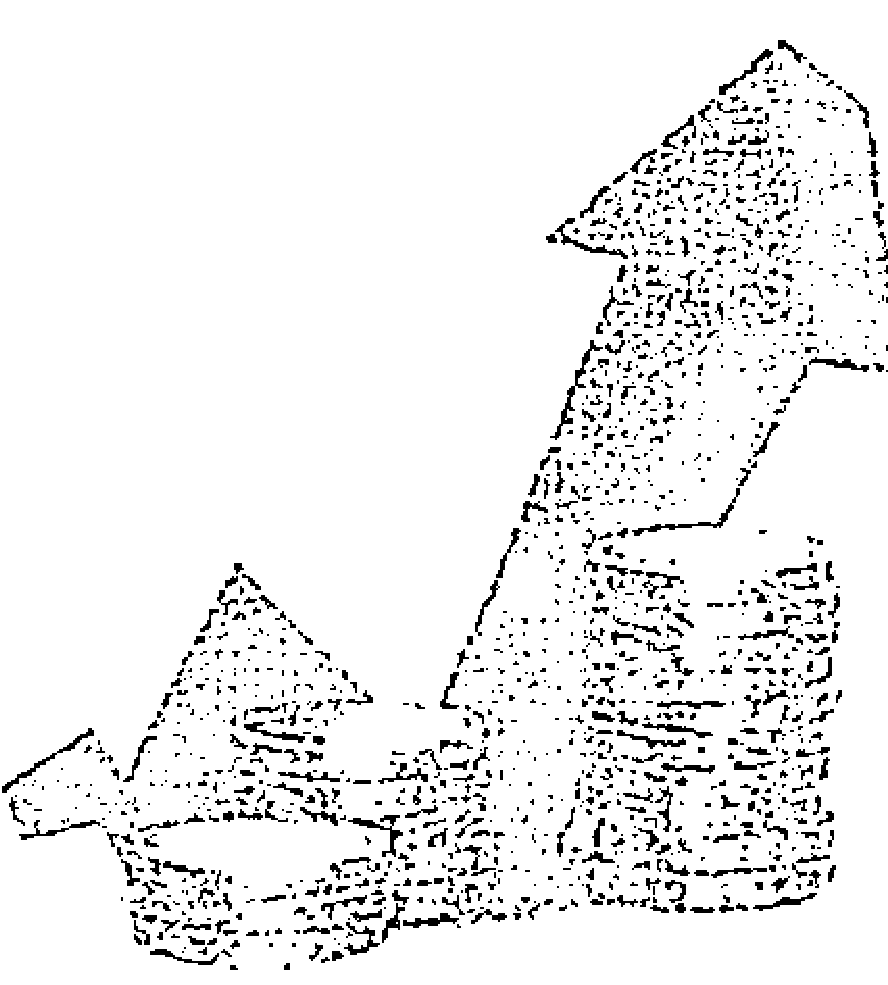

# 第1章 想学会量价操作法，你必须懂的基础知识

## § 1.1 量价图有两种——K线图与分时图

“量、价、时、空”是技术分析的 4 大要素。“量”是指成交量，“价”则是由 K 线图来表示，利用量与价的配合，再结合时间与空间两个维度，我们就可以展开技术分析了，由此也展现了量、价的不可分离性。量价图主要有两种，一种是以一个交易日为时间单位的“日 K 线图”，另一种是表现盘中即时成交情况的“分时图”。在本节中，我们先结合案例，来认识一下两种量价图。

### § 1.1.1 什么是 K 线

K 线也常被称为蜡烛线、棒线、酒井线等，它起源于 300 多年前的日本，起初是用于记录米价涨跌情况的一种工具，因其直观、立体，并且具有东方人擅长的形象思维特点，后来被应用到金融市场中，是投资人在证券交易分析中较早接触的技术工具。

K 线中以“一个交易日”为时间周期的日 K 线最常用，一条 K 线可以大致反映一日的价格波动情况，它包含了 4 个价位，分别是开盘价、收盘价、最高价、最低价。

- 1. 开盘价：开盘前为集合竞价，确定开盘价。
- 2. 收盘价：该交易日收盘时的价位。
- 3. 最高价：该交易日盘中所出现的最高成交价。
- 4. 最低价：该交易日盘中所出现的最低成交价。

图 1-1 为单条 K 线形态示意图，单条 K 线可以分为两种——阳线、阴线。阳线的收盘价在上方，收盘价高于开盘价，代表着股价上涨；阴线的收盘价在下方，收盘价低于开盘价，代表着股价下跌。阳线多用红色表示，阴线多用黑色或绿色表示。

对于 K 线来说，开盘价与收盘价之间的矩形部分被称为实体，实体上方的线为上影线，实体下方的线为下影线。

一条日 K 线记录的是在一个交易日内的股票价格变动情况，将每个交易日的 K 线以时间为横轴、以股票价格为纵轴依次排列在一起，就组成了日 K 线图，这也是反映股票价格变动情况的图。

### § 1.1.2 认识成交量

成交量以双边的方式进行统计，这表示当日成交了 1000 股，即买方买进了 1000 股，同时卖方卖出了 1000 股。

与成交量相关的概念还有成交额。成交额就是某档股票每笔成交股数，乘以成交价格的金额总和。如果说成交量只是单纯表现出这档股票的交投活跃程度，那么成交额则代表了这档股票所涉及的资金量。同样的成交量，如果股价越高，那买卖这档股票所需要的资金就越多。成交额常用于大盘分析，它排除了因大盘中的各种股票价格高低不同所形成的干扰，也直接地反映出市场中参与股票买卖的资金量多寡。

### § 1.1.3 量价图就是 K 线图

在股票行情软件中，量价图也就是常说的日 K 线图，是我们了解大盘、个股运行的窗口，它直接、清晰地呈现出股市及个股的运行情况。股票行情软件很多，但操作方法基本相同。

图 1-2 为中国石油日 K 线图，每一条 K 线都代表着一个交易日的价格波动，下方有相对应的柱形成交量，柱形长短代表成交量的大小。

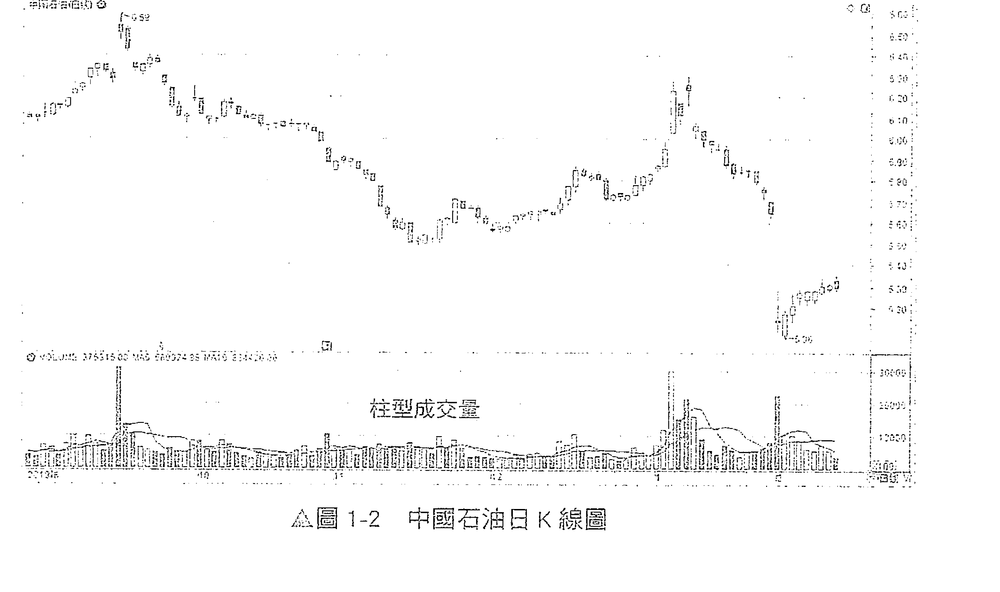

△图 1-2 中国石油日 K 线图

### § 1.1.4 以“分钟”为周期的分时图

K线图一般以“日”为时间周期，它是用于查看股票价格历史走势情况的图。分时图则以“分钟”为时间周期，是用于查看每个交易日股票盘中价格，即时走势情况的图。

图 1-3 中，左侧为该股的即时走势图，包括分时线、分时量、均价线；图中右侧显示该股的挂单情况、成交细节等内容。

- 1. 分时线是分时图中最主要的部分。它以分钟为时间单位，即时地反映个股的盘中价格波动情况，是我们了解个股价格即时变化情况的窗口。分时线呈现了多空力量的即时转换情况，一些较为特殊的异常分时图形态，往往是对主力某种特定市场行为的直接表现。此外，分时线的最大作用，是可以揭示个股价格走势的强弱情况。
- 2. 分时量位于分时线下方，同样以“分钟”为时间单位，它以图形来表现成交量，每一根柱条的长短，代表了这一分钟的成交量多少。
- 3. 均价线呈现了当日入场买股者的平均持有成本。均价线的计算方法为：到目前这一时刻为止的当日总成交金额 ÷ 到目前这一时刻为止的当日总成交股数。通过分时线与均价线的位置关系，我们可以了解到当日买卖双方的力量对比：若分时线稳健地运行于均价线上方，则说明买方力量更强；若分时线持续运行于均价线下方，则说明卖方力量更强。在分时图中，有的软件上方会显示“均线”，有的软件上方会显示“均价”，但它们都指均价线。
- 4. 委托买卖盘窗口呈现了挂单情况。通过它，我们可以了解压在上方的卖单多一些，还是聚在下方的托单更多一些。就一般的情况来说，委卖盘中的压单多，代表上方压力较大，是股价上涨较难的表现；聚在下方的买单多，代表承接力量较强，是股价下跌较难的表现。就市场的自然交投情况来看，上方的委卖单与下方的委买单，数量上虽存在差异，但差异一般不会过大。

### § 1.2 如何看懂成交量的含义？

虽然成交量的重要性是毋庸置疑的，但它并未受到所有投资人的关注。其原因在于这些投资人不了解其意义，仍旧只将成交量看作是一种交易讯息的回馈。在本节中，我们将结合案例，从多个角度来解读成交量的深层市场含义，在具体学习量价操作技术之前，希望可以达到引导的作用。

### § 1.2.1 多空的分歧情况

很多投资人仅把成交量单纯地看作是交易量，但其实，只要我们稍微深入分析，就可以得出这一判断：成交量是多空竞争规模、竞争力度的表现。

多空双方的竞争力度，也代表着双方分歧的大小。同样的股价走势，多空双方的竞争力度不同，其所蕴含的市场含义不同，预示的后期股价走向自然也不会相同。

例如，同样处于横向盘整中，成交量放大表示多空分歧加剧，强烈的多空分歧势必导致股价的方向性选择尽快出现；而若是缩量情况下的横向盘整，代表着多空竞争力度较小，这种走势若无外在因素影响，持续的时间就会更久一些。

又如，上涨走势中未出现放量，说明这种上涨仅是因为大量的持股者暂时稳定，股价在高位区的支撑力度就会弱一些；反之，上涨时有成交量放出，说明买盘入场力度较强，股价的支撑性就会更好一些。通过以上的分析可以看出，同样的股价走势，由于成交量的形态不同，其所蕴含的市场含义也是不同的，其所预示的后期股价走势往往也不同。

可以看到图1-4在股价的一波上涨走势中，股价于短线高点横向震荡整理，此时的成交量明显放大，这是此位置区域中多空分歧加剧的标志。在这个位置点，上攻明显受阻，剧烈的多空分歧将使股价走势再次发生变化。结合股价的短线上涨情况来看，股价走势反转回调的概率更大一些。

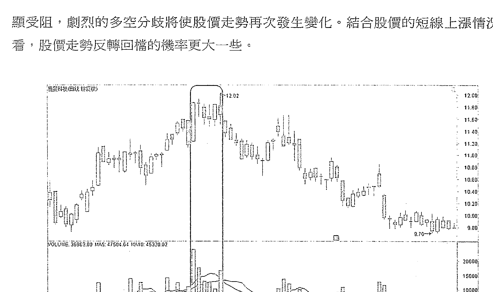

△图1-4 巨星科技2019年8月至11月走势图

股价走势无太大的变化，仅是横向整理，但成交量的放大却提示我们在此位置区域中多空分歧加剧。其隐藏的这一深层含义被揭开后，对于股价的走向，我们将能做更准确的预测。

### § 1.2.2 筹码的供求关系

成交量的直接含义仅是指成交的数量，但是如果我们把成交量与股价走势联系起来，它就有了更深一层的含义，即成交量可以呈现市场或个股的供求状况。股价上涨但成交量却未见放大，说明卖盘少、卖压小，少量的买盘入场即可推动股价上涨，个股筹码“求大于供”。

反之，当股价下跌但成交量未见放大，说明少量的卖盘就可以降低股价，入场接盘者少，个股筹码“供大于求”。当筹码供求关系较为明显时，则是趋势沿着这一方向持续运行的可靠保障；当筹码供求关系改变时，则应提防趋势的转向。

图1-5的标注处，股价震荡上行量能未见放大，该股筹码处于“求大于供”的状态中。如果此时的震荡区间位于相对低位区，那这种筹码供求关系多预示着突破上升的走势。

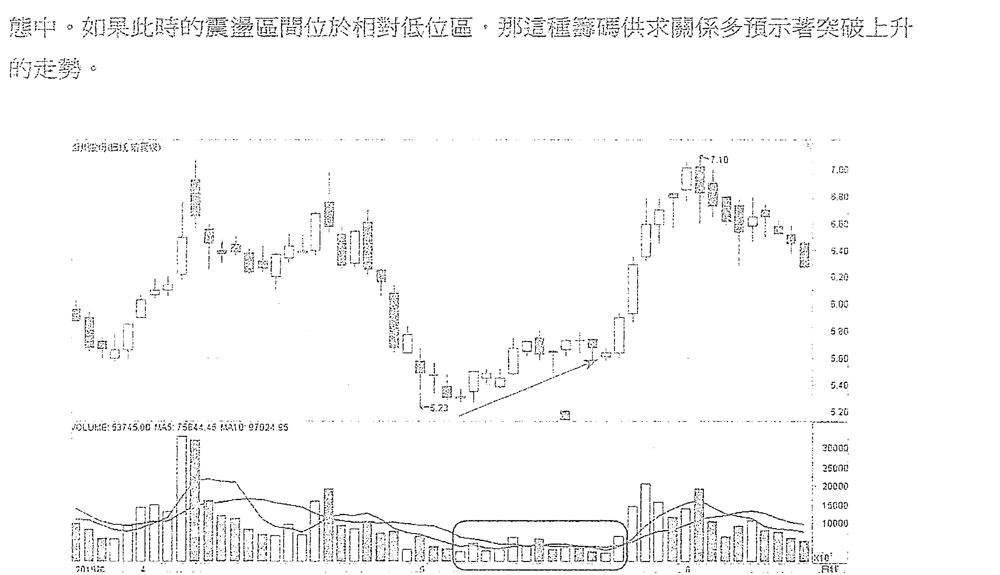

### § 1.2.3 动力与方向的关系

汽车跑得快不快，主要看引擎；没有足够的动力，再漂亮的车也只能成为摆设。量价分析的实质就是动力与方向的分析：成交量是动力，而股价走势则是方向，这种动力作用尤其会展现股价的上涨过程中。一般来说，如果没有放大的量能作为股价上涨的动力，那么上升走势是难以维持的。

虽然公司的基本面情况、经济因素、政策因素等均会影响到股价的走势，但归根究底，决定股价涨跌的力量，还是来自市场本身的买卖活动。股价上涨时，量能稳步放大，这表示涨势仍在延续；股价上涨但成交量却在缩小，这意味着涨势已到了尽头，是大盘反转的征兆。反之，股价下跌而成交量大增，显示跌势初起；股价持续下跌，但成交量越来越小，反映跌势将结束，这是大盘反弹的讯号。

我们看图1-6中的方框标注处，股价稳步上涨时，可以看到此时的成交量一直处于温和放大的状态。温和放大的量能，代表着股价上涨时的动力，只要这种量价关系可以有效地保持，股价的上涨就具有较强的持续性。

### § 1.2.4 股價走勢的前兆

成交量蘊含了豐富的交易資訊。尤其是多日成交量的不同組合，對於預測股價的後期走勢具有極為重要的作用。

不同的量價關係蘊含了不同的市場含義，有一些經典的量價關係呈現著趨勢的運行情況，也有一些量價關係反映著短期波動情況。利用量價關係的不同形態進行分析，無論是在中長線交易中，還是在短線交易中，都更能幫助我們把握買賣時機。

圖 1-7 方框標注處可以看到，股價在中短線大幅下跌之後，出現了止穩走勢，此時的成交量大幅萎縮。結合股價之前的下跌情形來看，這是短期內做空力量消失的訊號。股價中短線的連續大幅下跌，已使得該股在短期內處於超賣狀態。成交量的形態變化，可以作為判斷反彈行情的依據，並提前預示股價運行方向。

### ☞1.2.5 主力行為的線索

有主力參與的個股，其走勢往往「特立獨行」，甚至出現大行情。因此，關注主力的市場動向，是在股市中獲利的有效手段。主力的買賣方式不同於普通的散戶投資人，由於主力的加入，個股量能的放大與縮小會有一定的規律，發現這種規律後，我們就能好好把握主力動向了。

主力在參與個股時，會結合大盤進行進貨、震倉、拉升、整理、再度拉升、出貨等操作。

在這些環節中，進貨、拉升、出貨這 3 個環節是必然會出現的，其他幾個環節是否出現，與主力的風格、大盤走勢等因素相關。但是，無論哪一個環節，主力都會透過其買賣方式暴露其動向，而成交量就是反映主力動向最重要的線索之一。

由圖 1-8 可以看到，股價在經歷了大幅下跌之後，先在低位區止跌止穩，隨後放量上漲。結合隨後短線高點的強勢止穩、不回落的股價走勢來看，這波溫和放量上漲呈現出主力能力較強、拉升阻力較小。由於股價的上漲走勢才剛剛展開，因此隨後仍有較大的上漲空間。

# 第1章 想學會量價操作法，你必須懂的基礎知識

## 1.3 如何建立交易前的完善系统？

投资人依据量价关系展开实盘交易时，不应只关注局部。对于刚刚接触这一技术分析领域的投资人来说，首先应建立一套较为完善的交易系统，在熟练掌握之后，就可以从量价图轻松辨识出交易系统中需提前关注的盘面信息，进而快速地依据量价关系展开实盘交易。

一般来说，量价分析流程应是先进行全域分析，再看局部运行，最后进行细节化分析。全域分析主要是对于趋势的判断；局部运行则是关注股价的短期波动情况；细节化分析是结合个股的具体量价形态，依据它的历史表现来分析多空力量的变化情况，进而预测股价涨跌趋势。在本节中，我们将以流程化的方法，来简单介绍量价实盘交易的各个环节。

### § 1.3.1 市场趋势运行情况

「趋势」一词的字面意思为：事物或局势发展的动向，并且这种发展动向具有客观性、不以人的主观意志为转移。在统计学中，趋势具有时间性，主要是指时间轴上的某个可见的动向，是一种线性发展的客观规律。可以看出，趋势代表一种较为确定的发展方向。将「趋势」一词引入金融市场中，它是指价格走势的某种客观规律性，而且这种走势是不以人的意志为转移的。那么，股市中的「趋势」究竟是指什么呢？

股市中的趋势是指股价运行的大方向，而股价运行的大方向无非3种，即上升、横向震荡、下跌。因此，股价运行的3种趋势就相应地分为上升趋势、横向震荡趋势、下跌趋势。顺应趋势的发展方向来操作，我们可以最大限度地获取利润、回避风险；反之，「逆市而动」则将使我们处于一种极为不利的境地。

在分析量價關係、預測股價走勢時，市場趨勢運行情況就是我們展開交易的背景環境，也直接關係著我們的倉位調度。在上升趨勢中，我們的操作可更為積極一些，短線交易也可以更為頻繁一些；在下跌趨勢中，我們則更應關注本金安全，更宜輕倉參與。

因此，在展開交易前，首先應判斷市場趨勢運行情況，判斷當前的趨勢是處於橫向震盪之中，還是處於上升趨勢或下跌趨勢之中；是處於上升趨勢的回檔階段，還是處於大幅下跌後的探底階段。可以說，趨勢分析是一項重要的工作，在之後的 1.4 節中，筆者將結合移動平均線來進行詳細講解。

對於大盤指數來說，它反映的是市場多空力量整體對比情況，一旦多空力量對比格局形成，就具有較強的持續性。

一般而言，日 K 線時間週期太短、變化過於頻繁，容易產生太多的雜亂資訊誤導投資人。但是週 K 線就完全不同了，週 K 線反映的是一週的交易狀況。因為股市的變化是有趨勢的，趨勢一旦形成，短時間內無法改變。就中長期來看，大的趨勢是一般資金難以影響的，對於有的個股價格走勢，用日 K 線可能難以判斷，而用週 K 線則能一目了然。所以在判斷趨勢的時候，就 K 線形態而言，週 K 線才是中線大波段的真正代表。

圖 1-9 中利用週 K 線的走勢及形態特徵，我們可以很完整地把握市場中的多空力

量對比格局。如圖中的標註所示，上證指數在經歷了長期的橫向整理之後，周K線出現了長陽突破形態，這是方向性的選擇，空方無力再將上證指數壓低至原來的震盪平台區內，這也預示著上升趨勢的出現。

在經歷了長期的上漲之後，出現了一條上影線極長並且當周收陰的K線，這是空方賣壓明顯增加的信號，結合上證指數的長期大漲，市場處於歷史上的高估值狀態來看，這是大盤加速趕頂的信號。隨後的長陰線，則是趨勢開始反轉的明確信號。

可以說，利用周K線圖的典型位置點及周K線形態特徵，我們可以更準確地判斷趨勢運行情況，進而展開順勢交易。

### §1.3.2 个股整体价格走势情况

个股在股市之中，虽然受到大环境的影响，但往往也有自己独特的运行格局，因此，在关注市场趋势运行情况之后，我们应把目光更多地集中在个股上。特别是当股市处于横向盘整的止稳态势中时，个股的价格走势差异十分明显，有的强势上攻、涨幅惊人；有的则走势平稳、涨幅不大。

在关注个股整体价格走势情况时，分析其历史运行轨迹、把握「高低点」至关重要。当个股价格经历了中线大幅下跌而进入低位区时，下跌动力减弱，反弹甚至反转的機率增加；在持續上漲後進入高位區時，則應提防突破後的快速反轉風險。

圖1-10中，2019年6月3日該股收出放量陰線。當日成交量較大，市場賣壓很大，僅從局部走勢來看，股價處於窄幅震盪整理中，這條放量長陰線似乎是股價易破位下行的訊號。但是，在查看該股整體價格走勢情況後，我們的這個結論就顯得很片面了。

將日K線圖的時間範圍擴大，如圖1-11中我們可以看到，股價經歷了兩輪大幅度下跌，當前正處於低位。因此，2019年6月3日的放量陰線只能預示股價的短線回檔，破位下行的機率很小。在操作上，我們可以在隨後股價短線回落期間積極入場。

### §1.3.3 股價的短期走勢

短線交易要「長短兼顧」：所謂的「長」，是指趨勢運行情況；「短」則是指短期走勢情況、波段運行情況。

當股價經歷了一波上漲而達到短線高點時，必然會有較大的賣壓，易出現回落。在這種情況下，那些具有下跌含義的量價配合關係則更為準確。當股價經歷一波下跌而達到短線低點時，會引發一定的抄底盤入場，市場承接力增強，在這種情況下，那些具有上漲含義的量價配合關係則更為準確。

將股價的短期走勢與量價關係相結合，當其形成「共振」時，我們依據量價形態展開短線交易的成功率，將大大提高。

我們可以看到圖 1-12 中，股價以一條放量的陰線跌破了短期支撐點位，有加速下跌之勢。但是，從短期走勢來看，股價正處於箱體震盪區的低位，這是一個短期承接力較強的位置區，只要大盤不出現大幅下跌，在短線抄底盤入場承接的情況下，股價很難破位下行。在實盤操作中，我們不必恐慌拋售，可以等股價反彈後尋找一個相對高點再賣出離場。

### ## 1.3.4 異動量能的盤面特徵

盤中的成交細節也是短線交易時，需特別注意的一個要素，特別是主力在盤中參與，使得收盤價較高的個股。對於這類個股，若僅查看它的日 K 線圖，利用量價配合關係來預測股價走勢，很可能會得出錯誤結論。

我們可以看到圖 1-13 中，該股在 2019 年 3 月 6 日、3月 7 日連續兩日放量，股價突破了長期的整理區間，這種形態多預示著上攻行情的出現。2019 年 3 月 8 日，即圖中最後一根長陰線，股價開低走低，這是突破後調整的開始，還是應逢高拋售的停利點？從日 K 線圖的理想量價關係來看，此時應短線持有，但若查看 3 月 6 日和 3 月 7 日的分時圖，就會得出相反的結論。

圖1-14、圖1-15為該股2019年3月6日、3月7日的分時圖，這兩日的盤面有一個重要特徵，就是尾盤上揚、收盤價較高。

真正的短線行情，控盤能力較強的主力資金是不會以參與提高收盤價來實現拉升目標的。但主力短期内有意出货时，往往会参与拉高收盘价，为次日出货预留空间。经过全面的分析后，判断出股价加速上攻的机率较小，因此，2019年3月8日股价开低走低并且无力上冲时，我们的短线操作应是果断卖出、锁定利润。

### 1.3.5 局部量能与整体量能对比

我们在对成交量进行分析时，要有一个宏观的视野，不能只局限于量能的局部缩放情况。放量与缩量都是相对的，要有一个明确的参照。例如，我们说股价突破盘整区时出现了放量，这时的「放量」是相对于之前盘整区的低迷整理走势而言的，若将视野放大，以股价在盘整区之前的上涨波段作为参照，则可能就是缩量。不将视野放大，我们就不能兼顾全域，也不能从整体的角度来解释主力的市场行为，进而准确预测股价运行趋势。

我们可以看到图 1-16中，2019年1月15日股价以放量长阳线突破盘整震荡区，所有筹码都处于短线获利状态。从局部走势来看，当日量能放大明显，似乎是卖压较重、主力参与能力较差的标志，股价的突破上涨走势并不被看好。

但是，将视野放大，对于2018年3月之后的运行趋势来说，2018年12月26日的放量形态是较为温和的，而且，考虑到股价一举突破了长期的盘整震荡区间，在全盘获利的背景下，量能才放大到这样的程度，也从侧面反映了主力较强的参与能力。

从短线走势来看，股价也许有小幅回落，但中线走势还是被看好的。

### ☞1.3.6 認識典型量價形態

量價形態分析，既要考慮成交量形態，也要考慮股價走勢。在A股市場中，有一些較為常見的量價形態，它們有著相對固定的市場含義，只要個股的盤面運行平穩、盤中大筆交易數量相對較少，即這種量價形態是市場真實交投的結果，則當相同的量價形態出現時，它們也預示著相同的股價走勢。

對於中短線交易的學習者來說，在深入學習、理解並且懂得分析各種不同的量價形態之前，熟悉這些典型的量價形態，可以幫助他們快速找到突破點。在本書中，筆者既講解了葛蘭碧的經典量價關係8大法則，也結合筆者的長期實戰經驗，總結了近百種量價配合形態，力求幫助讀者快速掌握量價操作之道。

我們可以看到圖1-17中，該股在一波快速上漲走勢中出現了遞增放量，這就是一種典型的量價配合形態。對於這種量價形態來說，量能的峰值處也將是股價的短線頂點，而且隨後多會出現大幅調整。依據這種典型的量價形態，當我們預判該股的成交量無法再度放大時，應果斷賣出、鎖定利潤。

## 1.4 如何抓出股价涨跌趋势？

移动平均线（Moving Average，MA）是道氏理论的形象化表述。它以查理斯·道（Charles Henry Dow）的「平均成本概念」为基础，采用统计学中的「移动平均」原理，透过由若干条不同时间周期的均线所组成的均线系统，来表现市场平均持有成本的变化情况，进而清晰地呈现股市及个股的趋势运行情况。在本节中，我们将结合均线系统的不同排列形态，来看看它是如何呈现趋势运行情况的。

### 1.4.1 均线的含義及原理

股价走势只是趋势运行的表象，市场平均持有成本的变化情况才是趋势运行的内在本质。市场平均持有成本，展现了多空双方的出入意愿及力度，这种意愿及力度具有明显的倾向性，可以维持较长的时间。一般来说，股价走势的变化主要取决于两点：一是市场平均持有成本及其变化情况，二是场外投资人的买卖意愿。两者对股价走势的变化各有一半的影响力。

在具体设计上，移动平均线以每个交易日的收盘价，近似地代表当日市场平均持有成本。将最近 n 日的收盘价进行算术平均，就可以得到这一时间周期内的市场平均持有成本的数值。

下面我们以 5 日作为计算周期，来看看移动平均线 5 日均线，也就是 MA5 的计算方法。

```
MA5 (n) = (Cn + Cn-1 + Cn-2 + Cn-3 + Cn-4) ÷ 5
```

Cn 表示第 n 日的收盘价，在此公式中近似地代表这一交易日的平均成交价，MA5 (n) 表示第 n 日的移动平均值。

### 1.4.2 中期主导的多頭、空頭形態

將每一日的MA5（n）連成平滑的曲線，我們就會得到移動平均線MA5。同理，我們還可以得到其他時間週期的移動平均線，其中的5日、15日、20日、30日這4種時間週期較為常用，它們是中短期市場平均持有成本走向的反映。

多頭形態與空頭形態是均線系統中最經典的形態，多頭形態代表著升勢的出現與持續；空頭形態代表著跌勢的出現與持續。

多頭形態也稱為「多頭發散形態」。當股市進入上升週期後，後入場的投資人持有成本更高，這將使得週期相對較短的均線，運行於週期相對較長的均線上方。整個均線系統呈向上發散狀，這種組合形態稱為多頭發散形態。

空頭形態也稱為「空頭發散形態」。在整個均線系統中，週期相對較短的均線運行於週期相對較長的均線下方，整個均線系統呈向下發散狀。空頭形態是跌勢出現、持續的標誌，也是空頭佔據主動的訊號。

當多頭形態出現後，表明當前的市場處於多方佔優勢階段，是中期趨勢向上的訊號，只要多頭形態未被明顯破壞，我們宜以升勢思維來交易；當空頭形態出現後，表明當前市場處於空方佔優勢階段，是中期趨勢向下的訊號，此時，我們只宜參與超跌反彈的短線交易。

圖1-18的均線系統由MA5、MA10、MA20、MA30這4條均線組合而成。股價在經歷了整理之後開始上揚，此時的均線系統呈多頭發散形態，這是多方佔優勢並且發動攻勢的標誌，也是中期股價走勢向上的反映，標誌著升勢的持續。

圖1-19中股價持續震盪走低，雖然此時的中短線下跌幅度已經較大，但明顯的均線空頭發散形態，提示我們此時的市場仍是空方佔優勢，不宜過早抄底入場。

### 1.4.3 途中整理的黏合形態

在股價上升（或下跌）途中往往會有整理走勢出現，這不是趨勢轉折的訊號，它僅是原有趨勢運行中的整理。所謂的黏合形態是指在上升趨勢中，短期均線向下靠攏中長期均線（下跌趨勢中，短期均線向上靠攏中長期均線），使得多條均線黏合在一起。當黏合形態出現後，隨著交易的持續進行，這種多空平衡狀態會被打破，股價很大的機率會沿原有趨勢的方向運行。

我們可以看到圖1-20中，股價在上升途中的回落、震盪使得短期均線向下靠攏中期均線，多條均線之間的距離極短，呈黏合形態。但此時的MA30仍舊在穩健上行，這說明多方力量依舊佔優勢。此時的均線黏合形態，代表著當前的橫向震盪走勢為途中整理，隨著整理走勢的結束，股價仍將保持原有的上升趨勢。

圖 1-21 可以看到在震盪下跌過程中，股價的小幅反彈，使得短期均線向上靠攏中期均線，這是下跌途中的黏合形態，也是跌勢仍將持續的訊號，我們此時不可抄底入場。

### §1.4.4 反轉前的壓力支撐轉化

在上升途中的一波下跌走勢後，原有的均線系統呈多頭形態，隨著這一波下跌，多頭形態被打破。當股價下跌至 MA30 附近時，若受到有力的支撐（或者在跌破 MA30 後能快速反彈），則表明多方力量依舊較強，升勢有望延續。

但是，若股價向下跌破了 MA30，並且在較長時間內無法向上突破時，這時的 MA30 將由原來的支撐作用轉換為阻力作用，趨勢反轉下跌的機率較大，這時我們應控制倉位、鎖定利潤。

可以看到圖 1-22 在股價持續上升途中，MA30 對短期回檔走勢提供了較強的支撐作用。一般來說，當股價累計漲幅不大並且處於明顯升勢中，一波回落使得股價接近 MA30 時，是較好的中短線入場點。

隨著上升趨勢的持續，在高位區出現了長陰線快速跌破 MA30 的形態，這是原有多空力量對比格局發生轉變的訊號，我們應注意趨勢的轉向。

我們可以看到圖 1-23 中，其股價一直處於穩健上升的通道中，但在高位區出現了震盪下滑的走勢，股價向下跌破了 MA30，並且 MA30 隨後對股價的反彈上漲構成了強力阻擋，這是多空力量對比格局發生轉變的訊號。考慮到股價的累計漲幅，在這個位置區震盪築頂的機率較大，此時我們應減碼或清倉離場。

當股價上漲至 MA30 附近時，若受到了明顯的阻擋（或者在突破 MA30 後又馬上回落到其下方），則表明空方力量依舊較強，跌勢仍未見底。若股價向上突破了 MA30，並且在較長時間內站穩於 MA30 上方，這時的 MA30 將由原來的阻力作用轉換為支撐作用，趨勢反轉上行的機率較大，這時我們就可以積極地在股價回檔時加碼買入。

可以看到圖 1-24 中，在中長期的低位區股價止穩後，均線呈現多頭形態，這是多方力量開始佔優勢的訊號，也是趨勢有望反轉上行的訊號。隨後，股價震盪上揚，多方力量明顯佔優勢，並且在股價的一波大幅調整過程中，MA30 發揮了較強的支撐作用。這時 MA30 由原來的阻力作用轉換為支撐作用，這也是趨勢反轉上行的一個重要訊號。在實盤操作中，當股價回落至 MA30 附近時，我們可以進行中短線買入操作。

### § 1.4.5 「蛟龍出海」反轉形態

「蛟龍出海」反轉形態，出現在股價上升途中的長期震盪回落態勢中，或中長期低點的止穩走勢中。此時，MA30 仍舊處於緩慢下移的狀態中，股價也持續運行在 MA30 下方，總體下跌速度很緩慢，呈緩跌格局。

此時，若一條長陽線突破了 MA30，股價將連續多個交易日站穩於 MA30 之上。「蛟龍出海」反轉形態是一種打破原有震盪緩跌格局的反轉形態，個股出現短線快速上攻行情的機率較大，在實盤操作中，我們可以積極跟進。

我們看圖 1-25，在較長時間的橫向震盪走勢中，股價滑落，MA30 下行。如圖中的標註所示，一條長陽線向上突破了 MA30，隨後多個交易日內，股價站穩於 MA30 上方。當股價回落至 MA30 附近時，再度出現長陽線，這說明可能有主力資金積極買入，此時若想進行中短線交易則可以買股入場。

# 第1章 想学会量价操作法，你必须懂的基础知识

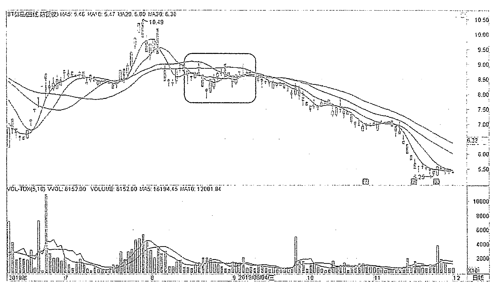

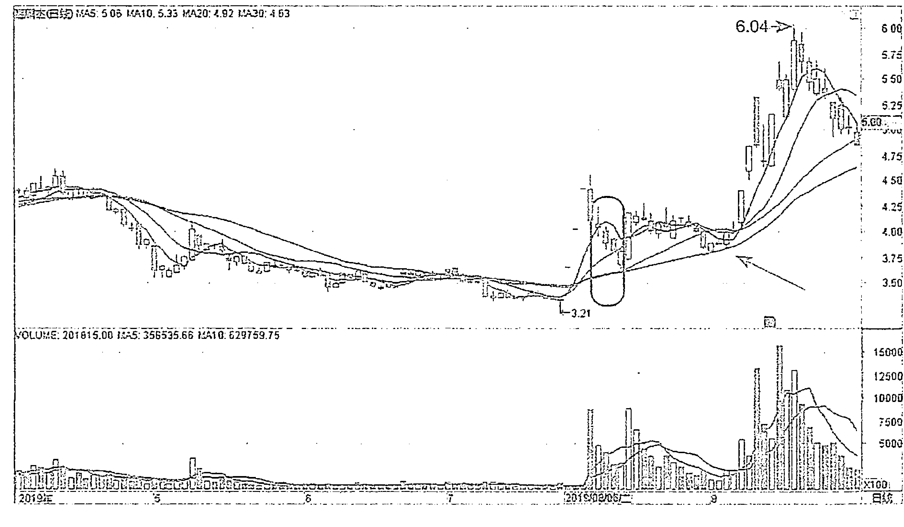

用3小时学会量价操作法
让我股票赚3倍

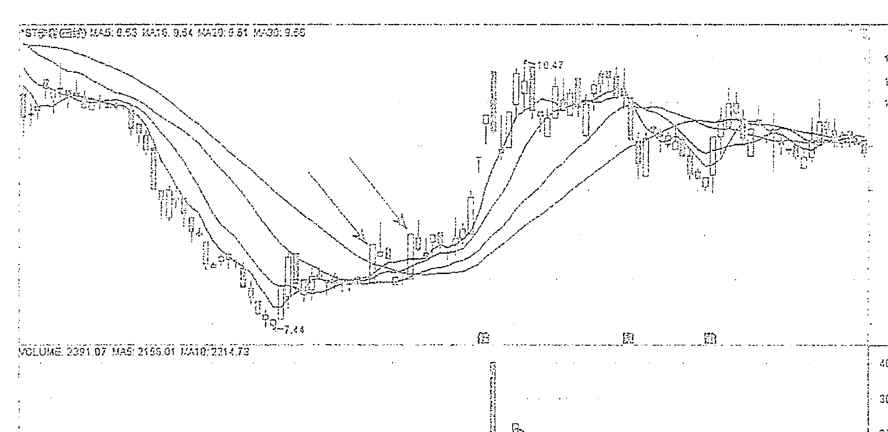

△图 1-25 *ST步森2019年6月至11月走势图

在实盘操作中，当股价回落至 MA30 附近时，就可以短线买入。若随后的走势证实我们的判断是正确的，则可耐心持股待涨，直至出现短线卖出信号。若股价再度向下跌破 MA30，则表明之前的长阳线突破 MA30 并不是上涨信号，我们应及时卖出，从而保证本金安全。

### 1.4.6 多空交替形态

均线系统的多空交替形态，是指均线系统有时因一波上涨而呈多头排列形态，而有时因一波下跌而呈空头排列形态。多空交替形态常见于盘整震荡走势中，是趋势运行不明朗的标志，也是多空双方力量相对均衡的信号。

在股价走势没有发出明确的方向选择信号前，我们只宜进行高卖低买的短线交易，即在均线系统呈现完全的空头排列形态并且股价位于震荡区低点时，可短线买入；随后，一波上涨之后，当均线系统呈现完全的多头排列形态，且股价处于震荡区高点时，可获利卖出。

在图 1-26 中，股价在高位区震荡滞涨之后开始向下破位，短线跌幅较大，此时的大盘仍旧处于横向震荡之中，并且没有系统性风险。因此，股价步入快速下降通道的几率较小，此时出现的止跌企稳可以作为一个短线买入点。

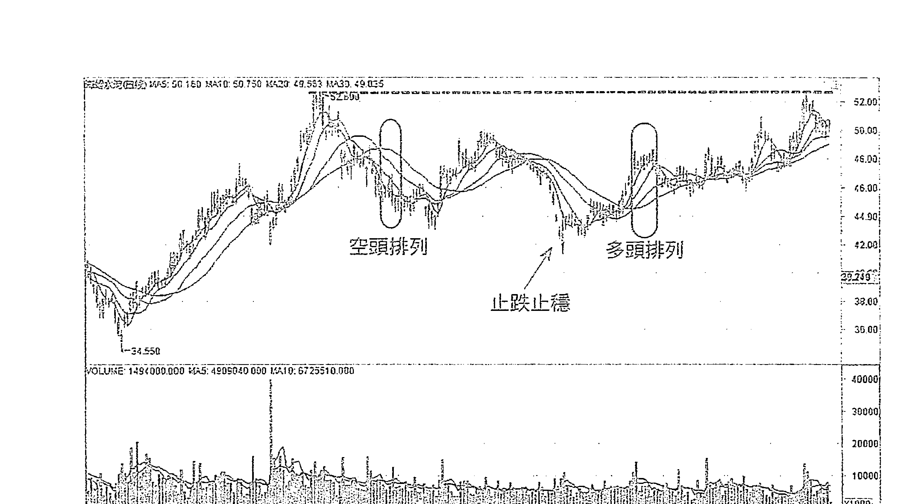

△图 1-26 海螺水泥 2018 年 12 月至 2019 年 12 月走势图

随后，股价震荡上行、快速突破 MA30，这是多方力量再度占优势的信号。但当股价上涨至前期高点附近时，由于存在较多的短线获利卖压以及解套卖压，因此出现调整的几率较大，我们应逢高卖出、锁定利润。

## 1.5 如何掌握股价大幅变动的买卖时机？

进行实盘交易时，我们首先要查看的就是盘面的各项资讯。其中，盘中出现异动（如量能异动、走势异动、挂单情况变化等）的个股更值得关注，它们可能是主力短线重点参与的对象，也可能预示着个股上攻行情的出现。

在以量价形态为核心展开交易时，能否在第一时间发现这些个股非常重要，否则我们很可能错失买入时机。在本节中，我们将说明重要的即时盘面资讯，来检视如何在第一时间发现这些盘面异动股。

### 1.5.1 振幅、量比、换手率等重要数据

各式各样的盘面数据，从不同角度呈现出多空双方的交投行为，利用它们可以更准确地观察个股的运行情况。其中，振幅、量比、委比、内盘与外盘、换手率等数据较为重要。

#### 1. 振幅

振幅是指股价在当日盘中的上下震荡的幅度。振幅展现了多空双方的竞争情况。个股的盘中振幅越大，说明多空竞争越激烈。过大的盘中振幅，往往就是短线股价走势反转的信号。其公式如下。

振幅 = (当日最高价 - 当日最低价) ÷ 上一交易日收盘价 × 100%

#### 2. 量比

量比，即成交量的相对比值，它以分钟为时间单位，其数值为当日开市后每分钟的平均成交量，与过去5个交易日每分钟的平均成交量之比，也是一种即时的盘面数据。量比将前几个交易日的每分钟平均成交量作为参照，可以帮助我们即时了解个股在这一分钟量能放大或缩小的程度，是发现成交量异动的重要指标。对量比的数值进行分析时，量比较大的个股（一般来说，量比值至少要在3以上），更值得关住，可以帮助我们缩小选股范围。其公式如下。

$$ \text{量比} = \frac{[\text{当日开市后的成交总手数} \div \text{当日累计开市时间（分）}]}{\text{过去5个交易日每分钟的平均成交量}} $$

#### 3. 量比曲线

在盘中，以分钟为时间单位，将量比数值依次连接得到一条平滑曲线，这就是量比曲线。它使我们更能掌握个股当日成交量，与近期成交量的相对变化情况。一般来说，透过一夜的市场信息及人们心理上的变化，新的一个交易日开盘的时候，股价及开盘成交量的变化极大。将其反映在量比数值上，就是很多股票开盘时的量比数值会高十几倍，随后量比数值又急速下降。大多数股票的成交量在新的一个交易日开盘时都显得很不稳定，因此在通常的行情背景下，我们应该等待量比曲线稳定后再采取行动。

#### 4. 委比

委比可以反映委买盘与委卖盘的挂单数量对比情况。委比的取值范围为-100%至100%，当委比数值为100%时，个股处于涨停板；当委比数值为-100%时，个股处于跌停板。其公式如下。

$$ \text{委比} = \frac{(\text{委买手数} - \text{委卖手数})}{(\text{委买手数} + \text{委卖手数})} \times 100\% $$

委比是具有即时性的盘面数据，随着委买单、委卖单的陆续挂出、不断成交，委比数值也会不断变化。一般来说，当委比数值为正时，说明有较多的委买单在下面承接，这是买方力量相对较强的表现；当委比数值为负时，说明有较多的委卖单压在上面，这是卖方力量相对较强的表现。

#### 5. 内盘与外盘

外盘，是指以主动性买入方式成交的股票数量。对于一笔交易，在卖方报价后，买方主动以卖方报价买入，这是主动买入；在买方报价后，卖方主动以买方的报价卖出，这是主动卖出。内盘，是指以主动性卖出方式成交的股票数量。其公式如下。

成交量 = 外盘 + 内盘

当外盘较大时，说明以主动性买入方式成交的股票数量更多，这是投资人买股意愿较强的表现，此时的股价也多会在买盘的推动下出现上涨。当内盘较大时，说明以主动性卖出方式成交的股票数量更多，这是投资人卖股意愿较强的表现，此时的股价也多会在卖盘的压力下出现下跌。

在实盘操作中，我们需结合个股的价格走势情况，来解读内外盘所蕴含的市场信息，以下列举5种情况。

- （1）在长期下跌后的低位区：价格走势企稳，量能温和放大，此时出现的外盘大于内盘的情况，可以被看作是场外资金积极入场、多方力量增强的信号。若个股可以在之后的更多的交易日中，出现外盘大于内盘的情况，则预示着多方力量正在积累，是后期价格走势看涨的标志。
- （2）在长期上涨后的高位区：价格走势滞涨，量能相对缩小，此时出现的内盘大于外盘的情况，可以被看作是场内资金陆续离场、空方卖压渐强的信号。若个股可以在之后的更多的交易日中，出现内盘大于外盘的情况，则预示着空方力量正在积累，是后期价格走势看跌的标志。
- （3）在稳步上涨的价格走势中：外盘大于内盘是买盘充足的表现，也是涨势将持续的标志。在持续下跌的价格走势中，内盘大于外盘是卖盘充足的表现，也是跌势将持续的标志。
- （4）在高位震荡区：若个股在盘面中出现了外盘明显大于内盘，但盘中价格走势却无力上涨的情形，是价格走势看跌的信号。
- （5）在低位震荡区：若个股在盘面中出现了内盘明显大于外盘，但盘中价格走势却较为稳健、未见明显下跌的情形，这是价格走势看涨的信号。

#### 6. 换手率

换手率也称周转率，它是指一档股票在「单位时间内的累计成交量与其流通总股本之间」的比率，是反映股票流通性强弱的指标之一。其公式如下。

| 换手率公式 |
| :--- |
| 换手率 = (单位时间内的累计成交量 ÷ 流通总股本) × 100% |

一般来说，在计算换手率时，多以交易日为时间单位。假设某档股票连续10个交易日的换手率之和（累计换手率）为100%，我们可以这样简单地理解：这档股票在经过了10个交易日的交投之后，其流通在股市上的全部股票筹码已经从原有持股者手中，转移到了新加入进来的投资人手中。当然，这只是一种简单的理解，因为很多投资人都在频繁地买卖一档股票，换手率为100%并不意味着持股者的完全转换。

关注换手率时，我们要充分考虑个股的特性。对于大股东持股比例较高的个股，这些股票的换手率会较低；反之，对于大股东持股比例低、股票筹码高度分散的个股，其换手率就会较高。

个股的换手率可以反映个股的交投情况是否活跃。一般来说，日换手率小于3%表明交投不活跃，市场观望气氛较重。日换手率在3%～7%，表明市场交投气氛活跃，意味着股票流通性好，进出市场比较容易，不会出现「想买买不到、想卖卖不出」的现象。此种换手率多出现在行情的行进阶段，股票通过持续的换手，市场持有成本在不断地增加或减少，这有利于行情的发展。

日换手率大于7%表明股票在频繁换手，如果发生在高位，我们应注意风险。此外，对于不同类型的个股，也应区别其换手率标准：大股本的换手率达到2%就可以算是较高的水平，而小股本、题材股的换手率一般要超过5%，才可以将其称作是高换手率。

高换手率是最值得我们关注的。高换手率说明资金的流入、流出速度较快，若高换手率是由主力资金流入、散户资金流出引发的，往往预示着机会的到来；若高换手率是由主力资金流出、散户资金流入引发的，往往是风险的预兆。由于较长时间的高换手率可以表现出资金进出量大、持续性强的特点，因此在实盘操作中，能在较长的时间内维持高换手率的股票，极具价值。

### 1.5.2 挂单分析：大单托底与大单压顶

挂单，就是指委买、委卖盘中的挂单情况。这些单子是已挂出、但却仍未成交的。正常的挂单情况中，委买盘与委卖盘的单子数量相对平均，每个价位上的单子数量也不会相差太多。但是，有的时候可以看到委买盘的某一价位处挂有超级大单（大单托底），或是在委卖盘的某一价位处挂有超级大单（大单压顶）。

大单托底给我们的感觉是此股价格难跌，大单压顶给我们的感觉则是此股价格难涨，但经验告诉我们，只凭感觉往往并不准确。很多时候，大单托底，但股价在盘中的走势却明显弱于大盘；大单压顶，但股价在盘中的走势却明显强于大盘。在实盘操作中，我们一定要学会逆向思维，不能单单凭借对盘面的感觉来做出判断。

例如，股价走势在盘中出现了小幅度的震荡下行，在震荡下行过程中，委买盘的单子非常大，大单托底给人的感觉是有资金承接，股价难跌。然而，实际情况可能是此股当日的价格走势较弱，明显弱于当日大盘。

如果此大单真是为了防止股价下跌、主力护盘的话，那么在当日大盘走势较为稳健的背景下，个股的盘中表现应强于同日大盘，但短线走势出现了一定的股价重心下移的情况。因此，我们对于这种大单托底的情况应逆向理解，从而判断出这是卖出信号。


# 第2章 看懂放量与缩量，因为「有量才有价」！

用3小时学会量价操作法 让我股票赚3倍

## 2.1 循序渐进的放量：温和式放量

成交量形态的变化归根结底只有两种情形，一种是放量，另一种是缩量。但是，放量和缩量的具体表现形式多种多样，有较为温和的放量，也有突兀式放量，在不同的股价走势中，它们所蕴含的市场含义也不尽相同。
学习量价知识前，对于成交量的放大、缩小形态，先要有一个较为系统性的了解，在此基础之上，进一步结合实际股价走势、解读成交量的细微变化，才能取得更好的效果。在本章中，笔者以「放量」及「缩量」为核心，结合股价走势，讲解一些常见的成交量形态，为读者打好基础。

### 2.1.1 温和式放量的成因

温和式放量是一种相对温和的放量形态，它是指成交量与近期的均量水平相比而言，出现循序渐进、幅度不大的放量，成交量的前后变化较为连续，成交量的放大水平多保持在近期均量的两倍左右。温和式放量多出现在上涨波段，而在不同个股的中短线价格走势中，温和式放量所具有的市场含义也不尽相同。
「涨时放量，跌时缩量」是股价运动过程中的常态，也是市场正常交投的结果。波段上涨走势中的温和式放量，属于普通的放量上涨形态，一般来说，只对局部走势进行观察，实战意义不大。在实盘操作中，我们应将局部走势中的温和式放量形态放入趋势运行中，「低位攀升走势」、「突破套牢区位置点」和「震荡反弹波段走势」这几种情形下的温和式放量，具有较高的实战价值，能够较为准确地预示股价后期的运行方向。

### 2.1.2 低位攀升温和式放量，有实战意义

一般来讲，当低位攀升温和式放量这一形态，出现在市场整体或个股长期下跌之后的低位区时，最具实战意义。因为这时的个股多处于超跌状态，但超跌并不是股价上涨的动力，只有持续的买盘进入，才能让股价步入底部并且随后走入上升通道之中。而温和式放量的形态，正是买盘持续进入的信号，也就是股价见底、上涨趋势即将出现的信号。

从图2-1中可以看到，在前期经历了短线快速下跌、中期持续下跌之后，股价进入了低位区。如图中的标注所示，此时出现了一波上涨行情，量能温和放大，股价在短线高点止稳不跌，这是买盘积极入场的信号，预示着行情的反转，在实盘操作中可以积极地跟进买入。

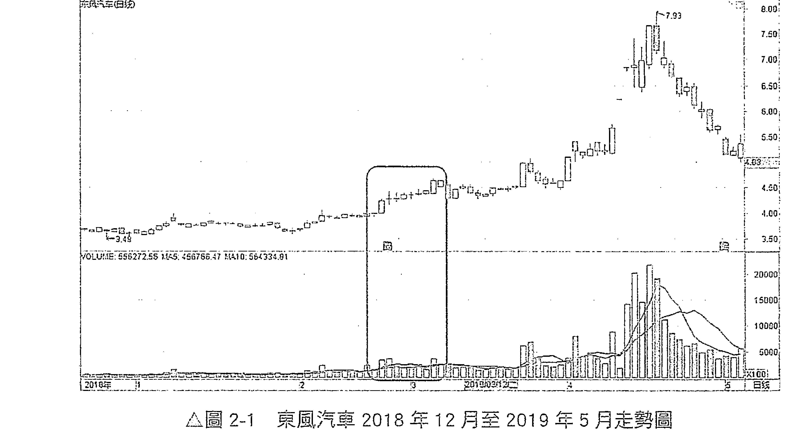

### 2.1.3 升势创新高温和式放量，可持股待涨

升势创新高温和式放量，是指个股在一波稳健上涨，并且创出近期新高的价格走势中，出现了成交量循序渐进地温和放大，而且其均量大于之前上涨走势中的均量的情形。

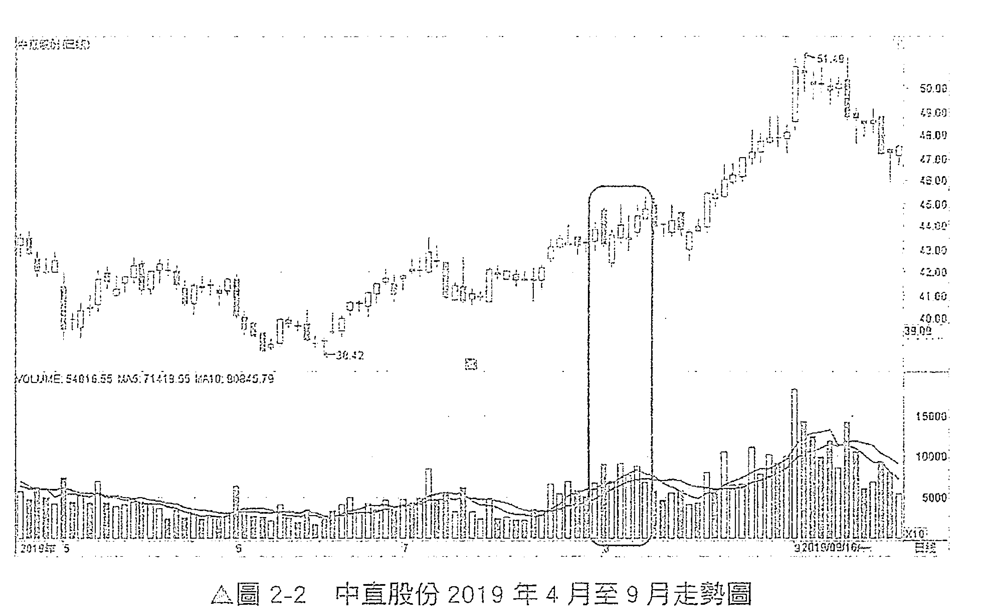

这种出现在上升途中的温和式放量形态，是场外买盘资金较为充足的标志，也预示着股价上升趋势仍将延续下去。

由图2-2中的标示处可以看到，在震荡上升行情中，一波震荡上升走势创出了新高，量能较之前的均量而言，出现了温和式放大的情形，这是买盘资金充足的标志。由于此时股价的累计涨幅不大、上升形态良好，因此，这种温和式放量的量价关系，预示着升势仍将持续下去，我们可以耐心持股待涨。

### 2.1.4 突破套牢区温和式放量，可积极买入

套牢区因股价破位下行而出现，随后，股价反弹上涨至这一位置点，较多的被套盘处于解套状态。同时，由于股价短线而产生了一定的获利盘，在这个位置点上，若股价能够以温和放量的方式突破套牢区，则表明市场筹码锁定状态良好。这或许也可表明市场浮额较少，股价上涨阻力较小。

只要股价短线涨幅不大、中线仍处于相对低位区，则表明股价的中线走势是向上的，仍会有较大的上涨空间。在实盘操作中，股价在突破套牢区后，若能够在突破位置点止稳，则预示着上涨动力较足，此时我们可以积极地买股入场布局。

由图2-3可以看到股价在急速下跌之后，跌破了前期的震荡整理区间，从而使得此区间成为套牢区，中短线跌幅较大。随后，股价反转上行，当上涨至套牢区时，量能仅温和放大。在短线获利盘、套牢盘的双重卖压下，这种温和式的放量止稳表明市场浮额较少，是股价能够成功突破的信号之一。

### 2.1.5 震荡反弹温和式放量，应及时卖出

在震荡下跌走势中，股价的一波快速下跌之后，个股短期内处于超跌状态，只要有一定的买盘入场，就可以推动股价反弹式上涨。此时出现的温和式放量，仅代表股价的反弹式上涨，并不是大量买盘入场的信号。

一般来说，当底部出现时，会有一个反复震荡的过程，若股价急速下跌的速度较快、幅度较大，能够出现「V」形反转的话，那么其量能会连续大幅度放出，而不会温和式放量。

在实盘操作中，对于温和式放量所引起的价格反弹式上涨的股票，我们是不宜追涨买入的；若股价中短线跌幅较大，温和式放量之后，我们最好等股价短线再度回落后，才抄底入场。

由图 2-4 可以看到，该股在震荡反弹波段出现了几次温和式放量，量能放大幅度小。此属于无量式反弹，代表着买盘入场不积极、反弹行情只是「昙花一现」。在实盘操作中，一旦股价短线滞涨，我们应及时卖出该股，规避新一轮的下跌风险。

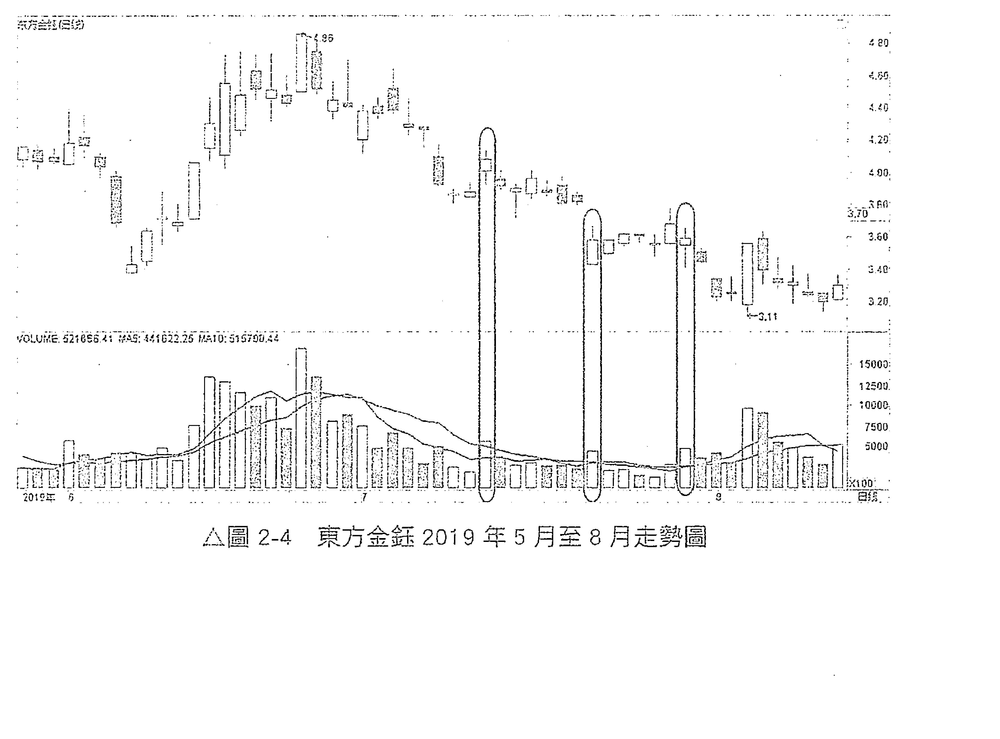

△图2-4 东方金钰 2019 年 5 月至 8 月走势图

## 2.2 突然大幅度放大：突兀式放量


### 2.2.1 突兀式放量的成因

突兀式放量也称「脉冲式放量」，它是指成交量在某一日或连续两日内突然大幅度放大，其放量效果往往可以达到之前均量大小的3倍以上。而且，在这一、两日的放量之后，此股的成交量又突然地恢复如初。

一般来说，量能的放大或缩小有一个连续过渡的过程，这是多空双方竞争不断趋于激烈或不断趋于缓和的写照。但突兀式放量则完全不同，它是量能的一次突兀式跃动。突然地放量，又突然地恢复如初，这无疑是成交量的明显异动。

那么，突兀式放量是如何被引发的呢？一般来说，它是受消息面的刺激所引发的，下面我们就来看看突兀式放量究竟蕴含了怎样的市场含义。

利多消息会促使股价上涨，主要是由于股价的快速变动，和市场对利多消息的解读结果不同，多空双方产生强烈分歧，造成了较大的交易量。

利多消息刺激下的突兀式放量表明两种信号：一是买盘入场力度大，并且当日多方占据了主动地位，但当日的巨量也造成了对买盘力量的极大消耗；二是交易是双向的，突兀式放量也说明当日逢高卖压异常沉重，放量过后，量能突然大幅度萎缩，说明市场后续入场的买盘力量不足。因为「涨时需有量能支撑」，当股价处于短线高点，而量能又无法维持放大态势时，一波回档下跌走势难免会出现。

再来看看利空消息引发的突兀式放量。利空消息引发突兀式放量并且造成股价的快速下跌，这说明市场的主动性快速卖出力量巨大，空方完全占据了主动地位，这是下跌信号。

### 2.2.2 短线上冲突兀式放量

短线上冲是指，股价出现了一波短线上涨，涨幅相对较大、涨速较快。从日 K 线图来看，股价的一波短线上涨往往会使股价呈加速突破上涨状，这时出现的突兀式放量往往与主力的阶段式减仓、出货行为相关。

图 2-5 中股价经历了一波短线上涨，上涨幅度相对较大；在有了一个涨停板、全盘获利的情形下，出现了跳空长十字线的形态，当日成交量异常放大，放大效果大致为此前均量的 2 倍；次日量能又突然恢复如初，这就是突兀式放量上涨。出现在这个位置点的这种量能形态，表明股价短线上攻动力已过度释放，而且多与主力的阶段性出货行为相关，是短线上涨走势结束的信号。在实盘操作中，我们进行中线交易时应减仓，进行短线交易时应获利离场。

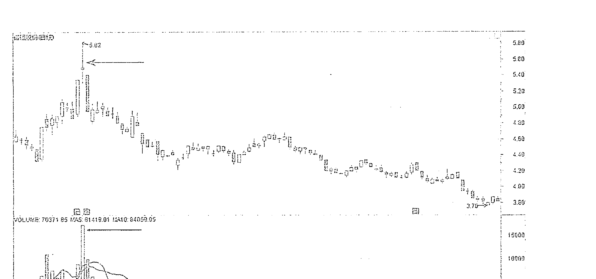

### 2.2.3 宽震区箱顶突兀式放量

在宽震区中，由于股价的上下波动幅度较大，股价走势会在箱顶受到较强阻力，在箱底获得较强支撑，此外宽幅震荡走势常出现在浮额较多、主力参与能力较弱的个股上。

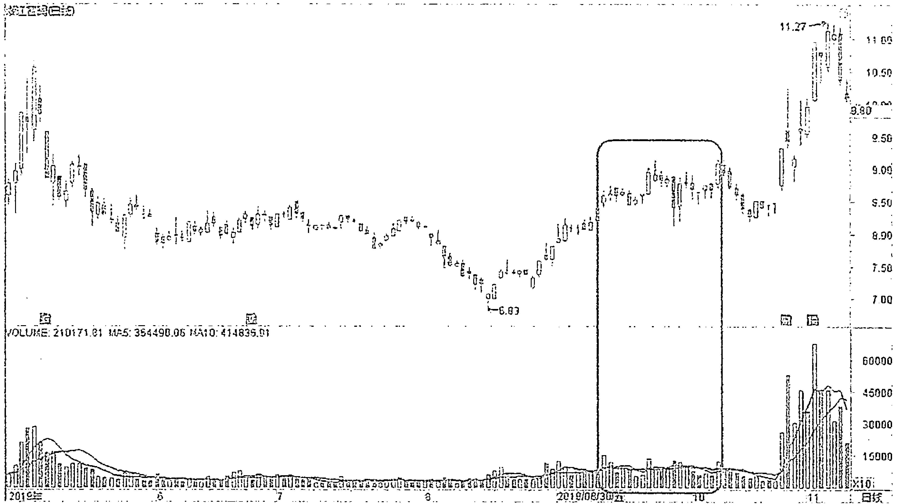

当股价上涨到达宽震区箱顶位置点时，将受到双重卖压阻挡，一是短线获利盘卖压，二是箱顶位置附近的套牢盘卖压。因此，当在宽震区箱顶出现突兀式放量上涨时，表明此位置点的卖压极大，虽然有买盘入场推动股价上涨，但随后量能突然恢复如初，意味着买盘入场力度减弱。股价在短线高点承接力度不足，量能放得越大，则短期内对多方力量的消耗越大，股价随后的回落幅度也就越大。

图 2-6 中，该股的整体价格走势呈宽幅震荡状，在一波震荡反弹上涨中，股价到达箱顶阻力位。如图中的标注所示，股价出现了突兀式的放量长阳线形态，放量效果明显，达到了此前均量的 3 倍以上；次日量能突然萎缩，是股价上攻受阻的讯号，预示着一波大幅调整走势将展开。在实盘操作中，我们应卖股离场，从而规避短线风险。

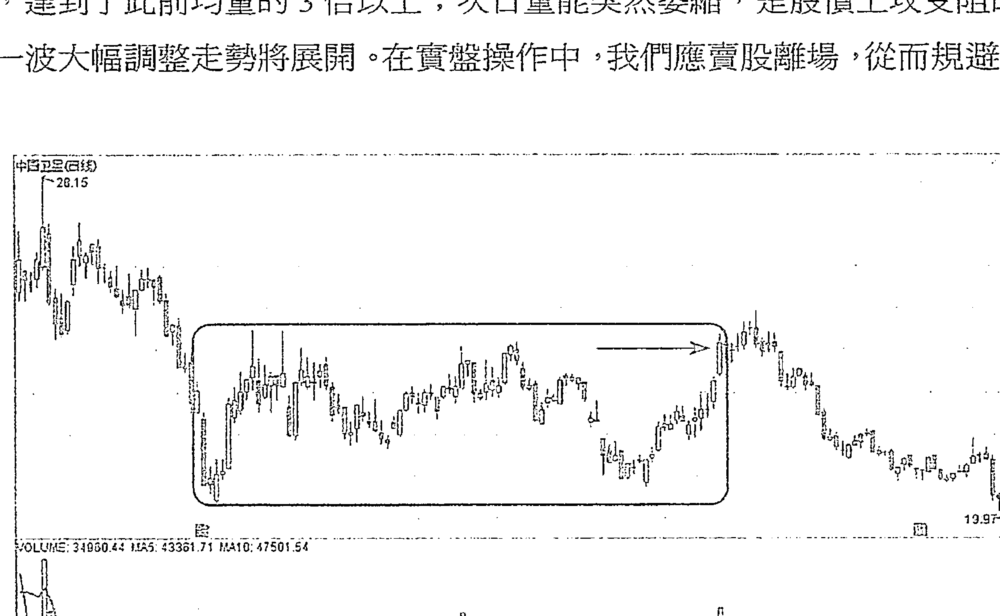

### 2.2.4 回档反冲突兀式放量

回档反冲是指，股价在第一次冲高之后出现了大幅回档，随后，股价二度上冲，接近前期高点时，成交量突兀式放大。

回档反冲过程中的突兀式放量是短线卖压沉重、股价难以突破上行的讯号。此外，在这一位置点的突兀式放量多与主力出货行为相关，特别是在股价中期累计涨幅较大的情形下。在实盘操作中，我们一旦发现个股次日成交量大幅缩减、量能呈突兀式放大，则应考虑果断卖出。

图2-7 为波导股份的走势图，股价一直在持续上涨并且创出新高。股价累计涨幅已经很大，随后出现大幅调整、股价二度反冲，但同时出现了突兀式放量，这是一个中短线的卖股讯号。

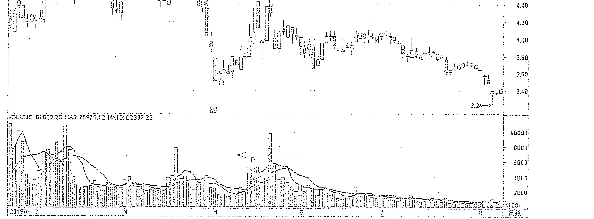

图2-7 波导股份2019年2月至8月走势图


## 2.3 大单交易频繁：连续式放量

### 2.3.1 连续式放量的成因

从形态上来看，连续式放量至少能保持3个交易日以上，而且放量程度较为接近。在盘面上可以陆续看到较大的卖盘、买盘出现，盘中交投十分活跃、大单交易频繁。连续式放量出现时，当日的成交量会显著高于此前的均量，股价波动剧烈。

连续式放量常出现在高位区，或一波快速上涨走势中。但当连续式放量开始出现缩量时，往往就是中短线见顶的讯号。实盘操作中它是警惕我们的反转信号之一。

### 2.3.2 宽幅震荡连续式放量

在股价处于上下宽幅震荡走势中时，若成交量大幅度放出且放量效果较为接近，这就是宽幅震荡连续式放量。

若股价中线累计涨幅较大，震荡中使得股价重心下移，则是出货的讯号，我们应逢高卖出；若股价中线累计涨幅较小，震荡中使得股价重心缓缓上移，多预示着主力持有筹码有所增加，后续有望进一步拉升股价。在实盘操作中，我们可以在震荡回落时的低点买入进行布局。

可以看到在图 2-8 中，股价在脱离低位区时，频繁出现涨停板，随后股价震荡上行，且量能明显放大，每个交易日的放量效果都较为接近，这就是连续式放量的特征。考虑到股价中短线涨幅较小、主力成本较低，在震荡时，股价重心不断上移，说明买盘力度更强。因此，若大盘配合，股价有望在主力的参与下进一步上涨。在实盘操作中，我们应在震荡回档时买股布局。

### 2.3.3 短线飙升连续式放量

短线飙升走势中，出现连续式放量时的股价上涨并不具有持续性，股价的上攻走势多为一波到顶，一旦量能开始缩减或者股价上攻受阻，我们应中短线卖出。特别是当这种短线飙升走势，出现在股价累计涨幅较大的情形下时，股价随后的下跌速度极快，下跌幅度往往也极大。

图2-9中出现了连续式放量上攻的形态特征，如图中的标注所示，高位出现了缩量、滞涨，这是一个明确的中短线卖出讯号。

### 2.3.4 横向整理连续式放量

在横向的整理走势中，股价上下波动幅度缩小，正常情况下，市场交投应有所减少，量能应有所缩减，若此时量能连续性放大且放大效果相近，则多与主力的出货行为有关。一般来说，横向整理走势中的连续式放量，多出现在股价累计涨幅较大的高位区，看似个股交投活跃、承接资金踊跃，但通常是中短线见顶的讯号，主力往往在此时出货。

第2章 看懂放量与缩量，因为“有量才有价”！

图 2-10 可以看到股价累计涨幅大，一波回档后，虽然股价处于短线低点，但从中长线角度来看，仍处于高位区。此时的横向窄幅整理却引发了量能的持续性放大，这是一个短线下跌讯号，也预示着随后的股价运行趋势——破位下行。

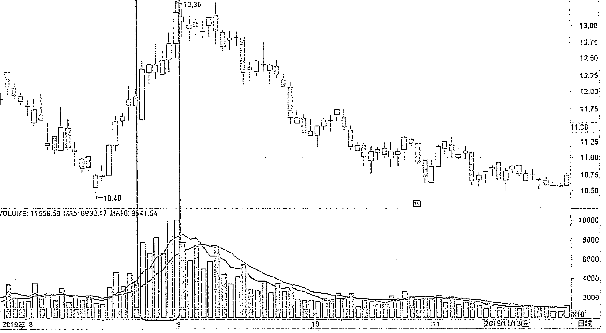

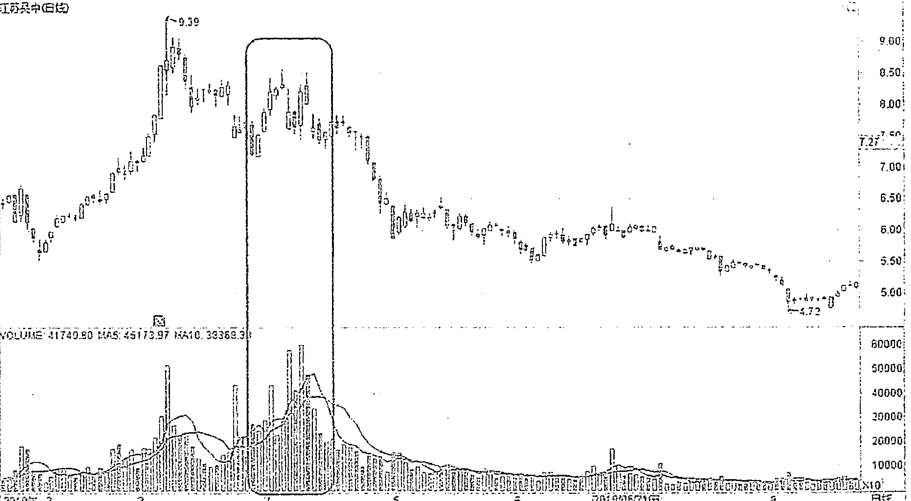

## 2.4 回档走势中的缩量，反映投资人心理

### 2.4.1 回档走势中的缩量成因

缩量直接反映出了市场交投极为冷清，对于极度萎缩的成交量，我们可以将其称为“地量”。缩量能更为真实地反映出市场交投行为的活跃程度。

“涨时放量，跌时缩量”是股市和个股的普遍量价特征，这与投资人的心理特征有关。而这种心理特征是建立在大众买卖特点的基础之上的，不因个别投资人的喜好、习惯而改变。

涨时放量，是因为投资人在看到账面有盈利时，往往有着较强的卖出意愿，“获利离场”、“担心获利回吐”是投资人在盈利后共有的心态，这也是散户投资人在一档股票中获利很难超过30%的原因。因为此时的股价一旦出现波动，投资人的卖出意愿是极强的。因此，要想让股价继续上涨，必须要有更多的买盘入场承接才行。放量，正是买盘大量入场、获利盘不断卖出的标志，可以说量能的放大，也是支撑股价站稳于中短线高点，并继续上涨的动力所在。

下跌（或者短线回档）的时候，情形则正好相反。持股者在看到获利回吐或者短线被套的情形下，总是希望能够等到股价反弹或行情反转时再择机卖出，有一种“惜售”心理。而且，对于场外的投资人来说，“买涨不买跌”是一种共识，大家都喜欢强势上涨的股票，而对于那些弱势下跌的股票，敢于抄底入场的投资人毕竟只是少数。基于这种情况，少量的卖出在没有买盘入场承接的背景下，就会使股价下行，从而呈现出“缩量下跌”的局面。

回档走势顾名思义，它出现在个股整体价格走势呈震荡上行的背景之下。此时的缩量回档可以看作是股价的一次短暂调整，缘于短期内买盘的跟进速度较慢、力度不足，但并没有打破市场上多空力量的整体对比格局。因此，在股价累计涨幅不大、整体处于震荡上行走势中时，这种回档时的缩量并不是趋势逆转的讯号。相反地，缩量回档后的低点，还是较好的中短线入场时机，特别是在大盘向上、个股价格走势强劲的背景下。

### 2.4.2 上升行情回落缩量

上升行情，是指个股的整体价格走势为升势的行情，将股价短期波动过程中的相邻低点连接起来，可以得到一条向上倾斜的曲线，即上升趋势线，该线与水平线的夹角为45度时最为稳健。以此线为支撑，股价会震荡上行，呈现一波回落趋势，而这仅是由于少量获利卖出而导致的，所以会出现缩量回落的情形。当股价接近上升趋势线时，将获得较强的支撑，此时量能明显缩减、短线做空力量消耗殆尽，这时就是中短线的逢低买入时机。

图 2-11 中可以看到，股价自低点位开始步入了升势之中，股价在持续上涨之后出现了一波短线回落走势。在回落过程中，量能不断缩减，随后再次放量使股价获得了较强支撑，再度步入升势。

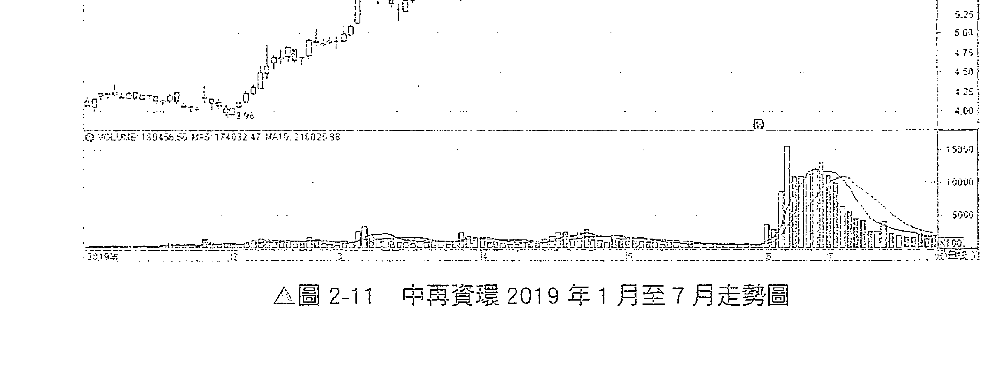

△图 2-11 中再资环 2019 年 1 月至 7 月走势图

### 2.4.3 震荡回落波段缩量

可以说，震荡上行走势中的缩量回落，仅是一次短暂的整理，是对不稳定获利浮额的一次整理，也给了场外投资人一次较好的逢低入场时机。当趋势形成时，我们不宜过早地认为顶部即将出现，而应紧随趋势。当短线缩量回落时，若原有的上升形态依旧良好，则更宜将其看作是回档，而不是股价走势的反转。

股价走势呈宽幅震荡态势，股价运行没有明确的大方向，且股价在一波短线大幅上涨之后，出现了大幅的、相对快速的下跌，下跌时量能大幅缩减，这属于震荡回落波段的缩量。

一般来说，震荡回落波段的量能萎缩越明显，则表明个股的空方力量越薄弱。股价的短线快速下跌，主要是由于主力不护盘、买盘入场不积极所导致的，因此，这类个股一般难以出现破位下行的价格走势。当股价向下滑落触及震荡区低点时，只需少量的抄底买盘入场即可止跌止稳，若有主力入场护盘，则出现一波强势回升也是可能的。在实盘操作中，此时是一个较好的波段低点买入时机。

图 2-12 中，该股处于宽幅震荡走势，在股价的一波快速回落中出现了量能的大幅缩减。在随后的止稳走势中，我们可短线买入。

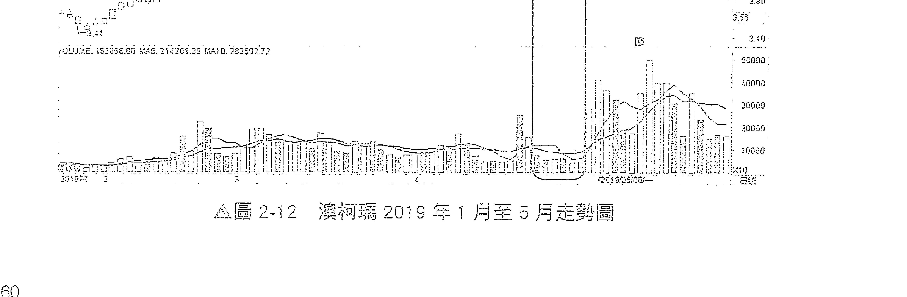

### 2.4.4 回档整理阶段缩量

短线回落之后，较多的持股者会遇到获利回吐或短线被套的情况，此时，持股者抛售意愿大大减弱，短线做空力量释放得较为充分，常常出现缩量整理走势。如果此时的股价，处于较好的上升行情中或中长期的低位区间，那么只需少量的买盘入场就能引发股价的一波上涨。缩量整理既是股价短线止稳的讯号，也是随后股价将出现反弹上涨的讯号，是一个短线入场的时机。

图 2-13 中可以看到，该股整体处于震荡上行的价格走势之中，股价震荡幅度较大，此时的累计涨幅不大。如图中的标注所示，股价短线回落的幅度较大，并且在相对低点出现了缩量止稳的走势。结合股价的整体运行趋势来看，缩量整理之后，股价有望再度回归到原来的震荡上行趋势中，这个缩量整理位置点，就是中短线买入点。

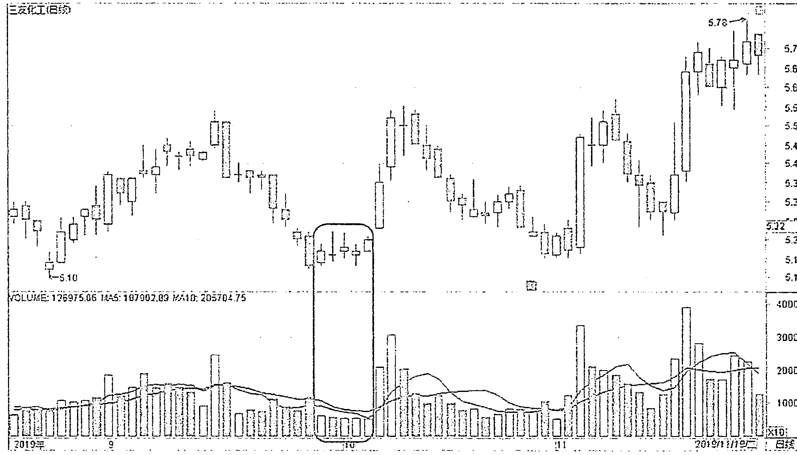

△图 2-13 三友化工 2019 年 8 月至 11 月走势图

图 2-14 可以看到，在横向震荡走势中，股价在箱体低点出现了缩量整理，对比此前的量能大小，此时的量能萎缩较为明显，这是在股价经历了横向震荡之后市场浮额大量减少的讯号。结合股价原有的升势特征、累计涨幅不大等情形来判断，主力或许在震荡区间进行了加码操作。以此来进行综合判断可知，该股有望在主力的参与下出现突破行情。在实盘操作中，此时是一个较好的买入点。

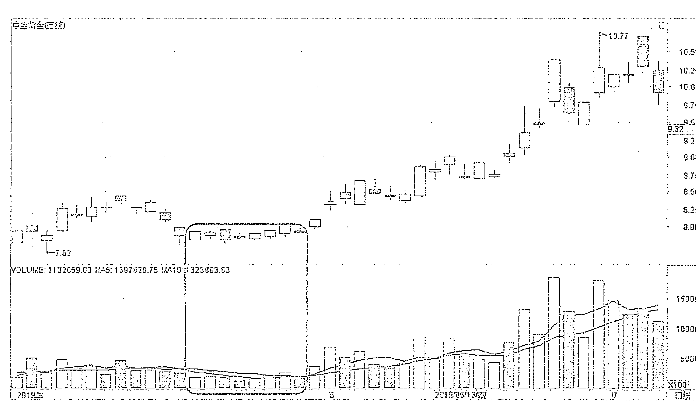

△图 2-14 中金黄金 2019 年 5 月至 7 月走势图

## 2.5 滞涨走势，应结合整体价格走势分析

### 2.5.1 高位滞涨区的缩量的成因

在高位区，一旦股价出现了明显的滞涨走势，由于缺少短线波动、短线盘交易不积极，因此多空双方的竞争就会趋于缓和，从而出现缩量。
对于滞涨走势，我们可以结合个股的整体价格走势特征来解读。若股价的累计涨幅较大、滞涨时间较长，且形态上打破了原有的上升格局，则此时的滞涨走势多与主力的拉升意愿较弱有关，甚至缘于主力的小量出货行为。
若股价累计涨幅不是很大，滞涨过程中也没有出现股价重心的下移，则说明多空力量对比格局并未被完全打破，此时的滞涨多属于整理环节，股价随后将进一步突破上攻。
在实盘操作中，我们一要结合个股的整体价格走势，来分析高位滞涨区的缩量的成因，二要结合滞涨过程中的股价重心移动情况，以掌握多空力量对比格局的变化。这样才能更完善地判断当前的滞涨，究竟是属于上升途中的“整理环节”，或是趋势将反转下行的“筑顶环节”？

### 2.5.2 高位窄幅整理下移缩量

当股价经历了中短线大幅上涨而进入高位区时，若股价走势呈滞涨、整理状，股价重心随着整理走势的持续而缓慢下滑，且量能不断萎缩，则表明主力无意再度拉升股价，而是正在进行小量出货。这样的个股一旦遇到大盘“跳水”或市场环境低迷，其抵御风险的能力是极低的，其价格也易破位下行。在实盘操作中，我们应果断卖出。

图 2-15 可以看到，股价中线涨幅大，在进入高位区后，股价重心缓缓下移，成交量不断萎缩，这是小卖单源源不断的典型盘面特征，也是给我们的卖出讯号。

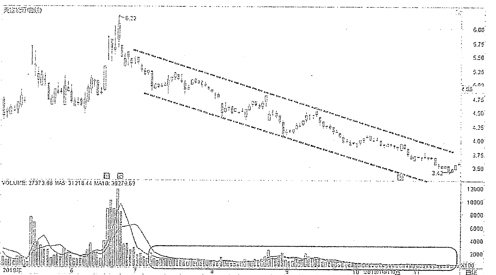

### 2.5.3 高位震荡区缩量

在中长期的高位区，个股整体价格走势呈横向震荡状，上下震荡幅度较大，但此时的量能并没有因股价的上下大幅波动而放大，反而出现了较大幅度的缩量。如果对比之前的上涨走势，可以发现其量能呈极度萎缩状态。

一般来说，出现这种盘面特征的个股，大多是有中长线强主力参与的，主力在高位区的出货打破了多空平衡，造成股价波动，但是投资人的高位承接意愿极低，主力出货也需要漫长的过程。极度低迷的成交量伴随着股价的上下大幅度波动，表明市场浮额并不是很多，主力的参与能力仍旧较强。

在股市做多氛围浓郁的背景下，主力或许会进一步拉升股价，毕竟股价越高，主力越主动，但这种情形很少见。更为常见的情形是主力获利幅度极大，而高位区出货太慢，主力往往会大力出货。因此，这类个股在大盘做多氛围不强的背景下，出现股价破位下行的机率较大。

涨幅极大。此时的股价走势呈横向宽幅震荡状、上下波动幅度大，但同期的成交量却有所萎缩。从股价走势来看，主力无意拉开股价；从量能的角度来看，该股交投极度不活跃，主力在高位区出货较为困难。同期的股市又较为低迷，成交量屡创近期新低，在这种市场环境下，这种在高位震荡区出现缩量的个股，其价格易破位下行，我们应及时卖出离场。

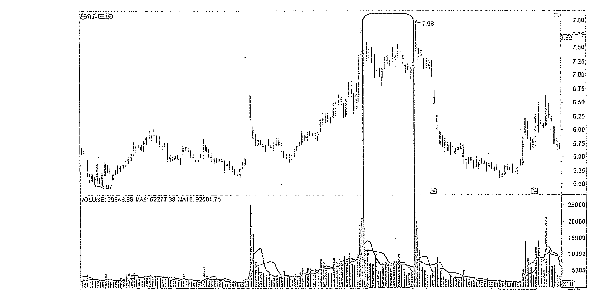

△图 2-16 惠而浔 2018年10月至2019年7月走势图

### 2.5.4 强势股整理区缩量

高位滞涨区中的“高位”是一个相对概念，在股价累计涨幅不大的时候，若此时与起涨点的低位相比已有一定涨幅，但上涨幅度在一倍以内，这也是一个高位。但在位置点，主力可能不会出货，因为此时既没有足够的出货空间，也难以吸引跟风盘追涨买入。

在这样的位置点出现缩量滞涨形态时，若股价前期走势独立、上涨阻力较小，并且在横向滞涨走势中未出现股价重心下移的情形，则多是横向的整理并非筑顶，一旦多方力量积蓄完毕，新一轮的上攻行情会随即展开。

以图 2-17 对照同期的大盘走势，可以发现，个股前两波的上涨走势很独立、强势股特征明显。但每一波上涨幅度都不是很大，每一次突破上攻后股价都以横向盘整的态势出现，这使得股价的累计涨幅并不是很大。

随后，股价开始长时间的横向整理，量能大幅缩减，基于该股之前的走势特点，可判定这是整理阶段。量能的大幅缩减代表着主力参与能力较强、市场浮额较少。在实盘操作中，我们可将此时的整理阶段作为中短线入场点。

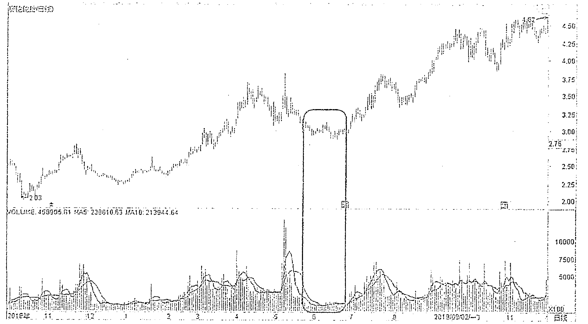

△图 2-17 赛轮轮胎2018年10月至2019年12月走势图

## 2.6 下跌趋势的典型量价关系：跌势无量

### 2.6.1 下跌途中的缩量成因

对于大多数个股来说，当其价格步入下跌后，其量能将持续地处于一种相对萎缩的状态，“跌势无量”是下跌趋势中典型的量价关系。之所以如此，是因为当个股或股市步入跌势后，财富效应消失，场外的投资人入场意愿大大降低。场内投资人都希望能在更低的价位时进行抄底，此时只需少量的亏损盘“割肉离场”，就可以使股价降低，由此形成了缩量下跌的总体格局。只要跌势中的量能一直保持缩减状态，缩量下跌格局未被打破，则跌势就不会轻易见底。此外，由于上升趋势造成的个股估值普遍偏高，而价格又是围绕价值上下波动的，因此这也是价值回归的过程。

### 2.6.2 破位下行时缩量

股价在高位区间出现横向震荡走势时，若在其向下跌破盘整区时出现了缩量，则表示经历震荡之后，空方占据了主动地位，且场外买盘入场的意愿极低，股价向下运行无支撑。这是股价步入下跌趋势的讯号，也预示着股价随后的中短线跌幅较大，在实盘操作中，我们应及时卖股离场。由图2-18可以看到，股价在高位区出现了短期的盘整走势。此时，趋势运行不明朗，但是随后的缩量破位则提示我们：股价已选择了运行方向。

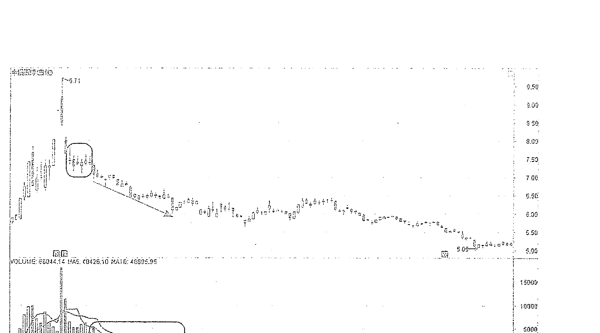

图2-18 中铝国际2019年5月至11月走势图

### 2.6.3 下跌行进中缩量

下跌行进中的缩量，代表空方依旧占据主动地位，买盘入场不积极，此时，跌势难以见底。在实盘操作中，我们此时仍应多看少动，静待底部出现。

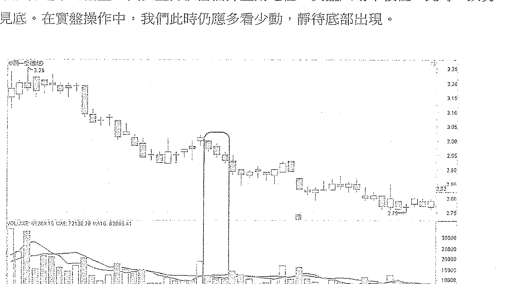

图2-19 中国一重2019年9月至11月走势图

图 2-19 中，股价自高位区快速反转向下，短线跌幅较大，下跌趋势明朗。在下跌途中，出现了多条缩量小阴线，但这并不是卖压减轻的讯号，我们应将其理解为买盘入场意愿低。而且，下跌途中的多条缩量小阴线，是主力在下跌途中快速出货的一种常见的买卖方式的展现，在实盘操作中，我们此时切不可抄底入场。

### 2.6.4 巨幅下跌后缩量

巨幅下跌之后股价可能已中期见底，但也可能只是短期见底。在实盘操作中，我们一要看股价的累计跌幅，二要看缩量止稳时的股价重心变化情况。

如果股价累计跌幅较大，且在缩量止稳时股价重心不下移，这往往是趋势见底的讯号，我们可以逢低买入，耐心持有；在股价短线跌幅较大，但在累计跌幅不大的情况下，缩量止稳时又有股价重心下移的现象，则表示空方依旧占据主动地位，此时的止稳并不是跌势见底的讯号。在实盘操作中，我们可结合大盘实施短线搏反弹的操作，但不宜进行中长线的买入操作。

如 2-20 图中的标注所示，股价的中期累计跌幅极大，在缩量止稳过程中，这是买盘陆续入场、卖压减轻的标志，也是底部区多空力量对比格局发生转变的讯号。因此，此位置区出现反转上行趋势的机率较大。在实盘操作中，我们可以积极买入，等待行情反转向上。

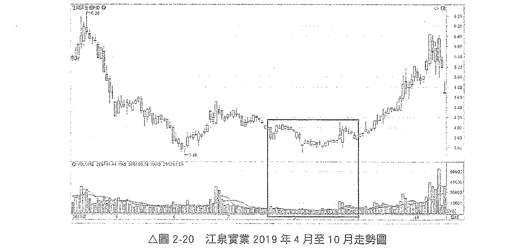

由图 2-21 可以看到，股价自高位区开始向下破位，虽然短线跌幅大，但累计跌幅不大，缩量时股价重心有所下移，这是空方依旧占据主动地位的标志。此时，我们不可买股入场，因为这个区位只是下跌途中的整理阶段，一旦大盘出现震荡，股价将再度破位下行、扩大跌幅。

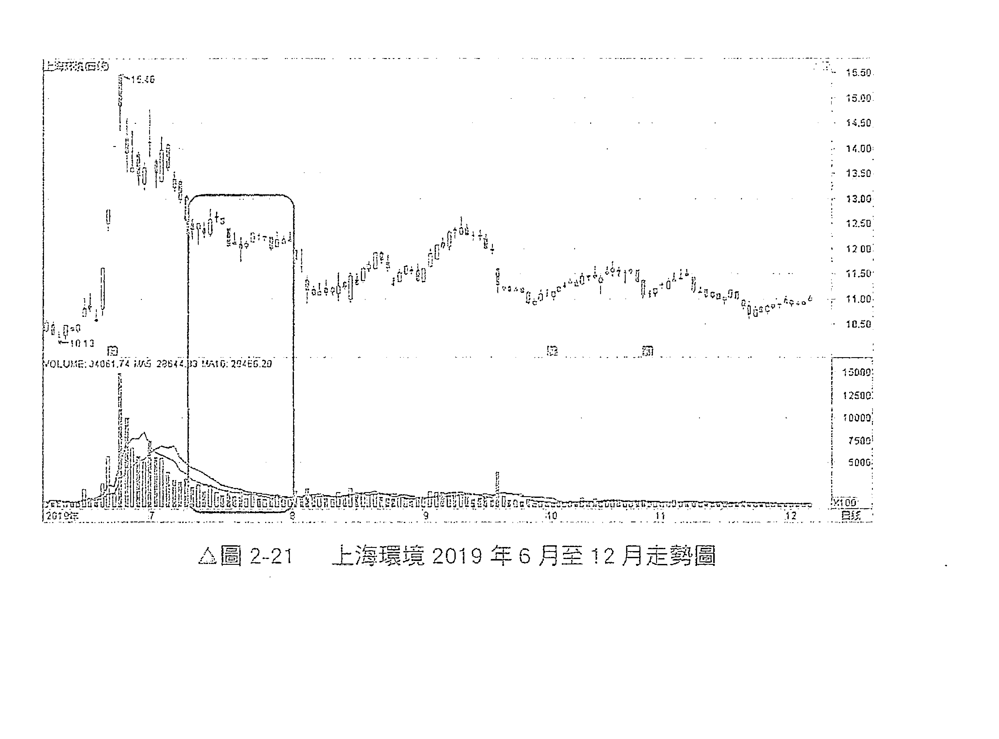

△图 2-21 上海环境 2019 年 6 月至 12 月走势图## 第3章 用均线结合量价，操作「中短线交易法」！

## 3.1 葛蘭碧的8大買賣法則

趨勢決定著交易方式：是以買進持有為主，還是進行快進快出的波段交易。當股價運行的大方向相對明確之後，我們可以借助一系列的技術工具來把握買賣點，而均線無疑是研判、把握趨勢的最佳工具之一。在第1章中，我們已經講解了利用均線來分析趨勢的方法。在本章中，我們將進一步結合量價配合、趨勢各環節的量能特徵等要素，在暫不考慮主力參與的基礎上，來看看如何展開順勢而為的中短線交易。

由於主力的參與可能會打破多空平衡關係、改變籌碼分佈狀態，因此，有主力參與的個股，往往會呈現出一些不同於大多數個股在自然交投下的量價配合關係。以本章內容瞭解趨勢下的量價關係後，筆者將在第4章進一步解讀有主力參與的個股量價形態。

在結合趨勢運行的基礎之上，技術分析大師葛蘭碧系統性地對移動平均線總結了8條買賣法則，其中既有短線買賣點，也有中長線買賣點，該法則是我們把握趨勢運行、展開實盤交易的重要參考指標。在實盤交易中，我們還需要結合量能變化情況來加以驗證，這樣才能獲得更高的成功率，更為精準地把握買賣點。

### 3.1.1 葛氏均線買賣法則示意圖

圖3-1為葛蘭碧均線買賣法則示意圖，圖中標示了葛蘭碧均線上的8個買賣點，其中較細的曲線代表股價走勢（也可能用短期均線MA5來代替），較粗的曲線代表中長期均線MA30。在隨後的各個專題中，筆者將以量價配合為基礎，結合圖3-1中的買賣點展開實盤講解。

### §3.1.2 低點放量上穿 MA30

低點放量上穿 MA30 形態，對應圖 3-1 中的「買 1」。在中長期低位區間，股價走勢止跌止穩、橫向震盪。此時，股價向上運行，由 MA30 下方向上突破 MA30 並且出現明顯放量，代表著多方力量已經增強、買盤入場積極，有望出現行情反轉，我們此時可以實施中短線買入操作。

由於個股此時處在低位區，因此放量穿越 MA30 時，以溫和式放量形態為最佳。量能的放大有一個連續過渡的變化過程，而這正是買盤踴躍入場、多方力量充足的標誌，也是多空力量對比格局完全扭轉的訊號。

由圖 3-2 我們可以看到，股價在低位區橫向止穩，股價重心有緩慢上移的趨勢，隨後的一波小幅度回落使得股價運行於 MA30 下方。緊接著一波放量上攻，使得股價向上穿越了 MA30，這是中長期趨勢開始上行的訊號，也預示著上升行情有望出現。當股價放量向上穿越 MA30 時，此時可以作為中長期的買股入場點。

### §3.1.3 攀升回檔放量反穿 MA30

攀升回檔放量反穿 MA30 形態，對應圖 3-1 中的「買 2」。在上升途中，股價震盪運行於 MA30 上方，上升較為平緩，股價沒有向上遠離 MA30，一波回檔下跌，使得股價向下跌破了 MA30。隨後，當股價再度向上穿越 MA30 且以量能放大為支撐時，表明買盤資金充足，預示著新一輪上攻行情的出現，這是中短線買股入場的時機。

圖 3-3 中，可以看到股價緩慢攀升，股價重心緩緩上移，但一波回落打破了原有的趨勢運行節奏。隨後股價再度放量上穿 MA30，這就是新一波上攻走勢出現的訊號，我們此時可以中短線買股入場。

△圖 3-2 林洋能源 2019 年 6 月至 9 月走勢圖

△圖 3-3 環旭電子 2019 年 2 月至 12 月走勢圖

### §3.1.4 快涨后回落至MA30缩量

快涨后回落至MA30缩量形态，对应图3-1中的「买3」。在上升途中，股价走势快速上扬，股价向上且明显远离了MA30。随后，股价回落，当其回落至MA30附近时出现了明显的缩量，这是短期内空方力量大大减弱的标志，也是股价遇到较强支撑的信号，我们此时可以短线买入。

由图3-4可以看到，股价沿MA30稳步攀升，股价重心不断上移，正处于上升趋势中。在此背景下，短期内出现了一波上涨，使股价向上远离了MA30，我们此时应注意风险，因为股价有再度回落至MA30的趋势。

如图中的标注所示，一波回落后，股价在盘中跌至MA30附近，量能也明显萎缩，这正是短期内空方力量减弱的信号，我们此时可以进行短线买股操作。

### §3.1.5 向上远离MA30滞涨放量

向上远离MA30滞涨放量形态，对应图3-1中的「卖4」。上升途中，一波快速上扬走势后，股价向上远离了MA30。短线的快速上涨使得市场处于超买状态，如果此时出现短线滞涨且量能未见缩小，表明市场卖压较为沉重，我们此时应短线卖出。

由图3-5可以看到，股价一直稳健地运行于MA30附近，一波快速上攻使得股价向上远离了MA30。此后股价连续多日无力上攻，但这几日的量能均保持着较大的态势，这是短线卖压重、股价将要回档的信号，我们此时应短线卖出。

△图3-5 骆驼股份2019年1月至12月走势图

### 3.1.6 高点持续回落破MA30

高点持续回落破MA30形态，对应图3-1中的「卖5」。该点预示着趋势的转向。在累计涨幅较大的高位区，股价回向下运行。若出现了股价下跌并穿过MA30的运行方式，则无论当时的破位下行是否出现放量，都是多空力量对比格局转变的信号，也是中期顶部出现的标志。此时，我们应进行中长线的卖股操作。

由图3-6可以看到，在股价累计涨幅较大的高位区中，股价滞涨滑落，随后以一条长阴线向下跌破了中期MA30。这是趋势开始转向下行的信号，对于中长线的投资人来说，应及时卖股离场。

一般来说，在高位区，股价缓慢下滑并跌破MA30的走势的短线，其杀伤力最大。因为缓慢的下跌不会让个股处于短期超跌状态，股价反弹空间很小，无论中线还是短线，我们此时若「抄底」入场，很有可能被套牢。实盘中，股价回调至MA30附近时的运行方式是极为重要的，这也是我们在实盘操作中应多加注意的。

### §3.1.7 向下远离MA30后放量

向下远离MA30后放量形态，对应图3-1中的「买6」。在下跌途中，股价位于MA30下方，MA30也处于下行状态。一波短期快速下跌，使得股价向下且明显远离了MA30，此时的市场处于超卖状态。若此时还有相对放大的量能，则代表着短期内的卖盘大多已离场，市场卖压有望快速减轻。此时，只需要少量的买盘资金推动，一波反弹行情就会出现。在实盘操作中，我们可以短线买股入场，获取反弹收益。

图3-7的高位区中，股价在MA30附近运行，最终因空方力量更强使股价向下跌破了MA30。如图中的标注所示，短期内一波快速下跌之后，股价向下远离了MA30，此时的量能也明显放大。这是短期内卖盘已悉数离场的信号，预示着走势有望出现反转，是短线抄底、获取反弹收益的信号。

一般来说，在实盘中股价在第一次快速跌破高位区，向下远离MA30时，若大盘没有出现系统性风险，那此时出现的放量下跌所预示的反弹机率最高、空间更大。因为之前的高位盘整走势并没有让市场做空思维「一面倒」，所以虽然此时的空方力量已明显占优势，但多空分歧依旧较为明显，股价难以在第一次破位时就快速进入下跌趋势，此时正是获取短线利润的好时机。

### 3.1.8 反弹穿越 MA30

反弹穿越 MA30 形态，对应图 3-1 中的「卖 7」。在下跌途中，均线系统呈空头排列，一波反弹上涨使得股价向上穿过了 MA30。随后，当股价开始调头向下或者向下穿过 MA30 时，是反弹行情结束的标志，我们应及时卖股离场。此卖点无明显的量能特征，在股价反弹穿过 MA30 时，量能可以相对放大、也可以相对缩小，其市场含义都是相近的。在无重大利多的情形下，趋势的转变有一个循序渐进的过程，难以快速扭转。由图 3-8 中可以看到，该股价格处于震荡下跌走势，股价位于 MA30 的下方，这是市场中空方力量一直占据主动地位、股价运行趋势向下的标志。如图中的标注所示，一波反弹走势使得股价向上穿过了 MA30，但这并不是趋势转向上行的信号，而多预示着「昙花一现」的反弹行情。我们此时应短线卖出，以规避出现新一轮下跌行情的风险。

### 3.1.9 反弹至 MA30 遇阻

反弹至 MA30 遇阻形态，对应图 3-1 中的「卖 8」。在下跌途中，一波反弹使得股价向上运行至MA30附近，并在MA30附近受到强力阻挡，此时，我们应卖股离场。

一般来说，在反弹至 MA30 附近时，量能会相对缩小、股价滞涨，这是买盘入场力度不足的标志，也是反弹结束、新一轮下跌行情将出现的信号。

由图 3-9 中可以看到，股价在高位区跌破 MA30 后，趋势已反转向下。如图中的标注所示，一波震荡反弹走势出现，股价反弹至 MA30 时遇阻，量能一直保持着相对缩小状态，买盘入场力度明显不足，趋势未发生转变，此时我们应及时卖出。

△图 3-8 中煤能源 2019 年 4 月至 8 月走势图

△图 3-9 永辉超市 2019 年 8 月至 12 月走势图

## 3.2 趋势中的筑底及升势量能特征

在不考虑主力参与的情况下，在趋势运行的典型位置区间，如底部区、顶部区、上升途中、下跌途中等，由于多空双方力量对比格局的转变，及竞争力度的变化，会出现一些较为特定的量价形态。

虽然这些量价形态并不是趋势运行的必要条件，但由于它们的出现频率较高、形态特征较为明显，对于我们辨识、把握趋势有重要的实战意义。在本节中，我们将结合趋势运行，来看看不同位置区间的常见量价形态。

### 3.2.1 底部区量能特征

真正的底部区是缩量的，因为底部区总是在市场最低迷的时候开始构筑，若没有明显的消息及外在因素驱动，底部区的构筑会是一个相对漫长的过程。这时，股价原有的下跌趋势运行缓慢，个股处于明显被低估的状态。由于买盘并没有大量入场，暂时无法推动股价持续上涨，但股价有跌不下去的趋势。

随着底部区的持续构筑，原有的跌势被打破，市场也渐渐活跃起来，买盘入场意愿开始加强、持股者抛售意愿减弱，多空力量对比格局出现了转变。当个股由「无量筑底」转而变成「放量震荡、缓缓攀升」的形态时，多预示着底部区将要构筑完毕，距离股价突破上行的时间越来越短。

此时正是中长线投资人入场的最佳时机，在实盘操作中，我们可以在放量震荡中的波段低点买入，既可以结合股价波动获取短线利润，也可以结合大盘走势耐心持股待涨。

由图 3-10 中可以看到，在中长期的低位区股价缩量止稳，此时的量能明显缩减、股价重心不再下移，这是空方已不再占据主动地位的标志，也是股价开始筑底的信号。

随后，因买盘积极入场、股价放量攀升，这是股价走势脱离底部区的信号。当股价再次缩量调整时，就可确认是上涨趋势中的回档。在实盘操作中，放量攀升中的中短期大幅调整低点，就是一个极好的买入时机。

底部区出现在股价大幅下跌之后，一般来说在这一个区域，股价有效止稳，同时成交量温和放大。这种量价配合关系既是买盘开始大量入场的标志，也是卖盘无卖出的标志，也就意味着底部区的出现。

### 3.2.2 整体式量价齐升

量价齐升是个股（特别是大盘指数）在步入升势后最典型的量价特征之一。量价齐升形态是指随着股价的不断上涨，成交量也不断放大，两者均不断地创出新高，呈同步关系。它是量能形态的整体性表现，在股价不断上涨的过程中，量能的放大也越来越充分。

量价齐升形态正是市场买盘资金充足、股市上涨动力强劲的表现，也说明当前的股市或个股价格的上涨，是由于充足的买盘资金的推动，为升势牢靠并仍将持续的信号。在实盘操作中，当股市或个股在上升途中出现了这种量价齐升形态后，我们应耐心地持股待涨，以便最大限度地获取升势所创造的利润。

图 3-11 中可以看到，随着股价的攀升，整体的成交量也在不断放大，价与量不断创出新高。这就是量价齐升形态，是升势持续的标志，也是持股待涨的信号。

对于量价齐升形态来说，随着量能的不断放大，市场在高位区的多空分歧也不断加剧。一旦量能无法继续放大，且股价跌破原有的上升通道，这往往是趋势反转的信号，我们应做好获利离场、减码降低风险的准备。

### § 3.2.3 波浪式运行的缩放量

美国证券分析家拉尔夫·纳尔逊·艾略特（R. N. Elliott）在研究道琼工业指数走势后，发现股市的走势呈现出一种「自然的韵律」，其形态就如同大海中此起彼伏的波浪，基于此发现，艾略特提出了著名的波浪理论（Wave Theory）。

波浪理论指股价以「5升3降」的8浪回圈方式运动，即股价的总体运行特征会呈现「波浪式」，特别是当股价震荡上升时，波浪式的震荡上升是最为常见的上升方式。

与股价的波浪式运行方式相对应的，就是「波浪式量能」，即上涨波段量能放大，紧接着的回档波段量能则相对缩小。而且，随着股价的总体攀升，上涨波段的量能也会进一步放大，当上涨幅度较大时，此时也是市场多空分歧过于剧烈的信号，预示着股价离顶部越来越近，我们应注意控制好仓位、锁定利润。

图3-12中可以看到，股价呈波浪式上涨，成交量的变化也是波浪式的。如图中的标注所示，在上涨过程中，随着股价创出新高，上涨波段的量能也创出近期的新高，这是上升趋势中的「波浪式量能」典型特征之一。

### §3.2.4 「活跃式」量能形态

「涨时有量，跌时无量」是股价运行的常态，上升途中不一定会出现明显的「量价齐升」、「后量大前量」等经典量价形态。但是，在没有主力参与、市场筹码相对分散的情形下，股价要想持续上涨，就一定要有充足的买盘入场来缓解不断加剧的多空分歧。展现在盘面上，就是整个上升途中的成交量保持着一种十分活跃的状态。

图3-13中可以看到，在同期大盘横向震荡运行的背景下，股价逆势上扬，出现了独立的上攻走势。上攻走势会引发明显的多空分歧，独立的上攻走势需要更多的买盘力量。因此，在整个上攻过程中，成交量一直保持着一种十分活跃的放大状态，这是上攻动力充足的标志，也是升势得以持续的根本。

△图 3-13 海汽集团 2019 年 9 月至 12 月走势图

## 3.3 趋势中的见顶及筑顶量能特征

持续上涨至多空力量对比格局发生转变时，升势就步入了见顶及筑顶阶段，此时的量价形态会发生一定转变。无论是从整体角度，还是从局部角度，正确地辨识量能特征，将有助于我们能够及时地锁定利润、逃离顶部。

### 3.3.1 价创新高量相对缩小

价创新高量相对缩小形态也称为「量价背离」形态，它是指股价在上涨过程中创出了新高价。但这一上涨波段的成交量，却明显小于此前上涨波段的成交量，即价格与成交量无法保持同步放大的状态。

在持续上涨之后的高位区，一旦个股在运行中出现了这种量价背离形态，则标志着买盘入场力度已大不如前。股价之所以能够创出新高，只是因为多头思维仍旧占主导地位，市场卖压不重，但没有买盘推动的上涨是难以站稳于高点的，这种形态也是升势根基不牢固的标志。此时，若股价走势出现滞涨，将导致多空分歧加剧，股价走势反转下行的机率极大。

图 3-14 在股价稳健攀升的途中，我们可以看到明显的「量价齐升」形态，这是升势持续的标志，但是，随着股价上涨，高位区的量价配合形态出现了转变。如图中的标注所示，这一上涨波段中股价创出了新高，但成交量远小于前一上涨波段，这是量价背离形态，预示着升势见顶。在实盘操作中，量价背离形态出现后，我们应及时卖出该类股票。

### § 3.3.2 整体式缩量震荡

上升趋势的持续得益于买盘的踊跃入场，当入场资金无法跟进而股价又在高位区出现滞涨时，这便是多空力量对比格局发生转变的信号。表现在盘面上，就是前期上涨时的量能保持着活跃的状态，而在高位区量能却相对缩小了。量能缩小得越明显、持续缩小的时间越长，就代表着多空力量转变得越明显，这是顶部出现、趋势即将转向的信号。

图 3-15 在股价的整个上升途中，我们可以看到成交量一直保持着活跃的放大状态。随后，股价进入高位区并横向震荡，此时成交量大幅缩减，且上下震荡幅度较大。这种「整体式缩量震荡」形态出现在大涨之后的高位区，它是顶部出现的信号。在实盘操作中，我们应此时减码（或清仓）离场，锁定利润。

### § 3.3.3 天量长阴线

在股价短线涨幅较大、涨速较快的背景下，突然出现了一条长阴线，且当日的量能还高于此前上涨时的均量水准，这就是天量长阴线，它的出现往往预示着一轮快速下跌行情的到来。在实盘操作中，应在第一时间卖股离场，以回避风险。

图 3-16 在股价短线飙升过程中，突然出现了开高走低的长阴线，且当日放出天量，这就预示着行情的急转直下。在所有的筑顶形态中，这种天量长阴线所预示的中短线跌幅往往最大、跌势往往最强。在实盘操作中，这是应重点注意的形态，若我们不能果断卖出，很有可能在高点被套牢。

△图 3-15 国农科技 2019 年 1 月至 11 月走势图

△图 3-16 世纪星源 2019 年 7 月至 11 月走势图

## 3.4 趋势中的跌势反弹量能特征

「涨时有量，跌时无量」，下跌途中的缩量或者不放量，是跌势持续的重要信号。股价重心下滑、量能未明显放出、股价走势未见止稳，一般来说多预示著跌势仍将持续下去。在本节中，我们将结合实例来看看跌途中常见的量价关系。

### 3.4.1 跌途无量

震荡下滑的股价伴以量能的相对缩小，这是整个下跌趋势中最主要的量价形态，特别是在累计跌幅不大的情形下，若个股仍以这种量价形态为主，则不可抄底入场。

图 3-17 的股价自高位破位下行，步入跌势。如图中的标注所示，连续下跌使得股价重心缓缓下移，同期成交量保持着一种相对缩小的状态，这时的缩量下跌表示跌势仍会持续较长时间。在实盘交易中，对于中短线投资人来说，这个位置点不宜进入。

随着累计跌幅的扩大，股价运行止稳，最为重要的是量能大幅放大，这才是阶段性底部出现的信号，也是中短线投资人获取反弹行情利润的入场时机。

### 3.4.2 不放量弱势反弹

跌势并不是「一波到底」的，与上升趋势相同，它也是一个反复震荡的过程，在下跌途中会伴有反弹波段。反弹与反转不同，反弹只是市场短线超跌引发的短暂行情，并不是由多空力量对比格局转变而引发的。因此，反弹时的量能一般不会放得过大，反弹常常以无量（或者是相对不放量）的形式出现，这也是我们用来辨识反弹与反转的重要特征。

# 第3章 用均线结合量价，操作「中短线交易法」！

由图3-18可以看到，在下跌途中股价出现了震荡止稳走势。如图中的标注所示，在股价的短期上涨波段中，成交量未见放大，这是买盘入场量较少的标志，预示著此波上涨趋势的性质属于反弹，而非反转。

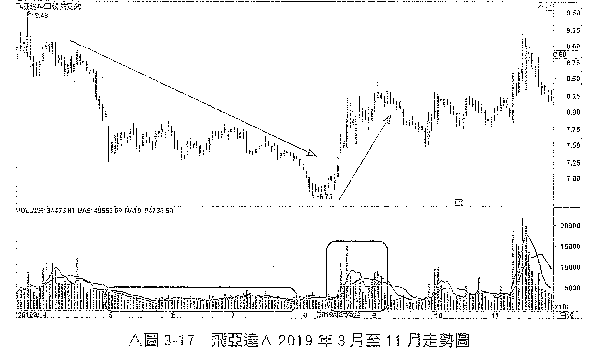
▲图3-17 飞亚达A 2019年3月至11月走势图

由图3-18可以看到，在下跌途中股价出现了震荡止稳走势。如图中的标注所示，在股价的短期上涨波段中，成交量未见放大，这是买盘入场量较少的标志，预示著此波上涨趋势的性质属于反弹，而非反转。

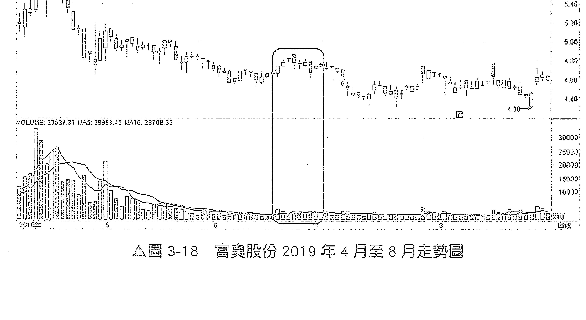
▲图3-18 富奥股份2019年4月至8月走势图

## 3.5 趋势关键点量能特征

股市中常说的「无量无行情」，指在确定一轮行情发展的关键位置点时，如突破点、破位点、反转点等，除了股价走势的配合，往往还需要量能来验证，在量能的配合下，这些关键点才能够被更好地确定下来。依据量能的缩放形态，结合股价的走势特征，我们能更了解当前股价走势的市场含义，从而判断突破、破位、反转走势的可靠性。

### 3.5.1 突破点托底量的两种形态

突破点托底量是股价突破盘整区时常见的量能特征，它是买盘大量涌入、市场获利卖压得到有力承接的标志。从形态上来看，在股价向上突破盘整区时，托底量的表现方式主要有以下两种。

一是单日（或双日）托底量放大。突破当日（或突破时的连续2个交易日）成交量明显放大，放量幅度为之前均量的2～3倍（并不是超过4倍以上的天量）。在随后的交易日中，股价强势止稳、量能明显缩小。

二是单日放量幅度极大，为此前均量的4倍以上。随后数日量能相对缩小，但仍明显高于此前的均量，且股价强势止稳。

这两种托底量形态，都是真实的市场买盘入场承接的表现方式，只要股价的中短线累计涨幅不大，一般来说，随后的突破上升空间将是较大的。在实盘操作中，在托底量形态出现之后，我们可在突破后的短期强势止稳区域逢震荡低点买入股票。

图3-19中可以看到，在股价突破窄幅整理区时，出现了单日托底量放大的形态。随后股价在突破点位强势止稳，量能也没有萎缩。此案例对应本小节中的第一种托底量形态。

# 第3章 用均线结合量价，操作「中短线交易法」！

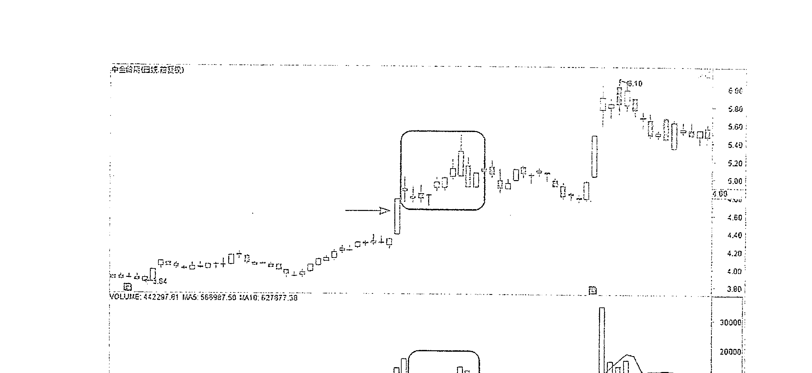
▲图 3-19 中金岭南 2018 年 12 月至 2019 年 4 月走势图

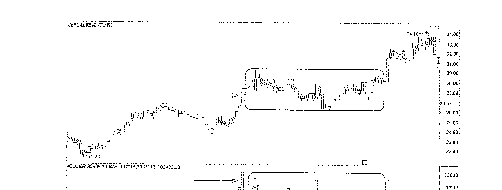
▲图 3-20 丽珠集团 2019 年 6 月至 11 月走势图

这种单日（或双日）的托底量放大对突破走势形成支撑，常出现在有业绩或题材支撑的个股上，它是多方主力资金合力拉升股价的信号，预示着新一輪上攻行情的展开。

### 3.5.2 突破点连续性放量

在股价突破过程中，也可以连续数日放量，代表著买盘资金的持续入场，放量大小一般为此前均量的2～3倍。在实盘操作中，连续放量突破后，我们可以观察几日，若出现股价强势止稳，则于止稳平台买入；若出现股价短线回档，则逢回落之机买入。

图3-21中可以看到，在股价突破低位平台区时，该股出现了连续5个交易日的相对放量。量能放大效果温和，股价短线上涨幅度不大，随股价再次突破此处放量高点，这是中短线入场的绝佳时机。

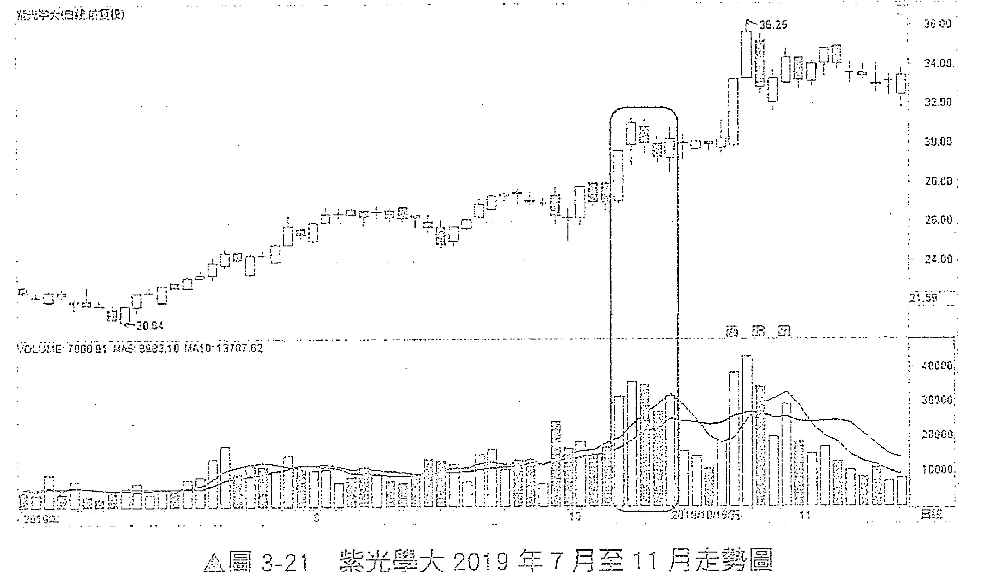
▲图3-21 紫光学大2019年7月至11月走势图

### 3.5.3 放量突破后缩量回落

在突破盘整区之后，股价有两种常见的短线运行轨迹。一是在突破点强势止稳不回落，这常常与同期大盘稳健运行相关；二是在大盘回档、短线获利盘的双重卖压下出现了回落。只要股价不跌破放量长阳线突破当日的启动点价格，则多表明场外做多资金仍然活跃，突破上攻行情依旧成立，此时是一个很好的中短线切入点。股价在短线回落时，一般会伴以成交量的快速缩减，这表明股价的下跌更多缘于市场获利浮额的抛售。

图 3-22 中可以看到，股价在低位区长期盘整之后，出现了连续性放量突破走势，这是买盘持续入场、多方开始发力的信号。随后大盘回档，受此影响股价也顺势回落，但并没跌破突破日的启动点，此时就是最好的短线入场时机。这个短线买入时机是大盘震荡所创造的，也给了我们更充足的短线获利空间。

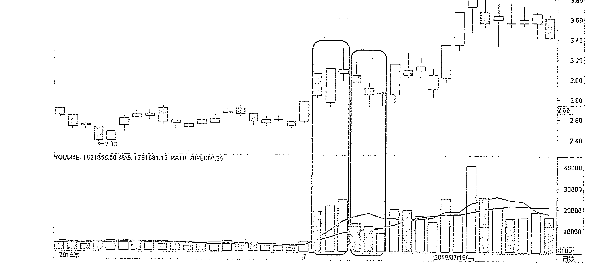

### 3.5.4 破位点连续缩量

在高位区盘整之后，若股价以连续的小阴线向下跌破盘整区支撑位，且量能没有放大，这表明空方在未大量抛售的情况下，就已经占据了主动地位，高位区的支撑非常无力，这是趋势折转向下的信号。在实盘操作中此时应及时卖出，以回避风险。

图 3-23 中可以看到，股价在长期盘整之后出现了破位走势，连续的缩量小阴线跌破了盘整区的支撑位，这属于缩量破位形态，是盘整区支撑点力量薄弱，破位走势将出现的信号。预示着之后将会有较大风险，这是提示我们应卖股离场的信号。

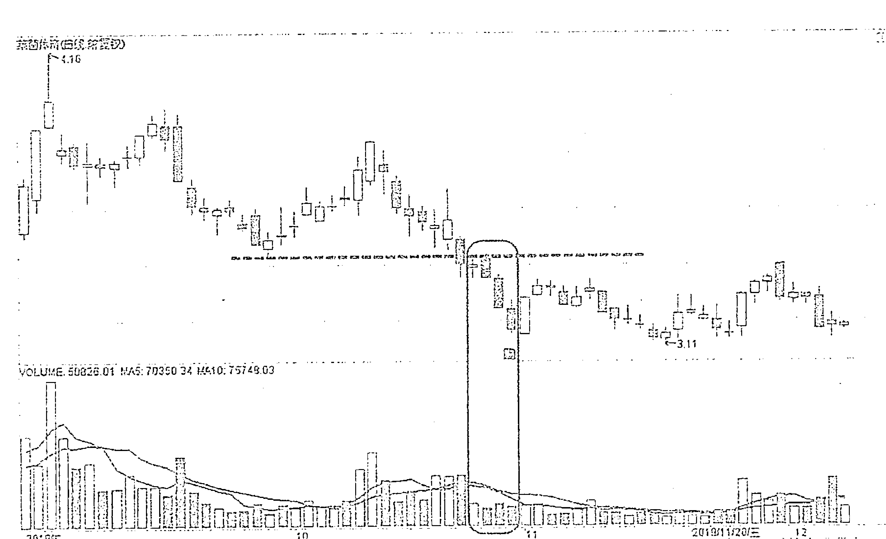

### 3.5.5 破位点单日放量

盘整区的破位点出现放量阴线，是卖压重、多方承接力量不足的信号，也是短期内空方完全占据主动地位的信号，多预示着中短期内可能有急速下跌行情展开，特别是当股价处于高位盘整区时，中短线的快速下跌空间更大。在实盘操作中我们应及时卖出，以回避风险。

图3-24为供销大集2019年3月至8月走势图，股价以向下跳空的缺口跌破盘整平台，当日大幅放量，这是破位点的单日放量形态。空方卖压重，股价可能出现急速下跌走势，我们应及时卖出以回避风险。

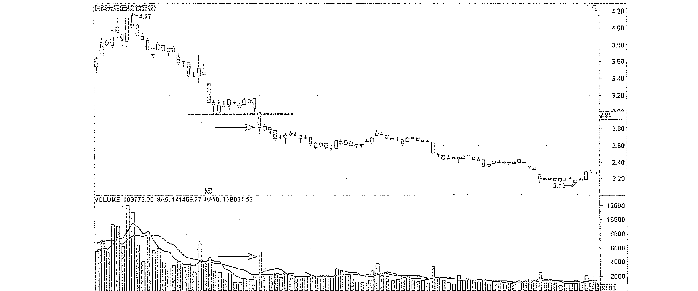
▲图3-24 供销大集2019年3月至8月走势图

### 3.5.6 反转时量能整体转变

在股价走势出现中期反转时，量能形态往往会提前发生整体转变，例如在原来温和式放量的过程中，某日的成交量突然暴增，或量能形态由放量转变为缩量等。结合股价的阶段性运行情况，利用成交量形态的整体性变化，我们更能掌握行情的转折点。量能整体转变的方式很多，一般来说，如果中短线的股价涨跌幅度较大，而量能形态的整体转变较为明显的话，多是原有行情将发生变化的信号。下面笔者结合两个案例加以说明。

图3-25中可以看到，股价此前强势上涨，成交量呈温和放大状。但是当日的加速上攻长阳线却放出了天量，股价短线上涨幅度已经较大，量能又突然放大，这是量能形态整体转变的标志，也预示著原有的强势上攻走势将出现转折，这是卖出信号。

图3-26中可以看到，股价在持续下跌之后，于低点止跌止稳并横向震荡。如图中的标注所示，在连续多个交易日里，成交量明显缩小，这是股价下跌过程中出现的量能整体性转变。结合股价中短期的大幅下跌情况来看，此为中期筑底的信号，我们可以进行中短线买入操作。

# 在 3 小时内学会量价操作法 让我股票赚 3 倍

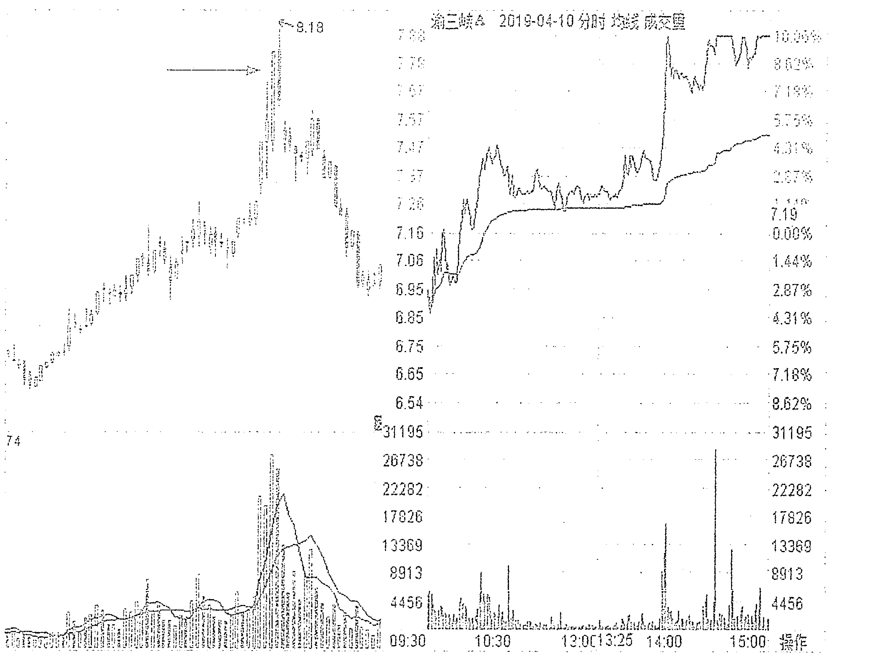
图 3-25 渝三峡A 2019年4月10日分时图

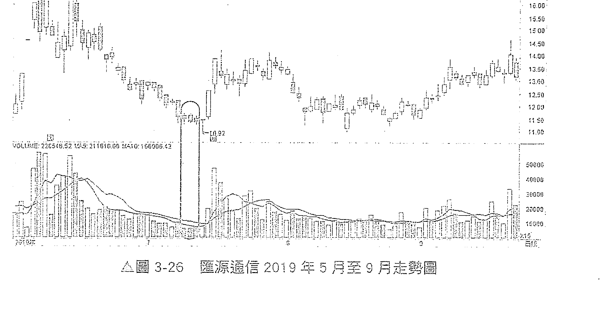
图 3-26 汇源通信2019年5月至9月走势图

# 第4章 跟著主力，进行低买高卖的「波段获利法」！

## 4.1 什么是主力？他们的获利手段是什么？

主力，即「主要力量」，是一个和「散户投资人」相对的概念，是证券市场中的主要力量。凡是有一定股票投资经验的人都会认同：无论对于股价的中长期走势，还是对于股价的短期走势来说，主力在其中的参与均有借鉴意义。

对于散户投资人来说，要想更实际认识股市运行情况，更深入了解成交量后面的交易双方，那关于「主力」的内容是不可不知的。在本章中，笔者将结合主力的参与环节，以各种特征鲜明的量价形态为突破口，讲解我们应如何跟随主力进行低买高卖的操作。

主力与散户投资人（以下简称：散户）是不同的，主力有着更为专业的知识，对股市的理解也更为深刻，因此，主力对个股的价格走势的预判强于散户。在本节中，我们先来看看主力的优势有哪些。

### 4.1.1 主力的优势

俗话说：「知己知彼，百战百胜」，想更理解、把握主力动向，我们首先要对主力的优势有一个清晰的认识。主力的以下优势是他们可以将其转化为胜势的关键，而这些优势往往也是散户的劣势。

1. 资金实力强，手中筹码多
对股价走势的影响，程度往往取决于手中持有的股票数量及资金实力，手中没有足够的流通筹码是不行的，即使一般意义上的大户是不会这么多资金的，而散户手中的资金相对来讲则更少。

虽然主力与散户都想透过低买高卖来获取差价利润，但是散户买入的股票筹码数量少，又无法形成合力，这注定了散户的买卖行为是杂乱无章的，难以对股价走向形成驱动力。

主力在买卖股票的过程中，会将资金分成两部分：一部分用于建仓，另一部分则用于拉升股价。这两部分资金所占比例是成反比的，即用于建仓的资金越多，手中的股票筹码也越多，那么维护股价或拉升股价时所使用的资金就会减少。而如果建仓资金较少，那市场中仍存在大量的浮额，浮额越多越不利于主力买卖股票，主力随后拉升与维护股价时需用到的资金便会越多。

在实盘操作中，主力会根据个股及市场情况来买卖股票，从而确定多少资金用于建仓、多少资金用于拉升股价，尽量使自己处于主动地位。

2. 对企业的了解更充分，买卖行为更明确
主力的分析、研究能力是较为专业的，对上市公司的业绩变化、发展方向、市场空间等方面的了解也更深入，主力的这些能力都强于一般的散户。因此，在买卖股票时，主力的理由也更为充分，买卖行为更为明确，其成功的机率与散户相比也更大。

3. 更有专业性，更懂得顺势而为
与散户相比，主力对于整个股票市场的判断更具有专业性，也更为理性，当然也更有耐性。在股票市场明显被低估的时候，虽然股价走势较为低迷，股市缺少财富效应，但主力往往能够预见股市的回暖，从而提前操作、低位买入，这就需要有很强的耐性；当股市在过热的市场情绪的助推下，不断上涨进入泡沫区后，主力多能够提前处理、减码出局，这就需要理性。

虽然「低买高卖」看似是简单的交易，但是在股票市场中，若不能克服人性的恐慌、贪婪等因素的影响，想要稳定获利是难上加难的。主力在这方面远远强于散户，主要因为主力的理性与专业性，另一方面也是因为主力拥有丰富的经验。

4. 了解散户的买卖方式、操作心态
在买卖方式上，散户容易出现「追涨杀跌」的操作，在心态上，则更容易受到「贪婪」与「恐慌」这两种极端情绪的影响。而主力对于个股的运行有着更为理性的判断，不易受情绪影响。主力在高位出货时，若当时的大盘氛围好，散户往往是承接盘，主力则顺利完成出货。

5. 主力获取大波段利润，散户获取「蝇头小利」
对于散户而言，其交易十分频繁，甚至是今买明卖，想着天天捕捉涨停板，最终却发现所获利润寥寥无几。实际情况也确实如此，很少有散户能够在一档股票上赚取超过30%的利润，获利了结是散户共通的心态，也就因此错过一些黑马股。

可以说，散户过于频繁的交易既是对自己判断的怀疑，也无法保证利润的稳步增长，获取的只是股市中的「蝇头小利」；一旦大盘跳水、股市疲软，这些小小的利润往往会很快「回吐」给市场，甚至最后亏损出局。

主力则不同，主力资金强、持股多，只要市场不崩塌，他就可以按部就班地买卖股票。想要低位买入，高位卖出，那么建仓是第一步，它是主力收集筹码的步骤；出货是最后一步，它是主力套现离场的步骤。可以说，主力以获取大波段利润为目的，而不是短期内的小波段利润，当买卖过程结束后，主力往往可以获取巨额利润。

### 4.1.2 解析主力参与环节

主力的获利手段也是低买高卖，但这「低」与「高」之间却需要充分的上涨空间，才能保证手中巨量的股票筹码获利。为了完成低位买入、高位卖出的任务，主力要进行进货、拉升、整理、再度拉升、出货等一系列有目的且有计划地操作，它们就是主力参与个股的过程中的环节。下面我们就以主力参与个股的前后时间顺序为主轴，来看看主力参与下的各个环节。

1. 选股策略
不同类型的主力有不同的选股策略。中长线主力多以「业绩」为基础，结合个股的行业特点、成长性、潜在资产、注入题材等方面来综合选股，对个股的参与时间跨度也更长；而短线主力则更关注市场热点，重「题材」、轻「业绩」，对个股的参与往往是「一波到顶」。

主力资金的类型不同，主力的投资方式也不相同。能够经常即时看盘的主力，可以多关注市场中的热点，侧重于分析短线主力的市场行为，实施快速跟进、跟随热点的策略；而没有时间看盘的主力，宜多分析中长线主力的行为及相应的个股，实行提前操作、耐心持有的策略。

2. 建仓环节
建仓环节也称为进货环节，是主力买入筹码的一个阶段。在建仓环节中，我们应关注「低位区」，这是主力建仓时的一个必要非充分条件，即「主力建仓时基本都是在低位区，但在低位区运行的个股未必有主力建仓」。

主力建仓讲究的是「低价」，若个股处于长期大幅下跌时，我们可以将它此时的股价称为低价。反之，若个股前期出现了较大的累计涨幅时，我们就不能将这时的股价称为低价了。主力只会在个股处于低价的时候建仓，这也是我们分析个股是否有主力建仓时，须格外注意的一点，即个股的总体运行趋势。

不同类型的主力，其建仓方式也不相同。中长线主力为了保持其较低的持有成本，会在低位区慢慢吸纳筹码；而短线主力为了保持题材股的市场热度，往往是建仓、拉升一气呵成。在后续章节中，笔者将结合具体的量价形态，来展示不同类型主力建仓时的盘面特征。

3. 震仓环节
震仓环节只出现在少部分主力买卖股票的过程中。一般来说，在主力进货之后、拉升之前，结合市场的短线调整，主力并不会大力买入，而是让股价在短线获利卖压下顺势回落。这样一来，市场持有成本会有所提升，有助于为主力随后的拉升创造更好的条件。

4. 拉升环节
拉升环节就是主力将股价持续拉高的阶段，主力建仓的目的是实现低买高卖并从中获得收益。为了实现「高卖」，股价必须要涨上去才行，这就是主力拉升的目的所在。一般来说，若主力前期进货越充分，市场浮额就会越少，主力拉升时所面临的获利卖压也就越轻；反之，主力在拉升时受到的阻力则相对较大。

主力在拉升阶段会暴露自己的行踪，对散户而言，应及时发现主力的拉升行为，进而快速展开操作——买入。买入的时间越早，越接近主力的成本区域，散户的交易风险就越小。在追涨时，特别要注意那些题材热度不够、短线涨幅已较大的个股，因为主力对这类个股的参与往往是极为短暂的。当我们发现这类个股并追涨买入时，很可能正迎来主力的快速出货操作。

5. 整理环节
整理环节出现在上升途中，是股价震荡整理、市场平均持有成本提高的一个环节。经由整理，前期获利浮额离场，新买入的市场浮额其持有成本较高，主力随后可以更为容易地拉升股价，其出货时也不会有大量的获利盘争相抛售。

在整理环节，如果时间太短，难以完善处理浮额，无法实现预期的效果；如果时间太长，则不利于形成上涨氛围。一般来说，时间的长短还与市场的氛围、主力的实力、投资的风格等因素有关。

6. 再次拉升环节
再次拉升环节出现在整理环节之后，是主力又一次对股价进行大幅拉升。这一阶段的拉升与前期的主升段明显不同，它多在大盘较好的情况下出现。

一般来说，主力在大量出货的时候，势必会造成股价在高位区震荡滞涨的走势，透过再次拉升，主力可以在出货时处于更为主动的地位。由于再次拉升，股价将再一次出现较大幅度的上涨。

7. 出货环节
出货环节是主力整个参与过程中的最后一个环节，也是关系到主力投资成功与否的最为重要的一个环节，相对来说也是最难的一个环节。因为对主力而言，如果资金充裕，在强大的资金实力的保证下，建仓、拉升都可以按计划进行，股价可以达到目标位。但是出货却不同，一般要有良好的大盘氛围来配合，否则主力想要在高位卖出筹码并不容易。

### 4.1.3 个股案例解读

下面我们结合个股的走势来看看主力参与的流程。在实盘中，由于个股的不同、主力类型的不同，个股的走势也往往不同，应以具体情况做具体分析。

图 4-1 中可以看到，该股在同期大盘运行相对平稳的背景下，因主力的参与而出现了与大盘完全不同的形态，其中的进货、拉升、整理、再次拉升、出货环节，均透过一定的盘面特征展现出来了。

1. 在低位区，主力先是小幅度拉升股价，这有利于激发多空分歧，而此时主力则缓慢震荡进货，且股价走势与大盘相近。由于主力的参与改变了多空力量格局，因此股价止跌止稳，呈横向震荡状。进货环节是持续时间较长的，它所产生的效果直接与主力的后期参与能力成正比。由于主力的进货行为较为温和，从量价配合关系着手，我们很难发现其踪迹。对于这类个股，它只有在进入拉升环节后，才能相对准确地进行分析、预判。
2. 随后，主力开始拉升股价，股价在上涨时可以看到轻微放量。在股价突破前期盘整密集区时，这也是一个套牢区间，该股仅温和放量，未见大幅放量，这表示市场浮额不是很多。再结合股价相对独立的突破走势来看，我们可以判断有主力参与，且主力手中持有相对较多的筹码，股价后期上涨空间值得期待。在实盘操作中，此时是较佳的买入点。
3. 主力对股价的拉升也较为温和，这种情况常见于有中长线主力参与的个股。对于该股来说，股价拉升途中出现了小幅回档，回档时的幅度较小、量能大幅缩减，这正是整理环节的盘面形态。
4. 随后，股价快速上攻，一改前期缓慢攀升的格局。上涨方式的改变也预示著上攻行情进入到了最后阶段——再次拉升环节，这时的拉升是主力为随后的出货预留空间。

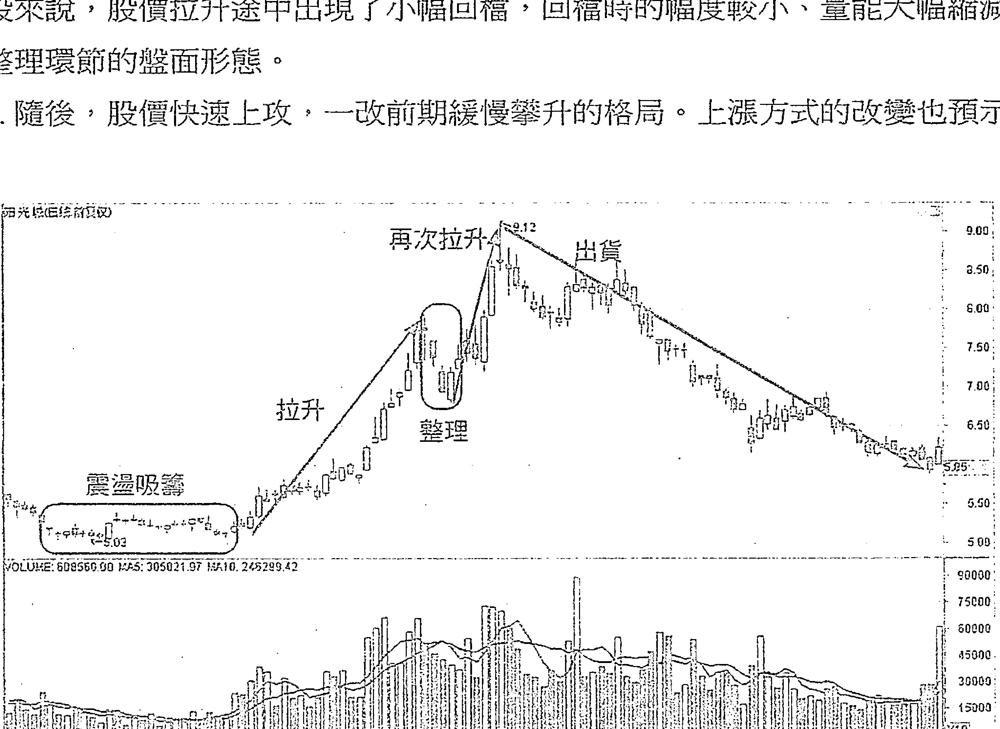
▲图 4-1 阳光城 2018 年 12 月至 2019 年 6 月走势图升波段即将见顶，这正是主力借助于相对稳健的同期大盘走势，而实施的再度拉升策略。此时的量能明显放大，量能的大幅度变化也是多空对比格局变化的信号，高位区预示着风险较大。

-   5. 在高位区，放量滞涨形态的出现说明有大资金主动卖出，这往往就是主力出货的信号之一。股价走势的快速反转，跟风追涨盘反应过来时，股价早已大幅下跌。由于再次拉升时创造了较为充足的出货空间，而高位滞涨形态又使主力能在高位区出掉较多筹码。因此主力掌握着主动权，跟风入场的散户若不能果断“割肉”离场，将被套牢在高位区。

## 4.2 主力的类型及投资风格有哪些？

随着国内股市及经济发展前景总体向上，多路资金纷纷涉足 A 股，除了中小散户外，其他的资金大多实力雄厚，它们可以被称作是 A 股中的主力。但是，大多数的主力资金只是助推着行情的发展。在实盘操作中，我们要结合主力类型及其投资风格来进行综合判断。

### 4.2.1 依资金性质划分主力

对股价走势产生重要影响的主力资金，可以分为公募基金、券商、QFII、大股东、游资及私募等，以下逐一说明。

-   1. 公募基金

公募基金（Public Offering of Fund）是指由基金管理公司通过发行基金单位，来集中投资人的资金，由基金托管人（具有资格的银行）托管、基金管理人管理和运用资金，以从事股票、债券等金融工具投资。在这里，公募基金主要指那些投资于股市的基金，即偏股票型基金。

公募基金的资金量庞大，为了可以稳定应对基金投资人的申购、赎回等操作，大多参与规模较大并且有业绩支撑的个股。在一般的股票行情软件中，往往对“基金重仓”的个股进行单独的划分，投资人可以在此查阅到哪些个股更能获得基金的青睐。

也正因为如此，公募基金对股价走势的影响力会更在于助推作用。当股市行情向上，基金投资人申购踊跃时，公募基金对蓝筹股、绩优股的买入也会增多，从而对行情具有推动的作用。但当行情不好时，这类个股虽有业绩支撑，为了应对基金投资人的赎回，其股价走势往往也不理想。这些都是投资人参与基金重仓股时应了解、注意的。

当然，由于股票型基金种类繁多，也有不少公募基金专注于投资小股本、题材股，而且由于基金经理的理念不同，不同的基金往往会出现截然不同的投资风格，这时我们就要具体分析了。

-   2. 券商

券商是提供证券买卖服务的中间机构。但是也有一些实力强大的券商，在提供证券买卖服务的同时，也进行证券投资。其资金募集方式与公募基金类似，对象大多是公众，以“券商理财产品”的方式进行资金募集，由专业人士负责。券商所选的个股大多是一些业绩较为优秀、行业发展前景较好的个股，在股市中的参与方式与公募基金基本相似。

-   3. QFII（合格境外机构投资人）

QFII 是英文 Qualified Foreign Institutional Investors 的缩写，即合格的境外机构投资人。QFII 制度使得国际资金可以进入 A 股市场，但由于 QFII 资金要设专用账户并且会受到一定的监控，而且国外资本在国内股市投资的原因，大多是看好经济的发展，以长线投资行业龙头股，故 QFII 多以价值投资为核心来参与个股。他们常常在低位区进行投资，耐心等待股市行情转热后，在高位卖出，对于行情及股价走势的影响力较弱。

-   4. 大股东

大股东，特别是直接参与上市公司运行的大股东，对公司的情况无疑是最了解的。当公司前景乐观、业绩高速增长时，若市场没有给公司股票一个合理的定价，则大股东很有可能在市场上实施积极的增持行为。这种增持行为往往会引起场外大资金的关注，也会让中小投资人看好该股中期价格走势，从而对股价的后期运行产生重要影响。

-   5. 游资及私募

游资、私募，也称为民间资本，在一些暴涨的题材股、消息股甚至有隐藏题材的ST类股中，很难发现公募基金的身影，参与这类个股的主力正是游资或私募。

我们常常会看到同一个板块或同一种题材、概念中的许多股票，在没有重大利多的前提下，仅凭着一些市场传闻就能在短时间内飙升，成为同板块或同题材中的“黑马”或“龙头”。而这往往就是市场游资或私募参与热门题材股的结果。

投资人在把握短线机会时，游资或私募的动向及相关个股的异动，是最值得关注的，因为这类股票可以创造较好的短线收益。但是在参与时，我们一定要记住买早不买晚。当我们发现个股的价格已经短线飙升 30% 以上，此时即使有好的题材助推，也应保持理性，不宜重仓参与，更不宜盲目地追涨买入。

### 4.2.2 中长线主力参与股解读

在实盘操作中，我们更应该依赖于盘面信息来分析主力的投资行为，特别是盘面上的量价形态，依据量价配合形态的变化，我们可以更完整地分析、把握主力的投资行为。在实盘操作中，依据盘面形态来着手分析主力的投资行为时，我们主要应以“参与时间长短”来区分不同类型的主力。不同的主力有不同的投资风格，其投资风格会表现在个股的不同走势上。接下来，我们结合实例来看看个股的不同走势，是如何反映主力的不同投资风格。

中长线主力是指参与时间较长的主力，一般来说，其参与时间可以超过一年。这类主力在底部区的进货较为充分、对股价的总体拉升幅度较大。如果投资人可以做到中长线持股待涨，那么将能获取高额的回报。

对于中长线主力参与股来说，它的进货环节持续时间往往很长，我们有更多的逢低布局时机，这类个股更适合有耐心的中长线投资人。而且，当个股进入到主力拉升阶段，在股价累计涨幅不大的时候，每一次的短线回档低点都是较好的中短线入场时机。

图 4-2 是一支中长线主力参与的股票，主力很可能在股价前期破位下行前就已进入。当股价随股市大跌而进入低位区之后，出现了长期的横向震荡走势，并屡次出现涨停板启动股价短线波动的情况，而主力正好藉此机会进货。相对来说，进货布局时间不是很长，这也造成了主力的参与能力不够强，该股在随后股价突破时仍有较大的抛售阻力。

在实盘中，虽然股价突破上行时的量能放得比较大，但由于低位区蓄势很充分，并且股价在突破时的小阳线涨幅均不大，因此，在实盘操作中，我们可以适当追涨买入，享受主力拉升成果。

该股随后出现了较为独立的上攻行情，之间还夹杂着一次盘整走势，这正是中线主力积极参与的结果。在股价累计涨幅翻倍的情形下，主力开始进行出货操作。此时，盘面上的滞涨下滑打破了原有的上升形态，再结合股价上涨时放量较大、主力所持筹码数量相对有限等因素，所以在实战中，本着资金安全的原则，我们此时也应及时地减码或清仓出场。

### 4.2.3 短线主力参与股解读

短线主力的参与时间较短，往往在几周或几个月内，即可完成一轮完整的买卖过程，个股价格的短期涨势较为明显、涨幅较大。短线主力所参与的个股，也多是与当时市场热点相符的题材股。一般来说，民间游资更喜欢短线投资个股，即成为个股短期内的参与主力。

短线主力参与的个股，大多是有热门题材推动的。在短线上攻走势刚刚展开时，股价往往不易回档。此时，对投资人的买卖技巧的要求较高，投资人一定要敢于追涨入场，毕竟股价才刚刚启动；但是，一旦股价短线涨幅相对较大，超过30%后，其波动幅度也会增大，投资人此时应结合题材热度及市场环境，再来决定买卖方向。

短线主力多会结合市场热点来把握建仓时机。由于市场热点往往频繁转换且不断出现，因此，短线主力的建仓目标股较多、建仓时机也较多。但由于市场热点往往是突然涌现的，因此，短线主力的建仓时间就会相对较短。

图 4-3 中可以看到，股价以涨停板的方式突破盘整区、快速上攻。短线主力也常采取连续涨停板的方式，最大限度地启动个股的股性及题材热度。

对于投资人来说，一要结合个股的题材来决定是否追涨，二要在股价突破上攻之初，特别是在刚刚启动的前两个交易日追涨买入，这样可以尽可能地降低追涨风险、增大短线获利空间。并且，短线主力在参与这类个股时，其价格走势很有可能一波到顶，特别是对于那些同题材下的非龙头个股，一波到顶的机率极大。在实盘操作中，我们一旦发现股价数日内滞涨不前，应果断卖出该种股票。

△图 4-3 安源煤业 2019 年 10 月至 12 月走势图

### 4.2.4 超短线主力参与股解读

超短线主力严格来讲并不是主力资金，因为他们对个股的参与往往就是“一日游”。超短线主力的目标，只是获取在一、两日之内的差价利润。

超短线主力的市场行为如同快进快出的散户，他们经常选择日K线形态优异的个股：提前一、两个交易日进行操作，然后在随后交易日的早盘阶段快速拉升，从而使得该股的价格走势呈突破上形态。若市场跟风情绪较浓，超短线主力则顺势收涨停板，次日出货；若跟风盘不足，超短线主力则在当日盘中高点即开始出货，该股当日的价格走势会呈现出冲高回落的长上影线形态。

因此，若个股的 price 某日大涨甚至涨停，但没有什么明确的题材或消息面支撑，且随后几日的走势明显疲软，千万不要过于肯定地认为有强大的主力隐藏其中，因为这档股票的异动，很可能就是由超短线主力快进快出所引发的。

图 4-4 中，股价以一个涨停板强势突破了盘整区，似乎将展开一轮上攻行情，殊不知次日出现了冲高回落的放量长上影线 K 线，这种形态往往就是超短线主力参与的结果。超短线主力早在涨停板前一日就已略放量，借助良好的突破形态及跟风追涨盘的涌入，超短线主力在涨停板次日实现了快速出货。

### 4.2.5 主力的两种参与路线

对于主力参与个股的流程来说，以“建仓环节”为起点的路线是最常见的参与路线，毕竟手中有一定筹码之后，才能发挥对股价走势的影响力。但是，也有一些主力会反复买卖同一档股票：主力在高位区出货后，手中仍余有少部分筹码，借助于大盘震荡，顺势卖出剩余的筹码，股价往往也因此进入了低位区，此时再慢慢买入，这就是以“卖出”为起点的参与路线。

对于起始于建仓环节的主力路线而言，这一主力参与过程的时间顺序是：建仓—拉升—出货。这种主力参与路线适合新主力，由于新主力在入驻个股之前手中没有筹码，所以不得不从建仓开始。此时，能否在低位区或者在恰当的时机买入大量的建仓筹码，对主力来说是至关重要的。

对于起始于卖出的主力参与路线，其参与过程的时间顺序是：卖出—建仓—拉升—出货。起始于卖出的主力参与路线有很多优势，其中最重要的是，主力不用被动地等待建仓时机，而是可以结合大盘震荡走势，去主动创造一个好的建仓价位。

在弱势的市场环境下，主力往往也会先卖出手中持有的股票，等待时机，从而获得有利的建仓价位，为下一轮参与打下基础；或者主力利用大盘的不稳定性，来进行中线的高卖低买操作。一般来说，这类主力的实力较强，如果总是被动等待市场提供的机会，就会有一种极不稳定的因素。因此主动创造有利于自己的价位，就会让成功率大大提高。下面我们结合案例，来看看主力是如何结合大盘波动，以进行大波段上的高卖低买操作。

图 4-5 中可以看到，经历了 2018 年 10 月股市系统性暴跌之后，股价在“强势反攻”、“收复失地”时，并没有量能放出，这说明主力持股力度较大、参与能力较强。如图中的标注所示，2018 年 12 月，股市再度出现系统性风险，在沪深两市全线暴跌的背景下，主力一般不会刻意维护股价，因此该股的价格也跟随着大盘快速下跌，短线跌幅巨大。

值得注意的是，股价在前期高点并没有足够的震荡整理时间，主力难以出货。在这种情形下，我们可以推测主力仍旧在个股之中，在暴跌之后的低点，当股价再度出现一波缩量快速下跌时，便会出现更好的买入点。

主力利用大盘的波动进行高卖低买操作，是一种常见的情形。主力因为对股价未来走势看得更远，往往能够接受由于大盘暴跌造成的账面快速亏损，这是一种策略性的买卖方式。所以我们不能想当然地认为，个股在主力没有大量出货的情形下是不可能暴跌的。主力可以通过反复买卖个股，利用股价的大波动来进行“低买高卖”操作，最终实现获利出局。

## 4.3 中长线主力与短线主力，持股方式大不同

中长线主力与短线主力的进货风格迥然不同，中长线主力更注重控制建仓成本，进货的时间往往较长，参与能力更强；短线主力更注重市场热点、进货时间较短，参与时更需借助于市场的追涨热情及其他游资的力量。由于主力的进货风格与方式不同，反映在盘面的量价形态也就不尽相同。在本节中，我们就结合主力的风格，来看看进货环节下的常见量价特征。

### 4.3.1 放量缩量对比

主力进货时会造成股价上涨，也会引发量能放大，随着股价的短线上涨，主力会暂停进货，在获利盘抛售的情况下，股价自然会回落。由于仅是市场少量获利盘回吐，主力并没有参与抛售，因此股价回落时的成交量会明显缩小。这就导致在股价波动过程中，成交量形成了放大、缩小的鲜明对比：波段上涨时的量能明显放大，波段回落（或窄幅整理）时的量能明显缩小。利用放量与缩量的鲜明对比，再结合个股中短期内的价格走势的独立性，我们可以初步判断个股有主力入驻进货的可能性。

图 4-6 中可以看到，在低位区的横向震荡走势中，多次出现独立上攻的长阳线，且上涨波段的放量较为明显；而在上涨波段后的回落走势中，则明显缩量，放量与缩量形成了鲜明的对比，这正是大资金入场进货后积极锁仓的信号之一。独立的上涨波段放量，启动了多空分歧，使得主力有机会从中进货；随后的回落波段仅是由市场少量获利浮额抛售所致，因此量能会明显缩小。

△图 4-6 扬农化工2018年12月至2019年4月走势图

### 4.3.2 震荡区涨停式反复进货

震荡区的涨停板常会激发多空分歧，因为涨停板使得震荡区筹码处于解套状态，市场浮额的锁定度大大下降，主力可以趁机进货，且涨停板的出现正是主力从中助推的标志之一。

利用涨停板激发多空分歧，主力在震荡区反复进货，个股在涨停板出现前后的几个交易日中量能明显放大，在随后的回落走势中则明显缩量。反复震荡之后，主力最终实现了较强的参与能力。

因此，随着震荡走势的持续，我们会看到个股的量能逐渐缩小，这正是主力锁仓、市场浮额减少的重要标志。这种利用震荡区反复出现的涨停板来进货的方式，多出现在中线主力参与股中。一旦这类股票开始突破上攻，其潜在的上升空间是很大的。

图 4-7 中可以看到，该股在低位区的震荡走势中多次出现涨停板，且震荡上涨波段的量能明显放大。随着震荡走势的持续，整理走势中的成交量明显萎缩，这正是主力进货行为，导致市场浮额大幅减少的信号。

### 4.3.3 突破点单日进货巨量

主力在低位区的进货，往往会因为市场低迷而使得效果不理想，这时，就需要再次拉升进货。当股价突破盘整区时，若出现明显的放量，且随后股价能够站稳于突破位置点，则多与主力在突破时实施积极的建仓行为有关，股价就有望就此步入上升通道。下面 we 结合实例来说明。

### 4.3.4 突破点多日进货放量

股价先是放量突破盘整区，在强势的横向震荡过程中，该股不时地出现单日明显放量形态，且股价重心随着震荡的持续而向上移动，这多是主力借突破之机进行加码的操盘行为，预示着股价随后将出现一波上攻走势。在实盘操作中，强势震荡中的回落点，就是最佳的短线入场时机。

图4-9中可以看到，股价在相对低位区出现长期盘整走势，随着放量突破形态的出现，股性得以启动，但股价并没有立强势上攻，这与主力手中筹码数量相对较少、参与能力不足有关。此时，主力有加码的需要，可以看到在强势震荡区间又多次出现单日放量阳线，这正是主力在突破点加码的多空分歧，而积极加码操作的表现。在震荡过程中出现的股价重心上移，也表示买盘力量强于卖盘，一旦主力加码完毕，随后出现上攻行情的机率较大，此时是很好的入场时机。

## 4.4 主力洗盘出现时，是入场好时机

震仓环节常出现在一些主力的参与过程中，它虽然不是必然出现的一个环节，但它的量价形态特征很明显，当其出现时，也就给我们指出了短线逢低入场的最好时机。

### 4.4.1 连续缩量阴线下跌

震仓环节出现在建仓后、拉升前，是主力对底部区参与的获利浮额进行整理的一种手段，其目的就是为之后的拉升操作创造更好的条件。

一般来说，震仓环节的典型盘面形态，是股价短期内的快速下跌并伴以量能的相对缩小。但投资人在识别这种形态时，一定要将其与主力前期的低位进货行为结合，当股价前期的累计涨幅不大、主力有明显的进货迹象时，快速缩量下跌才可以被看作是由主力的震仓操作所导致的盘面形态。

图 4-10 中可以看到，股价先是出现了长期的盘整走势，随后量能温和放大、股价向上突破了盘整区，这表明主力在积极参与。而这个盘整区很可能就是主力进货的区域，对于这类股票我们应多加注意。

如图中的标注所示，温和放量突破之后出现了一波缩量回落，股价回档至启动点，这是主力在建仓之后、拉升之前进行的一次震仓操作，而这个短线回落低点也是我们买入的最好时机。

### 4.4.2 整体放量相对缩量

震仓环节的量能形态以“相对缩量”为主要表现形式。如果在之前的突破走势中，量能的放大较为明显，则回调时的均量往往大于上涨前的均量，但这并不代表主力的出货。

## 第4章 跟着主力，进行低买高卖的「波段获利法」！

出货行为。一般来说，这种情形常出现在主力参与能力较差的中型股或大型股中。

图 4-11 中可以看到，股价在突破盘整区时量能的放大较为明显。随后的连续小阴线回落中，成交量相对缩小。结合股价处于低位区及短期内的量能缩放分析得出，这代表着主力拉升而非主力出货，因此，这仍可以被看作是震仓，我们在短线回档中的低点可吸纳筹码。

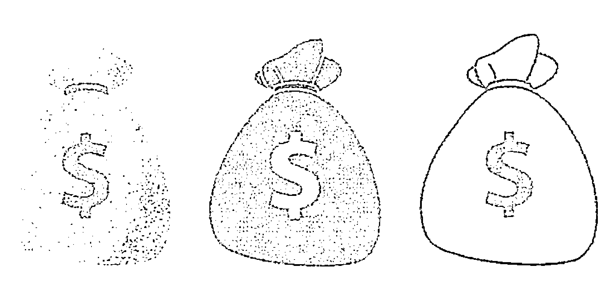

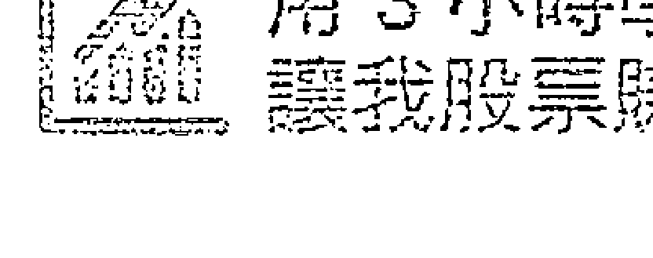

## 4.5 主力拉升時常見的量價形態

不同類型的主力有不同的拉升方式。中線主力持股數量較多、參與能力較強，拉升時往往也是不急不緩的，股價上升時間長、累計漲幅大；短線主力持股數量少，拉升時更需借助於市場力量。因為主力類型不同、參與能力不同、拉升風格不同，所以會展現出不同的量價形態。在本節中，筆者將講解主力拉升過程中，常見的幾種量價形態。

### 4.5.1 平量式穩步上揚

平量式穩步上揚是中線主力常用的拉升方式。主力或許是因為在低位區進貨較為充分，或許是因系統性風險出現而沒能在高位出貨，所以手中持有大量的籌碼，當市場趨暖後，就有較強的拉升意願。

此時，股價震盪著突破低位區間，溫和向上攀升，由於主力手中的籌碼多，市場上的籌碼數量就相對較少。此外，由於股價的上漲方式較為溫和，這對於散戶持股者的賣出行為，也具有一定的抑制作用。基於這種市況，股價上揚時的量能並不會明顯放大，而是呈「平量式」攀升。

這種平量式攀升的形態只要未被打破，我們就可以耐心持股待漲。一旦股價累計漲幅較大，出現上漲加速、量能突然開始放大的情況，則說明主力參與能力開始減弱且有出貨意向，我們應逢高賣出、鎖定利潤。

圖 4-12 中可以看到，股價先是處於中長期低位，隨後開始震盪上揚。如圖中的標注所示，在股價的持續上漲過程中並未出現放量，量能呈現出「平量式」狀態。這是因為前期主力被套後的被動拉升，主力持股數量多、拉升阻力弱，因此股價有望衝擊前期新高。在實盤操作中，我們應耐心持股待漲。如圖 4-12 中的標注所示，隨著股價上漲進入高位區，此時的成交量突然放大、上漲速度加快，股價在盤中的上下波動的幅度也驟然增大。這種量價關係的突然轉變，再結合股價的累計漲幅來判斷，是主力開始出貨、市場浮額增多的訊號，預示著頂部的出現，我們應賣股離場。

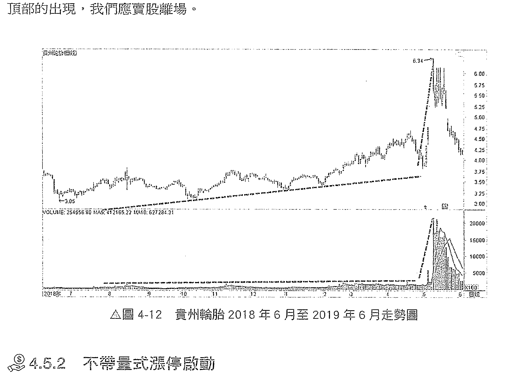

圖 4-12 貴州輪胎 2018 年 6 月至 2019 年 6 月走勢圖

### 4.5.2 不帶量式漲停啟動

漲停板的短線衝擊力度無疑是最強的，它能夠激發市場的追漲熱情，很多主力往往喜歡借助於漲停板來實施快速、甚至是一氣呵成的拉升操作。股價的短線上漲勢頭強、漲幅大，主力借助於市場力量，因此不需要動用太多的拉升資金，就能成功拉升。對於散戶來說，不僅要瞭解主力的這種拉升方式，還需要從盤面上發現線索，進而在第一時間追漲買入，享受主力的拉升成果。一般來說，漲停啟動的拉升方式多出現在股價盤整之後，盤整區是主力進貨、加碼的區域。隨後，在某個交易日中，個股借助於良好的大盤氛圍，在盤中強勢上揚（多出現於早盤階段），連續的大單買盤向上推升股價，並且最終收漲停板。由於主力之前已買入較多籌碼，漲停板突破雖然可以全盤獲利，但市場多空分歧並不嚴重，漲停板時的量能可能處於平量狀態，也可能在溫和地小幅放量，這種放量方式也反過來驗證了主力的參與能力。在實盤操作中，我們應在個股漲停板的第一時間買入。下面我們結合案例加以說明。

由圖 4-13 此分時圖中可以看到，在早盤階段，股價出現了兩波連續的拉升，分

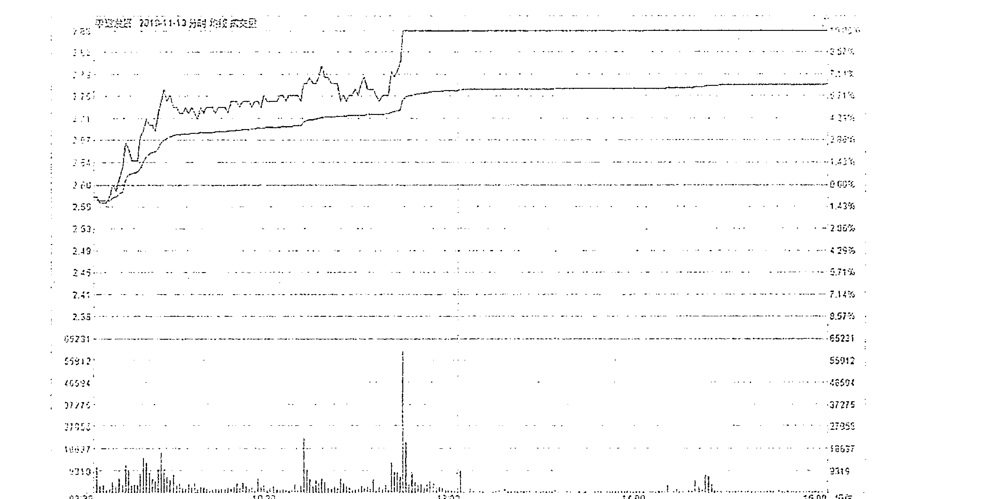

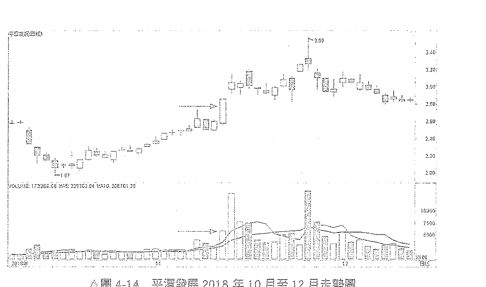

## 第4章 跟著主力，進行低買高賣的「波段獲利法」！

時線流暢挺拔，這是主力的進貨、拉升行為的結果。在隨後的盤中高點，股價拒絕大幅回檔並且向上衝擊漲停板，結合股價當日正突破低位盤整區，以及此時的量能未明顯放大這一情況來看，如圖4-14所示，可以發現主力的參與能力較強，股價有望以漲停板為啟動訊號迎來一波上攻走勢。在實盤操作中，我們應果斷地搶漲停板入場。

### §4.5.3 先放量後縮量

在拉升過程中，一些主力往往會因為起初的籌碼數量不夠，而在拉升初期進行進貨、加碼操作，此時的股價震盪上漲速度慢，主力力求降低持有成本。隨著主力持有數量的增加、參與能力的提高，個股在隨後的價格上揚過程中會出現相對縮量，量能明顯小於上漲初期。這種上漲方式雖與我們常接觸的「放量上漲」不符，但並不是升勢見頂的訊號。在實盤操作中，我們應多加觀察，只有當出現較為明確的反轉訊號時，才宜減碼或清倉離場。

圖4-15中可以看到，股價上漲初期量能明顯放大，但隨著股價上漲的持續，成交量反而不斷縮減，這種縮量上揚的走勢緩慢。就中線交易來說，此時並不是賣出時機，圖中的後半部分股價高位放量滯漲，才是較好的頂部離場時機。

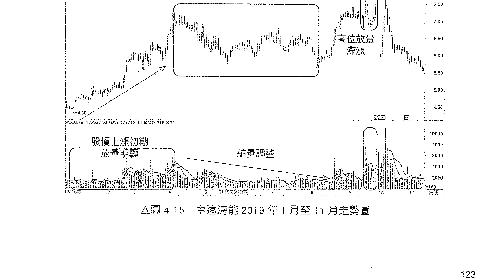

### ## 4.6 主力常見的整理方式及量價形態

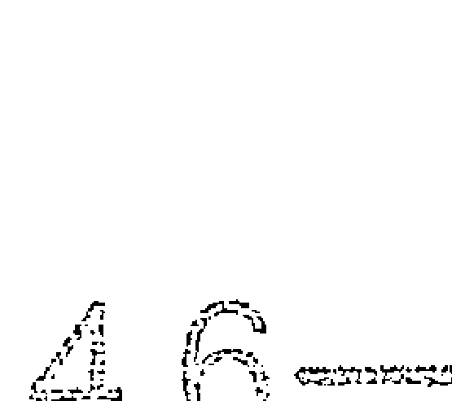

整理環節出現在主力進貨之後，雖然主力的買賣方式不同、參與能力不同，但此時的市場浮額已經明顯減少，因此，整理時的一個重要量能特徵就是「縮量」。當然，主力買賣股票是一個前後連續的過程，僅憑縮量，我們還無法判斷該量能特徵是否與整理行為有關。

在實盤操作中，我們還需結合股價此前的運行特徵來綜合判斷。在本節中筆者將結合案例，講解常見的幾種主力整理方式及對應的量價形態。

### ### 4.6.1 平量式盤升平台

平量式盤升平台，多出現在中線參與能力較強的主力的參與股中。股價以小陰線、小陽線（以小陽線居多）的方式極為緩慢地向上盤升，突破此前構築時間極長的震盪區間，全部的流通籌碼處於獲利狀態。這個盤升走勢構成了一個類似於「平台整理」的形態，但股價重心卻在上移。個股處於「盤升平台」時的成交量並沒有放大，呈現出一種「平量式」的狀態。

這種量價形態往往是主力快速拉升前的一次緩慢整理行為，意在消耗那些持股時間短、短線拋售意願強的短線盤，從而為隨後的拉升減小阻力。在實盤操作中，這個平量式盤升平台，是我們中短線買入的好時機。

圖4-16中可以看到，股價在突破長期整理區間時，出現了平量式盤升平台的形態，這是一個很顯著的量價關係，也側面表現出主力的整理行為，並預示了主力隨後的拉升行為。在實盤操作中，此時是中短線買入的時機。

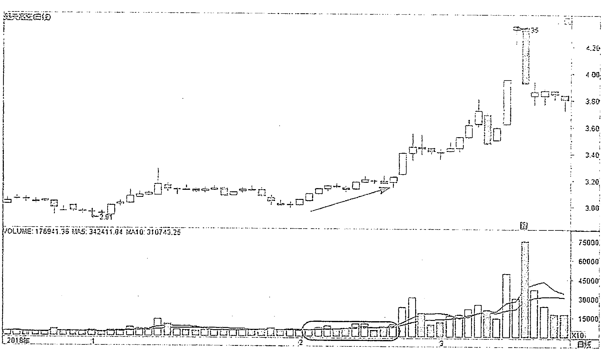

### §4.6.2 縮量下跌形態

縮量下跌形態常出現在股價短線漲速較快時。此時，在中短線高點，出現了一波速度較快、量能快速縮減的下跌走勢。這一波快速下跌走勢的量能，與之前上漲波段的量能形成鮮明對比，表明下跌走勢並不是因為大量拋售而形成的。在實盤中，若股價此前的上漲較為強勁、走勢獨立於大盤，則此時的縮量快速下跌，具有更強的回檔含義。在實盤操作中，我們也可逢短線低點買入。

圖4-17 中股價震盪上揚，一波短線快速上漲，量能明顯放大，隨後出現了股價的快速下跌，下跌時量能急速縮減。結合同期大盤走勢來看，股價的震盪上行具有獨立性，有主力積極參與。股價此時的累計漲幅不大，透過股價的自然整理，在實盤操作中，我們可以逢低買入，積極投資。

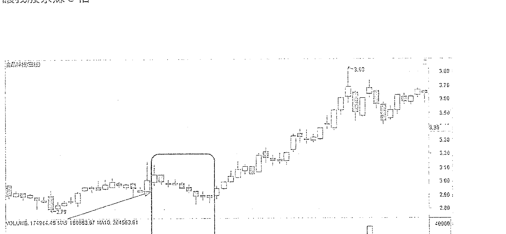

图4-17 金晶科技2018年12月至2019年3月走势图

### ④ 4.6.3 缩量式强势整理平台

缩量式强势整理平台，常出现在参与能力较强的中线主力上，相应的个股往往有业绩支撑，对股价的不断攀升具有支撑作用。

从盘面形态上来看，股价呈现横盘走势，在很长一段时间内股价波动幅度较小，短期内几乎没有什么差价，且横盘区间往往会出现成交量萎缩的情况，给人一种此股交投极不活跃的感觉。这是因为主力在此区间内既没有出货、也没有拉升，散户可通过股价的自然整理状态时段，选择充分换手。

采取这种以时间换取空间的方法，主要针对市场中的绝大多数投资人没有耐心的弱点，以达到淘汰一批持股者的目的。一般来说，平台整理的时间越长，股价上下振幅越小，表示整理得越彻底，之后股价上升的后劲就越大。

图4-18中可以看到，股价先是出现了独立的攀升走势，长阳线一举向上突破了长期盘整平台。随后，股价开始横向震荡，且成交量大幅度减小，这就是主力拉升过程中的「缩量整理」形态，可以有效地消耗缺乏耐心的短线盘，从而为随后的拉升减轻阻力。在实盘操作中，由于该股中线已有一定价格涨幅，我们在买入初仓时应控制好仓位，对于持股者来说，则应持股待涨。

## 第4章 跟著主力，進行低買高賣的「波段獲利法」！

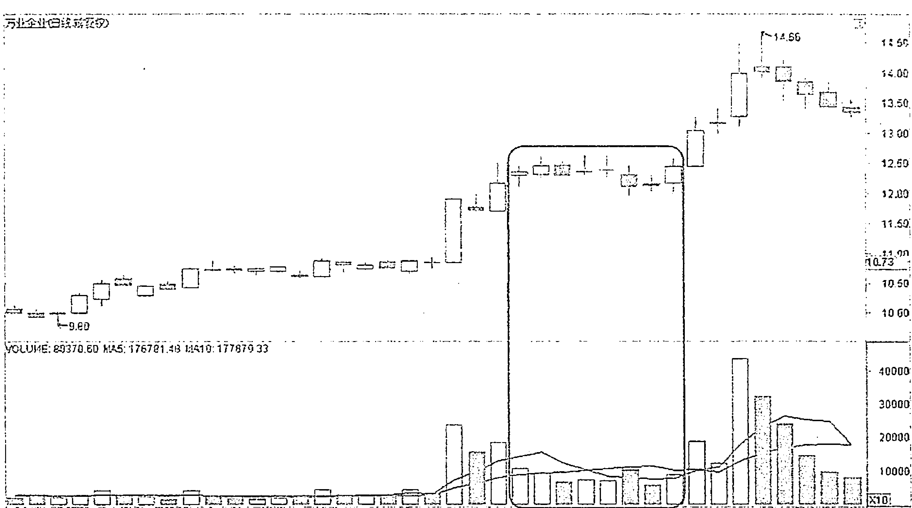

### 4.6.4 下跌後的縮量收復

股價的短線快速下跌伴以相對放量，可能是主力出貨所引發的，也可能是市場賣出湧現所引發的。如果想要判斷股價後期走勢，那麼我們應密切觀察股價短線下跌後的走勢特徵。若能夠出現縮量下跌的走勢，則表明主力參與能力依舊較強。在股價累計漲幅不大的情況下，我們仍可積極操作，或逢震盪回檔之機買入。

圖 4-19 中可以看到，股價在一波放量下跌之後，出現了縮量，這是市場浮額較少、主力依舊有著較強參與能力的標誌。短線上，我們可以適當買入參與。隨後，股價短線上衝、加速上漲至前期盤整套牢區間時，量能突然大幅放大，股價在此位置點遇阻，我們在短線上宜賣出從而迴避風險。

隨後，當股價二次回落時，可以看到又是一波縮量下跌走勢，主力並沒有快速出貨，在實盤操作中，我們可再度短線接回。實盤中的股價走勢往往一波三折，我們應結合量價關係的變化，而不斷調整買賣方向及倉位，力求降低風險、獲取更高的潛在收益。

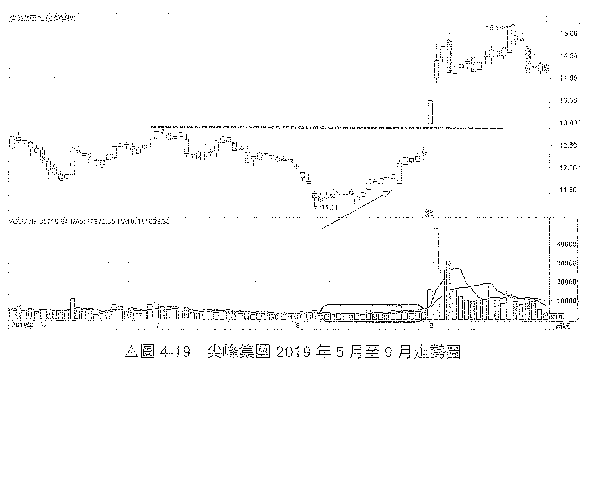

图4-19  尖峰集团 2019 年 5 月至 9 月走势图


## 4.7 主力出貨的量價關係，可作為風險評估

主力往往在股價累計漲幅較大時出貨，但若股市低迷，主力往往會提前出貨。我們應結合市場冷暖及量價關係的變化，來把握主力的出貨行為。在本節中，筆者將講解主力出貨時的幾種常見量價關係，它們是股價走勢中線轉折的訊號，也是風險訊號。

### 4.7.1 縮量震盪下滑

在持續上漲後的高位區，若股價出現震盪滯漲走勢且量能開始明顯縮減，股價重心下移時，這便是主力無意拉升、開始小量出貨的訊號。我們此時應注意風險，股價隨後有可能因大盤震盪，而向下跌破平台支撐位。

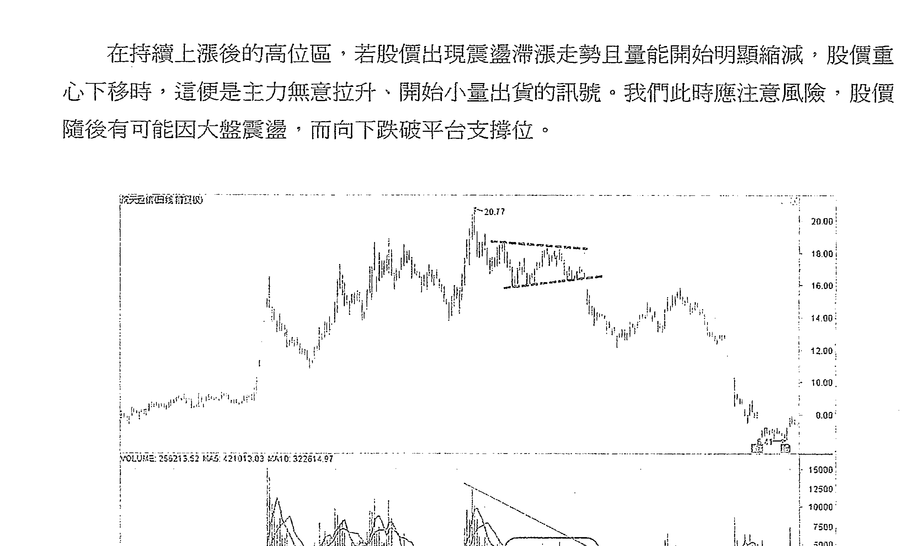

圖4-20 航天通信 2018年10月至2019年11月走勢圖

圖 4-20 在高位震盪走勢中，我們可以看到股價在震盪走低，同期的量能明顯縮減，這是主力少量出貨的訊號。這種縮量震盪下滑，也打破了股價走勢原有的上升形態，標誌著頂部的出現以及趨勢的反轉。

### §4.7.2 斷層式縮量滯漲

斷層式縮量滯漲，也是主力出貨時較為常見的一種量價關係，它是指個股在價格不斷上漲過程中出現了較為顯著的放量，並且股價的上漲走勢獨立，明顯強於大盤，中短線的漲幅相對較大。隨後，在高點位股價橫向震盪，但量能卻大幅度縮減，此時的量能與之前上漲時的量能相比，顯現出「斷層式」的特徵。

高點位的斷層式縮量滯漲，大多表示此前股價上漲時的堆積式放量，或與主力的連續式拉升有關。此時量能斷層式縮減並伴以股價滯漲，標誌著主力連續式拉升的結束，也是股價走勢見頂的訊號。

圖 4-21 中可以看到，股價的上漲過程持續時間長、累計漲幅大，上漲時的量能明顯放大。如圖中的標註所示，高點位出現了縮量滯漲，從量能效果來看，這屬於「斷層式」的縮量，是股價走勢見頂的訊號，此時我們應賣出離場。

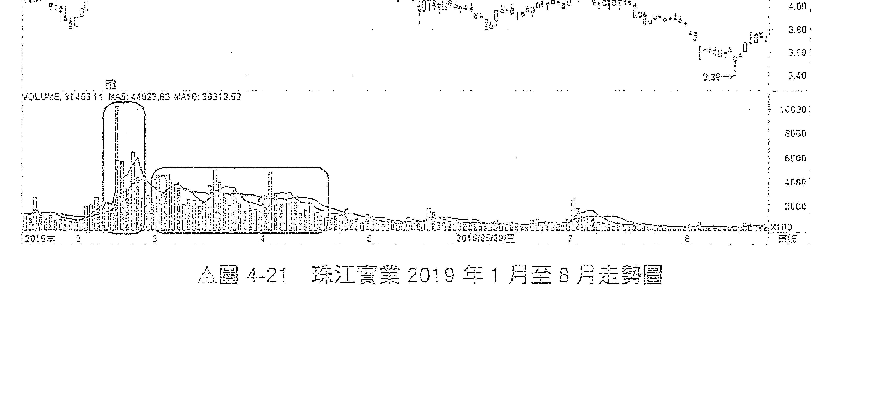

### 4.7.3 放量攀升再放量

上升途中，成交量若在原有的放量攀升的基礎之上再度明顯放大，會使多方力量消耗過大、過快，容易引發中線反轉走勢。此外，再度放量時往往伴有股價的快速上衝，經常使多空力量對比格局發生轉變。在實盤操作中，當成交量無法繼續放大，或股價開始滯漲時，我們應賣出離場。

圖 4-22 中可以看到，股價在大盤走勢處於震盪狀態時，出現了這種較為獨立的上攻走勢，這是主力積極參與的結果。但是，放量攀升之後出現了量能進一步放大的上攻走勢，這就是一個反轉訊號，此時我們應果斷賣出。

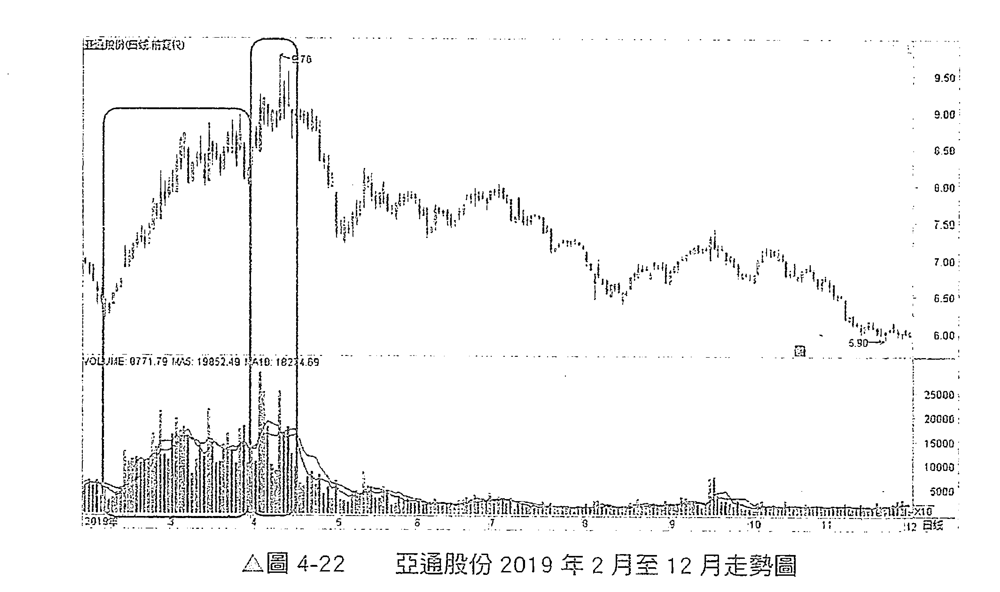

圖 4-22 亞通股份 2019 年 2 月至 12 月走勢圖

# 第5章 我用日K線與成交量，預測「上漲股」！

## 5.1

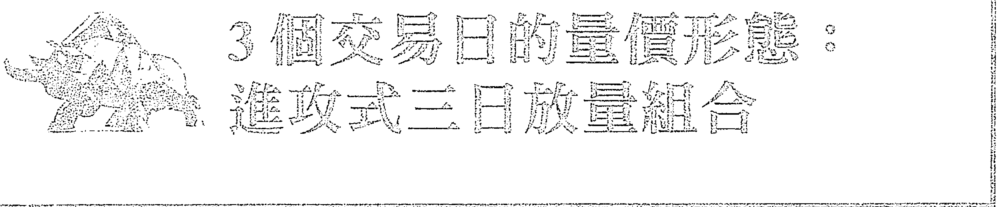

以成交量分析而言，以日 K 线为基础的日 K 线图量价分析是其核心。在前面几个章节中，笔者已经从趋势运行、经典量价理论、主力参与等方面，讲解了一些较为常见的日线图量价形态，但对于变幻莫测的股市及股价走势来说，这些还是远远不够的。

要想更加深入地理解并在实战中运用好量价关系，我们还要从特例入手，以 A 股市场的独特运行方式为基础，更加全面地学习量价形态。在本章及第 6 章中，笔者以「日 K 线图」为例，来展开量价的相关内容的讲解。本章先讲解能够预示股价上涨的量价组合，第 6 章则讲解预示股价下跌的量价组合。

进攻式三日放量组合是 3 个交易日的量价形态组合，这 3 个交易日的量能明显放大。第一个交易日和第三个交易日收出中小阳线，且量能的放大较为明显，使股价呈上攻状；第二个交易日为股价整理走势，量能相对缩小。
这种量价形态常常是大资金短线加码、有意拉升股价的讯号，虽然股价并不一定马上涨，但随后的整理时间往往会较短。在实盘操作中，当股价回落至第二个交易日附近且能够获得支撑时，我们可以短线入场。

图 5-1 可以看到股价盘整之后，出现了三日放量突破盘整区的形态。这是进攻式三日放量组合形态，是多方入场积极、短线推升股价意愿强的讯号，也预示着有望展开一波上攻行情。在实盘操作中，我们可以在随后的横向整理期间买股入场。

# 第5章 我用日K線與成交量，預測「上漲股」！

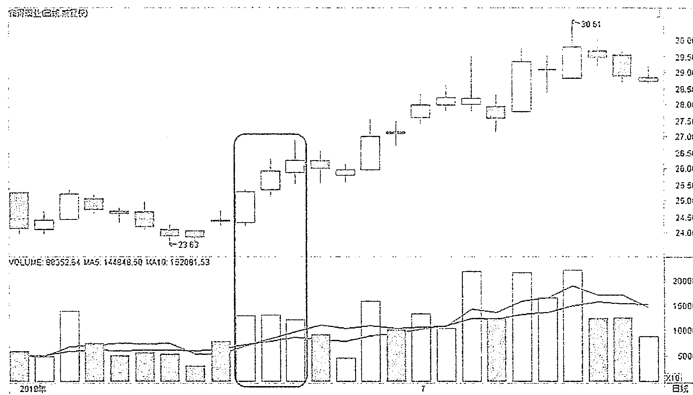

## 5.2 長陽線突破點的窄幅整理區，有望展開突破行情

股價在長期盤整之後走勢不明朗，若此時出現長陽線放量突破盤整區，多預示著盤整區是多方積蓄力量的一個階段。但是，多方也有可能因空方獲利賣壓較重，使主力持股數量不夠而無功而返。此時，在長陽線的突破位置點，若股價走勢能夠出現小幅度整理形態，是多方已經在突破位置點佔據主動地位的標誌，有望展開突破行情。在實盤操作中，這個突破點的窄幅整理位置區，就是我們中短線入場的好時機。

# 用3小时学会量价操作法

# 让我股票赚3倍

由图5-2可以看到股价在运行中，先是出现了放量长阳线突破盘整区，随后在突破点出现了窄幅整理不回落的走势。此时股价正处于低位盘整区的突破形态中，而这种突破量价形态又是多方占优势、主力拉升的讯号。因此，在实盘操作中，在突破点的窄幅整理过程中，我们可以积极加码买入。

这种量价形态常出现在大型股中。此时，股价在突破点是否有强势的窄幅整理形态出现，是我们衡量多空力量的重要依据，也是判断上攻行情是否真实的标准。

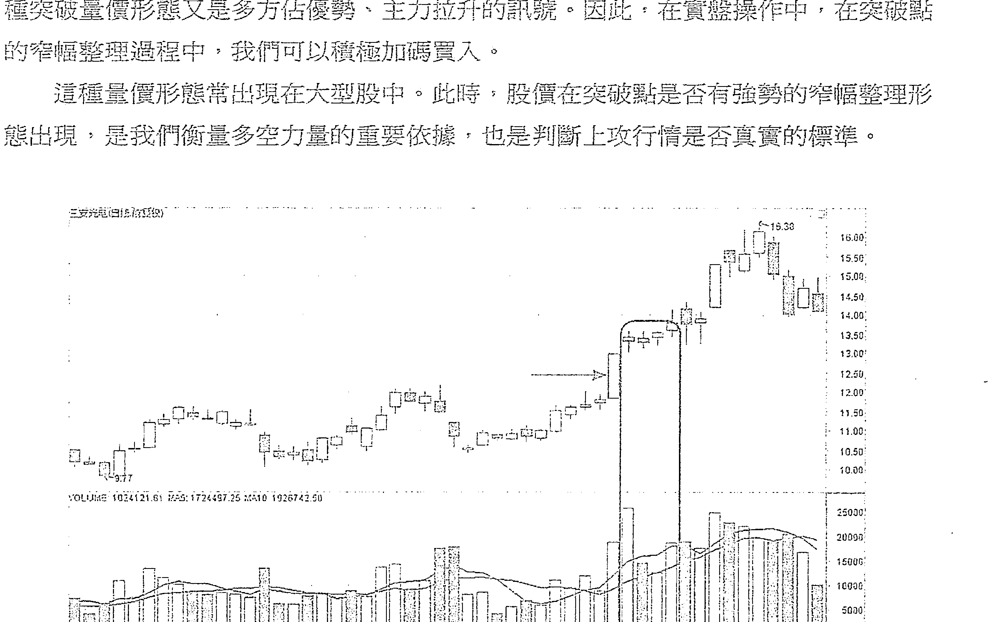

图5-2 三安光电2019年7月至9月走势图

图5-3中可以看到，股价在以长阳线向上突破盘整区时，当日量能的放大较为明显，这是个股中没有强势主力参与的标志之一，股价的运行方向是多股力量合力的结果。此时，若在突破点可以出现强势窄幅整理形态，则表示多方可以稳守胜果，仍完全占据主动地位，股价随后仍有上攻空间。在实盘操作中，我们可以耐心持股待涨或买股入场。

# 第5章 我用日K線與成交量，預測「上漲股」！

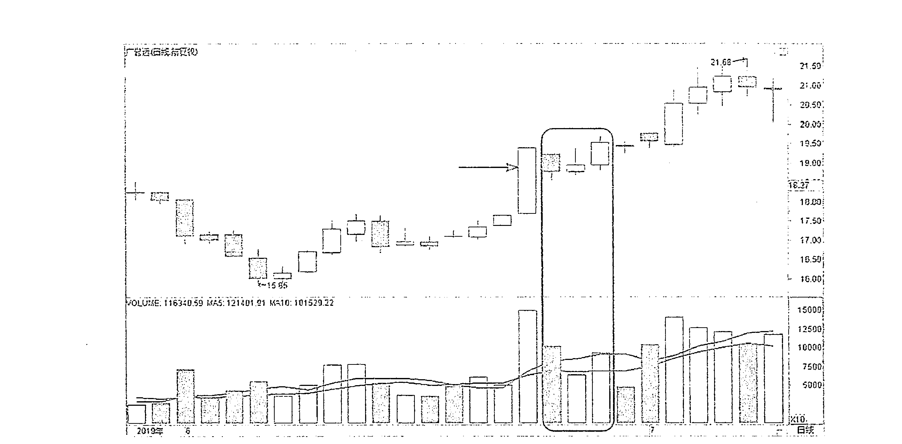

圖 5-3 廣譽遠 2019 年 5 月至 7 月走勢圖

## 5.3 圓弧右側的滑落低點，是短線入場的好時機

「圓弧形」常與主力的行為相關，因為僅憑市場正常交投，難以出現這種「優美」的運行形態。當股價以溫和放量的圓弧形態突破低位盤整區時，大多是主力快速拉升前的一次加碼操作。此時，圓弧右側的滑落低點，就是我們短線入場的最好時機。

由圖 5-4 中可以看到，股價在長期盤整之後，先是出現了兩條縮量陰線，使股價降低至 7.76 元（本書所有金額皆指人民幣）處形成破位之勢，但在隨後的運行中，則以溫和放量的圓弧形態「收復了失地」。在實盤操作中，我們應在股價圓弧形滑落時進行短線買入操作。這種量價形態常與主力的積極參與有關，股價隨後的中短線漲幅也十分可觀。在實戰中，我們應多加觀察這種量價形態，把握時機。

圖 5-5 中可以看到，股價以一個溫和放量的圓弧形態，突破了之前的短線整理套牢區。圓弧形態構築完成之後，股價出現了短線回落，此時就是較佳的入場點。

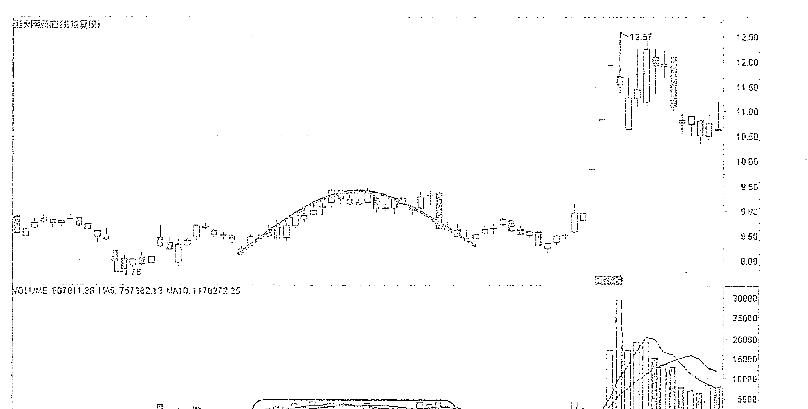

圖 5-4 浙大網新 2019 年 7 月至 11 月走勢圖

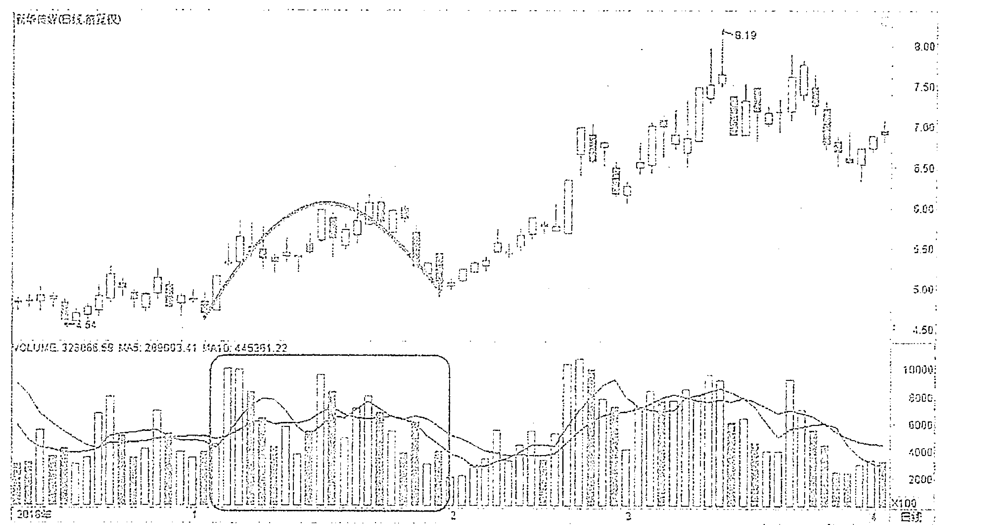

圖 5-5 新華傳媒 2018 年 12 月至 2019 年 4 月走勢圖

## 5.4 「红三兵」是可靠的上攻信号

「红三兵」是指连续 3 条中小阳线的 3 日 K 线组合。一般来说，红三兵代表着多方力量占据优势，是上涨信号；但在某些时候，红三兵发出的信号并不是上涨信号。为了确保红三兵形态的准确性，我们还要结合 K 线整体运行形态及量能变化来判断。当温和放量的红三兵出现在盘整区的突破位置点时，就是一个可靠的上攻信号。它代表着买盘积极入场、多方力量充足，是即将展开一轮上攻行情的可靠信号。

图 5-6 中可以看到，股价在中短期大幅下跌后的低点，出现了横向震荡走势。随后连续 3 条温和放量的小阳线，使股价开始向上突破震荡区。这就是突破点温和放量红三兵形态，也是买盘入场积极、股价有望展开上攻走势的信号。在实盘操作中，由于此时的股价中短线的涨幅均较小，因此我们可以追涨买入。

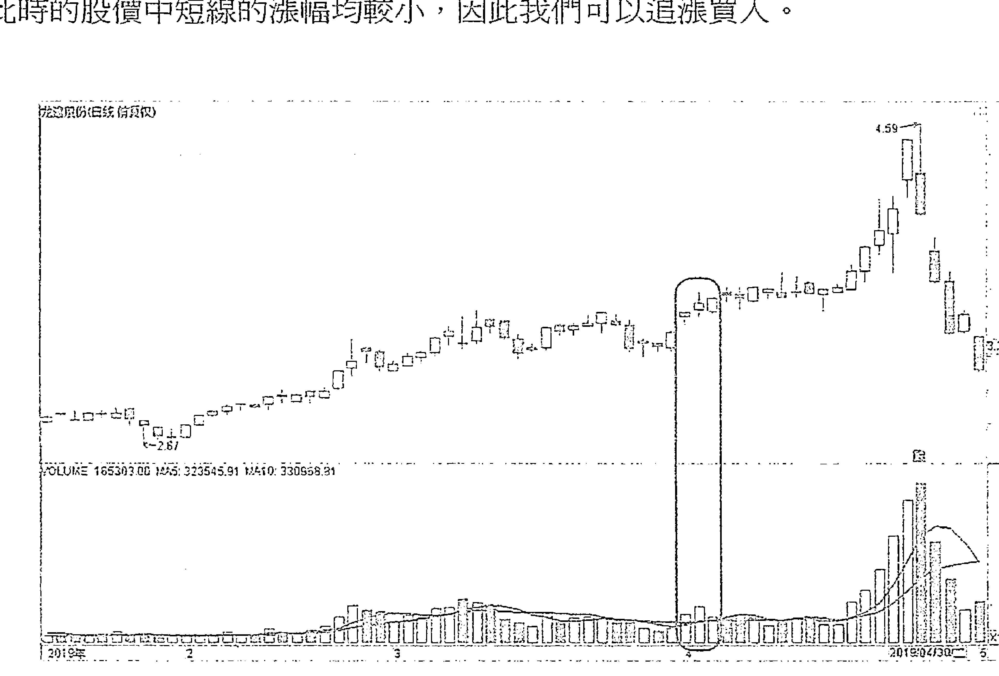

## 5.5 回档后的缩量整理平台，主力随后快速拉升

放量盘升后回档点缩量平台是一个组合形态，它由两个局部形态构成。首先是温和放量并且股价缓慢向上攀升，一般来说，这种走势具有一定的独立性，强于同期大盘，往往是个股有主力资金积极参与的讯号。随后，受大盘回落影响，股价没能在短线高点止稳，而是顺势回落至前期起涨点附近，此时做横向窄幅整理，量能大幅缩减。

这种形态的出现常与主力的行为相关。只要股价当前处于累计涨幅不大的位置点，一般来说，随后会有较大的上涨空间，而这个回档后的缩量整理平台，常常就是主力快速拉升前的一个过渡阶段。在实盘操作中，此缩量平台是中短线入场的好时机。

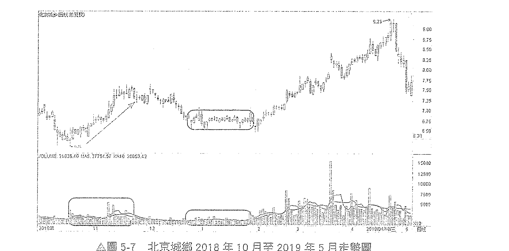

图 5-7 中可以看到，股价在中短线回落幅度较大的相对低点，先是出现了持续的横向窄幅整理。随后，股价向上缓慢攀升，形成了一个放量盘升平台。这期间的走势，该股明显强于同期大盘，具有一定的独立性，标志着主力积极参与此股，独立上涨的放量盘升平台，更有可能是主力积极的进货行为所形成的。

随后因大盘短线下跌，股价顺势回落，跌回至起涨点附近。此时出现了缩量窄幅运行的整理走势，这是大盘震荡给我们创造的一次短线入场良机，应把握住入场机会。

## 5.6 [犀牛图标] 穿越型的长阳线，可以积极买入布局

平量长阳突破宽震区形态，是指股价走势在多个交易日内形成的长阳线、长阴线交替出现的宽震格局。虽然每个交易日的股价盘中振幅较大，但由于长阴线、长阳线交替出现，所以股价重心并未向上移动。此时，一条实体更长的阳线以平量的方式，向上穿越了这个宽震区，股价也达到了近期小高点，较高的收盘价使得宽震区的筹码均处于获利状态。

穿越型的长阳线是多方积极做多的标志，平量则代表主力资金实力较强。如果股价的中短期涨幅较小，或者股价处于未启动状态，则多预示着有望展开一轮上攻行情，在实盘操作中，我们可以积极买入布局。

图 5-8 中可以看到，该股缓慢攀升的价格走势十分稳健，在攀升区的突破点，形成了一个长阳线、长阴线交替出现的宽震区，这是多空产生分歧的区域，也是股价运行方向将明确的标志。随后的平量长阳线突破形态，表明股价的运行方向是向上，在实盘操作中，我们应跟随信号，积极买入。

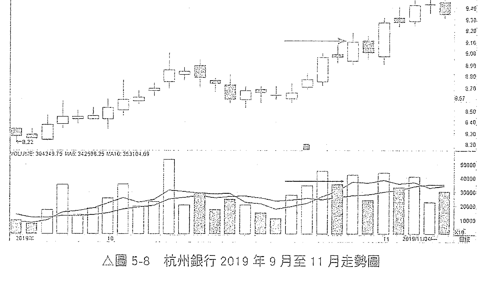

△图 5-8 杭州银行 2019 年 9 月至 11 月走势图

## 5.7 缩量双（三）探低形态，有望展开上攻行情

缩量双（三）探低形态，是指股价出现了类似于‘W’的二次探低（或者三次探低）的震荡走势，在整个震荡过程中，成交量逐渐减少。

无论是第二次回探震荡区低点，还是第三次回探震荡区低点，成交量都比前一次回探震荡区低点有所缩减，这说明股价破位下行的做空力量逐渐减弱。如果此时股价的震荡区处于中线低点，那么这种量价形态可以被看作是多方力量转强、空方出货无力的标志，预示着随后有望展开突破上攻行情，当二次（或三次）回探震荡区低点时，便是很好的中短线入场点。

图 5-9 的股价在中期低位区间出现了横向震荡走势。这期间的成交量随着震荡的持续而不断缩减，第二次回探震荡区低点时是一个买点，但此时的股价仍有破位下行的可能。因此，我们可以通过控制仓位的方式来降低风险。但当股价第三次回探震荡区低点时，成交量已明显缩小，且构筑了一个低点整理平台，止稳信号明显。此时可以加大买入力度，从而获取多空力量转变后的反转行情带来的利润。

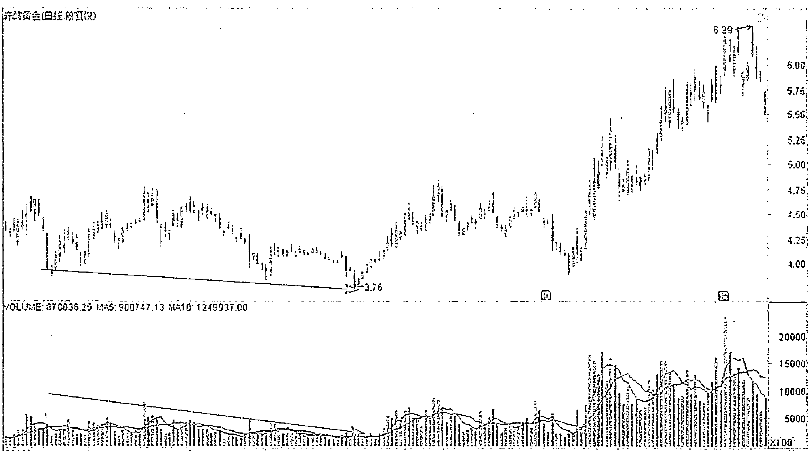

△图 5-9 赤峰黄金 2018 年 10 月至 2019 年 7 月走势图

## 5.8 [犀牛图标] 强缩量出现，表示有主力资金积极吸筹

宽幅箱体区低点强缩量形态，是指股价出现了横向的宽幅箱体震荡走势，震荡区一般处于中期高点位，箱体震荡持续时间较长。随着震荡的持续，当股价再度经短线回落至箱底时，成交量大幅缩减，明显小于前期震荡回档后的成交量，故称之为“强缩量”。

这种量价形态多标志着在箱体震荡的过程中，有主力资金进行了积极的进货。在箱底位置出现强缩量时，也意味着主力参与能力较强、手中掌控的筹码较多，个股有望迎来突破箱体区的上攻行情。此外，从短线角度来讲，股价也有向上反弹再碰触箱顶的趋势，可以说是在中短线投资中较佳的买入点。

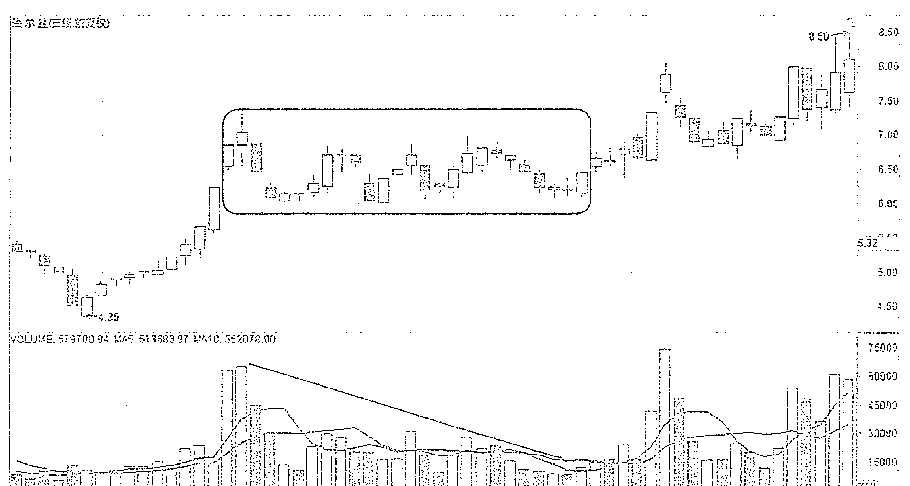

▲图 5-10 法兰胜 2019 年 1 月至 4 月走势图

图 5-10 中可以看到，股价在短期上涨后的高点长期震荡。如图中的标注所示，当股价随着震荡的持续而再度回落至震荡区低点时，此时的成交量呈极度缩量形态，这是主力持股数量较多、空方无力使股价降低的信号。而且，震荡区低点也是一个很好的反弹买入点，在实盘操作中，此时我们可以大胆买入。

## 5.9 缩量倒三角形态出现，可积极买股入场

“倒三角回升”形态，由一条长阴线之后的连续多条小阳线组合而成，“缩量倒三角”则是指包括长阴线当日的多个交易日内，成交量处于相对缩小的状态。一般来说，连续小阳线时的量能萎缩得更为明显。

低点缩量倒三角回升形态出现在短线低点，特别是在股价短线上冲后再度回探前期低点位时。此时股价无力破位下行，只要股价中短线累计涨幅小、短线跌幅大，此形态大多能准确地预示一波上攻行情的展开。在实盘操作中，如果长阴线之后出现了连续的缩量小阳线，并且此时的股价短线涨幅小，则缩量倒三角形态已完全形成，那么我们可以积极买股入场。

图 5-11 中可以看到，股价的中短线跌幅较大，此前有明显的独立上攻行情。在这个股价将要破位下行、短线跌幅较大的位置，出现了缩量倒三角形态，表示这是一个阶段性的反转信号，说明多空力量对比已经发生转变，在实盘操作中，我们可以短线买入。

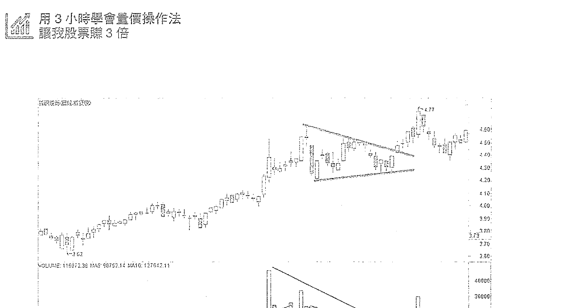

## 5.10 看到平量式攀爬上穿震荡区间，应耐心持股待涨

平量式攀爬上穿震荡区间形态，是一种揭示主力参与股情况的量价形态。个股首先出现了持续时间较长的横向震荡价格走势，这是一种常见的运行格局，此时很难判断是否有主力参与其中，多数投资人只能结合震荡走势进行波段式的高卖低买操作。一旦股价有向上穿越震荡区的趋势，投资人很难作出判断。但利用这种量价形态，我们可以判断股价是会开启突破上攻走势，还是会再度折转返回震荡区间内。

当股价向上运行至震荡区顶部时，若攀升速度缓慢、股价重心缓缓上移，并且此时的成交量未见放大，呈现出一种平量式的状态，则预示着经过震荡走势之后，主力已经拥有了较多的筹码（此时的主力已有较强的参与能力，同时股价向上缓慢攀升，是股价脱离主力成本区域的信号）。在实盘操作中，此时我们应耐心持股待涨，等待主力的进一步拉升，而不是过早地离场。

图 5-12 中可以看到，股价经历了长期的震荡，上下震荡幅度不大，累计涨幅较小，但震荡走势并不预示着一定有主力参与其中，股价运行方向不明朗。随着震荡的持续，当股价再度上涨至震荡区的相对高点时，如图中的方框所标注，以连续平量的方式突破震荡区。

此时全盘获利，但获利抛售盘不多，表示主力参与能力较强，结合股价累计涨幅不大且想要突破的价格形态来看，有望迎来一波上攻走势。在实盘操作中，此时我们可以积极跟随。

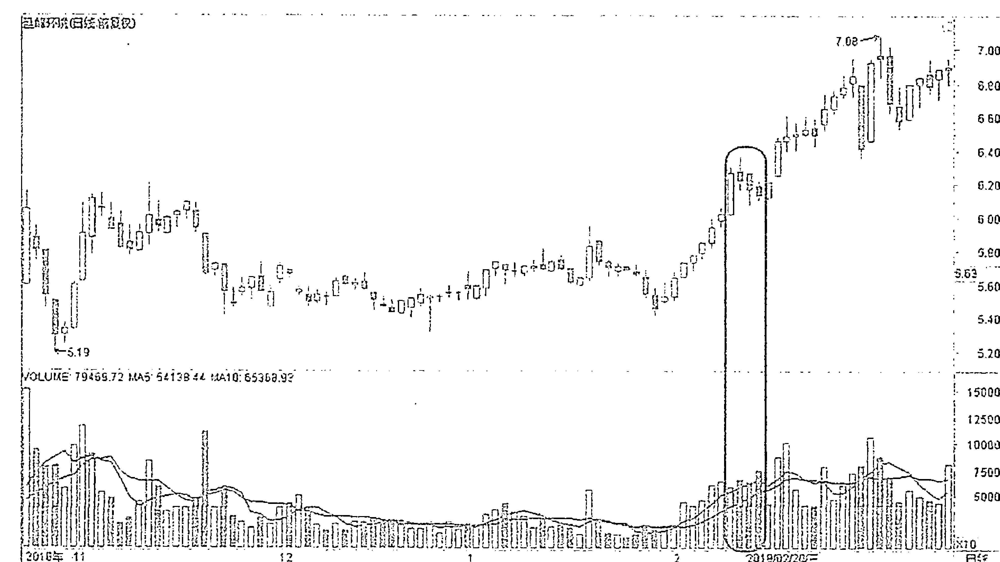

▲图 5-12 盈峰环境 2018 年 10 月至 2019 年 3 月走势图

## 5.11 [犀牛图标] 中短线急跌后回升缩量，有望出现一波反弹走势


中短线的急速下跌，往往会出现在股价的一波上冲之后。此时，或由于利空消息影响，或由于主力突然反手出货，股价开始了“雪崩”走势，中短线跌幅大、跌速快，但这种走势也容易引发强反弹行情。一般来说，如果股价在中线已有较大跌幅，且短线再度出现快速大幅跳水（以两三条长阴线的方式呈现），那么此时股价走势一旦止稳且以连续多日的小阳线缩量回升，则预示着短期内的做空力量已消耗殆尽，有望出现一波反弹走势。在实盘操作中，我们可以适当参与，从而获取反弹收益。

图 5-13 的股价中线跌幅大、短线跌速快，如图中的标注所示。在连续 2 条长阴线，股价跌至 5.05 元后，股价随着连续的小阳线而缓慢回升，回升时的量能萎缩。这是股价止稳的信号，也预示着反弹行情的展开，我们此时可以进行短线买入操作。

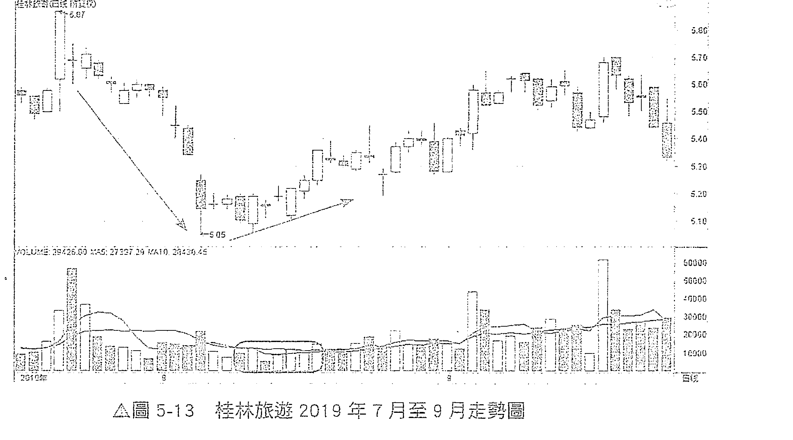

## 5.12 放量突破后，应逢短线回档之际买入


“宽震式涨跌”是指盘中振幅较大的阴线、阳线在数个交易日内交替出现的量价形态。即这几个交易日的盘中波动幅度较大，但由于阴线、阳线交替出现，股价没有上涨。“放量突破”则是指股价突破这个短线宽幅区间时，出现了明显的放量。

宽震式涨跌是股性开始明显活跃的信号，多与主力积极参与有关，此时的量能也会因盘中震荡幅度的加大而放大，股价运行方向尚不明确。随后的放量突破则表明主力资金的行为是做多的，而且经历了宽幅震荡区间后，多方已明显占据主动地位，这是有望展开一轮上攻行情的信号。在实盘操作中，我们可以在放量突破后，逢短线回档之机买入。

从图 5-14 可以看到，股价在长期盘整之后出现了宽震式涨跌形态，随后的放量

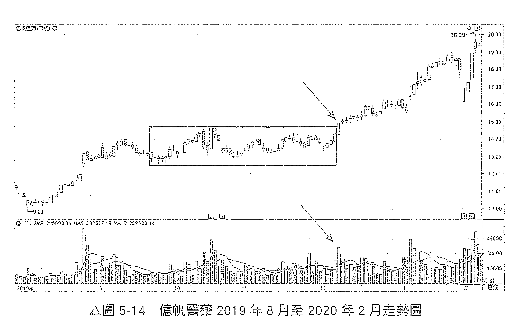


突破表明主力在积极做多。宽震式涨跌是多空分歧明显的标志，主力此时的参与能力并不是很强，若是没有明显的利多消息驱动，股价很难实现突破后立即飙升的走势。在实盘操作中，当股价放量突破宽幅震荡区后，可跟随买进。


## 5.13 震荡活跃式量能，可累计的涨幅不大

所谓“主力股”，是指从价格走势中可以明显看到有主力在其中参与的个股。一般来说，依据量价形态，我们可以判断出主力的存在。这类个股，其价格在进入高位区后，若正遇大盘系统性调整，往往也会随之暴跌，主力很可能在高位区出货数量较少，或者在暴跌后的低位区又进行了加码。此时，判断主力是否会进行新一轮的拉升是关键，其中的“震荡活跃式量能”，就是用来判断主力行为的依据之一。

“震荡活跃式量能”是指在震荡过程中，虽然股价短线波动幅度较大，但股价重心在上移。此时，成交量明显放大，而且股价也刚刚脱离近期最低点，累计涨幅不大。

我们来看看图 5-15 中该股的价格走势变化过程。首先，股价在中长期低点出现了一波反弹走势，这一波反弹，虽然让前期震荡平台区的筹码处于解套状态，但成交量没有明显放大，说明市场浮额较少、解套盘未“蜂拥而出”，这也从侧面验证了主力仍参与在其中。

随后，借助于利多消息，股价以无量涨停板的方式实现了短线飙升。但是，在高点位运行不久后，股价又受大盘系统性下跌的影响，而出现了新一轮的暴跌。主力是否已在反弹过程中快速出货？这个问题暂时难以判断。

# 第 5 章 我用日 K 线与成交量，预测“上涨股”！

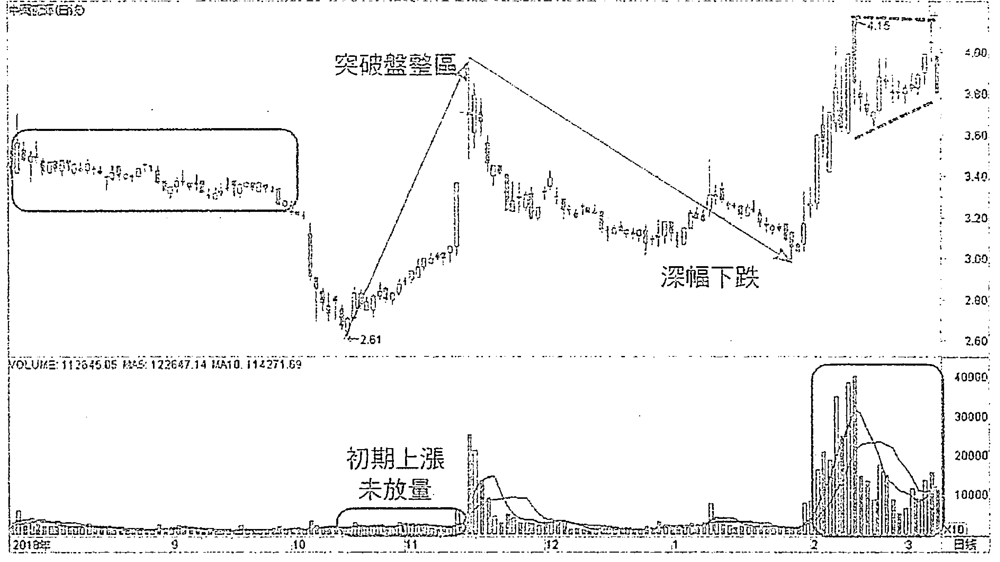

但随着低点止稳走势，及随后反弹过程中的“震荡活跃式量能”的出现，我们预计主力仍有再度拉升股价的意愿，且此时股价距低点的累计涨幅不是很大。因股价反复波动，主力的持有成本也相对较高，震荡活跃式量能又表明了主力积极参与的行为。在实盘操作中，震荡活跃式量能形态构筑期间，正是我们逢回档低点买入的好时机。由图 5-16 中可以看到，在主力的积极参与下，股价涨势强劲，远强于同期大盘。

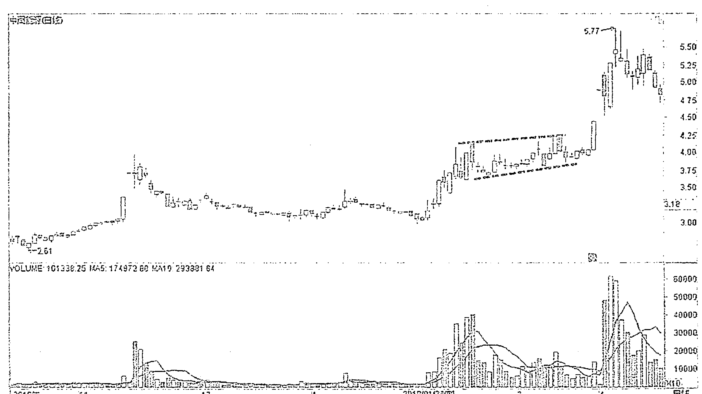

## 5.14 跌势中巨量阴线后的反弹点，可能有下跌风险

下跌途中的中短线买入机会并不多，且常出现在急速下跌之后，由于技术面要求及短线做空力量的减弱，常会有反弹行情出现。

跌势中巨量阴线后的反弹点形态，就是在跌势中获取反弹收益的一种量价形态。首先，股价的中短线跌幅已经较大，如果股价刚刚跌破高位整理区、距离最高点较近（少于 20%），则不宜参与。

在下跌途中，股价以一条（或连续两三条）巨量长阴线再探新低，长阴线当日的量能远高于此前的均量水平，股价呈加速下跌状。随后，一旦股价走势在数日内止稳，多预示着短期内的做空力量释放过度，若同期大盘走势相对稳健，则股价有望迎来强

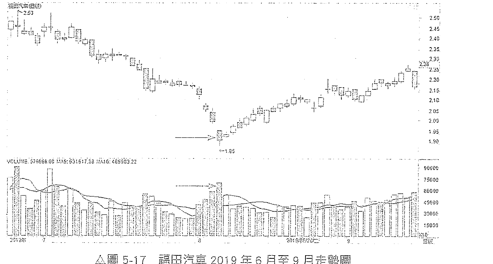

势反弹。

这类形态的重点是长阴线的“放量”，只有放出了巨量，且在中短线跌幅较大的位置点，这种反弹行情才能“一触即发”，因为巨量阴线可以被看作是空方力量消耗过度的表现。

对于这类形态来说，由于是在跌势中获取反弹收益，因此我们更应注重仓位的控制，并密切留意股价短期走向。一旦数日内股价无法回升，始终无法脱离我们的建仓成本区，则应考虑卖出，规避股价有可能出现新一轮的下跌风险。

由图 5-17 中可以看到，股价走势呈震荡下跌状，且下跌趋势明显，这是多空力量整体对比格局转变的表现，此时我们不可过早抄底入场。但随着震荡走势的持续，如图中的标注所示，一条巨量长阴线使得股价快速下跌，中短线的跌幅极大，我们此时可留意反弹行情的出现。随后几日的走势止稳，就是我们短线入场、获取反弹收益的时机。

## 5.15 [犀牛图标] 涨停板次日巨量阴线，为股价短暂的快速回落走势


涨停是股价启动的信号，也是主力参与的标志之一。当股价以涨停板强势突破启动时，主力很可能因为市场浮额较多、拉升阻力较大而先卖出一些筹码，这时多以放量长阴线形态为主要表现方式。

涨停板次日巨量阴线形态，是指股价先以一个盘面走势强劲的涨停板向上启动，这个涨停板早盘锁位、全天未打开，当日量能放大不明显，是典型的强势涨停。次日，股价惯性开高，但在盘中却节节下滑，收于一条放量长阴线。

如果在随后的几日，股价能够止稳、不延续长阴线后的弱势运行格局，且股价累计涨幅小、正处于长期盘整后的突破起点，则这种“强势板 + 放量长阴线”的组合形态，多为一次股价短暂的快速回落走势，我们可以择机买入。

由图 5-18 的分时图中可以看到，股价在长期盘整之后，在 2019 年 4 月 4 日出现了一字板的涨停板形态，结合股价正处于突破盘整区这一情况来看，这是股价再次启动的信号，也是主力有意拉升的信号。但是，长期的盘整也使得市场浮额过多。次日，股价开高走低，出现放量长阴线，在放量长阴线随后几日内止稳，此时是我们短线入场的好时机。

也有个股在两个涨停板之后，出现了这种放量长阴线的价格走势，“两个涨停板”往往也对应“两条放量长阴线”。在实盘操作中，第一条放量长阴线并不是最佳的入场抄底点，下面结合案例加以说明。

图 5-19 中可以看到，股价走势在连续两个涨停板之后，出现了两个交易日的放量长阴线。由于股价累计涨幅较小、无利空因素，出现这种形态往往是因为该股有题材面支撑，但主力手中筹码不够。在实盘操作中，这类股价走势往往极为迅捷，我们

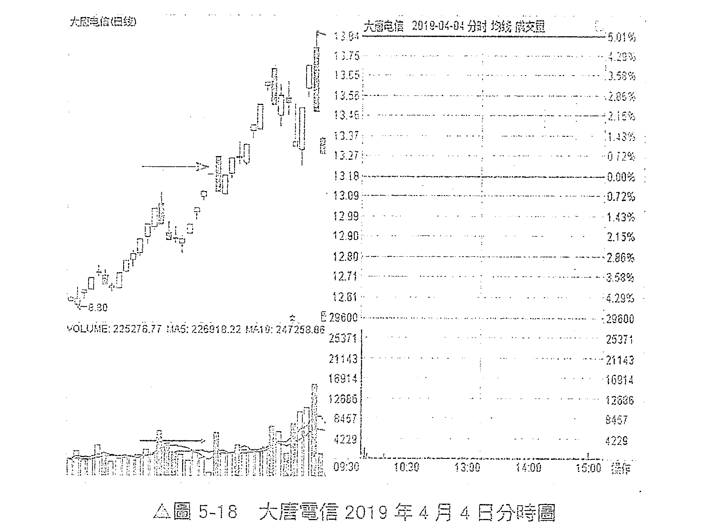

△图 5-18 大唐电信 2019 年 4 月 4 日分时图

应密切注意盘面变化。一旦出现盘中股价走势不弱，那么此时往往就是主力选择再度拉升的时机。图 5-20 为两条长阴线后第二个交易日的分时图，股价并没有延续大幅走低的弱势，而是低开探低拉起，这是股价短期内整理完毕、有望展开新一波上涨走势的信号。在实盘操作中，我们应及时跟上，把握买入时机。

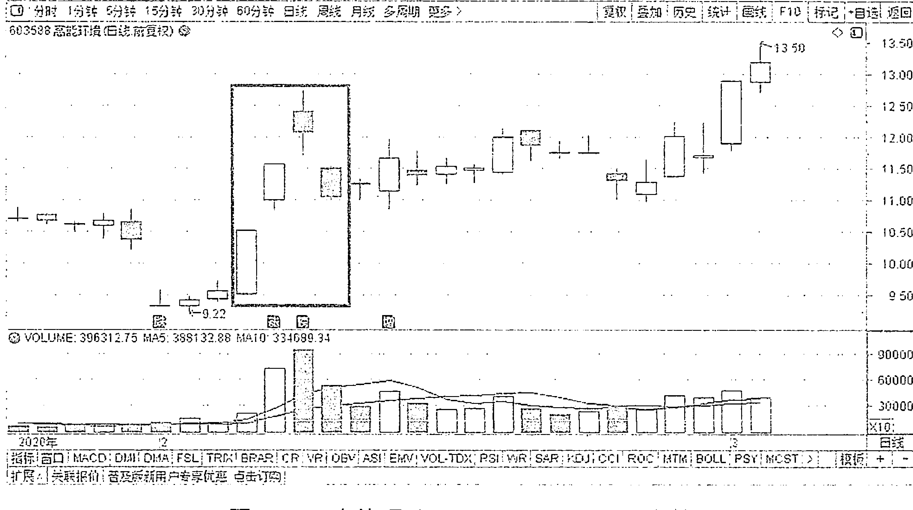

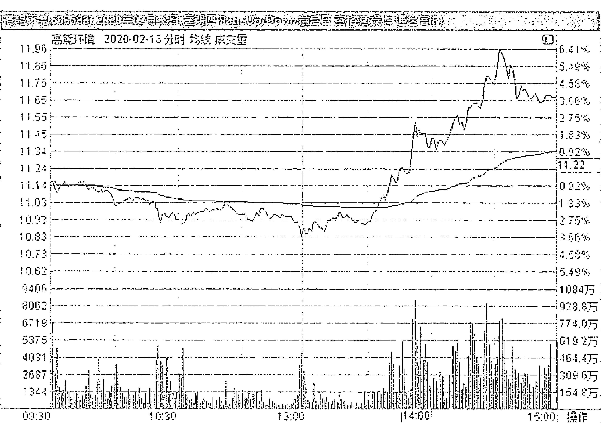

# 第 6 章
我用日 K 线与成交量，
预测“暴跌股”！

## 6.1 单日放量长上影阳线，应卖出股票以回避风险

在第 5 章中，笔者讲解了预示股价上涨的量价形态，依据这些形态，我们更能掌握中短线的买入机会。与此相对的则是预示股价下跌的量价形态，它们是风险的象征。在股市中，把握机会只胜利了一半，要想长久地在股市中生存下去，还需要懂得回避风险的方法，通过讲解本章中的这些量价形态，相信可以帮助读者从量价角度更好地回避风险。

单日放量长上影阳线形态，是指股价当日收出阳线但上影线较长，一般来说，上影线长于阳线实体，且当日量能明显放大。

这种形态常出现在一波上涨后的短线高点，是股价在盘中上冲时遇到较大卖出阻

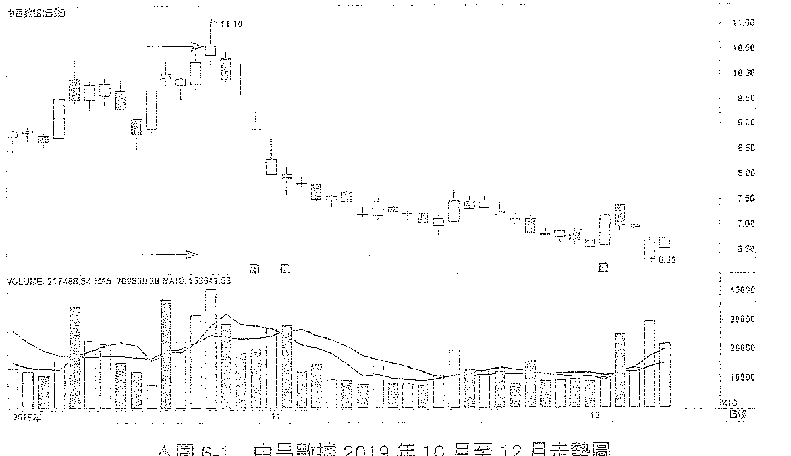

挡、上攻受阻的信号，预示着股价有短线回落的可能。在实盘操作中，此时我们应卖出股票以回避风险。

如图 6-1 中可以看到，股价上涨后的短线高点，出现了单日放量长上影阳线的形态，这是股价上涨遇阻、空方卖压较大的信号，也是股价短线回落的信号。

## 6.2 放量阴孕线组合，表示空方卖压较重

“孕线”是一种前长后短的双日 K 线组合形态。后面一条短 K 线的最高价低于前面一条长 K 线的最高价，且后面一条短 K 线的最低价，高于前面一条长 K 线的最低价，这使得后面的 K 线犹如“孕于”前面的长 K 线，故得名“孕线”。

在孕线形态中，如果前面的一条长 K 线为阳线，后面的一条短 K 线为阴线，这种孕线被称为“阴孕线”。阴孕线多出现在一波上涨走势后的高位区，如果阴孕线形态伴有量能的放大，则表明空方卖压较重、多方上攻无力，预示着即将出现一波回档下跌走势。

如图 6-2 中可以看到，股价的上涨走势一直很稳健，并没有短线飙升，仅从日 K 线图来分析，很难预测到股价会短线回落，但此时的成交量却发生了异动。如图中的标注所示，在高点位的盘整过程中，出现了放量阴孕线组合，这两日的量能异常放大，正是市场卖压突然加重、多方无力推升股价的信号，也预示了股价的见顶回落。在实盘操作中，就中短线而言，由于股价中线累计涨幅较大，此时我们应卖出股票以回避风险。

# 用 3 小時學會量價操作法
讓我股票賺 3 倍

△圖 6-2 遠達環保 2019 年 9 月至 11 月走勢圖

## 6.3 短線上衝單日天量，回落幅度大

「單日天量」也稱「脈衝式放量」。它是指成交量在單獨一個交易日（或兩個交易日）內突然大幅度放出，其成交量可達到正常水準的 4 倍以上，隨後又突然恢復如初。從成交量的直條圖來看，這一日的放量效果十分明顯，猶如躍動式閃現的電脈衝，打破了量能連續平穩變化的節奏。

短線上衝時的單日天量，伴以當日的長陽線，給人的第一感覺是放量上攻、行情可期，然而，這是因為我們不了解脈衝式放量上漲的市場含義。隨後的股價走勢表示，這種直接的感覺往往是錯的。

在常態下，市場交投有一個相對連續的過程，量能展現了多空雙方的競爭力度，基於市場交投的連續性，量能的放大與縮小也不會過於突兀。但脈衝式放量明顯打破這種連續性交投格局，它是量能的一次偶然性躁動。突然放量，又突然恢復如初，顯然是由某種原因驅動的。只有充分理解脈衝式放量形態的成因，我們才能更完整地掌握這種形態。

在短線衝上時出現的脈衝式放量長陽線，往往會形成一種「放量上漲」的市場氛圍，吸引跟風盤買入，而主力則積極出貨。因此，脈衝式放量當日的盤中高點往往也就是短線高點，股價在此之前短線漲幅較大，但隨後的回落速度快、回落幅度大。在實盤操作中，我們應注意該類風險。

圖 6-3 中可以看到，股價的一波上漲使其突破了盤整區，並在 2019 年 10 月 15 日加速上漲，當日的量能也達到了峰值。從該股此前的成交量表現來看，這種放量效果是難以持續的。

我們可以看到圖 6-4 中，當日出現天量是因為開盤後不久，股價就衝高至漲停板附近，但未能收漲停，從而引發了巨量賣出。結合股價短線漲幅較大，且並無明顯熱門題材支撐來分析，這很有可能是多空力量轉變的信號。在實盤操作中，我們在當日收盤前應賣出或減碼。次日，該股成交量大幅度萎縮，表示 2019 年 10 月 15 日的單日天量形態，是明確的短線見頂訊號。

## 6.4 放量上漲中探頭式量能，隨時可能反轉下行

放量上漲中的探頭式量能形態，是指股價以放量的方式實現上漲。上漲過程中，在某個交易日中量能進一步放大，但次日量能恢復如初。

探頭式量能的出現，說明股價的中短線上漲已是強弩之末，多方力量已有了較大的消耗。如果股價短線漲幅較大、漲速較快，則探頭式量能一旦出現，往往就是股價短線見頂回落之時；如果股價之前的上漲相對穩健，那麼雖然隨後幾日仍能進一步上漲，但上漲基石已不牢固，隨時有反轉下行的可能。

在 6-5 的走勢圖中，股價以穩健的中小陽線方式向上突破了盤整區間，但在累計漲幅不大的位置點出現了探頭式量能，預示著此輪突破行情的根基並不牢靠。在隨後的若干交易日內，我們應逐步減碼離場、鎖定利潤。

圖 6-6 與圖 6-5 的案例不同，圖 6-6 該股價格的短線上漲走勢較為迅速、漲幅大，此時出現的探頭式量能，大多是股價短線見頂的訊號，特別是該股價格在次日又出現了滯漲。在實盤操作中，此時我們應果斷賣出。

▲圖 6-6 航發科技 2019 年 1 月至 5 月走勢圖

## 6.5 遞增放量下的量能峰，是股價的階段性高點或低點

逐級式遞增放量形態，是指在一波快速上漲過程中，股價連續收出陽線，且成交量呈現出逐級放大式的遞增特徵。所謂的逐級放大式，即後一交易日的量能略高於前一交易日，5 日均量線呈快速上揚狀。

遞增放量是一種只能持續數個交易日的局部放量形態，其往往與股價走勢沿某一方向快速發展有關，是買盤持續加速流入（遞增放量與股價上漲同步出現）或是賣盤持續加速拋售（遞增放量與股價下跌同步出現）的表現。在實盤操作中，我們應關注遞增放量形態下的量能峰值點，因為這裡往往也是股價的階段性高點或股價的階段性低點。

圖 6-7 在股價震盪走高並創出短線新高的一波行情中，出現了連續 4 日逐級放大的遞增放量形態，在第四個交易日股價收出長陽線，且量能創出近期新高。結合該股的歷史表現來看，此時的量能難以再度放大，且短線止攻呈加速狀，在實盤操作中，此時我們可以適當減碼、鎖定利潤。圖 6-8 在一波反彈走勢中，股價連續 5 天上漲，量能遞增式放大。如圖中的標注所示，此時，量能無法進一步放大，這是反彈結束的訊號。在實盤操作中，若我們想要短線獲取反彈收益，則此時應賣出。

用 3 小時學會量價操作法 讓我股票賺 3 倍

### 大幅放量式滯漲有兩種表現形式

大幅放量式滯漲形態也常被稱為「堆量滯漲」，這種形態是指在短線高點，個股連續多個交易日明顯放量，量能的放大效果相近。但此型態下股價並未明顯上漲，即量能的大幅放出無法推升股價，股價會呈滯漲形態。

堆量滯漲主要有兩種表現形式。一是，在橫向滯漲過程中，以中小陽線、陰線居多，股價在每個交易日的盤中振幅不是很大。此時，僅從 K 線走勢來看，股價的運行相對平穩，未見明顯異常，如果不借助於成交量，我們幾乎難以做出有效的判斷。二是，在橫向滯漲過程中，長陽線、長陰線交錯出現，股價在每個交易日的盤中振幅都較大。

這兩種表現形態雖有所不同，但它們的市場含義是相近的。既然放大的量能無法推升股價，並且由於交易是雙向的，那麼，這種放量也就表示短期內賣壓很沉重。而大幅度的放量，又大程度地消耗掉短期內的市場潛在買盤，嚴重削弱多方力量，預示了股價的調整。

圖 6-9 中股價因利多消息的驅動而漲至短線高點，此時股價上下震盪，長陽線、長陰線交替出現，量能急劇放大，但股價無法上行。這屬於多個交易日盤中股價振幅較大的放量滯漲形態，是多空分歧過大的標誌，也呈現了沉重的賣壓。在實盤操作中，我們應及時在逢盤中震盪衝高時賣股離場。

圖 6-10 中可以看到，在短線漲幅較大的位置點，股價橫向滯漲，K 線圖呈小幅度波動狀。單看 K 線的運行，這似乎是上升途中的一個中繼整理平台，但結合同時間的量能情況分析後發現，這屬於短線高點的放量滯漲形態，是一個危險的訊號，預示著股價的調整。在實盤操作中，此時我們應賣出股票以迴避風險。

△圖 6-9 科力達 2019 年 3 月至 6 月走勢圖

△圖 6-10 超訊通信 2019 年 7 月至 11 月走勢圖

股價經歷了長期上漲之後會進入高位區，在這個區間，我們難以判斷股價走勢。因為股價前期的獨立上漲，表示有主力參與此股，所以結合量價形態的變化來分析是重點，也是關鍵。

如果股價在高位整理區中運行時，突然出現了量能大幅度萎縮的震盪形態，那麼這種量價關係的轉變，往往預示著多方力量開始趨於枯竭，而空方賣壓則陸續釋放中。這是多方力量轉弱、空方力量轉強的訊號，預示著頂部的出現，也是中長線投資人賣股離場的訊號。

運用這一量價關係時，應注意兩點。一是，股價的累計漲幅。只有在股價的累計漲幅較大、個股處於明顯高估狀態時所出現的這種縮量滯漲形態，才是可靠的趨勢反轉訊號。二是，要準確地識別出何為滯漲形態。整理形態一般會使得股價重心上移，而滯漲形態則不同，由於空方力量開始佔據優勢，因此股價走勢多以震盪緩跌、股價重心下移等為表現形式。

圖 6-11 中可以看到，股價此前的上漲具有很強的獨立性，主力參與明顯。隨著累計漲幅加大、主力拉升放緩，股價進入了高位震盪區，此時的股價重心無法繼續上移，我們也應留意趨勢的反轉。如圖中的標注所示，此時出現的整理區突然縮量形態，就是股價盤整之後將破位下行的訊號，也是提示中短線投資人賣出離場的訊號。

對於價格累計漲幅巨大的個股來說，它們多有主力積極參與。當股價進入高位區時，若股價長期震盪滯漲且量能極度萎縮，則表示雖然此時主力的能力依舊較強，但由於主力獲利空間巨大，股價在高位區的狀態是極不穩定的。一旦大盤出現回檔或主力有意大力出貨，那麼個股破位下行的空間極大。在實盤操作中，我們應規避此類個股。

圖 6-12 中可以看到，股價在高位區長期震盪滯漲運行，此時量能極度萎縮。股價走勢雖獨立於大盤。但由於主力獲利幅度大，股價破位下行的機率也隨著震盪的持續而增加，散戶不宜參與此類股票。

## 6.8 震盪破位前突然縮量，預示主力參與能力提升

在橫向的震盪運行中，即使股價重心略有上移，但如果震盪期間沒有主力入場，則隨著多空交投趨於冷清、市場人氣逐漸低迷，股價還是極有可能破位下行的。在實盤操作中，很多股票在震盪破位之前（即使震盪區間的累計漲幅不大），常常會出現突然縮量的形態特徵，這是一個警示風險的訊號。

在實盤操作中，有時難以分析震盪之後的突然縮量，究竟是因為主力參與能力提升、積極鎖籌，還是因為市場交投趨於冷清、買盤無意入場。此時，我們可以關注縮量時的 K 線形態特徵。如果此時的陰線實體明顯較長，多預示著買盤無意入場、空方力量有轉強趨勢；反之，多預示著主力參與能力有所提升。下面筆者將結合案例加以說明。

圖 6-13 可以看到在橫向震盪過程中，成交量大幅萎縮，陰線實體明顯較長，這是股價破位前的警示訊號。

## 6.9 穿越式長陰放量反轉，此時應果斷賣出

穿越式長陰放量反轉形態常出現在盤整走勢之中，從 K 線形態來看，它往往是開高走低的長陰線，陰線實體極長，使當日的收盤價接近或跌破了原有的橫向震盪區間。這種長陰線多伴有量能的放大，是主力資金快速出貨的重要信號。

一般來說，若同期大盤走勢較弱，一旦股價走勢中出現了這種類型的放量長陰線，說明股價隨後的短線跌速快、跌幅大。在實盤操作中，為了資金安全，此時我們應果斷賣出。

圖 6-14 中可以看到，股價在高位區出現了橫向震盪走勢。此時，一條開高走低的放量長陰線極為明顯，它是趨勢反轉的信號，預示著將展開一輪快速下跌行情，是明確的賣出信號。

很多時候，我們不一定要等到收盤時才確定這是開高走低的放量長陰線，在盤中可以判定的前提下，逢反彈之機賣出是更好的選擇。

圖 6-15 的分時圖中可以看到，該股早盤放量跳水，而從圖 6-14 中可以看到當日量能明顯放大，盤中跌幅較大，股價一直運行於均價線下方，這是資金加速撤出、多方無力反擊的信號。

結合圖 6-14 中的放量長陰線來看，股價走勢已呈破位狀，我們應果斷賣出，不必等到收盤時再做決定。

圖 6-16 股價在震盪下跌的過程中出現了一波反彈，反彈時出現了一條開高走低的放量長陰線，這是反彈行情快要結束的信號，也預示了將展開新一輪下跌行情。在實盤操作中，我們應注意股價走勢快速轉變的特徵，結合個股及大盤的變化，及時調整買賣策略。

△圖 6-14 白雲機場 2019 年 7 月至 12 月走勢圖

△圖 6-15 白雲機場 2019 年 10 月 14 日分時圖

△圖 6-16 新疆天業 2019 年 4 月至 8 月走勢圖

## 6.10 跳空破位放量長陰線，此時不宜過早抄底買入

一旦股價步入跌勢時，「跌勢不言底」這句用來警示風險的名言，可能被那些喜歡抄底的投資人所忽略。在跌勢中，能以更低的成本買入固然重要，但是若低點的整理只是暫時的，則此時買入無疑是十分危險的。從時間的角度來看，當前的低點很可能就是以後的高點。

跳空破位放量長陰線形態，是我們判斷跌勢是否見底的重要形態之一。若股價以一條跳空低開、盤中放量低走的長陰線降至新低，則多表示市場中賣壓依舊十分大，當前的這個低點很難形成真正的底部區。在實盤操作中，此時我們不宜過早抄底買入。

圖 6-17 中可以看到股價自高點位開始震盪下行，並明確步入下跌通道。這時，我們應以應對跌勢的方法進行操作，中長線投資人可持幣觀望，短線投資人則可以結合股價及大盤的波動情況，適當參與以獲取反彈收益。

如圖中的標注所示，一條跳空低開的放量長陰線加快了股價的下跌速度，放量長陰線之後是持續的小陽線、小陰線，股價出現止穩走勢。這條放量長陰線只是股價下跌途中的第一次加速下行，距離頂部並不遠，下跌趨勢並未見底，此時我們不宜過早抄底入場。

△圖 6-17 特變電工 2019 年 6 月至 12 月走勢圖

## 6.11 高點收漲的天量陰線，其轉向後的下跌幅度會較大

高點收漲的天量陰線形態出現在短線快速上漲過程中，此時股價跳空上漲，盤中慣性上衝，但在高點遇到賣出阻擋，股價會出現一定的下滑。至收盤時，收盤價低於開盤價，當日收出陰線，但股價仍然處於上漲狀態，跳空缺口未回補。

這種盤中走勢伴以明顯放大的量能，是多空力量對比格局在盤中快速轉變的標誌，多預示著短線上攻走勢的結束。由於股價短線漲幅較大，其轉向後的下跌幅度往往會較大，跌速也會較快。

圖 6-18 中可以看到，一波短線快速上漲之後，股價在早盤慣性衝高、隨後快速下滑。在圖 6-19 此盤中運行情況圖中，股價在早盤開高走高的原因是慣性上漲，隨後快速跌破均線，反彈無力，這是多空力量轉變的訊號。如圖 6-18 所示，當日量能明顯放大，結合股價在盤中震盪下行的情況來看，主力已開始出貨，因此，每一次的盤中反彈都是我們減碼、賣股的好時機。

△圖 6-19 廣州發展 2019 年 7 月 29 日分時圖

## 6.12 飆升股量價緩慢下滑時，應果斷賣出

飆升股量價緩慢下滑形態，出現在股價短線大幅飆升之後。由於股價飆升，成交量也大幅放出，但這種走勢持續的時間較短。隨後，股價失去了上漲動力，在短線高點處，交替出現的小陰線、小陽線使得股價重心下移，同期的成交量也開始不斷下滑，這就是「量價緩慢下滑」形態。

在短線高點處，這種形態是多空力量對比緩慢轉變的標誌，即多方力量緩慢減弱、空方力量緩慢增強，是一個由量變到質變的過程。一旦多空力量轉變結束，將展開短線加速下跌行情。在實盤操作中，我們識別出這種量價形態後，應果斷賣出，不可抱有僥倖心理。

如圖 6-20，股價先是出現了一波短線飆升走勢，在這期間量價齊升，成交量的放大十分明顯，這使得股價短線漲幅極大。在隨後的高點處，股價開始滯漲，小陽線、小陰線交替出現，股價重心開始下滑，成交量也隨之不斷縮小。這種量價同步緩慢下滑的形態，預示著該股難有第二波上攻行情。在實盤操作中，我們此時應果斷賣出、鎖定利潤。

## 6.13 巨量的長下影線，應短線賣出離場

「長下影線」是多空雙方盤中競爭較為激烈，且最終以多方佔優勢收盤時，所出現的一種 K 線形態，它往往被視作是股價上漲訊號。但是，若結合股價的局部走勢及量能來分析，則有不同的處理方式。

如果長下影線出現在短線高點處，且當日伴有巨量放出，那麼這是空方賣壓突然增大的訊號。雖然多方當日進行了有力的承接，但是當日的巨量也預示了多方力量的過度消耗。這種巨量長下影線出現當日，無論是收陽線還是收陰線，只要出現在局部高點處，都可以被看作是股價回落的信號，此時我們應短線賣出離場。

我們可以看到在圖 6-21 中，股價在經歷了長期盤整之後開始突破上行，在短線漲幅為 30% 左右的位置點，出現了一條巨量長下影陰線，這是一個較為明確的短線反轉訊號，也是上攻行情受阻的訊號，此時我們應賣出。

在盤整走勢中，巨量長下影線形態也是我們提前作出判斷的重要依據。圖 6-22 中可以看到，股價在中線漲幅較大的位置區，持續橫向震盪運行，隨著震盪走勢的持續，股價運行方向仍不明朗。如圖 6-22 中的標注所示，此時出現巨量長下影陰線形態，表示該股中有較多的空方賣壓，雖然當日未使股價馬上降低，但隨著多方力量的不斷減弱，股價隨後破位下行的機率加大。在實盤操作中，我們應逐步減碼、降低風險。

▲圖 6-21 興發集團 2019 年 6 月至 8 月走勢圖

▲圖 6-22 建發股份 2019 年 8 月至 11 月走勢圖## 6.14 双阳天量出现时，应卖出股票以回避风险

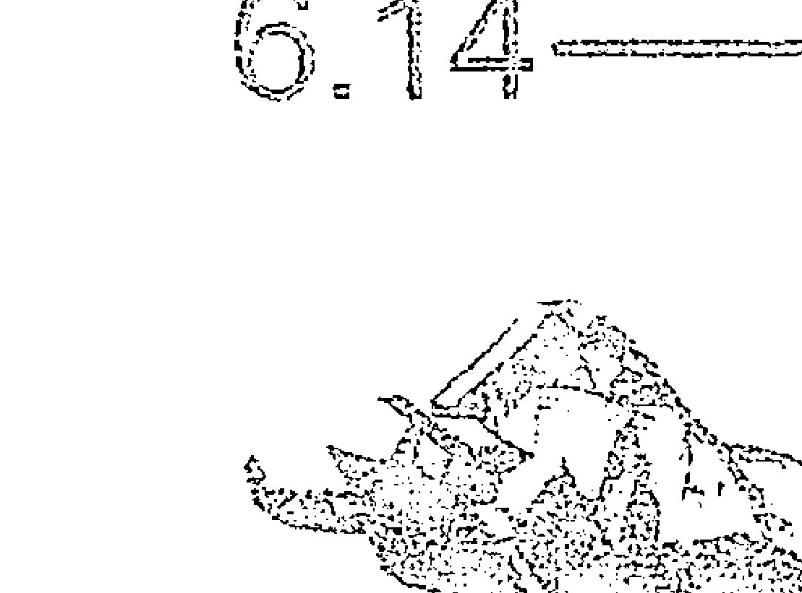

双阳天量形态，是股价短线上冲时的一种常见形态。两个交易日均收出长阳线，且股价短线涨幅较大；这两个交易日的放量效果相近，且远大于其他交易日的量能。从日K线图中来看，这两个交易日的成交量十分突兀。

双阳天量形态的出现，多与主力手中筹码不多、参与能力不强有关。由于获利浮额过多、卖压过重，主力在拉升时遇到了强力阻挡，虽然这两个交易日收出阳线，但却极大地消耗了多方力量。

一般来说，双阳天量常出现在低点位盘整后的突破走势中，虽然它不是主力出货的信号，却预示着股价的短线大幅调整。在实盘操作中，我们应卖出股票以回避风险，等待股价回档止稳后再择机买入。

图6-23中，股价在向上突破时短线涨速较快、涨幅较大，此时出现的双阳天量形态是股价短线见顶的信号。

对于该股来说，双阳天量中的第二个交易日收盘前是最好的卖出时机。如图6-24此分时图中可以看到，当日股价振幅超过10%，尾盘时又无法收涨停板，这说明经过了一天的上涨之后，由于多方力量消耗过大，因此在收盘阶段已是空方占优势了。这是典型的弱势型分时图，次日低开的概率较大，结合双阳天量这个卖出信号进行分析后，收盘前果断卖出、锁定利润是较佳的策略。

### △图 6-23 中闽能源 2019 年 2 月至 12 月走势图

### △图 6-24 中闽能源 2019 年 4 月 11 日分时图

## 6.15 连续小阴线缩量下滑形态，预示股价即将下跌


多空力量的转换往往是一个循序渐进的过程，阴线、阳线仅代表着一天交易后的多空胜负情况。若个股连续收出小阴线、使得股价开始下滑，即使同期的量能萎缩，这也是空方力量开始转强的信号。特别是当股价处于短线上涨后、潜在获利卖出较多的位置点时，这种连续缩量小阴线的走势，很容易使得持股者失去耐心而选择抛售，从而进一步加快股价的下跌速度。

一般来说，盘整后出现这种连续小阴线缩量下滑形态，往往是股价破位下行前的警示信号，短线高点出现这种形态，则预示着股价大幅调整的展开。

图6-25 联美控股2019年5月至9月走势图

图6-25中，股价在大盘横向震荡期间经过了“特立独行”的上涨，累计涨幅较大，主力在高位区有出货的需求。如图中的标注所示，此时出现了连续小阴线缩量下滑形态，这就是高位反转、股价加速下行前的警示信号，也是多空力量转变过程中的一个短暂的过渡时期，如果我们不能准确地辨识它，很有可能会在高位区被套牢。


# 第7章 我用分时图，抓到个股「最佳买卖点」！

## 7.1 早盘中出现放量上扬，应逢回落的低点买入

日K线图中的量价配合关系固然重要，但对于短线交易来说，能够在盘中捕捉到最佳买卖点往往才是交易的关键。短线的买点越低，我们在操作中就会越主动，设立的止盈位和止损位就更不易受大盘偶然波动的影响。

短线的卖点把握得好，就可以获取更多的利润，实现“正确的交易多赚、亏损的交易少赔”，有利于资金的滚动增值。而要想更精准地判断盘中高点和低点，正确解读盘中量价形态，就是其中的关键。在本章中，我们将聚焦分时图，看看分时图中的量价关系，能为我们提供哪些买卖信号。

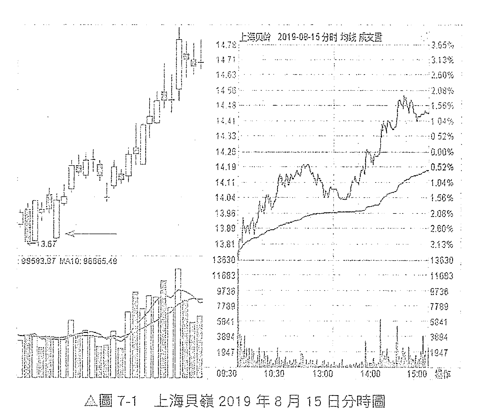

## 7.2 盘中量价齐升不回落，收盘前应积极短线买入

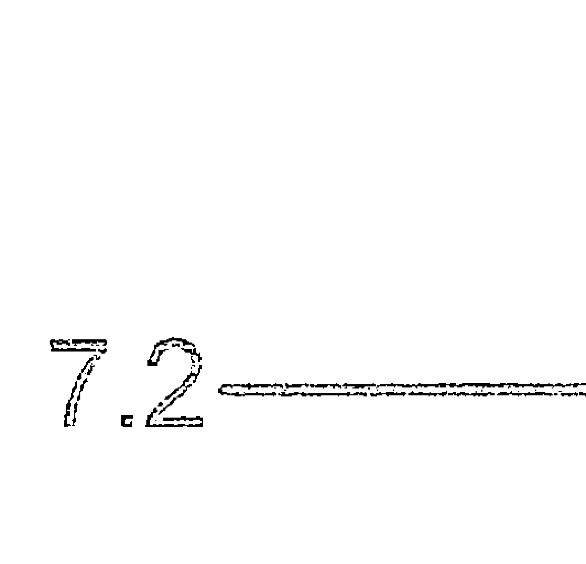

盘中量价齐升不回落形态，是指股价在盘中交易时间段出现了流畅快速上扬，主力拉升动作明显。在快速上扬的过程中，成交量随着股价的冲高而不断放大，即量与价呈同步不断上升的态势。在随后的盘中高点，股价强势整理而不回落，距离下方的均价线始终有一定的距离。

这是一种极为强势的分时图中的量价组合，流畅快速的股价上扬伴以同步放大的量能，是主力大单入场拉升的表现。股价在随后的盘中高点处不回落，说明市场获利卖压轻、主力参与能力强。若此时股价的中短线涨幅较小，则这种盘面形态预示着有望展开一轮上攻行情。在实盘操作中，若当日盘中涨幅不大（小于5%），则收盘前可以进行积极的短线买入操作。

图7-2的当日盘中股价快速上扬，分时图中呈现出了量价齐升的形态，而且随后股价在盘中高点处强势运行、震荡缓升，股价重心不回落。结合日K线图来看，此时正处于低位盘整突破点，因此，可以判断出这个强有力的上扬分时图，是一波上涨行情开始的信号，也是提示我们应短线入场的信号。

在实盘中，与本案列形态相似但不完全相同的分时图有很多，我们应注意其形态的变化。其中，理解形态的市场含义、学会解读形态的变化才是关键。下面来看一个与此比例形态相近但又略有不同的分时图。

图7-3中可以看到，该股在其价格盘中上扬时出现了量价齐升形态，但量价的配合还不够理想，量能的放大不充分、分时线不够挺拔，随后在盘中高点股价也出现了一定的回落，但回落幅度较小。

综合来看，图7-3是一个与图7-2形态相似但又相对“弱势”的分时图，但它仍不失为一个预示股价短线涨的信号。

# 第7章 我用分时图，抓到个股「最佳买卖点」！

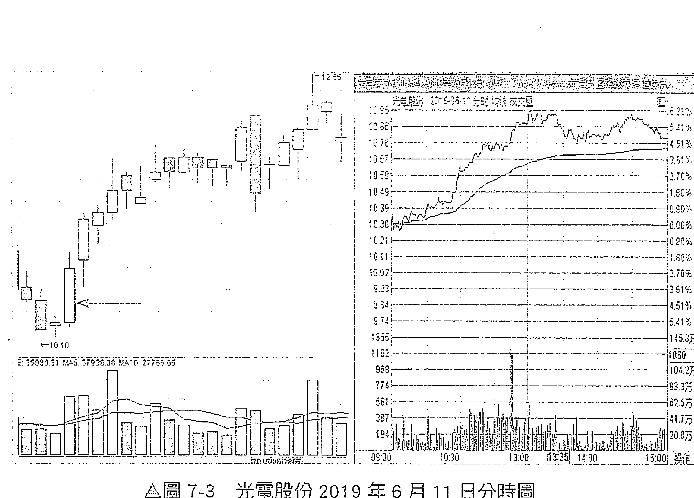

### △图 7-3 光电股份 2019 年 6 月 11 日分时图

## 7.3 量堆推升节节高，股价中线的上涨空间可观

量堆推升节节高形态，也称为“台阶式上扬”形态。从形态的角度来看，股价如同迈着台阶向上涨，在每一波快速上扬后都会出现一个量能堆；随后，股价在推升后的高点强势横向运行，这是一个整理过渡时期；最后，再度出现量能堆，推升股价至盘中新高点。

这种盘面量价形态往往是中长线主力入场，并积极拉升股价的信号，股价的上涨有着坚实的基础，盘中高点的买盘承接力度也很强，市场卖压不重。若股价累计涨幅不大或者正处于盘整后的突破点，则这种盘面形态预示着将展开一轮上涨行情，短线交易有一定的利润空间，股价中线的上涨空间也较为可观。

图 7-4 中可以看到，在低位的横向整理之后，股价在 2019 年 8 月 19 日开始向上突破。盘中出现了多次较为明显的上涨，每一次上涨后都有一个量能堆，且上涨后的盘中高点都能够强势止稳运行，从而能在盘中不断走高。这是一个强势型的分时图，有主力积极参与，此时是买入时机。

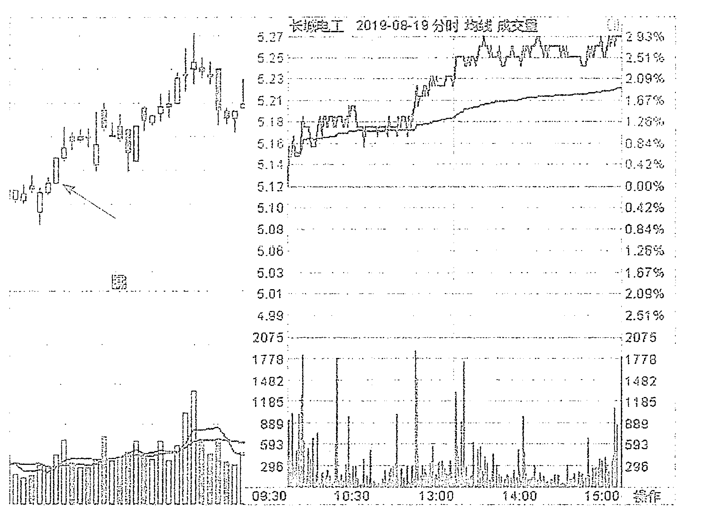

### 图7-4 长城电工 2019年8月19日分时图

## 7.4 活跃量能的斜线式拉升，是低风险的买入时机

活跃量能的斜线式拉升形态，是显示出主力踪迹的一种盘面量价形态。在盘中，常常是在尾盘阶段，股价的上扬走势呈45度角（或60度角）的斜线状，持续上涨的时间较长，整个上扬过程中的量能保持着放大的态势。

一般来说，如果斜线拉升的幅度不是很大，且股价在盘中高点能够止稳不回落，那么表明主力参与能力较强，其拉升行为会在随后的交易日中持续下去。在实盘操作中，我们还应关注日K线图，如果这种盘面量价形态出现在了中短线的低点，则是一个风险低、潜在收益高的买入时机。

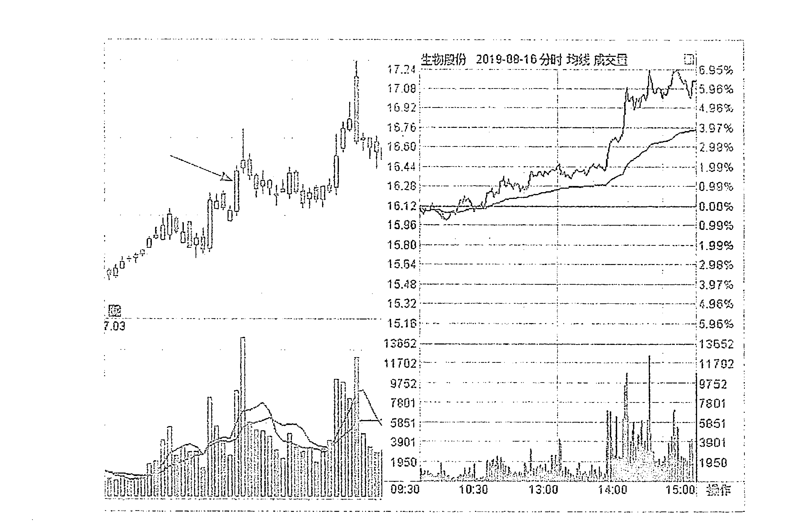

### △图7-5 生物股份2019年8月16日分时图

图 7-5 中可以看到，股价在尾盘阶段出现了斜线式放量拉升，当日成交量放大，股价正处于盘整突破点。结合此分时图所显示出的主力参与行为分析后，可知随后股价出现突破上攻的机率极大。在实盘操作中，我们可以短线买入，享受主力拉升成果。

## 7.5 低开下探带量震荡上扬，应趁回档低点买入

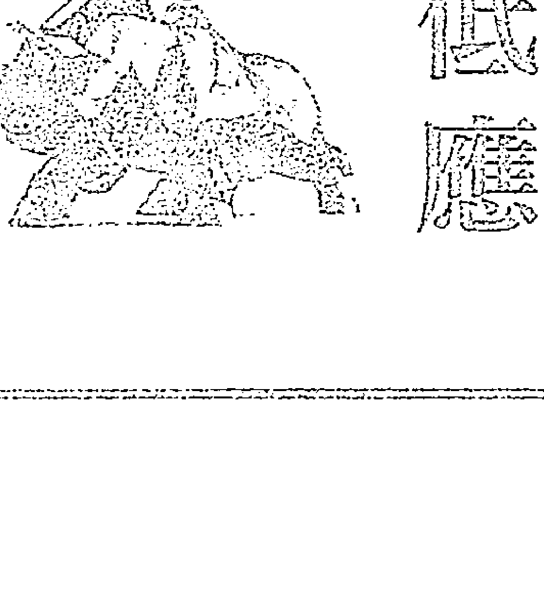

低开下探带量震荡上扬形态，常出现在一波快速下跌走势中。股价当日惯性低开，开盘后出现了一波跳水，但随后即在买盘的承接下开始震荡上扬，并跃升至均价线上方，成交量保持相对放大的状态。

这种量价形态是短期内多空力量转变的信号，在实盘操作中，当股价震荡上扬、向上攀升明显时，表示多方力量已经明显占据了主动地位，我们可以逢盘中回档低点买入，因为股价在随后的盘中节节走高的机率较大。若个股出现这种量价形态，则其收盘价往往接近全天最高价，短线买入的风险较低。

图 7-6 中可以看到股价短线下跌，幅度大、速度快。当日早盘股价下探，随后震荡上扬、放量攀升。至此，多空力量对比格局开始转变，虽然因盘中的震荡回升，股价略有上涨，但从日 K 线图来看，短线的反弹才刚刚开始。在实盘操作中，我们应趁盘中回档，低点买入入场。

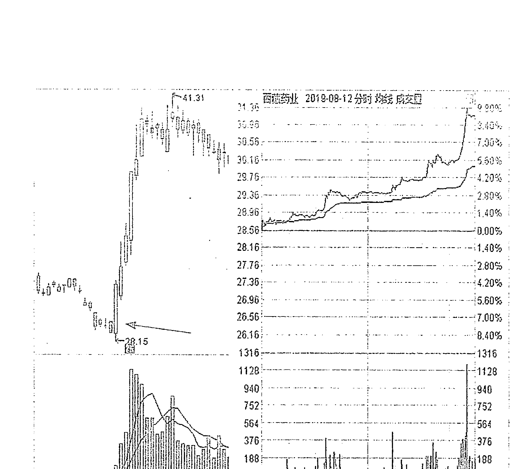

## 7.6 早尾盘二度上扬，预示买入的信号

早尾盘二度上扬形态，是主力拉升股价时一种较常见的盘面形态。早盘开盘后不久，股价快速上扬，分时成交量同步放大，股价随后在盘中横向运行，持续时间长；在尾盘阶段，股价再度上扬，分时成交量同步放大。通过这两波拉升，股价在盘中稳健上涨，这也是中短线内主力有意拉升股价、股价步入上升通道的信号。在实盘操作中，如果股价突破低位盘整区或处于短线超跌状态，则此分时图中的形态预示着一波上攻行情的出现，这是买入信号。

图7-7中的个股在早盘阶段、尾盘阶段均出现了流畅、挺拔的上扬走势，中盘阶段股价强势横向运行，这与主力资金的积极参与密切相关。从日K线图中来看，当日正处于低位整理后的突破点。结合分时图进行分析后，可知这是主力拉升的信号，预示着上涨行情的展开，是买入入场的时机。

同一个主力在买卖个股时往往会采取相同的手法，该股价在整理数日之后的2019年9月10日，再度出现了首尾盘二度拉升的盘面形态。如图7-8所示，首尾盘的两波上扬也有明显放大的量能作为支撑，与图7-7的拉升遥相呼应，主力做多意愿较强、做多行为坚决。此时的股价中短线涨幅较小，仍有较为充裕的上升空间，在实盘操作中，我们此时则应该耐心地持股待涨。

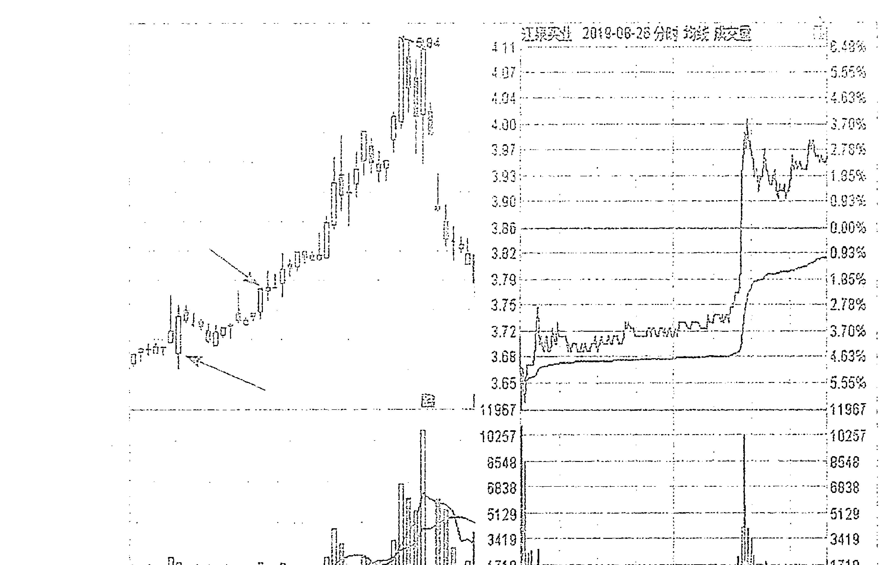

### △图7-7 江泉实业2019年8月26日分时图

## 7.7 水平式巨量，应第一时间离场以规避风险

水平式心电图巨量形态也称为“一字形巨量”形态，它是指个股在盘中的分时线呈水平运行，或水平式的上下跳动，分时成交量大幅放出。水平巨量形态的执行时间可长可短，短为十几分钟，放量较为明显；长则几小时，放量较为均匀，但两者的市场含义是一样的，不必单独分析。

一般来说，在水平巨量分时线形态出现之前，股价往往会先在盘中出现一波快速上冲走势，随即快速跳水，并且呈现出水平巨量的分时线走势。

水平巨量分时图给人的直接感觉是大买单与大卖单正展开交锋，似乎有老主力出局，新主力在入场进货。然而，实际情况并非如此，股价在随后的运行中往往会快速下跌，这表示并没有新入场的主力在积极买卖个股。

笔者就许多案例分析后，得出此形态的分时图常出现在股价短线涨幅较大的情况，它是一种较为可靠的短线下跌信号。在这种分时图出现之后，股价在短期内有很大的机率将会出现急速下跌。因此，对于散户来说，当遇到此类分时图中的形态时，不应抱有侥幸心理，应第一时间卖股离场以回避风险。

图 7-9 中的股价短线涨幅较大，当日股价在盘中跳空高开，随即向下俯冲，呈水平运行状，分时线未呈现买卖双方交易过程中本应出现的波动形态。而且，在水平运行中，我们可以看到量能明显放大、大买单与大卖单交易频繁，当日的放量效果从日K线图中可以看得更清晰。这是有大资金在积极卖出的信号，在实盘操作中，我们应及时卖出离场。

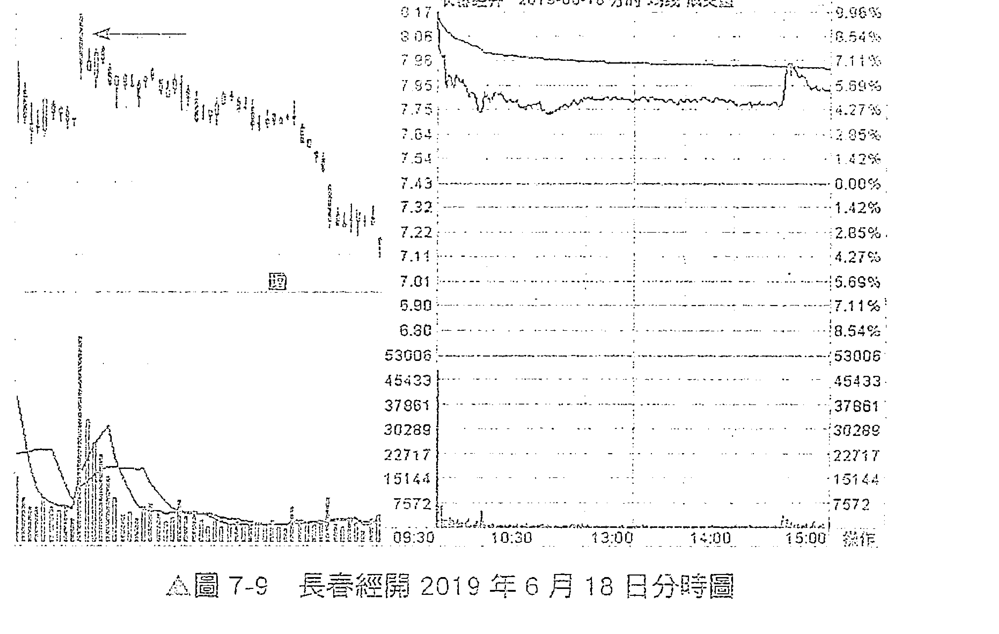

### △图 7-9 长春经开 2019 年 6 月 18 日分时图

## 7.8 「皮球落地」巨量跌停，应逢反弹及时卖出

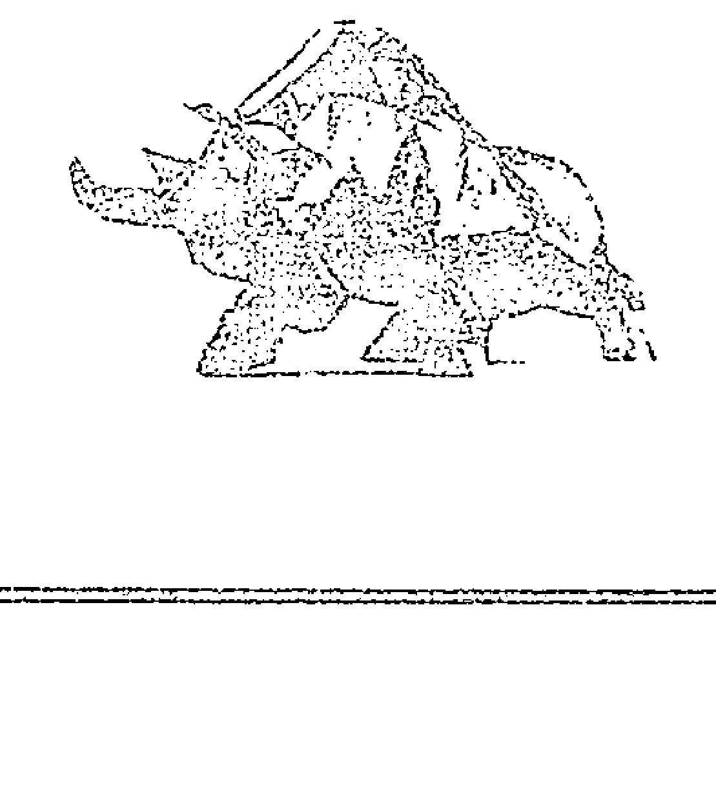

“皮球落地”巨量跌停形态，是一种有趣的比喻说法。它的形成过程一般是这样的：当日个股因利空消息或价格短线涨速过快，先是出现了跌停或接近跌停，随后股价在盘中被突然拉升，但在盘中高点没有得到支撑，股价开始快速地向下滑落，向下滑落过程中的反弹力度越来越弱。整个过程如同“皮球落地”，股价最终又向下滑落至跌停价附近，当日成交量呈巨量形态。

这种分时图中的形态是短线暴跌拉开序幕的信号，也是短线主力快速出货的标志，在实盘操作中，我们应该逢反弹及时卖出才能更好地回避风险。

图 7-10 中可以看到，当日股价在急速上涨、开高后快速跳水奔向跌停板，并在盘中反复锁住跌停板；午盘之后被突然拉升超过 10%。这种拉升并不意味着有跟风盘进入，只是主力在制造多空分歧，目的就是快速出货，随后的盘面运行犹如“皮球落地”，当日放出了巨量。在实盘操作中，主力在盘中的快速拉升给了持股者逢高退出的时机，不可错过。

图 7-11 中的股价短线涨幅极大，短线主力对股价进行了快速拉升，在出货时往往也十分快速，主要采取突然下跌至跌停板、然后盘中拉升的方式，从而吸引短线跟风盘入场，主力则在跟风盘入场时，减码出货。

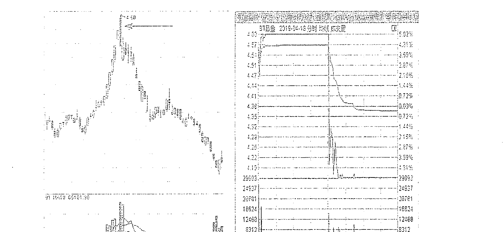

### △图 7-10 ST 昌鱼 2019 年 4 月 18 日分时图

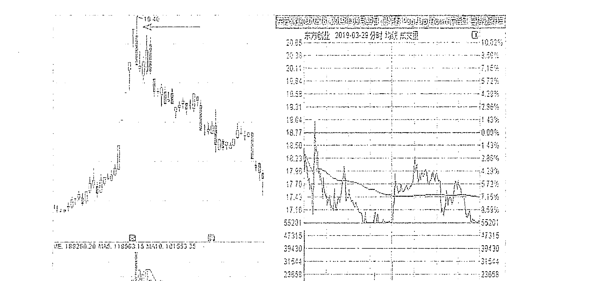

### △图 7-11 东方创业 2019 年 3 月 29 日分时图

## 7.9 破位前跳水式出货，是股价破位前的警告

快速出货是主力常用的手法之一。在股价短线高点或盘整之后，若主力感觉出货较为吃力，为了节省时间，主力往往会采取快速卖出的方式来提升出货速度。有时候，股价盘中放量跳水之后，还能短暂地“收复失地”，在日K线图上收出一条长下影线，可能是长下影阴线，也可能是长下影阳线，但它们的市场含义较为接近。这给投资人的印象是买盘承接力较强，殊不知这只是股价真正破位前的一次警示信号，若我们不能正确解读它，则会损失惨重。

图7-12中的股价在上涨之后，当日走势突变，早盘直线跳水并伴以分时成交量的大幅放出。虽然在收盘前股价再次被拉回，但这种放量长下影线可以被看作是股价破位前的一次预演。在实盘操作中，我们此时应警惕风险，及时卖出。

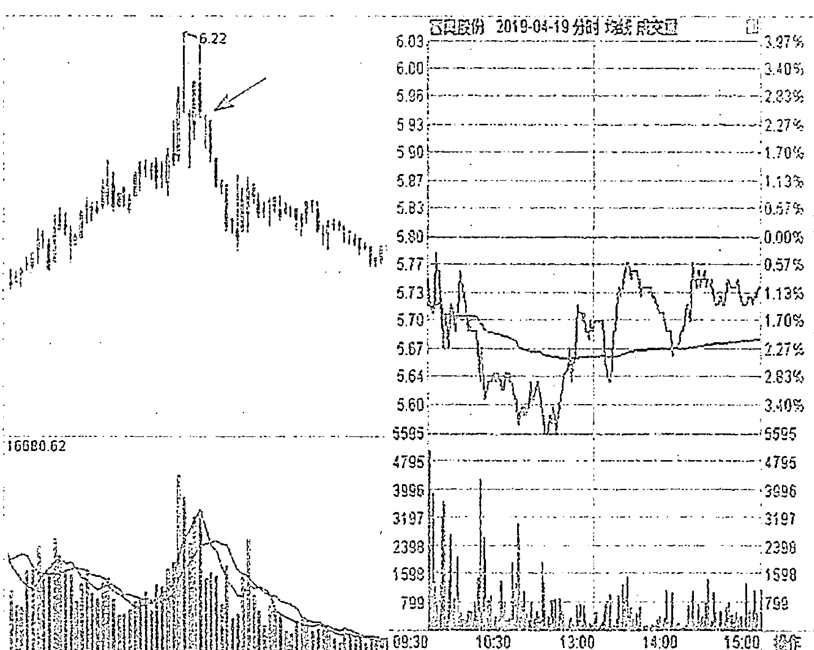

### △图7-12 宫奥股份2019年4月19日分时图

## 7.10 向上试盘型温和放量，当日不是最好的入场时机


主力在拉升股价时，往往会采取试盘的方法，“向上试盘”就是一种常用的方法。它的形成过程是这样的：在盘中交投较为平静的背景下，主力突然拉升股价，拉升时间往往在几分钟内结束，拉升幅度大多在5%以内；随后，主力放弃拉升，让股价在盘中高点自然回落。通过股价的回落方式、回落速度、回落幅度，主力可以大致了解市场获利卖压情况，从而决定是否继续实施拉升计划。

如果在回落时，分时线能够以均价线为支撑或者围绕均价线运行，且当日放量温和，那么这是试盘效果较为理想的信号。股价随后稍做整理，主力对其进行拉升的机率较大，一轮上涨行情有望出现。

在实盘操作中，试盘当日往往并不是最好的入场时机，我们可以再观察几日，若随后几日能够保持强势整理的态势，则可以买入，等待主力拉升；反之，若随后几日走势较弱，则从短线角度来看，暂不宜参与。

值得注意的是，“试盘”应出现在主力“进货”与“拉升”两个环节之间，因此我们要结合个股的日K线图，来判定在个股盘中出现的是否为试盘线。若此前没有明显的进货区间，即使当日的盘面形态相似，也不可将其认定为试盘线。

图7-13中可以看到，股价刚刚跳出低位盘整区，当日小幅高开后随即上冲，但在盘中高点未获支撑，股价顺势下滑。从成交量来看，市场卖压并不沉重，当日量能温和放大。在随后几日，股价强势整理，这是短线入场较好时机。

## 7.11 「向下试盘」是主力以抛售大单快速出货

“向下试盘”是主力通过抛售几笔大单的方式，来快速出货的行为，这会使得股价大致呈直线下跌。随后，主力不再出货，以此判断多方的承接能力，看看在股价快速下跌之后，究竟是恐慌性的卖盘更多，还是抄底性的买盘更多。

若股价能够震荡回升至均价线上方，或者股价下跌后无恐慌盘卖出，则预示着试盘成功。由于卖压很轻，当日会呈现缩量状态（这与向上试盘时的温和放量不同）。

随后股价有望在主力的拉升下不断上涨，在实盘操作中，此时我们可以短线买股入场。

图 7-14 从日 K 线图走势来看，股价正处于调整后的低位盘整之中，短期内有震荡突破的趋势。如图中的标注所示，开盘后，突然出现了几笔大卖单使得股价快速下挫，在大卖单出现后的几分钟内，分时量异常放大，随后，市场又恢复了正常的交投状态，股价也震荡回升至均价线上方。

盘中出现这种走势即表示，在主力向下试盘的过程中，并没有引发恐慌性卖出的离场，这是该股筹码锁定程度良好的标志，也预示了随后股价极有可能在主力的拉升下突破上行。在实盘操作中，此时我们可以短线买入。

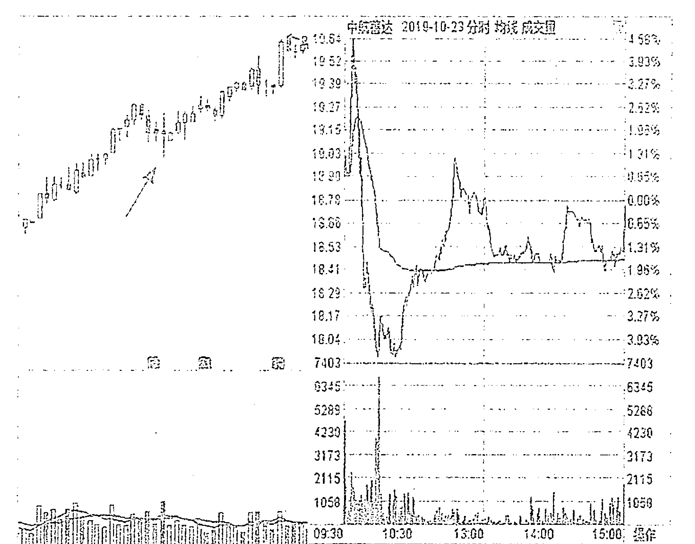

### △图 7-14 中航善达 2019 年 10 月 23 日分时图

## 7.12 单笔天量买单，是主力有意拉升的讯号


有效推升的单笔天量买单形态，是指股价在盘中平稳运行时，多处于小幅上涨状态，盘中出现了一笔或连续几笔高价大买单，使得股价突然蹿升了两、三个百分点。随后，股价在盘中高点强势地横向运行并且不回落，当日的量能呈温和放大形态。

这种盘面形态展现了两个市场含义：一是，突然出现的大买单使得股价有效上涨，因此，这个大买单并不是大户的随机性买入；二是，市场短期内的获利卖压较轻。综合这两个方面的含义来看，若股价处于中短线的低点位，则它是主力有意拉升的讯号，预示着短线上攻行情的展开，此时我们可以买入。

图 7-15 中可以看到，股价处于短线盘整的位置，短期内走势已止稳回升，当日盘中小幅上涨 2 个百分点，午盘后，单笔大买单有效推升了股价。从盘面形态来看，这一分钟的分时量放得非常大，股价在突然上涨了约 5 个百分点后也能强势止稳。这是主力拉升的讯号，此时的反弹幅度很小，一旦主力开始拉升，股价仍有较为充裕的上涨空间。在实盘操作中，我们可以进行买入操作。

## 7.13 涨停板进货，是主力黑马股常用的手法

盘中涨停板进货，是主力资金在买卖短线黑马股时常用的手法之一，主力一般将其用在有热门题材支撑，且基本面良好、前期价格未出现大幅上涨的个股上。此时，为了迎合热门题材，主力往往会借助于涨停板来制造多空分歧，于涨停板上大力买入，随后快速拉升，实现涨停进货、涨停拉升一体化的飙升格局。对于散户来说，能否正确地辨识涨停板进货形态，将直接决定其短线追涨的成功率。

一般来说，个股在早盘阶段即强势涨停板，但也未牢牢锁住，中短线获利浮额在看到涨停板无法锁住后，往往有较强的卖出意愿，而真正的主力资金则会借此机会大力买入。锁住涨停板后，为达到充分进货的目的，个股在涨停板上会多次打开，但因主力的积极买入。从日 K 线图来看，当日成交量明显放大，但不会出现天量。

当然，仅从涨停当日的盘面形态来分析只是一个方面，此外我们还要关注涨停次日的开盘情况。若主力短线拉升意愿强，又于涨停价位置入较多筹码，则主力多会利用股价上涨惯性强力拉升，以脱离自己的成本区。在涨停进货次日，股价多会呈现小幅开高，开盘后主力因积极参与、强势拉升，从而快速脱离成本区。

基于以上两个方面（涨停当日的盘面形态、涨停次日的开盘情况），再结合个股的题材面，我们可以较为准确地判断出，主力是否进行了涨停进货操作，从而确定追涨的可行性。

图 7-16 中可以看到，当日股价一举突破了前期盘整平台，午盘后快速锁住涨停板，在盘中高点交投活跃，涨停之后多次打开，当日量能明显放大。综合该股的日 K 线走势，可以判断出主力进行涨停进货操作的机率较大。

到了次日，如图 7-17 所示，可将该股开高走高的盘面形态作为进一步的验证，在实盘操作中，次日股价开盘冲高后回落至均价线附近时，就是一个较好的短线追涨入场点。

## 7.14 冲高跌至均价线下方，与主力出货有关

均价线代表着盘中的支撑与阻力。股价在盘中，特别是在早盘阶段，快速上冲后，若出现放量跳水式下行并直接跌至均价线下方，则多表明之前的上冲可能与主力的拉升出货有关。

主力在个股早盘开盘不稳定时，快速将股价拉升到一个高点位，随即大量抛售，股价迅速下滑，持股者难以成功卖出。当发现股价已远离盘中最高点时，持股者往往会产生惜售心理，希望在随后的盘面中的卖出价位可以与最高点接近。主力正是利用持股者的这种心理，降低盘面卖压，而自己则悄悄出货。

图7-18中的股价早盘快速冲高，但随即跳水至均价线下方，跳水时量能明显放大，这是资金撤出的讯号。一般来说，股价在盘中直线跳水幅度大、有明显放量且经过一波跳水后直接跌破均价线，就是强弱转化的明确标志，常与主力的出货行为相关，预示着中短线下跌走势的开启，随后股价在盘中很难再出现强势反弹。

在实盘操作中，当我们发现这种形态后，应第一时间或等股价反弹至均价线附近时，卖股离场。

△图7-18 英特集团2019年10月16日分时图

## 7.15 45度角放量下行，是趋势反转的讯号

盘中45度角放量下行形态，是主力资金持续撤出时的重要盘面形态之一，它的形态特征是分时线呈45度角，且股价不断下滑。这种运行态势的持续时间较长，至少会保持半个交易日，并且随着股价的下滑，分时量也同步地不断放大。

45度角放量下行常出现在午盘之后，且会一直运行至收盘，这使得收盘价接近当日最低点。

相对于盘中稳步攀升、放量走高的形态来说，下行时的放量则更为真实，因此，这种放量的45度角下行也表现了做空力量的强大，是随后个股或有大幅下跌行情出现的讯号。在实战中特别要注意的是，如果股价的中短线涨幅相对较大，在高点出现这种45度角放量下行形态，往往是趋势反转的讯号。股价短线回档后，此时我们不宜抄底入场，因为后期的下跌幅度将更大。

图7-19中可以看到，当日股价处于中短线涨幅较大的高点位，早盘冲高，随后走势出现转变，股价开始震荡下行，呈45度角放量下行，一直持续到收盘。在下行过程中，可以看到量能明显放大，这是场内资金大量撤出的讯号，且此时的股价正处于中短线高点，在实盘操作中，我们应及时卖出该股以回避风险。

相同的盘面形态总是预示着相同的未来走向。如图7-20所示，在2019年11月11日股价开盘后，便呈45度角放量下行，当日也处于短线高点，可见主力运用了同样的出货手法。

△图7-19 英特集团2019年10月17日分时图
△图7-20 英特集团2019年11月11日分时图

## 7.16 开盘后的闪击涨停板，可用两要素分析后期走势

开盘后的闪击涨停板形态，是指个股在早盘开盘后的短短几分钟内，由于个股交投相对清淡，此时受突然的单笔大买单影响，股价快速地冲击涨停板。但这笔大买单的目的显然并不是拉升股价，股价随后瞬间被大量的卖单砸下。随后，分时线在盘中涨幅较小的位置区开始趋稳，这使日K线图中出现了长上影线。

这种开盘后的闪击涨停板形态，很明显是由大额资金异动而形成的，它往往是主力资金将有所行动的讯号。在实盘操作中，当个股出现了这种分时图形态时，我们可以结合两个要素来分析。

一是，看股价的全天走势是否呈持续滑落状。如果股价在早盘闪击涨停板后，其随后在盘中的走势持续滑落，甚至还出现了跳水，那么这大多是主力短期内有意出货的表现。主力通过开盘时的闪击涨停板，让投资人认为随后股价还会再度上涨至涨停板附近的价位，也可以大大降低那些喜欢“逢高出场”的持股者卖股意愿，而主力则可借机出货；如果股价在早盘闪击涨停板后，其走势较为稳健、可以稳稳地运行于均价线上，那么这种走势就极大地限制了主力的出货行为。

二是，看个股的局部价格走势情况。如果这种分时图形态，出现在一波快速上涨后的阶段性高点，那么它大多是价格将反转下行的信号；如果出现在短期大幅下跌后的低点时，那么它更有可能是主力拉升前的一次向上试盘行为。相对而言，这种分时图形态更常见于一波上涨走势后的高点。

当这种分时图形态出现在一波快速上涨后的阶段性高点时，表示主力在短期内有着较强的出货意愿，往往预示着短期内将有快速下跌行情出现，是应及时卖股离场的讯号。

图 7-21 中可以看到，当日该股价格在早盘开盘后向上闪击涨停板。我们可以看到，股价上冲涨停板的速度是极快的，随后再度跌回的速度也是极快的，因此我们称之为闪击涨停板形态。如图 7-22 的日 K 线走势图中可以看到，当日股价正处于一波快速上涨走势后的阶段性高点，且股价在当日震荡下行，因此这种闪击涨停板形态，可以看作是主力短期内出货意愿较强烈的讯号。

在实盘操作中，我们应及时卖股离场，以回避风险。图 7-22 为西部资源 2019 年 8 至 11 月走势图，箭头所指处为 2019 年 9 月 18 日。

以下我们再举另一个案例。当这种分时图形态出现在缓缓攀升的走势中时，说明个股价格短期内或许会有宽幅震荡走势出现，而当日的盘中最高点，也很有可能是随后一段时间的区域高点。但由于股价的阶段性上涨速度较为缓慢，因此，股价在短期内出现大幅下跌的可能性不大。在实盘操作中，我们可以在之后数个交易日内逢高卖股。

图 7-23 中可以看到，当日该股在早盘开盘后出现了闪击涨停板的形态，随后，股价持续滑落。如图所示，当日股价正处于缓缓攀升走势中，这一形态的出现说明股价中短期内的上涨走势不容乐观。在实盘操作中，我们应在随后的交易日中逢高卖股。图 7-24 为中国船舶2019 年 4 月至 7 月走势图，箭头所指处为 2019 年 6 月 14 日。

## 7.17 凹形板形态是筹码加速换手的标志

开盘涨停板、中盘打开的「凹形板形态」，是指股价在早盘开盘后的几分钟内就快速涨停板（或者是个股直接以涨停板的方式开盘）。但随后不久，涨停板就被打开，但股价并未大幅下跌，成交量集中于涨幅为7%左右的位置区，直至尾盘半小时左右，股价才在大买单的扫盘下再度涨停板并直至收盘。这种涨停分时图形似凹形，故称之为「凹形板」。

凹形板往往出现在盘整后的突破位置区，是筹码加速换手的标志。但筹码究竟是从主力手中流入散户手中，还是从散户手中流入主力手中呢？我们可以结合个股的前期走势，及凹形板出现之后的走势情况来分析。

当股价在上升途中的盘整突破位置出现了这种凹形板时，若此时的股价累计涨幅不大、股价并没有在凹形板之后就快速地反转下行，而是呈现出了长时间的止稳盘整走势，则这多代表凹形板形态出现后，市场的卖压并未明显增强、筹码仍被主力牢牢地掌握在手中。

因此，前期盘整突破位置处的凹形板，极有可能是由主力的一次快速进货所引起的。在此情况下，我们应在凹形板之后的止稳走势中，逢回档低点买入入场，才能获利于个股随后极有可能出现的快速上涨行情。

△图 7-25 ST创兴 2019年7月26日分时图

图 7-25 中可以看到，当日该股价格在10：30左右快速涨停板，但涨停板时间相对较短。随后，股价在盘中涨幅为3.5%左右的位置区持续地横向运行（ST股涨停幅度为5%），直至收盘前半小时左右，才再度强势涨停板。当日该股的这一分时图形态，属于典型的凹形板形态。

从日K线走势图中可以看到，如图7-25所示，当日股价正处于上升途中的盘整突破位置区。此分时图形态一般来说，并不是主力短期内强势拉升股价的讯号，在实盘操作中，我们不妨多观察一段时间再做决定。

该股在 2019 年 7 月 26 日之后，于突破后的位置区再度涨停，这表示 2019 年 7 月 26 日的筹码大幅换手，并非因为主力资金出货，既然主力在当日没有出货，那么主力就极有可能是买家。图 7-26 为 ST 创兴 2019 年 4 月至 8 月走势图，箭头所指处为 2019 年 7 月 26 日。

在高位区的盘整震荡走势之后，若个股于盘整突破位置处出现了这种凹形板，并且在凹形板之后，还出现了典型的看跌组合形态或快速回落走势，则此凹形板多代表主力的出货行为，是风险的预示，而非机会的象征。

图 7-27 中可以看到，当日该股的盘面分时图呈现出了凹形板形态，且当日量能大幅放出，这可能是主力手中筹码流入市场的讯号，也可能是散户手中筹码流入主力手中的讯号，我们可以通过观察个股随后的走势情况来判断。

一般来说，如果筹码是由散户手中流入主力手中，那么主力为了保障建仓成本的安全性，大多会全力护盘，不让股价出现大幅下跌；如果筹码是由主力手中流入散户手中，那么主力随后仍旧会强力出货，股价也大多会出现快速的下跌走势。

可以看到 2019 年 4 月 8 日之后，股价在高位区开低走低，收出长阴线，这是一种典型的看跌组合形态。随后，股价快速下滑，主力无护盘意愿。因此，在实盘操作中，我们是不可以追涨买入的。图 7-28 为沧州大化 2019 年 2 月至 12 月走势图，箭头所指处为 2019 年 4 月 8 日。

## 7.18 10点前强势的涨停板，是典型的看涨形态

上午10点前冲高不回落的涨停形态，是指股价在早盘开盘之后大幅度上涨，一般来说，其涨幅会超过7%，并且在当日大涨之后的高位区强势运行，且未出现明显的回落；随后，股价会在10点前于这一高位区再度上涨，并且牢牢地锁住涨停板。

早盘开盘之后股价就大幅上涨，这说明有主力在积极地推升股价，随后，股价可以在大涨后的盘中高点位置区强势运行而不明显回档，这说明主力参与能力强、市场获利卖压轻。10点之前就强势涨停板，说明个股的涨停板时间早，这也是主力做多意愿坚决的一种表现。因此，这种涨停分时图形态是一种典型的看涨形态，在实盘操作中，若个股之前的K线走势较为配合，则我们不妨进行短线追涨操作。

由图7-29中可以看到，当日股价在早盘开盘后快速上涨且涨幅较大；随后，股价在大涨后的高位区强势运行，且没有出现明显的下跌；在10点前，股价再度因强劲的大买单锁住涨停板。这种形态就是10点前冲高不回落下的涨停形态，它是主力资金强势做多的标志，也是股价进入加速上涨阶段的讯号。如图7-30所示，股价在2019年8月20日之前，处于稳健的攀升走势中，累计涨幅不大。

但2019年8月20日的涨停板不仅创出了新高，还使股价上涨呈加速状，因此，在实盘操作中，我们应积极地追涨买股。图7-30为*ST山水的走势图，箭头所指处为2019年8月20日。

图7-31中可以看到，当日该股在盘中也出现了这种10点前冲高不回落的涨停形态，结合该股之前的日K线走势（当日股价正处于长期盘整后的突破位置处），我们可以认为这是主力资金对股价展开强势拉升的讯号。在实盘操作中，我们应在第一时间追涨买股，以享受主力的拉升成果。图7-32为*ST椰岛的走势图，箭头所指处为2019年6月19日。

## 7.19 早盘大涨后、午盘前后的直线涨停形态

早盘大涨后、午盘前后的直线涨停形态是指，股价在早盘阶段大幅上涨，并且呈现出了明显的强势运行特征。随后，在午盘前后，股价再度自均价线附近快速启动，出现了一波直线上涨收涨停板，并且牢牢锁住涨停板至收盘。与7.18节所介绍的“10点前冲高不回落的涨停”形态相比，这是一种主力资金参与迹象更为明显、股价上涨也更为强势的分时图形态。

它一般意味着主力判断出大盘走势较好，且主力有较强的拉升股价的意愿，是个股强势上涨行情出现的讯号。

在7-33的分时图中可以看到，当日股价在早盘阶段大涨，且分时图呈现了典型的强势运行特征（例如：分时线稳健运行于均价线上方、股价上涨幅度较大、量价配合关系理想等），这说明有主力资金在积极买卖该股。

当日股价正好处于上升途中的盘整走势之后的突破位置点，因此，我们应留意股价盘中随后的走势，一旦股价在盘中有再度强势启动并锁住涨停板的倾向时，我们就应及时追涨买入。因为结合该股前期的日K线走势和早盘阶段的表现来看，一旦该股于当日出现强势涨停板形态，就是该股将出现上涨行情的讯号。

随后，股价在午盘之前出现了直线式的上涨，并牢牢锁住了涨停板，这是股价启动的讯号，也是主力开始强势拉升股价的讯号。图7-34为中昌数据的走势图，箭头所指处为2019年8月27日。

## 7.20 早盘15分钟内快速上涨的二次涨停板

追涨是最为重要的一种操作涨停板的方式，一般来说，个股的封板时间越早、涨停板锁得越牢固，代表主力当日的拉升意愿就越坚决，是股价中短期内上涨潜力更大、上涨势头更凌厉的标志。但若股价只以一波快速上涨就牢牢封住了涨停板，则参与抢涨停板的操作难度较大，投资人应该对个股的整体走势有一个清晰的判断，并冷静观察个股当日的盘中表现。

当投资人以涨停板价位抢到筹码后，股价很可能无力强势锁住涨停板，因为这种上冲涨停板的走势，其根基有可能不是很牢固，很可能存在快速转向的风险。

早盘 15 分钟内快速上涨的二次涨停板形态，是一种很好的涨停板形态，它是指股价在早盘开盘后便快速地大幅度上涨，并向上冲击涨停板，但是股价并没有在第一次冲击涨停板后就强势锁住涨停板，而是在涨停板价位附近略做整理（分时线站于均价线上方）。随后，股价在第二次冲击涨停板时强势锁住涨停板，直至收盘。一般来说，对于股价第二次能否强势锁住涨停板，我们是比较容易判断的，可以结合个股之前的 K 线走势形态、当日是否有利多消息等因素来分析，如果个股有这些因素的配合，则第二次涨停板走势的出现多是主力做多意愿的真实体现。

再举一个案例，图 7-35 中可以看到，当日股价在早盘高开后快速冲击涨停板，但是第一次并没有牢牢锁住，而是在第二次锁住涨停板时才强势封牢，这给了我们一定的思考时间决定是否参与追涨买股操作。结合该股前期的突破走势，及当时市场中热度较高的环保类题材，我们可以较为准确地判断：当日的分时图形态，是主力资金开始参与该股并有强势拉升意愿的表现。因此，在实盘操作中，我们可以在股价即将第二次锁住涨停板时，快速地以涨停板价位挂单买入，进行抢涨停板的操作。

# 第7章 我用分时图，抓到个股「最佳买卖点」！

图7-36中我们可以看到，箭头所指处为2019年8月19日，该股在随后2019年8月21日、22日又出现了强势的涨停。因此，在2019年8月19日所出现的这种早盘15分钟内快速上涨的二次涨停板形态，是主力资金短期内强势拉升股价的可靠信号。

# 第8章 一出手赚3倍！13支黑马股实战案例

### 8.1 进货后极度缩量整理 (电信类股)

黑马股是指那些可以在中短期内价格快速上涨且涨幅惊人的个股，成功地买入并持有这类股票，这也是股市的魅力所在。但想要成功地捕捉到黑马股并不是一件容易的事，需要有较丰富的看盘经验，并掌握有一定的技巧。

基于量价形态来说，捕捉黑马股更需善于分析，从量价形态的变化来分析主力的市场行为，进而及时买股入场。在本章中，我们仍以「量价」为核心，看看黑马股是如何透过量价的变化，向我们发出讯号的。

进货后极度缩量整理形态常出现在主力进货之后、快速拉升之前，是一个相对短暂的过渡整理过程。该形态的构筑过程如下：股价首先缓慢地震荡攀升，此时量能明显放大，这是资金积极入场的标志；随后，股价小幅调整，呈横向窄幅整理状，在这期间的成交量明显地大幅度萎缩（与之前股价震荡攀升时的量能相比）。

极度缩量整理平台的出现，标志着主力进货已经较为充分、主力参与能力得到了很大的提高，市场浮额很少。此时，在大盘止稳的背景下，主力随时可以向上拉升股价，而且从中长线角度来看，这个缩量整理平台也是处在低位区的。可以说，无论中线还是短线，此型态都是一个很好的入场点。

**实战案例：中国联通**

图 8-1 是中国联通的走势图，股价的震荡攀升较为缓慢，但是量能充分放大，结合股价重心上移的走势来看，有资金在积极入场。随后，股价回档进行平台式整理，此期间的成交量突然大幅度萎缩，这就是「进货后极度缩量整理」形态，预示着该股有成为黑马股的潜力，此时的缩量平台也是较佳的中短线入场点。

### 8.2 盘整中的极度缩量（物流类股）

盘整（我们这里主要指低位盘整区间）中的极度缩量形态，是指股价处于中短线大幅下跌后的低位震荡区间，震荡幅度不大约10%左右，在这期间的成交量相对平稳。但是，随着震荡的持续，某几个交易日的成交量突然大幅萎缩，远小于之前的均量，呈现出极度缩小的形态。

极度缩量形态的出现，表示有主力参与且主力持股数量多。由于在这几日的盘中，主力没有参与买卖，股价的波动幅度也不是很大，所以市场交投极为冷清，出现了极度缩量形态。

这是一个需要仔细观察才能发现的量价特征，极度缩量并不是个股被市场抛弃的结果，它只是主力高度参与下的产物。其实我们可以结合个股之前的运行情况来分析，一般来说，个股此前的运行都会有一定的独立特征，并不是随波逐流的边缘股。

**实战案例1：厦门象屿**

极度缩量表示大量的筹码并没有在市场上，而是在主力手中。如果此时的股价处于中长期的低位区，那么这种市况预示着个股有望在主力的参与下成为黑马股，是机会的象征。

图 8-2 为厦门象屿的走势图，该股在低位区的震荡过程中，连续 4 天出现极度缩量形态，缩量效果十分明显。一旦股价向上运行、突破这一整理区，就是主力开始拉升股价的标志。在实盘操作中，对于这类股票我们可以积极买入，耐心持有并等待突破。

**实战案例2：浙江富润**

对于特立独行的强势股来说，主力参与其题材的时间往往较长。当股价经历上涨而到达一个高位平台后，若在平台震荡过程中出现了极度缩量形态，表示主力仍旧持股较多。结合强劲的盘整走势来看，主力的参与能力依旧很强，因此，个股有望迎来新一波上攻行情。在实盘操作中，我们可以适当短线参与。

但是，相对于低位盘整区的极度缩量形态来说，此时买入毕竟是追涨行为，且我们的买入成本要远高于主力，本着资金安全的原则，轻仓参与才是上策。

图 8-3 为浙江富润的走势图，此股走势十分强劲。在中短线已有明显升幅的背景下，股价仍能够强势震荡，股价重心不回落，从盘面形态上来看，没有主力出货的迹象。如图中的标注所示，一小波回档后，出现了极度缩量整理，这表明主力参与能力依旧较强、市场浮筹较少，该股出现新一波上攻行情的机率较大。在实盘操作中，在强者恒强的市场格局下，我们可以适当参与、获取中短线收益。

### 8.3 独立股回档启动点缩量盘整 (电子类股)

价格强势上涨、脱离开大盘震荡格局的个股，其中一定有主力在积极参与。但若股价在中短线独立上涨之后，恰逢大盘出现了系统性的回档，且回档幅度较大，股价往往也会因此而出现大幅度下跌，甚至回落至上涨波段的启动点附近，而这也给了我们买入的机会。

在实盘操作中，可以借助于回落后的量价关系，来判断主力是否在之前的高点位进行了出货，及主力在当前低点的参与能力如何、市场卖压如何等等，来决定是否进行短线交易。

股价在回落至上涨波段的启动点附近后，一触即发的反弹上攻走势较为少见，更多的是持续的横向震荡。若股价在反复震荡之后能够伴有明显的缩量，则表示随着震荡的持续，主力的能力得到了提高，股价也有望在主力的积极参与下，再度强势上攻，恢复之前的独立运行态势。

**实战案例1：激智科技**

图 8-4 为激智科技的走势图，图中叠加了同期的创业板指，对比后可见，在大盘横向滞涨时，该股价格独立上扬、震荡攀升。随后受大盘影响，股价再度回落至上涨波段的启动点附近。此时的大盘走势不稳，主力也没有过于激烈的逆市拉升，而是让股价随大盘横向整理。

随着整理的持续，我们可以看到该股成交量大幅缩减，这是市场卖压逐步减轻的标志，也是主力参与能力依旧较强的信号。结合该股前期的独立上攻行情，可以预测其价格随后仍有望恢复上涨走势。在实盘操作中，此时我们可以买股入场。

**实战案例2：平治信息**

图8-5 为平治信息的走势图，该股因主力参与，前期出现了连续快速上攻的价格走势。股价随后在高点停留的时间不长，受大盘影响出现了大幅调整，并跌至启动点附近，主力没有足够的时间与空间出货。

在启动点附近，该股因前期价格的强劲上涨已完全启动了股性，其在上下震荡期间十分活跃，这是进行波段操作的好时机，随着震荡的持续，成交量出现了较大幅度的萎缩。如图中标注所示，在这个明显缩量的整理时期之后，该股也迎来了较为强劲的反弹上攻行情。

### 8.4 震荡上行区间整体缩量（医药制造类股）

震荡上行区间整体缩量形态，是一种主力参与下的盘面形态，股价以震荡的方式向上运行。这个震荡区间可能出现在创新高的一波上涨中，也可能出现在大幅调整后的反弹波段中。虽然震荡期间的上下震荡幅度较大，但成交量却较之前的均量明显缩小。震荡上行时的整体式缩量形态，表示主力持股数量多、参与能力强。若此时的股价累计涨幅不大，后期仍有较为充裕的上行空间。在实盘操作中，我们可以逢股价震荡回档低点时买入。

**实战案例：奥齐眼药**

图 8-6 为奥齐眼药的走势图，股价在短线大幅调整后开始震荡上行，震荡期间的量能大幅度缩减。结合该股此前较为独立的攀升走势来看，主力仍参与在其中，且持股数量多。对于该类有强主力参与的股票，我们应及时逢震荡回档的短期低点买入，并耐心持有。

### 8.5 涨停突破点强势放量整理（电子类股）

涨停板，往往是主力强势拉升股价的信号，但也有一些涨停板如昙花一现，若我们贸然追涨，将承受较大风险。涨停突破点强势放量整理形态，是我们用来捕捉黑马股的一种量价形态，它是指股价先以一个涨停板突破盘整区间，并在涨停板当日伴有明显放量，这是股价突破时多空分歧加剧的结果。随后数日，股价未出现回落，而是在涨停当日的收盘价附近强势整理，整理期间量能保持放大状态。

涨停突破点是一个关键点，它是多空双方争夺的重要关口。强势放量整理往往是主力进一步拉升前的加码信号。再结合股价之前处于低位盘整区间的形态来看，一旦主力加码完毕，则股价在主力的积极拉升下，出现快速、大幅上涨的机率极大。在实盘操作中，这个强势放量整理平台，是中短线入场的好时机。

**实战案例：深科技**

图8-7为深科技的走势图，股价于2020年1月3日以涨停板的方式，突破了长期整理平台。如图8-8的分时图所示，此时，我们还难以判断主力的后续行为，无法确定其是继续拉升，还是逢高卖出。

由随后几日的强势整理且量能放大的情况来看，有资金在涨停价附近大力参与。在实盘操作中，这个较为短暂的强势整理平台就是买入时机。一旦股价随后以长阳线的方式突破这个平台，则该股成为黑马股的机率极大，而且股价此时的累计涨幅很小，我们追涨所承担的风险不大。这种潜在收益高、中短线风险低的品种，是值得我们重点投资的标的。

### 8.6 突破点连续加码式放量（能源类股）

突破点连续加码式放量形态，是中线主力快速建仓、加码时的一种盘面形态。从日K线图来看，股价先是在低位区长期整理，波动幅度较小、主力进货较为缓慢，受大盘或行业回暖等因素影响，主力看到了拉升时机，但手中筹码数量不多。

此时股价仍处于低位区，主力采取快速拉升、突破平台区的方法进行短线加码，连续几日（一般来说至少3日）的长阳线伴以放量，主力可以大量进货，从而为随后的进一步拉升打好基础。

在实盘操作中，我们还应观察连续放量后的股价走势，若股价能够在短线高点强势整理不回落，则说明主力中短线做多意愿较强，不愿让股价再度回落至持有成本区。此时，也应顺着主力的思路，短线追涨入场。若出现放量长阴线，则表示主力参与能力仍不强，我们在中短线操作上不宜追涨，应等短线回档较为充分时，再选择买入。

**实战案例：华能水电**

图 8-9 为华能水电的走势图，股价在突破时，连续 3 日放量并伴以中阳线，这是主力加码买入、进行拉升的信号。随后的强势整理和缩量向我们表明：市场卖压较轻、主力无出货行为。结合股价中短线涨幅较小的情况来看，股价在主力的积极参与下，有望进一步震荡走高。在实盘操作中，我们在这个缩量整理平台可以进行买入操作，并且耐心持有，等待股价上涨。

### 8.7 N字形放量涨停（造纸印刷类股）

N字形放量涨停形态，是指个股前后出现了两个涨停板，中间数日为回档走势，两个涨停板当日均明显放量，中间数日则相对缩量。这是一种较为独特的涨停形态，其出现大多与主力积极参与有关。

放量涨停的两个交易日，是主力快速进货的表现，中间的缩量回档，则是整理不稳定获利浮额的一种方式。综合大量案例的分析结果来看，这类股票随后成为黑马股的机率较大。

在实盘操作中，当 N字形放量涨停形成后，我们不必急着追涨入场，因为这样很有可能短线被套。可以等股价短线小幅回落、追涨风险释放后，再择机买入。无论是长线还是短线，这都是投资的好时机。

**实战案例：银鸽投资**

图 8-10 为银鸽投资的走势图，在股价突破低位窄幅整理区时，出现了 N字形放量涨停形态，这是主力积极参与该股的明确信号。如图 8-10 所示，随后股价短线回落后的投资时机，投资者应多加把握。

### 8.8 跳空涨停板放量平台（文化传媒类股）

跳空涨停板放量平台形态，是个股在利多消息的刺激下，主力快速建仓时所采取的一种方式。利多消息促使股价以跳空涨停板的方式，突破了平台区间，从而激发多空分歧。

此时主力手中的筹码不足，主力没有选择继续拉升，而是让股价在涨停价附近进行横向整理。由于全盘获利，且市场在对利多消息的解读上存在分歧，主力可以积极地加码、进货。股价在走势上呈横向的强势震荡整理，期间量能放大，一旦主力加码完毕，就会进行新一轮的拉升操作。

从个股案例来看，在业绩驱动型、资产注入型这两种利多消息的刺激下，最有可能出现此类形态。特别是在利多消息较为突然、主力前期进货不充分的情形下，一旦个股出现类似的形态，我们不妨在涨停平台区积极投资，等待新的上攻走势出现。

**实战案例：长城动漫**

图 8-11 为长城动漫的走势图，受云端游戏概念的刺激，市场的热情被引燃，当日的跳空涨停板突破了前期震荡平台。

但一个涨停板显然不能释放如此明显的利多消息，股价走势反映的是未来，主力深悉这一要旨，并在涨停板平台处进行了大力度的加码，股价走势呈强势震荡不回落状。它也为该股随后成为黑马股埋下了伏笔，若我们了解市场主力常用的这种加码手法、拉升方式，就可以在这个涨停板平台区与主力同时操作，随后耐心持有，享受主力的拉升成果。

### 8.9 不放量收复前期跌停区（汽车类股）

个股虽然发布了利多消息（往往是资产注入、股权转让等较为重大的利多消息），但是因停牌时间长、停牌期间股市下跌空间大，往往会在复牌时被市场忽略其利多消息，从而出现跌停板补跌价格走势。

这种走势往往也会使得主力资金备受煎熬。随着股市的回暖，利多消息逐渐释放，若主力资金未在低位斩仓出局，则股价收复失地进而再创新高的机率还是较大的。

在实盘中，若股价能够以不放量的方式，自跌停后的低点开始震荡上扬、收复失地，则说明主力持股数量较多，未在低位区出货。随后这类股票在市场回暖的背景下，有望在主力的参与下价格大幅上涨，并获得释放利多消息所带来的上涨效应。

**实战案例：*ST安凯**

图8-12 为 *ST 安凯的走势图，该股出现了连续跌停板的价格走势，但从整个日K线图来看，股价此前稳健震荡上扬、走势独立，主力参与迹象明显。因此，在连续跌停补跌之后，我们应密切关注主力的市场行为。

如图8-12 中的标注所示，股价在震荡回升、收复跌停板失地时，伴有明显的缩量，这表示主力仍在积极参与且持股数量较多。在实盘操作中，我们可以跟随主力适当参与。但是，对于这类业绩不明确、受消息面影响较大的股票，我们应控制好持有比例，以保护资金的安全。

### 8.10 启动前的逆市放量震荡平台（纺织服装类股）

启动前的逆市放量震荡平台形态，是指股价在突破启动过程中，受到大盘系统性下跌的影响。在突破位置点，上下宽幅震荡、伴有量能放出，震荡期间伴有涨停板出现。

这种盘面形态是个股独立性较强的标志，强势的放量震荡平台区是主力在其中积极配合、但遇到市场卖压的标志，主力也因大盘的回落而使得自己持股数量增多、持有成本升高。在这种形态中，震荡平台区的放量一定要很充分，量能要远大于前期均量，只有这种量能效果，才能显示出主力的强力加码行为。如此一来，一旦大盘止稳，主力为了资金安全，多会强势拉升，从而使得股价快速脱离其成本区域。而这个放量震荡平台区也就是我们买入的好时机。

**实战案例：*ST中绒**

图8-13为*ST中绒的走势图，图中叠加了同期的深证成指。如图中的标注所示，在股价以涨停板的方式突破平台区时，因大盘回落，股价加速突破未成功，期间成交量大幅放出，股价上下震荡，这是主力强力加码行为的表现。随后大盘止稳时，主力多会选择继续拉升。在实盘操作中，此震荡平台区就是我们逢回档低点买入的好时机。

### 8.11 涨停震荡平台温和放量区（航空类股）

在大幅下跌后的低点或当股价突破低点平台时，先是出现了一个涨停板，随后，股价以这个涨停板价位作为支撑，持续横向震荡。在震荡过程中，股价上下波动较为明显，成交量温和放大，整个震荡区的持续时间较长。

这种量价形态可以被视作主力资金缓慢进货的市场行为。一个涨停板引发了市场分歧，在随后的震荡走势中，股价重心缓缓上移，表示买盘资金入场积极。一旦主力完成进货，股价就会加速脱离这个震荡区，打开上升空间。

**实战案例：海特高新**

图8-14 为海特高新的走势图，股价在中短线大幅下跌之后，开始止稳。先是用一个涨停板进行拉升、引发多空分歧，随后的温和式放量震荡走势，则是主力入场进货的表现。在实盘操作中，在识别出这种盘面形态后，我们可以在股价震荡回落的时候买入，既可以避免短线被套，又可以耐心等主力拉升、股价突破上行。

### 8.12 弱势涨停板小量突破 低位震荡区 (医药制造类股)

弱势型的涨停板是指，股价在涨停板附近反复震荡并没有牢牢锁住。在这个盘中高点、接近涨停板的位置点，多空换手频繁，至尾盘阶段，股价才以涨停板收盘。

当股价以弱势型的涨停板向上突破低位震荡区时，由于获利浮额较多，且股价长时间不锁住涨停板，因此势必会加强投资者的抛售意愿，从而出现较大幅度的放量。

但若股价以这种涨停方式突破时，量能仅是小幅度放出，略高于前期的均量水平。

标准，则表示已有主力参与其中，市场浮额不多、获利卖压轻。结合股价刚刚突破低位震荡区、上升空间已完全打开的情形来看，个股有望成为中短线翻倍黑马股，在实盘操作中，我们应在第一时间追涨买入。

### 实战案例：达安基因

图8-15为达安基因的走势图，股价的中线跌幅较大，短期内处于低位震荡区间。股价于2019年8月19日以涨停板突破低位震荡区，这是一个温和放量的弱势涨停板，如图8-16所示。

综合股价走势来看，主力此时已有一定的参与能力，股价突破时没有引发较大卖压，短线上攻才刚刚展开，股价马上出现回档的机率不大。在实盘操作中，我们应顺应股价的这种突破走势，在第一时间追涨买入。

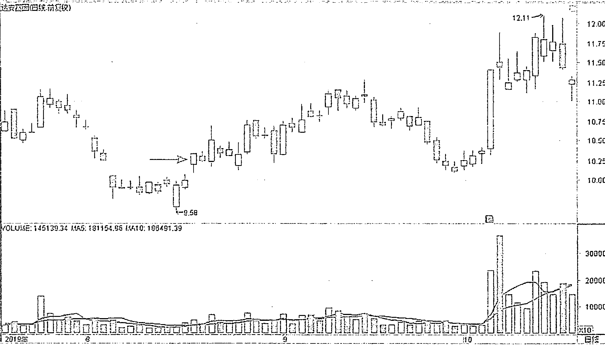

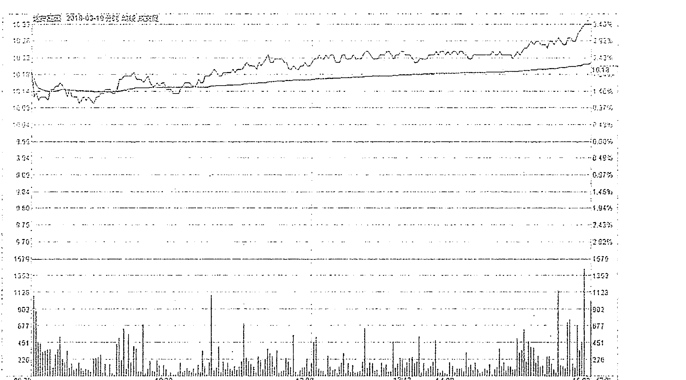

## 8.13 平量式突破震荡区 (机械类股)

平量式突破震荡区形态，是指股价在低位区出现了持续一段时间的横向震荡走势，随后，股价开始向上突破，在突破过程中，成交量未见明显放大，与之前震荡时的均量水平相当，这就是所谓的「平量」。

平量式突破可以被看作是主力持股数量较多、参与能力较强的标志。由于股价刚刚突破低位震荡区，在强势主力的积极参与下，股价随后的上升空间值得期待，个股有成为翻倍黑马股的潜质。在实盘操作中，我们可以在股价平量突破后的第一时间追涨买入；也可以再观察一段时间，等股价短线出现回档时，再择机买入。

### 实战案例：威海广泰

图 8-17 为威海广泰的走势图，股价在突破低位震荡区时，呈「平量」状态，这是主力持股数量多的标志。若出现了一波上扬持续时间较长但涨速缓慢，在短线高点有连续长阴线回档的走势，则此时的短线回档点就是我们买入的好时机。

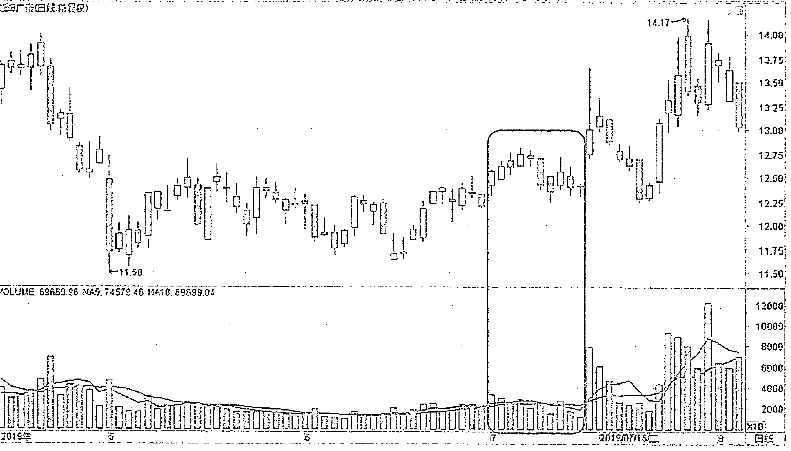

# 國家圖書館出版品預行編目（CIP）資料

| 项目 | 内容 |
| :--- | :--- |
| 書名 | 用3小時學會量價操作法 讓我股票賺3倍：200 張K線圖看透主力和法人，在低價買進的軌跡！ |
| 作者 | 楊金著 |
| 出版地 | 新北市：大樂文化有限公司，2021.10 |
| 面數、尺寸 | 256面；17×23公分 |
| ISBN | 978-986-5564-53-7（平裝） |
| 主題 | 1.股票投資 2.投資技術 3.投資分析 |
| 分類號 | 563.53 |
| 館藏號 | 110015654 |

# 用3小時學會量價操作法 讓我股票賺3倍
## 200 張K線圖看透主力和法人，在低價買進的軌跡！

- 作者／楊 金
- 封面設計／蕭壽佳
- 內頁排版／江慧雯
- 責任編輯／林育如
- 主編／皮海屏
- 發行專員／呂妍蓁、鄭羽希
- 財務經理／陳碧蘭
- 發行經理／高世權、呂和儒
- 總編輯、總經理／蔡連壽

| 项目 | 详情 |
| :--- | :--- |
| 出版者 | 大樂文化有限公司（優渥誌） |
| 地址 | 220 新北市板橋區文化路一段268號18樓之一 |
| 電話 | （02）2258-3656 |
| 傳真 | （02）2258-3660 |
| 購書諮詢 | 2258-3656 |
| 郵政劃撥帳號 | 50211045 戶名／大樂文化有限公司 |

| 项目 | 详情 |
| :--- | :--- |
| 香港發行 | 豐達出版發行有限公司 |
| 地址 | 香港柴灣永泰道70號柴灣工業城2期1805室 |
| 電話 | 852-2172 6513 |
| 傳真 | 852-2172 4355 |

| 项目 | 详情 |
| :--- | :--- |
| 法律顧問 | 第一國際法律事務所余淑杏律師 |
| 印刷 | 韋懋實業有限公司 |
| 出版日期 | 2021年10月28日 |
| 定價 | 350元（缺頁或損毀的書，請寄回更換） |
| ISBN | 978-986-5564-53-7 |

本著作物，由人民郵電出版社授權出版，發行中文繁體字版。原著簡體字版書名為《從零開始學量價分析》，繁體中文權利由大樂文化有限公司取得，翻印必究。All rights reserved.


