# 白话梅花易数

## 21世纪易学家书系

邵雍【原著】 郑同【著】

华龄出版社

古人依据天人感应的学说，认为宇宙、社会、万物都是全息的。宇宙中有的，人身也有；人身中有的，万物悉备。宇宙万物，即使山石林木之类的无知之物，与人类也是相互影响、相互作用的。人与自然界甚至与整个宇宙的相互关系，万事万物和人类社会的发展趋势，都是可以预测并描述的。在所有预测术中，最简单、最精确的莫过于梅花易数，它为初学者提供了走向最高境界的可循之路。相传梅花易数是邵雍对《周易》的具体推衍，其占法以时间、方位、声音、动静、地理、天时、人事、颜色、动植物等等自然界和人类社会中一切可以感知的事物，作为媒介体起卦，同时全方位地考察卦象的体用互变、卦爻辞，并纳入五季、五方、五色、五行、干支及三要、十应等等诸元，依据既定的逻辑推演模式，预测出人事、财运、出行、谋划、婚姻等事物的发展趋势和细节，非常适合入门者学习。

《梅花易数》占法，以时间、方位、声音、动静、地理、天时、人事、颜色、动植物等等自然界和人类社会中一切可以感知的事物异相，作为媒介体起卦，同时全方位地考察卦象的体用互变、卦爻辞，并纳入五季、五方、五色、五行、干支及三要、十应等等诸元，依据既定的逻辑推演模式，预测出人事、财运、出行、谋划、婚姻等事物的发展趋势和细节，非常适合入门者学习。

《梅花易数》起卦法多种多样，不一定非以时间来起卦预测，也可以让别人报数预测，或写一个字，以字的笔画数起卦预测，或听到某种声音，数其几声起卦或见到一组数字也可起卦预测，这就是梅花易数预测法的灵活性，而且准确性很高。而奇门遁甲、铁板神数等方法，不仅要借助一套工具书，而且起卦、推卦十分烦琐，一般读者用一生的时间也许都不能运用自如，更不要说精通了。

《易经》为群经之首，光耀千古；《梅花易数》则神随其后，以浅白之文而直证大道。《梅花易数》在以政治和伦理为主要意识形态的中国传统文化中，直接开辟出一个极其广阔的实用领域，把人们的眼界由天人大道而引回日常生活，又由日常生活而反证天人大道，在古代学问中独树一帜。《梅花易数》将生动的易象与深刻的易理结合起来，将形象思维与逻辑思维结合起来，形成了哲学与生活高度统一的象数易学，闪耀着人类哲学与思辨的灿烂光芒。天有四方，地有五行；辩证统一，道为核心。深入触及世界的本质与生活的本源，正是《梅花易数》的精华所在。

因为工作的缘故，近十年来，我反复研读了《观物内篇》、《观物外篇》。初时也颇感艰深，反复诵读之后，终于豁然开朗。我对《梅花易数》的体悟和结论，或许与其他易学同道的结论，略有不同。邵子之言，亲切精到，今日读来，虽有千年之远，却也遥遥可会。《梅花易数》虽非邵雍亲撰，但在在处处，无一不是易数之至理，或当是邵雍的亲传。从宋至今，如非邵雍，世间还有哪位贤哲能有这些至简至易而又至精至当的理论？邵雍的学问，不是仅仅通过考据之学即能得其精髓的。

《梅花易数》一书，篇章虽多，但无一不切合于易理。《梅花易数》起卦，虽简单明了，但无一不切合于易数。《梅花易数》字数虽少，但无一不切合于易义。《梅花易数》断卦方法虽多，但无一不切合于自然。《梅花易数》文约义丰，言简意赅；辞虽浅白，义实古奥。因此，我把近几年的对《梅花易数》的体悟一一整理出来，对原文进行了详细的讲解，或能抛砖引玉，为读者免除语言障碍，径得无上的易数智慧。

# 《梅花易数》版本源流

《梅花易数》一书，文辞秀美，义理精湛，真是不可多得之书。全书内容分为占卜及测字两个部分，其占测之广，可谓包罗万象；其应用之妙，真可谓至精至微。其起课之法，较之其他六壬、奇门遁甲诸书，却简易明白，符合“易简”之至道。浅则近清近理，精则神妙无穷。一经研读，就令人兴趣盎然，意趣横生。深入研究，则令人仰之弥高，钻之弥深，不能自止。

民国版梅花易数书影

清版梅花易数书影

查国家图书馆的馆藏记录，现存最早的版本，当是刻于清初的善成堂本，全四卷，题名为《新刻先生后天梅花观梅拆字数全集》。后刻的版本，大概都渊源于此。目前，还没有发现早于此的版本。后来的版本有：书业堂本，题名为《新刻增订邵康节先生梅花观梅拆字数全集》；聚益堂本，题名为《新增梅花数》；民国广益书局石印本，题名为《校正梅花易数——新刻增字邵康节先生梅花观梅拆字数全集》。近年来，随着易学界对于《梅花易数》的深人研究，大陆和港台甚至日本，均出版了很多关于《梅花易数》的著述，兹不一一列举。

对于《梅花易数》是否为邵雍所作，学界早有定论。其实，对于邵雍是否是《梅花易数》的作者，本不用做烦琐的考证，稍有古代文化常识的人都知道，这类卜筮之书的署名大都靠不住。汉代以后，卜人是下九流之人，地位低下，自己的著作写出来，为了能够广为流传和抬高身价，往往署上古人的名字，这似乎也是中国文化的传统。汉代的书，动不动托之于孔子，甚至托之于黄帝。明清的卜筮之书，大都托之于东方朔、诸葛亮、刘伯温等，这是常见的文化现象，根本不值得大惊小怪。

《梅花易数》不是邵雍所作，但纵览全文之后，你就会觉得，此书并非与邵雍毫无关系。有的学者，甚至对此进行了详细的考证。我认为，《梅花易数》一书，就是在邵雍易学的基础上，总结了当时流行的卜筮理论，删繁就简，汇编而成的一本书。邵雍的易学思想，正是全书的理论基础。当然，这种简单的占断方法，也正是受邵雍的易学思想启发而来。这一点，如果您认真读完全书，相信不会再有异议。在河南辉县百泉镇百泉村，邵氏后裔对于其祖先“遇事能前知”，多有民间传说至今。我相信，邵雍的“前知”之术，当然其来有自，自有一套理论体系。虽然卜筮之术只是小道，并未成书，对其门人弟子，当会口传心授，这套学问自然是传承有绪，不会是凭空而降，到了清代才有的。

# "高明英迈，迥出千古"的邵雍

邵雍（1011～1077），儒学大家，“北宋五子”之一，同时也是哲学家、历史学家和天文学家。字尧夫，谥康节，生于北宋真宗四年，卒于神宗十年，享年67岁。他生于河北范阳，后随父移居共城，晚年隐居在洛阳安乐窝。邵雍的才学和品德，“高明英迈，迥出千古”；邵雍的修养，“坦夷浑厚，不见圭角”。大学问家程颢在与邵雍一番切磋之后，无比敬服，赞叹道：“尧夫，内圣外王之学也！”

从历史的记载来看，邵雍不光有超凡脱俗的禀赋和气质，更有好学深思的非凡功力以及乐天知命的高深修养。因此，比较起来，他一生学问的成就，似乎更胜于“二程”和张载诸大儒。后来的朱熹对他非常崇拜。朱熹自己就是个大学问家，并非泛泛之辈。他把宋儒们批评了一遍，独独对于邵雍只有褒奖之辞。北宋诸大儒的学问出入佛老，创建了理学后，开始以自己为正统，从而不遗余力地排斥佛道之说。唯有邵康节以高深的学养见识，超脱出儒、释、道三家之外，既不佞佛附道，亦不过分排斥佛老，超然物外，自成一家之言。单就这种对于学问的态度和见解来说，已非北宋诸儒所能及。

据邵雍之子邵伯温记载，邵雍的出生，颇有些神异之处：

《邵氏闻见录》：伊州丈人与李夫人因山行，于云雾间见大黑猿，有感，夫人遂孕。临蓐时，慈乌满庭，人以为瑞，是生康节公。公初生，发被面，有齿，能呼母。七岁戏于庭，从蚁穴中豁然别见天日，云气往来。久之，以告夫人。夫人至，无所见，禁勿言。

李夫人，即是邵雍的母亲。就像当时天下所有的婆媳关系一样，邵雍的母亲李夫人也受到了自己的婆婆张夫人的严格管教，甚至是虐待，一度想自尽，据记载：

《邵氏闻见录》：伯温曾祖母张夫人御祖母李夫人严甚，李夫人不能堪。一夕，欲自尽，梦神人令以玉笾食羹一杯，告曰：“无自尽，当生佳儿。”夫人信之。后夫人病瘦，医者既投药，又梦寝堂门之左右木瓜二株，左者俱已结，右者已枯，因为大父言。大父遽取药令覆之。及期，生康节公，同堕一死胎，女也。后十余年，夫人病卧堂上，见月色中一女子拜庭下，泣曰：“母不察庸医，以药毒儿，可恨！”夫人曰：“命也。”女子：“若为命，何兄独生？”夫人：“汝死兄独生，乃命也。”女子涕泣而去。又十余年，夫人再见女子来，泣曰：“一为庸医所误，二十年方得受生。与母缘重，故相别。”又涕泣而去。

少年的邵雍，胸怀大志，遍览诸典，读书非常刻苦。后来，为了增长见识，他还游学四方，越黄河、过汾河，涉淮水、渡汉水，到过齐、鲁、宋、郑等各地。在游学的路上，也曾经遇险，据其子邵伯温记载：《邵氏闻见前录》：既长，游学，夜行晋州山路，马突，因坠深涧中。从者攀缘下寻公，无所伤，唯坏一帽。

这次可谓是有惊无险。“读万卷书，行万里路”，成就了邵雍经天纬地的学问。归来后，说道：“道在是矣。”于是就不再外出云游。青年时代的邵雍，也曾多次参加科举考试，但均未及第。在科举之路走不通之后，开始效法圣人，观物研理，潜心研究《易经》、《诗经》和《春秋》，要为后人留下一门大学问，正如他在诗中所说：“若蕴奇才必奇用，不然须负一生闲。”易学名家李挺之，时为共城县令，见其好学不倦，就传授了他《河图》、《洛书》、《伏羲八卦》等易学秘籍。李之才是载于易学史的易学名家，字挺之，其性朴率直信，倜傥不群，专心于学问，并不迷恋仕途。史载，李之才“能为古文章”，是宋代道学大师陈抟的俗家弟子，学术上得到了陈抟的真传，精通《易经》及河洛之学。邵雍以其渊博的学问，自然融会贯通、妙悟神契，终成一代易学大师。

中年后的邵雍，不再“自雄其才，慷慨欲树功名”，他走上知识分子的另一条道路，精读诗书，研究学术，著书立说，淡泊名利，隐居不仕。当时的名流学者，如富弼、司马光、吕公著等人，都非常敬重他的学问和人品。大家看到邵雍极其清贫，就集资为他买了一块地，在洛阳天宫寺西天津桥南，是五代节度使安审琦宅的故基，并建屋三十间，为其住宅。邵雍题名其宅为“安乐窝”，自号为“安乐先生”。他虽然学贯古今、英才盖世，但是品德浑厚，待人至诚，没有现在的大小知识分子常见的瞧不起人的习气，为乡里长幼所尊重。

邵雍通过对历史、地理和天文的研究，形成了自己一套独特而完整的宇宙观。按照他的理论来推演，天地变化、阴阳消长的规律可了如指掌。不仅如此，他还创立了独具特色的性命学说、修养理论与价值系统，并最终完成了他的“先天易学”体系。所谓“先天易学”体系，实际上包括“先天”和“后天”两个基本的学术范畴。“先天”之说是邵雍的天学体系，即宇宙之学；而“后天”之学，则是性命之学、心性之学。“先天之学”为“一字无”的玄妙之学，“后天之学”则可以用修养心身“功夫”去求得。有了这套先后天的学问，即可上知天地宇宙，下知禽虫鸟兽，于万事万物，无不了然于胸。《宋史》说他，“远而古今世变，微而走飞草木之性情，都能‘深造曲畅’，洞彻渊微，而且‘智虑绝人，遇事能前知’。

他的见地修养，除了《观物外篇》与《击壤集》，在哲学上有极深的造诣外，对《易经》‘象数’之学，更有独到的成就。在易学上，邵雍承继汉、唐易说而别具见解，以六十四卦循环往复作为历史的纲领和符号，来推演宇宙时间和人物的演化，说明自己的历史观，认为万事万物之一切变化，并非出于偶然，皆有其缘，皆有其理，在在处处，“虽曰人事，岂非天命哉！”因而他认为历史自有其自然性的规律存在，并据此著成《观物内篇》的图表，与其阐述哲学观念的《观物外篇》合起来而构成《皇极经世》这一部千古名著。《观物内篇》的内容，好比一个治乱兴衰的历史圆圈，像是历史的宿命论，而又非纯粹的宿命论。通读全书，其内容就是《易经》序卦史观的具体化，同时也可以说是集中国历史上所有谶纬预言之学的之大成。

邵雍虽然遇事能前知，但并不迷信命理之说。在给父亲择墓地时，不尽用葬书，亦不信阴阳拘忌之说。在《伊川击壤集》中收有《闲行吟》一诗，说道：‘买卜稽疑是买疑，病深何药可能医。梦中说梦重重妄，床上安床叠叠非。列子乘风徒有待，夸父追日岂无疲。劳老未有收功处，踏尽人间闲路歧。’由此诗可见，邵雍是一个不信世俗之命的人，并非如后人附会，事事动不动就卜卦稽疑。虽然相信堪舆或命理之说，在古代的知识阶层中，是非常普遍的现象。比如非常崇拜邵雍的南宋大学问家朱熹，就相当地迷信堪舆及卜筮之道。

熙宁十年（公元1077年），邵雍有病卧床百余日，气日益耗，神日益明，自感自己的人生之路走到了尽头。与我们普通人不同的是，他非常的达观，并没有依依不舍，而是非常有条理地安排了自己的后事。遗嘱命治丧之事从简，一如其父，从葬于伊川先茔。

邵雍病重之中，写下了‘以命听于天，于心何所失’、‘唯将以命听于天，此外谁能闲计较’、‘死生都一致，利害漫相寻。汤剂功非浅，膏肓疾已深。然而犹灼艾，用慰友朋心’等诗句，足见他对待生死的达观态度。

邵雍病中，司马光前来探视。邵雍笑谓：“某病势不起，且试与观化一巡也。”司马光宽慰他：“尧夫，不应至此。”邵雍回答说：“死生亦常事耳。”程颐前来探病，诙谐地说：“先生至此，他人无以致力，愿先生自主张。”邵雍说：“平生学道，固至此矣，然亦无主张。”程颐还是跟他戏谑，邵雍也开玩笑地说：“正叔谓生姜树头生，必是树头生也。”这时邵雍的声息已很微弱，就举起两手做手势，程颐不明白，问：“从此与先生诀矣，更有可以见告者乎？”邵雍说：“面前路径常令宽，路径窄则无著身处，况能使人行也！”

当时正值张载从关中来，也来问疾，给邵雍诊脉后说：“先生脉息不亏，自当勿药。”他喜欢论命，又要给邵雍推命吉凶，说：“先生信命乎？载试为先生推之。”邵雍回答：“世俗所谓之命，某所不知，若天命则知之矣。”张载说：“既曰天命，则无可言者。”

邵伯温当时年纪尚小，邵雍的朋友们在其家中商议后事如何办理。有人主张把先生葬在洛阳附近，以便大家祭扫。虽然房间离客座很远，但先生已知大家的议论，

# 邵雍先生像
# 康节先生赞

天挺人豪，英迈盖世。驾风鞭霆，历览无际。
手探月窟，足蹑天根。闲中今古，醉里乾坤。

新安朱熹赞

# 原序

宋庆历中，康节邵先生隐处山林，冬不炉，夏不扇，盖心在于《易》，忘乎其为寒暑也。犹以为未至，糊《易》于壁，心致而目玩焉。邃于易理，欲造《易》之数而有征也。

一日午睡，有鼠游于前，以所枕瓦枕投击之，鼠走而枕破。觉枕中有字，取视之云：“此枕卖与贤人康节，某年月日某时，击鼠破枕。”先生讶之曰：“物皆有数。”询之陶家，其陶枕者曰：“昔尝有一人，手执《周易》，憩坐枕上。枕中之字，必此老所书也。今不至久矣。吾能识其家。”

先生遂偕陶者往访焉，及门，则已不存矣。但遗书一册，谓其家人曰：“某年某月某时，有一秀士至吾家，可以此书授之，能终吾身后事矣。”其家以书授先生，先生阅之，乃《易》之文，并有诀例。就以此例演数卜之，谓其人曰：“汝父存日，有白金置睡床西北窖中，可以营葬事。”其家如言，果得金。”

先生受书以归。后观梅，以雀争胜，布算，知次晚有邻人女折花，堕伤其股。其卜盖始于此，后世相传，遂名《观梅数》。与夫卜落花，知明日午时为马所践毁；又算西林寺额，知有阴人之祸。凡此，皆所谓先天之数也。盖未得卦先得数也。以数起卦，故曰“先天”。若夫见老人有忧色，卜而知老人有食鱼之祸；见少年有喜色，卜而知有婚聘之喜；闻鸡鸣，知鸡必烹；听牛鸣，知牛当杀。凡此，皆所谓后天之数也。盖未得数先得卦也。以卦起数，故曰“后天”。”

一日，置一椅，以数推之，书椅底曰：“某年月日，当为仙客坐破。”至期，果有道者来访，坐破其椅。仙客愧谢，先生曰：“物之成毁有数，岂足介意。且公神仙也，幸坐以示教。”因举椅下所书以验，道者愕然，趋起出，忽不见。乃知数之妙，虽鬼神莫逃，而况于人乎？况于物乎？

## 白话梅花易数

## 梅花易数卷一

## 周易卦数

《周易》是中国古代研究、占测宇宙万物变易规律的典籍，因汉儒将其列入六经，故称《易经》。我们现在看到的通行本的《易经》，包括《周易》和《易传》两个部分。“经”有常规不变之义，汉朝人对儒学尊奉的典籍，如《诗》、《书》、《礼》、《春秋》等皆称为经，不限于《周易》。“传”，有传授之义，古代传授经书的经师，往往对“经”的文字和内容作出解释，其所作的解释称为“传”。解释《易经》的著作，则称为《易传》。《周易》指西周时期形成的典籍，即原本《周易》，是《易经》中的经文部分，由六十四卦组成，每一卦包括卦符、卦名、卦辞、爻题、爻辞。六十四卦共三百八十四爻，加上乾卦、坤卦的用九爻、用六爻，共三百八十六爻。六十四卦爻辞，内容涉及自然现象、历史人物事件、人事行为得失、吉凶断语等。

《易传》亦称《易大传》、《十翼》，传统的说法是孔子对《周易》的解释，共十篇：《彖》上下、《象》上下、《文言》、《系辞》上下、《说卦》、《杂卦》、《序卦》。其中《彖》说明《易经》各卦之义，专门解释卦名、卦象、卦辞，而不涉及爻辞；《象》说明《易经》各卦的卦象、爻象；《文言》专门解释乾、坤两卦卦义；《系辞》通论《周易》原理；《说卦》解释八卦性质、方位和象征意义；《序卦》说明六十四卦排列次序；《杂卦》说明各卦之间错综关系。

从春秋时期开始，随着社会和文化的发展，人们对《周易》进行了各种各样的解释。有史以来，解释《周易》的著作有两三千种，目前流传下来的就有近千种。我们在提到这些典籍时，通常把它们称作“易学”，如《周易集解》、《周易本义》、《周易折中》等等。“学”，指汉朝以来的经师、学者对《周易》和易传所作的种种解释。之所以称为“学”，是因为从汉朝开始，凡研究儒家经典的学问皆称为学，即经学。儒家经学系统的典籍从汉朝开始，都包括经、传、学三部分，《周易》系统的典籍也是如此。

可以毫不夸张地说，易学是中华文明的重要源头。无论是道家还是儒家，无不尊《周易》为首。在中国历史上有成就的人，往往本人就是易学家，如唐朝的虞世南，宋朝的司马光、王安石、苏轼，清朝的李光地等。历史上汉朝的王凤、唐代的虞世南非常推崇《易经》，说“不读《易》不可为将相”。不学《易经》的人，不能作一个很好的宰相，亦不能作一个很好的大将，《易经》竟是如此的重要。我们儒家的文化，道家的文化，一切中国的文化，都是从文王著了这本《周易》以后，开始发展下来的。南怀谨先生甚至称“诸子百家之说，都渊源于这本书，都渊源于《易经》所画的这几个卦”。

《周易》的性质，学者或以为专明占筮之书，或以为阐论哲理之作。但细究《周易》的创制，虽是以卜筮为用，但其中包涵着通天彻地、纵贯古今的深湛智慧，其实质乃含藏着无上的哲学意义。包涵经传在内的《周易》一书，由于其内容诞生之古远，沟通天人之道之精微，及其核心思想之深邃，应被视为我国古代一部特殊的哲学专著。

乾一 兑二 离三 震四
巽五 坎六 艮七 坤八

≡、≡、≡、≡、≡、≡、≡、≡，以上八个符号，就是八卦。乾、兑、离、震、巽、坎、艮、坤等八个字，就是与八卦一一对应的卦名。什么叫作卦？古人解释：“卦者挂也。”也就是说，卦就是挂起来的现象，八卦就是告诉我们宇宙之间有八个东西，即乾、兑、离、震、巽、坎、艮、坤等八个三画卦。八卦两两相重，就构成了六十四卦。

这八个东西的现象挂出来，就是八卦。这个宇宙就是由八卦组成，宇宙的现象都挂在那里，现在我们先了解它的原理。

乾卦代表天，坤卦代表地，这两个符号，代表了时间、空间、宇宙。

在这个天地以内，有两个大东西，一个是太阳，一个是月亮，像球一样，不断在转，所以离卦代表太阳，坎卦代表月亮。这两个东西不停地旋转于天地之间，于是有四个卦挂出来了。

还有两个卦是震卦、巽卦。震卦代表雷，巽卦代表风

## 在宇宙间，除了这八个大现象以外，再找不出第九样大的东西了。大的现象只有八个，没有九个，亦不能七个，只有八个，而且都是对立的。可是这八个现象，变化起来就大极了，是无穷的，不能穷尽的数字，变化当然也是无穷无尽的。

## 所谓卦数，就是指易卦所代表的数字。上面所列“乾一”至“坤八”，为周易之八卦所代表的卦数，也称“先天八卦数”。用《周易》进行占卜，起数是关键。把筮得的数转换为六十四卦，根据的就是《周易》先天八卦数。《汉书·律历志》言：“自伏羲画八卦由数起，至黄帝、尧、舜而大备，三代稽古，法度章焉。”在本书，卦数所指的一般是指先天八卦数。①

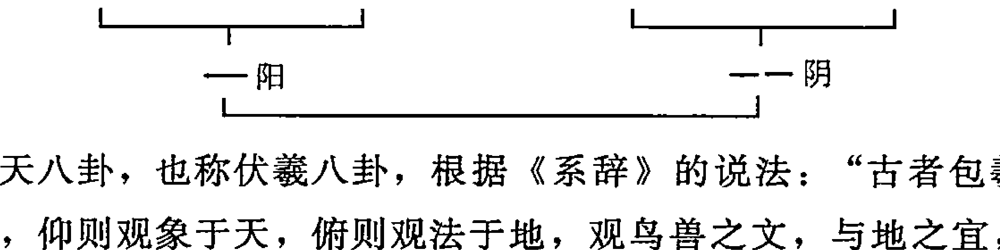

先天八卦，也称伏羲八卦，根据《系辞》的说法：“古者包羲氏之王天下也，仰则观象于天，俯则观法于地，观鸟兽之文，与地之宜，近取诸身，远取诸物，于是始作八卦，以通神明之德，以类万物之情。” 那么，先天八卦的理论，正是由距今七千年的伏羲氏观物取象而作。

观上面的伏羲八卦次序图，最下面的是“太极”，象征着一，也就是道，模拟的是宇宙尚未演化、天地未分时的浑沌状态。太极动而生阳，静而生阴，一阴一阳就是两仪，故《系辞传》说“一阴一阳之谓道”。古人观天下万物之变化，不外乎由太极而生阴阳，故画“—”奇以象阳，画“——”偶以象阴。阳就是阳爻，用“—”表示，单为阳之数；阴就是阴爻，用“——”表示，双为阴之数。

一阴一阳称为两仪，又各生一阴一阳之象，也就是一分为二，生出四象，即少阳、太阳、少阴、太阴，是谓“两仪生四象”。四象再一分为二，各自生阴生阳，即生出八卦，是谓“四象生八卦”。也就是说在少阳、太阳、少阴、太阴这四象上，分别各加一阳爻或阴爻，“叠之为三”，即产生八种新的符号。如在少阴上加一阳爻，生成离卦；在其上加一阴爻，生成震卦，以此类推，生成乾一、兑二、离三、震四、巽五、坎六、艮七、坤八

① 在其它的易学书中，卦数有时还指天地范围数、八卦成列数、先后天八卦合数及六十四卦方位数等。

## # 白话梅花易数

八，由右至左顺序排列。这种八卦排列次序及其卦数，就是先天八卦之数，此图即称作先天八卦横图，也称作伏羲八卦次序图。先天数的产生，是由浑沌太极，无形无象也无定位，只是一气相生，阴阳次第相加，而自然造化一至八数，故谓‘先天’。《说卦传》：“天地定位，山泽通气，雷风相薄，水火不相射，八卦相错，数往者顺，知来者逆，是故易逆数也。”这一段话，是先天八卦方位的理论依据。

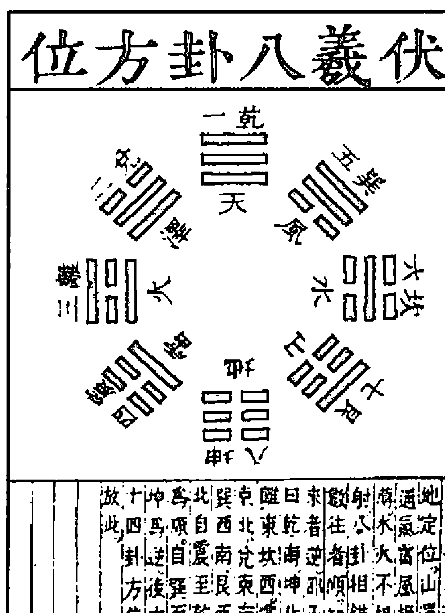

八卦按其所代表的万物的性质，两两相对排列，分成四对，相对立的站在各一端，即阴阳相对，这四对东西交错起来，就构成了先天八卦方位图。根据图我们可以看出，每对都是两个性质相反的东西，从图中我们应能分析出阴阳相对的关系。

天地定位：天居上，地居下，乾南坤北，南北对峙，上下相对。从两卦爻象来看，乾是三阳爻组成，为纯阳之卦；坤是三阴爻组成，为纯阴之卦，两卦完全相反。

山泽通气：艮为山，居西北；兑为泽，居东南。泽气通于山，为山上雨；山气通于泽，为山下泉。从两卦爻象来看，艮是一阳爻在上，二阴爻在下；兑是一阴爻在上，二阳爻在下，两卦成对待之体。

雷风相薄：震为雷，居东北；巽为风，居西南。相薄者，其势相迫，雷迅则风烈，风激则雷迅。从两卦爻象来看，震是二阴爻在上，一阳爻在下；巽是二阳爻在上，一阴爻在下，八卦成反对之象。

水火不相射：离为日，居东；坎为月，居西。不相射者，离为火，坎为水。水得火以济其寒，火得水以其热，不相熄灭。从八卦爻象来看，离是上下为阳爻，中间为阴爻；坎是上下为阴爻，中间为阳爻，两卦亦成对待之体。

从八卦卦爻明显看出，除乾坤两卦为纯阳纯阴卦外，震、坎、艮卦都是由一阳爻两阴爻组成，而且爻画均为五，为奇数，为阳，故此三卦为阳卦。巽、离、兑三卦都是由一阴爻两阳爻组成，而且爻画均为四，为偶数，为阴，故此三卦为阴卦。

从上图我们可以看到先天八卦方位与先天卦数的排列形式：由乾一至震四，系由上而下，再由下而上旋至巽五；由巽五至坤八，又由上而下，其路线形成S形的曲线，这种运动方式称为“逆行”。在其S形的运动轨迹中，由乾至坤，是按先天卦数乾一、兑二、离三、震四、巽五、坎六、艮七、坤八排列的。这种从上而下，先左后右，由少至多的数字排列方式，称作“逆数”。反之，由坤至乾，由下而上，先右后左，由多至少的数字，形成“顺行”的方式，称作“顺数”。

在先天八卦图中，八卦是本着阴阳消长，顺逆交错，相反相成的宇宙生成自然之理。根据先天八卦图和先天卦数，我们即可以预测推断世间一切事物。数不离理，理不离数。这正是本书的理论基础。

## # 五行生克

金生水，水生木，木生火，火生土，土生金。金克木，木克土，土克水，水克火，火克金。

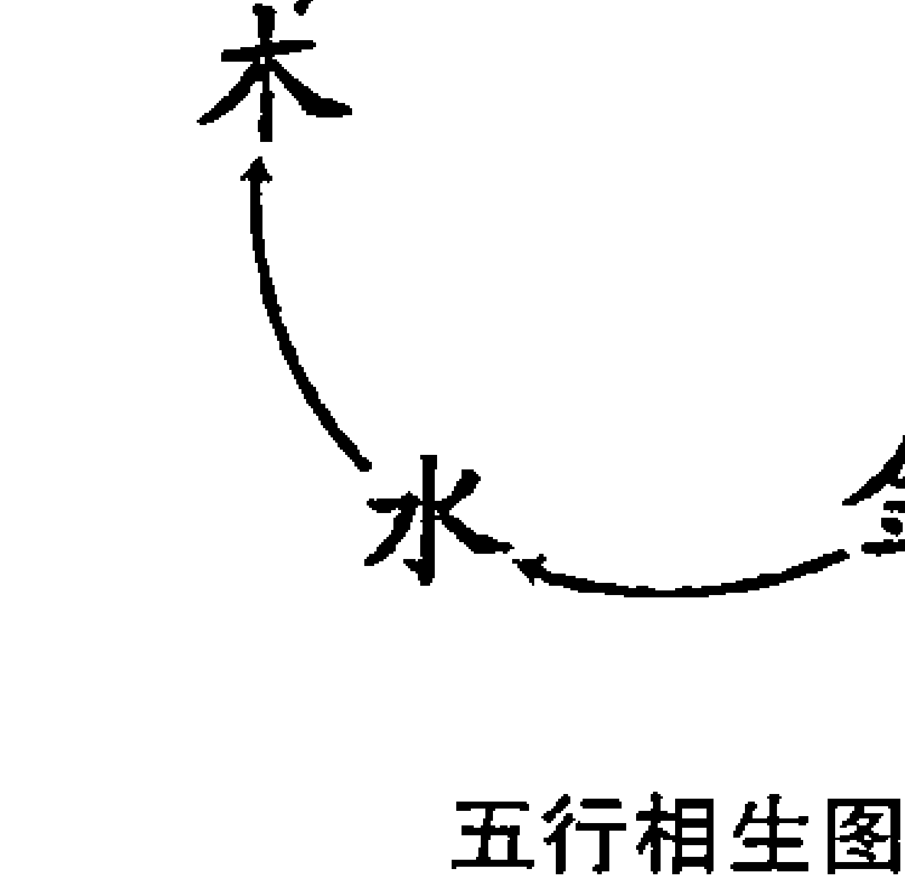

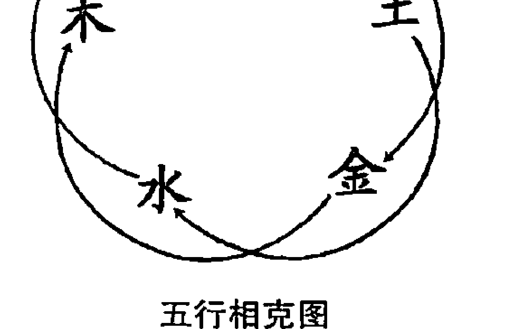

五行，指金、木、水、火、土五种物质属性而言。

## # 白话梅花易数

《尚书·洪范》云：五行：一曰水，二曰火，三曰木，四曰金，五曰土。水曰润下，火曰炎上，木曰曲直，金曰从革，土爰稼墙。润下作咸，炎上作苦，曲直作酸，从革作辛，稼墙作甘。

金，凡是坚固、凝固的都是金，古代和现代的科学分类不同，当时对于物质世界中有坚固性能的，以金字作代表。

木，代表了树木，代表了草，代表了生命中生的功能和根源。草木被砍掉以后，只要留根，第二年又生长起来，生长力特别大也特别快，木就代表了生发的生命功能。

水，代表了流动性，周流不息的作用。

火，代表了热能。

土，代表了地球的本身。

所以称它们为五行，是因为这五种东西，互相在变化，这个物质世界的这五种物理，互相在影响，变化得很厉害，这种变化，名叫生、克。

中国古代思想家把水、火、木、金、土视为构成大自然万物的五种基本元素，合称“五行”。其说又与“阴阳”说相结合，形成影响深远的“阴阳五行学”。汉以后日趋发展的“易学术数学”，即参人浓厚的阴阳五行思想。

五行学说认为，事物与事物之间存在着一种联系，这种联系又促进着事物的发展变化。五行之间存在着相生相克的规律。相生，含有互相滋生，促进助长的意思。相克，含有互相制约、克制和抑制的意思。

五行相生：木生火，火生土，土生金，金生水，水生木。

五行相克：木克土，土克水，水克火，火克金，金克木。

相生相克，是事物不可分割的两个方面。象没有阴就没有阳一样，没有相生就没有相克，没有相克，就没有相生。没有生，就没有事物的发生和成长；没有克，就不能维持事物的发展和变化中的平衡与协调。这种生中有克，克中有生，相反相成，互相为用的关系，推动和维持着事物的正常生长、发展和变化。

五行之间的生克制化关系失常，则事物的协调性便遭到了破坏，从而出现反常的变化现象，在自然界则表现为自然灾害，在人体则表现为疾病。

## # 八宫所属五行

乾、兑金。坤、艮土。震、巽木。坎水。离火。

八卦各有自己的属性。乾、兑属金，坤、艮属土，震、巽属木，坎属水，离属火。

八宫，指八卦所分领的八宫卦。西汉京房的《易》学条例。其说以八纯卦①各变为八卦，凡初爻变所成之卦为一世卦；二爻变所成之卦为二世卦；三爻变所成之卦为三世卦；四爻变所成之卦为四世卦；五爻变所成之卦为五世卦；上爻不变，再回变已变之第四爻，遂成游魂卦；再变游魂卦的下体三爻，终成归魂卦。如此由八纯卦衍变为六十四卦，纯卦为本宫，八纯卦分领八宫，成为有特殊规律的组合，称“八宫卦”。

## # 八宫卦表

| 兑 | 离 | 巽 | 坤 | 艮 | 坎 | 震 | 乾 | 
| 困 | 旅 | 小畜 | 复 | 贵 | 节 | 象 | 姤 | 一世 |
| 萃 | 鼎 | 家人 | 临 | 大畜 | 屯 | 解 | 遁 | 二世 |
| 咸 | 未济 | 益 | 泰 | 损 | 既济 | 恒 | 否 | 三世 |
| 蹇 | 蒙 | 无妄 | 大壮 | 暌 | 革 | 升 | 观 | 四世 |
| 谦 | 涣 | 噬嗑 | 夬 | 履 | 丰 | 井 | 剥 | 五世 |
| 小过 | 讼 | 颐 | 需 | 中孚 | 明夷 | 大过 | 晋 | 游魂 |
| 归妹 | 同人 | 蛊 | 比 | 渐 | 师 | 随 | 大有 | 归魂 |

① 六画卦。

## # 白话梅花易数

## # 卦气旺

震、巽木旺于春。离火旺于夏。乾、兑金旺于秋。坎水旺于冬。坤、艮土旺于辰、戌、丑、未月。

## # 卦气衰

春坤、艮。夏乾、兑。秋震、巽。冬离。辰、戌、丑、未坎。

汉代《易》家孟喜、京房等①以《易》卦分配于十二月气候，作为《易》筮、占验之用，称为“卦气”。

所谓“气”，就是指同一事物的两种对立属性，系统地说，就是指事物的“阴”与“阳”，即事物的多少、大小、高低、寒热、早晚、明暗、吉凶等各个对立统一的方面。把卦与气合起来，就可以用八卦来表象事物的阴阳对立的静态属性和消长的动态属性。古人把这种方法应用到一年四季寒暑变化上，就是一直传承到现代的，我们今天看到的，独树一帜的卦气学说。

卦气可以用《周易》一解释一年的节气变化，包括三种因素：一、卦；二、气候；三、五行。在卦气学说中，不包含坎、离、震、兑四正卦的六十卦，与四时、十二月、二十四节气、七十二候相配合，每一爻主（值）一日，六十卦一共就是360天，其余的五日四分之一日均匀的分摊到六十卦中，于是就形成了一卦主六日八十分之七日的所谓六日七分卦气。坎、离、震、兑四正卦，主春夏秋冬四时；其爻二十有四，主二十四节气；余六十卦，主三百六十五又四分之一日，每卦主六日七分。内自复至乾，自姤至坤为十二月消息卦，主十二辰；其爻七十有二，主七十二候。汉代以来，学者们不仅用卦象来模拟四时更迭、斗移星转的气候和天象规律，也用于历学，更用于推断人事吉凶。

但是在这里，八卦的卦气，指的是八卦各有其五行属性，故而在不同的季节表现出衰旺不同的特征。与我们传统意义上所讲的卦气并不相同。也就是说，此处的卦气，指的是其五行之气。

我们之所以详细讲述了汉代的卦气概念，就是让大家分别二者，以免在今后的应用中混淆。但是，这里的八卦卦气衰旺虽与汉代的卦气之说不同，但也是脱胎于其观念。此处不再详细讲解，因为实在是说起来太长了，各位可以自己体会。

## # 十天干

甲乙东方木。丙丁南方火。戊己中央土。庚辛西方金。壬癸北方水。¹

## # 十二地支

子水鼠，丑土牛，寅木虎，卯木兔，辰土龙，巳火蛇。 午火马，未土羊，申金猴，酉金鸡，戌土犬，亥水猪。

将记录时间的符号十天干与十二地支分别与方位、五行、十二生肖组合，这是占卦的基础。在以后的占法中，依方位起卦或依年月日时起卦等多种方法中，都要灵活运用十天干和十二地支的方位、五行等属性。

天干，亦称‘十干’、‘十天干’、‘十母’。是古代表示年、月、日、时的符号。是甲乙丙丁戊己庚辛壬癸的总称。其中的甲丙戊庚壬为五阳干；乙丁己辛癸为五阴干。

《说文解字》是如是阐释天干的：

甲：东方之孟，阳气萌动。

乙：象春草木冤曲而出，阴气尚强，其出乙乙也。

丙：往南方，万物成炳然。阴气初起，阳气将亏。

丁：夏时万物皆丁实。

__________

① 一说为：寅为初生之木，卯为极盛之木，辰为渐衰之木；巳为初生之火，午为极盛之火，未为渐衰之火；申为初生之金，戌为渐衰之金；亥为初生之水，子为极盛之水，丑为渐衰之水。

## # 白话梅花易数

## # 天干配五行图

地支，亦称“十二支”、“十二地支”、“十二子”，别称“岁阴”、“十二辰”。是古代表示年、月、日、时的符号，为子、丑、寅、卯、辰、巳、午、未、申、酉、戌、亥的总称。支，指树枝。《汉书·食货志》颜师古注：“支，犹枝也。”司马迁在《史记》中相对于十干十母，称十二支为十二子。

《说文解字》是如是解释地支的：

子：十一月阳气动，万物滋。

丑：纽也，十二月万物动用物，像手五形。

寅：正月阳气动，去黄泉欲上出，阴尚强也。

卯：冒也，二月万物冒地而出，像开门之形。

辰：震也，三月阳气动，雷电振，民农时也，物皆生。

巳：已也，四月阳气已出，阴气已藏，万物见，成文章。

午：牾也，五月阳气牾逆阳，冒地而出也。

未：味也，六月滋味也，象木重枝叶也。

申：神也，七月阴气成体，自申东。

酉：就也，八月黍成可为酹酒。

戌：天也，九月阳气微，万物毕成，阳下人地也。

亥：荄也，十月微阳起接盛阴。

把地支与五行及方位相配成圆图，即如下图所示：

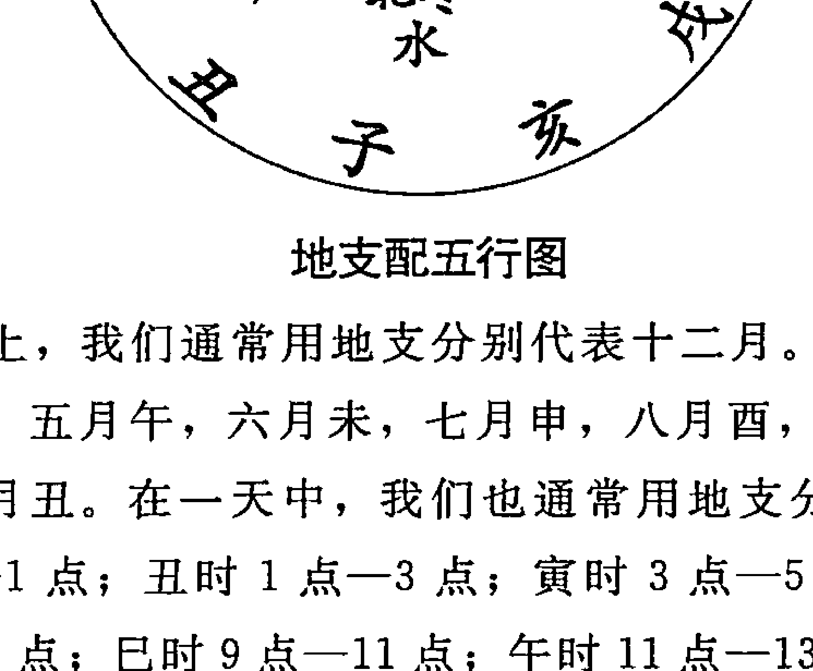

在地历月份上，我们通常用地支分别代表十二月。一月寅，二月卯，三月辰，四月巳，五月午，六月未，七月申，八月酉，九月戌，十月亥，十一月子，十二月丑。在一天中，我们也通常用地支分别代表十二个时辰。子时23点—1点；丑时1点—3点；寅时3点—5点；卯时5点—7点；辰时7点—9点；巳时9点—11点；午时11点—13点；未时13点至15点；申

数六、午年数七、未年数八、申年数九、酉年数十、戌年数十一、亥年数十二。

月数随月份数，是几月即取几数。

日数以初一为一至三十日之数为准，是几日即取几数。

时数的取法：子时（23点～1点）数一、丑时（1点～3点）数二、寅时（3～5点）数三、卯时（5～7点）数四、辰时（7～9点）数五、巳时（9～11点）数六、午时（11～13点）数七、未时（13～15点）数八、申时（15～17点）数九、酉时（17～19点）数十，戌时（19～21点）数十一、亥时（21～23点）数十二。

以年、月、日之数总和除以八的余数得上卦。以年、月、日时之数的总和除八的余数得下卦；除以六的余数得动爻。本书已经在前面的举例中对此起卦法详细说明。

# 物数占例

凡见有可数之物，即以此数起作上卦，以时数配作下卦。即以卦数并时数总除六取动爻。

如果起卦时见到可以数的物体，可以以这些物体数直接起卦并作为重卦的上卦，再用当时的时数配作重卦的下卦。最后用这个卦的卦数加上时数，被六除，用余数取动爻。

# 声音占例

凡闻声音，数得几数，起作上卦，加时数配作下卦。又以声音，如闻动物鸣叫之声，或闻人敲击之声，皆可作数起卦。

凡听到声音，如动物鸣叫声、敲击声、叩门声等等，以声音数（如敲门几下）起作上卦，时数配作下卦。以卦数加时数之和被六除，取余数为动爻。

# 字占

凡见字数如停匀，即平分一半为上卦，一半为下卦。如字数不匀，即少一字为上卦，取天轻清之义，以多一字为下卦，取地重浊之义。

凡见字数，如果能平均分成两半，即平分一半为上卦，一半为下卦，如字数为奇数，不能平均分，即以少一字为上卦，表示天轻清于上的意思；以多一字为下卦，表示地重浊于下的意思。如仅一个字，以左边笔画数为上卦，右边笔画数为下卦。另外，从四字至十数字还有一种起卦方式，即上下卦划分后取平仄音调相加。其中，平声为一，上声为二，去声为三，入声为四。相加后得总数，得卦之法仍是“卦以八除，爻以六除”之法。

## 一字占

一字为太极未判。如草，混沌不明，不可得卦。如楷书，则取其字画，以左为阳，以右为阴。画居左者看几数，取为上卦。居右者看几数，取为下卦。又以一字之阴阳全画取爻。“彳”、“丿”，此为左者；“一”、“乙”、“、”，此为右者。

来人求占，如书一个字，应以如下方法得卦。因为一字象征着太极未判，必须把字分开来得卦。如果是草书，或者字迹不清楚，或者是只有一个笔画的字，不能起卦，应再以其他方法起卦。如果此字以是楷书，是左右结构的，则取左边为阳数，取为上卦；取右边为阴数，取为下卦。如是上下结构的，则取上边为阳数，取为上卦；下边为阴数，取为下卦。取动爻时，以阴画阳画数之和大六除即可。偏旁“彳”、“丿”，一般取为左边的阳数；偏旁“一”、“乙”、“、”，一般取为右边的阴数。

## 二字占

二字为两仪平分。以一字为上卦，以一字为下卦。

两个字就如两仪，平分阴阳。两个字起卦，应按书写的先后顺序，以前一个字的笔画作上卦，以后一个字的笔画数作下卦，以两个字的笔画总数除以六，余数取动爻，其余部分与一字占相同。

## 三字占

三字为三才。以一字为上卦，二字为下卦。

三个字象征着三才“天地人”。按书写的先后顺序，以第一个字的笔画数为上卦，其余两个字的笔画数相加为下卦。

## 四字占

四字为四象。平分上下为卦。又四字以上，不必数画数，只以平仄声音调之。平声为一数，上声为二数，去声为三数，入声为四数。

四字代表四象，即少阳，太阳，少阴，太阴，分别代表春夏秋冬四时。四个字起卦，以前两个字作上卦，后两个字作下卦，合四字的笔画除六，余数取动爻。四字以上，算笔画较为繁复，易算错，故而起卦就不必数笔画，就以字的音调数起卦，即按“平、上、去、入”四声起卦。字读平声的为一数，字读上声的为二数，字读去声的为三数，字读入声的为四数。古代的四声计调法是“平、上、去、入”。但在现代的普通话中，并无人声，是“阴平、阳平、上声、去声”，这一点要注意。

## 五字占

五字为五行。以二字为上卦，三字为下卦。

五字书写出来取卦，象征着五行，也就是金、木、水、火、土五行。五个字起卦，以前两个字的音调数为上卦，以后三个字的音调数为下卦，以五个字的音调数总和，除以六，余数取动爻。

## 六字占

六字为六爻之集。平分上下为卦。

17

## 白话梅花易数

《周易》六十四卦，任意一卦，从下至上，分别为初爻、二爻、三爻、四爻、五爻、上爻，共为六爻。六字为一重卦共六爻之集的象征。以前三个字的音调数为上卦，以后三个字的音调数为下卦，平分起卦，并合两卦之的音调数除以六取动爻。

## 七字占

七字为齐七政。以三字为上卦，四字为下卦。

古人把金木水火土五星加上日月合起来称为七政或七曜。七个字是七政的象征。七个字起卦，以前三个字的音调数为上卦，以后四个字的音调数为下卦，合并上下卦的音调数除以六取动爻。

## 八字占

八字为八卦定位。平分上下为卦。

八个字起卦好比是八卦定位。八卦就是乾、坤、巽、震、坎、离、艮、兑，代表着天、地、风、雷、水、火、山、泽等八种自然界的现象。八个字起卦，以前四个字的音调数为上卦，以后四个字的音调数为下卦，合并两卦的音调数总和除以六取动爻。

## 九字占

九字为九畴之义。以四字为上卦，五字为下卦。

九畴：传说大禹治理天下的九类大法，即《洛书》。畴，类。《书·洪范》：九个字起卦，前四字的音调数为上卦，后五字的音调数为下卦，合并上下卦的音调数之和除六取动爻。

## 十字占

十字为成数。平分上下为卦。

成数，就是整数，如五百、一千。十字为成数的象征。十个字起卦，取前五个字的音调数为上卦，后五个字的音调数为下卦，合并两卦音调数之和除以六取动爻。

## 十一字占

十一字以上直至百余字，皆可起卦。但十一字以上，又不用平仄声调之，只用字数。如字数均平，则以半为上卦，以半为下卦。又合二卦总数取爻。

十一字及以上，直接用字数起卦。总字数是多少，把总字数一分为二。平分后各作上下卦的数字，然后进行运算。如果总字数为偶数，就平分前后两部分；如果字数为奇数，按天轻地重的观点，上卦比下卦少一个字。总字数除以六取动爻。

举例如下：39 个字起卦。

按照总字数一分为二，39 除以 2，得 19 余 1。

上卦应取 19 个字，下卦应取 20 个字。

19 除以 8，得 2 余 3，取 3 数为上卦，即离卦。

20 除以 8，得 2 余 4，取 4 数为下卦，即震卦。

39 除以 6，得 6 余 3，则取第三爻为动爻。

故 39 起卦，得火雷噬嗑卦，六三爻为动爻。

## 丈尺占

丈尺之物，以丈数为上卦，尺数为下卦。合尺丈之数取爻。寸数不用。

## 尺寸占

以尺数为上卦，寸数为下卦。合尺寸之数，加时取爻。分数不用。

丈、尺、寸，都是古代的计量单位。现在起卦，即用现代的丈、尺、寸单位即可，没有必要用古代的计量单位。对可丈量之物，以丈数为上

## 白话梅花易数

# 为人占

凡为人占，其例不一。或听语声起卦，或观其人品，或取诸身，或取诸物，或因其服色，触其外物，或以年月日时，或以书写来意。

右听其语声者，如或一句，即如其字数分之起卦，如说两句，即用先一句为上卦，后一句为下卦。语多，则但用初听一句，或末后所闻一句。余句不用。

观其人品者，如老人为乾，少女为兑之类。

取诸其身者，如头动为乾，足动为震，目动为离之类。

取诸其物者，如人手中偶有何物，如金玉及圆物之属为乾，土瓦及方物之属为坤之类。

因其服色者，如其人青衣为震，赤衣为离之类。

触其外物者，起卦之时见水为坎卦，见火为离卦之类。

年月日时，如观梅之类推之。

书写来意者。其人来占，或写来意，则以其字占之。

所谓为人占是为别人而预测的方法，这种方法在实践中运用得最多，也最广。对人起卦很活，全在临时掌握。可听其声，取首句或末句，据其字数分而起卦；可观其他，老人为乾，少女为兑等；可看其动作，头动为乾，足动为震，目动为离；可观其肤色或观其服色，青为震，赤为离，根据五行系统区分；还可看其执何物，执金玉或圆物为乾，执方物之属为坤；其若写字，便可以字起卦。等等。正因为如此，所以它的起卦方式不是一种，而是多种形式，为别人预测。由于所知条件甚少，要凭仅已知的一个或几个条件来对人或要求问的事作出判断，难度比较大。但由于它是最实用最常用的预测方法，因而具有很高的研究价值。一一举例如下：

一、听其语而起卦。所谓听其语声，就是听来人所讲的话，把来人所讲的话写出来，即可起卦。如只说了一句话，字数在十一字以内，即可用上述字占的方法起卦。如果来人说了两句话，即可用上句的字数起作上
卦，下句的字数起作下卦。如果来人说了很多话，也可以用第一句话的字数起作上卦，最后一句话的字数起作下卦，中间的话不用来起卦。不用何种方式起卦，起卦后二卦总数加时辰数取动爻。取动爻的方式都是以六除即可。

二、观其人品起卦。

所谓观其人品起卦，就是以来人是男是女、年纪大小来起卦。如是男人，少年为艮卦，青年为坎卦，中年为震卦，老年为乾卦。如是女人，少女为兑卦，青年为离卦，中年为巽卦，老年为坤卦。以来的人品作上卦，以来人的方位作下卦。二卦总数加时辰数取动爻。取动爻法与各占法相同。

三、取诸身起卦。

从自己的身体以及周围环境发生的异常变化来取象，用以进行或大或小的形势判断和结果预测。取卦法则依据“不动不占”的原则。比如，来人在问事过程中，摇头晃脑，或频频点头，或有其他头部的动作，则配以乾卦，因为乾为首。其起卦方式是：以身体部位作上卦，以问何事作下卦；或是以来人人品作上卦，以身体部位作下卦；或是以身体部位作上卦，来人方位作下卦。如何起卦，总在一念之间，不必拘泥。

四、取诸物起卦。

所谓取诸物，就是取来人所带物品起卦的方式。其起卦方法是：以手拿的各种物品为上卦，以问何事为下卦，或以来人方位为下卦，或以其他方面作下卦。或是以来人人品作上卦，以手执何物为下卦。二卦总数加时辰数取动爻。其起卦方式及取动爻方式与其他方式相同。

五、观其服色起卦。

所谓观服色就是观察来人所着服装的颜色起卦的方式。可以来人上身所着服装之色起上卦，来人下身所着服装之色起下卦，以二卦总数加时辰数取动爻，其起卦取动爻方式与其他占法相同。

六、触其外物起卦，也就是外应起卦法。

来人问某事时，看四周何物有动静，即以此物起卦的方式。如来人问事之时正好见水，则配之以坎卦，因为坎为水；见火，则配以离卦，等等。其起卦方式是：以见外应为上卦，以时辰数作下卦，以外应加时辰数取动爻，其起卦取动爻方式与其他占法相同。

七、按时间起卦。

所谓按时间，就是以来人问事的时间来起卦的方式，这种方法又称为按年月日时起卦。其起卦方法同前面介绍。或简单地以来人来到的公历时间起卦，不必换算成农历时刻。方法可参考“年月日时起卦法”，并无定法，可自己根据兴趣灵活掌握。

八、按来人方位起卦。所谓按来人方位起卦，就是来人从何方来，则用方位来起卦的方式。八卦配方位，均是用的后天八卦方位。

# 自己占

凡自己欲占，以年月日时或闻有声音，或观当时有所触之外物，皆可起卦。以上三例，与前章《为人占》法同。

所谓自己占，就是为自己预测，这也是经常运用的占法。自己占，方法同“为人占”。但是要特别注意，自己占一定要依照“不动不占”，“无事不占”，“无异常现象不占”的原则。

# 占动物

凡占群物之动，不可起卦。如见一物，则就以此物为上卦，物来之方位为下卦。合物卦数及方位卦数，加时数取爻，以此卦总断其物，如后天占“牛鸣”、“鸡叫”之类。又凡牛马犬豕之类初生，则以初生年月日时占之。又或置买此物，亦可以初置买之时推之。

所谓占动物就是以动物来起卦预测动物的方式。凡是占动物，一群动物是不能以此来起卦的，只有一只动物，才能起卦。见到一个动物，即可以此物为上卦，所来之方位为下卦，合物卦数及方位卦数加时数被六除取动爻。比如马配之以乾卦，因为乾为马，牛配之以坤卦，因为坤为牛，鸡配之以离卦，因为离为鸡等等。根据动物起卦也很活。除上法外，也可据其叫声起卦。即以动物为上卦，以动物叫声和数字为下卦，以两卦总和数加时辰数取动爻。如是家畜，以动物刚出生的时间起卦，即按年月日时起卦法。如果是从外人手中买来的，可根据以动物买回家的时间起卦，以两卦总和数加时辰数取动爻。

# 占静物

凡占静物，有如江山石，不可起卦。若至屋宅、树木之类，则屋宅初创之时，树木初置之时，皆可起卦。至于器物，则置成之时可占，如枕、椅之类是矣。余则无故不占。若观梅，则见雀争枝坠地而占。牡丹，则见有问而占。茂树，则枝枯自坠而后占也。

所谓静物占，就是用静物来起卦预测静物的方式。凡是

## 兑卦

泽、少女、巫、舌、妾、肺、羊、毁折之物、带口之器、属金者、废缺之物、奴仆、婢。

| 人象                     | 少女、妾、下级军人、下级官吏、艺妓、非处女、通奸、趣味人、肉多而懦弱的人、女服务员、孤儿、离婚回到娘家的女人、口、颊、舌、肺、齿、呼吸器官。 |
| 物象                     | 锅、斧、水桶、有刃的东西、破损的东西、修理好了的东西、乐器、铃、笔、纸、废物、扇、水牛、无头的东西、借款。 |
| 食物                     | 鸡肉、年糕、小豆汤、咖啡、红茶、啤酒、汤、酒、牛奶、泡泡糖。 |
| 动物                     | 羊、虎、豹、鸡、在沼泽地生活的鸟类、沼泽地中的动物。 |
| 植物                     | 秋天开的花、长在沼泽地里的草木、生姜、雀、小禽。 |

# 八卦方位图

此图称为文王后天八卦图。《梅花易数》在端法后天起卦时，以占卦的人为中心，南方为离、北方为坎，东方为震、西方为兑、西北为乾、西南为坤、东南为巽、东北为艮。凡占卦，由我们上面所讲的《八卦万物属类》起卦，作为上卦；再由上面的后天八卦方位图得卦，作为下卦，便组成所要占得的卦。在这里，讲到“凡物之从花甲来”，意思就是不论从哪个方向来的意思。因为在中国古代的《通书》中，常常把六十甲子排成一个圆圈作图，因而系指四面八方、各个方向。

无论用来起卦之物处于以人为中心的任意一个方向，都可以用后天八卦方位图起下卦。用上卦、下卦的先天卦数作为基数，再加上时数，总和被六除，用余数取爻。

# 观梅占年月日时占例

辰年十二月十七日申时，康节先生偶观梅，见二雀争枝坠地。先生曰：“不动不占，不因事不占。今二雀争枝坠地，怪也。”因占之，辰年五数，十二月十二数，十七日十七数，共三十四数，除四八三十二，得二，属兑，为上卦，加申时九数，总得四十三数，五八除四十，零得三数，为离，作下卦。又上下总四十三数，以六除，六七除四十二，余一为动爻，是为泽火革。初爻变咸，互见乾巽。

## 白话梅花易数

断之曰：详此卦，明晚当有女子折花，园丁不知而逐之，女子失惊坠地，遂伤其股。右兑金为体，离火克之。互中巽木，复生起离火，则克体之卦气盛。兑为少女，因知女子之被伤，而互中巽木，又逢乾金、兑金克之，则巽木被伤，而巽为股，故有伤股之应。幸变为艮土，兑金得生，知女子但被伤，而不至凶危也。

泽火革，互见乾巽，初爻动变泽山咸。

这一段话，讲的是《梅花易数》中最重要的一个卦例，也是此书得名的由来。辰年十二月十七日的申时，康节先生偶然观赏梅花，看见两只麻雀为抢占枝头而坠落在地上。先生说：“不发生变动不占卦，没有什么事不占测，现今两只麻雀为争枝而落地，真是奇怪。”因此而起卦占断。辰年中的辰为五数，辰年的数是五，十二月的数是十二，十七日的数是十七，三数相加共三十四。用三十四除以八，得四余二，二数对应的卦为兑卦，作上卦。三十四数加上申时九数，共得四十三数，用四十三除以八，得五余三，三数对应的卦为离卦，作下卦。又将上卦、下卦的总数四十三除以六，得七余一，一所对应的爻为初爻，初爻变。本卦为泽火革卦；初爻变则成了泽山咸卦，其中革卦中间的四个爻互体是乾卦与巽卦。

# 牡丹占

巳年三月十六日卯时，先生与客往司马公家共观牡丹。时值花开甚盛，客曰：“花盛如此，亦有数乎?” 先生曰：“莫不有数。且因问而可占矣。”遂占之。以巳年六数，三月三数，十六日十六数，总得二十五数，除三八二十四数，零一数为乾，为上卦。加卯时得四数，共得二十九数，又除三八二十四得零五为巽卦，作下卦，得天风垢。又以总计二十九数，以六除之，四六除二十四，得零五爻动，变鼎卦，互见重乾。遂与客曰：“怪哉，此花明日午时，当为马所践毁。”众客愕然不信，次日午时，果有贵官观牡丹，二马相啮，群至花间驰骤，花尽为之践毁。

断之曰：巽木为体，乾金克之。互卦又见重乾，克体之卦多矣，卦中无生意，固知牡丹必为践毁。所谓马者，乾为马也。午时者，离明之象，是以知之也。

# 天风姤用体，互上乾下乾，五爻动变火风鼎。

巳年三月十六日的卯时，康节先生与客人前往司马温公家一同观赏牡丹。司马温公，就是小时候就会砸缸救人的司马光。当时正值牡丹花盛开之际，有位客人试探着征询邵康节先生：“牡丹花如此盛开美好，也有定数吗?” 康节先生回答说：“万物都有定数，而且只要问，就可以起卦占测。”于是，就为盛开的牡丹花起卦占算。用巳年六数、三月的三数、十六日的十六数相加，共二十五。除以八，余数是一，为乾卦作上卦；二十五再加上卯时的四数，共二十九，再被八除，余数为五，得巽卦，作下卦，得天风姤卦。又用二十九除以六，得余数五，姤卦第五爻动，变为火风鼎卦。姤卦的中间四个爻互见两个乾卦。

于是，康节先生对客人说：“奇怪！这些牡丹花明天午时当被马所踏毁。”客人们都惊讶不信。第二天午时，果然有达官贵人来观赏牡丹，两匹马相撕咬，到牡丹花丛中奔跑，所有的花全被踏毁了。

推断道：巳月三月十六日卯时，按时间起卦法巳年为6，加上月日本身之数，除以8，（6＋3＋16）÷8得3余1，余数1为上卦乾；上述数再加时辰地支数卯为4，除以8，（6＋3＋16＋4）Ã8得3余5，余数5为下卦巽。再将算下卦时的总数除以6，（6＋3＋16＋4）÷6得4余5；余数为动爻，即第五爻动。本卦天风姤，变卦为火风鼎，互见两乾卦。

# 邻夜扣门借物占 系闻声占例

冬夕酉时，先生方拥炉，有扣门者，初扣一声而止，继而又扣五声，且云借物。先生令勿言，令其子占之试所借何物。以一声属乾为上卦，以五声属巽为下卦，又以一乾五巽共六数，加酉时数，共得十六数，以六除之，二六一十二，得天风姤，第四爻动，变巽卦，互见重乾。卦中三乾金，二巽木，为金木之物也，又以乾金短，而巽木长，是借斧也。

子乃断曰：“金短木长者，器也，所借锄也。”先生曰：“非锄。必斧也。”问之，果借斧。其子问何故，先生曰：“起数又须明理。以卦推之，斧亦可也，锄亦可也；以理推之，夕晚安用锄？必借斧。盖斧切于劈柴之用耳。”推数又须明理，为卜占之切要也。推数不推理，是不得也。学数者志之！

# 今日动静如何系声音占例

有客问曰：“今日动静如何?”遂将此六字占之。以平分，“今日动”三字为上卦，“今”平声一数，“日”入声四数，“动”去声三数，共八数，得坤为上卦；以“静如何”为下卦，“静”去声三数，“如”平声一数，“何”平声一数，共五数，得巽为下卦。又以八五总为十三数，除二六一十二，零得一数，为地风升。初爻动，变泰卦，互见震、兑。遂为客曰：“今日有人相请，客不多，酒不醉，味止鸡黍而已。”至晚果然。

断曰：升者，有升阶之义，互震、兑，有东西席之分。卦中兑为口，坤为腹，有口腹之事，故知有人相请。客不多者，坤土独立，无同类之卦气也。酒不醉，卦中无坎。味止鸡黍者，坤为黍稷耳。盖卦无相生之气，故知酒不多，食品不丰也。

# 地风升，互见震兑，初爻变地天泰。

有客人曾问先生：“今日动静如何?” 康节先生于是将“今日动静如何”这六个字进行起卦占测。均分六字，用“今天动”之字作为上卦，“今”字为平声，平声则是一数，“日”字为人声，人声则是四数，“动”字为去声，去声则是三数，三字总数为八，八所对应的卦为坤卦，作为上卦。以“静如何”三字作下卦。“静”字去声，去声为三数，“如”字平声，平声为一数，“何”字平声，平声为一数，这三字总数为五，五所对应的卦为巽卦，作为下卦。又用八数和五数相加得十三，用十三除以六，得二余一，一为初爻，初六爻动，得地风升卦。变动地风升卦的第一爻，变得变卦为泰卦，互卦见震卦、兑卦。

根据以上这些情况，先生对客人说：“今天有人请你吃饭，客人不多，酒也不管够，饭菜一般，菜只有鸡，饭只有黍。” 到了当晚，果然应验如神。

推断道：升卦的升字又登上台阶的意思，互卦见震卦和兑卦，此两卦有东西之分，震居东方，兑居西方，即为东席、西席的区分。卦中兑的卦象为口，坤的卦象为腹，象征口腹之事，因此知道有人请吃饭。所说“客不多”，是根据坤卦的土独立存在，并没有同类比和或相生的卦出现。所以说“酒不醉”，是根据卦中没有坎水。所以说“味止鸡黍”，根据是坤卦象征的仅仅是小米杂粮而已，升卦又没有相生之气，因此知道酒不多，所以饭菜不会怎么丰盛。

# 西林寺碑额占系字画占例

先生偶见西林寺之额，“林”字无两钩，因占之，以西字七画为艮，作上卦；以林字八画为坤，作下卦。以上七画下八画总十五画，除二六一十二，零数得三，是山地剥卦。第三爻动变艮，互见重坤。

断曰：寺者，纯阳之所居，今卦得重阴之爻，而又有群阴剥阳之兆。详此，则寺中当有阴人之祸。问之果然，遂谓寺僧曰：“何不添‘林’字两钩，则自然无阴人之祸矣。”僧信然，即添“林”字两钩，寺果无事。

又纯阳之人，所居得纯阴之卦，故不吉。又有群阴剥阳之义，故有阴人之祸。若添“林”字两钩，则十画，除八得二为兑卦，合上艮，是为山泽损。第五爻变，动为中孚卦，互卦见坤、震，损者益之，始用互俱生体，为吉卦。可以得安矣。

山地剥，三爻变艮，互坤。

山泽损，互见坤震，五爻变风泽中孚。

以上并是先得数，以数起卦，所谓先天之数也。

邵康节一次来到一座寺庙，叫做西林寺。他偶然抬头看见寺庙的牌额“西林寺”三个字，中间的“林”字无两钩。于是，他用《易经》八卦进行占测。以“西”字算作七画，七数所对应的卦为艮卦，作上卦，以“林”字八画作下卦，八数所对应的卦为坤卦，艮卦上，坤卦下，得山地剥卦。上卦数七，下卦数八，共得十五数，十五除以六，得二余三，六三爻动，山地剥卦的第三爻阴爻变为阳爻，剥变为艮卦，剥卦中互卦为两坤卦，即坤上坤下。寺院是纯阳之人（即僧人）所居住的地方，现今得山地剥卦，一爻为阳，五爻为阴，多重阴之爻，并且又具有很多阴爻剥阳

[PAGE 57]

爻征兆。根据卦象推断，寺院中当有女人所引起的灾祸。

为什么“林”添上二钩就没有事了呢？如果在“林”字加上两钩，此字便成了十画，十除以八余二，二数所对应的卦为兑卦，上卦艮，下卦兑，得山泽损卦。损卦的第五爻变，由阴爻变为阳爻，六五爻动，之卦为风泽中孚，这样一来，阳多阴少，群阴削阳的局面改变了，阳爻占了上风，损卦的互卦为坤卦、震卦。天之道，损有余以补不足，同时中孚卦又具有诚信正直的卦德。因此卜得损卦，正得天地的增益。损卦用卦为艮土，互卦坤也属土，均生扶体卦兑金，为吉利卦，以后自然也就平安无事了。

以上的几则卦例，都是先得到数，再以数起卦，即所谓的先天起卦法。

# 老人有忧色占 端法占例

己丑日卯时，偶在途行，有老人往巽方，有忧色。问其何以有忧，曰“无”。怪而占之，以老人属乾为上卦，巽方为下卦，是天风姤；又以乾一巽五之数，加卯时四数，总十数，除六得四为动爻，是为天风姤之九四。《易》曰：“包无鱼，凶。”是易辞不吉矣。以卦论之，巽木为体，乾金克之，互卦又见重乾，俱是克体，并无生气，且时在途行，其应速。遂以成卦之数十而取其半，谓老人曰：“汝于五日内谨慎出入，恐有重祸。”果五日，此老赴吉席，因鱼骨鲠而终。

# 天风姤彖，互上乾下乾，四爻变巽彖。

又凡占卜，克应之期看自己之动静，以决事之迟速，故行则应速，以遂成卦之数，中分而取其半也。坐则事应迟，当倍其成卦之数而定之也。立则半迟半速，止以成卦之数定之可也。虽然如是，又在变通，如“占牡丹”及“观梅”之类，则二花皆朝夕之故，岂特成数之久也？

## 少年有喜色占

凡是占卜应验的期限，看自己的动静，来决断事情的迟速。所以，如果占卦时自己正在行走，其结果应验迅速，用成卦总数的一半来确定应验的时间；如果自己其时正在端坐，事情应验的时间长，应当用其成卦数的双倍之数来确定应验时间。如果自己当时正在站立，则应验的时间则不长不短，只用成卦之数确定应验时间就行了。虽然确定应验的时间分以上三种情况，但又需要变通。例如占牡丹及观梅花之占等，两种花花开花落的时间都非常短暂，哪里还非得用成卦之数那么长的时间呢！

## 少年有喜色占

壬申日午时，有少年从离方来，喜形于色，问有何喜，曰“无”。遂占之，以少年属艮为上卦，离为下卦，得山火贲。以艮七离三加午时七，总十七数，除十二，得零五为动爻，是为贲之六五。爻曰：“贲于丘园，束帛戋戋，吉。”《易辞》已吉矣。卦则贲之家人，互见震、坎，离为体，互变俱生之。断曰：子于十七日内必有聘币之喜。至期，果然定亲。

山火貲，互見震坎，五爻變風火家人。

## 少年有喜色占卦图

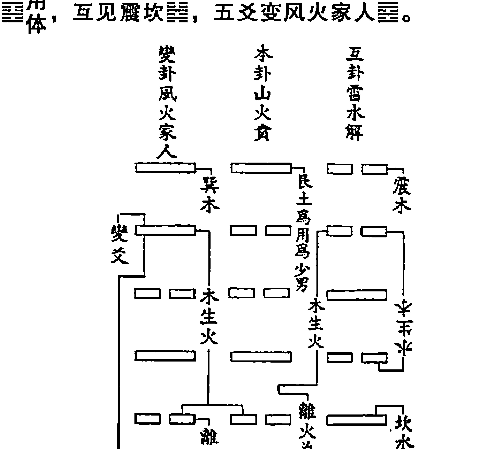

## 白话梅花易数

壬申日那天的午时，有位少年从离方（正南方）走来，看上去此少年满脸欢喜。问他有什么喜事，他回答说；“没有什么喜事。”于是便为他占了一卦，少年人属于艮卦，为上卦，以离方的离卦为下卦，得山火贲卦。艮卦数七，离卦数三，加上午时七，共得十七数，用十七除以六，得二余数为五，余数五确定动爻，即是贲卦的第五爻动。贲卦六五爻辞说：“贲于丘园，束帛戋戋，吉。”《周易》中的爻辞已经吉利了。山火贲卦，变卦又得到风火家人卦，互卦又见震卦、坎卦，离卦为体卦。按五行生克，互卦中的震木、变卦中的巽木，均生体卦离火，使体卦兴旺。后推断道：“你在十七天之内，必定有订婚的大喜事。”到了第十七天那位少年果然定亲。

# 牛哀鸣占

癸卯日午时，有牛鸣于坎方，声极悲，因占之。牛属坤，为上卦，坎方为下卦。坎六坤八，加午时七，共二十一数，除三六一十八，三爻动，得地水师之三爻。三爻《易辞》曰：“师或舆尸，凶。”卦则师变升，互坤、震，乃坤为体，互变俱克之，并无生气。

断曰：此牛二十一日内必遭屠杀。后二十日，人果买此牛，杀以犒众。悉皆异之。

地水师，互见坤艮，三爻变地风升。

# 鸡悲鸣占

甲申日卯时，有鸡鸣于乾方，声极悲怆，因占之。鸡属巽，为上卦，乾为下卦，得风天小畜。以巽五乾一共六数，加卯时四数，总十数，除六，得四爻动，变乾，是为小畜之六四。《易》曰：“有孚，血去惕出。无咎。”以血推之，割鸡之义。卦则小畜之乾，互见离、兑。乾金为体，离火克之。卦中巽木离火，有烹饪之象。

断曰：此鸡十日当烹。果十日客至，有烹鸡之验。

风天小畜≡用体，互见离兑≡，四爻变乾≡。

# 枯枝坠地占

戊子日辰时，偶行至中途，有树蔚然，无风，枯枝自坠地于兑方。占之，槁木为离，作上卦，兑方为下卦，得火泽睽。以兑二离三，加辰时五数，总十数，去六零四，变山泽损，是睽之九四。《易》曰：“睽孤，遇元夫。”卦中火泽睽变损，互见坎、离，兑金为体，离火克之，且睽、损卦名，俱有伤残之义。

断曰：此树十日当伐。果十日，伐树起公廨，而匠者适字“元夫”也。

火泽睽☱用体，互见坎离☵，四爻变山泽损☶。

以上诸占例，并是先得卦，以卦起数，所谓后天之数也。

# 风觉鸟占

风觉鸟占者，谓见风而觉，见鸟而占也。然非风鸟二占，而谓风觉鸟占也。凡卦之寓物者，皆谓之“风觉鸟占”。如易数，总谓之“观梅之数”也。

# 风觉占

风觉占者，谓见其风而觉也，见鸟而占也。凡见风起而欲占之，便看风从何方来，以之起卦。又须审其时，察其色，以推其声势，然后可断其吉凶。

风从何方来者，如风从南方来者为家人①，东方来者为益卦之类。审其时者，春为发生和畅之风，夏为长养之风，秋为肃杀、冬为凛冽之类。

察其色者，带埃烟云气，可见其色。黄者，祥瑞之气；青者，半吉半凶，主白刃；气黑昏者凶，赤色者灾，红紫者吉。

辨其声势者，其风声如阵马，主斗争；如波涛者，有惊险；如悲咽者，有忧虑；如奏乐者，有喜事；如喧呼者，主闹哄；如烈焰者，主火惊。其声洋洋而来，徐徐而去者，吉庆之兆也。

‘风觉占’，就是看见风有感觉而占卦或看见鸟有感应而占卦的意思。凡是看见风刮起而起卦占测，便要看风从哪个方向刮来，用它刮来的方向起卦。在这同时还必须详审风刮起的时间和季节，详察刮风时云气的颜色和风中尘埃的颜色，以及风的声势，然后根据这些情况判断吉凶。

‘风从何方来’，就是根据风来的方位起卦的方法。一般是以巽作上卦，风所从来的方向做下卦。如果风从南方来，就是因为南方属火，风的卦象为巽，巽风作为上卦，离火作为下卦，于是就得到家人卦。如果风从东方来，则用巽风作为上卦，震雷卦作为下卦，于是就得到风雷益卦。其余方向刮来的风，可仿此类推。

‘审其时’，就是根据时令季节推断风的性质，依据风的性质来推断所卜之事的吉凶，并不用起卦。春季的风为生长万物的和畅之风，夏季的风为万物茂盛的长养之风，秋季的风为遍扫落叶的肃杀之风，冬季的风为冰封大地的凛冽之风。

"观其色"，就是根据风的颜色等属性来判断吉凶，不用起卦。风中的尘埃、烟雾、云气等，各有自己的特征，自然可以观察到第一种风的特征。看见颜色为黄色的风主有祥瑞之气；看见颜色为青色的风，主有一半吉利，一半凶险；看见颜色为白色的风，主有刃气，即肃杀之气。云气颜色黑暗昏浊的预示有大凶，红色的预示有灾难；红紫色的预示有吉祥。

"辩其势"，就是根据风来的声势来判断吉凶，不用起卦。风声像军阵中的战马一样，主有斗争之事；风声像波涛一样，主有惊险之事；风声像悲鸣咽泣，主有忧愁之事；风声像奏乐一样好听，主有喜事；风声像喧哗呼叫一样，主有闹哄之事；风声像烈焰的响声一样，主有火灾之事。风声洋洋而来，缓缓而去，主有吉利喜庆之事。

# 鸟占

鸟占者，见鸟可占也。

凡见鸟群，数其只数，看其方所，听其声音，辨其毛羽色，皆可起数。又须审其名义，察其鸣叫，取其吉凶。

见鸟而占，数其只数者，如一只属乾，二只属兑，三只属离。

看其方所者，即离南、坎北之数。

听其声音者，如鸟叫一声属乾，二声属兑，三声属离之类，皆可起卦。

听声音者，若夫鸣叫之喧啾者，主口舌；鸣叫悲咽者，主忧愁；鸣叫嘹亮者，主吉庆。此取断吉凶之声音也。

察其名义者，如鸦报灾，鹊报喜，鸾鹤为祥瑞，鹗鹏为妖孽之类是也。

"鸟占"，就是看见鸟便能起卦占测，以定吉凶祸福。凡是看到有一群鸟，要数一数这群鸟有多少只，看一看这群鸟所处的方向位置，或听一听这群鸟叫的声音，辨察这群鸟的羽毛颜色，等等，都可以起卦。还必须审查鸟名鸟类，它们是吉祥之鸟，还是灾害之鸟，辨察其叫的声音，根据这
些，以判断吉凶。

“数其只数”，就是根据鸟的数量起卦。如有一只鸟，就属于乾卦，两只鸟就属于兑卦，三只鸟就属于离卦，等等。

“看其方所”，就是根据方向和卦的对应关系，来确定起什么卦。如南方为离卦，北方为坎卦。

“听其声音”，就是根据鸟鸣叫的声音数起卦。如鸟叫一声为乾卦，鸟叫二声为兑卦，鸟叫三声为离卦等等。听其声音，是指鸟叫的声音数；听声音是指鸟叫的属性：鸟叫声喧哗嘈杂的，预示有口舌之争；鸟叫声悲咽凄凉的，预示有忧愁之事；鸟叫声洪亮欢快的，预示有吉庆之事。这是根据鸟声音的区别来预测吉凶。

“察其名义”，就是根据鸟的名字的吉祥与否来判断吉凶。如乌鸦鸣叫主报灾，喜鹊鸣叫主报喜，鸾凤、松鹤鸣叫主有祥瑞，鸮鹏①叫主有妖孽怪异等不祥的征兆。

# 听声音占

声音者，如静室无所见，但于耳中所闻起卦，或数其数，验其方所；或辨其物声，详其所属，皆可起卦。察其悲喜，助断吉凶。

数其数目者，如一声属乾，二声属兑。

验其方所者，离南、坎北之类是也。

如人语声，及动物鸣叫之声，声自口出者属兑。而静物叩击属震，鼓拍、槌敲、板木之声是也。金声属乾，钟磬钲铎之声是也。火声属离，烈焰爆竹等声是也。土声属坤，筑基、杵垣、坡崩、山裂是也。此辨其物声，详其所属也。

察其悲喜，助断吉凶者，如闻人语笑声，又说吉语娱笑者，有喜也；人悲泣声与怨声、愁语及骂詈穷叹等声，不吉也。

“听声音占”，就是按声音起卦。如在安静封闭的室内，什么也看不见，就可以根据耳朵听到的声音起卦，或者数听到声音的次数，或者审验
声音所发生的方向；或者辨别一下发出的是哪一种声音，这种声音属于哪一种类别，属于哪一卦，凡此种种，皆可以用来起卦。还可以辨别其声音属于悲还是喜，以帮助判断吉凶。

"数其数目"，就是根据声音数来起卦。例如：听到一声，就起乾卦，听到二声，就起兑卦。

"验其方所"，就是根据声音发出的方向对应的处所方位来起卦。例如，声音来自南方，就按离卦起卦；声音来自北方，就按坎卦起卦，等等。

"辨其物声，详其所属"，就是辨别是什么物体发出的声音，这种声音属于什么类别，并以之为依据来起卦。如果察听到人说话的声音，以及动物鸣叫的声音声音是嘴里发出的，就起兑卦。静止的物体叩击的声音，起震卦；像各种擂鼓、木槌敲击的声音，起震卦。金属物体撞击发出的声音，起乾卦；钟磬钲铎这些物体发出的声音，也起乾卦。火声起离卦，像燃烧的烈焰的声音、爆竹发出的声音，都起离卦。土声起坤卦，像打地基、用木棒捣砸土墙、山坡崩滑、山体裂开等泥石所发出的声音，就起坤卦。所谓察其悲喜，助断吉凶，就是根据人们的语声和笑声，又说出吉利的话语，又说出吉祥的话语，有欢乐喜庆的笑声，就是有喜悦的事，是吉利。如果听到他人有悲泣、埋怨声、发愁声、叫骂声、叹息声等等，就可以帮助判断占卦，因为这些都是不吉利的象征。

# 形物占

形物占者，凡见物形，可以起卦。

如物之圆者属乾，刚者属兑，方者属坤，柔者属巽，仰者属震，覆者属艮，长者属巽，中刚外柔者属坎，内柔外刚者属离，干燥枯槁者属离，有文彩者亦属离，用障碍之势、物之破者属兑。

"形物占"，就是看见了物体的形象便可以起卦。

例如：圆形的物体属于乾卦，因为乾为天、为圆。刚硬的物体属于兑卦，因为兑为金，有坚硬的属性。方形的物体属于坤卦，坤为大地，这是因为天圆地方的缘故。柔顺的事物属于巽卦，巽为风，风有柔软卑顺的性
质。仰面朝天的物体属于震卦，震卦的形象如一个开口朝上的砵盂。覆盖于地上的物体用艮卦表示，因为艮卦的卦象好似覆过来口朝下的碗。长的物体用巽卦表示，巽有长、高等性质。内部柔软外面坚硬的事物为坎卦表示，因为坎卦为中间一阳爻外面两阴爻，看上去就外柔内刚。内柔外刚的事物属于离，与坎卦的征象正好相反。干燥枯槁的物体属于离，有火光文采的物体也属于离。物体如果看上去不圆滑，或者是有破损的，属于兑，因为兑有缺毁的象征。

# 验色占

凡占，色之青者属震，红紫赤者属离，黄色者属坤，白色属兑，黑色属坎之类是也。

这一段讲的和古代相学渊源很深，起卦时参考了流传甚广的相学技法，即通过观察人的气色来起卦。标题为“验色占”，清代诸刻本均为“验”字，唯民国石印本作“脸”字。

凡是“验色占”，青色的用起震卦；红色、紫色、赤色的都起离卦，白色的起兑卦，黑色的起坎卦。

# 八卦所属内外动静之图

|乾|玄黄、大赤色、金玉、珠宝、镜、狮、圆物、木果、贵物、冠、象、马、天鹅、刚物。|
|坎|水、带子、带核之物、豕、鱼、弓轮、水具、水中之物、盐、酒、黑色。|
|艮|土石、黄色、虎、狗、土中之物、瓜果、百禽、鼠、黔喙之物。|
|震|竹木、青绿碧色、龙、蛇、崔苇、竹木乐器、草、蕃鲜之物。|
|巽|木、蛇、长物、青碧绿色、山木之禽鸟、香、鸡、直物、竹木之器、工巧之器。|

| 离 | 火、文书、干戈、雉、龟、蟹、槁木、甲胄、螺、蚌、鳖、物赤色。 |
| 坤 | 土、万物、五谷、百禽、丝绵、柔物、牛、布帛、舆、釜、瓦器、黄色。 |
| 兑 | 金刃、金器、乐器、泽中之物、白色、有口缺之物、羊。 |

# 八卦万物类占

### # 乾卦

| (八宫) | 一 金
乾为天 天风垢 天山遁 天地否
风地观 山地剥 火地晋 火天大有 |
| 天时 | 天、水、雹、霰。 |
| 地理 | 西北方、京都、大郡、形胜之地、高亢之所。 |
| 人物 | 君父、大人、老人、长者、宦官、名人、公门人。 |
| 人事 | 刚健

## 白话梅花易数

如果筮得乾卦，可以推断为一个刚健有力、有钱有权的领导者；企业的董事长、经理、厂长；政府的书记、首脑；军队、警察部门的首长；从事金融业的男子；威严正直、重义气、果决的性格；头、胸部、大肠、肺腑；金玉珠宝、宗教用品、古董文物；辛辣之物；宗教场所，开着一辆圆形的高级车辆，右足踩在坚硬寒冷、易碎的油门上。在拥有；高大建筑物；文化工作者、神职人员、专家教授、老年人；骄横之人；身体某部分硬化症、急性便秘、寒证、结肠之病等等。

## 坤卦

| (八宫)       | 八土                             |
| ------------ | -------------------------------- |
|              | 坤为地  地雷复  地泽临  地天泰 |
|              | 雷天大壮  泽天夫  水天需  水地比 |
| 天时         | 云阴、雾气。                     |
| 地理         | 田野、乡里、平地、西南方。         |
| 人物         | 老母、后母、农夫、乡人、众人、大腹人。 |
| 人事         | 吝啬、柔顺、懦弱、众多。         |
| 身体         | 腹、脾、胃、肉。                 |
| 时序         | 辰戌丑未月、未申年月日时、八五十月日。 |
| 静物         | 方物、柔物、布帛、丝绵、五谷、舆、釜、瓦器。 |
| 动物         | 牛、百兽、为牝马。               |
| 屋舍         | 西南向、村居、田舍、矮屋、土阶、仓库。 |
| 家宅         | 安稳、多阴气，春占宅舍不安。     |
| 饮食         | 牛肉、土中之物、甘味、野味、五谷之味、芋笋之物、腹脏之物。 |
| 婚姻         | 利于婚姻，宜税产之家、乡村之家，或寡妇之家。春占不利。 |
| 生产         | 易产，春占难产、有损，或不利于母，坐宜西南方。 |
| 求名         | 有名，宜西南方，或教官、农官守土之职。春占虚名。 |
| 交易         | 宜利交易，宜田土交易、宜五谷、利贱货、重物、布帛，静中有财。春占不利。 |

## 坤卦象意说解

坤卦由三个阴爻组成。坤卦代表着大地、母亲、生育、安静、忍耐。佛教中的地藏王菩萨就是因为“安忍不动如大地”，因而被称为地藏王菩萨的。

坤卦的第一个意义，就是代表着冬天的后一段，代表着大雪以后，冬至以前的一段时间，是太阳在一年中向南移动的最后一个时段。在坤卦对应的这段时间，万物蛰伏，千里冰封，万里雪飘。动物多穴居，有的冬眠，而在冬天活动的动物，莫不长着厚厚的毛羽。植物都落了叶，或者只在地下保留了生命之根，有的甚至连根也死了，只丢下了种子。鱼儿在冰下继续着生命，也减少了活动，停止了进食。乾卦代表着走向夏至的那个时段，代表着天；坤卦代表着走向冬至日的这一卦，正好代表着地。

坤卦的第二个意义，代表着大地。三个阳爻组成的乾卦，代表着永恒的运动，永不停息，所以古人给了个“自强不息”的赞语。三个阴爻组成的坤卦，则代表着相对的停留与休息，表示万物在大地上的存在，因此称大地为母亲，古人用‘厚德载物’四个字来赞美大地。

坤卦的第三个意义，是母亲，土地是万物之母。土生万物，土养万物，土载万物，土纳万物，万物之生长繁衍莫不在大地之上，正是万物之母。

坤卦的第四个意义，包容精神，是为人类应有的一种品格。万事万物如果不能包容，不能和谐共处，那这个世界就会在无休止的斗争中走向灭亡。

坤卦的第五个意义，表示人类中的母亲之意、动物中的雌性和母性的个体。母性有无限生机、无限慈爱，古人还用母牛来形容坤卦这一卦的性质。

坤卦与乾卦相对：乾为父，坤为母；乾为天，坤为地；乾为高，坤为低；乾为上，坤为下；乾为干，坤为湿；乾为天玄，坤为地黄；乾代表天道，坤代表地道；乾代表着时间，坤代表着空间，等等。

筮得坤卦，可以断为一个孕妇，一个大腹之人、温顺的人、勤劳温厚、节俭守信之人，五谷杂粮、牛肉、野味、方形的大车、文书、纸张、妇女用品、陶器、石灰。乡村、田野、平原、老家、故乡、广场、空地、平房、农舍，阴天、雾气、潮湿的天气。

## 震卦

| （八宫） | 震为雷 雷地豫 雷水解 雷风恒 地风升 水风井 泽风大过 泽雷随 |
| --- | ---
| 天时 | 雷。 |
| 地理 | 东方、树木、闹市、大途、竹木、草木茂盛之所。 |
| 身体 | 足、肝、发、声音。 |
| 人事 | 起动、怒、虚惊、鼓躁、多动少静。 |
| 人物 | 长男。 |
| 时序 | 春三月、卯年月日时、四三八月日。 |
| 静物 | 木竹、崔苇、乐器（属竹木者）、花草繁鲜之物、苍筤竹。 |
| 动物 | 龙、蛇。 |

| 屋舍 | 东向之居、山林之处、楼阁。 |
| 家宅 | 宅中不时有虚惊。春冬吉，秋占不利。 |
| 饮食 | 蹄肉、山林野火、鲜肉、果、酸味、菜蔬。 |
| 婚姻 | 可有成，声名之家，利长男之婚，秋占不宜婚。 |
| 求利 | 山林竹木之财、宜东方求财，动处求财，或山林竹木茶货之利。 |
| 求名 | 有名，宜东方之任、施号发令之职，掌刑狱之官。有茶竹木税课之任，或闹市司货之职。 |
| 生产 | 虚惊，胎动不安，头胎必生男。坐宜东向，秋占必有损。 |
| 疾病 | 足疾、肝经之疾、惊怖不安。 |
| 谋望 | 可望、可求，宜动中谋。秋占不遂。 |
| 交易 | 利于成交。秋占难成，动而可成。山林竹木茶货之利。 |
| 官讼 | 健讼，有虚惊，行移取勘反覆。 |
| 谒见 | 可见，见山林之人，利见宜有声名之人。 |
| 出行 | 宜向利于东方，利山林之人。秋占不宜行，但恐虚惊。 |
| 坟墓 | 利于东向，山林中穴，秋不利。 |
| 姓字 | 角音，带木姓氏，行位四、八、三。 |
| 数目 | 四、八、三。 |
| 五味 | 酸味。 |
| 五色 | 青、绿、碧。 |

## 震卦象意说解

震仰盂，是说震卦这个符号由一阳二阴组成，二阴在上，一阴在下，正向一个正向放置的钵盂。震卦表示春天来了，一阳从下而上发生，冲破阻碍，奋发向上，蓬勃而起。震卦表示太阳不断从南向北移动，阳气开始发生，阴气逐步减少，不断驱逐着冬天的寒气，春暖花开。天空打雷是这时候自然界最大的特征，是最令人振奋的现象。隆隆的雷声振动了大地，也振奋了人心，带来了春雨春风，和万物萌动，生命蓬勃发展。于是，我们将一阳上有二阴的这个八卦符号命名为震。震是什么？震就是雷的振动，声音很大，力量无穷。八卦是自下而上画成的，象征着一阳自下而上，不断增强，冲破上面的二阴，万物开始复苏，蛰伏的昆虫开始出来活动。

震卦的第一个意义就是动，因为雷震动了万物。

震卦的第二个意义，就是声音很大，一切喧闹的地方、声音很大的地方，都可以用震卦来表示。

震卦的第三个意义，象征着长子、成年人。家庭成员中，长负有更大的责任，处于同一辈人的领导地位，为了生产与生活，他出的力气大，脾气也大，非如此难以组织全家人同心协力，这样又用震卦表示家庭成员中的长子。在国家机器中，只有军队才是力量的象征，所以又用震表示军队，表示军人，表示军队中的首长。

震卦的第四个意义，就是象征着正面的东西，如人的腿足。

震卦的第五个意义，象征着愤怒。因为愤怒的人总是要大声喧闹。震卦的第六个意义，是象征着春天。种子从地下往地上长，先生根，后发芽。

震卦的第六个意义，是指迅速。因为雷声闪电的速度是非常快的，所以一切震卦可以描述一切高速的东西、迅速的行动。

震卦的第七个意义，是指绿色。因为雷的震动，春天大地开始披上了绿装，所以用这个符号表示绿色，表示树木，表示人发怒时胆汁分泌增多，刺激胃肠，古人说听一言将人的肝胆气炸，这样又用这个符号表示表示肝胆。

震卦的第八个意义，象征着生育。古人发现，在春天，动物开始怀孕繁衍，植物开始发芽生长，这震卦又像是子宫里的胎儿。

震卦的第九个意义，是指东方。因为天气暖和了，太阳越来越热了，就好像太阳从东方升起，于是人们又用这个符号表示东方。

总之，古人将每年中这第一个八分之一时间段落里自己周围的空间中发生的自然现象与社会现象都与震这一卦相联系，并作了归类总结。这一段时空中万物的一切运动，都可以用震卦来表示。

如果筮得震卦，可以断为一个好动、勤奋、有才干、性格直爽的小伙子。他可能从事着警察或部队的工作，前途无量。震卦对应着腿足、肝胆等人体部位，如果是占病，要小心这些地方。如果是占生育，那就恭喜了，您将喜得贵子。如果是占职业，您将从事一个与电有关的职业或者是喧闹的场所工作的职业。你如果是占来人，那将是一位粗心、性急而且大声吵闹的人。

## 巽卦

| (八宫) | 五木\n| 犀为风   风天小畜 风火家人 风雷益\n天雷无妄 火雷噬嗑 山雷颐 山风蛊\n| 天时 | 风。\n| 地理 | 东南方之地、草木茂秀之所、花果菜园。\n| 人物 | 长女、秀士、寡妇之人、山林仙道之人、寡绐、广颡、多白眼。\n| 人事 | 柔和、不定、鼓舞、利市三倍、进退不果，长，高，工。\n| 身体 | 股肱、气、风疾。\n| 时序 | 春夏之交、三五八之月日时、三月，辰巳年月日时。\n| 静物 | 木香、绳、直物、长物、竹木、工巧之器。\n| 动物 | 鸡、百禽、山林中之禽虫。\n| 屋舍 | 东南向之居、寺观楼园、山林之居。\n| 家宅 | 安稳利市。春占吉，秋占不安。\n| 饮食 | 鸡肉、山林之味、蔬果、酸味。\n| 婚姻 | 可成，宜长女之婚。秋占不利。\n| 生产 | 易生，头胎产女。秋占损胎，宜向东南坐。\n| 求名 | 有名，宜文职，有风宪之力。宜入风宪，宜茶课竹木税货之职，宜东南之任。\n| 求利 | 有利三倍，宜山林之利。秋占不吉，竹木茶货之利。\n| 交易 | 可成，进退不一。交易之利，山林交易，山林茶木之类。\n| 谋望 | 可谋望，有财，可成。秋占多谋少遂。\n| 出行 | 可行，有出入之利。宜向东南行。秋占不利。\n| 谒见 | 可见，利见山林之人，利见文人秀士。 |
| 疾病 | 股肱之疾、风疾、肠疾、中风、寒邪、气疾。 |
| 官讼 | 宜和、恐遭风宪之责。 |
| 坟墓 | 宜向东南方，山林之穴，多树木。秋占不利。 |
| 姓字 | 角音，草木傍姓氏、行位五、三、八。 |
| 数目 | 五、三、八。 |
| 方道 | 东南。 |
| 五味 | 酸味。 |
| 五色 | 青、绿、碧、洁白。 |

## 巽卦象意说解

伏羲画八卦时，通常用阴爻表示下半年。阴爻上面再画一阳爻，表示上半年的前一半，即秋天。再在阳爻上面画一阳爻，表示秋天的前一半时间。这个卦就是一阴爻上面有二阳爻，就是巽卦。巽卦表示风，表示早秋，表示天象从炎热向凉爽转变，表示一阴生于二阳之下，太阳从夏至日向南移动，阴气逐步显现。有道是“早晨立了秋，下午凉飕飕”，尽管总体上天气仍然较热（因为有二阳），可是寒冷一天天增强，炎热一天天退却，万物明显感到的气温开始下降。我们的祖先总是从大自然中寻找最显著的自然现象来给卦象起名字，于是就选择了秋风的意象作为这一卦的名字。因为代表着秋风，因此巽卦就是风卦。因为风有无孔不入的特性，故而用巽表示人的意象。秋风来到，万物即开始准备寒冬的到来。昆虫开始为蛰居作准备，鸟儿生了新羽，兽长新的细毛，以备越冬。巽就是顺大自然的变化之势，及时进入退却阶段，才能使生命继续进而获得新生。古人总结说，巽者入也，巽者顺也。万物在顺从大自然的时候，与天地同行，才能并行而不悖。

巽卦的第一个意义，就是风。秋风，早秋的风。

巽卦的第二个意义，就是人。风有流动不居的特性，有渗人的特性，并承载着能量。

巽卦的第三个意义，就是顺。风的特性，和乾卦不同，并非是勇往走
前，无紧不摧。巽卦的特性，是顺势而为，就象道家的道法自然。顺应大自然，利用一切现有的条件，合理进行的计划，达到预定的目标，是巽卦给予我们的启示。

巽卦的第四个意义，是巽卦有灵性。对应在人事上，常常代表着有灵性的人，练功的人，宗教人士。因为巽代表着长女，因此筮得巽卦的时候，常常对应着按照一定条件划分后的团体中年龄较长的女性。

巽卦的第五个意义，是对应着人体的呼吸系统。因为巽有灵性，也往往指神经系统。如果占问疾病，即指呼吸系统或者是神经系统的疾病。

巽卦的第六个意义，就是代表着道路。因为风行的道路无孔不人，巽卦往往指长轨道、窄路、狭长的路等。有这些道路的场所，如机场、码头，也对应着巽卦。

筮得巽卦，可断为她是一位柔和细心、责任心强的处女。巽卦常常指山村里的动物，鸡、鸭、鹅等家禽。巽卦指有灵性的人，对应着宗教人士、专业技能人。巽卦对应着外柔内刚的人，头发稀少、三白眼，且薄情多欲，极爱清洁和疑惑说谎的人，仙人、气功师及商人、医生、造谣者。巽卦对应的疾病，为神经炎之神经痛、坐骨神经之寒痹痛和呼吸哮喘、大腿上的毛病、肠疾胀气、病情不稳定，等等。

## 坎卦

| (八宫) | 六 水
| 坎为水  水泽节  水雷屯  水火既济
| 泽火革  雷火丰  地火明夷  地水师
| 天时    雨、月、雪、霜、露。
| 地理    北方、江湖、溪涧、泉井、卑湿之地（沟渎池沼、凡有水处）。
| 人物    中男、江湖之人、舟人、盗贼。
| 人事    险陷卑下，外示以柔、内序以利，漂泊不成、随波逐流、隐伏智利。
| 身体    耳、血、肾。
| 时序    冬十一月、子年月日时、一六之月日。
| 静物 | 水，带子、带核之物，弓轮矫糅之物，酒器水具，于木为坚多心。 |
| 动物 | 穷、鱼、水中之物。 |
| 屋舍 | 向北之居、近水、水阁、江楼、茶酒肆、宅中湿地之处。 |
| 饮食 | 穷肉、酒、冷味、

| 坟墓 | 南向之墓，无树木之所，阳穴。夏占出文人，冬占不利。 |
| 姓字 | 征音，带火及立人傍姓氏，行位三、二、七。 |
| 数目 | 三、二、七。 |
| 方道 | 南。 |
| 五色 | 赤、紫、红。 |
| 五味 | 苦。 |

## 离卦象意说解

离卦的卦象，是两阳爻之间夹一阴爻。象征着外刚而内柔，就象火一样，外面释放着热量，火焰的温度很高，而燃烧中心的温度并没有火焰高。因此，离卦的第一个意义，就是通常象征着火。

从此引申开去，因为向外释放着能量，因此，离卦的第二个意义，也表示着太阳，也表示着光明。

离卦的第三个意义，表示着美丽。因为太阳一天天由北向南移动，带来了阳光和热量，春暖花开，桃李春风，山花遍野。

离卦的第四个意义，在季节上象征着晚春，百花竞放、日光明媚的晚春。

离卦的第五个意义，表示着南方。因为太阳运动到了南方，就代表着温暖与热量。离为火，因此在方位上代表南方。

离卦的第六个意义，表示着中空的物体。后来，常常被用来表示人的心脏。因为从卦象看，阳为有，阴为无，阳为实物，阴为虚。二阳夹一阴，是一个中空的卦象。正象征着外刚内柔的中空之物，就象一个空盒子。

离卦的第七个意义，就是表示中女。这是离卦在古代就常常被使用的意象。

离卦的第八个意义，就是表示时间上的短暂。因为美丽的事物都不是非常长久的，好花不常开，好景不常在。人们总是希望美好的事物存在的长久一些，因此总是觉得美丽的东西存在的时间太短暂，故而离卦常常被用来表示与美好事物的分离，与亲人的离别，与朋友的离别等。

如果这样联系下去，离卦的意义是无穷无尽的，只要符合离卦的卦象，任何事物都可以用这一卦来表达。

筮得离卦，象征着你会碰到一个美丽的中女。她的年龄也许很小，但在家中排行居中。她性格火辣，美丽大方，虚心处事，知书达理，眼睛大大的，乳房高高的，穿着紫色的服装。离卦象征的场所，都在阳光充沛的地方，比如大会堂、风景名胜地、教堂、学校来。此外，你还要小心以下事件，烧伤、烫伤、发烧炎症、血液血压病和肥大症。你碰到的人肚子很大，性子急躁，或许有眼睛的毛病，也许他还便秘。如果你想占问物事，离卦象征着文书，一切有文字的东西，比如美术字画、书报杂志、文章证件。好了，越说越多了，您自己细细看一下离卦代表的东西吧。

## 艮卦

| (八宫) | 七土 |
| 艮为山 | 山火贲 |
| 山天大畜 | 山泽损 |
| 火泽睽 | 天泽履 |
| 天泽履 | 风泽中孚 |
| 风泽中孚 | 风山渐 |
| 天时 | 云、雾、山、岚。 |
| 地理 | 山、径路、近山城、丘陵、坟墓、东北方。 |
| 人物 | 少男、闲人、山中人。 |
| 人事 | 阻滞、宁静、进退不决、反背、止住、不见。 |
| 身体 | 手、指、骨、鼻、背。 |
| 时序 | 冬春之月、十二月、丑寅年月日时、土年月日时、七五十数月日。 |
| 静物 | 土石、爪果、黄物、土中之物。为门阙、为果蓏、于木为坚。 |
| 动物 | 虎、狗、鼠、百兽、黔喙之物。 |
| 家宅 | 安稳，诸事有阻，家人不睦。春占不安。 |
| 屋舍 | 东北方之居、山居，近石、近路之宅。 |
| 饮食 | 土中物味、诸兽之肉、墓畔竹笋之属、野味。 |
| 婚姻 | 阻隔难成，成亦迟，利少男之婚。春占不利，宜对乡里婚。 |

| 求名 | 阻隔无名，宜东北方之任，宜土官山城之职。 |
| 求利 | 求财阻隔，宜山林中取财。春占不利，有损失。 |
| 生产 | 难生，有险阻之厄。宜向东北，春占有损。 |
| 交易 | 难成，有山林田土之交易。春占有失。 |
| 谋望 | 阻隔难成，进退不决。 |
| 出行 | 不宜远行，有阻，宜近陆行。 |
| 谒见 | 不可见，有阻，宜见山林之人。 |
| 疾病 | 手指之疾、脾胃之疾。 |
| 官讼 | 贵人阻滞、未讼未解、牵连不决。 |
| 坟墓 | 东北之穴，山中之穴。春占不利，近路边有石。 |
| 姓字 | 宫音，带土字傍姓氏，行位五、七、十。 |
| 数目 | 五、七、十。 |
| 方道 | 东北方。 |
| 五色 | 黄。 |
| 五味 | 甘。 |

## 艮卦象意说解

艮卦，艮卦卦象一阳爻在上、二阴爻在下，阳少阴多，阳小阴大，因而上小下大，有山象。所以艮卦的正象为山。艮卦还有一层意思，就是表示有阻碍，困难，事物的发展被阻碍，象山路一样难行。艮卦还表示一个事物发展已经达到了顶点，到达了转折点、拐点，必须谨慎小心从事，否则事物就要向相反方向发展了。艮卦阳爻在上，阴爻在下，故而还能表示一种向下向右发展的趋势。艮卦阳少阴多，故而还能表示表面实的、内里虚的或上实下虚的事物。

艮卦的第一个意义，就是表示它表示自然界的高山，山静静地稳稳地立在大地上，岿然不动。

艮卦的第二个意义，就是表示阻止、阻挡，也是取象于山的意义，大山是阻止人们前行的。各家各户各房各室的门、还有城门与国门，都是隔离与阻挡外人随便进人的。

艮卦的第三个意义，是指静止。事物发展到一定的阶段，都有一个相对的稳定期，相对静止。百尺竿头，我们必须慎之又慎。

艮卦的第四个意义，是指少男，即少年男子。山上树木郁郁葱葱，富有生气。少年男子，也是人类最富有朝气和力量、最富有生命力的一个群体，正像是早上八九点钟的太阳。

艮卦的第五个意义，指四肢。艮为手，艮为足。在人体，艮为胃。

艮卦的第六个意义，是指四足的百兽和家畜。这也是从第五个意义衍生出来的。

总之，如果筮得艮卦，你会碰到一个朝气蓬勃的小伙子，或许他的手上拿着石块、凳子之类，牵着狗，沉着、冷静地在丘陵、坟墓、土包、假山处行走。艮卦象征着堤坝、山路的最高点、矿山采石场等。艮卦还象征着脾胃不食虚胀、鼻炎和手脚背之疾病，而且还指关节麻木、手指肿瘤、结石和气血不通、血液循环不定之病。艮卦的物象，指钱包、伞、屏风、手套等一切有止的意义的东西。艮在气象上，还指有云无雨、无风、雾气的天气。

## 兑卦

| (八宫) | 二 金 |
| 兑为泽 | 泽水困 |
| 泽地萃 | 泽山咸 |
| 水山蹇 | 地山谦 |
| 雷山小过 | 雷泽归妹 |
| 天时 | 雨、泽、新月、星。 |
| 地理 | 泽、水际、缺池、废井、山崩破裂之地、其地为刚卤。 |
| 人物 | 少女、妾、歌妓、伶人、译人、巫师。 |
| 人事 | 喜悦、口舌、谗毁、谤说、饮食、毁折、附决。 |
| 身体 | 舌、口、肺、痰、涎。 |
| 时序 | 秋八月、酉年月日时、金年月日、二四九数月日。 |
| 静物 | 金刃、金类、乐器、缺器、废物。 |

| 动物 | 羊、泽中之物。 |
| 屋舍 | 西向之居，近泽之居，败墙壁宅，户有损。 |
| 家宅 | 不安，防口舌。秋占喜悦，夏占家宅有祸。 |
| 饮食 | 羊肉、泽中之物、宿味、辛辣之味。 |
| 婚姻 | 不成，秋占可成。又喜主成婚之吉，利婚少女，夏占不利。 |
| 生产 | 不利，恐有损胎、或则生女。夏占不利，坐宜向西。 |
| 求名 | 难成，因名有损。利西之任，宜刑官、武职、伶官、译官。 |
| 求利 | 无利，有损财利，主口舌。秋占有财喜，夏占破财。 |
| 出行 | 不宜远行，防口舌或损失。宜西行，秋占宜行，有利。 |
| 交易 | 不利，防口舌，有争竞。夏占不利，秋占有交易之财喜。 |
| 谋望 | 难成，谋中有损。秋占有喜，夏占不遂。 |
| 谒见 | 利行西方，见有咒诅。 |
| 疾病 | 口舌咽喉之疾、气逆喘疾、饮食不餐。 |
| 坟墓 | 宜西向，防穴中有水，近泽之墓。夏占不宜，或葬废穴。 |
| 官讼 | 争讼不已，曲直未决，因公有损，防刑。秋占为体得理，胜讼。 |
| 姓字 | 商音，带口字金字傍姓氏，行位四、二、九。 |
| 数目 | 二、四、九。 |
| 方道 | 西方。 |
| 五色 | 白。 |
| 五味 | 辛辣。 |

## 兑卦象意说解

兑卦二阳爻在下，一阴爻在上，上虚下实，上小下大，因此兑卦一般表示向上发展的趋势。二阳爻如沼泽之底部厚重，阴爻有浅水之象，因此兑卦正象为沼泽。兑卦二阳爻在下，一阴爻在上，代表着事物有向上有发展的趋势。占卦时，象征着外柔软、内里刚硬、外虚内实的东西。

兑卦的第一个意义，就是表示湖泊沼泽，这也是兑卦的正象。

兑卦的第二个意义，就是表示喜悦。兑卦的卦象，正象口，一个喜悦的人张开的口。兑是快乐的意思，现在人们说兑现，也是高兴的事情。

兑卦的第三个意义，就是象征着事务的上升阶段。兑卦二阳爻在下，一阴爻在上，表示阳气很旺盛，但不是最旺盛。这种状态的好处是还有发展的余地，还处于上升阶段。

兑卦的第四个意义，就是表示西方。

兑卦的第五个意义，就是表示少女，温柔的女性。

兑卦的第六个意义，就是表示歌唱以及歌唱的场所。关于兑卦就说到这儿，由这种联想与命名的过程看，我们为每一卦所纳的事物，都是同一时空状态下万物与人事共同相处的境界。古人想问题总是将同一地点、同一时间范围内的万物与人事联系在一起，用一个卦象进行表示，这是自然而然的，因为世界是一个整体，万事万物莫不紧密地联系在一起。在同一境界中出现的一切，实际上是有共同原因的。用佛教的话说，就是缘分。物以类聚，人以群分。非我族类，其心必异。古人总是从事体的观念、普遍联系的观念出发，来研究自然与社会。相对于对个体的关注，古人显然更重视事物的群体性和外部的大环境。相对于我们当今“头痛医头、脚痛医脚”的处理问题的方式，这种思维方法要高明多了。

总之，如果筮得兑卦，象征着现实中的她是一个集笑、骂、吵闹、用口说唱的可爱的少女明星，是风头正劲的超女。兑卦还表示翻译、教授、牙科医生和老师，金融界、经销人员兼失败、破坏者，或者是一位钢琴音乐家。兑卦表示的场所是沼泽地、坑洼地边的井坑、旧屋宅以及欢乐喜庆的地方。兑卦还表示饮食用品和带口的器物，等等。

万物之象，庶事之多不止于此。占者宜各以其类而推之耳。

# 梅花易数卷二

梅花易数是中国传统预测学中一个最重要的分支。梅花易数预测法起卦快速，断卦灵活，要言不烦。本章讲的主要是断卦的技巧。包括体用、生克以及十八类大占等。起同样的卦，可以断出不同的结果，运用之妙，存乎一心。

"梅花易数"的核心就是"数"，卦从心生，数从心得。要么先起卦后得数，要么先得数后起卦。如果离开了数，梅花易数便不可能准确地进行起卦或者断卦。那么，如何准确地得数或准确地得卦呢？除了技巧上的灵活掌握以外，用"心"是关键。因此，梅花易数也叫做"心易"，其基本原则是"不立文字，会心为上"。一个人如果有高深的修养，或者通过修行，达到物我合一，人天两忘的境界，自然起卦和断卦不再繁难。这也是许多占测术的不二法门。此中深意，只可意会，不可言传。

## 心易占卜玄机

天下之事有吉凶，托占以明其机。天下之理无形迹，假象以显其义。故乾有健之理，于马之类见之。故占卜寓吉凶之理，于卦象内见之。然卦象一定不易之理，而无变通之道，不可也。易者，变易而已矣。至如今日观梅复得革兆，有女子折花，异日果有女子折花，可乎？今日算牡丹得垢兆，为马所践，异日果为马所践毁，可乎？且兑之属，非止女子。乾之属，非止马。谓他人折花有毁，皆可切验之真，是必有属矣。嗟呼！占卜之道，要变通。得变通之道者，在乎心易之妙耳！

梅花易数起卦断卦，非常玄妙。这一段讲的是断卦的学问。大概的意思是说，天下万事万物莫不有吉凶成败，难以明察，但是我们可以凭借易占来了解其深奥玄妙的道理。天下万事万物的内在运行规律并不是非常明 显，易于掌握的，而是没有形迹，难于识见的，但是凭借易象，我们就可以对其进行认识和掌握。比方说，乾卦有刚健的涵义，我们在断卦的时候，如果有乾象，就可以断为马类。因此，占卜的形式寓涵了事物发展的吉凶趋势，我们可以通过研究卦象而通晓明白。但是，如果仅仅机械地按照既定的卦象内容进行推断，而不懂得变通，那是绝对不行的。我们前面说过，“易”一名而含三义，“变易”是其重要的方面。《连山》、《归藏》和《周易》，史称“三易”。其中，《周易》就是占变的。易占法的理论核心，就是在于“通变”二字，所谓“穷则变，变则通，通则久”。比如我们今天去观梅起数，又得革卦，如果仍然机械地按照邵雍先生的卦例，断为几天后必有女子折花断股，那结果必然是不准确的。如果我们今天算牡丹又得姤卦，邵雍先生得姤卦后断为牡丹为马所践毁，我们也一成不变地来应用他的推断，说过几日有马来践踏牡丹花，那就会贻笑大方了。这是为什么呢？这是因为，兑卦之类的取象非常多，具体如何取象，要结合当时的情况，根据外应和时间、地点等等，直接判断，最好脱口而出，并不依赖成法。如果再三思索，一一推算，即落下乘，失去梅花易数的本义了。在取象时，要活学活用，并不一定要把那些所举的类象一一记在脑子里，而只需掌握八卦象意的精神即可。占卜之道，关键在于取得卦象之后，根据具体情况来揭示事物的内在运行规律，灵活、圆融、通达，不可固执一端。明白了易占的变通之道，就可通晓易道的奥妙玄机了

## 占卜总诀

大抵占卜之法，成卦之后，先看《周易》爻辞，以断吉凶。如乾初九“潜龙勿用”，则诸事未可为，宜隐伏之类；九二“见龙在田，利见大人”，则宜谒见贵人之类。余皆仿此。

次看卦之体用，以论五行生克。体用即动静之说。体为主，用为事应。用事体及比和，则吉；体生用及克体，则不吉。

又次看克应。如闻吉说见吉兆则吉，闻凶说见凶兆则凶；见圆物事易成，

## 占卜论理诀

数说当也，必以理论之而后备。苟论数而不论理，则拘其一见而不验矣。且如饮食得震，则震为龙。以理论之，龙非可取，当取鲤鱼之类代之。又以天时之得震，当有雷声。若冬月占得震，以理论之，冬月岂有雷声？当有风撼震动之类。既知以上数条之诀，复明乎理，则占卦之道无余蕴矣。

梅花易数的理论是按照取象和起数两个方面来研究万物的，象数学说固然确切精当，有独到之处，但必须用理来阐释它，参照易理加以探究，义理象数结合，而后占卜才能算是推衍完备。如果仅仅论数而不论理，就难免限于只是从一个侧面看问题，往往偏于一端、拘其一见，而难以达到灵验的目的。如果只讲数的推算而不讲事物之常理，得卦的结果往往非常可笑。比如占饮食得到震卦，震卦属龙，难道就会有龙来给我们吃吗？按正常道理来说，宴席之上，龙是不可能得到的，如果得到震卦，即应当以鲤鱼之类而代之。又如占天时得到震卦，震卦属雷，从卦象来看震占天时应有雷声。如果冬月占得震卦，按正常道理来说，冬季哪有雷声？正因为冬天不可能有雷声，因此当断为是风劲吹而撼动外物的情形。知道了以上几条占卜的总原则和具体诀窍后，又能明瞭万事万物的常理，占卜之道也就一览无余、尽为所用，没有什么神秘了。

## 先天后天论

先天卦断吉凶，止以卦论，不甚用《易》之爻辞。后天则用爻辞，兼用卦辞，何也？盖先天者未得卦、先得数，是未有《易》书，先有易理，辞前之《易》也。故不必用《易》书之辞，专以卦断。后天则以先得卦，必用卦画，辞后之《易》也。故用以爻之辞，兼《易》卦辞以断之也。

用先天起卦之法来推断事物之吉凶，只根据卦象的生克比和来推测，不常使用《周易》的卦爻辞；而用后天起卦之法来推断事物之吉凶，除了看卦之体用互变的生克比和关系之外，还兼用《周易》的卦爻辞。为何要

如此呢？因为先天起卦之法在未成卦之前，先求取卦数，由数而起卦，用的是先天易数理论。这种理论早于文王的《周易》成书之前就存在，用的不是文王易的易理，而是文王写了卦爻辞的《周易》前的易学理论。因此，不必使用《周易》的爻辞，而专用卦象进行分析推断就可以了。当然，易理是相通的，无论辞前之易，还是辞后之易，并不是两种截然不同的理论。如果你喜欢，也可以参考卦爻辞，只是说可以不用。而后天起卦之法则是先得到卦象以后，再根据卦辞爻辞以及卦象之生克比和关系来推断吉凶。这种方法，必然要用到卦辞爻辞。这是因为后天起卦法用的是《周易》的理论。文王著《周易》，已经写了卦爻辞了，因而我们如果使用卦爻辞来断卦，将会非常的简便，结果也会非常准确。既然后天起卦法用的就是《周易》成书后的易理，那么断卦时就必须用《周易》之卦爻辞来推断吉凶。

又后天起卦，与先天不同，其数不一。今人多以坎一、坤二、震三、巽四、中五、乾六、兑七、艮八、离九此数为用。盖圣人作《易》画卦，始以太极、两仪、四象、八卦加一倍，数自成乾一、兑二、离三、震四、巽五、坎六、艮七、坤八。故占卜起卦，合以此数为用。又今人起后天卦，多不加时，得此一卦，止此一爻动，更无移易变通之道。故后天起卦定爻必加时而后可。

此外，后天起卦之法与先天起卦之法的不同之处，主要是在于卦数的不同。现在人们多以坎一、坤二、震三、巽四、中五、乾六、兑七、艮八、离九作为后天应用的数。但是这种用法是不对的，而应该使用先天卦数。这是为什么呢？因为古代先贤圣哲作《周易》画卦的时候，其顺序是以太极、两仪、四象、八卦，自然而然的加一倍，于是就得到了乾一、兑二、离三、震四、巽五、坎六、艮七、坤八的先天数体系。因此，如果我们以后天方位起卦，先得卦，后得数，就该以先天八卦的卦数为用。现在人们用后天法起卦后，在起动爻时往往不加上时间数。也就是说，卦得到了，动爻也就是一定的了，而没有考虑到起卦时的时间因素，看不出所谓的“移易变通”的规律，难免舛误。所以，后天起卦之法的起卦定爻，加时辰数，一定要考虑到时间因素，才能符合后天起卦的道理。

在这里，我明确一下：梅花易数在方位上使用的是后天八卦方位，即

离南坎北，震东兑西，巽东南艮东北，乾西北坤西南；在卦数上用的是先天八卦卦数，即乾一、兑二、离三、震四、巽五、坎六、艮七、坤八。而前面讲到了先天八卦方位和后天八卦卦数，在《梅花易数》中一般并不使用，因而我们只要掌握了后天八卦方位和先天八卦卦数即可。

又先天之卦，定事应之期，则取之卦气，如乾、兑则应如庚、辛及五金之日，或乾为戍、亥之日时，兑为酉日时。如震、巽当应于甲、乙及五木之日，或震取卯，巽取辰之类。后天则以卦数加时数总之，而分行、卧、坐、立之迟速，以为事应之期。卦数时类应近而不能决诸远者，必合先后之卦数取诀可也。

先天卦定应期的方法与后天卦定应期的方法亦不同。以先天起卦之法确定事物的克应日期，常常用卦气来确定，只取卦气的旺衰。如乾、兑属金，克应的日期就定在庚日、辛日等五行中属金的日子；或者定在戍、亥日，这是因为乾在八卦方位中为西北方，而戍、亥亦为西北方，属乾的位置；同理，兑之应期就定在西日或酉时，因为兑在八卦方位中为西方，西属于西方，属兑的位置。如再比如，震、巽之卦，应期当定于甲日、乙日，以及五行中属木的日子，即寅日、卯日；或者震卦的应期定在卯日或卯时，巽卦的应期定在辰日或辰时，等等。

关于天干地支与八卦及方位的关系，如图所示：

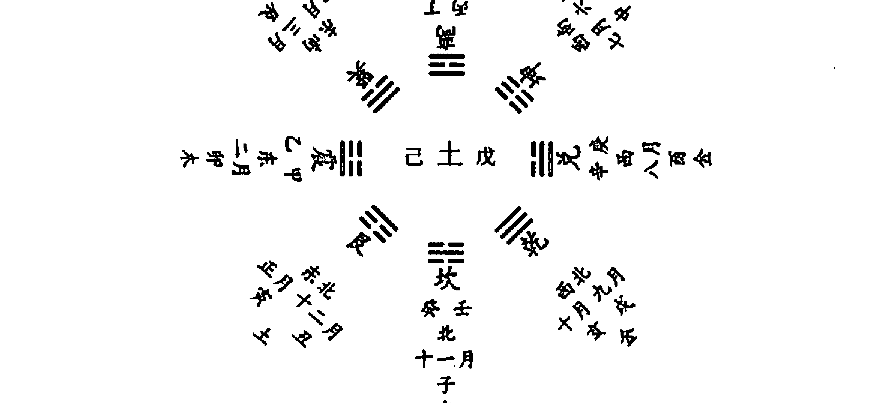

后天起卦法定应期是以卦数加时数的总和来确定，又根据当时求卜者

当时的姿态，比如行、卧、坐、立等，或者根据求占者心情的迟缓与急速的情况，来确定事物的应验之期。但是，前面在《占卜总诀》中讲到的，却是根据占算者自己的姿态与行动迟缓来确定，似乎又出现了牴牾。其实，在实际应用中，如果有来求占之人，即以来人之缓急来断；无求占之人，即以己身之动静来断。如是而已。根据卦数、时辰之类的取用方法，在推断为应验在近期还是在长远，有时候非常难以决断。比如，得乾卦，是断为庚、辛年，还是庚、辛日，更或是庚、辛时？在这个时候，必须综合先天卦数与后天卦数来判断应期，才能准确无误地断出。情况复杂时，更应该考虑事理，不可执于一端。比方说为小本流动性大的生意断财运，其取应期当然应该取日。如果是房地产等周期长的生意，应期当然应该取月，甚至是取年，视具体情况而定。

又凡占卦中决断吉凶，其理洞见，止于全卦体用生克之理，及参《易》辞，斯可矣。今日以后天卦，却于六十甲子之日，取其时方之魁、破、败、亡、灭迹等，以助断决。盖历象选时，并于《周易》不相干涉，不可用也。

大凡占卦时推断吉凶，方法非常简单，不要人为的把简单的推断搞得非常复杂。道理非常显然，因为断卦只需在全卦的体用生克关系中寻找信息，并参照《周易》上的爻辞，这就可以了。当今的后天起卦之法却是根据六十甲子的时日排列，用求占之日时的时辰、方位的河魁、月破、大败、空亡、灭迹等等，来帮助推断吉凶，以此来帮助推断吉凶，这是不对了。因为上面所讲的择日之术，其理论体系是历象和星命之学，与《周易》并不相干，所以不能根据那些星煞和术语来帮助决断吉凶。

## 卦断遗论

凡占卜决断，固以体用为主，然有不拘体用者。如起例中“西林寺额”，得山地剥，体用互变，俱比和，则为吉，而乃不吉，何也？盖寺者，纯阳人居之地，而纯阴爻象，则群阴剥阳之义显然也。此理甚明，不必拘体用也。又若有人问：“今日动静如何？”得地风升，初爻动，用克体卦，俱无饮食矣，而亦有人相请，虽饮食不丰而终有请，何也？此人当时必有当日之应，又

有“如何”二字带口，为重兑之义。又有用不生体，互变生之而吉者。如少年有喜色，占得山火贲是也。又有用不生体，互变俱克之而凶者。如牛哀鸣，占得地水师是也。盖少年有喜色，占则略知其有喜，而易辞又有“束帛戋戋”之吉，是二者俱吉，互变俱生，愈见其吉矣。虽用不生体不吉，不为其害也。牛鸣之哀，则略知其凶，而易爻复有“舆尸”之凶，互变俱克，愈见其凶。虽用

[PAGE 100]

## 白话梅花易数

# 八卦心易体用诀

心易之数，得之者众；体用之诀，有之者罕。余幼读易书，长参数学，始得心易卦数。初见起例，以知占其吉凶。如以蠡测海，茫然无涯。后得智人见授体用心易之诀，而后占事之诀，疑始有定。据验则验。如由基射的，百发百中。其要在于分体用之卦，察其五行生克比和之理，而明乎吉凶悔吝之机也。于是易数之妙始见，而易道之卦义备矣。乃世有真实，人罕遇之耳。得此者，幸甚秘之！

这一段是写在秘诀前的一节说明性的文字，阐述了当时“梅花易数”的传播和使用情况。大概的意思是：

“梅花心易”中的易数变化之道、推衍方法，得到其传授的人还是比较多的，但是既懂卦数，又能通晓体用生克比和与其吉凶意义的秘诀的人，却是少之又少。我从小开始研读《周易》，长大之后又研习术数之学，才开始悟得心易卦数的真谛。

开始研究时，无非就是占卦起例，只知道占断事情的吉凶而已，却难得其要领，就好像以蠡测海，茫然而不着边际，令人不知所措。后来碰到一个智人并得到其精心指点，教授我心易之体用生克比和的秘诀，方豁然开朗。从此之后，占卜事理、判断吉凶才有了把握，并逐渐渐开始有定准。只要占就灵验，就像周朝神射手养由基射箭一样，百发百中，万不失一。

由此我认识到占卜的关键在于先分辨体卦与用卦，然后考察体卦用卦之间的五行生克比和的道理，从而才能明所占之事吉凶悔吝的玄机。于是，才慢慢发现了《周易》八卦之数的玄妙和渊深，而体载《周易》之道的卦德和卦义也就慢慢掌握了。世上确实有真正明白通晓易数的高人，只不过一般人难以遇到罢了。易数玄妙无穷，渊奥博深，有幸得其真传，可谓三生有幸，不可轻易再传授他人。

## 体用总诀

体用云者，如易卦具卜筮之道，则易卦为体。以卜筮用之，此所谓“体用”者，借“体用”二字以寓动静之卦，以分主客之兆，以为占例之准则也。大抵体用之说，体卦为主，用卦为事，互卦为事之中间，刻应变卦为事之终应。

《周易》常见的占法中，以易卦为体，以卜筮为用，这就是所谓的“体用”的由来。《梅花易数》借“体用”二字，以代表事物运动，变化和相对静止之意，来作为分别主体，客体的征兆，以及占筮的通例准则。“体用”之说，区分动卦与静卦，来作为主卦和客卦的征兆，以体卦为主体为自己，用卦为他人或所占之事，互卦为事物发展的中间阶段，外应和变卦为事物发展的终结。“刻应”即“克应”，也就是外应。

体之卦气宜盛不宜衰。

盛者，如春震、巽，秋乾、兑，夏离，冬坎，四季之月坤、艮是也。衰者，春坤、艮，秋震、巽，夏艮、兑，冬离，四季之月坎是也。

体卦的卦气宜于旺盛，不宜于衰弱。卦气旺盛的，如春天时震、巽卦气旺，秋天时乾、兑卦气旺，夏天时离卦气旺，冬天时坎卦气旺，四季之月则坤、艮卦气旺。每季之最后一月，即辰戌丑未月，皆为土用事，为土旺相之月，因而坤艮卦气旺。卦气衰弱的，春季时坤、艮卦气衰，秋季时震、巽卦气衰，夏季时乾、兑卦气衰，冬季时离卦气衰，四季之月则坎卦卦气衰。

宜受他卦之生，不宜他卦之克。

他卦者，谓用互变也。生者，如乾、兑金体，坤、艮生之；坤、艮土体，离火生之。离火体，震、巽木生之。余皆仿此。克者，如金体火克，火体水克之类。

体卦最好是得到他卦的生扶，不要出现受他卦的克制情况。他卦是什么？即用卦、互卦和变卦。生扶，指的是一卦的五行属性对另一卦的五行属性的对应关系是五行相生的关系，即金生水，水生木，木生火，火生土，土生金，如：乾兑属金体，坤艮土生扶它，因为土生金；坤艮属土体，离火生扶它，因为火生土；离火属火体，震巽木生扶它，因为木生

[PAGE 102]

## 白话梅花易数

火；其余仿此类推。这里所讲的“克”，就是指的是一卦的五行属性于另一卦的五行属性的克制，即金克木，木克土，土克水，水克火，火克金。诸如金体火克之、火体水克之之类。

体用之说，动静之机；八卦主宾，五行生克。体为己身之兆，用为应事之端。体宜受卦用之生，用宜见卦体之克。体盛则吉，体衰则凶。用克体固不宜，体生用亦非利。体党多而体势盛，用党多则体势衰。

如卦体是金，而互变皆金，则是体之党多。如用卦是金，而互变皆金，则是用之党多。体生用，为之泄气，如夏火逢土。¹

“体用”之说，指的是就是事物动静的玄机，八卦都有主客体之别，可以区分为主卦、宾卦，五行也有生克比和的种种不同。体卦表示所占者自己这方面的征兆，用卦则为所占之人或所占之事方面的端绪。体卦宜于受用卦生扶，用卦宜于被体卦克制。如果在用卦、用互卦、体互卦、变卦中，多有五行与体卦五行同类，则体卦气盛，则事情吉利；反之则体卦气衰，则事情凶险。一卦的用卦克制全卦固然不妙，但体卦生## 白话梅花易数

## 天时占第一

凡占天时，不分体用；全观诸卦，详推五行。离多主晴，坎多主雨；坤乃阴晦，乾主晴明。震多则春夏雷轰，巽多则四时风烈。艮多则久雨必晴，兑多则不雨亦阴。夏占离多而无坎，则亢旱炎炎。冬占坎多而无离，则雨雪飘飘。

大凡用梅花易数占卜天时，不必区分体卦和用卦，只要综观上下经卦以及上下互卦，根据卦的五行属性和五行生克之理详细推测即可。卦中离卦多，离卦属火，多主天气晴朗。卦中坎卦多，坎卦属水，多主降雨。卦中如坤卦多，坤属地，主阴沉晦暗之象；卦中如乾卦多，乾为天，主晴明之象。卦中震卦多，震为雷，则主春夏两季雷声轰鸣；卦中巽卦多，巽为风，则主四时风力强劲；卦中艮卦多，艮为止，则久雨必晴；卦中兑卦多，主小雨和阴晦不晴。若夏天占卜时卦中离卦多而无坎卦，则火盛而无水制，主赤日炎炎，亢旱之年；若冬季占卜时卦中坎卦多而无离卦，则水盛而无火制，主大雪飘飘。

全观诸卦者，谓互变卦。五行谓离属火，主晴；坎为水，主雨；坤为地气，主阴；乾为天，主晴明；震为雷，巽为风。秋冬震多无制，亦有非常之雷。有巽佐之，则为风撼雷动之应。艮为山云之气，若雨久，得艮则当止。艮者，止也，亦土克水之义。兑为泽，故不雨亦阴。

所谓综观诸卦，观察包括互卦、变卦在内的所有卦。因卦不分体用，故不用考察体卦和用卦。重点考察八卦的五行属性，卦中哪种卦多，就依其五行属性而断。五行属性不同，天气也就随之不同。离卦属火，主晴明；坎卦为水，主降雨，巽卦属风，若秋冬季节占卜遇到的震卦多而无其他卦来克制，将有不寻常的雷声；再有巽卦来帮助，将有风雷大作的异常天象。艮卦为山云之气，如久雨之后占得此卦，淫雨肯定停止。因为按照《易经》卦象，艮为止。兑卦为泽，在天象上主非雨即阴。

夫以造化之辨固难测，理数之妙亦可凭。是以乾象乎天，四时晴明；坤体乎地，一气惨然。乾坤两同，晴雨时变。坤艮两并，阴晦不常。

天地间万物的运动固然难以测度，而易数、易理所揭示的玄机却可凭

依。乾象征着天，一年四时之中，不论哪个季节，如果占得乾卦，就会有晴朗的天气。坤象征地，一年四时之中，不论哪个季节，如果占得坤卦，就会阴气惨然。那么，如果出现两个属性相反的卦出现在同一个卦中，就要综合考虑。比方乾卦坤卦同处于一卦中，时晴时雨。是坤卦和艮卦出现在同一卦中，时晴时阴。

卜数有阳有阴，卦象有奇有偶。阴雨阳晴，奇偶暗重。坤为老阴之极，久晴必雨；乾为老阳之极，久雨必晴。若逢重坎重离，亦曰时晴时雨。坎为水，必雨；离为火，必晴。乾兑之金，秋明晴；坎之水，冬雪凛冽。坤艮之土，春雨泽，夏火炎蒸。《易》曰：“云从龙，风从虎。”又说“艮为云，巽为风。”艮巽重逢，风云际会；飞沙走石，蔽日藏山；不以四时，不必二用。坎在艮上，布雾兴云；若在兑上，凝霜作雪。乾兑为霜雪霰雹，离火为雷电虹霓。离为电，震为雷，重会而雷电俱作。坎为雨，巽为风，相逢而风雨骤兴。震卦重逢，雷惊百里。坎爻叠见，润泽九垓。

易数既有奇数也有偶数，奇数数阳，偶数数阴；八卦卦象既有阴也有阳，阳卦爻数为奇，阴卦爻数为偶。阳卦奇数象征着晴明，阴卦偶数象征着阴雨。奇偶明晦，各有所主。坤卦为老阴，谓为阴之极限。如果在久晴的天气占卜遇到坤卦，则久晴必雨；如果在久雨的日子占卜遇到坤卦，那么阴上加阴，老阴必变，坤阴之气泄散，又会久雨转晴。如果占卜时得坎卦、离卦相重，通常会时晴时雨。这是因为坎为水，故有雨。离为火，故主晴。二卦相逢，并无主卦，故时雨时晴。占得卦中有坎卦，坎为水，主阴雨；占得卦中有离卦，离为火，主晴明。若秋季占得卦中有乾兑，乾兑五行属金，主秋高气爽、天天朗气清；若冬季占得卦中有乾兑，则主北风呼啸、大雪纷飞。若春天占得卦中有坤艮，坤艮五行属土，主细雨霏霏。若夏天占得卦中有离火，夏天属火，离又属火，火上加火，则烈日炎炎、暑气腾蒸。《易经》说“云从龙，风从虎”，又说“艮为山，巽为风”。艮卦与巽卦相逢，可谓风云际会，无论在哪个季节占得此二卦相逢，都会飞沙走石、天昏地暗，风起云涌、遮天蔽日；而且这种情况不会因一年四时的变化而有所改变。坎卦在上艮卦在下，将会云遮雾罩、水气腾蒸。如果坎卦在上兑卦在下，将会千里冰封、万里雪飘。乾兑卦属金，象征着霜雪

霰雹。离卦属火，象征着太阳、闪电、彩虹、霓霞。离卦为闪电，震卦为雷霆，二卦相会，雷电交加。坎卦为雨，巽卦为风，二卦相逢，暴风骤雨。两个震卦相碰，雷声大作、震惊百里。两个坎卦重叠，就会大雨滂沱、水漫九州。

故卦体之两逢，亦爻象之总断。地天泰，水天需，昏蒙之象。天地否，水地比，黑暗之形。八纯离，夏必旱，四季皆晴。八纯坎，冬必寒，四时多雨。久雨不晴，逢艮必止。久晴不雨，得此亦然。又若水火既济，火水未济，四时不测风云；风泽中孚，泽风大过，三冬必然雨雪。水山蹇，山水蒙，百步必须执盖。地风升，风地观，四时不可行船。离在艮上，暮雨朝晴；离互艮宫，暮晴朝雨。巽坎互离，虹霞乃见；巽离互坎，造化亦同。

这一段是讲属性不同的两卦相逢后预示的各种天气情况。两个不一样的卦体相逢，要根据两卦的阴阳属性作出综合推断。

如得地天泰、水天需二卦，上卦都属阴。阴为晦暗，所以二卦皆是天昏地暗、蒙昧不明之象。如得天地否、水地比二卦，否卦之阳与地阴离绝，比卦为两阴卦重叠，二卦皆为天昏地暗、日月无光之象。

如果夏天占卜时得到纯离卦，肯定大旱；其它时节得到此卦，天气晴明。如果冬季占卜时得到纯坎卦，久雪不晴；其它时节得到此卦，淫雨霏霏。

如果占得水火既济、火水未济之卦，天气必然变化无常、风云难测。如果冬天占天气碰到风泽中孚、泽风大过之卦，必然大雪飘飘。

久雨时占卜得到艮卦，雨肯定会停；天气久晴不雨时占得到艮卦，必然晴转雨。

如果四季之中占得水山蹇、山水蒙之卦，大雨将转瞬即至，出门不过百步的距离也要带上雨具。如果占得地风升、风地观之卦，一年四季之中无论何时得卦，均不可以行船。

如果离卦在艮卦之上，必然是早上晴朗黄昏下雨；如果是卦中有离卦且互出艮卦，必然是早上下雨黄昏晴朗。

## 人事占第二

人事之占，详观体用。体卦为主，用卦为宾。用克体不宜，体克用则吉。用生体有进益之喜，体生用有耗失之患。体用比和，谋为吉利。更详观互卦变卦，以断吉凶；复究盛衰，以明休咎。

占测人事，需要详细观察体卦、用卦的变化。以体卦为主，以用卦为宾，应以体卦为中心详细分析诸卦与体卦的关系。用卦克制体卦，不吉；体卦克制用卦，吉。用卦生扶体卦，主有进益之喜；体卦生扶用卦，主有损耗之忧。若是体卦与用卦五行属性相互比和，所谋之事易于成功。此外，还应详细观察互卦、变卦与体卦的五行属性与生克关系，综合判断是吉是凶。最后还要研究体卦用卦的卦气旺衰情况，以明断事情的发展是凶
是吉。
人事之占，则以全体用总章，同决吉凶。若有生体之卦，即看前章八卦中生体之卦有何吉；又看克体之卦有何凶，即看前章克体之卦。无生克，止断本卦。

占测人事，可参照《体用总诀》一章中所阐述的具体原则及其具体内容来推断吉凶祸福。如果在卦中有生体之卦，可参照该卷“生扶体卦”一节，看有何吉利；参照“克制体卦”一节，看有何凶险。卦中无生扶或克制本卦的情况，那么只根据本卦的卦象来推断即可。

## 家宅占第三

凡占家宅，以体为主，用为家宅。体克用，则家宅多吉；用克体，则家宅多凶。体生用，多耗散，或防失盗之忧；用生体，多进益，或有馈送之喜。体用比和，家宅安稳。如有生体之卦，即以前章《人事占》断之。

所谓家宅，包括家中的房产、财物、人口平安与否，关系是否和美等。大凡占测家宅的吉凶祸福，以体卦为主，用卦为所占之家宅。体卦克制用卦，家宅大吉；用卦克制体卦，家宅有凶。体卦生扶用卦，多有损耗家财之患，或要谨防失盗之事；用卦生扶体卦，多有进益之喜。体卦与用卦比和，家宅便会安稳无恙。如果在用卦、互卦中出现了生扶体卦的情况，可依据前面《人事占》一章中的理论来推断。

## 屋舍占第四

凡占屋舍，以体为主，用为屋舍。体克用，居之吉；用克体，居之凶。体生用，主资财衰退；用生体，则门户兴隆。体用比和，自然安稳。

大凡占测所居屋舍之吉凶祸福，以体卦为主，以用卦代表所占之屋舍。体卦克制用卦，主居此屋吉利；用卦克制体卦，主居此屋凶险。体卦
生扶用卦，主居此屋资财耗损；用卦生扶体卦，主居此屋兴旺发达。体用比和，主居此屋自然安稳、吉祥如意。

## 婚姻占第五

占婚姻，以体为主，用为婚姻。用生体，婚易成，或因婚有得；体生用，婚难成，或因婚有失。体克用可成，但成之迟；用克体不可成，成亦有害。体用比和，婚姻吉利。

凡占测婚姻，以体卦为主，用卦代表婚姻。用卦生扶体卦，则婚姻容易成功，或因婚姻而获利。体卦生扶用卦，则婚姻难成，或因婚姻有所损失；用卦克制体卦，所测之婚姻不会成功。即便勉强成婚，也一定会有妨害。体卦与用卦比和，主婚姻美满幸福，大吉大利。

占婚，体为所占之家，用为所婚之家。体卦旺，则此家门户胜；用卦旺，则彼家资盛。生体，则得婚姻之财，或彼有相就之意；体生，则无嫁奁之资，或此去求婚方谐。若体用比和，则彼此相就，良配无疑。

上面的黑体字的一段文章及下面的一段黑体字文字，是第一段的注释性文字。大意是：占测婚姻，体卦为所占之家，用卦为婚约之家。体卦卦气旺，则所占之家的门第就高于对方。用卦卦气旺，说明对方资财富厚。用卦生扶体卦，将会由于婚事而获得财产，或对方有相就之意；体卦生扶用卦，可能难得嫁妆之财，或者所占之家必须前去求婚才能使婚姻成就。如若体卦与用卦比和，预示着双方互相满意，天缘良配，婚姻定能成就。

乾：端正而长。坎：邪淫、黑色、嫉妒、奢侈。艮：色黄多巧。震：美貌难犯。巽：发少稀疏，丑陋心贪。离：短赤色，性不常。坤：貌丑，大腹而黄。兑：高长，语话喜悦，白色。

乾，健也，象征着对方相貌端正，身体颀长。坎为险，为陷，为水，象征着对方淫邪、黝黑皮肤、天性嫉妒、奢侈无度。艮为山为石，象征着对方黄皮肤，聪明灵巧。震为雷，朝气蓬勃之卦，象征着对方美貌而难以亲近。巽为寡发，象征着对方毛发稀少、相貌丑陋、欲壑难填。离为火，象征着对方身材矮小，皮肤红色，性情像火一样反复无常。坤为土，象征着对方面貌丑陋、大腹便便、黄皮肤。兑为泽，又为口，象征着对方身材修长苗条，言谈招人喜欢，皮肤白皙。

## 生产占第六

占生产，以体为母，用为生。体用俱宜乘旺，不宜乘衰。宜相生，不宜相克。体克用，不利于子；用克体，不利于母。体克用而用卦衰，则子难完；用克体而体卦衰，则母难保。用生体，易于母；体生用，易于子。体用比和，生育顺快。

占测分娩，以体卦作为产妇，用卦代表分娩的小孩。体卦和用卦卦气皆宜于旺相，不宜于衰弱。体卦和用卦宜于相生，不宜于相互克制。体卦克制用卦，不宜于孩子；用卦克制体卦，不利于母亲。体卦克制用卦，用卦便会因受到克制而衰弱，婴孩难以保全。用卦克制体卦，体卦就会因受到克制而衰弱，产妇会有生命危险。用卦生体卦，有利于母亲的分娩。体卦来生用卦，有利于婴孩的出生。体卦与用卦比和，那么生育顺利快捷，母子平安。

若欲辨其男女，当于前卦审之：阳卦阳爻多者则生男，阴卦阴爻多者则生女。阴阳卦爻相生，则察所占左右人之奇偶以证之。如欲决其日辰，则以用卦之气数参决之。日期用卦之气数者，即看何为用卦，于八卦时序之类决之。

想要知道生出来的婴儿是男是女，详细考察本卦卦象即可。如果是阳卦，阳爻多，便会生男孩；如果阴卦，阴爻多，便会生女孩。如得三阴爻三阳爻之卦，阴阳爻之数相等，就要观察占卜时左右之人的奇偶之数来确定。如若是奇数则可能生男，若是偶数则可能生女。若要推断分娩日期和时辰，应当参考用卦的卦气旺相的时间和所属八卦数字来确定。

## 饮食占第七

凡占饮食，以体为主，用为饮食。用生体，饮食必丰；体生用，饮食难就。体克用，则饮食有阻；用克体，饮食必无。体用比和，饮食丰足。又卦中有坎则有酒，有兑则有食。无坎无兑，则皆无。兑、坎生身，酒肉醉饱。欲知所食何物，以饮食推之。欲知席上何人## 行人占第十三

占行人，以体为主，用为行人。体克用，行人归迟；用克体，行人不归。体生用，行人未归；用生体，行人可即归。体用比和，归期不日矣。

占测在外之行人，以体卦为主，以用卦为在外之行人。体卦克制用卦，行人在旅途中，归来尚需时日。用卦克制体卦，行人在外，无意返乡。体卦去生用卦，人在旅途，并未归来。用卦生体卦，不久即回。体卦用卦比和，归期不远。

又以用卦为行人之盈旺。逢生，在外顺快；逢衰受克，在外灾殃。震多不宁，艮多有阻。坎有险难，兑主纷争之应。

此外，还可以根据用卦来判断在外之人顺逆与否。用卦遇他卦生扶，在外之人顺心快意；用卦卦气本已衰弱，又逢他卦来克制，主在外之人有灾殃。若用卦为震，震为动，多主四处漂泊、不能安宁；若用卦为艮，艮为阻，多主四处碰壁、诸事不利。若用卦为坎，坎为险为陷，多主在外有险难。若用卦为兑，兑为口舌，多主在外之人有口舌纷争。

## 谒占见第十四

占谒见，以体为主，用为所见之人。体克用，可见；用克体，不见。体生用，难见，见之而无益；用生体，可见，见之且有得。体用比和，欢然相见。

占卜谒见，以体卦为主，用卦代表要拜见的人。体卦克制用卦，便得晋见。用卦克制体卦，不得晋见。体卦生扶用卦，难以晋见，即使勉强会面，也不会有什么好处。用卦生扶体卦，可以晋见；而且会因晋见得到好处。体卦、用卦比和，双方欣然相见。

## 失物占第十五

占失物，以体为主，用为失物。体克用，可寻，迟得；用克体，不可寻。体生用，物难见；用生体，物易寻。体用比和，物不失矣。

占测失物能否找到，以体卦为主，用卦失物。体卦克制用卦，失物可以找到，但需要过一段时间；用卦克制体卦，失物不能找到。体卦生扶用卦，失物难以找到；用卦生扶体卦，失物容易找到。体卦用卦比和，物品并没有丢失，定在原处，只不过是一时想不起来放置的地方而已。

又以变卦为失物之所在。

如变是乾，则觅于西北，或公廨楼阁之所，或金石之傍，或圆器之中，或高亢之地。

变卦是坤，则觅于西南方，或田野之所，或仓廪之处，或稼穑之处，或土窖穴藏之所，或瓦器方器之中。

震则寻于东方，或山林之所，或丛棘之内，钟鼓之傍，或闹市之地，或大途之所。

巽则寻于东南方，或山林之所，或寺观之地，或菜蔬之园，或舟居之间，或木器之内。

坎则寻于北方，多藏于水边或溪井沟渠之处，或酒醋之边，或鱼盐之地。

离则寻于南方，或庖厨之间，或炉冶之傍，或在明窗，或遗虚室，或在文书之侧，或在烟火之地。

艮则寻于东北方，或山林之内，或近路边，或岩石傍，或藏土穴。

兑则寻于西方，或居泽畔，或败垣破壁之内，或废井缺沼之中。

变卦代表失物所在的地方。依据八卦万物属类之方位对应如下：

变卦为乾，应向西北方寻找。失物不是在官署楼阁之内，就是在金属乱石之旁，不是在藏在圆形的器物之中，就是在又高又干燥的地方。

变卦为坤，应在西南方寻找。失物或在田野间，或在仓库旁，或在劳动处。或在土窖洞穴中，或在泥瓦器物内，或方形器物中。

变卦为震，应在东方寻找。失物或在山林里，或在荆棘丛草中，或在乐器钟鼓边，或在闹市中，或在大街上。

变卦为巽，应在东南方寻找。失物或在山林间，或在寺庙道观内，或在菜蔬果园里，或在舟船车马上，或在竹木器物中。

变卦为坎，应在北方寻找。失物大多藏在水边，或在小溪、水井、阴沟、水渠里，或在酒罐、醋坛旁，或在有鱼盐的地方。

变卦为离，应在南方寻找。失物或在厨房里，或在炉火旁，或在向阳窗户前，或在空房中，或在字纸旁边，或在有烟火之处。

变卦为艮，应向东北方向寻找。失物或在山林间，或在道路旁，或放在岩石旁边，或藏于土穴之内。

变卦为兑，应向西方寻找。失物或在沼泽池塘边，或在断壁残垣间，或藏于废弃的水井和残损的池沼内。

## 白话梅花易数

## 疾病占第十六

凡占疾病，以体为病人，用为病症。体卦宜旺不宜衰，体宜逢生，不宜见克。用宜生体，不宜克体。是故体克用，病宜安；体生用，病难愈。体克用者，勿药有喜；用克体者，虽药无功。若体逢克而乘旺，犹为庶几。体遇克而更衰，断无存日。

凡占疾病，以体卦代表病人，用卦代表疾病；体卦宜于旺盛，不宜衰竭；体卦宜于得到生扶，不宜被克制；用卦宜生扶体卦，不宜克制体卦。所以，体卦克制用卦，病人很快转安；体卦生扶用卦，病人便难得痊愈。体卦克制用卦，即使不用药，也会不治而愈。用卦克制体卦，即便服药，也没有功效。若是体卦虽被克制但卦气旺盛，病人就会转危为安。如果体卦被克制后其卦气更加衰弱，神仙难医，断无生理。

欲知凶中有救，生体之卦存焉。体生用者，迁延难好；用生体者，即愈。体用比和，疾病易安。若究和平之日，主体之卦决之。若详危厄之期，克体之卦定之。若论医药之属，当审生体之卦。如离卦生体，宜服热药；坎卦生体，宜服冷药。如艮温补、乾兑凉药是已。

想知道能不能转危安

## 白话梅花易数

然则事如手握散沙，放手即败。波浪激荡，主外出行船有波涛之惊；山坡崩坏，主有田土方面的损失。在干旱的沼泽之旁占测，则主所测之事过程艰难，使人心力衰竭；在枯死的树林正面占测，则主所测之人相貌丑陋。适逢人品之来，实为事体之应。

故荣宦显官，宜见其贵；富商巨贾，可问乎财。

儿童哭泣忧子孙，吏卒叫嚣忌官讼。

二男二女，重婚之义；一僧一道，独处之端。

妇人笑语，则阴喜相逢；女子牵连，则隐私见累。

匠氏主门庭改换，宰夫则骨肉分离。

逢猎者得野外之财，见渔者有水边之利。

见妊妇则事萌于内，遇瞽者则虑根于心。

右乃人品之应，以验人事。

这一段讲的是第四种外应，即人品之应。所谓人品之应，是指来人问事情时，有人从一旁过，则考察此人的相貌、职业、身份、地位，作为断卦的外应，以之应验于人事，来测度人事的变化。如果走过来的是达官显贵，则可断为其人将来身份必然显贵；如果走过来的是富商大贾，则可断为其人必将求财得财；如有婴儿哭泣，则子孙有忧患，如逢公务人员叫嚣，要小心有官讼之事。如有二男二女走过，则婚姻必有重婚之应；如有僧道之人走过，则婚姻不成，继续单身。如逢妇女笑语，则有怀孕生产之喜事；如有女人相挽而过，则会因上不了台面的隐私之事而受牵累。如看到木匠、泥瓦匠，则主门庭即将改换；如看到屠夫，则主有骨肉分离之事。若遇到打猎之人，主所占之人可能在野外得财利；若遇到打渔之人，则主所占之人可能会在水边得财得。如若碰到孕妇，主事情的起因必因为自己圈子内部的人；如若见到盲人，则所问之事为杞人忧天，即思想中有忧虚而无其事，等等。若遇到盲人，则主所则之事由于自己的想法和欲念而起。

至于摇手而莫为，或掉头而不肯。

拭目而喷嚏者方泣，搔首而弹垢者有忧。

足动者有行，交臂者有失。

屈指者多阻节，嘘气者主悲忧。

舌出掉者有是非，背相向者防闪赚。

偶攘臂者，争夺乃得；偶下膝者，屈抑而求。

右乃‘近取诸身’之应。

这一段讲的是第五种外应，即‘近取诸身’之应。以求测之人或在场的其他人的神色、形体、动作等作为外应来参断求测之事。

凡是断卦时，若有人无意间摇手，则所问之事做不成功，不必再去做 了；或逢有人掉头而走，则所问之事只是一厢情愿，难以成功。若是碰到无意间擦拭眼睛或打喷嚏的，则主正有哭泣悲伤之事；若是碰到有人抓挠头或弹尘垢的，则主有忧愁之事。在问卦时，来人或他人不停地晃脚，主有远行；如果是交叉双臂，主有损失。如果看到有屈指的动作，则所问之事有阻滞；如果恰好听到叹息声，则主有悲忧之事。看到有人吐舌头，主有是非口舌之事；外应之人背向而立，则所问之事防闪失，恐怕会有人来诈骗。看到有人拉拉扯扯，主有争夺才能得到利益；若外应之人无意屈膝，则主所测之事需要卑躬屈膝而求人才能办成。

若逢童子授书，有词讼之端；主翁笞仆，防责罚之事。

讲论经史，事体徒间于虚说；

语歌词曲，谋为转见于悠扬。

见博赌主争斗之财；遇题写主文书之事。

偶携物者受人提携；适挽手者遇事牵连。

右乃人事之应。

这一段讲的是第六种外应，即人事之应，以起卦或断卦时以当时所发生之事为外应。若是断卦时，正逢儿童授书，主有词讼之事；若遇主人鞭笞仆人，主有责备惩罚之事。凡是有人在讲经论史，则所问之事往往流于空谈而难见其实；听见唱歌唱曲，则所问之事虽有困难但最终必有转机而终获得成功且非常顺利；见有人在赌博，则所问之事主因钱财而争斗；见有书画，则所问之事为文书之事，与文章、书信、公文、案卷有关；无意间看见有人拿着东西，主受人提拔和帮助；看见有人手挽手，主逢无妄之灾而受人牵连。

及夫舟楫在水，凭其接引而行；

车马登途，藉之负载而往。

张弓挟矢者必领荐，有箭无弓者未可试。

持刀执刃，须求快利之方。披甲操戈，可断刚强之柄。

[PAGE 129]

## 白话梅花易数

缫丝者，事务繁冗。围棋者，眼目众多。

妆花刻果，终非结实之因。

画彩描形，皆为装点之类。

络绎①将成，可以问职。笔墨俱在，可以求文。

偶倾盖者主退权，忽临镜者可赴诏。

抱贵器者有非常之用，负大木者有不小之财。

升斗宜量料而前，尺剪可裁度以用。

见蹴踘，有人拨剔。开锁钥，遇事疏通。

逢补器，终久难坚。值磨镜，再成始得。

顽斧磨钢者，迟钝得利。快刀砍木者，利事伤财。

裁衣服者，破后方成。造瓦器者，成后乃破。

弈棋者，取之以计。张网者，摸之以空。

或持斧锯恐有伤，或涤壶觞恐有饮。

或挥扇者，有相招之义。或污衣者，防谋害之侵。

右乃器物之应，即‘远取诸物’之义。

这一段讲的是第七种外应，即器物之应。取实物为外应，根据的是《易经》“远取诸物”之意。外物的取用，有时取外物之形，有时取外物之音，随心取用，并无定法。现一一讲解如下：

遇到舟船停在水中，主成事须借别人之力；遇到车马在征途中，主因他人替力而完成所谋之事。遇到拉弓射箭之人，主得他人引荐；遇只拿箭而无弓的人，所谋不成，无成功的希望。遇手持快刀利刃之人，应快刀斩乱麻，快速处理此事；遇披甲操戈之人，主一切尽在掌握，已经控制全局。遇到缫丝之人，主事务繁杂、久拖不决；遇到下围棋之人，主机事不密，耳目众多，消息走漏。

见到假花假果，主事情表面顺利，结果不好，恰似假花假果一样只好看而不实用；见到画影描形，主事情虽有结果却自己难享好处，给似为人做嫁衣。若遇纺纱抽丝将要完成，主所问官职之事可成；若遇笔墨俱全，主得文名。见器物倾覆，主被削权或退职。见人照镜，主被诏而有升迁。见人怀抱贵重器皿，主成大器。见人背负大木良材，主发大财。

————

① 络，粗纱。绎，细丝。此处络绎之意，为纺织之事，与现代汉语中络绎不绝之意不同。

109

# 梅花易数卷二

[PAGE 130]

## 白话梅花易数

见到升和斗等量具，应量力而行。见到尺子和剪刀，应审时度势。见到踢球，主背后事非。遇到开锁，主遇事就去打点疏通。看到修补之事，主难于久长。遇到研磨铜镜，主有磨难，一次难成，二次始就。遇到磨钝斧头的人，主应验迟缓，但终能获利。遇到快刀砍木之人，主事成而财产有损。

看到裁衣，主先遭损失而后成功。见到制造瓦器，主先成功而后破败。见到弈棋，主需多方筹划，广施计谋；见到张网捕鱼，主竹篮打水一场空，并无结果。或遇到手持斧锯之人，要防遭伤害；或遇到洗涤壶觞的，主有饮食。或遇到人挥扇，主被召见；或遇到衣服被弄脏，须防别人的谋害和欺凌。

虽云草木之无情，亦于卜筮而有应。

故芝兰为物之瑞，松柏为寿之坚。

遇椿桧则岁久年深，遇苗菰则朝生暮死。①

枝叶飘零当萎谢，根核流落主牵连。

奇葩端的虚花，嘉果可以结实。

右乃草木之应。

这一段讲的是第八种外应，即草木之应。远取诸物，亦可以草木为外应来参断人事吉凶。虽然说草木不像动物一样，没有我们可以直接理解的情感，但是取为外应时，也会非常灵验。当然，现代的研究已经证明，植物和动物甚至人类一样，有自己的情感和反应。在断卦时，见到灵芝兰草之类的祥瑞之物则吉，见到松柏之类长寿的植物则象征生命长久而身体康健。遇到椿桧之类的树木，主所测之事宜于久长；若遇苗菰之类朝生暮死的菌类，为事情不能久长之兆。如占疾病、占生育而遇此兆，即标志着死亡。看到枝叶飘零，主人事衰败；看到树根露出、果核撒落，主被人事牵连。看到奇葩异花，主虚无缥缈，所测之事镜花水月，难有结果；看到美好的果实，主所测之事必有好结局。

至于飞走，最有祯祥。

故乌鸦报灾，螽虫报喜。

鸿雁主朋友之信，蛇虺防毒害之谋。

__________

> ① 占产占病得之，即死之兆。

[PAGE 131]

鼠啮衣有小口之灾，雀噪檐有远行之至。
犬斗恐招盗贼，鸡斗主有喧争。
牵羊者，喜庆将来。骑马者，出入皆利。
猿猴攀木，身心不定。鲤鱼出水，变化不凡。
绳拴马，疾病难安。架陷禽，囚人未脱。
右乃禽兽之应。

这一段讲的是第九种外应，即禽兽之应。梅花易数可据万物起卦，取象不拘一格。禽兽与人杂处，为常见之物，自然常被作为外应。古人云：晴空看鸟飞，流水观鱼跃，识宇宙活泼之机；霜天闻鹤唳，雪夜听鸡鸣，得乾坤清纯之气。乌鸦食腐肉，象征着不祥之气，因而断卦时遇到，主所求之事不顺遂。反之，见喜鹊则大吉大利。见鸿雁，主朋友言而有信，必能来助我；见蛇类，主有人意欲来谋害。衣服被鼠咬，须防儿童的健康与安全；麻雀檐下喧闹不停，远方行人必来到。两狗相争，须防盗贼；两鸡相斗，主有争吵。见有人牵羊而来，主有喜庆之事；见骑马之人，主出入平安。见猿猴攀缘大树，主身体心理不安定；见鲤鱼出水，主飞黄腾达之事，地位显贵。看见马儿为绳索羁绊，主问病难痊。见到禽鸟困在笼中，主狱中人没有脱身。

酒乃忘忧之物，药乃祛病之方。

故酒樽忽破，乐极生悲；医师道逢，难中有救。

藤萝之类堪依倚，虎豹之象可施威。

耕田锄地者，事势必翻。破竹剖竿者，事势必顺。

春花秋月，虽无实而关景；夏绵冬葛，虽有用而背时。

凉扇多主弃捐，晴伞渐逢闲废。

泡影电光，虚幻难信；蛛丝蚕茧，巧计方成。

右乃杂见观物之应。

这一段讲的是第十种外应，即杂见观物之应。万事万物，品类繁多，难以尽述。这里说的是上面没有提到但又是日常生活中常见的事物被取为外应时的经验。

酒本解忧之物，“何以解忧，唯有杜康”。饮酒本是乐事，而酒杯破，主乐极生悲；药物乃疗病之物，道逢郎中，主病人病情虽险却有救。藤萝之类乃是无本之木，断卦见时，自应去寻找靠山。虎豹乃兽中至刚至猛之物，主我方尽得天时地利人和之象，自可大展宏图。见耕田锄地，主所问之事有变，甚至形势翻转；见破竹剖竿之事，主事情顺风顺水，水到渠成。春天见鲜花，秋天见月亮，主前景美好但目下无成，成就尚需时日；夏天见棉被，冬天见草席，主目前的努力虽有用但于事无补。阴凉的天气见到扇子，晴天见到雨伞，均主无事可做，终被抛弃。见到水泡电光之类 的存在短暂的事物，主所求之事终归虚幻，难以依赖；见到蛛丝和蚕茧，主运用心智，百般谋划，方得成功。

若见物形，可知字体。

故石逢皮则破，人傍木为休。

笠漂水畔，泣字分明。

火入山林，焚形可见。

三女有奸私之扰，三牛有奔走之忧。

一木两火，荣耀之光。一水四鱼，鳏寡之象。

人继牛倒防失脱，人言犬中忧狱囚。

一斗入空门者斗争，两丝挂白木者乐事。

一人立门，诸事有闪。二人夹木，所问必来。

右乃拆字之应。

这一段讲的是第十一种外应，即拆字之应，举例说明取文字为外应时的法则。

凡断卦时，石头碰到了有皮字有关之物，则所问之事破，因为“石”加上“皮”，正是个“破”字。同理，“人”加“木”为“休”；“立”加“水”（氵）为“泣”；“火”入“林”下为“焚”。三女同行，主奸私事，因为三“女”字正是“姦”（奸）字；见三头牛，主有奔走事，因为三牛为“犇”（奔）字。同理，一木二火为“榮”（荣）字，主得荣耀；见一水四鱼为“鳏”字，是人可断为鳏寡之人。人继牛倒为“失”字，主有失脱之事；人言犬中为“狱”字，主有牢狱之灾。一斗人空门为“閒”（斗）字，主有斗争之事；见两丝挂白木为“樂”（乐）字，主有赏心乐事；见有一人站在门上，为“闪”字，主有闪失；两人夹木，是为“來”（来）字，主所问之人或所问之事必来。

逢冠则问名得官，鞋为百事和谐，阖则诸事可合。

难以详备，在于变通。

112

[PAGE 133]

右即物叶音之义。

这一段讲的是第十二种外应，即谐音之应。断卦之时，我们常常取事物的谐音为外应。比如问功名之事，推断时见冠，可断为得官。断卦时见鞋，百事和谐；见阖，百事可合。谐音之类甚多，不胜枚举，在平时断卦时常用，妙在变通，不可拘泥。

及夫在我之身，实为彼事之应。

故我心忧者，彼事亦忧；我心乐者，彼事亦乐。

我适闲，彼当从容；我值忙，彼当窘迫。

右即自己之应，“近取诸身”之应。

这一段讲的是第十三种外应，即自己之应。这里讲述了以自己作为所求之卦的外应来断卦的经验。考察己身，亦可推断来人及其所欲求测之事的吉凶，亦由《易经》“近取诸身”之义而来。

这一段话的大意是：表现在已身，亦可取为求测之外应。其人来求测，适逢我心忧之时，即可断其人其事亦有忧；其人来求测，适逢我快乐之时，则其人其事必顺遂，结局圆满；其人来求测，恰逢我正在闲适之时，主求占之人心情从容，事必无忧，唾手可得；其人来求测，适逢我正在忙碌之时，主求占之人正处窘境，事情急迫。

欲究观人之道，须详系《易》之辞。

将叛者其辞惭，将疑者其辞支。

吉人之辞寡，躁人之辞多。

诬善之人其辞游，失其守者其辞屈。

右一动一静之应，“近取诸身”之义。

这一段讲的是第十四种外应，即一动一静

## 复明地理之应

茂树秀竹，为震之地。离与震、巽为体则吉，坤、艮为体则凶。江湖河池、川泽溪涧，为坎之地，震、巽与坎为体则吉，而离为体则不吉。窑灶之地为离，坤、艮并离为体则吉，而乾、兑为体则不吉。岩穴之地为艮，乾、兑与艮为体则吉，坎为体则不吉。此地理之应也。

这一节讲的是断卦就外在环境取为外应时的经验。

大树下，竹林中，生机盎然，外应可取为震卦。在此占卜，若体卦为离卦，外应之震木生体卦离火，吉。如果体卦震巽，外应之震木与体卦之震巽木相比和，亦吉。如果体卦为坤艮，则外应之震木克体卦之坤艮土，不吉。

江湖河池、川泽溪涧等水多之处，外应可取为坎卦。在此占卜，若体卦为震巽，外应之坎水生体卦之震巽木，吉。若体卦为坎卦，外应地理之坎水与体卦之震巽木比和，亦吉。若体卦为离，则天时之坎水克体卦之离火，不吉。

砖窑灶炉之类火旺的地方，外应可取为离卦。在此占卜，如果体卦为坤艮，外应之离火生体卦之坤艮土，吉。若体卦为离，外应地理之离火与体卦之坤艮土相比和，亦吉。若体卦为乾兑，则外应之离火克体卦之乾兑金，不吉。

岩崖洞穴之类的地方，外应可取为艮卦。在此占卜，如若体卦为乾兑，外应之艮卦生体卦之乾兑金，吉。如若体卦为坤艮，则外应之体卦之乾兑金，不吉。

以上乃地理之应，为第二应。

## 复明人事之应

人事有论卦象五行者，有不论卦象五行者。论卦象，则老人属乾，老妇属坤，艮为少男，兑为少女之类。五行生克、比和之理，与前天时、地理之卦同断。其不分卦象五行者，则以人事之纷，了见杂出，有吉有凶，此应则随其吉凶而为之兆也。又观其事，则亦为某人。此人事之应也。

本节讲的是以人事作为外应如何取用来参断的经验，请和前面《三要灵应篇》中的相关部分一起研究。

以卦象而论人事的，比方说老年男子属乾卦，老妇属坤卦，艮卦为少年男子，兑卦为妙龄少女等等。卦象之间的五行生克比和之理运用，与前面所述的天时、地理所举的方法一样，无非五行生克比和而已。

那些不依卦象、五行来论人事的。人事中的各种现象，重复出现的，突然冒出的，纷纷扰扰，层出不穷，有吉有凶，均可用来作为参考。了见杂出，似应为叠见杂出。“又观其事，则亦为某人。”不通。因为前面已经详细讲了人事的取用，这里大概是想说，既要考察人事吉凶，还要参看人事人中的状况。

以上是人事之应。为第三应。

## 复明时令之应

时令不必论卦象，但详其令。月日值之五行衰旺之气。旺者，如寅卯月日则木旺，己午之月日火旺，申酉之月日金旺，亥子之月日水旺，辰戌丑未之月日土旺。衰者，如木旺则土衰，土旺则水衰，水旺则火衰，火旺则金衰，金旺则木衰。是故生体之卦气宜值时之旺气，不宜衰气。如克体卦气，则宜乘衰。此时令之应也。

时令是以干支表示的，故可与八卦相配，而八卦又与五行相配，故每月每日均有其五行属性。

用时令季节作为外应，不论卦象，只论五行，只要推详当令的月日所值的五行衰旺之气即可。五行相生相克，木旺则土衰，土旺则水衰，水旺则火衰，火旺则金衰，金旺则木衰。故寅卯之月日土旺，土克木，则土衰。己午之月日火旺，火克金，则金衰。其他以此类推即可。关于这方面的论述，前面已经一一详细说明，其对应请参看下图。

[白话梅花易数](img/28275642dbbc2698c77a4fbafc80899a_140_0.png)

## 地支配五行图

时令以地支纪之，其与五行衰旺的关系如下：

五行卦气旺的：月日地支为寅卯的，木旺，土衰；月日地支为已午的，火旺，金衰；月日地支为申酉的，金旺，木衰；月日地支为亥子的，水旺，火衰；月日地支为辰戌丑未的，土旺，水衰；

起卦后，先看体卦的五行属性，再考察所取外应之卦气五行属性看其生克衰旺。生扶体卦的时令外应之卦气，宜于旺相，不宜衰弱。克制体卦的时令外应之卦气，宜于衰弱，不宜旺相。如体卦为离，时令值寅卯之月，五行属木，木生火，即为生体之卦。寅卯之月木旺，吉。如体卦为离，时令值亥子之月，五行属水，水克火，即为克体之卦。亥子之月水旺，不吉。如体卦为离，时令值辰戌丑未之月，五行属土，乃水衰之月，无碍。以此类推。这里需要说明的是，这里讲的只是大概的规则，举例归举例，在具体的应用中并非如此呆板，一成不变。

以上是天时之应，为第四应。

## 复明方卦之应

即分方之卦。如离南、坎北、震东、兑西、巽东南、乾西北、艮东北、坤西南类也。论吉凶者，看来占之人在何卦位，而以用卦参详。如坎为用卦，宜在坎与震、巽之位，在离则不吉。离为用卦，宜在离与坤、艮之位，在乾、兑二位则不吉矣。盖宜在本卦之方，为用卦生之方，不宜受用卦克也。

所谓方卦，就是以方位为外应，看其属于何卦，作为用卦，看其与体卦之五行生克关系，进行综合论断。这里所说的八卦方位，即后天八卦属方位：离南坎北，震东兑西，巽东南，乾西北，艮东北，坤西南。

以方位之卦而论断吉凶的，看来人站何方位，取为用卦，判断吉凶。比如坎卦为用卦，来测之人测宜于在北方或东方、东南方，在南方则不吉。因为坎为水，来人在北方为坎，属水；东方为震，东南为巽，均属木，而体卦坎属水，生木；体卦生扶用卦，故吉。如在南方，南方为离，属火，体卦克制用卦，故不吉。同理，若离卦为用卦，则求占之人宜在南方或西南、东北方，在西北方或西方则不吉。一般说来，来占之人宜在体卦之方位为吉。如果再考虑用卦的话，则宜在用卦所生之方位，不宜在用卦克之方位。

若夫气在之卦，所在之方，又当审之。如水从坎来，为坎卦气旺。水从坤艮来，则坎之卦气衰。火从南来，为离卦气旺。如从北来，则离之卦气衰。余皆仿此。大抵本卦之方，生为旺，受克为衰。宜以体卦参之。生体卦气，宜受旺方；克体卦气，宜受克方。此方卦之应也。

这一段分析所在之卦的卦气旺衰，要结合所论卦的方位进行分析，并非一成不变。如若水从北方来，坎卦卦气旺；水从西南方或东北方来，则坎卦卦气衰弱。火从南方来，离卦卦气旺；如若火从北方来，则离卦卦气衰弱。其他以此类推。大体说来，本卦之方位，受方位之卦生的为旺相，受方位之卦克的则为衰弱。一般说来，如果方位之卦生扶体卦，其卦气为旺相为宜，不宜衰弱；如果方位之卦克制体卦，衰弱为宜，不宜旺相。

以上是方位之应，为第五应。

又震、巽之方不论坤、艮，坤、艮之方不论坎。坎方不论离，离方不论乾，乾、兑之方，不论震、巽。以其寓卦受方卦之克也。

又及，若来人在震、巽之方，体卦为坤艮，不必论之；若来人站在坤、艮之方，用卦为坎，不必论之；若来人在离方，体卦为乾兑，不必论之；来人在乾兑之方，体卦为震巽，亦不必论之。因为体卦为来人方位之卦所克制，不吉，没有必要论什么衰旺了。

## 复明动物之应

动物有论卦象者。乾为马，坤为牛，震为龙，巽为鸡，坎为豕，离为雉，艮为狗，兑为羊。又螺蚌龟鳖为离之象，鱼类为坎之属。此动物之卦，以体详与。

又不论卦象五行者，如乌鸦报灾，灵鹊报喜，鸿雁主有书信，蛇虫防有毒害，鸡唱为家音，马嘶为动意。此动物之应也。

这一节讲的是取用动物作为外应的经验。动物之应与人事之应一样，也有两种情况。

一种是以动物属于何卦象，即以何卦为卦应。例如：马属于乾卦之象，牛属于坤卦之象，鸡属于巽卦之象，猪属于坎卦之象，山鸡属于离卦之象，狗属于艮卦之象，羊属于兑卦之象，等等。还有，螺、蚌、龟、鳖属于离卦之象，鱼类属于坎卦之象，等等。具体取象时，可参看《八卦万物属类》一节。以这些卦象作为对事物的外应，再考察外应与体卦的关系，即可得出结论。具体方法，与前面第一应至第五应之讲解并无不同，参看上面的例子即可。

还有另外一种情况，即以动物的本身作为事物的外应，不用将其配卦作。如断卦时，见到乌鸦，则可断为凶事；见到喜鹊则可断为吉；见到鸿雁，则可断为有书信；见到蛇，则可断为有人意图谋害；见到鸡叫，则可断为家人有音讯；见到马嘶，则可断为有出行之事，等等。

以上是动物之应，为第六应。

## 复明静物之应

器物之类，有论卦象者。如水属坎，火属离，水之气属震、巽，金之气属乾、兑，土之气属坤、艮，为体卦，要参详。其不分卦象者，但观其器物之兆，如物之圆者事成，器之缺者事败。又详其器物是何物，如笔砚主文书之事，袍笏主官职之事，樽俎之具有宴集，枷锁之具防官灾。百端不一，审其物器。此静物之应也。

静物被取为外应时，也分为两种情况。

一种是将静物配之以卦象，取其卦象为外应之卦，与体卦和其他用卦一起参看，以断吉凶。例如：坎为水，与水有关的静物即属于坎卦之象；离为火，与火有关的静物即属于离卦之象；震巽为木，与木有关的即属于巽卦、震卦之象；乾兑为金，与金属有关的事物即属于乾卦、兑卦之象；坤艮为土，与土有关的静物属于即坤卦、艮卦之象，等等。具体取象时，亦可参看《八卦万物属类》一节。将所取外应的卦象与体卦一起参断，具体方法同上。

第二种情况，就是以静物本身作为外应，不考虑将外应朽卦，亦不用考虑其五行生克。比如见到圆形之物，则可断为事必成；见到笔墨纸砚之类的东西，则可断为有文书之喜；见到袍服等物，则可断为有官职之事；见到杯子、砧板等厨具，即可断为有宴请之事；见到枷锁之类的刑具，则可断为有官讼之灾，等等。

以上是静物之应。为第七应。

## 复明言语之应

闻人言语，不论卦象，但详其所言之事绪而占卜之。应闻吉语则吉，闻凶语则凶。若闻闹市言语喧集，难以决断。若定人少之处，或言语可辨其事绪，则审其所言何事，心领而意会之。如说朝廷迁选，可以求名；论江湖州郡，主出行；言争讼之事，主官司；言喜庆之事，利婚姻。事绪不一，随所闻以依之。此言语之应也。

所谓言语之应，是指以别人的语言内容以为外应。言语之应，一般不配以卦象，而是据其内容的吉凶而断。言语所讲的事情为吉，可断为吉，内容为凶，则可断为凶。如果在闹市之中，则言语嘈杂，难以辨识，不可以言语为外应而定吉凶。若在人少的地方，言语可以听清，则可断吉凶。如果所讲之事是讲朝廷人事变动，可断为宜于求名。如果谈论的是他乡外郡之事，主有远行。如果谈论的是喜庆之事，则可断为婚姻顺利。言语内容驳杂，据所闻而断即可，兹不一一具述。以上是言语之应。为第八应。

## 复明声音之应

耳所闻之声音而论卦象，则雷为震，风声为巽，雨声为坎，水声为坎。鼓拍槌拆之声出于木者，皆属震、巽；钟声、铃铙之声出于金者，皆属乾、兑。此声音之论卦象。若为体，参详决之，如闻声有欢笑之声，主有喜；悲愁之声，主有忧；歌唱之声，主快乐；怒号之声，主争喧。至若物声，则鸦声报灾，鹊声传喜，鸿雁之声主远信，鸡凫之声为佳音。此类推声音之应也。

所谓声音之应，就是以听到的声音为作为外应，其方法有两种。

一种是将声音根据其属性来配卦，以卦象为外应。例如，雷声为震卦之象，雨声为坎卦之象，风声为巽卦之象，打鼓等用木性之物敲打出来的声音为震卦、巽卦之象，水声为坎卦之象，钟声或金属之类的器物发出的声音为乾卦、兑卦之象。以上为以声音之卦象为外应时的取用。参看体卦及各用卦的卦象，再考察外应声音之卦的属性，即可参断。具体方法与前面几节所讲方法一致。

第二种方法是不论卦象，只以声音的性质来推断吉凶。听见欢声笑语主有喜事，听见悲愁的声音则主有忧愁之事。听见唱歌，主有快乐之事；听见争吵之声，主有争吵。听见动物的声音，亦可如此而断。如乌鸦叫主有灾，喜鹊唱主有喜；鸿雁鸣主有远方的书信到，鸡鸭叫主有佳音至。如此之类，不一而足。具体取用，亦要参看当地风俗，不可拘泥。

以上是声音之应，为第九应。

## 复明五色之应

五色不论卦象，但以所见之色推五行。青碧绿色属木，红紫赤色属火，白属金，黑属水，黄属土。外应之五行，详于内卦体用；生克比和，吉凶可见。此五色之应也。

所谓五色之应，是指取所见到的颜色作为外应。五色之应但论其五行属性，不看卦象。例如，青碧色为木，红紫赤色为火，白色为金，黑色为水，黄色为土。考察内卦体卦用卦等之五行属性，即可据其生克比和之关系参断。具体方法同上。

以上是五色之应，为

## 体用论

心易寓物之用，以体为主。然人知一体一用之常，不知一体百用之变并体之变。全卦为内卦，内亦不知一用而互变皆用也。三要十应之卦，外卦也，外亦不一，无非用也。学寓物者，得体用以为至术，十应则罕有之。后则三要以为全术，且谓体用自体用，三要自三要，遂以体用决吉凶，以三要为吉凶之兆。孰知三要、十应、体用之致？呜呼！体用不可无三要，十应不可无体用。体用、三要、十应，理无间然也。如此者，是谓心易之全术，而可以尽占卜之道也。

用《梅花易数》占断时，以体卦为主，以诸用卦为用。但我们往往只考虑一体卦一用卦的关系，却往往不了解一体百用的变化以及体卦变化的道理。全卦为内卦，但我们往往只考察本卦中的那一个用卦，而忽略了互卦、变卦亦为用卦，三要、十应之说等所讲的都是外卦的取用。外卦的取用也是非常的灵活，甚至我们取外应时，取的往往不止一个外应，也就不止一个外卦。但说穿了，无非都是用卦罢了。接下来讲的是我们一般人在学习《梅花易数》中常犯的错误。学了《第一卷》的人门之术，学会了内卦的体用变化，就以为掌握了体用的最关键的要义了，却忽略了十应的取用。后来又学习了三要之术，就以为掌握了全部的技法，而且理解得非常机械，常常把三要和体用之术分开来考虑，却不能够融会贯通。在断卦的时候，仅以卦之体用来决断吉凶，而不能充分认识到外应的作用，仅仅以其为一个征兆。殊不知将体用与三要、十应之说，是一个不可分割的整体，是一个事物的多个方面，只考虑一个方面，难免顾此失彼。只有将三要、十应与体用一起灵活运用，才算懂得了占卜之道。

又如乾兑多则巽无风；坤艮多则坎无雨；坎多，则离亦不晴。盖以乾兑之金克震巽之木，坤艮之土克坎水，坎水克离火也。此又须通变而推验之。

前面举例时说到，在预测天时，如果卦中乾兑金多，即使卦中有巽，也不会有风。如果卦中坤土艮土多，即使卦中有坎，也没有雨。如果卦中坎水多，即使卦中有离，天也不会放晴。这是因为乾兑金克制了震巽木；坤艮土克制了坎水，坎水克制了离火。因此，在断卦不要机械，必须根据变通原则灵活而断才对。

又若占饮食，有坎则有酒，有兑则有食。如遇坤艮则坎亦无酒，离值则兑亦无食。余皆可以类推。故举此二类，为心易生克之例耳。

再比如预测饮食时，一般情况下，卦中有坎就会有酒喝，卦中有兑就会有饭吃。但是，如果卦中有坤艮之土来克制坎水，则有坎也无酒；如果卦中有离火来克制兑金，则有兑也不会不吃的。其作的都可以以此类推。在此举这两个例子，只是说明一下变易之道和生克之理而已。

### 衰旺论

既明生克，当看衰旺。旺者，如春震巽木，夏离火，秋乾兑金，冬坎水，四季之月坤艮土是也。衰者，如春坤艮，夏乾兑，秋震巽，冬离，四季之月坎是也。

明白了体用及生克制化的道理之后，还要审视卦气的旺衰的不同。卦气衰旺不同，其在生克制化的关系中，作用就不同。衰金克制不了旺木而反受其侮，衰土克制不了旺水亦然。

卦气旺相的：春季，震巽属木旺相；夏季离卦属火旺相；秋季，乾卦兑卦属金旺相；冬季，坎卦属水旺相；每季的最后一个月，即夏历的三、六、九、十二月，坤卦艮卦属土旺相。

卦气衰弱的：春季，坤艮土衰弱，因受春旺盛之震巽木克制；夏季乾金兑金衰弱，因受旺盛的离火的克制；秋季震木巽木衰弱，因受旺盛的乾兑金的克制而衰弱；冬季离火衰弱，因受旺盛的坎水克制；每季的最后一个月，坎水衰弱，因受旺盛的坤土艮土的克制。

凡占卜，体卦宜盛旺。气旺而又逢生则吉，重遇克则凶。若体衰而逢克，则其凶甚矣。体衰而有生体之卦，则衰稍解。大抵体之卦宜旺，生体之卦气亦宜旺，克体之卦气宜衰。此心易论衰旺之诀也。

大凡占卜，体卦本身宜于旺盛。体卦气旺，又逢用卦生扶，主吉；如逢诸用卦多方克制，主凶。如果体卦本身卦气衰微，又逢他卦的克制，凶上加凶。如果体卦本身卦气衰微，但是喜逢他卦生扶体卦，衰微的趋势则略微缓解，不会大凶。总而言之，体卦之气宜于旺盛，而生扶变卦的卦气则宜于旺盛，克制体卦的卦气宜于衰弱。此乃心易之术如何应用卦气衰旺之秘诀。

### 内外论

凡占卜，体用为内，诸应卦为外卦，此占卜之例也。诸应卦与三要之应，与十应之应，必合内外卦而断之也。苟不知合内外卦为断，谓体用自体用，三要十应自三要十应，如此则鲜见其有验者。然十应罕有知者，如前《奥论》云“金银为世宝，三要为吉”者，若震巽为体，则金克木，反为不吉；“兵刃为世凶，三要为凶”者，若坎为体，则金生水，反为凶。占产见男子，谓有生子兆，设坎为体，少男为艮土，土克水，产反不吉。占病见棺必死，若遇离体，则木生火而反吉。似此之类，则内卦不可无外卦，外卦不可无内卦。占卜之精者，无非合内外之道也。

占卜之时，以体卦及与从体卦变出的互卦、变卦之类的诸用卦为内卦，以从外应而得的卦为外卦，本是占卜预测的通例。所有外卦以及三要之应、十应的应，都必须与内卦一起来综合论断。如果不懂得结合内、外之卦而综合论断，只是孤立地看待体用之说，不与三要、十就之术相结合，认为三要、十应也就是仅仅是个外应，起不了什么主导作用，自然难以得出正确的结论。然而，世人对三要、十就之术的了解，却是少之又少。比方说前文《十应奥论》所讲的“金银为世宝，三要为吉”，但从十应之说来看，若体卦为震巽之时，属木，遇金则克体卦震巽之木，反而不是吉兆。“兵刃为世凶，三要为凶”，但从十应之说来看，若体卦为坎之时，遇兵刃之金，反生体卦之坎水，反而不是凶兆。占妇女分娩，若见男子，谓有生男之兆，但从十应之说来看，若体卦为坎之时，遇少男为艮土，则克体卦之坎水，分娩反而会不顺利。占病人安危，如遇到棺材，为必死之兆，但从十应之说来看，若体卦为离之时，遇棺材之木，则生体卦之离火，病人反而会转危为安。诸如此类的案例，看内卦不可不看外卦，看外卦不可不看内卦。那些精于占卜的人，不过是善于结合内、外之卦而知综合判断罢了，并非方法与我们有什么区别，或有什么不传之秘。

### 动静

凡占决，虽明动静之机，然有理之常，有事之变。阳动而阴静，一动一静者，理之常；此静而彼动，一静百动者，事之变也。天下之事物，纷纷群动，我则以一静而待之。事物之动，各有其端，我则以一静而测之。不动不占，不因事不占。

凡是占卜决断，即使明了动静取用的玄机，然而还要考虑生活的常理，但在我们所处的这个世界中，并不是如此简单，事物的表现往往不是哪些简单，而是表象非常复杂。比方说，阳动则阴静，一动必有一静，此乃常理。但是此处静而彼处动，一物静而百物动，这是具体事物的复杂性。天下万事万物变幻不常，而我却一性元明，自然寂静，认识这个世界自然就得简单。事物的运动和变化，各有自己的端倪和运动规律，我则以一颗安静的心来测度它，自然独得“易简”的道理。不动不占，不因事不占，正是占测时最重要的法则。

### 向背

凡占卜求应，必须审其向背。向者为事物之应相向而来，背者谓事物之应相背而去也。如鸦报灾，鸦飞适来，其灾将至；鸦飞而去，则灾已过去也。如鹊报喜，鹊飞适来，其喜将至；鹊飞已去，则喜已过去也。至于外应之卦皆然。其克体之卦器物方来，其祸将至，去则祸散。其体生之卦器物方来则吉，去则吉已过矣。其他应兆皆然。此为占卦向背至当之理也。

《向背》这一篇，为我们讲的是时间点如何确定的经验。占卜取了外应后，要详细考察外应的向背情况。向我而来的，说明所测之事正要进
行，其应为未来之事。相背而去的，说明所测之事快要结束，其应为过去
之事。比如乌鸦报灾：若乌鸦正向此处飞来，预示灾害将要发生；若乌鸦
正向远处飞去，则预示灾害即将结束。再如喜鹊报喜：若喜鹊正向此处飞
来，预示喜事将至；若喜鹊正向远处飞去，则预示喜事即将结束。作为外
应之卦的情况，也是如此而占断。若取器物为外应，所取的外卦克制体
卦，那么可如此占断：如果器物正向这边来，预示灾害将至；如果器物正
向远方离去，则预示其灾祸即将消散。若取器物为外应，所取的外卦生扶体卦，那么可如此占断：若器物正向这边来，预示其吉将至；如果器物正
向远方离去，则说明其吉将要过去。其他应卦的取用，也是如此。以上讲
的是向背之说的基本取用经验，确是至为精当的妙理。

### 静占

凡应占在静室，无所闻见，则无外卦，即不论外卦。但以全卦年月日，值五行衰旺之气，以体用决之。

凡占卜时处在静室中，既看不到外在事物的明显变化，亦无特别的声音，那么即以年月日时的五行衰旺情况作为外应来考察即可，用体用关系来决断就可以了，不用再取外卦。

### 观物洞玄歌

《洞玄歌》者，洞达玄妙之说也。此歌多为占宅气而发。昔牛思晦尝入人家，知其吉凶先兆，盖此术云。是故家之兴衰，必有祯祥妖孽之谶。识者鉴此，不识者昧之。故此歌发其蕴奥，皆理之必然，切切勿以浅近目之也。

- 世间万事无非数，理在其中遇。
- 吉凶悔吝有其机，祸福可先知。
- 五行金木水火土，生克先为主。
- 青黄赤黑白五形，辨察要分明。
- 人家吉凶何以见？只向玄中判。

入门辨察见闻时，于此察兴衰。

若还宅气如春意，家室生和气。

若然冷落似秋时，从此渐衰微。

自然馨香如兰室，福至无虚日。

鸡豚猫犬秽薰腥，贫病至相侵。

男妆女饰皆齐整，此去门风盛。

家人垢面与蓬头，定见有悲忧。

鬼啼妇叹情怀悄，祸害道阴小。

老人无故泣双垂，不见日愁悲。

门前墙壁如果缺，家道中消歇。

溜遭水势向门流，财帛永难收。

忽然屋上生奇草，益荫人家好。

门户幽爽绝尘埃，必定出高才。

偶悬破履当门户，必有奴欺主。

长长破碎左边门，断不利家君。

遮门临井桃花艳，内有风情染。

屋前屋后有高桐，离别主人翁。

井边倘种高梨树，长有离乡土。

祠堂神主忽焚香，火厄恐相招。

檐前瓦片当门堕，诸事愁崩破。

若施破碗厕坑中，从此见贫穷。

白昼不宜灯在地，死者还相继。

公然鼠向日中来，不日耗资财。

牝鸡早晚鸣咿喔，阴盛家消索。

中堂犬吠立而啼，人眷有灾厄。

清晨鹊噪连声继，远行人将至。

蟒蛇偶尔入人家，人病见妖邪。

雀群争逐当门盛，口舌纷纷定。

偶然鹏鸟叫当门，人口有灾逢。

入门若见有群羊，家主病瘟瘴。

舟船若安在平地，虽稳成淹滞。

他家树荫过墙来，多得横来财。

阶前石砌多残折，成事多衰灭。

入门茶果应声来，中馈主家财。

三冷时候炊烟早，家道渐基好。

连宵宿火不成时，人散与财离。

千门万户难详备，理在吾心地。

斯文引路发先天，深奥入玄玄。

此《洞玄歌》与《灵应》，同出而小异。彼篇多为占卜之诀，盖占卜之际，随所出而见，以为克应之兆。此歌则不特为占卜之事，一时而入人家，有此事，必有此理。盖多寓观察之术也。然有数端，人家可得簪戒而趋避之，或可转祸为福。偶不知所因而囿于数中，俾吾见之，则善恶不逃乎明鉴矣。

# 梅花易数卷二

## 白话梅花易数

偶然鹏鸟叫当门，人口有灾逢。

入门若见有群羊，家主病瘟瘴。

舟船若安在平地，虽稳成淹滞。

他家树荫过墙来，多得横来财。

阶前石砌多残折，成事多衰灭。

入门茶果应声来，中馈主家财。

三冷时候炊烟早，家道渐基好。

连宵宿火不成时，人散与财离。

千门万户难详备，理在吾心地。

斯文引路发先天，深奥入玄玄。

此《洞玄歌》与《灵应》，同出而小异。彼篇多为占卜之诀，盖占卜之际，随所出而见，以为克应之兆。此歌则不特为占卜之事，一时而入人家，有此事，必有此理。盖多寓观察之术也。然有数端，人家可得簪戒而趋避之，或可转祸为福。偶不知所因而囿于数中，俾吾见之，则善恶不逃乎明鉴矣。

## 起卦加数例

寅年十二月初一日午时，有数家起造，俱在邻市之间。有三家以此年月日时求占于先生，若同一卦，则吉凶莫辨矣。先生以各姓而加数，遂断之而皆验。

本节讲了一个以年月日时起卦进行占断的卦例。以年月日时法起卦，是《梅花易数》最常见的一种起卦方法，但在这个卦案中，活用了此起
卦法。

寅年十二月初一午时，有几户人家建造房子，全在市郊。其中有三家建房的时间一致，估计是用择吉之术选择的时间，都是寅年十二月初一午时，请康节先生起卦预测。如果用仅用年月日时起卦，得到的则是同一卦，三家就会混淆不清，吉凶也就难以分辨。于是先生即以时间所得的卦数再加上姓氏笔画数来起数得卦，一一进行占测，结果都得到应验。

盖三家求占，有田姓者，有王姓者，有韩姓者。若寅年三数、十二与一，共十六，加王姓四画，得二十数，除二八一十六，得四，震为上卦；又加午时，七数，

## 白话梅花易数

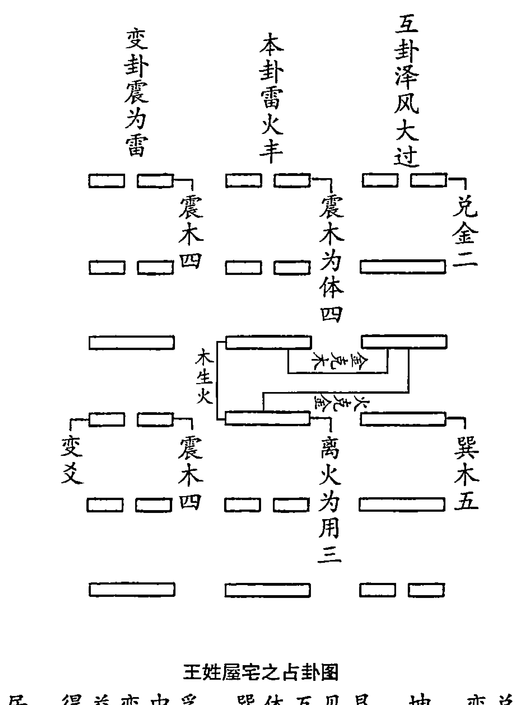

## 王姓屋宅之占卦图

韩姓之居，得益变中孚。巽体互见艮、坤，变兑克体。此居必有官讼，见于酉年月日。后申酉年连见病患，所喜用卦具震，与巽体比和，当见寅卯年发。即此居先吉后凶。三十一年之后，遇申酉年，此居当毁。若非有兑，或有一坎，再见三十一年，此居亦无恙也。

韩姓之住宅，得风雷益，变风泽中孚。巽木为体卦，上互卦为艮，下互卦为坤。变卦为兑，克制体卦。兑为官讼，故居此当有官讼之事，时间当在金旺的酉年月。逢申酉年金旺之时，主有人有病患。可喜的是用卦震木与体卦巽木比和，则寅卯木旺的年月主有喜事。因卦中有兑卦，三十一年后遇申酉年时，兑为毁折，此屋终当损毁。三十一数之得，亦同上面二例。如果卦中不是有兑卦，或者卦中再有一个坎卦来生扶体卦，则即使再过三十一年，此屋亦无恙。

## 白话梅花易数

## 韩姓屋宅之占卦图

## 器物占

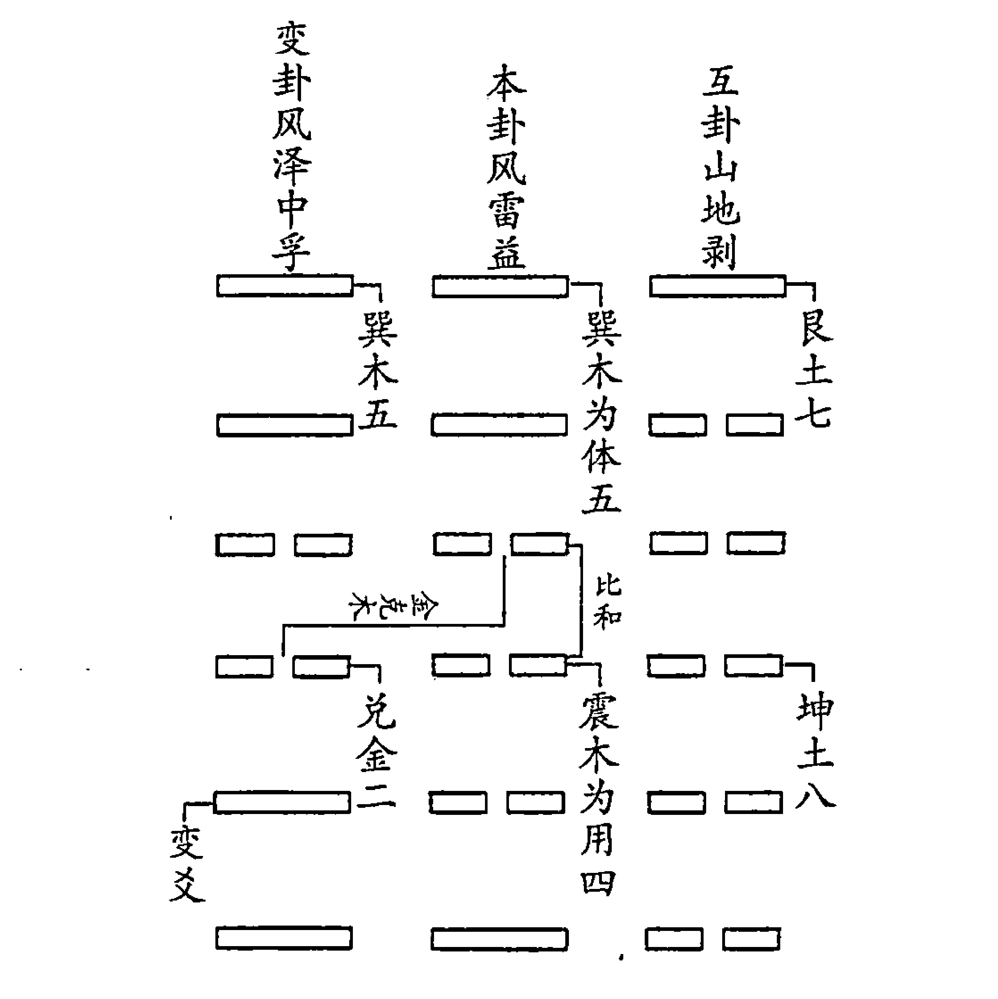

大抵占器物，并不喜见兑卦，盖兑为毁折也。若坎为体，则见兑无伤。乾卦为体亦无害。其余卦体，逢兑不久即破。木之器物，或震巽为体，见兑为用，必不禁耐用矣。破器之日，必申酉与卜年月日也。

一般说来，占测器物不宜遇见兑卦，因为兑有毁折、破损之义。若坎卦为体，即使封中有兑，也没有妨害。若乾卦为体，则乾兑比和，亦无妨害。其余的卦为体卦之时，若遇兑卦，器物必有不久即破之兆。占测木质器物，若遇震巽为体卦，兑为用卦，兑金克制震巽之木性之物，是物必不能耐久。其破损之时，必应在申酉年月金旺之时。

又畜养之物，亦不宜乾、兑克体。种植之物，乾、兑克体，必不成。即成，亦被斧斤之厄。种植之物，宜见坎也。

## 白话梅花易数

占测家畜，或者庄稼及蔬菜之类，都不宜出现乾兑之金克制体卦的情况。因为乾兑主刀刃之利器，克体必有伤害之义。家畜必遭屠杀，庄稼及蔬菜难免被伤害。种植之物，庄稼及蔬菜之类，宜于见生木之坎水。

又凡见器物，欲知其成毁，亦看卦体。无克者则久长，体逢克者则不久。视其器物之气数可久者，以全卦之年数断之；不可久者，以月数断之；至速者，以日数断之也。

凡见到器物，欲知其成毁之期，也宜审看体卦的情况。若卦中没有克制之卦，必是耐用之器物；若逢克制，必是不能长久之器。断其成毁之期，还应具体看器物的属性而断。如是耐用品，如房屋之类，应以年为单位，加以全卦之数而断。比如上面的《屋宅之占》，即是以年数断之。若是不可久长之物，如日常所用的衣架、桌椅等，则以全卦之月数断之。若是极易损坏之物，如瓷器、灯具等，则可以全卦之日数断之。断成毁之期，当断以常理。如其放置得当，虽易损之物，其寿必长。如放置于易遭损坏之处，则其寿必短。

## 梅花易数卷三

## 八卦方位之图

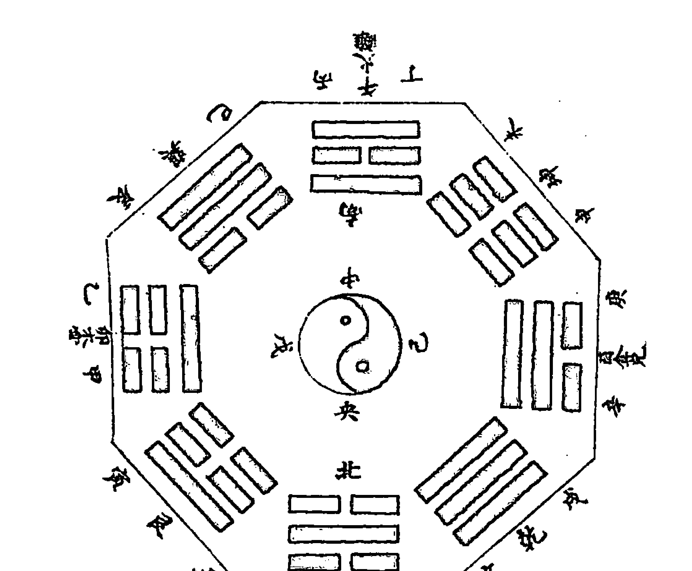

## 观梅数诀序

嗟乎，《易》岂易言哉！盖《易》之为书，至精微，至玄妙。然数者，不外乎易理也。有先天后天之殊，有叶音取音之辨，明忧虞得失之机，取互变迟速之应。数有前定，祸福难测。易理灼然可察，予求得《先天》、《玄黄》、《灵应》诸篇，外采《易》辞，曰“观梅数诀”。列图明五行生克衰旺之理，分例指避凶趋吉之道。后学君子幸鉴焉。

在中国古代，人们相信“气数”这一说法。所谓气，是五行的观点。所谓数，就是易数的观点。古人认为，事物的发生、发展和衰旺莫不有其“定数”。万物从生到死，好象冥冥中有什么力量早以规定好了其运行轨道，并不能人为地以个人的力量去改变它，只能顺其自然，“乘天地之气”，依照天地运行的自然规律生存。

在古人看来，万物运行，皆有其数。《梅花易数》就是一本在《易经》及河洛之学的基础上，指导人们认识和运用这种数，以趋吉避凶的宝典。这本书的写成，岂是容易？对易理的阐述和易象、易数的使用，真是“无上甚深微妙法，百千万劫难遭遇”，太精微、太玄妙了。

以数来占卜预测，所依据的不外乎是易理。《易经》有先天八卦和后天八卦之分，有依据谐音起卦预测的方法，有参用声音动静辨别事物趋向的方法，用他们来揭示产生忧虞得失的变化玄机，并以互、变卦作为应验快慢的参考因素。数虽前定，但祸福难以预见，但是，只要深明易理，任他万事纷繁复杂，其变化发展、吉凶祸福趋仍是昭然可见。本章将《先天》、《玄黄》、《三要》、《十应》诸篇的妙旨，再结合《易经》卦爻辞，列图来揭示五行生克、卦气衰旺的规律，指示趋吉避凶的道理，称之为《观梅数诀》。后学君子，自可用心领会。

《易》辞曰：“易有太极，是生两仪，两仪生四象，四象生八卦，八卦生万物。” 邵子曰：“一分为二，二分为四，四分为八也。”《说卦传》曰：“易逆数也。” 邵子曰：“乾一、兑二、离三、震四、巽五、坎六、艮七、坤八。” 自乾至坤，皆得未生之卦。若逆推，四时之比也。后天六十四卦仿此。

这里引用了《系辞》、《说卦传》及《皇极经世》来说明先天卦理论体系的产生，这在第一卷已经详细进行了讲解，不再重复。在这一节里讲这段话的意思，先天体系中自乾一数到坤八数先天卦数皆成于没有易书的时代，可以描述万物的未来；而后天卦数恰恰相反，是根据《易经》而得出的，用以逆推万事万物之已经发生的变化契。后天体系六十四卦，也仿照这个模式。本书给出了很多例子，来讲解了这一论断。

## 八卦定阴阳次序

这一节出自于《说卦传》第十章。乾是天的象征，于人伦来讲，则是父亲的象征，所以乾称父。坤是地的象征，所以称为母。震卦初爻为阳，是最初索取乾卦的阳而成阳卦的，所以称为长男。巽卦初爻为阴，是最初索取坤卦的阴而成阴卦的，所以称为长女。坎卦第二爻得乾卦的阳爻而成阳卦，所以称为中男。离卦第二爻得坤卦的阴爻而成阴卦，所以称为中女。艮卦第三爻得乾卦的阳爻而成阳卦，所以称为少男。兑卦第三爻得坤卦的阴爻而成阴卦，所以称为少女。这是将八卦配以人伦之象，乾为父，坤为母，震为长男，巽为长女，坎为中男，离为中女，艮为少男，兑为少女，占卦时最为常用，务要牢记。

## 变卦式八则¹

在这里，本书举了八则卦例，对体卦和用卦的取用、生克的断法一一进行了讲解，并不涉及外应的取用，仅仅是一个技术上的讲解。下面的楷体字为原书要说明的大原则，黑体字为原书的讲解。因为大部分卦例在前面都分析过，其他的几个也非常清晰明白，故在此不再另做讲解。

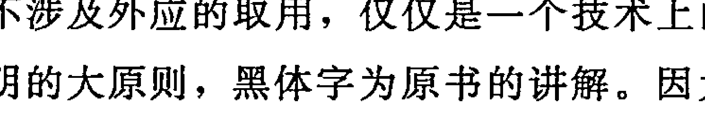

离卦初爻，阳动变阴，变艮卦，兑金为少女，离火克之。巽为股，乾金克之，曰：伤股。得艮土生，入兑金，断曰：不至于死。

相生极美，比和次之。体用于变爻，作动静取之。动者为用，静者为体。

__________

> ① 标题“变卦式八则”原书无，系本书编者为了读者阅读方便所加。

## 白话梅花易数

## 地雷复卦变地泽临：

木是用爻，断出软物，文章之体也。将出是罗经。

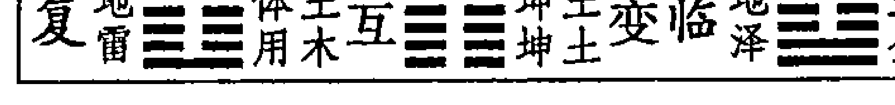

## 天泽履变乾卦：

此卦断出是铁器之物。将出剃刀也。

## 泽火革变噬嗑卦：

此卦乃用金体火，夏火得旺，能出土，必是土物也。

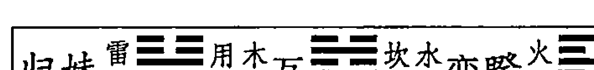

## 归妹卦变火泽睽卦：

用爻属木变火，体卦属金。四爻变卦成艮，土能生金，乾☰断出是铁。

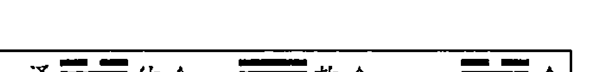

## 泽天夬卦变兑卦：

此卦非金是石，断是破磁碟也。

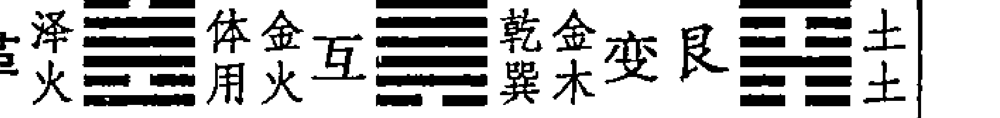

## 泽火革卦变艮卦：

本卦得泽火革，为少女，近物为口，远取羊。内离为中女，近目，远取雉。初爻变艮卦为土，土能生金，则扶起兑金之妹。次除去初爻，移上四爻，又成巽木，断得伤股之灾。得初爻变艮土生兑金，是故有救而不至于死也。

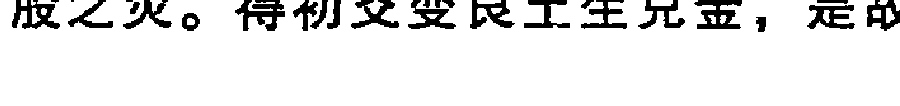

## 天水讼卦变兑卦：

天水讼卦变兑，欲要求财。盖卦是体生，而乃泄己之气，其财空望。互得离卦属火，能克金。其日午时，客来食去，酒返自消耗也。

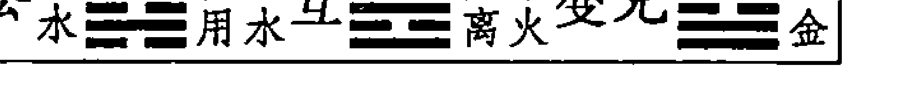

“近取诸身”，八卦：乾头、坤腹、震足、巽股、坎耳、离目、兑口、艮手——人身；“远取诸物”，乾马、坤牛、震龙、巽鸡、坎豕、离雉、艮狗、兑羊——畜道。

## 占卦诀

又如占卦而问吉事，则看卦中有生体之卦，则吉事应之必速。便看生体之卦，于八卦时序类决其日时。如生体是用卦，则事即成就；生体是互卦，则渐成；生体是变卦，则稍迟耳。若有生体之卦，又有克体之卦，则事有阻节，好中不足。便看克体卦气阻于几日，若“乾克体，阻一日；兑克体，阻二日”之类推之。如占吉事，无生体之卦，有克体之卦，则事不谐矣。无克体之卦，则吉事必可成就矣。

用《梅花易数》来占断吉事，主要是看用卦、变卦、互卦是否有生扶体卦之卦。一般来讲，对于确定吉事的应期而言，如果卦中有生体之卦且较多，是吉事应验必然非常快。生体之卦是用卦，则事即成就；生体之卦是互卦，逐步成就；生体是变卦，应验较迟。若既有生体之卦，也有克体之卦，则事情中间受阻，应之必迟。无生体之卦，有克体之卦，则事不成而亦应之必速。要知其应验的具体时间，可以根据前面所讲的《八卦万物类占》中的“八卦时序”来决断时间。如果是用卦来生扶体卦，其事必成；如果是互卦来生扶体卦，逐渐应验，需要一段时间；如果是变卦来生扶体卦，亦成，但吉事应验稍晚。如果诸用卦中既有生体之卦，又有克体之卦，则表示有阻力，未免美中不足。要知阻力出现在哪一天，即可按先天卦数来推断。比如“乾克体，阻一日；兑克体，阻二日”，以此类推。如果诸用卦中只有克体之卦而无生体之卦，事必不成。如果没有克体之卦，吉事必成。

又如占不吉之事，卦中有生体之卦，则有救而无害；无生体之卦，事必不吉矣。若以日期而论，看卦中有生体之卦，则事应于生体卦气之日；有克体之卦，则事败于克体卦气之日。要在活法取用也。

再比如占测不吉之事，如果诸用卦中有生扶体卦之卦，则结果虽险而必然有救。如果没有生扶体卦之卦，则结果必然不吉。要知其应验日期，考察用卦中生扶体卦之卦，按先天之数来推断，即可知有救的日期。考察卦中克制体卦之卦，辅以先天之数，即可知晓事败之日。考察应验日期，要根据多方因素灵活取用，方可准确。

## 体用互变之诀

大凡占卜，以体为其主，互用变皆为应卦。用最紧，互次之，变卦又次之。故曰：用为占之即应，互为卦中间之应，变为事占之终应。然互卦则分其有体之互，有用之互。如体在上，则上互为体之互，下互为用之互，体卦在下，则下互为体之互，上互为用之互。体互最紧，用互次之。

这一节讲的是分析体用关系的总原则。一般说来，在得卦后的断卦过程中，以体卦为主，综合考虑用卦、互卦及变卦与体卦的生克关系以作出结论。在诸应卦中，用卦与体卦关系最为密切，是首要加以考虑的问题；其次是互卦，有体之互和用之互之说；再次是变卦。因此可以说：用卦所主，乃即时应验之事；互卦所主，乃中间过程之事；变卦所主，乃为最终之事。互卦分为体互卦和用互卦两种概念。得卦后，本卦的互卦有上下两个，与体卦位置相对应的互卦为体互卦，与应卦位置相对应的为用互卦。比如，体卦在上，用卦在下时，上互卦为体互卦，下互卦为用互卦；体卦在下，用卦在上时，下互卦为体互卦，上互卦为用互卦。体互卦和用互卦，相较而言，以体互卦为主，用互卦为次。

例如观梅恒卦，互兑、乾，兑为体互，见女子折花。若乾为体互，则老人折花矣。盖兑、乾皆克体，但取兑而不取乾，此体、互、用之分。

例如观梅得恒，互卦为上兑下乾，兑是体互卦，则可见女子折花；若是乾为体互卦，则可见老人折花。乾兑皆为金，克制体卦木，上互卦为兑时，即断有女子折花，而不取下互卦乾克体断有老人折花。这个例子，说明了体卦、互卦、用卦在实际应用过程中的分别。

大凡占卦，变卦克制体卦，事于末后，必有不吉。变生体及比和，则事事临终有吉利。此用、互、变之诀也。

大凡在占卦时出现

## 争坠，如牛鸡之哀鸣，如枯木之坠，皆物之动者，我以静而占之也。

起卦的动和静的对应关系，可以如是描述。如果起卦是我是静的，那么就观察动的因素来作为外应以起卦。比如《观梅占》中的麻雀争枝坠地，闻牛悲鸣、鸡哀鸣，见枯木忽然坠地，都可视为事物的异动，而我以静的心态卦，去预测动的吉凶趋势。

又若我坐，则事应之迟；我行，而事应之速；我立，而半迟半速。此皆动静之理也。

再如占卜时我端坐，则应验较慢；我正在走动，则结果应验较快；我正在站立，则结果应验不快也不慢，按照常理来推断即可。以上讲的是断卦时动静的取用之理。

## # 占卜坐端之诀

坐端者，以我之所坐为中，八位列于八方，占卦决断之。须虚心待应，坐而端之，察其八卦八方应兆，以为占卜事端之应。随其方卦有生克之应者，以定所占之家吉凶也。

坐端就是以我所处的位置为中心，将八卦分别配置在八个方位，用以取应卦来决断吉凶。使用此方法，必须心无杂念，静如止水方可。端坐于其中而观察八方的应兆，作为断卦时的参照以。依据八卦方位上所出现的生克变化的应兆，就可以断定所占之家的吉凶。

如乾上有土生之，或乾宫有诸吉兆，则尊长老人分上，见吉庆之事。若乾上有火克之，或有凶兆，则主长上老人有忧。坤上有火生之，或坤上有吉兆，则主母亲分上或主阴人有吉利之喜。坤宫见克，或有凶兆，则主老母阴人有灾厄。

震宫有水生之，及东方震宫有吉兆，则喜在长子长孙；见克而或见凶，则长子长孙不利。

坎宫宜见五金，及有吉利之谶，则喜在中男之位；若土克，若见凶，则忧在中男矣。离宫喜木生之，或有可喜之应，则中女

## 白话梅花易数

有喜；若遇克或见凶，则中女有厄矣。

艮为少男之位，宜火生之，见吉则少男之喜；若遇克，或见凶，则灾及少男。问产必不育矣。兑为少女，土宜生之，见吉则少女有喜，或有欢悦之事。

此处八卦方位，指后天八卦方位。我们在前面明确指出，《梅花易数》用的是先天之数和后天八卦方位。

如果乾方（即西北方）为父亲之位，属金，喜有土来生扶，若西北方出现吉兆或有土来生扶，因为乾为尊长为老人，则主家中尊长或老人有吉庆的事情。若西北方向上出现火，则火克乾金，或出现其他的凶兆，主家中老人或尊长有灾厄。

坤方（即西南方向）为母亲之位，属土，喜有火来生扶，如西南方上有其他吉兆或有火出现来生扶坤土，坤为母，主母亲或其他女性长辈将有吉利之事。若坤方受克，或有其他凶兆，则主母亲或其他女性长辈将有灾厄。

震方（即东方）为长子之位，属木，喜有水来生扶，或东方有吉兆出现或有水来生扶，震为长子，主家中长子或长孙将有喜庆之事降临。如果震方受克或有其他的凶险之兆，则家中长子或长孙有灾厄。

巽方（即东南方）为长女之位，属木，喜有水来生扶，或东南方有吉兆出现或有水来生扶，巽为长女，主家中长女将有喜庆之事。如果巽方受克或有其他凶险之兆，则家中长女主有灾厄。本卦的情况原文中没有讲，今补上。

坎方（即北方）为中男之位，属水，喜金来生扶，宜于见到五行中属金的东西。如果北方出现吉兆或有金来生扶，主家中次男有喜庆之事。若坎方上见土来克，或有其他凶险之兆，则家中中男必有灾厄。

离方（即南方）为中女之位，属火，喜木来生扶，宜于见到属木的东西。如果南方出现吉兆或有木来生扶，主家中次女有喜庆之事。若离方见水来克，或有其他凶险之兆，则主家中次女将有灾厄之忧。

艮方（即东北方）为少男之位，属土，宜有火来生之。若在东北方遇其他吉祥之兆或有火来生扶，则家中少男将有喜庆之事。若东北方有木来克制，或者有其他凶险之兆，则家中少男有灾厄之忧。若问生产，必主不育，因为艮为止。

兑方（即西方）为少女之位，属金，宜有土来生之。若在西方还出现吉兆或有土来生扶，则主家中少女有喜庆之事。竞为喜悦，亦主其他欢乐之事。

若问病，如乾卦受克，病在头。坤宫见克，病在腹，推之震足、巽股、离目、坎耳及血、艮手指、兑口齿，于其克者定见其病。

如果是求测病情，乾卦受克制，主病在头部。坤卦受克，主病在腹部。以此类推，震主足部、巽主大腿、离主眼睛，坎主耳部或血液，艮主手指，兑主口齿。什么卦受克，与其相应的部位就会得病。

至于八端之中，有奇占巧卜者，则在乎人。此引其端为之例也。

至于八方克应之中，有更妙的预测方法，更简捷的方法，这主要是依据个人的自身情况而定。此处所讲，主要是方法的展示，不可引以为不变的原则。

## # 占卜克应之诀

克应者，所谓克期应验也。占卜之道无此诀，则吉凶成败之事不知应于何时。故克应为卦之切要也。然克则最难，有以数而克之者，有以理而克之者，皆要论也。

所谓克应，就是指所测之事应验的时间。如果占测之道缺少推断应验之期的秘诀，那么所测吉凶成败之事的应验时间就不能确定在什么时候。因此，占断应期的准确，才使占断有了更实用的意义，是占测时最重要的一个过程。然而，准备判断应期非常困难，有的需要以卦数来确定应验期

## 白话梅花易数

食，必为桃、李、木瓜之类，以及辛辣的素食，或是鸡、鱼之类。若不是捕捞之物，定是根部之物刨掘而来。若卦中有乾兑之卦，则为金所克，可能会因饮食而致病。若卦中遇离卦，定是炒茶叶。若卦中又遇坎卦，主有酒有汤。若无生体之卦，一半荤菜一半素食。若卦中遇艮，必是宴请乡邻，且席上必有地位高贵之人。食物不是很多，刚好够吃。若是橘、柚、蔬菜、水果，必是刚从山林中带节的树上用刀具割切得来；若是虎肉、狗肉、免肉、鹿肉之类，定是通过罗网捕捉，或者是大米、芝麻，麦面等食品。若有他卦来生，主有他人宴请；若有他卦克制，主有羊肉为食。若受兑来克，主有口舌是非。巽之为物，其味为甘甜，其色为玄黄。

坎为水象也，水近信至海内，味香有细鳞，或四足。凡曰水族，必可饮食也。或闻箫鼓之声，或在礼乐之所。其色黑，其味咸。克出饮酒，生回食鱼。为豕为目，为耳为血。羹汤物味，酒食水酱。遇离而为文书，逢乾而为海味。

坎为水象，无论近处之水还是大海之水，均为坎卦所主。若占饮食得坎，必是口味鲜美而有细鳞的鱼类，或有四足之物。凡是河鲜或海鲜，必然可以做汤来食。饮食之处，必有箫鼓佐侪，或处于某仪式的正式场合。或是坎卦受克制，则请人酒食；若坎卦受生扶，主被宴请鱼类之物。坎卦为猪、为眼睛、为耳朵、为血液。坎卦还代表着饮食中的羹汤、水酒、酱食之类。若卦中再有离卦，宴席间必然吟诗作赋，主有诗歌文章；若卦中再遇乾卦，席间必有海味。

震之为卦，木属也。酒友疏狂，虚轻怪异。大树之果，园林之蔬，其色青而味酸。其数多，会客少。或有膻臭之气，或有异香之肴。同离多主盐茶，见坎或为盐醋。

震卦五行木。若占饮食，主席间必有疏狂放诞的酒友，或有虚幻、怪异之事。求卦得震，主有大树所结的果实，或是园林里所产的菜蔬。其颜色为青色，其味道为酸涩。所备饮食必丰盛，但来客不多。饮食或有膻味之味，或者是有异香的佳肴。卦中如果遇离卦，主有茶、盐之类；卦中若再遇坎卦，必是盐、醋之类。

离则文书交易，亲戚师儒，坐中多礼貌之人，筵上总英才之士。其物乃煎烤炙烧，其间或茶盐。白日之夕，虽之以烛；春夏之际，凡物带花。老人莫食，心事不宁，少者宜之，宜讲论，即

有益。为鸡为雉，为蟹为蛇。色赤味苦，性热而气香。逢坎而酒请有争，逢巽则炒菜而已。

离卦则代表着文书、交易，代表着客人多是亲戚、师长、儒者，座上客人多有礼貌，宴会中多有精英奇才。所食之物多煎炒烧烧，席间还有茶和盐供应。虽然是在明亮的黄昏，却还要有蜡烛照明。若是在春夏之交，所食之物然带花。老人不宜食用，否则必绪不宁。少年之人则可食，宜在席间谈经论道。卜饮食之事得离卦，主食物为野鸡、螃蟹、蛇类等色红味苦、性热味香之物。离卦逢坎水，代表有人争相邀请；卦中若遇巽卦，只有炒菜供奉。

兑之为卦，其属白金，其味辛而色白。或远客暴至，或近交争。凡动物刀砧，凡味必有辛辣，凡包裹腌藏。其于暴也为箧为菱，其于菜也为葱为韭。盛而有腥臭，旺而有羊鹅。坐间有僭越之人，或有歌媚之女。单则必然口舌，重则必然欢喜。生出多食，克出好事。

兑卦之象为白为金，其味道为辛而颜色为白色。占饮食得兑卦，主有远客突至，或近邻吵闹相争。席上必有鱼肉荤腥，其味必有辛辣之料，佳肴必是腌制之物。对应于干物，为竹筐和菱角；对应关疏散，是葱和韭菜。如果体卦卦气旺，席上必有有腥味的肉类。兑为口舌，主席间一定有越礼的人，或者有歌伎之类。若兑卦卦气衰弱，主坐上必有口舌之事；若兑卦卦气旺盛，主席间一定皆大欢喜。他卦生扶兑卦，主食物量大丰盛；兑卦克制他卦，主有好事来到。

夫算其饮食，必须察其动静。故动则有，静则无。以体卦下卦为己卦，上为人卦。下为变为客，互之上为酒，下为食物。取象体之下，为食何物；变为客体下，食之不终。生体下吉，互客体之不得食，他人克应亦难食。他人生，何人请。己生体生，下己请人。互受生后，不计杯杓。上体受生，客不计数。变生互，客有后至者；互生克，有先去者。取其日时，以互卦用矣。

占算饮食之事，必须体察动静之应。卦动饮食定有，卦静则无。推断之时，以体卦和卦卦作为应对自己的卦，以用卦或上卦作为对应着他人的卦。下卦为变卦，对应着客人。上互卦对应着酒，下互卦对应着食物。取象于体卦下面的卦，可知要饮食为何物；变卦与下卦相同，主不终席而去。生扶体卦且处于下卦为吉，互卦克制体卦则没有饮食。即使有他人的饮食为外应，也难有饮食。体卦生扶用卦，没有人请。下卦或体卦生扶他卦，主自己请别人。互卦为他卦生扶，美酒多有。上卦或体卦为他卦生扶，客人很多。变卦生扶互卦，有客人后到。互卦生扶克制体卦之卦，有客人先行。要确定饮食之日期，取互卦为用即可。

## 观物玄妙歌诀

观物戏验者，虽云无益于世，学者以此验数，而知圣人作《易》之灵耳。

观察万物起卦预测，作为一种游戏实验，虽说于世无益，但学习者却能够用它来实践和验证易数妙道，从而推知先贤作《易》的灵应。

物之于世，必有数焉。故天圆地方，物之形也；天玄地黄，物之色也；天动地静，物之性也；天上地下，物之位也；乾刚坤柔，物之体也。

万事万物都有其数理规律，只不过我们平时并不加以研究罢了。因此，天是圆的，地是方的，这是事物的基本形态；天是黑的，地是黄的，这是事物的基本颜色；天在运转，地却安忍不动，这是事物的基本赋性；天在上，地在下，这是事物的基本定位；乾刚健，坤柔顺，这是事物的本体特征。

故乾之为卦，刚而圆，贵而坚，为金为玉，为赤为圆，为大为首，为上之果物。见兑为毁折，逢坎而沉溺，见离为炼煅之金，震为有动之物，巽为木果为圆，坤、艮土中之石。得火而成器，兑为剑锋之锐。秋得而价高，夏得之而衰矣。

乾象征阳刚而圆满，尊贵而坚硬的东西。象征金、玉、红、圆之物，象征气象宏大，象征物体的头部、树木的果实。乾卦遇兑卦，象征毁折；逢坎卦泄体，象征沉溺；见离卦象征锻炼之金；见震卦象征运动的物体，见巽象征树上的果实，象征圆；见坤艮，象征土中的石头；乾卦遇火炼，象征将成器物；遇兑卦比和，象征剑锋锐利。秋季占得乾卦，各售高价；夏季占得乾卦，生意不好。

坤之为卦，其形直而方，其色黑而黄。为文为布，为舆为釜。其物象牛，其性恶动。得乾乃可圆可方，可贵可贱。震、巽为长器，离为文章，兑为土中出之金，艮为带刚之土石也。

坤卦象征直而方的物体，颜色黑而黄，有纹饰，为布匹，为大车，为炊具。卦象为牛，其性安静而不好动，性情柔顺。遇象征可圆可方的物体，可贵可贱的商品；遇震巽象征长形器物；得离卦象征文章；遇兑卦象征出自土中的金属；遇艮卦象征刚硬的土石。

震之为卦，其色玄黄而多青，为木为声，为竹为萑苇，① 为蕃鲜及生形。上柔下刚，是性震动而可惊。得乾乃为声价之物，得兑为无用之木，见艮山林间之石，见坎有气之类。巽为有枝叶，见离为带花。

震卦象征的东西，其颜色青黄间杂而青色为主。或象征着树木，或象征着声音，或象征着萑苇，或象征着生机勃勃的植物。外表柔顺，内里刚强，喜欢震动，有惊人的特性。若再遇得乾卦，必是能发声的金属器物。若再遇兑卦则为无用之木。若卦中再遇艮卦，定是山林中的石头。若卦中再遇坎卦，定是雾气、水气之类。若卦中再遇巽卦，定是有枝叶的植物；若卦中再遇离卦，定是带花的草木

巽之为卦，其色白，其气香。为草木，为刚为柔。见离为文书，见兑、乾为不用，乃遇金刀之物。坤、艮为草木之类，坎、兑为可食之物。为长为直，并震而春生夏长，草木之果蔬。

巽卦象征白色和香味，象征草木之类。巽之为卦，刚柔相济。见离卦主有文章字纸；见乾兑定是弃掉不用的器物，或是金属刀具之类；遇坤、艮或是草木之类；逢坎兑则是可食之物，长而且直。得震卦主为春生夏长的东西，定是草木属类的瓜果菜蔬。

坎之为卦，其色黑，亦可圆可方物。为柔为腐，内则刚物。得之卑湿之所，多为水中之物。见乾亦圆，见兑亦毁。又乃污湿，得震、巽而可食；离、水火既济，假水而出，假火而成。又

为滞于物，兑为带口也。震、巽为带枝叶，为带花也。

坎卦代表黑色，也是可圆可方的东西。卦中得坎，主有柔软或腐烂的东西，或为内刚外柔的物体，或是低下潮湿的处所，多为水中生物。见乾亦为圆形；逢兑则为毁折之象。还代表恶污秽潮湿的地方，得震巽定是可食用的物品。遇离为水火既济，象征借水而化生，借火而成就。还象事物滞长。遇兑卦定是带口的物体，遇震巽定是有枝有叶的草木或带花的植物。

离之为卦也，其色黄而青，体燥，其性则上刚下柔。为山石之物，土瓦之类，小石于大山，为门途之处。为物见乾而刚，兑而毁折，坤而土块，巽为草之物，而震为木物类也。坎并为河岸之物，离并为瓦器，震、巽并见篱壁之物。

离卦象征青色、黄色、上刚而下柔或干燥的物体，代表石头器皿、泥瓦器物、山中小石、门前路径。遇乾象征刚硬之物，见兑则为毁折之器。遇坤而为土块，遇巽定是草编；得震即是树木，遇坎水代表河岸；逢离火代表瓦器，遇震巽木代表篱笆。

兑之为卦，其色白，其性少柔而多刚。为毁折而下，为带口而圆。见乾先圆后缺，见艮则金石废器，见震、巽为剥削之物，见坎为水之类。得乾而多刚，得坤而多柔，长于西泽之内，于水中之类，得柔而成器也。

兑卦之象，其色为白，其性少柔软而多刚硬，多是毁折不全的器皿，或是带口的圆形器物。若遇乾卦，则是先圆而后损破之器物。若遇艮卦，则是金石之类的废旧器物。或遇震巽之卦，定是剥皮或削制之物。若遇坎卦，定是与水有关。若遇乾卦，定是刚硬之物。若卦中见坤卦，定是柔软之物。或是生长于西方沼泽之内，或者是从水中取得，或是得绳索束缚始成的器物。

## 诸事响应歌

混沌开辟立人极，吉凶响应尤难避。

先贤遗下预知音，皇极观梅出周易。

167

## 白话梅花易数

玄微浩瀚总无涯，各述繁言人莫记。

大抵体宜用卦生，旺相谋为终有益。

比和为吉克为凶，生用亦为凶兆矣。

问雨天晴无坎兑，亢旱言之终则是。

天时连雨问晴明，艮离贲卦响应耳。

乾明坤晦巽多风，震主雷霆定莫疑。

凡占人事体克用，诸事亨通须有幸。

比和为妙克为凶，又看其中何卦证。

乾主公门是老人，坤遇阴人曰土应。

震为东方或山林，巽亦山林蔬果品。

坎为北方并水姓，酒货鱼盐才取定。

离言文书炉冶利，亦曰南方颜色赤。

艮为东北山林材，兑曰西方喜悦是。

生体克体亦同方，编记以为诸事应。

凡问家宅体为主，旺相须知避田土。

生用须云耗散财，比和家世安居处。

克体为凶决断之，生产以体为其母。

两宜生旺不宜衰，奇偶之中察男女。

乾卦为阳坤为阴，又有来人爻内取。

阴多生女阳生男，此数分明具易理。

婚姻生用必难成，比和克用大吉利。

若问饮食用生体，必知肴馔丰厚喜。

生用克体饮食难，克用必无比和美。

坎兑为酒震为鱼，八卦推求衰旺取。

求谋称意是比和，克用谋为迟可已。

求名克用名可求，生体比和俱可取。

求财克用曰有财，生体比和俱称意。

交易生体及比和，有利必成无后虑。

出行克用用生体，所至其方多得意。

[PAGE 189]

坎则乘舟离旱途，乾震动则坤艮止。

行人克用必来迟，生体比和人即至。

咸远恒迟升不回，艮阻坎险君须记。

若去谒人体克用，比和生体主相见。

兑主外见讼不亲，乾利大人长者是。

来问生物体克用，速可追寻依卦断。

相生比和终可寻，兑临缺处并并畔。

离为冶炉及南方，坤主方器凭推看。

疾病最宜体旺相，克用易安药有效。

比和凶则有救星，体卦受克为凶兆。

离宜服热坎服冷，坤土卦温补料亨。

亦把鬼神卦象推，震主妖怪为状貌。

巽为自缢并锁枷，坤艮落水及血劒。

凡占公讼用宜克，体卦旺相终得理。

比和助解最为奇，非止全仗他人力。

若问墓穴在何地，坤则平阳巽林里。

乾宜高葬艮临山，离近人烟兑兴废。

比和生体宜葬之，克用尤为大吉利。

若人临问听傍言，笑语鸡鸣亦吉美。

美物是为祥瑞推，略举片言通万类。

《诸事响应歌》语言通俗，其内容在前面都一一细讲过，此处不再重复。

## 诸卦反对性情

乾刚坤柔反其义，比卦欢欣困忧虑。

临逢百物观求之，蒙卦难明屯不失。

大畜其卦福之生，无妄若遇祸之始。

升者去而不复之物。坤为土中之物，色黄而性温。兑为毁折之物，带口。凡占之物，以春震巽、夏离、秋乾兑、冬坎，皆当以为有用之物，成器之物。否则为无用之物。值六虚冲破，则必无物而空手矣。凡是猜测物中所藏的物品，若得乾金之卦，则是圆形的、白色物品，质地坚硬，亦可能是珠宝之类的珍贵物品。如果乾卦卦气旺盛，可能是无价的贵重物品。得坎卦，可能是颜色黑白而性质柔软的近水物品。得艮卦，应当是土中的东西，如瓦器石头之类。艮卦的气旺，应当是成形的器物，颜色为黄色。艮卦逢兑卦，就是刚硬的物体。艮卦气衰，就是有损伤的物品。若是占得震巽之卦，主有竹子树木之类的东西，因为震巽五行属木；如果震巽卦气旺，当是竹制品或木器，或得是可食用的山果之类。如果震巽卦气衰微，当是不成用的竹木之物，或是时令鲜果，颜色为青绿色。震巽有气，当是柔性强的物体；震巽无气，则是刚硬易折的竹木器。若卦中再遇坎卦，为产于污秽潮湿之地的竹木之类，水生木，为有气；若无气，则是腐烂朽坏的竹木之类。若占得离卦，所占之物质地柔炊。若卦中再见水、木，乃火焚木之象，必是木炭之类。若离卦卦气旺盛，乃是价值不菲、奇货可居的物件。若占得坤卦，则是土中出产的或是从土中挖出之物。颜色为黄色，温性。若占得兑卦，则所占之物为带口的、已遭毁损而有破损的器物。凡是占手中物，若春天占得震、巽之卦，夏天占得离卦，秋天占得乾兑之卦，冬天占得坎卦，皆为卦气旺盛之卦，当是可以使用的物器，或者是已成形的器物；否则，便是无用的物器。若值六虚冲破，必是手中无物。

## 占卜十应诀

凡占卜，以体卦为主，用为事应，固然矣。但体卦既为主，用互变卦相应，参看祸福。然今日得此一卦，体用互变中决之如此；明日复得此卦，体用一般，岂可又复以此决之？然则若何而可？必得十应之说而后可也。

凡是占卜，均以体卦为主，用卦代表事物，这是通用的方法，不必再讨论。但是体卦既已为主，用卦、互卦、变卦作为克应，查其动静以考察吉凶。如果仅仅按照这个原则来断，今天得一卦，按此而断而得一结果；

## 白话梅花易数

到明天又得此一卦，体用仍是一样，那么难道也是如此而断吗？如果不照这样断，那么我们应该怎样断呢？这应需要掌握十应之说，才能解决这个问题。

盖十应之说，有正应、互应、变应、方应、日应、刻应、外应、天时应、地理应、人事应，所谓十应也。夫正应者，正卦之应也。互应者，互卦之应也。变应者，变卦之应也。此二卦之诀也。占者俱用之，以断吉凶矣。至于诸应之理，人有不知者，故必得诸用之诀，卦无不验。不得其诀而占卜吉凶，或验或不验矣。得此诀者，宜秘之。

这一节讲的是十应的概念，非常简单。所谓“十应”之说，指的是正应、互应、变应、方应、日应、刻应、外应、天时应、地理应、人事应等十项应验方法。至于以上诸应的方法和产理，有许多人并不知道。然而占卜预测，若用以上的诸应之诀，则没有不灵验的；若不懂得以上的诸应之诀，这样占卜吉凶可能灵验也可能不灵验。得到这一秘诀的人，切不可轻易示人。

正应：正应者，即体用二卦决吉凶。

互应：互应者，即互卦中决吉凶。

变应：变应者，即变卦中决吉凶。

正应：所谓正应，就是只用体、用两卦决断事物之吉凶。

互应：所谓互应，就是用体互卦、用互卦来决断所测事物之吉凶。

变应：所谓变应，就是用变卦来决断所测事物之吉凶。

方应：方应者，以体为主，看来占之人在何方位上，即看其所坐立之方位。宜生体卦，又宜与体比和，则吉；如克体卦则凶，如体卦生之，亦不吉矣。

方应：所谓方应，就是以体卦为主，看来占之人处在什么方位上，看其方位属何卦，以所处之方位之卦与体卦的关系来参考占断吉凶。方位之卦宜生体卦，或者与体卦比和，则所占之事吉利；若方位之卦克制体卦，则所占之事凶险；若体卦去生方位之卦，则所测之事亦属于不吉。

日应：日应者，以体卦为主，看所自封占属何卦，及体卦与本日衰旺如何。盖卦宜生体，宜比和；不宜克体，亦不宜体卦生之也。本日所属卦气，如寅卯木、巳午火、申酉金、亥子水、辰

日应：所谓日应，就是以体卦为主，看所起的卦属于什么卦，以及体卦在本日卦气旺盛或衰竭的情况。盖日辰所属之卦宜于生体卦，宜于与体卦比和，不宜于克制体卦，也不宜于受体卦之生。本日所属的卦气，即寅卯日属木，巳午日属火，申酉日属金，亥子日属水，辰戌丑未日属土。

刻应：刻应者，即三要之诀也。占卜之顷，随所闻所见吉凶之兆，以为吉凶之应。

刻应，就是起卦时外物的瞬时动静克应。具体操作起来是这样的：起卦时，其耳闻目睹心思之三要，如果是凶，就是凶兆；是吉，就是吉兆。

外应：外应者，外卦之应也。占卜之际，偶见外物之来者，即看其物属何卦。如火得离、水得坎之类。如见老人、马、金玉、圆物得乾，见老妇、牛、土、瓦物得坤之类。又如见此者，为外应之卦。并看其卦与体卦生克比和之理，以决吉凶。

外应，就是外卦与本卦的克应关系。预测时偶见到外物来应卦，就要观察应卦的事物属于什么卦。若性质属火，就得离卦；若性质属水，就得坎卦。见老人、马匹、金玉、圆形物体等，就得乾卦；见老妇、耕牛、泥土、瓦器等人或物，就得坤卦。起卦时见上述情形应卦，均为外应，可以按其归属的具体卦象与体卦的生克比和关系，以断吉凶。

天时应：天时之应，占卜之际，晴明为离，雨雪为坎，风为巽，雷为震。如离为体，宜晴。坎为体，宜雨。巽为体，宜风。震为体，宜雷。火见雷为比和，参之生克，以定吉凶。

天时应，即天象气候与体卦的克应关系，如起卦预测时，天朗气清，就是天时的离卦克应；如有雨雷，就是天时的坎卦克应。如有风，就是天时的巽卦克应。打雷，就是天时的震卦克应。体卦为离卦，适宜于遇到晴朗天的克应。同理，坎卦为体，宜遇雨天；巽卦为体，宜遇刮风；震卦为体，宜遇响雷。闪电、火光与雷声为比和关系。根据体卦与天时所属的生克比和关系，以断吉凶。

地理应：地理之应，占卜之时，在竹林间，为震、巽之地；在江河溪涧池沼之上，为坎；在五金之处，为乾、兑之乡；在窑灶炉火之所，为离；在土瓦之所，为坤、艮。并为体卦论生克比和之理以决之。

地理应，就是地理环境与体卦的克应关系。如起卦预测时，处于竹林之间，属震卦或巽卦；处于江、河、溪、涧、池沼之上，属坎卦；处在金属物体中间，属乾卦或兑卦；处于窑灶、炉火旁边，属离卦；置身于泥土、瓦石中间，属坤卦、艮卦。根据地理环境所属的卦象与体卦之间的生克比和关系来断吉凶，即为地理应。

人事应：人事之应，即三要中人事之克应也。盖占卜之际，偶遇人事之吉为吉，偶遇人事之凶为凶。如闻笑语，主有吉庆之事；遇哭泣，主有悲愁之事。又以人事之属于卦者论之：老人为乾，老妇为坤，少男为艮，少女为兑。并看此人事之卦与体卦生克比和，以决吉凶。

所谓人事之应，就是《三要灵应篇》中有关的人事之类的克应关系。在占断的时候，若偶然遇到人事中吉祥的征兆，主所占之事为吉；若偶然遇到人事中不吉的凶兆，主所占之事为凶。此如忽然听到有人在讲喜庆之语，主有吉庆之事；若遇他人哭泣，则主有悲伤忧愁之事。还可以以人事中所属的卦象来推论。如老人属于乾卦，老妇人属于坤卦，少男属艮卦，少女属兑卦。并考察这些人事这类的外应卦与体卦之间的生克比和关系，来决断吉凶。

右十应之理，凡占卜之际，耳闻目见以决吉凶，并以体卦为主，而详其生克比和之理。如占病症，互变中多有克体之卦，而本卦中又无生体之卦者，断不吉也。又看体衰旺，若体旺则庶几有望，体衰则无复生理。如是，又看诸应有生体者，险中有救；又有克体则不可望安矣。其余占卜，并以类推之。

上面讲的是十应的具体操作方法。起卦预测时，耳闻目睹的现象都可以作为预兆，在以体卦为主的前提下，详细考察卦象之间的生克、制化与比和关系，以断吉凶。比如占测疾病，所得卦象中互卦、变卦均克制体卦，而本卦中又无生扶体卦，应断为不吉。其次，一定还要察看体卦之气的衰旺。若这时体卦之旺盛，病人便有望康复；若体卦之气衰弱，病人就没有再活下去的希望了。最后，再考察一下其它诸项克应中有无生扶体卦的因素。如果有，便是险中有救的预兆；如果没有，就难以指望病人转危为安了。其它种类的推测，均可仿此类推。

## 论事十大应¹

本文所讲的论事十大应，是在《人事应》和《物数为体诀》的理论上发展起来的。此文人事之应中的常见动作分为十种再辅以体卦之性情来加以考察，非常实用。人体的每一项动作都有其具体涵义，均有其五行属性。以人体动作为外应，再考察卦象中各八经卦的五行属性，看以何为主体，即可直接分析而得出结果。歌曰：摇头摆手事不成，点头合掌有成功。身摇事不定，语缓者多思，语急者性直。外应变化很快，尤其是取用行为外应时，分分秒秒不一样，我们的思路一定要敏捷，跟上外应变化。取作外应的形体行为，都是被预测者在请求预测事项时，内心思想无意识的流露。由内可外现，由外可观内，易就是通过外应去破译事情发展形态的。这就是易的本质、易的功用。行为外应信息通过象和数的破译，就得出方向、位置、时间、数量等结果。

要想了解本文，须要再详细研究“物数为体”的理论。虽然此处是讲“一行”至“十怒”的十种外应，但其卦象取用均是照“物数为体”的理论进行推衍的。

一行。问官事属木，旺木有文书。属火，有官司财。金木，财有至。有客至，问病人大潮热。金水米浆。

外应为行走之时。此时如果占问官事，官事属木，卦中木旺，请有文书至。卦中火旺，主得官司财。卦中金木旺，财到。主有客到，问病主病人有大潮热之病。金旺，主有饮食，得水米浆之食。

二立。官司不发，木土无金木，大小口舌，病不凶。财水土，有贵人至，文书发动。

外应站立。此时占问官事，不顺利。木土旺而无金，主有口舌。占病不凶。

三坐。问官司，有讼不成。主财。属火主和劝。金败财，木得财。病却月，又有犯林木神，有祸不凶。

外应端坐。此时占问官司，虽有讼事而无结果。主有财得。卦中火
① 论日辰秘文。

[PAGE 200]

## 白话梅花易数

四卧。问官司，侧睡者，欲起必作，主阴人事。金有财，火事发破财。土水无财难就。土木有财。

外应躲卧。如果侧睡，主要打官司，为女人之事。金多有财，火多有事破财。有土有水无财。有土有木则有财。

五担。官司被人自惊。火，与面说人成口舌。问信见水土得财。金木客至。病有犯，四肢沉重，不能起。

外应挑担。此时占问官司，无故被人惊扰。火旺，与人当面讨论相争而成口舌纠纷。如果占问消息，见有水土主得财，见金木主有客来。占病主病势沉重，不能起床。

六券。官司不成，火有财，水土有灾，心下不安，有贵人，主口舌，不凶。

外应书券。此时占问官司，无结果。火旺，主有财利。卦有水土，主有灾，心神不宁，但有贵人至，仅仅是口舌之事，不为凶。

七窠头。官司立见口舌。火，大官司；水土比和，财无，小人分上，口舌怄气，病。主阴人小口灾。

外应正在缠头。此时占问官司，主立即有口舌之纷争。火旺，主有大官司。有水土来比和，主失财，有小人来说情，有口舌，自己生自己的气，有病。主女人或小儿有灾厄。

八跣足。官司破财，外人欺，心下惊慌。火主破财。土不凶，病。有孝至。

外应光着脚。此时占问官司，主破财，有外人相欺，心下惊慌。火旺，主破财。有土来泄气，不为凶祸，却有疾病。主有丧事。

九喜。官司自己无，主外人有请，劝官司，有酒肉。别人事，口舌纷纷。求财不许。不凶。

外应有喜色。主自己无官司，而外人来请自己劝和官司，有酒肉相待。他人之事，乃口舌纠纷。无财利。无凶祸。

十怒。官司主外人欺凌，不见官，主破财，倚人脱卸。火惊，病凶。

外应有怒气。占官司主外人来欺凌，最后不用见官，要破财来找人劝
息此事。火旺主有惊恐。占病有凶，不吉。

## 卦应¹

## 乾

| 乾 | 乾为天、为圆、为君父、为首、为金玉、为寒冰、为大赤为马、为良马、为老马、为瘠马、为驳马、为木果。[《九家易》云：“为龙为直、为衣为言。”]如始、遁、否、履、无妄、讼、同人七卦，乾在上，刚在外。如大有、泰、大壮、夬、需、大畜、小畜七卦，乾在下，刚于内。乾坤刚柔，四发变八，惟六动随时有异，不拘于一。乾性温而刚直，偏位西北，不居子午而居戊亥。附于礼法，则为刚善，为明；不附于礼法，则为刚恶，为凶暴。 |
| 天文 | 雪、老阳。 |
| 天气 | 寒。 |
| 凶盗 | 军、弓手、贼、强横、停尸。 |
| 官贵 | 朝贵、盐司、太守、座主。 |

## 白话梅花易数

| 策 | 一百六十八。 |
| 轨 | 七百零四。 |

## 离

| 离 | 离为火、为日、为电、为中女、为甲胄、为兵戈。其于人也，为大腹、为目。为乾卦、为雉、为鳖、为蟹、为嬴、为蚌、为龟。其于木也，为科上稿。[《九家易》云：“为牧牛。正洙作牝牛。”] 春夏性明、文采有断。秋冬晦而不明、始终不决。离，丽也。明察于心，赋性直而居正南。附于理法，则为文明；否则为非也。 |
| 天文 | 日、霞、电、晴。 |
| 地理 | 殿堂、中堂、檐、厨灶。 |
| 方所 | 正南。 |
| 人物 | 为将帅兵戈甲之士。 |
| 凶盗 | 妇人盗、从南方去。 |
| 官贵 | 翰苑、教官、通判、任宜在南方。 |
| 身体 | 三焦、小肠、目、心。 |
| 生育 | 次女、多性燥啼哭。 |
| 性情 | 聪明、见事明了。 |
| 信音 | 朝信、文书、报捷、契券。 |
| 事意 | 忧疑、聒拓、喧哄、性急、虚忧。 |
| 疾病 | 手足二君太阳、明三相火眼病、气燥热疾、发狂。 |

# 禽兽 | 凤有文采、鳖、螺、蚌、蟹、螫蛤、嬴、鹑、鹤、飞鸟、牝羊。 |
| 食物 | 馄饨、蟹、鳖、蚌、介虫之属、中虚物、炙煎物。 |
| 谷果 | 谷实、梁、藕、外坚内柔之物、棘木之花叶、枯枝。 |
| 器用 | 灯火之具、外坚内柔之物、屏幕、帘、旗帜、戈兵、甲胄、盘、甑、瓶一应中虚之物、窑灶炉冶、盒子瓮笼。 |
| 衣物 | 赤红、紫色。 |
| 财 | 远旧取索、意外之物。 |
| 字 | 火、日旁。 |
| 禄 | 己。 |
| 策 | 一百九十二。 |
| 轨 | 七百六十三。 |

## 艮

| 艮 | 艮为山、为少男、为手、为径路、为小石、为门阀、为果菰、为阍寺、为指、为狗〔《汉上》作豹，熊虎之子。〕、为鼠、为黔喙之属。其于木也，为坚多节。[《九家易》云：“为鼻、为肤、为皮革、为虎、为狐。”] 春夏性禀温和好善；秋冬执滞不常，为事迟缓。艮，止也，有刚有柔，民阳赋性偏而居偏。附于理法，为刚直；否则为顽梗。 |
| 天文 | 星、烟。 |
| 地理 | 山径、墙巷、丘园、门墙、阑、阇、寺、宗庙。 |
| 方所 | 东北方、艮门墙、寺。 |
| 人物 | 阁寺、仆隶、官僚、保人。 |
| 凶盗 | 以下所使警迹人。 |
| 官贵 | 山郡、无迁转。 |
| 身体 | 手指、鼻、肋、脾胃。 |
| 生产 | 损胎、次男。 |
| 性情 | 濡滞、多疑、优游、内刚外软。 |
| 声音 | 清上平、一音、十三音、三声。 |
| 事意 | 反覆进退、去就多疑。 |
| 疾病 | 手太阳、久患脾胃、股疾、脉沉伏。 |
| 附药 | 湿土石药。 |
| 宴会 | 常酣、宴饮、期集。 |
| 谷果 | 豆、大小菜。 |
| 食物 | 装点之物、所食不一、酒浆、杂蒸之物、冻物、杂羹、有汁物、鸭鹅、甘味。 |
| 禽兽 | 牝牛、子母牛、鹄、鹘、鸦、鹊、雀、鹜、鸥、鼠。 |
| 器用 | 轿舆、犁具、兵甲器、陶冶瓦器、锅、釜、瓶、瓮、簋、伞、钱袋、磁器、踏镫、螺钿、盒子、内柔外刚之物。 |
| 衣物 | 黄裳、僧衣、黑皂、彩帛、袋布。 |
| 禄 | 丙。 |
| 财 | 旧钱、置转货买、田上趁钱。 |
| 字 | 土、牛、田傍。 |

## 兑

| 兑 | 兑为泽、为少女、为巫、为口舌、为毁折、为附决。其于地也，为刚卤、为妾、为羊。〔《九家易》云：“为堂、为辅颊。〕春夏性说好辩，秋冬好雄。兑，说也，邪言伪行，无所不为，随波逐流。附于理法，则和顺；否则邪伎淫滥。 |
| 天文 | 雨露、春雾、细雨、夏秋重雾、冬大雪、上为雨、下为露。 |
| 地理 | 井泉、泗泽。 |
| 方所 | 西方。 |
| 人物 | 先生、客人、巫、匠、媒人、牙人、少女、妾、娼。 |
| 官贵 | 学官、将帅、县令、考校、乐友、赴任西方。 |
| 凶盗 | 家使童仆、藏于僻地。 |
| 身体 | 口、肺、膀胱、大肠、辅颊、舌。 |
| 生育 | 少女、一胎、月不足、多奇异。 |
| 性情 | 喜悦、口舌、多美。 |
| 声音 | 商上下、商之溺、四声。 |
| 婚姻 | 平常之家、少女媚悦。 |
| 信音 | 喜酉丑时日至。 |
| 事意 | 唇吻、口舌、谗谤、相欺、争打、妇人、暗昧。 |
| 疾病 | 口痛、唇齿、咽喉、危困。 |
| 附药 | 剂。 |
| 宴会 | 讲书、会友、请先生、吟赏。 |
| 食物 | 包子、有口舌物、糖饼、烧饼、肝肺。 |
| 谷果 | 栗、黍、枣、李、胡桃、石榆。 |
| 禽兽 | 羔羊、鹿、猿、虎豹、豺、鹜、鱼。 |
| 器用 | 席、铁、铜、钱、器皿、酒盏、瓶瓯、有口器或损缺。 |
| 衣物 | 彩。 |
| 财 | 束脩、合水。 |
| 禄 | 丁。 |
| 字 | 家、金、钓、口傍。 |
| 色 | 素白。 |
| 策 | 一百九十二。 |
| 轨 | 七百三十六。 |

## 梅花易数卷四

## 序

夫先天者，已露之机；后天者，未成之兆也。先天则有事始占一事之吉凶，后天则有所未知而出仓猝之顷，而休咎验焉。故先天为易测，后天为难测也。先天则有执著而成卦，后天触物即有卦，此全在人心神之所用也。其能推测之精，所用之活，则无一事一物，莫逃之数矣。我居者为中，现于前者为离，现于后者为坎，出于左者为震，出于右者为兑，在我左角者为艮，在我右角者为乾，在乾左角者为坤，此八卦位。

本节是为《拆字数》的序，讲述了拆字起数法的原理与应用经验。首先，我们要懂得先天数和后天数的区别。考察本书第一卷所讲的卦例，先得数，后得卦，是为先天之数；先得卦，后得数，是为后天之数。

在具体占测时，事物已显露出某种苗头的，用先天占卦法；没有显示出征兆的，用后天占卦法。先天占法，是已外应发生的情况下来占测未发生的事情的吉凶；后天占法，则是在对事情有所未知的情况下而据事物起卦推断，最后有吉凶应验。因此，先天较为容易预测，后天较为困难。先天占卦法需要有所凭借，需要由数字转化成卦，后天占卦法只要考察外物就可以起卦。运用之妙，唯在于一心之动静。后天之法，推测精妙，应用灵活，万事万物，莫不在其易数之中。后天起卦法一般以自己为中心，前方为离，后方为坎；左为震，右为兑；左后方为艮，右后方为乾；左前方为巽，右前方为坤。此为后天八卦方位，与五行、八卦、干支等结合，可以代表万事万物。详见卷三《八卦方位之图》。

八方而定吉凶，立八卦而定克应，取时日而定吉凶，观变爻而定体用。故我坐则其祸福应二卦成数之间，我立则其祸福应于中分二卦之间。大抵坐则静，行则动，立则半动半静。静则应迟，动则应速。凡有触于我而有意，以为我之吉凶，则吉凶在我，应验在人。意者何如？盖八卦之画既定，六爻之断既明，仍推以生克之理，究以刑冲之蕴，万无一失矣。近取诸身，远取诸物，仍当以心求，不可以迹求。不可拘泥物圆为天卦，物方为地卦。是为序。

## 指迷赋

尝闻相字，乃前贤妙术，古今秘文；为后学之成规，辨吉凶之易见。相人不如相字，相字即相其人；变化如神，精微入圣。

曾经听说，相字之法用量古代圣贤的神妙之术，古往今来的不传之秘；是后代人从事此道的既定规则，掌握此道，辨别吉凶之法即可至简至易。给人看相不如给人相字，相字之学即是相人之术。其法变化无端，如同神仙；精深微妙，可谓圣贤。

自古结绳为政，如今花押成数。言心声也，字心画也。心形如笔，笔画一成；分八卦之休咎，定五行之贵贱；决平生之祸福，知目前之吉凶。富贵贫贱，荣枯得失，皆于笔画见之。或将吉为凶，或指凶为吉。先问人之五行，次看人之笔画。相生相旺则吉，相克相泄则凶。如此观之，万无一失。

上古时期并无文字，人们是结绳记事的。这里所讲的花押，就是写字的意思。因为相术之法，一般要人先写一个字。人与人不同，字与字也就不一样，故而称相字时所写的字为花押。通过一定的技法，可以对此字转化为八卦之数，考察人或事的吉凶休咎。言语是人们心灵深处的声音；写字则是反映人们内心深处的图画。人的心思好象笔一样，人们在写字时就无意识地把心思反映在字的一笔一画里。只要是字一写成，笔画一确定，就可以用八卦之法来分辩写字者的休囚吉凶，用五行的五行之术来确定其尊卑贵贱，从而就能预测生平的祸福和目前的吉凶。富贵或贫贱，荣枯与得失，尽在笔画上显示出来了。相字之术不是一门独立的学问，还要与其他方法相结合。从字看着吉的，或可是凶；字看着是凶的，或可为吉。字写出来，先问清楚来人命理的五行属性，再研究来人写字的笔画。如果人的五行和笔画五行相生相旺为吉，如果人的五行和笔画五行相克相泄为凶。按此法施行，自可做到万无一失。

为官则笔满金鱼，致富则笔如宝库。一生孤独，见于笔画之欹斜；半世贫穷，乃是笔端之愚浊。① 三山削出，② 皆非显达之人；四大其亡，③ 尽是寂寥之辈。父母俱存兮，乾坤笔肥；母早亡兮，坤笔乃破；父先逝兮，乾笔乃亏。坎是田园祖宅，稳重加官；艮为男女及兄弟，不宜损折。兑上主妻宫之巧拙，离宫主官禄之荣枯。

————

> ① 在一般版本中，此句后又有“非夭即贱”四字。考察上下文，此四字当为初版所注小字，后来版本误作为正文排入，今改正。

> ② 三山，原指传说中的东海中蓬莱、方丈、瀛洲三座仙山，后泛指普通的山川。削出，是指平地孤石突起。古人以毛笔书写，习惯与当今不同，故而难以理解。“三山削出”是指写出的字不协调，某处笔画突起的意思。

> ③ 四大，在本文中指的是上下左右四大主笔。中国字是方块字，“四大其无”是说其字不方正，四处的笔画写得不饱满，缩手缩脚的意思。

195

## 白话梅花易数

如果一个人有官运，那么他写的字就笔法饱满，好像水中游动的金鱼。如果一个人有财运，那么他写的字就笔法肥厚，好像装满金子的宝库。一生孤独的人写的字，笔画欹斜。半世贫穷的人写出来的字，笔画写在一起，显得愚昧混浊而不清晰。字写得险峭，好似三山削出，绝不是达官贵人。上下、左右四大主笔写得缩头缩尾，都是些寂寞孤独之辈，不旺父母，不发子女。所写的字的乾位与坤位的两笔的笔画都写得饱满，说明父母健在。坤笔如果破缺，其母去世早。乾笔如果亏欠，其父先死。坎位象征家中的田园和祖宅，如果坎位笔画稳重，象征其人能够加官晋爵。艮位主男女和兄弟，不宜有所折损。兑位代表妻子的灵巧或笨拙，离位代表官禄的旺或不旺。

震为长男，巽为驿马。① 乾离囚走，壬主竞争。震若勾尖，常招是非，妻定须离。若是圆净，禄官亦要清明。离位昏蒙，乃是剥官之杀。兑宫破碎，宜婚硬命之妻。金命相逢火笔，克陷妻儿。木命亦怕逢金，破财常有。水命不宜土笔，不见男儿。火命若见水笔，定生口舌。土命若见木笔，祖产自消。相生相旺皆吉，相克相刑定凶。举一隅自反，凭五行而相之。略说根源，以示后学。

震位代表家中的长男或子辈中年长的人，巽位代表驿马，主一生劳碌。乾位和离位的笔画代表囚困与逃亡，壬位②代表着有前途不顺，有争头之事。震为笔法如果带有勾尖，主此人常常招惹是非，妻子一定会离异；如果笔画圆润干净，主此人为官清廉。离位笔法如果不清楚，乃是伤官的煞星，主此人将要丢掉官职。兑位笔法如果支离破碎，主此人应取命硬的妻子。命相属金的人写的字若见火笔，主克妻子和儿子。命相属木的人写的字写的字若见金笔，主此人常常破财。命相属水的人写的字若见土笔，主此人家中无男子。命相属火的人写的字若见水笔，主此人今生口舌是非比较多。命相属土的人写的字若见木笔，主此人祖上家产会在自己手上消耗尽。人的五行和笔画五行相生相旺是非常吉利的，相克相刑一定很凶险。举出以上例子，读者自会举一反三，触类旁通，结合命理之术来相

① 驿马就是马星，有奔驰之能，四通八达之势。命坐马星，主人劳累，不得空闲。马星也做财运讲，主动中求财，动中发财，得官得禄。

② 即坎位，后天八卦以壬配坎

以上讲的是相字之术的来源以及基本理论，并举了若干例子，是非常好的经验。

## 玄黄克应歌

《玄黄克应歌》用诗歌的形式解说了相字的根据和原则。这首诗非常浅白，不宜再用白话赘述，大家自己背熟也就可以了。相字之术是从《梅花易数》中衍生出来的一种简单快捷的方法，其理论基础就是《梅花易数》。研究过《玄黄克应歌》，你就会明白，为什么《梅花易数》又被称为“观梅测字”之术。

玄者## 玄黄歌

大抵画乃由心出，以诚剖决要分明。

出笔发毫逢定位，笔头若出干无成。

墨断定知田土散，纸破须防不正人。

犬吠一声防哭泣，鼠来又忌贼来侵。

赤朱写字血光动，叶上书来有怨盟。

忽见鸡鸣知可喜，人惊梦觉事通灵。

马嘶必有行人至，猫过须防不正人。

船上不宜书火字，楼头亦忌有官刑。

有时戏在炉中写，遇火焚烧忽不灵。

破器莫教添砚水，定知财散更伶仃。

笔下偶然蝇蟢至，分明六甲动阴人。

在左定生男子兆，右至当为添女人。

曾见人家轻薄辈，口中含饭问灾迍。

直饶目下千般喜，也问刑徒法里寻。

花下写来为色欲，女人情意喜相亲。

花开花落寻灾福，刻应之时勿自盲。

麒麟凤凰为吉兆，猪羊牛马是凡形。

此际真搜玄理妙，其中然后有分明。

应验止须勤记取，灾祥议论觉风生。

> ① 亦作“灾屯”。灾难；祸患。

## 白话梅花易数

夫押字者，人之心印也。古人以结绳为证，① 今人以押字为名。② 大凡穷通之理，皆与阴阳相应。先观五行之衰旺，次察六神之强胜。五行者，立木、卧土、勾金、点火、曲水之象；六神者，青龙、朱雀、螣蛇、玄武、勾陈、白虎之形。上大阔方，火乃发用；坚瘦有力，木乃生荣。金要方而水要圆，土要肥而木要正。故曰：炎炎火旺，玉堂拜相。③ 洋洋水秀，金阙朝元。④ 木盛兮仁全义广，金旺兮性急心刚。土薄而离巢破祖，土厚而福禄绵长。故曰：木少水多，根根折挫。金少火多，两窟三窝。金斜而定然子少，木曲而中不财丰。盖画长兮，象天居土。土卧厚兮，象地居下。内木停兮，象人在于中央。三才全兮，如身居其大厦。无天有地兮，父早刑。有天无地兮，母先化。有木孤兮，昆弟难倚。天失兮，故基已罢。内实外虚兮，虽才高无成。外实内虚矣，终富贵而显赫。龙蟠古字，必有将相之权。不正偏斜，定是孤穷之客。螣蛇缠体，飘流万里之程。玄武克身，妨妻害子。身之土透天，常违父母之言，而有失兄弟之礼。只将正印，⑤ 按五行仔细推详。大小吉凶，搜六神而无不验矣。

押字就是写字。一个字写出来，反映的是此人此时的内心深处，是无意的反映，最符合梅花心易的原则，故而可以考察一个人的吉凶休咎。上古时代的人用结绳的办法来记事，当今的人可以用相字的方法来预测。一个人顺利还是不顺利，都与阴阳消长之规律相对应。先查看此人五行的衰旺，再观察六神的强弱。所谓笔画的五行划分是这样的：直立的竖划属木，俯卧横划属土，勾挑的笔画属金，四点点笔画属火，弯曲的笔画属于水。所谓的六神，是指青龙、朱雀、螣蛇、玄武、勾陈、白虎等六种形式。上方大而宽，为火形字；坚挺瘦长，为木形字；四角整齐，为金形字；流畅圆润，为水形字；丰满肥厚，为土形字；直立端正，为木形字。因此，下笔火旺，升官有望；大水洋洋，修成正果；木盛参天，仁义俱备；金笔旺相，性急心刚。土笔写得纤细无力，主离家破祖；土笔写得厚重有神，主福禄绵绵。木笔无力，根基不稳；金笔少而火笔多，定无美宅，只有三窟两窝可居；金笔歪斜，必定子少；木笔弯曲，财运不旺。竖划长象征天居于上，横划厚象征地居于下；中间木笔停匀，象征人居于中央。天、地、人三才俱全，好似一个人居于高楼大厦，福臻德凑。无上笔只有下笔，象征父亲早已去世；有上笔而无下笔，说明母亲已经去世。木笔孤单，兄弟难靠；天笔失缺，祖业调零。字体内实外虚，才高八斗，成就无有；外实内虚的话，终能富贵而显赫。字形如龙蟠一样苍古有力，位居将相；字体不正偏斜，孤独贫穷。横不平竖不直，笔画如螣蛇缠绕，终离家乡，漂泊万里；有玄武之笔画，主克妻克子。身底土薄，主家庭关系不好，没有根基。既不听父母的话，也失去了兄弟情谊。要了解生我的有利的因素，考察字的五行属性即可；可知未来的吉凶成败，当于六神中搜求。

## 探玄赋

且夫天字者，乃乾健也，君子体之。地字者，乃坤顺也，庶人宜之。君子书天，得其理也。庶人书地，亦合宜也。夏木春花，此乃敷荣之日；冬梅秋菊，正是开发之时。一有背违，宁无困顿？日字要看停午，月来须问上弦。假如风雨，要逢长旺之时。若是雪霜，莫写炎蒸之候。牡丹芍药，只是虚花。野杏山桃，皆为结实。森森松柏，终为梁栋之才；郁郁蓬蒿，不过园篱之物。书来风竹，判以清虚。写到桑蚕，归于饱暖。锣鸣炮响，可言声势之家。波滚船行，俱作飘流之士。鱼龙上达，犬豕下流。泉石烟霞，自是清贫之士。轩窗台榭，难言暗昧之徒。河海江山，所谓广大。涧溪沼沚，做事卑微。灯烛书在夜间，自然耀彩。月星写于日午，定是埋光。椒桂芝兰，岂出常人之口。桑麻禾麦，决非上达之人。黄白绿青红，许以相逢艳冶。宫商角微羽，言他会遇知音。剑戟戈矛，终归武士。琴书笔砚，乃是文人。问贱与贫，因见自谦之德。书富乃贵，已萌妄想之心。金玉珍珠，不过守财之辈。荣华显达，宜寻及第之方。恩情欢爱，既出笔端。淫荡痴迷，当眠花下。酒浆脍炙，哺啜者必常书之。福寿康宁，老大者多应写此。

首先，我们相字，应当先考察一个人书写的字是否与其身份、地位、年龄、天时等是否相应。如果百姓书“天”、晴日书“雨”等，均预示着其人将陷入困境。本文首先举了一些例子，来说明这个问题。

"天"字象征乾卦的刚健，君子写出这个字是合乎其身份地位的。"地"字象征坤卦的柔顺，平头百姓写此字也是切合其身份地位的。因此，君子书写"天"字，是合乎道理的；百姓写"地"字也是合适的。因此，君子书写"天"字，是合乎道理的；百姓写"地"字也是合适的。夏天写"木"字，春天写"花"字，春天和夏天都是花木繁茂的季节，写此二字正是得时得令，乃是兴旺发达的好兆头；冬季写"梅"字，秋季写"菊"字，秋季和冬季正是菊花和梅花绽放的时节，写此二字也同样预示着占尽天时，预示着吉祥发达。如果书写出的字与时令违背，就会陷入困境。写"日"字要以正午为宜，写"月"字最好在前半月的日子。在刮风下雨的时候写"风"、"雨"等字为吉，而不宜在赤日炎炎、暑气蒸人的天气写"雪"、"霜"等字。因为这些字的字义与天时相违背，预示着其人不得天时之助，逆天而行，怎么能不困顿呢？如果一个人写的字是"牡丹"、"芍药"之类有花无果之类的东西，象征其爱好虚荣，有名无实；写"野杏"、"山桃"之类的朴实无华但有果实为用的东西，象征其人不务虚名而得其实。写森森长青的"松柏"之类的植物名称，此人终将成为栋梁之材；如果写的是"逢蒿"之类的东西，即使郁郁葱葱，也不过是园篱之物，难成大器。写"风"、"竹"之类的清雅的东西，象征其人清雅超脱；写"桑"、"蚕"之类的日常生活的事项，预示着人

## 字体诗诀
天字及二人，做事必有因。一天能底盖，初主好安身。地字如多理，从此出他乡。心如蛇口毒，去就尽无妨。人字无凶祸，文书有入来。主人自卓立，凡事保和谐。金字得人力，屋下有多财。小人多不足，凡事要安排。木字人未到，初生六害临。未年财禄好，切莫要休心。水字可求望，中妨有是非。文书中有救，出入总相宜。火字小人相，中人大发财。灾忧须见过，日下有人来。土字日下旺，田财尽见之。穿心多不足，骨肉主分离。東字正好动，凡事早求人。牵连须有事，财禄自交欣。西字宜迁改，为事忌恶人。心情虽洒落，百事懒栖身。南字穿心重，还教骨肉轻。凡事却有幸，田土不安宁。北字本比和，不宜分彼此。欲休尚未休，问病必见死。身字主己事，侧伴更添弓。常藉人举荐，仍欣则禄丰。心字无非火，秋初阴小灾。小人多不足，夏见必灾来。頭来须鄙衰，發可却近貴。要过子丑前，凡事皆順利。病来如何疾，木命最非宜。过了丙丁日，方知定不危。言字如何拆？人来有信音。平生多计较，喜吉事应临。

## 白话梅花易数
行字问出入，须知未可行。不如姑少待，方免有灾惊。到字若来推，出入尚颠倒。虽然吉未成，却于财上好。得来问日下，宁免带勾陈。凡事未分付，行人信不真。開字无分付，营谋尚未安。欲开开不得，进退两皆难。附字问行人，行人犹在路。为事却无凶，更喜有分付。事字事难了，更又带勾陈。手脚仍多犯，月中方可人。卜字求测事，停笔好推详。上下俱不足，所为宜不祥。望字逢寅日，所谋应可成。主须不正当，却喜有功名。福字来求测，须防不足来。相连祸逼迫，一口又兴灾。禄字无祖产，当知有五成。小人生不足，小口有灾惊。贵字多近贵，六六发田财。出入须无阻，宜防失落灾。用字主财用，有事必经州。谁识阴人事，姓王并姓周。康字未康泰，宜防阴小灾。所为多不逮，财禄亦难来。宁字占家宅，家和人口增。财于中主发，目下尚伶仃。吉字来占问，反教吉又凶。因缘犹未就，做事每无终。宜字事且且，须知在目前。官非便了当，家下亦安然。似字众人事，所为应不成。独嫌人力短，从众则堪行。多字宜迁动，死中还得生。事成人侈靡，两日过方明。古字多还吉，难逃刑克灾。虽然似喜吉，口舌却终来。洪宜人共活，火命根基别。事还牵制多，应是离祖业。香字忌暗箭；木上是非来。十八二十八，好看音信回。清字贵人顺，财来蓄积盈。阴人是非事，不净更多年。虚惟头似虎，未免有虚惊。凡事亦可虑，仍妨家不宁。遠字事多違，行人有信音。为事既皆遂，喜吉又来临。同字如难測，商量亦未然。两旬事方足，尚恐不周圓。众字人共事，亦多生是非。所为应不敛，小口有灾危。飛字须可喜，反覆亦多非。意有飛腾象，求名事即宜。秀字多不实，无事亦孤刑。五五加一岁，还生事不宁。风字事无宁，逢秋愈不吉。疾多风癣攻，更防辰戌日。

## 白话梅花易数
天字已成天，亦多吞噬心。事皆蒙庇盖，行主二人临。元字二十日，所为应有成。平生刑克重，兀兀不安宁。秋字秋方吉，小人多是非。须知和气散，目下不为宜。申字是非长，道理亦有破。终然屈不伸，谋事难为祸。甲字利姓黄，求名黄甲宜。只愁田土上，还惹是和非。川字如来问，当知有重灾。仍防三十日，不足事还来。墟字若问事，虎头蛇尾惊。有人为遮盖，田土不安宁。辰字如写成，主有变化象。进退虽两难，功名却可望。青字事未顺，须知不静多。贵人仍不足，日久始安和。三字多迁改，为事亦无主。当知二生三，本由一生二。八如来问测，分字亦安让。凡事多费解，仍妨公挠忧。字须有学识，初主似空虚。家下不了事，名因女子中。士为大夫礼，未免犯穿心。拮据是非散，番多吉事临。

## 四季水笔
春水昏浊，夏水枯涸，秋水澄清，冬水凝结。水为财，忌居乾、兑、坎。ㄋ、乙、ㄋ、勺、点不为杀，必为贵人。

## 画有阴阳
长中有短，为阳中阴。短中有长，为阴中阳。粗细轻重，以此为例。阳中有阴则佳，阴中有阳反凶。壬字头画，是阳中有阴。任字头，是阴中有阳。水笔不流，流则不佳。戴流珠，名瞑星，小人囚系。取福下至上一三，取祸上至下一三。

## 八卦断
乾宫笔法如鸡脚，父母初年早见伤。若不早年离侍下，也须抱疾及为凶。坤宫属母看荣华，切忌勾陈杀带斜。一点定分荣禄位，一生富贵最堪夸。艮位排来兄弟宫，勾陈位笔性他凶。纵然不克并州破，也主参商吴楚中。巽宫带口子难逢，见子须知有克刑。饶君五个与三个，未免难为一个成。震位东方一位间，要他笔正莫凋残。若逢枯断须沾疾，腰脚交他不得安。离是南方火位居，看他一点定荣枯。若还员净荣官禄，燥火炎炎定不愚。坎为财帛定卦位，水星笔横占他方。若见笔尖无大小，根基至老主荣昌。兑位西方太白间，只宜正直莫凋残。若然坑陷并尖缺，妻子骄奢保守难。

## 相字心易
凡写两字，止看一字。盖字多心乱，若谋事之类，亦必移时方可再看。

## 辨字式
富人字多稳重，无枯淡。贵人字多清奇，长画肥大。贫人之字，多枯淡无精神。贱人字，多散乱带空亡。百工字多跳跃，商字多远迩。男子字多开阔，妇人字多逼侧。余皆浓淡、肥瘦、斜正、分明之类断之。

## 笔法筌蹄
凡书字法，有浓淡、肥瘦、长短、阔狭、反覆、顺逆、曲直、高低、小大、软硬、开合、清浊、虚实、凹凸、平正、斜侧、圆满、直率、明白、轻快、稳重、跳跃、勾挽、破碎、枯槁、尖削、倒乱、鹘突、孤露、交加、肥满、尖瘦、刚健、精神、艳冶、气势、衰弱、小巧、软满、老硬、骨棱、草率、开阔之分，各有一体，难以书述。学者变化，知机其神。歌曰：

笔画稳重，衣食丰隆。笔画平直，丰衣足食。笔画端正，衣禄铁定。笔画分明，决定前程。笔画圆静，富贵无并。笔画肥浓，富贵无穷。笔画洁净，功名可决。笔画轻快，诸事通泰。笔画刚健，力量识见。笔画精神，必有声名。笔画光发，荣显通达。笔画气势，慷慨意志。笔画宽洪，逞英逞雄。笔画尖小，其人必了。笔画如线，有识有见。笔画似绳，一世平宁。笔画挑剔，奸巧衣食。笔画乌梅，面相恢恢。笔画懒淡，兄弟离散。笔画分扫，破家必早。笔画弯曲，奸巧百出。笔画迭荡，一生浮浪。笔画枯槁，财物虚耗。笔画糊涂，戆蠢无谋。笔画粘滞，是非招怪。笔画大小，有歉有好。笔画高低，说是说非。笔画淡泊，疮痍克剥。笔画反覆，心常不足。笔画破碎，家事常退。笔画欹斜，漂泊生涯。笔画恶浊，无知无学。笔画如蛇，常不在宅。笔画偏侧，衣食断隔。笔似鼓槌，至老寒微。笔势如针，此人毒心。笔势勾丫，官事交加。笔势如钩，害人不休。笔画散乱，财谷绝断。笔格常奇，诀以别之。

## 奴婢
恰似霜天一叶飞，画如木担两头垂。画轻点重君须记，定是前趋后拥儿。

## 阴人
阴人下笔意如何，只为多羞胆气虚。起处恰如针甽样，却来下笔定徐徐。

## 隔手
隔手书来仔细详，见他纸墨字光芒。更看体骨苏黄格，淡有精神是贵郎。

## 视势
每遇人写来，必别是何字。如“天”字，乃是“夫”字及“失”字基址，女人写妨夫，男子写有失。

## 象人
凡字必别是何人写，亦象人而言。如“天”字，秀才问科第，今年尚未，当勉力读书，来年有名望及第；官员求官，亦未，宜勉力政事，主来年得人荐举受恩；若庶人占之，病未安，用巫方愈；讼者未了，主费力，必被官劾断之。“天”加直成“未”，再加点成“來”。“來”、“力”成其“刺”。

## 有所喜
如问财，见金宝偏傍及禾斗之类，决好。

## 有所忌
如问病见土木及问讼见“血”、“井”字，皆凶。

## 有所闻
如问病，忌闻悲泣声。占财，不宜破碎声。

## 有所见
如“立”字，见雨下或水声则成“泣”字。又如“言”字，见“犬”成“狱”字。问病、讼皆忌之。

## 以时而言
如草木字，春夏则生旺有财，秋冬则衰替多灾。风云气候之类亦然。

## 以卦而断
如“震”字，春则得时，冬则无气，皆以其卦言之。

## 以禽兽而断
如“牛”字则劳苦为人。春夏劳苦，秋冬安逸。

## 次类而言
如“樓”字，笔画多，不可分解。以樓取义乃“重屋”也。“重”、“屋”折开，乃“千里”、“尸至”，问字人必有人死在外，尸至之事。

## 以次而言
如字先写笔画喜则言吉，次则言凶，又次则言半凶半吉。以次加减，亦察人之气也。

## 当添亦添
且如官员写“尹”字，乃“君”字首，断其人必在上位，定不禄而还，以君无口故也。如书“君”字，乃是“郡”旁，其人当得郡。

## 当减亦减
如“樹”字，中有“吉”字，写得好者则减去两边，只是言吉。

## 笔画长短
如“吉”字上作“士”字，终作士人。如作“土”字，乃口在下，问病必死。若身命属木，自身无妨。屋下水土生，不过十日必亡。如“常”字，上作“小”字，只是主家内小口灾，略不为大害。若上草作“小”，如此写乃是“灾”字头，中乃“门”字，下是“吊”字，主其人大灾患临头，吊客入门，大凶。然亦须仔细，仍观人之气色，象人而言。如土人气色黑恶，其人必退；若土命者，必死。俱不过十日。

## 偏旁侵客
如“宀”字，乃家头。如“宀”写，乃是破家宅，无其家，必退。如此“山”写，必兴门户。乃是山字形。如“山”有缺笔，乃是悬针之山，必大凶也。

## 字画指迷
如“人”字，正人作贵相，睡人作病疾，立人傍托人，双人傍作动人，其人逆多顺少。“从”作两人相从，“众”作群党生事。坐人作阻隔，更作闲作人。如“申”字作破田煞，常人不辨破田之说，用事重成之义也。

如“田”字，藏器待时，头足有所争，争而有所私忌，田产不宁。如“曰”字，作横山取之，衣禄渐明矣；又作日间防破。如“黄”字，作廿一后方得萌芽；又作廿一用可喜也。又云：上有一堆草，中有一条梁，撑杀由八郎。如“言”字，有谋有信，取之如草之作木，取之心不定也。如“心”字，三点连珠，一钩新月，皆清奇之象。或竖心性情，作小人之状。近身作十字，作穿心六害取，凡百孤独。如“寸”字，亦心也，一寸乃十分，为人有十分之望，谋望有分付也，又作一十取之。如“辛”字，乃六七日内见；“立”用于求，远作六十一日。或云有宰相成也。

## 问婚姻
凡字写得相粘者，可成。又字画直落成双者，可成。字中间阔而不粘，及直横成双者，偏傍长短者，不成。凡写字得脚匀齐者，皆就。字四齐，者尤吉。字上短下长者，日久方成。字乾上有破，父不从。坤宫破，母不从。左边长者，男家顺，女家不肯。右边长者，女家顺，男家未然。

## 官事
或见文字，或字脚一ノ一彔破碎，断有杖责。或见“牛”字，有牢狱之忧，主人大失。或木笔开口者，亦有杖责。字画散乱者，易了。或有ノ彔长者、耸者，亦有杖刑。或见竹杖之类，亦有打兆。火命人写“水”字来问，必有官灾。或字有草头者，说草头姓得力之类。

## 疾病
金笔多，心肺痰脏腑疾。西方金神为祸。木笔多，心气疾，手足病，木神林坛为祟。水笔多，泻痢吐呕之症，水鬼为凶。火笔多，潮热伤寒时行，火鬼为怪。又云：四肢疼，时气疾病；火笔多者，病不死。土笔多，脾胃兼疮疾，客亡伏尸作祟鬼，疼痛之疾。土笔多者病死字，凡有丧字、虎字头，或两口字者，皆难救。

## 六甲
字凡有“喜”字、“吉”字体者，皆吉。字凡带白虎笔，难产，子必死。写得粘者，易产。字画纡断者，主有惊险。字有螣蛇笔者，主虚惊。字画直落成双者女喜，成单者男喜。

## 求谋
“凡”字写得中间阔者，所谋无成。“谋”字写得相粘者，二十四五前成，盖有隔字体故也。“求”字来问者，木命人吉，土人不利。

## 行人远信
如“行”字写得脚短、一般齐者，人便至。字脚不齐，行人皆不至。字画直落点多者，其人必陷身。字画少者，人便至。乃详字体格范。

## 官贵
凡字有二数，一点当先者，无阻，事济。所写之## 木式

“|”：有直不斜方是木，即此是也。凡字有木，不偏不倚始为木。若无倚靠上下左右者，此系冷木。故云“直无倚为冷木”，另作别看。

“三”：此乃湿木也。歌曰：“三横两短又无钩，乃为湿木水中流。”此土化水也。如“聿”字下三横，“春”字上三横，皆为湿木。凡有钩之横，及三横不分短长者，皆非木也。

“乙”：此舟船木也，象如勾陈，属土。邵子云：“好把心钩比木舟。”故借作舟船木用。如占在水面土行等事，即作舟船木用。如占别用，论勾陈，仍作土看。在占者临时变化，切不可执一而论也。

“乂”：此木被金伤也，一样属金。故云：“直中一捺金伤木。”凡占得此木，为用伤者，皆主不得其力也。

## 干支辨

直长为甲亦为寅，细短均为乙卯身。孤直心钩兼湿木，干支无位不须论。

“车”：假如“车”字中央一直，彻上彻下，强健无损，则属阳，所以为甲木、寅木。余仿此。

“幸”：如“幸”字上一直下一直，皆短弱属阴，所以作乙木、卯木论也。凡一直，细弱木健，即长如车之直，亦作乙卯木看。其心钩舟船木，并三横两短木，一概不在干支论，因其不正故也。

## 火式

“丿”：撇长撇短皆为火，此式是也。

“ソ”：点边得撇为炎火，此即是也。要一点紧紧相连，始合式。如不联属，点仍属水，非炎火看也。

## 白话梅花易数

“八”：八字相须火可求，此余火也。如八字捺长，则一撇为火，一捺另作金看。

“…”：四点不连真化火，此真火也。如四点笔法率连不断，则属水非火论也。

## 干支辨

撇长丙巳短为丁，午火同居短撇中。八字螣蛇兼四点，天干不合地支冲。

“庐”：假如“庐”字撇长，则取为丙火巳火用。丙巳属阳，故用撇长者当之。余仿此。

“從”：如“從”字，撇多皆短。则取为丁火、午火用。丁午属阴，故用短弱者当之。邵之子作，皆有深理存焉。余仿此。如八字四点之类，皆火之余。俱不入干支论。

## 土式

“一”：此横画连勾，作土称是也。如用画无勾，直无撇捺相辅，此为寒土化水用，故“无直无勾独有横，土寒化水复何云”也。如“二”字、“且”字、“竺”字之类也。如“血”字、“土”字与直相连，仍作土看。

“十”：歌云“横直交加土最深”，即此是也。凡横书有一直在内为木，非深厚之土不能培木，所以云“土最深”也。余仿此。

“、”：歌云“一点悬空土迸尘”，此乃尘沙土也。凡“求”字、“戈”字末后一点皆是。如“文”字、“章”字，当头一点属水，不在此论。“凉”字、“减”字起头一点亦属水，不在此论。

“一”：此无勾之画，为寒土解。见前。

“×”：此“点挑撇捺同相聚，其总将来化土音”。作土看。

## 干支辨

横中有直戊居中，画短横轻作己身。末点勾陈皆丑未，长而粗者戊辰同。

“聿”：假如“聿”字之类，第二画长，末后一画长，余画皆短，即长者为阳土用，短者为阴土用，必取横中有直者为准。如无直者，及无依辅者，另看轻细，虽长亦作阴土。

## 金式

“ノ”：歌云“一挑一捺俱为金”，即此是也。挑起要有锋尖，始为金。如踢起无尖，又非金看也。

“飞”：捺要下垂始为金，如走之平平，又变水看矣。学者辨之，不可不明。

“口”：口小金方，即此是也。如“因”字、“国”字、“匡”字，四匡大者皆非。

“目”：歌曰“腹中横短是囊金”。假如“目”字中两横短，而作囊内之金看。如两横长满者，乃“围中横满无源水”，又不作金用也。如目中用两点非横者，亦是水，非金也。余仿此。

“氵”：此两点加挑，“金在水云金”，乃水中之金也。

“几”：此“空云独作寒金断”，乃寒金也。

“乂”：“穿心撇捺火陶金”，此金在火中也。

## 干支辨

口字为庚亦作申，挑从酉用捺从辛。空头顽钝囊金妙，不在干支数内寻。

“喜”：假如“喜”字上下两口，皆属阳，取其方正故也。俱为庚金、申金用。

“扒”：假如“扒”字挑才一挑取为酉用，八字一捺取为辛用，因其偏隘，故作阴金用。余仿此。

## 白话梅花易数

## 水式

“、”：此一点当头作水称，乃雨露水也。歌出邵子旧本。又云“有点笔清皆作水”，云有点属水也。又“一点悬空土，迸尘点在末”，后一点化水，解见前。四点相连，又化作火，亦见于前解也。

“川”：此三直相连化水，取“川”字之义也。

“曰”：此字中央一满画，乃无源之水也。如画短不满者，不是水，另作别看。

“辶”：此“走之平稳水溶溶”，捺不下垂，故作水看也。

“…”：此数点相连，野水也。即四点笔迹不断，亦作水看。

“一”：此土寒化水也。凡有依附者即非，仍作土看也。

## 干支辨

点在当头作癸称，腹中为子要分明。点足为上腰在亥，余皆野水不同群。

“文”：假如“文”字一点，即为癸水。癸水乃雨露之源，因在上故也。余仿此。

“月”：假如“月”字腹中之点，即为子水，因其在内故也。凡“勺”字、“自”字等字，皆同用。余仿此。

“景”：如“景”字中央一点，乃亥水；下二点，为壬水，故“点足为壬腰作亥”，取江河在下义也。余仿此。

## 梅花易数卷五

## 五行全备

一点一画五行全，试看首尾秘为占。点画若无疵笔露，功名发达享高年。

“、”：如一点端正，无破绽、鸦嘴等形，则是五行全。如不合式，仍属水。

“一”：亦五行全。此象乃庖羲氏画卦之初而混元一气之数也。

“○”：此太极未分时，亦五行全大之象也。

“口”：歌曰：“四匡无风全五行”，是亦五行全也。如“国”字、“园”字之类，四匡紧紧不透风乃是。如笔稀者不是；口小者属金，亦不是。此地之象也。

## 六神形式

青龙：丿、乀

“蚕头燕额是青龙”。凡撇捺长而有头角之样，即作青龙，如撇短则不足。如成青龙之式，“不拘撇捺皆化木”。如无须角，虽长亦非青龙。

朱雀：乂、ノ

“尖短交加朱雀神”，撇短而有尖嘴之形，则为朱雀。主文书事，原属火，无化。

螣蛇：乙、乞、孔、叉

“螣蛇长曲势如行”，其样如蛇。皆化火看，亦主文书及惊

怪等。

勾陈：勺、乙、亻

“弯弓斜月勾陈象”，凡带长者是也。属土，无化主羁滞。

白虎：兄、几、圭

“尾尖口阔方为虎”，口不开者非虎也。化作金用，主疾病凶兆也。

玄武：厶、厶、厶、云

“体态方尖玄武形”。化水，主盗贼事，又主波涛险阻等事。

## 八卦辨

口形为兑捺为乾，三画无伤乾亦然。

三点同来方是坎，撇如双见作离占。

土山居上名为艮，居下为坤不必言。

蛇形孤撇皆从巽，云首龙头震占先。

详明八卦知凶吉，学者参求理自全。

## 贵神

+   中 上 贝 日 月 大 人

## 喜神

+   士 口 言 鸟

## 福星

+   不 田 ①

## 文星

+   二 乂 曰 子

① 凡子孙动者亦作福星看。

## 印信

巨卩口子 马星 7 … 辀走

## 禄神

甲禄在寅，乙禄在卯，丙戌禄在巳，丁己禄在午，庚禄在申，辛禄在酉，壬禄在亥，癸禄在子。

俱以占者年庚本命于求之笔画为准，如甲命人即以字中长直为禄。余仿此。

## 会神

## 生神

田曰云禺 一、元甲子初

盖一者数之始，元者鸿濛之初，甲子者乃干支之首，故皆为生神之用也。

## 亡神

十 千 百 万 贞 亥 癸

十、千、百、万皆数之终，贞乃元之尽，亥、癸是干支之末，故为亡神。

## 家神

宀 毛 火 灶神以四点同火。

土 土者，奥神是也。

堂 堂者，香火神也。

## 水 水者，并神等，三点亦同用。

## 官符

一 付 吕

## 文书

二 弉 丿 乙

朱雀、螣蛇皆是。

## 灾煞即病符

《 一 火 广 丙 矣

字中见旧太岁，亦为病符星。

## 天狗煞

字中见太岁，前年干支是也。 如子午见戌，甲年见子，皆是。

## 科名星

禾 斗

以本人年甲所属是科名，如甲乙以一直，丙壬以一撇，皆科名也。余仿此。

## 丧门

白 卅 兀

## 空亡

即六甲空亡：“甲子旬中戌亥空”之类是也。 假如甲子旬中空，占即以腰间一点为亥空，以长画为戌空。余皆仿此。

## 宜神

子为财之宜神，鬼为父之宜神，兄为子之宜神，财为鬼之宜神

神，父为子之宜神是也。

## 忌神

子为鬼之忌神，鬼为兄之忌神，兄为财之忌神，财为父之忌神，父为子之忌神是也。

## 主神

眼前小事日干寻，代友占亲看纳音。疾病官非详本命，字中末笔主终身。

假如占服前出行求财等事，俱以日干生克字中笔画为主。如替人问事，以本日纳音为主。如疾病官非，又以本人年干为主。如占自己终身，俱以末后一笔为主，看生克衰旺而详占之。

## 用神

官鬼父母才兄子，据事参详要仔细。认定一笔作用神，此为相字真消息。

假如占功名用官鬼，占生意用财爻，据事而取用神，只以一笔为主，详其旺相休囚以定吉凶。

## 七言作用歌

一

用神加值五行真，谋望营为百事成。疾病官非兼口舌，纵逢凶处不成凶。

凡金木水火土真字，皆宜用，乃五行真也。诸事皆利。

二

午干所属是科名，未斗皆为首占星。有此求名皆遂意，如何考试定成空。

凡占功名，必要科名入数，再兼官鬼文书动而旺相，功名可成。如

无，科名莫许。

三

求名之数禄神临，始断今科考事兴。若遇科名同在数，自然高荐遂生平。
禄神即甲禄在寅是也。

四

有田有日会神兴，见客逢人不必寻。马星原是弯弓脚，四点原来用亦同。
凡谒贵寻人俱要会神，行人俱要马星。

五

士头口体喜神俱，嫁娶婚姻百事宜。只怕重重见火土，许多克伐反非奇。
“士”属土怕木，“口”属金怕火，所以见木土反，非奇也。

六

笔清墨秀琢磨深，方正无偏必缙绅。疾走龙蛇心志远，行藏慷慨位三公。

七

字兼骨格有精神，窗下功夫用得深。笔迹丰肥金见火，诗书队里久陶镕。

八

金木重重见贵神，笔挥清楚主聪明。耸直一行冲宝盖，富贵荣华日日新。

九

方圆端正笔无尘，年少登科入翰林。只恐弱木逢金克，缠身

疾病不明萌。

木形之字有精神，可云发达耀门庭。火多年少心多燥，水盛为人智必清。

一直居中勇更明，少年黾勉得功名。末笔再逢金土厚，为官享禄更廉明。

笔端势小事无成，粗俗须知业不精。起头落尾如莺嘴，心里奸谋刻薄人。

土形之字活而圆，用神清楚是英贤。笔底到头无间断，一家荣耀有余钱。

字贬无神笔更联，公门吏卒度余年。勉强操觚无实学，欺人长者被人嫌。

战兢兢惕厉若临渊，静里修持反有年。写毕果然无俗气，终须榜上有名填。

日月当头笔迹强，精神骨骼字无伤。国家梁柱何消息，更有奇衮佐圣疆。

衣食身傍黑带浓，最嫌软弱与无神。字中人口如枯暗，莫待

长年主恶终。

下笔头高志必雄，落头不是正经人。尖头秃尾人无智，老死衙门不得名。

一字忙忙写未全，有头无尾不须言。做事率然多失错，琢磨早失在当年。

宁无骨格少精神，一生多耗病沉沉。问名带草索连就，满腹文章亦落空。

草写香花定主贫，弱软干枯受苦辛。于中若是为官客，几日新鲜一旦倾。

## 比例歌

一

斗日来占事不差，无心书鬼状元家。功名第二推为政，死字登科作探花。

二

辰时执笔若书才，大振声名事必来。正午书言真是许，水傍写半见黉开。

三

逢三书八士能成，照例推之理便通。申车不乱推联捷，数逢

三一始为真。

四

二人同到独书余，一定其间事必徐。问失执金知是铁，始为一举反三隅。

比例之类，不过详其理也。暂录四首，为后学之门。余仿此。

## 西江月

要见卦爻衰旺，端详其内章图。欲知事物识天机，细把玄黄篇记。

临占观形察物，叶音即义断之。若逢王者世为奇，君免猜疑直示。

## 易理玄微

## 马起占

昔李淳风见赤黑二马入河，人问二马何先起。有人演得离卦，云：“离为火，火赤色，赤马先起。” 李曰：“火未然，烟先发，黑马先起。” 果然。

## 断扇占

昔有一妇，其夫久客不归，因请李

## 六

《浙江通志》：元张德元，不知何许人。至正间，尝为诸暨州吏目，避乱居山阴，善相字。一子名槐，忽谓友人：“是儿必死。槐字木傍鬼，非死兆耶？”儿果卒。其友病，以“丰（豐）”字示之，德元曰：“死矣。”明日讣至。或问其故，德元曰：“丰字，山冢所也，两丰并树也。豆，祭器也，墓既成矣，尚欲生乎。”或以“命”字揖德元，使占人病。德元曰：“已死，君持命字以揖，垂命之兆也。”已而果然。徐总制书字问德元，德元曰：“据字今夕君当纳宠。”徐归，其夫人呼一妇人出拜，乃乳媪也。尝饮刘彦昭家，曰：“今夕复有客。”已而客至。

## 七

《霏雪录》：近世拆字言吉凶者，无如张乘槎。按字画成卦，即云不为钩距。余一日坐槎肆中，有二僮持一字来，乘槎曰：“是为吏缘同曹讼之，当送刑部笞四十即回。”二僮相视默默，既而曰：“皆如先生言，余欲诉通政司求免，可乎？”槎曰：“此行不可，逾旦矧欲已耶？余谓笞四十未可知。”僮曰：“准律当然耳。”槎又曰：“今夕非附军器，船即官鹾船也。”僮曰：“果官鹾船也。”

洪武初，参知政事刘公某、王公某莅浙江日，改拱北楼为“来（来）远（遠）”。槎揭，槎往视之，曰：“三日内主哀丧之事。”如期，王公母夫人病卒，刘公以历日纸边坐法。王公延槎问故，槎曰：“来（来）者丧字形，远（遠）者哀字形也，旁之二点相续者，泪点也。”公命槎易之，乃名为“镇海”云。

## 八

《太平府志》：何中立，采石镇人，善占卜，知休祥。明且初度江，遇诸涂，问曰：“天下纷纷，究将谁属？”中立曰：“愿书字占之。”帝掣刀画“一”字于地。中立俯伏拜曰：“土上一画，非王而何?”亦如谢石答宋高宗意，后定鼎金陵，诏同刘基定皇城址向，授五官保章。

## 断富贵贫贱要诀

凡字写得健壮，其人必发大财，有田土好产。二画一点者，多贵为官食禄，不然亦近贵。“才”字中或多了一画、一ノ、一乀，亦主横发财禄，多遇异贵，得成名利。或少了一画一ノ一乀，其人破荡弃祖，自立成败。

如“名”、“目”字，写得如法正当，无缺折者，其人有名分。笔多清贵虚名。土笔多，富而贵。字中有画，当短而长，其人慷慨，会使钱近贵。字画直长而短，其人鄙吝，一钱不使。字有悬针，或直落尖，皆刑六亲，伤害妻子。横画两头尖者，伤妻。直落两头尖者，伤子。字捩画少者，孤捩。画不沾者亦孤，为僧或九流。如见十字两头尖者，穿心亦害，刑妻子兄弟，骨肉皆空。字中点多者，主人淫滥漂荡，贪花好色，居止不定。“十”字下面脚不失者，晚得子力。如见上一画戳者，平头杀，亦难为六亲；轻者初年不足，中、末如意。或点重者，为商旅发财，离乡失井，出外卓立。

若水命、金命见点画轻者，或早年有水灾，捩者无安身之地，做事成败，主恶死不善终。

直落多者，聪明机巧，为手艺之人，白手求财。

画多者，必有心肠、脾胃之疾。

木多有心气之疾，晚年见之。

写口字或四围有口开者，有口舌，旬日见之，或破财不足。

"發"字头见者，未主发财。

一字分作三截，上中下三主断之。

"士"头"文"脚，主有文学。

金笔灵，或见"千"、"干"、"戈"字脚者，必是用武之士。

凡妇人写来字画不正者，必是偏室，或带三点，必有动意，如三之类。

凡写字之人偶然出了笔头，此事破而无成。

或近火边写字，必心下不宁。

或写字用破器添砚水，家破人亡。

或写字时，犬来左右吠，不吉。

或取纸来写破碎者，主有口舌。

或写字时猫叫，此人有添丁之喜。

或在楼上写来问者，主有重疴之事。

或在船上写来问者，主有虚惊。

或在扇上写来问，夏吉冬不吉。

如本命属金，金笔多者贵，土笔多者富。五行生克亦然。余仿此。

## 五行四时旺相休囚例

|       | 春 | 夏 | 秋 | 冬 | 四季之月 |
| :----- | :-- | :-- | :-- | :-- | :------- |
| 旺     | 木  | 火  | 金  | 水  | 土       |
| 相     | 火  | 土  | 水  | 木  | 金       |
| 休     | 水  | 木  | 土  | 金  | 火       |
| 囚     | 土  | 金  | 土  | 火  | 水       |

## 五行相生地支

木生在亥。火生于寅。金生于巳。火土长生居申。

## 天干地支属五行

甲乙寅卯属木。丙丁巳午属火。戊己辰戌丑未属土。庚申辛酉属金。壬癸亥子属水。

## 论八卦性情

乾健也。坤顺也。震起也。艮止也。
坎陷也。离丽也。兑说也。巽入也。

## 八卦取象

乾为天。坤为地。震为雷。巽为风。
坎为水。离为火。艮为山。兑为泽。

## 六十甲子歌

甲子乙丑海中金，丙寅丁卯炉中火。
戊辰己巳大林木，庚午辛未路傍土。
壬申癸酉剑锋金，甲戌乙亥山头火。
丙子丁丑涧下水，戊寅己卯城头土。
庚辰辛巳白鎗金，壬午癸未杨柳木。
甲申乙酉井泉水，丙戌丁亥屋上土。
戊子己丑霹雳火，庚寅辛卯松柏木。
壬辰癸巳长流水，甲午乙未沙中金。

丙申丁酉山下火，戊戌己亥平地木。
庚子辛丑壁上土，壬寅癸卯金箔金。
甲辰乙巳覆灯火，丙午丁未天河水。
戊申己酉大驿土，庚戌辛亥钗钏金。
壬子癸丑桑柘木，甲寅乙卯大溪水。
丙辰丁巳沙中土，戊午己未天上火。
庚申辛酉石榴木，壬戌癸亥大海水。

## 六十四卦次序

乾坤屯蒙需讼师，比小畜兮履泰否。
同人大有谦豫随，蛊临观兮噬嗑贲。
剥复无妄大畜颐，大过坎离三十备。
咸恒遁兮及大壮，晋与明夷家人睽。
蹇解损益夬始萃，升困井革鼎震继。
艮渐归妹丰旅巽，兑涣节兮中孚至。
小过既济兼未济，是为下经三十四。

## 《系辞》八卦类象歌

乾为君兮首与马，卦属老阳体至刚。
坎虽为耳又为冢，艮为手狗男之详。
震卦但为龙与足，三卦皆名曰少阳。
阳刚终极资阴济，造化因知不易量。
坤为臣兮腹与牛，卦属老阴体至柔。
离虽为目又为雉，兑为口羊女之流。
巽卦但为鸡与股，少阴三卦皆相眸。
阴柔终极资阳济，万象搜罗靡不周。

## 浑天甲子定局

## 乾

壬戌土 壬申金 丁午火（上卦）

甲辰土 甲寅木 甲子水（下卦）

## 坎

戊子水 戊戌土 戊申金（上卦）

戊午火 戊辰土 戊寅木（下卦）

## 艮

丙寅水 丙子水 丙戌土（上卦）

丙申金 丙午火 丙辰土（下卦）

## 震

庚戌土 庚申金 庚午火（上卦）

庚辰土 庚寅木 庚子水（下卦）

以上四宫属阳，皆从顺数。

## 巽

辛卯木 辛巳火 辛未土（上卦）

辛酉金 辛亥水 辛丑土（下卦）

## 离

己巳火 己未土 己酉金（上卦）

己亥水 己丑土 己卯木（下卦）

## 坤

癸酉金 癸亥水 癸丑土（上卦）

乙卯木 乙巳火 乙未土（下卦）

## 兑

丁未土 丁酉金 丁亥水（上卦）

丁丑土 丁卯木 丁巳火（下卦）

以上四宫属阴，皆从逆数。

右诀从下念上，一如点画卦爻法。学者宜熟读之。

## 后天时方

子阳辰丑阳，戌己下皆吉。

子日子罡起，灭迹四位中。五败七败位，十祸日习同。

| 甲子 | 子罡 | 丑墓 | 寅吉 | 卯灭 | 辰败 | 巳吉 | 午破 | 未绝 | 申吉 | 酉祸 | 戌孤 | 亥空 |
| 乙丑 | 子吉 | 丑罡 | 寅败 | 卯吉 | 辰祸 | 巳败 | 午吉 | 未破 | 申凶 | 酉吉 | 戌灭 | 亥空 |
| 丙寅 | 子孤 | 丑吉 | 寅罡 | 卯败 | 辰祸 | 巳灭 | 午破 | 未吉 | 申破 | 酉空 | 戌凶 | 亥空 |
| 丁卯 | 子灭 | 丑孤 | 寅祸 | 卯罡 | 辰凶 | 巳吉 | 午祸 | 未败 | 申凶 | 酉破 | 戌空 | 亥吉 |
| 戊辰 | 子灭 | 丑孤 | 寅凶 | 卯吉 | 辰破 | 巳败 | 午凶 | 未灭 | 申凶 | 酉吉 | 戌败 | 亥空 |
| 己巳 | 子吉 | 丑吉 | 寅凶 | 卯孤 | 辰罡 | 巳罡 | 午吉 | 未凶 | 申灭 | 酉败 | 戌凶 | 亥破 |
| 庚午 | 子破 | 丑吉 | 寅吉 | 卯吉 | 辰灭 | 巳吉 | 午罡 | 未吉 | 申凶 | 酉吉 | 戌空 | 亥败 |
| 辛未 | 子凶 | 丑败 | 寅吉 | 卯吉 | 辰祸 | 巳凶 | 午吉 | 未罡 | 申吉 | 酉吉 | 戌灭 | 亥空 |
| 壬申 | 子吉 | 丑墓 | 寅破 | 卯凶 | 辰吉 | 巳祸 | 午吉 | 未罡 | 申吉 | 酉吉 | 戌灭 | 亥空 |
| 癸酉 | 子祸 | 丑墓 | 寅吉 | 卯吉 | 辰吉 | 巳吉 | 午灭 | 未孤 | 申吉 | 酉孤 | 戌空 | 亥 |
| 甲戌 | 子败 | 丑灭 | 寅败 | 卯害 | 辰破 | 巳吉 | 午凶 | 未害 | 申 | 酉空 | 戌罡 | 亥破 |
| 乙亥 | 子吉 | 丑凶 | 寅祸 | 卯破 | 辰破 | 巳破 | 午吉 | 未破 | 申害 | 酉吉 | 戌孤 | 亥罡 |
| 丙子 | 子凶 | 丑吉 | 寅败 | 卯祸 | 辰害 | 巳破 | 午凶 | 未吉 | 申空 | 酉破 | 戌孤 | 亥凶 |

白话梅花易数

梅花易数卷五

[PAGE 274]

白话梅花易数

| 丁丑 | 子孤 | 丑罡 | 寅吉 | 卯害 | 辰害 | 巳败 | 午凶 | 未破 | 申空 | 酉杀 | 戌灭 | 亥孤 |
| --- | --- | --- | --- | --- | --- | --- | --- | --- | --- | --- | --- | --- | --- |
| 戊寅 | 子孤 | 丑破 | 寅罡 | 卯吉 | 辰凶 | 巳灭 | 午败 | 未凶 | 申破 | 酉空 | 戌�凶 | 亥 |
| 己卯 | 子灭 | 丑孤 | 寅吉 | 卯罡 | 辰吉 | 巳凶 | 午祸 | 未败 | 申败 | 酉破 | 戌害 | 亥凶 |
| 庚辰 | 子罡 | 丑祸 | 寅孤 | 卯凶 | 辰罡 | 巳凶 | 午吉 | 未灭 | 申败 | 酉凶 | 戌破 | 亥凶 |
| 辛巳 | 子凶 | 丑墓 | 寅灭 | 卯孤 | 辰吉 | 巳罡 | 午凶 | 未凶 | 申害 | 酉败 | 戌吉 | 亥破 |
| 壬午 | 子破 | 丑孤 | 寅吉 | 卯害 | 辰凶 | 巳吉 | 午罡 | 未吉 | 申空 | 酉灭 | 戌败 | 亥败 |
| 癸未 | 子吉 | 丑破 | 寅吉 | 卯吉 | 辰祸 | 巳孤 | 午吉 | 未罡 | 申空 | 酉吉 | 戌灭 | 亥败 |
| 甲戌 | 子败 | 丑灭 | 寅败 | 卯害 | 辰破 | 巳吉 | 午凶 | 未害 | 申 | 酉空 | 戌罡 | 亥 |
| 乙酉 | 子祸 | 酉败 | 寅吉 | 卯破 | 辰凶 | 巳吉 | 午灭 | 未空 | 申吉 | 酉罡 | 戌凶 | 亥吉 |
| 丙戌 | 子吉 | 丑灭 | 寅杀 | 卯吉 | 辰破 | 巳吉 | 午凶 | 未祸 | 申孤 | 酉吉 | 戌罡 | 亥吉 |
| 丁亥 | 子败 | 丑吉 | 寅祸 | 卯败 | 辰吉 | 巳破 | 午空 | 未败 | 申灭 | 酉孤 | 戌吉 | 亥罡 |
| 戊子 | 子罡 | 丑凶 | 寅吉 | 卯灭 | 辰败 | 巳吉 | 午破 | 未空 | 申吉 | 酉害 | 戌孤 | 亥吉 |
| 己丑 | 子吉 | 丑罡 | 寅吉 | 卯凶 | 辰孤 | 巳败 | 午空 | 未败 | 申吉 | 酉吉 | 戌灭 | 亥孤 |
| 庚寅 | 子吉 | 丑凶 | 寅罡 | 卯吉 | 辰祸 | 巳凶 | 午罡 | 未空 | 申败 | 酉害 | 戌灾 | 亥孤 |
| 辛卯 | 子祸 | 丑破 | 寅孤 | 卯罡 | 辰吉 | 巳孤 | 午灭 | 未败 | 申害 | 酉败 | 戌凶 | 亥吉 |
| 壬辰 | 子凶 | 丑害 | 寅孤 | 卯害 | 辰罡 | 巳吉 | 午凶 | 未灭 | 申破 | 酉凶 | 戌破 | 亥吉 |
| 癸巳 | 子吉 | 丑凶 | 寅灭 | 卯孤 | 辰破 | 巳罡 | 午亡 | 未败 | 申亥 | 酉空 | 戌害 | 亥破 |

## 我克不宜多，多必妻重娶。克我一般多，谐老又可许。青龙值用神，万事皆无阻。若是无水泽，犹为受用苦。白虎值用神，吉事反成凶。官事必受害，疾病重沉沉。用神见朱雀，利于公门中。君子功名吉，小人口舌凶。用神见螣蛇，俱是文书动。功名眼下宜，富贵如春梦。末笔是青龙，万事不成凶。名利皆如意，行人在路中。末笔是朱雀，公事有着落。只恐闺门中，有病无良药。末笔是勾陈，淹留费苦心。行人音信杳，官讼混如尘。末笔是螣蛇，远客即来家。忧疑终不免，官讼苦嗟吁。末笔是白虎，疾病须忧苦。讼狱必牵缠，出往多拦阻。末笔是玄武，盗贼须提防。水土行人利，家中六畜康。末笔看五行，所用看六神。先定吉凶主，然后字中寻。

## 别理论

字义浑论，辨别之篇须下学。理研变化，至诚之道可前知。字同事不同，不宜此而宜彼。事同字亦同，倏变吉而变凶。设若中也者，天下之大本。问终身与昆仲无缘，信乎哉。人间之最要，欲要之于朋友更切。再如地天为泰，不遇阳间犹是否。雷火为丰，如逢阴极可云临。既虚矣，复反而为盈；既危矣，复还为安。时盛必衰，天地不逾其数；治极而乱，圣人能预其防。先则看其笔端，然后察其字义。

## 白话梅花易数

须知字义古怪，学问不深。

笔走龙蛇，峥嵘已过。

“龙”身草草，非正途显远之官。

“豹”字昂昂，是执殳荷戈之职。

“志”无心，定是漂蓬下士。

“斌”不乱，始称文武全才。

“贝”边“月”下定归期，“足”畔“口”头人必促。

团团宝盖，多生富贵之家。

济济冠裳，定是风云之客。

无事生非因“北”字，有钱不享是“亨”来。

“合”则婚事难成，“力”乃功名未妥。

以他人问子，男女皆空。

书本姓求官，声名远播。

书“先”觅物终须失，写“望”追人定是亡。

“马”字偏斜，惟恐落人之局。

“口”头阔大，定招闲事之非。

“青”字有人求做主，事可全于月抄。

“妙”字一女欲于归，少亦可出闺门。

“天”字相联，一对良缘先注定。

“好”字相属，百年美眷预生成。

“丁”“寸”等字，皆才不足之形。

“占”“吉”之类，皆告不成之象。

“香”开晨昏扬誉还，“花”占百事一番新。

“小”为本分之人，“大”是虚名之士。

赤子依亲是“每”，一例可推。

大人盖小因“余”，仿斯可断。

“贝”左一生多享福，“空”头半世受孤寒。

东西南北，欲就其方。

左右中前，乃择其地。

一‘人’傍立，求名是佐贰之官。

一‘直’居中，占身乃正途之士。

草木逢春旺，鱼龙得水舒。

‘远’字走长人未到，‘动’傍撇短去犹迟。

‘赤子’‘儿曹’之类，必利见大人。

‘公祖’‘父师’之称，则相逢贵人。

‘干’则立身无寸地，‘永’如立志有衣冠。

‘操’为一品之才，‘饫’定大人之食。

‘之’非出往必求财，‘者’不呼卢定六畜。

‘奇’欲立而不可，‘用’非走而不通。

‘口’居中，俨然一颗方印。

‘元’落后，前程可定魁名。

体用昂昂，功名之客。

性情亟亟，荼苦之儒。

朔邦还未入庙廊，田里多应在乡党。

活泼泼鸢鱼，是飞腾之象；

乐滔滔凫鸟，为流荡之徒。

川上皆圣贤游乐之余，周行是仕宦经由之道。

崔巍远人犹在望，平安近事不能成。

‘日’小见天长，‘心’粗知胆大。

归则归兮归则止，笑如笑兮笑成悲。

‘國’字谓何？一口操戈在内。

‘爾’来何故？五人合伙同居。

‘火’字乃人在中央，一遇羊头为尽美。

‘天’字是人居其内，出头一日始逢春。

以‘余’字问必有，以‘有’字问反无。

龙虽在天在田，看笔迹如何布置。

师既容民畜众，察精神始识兴衰。

盖载有人，终享皇家福；

## 白话梅花易数

伞带全备，定是极品官。

有撇断为兄弟，无点莫问儿孙。

“工”欲善其事而成艺，“何”不见其“人”而亦可。

“女”“子”并肩生意好，“色”“系”同处病将亡。

字犯岁君之名，灾殃不小。

书童问卜之日，财利可兴。

理中变化深长，此乃规矩方圆之至。

字理机关悠远，须认精粗为造化之原。

## 六言剖断歌

事从天地之义，字乃圣贤之心。静里功夫细阅，其中奥理无穷。

图融莫测其辨，来去无阻其通。笔法先详衰旺，得意始定吉凶。

干枯软小为衰，清秀坚昂为旺。详其用神如何，吉凶自然的当。

寿天定于笔画，取其多寡为占。字如十笔以上，一笔管之六年。

字如十笔以下，一笔定其九岁。若在五笔之间，一笔管十六年。

笔画过之十五，两笔折作一笔。带草一笔相连，问寿只在目前。

笔迹清而拘束，必然游庠在学。笔端独而放荡，功名必无着落。

写来笔法圆活，为人处世谦和。笔底停而又写，为人性慢心多。

举笔茫无所措，胸中学问不大。若无写罢复描，行事可为斟酌。

富贵出于精神，英雄定于骨格。末后一笔丰隆，到老人称有德。

占妻先看其妻，占子先看其子。妻子察其旺衰，据理定其生死。

父兄官灾狱讼，父兄要值空亡。如若父兄在数，父兄反见灾殃。

一切谋望营求，宇要察其虚实。有声无物为虚，有物可见是实。

书出眼前之物，察其司重司轻。司重断为有用，司轻大事无成。

纳采于归等事，更加意推详。笔画计其单双，字义察其阴阳。

假如子字求子，须防日建逢女。子日如书女字，婚姻百事皆订。

一字笔书未全，万事不必开言。字中若有余笔，必须用意详占。

先用五行工夫，后用增减字理。影响毫发无差，谬则难寻千里。

学者变化细推，断事无不灵应。

## 格物章

物格而后知至，本末须详。事来必先见诚，始终可断。

细而长者，以一尺为百年，计寸分而知寿算。

方而圆者，以千金比一两，度轻重以定荣枯。

落手银圈，放荡终不改。出囊珠石，峥嵘自有时。

石土不逢时，谓之无用。木金全失气，枉自徒劳。

执墨问功名，研究之夕日见不足。

端鼎比身命，近贵之体一世非轻。

腰下佩觿，所求皆遂。道傍弃核，百事无成。

取草问营谋，逢春须茂盛。将银问财帛，有本恐消磨。

素纨无诗，当推结识疏。牙签托人，毕竟不顾我。

数珠团圆到底，夫妻儿女皆宜。

木鱼振作不常，父母兄弟难合。

力下行人来得快，笔占远处有施为。

求子息，圆者不宜空。占买卖，长者终须折。

衣衫则包藏骨肉，葬祭之事宜然。

绦带必系纨扇躯，牵缠之事未免。

舟车骡马，用之则行。婢仆鸡鹅，呼之便至。

金扇之类，收有复展之期。烹调之物，死无再生之礼。

瓜果问事，破不重圆。棋子求占，散而又聚。

荡尘理乱，无全金篦牙签。释罪沉冤，俱是何章刀笔。

壶是主人之礼，觞则空而满，满而复空。

锁为君子之防，匙则去而来，来而复去。

文章书籍，非小人用之；筐筥犁耙，岂君子用之？

惯执鞭所忻慕焉，富而必可求也。

能弹琴复长啸尔，乐亦在其中乎？

## 白话梅花易数

误指悬匏，功名少待。折来垂柳，意兴多狂。

竹杖龙头，节义一生无愧怍。

木锥莺嘴，钻谋万物有刚强。

手不释正叶经书，自知道德修诸己。

问不离九流艺术，意在干戈省厥躬。

指庭前向日之花，倏忽坐间移影。

点槛外敲风之竹，晨昏静里闻音。

君子执笙簧，陶陶其乐，舌鼓终须不免。

女人拈针线，刺刺不休，心牵毕竟难触。

出匣图书行欲方，眼下可分玉石。

执来宝剑心从利，手中立剖疑难。

羽扇纶巾，须知人自山中去。

奇珍异宝，可断人从海上来。

百草可活人，不识者不可妄用。

六经能补世，未精者焉敢施为？

指盂中之水，久不耗而则倾。

顾冶内之金，须知积而有用。

事非容易，一首词两下欣逢。

学识渊博，几句话三生有幸。

执金学道，借服为聚物之囊。

割爱延师，重身如无价之宝。

明心受业，既行束上之修。

寄束传言，莫废师尊之礼。

斯其人也，斯其义也，可以为之。

非其重焉，非其道焉，孰轻与尔！

## 物理论

三才始判，八卦攸分。

万物不离于五行，群生皆囿于二气。

羲皇为文字之祖，苍颉肇书篆之端。

鸟迹成章，不过象形会意。云龙结篆，传来竹简漆书。

秦汉而返，篆隶迭易。钟王既出，真草各名。

其文则见于今，其义犹法于古。

人备万物之一数，物物相通。

字泄万人之寸灵，人人各异。

欲穷吉凶之朕兆，先格物以致知。

且云天为极大，能望而不能亲，毕竟虚空为体。

海是最深，可观而不可测，由来消长有时。

移山拔树莫如风，片纸遮窗可避。

变谷迁陵惟是水，尺筒无底难充。

小弹大盘，日之远近不辨。

白衣苍狗，云之变化非常。

雨本滋长禾苗，不及时，人皆蹙额。

雪能冻压草木，如适中，人喜丰年。

月行急疾映千江，莫向水中捞捉。

星布循环周八极，谁从天下推移。

露可比恩，厌浥行人多畏。

霞虽似锦，膏肓隐士方宜。

皓皓秋阳，炎火再逢为亢害。

涓涓冬月，寒冰重见愈凄凉。

顽金不惧洪炉，潦水须当堤岸。

雾气空蒙推障碍，电光倏忽喻浮生。

月下美人来，只恐到头成梦。

雪中寻客去，犹防中道而归。

白露可以寄思，迅雷闻而必变。

履霜为忧虞之渐，当慎始焉。

临渊有战惕之心，保厥终矣。

蝹蝻莫指，闺门之事不宜。

霖雨既零，稼穑之家有望。

阳春白雪，只属孤音。流水高山，难逢知己。

至于岩岩山石，生民具瞻。滚滚源泉，圣贤所乐。

瀑布奔冲难收拾，溪流湍激不平宁。

风水所以行舟，水涌风狂舟必破。

雨露虽能长物，雨霪霜结物遭伤。

社稷自有人求，关津诚为客阻。

烟雾迷林中有见，江河出峡去无回。

桃夭取妇相宜，未利于买童置畜。

杨柳送行可折，尤喜于赴试求名。

松柏可问年寿，拟声名则飘香挺秀。

丝罗可结姻好，比人品则倚势扳援。

荷方出水，渐见舒张。梅可调羹，未免酸涩。

李有道傍之苦，榄余齿末之甘。

笔墨驱使，时日不长。盆盂装载，团圆不久。

绠短汲深求未得，戈长力弱荷难成。

屠刀割肉利为官，若问六亲多刑损。

利刀剖瓜休做事，如占六甲即生男。

无人棺椁必添丁，有印书函终见拆。

厘戥则骨贮匣中，纵有出时还须入。

算盘则子盈目下，任凭拨乱却成行。

瓦只虑其难全，杯亦防其有缺。

席可卷虚，终归人下。伞能开合，定出人头。

钓乃小去大来，樵则任重道远。

素珠团聚，可串而成。蜡烛风流，不能久固。

针线若还缝即合，锨锄如用必然翻。

凿则损而为利，亦当有关。

锯乃断而成器，岂谓无长。

又若飞走之升沉，亦关人事之休咎。

猢狲破系还家，终是无期。

鹦鹉在囚受用，只因长舌。

鹄乃随人饮啄，纵之仍入樊笼。

马虽无胆驰驱，用之不离缰锁。

鲤失江湖难变化，燕来堂屋转疑难。

诉理伸冤，逢鸦不白。占身问寿，遇鹤修龄。

万物纷纭，理则难尽。诸人愿欲，志各不同。

若执一端以断人，是犹胶柱鼓瑟。

能反三隅而悟理，方称活法圆机。

心同金鉴之悬空，妍媸自别。

智若玉川之入海，活泼自如。

鬼谷子曰：“人动我静，人言我听。”

旨哉斯语！胡可忽诸？

## 五行六神辨别论

先以五行为主，次向字中详祸福。

既将六神作用，方观笔迹察原因。

生克不容情，莫以字音称独美。

宜忌须着意，休将文义恃能言。

勿以吉字言吉，当认吉中多忌煞。

漫将凶字言凶，须详凶处有元神。

假如青龙与白虎同行，求功名大得其宜。

如庶人得之，反不免相争之咎。

父母与妻子聚面，问赴选难从其志。

若游子占之，又可触思远之忧。

勾陈最忌小金连，惟恐事无间断。

朱雀若逢傍水克，须防祸有牵缠。

水在木中流，替人濯垢。

木从水中出，脱体犹难。

五行全不犯凶神，问自身德建名立。

六神动再加吉将，若求官体贵身荣。

旧事重新，朱、騄双发动。

倾家复创，金、土两重临。

微火熔金，难成器皿。

弱金克木，反自损伤。

求济于人，要看水火会合。

营谋于众，还期土木齐登。

金多子多，非土不得。

土厚财厚，无火不生。

水冷木孤，弟兄难靠。

金寒土薄，祖业凋零。

玄武形青龙得水，连登两榜。

白虎尾朱雀衔金，位列三公。

玄武临渊，时中之雨化。

青龙捧日，阙下之云腾。

水非白而无源，金不秋而失气。

有勾陈，难结案头文。

见朱雀，想量堂上语。

田下土深，思还故里。

月边水盛，意在归湖。

玄武居中，出外不宜行陆路。

勾陈定位，居官虽在受皇恩。

白虎