## 白魔法

## 護你工作超順利

## 英格麗（Ingrid）◎ 著

艱難的職場習題該如何面對？ 破解秘訣就在眼前等你看。 翻開書，快找回你失落的魔法能力， 白魔法幫你突破職場困境，迎接煙驟的未來！

[图片]

天使神秘学院官方淘宝 : http://strc.taobao.com

获取更多好书，请加微信：13641926204 或 QQ:715104687

[图片]

# 作者序

一開始想要寫這本書，是因為多年來我在身心靈領域，獲得相當大的療癒力，進而想要跟讀者分享我所學過的「心靈自癒方式」。讀者將可以藉由書中的問題，找到與自身對應的魔法配方，可以說是從遇到的「問題」中尋找「解答」。藉由改變對事情的想法產生的意念，再加上觀想宇宙高能量、大自然元素的幫忙，從「想」促進所祈求的願望在現實中發生！

如果能從每天的生活中，尤其是我們一天中最重要的場域，職場，找到個人內在真實的力量，就可以將美好感受帶進我們的人生中。

我個人認為，我們在書中使用的魔法比較像「自然魔法」，也就是與大自然合作，進而改變自身想法甚至是未來。我們將會使用到石頭、花朵、水晶、植物與精油等隨手可得的物質，再加上自己內在的力量與意念，如此一來，就可以執行「正向能量」的簡單魔法了。

書中參考了現代巫師們會用的「魔導書」相關的資料，再使用其他占卜工具，透過我的解讀及設計，屬於我個人的專屬魔法配方就誕生了。相較於一些巫師，在本書通稱為「魔法師」，他們喜歡古代繁複的魔法儀式，而我個人則傾向簡單且能隨手取得的自然界物質，將繁雜的儀式簡化，讓讀者運用簡單的儀式，就能達到相同效果。

而且我是女性，所以我的魔法較能呼應古代的原始「女神力量」，使用女性的超敏銳直覺，搭配「地球母親(註)」的神聖自然能量，運用以產生能量。女性和男性頭腦運作不大相同，女性天生具有超凡的直覺與想像力，並擁有母性與美感，男性則是具有邏輯、推理與雄性的力量。男巫師和女巫師的魔法也相差甚大，男巫師的魔法具有條理、邏輯與語言等陽性特質，女巫師則傾向直覺、靈感與非語言。但相同的是，巫師們都能使用自身能力，有意識地將大自然與我們體內的陰陽能量相互調和。（註：「地球母親」是對孕育與滋養人類的「地球」的暱稱。書中儀式裡用「母神」，像母親的神來稱呼她。）

古時候因為生活環境單純，且與大自然的連結相當密切，因此古時候人類的生活同時也與本身直覺、自然環境所透露的訊息有很大的關聯，他們也自然而然的發展出許多跟地球萬物合作的智慧； 反之，現代人因為生活忙碌，與本該貼近的自身直覺力相當疏遠，跟周圍環境的人、事、物的關係更遠。如果想要練習魔法，除了培養自身直覺力與多親近大自然外，還能養成正面思考的能力，並藉此夢想成真。

本書的魔法配方重點放在「意念」，人類的意念就是「魔法」的基礎。佛家說：「一切唯『心』造。」意念就是我們的想法。自從牛頓發現了「萬有引力」後，也開啟了人類對於「像磁鐵一般」的「吸引力法則」的好奇。人的「意念」是我們用以顯化願望，並達成願望的「工具」，萬事萬物都有「因果」，現在的一切所得是果，以往所做的事即是種下的因，種因得果。因此，想要未來更美好，「現在」就要 do something，才能有意識地改變未來。

你可以很自我的宣告：世界都「繞著我轉」，從靈性的角度來看是對的，因為環繞在你身邊所發生的每一件事，的確都是宇宙或是你的「高我」，要讓你自己體驗人生課題的方式，這些經驗都是你吸引來到自己身邊的。所謂的「高我」，它位於我們頭頂，距離約是你的手臂垂直向上伸所能觸碰的高度，也有人稱之為「第八脈輪」，它是我們跟「宇宙源頭」（書中稱之宇宙父親）連結的能量點，本質是超越人類肉眼所見的觀點，又稱為「超意識」。

如果我們可以把每件事，無論好壞都能看成是自己在地球應修的「學分」或是「功課」，凡事從正面的角度看，就能成功地把一件看似對自己不利的事，轉變成人生的養分。在職場上也相同，如果每個人都能從這個視野看，紛爭恐懼或許能減少很多，快樂積極也可能會增加許多。「工作」既然是我們無可避免，「為了糊口」或是「因理想而奮鬥」的一條道路，為何我們不一起克服負面觀念，用自己寶貴的意念與小魔法，在生活裡來實現幸福呢？

是的，「事出必有因」，你買了這本書，正是你想要做出正面改變的最好證明。請一定要幸福喔！事實上，你已經正走在掌握幸福的路上了。

# 推薦序

近年身心靈領域書籍盛行，之所以有這樣的現象，是因為人們發現用過去的想法，已經無法有效幫助我們獲得滿意的生活，必須要有所改變，尋找不同的解答途徑。《白魔法讓你工作超順利》便是一本提供改變的新解答之一。

《白魔法讓你工作超順利》更是作者英格麗的真實生命經歷，一個曾經平凡的職業婦女，歷經苦悶的工作輪迴與自我懷疑後，從靈性學習中淬煉出的幸福人生法則。自從認識英格麗以來，我發現她一天比一天自信、亮眼、快樂，這一切的發生，是因為她不斷運用書上這些方法，由內而外所產生改變的結果。而在出版此書前，英格麗亦不斷教導前來諮詢個案如何運用這些法則，謹慎的一再驗證法則的真實性與普遍性後，最終才整理出版與大家分享。

《白魔法讓你工作超順利》，雖然提到了白魔法，但只要你拾起閱讀，很快就會理解它並非全然是一本術法書，而是一本結合新時代（New Age）語言敘述方式，引導您認識、回歸本我，進而喚醒您本自具足的內在力量，實現理想生活的靈性書籍。如果你是第一次接觸這類書籍，或許會產生很多質疑，但相信你一定還是可以從中獲得一些啟發，找到讓生活更好的力量。

如果你已準備好閱讀這本書，讓工作順利、創造理想生活的秘訣將很快蹦現於你眼前，你將明白只要你再度記起你是誰，重新與自然本源連結，你就能擁有魔法的力量；你也將明白所謂的魔法就是你的意念，意念是一切成就的起點，當意念化作行動，行動累積終將造就命運，你想什麼，就能創造什麼。看過此書之後，若你能相信自己的意念是一切關鍵，並且學習掌握意念，那麼很快地，你就会幫助自己達成目標了。

SheAspire 她渴望
創辦人
陳佾編

[图片]

人到中年，在做決定時不如年輕時的果決跟無懼。深怕一不小心，錯誤的決定也造就人生下半場的不幸。我在這時遇到了 Ingrid，我才了解，很多事情是自己的心念所造就出來的，宇宙中的事物都有它的能量跟意義，有些時候，只有自己的意念跟能量改變了，你所在意的事情才會有轉機。如果自己不願意改變，這個局是不會有太大的變化的。

Ingrid 這次寫書，寫的也許是一般主流社會覺得非常無邊無際，難以在真實的世界觸摸到的「魔法」，但是我相信大家能在書中發現自己能產生深刻共鳴的地方，從中獲得自己所需的養分與能量，我想這是 Ingrid 哀心想要的。如果你都已經讀到我寫的序，我想你應該也是適合讀她書的讀者，但你不妨繼續讀下去，從這本書裡，你會訝異，原來自己竟然可以用自己的力量，成為一個魔法師，並且實現自己的願望！

也許你以為 Ingrid 是塔羅牌老師，或是旁通盧恩占卜的老師，或是會做魔法的可愛女巫，或是會舉起手為疲憊的你施光的施光者，或是全身上下像聖誕樹 Bling Bling 的愛美小姐……沒錯，這些都是 Ingrid，在這個主流社會過著非常非主流人生的 Ingrid，如果你想讓自己的腦袋透透氣深呼吸，體會一下不同人生，套一句 Ingrid 的話：麻煩你，給自己一次機會，調整一下自己的頻道，你的職場人生應該會跟我一樣，越來越順利！祝福每一個正在看這本書的你！

中實泰樂瓦 - 仲博科技股份有限公司

資深專案經理

[图片]

這是一本針對職場疑難雜症的專用魔法書，我們從學校畢業踏入職場開始，前半生的工作經驗可說是一段磨刀與自我探索的旅程，工作除了讓我們糊口以外，還能不能有些樂趣有點創造力在其中呢？除了在選擇工作時真的要聽從心的真實聲音，而我們若能清楚的覺察到，是什麼信念在腦海裡影響著我們選擇工作、執行工作、與人互動，這就已經開啟了內在魔法的第一步了。

> 「人類的『意念』，也是『魔法』的基礎。」

> 「你的外在世界就是內在世界的投影。」

我非常同感於書裡所提：……（除了引用部分的内容）我自己本身是屬於書裡所說的4號「皇帝－父權型」巫師，在過去的職場上真的就像男性一般的陽剛、務實、講求紀律、控制力很強。一旦啟動工作模式，又在自己沒有覺知的層面上，有時候就會變得太固執沒有彈性了，給別人很大的壓力，也讓自己精疲力竭。慢慢地我開始問自己：「這就是我要的人生嗎？我只能這樣一直埋頭苦幹卻感受不到快樂嗎？」

也許你會發現改變這一切最源頭的魔法，其實是找到真正的自己是誰，真正想成為一個什麼樣的人。放掉那些不屬於自己的信念，找到真正的力量去做想做的事，工作恰好是我們展現在外表達自己的其中一個方式。而要找到真正的自己唯有透過「靜心」清理自己，沈澱自己，才能如水晶般越來越看清楚在你裡面的人到底是誰。這也是英格麗在書裡所建議的，練習魔法前的「準備動作」之一。

相信藉由她豐富的各項諮詢經驗，所為大家收集的「問題集」中找到與你相對應的魔法配方，能協助你在遇到困難時迎刃而解，全然地待在目前的工作崗位，擁有和諧的人際關係，加上磨亮你的工作技能。當在這個職場所需要學的「功課」已經圓滿時，就可以好好地在內心跟它說聲感謝道別，然後繼續邁進你人生的下一個夢想目標。

祝福你，在生命中的一切渴望心想事成，活出你真正想要的人生。

# 「聖婭藍身心自在空間」主持人

[图片]

# { 目錄 Content }

+   作者序 03
+   推薦序 06
+   目錄 10
+   | Preface | 改變的開始
+   01 轉變人生—以我為例 14
+   02 魔法種子「意念」 18
+   | Chapter1 | 寻找魔法種子
+   +   01 我是魔法師 24
+   +   巫師 = 魔法師 24
+   +   從生命靈數與塔羅牌，看你是哪種類型的魔法師 24
+   +   潛意識裡的魔法種子 35
+   +   我適合做魔法練習嗎？ 36
+   +   「愛自己」的肯定語練習 37
+   +   02 找回「真正的自己」 38
+   +   練習 1. 沈澱心靈雜質 39
+   +   練習 2. 跟父母神的連結練習 40
+   +   練習 3. 想像力鍛金術 41
+   +   練習 4. 想像力日記 42
+   +   練習 5. 魔法想像力地圖 44
+   +   練習 6. 從日常生活中培養魔法意識—生活小魔法練習 46
+   +   練習 7. 魔法能量球 48
+   | Chapter2 | 現代魔法介紹
+   +   01 魔法是古術？ 50
+   +   02 月相與魔法 52
+   +   03 來自印度的人體七脈輪 54
+   +   04 魔法為何有效？ 58
+   +   05 魔法重點提醒 59
+   | Chapter3 | 施行魔法的準備事項
+   +   01 魔法工具介紹 66
+   +   02 小祭壇 70
+   +   03 神聖空間—結界 72
+   +   04 影子之書 76
+   +   05 浮化場地 77
+   +   06 環境挑選 78
+   +   07 音樂、舞蹈與你 80
+   | Chapter4 | 書中使用的魔法配方
+   +   01 準確率極高的塔羅牌 82
+   +   02 神秘的北歐盧恩符文 84
+   +   03 水晶的功用與使用方式 86
+   +   04 許願 & 釋放魔法紙 91
+   +   05 純植物精油 93
+   +   06 四大元素 94
+   | Chapter5 | 魔法實例！職場問題&魔法配方
+   +   - 施行魔法前須知 98
+   +   - 真實情境 #1 工作壓力大 102
+   +   - 真實情境 #2 老闆不器重你 105
+   +   - 真實情境 #3 薪水太少，想增加財源 110
+   +   - 真實情境 #4 說服客戶簽約 116
+   +   - 真實情境 #5 工作總是手忙腳亂 120
+   +   - 真實情境 #6 拜訪客戶遇到瓶頸 123
+   +   - 真實情境 #7 心情不好該怎麼繼續上班呢？ 129
+   +   - 真實情境 #8 上台恐懼症該如何克服？ 133
+   +   - 真實情境 #9 如何提高業績呢？

## 轉角，開啟新人生

雖然當年全職工作讓我感到艱辛，但有著興趣與夢想支持，勉強可以度過那段苦樂參半的日子。直到我離開舊有人生階段的前半年，遭遇某個「時機點」，我開始密集學習靈性教導，不論是西洋或是印度我都有接觸。在心靈極度困頓的狀況下，我的情況就是「病急亂投醫」的最佳寫照。

半年後，改變我人生的重大事件發生了，我再度回歸為單身的身分。也在那段時間，我想起常看見自己滿足，並快樂地投入幫客人占卜、諮詢的畫面，那時的我受益於前陣子的廣泛學習，我學會能量治療、牌卡、靜心與占星等占卜方法，沒過多久，我就決定辭去原有的正職，專心從事占卜工作。下定決心後，我不但開始過著自己想要的生活，過得越來越開心，而且還發現了「人生的真諦」。

「吃苦當吃補」是我的人生寫照，也因為知道苦的滋味，其實如「倒吃甘蔗」一般。現在我，無論來的客戶帶著什麼傷痛，我都能引導他／她在黑暗中看到光明。感謝那些經歷，「受苦」是我們的「老師」，如果你可以在其中看到「光明」。

## 02 | 魔法種子「意念」

因為我明顯的改變，甚至比以前還要樂觀，看起來甚至比從前還年輕，所以引起身邊朋友的關注，他們好奇地問我：「一般人遭遇生命的困境，都會自怨自艾，甚至會自暴自棄，為何你卻越來越快樂呢？」是的，我越活越自在，因為我學會「往內在尋找」。我找到自己為何會「受苦」的原因，我領悟到自己和他人的關係中，最重要的不是「他／她為什麼不給我我想要的？」而是「我自己可以平衡他／她和我的關係。」與其一味怪罪別人或謊責自己，不如從「平衡」的角度來看待所有的關係。施與受的平衡非常的重要。

不僅如此，我在靈性學習時打開了自己的潛能，跟宇宙高意識與地球意識之間的連結，更加緊密了。我的意識彷彿一棵「大樹」一般，枝葉朝上伸展，連接至宇宙父親無窮的能量；根莖往下扎根至地球母親的豐厚土壤裡。

宇宙最高次元的神，祂是我們的靈性父親，我們的「靈魂」故鄉來自「宇宙父親」；而我們的「肉體」，來自「地球母親」，祂們都希望我們在地球的生活，能夠幸福美滿。畢竟有哪一個父母親不希望子女過著快樂且自由自在的生活呢？於是，我們的「父母神」平等地在每個子女的DNA裡留下了「魔法種子」，這個「種子」就是「意念」。

所以當我們有意識的練習跟父神、母神連結後，你就好像一台電器，在失去電力很久之後，終於找到「電源」。這兩者的連結不只會讓你充滿靈性（朝上連接＝宇宙源頭＝父神），更會滿足你在地球所

有的物質需求（朝下連接=地球媽媽=母神）。因為我自己親自經歷了這些神奇的魔法過程，所以想邀請你跟我一起找回自己失落已久的「魔法師」天賦喔！

## 個人力量=魔法基礎

每個人都是父母神的子女，我們體內當然也隱藏著這個「大秘密」：每個人都是魔法師，只要你記得往內尋找屬於你自己的力量！個人力量不是野心家用來征服別人、滿足自己「小我」的工具，而是運用自己正面的信念，相信自己辦得到！這個 believe，相信，會生出無窮的力量讓你「美夢成真」喔！

## 魔法能力=意念

神賦予了我們每個人「意念」，而意念可以創造「命運」，甚至能改變「未來」。所以好好的掌握你的意念吧，善用這個能力，它可以改變你的未來。舉例來說，當你想在職場裡升職，而升職需要的條件之一是「學歷」，你的意念就會去創造「如何讓學歷提高」的經驗，這是個人人都可以嘗試用「意念」達成願望的實例。

## 意念＝命運＝未來

請試著看看周遭的事物，一些去年才在街上風光開幕的商店，現在已不復存在，而且它們原來的位置，都已被其他商店取代。相較之下，很明顯的是，很多商家也能從競爭激烈的商業模式中，努力掙扎且力爭上游地存活下來，甚至還有人做得相當成功。還有許多名人靠著強大的意志力，創造了聞名世界的事業。

此時，可以再回頭想想，你二十年前的願望是什麼？再近一點，十年前的願望又是什麼？現在你，是否依照當時的願望，實現了你的夢想呢？告訴你一個小祕訣，只要依循「正面信念」和「正確的行動」，真的可以創造成功哦！只要你願意全心全意地相信自己，是可以因為自己的「意念」而創造不一樣的「未來」！

## 正面信念＋正確的行動＝成功

想要擁有理想的工作與生活，我們要先保持正面的信念，再用信念帶引出正確的行動，並持續進行，這才能將自己想要的願望顯化於生活中喔！

現代生活步調快速，忙碌的人們早已忘記自己跟宇宙父親、地球母親的連結。要喚醒他們隱藏在我們身體DNA裡的魔法種子，才能使祂們的子女，也就是我們重拾失落的魔法能力。

當代有名的高靈¹賽斯曾說過：「當下就是威力之點。」透過當下（this moment）轉換我們的想法再採取行動，就可以同時改變現在和未來。過去雖然已經發生，但是過去的事情對後續產生的影響到現在依然存在著，只要我們用心去改變我們的思想震動²，就可以一併影響並轉變我們的現在與未來，聽起來很振奮吧？

# 高靈¹

來自宇宙的高智慧靈魂。祂們帶有上帝（宇宙）賦予的任務，透過媒介（通常是靈媒）向人類傳達宇宙的正面訊息，提醒並幫助往更好的未來邁進。

# 思想震動²

人的想法即是一種「波」。萬事萬物都是以肉眼看不到的波在震動著，以產生互動頻率；舉例來說，廣播電台是用「聲波」在傳遞訊息。而我們人類的思想互動都是以看不見的「思想波」在傳遞彼此的想法，你有什么想法，就會吸引什麼來到我們身邊，這就是所謂的「吸引力法則」(law of attraction)。

## 名詞解釋

## 信念 vs. 意念

→ 信念 believe :

英文有一句諺語：What you do is what you believe.

你相信什麼，你就成為什麼。所以一般人就會成為他／她心目中的自己想要成為的那個角色。

→ 意念 thoughts :

你的想法。魔法中最重要、但是沒有列在材料清單的就是「意念」了！意念就是想法。魔法需要將你的想法聚焦，專注地想像你想要的事件成真，所以說，正面的意念非常的重要！

## 父神 vs. 太陽父親 vs. 宇宙父親

→ 父神 the God :

指的是陽性能量，宇宙源頭，書中稱之為「太陽父親」。我們人類因為距離宇宙太遠遠，當我們白天仰頭一看天際，高掛著炙熱的太陽，它無私的照耀著地球萬物，於是也就成為宇宙的象徵。書中使用不同稱呼的時機：

+   1. 父神 & 太陽父親 ：在實施魔法儀式時。

+   2. 宇宙父親 ：在一般性描述陽性宇宙能量時。

## 母神 vs. 月亮母親 vs. 地球母親

→ 母神 the Goddess :

指的是陰性能量，地球，書中稱之為「地球母親」。我們人類因為感恩地球賜予我們人類作物豐收，並且能夠在地球上安穩生活著，因此稱地球為「地球母親」；另一方面，當我們晚上仰望著天際，看到天際掛著溫柔月光，同樣照耀著地球萬物，這樣陰柔美好的能量，我們把它稱之為「月亮母親」，或是儀式中的「母神」。書中使用不同稱呼的時機：

+   1. 母神 & 月亮母親 ：在實施魔法儀式時。

+   2. 地球母親 ：在一般性描述陰性地球能量時。

## Chapter 1

## 尋找魔法種子

## 01 | 我是魔法師

## 巫師=魔法師？

這只是名詞不同罷了，事實上，在原始時代，世界上最古老的信仰，就是「薩滿」（Shaman），薩滿是跟天地，尤其是地球、大自然崇敬的一種信仰型態，原住民的巫師即是從薩滿傳承而來。然而，成為巫師是有「使命」的，他／她教導人們如何親近、連結大自然，如何跟自然達成和諧。而後來在西方近代崛起的Wicca維卡魔法（自然魔法），即是借用薩滿的方式繼續跟大自然的太陽、月亮溝通，然後將和諧的力量運用在我們的物質世界裡。

## 從「生命靈數」與「塔羅牌」，看你是哪種類型的魔法師？

在正式進入魔法的世界之前，你是否好奇自己究竟屬於哪一種類型的魔法師呢？而你的人格特質會創造出什麼類型的魔法呢？

首先，我們用出生年、月、日來計算你的生命靈數。

生命靈數是源自於古希臘，約西元前2500年數學家畢達哥拉斯所倡導。古希臘人非常重視宇宙觀，他們認為，「數字」即「宇宙真理」，皆有其意義。

因此，從數字1～9就可以了解自己與他人是擁有哪一種魔術師特質的人。

假設你的出生日期是西元1989年11月2日，把每個數字全部加起來，加至僅剩個位數字，這個數字就是你的生命靈數。

1+9+8+9+1+1+2=31

3+1=4

4 即為你的生命靈數。

再舉一例，假設索爾的生日是西元1991年10月7日，

1+9+9+1+1+0+7=28

2+8=10

1+0=1

1 即為索爾的生命靈數。

接著，對照塔羅牌中的「大阿爾克納」牌卡中的數字牌卡對應意義，你就可以清楚查到你的人格特質會創造出什麼類型的魔法。

在這裏要特別說明塔羅與「行星」、「星座」與「生命靈數」的關係。塔羅的設計者，在設計之初即結合了這些自古以來就盛行的占卜術在塔羅裡，所以以後的魔法師描述，也綜合這些古代智慧來做解釋，並附上對應數字的塔羅牌卡，供讀者參照。

## 生命靈數

魔術師 The Magician

代表行星：水星

數字「1」，這是全部數字的「開始」，擁有全然的陽性開創性能量，是你帶給世人的禮物。

你屬於「創意型」魔法師。你的意識形態可以自然地連結天與地的能量，然後加以創造出屬於你自己的獨特魔法，而你的使命是以創意領導他人跟宇宙達成和諧。

不喜歡與他人一樣的你，從小就顯現出強烈的創意與個人特色，「才華」與「天賦」是你的代名詞。在達成個人使命前，你會經歷很多與自信心、領導力有關的考驗，一旦克服了這些艱難的考驗，就代表著你已準備好向世人展現你的真實力量了。

你的魔法屬於「創造力」與「溝通」魔法

這樣的魔法師有「點石成金」的能力，在任何時候，你都會發揮你的天賦，率先創造出一個具有「先鋒」（pioneer）般的情境出來。另一方面，由於水星主導著魔法師這張塔羅牌，代表著跟人溝通、交際都是你的強項。

## 生命靈數

女教皇 The High Priestess

代表行星：月亮

數字「2」，是兩個「1」組成，所以也象徵事物的「二元對立」與「兩極」。如何平衡這兩者也是你帶給世人的禮物。

你屬於「智慧型」魔法師，即便是男性的你，也有可能呈現出女教皇的陰柔特質。表面上看起來安靜且被動，但其實從小就敏銳、聰慧的你，早已將周遭一切看在眼裡，而你的意識形態會使你於日常生活中，表現出內在的靈性特質。你的魔法也是屬於慢慢顯化的類型，在你眼中，魔法是需要時間讓所有元素逐漸醡釀成型的，你的使命是使用智慧引導眾人看見自己的內心。也因為天生跟月亮的感應較他人強烈，只要跟隨月亮的陰晴圓缺，以及自己的強烈直覺，就可以引導他人找到自我內在力量。

# 你的魔法屬於「月亮」與「內在智慧」魔法

具有古老智慧傳承的靈魂的你，遵循月亮主導的女性能量，就像月亮本身不具發光能力，但是藉由吸收太陽光，月亮會散發出柔和的光芒滋養大地。你會研究許多魔法知識，全然吸收之後，在適當時機使用它們。月亮具有母性能量，所以具有母性的你，可以用這些知識適當地協助大家，遵循「月亮相位法則 ³」。

## 生命靈數

女皇 The Empress

代表行星：金星

數字「3」擁有良好且敏銳的表達力。如何用「愛」與「美」禮讚大自然，是你帶給世人的禮物。

你是屬於「地球母親型」魔法師，即便是男性，也會擁有像媽媽這樣的好心腸。你的外表可能是豐潤或是帶有美與質感的長相，而且豐厚的資源使你天生大方，因此你也樂於和人分享所有。你的意識形態是屬於溫暖、寬厚與照顧，甚至是滋養大家的母性形象。

你的使命是用愛與美來映照他人，你們會因此將注意力放在感恩你們擁有多少，而非你們的不足。

# 你的魔法是「豐盛」與「愛情」魔法

這樣的魔法師具有與生俱來的豐盛與美的磁場，你能施展豐盛魔法，會為人們帶來富足的感受，且與地球母親關係親近的你，是一個「自然魔法師」，你的愛情魔法可以為人們帶來自然、如沐春風的愛情。

## 生命靈數

皇帝 The Emperor

代表星座：牡羊座

數字「4」是穩定、穩重的數字。你的穩定、規範與架構是你帶給世人的禮物。

你屬於「父權型」魔法師，即使妳是女性，也可能擁有這種陽性特質。而你的意識形態屬於穩定、務實、有規劃、有紀律與控制力，而且你擁有強大的領導能力。你的使命是用鋼鐵般的紀律與堅強的意志力，帶領大家向目標前進。

你的魔法是「金錢」、「工作」

## 潛意識裡的魔法種子

魔法是宇宙父親賜予我們生存在這個物質世界的種子，即「顯化力量」（manifestation），是經由強調我們的潛意識、加強信念，連結我們與周遭自然力量的關係，由「想法」轉换成「實際」的物質現象。我們處在的這個物質世界，也就是環繞在我們周邊的一切，都是由我們無意識或是有意識的意念，所造成的結果。科學家研究結果顯示，我們的頭腦裡只有百分之十五屬於意識層面的活動，而潛意識則佔了百分之八十五。兩者之間有如此懸殊的差距，就可以知道我們施展的魔法，為何要在潛意識層面運作了。

舉例來說，假設你自父母那邊傳承「別跟有錢人打交道，我們高攀不起」的信念，每當你跟經濟條件高的人稍微靠近一點，頭腦就會被父母的話所「制約」，因此你會阻止自己跟這樣的人當朋友。反之，當父母給予你的信念是「凡事往好處想」時，無論你遇到什麼問題，都能以正面想法面對，也因為如此，你的人生會充滿積極與正面的境遇。由此可知，在潛意識裡植入正面的種子是魔法成功的要素！

## 我適合做魔法練習嗎？

我們的意識充滿了創造力。事實上，我們就是自己的魔法師！如果無法確定自己是否喜歡魔法、適合練習魔法，可以參照下面幾項。

如果你：

+   喜歡大自然
+   有創造力
+   信念單純但堅定
+   相信人生本質是快樂的
+   相信「命運」掌握在自己手中
+   相信每個人都擁有獨特的能力
+   相信人世間每個人都能擁有美好的一切
+   覺得自己很受魔法、古文明、精靈、天使、水晶等魔幻元素吸引。甚至常發現某些人事物，是自己曾經想到或是想要的，總是莫名地出現在身邊，那就表示你的「魔法師」潛在能力很強，你可能在前世就曾經跟這些魔幻元素有連結。你只需要按照書中步驟練習，喚醒你的記憶，就能尋回被埋藏的魔法能力。

確認自己適合魔法練習後，在開始進行「魔法」之前，我們的心靈也需要一些準備動作，這樣才能擁有容易吸引願望成真的好磁場喔！

## 「愛自己」的肯定語練習

在我們做魔法前，推到更早，在練習之前，我們還可以對自己的頭腦意識「程式化」（programming）。該如何程式化呢？電腦的程式化大家都知道，只要輸入一些指令就好，那人腦呢？你也只需要輸入一些「肯定語」（affirmations）的指令進去腦海裡，它將會從意識影響潛意識，然後在你的現實層面產生正面的作用。

世界上所有的魔法，都比不上這個意念：愛自己。愛自己說起來很容易，其實是最難以令人察覺的。「愛自己」跟「自私」不一樣，愛自己是察覺自己心中的感受，善待自己，不委屈自己，也不苛責他人，給自己滿滿的愛。

我們每個人心中都住著一個小男孩、小女孩（內在小孩），跟我們心中的小孩愉快相處，就會讓自己身心靈都很愉悦！

肯定語：

( *一旦你熟悉了肯定語的形式，就可以創造出你需要的肯定語。 )

+   I love myself. 我愛我自己。
+   I love others. 我愛他人。
+   I am loved by the Universe and the Earth.宇宙父親和地球母親愛我。
+   I give and receive love. 我給予和接受愛。
+   I am totally open to new possibilities. 我全然打開給新的可能性。

## 02 | 找回「真正的自己」

人體四周有一層「蛋形氣場」，淡淡的一層氣包圍著我們，它是我們天生的「保護層」。地球的外圍也有一層「大氣層」包裹著，使地球不被外來有害物質入侵，氣場就跟大氣層一樣，無形的保護著我們。而每個氣場的顏色以及完整度，取決於當事人的「思想」，越完整的氣場越能展現它的保護力。

正常情況下，氣場是從腳底往頭上包覆，一層層由內到外，呈現彩虹的七種顏色。而這些氣場也是我們自身的「小磁場」，我們思想的影響力很強大，當你正在思考或是想要什麼，就會吸引相對應的經驗來到我們的身邊。

如果一個人與自己的內在靈性、宇宙父親、地球母親的連結相當良好，那麼，他的思考模式應該會是積極快樂，且能掌握自己的人生，他的磁場自然會吸引到正面、積極的經驗，氣場顏色會呈現彩虹色，而且身體、氣色、運氣、人生，應該都呈現出寧靜快樂的宇宙本質。

但是這樣的情況，對多數人來說是很難達到的。也許是我們周遭的干擾太多，像是公司的工作、人際或是家庭內的關係影響，甚至是對社會的欲望或是野心，還有自己對自己的評價等，都會干擾我們內在來自神，或者我們天性中的快樂本質。所以你的脈輪，就不會是彩虹般的平衡狀態，舉例來說，如果你的情緒干擾比較多，你的膈輪就會跟太陽神經叢的顏色互換，膈輪變成黃色、太陽神經叢變成橘色。以上屬於「七脈輪」部分，也會在本書後段（p.54）會有更詳細的討論。

現在，讓我們先把「真正的自己」找回來吧。

## ☆練習一：沈澱心靈雜質 Meditation,quite your mind

首先，幾千年来所有的智者一 直在跟我們傳遞一個訊息：靜心。 跟自己內在連結。怎麼做呢？首 先，養成睡前至少靜心5～10分鐘的習慣。最簡單的方式，是準備 一個 tea light 小蠟燭與計時器，就可以開始有意識的進行你的第一次 靜心。點燃燭光，眼睛放輕鬆，注 視著火光，將意識放在呼吸，當雜 念一一升起時，仍然有意識的注視 著火光與呼吸……你會很訝異的發 現，腦中的雜音忽然消失了，取而代之的，是一種深層的平靜。

這個習慣有個非常大的好處， 因爲我們的人體就像一個中空的容 器，而思緒就如同空氣中的灰塵， 終日四處紛飛。舉例來說，我們將

自己比喻為一杯水，但水中充滿微小的雜質，而靜心則是將各種雜質沉澱於杯底的動作，讓思慮沉到最底，不再使我們煩惱。靜心可以讓我們遠離煩惱與病痛，還能自然恢復彩虹般的氣場。

## ☆練習二：跟父母神的連結練習 Connect to the God and the Goddess

我們每個人體內都有兩股能量：陽性和陰性，也就是男性賀爾蒙與女性荷爾蒙。我們的世界也是「二元對立」，好與壞、對與錯、美與醜，都是軸線上的兩端。其實所有的紛爭皆來自於此，你說我錯了，我堅持我是對的，於是我們開始爭吵，各種爭執與不愉快就出現了。然而，解決之道很特別，不是強調彼此的單一特性，而是將兩股能量和諧地納為一股。

再來，讓我們認識一下父母神以及祂們的代表。

+   父神=宇宙=陽性能量=太陽
母神=地球=陰性能量=月亮

在我們生存的這個地球，與我們距離最近的，同時地球上所有的動植物都仰賴的兩大星球：太陽與月亮，就是我們的父母神的化身。魔法師的傳承都是仰賴太陽或月亮的光的能量，所以我們當然要調準我們的頻率，跟祂們的能量才會契合。這個練習，是讓你重新跟他們的能量連結，因為我們大部份的人早已遺忘自己與宇宙的關係了！

透過以下簡單的練習，讓已經遺忘父母神的你，找回與他們的能量連結。

+   ◎太陽（父神）: 找個有太陽的一天，將自己沐浴在溫暖的陽光之下，感受父神的能量，想像「他」正活化你體內的陽性面，像是勇氣、信心等特質。

+   ⎮月亮（母神）: 因為月光比陽光柔和，所以你只需要在有月亮的晚上走出屋簷，感受月光濺落在你身上，並安靜地凝視月亮，想像「她」正在你體內的陰性面，像是包容、接納與直覺等特質，就能幫你的陰性面充滿能量。

## ☆練習三：想像力煉金術 Imaginative Alchemy

我們的想像就是一種「波」，但是願望實現與否，會取決於你的想像波的強弱。舉例來說，有一個人，想像自己將來在特定的地方成為某個他想要成為的角色，假若念力夠強，他在現實生活中也付諸行動的話，那麼，這個想像一定很快可以變成現實！反觀，一個缺乏想像力的人，他對未來沒有任何的想像，他的眼光只有停留在他眼睛可以看到的表象，缺乏遠見與目標，更不要說他的人生會快樂了。所以，讓我們開始訓練自己成為自己的「煉金師」吧！所謂「煉金師」，就像是現代的科學家，將不同性質的物質融合、創新成為一種新的有用物質。

這裡提供想像力煉金術的3個秘訣：

+   從小地方「想像」：從簡單的願望開始運用想像力，先從實現小小的願望開始吧！

+   將「情緒」與「想像力」串連一起：「想像力」是魔法的基礎，「情緒」則是魔法的引擊，當你的正面情緒越高，你的魔法就越可能會實現。

+   不要勉強：萬一你的想像力不足，沒有辦法看到清楚的畫面，休息一下吧！下次再試試。

## ☆練習四：想像力日記 Imaginative Diary

「想像力」是建構現實世界的搖籃。愛因斯坦說：「想像力比知識重要。」因為想像力推動著世界的進步，也是因為想像力，我們逐漸走向我們自己想要成為的道路。

想像力是通往「未來」的鎌匙。

以科學的角度來說，萬事萬物都是活生生的震動波，這個世界的一切物質，拆成最小的單位，都是原子組成的。我們的思想有頻率，會發射出特定的波，投射到宇宙，然後宇宙再把我們想要的（人、事、物）投射回來給我們，所謂「心想事成」的原理就是如此。

## 想像力日記（範例）

日期：1/16

今日計畫：

跟主管能夠達成共識。

今天要跟主管開會，希望能夠跟他達成共識。

已實現：

今天成功跟主管討論出雙方都認同的意見，按照計畫執行。

未實現：

很可惜，今天又被主管打回想法，跟他又意見不合了。

我哪裡做得好 / 需改進：

也許下次我可以先試著稍微退讓，讓主管主導場面，等他心情好了以後，我要再加上自己的意見也比較容易。

重要提醒

+   除了文字，你還需要實際想像事情成功的景像，感受成功當下的心情、抱著簡報愉快離開上司辦公室的場景，可以藉此吸引想要的結果往你靠近。

+   當天早上離開家門前，或是到達公司前，可以對著鏡子鼓勵自己，默念幾次本日計畫，提醒自己記住目標。

## ☆練習五：魔法想像力地圖 Magical map of Imagination

這個練習是針對有計畫要執行，希望能看到「視覺上」的成果。有研究指出，人要達成比較高的執行與學習狀態，需要五感（看、聽、嚐、觸、聞）共用，效果才會更好。建議可以放上「年度」或「想實現的願望」的貼圖在每日都會看到的地方。

首先，你可以先想像自己想達成的某事，然後盡量用情緒去感受，當事情成功後的「感覺」。建議大家用五感來想像情境，感覺會更真實。

## △英格麗老師示範的魔法想像力地圖

# 材料：

報章、雜誌、文宣、剪刀、膠水、八開或四開白紙、筆

# 步驟：

+   1. 蒐集報章、雜誌或是月曆紙、文宣，從中選擇並剪下你需要的圖案備用。

+   2. 拿起準備好的白紙，將你剪下的圖案依序貼在白紙上，就成為你的「魔法想像力地圖」。可以在圖案旁寫下你的希望，希望達成的日期等等。

+   3. 將你完成的貼圖貼在每日都會看到的牆面，以作為一種「視覺提醒」。依我自身體驗結果，事情都會朝著你所希望的方向前進，除非你願望非常不實際或目標太遙遠，或是訂的目標太遙遠（例如：我後天想要當上總裁），基本上我的建議是短期目標，實現的機率可達 80% 以上喔！

## ☆練習六：從日常生活培養「魔法意識」——生活小魔法練習

何謂魔法意識？在前面章節裡我們得知，魔法就是「使心中的夢想顯化在現實生活中」，簡單來說，魔法就是「想像力」。魔法無所不在，除了遇到問題需要解決可使用魔法外，在日常生活中，其實我們可以利用生活小道具，輕鬆培養「魔法意識」喔！

為了要做到這些，我們必須將自己的生活步調放慢。因為慢，才能讓自己對生活小細節產生「意識」。

提供幾個在日常生活中「一定會做到」的方法給讀者。請務必時常練習這幾個小魔法，將有助於你在後面章節能自由運用魔法。

+   1. 洗澡、刷牙等清潔身體時

每天固定的這些清洗時間，是我們可以將自己的負面能量清洗乾淨的好時機，也是練習魔法意識的好機會。千萬要記得把握這些寶貴的時間，要有意識的唸著：「洗凈我的身體，洗淨我的牙齒，我是乾淨的。我已經準備好面對嶄新的一天！」也可以自己發明一小段咒語，例如：「排除負能量，我好乾淨。」這都有助於洗淨我們身上的負面能量。

## 2. 進食及飲用飲料時

這時我們將食物的養份送進口中，讓身體吸收並產生細胞，使我們的身體機能保持正常循環。提醒大家在用餐前可以仔細聽身體的語言，它想吃什麼呢？我們可以唸以下咒語或者自行發明一段：「感謝xx食物，謝謝你提供我養分供給我身體所需。」接著想像食物化作金色光芒滋養著身體的細胞。這個小練習適合在一天的開始，也就是早餐時段進行，可以使你一天活力充足。

## 3. 聽音樂、傳e-mail時

只要從事跟電器有關的活動，就會產生頻率。我們可以運用這些動能做些魔法觀想練習，像是利用播放音

## 03 | 來自印度的人體七脈輪

「人體七脈輪」是源自於印度的傳統人體構成概念，不僅盛行在印度的瑜珈術中，並散播至世界各地。它說明了環繞人體的靈妙體（非肉體）的能量狀態。

在此特別提到脈輪，是因為魔法需要「觀想」讓事情由「想像」發生在「現實」層面，所以「觀想」與願望相對應的脈輪顏色，將有助於施行魔法。以下讓我跟大家說明七脈輪的對應位置及其意義。

海底輪（紅）：主掌肉體、生命力與生存。海底輪處於活躍狀態，你會感覺到有安全感與穩定感。但過度活躍會有過多的貪慾，活力不足時則會沒安全感、沒企圖心，也會感到疲倦甚至是恐懼。這個脈輪堵塞時，你可能會有自律神經失調、氣血不佳、容易疲倦等相關問題。

膀輪（橙）：主掌情感與性慾。膽輪處於活躍狀態的話，你在情緒表現上處於開放態度，對於性與親密關係的態度也會是開放的。如果膽輪太過活躍，會導致你過於情緒化，反之，不足則會對於他人呈現出冷漠、不關心的態度。這個脈輪堵塞時，你可能會有腸胃、性冷感、或是子宮等的問題。

太陽神經叢（黃）：主掌人如何在團體裡、社會中呈現自己。這個脈輪活躍時，你會很有自信，顯示出你和周遭互動良好，並且正面的自我表達；當這個脈輪能量低落時，你會顯得自卑且猶豫不決。但若是太過活躍，你會出現過度掌控欲，還會顯得激進與自私。當這個脈輪堵塞時，你可能會有胃的毛病出現。

心輪（綠）：主掌愛與被愛的能力，「無條件的愛」也是從這裡開啟。這個脈輪活躍時，你可以信任他人，還能愛人與感覺被愛；活躍力不足時你會對人猜忌、感覺麻痺，還會關閉自己的心門，不接受他人關心。若是太過活躍時，人容易濫情，且會模糊與人的界線。當這個脈輪堵塞時，你可能會有心臟方面的問題。

喉輪（藍）：主掌表達自我的能力。這個脈輪活躍時，你可以自在地跟人溝通，也表示你比較有創意；當活躍力不足時，你會壓抑自我。如果太過活躍，你在表達上會咄咄逼人，甚至自以為是。當這個脈輪堵塞時，你可能會有喉嚨、甲狀腺等問題。

眉心輪（靜）：主掌直覺、第六感的能力。這個脈輪活躍時，你會容易相信直覺，並且具有想像力、洞見，也容易將夢想轉化為現實；若活躍力不足，容易缺乏對事物的聚焦能力，或是缺乏分析事物的邏輯。當這個脈輪堵塞時，你可能會有頭痛、容易做噩夢等問題。

頂輪（紫）：主掌我們的靈妙體，以及跟宇宙連結的能力。當這個脈輪活躍時，你容易信任自己和你內在靈性的指引；當活躍力不足時，你會沒有自信，容易受到「自我」的左右，也輕易就開始擔憂、恐懼，甚至是緊張。當這個脈輪堵塞時，你可能會有失眠、判斷力不佳、不易信任人的問題。

脈輪在正常狀況下是像彩虹一樣擁有七種顏色，從腳底到頭頂，依序是：紅、橙、黃、綠、藍、靛、紫。但是在現代忙碌的工商社會裡，我們不一定每一輪都是平衡的，也許你的工作量與壓力最近比較大，所以你的海底輪可能會失衡、甚至縮小，它的能量也會影響你與金錢的關係；如果最近你的情緒比較多，無故擔憂恐懼，甚至壓抑情緒，你的膺輪可能就是失衡狀態，腸胃或子宮也可能受到影響。因此，當你了解脈輪的重要性，就會更加重視自己身心靈的健康，進而提升你施行魔法的觀想能力。

## 靈妙體 4

何謂「靈妙體」？當代的印度靈性大師 奧修解釋說：「靈魂停駐在兩種身體中：靈妙體和肉身體。肉身體是由塵土與水所構成，所以會隕落、會死亡。但那些由細微如絲狀的思想、感受、振動所構成的靈妙體，則會繼續。這些由細微能量所構成的靈妙體和靈魂，會再一次地踏上另一個旅程，再一次地進入另一個肉身體，展開新生。」

Ingrid's class

## 04 | 魔法為何有效？

魔法的使用講究地球四大元素的集合，只有在許願時，我們才會召集四大元素能量和自身合作。這四大元素都會幫助你加強念力，你也会跟神、太陽或月亮祈禱，藉由他們的宇宙能量，你才能更加與自己內在的「神性」連結，我們珍貴的神性就是強大的內在力量。其實魔法會有效，最重要的就是你強大的「信念」與「想像」！

能讓魔法師產生力量的就是「信念」，也就是純然的「信心」。我在書中不斷的提到，人體外圍有「能量場」（energy field），在能量的世界裡，當你相信，人體就會形成強大的能量場。所以聰明的魔法師就從這裡開始工作！不過要提醒大家的是，你的信心要是被恐懼、懷疑等負面情緒所淹沒，那魔法可能很難被實現。只要自己的信念中擁有這些負面情緒，即使你擁有全世界最棒、最齊全的魔法咒語、道具、儀式，想法裡的懷疑都有可能導致魔法沒有達成任務！

因此，相信自己、愛自己、跟父神、母神連結，都是魔法成功最重要的要素。

四大元素5

地=土，就是水晶、石頭或是鹽，它們代表實際或物質層面。
水=精油。水代表情感、感覺層面。
火=蠟燭（白色 tea light 蠟燭），代表行動力、熱情與性等層面。
風=香（任何香都可以：沈香、檀香……），風代表思維與意志相關層面。

Ingrid's class

## 05 | 魔法重點提醒

古代魔法師在施法前，都須沐浴淨身，雖然現代魔法沒有那麼嚴格規定，但是最好是在身心狀況都良好且清楚的狀況下施行魔法。因為人的身心靈情況和魔法是相連的，唯有「正面思考」才能吸引「正面結果」。

所以施行魔法要非常注意自己能保有正面意念，且要對自己有信心，就像孩子般對父母純粹的信任，並想像你成功的模樣，那麼，你的魔法就已經成功一半了！

另外，也要注意月亮和星期的變化，本書最後會附上「行星日適合實施魔法」（p.154）供讀者參考。人體是個小宇宙，我們的磁場深受大宇宙行星運行的影響，所以要實施魔法前，務必要記得參考書末設計好的附表，以免事倍功半。施行儀式的時間通常是晚上，剛好大部分讀者白天都要上班，而且自古以來的魔法師施行魔法時都選在晚上，因此本書中大部份的魔法，都適宜在晚上實施；少數需要跟太陽父親連結的觀想才會在白天進行。

要養成一個敏感、正面而直覺能力強的「魔法師體質」，要從生活中跟四周磁場調和，將身體調整到最好的狀態，就需要正常的作息，且要吃得健康，思考正向。

萬一計畫沒有馬上實現，可能是宇宙還要你花多一些時間磨練，你可以修改一下計畫，讓它在下次運作時能更自然達成。而且要記得

鼓勵自己，魔法有自古以來就傳承至今的「魔法三倍定律」，意即無論你施什麼魔法，它會三倍回到你身上，也因此有一句諺語說：「小心你的願望，因為它會加倍回到你身上！」

記得有個客人她非常想要男友的心思只放在她身上，所以想要施行「驅逐小人」的魔法。我跟她說明了「三倍定律」後，這個客人就打消這個念頭了！

## 七天定律（*非常重要！）

在魔法裡，無論你實施的是哪一個魔法，每一個單獨的魔法都需要實施七天。事實上，「七」是個神聖數字，我們日常生活中都看得到它的蹤影與影響，像是一個星期有七天、彩虹有七種顏色、女性生理期一般平均有七天……等等，都是以「七」的循環作為結束和開始。

它也稱為「上帝的7」，聖經中《創世紀》中記載，神用六天創造萬物，在第七天休息，所以基督徒星期日上教堂，而一般大眾也在星期日這天休息、不工作，都深受「七」的影響。所以古代的魔法師也依循「七」做為一個魔法的循環。根据科學家研究，人如果一件事連續做七天，它就會成為習慣，當你習慣了魔法的存在，你的魔法成功率也會大大提升喔！

## 爲自己負責

魔法因爲你的意志而生，因此無論結果如何，請記得自己都要負百分之百的責任。進一步來說，因為施魔法而產生的任何後果，請你自己全部接受。不過也不用這麼擔心，本書提到的魔法都是正面的、善良的白魔法，只要你的出發點也是正面的，從愛出發，得到的一切也都會是和諧的。

## 關於祝禱詞（祈禱文）

書中所有的祝禱詞，都能依照你個人的意志與願望加以修改。一開始，或許你對魔法還不夠熟悉，等你熟知一切的魔法程序，也許你就會想要創造出屬於自己的祝禱詞了。

## 如何知道魔法有無成效？

如前所述，基本上魔法都是以「七」做爲一個時間點。所以實施魔法，至少要連續做七天。魔法通常在七天到一個月間會產生效果，你可以在這段時間觀察願望是否已經顯化爲現實，若一個月後還是沒有動靜，表示你的「意識」與「願望」之間有矛盾，或是需要更多時間才能讓願望成真。

我們也可以使用靈擺檢測，自從人類歷史裡有占卜以來，就有靈擺的蹤跡，古人用靈擺來偵測水源、找地底礦物等等。靈擺是用一根繩子，將一尖形垂墜物吊著擺動問事，顧名思義，靈擺能透過靈的影響改變擺動的頻率。如果要用靈擺問事情，要以是非題作為提問。例如：「我這次的願望是否有和我的意識產生矛盾？」、「我是否需要清理負面思考模式？」、「我是否需要重新施行這個魔法？」，或是「我是否需要以新的魔法取代目前的魔法？」，或是「我是否需要清理深層情緒時，記得要用火能量。在本書中若要清理負面信念，都是採用這個方式。只需要小蠟燭、燭台、紙和筆，就可以自行動手了。

當你清理幾次後，意識到你對於想要的願望已經可以有「感覺到開心」的情緒，就表示可以開始施行魔法了！本書都是白魔法（正向魔法），因此，唯有你的情緒是健康的，魔法的實現才是可能的！

## 高我 6

何謂「高我」？所謂的高我，就是人類誕生於這個世界前上帝（宇宙本源）將祂的意識植入我們的內在靈性的部分，簡單來說，就是我們「內在的神」，簡稱為「高我」或是「內在神性」·當我們和我們的高我的關係越好，就越能過著受高我指引的健全生活。這需要很多靈性上的練習，最初步就是靜心，透過靜心是最快速連結我們和高我的方式。

Ingrid's class

## Chapter 3

## 施行魔法的準備事項

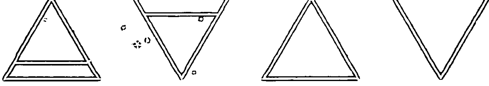

## 01 | 魔法工具介紹

「魔法」幾乎可以說是一種「人類本能」。最早的魔法紀錄，可以追溯到石器時代的時候！因為它是集魔法師的意志、召喚神聖力量和儀式合而為一的能量工作，所以和這世界大多數的宗教儀式相同，都需要使用工具。所有的工具都要召集四大元素、父神、母神的神聖能量來「聖化」工具。

所有的工具都可以跟父神、母神請求，當你真心想要一個工具時，你有誠心請求，祂們都會應允你。

如何聖化工具 :

需要聖化的工具，可以先用淨化方式淨化，然後吸收日光和月光精華至少一整天，接著，就可以進行「聖化」的步驟了。

1. 先淨化場地。（書中介紹三種淨化方式。）
2. 做結界，開啟神聖空間。
3. 召喚四元素。
4. 召喚父神、母神。
5. 拿出需要「聖化」的工具，放在祭壇上，手持魔法棒，唸祈禱文：
「現在，我邀請神聖的父神、母神，與四大元素精靈賜與我的______（工具名）神聖能量。（觀想一道耀眼的白光透過魔法棒，照射在工具上。）它從現在開始已經聖化了。」

6. 謝謝所有神聖能量的協助，關閉神聖空間。

## 掃帚

魔法師們使用掃帚在儀式上，最為大家熟知的是電影、電視中的巫婆騎掃帚的影像！其實根據歷史，真正的維卡（Wicca）魔法師騎在掃帚上在地上拖行，是為了促進農作豐收，後來為人穿鑿附會所謠傳為「巫婆騎掃帚在天空飛翔」。現代魔法師使用掃帚來淨化，作為儀式的開始。大部份魔法師都會自己動手做一枝魔法掃帚，因為，光是「自己動手做」的概念，就已是把自己的意念付諸行動的「魔法」了！

## 蠟燭

為何要點蠟燭？因為魔法師的傳承自古以來，會點上蠟燭做儀式。火是四大元素中活化思想的能量，它能夠轉化「思想」為「行動」，讓想像顯化 在真實人生裡。蠟燭通常會加上色彩魔法，不過我們在書中再三強調，因為體諒現代人忙碌的工作，我們只採用白色蠟燭，原因是白光內涵七色光，所以用它來代表所有你需要的顏色。蠟燭加上精油、水晶、咒語都是為了強化你的信念！

## 香爐或是動香器具

藥香的材料是用來吸引神聖的能量，所以選擇一個品質良好的香，是一個很值得的選擇。條狀、錐狀或是盤香都可以。對於魔法師來說，藥香代表「風」元素，在儀式中非常重要。

## 大釜

最原始的大釜是古代魔法師的烹飪工具，

## N 北
土元素

## W 西
水元素

# 如何連結

站在四個方位的正中央，深呼吸幾次。要閉著眼睛，讓身體的五個感官取代眼睛，觀想、並感覺這四個角落形成的光圈包圍著你。你在中央是很舒適、很安全的。現在，你準備好打開自己跟父神、母神、四元素連結。然後，準備好做下一個步驟，念禱詞。

## 神聖空間禱詞

☆祈請父神：

將雙腳打開、與肩同寬，兩隻手握拳，兩手交叉於胸前，就像是埃及法老王的姿勢，接著唸出下方禱詞。

「奧，神聖的父神，
我現在請求您太陽般的神聖光芒降臨於此！」

☆祈請母神：

將雙腳打開、與肩同寬，兩隻手掌攤平，手掌朝上，手肘微彎，就像手上捧著水的姿勢，這是埃及皇后姿勢，接著唸出下方禱詞。

「奧，神聖的母神，我現在請求您月亮般的神聖光芒降臨於此！」

## 召喚四大元素禱詞

這裡我會提供你例句，讓你先輕鬆地初步召喚四元素。等你熟悉了它們的運作，你也可以自己發明幾個有感覺的句子，來幫助你與四元素連結。

> 「土、水、火、風的精靈啊，
我現在召喚你來到我面前，為我展現自然的力量！
五角星、聖杯、魔法棒、寶劍，
現在請來到我面前，為我展現內在的力量！」

## 04 | 影子之書 Book of Shadows

據說最早的影子之書是由特定魔法師傳給另一個魔法師，作為進入魔法世界的一種儀式。但是現代的影子之書都是魔法師自己用來記錄自己的魔法過程，包括召喚、儀式等等。

魔法需要不斷的練習，透過練習過程可以訓練你的意志，或是哪裡做得不對等原因需要調整方向。通常魔法師們都會隨身攜帶一本空白筆記本，以便紀錄自己的魔法過程，而這本筆記本只為你自己而存在，不可讓任何人碰觸和借閱。它是你和你內在的力量、父神與母神的秘密連結，請保護它，將它視為自己的「影子」，當作自己的一部分。

想要製作一本自己的影子之書，可以去文具店買一本空白筆記本，魔法師通常會選擇黑色或是紫色，或是帶有神秘色彩的封面。我個人通常買黑色，然後用金蔥筆做裝飾。

關於「影子之書」，我自己的解釋，就像魔法師的「家傳食譜」。食譜需要寫食譜名（功效）、食材（材料）、步驟、結果等，跟魔法有「異曲同工」之妙！透過記錄心得，這本「影子之書」就等於是魔法師的心血結晶，堪稱是「武功秘笈」呢！

影子之書（Book of Shadows）與鏡子之書（Book of Mirror）

這兩者的區別，在於影子之書只記載魔法師的個人魔法紀錄和秘方等等，而筆記或心得，則紀錄在鏡子之書。為何取名鏡子，因為魔法師可以從鏡子之書中，像照鏡子般，學習到跟自己有關的魔法知識。

## 05 | 凈化場地

實施魔法前，要先將預備實施魔法的場地做淨化。場地淨化非常重要，可以說是魔法師們實施魔法必需（must）要做的事情！因為空間、場地常會殘留人類情緒中的負面能量，通常是從想法中產生的「有害物」，像是煩惱、恐懼、嫉妒等等負面情緒。如何淨化呢？我提供幾種淨化方式，你可以憑當時的感受或個人喜好做選擇。

### ☆白色鼠尾草（White Sage）煙燻淨化法

這是北美巫師常使用的淨化法，近來廣受魔法師與民眾喜愛。

如何開始：你可以將鼠尾草盛裝在一個容器，或是中型（約手掌大小）貝殼裡，點燃葉片，然後，將它放在場地中央，記得將窗戶打開，它將幫你把室內的負面能量「燻」出去！

### ☆室內淨化專用噴霧

室內淨化專用噴霧它的頻率很高，可以提升室內的氣場。

如何開始：你可以拿著噴霧瓶噴灑你想要淨化的場地。

### ☆「想像力之光」淨化法

實施魔法最重要的，是自由運用你的想像力，讓你想要的事件「顯化」（manifestation）成為真實。

如何開始：你需要先調整呼吸，深呼吸約六次後，想像有一道「白光」將場地照亮，或是想像「太陽父親」溫暖的「金光」照亮場地。

## 06 | 環境挑選

一般魔法師很重視環境的挑選，因為魔法師通常體質很敏感，環境裡要是有不對的能量（像是前面客人殘留的情緒等），都能夠被感知到。「魔法」是對大自然、地球媽媽與宇宙本源父親的致敬，我們是在模仿大自然和宇宙的能量，因此，保持跟祂們的和諧是魔法師的工作。

### 做儀式的空間

+   ◇ 室內空間 :

對於繁忙的現代人來說，室內是比較容易進行儀式的場所。唯有一項條件，進行儀式時要「秘密」。儀式是很私人、用到你個人力量的事，最好是能夠在有隱私、不被打擾的地方進行。在室內空間，中國傳統的智慧「風水」也是一個指標：室內光線充足、空氣流動，就己經夠了。萬一沒有這些條件，就要加強「室內淨化」了！（請看淨化場地 p.77）

另外，室內開啟神聖空間的方法已經在前面的部分描述，當然這也需要事先做淨化的動作。

+   ◇ 室外空間：

可以選擇一處人煙稀少，最好是沒有人的野外進行儀式。維卡（Wicca）是自然魔法，因此在自然環境下，所有的儀式將可以在自然狀態進行。做神聖空間時，還可以用自然的粉末瀝圓圈，或是在四個方位（土、水、火、風）放香、蠟燭、植物等做方位記號。而戶外的狀態已經比室內更少污染，因此不需要淨化。

在室外還有一個最大的好處，你就直接站在地球母親上面，所以你跟她的連結可以很親近。在你室內的小祭壇可以獻上感謝的祭品給父神、母神，在戶外也可以如此。你需要準備甜食和麵包、餅乾類食物，紅酒和白酒，紅酒是獻給地球母親（母神），白酒是獻給太陽父親（父神）。

一般建議找戶外比較安靜、野生的地方施行魔法，這樣可以跟地球、大自然擁有更親近的關係。

## 07 | 音樂、舞蹈與你

「魔法」（Magic）最早的起源是「薩滿」（Shaman）。自從有人類以來，人類就有崇拜大自然的習俗，薩滿就是最早的魔法（又稱「巫術」），薩滿魔法師（又稱為「巫師」）是世界上最早的魔法師。薩滿魔法師們會升起火堆，開啟神聖空間，連結萬物，然後拿出手邊的樂器和自己吟唱的歌曲，禮讚大自然的神奇。所以你也可以拿出樂器，不管是沙鈴、鈴鐺、鼓等，召唤並讚美地球母親；世界各地的薩滿們會用身體舞動、配合音樂旋律，手足舞蹈地歡慶大地豐收。魔法是非常個人的，它是你和大地、宇宙與自己的關係，因此，你可以隨性創作出屬於你個人與大地和宇宙連結的歌曲、召唤詞和舞蹈喔！

### 音樂對人的影響

音樂的波動跟人類的情緒有直接關係。不同種類的音樂會帶出我們不同的情緒反應，而情緒又能影響生理與心靈，因此，除了儀式中魔法師會攜帶隨身樂器，隨著召唤儀式哼唱歌曲和隨之起舞之外，建議想要成為魔法師的你可以多聽喜歡的音樂，所以選擇帶有正向波動的音樂非常重要！

建議使用的音樂類別有：新世紀音樂（New Age）、古典樂、自然音樂、原住民音樂。而時下的流行樂也可做為選擇的音樂類別之一，因為流行樂中通常帶著濃厚的情感，可以帶動人類深層的情感面。

除了以上的音樂類別，自然音樂（Nature Music）也是一個很好的選擇，這是一種模仿大自然，或是取自大自然的音樂，包括海浪、蟲鳴、樹葉被風吹過的聲音等等，讓人一聽就彷彿回到大自然中充電！

## Chapter 4

## 書中使用的魔法配方

| 符文图形 | 名称 |
|-----------|------|
| 图形1     | Fehu |
| 图形2     | Uruz |
| 图形3     | Thurisaz |
| 图形4     | Ansuz |
| 图形5     | Raidho |
| 图形6     | Kenaz |
| 图形7     | Gebo |
| 图形8     | Wunjo |
| 图形9     | Hagalaz |
| 图形10    | Naudhiz |
| 图形11    | Isa |
| 图形12    | Jera |
| 图形13    | Eihwaz |
| 图形14    | Perthro |
| 图形15    | Algiz |
| 图形16    | Sowilo |
| 图形17    | Tiwaz |
| 图形18    | Berkano |
| 图形19    | Ehwaz |
| 图形20    | Mannaz |
| 图形21    | Laguz |
| 图形22    | Ingwaz |
| 图形23    | Othila |
| 图形24    | Dagaz |

## 01|準確率極高的塔羅牌

最早的塔羅，據說源自於古埃及，但根據目前考據得到的最早歷史資料顯示，塔羅最早出現於十五世紀，是當時義大利貴族的「紙牌遊戲」。在西方人眼中，他們文化的源頭：希臘和埃及，都是古老、並擁有神秘奧妙知識的國度，非常令人嚮往。

現今流通程度最廣，也是較為有名氣的有兩副塔羅牌，一是由萊特·偉德在1910年公開的版本，人稱「偉特塔羅」，也是本書所使用的塔羅牌；另一副是由艾力斯特·克勞立設計，稱為「托特塔羅」。

塔羅牌的圖樣裡充滿西方文化象徵，像是卡巴拉、鍊金術、聖經故事、埃及神話、希臘神話，還有數字學、占星學等，西方的古代文化資產，透過塔羅牌的流傳保留了一部分下來。

也因為塔羅含有深刻的文化與神秘學意涵，如果要將塔羅作為占卜工具，操作的占卜師就需要具備許多相關知識，以及相當豐富的經驗、對人有足夠的瞭解，才能應用自如。而在二十一世紀的現在，塔羅牌占卜已經成為大眾所熟知的占卜方式之一。塔羅牌驚人的準確度，真的可以說是現今仍遺留於世的古代「魔法」的一種！

我與塔羅的接觸約在我二十多歲，在國外讀書的時期。有一回逛書店，我替自己買了一副手繪版本的「大阿爾克那」22 張塔羅牌自學，從此以後就對塔羅著迷不已。當年台灣還不流行塔羅牌占卜，但塔羅牌在西方已經是一種日常的、固定行事的占卜方式。

塔羅是個非常容易入門的工具，卻也不容易成為「專家」，因為解讀牌卡的功力，需要靠占卜者的人生經驗累積與對牌卡的熟練度。在國外，人們相信年紀越大的占卜師就能算得越準確，在國內反而有年輕化的傾向。

我非常鼓勵讀者們都要學習這套集神秘學為基礎的學問，以偉特塔羅牌的創辦人偉特為例，他隸屬於一個英國神秘教派「金色黎明會」（The Golden Dawn），這個教派的教義是整合所有的神秘學為基礎，像是神秘的埃及、希伯來的傳承（喀巴拉）、和許多跟此秘密組織有關的象徵圖案，和西方聖經裡的故事、希臘的生命靈數、中古世紀的聖杯傳奇（Holy Grail）等，非常值得學習與研究。

最神奇的，是這副 78 張牌卡竟然可以跨越時空，占卜現代人的問題，仍然得到跟古代同樣的答案！可以說，塔羅牌本身的準確度就是一種「魔法」，令人驚嘆不已！

## 02 | 神秘的北歐盧恩符文

說到盧恩的由來，最早的歷史考據，遠自西元前，就有考古學家在洞穴裡找到盧恩的遺跡，而最早使用盧恩文字的紀錄則可追溯自西元二世紀。自古以來，它就是被北歐日耳曼人所使用的文字，北歐人視盧恩為充滿魔法力量的符號文字，也拿來進行占卜、神諭。現代人則把盧恩用來占卜與進行魔法儀式。

盧恩是我很有興趣學習的一種北歐符號與文字。它有聲音、字型、意義，對我而言它是個充滿魅力的一種魔法，準確度當然也不在話下。比較特別的是，盧恩的其中一個符文在電影夢幻製造國——美國的其中一部電影「雷神索爾」出鏡率相當高，每次當客人抽到這個符文，臉上都露出驚喜的表情，這十分有趣。

無論你是採用塔羅、盧恩或是任何型態的占卜，它們都是一門幫助你深入你 和他人潛意識的工具。其實解讀占卜要準確，需要占卜者豐富的人生經驗與對牌卡的熟練度，在國外，年紀越大的占卜師就越準確。印象最深刻的是擁有古老文明的希臘，在當地，盛行的占卜形式有：生命靈數（生命靈數的發源地——希臘）、咖啡占卜、塔羅等等，你可以看到街頭巷尾，都有一個似乎擁有神奇魔力的「魔法阿媽」在幫人占卜呢。

+   生命靈數（生命靈數的發源地——希臘）、咖啡占卜、塔羅等等

因此，無論你是採用何種形式的魔法，人生經歷越多，識人越廣，加上占卜將你的天生直覺發揮得淋濕盡致，「何時」或是「幾歲」成為占卜師或是魔法師都不會受限！

## 天使神秘学院官方淘宝：http://strc.taobao.com

## 03 | 水晶的功用與使用方式

水晶是地球的自然寶物，它的成份是二氧化矽，天然水晶原石要完成結晶的過程，至少需要經過八千到一億兩千萬年以上才能形成，有些還長達百萬年，甚至億萬年。

水晶能夠記憶（儲存）、聚焦、傳遞與放大使用者的靈性能量，因此自古以來，人類就用水

## 許願魔法紙樣本

王小明
許願
我王小明可以順利跟上司溝通，並且獲得他／她的良好印象。
出生日期：1999.1.7

## 許願範例文字：（用紅筆寫）

我王小明可以順利跟上司溝通，並且獲得他／她的良好印象。

出生日期：1999.1.7

* 外框寫9次自己的名字

## 釋放魔法紙樣本

釋放
我王小明幫我釋放害怕被客戶拒絕的恐懼。
被客戶拒絕的恐懼。
出生日期：1999.1.7

## 釋放範例文字：（用黑筆寫）

我王小明幫我釋放害怕
被客戶拒絕的恐懼。

出生日期：1999.1.7

# 05 | 純植物精油

純植物精油（Essential Oils）是高度萃取、濃縮自植物的精油，它被人類當作身心靈的天然治療方式（芳療 Aromatherapy），自古以來魔術師們廣泛使用在魔法儀式裡。

每種植物都有它們特定的頻率與功效，魔法師們運用純植物精油在加強自己與植物能量的連結，或是儀式中用來塗在蠟燭上，增加靈性覺醒，與強化魔法與現實世界的連結。

還有一種配方，是魔法師親自釀造植物能量油，通稱「魔法油」（Magical Oils）。魔法師們會依當時的天象、氣候與想釀造的魔法油能量，尋找相關植物與礦石加入儀式，並將魔法油能量封印。釀造時間可能從一到數年不等，一般依古法規定或魔法師本人的設定為主。現代人的生活節奏快速，因此，本書中都是採用快速、高能量的純植物精油來做配方。

| 精油種類 | 魔法效果 |
| --- | --- |
| 迷迭香精油 Rosemary | 愛、療癒、保護、淨化、力量、祝福、驅逐 |
| 肉桂精油 Cinnamon | 加強視覺化（想像力）、協助進入通靈領域、增加財富 |
| 丁香精油 Clove | 刺激思考（腦力）、事業成功、財富、豐盛、避邪、保護、靈性工作 |
| 馬鞭草精油 Verbena | 吸引愛情、保護、淨化並創造神聖空間 |
| 薰衣草精油 Lavender | 愛、和平、純淨、療癒、靈性覺醒、靜心、靈性工作、連結宇宙 |

# 06 | 四大元素

施行魔法時，魔法師很常使用到四大元素的力量（請看「魔法為何有效」p.58）。四大元素除了是地球基本元素，在占星學的領域也很常使用。了解四大元素與我們的關係，可以讓我們對自己的優缺點更加理解，知道如何平衡滿足自己與他人的需求。

中古世紀有一位集自然魔法者為大成者：帕拉塞爾蘇斯（Paracelsus）認為，每一個元素後面都有一位精靈在守護著，祂們都有各自的運作方式，他還教導我們如何與這些精靈的元素特質共處，用何種態度可以讓此種元素更穩定，而且還可以學習如何「掌控」各種元素精靈特質。以下是四大元素的介紹：

# ▽ 土元素：

守護神為地精靈。

對應星座為：摩羯座、金牛座、處女座

用一顆開放的心可以穩定住土象能量。因為土象人天性保守拘謹，如果土象人能夠擁有開放的心，一定能讓生命更加活躍！

# ▽ 水元素：

守護靈為水神，這很像希臘神話的海神波賽頓。

對應星座為：雙魚座、巨蟹座、天蠍座。

此種水能量必須以堅定的態度，讓自己像「水的波動」的能量穩定。當水象人情緒波動時，不妨以堅定的態度自處。

# ▽ 火元素：

守護神為火精靈。

對應星座為：牡羊座、獅子座、射手座。

此種火能量必須以平靜的心面對世界，因為他們通常很激動興奮，尤其是面對當下發生的事情。

# ▽ 風元素：

守護神為空氣中的女精靈。

對應星座為：水瓶座、雙子座、天秤座。

此種風能量必須以定力將其想法落實下來。當他們「想得多、做得少」時，用果決的態度即可讓他們回到現實。

# 如何活用四元素

當你越來越了解四元素時，下次當你召喚四元素時，可以想像祂們的元素「擬人化」特質，會讓你更趨近祂們的本質喔！與親朋好友、職場上的人們相處時，如果知道對方的主要星座特質（通常是太陽星座、月亮星座與上升星座），就知道如何博得這個星座的共鳴了！如果有機會認識你自己的星盤 ⑧，可以分析自己四大元素的多寡，藉此了解自己哪裏平衡，哪裡不平衡。有趣的是，人們總是尋找自己的星盤欠缺的元素作為重要伴侶（無論是工作或是關係裡），這是互補作用。

# 塔羅與四大元素

塔羅、占星、魔法都重視四大元素，在這裏，身為多年塔羅的學習與教學者，我要跟大家分享塔羅中四大元素各自代表的意義。

# 土元素（錢幣=五角星）

代表像土一樣固定的，象徵著能夠被觸摸與擁有的東西，像是錢與實際的事物。當一個人在牌陣中抽到過半數的土元素牌，表示這人有著很務實的人格特質。

# 水元素（聖杯）

流動的水象徵著流動的情緒、感覺、想像力、愛和直覺等。當一個人在牌陣中抽到過半數的水元素牌，表示這個人有著「感受型」的人格特質。

# 火元素（權杖）

像樹木一樣的權杖形狀的火，象徵著陽性的行動、冒險、樂觀、開始。當一個人在牌陣中抽到過半數的水元素牌，表示這個人有著很衝動但是樂觀的人格特質。

# 風元素（寶劍）

像風一樣不可捉摸的風元素，跟寶劍冷冽的特質結合，象徵著思考、溝通、邏輯和傷痛。當一個人在牌陣中抽到過半數的風元素牌，表示這個人有著冷靜的人格特質。

# 星盤

占星命盤是「西洋占星術」（Astrology）中，將行星座落在十二宮位的位置，藉以了解自己或是與周邊環境互動的方式。最早源自於古代美索不達米亞，古人認為，每個行星都住有一個神明，而行星的運行影響著地球發生的事。

Ingrid's class

# Chapter 5

# 魔法實例！職場問題 & 魔法配方

# 施行魔法前須知

上一章，我們提到了一些在施展魔法時會用到的特殊配方。在這一章，我們將聚焦在普通上班族的工作過程裡，所會遇到的職場難題，並教導大家應該用哪些方式「創造想要的未來」。身為社會的一分子，我們每個人都需要貢獻自己的能力，以賺取金錢供應我們的生活所需。但是在公司裡，無論你是老板、主管，還是員工，你都會有「人的壓力」。上司對下屬，下屬對上司，對客戶，對同事，都有很多「功課」要去學習。

我們蒐集一般上班族在職場上會遇到的挑戰，教導你用簡單的方式達成願望。我從「塔羅」與「盧恩」的古老智慧中，自心靈面（意念）、魔法處方與肯定語來協助你「放下」問題、「轉化」問題、「解決」問題，所以當你開始運用魔法後，這將會開啟你的魔法天線！

呼吸是我們人類生存的本能。但是你知道嗎？一般人因為忙碌的生活型態，因此呼吸的氧氣不夠，因此普遍都有身體缺氧（尤其是大腦）的狀況。造物主幫我們設計好的這個身體，能夠仰賴呼吸來做新陳代謝；另一個天賜的禮物「想像」，書中稱為「觀想」，魔法的好夥伴，就能利用它幫助我們dreams come true. 書中的每一個魔法的開頭都會是從呼和吸開始做準備，然後身體才能準備好進入魔法狀態。

利用吸氣，把太陽光能由頂輪吸入，貫穿身體，再經由腳底連接地心，排除想像中的、頭腦中的煩憂、負面能量。經由地球母親吸收、
呼吸，呼吸，呼吸！

轉化成有用養分後，再由腳心吸入，循環正面能量至全身。如此深呼吸與觀想數次後，我們的身體與心靈才能處於跟宇宙、地球萬事萬物和諧的純淨「能量發射站」狀態！

最後再度提醒各位「新手魔法師」，請將全部精神集中，屏除雜念，專心一致的想像你的願望成真的畫面，這樣你的魔法就會成真！

相信自己是有力量的！

相信神的協助，和周遭自然界和你配合的很和諧！

正面看待你的願望！

以下為我蒐集廣大上班族朋友的工作困擾，大家只要依照你的問題，找到相對應的魔法，你的職場難題就可迎刃而解。

有句話說：「小心你的許願，因為它有可能成真喔！」祝福大家都能夠享受心目中的好工作！

# 魔法【眞實情境】使用說明：

★ 真實情境（Dear Ingrid）：這部分我蒐集了平常爲人們占卜時常見的工作問題，當你遇到任何職場疑難雜症時，可以依照你的需求採用相對應的魔法。

★ 塔羅心靈引導：魔法配方中，我爲每一個職場問題抽出塔羅牌做爲心靈上的引導。附圖爲相對應的塔羅牌。

★ 虛恩心靈引導： 魔法配方中，我爲每一個職場問題抽出虛恩符文，作爲心靈上的引導。附圖爲相對應的虛恩符文。

★ 整體建議：將塔羅牌與虛恩符文的心靈引導，作兩者統整後的建議。

★ 魔法主題：針對每一個魔法所訂定的主題說明。

★ 唸法：每一個魔法都是根據虛恩符文的聲音來發音，通常是一個或結合兩個以上的虛恩符文的發音。

★ 月相：即月亮運行時表面受太陽光，發亮的部分。通常魔法師們會參照月亮的圓缺來施行不同的魔法。

★ 星期：即各個行星運行的日子所相對應的星期。通常魔法師會參照星期作爲實施魔法的指引。

★ 材料：即實施魔法時所需要的材料。書中附上材料圖示供讀者參考。

★ 魔法配方步驟：即實施魔法時所需要的步驟，step by step，只要跟著步驟做，你很容易就可以實施自己的魔法了！

★ 肯定語：這是每個魔法的最後一個步驟，目的是將正面的字句植入（input）你的潛意識，加強成功的意念。

# 真實情境 #1

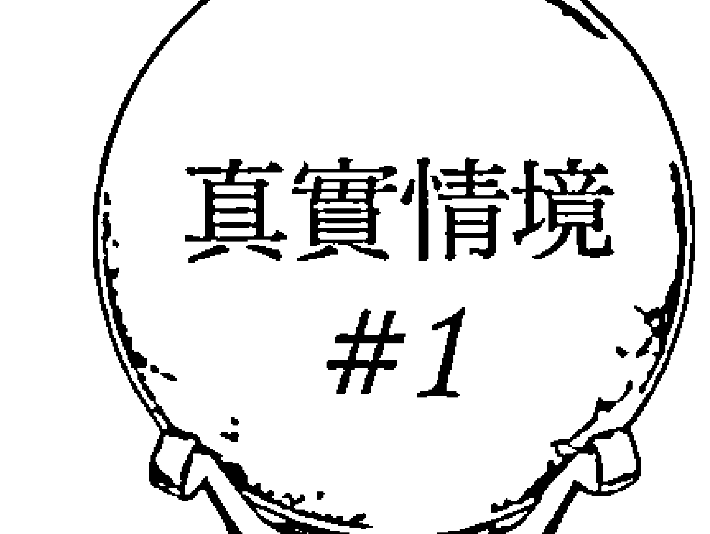

# 工作壓力大

魔法難度：★★★

Dear Ingrid,

我是個非常忙碌的中小企業老闆，因為是小企業，公司才兩三個員工，我個人的工作壓力非常大，肩頭常常僵硬，可是別無他法，因為身為老闆，這種壓力是一定會有的。我該怎麼改善這個狀況呢？

# 英格麗占卜解答

# 「塔羅」心靈引導

其實工作壓力大，很大的一部分是因為當事人對自己的求好心切，加上本身個性是不好意思求助於人，以至於累積很多壓力。建議找相關工作人員一起討論方案，或是找信得過的朋友說一下自己的情況，不要一個人默默的承受壓力喔！

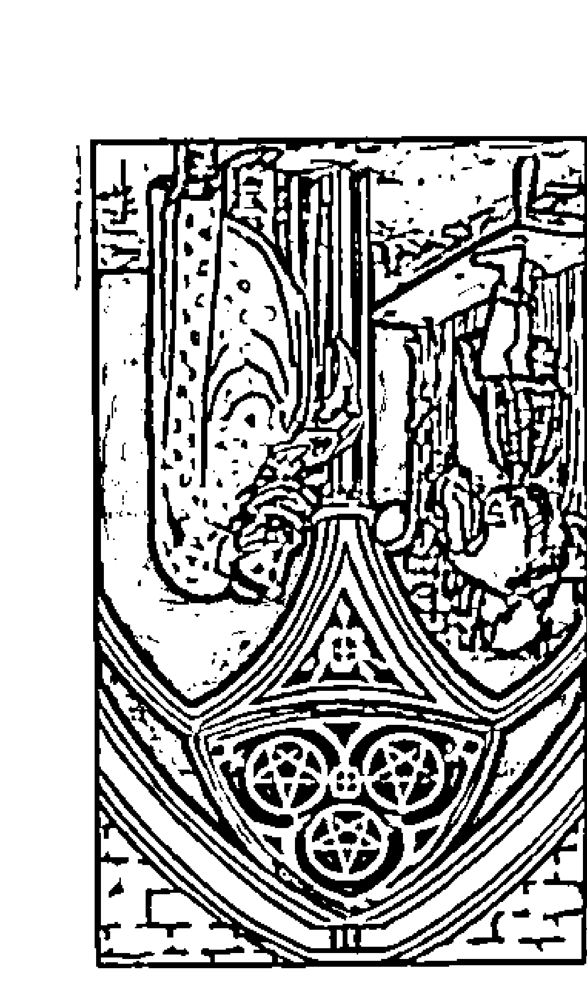

（逆位）錢幣 3 Three of Pentacles

Isa 依莎

# 「盧恩」心靈引導

這個象徵是指目前的你，需回歸自己的內在，在壓力最大的這幾天，可以多做靜心，信任自己的內在智慧，會找到平衡之道。它同時協助你的內在更為堅強。

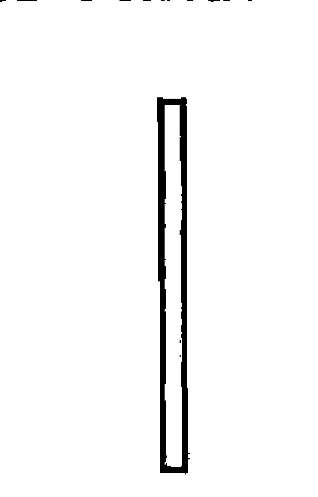

# 整體建議……

想要卸除壓力，首先要做的，是在能量層面「卸貨」，釋放壓力。要知道，「壓力」為萬病之首，學習如何減壓，才能積極的迎向充滿希望的未來！

# 魔法教學

魔法主題

釋放負面情緒。對人類的頭腦來說，「想要」是一回事，能否察覺內心的「阻礙」又是另一回事！所以強力推薦先掃除內心的負面情緒，才能空出嶸新的空間讓想要的事物進來生命裡！

+   - 魔法圖案：

+   - 呪法（聲音）：l-sa

+   - 月相：滿月前後兩天效果最強

+   - 星期：情緒或能量低落時的任何一天

+   - 材料：白色 tea light 小蠟燭、小紙片、黑筆（各種形態都可以，毛筆、原子筆……等等）、不鏽鋼碗一個

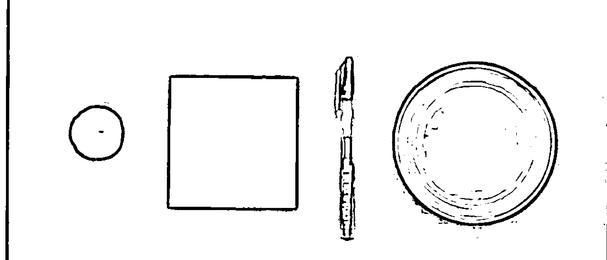

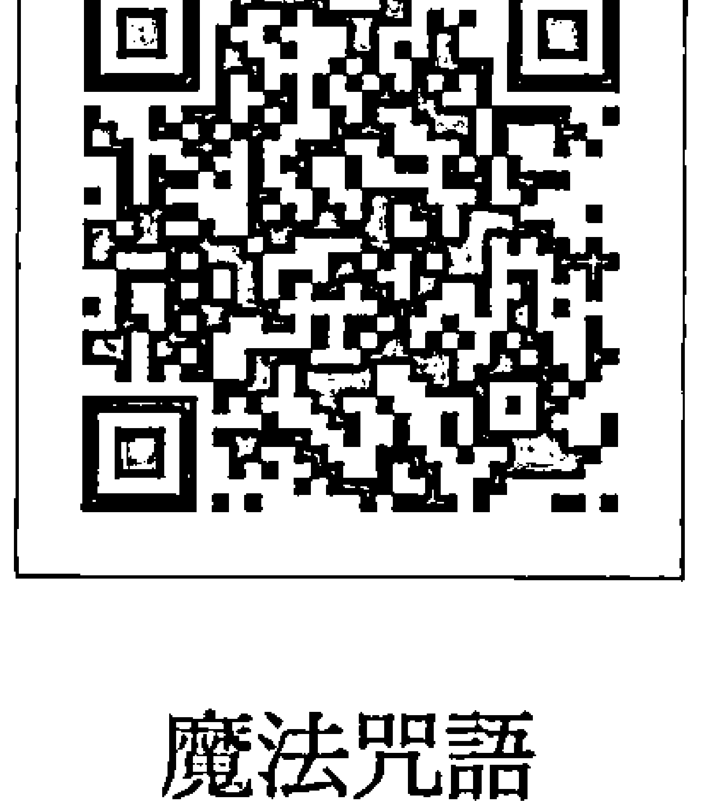

# 魔法咒語

# ◇ 魔法配方步驟：

# *準備動作

做深呼吸3-6次。我們深呼吸時，觀想左、右腳底（足底輪）像植物一樣生出長長的根，一直往腳下的泥土下扎根，直到地球中心。地球媽媽將我們的能量轉換成金黃色的養分，再由腳底吸收，從腳底吸入身體，最後，由頭頂呼氣出去，再由太陽吸收金黃色光芒，再由頂輪吸入身體，從腳心排出思想廢物……如此循環最多六次。重複數次，直到你的身心感覺平静為止。

# *實際操作

+   1. 拿起蠟燭，對著它吹一口氣，跟它做連結。然後放進鋼碗，點燃蠟燭。 2. 在紙上用黑筆寫下自己希望放下或轉換的壓力，在紙中央畫 Isa 的符號。 3. 做完後拿起紙說：「I-sa、I-sa、I-sa，請幫助我釋放自己的負面情緒，並幫助我更堅強。」 4. 寫完後將紙捲成小捲筒狀，對著紙吹一口氣，跟它連結。 5. 將紙捲輕輕投入火中，等待紙燃燒殆盡。想像自己的煩惱已經全部隨著火舌被吞噬消失。 6. 將紙灰爐倒入馬桶沖掉。想像自己的煩

# 整體建議

「薪水不夠」往往是大部份上班族的心聲。不過關於和金錢的關係，總是讓我們又愛又恨……想要金錢能量通暢，除了大環境，我們能做的，是提升自己的能力，與別人合作。當然「努力」絕對是不二法則！

# 魔法教學

## 魔法主題A：釋放負面金錢模式與信念 （魔法難度：☆☆）

強力推薦先掃除內心的負面信念與廢棄物，才能空出嶄新的空間讓想要的事物進來生命裡！尤其是金錢，它也是一種能量，要如何順利獲得自己想要的金額，取決於你對於「自己值不值得擁有」的信念，當然還有小時候的家庭制約，像是父母的價值觀等等。在這裡，我們要察覺「什麼是阻礙金錢的信念」，才能釋放負面觀念，轉換成流暢的金錢能量。

+   ◇ 魔法圖案：∫
+   ◇ 咒法（聲音）：Ei-waz
+   ◇ 月相：滿月或滿月前後兩天效果最強
+   ◇ 星期：任何感覺負面情緒來襲的時候
+   ◇ 材料：白色或紅色tea light小蠟燭、小紙片、黑筆（各種形態都可以，毛筆、原子筆……等等）、不鏽鋼碗一個

# 魔法咒語

# ◇ 魔法配方步驟：

## * 准備動作

做深呼吸3-6次。我們深呼吸時，觀想左、右腳底（足底輪）像植物一樣生出長長的根，一直往腳下的泥土下扎根，直到地球中心。地球媽媽將我們的能量轉換成金黃色的養分，再由腳底吸收，從腳底吸入身體，最後，由頭頂呼氣出去，再由太陽吸收金黃色光芒，再由頂輪吸入身體，從腳心排出思想廢物……如此循環最多六次。重複數次，直到你的身心感覺平靜為止。

## * 實際操作

+   1. 拿起蠟燭，對著它吹一口氣，跟它做連結。然後放進鋼碗，點燃蠟燭。
+   2. 在紙上用黑筆寫下自己希望放下或轉換的壓力，在紙中央畫上的符號。
+   3. 做完後拿起紙說：「Ei-waz、Ei-waz、Ei-waz，請幫我釋放自己的負面工作模式 和信念。」
+   4. 寫完後將紙捲成小捲筒狀，對著紙吹一口氣，跟它連結。
+   5. 將紙捲輕輕投入火中，等待紙燃燒殆盡。想像自己的煩惱已經全部隨著火舌被吞噬消失。
+   6. 將紙灰燼倒入馬桶沖掉。想像自己的煩惱已經全部隨著水流消失。
+   7. 唸肯定語數次，激勵自己。

肯定語：
「我可以釋放舊的錯誤工作模式。
我的魔法為我帶來了成功。謝謝父神、母神。魔法馬上生效。」

## 魔法主題B：許願增強自我信念和戰鬥力 （魔法難度：★★★）

「勇氣」與「信心」是雙胞胎，是你要當「先鋒」前的必備心靈糧食。

+   - 魔法圖案：
- 唸法（聲音）：Ti-waz
- 對應脈輪：太陽神經叢輪
- 月相：新月或是介於新月到滿月的期間
- 星期：任何感覺負面情緒來襲的時候
- 材料：白色 tea light 小蠟燭、小紙片、紅筆（各種形態都可以，毛筆、原子筆……等等）、不鍍鋼碗一個、肉桂精油、迷迭香精油、天然白水晶一個（大約五十元硬幣大小或更大）、一枝香

# 魔法咒語

# ◇ 魔法配方步驟：

## * 准備動作

做深呼吸3-6次。我們深呼吸時，觀想左、右腳底（足底輪）像植物一樣生出長長的根，一直往腳下的泥土下扎根，直到地球中心。地球媽媽將我們的能量轉換成金黄色的養分，再由腳底吸收，從腳底吸入身體，最後，由頭頂呼氣出去，再由太陽吸收金黄色光芒，再由頂輪吸入身體，從腳心排出思想廢物……如此循環最多六次。重複數次，直到你的身心感覺平静為止。

## * 實際操作

+   1. 在家中，拿出紙，在紙的四周圍先用紅筆寫下你的名字 9 遍，接著是寫下想要實現的事情，並且畫好這個盧恩符號在紙的中央。對著紙說：「泰爾神、泰爾神，請幫助我找到新的兼差工作！」「Ti-waz、Ti-waz、Ti-waz，請幫助我跟老闆爭取到我要的薪水！」
+   2. 寫好願望後，對它輕吹進一口氣，跟它連結。
+   3. 召喚「四大元素」。想像「土元素」的畫面，像是腳踩在泥土上；想像「水元素」的畫面，像是玩水；想像「火元素」的畫面，像是蠟燭的火；想像「風元素」的畫面，像是風輕撫臉頰。最後說：「我請求四大元素來到這個空間！」
+   4. 點燃一支香，讓它自然燃燒完。香會吸引好的能量。
+   5. 打開肉桂精油，先對著精油吹進你的氣息，然後用手指將它倒出來，輕輕「點」在紙的四個角落。將紙對折。
+   6. 接著，把紙放在你的小祭壇上，拿出水晶，也跟水晶說出同樣的願望，吹進你的氣息，然後壓在願望紙上面。
+   7. 拿出一個新的蠟燭，對它吹進一口氣，訴說你的願望，把迷迭香精油順時針塗抹在蠟燭上（不用把鋅殼取下），點燃蠟燭，為了安全，最好將蠟燭放在燭台裡。可能的话，盡量讓它自然燃燒完，萬一無法做這個步驟的話，出門前，用手用力擊熄蠟燭。
+   8. 想像你的太陽神經叢充滿金黃色光芒，你充滿信心的成功畫面。
+   9. 最後，是「假装願望已經成真」，你不再需要將注意力放在這裡。去職場上好好表現吧！
+   10. 記得連續七天施行魔法加唸肯定語，魔法就會生效。

# 肯定語：

「我是有能力的！我是有力量的！我以團體的利益為最高目標。我的魔法為我帶來了成功。謝謝父神、母神。魔法馬上生效。」

## 說服客戶簽約

## 魔法難度：☆☆☆

Dear Ingrid,

我是個高級主管，我的工作是說服客戶簽約，使用公司的產品。但是我 的問題是，客戶的選擇那麼多，要如何說服客戶，讓客戶對我們的產品產生 信任感呢？

# 英格麗占卜解答

+   ◇「塔羅」心靈引導

身為主管，熱情有勁的你，平常人際關係不錯，但是在「權威」上的表現 比較需要加強。你需要表達的是，你代表公司，因此只要多一點權威性的表現， 在金錢談判上，重點放在「用最少的費用得到最多的效果」，加上實施魔法， 相信成功是站在你這邊的！

+   ◇「盧恩」心靈引導

這兩個符文在幫助你，對自己有信心、毅力 去做某事，並跟對方有良好溝通，且獲得對方認可，最後在金錢或是業績都有所獲得。

（逆位）太陽 The Sun(左) 錢幣四 Four of Pentacles(右)

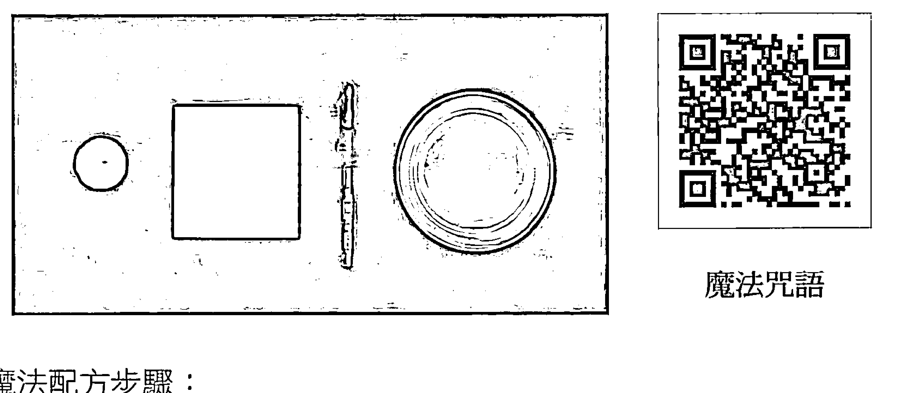

費胡 Fehu

奧吉茲 Algiz

# 整體建議

在商場，想要在眾多競爭者中脫穎而出，良好的溝通的確是最重要的。在這裡教導你用「保守」但是「權威」的方式跟客戶溝通，善用符文的強大能量協助，一定能幫你爭取到成功的合約。

# 魔法教學

# 魔法主題：

保護與溝通，並有著物質上的豐收

+   ◇ 魔法圖案：

+   ◇ 唸法（聲音）：Fehu + Algiz = Fel-giz

+   ◇ 對應脈輪：海底輪

+   ◇ 月相：新月或是介於新月到滿月之間

+   ◇ 星期：星期四

+   ◇ 材料：白色 tea light 小蠟燭、小紙片、紅筆（各種形態都可以，毛筆、原子筆……等等）、不錯鋼碗一個、丁香&肉桂精油、天然白水晶一個（大約五十元硬幣大小或更大）、一枝香

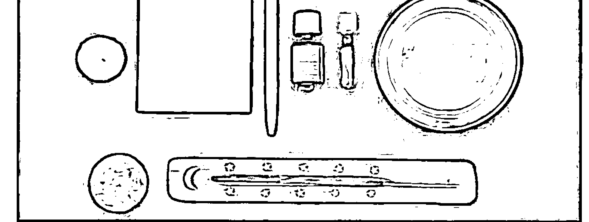

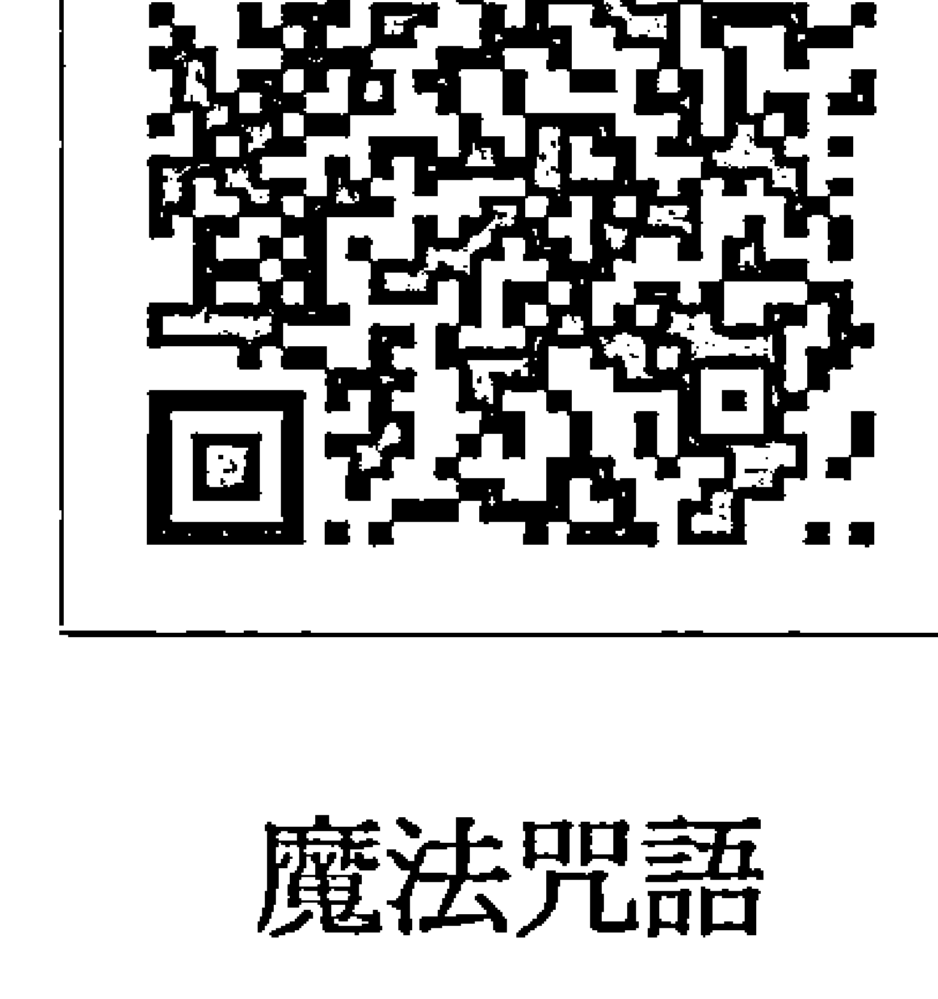

# ◇ 魔法配方步驟：

# *準備動作

做深呼吸3-6次。我們深呼吸時，觀想左、右腳底（足底輪）像植物一樣生出長長的根，一直往腳下的泥土下扎根，直到地球中心。地球媽媽將我們的能量轉换成金黃色的養分，再由腳底吸收，從腳底吸入身體，最後，由頭頂呼氣出去，再由太陽吸收金黃色光芒，再由頂輪吸入身體，從腳心排出思想廢物……如此循環最多六次。重複數次，直到你的身心感覺平靜為止。

# *實際操作

+   1. 在家中，拿出紙，在紙的四周圍先用紅筆寫下你的名字 9 遍，接著是寫下想要實現的事情，並且畫好這個盧恩符號在紙的中央，記得留下空白處寫願望和名字，記得寫下日期（可以日後追溯用）。記得把咒語放進來你的祈禱文裡：「Fel-giz、Fel-giz、Fel-giz，請幫助我這次跟 XX 廠商的談判成功！」
+   2. 寫好願望後，對它輕吹進一口氣，跟它連結。
+   3. 召喚「四大元素」。想像「土元素」的畫面，像是腳踩在泥土上；想像「水元素」的畫面，像是玩水；想像「火元素」的畫面，像是蠟燭的火；想像「風元素」的畫面，像是風輕撫臉頰。最後，說：「我請求四大元素來到這個空間！」
+   4. 點燃一支香，讓它自然燃燒完。香會吸引好的能量。
+   5. 打開丁香&肉桂精油，混合兩種精油，先對著精油吹進你的氣息，然後用手指沾精油並輕輕「點」在紙的四個角落。將紙對折。
+   6. 接著，把紙放在你的小祭壇上，拿出水晶，也跟水晶說出同樣的願望，吹進你的氣息，然後壓在願望紙上面。
+   7. 拿出一個新的蠟燭，對它吹進一口氣，訴說你的願望，把調好的精油順時針塗抹在蠟燭上（不用把鋅殼取下），點燃蠟燭，為了安全，最好將蠟燭放在燭台裡。可能的话，盡量讓它自然燒完，萬一無法做這個步驟的話，出門前，用手用力擰熄蠟燭。
+   8. 想像你的海底輪充滿紅色光芒。
+   9. 最後，是「假装願望已經成真」，你不再需要將注意力放在這裡。去職場上好好表現吧！
+   10. 記得連續七天施行魔法加唸肯定語，魔法就會生效。

# 肯定語：

> 「我是成功的公司代言人！我可以輕鬆達到目標！我的魔法為我帶來了成功。謝謝父神、母神。魔法馬上生效。」

## 真實情境 #5

## 工作總是手忙腳亂

## 魔法難度：★★

Dear Ingrid,

我是個自由接案繪圖工作者，除了接案，因為需要多方開關財源，還有補習班與店家教學，有時候，財源短缺時，還需要另外接家教班。這麼忙碌的狀況下，我已經出現身心焦慮和疲倦的狀況，該如何調整呢？

## 英 格 麗 占 卜 解 答

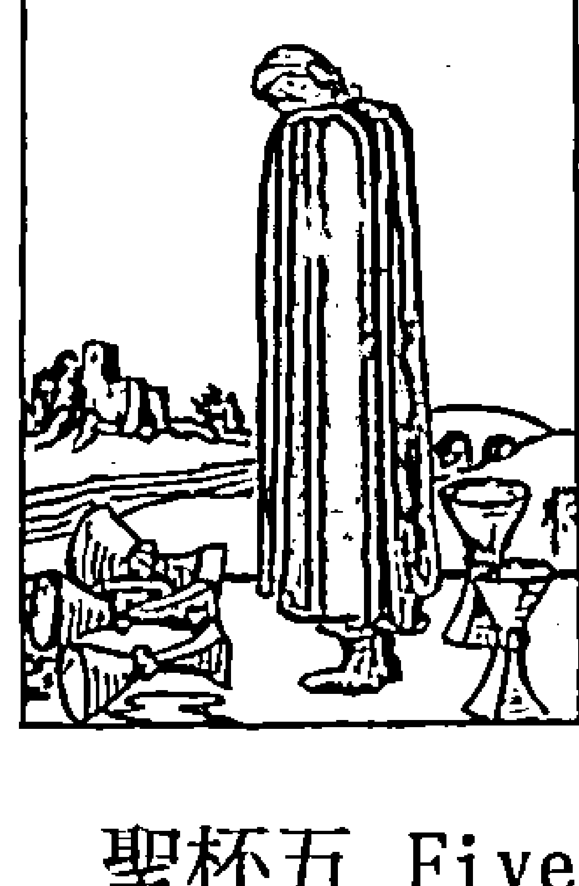

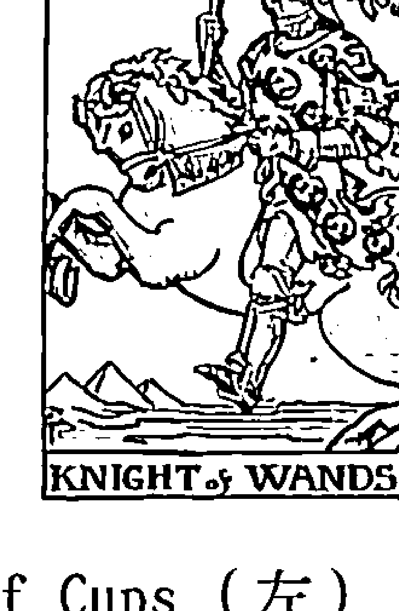

聖杯五 Five of Cups（左）權杖騎士 Knight of Wands（右）

# 整體建議

忙碌的生活型態在現代人來說，反而是種常態。我們需要的，是積極的準備好自己，調整自己的能量，心態健康了，就能夠在職場的下一波高峰繼續走下去！

# 魔法教學

# 魔法主題：

平衡內在力量

+   ◇ 魔法圖案：

+   ◇ 唸法（聲音）：Perthro + Eihwaz = Per-waz

+   ◇ 對應脈輪：膽輪

+   ◇ 月相：無指定

+   ◇ 星期：無指定

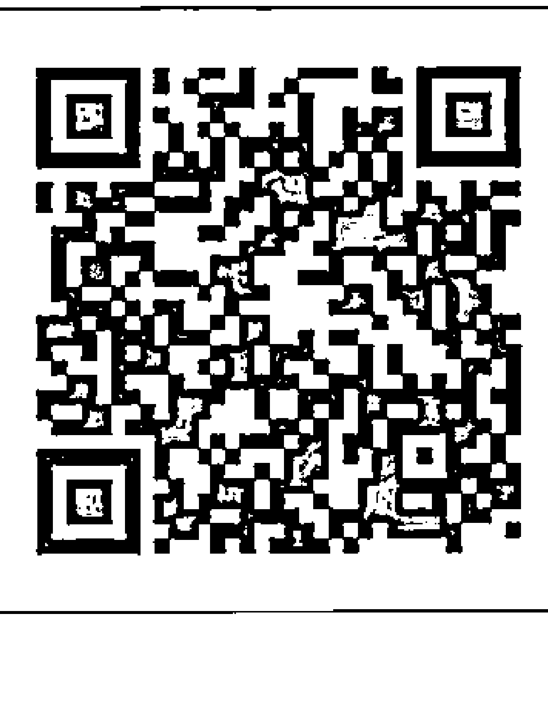

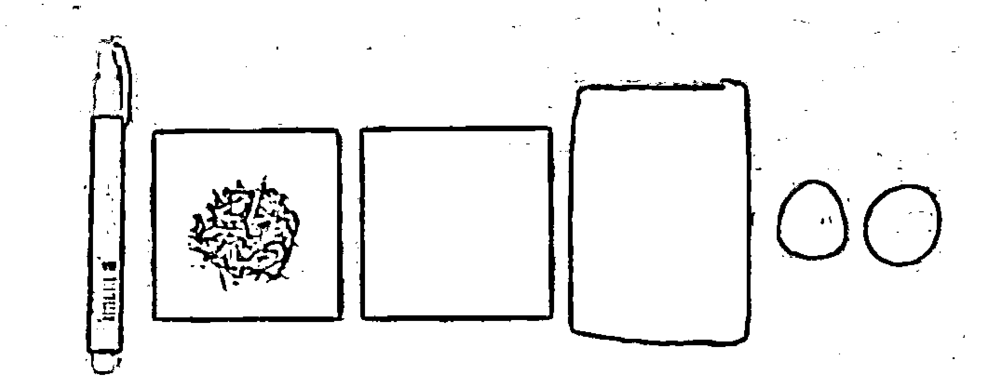

◇ 材料：石頭2個、壓克力顏料或是防水馬克筆、一撮海鹽、一撮泥土、小布袋附繩子（隨身攜帶用）。

# ◇ 魔法配方步驟：

# *準備動作

做深呼吸3-6次。我們深呼吸時，觀想左、右腳底（足底輪）像植物一樣生出長長的根，一直往腳下的泥土下扎根，直到地球中心。地球媽媽將我們的能量轉换成金黃色的養分，再由腳底吸收，從腳底吸入身體，最後，由頭頂呼氣出去，再由太陽吸收金黃色光芒，再由

## 天使神秘学院官方淘宝：http://strc.taobao.com

语放进你的祈祷文里：「l-ri-saz、l-ri-saz、l-ri-saz，请帮助我加强信心！」

+   5. 打开马鞭草精油，先对着精油吹进你的气息，然后用手指沾精油并轻轻「点」在纸的四個角落。将纸对折。
+   6. 接着，把纸放在你的小祭坛上，拿出水晶，也跟水晶说出同樣的愿望，吹进你的气息，然后压在愿望纸上面。
+   7. 拿出2枚一元铜板，在上面涂上马鞭草精油，同樣说自己的愿望，吹一口氣，然后將2枚铜板放在皮夾裡當做「幸运符」。铜板2枚请另外和皮夾內的铜板區隔開來。
+   8. 拿出一个新的蜡烛，對它吹進一口氣，訴說你的願望，把精油顺时針塗抹在蜡烛上（不用把鋁殼取下），點燃蜡烛，為了安全，最好將蜡烛放在燭台裡。可能的话，盡量讓它自然燒完，萬一無法做這個步驟的話，出門前，用手用力搖熄蜡烛。
+   9. 最後一個步驟，觀想你的太陽神經叢充滿金黃色光芒，想像你的願望已經被實現，而你在其中成功、快樂的工作的模樣。你不再需要將注意力放在這裡，去職場上好好表現吧！
+   10. 記得連續七天施行魔法加唸肯定語，魔法就會生效。

# 肯定語：

「我有信心面對任何客戶，讓客戶信任我。我的魔法為我帶來了成功。謝謝父神、母神。魔法馬上生效。」

# 真實情境 #7

# 心情不好該怎麼繼續上班呢？

魔法難度：★★★

Dear Ingrid,

我是個百货公司櫃姐，我的工作除了面對不同類型的客人銷售商品之外，還要承受來自公司高層的業績壓力，面對這些直接的負面衝擊，我想知道該如何轉換心情、繼續上班面對客戶和上司呢？

# 英格麗占卜解答

+   ◇「塔羅」心靈引導

這樣的突發狀況應該是你在職場無法避免的，現在是離開這個情況的時候，拿出你的體諒心來面對客戶與主管，展現你天生的寬大氣度，用「愛」包容一切。其實心量大的你，明白這一切只是一時的「想不開」，很快的說服自己「打開心胸」，用天生的同理心跟客戶與主管溝通。「站在顧客的角度」（stand on one’s feet）一詞，根本就是為你發明的！

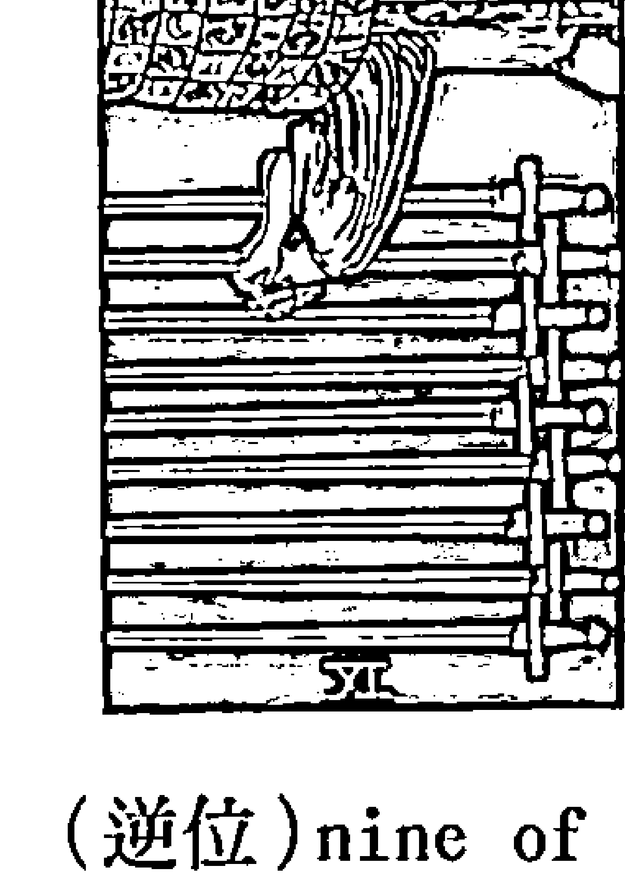

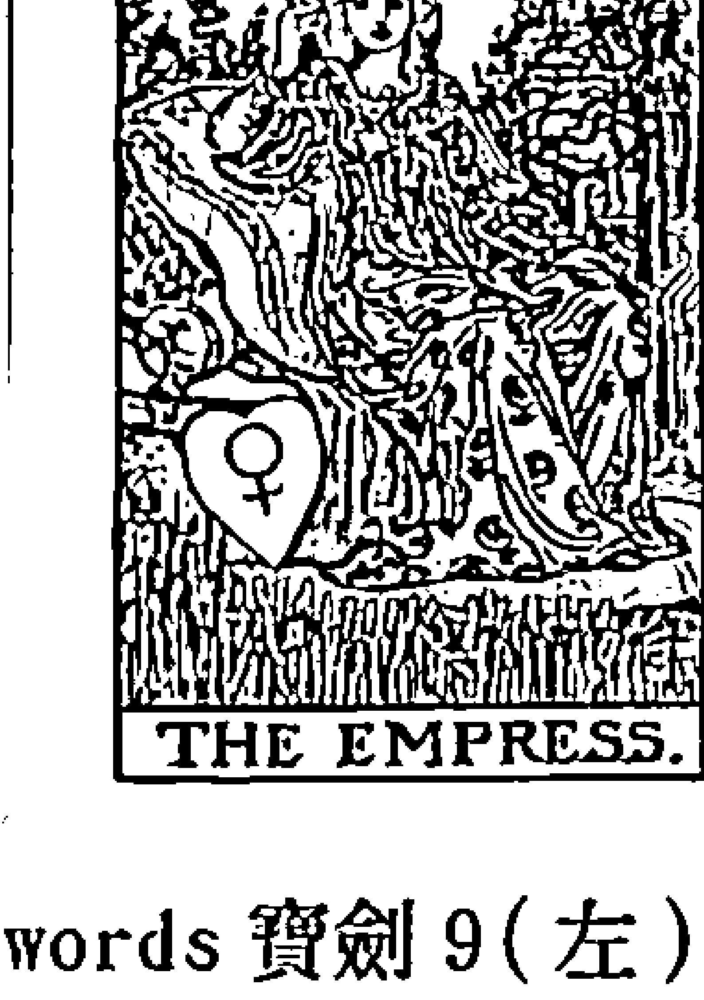

（逆位）nine of swords 費劍 9（左）The Empress 女皇（右）

+   ◇「虛恩」心靈引導

虛恩指引我們的，是用「愛」來跟人溝通。當我們面對任何人或因人產生的問題時，如果能先了解彼此的需要與想法，以愛為前提去溝通的话，就能化解許多危機！

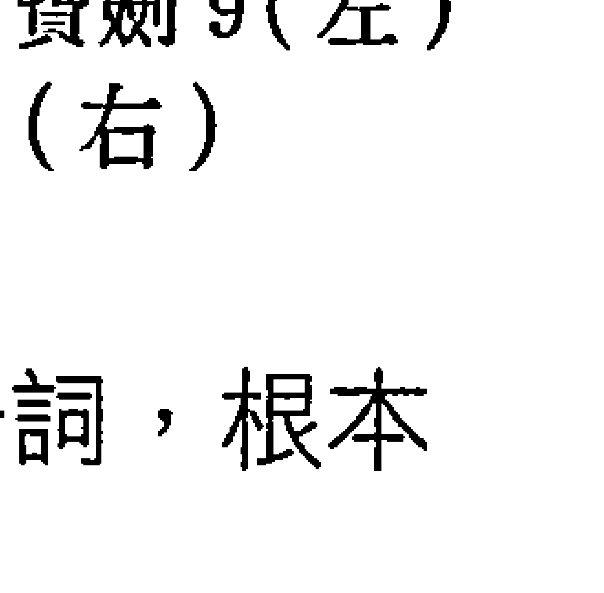

蓋柏

Gebo

# 整體建議

站在服務業的前線的你，不可避免的，總是會遇到跟「人」有關的問題，所以如何以高 EQ 來面對所有的人，就是你的挑戰！當你挑戰這個「功課」成功，你也會是這個行業的佼佼者！

# 魔法教學

魔法主題：

爱的智慧

+   ◇ 魔法圖案： X
+   ◇ 呪法（聲音）：Ge - bo
+   ◇ 對應脈輪：心輪
+   ◇ 月相：不限
+   ◇ 星期：星期五
+   ◇ 材料：tea light 蠟燭、海鹽一撮、薰衣草精油、玫瑰精油、牙籤或美工刀（刻盧恩符文用）

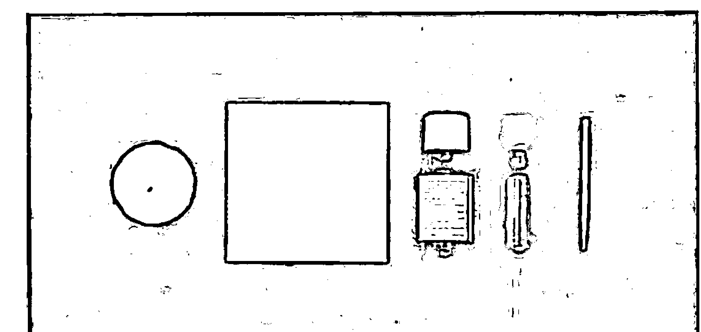

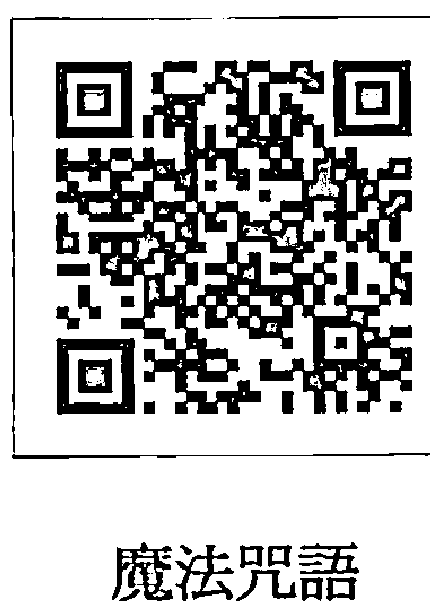

魔法咒語

# ♦ 魔法配方步驟：

+   * 準備動作

做深呼吸 3-6 次。我們深呼吸時，觀想左、右腳底（足底輪）像植物一樣生出長長的根，一直往腳下的泥土下扎根，直到地球中心。地球媽媽將我們的能量轉換成金黃色的養分，再由腳底吸收，從腳底吸入身體，最後，由頭頂呼氣出去，再由太陽吸收金黃色光芒，再由頂輪吸入身體，從腳心排出思想廢物……如此循環最多六次。重複數次，直到你的身心感覺平靜為止。

+   * 實際操作

+   1. 把蠟燭拿出來，用薰衣草、玫瑰精油順時針抹一圈在蠟燭表面。
+   2. 在蠟燭上刻出 X，Gebo 的虛恩符號。
+   3. 對蠟燭說：「Ge - bo、Ge - bo、Ge - bo，請幫助我驅散不舒服的情緒，並把愛帶進來我的工作。」

+   4. 對蠟燭吹一口氣，跟它連結。
+   5. 將海鹽圍一圈在蠟燭四周。
+   6. 在蠟燭前面坐下來，靜心，深呼吸數次，觀想心輪發出粉紅色的光籠罩全身，直到心情平復為止。想像工作時的狀況，與主管、客戶關係和諧，一切都可以在你的同理心下化解。

7. 最後，是「假裝願望已經成真」，你不再需要將注意力放在這裡。去職場上好好表現吧！
8. 記得連續七天施行魔法加唸肯定語，魔法就會生效。

# 肯定語：

「我擁有高 EQ，我可以跟任何人溝通順暢。 我的魔法爲我帶來了成功。謝謝父神、母神。魔法馬上生效。」

# Ingrid's murmur:

在這個案例裡，這個客戶是必須面對很多客人的服務業者。人緣是她很重視的，也是那個行業的必須。實施了魔法後，我幾個月後再遇到她，她的回饋是，這個魔法實在太好用了！除了她的人緣在主管和客人方面變好，連桃花也變好呢！雖然她還沒做愛情魔法，不過相信以她的高詢問度，應該業績很好，口袋滿滿，也沒時間談戀愛吧！

Gebo 這個符文也非常適合做桃花魔法喔！這個熱心的客戶，等她的公司旺季一過，應該會來找我做愛情魔法預約吧？

工作與愛情兩難全，這真是千古不變的難題。我建議她還是要擇時間社交，才不會浪費她的好運勢喔！

# 上台恐懼症該如何克服？

# 魔法難度：★★★

Dear Ingrid,

我常常需要在客戶面前做簡報，可是就算是在我的工作領域我已經不算是新人的狀況，遇到在眾人面前發言，還是不免有手腳冰冷、頭腦一片空白危機。我該怎樣能夠自然而不緊張的表達呢？

# 英格麗占卜解答

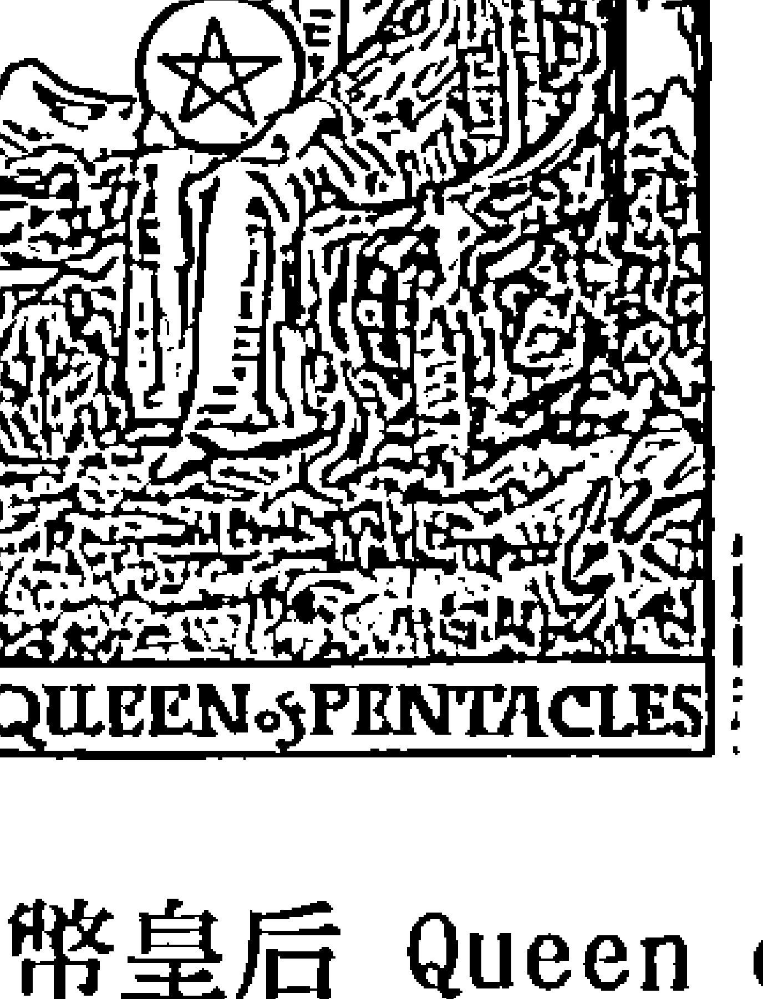

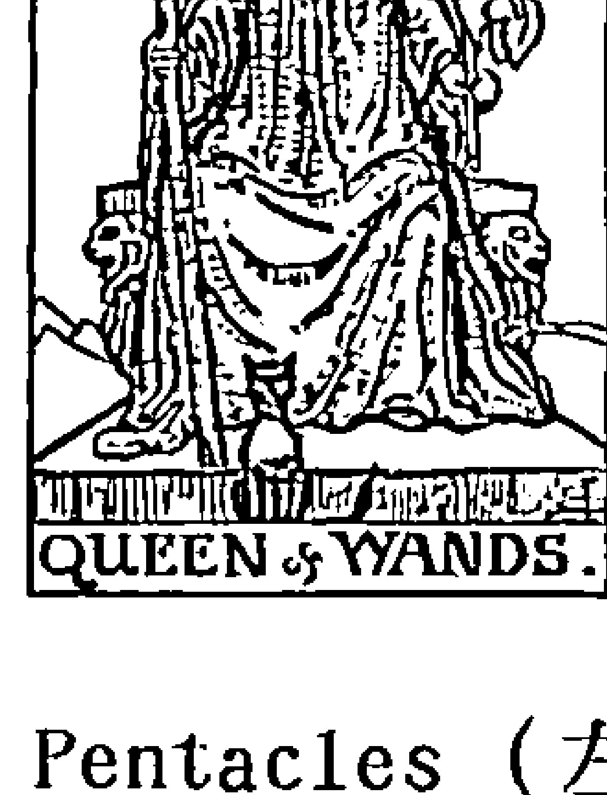

錢幣皇后 Queen of Pentacles（左）權杖皇后 Queen of Wands(右)

+   ◇「塔羅」心靈引導

這兩張牌給你的建議是，上台前先穩住自己的情緒，跟大地連結，掌握自己有把握的部分好好表現，不要想太多，just do it!

+   ◇「盧恩」心靈引導

這兩個符文在告訴你，首先，遇到上台的狀況，先把自己穩定下來，回到自己的中心，接著，把聽眾設定成共同分享你的成果，大家和諧的互動，平常心看待，就能放下緊張了。

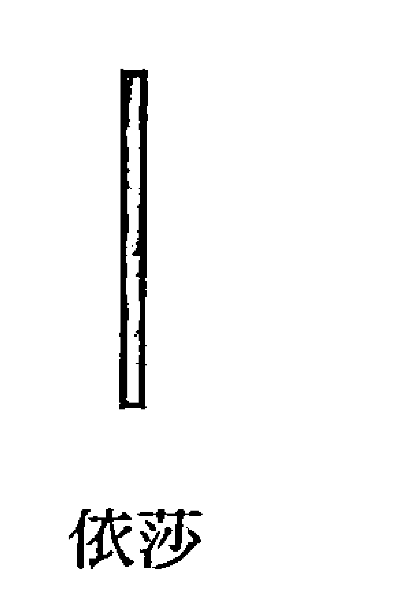

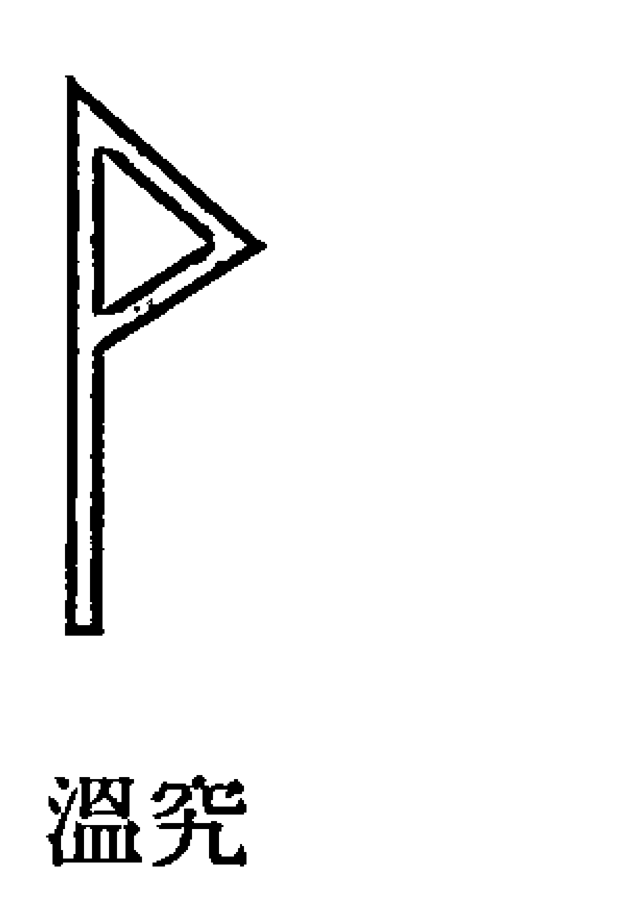

获取更多好书，请加微信：13641926204 或 QQ:715104687

# 整體建議

你只要好好準備上台呈現的簡報，就不會因為要面對群眾焦慮。在心理做「觀想當天狀況」的事前工作，心理建設做好，就不會緊張！拿出行動力和熱情，就可以上台分享你的努力成果了！

# 魔法教學

# 魔法主題：

分享喜悦的成果

+   ◇ 魔法圖案： | ρ
+   ◇ 唸法（聲音）：Isa + Wunjo = Injo
+   ◇ 對應脈輪：海底輪
+   ◇ 月相：不限
+   ◇ 星期：星期三
+   ◇ 材料：tea light小蠟燭、肉桂精油、乾燥的小果實或是豆類3棵、肉桂粉（肉桂捲或葉）、附繩小袋子、小紙片、紅筆、鏡子

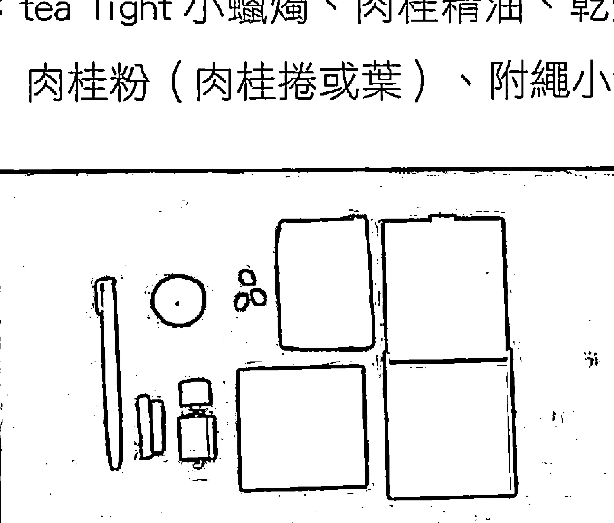

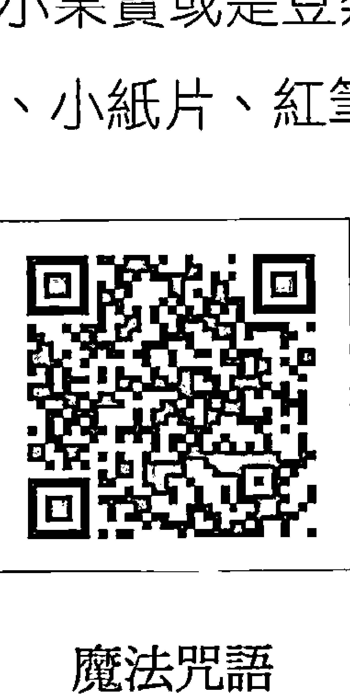

# 魔法咒語

# ◇ 魔法配方步驟：

# *準備動作

做深呼吸 3-6 次。我們深呼吸時，觀想左、右腳底（足底輪）像植物一樣生出長長的根，一直往腳下的泥土下扎根，直到地球中心。地球媽媽將我們的能量轉换成金黃色的養分，再由腳底吸收，從腳底吸入身體，最後，由頭頂呼氣出去，再由太陽吸收金黃色光芒，再由頂輪吸入身體，從腳心排出思想廢物……如此循環最多六次。重複數次，直到你的身心感覺平靜為止。

# *實際操作

+   1. 星期三的晚上，在蠟燭上順時針抹肉桂精油。 2. 對蠟燭吹一口氣跟它連結。點燃蠟燭。 3. 把果實、肉桂粉（肉桂捲或葉）都吹一口氣跟它們能量連結，放在一旁備用。 4. 拿出紙筆，在紙的四周圍先用紅筆寫下你的名字9遍，接著是寫下想要實現的事情，並且畫好這個盧恩符號在紙的中央，在紙的四個角落塗各一滴肉桂精油。對著紙說：「In-jo、In-jo、In-jo，請協助我完成XX的願望！」對著寫完的紙，吹一口氣。紙折成四折。 5. 將果實、折好的願望紙、肉桂粉（肉桂捲或葉）放入附繩小袋中，綁緊。隨身攜帶小布袋，它是你的願望實現袋，這樣你就等於將願望隨身攜帶在身邊一樣！

6. 當天出門前，在鏡子前對自己說肯定語幾次。觀想自己面對群眾成功的演說的模樣。進一步觀想海底輪充滿生氣蓬勃的紅色。

7. 最後，是「假装願望已經成真」，你不再需要將注意力放在這裡。去職場上好好表現吧！

8. 記得連續七天施行魔法加唸肯定語，魔法就會生效

# 肯定語：

「我是成功的演講者！我能成功達成任務。我的魔法為我帶來了成功。謝謝父神、母神。魔法馬上生效。」

# 如何提高業績呢？

魔法難度：★★★

Dear Ingrid,

我是網拍的老闆，請教教我，我該如何提高來客數和營業額呢？

# 英格麗占卜解答

+   ◇「塔羅」心靈引導

塔羅牌的建議，是拋開因為「營業額」與「來客數」造成的心情起伏，還有隨著心情好壞，不穩定的工作模式。只要能夠將心情穩定下來，多站在顧客的角度想一些吸引顧客群的策略，運用你天生敏銳的直覺力，將可以吸引顧客對網站的注意力。身為「經營者」最重要的是紀律與目標導向。你必須拋開自己既有的視野，站在比較宏觀的角度看自己的事業，擬出一套規則與作法，才有可能突破現狀！

+   ◇「虛恩」心靈引導

你目前的事業最需要的，是詳細完整的規劃，從短、中、長期著手。只要照著規劃好的藍圖走，就可以慢慢的遵循軌道進展，接著，就可以博得顧客口碑，以長期經營的角度獲得聲望與金錢收穫。

# 整體建議

根據你的請求與占卜的結果，得知只需要用心規劃，有紀律的執行，並用想像力「點燃」財富之火，在你的堅持下，建立良好口碑，營業額會逐漸達到你的目標！

# 魔法教學

# 魔法主題：

+   - 成功達成目標
- 魔法圖案：↑ R ʸ
- 唸法（聲音）：Lagus + Raidho + Fehu = La-Rai-Hu
- 對應脈輪：頂輪、心輪
- 月相：新月到滿月之間
- 星期：星期四
- 材料：白水晶、tea light 小蠟燭、紙、紅筆、薰衣草精油、任何粉紅色系花朵 1 朵～ 3 朵（插在花瓶裡）

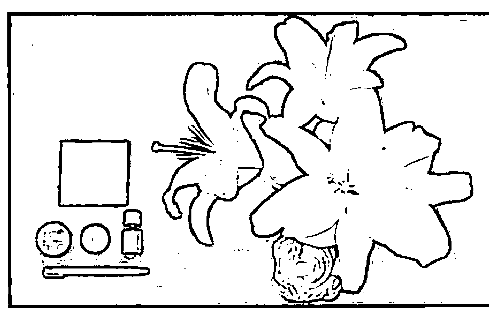

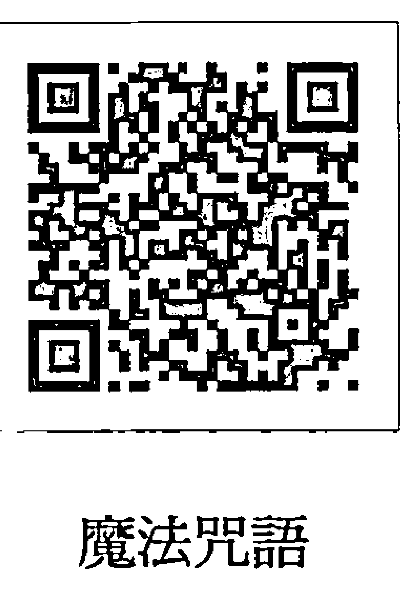

# ◇ 魔法配方步驟：

*準備動作

做深呼吸 3-6次。我們深呼吸時，觀想左、右腳底（足底輪）像植物一樣生出長長的根，一直往腳下的泥土下扎根，直到地球中心。地球媽媽將我們的能量轉换成金黃色的養分，再由腳底吸收，從腳底吸入身體，最後，由頭頂呼氣出去，再由太陽吸收金黃色光芒，再由頂輪吸入身體，從腳心排出思想廢物……如此循環最多六次。重複數次，直到你的身心感覺平靜為止。

# *實際操作

+   1. 拿出蠟燭，將藥衣草精油順時針塗在蠟燭上，然後對它吹一口氣跟

心與愛，我願意敞開自己的過往，只為了讓你明白，人來這個世界的目的不是「受苦」，而是「學習」。不知是誰說過：「苦難是我們的導師。」當我們經歷過，才能體驗到生命的可貴與禮物！

「魔法」是父神與母神送給人類最美的天賦，善用它，善用你的人生經驗，你將發現，人間的至美至善都在你的「一念之間」！

## 如何面對魔法的成與敗

在書的最後，我想談一下有關於面對魔法的「失敗」或是「成功」的心態。「魔法能力」雖然是公平的屬於每一個人的，在前文說過，是神在我們出生為人類前已經儲存在我們的 DNA，可以說成功與否，完全取決於我們的「意念」。正面意念吸引正面結果，不確定的意念吸引不確定結果，那負面意念當然吸引負面結果了！

## 魔法實現後

當魔法實現後，你可以在一個滿月前後的日子，將你寫願望的紙條用另一個鋼碗和蠟燭燒掉。為何要分開不同的鋼碗呢？原因是，一個是燒掉「負面想念」；另一個是燒掉「已經實現的願望」。

燒掉已經完成的願望紙條，方式跟前沒有很大的差異，差別只在唸的內容不同。記得感謝父母神的恩賜，讓你願望實現。非常建議你可以在滿月做一個「豐收感恩儀式」，在祭壇上的大釜（大碗，代表母神）中可以擺放感謝的祭品（水果、糖果、餅乾等），可以加上紅、白酒各一小杯。

## 萬一失敗……

「意念」就是「魔法引擎」，如果我們的意念沒有太多負面信念，魔法基本上應該會自然實現。當你發現魔法已經實施有一段時日，甚至是從半年到一年還不見蹤跡，表示你的內在需要清理某些負面的想法！所以，我給你的建議是：「清理 + 載放」·書中用的方式是用火能量燃燒掉負面信念。

## 如何知道你已經釋放完畢？

神給我們一個很好用的工具：我們的「情緒指標」·它就是神送給我們在人間的 GPS 人生導航系統。不要忘記天堂的能量是安詳、快樂、正面、美麗……舉凡你想得到的跟美好有關的形容詞，都可以用在这裡！這就是我們傳承自宇宙父親的本質。

當你想要實現一個目標時，先深呼吸，靜心，然後問自己是否已經準備好了要去實施魔法？如果情緒是快樂、自在的，甚至有種熱情想要去做，那表示你已經 ready 了；相反的，如果你想到要為了一個目的去實施某個魔法，而你的情緒是恐懼、不安、不確定，那麼，這件事肯定 not ready ！你所需要的，就是繼續清理、釋放，一直到你想到這件事時，腦海裡出現的感受，是正面而愉快的！

我的經驗，魔法的成功，跟你與現實生活的難度息息相關。所以假設程度上從 1 到 10 來說，你是一個平常薪水都是 2 的職員，忽然之間許了一個想要三個月後達成 8 的願望，這就屬於「高難度」了！這種難度對魔法來說，就是「不實際」的。建議這種情況可以分成三個目標達成：短期、中期、長期，分梯次實施魔法，反而是既實際、又比較容易實現魔法的方法！

## 如何維持魔法

有關於維持，假設你的魔法成功了，你要如何維持呢？首先要恭喜你，因為你已經是個魔法師了！維持魔法的祕訣就是：在滿月的時候，記得舉行一個「感恩豐盛」的小儀式，跟父神、母神做連結，你可以準備豐盛的蔬果、餅乾、糖果等「供品」，祈請四大元素，然後祈請父母神前來享用你的心意。

古諺說：「越感恩獲得越多」，這句話是真的！當你的感恩越多，收到來自神的禮物更多！怎麼說呢？「感恩」散發出來的頻率是「正向」的，它可以為你吸引更多「好事」。

還有，這個世界需要供需平衡。雖然表面上看來是個「二元對立」的世界，我們要做的不是「選邊站」，而是「中道而行」。當你的世界因為有了魔法的幫助而順利時，也要心存善念的幫助人和環境。貢獻自己的心力在這個世界，這個世界也會回報你的善念！

## 這裡是建議身為一個有覺知的魔法師，回饋世界、善待自己與他人的方式：

+   常做善行，幫助人。我們生存在世界上，一定需要人跟人的接觸，而良好的人際關係，對你我的工作環境會有加分的作用。
+   協助或是贊助環保。因為我們在地球的一切都需要地球母親提供給我們，如何讓下一代擁有優質的生活環境與生態，都跟我們如何維繫、愛護地球有關
+   作息盡量正常。吃得健康、運動、不要熬夜，雖然是老生常談，卻是不變的定律。
+   多和人連結，多交流，多關心人，心胸開闊，可以讓你的魔法增色不少。唯有一個「人性化」的魔法師，才能為自己與客戶量身訂做一個成功的魔法配方！

## 塔羅與盧恩的合作

這本書用的「神諭」建議方式，是採用偉特塔羅與盧恩系統。平常我在為客戶占卜諮詢時，它們也是我的好朋友，常伴我左右。在寫建言的當下，我的程序是，先抽塔羅，再抽盧恩，而且往往伴隨著驚人的巧合，它們兩者的契合度非常高！所以我非常感恩神聖的天堂能量與父母神能量在協助著我，讓我在茫茫文字與思緒的大海裡，像是船在大海中看到燈塔般，找到方向！

## 塔羅靜心－「活在當下」（live at the moment）

塔羅牌除了占卜，其中也蘊含著高度的人生智慧，從塔羅裡面，我們可以從中學習到有關於人生的課題，像是本書的主題：工作，從工作中應該如何「活在當下」，是我們施行魔法前可以事先練習的。

由於魔法是跟「意念」高度密合的能量工作，我們先訓練自己的意念趨於正向，無論現實職場上發生什麼，我們總是能用正面眼光看待。塔羅牌中的「命運之輪Wheel of Fortune」即是告訴我們這樣的訊息，我們可以利用這張牌做靜心的練習。

## 牌面描述：命運之輪描述的是你

## ☆ 塔羅的建議：

你正處於一段幸運的時光，你只需要順勢而為就好。若是你正好是處於它的「逆位」——也就是命運之神彷彿離你很遠的話，你可以做的，是學習「等待」，等待這一段不順心的時光過去，並冷靜的從中看到自己需要改進的地方，等到寒冬一過，就可以迎接春天的到來！

## ☆ 塔羅靜心：

塔羅的圖案設計都是有意義的。

+   1. 先深呼吸幾次，簡單凝視命運之輪 Wheel of Fortune 卡片上的圖案數分鐘。然後將牌握在手上，閉上眼睛靜心，這時，腦海中會出現圖案。
+   2. 張開眼睛，再度凝視牌卡的圖案，你漏掉哪些細節呢？
+   3. 最後一次閉上眼睛，這時，塔羅的圖案就會對你的潛意識產生影響。
+   4. 睞開眼睛，想像自己當下在職場順心快樂工作的模樣！

最後，非常感激促成本書的誕生的契機人物：三友出版社總監、總編輯、主編，還有辛苦的文字編輯和美編，家人與好友們的支持，才能讓一書誕生。

如果說，出書對讀者有任何幫助的話，就是我的最大安慰。希望大家看了本書後，能夠喚起你的前世魔法師記憶，have fun，好好享用你的工作魔法大餐，enjoy 你的快樂工作！

## 想像力日記

日期：

今日計畫：

已實現：

未實現：

我哪裡做得好 / 需改進：

## 行星日適合實施魔法

| 星期 | 行星 | 適合實施的魔法 |
| ---- | ---- | ---- |
| 星期日 | 太陽（圖像） | 魔法中最吉利的一天。適合做跟權利和控制、野心、成功、突破、新生、小孩有關的魔法。 |
| 星期一 | 月亮（圖像） | 適合心靈發展、（女性的）直覺、夢境、家庭、靈魂伴侶、愛與和解有關的魔法。 |
| 星期二 | 火星（圖像） | 適合跟勇氣、行動、進展、要求、性有關的魔法。 |
| 星期三 | 水星（圖像） | 適合跟口語、學習、機智、預言、書寫、戲劇、商業、短程旅行有關的魔法。 |
| 星期四 | 木星（圖像） | 適合跟法律、政治事務、財富、維持健康、名譽、友情、商業、保險、海外旅行、國外事務有關的魔法。 |
| 星期五 | 金星（圖像） | 適合跟友情、親情、愛情、音樂、美、藝術、創意、感性有關的魔法。 |
| 星期六 | 土星（圖像） | 業力、獲得財物、房地產、土地、責任與義務、廣告、借貸、結束有關的魔法。 |

## 月相與魔法

## 新月 The New Moon :

這是一段適合做「新的開始」的魔法時間。

你有很多時間讓施行的魔法事物去成長、實現。

## 月亮漸滿 The Waxing Moon :

這是介於月亮從新月到滿月期間。

適合「穩定增加魔法的力量」。

## 滿月 The Full Moon :

這是對魔法師來說最有力量的時候。

你的願望到了滿月應該都已經看到成效了。

最適合「豐收」、「感恩」魔法。

滿月時，「魔法三倍定律」也是加乘三倍。

許願時要小心意念，絕對要正面！

## 月亮漸虛 The Waning Moon :

這是介於滿月到新月期間。

適合「釋放負面信念」魔法。

## 許願&釋放魔法紙

| 許願 | 釋放 |
| ---- | ---- |
|      |      |
|      |      |
|      |      |
|      |      |

# 實施魔法的傳統節日介紹

一般來說，實施魔法平常只需要注意月相和星期的變化就可以找到魔法成功的頻率。但當你越來越熟悉魔法儀式，你會開始注意到適當的季節性時機。

所謂季節性時機，說明的是在地球上四季變化的能量轉變。你可以看農民曆，上面都有詳細記載。

| 節氣               | 說明                                                                                      |
|--------------------|------------------------------------------------------------------------------------------|
| 春分（每年三月二十一日左右） | 春分是大地經過冬天的沈睡、休養之後，再度甦醒過來。萬物欣欣向榮，這正是「新的開始」。你可以做一些跟「開始」有關的魔法儀式。可以用季節性鮮花、水果獻祭，向父神、母神表示你的感謝。 |
| 夏至（每年六月二十一日左右） | 夏至是一年中大地要轉變成炎熱的開始，傳統上，魔法師認為這天是「至陽之日」。夏季人體會藉由炎熱的熱氣，排出身體多餘的毒素，因此，很適合做「釋放」有關的魔法儀式。這個儀式就如同我在書中常提起的火能量釋放方法，用火燒掉你的負面思想或是煩惱，是個很適合的時機。 |
| 秋分（每年九月二十一日左右） | 秋分是大地豐收的時刻。傳統上，魔法師認為這天日、夜均等，但是太陽會逐漸減弱。在大自然中，四處可以看到成熟的果實，大地充滿豐富的農產。很適合在豐盛的大自然中做「感恩豐收」魔法。 |
| 冬至（每年十二月二十一左右） | 冬至是大地即將進入休息的狀態，在運作了三個季節後，大地和土壤也需要好好為來年做準備，傳統上，這天被魔法師們認為是「至陰之日」。這時候，可以點燃蠟燭，跟父神、母神連結，在燭火中感受到即將來臨的春日的溫暖。 |

# 白魔法讓你工作超順利

書名 白魔法讓你工作超順利

作者 英格麗 Ingrid

發行人 程安琪

總策劃 程顯灝

總企劃 虛美娜

主編 磐綱國際美學企業社、莊旻嬪

執行編輯 磐綱美學國際資訊企業社、賴珊杉

美編設計 磐綱國際美學企業社、Jessie

封面設計 洪瑞伯

行銷企劃 黃世澤、梁祐榕

照片拍攝 黃世澤

藝文空間 三友藝文複合空間

地址 106 台北市安和路2段213號9樓

電話 (02) 2377-1163

發行部 侯莉莉

出版者 旗林文化出版社有限公司

總代理 三友圖書有限公司

地址 106 台北市安和路2段213號4樓

電話 (02) 2377-4155

傳真 (02) 2377-4355

E - mail service@sanyau.com.tw

郵政劃撥 05844889 三友圖書有限公司

總經銷 吳氏圖書股份有限公司

地址 新北市中和區中正路788-1號5樓

電話 (02) 3234-0036

傳真 (02) 3234-0037

# 國家圖書館出版品預行編目(CIP)資料

白魔法讓你工作超順利 / 英格麗(Ingrid)作. -- 初版. -- 臺北市 : 旗林文化, 2015.10

面 ; 公分

ISBN 978-986-383-025-2( 平裝 )

+   1. 占卜

292.96 104018852

# 天使神秘学院官方淘宝 : http://strc.taobao.com

| 廣告回函 |
| 台北郵局登記證 |
| 台北廣字第2780號 |

地址 : 縣/市 鄉/鎮/市/區 路/街
段 巷 弄 號 權

# SAN YAU

# 三友圖書有限公司 收

SANYAU PUBLISHING CO., LTD.

106 台北市安和路2段213號4樓

# SAN YAU

三友圖書 / 讀者俱樂部

填妥本問卷，並寄回，即可成為三友圖書會員。
我們將優先提供相關優惠活動訊息給您。

粉絲招募 歡迎加入

+   - 看書 所有出版品應有盡有
- 分享 與作者最直接的交談
- 資訊 好書特惠馬上就知道

获取更多好书，请加微信 : 13641926204 或 QQ:715104687

# 實施魔法的傳統節日介紹

一般來說，實施魔法平常只需要注意月相和星期的變化