# 目击者文化指南
# 占星术

（英）朱莉娅·帕克 （英）德里克·帕克 著

吴英 丁超 译

# 占星术

## 古往今来的占星术
追溯古往今来的占星历史。

## 绘制个人命盘
讲解绘制、解读命盘的各种技巧，随书附有1931—2010年期间每月的星位。

# 黄道十二宫
辨明太阳、月亮和各大上升星座的主要特征。

## 天体
从中可以了解星体运行如何影响人类的生活。

ISBN 978-7-5637-1985-3/B·022
定价：48.00元

# 目击者文化指南
# 占星术

（英）朱莉娅·帕克
（英）德里克·帕克 著
吴英 丁超 译

# PROJECT REPORT ON WIRELESS SENSOR NETWORKS

A wireless sensor network (WSN) is a wireless network consists of spatially distributed autonomous devices using sensors to cooperatively monitor physical or environmental conditions.

WSNs are used in many applications including environmental monitoring, healthcare, and military surveillance.

# 1 项目简介

## 1.1 研究背景

随着社会的快速发展，传统的工作模式面临诸多挑战。远程办公、灵活就业等新形态的出现，对人力资源管理提出了新的要求。同时，大数据、人工智能等技术的兴起，为管理变革提供了新的工具与思路。

在这样的背景下，如何利用技术手段提升管理效率，优化组织结构，成为众多企业探索的方向。本项目旨在研究并设计一套适用于现代企业环境的管理辅助系统，以应对当前的管理难题。

## 1.2 研究意义

本研究具有重要的理论意义和实践价值：
- **理论意义**：探索将信息技术与管理理论深度融合的新模式，为相关学术研究提供案例参考。
- **实践价值**：为企业提供一套可行的管理效率提升方案，助力数字化转型，增强核心竞争力。

**表1-1 国内外研究现状对比表**

| 作者/机构 | 主要研究内容 | 研究方法 | 时间 |
| :--- | :--- | :--- | :--- |
| Smith et al. | 智能考勤与绩效关联分析 | 实证研究、数据建模 | 2020 |
| 国内学者A | 基于OA系统的流程优化 | 案例分析、流程再造 | 2021 |
| 公司X | 内部管理APP开发与应用 | 产品开发、用户反馈 | 2022 |
| 李四等 | 团队协作效率量化评估 | 问卷调查、统计分析 | 2023 |

参考文献

[1] 王明. 数字化转型与企业管理创新[J]. 管理世界， 2022(5): 45-52.
[2] 张伟， 李娜. 人工智能在人力资源中的应用研究[D]. 北京： 清华大学， 2021.
[3] Johnson, M. The Future of Work: Remote Collaboration and Management. MIT Press, 2023.

# 2 研究方法

## 2.1 系统需求分析

通过对目标用户群体的调研和访谈，明确了系统的非功能性需求和功能性需求。需求分析重点关注以下几个方面：

- **用户角色**：管理员、部门经理、普通员工。
- **核心功能**：任务管理、考勤打卡、在线沟通、数据报表。
- **性能要求**：支持高并发访问，响应时间低于2秒。

## 2.2 系统设计

系统采用B/S架构，前后端分离的设计模式。后端主要使用Python Flask框架，数据库选用MySQL，并利用Redis进行缓存优化。前端使用Vue.js构建用户界面，确保良好的交互体验。

系统模块划分如下：
1. **用户认证与权限管理模块**
2. **核心业务逻辑处理模块**
3. **数据持久化与访问模块**
4. **前端视图与交互模块**

```
python
# 用户登录接口示例
@app.route('/api/login', methods=['POST'])
def login():
    data = request.get_json()
    username = data.get('username')
    password = data.get('password')
    # 验证逻辑...
    return jsonify({'status': 'success', 'token': 'xxx'})
```

## 2.3 实验与评估

为验证系统的有效性，设计了对比实验。选取两个规模相似的部门，一个使用本系统（实验组），另一个沿用传统管理方式（对照组）。在为期三个月的实验周期内，收集并分析了以下指标数据：

- 任务平均完成时间
- 员工满意度评分
- 管理事务处理效率

> 研究表明，结构化的管理工具能够显著减少沟通成本，提升团队协同效率。
> —— 摘自《管理科学学报》2023年第4期

伦敦，纽约
墨尔本，慕尼黑和德里
A Dorling Kindersley Book
www.dk.com
Original Title: Eyewitness Companions
Astrology
Copyright © 2007 Dorling Kindersley Limited, London
Text Copyright © 2007 Julia and Derk Parker

# 中华人民共和国国家版权局著作权合同登记图字：2010-01-619号

- 丛书策划：刘　叔　丁海秀
- 责任编辑：李荣强　朱海犀

图书在版编目（CIP）数据
占星术/（英）帕克，（英）帕克著；吴英，丁超译.—北京：旅游教育出版社，2010.8
（目击者文化指南）
ISBN 978-7-5637-1985-3
I. ①占… II. ①帕… ②吴… ③丁… III. ①占星术—通俗读物 IV. ①B991-49
中国版本图书馆CIP数据核字（2010）第092113号

# 目击者文化指南
占星术

（英）朱莉娅·帕克　（英）德里克·帕克　著
吴英　丁超　译

- 项目策划：北京时尚博闻图书有限公司
- 网　址：www.book.trends.com.cn
- 出版单位：旅游教育出版社
- 地　址：北京市朝阳区定福庄南里1号
- 邮　编：100024
- 发行电话：（010）65778403　65728372
　65767462（传真）
- 本社网址：www.tepcb.com
- E-mail：tepfx@163.com
- 印刷单位：北京利丰雅高长城印刷有限公司
- 经销单位：新华书店
- 开　本：920×1060　1/32
- 印　张：11
- 字　数：323千字
- 版　次：2010年8月第1版
- 印　次：2010年8月第1次印刷
- 定　价：48.00元

（图书如有装订差错请与发行部联系）

# 导言 10

# 占星史

- 史前占星术 16
- 古埃及与古希腊 18
- 罗马帝国 22
- 早期基督教徒 26
- 中世纪 30
- 欧洲文艺复兴时期 36
- 17世纪至19世纪 40
- 20世纪 44

# 黄道十二宫

- 黄道十二宫 51
- 白羊座 55
- 金牛座 67
- 双子座 79
- 巨蟹座 91
- 狮子座 103
- 处女座 115
- 天秤座 127

# 目录

- 天蝎座 139
- 人马座 151
- 摩羯座 163
- 水瓶座 175
- 双鱼座 187

# 行星

- 行星介绍 201
- 内行星 203
- 水星 204
- 金星 210
- 外行星 221
- 火星 222
- 木星 226
- 土星 230

- 现代行星 235
- 天王星 236
- 凯龙星 239
- 海王星 240

# 冥王星 244

# 宫位、相位和返照

- 宫位 249
- 相位 265
- 返照 285

# 占星术的其他领域

- 天体制图 292
- 问卜占星术 294
- 太阳系的外部 298

# 如何绘制命盘

- 绘制出生图 304
- 星历表 308~347
- 太阳占星图表 308
- 月球占星图表 312
- 水星占星图表 316
- 金星占星图表 324
- 火星占星图表 328
- 木星占星图表 332
- 土星占星图表 334
- 天王星占星图表 336
- 海王星占星图表 338
- 冥王星占星图表 340
- 凯龙星占星图表 342
- 运星占星图表 344
- 中天星占星图表 346

- 术语表 348
- 致谢 350

# 导言

占星术所属研究领域尚未可知：它究竟从属于科学研究的范畴，还是一种类似宗教、哲学的信仰体系？按照时下科学家的观点，显然占星术不是一种科学；然而，如果回溯到“科学”一词的本意——scientia（知识）——或许我们能赋予占星术更加贴切的定义。任何具有思辨能力、渴求知识的人都会尝试将个人体验（如个人行为、反应、情感、思维过程）与广袤的宇宙联系起来。这就是占星术的本质——提供一种途径来彰显天体（包括太阳、月球及其他行星）运行模式与地球万物之间的关联。

或许，上述阐释使占星术听起来像是一种宗教信仰——这并不足为奇，因为在探索生命本质这一关键问题上，宗教与科学总是相生相克。然而，与宗教不同的是，占星术建立在可观测的量化的事实依据基础之上。如果“科学”可以定义为一门进行系统观察、实验的学问，那么，占星术也符合这一定定义。现代占星家所发表的任何观点——其实早在2600多年前巴比伦学者阿古拉努（Akkullanu）和20世纪70年代英国占星家约翰·艾迪（John Add ey）就已经提出类似观点——都不是凭空捏造的，而是基于精心的观察和实验。如果现代占星家为了丰富占星术知识体系而提出新的观点，那么，这些观点必然是观察和分析的结果。

这一点在过去30年对凯龙星（Chiron, 参见239页）的星象研究中得到印证。据观测，凯龙星（亦为“疗伤的凯龙星”）能对某些人的运势产生特别影响，尤其是那些历经磨难、并以亲身经验关怀他人的人。但这些观测结论如何使人信服呢？

迹象，事实，观点

任何占星家，只要有50年左右的占星经验，手头上都有几本星象观察记录。这些记录反复描述一种迹象：当一个人的出生星位图（birth chart, 亦为个人星座命盘，以下简称命盘）上两大命运星辰存在某种关联时，他就会显示出某种个性特质。显然，在某种程度上，这种迹象无从考证：正如在心理学上，很难证明童年的特定事件是否对一个成年人有特定影响。但是，如果仔细加以研究分析，不难发现，这种迹象有令人信服的一面。所以，作为占星学说的有力论证，多年以来，命盘引起许多占星学家对这一课题（算命天宫图，亦为命盘，它能在很大程度上展现出在某一特定时刻、地点出生的人的本性）的重视。

但是，很难找到确凿证据来证明命盘和人的性格之间的微妙联系，正如我们无法证明尼加拉瓜（Nicaragua）国土面积确实是13.07万平方公里。事实上，有无确凿证据无关紧要。比如，关于尼加拉瓜的国土面积，三大参考书给出的数值各不相同，差值高达1000平方公里。由此，我们得出这样的结论：在这个世界上，一味寻求绝对的人永远也找不到明确的答案。

## 通俗占星术

要严肃认真地写点有关占星术的东西，首先要说明一点：任何人，如果仍然坚持将占星术与报纸、杂志的流行专栏内容混为一谈，那么，他应当立刻打消这种念头。不可否认，浏览这些专栏能使人愉悦，并且，在这些专栏里，一位敏锐的占星家（同时也是一名优秀的新闻工作者，或许这一点更加重要）能够生动准确地预知将要发生的怪异事件——例如，告知太阳白羊座（Aries Sun sign）的读者，近期有撞破头的危险。

尽管太阳星座占星术（Sun-sign astrology）体系日趋完善，但是，本书的目的并不在于介绍此类占星知识。此书也不会涉及普通读者最感兴趣的相位（aspect）问题：预知未来的可能性。

## 预言的希望

多数占星家达成一致，认为不可能精确预知未来。但是，占星术是研究星象这一课题不可或缺的工具。著名精神分析学家荣格（C. G. Jung）正是在占星术的启发下提出了共时性（synchronicity）原理——各种事件有意义的巧合。荣格认为：如果生命有特定的模式，那么，时间就是这个模式中至关重要的一方面；在连绵不断的时间长河中，许多貌似巧合的事件，其实都暗藏微妙的关联。

然而，在人类漫长的历史中，充斥着形形色色的失败的预言。就是那些看似准确的预言，尽管十分令人着迷，但往往因为描述不够具体而不具备实际意义。例如，一位英国占星家曾预言1987年3月6日会发生重大轮船失事事件——那一天，一艘名为自由企业先锋号(Herald of Free Enterprise)的汽车轮渡在泽布吕赫（Zeebrugge，比利时西北港口）沉没，导致187人丧生。但是，只有当预言能准确详细地说明未来事件时，如灾难发生的经纬度、航行时间等，人们才能据此加以预警、进行施救。然而，现实中存在太多不可捉摸的因素。

“本性”（the nature of the beast）——人与人之间是如何产生差异的，差异的原因何在；深藏于人的性格中的显著特点是与生俱来的，还是后天形成的？这样的思索使我们远离一些流于表面的问题，如“你是什么星座”、“今天你的幸运星座是什么”。正如上文所述，占星术的迷人之处在于，它能从神秘的宇宙天体及人类情感两个层面进行阐释，而且这些阐释普通人易于理解。它不但涉及深奥的天体术语，如逆行（retrogradation）、假定行星（hypothetical planets）和以太阳为中心的行星交点（heliocentric planetary nodes）、中点（midpoint），同时，也对“人类特性”（human characteristics，这是时下流行的太阳星座占星术的重要组成部分）做出阐释。

有时预言并不完全可信，就像一则天气预报或经济形势报告——如“明日上午有雨”，或者“春季经济衰退会有所好转”，所以，如果看到这样一条预言——“你会在2007年8月11日周六这一天遇到你的灵魂伴侣”——你不必放在心上。事实上，占星术的魅力和优势在于研究“人的

# 本书的目的

希望读者通过阅读本书及书中提供的星历表（ephemerides，记载星体位置的图表），能够最终绘出自己的命运天宫图，这应当是一个引人入胜、激动人心的过程。读者可以先查阅图表，对比图表中星体位置与相关解释文字，看看自己是否对占星术感兴趣、是否要深入研究。确定兴趣后，接下来就要绘制一份详细精确的命盘，这样，才更像是一位专业的占星师——不仅仅要研究太阳系各大星体间的相对位置，还要观察它们彼此之间所形成的角度。同时，对角度的测量必须精确到一定范围，需要使用附有详细数据的星体运行图表。为了便于全面介绍占星术，本书将给出大量简化的近似数值。

要想弄清简单星位图和详细星位图之间的差别，我们可以对比参照一个地区的旅游指南概略地图与该地区的地形勘测图之间的不同。前者粗略介绍地区的地理特征，标出主要城镇及连接城镇的主干道路，指出从A地到B地的最快捷的路径；而后者不但涵盖支路，还会列出地图索引，以便查阅。

> 任何具有思辨能力的人都会尝试将个人体验与广袤的宇宙联系起来。

如果你觉得这是一本有趣的书，想要深入了解占星术，那么，只需在网络搜索引擎上输入“birth chart”，你就会搜索到大约75万个相关网页。大量的网络命盘精确呈现出你出生的具体时间、日期及地点。网络资源为你对本书的理解打开另外一扇门，更有助于你弄清自己出生时太阳（占星家眼中的“荣誉之星”）在不同宫位间的移动。一张绘制精准的命盘可以准确呈现行星在十二宫之间移位的时间，例如，火星（Mars）何时从金牛宫（Taurus）移到双子宫（Gemini），或者，金星（Venus）何时从摩羯宫（Capricorn）移到水瓶宫（Aquarius）。拥有这样一张命盘是进行翔实而生动的个性描述的关键。

作为一本介绍性书籍，本书旨在通过细节彰显事实，使读者能够明了自己的兴趣所在，并决定是否要对这一学科进行深入研究。

希望本书能够呈现占星术本来的面貌。

## 内星史

## 史前占星术

很难查证，人类何时开始注意到星体运行对人类自身的影响。但是，早在公元前1500年就存在记录星体升落时间的图表；到公元前1000年，占星家们普遍认为，天空是一个硕大无比的圆状物，各种星体点缀其中。

### 星座图与神话中的野兽

太阳通过发光发热对地球产生明显的影响。月亮对地球的影响也是显而易见的，如引起潮汐，影响动植物生长，甚至影响到女性月经周期。虽然我们很难查证人类何时开始对天体产生兴趣，但我们可以进行合理推测——早在文字出现之前，人类就已经留意到太阳、月亮以及其他星体对地球的影响，并开始进行研究。

一块刻有占星图案的石碑，发掘于伊拉克的古城乌鲁克（Uruk）。

古文明，包括中东(Middle East)文化、远东(Far East)文化、印加(Incan)文化和玛雅(Mayan)文化等，都将人类肉眼能观测到的星体——水星(Mercury)、金星(Venus)、火星(Mars)、木星(Jupiter)、土星(Saturn)——视为具有无上权力的神。

> > 公元前1世纪，西塞罗（Cicero，罗马政治家、演说家和哲学家）对占星术的起源做出了有趣的阐释：“埃及人和巴比伦人居住在空旷、一马平川的平原上，视野极其开阔，这有利于他们从事被后人称为占星术的天象占卜活动。”

### 早期占星家

天文学家或占星家（在长达几个世纪的时间里人们一直用同一个词语来指称二者）根据观测到的命运星辰异象（包括星体运行不稳、星体逆行以及星体运行错位）以及神秘恐怖的日食、月食现象作出推测。史上记载的最早占星家生活在公元前7世纪的古巴比伦王国（Babylonia），即萨兰登（Sarandon，前681—前668）和亚述巴尼布尔（Ashurbanipal）两位君主统治时期。那时的占星师们，如阿古拉努（Akkullanu）、巴拉西（Balasi）和纳布瓦·西里巴（Nabua-heriba）在伊亚神殿（the Temple of Ea）的偏房里进行星象观测，并据此向国王建言献策。占星师的影响力不可小觑：国王的许多重大决策都是在他们的建议下作出的。

> 早期天宫图

最初的天宫图十分简明扼要。比如，一张公元前225年的天宫图这样记录：“77年的第四日，黎明前刻，亚里士克拉底斯（Aristokrates）降临人间。是日，月亮落入狮子座，太阳位于双子座（12度），木星位于人马座（18度）——木星位置意喻他的一生将起居有恒，福寿无疆。金星落入金牛座（4度），预示此人前程似锦……”

## 黄道十二宫图

约在公元前7世纪到前5世纪，人们将太阳围绕地球运行的轨道等分为12份，是为十二宫，每宫30度，由某一星座主宰，并对应相应的月份。

公元前5世纪，天文学家们开始着手对天体运行的测量方式进行分析归纳，整个占星术体系得到极大的丰富和发展。天体研究从巴比伦王国传到希腊后，在希腊数学家们的努力下，这一体系得到进一步发展。到公元1世纪，占星术已经采用了一种我们今日所认可的形式——21世纪的占星家们在绘制、阐释算命天宫图时，或多或少地使用了古代的规则。

关于黄道十二宫（如处女座、双鱼座、白羊座等）的来历，历来众说纷纭。天文学家声称：十二宫、星体、人的性格特征三者之间的联系是根据观察经验建立起来的，并且有大量证据表明，对天文技巧的阐述不是通过主观臆想或者无意识的象征联想，而是通过科学的观测和详细的记录。

在巴比伦王国和亚述帝国（Assyria）以外的地区，占星术的发展更是异彩纷呈。比如，波斯人对星体的兴趣就与西方占星术大不相同；源自希腊、印度和波斯的伊斯兰占星术更加独树一帜；受《古兰经》（The Koran，伊斯兰教的圣经，经文中曾提到“真主造就群星，指引你在黑暗的陆地和海洋上前行”）的启发，穆斯林对占星术也产生了浓厚的兴趣；与此同时，中国人提出了自己的十二宫图，并用十二生肖加以纪年。纵观历史，占星师在各地文明的发展进程中发挥了重要的作用。

## 古埃及与古希腊

古埃及常被誉为占星术的发源地。古埃及人痴迷于天象观测，开启了通向星象研究的一扇大门。然而，真正手持钥匙，将人们带入占星术神秘殿堂的是托勒密(Ptolemy)和安提俄克的瓦林斯(Valens of Antioch)，二者的著作至今仍被占星家们所借鉴。

### 埃及星者，希腊哲人

希腊历史学家希罗多德(Herodotus) 于公元前450年游历埃及时发现：埃及天文学家“能够根据一个人的出生日期预知此人的命运、死亡和秉性……当一件有先兆的事件发生时，他们会密切观察并及时记录结果。如果日后有类似的事情发生，他们会根据先前的观测记录预知结果”。

以上陈述表明，古埃及人以理性严谨的态度研究星体与地球世事变迁之间的关系。但是，如果认为古埃及是占星知识的主要发祥地，并且对占星术的发展作出了巨大贡献，就具有误导性了。的确，埃及占星家早就对各大星体位置了如指掌，法老墓也向世人展示了古埃及天文研究成果。例如，拉美西斯二世(Rameses II，前1292—前1225年)的陵墓被发掘后，人们在里面发现两个呈标准360度的金质圆盘，上面刻有象征星体升落的图示。这似乎表明埃及法老对上升度数(ascending degrees，即任何时间点黄道面掠过东方地平线的上升度数，这是构成占星术的重要内容)很感兴趣。拉美西斯五世(Rameses V，前1150—前1145年）的陵墓也向世人呈现类似的天文研究记录；墓藏的纸莎草纸（papyri，一种由纸莎草的茎或髓制成的书写材料）文献记录了古埃及人对每一个月份，甚至每一小时的天象观测。但是，我们不能据此认定第一张命运天宫图是由埃及人在公元前2767年绘制。

黄道十度分度（decans）的发明是古埃及人对早期占星术的唯一重大贡献。他们将黄道带（the circle of the ecliptic）等分为36份，每份包含三个黄道十度分度。这种划分法首次呈现于我们眼前是在埃及王国时期的一副棺材盖上，上面用黄道十度分度分栏标志星空各个区域。那时，黄道十二宫这一说法尚未出现，所以人们将黄道十度分度划归到各大星座。十二宫诞生后，人们把二者结合起来，黄道十度分度才具备真正的占星意义。其重要性在医药占星术（medical astrology）中尤为突出，每一黄道十度分度都对应影响一种疾病——例如，胃部不适可归因于处女座的第一个黄道十度分度区间。

### 赫尔墨斯著作

《赫尔墨斯四部占星全书》（Four Astrological Books of Hermes）全面记载了埃及占星成就。传说这四部全书是由透特（Thoth）——埃及神话中的月神，后被希腊人称为赫尔墨斯·特利斯墨吉斯忒斯（Hermes Trismegistus），罗马人亦将他称为墨丘利神（Mercury）——收集整理而成。这些文本被视为圣书，在埃及，只有具有最高权限的大祭司才有权阅读。一幅描绘赫尔墨斯·特里斯墨吉斯忒斯的版画，此人收集整理了埃及占星文献。

### 人体十二宫图

很难断言《赫尔墨斯四部占星全书》还有多少内容流传至今。公元5世纪，有学者用拉丁文翻译了一本希腊作品，名为Liber Hermetis，希望能再现赫尔墨斯全书的部分内容。然而，这部译著却主要因为呈现第一幅“人体十二宫图”而闻名于世。图中的人体从头至脚盘踞着各种神像，头顶白羊座，脚踏双鱼座。（参见第30页和第50页）

多数古希腊学者认为，天体变化与地球世事变迁相联系。通过仔细的观测，人类可以预知天体即将发生的变化。因此，他们推理，如果将地球世事变迁与天体现象很好地联系起来，就能够预知未来。这是基于常识做出的推测，所以无论是宗教哲学家还是科学哲学家对此都未加驳斥。

在那个时代，占星书籍随处可见。大批迦勒底（Chaldean）占星师从巴比伦王国出发，途经达夫内（Daphnae）和埃及各大港口，最终抵达希腊。有关占星课题的辩论开始活跃起来。其中，辩论最激烈的当属加图（Cato）和爱尼尔斯（Ennius），双方拥有众多追随者，各自为营。前者的信徒有苏拉（Sulla）、波西杜尼斯（Posidonius）和瓦罗（Varro），后者的追随者包括维特鲁威（Vitruvius）、普罗佩提乌斯（Propertius）以及奥维德（Ovid）。事实上，从公元1世纪开始，有着不同宗教信仰的人（如基督徒、异教徒或者犹太教徒）都对占星术深信不疑，并在一定程度上按天象行事。

早在公元前6世纪，希腊人就开始采用黄道十二宫图，德谟克利特（Democritus，约前460—前357）首先用希腊语命名十二宫，如分别用希腊文Aphrodite、Hermes、Ares指称金星（Venus）、水星（Mercury）、火星（Mars）。在此之前，人们一直用迦勒底语来命名十二宫，或者仅仅通过语言描述，比如用“一颗火红的星星”指代火星，而“一颗闪烁的星星”则表示水星。

大约在公元前260年，巴比伦的马杜克太阳神庙（the Sun god Marduk）祭司——贝罗索斯（Berosus）前往科斯岛（the island of Kos）。岛上原有一所著名的医术学校，此人去后在岛上成立了第一所占星术校。通过相关书籍（现已遗失），贝罗索斯将占星知识传播到希腊各地。那时，贝罗索斯名满天下，传说，为了纪念其卓越的演讲才能，人们在雅典为他塑起一尊金石雕像。贝罗索斯去世后，他的教学事业由安提帕特路斯（Antipatrus）和阿基拿波罗斯（Achinapolus）继续下去。二人主要教授占星医学，并提出绘制命盘时应该依据此人受孕成胎的时刻，而不是根据他出生的时刻。他们认为，一个人受孕成胎时的月宫（the sign the Moon）将会在此人降生时入主命宫（Ascendant）。据传，上述理论可能源自赫尔墨斯的著作。他们的作品还涉及天气预测和医药占星术等方面。

### 托勒密的《四书》

当我们回顾占星术在罗马时期的发展状况，有一个人不得不提，他就是克劳迪·托勒密（Claudius Ptolemaeus），简称托勒密。托勒密是著名的亚历山大（Alexandria）数学家、天文学家和地理学家。在有400年悠久历史的亚历山大大学讲学期间，他集一人之力收集了各种占星理论，并进行梳理、汇编成册。他的著作《天文学大成》（Almagest）影响深远，在他死后的几个世纪里，被公认为天文学的教科书。
这部《四书》共分四册，是现存的第一部内容完整、意义重大的占星术著作。托勒密开篇就提出自己的观点：通过四季变换、潮涨潮落等自然现象，人类可以明显感受到太阳和月亮对地球万物产生的影响，那么，人类也有可能探明其他天体的作用，这值得一试。

托勒密之天动学说，即假定地球为宇宙的中心。此学说由托勒密于公元2世纪提出，此后沿用了1000年。

> “人类既然能够预测四季特性，就不难对自身的命运和秉性做出类似预测——即使在一个人的胚胎形成期，我们也可以感知此人的性情，预知他的体型、心智容量，以及日后祸福……”

如章节标题所示，托勒密的《四书》内容丰富、涉猎广泛，标题如下：“论阳性星体与阴性星体”、“谈空间与度数”、“论太阳相位的作用”、“谈预测时间”、“关于气象研究”、“关于双亲”、“关于寿命”、“关于婚姻”、“关于国外旅行”。

2000年之后，人们将这部结构严谨的巨著译成现代译本，长达400多页。时至今日，《四书》仍然具有参考价值，对立志钻研占星术的人来说，此书是必读书目之一。

### 占星术所扮演的角色

占星术究竟对古希腊人的日常生活产生多大影响，我们不得而知。但是，几位希腊作家曾在书中正告读者不要轻信江湖占星术士的预言——这表明，古往今来，总是存在大批轻信的人。

## 罗马帝国

公元前3世纪即将结束时，罗马人开始真正关注希腊文学和戏剧。在此过程中，希腊作品所呈现的占星术引起罗马作家和哲学家们的兴趣。随后，占星术为皇家所用，用以巩固皇权，打击乱臣贼子。

### 罗马皇帝和御用占星师

公元前1世纪，古罗马政治家西塞罗（前106—前64）在《定命》（De divinatione，出版于恺撒大帝遇刺身亡之后）一书中曾提到，希腊人相信：“天体力量 (celestial force) 不但调节大气温度，而且影响到新生儿的身心发展，决定了此人的心智、举止、性情、健康状况、前程以及命运。”

然而，那个时代也不乏对占星师的质疑——有时候，这些质疑声并不是空穴来风。公元前133年左右，占星师攸努斯 (Eunus) 领导了大规模的西西里 (Sicily) 奴隶叛乱。稍后，在不到30年的时间里，占星师阿塞尼奥 (Athenio) 又发起了第二次叛乱，此人宣称天象昭示，他本人当成为西西里之王。然而，如果真像他所宣称的那样，他应该生而为王，不必为了登上宝座而血洒疆场。罗马统治者对这一学科持有戒心，这不足为怪——因为常人一旦参透天象并据此行事，就会危及他们的统治地位。

> 罗马元老西塞罗对占星术深信不疑，认为“天体力量”既然能够影响地表温度，那么，也能够对人的命运产生影响。

### 菲古卢斯，一名陶器匠人

后来，罗马政府官员逐渐对占星术产生浓厚兴趣。尼吉狄乌斯·菲古卢斯 (P. Nigidius Figulus) ——罗马参议员、执政官 (Praetor，相当于地方行政官）——是史上记载的罗马第一位占星师。他声称地球旋转的速度和陶轮（a potter’s wheel）一样快，由此得名菲古卢斯（Figulus，意为陶器匠人）。据说，菲古卢斯“精通天象观测和星象推算，就连孟菲斯（Memphis，埃及古都）的占星大师们都望尘莫及”，并且在罗马统治者屋大维出生当日，他就预言了其丰功伟绩。随后，罗马最博学的学者之一瓦罗（Varro，前116—前27）受命绘制关于罗马及罗马建国者罗穆卢斯（Romulus）的命运天宫图。这是史上首次运用占星术昭显历史（通过观摩建国之际的天宫图），也是第一张有关历史人物的天宫图。史学家普卢塔克（Plutarch，46—120）对这一卜算结果十分感兴趣，忠实地记录了这一段史实。

### 逆转的潮流

在罗马，占星术的信徒与日俱增，数量远超质疑者——尽管心存怀疑的人当中有不少人位高权重，占星术却总能处于上风。据普卢塔克记载，巫师斯普林那（Spurinna）曾经告诫恺撒大帝（前100—前44）“不迟于3月15日这一天会有危险发生，应小心防范”，但是恺撒不以为意，结果遇刺身亡，酿成悲剧。
其继任者奥古斯都（公元前63—公元4年）在流亡时期开始接触占星术。他曾造访当时的一位占星师西奥吉恩（Theogenes）。对此，史学家苏埃托尼乌斯（Suetonius）进行了生动描述：当命盘绘制完毕时，“西奥吉恩起身拜倒在地；奥古斯都因为这一拜，相信自己将要贵不可言，竟公布了自己的命运天宫图，并用一枚银币标示自己的命宫——摩羯宫”。事实上，奥古斯都的命宫为天秤宫，改动命宫是因为摩羯宫更能昭显帝王的强大与无上权威。

### 提比略与塞拉西鲁斯

奥古斯都的继任者提比略（公元前42—公元37年）笃信占星术。他的御用占星师塞拉西鲁斯是有史以来最具影响力的占星师之一。
塞拉西鲁斯生于亚历山大，编辑整理了柏拉图和德谟克利特的相关著作。后来，他在罗得岛（Rhodes）巧遇提比略，后者因与其继父奥古斯都大帝发生争执，到岛上暂避风头。罗得岛相对落后贫瘠，二人只好一起消磨时光。据传，塞拉西鲁斯曾教授提比略绘制、解读命运天宫图，也曾预言他的这位学生不久便会奉召返回罗马，荣登大宝。公元4年，奥古斯都大帝召回提比略，正式宣布他为王位继承人，塞拉西鲁斯也随行前往罗马并荣获罗马公民身份。
提比略在位九年，塞拉西鲁斯常伴左右，建言献策。由于提比略大施酷政，所以除了塞拉西鲁斯，其他占星师不得不小心行事。例如，占星师皮图维涅斯（Pituanius）和马修斯（P. Marcius）因一时草率，参与了司克里波尼乌斯·利波（Scribonius Libo，罗马执政官，此人胸无点墨）发起的政变而命丧黄泉。在此期间，类似密谋事件时有发生。公元26年，塞拉西鲁斯建言皇帝暂离罗马，却密谋帮助执政官塞扬努斯（Sejanus）登上王位。起事失败后的若干年里，借助自己绘制的天宫图，塞拉西鲁斯流亡于岛礁区，成功逃脱了追捕。传说，他对自己死亡日期的推断，精确到了小时。

### 塞拉西鲁斯之子

提比略与塞拉西鲁斯相继去世。新任皇帝盖厄斯（Caius）——后被称为卡利古拉（Caligula）——与塞拉西鲁斯家族往来密切，甚至与这位占星师的孙女恩尼娅（Ennia）有染。对此，塞拉西鲁斯曾深感忧虑。事实表明他的忧虑不无道理：卡利古拉登基后未能实现先前的许诺——迎娶恩尼娅，随后，他下令处死恩尼娅的新婚丈夫，致使恩尼娅含恨自杀。

卡利古拉皇帝死后，塞拉西鲁斯之子，提比略·克劳迪亚斯·巴尔比路斯（Tiberius Claudius Balbillus）跻身上层社会。他是新任皇帝克劳迪亚斯（Claudius）儿时的玩伴，获准自由出入宫廷。作为皇家御用占星师，巴尔比路斯曾随皇帝前往英格兰，归国后，他被授予金冠，以示恩宠。随后，他被册封为亚历山大赫尔墨斯神庙（The Temple of Hermes）大祭司、藏书丰富的罗马大学教务长。从此，巴尔比路斯身兼数职，踌躇满志，常年往返于亚历山大和罗马。

尼禄大帝推行暴政，但占星师巴尔比路斯却深受皇恩，被册封为埃及提督。

然而，不管怎样努力，巴尔比路斯都无法远离罗马政治旋涡。皇帝克劳迪亚斯死后，根据天象，他告知皇后阿格丽品娜（Agrippina the Younger）：如果想要其子布列塔尼库斯（Britannicus）成为未来君主，就必须让他在确切时刻出生。

入殿听宣。皇后听从了他的建议，其子在那神圣一刻出现时，立刻被授予皇权，号称尼禄大帝（Nero）。其实，多年前巴尔比路斯就对皇后预知此事，同时预言其子日后将会弑母。这两个预言最终都成为现实。

助尼禄登基后，巴尔比路斯被册封为埃及提督（the Prefect of Egypt）。巴尔比路斯不同于其他人，他在暴君尼禄的杀戮中安然无恙。据说，一位占星师替这位暴君绘制完天宫图之后，只是瞥了一眼图纸便惊恐万分地昏倒在地。

## 预知死亡

尽管韦斯帕西恩皇帝（Vespasian, 9—79）遇事仍然咨询巴尔比路斯，并授权用这位占星师的名义在以弗所（Ephesus）举行比赛——这项比赛（the Great Balbillan Games）一直延续到公元3世纪，但是，尼禄之后的罗马统治者们不再痴迷于占星术。然而，在这些后继的帝王中，仍然不乏占星术的忠实信徒，如皇帝哈德良（Hadrian）和塞普蒂默斯·塞维鲁（Septimus Severus），后者下令将皇宫顶棚布满占星图画——包括他本人的一幅天宫图。

占星师能轻易预知帝王一生大事，这使罗马民众越发相信占星术。却不知，许多帝王为了应验预言煞费苦心，以示上天对他们的眷顾。

随后的罗马时期，占星师们的生活险象环生。频繁发生的谋反事件将他们卷入政治旋涡——任何人，只要持有帝王的天宫图，就会被疑密谋通敌。

这一时期，笃信占星术的大有人在，比如，图密善皇帝（Domitian, 51—96，韦斯帕西恩之子）。几位占星家曾预言图密善将不得善终，这则预言令皇帝寝食难安。死期将至，皇帝更加焦躁不安，他下令召见其中一位占星师艾斯雷特瑞斯-埃斯克雷申（Asclelarius-Asclation），问他能否预测自己的死亡。占星师回答说，他知道自己将被群狗所噬。为打破他的预言，皇帝下令立即将他处死，并火烧尸体。不料一场突如其来的大雨浇灭了火堆，而一群野狗跑来趁机大噬尸体。

第二天，死期临近，图密善在这一天惶恐万分，度日如年。为了安抚狂躁的皇帝，朝臣们谎称死亡时辰已过。于是皇帝如释重负，前去洗澡。正当皇帝进行沐浴时，一位刺客闯入浴室，将他刺死。

## 提比略的天宫图

据传，提比略流放罗德岛期间很多占星师都曾为其占卜过，但随后便被其残忍杀害。一天，占星师塞拉西鲁斯在观摩其命盘之后，预言这位未来君主将贵不可言，提比略却把这位占星师逼向悬崖边，想要把他推下去，并问道：“你能预知自己的未来吗？”“我现在命悬一线。”塞拉西鲁斯不亢不卑地答道。这一回答挽救了他的性命。随后，提比略奉召回

国继承皇位，塞拉西鲁斯成为他的御用占星师，常伴左右，为其出谋划策。

## 早期基督教徒

长久以来，基督教与占星术以奇特的方式共处。起初，二者之间并无太大分歧，随着时间的推移，它们却渐行渐远。但是，二者并不像人们所预期的那样水火不容，事实上，基督教很少针对占星术进行批判，反而表现出强烈的好奇。

## 星象昭显神谕

早期基督教徒从未回避一种说法，即一颗明星（实际上是木星、土星、天王星三大行星连成一线）指引三位智者来到耶稣的诞生地——伯利恒（Bethlehem）。事实上，关于上帝之子的降生，他们相信天象会有所明示。

随后的三个世纪里，尽管存在分歧，占星术与基督教却能和平共处。罗马的圣克莱门特（St. Clement）——罗马教皇圣彼得（St. Peter）的密友，后成为第四任罗马教皇——曾宣称，上帝用行星和各大星体布满苍穹，用以“象征过去、现在和未来”。他把耶稣十二使徒分别称作基督纪年中的十二个月份（the 12 Months of Christ），而自己则代表“吾主纪元”（the Year of Our Lord）。

> 上帝用行星和各大星体布满苍穹，用以“象征过去、现在和未来”。他把耶稣十二使徒分别称作基督纪年中的十二个月份（the 12 Months of Christ），而自己则代表“吾主纪元”（the Year of Our Lord）。

## 矛盾突显

克莱门特认同“星体邪恶”一说，但坚称人能够抵制这种邪恶的影响，因为在他看来，上帝不可能用邪恶之星诱人堕落，从而惩戒人类。另一位颇具影响力的早期基督教神学家德尔图良（Tertullian，约160—230）则认为是堕落的天使教会人类占星术。

类占星。在反对占星术的早期基督教徒中，声名最显赫的当属圣奥古斯丁（St. Augustine，345—430），他的批判主要体现在《基督教教义》（*Christian Doctrine*）和《上帝之城》（*The City of God*）这两部著作中。

同许多教士一样，圣奥古斯丁并未仔细研究占星术，而是针对前基督教时期的旧有观点进行重新论证。正如同时代的其他批判者，他的观点是建立在对占星术本质的错误理解之上的。比如，他曾用同时出生的牛犊和婴儿命运大不相同这个例子来讽刺占星术荒谬之极，却不知，这个例子恰恰暴露了他对这门学科的无知，大大削弱了论证效果。

## 占星术的捍卫者

这一时期的神学家当中也不乏占星术的捍卫者。朱利叶斯·菲尔米库斯·梅特纳斯（Julius Firmicus Maternus）著有一部关于占星术的长篇巨著《天文八部书》（*Matheseos*，约354）。他认同基督教的基本教义，即人的意志是由他自己决定的（而占星术认为人的命运是可以先知的），但反对人们仅仅把星体看做天空的点缀。书中，他首先列出反对占星术的论点，然后逐一加以驳斥，最后指出：这些反对者在批判之前，通常未对占星术进行仔细研究。他承认时下的占星师良莠不齐，占星术因此陷入困境。但他坚信，人类既然能够绘制复杂的星位图并预测星体运行轨迹，就有足够的能力理顺占星术。经过精辟严密的论证，菲尔米库斯打破了占星术的迷信色彩，揭穿了那些“巫师术士”的鬼把戏——他们唯一的目的是使人恐惧。他强烈反对占

星师遮遮掩掩、刻意远离公众视线的行径（好像为自己的职业感到可耻似的），希望他们虔心皈依上帝，祈求上帝赐予他们“探索星体运行轨迹的力量”。《天文八部书》一书影响巨大，随后的几个世纪里，当占星术受到教会权威的全面谴责时，为了打消普通民众的恐惧，基督教占星家和神学家曾反复援引此书内容。

## 迫害时期

公元358年，在君士坦丁大帝（Constantine）的支持下，教会开始对占星师实施大规模的迫害。作为基督教皈依者，君士坦丁大帝反对占星术的“迷信学说”（在教会看来，宣扬天体与地球世事变迁存在关联就是一种迷信），许多占星师被处以死刑。从某种意义上说，这也是基督教与科学之间的一场较量。托勒密和其他几位学者认为占星术建立在科学的因果关系基础之上，例如，它能合理地运用因果关系治疗疾病。但是，教会更关注信仰问题。许多早期基督教神学家认为，此时的占星术已无立足之地，正如亚历山大的克莱门特（约150—215）在书中所述，耶稣十二使徒已经完全取代十二宫来规范影响人的品行。

基督教开始与占星术彻底分离，这种分离也并非毫无征兆。事实上，在耶稣诞生后的第一个千年里，占星术已经黯然失色，这主要应归咎于古典文化的衰退，而不是基督教会的反对。一方面，在新的著作中，希腊学者将注意力从“占星术”转向“天文学”（这两个术语逐渐取得不同的含义）；另一方面，一些新书未被译成拉丁文，将大批西欧读者拒之门外。

## 西欧之外的占星术

与此同时，占星术在世界各地空前繁荣。到公元200年，印度出现了用梵文（Sanskrit）撰写的占星典籍，书中所阐释的占星术与西方占星术大相径庭。例如，不同于西方的四元素，印度占星术提倡五行学说，并且特别重视黄道带上的“不可视”交点（“invisible” points），如月亮交点（lunar nodes，月亮轨道和黄道相交形成的交点）。到8世纪，印度占星师已经能够进行精确复杂的星占。在波斯，这一学科的发展同样迅速，所形成的体系与印度占星体系稍有差异，主要基于天体合相（astrological conjunctions）的重要性。

在伊斯兰世界里，占星术受到空前关注。伊斯兰哲学家在《古兰经》里找到了研究占星术的依据——占星术有助于凡人参透真主神谕。对占星师来说，星位观测仪（astrolabe，也许是最古老的科学仪表，用来测量黄道带上升时所形成的角度）的发明具有重大意义。从7世纪开始，完整的占星和天文知识体系逐步在伊斯兰世界形成，相比西方的同行，伊斯兰的占星师们知识更加渊博，技巧更为熟练。

事实上，西方一些无名占星师对伊斯兰占星师的占星技巧产生很大影响。史上记载的首位犹太占星师马沙安拉（Masha' Allah，约762—816）曾预知巴格达（Baghdad）建城的确切时间，同时，参照木星和土星两星的合相，对世界历史进行研究。阿尔金迪（al-Kindi，约801—866）是最早研究天体如何影响地球万物的学者之一。他在《论光线》（De Radiis）一书中指出：星体通过发光对地球产生影响。另一位在西方家喻户晓的占星家阿尔布马扎（Albumasar，即Abu Masar，787—886）在巴格达写下了传世巨著《大导论》（Great Introduction to the Science of Astrology）。此书结构严谨复杂，内容丰富充实，备受后人推崇。

> ### 自由意志
受伊斯兰世界占星热潮的影响，占星术最终回归西方。人们逐渐相信，上帝将星体布满苍穹，用以统治世界——正如神学家伯纳德·西尔威斯特（Bernard Sylvester）所说，星体是“上帝身边的神灵，奉命向世间的低级物种传达上帝的旨意”。但是，人的自由意志是星体所不能左右的，正如圣克莱门特于公元1世纪所指出的那样，“我们时而会抵制自身欲望，时而会向它们屈服”。无论我们做出何种选择都不受星体的控制。

阿尔布马扎于公元9世纪著有《大导论》一书。

## 矛盾时期

从君士坦丁大帝统治时期直到现在，基督教会对于占星术的态度一直犹豫不决、好恶参半。事实上，教会权威并未对占星术多加干涉，反而任其发展。比如，切科·达斯科利（Cecco d'Ascoli）是被罗马教廷的宗教裁判所判处火刑的唯一占星师，而他的死亡与当时的政局息息相关。理应将其视为“异端邪说”、大加鞭笞的历任罗马教皇却往往是占星术的忠实支持者。教皇尤利乌斯二世（Julius II）、利奥十世（Leo X）以及保罗三世（Paul III）都曾咨询过他们的占星师——有时是针对教会事务，更多的是针对个人问题。保罗三世（1468—1549）曾加封占星师卢卡·加乌里克（Luca Gaurico）为主教；这位占星师奉命出现在所有罗马建筑的奠基仪式上，负责“高声宣布”破土动工的吉时。另一位占星师马留·阿尔特瑞斯（Marius Alterius）曾预言保罗三世在83岁时能赢得多位女子芳心。事实上，这位教皇享年81岁，但毫无疑问，这样的预言令人期待。利奥十世（1513—1521）声称他的御用占星师弗兰西斯克斯·普鲁鲁斯（Franciscus Pruillus）能准确推断事件发生的时间，甚至精确到了小时，而阿德里安六世（Adrian VI）和克莱门特七世（Clement VII）则颁布年历，以示对御用占星师的恩宠。时下的坎特伯雷大主教们依然对占星术颇有微词（有时甚至到了禁止占星师踏入教堂的地步）。具有讽刺意义的是，每一位前往坎特伯雷神圣大教堂参加授任仪式的大主教，都要踏过一条暗藏玄机的地毯，而地毯下面的地板上铭刻着一幅蔚为壮观的十二宫图。

## 中世纪

历史学家认为，11世纪初至13世纪末，占星术经历了一段颇为黑暗的时期，在此期间，占星术几乎从西方世界销声匿迹。但是，事实并非如此——特别是在星占医学领域。

征服者威廉大帝下令占星师推算登基吉时，将加冕日期定于公元1066年。

### 黑死病与宫廷占星术

长达几个世纪以来，医学研究与占星术研究息息相关。即使到了18世纪晚期，一个人要想取得医师资格，仍需先通过占星术方面的考试。那时，通过星位进行诊断治疗是再寻常不过的事情。

### 医药占星术

这一时期，人们对各派医药占星学说进行了彻底梳理。一方面，这些学说基于人们所熟知的“人体十二宫图”（Zodiac Man）；另一方面，它们又借鉴古老的“体液”（Humours）理论，认为人要想保持健康，就必须保持体内四种体液的比例平衡，即保持血液（Blood）、黏液（Phlegm）、黄胆汁（Choler）和黑胆汁（Melancholy）的平衡。

在这幅16世纪早期的“人体十二宫图”中，人体从头至脚盘踞着各大星座。

14世纪中叶爆发的黑死病（The Black Death）描述了医学与占星术二者之间的关联。这场瘟疫横扫欧洲，夺去2500万人的生命。关于瘟疫的起因，占星家们各抒己见，对此，当时的巴黎大学医学院在国王菲利普六世（Philip VI）的授权下也展开调查。一些占星家相信1347年3月18日的一次奇异月全食天象（人们往往将日食、月食现象视为凶兆）是黑死病的先兆，而医学院则认为1345年3月，水瓶宫三星合相（火星、木星、土星三大行星连成一线）导致了“致命气体的产生，引发了大规模的死亡、饥荒等灾难”。这则推断有理有据，极大提高了占星术的声誉。

值得一提的是，在这场瘟疫以及后续的瘟疫中，占星师运用所掌握的医学知识，全力服务于民众。无论是专业医生还是江湖郎中，他们都不畏风险，收治患者。

因为放血有助于恢复人体四种体液的平衡，所以这种疗法被视为神奇妙方，几乎每病必用，但是，医生为病人放血治疗之前，首先要观测天象，确定月亮的位置，这一点十分重要。当月亮行至人体受伤或患病部位所对应的宫位时，不宜进行放血治疗——例如，当月亮运行至天蝎宫时，不能对生殖器官（Lions，天蝎宫对应的人体部位）放血。另外，若要放血，月满为宜，月缺则不宜进行（这里需说明的是，21世纪的输血治

疗也认同这一说法）。

当然，在中世纪之前，上述种种说法已经流传了很久——先前的一些占星师的作品即涉及相关论述。早在8世纪之初，这些占星师便开始大放异彩：比如，著有医药占星专著的奥尔德赫姆（Aldhelm, 639—709）以及查理曼大帝（Charlemagne）的密友和御前顾问阿尔昆（Alcuin, 约732—804）。英格兰的教会对这一课题也极感兴趣，很多教堂的墙壁上都刻有精美的十二宫图——例如，克劳兰德修道院（the Abbey of Croyland）的十二宫图采用金、铁、一种类似于铜的黄金属（Lattern）以及琥珀这四种稀有材质，分别对木星、火星、太阳、水星四大星体进行镶嵌修饰。

### 宫廷占星术

根据御用占星师的卜问，征服者威廉大帝（William the Conqueror）将加冕定在1066年圣诞之日正午时分——现在占星家把这一历史时刻称作英格兰的“诞生时间”。一颗彗星的出现则预示了哈罗德国王（King Harold）之死——贝叶（Bayeux）挂毯上精美的图画再现了这一历史事件，画中的占星师忧心忡忡，预言此星的出现必将给国王带来厄运。

阿德拉德（Adelard）大概是11世纪最负盛名的英国学者，著有天文学和炼金术专著，并翻译了大量阿拉伯占星文献——向读者演示命盘的绘制方法。在他看来，星体是“高级而神圣的动物”，是“低级自然界（Inferiornature）的起源”，因此，从事星象研究的人能通晓现在和过去，并能预知未来。阿德拉德还潜心研究占星术在医学中的作用。他认为，和“那些思维狭隘、一味关注低级自然界影响的医生”相比较，

14世纪中期，黑死病横扫亚欧两地，夺去成千上百万人的生命。占星家们对瘟疫的起因各抒己见。

通晓占星术的医生，其医术往往技高一筹。 同时期的一些权威人士对占星术的研究热情却明显不足，康切斯的威廉（William of Conches）便是其中的代表之一。这位威廉早年遍游各地，后来与金雀花王朝的始祖杰弗里（Geoffrey Plantagenet）过往甚密，成为其子（后来的英格兰国王亨利二世）的太傅。他是最早对占星术与天文学进行区分的学者之一，认为二者的区别在于：占星家关注的是肉眼所见的天象，无论精确与否；而天文学家研究的是事物的本来面貌，无论它们以何种形象呈现在世人面前。

一幅来自13世纪的阿拉伯手绘稿，描绘了妇女分娩时的情景；在图片的右上角，一名占星师使用一种工具为新生儿绘制命盘。

然而，这位威廉的观点取代不了当时的主流声音。12世纪，大量拉丁文占星文献涌入北欧。克雷莫纳学者杰拉德（Gerard of Cromona）翻译了70多部作品，其中包括托勒密的《天文学大成》（Almagest）和亚里士多德（Aristotle）的一些鲜为人知的著作。

教会并未干涉占星知识的传播，因为许多教会权威人士相信，上帝创造星空必有深意，所以他们迫切希望能参透这道神谕。罗杰·培根（Roger Bacon, 1214—1292）、阿尔伯特·马格努斯（Albertus Magnus, 约1200—1280）、圣托马斯·阿奎那（St Thomas Aquinas, 1225—1274）三位著名学者参与了当时的一次大辩论，最后却不得不赞同罗伯特·格罗塞特（Robert Grosseteste, 约1175—

### 占星术与教会

这块贝叶挂毯描述了哈雷彗星的出现，此星被视为恶兆，预示了哈罗德国王之死。

1253) 的观点，即“如果没有天体力量的推动、引导，就不会有自然界的万物生发”。最终，教会权威们达成妥协，雷根斯堡的伯特霍尔德 (Berthold of Regensburg) 在1200年左右发表了一份声明，声称“上帝赐予石头、草木以及语言力量的同时，也赐予星体无穷的力量来支配万物，但有一种东西是星体力量所无法控制的……它不受任何人、任何星体、草木、语言、石头、天使或魔鬼的支配，唯有上帝能够左右它；这就是人的自由意志 (Man’s Free Will)。”

### 占星术与社会

在没有大瘟疫 (the Great Plague) 暴发的相对平稳时期，普通民众对占星术知之甚少，但是，他们的生活却时常受到各种星象预言的影响。例如，1186年天秤宫 (Libra) 星体合相的预言给英国人民带来恐慌，许多教堂举行祷告仪式，祈求上帝改变星体运行轨迹，减轻灾难。大概上帝听到了他们的祷告，灾难并未发生。

欧洲皇室贵族对占星术持有另外一种态度：他们普遍信赖占星师。12世纪，罗马出现了首位著名的宫廷占星师——迈克耳·斯科特 (Michael Scot)，他死于13世纪30年代，是神圣罗马帝国皇帝法兰西斯二世 (Holy Roman Emperor Fredrick II) 的御用占星师。斯科特被尊称为“占卜师、先知、阿波罗再世”，他潜心研究星体对万物的影响，比如，月亮对女性经期的影响，同时，也研究不同性交体位（根据天体运行规则）对怀孕的影响。法兰西斯二世与伊莎贝拉 (Isabella, 英格兰亨利三世的姐姐) 成婚后，这对新婚夫妇并未急于圆房，而是等待斯科特推算的“适宜圆房时刻”的来临。随后，另一位更负盛名的宫廷

### 最早的公用时钟

在具有精准性的计时器还没有发明之前，如何准确估测时间对占星师来说是个大问题，因为他们需要精确记录人们出生和事件发生的时间。正午时刻相对容易判断，通过观察太阳的位置即可得出；除此之外，时间就是一个十分模糊的概念，只能通过观测天体运动来判断，而这种推测技巧十分复杂，难以掌握。英国最早的一座公用时钟可以追溯到1336年，坐落于索尔兹伯里大教堂 (Salisbury Cathedral)；几十年之后，家庭时钟也开始出现。

廷占星师即将诞生——吉多·波拿第 (Guido Bonatti)。在《地狱》（Inferno）一诗中，但丁 (Dante) 把这位占星师打入地狱的第八圈第四断层——在这里，许多生前过于专注占卜未来的灵魂受到惩罚，脸部永向背面，并且要倒退着行走。作为博洛尼亚大学 (University of Bologna) 的教授，波拿第靠为欧洲君主们充当顾问获得显赫地位：在这期间，他常登上城墙，发号施令，吉时即敲响战钟，下令出击迎敌。波拿第曾自豪地宣称：“占星师通晓天地万物。所有过去曾发生的事，所有未来将发生的事——一切都在他的预料之中，因为他熟知天体运动在过去、现在、将来所产生的作用，还了解这些作用将在什么时刻发生，以及这些作用会产生何种后果。”如此豪言壮语，可谓前无古人后无来者！

## ORBIUM PLA TERRAM COM TIUM SCENO


## SPHÆRA ZODIACI

## SPHÆRA SATVRNI

## SPHÆRA IOVIS

## SPHÆRA MARTIS

## SPHÆRA SOLIS

## SPHÆRA VENERIS

## SPHÆRA MERCVR

## SPHÆRA LVN

## SCOR PIVS

## CIRCVLVS

## CAPRI: CORNVS

## AQVA: RIVS

## HYPOTHESIS PTOLEMAICA

in qua Terra totius Universi fit centrum.


## NETARUM PLECTEN GRAPHIA.

-   ARIES
-   TVAV. RV S
-   GEMINI
-   AQVIN OCTIALIS

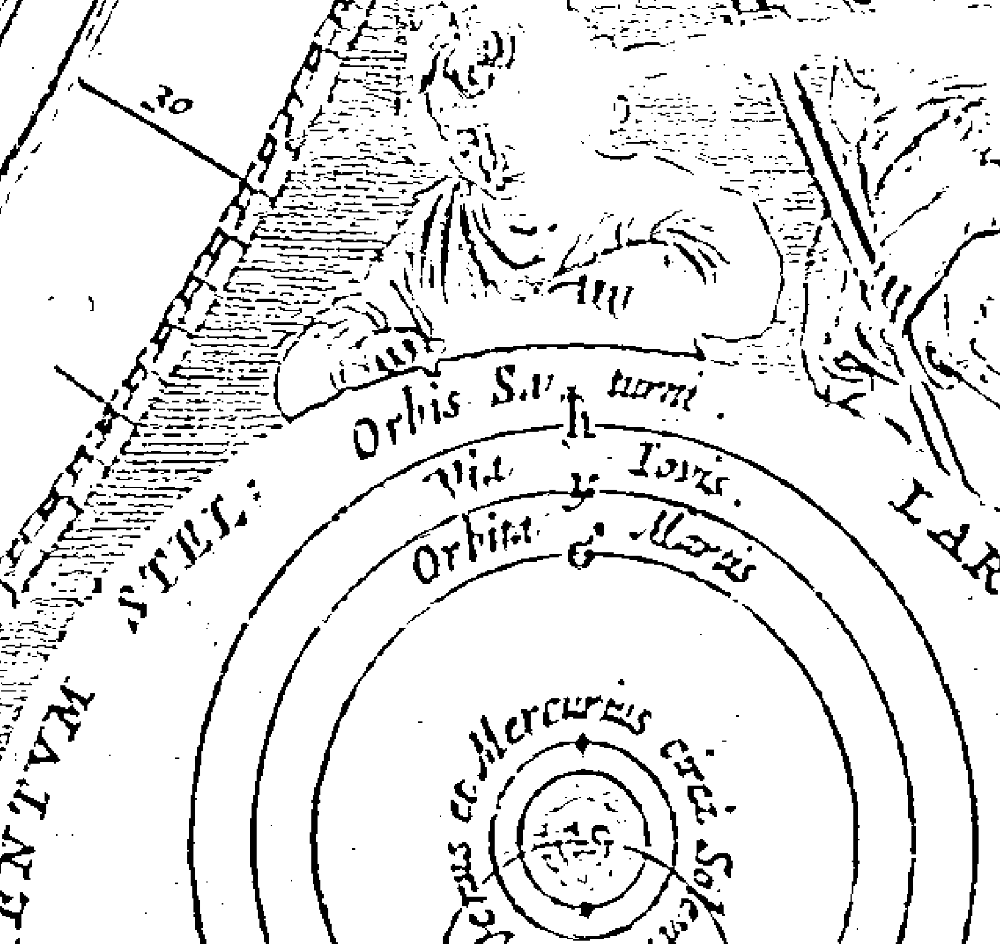

## HYPOTHESIS BRAHE.

in qua centrum Lunae et Cir momenti est Terra. respiciendum quing Planetarum Sol.

## 欧洲文艺复兴时期

随着科学的深入发展和相关宇宙定律的日趋完善，先前盘根错节的占星术与天文学渐行渐远，最终分道扬镳。然而，对大多数人来说，占星术依然是一个引人注目的学科，人们在需要的时候仍会向它求助。

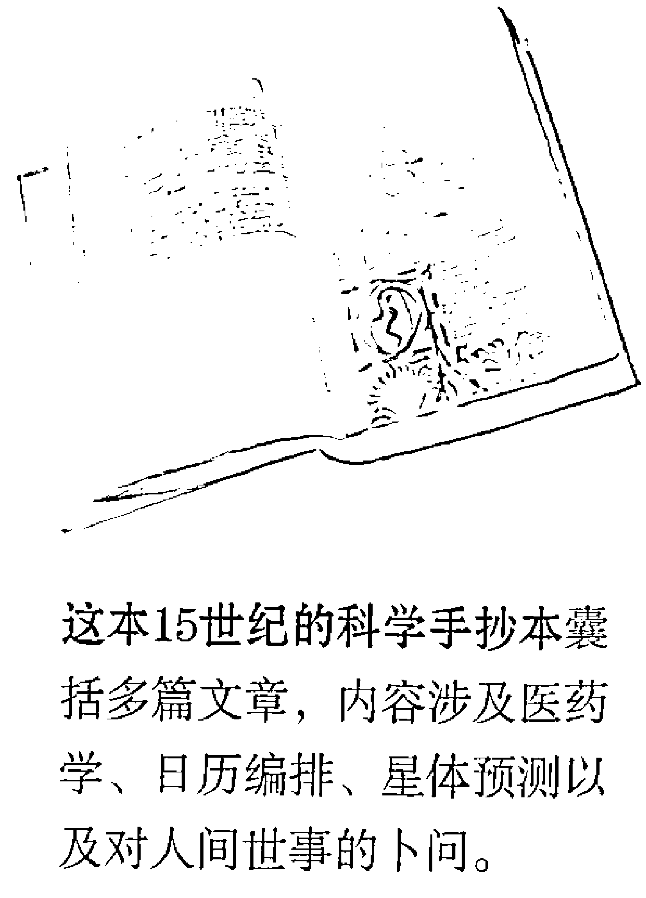

## 国王、皇后与贵妇

占星师历来热衷于占卜灾难，从饥荒到战争，从黑死病到泰坦尼克号的沉没不一而足。例如，占星家们曾普遍预言，1524年2月，当水象星座双鱼座出现众星合相时，将会爆发史上第二次大洪灾——这场洪水将会淹没整个世界。

## 欧洲王室

哈布斯堡皇帝鲁道夫二世（Rudolph II，1552—1612）庇护供养了好几位占星师。

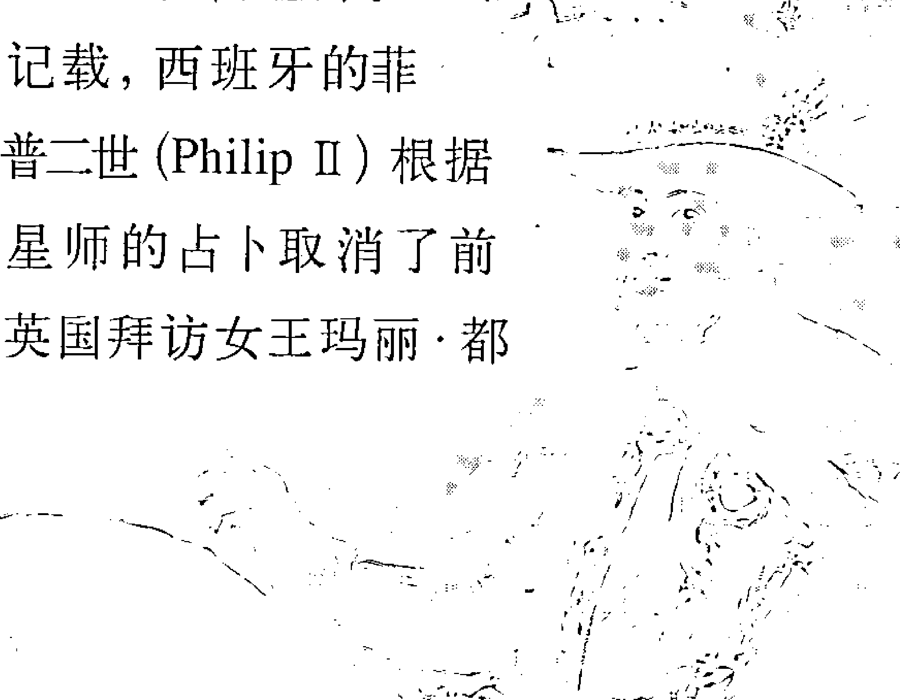

据记载，西班牙的菲利普二世（Philip II）根据占星师的占卜取消了前往英国拜访女王玛丽·都铎。

50多位占星师曾在100多部作品中对这种异常天象进行分析，与此同时，他们也小心防范，尽量隐蔽自己。哲学家阿戈斯蒂诺·尼福（Agostino Nifo，约1473—1538）声称，尽管降水量会有所增大，但从木星对土星的支配情况来看这并无大碍，反而是一种有利迹象。同时，他也提醒人们要注意防洪。

2月份出人意料的好天气令博洛尼亚大学（因占星研究而著称的学府）的占星师们深感意外。但他们很快就发现自己的预言只是在时间上出现了些许偏差，因为在这一年余下的10个月里，整个大地持续遭遇雨水天气侵袭，并伴有大风冰雹。罗马教皇为此一度进行祷告，希望减轻暴风雨所带来的灾害。

西班牙的菲利普二世（Philip II）听从占星师的建议，没有前往英国拜访女王玛丽一世（Mary I），因为占卜显示这位皇帝的英国之行将凶多吉少。

锋的日程安排，因为占卜显示这位皇帝的英国之行将凶多吉少。在英国本土，皇室和占星术依然保持紧密联系，这种关联甚至在征服者威廉大帝到来之前就已经存在。亨利六世（Henry VI，1421—1471）曾向一位韦尔奇大师卜问其加冕吉时，后来，这位皇帝钦点理查德·德·温德若斯（Richard de Vin- derose，英国人，曾在法国接受训练）为宫廷占星师。亨利八世（Henry VIII，1491—1547）十分相信尼古拉斯·克拉策（Nicholas Kratzer，巴伐利亚数学家、占星师）的占卜，在他统治时期，这位皇帝明令禁止神职人员布道贬低占星术。意大利哲学家托马索·坎帕内拉（Tomasso Campanella，1569—1639）曾直面教皇乌耳班八世（Urban VIII），为占星术辩说，此人随后前往法国为多位杰出人士进行占卜。哲学家兼科学家乔尔丹诺·布鲁诺（Giordano Bruno，1548—1600）是占星术的另一位有力支持者，他坚信“一切取决于上界（the upper world）”。

迪伊——一位坚信数学定律是万物本原的科学家——是文艺复兴时期占星学派的中坚力量。他周游欧洲列国，曾在巴黎大学的讲堂授课，也曾在捷克的布拉格（Prague）和波兰的克拉科夫（Krakow）任职。迪伊热衷于研究星象是如何对万物产生作用的：他推断，很可能是通过星体发出的“光线”（rays）。同时，他认为，人类既然有能力测量磁力，就应当及时探明这些“光线”的本质以及它们是如何影响人类身心的。迪伊呼吁人们对天文学进行更为细致深入的研究，以确定天体的实际大小、距离和它们所产生的影响。他撰写了Propaedeumata一书，尽管此书现已残缺不全，但仍不失为英国占星宝典。

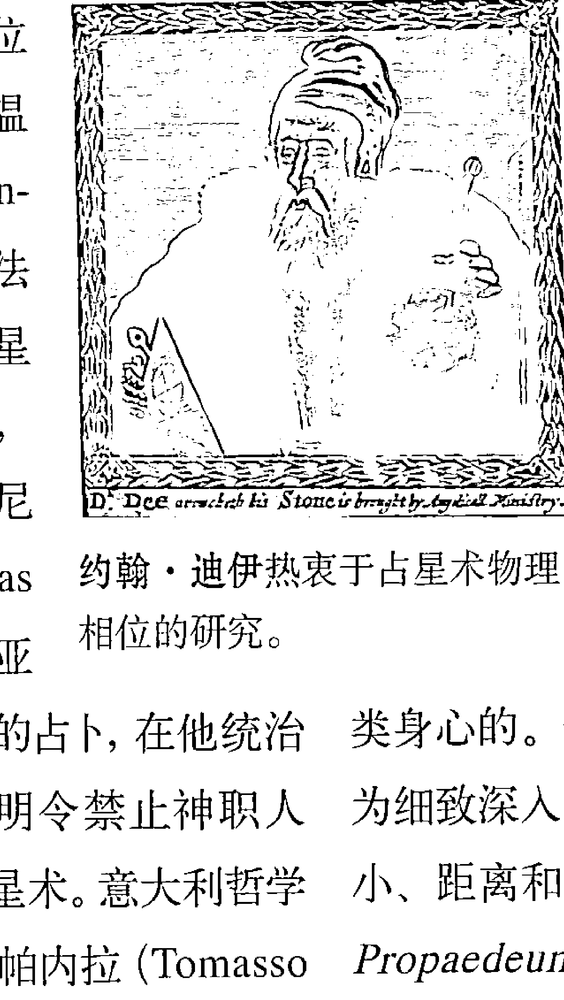

### 约翰·迪伊(John Dee)

这一时期欧洲最负盛名的占星师是约翰·迪伊（1527—1608），他同时是英国著名的航海家、制图家和数学家。这位占星师为伊丽莎白一世卜问挑选加冕的良辰吉时，随后成为女王的首席顾问。

约翰·迪伊热衷于占星术物理相位的研究。

### 占星术与天文学

16世纪是众多卓越天文学家诞生的年代。现代天文学家往往极力回避一个事实，即这些16世纪的天文界前辈曾将占星术纳入天文研究体系。比如，第谷·布拉赫（Tycho Brahe，1546—1601）花费大量精力研究占星术，并在哥本哈根大学（University of Copenhagen）的课堂上为这一学科正名；尼古拉斯·哥白尼（Nicolaus Co- pernicus，1473—1543）的藏书室里摆放着多部翻旧了的占星书籍，而约翰尼斯·开普勒（Johannes Kepler，1571—1630）则持有自己的“天宫图书”。1594年，开普勒在格拉茨（Graz）地区教授数学之余编写了一份占星年历，预言强冷空气将来袭，土耳其人也会随之入侵奥地利：1月1日，如他所料，天气严寒（他在随后的书信中形容当天“冷得能把鼻子冻掉”）；正

是在这一天，土耳其军队发起进攻，占领了从奥地利的维也纳（Vienna）到德国的新城（Neustat）之间的大片土地。

像开普勒这样卓越的科学家竟然笃信占星术，这是时下的天文学家所不愿承认的，为了驳斥这一点，他们断章取义地引用开普勒的文字，如“关于天文学（理智的母亲）怎样从占星术（愚蠢的女儿）的普及当中受益”。然而，大量的证据表明开普勒的确信奉占星术，包括占星卜问和排算命盘。在1599年4月写给他的朋友兼同事乔安·赫瓦特（Johann Herwart）的一封信中，开普勒问道：“天体是如何在一个人降生时影响他的性格的？”

他自问自答，“天体对人的作用就像农夫随手拿绳套把南瓜捆起来；这些绳套对南瓜的生长起不了大作用，却决定了它的形状。天体也是这样作用于人的：它们没有为人设定道德标准、增加人的阅历，也没有赋予他幸福、子嗣、财富和妻子，而是预设了他一生的轨迹……从我个人的命盘来看，土星和太阳作用于六分方位（我喜欢采用自己最熟悉的例子），所以我本人皮肤干燥多疤、身材矮小。同时，心灵脆弱，只好将它藏匿在文学的角落里；这颗心灵常常焦虑不安……”随后，他进一步详解自己的命盘。在题献给詹姆士一世（James I）的《和谐论》（Harmonics）一书的第四部，开普勒对自己的命盘进行了更加详细的解析。

## 法国宫廷

英法两国皇室对占星术十分痴迷，程度丝毫不逊色于罗马教廷。法国国王亨利二世的遗孀——卡瑟琳·德·梅迪奇（Catherine de’ Medici）分娩时下令一位占星师伴随左右。随后，其子路易十三（Louis XIII，1601—1643）也效仿这一做法，命占星师让-巴蒂斯特·莫林（Jean-Baptiste Morin）近旁迎接他的儿子——法国未来的君王路易十四（Louis XIV，1638—1715）的降临。后来，在路易十四的新婚之夜，占星师莫林藏身婚房帷幕之后，奉命记录这对年轻夫妇的圆房时刻，以便精确推算胎儿的性别。

卡瑟琳·德·梅迪奇

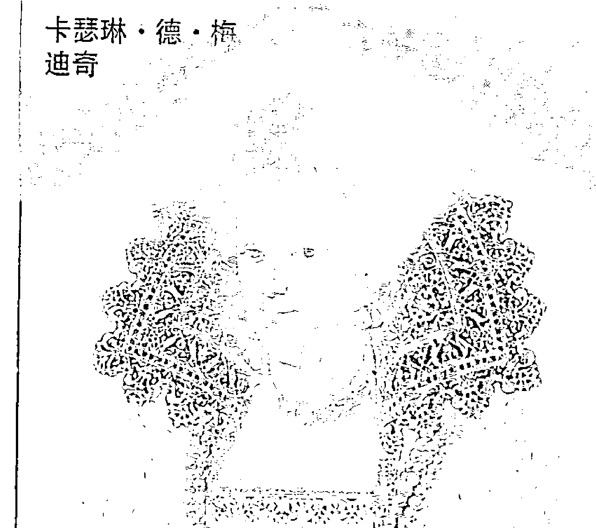

## 文学作品中的占星术

17世纪，占星术的发展态势更加迅猛，风靡英格兰。撇开其迷信色彩，很少有人对占星术进行公然抨击，英格兰的权威学者名流也纷纷为其著书立说——其中最具影响力的当属沃尔特·罗利爵士（Sir Walter Ralegh）在《世界历史》（History of the World）一书中所做的辩说：

> “如果我们承认上帝为万物带来生机，将清泉注入冰冷的大地、岩石和矿石中，这股清泉滋润万物的同时也净化了人间，那么，为什么还要否认美丽星辰的力量呢？尽管星辰众多，数不胜数，但切不可轻视它们，因为上帝法力无边，每颗星辰都具有独特的价值、优点和作用。”

16世纪末伦敦暴发大瘟疫，在此期间，身为占星师和医生的西蒙·佛曼留守城内，收治患者。

莎士比亚创作戏剧不仅仅是为了博得同行的好评，也是为了娱乐大众。为了使作品通俗易懂，他运用了大量的占星笑话。他认同现代占星观点，认为星体为人指引方向，但并没有强加于人：

> “错不在命运星辰，亲爱的布鲁特斯，而在我们自己，我们都是些无名小卒。”

那些声称莎士比亚敌视占星术的人也许没注意到这一点：在他的剧作中，公然诽谤占星术的全都是一些反面人物。

## 西蒙·佛曼（Simon Forman）

莎士比亚极有可能认识同时代最成功的占星师西蒙·佛曼（1552-1611）。莎翁在银街（Silver Street）的房东蒙特乔依太太是佛曼的顾客，佛曼在环球剧院（Globe Theatre）观赏莎翁戏剧后也写有一本观剧记事簿。佛曼是一位医生，同时作为占星师，他也为来自社会各阶层的人士占卜，包括富有的商人、船长、贵族以及平民。前来问卜的人还有艾塞克斯伯爵夫人和伊米莉亚·拉尼尔（Emilia Lanier，很多人认为她就是莎士比亚十四行诗里黑肤女士的原型）。

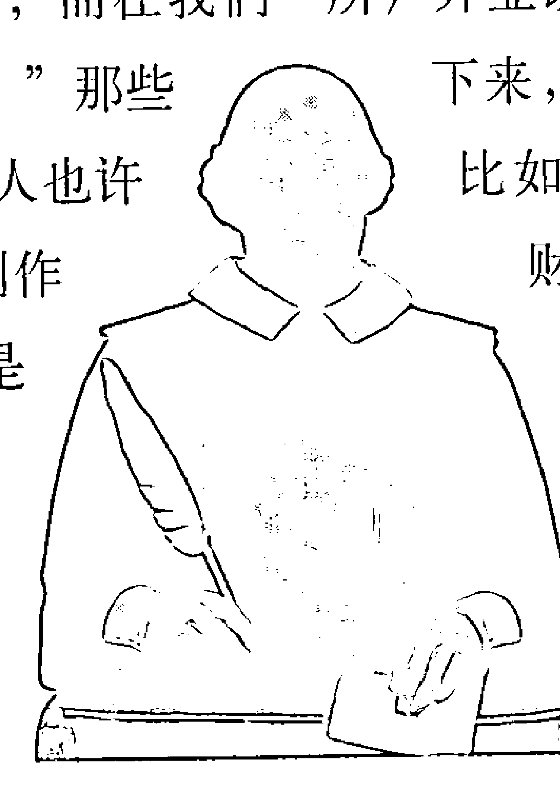

浏览他留下的档案文献，人们会发现，自从伦敦斯特兰德大街（他的住所）开业以来，他一直坚持将案例记录下来，包括形形色色的占卜问题，比如，卜问丢失的宠物、被偷的财物、妻子和情人的忠贞、一位女子是否会怀孕或者她的丈夫会不会因为偷窃而被处死。

佛曼生性风流，常运用占星术满足个人私欲。通过绘制女性顾客的星盘，他排算出她们易受诱惑的时间。也许是因为他风流倜傥，也许是因为他推算精准，佛曼屡屡得手，很少有女性顾客能逃脱他的引诱。

### 17世纪至19世纪

18世纪早期，占星年历风靡一时，这些年历根据星体运行等天文现象展现各式图表和数据，尽管如此，此时的占星术学术声誉并不高。但是，到18世纪末期，占星术在英美学术界得到进一步发展，其专业地位也得以重新确立。

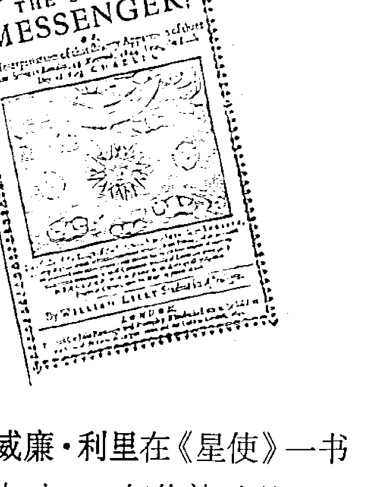

威廉·利里在《星使》一书中对1644年伦敦天现三阳的奇异现象进行了阐释。

### 战争、性与新行星

活字印刷出现后，印刷书籍广为流传，有力地推动了通俗占星术的发展。占星年历是最早采用活字印刷的书籍之一——公元1448年，第一本年历在德国的古滕堡地区问世，先于著名的《古腾堡圣经》（Gutenberg Bible）8年出版。到18世纪初，占星年历风靡欧洲大陆——不管是地位显赫的查理一世（Charles I），还是约翰·威利上尉（John Wheale, 此人出海时总是携带“一瓶墨水、一张年历表、一本袖珍占星年历”）这样饱经磨难的海员，只要买得起，几乎人手一本。威廉·利里（William Lilly, 1602—1681）是第一位在英国出版年历的占星师，他还撰写了首部英文占星巨著——《基督教占星术》（Christian Astrology, 1647）。这部书给英国占星研究带来巨大影响。整整一个世纪里，它被奉为研习占星术的宝典。借用利里的话，此书教导人们在为他人占卜时，要“有人性、礼貌、友善，不妄下论断；不要用严厉的措辞使他们心生恐惧、备受煎熬；指引厄运当头的人向上帝祷告，祈求上帝的宽恕……不要让金钱（或者其他令占星艺术蒙羞的世俗之物）左右你的占卜”。

## 生存之战

英国内战期间（1642—1651），占星师分成两派，各为其主。他们纷纷发布战事预测年历，预言其所在阵营将大获全胜。在这个多事之秋，私人占卜也应运而生，大多是女性卜问在前方作战的儿子和丈夫的生死。

不管人们是否愿意承认，艾萨克·牛顿（Isaac Newton, 1632—1727），这位英国最伟大的科学家一生都笃信占星术。相传，天文学家埃德蒙·哈雷（Edmund Halley）曾对牛顿的这种“愚信”大加嘲弄斥责，认为占星术是无稽之谈，双方因此产生芥蒂。到18世纪早期，占星术的发展进入低潮期——至少在学术领域是如此。

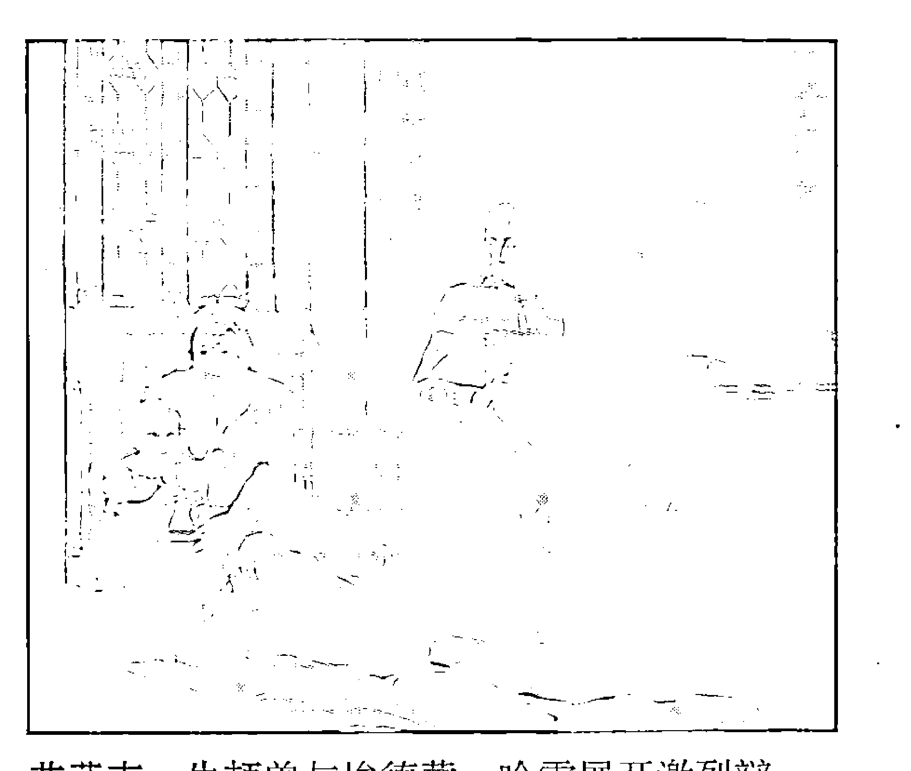

与此同时，欧洲大陆开启了伟大的百科全书时代。公元1751年，狄德罗（Diderot）和达朗贝尔（D‘Alembert）合编出版了经典之作《百科全书》（Encyclopédie），对占星术进行了必要的梳理介绍。20年后，《大英百科全书》（Encyclopædia Britannica) 第一版问世，这部书把占星术定义为“一种推测性科学，并且早已沦落为一种备受嘲讽鄙视的学科”。尽管上述论断失之偏颇（一些大学的学者始终认为占星术值得研究），但这一时期的占星师的确没有发挥应有的作用，他们对法国大革命和拿破仑战争形势漠不关心，只是热衷于绘制、排算拿破仑·波拿巴（Napoleon Bonaparte）的命盘。

到18世纪90年代，英国职业占星师空前增多（许多人研习利里的著作自学成才），他们合力发行了定期刊物《占星师的杂志》（The Astrologer‘s Magazine），谨献给“一门历史悠久、却屡遭无知之徒诋毁中伤的科学”。

事实上，启蒙运动之后，欧洲占星术研究进展缓慢。但是，在英国，自1780年起，占星术逐渐回归社会，地位日显重要。然而，1824年，这种良好的发展态势被完全打破。这一年，英国国会通过一条议案，明令禁止任何人“采用占卜之术……欺骗陛下的臣民”，否则将被判有罪。这条法令将江湖骗子一网打尽，不过也误判了大批有声望的占星师。

英国内战期间，占星师各自为营，分别加入议会派和保皇派，为各自阵营卜问吉兆。

### 美国的占星术

美国占星术的发展状况和英国相似。查尔斯·莫顿 (Charles Morton,查尔斯顿地区长老会牧师) 的《物理概要》(Compendium physicae) 在哈佛被选作教科书,为现代科学研究打下基础。这部书没有涉及当时流行的占星卜算,却认为星体运行和人类身心健康之间存在联系。

其他哈佛学者对占星术也有浓厚兴趣:艾萨克·格林伍德 (Isaac Greenwood),美国霍利斯 (Hollis) 国家实验室首位数学、自然哲学教授,曾在一篇论文中指出:“占星师们的推测有其哲学依据,他们究竟揭开多少奇迹奥秘,我们不得而知。”耶鲁也不甘落后,塞缪尔·约翰逊博士 (Doctor Samuel Johnson) 致力于研究“星空以及其力量和影响”。据称,这一时期的美国,除了穷困潦倒的人家,家家户户都能找到两部书:《圣经》和最新的占星年历。对农民而言,后者更加实用——比如,其中一本年历提到“要进行放血治疗、服药或者顺利宰杀牛羊猪,就必须对应参照自身宫位所掌管的身体部位。”另一本则指出“处女座或白羊座的人在月亏时”才能对马匹进行阉割。

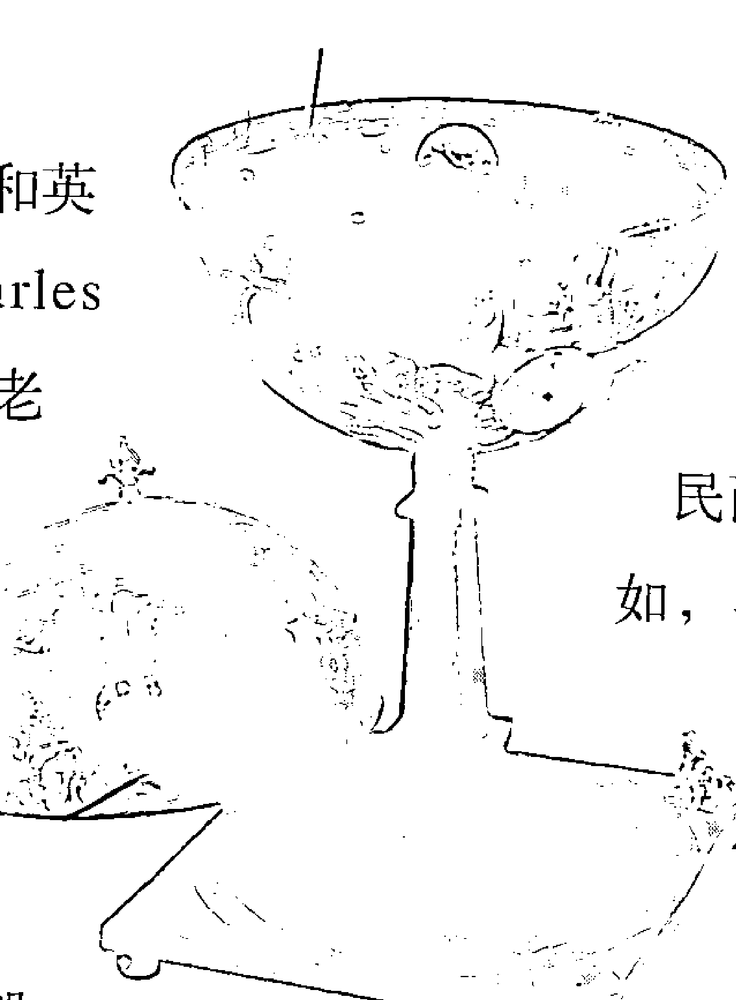

### 欧洲的占星术

美国占星术在很大程度上是对欧洲占星术的模仿——19世纪,尽管替人占卜已经成为一种职业,占星师们仍然通过大量出版占星年历从中获得可观的报酬。19世纪中叶,英国的上层人士常常抱怨:就连最下层的穷人都人手一本占星年历。大多数人参考年历进行日常活动,比如,如果年历上标明某日有雨,人们会暂不割草;不是吉日,他们也会放弃给牛喂药。

19世纪最负盛名的两位占星年历编写者是罗伯特·克洛斯·史密斯 (Robert Cross Smith) 和理查德·詹姆士·莫里森 (Richard James Morrison),两人同在1795年出生。史密斯,别名拉斐尔 (Raphael),专精于占卜爱情、婚姻、财运、生意前景以及旅行。他主编了一本名为《漂泊的占星家》(The Straggling Astrologer) 的杂志,是最早在杂志里发表每周预测的人。与此同时,自诩为萨基尔 (Zadkiel) 的莫里森告诫读者千万不要到要价只有五先令的占星师那里问卜,因为“任何有知识的人都不会为这点儿可怜的钱而折腰”。莫里森创办的期刊《萨基尔历书》（Zadkiel’s Almanac）在1861年声名鹊起，因为这一年的期刊刊登了他的一则预测，即受土星的影响，在8月26日这一天或前后出生的人将出现凶兆。同年，艾伯特王子（Prince Albert）死于伤寒，而这位王子的出生日期恰好是8月26日。

> > **女性占星师**
>
> 在出版的占星年历中除了列出吉凶日以外,像莎拉·吉娜 (Sarah Jinner) 这样的女性占星师还就人类各种日常活动提出参考意见——包括性行为。其他女性占星师在这一方面也不甘人后,提供大量相关意见,比如,多萝西·帕特里奇 (Dorothy Partridge) 认为“1月份时身材矮胖健硕的伴侣精力最旺盛”,同时,这些女性占星师们普遍认为,当月亮落入人马座时是“丈夫展现男性雄风”的最佳时刻。于1704年首次发行的《女性日记》(The Ladies' Diary) 深受民众欢迎。这是一本占星年历,有点类似于时下的女性杂志,内容涉及烹饪、美德、爱情的本质以及占星建议。到18世纪50年代,这本年历每年的销售量高达3万册左右。

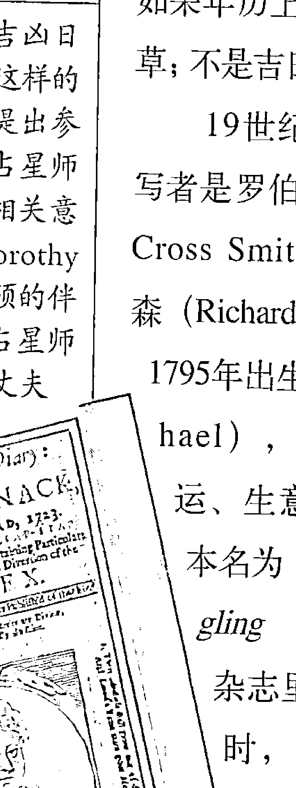

海王星等“新行星”的发现并没有削弱占星术，相反，这些行星被用来对许多过去的命盘进行修订。

## 批量生产

如果说一个人的出现令西方占星术在19世纪末20世纪初全面复苏，那么，这个人就是艾伦（W. F. Allen, 1860—1917），他自称艾伦·里奥（Alan Leo）。此人曾加入布拉瓦茨基夫人（Madame Blavatsky）在伦敦创办的通神学会（Theosophical Society），成为一名职业占星师，并成立出版公司，聘请专业占星师绘制、排算星盘，然后让职员把他的意见誊写在这些图表上。他的“现代占星出版社”很快在巴黎和纽约成立分社。

里奥的首席助理设计了简单的出版制作流程，给公司带来巨大利润，流程如下：将分散的活页纸（每张纸上对应分析命盘的某一相位）简单装订成册并发送出厂，不对分析结果做任何综合性的处理。这种流程至今仍被一些用电脑绘制命盘的小型公司所采用。

### 现代行星

随着科学的发展，人们陆续发现三颗新行星，即天王星（Uranus, 1781）、海王星（Neptune, 1846）和冥王星（Pluto, 1930）。这些所谓的“现代”行星的发现令拉斐尔、萨基尔等19世纪的占星大师们措手不及。反占星阵营以此为据，声称占星术是无稽之谈。但是，占星师们却认为，这些新发现并未给占星术带来新的问题，反而有助于原有问题的解决。欧洲大陆所有的占星师重新对历史人物的命盘进行排算——如腓特烈大帝（Frederick the Great）、法国玛丽王后（Marie Antoinette）、俄罗斯凯瑟琳女王（Catherine of Russia）——他们发现这些“新”行星能揭示许多新的人物个性。经过几年的实证研究，他们最终探明每颗“新”星的独特作用，比如，受天王星影响较大的人，往往富于独创且多才多艺，但却容易性欲倒错或偏离；而受海王星影响较大的人，一般富有艺术天赋，擅长诗歌和舞蹈，且想象力丰富、内心敏感。哈维（Harvey）所开创的血液循环理论不是对原有理论体系的抨击和贬低，“新”行星的发现也是如此——这些发现不仅没有令占星术从此一蹶不振，反而丰富完善了先前的命盘。上述两大发现都是对现有知识体系的扩充。

海王星（Neptune, 1846）和冥王星（Pluto, 1930）。这些所谓的“现代”行星的发现令拉斐尔、萨基尔等19世纪的占星大师们措手不及。反占星阵营以此为据，声称占星术是无稽之谈。但是，占星师们却认为，这些新发现并未给占星术带来新的问题，反而有助于原有问题的解决。欧洲大陆所有的占星师重新对历史人物的命盘进行排算——如腓特烈大帝（Frederick the Great）、法国玛丽王后（Marie Antoinette）、俄罗斯凯瑟琳女王（Catherine of Russia）——他们发现这些“新”行星能揭示许多新的人物个性。经过几年的实证研究，他们最终探明每颗“新”星的独特作用，比如，受天王星影响较大的人，往往富于独创且多才多艺，但却容易性欲倒错或偏离；而受海王星影响较大的人，一般富有艺术天赋，擅长诗歌和舞蹈，且想象力丰富、内心敏感。哈维（Harvey）所开创的血液循环理论不是对原有理论体系的抨击和贬低，“新”行星的发现也是如此——这些发现不仅没有令占星术从此一蹶不振，反而丰富完善了先前的命盘。上述两大发现都是对现有知识体系的扩充。

占星师们却认为，这些新发现并未给占星术带来新的问题，反而有助于原有问题的解决。欧洲大陆所有的占星师重新对历史人物的命盘进行排算——如腓特烈大帝（Frederick the Great）、法国玛丽王后（Marie Antoinette）、俄罗斯凯瑟琳女王（Catherine of Russia）——他们发现这些“新”行星能揭示许多新的人物个性。

经过几年的实证研究，他们最终探明每颗“新”星的独特作用，比如，受天王星影响较大的人，往往富于独创且多才多艺，但却容易性欲倒错或偏离；而受海王星影响较大的人，一般富有艺术天赋，擅长诗歌和舞蹈，且想象力丰富、内心敏感。

哈维（Harvey）所开创的血液循环理论不是对原有理论体系的抨击和贬低，“新”行星的发现也是如此——这些发现不仅没有令占星术从此一蹶不振，反而丰富完善了先前的命盘。上述两大发现都是对现有知识体系的扩充。

## 20世纪

20世纪上半叶，占星术从占星专业期刊进入日常报刊。但是，铺天盖地的天宫图并未磨灭各界人士（如哲学家、政治家以及科学家）对这一学科的兴趣。20世纪末期，欧洲诞生了许多重大占星研究成果。

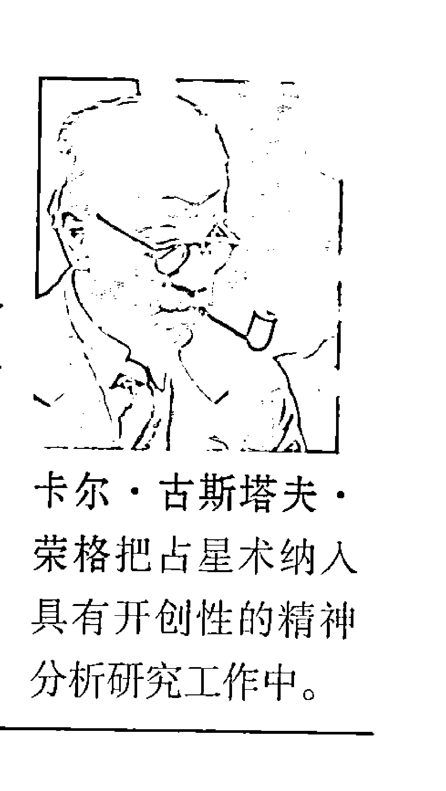

## 通俗占星术时代

在英国占星师内勒（R. H. Naylor）的带动下，分析太阳星座的占星专栏如雨后春笋般涌现出来。1930年，内勒为《星期日快报》（Sunday Express）撰写了一篇占星文章，成功预言了R-101号飞船的坠毁，他因此受邀担纲每周专栏主笔。为了扩大读者群，内勒着重分析黄道十二宫，因为几乎每个人都知道自己的太阳星座。在很长一段时间里，占星师成为流行报纸期刊畅销的重要砝码。内勒只身一人开创了太阳星座占星术。

与此同时，知识界对占星术的态度发生逆转：占星术不再被认为是无稽之谈，反而引起学者浓厚的兴趣。精神病学家卡尔·古斯塔夫·荣格（Carl Gustav Jung, 1875—1961）撰文声称：十二宫是个性的原型，体现出个体的全部潜在性格。他同时指出，十二宫具有更深层的意义，当一个人因某种情感困惑向占星师咨询时，他已经对自我的个性原型有一定的了解。

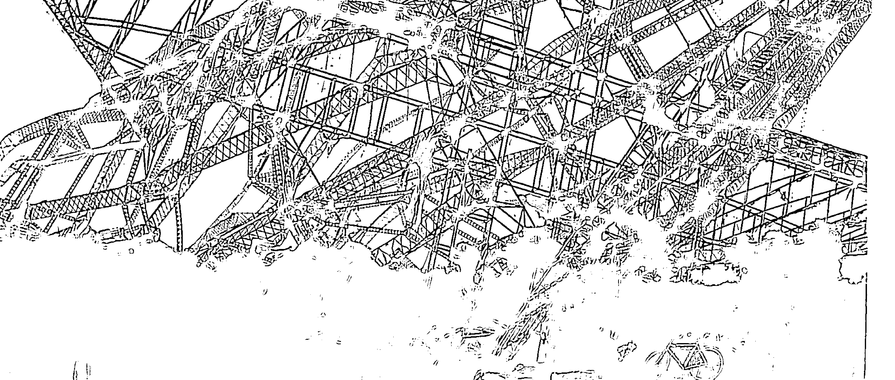

## 荣格的研究

在临床实践过程中，荣格尝试用占星在自己与患者之间架起一座理解和沟通的桥梁。他常和患者探讨分析双方的命盘，寻找共同之处。此外，荣格还热衷于研究共时性原理，即各种事件有意义的巧合。他认为，这些巧合可以被事先预知，并且与星体运行息息相关。

## 从“一战”到“二战”前夕

“一战”期间，英德两国占星师各为其主。艾伦·里奥对比分析英国乔治五世（George V）和德国皇帝的命盘后，毫无悬念地得出这样的结论：前者“宽宏大量”、“爱好和平”，而后者“厄运当头”。

两次世界大战期间，占星术在德国备受重视。赫伯特·弗赖赫尔·珂娄克勒 (Herbert Freiherr von Kloeckler, 1896—1950) 最早借助占星进行心理分析，演员卡尔·布兰德勒-普拉赫特 (Karl Brandler-Pracht) 创办了德国占星协会和期刊《占星评论》 (Astrologische Rundschau, 当时欧洲最权威的占星期刊)。20世纪二三十年代，德国出版了400多部专业占星书籍和宣传手册。

作为他占星研究的一部分，荣格分析了483对夫妇（共966份）的命盘——他不但对比分析每对夫妻的命盘，而且打乱所有命盘，进行随机男女配对分析。通过研究3.222万对假定的夫妻关系，荣格发现，如果夫妻双方感情基础稳固，在他们的命盘上会找到象征和谐关系的相位。荣格的态度增强了欧洲各国学者（尤其是法国和瑞士学者）从事占星研究的信心。

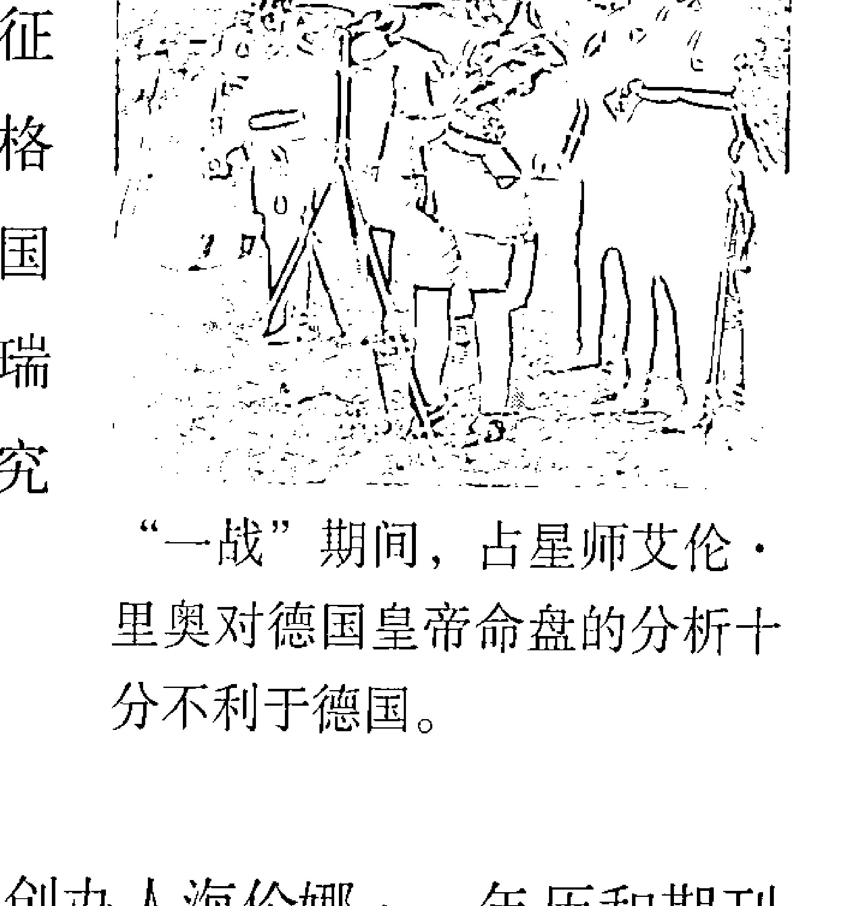

虽然纳粹党最初对占星术很感兴趣，但在1934年，它下令取缔一切“占卜活动”，禁止出版占星年历和期刊。在如此严峻的形势下，德国占星协会不得不设法自保，并为占星师提供庇护。

## 个人心理咨询

同时，在通神学会的创办人海伦娜·佩特罗弗纳·布拉瓦茨基 (Helena Petrovna Blavatsky, 1831—1891) 和她的美国同行亨利·斯蒂尔·奥尔科特 (Henry Steel Olcott) 的推动下，占星术再次风靡欧美两地。占星咨询师开始采用心理学术语进行性格分析和心理咨询，“预测”术语退居幕后。他们不再对顾客的未来进行“预测”，转而指导鼓励他们创造更加充实、美满的生活，最终实现自我。到20世纪末，所有稍具规模的传授占星术的团体都把心理咨询纳入教学体系。

## 第三帝国

然而，一些纳粹党高层人士却十分痴迷占星术，包括赫斯 (Hess)、希姆莱 (Himmler)、戈培尔 (Goebbels) 以及卡尔·恩斯特·克拉夫特 (Karl Ernst Krafft)，曾一度信奉占星术，并且准确预测了1939年针对希特勒的一次谋杀。尽管独裁者希特勒本人不相信占星术，战争爆发后，纳粹宣传部长戈培尔却命令克拉夫特前往柏林着手翻译法国占星大师诺斯特拉达穆斯 (Nostradamus)的预言，意在向世人昭示：德国主宰世界是大势所趋。英国当局也间接利用占星术进行战时宣传，拥有德国血统的占星师路易斯·德·沃尔(Louis de Wohl)成为丘吉尔(Churchill)的得力干将。

1941年5月，纳粹副元首鲁道夫·赫斯(Rudolf Hess)只身驾机飞往苏格兰，希望与英国达成和平谈判，这一事件令克拉夫特等大批占星师身陷囹圄。一向对占星师嗤之以鼻的希特勒声称赫斯受到占星术的蛊惑，命令盖世太保(Gestapo)逮捕了大批占星师。这其中有威廉·伍尔夫(Wilhelm Wulff)，这位占星师曾一度身陷纳粹集中营，后来被迫为纳粹要人希姆莱进行占卜。伍尔夫在战争中幸免于难，克拉夫特则在1944年死于前往布痕瓦尔德(Buchenwald)集中营的火车上。

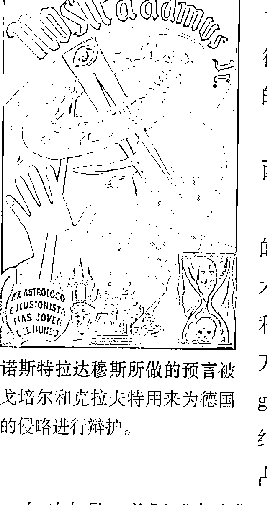

诺斯特拉达穆斯所做的预言被戈培尔和克拉夫特用来为德国的侵略进行辩护。

## 西方占星术的昌盛

和欧洲相似，美国的通俗占星术与严肃占星术交错发展。在报刊专栏和广播节目的推动下，伊万杰琳·亚当斯(Evangeline Adams)成为20世纪20年代美国家喻户晓的占星师，但在1914年，她曾因“占卜”被诉至公堂。庭审时，法官要求她解读一张匿名命盘（实际上，这是这位法官的儿子的命盘），随后，法官惊讶地发现她的解读完全正确，因此，当庭宣布亚当斯女士已经“将占星术提升到精确科学的高度”，并驳回此案件。

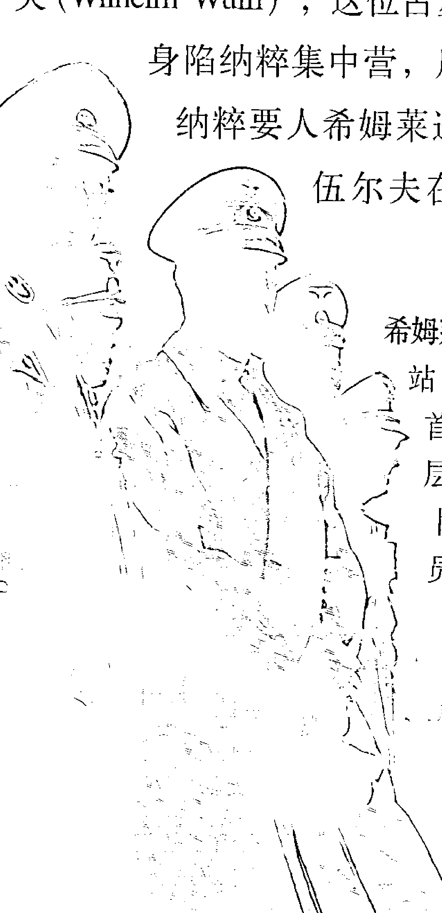

希姆莱(Himmler, 站在希特勒左手)是纳粹高层运用占星术卜问战事的官员之一。

20世纪六七十年代，西方民众对通俗占星术尤为痴迷：“你是什么星座的？”成为陌生人之间寒暄的话题；最抢手的占星撰稿人也摇身变成百万富翁，他们的文章往往同时刊登在各大报纸、期刊的专栏版面上。1960年，一位名为玛西娅·摩尔(Marcia Moore)的大学生轻而易举地就找到900位英美职业占星师为他的毕业论文做问卷调查；1969年，另一位记者则推测超过1万名的美国人以占星术为生。与此同时，许多占星师依然默默地从事严肃占星术的研究，如美国占星师丹尼·鲁德海雅(Dane Rudhyar)和英国占星师约翰·艾迪(John Addey)，二者的研究成果只在占星术界所熟知的专业杂志、期刊上发表。艾迪所进行的“宇宙时期的数”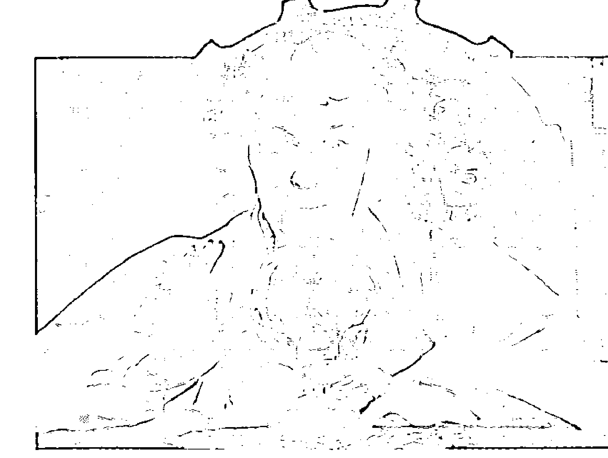伊万杰琳·亚当斯（Evangeline Adams）成为20世纪20年代美国家喻户晓的占星师。“律分析法”研究是20世纪后半叶最重要的占星成果之一。

### 事实评定

法国人米歇尔·高奎林（Michel Gauquelin）的研究有力证明了占星术的有效性。在他的妻子弗朗索瓦丝（Francoise）的协助下，高奎林用现代统计学的方法分析了数千张命盘，检验论证了几个占星命题。他指出，一个人的职业与其出生时的主导星象息息相关：比如，一位成功的运动员主要是受到火星的影响，演员则主要受到木星的影响，而在土星的影响下，个体有可能成为科学家或者医生。后来，科学家汉斯·艾森克（Hans Eysenck）再次验证了高奎林统计结果的精确性。

与此同时，欧美成立了许多占星教学团体，不但传授学生基本的占星知识——绘制排算命盘，而且引导他们进行高深层次的占星研究。英国占星协会和美澳占星协会定期联合举办研讨会，并出版报纸和学术期刊（比如英国期刊correlation）。同时，作为一种广泛的研究体系，占星术研究课程名目繁多，例如，美国的罗伯特·汉德（Robert hand）热衷于研究古代占星文献，重新燃起了人们对传统占星方法的兴趣——比如问卜占星术（horary astrology，参见294页）；澳大利亚的伯纳黛特·布莱迪（Bernadette Brady）关注原有恒星的作用，而其他人则侧重于研究新发现的恒星体的重要性，并基于研究提出新的理论。英国巴斯斯巴大学学院（Bath Spa University College）的文学硕士专业甚至增设了天文学与占星术文化研究课程。

很难说占星术已经重获学术体面。然而，人类至今未能探明已知宇宙的全部奥妙，这一事实令越来越多的人相信：放弃对占星术的研究是不智之举。

> ### 里根夫妇和占星术
>
> 加利福尼亚州州长罗纳德·里根（Ronald Reagan）曾签署一项法案，赋予占卜活动在加州以合法地位。1981年里根成为总统，通过总统夫人南希，占星家琼·奎格蕾（Joan Quigley）为总统的行程安排和健康提供建议。此外，在这位占星师的建议下，1987年9月8日的下午1点30分，美苏就销毁两国中程核导弹达成协议。里根在写给《洛杉矶时报》（Los Angeles Times）的占星师西德尼·奥马（Sydney Omarr）的一封信中曾这样说道：“提高对占星术的理解和赏析能力有利于推动科学事业的发展，能够激励所有的占星师们更上一个台阶，鼓励他们不断发现、不断探索。”
>
> 罗纳德·里根和南希·里根
>
> 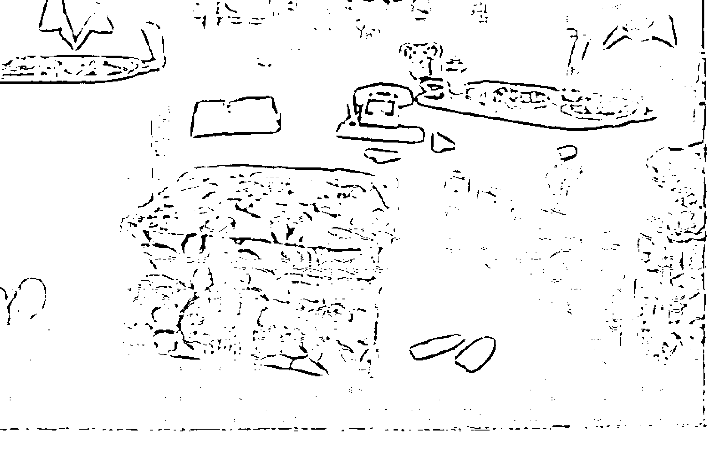

<!-- no content -->

# 黄道十二宫

## Guerreiro.

Samilh.

Aquaduct.


# 黄道十二宫

黄道十二宫的名称——白羊宫、金牛宫、双子宫等——源自12个星座。这些星座本身分布不规则，但是，沿黄道（ecliptic，环绕地球的虚构的轨迹，从地球上看，太阳似乎沿着这条轨迹运行）均匀分布、每宫呈30度的十二宫却沿用了它们的名称。太阳每年环“天”一周，依次通过十二宫。

很难弄清人类何时把12星座、动物和英雄三者联系起来。但是，我们知道，在古人眼里，12星座是有生命的——希腊哲学家亚里士多德（Aristotle，前384—前322）对此深信不疑，然而首次将这一说法作为事实记录下来的似乎是亚历山大基督教学校校长奥利金（Origen，于公元200年）。这种想法很自然，因为主宰12星座的动物（如狮子、公牛、双子等）同样具备生命特征和人类特性。每个国家对十二宫动物的称谓各不相同：比如，“公牛”一词的希腊文是Tauros，伊朗语则为Tora，梵文为Vrisha，巴比伦语为Gud.an.na；同样，希腊文Scorpios（天蝎宫）在上述后三种语言的对应词汇分别是Gazdum、Vrischika、Gir.tab。古往今来，占星师们莫不相信：当一个人降生时，太阳行至他的宫位，这一宫位对应的星座和神物将对此人产生神秘的影响。

## 了解你的星座宫位

如果有人问到你的星座，你往往会回答你出生时刻的太阳星座。事实上，太阳“落在”某宫这一说法并不意味着太阳和狮子座、双子座、双鱼座等12星座之间真正存在关联，这仅代表太阳在地球和用星座命名的宫位之间所处的位置。

我们往往把出生时的太阳星座当成自己的星座，并且，在浏览占星书籍时，几乎每个人都会先翻阅有关太阳星座的篇章。书中归纳的12星座（如狮子座或处女座）的一般特征似乎真实可信，但也不尽然。随着地球的自转，12星座和太阳一样，每天从东方地平线上升起，与12星座对应的十二宫的位置也相应发生变化。在出生的那一刻，东方地平线附近所升起的那一个星座被称为“上升星座”（Rising Sign或Ascendant）。大概80多年前，人们才认识到上升星座在命盘中的重要地位，据称，它掌管“外在的你”（the outward you）——外界所觉知到的“你”，而太阳星座则掌管“内在的你”（the inward you）——只有最亲近的人才能了解的“你”。然而，过去70多年里，随着太阳星座的日渐风靡，上述提法逐渐被人遗忘，甚至发生混淆。许多人沉迷于自己所处的太阳星座，无形中把星座分析建议作为行为准则。在他们看来，太阳星座似乎能更准确地呈现陌生人眼中的“你”，而上升星座则象征父母或者爱人眼中的“你”。经验丰富的占星师知道怎样兼顾这种矛盾心理。

黄道十二宫图：这幅15世纪的插图既展现了十二宫的先后顺序，也标明了各个宫位所掌管的身体部位——比如，白羊座掌管头部，金牛座掌管颈部。

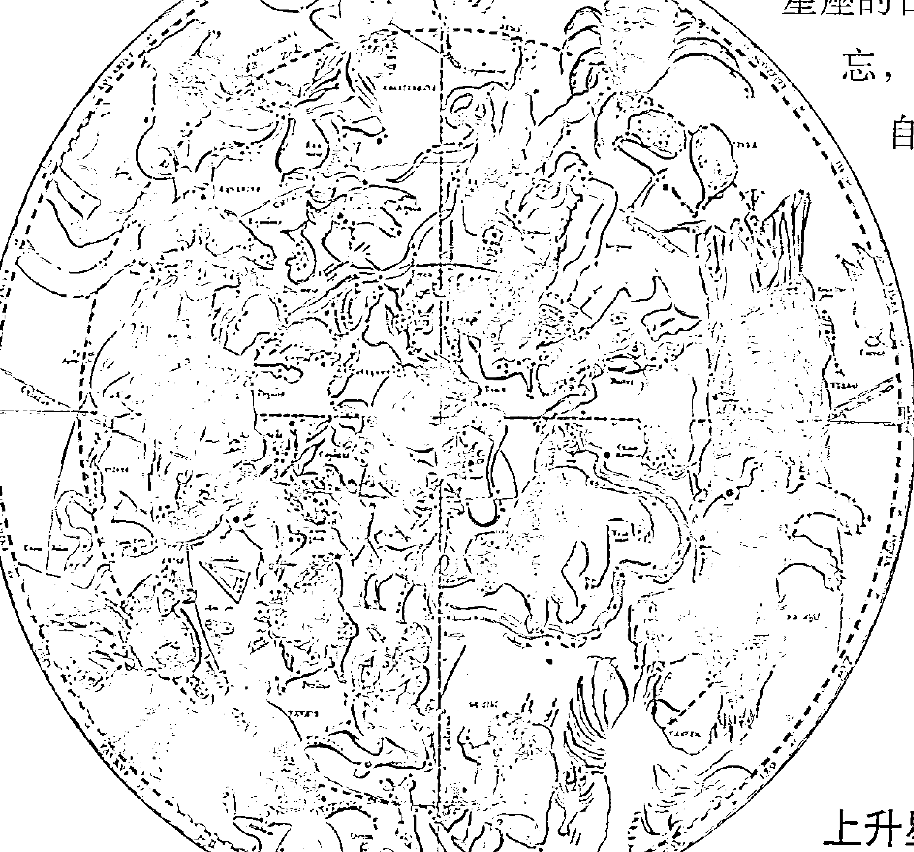

一幅18世纪的星盘，星盘上的野兽和众神赋予黄道十二星座各种特征和生命特质。

## 上升星座和月亮星座

我们必须明确上升星座在一个人的整体个性中所起的作用。如果你恰好在日出时分出生，那么你的太阳星座与上升星座相同，而且你要么属于人马座，要么属于天秤座。但是，太阳在出生时刻所处的位置仅仅是一个人的天宫图或命盘的一部分。我们都是12星座共同作用下的微妙产物，这些星座用不同的方式，与其他重要因素共同构成了每个人与众不同的天宫图。

随着地球的自转，大概每隔3分钟黄道带上的度数区间就会发生变化。因此，两个命盘或天宫图相同的人，必定是3分钟内先后在同一位置降生。这样的情况有可能发生，但是十分罕见。

出生时月亮落入的宫位也十分重要。传统上，人们认为月亮星座（Moon sign）表现的是遗传自父母的个性，但它也影响着人的本能的适应力。出现在命盘上的任何星体都具有重大意义，我们要加以全面考察。但是，多数占星师认为解读命盘时首先要看三大基本星座，即太阳星座、上升星座和月亮星座。

你可以在占星历书（星历表，也被用于航海活动）中查找自己的三大基本星座。这种书可以从书店订购，本书后面附有大量简明而精确的图表，谨供那些想探索命盘奥秘的人参考。

| 出生于两星座交界 |
| --- |
| 如果你出生时太阳刚好处于两个星座的交界处，不要理所当然地认为自己同时具备这两个太阳星座的特征。你的星座只能是其中的一个，它取决于太阳在两星座之间移位的时间（星历表可以给出准确的时间）。当浏览两个星座的描述时，你会觉得“我就是这个样子”，但这种相似性格特征的呈现很有可能是受到金星或水星的影响——在你出生的时候，这两大行星常常会落入紧挨你的太阳星座的前后两个星座。比如，如果你是巨蟹座人，却同时具备双子座或狮子座的特征，这往往是因为你出生时金星或水星恰好在双子座或狮子座。 |
|  |
| 哥白尼采用日心体系（以太阳为中心）绘制的宇宙图（1708）。 |

## 四元素

四元素为火、土、风、水（fire, earth, air and water），每种元素特性不同，分别构成三大类星座，即本位星座（呈现最单纯、原始的状态）、固定星座（象征稳健和决心）和变动星座（代表灵活变通的态度）。在这四种元素中，“火”代表“炎热而干燥”，“土”表示“寒冷而干燥”，“风”象征“炎热而潮湿”，“水”则预示“寒冷而潮湿”。

| 元素 | 本位星座 | 固定星座 | 变动星座 |
|---|---|---|---|
| 火 | 白羊座 | 狮子座 | 人马座 |
| 土 | 金牛座 | 处女座 | 摩羯座 |
| 风 | 双子座 | 天秤座 | 水瓶座 |
| 水 | 巨蟹座 | 天蝎座 | 双鱼座 |

## 分门别类

最终，人们沿用了最古老的星座分类方法。每份天宫图的侧重点不同，构成了命盘解析的第一步。

在其他传统的分类中，人们赋予每宫或者每组宫（triplicity，十二宫中相距各120度的三宫）一种元素（本页上方的图表概括介绍了四大元素的分布）。人们用“干燥、炎热、寒冷、潮湿”来形容四大元素的特征，这一说法在医药占星术中得到广泛应用，并被用来描述星体。比如，木星、金星、月亮被形容为“既干燥又潮湿”，土星“极为寒冷”，火星则“非常干燥”。同时，固定星座（fixed sign）代表足智多谋、坚忍不拔，但不知变通；本位星座（cardinal sign）象征行动，属于这一类星座的人往往是行动的发起者和领导者；变动星座（mutable sign）表示变通性、适应力以及间或的不稳定性。

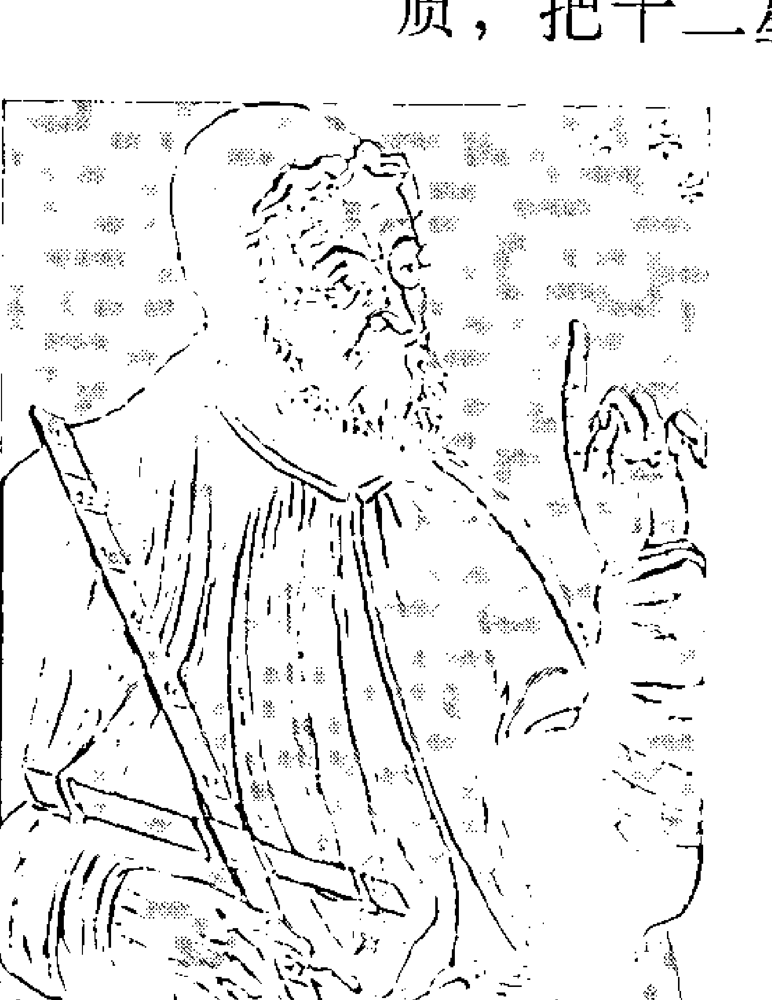

托勒密，公元2世纪希腊著名的占星家。

传统上，人们根据星座的不同特质，把十二星座分为阳性、阴性两类：“阳性星座”包括白羊座、双子座、狮子座、天秤座、人马座、水瓶座，其余六大星座为“阴性星座”。在此基础上，古人对星座特征做了更为细致的划分——例如，在希腊天文学家、占星师托勒密（约100—178）的笔下，白羊座、金牛座、狮子座和人马座“野蛮残忍”；巨蟹座、天蝎座和双鱼座则“多产”；而双子座、人马座、双鱼座又“相当平凡”。

占星师们普遍认为，每个星座与它的对立星座（polar sign，即黄道带上和此星座垂直遥相对应的星座）有着特别又微妙的关系。这一观念源自亚里士多德博大精深的学说，即对立面相互作用、相互影响。

> > “公羊总是信心满满，他能化危机为傲人的财富。”
> > 马尼留（Manilius），公元1世纪

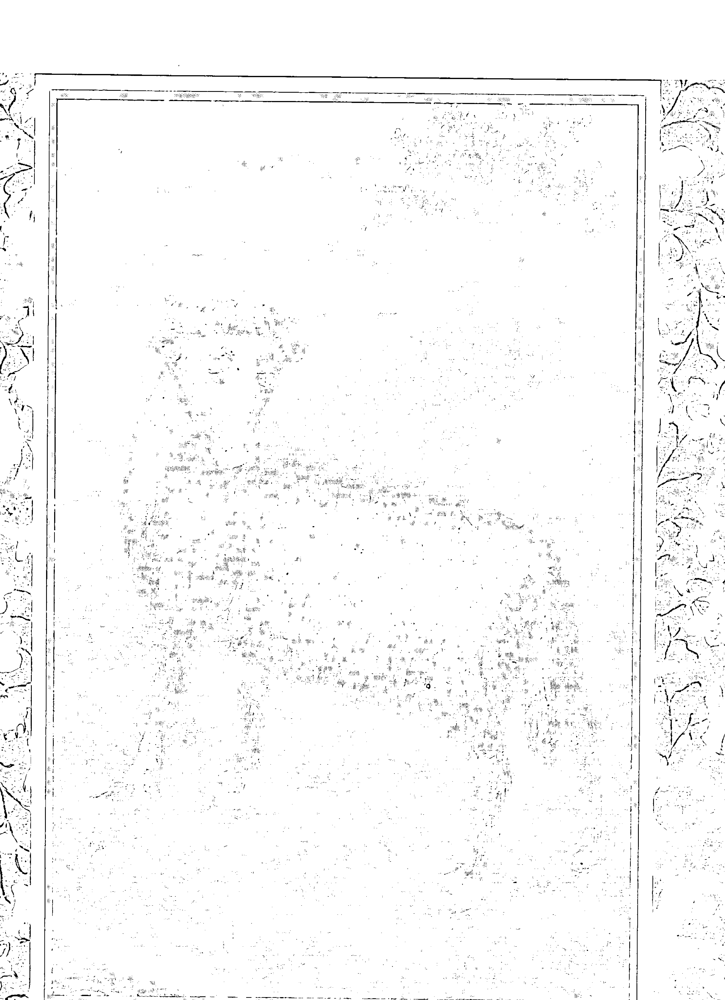

## 白羊座

白羊座人，最显著的性格特征就是渴望成功、开拓进取；但是，当个人理想和家庭生活发生冲突时，他们往往会表现出自私的一面。白羊座人缺乏耐性，但充满活力、干劲十足。

### 太阳星座——白羊座

每年3月21日（北半球的春分时节）太阳进入黄道第一个星座——白羊座，新的一年就此开始。白羊座是十二星座之首，在太阳落入白羊座期间出生的人往往个性独立。

太阳星座是白羊座的人（简称太阳白羊座人）做事信心十足，但常常考虑不周、过于急躁。他们有着强烈的成功欲望，一旦失败，就会产生深深的挫败感，甚至引发身心疾病。

过于自我是白羊座人最大的缺点，这主要应归咎于其好胜心理。“Me First”（“我永远是第一”）一直是白羊座人的座右铭！然而，白羊座人往往看不到自己的缺点，对于父母或朋友善意的提醒，他们也持怀疑态度。因此，认清这一缺点十分重要，这样才能加以改正。

传统上，白羊座属于本位星座，所以，这一星座的人大多活泼好动，并且从不吝惜对他人的鼓励。同时，白羊座又是阳性星座，其阳性星座特征与上述本位星座特征共同作用，强化了其外向特质，也激励这些

白羊座公羊，这是一本日历的4月份插图，源自1423年前后法国出版的一本彩色手抄本《贝德福德时刻》。

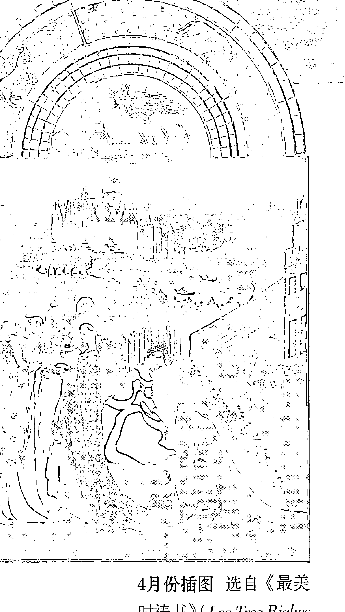

4月份插图 选自《最美时祷书》(Les Tres Riches Heures du duc de Berry, 1416),图像上方绘有星盘，白羊座清晰可见。

**白羊座**
| 属性 | 值 |
|------|-----|
| 象征 | 公羊 |
| 出生日期 | 3月21日—4月20日 |
| 守护星 | 火星 |
| 四象性 | 火 |
| 三方官 | 本位 |
| 阴阳性 | 阳性 |
| 掌管身体 | 头部 |
| 对立星座 | 天秤座 |精力充沛的白羊座人朝着他们梦寐以求的终极目标迈进。

公羊这一标志形象地展现了白羊座人的特征，使我们联想到它以犄角力战敌手的场景。有趣的是，白羊座群体里不但有积极活跃、性格外向的人，也不乏个性安静的人。近年来，占星师们对典型的白羊座男性和女性进行对比分析，发现后者更加随和，但其安静的外表下却潜藏着一颗坚定的心。她们有明确的目标，却不会像她们外向的“表兄们”那样虚张声势。比如，一位年轻的白羊座妈妈，在抚养孩子方面，会有很多好主意；在做一个称职的母亲的同时，她也能做好本职工作。

### 上升星座——白羊座

当白羊座是一个人的上升星座时，前面提到的种种个性特质就会以不同的方式呈现。必胜的决心将再次发挥主导作用，使此人消耗大量体力和精力——所消耗的能量远远超过太阳白羊座人。

当然，此人决心实现什么样的目标，这是由他的太阳星座和命盘上的其他因素决定的。他也许会失去耐心，但是，如果目标具有竞争性，他就会勇往直前、坚持到底，直到取得最终的胜利。一个上升星座在白羊座的孩子，在他很小的时候（特别是在与他的兄弟姐妹争抢玩闹的过程中）就会表现出上述特征。通过鼓励他们关心家人、爱护宠物，这种天生“爱出风头”的倾向可以得到有效抑制。

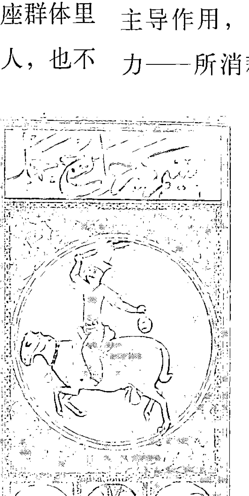

1550年，土耳其的一本彩色手抄本里描绘的白羊座。

## 一幅象征健康的图画

就体质而言，太阳白羊座人一般体魄强健。按照传统，白羊座掌管人体的头部。如果询问白羊座人他们是否有头痛的经历，他们或者回答没有，或者表示深受其害。小时候，他们常常从车架或树上摔下来，撞到头的概率远远高于其他太阳星座的人。

白羊座人应加强锻炼，这一点非常重要。他们当中的很多人都是体育运动的爱好者，热衷于参加足球、橄榄球这样的大型团体运动项目，也醉心于研习东方武术。

## 社会环境

上升星座在白羊座的人（上升白羊座人）能够很快适应周围的环境。坚忍不拔的精神令他们生性乐观，但他们行事过于高调，总是大张旗鼓，所以常常给他人带来压迫感，令人疲惫不堪。学会冷静思考对这些白羊座人大有益处，这样一来，他们在进行自我剖析时就不会走向极端。发展心理平衡至关重要，尤其是那些遇事过于冲动鲁莽的白羊座人。

关于健康，上升白羊座人与前面提到的太阳白羊座人有着同样的健康隐患——头痛，轻微的肾脏失调是引起这一症状的原因。同时，由于粗枝大叶、漫不经心的个性，他们也很容易发生意外。

需要在日常生活、事业和性生活当中得到有效的释放。但是，一定注意，不要让冲动急躁的个性坏了自己的事。

### 月亮星座——白羊座

月亮落入白羊座时，个人行事轻率，易受情感驱使。尤其在紧急关头，月亮白羊座人会一马当先。当其他人筋疲力尽、一筹莫展，需要有人振臂一呼时（比如，枯燥无趣的会议上要达成某项决议），月亮白羊座人会开门见山、直抒己见。在处理个人问题时，白羊座人的这种特性也会显露无遗，尤其是当他身陷困境、进退两难时。

这一星座的人还喜欢冒险，酷爱极限运动。他们渴望独立自主，这一点对年轻的白羊座人尤为重要。

月亮白羊座人的情感丰富而强烈，需要在日常生活、事业和性生活当中得到有效的释放。但是，一定注意，不要让冲动急躁的个性坏了自己的事。

有时候，由于其他星体对月亮的影响，月亮白羊座人的上述特征会受到抑制，他们的处事方式也会随之发生明显变化。如果出现这种情况，他们应该直面问题，努力按照适合自己的方式去生活——即使这意味着要做出许多关乎他人的重大改变或决定。

> 查理·卓别林（Charlie Chaplin）体现了白羊座人的坚强意志。作为一名表演家，他醉心于厄运连连、闹剧百出的喜剧世界。

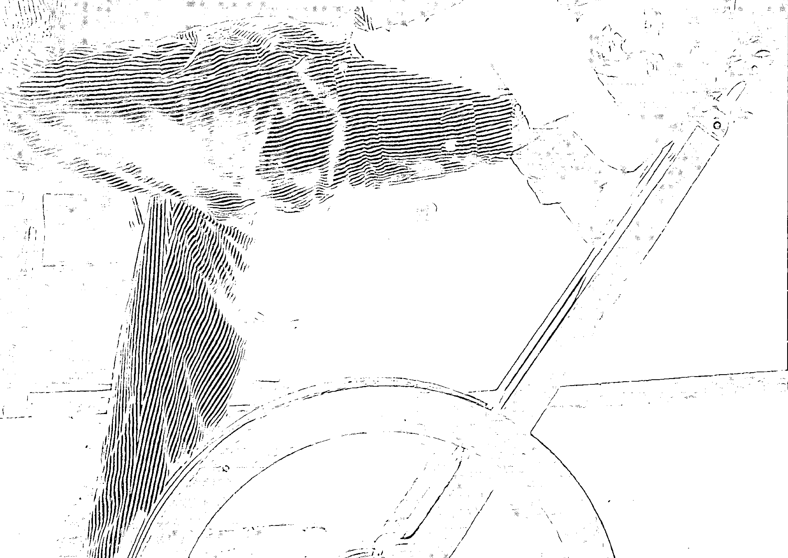

## 白羊座的友谊、爱情和稳定恋情

白羊座人大多都性格开朗、令人愉悦，这是和这类人交友的最大好处。他们会一直鼓励我们，包括我们的兴趣爱好和情感生活；当我们由于某种原因表现得拖拖拉拉时，他们会催促我们积极行动起来。记住一点，和某些星座的人一样，白羊座人有主导一切的欲望——对朋友也是如此。他们十分善于为他人打气，但是，如果对方不予理睬，他们很快就会失去耐心。影响。这类人有本事化解最复杂的局面，能在短时间内提出可行的解决方案，而不是一味地夸夸其谈。值得一提的是，尽管白羊座人喜欢随兴所至，但有必要事先做好计划。

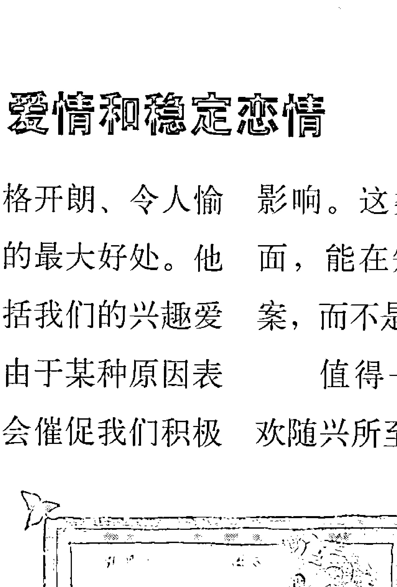

白羊座公羊，这幅图画来自13世纪中叶意大利的一本彩色手抄本。

## 简单的计划

当我们遇到棘手的问题时，我们的白羊座朋友将施以援手，在他们身上会呈现出奇妙的白羊特质——不管这种特质是受到太阳星座、月亮星座还是上升星座的影响。一开始的时候，白羊座朋友会欣然接受我们的临时邀请——是的，他们表示一定会来，而且对此很期待。但过不了几天他们就会反悔，随着约定日期的临近，他们很可能万分抱歉地告诉我们，自己将不能赴约。他们给出的理由也合情合理、令人信服，比如，他们的妈妈病了，他们要加班到很晚……但是，随着对他们了解的加深，我们会发现：多数情况下，他们只是有了更好的约会邀

请。他们为此费尽心机，却不善自圆其说——尤其是当他们的上升星座在白羊座时。白羊座的对立星座——天秤座对白羊座人这种个性也产生微妙的影响。天秤座人机智、圆滑，为了安抚他人不惜说谎。总的来说，我们的白羊座朋友风趣幽默，和他们在一起我们总能找到乐趣。即使双方的兴趣爱好不同，他们的热情也会感染我们。

### 白羊座的爱情

白羊座人缺乏耐性，如果他们的殷勤得不到心上人的充分鼓励或者积极回应，他们就会大失所望、兴致大减。对他们来说，重要的是应该懂得如何处理感情——他们痛恨和优柔寡断的人纠缠不清，很快便会提出分手。

明确这一点之后，白羊座人还需要明白，尽管他们极具个性魅力，对方有可能在第一时间对他们产生好感，但这并不意味着一见钟情。如果他们过于草率，很可能会错失发展一段美好关系的良机——不管这段关系仅仅维持了几周，还是更长时间。

为了赢得对方（刚刚确立关系的恋人或者正在追求的对象）的欢心，白羊座人会频繁地派送小礼物。他们体贴周到，想方设法让对方开心。他们性欲强烈，希望对方能够配合，这使得性冷淡的伴侣难以长期忍受。在恋爱初期，性和谐十分重要，但也需要保持一定的耐性。

## 太匆忙

白羊座人还需要注意一点：很多伴侣喜欢在性交前进行爱抚。由于天性冲动、性欲旺盛，他们往往会忽视这一点。最好采取循序渐进的方式，多些浪漫，同时注意技巧的运用。白羊座人的这种匆忙个性不会随着年龄的增长而消失。在上了年纪的时候，他们的性行为依然充满激情和活力。当然，这种方式能否同时满足双方的需求，尚有争议。

### 白羊座人陷入爱河

白羊座人的爱情来得快去得也快，他们是十二星座中感情最强烈的恋人之一。从整体上看，白羊座男女性欲强烈，在整个性行为过程中他们能获取纯粹的享受和愉悦——从追逐到卧室（或者汽车的后座）。无论在年轻时，还是步入中年，或者年纪更长，他们都喜欢和伴侣玩性游戏——的确，如果他们的伴侣厌恶这种方式，双方会因此备受折磨。

维纳斯，爱神，神像两侧是白羊座和天秤座这两大对立星座的标志——公羊和天平。

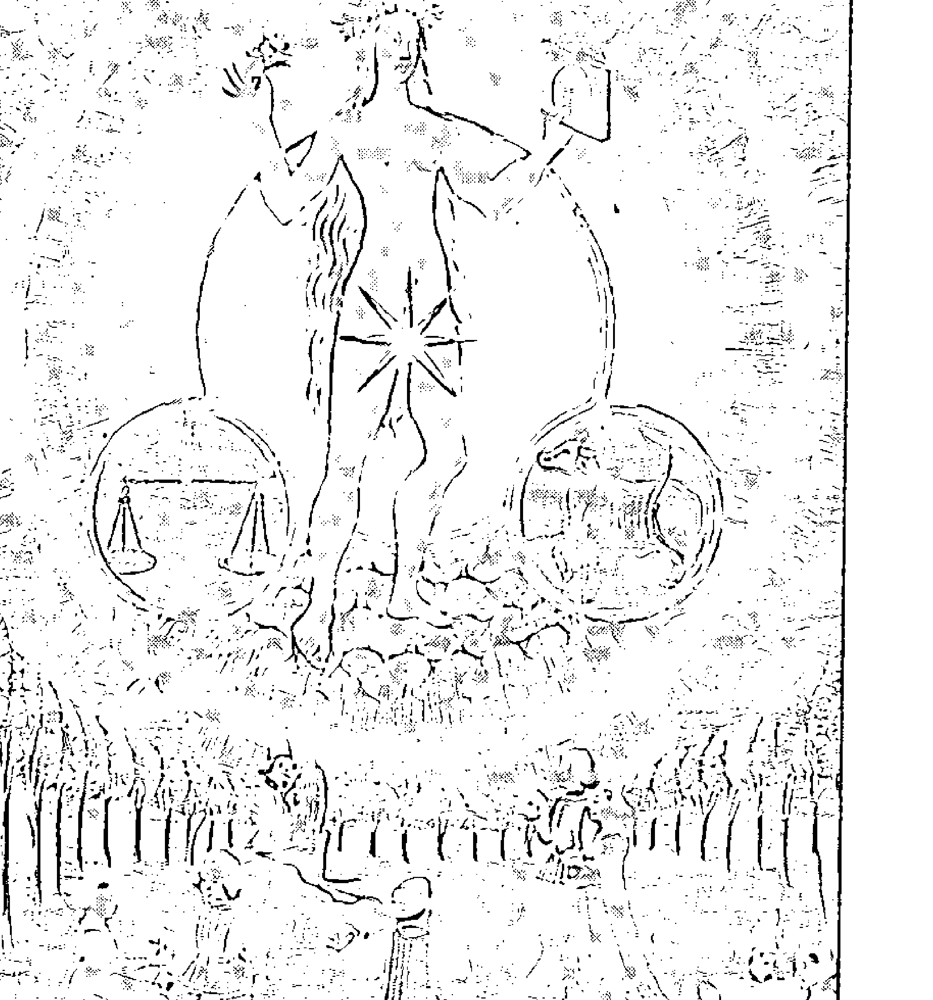

### 白羊座的稳定恋情

我们可以看到，在一段稳定的恋情中，白羊座人依然对爱和性保持同样充沛的热情和精力，但是，一旦他们发自肺腑地承诺成为长期的伴侣，他们身上就会呈现各种各样有趣的特质。

无论是从适应生活方式变化能力的角度出发，还是从实际操作能力的角度出发，他们都是很棒的家园建设者。他们有很强的动手能力，即使手头宽裕，很多人也不肯请专业人员而宁愿自己动手。但是，他们火一般的热情维持不了多久，如果不想让橱柜门长期堆在车库里，伴侣们就要适时地提醒鼓励这些已经另有所好的白羊座人，这一点很重要！

白羊座人的自私是维系长期关系的隐患，这表现在不同的方面。比如，他们沉迷于丰富多彩的业余爱好，往往会因此冷落伴侣，也忽视了对方的兴趣爱好。同样，如果他们从事一份富有挑战性的职业，需要常常把工作带回家或者频繁出差，这段关系也会出现问题——即使他们的初衷是为了使家人生活得更好。此外，如果性生活不和谐，过不了多长时间，他们就会寻找新的心仪对象。白羊座人的焦躁不安也是破坏关系的因素之一，为了消除焦虑、克服自私，和伴侣发展共同的兴趣爱好不失为一种积极的措施。

## 两极对立

在一段稳定的恋情中，伴侣间的互动常常受到其上升星座的对立星座的影响。对白羊座来说，这种影响来自它的对立星座天秤座。很难相信从白羊座人口中会说出“让我们等等看”这样的话，但是，在一段亲密稳固的关系中，这样的情况时有发生。固定的伴侣也会激起白羊座人浪漫的天性。

如果计划要孩子，白羊座人会成为出色的父母，他们充满活力，并且从不吝惜对孩子的鼓励。但是，他们会表现得过于强势，对孩子自身能力的发展关注不够。

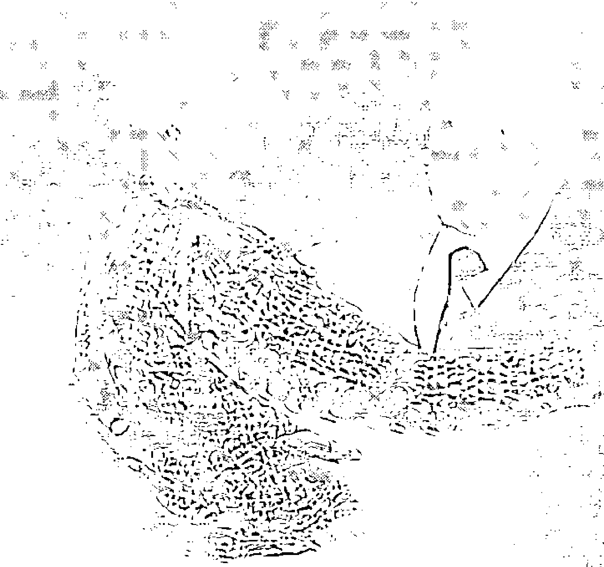

> “固定的伴侣会激起白羊座人浪漫的天性。”

最小的白羊座孩子会因新玩具、颜料和积木所富含的挑战性而兴奋不已。

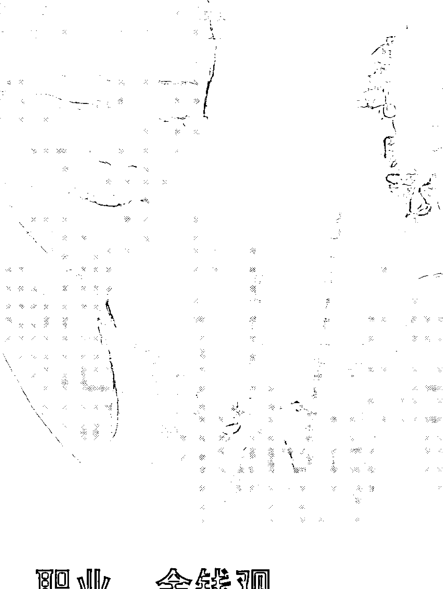

3月份日历插图，源自1423年前后绘制的一本法国彩色手抄本《贝德福德时刻》。

## 白羊座的教育、职业、金钱观

培养白羊座幼儿的独立感是很重要的。父母即使担心安全问题，也要放手让孩子做自己喜欢的事，因为这有利于孩子的成长。当然，每次时间最好控制在几分钟之内。他们很有可能喜欢幼儿园，但他们天生的活泼好动常常会令老师们头痛，新玩具、颜料和积木所富含的挑战性也会令他们兴奋不已；父母不久就会看到孩子的天性得到迅速发展。 到了上全日制学校的时候，父母应该鼓励孩子带些玩具去学校。如果班里恰好有一个孩子十分内向，而白羊座孩子能鼓励这个腼腆的伙伴和自己一起玩，那么，这对两个孩子都大有益处。这有助于培养孩子的分享意识，建立友好关系，能够进一步帮助他们纠正自私的心理、缓和不惜一切代价求胜的冲动心情。

### 成长期的逆反

随着年龄的增长，无论是在学校里还是在家里，白羊座孩子都表现出急躁的一面。但是，如果父母能够弄清孩子的潜力所在，就不会吝惜对他们的全力支持。需要牢记一点，白羊座孩子不喜欢受约束，他们很快就会识破不合理的校规，所以，规则的制定要有理有据、令人信服。有头脑的白羊座年轻人必将事业有成。当然，和所有的年轻人一样，他们也会犯错误，并且出错的概率远超过其他人。 在接受继续教育或深造时，白羊座人极易临时改变主意中途换专业，这时，父母必须指出其中的利害关系——这种做法将阻碍个人的发展，成功的希望也会越来越渺茫。其实，这是他们最不愿意接受的事情。往往会迅速确定下一个目标，全面迎接新的挑战。

## 火象星座之首

白羊座是三大火象星座之首。元素“火”代表情感丰富，稍有刺激白羊座人就会情绪爆发。这种强烈的情绪可以表现为极大的热情；相反，小的烦恼也会演变成盛怒，但是，如同瞬间燃起的火焰，来势凶猛却转瞬即逝，白羊座人不会因此愤恨不已或者闷闷不乐。有时候白羊座人火一般的热情会熄灭，这是因为他们感到厌烦或不满。他们刻不容缓、雷厉风行的作风极具感染力，令人赞赏，是太阳白羊座人个性当中不可或缺的因子。

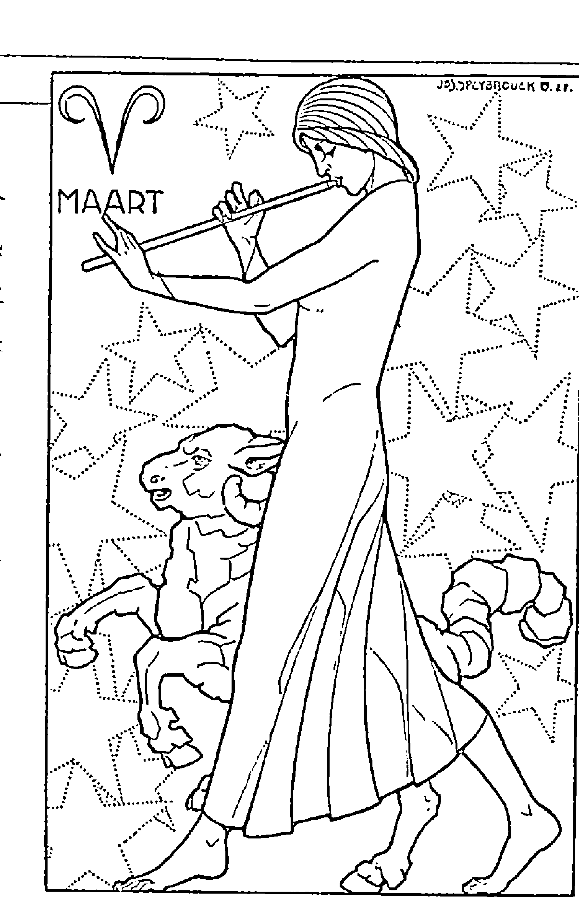

这是约瑟夫·斯比布鲁克于20世纪20年代所做的一幅画，描绘的是公羊伴随爱情女神维纳斯（掌管白羊座的对立星座天秤座）左右的场景。

### 白羊座与职业

人们可以在各行各业里看到太阳白羊座人的身影，但重要的是他们能够融入职场氛围，变压力为动力，在职场上勇往直前、所向披靡。他们显然不适合从事枯燥乏味、平庸刻板的工作，也难以容忍一位高高在上、心胸狭窄、吝啬刻薄的老板。沉闷的工作环境，如光线不佳或通风不好，也会令他们忍无可忍。

### 奔波忙碌的乐趣

白羊座人需要并且能够融入繁忙甚至嘈杂的工作环境——比如人满为患的办公室或者热火朝天的厂房。即使他们的本职工作平淡无奇，白羊座人也会很快参与工会的各项事宜，致力于改善工作条件。同时，他们喜欢与同事展开竞争，并在竞争中历练成长。如果一项工作分组进行，白羊座人所在的团队往往会遥遥领先于其他团队。

> “白羊座人在竞争中历练成长。”

毫无疑问，白羊座人野心勃勃；但对他们来说，抱负的最终实现格外重要。一旦达到目标，他们就会说：“好了，做完了，下面要做什么？”他们往往会迅速确定下一个目标，全面迎接新的挑战。很多白羊座人通过体育竞技实现一路领先、勇争第一的欲望，并从中获得酬金。

## 医学才能

由于白羊座掌管人体的头部，我们可以发现许多心理医生、心理治疗学家和脑外科医生都是白羊座人（不管白羊座是他们的太阳星座还是上升星座或者月亮星座）。实际上，白羊座人在任何行业，包括军队，都会有出色的表现。也许，他们会热衷于慈善工作，将救济物资运往遥远的贫穷之地，因为这符合他们的开拓精神。他们中的很多人能够在肮脏、艰苦甚至危险的环境下工作。他们有可能成为战地记者——尤其是当他们的命盘显示出交流的天赋。同时，许多白羊座人能成为职业运动员，因为强烈的求胜信念对运动员来说至关重要。当然，从长远出发，做出明智的职业选择十分重要，那些决心投身教练行列的白羊座人往往会有建树。

### 白羊座与金钱

白羊座人会在转念间做出影响他们生活方式的重大消费决定——常常令他们的伴侣大吃一惊，他们的伴侣也许只是在几分钟前才得知他们要购买一部空间更大、速度更快的新车。然后是割草机：上个周末白羊座人抱怨割草机不好用，试着修理了一番但没有修好，大为恼火地把它踢到一边。然后立刻穿上外套，跑到割草机经销处展览厅或园林中心买来一台新的机器！所有这些例子都表明白羊座人毫无金钱观念，但事实并非如此。实际上，他们一贯不甘屈居人后的进取心似乎激发了他们对财务的精明谨慎态度。个性冲动的白羊座人会对他们感兴趣的项目进行投资。如果手中有闲钱，又恰好有某种原始产品发展前景大好的内幕，白羊座人一定会出手投资。时常留意这样的信息有时会获利丰厚。受火元素的影响，白羊座人往往热衷于投机，这一点不可忽视。但是，在其他几大行星的稳定影响下，这种投机的冲动可以得到有效抑制（与其他星座相比较，白羊座人更容易受到行星的影响）。在财务方面，太阳白羊座人和上升白羊座人都善于倾听、采纳伴侣的意见。

> “冲动的个性总是一触即发。”

### 收入的其他来源

众所周知，白羊座人富有进取精神，即使薪水丰厚，他们也常常会寻求新的生财之道。通常，他们会做些小生意

在财务方面，太阳白羊座人和上升白羊座人都善于倾听、采纳伴侣的意见。

### 白羊座的中天星座

中天的影响源于我们出生时正当空的黄道带星座——即位于天球顶端的星座（更多细节，请参见304～306页）。每个人都和自己的中天星座特性息息相关，并渴望、认同这些特性，中天星座对个人职业的影响尤为突出。下面列出了白羊座命盘中上升星座在南北半球上可能对应出现的几大中天星座。要算出个人出生时的上升星座和中天星座，请查看344～347页的图表。

## 上升白羊座

（同时，白羊座也是太阳星座）
其中天星座为：

- 摩羯座 白羊座人将会拥有强烈的抱负心；认同实质性的进展、渴望成功。
- 水瓶座 白羊座人的独立性将得到加强；认同独特新颖的事物，内心渴望从事一份与众不同的工作。

## 上升金牛座

其中天星座为：

- 摩羯座 物质安全感非常重要，会为财富而奋斗；可能具有音乐天分。
- 水瓶座 雄心勃勃；需要安全感，但独立也非常重要。
- 双鱼座 关注人道主义问题，并付诸行动；不喜欢突如其来的变化。

## 上升双子座

其中天星座为：

- 白羊座 事业发展轨迹多变。
- 金牛座 有经商头脑；尤其适合团队工作。
- 水瓶座 需要大量的理性刺激；认同与众不同的事物。
- 双鱼座 同情他人的难处；很快会给予帮助和支持。

## 上升巨蟹座

其中天星座为：

- 白羊座 坚定地投身于自己所钟爱的职业。
- 金牛座 认同美丽古老的事物，并且渴望从事相关的工作。
- 水瓶座 这两大星座的结合常常造就出热情、富有爱心的老师。
- 双鱼座 帮助、激励他人——通过体育或者艺术。

## 上升狮子座

其中天星座为：

- 白羊座 强烈渴望有所成就，并且最终会实现理想。
- 金牛座 和白羊座一样雄心勃勃，但更注重物质上的成就。
- 双鱼座 理想因戏剧感而绚烂；富有创造力和艺术天赋。

## 上升处女座

其中天星座为：

- 金牛座 喜欢大自然，热衷于农艺、园艺和对自然资源的保护。
- 双子座 喜欢从事各种形式的通信和传媒工作，并且极具天赋。

## 上升天秤座

其中天星座为：

- 巨蟹座 向往从事接待方面的工作；可能会成为一名导游。
- 金牛座 有时尚洞察力，钟爱美美容美发业和时尚造型设计。

## 上升天蝎座

其中天星座为：

- 巨蟹座 将会帮助他人疗伤；热衷于药物和其他疗法。
- 狮子座 活力四射、雄心勃勃；需要全身心投入到自己所选择的职业中去。
- 处女座 有从事科学研究方面的天赋；能够在大学或图书馆进行研究。

## 上升人马座

其中天星座为：

- 狮子座 精力充沛，需要在所选择的职业里大显身手。
- 处女座 有学术才能，希望在高等教育领域有所建树。
- 天秤座 处事冷静，理想众多；事业心极强。

## 上升摩羯座

其中天星座为：

- 狮子座 有可能（并且渴望）成为一名企业界大亨。
- 处女座 工作中采取明哲保身的态度，但享受万物生长带来的乐趣；喜爱农艺。
- 天秤座 需要一位可靠的生意伙伴来实现共同利益。
- 天蝎座 工作努力；能适应各种艰苦条件。

## 上升水瓶座

其中天星座为：

- 天秤座 天性浪漫，需要克服惰性。
- 天蝎座 意志坚强、目标坚定；最终会取得成功。
- 人马座 天生的哲学家，目标众多。

## 上升双鱼座

其中天星座为：

- 人马座 理想远大，但缺乏耐心——有很大的潜力。

> “公牛的子孙深藏不露，他们的脸上流露出少年神灵的爱意。”

—— 马尼留 (Manilius), 公元1世纪

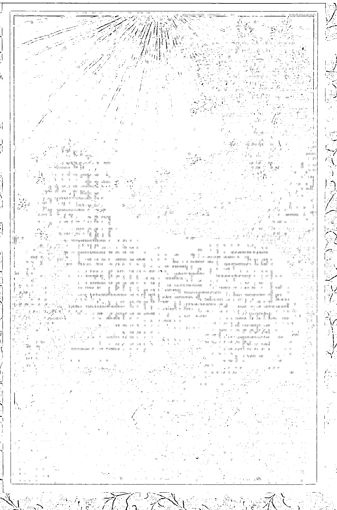

## 金牛座

经久耐用的钟表一成不变的滴答声，向金牛座人诉说着如何才能快乐。他们凡事求稳、讲求规则，并且富有耐性，深知捷径常招致灾难。金牛座人的稳健给他们带来安逸的生活，但他们的占有欲极强，必须学会放开对爱人的控制。

### 太阳星座——金牛座

太阳星座是金牛座（黄道第二宫）的人优点显著。但是，他们要想成功，就必须首先具有安全感。尽管这听起来过于笼统（每个人都或多或少地需要安全感），但安全感对金牛座人来说至关重要。这种安全感不仅仅来自于物质财富，如舒适的住所和大笔的银行存款；从社会关系和家庭生活中获得情绪安全感同样重要。

可靠、坚定、循规蹈矩，是金牛座人的特性。他们有生活常识，做事有条不紊，但缺乏速度、反应迟钝。行事草率不是金牛座人的本性，如果未加仔细考虑就付诸行动，他们会倍感压力。在多数人眼中，这类人行动迟缓，在某种程度上，他们的确给人留下这样的印象。他们习惯待在自己所熟悉的、有安全感的环境里，一旦需要离开原来的环境，他们会难以接受。

金牛座人酷爱敛财。他们天生的美感和对美好事物的热爱强化了这一嗜好，但深究起来，我们会从中发现其致命的弱点——占有欲。他们强烈的占有欲。

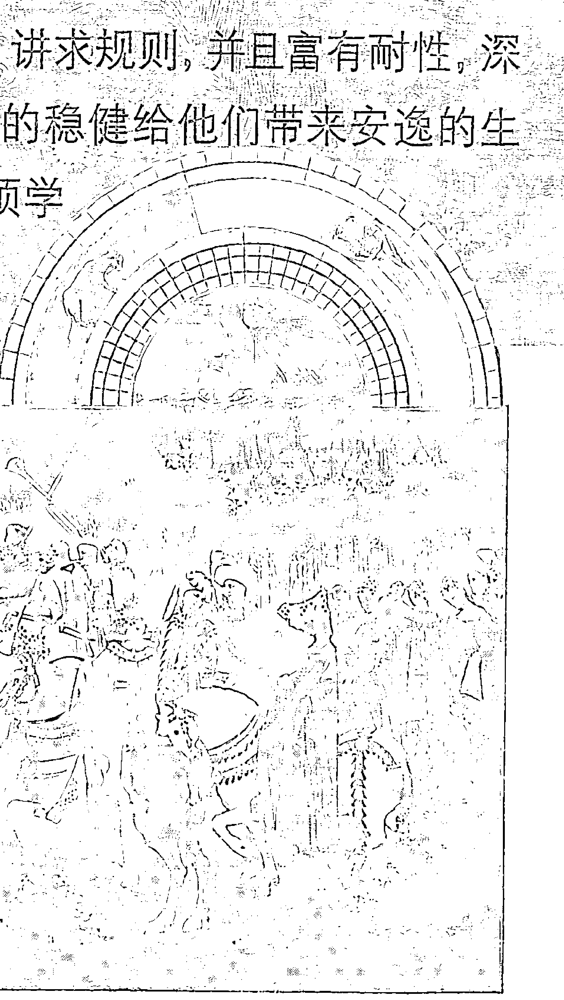

> 5月份插图选自《最美时祷书》(Les Tres Riches Heures du duc de Berry, 1416),图像上方绘有星盘,金牛座清晰可见。

金牛座公牛，这是一本日历的4月份插图，源自1423年前后法国出版的一本彩色手抄本《贝德福德时刻》。

| 属性 | 值 |
|------|-----|
| 象征 | 公牛 |
| 出生日期 | 4月21日—5月21日 |
| 守护星 | 金星 |
| 四象性 | 土 |
| 三方官 | 固定 |
| 阴阳性 | 阴性 |
| 掌管身体 | 颈项和喉咙 |
| 对立星座 | 天蝎座 |

欲望会导致人际关系僵化，令家庭生活矛盾重重。

十二星座中，金牛座人容貌最端正，但需要留心体重，因为钟爱巧克力和美味的甜点，他们丰满结实的身材很容易发福走样。颈部是金牛座所掌管的身体部位，他们常会感到喉咙不适，特别是那些喜欢歌唱的金牛座人——许多金牛座人确实拥有歌唱和表演天赋。

和他们的星座标志公牛一样，金牛座人平时温文尔雅，一旦受到触怒，他们会大发脾气，此时，周围的人一定要多加小心。

### 上升星座——金牛座

和太阳金牛座人一样，上升星座在金牛座的人同样诚实可靠、富有常识，但是，他们更加渴求安全感。随着生活质量的提高，他们越来越热衷于财物的积累。他们致力于攀登“房产之梯”(the property ladder)，把房产看做人身和物质安全的最终保障。因为钟爱物质享受，他们会在房中摆放舒适的大件家具，忙碌一天后，他们在这里可以尽情放松。舒适豪华的家园是他们成功的象征，代表着极大的安全感。当必须离开自己所熟悉的环境时，强烈的不安全感会随之而来。

他们的情感级数高于太阳金牛座人，脾气更加火暴，往往难以平息抑制。尤其是涉及伴侣的时候，他们会产生愤恨不满、近乎妒忌的抑郁情绪。

当金牛座处于上升位置时，金牛座人患咽喉痛的概率大大增加。一些顽疾与甲状腺的分泌情况密切相关，甲状腺激素分泌过多或过少直接影响体重的增加，使人感到疲劳无力。

有规律的锻炼非常重要。年轻健硕的上升金牛座人，适合参加强度力量著称的大型团体运动项目。他们当中的一些人往往喜欢举重和拳击这样的项目，另一些人则更愿意待在环境舒适的健身俱乐部里——在这里，他们可以按照自己的节奏，用各种健身器材进行锻炼，比如在跑步机上匀速行走。

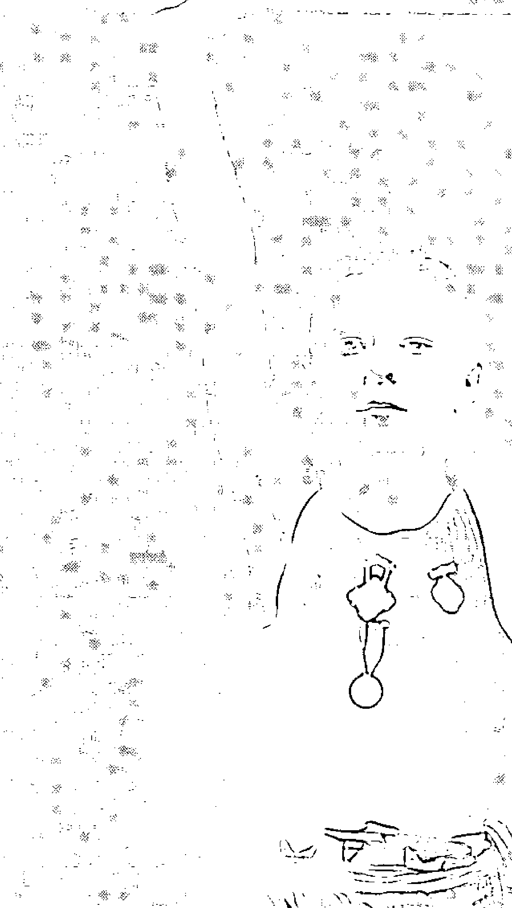

> > “举重和拳击往往对金牛座人具有吸引力。”

### 月亮星座——金牛座

传统观念认为，月亮行至金牛座是一种“无上荣耀”，因此具有特殊的意义。一直以来，月亮都是个人命盘上的一个有力因素，但在这里它又平添了一份微妙的力量。它不会克制金牛座原有的特性，但值得注意的是，只有当个人对环境做出反应时，这些特性才能显现出来。例如，如果我们认为占有欲是金牛座人重要的个性特征，那么，那些月亮金牛座人在面对特定场合时就会表现出占有的特性。随后，当其他星体（如他们的太阳星座、上升星座和其他行星）的影响渐占上风时，他们会表现出对立特性，并痛恨自己先前的所作所为。

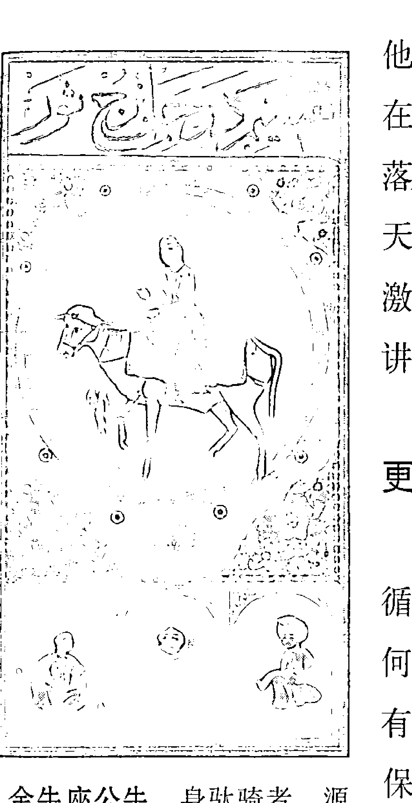

金牛座公牛，身驮骑者，源自1550年的一本土耳其彩色手抄本。

他们也会破除己见。如果在整张星位图上，几大行星落入其他固定星座（狮子座、天蝎座），金牛座人固执偏激的个性就会演变成蛮不讲理。

### 更加安全的选择

月亮金牛座人往往因循守旧。在他们看来，任何未经验证的新事物都具有危险性——他们注重自保，从不甘于冒险；相比较而言，墨守成规更加安全。除去其他行星和星座的影响，月亮金牛座人生来富有耐性和纪律性。如果能够按自己喜欢的进度（在上升星座和太阳星座的影响下，这一进度会有所改变）工作，他们会全身心投入，并出色地完成任务。

和上升金牛座人一样，月亮金牛座人也会遇到同样的健康问题。环境问题和过敏会引起诸如咽喉肿痛的症状。同时，建议这一星座的人少吃巧克力和油腻食物，这样才能避免发福。

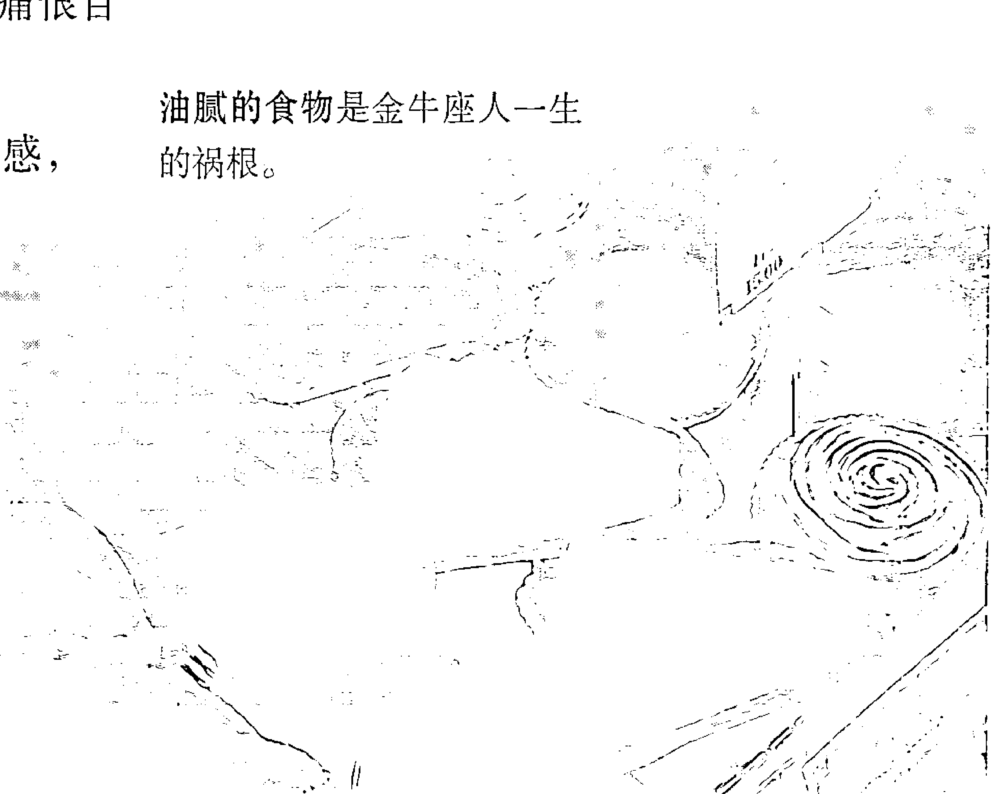

油腻的食物是金牛座人一生的祸根。

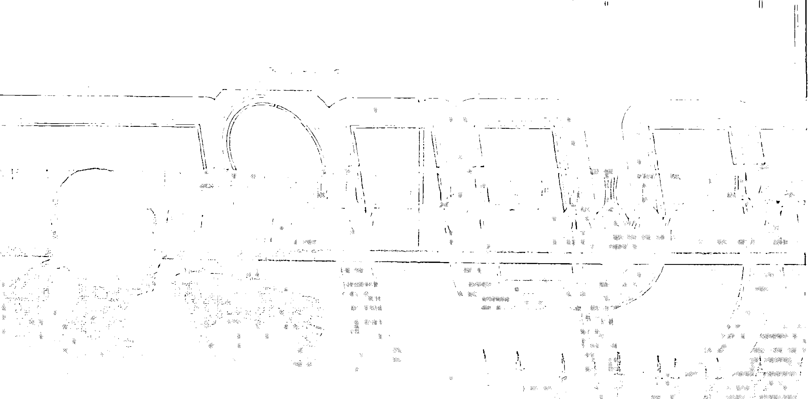

高级酒吧和餐馆是金牛座人常去的地方。

## 金牛座的友谊、爱情和稳定恋情

金牛座朋友是值得交往一生的朋友。他们十分守时，如果有事耽搁了，无法按时赴约，他们一定会想办法告知朋友。他们忠实可靠，随着他们越来越成功，你们的结伴外出会变得其乐无穷——但是，开销也会随之大增，因为他们总是带你光顾城里的高级酒吧和餐馆。举办令人愉悦的晚宴，提供丰盛可口的菜肴。一般来说，除了丰盛的主菜外，餐桌上还会摆放两三道由他们亲手制作的美味餐后甜点。金牛座人善于倾听并且能够保守秘密。他们会按照常规为别人出主意，鼓励这些人走正道、“不做亏心事”——这与某些星座的人所信奉的观点大不相同。

### 殷勤好客

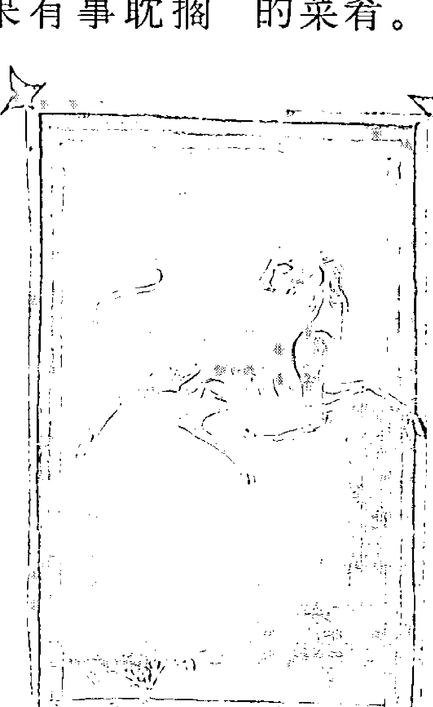

这幅优美的金牛座公牛刻画图源自意大利南部，绘于1240年。

虽然擅长理财，但金牛座人并非吝啬鬼，通常情况下，他们愿意为手头拮据的朋友付账。他们十分好客，款待客人是他们社会交往的重要方面。他们常常如果因为某种原因金牛座人和别人的定期约会打乱，那么，他们循规蹈矩的个性可能会引起大麻烦。当我们打算和其他朋友一起消磨时光时——尤其是这段时间本应该和金牛座人共处，我们一定要小心行事，因为他们会表现出强烈的占有欲，并夹杂着一丝妒忌，即使我们约会的对象是同性友人。

如果想要鼓励金牛座朋友追求新的兴趣，我们必须尽力帮助他们，因为他们习惯于原来的生活模式。让他们适应新的形势、观念和挑战是件了不起的事情。此外，大多数金牛座人具有一定的艺术修养，对多种艺术形式有很强的鉴赏力。他们擅长各种形式的雕刻，能静下心来制作各种精美的手工艺品，如刺绣和缝纫。他们还有音乐天分。对大自然的热爱使他们对园艺产生浓厚的兴趣。他们应当积极参与到这些活动当中去，而不只是充当欣赏者。

### 金牛座的爱情

在爱情的很多方面，金牛座人会占尽先机。首先，他们外表俊朗、体貌端正，极富个人魅力，这些特征成为吸引爱人的巨大优势。有趣的是，随着时间的推移，如果他们能够保持完美的身材，那么他们的性感和魅力会一直延续到老年时期。金牛座人十分浪漫，会为特殊的纪念日费尽心思。他们是调情高手，房事时体贴而感性，并且会把房间布置得富丽堂皇——他们永远不会在汽车的后座上匆忙进行房事。

### 金牛座人的占有欲

一旦恋情稳定，金牛座人的占有欲常常会引起双方的不快。所以，尽管生活舒适、性爱和谐，他们还应当注意营造愉悦的气氛。对伴侣双方来说，保持良好的恋爱关系十分重要。金牛座人的伴侣应该指出存在的问题，这样，双方才能迅速达成协议——矛盾的根源往往在于他们的伴侣不希望一天24小时受到约束。找出合适的解决办法迫在眉睫。

从根本上来说，金牛座人的占有欲望受到他们处事态度的影响，一旦认定一段关系，他们就会渴望永远拥有它，比如订婚，甚至结婚。他们的伴侣被迫做出选择，决定自己是否真正想结婚安顿下来。金牛座人的伴侣必须明白一点：这一星座的人的安全需求（金牛座人的本能）发展迅速。尽管金牛座人平时遇事沉稳、考虑周全，但这种情形下，他们往往会操之过急，十分草率地陷入一段情感，结婚的钟声就开始在他们的脑海中回荡。特别是金牛座女性，她们比任何人都期待自己的婚礼，并且在筹划婚礼的过程中，事无巨细，事必躬亲。虽然金牛座人在财务方面十分精明，但婚礼却极其奢华铺张，优雅的结婚礼服也价格不菲。

> > **金牛座人很倔犟**
>
> 金牛座人一旦下定决心，就无人可以改变。金牛座属于固定星座，固执己见是对金牛座人最基本的诠释。此外，他们相当倔犟，这一点尽人皆知。土元素赋予金牛座人实践的能力和理智的态度——他们在很多方面都脚踏实地、实事求是。有趣的是，他们当中的很多人都热衷于园艺，并且展现出极大的天分。他们行事成熟稳重，但是很容易墨守成规、不思变通，尤其是那些安于现状的金牛座人。

### 金牛座的稳定恋情

金牛座人大多比较守旧，这一点在确立稳定恋情的过程中表现得尤为突出。很有可能从恋爱关系确立时，他们就会以失败痛苦而告终。此时，他们的情感安全需求已经失去控制。但是，通常情况下，金牛座人是料理家务的能手，早日找到心仪的伴侣，他们的生活会更加美好。

但是，婚礼钟声渐渐远去时，警钟也随之响起。我们经常会听到金牛座朋友谈到他们的爱人，他们的语气就好像在谈论汽车或者房产这样一件财物。无论金牛座人有多爱对方，对方也不会喜欢被占有的感觉，受某些太阳星座的影响，他们的婚姻关系会急转直下。这种情况下，从一开始，伴侣就应该向金牛座人表明：他们需要一定的独立自由空间。

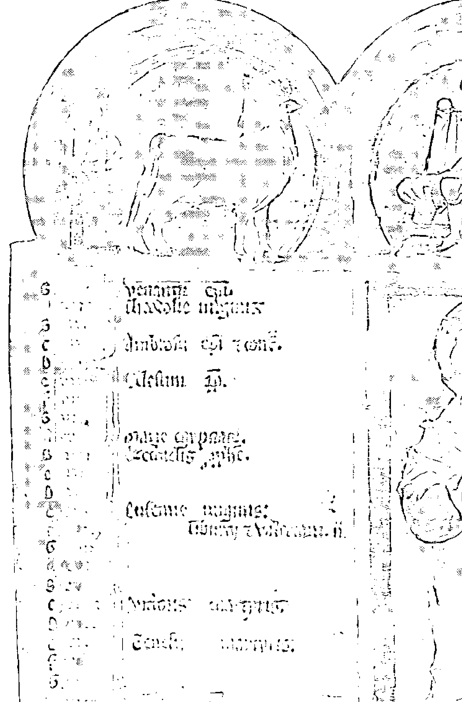

金牛座公牛，位于手稿的左上角，这份手稿于13世纪末在下萨克森（Lower Saxony，位于德国西北部）绘制而成。

### 工作狂

金牛座男性往往比女性更加操劳（尽管成功的女商人也容易被工作缠身、无法自拔）。如果他们只顾赚钱，就会发现自己无暇兼顾其他方面。他们当中的很多人会借口需要赚更多的钱来修建家园、提高生活水平以及为子女提供更好的教育条件。他们会乐此不疲，因此很少有空闲与爱人相聚，伴侣间严重缺乏互动。

音乐才能是金牛座人的共同特质，他们当中的许多人最终成为专业歌手和音乐家。

## 金牛座的教育、职业、金钱观

送金牛座孩子入幼儿园不是一件容易的事。父母最好先带孩子去几趟，熟悉一下环境。场所和环境的突然改变会引起不安全感，孩子容易产生暴躁情绪，同时也给周围的人带来压力。给他们带几件熟悉的玩具会有所帮助，但通常情况下，在孩子完全适应新环境之前，整个入托过程会麻烦不断。

### 需要井然有序的学习环境

在为金牛座孩子选择教育方式时，父母一定要注意：他们中意的学校（这里指的是允许自由发表意见、注重培养独立自主能力的学校）不一定适合孩子。金牛座孩子更适合在强调组织纪律的学校里学习，根据校规的要求，他们明确自己应该做什么，何时去做。记住，金牛座人需要并且乐于接受纪律的约束，井然有序的环境为孩子营造出安全感，有利于他们的茁壮成长。父母应该为孩子选择一所学风严谨、校规严格的学校。

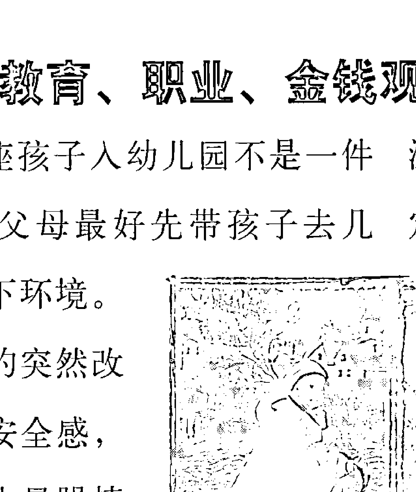

4月份日历插图，源自1423年前后绘制的一本彩色手抄本《贝德福德时刻》。金牛座位于图片右半部分。

金牛座孩子有很大的发展潜力，但是父母需牢记，从小学一直到大学，他们的成绩很少会突飞猛进。父母一定要多加鼓励，哪怕他们的期末成绩排名只是前进了两三名。金牛座人吃苦耐劳，他们勤奋的学习单调乏味，却是取得学业、事业成功的最佳方式。在学校里所学的知识会让他们受用一生。

关于继续深造，金牛座年轻人选择的范围也很宽泛，当然，最终的决定权在他们自己手中。如果真正具备艺术天赋，他们可能会考虑主修陶艺、雕塑、建筑或者家具设计。如果对乐器感兴趣或者有一副好嗓子，就值得在音乐方面一展身手。这种情况下，他们会考虑去音乐学院进修。农学院或商学院也是不错的选择。对他们来说，最终所选的课程会非常有吸引力，他们会坚持修完全部课程——和其他星座的人不同，他们很少会半途而废。

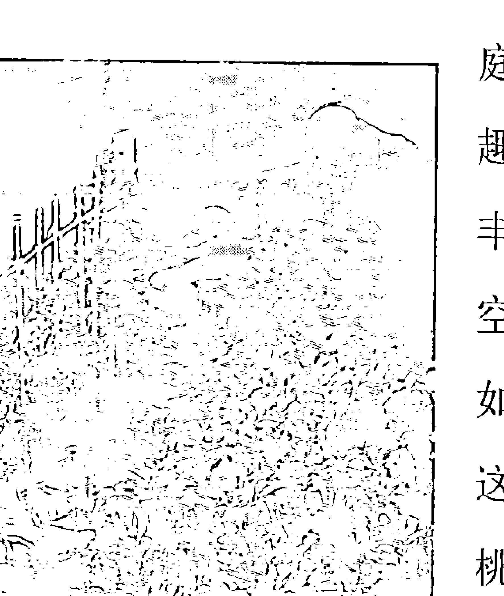

### 金牛座父母

金牛座父母会尽其所能发掘子女的优点，为此不计金钱。他们需要了解的是，自己往往过于强调纪律，未能给孩子提供个性发展的空间。还有另一种倾向，他们迫切希望子女能在自己没有机会涉足的领域里有所建树：说到这里，我们脑海里会立刻浮现出“演艺界妈妈”的形象。这些做法会造成孩子的叛逆心理，强加的兴趣会使他们心烦气躁。

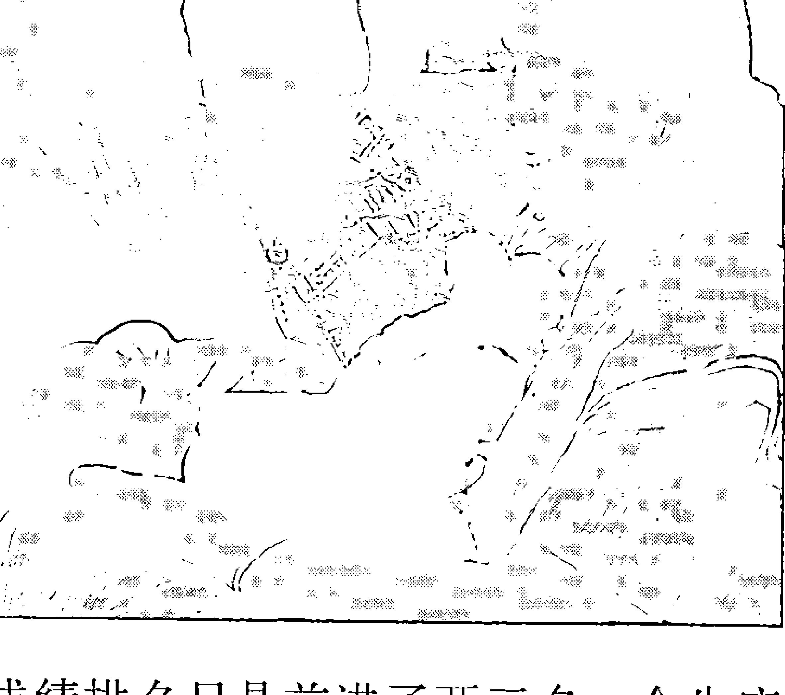

### 金牛座与职业

金牛座人雄心勃勃，对人生有着长远规划。当工作需要冒险时，他们就会产生焦虑情绪，各种麻烦也会接踵而至。在工作稳定顺利的情况下，金牛座人将会有出色的表现。

对金牛座人来说，尽管赚钱很重要，但是如果新的岗位不够安全，即使薪水更高，他们在跳槽之前也会考虑清楚。要做出决定很难，需要深思熟虑。有时候，为了安全起见，他们宁愿从事枯燥乏味的工作，过着两点一线的单调生活。对大多数人来说，这种单调模式会影响到他们自身和家庭，但是，如果他们兴趣广泛，生活也会变得丰富多彩。最好能常去空气新鲜的场所——比如，生机勃勃的菜园，这里将成为他们的世外桃源。

金牛座人适合创业。他们需要时刻注意风险，但他们会进行详细的经营规划，看到项目稳定进行，他们会无比开心。如果做的是营销或销售生意，他们需要一位更加外向的帮手（比如活泼的双子座人）来负责相关事宜。

金牛座人活跃在各行各业，但并不是所有行业都适合他们。受守护星金星（爱与美之神，参见211页）的影响，他们倾向于涉足美容业；他们当中的很多人是出色的美容师，也喜欢在气氛愉悦的商场里工作。他们还可以成为优秀的园艺工作者、花匠和农民。很多人最终成为职业音乐家和歌手，他们的业余爱好往往需要倾注很大的耐心，比如刺绣和模型制作。

### 金牛座与金钱

当听到歌词“金钱使世界转动”——来自音乐喜剧片《歌厅》（Cabaret），金牛座人会不由自主地随声哼唱。金牛座和金钱的渊源可以追溯到古埃及，人们一度将牛作为流通手段，公牛因此成为重要的星座标志。金牛座孩子舍不得花掉零花钱，喜欢存在存钱罐里，一旦看中一件玩具，他们便会向父母吵着要更多的零花钱。

金牛座人对自己的财务状况了如指掌：银行存款的稳步增长和股票投资组合的赢利（不管数目多少）会令他们备感欣慰。一开始就把钱存放在高利息的账户里（前提是风险不高）能够确保财务安全。对感兴趣的公司，他们会进行投资——他们极有可能购买餐饮、住宿行业的股票，建筑股也在考虑范围内。一般说来，公司规模越大、成立时间越长，他们的安全感会越强。

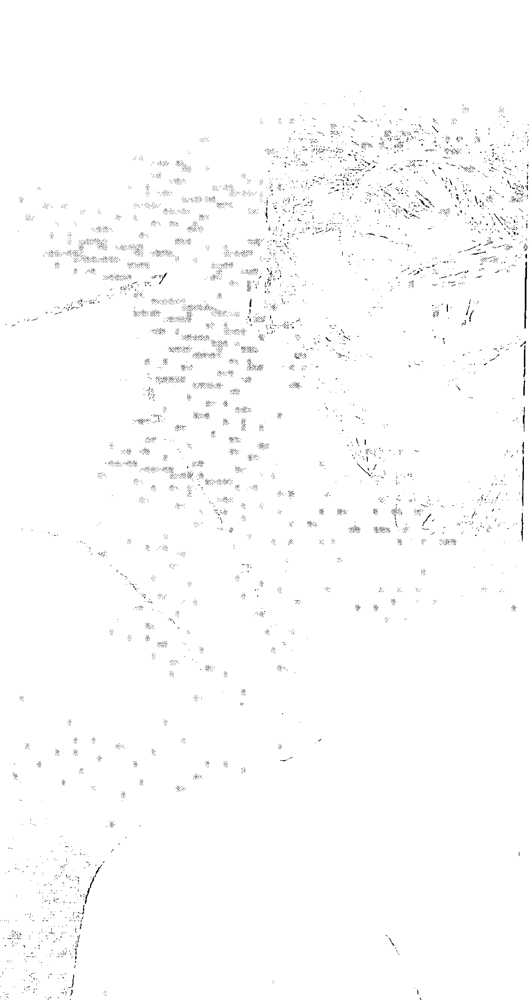

金牛座人是出色的美容师，也喜欢在气氛愉悦的商场里工作。

> “金牛座人适合创业。”

> “金牛座人把赚钱看得太重。”

### 理想家园

对金牛座人来说，自置居所是头等大事，但是，一定不要让“理想家园”的美好愿望冲昏头脑，因此背负更大宗的抵押贷款。理论上，他们会意识到潜在的危机，但结果却是，如果看中一所房子或公寓的外观设计——尤其是面积，他们往往无法抵制它的诱惑。

金牛座人往往过于注重赚钱——无暇顾及内心渴求的宁静和安全。但有时候，如果意识到美好的事物能带来审美享受，他们也许会开始收藏，比如小件瓷器、古董酒杯、铜制或铁制物件。这样，在欣赏藏品、愉悦身心的同时，他们也进行了一笔不错的投资。

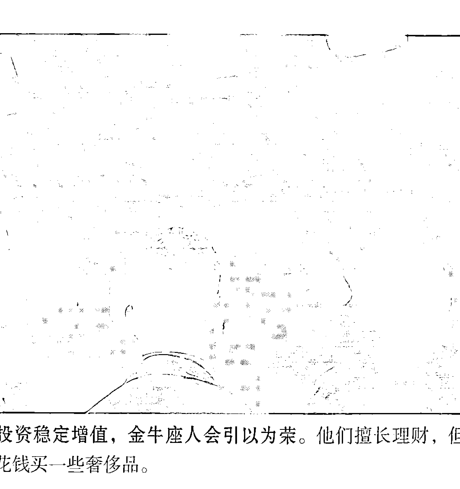

### 金牛座的中天星座

中天的影响源于我们出生时正当空的黄道带星座——即位于天球顶端的星座（更多细节，请参见304～306页）。每个人都和自己的中天星座特性息息相关，并渴望、认同这些特性，中天星座对个人职业的影响尤为突出。下面列出了金牛座命盘中上升星座在南北半球上可能对应出现的几大中天星座。要算出个人出生时的上升星座和中天星座，请查看344～347页的图表。

## 上升白羊座
其中天星座为：
- 摩羯座 为过上安定富裕的生活而奋斗。
- 水瓶座 倾向选择与众不同的职业，但处处表现出金牛座人的固执。

## 上升金牛座
(同时，金牛座也是太阳星座)
其中天星座为：
- 摩羯座 勤奋、专注造就成功；很可能具有音乐天赋。
- 水瓶座 生活方式和传统习俗格格不入，追求时尚。
- 双鱼座 渴望行善、帮助弱者；倾向从事护理行业。

## 上升双子座
其中天星座为：
- 水瓶座 认同未经验证的新事物；对现代技术或传播媒介抱有兴趣；善于沟通。
- 双鱼座 有艺术才能；对舞蹈、滑冰和诗歌兴趣浓厚。

## 上升巨蟹座
其中天星座为：
- 白羊座 信心十足，精明机警、善于走捷径。
- 水瓶座 关注人道主义问题；可能从事医务职业或慈善工作。
- 双鱼座 乐于助人；可能从事护理工。

## 上升狮子座
其中天星座为：
- 白羊座 对预期目标志在必得；一般冷酷无情。
- 金牛座 太阳星座和中天星座相同，会大有作为；但仍会表现出固执偏激的一面。
- 处女座 希望成为教师，尤其是大学教师。
- 天秤座 尽管安全很重要，但期待变化；择业范围比较广泛。
- 天蝎座 目的性很强；尽管目标明确，却喜欢冒险。

## 上升处女座
其中天星座为：
- 金牛座 成就卓越，思想更加变通；谨慎谦虚是其座右铭。
- 双子座 十分善于沟通；有能力从事传媒工作，特别是与期刊相关的工作。

## 上升天秤座
其中天星座为：
- 巨蟹座 认同奢侈品和美味佳肴；喜欢和孩子打交道；可能成为专业厨师。
- 狮子座 热爱时尚、珠宝；喜欢具有戏剧性、艺术性和音乐感的事物。
- 处女座 内心渴望成为一名研究人员、侦探或分析师；在这些领域会有所建树。
- 天秤座 讲求实际、志向远大；信心的缺乏阻碍了能力的发挥。
- 天蝎座 目标明确，永不言弃。

## 上升天蝎座
其中天星座为：
- 巨蟹座 喜欢从事医务、金融和酒品贸易工作；对职业的情感投入非常重要。
- 狮子座 无论干哪一行都渴望成为老板——尤其是大公司的老板。

## 上升人马座
其中天星座为：
- 狮子座 富有冒险精神，坚定固执；时而表现出的勇敢令人吃惊。
- 处女座 希望成为教师，尤其是大学教师。
- 天秤座 尽管安全很重要，但期待变化；择业范围比较广泛。
- 天蝎座 目的性很强；尽管目标明确，却喜欢冒险。
- 人马座 富有灵感，点子多多，勇于实践却成果甚微。

## 上升摩羯座
其中天星座为：
- 狮子座 理财高手；处处表现出控制欲望。
- 处女座 一般从事低风险的传统职业；安全至关重要。
- 天秤座 讲求实际、志向远大；信心的缺乏阻碍了能力的发挥。
- 天蝎座 目标明确，永不言弃。

## 上升水瓶座
其中天星座为：
- 天秤座 从不缺乏好的计划和点子，但懒惰会削弱积极性。
- 天蝎座 对成功抱有坚定决心，但固执的个性令结局难以预料。
- 人马座 富有灵感，点子多多，勇于实践却成果甚微。

## 上升双鱼座
其中天星座为：
- 处女座 善于交流、志向远大；要想成功必须发挥金牛座的勇气和纪律性。

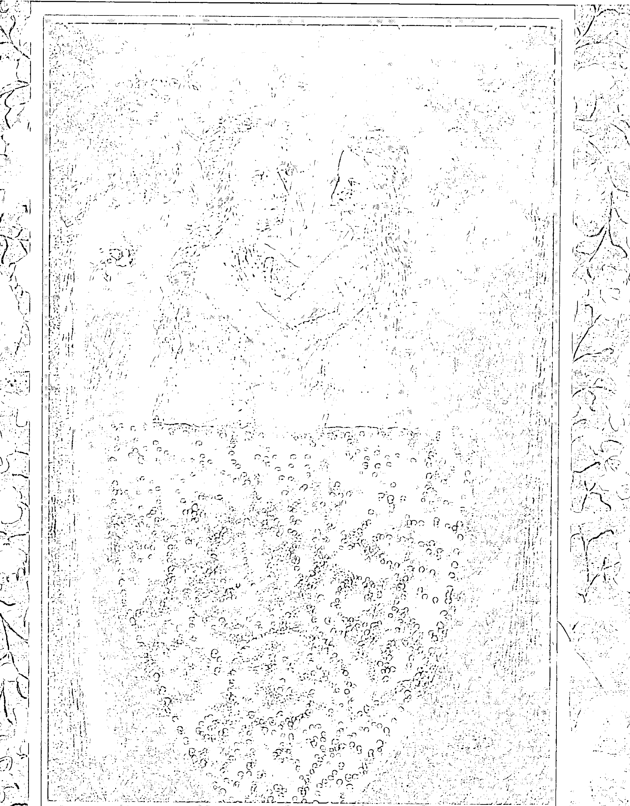

> > “双子一生生活安逸，青春在爱的怀抱里永不褪色。”
>
> —— 马尼留（Manilius），公元1世纪## 双子座

多才多艺是双子座人最显著的特点，他们生性好动，喜欢变化。其最大弱点是流于表面、不能持之以恒，但稍加约束就会大有改观。“一心多用”（同一时间处理多件事情）是典型的双子座人的行事风格，有时候这也未尝不是件好事。

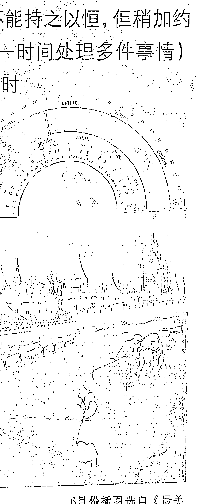

### 太阳星座——双子座

“天神双子” (heavenly twins) 是这一星座的标志，它在很大程度上预示了双子座人的个性特征。无论是面对人生重大抉择，还是处理诸如春季大扫除这样的家务琐事，他们都会“一心多用”，难以专心致志。这种特性似乎无所不在，他们常常同时阅读好几本书，就连做事的时候也要煲电话粥！如果不想因为一事无成而心绪不宁，进而产生挫败感，做事就要善始善终，这一点非常重要。

使者之星水星是双子座的守护星，在它的影响下，双子座人大都擅长辞令。如果在排队等待结账时有人主动和你搭讪，那么，这个人极有可能是双子座人。他们还是报刊的优秀撰稿人，喜欢参与电台节目的电话聊天环节，对网上聊天也很在行，就好像因特网是专门为他们量身打造的！超过半数的双子座人从事传媒行业（处女座也可能从事这一行业，因为它的守护星也是水星）。

| 双子座 | |
|--------|---|
| 象征 | 孪生子 |
| 出生日期 | 5月22日—6月21日 |
| 守护星 | 水星 |
| 四象性 | 风 |
| 三方官 | 变动 |
| 阴阳性 | 阳性 |
| 掌管身体 | 肩膀，手臂 |
| 对立星座 | 人马座 |

双子座人给人的印象是博学多才，但事实并非如此，他们往往知识浅薄，甚至对很多事情一窍不通。流于肤浅是其最大弱点，而优点是头脑灵活，富有逻辑和理性。但是，他们要牢记不能信口开河，说话做事之前一定要三思。对他们来说，“切忌浮躁冲动”是个不错的座右铭。双子座人很爱骗人，为此不惜贬低自己。他们口才出众，有本事使自己撇清干系，全身而退。

双子座双子，这是一本日历的6月份插图，源自1423年前后法国出版的一本彩色手抄本《贝德福德时刻》。

活力四射、多才多艺，并且不再流于肤浅。他们有很强的研究能力，会进一步研究自己感兴趣的事物；随着了解的加深，这种最初的兴趣往往会相伴一生。他们总是热情洋溢，乐于接受挑战。这一星座的人天性喜欢质疑，在得出令自己满意的结论之前，他们不会妄下论断。

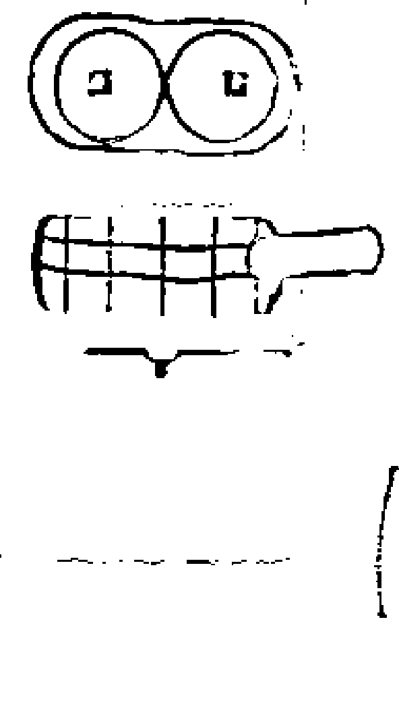

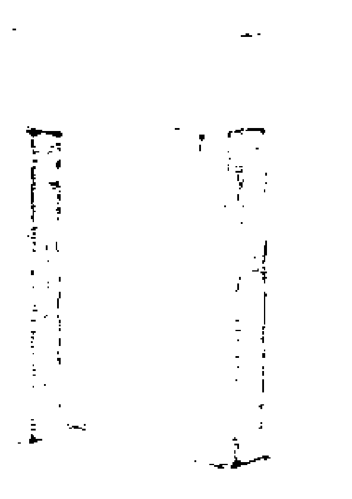

> 严重的烟瘾常常毁了双子座人的一生。

### 双子座人的体魄

双子座人体格强健，身材瘦而结实。但是，他们的手臂很容易受伤，也常常会锁骨骨折和肩膀脱白。相比其他人，他们更容易吸烟成瘾，最好趁早戒掉。

### 上升星座——双子座

与太阳双子座人相比，上升星座在双子座的人（以下简称为上升双子座人）比较注重实际，更加脚踏实地。他们同样活力四射、多才多艺，并且不再流于肤浅。他们有很强的研究能力，会进一步研究自己感兴趣的事物；随着了解的加深，这种最初的兴趣往往会相伴一生。他们总是热情洋溢，乐于接受挑战。这一星座的人天性喜欢质疑，在得出令自己满意的结论之前，他们不会妄下论断。

### 双子座人的心智

上升双子座人要明白自己比太阳双子座人更容易产生紧张焦虑的情绪，这一点很重要。必要时，他们甚至需要寻求专业帮助。紧张和压力有时还会引起或加重哮喘，这种情况下需要首先从根源上缓解紧张，效果远比针对哮喘本身的单纯治疗要好得多。

上升双子座人喜欢进行深层的自我探索。但是，需要注意一点，不要过分在意结果，因为这会导致对自身的一再质疑，最终陷入深度自省，无法自拔。

这一星座的人独立自主，无拘无束，渴望到“别处”旅行，体验新鲜事物——在这里，“旅行”二字含义深刻，既指外出旅行，也可以从精神或哲学层面出发，理解为“神游”。只要有适当的指导，多加小心，这种精神世界的徜徉往往会令他们心满意足，给他们带来成就感和内在的快乐。

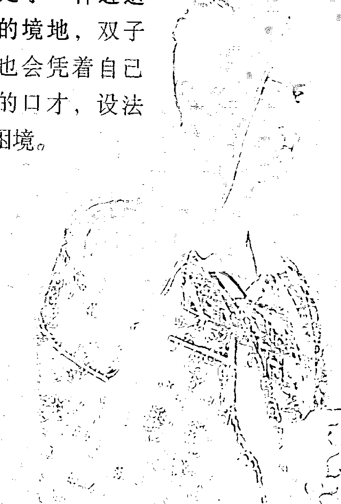

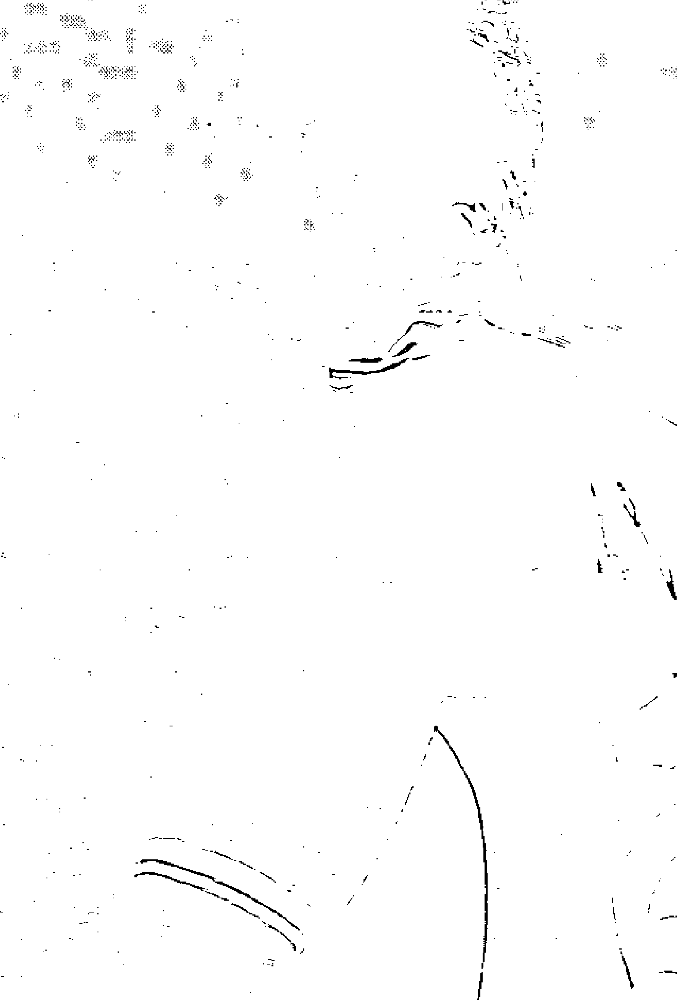

### 月亮星座——双子座

在性格上，月亮双子座人和太阳双子座人有很多相似的地方，比如，多才多艺，善于交流，同一时间至少忙于两件事情。但是，受月球的影响，他们对外界的反应往往表现在口头上。其口头反应极快，无论是自己做错了事，受到斥责，还是纯粹想在谈话中处于上风，他们都能对答自如、轻松地为自己辩白，并且常常令人忍俊不禁。他们很难看到自己的缺点，更不用说承认自己有错。凭借出色的口才，他们会轻松摆脱困境，不管别人愿不愿意听，他们都会喋喋不休。但是，受命盘上其他因素的影响，他们会对自已心血来潮的虚假回应感到内疚，因此决定道歉。他们的语言魅力往往会令双方冰释前嫌。

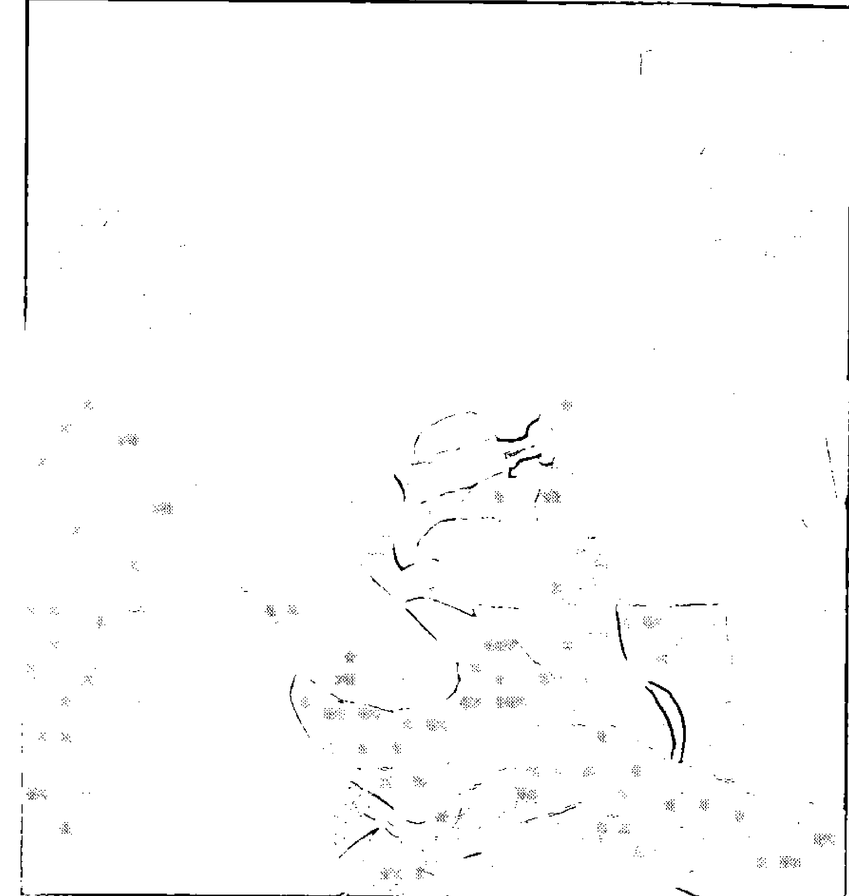

社区诊所的工作十分适合月亮双子座人，在事业发展的道路上，他们需要有新的事物和变化不断融入。

人同样有着阳光活泼的一面，但是，他们容易产生烦躁不安的情绪。面对人生重大抉择，他们往往无所适从。多才多艺本来是一件幸事，却常常给他们带来许多困扰，比如职业的选择或者人际关系的确立。他们也许曾一度钟情某项工作，但不久就会感到厌烦。我们可以由此认为他们对人际关系的态度也是如此吗？月亮双子座人喜欢更新和变化，例如，相比专科医护人员，他们更适合成为一名全科医生或护士，这样就可以面对不同类型的患者。

> “双子座人活力四射、多才多艺。”

## 一颗躁动不安的心

和太阳双子座人一样，月亮双子座人同样有着阳光活泼的一面，但是，他们容易产生烦躁不安的情绪。面对人生重大抉择，他们往往无所适从。多才多艺本来是一件幸事，却常常给他们带来许多困扰，比如职业的选择或者人际关系的确立。他们也许曾一度钟情某项工作，但不久就会感到厌烦。我们可以由此认为他们对人际关系的态度也是如此吗？月亮双子座人喜欢更新和变化，例如，相比专科医护人员，他们更适合成为一名全科医生或护士，这样就可以面对不同类型的患者。

最新展览会能吸引大批双子座人，他们也常常会邀朋友一同前来参观。

## 双子座的友谊、爱情和稳定恋情

有些人生性随和、喜欢悠闲的生活，他们喜欢早起后静静地品味一杯咖啡，独自一人享受一顿午餐，或是工作一天后来上一小杯酒。对这些人来说，和双子座人交朋友时常会令他们感到疲惫。这不仅仅是因为双子座人急躁好动，有时候他们还会喋喋不休地说个不停。他们会询问对方的意见，但不等别人张口就急着发表自己的看法。但是，他们生气勃勃，能够活跃气氛。即使年长很多，他们也会鼓励对方勇敢尝试从未做过的事情。他们蓬勃的朝气让时光倒流，激励对方走出一成不变的安逸生活。在一段和年长很多的双子座人的友谊中，年龄差异很快会消除，因为他们追求时尚，紧随潮流，看起来甚至比实际年龄还要小。他们是出色的说服者，会用与生俱来的推销能力劝说朋友前去观看最新的影片或展览。

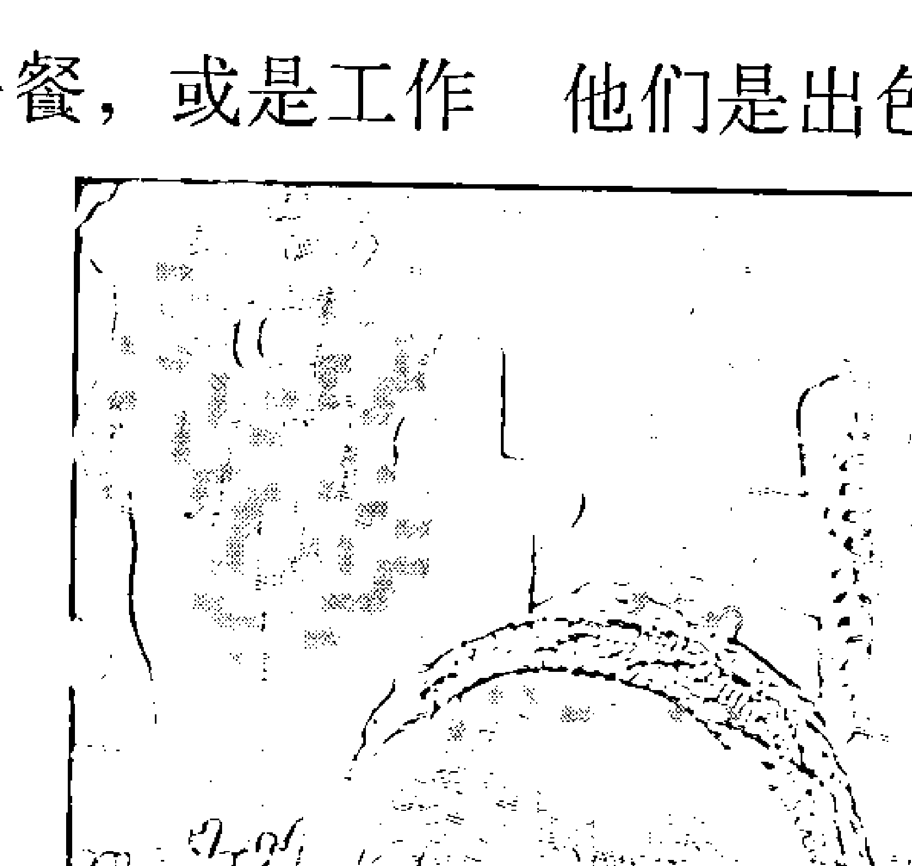

双子座人衣着花哨，钟情混搭。如果其着装效果变得不伦不类，他们的朋友就应该委婉地加以劝说。

### 机灵委婉和志同道合的重要性

双子座人以朝气蓬勃、活力四射而著称，他们也是十二星座当中最赶时髦的人，十分在意个人形象。他们喜欢混搭风格和绚丽的色彩，但有时候，他们的着装会太花哨或者混搭过头，以致不伦不类。如果我们的双子座朋友以这样的面貌示人，我们就应该尽到朋友的职责，委婉地表达我们的看法。

志同道合是建立友情的基石，这一点在和双子座人的交往中表现得尤为突出。如果彼此毫无共同之处，就无话可谈，无法分享，要不了多久，双子座人就会觉得无聊，进而萌生断交念头，或者寻找各种借口回避见面。相反，如果志同道合，双方就会产生良好的互动。这份友谊就会充满刺激和活力，自然能够保持下去，给双方带来无尽的乐趣。即使双方在很长一段时间里无法相见，他们也会重拾上次聚会时的话题，继续开聊。

### 双子座的爱情

当陷入一段新的恋情，双子座人的迅速沟通能力将发挥到极致。电子邮件、手机短信，甚至传统信函将会铺天盖地而来。为了加快恋情的发展，他们煞费苦心。有时候，因为想要赞美对方的话太多，他们会说个不停，并且语速很快，以致给人留下紧张的印象。其实，他们未必是真的紧张，但也许别人会这么想，这是他们需要注意的地方。如果我们恰好遇到这样的爱慕者，整天被没完没了的甜言蜜语所包围，我们就应该设法让对方冷静下来，引导他（她）放慢速度。

### 恋情发展速度和时间安排

相比那些纯粹是为了尽早发生性关系的人来说，在一段和双子座人的恋情中，“彼此了解”的阶段会持续更长时间。和双子座人交往，必须牢记，双方之间的友情（即使这段恋情中性爱的比重较大）十分重要，必须在一开始就完全建立起来。

### 向前，向上

双子座人喜欢并且需要充满活力、丰富多彩的生活方式。乏味无聊是他们最不愿意面对的事情。当无聊透顶时，他们会神色茫然，并且开始去找他们感兴趣的人聊天，或者干脆坐着发呆。紧张而忙碌的生活节奏会给他们带来压力，造成精神紧张。对他们来说，化解精神危机不是一件容易的事——试着劝说他们放慢速度，或者放轻松些，但是，他们很难听从劝导。

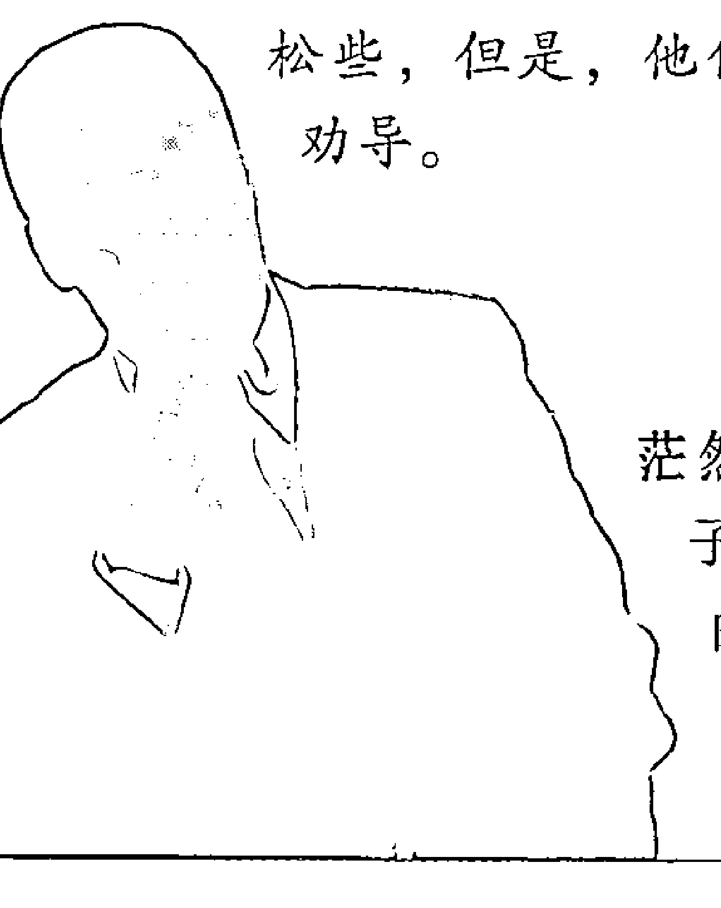

茫然若失是双子座人特有的表情，有时看上去有点滑稽。

一旦恋情进展到性爱层面，双子座人将尽显本色，其性爱表达方式同样充满活力。他们会费尽心思、想出各种花样来保持恋情的新鲜感。双子座人行事匆忙，在床上也难免如此，因此，有必要引导他们（尤其是双子座男性）放慢速度。

### 双子座的双重性

尽管双子座人口才出众，但在情感方面，很多人却往往选择缄默。当他们意识到自己开始陷入一段情感无法自拔时，他们会一再考问自己；为了保持矜持和冷静，他们会压抑内心的情感。双子座人普遍具有这种倾向，而月亮双子座人表现得最为突出。

这一星座的双重性还表现在生活的另外一面——他们喜欢在同一时间内处理好几件事情。不管他们的伴侣希望与否，这种倾向常常会延伸到爱情生活中。他们会同时发展两段恋情，并且因为不同原因，同时爱着两个人。这往往会带来很多麻烦，需要反应灵敏才能化解危机。他们的伴侣慢慢会明白，双子座人很难一生只钟情于一个人，最好在相恋之初就能认清这一点。

就会感到沮丧，他们会一门心思地想去弄清对方的想法。此时的关键因素是“友谊”——它在所有的稳定恋情中都占有重要地位，但对双子座人来说尤为重要。

### 双子座的稳定恋情

和双子座人相爱相守的感觉就像是坐过山车。所有人的恋情都会经历高潮和低谷，但是和双子座人的情感之旅往往千回百转，跌宕起伏，令人头晕目眩。他们的伴侣要随时准备应对突发事件——这些事件会给生活增添情趣，也会令人不安。要想维持一段恋情，双方必须敞开心扉，多做交流。双方都应该行使充分的发言权和决定权，共同解决日常生活中出现的问题。如果伴侣一言不发或者表现得不太热心，双子座人

## 喜欢调情，爱玩乐

历经数十年，双子座人的性生活却依然活跃如初，充满情趣。双子座人偶尔会行为出轨，他们从不愿意正面探讨此事，尽管事情发生时他们可能需要为自己辩白。伴侣应尽量放宽心，学会从长计议，比如，他们可以把精力放在自身保养上，努力保持好面容和身材，使自己魅力十足。随着时间的推移，双方的关系将大有改观。适当的刺激无伤大雅，如果双子座人觉察出伴侣很有异性缘，伴侣就会胜券在握，在两性关系大战中占尽先机。这种情况下，双子座人往往会得意洋洋，而不是醋意大发。事实上，他们根本不知道嫉妒为何物。他们也不是占有欲很强的人，但是在金星（参见210页）的交互作用下，他们内心会泛起一丝怒意。


如果想和双子座人发展恋情，想象一下坐过山车的感觉吧。

双子座人会觉得为人父母的过程充满挑战和刺激。在孩子咿呀学语、蹒跚学步的最初几年里，他们一定要做好面对无聊的准备。但是，当孩子渐渐长大，开始应对自如时，双子座人就会不断鼓励孩子参与各种活动。更重要的是，双子座父母会尽其所能、不厌其烦地为孩子解答各种问题。如果自己想不出答案，他们就会鼓励孩子查阅书籍或者上网查询。


零售行业为生性活泼的双子座人提供了理想的工作岗位——他们能把任何商铺都打理得有声有色。

## 双子座的教育、职业和金钱观

如果说任何孩子都可以在母体内就对莫扎特音乐起反应，并从中受益，那么，双子座孩子也可以。值得牢记的是，促进双子座孩子的心志发育至关重要。父母必须时刻注意，即使在刚出生的几个月里，双子座婴儿也很容易产生厌烦情绪。他们会对一部悬空挂起的手机的形状、颜色和摇摆产生浓厚兴趣。但是，如果墙壁上空洞无物，他们很快就会感到厌烦，进而暴躁不安。他们的注意力水平一般，刺激越多，效果越好。进入幼儿园后，双子座孩子进步迅速，比如，他们的词汇量会很快超过同龄的孩子。他们很爱说话，并且常会受到鼓励，但他们迟早要明白一点：有时候必须老老实实地听别人讲。父母应该向孩子灌输这一理念，以免入学后不能适应学校严肃的氛围，同时，也为家里赢得片刻的安宁和清静。父母还要记住，必须尽可能全面地回答孩子提出的问题，任何不合逻辑的回答都不会令他们满意。


双子座孩子需要各种各样的活动玩具，否则他们很快会产生厌烦情绪。

### 学校生活

双子座孩子会在活跃、崇尚自主的校园氛围里茁壮成长。他们讨厌严格的纪律，不会轻易接受学校的规章制度，除非有人做出合理解释，并得到他们的认同。如果他们认为某条规则不合理，就会大胆地抗议，此时，父母即使同意他们的看法，也要试着找个理由说服他们。双子座孩子不会带头扰乱课堂秩序，但是，如果课堂沉闷，教师讲课不够风趣，他们就会大搞恶作剧，以此吸引同学的注意。事实上，他们的进步几乎完全取决于教师的人格魅力和教学方式。比如，如果他们成绩退步了，很可能是因为他们和教师的关系不佳。

### 课堂学习与测验

双子座孩子大都聪明伶俐，十分好动。叮咛他们每次只专注于一件事是徒劳无益的。同时，一旦着手做某事，就必须指导他们完成，否则，一连串未完成的任务只会增加他们的不安，最终导致挫败感。不要吝啬对他们的赞美，包括他们的每一幅涂鸦之作，以及理解完整且演奏到位的每一首乐曲。

关于测验，他们必须试着明白一个道理：知识的牢固记忆十分重要，即使这一过程枯燥乏味。答题时，他们从来都是答非所问，而是喜欢侃侃而谈、

双子座人乐于成为出租车司机，因为他们通常喜欢开车的感觉，也喜欢和各种各样的人侃大山。

### 双子座的职业

前面提到过，双子座人的口才非常出众，所以十分适合从事传媒行业。但是他们的就业范围并不只限于此。他们擅长沟通，能说到点子上，往往可以成为出色的销售主管；他们开朗活泼，又有很强的说服力，有本事让顾客赞同“每一位因纽特人都至少应该拥有一台冰箱”这样的说法。因此，零售工作是他们理想的工作。

### 喜欢游历四方

开车的双子座人最快乐。我们时常会碰到喜欢神聊的出租车司机，他很可能就是双子座的。餐旅服务业也是他们大显身手的领域。在这里，我们会遇到热情洋溢的空乘服务人员，他们急于迎接我们登机，证明他们的服务最好或者这是唯一值得搭乘的航班；我们还可以碰到负责的导游，她会不时清点人数，当到达熟悉的旅游胜地，她会备感兴奋。双子座人还会对其他职业感兴趣，比如律师。他们喜欢为别人牵线搭桥，所以可以成为出色的作家代理商和演艺经纪人，还可能成为各行各业(尤其是金融界)的资深猎头。双子座人的身影还会活跃在相对平静乏味的行业里。由于传统占星术偏重双子座人的手臂，所以如果对美容业感兴趣，他们会考虑成为一名美甲师或者按摩理疗师。双子座人还可以成为启迪人心的教师，但是一定要想清楚自己喜欢教哪个年龄段的孩子，因为他们会对育婴室或者幼儿园的工作感到厌烦。


双子座人往往能和7、8岁至12岁年龄段的孩子相处融洽，也会成为所有教职员中的佼佼者。不管专业是什么，他们都能临时替代他人，进行不同科目的教学工作，比如英语文学课或者其他语言的文学课。

### 健康饮食，合理锻炼

为了身体健康，双子座人的饮食应该保持清淡。油腻难消化的食物不适合他们。他们更适合吃沙拉、禽类和鱼类。为了补充碳水化合物，最好再吃点意大利面食。在体育锻炼方面，崇尚独立自由的他们会对个人单项运动感兴趣，而不会选择需要团队精神的集体项目。由于行动敏捷，他们精通网球，还擅长需要自我激励的运动项目，如慢跑和竞走。


但是，千万不能为了换工作而草率跳槽，不顾自身的长远发展。如果对目前的工作状况感到厌烦，他们应该想办法改变现状，让工作变得更加有趣。

### 双子座的金钱观

> “双子座人十分擅长交流。”

除非双子座人的命盘全面折射出务实的个性和对金钱的理智态度，金钱很容易从他们活跃的指间溜走。在未成年的时候，他们就喜欢追赶潮流，甚至成为时尚和流行音乐的弄潮儿。所以，从向父母领取零用钱的日子起，服装和音乐已经开始消耗他们的大部分积蓄。

### 频繁辞职，另谋出路

相比其他人，双子座人的工作变动最频繁。如果确定新职位报酬会更高，前景更好，那么，这种调动合乎常理。但是，千万不能为了换工作而草率跳槽，不顾自身的长远发展。如果对目前的工作状况感到厌烦，他们应该想办法改变现状，让工作变得更加有趣。

城里最酷的俱乐部会吸引双子座青少年和20出头的年轻人，他们还会花很多钱添置时髦的服饰，购买打榜的音乐专辑。

始让他们入不敷出。他们必须明白付出才有回报。他们富有进取心，尽管在定期骑着自行车送报的时候他们常常会因为工作乏味而大发牢骚。在这种进取精神的激励下，他们很快就会精通买卖交易，交易的达成能真切地给他们带来收益。对他们来说，延迟花掉助学金和助学贷款不是一件容易的事，就像他们很难妥善使用信用卡一样。稍不留神，大量账单就会纷至沓来。

### 平衡工作和生活

双子座人不会为了金钱委屈自己，从事自己不喜欢的工作。为了能从工作中得到满足和乐趣，他们往往选择薪水略低的岗位。他们认为生命要活得精彩，工作时间必须与生活质量接轨。一些双子座人比其他人更擅长平衡收支。后文谈到水星和金星的影响时（参见205和212页），我们会进一步探讨双子座的这种精明个性。相比其他星座，双子座受水星和金星的影响更大。这两大行星对双子座人的处事态度和能力有着特殊的影响，尤其在金钱、物质和安全方面。


> “金钱很容易从双子座人的指间溜走。”

### 双子座的中天星座

中天的影响源于我们出生时正当空的黄道带星座——即位于天球顶端的星座（更多细节，请参见304～306页）。每个人都和自己的中天星座特性息息相关，并渴望、认同这些特性，中天星座对个人职业的影响尤为突出。下面列出了双子座命盘中上升星座在南北半球上可能对应出现的几大中天星座。要算出个人出生时的上升星座和中天星座，请查看344～347页的图表。

## 上升白羊座

其中天星座为：
- 摩羯座 职业态度严肃，但双子座人会给人留下相反的印象。
- 水瓶座 需要一份普通的职业，很可能从事和电视或技术相关的工作。

## 上升金牛座

其中天星座为：
- 摩羯座 理财高手；推销能力强；有经营大公司的才智。
- 水瓶座 矛盾重重——既渴望安全，又追求乐趣和刺激。
- 双鱼座 可以从事教育、出版、新闻或者园艺工作；可能有心灵感应能力。

## 上升双子座
（同时，双子座也是太阳星座）

其中天星座为：
- 白羊座 对所选择的职业急于求成；处世不够圆通，急躁的个性会有碍个人发展。
- 金牛座 擅长个体经营——有可能开办代理行或者房地产公司。
- 水瓶座 适合从事技术、新闻工作，或者影视行业技术方面的工作；喜欢“抛头露面”。
- 双鱼座 可能在电台工作；也可能从事护理或者慈善工作。

## 上升巨蟹座

其中天星座为：
- 白羊座 可能成为厨师或者参军（派系和军种的选择至关重要）。
- 水瓶座 渴望娱乐他人，有可能成为脱口秀谐星；也可能成为优秀的教师。
- 水瓶座 有科学头脑；渴望表述个人独到的见解，但信心不足。
- 水瓶座 有精明的经商头脑，却对护理行业和慈善事业产生浓厚的兴趣。

## 上升狮子座

其中天星座为：
- 白羊座 为过上安定富裕的生活而奋斗。
- 摩羯座 固执己见有时会带来好结果，却需要大费周折；在职业生涯中需要各种挑战。
- 摩羯座 极富创造力；有写作才能；能胜任传媒工作。

## 上升处女座

其中天星座为：
- 金牛座 喜欢土地——可以从事农业、园艺和图书馆方面的工作。
- 双子座 很有可能有写作才华；值得尝试传媒、新闻、或者研究方面的工作。

## 上升天秤座

其中天星座为：
- 巨蟹座 有从事酒店业的潜力；也可能成为厨师或者美容师。
- 狮子座 可能从事时尚、演艺事业；对产品的推销将极具表演性。

> “为了迅速致富，巨蟹会进行冒险投资。他生性精明，随时准备为个人利益而战。”
>
> 马尼留（Manilius），公元1世纪

巨蟹座

受到攻击时，巨蟹座人不会善罢甘休；不要招惹他们或者他们的家人，否则后果不堪设想。他们情感强烈，却往往令人窒息；他们过于敏感，并且容易生气。但是，他们直觉敏锐，很少出错——除非内心充满焦虑。

太阳星座——巨蟹座

这一星座的人有些高深莫测。初次见面时，他们的态度往往十分冷淡——尤其是当我们面对的是一个生性多疑的巨蟹座人，或者此人对我们的第一印象不佳。但他们很快就会蜕去冷漠的外壳，我们会发现，他们其实心地善良，乐于助人，天性热情、富有同情心和爱心。

巨蟹座人感情强烈，变幻莫测，犹如气势磅礴的大海。同时，他们有着超群的直觉。如果他们本能地感到有事要发生，这种感觉会非常强烈，往往会引起莫名的焦虑——巨蟹座人最强有力的天敌。的确，很难找到毫无烦恼担忧之心的巨蟹座人——他们要担忧的事情如此之多，以至于多数情况下，他们都是杞人忧天，自寻烦恼！受水星的影响，很多巨蟹座人表现出过强的逻辑性，但是，这往往有助于他们渡过难关，尤其是当心情极度焦虑的时候。除此之外，更多的时候，他们应该听从直觉。逻辑和直觉是他们的向导，有助于他们做出决定。他们应该“身随心动”。

巨蟹座标志巨蟹，这是一本日历的7月份插图，源自1423年前后法国出版的一本彩色手抄本《贝德福德时刻》。

| 巨蟹座 | |
| :--- | :--- |
| 象征 | 蟹 |
| 出生日期 | 6月22日—7月22日 |
| 守护星 | 月亮 |
| 四象性 | 水 |
| 三方官 | 本位 |
| 阴阳性 | 阴性 |
| 掌管身体 | 胸部 |
| 对立星座 | 摩羯座 |

巨蟹座人生性多愁善感。年幼时，他们会极力掩饰这种情感，因为他们觉得这是一种不自信的表现，但是，他们常常会不由自主地流露出对过去的缅怀之情。这一星座的想象力十分丰富，当失去控制、过度沉迷于幻想时，焦虑也会随之而来。但是，如果能够发挥创造性的想象力，他们就有可能成为最具创新性的作家、艺术家、音乐家和厨师。善于烹饪是巨蟹座人的一大特长。

上升星座——巨蟹座

由于上升巨蟹座人深受其太阳星座的影响，所以他们和太阳巨蟹座人在性格上有很多相通之处。当巨蟹座处于一个人命盘的上升位置时，不管此人的太阳星座是什么，他（她）都能从对亲近之人的关心爱护当中获得极大的快乐和满足。

他们十分渴望组建自己的家庭，会为此做出不懈的努力，并且会坚定不移地维护家庭和睦。出现家庭危机时，他们往往表现得相当强势，但危机过后，他们特有的无尽温柔会显露无遗，家庭关系也会有所改善。

巨蟹座的健康隐患

需要注意，在所有上述情形中，巨蟹座人展现的是“想要保护”的冲动，而不是占有欲望，体现的是本位星座的外向的性格特质。他们志在促进伴侣的职业发展，常常为伴侣的顺利升职出谋划策，为此，他们会策划、参与一系列社交活动，比如举办家庭晚宴，精心为伴侣的上司和伴侣烹制美味佳肴。

由于忧虑过度，巨蟹座人的消化系统十分脆弱敏感，成为健康的最大隐患。如果一个人感到身体不适，却不明原因，这往往是由消化不良引起的。巨蟹座掌管的身体部位是胸部，显然，和其他女性一样，这一星座的女性应该定期做乳房X光检查。但是，应当强调一点，巨蟹座女性不能由此认为自己比其他星座的人更容易患上乳腺癌或者其他胸部疾病。占星研究尚未发现巨蟹座和这些疾病之间存在任何联系。

> “巨蟹座人极富想象力。”

欧内斯特·海明威是众多著名的巨蟹座作家中的一位。

月亮星座——巨蟹座

月亮是巨蟹座的主管星，所以对这一星座的影响巨大。如果你出生时，月相为新月，记住，你就是占星术上通常所说的“双重巨蟹座人”；而如果你出生时，月相为新月又恰好是日出时分，那么，你就是所谓的“三重巨蟹座人”。在这种情况下，你读到的关于巨蟹座的一切说法都将适用于你——你会显现出太阳巨蟹座人的个性，同时，和所有月亮巨蟹座人一样，你会以巨蟹座人的方式处世。

但是，不论上升星座是什么、各大行星的位置如何，当巨蟹座是一个人的月亮星座时，月亮会对此人产生持久的影响。面对各种情形，这个人会做出本能的反应，并且容易情绪化和产生焦虑感。有时候，他（她）还容易反应过度，但是，此时命盘上的其他因素会充当调和剂，起到缓解作用。

## 矛盾之处

这一星座的人内心充满矛盾，他们既希望维持现状，又焦虑不安、渴望变化。对此必须及时加以平衡，否则会麻烦不断：当孩子长大成人，打算组建自己的小家庭时，家庭观念浓厚的月亮巨蟹座父母会难以接受。他们常常会莫名其妙地感到担忧——担心自身的安全和健康，并且需要极力克制才不至于过多地流露出想抱孙子、孙女的愿望。

## 月亮盈亏周期

上述星相对女性的月经周期会产生极大的负面影响，尤其会造成情绪波动（经前综合症状之一）。了解这一现象并稍作分析有助于缓解这种症状。通过比较，人们会发现女性月经周期和月亮盈亏周期之间存在微妙的关联，比如，满月时，如果女性感到精力充沛，她可以通过锻炼防止产生抑郁和易怒情绪；如果女性的月经周期和月亮盈亏周期吻合，那么，她应该学会自我调节，同时，家人要记住，不要对她的过度情绪化反应大加指责。

### 需要防晒
巨蟹座人肤色相对白皙（不管他们属于哪一人种），并且很容易晒伤——即使在冬天，他们也需要做好防晒工作，选用防晒系数较高的防晒霜，这一点十分重要。

叙旧，巨蟹座人记忆力极好，喜欢畅谈往事。

巨蟹座的友谊、爱情和稳定恋情

我们的巨蟹座朋友属于珍惜友情的一类人——对当年初次见面时我们的衣着打扮和说过的话，他们会记忆犹新，即使初次见面是发生在遥远的幼儿园时期。和他们一同细细缅怀过去的时光将是一件令人愉快的事情。然而，出色的记忆力有时也会令友谊恶化。也许很久以前我们说过让他们不悦的话，尽管他们不会常常挂在嘴边，但闭口不提、憋在心里也不是一件好事。但这不是什么大不了的事：向他们主动示好吧，他们会领情并加倍偿还你的好意——其关爱之情溢于言表，绵延不绝，他们会为你准备一份意想不到的礼物，或者专门为你烹制一份大餐，并

一个安慰的拥抱或者可以依靠哭诉的臂膀，对生性极其敏感的巨蟹座人来说非常重要。

## 变幻莫测的情绪

邀请你喜欢的朋友共聚。他们对友谊的直觉很灵敏，有时，你的形象在他们脑海里挥之不去，突然间，他们意识到你有可能需要帮助，于是会立刻拨打电话或发短信询问。巨蟹座人情绪的变化会给朋友带来压力。无论心情好与坏，他们都喜欢向朋友倾诉，约定见面后，我们常常会不知所措，不知道将要面对的是灿烂的笑脸和胸有成竹的计划，还是愁云密布的面孔。如果是后者，我们就要想办法让他们高兴起来，尽量安慰他们，有时甚至要借个肩膀给他们哭诉。当然，我们

也有需要慰藉的时候，这时，巨蟹座朋友会毫不犹豫地把肩膀靠过来。我们必须明白，这种朋友会为我们担心，所以约会时尽量不要迟到。如果无法按时赴约，务必发个短信告诉他们我们具体的位置和迟到的原因，否则，他们就会开始胡思乱想，认为我们一定是遇到意外了，比如车祸、抢劫等。

通过相互尊重对方的兴趣，我们和巨蟹座人能够愉快相处，因为，共同的爱好有助于增进彼此的友谊。如果这一爱好又恰好是巨蟹座人的挚爱，那就更好了。

巨蟹座的爱情

一旦巨蟹座人意识到自己陷入了爱情旋涡，他们的浪漫感伤情怀会随之而来，此时的他们充满激情，也极为敏感。虽然无法一下子就俘获对方的心，但生活意义从此变得不同，充满了无限希望。他们往往会全心投入一段情感，尤其是当他们开始有点喜欢宅居，渴望“安顿下来，组建自己的家庭”的时候。

强调过马路时要注意安全是过分热心的巨蟹座人给出的忠告。

但是，和其他天生浪漫的人不同，他们对待爱情总是小心翼翼，无论多么渴望过上爱意浓浓的家庭生活，他们都不会操之过急。当然，这里不乏真正浪漫的巨蟹座人，他们会别出心裁，充分施展想象力；他们的爱人将经历一场与众不同的爱情洗礼。因为情感丰富，并且容易出现情绪波动，他们常常会心血来潮，上演戏剧性的一幕。他们是否能

本能的防御

如果有人在讨论或争论中向巨蟹座人叫板，就会刺激他们形成强大的防御系统。这是一种保护自己和家人的本能冲动，眉头紧锁是其显著的标志。

够克制情绪完全取决于自身的个性和态度。

痴心爱人

巨蟹座人是十分感性的伴侣，极富感染力，但其关爱、保护他人的本能也常常会令对方窒息。他们就像一只咯咯叫个不停的母鸡，反复问伴侣是否带齐了需要的东西，有没有需要他们做的事——甚至会为一些小事（比如，穿马路、切面包片或者天黑在外）一再叮咛伴侣要多加小心。对于一位十分独立，需要自由表达的伴侣来说，在进一步确定关系之前，一定要认清双方的差异。

想和巨蟹座人结束一段恋情不是一件容易的事。他们个性固执，不愿面对现实，从不轻易接受分手。他们坚守爱情，希望对方改变主意，甚至认为对方不是真的想分手，也不存在第三者，并且认为分开一段时间能抚平创伤。在这种情况下，他们能容忍一切，准备重新开始，但是伴侣会要求更多的自由，这是很多巨蟹座人所不能接受的。也许，只有历经挣扎，他们才能安安静静地和对方分手；否则，双方都会饱受折磨，情感愈

当然，现实中的生活并不是完美无缺的，巨蟹座人很可能要照顾老老少少一大家子人，这些人来去自如，享受自由独立的空间。如果出现这样的苗头，巨蟹座人应该认真地思考对策，因为大量的压力和忧虑有可能会随之累积起来，这不利于家庭生活的安宁祥和。在一个大家庭中，如果巨蟹座人有了自己的孩子，那么，他们对孩子和家人的关爱往往会失衡，这很快就会引起妒忌和怨恨不满的情绪。

巨蟹座的稳定恋情

这是一群适合居家过日子的人，他们当中的许多人向往婚姻的殿堂。对他们来说，情感安全很重要，这主要是因为他们渴望供养家人，建立一个稳定的家庭。这是一种强大的本能，他们会因此成为出色的父母。但是，在第一个孩子降生的幸福之日来临之前，家的组建过程（主要是家庭氛围的营造，而不仅仅限于适宜的生活条件的创造）十分重要。当然，这并不表示他们梦寐以求的房子（功能齐全，内设婴儿室、休息室、卧室、活动室和书房）无足轻重；它很重要，巨蟹座人会想象家人在屋里共进晚餐的情景：所有人围坐在桌旁，谈论着一天的情形，幸福之情溢于言表。

呵护爱情

保持婚姻的浪漫，这是巨蟹座人的可取之处。从理论上说，极富爱心和想象力的他们可以做的事情很多，远不止于做一顿饭或者把玫瑰和巧克力带回家。他们不会忘记和伴侣第一次见面的日子，会欣然接受二人独处、重温浪漫情怀的提议，当然，前提是他们能放心地把孩子托付给保姆，能在伴侣的劝说下不带手机，并且不会整宿胡思乱想，为孩子担心。

从长远来看，这些对比鲜明的个性特征会让他们成为出色的伴侣和负责的父母（虽然他们会过于担心孩子）。

婚姻对巨蟹座人来说十分重要，他们重视情感的稳定和夫妻间的相互支持，并把它们看做婚姻幸福的基石。

突然号啕大哭，这在巨蟹座孩子当中很常见。

巨蟹座的教育、职业和金钱观

相比大多数孩子，巨蟹座幼儿对父母更加依赖，他们往往会畏惧上幼儿园。很显然，在父母离开之前，他们应该尽量熟悉新环境。入园之前，如果父母能够抽时间带孩子参观一下幼儿园，将会对孩子有很大的帮助——如果孩子已经有一位朋友上同一所幼儿园，那就更好了。不管怎样，孩子第一次脱离既定的家庭生活环境将不会是一件容易的事。但是，一旦最初的冲击慢慢消退，他们的想象力就很容易被激发出来。同时，要尽量鼓励孩子去帮助曾经帮助过他们的人，这将更有利于孩子的成长。

父母在进入幼儿园或小学进行学习的初期也会面临相类似的情况。做好准备是顺利度过这一时期的关键。选择一所能用简单事物吸引孩子的幼儿园（比如，通过展示其他学生的绘画作品激发他们的想象力），会对孩子大有帮助。他们需要的是友善和温柔，而不是严格的纪律。要记住，一些表面坚强的孩子内心却十分敏感。受到呵斥时，他们往往会咬住嘴唇，忍住不哭，但转眼间就会泪流满面，虽然这有些让人措手不及，但最好让他们把情绪发泄出来，不要闷在心里。

发挥想象力

在各科学习当中（包括科学和艺术），巨蟹座孩子能够充分发挥想象力。他们往往喜欢历史和文学，到了选择专业的时候，能够迅速确定就读专业。

志、颇有建树的巨蟹座人。考虑到他们关爱他人的天性，从医将是个不错的职业选择，尤其是妇科和儿科方面的工作。如果换个角度来看他们的爱心，我们会发现许多空乘服务人员和旅店服务人员都是巨蟹座人。他们十分喜欢大海，所以可以尝试成为一名海军或者商船船员。同时，巨蟹座人擅长烹饪，所以很多人会选择做一名厨师。他们应该考虑开一家自己的餐馆，充分发挥与生俱来的经营技巧——通常情况下，餐馆的生意会十分红火。人们往往会认为厨师大多喜怒无常、郁郁寡欢，有趣的是，这恰好是巨蟹座人的两大弱点。

厨师这一职业深受巨蟹座人欢迎，他们往往善于烹饪。质往往会带来优异的成绩。选择专业时，如果一时拿不定主意，一场严肃的讨论、一次职业导向测试或者全面的星盘分析都会提供有益的指导和帮助。

巨蟹座与职业

一提起巨蟹座人的重要个性特征，首先跃入脑海的便是他们的爱心和保护冲动。此外，他们果敢顽强，天生头脑精明。当这些品质在他们的职业生涯中得以体现时，我们会看到许多踌躇满

> 天生的收藏者
> 像他们的星座标志巨蟹喜欢用蟹钳聚拢食物一样，巨蟹座人喜欢收藏——他们到底是怎样收藏东西的呢?他们舍不得扔掉任何东西，因为觉得有可能用得着——积攒的东西多到无处可放，太多的物件杂乱地堆放着，整个屋子显得凌乱不堪。

贸易和市场预测

与生俱来的精明头脑会让巨蟹座人在银行业、金融业以及保险行业大放异彩，他们擅长理财，常常依靠直觉预测市场动态。所有这些行业，包括会计师职业都是不错的选择。古玩交易也是可行的职业选择。在与艺术相关的大部分行业里，巨蟹座人也是佼佼者，比如称霸各自领域的大歌唱家和舞蹈家。

坚定不移，耐力持久

表面上巨蟹座人喜欢变化，但从长远来看他们的职业发展十分连贯。比如，一个痴迷古玩的人会用积攒的零花钱或者赚到的第一笔钱来购买自己心仪的第一个藏品。日后他很有可能投身古

玩业，经营场所会不时变动，但他对古玩的喜爱之情不会改变，会一如既往地坚持收藏，不断积累经验。多数巨蟹座人会收藏一些与众不同的东西——一种表达他们无法抗拒的收藏欲望的积极方式。对他们来说，事物的连贯性和昔日感情很重要，需要以某种方式呈现出来；如果这种需求能在所从事的职业或者严肃的业余爱好当中找到出口，他们会获益良多。

## 住房与家庭

对我们所有人来说，购买住房都是最重要的一笔开销。巨蟹座人尤其渴望拥有自己的房产，他们将精心设计抵押贷款预算方案——因为这一方案承载着个人的安全感和对家庭（家庭对巨蟹座人来说至关重要）的保护欲望。巨蟹座人的直觉和预见性对理财有很大的帮助。股票交易需要把握最佳买

> “多数巨蟹座人会收藏一些与众不同的东西。”

### 巨蟹座的金钱观

前面提到过，巨蟹座人的收藏本能非常强烈，他们喜欢收集各式各样的物件，其中，对金钱的收藏本能最为强烈。他们常常哭穷，因此给人留下小气的印象，尤其是当他们不得不赠送一份特殊的礼物（比如结婚礼品）时。

面对针对自然灾害发起的慈善捐款活动，巨蟹座人会有截然不同的两种表现。一种可能是，他们的同情心和对痛苦的认同感会激起帮助他人的愿望，以致立刻慷慨解囊，捐出身上的每一分钱，甚至亲赴灾区进行援助。另一种可能是，他们畏畏缩缩地退到一旁，打定主意不能捐太多，或者干脆不捐！

喜爱收藏各种物件是典型的巨蟹座特征。

研读金融报刊表明巨蟹座人对投资持有谨慎的态度；对时机的把握是他们投资成功的关键因素。卖时机，而巨蟹座人恰好拥有这种赚钱方面的直觉。长远看来，他们的投资呈现良好增长态势。只有在情绪冲动之下（往往受到环境影响），巨蟹座人才会贸然行事，陷入经济危机。如果发生这种情况，巨蟹座人会重新审视所犯的错误，并且能够从过去的草率、愚蠢行为当中吸取教训；一旦时机成熟，他们会以更强的决心和毅力东山再起。

谨慎的投资者

巨蟹座人另外一个显而易见的特点是不愿冒险。虽然在很多方面他们都勇敢无畏（他们是有准备的冒险家），但是，如果涉及自己辛苦赚来的钱，他们就会十分谨慎，因为他们不希望自己的血汗钱在投机操作中血本无归。总之，那些可怜不幸的人——由于冲动性的投资或者把钱借给不靠谱的朋友，一手造成自己的经济窘迫——很少会是巨蟹座人。

> 巨蟹座人十分渴望拥有自己的房产。

巨蟹座的中天星座

中天的影响源于我们出生时正当空的黄道带星座——位于天球顶端的星座（更多细节，请参见304～306页）。每个人都和自己的中天星座特性息息相关，并渴望、认同这些特性，中天星座对个人职业的影响尤为突出。下面列出了巨蟹座命盘中上升星座在南北半球上可能对应出现的几大中天星座。要算出个人出生时的上升星座和中天星座，请查看344～347页的图表。

上升白羊座

其中天星座为：

- 摩羯座 一如既往地巩固事业、发展社交。
- 水瓶座 本性善良。护理行业或慈善工作。

上升金牛座

其中天星座为：

- 摩羯座 有经济头脑。银行业、金融业；音乐家或歌唱家。
- 水瓶座 职场中表现活跃；考古学、海洋学、船运业、室内装潢。
- 双鱼座 海军、轮船事务长、面包师、幼教或者和幼儿相关的其他工作。

上升双子座

其中天星座为：

- 白羊座 好争辩，十分活跃；刑事案件报导工作或调查性新闻工作。
- 水瓶座 赚钱渠道独特，获益丰厚；职业生涯多变。
- 双鱼座 美容业、鞋履业。具有舞蹈和诗歌才能。

上升巨蟹座（同时，巨蟹座也是太阳星座）

其中天星座为：

- 白羊座 个性果敢顽强；军人、工程师。
- 金牛座 服务人员、厨师、农业或园艺；安全极其重要。
- 水瓶座 出色的理财潜能；银行业、侦查工作。
- 双鱼座 需要精神层面的发展。也许有心灵感应能力；慈善工作，美容师。

上升狮子座

其中天星座为：

- 白羊座 适合个体经营；工作努力，组织能力强。
- 金牛座 意志坚定；适合从事安全普通的职业；可能成为老板。
- 双鱼座 极富创造力；可能成为职业艺术家、设计师、溜冰运动员或者舞蹈演员。

上升处女座

其中天星座为：

- 金牛座 园林设计师、木匠、银行业、公关工作。
- 双子座 广告业、代理商、新闻业、儿科护士。活泼、有爱心。

上升天秤座

其中天星座为：

- 巨蟹座 职场表现出色。厨师、服装设计师、旅馆经营者。
- 狮子座 奢侈品行业、娱乐业、健身行业。富有个人魅力。

上升天蝎座

其中天星座为：

- 巨蟹座 外科医生、葡萄酒酿造专家、金融家、股票经纪人。头脑精明。
- 狮子座 出口贸易业、旅游业、研究工作。组织能力很强，工作努力。
- 处女座 犯罪调查员、心理医生。有能力完成艰苦的工作。

上升人马座

其中天星座为：

- 狮子座 消防人员、职业运动员、探险家。可能成为演员。
- 处女座 教师、讲师、作家。将给学生很大启发。
- 天秤座 律师、发型师、服装设计师。有延伸学习范围的潜力。
- 天蝎座 目的性强；可能成为兽医或新闻调查记者。

上升摩羯座

其中天星座为：

- 狮子座 政府官员、测量师、城市规划师；工作中需要和他人相互配合。
- 处女座 关注环境；有机耕种农民、杂货商、自然疗养医师。
- 天秤座 富有魅力，有同情心和爱心；丧葬承办人、医院社工、忠告专栏知心大姐。
- 天蝎座 牙科医师、骨科医师、古玩业；工作中需要和他人相互配合。

上升水瓶座

其中天星座为：

- 天秤座 职业光彩夺目，但十分辛苦——时尚业、珠宝商、美容师或公关工作。
- 天蝎座 需要既刺激又安全的工作。有能力应付困境。采矿业、石油工业、工程业或替代医疗。
- 人马座 私人教练、讲师、语言学家、史学家；研究能力很强。

上升双鱼座

其中天星座为：

- 人马座 个性敏感；有很强的信念。适合从事护理行业；善于和老年人相处。可能成为占星家、塔罗牌算命师、巫师；一定要经过严格训练。

> “他们得意洋洋地展示着奢华的成果——但他们内心诚挚，毫无虚情假意。”
> 
> 马尼留（Manilius），公元1世纪

## 狮子座

狮子座人自命不凡，想当然地认为森林之王有权操纵其他动物，这一想法常常令人反感。他们是具有感召力的领导者，但是需要学会圆通，学会自控（以免有时候反应过激），同时，需要抑制掌控一切的欲望。

### 太阳星座——狮子座

作为狮子座的主管星，太阳对狮子座的影响最大。在太阳行进于狮子座的时节里出生的人，将兼具太阳星座的优缺点。对渴望全面掌控生活的狮子座人来说，组织性十分重要。如果和组织性不强的人一起工作或生活，他们往往会对这些人施加影响。他们会不遗余力地鼓励这些人，促使他们克服自身缺点，更重要的是激励他们充分发挥个人潜能。正是因为具有这种干预倾向，很多狮子座人被指专横跋扈——事实也是如此，但是，他们却认为自己理由正当。对他们来说，重要的是意识到自身存在着这种倾向，学会变通，避免固执己见，刚愎自用，否则将会受到众人的冷落。在元素火的作用下，狮子座人热情洋溢、慷慨大方、十分热心——不但专注于个人利益，还热心于鼓舞他人。

8月份插图选自《最美时祷书》（Les Tres Riches Heures du duc de Berry，1416），图像上方绘有命盘，狮子座标志清晰可见。

每个狮子座人都拥有属于自己的王国，并以此为荣——也许这个王国仅限于他们工作或生活的狭小区域，或者设在一些大公司的首席执行官办公室里。

狮子座标志狮子，这是一本日历的8月份插图，源自1423年前后法国出版的一本彩色手抄本《贝德福德时刻》。

| 狮子座 | |
|---|---|
| 象征 | 狮子 |
| 出生日期 | 7月23日—8月23日 |
| 守护星 | 太阳 |
| 四象性 | 火 |
| 三方宫 | 固定 |
| 阴阳性 | 阳性 |
| 掌管身体 | 心脏和脊椎 |
| 对立星座 | 水瓶座 |

他们工作积极努力，也懂得放松。因为从创造之源——太阳那里获取了特殊力量，这一星座的人具有一定的创造性。这并不是说他们都是演员或表演者（尽管在某个时期，他们会表现出一定的“表演”欲望）。他们的创造力体现在生活的方方面面——从布置花卉时色彩的巧妙运用到真正的艺术创作。很多狮子座人在享受为人父母的喜悦时会表现出极强的创造力。

### 上升星座——狮子座

一位著名的英国占星家曾多次提到：“当狮子座处于上升位置时，唯一可做的事情就是设法抑制其上升势头”，鉴于她本人的上升星座正是狮子座，这番告诫值得引起重视。事实上，这位占星家的上升星座对她本人的个性影响巨大，对此，每个占星爱好者都有所耳闻。上升狮子座人会表现出十分强烈的个性特征，除非他们的太阳星座赋予他们谦恭温和的特性与之相抗衡。尽管他们热情洋溢、十分乐观、慷慨大方，并且具有一定的创造力，他们却往往流于武断、十分傲慢自大。他们甚至认为自己最明事理。对他们来说，认清自己这种讨人嫌恶的自大个性十分重要。

> 所有狮子座人都拥有属于自己的王国。

#### 追求物质成就

摩天大楼自然成为权力欲极强的狮子座人的领地。

虽然在太阳狮子座人当中也不乏喜欢高品质生活的人。

### 月亮星座——狮子座

月亮狮子座人会迅速接管一切。当然，面对紧急情况，这种做法无可厚非（他们会说：“总得有人出面吧？”），但多数情况下，他们给人的印象是爱差遣人，急于占上风。但是，他们这种强烈的反应完全可以有另外一种表现——乐于助人，主动倾听，善于鼓励他人，这些都是月亮狮子座人的显著特征。此时的他们会给人留下信心十足、精明能干的好印象，这也在无形中激发了他们的自信心，使他们能够独当一面。

对于那些生性淡漠的人来说，月亮狮子座人这种热情洋溢的个性会令他们有些不知所措，有时甚至会引起反感。然而，如果能够同时兼具乐观的精神、直觉的本能和创造性的想象力，月亮狮子座人很有可能成为受人瞩目、值得依赖的人，这一点毫无疑问。

天生爱炫耀

无论是年少还是年长，这一星座的人都爱炫耀。谈天时他们总是喜欢占上风：他们的汽车更高级或者他们家的小狗品种更优良；又或者听说朋友刚刚买到很多便宜货，他们会忍不住穿着一身名家设计服装亮相。

尽管如此，他们本质的、本能的、最重要的需求在于给人留下好印象。他们渴望诚恳待人、对人能有所帮助和鼓舞，所以有时候他们的反应可能会过于强烈。这一星座不乏领导者，他们会不遗余力地激励他人。他们常常主管大型团体组织——很多交响乐队指挥和政界要人都是月亮狮子座人。

月亮落入狮子座造就外向性格，还可以调和羞怯的个性（如果个体受到其他行星的影响，可能会展现出羞涩的一面）。但是，对不太自信的狮子座人来说，在月亮的影响下，他们反而会夸夸其谈、过于紧张或者完全丧失自信。

家人或朋友会发现，不管自己年龄多大，经济状况如何，他们都是狮子座人热情好客本性的受益者。

## 狮子座的友谊、爱情和稳定恋情

狮子座交友的方式充满青春的活力。他们希望每个人都喜欢与自己为伍，并且融入一切令人愉快的、值得回忆的事情当中来。与朋友外出游玩之前，他们会按照自己的行事风格主动安排好一切，并对此充满无限的期待。当然，他们的具体安排取决于预算经费的多少——到底是他们付全款，还是决定各自付账。

狮子座女孩总有办法在囊中羞涩的时候善待自己，比如，为自己买一杯味美香浓的咖啡。

不是因为他们想向朋友炫耀——尽管有人会这样认为，而是因为他们希望朋友玩得愉快。他们讨厌“将就”，并会极力避免这种情形的发生：比如，狮子座女孩的上午外出之行花销不大，却品位十足。她们会在城里最好的一家咖啡厅先喝上一小杯咖啡，然后再去名牌店铺林立的购物中心逛逛——即使她们知道自己买不起阿玛尼这个牌子的服装。

### 生活中慷慨解囊的人

不管年龄多大，经济状况如何，狮子座人都渴望给人带来快乐——“与其索取，不如奉献”是他们的人生座右铭之一。即使收入微薄，他们也会给朋友最好的款待。

### 狮子座人的创意

如果手头紧张，不能乱花费，狮子座人就会发挥他们的创新和发明能力。他们会去市场买一块廉价布料，比照自己想要的款式缝制一件睡衣。他们还会鼓动朋友仿效自己的做法，亲手做一件与众不同的衣服，即使只是当晚穿了一宿，之后便把它扔到一边。

### 真正的朋友

狮子座人忠实可靠，即使和朋友天各一方、多年不见，他们也会和对方保持联系。他们会不厌其烦地鼓励朋友，但是必须注意，不能过于武断专横。最重要的是，当他们的建议未被听取时，要学会保持冷静。朋友的不予理睬会令狮子座人烦躁不安、沮丧不已，因为他们认定自己给出的都是真知灼见。认为自己总是对的，这对狮子座人和他们的朋友来说都是个棘手的问题。他们应该多想想，因为毕竟自己不是完人，有时也会出错，有时也可能没有顾及朋友的真正需求和感受。

### 狮子座的爱情

当狮子座人坠入情网，他们心中的太阳就会光芒四射。他们爱得很真切，并且不经意间就会爱上一个人。他们心情的好坏都写在脸上，当感情不如意时，我们会看到他们心中的太阳（在他们的个性中占很大成分）转眼之间就被乌云所掩盖。也许只是因为对方觉得很难跟上他们前进的步伐，狮子座人频繁遭遇失恋。

但是，一旦他们的爱慕之情得到回应，他们就会费尽心思去讨对方的欢心，尽显浓浓的爱意和关怀之情。

恋爱中的狮子座人十分包容，但需要对方能有所觉察并加以回应，否则双方的恋情将会告急。他们对爱情执著专一，并且乐于为对方打气——他们会鼓励对方为事业而拼搏，同时，也会支持对方培养自己的兴趣爱好。

> 敏感的狮子
> 狮子座人比人们想象的要敏感得多。受到伤害时，他们往往不动声色，装出一副若无其事的样子，回到家后却会独自疗伤。然而，这并不是说他们不会情绪失控——他们也会！当他们咆哮起来，每个人都会胆战心惊。当然，生性大度的狮子座人不会排斥说声“对不起”——他们不认为拒绝道歉将会有损尊严。

### 狮子座人的性嗜好

狮子座人性欲旺盛，内心火热的他们常常激情澎湃，急需表达浓浓爱意。他们大多是完美主义者，这一点伴侣必须牢记，所以性爱的环境一定要极具个性和浪漫色彩。任何破坏浪漫情景的因素，比如外界干扰、身体不适或感觉不够温馨，都会影响激情的迸发，双方最终将会不欢而散。

如果一切顺利，他们的心情就会无比愉悦，伴侣也会被他们的快乐感染，感到心满意足。

狮子座人对伴侣要求很高，当伴侣未能达到他们的要求时，比如，没有按照他们喜欢的风格穿衣打扮，迟到、懒散或者丢三落四，双方的恋情就会告急。如果他们足够机智，事先就应该计划好一切，学会巧妙地鼓励对方；一味地提要求只会令对方自惭形秽。

狮子座人的鼓励有时也会卓有成效，这会令他们深感自豪。在他们的鼓励下，伴侣的人生和事业将会顺利发展。

### 狮子座的稳定恋情

一旦决定和狮子座人确立稳固的关系，伴侣必须清楚，狮子座人容易扮演“领头羊”的角色，往往会忽视实际的伴侣关系。如果想要成功维系这段关系，双方首先要学会分享。有时候，伴侣略显稚嫩，不够果敢坚定，这就需要另一方进行强有力的引导。如果狮子座人足够机智，他们就会不动声色地增强伴侣的自信心，让他们坚强起来。多数狮子座人认为他们和伴侣的关系十分和谐、充满乐趣，并且生活中惊喜不断（这些惊喜不仅仅出现在生日和周年纪念日这样特殊的日子里）。为了迁就伴侣，不管有没有足够的经济实力，他们都会在城里最好的酒店或餐厅预订好一切，或者安排一次浪漫之旅。

### 狮子座人的优势

作为伴侣实现人生理想的坚强后盾，狮子座人是难得一见的贴心伴侣。多数情况下，他们的伴侣已经设定了可行的目标（很可能颇具创意），并且这些目标对他们来说意义重大。每逢此时，狮子座人的坚定果敢都会给伴侣带来信心。

很多狮子座人似乎对儿时的情形难以忘怀。比如，当父母对自己的好奇问题避而不答或不予理睬时，生活是多么的无趣；要想让父母（即使父母善解人意）真正了解自己的需求和想法，又有多难。因为在意这种经历，他们长大后往往会成为出色的父母。

值得提醒的是：在极力满足孩子愿望，弥补自己儿时遗憾的过程中，狮子座父母切忌把自己的喜好强加到孩子身上，不能只是因为自己小时候没有机会尝试某项活动（比如，芭蕾和足球），就鼓动孩子去参加。从长远来看，了解孩子的真实想法，鼓励孩子做自己喜欢的事，将会使孩子受益良多。

热爱表演、渴望成为焦点是狮子座人典型的个性特征。

## 狮子座的教育、职业和金钱观

无论狮子座是属太阳星座、月亮星座还是属上升星座，狮子座孩子大都生性豁达乐观，并且喜食美味。多数情况下，他们能够顺利度过幼儿园的第一天。他们很快就会发现五彩斑斓的颜料，并且兴致勃勃地用最鲜艳的色彩涂抹起来，他们玩得不亦乐乎，常常弄得颜料四溅，四周一片狼藉。

狮子座孩子喜欢用鲜艳的色彩涂抹绘画。

### 建设性的反馈

要不了多久，在他们身上就会显示出很强的组织能力和爱指挥人的倾向，他们会指挥小朋友去别的地方玩，或者指出某个小朋友占地儿太大。这种小大人的表现会让父母和老师们忍俊不禁，但一定要多加留心，在培养孩子组织能力的同时，尽量抑制他们这种专横跋扈的个性。

这一星座的孩子往往爱出风头，渴望成为众人瞩目的焦点。如果他们确实是这样的孩子，就要适时地给予表扬，这样才有利于他们的成长。但是，如果不想让他们成为目中无人的小孩，就要同时鼓励其他孩子大胆表现，以此激发狮子座孩子对其他小朋友的钦羡之情，这一点十分重要。

入学后，教师必须对狮子座孩子多加鼓励。当然，和其他孩子一样，他们也有很多缺点，需要教师指出，但教师的批评要善意诚恳，否则受到打击的他们会躲在自己的小世界里不肯出来——他们会认定自己的作品“一无是处”，也会因此瞧不起自己，失去前进的动力。总之，对他们进行批评教育时，一定要阐明原因，如果同时指出他们做得不错的一方面，他们就会乐于接受批评，最终将会取得不小的进步。狮子座孩子的敏感心理不可小觑！

### 大学教育

对狮子座孩子来说，大学的日子将快乐无比。和往常一样，他们成就的大小将在很大程度上有赖于大学教师的鼓舞和启发。选读哪些课程是他们自己的事情，但是，有时候为了证明自己有足够的能力获得学位，他们会盲目选择。对他们来说，最好选修对他们毕业后将要从事的职业能有所帮助的科目。只有这样，他们才会全心投入到学习中去，开辟一个良好的开端。但是，必须承认，他们大量宝贵的大学光阴都挥洒在运动场上、学院剧社和艺术团里。

### 狮子座与职业

工作满意度对这一星座的人而言至关重要。他们组织能力强、遵守纪律、生性豁达、热情乐观——所有这些品质都需要在事业或职业当中得到淋漓尽致的发挥。

狮子座人观念有些保守，行事比较谨慎，所以往往因循守旧。但是，当有人提出新的工作方案或生产计划，在元素火的影响下，他们不会全盘否定，反而会遵从大家的意见。无论选择经商、从政，还是从事文艺工作，他们都会脚踏实地地走下去，面对挑战时从不轻言放弃。

狮子座人有着无比坚定的信念，有一种不达目的誓不罢休的劲头。他们将会是出色的老板，但派头十足、自视甚高，并且容易固执己见。当然，他们也不会吝惜对员工的夸奖。

### 专业到底

人们常说，狮子座人没有娱乐休闲，只有事业。对自己十分感兴趣的事物，他们会不断地进行深入研习，希望有一天能成为这一方面的专业人员。与此同时，为了向自己和世人证明自己的能力，他们渴望获得更多的资格证书。事实上，如果他们只是为了赚钱而每天重复单调枯燥的工作，那么，他们应该静下心来问问自己到底想从事什么样的职业。当然，他们的重新择业有一定的局限性，比如，对于一个年届三十又从未练过芭蕾的人，想改行跳芭蕾纯粹是异想天开；放弃稳定的工作去写小说也是不智之举。但是，可以采取一个折中的办法，例如，有办公室工作经验的人可以在芭蕾舞团或出版社找一份行政工作。接受面试时，狮子座人会展现出诚恳、热情的一面，容易让人产生信任感，这一点极为可贵。

摩天大楼自然成为权力欲极强的狮子座人的领地。

> 狮子座人有着无比坚定的信念。

### 狮子座的金钱观

狮子座人喜欢美好的一切，并且追求豪华，所以，从理论上来说，他们需要赚很多钱才能满足自己的愿望。你会注意到，不管他们的人造饰物有多光彩夺日，他们都希望能尽快戴上真金白银。但是，他们有很强的金钱观，并不是挥霍无度的人。他们会把钱用在刀刃上，比如，置房或买车。在还开着旧车子的时候，他们就计划攒钱买一部豪华的新车。作为爱家人士，这种金钱态度也适用于家园的建设——即使已经拥有一所空间不大的单身公寓，他们也会把眼光投向豪华的大房子，因为在那里，他们可以招待朋友，为家人提供舒适的居住环境。

### 投资理财

狮子座人往往具有很好的筹划能力，在个人财务方面也是如此。他们对投资十分谨慎，宁愿投资风险较小的项目，即使回报率稍低。作为投资者，他们习惯选择信誉度较高的大企业和自己感兴趣的产品项目，除非某个新兴企业令他们印象深刻。大型商场和五星级酒店集团常常成为他们投资的目标，任何产品口碑极佳的行业也是他们投资的领域。

尽管他们明白自己不可能一夜暴富，但有时候也会忍不住想去碰碰运气。热闹的赌场令人玩性大发、流连忘返，但很多明智的狮子座人从来不会让自己元气大伤地离开赌场。他们总是把本钱控制在自己可以承受的范围内，并且把赢来的钱放在另外一个钱包里，一旦输光了本钱，就会及时收手。

他们还会冒险投资娱乐业，成为演出节目或电影的赞助人。此时，一定要学会量力而行，但对那些痴迷演艺界的狮子座人来说，这种投资极具吸引力。

为当地电台节目制作录像往往成为心思敏捷的狮子座人的第二收入来源。

### 第二收入

和另一火象星座白羊座有些相像，狮子座的人具有很强的进取心。随着时间的推移，他们会设法开辟增加收入的新渠道，比如，购买一台高清摄像机用于拍摄，经过剪辑处理的录像达到一定标准后或许会被当地有线电视公司采用；或者在地方画展出售自己的作品。对那些在工作上无法施展创造才能的狮子座人来说，这些尝试会令他们获益良多。我们极力建议他们认真考虑一下，多做一些这方面的尝试。

> “狮子座人常常会冒险投资娱乐业，成为演出节目或者电影的赞助人。”

### 狮子座的中天星座

中天的影响源于我们出生时正当空的黄道带星座——位于天球顶端的星座（更多细节，请参见304~306页）。每个人都和自己的中天星座特性息息相关，并渴望、认同这些特性，中天星座对个人职业的影响尤为突出。下面列出了狮子座命盘中上升星座在南北半球上可能对应出现的几大中天星座。要算出个人出生时的上升星座和中天星座，请查看344~347页的图表。

## 上升白羊座

其中天星座为：

- 摩羯座 生活严肃、工作认真。社会地位将不断上升。专横霸道。
- 水瓶座 经营事业的方式独到。喜欢从事个体经营。

## 上升金牛座

其中天星座为：

- 摩羯座 出色的经商头脑，需要安全感。音乐对他们来说十分重要。
- 水瓶座 固执的个性有碍个人发展。一定不能抑制其独创性或发明创造的能力。
- 双鱼座 常会在稳定的工作和富有创造性的工作之间犹豫不决。

## 上升双子座

其中天星座为：

- 白羊座 躁动不安。讨厌一成不变的工作，需要四处走动、舒展筋骨。
- 金牛座 园艺、销售、新闻和时尚工作。
- 水瓶座 具有科学眼光；传媒和IT行业将是不错的选择。
- 双鱼座 在设计、摄影或录像方面颇具创意。要注意控制焦虑的情绪。

## 上升巨蟹座

其中天星座为：

- 白羊座 商业头脑灵活。利润丰厚。
- 金牛座 传统职业；需要职业安全感。农业或者护理行业。
- 水瓶座 可能在家中创业。
- 双鱼座 护理、教育行业——教师、医院社工。

## 上升狮子座

其中天星座为：（同时，狮子座也是太阳星座）

- 白羊座 事业心很强。乐观、专横、爱冒险。极具个人魅力和感召力。
- 金牛座 擅长从事创造性的工作，适合在大企业工作。需要安全感。善于理财。
- 双鱼座 热衷于演艺事业。无论从事什么职业，都具有天赋和坚定的信心。

## 上升处女座

其中天星座为：

- 金牛座 色彩感很强，适合从事室内装潢、戏剧或影视设计、工艺品制作等相关工作。
- 双子座 新闻、时尚、零售业、拍卖商。

## 上升天秤座

其中天星座为：

- 巨蟹座 接待服务行业——前台接待、公关工作。
- 狮子座 职业必须充满魅力，满足爱出风头的本性。模特、私人教练。

## 上升天蝎座

其中天星座为：

- 巨蟹座 工作勤恳。需要职业安全感。古玩行业、矿业。
- 双鱼座 有事业成功的潜力，适合从事金融或军队方面的工作。
- 处女座 有可能成为病理学、脑外科、心外科、精神病学等方面的治疗专家。

## 上升人马座

其中天星座为：

- 狮子座 出色的组织者和上司。职业运动员、讲师、教师、兽医。
- 处女座 图书管理员、学者、作家文稿代理人、评论家、研究人员。
- 天秤座 在艺术、文学、音乐或美容业方面有丰富的职业经历。旅行非常重要。
- 天蝎座 需要独立和安全感。有决心和纪律性。适合从事侦查工作、和动物打交道的工作。

## 上升摩羯座

其中天星座为：

- 狮子座 政府官员或在行政部门任职。独断专行，爱指挥他人。
- 处女座 赚钱渠道正当；股票经纪人、创业、理财顾问。
- 天秤座 从事创造性的工作，但过于因循守旧；需要大胆创新。
- 天蝎座 方向感很强，雄心勃勃；无论从事什么职业，都将取得成功。
- 人马座 富有进取心和冒险精神。音乐和文学十分重要。

## 上升水瓶座

其中天星座为：

- 处女座 热衷于赚钱。工作努力。频繁的工作调动令他们备受折磨。
- 天秤座 工作中需要和他人相互配合，但应该起到带头作用。美容、时尚或娱乐行业。
- 天蝎座 对事业持之以恒。工作勤恳。具有科学头脑。天文学、考古学或古玩行业。
- 人马座 职业比较难以预测，但可能成为优秀的教师、讲师、作家、创新者或发明家。
- 双鱼座 极富创造性和艺术性。职业和业余爱好应该和艺术相关。

> > “她口齿伶俐，能言善辩，但缺乏探寻事情前因后果的动力。”
> —— 马尼留 (Manilius), 公元1世纪


## 处女座

处女座人生性谨慎，端庄得体，常给人以内敛的错觉；同时，他们目光敏锐，批判能力极强，容易留下不近人情的印象。然而，合拍的伴侣在他们身上会发现不少优点。在十二星座所有忙碌的人群当中，他们是最乐于为别人服务的人。

### 太阳星座——处女座

作为处女座和双子座的共同守护星，水星对这两大星座的影响显而易见。比如，处于这两个星座的人大多擅长辞令、心思敏捷、思维活跃，并且极少会出现顽固不化的情形。此外，处女座人精力充沛，需要在生活、业余爱好以及工作当中持续得到释放。

在元素土的作用下，处女座人十分勤勉，并且注重实效。只有事先规划好一天的大小事宜（明确该做什么，何时去做），他们才能安心工作。他们需要安全感，希望一切都井然有序。

如果命盘上没有明显迹象表明他们有着开阔的视野，可以把握全局，那么，这一星座的人往往苛求细节，有时会因此和更具建设性的理念失之交臂。意识到这一点有助于他们顾全大局，而不至于过分注重细节。

处女座人是天生的批判者，他们随时随地都能发现别人的漏洞（不管是针对一项计划，还是一场辩论），并且会立刻向对方指出。那些不善观察的人将对此深感惊讶，同时对他们的处女座朋友充满感激。

处女座的标志是处女，这是一本日历的9月份插图，源自1423年前后法国出版的一本彩色手抄本《贝德福德时刻》。


处女座

| 属性 | 内容 |
| :--- | :--- |
| 象征 | 处女 |
| 出生日期 | 8月24日—9月22日 |
| 守护星 | 水星 |
| 四象性 | 土 |
| 三方官 | 变动 |
| 阴阳性 | 阴性 |
| 掌管身体 | 肠胃 |
| 对立星座 | 双鱼座 |


处女座朋友也满怀感激，因为他们差点犯了一个低级的错误。

和他们的双子座表兄弟姐妹一样，处女座人十分健谈，喜欢和兴趣一致的人交流思想。他们说起话来滔滔不绝，眉飞色舞，十分引人入胜。

虽然有很强的逻辑思维能力，但是，和巨蟹座人一样，他们也极容易产生焦虑情绪。或许，焦虑的根源在于其敏锐的洞察力——他们总是习惯于多角度观察事物，事物的正反面必定会同时呈现。尽管他们不是生性悲观消极的人，但似乎他们的思维受到事物最糟糕一面的影响。

### 上升星座——处女座

当上升星座在处女座时，其中天星座（参见第283页）多半会是双子座。这种情况下，处女座和双子座之间的联系会更加紧密，水星对个人的影响也会大大加强。

此时的处女座人极为活泼好动，他们常常会说个不停，坐立不安。相比太阳处女座人，他们的活力更具感染力。他们对自己的要求十分严格，有时候甚至到了有损自信心的程度——无论是受到太阳星座还是上升星座的影响，处女座人往往表现得缺乏信心。

> > “对处女座人来说，体育锻炼十分重要。”

## 锻炼的必要性

我们必须记住，当处女座处于上升位置时，这一星座的人极容易神经紧张，同时会释放出大量的精神能量。进行有规律的运动十分必要——年轻人可以在健身房里做些大运动量活动，上了年纪的人则适合常去郊区快步走一走。适当做些剧烈运动，比如打打网球或无挡板篮球，对身体会大有益处；只有坚持锻炼才能保持良好的身心状态，这一点很重要。对处女座人来说，最适宜的运动是那些能够调动他们心智能力的运动。

很多处女座人看不到自己强大的智力潜能，往往沉迷于纵横字谜或者脑筋急转弯这样的智力小游戏，但实际上，他们的智商完全可以在各个领域得到提升，比如，他们每学年都应该考虑至少选修一门具有挑战性的课程。他们身上体现出很强的沟通能力，未来极有可能从事传媒工作。

处女座人的健康在很大程度上受到其上升星座的影响。传统上，处女座掌管着人体的肠胃，处女座人常会出现肠胃不适的症状，比如腹泻、便秘或者消化不良，这些症状主要是由压力或者焦虑情绪造成的。同时，过度忧虑还会引起头痛或偏头痛这样的痼疾。时下人们流行吃素，但早在这之前，很多处女座人（尤其是上升处女座人）就已经是素食主义者。我们发现这一星座的很多人都对常规处方药过敏，这种情况下，更适合服用顺势治疗药物。

### 月亮星座——处女座

在所有星座当中，我们发现月亮处女座人与太阳处女座人、上升处女座人之间有着惊人的相似之处。和其他星座一样，处女座人对外界的反应主要是受到其月亮星座的影响。只有当月亮星座在处女座时，月亮、太阳和上升这三大影响个体性格的力量才能趋于交汇，发挥最大作用。此时的处女座人积聚了大量的精神能量，如果加以正确疏导，将会令他们干劲十足，有效提高其实践能力。反应灵敏的处女座人常常领先对手，处于优势地位；他们应答自如，机敏善辩，话锋十分尖锐辛辣，不经意间就会让出错的人哑口无言，毫无招架之力。然而，个性率真的他们却往往缺乏自信。


当遇到陌生人或者受到挑战，月亮处女座人会立刻紧张起来，说个不停。他们认定自己在某些方面还“不够好”，或者“不够聪明”，这种想法根深蒂固。他们这种对自我的压抑限制了自身的发展，有碍个人阅历的日益丰富。

## 肠胃不适

月亮处女座人常常会出现不明原因的肠胃不适，这通常是由焦虑紧张的情绪造成的。尤其是当出现意想不到的棘手问题时，这种忧虑的情绪和不适的症状会不断加重，因为这一星座的人往往过于理性和追求实效。他们应该时常鼓励自己“大胆尝试”，更加坚定地发挥自己的优势。他们有很强的目的性，却往往怯于表达，所以应该学会真诚地表达个人情感和看法，毫不犹豫地说出自己的所思所感。当他们真正做到一吐为快时（虽然有时是凭一时冲动），身体不适的症状将从根本上得到缓解。

上升处女座人尤其适合吃素食。


处女座人生性热情积极，和他们一起分享共同的爱好将是值得回味的经历。

## 处女座的友谊、爱情和稳定恋情

处女座人整天忙个不停，看起来朝气十足，又精明能干。尽管生活繁忙，但他们对朋友总是有求必应。是的，在我们长期外出的时候，他们会设法帮我们喂狗、遛狗，即使他们的日程已经排得满满的。当我们需要筹划聚会或其他活动时，他们将再一次出现，成为我们的救命稻草；如果清楚我们需要他们做些什么，他们会展示出极高的办事效率；相反，如果不明情况，他们就会担心着急起来，变得不知所措，从而引起不必要的紧张。

## 分享闲暇时光

也许，帮助处女座朋友树立自信是对他们最好的回报。我们应该鼓励他们多想想自己的优点，学会认可自身的能力和所取得的成就，并为此感到高兴。很多处女座人十分腼腆，如果在公司里他们突然之间变得十分健谈，很可能是因为感觉有点儿不自在，想借此掩饰自己的紧张情绪。

我们的处女座朋友能从业余爱好当中获得强烈的满足感，所以和他们共度闲暇时光是一件十分有益的事情。繁忙的工作之外，他们至少拥有一种业余爱好，并且兴趣浓厚。如果和他们一起分享共同的爱好，在他们的感染下，我们将会取得很大进步。当然，他们也会毫不留情地指出我们不够努力，所以我们必须做好迎接批评的准备——他们天生就是这样的人！但事实上，当我们互相评判对方努力的成果时，这种竞争的成分也可以给人带来乐趣。

要想取悦处女座朋友并不是一件难事。他们热爱大自然，所以一次惊喜之旅，比如带他们到郁郁葱葱的公园或植物园，就可以让他们高兴起来。受水星的影响，他们多半性格活跃，擅长交流，能够和朋友侃侃而谈而不至于双方无话可说。这一星座的人需要进行有规律的运动，如果他们不注重锻炼，我们就应该尽到朋友的责任为他们打气；如果他们厌倦了健身房的枯燥练习，最好四处走走或者骑车出去兜兜风。有时候，一些处女座人确实需要调整心态以避免出现焦躁不安和紧张的情绪，此时，他们往往需要朋友的陪伴和鼓励。

### 处女座的愛情

当处女座人意识到自己已经陷入一段恋情，他们通常会反问自己：“他（她）究竟看上我哪一点呢？”事实上，对方在他们身上看到很多优点，比如活泼、友善，甚至认为他们非常性感（这与传统观点相悖）。此外，他们天生的谦逊和羞怯让他们看起来端庄得体，但这种拘谨的个性也会让他们对自身的魅力产生怀疑。他们应该明白一点，羞涩也可以让人魅力四射。

## 智力提升

在太阳星座和上升星座的作用下，处女座人显示出某些特定的天赋和潜能，而月亮落入处女座为这一星座的人平添了一份活泼开朗，也大大提升了他们的智力水平和理解能力。同时，在学习的过程中，他们时刻保持怀疑的态度，从不盲目信奉权威。


## 一颗时刻担忧的心

处女座人会处处为恋人操心，包括他们的衣食起居。但是，他们也十分在意对方对自己的看法，这种过度关注往往会抑制自身情感的流露。虽然和其他星座的人相比，他们难以迅速消除内心的担忧，但多数情况下，这种紧张忧虑的情绪会逐渐得到缓和。他们将打开心扉，学会接受对方的赞美，直到顾虑全消、欣然接受恋情并进一步发展。其实，在他们的内心深处暗藏着无尽的浪漫情怀，需要有人将它唤醒；一旦恋人激起他们浪漫的情愫，他们将会放松下来，尽情享受两性生活。

如果在恋情中情感表达受阻，处女座人会把注意力转向别处，比如发展业余爱好、投身到事业中去，或者长期照顾上了年纪的亲戚。这一切用意虽好，但他们还是应该学会放松心态，避免把精力完全放在恋人身上，或者过分在意自己的形象——比如，下次约会这样着装打扮是否合适？事实上，他们应该抛开一切顾虑，只需要全心投入恋情，细细品尝爱情的滋味！他们对爱情忠实专一，在享受爱情的过程中，也应该坚信恋情的持久。

想要更全面地了解一个人对爱情和两性的态度，我们还应该考虑金星和火星的作用。处女座人受金星的影响较大，所以后文会着重分析金星的作用。

处女座人谦虚内敛的个性使他们具有清新而高雅的气质，令他们魅力十足。

### 处女座的稳定恋情

处女座人十分健谈，将会成为不错的伴侣。在水星的作用下，善于沟通、表达自如的他们将尽心鼓励爱人努力工作，取得事业上的突破。这种积极的交流和具有建设性的意见能够增进双方的情感，但是他们常常过于唠叨和挑剔，这是他们在一段稳定的恋情或婚姻生活中主要的缺点。他们应该学会包容和克制，尤其是当对方的小习惯或癖好令他们烦恼不已；否则，双方的恋情将会受到影响。事实上，多数问题（包括打呼噜）都可以通过具体办法加以解决，或者做出适当调整。

如果处女座人察觉到自己对伴侣所谓的缺点耿耿于怀，他们就应该适当地进行自我剖析，想一想自己是否在利用对方的软弱作为掩饰自身压抑情绪和缺点的借口。一旦意识到恋情出现问题，他们比大多数人更容易和伴侣坦诚相待——他们将与伴侣共同探讨，理智地理清矛盾的焦点所在。


## 幸福相爱

事实上，处女座人的个性中不乏快乐活泼、幽默开朗的因子。他们和伴侣之间的关系会越来越融洽，尤其是当双方有着共同的兴趣和目标时。他们将和伴侣相亲相爱，一路携手前行。

在性爱方面，他们有着猫一样的好奇心，这一点伴侣也应该心知肚明。一旦好奇心被激发，他们就会大胆尝试新的性体验，结果往往是乐趣十足，并且令双方心满意足。

这一星座的父母多半精于时间安排，会给子女布置大量的学习内容，他们往往急于鼓励孩子读书识字，从而扩展词汇量。但是，父母的关爱也十分重要，任何时候他们都应该对孩子少一点批评，多一些赞扬，适时地给孩子一个温暖的拥抱。

处女座孩子对电脑操作得心应手。

## 处女座的教育、职业和金钱观

处女座幼儿的父母会发现自家宝宝开口说话的时间早得出奇，并且能够清楚无误地表达他们的需求和不满。刚上幼儿园的时候，他们会有些腼腆怕羞，父母和老师应该想方设法增强他们的自信心。有时候，大人们喜欢逗腼腆的孩子玩，但这种做法显然不适合处女座的孩子，因为他们的羞涩之情是与生俱来的；他们需要的是鼓励与支持，而不是取笑与逗乐。同样，最好不要让孩子从父母口中听到这样的话：“当然了，你知道她很腼腆。”这样的评论只会强化孩子羞怯的个性，受到打击的他们说不定还会跑出房间——在没有人的地方谁还会责怪他们呢？

一旦树立起自信，处女座孩子在学校里就会展现出巨大的优势。他们的练习本、课堂作业整齐干净，书写认真工整；同时，在学习计算机操作时如鱼得水。小小的他们还是老师的得力助手，比如，帮助老师分发书本、作业，课后清扫教室。他们往往会成为老师的宠儿，也会因此遭到同学的嘲笑甚至欺负。他们必须尽早学会保护自己，同时，也需要大费周折才能改掉喋喋不休的毛病。他们属于勤奋好学的孩子，虽然做事过于慢条斯理，但其活跃好问的小脑袋将推动他们不断取得进步。

## 大学教育

进入大学后，处女座孩子与生俱来的批评怀疑态度将会得到发展。他们喜欢和别人进行辩论和探讨，如果的确擅长与人沟通，就值得考虑选读与传媒研究相关的课程。同时，他们也会对生态学、农业研究、园艺学、商务研究以及其他相关领域产生浓厚兴趣。具有独创性的年轻处女座人多半会对陶艺和工艺品设计感兴趣，这种情况下，艺术学院将是个不错的选择。

需要牢记一点，从刚入学的日子起，这一星座的孩子就常常因为忧虑出现胃部不适的症状。他们会喊肚子疼，并可怜巴巴地向父母恳求道：“今天必须去上学吗？”父母必须明白，孩子疼痛的真正原因在于过于忧虑的情绪，一般和饮食无关。当然，从很小的时候开始，这些孩子就喜欢吃素。

> **列表——缓解焦虑的妙方**
>
> 对于一个患有焦虑症的人，仅凭口头开导并不能缓解他的症状，处女座人也不例外。但是，有一个方法值得一试，这种方法充分体现了处女座人的逻辑分析能力和常识。他们应该分栏列出问题的正反面，并运用与生俱来的逻辑分析能力进行权衡分析，这样更容易做出决定。事实上，对处女座人来说，做出一项决定不是一件难事，但焦虑情绪的缓和程度取决于他们出生时水星所在的星座。

### 处女座与职业

这里有办事效率极高的私人助理、一丝不苟的编辑、杰出的园艺工作者、极富爱心的护士、美容师、私人健身教练、评论家……这一星座的人从业范围非常宽泛，任何需要注重细节的服务性工作他们都能够愉快胜任。说到这里，我们会马上想到穿戴整齐的管家或者经纪人，如房地产经纪人。为别人牵线搭桥的中介工作也是他们心仪的工作之一。同时，很多处女座人书生气十足，其中不乏出色的作家、图书管理员、书店老板和店员。那些从事健康、卫生和饮食行业的人也有不少来自处女座。

我们还必须提一下传媒行业。沟通能力极强的处女座人往往会对电台广播工作和电视幕后工作产生浓厚的兴趣。当然，他们不是台前工作的合适人选，因为他们在镜头前总是显得过于拘谨，这会令演出效果大打折扣。对他们来说，找一份充满变化、能够拓展心智的工作很重要——这样才能避免在烦琐的日常工作中产生厌烦的情绪。

## 解决自身问题

处女座人需要意识到一点，自己往往过于苛求，所以尽量不要对同事大加指责。如果从事的是教学工作，他们也会以同样的高标准严格要求学生。其实，只要能够控制好这种吹毛求疵的倾向，批评学生的时候多点幽默感，他们完全可以成为出色的教师。

这一星座的人常常会自寻烦恼，事无巨细——从琐碎的日常事务到工作的去留（明年这个时候是否在业）——都能让他们心神不宁，这种忧虑的倾向也会阻碍他们自身的进步。他们不应该纠缠于问题的细枝末节，而应该运用逻辑思维能力和常识找出问题的关键，以免在无关紧要的环节上浪费大量的时间和精力。他们需要保持忙碌的状态，如果暂时没有工作，就应该为自己制定一张时间表，并坚持遵守。如果被裁员或解雇，他们的自尊心将受到严重打击，信心也会随之大减。此时，最重要的是通过各种方式找一份工作，比如，积极地发送个人履历、上网搜索就业信息、浏览本地报纸上的招聘专栏等。整个过程将会耗费大量时间，但值得一试。

### 处女座的金钱观

当处女座人手头有钱，想要投资时，他们一般不会冒险涉足一夜暴富的项目。一次失败的经历就足以让他们铭记在心，中了圈套的他们永远不会再次上当受骗。这里，星座元素土的影响显而易见——在元素土的作用下，他们生性追求平稳。对他们来说，保持稳健是正确的投资方法，他们应该不断寻求理财方面的忠告。

从整体来看，处女座人花钱谨慎，其原因，一部分是因为他们讨厌炫耀卖弄。他们不会为了一件华而不实的名牌服装（其实，只是一件简单的黑色服饰，附带在各种场合下佩戴的装饰品，达到绚丽多变的效果）胡乱花钱或者透支信用卡。有时候，他们还会给人留下穷酸的印象。拥有相当多的银行存款增强了他们的安全感，而超支则会给他们平添无尽的担忧。在十二星座中，这也是一群富有进取心的人。他们应该认真考虑一下如何利用一种业余爱好开展副业，通过出售自身的劳动成果获益。

> “处女座人喜欢从事传媒行业。”

如果处女座人的银行存款突然之间陡增——也许是因为中了大奖或者继承了一笔遗产——他们一定是属于那种坚称“这不会改变我的生活”的人，这至少是他们的基本想法；但是迫于亲人的压力，他们终将改变主意。尽管如此，他们的需求往往比我们大多数人要简单得多，所以，如果确实想坚持初衷，不想让剧增的银行存款影响自己的生活方式，最好的方法就是进一步发展自身的经商技巧，在商场上不断开拓进取。此时，超强的沟通能力让他们如虎添翼。有时候，深受鼓舞的他们还会为自己喜爱的慈善团体慷慨解囊，这种情况下，他们一般会直接参与到具体的慈善工作当中来，希望能够了解自己所捐赠的资金的去向和使用情况。

传媒行业的幕后工作对处女座人有很强的吸引力。


## 投资有方

很多处女座人喜欢吃有机食品，这也是具有投资前景的领域。如果经济实力允许，业余时间可以种些有机蔬菜和水果，将会获益良多。

对处女座人来说，自种蔬菜或者投资有机农业将是一件非常有意思的事情。


### 处女座的中天星座

中天的影响源于我们出生时正当空的黄道带星座——位于天球顶端的星座（更多细节，请参见第304~306页）。每个人都和自己的中天星座特性息息相关，并渴望、认同这些特性，中天星座对个人职业的影响尤为突出。下面列出了处女座命盘中上升星座在南北半球上可能对应出现的几大中天星座。要算出个人出生时的上升星座和中天星座，请查看第344~347页的图表。

## 上升白羊座

其中天星座为：

**摩羯座** 工作勤恳。传统职业；金融、文职、政府部门工作。

**水瓶座** 医务职业，照料老年人。目标不同寻常，雄心勃勃。

## 上升金牛座

其中天星座为：

**摩羯座** 赚钱心切。热爱土地，志向远大，有音乐潜能。

**水瓶座** 需要一份与众不同的职业。需要自由表达，观念却往往因循守旧。

**双鱼座** 具有创造潜能。需要安全感，但缺乏方向性。

## 上升双子座

其中天星座为：

**白羊座** 求胜心切；为避免产生厌烦情绪，需要外出旅行调整心态。

**金牛座** 擅长交流，有很强的经商头脑。

**水瓶座** 极富独创性，善于交流。传媒、IT、航空行业。

**双鱼座** 可能从事和弱势儿童相关的工作。是活泼开朗的幼儿园教师。热爱本职工作。

## 上升巨蟹座

其中天星座为：

**白羊座** 机灵自信的商人；头脑精明。

**金牛座** 十分注重实际，但喜欢舒适的生活，追求豪华。

**水瓶座** 情感级数较高。富有人道主义同情心，适合从事慈善工作。愿望众多，常相互冲突。

**双鱼座** 护士、美容师、自然疗养师。海洋生物学。工作中饱含激情。

## 上升狮子座

其中天星座为：

**白羊座** 渴望成就感，有可能在体育界、创造性的工作或者汽车行业取得成功。

**金牛座** 金融、银行、保险、会计行业。赚钱主意层出不穷。

**双鱼座** 电影行业、编辑工作、研究资料存档工作、图书管理员。

## 上升处女座

（同时，狮子座也是太阳星座）

其中天星座为：

**金牛座** 需要情感安全和物质安全。农业、建筑业、园艺、园林设计、雕塑、工艺品制作。

**双子座** 传媒相关工作；具有文学天赋；电报员。

## 上升天秤座

其中天星座为：

**巨蟹座** 空乘服务人员、接待服务行业、餐饮服务业、厨师；工作勤恳。

**狮子座** 具有珠饰设计潜力，组织能力强、爱指挥人。希望从事魅力十足的职业。

## 上升天蝎座

其中天星座为：

**巨蟹座** 海军；办事遵循常规、纪律性强。病理学医师。

**狮子座** 酒商、药剂师、医务行业、银行业。

**处女座** 将会享受到成功的巨大喜悦，也有可能名噪一时。侦查工作、医学研究工作、心理治疗师。

## 上升人马座

其中天星座为：

**处女座** 教师、大学讲师、导游。工作称心、事业有成。

**天秤座** 事业有成；图书管理员、出版行业、法律行业，喜欢和动物打交道。

**天蝎座** 事业前景明朗；目标明确、眼界开阔。城市规划师、编辑、新闻调查员。

## 上升摩羯座

其中天星座为：

**狮子座** 出色的上司，但有些不近人情。能在金融业和银行业取得成功。

**处女座** 需要稳定性，活泼好动却喜欢一成不变。会计行业或者自主经营。

**天秤座** 外向活泼、工作努力，心思缜密却十分挑剔。零售业、公关工作。

**天蝎座** 工作细致，适合从事研究、工程设计、管道维修工作。

## 上升水瓶座

其中天星座为：

**天秤座** 工作时魅力十足。适合从事奢侈品、电视以及美容行业。

**天蝎座** 自然资源保护、考古学、天文学、科学研究、事情调查。

**人马座** 航空、旅游行业；大学讲师、律师。需要工作稳定，同时能够提供自由发挥的空间。

## 上升双鱼座

其中天星座为：

**人马座** 工作努力，需要和他人相互配合；有可能在小本生意或者合伙经营当中找到灵感、发挥创造能力。

“无论解决什么样的争端，天秤座都秤在心中，力求公正。”——马尼留（Manilius），公元1世纪

## 天秤座

平和、淡泊是天秤座人的两大人生要义，有时候为了避免争执，他们甚至会逃避问题。天秤座人优柔寡断，无论是处理大型商务收购事宜还是选择早餐麦片粥的品种，他们都很难当机立断。

### 太阳星座——天秤座

天秤是十二星座当中唯一缺乏生命力的星座标志，然而，对太阳天秤座人来说，这一标志意义重大。他们重视平衡与和谐，会尽可能远离恼人的争吵和扰乱其平和、安宁生活的各种纠纷，这对他们的幸福安康至关重要。

天秤座人力求公平，面对抉择，很多人会选择“观望徘徊”——有时他们一拖再拖以至问题无解而终。他们常常被指“固守中立”，这不无道理，比如，当他们参与的讨论演变成另外两个人的争吵时，他们不会贸然表明自己的立场去得罪任何一方。但是，他们天生善交际，一旦决定插手，便会认真调解，提供多种解决途径。最终，问题会体面地得以解决。

“平衡”是贯穿天秤座人一生的主题。他们不甘寂寞，喜欢呼朋引伴。在孤独面前，他们会感到无精打采，对任何事都提不起精神。无论是工作还是业余爱好，他们都喜欢与人合作，共同分享。他们憎恨“孤独”——尽管在金星（也是金牛座的主管星）有力的影响下，这种心态会有所改变。事实上，受金星的影响，太阳天秤座的人性格维度有所拓宽（金星主管的相关星座特征请参见第210页）。

金星——最赏心悦目的行星——对天秤座人的命盘影响巨大。在金星的影响下，这一星座的人魅力十足，极富同情心。他们善于倾听，会对危难中的朋友施以援手，提出行之有效的建议和多种解决问题的方案。

天秤座人注重放松，常给人以懒散的错觉。事实上，放松是为了恢复精神，消除压力，避免引起头痛的老毛病。他们爱好广泛，业余生活丰富多彩，给他们带来极大的内心满足感。

10月份插图选自《最美时祷书》（Les Tres Riches Heures du duc de Berry，1416），图像上方绘有命盘，天秤座清晰可见。

天秤座天秤，这是一本日历的10月份插图，源自1423年前后法国出版的一本彩色手抄本《贝德福德时刻》。

- 象征 天秤
- 出生日期 9月23日—10月23日
- 守护星 金星
- 四象性 风
- 三方官 本位
- 阴阳性 阳性
- 掌管身体 肾脏
- 对立星座 白羊座

### 上升星座——天秤座

天秤座在黄道十二星座当中并不十分引人注目，但一定要记住，当天秤座处于上升位时（天秤座是一个人的上升星座），此人强大的太阳星座会令天秤特性黯然失色。尽管如此，此人仍具备某些典型的天秤座特质，如性格温和，向往和谐平衡的生活，尤其渴望与人合作。可以这样说，当天秤座处于上升位时，个体的合作欲望最为强烈。受其对立星座（自信满满的白羊座）的影响，这种合作欲望也会有所加强。

在寻找伴侣的过程中，他们往往会操之过急，导致恋情失败。他们本应该从中吸取教训，但也不尽然。他们渴求有人做伴，这种愿望如此强烈，常常战胜天秤座的另一典型特征——犹豫不决，致使他们过早涉入恋情。这种情况下，他们容易把自己摆在首位，导致恋情快速终结。上升天秤座人必须留意自身的这种个性倾向（太阳天秤座人和月亮天秤座人不具备这种特性）。

上升星座对人体健康有重大影响。对上升天秤座的人来说，他们易患偏头痛。传统认为，天秤座掌管人体的肾脏，如果头痛不止，最好及时就诊。多数情况下，天秤座人能够很好地进行自我调节，很少出现精神紧张或情绪焦虑的情况。如果出现这方面的问题，很有可能是因为遇到棘手问题，一时难以抉择，即使事情最终出现转机，糟糕的心情也挥之不去。

运动和健身对上升天秤座人来说至关重要。相比其他懒散、不喜欢运动的天秤座人来说，体育锻炼、舞蹈和健身对这些上升天秤座人来说更加重要。

“天秤座人憎恨孤独。”

### 月亮星座——天秤座

月亮天秤座人是十二星座中的“和事佬”。他们心地善良，富有同情心，并且能够洞悉事态的走势：面对棘手或困难的局面，他们的第一反应便是采取友好的态度，不动声色地快速理清头绪。当月亮落入天秤座时，太阳天秤座人和上升天秤座人所展现的机智、圆通个性将得到进一步加强。但是，在处理个人问题时，他们往往一拖再拖，难以抉择。受月亮的影响，他们最初举棋不定，要想判断他们重拾信心、做出决断的具体时刻，必须留意察看他们的太阳星座和上升星座。如果他们的太阳星座或上升星座在狮子座、天蝎座或者摩羯座，一般不会出现太大的问题，但巨蟹座和双鱼座将会强化这种摇摆不定的个性。

有一种十分有趣的方法可以识别天秤座人，甚至有可能弄清他们的具体星座类型（是太阳天秤座人，上升天秤座人，还是月亮天秤座人？），这种方法和他们的星座标志——天秤——息息相关。在谈话中，尤其是在听我们讲话时，他们总是摇晃着脑袋，好像真的在掂量我们的话！这一星座的女性喜欢不对称设计的服装，但为了保持整体穿着的平衡感，她们会佩戴一些漂亮的小饰物。

天秤座的人常给人以懒散的印象，事实确实如此。月亮落入天秤座时，这种个性倾向更加明显，他们说话总是慢吞吞的，让人觉得他们的生活自在安逸。

月亮天秤座人喜欢成为众人瞩目的焦点。他们当中不乏热心的好客者，常常大宴宾客。宾客到达后，他们会悉心照料，让客人有宾至如归的感觉；他们也会为客人引荐朋友，促使双方进行愉悦的交谈。他们提供的食物十分丰盛可口。整场宴会极为铺张奢华，令人回味，为了娱乐宾客，他们不遗余力，甚至不计时间和金钱。天秤座的人往往生活讲究，喜欢奢华，月亮天秤座的人更是如此，他们希望别人能像他们那样尽情享受生活。

天秤座的朋友生性随和，但做事缺乏计划性，就连去哪里、吃什么这样的日常琐事也迟迟不肯做出决定。

## 天秤座的友谊、爱情和稳定恋情

和天秤座朋友的约会总是让人期待。无论是相约在彼此都喜欢的餐馆里共进晚餐，还是在咖啡厅里小聚一下，他们的从容淡定都能让双方的闲聊充满乐趣。对共同的爱好进行一次热烈的探讨也会乐趣十足，当分别时，我们会感觉更加轻松愉快。但是，天秤座人个性拖沓懒散，对此，我们要做好心理准备。如果我们想去看一场需要预先订票的演出，千万不要把订票的任务交给他们，他们会一拖再拖，直到价格表上我们想订的好位子已经预售一空——或者所有的票已经全部售罄。有时候，他们会萌生报班学一门新手艺的想法，但总觉得时机未到。在他们打退堂鼓之前，我们必须领先一步，设法鼓励他们，时常给他们一点小刺激，这样，他们自身

的创造潜能或创新潜能就不会被扼杀。和志趣相投的朋友分享爱好（通常一起探讨相关问题）令天秤座人受益无穷，也为友谊的增进创造了大好机会。天秤座人对所受的冷淡待遇会愤恨不已，在描述某人冷淡的反应时，他们会抱怨：“我为她做了这么多，她竟然如此待我！”他们希望对方能够开诚布公，当面对他们的关照表示感谢。如果我们忘记这样做，一定要随机应变，找个令人信服的借口。还有一点值得牢记，他们很难理解为什么一些星座的人不能像他们一样敞开心扉。

### 天秤座的爱情

天秤座人恋爱时的心情就像碧蓝如洗的晴空，一切都是那么美好。但他们

天秤座男性生性浪漫，恋爱伊始会向恋人大派鲜花和礼物。也太容易坠入爱河了！他们渴望有人做伴，会频繁陷入恋情，直到找到可以相守一生的伴侣。恋爱伊始，每位恋人似乎都是他们的意中人。

恋爱中的天秤座人会把犹豫不决和拖沓懒散的个性抛到九霄云外——此时的他们缺乏耐性，往往急于确定恋爱关系。他们希望可以尽快地用“我们”来代替“我”。有时候（尤其是在一段新的恋情里），他们会把礼节性的夸奖误解成爱的表白。他们必须学会从痛苦的恋爱经历中吸取教训，擦亮眼睛，拒绝调情，这样才不会失望以至心碎。

天秤座的人人生性浪漫，他们希望恋情的每一个阶段都绚丽动人，追忆无限！这一星座的男性往往会向恋人大派精美的花束和礼品，女性则会为伴侣精心准备烛光晚餐，并穿上最性感的衣服。一旦意识到这种方法的有效性和说服力，他们便会乐此不疲。他们将成为极富魅力的伴侣，可以长期保持恋情。但是，他们的伴侣最好不要忘记周年纪念日，如果发生这样的情况，但愿上帝能够保佑他们！

天秤座的人常常为爱而爱，他们渴望拥有伴侣，却不愿承担一个真正的伴侣所应尽的义务——其实，除了床笫之私，双方应该有其他事情可做，还可以成为彼此谈心的对象。他们会完全忽略成就恋情的其他因素——居家过日子离不开包容和友谊，这对保持恋情的稳定和幸福至关重要。只有明白了这一点，他们才能真正做好保持永久恋情或者步入婚姻殿堂的准备。

### 天秤座的稳定恋情

“我们同居了”，“你猜怎么着？我订婚了，马上就要结婚啦！”天秤座的人会迫不及待地向我们宣布喜讯。相比其他星座的女性，即将步入婚姻殿堂的天秤座女性会花费更多的时间和金钱来筹备婚礼。她们对婚礼的关注程度远远超过对婚后生活的考虑。

一旦找到可以托付终身的人，天秤座的人就会容光焕发，他们觉得生命更加完整，内心更加充实。但自结婚之日起或者从着手组建家庭开始，天秤座人就希望自己一直能被爱拥抱着，被对方放在心坎上。为了达到目的，他们不惜想出各种怪招。比如，他们会故意找碴儿吵架，因为吵架后和好的过程是如此的温馨甜蜜。如果伴侣一开始没有意识到他们是在“使小性子”，情况就会一发不可收拾，发展成真正的争吵。即使伴侣逐渐了解了他们的初衷，故技重施也会让人生厌，这些小伎俩最终会严重破坏伴侣间的亲密氛围。对此，伴侣双方应该引以为戒：原因不单在于这会引起争吵，造成双方关系紧张，更根本的原因在于，如果伴侣对这种状况束手无策，任由他们胡闹下去，终有一天会忍无可忍。

一旦恋情稳定，天秤座人比单身的时候更容易逃避做决定。无论面对什么样的状况，从置办房产这样的大事到选择热饮的品种（清茶还是咖啡）这样的日常琐事，他们都会说：“哦，你决定好了。”伴侣需留意这种倾向，要让他们明白：有些决定应该独立做出；更重要的是，有时候，共同做出决定是解决其他问题的唯一妥善的方法。同时，伴侣应该说服他们不要刻意回避自己内心的感受，这一点十分重要。

对夫妻来说，也许最重大的决定在于是否要生孩子以及何时生。天秤座的人多半会说：“我们没有必要现在就决定，先看看再说吧……”这种想法无可厚非，但是生孩子的欲望不够强烈的天秤座人会对父母的角色无所适从，倍感压力。当他们强烈希望有个孩子时，他们会成为出色的父母——尽管有时为了得到一丝安宁，他们会由着孩子的性子胡来。当然，这种情况下孩子会欢欣鼓舞，变得“无法无天”。对孩子的提问他们应该有问必答，虽然这不是他们的一贯作风。敷衍了事的回答只会徒增自己的烦恼，因为孩子会打破沙锅问到底。当孩子问“为什么”的时候，最好不要回答“没有特别的理由”，也不要总拿伴侣当挡箭牌：“噢，这个问题你得问你爸爸/妈妈去。”这样的回答会引起不小的麻烦。

“天秤座的人常常为爱而爱。”

天秤座的人可以成为出色的父母，尽管有时为了片刻的安宁他们会放任孩子。

## 天秤座的教育、职业和金钱观

天秤座的幼儿讨人喜欢，他们很快就会发现甜美的笑容能带来自己想要的东西。到了上幼儿园的年龄，父母留意到小天秤们会把这些小把戏运用得更加自如。有时候，这些小家伙也会发发脾气，特别是当别的孩子玩了他们想玩的玩具。这时，老师们应该引导两个孩子一起玩，通过这种方式可以激发小天秤的公平竞争和共同分享的天性。这是一种理想的解决办法，因为这个年龄的孩子需要与人分享和合作，需要正面引导。

天秤座的孩子十分优柔寡断。父母需要哄着他们去做决定，比如想要什么颜色或者想玩哪个玩具等。他们做出的任何选择都有助于塑造果敢的个性。上学的小天秤们学习认真，但偏科严重，只对自己感兴趣的科目下功夫，成绩往往喜忧参半。如果某门科目的成绩一直没有起色，原因很简单：不喜欢这门课程或者教这门课的老师。有时候，有必要给予适当的刺激让他们行动起来。

对天性懒散的天秤座人来说，大学时光优哉而自得。他们会把大部分精力花在交朋友和谈恋爱上，却迟迟不肯着手复习考试，成绩往往不尽如人意。他们热衷于高强度的运动，很多人是出色的桨手，但这些活动也会分散学习精力。

### 天秤座的职业

只有在奢侈品行业和那些光鲜的行业里，天秤座的人才能真正有所作为。具有创造力的天秤座人在服装设计行业或者美容美发业里往往出类拔萃。对那些具有审美眼光的天秤座人来说，室内装潢是一份诱人的且回报丰厚的工作。

很多知名的时装模特儿都是天秤座的——但是，有意涉足这个行业的天秤座年轻人必须明白这是一份十分艰巨、要求极高的职业。它看起来轻松、光鲜，但事实并非如此。幸运的是，大多数天秤座的人都具有竞争意识，这是他们从业的一大优势。

那些有音乐天赋的天秤座人可以在流行乐队里谋个职位，担任管弦乐师、和声歌手或者伴奏师——当然，他们的水平远不足以演奏交响乐。天秤座人往往能在个性饰品行业有所建树，如果对美术学校或服装学院的女性头饰设计专业感兴趣，就应该多做了解，把握机会，时刻留意剧院或影视公司服装采办部门的需求动态。同时，也可以考虑进军假发制造业。

正义对天秤座的人至关重要，他们当中的很多人投身法律事业并不足为奇。

工作上出类拔萃的天秤座人在功成名就之后并没有获得想象中的快乐，高薪职位反而令他们有种“高处不胜寒”的感觉。尽管权力更大了，收入也更加丰厚，但只有和多年共事的同事保持良好的关系，他们才能得到真正的快乐。这里需要注意一点，如果不想被指失职以及过分依赖同事，在和同事打交道的时候一定要注意分寸。

如果在大型机构的办事处或下属商场（这是他们心仪的工作场所）任职，同事之间的口角或者尔虞我诈会让他们心烦意乱。当出现这种情况，伴侣应设法缓和他们的焦虑情绪，尽量引导他们远离那些费神又耗力的纷争。

在一些有趣的个例中，天秤座会受到其对立星座白羊座的影响，比如一些

### 天秤座的金钱观

天秤座的人花钱不眨眼，常常买东西买到手软。他们讨厌整理财务、填写税务报表，但又不得不和税务人员维系良好的关系，最终还是要抽时间填写各种表格——或者花大价钱请会计师来处理这些事情。

投入的资金往往一去不复返。他们还喜欢把手头的资金都投到一个项目上，原因很简单，这样可以免去多次做出投资决定的麻烦。他们应该学会分散投资，不能孤注一掷。

投资股市时，优柔寡断的个性会使他们错过良机，所以需要一位值得信赖的顾问。如果天秤座人投资的是自己感兴趣的领域，如他们喜欢的连锁商城或者大型化妆品公司，他们会全身心投入到其中。他们有着敏锐的投资直觉（这种特质往往被占星家们所忽略），所以应该跟着直觉走——多数情况下，他们的直觉都很灵，不会令他们失望。

就财务风险而言，有时候一项新的风险投资或商业项目会让天秤座的人兴奋不已，他们很容易头脑发热，投资过度。他们古道热肠，如果有认识的人正在创业，他们会倾其所有，鼎力相助，从来不去考察项目的可操作性，结果，

“天秤座人的投资直觉十分敏锐。”

如果有机会从商，他们不应该单打独斗。就像生活中需要有人做伴一样，在商场打拼的他们同样需要一位搭档，这一点十分重要。喜欢与人打交道并且乐于推销产品的天秤座人十分适合从事台前工作。当然，幕后最好还有一位“隐姓埋名”的合伙人——此人要态度坚决，能够阻止头脑发热的天秤座人租下昂贵的写字楼或者批准大手笔的广告策划方案；他还要管理账目，并对扩张生意或增雇员工等重大事宜提出建议。这样的合伙人承担了所有枯燥的工作，减轻了天秤座人（他们是外向开朗、招人喜欢的推销员或公司合伙人）肩上的担子。

“管教小天秤”

在学校里，天秤座的孩子十分讨喜，是个人见人爱的小“万人迷”，就连最严厉的老师也无法拒绝他们的魅力，所以时常会受到表扬，受到的惩罚也会很轻。这样很容易宠坏这些小家伙，在某一时期，如果他们常常为了一些微不足道的事情乱发脾气，那是因为他们之前为所欲为惯了。因此，一开始就要对他们进行严加管教，这一点十分重要。

“天秤座的人热爱公平竞争和正义。”

### 天秤座的中天星座

中天的影响源于我们出生时正当空的黄道带星座——位于天球顶端的星座（更多细节，请参见第304～306页）。每个人都和自己的中天星座特性息息相关，并渴望、认同这些特性，中天星座对个人职业的影响尤为突出。下面列出了天秤座命盘中上升星座在南北半球上可能对应出现的几大中天星座。要算出个人出生时的上升星座和中天星座，请查看第344～347页的图表。

| 上升星座 | 中天星座 | 特征/职业 |
| :--- | :--- | :--- |
| **上升白羊座** | 摩羯座 | 雄心勃勃；善于自主经营，但需要合伙人。 |
| | 水瓶座 | 渴望过上光鲜的生活。奢侈品行业、化妆品行业、模特业、科学研究。 |
| **上升金牛座** | 摩羯座 | 建筑业、园艺、银行业、金融业。具有音乐天赋。 |
| | 水瓶座 | 考古、电视行业、自由职业者或者合伙经营生意。 |
| | 双鱼座 | 足科医生、鞋设计师、营养师、珠宝商。工作努力。 |
| **上升双子座** | 白羊座 | 画廊助理、美甲师。需要挑战和变化。 |
| | 金牛座 | 在个人工作室从事创造性的工作。编辑、服装设计师。 |
| | 水瓶座 | 传媒行业、风度翩翩的电视工作者。古玩行业。 |
| | 双鱼座 | 舞者、演艺人员、化妆师。工艺品制作。 |
| **上升巨蟹座** | 白羊座 | 适合参军。雷厉风行的商人，叱咤商场并且乐在其中。 |
| | 金牛座 | 儿科护士、幼儿园教师、美容师。需要安全感。 |
| | 水瓶座 | 芳香理疗师、按摩师、助产医师、空乘人员。有爱心。 |
| | 双鱼座 | 护士、厨师、餐馆老板、室内设计师。具有创造性的想象力。 |
| **上升狮子座** | 白羊座 | 善于沟通；传媒行业。需要与人合作。 |
| | 金牛座 | 零售业；有很强的推销能力。需要安全感。 |
| | 双鱼座 | 富有创造力。美术、舞蹈、奢侈品行业、模特业。 |
| **上升处女座** | 金牛座 | 精明的经商头脑，思维敏捷；农业，园艺；有可能饲养稀有品种。 |
| | 双子座 | 擅长推销奢侈品、价格不菲的化妆品；有很强的展示能力。个性活泼开朗。 |
| **上升天秤座** | 巨蟹座 | 护理行业：护士、慈善工作、募款人员。工作中倾注大量的情感。 |
| | 狮子座 | 组织能力很强；旅馆业、接待员、婚介工作。 |
| **上升天蝎座** | 巨蟹座 | 工程师、厨师、调酒员、医务人员。有心理感应能力，但需要经过训练。 |
| | 狮子座 | 具有精明的经商头脑，有强烈的赚钱欲望。需要合伙人。喜欢炫耀。 |
| | 处女座 | 人际关系顾问、园艺工作者、教师、职业理疗师。 |
| **上升人马座** | 处女座 | 传媒行业、适合和上年纪的人打交道；需要挑战。 |
| | 天秤座 | 在所从事的行业里功成名就。与动物打交道；驯马师。浮夸、爱冒险。 |
| | 天蝎座 | 目的性很强。刑侦人员、研究人员。 |
| **上升摩羯座** | 狮子座 | 银行家、雕刻家、建筑人员、建筑师。希望付出能有所回报。 |
| | 处女座 | 骨科医生、分析师、会计师。需要安全感，需要定期领取工资。 |
| | 天秤座 | 书商或出版商；房地产商；拍卖商。具有音乐才华。 |
| | 天蝎座 | 化学工作者、博物馆馆长、工程师；与金属打交道、修复师。 |
| **上升水瓶座** | 处女座 | 能胜任细节性的工作；设计新颖。 |
| | 天秤座 | 在艺术、时尚行业有所建树，有可能经营剧院。 |
| | 天蝎座 | 才华横溢但固执己见。金融业、酒业、警务人员。 |
| | 人马座 | 具有冒险精神。旅游业、大学讲师、地理学家。智力需要不断得到激发。 |
| **上升双鱼座** | 人马座 | 需要端正择业态度、明确目标。有独立设计饰品的潜力。摄影师。 |

> > “天蝎座赋予了爱辩论的天性，以及乐于辩论的精神。”
>
> 马尼留 (Manilius)，公元1世纪


## 天蝎座

天蝎座具有非常惊人的情感力和体能。要避免爆发出来，必须对其积极地加以利用。旺盛的精力必须通过快乐的性生活释放出来，但如同在其他领域一样，必须避免出现占有欲。

### 太阳星座——天蝎座

多年来，天蝎座一直以冷漠而著称——甚至被看成是“邪恶的星座”。其实这种说法很荒唐。所有星座都具有“好的”和“坏的”品质，而天蝎座在这方面与其他十一个星座并无差别。事实上，天蝎座拥有整个黄道带最强大的体能和情感力量。这在出生图中得到了凸显——不管是太阳、上升星座还是月亮星座——都得到了强大资源的支撑，而这些资源是巨大潜能的基础，可通过各种方式表现出来。

强大的力量使天蝎座太阳星座与其他星座显得与众不同。该能量必须得到积极的释放。如不能通过真正有益的事业表现出来，或向其他有意义的领域发展，该能量就会停滞，个体容易出现受挫感、焦躁不安，并经常郁郁寡欢。在这些情况下，这些强大的情感会通过天蝎座最普通的缺点消极地表现出来：妒忌（有时与憎恨和沉闷结合在一起）。在极端的情况下，该负面作用会导致暴力行为发生。

出生于这一璀璨星座的人通常成就斐然。


天蝎座，这是一本日历的11月份插图，源自1423年前后法国出版的一本彩色手抄本《贝德福德时刻》。

天蝎座

| 项目 | 内容 |
| :--- | :--- |
| 象征 | 天蝎 |
| 出生日期 | 10月24日—11月22日 |
| 守护星 | 冥王星，传统上是火星 |
| 四象性 | 水 |
| 三方宫 | 固定 |
| 阴阳性 | 阴性 |
| 掌管身体 | 生殖器官 |
| 对立星座 | 金牛座 |

天蝎座具有巨大的干劲和“获得成功”的强烈欲望。一旦发现自己生活中的正确目标，他们会坚定果断地贯彻到底。这些人具有深刻敏锐的思维和观察能力。事实上，他们的思维有点像福尔摩斯——什么都逃不过他们的眼睛。

天蝎座以十二黄道星座中最性感的星座而著称。人们往往会以为，他们耽于性事使他们无法进行他事。然而，这是不正确的。通过对该星座仔细研究后我们发现，天蝎座的积极能量经常会通过各种方式释放出来。例如，天蝎座的人热衷于做家务活，会全力以赴照顾家人，并把家整理得井井有条。虽然从事的是费体力的工作，但他们还是会全身心地投入于花园、船只、摄像机或模型火车。

### 上升星座——天蝎座

当天蝎座升起时，会将其影响充斥于整个出生图。它使个体的太阳星座充满活力，并提高其情感水平，在多数情况下，这都是一笔财富。但在“冷淡”太阳星座的情况下——如处女座、摩羯座或水瓶座——在表达情感和采取合理态度之间会出现冲突。然而，如天蝎座与出生图中其他指标同步的话，它将增添尤其宝贵的积极元素。

天蝎座上升星座非常热衷于“了解自己”。在追逐这一目标的过程中，许多人甚至会经受心理分析，以“整理思绪”。他们解决生活中实际或复杂问题的意图是可取的，但不要变得太痴迷。

### 身体

传统的天蝎座身体部位是阴部。或许正因为此，天蝎座才以耽于性欲而著称。无论如何，由上升星座（在某种程度上是太阳星座）守护的身体部位总是易受伤害，所以建议那些性活动旺盛的天蝎座人，不要沉溺于与新伴侣进行未采取保护措施的性行为。女性天蝎座应该经常做子宫涂片试验，而男子则应经常进行自我检测，看是否有睾丸癌的迹象。

我们不强调做经常性和耗费体力的运动，比如说水上运动，剧烈的球队比赛，但武术很合适。如对食物和美酒的偏爱会导致腰围急剧增加的话，须合理地增加体能训练。

### 月亮星座——天蝎座

月亮对天蝎座的影响是整个个性中一个非常强大的因素。它为个体增加了相当的深度，并将其情感力量推向了很高的水平。但他们对事情的反应往往出现两边倒的趋势。天蝎座的人会变得极度安静，易于沉思，在找到采取行动的恰当时机前，不会贸然行事。当白羊座、狮子座、人马座或金牛座处于太阳星座或上升星座时，他们顷刻间会勃然大怒，令所有人很难堪。随着月亮使情感升温，他们往往对情况反应过火。受到压力时，个体会遭受嫉妒的煎熬，或变得愤愤不平，也容易闷闷不乐。

### 决心

月亮会促使天蝎座将计划进行到底。他们对与自己有牵连或感兴趣的事追根寻源。因为是完美主义者，他们须“尽善尽美”，只有做到这一点才会停下来休息。具有些微的占有欲，但只有在对特定情况做出反应时才会出现。这种占有的性格可通过出生图中其他星球影响的出现得到抵消。该星球位置同时也强调了性方面的需要，以及性冲动的倾向。当然，这一点非常有趣，令人很愉快；但如性欲特别强烈的话，个体不仅易选错伴侣，也易得致命的疾病。最佳情况下，该星座位置会提高性冲动和性反应，使个体成为诱人的性伴侣。

### 恒星的影响

面对很懒惰的子女，月亮天蝎座的父母可能会采取非常严格的管教方法，甚至会胁迫子女就范。在其他方面，月亮天蝎座的个体会对自己认为应受指责的任何事物做出相当严厉的反应。例如，这种人会支持对罪犯或非法移民严惩不贷，甚至到了不可理喻的地步，更不用说使他们相信自己做的过火了。天蝎座是“恒”星，不易获得思维和观点的灵活性。事实上，在多数情况下，要改变月亮天蝎座的人的观点是非常困难的。


与精力充沛的天蝎座伴侣打一场壁球，以保持关系和身体健康。

## 天蝎座的友谊、爱情和稳定恋情

天蝎座的人交朋友非常谨慎。在将某人从熟人提升到朋友的地位之前，他们会仔细观察这些人的生活方式，以确保具有加强联系的共同点。一旦引起共鸣，朋友之间会充分享受共度的时光。天蝎座的人往往会持之以恒、坚持到底，并激励朋友在事业或兴趣爱好上（尤其是他们与天蝎座具有共同爱好时）付出更大努力。他们也喜爱美食美酒，通常豪宴待客。

与天蝎座的人从事同样的体育活动可能是个好主意，不仅因为他们会激励我们行动起来，也因为这将有助于天蝎座充分利用体能。在健身房、运动场、游泳池或舞池上活动一段时间，便可以袒露心扉。

### 信任和信心

如天蝎座的人变得沉默寡言、郁郁寡欢，或许是因为他们有着难以开口谈论的问题。在天蝎座的人对朋友倾吐苦衷之前，做朋友的应该向他们保证，自己值得信赖。鼓励他们谈论家庭和工作中的日常难题相对容易，但如他们受到长期存在或根深蒂固的心理问题困扰时，我们就需要尽一切努力鼓励其寻求治疗。这种问题很容易严重伤害天蝎座人的心态。

如有人想在天蝎座人的朋友和其他人（可能了解，也可能不太了解）之间分配时间时，须采取策略。天蝎座的人很容易妒忌别人，因此我们要十分仔细地解释清楚，以免友谊受到永久的伤害。然而，与其他朋友聚会将能成为良好的试金石。如天蝎座的人拒不开口，那么问题仍无法解决；如他们露齿一笑，那么问题就解决了。如果真高兴的话，他们将建议开启另一瓶香槟酒。天蝎座的人喜爱美酒和玩乐；他们也喜欢给人留下良好的第一印象。

### 天蝎座的爱情

当天蝎座的人陷入爱河时，他们会陷得很深。这些人不仅富有性激情，而且感情也很丰富——通常对伴侣过于痴迷，并且希望能得到相同的情感回报。

付出情感而得不到回报，通常对天蝎座的人构成极大的挑战。他们不会轻易地放弃，他们会坚持追求自己爱慕的伴侣，使尽浑身解数，直到得到满意的回应。

天蝎座人的风流韵事，不会像在湖光月色下惬意漂流那样平静，应更恰当地描述为令人十分愉快的风暴，会出现阵阵的幸福感，但恋爱关系也会因烦人的争吵和困境而受到损害。如果恋爱关系能够持续，或发展成永久关系，就需要面对并解决这些问题。


不幸的是，当关系到天蝎座人的伴侣时，妒忌通常成为问题的症结。这时，他们往往将网收得更紧，占有欲变得很强。他们想要知道，情侣不在自己身边时都在干些什么。结果，情侣可能会感到幽闭恐惧，无法自主做自己的事。天蝎座人的恐惧感常常没有根据，因此加以证实十分困难，并非常累人。他们多疑的天性需要得到极大的信服：没有什么麻烦的事情发生。

### 分手

想要与天蝎座的人结束恋爱关系，是很困难的。他们会坚持不懈，希望重新开始，尤其是当他们困惑不解并怀有负疚感时。相反，如果他们感觉自己已经受够了，那么结束关系对伴侣来说或许是短促的沉重打击。此时，情侣应记住，天蝎座的人绝不会对治愈创伤感兴趣。恋爱关系结束了，也就到此为止了。至于原因——可能是因为天蝎座的人喜新厌旧。

> 冥王星在天蝎座时令人精力充沛的作用
>
> 对1984—1995年间出生的天蝎座人来说，必须认真学习；否则，他们的经历和潜力可能会误用。
>
> 1984—1995年间，冥王星穿越天蝎座（守护星座），提高和增强了在该时期出生的一代人的特性。他们将天蝎座当做自己的上升星座，发现当冥王星位于出生图中上升星座附近时，天蝎座的特性得到极大增强。这有利于发挥他们的潜能，尽管他们需要参与劳神的学习或剧烈的运动，以充分利用充沛的精力。如果做不到这一点，能量将会被误用，甚至会通过消极的方式释放出来。

### 天蝎座的稳定恋情

当天蝎座决定准备建立稳定恋情时，他们的决心和果断会强烈地释放出来。这些人会尽一切努力使之成功，并努力解决像寻找居住地、使家庭尽可能舒适这样的实际问题。

如果双方都全职工作，那么他们就需要制定一些明确的基本规则。否则，天蝎座天生多疑的思想会凸显出来——例如当伴侣下班后晚回家时。在此黄道带类型中，他们极少对情侣幸福担忧。相反，他们头脑中思索的问题极可能是“他（她）跟谁在一起？”

### 团结

共度高质量的时光对所有恋情都极为重要，在天蝎座看来，其重要性要更高于一般水平。最好是要有吸引人的共同利益——或是体能上（通过体育或运动），或是富有创造性的事物（例如摄影、制作录像和编辑）。该联系也可能是非体能的，像家谱学或其他种类的研究。然而，必须为所有这些活动提供足够的空间，以免出现幽闭恐惧感。如果在恋爱早期（即使在做出承诺前）出现这种情感，那么它复发或持续的几率很大。

> “性协调对天蝎座的人至关重要。”

在稳定恋情中，性和谐非常重要。当然，这在所有情况下都很重要，但对天蝎座的人来说，这是最重要的。要千方百计地避免沉溺于常规，并且其情侣应像天蝎座一样，对各种性生活感兴趣。如情侣发现性生活污秽或令人反感，那么他（她）与天蝎座的人生活在一起不会幸福，因为对天蝎座人来说，在这一领域进行试验和变化是理所当然的。关键在于进行大量“劝说”，其情侣也必须接受这样的事实：美洲豹不会改变身上的斑点。

## 天蝎座的教育、职业和金钱观


幼年时期的天蝎座人即显现出情绪的不稳定。

父母很快会发现，他们的天蝎座子女精力充沛。当子女感到不适或苦恼时，往往比其他儿童做出更强的情感反应。父母看到子女对吸引人的事物格外着迷，是件很有趣的事。就其年龄而言，天蝎座儿童的注意力持续时间非常长。

当他们第一次去上幼儿园时，天蝎座儿童可能会感到不安，或许会出现一些问题。他（她）可能表现出对所玩玩具的强烈占有欲。另外，他们非凡的精力远远超过任何金牛座或人马座儿童的精力。

应给予天蝎座儿童零碎的、经常性的工作去做，因为他们对常规工作反应良好。这在幼儿园和家中都很有用，尤其是当家中又将添人口时。建议在孩子出生前，尽量早地使他们参与进来。黄道带中这组儿童的嫉妒心常常比其他星座的儿童要强得多。鼓励他们多帮助别人（比如说在洗澡时），将有助于避免麻烦。

如果天蝎座儿童变得安静、闷闷不乐时，通常是面临着一些问题。然而，却很难使他们谈论这些问题。当问到学习情况时，他们会漫不经心地说“还行”，然后走开。但有些问题父母可能需要与教师协商好，早解决比晚解决好。

我们必须时刻牢记：该星座的儿童喜欢过有条理的生活。天蝎座儿童会欣然接受纪律，所以，对他们来说，有充分自由的学校不如教学方法传统的学校合适。在理论上说，天蝎座的人工作非常勤奋。因此，在考试复习时，他们绝不会偷懒。然而，把精力投入少数精选的科目，是他们成功的关键所在。

性方面的需要和表示对他们至关重要，但也耗费大量时间，所以要平衡这些需要和大学生活的压力，将需要付出努力。然而，天蝎座的人并不缺乏判断力。尽管对生活经历感到好奇，但应避免懒惰，并勤于练习。

### 天蝎座与职业

不管他们的目标是成为出名的金融家还是管道工（他们对事业的选择很宽泛），情感投入对天蝎座的人极其重要。如果出于某种原因，他们发现自己从事的是单调乏味的不相干工作时，那么进行富有刺激性的休闲活动对他们来说非常重要。与此相反，有些天蝎座的人赚起钱来动力十足，因此，他们会全情投入。这些人从账户余额的增加中得到满足感。在更多的情况下——尽管富裕很重要，因为他们喜欢花钱过奢华的生活——但却是实际工作或无法抵抗的业余兴趣提供了焦点。

### 专业人士

在选择各种职业时，我们必须记住，天蝎座的人对自己感兴趣的事情具有深入研究的动力。尽管有些人视野宽广，许多人是专业人士，善于实地调查。所扮演的角色包括侦探、研究员、法医、心理治疗师和刑事调查员——甚至是罪犯。

选择生活中的不同道路时，我们发现，许多天蝎座喜欢加入海军或当船员。他们能成为出色的轮机员。作为一种职业或正式的爱好，他们通常能成为美酒品尝专家。总体上说，在专业知识和研究至关重要的事业中，他们的投入非常令人满意。

许多天蝎座的人志向远大。他们能担负很大的责任，同时也能应付艰苦的工作和生活环境，例如那些在建筑工地、工程现场或近海油井富有经验的人。

> 天蝎座的人往往很痴迷。

当执掌领导工作时，他们会成为非常严厉的上司，对雇员和下属极其严格。然而，他们会树立好的榜样，通常在他人到来之前先到工作地点，并善于观察并奖励敬业、勤奋的员工。这种敏锐感将为集体内的其他人带来益处。

天蝎座的人往往对事业过分迷恋。所以，尽管为成功全力以赴，但最后与家人度过的时间却不多。毫无疑问，当配偶无法再容忍他们对工作的迷恋时，需要对他们指出这一点。因此，建议天蝎座的人永远记住这一点，尤其是在确定稳定恋情或成家之后。

### 天蝎座的金钱观

当关系到金钱时，天蝎座的直觉通常是正确的。由于天蝎座太阳星座、上升星座或月亮星座的影响，这些人具有精明投资的本事。他们常常对资金感兴趣，并喜欢观察股市动向。他们通常凭直觉，就可准确知道买卖股票的恰当时机。该星座中总有一些人孤注一掷，结果失去一切。此时，天蝎座的人会求助于个性中的另一方面，告诉自己这已是不可改变的既成事实，现在是重建金融帝国的时候了。不迷恋过去，才能使他们集中于遥远的未来。

爱保密的天性

我们必须接受这样的事实：天蝎座的人并不像其他星座那样“胸无城府”。他们的保密性有时通过对金钱的态度表现出来。他们通常不愿谈论自己的财务问题。甚至是对配偶，也会隐藏固定收入的范围。金钱很可能成为夫妻间冲突的源头，并很容易使夫妻感情破裂。

> “天蝎座的人通常不愿谈论自己的财务问题。”

虽然天蝎座的人对投资的项目、地点和时间观点强烈，但某些传统指征仍然有用。这包括采矿、煤炭和石油、重工业工程、武器制造、水产业、酿酒业及餐饮业。该黄道带的人对所有这些部门都有过成功投资的例子。其他星座的人会感到股市太冒险，不宜投资，最好做长期保险。定期往账户中存款风险小，会更为有益。订完保单后，个体就可以对自己的生活方式重估并做出改变。

从像卢瓦尔山谷这样的葡萄园收获，对想要投资于酿酒业的天蝎座而言，会非常感兴趣。


### 天蝎座的中天星座

中天的影响源于我们出生时正当空的黄道带星座——位于天球顶端的星座（更多细节，请参见第304～306页）。每个人都和自己的中天星座特性息息相关，并渴望、认同这些特性，中天星座对个人职业的影响尤为突出。下面列出了天蝎座命盘中上升星座在南北半球上可能对应出现的几大中天星座。要算出个人出生时的上升星座和中天星座，请查看第344～347页的图表。

## 上升白羊座
其中天星座为：

- **摩羯座** 具有抱负。做生意时干劲十足。
- **水瓶座** 用新方法对待事业。会取得成功，但倔犟的性格会阻碍进步。

## 上升金牛座
其中天星座为：

- **摩羯座** 对土地和大海具有亲和力。工作勤奋。能够从商业合作中受益。
- **水瓶座** 具有极好的方向感。讨厌强迫做出的变化。善于从事零售业和银行业。
- **双鱼座** 应该在友好的小环境内工作。具有创造性工作的潜能。

## 上升双子座
其中天星座为：

- **白羊座** 事业可能改变。焦躁不安，善于交流。适合从事新闻业。
- **金牛座** 适合当医师或治疗师。也具有音乐天赋。
- **水瓶座** 工作勤奋；用新方法处理日常工作。善于从事航空或IT业。
- **双鱼座** 思维敏捷，但思考深沉。工作和研究细致。

## 上升巨蟹座
其中天星座为：

- **白羊座** 具有精明的财务天赋；爱冒险。适合参军，从事护理业或职业体育活动。
- **金牛座** 具有合伙从事家族企业的天赋。
- **水瓶座** 从事像医学研究这样的护理业或考古学。
- **双鱼座** 可当助产士、幼儿园教师、历史学家、从事渔业、造船或航海。

## 上升狮子座
其中天星座为：

- **白羊座** 能能应付困难的环境。具有极佳的领导才能。英勇，爱冒险。
- **金牛座** 倔犟、保守。具有精明的商业头脑。可从事银行业和管理工作。也富有创造性；可能具音乐天赋。
- **双鱼座** 可当海关官员、监狱工作、兽医或动物学家。

## 上升处女座
其中天星座为：

- **金牛座** 可从事酒商、杂货商或房地产经纪人。善于做销售。
- **双子座** 会透露事实。善于从事新闻业、调查新闻业、侦探或间谍工作。

## 上升天秤座
其中天星座为：

- **巨蟹座** 可成为鉴赏家、博物馆馆长或狂热的收藏家。能赚钱，也能花钱。
- **狮子座** 有艺术倾向。有天赋，但可能无法充分发挥出来。

## 上升天蝎座
（同时，天秤座也是太阳星座）
其中天星座为：

- **巨蟹座** 可从事医疗、海军、巡航或警务职业。有决心，很敬业。
- **狮子座** 会取得成功。具有精明的商业头脑，但很倔犟，自以为是。工作非常努力，具有组织才能。
- **处女座** 可从事医疗、外科医生、心理治疗师、计算机程序员或侦探工作。可能过分关注细节。

## 上升人马座
其中天星座为：

- **狮子座** 经常进行知性之旅。喜爱学习。会成为很好的老师。
- **处女座** 可能从事图书管理员、会计、文学经纪人或出版业工作。
- **天秤座** 办事公正。善于从事体育、法律、外交或兽医工作。可能阴险狡猾。
- **天蝎座** 喜欢幕后工作。聪明，智力超群。

## 上升摩羯座
其中天星座为：

- **狮子座** 善于经商。会对政治感兴趣，可能成为政府官员。
- **处女座** 可能从事城市规划、建筑师、建房人或牙医。
- **天秤座** 自己创业很成功——从事美容师、验光师、药剂师或公共工作。
- **天蝎座** 从事任何天蝎座典型的事业都可能带来名誉。具有为慈善筹款的才能。

## 上升水瓶座
其中天星座为：

- **天秤座** 可能从事模特或广告工作。富有创造性；喜欢尝试“不同”的工作。
- **天蝎座** 可从事整容外科或科研工作。具有良好的方向感，但有些古怪。
- **人马座** 可从事招待、法律或地理工作。不易找到方向。固执，但可能很成功。

## 上升双鱼座
其中天星座为：

- **人马座** 需要旅行。很可能在海外成功。对精神物质感兴趣。


工程学对许多天蝎座的人来说是极佳的选择。

(bbox=[285, 569, 642, 770])

# 结构的重要性

> > “人马双臂运力、集中心智；动作敏捷、不达目的誓不罢休。”
> 
> 马尼留（Manilius），公元1世纪


## 人马座

对人马座（也叫“射手座”）人来说，“自由”不单是一个词而已——他们一刻也离不开自由。同时，在工作和人际关系当中，他们也需要不断接受挑战。他们热爱生活，讨厌令人产生幽闭恐惧倾向的状况，并且打心底里厌烦毫无风趣的人。伴侣必须明白，一定不能对他们进行约束。

### 太阳星座——人马座

人马座的标志人马（神话里的动物，长有人首马身）总是以弓箭手的形象出现。这一现象颇有意味，有力地预示了人马座人的个性特征，因为这一星座的人常常会射出“挑战之箭”——向他们自己或者他人发出挑战。

箭头射入的地方代表他们近期想要进行的尝试；一旦大功告成，他们就会起身转向下一个目标。他们手中的箭能够以多种形式出现，可以幻化成争论或讨论中的激烈言辞、体育竞技中向个人最好成绩发起挑战的内在动力，或者渴望参与某项重大工程的迫切心情——他们喜欢接受挑战、与人打赌，甚至连墙上的两只苍蝇哪只会先飞走都要“一赌为快”！

我们周围的人马座人大多活泼开朗，积极乐观。他们天性热情，不但关注自己的事情，也会热情地为他人打气鼓劲。和同为火象星座的白羊座人一样，他们倾向于冒险，尽管这种人马座人马，这是一本日历的12月份插图，源自1423年前后法国出版的一本彩色手抄本《贝德福德时刻》。


> 12月份插图选自《最美时祷书》（Les Tres Riches Heures du duc de Berry, 1416），图像上方绘有命盘，人马座标志清晰可见。

| 属性 | 值 |
|------|-----|
| 象征 | 人马 |
| 出生日期 | 11月23日—12月21日 |
| 守护星 | 木星 |
| 四象性 | 火 |
| 三方官 | 变动 |
| 掌管身体 | 臀部、大腿、肝脏 |
| 对立星座 | 双子座 |

往往会急于从一种工作转向另外一种性质完全不同的工作，结果一事无成，产生挫败感。意识到这一点也会让他们焦躁不安。为了充分发挥自身的才干，他们需要先专心完成一个方案，然后再实施下一个计划。这样一来，他们就能从工作当中体会到一种由衷的满足，同时能够避免焦躁不安情绪的产生——这种情绪往往会给他们带来巨大的压力。


高级跑车令很多人心驰神往，但也容易让人马座人受伤。

### 上升星座——人马座

情况通常发生在他们比较年轻的时候。在运动场上或者开快车的时候，他们极容易受伤。随着智力潜能的开发，他们个性当中这种“满不在乎”的因素会相应减少。事实上，人们常说，人马座人分为两种：一种偏爱冒险，另一种做事理智。很多人会保持原来的个性终生不变，但更多的人将从前者渐变成后者；一旦个性发生转变，他们就能够展现最佳的一面，充分享受生活。

那些上升星座在人马座的人更加渴求挑战。他们有能力将太阳星座的潜能发挥到极致，前提是能够掌控好自身的热情。在成长的过程中，如果常常受到鼓舞，树立起自信心，那么，他们就能够勇往直前，不断实现梦想。

和太阳人马座的人一样，他们也十分多才多艺。如果运用得当，这有可能成为他们的一大优势——有助于开拓思维和眼界，并且这一优势将在一种紧凑的生活方式（兴趣多样、工作繁多）当中得到体现。当然，这种傲人的天分也会激发不安分的想法，令他们的职业生涯充满变数。他们会坚持完成手头工作，但是，工作完成之后，他们会期待接受下一个挑战。

和双子座、双鱼座一样，人马座也是黄道十二宫中具有“双重”特性的星座之一。这种强烈的双重特性令人马座人反复无常、变化多端，他们上升人马座的人渴望更多地了解自己以及影响自身的因素。他们能够客观地进行自我剖析，绝不会沉迷于


# ## 消沉的一面

当生活变得平淡无奇，失去挑战性和刺激性时，他们满腔的热情也会随之消退，导致情绪低落，焦躁不安。但这种情形不会持续很长时间，他们不会坐以待毙，要不了多久他们就会重新振作起来。如果失业了，他们会千方百计寻找新的工作；如果心情抑郁是由失恋引起的，他们很快会四处物色新的对象——即使没有找到心仪的恋人，他们也会对爱情充满憧憬，说服自己享受生活的乐趣。

失业的人马座人会努力寻找新的工作。

# ## 展翅高飞

在所有的月亮星座当中，人马座的人心态最乐观，充满着无限希望。可以说，他们“总是看到人生的光明面”。这一点值得赞美，但需要加以平衡和调节。月亮人马座人必须清楚，在其他几大行星的影响下，如果个性当中没有显现出与其乐观心态相抗衡的迹象，他们充沛的精力很容易演变成一种负面特质——盲目乐观。

> > 人马座人总是看到人生光明的一面。

# ## 月亮星座——人马座

月亮星座在人马座的人会以乐观的心态、饱满的情绪面对任何情况。尽管有时候会忽略问题的复杂性，或者对问题视而不见，但他们善于运筹帷幄，能够迅速控制局面。他们不喜欢处理细枝末节，会把这些琐事交给更加细心的人来办。他们内心渴望进取，成功心切，其开车时的毛躁心理就是很好的例证——比如，等红绿灯时他们会表现得极不耐烦。

法、建议或问题常常会有点漫不经心，这十分令人难堪，让人明显感觉到他们只在意自己的事情。这一点不容忽视，值得庆幸的是，一旦意识到自己的失礼，他们会马上设法弥补。


一心向前看的人马座人极度痛恨排队等红绿灯。


人马座人是十二星座当中的弓箭手和骑手；他们生性狂野，性情急躁。

## 人马座的友谊、爱情和稳定恋情

和人马座人交友是件令人愉快的事情。他们善于鼓舞人心、帮助我们坚定自己的想法，让我们对未来的发展感到乐观。

即使一开始的时候他们和朋友之间没有共同爱好，但这种情形很快就会大有改观。这是因为人马座人有很强的说服能力，他们对自身兴趣爱好的热忱会感染朋友参与到其中。

然，要想和他们共同分享乐趣，也许我们面临的最大的挑战在于健身，所以我们应该参加一些健身班，尽量加快健身车的速度并延长骑车时间，或者更长时间地保持高难度的瑜伽姿势。传统上认为，人马座人是十二星座中的弓箭手和骑手，如果他们对骑马射箭这两项运动感兴趣，他们一定会成为这方面的能手。

# 运动型的人或思考型的人

人马座人可以分为两种截然不同的类型，即运动型和思考型，这一点再明显不过了。如果我们偏爱户外活动，喜欢远足、骑车或者野营，那么，运动型的人马座朋友会更合我们的心意。当

但是，比较书生气的人会喜欢与思考型的人马座人交往，他们的朋友很快就会了解，他们身上有一种勤学好问的潜质。即使思考型的人马座朋友不是我们的老师或者讲师，我们也会从他们那里学到东西。他们会用特有的方式为我们打气，在帮助我们前进的道路上发起一些催人奋进的小挑战。和人马座人共度的旅行将充满艰辛却令人难忘。他们不会花钱入住豪华宾馆，反而喜欢远离喧嚣的城镇，在偏远的地方安营扎寨。我们也需要谨记，他们的旅行往往是一种精神之旅，是满足他们对新奇有趣体验的需求。

他们善于言辞，一旦不轨行为被发现他们总能找到很多借口，但是这种秉性会使他们的生活大大复杂化，给自己造成不必要的麻烦。


### 人马座的愛情

人马座的人热情似火，不经意间就会流露出内心的情感。在激情的作用下，他们往往会急于确立恋爱关系，其速度之快令很多其他星座的人望尘莫及。尽管被追求的对象受到恭维后有可能回心转意，但急于求成的人马座人需要有点耐心，以免在最开始的时候遭遇冷眼。

人马座的人比较花心，对爱情生活有些玩世不恭。事实上，与他们的对立星座——双子座——的人十分相像，对他们来说，脚踏几只船不是一件奇事。

除了激情澎湃、情欲高涨之外，人马座人和恋人之间往往有很多共通之处，这一点尤为重要，这样一来，双方才能进行愉悦、动人心弦的交谈或者一起外出共度良宵，从而为性爱做好铺垫。

人马座的人大多精力充沛，与他们相恋将会耗费大量体力和精力。他们整天让恋人忙个不停，如果对方跟不上步调，他们会寻求新的恋情。

# 向往新领地，渴望自由

人马座的人热衷于开拓生活新领域。在爱情方面，他们应该明白，邻家芳草并不一定像看起来的那样青翠茂盛。他们不是善妒或者占有欲过强的恋人。这也许是因为他们不喜欢受

# 臀部、大腿和宿醉

人马座掌控人体的臀部和大腿，这一星座女性的这些部位极容易发胖。人马座的人喜欢味道浓郁、丰盛可口的食物，这显然会引起肥胖。一定要密切关注肝脏健康，因为油腻的食物常常会和烈酒搭配食用。那些频繁饮酒的人马座人必须意识到自身肝脏的脆弱性。过量饮酒会引起身体的不适。


### 人马座的稳定恋情

要想和人马座的人保持稳定的恋情，也许最关键的因素在于双方能够分享彼此的兴趣。这可以以任何形式呈现，从共同学习到一起探讨某种专业知识，不一而足。双方的兴趣最好互补，不要局限于相同的领域，兴趣过于相近往往会导致情绪对立。除了性爱之外，如果能够采取其他方式保持稳定的关系，生活就会充满幸福和活力，将会其乐无穷。事实上，要想使恋情新意百出，进展顺利，这一星座的人需要的不

# 喘息的空间

害怕受到束缚也许是人马座人真正无法克服的一种心态。当一张令人窒息的网悄然拉开，他们会奋力挣扎反抗。他们不喜欢被别人追问，比如去了哪里，或者为什么在本该陪伴爱人的时间里自顾玩乐，这样的问题会让他们抓狂，常常会引发高度情绪化、戏剧化的场面。事实上，人马座人的忍耐有限，面对这样的境况，他们很快就会抽身离去。同样，对人马座女性来说，如果每天都重复枯燥单一的家务活，或者牺牲自己大好的职业前景来成就伴侣，她们

> “他们十分反感对方的猜忌。”

的生活将会变得索然寡味，令人窒息。不管自己的牺牲对丈夫的事业有多大帮助，她们对这种生活状态最终都会忍无可忍，她们会因自己一事无成而闷闷不乐。如果她们的命盘上没有明确显示妒忌的个性倾向，这或许是她们一生当中仅有的一次妒性大发。

枯燥的家务活很快就会让人马座人抓狂。

人马座幼儿喜欢笑，喜欢与人玩耍。

# # 人马座的教育、职业和金钱观

当人马座孩子还在襁褓中时，父母就会发现自家的孩子十分活泼好动，常常令人筋疲力尽。但是，这些孩子很少会乱发脾气，他们大多是快乐的宝宝，喜欢见人就笑，尤其是当他们长大一点能够坐起来的时候。他们喜欢与人玩耍，会故意把小玩具扔到婴儿车外面让路过的人来捡，并且乐此不疲，对下一个路过的人‘故技重演’。这一星座的孩子能够很快地融入幼儿园的生活。但是，应该尽早让他们明白充满活力的游戏和喧哗吵闹不是一回事儿。如果对后者不加以约束，任其发展，即使他们毫无恶意（常常满脸欢笑或咯咯地笑个不停），日后也很难对他们的行为进行规范。

# ## 上学的日子

人马座的孩子适合在一所校规合理并且鼓励学生发展个人潜能和天赋的学校里读书。如果他们认定某条章程愚不可及，他们会拒绝遵守。因此，入学之初教师一定要把所有的校规章程序解释清楚，即使讲解的过程枯燥乏味。上学期间，这些孩子会逐渐展现出某些方面的潜能，教师应该循循善诱，激励他们发挥潜能，不断取得进步。尽管这听起来有点儿笼统，但是教师的鼓励对这些孩子来说十分重要，他们内心的学习热情一旦被点燃，就会熊熊燃烧起来。他们对某些学科始终不渝的兴趣往往就是这样形成的。


手把手的示范并详细解释相关规则对人马座孩子来说十分重要。

必须让人马座的孩子明白，对细节的忽略将有碍个人的发展。他们总是漠视考前复习，对这种做法应该加以纠正。


的目标，一切付出都是值得的。他们还需要明白一点，在压抑的环境下工作会扼杀自己的职业成就感。对这一星座的人来说，他们需要的是挑战以及能发挥主动性的机会，他们厌烦被琐事缠身，渴望一切都充满惊险和刺激，甚至任期的不确定都能让他们兴奋不已。

人马座的威廉·布莱克多才多艺，著有文学、艺术方面的相关作品。

上了大学以后，人马座的孩子将崭露头角，他们很有可能继续深造，攻读更高学位。即使体育运动比学习更具吸引力，大学教育也会令他们受益无穷。他们还喜欢出国进修，这对他们也大有益处。

决定自主创业的人马座人要有恒心，一定不能中途改变想法。面对极具吸引力的新主意或计划，他们很有可能会被巨大的热情冲昏头脑。

### 人马座与职业

人马座人在择业时具备一种优势，他们能清晰地预见通往成功的职业发展轨迹。比如，如果选择从事法律行业，他们深知摆在面前的将是一条漫长的学习和考试之路，但他们明白，为了最终

# 职业选择

和其他星座的人一样，人马座人的择业面也很广。热爱体育运动的人马座人可以成为出色的教练、技术指导或体育记者。如果喜欢马和狗这样的动物，

人马座父母
人马座人是出色的父母，他们善于激发孩子的热情。但是，单身的人马座父母会逐渐厌烦孩子咿呀学语时的无趣，所以宝宝出生以后，他（她）应该抽时间做些自己感兴趣的事。当然，孩子的成长过程也会令他们着迷，他们将以极大的好奇心时刻关注着孩子的一举一动，也会鼓励孩子大胆交谈、勇敢面对各种场合。

他们可以从事和动物相关的工作或者成为兽医。他们还喜欢从事出版业、图书管理和图书销售工作。
这一星座的人对教师工作也情有独钟。一般来说，他们不适合从事幼儿园的工作，更适合教11岁以上的孩子。最理想的情况是成为一名大学教师或从事某一领域的继续教育工作，这对他们来说再适合不过了。很多人马座人具有外语天赋，适合进行专业学习。如果人马座人具有艺术天赋，他们与生俱来的多才多艺将会助他们一臂之力，他们很有可能成为风格独特的画家、设计师、歌手和音乐家。同时，这一星座的人也会对传媒行业、科学研究工作和旅游行业产生兴趣。
几个世纪以来，这一星座与教会密切相连。那些信仰坚定、立志成为

> “人马座人容易被热情冲昏头脑。”

牧师的人马座人总是乐于行善，为教区居民或者全人类排忧解难。这些善举能给他们带来成就感和满足感。


教会对人马座人有很强的吸引力。

### 人马座的金钱观

尽管有些人马座人对赚钱的过程很感兴趣，但整天关注股市动态会让他们倍感无聊。这一星座的人天生爱冒险，有着强烈的投机本能。他们会投机股票，定期投注乐透彩票，并且享受赌马的惊险刺激。如果自己有节制，偶尔的小赌也无伤大雅。但受其主管星——木星——的影响，他们很容易嗜赌成性。
无论他们的财政状况如何或者持有何种理财态度，一旦确定投资意向，他们会以饱满的热情立刻行动起来。缺乏对所投资公司的关注热情以及失去对资金运转过程的兴趣对他们来说不是什么好事儿。他们一般会在一年一度的股东大会上慷慨陈词，他们的提议即使不被公司高层认可，也会受到与会股东的一致赞同。

建议人马座人不要孤身进军商海，最好找个能帮助他们处理财务的合伙人，这样他们就可以安心打理生意。

# # 进军商海的人马座人应该有个合伙人。

# ## 投资领域

人马座人会对哪些投资项目感兴趣并能从中获得丰厚的利润呢？事实证明，旅游业和旅馆业是个不错的选择，既充满乐趣又有利可图。如果油价没有上涨的趋势，值得尝试投资航空业。他们还会考虑投资大型出版公司和传媒公司。木星和人马座的代表金属为锡，所以建议他们投资锡矿业。

考虑到人马座人的投机本能，如果他们对影视业感兴趣，投资一部戏剧或电影将会乐趣十足。但是，那些手头资金充裕的人马座人对这种冒险投资一定要有所节制。

旅游业对人马座人来说是个十分有趣的投资选择。


# # 人马座的中天星座

中天的影响源于我们出生时正当空的黄道带星座——位于天球顶端的星座（更多细节，请参见第304～306页）。每个人都和自己的中天星座特性息息相关，并渴望、认同这些特性，中天星座对个人职业的影响尤为突出。下面列出了人马座命盘中上升星座在南北半球上可能对应出现的几大中天星座。要算出个人出生时的上升星座和中天星座，请查看第344～347页的图表。

+   ### 上升白羊座
其中天星座为：
- 摩羯座：学习态度认真；雄心勃勃。适合从事法律行业或者成为讲师。
- 水瓶座：渴望冒险。无所畏惧。旅行十分重要。飞行员或传媒业。

+   ### 上升金牛座
其中天星座为：
- 摩羯座：金融业、银行业。渴望安全感。具有音乐天赋；可能从事农业。
- 水瓶座：美工设计、时尚业或者家具木匠师。各方面都会有所建树。
- 双鱼座：研究工作、图书管理员、博物馆馆长或者艺术作品的修复师。

+   ### 上升双子座
其中天星座为：
- 白羊座：冒险家。急于求成。工作变动频繁。擅长销售。
- 金牛座：擅长补充疗法；营养师或美容师。
- 水瓶座：需要从事光鲜、具有刺激性的工作。适合从事影视业或旅游承揽业。
- 双鱼座：需要变化。有爱心；可能和动物打交道。擅长合伙经营小生意。

+   ### 上升巨蟹座
其中天星座为：
- 白羊座：有精明的经商头脑，但容易冒险、投机。体育、军队、医药、餐饮服务、接待或者公关工作。
- 水瓶座：适合从事研究工作；教师、护士或翻译人员。
- 双鱼座：适合在海外（发展中国家）工作。

+   ### 上升狮子座
其中天星座为：
- 白羊座：具有领导才能。运动员、演员、拍卖师或者律师。爱摆谱儿。
- 金牛座：需要赚钱，也喜欢挥霍。银行业、房地产商或建筑师。
- 双鱼座：具有创造力，有文学、诗歌方面的才华。可能与孩子打交道。

+   ### 上升处女座
其中天星座为：
- 金牛座：园艺师、私人助理、室内设计师或者语言教师。
- 双子座：记者、作家或研究人员。擅长沟通和推销。

+   ### 上升天秤座
其中天星座为：
- 巨蟹座：适合合伙经营。时尚业、化妆品行业或私人教练。
- 狮子座：珠宝商或模特。精力容易分散，但要想成功必须坚定信心。

+   ### 上升天蝎座
其中天星座为：
- 巨蟹座：热衷赚钱。金融业、银行业或房地产业。
- 狮子座：值得依赖。雄心勃勃；工作中将会有所建树；专横、严格，但不乏幽默感。
- 处女座：适合从事研究、刑侦工作。有文学才能。分析师、外科医生。

+   ### 上升人马座（同时，天秤座也是太阳星座）
其中天星座为：
- 狮子座：热情乐观。工作中将会有所建树。需要进行力量型的或创造性的锻炼——大型体育运动、瑜伽或自由舞蹈。
- 处女座：有高度进取心。能胜任传媒工作以及细节性的工作。可能喜欢骑马。
- 天秤座：躁动不安。需要挖掘潜能的动力。享受生活。
- 天蝎座：视野开阔。能胜任高强度的脑力劳动。研究人员、传记作家或语言学家。

+   ### 上升摩羯座
其中天星座为：
- 狮子座：雄心勃勃；有很强的组织能力；身为老板，十分苛刻。适合成为律师或讲师。
- 处女座：农业、护理行业。也许有音乐天赋。极富幽默感。
- 天秤座：体贴周到、优柔寡断、多才多艺、用钱得当。成功需要坚定的信心。
- 天蝎座：需要专心研究某一学科。考古学、人类学、埃及考古学。

+   ### 上升水瓶座
其中天星座为：
- 天秤座：旅游业、演艺人员或美容师。渴望轻松游世界。
- 天蝎座：生活态度充满矛盾，在现代和传统之间摇摆不定。工作努力。工程设计行业、机车制造业或采矿业。
- 人马座：工作中将会有所建树。潜能需要得到开发。工作上别出心裁。讲师、传媒行业、电影业或航空方面的工作。

+   ### 上升双鱼座
其中天星座为：
- 人马座：事业上功成名就。不适合频繁调动工作，要确保调动有意义。

> > “探查隐藏的事物，嗅查出地矿中隐藏的财富——你会具有这些才能。”
>
> 马尼留（Manilius），公元1世纪


## 摩羯座

悲观主义能掐住摩羯座人的脖子，并压抑推动他们实现目标的欲望。然而，当处于最佳状态时——并在亲友的支持下——他们有信心实现自己的理想。总体上说，他们不易激动，但很忠诚，并具有挽回面子的幽默感。


### 太阳星座——摩羯座

尽管通常不被看做是黄道带中的双位星座之一，摩羯座却是具有实力的角逐者——该星座象征的动物是半羊半鱼的生物。这两种截然不同的动物之间的差异是很明显的，对此，英国一位著名的占星师曾解读为“令人目眩的山羊”和“湿鱼”。有时看起来，摩羯座的人比其他星座的人更具相互对立的特性。

1月份插图，选自《最美时祷书》(Les Tres Riches Heures du duc de Berry, 1416)，图像上方绘有占星图，摩羯座标志海羊清晰可见。

摩羯座人成功的潜力巨大，但即使取得成功，许多人也易于抱悲观主义的态度。与他们取得成功并充满自信的兄弟姐妹不同的是，尽管付出多年努力却没有实现抱负的摩羯座人，经常会发牢骚。他们经常抱怨自己的出身、不予合作的伙伴或苛刻的上司，使自己在前进过程中失败。

使事情更复杂的是，他们不仅是取得成功的悲观主义者，同时也是不太成功的乐观主义者。后者在许多方面令人敬佩：他们拒绝放弃，不管遇到什么挫折——但他们也会拒绝同可能利于自身

摩羯座海羊，这是一本日历的1月份插图，源自1423年前后法国出版的一本彩色手抄本《贝德福德时刻》。

| 属性 | 内容 |
|------|------|
| 象征 | 海羊 |
| 出生日期 | 12月22日—1月20日 |
| 守护星 | 土星 |
| 四象性 | 土 |
| 三方官 | 本位 |
| 阴阳性 | 阴性 |
| 掌管身体 | 膝部和腓部 |
| 对立星座 | 巨蟹座 |

# “摩羯座的人具有超乎寻常的幽默感。”

喜剧演员罗万·阿特金森是摩羯座具有不寻常幽默感的一个代表。

的方向做出大幅改变。与此相反的是，他们不得已时会抓救命稻草，坚定地微笑，并在原先的道路上艰难行进。

许多摩羯座因缺乏自信，而会假装懒惰作为掩护。但当激励自己行动起来时，他们会具有大量的实际判断力和耐力。这对他们坚定敏捷地攀爬想要征服的山峰极为有利。

摩羯座的人大多都具有异乎寻常的幽默感。我们从属太阳星座——摩羯座——的英国喜剧演员罗万·阿特金森身上可见一斑。年长一点的摩羯座人通常意识不到自己的幽默感；即使意识到，也往往是对别人的微笑付之一笑。

### 上升星座——摩羯座

有时，上升摩羯座人会信心十足；有时，他们又会很难找到自信心。当然，他们具有取得成功的先决条件，但举棋不定的态度会使他们踌躇不决，尤其是当面临重要的面试或考试时。结果，当他们意识到自己犯了错误，或未给别人留下良好印象时，受挫感会越来越强。当寻求占星帮助时，占星师应仔细检查出生图的其他领域，以帮助他们克服犹豫不决的倾向。

摩羯座的守护星土星在这方面负有很大的责任。它的影响经常存在于实施一系列“令人难堪的事”的内部声音。个体会告诉自己，不要愚蠢到在这件或那件困难的任务上冥思苦想；他们将继续低估自己及自己的成就、天赋和总体能力。如摩羯座人碰巧遇到了严格要求的父母或老师时，这种倾向会更加明显。上升摩羯座人必须学会欣然接受赞扬，并要相信，这些赞扬他们的人是真诚的，并不夸张。

### 思想与身体

上升摩羯座人与太阳摩羯座人具有相同的幽默感。除此之外，会更实际，更富判断力。许多上升摩羯座人也更敏感，并时不时表现出关爱他人的品质。摩羯座人传统上的身体部位——膝部和腓部——易受伤害，此外，该组人易焦虑，这对他们的消化会产生负面影响。皮肤和牙齿很敏感，所以，经常检查牙齿并抹厚厚的防晒霜比较重要。日常之外的体力活动至关重要；尽管非常喜欢壮丽的风景、山脉和新鲜空气，但很多人会被办公室电脑所束缚。

### 月亮星座——摩羯座


月亮摩羯座人的直接反应是非常冷淡，给人的印象是极其冷漠。当然，是否真的如此，要取决于他们的太阳和上升星座及星图的其他方面。然而，摩羯座人会自发出幽默感，并能极好地抵消给人留下的不好的第一印象。

虽然许多摩羯座人渴望物质成功，但他们也要意识到，参与某种精神活动会起到极好的均衡作用，并增加常常缺乏的内心平静感。很可能从瑜伽中获益；体育锻炼将有助于摩羯座人保持关节灵活。

会出现抱怨的倾向，通常是在小事上——例如，不能买到合适的洗涤剂，或因为菜单上没有了某样菜。这种强烈的反应能掩饰自信心的缺乏，或使他人赞叹

从事爬山活动对摩羯座人具有极大的吸引力——如能摆脱办公桌的话。

或难堪。

### 经商的头脑

月亮摩羯座将赋予该星座的人精明的商业头脑。这些个体能迅速鉴别出机遇，并能充分利用这些机遇以取得进步。他们不应寻找各种借口，例如自己能力不够，或不能承担压力、责任。如果不找这些借口，那么月亮摩羯座对他们将极其有利。这将赋予他们攀登任何山峰的能力、奉献精神和清晰的视野。此外，摩羯座所有强大和实际的特性，以及巨大的决心随时会显现。月亮的影响也会进一步确保个体产生信心。


### 忠诚的伴侣

摩羯座人通常希望更成功、社会地位可能比自己更高的伴侣。然而，他们对人际关系很忠诚，无论是个人情感还是在商业方面。这些人往往忠于情人和同事，尤其是当后者处理难题时。当月亮处于摩羯座位置时，这些个体具有强烈的自我保护意识，所以冒险的系数很低。他们常常能学会娴熟的驾驶技术（应鼓励年轻人这样做），在遇到紧急情况时应付自如。通常步伐稳健——女子穿高跟鞋通常没有问题。

> > “摩羯座人是值得信赖的工作伙伴。”

## 摩羯座的友谊、爱情和稳定恋情

结交朋友时，摩羯座人很诚实。他们忠诚、可靠，跟他们在一起，我们会很愉快。如与他们相识久了，我们还可以缅怀往日。然而，尽管摩羯座人喜欢回忆奇闻逸事，他们有时也会情绪抑郁。那么就会事事不顺心：要么心情不好，要么当前的政治形势很糟糕，要么自己的孩子肆意妄为等。遇到这些情况，我们要让他们抱怨；如打断发泄，他们抱怨得会更强烈。不如允许他们一吐为快，然后再提出建议，如何愉快地度过余下的一天。这将使他们有心情表现幽默感。


越能激起他们的志向，效果会越好。即使最具雄心壮志的人也会生疑，通常过于认真和负面地对待自己。这些障碍难以克服，但些微自我防卫和自我贬低的态度却有助于解决问题。尽管所有人都具有“湿鱼”的因子——或换句话说，具有闷闷不乐地拴在柱上的家羊的迹象——也极具令人眩晕的山羊气质，抱负远大，通常很成功，并具有享受生活的能力。摩羯座人可靠，很有自豪感。他们会准时到达，穿着非常得体。当与摩羯座人外出时，买东西时谁该付钱，非常有趣。当他们想要给人留下深刻印象时，会毫不犹豫地支付饭钱。

### 总是多疑

摩羯座的人需要得到鼓励。我们

钱。但如头脑实际的话，花钱会谨慎，可能吝啬到最后一分钱。

### 摩羯座的爱情

摩羯座人爱情陷得很深。然而，在表达情感之前，他们会使情感合理化，并确保自己不会处于岌岌可危的地位。拒绝他人很伤人心，但对摩羯座的人伤害更深，因为这对他们的信心和自尊都是严重的打击。

因此，他们的态度会很谨慎，并会给人以冷淡甚至是不关心他人的印象。摩羯座的冷漠很可怕，似乎在权衡未来的伴侣是否合意。如要使关系得到发展，就必须打破树立起来的障碍。

### 爱的征象

摩羯座人想要打动人，但会在情人身上多花钱和吝啬小气之间摇摆不定。有时会“良心发现”，判断力又占据上风。情人会将此怪癖当做他们好奇天性的一部分。

许多摩羯座人对待爱情态度有些保守。他们总喜欢以自认为正确的态度对待情侣。虽然这没有什么问题，但这会给人以老成的印象。有时，尤其当摩羯座人受到严厉或压抑的教育时，情人就有必要鼓励他们放松，以尽情享受性生活。

一旦做出承诺，确定了自己的感情，并确保能得到回报，他们会快速行动，绝不冷淡和疏远。该星座和高度性感的潘神之间会发生关系。潘神对摩羯座的性生活具有强大的影响，使他们成为精力充沛和活跃的情侣。因此，他们会得到并给予对方极大的快乐，为情侣关系带来大量的乐趣。

### 摩羯座的稳定恋情

一旦对稳定恋情做出承诺，摩羯座人会非常认真。

如情侣有婚姻自主权，他们往往会选择结婚。看见一切“合乎常规”对他们


意志坚强和冷漠的女演员马雷纳·狄尔特瑞生于1904年12月27日，是著名的摩羯座人。

而言很重要。他们也会持有这样的观点：将他们结为连理的官方文件至关重要。摩羯座人对钱财的态度通常也很正式，许多人会郑重地考虑婚前订立协议，这将吸引他们对金钱实际和颇为严肃的态度。然而，这与他们同样强烈和持久的忠实品质及对神圣婚姻的强烈信念不太一致。个体必须要克服这种冲突；而不是摩羯座的情侣必须明白这一点。

### 打造关系

摩羯座人会尽力营造关系，恋爱关系经过一段时间会发展得更有意义，尤其是赚更多的钱改善家庭生活。家庭轿车将换成更大的，花园将变得更漂亮。如把恋爱关系看得过于严肃，摩羯座的人必须避免过于努力，而错失与情侣享受生活的机会。为实现抱负和多赚钱而额外工作值得赞扬，但摩羯座的人必须记住，自己也需要生活和玩乐。即使接近了山峰，他们也很容易忽视自己本性中‘眩晕羊’的乐观的一面。保持平衡很重要，无可否认，山羊善于这一点，但情侣想要打动志向远大的摩羯座人，使他们认为生活中玩乐很重要，这是相当困难的。

### 摩羯座父母

当摩羯座人为人父母时，他们非常热衷于让子女拥有自己没有的优势，尽管多数父母这样认为，但该特殊星座的力量不可估量。当他们带自己的孩子开车外出，穿着最时髦的服装到社区最好的学校上学时，该力量将赋予他们极大的荣耀感。势利吗？可能是！该情景是要向所有人（大多是摩羯座人自己）宣告，他们已接近摩羯座山峰的顶端——同时，也有抱负爬得更高。

### 摩羯座人为所应为

太阳摩羯座人生活态度传统。不管个体年轻还是年长（尽管年轻人不太情愿承认这一点），他们都是黄道十二星座中的循规蹈矩者，内心的声音总会告诉他们要‘做对事’。可能存在冲突的根源，因为它在黄道中与水瓶座为邻，而水瓶座在黄道中最不传统。所以对许多摩羯座人来说，在水星的位置存在相互冲突的影响——因为该行星通常是水瓶座，有时，他们会陷入采取传统态度或独创路线的两难之中。


摩羯座人对传统婚姻感兴趣，他们喜欢遵守规则。

摩羯座儿童待在家中阅读要比外出玩乐会高兴得多。


## 摩羯座的教育、职业、金钱观

从很小的时候，摩羯座儿童就能比其他星座的人更能使自己得到娱乐。上幼儿园时，可能要鼓励这些儿童与其他儿童交往。由于摩羯座的人喜欢独处，因此鼓励他们在早期与他人相处，是非常好的事。

父母最好为自己摩羯座出生的子女建立一间小图书馆，因为他们是黄道带中的书虫。很小的时候，他们就对阅读很感兴趣，并且许多人从小就学会了阅读。

### 玩乐时间

摩羯座不寻常的幽默感很快就能使自己凸显出来，这一点应得到鼓励。它将是一笔巨大的财富，并能使他们在学习时增强信心，并可能会带来声誉。在体育活动中，可能不喜欢成队比赛的运动项目。摩羯座人腿部强壮，并很健美——跑步，跳远等——会喜欢这一领域并很成功。

### 缓慢稳健是成功之道

摩羯座人沉闷苦干，一旦稳定下来，学习成绩会缓慢取得进步，期末成绩在班级中会稳步上升一两个名次。这就是他们发挥作用的方式，如进展缓慢，也不应对其催促或烦扰。值得记住的是，他们很仔细小心，一旦学会某件事，就会永远记住。


强健的腿部和自我动机，是赋予摩羯座人在运动场上极大优势的特性。

许多摩羯座人具有科学和数学方面的天赋。当接受继续教育时，需考虑这些科目。化学、物理及考古学也很受欢迎。也应鼓励摩羯座年轻人不要低估自己的能力和成就，因为他们易出现自我贬低的倾向。

### 摩羯座的职业

该黄道带中的人很欣赏连续性。在事业开始时，如能把大学期间学到的经验和知识很好地利用，那么对处于成人边缘的摩羯座人会很有意义。他们具有强烈的抱负，但缺乏自信常常会严重妨碍成就感，所以要到达成就的顶端对许多人来说仍是遥远的梦想。自信来之不易，在极端的情况下，对个人发展过程会很有益。

在公司中找到理想的工作对摩羯座及多数人很重要，但由于他们很独立，所以能应付许多人无法接受的工作环境。为了克服城市的枯燥乏味，在乡村农场、攀登岩壁或爬山中度过时光将令人愉快、满足，并有助于恢复体力。

### 到达顶峰

对追求实现抱负的摩羯座人而言，几乎不可避免会得到一份高层工作，这可能将他们置于非常孤立的地位。他们可以应付这种局面。但应格外小心，当移居高位时，他们不会成为对前同事冷漠甚至是不可接近的严厉的上司——这些同事现在成了他们的下属。当得到此高位时，摩羯座的荣耀感得到激发。尽管不会炫耀，并细心完成了领导的期望，他们也会变成孤立主义者。

> 结构需要
有远见的父母应记住，尽管他们可能对具有现代观点和目标、更具实验性及纪律松弛的学校感兴趣，但他们摩羯座的子女会更传统，在具有传统观点和态度及纪律更严格些的学校取得成功的概率大些。这种背景将赋予子女安全感，而在更加自由的环境中，困惑和害羞可能是一个问题。


### 事业前途

选择职业时，在地方政府部门就职可能适合他们。如能培养出政治学识，许多人会成为成功的政客。传统上，摩羯座牙齿和骨骼的关系意味着他们可能会从事牙医学和正骨术的工作。摩羯座是土象星座，所以土地对摩羯座人的吸引力很明显。他们也会成为农夫、房地产管理人和城市规划者。建筑业也很受欢迎，尤其是对想建立自己的公司的人来说。雄心勃勃的摩羯座也会在大型的金融公司或银行业找到工作。我们也不能忘记，许多著名的音乐师都是摩羯座人。

### 摩羯座的金钱观

摩羯座的年轻人喜欢将硬币存入扑满，使之变沉。如子女不愿用此钱购买新的玩具或进行游戏，做父母的不应感到惊奇。这些早期的行动很快就会显示，该星座的人善于理财，通常似乎很吝啬，尽管他们可能将其态度描述为“仔细”。


摩羯座年轻人的扑满很少有空的时候。

会经常负债，也能够以相当不错的财务状况安然度过这些年月。以后，他们有些悲观的态度会鼓励其存钱以备急用，这是非常合理和实际的。

### 收藏品的诱惑

有所不同的是，也有些摩羯座的人对古董感兴趣。这些人经过认真的学习，可能会投资于家具业、银币业或是18世纪祖先的赝品肖像画。这些事物将给予摩羯座的人极大的乐趣，而且还有额外的好处：有必要出卖这些财宝时，它们有可能升值。

> > 摩羯座的人是传统主义者。

然而，他们会时不时地挥霍一番，以给可以利用的人留下深刻的印象。

许多人很年轻时就开始投资，尽管会经常负债，也能够以相当不错的财务状况安然度过这些年月。以后，他们有些悲观的态度会鼓励其存钱以备急用，这是非常合理和实际的。


### 质量很重要

摩羯座的人是传统主义者，很注重质量。除非很小时，否则他们会喜欢少数设计师的服装，而不喜欢衣橱中低劣无用的衣物，尽管这些衣物很时髦。每次购买东西时，不管是衣物，家庭日用品，还是家庭宠物，必须实际耐用，并且从长期来看，只有最实际的做法才有利于摩羯座的人向上爬。

他们天生不喜欢冒险，处理财务时尤其如此。他们喜欢买最安全的债券，风险越低越好；但如积攒起足够的资本，他们可能进行房地产投资，或仅仅重新卖出就可获利。

古董家具和旧绘画对摩羯座的人可能是一笔不小的投资。

### 摩羯座的中天星座

中天的影响源于我们出生时正当空的黄道带星座——位于天球顶端的星座（更多细节，请参见第304~306页）。每个人都和自己的中天星座特性息息相关，并渴望、认同这些特性，中天星座对个人职业的影响尤为突出。下面列出了摩羯座命盘中上升星座在南北半球上可能对应出现的几大中天星座。要算出个人出生时的上升星座和中天星座，请查看第344~347页的图表。

## 上升白羊座

其中天星座为：

-   摩羯座 会非常成功。具有自信，工作努力。应选择典型的摩羯座职业。
-   白羊座 在国外工作可能取得成功。传统工作和不太明显的职业之间存在冲突。

## 上升金牛座

其中天星座为：

-   摩羯座 实际努力将促使极大的成功。可能从事农耕，园艺，政治或音乐师或歌手。
-   水瓶座 固执，抵制变革；慈善或护理工作令人满意。
-   双鱼座 富有创造性。用天然材料、木头、石头、黏土或丝绸工作效果良好。可能从事护理工作。

## 上升双子座

其中天星座为：

-   白羊座 性格外向，善于从事个人护理工作；可能从事接待或旅馆业。
-   金牛座 喜欢幕后或在家中工作。可能从事代理、美容师、编辑或杂志记者。
-   水瓶座 可能具有科学技巧，并很吸引人。赚钱手段不太传统。
-   双鱼座 可能成为档案管理员、博物馆长、家具或织物修补师。

## 上升巨蟹座

其中天星座为：

-   白羊座 是商业奇才。与他人合伙能赚钱。不孤独。
-   金牛座 很精明；需要安全感。可能从事古董业或厨师；非常有趣。会从事农耕，过乡村生活。

## 上升狮子座

其中天星座为：

-   白羊座 喜欢发号施令，具有良好的组织和领导才能。或许能成为职业体育运动员。
-   金牛座 具有精明的商业头脑，可能从事银行业、金融业、房地产经纪人或拍卖师。
-   双鱼座 可能喜欢并具有美术、陶器、建筑、酿酒或渔业天赋。

## 上升处女座

其中天星座为：

-   金牛座 抱负远大，行事谨慎，具有良好的商业头脑。可能从事园艺、采矿业，具有制陶和雕刻天赋。
-   双子座 可能从事金融筹款者、记者、个人教练、律师或研究人员。

## 上升天秤座

其中天星座为：

-   巨蟹座 恋家，关心别人，做事有条理。可能成为室内装潢师、家具商、厨师、儿童保姆或接生员。
-   狮子座 成功机会良好，但会低估取得的成就。事业需要魅力的成分；可从事旅馆业，美容业或时装业。

## 上升天蝎座

其中天星座为：

-   巨蟹座 在国外会取得成功，具有教学和法律天赋。用钱精明。
-   狮子座 性情和善，但很专制。

## 上升人马座

其中天星座为：

-   狮子座 雄心勃勃，是优秀的领导人。会很富有，并很成功。可在国外开创自己的公司。
-   处女座 工作努力，非常挑剔；可能成为媒体或金融记者。
-   天秤座 可能会浪费金钱；自私，有语言天赋。
-   天蝎座 需要专门化很关键的地方——病理学、刑事调查。

## 上升摩羯座

其中天星座为：

-   狮子座 经商很成功，喜欢赚钱，炫耀财产。可能从事修复工作。
-   处女座 会拥有（或管理）国家财产或历史遗迹。
-   天秤座 可能从事时装业，或合伙做小型独特工作。
-   天蝎座 具有决心。可从事酒商或娱乐业经理。

## 上升水瓶座

其中天星座为：

-   天秤座 旅行很重要。可能从事天文学或考古学。
-   天蝎座 工作努力，很固执。会取得成功；金钱很重要，会把钱花在吸引人的物品上。
-   人马座 需要智力上的刺激。善于做研究，具有语言天赋。合群，很时髦。

## 上升双鱼座

其中天星座为：

-   人马座 可能具有通灵力。或许会学习神话学。具有神秘事物的写作能力。

“性情温和，讨人喜欢，不自私，不需要多余的财富。”
马尼留（Manilius），公元1世纪

## 水瓶座

没有完全相同的水瓶座的人。他们是极端的个人主义者，只按自己的意愿塑造自己的生活方式。所有这些都意味着，他们很难与他人建立关系。因为水瓶座的人不喜欢将自己的感情投入在他人身上。

### 太阳星座——水瓶座

喜欢独立，敢于创新，我行我素，理想主义——有时这些是水瓶座神秘的特性。培养出适合自己的个人独特的生活方式很重要。尽管这是一个气象星座（通常象征着思想的自由流动），但水瓶座的人会很固执。这与传统影响联系在一起，它告诉我们，水瓶座是恒星，与我们的期望有所不同。然而，这并不意味着该星座的人可以预料。事实上完全相反：他们通常难以捉摸。这种倾向通常出现于谈论中，他们表达的观点与当前观点有很大差异，尤其是在有争议的问题上。他们有时观点非常传统，这与具有前卫思想的名声截然不同。所有这些都来自于其传统上守护星土星的影响——代表着生活和态度中的现状，以及传统、正确和保守的事物。另外，水瓶座的现代守护星是天王星，它赋予了更加不寻常和自立的特性。

2月份插图，选自《最美时祷书》（Les Tres Riches Heures du duc de Berry，1416），图像上方绘有占星图，水瓶座标志清晰可见。

水瓶座自立的需要非常强烈。一旦离开家，他们会逐渐建造适合自己的生活方式。我们必须承认，他们非常不愿交流感情。如果这样想，那么我们能真正了解自己的亲友吗？或许不能，部分原因是他们的不可捉摸性使我们难以换位思考，但更重要的，是由于他们独处的欲望。这不是说他们喜欢保密（巨蟹座和天蝎座也可能出现这种情况），而是说，他们从内心感到，自己有些事情与他人无关，只想自己解决。

水瓶座的人态度积极乐观，即使情况对他们及其朋友非常不利。他们会为将来预先计划，不会老想着过去的美好时光和不快时刻。

### 上升星座——水瓶座

上面列举的许多特质当然适用于上升水瓶座。这些人同样喜欢独立，富有个性，过自己想要的生活。然而，必须认识到独立和孤立之间的区别，该组人接受的方式在很大程度上取决于相应的太阳和月亮星座。强调外向的火象星座或其他气象星座将有极大的助益，而水象和土象星座，有时会在做自己独立的事情和变得孤立之间造成某种冲突。

# 乐于助人

事实上，水瓶座是最友好的星座。如我们需要帮助，他们会毫不犹豫地给予——不管他们有多忙——许多实用的忠告，以及可实施的行动建议。他们的反应不是“哦，可怜的东西，太乱了”，而是相当合理的态度——“需要帮助时，我就应该做点什么”。该品质与他们强烈的人道主义特质相一致。如听到灾难的消息，他们会坐下一班机到事发地点（如可能的话）。如不能赶到现场，他们会立即从信用卡中提取自己能支付的现金。

> “在所有星座中，水瓶座是最友好的星座。”

# 心灵内省

该星座的人热衷于了解自己，但有时发现很难接受自己的缺点。学会承认自己的缺点是件很好的事，很可能会恢复心理健全。
水瓶座的友善很明显，也很乐于助人。但当别人表示感谢时，他们应该欣然痛快地接受，而不应显露出冷漠的态度。

当水瓶座上升，并表达出对情侣的承诺时，从情感和实际方面说（比如工作时），他们不得不做出某些牺牲，放弃自己至关重要的独立。这将引发一场心理战，只有当彻底尊重情侣并了解到该尊重能得到回报时，他们才能接受妥协。试图战胜他人可能是一大诱惑，但受水瓶座影响的人必须真正意识到，表现得冷淡、固执，甚至自负并不利于自己。

# 健康暗示

尽管关于健康的指示普遍适用——不管水瓶座的影响来自太阳、月亮还是上升星座——但水瓶座上升时，他们的影响似乎最为强大。大多数水瓶座的人喜欢凉爽天气，不喜欢炎热天气，但即使如此，他们的循环系统也非常脆弱。他们需要保持温暖，快速走动，这将有利于他们的心脏。同样重要的是，他们应注意胆固醇水平，以防止动脉堵塞。踝部是传统水瓶座的身体部位，因此许多人会遭受踝部断裂，尤其是当滑雪时。最为重要的是，穿时尚高跟鞋的女子须时刻小心。

滑雪运动对水瓶座的人具有吸引力，但当处于斜坡上时，他们需要注意自己脆弱的踝部。

### 月亮星座——水瓶座

处于该位置的人具有磁石般奇怪的吸引力。水瓶座的性格非常友善，但给我们的第一印象是，他们不愿我们太接近。他们似乎有些冷漠，甚至有时反应有些冷淡——因为他们处于守势。他们也不想给别人谨慎的印象。或者他们想要表现得神秘莫测。

水瓶座通常不可捉摸，有时，这些个体会反常地使别人惊讶或震惊，或仅仅是为自己得到娱乐（有时两者都是）。在讨论中唱反调是该倾向的通常表现。月亮水瓶座出生的儿童肯定在父母面前表现得如此，做与要求自己恰恰相反的事。精明的父母需要学会善用该计策，告诉孩子做与自己要求相反的事，这样才能得到想要的结果。

水瓶座的人经常会想出极其高明和独特的主意。通常情况下，他们自己会抛弃这些主意，或当他们重新考虑时，会将其搁置，逐渐淡忘。他们应该训练自己停下来仔细思考这些突发奇想。他们常常具有值得培养的潜力，能促使计划的成功。

# 光彩与活力

月亮水瓶座的人强调有魅力的任何事物。例如，该星座影响下的女子会喜欢亮片和珠子的光彩与光泽，并通常会选择闪闪发光的晚礼服。男子通常对制作家用人工照明格外感兴趣。

尽管试图保持冷静、沉着与独立，水瓶座的人还是具有极其浪漫的特性，经常通过喜爱浪漫电影表现出来。他们喜欢自己的性生活，会找任何借口外出度过浪漫之夜，因为他们知道自己不难吸引异性。如何从这里达成妥协甚至是牺牲至关重要的独立，将通过自己的太阳和上升星座表现出来。

水瓶座朋友非常忠诚体贴，我们能在任何时候收到他们令人高兴的电话。

## 水瓶座的友谊、爱情和稳定恋情

我们如果拥有水瓶座的朋友会很幸运。我们应珍惜尊重这些人。他们极其忠诚，一旦确立联系，就会是终身的朋友。很可能出现的情况是，即使很长时间没有在一起，我们也会重拾往日的友情。即使我们之间存在很大距离，我们水瓶座的朋友也会充分利用一切交流方式。我们会在生日当天收到问候，或在任何时候收到意想不到的电话。

如我们需要帮助，水瓶座朋友会立即帮助我们——几乎在我们详细告诉他们问题之前。他们的建议极其实用，也不会为我们感到遗憾；只是大量实际的帮助，以及对问题采取合逻辑和符合常识的态度。

# 派对和俱乐部

水瓶座的人非常合群。他们喜欢举办派对，并热情招待朋友。这些场合总是令人非常愉快，因为我们知道其他客人会很有趣。即使他们的出身不同，我们与他们也没有任何共同之处，他们也会是聪颖的伴侣——如他们令人讨厌，就不会是水瓶座！虽然需要隐私，但水瓶座会是专业俱乐部和协会的会员，在那里他们可进行各种兴趣和爱好。他们可以接触到许多人，进行广泛交际，除了自己的好朋友之外。因为他们非常和善，乐于助人，所以有时会被别人利用。此时，我们应面对这些个体，并建议他们暂时放松。然而，我们需要运用策略，因为我们不能让水瓶座的朋友认为我们是在干预——即使我们就是在干预。情或送给他们礼物时，他们常常似乎并不十分感激或高兴。他们就是这样，如他们意识到这一点并更配合，则会更好。

### 水瓶座的爱情

当水瓶座的人拥有欣赏者时，其吸引力最为强大。某种影星或流行歌手的气质发挥了作用。他们会使其欣赏者兴奋不已，但他们也会暗指（不会直言不讳）：“请保持距离。你可以仰慕，但不要靠得太近。” 他们知道，关系发展得太快——如允许其发展的话——将与其自由的生活方式相冲突，于是不得不牺牲自己喜欢的独立方式。他们的这种态度也根源于保护自己免受他人伤害的更深层次心理上的欲望，或者是因为害怕不会完全与情侣建立关系。然而，当水瓶座的人真正陷入爱河时，他们会伤得很深。他们往往对与自己不同的情人感兴趣。或许他（或她）的事业特别吸引人，或者（通常情况下是这样）民族或文化背景不同。要给恋爱关系增添刺激情趣极富挑战性。当他们浪漫的一面充分展现出来时，足可以营造出浪漫小说中的氛围和感觉。有时，水瓶座往往会有点兴奋过度，但最终会摇摆不定，其疑惑会产生灾难性影响。所以，气球不会上升，而是会被刺破并落回地面（有时很不雅观）。

好莱坞影星詹姆斯·迪安展现出了水瓶座具有的那种魅力。

### 水瓶座的稳定恋情

最终水瓶座将准备把现有的关系加深，使其发展成稳定关系，或通过结婚来建立联系。要达到此目的，水瓶座的人需进行大量的心灵内省，估量未来的伴侣，并要确保，要最低程度地牺牲独立性。水瓶座需要允许自己自主行动的伴侣。夫妻间应具有大量的共同点，例如，双方都是医生，但如没有也无妨。如果他们确实从事相同的职业，那么双方的专业领域需要有所不同。

# 爱情和友情

与水瓶座的人关系中，最重要的因素是友情。双方总有许多话要谈论及争论；但如双方争吵的话，可能出现冷漠关系——即使不存在严重的分歧。非水瓶座的情侣或许有必要使这种冷漠关系得到融解。

融解经过一段时间会发生——也应该发生，如向相反的方向发展，则会产生破坏性的影响。如果如胶似漆的“团结”并不是恋爱关系中舒适的因素，温暖发光的友情和性爱应能做到这一点。
然而，那些与水瓶座的人保持长期关系的人肯定能享受极大的快乐和幸福，因为他们非常友善体贴。他们会通过向情侣展示对待事业问题的不同方法而帮助他们取得成功。他们会鼓励并向情侣挑战，通过双方的默契，夫妻俩将在生活中取得共同进步。

> ### 具有决断力的人
与水瓶座的人在一起时，性爱问题很重要。这些人很高兴并急切地进行性交，喜欢活跃的性爱老手。态度中通常没有害羞的痕迹，通常从免于承诺的情人身上得到充分的满足感。我们不应干预或为他们提供意见，绝对不可向他们问问题，让他们再重复一遍原因：他们喜欢保密。

喜欢性交的情场老手最合水瓶座人的心意。

许多水瓶座的人具有科学方面的爱好，并会从事以科学为基础的事业。

## 水瓶座的教育、职业和金钱观

父母很快会意识到，自己的水瓶座孩子很活跃，对墙上反射的映象或阳光感兴趣。当孩子开始活动时，水瓶座著名的独立性格会很明显。冒险爬入另一房间将是最初的征兆，但一旦开始，他们不会待在那无所事事——他们会试着打电话或电视机。他们上托儿所不会有什么问题。能很快交上朋友，但父母和老师要留意，如果年轻的水瓶座人独自行动或站在角落里闷闷不乐，那么肯定出了什么严重的事。或许邀请他们参加像“手拉手围成圈”这样简单的游戏，他们会不太愿意。别强迫他们是最好的选择，给他们换件玩具玩耍最为理想。

当他们想知道自己的立场时，水瓶座的儿童需要鼓励以培养其独立的精神。他们也许会很难接受学校的校规，所以仔细解释它们存在的理由也很重要。

# 敢于直言

当允许水瓶座的儿童表达意见时，他们会做得很好；然而，当考试时间来临时，他们必须学会仔细复习并记住知识。这对他们不仅枯燥无味，而且非常困难，如果他们行为转变，放弃原先的观点，那他们不太可能得到好的分数。

年轻的水瓶座学生敢于在课堂上发言。

在大学里，他们学习会很好，以确保自己学的课程对将来所从事的事业有用。所以，如果他们能集中精神掌握这些课程，那么就能为将来的事业创造一个良好的开端。大学的社交生活对水瓶座具有相当的吸引力。水瓶座的人喜欢参加天文俱乐部、戏剧社或其他活动，并且这类活动对他们的生活至关重要。同样，如他们对体育感兴趣，那么这将比学习更重要。如果年轻的女子（在某种程度上也包括年轻的男子）喜欢发光时髦的衣物，并且每次都喜欢炫耀，那么他们将善于理财。从理论上说，他们从大学毕业时应尽量减少债务。

### 水瓶座的职业

水瓶座的人善于与人打交道，所以从事能直接与人接触的事业将十分有益。当他们选择从事医学、导游、空姐或海运时，他们关心他人的特性能得到充分展现。事实上，他们的择业范围极其广泛。

由于他们的自由精神，所以应避免简单的常规工作，该工作的可预性会将他们逼疯，即使非常有趣。轮班工作，或能使其外出的工作，会非常受欢迎。

为充分发挥水瓶座雇员的潜能，上级很快会发现，应给予他们自主做事的机会。水瓶座不需要喋喋不休的老板或同事的唠叨或干涉。一旦知道了自己想做的事，他们会非常努力地工作，并会做得很好，如果他们对所发生的事感兴趣的话。

# 团队合作者

水瓶座的人喜欢按自己的方式自主工作，但可以与其他人从事共同项目或作为团队的一员。事实上，他们在鼓励整个球队的士气和提高产品质量方面的作用不可替代，因为他们活跃创新的思维通常能找到新的方法解决老问题，简化或加速生产过程。

许多水瓶座的人爱好科学，会从事研究、实验这样以科学为基础的事业。其他人是黄道带的缔造者。水瓶座的人通常对遥远的过去或未来感兴趣。我们已对此进行证实，并发现他们大多成为考古学家、古生物学家、天文学家、技术专家、未来学家等。水瓶座的性格有点荒唐，因为他们喜欢与众不同的事业。

# 喜爱大自然

从某种程度上说，如他们对生态事务、地球资源或气候变化感兴趣——通过事业或业余爱好，这也是一件好事。当为这些问题辩护时，他们会带来巨大的影响，并做出相当大的贡献。

> 水瓶座
水瓶座的人做父母很活跃。他们会鼓励子女阅读，并注意大自然和周围的环境。他们需要比别的父母更仔细地思考教育子女的方式，因为他们极有远见，或许对思想同样进步的学校感兴趣。但子女可能在传统学校取得的进步大。有些儿童喜欢传统学校的体系，因为这给予了他们安全感，而不是更自由的环境（令人困惑）。

进行气候变化或类似的以生态为基础的事业适合许多水瓶座。

所做的也非常有益——不仅对水瓶座个人，对整个组织而言都是如此。

迷惑很难抵抗，如进行投资会很有趣——但必须确保，投资的数额要能够担负得起，此时要严格要求自己。

### 水瓶座的金钱观

# 开创自己的公司

很少有水瓶座的人喜欢花时间研究市场以赚钱或决定如何投资。为了解闷，也为了确保资金安全，他们会选择在银行开储蓄账户（提供可观的利息），或投资证券（利息低，但风险小）。

因为他们是个人主义者，所以许多人想要开创自己的公司。他们会做得很好，喜欢不可预测的好运和厄运，及不固定的工作时间。然而，当水瓶座将毕生精力用于考文垂的汽车生产线时，它们会变得极度兴奋，并决定进行疯狂的计划（因为他们喜欢澳大利亚酒）。

虽然大体上说，水瓶座的人不会嗜赌成瘾，但可能会遇到风险。例如，当被要求提供金钱支持某产品开发时，他们很容易被热情冲昏了头脑，无法注意到产品的实用性，因而丧失大量现金。也许他们只会上一次当；深思熟虑后，他们不会再失败。因为喜欢生活中华丽的一面，当制作戏剧或电影时，水瓶座的人易成为资助人。他们会发现这种诱惑很难抗拒，如进行投资会很有趣——但必须确保，投资的数额要能够担负得起，此时要严格要求自己。

当他们经营自己的商业时，他们需要脚踏实地的合作伙伴来解决生意上的问题。核查第一年的盈利状况前，当水瓶座对下一项宏伟计划感到兴奋时，他们需要外柔内刚。

> “水瓶座需要脚踏实地的生意合作伙伴。”

### 水瓶座的中天星座

中天的影响源于我们出生时正当空的黄道带星座——位于天球顶端的星座（更多细节，请参见第304～306页）。每个人都和自己的中天星座特性息息相关，并渴望、认同这些特性，中天星座对个人职业的影响尤为突出。下面列出了水瓶座命盘中上升星座在南北半球上可能对应出现的几大中天星座。要算出个人出生时的上升星座和中天星座，请查看第344～347页的图表。

## 上升白羊座

其中天星座为：

- 摩羯座 具有雄心壮志，会非常成功；精明的商业头脑。思想实际，有决心。适合于经营自己的商业。
- 水瓶座 非常成功，有耐性。需要有吸引力和不寻常的事业。从事时尚和电视业；可能会成名。

## 上升金牛座

其中天星座为：

- 摩羯座 具有精明的商业头脑。会赚钱，喜欢物质上的享受。可能会从事有机农场主、园艺师或美容师。
- 水瓶座 会取得成功，但可能抵制新事物的发展。必须通过表现出天生的创造性天赋来解决该问题。
- 双鱼座 事业多变，方向多变。具有创造性的天赋，关爱他人。可能成为花商。

## 上升双子座

其中天星座为：

- 白羊座 与速度联系在一起。会从事专业体育活动。需要立刻得到结果；应该培养耐性。
- 金牛座 会进行知性之旅；是很好的学生。会从事教师工作；喜欢在国外工作（或生活）。
- 水瓶座 会从事媒体或法律业；从事新闻业很成功。需要刺激，必须保持情绪稳定。
- 双鱼座 可能具有诗歌或写作方面的天赋。具有通灵术；如果如此，则必须找到好老师并抵制实验。

## 上升巨蟹座

其中天星座为：

- 白羊座 将具有精明的商业头脑，但不能被冠冕堂皇可能失败的计划所误导。善于为自己工作，并创立自己的公司。
- 金牛座 可能具有烹饪并招待的天赋；可能从事餐饮和旅馆业。会招待好顾客。
- 水瓶座 很精明，会取得成功；对选定的职业非常敬业。或许会成为博物馆长、历史学家。
- 双鱼座 会在艺术品商店工作或开创美术馆。从事海军或游艇业。也可能成为帆船、游泳或滑雪教练。

## 上升狮子座

其中天星座为：

- 白羊座 热衷于旅行；可能在国外工作。善于从事体育活动和组织工作；也可能成为教师。
- 金牛座 需要从事非传统事业。具有极精明的商业头脑。赚钱享受奢华生活。花钱大手大脚。
- 双鱼座 极富创造性；善于舞蹈和表演。如从事商业，则需要合伙经营。

## 上升处女座

其中天星座为：

- 金牛座 会从事辅助医学；顺势疗法或园艺；需要安全感——在金融和情感方面。
- 双子座 会从事媒体或记者——小报或科学杂志。

## 上升天秤座

其中天星座为：

- 巨蟹座 会成为接待员或私人助理。富有同情心。有时信心会有所动摇。
- 狮子座 喜欢能炫耀的任何有吸引力的地方。需要使他人更能享受生活。

## 上升天蝎座

其中天星座为：

- 巨蟹座 是优秀的研究员或历史学家。可能从事古董业、考古学或室内装潢。

## 上升人马座

其中天星座为：

- 狮子座 可能成为出版商、律师或教师。具有良好的沟通能力。
- 处女座 对生活有热情，兴趣多样。是终身学习者；也会成为讲师、语言学家或运动员。
- 天秤座 在多样发展的事业中方向多变。
- 天蝎座 会对任何问题或不公正现象进行透彻研究，并引起公众注意。倡导绿色。

## 上升水瓶座
（同时，水瓶座也是太阳星座）

其中天星座为：

- 处女座 应逐步取得潜力；成名发财没有捷径。方向多变。
- 天秤座 可能成为塑像家、整容外科师或时装师。
- 天蝎座 固执，会自行其是，不喜欢听从别人的建议。决心是事业的一笔财富。
- 人马座 富有创造性；视野宽广。可能从事天文学、科研或影视业。

## 上升双鱼座

其中天星座为：

- 人马座 对不寻常的事物感兴趣。可能从事科学事实（或幻想）工作。喜欢独立工作；能成为摄影师。

> “小鱼儿性情温和友善，行动敏捷，居无定所。”
>
> ——马尼留（Manilius），公元1世纪

## 双鱼座

双鱼座情感丰富，情绪起伏较大。他们常常自欺欺人，陶醉在自己的梦幻世界里。真相的揭露会令他们震惊不已，个人信仰也会随之瓦解。

### 太阳星座——双鱼座

传统上，人们一直采用两条拴在一起，却游向相反方向的鱼作为这一星座的象征图案。这一图案有力地揭示了双鱼座的个性：复杂多变，思行不一。

双鱼座是十二星座中最善良、最具同情心的星座，他们古道热肠，有舍己助人的牺牲奉献精神。但他们常有逃避现实的倾向，需要个性更加刚毅果断的人给予支持和鼓励。对此，他们将感激不已并且会成为对方一生的挚友。有时候，宽厚善良的天性会妨碍其个人潜能的全面发展。他们大多才华横溢，却由于缺乏自信，很难静下心来展现自己的才华，而是通过帮助他人来证明自己——比如，照料生病的亲人或者长期资助某人。

3月份插图选自《最美时祷书》（Les Tres Riches Heures du duc de Berry, 1416），图像上方绘有命盘，双鱼座清晰可见。

他们有着丰富的想象力和敏锐的直觉。当这些特性在他们所从事的艺术领域（也许是工艺或舞蹈）里得到充分发挥时，他们将进入人生的最佳状态并且获得巨大的满足感。

### 诗歌才情

一直以来，双鱼座都被视为十二星座中的诗人，这不无道理——即使不是真正的诗人，他们也会以一种浪漫的态度来对待生活。

双鱼座双鱼，这是一本日历的3月份插图，源自1423年前后法国出版的一本彩色手抄本《贝德福德时刻》。

## 双鱼座

| 属性 | 描述 |
| :--- | :--- |
| 象征 | 双鱼 |
| 出生日期 | 2月19日—3月20日 |
| 守护星 | 海王星（传统上为木星） |
| 四象性 | 水 |
| 三方宫 | 变动 |
| 阴阳性 | 阴性 |
| 掌管身体 | 足部 |
| 对立星座 | 处女座 |

诗意的方式看待人生。如果想象力受到抑制，他们天生的浪漫情怀和直觉能力就会被忧虑、抑郁的心情取而代之。很多双鱼座的人对医用药品会有不良的反应，更不用说消遣性药物（使人产生兴奋感和快感，具有成瘾性的药物）。当心头笼罩着消极的逃避情绪时（很遗憾，很多双鱼座人都无法摆脱这种情绪），如果他们开始服用消遣性药物并逐渐上瘾，他们的生活就会变得一塌糊涂。他们需要大量的支持和鼓励来戒除药瘾。

### 上升星座——双鱼座

也许上升双鱼座的最大缺点在于他们总是自视过低。他们拒绝别人的赞美，因为他们觉得自己能力不足又缺乏经验，根本不可能出色地完成任务。实际上，他们才华横溢，常常会令对手相形见绌。这种自我批评的态度是受到其对立星座（即处女座，它被公认为十二星座中最具批判性的星座）的直接影响。

如果问太阳双鱼座的人是否想了解自己，是否希望探寻自身行为的真实动机，他们的回答往往模棱两可。上升双鱼座人更是如此。但是，经过一番自我剖析之后，他们对自身的疑惑和忧虑会在很大程度上得到消除。随着对自我了解的深入，他们将更加积极主动地施展自己的才华。

上升双鱼座人很容易陷入焦虑。仅仅告诉他们“别烦恼”，这样的口头劝导起不了任何作用，但是，如果他们能同时发挥直觉和逻辑思维的作用，就有可能从更加理性的角度考虑问题。这做起来不容易，但值得一试。

### 易受伤的双脚

双鱼座所掌管的人体的部位——足部——极易受伤。无论是受到太阳星座、上升星座，还是月亮星座的影响，这种情况都很常见；但是，当双鱼座处于上升位时，这种情况最明显。上升双鱼座的人要么有足患问题，要么拥有一双健康美丽的脚（如图）。

高跟鞋会给那些足部易受伤的双鱼座人带来麻烦。

如果幸运的话)。这一星座的女性尤其容易患上足部疾病，原因在于她们对时髦漂亮的鞋子很迷恋。爱美之心本无可厚非，但终有一天她们会发现，自己必须改穿简单的平底鞋，不能再穿心爱的时尚鞋子，这是迟早的事。但是，如果她们能限制穿高跟鞋的时间，就可以大大减少足部的损伤。著名的英国占星家约翰·艾迪曾进行了一次有趣的调查，发现双脚交叉站立(看起来像鱼的尾巴)的人多半会是双鱼座的。

滑冰对月亮双鱼座人具有很强的吸引力。

### 月亮星座——双鱼座

历来有很多关于双鱼座的眼部描述，通常他们都有一双漂亮的大眼睛，眼中时常忽闪着喜悦或悲伤的泪花。月亮双鱼座人的情感表现尤为强烈，他们的反应往往带有情感色彩，比如，当在电视上看到描述苦难的镜头或欣赏一部“催人泪下”的影片时，他们的情绪很容易被调动起来。他们这种敏感的个性有助于激发创造性的才能，适合从事护理工作。当然，占星家们在研究命盘时会致力于寻找能够帮助他们变坚强的其他影响因素；否则，在月亮的影响下，他们会变得越来越脆弱，动不动就会向困难低头。

型慈善机构任职到成为一名热爱本职工作的护士或兽医，不一而足。与此同时，舞蹈演员和滑冰运动员的形象也会跃入人们的脑海，因为这些职业和双脚密切相关。他们是双鱼座的佼佼者——尤其是古典芭蕾舞演员，如果想真正驾驭芭蕾舞这门既高雅又残酷的艺术，他们必须拥有坚强的职业心并且奉献毕生的精力。

这里我们还要进一步谈谈月亮双鱼座人的牺牲精神。他们情感丰富，有很强的公益心，为了公益事业，甚至不惜牺牲个人发展的机会。如果受到质疑，他们会告知对方，他们所钟爱的这项工作让他们的人生更加完整。

### 奉献的一生

月亮双鱼座人具有强烈的职业心和奉献精神。过去，这种奉献精神主要表现在对宗教信仰的虔诚上，很多太阳双鱼座人和月亮双鱼座人会选择在修道院度过一生。如今，这种奉献情怀可以通过多种形式呈现，从在大

### 教导双鱼座孩子

双鱼座孩子的父母(尤其是月亮双鱼座孩子的父母)一定要让孩子明白说谎是不对的。否则，他们很容易学会撒谎，会绞尽脑汁编造一些花言巧语来蒙混过关。此时，丰富的想象力就派上了用场。

双鱼座的朋友心地善良、慷慨大方。

## 双鱼座的友谊、爱情和稳定恋情

双鱼座的朋友善良友好，舍得为我们花时间和精力。他们常常会出其不意地送给我们一些自己动手做的小礼物。同样，在他们焦躁不安、心烦不已的时候，我们也应该对他们多加鼓励，给予精神上的支持。

众所周知，那些略具艺术天分或创造能力的双鱼座人能够出色地完成工作。作为朋友，我们的职责在于不断为他们打气，告诉他们：“不管是什么样的工作，你都行！”如果我们的双鱼座朋友对自己太过苛求，有时候一个小小的玩笑就可以化解他们心中的抑郁和不满，让他们重新振作起来。

自制的小礼品是双鱼座的人传达友情的一种方式。

这里还有一个典型的例子：一位双鱼座朋友做了一些漂亮的围巾和手提袋，而我们刚好知道有一个商店可以代卖。我们的这位朋友绝不会独自一人贸然闯到那家商店；但是，如果我们为双方约好时间，就既可以保全他的面子，又可以让他赚点小钱。

### 编造谎言

我们必须清楚，双子座朋友的话不可尽信。他们常常会为自己的失约或迟到编造一个冠冕堂皇的理由。更糟糕的是，由于他们对伴侣不坦诚，说过太多谎话（虽然大多是善意的谎言），他们的生活会变得十分复杂。如果他们向我们求助，我们就要帮他们理清头绪，虽然这并不是一件容易的事。

人感到腻烦，甚至窒息。这一星座的许多人都会有一段长时间的单身经历，单身太久的他们会主动出击。一旦发现合适的人选，他们便会展开猛烈的攻势。然而，突如其来的浓浓爱意常常会把那个可怜的人吓跑，这会再次伤透他们的心。其实，他们的示爱方式并没有太多的情欲色彩，只是太过强烈。他们心中永远充满希望，却不知道怎样去把握节奏。

和双鱼座朋友一起外出将是一件令人非常愉快的事情。他们会带我们去从未去过的画廊；如果具有哲学天赋，他们会向我们介绍各种哲学理念和哲学流派。他们还会饶有兴趣地用塔罗牌为我们算命，或者学习占星卜算。如果他们声称自己有心灵感应能力，最好建议、鼓励他们和有这方面经验的人一起研习，以免误入歧途。

双鱼座的人十分招人喜欢——尽管他们的表现会有些过火，也常常耍点小手段。

那么，双鱼座恋人会忠于我们吗？他们爱说谎的毛病会毁掉一切吗？问得好！的确，我们需要保持一定的警惕性，尤其是当他们很长时间没有露面，给出的理由又有点牵强时。他们常常会高估自己撒谎的本事，其实，脑子反应快的伴侣轻而易举就能识破他们的谎言。每每此时，他们都会做出一副楚楚可怜的样子，最终蒙混过关。

### 双鱼座的爱情

当坠入情网，双鱼座丰富的感情会得到酣畅淋漓的抒发。在爱情的世界里，他们绝不会吝啬付出。但他们要明白，很多其他星座的人喜欢相对含蓄的表达方式，密集的爱情攻势会让人感到腻烦，甚至窒息。

### 谎言、借口、闪烁其词

双鱼座人需要谨防自欺欺人，有时他们会陷入托词和谎言当中不能自拔。他们这样做的原因有二：一是因为这是摆脱困境的捷径；另外一个同样重要的原因在于，他们不想伤害和这件事情有关联的人。但是，谎言只会带来更多的麻烦，令他们徒增烦恼。他们必须学会坦诚待人，以免生活变得更加复杂。当然，他们一时很难接受这种指责，但事实就是如此。

### 浪漫高手

喜欢浪漫的人如果和双鱼座人相恋，一定不会失望。双鱼座人浪漫多情，为了和伴侣一起度过一段难忘的时光，他们会别出心裁地购买一些鲜花、一瓶特别的香水或佳酿，并且出手大方。他们热情似火，但会根据伴侣的情况调节自己的节奏；他们温柔敏感，体贴周到，所以一般不会粗暴地贸然行事。他们注重感官享受和性爱前奏，喜欢舒适的环境，比如能看到海景、湖色或河景的地方。如果没有这种条件，他们会想办法营造良好的氛围，比如，给华丽的床头灯蒙上一块丝绸或者在床前挂一幅性感动人的图片，当然，他们不会忘记焚上一炷香。

> “双鱼座人做事十分拖拉。”

河畔或湖边绿意葱葱的浪漫场所十分适合感性的双鱼座人。

### # 双鱼座的稳定恋情

心有所属的双鱼座人会是一位十分体贴的伴侣。恋情进入稳定阶段之后，他们仍然会保持初恋时的浪漫情怀和体贴温柔。

他们希望所爱的人快乐幸福，并且能够凭直觉感知对方的烦恼。他们会揣摩伴侣的心思，而且几乎每次都能猜透——即使他们谈论的是一个新的话题。

### ## 需要果敢、付诸行动

伴侣应该鼓励双鱼座的人实际一点，果断一些；否则，他们会变得越来越拖拉。他们往往会把一切推给伴侣，所以要让他们明白，在一段成功的恋情中，双方应该共同做出决定（不论决定的大小轻重）而不应该试图逃避——他们常常会问：“那你是怎么想的呢？”这样就把问题抛给了对方。如果家里有活要干，即使他们完全有能力处理，他们也会装作忘记。

当事情出现差错时，双鱼座人会把责任推得一干二净，殊不知这会令他们与伴侣之间的关系更加紧张。为了让他们认清自己的问题，伴侣几近疯狂。当然，双鱼座人之所以抱有模棱两可的态度，一部分原因在于他们不想伤害对方。但这种态度伤人更深，伴侣们宁愿知道事情的真相，这样才有可能找出解决问题的办法。

双鱼座的人常常把家务活扔给伴侣。

双鱼座人大多生性喜水，他们当中的大部分人从很小的时候就开始喜欢游泳。

## # 双鱼座的教育、职业和金钱观

从呱呱坠地起，双鱼座的孩子就分为两大类：一类在浴室里总是待不够，另一类则不愿踏进浴室一步。但从整体上来看，他们大多生性喜水，这一点从他们参加母婴游泳课程的情况就能得知。

一点同样重要。父母不能因为那双动人的眼睛里所流露出来的忧郁神情而心软。这一切听起来十分苛刻，但有助于孩子形成更加坚强的性格——长大之后，他们就不会急于摆脱各种棘手的问题。

第一次上幼儿园的小双鱼儿也许会有畏惧心理，但他们很快就会被周围的气氛所吸引。当看到别的小朋友在玩耍，他们就不会缠住父母不放。他们的想象力十分丰富：在他们眼里，简单的玩具会变成奇妙的、具有吸引力的物件。

对双鱼座的年轻人来说，练习音乐并且成为管弦乐团或者乐队的一员十分重要。

小双鱼儿在提倡创造性活动的学校里能够得到全面发展。对他们来说，参加文艺课程或者成为艺术团队（如合唱团、管弦乐团或舞蹈队）的成员是一件大事。除了文艺课以外，那些能激发想象力的学科，如历史和地理，也是他们擅长的科目。此外，文学和诗歌也深受小双鱼儿们的欢迎。他们对数学和科学没有多大兴趣却不得不硬着头皮去学。

### ## 是非曲直

对小双鱼儿来说，最重要的是培养他们诚实的品质，不能纵容他们说一丁点儿的谎话或者找借口。此外，要坚定不移地引导他们逐渐明辨是非曲直，这

### ## 高等教育与培训

双鱼座的孩子十分喜欢大学，不管

“双鱼座的一生丰富多彩，充满变数。”

这些孩子的父母不得不面对一个事实：和多数年轻人一样，双鱼座的孩子常常无法抵制消遣性毒品的诱惑。如果发现自己的孩子在吸食香烟或者大麻，父母一定要警惕起来，确保这种习惯不会发展成毒瘾。

### 双鱼座的职业

双鱼座的一生大多丰富多彩，充满变数，这种生活给他们带来极大的满足感。当功成名就时，追忆品味所经历的一切便是对自己的一种回报。在人生道路上和机遇面前，多数双鱼座的人会凭着直觉行事。

从整体上看，双鱼座的人不是十二星座中最具纪律感的人，但他们的专注和热情可以助他们一臂之力。大学时期的电影制片课程或传播课程将令他们受益匪浅，他们也许会因此进入摄影行业或者从事影视编辑工作。从事幕后工作的双鱼座人往往处于最佳状态，所以他们适合在自己的工作室、办公室里工作或者在家里搞研究。

### 藏在面具后面

考虑到那些醉心于舞台表演并且已经成名的双鱼座的舞蹈家和演员，如果依然强调从事幕后工作的双鱼座人最快乐，听起来就可能有些奇怪。但通过研究他们选择这种高度公众性职业的动机

迈克尔·凯恩是最负盛名的双鱼座演员之一，他在从影生涯中扮演了性格各异的角色。

管是普通院校还是艺术或戏剧学院。如果小双鱼儿具备舞蹈、戏剧、音乐方面的天赋或者其他艺术才能，在他们进入青春期之前，父母就会觉察出来。从一开始，父母就必须告诉他们成为一名舞者或演员的艰辛，尽管如此，在巨大的热情的鼓舞下，他们会坚持自己的选择——在接不到演出工作的时候，如果需要的话，他们也会打点零工。

（也许会因此成名，这与那些默默工作的双鱼座人截然相反），我们可以揭晓一切。在演出的时候，他们似乎并不是在“展示自己”，而是藏在他们所饰演的角色后面。很多演员都是如此。服饰、化妆以及角色塑造的要求为他们提供了隐藏自己真实性格的保护壳。

以巫术、塔罗牌占卜或任何一种玄学为生，就需要进行专业学习和训练。如果具有占星天赋，要记住，至少需要4年的时间才能以优异的成绩从一所权威院校毕业。

## # 双鱼座的金钱观

双鱼座的人必须面对这样一个事实：自己根本不会理财。钱财轻易就从他们的指间溜走，常常剩不下一分钱来付房租、缴电话费或者交税。造成这一切的原因很简单，往往是因为他们欣赏了太多的音乐会，频繁光顾自己喜欢的酒吧，或者大买鞋子（因为不合脚，很多鞋子被闲置一旁）。他们的信用卡很容易被刷爆。

### ## 亲切温柔、极度敏感

双鱼座的人富有爱心和同情心，可以成为出色的保育员或者养老院看护。和动物打交道的工作也需要全身心投入，同时能够给他们带来内心的满足感和成就感。

很多双鱼座人自称有心灵感应能力，能够预知未来；对此，他们应该加以证实，不能盲信，以免自己与现实脱节（他们可以仔细地把一则预言记录下来，标明日期，用信封封好，然后邮寄给自己或一位朋友，这样的话，如果预言得到应验，他们就有实实在在的证据证明自己不是在胡说）。如果他们真的想以巫术、塔罗牌占卜或任何一种玄学为生，就需要进行专业学习和训练。如果具有占星天赋，要记住，至少需要4年的时间才能以优异的成绩从一所权威院校毕业。

### ## 急于致富

有时候，双鱼座的人急欲投资能够迅速致富项目。此时，一定要多加注意。他们也热衷购买彩票以及报摊上的刮奖卡。当然，他们的直觉不会总出

> **有求必应**

双鱼座的父母十分和蔼可亲并且拥有一副软心肠，也会因此宠坏孩子。为了一丝安宁，他们会一味迁就孩子。孩子长大后会对父母感到失望，因为他们的父母常常含糊其辞（或犹豫不决）并且经常哄骗他们，没个做父母的样子。如果不想让孩子知道一件事，双鱼座的父母往往会随便找个借口搪塞过去，因为他们觉得孩子还没有到面对真相的年纪。也许他们应该重新考虑一下：他们很容易低估孩子的理解能力。

错，偶尔也能中奖，但不应该因此失去理智，把奖金全用在购买额外的刮奖卡上或周末大奖的号码上。这些行为表明，双鱼座的人一般攒不住钱。除非他们天生精明能干，否则很容易陷入“经济危机”。

双鱼座的耐特·金·科尔通过出色的音乐才华获得巨大的经济收益。

## # 创造性财富

显然，我们并不是说双鱼座里没有富人：当然有！但是，那些收入丰厚的双鱼座人往往是因为具有创造性的天赋才获得成功的人，比如，成名的摄影师、影片制作人、模特、作家和服装设计师，或者执业医师。

所以，双鱼座人成功之后应该聘请一位好的会计师和财务顾问，多听听他们的判断，认真考虑一下为信用卡设定消费上限。如果在没有专业人士指导的情况下自行理财，他们最好采用简单投资的方法，比如建一个低风险的储蓄账户。在进行大宗购买的时候，如买车或买房，一定要考虑自身的偿还能力。如果发现现金按揭有些吃力，一定要谨慎安排每月的支出。

最后，如果有朋友来借钱，双鱼座的人会十分大方。当然啦，借出去的钱是要收回的，难道不是这样吗？那可说不准！真实的情况是这些钱往往一去不回。

> 金钱轻易地就从双鱼座人的指间溜走。

### 双鱼座的中天星座

中天的影响源于我们出生时正当空的黄道带星座——位于天球顶端的星座（更多细节，请参见第304～306页）。每个人都和自己的中天星座特性息息相关，并渴望、认同这些特性，中天星座对个人职业的影响尤为突出。下面列出了双鱼座命盘中上升星座在南北半球上可能对应出现的几大中天星座。要算出个人出生时的上升星座和中天星座，请查看第344～347页的图表。

## 上升白羊座

其中天星座为：
- 摩羯座 雄心勃勃，工作努力；将从事幕后工作。摄影、考古。
- 水瓶座 富有独创性；喜欢变化。占星、舞蹈或滑冰。服装或汽车设计师。

## 上升金牛座

其中天星座为：
- 摩羯座 陶艺家、园艺家、农场经营者、糖果制造商。需要确保财务安全并且能够获得这种安全感。
- 双鱼座 事业有成。旅馆业、公共关系、鞋业设计、销售。

## 上升双子座

其中天星座为：
- 白羊座 工作麻利，但焦躁不安且缺乏耐心。选择工作/职业时需要仔细斟酌。
- 金牛座 亲切友好、外向活泼。出色的代理商；护理行业、营养师。
- 水瓶座 事业有成、得偿所愿。旅游业、航空业、可能从事教育工作或在国外工作。
- 双鱼座 传媒工作、杂志社工作。要想成功必须有意识地加强自信。

## 上升巨蟹座

其中天星座为：
- 白羊座 十分精明谨慎。能够赚到钱，有可能从事金融业。
- 金牛座 工作努力，需要安全感。厨师、雕刻家、建筑师。
- 水瓶座 擅长研究和侦查。勤奋好学，专注于自己感兴趣的学科。
- 双鱼座 旅游业。翻译人员——精通语言。研究原始文化。

## 上升狮子座

其中天星座为：
- 白羊座 性格爽朗、精力充沛。极具创造性，美术、舞蹈或运动。
- 金牛座 需要经济上和情感上的安全感。对酒业和化妆品行业感兴趣。如果具有创造性，可以选择从事珠宝业。
- 双鱼座 如果脚踏实地就会取得成功。演员、舞者、魔术师、调查人员、模特。

## 上升处女座

其中天星座为：
- 金牛座 善于用天然材料创作工艺品。需要与人合作。
- 双子座 传媒业：具有进行创意写作的天分。擅长推销。

## 上升天秤座

其中天星座为：
- 巨蟹座 心地善良、有同情心。美容师、发型师、护理行业、儿科护士。
- 狮子座 也许懒散。不喜欢被人催促；必须自信地发展创造性的潜能。

## 上升天蝎座

其中天星座为：
- 巨蟹座 喜欢保密，具有强大的情感能量。必须全身心投入到事业中去。外科医生、侦探、警察；英国军情五处谍报员或美国联邦调查局探员。
- 狮子座 直觉敏锐。能够赚到钱，甘冒财务风险，但要谨防投机过度。讲师。
- 处女座 具有分析、批判头脑。图书管理员、研究人员、博物馆馆长；具有文学天赋。

### 上升射手座

其中天星座为：
- 狮子座 具有奉献精神。可能成为运动员——游泳、滑雪。
- 处女座 事业和家庭生活可能不协调。应该尝试在家工作。任何双鱼座的职业都将是不错的选择。

## 上升摩羯座

其中天星座为：
- 狮子座 坚定果敢，组织能力将得到发展。传统职业：银行业、零售业；精明的会计师。
- 处女座 农业、在农村工作；种植有机蔬菜。新闻工作者。
- 天秤座 公平竞争十分重要。社会工作者、律师。出色的沟通人员。
- 天蝎座 工作十分努力。补充医学。顺势疗法医生、营养师、足科医生。

## 上升水瓶座

其中天星座为：
- 处女座 个人主义者。挑剔，并不像人们想象中的那样独立。具有独创性。健身行业。
- 天秤座 喜欢美的事物和人。双目熠熠有神采，十分迷人；外表俊美，但需要加以约束。
- 天蝎座 固执己见但本性善良。工作努力，喜欢按自己的想法做事。可能具有科学天分；化学家、生物学家。
- 射手座 奔放不羁。有远见，喜欢研究。出色的教师。可能在国外生活或工作。

## 上升双鱼座

（同时，双鱼座也是太阳星座）
其中天星座为：
- 射手座 能够发挥想象力和创造性天赋。可能有心灵感应能力。应该定期写日记或者写诗。

# 行星

## 行星介绍

过去70年左右，占星家们研究过10个行星。在现代占星术中，太阳和月球仍被称为“行星”。在这两颗行星的基础上，水星、金星、火星、木星和土星（自古以来被观察了数千年的七大可见发光体）、天王星、海王星和冥王星（所谓的“现代行星”）相继加入了它们的行列。

地球轨道外带有自身轨道的行星被称为“轨道外行星”或“外行星”；地球轨道内的行星被称为“轨道内行星”或“内行星”。占星家们认为，每个行星对地球及其生物都具有独特的影响。因此，我们可以对这种影响进行研究并加以利用。各行星以不同的方式对人类产生影响，这取决于它们相互的关系以及在十二黄道带中的位置。

例如，当水星移动到白羊座时，仍带有自身特殊的影响，但与移到巨蟹座时所具有的影响却迥然不同。这种影响曾被比作透过彩色玻璃窗照射的发光体：光源没有改变，照射别的物体时也仍然会发光，但它的效果却随着其穿越的玻璃颜色而发生变化。

在当代，占星家和天文学家存在着分歧。这就意味着，尽管占星家仍然认为各行星——以神秘的方式——对地球提供光源并产生影响，但天文学家却只把行星看做是围绕太阳旋转的块状物质。这在最近得到了印证：在天文学领域，冥王星已从行星降级到了“矮星”。但兴奋的占星家们可以坚持自己的观点：不管人们怎么称呼冥王星，它仍跟往常一样发挥着作用——天文学方面的定义和分级是无关紧要的。

占星术也借用了其他天体。1977年，人们在土星和天王星之间不稳定的轨道上发现了非常重要的凯龙彗星（Chiron）（见239页）。许多占星家也用到了一些小行星，最重要的是谷神星（Ceres）（令人联想到为母之道和同情）；智神星（Pallas）（令人联想到惊奇，“改变者”）；婚神星（Juno）（个人内在力量，荣耀和魅力）；以及灶神星（Vesta）（奉献，服务和牺牲）。

艺术家对太阳系各行星的印象

> > “七大行星诞生时，爆发出一系列复杂的光线，照射到地球的每个角落。”  
> 贝罗索斯（Berosus），约公元前260年

## 内行星

内行星传统上称为“轨道内”行星，是介于地球和太阳间轨道上的行星。事实上，只有两颗内行星：水星和金星。它们与太阳紧密联系在一起，这就意味着，任何对它们影响的解读都与太阳的影响密不可分。

### 水星和金星

水星和金星的轨道更接近太阳，而不是地球。结果，从地球上看，这两颗行星总是十分接近太阳，因此被看做是太阳系的一部分。当置于出生图中观察时，水星、金星和太阳紧密地聚集在一起，这在占星术上称为合相（stellium）。

水星是最接近太阳的行星，与太阳之间的容许度永远不会超过28度。因此，水星只能移动到相同的太阳星座或其两侧的星座。例如，如果太阳星座是双子座，水星将会位于以下三个位置：双子座太阳星座、金牛座或巨蟹座。

金星的轨道介于地球和水星之间，与太阳之间的容许度不会超过48度。在出生图中，金星只能移动到相同的太阳星座或其两侧的星座。例如，如果太阳星座是水瓶座，金星将位于以下5个位置：水瓶座太阳星座、射手座、摩羯座、双鱼座或白羊座。

因为水星和金星与太阳的位置非常接近，所以我们总是把这两个行星的影响与太阳星座的影响联系在一起。

> “行星轨道的天体图”摘自《天体地图》（1661），Andreas Cellarius著。在此图上，地球处于中心位置，周围环绕着行星轨道和黄道带。

影响范围
虽然太阳系的行星在天文学上不被称为“轨道外行星”和“轨道内行星”，但从占星术上说，这与它们影响的强度或性质毫无关系。不管这些行星在太阳系中处于什么位置，任何行星都可由其在出生图中的个体重要性而主导该图。然而，内行星的影响经常与太阳座的特性融合在一起。

### 水星

本页及随后的几页中，我们总结了水星对每个太阳星座的影响。在每种情况下，水星只能占据以下3个位置中的一个：太阳星座本身，或是太阳星座两侧星座的任何一个。

接近太阳的行星——水星，是以罗马快腿神命名的一颗小型多岩石的星球。

### 太阳星座：白羊座

# 水星在双鱼座

该位置使白羊座的人迅速果断，更加深思熟虑，不易自私。他们经常会对小事非常困惑，尤其当全神贯注于极其重要的事情时，会变得非常健忘。具有敏锐的直觉——这一点不能小看——因为这是值得培养的品质。

水星的星球标志

# 水星在金牛座

该星座的人思维缓慢稳重，易深思熟虑。不容易生气，但生气时会非常愤怒，不易平息下来。注意力和记忆力很好。一般情况下，白羊座人的鲁莽会因水星的影响而得到稳定。

# 水星在白羊座

思维极其敏锐；通常具有非常正确的决断力。但如果该星座的人过于自信，会仓促行事。会考虑总体布局，但会忽略细节。这些人没有时间考虑细枝末节；仓促有时使他们显得非常随便。

### 太阳星座：金牛座

# 水星在白羊座

当水星位于白羊座时，该星座的人做事迅速果断，这对于做事缓慢、深思熟虑的金牛座的人是一大优点。表达观点具有说服力，绝妙主意层出不穷。然而，金牛星座的人有时被指责为过于仓促，应该加以注意。

儿童需要时间消化知识。

# 水星在金牛座

该星座的人有耐心，判断力强，思维过程缓慢但彻底。水星会增强金牛座人固执的倾向。儿童吸收知识需要时间，但学到的东西不容易忘掉。

# 水星在双子座

这为金牛座的人表达自己的观点增加了亮点。双子座的双面性提高了同时做两件事的能力。金牛座的耐性和双子座影响下的熟练手法使人擅长手艺。

编织是技艺的一个特例，发现于出生时水星在双子座的属金牛座的人身上。

### 太阳星座：双子座

# 水星在金牛座

水星的这一强大位置在控制双子座的人的肤浅、增加思维过程的稳定性、提高判断力及灌输实际观念方面发挥着重大作用。努力更具持续性，不易焦躁不安。

# 水星在双子座

具备双子座所有太阳星座的基本特性，特别强调双面性、焦躁不安，无法解决烦躁。思维极其敏捷，在问题的各个方面之间来回穿梭。天生聪明，容易给人以不懂装懂的印象。

# 水星在巨蟹座

该星座的人具有相当敏锐的直觉，但时不时会变得焦虑不安。这可以通过双子座的逻辑特长得到解决，但会造成一定程度的内在冲突。该位置会增加丰富的想象力和悟性，但逻辑推理可能导致内部情感的压抑。

### 太阳星座：巨蟹座

# 水星在双子座

这种组合使强大的巨蟹座情感因强烈的双子座逻辑而缓和。当该星座的人焦虑不安时，会出现这种情况。这有助于控制他们丰富的想象力，防止其变得难以控制；因此，即使情况非常压抑，该星座的人也应保持合理的态度。

# 水星在巨蟹座

巨蟹座的想象力应得到创造性地表达，通过深刻内省，个人问题会得到很好解决。考虑过去的倾向有点放不开手脚。该星座的人非常固执，并伴有坚定的信心。因此，巨蟹座的人很可能不知道何为适可而止。记忆力非常好，但有时愤恨会破坏友谊。

# 水星在狮子座

该星座位置增加了内在力量和急需的组织能力。属该星座的人必要时确实能担当重任，但有时会变得非常专横。狮子座会增强信心，扩宽人生观，使志向远大，同时减少巨蟹座的焦虑。

### 太阳星座：狮子座

的倾向高于一般水平，狮子座出名的慷慨不太明显。

# 水星在狮子座

不太愿意改变已经形成的看法，同时决心增强，并变得专横，但具有出色的组织和领导才能。注意力极好，尽管狮子座具有炫耀和夸张的倾向，但慷慨和大方足以抵消这些负面的特性。

水星位于巨蟹座时，狮子座出生的人创造力会得到增强。

# 水星在巨蟹座

该位置会增加狮子座性格的悟性、直觉和一定的机敏度。巨蟹座的想象力对狮子座出生的艺术家非常有益，使他们的奇思异想得以充分展现。焦虑不安

# 水星在处女座

该位置赋予了狮子座极重要的优势及敏捷的思维，这增强了判断力。所以，当狮子座的人要将宏大的思想付诸实施时，内在的呼声促使其对概念和资金进行控制。这些狮子座的人工作勤奋，但通常并没有看起来的那么自信。

### 太阳星座：处女座

# 水星在狮子座

该位置影响增强了处女座的自信、决心和宽阔的视野。属该星座的人不太容易焦虑，态度乐观。该星座的普遍倾向是容易抱怨和挑剔，这不是什么大问题，但必须要控制任何专横的苗头。

# 水星在处女座

处于该位置的处女星座的人，当读他们太阳星座的描述时，对描写的一切事物都会唯唯诺诺。他们工作勤奋，注重细节，分析问题时极具逻辑性。然而，他们应有意识地发展自信，因为匆忙会导致粗心的错误、腼腆及喋喋不休。

# 水星在天秤座

该位置会极大地帮助该星座的人减少忧虑，随遇而安，但会增加优柔寡断的倾向。处女座爱抱怨的倾向不会减少。任何天秤座的特征都会引起争吵，

### 太阳星座：天秤座

# 水星在处女座

水星受自己星座处女座的强烈逻辑性影响，可以极大抵消天秤座的优柔寡断。虽然有幸得到这种荣耀，天秤座也必须有意识地控制处女座爱唠叨，尤其是对同伴唠叨的倾向。该星座的人智力非凡，如喜欢从事学术研究，会相当投入。思维混乱对他们不利。

# 水星在天秤座

该位置会增加天秤座人的优柔寡断，容易助长思想的懒惰。不提倡游荡，做白日梦或在电视前过度放松。该星座的人极富同情心，理解力和仁慈心，因为这些人善于聆听；但要他们作出决定采取行动，对家人和朋友来说是非常令人烦恼的事。

### 太阳星座：天蝎座

# 水星在天秤座

天蝎座天生性感，同样自然优美的措辞使该星座的人易于接近未来的配偶。该位置会缓和天蝎座性格中刻薄的言词，并增加了同情心、谅解和神会。他们也善于聆听。

# 水星在天蝎座

记忆力好、不易忘却的头脑增强了热情、决心和果断感；但在极端的情况下，会出现破坏欲。如果该深邃的思想和直觉得到积极地发挥，我们可以看到他们具有侦探般的头脑，足以解决高深莫测的问题。

水星位于天秤座时，善于聆听是天蝎座的一个典型特征。

水星在射手座
水星在射手座时，该星座的人乐观、视野宽广、态度积极全面，这有力地弥补了天蝎座的深度和强度。这些迥异的品质吸取了两个截然不同的世界的优点。由于天蝎座具有强大的内在力量，射手座具有出色的知识能力和潜力，所以两者不存在冲突。

### 太阳星座：射手座

# 水星在天蝎座

该位置抵消了射手座太阳星座活泼类型的有些无忧无虑的态度，赋予思想以深度和强度，这对他们取得成功大有裨益。该星座的人需要时间以充分考虑和计划对别人的情感。该黄道类型常缺少处理细节的能力会得到很好地解决。射手座丰富滑稽的幽默感，同时十分乐观热情，但容易引起幽闭恐惧症。

# 水星在摩羯座

水星在该位置的影响往往能够使人射手座的充沛精力得到些许的冷静。思考力增强，注意力更集中，盲目乐观情绪减少，并有些谨慎。有趣的是，摩羯座反传统的幽默感很成功，并与射手座的机智非常吻合。通常喜爱文学。

# 水星在射手座

当水星进入太阳该星座时，射手座的理性主义会得到进一步增强。视野宽广，但无力处理并忽视细节。具有射手座丰富滑稽的幽默感，同时十分乐观热情，但容易引起幽闭恐惧症。

### 太阳星座：摩羯座

# 水星在摩羯座

当两行星都在该星座位置时，摩羯座不形于色的幽默感会发挥得淋漓尽致。该星座的人具有决心和远大的抱负。如这些人能抛开不必要的担忧，就可取得很大成功。

# 水星在射手座

水星会减轻摩羯座性格的严肃感，并增强其“眩晕羊（giddy goat）”。这将增加乐观情绪和迅速掌握概念的能力，会公平地衡量各种才艺，但不太专注。思维比水星在其他星座时都要敏捷。

# 水星在水瓶座

不时地表现出一些固执和古怪，但该星座的人对生活的态度不太传统。有时，在决定采取传统还是激进的行动时存在着冲突。高明独创的见解不可忽视。

### 太阳星座：水瓶座

# 水星在摩羯座

这两大星座影响结合在一起有点冷淡。该星座人的思想实际，合逻辑，有独创性，并具有固执的倾向。很明确按传统方式采取什么行动，在何处表达更大的言论自由。如这两大极端配合良好，将非常好；如配合不好，那就需解决一定量的内部冲突。

也会增加。具有创造性和相当的独创性，独立是最重要的。按照自己的方式工作和生活时有必要争取言论自由。

# 水星在双鱼座

该位置将增加悟性，更关心别人，因此水瓶座的独立性得到某种程度的减弱。水瓶座人道主义的品性将得到明显的增强，通过水星对双鱼座情感的影响将为该星座的人增添风趣和热情的一面。

# 水星在水瓶座

水瓶座太阳星座的性格因该位置得到进一步强化，但固执和不可预知性

### 太阳星座：双鱼座

# 水星在水瓶座

水星会增加双鱼座太阳星座坚定的思想。性格中带有些许决心和固执，这些因素也是非常积极的。体贴他人的因素在该太阳星座中非常强烈，并将得到进一步增强。独创性和创造性为双鱼座的创造兴趣增添亮点和些许魅力。

大多比较果断，处理问题直接，乐观热情。有时会动摇，变得不太自信。他们必须意识到，自己无须感到消极，一定要以积极的心态处理问题。

水星在水瓶座时，具有魅力是双鱼座的特点。

# 水星在双鱼座

该星座的人极富双鱼座个性。他们经常发现很难脚踏实地。当开始做事时，如能发挥惊人的想象力，并最终赋予想法生命和创造形式，他们能够做得更好。这些人易上当受骗，必须时刻保持谨慎。

# 水星在白羊座

该位置为双鱼座的人提供了精力充沛的知性推动力。他们的思维敏捷，

| 水星概况 | |
|----------|----------|
| 距离太阳 | 5 800万公里（3600万英里） |
| 绕太阳一周 | 87.9个地球日 |
| 自转一周 | 58.5个地球日 |
| 卫星 | 无 |
| 关键词 | 交流 |
| 守护 | 双子座和处女座 |## 金星

本页及随后的几页中，我们总结了金星对每个太阳星座的影响。在每种情况下，金星只能占据五个地方中的一个：太阳星座本身，或接近太阳星座的四个星座其中之一。

金星是以爱之神命名的，是空中最亮的行星。

### 太阳星座：白羊座

#### 金星在水瓶座

金星给该星座的人增添了一层神秘的魅力。涉及恋爱关系及其他关系时，白羊座是自主的。由于自立的需要，通常会推迟对婚姻的承诺或恋爱关系。白羊座的人非常性感，但可能情感冷淡。经常把钱花在无聊、时髦的东西上。

自己放在首位和发挥带头作用的需要，白羊座的人会很自私。在恋爱关系中保持一定程度的自立是至关重要的，对此不会吝啬。

金星在水瓶座时，白羊座人会渴求自由。他们很可能会晚婚或延后做出其他重大承诺。

#### 金星在双鱼座

白羊座的自私将得到极大的减少，取而代之的是关爱的态度。太阳白羊座热烈的激情与金星中水元素的敏感完美结合在一起，塑造了迎合恋人关爱和兴趣的理想情人。有时过度仁慈。

#### 金星在白羊座

该星座的人爱情狂放。作为活跃的恋爱对象，他们的爱情来去匆匆。一旦厌烦恋爱对象，会迅速移情别恋。

#### 金星在金牛座

金相位于自己星座时非常强大，与白羊座的激情形成互补，但与许多太阳星座相比，该星座的人行动缓慢，占有欲比较强。有些纯粹的浪漫主义，喜欢生活的细枝末节，尤其是美食。同时也具有进取心，善用现金。

#### 金星在双子座

双子座的卖弄风情给白羊座的人增添了有趣的一面，尤其是话锋善变。同时面对多个情人的诱惑且经常无法抵抗。恋爱关系中，激情不多，更需要的是友谊。通常具有活跃的商业头脑，但很难节省现金。

### 金星概况
| 属性 | 值 |
|------|------|
| 与太阳的距离 | 1.08亿公里 (6700万英里) |
| 绕太阳一周 | 224.7个地球日 |
| 自转一周 | 243个地球日 |
| 卫星 | 无 |
| 关键词 | 和谐 协调 |
| 守护 | 金牛座和天秤座 |

### 太阳星座：金牛座

金星位于双子座、白羊座和巨蟹座时，金牛座的激情和性感非常明显。

### 金星在双鱼座

我们有着纯粹浪漫——怀旧和性感的情人。恋爱关系的情感内容非常高，通常在床上得到美妙的展现。金牛座的占有欲通过关爱表现出来，然而却会使有些情人感到幽闭恐怖。向慈善事业慷慨解囊，并用于优裕的生活。

### 金星在白羊座

尽管富有激情，该星座的人还是会调整自己的节奏——因为金牛座人不喜欢仓促行事。然而，一旦性欲激起，双方都将得到极大的欢愉和性满足感。金牛座的占有欲不明显，因为金星为恋爱关系的态度增添了几分自主性。金牛座商业上的精明强干与白羊座的进取精神结合在一起，为财务上的成功提供了极大的潜能。

### 金星在金牛座

金牛座所有性格都将得到增强。尽管爱情真挚，激情澎湃，也会出现占有欲。情人对此的反应根据其出生表会有所不同。认为情人是自己的所有物（她是我的）的观点必须要驱除。具有精明的商业头脑，有赚大钱和消费的强烈欲望。

### 金星在双子座

恋爱关系中对友谊的需要会营造轻松愉快的气氛，而金牛座的占有欲会因双子座的逻辑得到减弱。当金牛座太阳星座的品格准备建立永久关系，而金星双子座想要继续保持多方关系时，会出现某些冲突。开销巨大，理由是认为选购的东西“值得买”。

### 金星在巨蟹座

对家庭生活心理上的需要和保持永久关系将形成一股强大力量。能成为性感的情人，但在创建美好家园的同时，对配偶和孩子具有强烈的占有欲。他们商业精明，会赚大钱，但不太慷慨。对过去有过分怀旧的倾向。

> **金星控制金牛座**
>
> 不管可能出现的五个太阳星座，个体都会表现出强烈的金牛座特征，关爱别人、性感并富有激情。金牛座的占有欲程度较轻，除非金牛座是太阳星座，此时将得到加强。如果出现这种情况，食物也是非常重要的——值得拿他们的食物爱好开玩笑，尤其是他们相貌好看时。该星座以外貌著称，但体重增加通常带来灾难性的影响。当爱情出现差错时，金星金牛座能从饮食中得到慰藉。

### 太阳星座：双子座

### 金星在白羊座

受金星白羊座影响的双子座是最富激情的。这为个性增添了有趣的一方面。当看自己的太阳星座时，双子座爱探索的思想比平时更持怀疑态度，不会提到极富激情和高度性感的爱情态度。即使赚钱不多，花钱也大手大脚。

金相位于白羊座位置时的双子座老想着去光顾时装店。

### 金星在金牛座

该位置对双子座轻松愉快的爱情态度起稳定作用，并促使忠诚，感情的更深层表达，以及热情关爱的态度。性生活有趣，能得到并乐于接受情人纯粹的欢愉和享受。对美好事物的热爱会非常热衷，通常有销售的天赋。

### 金星在双子座

黄道带中的调情能手，天生善于表达爱情，浪漫、性感，话锋非常善变。同时可有多个恋爱关系，却有能言善辩、摆脱困境的本事。金钱他们无论如何都能搞到手。

### 金星在巨蟹座

双子座的人富有诗意——浪漫的情人，是巨蟹座中最不会卖弄风情的。表现得极富体贴和敏感，有关心配偶的倾向。这种类型的人有理智，但通常没有双子座的逻辑感。具有极好的精明商业头脑，但不总善于节省开支。

### 金星在狮子座

该位置使双子座始终如一。尽管双子座人仍喜欢调情，结交新的情人，热烈地表现出对真爱的欲望。双子座的人往往能赢得芳心，最终能找到真爱。因为喜爱美好的和昂贵的事物，他们需要赚很多钱。

### 太阳星座：巨蟹座

### 金星在金牛座

可能成为慈祥的父母，家庭生活对他们至关重要。他们也是整个黄道带最性感，反应最热烈的情人。这会导致占有欲和固执己见，有时会无法抗拒。恋爱关系破裂对双方都非常痛苦，难以接受。具有相当的经商天赋。

### 金星在双子座

逻辑和直觉常搅在一起，当有人同时拥有两者时，个体会非常精明，比别人快着几步——尤其当牵涉爱情和性的问题时。他们知道自己要走的方向，及对生活的需求。友谊对他们来说跟激情一样重要。具有理财的本事。

### 金星在巨蟹座

温柔珍爱地表达爱情。当关系到配偶时，巨蟹座会出现严重的焦虑不安。配偶应当在家而不在家时，会浮想联翩。巨蟹座的人是善良的化身，但喜怒无常能破坏夫妻间的友谊和性生活。使银行余额增长是他们的一大绝活。

### 金星在狮子座

该位置赋予了巨蟹座个体一些派头，他们爱情奔放，性欲旺盛。金星给他们的感官享受增添了激情，使每次浪漫经历都很特别。很有气派感，喜爱奢华。能欣赏美好的事物，这就意味着他们往往比多数巨蟹座的人奢侈得多。

> 金相位于处女座时的巨蟹座可能会提高对子女的保护意识。

### 金星在处女座

巨蟹座的忧虑感得到极大增强，可能会以配偶（或子女）为中心。批评和唠叨的倾向需有意识地控制，前提是不会对关爱和敏感的爱情和性欲表示产生负面影响。金星在处女座时，使巨蟹座强大的情感得到降低和冷却。通常用钱仔细。

### 太阳星座：狮子座

### 金星在双子座

该位置为爱情增添了轻松愉快和热情态度，但急需疼爱和关怀。恋爱关系的初期阶段尤其令人愉快，斗嘴为两人关系增添额外的趣味。具有狮子座的激情，恋爱关系中真正的友谊是至关重要的。处理问题合乎逻辑，通常有现金支付意想不到的账单。

### 金星在巨蟹座

该位置使狮子座非常体贴，其强大程度远远出乎许多人的意料。太阳星座狮子座的外向性会隐藏伤害，巨蟹座的焦虑会夸大该问题。感官享受和激情会提高爱情和性生活质量，使配偶兴奋并反应热烈。这群精明的狮子座人喜爱艺术品和古董，不花冤枉钱。

出生时金相位于巨蟹座的狮子座，天生喜爱著名的艺术展览。

### 金星在狮子座

狮子座是戏剧之最，他们千方百计通过表达奔放的激情来增强恋爱关系。他们会给予伴侣巨大的鼓舞，但当关系破裂时，破坏程度远高于一般水平。金钱对支付极喜欢的昂贵的生活方式很重要。

### 金星在处女座

狮子座对爱情和性爱的热情受到压抑，具有些微性拘束，经常通过对配偶的批评表示出来。意识到这一点，太阳狮子座的温暖可抵消金星的冰冷。用钱仔细。

### 金星在天秤座

尽情享受性爱。持久关系非常重要，可能对配偶期望过多。狮子座具有对爱人盲目崇拜的倾向，正如天秤座喜欢吵架一样，可此外又感觉很好。存钱时间不长。

### 太阳星座：处女座

### 金星在巨蟹座

该位置丰富了处女座的情感，有助于回报爱情和性爱。有忧虑的共同倾向。当金星无法控制时，处女座会表示出逻辑性和判断力。这不是很容易，因为要十分关心配偶。用钱实际仔细。

### 金星在狮子座

金星之火为爱情和性爱增添热情，性满足不成问题；处女座也很谦虚，金星使其得到缓和。处女座会以专横的方式表示批判的态度，意识到这一点是必要的。恋爱关系中保持友谊是重要的。当该群体奢侈时，会出现负疚感。

### 金星在天秤座

金星处于自身星座时特别强大，产生出对有益关系的强烈欲望。但处女座的腼腆和拘谨会压抑性欲。这些个体必须祛除自己对配偶一无是处的想法，实际上，他们大有作为。既具有判断力，又能充分享受来之不易的金钱。

### 金星在处女座

如果腼腆不会抑制有益的性生活，有必要在恋爱关系中保持放松。原因是缺少自信，思想不充分，或感到性爱很“下流”。意识到自己天生谦虚和有魅力，并对异性感兴趣对增强自信心很有助益。具有精明的商业头脑。

### 金星在天蝎座

这对金星来说是一个发人深省的位置，将极大地增强情感和性欲。性欲强烈，但与处女座的拘谨严重冲突。这些个体极富性感，但或许并不想表现得如此。性事放松至关重要，接下来会带来巨大的乐趣和满足感。另外，也有赚钱的大本事。

### 太阳星座：天秤座

### 金星在天秤座

和谐、均衡、公平和浪漫爱情在此处最为强烈。天秤座处于最完美状态，有能力在爱情和性爱方面保持放松。因此，生活很美好，除非打破该平衡。过度寻找理想伴侣会造成麻烦，也会花钱过多。

金相位于人马座时，天秤星座容易卖弄风情，这会造成恋爱关系的冲突。

### 金星在狮子座

对爱情关系的需要比性满足欲更为强大。这些个体花钱大手大脚——有时被指责为“包购”爱情。他们喜欢玩乐，需要配偶对他们有较高的评价。

### 金星在天蝎座

太阳的影响加上金星的情感力量，提供了促进这些人生活方方面面的有用力量，并增强了性生活质量。只要时时提防妒忌心，这些令人兴奋的个体对伴侣会十分体贴。具有赚钱和花钱的天赋。

### 金星在处女座

金星的该位置影响会抑制永久关系的欲望。要充分发挥天秤座的品质，需要在心理上有所突破。处女座具有爱挑剔的倾向，有时会被用来掩盖性不安。通常用钱仔细。

### 金星在人马座

金星处于该星座时，心情活跃、轻浮、轻率，所以天秤座对爱情的喜爱和对伴侣的渴望会产生冲突。如这些个体意识到某种程度的自立令人愉快，他们将很有作为。

金相位于狮子座时，在天秤座出生的人出于善意会购买昂贵的礼物，但可能被视做“包购”爱情。

> 两种压抑的组合
>
> 虽然金星是个非常有益的星球，但有两种组合可能很压抑。当天秤座是太阳星座或金星处于处女座位置时，处女座非常挑剔的特征会阻止接受急需的疼爱和关怀。这会破坏爱情的自由流动，增加不确定因素，尤其是当个体自责时。当太阳星座是处女座、金星是天秤座时，还有其他复杂情况：处女座以谦虚著称，但金星在天秤座的强大影响使他们迫切需要保持美妙的爱情关系。为从金星在天秤座的光环中充分获益，他们必须从处女座缺乏自信的想法中摆脱出来。

### 太阳星座：天蝎座

### 金星在处女座

金星在处女座的影响会消减天蝎座的热情，给处女座增加些许魅力。这会导致拘谨，在某些方面，也会促使对性爱过度迷恋。月球和（或）向上的星座通常能抵消这些问题。

### 金星在天秤座

对太阳在天蝎座类型的人来说，这是一个好位置。他们对伴侣浪漫敏感。这些个体能够付出真爱，这在长久关系中可见一斑。然而，需要控制天蝎座的妒忌心和天秤座的怨恨感。

金相位于摩羯座时，天蝎座出生的人通常爱情和生活都得偿所愿。

### 金星在天蝎座

任何关于天蝎座性欲的描述听起来都真实可信，尽管如此，也有一些位于该星座的人向其他方面发挥精力。未来的伴侣在魅力面前不会怎么抵抗，但应注意，他们随时会产生妒忌心。

### 金星在人马座

尽管该位置为天蝎座的激情增添了人马座的热情，但金星的影响会减弱强度，带来更随和的态度，需要在男女关系内配合默契。有时，人马座需要自立，会与天蝎座的妒忌产生冲突。有能力赚钱，但有赌博的倾向。

### 金星在摩羯座

该影响为男女关系增加了稳定性，同时也提高了对爱情采取客观态度的能力。可能会找教育水平或社会地位较高的伴侣。这些人的爱情和性欲，及其他雄心壮志将得偿所愿。

### 太阳星座：人马座

### 金星在天秤座

这对于精力充沛、性感的人马座出生的人来说，是极佳的位置。这些人处理问题可能会用恐吓手段。金星增加了伴侣爱恋的态度和体贴。具有理性和谐，天秤座浪漫的天赋与人马座的性感完美地融合在一起。是反应热烈的情人，喜欢卖弄风情，不一定认真对待男女关系。

### 金星在天蝎座

该太阳星座的激情与金星的深情融合在一起。感情强烈，富有激情，与人马座需要自立和喜爱自由有冲突。这类人很难爱上别人，比起多数太阳星座，概率也很小。金星为财务增加和利益提供了超越一般的兴趣。

### 金星在人马座

有保持爱情、浪漫和良好男女关系的必要。但这些个体给人的印象是：他们对生活的各方面都不在乎。人马座出生的人是黄道带中的狩猎者，虽不可能携猎犬打猎，但却经常更换情侣，这山望着那山高！必须控制住赌博的倾向。

### 金星在摩羯座

这些人马座出生的人对待爱情和性生活比多数星座的人都认真。不可能出现脚踏两只船的情况。尽管太阳的性冲动的确得到了降低，但仍可享受巨大的快感。人马座赌博的天分与摩羯座的商业头脑完美结合在一起。

金星位于水瓶座时，人马座出生的人通常极富魅力。

会将郑重承诺推迟很长一段时间。他们具有一种磁石般的吸引力，利用起来富有成效，同时该星座的激情将得到冷却。然而，一旦做出承诺，他们非常忠诚。可能在吸引人和时髦的事物上浪费金钱。

### 金星在水瓶座

这些人马座享有过多自由和自立，

### 太阳星座：摩羯座

### 金星在天蝎座

对爱情和性生活非常认真，金星的影响肯定会增加激情和强大的情感，性满足感高于一般水平。因为需要进行性和情感体验以选择“合适的”伴侣，可能会推迟最终的承诺。具有相当的经商能力。

座有志向的抱负，欣赏他们不断增长的银行存款余额。

### 金星在摩羯座

忠实和可靠总是非常明显的，尊重伴侣很重要。对爱情的表示非常冷漠，但由于与摩羯座相近的潘神的影响，心情高兴时也会追求享乐，并耽于性事。通常具有精明的商业头脑。

### 金星在人马座

为爱情和性生活增添了享乐和欢愉。摩羯座的诚实和可靠不太明显。具有一定的自主性，并有想得到自由的表示。该群体的伴侣应该鼓励并支持摩羯

### 金星在水瓶座

对任何爱的事物表示都一样冷静，

具有金星赋予水瓶座的一切魅力和吸引力。需要自立和自由感，但同时保持传统的男女关系也是很重要的。投资时容易对新奇事物的偏爱会造成损失。

显示他是“懦夫”。当这些个体陷入爱河时，会出现困惑，而当享受每次浪漫经历时，又往往告诫自己要振作起来。努力节省时间的同时，又会挥霍浪费。

### 金星在双鱼座

当谈到爱情时，摩羯座严肃的外表

### 太阳星座：水瓶座

### 金星在人马座

这两个星座都以喜好自立而著称，所以会推迟对永久关系的承诺。以自己独特的方式尽情做自己喜欢做的事至关重要，同时也喜好爱情和性生活，不缺志同道合的伴侣。认真地储蓄计划往往非常无聊。

金相位于人马座时在水瓶座出生的人最为幸福。

当单身或是做有自由度大的工作时，决，也可能无法解决。

### 金星在摩羯座

水瓶座出生的人通常喜欢自己独特及独立的生活方式，不愿对此作出牺牲。金相位于此星座时，他们是谨慎的化身；只有当个体对他们认为“合适”的人在社会地位和浪漫情趣方面产生兴趣时，他们对爱情的追求才会保持热情并进行到底。多投资于古董和艺术品。

### 金星在双鱼座

太阳星座水瓶座浪漫的倾向将守护其独立的生活方式。这些个体经常陷入爱河，其受伤的次数高于一般水平。当陷入爱河时，他们往往无比幸福，而忽视过去的经验教训；但一旦做出承诺，将成为可爱的伴侣。金钱方面可能需要专业人士的帮助。

### 金星在水瓶座

该星座的人富有魅力，具有某种吸引人的明星品质，但也会说“请保持距离”。然而，这些个体非常浪漫，渴望伴侣，但不希望保持合作关系。水瓶座的自立将起守护地位，但有时内心的渴望会造成冲突，可能得到解决

### 金星在白羊座

对爱情持有热烈、积极和直率的态度。这些个体从爱情和性行为中得到大量的快感，一旦出现一丝厌倦，就将改换伴侣；水瓶座的自立性在这一点上得到表现。承诺迟早会出现。花钱大手大脚、冲动。

金相位于摩羯座时，在水瓶座出生的人对艺术和古董店感兴趣。

### 太阳星座：双鱼座

### 金星在摩羯座

该组个体对爱情和生活的态度很实际。他们真诚、忠实、忠心耿耿。对金星来说这是个非常绝妙的位置，但因为太阳星座双鱼座非常敏感，感情丰富，所以这是很好的稳定器，所以比通常情况下更不易经受感情上的痛苦。具有敏锐的直觉和精明的商业头脑。

金相位于水瓶座时，双鱼座出生的人经常疯狂购物，并会造成财务困难。

### 金星在水瓶座

需要摆脱情人，保持自立，但同样强烈需要保持有意义的男女关系，该组中的人应经常要解决该问题。创造平衡，或许通过强烈的兴趣表示一定程度的自由会有帮助，只要总能理解爱情和性爱。花钱太随便。

### 金星在白羊座

是富有激情的情人，会很快坠入爱河，能体验到性满足，并具有相当程度的浪漫情调。他们的情感强烈，有时连自己都感到困惑和惊奇。尽管性欲强烈，缺乏自信可能使自己束手束脚。富有进取精神，善于赚钱。

### 金星在双鱼座

是最浪漫的情人，些许鼓励就会变得兴奋不已。生活非常如意，除非他们遇到挫折。当与同组的异性打交道时，须保持怀疑的态度，不应过多寻找性的伴侣。财务方面需要专业人士的帮助。

### 金星在金牛座

金星为情感丰富的双鱼座增添了深度、忠诚和稳定性。是非常浪漫性感的情人，但需要意识到，占有欲能破坏恋爱关系。为伴侣付出很多，并能营造极舒服和轻松的氛围。对金钱的态度一般，喜好奢侈。

金相位于金牛座时，双鱼座出生的人喜爱奢侈，具有安逸的心境。

> “将宇宙作为具有物质形式和精神的生物体对待。仔细考虑除去伪装的根本原因。”

马可·奥勒留（121—180）

## 外行星

外部星球传统上认为是“轨道外行星”，是指那些地球外拥有自身轨道的行星。火星、木星和土星是古代人类所认识的最远最显著的发光体。土星距离太阳最远，被认为是最终的边哨站，标志着宇宙的终结。

### 火星、木星和土星

火星介于地球和木星的轨道间，形状上很像地球，尽管直径只是地球直径的一半。它的两颗卫星是火卫一和火卫二，是以战神阿瑞斯和爱与美的女神阿佛洛狄忒的子女命名的；阿瑞斯是希腊战神的名字。这两个名称意味着“恐惧”，后来引申为“惧怕”。

木星的轨道介于火星和土星之间。它恰当地使用了“神之父”之名，因为它是太阳系中的大个头，直径是地球的11倍。已知道它具有16颗卫星：其中木卫三是太阳系中最大的一颗卫星。在神话中，盖尼米得成为朱庇特的斟酒者，他的希腊名字是宙斯起的。

土星几乎与木星一样大，有许多卫星，包括土卫六，土星是太阳系中已知具有大气层的行星。卫星中的18颗已经命名，尽管探索到了神话中广大人物，但宇航员们已筋疲力尽，退而求助于像S161980S27这样的数字系统。

> 希腊神话中记载，阿佛洛狄忒为阿瑞斯生了两个孩子，Phobos和Deimos，为纪念他们，火星的两颗卫星以他们命名。

火星、木星和土星绕太阳一周所用的时间有很大不同。像其他行星一样，它们行经黄道带的12星座；当经过这些星座时，对星座产生影响，也影响到各星座形成的方式，并脱离相互间的角度关系，这被称为“相位”。

### 伯利恒星

木星和土星两大行星在夜空中有时看起来非常接近。很可能是这一景观改变了《圣经》中的东方三博士，并使他们跟随伯利恒星来到了耶稣出生时的马厩。公元前6世纪，这两大行星连接在了一起，在此高度下特别明亮。

前景中是土星与卫星之一的土卫四

### 火星

在距离太阳2亿2800万到2亿4800万公里的轨道上。火星是太阳系中第四大行星，也是第一个外部行星。在本页及以下几页中，我们总结了火星对黄道带12星座的影响。

火星是一个红色星球，直径大约是地球的一半；像我们的星球一样，火星有极地冰盖和四季。

### 占星术的意义

尽管火星在自己守护的星座最为强大，但其影响是强大的标志，占星家利用它来决定实验对象的体力、自信和性欲程度。该星球通过调整展现自身影响的方式与星座相适应。我们能够发现，无论能量高低或有没有直接的影响，无论能量流动是否得到控制或调节耗尽，或通过常规训练，都会使实验对象热血沸腾及勃然大怒。

赋予个体额外的自信和强大的驱动力，与运星公认的性格融合在一起。它也会对个体的健康和幸福产生影响。

如火星在出生图的空中位于高位（在中天以上），该行星的影响将通过辛苦劳动和在既定业内发迹表现出来。

尽管承认冥王星是天蝎座的现代守护，占星家们仍考虑火星和天蝎座的特殊关系。如火星碰巧处于天蝎座的位置，该星球的位置将极大地加强了对天蝎座的影响。如天蝎座碰巧处于图中太阳、月亮和运星的位置，影响将大得多。

这些征兆可因行星的宫位和其他行星的影响而进一步调整，主要通过从它们处的不同相位。当火星处于命宫（在表中9刻钟时）并准备上升时它将极大地影响运星的性格，对其进行加强，并性欲水平能通过火星在出生图中的位置得到解读。

| 火星概况 | |
| --- | --- |
| 与太阳的距离 | 2亿2800万公里（1亿4200万英里） |
| 绕太阳一周 | 687个地球日 |
| 自转一周 | 24小时37分钟 |
| 卫星 | 火卫一和火卫二 |
| 关键词 | 体能，性欲和自信 |
| 守护 | 阿瑞斯（传统上是天蝎座） |

### 火星横穿黄道带

### 火星在白羊座

火星处于自己守护的星座。是出生图的焦点，因此显得越发重要。它给予的能力需要通过日常的体力劳动、体育活动和锻炼得到积极的释放。这些个体在某些方面会表现出白羊座的一些特征。想要遥遥领先于任何对手，也会以自己为主，所以有时会出现自私的倾向。

锻炼或驾驶过快时易出事故，容易烧伤割伤。性欲高涨。

### 火星在金牛座

火星使个体成为富有激情、感官享受及浪漫的情人，给予别人相当的快感和满足感。是提供成队比赛的项目例如足球和橄榄球的力量源泉。

金牛座的人性情随和，但激起后会成为不可忽视的力量。这就是火相位于金牛座时的运作方式，赋予平静的外表直到个体爆发。

当爆发时，他们或许无法充分意识到影响的严重性。普遍具有倔犟的性格。

### 火星在双子座

该位置增添了相当的脑力刺激，所以这些个体总是在思想和身体上很活跃。敏捷的头脑积极运作，审查并准备下一项计划以解决问题。火星并不以位于该星座而著称，但的确具有焦虑不安和努力不连贯的弱点；然而，双子座的任何影响都增加了才艺。需要不断接受智力上的挑战，通常具有明显的体育、网球及舞蹈天赋，所有这些都要积极训练。

### 火星在巨蟹座

火星的能力在情感和情欲上得到展现。非常固执，事业、生活各方面都是如此，尤其是在做父母时。

追求感官享受和关爱的特性将是个体对伴侣态度的显著特征，但营造幽闭恐惧氛围的倾向会产生负面影响。对其鼓励很重要。

具有苦干的能力，有时在困难甚至是危险的环境中进行。该星座位置理想的运动是各种水上活动。

### 火星在狮子座

火星在狮子座时所带来的能量，将极大地促进这些个体身体健康强壮、态度积极热情。需要进行锻炼，找到释放能量的某种运动或兴趣很重要。然而，背部和脊柱很脆弱，所以必须小心保护好身体的该部位。

具有良好但有些专横的领导力，情感活动积极，并通过性欲和其他生活乐趣得以表现出来。具有创造和绘画的天赋。

### 火星在天秤座

火星与天秤座对爱情的需要形成互补，有益的性生活增添了乐趣。爱情来去匆匆，所以经常感到痛苦。

处于倦怠状态的行星促成了“别来烦我”的倾向，并为延迟马上行动找借口，尤其当去健身房或快要下雨时。

有深刻的洞察力和惊人的直觉，不应忽视。经常头痛，头部受伤，肾不适。

### 火星在处女座

该位置给予了苦干的巨大能力和需要。如出于某种原因无法实现，个体将会焦虑不安。也具有相当的能量储备，如通过有益的事业或学习表现出来，会促成极好的结果；但意识到紧张和压力能轻易为他们制造麻烦很重要：会出现消化不良或胃部不适的症状。为解决这一问题，建议做瑜伽或其他一些放松的运动。

快速运动的体育活动，比如网球、壁球甚至是踢踏舞都能保持心情愉快。

### 火星在天蝎座

火星在传统上守护该星座，其影响特别强烈。这将极大地增加情感力量和体能，赋予成功的动力，决心和意志力。具有些微固执性情，需要克服。

虽然性满足感对我们所有人都很重要，但对于该位置的人尤其重要，性关系方面的任何问题都应得到解决，如必要的话可以加以治疗。这些个体在事业上需要感情投入，因为做一份没有前途的工作会相当受挫。

### 火星在人马座

这对火星是一个幸福的位置：因为它增强了体力，从事费力的体育活动对这些个体的幸福至关重要，不缺乏热情。性欲旺盛，积极、简单，所以不会出现烦恼和拘谨。然而，当个体无法使用这种促成大量智力和才艺的能力时，会出现焦虑不安。

经常会出现厌烦感和冒险的倾向，不仅冒险而且也会孤注一掷。要避免灾难，须控制这种倾向。

### 火星在摩羯座

具有远大的抱负和决心，火星取胜和争第一的影响非常明显。如事业要求这些人付出体力，他们能妥善处理并取得成绩，将苦难视做艰巨但能克服的挑战。也有能力在危险的环境下进行工作。通常在火星的影响下，当个体处于该星座时有点爱冒险。对性关系非常认真，虽然不一定特别重要，因为能量常常用于其他方面。

### 火星在水瓶座

自立和自由表现的需要非常明显。也非常固执和任性，有时会很过分。（如果是儿童，最好让他们去做与期望相反的事，那么父母就可得到他们想要的结果。）

明显具有反传统的性格，真正的独创性通常得到创造性的展现，或在科技方面得到展现。能量程度有点反常，但舞蹈和冬季运动会令人满意。也具有人道主义和解脱痛苦的欲望。

### 火星在双鱼座

情感力量增加到近乎不可抵挡的程度。这需要积极地表现出来，如果没有出口发泄出来，会出现心理上的问题，需要专业人士的帮助。这些个体非常容易因痛苦而产生恻隐之心，对处于困境中的亲友富有极大的同情，并尽可能提供帮助。

常常具有惊人的创造力，由于对自己的能力缺乏信心，或许创造力会受到压抑。必须对他们进行鼓励，促使其继续努力。体力通过舞蹈、滑冰和水上运动或花样游泳得到最佳展现。

从事攀岩这样费力的体育活动，对火星在人马座时出生的人至关重要。

### 木星

木星处于距离太阳大约7亿7800万公里的轨道上，是太阳系中第五个行星，也是第二个外部行星。在本页及以下各页，我们总结了它对黄道带各星座的影响。

### 占星影响

木星处于其守护的人马座时影响最强烈。由于它在传统上守护双鱼座（现今由海王星守护），木星对双鱼座出生的人也具有较为深远的影响。

不足为奇，木星的主关键词是拓展，毕竟它是太阳系中最大的行星。它完全由气体充斥，地心是非固体，外表脆弱神秘。木星在希腊人眼中就是宙斯，是主神，其无数艳遇可从该行星的一些卫星中得到体现——木卫三、木卫一和木卫二。木星与人马座的关系特别有趣：这对获取知识产生影响。拓展采取宽广视野的形式，经常通过旅行和对异国及其文化的了解增加对生活的体验。也赋予了学习语言的天赋。木星影响也有富有哲学的一面，意识到这一点，我们对生活及其问题的态度会欣然从逻辑上考虑。传统上，该行星对求助于传统宗教和法律的个体产生影响。

木星带来乐观和希望，占星家常常有必要警示过度自信的危险。过度自信夸大就会变成盲目自信。例如，该倾向可通过赌博成瘾表现出来。木星的负面影响也会导致夸张、奢侈、浪费、盲目冒险和鲁莽。

由于木星突出于星图时拓展的外部特征，我们具有体重增加的强烈倾向。

旅行并学习不同文化的欲望，是木合相人马座共同影响的典型特征。

### 木星穿过黄道带

### 木星在白羊座

木星处于该星座时，木星天生的乐观和激情显得自然积极，为个体增添了自立和热爱自由的特性。喜欢冒险，开拓精神也促使运动实践。有取胜、当第一和领先对手的需要。

具有迅速果断的特性，有时导致仓促行动。增加了易出事故性和有时不必要冒险的倾向；但同样，木星富有智慧和好学的一面会得到迷人的展现。

木相位于白羊座时，赋予了个体爱好自由的天性。

### 木星在金牛座

木星增加了欢快友好的感觉、对美食和美酒的喜好以及安逸甚至奢侈的生活趣味。木星也增加了投资，这些人奢望健康的银行存款账户，这给予他们额外的安全感，当然也有逐渐舒适的生活方式。如果不加注意，所有这些美好的事物会对他们的腰围、臀部和大腿造成负面影响。

通常木星不具有智慧，但随着这些个体的成长，会培养出富有哲理的生活态度。

### 木星在双子座

木星通常造成头脑焦虑不安，在重要事情上动摇不定，继续教育时会改变学习课程。应不断争取保持努力的连贯性，否则潜在良好的思考能力将无法得到充分发挥，降低成功的概率。这些个体聪明，胸怀宽阔，多才多艺，对周围发生的一切事物极感兴趣。在讨论中会唱反调，发表令人愤慨的言论仅仅为的是鼓动他人争论。

### 木星在巨蟹座

木星被融入了巨蟹座直觉和情感。这些人非常厚道，富有同情心，能理解人类本性和其他问题。想象力得到增加，能够以其他星座和行星影响的方式得以利用；有时具有写作的天分。巨蟹座的变化无常使其观点不时改变，但该特性促成了灵活性和领导力和极佳的组织能力。这些个体通常对儿童和年轻人很在行。

家庭生活比较重要，这些个体能成为极佳的父母，但有时很操心，因为他们热衷于拓展子女的头脑。

| 木星概况 |  |
| --- | --- |
| 距离太阳 | 7亿7800万公里（4亿8400万英里） |
| 绕太阳一周 | 11.86个地球年 |
| 自转一周 | 9小时51分钟 |
| 卫星 | 16个 |
| 关键词 | 拓展，自信 |
| 守护 | 人马座（传统上是双鱼座） |

### 木星在狮子座

狮子座由于木星的影响增加了乐观、热情、快乐和抱负。增加了戏剧和炫耀感，如得到控制，能增加活力，但如无法控制，会言过其实。也很慷慨，喜爱事物最好的一面。狮子座是具创造力的星座，可通过多种方式表现出来——演戏、舞蹈、创造性写作和拍摄电影。具有领导力和极佳的组织能力。这些个体通常对儿童和年轻人很在行。

对生活奢侈品的爱好，是木星——狮子座组合的显著特征。

木星——狮子座组合中，拍摄电影对事业和爱好都可取。

### 木星在处女座

关键是视野开阔，吸收了各情景和计划中的大幅画面，即使处女座实际上是注重细节和仔细检查事实的星座。如处于该位置的人能意识到这一冲突，可能效果极佳，以至于能够两者得兼。有一点是肯定的：头脑敏锐，能迅速把握费脑力的困难境地。只要处女座的拘谨和缺乏自信不阻碍实际和活跃思维及想法的流动，就可确保成功。

### 木星在天秤座

该位置赋予了个体同情心和天生的感情投入。具有取悦情人的极大欲望，对他们极其慷慨。具有天秤座的魅力，从总体上来说，这些人易于相处。极喜爱奢侈，热衷于赚钱。肯定具有拖延的倾向，如我们责怪他们懒散，他们反过来会责怪我们太匆忙！这些个体会将“事情总能完成”作为人生的格言。

### 木星在天蝎座

木星和天蝎座都促使个体充分享受生活，这两股强大的力量会成为激励个体辛勤和繁忙生活的动力源泉，所以心理上的满足感会增强，能量会以积极和有益的方式得到释放。天蝎座影响具有无比的深度和强烈的意义，当木星增加宽阔的视野时，这些个体能够两者得兼。然而，过度勤奋和热情能降低他们的储备力量，导致过度劳累。

### 木星在人马座

这是木星守护的星座，所以影响很明显。视野宽阔、乐观、热情，需要展望未来。具有非凡的智力；应利用并享受所有智慧力。属于“外来学者”，纯粹为了学问的乐趣，不断更换学科。不善抓住细节，因为感觉无聊，最好留给喜欢复杂事物的人。需要控制盲目乐观，冒险（有时由于赌博引起财务上的冒险）以及参加危险的体育活动。

### 木星在摩羯座

把积极性和消极性完美地结合在一起——木星的外向性和摩羯座的内向性。并不是所有受摩羯座影响的人都很胆怯；远非如此！这些个体具有远大抱负和实现目标的决心。从实际和常识的方式考虑挑战，并乐在其中。乐于承担责任，或许这些人会被视为典型的好上司或大学教师，知道如何保持距离，但当必要时会帮助鼓励职员或学生。

### 木星在水瓶座

这个有趣的位置赋予了个体人道主义品质和以任何可能的方式表达自己的强烈需要。水瓶座的独立性明显，但这些人很友善，喜欢友谊的社交生活，有许多朋友和熟人。不偏不倚，宽容及对人性的透彻理解使他们富有同情心，但态度和观念无偏见。具有相当的独创性及对科技的热情——尤其是天文学和宇宙。木星在水瓶座往往暗示着一位古怪教授的图画。

### 木星在双鱼座

木星是传统上双鱼座的守护星，将增强个体强烈宗教信仰的哲学观点，不管是公认的宗教还是新时代的观念。具有相当的直觉，必须与逻辑和常识保持平衡，防止情感过度表现。极富同情心，很关心别人。有些人具有真正的心灵力；与熟练掌握心灵力的人协作至关重要，防止消极性或误用。

加入登山救援队这样的义务工作，对木星位于水瓶座时出生的人具有强大的吸引力。

### 土星

土星在距离太阳大约14亿3200万公里的轨道上，是太阳系中的第六个行星，第三个外部行星。在本页及以下各页，我们总结了土星对黄道带各星座的影响。

### 占星影响

将现代行星列入占星术之前，任何严肃、负面和不祥的事物都归结于土星。如今，重心已发生了变化，土星和权威联系在了一起，提供了控制限制自身表达的内部呼声。我们内心的神或权威人物，无数次地讥讽我们，训斥我们一无是处，也会给予我们期望从严厉的父母或严师那里得到的合理建议。通常土星的影响与我们的父母相关，他们会语重心长地告诉我们，必须在学校认真学习，或必须与“不合适”的人断绝关系。

虽然土星的影响会产生压抑感，或成为郁闷的来源，但通常能增加稳定性。该行星增加了约束自己的能力，并将起控制和引导作用，尽管有时它可能是郁闷和延后我们众多想法和计划的源头——原因是可能并没有考虑透彻。我们在土星的影响下吸取教训。令人放心的是，土星在周围时，我们很少犯错误（尽管我们很可能意识不到）。
简而言之，土星总是说“你不能这样做”，但也不时变换指令“你能这样做”——通常在困境或意想不到的道路上鼓励我们。如走这条道，我们的未来会更加成功。
权威人物或内心的神与土星联系在一起——能提供稳定性的影响。

| 土星概况 |
| --- |
| 距离太阳 14亿公里（8亿8700万英里） |
| 绕太阳一周 29.46个地球年 |
| 自转一周 10小时14分钟 |
| 卫星 复杂环状系，至少34颗卫星 |
| 关键词 限制，自控 |
| 守护 摩羯座（传统上是水瓶座） |

### 土星穿越黄道带

### 土星在白羊座

白羊座精力充沛的特性与土星的抑制相冲突，所以有时这些个体自信地大步前进，有时又会止步不前，缺乏将困境和挑战进行到底的动力。缺乏成就感而感到沮丧，可能是由于能量失衡。如果是这样，那么个体就应回顾生活，不要责怪外部因素；重新评估个人态度能疏通前进道路。

### 土星在金牛座

金牛座以谨慎和耐心著称。土星也增加了谨慎和判断力，共同增加了情感和财务安全。所以这些个体具有金牛座的耐心，谨慎地增加了财务储备，并等待合适的时机做出重大决定。该位置会放慢他们的速度，有时需要鼓励以继续进行要事。

### 土星在双子座

这对于思考力是极好的位置。土星会稳定并组织土星相位于巨蟹座时，放松对个体充分表现情感至关重要。双子座有些混乱的思维方式，谨慎措辞。虽然这些个体仍说话滔滔不绝，但能做出中肯的评论，使其他人乐于聆听。然而，有时其观点和话语有些尖刻，带有讽刺的意味。该位置出生的儿童说话有些慢条斯理。催促烦扰不得，否则会出现难以克服的障碍。

### 土星在巨蟹座

对情感安全有特别强烈的需求；正式的婚姻关系比同居要好得多。许多个体非常热衷于为自己、配偶和子女营造良好的家庭氛围。巨蟹座担忧的倾向显著，即使显现个体出生图的守护星座。出现压抑的迹象时，必须向有同情心的伴侣和朋友倾诉。通常情感表现会出现压抑，需要放松，因为这样有助于克服这种倾向。

### 土星在狮子座

该位置带来决心、意志力、绝佳的组织才能和忠诚。这些个体对待生活## 土星在处女座

处于处女座的土星赋予个体强烈的责任感，尤其是对家人的忠实或对事业的忠诚。思维过程井然有序，生活进展顺利。在处理男女或上下级关系方面，这些个体会非常挑剔，动不动就“找碴儿”。通常具有处女座的焦虑和注重细节，把握计划各部分的宏观方面或总体生活能力不足，欲望不够强烈。对从事的任何工作都需要有高标准和完善的制度。

## 土星在天秤座

具有强烈的公平意识——不仅在这些人的自身生活中，而且会代表圈子内的其他人，甚至在世界范围内。这些人友善实际，乐于助人，也会为丧亲或遭受情感挫折的人提供所需要的支持。土星将促进永久情感关系的形成，与比自己年长的伴侣相处会舒服得多。这些人可能是自己的父辈或母辈，或许能因此克服儿时的心理障碍。

## 土星在天蝎座

情感会受到压抑，情感表现给人的印象是，这些个体正沉思宇宙的巨大问题。具有研究的决心和敏捷的思维，也具有精明的商业头脑及赚大钱的本事。不够热情或许掩盖了性需求，这方面的任何问题都需要治疗解决。但也有享受生活中一切美好事物的能力，以及土星异常的幽默感。

> 土星——处女座出生的人的生活必须有序、有计划进行。

## 土星在人马座

木星和土星在各自的影响范围内相互对立。所以当土星运行到人马座时，个体会受到相互矛盾的影响，即使木星处于其守护的人马星座。非常强调智慧，土星增加了处理细节及把握局势和计划总体的能力。

集中力良好，方法实际。在积极的态度的基础上增添了土星的谨慎、判断力以及人马座的天生热情；能“控制”乐观。

土相位于双鱼座时，个体常具有丰富的想象力。

## 土星在摩羯座

该位置的影响极其强大。这些个体具有强烈的摩羯座性格（见163页）；有抱负和决心实现重大的目标。在土星的积极支持下，很可能实现目标。摩羯座出生的人具有强烈的幽默感，在多数情况下，内部行星的影响将减少有时出现的冷漠。关节硬化会成为严重的问题，所以应鼓励这些人经常进行锻炼。

## 土星在水瓶座

土星在传统上是水瓶座的守护星，所以在该星座其影响得到增强。这个行星态度乐观，无忧无虑。增加了独立性和意志力。这些个体通常很自立，如水瓶座的特点所强调的那样，非常友好，乐于助人。该星座人道主义的一面明显。具有相当的独创性，但有时固执会是个问题。水瓶座的古怪个性受到抑制，极少出现。该星座的自律是土星的又一个积极因素。

## 土星在双鱼座

双鱼座的牺牲倾向在该位置得到增强。个体会选择对他人有所帮助的工作，而不是能发挥自己潜能和给予自己满足感的工作。有时缺乏自信。然而，通常情况下，这些个体意识不到自己腼腆和谦逊的品性，会增加魅力和性感。常常具有丰富的想象力，应使任何创造性表达形式得到自由流动。

土相位于该星座时，摩羯座的特征得到增强。

> > “宇宙开始看起来更像是一个巨大的思想，而不是巨型机器。”
> 
> 詹姆斯·吉恩爵士 (1937)

### 现代行星

古代对土星外的行星一无所知。天王星发现于18世纪，海王星发现于19世纪，而冥王星发现于20世纪。天王星和海王星的发现起初令占星家们非常困惑，但最终显示，“现代行星”是太阳系的一部分。

### 天王星、海王星和冥王星

1781年3月13日，天文学家威廉姆·赫歇尔无意中发现了一颗新星——天王星——该星没有望远镜很难看见。1864年，天文学家在寻找其重力能影响天王星轨道的遥远行星时，声称发现了海王星。此后，寻找“行星X”的努力从未停止，直到1930年发现小冥王星。

珀西瓦尔·洛厄尔深信，海王星外存在着另一个行星，但该星还未发现，他就于1916年逝世。

对某些占星家而言，现代行星似乎使整个占星系统站不住脚。但其他占星家为界定每颗行星的影响及其守护的星座进行了透彻的研究。随着其他天体的发现，这种研究仍在进行，并考虑了行星（见199页）这样天体的重要性。一种方法是，检测行星发现时的地理和政治的守护条件。天王星发现时的18世纪，是一个动乱和科学发展的时代，因此使天王星和水瓶座的科学性最终联系在了一起。19世纪60年代，气体首次用于照明，唯心论大行其道，这些物质与双鱼座的特性联系在一起。海王星的位置最能透露实情：它发现时正值法西斯主义崛起，美国的禁酒令引起了一股犯罪浪潮。这些事件与天蝎座黑暗的一面形成互补，因此冥王星成了天蝎座的现代守护者。

海王星是第二个“现代行星”；前景中是海王星两颗卫星中较大的一颗海卫一。

> > **凯龙星和其他天体**
>
> 半彗星凯龙星发现于1977年，自此显示在占星术上具有极大的重要性（见239页）。从那时起，冥王星外又观测到许多其他小天体。Sedna发现于2002年；厄里斯（比冥王星大）发现于2005年。像这样的小星球在每个星座占据了千百年，其占星术上的重要性（如有的话）仍在考虑中。

### 天王星

天王星穿越黄道带的每个星座需要7年时间，与该时期出生的人处于相同的星座。当它成为“个性”星球时，对水瓶座在太阳、月球或运星出生的人来说很重要。

天王星被五大卫星和许多小天体围绕着。

### 占星重要性

占星家们将天王星视为代行星，在我们生活的某些时刻，最明显的是21岁、40岁出头及84岁时，其影响会突然发挥作用。这些强大的中天在返回中得到描述（284—289页）。当天王星与另一行星形成强大相位时，其重要性会增加。1939—1963年与冥王星形成强大的合点，这在当时出生的人的星图中得到展现，并且对在出生图中有显著位置的人具有强大的影响。天王星在最近的影响是在它穿越自身星座水瓶座的1996—2003年间。对位于该星座的人而言，它意味着某些重要的，也可能是混乱的事件，和（或）新的开端。

天王星的星球标志

天王星与古老的或未来的事物相联系。它一方面增加了个体对考古学、地质学和古生物学的兴趣，另一方面又会增添他们太空航行、计算机科技和未来计划的兴趣。处于中间位置的是许多水瓶座或出生图中受天王星影响的人，他们能成为优秀的天文学家和（或）占星家。当与某些行星形成关系时，它会增添个体的魅力和性感度，但会是带有吸引力、却冷淡的魅力。

### 天王星穿越黄道带

#### 天王星在白羊座

当白羊座能量的积极流动得到独创性的展现时，天王星在该座运转良好。它增加了自信和以异常的方式实现目标的能力。如果这些个体具有创造性，该位置能赋予他们活跃的情趣感。如果领导力在出生图的其他地方得到暗示，天王相位于该星座将提升领导力。天王星的固执明显，可能有些鲁莽古怪，这将导致冒险，需要得到控制。

受天王星影响的人会对寻找过去的珍宝产生浓厚的兴趣。

#### 天王星在金牛座

天王星的固执与金牛座的“固定”特性相结合是一股强大的力量。许多个体会说“我已做出决定，就这么定了”。如在星图的其他方面显示出优柔寡断，这会有所帮助；观点常常缺乏灵活性。

该位置增添了稳定性，天王星的独创性将通过判断力和逻辑性表达出来。有时大手大脚。小心不要把钱花在不合理的计划上。

## 天王星在双子座

这对于天王星是非常活跃的位置，尤其当天图也显示智力时，或许受水星、木星或人马座的强大影响，或当天王星在双子座时还有其他行星的时候。古怪，有时也任性，仅仅是为了使人震惊。辩论中反应迅速，许多人将成为成功的媒体人物。双子座的人卖弄风情和天王星的吸引力将是一大优势。

## 天王星在巨蟹座

巨蟹座的任何影响都会带来变幻无常，与天王星的不可预性结合在一起。根据天图其他区域中表现的忧虑、关注和优柔寡断，这会产生麻烦。然而，其他行星和组合能缓解负面影响。具有独创性，用于研究时，能产生非常活跃的表现形式，无论是创造性方面还是科学方面。也具有富有同情心的性格。

## 天王星在狮子座

狮子座的能量和领导力得到增强。有时对权力和政治感兴趣。如果从正面而不是武断地表达，他人会乐于服从。狮子座这一固定星座，加上天王星的固执会产生问题，或许也带来自负。狮子座中心总是温暖，但天王星能将其冷却。然而，这种组合带来了令人愉快的友善。自信在该位置得到显著提高，尤其是天图其他方位出现腼腆和拘谨时。任何狮子座的创造性将具有时髦和独创的天分。

科学研究对许多人具有吸引力，因为天王星赋予了未来和过去魅力。

## 天王星在处女座

这一位置跟冥王星在处女座一样。是紧张产生的潜在来源，但处女座善于分析的特性和天王星的独创性会完美结合，对科学和文学研究极佳。采取传统路线的欲望(处女座是地球星座)和天王星极不寻常的投入可能产生冲突。这些个体应该意识到这种冲突，并学会对其进行合理的解释。

## 天王星在天秤座

天王星浪漫的一面非常明显，增添了个体的魅力和吸引力。但如果天秤座还有其他行星时，需要自立和需要稳定关系之间会出现冲突。天王星也很性心，具有猎艳的欲望。非常友善，富有同情心，易于交谈，乐于助人。通过为性格增添冷静、理智的特性，天王星能稳定具有强烈情感的人。

天王星概况
| 项目 | 内容 |
|------|------|
| 距离太阳 | 29亿公里 (18亿英里) |
| 绕太阳一周 | 84.0个地球年 |
| 自转一周 | 23.9小时 |
| 卫星 | 15颗卫星，有光环 |
| 关键词 | 变化——混乱的和突然的变化 |
| 守护 | 水瓶座 |

天生的快乐和幽默感，是天王星在人马座时出生的人的典型特征。

## 天王星在摩羯座

该星座的判断力和逻辑将与天王星的独创性和充满活力的影响形成互补。但摩羯座的传统态度和天王星的反传统性存在冲突。摩羯座总想做“合适”的事情，而天王星则更富冒险精神。这些个体能采取切合实际的行动路线，不会使自己和他人感到尴尬。必须记住，这将对一代人产生影响，其特征会由其他更强大的星座位置得到缓和。

## 天王星在水瓶座

天王相位于自己的星座，但如果认为在这七年时间出生的任何人都具有典型的水瓶座特征，这种想法就大错特错了。但这一代都具有特别独立的性格，并喜欢按自己（倔犟）的方式行事。如其他星座位于水瓶座，该星座会出现最佳品质 - 人道主义、友善及对全球变暖等地球问题的关注。这些人有责任提高他人对这些问题的意识。

## 天王星在天蝎座

这对天王星而言，是极富活力和影响力的位置。尽管天蝎座是一个情感丰富的星座，但天王星的冷静超然会促使这些个体约束情感的表露，导致外表冷静，而内心情感却非常强烈。他们应该学会刻意地释放情感，防止“火山爆发”。

## 天王星在人马座

天王星为智力增添了独创性，热情地提供了大量新思想。天王星于1981和1988年间穿越了该星座，在此时间，木星加入其中，赋予个体非常积极的态度和幽默感。思维敏捷，极具潜力，不能浪费或让其休眠。

## 天王星在双鱼座

天王星将于2011年3月穿越双鱼座而完成周期旅程。在该时间前出生时，天王星都位于双鱼座。这一位置将拥有天王星的希望和乐观，当年长的人不听指挥时，他们乐于采取行动。当天王星进入自身的星座水瓶座时，这些征象与1996年以来出生的人非常吻合。尽管对国际问题的关注会有所不同，但当这些年轻人成年时，会有好的结果。

### 凯龙星

美国加利福尼亚州帕洛马山天文台的天文学家查尔斯·科沃尔于1977年11月1日发现了凯龙星。起初被称为小行星，现被列为半彗星，其轨道位于土星与天王星中间。自转一周不到6小时，绕太阳一周50.7个地球年。由于轨道存在异常，凯龙星穿越每个星座的时间长短不同。

凯龙星的守护星未确定，关键词仍存在争议，但多数占星家喜欢用“自愈”这个词。当发现一个新的行星时，占星家们要讨论并研究很长一段时间才能确切地对其影响做出结论。一些人完全赞同象征性的手法，而其他人考虑行星发现时的条件和事件。我们在这里采取折中态度，但在个人研究中，我们发现，凯龙星往往能“强调”并“激发”它所在星座的特质。

### 凯龙星在白羊座

非常轻率、热情, 也具有发现新的挑战性的计划以释放精力的欲望。易出事故, 不太注意割伤和烧伤, 让其自行愈合。

### 凯龙星在金牛座

金牛座财务安全的需要突出：这些个体只有达到这一状况才会完全幸福。要提防对配偶的占有欲, 否则会造成心理上的麻烦, 很难愈合。

加利福尼亚州帕洛马山天文台

### 凯龙星在双子座

该位置赋予了脑力, 常常具有合逻辑、持怀疑态度和不断质疑的才气。具有改变人类残忍的冲动和更加人道主义的欲望。

### 凯龙星在巨蟹座

有家属感很重要。当这些个体安定下来并有自己的孩子时, 巨蟹座珍惜的品质会更明显。但归属于更大些的家庭也很重要, 比如说教堂或某个社团。

### 凯龙星在狮子座

凯龙星将赋予狮子座快乐的特性，这些个体引人注意。有时，该行星负面影响会出现，他们往往会抱怨自己的父母、教育水平及缺少资金。

### 凯龙星在处女座

这些人工作努力, 非常注重常规, 总是追求完美。在强大压力面前很脆弱, 必须通过瑜伽等轻松的训练来解决该问题。

### 凯龙星在天秤座

常常具有愤恨感, 这些个体应避免说“但愿……”, 应努力把过去的事情忘掉。需要与配偶培养默契, 并克服偶尔出现的自私。

### 凯龙星在天蝎座

生活态度明确。对任何事物黑白分明。具有决断力，但也会出现情绪变化无常, 能掩盖疑虑和缺陷。具有相当的竞争力, 并常具有经商天赋。

### 凯龙星在人马座

凯龙星和人马座的影响形成互补。这些个体似乎总是寻找人生的正确方向, 其座右铭通常是“这山望着那山高”。

### 凯龙星在摩羯座

这增加了可靠性, 这些人似乎具有使他人感到自信快乐的天赋。比较需要财务安全和物质成功, 这对他们至关重要。

### 凯龙星在水瓶座

凯龙星帮助个体解决严重的疾患。对此的态度积极, 并会说“我生病了, 但现在好多了”——即使情况不是这样。水瓶座常对做出承诺的恋爱关系持抵触态度。

### 凯龙星在双鱼座

这对喜欢学习的人是绝佳的位置——他们通常是“外部学者”，忽视了生活中更实际的方面。也具创造性潜力，尤其是善于装潢设计并巧妙使用颜色。

### 海王星

海王星是第二个现代行星。它完全穿越黄道带12星座需要164年。由于它每穿越一个星座用14年时间，所以可能产生很强大的代影响。

海王星是个气体巨星，其蓝色外表来自于其上部大气层的甲烷。

### 占星影响

没有人能活海王星穿越12星座这么长时间。所以我们在这里为老年人和将要出生的人占星时，不要考虑没有涵盖的白羊座、金牛座和双子座。这些人早已去世，海王星直到2025年才会在白羊座重新活跃。为此，我们从巨蟹座开始解释。（见下方）

该行星细微的影响以两种截然不同的方式发挥作用。它对我们所有人都有个人影响，即使在它穿越两行星的14年旅程中处于相同的星座。从宇宙的观点来看，它似乎为以后各代设置了标记，为生活的某些方面的重点和我们所有人的态度增添了细微的色彩，无论我们的年龄多大或出生时海王星所在的星座是什么。尽管宇宙的影响无处不在，但它们却非常明确。因此，在该部分（及冥王星部分），我们阐述了总体和个人影响。

海王星是双鱼座公认的守护星，是该行星的绝佳位置，但在19世纪中叶，木星守护该星座。对于那些把双鱼座当成其太阳、月球或运星的人来说，海王星将成为个人行星。它能产生代影响，敏感的双鱼座类型会发现该行星的影响非常强大。

### 海王星穿越黄道带

#### 海王星在巨蟹座

海王星在1901—1902年到1915年间在该位置很活跃（双数年是由于后退的运动，见243页）。巨蟹座是家庭的星座，在这段时间，海王星（完成旅程后）发挥了主要影响，开始于南非的布尔战争，结束于仍肆虐全球的一战。当时出生的儿童在成人后仍在遭受苦难，面临着同样可怕的第二次世界大战。

20世纪初，当海王星活跃于巨蟹座时，等待当时出生的人的是“二战”这一可怕的情景。

海王星在增强这些个体强大情感的同时，也增加了在困境中坚持活下去的顽强意志（这是巨蟹座一个强大的特征）。该位置也增加了悟性和直觉。这些悟性和直觉在某些条件下能充分发挥作用，例如当可怕的电报宣布丈夫或儿子死亡的时候，但接收者凭直觉知道，该消息不实。同样，一些人能预料到电报发送员敲门会带来的坏消息。

#### 海王星在狮子座

海王星于1915年进入狮子座，直到1928—1929年才进入处女座。在这些年间，电影开始大受欢迎。每周有数百万人到电影院，观看史诗般的无声电影。逃避“一战”余波和大萧条金融危机的现实，进入一个仙境般的幻想世界。海王星的代影响增添了戏剧感和魅力——现存成员中仍具有该特征。如狮子座或双鱼座因太阳、月球或运星得到凸显，这些个体将具有可通过任何艺术形式表现出来的创造性想象力。或许是舞蹈、绘画、创作美丽的刺绣作品或摄影。他们的潜力过去很巨大，将来仍很巨大。

#### 海王星在处女座

当海王星于1928—1929年间进入通信星座处女座时，电影业随着“有声电影”的到来而大受欢迎，电视发明，英国广播公司也于1936年开始首次播音。尽管处女座是童贞玛丽亚的星座，但海王星与精神性和信仰联系在了一起，因此这一代处女座影响中挑剔的一面开始通过宗教表现出来。该位置能极大地刺激形象力。如双子座或处女座因太阳、月球或运星得到凸显，影响将有助益并非常强烈，也赋予了写作或手艺的潜力。位于该星座的海王星往往能消减自信，这应慎重考虑，尽管它仅仅是代影响。

电影的黄金时代于20世纪30年代到来，这与海王星在处女座的时间相符。

#### 海王星在天秤座

海王星于1942年到1956—1957年

### 海王星概况
| 项目 | 详情 |
|------|------|
| 距离太阳 | 45亿公里（28亿英里） |
| 绕太阳一周 | 164.79个地球年 |
| 自转一周 | 17.8个小时 |
| 卫星 | 海卫一，海卫二和其他 |
| 关键词 | 困惑，阴暗 |
| 守护 | 双鱼座 |间位于天秤座。想一想20世纪40年代战争时期的歌曲——充满了渴望和离别时的依恋，情人们离别，不知何时何地才能再会。所有这些都在强调海王星的困惑，以及天秤座完全缺乏团结精神。20世纪70年代，和平与爱情一代诞生。

天秤座的原则和特征同海王星的敏感结合在一起，但幻想爱情不现实，同时当金星星座、金牛座、天秤座或双鱼座在该代的天图中显著时该特性得到凸显。从天秤座开始，海王星增添了友善、慷慨和愿意为情人牺牲的精神。然而，如这些星座在太阳、月球或运星时不明显，这代人的影响将不太显著。

## 海王星在天蝎座

海王星—天秤座一代的温柔和海王星—天蝎座蓬克一代（1956—1957年到1970—1971年）存在明显的分歧。后者形象好斗、难于理解：其犯罪活动不是海王星在天秤座的平和移动造成的，但有时会很强烈，并且非常危险。

由于天蝎座是情感强烈的星座，海王星在穿越它的过程中，增强了其强大的力量，尤其是当天蝎座在太阳、月球或运星时。但有时，即使天蝎座的力量给予了个体强大的支持，也存在不确定性和困惑。尽管这对一代人造成影响，但许多在该时期出生的个体往往缺乏该强大星座通常具有的自律态度。

## 海王星在人马座

人马座的守护星木星，过去曾是双鱼座的守护星（现由海王星守护）。传统上的守护似乎在这有影响。1970—1971年到1984—1985年出生的人更富理想和希望，并会尽可能节省地球的资源。从天王星中受益最多的人是理想主义者，充满希望，即使他们要与冷嘲热讽和官僚主义做斗争。

海王星在人马座对该星座或双鱼座在太阳、月球或运星时的人具有有趣的影响。许多人对动物特别爱护、尊重，这也是素食主义的一个原因；但当该影响产生负面作用时，会贪食垃圾食品，导致过于肥胖。

## 海王星在摩羯座

编写本书时，许多海王星—摩羯座出生的人（1984—1998）仍很年轻，希望该时间不会因为节约地球资源而消耗掉。这一代具和平与爱情一代在海王星位于天秤座的影响下成长。

太空技术和其他科学分支在当前海王相位于水瓶座阶段得到进一步发展。

海王星的特征，并将与水瓶座的人道主义一面形成互补。

照目前情况看，该区域移动迅速并将继续如此，尤其是当这些年轻人成年，从事这种职业时。艺术和医学将起守护地位，而其他科学、太空旅行和宇宙知识的分支也将得到极大的关注。

有做事成功的必要条件，希望吸毒的负面消遣得到缩减。如果海王星梦幻般的理想主义和创造性得到释放并给予形式，以至于尽管有阴暗和困惑但会有建设性的结果，那么就有希望。当摩羯座在太阳、月球或运星及更广泛的范围内时，个体具有强烈的方向感和谨慎感。许多人不易用简单的方法解决困难，并会干吸毒的傻事。

### 海王星在水瓶座

海王星现在很活跃，于1998年进入水瓶座，直到2010年。编写本书时，只有10岁以下的儿童具有这种有趣的影响。总体影响刚刚开始，但具有明显的特征。水瓶座的理想主义和人道主义因海王星的敏感和情感得到提升。受水瓶座在太阳、月球或运星影响的人将极大地增强情感。可预计其自我表述中有些怪异，但又有相当的独创性，可通过科学发展表现出来。该影响无疑将有助于这些人进行医学研究——解除痛苦是……

### 海王星在双鱼座

海王星在当前水瓶座星座之后，将于2011年到2025年活跃于双鱼座。19世纪60年代海王星最后一次穿越双鱼座，尽管我们能够研究其影响，但并不值得。世界拥有不同的地方，在21世纪更是如此。或许有人会想到那个经常做礼拜和性压抑的时代，但工程学和维多利亚哥特大建筑取得了巨大的进展；想到美国内战的恐惧，但也有奴隶制的废除……这些影响如何重演呢？

| 多年来的逆行 |
| --- |
| 由于逆行（见术语表）的视觉现象，从地球上看，行星似乎在向后运动，海王星和冥王星要用多年才能在每个新星座中稳定下来。例如，在这转换时期出生时，有时海王星会在巨蟹座，而其他会在狮子座等。 |

### 冥王星

由于冥王星距离太阳极其遥远，所以在20世纪，它仅仅穿越了6个星座。它的代影响并不像海王星那么显著。进入一个新星座时，它都预示着主要尘世问题的变化。

### 冥王星穿越黄道带

#### 冥王星在巨蟹座

冥王星慢速穿越巨蟹座并稳定下来不久（1912—1913年到1937—1938年），“一战”爆发，努力徒然，尸横遍野，令人震惊。对冥王星而言（大约在同一时间处于巨蟹座），几乎全世界范围内的家庭生活都受到了影响，在该时期出生的人再次遭受了第二次世界大战的痛苦。

当巨蟹座是某人的太阳、月球或运星星座时，该星座的强烈情感因冥王星的存在而得到进一步提高。这些个体反应特别强烈、决意，要么畏缩不前，要么情感爆发。该影响因其他行星在水象星座的支持而得到增强。

| 冥王星概况 |
| --- |
| 距离太阳 59亿公里（37亿英里） |
| 绕太阳一周 247.7个地球年 |
| 自转一周 6地球日9小时 |
| 卫星 卡戎，体积是冥王星的一半 |
| 关键词 消除 |
| 守护 天蝎座 |

#### 冥王星在狮子座

随着冥王星进入新的星座（1937—1957年位于狮子座），“二战”爆发，灾祸随之而来。尽管数百万人承受着可怕的痛苦，但“二战”是成功的。该影响的好处是联合国的形成，具有典型的狮子座意味。当狮子座是个体的太阳、月球或运星星座时，会出现权力情结。通常具有些微狮子座的慷慨，尤其是当有行星位于其他火象星座时，但火元素的热情会受到压抑。这些人是电脑迷，由于冥王相位于狮子座，知道如何避免过分沉溺其中。

冥王相位于狮子座时，“二战”后建立的联合国具有典型的狮子座意味。

## 冥王星在处女座

从1957年到1971年，冥王相位于处女座。在时，天王星和海王星也在处女座相契合。学者们对老一代价值观大加批判。这一代具有特殊的能力，通过更极端的政客和他人的不同情态度得到表现。

处女座太阳、月球或运星星座及冥王星增添了个体占有的倾向，需通过宏观局势和计划得到解决。从更广泛的意义上说，该影响提高了专门从事特定计划的能力。健康饮食对这一代至关重要。

## 冥王星在天秤座

穿越处女座后，冥王星于1971年进入天秤座，一直到1983—1984年。20世纪70年代，性放纵增加，主要是由于避孕药的自由流通。冥王星—天秤座出生的人做自己的事情时，喜欢自由表达，会吸食毒品。

冥王星压抑了天秤座的浪漫情调，但增加了性欲，尤其是当天秤座是太阳、月球或运星星座时。通常该影响增加了额外的性感。尽管冥王星不利于自由谈论问题，但这一代人并不难做到这一点。

## 冥王星在天蝎座

乔治·奥威尔的小说《1984年》使人们担心这一年会到来。占星家们谈论过冥王星在1983—1984年进入自己的星座，该现象成了占星会议的主题。

**冥王星的异常轨道**
2006年冥王星被列为矮星，冥王星的轨道与大行星的截然不同。绕太阳轨道细长，与地球轨道成17度角，20年进入海王星轨道一次。这种怪异意味着，冥王星在黄道带每个星座所用的时间有所不同。像海王星一样，逆行现象意味着，冥王星进入新的星座稳定下来需要数年时间。

很明显，冥王星标志着艾滋病开始肆虐。这种病极具天蝎座特征。随着冥王星穿越自己的星座(直到1995年)，不难预测它会造成破坏。

尽管天蝎座的影响会增加那些天蝎座太阳、月球或运星星座的特征，但这些个体却没有感染这种疾病的危险。

> > 作家乔治·奥威尔的小说《1984年》，使人们注意到社会中国家控制个人的现象。

## 冥王星在人马座

冥王星从1995年到2007年位于人马座。无论从总体上还是个体上，很难估计冥王星在人马座的影响。两个实体截然相反，冥王星具有强烈、秘密的影响，而人马座更开放，喜爱开阔的视野和自由。如果我们能发挥冥王星的力量、激情和决心，加上人马座的开放和视野，便能从该影响中受益匪浅；但遗憾的是，冥王星的显著特征中具有犯罪、恐怖主义和极其消极的吸毒倾向，并似乎大行其道。2008年初冥王星进入摩羯座时，所有这些将得到改变。

# 宫位、相位和返照

> > “占星术和星位图的复杂估算需要专家们的艰苦调查。”
> > 
> > 艾尔德汉姆，公元前700年

## 宫位

继黄道带十二星座之后，十二宫位形成了完整出生图的另一层，由图中心的大部分代表。平心而论，就像各行星使我们保持本性、各星座显示我们如何表现自己一样，宫位代表着人类生活的各个方面。

### 空宫位

前六个宫位具有个人意义；其余的与外部事物有关。通常在星座或宫位中没有行星，但占据宫位的星座和行星守护星能很好地表明研究对象的态度和对宫位相关事物的关注。

当解释由空宫位表示的生活方面时，有必要首先将它与太阳和运星的影响联系起来。接着我们必须考虑覆盖宫位星座的守护行星的位置。

以第九星座（继续教育和长途旅行的星座）无行星的情况为例。覆盖第九宫位的星座是处女座。处女座由水星守护，所以让我们考虑一下水星星座。水星是智慧之星，但它是能突出逻辑或直觉思维，还是能使个体优柔寡断呢？

回答这些问题时，也有必要考虑月球的影响，它将显示研究对象如何对第九宫位的事物作出反应。如果月球星座是巨蟹座或双鱼座，个体可能对旅行感到害怕，对继续教育缺乏自信。但如果月球星座是白羊座，个体会毫不犹豫地搞到环球旅行票并对大学很感兴趣。

中间带有太阳乘坐双轮马车的黄道图。该图来自于托勒密的一本有影响的教科书Tetrabiblos（见20页）。

| 宫位体系 |
| --- |
| 存在七大不同的宫位体系，包括Placidus， Koch和Campanus。平等宫位体系——最古老和最简单的宫位——本书中通篇使用了该宫位，除时间部分（the Horary Section），在那我们使用了Regiomontanus体系（the Regiomontanus System）（见297页）。 |

维纳斯是与第二宫位（安全和所有的宫位）和第七宫位（男女关系宫位）相联系的女神。

### 界定十二宫位

尽管各行星代表着我们的动机，各星座显示我们如何为其指引方向，而各宫位代表着显示动力的生活的各个方面。前六个宫位具有个人意义；后六个从某种意义上反映前六个，但与外部事物相关。

### 前六个宫位

#### 第一宫位

##### 白羊座和火星宫位

这是运星或上升星座的宫位，与太阳星座一起，是出生时最重要的区域。它代表着运星的生活方式、健康、幸福及体力和心理特征。位于该宫位的行星将减缓这些特征，并常常改变个体的外貌。

#### 第二宫位

##### 金牛座和金星宫位

此处是情感和财务安全宫位。经常将伴侣仅仅看做是珍视的财产，最好意识到，金钱和爱情之间关系密切，尤其是当关系破裂时。

#### 第三宫位

##### 双子座和水星宫位

该宫位代表着我们的学校时光、总体教育程度，以及与兄弟姐妹、堂表兄弟姐妹、姑姨和叔舅的关系。突出了交通方式。当想买卖自行车、摩托车或汽车时，我们会考虑这一星座。该宫位也守护着短距离旅行和媒体。

#### 第四宫位

##### 巨蟹座和月球宫位

该宫位显示我们如何与家庭、生活联系在一起，及我们如何看待自己的父母，尤其是母亲。当我们想成家时，它也会得到凸显。当我们想要改变家庭——搬家、置换、重新装修或增建时，会考虑这一宫位。

#### 第五宫位

##### 狮子座和太阳宫位

这是创造性的宫位，可通过各种方式表现出来，包括与孩子的关系。它是父亲宫位，也是我们如何看待父亲的宫位。艳遇从这开始，我们对生活的乐观和热情得到显现，偏爱冒险。

该星图强调了十二宫位。各宫位由位于其中的守护行星代表。

#### 第六宫位

处女座和水星宫位

显示我们通过饮食和运动看待健康的态度及照顾自己的方式。这是我们生活中每日工作、常规和纪律的宫位，也暗示着我们愿意追求的爱好和业余兴趣。

> ### 时间的重要性
> 
> 除非在两小时内知道出生时间，否则我们无法将宫位融入占星诠释，因为我们不会有全能的运星。然而，仍可在所有星座的所有行星的位置中获取大量信息，以及它们相互之间的关系。占星术的该领域成为相位。

### 后六个宫位

#### 第七宫位

天秤座和金星宫位

就像第一宫位是十二宫位中最重要的一个，极地宫位（第七宫位）与我们对配偶的态度相关——不仅在爱情上，也在事业上。在此的行星将成为我们态度的一大因素。

#### 第八宫位

天蝎座和冥王星宫位

第二宫位通过收入守护安全，而第八宫位的重心在继承、投资、非劳动收入和保险。会出现像妒忌和憎恨这样的消极情感，通常通过自我分析和心灵内省得到解决。性冲动和满足也是焦点，正如个体对死亡和后半生的态度一样。

#### 第九宫位

人马座和木星宫位

这是高等教育、大学及其生活的宫位。我们能看到个体对长途旅行和探索的态度——从地理和知识方面。理想主义、乐观主义及沟通的能力得到强调，正如移民一般。也被称为梦幻、愿望和欲望的宫位。

#### 第十宫位

摩羯座和土星宫位

这是渴望和报复的宫位——成功，确立目标及如何实现它们的需要。作为第四宫位的平衡（家庭及其生活的宫位），第十宫位突出事业。也是“内心主”的呼声，要么鼓励我们，要么让我们出丑。

#### 第十一宫位

水瓶座和天王星宫位

第五宫位的创造力显示，我们可以自己处理，而该星座强调我们对朋友及能为他们做什么的态度。也与社会生活、如何在家休闲、人道主义及怎样从心理和实际上处理世界灾难相关。

#### 第十二宫位

双鱼座和海王星宫位

这是隔离和逃避的宫位。该宫位显示，我们如何处理孤独及“幕后”、我们能做什么工作。强调医院、隐居处和监狱，及对和平和安宁的需要，不管这对个人意味着什么。具有使命感或通灵能力。

## 行星通过各宫位

十二宫位的各行相位置为占星术增添了另一方面，有时强调或减弱特征，这要取决于宫位和行星的组合。

### 第一宫位：运星宫位

**太阳** 具有运星特征的太阳力量将使个体成为双重的巨蟹座、狮子座或其他星座。具有正面和负面特征，与太阳的相位也很重要。背部容易出现问题。

**月球** 个体将按照运星的特征方式作出反应。根据相关的星座，这是另一种“双重”。消化不良，容易担忧。但增加了知觉和情感。

**水星** 该行星将为运星特征增加活跃、智慧和敏锐的头脑。具有双重性因素，也有手腕，狡猾，精明和对神经压力及紧张的弱点。

**金星** 金星将减弱运星的特征，增加魅力和占有欲。友善，富同情心，移情，通常很奢侈。经常喉咙疼。

**火星** 火星处于“家门口”，所以无论是哪个星座，影响都很强大。个体会发现，它增加了体能、自信、自私感、仓促和体育的天赋。有冒险的倾向，也容易头疼。

**木星** 该行星增加了宽阔的视野、乐观、热情、旅行的强烈愿望以及赌博的天性。潜在敏锐的头脑需要刺激。可能因臀部和大腿部肥胖而导致体重增加。

**土星** 能使运星特征增加清醒性。通常造成拘谨，缺乏自信，即阵阵忧郁。态度传统，具有决心和抱负。这些个体对待生活认真。膝盖和胫骨容易受伤。

**天王星** 会增加不可预知性，创新性，独立性，并常常导致固执己见。具有反传统和任性的倾向，并带有些许智慧和创见。可能出现超出常人的压力和紧张。

**海王星** 运星特征将得到削弱，尤其是对天秤座和天蝎座而言。该行星增加了友善和温柔，但常出现自欺欺人和走捷径的倾向。足部可能出现问题。

**冥王星** 有一股强大的力量。将做出大范围的变革，心理上也需要这些变革。个体必须学会不要隐瞒问题。是具有侦探天性的探索者。会过度迷恋——尤其是对自我分析。生殖器可能出现问题。

**凯龙星** 将为运星特征增加能量、胆识和气派，同时增强自我愈合身体、情感和心理创伤的能力。

### 第二宫位：金牛座和金星宫位

**太阳** 在该情况下，赚钱和花钱的能力都很重要，也喜爱奢华的东西。会出现占有欲，可能出现自我放纵。

**月球** 月球在该宫位能发挥强烈的影响。渴望生活中美好的事物，但也有占有欲，会导致遗憾。通常在财务问题上头脑精明。

**天王星** 通常对金钱态度不稳定。收入让人捉摸不透，金钱消费常常不理智，花在不可能成功的致富计划上。表达情感丰富，但或许不太真诚。喜欢独立。

**水星** 具有这种组合的人喜欢赚钱——花钱大手大脚！因此经济状况不稳定，而水星思维的速度将放缓。

**金星** 在此位置和金牛座宫位，金星很强大。性格中具有金牛座特性——由金星星座得到缓和，如果也是太阳星座，将得到增强。非常讨人喜欢，但具有占有欲。

**海王星** 或许带有占有欲的情感将对自己爱慕的人真情表白。非常慷慨，花钱大方，通常需要财务帮助。喜爱美丽的东西。

**火星** 富有激情，想要得到许多重要的事物。情感强烈，需要释放，热衷于赚钱。体格强壮，尤其是男子。

**冥王星** 很可能有掌管好财务和赚钱的天赋。表达情感也通常采取类似的态度——首先不露声色，接着倾倒众生。

**木星** 在该宫位运转良好，增添了欢快友好、乐趣和幽默感，生活优裕、舒适。因喜爱油腻的食物和酒而容易发福。

**凯龙星** 通常对财务和财产随心所欲，也不太在乎，但很快会弥补损失。表达情感理智、有点漫不经心，但的确是很好的伴侣。

**土星** 为赚每一分钱而积极努力工作，因此对财务态度明智。可能情感表达有些受抑制。

### 第三宫位：双子座和水星宫位

**太阳** 具有优秀的沟通能力。多才多艺，并具双子座的特征，尤其是当这是太阳星座时。学习成绩不稳定；须学会持续努力。

**月球** 月球强调了活跃思想，但这些个体观点极度变化无常。具有对知识的本能需要，但常常很肤浅。精明、狡猾、聪慧。关爱兄弟姐妹。

**水星** 水星处于自己的宫位非常强大，思维敏捷。必须控制变化无常和努力的不间断性。这些个体诡计多端，有时很狡诈。

**金星** 该行星鼓励这些个体通过口才赢得未来情人的芳心。通常富有同情心，也有魅力，长相年轻。

**火星** 思维敏捷，喜爱争论，有时咄咄逼人，但心地不坏。喜欢上学，通常进步迅速。

**木星** 尤其喜欢精神上的挑战。这些个体在学术上总比别人快一步。视野非常宽广，但掌握细节不够。

**土星** 记忆力良好，但思维过程缓慢，学习进步不快。这些个体要调整自己的节奏。对兄弟姐妹负责。

**天王星** 头脑敏锐，有创造性，但很固执，需要经常刺激。学习成绩不稳定，大惊小怪，仅仅是为了显摆。

**海王星** 海王相位于第三宫位的儿童需要时间才能在学校稳定下来。尽管想象力丰富，但需要指导和鼓励。或许存在歌唱潜力。

**冥王星** 沟通的需要和内向之间会存在冲突。如果在学校或兄弟姐妹之间出现问题，有必要鼓励其细谈问题。调查研究新闻是良好的职业。

**凯龙星** 凯龙星位于第三宫位时，头脑敏捷活跃，但常对自己处理问题的能力表示怀疑。当出现独创性或富有想象力的观点时，须对其鼓励，才能增强自信。

### 第四宫位：巨蟹座和月球宫位

太阳 这些个体以家庭为主，并需要家庭的支持和安全感。可能对母亲或与其相关的具体问题比较关心。具有当父母的强烈欲望。

月球 在该宫位月球的力量得到极大增强，突出了该宫位的一切特征，通过反应和情感表现出来。喜爱并与儿童玩耍是典型特征。

水星 水星的影响与家庭相关。对儿童过分担忧（如果是巨蟹座或处女座），对他们进行脑力刺激（如果是双子座或人马座）等。

金星 对家庭态度轻松，想要平静与和谐，为此儿童会被惯坏。这些个体热衷于使家庭变得漂亮舒适。

火星 能量从家居组装中得到释放。因渴望家庭生活，可能匆忙建立恋爱关系。父母会期望子女喜爱娱乐吵闹，常常会出现热烈争论的场面。

木星 作为父母，这些活跃的人将尽力提高子女的受教育程度，家庭中会藏满书籍和开发智力的游戏。

土星 该位置经常显示，父亲要么对子女非常严格，要么不闻不问。儿童或许缺乏温暖和舒适，但要经常注意遵守纪律。

天王星 传统家庭生活和个人自由及表达之间存在冲突。在家庭内，处于该位置的人往往“有所不同”，别人要体谅他们。

海王星 通常对家庭及生活采取过于理想主义的态度，个体常自欺欺人。富有爱心，可能出现酗酒问题。

冥王星 童年和青年时常常受挫。或许是父母阻止了这些个体去做自己想做的事，因此妨碍了潜能的发挥。知觉得到增强，用来克服与父母的冲突。

凯龙星 凯龙相位于此，具有沉思的倾向和容易紧张的性情。需要通过游泳或游艇比赛等运动建立自信。


### 第五宫位：狮子座和太阳宫位

太阳 不管太阳处于什么星座，力量通常呈现某种狮子座品质。这些个体性格乐观，抱负远大，外向，有创造力，并且是良好的组织者；作为父母比较活跃，但有点专横。

月球 通常具有创造力、强大的想象力和直觉。创造的愿望常通过生儿育女表现出来，年纪轻轻就成为父母。从做爱中得到极大的乐趣。

水星 头脑灵活，喜欢冒险、赌博或危险运动。创造力有时通过写作或绘画表现出来。做人勤奋，计划对待未来伴侣的方法。

金星 可能对一切艺术形式感兴趣，也支持艺术。态度随便或许会减弱创造性。做情人充满激情，绯闻众多。

火星 精力相当充沛，对从卧室到运动场的体育活动都很有热情。很可能喜欢冒险，通常金钱浪费在赌博上。

木星 赌博欲望非常强烈，需要不断得到控制。思路开阔，情绪乐观，喜欢生活和爱情，构成了这些个体的性

土星 个体会遭受来自严父的训斥。创造力和快乐感可能受到抑制，导致受挫，使他们向不想要的方向发展。

天王星 为创造力带来了独创性和天赋，所以造就了出色的厨师、画家和作家。这些人喜欢与配偶过刺激的爱情生活，但会推延承诺。

海王星 此排列增加了想象创造力、过于浪漫和理想的本性。每当这些个体对新的伴侣感兴趣时，都有想入非非的倾向。

冥王星 这些个体将培养自己在某些方面的潜能。有决心赢得爱情及富有激情的性生活。然而，有些人在性方面受挫和拘谨。

凯龙星 对生活单纯的热情或许受到要求自己成熟的父母的压制。这会压抑爱情和性欲的表达。


如果水星、火星或木星处于第五宫位，赌场可能具有高度的吸引力。

金星或木星处于第六宫位时，偏爱油腻食品是个体的一个常见特征。


### 第六宫位：处女座和水星宫位

- 太阳: 不管太阳处于什么星座，个体对工作都非常敬业，需要采取可预测的途径。根据各太阳星座突出健康指示：易受压抑而忧虑。
- 月球: 饮食比较重要，如果月球星座富有同情心，素食主义可能具有吸引力。建议采取放松技巧来克服压力、紧张或消化不良。
- 水星: 影响在自己的宫位得到增强。思维活跃敏捷，判断力显著。十分注重细节，具有强烈的焦虑倾向。
- 金星: 缺乏锻炼的动力，对日常工作的态度通常很随便。对甜食和油腻食品的偏爱可能造成体重增加，失去身体上的吸引力。
- 火星: 将激活神经系统，促进尤其喜欢舌战的活跃思维。仓促做出决定会造成不理智后果。压力应通过运动排解。
- 木星: 视野宽广，乐观自信。注意饮食对这些个体非常重要，因为木星的扩展影响对个体能造成损害，导致体重增加。
- 土星: 此排列具有以约束的方式苦干的能力，但该品质随着个体忽视家庭生活而追求财富会演变成痴迷。
- 天王星: 将增加独创性和创新性，这些品质将融入工作生活中去。如要使生活常规且不感到无聊，有自由表达的空间是必要的。建议养成合理的日常饮食习惯。
- 海王星: 忧郁症的倾向常能破坏幸福感。遵医嘱的药物会有负面影响，顺势疗法是一种有用的选择。毒品和吸烟尤为危险。
- 冥王星: 常规很重要，尤其是当冥王星在处女座时。在工作风格上对自己过于严格会导致压力和劳累过度。常出现肠道不适。
- 凯龙星: 这些个体会对极微小的拘谨产生痴迷。合理、符合逻辑的态度将使个体避免压力和自我怀疑。

### 第七宫位：天秤座和金星宫位

太阳具有了解别人的强烈愿望——不仅是对单个人，也对整个群体；与商业伙伴和同事保持良好的关系也很重要。金星的位置在该情况下非常重要。

月球 增强了这些个体灵活充分满足伴侣需要的能力。完全与伴侣融为一体的倾向导致个性的压抑。

水星在该情况下，活跃的思维对所有永久关系都有必要，纯友谊也很必要。共同利益将促成极大的理解力和成功的关系。

金星 有陷入爱河的倾向，这将导致非同寻常的心痛。但有保持良好关系的潜力，只要不忽视友谊和良好的沟通能力。

火星 充满活力和持久的性生活在这很重要。也具有共同努力保持关系稳定性的意愿和决心。然而，可能有爱争吵的性情，会造成混乱。

木星对待男女关系态度积极热情，但这些个体对伴侣通常具有不现实的期望。普遍具有易于放弃的倾向，尤其是当年轻的时候。

土星 由于确定需要，对待男女关系认真。偏爱年长的伴侣——可能是“母辈”或“父辈”。

天王星 确立关系的强烈欲望与内在独立的需要和自由表达的愿望相冲突。这些个体具有极度浪漫的性格和释放魅力的能力。

海王星 这些人恋爱关系经历了大起大落。需小心不要仓促给出承诺；在爱情的驱使下很容易忽略现实。

冥王星 处于第七宫位时，有守护爱情关系的倾向；应得到纠正，以免另一方崩溃。情感丰富；表达适当，万事如意。

凯龙星 有与伴侣融合并失去个性的倾向。通过诉说自己的愿望，这些人几乎是在自欺欺人，从长期来看只能吃苦头。


馈赠香槟酒和其他浪漫的表示是天王星处于第七宫位的典型特征。

### 第八宫位：天蝎座和冥王星宫位

在第八宫位，性表现非常重要，尤其是当太阳、水星、金星、火星、木星、天王星或海王星出现时。

太阳 情感强烈，性行为是自我表现的重要发泄途径。也具有抱负；如果在既定事业上情感投入，个体将非常成功。

月球 情感力量得到增强。当直觉力也得到增强时，通常具有第六感，尤其是月球处于水星时。会出现妒忌。

水星 该位置为个体头脑增加了调查研究的力量；在整个黄道带中思维敏锐，善于研究。有时心灵力明显，性幻想丰富，但具有沉思和变化无常的倾向。

金星 该位置促进了有益的性生活，提高了情感和直觉。对财务具有影响，使这些个体花钱大手大脚，通常通过精明的投资表现出赚钱的天赋。

火星 情感和体能都很强大。性欲需要较高的满足感。攻击性明显，应通过武术或耗体能的团队比赛项目得到消耗。痴迷行为是个问题。

木星 这些个体具有精明的商业头脑和通过精明投资赚钱的本事。性行为活跃，做爱被看成是享乐，态度不认真。

土星 该位置增加了注意力和决心。对财务态度负责，可能从事银行职业。性问题需解决。

天王星 这对财务不是个好位置，因为态度随便。需要与喜欢体验的伴侣过活跃的性生活。如出现性问题，需自己分析，但常常得不到解决。

海王星 对海王星在天蝎座的人而言，这是个有意义的位置。它将增强情感，促进丰富和有益的性生活。但也面临着通过毒品逃避问题的诱惑。

冥王星 位于自己的宫位，其影响得到增强。通常对形而上学和神秘的物体感兴趣。也对来世心事重重。普遍财务精明，并具商业头脑。

凯龙星 通常一心想着性事，渴望物质进步和力量，有时有追逐私利的倾向。偶尔具有心灵力；如果是这样，推荐接受细心的训练和专家的指导。

### 第九宫位：人马座和木星宫位

太阳 需要增长知识，扩展思维。接受挑战和在生活各领域取得进展很重要。这些个体态度乐观积极，通常很热情。

天王星 该位置增加了头脑的智慧。将富有创见的思想快乐地传递给他人以供开发，而这些个体则接受新发明的挑战。

月球 这些个体的思想似乎凭直觉运转，不断扩展知识视野。能理解不同的文化，并能进行思维和地理方面的旅程。

海王星 第九宫位守护梦想和意愿，当海王相位于此处时，将为有意识的头脑带来这些幻想。这就意味着，容易对可能发生的事想入非非。

水星 是探寻知识的外部学者。思想上需要不断面对挑战，被问到问题时，会努力寻找答案。然而，注意力不太集中。

冥王星 具有不停工作的想法，以及深入研究和接受思维挑战的强烈欲望。这通常比起初想象的要复杂得多，导致压力、受挫感和愤怒。

金星 在这我们能找到长途跋涉的情侣，在国外生活及工作，旅途中常发生风流韵事。具有学习的动力，但常偷懒。

凯龙星 凯龙星的影响将促使这些个体寻找新的、吸引人和大胆的挑战，并能愉快地找到满意的结论。极端观点需得到缓和。

火星 该位置造就了精力充沛、爱冒险的人，常到各地旅游。具有智慧，但言语草率和学习匆忙的态度不利于考试。

木星 在该位置发挥最佳作用。具有相当的思维潜能，将通过木星星座的影响得到展现。沟通技能良好，处于该位置的人通常能讲数种语言。

土星 是黄道带中的思维严谨者，将精力放在减轻世界苦难上。不太喜欢旅行，因为这些个体害怕飞行，不愿离家太远。

对旅行、不同的文化和外语感兴趣是第九宫位的普遍特征。

### 第十宫位：摩羯座和土星宫位

太阳 这些个体具有抱负，并通常很成功，具有优秀的领导才能。很负责任，常常很有戏剧感。

月球 该位置成功的潜力明显。通常情况下，这些个体将对群体负责。

水星 喜欢变换生活的方式，从事各种各样的职业。结果，最终能否成功令人困惑。

金星 具有与同事培养融洽关系和心领神会的潜力；作为老板富同情心和理解力，但可能优柔寡断。

火星 具有能量、热情和苦干精神，以及急于进步的要求。从军可能是较好的选择。

木星 成功和幸运的机缘将帮助这些个体在事业上取得进步。该位置在成功的演员中很普遍。

土星 这些个体最终将承担相当大的责任。通常在追求自己的目标过程中与下属或亲属疏远。

天王星 对科技或不寻常的职业感兴趣。航空和太空工业提供了可能的发展方向，职业方向也可能出现意想不到的改变。

海王星 该位置表明职业多样化——可能在不同的艺术形式或不同的科学分支。


冥王星 对自己职业的情感非常投入。权力情节会发挥作用——尤其当冥王星在狮子座时——或许非常狂热，个体对自己的工作或想要表达的“信息”痴迷。

凯龙星 该位置促使个体不断展望未来，改变做事的方式；独创性需要积极地表达。

### 中天和均分的宫位体系

当使用等宫制时，中天并不总是位于星图的第十宫位，其他宫位划分体系也不是这样。如果行星与中天相联系，解读第十宫位时，你会发现它具有启迪作用；具有极大的相关性。然而，不要忘记在解读时融入行星的独特宫位位置，以及本宫位。


在有魅力的地方外出就餐及社交，是太阳位于第十一宫位时的人的典型特征。

### 第十一宫位：水瓶座和天王星宫位

- **太阳** 这些人很友好，通常具有魅力，喜欢活跃的社交生活。他们也能成为出色的委员会成员，尤其是那些为慈善事业筹款的委员会。
- **月球** 通常具有人道主义的品质和对苦难的极大同情。想成为某群体和社团积极分子的需要有时在心理上同时不被接纳相联系。
- **水星** 这些人早期形成的有意义的友情通常能够持久。这些个体非常善于社交，能确保在委员会会议或社交会上具有发言权。
- **金星** 社交生活对这些个体极其重要，这些人经常利用工作时间参加社交聚会。有取悦和热情款待朋友的真诚需要。
- **火星** 是朋友当中的领头羊——周日长途远足和自行车游玩的组织者。也是委员会的煽动者和唱反调的人，做事果断。
- **木星** 这些人交游广泛，熟人甚多。他们具有使人激动的有趣方式，组织外出或值得纪念的活动，通常是为了慈善捐款。
- **土星** 对社交生活态度认真，经常参观熟悉的会场。交友范围小，通常包括比自己年长的人。年轻时培养的兴趣会持续一生。
- **天王星** 这些人非常友好，能巧妙地与人保持距离，不愿与人关系太密切。他们个性自由，喜欢独立。往往突然与朋友断绝关系。
- **海王星** 非常喜欢充实的社交生活，但这些人容易受到对其产生的负面影响或朋友和同事的欺骗。
- **冥王星** 这些人具有相当强大的朋友关系，并有对某个朋友痴迷的倾向。应慎重考虑其他人的立场。
- **凯龙星** 该位置增加了活力和热忱，以及相当大的魅力。明显需要个人空间，讨厌杂乱、压抑或欠朋友太多的人情。做自己的事情很重要。

### 第十二宫位：双鱼座和海王星宫位

- **太阳** 这些人喜欢僻静，在幕后工作状态最佳。他们需要平静和安宁（适合自己的任何形式）以及自己的空间；创造性对他们来说尤为重要。
- **月球** 即使这些人性格外向，也必须意识到精力充沛的必要性。像瑜伽这样的训练有助于恢复健康，去隐居处修养或从事某爱好也会起到相同的作用。
- **水星** 水星的逻辑性在第十二宫位的情感和精神之间会产生冲突。然而，如果喜爱诗歌和文学，或有写作天赋的话，两者可以结合起来。
- **金星** 通常爱保密，尤其是当这些人陷入绯闻中时。有时会表现拘谨和腼腆——通常在尊重自己的创造性工作时——设计、时尚等。
- **火星** 爱保密，很少倾诉问题，结果愤怒和压力会增加。如显示有天生同情的本性，那么这些人擅长从事护理业。
- **木星** 具有使命感，能用于宗教，专心于学习音乐、舞蹈或体育等任何需要数小时练习的学科方面。对生活态度非常乐观。
- **土星** 有孤立的倾向。这些人在工作场所非常努力，然后又会匆忙返回住所为次日恢复体力。音乐和书籍很重要。
- **天王星** 黄道带截然不同的天体通过人道主义结合在一起。这些人具有为人类做许多善事的潜力，该行星的敏捷将通过第十二宫位的自满态度引发行动。
- **海王星** 处于自己的位置，带来了真正有意义的忠诚，或是对事业、深奥问题，或是对动物、病人的奉献。极可能具有对诗歌、舞蹈、滑冰或歌唱的天赋，应得到培养。
- **冥王星** 这往往使个体极爱保密，当事情出现差错时，不愿直抒胸臆谈论问题。有时心理上存在根深蒂固的问题，难以解决，很难走出阴霾。
- **凯龙星** 有时这些人感到受挫或自卑。当出现这种情况时，要小心避免吸食毒品。然而，凯龙星的能量将刺激想象力，并赋予其具体和创造性的形式。

> 瑜伽有助于恢复精神，尤其是当你处于月球在第十二宫位的位置时。


> > “人类像一个小型的宇宙，是由五颗行星以及太阳和月球的持续剧烈运动支撑的。”
> > 
> > 福米克斯·马特纳斯，公元前4世纪


## 相位

当从地球上观看时，各星球之间形成的角度关系在占星术上称为相位。当各行星在星位图周围的黄道带上具有某既定数量的度数时，被称为“处于相位位置”。

### 相位概况

根据各自之间的关系，相位具有不同的名称。而这些关系是由相位之间的度数决定的。这些关系至关重要：从这些关系中，占星家可以对出生图的研究对象有更多的了解。根据形成的相位，一颗行星能增强另一颗行星的品质或极大地限制其运作——要么增强力量——（通过合），调和和放松（当是正面相位时）；要么带来压力和拘谨（当是负面相位时）。


相位可分成两组，主要相位和次要相位。主要相位指合相、正相位和负相位（见266页），其中合相是最为强大的。常用的次要相位是45度相位、30度相位、135度相位和150度相位。相关的行星形成45度、30度、135度和150度角时，就会形成这些相位。在这组相位中，45度相位是最强大和最有压力的。

在本书中，我们只能计算主要的相位。次要相位会出现在更详细的出生图中，往往在对主要相位的解读之后，但影响力非常小。

17世纪康德·伽比斯作的图，为日食和其他合相作了优美的插图。

### 天体误差
当两行星被具体数量的度数隔离而形成准确的相位时，占星家们仍考虑其影响，在各行星准确度数之间存在着误差。该误差成为容许度。拿四方相位为例（通常作为主要相位），行星之间的准确度应为90度，但允许有8度的容许度。例如，如果金星与处女座成15度相位、火星与双子座成18度相位时，它们仍处于“四方相位”。在本书中，由于计算上的局限性，没有必要允许容许度；但经过进一步研究，你就能学会如何使用了。

星球的相位、冲和合是哈耳摩尼亚本彩色插图的研究对象。该漂亮的天体图是德裔荷兰制图家安德里亚·塞拉瑞斯于1660年绘制的。

### 了解主要相位

以下各页描述了主要相位的特征，包括282—283页运星和中天的相位。要计算出生图中的相位，请参阅304页。


### 合相

在主要相位中，合相是最为强大的。当两颗行星处于相同的角度时，就会出现准确的合相。但只有当行星之间的黄道带达到10度时，合相才能起作用。

180度相位似乎也是如此，但通常能成为个人的坚强依靠。一些占星家把150度相位看成是小相位；然而，我们认为它相当重要。150度相位显示在出生图中压力发生的某一点。

### 正相位

正相位是120度相位和60度相位，当120度角和60度角分别将两颗行星分开时形成。这很有益，通常不会导致压力和难题的爆发。120度相位比60度相位要强大得多。

### 描述相位的传统

一旦制出出生图并开始解读相位时，你会立刻发现，随着我们从太阳相位解释到月球相位及其他相位时，以下各页各部分的篇幅在减少。这是因为，在占星术上，我们总是先解释离我们最近的行星，所以当我们解释到冥王星时，我们只能显示它与凯龙星的相位。其指导原则是，我们不会描述冥王星与太阳或任何其他行星的相位；我们研究太阳与冥王星的相位。同样，我们不会描述土星与金星的相位，但总描述金星与土星的相位。起初这有些令人困惑，但这是我们总使用的形式，很快就能适应。

### 负相位

负相位是90度相位、150度相位和180度相位，90度角、150度角和180度角分离各行星。90度相位和180度相位都非常强大。90度相位几乎总是很压抑，而

### 相位的符号

在占星术上，星座、行星和其他主要元素通常在天图中用简写符号表示，被称为相位符号。下面是记录相位的一套符号。这些都值得尽快记住。

| 主要相位的符号 | 次要相位的符号 |
| :--- | :--- |
| $⟂$ 合相 | $⟀$ 30度相位 |
| $□$ 90度相位 | $∠$ 45度相位 |
| $⧖$ 180度相位 | $⧗$ 135度相位 |
| $△$ 120度相位 |  |
| $✶$ 60度相位 |  |
| $╱$ 150度相位 |  |

最亮行星的合相可通过肉眼轻易观测到，或能够通过双筒望远镜观测到细节。

# 太阳相位

## 太阳和月球

合相 当两颗行星占据相同的星座并总是新月位置时，通常会出现合相。个体不仅具有太阳星座的特征，而且将以该星座的风格对所有情况作出反应。直觉对他们大有帮助。

正相位 太阳星座的外部表现和月球的自然反应之间关系和谐。当月球处于水或火相星座时，情感将得到极大增强。

负相位 坐立不安，时刻需要变化。这对发生在满月的180度相位来说尤为如此。常常内心感到不满，也无法安定下来。

## 太阳和金星

合相 爱情将通过太阳星座的影响表现出来。个体将以该星座的风格表示爱情和情感。

正相位 正60度相位或120度相位无法在该位置形成。

负相位 在详细出生图中显示的小45度相位是唯一可能的负相位。有时会在情侣之间造成压力和问题。

## 太阳和火星

合相 精力充沛，必须通过身体活动释放出来。个体的生命力在该位置会得到极大的增强。情感极度强烈，尤其是当合相位于火星或水星时。爱冒险，做事莽撞。

当太阳和火星处于正相位（由60度或120度相位分隔开）时，会带来力量和活力。

正相位 能力得到很好的释放，但没有合相那样莽撞。这些个体体形健壮，热衷于健身。

负相位 能量强大，但可能出现压力。这些个体容易生气，非常不耐烦，有时无情。性欲也非常旺盛，比多数人更需要性满足。

爱情和性欲在太阳和金星的合相中得到体现。

## 太阳和水星

因为这两个天体之间的角度不会超过28度，所以他们能形成的相位只能是合相或非常弱的30度相位。对太阳和水星在相同星座的具体解读见203~209页。以此作为向导，将在多数情况下适用。

快乐、无忧无虑的态度是太阳和木星合相的典型特征。

## 太阳和木星

合相 活跃、无忧无虑的影响将为个体带来乐观和好运。通常喜爱美酒和美食，能导致木星的扩展——腰围增大。具有快乐的幽默感。

正相位 基本上快乐，容易满足，但不太具有竞争力；有时会对宗教、法律和出版业感兴趣。

负相位 具有盲目乐观和夸大的倾向。有时自负，不考虑后果。必须小心，戒除赌博和任何形式的过度放纵。

## 太阳和土星

合相 天体图中的焦点。不能忽视太阳星座的影响。收放的相位将控制易冲动的行为，增加谨慎感和判断力，但会起抑制作用并造成抑郁感和缺乏自信。

正相位 与太阳的积极性、土星的谨慎和判断力完美地结合起来将增加稳定性和对生活的传统观点。很少冒险。

负相位 沉重的、有时压抑的影响，造成自信不足和拘谨。然而，它通常在外相和行星在火星的天体图中起到支柱作用。

## 太阳和天王星

合相 如太阳处于土星，反叛性、古怪性和不可预知性会得到减缓。情感紧张。通常具有相当的独创性，或许可通过创新性或创造力得到积极的表现。

正相位 具有个人魅力，尤其是距离太阳不太远的金星会加大这种可能性。不循传统的行径和态度在别人看来很有趣，但不太明显。

负相位 为使人震惊而采取古怪和蛮横行为，以及任性和固执。这些强大的能量能得到控制，并增加积极的潜质。

## 太阳和海王星

合相 减弱了太阳的影响，并增加了敏感性。通常不谙世事，具有温柔、有爱心、有同情心的品质。应培养对创造的兴趣。

正相位 丰富的想象力运转良好。如这些个体不会因缺乏自信受到抑制，会取得优秀的成绩。将具有强大的直觉力。

负相位 具有欺骗别人和做事走捷径的倾向。这会不必要地增加生活的复杂性并得罪他人。即使配方药也具有副作用。

## 太阳和冥王星

合相 通常具有权力情节。这些个体会不时与过去完全决裂——在个人生活或事业中。有时存在根深蒂固的心理问题，会出乎意料地得到解决。
正相位 憎恶杂乱，将不时地彻底消除。在生活各方面都将出现剧烈变化。这些个体常具有精明的商业头脑。
负相位 无法放下问题的重担将带来阵阵压力和受挫感。

## 太阳和凯龙星

合相 该位置将增强太阳星座的特质，增加宿命感和需要得到承认的成就感。有抓住心理问题不放的倾向。可能有外向的倾向，如行相位于第十二宫位，该倾向不明显。
正相位 跟合相相似，但受压抑的心理问题少得多，而更容易出现外向的特质。
负相位 在培养充分潜能的过程中会受到压抑，并缺乏自信和“前进”的动力。

# 月球相位

## 月球和水星

合相 具有直觉、逻辑和敏捷的头脑，对问题具有洞察力和良好的记忆力。经常改变家居方式。
正相位 月球的精明和水星的狡诈结合在一起，并得到很好的表现。这些个体也具有解决棘手问题的能力。依赖月球星座，具有判断力和决断力。
负相位 对任何情况反应极端，具有唠叨的倾向，尤其是喜欢传播流言蜚语。这些个体拥有相当的批判力。

爱听流言蜚语的倾向是月球和水星形成的负相位的一个特征。

## 月球和金星

合相 该位置使个体富有同情心、友善、关心他人并有人缘。将增加对伴侣需要的直觉。

正相位 与合相非常相似，具有额外的敏感度。有时出现随便利用魅力占别人便宜的倾向。

负相位 对爱情生活比较失望，因为个体对情侣期望太多。极具爱的能力，但会对情侣造成过多的负担。

## 月球和火星

合相 这将极大地增强情感力量。能对情况做出直接反应。如存在危险，则会冒险。

正相位 情感和体力运转良好，需要通过运动和锻炼得到释放。身体健康良好。有必要对事业投入情感。

乐于助人。

负相位 具有脾气暴躁和匆忙行动的强烈倾向。有时这会导致情感紧张和压力。

## 月球和木星

合相 对他人友善、温柔、宽容。这促使对时间和金钱很慷慨。有时具有几分自负。

正相位 通常具有增强了的想象力，慷慨、友善、同情心和理解力也会得到增强；能认同具有不同文化的人。旅居国外有益，并非常喜欢在国外定居。

负相位 对情况言过其实，反应过度。喜爱油腻食品，常导致体重增加，常患肝病。

情节剧是月球和木星的负相位。

## 月球和土星

合相　对生活态度严肃，有时悲观；这些人工作努力，具有判断力，并很实际。可能会很难表达自己的情感。

正相位　具有判断力和决心，可信赖，仔细周到和传统的生活态度。如自律会取得成功；也很有耐心。

负相位　常常由于自信不足，态度会很消极压抑。体质虚弱；冬季来临前，建议服用额外的维生素，并进行预防针注射。

毒品和饮酒逃避现实，需要得到有意识的控制。

对具有月球和海王星的负相位的个体来说，需控制饮酒。

## 月球和天王星

合相　具有强大的情感压力，需要得到积极的释放。有独创性、技艺、想象力以及魅力和活力，但反应冷淡。

## 月球和冥王星

合相　情感得到增强，并通过激情和爱情得到表现。强大的能量来源往往会突然得到释放；应追求安宁。

正相位　情感力量经常通过对科学和创造的兴趣得到积极的表现。常耍性子，尤其是儿童。

负相位　容易形成极大的情感压力。为解除这些压力，强烈建议进行体育活动。通常很固执，技艺和独创性丰富。

负相位　情感表现经常受到阻碍，而这些个体发现很难倾诉问题，因此心理问题将长时间受到压抑。

## 月球和海王星

合相　想象力和敏感性增强，对他人情感丰富，友善、慷慨、体贴并有使命感。这些个体经常为他人作出牺牲。

## 月球和凯龙星

合相　该位置增强了敏感性，容易受强大情感的责难。这需要情侣有策略地处理和同情。

正相位　具有合相的特质，但如不想出现模糊和混乱，必须抑制这些特质。具有心理天赋，尤其当海王星处于天蝎座时。

正相位　具有人道主义，由于对苦难的认同，该情感会出现，并提供金钱和实际的帮助。通常具有创造力。

负相位　情感需要得到表现，但控制它们很困难。对它们过分压抑又会造成其他问题，并会导致闷闷不乐，尤其是当这些个体年轻时。

# 水星相位

### 水星和金星

水星和金星能够形成的唯一相位是合相、60度相位、30度相位和45度相位。后两个相位是次要相位，只会出现在更详细的天图中。

合相 朋友和情侣之间具有相互理解的能力。在工艺品和设计中通常具有创造力，手法灵巧。

60度相位 与合相的影响相似。待人友善，具有创造潜力。如水星处于土相星座，会喜爱天然物质。爱情和情感的表现富有吸引力。

## 水星和火星

合相 这些个体思维敏捷，有决断力，要遥遥领先于对手，需立即采取行动。自信和竞争力常通过体育运动表现出来。易发表挑衅性言论。常具有讽刺的天赋，并对此津津乐道。

正相位 像合相的特质一样，神经系统加强，并具有处理有压力工作环境的能力。需要并能在费力的事业中成功。

负相位 具有受到压力和紧张的风险。劳累过度可能导致神经衰弱。这些个体往往做出仓促的决定并采取草率的行动。

## 水星和木星

合相 具有优秀的智力潜能，常通过文学能力、语言天赋或数学天赋得以表现。一旦决定了目标，就能矢志不渝。可能喜欢挑战和旅行。

正相位 智力潜能非常强大，这些个体乐观、善良、达观。必要时接受智力上的挑战富有刺激性。

负相位 这不太费力。会出现过于乐观、言过其实和怀疑他人的倾向。忽视小字印刷的附加条款会造成麻烦。

## 水星和土星

合相 通常思想实际，有判断力，对生活态度谨慎。具有制订并实施长远计划以实现抱负和目标的能力。

正相位 是有用的支柱，为外向和易冲动的个体增加了急需的实事求是的态度。思想有条理、谨慎，但缺乏天生的热情。

负相位 具有痴迷的倾向，酷爱整洁有序。这些个体对自己要求严格，坚持严格的自律。可能出现抑郁症。

## 水星和天王星

合相 该相有力的影响增添了独创力，或许还有科学的天赋。

负相位 思维聪敏、富独创性，但有时会出现精神压力和紧张。这些个体可能认为自己具有特殊的“天赋”，需要接受心理治疗。

## 水星和冥王星

合相 具有深刻思维和直觉思维的能力，所以有通过自我分析解决个人问题的才能。这些个体思维敏捷，并可能具有经商的天赋。

正相位 具有处理细节的能力，任何细节都逃不出其法眼。该相位非常有益，只要个体不让迷恋的倾向占上风。

负相位 无法通过向密友倾诉解决问题。这会带来受挫感和压力，并对健康产生负面影响，有时造成肠道疾患。

水星和冥王星合相中的人具有福尔摩斯的侦探才能。

正相位 性和才智。尽管通常喜欢独立，但可能很固执和任性。

## 水星和凯龙星

合相 这些个体思维敏捷活跃，具有丰富的精神力量，并积极释放出来。具有决断力和不寻常的推理能力，但思维和观点会自相矛盾。

正相位 具有通过对不寻常物体感兴趣而经常表现出来的天赋。任性固执，有时富戏剧感。通常具有独立的性格。

负相位 具有与合相同样敏捷的思维，但极易遭受精神压力和紧张。也不讲究方法，这些个体往往说话出格。

## 水星和海王星

合相 水星的心理特征和海王星的想象力结合在一起。创造性潜能可通过多种方式表现出来——写作、美术、表演、舞蹈、滑冰或对占星术及相关学科的天赋。

正相位 像合相一样：同样能启发灵感，但可能不太强大。具有创造的想象力。

负相位 良好的智力潜能将有助于成功，但对生活的传统和非传统态度之间及形成和表达观点时通常存在冲突。

# 金星相位

## 金星和火星

合相 性魅力和性快感得到增强。火星的粗犷影响因金星的魅力和浪漫得到抵消。星座和宫位位置很重要。

正相位 与合相相似，但要特别注意两星座的元素，因为这将影响性生活：空气意味着卖弄风情和友谊；水和火意味着激情和情感；而土则意味着猥亵。

负相位 这将活跃爱情和性生活，使性欲增加。然而，这些个体具有迅速卷入男女关系的倾向，当突然遭到拒绝时，会导致失望或尴尬。

的反应，在该相位受到严重压抑。由于男女关系问题，通常出现失望和悲伤感。

正相位 一旦确立了情感安全感，这些个体将非常忠诚。经常出现财务困难，但会勇敢面对这一问题。

负相位 与合相相似，但如具有决心，将及时克服拘谨和负面因素。然而，在形成永久关系时，可能会出现挫折和延误。

## 金星和木星

合相 这种结构赋予了魅力、温暖和慷慨，同时也使这些个体富有爱心，并很友善。它将增加达观的态度。约定俗成，所有相位是最有利和幸运的。

正相位 几乎跟合相一样有利，增强了前面提到的品质。然而，要小心不要过度慷慨——偶尔会出现这种倾向。

负相位 这些个体受到压力时，会采取戏剧性行动。能利用魅力占他人便宜，可能出现过分放纵的倾向，导致体重增加。

## 金星和天王星

合相 具有吸引力和远离有意义承诺的倾向。这些个体具有独立精神。不仅在爱情和性生活方面，而且在创造力或不寻常的兴趣方面易于兴奋，并出现情感上的紧张。

正相位 与合相一样，增加了古怪感、震惊别人的欲望和固执任性。有时行为反常。

负相位 通常把沉重的压力和精神紧张发泄在情侣和其他人身上，使这些个体有时难以相处。

## 金星和土星

合相 该位置将减弱爱情和性欲快感的表现。腼腆通常妨碍了对性轻松自由

## 金星和海王星

合相 是死心塌地的浪漫主义者。多敏感，具有理想主义的态度。不幸的是，这会导致极度悲痛和失望。是“无比幸福”的影响。

正相位 与合相十分相似，但富有更强烈的浪漫主义，以及友善和同情感，增加了性生活的快感。通常有创造潜力。

负相位 这些个体很难在爱情和性爱的乐趣中放松下来。有坐立不安和有时心怀不满的倾向。情感有时使情侣无法承受。

## 金星和冥王星

合相 该位置增加了激情，这些个体能急切地并深深地陷入爱情之中。性要求高，他们性感的形象具有很大的诱惑力。

正相位 跟合相一样，增加了性魅力（尤其对冥王星在天蝎座的人而言）。具有聪敏和直觉的财务和商业头脑。

负相位 在情感表达时会造成麻烦。具有激情，但拘谨妨碍了情感和有益的性生活。有时需要心理治疗。

## 金星和凯龙星

合相 对情人的评价过于理想，对爱情极其向往。做爱需要在美好的和有吸引力的环境中进行。

正相位 喜欢为情人做出过多牺牲，所以自我身份丧失。爱情的表达有时通过对学习投入、兴趣或爱好表现出来，并且这些爱好显得很重要。

负相位 情感程度很高，有时这些个体会采取极端行动。该强大的力量需要得到积极的释放和表现。

喜爱浪漫的环境是金星和凯龙星处于合相的一个普遍特征。

擅长从事危险职业的能力在火星和土星处于正合相时得到增强。

# 火星相位

## 火星和木星

合相 该相位使人在体力和智力上“干劲十足”。有接受挑战（常指体育活动）的能力和热情，以及进取心、决断力和直率简单的态度。
正相位 乐观、热情，并具有合相多数的优点，但表达自己观点时过于自信。
负相位 好动，喜欢言过其实，做事过火；但具有体力和智慧力，可能爱冒险和赌博。

## 火星和土星

合相 这些个体时而信心十足，时而信心严重丧失。该相位由于有时过于劳累而影响健康，易受感冒的侵袭，抑郁症会随之而来。
正相位 具有在困难甚至危险的环境中应对局面和工作的能力。有成功的决心，但也需要保存体能。
负相位 该影响“摇摆不定”。计划并坚持固定路线有助于调节能量的流动。

## 火星和天王星

合相 有巨大的决心，但很固执。通常很诚恳，也很直率，观点不要太极端对这些个体很重要。往往身居要职。
正相位 这些个体动机强烈，能消耗掉大量的精力。具有工程学和科学天赋；反应非常敏锐，极具独创性。
负相位 是精神压力和紧张的来源，或许是由于过于劳累。会出现偏头痛。这些个体不时出现爱争辩和任性的特质。

业或某些累人的兴趣和活动投入情感时，体力和情感能力会增强，并总能得到积极的释放。

## 火星和海王星

合相 具有丰富多彩的想象力和幻想情节，如得到创造性的利用，两者都很成功。体能低，往往会出现精疲力竭的情况。服用药品也会有危险。

正相位 丰富的想象力通常得到有益的表现。情感能力增强，可通过性行为得到有益的表现。

负相位 该影响带来了紧张，通常可通过吸烟、饮酒或服用毒品得到释放。具有良好的想象力潜能，但必须鼓励其得到积极表现。

## 火星和冥王星

合相 尽管很固执，但它激发了有力的决心。该能量中具有挑衅性，能通过空手道或其他武术得到消解。会出现权力情节，尤其是当火星和冥王星处于天蝎座时。

正相位 当对某种职业或某些累人的兴趣和活动投入情感时，体力和情感能力会增强，并总能得到积极的释放。

负相位 有工作到极限的倾向，因为与合相一样，能量得到增加。通常情况下，这些个体必须克服严重的障碍才能取得成功。

## 火星和凯龙星

合相 明显具有武士的天性，可通过勇敢和自信，或许无忧无虑的态度得到表现。乐于助人和关心他人与这些截然相反的品质形成对比，但两者并不排斥。

正相位 极好地影响，一位凯龙星专家发现，这些个体在生活中通常有机缘。他们也天生具有极佳的时间感。

英勇是火星和凯龙星合相的显著特征。

负相位 该位置也增加了勇气，其关注和理解可通过对弱者表现出来，这些弱者也极大地得益于凯龙星的个人力量和自信。

# 木星相位

## 木星和土星

合相 乐观、谨慎；态度平淡，热情但控制感情。然而，有时一颗行星的影响比另一颗行星强烈。如土星守护木星，会出现负面和抑制的影响，如木星更为强大，则会出现更加积极友好的态度。

宽广的视野和谨慎的思维，只会进行值得冒险的活动。

负相位 这些个体通常两面发力，所以会出现不确定性，常常导致内心的不满。要评估一下两颗行星中的强者。

正相位 最好时与合相相似。具有

## 木星和天王星

合相 这些个体有幸拥有这种强大的布局。对生活态度乐观，富有创新的头脑以及高瞻远瞩的能力。1983年，在人马座形成的合相尤为令人兴奋。

正相位 很幽默，友善，慷慨并有决心。会出现无伤大雅的古怪行为。

负相位 行为古怪、恼人，使这些人很难相处，可能会出现不满情绪。具有强烈的自立需要，所以有时会推迟对永久关系的承诺。

## 木星和海王星

合相 通常具有某种精神性，往往以新时代自律的方式出现。幻想力丰富，如得到控制，能通过有想象力和创造力的作品积极地表现出来。

观。使世界变得更美好的愿望激励慈善行为。

正相位 与合相非常相似，但增加了同情心、体贴和慎重，尤其是当这些品质在天图的其他部分出现时。

负相位 精力充沛，但对实现狂热的目标很执拗。需要谨慎来表现这些特征。

负相位 与上两方面大部分一致，但健忘的巨大倾向经常为这些个体造成相当大的麻烦。

## 木星和凯龙星

合相 这些个体喜欢按自己的方式做事。通常会在其他文化的启迪中找到精神性和内部力量。

## 木星和冥王星

合相 在商业和政治上具有权力欲。如在教育方面，会成为专横的校长或教师。对实现目标过于执著往往能取得极大的成功。这些个体也冷酷无情。

正相位 不断培养在生活中取得进展的潜力和热情。可能会有体育和文学天赋。

正相位 具有内部力量和决心，态度积极乐观。使世界变得更美好的愿望激励慈善行为。

负相位 社会公正对这些个体很重要。意志力强，具有良好的智力潜能，并可得到积极的利用。有时是荒唐古怪的教师。

土星相位

土星和天王星

合相 该布局是强大的能源，赋予了决断力、苦干的潜能以及独创性。它于1986年12月到1989年12月期间发挥作用。

正相位 把传统行为和非传统行为结合在一起。如果这些个体知道充分利用这些对比的方式和时间，他们将做得很好。

负相位 这两颗行星相冲突，因此这些个体很固执，偶尔会故意刁难。有时存在压力和紧张，如能培养出耐性，便很容易得到解决。

土星和海王星

合相 许多占星家不相信这些相位的影响。然而，我们总会发现能够控制并谨慎地引导创造性和富想象力的作品，因为海王星减弱了土星严酷的一面。

正相位 与合相的特征相似，但增强了抱负、同情心、耐心和理解力。

负相位 这将减弱个性，通常创造力由于不予合作的权威人物而受挫。也会出现或损害成就的倾向。

土星和冥王星

合相 在狮子座发生于20世纪40年代末，而在天秤座发生于20世纪80年代早期。如出现于运星附近，该相位会产生令人受挫的影响，造成难以解决的心理和身体上的问题。

正相位 这些个体会出现增强了的决心和驱动力能源。也具有适应心理问题和恐惧症的能力。

负相位 有时出现迷恋行为问题。经常说“别来烦我”，而缺乏自信是真正原因。

土星和凯龙星

合相 该布局非常罕见。1966年间发挥过作用。土星的强烈影响因凯龙星的活跃而得到缓和，增添了积极乐观的态度，尤其是对天王星—冥王星合相（见280页）的人而言。

正相位 这增添了个体相当的魅力，这些个体总想按自己的方式做事，并总能成功。

负相位 具有战斗精神，献身于人道主义事业。

最远行星的相位

最远行星的相位在长期发挥作用，所以当每个人处于“容许度”时，会在出生图中出现（见265页）。除非土星、天王星、海王星或冥王星守护太阳、月球或运星，否则不应过度强调解读。

天王星相位

天王星和海王星

合相 该布局每171年发生一次。它发生于1989年，到1999年仍在发挥作用。这两个行星配合良好，为天王星的人道主义增添了海王星的友善和同情心。

正相位 根据个体的不同，提高了将天图中的独创性和想象力结合在一起的能力。

负相位 如巨蟹座或双鱼座显著，健忘和注意力不集中的倾向将增强，除非通过土相星座的重点得到克服。

天王星和冥王星

合相 该强大的影响每115年发生一次，1963年到1966年在处女座发挥过作用。当处于中天时，它赋予了领导力、坚定的决心和身居要职的需要。有时存在很严重的心理问题，尤其是当处女座处于太阳、月球或运星星座时。

正相位 经常做出极端、冲动的变更。建议为未来做打算，因为中断会造成遗憾。

负相位 是反复出现的压力和紧张的来源。如果计划受挫、想要实现的变更没有达到或由于焦虑而想做出变更时，尤其会出现这种情况。

天王星和凯龙星

合相 处于该合相的人都已不在人世，许多年以后也不会再有这样的人出现。

正相位 往往使个体感到紧张但精力充沛，偶尔也会刚愎自用，固执己见。会出现焦虑不安，有时很难找到提供满足感的生活定位。

负相位 具有良好的价值感，但压力和紧张的增强能破坏事业的进步，或许还会造成个人问题。

当天王星与冥王星的合相出现在中天附近时，领导力将得到极大增强。

海王星相位

海王星和冥王星

合相 在19世纪80年代和90年代，海王星和冥王星处于相同的星座——双子座。

60度相位 只有当双鱼座（海王星）和（或）天蝎座（冥王星）是太阳、月球或运星星座时，该布局才具有真正的意义。在这些情况下，海王星将使冥王星的强烈影响减弱和敏感化，双方共同增强情感程度。

海王星和凯龙星

合相 这些个体是高度的理想主义者，将走精神发展的道路；有时会对自己走的道路是否正确感到困惑。

正相位 欣赏一切美好和神秘的东西。不知不觉进入梦幻世界的倾向使这些个体脱离了现实。

负相位 必须培养对各种毒品产生负面反应的意识，否则当这些个体受到压力时，会通过毒品或饮酒逃避现实。

冥王星相位

冥王星和凯龙星

合相 该合相落入相应的星座后，将因该布局而得到极大的活力，并使这些个体的某些特征显现出来。

正相位 持有极端观点的倾向需得到有意识的控制，否则会采取不理智行动，最终对这些个体有害处。

负相位 这将增强天蝎座少许更黑暗和更强烈的特征。有时也喜欢搞阴谋。

海王星和冥王星合相

前往澳大利亚的英国移民

处于该布局的人或许都已不在人世，但我们的研究显示，当这些行星与太阳、月球或运星星座结合时，会赋予人们惊人的冒险精神和勇气。许多人起程前往未知海岸——澳大利亚或美国——知道他们永远也不会返回家园。从这一时刻起，海王星就取代了冥王星开始了环绕太阳的旅程。当1928年海王星进入处女座，而冥王星处于巨蟹座时，它们之间一直保持着固定的距离，通常形成60度相位。在写本书时，海王星位于水瓶座，并将于2011年进入双鱼座，而冥王星于2008年进入了摩羯座。因此，这两个行星在未来许多年将玩起捉迷藏游戏。

发表强烈的观点是冥王星正合相时可能出现的结果。

运星相位

运星相位与任何其他相位没有什么不同，但如果对出生时间的准确性有疑虑的话，它就不太可能起作用。如存在疑虑，最好依靠处于相位的行星的宫位位置的解读，尤其是当它处于第一宫位或第十二宫位时。

太阳

合相 太阳和运星处于相同的星座。结果，其特征加倍明显。

正相位 太阳星座的特征与运星星座的特征通常会很好地融合在一起。

负相位 180度相位：太阳星座将是运星的支柱，并强调了关系。90度相位：家庭生活和职业之间可能会产生冲突。

月球

合相 将对运星星座的所有局面做出反应。

正相位 融洽是运星和月亮星座之间的主要特征。

负相位 180度相位：情侣之间关系融洽，反应良好。90度相位：在家庭和事业上会存在情感上的紧张。

水星

合相 思维敏捷，变化无常；多才多艺，但焦虑不安。

正相位 头脑和智力与运星特征配合良好。

负相位 180度相位：在情感关系上需要友谊；90度相位：活跃，但在家庭和工作中爱争辩。

金星

合相 增加了运星特征的堂堂相貌和浪漫主义倾向。

正相位 可能绯闻缠身。

负相位 180度相位：与情侣关系融洽，富有同情心。90度相位：在家中悠然自得；在工作中通常很懒惰。

火星

合相 为运星特征增加了力量；自私，肯苦干。

正相位 需要锻炼，喜欢体育运动。肯冒险。

负相位 180度相位：该位置增强了性欲，提高了性能力；爱争辩。90度相位：对事业和家庭生活抱负远大。

木星

合相 乐观，爱玩乐，勤奋。会增加体重。

正相位 需要旅行和智力刺激。

负相位 180度相位：对情侣态度活跃；可能对他们期望太多。90度相位：或许具有冒险精神。会取得成功；花钱大手大脚。

土星

合相 抑制了运星的特征；会削弱体质。

正相位 为运星特征增加了实用性和谨慎。

负相位 180度相位：通常延误永久关系。有时喜欢年长的情侣。90度相位：家庭生活和事业受限。

天王星

合相 增加了活力，但通常任性固执。喜爱独立。

正相位 智力活跃；富独创性，爱玩乐。生活方式时髦。

负相位 180度相位：由于独立的生活方式，会延误确定永久关系。90度相位：在家庭和工作中难以捉摸。

海王星

合相 如处于第十二宫位，运星转良好。如处于第一宫位，则减弱运星的影响。

正相位 理想主义者，喜欢浪漫。有点“不切实际”。

负相位 180度相位：太浪漫。对爱情关系不切实际。90度相位：出现困惑。有时会欺骗他人。

冥王星

合相 相貌英俊。

正相位 能应对好被迫出现的变化。

负相位 180度相位：做情人执著，但难相处。90度相位：由于父母管制，会出现受挫感。会争取事业进步。

凯龙星

合相 将为运星星座增添活跃的趣味。

正相位 为体育活动和创造性工作增加能量。

负相位 180度相位：将与情侣融为一体。90度相位：在家庭和工作中具有独创性，但会增加压力。

凯龙星处于正相位时，体育能量将得到增强。

中天相位

与中天形成相位的任何行星都会影响中天星座的作用。我们或许没有相应星座的特征，但我们可以鉴别出它们。它们也会影响我们的雄心和抱负，以及我们取得成就的方式。对运星而言，这些相位的效力取决于出生时间的准确性。如这不确定，可依靠相应行星的宫位位置。

太阳

合相 个体与事业和目标融为一体。根据太阳和中天星座的不同，会具有相应的抱负、成功和名誉。

正相位 仕途相对平坦，进展稳定。通常对工作感到满足。

负相位 由于家庭阻力或受限的教育程度而艰苦奋斗。

媒体常对水星在中天合相的人具有吸引力。

月球

合相 与一大群人接触，并统领全局。通常在公众心中享有很高的声誉。

正相位 对事业反应良好，得到提升时，对他人体贴周到。

负相位 工作压力造成了情感压力和紧张。

负相位 容易劳累过度，筋疲力尽。和同事不太容易相处。

水星

合相 媒体工作和销售工作出色。态度活跃。

正相位 通过考虑周到的变化会取得稳定的进步。

负相位 焦虑不安和过多的变化会破坏事业上的实际进展。

木星

合相 通过运用智慧和良好的态度而取得成功。

正相位 对事业热情；会有远大的理想。在国外生活和工作会是令人愉快的选择。

负相位 喜爱变化，但并不总能得到想要的结果。

海王星

合相 对抱负和事业的态度有些过于理想。

正相位 “马上就做”，态度很随便。创造性和神秘的天赋很具有优势。

负相位 通常很困惑，如发现正确的定位，天赋将得到发挥。

金星

合相 尽管有赚大钱的欲望，但懒惰会破坏进展。

正相位 事业成功，进展稳定。

负相位 需要安静的工作环境，不能孤立工作。

土星

合相 通常责任重大，单独从事高层工作。常专横行事；但对事业态度认真。

正相位 抱负远大，进展稳定。非常自律。

负相位 通常会受挫；进展缓慢。

冥王星

合相 具有权力情结；有时会从政；抱负远大，冷酷无情。

正相位 会取得成功；可能有商业天赋。具有精明的商业头脑。

负相位 由于财务问题，有时妨碍进步。

火星

合相 工作努力，精力充沛，热情，有抱负。有时为取得进步不择手段。

正相位 态度热情积极；想要快速出成果。

天王星

合相 对权力利欲熏心，需得到控制；极具独创性。

正相位 态度积极，对事业上的问题采取独创性的方法。

负相位 会出现不满和压力。和同事观点极端，难以相处。

凯龙星

合相 对事业态度积极；会产生巨大影响。

正相位 具有戏剧感；能应对命运的安排。

负相位 常受挫折，但具有良好的奋斗精神。

“新生儿的灵魂由于他来到这个世界时的星座类型而留下了终身印记。”

约翰尼斯·开普勒（1604）

返照

占星术的该部分与行星与我们生活里程碑的标记方式有关。术语“返照”指的是一颗行星在环绕太阳时，返回一个人出生时的准确位置所用的时间。或许它是能被使用而不必具备占星术知识的唯一领域。

返照介绍

所有行星都不间断地返回一个人出生时所在的位置。当我们祝愿朋友生日快乐时，我们会说“manyhappyreturns”，因为生日标志着地球完成了绕太阳的旅程，回到了一年前我们出生时的位置。

最有趣的返照影响是木星。它要用大约12年环绕太阳一次，所以我们每12年得到木星返照。顺便提一下，这显示中国占星术和西方占星术的结合处：在中国占星术中，星座年——猴年、狗年或其他年——每12年轮回一次，据说对我们很吉利。正如所见的那样，这些征象与木星返照的征象非常相似。

中国占星术和西方占星术在木星返照时具有共同点。在中国占星术中，每12年返照一次。

土星返照大约每30年发生一次，所以当我们快30岁时才能感受到一次，第二次是当60岁时。如果我们长命的话，当我们90岁时，还能感受到一次。

天王星的影响非常强烈。它要用84年绕太阳一周。因此，当我们21岁时，感受到四分之一的返照，到42岁时，感受到二分之一的返照，而84岁时感受到全部返照。凯龙星要用50年返回到我们出生时的位置。

占星术钟面显示了在某种程度上，各行星如何绕轨道运行并定期返回原来的位置。占星术的该部分称为“返照”。

短返照星和长返照星

水星和金星分别用87.9天和224.7天出现返照，所以如果你是热心的占星术学者，可用完整的星历来跟踪这些行星的运动，以发现相应返照星的影响。人的寿命不足以体验到海王星或冥王星的返照，因为它们分别要用146年和248年绕太阳并穿越黄道十二宫一周。

最有影响的返照星

本页及以下各页中，我们概述经常影响生活的主要返照星。包括木星12年返照和30岁及60岁时的土星返照。

木星返照

木星返照可能仅仅维持几天时间，即木星处于出生时的准确位置。然而，一般来说，它的影响将为整年增加某种程度的特征。

当儿童过12岁生日时，木星出现第一次返照。这是父母考虑子女兴趣的绝妙时间，尤其是学校课程外的兴趣。参加音乐或舞蹈考试、体育竞赛或旅行将极为有益。年轻人进展顺利，该时间内做出的努力应得到鼓励。

木星返照年通常结果良好：我们往往比开始时赚更多的钱。这不是闲坐着等待时机的时候——木星的优点在于，推动行星向着我们想要的方向发展；那么我们就能得到良好的结果。无论如何，我们不能错过该影响。充满自信，向别人鼓吹自己的观点或做长途旅行都是利用木星返照年的很好的方式。（要发现木星返照年，只要把自己的年龄按12划分就可以。）

天王星四分相运行星时，大学生通常刚毕业或上大四。

天王星四分相运行

另一个里程碑发生于21岁时，是天王星“90度中天”，从三个星座返照自己的位置。简单地说，这意味着，天王星与出生时的位置呈四分相。古老的传统得到“门钥匙”的观念已不再适用，但对年轻人的早期事业来说，这总是关键的时刻。许多人毕业后都经受了第一次找工作的经历，以开始自己的职业生涯。通常会出现压力和变化。

土星的第一次返照

我们是不是经常听到人们抱怨年过30岁的可怕事实？他们大多不知自己受到了土星严重的影响。这确实是他们的重要阶段。他们将非常正确和自然地重新估计自己的生活和目前取得的进展。许多人会通过跳槽并得到更丰厚的薪水来往上爬。可悲的是，有些人可能会结束不能持久的爱情关系或婚姻。而其他人会经历首次婚姻或首次购房，申请按揭贷款。这也是夫妻开始家庭生活的绝佳时期。土星的一个关键词是责任，并会承担额外的责任。必须要记住，尽管土星是严厉的工头，但在该星影响下发生的事，尤其是当关系到长期计划时，通常是正确的。

天王星半返照

这一关键的中天大约在40岁到42岁时发生。它与中年危机紧密地联系在了一起。在该影响下，会出现焦虑不安，并突然意识到自己变老了。为克制这种情感，常采取过激的行动，或许通过整容外科，改变形象或沉溺于轻松的风流韵事。所有这些效果都极佳，但遗憾的是，开始时短暂的恋情往往会过火，并造成很大的伤害，令情侣心烦。没有了年轻时的身材会导致这一阶段的人疯狂节食和运动。对多年没有运动的人来说，会造成严重的损害，但如再次调整自己的节奏，一切都会变好。开始一项新的兴趣——尤其是个体多年来想做的事情——是极佳的结果。即使工作和家庭压力很重，我们也强烈建议这样做。该影响需要严格控制，在作出决定前，谨慎思考很重要。绝对不会出现疯狂往上爬并扰乱他人的倾向，但当该精力以积极的方式发挥作用时，会令人兴奋，带来活力。

进行剧烈运动的欲望是天王星半返照时的一个典型行为。

凯龙星返照

多年来，许多国家一直都庆祝50周年纪念，如今正越来越受到欢迎。这其中有愉悦感。通常个体在事业和工作中很成功，可能不如年轻同事认真，担忧——他们做事往往很谨慎。只要50岁时身体健康，就会感觉到，生活或多或少在自己掌控之中，家庭成员都已成人，并意识到，尽管退休会为生活方式带来喜人的变化，但还有十年时间。在该时间内，个人取得的大量成就往往得到个体的承认，如他们感觉如在土星第二次返照时进行某项新的爱好，这项爱好会更重要。

年龄 | 返照
--- | ---
12 | 木星第一次返照
21 | 天王星四次分相
30 | 土星第一次返照
42 | 天王星半返照
50 | 凯龙星返照
60 | 土星第二次返照
60 | 木星第五次返照
84 | 天王星完整返照
90 | 土星第三次返照

到沾沾自喜和内心满足，是理所当然的事。这也是用特殊的假期奖励自己和情侣的良好时机。

土星第二次返照和木星第五次返照

当我们接近60岁、在大约12个月的时间里，我们经受土星的第二次返照，木星的第五次返照也大约在同一时间内进行。这标志着我们生命中最重要的时刻。

多数人将从工作岗位上退休，像一位白羊座朋友所说的那样，重新安排自己的生活。这是正确的心态。没有特别兴趣的人往往退休后虚度晚年。但要在这个年纪尝试崭新的东西并非易事，尤其是牵扯到大量精力的时候。当然，许多人喜欢并能应对挑战，但对认为这些挑战很费力的人来说，他们可能会放弃。例如，如果长期喜欢园艺的话，通常没有问题；花园能得到重新设计，大量时间将花在这方面。任何费力的爱好都是如此——可以从不同的角度看，对有进取精神的人来说，他们经常从外行逐渐过渡到半专业人士，结果能额外赚钱。

很明显，对在该年龄要在生活中做出重要变动的任何人而言，退休前必须进行大量的讨论和计划。如果木星和土星共同的影响配合良好，生活的下一阶段将非常有益，充满乐趣。然而，不管出于什么原因，都不应仓促进进行计划，也不能盲目乐观地采取任何行动。

天王星充分返照

很明显，对在该年龄要在生活中做出从天王星环绕太阳进行长途旅行，并最终返回84年前的位置，对80多岁的人来说，是非常重要的一年。具有挑战，我们认识的许多人生活质量提高，并进行了极不寻常的各种冒险活动——从自由跳伞到驾驶赛车。他们总想做以前未做过的事，但不幸的是，他们的子孙

巨大转变的时机

受行星影响“双倍的晦气”的另一个结果是经常要考虑一个真正巨大的转变。或许会搬家到喜欢的城市，度过许多愉快的假期，或认为家庭住宅太大了，需要削减规模。然而，美丽的海滨城市在隆冬仍具有吸引力吗？有没有可以交新朋友的有趣的俱乐部和社团？
那么，我们必须要记住，如果削减规模的话，可能有许多年内收藏和珍视的财产，那还有没有容纳它们或子孙的足够空间？
很明显，对在该年龄要在生活中做出重要变动的任何人而言，退休前必须进行大量的讨论和计划。如果木星和土星共同的影响配合良好，生活的下一阶段将非常有益，充满乐趣。然而，不管出于什么原因，都不应仓促进进行计划，也不能盲目乐观地采取任何行动。

如在土星第二次返照时尝试某项新的爱好，这项爱好会更重要。

有时会设法对其进行劝阻，认为他们想做的事太冒险，无法应付。这里有好的建议：如果80多岁的人这样要求的话，可以认为，这是天王星对他们的最佳影响。他们不应接受劝阻。尽管让他们乘坐气球或潜艇之类的东西。他们会过得很快乐。不要把他们当成是顽童。

自由降落运动和其他狂野的活动对体验天王星完全返照的80多岁的人来说并不罕见。

## 对过去事物的怀念

当然，许多这个年纪的人不会有这种冒险的心情；有些人喜欢额外的智力挑战。他们肯定知道许多迷惘一代的“一战”和“二战”之间发生的事。即使我们以前听过他们的故事，我们最好也要记录他们的谈话，允许他们翻出旧照片（确保他们认得出照片中的每个人）并讲述难以忘却的记忆；他们的记忆通常能极大地帮助我们了解过去。如果有家庭成员对族谱学感兴趣，那么这里有大量关于祖父母及其同代人的故事。我们绝对不能错过这样的机会。

最重要的是，刺激这些老年人的兴趣非常有意义。许多80多岁的人成就斐然，有时还创作出了其时代最伟大的作品。威尔地在这个年纪时创作出了《奥赛罗》；两位著名的舞蹈家——英国的玛丽和美国的玛莎——仍在编排舞蹈动作。还有许多其他令人难忘的成功者，鼎盛时期一直持续到80多岁，例如毕加索、卡萨尔斯、塞戈维亚、蒙特和丘吉尔。

作曲家威尔地在80多岁时创作出了《奥赛罗》。

## 土星第三次返照

仍在研究这种现象，但随着许多人活到了90岁，其影响变得更加普遍。它从本质上看很严肃，因为土星往往使我们心情严肃。所以这对90多岁的人是不是衰退时期？不一定——他们会确保把事情料理好，并抓住机会与心爱的人见面。但或许会有人受到“农神节”的狂欢影响，举办最丰盛的生日宴会。英国已故的女王这样做过，我们最亲密的朋友之一也这样做过；但我们的朋友是精力充沛的天蝎座，而英国女王是精力充沛的狮子座（她一直活到了100岁，体验了凯龙星的第二次反照），所以这不足为奇。

# 占星术的其他领域

## 天体制图

几百年来，某些城市和黄道带中特定的星座之间存在着关联。天体制图是应用于世界各处时，研究个体出生图重要性的一种现代方法。

### 位置的意义

托勒密是为地球位置和气象星座的联系分类的首位占星家。几百年以来，某些地方在占星术上变得很重要。例如，威尼斯被认为是一个天秤座城市，检测一下属天秤座太阳星座的人是否特别喜欢参观威尼斯非常有趣。

某些人，强烈认同某些地方的观点在近几年来得到进一步强化。尤其是已故美国占星家刘易斯设计了称为天体制图的体系。

刘易斯发明的系统是将出生图十行星的四个角位置加在世界地图上。“角位置”指的是运星、中天、降星（黄道带下降而不是上升的度数）和天底（Imum Coeli）——与中天相对的位置，在出生图的最底端。

该编排显示了刘易斯所称的“权力带”，将个性的某些领域和与其相关的地方联系在了一起。

例如，当一个城市或城镇落入了史密斯（举例）出生图与金星中天位置相对应的经线处，将突出在金相位置出生时的一切特征（也就是说，从出生图处观测金星时），关系到中天的特质。这会影响他的事业，在史密斯的事例中，或许会影响与人一起工作的天赋。

### 天体图表

研究占星术有两种方式——该占星研究的另一个称呼。第一种牵扯到“手工”计算和熟悉的出生图；第二种需要刘易斯设计的天体制图，从www.astrocartography.co.uk这个网站上可购到。

占星术的这一领域对需要在未来行动中提供建议中非常有用，不管是由于工作环境的改变还是其他原因。其实，作者发现，考虑从伦敦搬家到悉尼的想法非常有趣。

威尼斯在传统上被认为是一个天秤座城市。

## 手工计算

利用传统和手工的方式绘制出生图，也就是为某位置而不是出生地重新计算出生图，这种方法相对比较简单。可利用出生日期和时间（比方说，画一张伦敦1979年5月1日的出生图），但将出生图转移到新的位置（比如说纽约）。两个地方的星相位置和相位与原来出生图中的完全相同，但在转移到纽约的出生图中，方位角和宫位位置已截然不同。这些新宫位位置和方位角将显示，研究对象是否有能力应对行动，对外国城市会采取何种反应，以及转移处是如何影响个人生活和工作的。要使用手工计算的转移图，最重要的一点是行星能否落在新出生图的方位角上——可允许5度或6度的容许度。预计在上升基本点或中天方位正确的行星效果最强烈。然而，处于下降基本点或天底位置的行星几乎具有同样强烈的效果，在此的行星可能显示对新位置相当多的反应。

## 解读天体图表

基本出生图代表的是从地球上观测的天空图，而天体图与之相反，它表示的不是以星座为背景而观测的行星，而是以扁平的地球图为背景观测到的行星。它不是像在飞机上可展开的屏幕图，相反，它显示了太阳、月球和所有其他行星穿越地球图的路径。诚然，天体图首次看起来有些令人却步，但事实上，一旦掌握了占星术的基本知识，它并不难解读。天体图表中有许多线条。垂直实线显示每颗行星的最高点（在中天或天顶）。垂直的虚线显示每颗行星的低点或天底。剧变的弧线描述了每颗行星的上升和下降。

## 问卜占星术

问卜占星术的目标是为了解决具体问题，当出现问题时，通过设置当前的占星图来解决问题。然后根据问题解读图表，把问题分解成各重要的元素。

### 起源和方法论

几百年来一直在使用问卜占星术。最早使用该系统的最著名的一位占星家是波南地。他在13世纪创作了许多关于占星术的格言，并发表在《自由天文学》一书上。但按理说，最有成就和最出名的问卜占星家是威廉 (1602—1681)。他[文本模糊]提出的问题。其案例书籍中图表众多，其中有4000多幅创作于1654年6月和1656年9月间——当他的“客户”急切地向他询问“如果我丈夫因偷窃小公牛被判绞刑怎么办”、“我儿子去打仗能否平安返回”及“去购物怎么样”之类的问题。当丹尼斯询问他的妻子能否活下来时，威廉在天体图内写道“她将于两星期后死去”。他的预言是否灵验，我们无法得知。其他人则询问丢失的狗和珠宝、与邻居的争执以及求婚的最佳时机等。

### 时刻和位置

询问问题的时间，被看做是问题的该时间图是为一名叫丹尼斯的客户绘制的；威廉在图中标注：丹尼斯的妻子“在两周后死去”。

发生时间。询问的问题要参阅与之相关的占星术宫位（第一宫位与健康和幸福相关，第二宫位与财产和情侣相关，等等——见248页）。守护运星的行星代表着询问者。

应用时间图所要遵循的规则非常复杂。简而言之，占星术中月球的位置十分重要。它与其他行星相比，最近和最潜在的运动只有在位于相同星座时才能得到解读。如果它与其他行星未形成主要相位，据说就是“没有运行路线”，天体图也就不能说明什么问题。

从威廉的自传中我们得知，他认为他在他人提出问题时创立的占星术成为他头脑中的某种焦点；天体图中各行星的关系实际上没有告诉他将来发生的事情，却集中了他的直觉力。对他来说，问卜占星术是一种预言，依靠的是象征性的方法；不会脱离实际问题，因为提出的问题是与询问者、占星家和周围的世界相关的。一旦接受了它——该方法显然能引起荣格派和东正教的共鸣——问卜占星术比想象中的听起来会更实际。

### 解答

值得指出的是，对牵扯到未来行动或事件的问题的“解答”绝对不是（对预言占星术的其他领域同样适用）宿命。占星术提供了一种选择：如果事情看起来结果好的话，我们就可放松，让事情自然发展。如果看起来会有困难，我们要做好准备，有备无患：我们要充分利用各种环境。

### 里力，荣格及东正哲学体系

里力的态度与心理学家荣格（见第44—45页）的态度非常相似。里力在他的《变化之书》中，用中国方法研究未来。他指出，尽管我们知道，时间是一种抽象的测量法，可时间并不这样认为。时间似乎具有自己的特性，影响到发生在我们身上的一切事情。例如，当有人在广播或电视中说出了我们正在读到的相同的词语时，似乎已经发生了重大的事情。

多数人对这种事情不屑一顾，认为只是无意义的巧合；但东正哲学家持有另一种观点——荣格哲学家也持相同的观点，认为一切事物都烙上了它发生时的印记：因为所有生命都有自己的特色，所以发生的任何事情与它同时发生时的其他所有事情相关。

该中国占星插图描绘的人物代表了四颗星：水星、金星、火星和木星。

从某种意义上说，问卜占星术比出生占星术要简单得多。例如，当观察出生图中土星的位置和影响时，我们或许会想到它可能限制一个人的方式，使人顽强、坚定和实际，另一方面，使人自私、心胸狭窄。无论在问卜占星术的哪个位置，土星都可能代表着体力上的限制——一面墙、一座监狱或花园深处的一段栅栏。

## 解读时间图

这种性质的书不可能只是肤浅地谈论解读问卜占星术的技巧。占星术的该领域需要大量的实践、经验和技能。观点中立的占星家中能接受该算法的人相对较少；有些人，像英国的底波拉和美国的雷曼，将精力放在了该问题上，并实践和教学。我们在这通过事例解读时间图。

该时间天体图是在1646年由威廉绘制的，他当时是该占星术形式最出名的占星师。

### 行星和星座的联系

任何人在开始考虑问卜占星术时，应首先研究行星和星座的重要性。对这些行星和星座的不同侧重显示着对相关问题的处理方法。例如，我们在第201—245页粗略解释了各行星的意义；但除了我们在那描述过的内容之外，例如火星，除了我们解释的意义，该行星在传统上也与士兵和运动员、与金属打交道的人（尤其是钢铁）、肉商、理发师、外科医生和精神病专家联系在一起，知道这一点很重要；该行星也与极热和极干的地方、运动场、手术室、矿场、重工业以及（天然）战场联系在一起。

同样，人马座与山脉、乡村、澳大利亚未开垦的荒野和内地、跑道、马厩、体育会场、教堂、大学、书店以及出版社联系在一起。如有人寻找丢失的物品，人马座的重心就暗示着，他们应在壁炉旁、阳台上、房屋内的高处，或越过栅栏在邻居的花园里寻找。

### 时间天体图的难点

从具有众多相反指标的天体图中提供建议不是件容易的事。占星家所能做的只能是指出，这份工作对她具有吸引力，她会喜欢该工作，但这具有压力，并且对财务的指标不太有益。

这里还有一个请教占星师的例子。这个人不应期待像天气预报员的准确预报那样，从占星师那得到非此即彼的答案。有时，当天体图中的指标非常清楚时，提供的建议极有可能准确暗示着行动方案，并指向丢失的小猫或被盗的钻戒（问卜占星术有时已成功地应用于警方的调查）。在其他情况下，如我们举的例子，能做的只是希望清楚询问者的问题，并做出易于实现的决定。

武装力量和战场在传统上与火星联系在一起。

### 宫位体系

该事例关系到一名叫萨曼塔的年轻女子。她得到了一份新工作，现正反复思考是否接受这份工作。如果接受，她会喜欢新的角色吗？会觉得工作满意吗？会成功吗？在问卜占星术中，我们首先要绘制一张萨曼塔当时向占星师问题的天体图。

**雷乔蒙塔努斯体系** 在本书中，所有的例图我们都使用了平分宫位体系。但在问卜占星术中，我们喜欢用雷乔蒙塔努斯体系。雷乔蒙塔努斯表可从占星软件或通过像www.horary.com这样的网站获取。

**萨曼塔图** 萨曼塔在图中由运星（人马座）、守护星（木星）和月球（在天秤座并反映了她的不确定心情）代表。木相位于第六宫位的双子座，这对她的日常工作有好处。但火相位于第九宫位的会切点，并在处女座，这就暗示着她的工作有压力，几乎没有时间放松。她应该试图找时间放松，但由于木星是后退的——在天空中似乎往后退——可能代表着健康问题。这会尤其如此，因为木星与冥王星呈对相，太阳和水星（尽管从事业的角度来看非常积极）处于via combusta（黄道带的一部分，处于天秤座15度角和天蝎座16度角之间），在该位置的行星对健康会产生负面影响。

**进一步征象** 我们再次讨论健康问题。太阳的位置暗示着，萨曼塔的精力会下降，而水星的位置则暗示着，压力会成为一个问题。就财务问题来说，海王星和天王星处于第二宫位，这象征着收入。因此，为避免出现复杂情况甚至是卑鄙行为，萨曼塔在检查合同和正确记录费用时必须小心，这很重要。

**月球的影响** 另一方面，最积极的征象，月球位于第九宫位，这就象征着长途旅行，提供给萨曼塔工作的是旅行社！

萨曼塔的天体图

## 太阳系的外部

太阳系行星和其他天体外部的星星，在传统上被称为“恒星”，因为它们似乎不在独立轨道内运行。近2000多年来，它们一直在占星术中起着一定的作用。

### 游星和恒星

占星师们看到报纸栏目上的“你生命中的星”或“你的星座”标题时，通常会极其恼怒。现代出生占星术与太阳系的各行星有着强烈的联系，每次暗指“恒星”时，都不幸地与不负责任的新闻业联系在了一起。

但星星——所谓的恒星，与行星或“游星”截然不同，因为它们在天空中运动轨迹清晰，在传统占星术中极其重要。自首次在公元前2世纪由托勒密提出以来，它们一直是占星学中的核心概念。

在这些早期的讨论中，恒星的影响与行星的影响联系在了一起。托勒密在他公元前150年创作的Tetrabiblos一书中做了如下列举：“在狮子座的恒星中，头部的两颗与土星和更小程度的火星的运转方式相同；喉部的三颗与土星和更小程度的水星的运转方式相同；心脏位置的亮星轩辕十四与火星和木星运转方式相同；臀部的恒星与尾部的亮星与土星和金星运转方式相同；大腿部的恒星与金星和更小程度的水星运转方式相同。”

所以，像Rastaban这样的“邪星”可能与土星有联系，而像Nashira这样的“良星”或许与金星有联系。然而，随着时间的流逝，各恒星逐渐获得了自己的独特影响。

### 位置

当恒星位于出生图中的运相位置或在太阳或月球附近时，尤其重要；当它们结合在一起、与某行星或占星术中的重要点处于对相或四分相时，影响也很强烈。

也具有自己的影响。当某恒星是方位角时——与某行星有具体的角度，尤其是当行星上升或下降时——它的影响尤为强烈。对parans的研究——天体图中行星与恒星之间的方位角关系——很有价值；布雷迪的著作《恒星之书》（纽约, 1998）可能是这方面的最佳资料。

可允许容许度令人有些困惑。如果使用数量较少的行星——例如，里力前面用到的50个——对于极其重要的行星（如毕宿五、轩辕十四和心宿二）而言，可允许较大的容许度（甚至可达6度）。但如使用上百颗行星，就会不可避免地出现太大的容许度。在多数情况下，仅仅1度的容许度是安全的。通常情况下，容许度离我们越近，它的影响就越强烈。

### 岁差

我们在这应考虑以下二分点岁差这一恼人的问题。这是地球的极（结果是白羊座的第一点）通过星座向后运动的方式，完成一圈大约需要2.592万年——称为“大年”。在2160年更短的时期内——在该时期内的运动是30度角，相当于黄道带的一个星座——称为一个占星年。根据这一术语，我们得出了水瓶座时代的概念，在此之前是双鱼座时代，在此之后是摩羯座时代。

该理论是指，每个占星时代都具有自己的特征。双鱼座时代大体上与基督教密切联系在一起（基督教通常用鱼作象征，鱼画被发现于早期基督教徒的墓葬中）；水瓶座时代与其守护星天王星联系在一起，具有完全不同的特征。鉴于天王星传统上与混乱、性放纵和反叛联系在一起，有些人认为，水瓶座时代已经开始。

岁差现象几百年来一直得到了承认——例如，喜帕恰斯在公元前2世纪时对此作出过论述。然而，随着时间的推移，占星家们才开始了解到岁差影响的意义：按照黄道带星座命名的天空各部分与2000多年前的位置不再一致。

持怀疑态度的人认为，这在占星术上毫无意义——出生于该时代、据说在出生时太阳位于双子座的人，实际上出生于金牛座。尽管太阳近日可被置于占星家命名前的黄道带模式的背景内，但事实上，我们今天所了解到的黄道带名字只是为天空各30度角区域制定称谓的简单方式；黄道带数字只是一个简单的标签。

> 进一步研究
>
> 如果你想对与出生图相关的恒星做进一步研究，必须充分计算出生图。如果你只是想试一试，使用不太详细的出生图——比如按照本书的指令画出的图——你的发现会不太准确。
>
> 然而，每个星座都划分成了三个30度角区域，每一个代表10度，当查阅表格时，你会发现具有相应的区域。第一个1/3部分（1～10度）颜色浅，中间部分（11～20度）颜色较深，第三部分（21～30度）颜色最深。根据这些部分，你就可以估算准确的星座位置。但要记住，容许度不得超过1度。

### 恒星

威廉在其著作中鉴别出大约50颗恒星。它们由于其亮度而在当时非常显著。其中有：北极星、参宿四、北河二、北河三和轩辕十四；后来，占星家们鉴别出了700多颗。显然，由于数量众多，在研究恒星时，他们不得不对它们加以区分并只利用了与古代占星家了解的行星有联系的那些星座——也就是太阳、月球、水星、金星、火星、木星和土星。

### 最重要的恒星

在出生图中互相成合相、对相、四分相的任何恒星都具有潜在的重要性，值得研究。然而，到目前为止，合相的影响最大。我们在这列出了里力研究过的恒星、它们的位置、与其相联系的行星以及暗示其影响的关键词。

| 恒星名称 | 位置 | 关联行星 | 影响倾向 | 关键词 |
| :--- | :--- | :--- | :--- | :--- |
| 大陵五 | 金牛座26° 10' | 土星，木星 | 非常消极 | “邪恶之星”——谋杀，极其危险，压抑 |
| 昴宿六 | 双子座0° 58' | 月球，木星 | 不偏不倚的 | 抱负，与异性交往有困难 |
| 毕宿五 | 双子座9° 47' | 火星 | 消极 | 成功，名望和名誉，但可能会欺骗 |
| 参宿七 | 双子座16° 50' | 木星，火星 | 积极 | 艺术才能，幽默，聪明，幸福 |
| Bellatrix | 双子座21° 28' | 火星，水星 | 消极 | 易出事故，话多，羞辱 |
| 参宿二 | 双子座23° 49' | 木星，土星 | 积极 | 短暂的名誉，羞辱，易怒 |
| Al Hecka | 双子座24° 42' | 火星 | 积极 | 荣誉，权威，自我放纵，挑衅 |
| 北极星 | 双子座28° 34' | 土星，金星 | 消极 | 不健康，麻烦，损失，宗教性 |
| 参宿四 | 双子座28° 45' | 火星，水星 | 消极 | 不幸，危险，挑衅 |
| 天狼星 | 巨蟹座14° 05' | 木星，火星 | 积极 | 抱负，自负，名望，领导力，情感丰富 |
| 老人星 | 巨蟹座14° 51' | 土星，木星 | 消极 | 侮辱，狂暴行动，虔诚，到海边旅行 |
| 北河二 | 巨蟹座20° 51' | 土星，火星，金星 | 消极 | 暴力，任性，突然成名或损失 |
| 北河三 | 巨蟹座23° 13' | 火星，月球，天王星 | 消极 | 勇敢，破坏，丑闻，不幸，深思熟虑，对占星术感兴趣 |
| 鬼星团 | 狮子座7° 12' | 火星，月球 | 消极 | 沉默寡言，但内心动机良好，可能出现暴力，遇火危险 |
| 星宿一 | 狮子座27° 08' | 土星，金星 | 消极 | 性苦恼，可能吸毒，害怕大海 |
| 轩辕十二 | 狮子座27° 41' | 土星，水星 | 不偏不倚的 | 智慧，利己主义，理财天赋，良好的判断力 |
| 轩辕十四 | 狮子座29° 53' | 火星，木星，天王星 | 积极 | 有尊严，宽厚，警惕，抱负，权威，但可能垮台 |
| 招摇 | 天秤座17° 39' | 水星，金星 | 积极 | 精通商业和占星术，但不可靠，教损友 |
| 角宿一 | 天秤座23° 50' | 金星，火星 | 非常积极 | 称为“幸运之星”——带来财富，尊敬和美貌 |
| 大角星 | 天秤座24° 14' | 木星，火星 | 非常积极 | 动力，承认，尊敬，从出国旅行中受益，事业有成 |
| 贯索四 | 天蝎座12° 16' | 金星，水星 | 积极 | 尊重，严肃，诗意，但在性生活和对待儿童方面有困难 |
| 氐宿增七 | 天蝎座15° 04' | 土星，火星 | 消极 | 从他人处遭受痛苦，报复，可能与犯罪有牵连，通过性传播疾病 |
| 阿尔法星 | 天蝎座22° 04' | 土星，火星 | 消极 | 困难破坏成就，情感不稳定，处理关系困难 |
| 心宿二 | 人马座9° 46' | 土星，金星 | 不偏不倚的 | 强烈爱冒险的本性带来名誉和赏识，但固执任性，可能视力出现问题 |
| Rastaban | 人马座17° 58' | 土星，火星 | 消极 | 莽撞，有原则，可能在文学上取得成功，运动，艺术，占星术，但注意目光短浅的行动和犯罪倾向 |
| 织女星 | 摩羯座15° 19' | 金星，水星 | 积极 | 据说是“幸运星”，慷慨，理智，社会生活成功但短暂 |
| 牵牛星 | 水瓶座1° 47' | 火星，木星 | 不偏不倚的 | 不计后果，大胆，易出事故，突然落得臭名，尽管短暂 |
| 牛宿二 | 水瓶座3° 46' | 金星，火星 | 不偏不倚的 | 幸运，滥交，慷慨，遭遇意想不到的事情 |
| 虚宿一 | 水瓶座23° 46' | 土星，水星 | 积极 | 富创见的思想家，可能具通灵力，对占星术感兴趣，商业领域成功 |
| 北落师门 | 双鱼座3° 52' | 金星，水星 | 积极 | 对神秘的事物感兴趣，可能会吸毒成瘾；可能容易出名，易于不予帮助的朋友交往 |
| 天津四 | 双鱼座5° 16' | 金星，水星 | 积极 | 有天赋，足智多谋，但可能不成熟，与公众生活有联系，害怕狗 |
| 室宿一 | 双鱼座23° 29' | 火星，金星 | 消极 | 备受尊敬，渴望财产，可能会有法律纠纷，有点易出事故 |
| 室宿二 | 双鱼座29° 22' | 火星，水星 | 消极 | 据说是“不幸之星”，有忧郁的倾向，可能与犯罪有牵连 |

轩辕十四是占星术上最重要的一颗星，见该图底部的明亮物体。

如何绘制命盘


绘制出生图

按照这些简单的指示去做，你就能绘制出一张相当准确的出生图。如不知道自己的出生时间，就不能估算运星或中天星座。在这种情况下，要么将出生图定在出生当天的中午，并忽视对运星或中天的解读，要么把自己的太阳星座画在出生图白色区域“9点钟”的位置。这将使出生图定在出生当天的日出时刻。

基本图表

按照下面的基本图表重新画或复印几张，来制作自己的出生图。圆圈的边缘分成了三种不同颜色的重复图案——白的、浅的和深的。每一块覆盖了黄道带圈（360°）的10°，每三种颜色覆盖了30°，分配给每个黄道带星座。在占星术语中，这些划分区域被称为 decanates, 白色部分代表星座的前10°，浅色部分代表中间的10°，深色部分代表了最后的10°。当你绘制所有数据时，应该注意，

在某些情况下，如果你知道自己的准确出生时间，一两个行星的宫位位置会出现些微的变化。这是由于计算运星时受到了限制。如果发现某宫位行星的解读与自己毫不相关，那么就解读以下前面或后面的宫位位置，因为其中一个将会准确得多。行星的星座位置不会出现这种问题。开始前，确保对黄道带的顺序和每个星座、行星的符号非常熟悉，最好也要了解相位。


- 黄金法则1：进行探索之旅时，在每个阶段做好笔记。列出自己的运星星座（你应该已经知道自己的太阳星座了），每颗行星处于的星座和宫位，以及它与其他行星形成的相位。然后查阅解读页，并有系统地记下图中每个指标的主要特征。你将能绘制出自己准确的占星图，并受到鼓舞去研究家人和朋友的出生图！

定位运星线

写下自己的出生日期和时间，以及出生地的经纬度。接下来要十分确定夏令时是否生效。如果生效，要从出生时间中减去一小时。

如要发现自己的运星，请参阅第344～345页的图表和指示。同样，如要找出自己的中天星座，请参阅第346～347页并按相应的指示去做。仔细注意对角时间和对角线是否穿越运星线的顶部、中部或底部区域后，现在可以画出生图的第一条线了。

将要绘制的是最重要的运星/降星线，标志着出生图的开始和出生时间及地点的地平线。图表中的9点钟指向东部日出位置，相反的位置指向日落位置。因为地球是自转的，太阳和其他行星在24小时内上升下降，十二星座也是如此。出生图的十二宫位从地平线开始，它们分配的方式依靠的是运星降落的星座部位。

第一个位置：如果时间和地点线穿过运星线的上方附近（星座的开始），那么在第一个位置画线——它标志着运星的第一个10度。

第二个位置：如果时间和地点线穿过运星线的中间附近（星座的中间），那么在第二个位置的开始部分画线——它标示着运星的中间10度。

第三个位置：如果时间和地点线穿过运星线的底端附近（星座的尾部），那么在第三位置的开始部分画线——它标示着运星的最后10度。


定位十二宫位

下一阶段要将图表划成十二宫位。从图表中看，这些宫位占据了三个部分，从运星/降星线下直接开始。除非运星落在第一位置，否则星座和宫位不会完全吻合。对第二位置和第三位置而言，下个星座中会有部分覆盖部分宫位。从箭头的位置也可看出，太阳按顺时针方向升起并降落，


而宫位按反时针方向旋转。画于边上的箭头显示了每个星座开始和结束的地方。现在在该图表中画出其他11个星座，如发现有用的话，添上显示每个星座开始和结束的箭头。在图中该点标上中天星座。

- 黄金法则2：每一个新星座从白色区域开始，在深色区域结束。


定位中天和行星

确定行星的位置

太阳 为了确定出生时太阳的位置，请参阅第308~311页，首先在顶栏找到出生年。然后找出出生月——它们在表格左侧用1~12编了号（1代表一月，2代表二月，等等）。表格显示了太阳进入某星座的准确日期和时间。由于太阳每天大约移动1度，我们就可以说出星座的哪个1/3区域对讨论的出生日期是合适的：星座的最初10天；中间10天；最后10天。

黄金法则3


该图标显示了太阳的四个位置，提供了检查出生图是否准确的简单方法。日出时，太阳位于运星附近（在这种情况下，你出生在太阳日出前后，所以太阳和运星星星座是一致的）。如果你出生于中午前后，太阳将位于出生图的上部中天附近；如果出生在日落前后，太阳将位于西方；如果出生于午夜前后，太阳将与中天成对相。如果这无法解决问题，那么在继续进行前再试一次。

以白羊座的出生日期为例。太阳在3月21日进入白羊座。因此，如果你出生于3月21日到31日，那么在白羊座的白色区域内画出太阳；如果出生于4月1日到10日，那么把太阳置于有浅色阴影的区域；如果出生于4月11日到21日，就把太阳置于有深色阴影的区域。

月球 下一阶段是找出月球在出生时的位置。随着月球大约每2.5天变化一次星座，我们必须通过不同的过程来找出你出生时的正确星座。为做到这一点，请参阅指南第315页。

其他行星 为找出其他行星的位置，请参阅第316~343页。对于每颗行星而言，找出出生的年月，就像在太阳表格中的一样。然而，与太阳表格不同的是，其他行星表格不能显示某行星进入某星座的准确时间。但它们却能说明行星进入星座的日期，并利用出生图中与白色、浅色和深色相关的色调。以1979年6月15日的出生图为例，6月1日，木星处于白色区域的狮子座，在27日时仍处于该区域。这就意味着，6月15日，木星将处于狮子座的白色区域内，在该时间内，它正穿越狮子座的最初10度。现在的出生图应包括反面表格中的所有细节——运星，中天以及位于各星座和宫位的行星。

不要延后计算相位。尽管它们看起来令人生畏，但如按照这些简单的规则，你将计算得很正确。

- 合相 当两颗行星落入同一星座的相同部分时，会形成合相。
- ※△ 正相位 当具有相同浅色区域的两颗行星是两星座时，会形成六分相。当具有相同浅色区域的两颗行星是四星座时，会形成三分相。它们由红线或细黑线连接在一起。
- □♂负相位 当具有相同浅色区域的两颗行星是三星座时，会形成四分相。当具有相同浅色区域的两颗行星是七星座时，会形成对相（在出生图中处于直接对立的位置）。它们由黑线或稍微粗的线连接在一起。
- ⋏补十二分相 当具有相同浅色区域的两颗行星是五星座时，会形成补十二分相。在表格中，连接它们的黑色虚线显示，补十二分相虽是次要相位，但也是相当重要的相位。

在同一张出生图中，一颗行星可与一组其他行星形成数个相位的情况经常出现，所以会形成不同的图案。如果一颗行星与其他行星形成数个相位，那么在解读时它的重要性时会增强。如该行星恰巧是太阳、月球或运星守护星座时，尤为如此。

绘制相位图


太阳 1931—1950

| 行号 | 1931 | 1932 | 1933 | 1934 | 1935 | 1936 | 1937 | 1938 | 1939 | 1940 |
|------|------|------|------|------|------|------|------|------|------|------|
| 1 | 21 ♒ 0.18 | 21 ♒ 6.07 | 20 ♒ 11.53 | 20 ♒ 17.37 | 20 ♒ 23.28 | 20 ♒ 11.01 | 21 ♒ 0.18 | 20 ♒ 16.59 | 20 ♒ 22.51 | 21 ♒ 4.44 |
| 2 | 19 ♓ 14.40 | 19 ♓ 20.28 | 19 ♓ 2.16 | 19 ♓ 8.02 | 19 ♓ 13.52 | 19 ♓ 1.21 | 19 ♓ 14.40 | 19 ♓ 7.20 | 19 ♓ 13.09 | 19 ♓ 19.04 |
| 3 | 21 ♈ 14.06 | 20 ♈ 19.54 | 21 ♈ 1.43 | 21 ♈ 7.28 | 21 ♈ 13.18 | 21 ♈ 0.45 | 21 ♈ 14.06 | 21 ♈ 6.43 | 21 ♈ 12.28 | 20 ♈ 18.24 |
| 4 | 21 ♉ 1.40 | 20 ♉ 7.28 | 20 ♉ 13.18 | 20 ♉ 19.00 | 21 ♉ 0.50 | 20 ♉ 12.19 | 21 ♉ 1.40 | 20 ♉ 18.15 | 20 ♉ 23.55 | 20 ♉ 5.51 |
| 5 | 22 ♊ 1.15 | 21 ♊ 7.07 | 21 ♊ 12.57 | 21 ♊ 18.35 | 22 ♊ 0.25 | 21 ♊ 11.57 | 22 ♊ 1.15 | 21 ♊ 17.5 | 21 ♊ 23.27 | 21 ♊ 5.23 |
| 6 | 22 ♋ 9.28 | 21 ♋ 15.23 | 21 ♋ 21.12 | 22 ♋ 2.48 | 22 ♋ 8.38 | 21 ♋ 20.12 | 22 ♋ 9.28 | 22 ♋ 2.04 | 22 ♋ 7.39 | 21 ♋ 13.36 |
| 7 | 23 ♌ 20.21 | 23 ♌ 2.18 | 23 ♌ 8.05 | 23 ♌ 13.42 | 23 ♌ 19.33 | 23 ♌ 7.07 | 23 ♌ 20.21 | 23 ♌ 12.57 | 23 ♌ 18.37 | 23 ♌ 0.34 |
| 8 | 24 ♍ 3.10 | 23 ♍ 9.06 | 23 ♍ 14.52 | 23 ♍ 20.32 | 24 ♍ 2.24 | 23 ♍ 13.58 | 24 ♍ 3.10 | 23 ♍ 19.46 | 24 ♍ 1.31 | 23 ♍ 7.29 |
| 9 | 24 ♎ 0.23 | 23 ♎ 6.16 | 23 ♎ 12.01 | 23 ♎ 17.45 | 23 ♎ 23.38 | 23 ♎ 11.13 | 24 ♎ 0.23 | 23 ♎ 17.00 | 23 ♎ 22.49 | 23 ♎ 4.46 |
| 10 | 24 ♏ 9.16 | 23 ♏ 15.04 | 23 ♏ 20.48 | 24 ♏ 2.36 | 24 ♏ 8.29 | 23 ♏ 20.07 | 24 ♏ 9.16 | 24 ♏ 1.54 | 24 ♏ 7.46 | 23 ♏ 13.39 |
| 11 | 23 ♐ 6.25 | 22 ♐ 12.10 | 22 ♐ 17.53 | 22 ♐ 23.44 | 23 ♐ 5.35 | 22 ♐ 17.17 | 23 ♐ 6.25 | 22 ♐ 23.06 | 23 ♐ 4.59 | 22 ♐ 10.49 |
| 12 | 22 ♑ 19.30 | 22 ♑ 1.14 | 22 ♑ 6.58 | 22 ♑ 12.49 | 22 ♑ 18.37 | 22 ♑ 6.22 | 22 ♑ 19.30 | 22 ♑ 12.13 | 22 ♑ 18.06 | 21 ♑ 23.55 |

太阳 1951—1970

| 行号 | 1951 | 1952 | 1953 | 1954 | 1955 | 1956 | 1957 | 1958 | 1959 | 1960 |
|------|------|------|------|------|------|------|------|------|------|------|
| 1 | 20 ♒ 20.52 | 21 ♒ 2.38 | 20 ♒ 8.21 | 20 ♒ 14.11 | 20 ♒ 20.02 | 21 ♒ 1.48 | 20 ♒ 7.39 | 20 ♒ 13.28 | 20 ♒ 19.19 | 21 ♒ 1.10 |
| 2 | 19 ♓ 11.10 | 19 ♓ 16.57 | 18 ♓ 22.41 | 19 ♓ 4.32 | 19 ♓ 10.19 | 19 ♓ 16.05 | 18 ♓ 21.58 | 19 ♓ 3.48 | 19 ♓ 9.38 | 19 ♓ 15.26 |
| 3 | 21 ♈ 10.26 | 20 ♈ 16.14 | 20 ♈ 22.01 | 21 ♈ 3.53 | 21 ♈ 9.35 | 20 ♈ 15.20 | 20 ♈ 21.16 | 21 ♈ 3.06 | 21 ♈ 8.55 | 20 ♈ 14.43 |
| 4 | 20 ♉ 21.48 | 20 ♉ 3.37 | 20 ♉ 9.25 | 20 ♉ 15.20 | 20 ♉ 20.58 | 20 ♉ 2.43 | 20 ♉ 8.41 | 20 ♉ 14.27 | 20 ♉ 20.17 | 20 ♉ 2.06 |
| 5 | 21 ♊ 21.15 | 21 ♊ 3.04 | 21 ♊ 8.53 | 21 ♊ 14.47 | 21 ♊ 20.24 | 21 ♊ 2.13 | 21 ♊ 8.10 | 21 ♊ 13.51 | 21 ♊ 19.42 | 21 ♊ 1.34 |
| 6 | 22 ♋ 5.25 | 21 ♋ 11.13 | 21 ♋ 17.00 | 21 ♋ 22.54 | 22 ♋ 4.31 | 21 ♋ 10.24 | 21 ♋ 16.21 | 21 ♋ 21.57 | 22 ♋ 3.50 | 21 ♋ 9.42 |
| 7 | 23 ♌ 16.21 | 22 ♌ 22.07 | 23 ♌ 3.52 | 23 ♌ 9.45 | 23 ♌ 15.25 | 22 ♌ 21.20 | 23 ♌ 3.15 | 23 ♌ 8.50 | 23 ♌ 14.45 | 22 ♌ 20.37 |
| 8 | 23 ♍ 23.16 | 23 ♍ 5.03 | 23 ♍ 10.45 | 23 ♍ 16.36 | 23 ♍ 22.19 | 23 ♍ 4.15 | 23 ♍ 10.08 | 23 ♍ 15.46 | 23 ♍ 21.44 | 23 ♍ 3.34 |
| 9 | 23 ♎ 20.37 | 23 ♎ 2.24 | 23 ♎ 8.06 | 23 ♎ 13.55 | 23 ♎ 19.41 | 23 ♎ 1.35 | 23 ♎ 7.26 | 23 ♎ 13.09 | 23 ♎ 19.08 | 23 ♎ 0.59 |
| 10 | 24 ♏ 5.36 | 23 ♏ 11.22 | 23 ♏ 17.06 | 23 ♏ 22.56 | 24 ♏ 4.43 | 23 ♏ 10.34 | 23 ♏ 16.24 | 23 ♏ 22.11 | 24 ♏ 4.11 | 23 ♏ 10.02 |
| 11 | 23 ♐ 2.51 | 22 ♐ 8.36 | 22 ♐ 14.22 | 22 ♐ 20.14 | 23 ♐ 2.01 | 22 ♐ 7.50 | 22 ♐ 13.39 | 22 ♐ 19.29 | 23 ♐ 1.27 | 22 ♐ 7.18 |
| 12 | 22 ♑ 16.00 | 21 ♑ 21.43 | 22 ♑ 3.31 | 22 ♑ 9.24 | 22 ♑ 15.11 | 21 ♑ 20.59 | 22 ♑ 2.49 | 22 ♑ 8.40 | 22 ♑ 14.34 | 21 ♑ 20.26 |

太阳占星图表

| 1941 | 1942 | 1943 | 1944 | 1945 | 1946 | 1947 | 1948 | 1949 | 1950 |
|---|---|---|---|---|---|---|---|---|---|
| 20 ♒ 10.34 | 20 ♒ 16.24 | 20 ♒ 22.19 | 21 ♒ 4.07 | 20 ♒ 9.54 | 20 ♒ 15.45 | 20 ♒ 21.32 | 21 ♒ 3.18 | 20 ♒ 9.09 | 20 ♒ 15.00 |
| 19 ♓ 0.56 | 19 ♓ 6.47 | 19 ♓ 12.40 | 19 ♓ 18.27 | 19 ♓ 0.15 | 19 ♓ 6.09 | 19 ♓ 11.52 | 19 ♓ 17.37 | 18 ♓ 23.27 | 19 ♓ 5.18 |
| 21 ♈ 0.20 | 21 ♈ 6.11 | 21 ♈ 12.03 | 20 ♈ 17.49 | 20 ♈ 23.37 | 21 ♈ 5.33 | 21 ♈ 11.13 | 20 ♈ 16.57 | 20 ♈ 22.48 | 21 ♈ 4.35 |
| 20 ♉ 11.50 | 20 ♉ 17.39 | 20 ♉ 23.32 | 20 ♉ 5.18 | 20 ♉ 11.07 | 20 ♉ 17.02 | 20 ♉ 22.39 | 20 ♉ 4.25 | 20 ♉ 10.17 | 20 ♉ 15.59 |
| 21 ♊ 11.23 | 21 ♊ 17.09 | 21 ♊ 23.03 | 21 ♊ 4.51 | 21 ♊ 10.40 | 21 ♊ 16.34 | 21 ♊ 22.09 | 21 ♊ 3.58 | 21 ♊ 9.51 | 21 ♊ 15.27 |
| 21 ♋ 19.33 | 22 ♋ 1.16 | 22 ♋ 7.12 | 21 ♋ 13.02 | 21 ♋ 18.52 | 22 ♋ 0.44 | 22 ♋ 6.19 | 21 ♋ 12.11 | 21 ♋ 18.03 | 21 ♋ 23.36 |
| 23 ♌ 6.26 | 23 ♌ 12.07 | 23 ♌ 18.05 | 22 ♌ 23.56 | 23 ♌ 5.45 | 23 ♌ 11.37 | 23 ♌ 17.14 | 22 ♌ 23.08 | 23 ♌ 4.57 | 23 ♌ 10.30 |
| 23 ♍ 13.17 | 23 ♍ 18.58 | 24 ♍ 0.55 | 23 ♍ 6.46 | 23 ♍ 12.35 | 23 ♍ 18.26 | 24 ♍ 0.09 | 23 ♍ 6.03 | 23 ♍ 11.48 | 23 ♍ 17.23 |
| 23 ♎ 10.33 | 23 ♎ 16.16 | 23 ♎ 22.12 | 23 ♎ 4.02 | 23 ♎ 9.50 | 23 ♎ 15.41 | 23 ♎ 21.29 | 23 ♎ 3.22 | 23 ♎ 9.06 | 23 ♎ 14.44 |
| 23 ♏ 19.27 | 24 ♏ 1.15 | 24 ♏ 7.08 | 23 ♏ 12.56 | 23 ♏ 18.44 | 24 ♏ 0.35 | 24 ♏ 6.26 | 23 ♏ 12.18 | 23 ♏ 18.03 | 23 ♏ 23.45 |
| 22 ♐ 16.38 | 22 ♐ 22.30 | 23 ♐ 4.22 | 22 ♐ 10.08 | 22 ♐ 15.55 | 22 ♐ 21.46 | 23 ♐ 3.38 | 22 ♐ 9.29 | 22 ♐ 15.16 | 22 ♐ 21.03 |
| 22 ♑ 5.44 | 22 ♑ 11.40 | 22 ♑ 17.29 | 21 ♑ 23.15 | 22 ♑ 5.04 | 22 ♑ 10.53 | 22 ♑ 16.43 | 21 ♑ 22.33 | 22 ♑ 4.23 | 22 ♑ 10.13 |

| 1961 | 1962 | 1963 | 1964 | 1965 | 1966 | 1967 | 1968 | 1969 | 1970 |
|---|---|---|---|---|---|---|---|---|---|
| 20 ♒ 7.01 | 20 ♒ 12.58 | 20 ♒ 18.54 | 21 ♒ 0.41 | 20 ♒ 6.29 | 20 ♒ 12.20 | 20 ♒ 18.08 | 20 ♒ 23.54 | 20 ♒ 5.38 | 20 ♒ 11.24 |
| 18 ♓ 21.16 | 19 ♓ 3.15 | 19 ♓ 9.09 | 19 ♓ 14.57 | 18 ♓ 20.48 | 19 ♓ 2.38 | 19 ♓ 8.24 | 19 ♓ 14.09 | 18 ♓ 19.55 | 19 ♓ 1.42 |
| 20 ♈ 20.32 | 21 ♈ 2.30 | 21 ♈ 8.20 | 20 ♈ 14.10 | 20 ♈ 20.05 | 21 ♈ 1.53 | 21 ♈ 7.37 | 20 ♈ 13.22 | 20 ♈ 19.08 | 21 ♈ 0.56 |
| 20 ♉ 7.55 | 20 ♉ 13.51 | 20 ♉ 19.36 | 20 ♉ 1.27 | 20 ♉ 7.26 | 20 ♉ 13.12 | 20 ♉ 18.55 | 20 ♉ 0.41 | 20 ♉ 6.27 | 20 ♉ 12.15 |
| 21 ♊ 7.22 | 21 ♊ 13.17 | 21 ♊ 18.58 | 21 ♊ 0.50 | 21 ♊ 6.50 | 21 ♊ 12.32 | 21 ♊ 18.18 | 21 ♊ 0.06 | 21 ♊ 5.50 | 21 ♊ 11.37 |
| 21 ♋ 15.30 | 21 ♋ 21.24 | 22 ♋ 3.04 | 21 ♋ 8.57 | 21 ♋ 14.56 | 21 ♋ 20.33 | 22 ♋ 2.23 | 21 ♋ 8.13 | 21 ♋ 13.55 | 21 ♋ 19.43 |
| 23 ♌ 2.24 | 23 ♌ 8.18 | 23 ♌ 13.59 | 22 ♌ 19.53 | 23 ♌ 1.48 | 23 ♌ 7.23 | 23 ♌ 13.16 | 22 ♌ 19.07 | 23 ♌ 0.48 | 23 ♌ 6.37 |
| 23 ♍ 9.19 | 23 ♍ 15.12 | 23 ♍ 20.58 | 23 ♍ 2.51 | 23 ♍ 8.43 | 23 ♍ 14.18 | 23 ♍ 20.12 | 23 ♍ 2.03 | 23 ♍ 7.43 | 23 ♍ 13.34 |
| 23 ♎ 6.42 | 23 ♎ 12.35 | 23 ♎ 18.24 | 23 ♎ 0.17 | 23 ♎ 6.06 | 23 ♎ 11.43 | 23 ♎ 17.38 | 22 ♎ 23.26 | 23 ♎ 5.07 | 23 ♎ 10.59 |
| 23 ♏ 15.47 | 23 ♏ 21.40 | 24 ♏ 3.29 | 23 ♏ 9.21 | 23 ♏ 15.10 | 23 ♏ 20.51 | 24 ♏ 2.44 | 23 ♏ 8.30 | 23 ♏ 14.11 | 23 ♏ 20.04 |
| 22 ♐ 13.08 | 22 ♐ 19.02 | 23 ♐ 0.49 | 22 ♐ 6.39 | 22 ♐ 12.29 | 22 ♐ 18.14 | 23 ♐ 0.04 | 22 ♐ 5.49 | 22 ♐ 11.31 | 22 ♐ 17.25 |
| 22 ♑ 2.19 | 22 ♑ 8.15 | 22 ♑ 14.02 | 21 ♑ 19.50 | 22 ♑ 1.40 | 22 ♑ 7.28 | 22 ♑ 13.16 | 21 ♑ 19.00 | 22 ♑ 0.44 | 22 ♑ 6.36 |## 太阳 1971—1990

|   | 1971 | 1972 | 1973 | 1974 | 1975 | 1976 | 1977 | 1978 | 1979 | 1980 |
|---|---|---|---|---|---|---|---|---|---|---|
| 1 | 20 ♒ 17.13 | 20 ♒ 22.59 | 20 ♒ 4.48 | 20 ♒ 10.46 | 20 ♒ 16.36 | 20 ♒ 22.25 | 20 ♒ 4.14 | 20 ♒ 10.04 | 20 ♒ 16.00 | 20 ♒ 21.49 |
| 2 | 19 ♓ 7.27 | 19 ♓ 13.11 | 18 ♓ 19.01 | 19 ♓ 0.59 | 19 ♓ 6.50 | 19 ♓ 12.40 | 18 ♓ 18.30 | 19 ♓ 0.21 | 19 ♓ 6.13 | 19 ♓ 12.02 |
| 3 | 21 ♈ 6.38 | 20 ♈ 12.21 | 20 ♈ 18.12 | 21 ♈ 0.07 | 21 ♈ 5.57 | 20 ♈ 11.50 | 20 ♈ 17.42 | 20 ♈ 23.34 | 21 ♈ 5.22 | 20 ♈ 11.10 |
| 4 | 20 ♉ 17.54 | 19 ♉ 23.37 | 20 ♉ 5.30 | 20 ♉ 11.19 | 20 ♉ 17.07 | 19 ♉ 23.03 | 20 ♉ 4.57 | 20 ♉ 10.50 | 20 ♉ 16.35 | 19 ♉ 22.23 |
| 5 | 21 ♊ 17.15 | 20 ♊ 23.00 | 21 ♊ 4.54 | 21 ♊ 10.36 | 21 ♊ 16.24 | 20 ♊ 22.21 | 21 ♊ 4.14 | 21 ♊ 10.08 | 21 ♊ 15.54 | 20 ♊ 21.42 |
| 6 | 22 ♋ 1.20 | 21 ♋ 7.06 | 21 ♋ 13.01 | 21 ♋ 18.38 | 22 ♋ 0.26 | 21 ♋ 6.24 | 21 ♋ 12.14 | 21 ♋ 18.10 | 21 ♋ 23.56 | 21 ♋ 5.47 |
| 7 | 23 ♌ 12.15 | 22 ♌ 18.03 | 22 ♌ 23.56 | 23 ♌ 5.30 | 23 ♌ 11.22 | 22 ♌ 17.18 | 22 ♌ 23.04 | 23 ♌ 5.00 | 23 ♌ 10.49 | 22 ♌ 16.42 |
| 8 | 23 ♍ 19.15 | 23 ♍ 1.03 | 23 ♍ 6.54 | 23 ♍ 12.29 | 23 ♍ 18.24 | 23 ♍ 0.18 | 23 ♍ 6.00 | 23 ♍ 11.57 | 23 ♍ 17.47 | 22 ♍ 23.41 |
| 9 | 23 ♎ 16.45 | 22 ♎ 22.33 | 23 ♎ 4.21 | 23 ♎ 9.58 | 23 ♎ 15.55 | 22 ♎ 21.48 | 23 ♎ 3.29 | 23 ♎ 9.25 | 23 ♎ 15.16 | 22 ♎ 21.09 |
| 10 | 24 ♏ 1.53 | 23 ♏ 7.41 | 23 ♏ 13.30 | 23 ♏ 19.11 | 24 ♏ 1.06 | 23 ♏ 6.58 | 23 ♏ 12.41 | 23 ♏ 18.37 | 24 ♏ 0.28 | 23 ♏ 6.18 |
| 11 | 22 ♐ 23.14 | 22 ♐ 5.03 | 22 ♐ 10.54 | 22 ♐ 16.38 | 22 ♐ 22.31 | 22 ♐ 4.22 | 22 ♐ 10.07 | 22 ♐ 16.05 | 22 ♐ 21.54 | 22 ♐ 3.41 |
| 12 | 22 ♑ 12.24 | 21 ♑ 18.13 | 22 ♑ 0.08 | 22 ♑ 5.56 | 22 ♑ 11.46 | 21 ♑ 17.35 | 21 ♑ 23.23 | 22 ♑ 5.21 | 22 ♑ 11.10 | 21 ♑ 16.56 |

| 1981 | 1982 | 1983 | 1984 | 1985 | 1986 | 1987 | 1988 | 1989 | 1990 |
|------|------|------|------|------|------|------|------|------|------|
| 20 ♒ 3.36 | 20 ♒ 9.31 | 20 ♒ 15.17 | 20 ♒ 21.05 | 20 ♒ 2.58 | 20 ♒ 8.46 | 20 ♒ 14.40 | 20 ♒ 20.24 | 20 ♒ 2.07 | 20 ♒ 8.02 |
| 18 ♓ 17.52 | 18 ♓ 23.47 | 19 ♓ 5.31 | 19 ♓ 11.16 | 18 ♓ 17.07 | 18 ♓ 22.58 | 19 ♓ 4.50 | 19 ♓ 10.35 | 18 ♓ 16.21 | 18 ♓ 22.14 |
| 20 ♈ 17.03 | 20 ♈ 22.56 | 21 ♈ 4.39 | 20 ♈ 10.24 | 20 ♈ 16.14 | 20 ♈ 22.03 | 21 ♈ 3.52 | 20 ♈ 9.39 | 20 ♈ 15.28 | 20 ♈ 21.19 |
| 20 ♉ 4.19 | 20 ♉ 10.07 | 20 ♉ 15.50 | 19 ♉ 21.38 | 20 ♉ 3.26 | 20 ♉ 9.12 | 20 ♉ 14.58 | 19 ♉ 20.45 | 20 ♉ 2.39 | 20 ♉ 8.27 |
| 21 ♊ 3.39 | 21 ♊ 9.23 | 21 ♊ 15.06 | 20 ♊ 20.58 | 21 ♊ 2.43 | 21 ♊ 8.28 | 21 ♊ 14.10 | 20 ♊ 19.57 | 21 ♊ 1.54 | 21 ♊ 7.37 |
| 21 ♋ 11.45 | 21 ♋ 17.23 | 21 ♋ 23.09 | 21 ♋ 5.02 | 21 ♋ 10.44 | 21 ♋ 16.30 | 21 ♋ 22.11 | 21 ♋ 3.57 | 21 ♋ 9.53 | 21 ♋ 15.33 |
| 22 ♌ 22.40 | 23 ♌ 4.15 | 23 ♌ 10.04 | 22 ♌ 15.58 | 22 ♌ 21.36 | 23 ♌ 3.24 | 23 ♌ 9.06 | 22 ♌ 14.51 | 22 ♌ 20.45 | 23 ♌ 2.22 |
| 23 ♍ 5.38 | 23 ♍ 11.15 | 23 ♍ 17.08 | 22 ♍ 23.00 | 23 ♍ 4.36 | 23 ♍ 10.26 | 23 ♍ 16.10 | 22 ♍ 21.54 | 23 ♍ 3.46 | 23 ♍ 9.21 |
| 23 ♎ 3.05 | 23 ♎ 8.46 | 23 ♎ 14.42 | 22 ♎ 20.33 | 23 ♎ 2.07 | 23 ♎ 7.59 | 23 ♎ 13.45 | 22 ♎ 19.29 | 23 ♎ 1.20 | 23 ♎ 6.56 |
| 23 ♏ 12.13 | 23 ♏ 17.58 | 23 ♏ 23.54 | 23 ♏ 5.46 | 23 ♏ 11.22 | 23 ♏ 17.14 | 23 ♏ 23.01 | 23 ♏ 4.44 | 23 ♏ 10.35 | 23 ♏ 16.14 |
| 22 ♐ 9.36 | 22 ♐ 15.23 | 22 ♐ 21.18 | 22 ♐ 3.11 | 22 ♐ 8.51 | 22 ♐ 14.44 | 22 ♐ 20.29 | 22 ♐ 2.12 | 22 ♐ 8.05 | 22 ♐ 13.47 |
| 21 ♑ 22.51 | 22 ♑ 4.38 | 22 ♑ 10.30 | 21 ♑ 16.23 | 21 ♑ 22.08 | 22 ♑ 4.02 | 22 ♑ 9.46 | 21 ♑ 15.28 | 21 ♑ 21.22 | 22 ♑ 3.07 |

## 太阳 1991—2010

|   | 1991 | 1992 | 1993 | 1994 | 1995 | 1996 | 1997 | 1998 | 1999 | 2000 |
|---|---|---|---|---|---|---|---|---|---|---|
| 1 | 20 ♒ 13.47 | 20 ♒ 19.32 | 20 ♒ 1.23 | 20 ♒ 7.07 | 20 ♒ 13.00 | 20 ♒ 18.52 | 20 ♒ 0.43 | 20 ♒ 6.46 | 20 ♒ 12.37 | 20 ♒ 18.23 |
| 2 | 19 ♓ 3.58 | 19 ♓ 9.43 | 18 ♓ 15.35 | 18 ♓ 21.22 | 19 ♓ 3.11 | 19 ♓ 9.01 | 18 ♓ 14.51 | 18 ♓ 20.55 | 19 ♓ 2.47 | 19 ♓ 8.33 |
| 3 | 21 ♈ 3.02 | 20 ♈ 8.48 | 20 ♈ 14.41 | 20 ♈ 20.28 | 21 ♈ 2.14 | 20 ♈ 8.03 | 20 ♈ 13.55 | 20 ♈ 19.55 | 21 ♈ 1.46 | 20 ♈ 7.35 |
| 4 | 20 ♉ 14.08 | 19 ♉ 19.57 | 20 ♉ 1.49 | 20 ♉ 7.36 | 20 ♉ 13.21 | 19 ♉ 19.10 | 20 ♉ 1.03 | 20 ♉ 6.57 | 20 ♉ 12.46 | 19 ♉ 18.40 |
| 5 | 21 ♊ 13.20 | 20 ♊ 19.12 | 21 ♊ 1.02 | 21 ♊ 6.48 | 21 ♊ 12.34 | 20 ♊ 18.23 | 21 ♊ 0.18 | 21 ♊ 6.05 | 21 ♊ 11.52 | 20 ♊ 17.49 |
| 6 | 21 ♋ 21.19 | 21 ♋ 3.14 | 21 ♋ 9.00 | 21 ♋ 14.48 | 21 ♋ 20.34 | 21 ♋ 2.24 | 21 ♋ 8.20 | 21 ♋ 14.03 | 21 ♋ 19.49 | 21 ♋ 1.48 |
| 7 | 23 ♌ 8.11 | 22 ♌ 14.09 | 22 ♌ 19.51 | 23 ♌ 1.41 | 23 ♌ 7.30 | 22 ♌ 13.19 | 22 ♌ 19.15 | 23 ♌ 0.55 | 23 ♌ 6.44 | 22 ♌ 12.43 |
| 8 | 23 ♍ 15.13 | 22 ♍ 21.10 | 23 ♍ 2.50 | 23 ♍ 8.44 | 23 ♍ 14.35 | 22 ♍ 20.23 | 23 ♍ 2.19 | 23 ♍ 7.59 | 23 ♍ 13.51 | 22 ♍ 19.49 |
| 9 | 23 ♎ 12.48 | 22 ♎ 18.43 | 23 ♎ 0.22 | 23 ♎ 6.19 | 23 ♎ 12.13 | 22 ♎ 18.00 | 22 ♎ 23.56 | 23 ♎ 5.37 | 23 ♎ 11.32 | 22 ♎ 17.28 |
| 10 | 23 ♏ 22.05 | 23 ♏ 3.57 | 23 ♏ 9.37 | 23 ♏ 15.36 | 23 ♏ 21.32 | 23 ♏ 3.19 | 23 ♏ 9.15 | 23 ♏ 14.59 | 23 ♏ 20.52 | 23 ♏ 2.47 |
| 11 | 22 ♐ 19.36 | 22 ♐ 1.26 | 22 ♐ 7.07 | 22 ♐ 13.06 | 22 ♐ 19.01 | 22 ♐ 0.49 | 22 ♐ 6.48 | 22 ♐ 12.34 | 22 ♐ 18.25 | 22 ♐ 0.19 |
| 12 | 22 ♑ 8.54 | 21 ♑ 14.43 | 21 ♑ 20.26 | 22 ♑ 2.23 | 22 ♑ 8.17 | 21 ♑ 14.06 | 21 ♑ 20.07 | 22 ♑ 1.56 | 22 ♑ 7.44 | 21 ♑ 13.37 |

| 2001 | 2002 | 2003 | 2004 | 2005 | 2006 | 2007 | 2008 | 2009 | 2010 |
|------|------|------|------|------|------|------|------|------|------|
| 20 ♒ 0.16 | 20 ♒ 6.02 | 20 ♒ 11.53 | 20 ♒ 17.42 | 19 ♒ 23.22 | 20 ♒ 5.15 | 20 ♒ 11.01 | 20 ♒ 16.43 | 19 ♒ 22.40 | 20 ♒ 4.28 |
| 18 ♓ 14.27 | 18 ♓ 20.13 | 19 ♓ 2.00 | 19 ♓ 7.50 | 18 ♓ 13.32 | 18 ♓ 19.26 | 19 ♓ 1.09 | 19 ♓ 6.50 | 18 ♓ 12.46 | 18 ♓ 18.36 |
| 20 ♈ 13.31 | 20 ♈ 19.16 | 21 ♈ 1.00 | 20 ♈ 6.49 | 20 ♈ 12.33 | 20 ♈ 18.26 | 21 ♈ 0.07 | 20 ♈ 5.48 | 20 ♈ 11.44 | 20 ♈ 17.32 |
| 20 ♉ 0.36 | 20 ♉ 6.20 | 20 ♉ 12.03 | 19 ♉ 17.5 | 19 ♉ 23.37 | 20 ♉ 5.26 | 20 ♉ 11.07 | 19 ♉ 16.51 | 19 ♉ 22.44 | 20 ♉ 4.30 |
| 20 ♊ 23.44 | 21 ♊ 5.29 | 21 ♊ 11.12 | 20 ♊ 16.59 | 20 ♊ 22.47 | 21 ♊ 4.32 | 21 ♊ 10.12 | 20 ♊ 16.01 | 20 ♊ 21.51 | 21 ♊ 3.34 |
| 21 ♋ 7.38 | 21 ♋ 13.24 | 21 ♋ 19.10 | 21 ♋ 0.57 | 21 ♋ 6.46 | 21 ♋ 12.26 | 21 ♋ 18.06 | 20 ♋ 23.59 | 21 ♋ 5.45 | 21 ♋ 11.28 |
| 22 ♌ 18.26 | 23 ♌ 0.15 | 23 ♌ 6.04 | 22 ♌ 11.50 | 22 ♌ 17.41 | 22 ♌ 23.18 | 23 ♌ 5.00 | 22 ♌ 10.55 | 22 ♌ 16.36 | 22 ♌ 22.21 |
| 23 ♍ 1.27 | 23 ♍ 7.17 | 23 ♍ 13.08 | 22 ♍ 18.53 | 23 ♍ 0.45 | 23 ♍ 6.23 | 23 ♍ 12.08 | 22 ♍ 18.02 | 22 ♍ 23.39 | 23 ♍ 5.27 |
| 22 ♎ 23.04 | 23 ♎ 4.55 | 23 ♎ 10.47 | 22 ♎ 16.30 | 22 ♎ 22.23 | 23 ♎ 4.03 | 23 ♎ 9.51 | 22 ♎ 15.44 | 22 ♎ 21.19 | 23 ♎ 3.09 |
| 23 ♏ 8.26 | 23 ♏ 14.18 | 23 ♏ 20.08 | 23 ♏ 1.49 | 23 ♏ 7.42 | 23 ♏ 13.26 | 23 ♏ 19.15 | 23 ♏ 1.09 | 23 ♏ 6.43 | 23 ♏ 12.35 |
| 22 ♐ 6.00 | 22 ♐ 11.54 | 22 ♐ 17.43 | 21 ♐ 23.22 | 22 ♐ 5.15 | 22 ♐ 11.02 | 22 ♐ 16.5 | 21 ♐ 22.44 | 22 ♐ 4.23 | 22 ♐ 10.15 |
| 21 ♑ 19.21 | 22 ♑ 1.14 | 22 ♑ 7.04 | 21 ♑ 12.42 | 21 ♑ 18.35 | 22 ♑ 0.22 | 22 ♑ 6.08 | 21 ♑ 12.04 | 21 ♑ 17.47 | 21 ♑ 23.38 |

## 月球 1931—1958

| | 1931 | 1932 | 1933 | 1934 | 1935 | 1936 | 1937 | 1938 | 1939 | 1940 | 1941 | 1942 | 1943 | 1944 |
|---|---|---|---|---|---|---|---|---|---|---|---|---|---|---|
| 1 | 26°0.6 | 5°1.1 | 13°1.1 | 20°0.2 | 0°0.2 | 6°0.8 | 14°0.7 | 20°0.8 | 0°0.9 | 7°0.6 | 14°0.4 | 21°0.5 | 0°0.6 | 7°0.3 |
| 2 | 2°0.2 | 9°0.8 | 16°0.6 | 23°0.7 | 3°0.9 | 9°0.6 | 17°0.3 | 24°0.3 | 3°0.6 | 10°0.3 | 18°0.9 | 24°0.0 | 4°0.3 | 11°0.0 |
| 3 | 2°0.5 | 10°0.6 | 17°0.9 | 24°0.0 | 3°0.2 | 11°0.4 | 18°0.5 | 24°0.6 | 4°0.9 | 11°0.1 | 18°0.2 | 25°0.3 | 4°0.6 | 12°0.8 |
| 4 | 6°0.2 | 14°0.3 | 20°0.3 | 0°0.5 | 6°0.9 | 14°0.0 | 21°0.0 | 0°0.2 | 7°0.7 | 15°0.7 | 22°0.7 | 1°0.9 | 8°0.4 | 15°0.3 |
| 5 | 8°0.5 | 16°0.4 | 23°0.4 | 2°0.7 | 9°0.2 | 17°0.1 | 23°0.1 | 3°0.4 | 9°0.0 | 17°0.8 | 24°0.8 | 3°0.1 | 10°0.7 | 18°0.4 |
| 6 | 12°0.3 | 19°0.9 | 26°0.9 | 6°0.5 | 12°0.0 | 20°0.6 | 0°0.6 | 6°0.2 | 13°0.7 | 21°0.2 | 0°0.3 | 7°0.9 | 14°0.4 | 21°0.9 |
| 7 | 14°0.4 | 22°0.0 | 1°0.1 | 8°0.8 | 15°0.1 | 22°0.6 | 2°0.8 | 9°0.5 | 15°0.8 | 23°0.3 | 2°0.6 | 9°0.2 | 16°0.5 | 24°0.9 |
| 8 | 18°0.0 | 25°0.5 | 5°0.8 | 11°0.5 | 18°0.7 | 26°0.2 | 5°0.6 | 12°0.2 | 19°0.3 | 0°0.8 | 6°0.3 | 13°0.9 | 19°0.0 | 0°0.5 |
| 9 | 21°0.5 | 1°0.1 | 8°0.6 | 15°0.1 | 22°0.1 | 2°0.8 | 9°0.4 | 15°0.8 | 22°0.8 | 3°0.5 | 9°0.1 | 16°0.4 | 23°0.5 | 3°0.2 |
| 10 | 23°0.5 | 4°0.4 | 11°0.9 | 17°0.2 | 24°0.2 | 4°0.1 | 11°0.6 | 18°0.9 | 25°0.9 | 5°0.8 | 12°0.3 | 18°0.5 | 25°0.6 | 6°0.4 |
| 11 | 0°0.1 | 7°0.2 | 14°0.5 | 21°0.7 | 0°0.8 | 8°0.9 | 15°0.2 | 21°0.3 | 1°0.5 | 8°0.5 | 15°0.9 | 22°0.0 | 1°0.2 | 9°0.2 |
| 12 | 2°0.3 | 10°0.4 | 16°0.7 | 23°0.7 | 3°0.0 | 10°0.1 | 17°0.4 | 24°0.4 | 3°0.8 | 11°0.8 | 18°0.0 | 24°0.0 | 4°0.5 | 11°0.5 |

## 月球 1959—1986

| | 1959 | 1960 | 1961 | 1962 | 1963 | 1964 | 1965 | 1966 | 1967 | 1968 | 1969 | 1970 | 1971 | 1972 |
|---|---|---|---|---|---|---|---|---|---|---|---|---|---|---|
| 1 | 3°0.5 | 10°0.1 | 17°0.8 | 24°0.8 | 3°0.2 | 10°0.8 | 18°0.5 | 25°0.5 | 4°0.9 | 11°0.5 | 18°0.1 | 25°0.1 | 5°0.7 | 11°0.2 |
| 2 | 6°0.2 | 13°0.8 | 21°0.3 | 0°0.4 | 7°0.0 | 14°0.4 | 21°0.9 | 1°0.0 | 7°0.7 | 14°0.1 | 22°0.6 | 1°0.7 | 8°0.5 | 15°0.8 |
| 3 | 7°0.6 | 14°0.5 | 21°0.6 | 1°0.7 | 7°0.3 | 15°0.1 | 22°0.2 | 1°0.3 | 8°0.1 | 16°0.8 | 22°0.9 | 2°0.1 | 8°0.8 | 16°0.5 |
| 4 | 10°0.3 | 18°0.0 | 25°0.1 | 4°0.3 | 11°0.1 | 18°0.6 | 25°0.7 | 5°0.1 | 11°0.8 | 19°0.3 | 26°0.4 | 5°0.8 | 12°0.5 | 20°0.0 |
| 5 | 13°0.6 | 20°0.0 | 0°0.2 | 6°0.6 | 13°0.3 | 21°0.7 | 0°0.9 | 7°0.4 | 14°0.9 | 21°0.4 | 1°0.6 | 8°0.1 | 14°0.6 | 22°0.1 |
| 6 | 16°0.1 | 24°0.5 | 3°0.9 | 10°0.4 | 17°0.8 | 24°0.2 | 4°0.6 | 10°0.1 | 17°0.5 | 25°0.9 | 4°0.3 | 11°0.8 | 18°0.1 | 25°0.6 |
| 7 | 18°0.2 | 26°0.6 | 5°0.2 | 12°0.7 | 19°0.9 | 0°0.3 | 6°0.9 | 13°0.4 | 20°0.5 | 0°0.0 | 7°0.6 | 13°0.1 | 20°0.2 | 1°0.8 |
| 8 | 22°0.7 | 2°0.3 | 9°0.9 | 16°0.3 | 22°0.3 | 3°0.0 | 10°0.7 | 16°0.9 | 23°0.0 | 3°0.7 | 10°0.4 | 17°0.6 | 24°0.6 | 4°0.5 |
| 9 | 25°0.2 | 6°0.0 | 12°0.7 | 19°0.8 | 26°0.8 | 6°0.8 | 13°0.4 | 20°0.4 | 0°0.5 | 7°0.5 | 14°0.0 | 20°0.1 | 0°0.2 | 7°0.3 |
| 10 | 0°0.3 | 8°0.3 | 15°0.8 | 21°0.8 | 1°0.0 | 9°0.1 | 15°0.5 | 22°0.5 | 1°0.7 | 9°0.8 | 16°0.1 | 23°0.2 | 2°0.4 | 10°0.5 |
| 11 | 4°0.0 | 11°0.1 | 18°0.3 | 25°0.4 | 4°0.7 | 12°0.8 | 19°0.0 | 25°0.0 | 5°0.4 | 13°0.5 | 19°0.6 | 26°0.7 | 6°0.1 | 13°0.2 |
| 12 | 6°0.3 | 14°0.2 | 21°0.4 | 0°0.5 | 7°0.0 | 14°0.0 | 21°0.0 | 1°0.2 | 7°0.7 | 15°0.6 | 22°0.7 | 1°0.9 | 8°0.4 | 16°0.3 |## 月球占星图表

| 1945 | 1946 | 1947 | 1948 | 1949 | 1950 | 1951 | 1952 | 1953 | 1954 | 1955 | 1956 | 1957 | 1958 |
|---|---|---|---|---|---|---|---|---|---|---|---|---|---|
| 15 | Ω.1 | 22 | £.2 | 1 | Ψ.3 | 8 | Ψ.0 | 15 | Ψ.8 | 22 | 8.8 | 2 | 8.0 | 8 | Ω.7 | 16 | 8.4 | 23 | Ψ.5 | 2 | £.7 | 9 | Ω.4 | 17 | 8.1 | 23 | 8.2 |
| 18 | Ψ.6 | 25 | 8.7 | 4 | Ψ.0 | 11 | 8.7 | 19 | 8.3 | 26 | 8.4 | 5 | Ψ.7 | 12 | 8.4 | 19 | Ω.9 | 26 | 8.0 | 6 | 8.5 | 12 | 8.1 | 20 | Ω.6 | 0 | Ψ.7 |
| 19 | Ψ.9 | 25 | Ω.0 | 5 | Ψ.4 | 13 | Ψ.5 | 19 | Ψ.5 | 26 | 8.6 | 5 | £.1 | 13 | 8.1 | 20 | Ψ.2 | 0 | 8.3 | 6 | 8.9 | 14 | 8.8 | 21 | Ω.9 | 0 | 8.0 |
| 22 | Ψ.3 | 2 | £.6 | 8 | Ω.1 | 16 | 8.0 | 23 | 8.0 | 2 | Ψ.3 | 9 | 8.9 | 17 | Ψ.7 | 23 | 8.7 | 3 | Ω.9 | 9 | 8.6 | 17 | £.3 | 24 | Ψ.4 | 3 | Ω.6 |
| 25 | £.5 | 4 | Ψ.8 | 11 | Ψ.4 | 18 | Ω.1 | 25 | Ψ.1 | 5 | 8.5 | 11 | Ψ.1 | 19 | 8.7 | 26 | Ψ.8 | 5 | Ψ.2 | 12 | Ω.9 | 20 | 8.4 | 0 | 8.5 | 6 | Ψ.9 |
| 1 | Ω.0 | 7 | Ψ.6 | 14 | Ψ.1 | 22 | Ψ.5 | 1 | 8.8 | 8 | £.3 | 15 | Ψ.8 | 22 | Ψ.2 | 2 | 8.5 | 9 | Ψ.0 | 15 | 8.4 | 23 | Ω.8 | 2 | 8.2 | 9 | Ψ.7 |
| 3 | Ψ.3 | 10 | 8.9 | 17 | £.2 | 24 | Ψ.6 | 4 | Ψ.0 | 10 | 8.6 | 17 | 8.9 | 25 | 8.3 | 4 | Ω.8 | 11 | 8.3 | 18 | Ψ.5 | 23 | 8.9 | 5 | Ω.5 | 12 | 8.0 |
| 6 | 8.1 | 13 | Ψ.6 | 20 | 8.7 | 0 | Ψ.2 | 7 | 8.8 | 14 | Ψ.2 | 21 | 8.4 | 1 | Ψ.9 | 8 | Ψ.5 | 14 | Ω.9 | 21 | 8.0 | 2 | 8.6 | 8 | 8.3 | 15 | Ω.6 |
| 10 | Ψ.8 | 17 | Ψ.1 | 23 | Ψ.2 | 4 | 8.9 | 11 | £.6 | 17 | Ψ.8 | 24 | Ψ.8 | 4 | Ω.6 | 11 | Ψ.3 | 18 | 8.4 | 25 | Ω.5 | 5 | 8.3 | 12 | £.0 | 18 | Ψ.1 |
| 12 | Ω.1 | 19 | £.2 | 26 | Ψ.3 | 6 | Ψ.2 | 13 | 8.8 | 20 | 8.8 | 0 | 8.0 | 7 | Ω.9 | 14 | 8.5 | 20 | Ψ.5 | 0 | Ψ.7 | 7 | Ω.6 | 14 | 8.1 | 21 | 8.2 |
| 16 | Ψ.6 | 22 | 8.6 | 2 | 8.9 | 10 | 8.9 | 16 | Ψ.3 | 23 | 8.3 | 2 | Ψ.7 | 10 | Ψ.6 | 17 | Ψ.0 | 24 | 8.0 | 3 | 8.4 | 11 | 8.3 | 18 | Ω.6 | 24 | Ψ.7 |
| 18 | 8.7 | 25 | Ω.7 | 4 | 8.2 | 12 | £.2 | 19 | Ψ.4 | 26 | Ω.4 | 5 | £.9 | 13 | 8.9 | 19 | 8.0 | 26 | Ω.1 | 6 | Ψ.6 | 13 | Ψ.6 | 20 | Ψ.7 | 0 | 8.8 |

| 1973 | 1974 | 1975 | 1976 | 1977 | 1978 | 1979 | 1980 | 1981 | 1982 | 1983 | 1984 | 1985 | 1986 |
|---|---|---|---|---|---|---|---|---|---|---|---|---|---|
| 19 | Ψ.8 | 26 | Ψ.8 | 5 | Ω.4 | 12 | £.8 | 20 | 8.5 | 0 | Ψ.5 | 6 | Ω.1 | 13 | Ψ.6 | 20 | Ψ.1 | 0 | Ψ.2 | 6 | 8.8 | 13 | £.3 | 21 | Ψ.8 | 0 | Ψ.0 |
| 22 | 8.3 | 2 | 8.4 | 9 | 8.2 | 15 | Ω.4 | 23 | Ψ.9 | 3 | Ψ.2 | 9 | Ψ.9 | 16 | Ω.1 | 24 | £.6 | 3 | Ψ.9 | 10 | Ψ.6 | 17 | 8.8 | 24 | Ψ.3 | 4 | 8.6 |
| 23 | 8.5 | 2 | 8.8 | 9 | 8.5 | 17 | Ψ.2 | 24 | 8.2 | 3 | Ψ.5 | 10 | Ψ.1 | 17 | Ω.8 | 24 | £.9 | 4 | 8.3 | 10 | Ψ.8 | 18 | Ω.5 | 25 | Ψ.5 | 4 | Ψ.0 |
| 0 | Ψ.1 | 6 | 8.5 | 13 | £.1 | 20 | Ψ.6 | 0 | Ω.7 | 6 | 8.3 | 13 | 8.8 | 21 | 8.3 | 0 | Ω.4 | 7 | 8.0 | 14 | Ψ.5 | 21 | 8.9 | 1 | Ω.1 | 8 | £.8 |
| 1 | Ψ.3 | 8 | Ω.8 | 15 | 8.3 | 23 | 8.7 | 2 | Ψ.9 | 9 | Ω.6 | 16 | Ψ.9 | 23 | Ψ.4 | 3 | Ψ.6 | 9 | Ω.3 | 16 | £.6 | 24 | 8.1 | 3 | Ψ.3 | 10 | Ω.1 |
| 5 | Ψ.0 | 12 | 8.6 | 18 | Ω.8 | 26 | 8.3 | 5 | Ψ.7 | 12 | Ψ.3 | 19 | Ω.4 | 0 | 8.0 | 6 | 8.4 | 13 | 8.0 | 20 | Ω.1 | 0 | Ψ.7 | 7 | Ψ.1 | 13 | Ψ.7 |
| 7 | 8.3 | 14 | Ψ.8 | 21 | Ψ.8 | 1 | Ω.5 | 8 | 8.0 | 15 | 8.5 | 21 | Ψ.5 | 2 | Ω.2 | 9 | Ψ.7 | 15 | Ψ.2 | 22 | Ψ.2 | 2 | 8.9 | 9 | £.4 | 16 | Ψ.8 |
| 11 | Ψ.0 | 17 | 8.3 | 24 | 8.3 | 5 | 8.2 | 11 | Ω.7 | 18 | 8.0 | 25 | Ψ.0 | 5 | Ψ.9 | 12 | Ω.4 | 19 | £.6 | 25 | Ψ.7 | 6 | Ψ.7 | 13 | Ω.1 | 19 | Ψ.3 |
| 14 | 8.7 | 21 | Ω.8 | 0 | Ψ.9 | 8 | £.0 | 15 | Ψ.4 | 21 | Ω.5 | 1 | £.6 | 9 | 8.7 | 15 | 8.0 | 22 | Ω.1 | 1 | Ψ.3 | 9 | Ψ.5 | 16 | Ψ.7 | 23 | 8.8 |
| 17 | Ψ.8 | 23 | Ψ.9 | 3 | Ω.1 | 10 | 8.3 | 17 | 8.5 | 24 | Ψ.5 | 3 | 8.8 | 11 | 8.0 | 18 | Ψ.1 | 24 | Ψ.2 | 4 | 8.5 | 12 | £.7 | 18 | Ψ.8 | 25 | Ω.9 |
| 20 | 8.3 | 0 | 8.4 | 6 | Ψ.8 | 14 | Ω.9 | 21 | Ψ.9 | 0 | Ψ.1 | 7 | Ψ.6 | 14 | Ω.6 | 21 | £.6 | 1 | Ψ.8 | 7 | Ψ.3 | 15 | Ω.3 | 22 | Ψ.3 | 1 | 8.5 |
| 22 | Ω.3 | 2 | Ψ.6 | 9 | Ψ.1 | 16 | Ψ.0 | 23 | Ω.0 | 2 | £.3 | 9 | Ψ.8 | 17 | Ψ.7 | 24 | 8.7 | 3 | Ψ.0 | 10 | 8.6 | 17 | Ψ.3 | 24 | 8.4 | 4 | Ψ.7 |

### 月球 1987—1998

|  | 1987 | 1988 | 1989 | 1990 | 1991 | 1992 | 1993 | 1994 | 1995 | 1996 | 1997 | 1998 |
|---|---|---|---|---|---|---|---|---|---|---|---|---|
| 1 | 7 ♑.5 | 14 ♎.0 | 21 ♍.4 | 1 ♒.7 | 8 ♋.2 | 14 ♏.7 | 22 ♈.1 | 2 ♌.4 | 8 ♐.9 | 15 ♊.4 | 23 ♍.8 | 2 ♒.1 |
| 2 | 10 ♊.3 | 17 ♋.5 | 25 ♏.9 | 4 ♈.4 | 11 ♌.9 | 18 ♑.2 | 26 ♊.6 | 5 ♍.1 | 12 ♒.6 | 18 ♎.8 | 26 ♏.3 | 6 ♊.9 |
| 3 | 11 ♊.5 | 19 ♌.2 | 25 ♐.2 | 5 ♈.7 | 11 ♏.2 | 19 ♑.9 | 26 ♊.9 | 5 ♍.5 | 12 ♒.9 | 20 ♋.5 | 0 ♏.6 | 6 ♈.2 |
| 4 | 14 ♊.1 | 22 ♏.7 | 1 ♑.8 | 8 ♎.5 | 15 ♍.8 | 23 ♊.3 | 2 ♋.5 | 9 ♐.2 | 16 ♈.5 | 23 ♏.0 | 3 ♑.2 | 9 ♊.9 |
| 5 | 17 ♎.3 | 24 ♍.8 | 4 ♊.0 | 11 ♋.8 | 17 ♏.9 | 25 ♈.4 | 4 ♌.8 | 11 ♑.5 | 18 ♊.6 | 26 ♍.1 | 5 ♒.5 | 12 ♋.2 |
| 6 | 20 ♋.7 | 1 ♐.4 | 7 ♈.8 | 14 ♏.4 | 21 ♑.4 | 1 ♎.1 | 8 ♍.6 | 15 ♊.1 | 21 ♋.1 | 2 ♏.7 | 8 ♈.3 | 15 ♌.7 |
| 7 | 23 ♌.8 | 3 ♑.6 | 10 ♎.1 | 16 ♍.5 | 23 ♒.5 | 4 ♋.3 | 10 ♏.8 | 17 ♈.2 | 24 ♌.2 | 4 ♑.0 | 11 ♊.6 | 18 ♏.8 |
| 8 | 26 ♍.3 | 6 ♊.4 | 13 ♋.8 | 20 ♐.0 | 0 ♈.0 | 7 ♏.1 | 14 ♑.5 | 20 ♊.6 | 0 ♏.8 | 8 ♒.8 | 14 ♋.2 | 21 ♏.3 |
| 9 | 2 ♐.0 | 10 ♊.2 | 17 ♏.4 | 23 ♑.4 | 3 ♊.7 | 10 ♍.8 | 17 ♊.0 | 24 ♋.1 | 3 ♏.4 | 11 ♈.5 | 18 ♌.7 | 24 ♐.7 |
| 10 | 5 ♑.3 | 12 ♎.4 | 19 ♍.5 | 26 ♒.5 | 5 ♋.0 | 13 ♐.0 | 20 ♈.1 | 26 ♌.2 | 6 ♐.7 | 13 ♊.7 | 20 ♏.8 | 0 ♑.9 |
| 11 | 8 ♊.0 | 16 ♋.9 | 22 ♏.9 | 2 ♈.2 | 9 ♌.8 | 16 ♑.6 | 23 ♊.6 | 2 ♏.8 | 9 ♒.5 | 17 ♋.2 | 24 ♏.3 | 3 ♊.5 |
| 12 | 10 ♈.3 | 18 ♏.0 | 25 ♑.1 | 4 ♊.4 | 11 ♍.0 | 19 ♒.6 | 25 ♎.7 | 5 ♏.1 | 12 ♊.8 | 19 ♌.3 | 26 ♐.4 | 5 ♈.8 |

### 月球 1999—2010

|  | 1999 | 2000 | 2001 | 2002 | 2003 | 2004 | 2005 | 2006 | 2007 | 2008 | 2009 | 2010 |
|---|---|---|---|---|---|---|---|---|---|---|---|---|
| 1 | 9 ♎.6 | 16 ♏.0 | 23 ♊.4 | 3 ♋.8 | 9 ♐.3 | 16 ♈.7 | 24 ♏.1 | 3 ♑.5 | 10 ♎.0 | 17 ♍.4 | 25 ♒.8 | 4 ♋.2 |
| 2 | 12 ♌.3 | 19 ♐.5 | 0 ♊.0 | 6 ♏.6 | 13 ♒.0 | 20 ♎.2 | 0 ♍.7 | 7 ♊.3 | 13 ♋.7 | 20 ♏.8 | 1 ♈.4 | 7 ♏.0 |
| 3 | 13 ♌.6 | 20 ♑.2 | 0 ♊.3 | 7 ♏.9 | 13 ♒.3 | 21 ♎.8 | 0 ♏.0 | 7 ♊.6 | 14 ♌.0 | 22 ♐.5 | 1 ♈.7 | 8 ♏.2 |
| 4 | 16 ♍.2 | 24 ♒.6 | 3 ♋.0 | 10 ♏.6 | 17 ♊.9 | 24 ♌.3 | 4 ♐.7 | 11 ♊.3 | 17 ♈.5 | 25 ♏.0 | 4 ♎.4 | 11 ♏.0 |
| 5 | 19 ♏.3 | 26 ♊.8 | 6 ♌.2 | 12 ♐.8 | 19 ♊.0 | 0 ♏.4 | 6 ♒.0 | 13 ♎.5 | 20 ♍.6 | 0 ♊.1 | 7 ♋.7 | 14 ♐.2 |
| 6 | 22 ♐.8 | 2 ♊.4 | 9 ♍.0 | 16 ♒.4 | 23 ♎.4 | 3 ♏.1 | 10 ♊.8 | 16 ♌.1 | 23 ♐.1 | 4 ♈.8 | 10 ♏.5 | 17 ♑.7 |
| 7 | 24 ♑.9 | 5 ♎.7 | 12 ♏.3 | 18 ♊.5 | 25 ♋.6 | 5 ♐.4 | 12 ♊.0 | 19 ♌.1 | 26 ♑.2 | 6 ♎.1 | 13 ♍.7 | 19 ♒.8 |
| 8 | 0 ♊.5 | 8 ♌.5 | 15 ♐.9 | 22 ♈.9 | 1 ♏.2 | 9 ♒.2 | 16 ♎.6 | 22 ♍.6 | 2 ♒.9 | 9 ♋.9 | 16 ♐.3 | 23 ♈.3 |
| 9 | 4 ♊.2 | 12 ♍.2 | 18 ♒.4 | 25 ♎.4 | 5 ♍.9 | 12 ♊.9 | 19 ♌.1 | 26 ♐.1 | 5 ♈.6 | 13 ♏.6 | 20 ♑.7 | 26 ♊.8 |
| 10 | 6 ♎.5 | 14 ♏.4 | 21 ♊.5 | 0 ♋.6 | 7 ♐.2 | 15 ♊.0 | 21 ♏.2 | 1 ♑.3 | 8 ♊.9 | 15 ♍.7 | 22 ♒.8 | 1 ♋.0 |
| 11 | 10 ♌.3 | 17 ♐.9 | 24 ♊.0 | 4 ♏.2 | 10 ♒.0 | 18 ♎.6 | 25 ♍.7 | 4 ♊.0 | 11 ♋.7 | 19 ♐.2 | 25 ♈.3 | 5 ♌.7 |
| 12 | 12 ♏.5 | 20 ♒.0 | 0 ♎.1 | 6 ♍.5 | 13 ♊.2 | 20 ♋.6 | 0 ♏.8 | 7 ♈.2 | 13 ♌.9 | 21 ♑.3 | 1 ♊.5 | 7 ♍.0 |

## 寻找月球的位置

月球运转很快，每2.5天穿越黄道带的一整个星座一次。我们的表格——以格林尼治午时为基础——其目的是用于与月球和黄道带路径的合相中。

### 第一步

观察月球表格，找到讨论中的年和月（例如出生时的年月）。在每个月的位置，你将能找到月运周期数字（LCN）和黄道带的十分之一表示的黄道带路径。

### 第二步

你现在需要找出，月球从每个月的开始到讨论中的出生日期运行了多长时间，在这我们需要使用月运周期路径。拿出一张纸，将纸的一边放在月运周期数字的边缘处，然后在纸边与出生日期的交合点上做记号（也就是月运周期数字+出生日期）。
注意：这些表格是为午时设置的；如果出生时间早于午后前，那么就要考虑粗略的误差。

### 第三步

你现在需要将第二步中运行的距离应用到黄道带路径上。将黄道带上纸的边缘置于表格指定的星座度数处，很快读出路径与纸的标记会合点的位置。这就是讨论中的出生日期（和时间）月球所在的星座。浅色区域显示它是星座的第一、二还是第三部分——当绘制出生图时，可应用该信息。

### 1979年6月15日6时实例

- 1. 该月的月运周期数字是19，黄道带路径是4，途经狮子座。
- 2. 将纸角置于19处，并在34处做记号（19+15，因为出生日期是15号）。然而，要把午时与下午6时的四分之一天考虑在内——所以记号出应是34.25。在19和34.25之间划开距离。
- 3. 使用黄道带路径线，把纸角置于狮子座的第4点，并快速读出纸的标记旁的结果。出生日期和时间处的月球位于双鱼座的第一个1/3内（星座内未加颜色的部分）。

| 月运轨道 | 月运轨道 |
|---|---|
| 0 | ♈ (白羊座) |
| 1 | |
| 2 | |
| 3 | |
| 4 | ♉ (金牛座) |
| 5 | |
| 6 | |
| 7 | |
| 8 | ♊ (双子座) |
| 9 | |
| 10 | ♋ (巨蟹座) |
| 11 | |
| 12 | ♌ (狮子座) |
| 13 | |
| 14 | ♍ (处女座) |
| 15 | |
| 16 | ♎ (天秤座) |
| 17 | |
| 18 | ♏ (天蝎座) |
| 19 | |
| 20 | ♐ (射手座) |
| 21 | |
| 22 | ♑ (摩羯座) |
| 23 | |
| 24 | ♒ (水瓶座) |
| 25 | |
| 26 | ♓ (双鱼座) |
| 27 | |
| 28 | ♈ (白羊座) |
| 29 | |
| 30 | ♉ (金牛座) |
| 31 | |
| 32 | |
| 33 | ♊ (双子座) |
| 34 | |
| 35 | ♋ (巨蟹座) |
| 36 | |
| 37 | ♌ (狮子座) |
| 38 | |
| 39 | ♍ (处女座) |
| 40 | |
| 41 | ♎ (天秤座) |
| 42 | |
| 43 | ♏ (天蝎座) |
| 44 | |
| 45 | ♐ (射手座) |
| 46 | |
| 47 | ♑ (摩羯座) |
| 48 | |
| 49 | ♒ (水瓶座) |
| 50 | |
| 51 | ♓ (双鱼座) |
| 52 | |
| 53 | |
| 54 | |
| 55 | |
| 56 | |
| 57 | |
| 58 | |

# 水星 1931—1942

| 月份 | 1931 | 1932 | 1933 | 1934 | 1935 | 1936 |
|------|------|------|------|------|------|------|
| 1 | 1 2 10 26<br>↓↓↓↓ | 1 15 22 29<br>↓↓↓↓ | 1 8 15 22 28<br>↓↓↓↓↓ | 1 2 8 14 20 26<br>↓↓↓↓↓ | 1 7 13 19 25<br>↓↓↓↓ | 1 6 13<br>↓↓ |
| 2 | 1 4 12 18 25<br>↓↓↓↓↓ | 1 5 11 17 23 28<br>↓↓↓↓↓ | 1 3 9 14 20 25<br>↓↓↓↓↓ | 1 7 13 23 27<br>↓↓↓↓ | 1 15 25<br>↓↓ | 1 2 27<br>↓↓ |
| 3 | 1 3 8 14 19 24 29<br>↓↓↓↓↓↓ | 1 5 10 15 22<br>↓↓↓↓↓ | 1 3 26<br>↓↓ | 1 11 29<br>↓↓ | 1 7 19 27<br>↓↓↓ | 1 6 13 20 26 31<br>↓↓↓↓↓ |
| 4 | 1 4 12 29<br>↓↓↓↓ | 1 11<br>↓ | 1 18 27<br>↓↓ | 1 8 15 22 27<br>↓↓↓↓↓ | 1 3 9 14 20 25 29<br>↓↓↓↓↓↓ | 1 5 10 15 20 25<br>↓↓↓↓↓ |
| 5 | 1 27<br>↓ | 1 7 16 23 29<br>↓↓↓↓↓ | 1 4 10 16 21 26 30<br>↓↓↓↓↓↓ | 1 3 8 12 17 22 27<br>↓↓↓↓↓↓ | 1 4 9 14 21 30<br>↓↓↓↓↓ | 1 10 31<br>↓↓ |
| 6 | 1 5 11 17 22 27<br>↓↓↓↓↓↓ | 1 3 8 12 17 22 27<br>↓↓↓↓↓↓ | 1 4 9 14 20 27<br>↓↓↓↓↓↓ | 1 8 18<br>↓↓ | 1 21<br>↓ | 1 24<br>↓ |
| 7 | 1 6 11 16 22 29<br>↓↓↓↓↓↓ | 1 2 9 16 28<br>↓↓↓↓↓ | 1 7 26<br>↓↓ | 1 9<br>↓ | 1 14 22 28<br>↓↓↓↓ | 1 3 9 14 19 24 28<br>↓↓↓↓↓↓ |
| 8 | 1 6<br>↓ | 1 10 24 31<br>↓↓↓↓ | 1 22 28<br>↓↓ | 1 2 10 15 20 25 30<br>↓↓↓↓↓↓ | 1 2 7 12 17 22 28<br>↓↓↓↓↓↓ | 1 3 8 14 20 28<br>↓↓↓↓↓ |
| 9 | 1 7 22 29<br>↓↓↓↓ | 1 9 15 21 26<br>↓↓↓↓↓ | 1 2 7 13 18 24 30<br>↓↓↓↓↓↓ | 1 5 10 17 23<br>↓↓↓↓ | 1 3 10 18 29<br>↓↓↓↓↓ | 1 6 29<br>↓↓ |
| 10 | 1 5 10 16 22 28<br>↓↓↓↓↓↓ | 1 2 8 14 20 27<br>↓↓↓↓↓↓ | 1 7 14 21 30<br>↓↓↓↓↓ | 1 9<br>↓ | 1 13 22<br>↓↓ | 1 21 27<br>↓↓ |
| 11 | 1 4 10 17 24<br>↓↓↓↓↓ | 1 3 11 22 27<br>↓↓↓↓↓ | 1 16 25<br>↓↓ | 1 3 22 30<br>↓↓↓ | 1 2 10 17 23 29<br>↓↓↓↓↓↓ | 1 2 9 15 21 27<br>↓↓↓↓↓↓ |
| 12 | 1 2 20<br>↓↓ | 1 6 24<br>↓↓ | 1 2 12 19 26<br>↓↓↓↓↓ | 1 6 13 19 26<br>↓↓↓↓ | 1 6 12 18 25 31<br>↓↓↓↓↓↓ | 1 4 10 17 24<br>↓↓↓↓↓ |

# 水星 1943—1954

| 月份 | 1943 | 1944 | 1945 | 1946 | 1947 | 1948 |
|------|------|------|------|------|------|------|
| 1 | 1 3 13 19 28<br>↓↓↓↓↓ | 1 7 16 25<br>↓↓↓↓ | 1 14 22 30<br>↓↓↓↓ | 1 2 10 16 23 29<br>↓↓↓↓↓↓ | 1 3 10 16 22 28<br>↓↓↓↓↓↓ | 1 2 8 14 20 26<br>↓↓↓↓↓↓ |
| 2 | 1 16 25<br>↓↓↓ | 1 5 13 20 26<br>↓↓↓↓↓ | 1 5 12 18 23<br>↓↓↓↓↓ | 1 4 10 16 21 26<br>↓↓↓↓↓↓ | 1 2 8 14 21<br>↓↓↓↓↓ | 1 2 20<br>↓↓ |
| 3 | 1 5 11 17 23 28<br>↓↓↓↓↓↓ | 1 3 9 14 19 24 29<br>↓↓↓↓↓↓ | 1 6 11 17 23<br>↓↓↓↓↓ | 1 4 15 19<br>↓↓↓ | 1 6 18 26<br>↓↓↓ | 1 18 27<br>↓↓ |
| 4 | 1 3 7 12 17 23<br>↓↓↓↓↓↓ | 1 4 11<br>↓↓ | 1 18<br>↓ | 1 2 17 28<br>↓↓↓ | 1 8 16 23 29<br>↓↓↓↓↓ | 1 3 9 15 20 25 30<br>↓↓↓↓↓↓ |
| 5 | 1 26<br>↓ | 1 6 25<br>↓↓ | 1 6 17 24 30<br>↓↓↓↓↓↓ | 1 5 12 17 22 27<br>↓↓↓↓↓↓ | 1 4 9 14 19 23 28<br>↓↓↓↓↓↓ | 1 4 9 14 20 28<br>↓↓↓↓↓↓ |
| 6 | 1 14 24<br>↓↓↓ | 1 4 11 17 22 27<br>↓↓↓↓↓↓ | 1 4 9 14 19 23 28<br>↓↓↓↓↓↓ | 1 5 10 15 21 28<br>↓↓↓↓↓↓ | 1 3 9 17<br>↓↓↓ | 1 29<br>↓ |
| 7 | 1 6 11 16 21 26 31<br>↓↓↓↓↓↓↓ | 1 2 6 11 17 22 29<br>↓↓↓↓↓↓↓ | 1 4 10 17 27<br>↓↓↓↓↓ | 1 7<br>↓ | 1 17<br>↓ | 1 12 22 28<br>↓↓↓↓ |
| 8 | 1 5 12 19 27<br>↓↓↓↓↓ | 1 6 17 31<br>↓↓↓ | 1 17<br>↓ | 1 2 22 29<br>↓↓↓ | 1 2 11 17 22 27<br>↓↓↓↓↓↓ | 1 3 7 12 17 23 28<br>↓↓↓↓↓↓↓ |
| 9 | 1 25<br>↓ | 1 12 21 29<br>↓↓↓↓ | 1 10 17 22 28<br>↓↓↓↓↓ | 1 4 9 14 20 25<br>↓↓↓↓↓↓ | 1 6 12 18 25<br>↓↓↓↓↓ | 1 4 10 18 27<br>↓↓↓↓↓ |
| 10 | 1 12 19 25 31<br>↓↓↓↓↓↓ | 1 5 11 17 22 29<br>↓↓↓↓↓↓ | 1 3 9 15 21 28<br>↓↓↓↓↓↓ | 1 8 15 22 30<br>↓↓↓↓↓↓ | 1 2 10 21 30<br>↓↓↓↓↓ | 1 17 27 31<br>↓↓↓↓ |
| 11 | 1 6 12 19 25<br>↓↓↓↓↓ | 1 4 10 17 24<br>↓↓↓↓↓ | 1 4 11 21<br>↓↓↓ | 1 21<br>↓ | 1 8 23<br>↓↓ | 1 10 17 23 30<br>↓↓↓↓↓↓ |
| 12 | 1 8 15 23<br>↓↓↓↓ | 1 2 24<br>↓↓ | 1 3 11 24<br>↓↓↓↓ | 1 13 21 27<br>↓↓↓↓ | 1 8 14 21 27<br>↓↓↓↓↓ | 1 6 12 19 25 31<br>↓↓↓↓↓↓ |

## 水星占星图表

| 月份 | 1937 | 1938 | 1939 | 1940 | 1941 | 1942 |
|------|------|------|------|------|------|------|
| 1 | 1 2 10 18<br>♈♉♊♈ | 1 7 13 25<br>♈♐♈♈ | 1 4 12 20 26<br>♐♐♈♈♈ | 1 6 13 19 25 31<br>♑♈♈♈♒♒ | 1 5 11 17 23 29<br>♈♈♈♒♒♒ | 1 4 10 16 23<br>♈♈♒♒♒ |
| 2 | 1 5 14 22 28<br>♉♉♒♒♒ | 1 2 9 15 21 27<br>♉♉♒♒♒♓ | 1 2 8 14 19 25<br>♉♒♒♒♓♓ | 1 6 12 17 23<br>♒♓♓♓♓ | 1 4 11 24<br>♒♓♓♓ | 1 10<br>♒♒ |
| 3 | 1 7 12 18 23 28<br>♒♓♓♓♑♑ | 1 5 10 15 20 26<br>♓♓♓♑♑♑ | 1 2 7 14<br>♓♓♑♑ | 1 4 8 21<br>♑♓♓♓ | 1 7 17 29<br>♓♒♓♓ | 1 9 17 24 30<br>♒♒♓♓♓ |
| 4 | 1 2 7 13 21<br>♑♑♏♏♏ | 1 2 24<br>♑♏♑ | 1 7 28<br>♑♑♑ | 1 7 17 25<br>♓♓♑♑ | 1 6 12 18 24 29<br>♓♓♑♑♑♏ | 1 5 11 16 21 25 30<br>♓♑♑♑♏♏♏ |
| 5 | 1 12<br>♏♏ | 1 17 26<br>♑♏♏ | 1 7 15 21 26 31<br>♑♑♏♏♏♎ | 1 7 12 17 22 26 31<br>♑♏♏♏♎♎♎ | 1 4 8 13 18 23 30<br>♏♏♏♎♎♎♑ | 1 5 11 20<br>♏♎♎♎ |
| 6 | 1 5 14 21 26<br>♏♏♎♎♎ | 1 2 8 13 18 23 27<br>♏♏♎♎♎♌♌ | 1 5 9 14 19 24 30<br>♎♎♎♌♌♌♌ | 1 5 11 17 27<br>♎♌♌♌♌ | 1 7<br>♌♌ | 1 15<br>♎♎ |
| 7 | 1 6 10 15 20 26<br>♌♌♌♌♌♌ | 1 2 7 13 19 27<br>♌♌♌♌♌♌♍ | 1 7 17<br>♌♌♌ | 1 21<br>♌♌ | 1 4 23 31<br>♌♌♌♌ | 1 3 13 19 24 29<br>♎♎♌♌♌♌ |
| 8 | 1 8 16<br>♍♍♍ | 1 7 22<br>♍♍♍ | 1 7<br>♌♌ | 1 12 19 24 29<br>♌♌♌♍♍ | 1 6 11 16 21 26<br>♌♌♌♍♍♍ | 1 3 8 13 19 25 31<br>♌♌♍♍♍♍♎ |
| 9 | 1 16<br>♍♍ | 1 3 11 20 26<br>♍♌♍♍♍ | 1 7 13 18 23 29<br>♌♍♍♍♎♎ | 1 4 9 14 20 27<br>♍♍♍♎♎♎ | 1 7 13 20 28<br>♍♎♎♎♍ | 1 8 17<br>♎♎♎ |
| 10 | 1 8 14 20 26<br>♍♎♎♎♍ | 1 7 13 19 25 31<br>♎♎♎♍♍♍ | 1 5 11 18 25<br>♎♎♍♍♍ | 1 4 11 19<br>♎♍♍♍ | 1 9 21 30<br>♍♍♍♎ | 1 9 31<br>♎♎♎ |
| 11 | 1 7 14 20 27<br>♍♍♐♐♐ | 1 7 14 22<br>♍♐♐♐ | 1 10 25<br>♐♐♐ | 1 12<br>♍♍ | 1 12 20 27<br>♎♍♍♍ | 1 7 13 20 26<br>♎♍♍♍♐ |
| 12 | 1 4 12 29<br>♐♑♑♑ | 1 16<br>♐♐ | 1 3 14 23 30<br>♐♍♐♐♐ | 1 2 10 16 23 29<br>♍♍♐♐♐♑ | 1 3 9 16 22 28<br>♍♐♐♑♑♑ | 1 2 9 15 21 28<br>♐♐♑♑♑♑ |

| 月份 | 1949 | 1950 | 1951 | 1952 | 1953 | 1954 |
|------|------|------|------|------|------|------|
| 1 | 1 6 13 23 26<br>♑♒♒♒♒ | 1 2 15 24<br>♑♒♑♑ | 1 2 25<br>♑♑♑ | 1 4 13 21 28<br>♐♑♑♑♑ | 1 7 13 20 26<br>♐♑♑♑♒ | 1 6 12 18 24 30<br>♑♑♑♒♒♒ |
| 2 | 1 6 26<br>♒♒♒ | 1 4 15 23<br>♑♑♒♒ | 1 3 10 16 23<br>♑♑♒♒♒ | 1 3 9 15 21 26<br>♑♒♒♒♓♓ | 1 6 12 17 23<br>♒♒♓♓♓ | 1 5 11<br>♒♓♓ |
| 3 | 1 7 14 21 27<br>♒♒♓♓♓ | 1 2 8 14 19 25 30<br>♒♒♓♓♓♑♑ | 1 6 11 16 22 27<br>♓♓♓♑♑♑ | 1 2 8 14 24 29<br>♓♓♑♑♑♑ | 1 3 16 30<br>♓♑♓♓ | 1 2 29<br>♓♓♓ |
| 4 | 1 2 7 12 17 21 26<br>♓♑♑♑♏♏♏ | 1 4 8 14 21<br>♑♑♏♏♏ | 1 2<br>♑♏ | 1 14 25<br>♑♑♑ | 1 3 18 26<br>♓♓♑♑ | 1 6 13 20 25 30<br>♓♓♑♑♑♏ |
| 5 | 1 2 10<br>♏♎♎ | 1 21<br>♏♏ | 1 2 15 27<br>♏♑♏♏ | 1 7 15 21 27<br>♑♑♏♏♏ | 1 2 8 14 19 23 28<br>♑♑♏♏♏♎♎ | 1 5 10 15 19 25 31<br>♏♏♏♎♎♎♑ |
| 6 | 1 10 22<br>♎♎♎ | 1 3 15 22 28<br>♏♏♎♎♎ | 1 3 9 15 20 24 29<br>♏♏♎♎♎♌♌ | 1 5 10 15 19 25 30<br>♎♎♎♌♌♌♌ | 1 6 12 18 26<br>♎♌♌♌♌ | 1 7<br>♌♌ |
| 7 | 1 3 10 16 21 25 30<br>♎♎♌♌♌♌♌ | 1 3 7 12 17 22 27<br>♎♌♌♌♌♌♌ | 1 3 9 14 20 28<br>♌♌♌♌♌♌ | 1 7 16<br>♌♌♌ | 1 29<br>♌♌ | 1 13 21<br>♌♌♌ |
| 8 | 1 4 9 15 22 29<br>♌♌♍♍♍♎ | 1 2 9 17 28<br>♌♍♍♍♎ | 1 6 28<br>♍♍♍ | 1 13<br>♌♌ | 1 12 20 26 31<br>♌♌♌♌♍ | 1 8 13 18 23 28<br>♌♌♌♍♍♍ |
| 9 | 1 6<br>♎♎ | 1 11 21<br>♎♍♍ | 1 21 27<br>♍♍♍ | 1 8 13 18 24 29<br>♌♍♍♍♎♎ | 1 5 10 16 22 28<br>♍♍♍♎♎♎ | 1 2 8 15 22 29<br>♍♍♎♎♎♍ |
| 10 | 1 4 22 29<br>♎♎♎♎ | 1 10 16 22 27<br>♍♎♎♎♍ | 1 3 8 14 20 26<br>♍♎♎♎♍♍ | 1 5 12 18 25<br>♎♎♍♍♍ | 1 5 12 20<br>♎♍♍♍ | 1 9 27<br>♍♍♍ |
| 11 | 1 4 10 16 22 29<br>♎♍♍♐♐ | 1 3 9 15 22 28<br>♍♍♐♐♐ | 1 2 8 15 22<br>♍♐♐♐ | 1 10 29<br>♐♐♐ | 1 7 16<br>♐♍♍ | 1 5 11 21 28<br>♍♎♍♍♍ |
| 12 | 1 5 12 18 25<br>♐♑♑♑♑ | 1 5 13<br>♐♑♑ | 1 2 13 20<br>♐♑♐♐ | 1 23 31<br>♐♐♐ | 1 3 11 18 24 31<br>♍♍♐♐♐♑ | 1 4 11 17 24 30<br>♍♐♐♑♑♑ |

# 水星 1955—1966

| 月份 | 1955 | 1956 | 1957 | 1958 | 1959 | 1960 |
|------|------|------|------|------|------|------|
| 1 | 1 5 11 17 23 ♈♉♊♉♉ | 1 4 12 25 ♊♉♉♉ | 1 11 ♊♉ | 1 14 23 31 ♊♉♉♉ | 1 3 11 18 24 31 ♊♉♉♉♉♉ | 1 4 11 17 23 29 ♊♉♉♉♉♉ |
| 2 | 1 16 ♉♉ | 1 3 15 26 ♉♊♉♉ | 1 4 13 20 26 ♊♉♉♉♉ | 1 7 13 19 25 ♊♉♉♉♉ | 1 6 12 17 22 28 ♊♉♉♉♉♉ | 1 4 9 15 22 ♊♉♉♉♉♉ |
| 3 | 1 9 18 25 ♉♉♊♊ | 1 5 11 18 24 29 ♉♉♊♊♊♉ | 1 4 10 16 21 26 31 ♉♊♊♊♊♊♊ | 1 2 8 13 18 24 ♊♊♊♊♊♊ | 1 5 13 27 ♊♊♊♊ | 1 11 ♊♊ |
| 4 | 1 7 12 17 22 27 ♊♊♊♊♊♊ | 1 3 8 13 18 23 30 ♊♊♊♊♊♊♊ | 1 5 11 ♊♊♊ | 1 3 11 30 ♊♊♊♊ | 1 28 ♊♊ | 1 8 16 23 29 ♊♊♊♊♊♊ |
| 5 | 1 2 7 12 20 ♊♊♊♊♊ | 1 ♊ | 1 19 20 ♊♊♊ | 1 17 25 31 ♊♊♊♊ | 1 6 13 19 24 29 ♊♊♊♊♊♊ | 1 5 10 15 19 24 29 ♊♊♊♊♊♊♊ |
| 6 | 1 ♊ | 1 24 ♊♊ | 1 5 13 19 24 29 ♊♊♊♊♊♊ | 1 6 11 16 20 25 30 ♊♊♊♊♊♊♊ | 1 2 7 12 17 22 29 ♊♊♊♊♊♊♊ | 1 3 9 17 ♊♊♊♊ |
| 7 | 1 14 20 26 31 ♊♊♊♊♊ | 1 7 12 17 21 26 31 ♊♊♊♊♊♊♊ | 1 3 8 13 18 24 30 ♊♊♊♊♊♊♊ | 1 5 11 18 26 ♊♊♊♊♊ | 1 7 ♊ | 1 6 27 29 ♊♊♊♊ |
| 8 | 1 5 9 15 20 26 ♊♊♊♊♊♊ | 1 6 12 19 27 ♊♊♊♊♊ | 1 6 16 ♊♊♊ | 1 24 ♊ | 1 9 22 30 ♊♊♊♊ | 1 11 17 22 27 ♊♊♊♊♊ |
| 9 | 1 2 9 17 ♊♊♊♊ | 1 7 20 30 ♊♊♊♊ | 1 7 30 ♊♊♊ | 1 11 18 23 29 ♊♊♊♊♊ | 1 5 10 16 21 27 ♊♊♊♊♊♊ | 1 7 12 18 25 ♊♊♊♊♊ |
| 10 | 1 14 ♊ | 1 11 19 25 31 ♊♊♊♊♊ | 1 6 12 18 24 30 ♊♊♊♊♊♊ | 1 5 10 16 23 29 ♊♊♊♊♊♊ | 1 3 9 16 23 31 ♊♊♊♊♊♊ | 1 2 9 19 ♊♊♊♊ |
| 11 | 1 8 15 21 27 ♊♊♊♊♊ | 1 6 13 19 25 ♊♊♊♊♊ | 1 5 12 18 25 ♊♊♊♊♊ | 1 5 12 21 ♊♊♊♊ | 1 25 ♊ | 1 4 12 22 ♊♊♊♊ |
| 12 | 1 4 10 16 23 29 ♊♊♊♊♊♊ | 1 2 8 15 22 ♊♊♊♊♊ | 1 2 12 20 29 ♊♊♊♊♊ | 1 8 17 23 ♊♊♊♊ | 1 14 22 29 ♊♊♊♊ | 1 8 14 21 27 ♊♊♊♊♊ |

# 水星 1967—1978

| 月份 | 1967 | 1968 | 1969 | 1970 | 1971 | 1972 |
|------|------|------|------|------|------|------|
| 1 | 1 7 14 20 26 31 ♊♉♊♉♉♉ | 1 6 12 18 25 ♊♉♉♉♉ | 1 5 12 29 ♊♉♉♉ | 1 16 ♊♉ | 1 3 14 24 ♊♉♉♉ | 1 4 12 19 26 ♊♉♉♉♉ |
| 2 | 1 6 12 ♊♊♊ | 1 2 12 21 ♊♊♊♊ | 1 25 ♊♉ | 1 5 14 21 28 ♊♉♉♉♉ | 1 8 14 21 26 ♊♉♉♉♉ | 1 7 13 19 24 29 ♊♉♉♉♉♉ |
| 3 | 1 7 29 ♊♊♊ | 1 7 18 25 ♊♊♊♊ | 1 6 13 19 25 30 ♊♊♊♊♊♊ | 1 6 12 17 22 27 ♊♊♊♊♊♊ | 1 4 9 14 19 25 ♊♊♊♊♊♊ | 1 6 12 ♊♊♊ |
| 4 | 1 2 7 12 16 21 26 ♊♊♊♊♊♊♊ | 1 7 13 18 23 27 ♊♊♊♊♊♊ | 1 5 9 14 19 24 ♊♊♊♊♊♊ | 1 6 12 21 ♊♊♊♊ | 1 2 19 ♊♊♊ | 1 2 27 ♊♊♊ |
| 5 | 1 8 19 ♊♊♊ | 1 2 7 12 19 30 ♊♊♊♊♊♊ | 1 11 25 ♊♊♊ | 1 6 ♊ | 1 17 26 ♊♊♊ | 1 6 13 19 24 29 ♊♊♊♊♊♊ |
| 6 | 1 4 ♊ | 1 14 ♊ | 1 24 ♊ | 1 5 14 20 25 30 ♊♊♊♊♊♊ | 1 2 7 12 17 22 26 ♊♊♊♊♊♊♊ | 1 3 7 12 17 23 29 ♊♊♊♊♊♊♊ |
| 7 | 1 2 9 14 19 24 29 ♊♊♊♊♊♊♊ | 1 13 21 26 31 ♊♊♊♊♊ | 1 2 8 13 18 23 28 ♊♊♊♊♊♊♊ | 1 5 10 14 19 25 31 ♊♊♊♊♊♊♊ | 1 6 12 19 27 ♊♊♊♊♊ | 1 6 17 ♊♊♊ |
| 8 | 1 4 10 16 23 30 ♊♊♊♊♊♊ | 1 5 10 15 20 26 ♊♊♊♊♊♊ | 1 2 7 13 20 27 ♊♊♊♊♊♊ | 1 7 16 ♊♊♊ | 1 9 16 30 ♊♊♊♊ | 1 2 30 ♊♊♊ |
| 9 | 1 9 31 ♊♊♊ | 1 2 9 17 29 ♊♊♊♊♊ | 1 6 26 ♊♊♊ | 1 12 ♊ | 1 11 19 25 30 ♊♊♊♊♊ | 1 5 11 16 22 27 ♊♊♊♊♊♊ |
| 10 | 1 22 29 ♊♊♊ | 1 8 18 ♊♊♊ | 1 7 10 20 27 ♊♊♊♊♊ | 1 8 14 19 25 31 ♊♊♊♊♊♊ | 1 6 12 18 24 31 ♊♊♊♊♊♊ | 1 3 9 16 23 31 ♊♊♊♊♊♊ |
| 11 | 1 6 12 18 25 31 ♊♊♊♊♊♊ | 1 8 15 21 28 ♊♊♊♊♊ | 1 2 8 14 20 27 ♊♊♊♊♊♊ | 1 7 13 20 26 ♊♊♊♊♊ | 1 6 13 21 ♊♊♊♊ | 1 10 21 29 ♊♊♊♊ |
| 12 | 1 6 12 18 25 31 ♊♊♊♊♊♊ | 1 4 10 17 23 29 ♊♊♊♊♊♊ | 1 3 10 16 23 ♊♊♊♊♊ | 1 3 12 26 ♊♊♊♊ | 1 13 ♊ | 1 13 22 29 ♊♊♊♊ |## 1961

| 日期 | 符号 |
|------|------|
| 1 3 9 15 21 27 | ♉ ♉ ♉ ♊ ♊ ♊ |
| 1 2 25 | ♊ ♋ ♋ |
| 1 18 28 | ♌ ♌ ♌ |
| 1 4 10 16 22 27 | ♌ ♍ ♍ ♍ ♎ ♎ |
| 1 6 11 16 22 29 | ♎ ♏ ♏ ♏ ♐ ♐ |
| 1 11 18 | ♐ ♑ ♑ |
| 1 23 30 | ♑ ♒ ♒ |
| 1 4 9 14 19 24 30 | ♒ ♓ ♓ ♓ ♈ ♈ ♈ |
| 1 5 12 19 28 | ♈ ♉ ♉ ♉ |
| 1 22 | ♉ |
| 1 11 18 25 | ♊ ♊ ♊ ♊ |
| 1 7 14 20 26 | ♌ ♌ ♌ ♌ ♍ |

## 1962

| 日期 | 符号 |
|------|------|
| 1 8 14 22 | ♉ ♉ ♊ ♊ |
| 1 2 11 25 | ♊ ♊ ♊ ♊ |
| 1 8 15 22 28 | ♊ ♋ ♋ ♋ ♌ |
| 1 3 8 13 18 23 28 | ♌ ♍ ♍ ♍ ♎ ♎ ♎ |
| 1 3 10 23 30 | ♎ ♏ ♏ ♐ ♐ |
| 1 | ♐ |
| 1 4 11 17 22 27 | ♑ ♒ ♒ ♒ ♓ ♓ |
| 1 6 11 17 23 30 | ♓ ♈ ♈ ♈ ♉ ♉ |
| 1 7 18 30 | ♉ ♉ ♉ |
| 1 9 22 30 | ♊ ♊ ♊ |
| 1 5 11 17 24 30 | ♊ ♋ ♋ ♋ ♌ ♌ |
| 1 6 13 19 26 | ♌ ♍ ♍ ♍ ♎ |

## 1963

| 日期 | 符号 |
|------|------|
| 1 2 20 | ♉ ♊ ♊ |
| 1 15 24 | ♊ ♋ ♋ |
| 1 3 9 15 21 26 31 | ♋ ♌ ♌ ♌ ♍ ♍ ♍ |
| 1 5 10 15 21 | ♍ ♎ ♎ ♎ ♏ |
| 1 3 11 | ♏ ♐ |
| 1 15 23 29 | ♐ ♑ ♑ ♑ |
| 1 4 9 14 18 23 29 | ♑ ♒ ♒ ♒ ♓ ♓ ♓ |
| 1 3 10 17 27 | ♓ ♈ ♈ ♈ ♉ |
| 1 17 | ♉ |
| 1 11 17 23 29 | ♊ ♊ ♊ ♊ ♋ |
| 1 4 10 16 23 30 | ♋ ♌ ♌ ♌ ♍ ♍ |
| 1 6 13 23 29 | ♍ ♎ ♎ ♎ ♏ |

## 1964

| 日期 | 符号 |
|------|------|
| 1 7 26 | ♉ ♊ ♊ |
| 1 3 11 18 24 | ♊ ♋ ♋ ♋ ♌ |
| 1 7 12 17 22 27 | ♌ ♍ ♍ ♍ ♎ ♎ |
| 1 2 12 23 | ♎ ♏ ♏ ♐ |
| 1 26 | ♐ |
| 1 3 10 15 20 25 29 | ♑ ♑ ♒ ♒ ♒ ♓ ♓ |
| 1 4 9 14 21 27 | ♓ ♈ ♈ ♈ ♉ ♉ |
| 1 5 | ♉ |
| 1 2 21 27 | ♊ ♊ ♊ |
| 1 3 9 14 20 26 | ♊ ♋ ♋ ♋ ♌ ♌ |
| 1 2 8 15 22 | ♌ ♍ ♍ ♍ ♎ |
| 1 17 25 | ♎ ♏ |

## 1965

| 日期 | 符号 |
|------|------|
| 1 3 13 21 28 | ♉ ♊ ♊ ♊ ♋ |
| 1 3 10 16 21 27 | ♊ ♋ ♋ ♋ ♌ ♌ |
| 1 4 9 15 22 | ♌ ♍ ♍ ♍ ♎ |
| 1 7 | ♎ |
| 1 7 16 22 28 | ♏ ♏ ♐ ♐ ♐ |
| 1 2 7 12 16 21 26 | ♑ ♑ ♒ ♒ ♒ ♓ ♓ |
| 1 2 8 16 31 | ♓ ♈ ♈ ♈ ♉ |
| 1 3 19 | ♉ ♉ |
| 1 9 14 20 25 | ♊ ♊ ♊ ♊ ♋ |
| 1 7 13 19 26 | ♋ ♌ ♌ ♌ ♍ |
| 1 2 10 | ♍ ♎ |
| 1 4 24 | ♎ ♏ |

## 1966

| 日期 | 符号 |
|------|------|
| 1 8 14 21 27 | ♉ ♊ ♊ ♊ ♋ |
| 1 2 8 13 19 24 | ♊ ♋ ♋ ♋ ♌ ♌ |
| 1 3 22 | ♌ ♍ |
| 1 18 27 | ♍ ♎ |
| 1 4 10 15 20 25 29 | ♎ ♏ ♏ ♐ ♐ ♐ ♑ |
| 1 3 8 13 19 27 | ♑ ♒ ♒ ♒ ♓ ♓ |
| 1 9 21 | ♓ ♈ |
| 1 21 27 | ♈ ♉ |
| 1 7 12 17 23 29 | ♉ ♊ ♊ ♊ ♋ ♋ |
| 1 6 13 21 30 | ♋ ♌ ♌ ♌ ♍ |
| 1 13 21 | ♍ ♎ |
| 1 3 12 19 25 | ♎ ♏ ♏ ♐ ♐ |

## 1973

| 日期 | 符号 |
|------|------|
| 1 5 11 18 24 30 | ♉ ♊ ♊ ♊ ♋ ♋ |
| 1 4 10 15 22 | ♊ ♋ ♋ ♋ ♌ |
| 1 17 | ♌ |
| 1 7 17 24 30 | ♍ ♍ ♍ ♎ ♎ |
| 1 6 11 16 21 25 30 | ♎ ♏ ♏ ♐ ♐ ♐ ♑ |
| 1 4 10 17 27 | ♑ ♒ ♒ ♒ ♓ |
| 1 16 | ♓ |
| 1 12 18 24 29 | ♈ ♈ ♈ ♉ ♉ |
| 1 3 8 14 20 26 | ♉ ♊ ♊ ♊ ♋ ♋ |
| 1 3 10 19 | ♋ ♌ ♌ ♍ |
| 1 9 | ♍ |
| 1 2 9 16 22 29 | ♎ ♎ ♏ ♏ ♐ ♐ |

## 1974

| 日期 | 符号 |
|------|------|
| 1 4 10 16 22 28 | ♉ ♊ ♊ ♊ ♋ ♋ |
| 1 3 11 21 | ♊ ♋ ♋ ♌ |
| 1 3 18 28 | ♌ ♍ ♍ ♎ |
| 1 5 12 18 23 28 | ♎ ♏ ♏ ♐ ♐ ♐ |
| 1 3 8 12 17 23 29 | ♑ ♑ ♒ ♒ ♒ ♓ ♓ |
| 1 8 29 | ♓ ♈ |
| 1 23 31 | ♈ ♉ |
| 1 5 11 15 20 26 31 | ♉ ♊ ♊ ♊ ♋ ♋ ♋ |
| 1 6 13 20 28 | ♋ ♌ ♌ ♌ ♍ |
| 1 11 17 27 | ♍ ♎ ♎ |
| 1 12 19 26 | ♎ ♏ ♏ ♐ |
| 1 2 9 15 21 28 | ♐ ♑ ♑ ♑ ♒ ♒ |

## 1975

| 日期 | 符号 |
|------|------|
| 1 3 9 15 22 | ♉ ♊ ♊ ♊ ♋ |
| 1 7 20 22 | ♊ ♋ ♋ ♌ |
| 1 8 16 23 30 | ♌ ♍ ♍ ♍ ♎ |
| 1 5 10 15 20 24 29 | ♎ ♏ ♏ ♐ ♐ ♐ ♑ |
| 1 4 11 20 | ♑ ♒ ♒ ♓ |
| 1 9 | ♓ |
| 1 4 12 18 24 28 | ♈ ♈ ♈ ♉ ♉ ♉ |
| 1 2 7 12 18 24 31 | ♉ ♊ ♊ ♊ ♋ ♋ ♋ |
| 1 7 17 | ♋ ♌ |
| 1 6 15 22 31 | ♍ ♍ ♍ ♎ ♎ |
| 1 6 13 19 25 | ♎ ♏ ♏ ♐ ♐ |
| 1 8 14 21 27 | ♐ ♑ ♑ ♑ ♒ |

## 1976

| 日期 | 符号 |
|------|------|
| 1 3 25 | ♉ ♊ ♊ |
| 1 16 25 | ♊ ♋ ♋ |
| 1 3 10 16 21 27 | ♋ ♌ ♌ ♌ ♍ ♍ |
| 1 6 10 15 21 30 | ♍ ♎ ♎ ♎ ♏ ♏ |
| 1 20 | ♏ |
| 1 14 23 29 | ♐ ♑ ♑ ♑ |
| 1 5 9 14 19 24 29 | ♑ ♒ ♒ ♒ ♓ ♓ ♓ |
| 1 4 10 17 26 | ♓ ♈ ♈ ♈ ♉ |
| 1 21 | ♉ |
| 1 11 17 23 29 | ♊ ♊ ♊ ♊ ♋ |
| 1 4 10 17 23 30 | ♋ ♌ ♌ ♌ ♍ ♍ |
| 1 6 13 22 | ♍ ♎ ♎ ♏ |

## 1977

| 日期 | 符号 |
|------|------|
| 1 3 11 24 | ♉ ♊ ♊ ♊ |
| 1 3 11 18 24 | ♊ ♋ ♋ ♋ ♌ |
| 1 2 8 13 18 23 29 | ♌ ♍ ♍ ♍ ♎ ♎ ♎ |
| 1 3 11 | ♎ ♏ ♐ |
| 1 26 | ♐ |
| 1 4 11 17 22 26 | ♑ ♑ ♒ ♒ ♒ ♓ |
| 1 6 10 16 22 28 | ♓ ♈ ♈ ♈ ♉ ♉ |
| 1 5 18 27 | ♉ ♊ ♊ |
| 1 8 21 29 | ♊ ♋ ♋ ♌ |
| 1 4 10 16 22 28 | ♌ ♍ ♍ ♍ ♎ ♎ |
| 1 3 10 16 23 | ♎ ♏ ♏ ♐ ♐ |
| 1 21 | ♐ |

## 1978

| 日期 | 符号 |
|------|------|
| 1 14 22 29 | ♉ ♊ ♊ ♊ |
| 1 5 11 17 23 28 | ♊ ♋ ♋ ♋ ♌ ♌ |
| 1 5 11 16 23 | ♌ ♍ ♍ ♍ ♎ |
| 1 14 | ♎ |
| 1 7 16 23 29 | ♏ ♏ ♐ ♐ ♑ |
| 1 4 8 13 18 22 27 | ♑ ♒ ♒ ♒ ♓ ♓ ♓ |
| 1 3 9 17 27 | ♓ ♈ ♈ ♈ ♉ |
| 1 13 | ♉ |
| 1 10 16 21 27 | ♊ ♊ ♊ ♊ ♋ |
| 1 2 8 14 21 27 | ♋ ♌ ♌ ♌ ♍ ♍ |
| 1 3 11 21 30 | ♍ ♎ ♎ ♏ ♏ |
| 1 8 24 | ♏ ♐ |

## 水星 1979—1990

|   | 1979 | 1980 | 1981 | 1982 | 1983 | 1984 |
|---|---|---|---|---|---|---|
| 1 | 1 2 9 16 22 29<br>♃ ♃ ♑ ♑ ♑ ♒ | 1 2 9 15 21 27<br>♃ ♑ ♑ ♑ ♒ ♒ | 1 7 13 19 25<br>♑ ♑ ♒ ♒ ♒ | 1 6 12<br>♑ ♒ ♒ | 1 2 12 21<br>♑ ♒ ♑ ♑ | 1 25<br>♑ ♑ |
| 2 | 1 4 9 15 20 26<br>♒ ♒ ♒ ♓ ♓ ♓ | 1 2 7 13 22<br>♒ ♒ ♓ ♓ ♓ | 1 16<br>♓ ♒ | 1 3 26<br>♒ ♒ ♒ | 1 5 14 22<br>♑ ♑ ♒ ♒ | 1 2 9 16 22 28<br>♑ ♑ ♒ ♒ ♒ ♓ |
| 3 | 1 4 28<br>♓ ♈ ♓ | 1 13 27<br>♓ ♓ ♓ | 1 4 18 26<br>♒ ♒ ♓ ♓ | 1 7 14 20 26<br>♒ ♒ ♓ ♓ ♓ | 1 7 13 19 24 29<br>♒ ♓ ♓ ♓ ♈ ♈ | 1 4 10 15 20 25<br>♓ ♓ ♓ ♈ ♈ ♈ |
| 4 | 1 18 27<br>♓ ♈ ♈ | 1 7 15 21 27<br>♓ ♓ ♈ ♈ ♈ | 1 2 8 14 19 24 29<br>♓ ♓ ♈ ♈ ♈ ♉ ♉ | 1 6 11 16 21 26<br>♈ ♈ ♈ ♉ ♉ ♉ | 1 3 8 13 21<br>♈ ♈ ♉ ♉ ♉ | 1 25<br>♉ ♈ |
| 5 | 1 5 11 16 22 26 31<br>♈ ♈ ♉ ♉ ♉ ♊ ♊ | 1 2 7 12 17 21 26<br>♈ ♉ ♉ ♉ ♊ ♊ ♊ | 1 4 8 14 20 29<br>♉ ♉ ♊ ♊ ♊ ♋ | 1 2 10<br>♉ ♊ ♊ | 1 15<br>♉ ♊ | 1 16 26<br>♈ ♉ ♉ |
| 6 | 1 4 9 14 20 27<br>♊ ♊ ♋ ♋ ♋ ♌ | 1 8 17<br>♋ ♋ ♋ | 1 23<br>♋ ♊ | 1 4 23<br>♊ ♊ ♊ | 1 4 14 21 27<br>♉ ♉ ♊ ♊ ♊ | 1 2 8 13 18 22 27<br>♉ ♉ ♊ ♊ ♊ ♋ ♋ |
| 7 | 1 7 29<br>♌ ♌ ♌ | 1 11<br>♋ ♌ | 1 13 22 28<br>♊ ♋ ♋ ♋ | 1 3 9 15 20 24 29<br>♊ ♊ ♋ ♋ ♋ ♌ ♌ | 1 2 6 11 16 21 26<br>♊ ♋ ♋ ♋ ♌ ♌ ♌ | 1 2 7 12 19 26<br>♋ ♋ ♌ ♌ ♌ ♍ |
| 8 | 1 22 28<br>♌ ♌ ♌ | 1 2 9 15 20 25 30<br>♋ ♋ ♌ ♌ ♌ ♍ ♍ | 1 2 7 11 17 22 28<br>♌ ♌ ♌ ♍ ♍ ♍ ♍ | 1 3 9 14 21 28<br>♌ ♌ ♍ ♍ ♍ ♎ | 1 8 16 29<br>♍ ♍ ♍ ♎ | 1 6 23<br>♍ ♍ ♍ |
| 9 | 1 3 8 13 19 25<br>♌ ♍ ♍ ♍ ♎ ♎ | 1 4 10 16 23 30<br>♍ ♍ ♎ ♎ ♎ ♏ | 1 3 10 18 27<br>♍ ♎ ♎ ♎ ♏ | 1 6<br>♎ ♎ | 1 6 18<br>♎ ♍ ♍ | 1 19 25<br>♍ ♍ ♍ |
| 10 | 1 7 14 22 30<br>♎ ♏ ♏ ♏ ♐ | 1 8<br>♏ ♏ | 1 14 23<br>♏ ♎ ♎ | 1 21 28<br>♎ ♎ ♎ | 1 2 9 15 21 27<br>♍ ♍ ♎ ♎ ♎ ♏ | 1 6 12 18 24 31<br>♎ ♎ ♎ ♏ ♏ ♏ |
| 11 | 1 18 28<br>♐ ♏ ♏ | 1 4 22 29<br>♏ ♏ ♏ ♏ | 1 10 16 23 29<br>♎ ♏ ♏ ♏ ♐ | 1 3 9 15 22 28<br>♎ ♏ ♏ ♏ ♐ ♐ | 1 2 8 14 21 28<br>♍ ♏ ♏ ♐ ♐ ♐ | 1 7 13 21<br>♏ ♐ ♐ ♐ |
| 12 | 1 2 13 20 27<br>♏ ♏ ♐ ♐ ♐ | 1 6 12 19 25 31<br>♏ ♐ ♐ ♐ ♑ ♑ | 1 5 12 18 24 30<br>♐ ♐ ♑ ♑ ♑ ♑ | 1 4 11 17 24<br>♐ ♑ ♑ ♑ ♑ | 1 4 12 31<br>♐ ♑ ♑ ♑ | 1 2 8 17<br>♐ ♑ ♐ ♐ |

## 水星 1991—2002

|   | 1991 | 1992 | 1993 | 1994 | 1995 | 1996 |
|---|---|---|---|---|---|---|
| 1 | 1 14 23 30<br>♐ ♑ ♑ ♑ | 1 3 10 17 24 30<br>♐ ♃ ♑ ♑ ♑ ♒ | 1 3 9 15 21 27<br>♐ ♑ ♑ ♑ ♒ ♒ | 1 2 8 14 20 26<br>♑ ♑ ♑ ♒ ♒ ♒ | 1 7 13 22 30<br>♑ ♒ ♒ ♒ ♒ | 1 2 17 27<br>♑ ♒ ♑ ♑ |
| 2 | 1 6 12 18 24<br>♑ ♒ ♒ ♒ ♓ | 1 5 11 16 22 27<br>♒ ♒ ♒ ♓ ♓ ♓ | 1 2 8 13 21<br>♒ ♓ ♓ ♓ ♓ | 1 22<br>♓ ♒ | 1 8 26<br>♒ ♒ ♒ | 1 3 15 23<br>♑ ♑ ♒ ♒ |
| 3 | 1 2 7 12 17 23<br>♓ ♓ ♓ ♈ ♈ ♈ | 1 4 13 22<br>♓ ♈ ♈ ♈ | 1 8<br>♓ ♓ | 1 19 27<br>♒ ♓ ♓ | 1 7 15 22 28<br>♒ ♒ ♓ ♓ ♓ | 1 7 13 19 24 29<br>♒ ♓ ♓ ♓ ♈ ♈ |
| 4 | 1 21<br>♈ ♈ | 1 4 15 27<br>♓ ♈ ♈ ♈ | 1 7 16 22 28<br>♓ ♓ ♈ ♈ ♈ | 1 3 10 15 21 26<br>♓ ♓ ♈ ♈ ♈ ♉ | 1 2 8 13 17 22 27<br>♓ ♈ ♈ ♈ ♉ ♉ ♉ | 1 3 8 13 20<br>♈ ♈ ♉ ♉ ♉ |
| 5 | 1 6 17 24 31<br>♈ ♈ ♉ ♉ ♉ | 1 5 11 17 22 27 31<br>♈ ♈ ♉ ♉ ♉ ♊ ♊ | 1 4 9 14 18 23 28<br>♈ ♉ ♉ ♉ ♊ ♊ ♊ | 1 5 10 15 21 29<br>♉ ♉ ♊ ♊ ♊ ♋ | 1 3 10<br>♉ ♊ ♊ | 1 25 31<br>♉ ♉ ♉ |
| 6 | 1 5 10 15 19 24 29<br>♉ ♉ ♊ ♊ ♊ ♋ ♋ | 1 5 10 15 21 27<br>♉ ♉ ♊ ♊ ♊ ♋ | 1 2 8 17<br>♊ ♋ ♋ | 1<br>♊ | 1 15 20<br>♊ ♊ ♊ | 1 14 21 27<br>♉ ♉ ♊ ♊ ♊ |
| 7 | 1 4 10 17 27<br>♋ ♌ ♌ ♌ ♍ | 1 6<br>♌ ♌ | 1 19<br>♋ ♋ | 1 3 11 23 29<br>♊ ♋ ♋ ♋ ♌ | 1 4 11 16 21 26 31<br>♊ ♊ ♋ ♋ ♋ ♌ ♌ | 1 2 7 12 16 21 27<br>♊ ♋ ♋ ♌ ♌ ♌ ♌ |
| 8 | 1 20<br>♍ ♌ | 1 4 21 29<br>♌ ♌ ♌ ♌ | 1 10 16 21 26 31<br>♌ ♌ ♌ ♍ ♍ ♍ | 1 3 8 13 18 23 29<br>♌ ♌ ♍ ♍ ♍ ♍ ♎ | 1 5 10 16 22 29<br>♌ ♍ ♍ ♍ ♎ ♎ | 1 2 8 16 26<br>♌ ♍ ♍ ♍ ♎ |
| 9 | 1 11 17 23 28<br>♌ ♍ ♍ ♍ ♎ | 1 3 9 14 19 25<br>♍ ♍ ♎ ♎ ♎ ♏ | 1 6 11 18 24<br>♍ ♎ ♎ ♎ ♏ | 1 4 11 18 27<br>♎ ♎ ♎ ♏ ♏ | 1 6 21 24<br>♎ ♎ ♏ ♏ | 1 12 23 30<br>♎ ♏ ♏ ♏ |
| 10 | 1 4 10 16 22 29<br>♎ ♎ ♎ ♏ ♏ ♏ | 1 7 14 21 30<br>♎ ♏ ♏ ♏ ♐ | 1 9 19<br>♏ ♏ | 1 19<br>♎ ♎ | 1 6 22 29<br>♎ ♎ ♏ ♏ | 1 9 15 21 27<br>♍ ♎ ♎ ♎ ♏ |
| 11 | 1 4 12 21<br>♏ ♐ ♐ ♐ | 1 22<br>♏ ♐ | 1 9 22 30<br>♏ ♏ ♏ ♏ | 1 11 17 24 30<br>♎ ♏ ♏ ♏ ♐ | 1 4 10 17 23 29<br>♎ ♏ ♏ ♐ ♐ ♐ | 1 2 8 15 21 28<br>♏ ♐ ♐ ♐ ♐ ♐ |
| 12 | 1 6 14 24<br>♐ ♐ ♐ ♐ | 1 12 20 27<br>♏ ♐ ♐ ♐ | 1 7 14 20 27<br>♏ ♐ ♐ ♑ ♑ | 1 7 13 19 26<br>♐ ♑ ♑ ♑ ♑ | 1 6 12 19 25<br>♐ ♑ ♑ ♑ ♑ | 1 5 12<br>♐ ♑ ♑ |

| 1985 | 1986 | 1987 | 1988 | 1989 | 1990 |
|------|------|------|------|------|------|
| 1 3 12 19 26<br>♈ ♌ ♑ ♑ ♑ | 1 6 12 19 25 31<br>♈ ♊ ♑ ♑ ♑ ♑ | 1 5 12 18 23 29<br>♉ ♊ ♑ ♑ ♑ ♑ | 1 4 10 16 23<br>♉ ♊ ♑ ♑ ♑ | 1 3 11 21 29<br>♉ ♊ ♑ ♑ ♑ | 1 8 18 22<br>♉ ♊ ♑ ♑ |
| 1 7 13 19 24<br>♒ ♊ ♑ ♑ ♑ | 1 6 11 17 23<br>♒ ♊ ♑ ♑ ♑ | 1 4 11 26<br>♊ ♑ ♑ ♑ | 1 13<br>♉ ♊ | 1 15 24<br>♉ ♊ ♑ ♑ | 1 4 12 19 26<br>♉ ♊ ♑ ♑ ♑ |
| 1 2 7 13<br>♊ ♑ ♑ ♑ | 1 3 12 24<br>♊ ♑ ♑ ♑ | 1 12 14 29<br>♊ ♑ ♑ ♑ | 1 8 16 24 30<br>♊ ♑ ♑ ♑ ♑ | 1 4 11 17 23 28<br>♊ ♑ ♑ ♑ ♑ ♑ | 1 4 9 15 20 25 30<br>♊ ♑ ♑ ♑ ♑ ♑ ♑ |
| 1 8 26<br>♊ ♑ ♑ | 1 6 18 25<br>♊ ♑ ♑ ♑ | 1 6 13 19 25 30<br>♊ ♑ ♑ ♑ ♑ ♑ | 1 5 10 15 20 25 30<br>♊ ♑ ♑ ♑ ♑ ♑ ♑ | 1 2 7 12 17 22 30<br>♊ ♑ ♑ ♑ ♑ ♑ ♑ | 1 4 11<br>♊ ♑ ♑ |
| 1 7 14 20 26 31<br>♊ ♑ ♑ ♑ ♑ ♑ | 1 2 8 13 18 22 27<br>♊ ♑ ♑ ♑ ♑ ♑ ♑ | 1 4 9 14 19 24 30<br>♊ ♑ ♑ ♑ ♑ ♑ ♑ | 1 5 11 19<br>♊ ♑ ♑ ♑ | 1 29<br>♊ | 1 9 25<br>♊ ♑ ♑ |
| 1 5 9 14 19 24 30<br>♊ ♑ ♑ ♑ ♑ ♑ ♑ | 1 6 11 18 27<br>♊ ♑ ♑ ♑ ♑ | 1 8<br>♊ | 1 18<br>♊ ♑ | 1 12 24 30<br>♊ ♑ ♑ ♑ | 1 5 12 18 23 28<br>♊ ♑ ♑ ♑ ♑ ♑ |
| 1 7 16<br>♊ ♑ ♑ | 1 24<br>♊ | 1 7 23<br>♊ ♑ ♑ | 1 2 12 19 24 29<br>♊ ♑ ♑ ♑ ♑ ♑ | 1 6 11 16 20 25 30<br>♊ ♑ ♑ ♑ ♑ ♑ ♑ | 1 2 7 12 17 23 29<br>♊ ♑ ♑ ♑ ♑ ♑ ♑ |
| 1 9 31<br>♊ ♑ ♑ | 1 12 19 25 30<br>♊ ♑ ♑ ♑ ♑ | 1 7 12 17 22 27<br>♊ ♑ ♑ ♑ ♑ ♑ | 1 3 8 13 18 24 31<br>♊ ♑ ♑ ♑ ♑ ♑ ♑ | 1 5 11 18 26<br>♊ ♑ ♑ ♑ ♑ | 1 6 16<br>♊ ♑ |
| 1 7 12 18 23 29<br>♊ ♑ ♑ ♑ ♑ ♑ | 1 4 10 15 21 27<br>♊ ♑ ♑ ♑ ♑ ♑ | 1 2 8 14 21 29<br>♊ ♑ ♑ ♑ ♑ ♑ | 1 7 16<br>♊ ♑ | 1 8 15 27<br>♊ ♑ ♑ ♑ | 1 3 15 20 30<br>♊ ♑ ♑ ♑ ♑ |
| 1 5 11 17 24<br>♊ ♑ ♑ ♑ ♑ | 1 4 11 20<br>♊ ♑ ♑ ♑ | 1 9 24<br>♊ ♑ | 1 10 31<br>♊ ♑ | 1 11 19 25 31<br>♊ ♑ ♑ ♑ ♑ | 1 6 11 17 23 29<br>♊ ♑ ♑ ♑ ♑ ♑ |
| 1 10 26<br>♊ ♑ ♑ | 1 14<br>♊ | 1 12 20 27<br>♊ ♑ ♑ ♑ | 1 7 13 19 25<br>♊ ♑ ♑ ♑ ♑ | 1 6 12 18 25<br>♊ ♑ ♑ ♑ ♑ | 1 5 11 18 25<br>♊ ♑ ♑ ♑ ♑ |
| 1 5 12 23 30<br>♊ ♑ ♑ ♑ ♑ | 1 2 10 17 23 30<br>♊ ♑ ♑ ♑ ♑ ♑ | 1 4 10 16 23 29<br>♊ ♑ ♑ ♑ ♑ ♑ | 1 2 8 14 21 27<br>♊ ♑ ♑ ♑ ♑ ♑ | 1 8 14 22<br>♊ ♑ ♑ | 1 2 26<br>♊ ♑ |

| 1997 | 1998 | 1999 | 2000 | 2001 | 2002 |
|------|------|------|------|------|------|
| 1 3 24<br>♉ ♊ ♑ | 1 3 13 20 27<br>♈ ♊ ♑ ♑ ♑ | 1 7 14 20 26<br>♈ ♊ ♑ ♑ ♑ | 1 7 13 19 25 31<br>♉ ♊ ♑ ♑ ♑ ♑ | 1 5 11 17 23<br>♉ ♊ ♑ ♑ ♑ | 1 4 11 26<br>♉ ♊ ♑ ♑ |
| 1 2 9 16 22 28<br>♉ ♊ ♑ ♑ ♑ ♑ | 1 3 9 15 20 26<br>♉ ♊ ♑ ♑ ♑ ♑ | 1 7 13 18 24<br>♉ ♊ ♑ ♑ ♑ | 1 5 12<br>♉ ♊ | 1 7 17<br>♉ ♊ | 1 4 14 25<br>♉ ♊ ♑ ♑ |
| 1 6 11 16 21 26<br>♊ ♑ ♑ ♑ ♑ ♑ | 1 3 8 14 23<br>♊ ♑ ♑ ♑ ♑ | 1 3 18<br>♊ ♑ | 1 3 28<br>♊ ♑ | 1 8 17 25 31<br>♊ ♑ ♑ ♑ ♑ | 1 5 12 18 24 30<br>♊ ♑ ♑ ♑ ♑ ♑ |
| 1 2<br>♊ ♑ | 1 2 18 23<br>♊ ♑ ♑ ♑ | 1 18 26<br>♊ ♑ | 1 6 13 19 25 30<br>♊ ♑ ♑ ♑ ♑ ♑ | 1 6 12 17 22 27<br>♊ ♑ ♑ ♑ ♑ ♑ | 1 4 9 13 18 24 30<br>♊ ♑ ♑ ♑ ♑ ♑ ♑ |
| 1 5 12 26<br>♊ ♑ ♑ ♑ | 1 7 15 22 27<br>♊ ♑ ♑ ♑ ♑ | 1 3 9 14 19 24 28<br>♊ ♑ ♑ ♑ ♑ ♑ ♑ | 1 5 10 14 19 24 30<br>♊ ♑ ♑ ♑ ♑ ♑ ♑ | 1 6 12 19<br>♊ ♑ ♑ ♑ | 1<br>♊ |
| 1 3 9 14 19 24 28<br>♊ ♑ ♑ ♑ ♑ ♑ ♑ | 1 6 11 15 20 25<br>♊ ♑ ♑ ♑ ♑ ♑ | 1 2 7 12 19 27<br>♊ ♑ ♑ ♑ ♑ ♑ | 1 7<br>♊ | 1<br>♊ | 1 24<br>♊ ♑ |
| 1 3 8 14 20 27<br>♊ ♑ ♑ ♑ ♑ ♑ | 1 8 16<br>♊ ♑ ♑ | 1<br>♊ | 1<br>♊ | 1 13 20 25 30<br>♊ ♑ ♑ ♑ ♑ | 1 2 7 13 17 22 27<br>♊ ♑ ♑ ♑ ♑ ♑ ♑ |
| 1 5 30<br>♊ ♑ ♑ | 1 15<br>♊ | 1 11 21 26<br>♊ ♑ ♑ ♑ | 1 7 13 17 22 28<br>♊ ♑ ♑ ♑ ♑ ♑ | 1 4 9 14 20 26<br>♊ ♑ ♑ ♑ ♑ ♑ | 1 6 12 19 27<br>♊ ♑ ♑ ♑ ♑ |
| 1 20 27<br>♊ ♑ ♑ | 1 8 14 19 24 30<br>♊ ♑ ♑ ♑ ♑ ♑ | 1 6 11 17 22 29<br>♊ ♑ ♑ ♑ ♑ ♑ | 1 2 8 14 21 29<br>♊ ♑ ♑ ♑ ♑ ♑ | 1 8 17<br>♊ ♑ ♑ | 1 6 22<br>♊ ♑ |
| 1 2 8 14 20 26<br>♊ ♑ ♑ ♑ ♑ ♑ | 1 6 12 19 25<br>♊ ♑ ♑ ♑ ♑ | 1 5 12 20 31<br>♊ ♑ ♑ ♑ ♑ | 1 8 28<br>♊ ♑ | 1 15<br>♊ | 1 2 11 20 26<br>♊ ♑ ♑ ♑ ♑ |
| 1 8 15 22<br>♊ ♑ ♑ ♑ | 1 2 10<br>♊ ♑ ♑ | 1 10 18<br>♊ ♑ | 1 7 9 20 27<br>♊ ♑ ♑ ♑ ♑ | 1 8 14 20 27<br>♊ ♑ ♑ ♑ ♑ | 1 7 13 19 26<br>♊ ♑ ♑ ♑ ♑ |
| 1 14 22<br>♉ ♊ | 1 23 31<br>♈ ♊ | 1 3 11 18 25 31<br>♊ ♑ ♑ ♑ ♑ ♑ | 1 4 10 17 23 29<br>♊ ♑ ♑ ♑ ♑ ♑ | 1 3 9 16 22 28<br>♊ ♑ ♑ ♑ ♑ ♑ | 1 2 9 15 23<br>♉ ♊ ♑ ♑ |

## 水星 2003—2010

| 月份 | 2003 | 2004 | 2005 | 2006 |
|------|------|------|------|------|
| 1 | 1 ♑<br>13 ♑ | 1 ♐<br>14 ♑<br>24 ♑<br>31 ♑ | 1 ♐<br>2 ♑<br>10 ♑<br>17 ♑<br>24 ♑<br>30 ♒ | 1 ♐<br>4 ♑<br>10 ♑<br>17 ♑<br>23 ♒<br>29 ♒ |
| 2 | 1 ♑<br>5 ♑<br>13 ♒<br>20 ♒<br>27 ♒ | 1 ♑<br>7 ♒<br>14 ♒<br>20 ♒<br>26 ♓ | 1 ♒<br>5 ♒<br>11 ♒<br>17 ♓<br>22 ♓<br>27 ♓ | 1 ♒<br>3 ♓<br>9 ♓<br>15 ♓<br>21 ♓ |
| 3 | 1 ♒<br>5 ♓<br>11 ♓<br>16 ♓<br>22 ♉<br>26 ♉<br>31 ♉ | 1 ♓<br>2 ♓<br>7 ♉<br>12 ♉<br>18 ♉<br>23 ♉ | 1 ♓<br>5 ♉<br>12 ♉<br>29 ♉ | 1 ♓<br>14 ♉ |
| 4 | 1 ♉<br>6 ♌<br>12 ♌<br>23 ♌<br>30 ♌ | 1 ♌<br>13 ♉ | 1 ♉<br>27 ♉ | 1 ♋<br>8 ♋<br>17 ♉<br>24 ♉<br>30 ♉ |
| 5 | 1 ♌ | 1 ♋<br>16 ♌<br>24 ♌<br>31 ♌ | 1 ♌<br>6 ♌<br>12 ♌<br>18 ♌<br>24 ♎<br>28 ♎ | 1 ♌<br>5 ♌<br>10 ♎<br>15 ♎<br>20 ♎<br>24 ♎<br>29 ♎ |
| 6 | 1 ♌<br>5 ♍<br>13 ♍<br>19 ♍<br>25 ♋<br>29 ♋ | 1 ♌<br>6 ♍<br>11 ♍<br>15 ♍<br>20 ♋<br>24 ♋<br>29 ♋ | 1 ♍<br>2 ♍<br>7 ♍<br>11 ♍<br>16 ♋<br>22 ♋<br>28 ♋ | 1 ♍<br>3 ♌<br>9 ♌<br>17 ♌<br>29 ♌ |
| 7 | 1 ♋<br>4 ♌<br>9 ♌<br>14 ♌<br>19 ♌<br>24 ♏<br>31 ♏ | 1 ♋<br>5 ♌<br>10 ♌<br>17 ♌<br>26 ♏ | 1 ♌<br>6 ♌<br>20 ♌<br>26 ♌ | 1 ♌<br>11 ♋ |
| 8 | 1 ♏<br>7 ♏<br>16 ♏ | 1 ♏<br>25 ♌ | 1 ♌<br>11 ♌<br>21 ♌<br>30 ♌ | 1 ♋<br>11 ♌<br>18 ♌<br>23 ♌<br>28 ♏ |
| 9 | 1 ♏<br>9 ♏ | 1 ♌<br>10 ♏<br>17 ♏<br>23 ♏<br>29 ♎ | 1 ♏<br>5 ♏<br>10 ♏<br>15 ♎<br>21 ♎<br>26 ♎ | 1 ♏<br>2 ♎<br>7 ♎<br>13 ♎<br>19 ♎<br>25 ♎ |
| 10 | 1 ♏<br>7 ♎<br>13 ♎<br>19 ♎<br>24 ♏<br>31 ♏ | 1 ♎<br>4 ♎<br>10 ♎<br>16 ♏<br>22 ♏<br>29 ♏ | 1 ♎<br>2 ♏<br>9 ♏<br>15 ♏<br>23 ♐<br>30 ♐ | 1 ♎<br>2 ♏<br>10 ♏<br>19 ♏ |
| 11 | 1 ♏<br>6 ♏<br>12 ♐<br>19 ♐<br>26 ♐ | 1 ♏<br>5 ♐<br>12 ♐<br>20 ♐ | 1 ♐<br>11 ♐<br>18 ♐<br>26 ♏ | 1 ♏<br>6 ♏<br>15 ♏<br>21 ♏ |
| 12 | 1 ♐<br>3 ♑<br>12 ♑<br>23 ♑<br>31 ♐ | 1 ♐<br>9 ♑ | 1 ♏<br>13 ♐<br>21 ♐<br>28 ♐ | 1 ♏<br>8 ♑<br>15 ♐<br>21 ♐<br>28 ♑ |

## 金星 1931—1946

| 月份 | 1931 | 1932 | 1933 | 1934 | 1935 | 1936 | 1937 | 1938 |
|------|------|------|------|------|------|------|------|------|
| 1 | 1 ♏<br>4 ♐<br>17 ♐<br>28 ♐ | 1 ♒<br>3 ♒<br>11 ♓<br>19 ♓<br>27 ♓ | 1 ♐<br>6 ♐<br>14 ♑<br>22 ♑<br>30 ♑ | 1 ♒<br>29 ♒ | 1 ♑<br>9 ♒<br>17 ♒<br>25 ♒ | 1 ♏<br>4 ♐<br>12 ♐<br>20 ♐<br>29 ♑ | 1 ♒<br>6 ♓<br>15 ♓<br>24 ♓ | 1 ♑<br>8 ♑<br>16 ♒<br>23 ♒<br>31 ♒ |
| 2 | 1 ♐<br>7 ♑<br>16 ♑<br>25 ♑ | 1 ♓<br>4 ♓<br>13 ♓<br>21 ♓ | 1 ♑<br>7 ♒<br>15 ♒<br>23 ♒ | 1 ♒<br>16 ♒ | 1 ♒<br>2 ♓<br>10 ♓<br>18 ♓<br>26 ♓ | 1 ♑<br>6 ♑<br>14 ♑<br>22 ♒ | 1 ♑<br>2 ♉<br>12 ♉<br>24 ♉ | 1 ♒<br>8 ♓<br>16 ♓<br>24 ♓ |
| 3 | 1 ♑<br>6 ♒<br>15 ♒<br>23 ♒ | 1 ♉<br>9 ♉<br>18 ♉<br>27 ♉ | 1 ♒<br>3 ♓<br>12 ♓<br>20 ♓<br>28 ♓ | 1 ♓<br>8 ♓<br>25 ♓ | 1 ♉<br>6 ♉<br>14 ♉<br>22 ♉<br>31 ♉ | 1 ♒<br>9 ♓<br>18 ♓<br>26 ♓ | 1 ♉<br>10 ♉ | 1 ♓<br>4 ♓<br>12 ♓<br>20 ♓<br>28 ♓ |
| 4 | 1 ♓<br>9 ♓<br>18 ♓<br>26 ♓ | 1 ♊<br>5 ♊<br>15 ♊<br>25 ♊ | 1 ♉<br>5 ♉<br>13 ♉<br>21 ♉<br>29 ♉ | 1 ♊<br>6 ♊<br>17 ♊<br>27 ♊ | 1 ♊<br>8 ♊<br>16 ♊<br>25 ♊ | 1 ♉<br>3 ♊<br>11 ♊<br>19 ♊<br>27 ♊ | 1 ♊<br>14 ♊ | 1 ♉<br>6 ♉<br>14 ♉<br>22 ♊<br>30 ♊ |
| 5 | 1 ♉<br>4 ♉<br>13 ♉<br>21 ♉<br>29 ♉ | 1 ♊<br>6 ♋<br>21 ♋ | 1 ♊<br>7 ♊<br>15 ♊<br>23 ♊<br>31 ♊ | 1 ♊<br>6 ♊<br>16 ♊<br>25 ♊ | 1 ♊<br>3 ♊<br>12 ♊<br>21 ♊<br>30 ♊ | 1 ♊<br>5 ♊<br>14 ♊<br>22 ♊<br>30 ♊ | 1 ♊<br>4 ♊<br>15 ♊ | 1 ♊<br>8 ♊<br>16 ♊<br>25 ♊ |
| 6 | 1 ♊<br>7 ♊<br>15 ♊<br>23 ♊ | 1 ♋<br>25 ♋ | 1 ♊<br>9 ♊<br>17 ♊<br>25 ♊ | 1 ♋<br>2 ♋<br>11 ♋<br>20 ♋<br>28 ♋ | 1 ♋<br>8 ♋<br>17 ♋<br>27 ♋ | 1 ♋<br>7 ♋<br>15 ♋<br>23 ♋ | 1 ♋<br>4 ♋<br>17 ♋<br>28 ♋ | 1 ♋<br>2 ♋<br>10 ♋<br>19 ♋<br>27 ♋ |
| 7 | 1 ♊<br>10 ♊<br>18 ♊<br>26 ♊ | 1 ♋<br>13 ♋<br>29 ♋ | 1 ♋<br>3 ♋<br>11 ♋<br>19 ♋<br>28 ♋ | 1 ♋<br>7 ♋<br>15 ♋<br>24 ♋ | 1 ♋<br>8 ♋<br>20 ♋ | 1 ♋<br>10 ♋<br>18 ♋<br>26 ♋ | 1 ♋<br>8 ♋<br>18 ♋<br>27 ♋ | 1 ♋<br>6 ♋<br>14 ♋<br>23 ♋ |
| 8 | 1 ♊<br>3 ♋<br>11 ♋<br>19 ♋<br>27 ♋ | 1 ♋<br>17 ♋<br>29 ♋ | 1 ♋<br>5 ♋<br>13 ♋<br>22 ♋<br>30 ♋ | 1 ♋<br>9 ♋<br>18 ♋<br>26 ♋ | 1 ♋<br>6 ♋<br>30 ♋ | 1 ♋<br>3 ♋<br>11 ♋<br>19 ♋<br>27 ♋ | 1 ♋<br>5 ♋<br>14 ♋<br>22 ♋<br>31 ♋ | 1 ♋<br>10 ♋<br>19 ♋<br>28 ♋ |
| 9 | 1 ♋<br>5 ♋<br>13 ♋<br>21 ♋<br>29 ♋ | 1 ♋<br>9 ♋<br>19 ♋<br>28 ♋ | 1 ♋<br>7 ♋<br>16 ♋<br>24 ♋ | 1 ♋<br>3 ♋<br>11 ♋<br>19 ♋<br>27 ♋ | 1 ♋<br>17 ♋ | 1 ♋<br>4 ♋<br>13 ♋<br>21 ♋<br>29 ♋ | 1 ♋<br>8 ♋<br>17 ♋<br>25 ♋ | 1 ♋<br>7 ♋<br>18 ♋<br>29 ♋ |
| 10 | 1 ♋<br>7 ♋<br>15 ♋<br>23 ♋<br>31 ♋ | 1 ♋<br>7 ♋<br>16 ♋<br>25 ♋ | 1 ♋<br>3 ♋<br>11 ♋<br>20 ♋<br>29 ♋ | 1 ♋<br>5 ♋<br>13 ♋<br>21 ♋<br>29 ♋ | 1 ♋<br>14 ♋<br>29 ♋ | 1 ♋<br>7 ♋<br>15 ♋<br>23 ♋<br>31 ♋ | 1 ♋<br>3 ♋<br>12 ♋<br>20 ♋<br>28 ♋ | 1 ♋<br>14 ♋ |
| 11 | 1 ♋<br>8 ♋<br>16 ♋<br>24 ♋ | 1 ♋<br>2 ♋<br>11 ♋<br>19 ♋<br>27 ♋ | 1 ♋<br>7 ♋<br>16 ♋<br>26 ♋ | 1 ♋<br>6 ♋<br>14 ♋<br>22 ♋<br>30 ♋ | 1 ♋<br>10 ♋<br>20 ♋<br>29 ♋ | 1 ♋<br>9 ♋<br>17 ♋<br>25 ♋ | 1 ♋<br>5 ♋<br>13 ♋<br>21 ♋<br>29 ♋ | 1 ♋<br>16 ♋ |
| 12 | 1 ♐<br>2 ♑<br>10 ♑<br>18 ♑<br>26 ♑ | 1 ♑<br>5 ♑<br>13 ♑<br>21 ♑<br>29 ♑ | 1 ♑<br>6 ♑<br>17 ♑ | 1 ♑<br>8 ♑<br>16 ♑<br>24 ♑ | 1 ♑<br>9 ♑<br>17 ♑<br>26 ♑ | 1 ♑<br>3 ♑<br>12 ♑<br>20 ♑<br>29 ♑ | 1 ♑<br>7 ♑<br>15 ♑<br>23 ♑<br>31 ♑ | 1 ♑<br>6 ♑<br>15 ♑ |# 金星 1947—1962

| 月份 | 1947 | 1948 | 1949 | 1950 | 1951 | 1952 | 1953 | 1954 |
|---|---|---|---|---|---|---|---|---|
| 1 | 1 6 17 28 ♌ ♈ ♈ ♈ | 1 2 10 18 26 ♒ ♒ ♒ ♒ ♒ | 1 5 13 21 29 ♈ ♈ ♈ ♈ | 1 ♒ ♒ | 1 8 16 24 ♒ ♒ ♒ ♒ | 1 3 11 19 28 ♌ ♈ ♈ ♈ ♈ | 1 5 14 24 ♒ ♒ ♒ ♒ | 1 6 14 22 30 ♒ ♒ ♒ ♒ ♒ |
| 2 | 1 6 15 24 ♍ ♈ ♈ ♈ | 1 3 12 20 29 ♓ ♓ ♓ ♓ ♓ | 1 6 14 22 ♈ ♈ ♈ ♈ | 1 2 ♒ ♒ | 1 9 17 25 ♓ ♓ ♓ ♓ | 1 5 13 21 29 ♍ ♈ ♈ ♈ ♈ | 1 2 13 25 ♓ ♓ ♓ | 1 7 15 23 ♒ ♒ ♓ ♓ |
| 3 | 1 5 14 22 31 ♍ ♒ ♒ ♒ ♓ | 1 8 17 26 ♉ ♉ ♉ ♉ | 1 2 10 18 26 ♒ ♓ ♓ ♓ ♓ | 1 13 26 ♒ ♒ | 1 5 13 21 30 ♉ ♉ ♉ ♉ | 1 8 17 25 ♒ ♒ ♓ ♓ | 1 15 31 ♉ ♉ | 1 3 11 19 27 ♓ ♓ ♓ ♓ ♓ |
| 4 | 1 8 17 25 ♓ ♓ ♓ ♓ | 1 5 14 25 ♉ ♊ ♊ ♊ | 1 4 12 20 28 ♉ ♉ ♉ ♉ | 1 7 17 26 ♒ ♓ ♓ ♓ | 1 7 15 24 ♉ ♊ ♊ ♊ | 1 2 10 18 26 ♓ ♓ ♓ ♓ ♓ | 1 18 ♉ | 1 4 13 21 29 ♉ ♉ ♉ ♉ |
| 5 | 1 3 12 20 28 ♉ ♉ ♉ ♉ | 1 7 26 ♊ ♋ ♋ | 1 6 14 22 30 ♉ ♊ ♊ ♊ | 1 6 15 24 ♓ ♓ ♓ ♓ | 1 2 11 20 29 ♊ ♋ ♋ ♋ | 1 4 13 21 29 ♉ ♉ ♉ ♉ | 1 22 ♉ | 1 7 15 24 ♊ ♊ ♊ ♊ |
| 6 | 1 6 14 22 30 ♉ ♊ ♊ ♊ | 1 11 29 ♋ ♌ ♌ | 1 7 16 24 ♊ ♋ ♋ ♋ | 1 2 10 19 27 ♉ ♉ ♉ ♉ | 1 7 17 27 ♋ ♌ ♌ ♌ | 1 6 14 22 30 ♊ ♊ ♊ ♊ | 1 5 17 28 ♉ ♉ ♉ | 1 9 18 26 ♋ ♌ ♌ ♌ |
| 7 | 1 9 17 25 ♊ ♋ ♋ ♋ | 1 ♊ | 1 2 10 18 27 ♋ ♌ ♌ ♌ | 1 6 14 23 31 ♊ ♊ ♊ ♊ | 1 8 21 ♌ ♍ ♍ | 1 9 17 25 ♋ ♌ ♌ ♌ | 1 7 17 26 ♉ ♊ ♊ | 1 5 13 22 31 ♌ ♍ ♍ ♍ |
| 8 | 1 2 10 18 26 ♋ ♌ ♌ ♌ | 1 3 18 29 ♊ ♋ ♋ | 1 4 12 21 29 ♍ ♍ ♍ ♍ | 1 8 17 25 ♋ ♌ ♌ ♌ | 1 ♍ | 1 2 10 18 26 ♌ ♍ ♍ ♍ | 1 4 13 22 30 ♊ ♊ ♊ | 1 9 18 28 ♏ ♏ ♏ |
| 9 | 1 3 11 20 28 ♍ ♍ ♍ ♍ | 1 9 18 28 ♌ ♍ ♍ ♍ | 1 6 15 23 ♏ ♏ ♏ ♏ | 1 2 10 18 26 ♌ ♍ ♍ ♍ | 1 4 ♏ | 1 3 11 20 28 ♍ ♍ ♍ ♍ | 1 8 16 24 ♌ ♍ ♍ | 1 7 18 ♏ ♏ |
| 10 | 1 6 14 22 30 ♏ ♏ ♏ ♏ | 1 7 15 24 ♌ ♍ ♍ ♍ | 1 2 10 19 28 ♐ ♐ ♐ ♐ | 1 4 12 20 28 ♏ ♏ ♏ ♏ | 1 17 30 ♐ ♐ | 1 6 14 22 30 ♐ ♐ ♐ ♐ | 1 2 11 19 27 ♏ ♏ ♏ ♏ | 1 24 27 ♐ ♐ |
| 11 | 1 7 15 23 ♐ ♐ ♐ ♐ | 1 10 18 26 ♏ ♏ ♏ ♏ | 1 6 16 26 ♑ ♑ ♑ ♑ | 1 5 13 21 29 ♐ ♐ ♐ ♐ | 1 10 20 29 ♏ ♏ ♏ ♏ | 1 8 16 24 ♑ ♑ ♑ | 1 4 12 20 28 ♐ ♐ ♐ ♐ | 1 19 ♑ |
| 12 | 1 9 17 25 ♑ ♑ ♑ ♑ | 1 4 12 20 28 ♐ ♐ ♐ ♐ | 1 6 19 ♒ ♒ ♒ | 1 7 15 23 31 ♑ ♑ ♑ ♑ | 1 8 17 25 ♒ ♒ ♒ ♒ | 1 2 11 19 28 ♑ ♑ ♑ ♑ | 1 6 14 22 30 ♒ ♒ ♒ ♒ | 1 23 ♒ |

# 金星 1963—1978

| 月份 | 1963 | 1964 | 1965 | 1966 | 1967 | 1968 | 1969 | 1970 |
|---|---|---|---|---|---|---|---|---|
| 1 | 1 7 18 27 ♌ ♈ ♈ ♈ | 1 9 17 25 ♒ ♒ ♒ ♒ | 1 4 12 20 28 ♑ ♑ ♑ ♑ | 1 19 ♒ ♒ | 1 7 15 23 31 ♒ ♒ ♒ ♒ ♓ | 1 2 10 19 27 ♌ ♈ ♈ ♈ ♈ | 1 5 14 23 ♒ ♒ ♒ ♒ | 1 5 13 21 29 ♒ ♒ ♒ ♒ ♒ |
| 2 | 1 6 15 24 ♍ ♈ ♈ ♈ | 1 3 11 19 28 ♓ ♓ ♓ ♓ | 1 5 13 21 ♍ ♈ ♈ ♈ | 1 7 25 ♒ ♒ ♒ | 1 8 16 24 ♓ ♓ ♓ ♓ | 1 4 12 20 28 ♍ ♈ ♈ ♈ ♈ | 1 2 13 27 ♓ ♓ ♓ | 1 6 14 22 ♒ ♒ ♓ ♓ |
| 3 | 1 4 13 22 30 ♍ ♒ ♒ ♒ ♓ | 1 8 16 26 ♉ ♉ ♉ ♉ | 1 9 17 25 ♓ ♓ ♓ ♓ | 1 15 27 ♒ ♒ | 1 4 12 20 29 ♉ ♉ ♉ ♉ | 1 7 16 24 ♒ ♒ ♓ ♓ | 1 ♉ | 1 2 10 18 26 ♓ ♓ ♓ ♓ ♓ |
| 4 | 1 7 16 24 ♓ ♓ ♓ ♓ | 1 4 14 25 ♉ ♊ ♊ ♊ | 1 2 11 19 27 ♉ ♉ ♉ ♉ | 1 7 17 26 ♒ ♓ ♓ ♓ | 1 6 14 23 ♉ ♊ ♊ | 1 9 17 25 ♓ ♓ ♓ ♓ | 1 6 ♉ | 1 3 12 20 28 ♉ ♉ ♉ ♉ |
| 5 | 1 2 11 19 27 ♉ ♉ ♉ ♉ | 1 9 ♊ ♋ | 1 5 13 21 29 ♉ ♊ ♊ ♊ | 1 5 14 23 ♓ ♓ ♓ | 1 2 10 19 28 ♊ ♋ ♋ ♋ | 1 3 11 20 28 ♉ ♉ ♉ ♉ | 1 24 ♉ | 1 6 14 23 31 ♊ ♊ ♊ ♊ |
| 6 | 1 5 13 21 29 ♉ ♊ ♊ ♊ | 1 18 ♊ ♋ | 1 6 15 23 ♊ ♋ ♋ | 1 9 18 26 ♉ ♉ ♉ | 1 7 17 27 ♋ ♌ ♌ ♌ | 1 5 13 21 29 ♊ ♊ ♊ ♊ | 1 6 17 27 ♉ ♉ ♉ | 1 8 17 25 ♋ ♌ ♌ ♌ |
| 7 | 1 7 16 24 ♊ ♋ ♋ ♋ | 1 ♊ | 1 9 17 26 ♋ ♌ ♌ ♌ | 1 5 13 22 30 ♊ ♊ ♊ ♊ | 1 9 24 ♌ ♍ | 1 7 16 24 ♋ ♌ ♌ ♌ | 1 7 16 25 ♉ ♊ ♊ | 1 4 13 21 30 ♌ ♍ ♍ ♍ |
| 8 | 1 9 17 25 ♋ ♌ ♌ ♌ | 1 5 18 29 ♊ ♋ ♋ | 1 3 11 20 28 ♍ ♍ ♍ ♍ | 1 7 16 24 ♋ ♌ ♌ ♌ | 1 23 ♍ | 1 9 17 25 ♌ ♍ ♍ ♍ | 1 3 12 21 29 ♊ ♊ ♊ | 1 8 18 28 ♏ ♏ ♏ |
| 9 | 1 2 10 18 26 ♍ ♍ ♍ ♍ | 1 8 18 27 ♌ ♍ ♍ ♍ | 1 5 14 22 ♏ ♏ ♏ | 1 9 17 25 ♌ ♍ ♍ ♍ | 1 9 ♏ | 1 2 10 19 27 ♍ ♍ ♍ ♍ | 1 7 15 23 ♌ ♍ ♍ | 1 7 19 ♏ ♏ |
| 10 | 1 4 12 21 29 ♏ ♏ ♏ ♏ | 1 6 14 23 31 ♌ ♍ ♍ ♍ | 1 10 19 28 ♐ ♐ ♐ ♐ | 1 3 11 19 27 ♏ ♏ ♏ ♏ | 1 2 18 30 ♐ ♐ | 1 5 13 21 29 ♐ ♐ ♐ ♐ | 1 9 18 26 ♏ ♏ ♏ ♏ | 1 3 ♐ |
| 11 | 1 6 14 22 30 ♐ ♐ ♐ ♐ | 1 9 17 25 ♏ ♏ ♏ ♏ | 1 6 15 26 ♑ ♑ ♑ ♑ | 1 4 12 20 28 ♐ ♐ ♐ ♐ | 1 10 19 28 ♏ ♏ ♏ ♏ | 1 7 15 23 ♑ ♑ ♑ | 1 3 11 19 27 ♐ ♐ ♐ ♐ | 1 6 28 ♑ |
| 12 | 1 8 16 24 ♑ ♑ ♑ ♑ | 1 3 11 19 27 ♐ ♐ ♐ ♐ | 1 7 22 ♒ ♒ | 1 6 14 22 30 ♑ ♑ ♑ ♑ | 1 7 16 25 ♒ ♒ ♒ ♒ | 1 2 10 18 27 ♑ ♑ ♑ ♑ | 1 5 13 21 28 ♒ ♒ ♒ ♒ | 1 4 26 ♒ |

| 1939 | 1940 | 1941 | 1942 | 1943 | 1944 | 1945 | 1946 |
|---|---|---|---|---|---|---|---|
| 1 5 17 28 ♌ ♐ ♐ ♐ | 1 2 10 19 27 ♒ ♒ ♒ ♓ ♓ | 1 6 14 22 30 ♐ ♑ ♑ ♑ ♑ | 1 5 21 ♒ ♒ | 1 8 16 24 ♑ ♑ ♑ ♑ | 1 3 12 20 28 ♐ ♑ ♑ ♑ ♑ | 1 6 15 24 ♑ ♒ ♒ ♒ | 1 7 15 23 31 ♑ ♑ ♑ ♒ ♒ |
| 1 6 16 25 ♐ ♑ ♑ ♑ | 1 4 12 21 29 ♓ ♓ ♈ ♈ ♈ | 1 7 15 23 ♑ ♒ ♒ ♒ | 1 8 ♒ ♓ | 1 9 17 26 ♑ ♒ ♒ ♒ | 1 5 14 22 ♑ ♑ ♒ ♒ | 1 2 13 24 ♓ ♓ ♓ ♓ | 1 8 16 24 ♒ ♒ ♓ ♓ |
| 1 6 14 23 31 ♑ ♒ ♒ ♒ ♓ | 1 9 17 26 ♈ ♉ ♉ ♉ | 1 3 11 19 27 ♒ ♒ ♓ ♓ ♓ | 1 11 26 ♓ ♓ ♓ | 1 6 14 22 30 ♒ ♒ ♓ ♓ ♓ | 1 9 17 25 ♒ ♒ ♒ ♓ | 1 11 ♓ ♈ | 1 4 12 20 28 ♓ ♓ ♓ ♈ ♈ |
| 1 9 17 26 ♓ ♓ ♓ ♈ | 1 5 15 25 ♉ ♊ ♊ ♊ | 1 4 12 20 28 ♓ ♈ ♈ ♈ ♈ | 1 7 17 27 ♓ ♈ ♈ ♈ | 1 7 16 24 ♓ ♓ ♈ ♈ | 1 2 11 19 27 ♓ ♓ ♓ ♈ ♈ | 1 8 25 ♈ ♈ | 1 5 13 21 29 ♈ ♈ ♉ ♉ ♉ |
| 1 4 12 21 29 ♈ ♈ ♈ ♉ ♉ | 1 7 23 ♊ ♊ | 1 6 15 23 31 ♈ ♉ ♉ ♉ ♉ | 1 6 15 24 ♈ ♉ ♉ ♉ | 1 3 11 20 29 ♈ ♈ ♉ ♉ ♉ | 1 5 13 21 29 ♈ ♈ ♉ ♉ ♉ | 1 19 ♉ ♈ | 1 8 16 24 ♉ ♊ ♊ ♊ |
| 1 6 14 23 ♉ ♊ ♊ ♊ | 1 18 ♋ ♊ | 1 8 16 24 ♉ ♊ ♊ ♊ | 1 2 11 19 28 ♉ ♊ ♊ ♊ ♊ | 1 8 17 27 ♉ ♊ ♊ ♊ | 1 7 15 23 ♉ ♊ ♊ ♊ | 1 5 17 28 ♉ ♉ ♉ | 1 10 18 27 ♊ ♊ ♋ ♋ |
| 1 9 17 25 ♊ ♊ ♊ ♋ | 1 6 ♋ ♋ | 1 9 17 25 ♊ ♊ ♊ ♋ | 1 8 17 27 ♊ ♊ ♋ ♋ ♋ | 1 8 21 ♊ ♋ | 1 9 17 25 ♊ ♊ ♊ ♋ | 1 7 17 26 ♉ ♊ ♊ | 1 5 14 23 31 ♋ ♌ ♌ ♌ ♌ |
| 1 3 11 19 27 ♋ ♌ ♌ ♌ ♍ | 1 17 29 ♌ ♋ ♋ | 1 3 11 19 27 ♊ ♊ ♋ ♋ ♋ | 1 9 17 25 ♌ ♋ ♋ ♋ | 1 10 21 ♋ ♌ | 1 2 11 19 27 ♋ ♌ ♌ ♌ ♌ | 1 7 17 26 ♝ ♊ ♊ | 1 9 19 28 ♍ ♍ ♍ ♎ ♎ |
| 1 4 12 20 28 ♍ ♍ ♍ ♎ ♎ | 1 9 19 28 ♌ ♌ ♌ ♍ | 1 4 13 21 29 ♋ ♌ ♌ ♌ ♌ | 1 2 11 19 27 ♌ ♌ ♌ ♍ ♍ | 1 10 21 ♌ ♍ | 1 4 12 20 28 ♍ ♍ ♍ ♎ ♎ | 1 4 13 22 30 ♌ ♍ ♍ ♍ | 1 7 18 30 ♎ ♎ ♌ ♌ |
| 1 6 14 22 30 ♎ ♎ ♎ ♌ ♌ | 1 7 16 24 ♍ ♎ ♎ ♎ | 1 7 15 24 ♍ ♎ ♎ ♎ | 1 5 13 21 29 ♍ ♍ ♎ ♎ ♎ | 1 16 30 ♍ ♎ ♎ | 1 6 14 22 30 ♎ ♎ ♌ ♌ ♌ | 1 2 11 19 27 ♍ ♏ ♏ ♏ | 1 16 ♌ ♐ |
| 1 7 15 23 ♌ ♐ ♐ ♐ | 1 2 10 18 27 ♎ ♌ ♌ ♌ | 1 2 11 20 28 ♎ ♌ ♌ ♌ ♐ | 1 6 14 22 30 ♎ ♎ ♌ ♌ ♌ | 1 10 20 29 ♏ ♏ ♏ ♏ | 1 8 16 25 ♐ ♐ ♐ ♐ | 1 4 12 20 28 ♌ ♐ ♐ ♐ ♐ | 1 8 26 ♐ ♐ ♐ |
| 1 9 17 25 ♑ ♑ ♑ ♒ | 1 5 13 21 29 ♐ ♐ ♐ ♐ ♑ | 1 6 16 25 ♐ ♑ ♑ ♑ ♑ | 1 7 15 23 31 ♐ ♑ ♑ ♑ ♑ | 1 8 17 26 ♌ ♐ ♐ ♐ | 1 3 11 20 28 ♑ ♑ ♑ ♑ ♑ | 1 6 14 22 30 ♐ ♑ ♑ ♑ ♑ | 1 21 ♑ ♐ |

| 2007 | 2008 | 2009 | 2010 |
|---|---|---|---|
| 1 3 9 15 21 27 ♑ ♑ ♑ ♒ ♒ ♒ | 1 2 8 15 22 ♑ ♑ ♒ ♒ ♒ | 1 21 ♒ ♑ | 1 8 25 ♑ ♑ ♑ |
| 1 2 13 16 27 ♒ ♓ ♓ ♓ ♒ | 1 4 14 25 ♒ ♒ ♒ ♒ | 1 15 23 ♑ ♒ ♒ | 1 3 10 17 24 ♑ ♑ ♒ ♒ ♒ |
| 1 18 28 ♒ ♓ ♓ | 1 7 15 22 28 ♒ ♒ ♓ ♓ ♓ | 1 2 9 15 21 26 31 ♒ ♒ ♓ ♓ ♓ ♈ ♈ | 1 2 7 13 18 23 28 ♒ ♓ ♓ ♓ ♈ ♈ ♈ |
| 1 4 11 17 22 27 ♓ ♓ ♈ ♈ ♈ ♉ | 1 3 8 13 18 23 27 ♓ ♈ ♈ ♈ ♉ ♉ ♉ | 1 5 10 15 21 ♈ ♈ ♉ ♉ ♉ | 1 3 11 26 ♈ ♉ ♉ |
| 1 2 7 11 16 22 29 ♉ ♉ ♉ ♊ ♊ ♊ ♋ | 1 3 9 20 ♉ ♊ ♊ ♊ | 1 14 ♊ ♉ | 1 26 ♉ ♉ |
| 1 9 23 ♋ ♋ ♋ | 1 2 ♊ ♊ | 1 14 22 29 ♉ ♊ ♊ ♊ | 1 4 10 16 21 25 30 ♉ ♊ ♊ ♊ ♊ ♋ ♋ |
| 1 23 30 ♋ ♋ ♋ | 1 3 11 17 22 26 31 ♊ ♊ ♋ ♋ ♋ ♌ ♌ | 1 4 9 13 18 23 28 ♊ ♊ ♋ ♋ ♋ ♌ ♌ | 1 5 10 15 21 28 ♋ ♌ ♌ ♌ ♌ ♍ |
| 1 5 10 15 20 25 30 ♋ ♌ ♌ ♌ ♍ ♍ ♍ | 1 5 10 16 22 29 ♋ ♋ ♍ ♍ ♍ ♌ | 1 3 9 17 26 ♌ ♌ ♌ ♍ | 1 4 21 28 ♍ ♍ ♍ ♍ |
| 1 6 12 19 28 ♍ ♎ ♎ ♎ ♌ | 1 6 17 ♍ ♎ ♎ | 1 18 ♍ ♎ | 1 4 9 15 21 27 ♍ ♎ ♎ ♎ ♌ ♌ |
| 1 24 ♌ ♎ | 1 11 21 29 ♎ ♎ ♎ ♎ | 1 10 17 23 28 ♍ ♎ ♎ ♎ ♌ | 1 2 9 16 23 ♌ ♌ ♌ ♐ ♐ |
| 1 11 19 25 ♎ ♌ ♌ ♌ | 1 5 11 17 23 30 ♎ ♌ ♌ ♌ ♐ ♐ | 1 3 10 16 22 29 ♌ ♌ ♌ ♐ ♐ ♐ | 1 19 28 ♑ ♐ ♐ |
| 1 2 8 14 21 27 ♌ ♐ ♐ ♐ ♑ ♑ | 1 6 12 19 25 ♐ ♐ ♑ ♑ ♑ | 1 6 13 22 31 ♐ ♑ ♑ ♑ ♑ |  || 1955 | 1956 | 1957 | 1958 | 1959 | 1960 | 1961 | 1962 |
|------|------|------|------|------|------|------|------|
| 1 6 17 28<br>♈ ♐ ♐ ♐ | 1 9 18 26<br>♒ ♒ ♏ ♏ | 1 5 13 21 29<br>♐ ♐ ♐ ♐ ♐ | 1 26<br>♒ ♒ | 1 7 15 23 31<br>♑ ♒ ♒ ♒ ♏ | 1 2 11 19 27<br>♈ ♐ ♐ ♐ ♏ | 1 5 14 23<br>♒ ♏ ♏ ♏ | 1 6 14 22 30<br>♑ ♑ ♑ ♒ ♒ |
| 1 6 15 24<br>♐ ♑ ♑ ♑ | 1 3 11 20 28<br>♏ ♏ ♋ ♋ ♋ | 1 6 14 22<br>♒ ♒ ♒ ♒ | 1<br>♒ | 1 8 16 24<br>♏ ♏ ♏ ♋ | 1 4 13 21 29<br>♑ ♑ ♑ ♒ ♒ | 1 2 13 25<br>♏ ♋ ♋ ♋ | 1 7 15 23<br>♒ ♒ ♏ ♏ |
| 1 5 13 22 30<br>♑ ♒ ♒ ♒ ♏ | 1 8 17 26<br>♌ ♌ ♌ ♌ | 1 2 10 18 26<br>♒ ♏ ♏ ♏ ♋ | 1 14 27<br>♒ ♒ ♒ | 1 5 13 21 29<br>♌ ♌ ♌ ♌ ♌ | 1 8 16 24<br>♒ ♒ ♏ ♏ | 1<br>♌ | 1 3 11 19 27<br>♏ ♏ ♋ ♋ ♋ |
| 1 8 16 25<br>♏ ♏ ♏ ♋ | 1 4 14 25<br>♋ ♊ ♊ ♊ | 1 3 11 19 27<br>♌ ♌ ♌ ♌ ♌ | 1 7 17 26<br>♒ ♏ ♏ ♏ | 1 6 15 23<br>♋ ♌ ♌ ♌ | 1 9 18 26<br>♏ ♋ ♋ ♋ | 1 12<br>♌ | 1 4 12 20 28<br>♌ ♌ ♌ ♌ ♊ |
| 1 3 11 20 28<br>♋ ♋ ♋ ♌ ♌ | 1 8<br>♌ ♎ | 1 5 13 22 30<br>♋ ♌ ♌ ♌ ♌ | 1 5 15 23<br>♏ ♋ ♋ ♋ | 1 2 11 20 29<br>♍ ♍ ♊ ♊ ♊ | 1 4 12 20 28<br>♌ ♌ ♌ ♌ ♊ | 1 23<br>♌ | 1 7 15 23 31<br>♍ ♍ ♎ ♎ ♎ |
| 1 5 13 22 30<br>♌ ♌ ♌ ♌ ♌ | 1 24<br>♍ ♊ | 1 7 15 23<br>♍ ♍ ♎ ♎ | 1 10 18 27<br>♋ ♌ ♌ ♌ | 1 7 17 27<br>♋ ♌ ♌ ♌ | 1 5 14 22 30<br>♍ ♍ ♍ ♊ ♊ | 1 6 17 27<br>♍ ♍ ♌ ♌ | 1 9 17 26<br>♉ ♎ ♎ ♎ |
| 1 8 16 24<br>♍ ♎ ♎ ♎ | 1<br>♎ | 1 10 18 26<br>♌ ♎ ♎ ♎ ♏ | 1 5 14 22 31<br>♍ ♍ ♍ ♊ ♊ | 1 9 23<br>♍ ♏ ♏ | 1 8 16 24<br>♉ ♎ ♎ ♎ | 1 7 17 26<br>♋ ♊ ♊ ♊ | 1 4 13 22 31<br>♌ ♎ ♎ ♎ ♏ |
| 1 10 18 26<br>♉ ♎ ♎ ♎ ♏ | 1 4 18 29<br>♍ ♍ ♎ ♎ ♎ | 1 3 12 20 28<br>♍ ♍ ♎ ♎ ♏ | 1 8 16 24<br>♉ ♎ ♎ ♎ | 1 29<br>♍ ♏ | 1 9 18 26<br>♉ ♍ ♍ ♍ | 1 4 12 21 30<br>♍ ♍ ♎ ♎ ♎ | 1 9 18 28<br>♍ ♍ ♎ ♎ ♎ |
| 1 3 11 19 27<br>♍ ♏ ♏ ♏ ♏ | 1 8 18 27<br>♉ ♎ ♎ ♎ | 1 6 14 23<br>♏ ♎ ♎ ♎ | 1 10 18 26<br>♉ ♏ ♏ ♏ | 1 20 25<br>♍ ♏ ♏ | 1 3 11 19 27<br>♏ ♎ ♎ ♎ ♏ | 1 7 15 24<br>♉ ♍ ♍ ♍ | 1 7 18<br>♏ ♏ |
| 1 5 13 21 29<br>♏ ♏ ♏ ♏ ♏ | 1 6 15 23<br>♉ ♏ ♏ ♏ | 1 10 19 28<br>♍ ♐ ♐ ♐ | 1 4 12 20 28<br>♏ ♏ ♏ ♏ ♏ | 1 18 30<br>♍ ♐ ♐ | 1 5 14 22 30<br>♍ ♐ ♐ ♐ ♐ | 1 2 10 18 26<br>♏ ♏ ♏ ♏ ♏ | 1 2<br>♏ |
| 1 6 14 22 30<br>♈ ♐ ♐ ♐ ♑ | 1 9 17 26<br>♉ ♏ ♏ ♏ | 1 6 16 26<br>♐ ♑ ♑ ♑ | 1 5 13 21 29<br>♈ ♐ ♐ ♐ ♐ | 1 10 20 29<br>♏ ♏ ♏ ♏ | 1 7 15 24<br>♐ ♑ ♑ | 1 3 11 19 27<br>♏ ♏ ♏ ♏ ♏ | 1 13<br>♏ |
| 1 8 16 24<br>♑ ♑ ♑ ♒ | 1 4 12 20 28<br>♈ ♐ ♐ ♐ ♐ | 1 7 20<br>♑ ♒ ♒ | 1 6 14 22 30<br>♐ ♑ ♑ ♑ ♑ | 1 8 16 25<br>♏ ♐ ♐ ♐ | 1 2 10 19 27<br>♑ ♑ ♑ ♒ ♒ | 1 5 13 21 29<br>♈ ♐ ♐ ♐ ♐ | 1 25<br>♏ |

| 1971 | 1972 | 1973 | 1974 | 1975 | 1976 | 1977 | 1978 |
|------|------|------|------|------|------|------|------|
| 1 7 18 27<br>♈ ♐ ♐ ♐ | 1 8 17 25<br>♒ ♒ ♏ ♏ | 1 4 12 20 28<br>♐ ♐ ♑ ♑ ♑ | 1 11 30<br>♒ ♒ ♑ | 1 6 14 22 30<br>♑ ♒ ♒ ♒ ♏ | 1 2 10 18 26<br>♈ ♐ ♐ ♐ ♏ | 1 5 14 23<br>♒ ♏ ♏ ♏ | 1 5 13 21 29<br>♑ ♑ ♑ ♒ ♒ |
| 1 6 15 23<br>♐ ♑ ♑ ♑ | 1 2 10 19 27<br>♏ ♏ ♋ ♋ ♋ | 1 5 13 21<br>♒ ♒ ♒ ♒ | 1<br>♑ | 1 7 15 23<br>♏ ♏ ♏ ♋ | 1 3 12 20 28<br>♑ ♑ ♑ ♒ ♒ | 1 2 14 28<br>♏ ♋ ♋ ♋ | 1 6 14 22<br>♒ ♒ ♏ ♏ |
| 1 4 13 21 30<br>♑ ♒ ♒ ♒ ♏ | 1 7 16 25<br>♌ ♌ ♌ ♌ | 1 9 17 25<br>♏ ♏ ♏ ♋ | 1 16 27<br>♒ ♒ ♒ | 1 4 12 20 28<br>♌ ♌ ♌ ♌ ♌ | 1 7 15 23 31<br>♒ ♒ ♏ ♏ ♏ | 1 31<br>♌ | 1 2 10 18 26<br>♏ ♏ ♋ ♋ ♋ |
| 1 7 15 24<br>♏ ♏ ♏ ♋ | 1 4 14 26<br>♋ ♌ ♌ ♌ | 1 2 10 18 26<br>♌ ♌ ♌ ♌ ♌ | 1 7 16 26<br>♒ ♏ ♏ ♏ | 1 6 14 22<br>♋ ♌ ♌ ♌ | 1 8 16 25<br>♏ ♋ ♋ ♋ | 1 18<br>♌ | 1 3 11 19 27<br>♌ ♌ ♌ ♌ ♊ |
| 1 2 10 19 27<br>♌ ♌ ♌ ♌ ♌ | 1 11<br>♍ ♎ | 1 4 12 20 29<br>♋ ♌ ♌ ♌ ♌ | 1 5 14 23 31<br>♏ ♋ ♋ ♋ ♋ | 1 10 19 28<br>♍ ♍ ♊ ♊ ♊ | 1 3 11 19 27<br>♌ ♌ ♌ ♌ ♊ | 1 7 25<br>♌ | 1 6 14 22 30<br>♍ ♍ ♎ ♎ ♎ |
| 1 4 12 21 29<br>♋ ♌ ♌ ♌ ♌ | 1 12 30<br>♍ ♊ | 1 6 14 22 30<br>♍ ♍ ♍ ♊ ♊ | 1 9 17 26<br>♋ ♌ ♌ ♌ | 1 6 16 27<br>♋ ♌ ♌ ♌ | 1 4 12 21 29<br>♍ ♍ ♍ ♊ ♊ | 1 6 17 27<br>♍ ♍ ♌ ♌ | 1 8 16 25<br>♉ ♎ ♎ ♎ |
| 1 7 15 23 31<br>♍ ♍ ♎ ♎ ♎ | 1 19<br>♎ | 1 9 17 25<br>♌ ♎ ♎ ♎ ♏ | 1 4 13 21 29<br>♍ ♍ ♍ ♊ ♊ | 1 9 27<br>♍ ♏ ♏ | 1 7 15 23 31<br>♉ ♎ ♎ ♎ ♎ | 1 7 16 25<br>♋ ♊ ♊ ♊ | 1 3 12 21 30<br>♌ ♎ ♎ ♎ ♏ |
| 1 9 17 25<br>♉ ♎ ♎ ♎ ♏ | 1 6 18 29<br>♍ ♍ ♎ ♎ ♎ | 1 2 11 19 27<br>♍ ♏ ♏ ♏ ♏ | 1 7 15 23 31<br>♉ ♏ ♏ ♏ ♏ | 1 16<br>♍ ♏ | 1 8 16 25<br>♉ ♍ ♍ ♍ | 1 3 12 20 29<br>♏ ♎ ♎ ♎ ♎ | 1 8 18 28<br>♍ ♍ ♎ ♎ ♎ |
| 1 2 10 18 26<br>♏ ♏ ♏ ♏ ♏ | 1 8 17 27<br>♉ ♏ ♏ ♏ | 1 5 13 22<br>♏ ♏ ♏ ♏ | 1 8 17 25<br>♈ ♐ ♐ ♐ | 1 3<br>♍ ♏ | 1 2 10 18 26<br>♏ ♏ ♏ ♏ ♏ | 1 6 14 23<br>♉ ♍ ♍ ♍ | 1 7 19<br>♏ ♏ |
| 1 4 12 20 28<br>♈ ♐ ♐ ♐ ♐ | 1 5 14 23 31<br>♏ ♏ ♏ ♏ ♏ | 1 9 18 27<br>♈ ♐ ♐ ♐ | 1 3 11 19 27<br>♏ ♐ ♐ ♐ | 1 4 19 30<br>♍ ♐ ♐ ♐ | 1 4 13 21 29<br>♈ ♐ ♐ ♐ ♐ | 1 9 17 25<br>♏ ♏ ♏ ♏ ♏ | 1 6 30<br>♏ |
| 1 5 13 21 29<br>♑ ♑ ♑ ♒ ♒ | 1 8 16 25<br>♈ ♐ ♐ ♐ ♐ | 1 6 15 26<br>♐ ♑ ♑ ♑ | 1 4 12 19 27<br>♈ ♐ ♐ ♐ ♐ | 1 10 19 28<br>♏ ♏ ♏ ♏ ♏ | 1 6 14 23<br>♐ ♑ ♑ | 1 2 10 18 26<br>♈ ♐ ♐ ♐ ♐ | 1 17<br>♏ |
| 1 7 15 23 31<br>♑ ♑ ♑ ♒ ♒ | 1 3 11 19 27<br>♈ ♐ ♐ ♐ ♐ | 1 8 26<br>♑ ♒ ♒ | 1 5 13 21 29<br>♐ ♑ ♑ ♑ ♑ | 1 7 16 24<br>♏ ♐ ♐ ♐ | 1 10 18 27<br>♑ ♑ ♑ ♒ ♒ | 1 4 12 20 28<br>♈ ♐ ♐ ♐ ♐ | 1 11 27<br>♏ |

## 金星 1979—1994
| | 1979 | 1980 | 1981 | 1982 | 1983 | 1984 | 1985 | 1986 |
|---|---|---|---|---|---|---|---|---|
| 1 | 7 18 27 ♏ ♐ ♐ | 1 8 16 24 ♒ ♓ ♓ | 1 3 11 19 27 ♐ ♐ ♑ ♑ ♑ | 1 23 ♒ ♑ | 1 6 14 22 30 ♑ ♒ ♒ ♒ ♓ | 1 9 18 26 ♐ ♐ ♐ ♑ | 1 4 13 23 ♒ ♓ ♓ ♓ | 1 4 12 20 28 ♑ ♑ ♑ ♒ ♒ |
| 2 | 1 5 14 23 ♐ ♑ ♑ ♑ | 1 2 10 18 27 ♓ ♓ ♈ ♈ ♈ | 1 4 12 20 28 ♑ ♒ ♒ ♒ ♓ | 1 ♑ | 1 7 15 23 ♓ ♓ ♓ ♈ | 1 3 11 19 27 ♑ ♑ ♑ ♒ ♒ | 1 2 14 ♓ ♈ ♈ | 1 5 13 21 ♒ ♒ ♓ ♓ |
| 3 | 1 4 12 21 29 ♑ ♒ ♒ ♒ ♓ | 1 7 16 25 ♈ ♉ ♉ ♉ | 1 8 16 24 ♓ ♓ ♓ ♈ | 1 2 16 27 ♑ ♒ ♒ | 1 3 11 19 28 ♈ ♈ ♈ ♉ ♉ | 1 6 15 23 31 ♒ ♒ ♓ ♓ ♓ | 1 3 24 ♈ ♈ | 1 9 17 25 ♓ ♈ ♈ ♈ |
| 4 | 1 7 15 23 ♓ ♓ ♓ ♈ | 1 4 14 26 ♉ ♊ ♊ | 1 9 18 26 ♈ ♉ ♉ | 1 7 16 25 ♒ ♓ ♓ ♓ | 1 5 13 22 ♉ ♉ ♊ ♊ | 1 8 16 24 ♓ ♈ ♈ ♈ | 1 11 ♈ | 1 2 10 19 27 ♈ ♉ ♉ ♉ ♊ |
| 5 | 1 10 18 26 ♈ ♈ ♉ ♉ | 1 13 ♊ | 1 4 12 20 28 ♉ ♉ ♊ ♊ ♊ | 1 5 13 22 31 ♓ ♈ ♈ ♈ ♉ | 1 9 18 28 ♊ ♋ ♋ | 1 2 10 18 27 ♈ ♉ ♉ ♉ ♊ | 1 10 26 ♈ ♈ | 1 5 13 22 30 ♊ ♊ ♊ ♋ ♋ |
| 6 | 1 4 12 20 28 ♉ ♉ ♊ ♊ ♊ | 1 5 23 ♋ ♊ ♊ | 1 5 13 22 30 ♊ ♋ ♋ ♋ ♌ | 1 8 17 26 ♉ ♉ ♉ ♊ | 1 6 16 27 ♋ ♌ ♌ | 1 4 12 20 28 ♊ ♊ ♊ ♋ ♋ | 1 6 17 27 ♈ ♉ ♉ ♉ | 1 7 16 24 ♋ ♋ ♌ ♌ |
| 7 | 1 6 15 23 31 ♊ ♋ ♋ ♋ ♌ | 1 22 ♊ | 1 8 16 25 ♌ ♌ ♌ ♍ | 1 4 12 21 29 ♊ ♊ ♊ ♋ ♋ | 1 10 ♌ | 1 6 14 23 31 ♋ ♋ ♌ ♌ ♌ | 1 6 16 25 ♉ ♊ ♊ ♊ | 1 3 12 21 30 ♌ ♌ ♍ ♍ ♍ |
| 8 | 1 8 16 24 ♌ ♌ ♌ ♍ | 1 7 18 29 ♊ ♋ ♋ | 1 2 10 19 27 ♍ ♍ ♍ ♎ ♎ | 1 6 14 23 31 ♋ ♋ ♌ ♌ ♌ | 1 27 ♌ | 1 8 16 24 ♌ ♌ ♍ ♍ | 1 2 11 20 28 ♊ ♋ ♋ ♋ ♌ | 1 8 17 28 ♍ ♎ ♎ |
| 9 | 1 9 17 25 ♍ ♍ ♎ ♎ | 1 8 17 26 ♋ ♌ ♌ | 1 4 13 22 30 ♎ ♎ ♎ ♏ ♏ | 1 8 16 24 ♍ ♍ ♍ ♎ | 1 ♌ | 1 9 18 26 ♎ ♎ ♎ ♏ | 1 6 14 22 30 ♌ ♌ ♌ ♍ ♍ | 1 7 20 ♎ ♏ |
| 10 | 1 3 11 19 27 ♎ ♎ ♏ ♏ ♏ | 1 5 14 22 30 ♌ ♍ ♍ ♍ ♎ | 1 9 18 27 ♏ ♐ ♐ | 1 2 10 18 26 ♍ ♎ ♎ ♎ ♏ | 1 6 19 30 ♌ ♍ ♍ ♍ | 1 4 12 20 28 ♏ ♏ ♏ ♐ ♐ | 1 8 17 25 ♎ ♎ ♎ ♏ | 1 11 20 ♏ ♏ |
| 11 | 1 4 13 21 29 ♏ ♐ ♐ ♐ ♑ | 1 8 16 24 ♎ ♎ ♎ ♏ | 1 6 15 26 ♐ ♑ ♑ | 1 3 11 19 27 ♏ ♏ ♏ ♐ ♐ | 1 9 19 28 ♎ ♎ ♎ ♏ | 1 6 14 22 ♐ ♐ ♑ ♑ | 1 2 10 18 26 ♎ ♏ ♏ ♏ | 1 10 ♏ |
| 12 | 1 7 15 23 31 ♑ ♑ ♑ ♒ ♒ | 1 2 10 18 26 ♏ ♏ ♏ ♐ ♐ | 1 9 ♑ ♒ | 1 5 13 21 29 ♐ ♐ ♑ ♑ ♑ | 1 7 15 24 ♎ ♏ ♏ ♏ | 1 9 18 26 ♑ ♒ ♒ ♒ | 1 4 11 19 27 ♏ ♐ ♐ ♐ ♑ | 1 13 27 ♏ ♏ |

## 金星 1995—2010
| | 1995 | 1996 | 1997 | 1998 | 1999 | 2000 | 2001 | 2002 |
|---|---|---|---|---|---|---|---|---|
| 1 | 1 8 17 27 ♏ ♐ ♐ ♐ | 1 7 15 23 ♒ ♓ ♓ | 1 2 10 18 26 ♐ ♐ ♑ ♑ ♑ | 1 10 28 ♒ ♑ | 1 5 13 21 29 ♑ ♒ ♒ ♒ ♓ | 1 8 17 25 ♐ ♐ ♐ ♑ | 1 4 13 23 ♒ ♓ ♓ ♓ | 1 3 11 19 27 ♑ ♑ ♑ ♒ ♒ |
| 2 | 1 5 14 22 ♐ ♑ ♑ ♑ | 1 9 18 26 ♓ ♓ ♈ ♈ | 1 3 11 19 27 ♑ ♒ ♒ ♒ ♓ | 1 15 ♑ | 1 6 14 22 ♓ ♓ ♓ ♈ | 1 2 10 18 26 ♑ ♑ ♑ ♒ ♒ | 1 3 16 ♓ ♈ | 1 4 12 20 28 ♒ ♒ ♓ ♓ ♓ |
| 3 | 1 3 11 20 28 ♑ ♒ ♒ ♒ ♓ | 1 6 15 25 ♈ ♉ ♉ | 1 7 15 23 31 ♓ ♓ ♓ ♈ ♈ | 1 5 17 27 ♑ ♒ ♒ | 1 2 10 18 27 ♈ ♈ ♈ ♉ | 1 5 13 22 30 ♒ ♒ ♓ ♓ ♓ | 1 29 ♈ | 1 8 16 24 ♓ ♓ ♓ ♈ |
| 4 | 1 6 14 22 30 ♓ ♓ ♓ ♈ ♈ | 1 4 15 28 ♉ ♊ ♊ | 1 8 16 24 ♈ ♈ ♉ ♉ | 1 6 16 25 ♒ ♓ ♓ ♓ | 1 4 13 21 30 ♉ ♉ ♊ ♊ | 1 7 15 23 ♓ ♈ ♈ ♈ | 1 ♈ | 1 9 18 26 ♉ ♉ ♉ ♊ |
| 5 | 1 9 17 25 ♈ ♈ ♉ ♉ | 1 ♊ | 1 3 11 19 27 ♉ ♉ ♊ ♊ ♊ | 1 4 13 21 30 ♓ ♈ ♈ ♈ ♉ | 1 9 18 27 ♊ ♋ ♋ | 1 9 17 26 ♉ ♉ ♉ ♊ | 1 13 26 ♈ ♈ | 1 4 12 21 29 ♊ ♊ ♊ ♋ ♋ |
| 6 | 1 2 11 19 27 ♉ ♉ ♊ ♊ ♊ | 1 11 ♊ | 1 4 12 21 29 ♊ ♊ ♊ ♋ ♋ | 1 8 16 25 ♉ ♉ ♉ ♊ | 1 6 16 28 ♋ ♋ ♌ | 1 3 11 19 27 ♊ ♊ ♊ ♋ ♋ | 1 6 17 26 ♈ ♉ ♉ ♉ | 1 6 15 23 ♋ ♋ ♌ |
| 7 | 1 5 13 22 30 ♊ ♋ ♋ ♋ ♌ | 1 25 ♊ | 1 7 15 24 ♌ ♌ ♌ ♍ | 1 3 11 20 28 ♊ ♊ ♊ ♋ | 1 13 ♌ | 1 5 13 21 30 ♋ ♋ ♌ ♌ ♌ | 1 6 15 24 ♉ ♊ ♊ | 1 2 11 20 29 ♌ ♌ ♍ ♍ |
| 8 | 1 7 15 23 31 ♌ ♌ ♌ ♍ ♍ | 1 7 18 29 ♊ ♋ | 1 9 18 26 ♍ ♍ ♍ ♎ | 1 5 13 22 30 ♋ ♋ ♌ ♌ ♌ | 1 16 ♌ | 1 7 15 23 31 ♌ ♌ ♍ ♍ ♍ | 1 2 10 19 27 ♊ ♋ ♋ ♋ | 1 7 17 28 ♍ ♎ ♎ |
| 9 | 1 8 16 24 ♍ ♍ ♎ ♎ | 1 7 16 25 ♋ ♌ ♌ | 1 4 12 21 29 ♎ ♎ ♎ ♏ ♏ | 1 7 15 23 ♍ ♍ ♍ ♎ | 1 3 19 ♌ | 1 8 16 25 ♎ ♎ ♎ ♏ | 1 5 13 21 29 ♌ ♌ ♌ ♍ | 1 8 23 ♎ ♏ |
| 10 | 1 2 10 18 26 ♎ ♎ ♏ ♏ ♏ | 1 4 13 21 30 ♌ ♍ ♍ ♍ ♎ | 1 8 17 27 ♏ ♐ ♐ | 1 9 17 25 ♎ ♎ ♎ ♏ | 1 8 20 30 ♌ ♍ ♍ ♍ | 1 3 11 19 28 ♏ ♏ ♏ ♐ ♐ | 1 7 15 24 ♎ ♎ ♎ ♏ | 1 28 ♏ |
| 11 | 1 3 11 20 28 ♏ ♐ ♐ ♐ ♑ | 1 7 15 23 ♎ ♎ ♎ ♏ | 1 5 16 27 ♐ ♑ ♑ | 1 2 10 18 26 ♏ ♏ ♏ ♐ ♐ | 1 9 18 27 ♎ ♎ ♎ ♏ | 1 5 13 21 30 ♐ ♐ ♑ ♑ ♑ | 1 9 17 25 ♏ ♏ ♏ ♐ | 1 ♏ |
| 12 | 1 6 14 22 30 ♑ ♑ ♑ ♒ ♒ | 1 9 17 25 ♏ ♐ ♐ | 1 12 ♑ | 1 4 12 20 28 ♐ ♐ ♑ ♑ ♑ | 1 6 14 23 31 ♎ ♏ ♏ ♏ ♐ | 1 8 17 26 ♑ ♒ ♒ ♒ | 1 2 10 18 26 ♏ ♐ ♐ ♐ ♑ | 1 16 28 ♏ ♏ |## 金星占星图表

| 1987 | 1988 | 1989 | 1990 | 1991 | 1992 | 1993 | 1994 |
|------|------|------|------|------|------|------|------|
| 1 7 18 27 ♑ ♑ ♑ ♑ | 1 7 16 24 ♒ ♒ ♊ ♊ | 1 3 11 19 27 ♐ ♐ ♑ ♑ ♑ | 1 17 ♒ ♑ | 1 5 13 21 29 ♑ ♒ ♒ ♒ ♊ | 1 9 17 25 ♐ ♐ ♐ ♑ | 1 4 13 23 ♒ ♊ ♊ ♊ | 1 4 12 20 28 ♑ ♑ ♑ ♒ ♒ |
| 1 5 14 23 ♐ ♑ ♑ ♑ | 1 10 18 27 ♊ ♌ ♌ ♌ | 1 4 12 20 28 ♑ ♒ ♒ ♒ ♊ | 1 ♑ | 1 6 14 22 ♊ ♊ ♊ ♌ | 1 2 11 19 27 ♑ ♑ ♑ ♒ ♒ | 1 3 15 ♌ ♌ | 1 5 13 21 ♒ ♒ ♊ ♊ |
| 1 3 12 20 29 ♑ ♒ ♒ ♒ ♊ | 1 6 15 25 ♌ ♎ ♎ ♎ | 1 8 16 24 ♊ ♊ ♊ ♌ | 1 4 17 27 ♑ ♒ ♒ ♒ | 1 3 11 19 27 ♌ ♌ ♌ ♎ ♎ | 1 6 14 22 30 ♒ ♒ ♊ ♊ ♊ | 1 10 12 ♌ ♌ | 1 9 17 25 ♊ ♌ ♌ ♌ |
| 1 6 14 23 ♊ ♊ ♊ ♌ | 1 4 14 27 ♎ ♎ ♎ | 1 9 17 25 ♌ ♌ ♎ ♎ | 1 6 16 25 ♒ ♊ ♊ ♊ | 1 5 13 22 30 ♎ ♎ ♎ ♏ ♏ | 1 7 15 24 ♊ ♌ ♌ ♌ | 1 4 ♌ | 1 2 10 18 26 ♌ ♎ ♎ ♎ ♏ |
| 1 9 17 26 ♌ ♌ ♎ ♎ | 1 18 27 ♎ ♏ | 1 3 11 19 28 ♎ ♎ ♏ ♏ ♏ | 1 4 13 22 30 ♊ ♌ ♌ ♌ ♎ | 1 9 18 27 ♏ ♏ ♏ ♐ ♐ | 1 2 10 18 26 ♌ ♎ ♎ ♎ ♏ | 1 12 26 ♌ ♌ | 1 4 13 21 29 ♏ ♏ ♏ ♐ ♐ |
| 1 3 11 19 28 ♎ ♎ ♏ ♏ ♏ | 1 17 ♏ | 1 5 13 21 29 ♏ ♏ ♐ ♐ ♐ | 1 8 17 25 ♎ ♎ ♎ ♏ | 1 6 16 28 ♐ ♐ ♐ ♑ ♑ | 1 3 11 19 28 ♏ ♏ ♐ ♐ ♐ | 1 6 17 27 ♌ ♎ ♎ | 1 7 15 24 ♐ ♐ ♐ ♑ |
| 1 6 14 22 30 ♏ ♏ ♐ ♐ ♐ | 1 24 ♏ | 1 8 16 24 ♐ ♐ ♐ ♑ | 1 3 12 20 28 ♏ ♏ ♐ ♐ ♐ | 1 11 ♑ | 1 6 14 22 30 ♐ ♐ ♐ ♑ ♑ | 1 6 15 24 ♎ ♎ ♎ ♏ | 1 3 11 20 29 ♑ ♑ ♑ ♒ ♒ |
| 1 7 16 24 ♐ ♐ ♐ ♑ | 1 7 18 29 ♏ ♏ ♐ ♐ | 1 10 18 27 ♑ ♑ ♑ ♒ ♒ | 1 6 14 22 30 ♐ ♐ ♐ ♑ ♑ | 1 22 ♑ | 1 7 15 24 ♐ ♐ ♐ ♑ | 1 2 11 19 28 ♏ ♏ ♐ ♐ ♐ | 1 8 17 28 ♒ ♒ ♒ ♑ |
| 1 9 17 25 ♑ ♑ ♑ ♒ | 1 7 17 26 ♑ ♑ ♑ ♒ | 1 4 13 21 30 ♒ ♒ ♑ ♑ ♑ | 1 7 15 23 ♑ ♑ ♑ ♒ | 1 ♒ | 1 9 17 25 ♒ ♒ ♑ ♑ | 1 5 13 22 30 ♑ ♑ ♑ ♒ ♒ | 1 8 21 ♒ ♒ ♑ |
| 1 3 11 19 27 ♒ ♒ ♑ ♑ ♑ | 1 5 13 22 30 ♑ ♑ ♑ ♒ ♒ | 1 9 18 27 ♑ ♑ ♒ ♒ ♒ | 1 2 10 18 26 ♑ ♑ ♒ ♒ ♒ | 1 7 20 30 ♑ ♑ ♒ ♒ ♒ | 1 3 12 20 28 ♑ ♑ ♒ ♒ ♒ | 1 8 16 24 ♒ ♒ ♑ ♑ | 1 ♑ |
| 1 4 12 20 28 ♑ ♑ ♒ ♒ ♒ | 1 7 15 24 ♒ ♒ ♑ ♑ | 1 5 16 27 ♐ ♑ ♑ ♑ | 1 2 10 18 26 ♑ ♑ ♒ ♒ ♒ | 1 9 19 28 ♒ ♒ ♑ ♑ | 1 5 14 22 30 ♐ ♐ ♑ ♑ ♑ | 1 9 17 25 ♒ ♒ ♑ ♑ | 1 3 ♑ |
| 1 6 14 22 30 ♑ ♑ ♒ ♒ ♒ | 1 2 10 18 26 ♑ ♑ ♒ ♒ ♒ | 1 10 ♒ | 1 4 12 20 28 ♐ ♑ ♑ ♑ ♑ | 1 6 15 23 ♒ ♒ ♑ ♑ | 1 9 17 26 ♑ ♑ ♒ ♒ ♒ | 1 3 11 19 27 ♐ ♐ ♑ ♑ ♑ | 1 15 28 ♑ ♑ ♑ |

| 2003 | 2004 | 2005 | 2006 | 2007 | 2008 | 2009 | 2010 |
|------|------|------|------|------|------|------|------|
| 1 8 17 27 ♑ ♐ ♐ ♐ | 1 7 15 23 31 ♒ ♒ ♊ ♊ ♊ | 1 2 10 18 26 ♐ ♐ ♑ ♑ ♑ | 1 2 20 ♒ ♑ ♑ | 1 4 12 20 28 ♑ ♒ ♒ ♒ ♊ | 1 8 16 24 ♐ ♐ ♐ ♑ | 1 4 13 23 ♒ ♊ ♊ ♊ | 1 3 11 19 27 ♑ ♑ ♑ ♒ ♒ |
| 1 5 13 22 ♐ ♑ ♑ ♑ | 1 9 17 26 ♊ ♌ ♌ ♌ | 1 3 11 19 27 ♑ ♒ ♒ ♒ ♊ | 1 18 ♑ | 1 5 13 21 ♊ ♊ ♊ ♌ | 1 10 18 26 ♑ ♑ ♒ ♒ | 1 3 17 ♌ ♌ | 1 4 12 19 27 ♒ ♒ ♊ ♊ ♊ |
| 1 3 11 19 28 ♑ ♒ ♒ ♒ ♊ | 1 6 15 24 ♌ ♎ ♎ ♎ | 1 7 15 23 31 ♊ ♊ ♊ ♌ ♌ | 1 5 17 27 ♑ ♒ ♒ ♒ | 1 10 18 26 ♌ ♌ ♎ ♎ | 1 5 13 21 29 ♒ ♒ ♊ ♊ ♊ | 1 23 ♌ | 1 8 16 24 ♊ ♌ ♌ ♌ |
| 1 5 13 22 30 ♊ ♊ ♊ ♌ ♌ | 1 4 15 29 ♎ ♎ ♏ | 1 8 16 24 ♌ ♌ ♎ ♎ | 1 6 15 25 ♒ ♊ ♊ ♊ | 1 4 12 21 29 ♎ ♎ ♏ ♏ ♏ | 1 6 14 22 ♊ ♌ ♌ ♌ | 1 12 24 ♌ ♌ | 1 9 17 25 ♎ ♎ ♎ ♏ |
| 1 8 16 25 ♌ ♌ ♎ ♎ | 1 ♏ | 1 2 10 18 26 ♎ ♎ ♏ ♏ ♏ | 1 3 12 21 30 ♊ ♌ ♌ ♌ ♎ | 1 8 17 27 ♏ ♏ ♐ ♐ ♐ | 1 9 17 25 ♌ ♎ ♎ ♎ | 1 14 27 ♌ ♌ | 1 3 12 20 28 ♏ ♏ ♐ ♐ ♐ |
| 1 2 10 18 27 ♎ ♎ ♏ ♏ ♏ | 1 5 26 ♏ ♏ | 1 4 12 20 28 ♏ ♏ ♐ ♐ ♐ | 1 7 16 24 ♎ ♎ ♎ ♏ | 1 6 16 28 ♐ ♐ ♐ ♑ ♑ | 1 2 10 18 27 ♏ ♏ ♐ ♐ ♐ | 1 6 16 26 ♌ ♎ ♎ | 1 6 14 23 ♐ ♐ ♐ ♑ |
| 1 5 13 21 29 ♏ ♏ ♐ ♐ ♐ | 1 4 26 ♏ | 1 6 15 23 31 ♐ ♐ ♐ ♑ ♑ | 1 2 11 19 27 ♏ ♏ ♐ ♐ ♐ | 1 15 ♑ | 1 5 13 21 29 ♐ ♐ ♐ ♑ ♑ | 1 5 14 23 ♎ ♎ ♎ ♏ | 1 2 10 19 29 ♑ ♑ ♑ ♒ ♒ |
| 1 6 14 22 31 ♐ ♐ ♐ ♑ ♑ | 1 7 18 28 ♏ ♏ ♐ ♐ | 1 9 17 26 ♑ ♑ ♑ ♒ ♒ | 1 5 13 21 29 ♐ ♐ ♐ ♑ ♑ | 1 9 27 ♑ | 1 6 14 22 31 ♐ ♐ ♐ ♑ ♑ | 1 10 18 27 ♏ ♏ ♐ ♐ ♐ | 1 7 17 28 ♒ ♒ ♒ ♑ |
| 1 8 16 24 ♑ ♑ ♑ ♒ | 1 7 16 25 ♑ ♑ ♑ ♒ | 1 3 12 20 29 ♒ ♒ ♑ ♑ ♑ | 1 6 14 22 30 ♑ ♑ ♑ ♒ ♒ | 1 23 ♒ | 1 8 16 24 ♑ ♑ ♑ ♒ | 1 4 12 21 29 ♑ ♑ ♑ ♒ ♒ | 1 9 25 ♒ ♒ ♑ |
| 1 2 10 18 26 ♑ ♑ ♒ ♒ ♒ | 1 4 12 21 29 ♑ ♑ ♑ ♒ ♒ | 1 8 17 27 ♑ ♑ ♒ ♒ ♒ | 1 8 16 24 ♑ ♑ ♒ ♒ ♒ | 1 8 20 30 ♑ ♑ ♒ ♒ ♒ | 1 2 11 19 27 ♑ ♑ ♒ ♒ ♒ | 1 7 15 23 31 ♒ ♒ ♑ ♑ ♑ | 1 21 ♑ |
| 1 3 11 19 27 ♐ ♐ ♑ ♑ ♑ | 1 6 14 23 ♒ ♒ ♑ ♑ | 1 5 16 28 ♐ ♑ ♑ ♑ | 1 9 17 25 ♑ ♑ ♒ ♒ ♒ | 1 9 18 27 ♒ ♒ ♑ ♑ | 1 4 13 21 29 ♐ ♐ ♑ ♑ ♑ | 1 8 16 24 ♒ ♒ ♑ ♑ | 1 8 30 ♑ ♑ |
| 1 5 13 21 29 ♑ ♑ ♑ ♒ ♒ | 1 9 17 25 ♑ ♑ ♒ ♒ | 1 16 ♒ | 1 3 11 19 27 ♐ ♐ ♑ ♑ ♑ | 1 6 14 22 31 ♒ ♒ ♑ ♑ ♑ | 1 8 17 25 ♐ ♐ ♑ ♑ ♑ | 1 2 10 18 26 ♐ ♐ ♑ ♑ ♑ | 1 17 28 ♑ ♑ ♑ |

# 如何绘制命盘

| 1931 | 1932 | 1933 | 1934 | 1935 | 1936 | 1937 | 1938 | 1939 | 1940 |
|---|---|---|---|---|---|---|---|---|---|
| 1 20<br>♈ ♈ | 1 5 18 31<br>♉ ♉ ♊ ♊ | 1 14 28<br>♌ ♌ ♌ | 1 10 23<br>♒ ♒ ♒ | 1 2 29<br>♎ ♎ ♎ | 1 2 15 27<br>♒ ♒ ♏ ♏ | 1 6 25<br>♏ ♌ ♌ | 1 4 17 31<br>♓ ♓ ♓ ♑ | 1 13 29<br>♌ ♌ ♐ | 1 4 19<br>♓ ♑ ♑ |
| 1 17<br>♈ ♊ | 1 12 25<br>♒ ♒ ♓ | 1 <br>♌ | 1 4 17<br>♒ ♓ ♓ | 1 <br>♎ | 1 9 22<br>♓ ♓ ♑ | 1 15<br>♌ ♌ | 1 13 27<br>♑ ♑ ♑ | 1 15<br>♐ ♐ | 1 2 17<br>♑ ♑ ♊ |
| 1 30<br>♊ ♈ | 1 9 21<br>♓ ♓ ♓ | 1 4<br>♌ ♌ | 1 2 14 27<br>♓ ♓ ♑ ♑ | 1 27<br>♎ ♎ | 1 6 19<br>♑ ♑ ♑ | 1 13<br>♌ ♐ | 1 12 26<br>♑ ♊ ♊ | 1 4 21<br>♐ ♐ ♉ | 1 3 18<br>♊ ♊ ♊ |
| 1 30<br>♈ ♈ | 1 3 16 29<br>♓ ♑ ♑ ♑ | 1 <br>♌ | 1 9 23<br>♑ ♑ ♊ | 1 23<br>♎ ♎ | 1 2 16 29<br>♑ ♊ ♊ ♊ | 1 <br>♐ | 1 9 24<br>♊ ♊ ♊ | 1 9 29<br>♉ ♉ ♉ | 1 2 17<br>♊ ♊ ♊ |
| 1 22<br>♈ ♈ | 1 12 26<br>♑ ♊ ♊ | 1 25<br>♌ ♌ | 1 6 20<br>♊ ♊ ♊ | 1 <br>♎ | 1 13 28<br>♊ ♉ ♉ | 1 15<br>♐ ♌ | 1 8 23<br>♉ ♉ ♉ | 1 25<br>♉ ♉ | 1 2 18<br>♉ ♉ ♊ |
| 1 11 29<br>♈ ♌ ♌ | 1 8 22<br>♊ ♊ ♉ | 1 17<br>♌ ♌ | 1 3 17<br>♊ ♉ ♉ | 1 13<br>♎ ♎ | 1 11 26<br>♉ ♉ ♊ | 1 19<br>♌ ♌ | 1 7 22<br>♉ ♊ ♊ | 1 <br>♒ | 1 2 18<br>♏ ♊ ♊ |
| 1 16<br>♌ ♌ | 1 7 21<br>♉ ♉ ♉ | 1 7 25<br>♌ ♎ ♎ | 1 16 31<br>♉ ♊ ♊ | 1 10 30<br>♎ ♎ ♌ | 1 11 26<br>♏ ♊ ♊ | 1 6<br>♌ ♌ | 1 7 23<br>♏ ♊ ♈ | 1 22<br>♒ ♉ | 1 3 19<br>♏ ♈ ♈ |
| 1 2 18<br>♌ ♎ ♎ | 1 5 20<br>♉ ♊ ♊ | 1 10 26<br>♎ ♎ ♌ | 1 15 31<br>♏ ♊ ♊ | 1 16<br>♌ ♌ | 1 10 26<br>♏ ♈ ♈ | 1 9 29<br>♌ ♐ ♐ | 1 7 23<br>♌ ♈ ♈ | 1 <br>♉ | 1 4 20<br>♈ ♈ ♌ |
| 1 2 17<br>♎ ♎ ♌ | 1 5 21<br>♏ ♊ ♈ | 1 11 25<br>♌ ♌ ♌ | 1 15<br>♌ ♌ | 1 17<br>♌ ♐ | 1 11 27<br>♌ ♈ ♌ | 1 15 30<br>♐ ♐ ♉ | 1 8 24<br>♈ ♌ ♌ | 1 24<br>♉ ♉ | 1 4 20<br>♌ ♌ ♌ |
| 1 2 16 31<br>♌ ♌ ♌ ♐ | 1 8 26<br>♌ ♌ ♌ | 1 9 23<br>♌ ♐ ♐ | 1 2 18<br>♌ ♌ ♌ | 1 15 29<br>♐ ♐ ♉ | 1 13 29<br>♌ ♌ ♌ | 1 15 29<br>♉ ♉ ♉ | 1 9 25<br>♌ ♌ ♎ | 1 16<br>♒ ♒ | 1 6 21<br>♌ ♎ ♎ |
| 1 13 27<br>♐ ♐ ♐ | 1 14<br>♈ ♌ | 1 6 19<br>♐ ♐ ♉ | 1 4 22<br>♌ ♌ ♉ | 1 11 24<br>♉ ♉ ♉ | 1 15<br>♌ ♎ | 1 12 25<br>♉ ♉ ♒ | 1 10 26<br>♎ ♎ ♎ | 1 3 20<br>♒ ♒ ♓ | 1 5 21<br>♎ ♎ ♌ |
| 1 10 23<br>♐ ♉ ♉ | 1 6<br>♌ ♌ | 1 2 15 28<br>♉ ♉ ♉ ♒ | 1 11<br>♌ ♎ | 1 7 20<br>♉ ♒ ♒ | 1 2 19<br>♎ ♎ ♎ | 1 9 22<br>♒ ♒ ♓ | 1 12 28<br>♎ ♌ ♌ | 1 5 20<br>♓ ♓ ♓ | 1 6 21<br>♌ ♌ ♌ |

| 1951 | 1952 | 1953 | 1954 | 1955 | 1956 | 1957 | 1958 | 1959 | 1960 |
|---|---|---|---|---|---|---|---|---|---|
| 1 10 23<br>♒ ♒ ♓ | 1 20<br>♎ ♌ | 1 13 26<br>♓ ♓ ♓ | 1 6 23<br>♌ ♌ ♌ | 1 15 29<br>♓ ♑ ♑ | 1 14 29<br>♌ ♐ ♐ | 1 12 29<br>♑ ♑ ♊ | 1 6 21<br>♐ ♐ ♐ | 1 14<br>♊ ♊ | 1 14 28<br>♐ ♉ ♉ |
| 1 4 17<br>♓ ♓ ♓ | 1 13<br>♌ ♌ | 1 8 21<br>♓ ♑ ♑ | 1 10 28<br>♌ ♐ ♐ | 1 12 26<br>♑ ♑ ♊ | 1 14 29<br>♐ ♐ ♉ | 1 14<br>♊ ♊ | 1 4 18<br>♐ ♉ ♉ | 1 11<br>♊ ♊ | 1 10 23<br>♉ ♉ ♒ |
| 1 2 15 28<br>♓ ♑ ♑ ♑ | 1 <br>♌ | 1 7 20<br>♑ ♑ ♊ | 1 20<br>♐ ♐ | 1 13 27<br>♊ ♊ ♊ | 1 15 30<br>♉ ♉ ♉ | 1 2 18<br>♊ ♉ ♉ | 1 4 17 31<br>♉ ♉ ♒ ♒ | 1 4 23<br>♉ ♉ ♉ | 1 7 20<br>♒ ♒ ♒ |
| 1 10 24<br>♑ ♊ ♊ | 1 <br>♌ | 1 3 17<br>♊ ♊ ♊ | 1 13<br>♐ ♉ | 1 11 26<br>♊ ♉ ♉ | 1 15<br>♉ ♉ | 1 3 19<br>♉ ♉ ♉ | 1 14 27<br>♒ ♒ ♓ | 1 10 28<br>♉ ♉ ♊ | 1 2 15 28<br>♒ ♓ ♓ ♓ |
| 1 8 22<br>♊ ♊ ♊ | 1 3<br>♌ ♌ | 1 16 30<br>♉ ♉ ♉ | 1 <br>♉ | 1 11 26<br>♉ ♉ ♊ | 1 17<br>♒ ♒ | 1 5 21<br>♉ ♊ ♊ | 1 11 24<br>♓ ♓ ♓ | 1 15<br>♏ ♊ | 1 11 24<br>♓ ♑ ♑ |
| 1 5 19<br>♉ ♉ ♉ | 1 <br>♌ | 1 14 29<br>♉ ♊ ♊ | 1 <br>♉ | 1 10 26<br>♏ ♊ ♊ | 1 3 23<br>♒ ♓ ♓ | 1 6 22<br>♏ ♊ ♈ | 1 7 21<br>♓ ♑ ♑ | 1 18<br>♌ ♌ | 1 7 20<br>♑ ♑ ♊ |
| 1 4 19<br>♉ ♉ ♉ | 1 20<br>♌ ♌ | 1 14 30<br>♏ ♊ ♊ | 1 3<br>♉ ♐ | 1 11 27<br>♏ ♈ ♈ | 1 18<br>♓ ♓ | 1 7 23<br>♌ ♈ ♈ | 1 6 21<br>♑ ♑ ♊ | 1 4 20<br>♌ ♌ ♌ | 1 4 18<br>♊ ♊ ♊ |
| 1 3 18<br>♏ ♊ ♈ | 1 10 28<br>♌ ♐ ♐ | 1 14 30<br>♌ ♌ ♌ | 1 25<br>♐ ♉ | 1 12 27<br>♌ ♌ ♌ | 1 <br>♓ | 1 8 24<br>♈ ♌ ♌ | 1 7 26<br>♌ ♌ ♌ | 1 6 21<br>♌ ♌ ♌ | 1 2 18<br>♊ ♉ ♉ |
| 1 3 19<br>♌ ♌ ♌ | 1 13 28<br>♐ ♐ ♐ | 1 15<br>♌ ♌ | 1 17<br>♉ ♉ | 1 12 28<br>♌ ♌ ♌ | 1 4<br>♓ ♓ | 1 9 24<br>♌ ♌ ♎ | 1 21<br>♊ ♊ | 1 6 21<br>♌ ♌ ♎ | 1 3 21<br>♉ ♉ ♊ |
| 1 5 21<br>♈ ♌ ♌ | 1 12 26<br>♐ ♉ ♉ | 1 17<br>♌ ♌ | 1 5 22<br>♉ ♉ ♒ | 1 13 29<br>♌ ♌ ♎ | 1 <br>♓ | 1 10 25<br>♎ ♎ ♎ | 1 29<br>♊ ♊ | 1 6 21<br>♎ ♎ ♎ | 1 13<br>♏ ♊ |
| 1 7 24<br>♌ ♌ ♎ | 1 9 22<br>♉ ♉ ♒ | 1 2 18<br>♌ ♌ ♎ | 1 6 20<br>♒ ♒ ♒ | 1 14 29<br>♎ ♎ ♌ | 1 14<br>♓ ♓ | 1 9 24<br>♎ ♎ ♌ | 1 28<br>♊ ♊ | 1 5 20<br>♌ ♌ ♌ | 1 <br>♏ |
| 1 12 31<br>♎ ♎ ♎ | 1 5 18 31<br>♒ ♒ ♒ ♓ | 1 4 20<br>♎ ♎ ♌ | 1 4 18<br>♒ ♒ ♓ | 1 14 30<br>♌ ♌ ♌ | 1 6 25<br>♓ ♑ ♑ | 1 9 23<br>♌ ♐ ♐ | 1 <br>♊ | 1 4 18<br>♌ ♐ ♐ | 1 27<br>♏ ♊ || 1941 | 1942 | 1943 | 1944 | 1945 | 1946 | 1947 | 1948 | 1949 | 1950 |
| --- | --- | --- | --- | --- | --- | --- | --- | --- | --- |
| 1 5 20<br>♈ ♐ ♐ | 1 12 31<br>♈ ♉ ♐ | 1 13 27<br>♈ ♐ ♐ | 1<br>♈ | 1 6 19<br>♈ ♐ ♐ | 1 22<br>♈ ♉ | 1 13 25<br>♈ ♐ ♐ | 1<br>♈ | 1 5 17 30<br>♈ ♐ ♐ ♐ | 1 30<br>♈ ♐ |
| 1 3 18<br>♈ ♐ ♐ | 1 18<br>♈ ♉ | 1 10 23<br>♈ ♐ ♐ | 1 10<br>♈ ♉ | 1 14 27<br>♈ ♐ ♐ | 1<br>♈ | 1 7 20<br>♈ ♐ ♐ | 1 12<br>♈ ♐ | 1 12 24<br>♈ ♐ ♐ | 1 25<br>♈ ♐ |
| 1 5 19<br>♈ ♐ ♐ | 1 7 24<br>♈ ♉ ♐ | 1 9 22<br>♈ ♐ ♐ | 1 7 28<br>♈ ♉ ♐ | 1 12 25<br>♈ ♐ ♐ | 1 28<br>♈ ♉ | 1 5 17 30<br>♈ ♐ ♐ ♐ | 1 12<br>♈ ♐ | 1 9 22<br>♈ ♐ ♐ | 1 28<br>♈ ♐ |
| 1 2 17<br>♈ ♐ ♐ | 1 10 26<br>♈ ♉ ♐ | 1 4 17<br>♈ ♐ ♐ | 1 17<br>♈ ♐ | 1 7 20<br>♈ ♐ ♐ | 1 23<br>♈ ♉ | 1 12 25<br>♈ ♐ ♐ | 1 17<br>♈ ♐ | 1 4 17 30<br>♈ ♐ ♐ ♐ | 1<br>♈ |
| 1 2 16 31<br>♈ ♐ ♐ ♐ | 1 13 29<br>♈ ♉ ♐ | 1 14 27<br>♈ ♐ ♐ | 1 5 23<br>♈ ♉ ♐ | 1 3 16 29<br>♈ ♐ ♐ ♐ | 1 14<br>♈ ♉ | 1 8 21<br>♈ ♐ ♐ | 1 19<br>♈ ♐ | 1 14 27<br>♈ ♐ ♐ | 1<br>♈ |
| 1 16<br>♈ ♐ | 1 14 30<br>♈ ♉ ♐ | 1 10 24<br>♈ ♐ ♐ | 1 9 26<br>♈ ♉ ♐ | 1 11 25<br>♈ ♐ ♐ | 1 2 20<br>♈ ♉ ♐ | 1 4 17<br>♈ ♐ ♐ | 1 10 29<br>♈ ♐ ♐ | 1 10 24<br>♈ ♐ ♐ | 1 12<br>♈ ♐ |
| 1 2 21<br>♈ ♐ ♐ | 1 16<br>♈ ♉ | 1 8 23<br>♈ ♐ ♐ | 1 12 28<br>♈ ♉ ♐ | 1 9 23<br>♈ ♐ ♐ | 1 8 24<br>♈ ♉ ♐ | 1 15 30<br>♈ ♐ ♐ | 1 17<br>♈ ♐ | 1 9 23<br>♈ ♐ ♐ | 1 5 24<br>♈ ♐ ♐ |
| 1 14<br>♈ ♐ | 1 17<br>♈ ♉ | 1 7 24<br>♈ ♐ ♐ | 1 13 29<br>♈ ♉ ♐ | 1 7 23<br>♈ ♐ ♐ | 1 10 25<br>♈ ♉ ♐ | 1 14 29<br>♈ ♐ ♐ | 1 3 19<br>♈ ♐ ♐ | 1 7 23<br>♈ ♐ ♐ | 1 11 27<br>♈ ♐ ♐ |
| 1 30<br>♈ ♐ | 1 2 17<br>♈ ♉ ♐ | 1 12<br>♈ ♐ | 1 13 29<br>♈ ♉ ♐ | 1 8 26<br>♈ ♐ ♐ | 1 10 25<br>♈ ♉ ♐ | 1 14<br>♈ ♐ | 1 4 19<br>♈ ♐ ♐ | 1 7 23<br>♈ ♐ ♐ | 1 11 26<br>♈ ♐ ♐ |
| 1<br>♈ | 1 3 18<br>♈ ♉ ♐ | 1 10<br>♈ ♐ | 1 14 28<br>♈ ♉ ♐ | 1 16<br>♈ ♐ | 1 9 24<br>♈ ♉ ♐ | 1 19<br>♈ ♐ | 1 3 17 31<br>♈ ♐ ♐ ♐ | 1 10 27<br>♈ ♐ ♐ | 1 10 24<br>♈ ♐ ♐ |
| 1<br>♈ | 1 2 17<br>♈ ♉ ♐ | 1 15<br>♈ ♐ | 1 12 26<br>♈ ♉ ♐ | 1 12<br>♈ ♐ | 1 7 21<br>♈ ♉ ♐ | 1 8<br>♈ ♐ | 1 14 27<br>♈ ♐ ♐ | 1 14<br>♈ ♐ | 1 6 19<br>♈ ♐ ♐ |
| 1 21<br>♈ ♐ | 1 16 30<br>♈ ♉ ♐ | 1 13<br>♈ ♐ | 1 10 23<br>♈ ♉ ♐ | 1 27<br>♈ ♐ | 1 4 17 31<br>♈ ♉ ♐ ♐ | 1<br>♈ | 1 10 23<br>♈ ♐ ♐ | 1 4 26<br>♈ ♐ ♐ | 1 3 15 28<br>♈ ♐ ♐ ♐ |

| 1961 | 1962 | 1963 | 1964 | 1965 | 1966 | 1967 | 1968 | 1969 | 1970 |
| --- | --- | --- | --- | --- | --- | --- | --- | --- | --- |
| 1<br>♈ | 1 7 20<br>♈ ♐ ♐ | 1 22<br>♈ ♉ | 1 13 26<br>♈ ♐ ♐ | 1<br>♈ | 1 5 18 30<br>♈ ♐ ♐ ♐ | 1 14<br>♈ ♉ | 1 9 22<br>♈ ♐ ♐ | 1 17<br>♈ ♐ | 1 11 25<br>♈ ♐ ♐ |
| 1 5 7<br>♈ ♉ ♐ | 1 2 15 28<br>♈ ♉ ♐ ♐ | 1 18<br>♈ ♉ | 1 8 20<br>♈ ♐ ♐ | 1<br>♈ | 1 12 25<br>♈ ♐ ♐ | 1 13<br>♈ ♉ | 1 4 17<br>♈ ♐ ♐ | 1 5 25<br>♈ ♐ ♐ | 1 7 21<br>♈ ♐ ♐ |
| 1 23<br>♈ ♐ | 1 12 25<br>♈ ♉ ♐ | 1<br>♈ | 1 4 17 29<br>♈ ♐ ♐ ♐ | 1 6<br>♈ ♉ | 1 10 22<br>♈ ♐ ♐ | 1 31<br>♈ ♉ | 1 15 28<br>♈ ♐ ♐ | 1 22<br>♈ ♐ | 1 7 21<br>♈ ♐ ♐ |
| 1 16<br>♈ ♐ | 1 7 20<br>♈ ♉ ♐ | 1 15<br>♈ ♉ | 1 11 24<br>♈ ♐ ♐ | 1 6<br>♈ ♉ | 1 5 18<br>♈ ♐ ♐ | 1 29<br>♈ ♉ | 1 11 25<br>♈ ♐ ♐ | 1<br>♈ | 1 4 19<br>♈ ♐ ♐ |
| 1 6 25<br>♈ ♐ ♐ | 1 3 16 29<br>♈ ♉ ♐ ♐ | 1 13<br>♈ ♉ | 1 8 21<br>♈ ♐ ♐ | 1 5<br>♈ ♉ | 1 15 29<br>♈ ♐ ♐ | 1<br>♈ | 1 9 23<br>♈ ♐ ♐ | 1<br>♈ | 1 3 18<br>♈ ♐ ♐ |
| 1 12 29<br>♈ ♐ ♐ | 1 11 25<br>♈ ♉ ♐ | 1 3 22<br>♈ ♉ ♐ | 1 4 17<br>♈ ♐ ♐ | 1 7 29<br>♈ ♉ ♐ | 1 12 26<br>♈ ♐ ♐ | 1 25<br>♈ ♉ | 1 6 21<br>♈ ♐ ♐ | 1<br>♈ | 1 2 17<br>♈ ♐ ♐ |
| 1 16<br>♈ ♐ | 1 9 24<br>♈ ♉ ♐ | 1 10 27<br>♈ ♉ ♐ | 1 2 16 31<br>♈ ♐ ♐ ♐ | 1 18<br>♈ ♉ | 1 11 26<br>♈ ♐ ♐ | 1 20<br>♈ ♉ | 1 6 21<br>♈ ♐ ♐ | 1<br>♈ | 1 3 18<br>♈ ♐ ♐ |
| 1 17<br>♈ ♐ | 1 7 22<br>♈ ♉ ♐ | 1 12 28<br>♈ ♉ ♐ | 1 15 30<br>♈ ♐ ♐ | 1 4 21<br>♈ ♉ ♐ | 1 10 26<br>♈ ♐ ♐ | 1 8 25<br>♈ ♉ ♐ | 1 6 21<br>♈ ♐ ♐ | 1 14<br>♈ ♐ | 1 3 19<br>♈ ♐ ♐ |
| 1 2 17<br>♈ ♐ ♐ | 1 7 24<br>♈ ♉ ♐ | 1 12 27<br>♈ ♉ ♐ | 1 15<br>♈ ♐ | 1 5 20<br>♈ ♉ ♐ | 1 10 26<br>♈ ♐ ♐ | 1 10 25<br>♈ ♉ ♐ | 1 6 22<br>♈ ♐ ♐ | 1 4 21<br>♈ ♐ ♐ | 1 3 19<br>♈ ♐ ♐ |
| 1 2 16 31<br>♈ ♐ ♐ ♐ | 1 12<br>♈ ♉ | 1 12 26<br>♈ ♉ ♐ | 1 2 19<br>♈ ♐ ♐ | 1 4 18<br>♈ ♉ ♐ | 1 13 30<br>♈ ♐ ♐ | 1 9 23<br>♈ ♉ ♐ | 1 8 24<br>♈ ♐ ♐ | 1 7 22<br>♈ ♐ ♐ | 1 5 20<br>♈ ♐ ♐ |
| 1 14 28<br>♈ ♐ ♐ | 1 27<br>♈ ♉ | 1 9 22<br>♈ ♉ ♐ | 1 6 26<br>♈ ♐ ♐ | 1 14 27<br>♈ ♉ ♐ | 1 16<br>♈ ♐ | 1 6 19<br>♈ ♉ ♐ | 1 9 26<br>♈ ♐ ♐ | 1 5 19<br>♈ ♐ ♐ | 1 5 21<br>♈ ♐ ♐ |
| 1 11 25<br>♈ ♐ ♐ | 1<br>♈ | 1 5 18 31<br>♈ ♉ ♐ ♐ | 1 20<br>♈ ♐ | 1 10 23<br>♈ ♉ ♐ | 1 4 23<br>♈ ♐ ♐ | 1 2 15 28<br>♈ ♉ ♐ ♐ | 1 13 30<br>♈ ♐ ♐ | 1 2 16 29<br>♈ ♐ ♐ ♐ | 1 7 22<br>♈ ♐ ♐ |

## 火星 1971—1990

| 行 | 1971 | 1972 | 1973 | 1974 | 1975 | 1976 | 1977 | 1978 | 1979 | 1980 |
|----|------|------|------|------|------|------|------|------|------|------|
| 1 | 1 7 23 ♏ ♏ ♐ | 1 11 26 ♑ ♑ ♑ | 1 14 29 ♐ ♐ ♐ | 1 19 ♊ ♊ | 1 8 22 ♐ ♐ ♑ | 1 | 1 14 27 ♑ ♑ ♑ | 1 26 ♌ ♌ | 1 8 21 ♑ ♑ ♒ | 1 |
| 2 | 1 8 24 ♐ ♐ ♐ | 1 11 26 ♑ ♊ ♊ | 1 12 27 ♐ ♑ ♑ | 1 9 27 ♊ ♊ ♎ | 1 4 18 ♑ ♑ ♑ | 1 21 ♎ ♎ | 1 9 22 ♑ ♒ ♒ | 1 ♌ | 1 2 15 28 ♒ ♒ ♒ ♓ | 1 14 ♏ ♏ |
| 3 | 1 12 29 ♐ ♑ ♑ | 1 12 27 ♑ ♊ ♎ | 1 13 27 ♑ ♑ ♒ | 1 17 ♎ ♎ | 1 3 16 30 ♑ ♒ ♒ ♓ | 1 19 ♌ ♌ | 1 7 20 ♒ ♒ ♓ | 1 ♌ | 1 13 25 ♓ ♓ ♓ | 1 12 ♏ ♌ |
| 4 | 1 15 ♑ ♑ | 1 12 27 ♊ ♊ ♊ | 1 10 24 ♒ ♒ ♒ | 1 3 20 ♊ ♊ ♑ | 1 12 25 ♒ ♓ ♓ | 1 9 28 ♑ ♏ ♏ | 1 2 15 28 ♓ ♓ ♓ ♈ | 1 11 ♌ ♑ | 1 7 20 ♓ ♈ ♈ | 1 ♌ |
| 5 | 1 4 25 ♑ ♒ ♒ | 1 13 28 ♊ ♑ ♑ | 1 8 22 ♒ ♒ ♓ | 1 7 24 ♑ ♑ ♏ | 1 8 21 ♓ ♓ ♈ | 1 16 ♌ ♏ | 1 11 24 ♈ ♈ ♈ | 1 6 26 ♏ ♏ ♏ | 1 3 16 30 ♈ ♈ ♊ ♊ | 1 4 ♌ ♏ |
| 6 | 1 23 ♒ ♒ | 1 13 29 ♑ ♑ ♏ | 1 6 21 ♓ ♓ ♈ | 1 9 25 ♑ ♏ ♏ | 1 4 17 ♈ ♈ ♈ | 1 3 20 ♏ ♏ ♏ | 1 6 20 ♈ ♊ ♊ | 1 14 ♏ ♊ | 1 12 26 ♊ ♊ ♎ | 1 22 ♏ ♎ |
| 7 | 1 29 ♒ ♒ | 1 14 30 ♑ ♑ ♏ | 1 7 24 ♈ ♈ ♈ | 1 12 28 ♏ ♏ ♏ | 1 15 30 ♊ ♊ ♊ | 1 7 23 ♏ ♏ ♎ | 1 3 18 ♊ ♊ ♎ | 1 2 19 ♏ ♎ ♎ | 1 10 25 ♎ ♎ ♎ | 1 11 28 ♏ ♎ ♎ |
| 8 | 1 ♒ | 1 15 31 ♏ ♏ ♏ | 1 13 ♈ ♊ | 1 12 28 ♏ ♏ ♏ | 1 15 ♊ ♎ | 1 8 24 ♏ ♎ ♎ | 1 16 ♊ ♎ | 1 4 20 ♏ ♎ ♎ | 1 9 24 ♎ ♎ ♎ | 1 14 29 ♎ ♎ ♏ |
| 9 | 1 ♒ | 1 15 ♏ ♏ | 1 ♊ | 1 13 28 ♏ ♎ ♎ | 1 20 ♎ ♎ | 1 9 24 ♎ ♎ ♏ | 1 18 ♑ ♏ | 1 5 20 ♎ ♏ ♏ | 1 9 25 ♏ ♏ ♏ | 1 13 28 ♏ ♏ ♏ |
| 10 | 1 16 ♒ ♒ | 1 16 ♎ ♎ | 1 30 ♊ ♈ | 1 13 28 ♎ ♎ ♏ | 1 17 ♊ ♑ | 1 9 23 ♎ ♏ ♏ | 1 6 27 ♑ ♑ ♏ | 1 5 19 ♏ ♏ ♏ | 1 12 30 ♏ ♏ ♏ | 1 12 26 ♏ ♐ ♐ |
| 11 | 1 7 24 ♒ ♓ ♓ | 1 16 ♎ ♏ | 1 ♈ | 1 12 27 ♏ ♏ ♏ | 1 26 ♑ ♎ | 1 7 21 ♏ ♐ ♐ | 1 27 ♏ ♐ | 1 2 16 29 ♏ ♐ ♐ ♐ | 1 20 ♏ ♐ | 1 9 22 ♐ ♐ ♑ |
| 12 | 1 11 27 ♓ ♓ ♈ | 1 16 31 ♏ ♐ ♐ | 1 24 ♈ ♊ | 1 11 25 ♏ ♐ ♐ | 1 24 ♊ ♎ | 1 5 19 ♐ ♐ ♐ | 1 28 ♏ ♐ | 1 13 26 ♐ ♑ ♑ | 1 16 ♏ ♏ | 1 5 18 31 ♑ ♑ ♑ ♒ |

## 火星 1991—2010

| 行 | 1991 | 1992 | 1993 | 1994 | 1995 | 1996 | 1997 | 1998 | 1999 | 2000 |
|----|------|------|------|------|------|------|------|------|------|------|
| 1 | 1 21 ♊ ♎ | 1 9 23 ♐ ♑ ♑ | 1 2 ♌ ♌ | 1 2 15 28 ♑ ♑ ♑ ♒ | 1 23 ♏ ♏ | 1 8 21 ♑ ♒ ♒ | 1 3 ♏ ♏ | 1 13 25 ♒ ♒ ♓ | 1 4 26 ♎ ♎ ♏ | 1 4 17 30 ♒ ♓ ♓ ♓ |
| 2 | 1 20 ♊ ♎ | 1 5 18 ♑ ♑ ♒ | 1 ♑ | 1 10 23 ♒ ♒ ♒ | 1 20 ♏ ♏ | 1 3 15 28 ♒ ♓ ♓ ♓ | 1 ♎ | 1 7 20 ♓ ♓ ♓ | 1 27 ♏ ♏ | 1 12 25 ♓ ♈ ♈ |
| 3 | 1 14 ♊ ♎ | 1 2 15 28 ♒ ♒ ♒ ♓ | 1 2 ♌ ♌ | 1 7 20 ♒ ♒ ♓ | 1 ♏ | 1 12 25 ♓ ♓ ♈ | 1 9 ♎ ♏ | 1 5 18 31 ♓ ♈ ♈ ♈ | 1 ♏ | 1 10 23 ♈ ♈ ♊ |
| 4 | 1 3 21 ♊ ♑ ♑ | 1 10 23 ♓ ♓ ♓ | 1 5 28 ♑ ♑ ♏ | 1 2 15 28 ♓ ♓ ♓ ♈ | 1 30 ♏ ♏ | 1 7 20 ♈ ♈ ♈ | 1 5 ♏ ♏ | 1 13 27 ♈ ♈ ♊ | 1 6 ♏ ♏ | 1 6 20 ♊ ♊ ♊ |
| 5 | 1 9 27 ♑ ♑ ♏ | 1 6 19 ♓ ♓ ♈ | 1 18 ♏ ♏ | 1 11 24 ♈ ♈ ♊ | 1 26 ♏ ♎ | 1 3 16 30 ♈ ♊ ♊ ♊ | 1 22 ♏ ♎ | 1 10 24 ♊ ♊ ♎ | 1 6 ♏ ♎ | 1 4 18 ♊ ♎ ♎ |
| 6 | 1 12 29 ♑ ♑ ♏ | 1 15 28 ♈ ♈ ♊ | 1 6 23 ♏ ♏ ♎ | 1 6 20 ♊ ♊ ♊ | 1 15 ♏ ♎ | 1 13 27 ♊ ♎ ♎ | 1 19 ♏ ♎ | 1 7 22 ♎ ♎ ♎ | 1 ♎ | 1 2 17 ♎ ♎ ♑ |
| 7 | 1 16 ♑ ♏ | 1 12 27 ♊ ♊ ♊ | 1 10 27 ♏ ♏ ♏ | 1 4 18 ♊ ♎ ♎ | 1 4 21 ♏ ♎ ♎ | 1 11 26 ♎ ♎ ♎ | 1 10 29 ♎ ♎ ♏ | 1 6 21 ♎ ♏ ♏ | 1 5 29 ♏ ♏ ♏ | 1 2 17 ♑ ♑ ♑ |
| 8 | 1 17 ♏ ♏ | 1 11 26 ♊ ♎ ♎ | 1 12 28 ♏ ♎ ♎ | 1 2 17 ♎ ♎ ♑ | 1 7 23 ♎ ♎ ♏ | 1 10 25 ♏ ♏ ♏ | 1 14 30 ♏ ♏ ♏ | 1 5 21 ♏ ♏ ♏ | 1 17 ♏ ♏ | 1 17 ♏ ♏ |
| 9 | 1 17 ♎ ♎ | 1 12 ♊ ♑ | 1 12 27 ♏ ♏ ♏ | 1 18 ♑ ♑ | 1 7 22 ♏ ♏ ♏ | 1 10 26 ♏ ♏ ♏ | 1 14 29 ♏ ♐ ♐ | 1 5 21 ♐ ♐ ♐ | 1 3 18 ♐ ♐ ♐ | 1 17 ♐ ♐ |
| 10 | 1 2 17 31 ♎ ♎ ♏ ♏ | 1 23 ♑ ♏ | 1 12 26 ♏ ♏ ♏ | 1 5 23 ♏ ♏ ♎ | 1 7 21 ♏ ♐ ♐ | 1 13 30 ♐ ♐ ♐ | 1 13 27 ♐ ♐ ♐ | 1 8 24 ♐ ♐ ♑ | 1 3 17 31 ♐ ♑ ♑ ♑ | 1 3 19 ♑ ♑ ♑ |
| 11 | 1 15 29 ♏ ♐ ♐ | 1 ♑ | 1 9 23 ♐ ♐ ♑ | 1 13 ♏ ♏ | 1 4 17 ♐ ♐ ♐ | 1 18 ♏ ♏ | 1 9 22 ♑ ♑ ♑ | 1 10 27 ♑ ♑ ♒ | 1 13 26 ♑ ♒ ♒ | 1 4 20 ♒ ♒ ♒ |
| 12 | 1 13 27 ♐ ♐ ♐ | 1 ♑ | 1 7 20 ♐ ♐ ♑ | 1 12 ♏ ♎ | 1 14 27 ♑ ♑ ♑ | 1 9 ♏ ♏ | 1 5 18 31 ♑ ♒ ♒ ♒ | 1 16 ♒ ♒ | 1 9 22 ♒ ♒ ♒ | 1 7 24 ♒ ♒ ♏ |# 火星占星图表

| 1981 | 1982 | 1983 | 1984 | 1985 | 1986 | 1987 | 1988 | 1989 | 1990 |
|------|------|------|------|------|------|------|------|------|------|
| 1 13 25<br>♈♈♈ | 1 9<br>♈♈ | 1 5 18 30<br>♈♉♉♉ | 1 11 31<br>♈♉♉ | 1 7 21<br>♈♉♉ | 1 17<br>♈♉♉ | 1 9 23<br>♈♉♉ | 1 9 24<br>♈♊♊ | 1 19<br>♈♊ | 1 16 30<br>♈♊♊ |
| 1 7 20<br>♈♉♉ | 1<br>♈ | 1 12 25<br>♈♉♊ | 1 25<br>♈♊ | 1 3 16<br>♈♊♊ | 1 2 19<br>♈♊♊ | 1 6 21<br>♈♊♊ | 1 8 22<br>♈♊♊ | 1 6 23<br>♈♊♊ | 1 12 26<br>♈♊♊ |
| 1 4 17 30<br>♈♉♉♉ | 1<br>♈ | 1 10 23<br>♈♊♊ | 1<br>♈ | 1 2 15 29<br>♈♊♊♊ | 1 9 28<br>♈♊♊ | 1 7 22<br>♈♊♊ | 1 8 23<br>♈♊♊ | 1 11 28<br>♈♊♊ | 1 12 25<br>♈♊♊ |
| 1 12 25<br>♈♊♊ | 1<br>♈ | 1 6 19<br>♈♊♊ | 1<br>♈ | 1 12 26<br>♈♊♊ | 1 18<br>♈♊♊ | 1 6 21<br>♈♊♊ | 1 7 22<br>♈♊♊ | 1 13 29<br>♈♊♊ | 1 8 21<br>♈♊♊ |
| 1 9 22<br>♈♊♊ | 1<br>♈ | 1 3 17 31<br>♈♊♊♊ | 1 14<br>♈♊ | 1 11 26<br>♈♊♊ | 1 17<br>♈♊♊ | 1 6 21<br>♈♊♊ | 1 7 22<br>♈♊♊ | 1 15 31<br>♈♊♊ | 1 4 18 31<br>♈♊♊♊ |
| 1 5 19<br>♈♊♊ | 1 24<br>♈♉ | 1 15 29<br>♈♊♊ | 1<br>♈ | 1 9 25<br>♈♊♊ | 1<br>♈ | 1 6 21<br>♈♊♊ | 1 7 24<br>♈♊♊ | 1 17<br>♈♊ | 1 14 28<br>♈♊♊ |
| 1 4 18<br>♈♊♊ | 1 16<br>♈♉ | 1 14 29<br>♈♊♊ | 1 27<br>♈♊ | 1 10 25<br>♈♊♊ | 1 2<br>♈♊ | 1 7 22<br>♈♊♊ | 1 14<br>♈♊ | 1 3 19<br>♈♊♊ | 1 13 28<br>♈♊♊ |
| 1 2 18<br>♈♊♊ | 1 3 20<br>♈♉♉ | 1 14 29<br>♈♊♊ | 1 18<br>♈♊ | 1 10 25<br>♈♊♊ | 1<br>♈ | 1 7 23<br>♈♊♊ | 1 12<br>♈♊ | 1 4 19<br>♈♊♊ | 1 13 31<br>♈♊♊ |
| 1 2 18<br>♈♊♊ | 1 5 20<br>♈♊♊ | 1 14 30<br>♈♊♊ | 1 4 20<br>♈♊♊ | 1 10 26<br>♈♊♊ | 1 19<br>♈♊♊ | 1 8 23<br>♈♊♊ | 1 10<br>♈♊ | 1 4 20<br>♈♊♊ | 1 24<br>♈♊ |
| 1 4 21<br>♈♊♊ | 1 4 18<br>♈♊♊ | 1 16<br>♈♊ | 1 5 19<br>♈♊♊ | 1 12 28<br>♈♊♊ | 1 9 26<br>♈♊♊ | 1 9 24<br>♈♊♊ | 1 24<br>♈♊ | 1 5 20<br>♈♊♊ | 1<br>♈ |
| 1 8 26<br>♈♊♊ | 1 14 27<br>♈♊♊ | 1 2 18<br>♈♊♊ | 1 2 16 29<br>♈♊♊♊ | 1 13 29<br>♈♊♊ | 1 11 26<br>♈♊♊ | 1 9 24<br>♈♊♊ | 1 2<br>♈♊ | 1 4 19<br>♈♊♊ | 1 15<br>♈♊ |
| 1 16<br>♈♊ | 1 10 23<br>♈♊♊ | 1 6 23<br>♈♊♊ | 1 12 25<br>♈♊♊ | 1 15 31<br>♈♊♊ | 1 11 25<br>♈♊♊ | 1 9 25<br>♈♊♊ | 1 10<br>♈♊ | 1 4 18<br>♈♊♊ | 1 14<br>♈♊ |

| 2001 | 2002 | 2003 | 2004 | 2005 | 2006 | 2007 | 2008 | 2009 | 2010 |
|------|------|------|------|------|------|------|------|------|------|
| 1 10 27<br>♉♉♉ | 1 5 19<br>♉♉♉ | 1 2 17<br>♉♉♉ | 1 2 19<br>♉♉♉ | 1 9 24<br>♉♉♉ | 1 27<br>♉♉ | 1 3 17 30<br>♉♉♉♉ | 1<br>♉ | 1 10 23<br>♉♉♉ | 1 29<br>♉♉ |
| 1 15<br>♉♉ | 1 2 16<br>♉♉♉ | 1 2 17<br>♉♉♉ | 1 3 19<br>♉♉♉ | 1 7 21<br>♉♉♉ | 1 18<br>♉♉ | 1 13 26<br>♉♉♉ | 1<br>♉ | 1 5 18<br>♉♉♉ | 1<br>♉ |
| 1 7 30<br>♉♉♉ | 1 2 16 30<br>♉♉♉♉ | 1 5 21<br>♉♉♉ | 1 6 21<br>♉♉♉ | 1 7 21<br>♉♉♉ | 1 9 27<br>♉♉♉ | 1 11 24<br>♉♉♉ | 1 4 30<br>♉♉♉ | 1 2 15 28<br>♉♉♉♉ | 1<br>♉ |
| 1<br>♉ | 1 14 28<br>♉♉♉ | 1 6 22<br>♉♉♉ | 1 6 22<br>♉♉♉ | 1 4 17<br>♉♉♉ | 1 14<br>♉♉ | 1 6 19<br>♉♉♉ | 1 21<br>♉♉ | 1 10 23<br>♉♉♉ | 1 25<br>♉♉ |
| 1<br>♉ | 1 13 28<br>♉♉♉ | 1 9 27<br>♉♉♉ | 1 7 23<br>♉♉♉ | 1 15 29<br>♉♉♉ | 1 18<br>♉♉ | 1 2 16 29<br>♉♉♉♉ | 1 10 28<br>♉♉♉ | 1 6 19<br>♉♉♉ | 1 18<br>♉♉ |
| 1 22<br>♉♉ | 1 13 28<br>♉♉♉ | 1 17<br>♉♉ | 1 8 24<br>♉♉♉ | 1 12 27<br>♉♉♉ | 1 4 20<br>♉♉♉ | 1 11 25<br>♉♉♉ | 1 15<br>♉♉ | 1 14 28<br>♉♉♉ | 1 7 26<br>♉♉♉ |
| 1<br>♉ | 1 14 29<br>♉♉♉ | 1 25<br>♉♉ | 1 10 26<br>♉♉♉ | 1 12 28<br>♉♉♉ | 1 7 23<br>♉♉♉ | 1 9 23<br>♉♉♉ | 1 2 18<br>♉♉♉ | 1 12 27<br>♉♉♉ | 1 13 30<br>♉♉♉ |
| 1 16<br>♉♉ | 1 14 30<br>♉♉♉ | 1 3<br>♉♉ | 1 10 26<br>♉♉♉ | 1 16<br>♉♉ | 1 8 24<br>♉♉♉ | 1 7 23<br>♉♉♉ | 1 4 19<br>♉♉♉ | 1 10 26<br>♉♉♉ | 1 15 31<br>♉♉♉ |
| 1 9 27<br>♉♉♉ | 1 14 30<br>♉♉♉ | 1<br>♉ | 1 11 26<br>♉♉♉ | 1 10<br>♉♉ | 1 8 24<br>♉♉♉ | 1 9 29<br>♉♉♉ | 1 4 19<br>♉♉♉ | 1 11 28<br>♉♉♉ | 1 15 30<br>♉♉♉ |
| 1 13 28<br>♉♉♉ | 1 16 31<br>♉♉♉ | 1<br>♉ | 1 12 27<br>♉♉♉ | 1 24<br>♉♉ | 1 9 24<br>♉♉♉ | 1 27<br>♉♉ | 1 4 19<br>♉♉♉ | 1 17<br>♉♉ | 1 14 28<br>♉♉♉ |
| 1 11 25<br>♉♉♉ | 1 16<br>♉♉ | 1 8 29<br>♉♉♉ | 1 11 26<br>♉♉♉ | 1 24<br>♉♉ | 1 7 22<br>♉♉♉ | 1<br>♉ | 1 2 16 30<br>♉♉♉♉ | 1 8<br>♉♉ | 1 11 25<br>♉♉♉ |
| 1 9 23<br>♉♉♉ | 1 2 17<br>♉♉♉ | 1 17<br>♉♉ | 1 11 26<br>♉♉♉ | 1 27<br>♉♉ | 1 6 20<br>♉♉♉ | 1 4<br>♉♉ | 1 14 27<br>♉♉♉ | 1<br>♉ | 1 8 21<br>♉♉♉ |

| 1 | 1931 | 1932 | 1933 | 1934 | 1935 | 1936 | 1937 | 1938 | 1939 | 1940 | 1941 | 1942 | 1943 | 1944 | 1945 | 1946 | 1947 | 1948 | 1949 | 1950 |
|---|---|---|---|---|---|---|---|---|---|---|---|---|---|---|---|---|---|---|---|---|
| 1 | ♆ | ☉ | ♆ | ♃ | ♃ | ♄ | ♄ | ♃ | ♃ | ♆ | ♆ | ♇ | ♇ | ♃ | ♄ | ♃ | ♄ | ♆ | ♄ | ♄ |
| 2 | ♆ | ♃ | ♄ | ♄ | ♃ | ♃ | ♆ | ♄ | ♄ | ♇ | ♇ | ♃ | ♄ | ♃ | ♄ | ♆ | ♄ | ♄ | ♇ | ♇ |
| 3 | ♆ | ♃ | ♄ | ♄ | ♃ | ♃ | ♆ | ♄ | ♄ | ♇ | ♇ | ♃ | ♄ | ♃ | ♄ | ♆ | ♄ | ♄ | ♇ | ♇ |
| 4 | ♆ | ♃ | ♄ | ♄ | ♃ | ♃ | ♆ | ♄ | ♄ | ♇ | ♇ | ♃ | ♄ | ♃ | ♄ | ♆ | ♄ | ♄ | ♇ | ♇ |
| 5 | ♆ | ♃ | ♄ | ♄ | ♃ | ♃ | ♆ | ♄ | ♄ | ♇ | ♇ | ♃ | ♄ | ♃ | ♄ | ♆ | ♄ | ♄ | ♇ | ♇ |
| 6 | ♆ | ♃ | ♄ | ♄ | ♃ | ♃ | ♆ | ♄ | ♄ | ♇ | ♇ | ♃ | ♄ | ♃ | ♄ | ♆ | ♄ | ♄ | ♇ | ♇ |
| 7 | ♆ | ♃ | ♄ | ♄ | ♃ | ♃ | ♆ | ♄ | ♄ | ♇ | ♇ | ♃ | ♄ | ♃ | ♄ | ♆ | ♄ | ♄ | ♇ | ♇ |
| 8 | ♆ | ♃ | ♄ | ♄ | ♃ | ♃ | ♆ | ♄ | ♄ | ♇ | ♇ | ♃ | ♄ | ♃ | ♄ | ♆ | ♄ | ♄ | ♇ | ♇ |
| 9 | ♆ | ♃ | ♄ | ♄ | ♃ | ♃ | ♆ | ♄ | ♄ | ♇ | ♇ | ♃ | ♄ | ♃ | ♄ | ♆ | ♄ | ♄ | ♇ | ♇ |
| 10 | ♆ | ♃ | ♄ | ♄ | ♃ | ♃ | ♆ | ♄ | ♄ | ♇ | ♇ | ♃ | ♄ | ♃ | ♄ | ♆ | ♄ | ♄ | ♇ | ♇ |
| 11 | ♆ | ♃ | ♄ | ♄ | ♃ | ♃ | ♆ | ♄ | ♄ | ♇ | ♇ | ♃ | ♄ | ♃ | ♄ | ♆ | ♄ | ♄ | ♇ | ♇ |
| 12 | ♆ | ♃ | ♄ | ♄ | ♃ | ♃ | ♆ | ♄ | ♄ | ♇ | ♇ | ♃ | ♄ | ♃ | ♄ | ♆ | ♄ | ♄ | ♇ | ♇ |

| 1 | 1971 | 1972 | 1973 | 1974 | 1975 | 1976 | 1977 | 1978 | 1979 | 1980 | 1981 | 1982 | 1983 | 1984 | 1985 | 1986 | 1987 | 1988 | 1989 | 1990 |
|---|---|---|---|---|---|---|---|---|---|---|---|---|---|---|---|---|---|---|---|---|
| 1 | ♄ | ♃ | ♄ | ♃ | ♄ | ♆ | ♄ | ♄ | ♇ | ♇ | ♃ | ♄ | ♃ | ♄ | ♆ | ♄ | ♄ | ♇ | ♇ | ☉ |
| 2 | ♃ | ♄ | ♃ | ♄ | ♆ | ♄ | ♄ | ♇ | ♇ | ♃ | ♄ | ♃ | ♄ | ♆ | ♄ | ♄ | ♇ | ♇ | ☉ | ☉ |
| 3 | ♃ | ♄ | ♃ | ♄ | ♆ | ♄ | ♄ | ♇ | ♇ | ♃ | ♄ | ♃ | ♄ | ♆ | ♄ | ♄ | ♇ | ♇ | ☉ | ☉ |
| 4 | ♃ | ♄ | ♃ | ♄ | ♆ | ♄ | ♄ | ♇ | ♇ | ♃ | ♄ | ♃ | ♄ | ♆ | ♄ | ♄ | ♇ | ♇ | ☉ | ☉ |
| 5 | ♃ | ♄ | ♃ | ♄ | ♆ | ♄ | ♄ | ♇ | ♇ | ♃ | ♄ | ♃ | ♄ | ♆ | ♄ | ♄ | ♇ | ♇ | ☉ | ☉ |
| 6 | ♃ | ♄ | ♃ | ♄ | ♆ | ♄ | ♄ | ♇ | ♇ | ♃ | ♄ | ♃ | ♄ | ♆ | ♄ | ♄ | ♇ | ♇ | ☉ | ☉ |
| 7 | ♃ | ♄ | ♃ | ♄ | ♆ | ♄ | ♄ | ♇ | ♇ | ♃ | ♄ | ♃ | ♄ | ♆ | ♄ | ♄ | ♇ | ♇ | ☉ | ☉ |
| 8 | ♃ | ♄ | ♃ | ♄ | ♆ | ♄ | ♄ | ♇ | ♇ | ♃ | ♄ | ♃ | ♄ | ♆ | ♄ | ♄ | ♇ | ♇ | ☉ | ☉ |
| 9 | ♃ | ♄ | ♃ | ♄ | ♆ | ♄ | ♄ | ♇ | ♇ | ♃ | ♄ | ♃ | ♄ | ♆ | ♄ | ♄ | ♇ | ♇ | ☉ | ☉ |
| 10 | ♃ | ♄ | ♃ | ♄ | ♆ | ♄ | ♄ | ♇ | ♇ | ♃ | ♄ | ♃ | ♄ | ♆ | ♄ | ♄ | ♇ | ♇ | ☉ | ☉ |
| 11 | ♃ | ♄ | ♃ | ♄ | ♆ | ♄ | ♄ | ♇ | ♇ | ♃ | ♄ | ♃ | ♄ | ♆ | ♄ | ♄ | ♇ | ♇ | ☉ | ☉ |
| 12 | ♃ | ♄ | ♃ | ♄ | ♆ | ♄ | ♄ | ♇ | ♇ | ♃ | ♄ | ♃ | ♄ | ♆ | ♄ | ♄ | ♇ | ♇ | ☉ | ☉ |

| 1951 | 1952 | 1953 | 1954 | 1955 | 1956 | 1957 | 1958 | 1959 | 1960 | 1961 | 1962 | 1963 | 1964 | 1965 | 1966 | 1967 | 1968 | 1969 | 1970 |
|---|---|---|---|---|---|---|---|---|---|---|---|---|---|---|---|---|---|---|---|
| 1 27<br>☿ ♃ | 1 30<br>☿ ♃ | 1<br>☿ ♃ | 1<br>☿ ♃ | 1<br>☿ ♃ | 1 18<br>☿ ♃ | 1<br>☿ ♃ | 1 14<br>☿ ♃ | 1<br>☿ ♃ | 1 7<br>☿ ♃ | 1 26<br>☿ ♃ | 1<br>☿ ♃ | 1 6<br>☿ ♃ | 1<br>☿ ♃ | 1<br>☿ ♃ | 1<br>☿ ♃ | 1 16<br>☿ ♃ | 1<br>☿ ♃ | 1<br>☿ ♃ | 1<br>☿ ♃ |
| 1<br>☿ ♃ | 1<br>☿ ♃ | 1<br>☿ ♃ | 1<br>☿ ♃ | 1<br>☿ ♃ | 1<br>☿ ♃ | 1 20<br>☿ ♃ | 1<br>☿ ♃ | 1 11<br>☿ ♃ | 1<br>☿ ♃ | 1<br>☿ ♃ | 1 11<br>☿ ♃ | 1 22<br>☿ ♃ | 1 29<br>☿ ♃ | 1<br>☿ ♃ | 1<br>☿ ♃ | 1<br>☿ ♃ | 1 27<br>☿ ♃ | 1<br>☿ ♃ | 1<br>☿ ♃ |
| 1 10<br>☿ ♃ | 1 18<br>☿ ♃ | 1 25<br>☿ ♃ | 1 31<br>☿ ♃ | 1 8 25<br>☿ ♃ | 1<br>☿ ♃ | 1<br>☿ ♃ | 1 21<br>☿ ♃ | 1<br>☿ ♃ | 1 2<br>☿ ♃ | 1 15<br>☿ ♃ | 1 26<br>☿ ♃ | 1<br>☿ ♃ | 1<br>☿ ♃ | 1<br>☿ ♃ | 1<br>☿ ♃ | 1<br>☿ ♃ | 1<br>☿ ♃ | 1 31<br>☿ ♃ | 1<br>☿ ♃ |
| 1 22<br>☿ ♃ | 1 29<br>☿ ♃ | 1<br>☿ ♃ | 1<br>☿ ♃ | 1<br>☿ ♃ | 1<br>☿ ♃ | 1<br>☿ ♃ | 1<br>☿ ♃ | 1 25<br>☿ ♃ | 1<br>☿ ♃ | 1<br>☿ ♃ | 1<br>☿ ♃ | 1 4<br>☿ ♃ | 1 12<br>☿ ♃ | 1 23<br>☿ ♃ | 1<br>☿ ♃ | 1<br>☿ ♃ | 1<br>☿ ♃ | 1<br>☿ ♃ | 1 30<br>☿ ♃ |
| 1<br>☿ ♃ | 1<br>☿ ♃ | 1 10<br>☿ ♃ | 1 24<br>☿ ♃ | 1<br>☿ ♃ | 1<br>☿ ♃ | 1<br>☿ ♃ | 1<br>☿ ♃ | 1<br>☿ ♃ | 1<br>☿ ♃ | 1 21<br>☿ ♃ | 1 19<br>☿ ♃ | 1 24<br>☿ ♃ | 1<br>☿ ♃ | 1 6<br>☿ ♃ | 1 23<br>☿ ♃ | 1<br>☿ ♃ | 1<br>☿ ♃ | 1<br>☿ ♃ | 1<br>☿ ♃ |
| 1 13<br>☿ ♃ | 1 12<br>☿ ♃ | 1 22<br>☿ ♃ | 1<br>☿ ♃ | 1 13<br>☿ ♃ | 1<br>☿ ♃ | 1<br>☿ ♃ | 1<br>☿ ♃ | 1<br>☿ ♃ | 1 10<br>☿ ♃ | 1<br>☿ ♃ | 1<br>☿ ♃ | 1<br>☿ ♃ | 1<br>☿ ♃ | 1 5<br>☿ ♃ | 1 22<br>☿ ♃ | 1<br>☿ ♃ | 1 16<br>☿ ♃ | 1<br>☿ ♃ | 1<br>☿ ♃ |
| 1<br>☿ ♃ | 1<br>☿ ♃ | 1<br>☿ ♃ | 1 8<br>☿ ♃ | 1 30<br>☿ ♃ | 1 8<br>☿ ♃ | 1<br>☿ ♃ | 1<br>☿ ♃ | 1<br>☿ ♃ | 1<br>☿ ♃ | 1<br>☿ ♃ | 1<br>☿ ♃ | 1<br>☿ ♃ | 1 12<br>☿ ♃ | 1 20<br>☿ ♃ | 1<br>☿ ♃ | 1 14<br>☿ ♃ | 1<br>☿ ♃ | 1 16<br>☿ ♃ | 1<br>☿ ♃ |
| 1<br>☿ ♃ | 1 16<br>☿ ♃ | 1 9<br>☿ ♃ | 1 23<br>☿ ♃ | 1<br>☿ ♃ | 1 26<br>☿ ♃ | 1 7<br>☿ ♃ | 1<br>☿ ♃ | 1<br>☿ ♃ | 1<br>☿ ♃ | 1 12<br>☿ ♃ | 1 14<br>☿ ♃ | 1<br>☿ ♃ | 1<br>☿ ♃ | 1<br>☿ ♃ | 1 6<br>☿ ♃ | 1 29<br>☿ ♃ | 1 10<br>☿ ♃ | 1<br>☿ ♃ | 1 16<br>☿ ♃ |
| 1 27<br>☿ ♃ | 1<br>☿ ♃ | 1<br>☿ ♃ | 1<br>☿ ♃ | 1 15<br>☿ ♃ | 1<br>☿ ♃ | 1 26<br>☿ ♃ | 1 7<br>☿ ♃ | 1<br>☿ ♃ | 1<br>☿ ♃ | 1<br>☿ ♃ | 1<br>☿ ♃ | 1<br>☿ ♃ | 1<br>☿ ♃ | 1 21<br>☿ ♃ | 1 28<br>☿ ♃ | 1<br>☿ ♃ | 1 26<br>☿ ♃ | 1 10<br>☿ ♃ | 1<br>☿ ♃ |
| 1<br>☿ ♃ | 1 4<br>☿ ♃ | 1<br>☿ ♃ | 1<br>☿ ♃ | 1<br>☿ ♃ | 1 12<br>☿ ♃ | 1<br>☿ ♃ | 1 26<br>☿ ♃ | 1 6<br>☿ ♃ | 1 26<br>☿ ♃ | 1<br>☿ ♃ | 1<br>☿ ♃ | 1<br>☿ ♃ | 1<br>☿ ♃ | 1 19<br>☿ ♃ | 1<br>☿ ♃ | 1<br>☿ ♃ | 1 26<br>☿ ♃ | 1 10<br>☿ ♃ | 1<br>☿ ♃ |
| 1<br>☿ ♃ | 1<br>☿ ♃ | 1<br>☿ ♃ | 1<br>☿ ♃ | 1 17<br>☿ ♃ | 1<br>☿ ♃ | 1 12<br>☿ ♃ | 1<br>☿ ♃ | 1 23<br>☿ ♃ | 1<br>☿ ♃ | 1 4<br>☿ ♃ | 1<br>☿ ♃ | 1 19<br>☿ ♃ | 1 21<br>☿ ♃ | 1 17<br>☿ ♃ | 1<br>☿ ♃ | 1<br>☿ ♃ | 1 16<br>☿ ♃ | 1<br>☿ ♃ | 1 25<br>☿ ♃ |
| 1<br>☿ ♃ | 1<br>☿ ♃ | 1 24<br>☿ ♃ | 1<br>☿ ♃ | 1<br>☿ ♃ | 1 13<br>☿ ♃ | 1<br>☿ ♃ | 1 12<br>☿ ♃ | 1<br>☿ ♃ | 1 14<br>☿ ♃ | 1 30<br>☿ ♃ | 1<br>☿ ♃ | 1 22<br>☿ ♃ | 1<br>☿ ♃ | 1<br>☿ ♃ | 1<br>☿ ♃ | 1<br>☿ ♃ | 1 17<br>☿ ♃ | 1<br>☿ ♃ | 1<br>☿ ♃ |

| 1991 | 1992 | 1993 | 1994 | 1995 | 1996 | 1997 | 1998 | 1999 | 2000 | 2001 | 2002 | 2003 | 2004 | 2005 | 2006 | 2007 | 2008 | 2009 | 2010 |
|---|---|---|---|---|---|---|---|---|---|---|---|---|---|---|---|---|---|---|---|
| 1 18<br>☿ ♃ | 1<br>☿ ♃ | 1<br>☿ ♃ | 1 3<br>☿ ♃ | 1 30<br>☿ ♃ | 1 3<br>☿ ♃ | 1 22<br>☿ ♃ | 1<br>☿ ♃ | 1<br>☿ ♃ | 1<br>☿ ♃ | 1<br>☿ ♃ | 1 6<br>☿ ♃ | 1<br>☿ ♃ | 1<br>☿ ♃ | 1<br>☿ ♃ | 1 10<br>☿ ♃ | 1<br>☿ ♃ | 1 6<br>☿ ♃ | 1 18<br>☿ ♃ | 1<br>☿ ♃ |
| 1<br>☿ ♃ | 1 27<br>☿ ♃ | 1<br>☿ ♃ | 1<br>☿ ♃ | 1<br>☿ ♃ | 1 20<br>☿ ♃ | 1<br>☿ ♃ | 1 4<br>☿ ♃ | 1 13<br>☿ ♃ | 1 15<br>☿ ♃ | 1<br>☿ ♃ | 1<br>☿ ♃ | 1 28<br>☿ ♃ | 1<br>☿ ♃ | 1<br>☿ ♃ | 1<br>☿ ♃ | 1<br>☿ ♃ | 1 17<br>☿ ♃ | 1<br>☿ ♃ | 1<br>☿ ♃ |
| 1<br>☿ ♃ | 1<br>☿ ♃ | 1 29<br>☿ ♃ | 1<br>☿ ♃ | 1<br>☿ ♃ | 1<br>☿ ♃ | 1 7<br>☿ ♃ | 1 18<br>☿ ♃ | 1 28<br>☿ ♃ | 1<br>☿ ♃ | 1<br>☿ ♃ | 1<br>☿ ♃ | 1<br>☿ ♃ | 1<br>☿ ♃ | 1<br>☿ ♃ | 1 31<br>☿ ♃ | 1<br>☿ ♃ | 1 2<br>☿ ♃ | 1<br>☿ ♃ | 1<br>☿ ♃ |
| 1<br>☿ ♃ | 1<br>☿ ♃ | 1<br>☿ ♃ | 1 29<br>☿ ♃ | 1<br>☿ ♃ | 1<br>☿ ♃ | 1<br>☿ ♃ | 1<br>☿ ♃ | 1<br>☿ ♃ | 1 5<br>☿ ♃ | 1 14<br>☿ ♃ | 1 25<br>☿ ♃ | 1<br>☿ ♃ | 1 8<br>☿ ♃ | 1<br>☿ ♃ | 1<br>☿ ♃ | 1<br>☿ ♃ | 1 6<br>☿ ♃ | 1 13<br>☿ ♃ | 1<br>☿ ♃ |
| 1<br>☿ ♃ | 1<br>☿ ♃ | 1<br>☿ ♃ | 1<br>☿ ♃ | 1<br>☿ ♃ | 1<br>☿ ♃ | 1 5<br>☿ ♃ | 1 3<br>☿ ♃ | 1 9<br>☿ ♃ | 1 17<br>☿ ♃ | 1 30<br>☿ ♃ | 1<br>☿ ♃ | 1 10<br>☿ ♃ | 1<br>☿ ♃ | 1 9<br>☿ ♃ | 1<br>☿ ♃ | 1<br>☿ ♃ | 1<br>☿ ♃ | 1<br>☿ ♃ | 1<br>☿ ♃ |
| 1 7<br>☿ ♃ | 1<br>☿ ♃ | 1<br>☿ ♃ | 1<br>☿ ♃ | 1 6<br>☿ ♃ | 1<br>☿ ♃ | 1<br>☿ ♃ | 1<br>☿ ♃ | 1 28<br>☿ ♃ | 1 30<br>☿ ♃ | 1<br>☿ ♃ | 1 17<br>☿ ♃ | 1<br>☿ ♃ | 1<br>☿ ♃ | 1 10<br>☿ ♃ | 1<br>☿ ♃ | 1 19<br>☿ ♃ | 1<br>☿ ♃ | 1 6<br>☿ ♃ | 1<br>☿ ♃ |
| 1 28<br>☿ ♃ | 1 3<br>☿ ♃ | 1<br>☿ ♃ | 1<br>☿ ♃ | 1<br>☿ ♃ | 1 27<br>☿ ♃ | 1 16<br>☿ ♃ | 1<br>☿ ♃ | 1<br>☿ ♃ | 1<br>☿ ♃ | 1 13<br>☿ ♃ | 1<br>☿ ♃ | 1 11<br>☿ ♃ | 1<br>☿ ♃ | 1 2<br>☿ ♃ | 1<br>☿ ♃ | 1 31<br>☿ ♃ | 1<br>☿ ♃ | 1<br>☿ ♃ | 1<br>☿ ♃ |
| 1<br>☿ ♃ | 1 25<br>☿ ♃ | 1 3<br>☿ ♃ | 1<br>☿ ♃ | 1<br>☿ ♃ | 1<br>☿ ♃ | 1<br>☿ ♃ | 1<br>☿ ♃ | 1<br>☿ ♃ | 1<br>☿ ♃ | 1<br>☿ ♃ | 1 2<br>☿ ♃ | 1 27<br>☿ ♃ | 1 8<br>☿ ♃ | 1<br>☿ ♃ | 1 2<br>☿ ♃ | 1 14<br>☿ ♃ | 1<br>☿ ♃ | 1 31<br>☿ ♃ | 1<br>☿ ♃ |
| 1 12<br>☿ ♃ | 1<br>☿ ♃ | 1 25<br>☿ ♃ | 1 2<br>☿ ♃ | 1 28<br>☿ ♃ | 1<br>☿ ♃ | 1<br>☿ ♃ | 1<br>☿ ♃ | 1<br>☿ ♃ | 1 2<br>☿ ♃ | 1<br>☿ ♃ | 1 19<br>☿ ♃ | 1<br>☿ ♃ | 1 25<br>☿ ♃ | 1 9<br>☿ ♃ | 1<br>☿ ♃ | 1<br>☿ ♃ | 1<br>☿ ♃ | 1<br>☿ ♃ | 1 9<br>☿ ♃ |
| 1<br>☿ ♃ | 1 11<br>☿ ♃ | 1<br>☿ ♃ | 1 25<br>☿ ♃ | 1<br>☿ ♃ | 1 11<br>☿ ♃ | 1<br>☿ ♃ | 1 11<br>☿ ♃ | 1 23<br>☿ ♃ | 1 27<br>☿ ♃ | 1<br>☿ ♃ | 1<br>☿ ♃ | 1 15<br>☿ ♃ | 1<br>☿ ♃ | 1 26<br>☿ ♃ | 1 9<br>☿ ♃ | 1<br>☿ ♃ | 1<br>☿ ♃ | 1<br>☿ ♃ | 1<br>☿ ♃ |
| 1 5<br>☿ ♃ | 1<br>☿ ♃ | 1 10<br>☿ ♃ | 1<br>☿ ♃ | 1 20<br>☿ ♃ | 1<br>☿ ♃ | 1<br>☿ ♃ | 1<br>☿ ♃ | 1<br>☿ ♃ | 1<br>☿ ♃ | 1<br>☿ ♃ | 1<br>☿ ♃ | 1 13<br>☿ ♃ | 1<br>☿ ♃ | 1 24<br>☿ ♃ | 1 3<br>☿ ♃ | 1 20<br>☿ ♃ | 1 24<br>☿ ♃ | 1<br>☿ ♃ | 1<br>☿ ♃ |
| 1<br>☿ ♃ | 1 3<br>☿ ♃ | 1<br>☿ ♃ | 1 9<br>☿ ♃ | 1<br>☿ ♃ | 1 9<br>☿ ♃ | 1 21<br>☿ ♃ | 1 17<br>☿ ♃ | 1<br>☿ ♃ | 1<br>☿ ♃ | 1<br>☿ ♃ | 1<br>☿ ♃ | 1<br>☿ ♃ | 1 13<br>☿ ♃ | 1<br>☿ ♃ | 1 19<br>☿ ♃ | 1<br>☿ ♃ | 1<br>☿ ♃ | 1<br>☿ ♃ | 1<br>☿ ♃ |## 土星 1931—2010

| 1931 | 1932 | 1933 | 1934 | 1935 | 1936 | 1937 | 1938 | 1939 | 1940 |
|------|------|------|------|------|------|------|------|------|------|
| JAN 1 ♑ | JAN 1 ♑ | JAN 1 ♒ | JAN 1 ♒ | JAN 1 ♒ | JAN 1 ♓ | JAN 1 ♓ | JAN 1 ♓ | JAN 1 ♈ | JAN 1 ♈ |
| FEB 27 ♑ | FEB 24 ♒ | FEB 21 ♒ | FEB 18 ♒ | FEB 15 ♓ | FEB 9 ♓ | JAN 31 ♓ | JAN 14 ♈ | APR 4 ♈ | MAR 20 ♉ |
| JUL 13 ♑ | AUG 13 ♑ | SEP 26 ♒ |  | JUN 5 ♓ | MAY 8 ♓ | APR 25 ♈ | APR 15 ♈ | JUL 6 ♉ | JUN 10 ♉ |
| NOV 27 ♑ | NOV 20 ♒ | NOV 2 ♒ |  | JUL 8 ♓ | SEP 1 ♓ | OCT 18 ♓ |  | SEP 22 ♈ | NOV 20 ♉ |

| 1951 | 1952 | 1953 | 1954 | 1955 | 1956 | 1957 | 1958 | 1959 | 1960 |
|------|------|------|------|------|------|------|------|------|------|
| JAN 1 ♎ | JAN 1 ♎ | JAN 1 ♎ | JAN 1 ♏ | JAN 1 ♏ | JAN 1 ♏ | JAN 1 ♐ | JAN 1 ♐ | JAN 1 ♐ | JAN 1 ♑ |
| MAR 8 ♏ | APR 23 ♎ | OCT 23 ♏ | OCT 19 ♏ | JAN 23 ♏ | JAN 13 ♐ | JAN 8 ♐ | JAN 6 ♐ | JAN 6 ♑ | JAN 6 ♑ |
| AUG 14 ♎ | JUL 28 ♎ |  |  | APR 9 ♏ | MAY 14 ♏ | JUN 16 ♐ | JUL 21 ♐ |  |  |
| NOV 6 ♎ | OCT 28 ♎ |  |  | OCT 15 ♏ | OCT 11 ♐ | OCT 6 ♐ | SEP 27 ♐ |  |  |

| 1971 | 1972 | 1973 | 1974 | 1975 | 1976 | 1977 | 1978 | 1979 | 1980 |
|------|------|------|------|------|------|------|------|------|------|
| JAN 1 ♉ | JAN 1 ♊ | JAN 1 ♊ | JAN 1 ♋ | JAN 1 ♋ | JAN 1 ♌ | JAN 1 ♌ | JAN 1 ♍ | JAN 1 ♍ | JAN 1 ♍ |
| MAR 30 ♉ | JAN 10 ♉ | MAY 14 ♊ | JAN 8 ♊ | JUN 26 ♋ | JAN 15 ♋ | APR 4 ♌ | JAN 5 ♌ | MAR 9 ♍ | SEP 21 ♎ |
| JUN 19 ♊ | FEB 22 ♊ | AUG 2 ♋ | APR 19 ♋ | SEP 17 ♌ | JUN 5 ♌ | APR 19 ♌ | JUL 27 ♍ | JUL 9 ♍ |  |
|  | JUN 1 ♊ |  | JUL 13 ♋ |  | AUG 26 ♌ | AUG 10 ♌ | OCT 17 ♍ | OCT 3 ♍ |  |
|  | SEP 7 ♊ |  |  |  |  | NOV 17 ♍ |  |  |  |
|  | OCT 28 ♊ |  |  |  |  |  |  |  |  |

| 1991 | 1992 | 1993 | 1994 | 1995 | 1996 | 1997 | 1998 | 1999 | 2000 |
|------|------|------|------|------|------|------|------|------|------|
| JAN 1 ♑ | JAN 1 ♒ | JAN 1 ♒ | JAN 1 ♒ | JAN 1 ♓ | JAN 1 ♓ | JAN 1 ♈ | JAN 1 ♈ | JAN 1 ♈ | JAN 1 ♉ |
| FEB 7 ♒ | FEB 5 ♒ | FEB 2 ♒ | JAN 29 ♓ | JAN 22 ♓ | JAN 9 ♓ | MAR 29 ♈ | MAR 18 ♈ | MAR 1 ♉ | MAY 7 ♉ |
|  |  | MAY 21 ♓ | APR 29 ♓ | APR 18 ♓ | APR 7 ♈ | JUL 12 ♈ | JUN 9 ♉ | MAY 23 ♉ | AUG 10 ♊ |
|  |  | JUN 30 ♒ | AUG 20 ♓ | OCT 2 ♓ |  | AUG 22 ♈ | OCT 26 ♈ |  | OCT 16 ♉ |

| 1941 | 1942 | 1943 | 1944 | 1945 | 1946 | 1947 | 1948 | 1949 | 1950 |
|------|------|------|------|------|------|------|------|------|------|
| JAN 1 金牛座 | JAN 1 金牛座 | JAN 1 双子座 | JAN 1 双子座 | JAN 1 巨蟹座 | JAN 1 巨蟹座 | JAN 1 狮子座 | JAN 1 狮子座 | JAN 1 处女座 | JAN 1 处女座 |
| FEB 27 金牛座 | MAY 9 双子座 | APR 20 双子座 | FEB 2 双子座 | JUN 2 巨蟹座 | JAN 30 巨蟹座 | JUL 18 狮子座 | JAN 31 狮子座 | APR 3 狮子座 | AUG 25 处女座 |
| MAY 24 金牛座 | AUG 2 双子座 | JUL 9 双子座 | MAR 10 双子座 | AUG 21 巨蟹座 | MAY 8 巨蟹座 | OCT 10 狮子座 | JUN 29 狮子座 | MAY 30 处女座 | NOV 21 天秤座 |
| | NOV 20 双子座 | | JUN 20 巨蟹座 | | AUG 3 狮子座 | | SEP 19 处女座 | SEP 6 处女座 | |
| | | | SEP 24 巨蟹座 | | | | | | |
| | | | NOV 22 巨蟹座 | | | | | | |

| 1961 | 1962 | 1963 | 1964 | 1965 | 1966 | 1967 | 1968 | 1969 | 1970 |
|------|------|------|------|------|------|------|------|------|------|
| JAN 1 摩羯座 | JAN 1 摩羯座 | JAN 1 水瓶座 | JAN 1 水瓶座 | JAN 1 双鱼座 | JAN 1 双鱼座 | JAN 1 双鱼座 | JAN 1 白羊座 | JAN 1 白羊座 | JAN 1 金牛座 |
| JAN 5 摩羯座 | JAN 4 水瓶座 | JAN 2 水瓶座 | MAR 24 双鱼座 | MAR 18 双鱼座 | MAR 12 双鱼座 | MAR 4 白羊座 | FEB 20 白羊座 | JAN 29 白羊座 | APR 16 金牛座 |
| | APR 10 水瓶座 | APR 1 水瓶座 | SEP 17 水瓶座 | | | MAY 31 白羊座 | MAY 13 白羊座 | APR 30 金牛座 | JUL 11 金牛座 |
| | JUL 4 水瓶座 | AUG 10 水瓶座 | DEC 16 双鱼座 | | | SEP 20 白羊座 | NOV 13 白羊座 | | NOV 1 金牛座 |
| | | DEC 28 水瓶座 | | | | | | | |

| 1981 | 1982 | 1983 | 1984 | 1985 | 1986 | 1987 | 1988 | 1989 | 1990 |
|------|------|------|------|------|------|------|------|------|------|
| JAN 1 天秤座 | JAN 1 天秤座 | JAN 1 天蝎座 | JAN 1 天蝎座 | JAN 1 天蝎座 | JAN 1 射手座 | JAN 1 射手座 | JAN 1 射手座 | JAN 1 摩羯座 | JAN 1 摩羯座 |
| SEP 13 天秤座 | MAR 26 天秤座 | MAY 7 天秤座 | JUN 24 天蝎座 | NOV 17 射手座 | NOV 16 射手座 | FEB 22 射手座 | FEB 14 摩羯座 | FEB 10 摩羯座 | FEB 8 摩羯座 |
| DEC 11 天秤座 | SEP 4 天秤座 | AUG 24 天蝎座 | AUG 1 天蝎座 | | | MAY 9 射手座 | JUN 10 射手座 | JUL 11 摩羯座 | AUG 13 摩羯座 |
| | NOV 29 天蝎座 | NOV 23 天蝎座 | NOV 19 天蝎座 | | | NOV 15 射手座 | NOV 12 摩羯座 | NOV 9 摩羯座 | NOV 2 摩羯座 |

| 2001 | 2002 | 2003 | 2004 | 2005 | 2006 | 2007 | 2008 | 2009 | 2010 |
|------|------|------|------|------|------|------|------|------|------|
| JAN 1 金牛座 | JAN 1 双子座 | JAN 1 双子座 | JAN 1 巨蟹座 | JAN 1 巨蟹座 | JAN 1 狮子座 | JAN 1 狮子座 | JAN 1 处女座 | JAN 1 处女座 | JAN 1 天秤座 |
| APR 21 双子座 | MAR 27 双子座 | JUN 4 巨蟹座 | MAY 13 巨蟹座 | JUL 17 狮子座 | JUN 29 狮子座 | MAR 4 狮子座 | AUG 20 处女座 | FEB 16 处女座 | APR 8 处女座 |
| JUL 10 双子座 | JUN 21 双子座 | AUG 25 巨蟹座 | AUG 2 巨蟹座 | OCT 15 狮子座 | SEP 18 狮子座 | JUN 5 狮子座 | NOV 17 处女座 | AUG 7 处女座 | JUL 22 天秤座 |
| DEC 22 双子座 | | DEC 29 巨蟹座 | | DEC 31 狮子座 | | SEP 3 处女座 | | OCT 30 天秤座 | OCT 19 天秤座 |

## 天王星 1931—2010

| 1931 | 1932 | 1933 | 1934 | 1935 | 1936 | 1937 | 1938 | 1939 | 1940 |
|---|---|---|---|---|---|---|---|---|---|
| JAN 1 ♑ | JAN 1 ♑ | JAN 1 ♑ | JAN 1 ♑ | JAN 1 ♑ | JAN 1 ♑ | JAN 1 ♑ | JAN 1 ♑ | JAN 1 ♑ | JAN 1 ♑ |
| APR 21 ♑ | FEB 3 ♑ | JUN 7 ♑ | MAR 28 ♑ | | MAY 8 ♑ | FEB 13 ♑ | JUN 18 ♑ | APR 7 ♑ | |
| NOV 22 ♑ | | OCT 10 ♑ | | | DEC 23 ♑ | | NOV 12 ♑ | | |

| 1951 | 1952 | 1953 | 1954 | 1955 | 1956 | 1957 | 1958 | 1959 | 1960 |
|---|---|---|---|---|---|---|---|---|---|
| JAN 1 ♊ | JAN 1 ♊ | JAN 1 ♊ | JAN 1 ♊ | JAN 1 ♊ | JAN 1 ♊ | JAN 1 ♊ | JAN 1 ♊ | JAN 1 ♊ | JAN 1 ♊ |
| JUL 8 ♊ | MAR 3 ♊ | AUG 1 ♊ | FEB 7 ♊ | AUG 25 ♌ | JAN 28 ♌ | SEP 16 ♌ | JAN 21 ♌ | OCT 9 ♌ | JAN 17 ♌ |
| | APR 2 ♊ | | MAY 15 ♊ | | JUN 10 ♌ | | JUL 3 ♌ | | JUL 22 ♌ |

| 1971 | 1972 | 1973 | 1974 | 1975 | 1976 | 1977 | 1978 | 1979 | 1980 |
|---|---|---|---|---|---|---|---|---|---|
| JAN 1 ♎ | JAN 1 ♎ | JAN 1 ♎ | JAN 1 ♎ | JAN 1 ♏ | JAN 1 ♏ | JAN 1 ♏ | JAN 1 ♏ | JAN 1 ♏ | JAN 1 ♏ |
| MAY 12 ♎ | NOV 2 ♎ | MAY 6 ♎ | NOV 21 ♏ | MAY 2 ♎ | DEC 13 ♏ | APR 25 ♏ | | JAN 8 ♏ | |
| JUL 24 ♎ | | AUG 16 ♎ | | SEP 8 ♏ | | SEP 30 ♏ | | APR 15 ♏ | |
| | | | | | | | | OCT 24 ♏ | |

| 1991 | 1992 | 1993 | 1994 | 1995 | 1996 | 1997 | 1998 | 1999 | 2000 |
|---|---|---|---|---|---|---|---|---|---|
| JAN 1 ♑ | JAN 1 ♑ | JAN 1 ♑ | JAN 1 ♑ | JAN 1 ♑ | JAN 1 ♑ | JAN 1 ♒ | JAN 1 ♒ | JAN 1 ♒ | JAN 1 ♒ |
| JAN 6 ♑ | | FEB 10 ♑ | | APR 2 ♒ | JAN 12 ♒ | | FEB 20 ♒ | | APR 10 ♒ |
| AUG 30 ♑ | | JUL 18 ♑ | | JUN 9 ♑ | | | AUG 23 ♒ | | JUL 11 ♒ |
| OCT 9 ♑ | | DEC 3 ♑ | | | | | DEC 12 ♒ | | |

| 1941 | 1942 | 1943 | 1944 | 1945 | 1946 | 1947 | 1948 | 1949 | 1950 |
|------|------|------|------|------|------|------|------|------|------|
| JAN 1 ♊ | JAN 1 ♊ | JAN 1 ♋ | JAN 1 ♌ | JAN 1 ♍ | JAN 1 ♎ | JAN 1 ♏ | JAN 1 ♐ | JAN 1 ♑ | JAN 1 ♒ |
| AUG 8 ♌ | MAY 15 ♌ | | JUN 18 ♌ | APR 3 ♌ | JUL 23 ♌ | MAY 11 ♌ | AUG 31 ♑ | JUN 10 ♑ | |
| OCT 5 ♊ | | | DEC 31 ♌ | | DEC 7 ♎ | | NOV 13 ♐ | | |

| 1961 | 1962 | 1963 | 1964 | 1965 | 1966 | 1967 | 1968 | 1969 | 1970 |
|------|------|------|------|------|------|------|------|------|------|
| JAN 1 ♎ | JAN 1 ♏ | JAN 1 ♏ | JAN 1 ♐ | JAN 1 ♐ | JAN 1 ♑ | JAN 1 ♑ | JAN 1 ♒ | JAN 1 ♒ | JAN 1 ♓ |
| NOV 2 ♏ | JAN 10 ♎ | DEC 4 ♏ | AUG 27 ♏ | | SEP 13 ♏ | | SEP 29 ♒ | MAY 21 ♏ | OCT 16 ♒ |
| | AUG 10 ♏ | DEC 28 ♏ | | | | | | JUN 24 ♒ | |

| 1981 | 1982 | 1983 | 1984 | 1985 | 1986 | 1987 | 1988 | 1989 | 1990 |
|------|------|------|------|------|------|------|------|------|------|
| JAN 1 ♏ | JAN 1 ♐ | JAN 1 ♐ | JAN 1 ♑ | JAN 1 ♑ | JAN 1 ♒ | JAN 1 ♒ | JAN 1 ♓ | JAN 1 ♓ | JAN 1 ♓ |
| FEB 17 ♐ | | DEC 13 ♐ | JUL 15 ♐ | | JAN 10 ♐ | | FEB 15 ♓ | | |
| MAR 21 ♏ | | | SEP 20 ♐ | | JUN 21 ♐ | | MAY 27 ♐ | | |
| NOV 17 ♐ | | | | | OCT 30 ♐ | | DEC 3 ♓ | | |

| 2001 | 2002 | 2003 | 2004 | 2005 | 2006 | 2007 | 2008 | 2009 | 2010 |
|------|------|------|------|------|------|------|------|------|------|
| JAN 1 ♒ | JAN 1 ♒ | JAN 1 ♒ | JAN 1 ♓ | JAN 1 ♓ | JAN 1 ♓ | JAN 1 ♓ | JAN 1 ♓ | JAN 1 ♓ | JAN 1 ♓ |
| JAN 26 ♒ | | MAR 11 ♓ | | MAY 2 ♓ | FEB 17 ♓ | | APR 2 ♓ | JAN 22 ♓ | MAY 28 ♈ |
| | | SEP 15 ♒ | | JUL 30 ♓ | | | SEP 30 ♓ | | AUG 14 ♓ |

## 海王星 1931—2010

| 1931 | 1932 | 1933 | 1934 | 1935 | 1936 | 1937 | 1938 | 1939 | 1940 |
|---|---|---|---|---|---|---|---|---|---|
| JAN 1 ♏ | JAN 1 ♏ | JAN 1 ♏ | JAN 1 ♏ | JAN 1 ♏ | JAN 1 ♏ | JAN 1 ♏ | JAN 1 ♏ | JAN 1 ♏ | JAN 1 ♏ |
| | NOV 17 ♏ | JAN 8 ♏ | APR 12 ♏ | | | OCT 19 ♏ | MAR 3 ♏ | | |
| | | SEP 5 ♏ | JUN 29 ♏ | | | | AUG 21 ♏ | | |

| 1951 | 1952 | 1953 | 1954 | 1955 | 1956 | 1957 | 1958 | 1959 | 1960 |
|---|---|---|---|---|---|---|---|---|---|
| JAN 1 ♎ | JAN 1 ♎ | JAN 1 ♎ | JAN 1 ♎ | JAN 1 ♎ | JAN 1 ♏ | JAN 1 ♏ | JAN 1 ♏ | JAN 1 ♏ | JAN 1 ♏ |
| NOV 2 ♎ | APR 23 ♎ | | | DEC 25 ♏ | MAR 12 ♎ | JUN 16 ♎ | | | DEC 3 ♏ |
| | SEP 3 ♎ | | | | OCT 19 ♏ | AUG 6 ♏ | | | |

| 1971 | 1972 | 1973 | 1974 | 1975 | 1976 | 1977 | 1978 | 1979 | 1980 |
|---|---|---|---|---|---|---|---|---|---|
| JAN 1 ♐ | JAN 1 ♐ | JAN 1 ♐ | JAN 1 ♐ | JAN 1 ♐ | JAN 1 ♐ | JAN 1 ♐ | JAN 1 ♐ | JAN 1 ♐ | JAN 1 ♐ |
| | | | DEC 20 ♐ | JUN 17 ♐ | | | | FEB 9 ♐ | AUG 13 ♐ |
| | | | | OCT 22 ♐ | | | | MAY 6 ♐ | SEP 20 ♐ |
| | | | | | | | | DEC 7 ♐ | |

| 1991 | 1992 | 1993 | 1994 | 1995 | 1996 | 1997 | 1998 | 1999 | 2000 |
|---|---|---|---|---|---|---|---|---|---|
| JAN 1 ♑ | JAN 1 ♑ | JAN 1 ♑ | JAN 1 ♑ | JAN 1 ♑ | JAN 1 ♑ | JAN 1 ♑ | JAN 1 ♑ | JAN 1 ♒ | JAN 1 ♒ |
| | | FEB 15 ♑ | | | | | JAN 29 ♒ | | |
| | | JUL 3 ♑ | | | | | AUG 23 ♑ | | |
| | | DEC 19 ♑ | | | | | NOV 28 ♒ | | || 1941 | 1942 | 1943 | 1944 | 1945 | 1946 | 1947 | 1948 | 1949 | 1950 |
|---|---|---|---|---|---|---|---|---|---|
| JAN 1 ♑ | JAN 1 ♑ | JAN 1 ♎ | JAN 1 ♎ | JAN 1 ♎ | JAN 1 ♎ | JAN 1 ♎ | JAN 1 ♎ | JAN 1 ♎ | JAN 1 ♎ |
|  | OCT 4 ♎ | APR 17 ♑ |  |  | NOV 19 ♎ | MAR 10 ♎ |  |  |  |
|  |  | AUG 3 ♎ |  |  |  | SEP 20 ♎ |  |  |  |
|  |  |  |  |  |  |  |  |  |  |
|  |  |  |  |  |  |  |  |  |  |
|  |  |  |  |  |  |  |  |  |  |

| 1961 | 1962 | 1963 | 1964 | 1965 | 1966 | 1967 | 1968 | 1969 | 1970 |
|---|---|---|---|---|---|---|---|---|---|
| JAN 1 ♑ | JAN 1 ♑ | JAN 1 ♑ | JAN 1 ♑ | JAN 1 ♑ | JAN 1 ♑ | JAN 1 ♑ | JAN 1 ♑ | JAN 1 ♑ | JAN 1 ♑ |
| APR 29 ♑ |  |  |  | FEB 15 ♑ | JUN 13 ♑ |  |  |  | JAN 5 ♐ |
| OCT 6 ♑ |  |  |  | FEB 25 ♑ | SEP 18 ♑ |  |  |  | MAY 3 ♑ |
|  |  |  |  | NOV 19 ♑ |  |  |  |  | NOV 7 ♐ |
|  |  |  |  |  |  |  |  |  |  |
|  |  |  |  |  |  |  |  |  |  |

| 1981 | 1982 | 1983 | 1984 | 1985 | 1986 | 1987 | 1988 | 1989 | 1990 |
|---|---|---|---|---|---|---|---|---|---|
| JAN 1 ♐ | JAN 1 ♐ | JAN 1 ♐ | JAN 1 ♐ | JAN 1 ♑ | JAN 1 ♑ | JAN 1 ♑ | JAN 1 ♑ | JAN 1 ♑ | JAN 1 ♑ |
|  |  |  | JAN 19 ♑ |  |  |  | MAR 16 ♑ | JAN 3 ♑ |  |
|  |  |  | JUN 23 ♐ |  |  |  | MAY 9 ♑ | AUG 13 ♑ |  |
|  |  |  | NOV 22 ♑ |  |  |  |  | OCT 29 ♑ |  |
|  |  |  |  |  |  |  |  |  |  |
|  |  |  |  |  |  |  |  |  |  |

| 2001 | 2002 | 2003 | 2004 | 2005 | 2006 | 2007 | 2008 | 2009 | 2010 |
|---|---|---|---|---|---|---|---|---|---|
| JAN 1 ♒ | JAN 1 ♒ | JAN 1 ♒ | JAN 1 ♒ | JAN 1 ♒ | JAN 1 ♒ | JAN 1 ♒ | JAN 1 ♒ | JAN 1 ♒ | JAN 1 ♒ |
|  | MAR 13 ♒ | JAN 13 ♒ |  |  |  | FEB 22 ♒ |  |  |  |
|  | JUL 17 ♒ |  |  |  |  | SEP 7 ♒ |  |  |  |
|  |  |  |  |  |  | DEC 23 ♒ |  |  |  |
|  |  |  |  |  |  |  |  |  |  |
|  |  |  |  |  |  |  |  |  |  |

## 冥王星 1931—2010

| 1931 | 1932 | 1933 | 1934 | 1935 | 1936 | 1937 | 1938 | 1939 | 1940 |
|------|------|------|------|------|------|------|------|------|------|
| JAN 1 ♑ | JAN 1 ♑ | JAN 1 ♑ | JAN 1 ♑ | JAN 1 ♑ | JAN 1 ♑ | JAN 1 ♑ | JAN 1 ♑ | JAN 1 ♌ | JAN 1 ♌ |
| JAN 2 ♑ | MAR 19 ♑ |      |      |      |      | OCT 8 ♌ | AUG 4 ♌ | FEB 8 ♑ |      |
| JUN 28 ♑ | APR 18 ♑ |      |      |      |      | NOV 25 ♑ |      | JUN 14 ♌ |      |
|      |      |      |      |      |      |      |      |      |      |
|      |      |      |      |      |      |      |      |      |      |
|      |      |      |      |      |      |      |      |      |      |

| 1951 | 1952 | 1953 | 1954 | 1955 | 1956 | 1957 | 1958 | 1959 | 1960 |
|------|------|------|------|------|------|------|------|------|------|
| JAN 1 ♌ | JAN 1 ♌ | JAN 1 ♌ | JAN 1 ♌ | JAN 1 ♌ | JAN 1 ♌ | JAN 1 ♍ | JAN 1 ♍ | JAN 1 ♍ | JAN 1 ♍ |
| AUG 29 ♌ | FEB 24 ♌ |      |      |      | OCT 20 ♍ | JAN 15 ♌ | APR 12 ♌ |      |      |
|      | JUL 5 ♌ |      |      |      |      | AUG 19 ♍ | JUN 11 ♍ |      |      |
|      |      |      |      |      |      |      |      |      |      |
|      |      |      |      |      |      |      |      |      |      |
|      |      |      |      |      |      |      |      |      |      |

| 1971 | 1972 | 1973 | 1974 | 1975 | 1976 | 1977 | 1978 | 1979 | 1980 |
|------|------|------|------|------|------|------|------|------|------|
| JAN 1 ♍ | JAN 1 ♎ | JAN 1 ♎ | JAN 1 ♎ | JAN 1 ♎ | JAN 1 ♎ | JAN 1 ♎ | JAN 1 ♎ | JAN 1 ♎ | JAN 1 ♎ |
| OCT 5 ♎ | APR 17 ♍ |      |      | OCT 26 ♎ | APR 12 ♎ |      |      | NOV 4 ♎ | APR 24 ♎ |
|      | JUL 30 ♎ |      |      |      | AUG 22 ♎ |      |      |      | AUG 30 ♎ |
|      |      |      |      |      |      |      |      |      |      |
|      |      |      |      |      |      |      |      |      |      |
|      |      |      |      |      |      |      |      |      |      |

| 1991 | 1992 | 1993 | 1994 | 1995 | 1996 | 1997 | 1998 | 1999 | 2000 |
|------|------|------|------|------|------|------|------|------|------|
| JAN 1 ♏ | JAN 1 ♏ | JAN 1 ♏ | JAN 1 ♏ | JAN 1 ♏ | JAN 1 ♐ | JAN 1 ♐ | JAN 1 ♐ | JAN 1 ♐ | JAN 1 ♐ |
| JAN 17 ♏ |      |      |      | JAN 17 ♐ |      |      |      | JAN 31 ♐ |      |
| MAR 31 ♏ |      |      |      | APR 21 ♏ |      |      |      | APR 26 ♐ |      |
| NOV 6 ♏ |      |      |      | NOV 11 ♐ |      |      |      | NOV 24 ♐ |      |
|      |      |      |      |      |      |      |      |      |      |

## 冥王星占星图表

| 1941 | 1942 | 1943 | 1944 | 1945 | 1946 | 1947 | 1948 | 1949 | 1950 |
| :--- | :--- | :--- | :--- | :--- | :--- | :--- | :--- | :--- | :--- |
| JAN 1 ♌ | JAN 1 ♌ | JAN 1 ♌ | JAN 1 ♌ | JAN 1 ♌ | JAN 1 ♌ | JAN 1 ♌ | JAN 1 ♌ | JAN 1 ♌ | JAN 1 ♌ |
| | | | OCT 8 ♌ | AUG 7 ♌ | MAR 1 ♌ | | | | |
| | | | DEC 16 ♌ | | JUN 13 ♌ | | | | |
| | | | | | | | | | |
| | | | | | | | | | |
| | | | | | | | | | |

| 1961 | 1962 | 1963 | 1964 | 1965 | 1966 | 1967 | 1968 | 1969 | 1970 |
| :--- | :--- | :--- | :--- | :--- | :--- | :--- | :--- | :--- | :--- |
| JAN 1 ♏ | JAN 1 ♏ | JAN 1 ♏ | JAN 1 ♏ | JAN 1 ♏ | JAN 1 ♏ | JAN 1 ♏ | JAN 1 ♏ | JAN 1 ♏ | JAN 1 ♏ |
| NOV 20 ♏ | JAN 4 ♏ | APR 8 ♏ | | | NOV 4 ♏ | FEB 13 ♏ | | | |
| | SEP 7 ♏ | JUL 4 ♏ | | | | SEP 2 ♏ | | | |
| | | | | | | | | | |
| | | | | | | | | | |
| | | | | | | | | | |

| 1981 | 1982 | 1983 | 1984 | 1985 | 1986 | 1987 | 1988 | 1989 | 1990 |
| :--- | :--- | :--- | :--- | :--- | :--- | :--- | :--- | :--- | :--- |
| JAN 1 ♎ | JAN 1 ♎ | JAN 1 ♎ | JAN 1 ♑ | JAN 1 ♑ | JAN 1 ♑ | JAN 1 ♑ | JAN 1 ♑ | JAN 1 ♑ | JAN 1 ♑ |
| | | NOV 6 ♑ | MAY 19 ♎ | | | NOV 5 ♑ | JUN 20 ♑ | | |
| | | | AUG 28 ♑ | | | | AUG 18 ♑ | | |
| | | | | | | | | | |
| | | | | | | | | | |
| | | | | | | | | | |

| 2001 | 2002 | 2003 | 2004 | 2005 | 2006 | 2007 | 2008 | 2009 | 2010 |
| :--- | :--- | :--- | :--- | :--- | :--- | :--- | :--- | :--- | :--- |
| JAN 1 ♐ | JAN 1 ♐ | JAN 1 ♐ | JAN 1 ♐ | JAN 1 ♐ | JAN 1 ♐ | JAN 1 ♐ | JAN 1 ♐ | JAN 1 ♒ | JAN 1 ♒ |
| | | DEC 19 ♐ | JUL 19 ♐ | | | | JAN 26 ♒ | | |
| | | | OCT 11 ♐ | | | | JUN 14 ♐ | | |
| | | | | | | | NOV 27 ♒ | | |
| | | | | | | | | | |

## 凯龙星 1931—2010

| 1931 | 1932 | 1933 | 1934 | 1935 | 1936 | 1937 | 1938 | 1939 | 1940 |
|---|---|---|---|---|---|---|---|---|---|
| JAN 1 ∞ | JAN 1 ∞ | JAN 1 ∞ | JAN 1 ∞ | JAN 1 ♈ | JAN 1 ♈ | JAN 1 ♈ | JAN 1 ♉ | JAN 1 ♊ | JAN 1 ♋ |
| MAY 30 ∞ | MAR 20 ∞ | JUN 7 ♈ | MAR 24 ♈ | MAY 29 ♈ | JUL 15 ♈ | APR 25 ♉ | MAR 29 ♊ | JUN 16 ♋ | JUN 22 ♌ |
| DEC 7 ∞ | | DEC 22 ∞ | | | DEC 22 ♈ | AUG 28 ♊ | OCT 12 ♌ | OCT 23 ♍ | SEP 30 ♎ |
| | | | | | | NOV 23 ♉ | OCT 29 ♎ | NOV 10 ♏ | DEC 27 ♐ |

| 1951 | 1952 | 1953 | 1954 | 1955 | 1956 | 1957 | 1958 | 1959 | 1960 |
|---|---|---|---|---|---|---|---|---|---|
| JAN 1 ♐ | JAN 1 ♑ | JAN 1 ♑ | JAN 1 ♑ | JAN 1 ♑ | JAN 1 ♒ | JAN 1 ♒ | JAN 1 ♒ | JAN 1 ♒ | JAN 1 ♒ |
| FEB 9 ♑ | FEB 20 ♑ | MAR 20 ♑ | | JAN 28 ♒ | MAR 22 ♒ | JAN 7 ♒ | MAR 14 ♒ | JAN 5 ♒ | MAR 27 ♓ |
| JUN 19 ♐ | JUN 24 ♑ | JUN 8 ♑ | | | JUL 15 ♒ | | AUG 16 ♒ | | AUG 19 ♒ |
| NOV 9 ♑ | NOV 23 ♑ | DEC 21 ♑ | | | | | | | |

| 1971 | 1972 | 1973 | 1974 | 1975 | 1976 | 1977 | 1978 | 1979 | 1980 |
|---|---|---|---|---|---|---|---|---|---|
| JAN 1 ♒ | JAN 1 ♒ | JAN 1 ♒ | JAN 1 ♒ | JAN 1 ♒ | JAN 1 ♒ | JAN 1 ♒ | JAN 1 ∞ | JAN 1 ∞ | JAN 1 ∞ |
| APR 4 ♒ | JAN 28 ♒ | JUN 8 ♒ | APR 5 ♒ | JAN 11 ♒ | MAR 28 ∞ | MAR 29 ∞ | | MAR 10 ∞ | MAR 1 ∞ |
| NOV 13 ♒ | | SEP 9 ♒ | DEC 22 ♒ | | OCT 14 ♒ | | | DEC 8 ∞ | |

| 1991 | 1992 | 1993 | 1994 | 1995 | 1996 | 1997 | 1998 | 1999 | 2000 |
|---|---|---|---|---|---|---|---|---|---|
| JAN 1 ♌ | JAN 1 ♌ | JAN 1 ♌ | JAN 1 ♍ | JAN 1 ♍ | JAN 1 ♎ | JAN 1 ♏ | JAN 1 ♏ | JAN 1 ♏ | JAN 1 ♐ |
| JUL 22 ♌ | JUL 9 ♌ | FEB 15 ♌ | AUG 4 ♍ | MAR 15 ♍ | APR 16 ♎ | APR 5 ♎ | OCT 21 ♏ | JAN 7 ♐ | DEC 10 ♐ |
| | OCT 2 ♌ | JUN 14 ♌ | OCT 16 ♍ | MAR 22 ♍ | JUL 23 ♎ | SEP 3 ♏ | | JUN 1 ♏ | |
| | | SEP 4 ♍ | | SEP 10 ♎ | OCT 11 ♎ | NOV 17 ♏ | | SEP 22 ♐ | |
| | | | | NOV 21 ♎ | DEC 29 ♏ | | | DEC 19 ♐ | |

| 1941 | 1942 | 1943 | 1944 | 1945 | 1946 | 1947 | 1948 | 1949 | 1950 |
|------|------|------|------|------|------|------|------|------|------|
| JAN 1 ♋ | JAN 1 ♌ | JAN 1 ♌ | JAN 1 ♍ | JAN 1 ♎ | JAN 1 ♎ | JAN 1 ♏ | JAN 1 ♐ | JAN 1 ♑ | JAN 1 ♒ |
| JUN 17 ♌ | FEB 21 ♌ | JUL 27 ♍ | APR 11 ♍ | MAR 24 ♍ | MAR 15 ♎ | OCT 10 ♏ | JUN 4 ♐ | NOV 14 ♑ | FEB 14 ♒ |
| SEP 12 ♌ | MAR 25 ♌ | OCT 10 ♍ | JUN 3 ♍ | JUL 23 ♎ | AUG 30 ♎ | DEC 24 ♏ | AUG 31 ♐ |  | MAR 21 ♒ |
|  | AUG 22 ♌ |  | SEP 4 ♍ | OCT 7 ♎ | NOV 10 ♏ |  | NOV 29 ♑ |  | NOV 6 ♒ |
|  |  | NOV 18 ♎ | DEC 30 ♎ |  |  |  |  |  |  |

| 1961 | 1962 | 1963 | 1964 | 1965 | 1966 | 1967 | 1968 | 1969 | 1970 |
|------|------|------|------|------|------|------|------|------|------|
| JAN 1 ♒ | JAN 1 ♓ | JAN 1 ♓ | JAN 1 ♓ | JAN 1 ♓ | JAN 1 ♓ | JAN 1 ♓ | JAN 1 ♓ | JAN 1 ♓ | JAN 1 ♑ |
| JAN 21 ♓ | MAR 1 ♓ | FEB 22 ♓ |  | APR 6 ♓ | FEB 6 ♓ |  | APR 1 ♑ | JAN 30 ♑ | JUN 14 ♑ |
|  | JUL 29 ♓ |  |  | SEP 18 ♓ |  |  | OCT 19 ♓ |  | AUG 12 ♑ |

| 1981 | 1982 | 1983 | 1984 | 1985 | 1986 | 1987 | 1988 | 1989 | 1990 |
|------|------|------|------|------|------|------|------|------|------|
| JAN 1 ♐ | JAN 1 ♐ | JAN 1 ♐ | JAN 1 ♐ | JAN 1 ♑ | JAN 1 ♑ | JAN 1 ♑ | JAN 1 ♑ | JAN 1 ♑ | JAN 1 ♑ |
| JUN 8 ♐ | APR 3 ♐ | JUN 22 ♑ | APR 11 ♑ | JUN 14 ♑ | JAN 11 ♑ | MAR 19 ♑ | JUN 21 ♑ | JUL 13 ♑ | JUL 23 ♑ |
| NOV 20 ♐ |  | NOV 30 ♐ |  |  | MAR 23 ♑ |  |  |  |  |
|  |  |  |  |  | AUG 11 ♑ |  |  |  |  |
|  |  |  |  |  | NOV 17 ♑ |  |  |  |  |

| 2001 | 2002 | 2003 | 2004 | 2005 | 2006 | 2007 | 2008 | 2009 | 2010 |
|------|------|------|------|------|------|------|------|------|------|
| JAN 1 ♒ | JAN 1 ♑ | JAN 1 ♑ | JAN 1 ♑ | JAN 1 ♑ | JAN 1 ♒ | JAN 1 ♒ | JAN 1 ♒ | JAN 1 ♒ | JAN 1 ♒ |
| DEC 12 ♑ | DEC 25 ♑ |  | JAN 17 ♑ | FEB 22 ♒ |  | JAN 29 ♒ | APR 9 ♒ | JAN 25 ♒ | APR 20 ♓ |
|  |  |  |  | AUG 1 ♑ |  |  | JUL 13 ♒ |  | JUL 20 ♒ |
|  |  |  |  | DEC 6 ♒ |  |  |  |  |  |## 运星占星图表
要发现自己的运星，必须首先找出出生地的纬度。查看下方表格，参阅与出生地最近的一个。在相应的栏目内找出自己的出生日期和时间。在这两点之间画一条线。该斜线右侧的符号显示出你的运星。要特别注意它是否穿越线条的顶端附近（星座的开始），中部区域或底端（星座的尾部）。


## 行星符号
- ⊙ Sun
- ☽ Moon
- ☿ Mercury
- ♀ Venus
- ♂ Mars
- ♃ Jupiter
- ♄ Saturn
- ♅ Uranus
- ♆ Neptune
- ♇ Pluto

## 十二星座符号
- ♈ Aries
- ♉ Taurus
- ♊ Gemini
- ♋ Cancer
- ♌ Leo
- ♍ Virgo
- ♎ Libra
- ♏ Scorpio
- ♐ Sagittarius
- ♑ Capricorn
- ♒ Aquarius
- ♓ Pisces

## 伦敦 51°32'N
| DATE | ASCENDANT | TIME | |
| :--- | :---: | :---: | :--- |
| DEC 30 - 10 - 20 | ♑ - ♒ - ♓ | 12 - 1 - 2 | CALGARY (CANADA) 51°2'N |
| JAN 30 - 10 - 20 | ♒ - ♓ - ♈ | 2 - 3 - 4 | ANTWERP (BELGIUM) 51°13'N |
| FEB 29 - 10 - 20 | ♓ - ♈ - ♉ | 4 - 5 - 6 | LEIPZIG (GERMANY) 51°20'N |
| MAR 30 - 10 - 20 | ♉ - ♊ - ♋ | am 6 - 7 - 8 | CARDIFF (WALES) 51°28'N |
| APR 30 - 10 - 20 | ♋ - ♌ - ♍ | 8 - 9 - 10 | WARSAW (POLAND) 52°13'N |
| MAY 30 - 10 - 20 | ♌ - ♍ - ♎ | 10 - 11 - 12 | AMSTERDAM (NETHERLANDS) 52°23'N |
| JUN 30 - 10 - 20 | ♎ - ♏ - ♐ | 1 - 2 - 3 | BIRMINGHAM (ENGLAND) 52°30'N |
| JUL 30 - 10 - 20 | ♐ - ♑ - ♒ | 3 - 4 - 5 | BERLIN (GERMANY) 52°32'N |
| AUG 30 - 10 - 20 | ♑ - ♒ - ♓ | pm 5 - 6 - 7 | |
| SEP 30 - 10 - 20 | ♓ - ♈ - ♉ | 7 - 8 - 9 | |
| OCT 30 - 10 - 20 | ♉ - ♊ - ♋ | 9 - 10 - 11 | |
| NOV 30 - 10 - 20 | ♋ - ♌ - ♍ | 11 - 12 | |
| DEC 20 - 30 | ♎ | | |

## 巴黎 48°50'N
| DATE | ASCENDANT | TIME | |
| :--- | :---: | :---: | :--- |
| DEC 30 - 10 - 20 | ♑ - ♒ - ♓ | 12 - 1 - 2 | BUDAPEST (HUNGARY) 47°29'N |
| JAN 30 - 10 - 20 | ♒ - ♓ - ♈ | 2 - 3 - 4 | SEATTLE (U.S.A.) 47°45'N |
| FEB 29 - 10 - 20 | ♓ - ♈ - ♉ | 4 - 5 - 6 | MUNICH (GERMANY) 48°8'N |
| MAR 30 - 10 - 20 | ♉ - ♊ - ♋ | am 6 - 7 - 8 | VIENNA (AUSTRIA) 48°12'N |
| APR 30 - 10 - 20 | ♋ - ♌ - ♍ | 8 - 9 - 10 | STUTTGART (GERMANY) 48°46'N |
| MAY 30 - 10 - 20 | ♌ - ♍ - ♎ | 10 - 11 - 12 | VANCOUVER (CANADA) 49°14'N |
| JUN 30 - 10 - 20 | ♎ - ♏ - ♐ | 1 - 2 - 3 | WINNIPEG (CANADA) 49°55'N |
| JUL 30 - 10 - 20 | ♐ - ♑ - ♒ | 3 - 4 - 5 | KIEV (UKRAINE) 50°24'N |
| AUG 30 - 10 - 20 | ♑ - ♒ - ♓ | pm 5 - 6 - 7 | |
| SEP 30 - 10 - 20 | ♓ - ♈ - ♉ | 7 - 8 - 9 | |
| OCT 30 - 10 - 20 | ♉ - ♊ - ♋ | 9 - 10 - 11 | |
| NOV 30 - 10 - 20 | ♋ - ♌ - ♍ | 11 - 12 | |
| DEC 20 - 30 | ♎ | | |

## 多伦多 43°40'N
| DATE | ASCENDANT | TIME | |
| :--- | :---: | :---: | :--- |
| DEC 30 - 10 - 20 | ♑ - ♒ - ♓ | 12 - 1 - 2 | MILWAUKEE (U.S.A.) 43°9'N |
| JAN 30 - 10 - 20 | ♒ - ♓ - ♈ | 2 - 3 - 4 | VLADIVOSTOK (RUSSIA) 43°9'N |
| FEB 29 - 10 - 20 | ♓ - ♈ - ♉ | 4 - 5 - 6 | BILBAO (SPAIN) 43°16'N |
| MAR 30 - 10 - 20 | ♉ - ♊ - ♋ | am 6 - 7 - 8 | MARSEILLE (FRANCE) 43°18'N |
| APR 30 - 10 - 20 | ♋ - ♌ - ♍ | 8 - 9 - 10 | TOULOUSE (FRANCE) 43°37'N |
| MAY 30 - 10 - 20 | ♌ - ♍ - ♎ | 10 - 11 - 12 | BUCHAREST (ROMANIA) 44°27'N |
| JUN 30 - 10 - 20 | ♎ - ♏ - ♐ | 1 - 2 - 3 | HALIFAX (CANADA) 44°45'N |
| JUL 30 - 10 - 20 | ♐ - ♑ - ♒ | 3 - 4 - 5 | BELGRADE (SERBIA) 44°50'N |
| AUG 30 - 10 - 20 | ♑ - ♒ - ♓ | pm 5 - 6 - 7 | |
| SEP 30 - 10 - 20 | ♓ - ♈ - ♉ | 7 - 8 - 9 | |
| OCT 30 - 10 - 20 | ♉ - ♊ - ♋ | 9 - 10 - 11 | |
| NOV 30 - 10 - 20 | ♋ - ♌ - ♍ | 11 - 12 | |
| DEC 20 - 30 | ♎ | | |

## 罗马 41°54'N
| DATE | ASCENDANT | TIME | |
| :--- | :---: | :---: | :--- |
| DEC 30 - 10 - 20 | ♑ - ♒ - ♓ | 12 - 1 - 2 | TASHKENT (UZBEKISTAN) 41°7'N |
| JAN 30 - 10 - 20 | ♒ - ♓ - ♈ | 2 - 3 - 4 | PORTO (PORTUGAL) 41°8'N |
| FEB 29 - 10 - 20 | ♓ - ♈ - ♉ | 4 - 5 - 6 | BARCELONA (SPAIN) 41°21'N |
| MAR 30 - 10 - 20 | ♉ - ♊ - ♋ | am 6 - 7 - 8 | ZARAGOZA (SPAIN) 41°39'N |
| APR 30 - 10 - 20 | ♋ - ♌ - ♍ | 8 - 9 - 10 | CHICAGO 41°50'N |
| MAY 30 - 10 - 20 | ♌ - ♍ - ♎ | 10 - 11 - 12 | SHENYANG (CHINA) 41°50'N |
| JUN 30 - 10 - 20 | ♎ - ♏ - ♐ | 1 - 2 - 3 | BOSTON 42°18'N |
| JUL 30 - 10 - 20 | ♐ - ♑ - ♒ | 3 - 4 - 5 | DETROIT 42°22'N |
| AUG 30 - 10 - 20 | ♑ - ♒ - ♓ | pm 5 - 6 - 7 | DUBROVNIK (CROATIA) 42°39'N |
| SEP 30 - 10 - 20 | ♓ - ♈ - ♉ | 7 - 8 - 9 | |
| OCT 30 - 10 - 20 | ♉ - ♊ - ♋ | 9 - 10 - 11 | |
| NOV 30 - 10 - 20 | ♋ - ♌ - ♍ | 11 - 12 | |
| DEC 20 - 30 | ♎ | | |

## 纽约 40°45'N
| DATE | ASCENDANT | TIME | |
| :--- | :---: | :---: | :--- |
| DEC 30 - 10 - 20 | ♑ - ♒ - ♓ | 12 - 1 - 2 | VALENCIA (SPAIN) 39°27'N |
| JAN 30 - 10 - 20 | ♒ - ♓ - ♈ | 2 - 3 - 4 | RENO (U.S.A.) 39°32'N |
| FEB 29 - 10 - 20 | ♓ - ♈ - ♉ | 4 - 5 - 6 | BEIJING 39°49'N |
| MAR 30 - 10 - 20 | ♉ - ♊ - ♋ | am 6 - 7 - 8 | DENVER 39°50'N |
| APR 30 - 10 - 20 | ♋ - ♌ - ♍ | 8 - 9 - 10 | ANKARA (TURKEY) 39°58'N |
| MAY 30 - 10 - 20 | ♌ - ♍ - ♎ | 10 - 11 - 12 | BAKU (AZERBAIJAN) 40°27'N |
| JUN 30 - 10 - 20 | ♎ - ♏ - ♐ | 1 - 2 - 3 | MADRID (SPAIN) 40°27'N |
| JUL 30 - 10 - 20 | ♐ - ♑ - ♒ | 3 - 4 - 5 | PITTSBURG 40°30'N |
| AUG 30 - 10 - 20 | ♑ - ♒ - ♓ | pm 5 - 6 - 7 | SALT LAKE CITY (U.S.A.) 40°45'N |
| SEP 30 - 10 - 20 | ♓ - ♈ - ♉ | 7 - 8 - 9 | |
| OCT 30 - 10 - 20 | ♉ - ♊ - ♋ | 9 - 10 - 11 | |
| NOV 30 - 10 - 20 | ♋ - ♌ - ♍ | 11 - 12 | |
| DEC 20 - 30 | ♎ | | |

## 旧金山 37°47'N
| DATE | ASCENDANT | TIME |
| :--- | :---: | :--- |
| DEC 30 | ♑ | 12 NORFOLK (U.S.A.) 36°52'N |
| JAN 10 | ♒ | 1 DODGE CITY (U.S.A.) 37°42'N |
| FEB 20 | ♓ | 2 ATHENS (GREECE) 37°59'N |
| MAR 30 | ♈ | 6 AM St. Louis (U.S.A.) 38°40'N |
| APR 20 | ♉ | 8 LISBON (PORTUGAL) 38°43'N |
| MAY 20 | ♊ | 9 WASHINGTON, D.C. (U.S.A.) 38°50'N |
| JUN 20 | ♋ | 10 LISBON (PORTUGAL) 38°43'N |
| JUL 20 | ♌ | 11 ATHENS (GREECE) 37°59'N |
| AUG 20 | ♍ | 12 DODGE CITY (U.S.A.) 37°42'N |
| SEP 20 | ♎ | 6 PM NORFOLK (U.S.A.) 36°52'N |
| OCT 20 | ♏ | 8 ST. LOUIS (U.S.A.) 38°40'N |
| NOV 20 | ♐ | 9 LISBON (PORTUGAL) 38°43'N |
| DEC 20 | ♑ | 10 WASHINGTON, D.C. (U.S.A.) 38°50'N |

## 东京 35°41'N
| DATE | ASCENDANT | TIME |
| :--- | :---: | :--- |
| DEC 30 | ♑ | 12 LOS ANGELES (U.S.A.) 34°0'N |
| JAN 10 | ♒ | 1 PASADENA (U.S.A.) 34°5'N |
| FEB 20 | ♓ | 2 KYOTO (JAPAN) 35°0'N |
| MAR 30 | ♈ | 6 AM CHATTANOOGA (U.S.A.) 35°2'N |
| APR 20 | ♉ | 8 ALBUQUERQUE (U.S.A.) 35°5'N |
| MAY 20 | ♊ | 9 MEMPHIS (U.S.A.) 35°7'N |
| JUN 20 | ♋ | 10 OKLAHOMA CITY (U.S.A.) 35°25'N |
| JUL 20 | ♌ | 11 TANGIER (MOROCCO) 35°50'N |
| AUG 20 | ♍ | 12 KYOTO (JAPAN) 35°0'N |
| SEP 20 | ♎ | 6 PM CHATTANOOGA (U.S.A.) 35°2'N |
| OCT 20 | ♏ | 8 ALBUQUERQUE (U.S.A.) 35°5'N |
| NOV 20 | ♐ | 9 MEMPHIS (U.S.A.) 35°7'N |
| DEC 20 | ♑ | 10 OKLAHOMA CITY (U.S.A.) 35°25'N |

## 新奥尔良 29°57'N
| DATE | ASCENDANT | TIME |
| :--- | :---: | :--- |
| DEC 30 | ♑ | 12 NEW DELHI (INDIA) 28°42'N |
| JAN 10 | ♒ | 1 HOUSTON (U.S.A.) 29°45'N |
| FEB 20 | ♓ | 2 NEW ORLEANS (U.S.A.) 29°57'N |
| MAR 30 | ♈ | 6 AM CAIRO (EGYPT) 30°1'N |
| APR 20 | ♉ | 8 JACKSONVILLE (U.S.A.) 30°15'N |
| MAY 20 | ♊ | 9 SHANGHAI (CHINA) 31°13'N |
| JUN 20 | ♋ | 10 MARRAKECH (MOROCCO) 31°40'N |
| JUL 20 | ♌ | 11 NANJING (CHINA) 32°3'N |
| AUG 20 | ♍ | 12 NEW DELHI (INDIA) 28°42'N |
| SEP 20 | ♎ | 6 PM HOUSTON (U.S.A.) 29°45'N |
| OCT 20 | ♏ | 8 NEW ORLEANS (U.S.A.) 29°57'N |
| NOV 20 | ♐ | 9 CAIRO (EGYPT) 30°1'N |
| DEC 20 | ♑ | 10 JACKSONVILLE (U.S.A.) 30°15'N |

## 墨西哥城 19°26'N
| DATE | ASCENDANT | TIME |
| :--- | :---: | :--- |
| DEC 30 | ♑ | 12 PUEBLA (MEXICO) 19°0'N |
| JAN 10 | ♒ | 1 SANTIAGO DE CUBA (CUBA) 20°1'N |
| FEB 20 | ♓ | 2 GUADALAJARA (MEXICO) 20°40'N |
| MAR 30 | ♈ | 6 AM HAIPHONG (VIETNAM) 20°55'N |
| APR 20 | ♉ | 8 HONOLULU (HAWAII) 21°19'N |
| MAY 20 | ♊ | 9 MECCA (SAUDI ARABIA) 21°30'N |
| JUN 20 | ♋ | 10 MACAO (CHINA) 22°11'N |
| JUL 20 | ♌ | 11 HONG KONG (CHINA) 22°16'N |
| AUG 20 | ♍ | 12 PUEBLA (MEXICO) 19°0'N |
| SEP 20 | ♎ | 6 PM SANTIAGO DE CUBA (CUBA) 20°1'N |
| OCT 20 | ♏ | 8 GUADALAJARA (MEXICO) 20°40'N |
| NOV 20 | ♐ | 9 HAIPHONG (VIETNAM) 20°55'N |
| DEC 20 | ♑ | 10 HONOLULU (HAWAII) 21°19'N |

## 孟买 18°55'N
| DATE | ASCENDANT | TIME |
| :--- | :---: | :--- |
| DEC 30 | ♑ | 12 CHENNAI (INDIA) 13°8'N |
| JAN 10 | ♒ | 1 BANGKOK (THAILAND) 13°45'N |
| FEB 20 | ♓ | 2 DAKAR (SENEGAL) 14°34'N |
| MAR 30 | ♈ | 6 AM GUATEMALA CITY (GUATEMALA) 14°40'N |
| APR 20 | ♉ | 8 ASMARA (ERITREA) 15°19'N |
| MAY 20 | ♊ | 9 KHARTOUM (SUDAN) 15°31'N |
| JUN 20 | ♋ | 10 KINGSTON (JAMAICA) 18°0'N |
| JUL 20 | ♌ | 11 SAN JUAN (PUERTO RICO) 18°28'N |
| AUG 20 | ♍ | 12 PORT-AU-PRINCE (HAITI) 18°33'N |
| SEP 20 | ♎ | 6 PM CHENNAI (INDIA) 13°8'N |
| OCT 20 | ♏ | 8 BANGKOK (THAILAND) 13°45'N |
| NOV 20 | ♐ | 9 DAKAR (SENEGAL) 14°34'N |
| DEC 20 | ♑ | 10 GUATEMALA CITY (GUATEMALA) 14°40'N |

## 里约热内卢 22°54'S
| DATE | ASCENDANT | TIME |
| :--- | :---: | :--- |
| DEC 30 | ♑ | 12 PORT LOUIS (MAURITIUS) 20°9'S |
| JAN 10 | ♒ | 1 BULAWAYO (ZIMBABWE) 20°10'S |
| FEB 20 | ♓ | 2 CONCEPCION (PARAGUAY) 20°30'S |
| MAR 30 | ♈ | 6 AM ROCKHAMPTON (AUSTRALIA) 23°32'S |
| APR 20 | ♉ | 8 ALICE SPRINGS (AUSTRALIA) 23°36'S |
| MAY 20 | ♊ | 9 SAO PAULO (BRAZIL) 23°40'S |
| JUN 20 | ♋ | 10 ANTOFAGASTA (CHILE) 23°50'S |
| JUL 20 | ♌ | 11 SANTOS (BRAZIL) 23°56'S |
| AUG 20 | ♍ | 12 PORT LOUIS (MAURITIUS) 20°9'S |
| SEP 20 | ♎ | 6 PM BULAWAYO (ZIMBABWE) 20°10'S |
| OCT 20 | ♏ | 8 CONCEPCION (PARAGUAY) 20°30'S |
| NOV 20 | ♐ | 9 ROCKHAMPTON (AUSTRALIA) 23°32'S |
| DEC 20 | ♑ | 10 ALICE SPRINGS (AUSTRALIA) 23°36'S |

## 约翰内斯堡 26°10'S
| DATE | ASCENDANT | TIME |
| :--- | :---: | :--- |
| DEC 30 | ♑ | 12 ASUNCION (PARAGUAY) 25°25'S |
| JAN 10 | ♒ | 1 PRETORIA (SOUTH AFRICA) 25°44'S |
| FEB 20 | ♓ | 2 MATJRENG (SOUTH AFRICA) 25°50'S |
| MAR 30 | ♈ | 6 AM MAPUTO (MOZAMBIQUE) 25°58'S |
| APR 20 | ♉ | 8 BETHANIE (NAMIBIA) 26°29'N |
| MAY 20 | ♊ | 9 TUCUMAN (ARGENTINA) 26°50'S |
| JUN 20 | ♋ | 10 BRISBANE (AUSTRALIA) 27°25'S |
| JUL 20 | ♌ | 11 CORRIENTES (ARGENTINA) 27°28'S |
| AUG 20 | ♍ | 12 ASUNCION (PARAGUAY) 25°25'S |
| SEP 20 | ♎ | 6 PM PRETORIA (SOUTH AFRICA) 25°44'S |
| OCT 20 | ♏ | 8 MATJRENG (SOUTH AFRICA) 25°50'S |
| NOV 20 | ♐ | 9 MAPUTO (MOZAMBIQUE) 25°58'S |
| DEC 20 | ♑ | 10 BETHANIE (NAMIBIA) 26°29'N |

## 悉尼 33°52'S
| DATE | ASCENDANT | TIME |
| :--- | :---: | :--- |
| DEC 30 | ♑ | 12 CORDOBA (ARGENTINA) 31°22'S |
| JAN 10 | ♒ | 1 PERTH (AUSTRALIA) 31°57'S |
| FEB 20 | ♓ | 2 FREMANTLE (AUSTRALIA) 32°3'S |
| MAR 30 | ♈ | 6 AM VALPARAISO (CHILE) 33°5'S |
| APR 20 | ♉ | 8 SANTIAGO (CHILE) 33°24'S |
| MAY 20 | ♊ | 9 CAPE TOWN (SOUTH AFRICA) 33°59'S |
| JUN 20 | ♋ | 10 BUENOS AIRES (ARGENTINA) 34°40'S |
| JUL 20 | ♌ | 11 ADELAIDE (AUSTRALIA) 34°55'S |
| AUG 20 | ♍ | 12 CORDOBA (ARGENTINA) 31°22'S |
| SEP 20 | ♎ | 6 PM PERTH (AUSTRALIA) 31°57'S |
| OCT 20 | ♏ | 8 FREMANTLE (AUSTRALIA) 32°3'S |
| NOV 20 | ♐ | 9 VALPARAISO (CHILE) 33°5'S |
| DEC 20 | ♑ | 10 SANTIAGO (CHILE) 33°24'S |

## 惠灵顿, N.Z. 41°18'S
| DATE | ASCENDANT | TIME |
| :--- | :---: | :--- |
| DEC 30 | ♑ | 12 CANBERRA (AUSTRALIA) 35°15'S |
| JAN 10 | ♒ | 1 AUCKLAND (NEW ZEALAND) 36°52'S |
| FEB 20 | ♓ | 2 MELBOURNE (AUSTRALIA) 37°40'S |
| MAR 30 | ♈ | 6 AM BAHIA BLANCA (ARGENTINA) 38°35'S |
| APR 20 | ♉ | 8 VALDIVIA (CHILE) 39°50'S |
| MAY 20 | ♊ | 9 LAUNCESTON (TASMANIA) 41°25'S |
| JUN 20 | ♋ | 10 CHRISTCHURCH (NEW ZEALAND) 43°33'S |
| JUL 20 | ♌ | 11 DUNEDIN (NEW ZEALAND) 45°51'S |
| AUG 20 | ♍ | 12 CANBERRA (AUSTRALIA) 35°15'S |
| SEP 20 | ♎ | 6 PM AUCKLAND (NEW ZEALAND) 36°52'S |
| OCT 20 | ♏ | 8 MELBOURNE (AUSTRALIA) 37°40'S |
| NOV 20 | ♐ | 9 BAHIA BLANCA (ARGENTINA) 38°35'S |
| DEC 20 | ♑ | 10 VALDIVIA (CHILE) 39°50'S |# 中天星占星图表

要发现自己的中天星座，你必须按照与鉴别运星几乎相同的过程进行。然而，不是要找到出生地的纬度，在中天，你需要注意经度。接下来，在以下表格中选择与出生地最接近的经度。按照寻找运星相同的程序，在相应的栏内找出出生日期和时间，在这两点之间画一条线。斜线右侧的符号显示你的中天。再一次特别注意它是否穿越线条的顶端、中部还是线条的底端。

## 行星符号
| 符号 | 星体 | 符号 | 星体 |
| ---- | ---- | ---- | ---- |
| ⊙ | Sun | ♃ | Jupiter |
| ☽ | Moon | ♄ | Saturn |
| ☿ | Mercury | ♅ | Uranus |
| ♀ | Venus | ♆ | Neptune |
| ♂ | Mars | ♇ | Pluto |

## 十二星座符号
| 符号 | 星座 | 符号 | 星座 |
| ---- | ---- | ---- | ---- |
| ♈ | Aries | ♎ | Libra |
| ♉ | Taurus | ♏ | Scorpio |
| ♊ | Gemini | ♐ | Sagittarius |
| ♋ | Cancer | ♑ | Capricorn |
| ♌ | Leo | ♒ | Aquarius |
| ♍ | Virgo | ♓ | Pisces |

## 伦敦 0°0'E
| DATE | MIDHEAVEN | TIME | 地点及经度 |
| ---- | ---- | ---- | ---- |
| DEC 30-10 | ♑ | 12 | LE HAVRE (FRANCE) 0°7'E |
| DEC 20-10 | ♒ | 11 | |
| JAN 30-10 | ♒ | 1 | |
| JAN 20-10 | ♓ | 2 | ACCRA (GHANA) 0°14'W |
| FEB 29-10 | ♓ | 3 | |
| FEB 20-10 | ♈ | 4 | VALENCIA (SPAIN) 0°22'W |
| MAR 30-10 | ♈ am | 5 | |
| MAR 20-10 | ♉ | 6 | ALICANTE (SPAIN) 0°30'W |
| APR 30-10 | ♊ | 7 | |
| APR 20-10 | ♋ | 8 | BORDEAUX (FRANCE) 0°35'W |
| MAY 30-10 | ♌ | 9 | |
| MAY 20-10 | ♍ | 10 | LOME (TOGA) 1°14'W |
| JUN 30-10 | ♎ | 11 | |
| JUN 20-10 | ♏ | 12 | NANTES (FRANCE) 1°33'W |
| JUL 30-10 | ♐ | 1 | |
| JUL 20-10 | ♑ | 2 | CHERBOURG (FRANCE) 1°37'W |
| AUG 30-10 | ♑ | 3 | |
| AUG 20-10 | ♒ | 4 | |
| SEP 30-10 | ♒ pm | 5 | |
| SEP 20-10 | ♓ | 6 | |
| OCT 30-10 | ♓ | 7 | |
| OCT 20-10 | ♈ | 8 | |
| NOV 30-10 | ♈ | 9 | |
| NOV 20-10 | ♉ | 10 | |
| DEC 20-10 | ♊ | 11 | |
| DEC 30-10 | ♋ | 12 | |

## 巴黎 2°20'E
| DATE | MIDHEAVEN | TIME | 地点及经度 |
| ---- | ---- | ---- | ---- |
| DEC 30-10 | ♑ | 12 | BOULOGNE (FRANCE) 1°37'E |
| DEC 20-10 | ♒ | 11 | |
| JAN 30-10 | ♒ | 1 | |
| JAN 20-10 | ♓ | 2 | ORLEANS (FRANCE) 1°55'E |
| FEB 29-10 | ♓ | 3 | |
| FEB 20-10 | ♈ | 4 | BARCELONA (SPAIN) 2°9'E |
| MAR 30-10 | ♈ am | 5 | |
| MAR 20-10 | ♉ | 6 | AMIENS (FRANCE) 2°20'E |
| APR 30-10 | ♊ | 7 | |
| APR 20-10 | ♋ | 8 | ARIAS (FRANCE) 2°17'E |
| MAY 30-10 | ♌ | 9 | |
| MAY 20-10 | ♍ | 10 | OSTEND (BELGIUM) 2°55'E |
| JUN 30-10 | ♎ | 11 | |
| JUN 20-10 | ♏ | 12 | BRUGES (BELGIUM) 3°13'E |
| JUL 30-10 | ♐ | 1 | |
| JUL 20-10 | ♑ | 2 | LAGOS (NIGERIA) 3°30'E |
| AUG 30-10 | ♑ | 3 | |
| AUG 20-10 | ♒ | 4 | |
| SEP 30-10 | ♒ pm | 5 | |
| SEP 20-10 | ♓ | 6 | |
| OCT 30-10 | ♓ | 7 | |
| OCT 20-10 | ♈ | 8 | |
| NOV 30-10 | ♈ | 9 | |
| NOV 20-10 | ♉ | 10 | |
| DEC 20-10 | ♊ | 11 | |
| DEC 30-10 | ♋ | 12 | |

## 法兰克福 8°41'E
| DATE | MIDHEAVEN | TIME | 地点及经度 |
| ---- | ---- | ---- | ---- |
| DEC 30-10 | ♑ | 12 | KÖLN (GERMANY) 6°58'E |
| DEC 20-10 | ♒ | 11 | |
| JAN 30-10 | ♒ | 1 | |
| JAN 20-10 | ♓ | 2 | BONN (GERMANY) 7°5'E |
| FEB 29-10 | ♓ | 3 | |
| FEB 20-10 | ♈ | 4 | BASEL (SWITZERLAND) 7°5'E |
| MAR 30-10 | ♈ am | 5 | |
| MAR 20-10 | ♉ | 6 | KANO (NIGERIA) 8°31'E |
| APR 30-10 | ♊ | 7 | |
| APR 20-10 | ♋ | 8 | ZURICH (SWITZERLAND) 8°43'E |
| MAY 30-10 | ♌ | 9 | |
| MAY 20-10 | ♍ | 10 | AJACCIO (FRANCE) 8°43'E |
| JUN 30-10 | ♎ | 11 | |
| JUN 20-10 | ♏ | 12 | STUTTGART (GERMANY) 9°11'E |
| JUL 30-10 | ♐ | 1 | |
| JUL 20-10 | ♑ | 2 | MILAN (ITALY) 9°12'E |
| AUG 30-10 | ♑ | 3 | |
| AUG 20-10 | ♒ | 4 | |
| SEP 30-10 | ♒ pm | 5 | |
| SEP 20-10 | ♓ | 6 | |
| OCT 30-10 | ♓ | 7 | |
| OCT 20-10 | ♈ | 8 | |
| NOV 30-10 | ♈ | 9 | |
| NOV 20-10 | ♉ | 10 | |
| DEC 20-10 | ♊ | 11 | |
| DEC 30-10 | ♋ | 12 | |

## 开普敦 18°25'E
| DATE | MIDHEAVEN | TIME | 地点及经度 |
| ---- | ---- | ---- | ---- |
| DEC 30-10 | ♑ | 12 | VIENNA (AUSTRIA) 16°23'E |
| DEC 20-10 | ♒ | 11 | |
| JAN 30-10 | ♒ | 1 | |
| JAN 20-10 | ♓ | 2 | BARI (ITALY) 16°53'E |
| FEB 29-10 | ♓ | 3 | |
| FEB 20-10 | ♈ | 4 | POZNAN (POLAND) 16°55'E |
| MAR 30-10 | ♈ am | 5 | |
| MAR 20-10 | ♉ | 6 | BRANDISI (ITALY) 17°56'E |
| APR 30-10 | ♊ | 7 | |
| APR 20-10 | ♋ | 8 | STOCKHOLM (SWEDEN) 18°3'E |
| MAY 30-10 | ♌ | 9 | |
| MAY 20-10 | ♍ | 10 | SIMON'S TOWN (SOUTH AFRICA) 18°26'E |
| JUN 30-10 | ♎ | 11 | |
| JUN 20-10 | ♏ | 12 | SARAJEVO (BOSNIA AND HERZEGOVINA) 18°30'E |
| JUL 30-10 | ♐ | 1 | |
| JUL 20-10 | ♑ | 2 | TROMSO (NORWAY) 19°0'E |
| AUG 30-10 | ♑ | 3 | |
| AUG 20-10 | ♒ | 4 | |
| SEP 30-10 | ♒ pm | 5 | |
| SEP 20-10 | ♓ | 6 | |
| OCT 30-10 | ♓ | 7 | |
| OCT 20-10 | ♈ | 8 | |
| NOV 30-10 | ♈ | 9 | |
| NOV 20-10 | ♉ | 10 | |
| DEC 20-10 | ♊ | 11 | |
| DEC 30-10 | ♋ | 12 | |

## 香港 114°10'E
| DATE | MIDHEAVEN | TIME | 地点及经度 |
| ---- | ---- | ---- | ---- |
| DEC 30-10 | ♑ | 12 | SARAWAK (MALAYSIA) 113°15'E |
| DEC 20-10 | ♒ | 11 | |
| JAN 30-10 | ♒ | 1 | |
| JAN 20-10 | ♓ | 2 | MACAU (CHINA) 113°30'E |
| FEB 29-10 | ♓ | 3 | |
| FEB 20-10 | ♈ | 4 | HANKOU (CHINA) 114°17'E |
| MAR 30-10 | ♈ am | 5 | |
| MAR 20-10 | ♉ | 6 | BRUNEI (BORNEO) 115°0'E |
| APR 30-10 | ♊ | 7 | |
| APR 20-10 | ♋ | 8 | BALI (INDONESIA) 115°19'E |
| MAY 30-10 | ♌ | 9 | |
| MAY 20-10 | ♍ | 10 | FREMANTLE (AUSTRALIA) 115°45'E |
| JUN 30-10 | ♎ | 11 | |
| JUN 20-10 | ♏ | 12 | PERTH (AUSTRALIA) 115°50'E |
| JUL 30-10 | ♐ | 1 | |
| JUL 20-10 | ♑ | 2 | TIANJIN (CHINA) 117°12'E |
| AUG 30-10 | ♑ | 3 | |
| AUG 20-10 | ♒ | 4 | |
| SEP 30-10 | ♒ pm | 5 | |
| SEP 20-10 | ♓ | 6 | |
| OCT 30-10 | ♓ | 7 | |
| OCT 20-10 | ♈ | 8 | |
| NOV 30-10 | ♈ | 9 | |
| NOV 20-10 | ♉ | 10 | |
| DEC 20-10 | ♊ | 11 | |
| DEC 30-10 | ♋ | 12 | |

## 东京 139°45'E
| DATE | MIDHEAVEN | TIME | City (Longitude) |
|------|-----------|------|------------------|
| DEC 30 | ♑ | 12 | Kyoto (Japan) 135°45'E |
| DEC 20 | ♑ | 1 | |
| DEC 10 | ♑ | 2 | |
| JAN 30 | ♒ | 3 | Adelaide (Australia) 138°35'E |
| JAN 20 | ♒ | 4 | |
| JAN 10 | ♒ | 5 | |
| FEB 29 | ♓ | 6 | Yokohama (Japan) 139°38'E |
| FEB 20 | ♓ | 7 | |
| FEB 10 | ♓ | 8 | |
| MAR 30 | ♈ | 9 | Akita (Japan) 140°7'E |
| MAR 20 | ♈ | 10 | |
| MAR 10 | ♈ | 11 | |
| APR 30 | ♉ | 12 | |
| APR 20 | ♉ | 1 | |
| APR 10 | ♉ | 2 | |
| MAY 30 | ♊ | 3 | |
| MAY 20 | ♊ | 4 | |
| MAY 10 | ♊ | 5 | |
| JUN 30 | ♋ | 6 | |
| JUN 20 | ♋ | 7 | |
| JUN 10 | ♋ | 8 | |
| JUL 30 | ♌ | 9 | Geelong (Australia) 144°21'E |
| JUL 20 | ♌ | 10 | |
| JUL 10 | ♌ | 11 | |
| AUG 30 | ♍ | 12 | Melbourne (Australia) 145°0'E |
| AUG 20 | ♍ | 1 | |
| AUG 10 | ♍ | 2 | |
| SEP 30 | ♎ | 3 | |
| SEP 20 | ♎ | 4 | |
| SEP 10 | ♎ | 5 | |
| OCT 30 | ♏ | 6 | Launceston (Tasmania) 147°9'E |
| OCT 20 | ♏ | 7 | |
| OCT 10 | ♏ | 8 | |
| NOV 30 | ♐ | 9 | |
| NOV 20 | ♐ | 10 | |
| NOV 10 | ♐ | 11 | |
| DEC 30 | ♑ | 12 | |

## 悉尼 151°10'E
| DATE | MIDHEAVEN | TIME | City (Longitude) |
|------|-----------|------|------------------|
| DEC 30 | ♑ | 12 | Canberra (Australia) 149°10'E |
| DEC 20 | ♑ | 1 | |
| DEC 10 | ♑ | 2 | |
| JAN 30 | ♒ | 3 | Wollongong (Australia) 150°53'E |
| JAN 20 | ♒ | 4 | |
| JAN 10 | ♒ | 5 | |
| FEB 29 | ♓ | 6 | Newcastle (Australia) 151°45'E |
| FEB 20 | ♓ | 7 | |
| FEB 10 | ♓ | 8 | |
| MAR 30 | ♈ | 9 | Rabaul (British New Guinea) 152°12'E |
| MAR 20 | ♈ | 10 | |
| MAR 10 | ♈ | 11 | |
| APR 30 | ♉ | 12 | |
| APR 20 | ♉ | 1 | |
| APR 10 | ♉ | 2 | |
| MAY 30 | ♊ | 3 | |
| MAY 20 | ♊ | 4 | |
| MAY 10 | ♊ | 5 | |
| JUN 30 | ♋ | 6 | |
| JUN 20 | ♋ | 7 | |
| JUN 10 | ♋ | 8 | |
| JUL 30 | ♌ | 9 | Marlborough (Australia) 152°42'E |
| JUL 20 | ♌ | 10 | |
| JUL 10 | ♌ | 11 | |
| AUG 30 | ♍ | 12 | Brisbane (Australia) 153°2'E |
| AUG 20 | ♍ | 1 | |
| AUG 10 | ♍ | 2 | |
| SEP 30 | ♎ | 3 | |
| SEP 20 | ♎ | 4 | |
| SEP 10 | ♎ | 5 | |
| OCT 30 | ♏ | 6 | Lismore (Australia) 153°16'E |
| OCT 20 | ♏ | 7 | |
| OCT 10 | ♏ | 8 | |
| NOV 30 | ♐ | 9 | |
| NOV 20 | ♐ | 10 | |
| NOV 10 | ♐ | 11 | |
| DEC 30 | ♑ | 12 | |

## 惠灵顿, N.E. 174°47'E
| DATE | MIDHEAVEN | TIME | City (Longitude) |
|------|-----------|------|------------------|
| DEC 30 | ♑ | 12 | Noumea (New Caledonia) 166°28'E |
| DEC 20 | ♑ | 1 | |
| DEC 10 | ♑ | 2 | |
| JAN 30 | ♒ | 3 | Norfolk Island (South Pacific) 167°56'E |
| JAN 20 | ♒ | 4 | |
| JAN 10 | ♒ | 5 | |
| FEB 29 | ♓ | 6 | Vanuatu (Pacific Islands) 168°0'E |
| FEB 20 | ♓ | 7 | |
| FEB 10 | ♓ | 8 | |
| MAR 30 | ♈ | 9 | Marshall Islands (Pacific Islands) 170°0'E |
| MAR 20 | ♈ | 10 | |
| MAR 10 | ♈ | 11 | |
| APR 30 | ♉ | 12 | |
| APR 20 | ♉ | 1 | |
| APR 10 | ♉ | 2 | |
| MAY 30 | ♊ | 3 | |
| MAY 20 | ♊ | 4 | |
| MAY 10 | ♊ | 5 | |
| JUN 30 | ♋ | 6 | |
| JUN 20 | ♋ | 7 | |
| JUN 10 | ♋ | 8 | |
| JUL 30 | ♌ | 9 | Dunedin (New Zealand) 170°32'E |
| JUL 20 | ♌ | 10 | |
| JUL 10 | ♌ | 11 | |
| AUG 30 | ♍ | 12 | Christchurch (New Zealand) 172°59'E |
| AUG 20 | ♍ | 1 | |
| AUG 10 | ♍ | 2 | |
| SEP 30 | ♎ | 3 | |
| SEP 20 | ♎ | 4 | |
| SEP 10 | ♎ | 5 | |
| OCT 30 | ♏ | 6 | Blenheim (New Zealand) 173°59'E |
| OCT 20 | ♏ | 7 | |
| OCT 10 | ♏ | 8 | |
| NOV 30 | ♐ | 9 | |
| NOV 20 | ♐ | 10 | |
| NOV 10 | ♐ | 11 | |
| DEC 30 | ♑ | 12 | Auckland (New Zealand) 174°45'E |

## 里约热内卢 43°09'W
| DATE | MIDHEAVEN | TIME | City (Longitude) |
|------|-----------|------|------------------|
| DEC 30 | ♑ | 12 | Recife (Brazil) 34°53'W |
| DEC 20 | ♑ | 1 | |
| DEC 10 | ♑ | 2 | |
| JAN 30 | ♒ | 3 | Salvador (Brazil) 38°31'W |
| JAN 20 | ♒ | 4 | |
| JAN 10 | ♒ | 5 | |
| FEB 29 | ♓ | 6 | Fortaleza (Brazil) 38°31'W |
| FEB 20 | ♓ | 7 | |
| FEB 10 | ♓ | 8 | |
| MAR 30 | ♈ | 9 | Vitoria (Brazil) 40°20'W |
| MAR 20 | ♈ | 10 | |
| MAR 10 | ♈ | 11 | |
| APR 30 | ♉ | 12 | |
| APR 20 | ♉ | 1 | |
| APR 10 | ♉ | 2 | |
| MAY 30 | ♊ | 3 | |
| MAY 20 | ♊ | 4 | |
| MAY 10 | ♊ | 5 | |
| JUN 30 | ♋ | 6 | |
| JUN 20 | ♋ | 7 | |
| JUN 10 | ♋ | 8 | |
| JUL 30 | ♌ | 9 | Belo Horizonte (Brazil) 43°54'W |
| JUL 20 | ♌ | 10 | |
| JUL 10 | ♌ | 11 | |
| AUG 30 | ♍ | 12 | Santos (Brazil) 46°18'W |
| AUG 20 | ♍ | 1 | |
| AUG 10 | ♍ | 2 | |
| SEP 30 | ♎ | 3 | |
| SEP 20 | ♎ | 4 | |
| SEP 10 | ♎ | 5 | |
| OCT 30 | ♏ | 6 | Sao Paulo (Brazil) 46°40'W |
| OCT 20 | ♏ | 7 | |
| OCT 10 | ♏ | 8 | |
| NOV 30 | ♐ | 9 | |
| NOV 20 | ♐ | 10 | |
| NOV 10 | ♐ | 11 | |
| DEC 30 | ♑ | 12 | Belem (Brazil) 48°29'W |

## 纽约 73°57'W
| DATE | MIDHEAVEN | TIME | City (Longitude) |
|------|-----------|------|------------------|
| DEC 30 | ♑ | 12 | La Paz (Bolivia) 68°0'W |
| DEC 20 | ♑ | 1 | |
| DEC 10 | ♑ | 2 | |
| JAN 30 | ♒ | 3 | Valparaiso (Chile) 71°38'W |
| JAN 20 | ♒ | 4 | |
| JAN 10 | ♒ | 5 | |
| FEB 29 | ♓ | 6 | Cuzco (Peru) 71°57'W |
| FEB 20 | ♓ | 7 | |
| FEB 10 | ♓ | 8 | |
| MAR 30 | ♈ | 9 | State of Connecticut (U.S.A.) 73°0'W |
| MAR 20 | ♈ | 10 | |
| MAR 10 | ♈ | 11 | |
| APR 30 | ♉ | 12 | |
| APR 20 | ♉ | 1 | |
| APR 10 | ♉ | 2 | |
| MAY 30 | ♊ | 3 | |
| MAY 20 | ♊ | 4 | |
| MAY 10 | ♊ | 5 | |
| JUN 30 | ♋ | 6 | |
| JUN 20 | ♋ | 7 | |
| JUN 10 | ♋ | 8 | |
| JUL 30 | ♌ | 9 | Concepcion (Chile) 73°5'W |
| JUL 20 | ♌ | 10 | |
| JUL 10 | ♌ | 11 | |
| AUG 30 | ♍ | 12 | Jersey City (U.S.A.) 74°2'W |
| AUG 20 | ♍ | 1 | |
| AUG 10 | ♍ | 2 | |
| SEP 30 | ♎ | 3 | |
| SEP 20 | ♎ | 4 | |
| SEP 10 | ♎ | 5 | |
| OCT 30 | ♏ | 6 | Philadelphia (U.S.A.) 75°11'W |
| OCT 20 | ♏ | 7 | |
| OCT 10 | ♏ | 8 | |
| NOV 30 | ♐ | 9 | |
| NOV 20 | ♐ | 10 | |
| NOV 10 | ♐ | 11 | |
| DEC 30 | ♑ | 12 | Baltimore (U.S.A.) 76°37'W |

## 渥太华 75°42'W
| DATE | MIDHEAVEN | TIME | City (Longitude) |
|------|-----------|------|------------------|
| DEC 30 | ♑ | 12 | Montreal (Canada) 73°34'W |
| DEC 20 | ♑ | 1 | |
| DEC 10 | ♑ | 2 | |
| JAN 30 | ♒ | 3 | Bogota (Colombia) 74°5'W |
| JAN 20 | ♒ | 4 | |
| JAN 10 | ♒ | 5 | |
| FEB 29 | ♓ | 6 | Kingston (Jamaica) 76°48'W |
| FEB 20 | ♓ | 7 | |
| FEB 10 | ♓ | 8 | |
| MAR 30 | ♈ | 9 | Washington, D.C. (U.S.A.) 77°0'W |
| MAR 20 | ♈ | 10 | |
| MAR 10 | ♈ | 11 | |
| APR 30 | ♉ | 12 | |
| APR 20 | ♉ | 1 | |
| APR 10 | ♉ | 2 | |
| MAY 30 | ♊ | 3 | |
| MAY 20 | ♊ | 4 | |
| MAY 10 | ♊ | 5 | |
| JUN 30 | ♋ | 6 | |
| JUN 20 | ♋ | 7 | |
| JUN 10 | ♋ | 8 | |
| JUL 30 | ♌ | 9 | Lima (Peru) 77°3'W |
| JUL 20 | ♌ | 10 | |
| JUL 10 | ♌ | 11 | |
| AUG 30 | ♍ | 12 | Nassau (Bahamas) 77°20'W |
| AUG 20 | ♍ | 1 | |
| AUG 10 | ♍ | 2 | |
| SEP 30 | ♎ | 3 | |
| SEP 20 | ♎ | 4 | |
| SEP 10 | ♎ | 5 | |
| OCT 30 | ♏ | 6 | Richmond (U.S.A.) 77°26'W |
| OCT 20 | ♏ | 7 | |
| OCT 10 | ♏ | 8 | |
| NOV 30 | ♐ | 9 | |
| NOV 20 | ♐ | 10 | |
| NOV 10 | ♐ | 11 | |
| DEC 30 | ♑ | 12 | |

## 墨西哥城 99°09'W
| DATE | MIDHEAVEN | TIME | City (Longitude) |
|------|-----------|------|------------------|
| DEC 30 | ♑ | 12 | Kansas City (U.S.A.) 94°38'W |
| DEC 20 | ♑ | 1 | |
| DEC 10 | ♑ | 2 | |
| JAN 30 | ♒ | 3 | Houston (U.S.A.) 95°23'W |
| JAN 20 | ♒ | 4 | |
| JAN 10 | ♒ | 5 | |
| FEB 29 | ♓ | 6 | Dallas (U.S.A.) 96°40'W |
| FEB 20 | ♓ | 7 | |
| FEB 10 | ♓ | 8 | |
| MAR 30 | ♈ | 9 | Oklahoma City (U.S.A.) 97°31'W |
| MAR 20 | ♈ | 10 | |
| MAR 10 | ♈ | 11 | |
| APR 30 | ♉ | 12 | |
| APR 20 | ♉ | 1 | |
| APR 10 | ♉ | 2 | |
| MAY 30 | ♊ | 3 | |
| MAY 20 | ♊ | 4 | |
| MAY 10 | ♊ | 5 | |
| JUN 30 | ♋ | 6 | |
| JUN 20 | ♋ | 7 | |
| JUN 10 | ♋ | 8 | |
| JUL 30 | ♌ | 9 | Tampico (Mexico) 97°51'W |
| JUL 20 | ♌ | 10 | |
| JUL 10 | ♌ | 11 | |
| AUG 30 | ♍ | 12 | San Antonio (U.S.A.) 98°29'W |
| AUG 20 | ♍ | 1 | |
| AUG 10 | ♍ | 2 | |
| SEP 30 | ♎ | 3 | |
| SEP 20 | ♎ | 4 | |
| SEP 10 | ♎ | 5 | |
| OCT 30 | ♏ | 6 | Monterrey (Mexico) 100°18'W |
| OCT 20 | ♏ | 7 | |
| OCT 10 | ♏ | 8 | |
| NOV 30 | ♐ | 9 | |
| NOV 20 | ♐ | 10 | |
| NOV 10 | ♐ | 11 | |
| DEC 30 | ♑ | 12 | Denver (U.S.A.) 104°59'W |

## 旧金山 122°26'W
| DATE | MIDHEAVEN | TIME | City (Longitude) |
|------|-----------|------|------------------|
| DEC 30 | ♑ | 12 | Calgary (Canada) 114°4'W |
| DEC 20 | ♑ | 1 | |
| DEC 10 | ♑ | 2 | |
| JAN 30 | ♒ | 3 | San Diego (U.S.A.) 117°10'W |
| JAN 20 | ♒ | 4 | |
| JAN 10 | ♒ | 5 | |
| FEB 29 | ♓ | 6 | Long Beach (U.S.A.) 118°11'W |
| FEB 20 | ♓ | 7 | |
| FEB 10 | ♓ | 8 | |
| MAR 30 | ♈ | 9 | Los Angeles (U.S.A.) 118°15'W |
| MAR 20 | ♈ | 10 | |
| MAR 10 | ♈ | 11 | |
| APR 30 | ♉ | 12 | |
| APR 20 | ♉ | 1 | |
| APR 10 | ♉ | 2 | |
| MAY 30 | ♊ | 3 | |
| MAY 20 | ♊ | 4 | |
| MAY 10 | ♊ | 5 | |
| JUN 30 | ♋ | 6 | |
| JUN 20 | ♋ | 7 | |
| JUN 10 | ♋ | 8 | |
| JUL 30 | ♌ | 9 | Reno (U.S.A.) 119°48'W |
| JUL 20 | ♌ | 10 | |
| JUL 10 | ♌ | 11 | |
| AUG 30 | ♍ | 12 | Seattle (U.S.A.) 122°20'W |
| AUG 20 | ♍ | 1 | |
| AUG 10 | ♍ | 2 | |
| SEP 30 | ♎ | 3 | |
| SEP 20 | ♎ | 4 | |
| SEP 10 | ♎ | 5 | |
| OCT 30 | ♏ | 6 | Portland (U.S.A.) 122°41'W |
| OCT 20 | ♏ | 7 | |
| OCT 10 | ♏ | 8 | |
| NOV 30 | ♐ | 9 | |
| NOV 20 | ♐ | 10 | |
| NOV 10 | ♐ | 11 | |
| DEC 30 | ♑ | 12 | Vancouver (Canada) 123°7'W |

## 檀香山 157°52'W
| DATE | MIDHEAVEN | TIME | City (Longitude) |
|------|-----------|------|------------------|
| DEC 30 | ♑ | 12 | Tahiti 149°30'W |
| DEC 20 | ♑ | 1 | |
| DEC 10 | ♑ | 2 | |
| JAN 30 | ♒ | 3 | Anchorage (Alaska) 150°0'W |
| JAN 20 | ♒ | 4 | |
| JAN 10 | ♒ | 5 | |
| FEB 29 | ♓ | 6 | Barrow (Alaska) 156°24'W |
| FEB 20 | ♓ | 7 | |
| FEB 10 | ♓ | 8 | |
| MAR 30 | ♈ | 9 | Christmas Islands 157°20'W |
| MAR 20 | ♈ | 10 | |
| MAR 10 | ♈ | 11 | |
| APR 30 | ♉ | 12 | |
| APR 20 | ♉ | 1 | |
| APR 10 | ♉ | 2 | |
| MAY 30 | ♊ | 3 | |
| MAY 20 | ♊ | 4 | |
| MAY 10 | ♊ | 5 | |
| JUN 30 | ♋ | 6 | |
| JUN 20 | ♋ | 7 | |
| JUN 10 | ♋ | 8 | |
| JUL 30 | ♌ | 9 | Fanning Island (Pacific Islands) 159°40'W |
| JUL 20 | ♌ | 10 | |
| JUL 10 | ♌ | 11 | |
| AUG 30 | ♍ | 12 | Cook Islands 158°0'W |
| AUG 20 | ♍ | 1 | |
| AUG 10 | ♍ | 2 | |
| SEP 30 | ♎ | 3 | |
| SEP 20 | ♎ | 4 | |
| SEP 10 | ♎ | 5 | |
| OCT 30 | ♏ | 6 | Jarvis Island (Pacific Islands) 160°2'W |
| OCT 20 | ♏ | 7 | |
| OCT 10 | ♏ | 8 | |
| NOV 30 | ♐ | 9 | |
| NOV 20 | ♐ | 10 | |
| NOV 10 | ♐ | 11 | |
| DEC 30 | ♑ | 12 | Palmyra Island (Hawaii) 162°6'W |## 术语表

气象星座 (air signs) 参见三合星座分类法。

运星星座 (或上升星座) (Ascendant) 黄道带在任何既定时间内升至东部地平线的度数。每上升一度大约要用4分钟。

相位 (aspects) 当两颗行星之间在黄道圈内出现某数量的度数时，一行星就与另一行星成相位。占星家们使用的主要相位有合相 (conjunction) (0°)、六分相 (the sextile) (当两行星之间呈现60度角时)、四分相 (the square) (90°)、三分相 (the trine) (120°)、对相 (the opposition) (180°)；次要相位有十二分相 (the semi-sextile) (30°)、八分相 (the semi-square) (45°)、补十二分相 (the quincunx) (150°) 和补八分相 (sesquiquadrate) (135°)。

占星时代 (astrological age) 参阅大年。

出生图 (birth chart) 显示各行星在出生时占据的准确位置的天空图。出生图的传统用词是星位图 (horoscope)。可在任何地点和时刻绘制出生图——例如，在问卜占星术中，在提到某特定问题时，可绘制出生图。

出生时间 (birthtime) 出生的准确时间。传统上利用第一声哭叫声或切断脐带来确定。

本位星座 (cardinal signs) 参阅四合星座分类法。

天球 (celestial sphere) 一个虚构的、以地球为中心的球体，在其上置有所有可见的天空中的行星和恒星。尽管本质上是假想的，它却是通过行星和恒星之间的位置观测它们的有用工具。

合相 (conjunction) 当两行星占据黄道带的同一度数时，会形成合相。

界线 (cusp) 分隔各占星星星座或宫位的线条。极少会出生在“界线”上；几乎每个人都出生在太阳位于某星座时。如果某人出生时，太阳位于白羊座1°的位置，那么双鱼座就不会产生影响，因为太阳已离开了该星座。比占星术更荒谬的是谈论能否“出生在界线上”。

区间 (decans) 每个星座都占据黄道带的30°，并被分成了三部分，称为黄道十度分度，每个10°。

黄道 (ecliptic) 太阳绕地球的假想路径。

元素 (element) 参见三合星座分类法。

星历表 (ephemeris) 每年都发布星历表来显示行星的准确天文运动；如今在互联网上可下载到这些星历表。

女性星座 (feminine signs) 金牛座、巨蟹座、处女座、天蝎座、摩羯座和双鱼座在传统上称做女性星座，其他为阳性星座。女性星座被认为是消极的，而阳性星座被认为是积极的。

恒星 (fixed signs) 参阅四合星座分类法。

代影响 (generation influence) 多年来处于相同星座的这些行星影响到整个一代人。

大年 (Great Year) 地球在旋转时，有点像陀螺减速时的摇晃，地极向后运动穿越黄道带，大约2500年穿过一个星座——这被称作是一个占星时代。地极完成一整圈所用的时间称为一个大年，大约持续2.5868万年。

问卜占星术 (horary astrology) 当被问到某特定问题时，占星师会根据问题提出时的星位图暗示答案。

星位图 (horoscope) 参见出生图。

宫位 (houses) 出生图或星位图被划分成12部分，与黄道带的星座部分有所不同，每一个宫位代表着人类生活的不同方面。

天底 (I.C.) 与天顶对立的子午点。

**变动星座 (mutable signs)** 参阅四合星座分类法。

**消极星座 (negative signs)** 参见女性星座。

**对相 (opposition)** 参见相位。

**容许度 (orb)** 占星家们允许容许度——某具体数量的度数——在该度数内，两行星形成的相位将能运转，虽然不太准确。允许的度数依赖于相位的强度。

**外部行星 (outer planets)** 参见轨道内行星。

**行星 (planets)** 为了方便，占星家们将太阳和月球称为行星（确切知道太阳是恒星，而月球仅仅是地球的卫星）。太阳和月球——加上水星、金星、火星、木星、土星、凯龙星、天王星、海王星和冥王星——被占星家们所利用，他们估计这些行星对地球事务的影响，尤其是对人类的影响。

**极地星座 (polar signs)** 极地星座是位于黄道带直接对立位置的星座。例如，天秤座是白羊座的极地星座，反过来也是如此。这些星座之间有特殊的关系。

**积极星座 (positive signs)** 参见女性星座。

**预言 (prediction)** 许多人——或许多数占星家都避免预言，而是用预测或进程——预言的事件不够准确……

**四合星座分类法 (quadruplicities)** 黄道带星座在传统上被划分成了三组（本位星座、固定星座和变动星座），每组四个星座，称为四合星座分类法。本位星座有白羊座、巨蟹座、天秤座和摩羯座；固定星座有金牛座、狮子座、天蝎座和水瓶座；变动星座有双子座、处女座、射手座和双鱼座。每一特定组的星座据称具有相同的特性。

**特性 (qualities)** 参见四合星座分类法。

**补十二分相 (quincunx)** 参见相位。

**逆行 (retrograde motion)** 从地球上看，一颗行星在运行过程中有时看起来向后运动（由于各自相对的轨道）；那么一颗行星就是逆行。

**返照 (returns)** 当一颗星星返回到某人出生时在天空中的准确位置时，据说个体就要庆祝返照。占星家也考虑到了称为半返照的时标。这些时期——有时往往发生变化：木星返照，每12年发生一次；土星返照，每29年以上发生一次；天王星半返照，每40年以上发生一次；凯龙星返照，每50年以上发生一次；土星第二次返照，每60年发生一次；天王星完全返照，每84年发生一次；土星第三次返照，每90年发生一次。

**上升星座 (Rising signs)** 参见运星。

**守护关系或守护星 (rulership or ruling planets)** 每个星座在传统上据说都由某特定行星守护，星座的影响受此守护。人们一直大谈守护星论，尤其是现代行星是如何被指定的。然而，这或许不是占星术一个特别重要的特征。

**八分相 (semi-square)** 参见相位。

**补八分相 (sesquiquadrate)** 参见相位。

**十二分相 (semi-sextile)** 参见相位。

**六分相 (sextile)** 参见相位。

**太阳图 (solar chart)** 以太阳在第一宫位的界线为背景而绘制的图表——也就是在日出时；当不知出生时间时，需要绘制太阳图。太阳星座占星家们也使用太阳图。

**恒星 (stars)** 有些现代占星家不断研究恒星落入黄道带时的影响。但总的来说，恒星在大众占星术中重要性不大，其影响仍未确定。

**合相 (stellium)** 聚集在空中相同区域的一组行星；多重合相。

**四分相 (square)** 参见相位。

**太阳星座占星术 (sun sign astrology)** 大众报刊占星家基于为特定太阳星座绘制的太阳图，对日、月和年做出预测。结果很好玩，但要根据它做出决定将是个错误。

**轨道外行星 (superior planets)** 参见轨道内行星。

**三合星座分类法 (triplicity)** 星座在传统上被指定为四种元素——火、土、气和水——因此每三个一组，被划分为四组。火象星座有白羊座、狮子座和人马座；土象星座有金牛座、处女座和摩羯座；气象星座有双子座、天秤座和水瓶座；水象星座有巨蟹座、天蝎座和双鱼座。

# 致谢

### 图片版权

Dorling Kindersley would like to thank the following for their kind permission to reproduce their photographs:

Picture Key: a-above; b-below/bottom; c-centre; l-left; r-right; t-top

### Chapter Top Bar Images:

- Introduction - Alamy
- History - Corbis: Stapleton collection
- Signs of the Zodiac - Alamy: Martin Vickery, Mary Evans Picture Library
- Planets - NASA: JPL/ Voyager 1
- Houses, Aspects, & Returns - Peter Lawman
- Other Areas of Astrology, How to Draw Your Chart - Mary Evans Picture Library.

- 1. Alamy: INSADCO Photography
- 2-3. Alamy: Image State
- 4. DK Images
- 5. DK Images: Judith Miller / Sloan’s
- 6-7. Alamy: Visual Arts Library (London)
- 8-9. AKG Images: (t), (b)
- 10. DK Images: Courtesy of The National Maritime Museum, London
- 11. AKG Images: Eric Lessing
- 12. Alamy: V&A Images
- 12. AKG Images: Eric Lessing
- 14-15. Corbis: Enzo & Paolo Ragazzini
- 15. Corbis: Dave G. Houser, (t)
- 16. Alamy: Visual Arts Library (London) (c)
- 16. Corbis: Gianni Dagli Orti (b)
- 18. Corbis: Bettmann (c)
- 19. Getty: Time Life Pictures (c)
- 20. Corbis: Avaldo de Lucas (b)
- 21. Corbis: Enzo & Paolo Ragazzini (c), Getty Images (b)
- 22. Alamy: Mary Evans Picture Library (b)
- 24. Alamy: Mary Evans Picture Library (b)
- 26. Alamy: Adam Eastland (b)
- 27. Alamy: (c)
- 28. Alamy: Visual Arts Library (London) (c)
- 28. Alamy: Visual Arts Library (London) (t), Alamy: The Print Collector (b)
- 30. Alamy: The Print Collector (c), Getty: Time Life Pictures (c)
- 31. DK Images: Agostini Editore Picture Library (b)
- 32. Alamy: Visual Arts Library (London) (b), Science Photo Library: Jean-Loup Charmet (c)
- 34-35. Getty: The Map House of London
- 36. Science Photo Library: Crawford Library/Royal Observatory, Edinburgh (c)
- 36-37. DK Images: Agostini Editore Picture Library (c)
- 37. Getty Images (c)
- 38. Getty Images (c)
- 39. Getty Images (t)
- 40. AKG Images: British Library (c)
- 40. Alamy: Justin Kasel (b)
- 41. AKG Images: Electra (b)
- 42. AKG Images: Laurent Lecat (c)
- 43. NASA: Courtesy JPL/ Voyager 2 (t)
- 44. Corbis: Hulton-Deutsch Collection (b), (t), Corbis: Bettmann (c), (t)
- 45. AKG Images: (c), (t)
- 46. Getty Images: (b), Corbis: Swim Ink 2, LLC (c)
- 47. Corbis: Bettmann (c), Getty: Time Life Pictures (b)
- 48-49. Alamy: Visual Arts Library (London)
- 49. Alamy: Martyn Vickery (t)
- 50. Corbis: Bettmann
- 51. Alamy: Martyn Vickery
- 52. Corbis: Christie’s Images (c), Alamy: The Print Collector (b)
- 53. Science Photo Library: Dr. Jeremy Burgess (c)
- 54. AKG Images: British Library (b)
- 55. AKG Images: Eric Lessing (c)
- 56. AKG Images: (b)
- 57. Corbis: Bettmann (b)
- 58. Corbis: Christoph Wilhelm/ Veer (c), AKG Images: (b)
- 59. AKG Images: (b)
- 61. Corbis: Mike Watson Images (c), AKG Images: British Library (b)
- 62. Corbis: Lake County Museum (c)
- 63. Alamy: Image State (b)
- 64. Alamy: Stock Image (b)
- 66. AKG Images: British Library (b)
- 67. AKG: Eric Lessing (c)
- 68. Alamy: Brand X Pictures (b)
- 69. AKG Images: (c)
- 70. AKG Images: (b)
- 71. Corbis: Brooklyn Productions (b)
- 72. AKG Images: (b)
- 73. DK Images: Rough Guides/Alex Robinson (c), AKG Images: (b)
- 75. Corbis: Image Source (b)
- 76. Alamy: Comstock Images (b), Corbis: Hurewitz Creative (c)
- 78. AKG Images: British Library (b)
- 79. AKG Images: Eric Lesing (c)
- 80. Alamy: Images 100 (b)
- 82. DK Images: Rough Guides (c)
- 84. Alamy: Chad Ehlers (b)
- 88. Alamy: Plain Picture GmbH & Co. KG (b)
- 90. AKG Images: British Library (b)
- 91. AKG Images: Eric Lessing (c)
- 92. Corbis: Bettmann (b)
- 93. DK Images: Angus Beare (c)
- 94. Corbis: Barry Lewis (c)
- 100. Corbis: Stockbyte (c), Corbis: Sean Justice (b)
- 102. AKG Images: British Library (b)
- 103. AKG Images: Eric Lessing (c)
- 105. DK Images: Agostini Editore Picture Library (b)
- 106. Corbis: Gideon Mendel (c)
- 110. DK Images: Agostini Editore Picture Library (b)
- 111. Alamy: Dynamic Graphics Group/IT Stock Free (c)
- 112. DK Images: Agostini Editore Picture Library (b)
- 114. AKG Images: British Library (b)
- 115. AKG Images: Eric Lessing (c)
- 119. Corbis: Brooke Fasani (b)
- 121. Corbis: Senthil Kumar (b)
- 123. Corbis: John Henley (b)
- 126. AKG Images: British Library (b)
- 127. AKG Images: Eric Lessing (c)
- 129. Corbis: Lake County Museum (b)
- 136. Corbis: Flint (b)
- 138. AKG Images: British Library (b)
- 139. AKG Images: Eric Lessing (c)
- 140. Corbis: Sunset Boulevard (b)
- 147. Corbis: Kevin Dodge (c)
- 150. AKG Images: British Library (b)
- 151. AKG Images: Eric Lessing (c)
- 154. Corbis: Michael S Yamashita
- 158. Corbis: Stapleton Collection (c)
- 162. AKG Images: British Library (b)
- 163. AKG Images: Eric Lessing (c)
- 164. AKG Images: Polygram/ Album (b)
- 166. Alamy: Transtock.Inc (c)
- 166. Corbis: Tom & Dee Ann McCarthy (b)
- 167. Alamy: Photos 12 (c)
- 168. Alamy: Pictorial Press Ltd (b)
- 174. AKG Images: British Library (b)
- 175. AKG Images: Eric Lessing (c)
- 178. Corbis: Historical Picture Archive (c)
- 180. Corbis: Bettmann (b)
- 182. Corbis: William Taufic (c)
- 184. Corbis: Jim Reed (b)
- 186. AKG Images: British Library (b)
- 187. AKG Images: Eric Lessing (c)
- 192. Alamy: Chad Ehlers (c)
- 194. Alamy: INTERFOTO Pressebildagentur (b)
- 196. Corbis: Simon Marcus (b), Alamy: Pictorial Press Ltd (c)
- 198–199. Science Photo Library: Detlev Van Ravenswaay
- 199. Corbis: Stockbyte (t)
- 200. Corbis: Denis Scott
- 202. Corbis: Stapleton Collection (b)
- 203. Alamy: Photo Bliss (c)
- 208. AKG: British Library (b)
- 215. Corbis: Roy Morsch (c)
- 217. Corbis: Sonja Pacho/zeta (b)
- 219. Corbis: Dylan Ellis (b)
- 220. NASA: Courtesy JPL/ Voyager 1 (b)
- 223. DK Images: Agostini Editore Picture Library (b)
- 228. Corbis: Steve Prezant (b)
- 232. Corbis: Andrew Holbrooke (b)
- 234. NASA: Courtesy JPL/ Voyager 1 (t), (b)
- 235. Corbis: (c)
- 237. Corbis: Andrew Brooke
- 238. Corbis: Bettmann (b)
- 240. DK Images: Agostini Editore Picture Library (b)
- 241. Alamy: Paul Debios
- 242. Corbis: Peter Finger (b)
- 245. AKG Images: (b)
- 249. Alamy: Visual Arts Library (London) (c)
- 252. Science Photo Library: Detlev Van Ravenswaay (b)
- 264. Corbis: Stapleton Collection (b)
- 265. Science Photo Library: Jean-Loup Charmet (c)
- 266. Science Photo Library: Jerry Lodriguss (b)
- 269. Corbis: Hulton Deutsch Collection (b)
- 270. AKG: Cameraphoto (b)
- 272. Mary Evans Picture Library: (b)
- 274. AKG Images: Eric Lessing (b)
- 278. Corbis: Simon Marus (c), Corbis: Bettmann (b)
- 279. Alamy: Roger Tamblyn (b)
- 280. Corbis: DILL (b)
- 281. Corbis: Hulton Deutsch Collection (c)
- 284. Getty Images: Richard Utinich (b)
- 285. Alamy: Directphoto.org (c)
- 287. Corbis: Stapleton Collection (c)
- 289. Corbis: Chuck Bryan/epa (t), Stefano Bianchetti (b)
- 290–91. Corbis: Gianni Dagli Orti
- 291. Mary Evans Picture Library: (t)
- 294. Alamy: Chris Luneski (b), Mary Evans Picture Library: (c)
- 295. Science Photo Library Jean-Loup Charmet (b)
- 296. Corbis: Mike Watson Images (b)
- 298. Corbis: Stapleton Collection (b), DK Images: Courtesy of the National Maritime Museum, London
- 299. Corbis: Roger Ressmeyer (b)
- 300. Alamy: Aliki Sapountzi/ aliki image library (c), North Wind Picture Archives (b)
- 302–03. Corbis: Fine Art Photographic Library
- All other images © Dorling Kindersley For further information see: www.dkimages.com

英国著名出版机构DK图书公司独家授权

# 目击者文化指南

全面、系统地展现人类文明财富

一套最具收藏价值的精品文化图书
一套畅销全球的文化经典著作

- 最丰富的珍贵资料
- 最精美的视觉享受
- 最权威的编著团队
- 最优良的制作品质

带您尽情享受世界文化之旅


## 世界名城精品旅游指南

全球旅游指南权威 DK 图书公司倾力打造

海量旅居资讯大放送 + 最详细的分区清晰地图 + 专属网站实时更新 = 超值、权威、新鲜、深度

## 百科全书式旅居指南 全方位展示城市每一面！

## 电子旅游 图书EGuide升级版

购买本书，赠送DK旅游指南网站阅读权限，第一时间更新旅游信息！


巴黎


伦敦


未知城市


未知城市

## TOP 10 洛杉矶


- 项目1
- 项目2
- 项目3
- 项目4
- 项目5
- 项目6
- 项目7
- 项目8
- 项目9
- 项目10

## TOP 10 威尼斯


- 项目1
- 项目2
- 项目3
- 项目4
- 项目5
- 项目6
- 项目7
- 项目8
- 项目9
- 项目10

## TOP 10 多伦多


- 项目1
- 项目2
- 项目3
- 项目4
- 项目5
- 项目6
- 项目7
- 项目8
- 项目9
- 项目10

## TOP 10 曼谷


- 项目1
- 项目2
- 项目3
- 项目4
- 项目5
- 项目6
- 项目7
- 项目8
- 项目9
- 项目10