# 真实的占星学

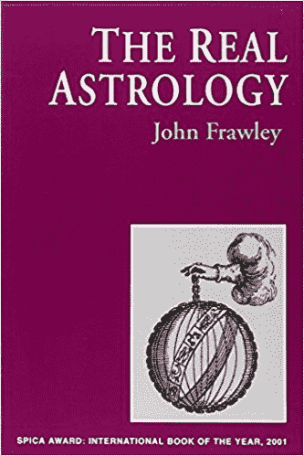

# 01 传统占星学的介绍

六百年前，国王召唤皇家占星师到他庄严的皇宫。一位信使从国王的大殿飞奔而来，走过曲折的走廊并登上螺旋的楼梯，无视蜘蛛网和睡着的奇怪蝙蝠，进入黑暗之塔中的一件落满灰尘的房间，那是属于占星师的住所。“ 跟我来” 他说道“ 国王想要与你商量。” 占星师拿起他的天体观测仪和随身的烈酒然后步履蹒跚的跟在信使身后，一瘸一拐的速度很符合他看上去的年龄。  来到国王的大殿，他用颤抖的手擦拭他那很长像雪一样白的胡须并鞠躬。“ 我们想要与 Ruritania 的公主联姻” ，国王兴奋的说道，“ 这是个好主意吗？”

“ 好的，陛下” 占星师回答道，“ 你是狮子座并总是想要成为众人的交点，而她是双鱼座，因此她的梦想超凡脱俗。这不会如你所愿。你的幸运数字今天是 6.”

“ 谢谢你” 国王说道。“ 你让我放心了。拿着这枚你辛苦所得的金币，然后告诉你的蝙蝠，他现在是 Estragon 公爵。” 这并没有发生。  六百年前，国王召唤皇家占星师到他庄严的皇宫。一位信使从国王的大殿飞奔而来，走过曲折的走廊并登上螺旋的楼梯，越过由流苏花边的烛台和发出光线的蜡烛，进入黑暗之塔顶部的阁楼空间，占星师喜欢闲聊的地方。“ 跟我来” 他说道“ 国王想要与你商量。” 占星师拿起他的天体观测仪和选择过的花精疗剂，步履蹒跚的跟着信使，他脆弱的身子使他一瘸一拐的走着。  来到国王的大殿，他用颤抖的手擦拭他那很长像雪一样白的胡须，并鞠躬。“ 我们想要与 Ruritania 的公主联姻” ，国王兴奋的说道，“ 这是个好主意吗？”

“ 好的，陛下” ，占星师回答道，将荣格似的预言熟练的用在他的回答上，“ 我通过你的星盘看到你有个困难的童年并且比其他人有更多的感受。你有如同治疗者的使命和实现创造性的潜力。”

“ 谢谢你，” 国王说道“ 我现在了解整体情况好多了。拿着这个金色古董加入你的收藏里面吧。” 这并没有发生。  六百年前，国王召唤皇家占星师。“ 我打算与 Ruritania 的公主联姻，” 他询问道“ 这是个好主意吗？”

“ 好的，陛下，” 占星师回答道，“ 我通过星盘看到公主将会吸引整个欧洲大陆的诗人，思想家和艺术家并且会为你建立有声誉的学习中心。婚礼将会建立两个国家之间永恒的团结，并且在即将到来的与野蛮人的战争中她的父亲将会是有价值的盟友。但是你所有的孩子将会比你早亡，因此在你死后王位将会传给你那邪恶的兄弟，他将会压迫人民。”

“ 谢谢你” ，国王说道。“ 那让我结合我自己的想法再考虑一下。现在回去做你的研究吧。” 这也没有发生；但是非常接近那个历史中占星师所处的画面。  现代占星是垃圾。作为一个实践型职业占星师，我觉得需要开始就清楚这一点。当代那些冒牌占星师只不过是拙劣模仿科学的老手。  我们首先熟悉关于占星方面的内容差不多都是来自于报纸上的太阳星座栏目，通常是我们想要得到一些我们希望的预兆出现，比如真命天子（天女）最终将要注意到我们的时候，此时我们期望这一天得到某些有利的征兆。在这我们会发现非常重要的建议比如‘ 避免事故’ 和‘ 小心锐利的物体’ ；精确的预言比如‘ 公共事件可能延迟发生’ 和‘ 小物品可能丢失’ （注意字眼‘ 可能’ ）；或者有洞察力的性格分析比如‘ 你的关系需求相当复杂并且不容易感到满足’1
1 全部引用自随机抽取的样本。  科学评论家难以领会这儿的可能性，直到今天，更加多的占星学让步于这个栏目。然而，绝大部分人对（栏目中提到的）‘ 其他事情’ 有或多或少不确定的感觉，（因为）基于较为深刻理解人的天性而知道某人是狮子座或金牛座这种简单常识并提供希望，对于某人自己的星盘有类似投射来说是这是可能的。‘ 其他事情’ 的确是存在的；然而这些事情不幸的是，报纸的专栏仅有的价值，典型的包含混杂的似懂非懂的精神术语，足够模糊到以至于任何人听到后可以归类到自己身上。“ 你这个人很敏感，”“ 你有一个困难的童年，”“ 你甚至发现亲密关系莫名其妙的难以满足，” 是的，我们想，那对我来说是“ 存在的” 。  现代占星依靠人类本身的习性去描述自己认同的事物，正如我们都是以同样的材料不同的配比组成一样，所有含糊不清的心理普遍潜藏在我们内心的某处。“ 你这个人很敏感，” 乃至所有强硬的暴徒都会想起他击打幼犬的时候。这是一种简单的恍惚感应技巧—— 说的任何事情会使听众立即被他们碰巧发生的事情所提醒：“ 你会想起乡下。” 你现在当然会想到。现代占星正建立在这种舒适感上，因为客户被催眠似的开始更加肯定他们自己比那些可怕的人对他们的赶紧要更加美好。所有现代占星的标尺是占星师绝不在任何时候说任何使顾客感到挫败的事情。在一个小时里专一且不加批判的关心另外一个人无疑令人非常愉快；但是事实上所有的占星师都可以提供，这很难理解为何占星术长久以来可以在整个地球上的智慧文明的生命中占据如此显著的位置，并通过不寻常的力量和精妙之处而被接受并逐渐熟练。  就像我们故事中的国王那样，在过去任何人咨询占星师想要知道某些具体的，可证实的信息。我的妻子会保持忠诚和我可以得到她的钱吗？我那迷路的奶牛在哪儿？什么时候攻打城堡最好？今年的收成会好吗？不像他在现代所对应的人物，占星师在过去的论断很清晰，可以被证实。如果他告诉顾客他可以在临近存在的围栏里找到他的奶牛，顾客可以去临近的村子查看。为了让占星师保持任何可信性，只有是他声明的合理性必须是正确的，或者他的顾客明显的愚蠢。就像怀疑论者可以让我们相信，如果我们的祖先在应期内从没有找到奶牛的围栏回来，但却仍然相信占星师的智慧，我们可以合理的预期人类绝对会因为愚蠢而灭亡。但是没有。  因此让我们仔细想想（‘ 仔细想想’ 意味着‘ 学习星星’ ）一个关于我们的祖先与之前相类似的传统占星术方法的例子，看看传统占星术是如何实际操作的，因此我们可以判断它对于我们的价值。不用害怕— 跟着这么做并不需要特定的专业技术知识。  一位律师遗失了某些属于顾客的股份证书：它们曾经在它的办公室里，属于它们的位置，然后发现它们不在了。至少，这个可能让人非常的难堪；这样可能会对她的公司造成严重的财务影响，因此她问占星师一个问题，“ 股票证书在哪儿？” 使用卜卦占星的技巧，在几个世纪以前可能是最常见的占星学分支，占星师按照他们站在一起提出的时间设置星盘。2 这个卜卦占星盘提供了某个状态的画面，依照设置标准或途径去判断—— 不是主观的直觉或涉及超自然的力量—— 占星师给问题提供一个答案。

2\. November 27th 1995.5.51 pm GMT, London.

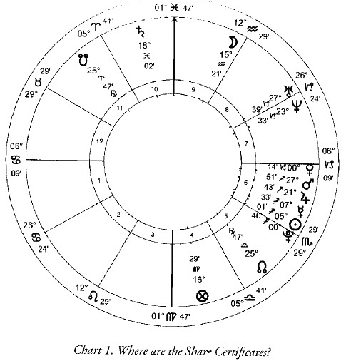

如果我们把问题看作一场戏剧，每个行星在该戏剧中代表其中一个角色。我们首先鉴别哪个行星在这个特别的剧本里是扮演主要角色：股份证书。星盘，正如你所看到的，被分为十二个部分，被称为宫位。宇宙中的每种事物，不论多大或多小，过去、现在或未来，有生命的或无生命的，真实的或虚幻的，被认为属于这些宫位中的某一个。贯穿星盘的水平线代表地平线；宫位按照逆时针方向从东方地平线（左手）进行编号。在这个例子里，股份证书被认为是落入 4 宫；位于星盘的底部，这个宫位被认为是埋藏的宝藏，（当然也有一些别的东西），所以被乱放的东西：股份证书也可认为是被埋藏的宝藏：是我们律师的‘ 埋藏宝藏’ 。  扮演证书角色的宫位的主宰行星将会在十二星座中某个星座的前沿，或者前段，或者宫位。在这张星盘中，落在处女座的前段。处女座被水星守护，因此水星代表证书。我们现在所需要做的是定位星盘中水星的位置。这将会告诉我们证书的行踪。 1,4,7 和 10 宫被称为角宫；我们如果发现水星落入其中之一可能表明证书就在附近，或者靠近它们应该在的位置。2,5,8 和 11 宫— 每类象限的中间一类—— 被称为继宫；水星如果在其中之一，我们应该判断它们离问卜者是有一点距离的。在这种情况下，可能它们会在隔壁的屋子而不是它们应该在的地方。其余的 3,6,9 和 12 宫被称为果宫；发现我们的征象星在其中之一则建议证书离得非常远。这有个问题。为什么离得很远呢？  星盘说明这是如何产生的。水星，在射手座 7 度且非常接近于在射手座 5 度的太阳。水星的运行速度比太阳更快，所以我们可以认为他们最近是在一起的并且水星正在离开这个联系。当星盘显示出某事即将发生在世界上时，一个联系—— 被认为是一个相位—— 即将发生；同样，当星盘显示出某事已经发生在世界上时，一个联系已经发生了。顺带的，在现代占星中大部分都忘记了这个区别；我们必须假设现代占星师从不等公交车：如果他这么做，他将会知道事物正在走进和事物正在离开之间显著的差异。就公交车而言，像是相位的联系。与太阳的联系仅仅是注意事项，最近刚与水星产生了联系；可能它是我们需要的线索。  找出太阳在星盘中代表什么—— 它在我们的戏剧中扮演哪个角色—— 我们首先找出他是哪个宫位的宫主星。在这个案例中，是在 3 宫，是狮子座，星座的守护星是太阳，宫头所在的星座；因此太阳可以很好的代表与 3 宫有联系的事物。3 宫所涉及的大部分是与交流有关，包括邮局。如果文档（水星）最近与邮局（太阳）产生了联系，这可以解释为何它们现在离得比较远（果宫）。这貌似是个合理的故事；我们可以顺藤摸瓜直到我们找到它提供我们需要的解决方法，或者带领我们进入死胡同，那么我们还要退回来采取另外的方法。  因此文档看上去已经被错误的与其他文件捆绑在一起并投入邮局。它们现在离得很远。这很有趣，但是都没有起到安慰作用。我们需要找出它们将要发生什么。逐渐离开太阳，水星正在接近木星。正如水星比木星运行要快得多那样，它（水星）将会很快追上它（木星）。木星是双鱼座的守护星，10 宫头所在的星座。10 宫是代表工作，职业和办公室。这是个希望：文档将会来到办公室。  但是，悲剧啊！水星，在射手座 7 度，木星在 21 度。水星追上木星之前要通过射手座 18 度，会与土星形成相位的地方，位于星盘顶部双鱼座 18 度。这并不好。土星是个令人感到厌恶的东西并且最好能避免。在传统占星学中，我们认为吉星为木星和金星，凶星为土星和火星。吉星是有益的，凶星不是。现代占星师不这么用。古时候凶星对简单的民族（野蛮的民族？）是有用的，但是现代占星师宣称（表面上所有的严重性）我们现在远比以前的人和事要复杂。我们居住于荣格观念的宇宙，位于因为缺乏物质基础而受到阻挡才觉得心理学珍贵的地方；但是这真的是真实的吗？给出装支票的信封和装钞票的信封，我们难道不是更喜欢装有支票的信封吗？我们日常的世界是建立在好与坏这种非黑即白的线条上：可能钞票会通过教授我理财方法而长期受益，但是我会仍然想要支票。这并不意味着我们完全活在某些快乐对抗痛苦的幼稚水平上，好比苛求在所有场合都要冰淇淋吃；这只不过承认事物有些是幸运的而有些不是。如果每个乌云有一丝光亮，我们不一定找得到。这在卜卦占星学中更加重要，事实上有人因为烦恼而提出问题几乎总是意味着渴望得到答案：吉象容易得到结果，凶象则会阻碍它。这里我们的问卜者寻求找回她的文档；根据妨碍的结果，土星是最明显的凶象。  卜卦占星学中，我们所关心的通常只是下一个相位。如果没有产生出一个结果（指没有产生下一个相位），完蛋。实际上，我们必须承认文档的机遇，无缘无故的达到某些陌生的办公室，被退回的几率不是很高：我们知道其他部门给我们打回电话的频率有多低；那不辞辛劳的寻找文档又有能多少机会。土星是与惰性和妨碍有关的行星，这样表明（土星的）天性就给出一个将要阻止证书回到办公室的结果。  但是救星即将到来。月亮在水瓶座 15 度。它比任何行星都移动得快，即使是水星，因此我们看到它在水瓶座 7 度与水星呈出相位并且入相位木星，它将在水瓶座 21 度追上木星。行星不会与邻近星座的行星形成相位，因此就像水瓶座的下一个星座是双鱼座，月亮逃离土星的干扰并将文档带回办公室。这个技巧被称之为光线的传递：月亮拾起水星的光线并将其带给木星，将这两个行星联系在一起。这涉及到月亮，把文档带回家，很合理：文档并没有去到邮局，被寄回办公室，我们需要牵扯到第三方。  月亮的运动可以让我们估算（取回证书）的时间。问题是在周一的晚上提出的，文档最后一次被看到是在之前的周三。月亮的位置是在水瓶座 15 度，代表提出问题的“ 现在”— 周一 — 因此月亮在水瓶座 7 度与水星（文档）产生的相位可以被认为在之前的周三它们最后被目击到的时间。因此月亮从 7 到 15 度的运动显示周三到周一的时间。对照着比例，然后，根据月亮目前的距离，15 度，到它与木星产生相位的位置，21 度，将会显示文档回来之前所要耗费的时间。占星师判断它们可能在周五回到办公室，也确实如此。  这恰好是很清晰的案例，可以发现经过了悠久历史通过占星术明确的判断，在今天仍然适用，仅仅提供使用真实的传统占星术的方法而不是它们被扭曲过的现代占星这种邪路。现代占星不能提供这种判断。这是由两个原因造成的。一，关键在于偏见：它（现代占星）不再是有目的的去做，因此也不再可以相信它的合理性；另外是工具的问题，就像，因为我们需要探索未来，在现代世界占星术的文章中（传统占星）已经不再是完整的且不被承认的改变，并且大部分的工具用过一次便被扔掉（所以现代占星更加不能提供准确的判断）。  现代占星纯粹是论证一个来自某人脑海里绝对的困惑。传统占星开始于假设他的顾客已经知道了对他自己两个耳朵之间（脑子）发生了什么的评估；但也有他不知道的，并且因此想要获取相关的信息，在外部世界会发生什么事。  因此以心理学为导向是我们因为对外部世界不够重视，看上去只是像在给我们的心智工厂提供食粮；最重要的是无论怎样的心态，个体可能会沉浸在当时的状态中。在必要的时候，传统占星的方法可以提供非常细微的心理分析，但更多的是推算具体情况而不是心理分析；它最大的一个优势在于实际用途中判定其他人的心理可能会发生什么 — 或者，例如，一个人的敌人在诉讼案件中决心斗争到底或者他将会首先解决问题。但是它大部分的用途，尽管没有最高目标，是给出一个在世界中可能会发生什么的指示。  假设我要从 London 开车去 Glasgow ，并想要知道我会在什么时候到达。我查看地图看看有多远的距离。我通过电视去了解道路是否有施工。我查看天气预报看是否会因为下雨而阻碍我的旅程。这样仍然是无法估量。现代占星师可能告诉我说希望开车去 Glasgow 是与我的彼得潘症候群有关；一个采用传统占星术的占星师将会告诉我相当有用的信息，我的直达路线上面会有很拥挤，因此如果我走那条线路会被困在长龙里面数个小时。占星术的功能是给出问题中一个清晰，理性的状况描述。不论是文档去向的状态还是我旅行的计划，国家的命运还是个人的命运以及他精神上的优缺点。当窥视未来的时候最大的警告必须是可执行的，所有的事物都受到上帝旨意的支配并且对他意愿的运作不会一直被人类解读的；它也不会满意我们像它们那样守规矩。但是对状态清晰的分析，超越我们的希望，恐惧和无知的迷雾，数千年前的 Babylon （古巴比伦时代）的人类已有科学的启蒙，（但占星术）仍然被高度重视。  下面的星盘亮点在于传统和现代处理方法的不同。星盘借用的是一位令人尊敬的现代占星老师的演讲。他解释他的一位学生的手提包在数日之内被偷了三次。她没有丢失任何贵重的东西，也没有受伤，明显的，她经历了一次令人不安的经历。她询问老师去查看她的出生盘有什么发生在她的身上。该图片只是展示相关的行星。

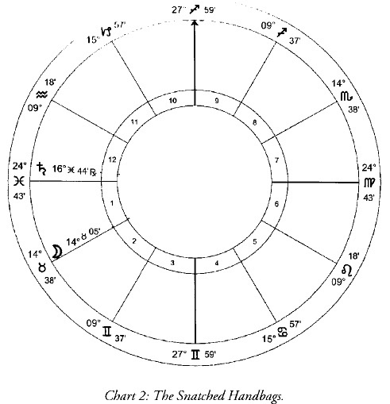

正如我们的演讲者准确的鉴定，关键在于土星和月亮之间形成的相位。当这些事件发生的时候，天空中的土星已经回到该学员出生时它原本所在的相同位置。这被称为土星回归并想到（此时）每个人在 29 岁左右，生命中的一个重要转折点。行星回到他原始的位置激活，就像它（土星）这样，储存在该处的潜力。土星与月亮之间形成的相位带回来学员的情绪。我们的老师考虑后的意见是她可能期望体验某些不愉快的事，然而没法知道这是一个外部事件还是一个内在苦闷的感觉。的确，他所讲的整个论断确实是不可能告诉星盘显示的事物将会发生在外部世界还是心理状态。我们可以认为它（星盘）可以有助于知道（我们没有发掘的心理部分），然而这只能指出我们没有发掘的（心理）部分。  从现代占星这没用的工具，和它那相应没有用的系统来看，这个论据是正确的。让我们来用传统占星术的观点看同样星盘中少量的条件。土星是星盘中最大的凶星，最可怕的事物；我们并不喜欢它。当它处于状态良好的位置时，在它获得强壮的星座— 比如摩羯或水瓶座— 它可以端正它自己并给予单调乏味但又珍贵的吉象比如纪律，庄严和忍耐力；它在双鱼座，它是虚弱的，因此它将会带来不幸。它与月亮形成相位，（月亮）处于 2 宫头，属于财产的宫位。土星是行星们的边界；这儿，它是虚弱的并与财产有联系；我们可以怀疑一个贯穿生命中固有的与什么是我的和什么是你的困难问题。12 宫，土星所在的位置，秘密敌人的宫位；因此，更具体的说，我们有一个倾向于恶意的秘密敌人在折磨她的财产。  双鱼座，土星所在星座，是四个被称为“ 双体星座” 的其中一个并因此是二象性的表现；因此有不止一个的秘密敌人折磨她的财产，或者当这个（被偷窃）发生的次数不止一次。月亮落在金牛座，它强壮的位置，比土星强壮；财产，正如它那样，比秘密的敌人要强壮，因此袭击她的人不能开着卡车搬空她的屋子。损失将会非常少。金牛座是阴性星座，由金星守护，因此我们考虑某些特别的女性小量财产。（金牛座）天性是固定和土象星座，金牛座与固定的物质联系在一起。土星与金牛座形成相位的角度是 60 度（那是因为它们相距两个星座= 一个周天的六分之一；360 度的六分之一是 60 度）。这被称为六合，并且不管怎样六合相位表明事情将会很容易发生：盗窃发生得很容易。如果是形成 90 度的相位，表明它们将会发生得很困难，我们可以解释为她受伤了（好像说小偷盗窃一个东西，如果很困难则会与被盗窃罪发生冲突，命主就容易受伤）。我们之后可以将土星的特性与双鱼座的特性结合起来，从而给出一个很接近第一个小偷的外形描述。是的，我们这是事后诸葛亮 – 但是现代占星师又有谁可以这样判断，甚至是这个未知的不愉快将会是一个事件还是一个心理状态（都没法判断）。  心理上的事物是最吸引人的，当然，它们完全没法印证。占星师可以说他喜欢它们并且没人可以证明他是错的。汽车修理工，要么修理汽车要么没法修理汽车，可能嫉妒这个将每件事转入主观情绪问题的能力。在一些偶然的场合，当占星师谈论足够清晰的事物而出现可能反驳他的情况，顾客可能提出反驳：“ 但我根本没有觉得喜欢” ；但是顾客陷入误解，没有意识到他们自己感觉的本质。我最近判断一个顾客的出生盘，他之前也同样找过一位处于业界领导地位的现代占星师解盘。“ 她一直在说我的孩子” ，他诉苦道，“ 尽管我告诉她我想要了解我当前的运势。她一直在说我的问题来自于我母亲。我告诉她我一直与我母亲相处得很融洽；但是她仍然说我拒绝面对这个问题。”“ 我会修理你的汽车，” 修理工说道，“ 好郁闷，这是账单，请付账吧。” 离开真实的世界，我们需要占星师提供足够精确的证明。占星师 Guido Bonatti 受到 Dante 的委托去地狱的第四层；Mount-Serrant 伯爵有着相当高的能力。当伯爵被围困的时候，Bonatti 建议他如果在某个时候出发并攻击他的敌人就可以击败他们，迫使他们停止围攻。然而，他可能遇到危险，但不是致命的，可能是在大腿。伯爵听从建议展开了攻击。尽管人数处于劣势，胜利依然属于他；他追击逃离的对手，大腿受伤了，但是建议让他对此有了足够的准备并作出治疗，因此他还活着。3

3 Henry Coley, Address to the Reader, in William Lilly's edition of Bonatus' Anima Astrologiae,London 1676; reprinted Regulus, London, 1986. Coley cites Fulgusos, L.8, c.11.

Luca Gaurico— 不仅是一位著名的占星师还是一位 Dijon 的主教— 从亨利二世的出生盘判断在他四十一岁时将会在骑士刺枪比赛时被刺中眼睛而死去。4 怀疑论者可能声称预言对目标起了心理暗示作用，对可能发生的事件过分渲染；如果我们反过来考虑，亨利的心理可能已经已经体现在他身上，为了瞄准他的眼睛而向长矛尖部上撞去，这反而更容易证明占星师恰好是对的。 4 John Gadbury, Collection of Natzvities, p. 23; London, 1662; reprinted Ascella, Nottingham, n.d. 占星师大量发布 1665 年伦敦爆发瘟疫和一年后的大火灾，还是，像 EbenezerSibley ，预言在 1789 年“ 法国的政坛将会发生某些重要的事件，比如像废黜，非常接近触动生命，国王，并使教会和国家里很多重要和接触到人在教堂里受到伤害，在君权方面作出革命或改变，将会令周边的国家震惊，” 与之形成强烈对比的是现代占星师的普遍性错误的预言，比如值得注意的事件，就像第二次世界大战的爆发。  传统与古典占星术的对比: Adolf Hitler( 阿道夫· 希特勒) 如果（传统）占星术是成功的，我们可以合理的怀疑它身上发生了什么。为何它会被今天我们所熟悉的温和陈词滥调所取代？在探索这些是为何和如何发生的之前，让我们做个至少差不多的科学有效性试验，任何科学怀疑论者要求测试占星术的试验。我们应该拿一位非常有名的人的出生盘并使一个占星师通过过去和一件现在的事对其进行去解读。不幸的，所有我们邀请参与这个实验的古代占星师另有约会（都已经作古），现代占星师这种太忙碌的状态会使他们九泉下不得安宁；因此我们只好借用他们的著作。在小心谨慎的科学公平性里，我们应该（两种方法）同样针对我们比较有代表性的现代人。

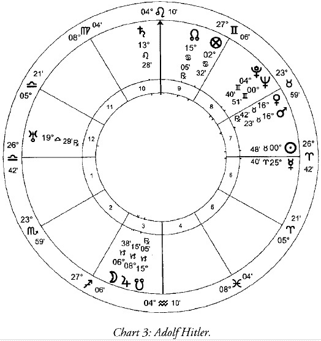

我们应该使目标的一生规矩都有很详细的记录可查：（我们选择的是）Adolf Hitler 。6Hitler 是很多记录的人，因此几乎在所有占星术著作中关于战争的介绍都有提到，这是一点都不令人惊讶的。令人惊讶的是在大部分这类书籍中他被作为是白羊座的例子，那是因为，就像某人出生时太阳处于白羊座。他的性格被认为是典型的白羊座自负自大、冲动、热情等等的特性。实际上当他出生出生的时候太阳并不是落于白羊座— 很容易去证实— 显示相信这些结论的人是将努力和信任花费在大部分现代占星著作上。Hitler 出生于 1889 年 4 月 20 日当地时间下午 6 点 30 分。前一天太阳已经离开白羊座并进入金牛座，在他出生前差不多 24 小时。很少有作者去检查，仅仅是参考珍贵的资料，日报上的太阳星座栏目，告诉他们白羊座在 4 月 21 日结束。但是太阳移动星座的改变时间是根据围绕每年的这一天决定的。而不是例子中白羊星座的特性，Hitler 实际上是金牛座特性的例子，比如倔强和恢复力。我们也能将他认为是双子座（演说家），巨蟹座（淹没），狮子座（独裁），处女座（胃疼）或者任何其他的星座准确论断，在这些太阳星座的陈词滥调中又有多少真实的呢？ 6 April 20th 1889, 6.30 pm LMT, 48N12 13E02 即使那些现代占星师费力去检查 Hitler 的出生盘而不是仅仅复制落入他们手中毫无价值的书籍，时常也会承认遇到某种障碍。当它显然不是我们所希望邀请去喝茶的某人，他污秽的深处逃避了现代占星技巧。然而，通过传统观点，这些深处非常的清晰。  判断出生盘的传统方法从判断气质开始。这是，可以说是，那种人会被裁剪的衣服。我们之后看到的所有细节必须针对这个背景判断，就像细节被绣在衣服上。不论绣的是什么，基本问题是当决定打算绣上去的时候，衣服采用的原料是柔和的丝绸还是粗糙的棉布。因为是人。那他主要是胆汁质，粘液质，多血质还是抑郁质— 还是这些特质中两者的混合呢？  这个结果是按照热，冷，湿和燥特质的不同程度推算出的，显现在四种合适的组合中比如土，风，火和水（那分别是，冷和燥，热和湿，热和燥，以及冷和湿）。理想将会是他们之间完美的结果。人们— 更确切的说，男人— 是上帝创造出一切的最好结果（女人比男人更冷且更湿），尽管如此，当然，里面也有很大的不同。传统认为所有人中最好的结果是 the Prophet 。7 我们必须针对特定的人判断热，冷，湿和燥混合物的精确特性，我们考虑混合物存在的表面上的气质，以及肤色，起初就是气质的代名词，但现在仅仅是用于外表而不是生命的整体。 7 Sec Jalalu’d-Din Abd’ur-Rahman As-Suyuti, Medicine of the Prophet, p. 3, Ta-Ha, London 1994 大部分的人还有一或两种特质是表现强烈的，另外一或两种特质是相对较弱的。这个结果显示该气质的人拥有：胆汁质，某个，用现代说法，火象；粘液质（水象）；多血质（风象）或者抑郁质（土象）。抛开仅仅是描述心理习性，这个结果也告诉我们关于此人的外貌，他们可能受到的疾病，还有很多，非常多。例如，Geoffrey Chaucer ，一位杰出的占星师也是一位诗人，可以通过他的特质描述一个性格 — ‘ 胆汁质’ ，可能 — 由于一句话可以给他的读者不仅是一个好的想法而知道这个性格的一般行为模式，还有他的相貌。如果我们将这个细节放入我们之后发现的任何有意义的环境中，知道特质的简单概念是至关重要的。这将非常容易理解命主将会谋杀他的奶奶；他是因为一阵突如其来的暴怒而将她打死，还是因为血红色的古董（译者：可能是出于好奇心，比如一点一点给这人吃什么东西会有什么后果）而慢慢毒死她？仅仅是通过特质这一方面的知识就可以告诉我们。  去看看这些有意义的特质，我们不论有怎样非常固执的特质，我们可以考虑演员。即使他们非常善于接受不同的角色，将不会脱离他们自己的基本特质而行动。这么做会显得荒谬，下意识中我们都明白特质和体型是不可分解的。的确，喜剧的构成最容易和最可靠铸造出某些人天然特质相反的（特质）。不论是 Jim Carrey 试着成为 John Wayne 还是 John Wayne 试着成为 Jim Carrey ，结果肯定是很滑稽的。我们的特质绝不会离开我们。即使当我们是失去特质的时候，我们行动的风格：火象，胆汁质人将会攻击某人；风象，多血质的风格将会释放出毒舌；水象，粘液质的人将会流泪。因此我们开始看到如果我们理解一个人的全部，领会一个人的特质将会有多重要。  现代占星术，如果试图达到查看 Hitler 任何事件的水平，需要注意土象星座中行星的数量（太阳，火星和金星在金牛座；月亮和木星在摩羯座）并判断他肯定存在土象的特性。抛开它：在传统术语中，特质是非常胆汁质的，或者火象。胆汁质是当今最不流行的特质，战士的梦想，盛怒表现的自然模式，生命现在只可以接受被曲解或被敲打的风格。然而，本质上，胆汁质并不比其他特质更糟。多血质一直在教科书中得到追捧；但我们必须记住，写这些书的人肯定更有可能是风象的，多血质的本质：任何不平衡的事都是缺乏完美。  因为 Hitler 是胆汁质的；问题开始于当我们考虑暴躁的脾气会如何去寻找发泄口的时候。根据它自己的热，燥的特质，火星的特质与胆汁质的特质很相像。火星在星盘中有一个强力，不错的位置可以建议命主可以成功的将他的特质整合到社交中就像一名战士 — 用现代占星的术语这通常显示为一名职业运动员。然而，Hitler 的火星，处于可怕的状态，正如我们所看到的。太阳，是热且燥并因此可能允许积极的展示这种暴躁，也非常的虚弱。这种暴躁的特质，我们开始看到，将会用非常可怕的方式展示自己。  就目前判断，我们的注意力被某些恒星的位置所吸引 — 我们通常称之为“ 恒星” 与“ 游星” （例如哈雷彗星）或行星相对立。大部分的恒星，大部分的时间，在星盘中是无声的通知。那些恒星落于角宫，特别是在上升和中天，它们与行星在一度以内，尤其是太阳和月亮。它们在现代占星学中几乎被忽略：就像下面显示的那样，这里存在一些遗漏。中天是鬼（宿）星团，被中国人称为‘ 积尸气, 也就是堆积的尸体所散发的气体’ （译者：对作者佩服得五体投地，连这您都知道）。中天是星盘中与事业或公众形象特别相关的位置。我们简直不需要说得更多 — 然而，当然，我们应该说：它带来“ 疾病，耻辱，冒险，傲慢，放纵，暴行” 。8 太阳位于一个非常令人不愉快的恒星上，娄宿一，“ 残害肢体，道德败坏，用火，战争或地震去破坏” ，当月亮落于 Facies 上的时候，给予横死。就像鬼宿星团，Facies 也折磨视力，许多如果还有更多的与发光体（光源）之一产生联系；这就像字面上那样是隐喻的 — 尽管 Hitler 的肉体视力非常虚弱但不是经常这样，在隐喻中是指他没有非凡的能力。最终，它自身的意义非常少但是由于是落在角宫所以很重要，还有水星，落于宿命点，仙女座星系，重复折磨视力和横死的证据。 8 Quotations on fixed stars from the standard reference: Vivian Rohson, The Fixed Stars and Constellations in Astrology, London 1923; reprinted, Ascella, Nottingham, n.d. Robson’s work is a compendium of traditional views. 有了传统方法判断作为铺垫，让我们以这个星盘盲选两位占星师，一位古老的，一位现代的。我们的现代作家，从架子上随机抓取，但决不是已经下架的种类，9 概括她判断出生盘的方法。我们从评估上升星座开始（注意在这个解读中我们至今仍然不知道我们刚刚在上面的描述：这里我们才刚开始）。上升落于天平座，我们的命主是“ 一位在外交上有着随和，迷人和和蔼的品格，合作并将为和平与和谐做任何事。（他）聪明理智但容易优柔寡断且易受他人的影响。（他的）缺点是优柔寡断，轻佻，过于随和，懒散并且有保持中立的倾向。”
9 P. Tillot, in Tybol Astrological Almanac for 1999, pp. 15-3o, Tybol, Preston 我们之后必须查看上升星座的守护星，金星。落于金牛座并且在 7 宫，我们的命主是“ 讨人喜欢的，和蔼可亲的，忠诚的，有礼貌的；… ，尤其是在家；好嗓子；高品味；喜爱园艺；非常有占有欲” 等等这些，然而还有紧密关系的问题。太阳落于金牛座增加坚韧的特性并且进一步与关系产生联系。月亮落于摩羯座给出“ 冷淡且谨慎的特性；… 有野心且努力工作… 有成功的动力，” 当它落于 3 宫的时候显示“ 思想受到情绪的强力支配；喜欢做白日梦且很快厌倦单调无味的日常工作。” 我们之后可以继续使用各种其他单调乏味的方法。为了公平，我们必须指出金星在金牛座将会因为与火星形成合相而造成削弱。那是，“ 令人愉快的，和蔼的，忠诚的，等等” 将是以“ 非常实用；有很大的决心；通常非常宁静” 为条件的。与土星形成刑相位也会因为需要“ 来自别人大量的尊重/ 注意；拥有职责，不论想或者不想；培养与安逸/ 快乐/ 权力/ 力量有关的强大价值观” 而限制金星的品质。  一旦这些方法被记录下来，占星师延伸到下一个阶段，被称作“ 合并” 。这是当所有各种各样的方法被揉和在一起而制作成一幅连贯的图画。如果我们想象一个被称之为“ 小心的称出你所有材料的重量，之后按照你的任何规则和想法将它们扔进一个碗里” 的秘方，我们有一个综合艺术的想法。我们需要按照这个典型的现代占星方法称出材料；我们应该离开我们的读者并将他们混合在一起去深入精确描述 Adolf Hitler 。  我们盲目阅读过去的资料，我们应该求助于 Claudius Ptolemy 。记得我们关于特质的评估已经为我们提供以上所有的信息，我们可以将注意力仅仅只集中在一个点上：凸显在金星与火星的合相。这也与土星形成刑相位，但是更重要的是，根据传统占星学映点的技巧，土星正好与其形成合相，将这三个行星直接进行接触。映点是在现代几乎被遗忘的技巧，缺少了它将会导致对星盘有一个糟糕的判断；它按照字面意思就是每个行星的阴影（这在荣格的概念里肯定不需要去了解），或者在实践中相当于每个行星位置的替代物。这不是讨论技术细节的地方，但相信我，亲爱的读者，它是有用的，并且在这种情况下土星正好落在火星与金星的合相上。 10 Terabiblos, trans. F.E.Robbins, p.343 Heinemann, London, 1940 行星相对的强势（力量）是被现代占星学极为忽略的东西。Hitler 的星盘，没有强力的行星。使用技巧标签，木星处于弱势的位置；月亮与火星处于它们落险的位置；水星和太阳是游离的。这是特质堕落的强力显示。即使金星，处于入庙的位置并拥有美德而得到强大，金牛座，但悲剧的是因为处于逆行且与两颗凶星火星与土星产生直接联系而导致残废。这个联系更加重要因为某个凶星都是虚弱的，另外一个凶星更加虚弱，它们的影响更加糟糕。发生在固定星座，这给出一个不可动摇的萎靡。大部分的行星在地平线上（星盘的水平线轴）并落于角宫，它的发泄口将会是在世界上：行星如果隐藏在地平线下，Hitler 可能会花费他的生命在思考可怕的想法上，而不是将它们付诸于行动。  按照 Ptolemy 的说法，这种行星的组合“ 在荣誉的位置使得他的目标既不好也不坏，勤勉的，坦率的，讨厌的，懦弱的自夸，行为粗糙，没同情心，轻蔑的，粗野的，好争吵的，鲁莽的，无法无天的，虚伪的，层层埋伏，恒怒，冷漠，欺善怕恶，残暴的，贪婪的，怀恨人公民，喜欢冲突，有恶意的，彻头彻底的邪恶，活跃的，焦躁的，狂暴的，粗俗的，自负的，诽谤的，不义的，难以被蔑视的，对人类怀恨在心，顽固的，不变的，爱管闲事的，然而同时可以熟练和实用的，不会被对手压服，在最后获得成功。” 这是在如果整合“ 荣誉的位置” ，因此好的一面。在 Hitler 的星盘中，很明显不是在荣誉的位置，所有这些行星都被严重的折磨，因此结果不是那么有利。Ptolemy 建议在这种情况下，它“ 造成他的目标是盗贼，海盗，造假的人，顺从可耻的治疗（我们可以回忆 Hitler 的性癖好），接受者的基本利润，不敬鬼神，没有一丝爱意，无礼的，狡猾的，小偷，作伪证者，杀人犯，投毒者，不虔诚的，盗贼的寺庙和陵墓，彻底的堕落。” 所有这些点可以通过胆汁质显示出，却是衰败的胆汁质，特质。  我们可以感觉到 Ptolemy 给出一幅图画，比我们现代占星师盲目的阅读而产生的爱好和平的园丁更加有点靠近标志——2000 年之前出生的某人的著作不错，并且没有机会修改他“ 容易相处，可爱且善良” 上升处于天平座的意见，自 Hitler 成名以来他的天宫图引起了大量的注意力。这无疑是真实的，我们可能发现某个现代占星师通过盲目的解读可能会给出他性格的更加精确分析，如果存在详细的时间和 Hitler 的出生地；但是我们现代的例子是典型的，并且应该有记录到一般占星的语气，甚至书写着在十九世纪三十年代的世界可能期盼由可爱的 Hitler 先生提供一个太平富裕的年代。我们必须注意到我们的现代占星师至少自称是占星师的，而并没有迹象显示 Ptolemy 在他的生命中曾经计算过一个天宫图。他只不过是一位百科全书的编纂者，记录当时流行的经验。一个占星门外汉可以通过有效的传统方法给出一幅足够精确的画面。我们必须也指出 Hitler 徘徊在现代占星师的洞穴里，他无疑也听到过他有一个困难的童年，他的创造性驱动力是如何被阻碍的，并且他如何感觉到那些最亲近他的人也不能完全的理解他，大概最终被告知他有如同医治者的职业。

# 02 现代占星学的崛起

在 1895 年 AlanLeo 将‘ 占星学古老的系统现代化’ 作为己任。他的著作是为那摇摇欲坠的现代占星学大厦奠定基础。占星本身是很健康的，不论怎样，这个人的著作可能会被吸入到占星学那澎湃的大潮中，不管他是如何判断去改良、扭曲或破坏她；结果却是，曾经奔腾的河流被证明非常容易的改变为一条可怜的细流。

占星师总是喜欢回忆起模糊的远古时代，那时的占星大师的地位有如君主，他们预测之精准，令周遭之人惊奇拜倒。这样的黄金时代却显得从来没有发生过。远在我们可以追溯到的占星学著作，我们发现有着来自同时代怀疑论者的攻击—— 尤其是因为没有占星师一直努力让所有的事情都预测正确：就跟现在一样，当一个人只看到了成功的时候另一个人只看到失败。蔑视大山的某一面裂开，或是赞美一粒沙子的坚固都是有可能的。然而，即使传统上占星术受到最猛烈的攻击都不足以掩盖它本身的正确性，但却达到掩盖它有效性口碑的程度。实际上绝大部分顽固的怀疑论者都接受占星术对气象和王国兴衰的影响。他们仅仅是持续四百年用广泛出现的文学作品来谴责占星术那极不重要的可信性的要求。

过去辉煌的神话不是现代发明的。在 17 世纪，我们发现占星师们，比如 JohnPartridge 就向往所谓的黄金时代，声称现代占星师是如此的堕落所以我们必须回到古代以纯粹的形式找回占星学。他的著作 OpusReformatum 是企图‘ 通过伟大的 Ptolemy 而振兴真实和古老的方法’ 尽管它与 Ptolemy 的相似之处并不比前拉斐尔派到任何前拉斐尔派更加接近。就像艺术世界中的 Rossetti ，Partridge 希望回到他的根源却导致没有完整理解那些根源实际上是他所在的世界中的严重不安的意识。

按照他那个时代的习俗，Partridge 出版了每年一度的历书，这非常像当今占星师在报纸上写太阳星座专栏：这是保证赚大钱的事业并且会将自己的名字固定在大众的眼中。有许多这样的历书在出售，因此在 1708 年又多出现了一个，出版之前 IsaacBickerstaff 并不出名，可能只引起少量的关注，他并没有首先列出值得注意的死亡预言，就像每个历书所期望的那样能够预测到的‘ 值得注意的公爵’ 或者‘ 国外的王子’ 的死亡或者其他这类事物，而是预测 Partridge ，他将要死于“3 月 29 日之后几日，大约在夜里 11 点，由于突发的发烧” 。

Bickerstaff 的著作非常引人注意，甚至被翻译为数种语言。在 3 月 30 日，Partridge 的死亡预告被发表，很快一封匿名信发来，精确的描述该不幸的占星师的临终时刻的细节，包括临终时他的占星学原罪的忏悔。“ 我是个卑鄙的人，愚昧无知的人，进行着卑劣的交易” ，他喘着气说道，“ 然而我充分的意识到占星师所有装出的预言都是诈骗。”Partridge 自己的历书照例在每年的晚些时候出现，包括他仍然很好的活着的声明。Bickerstaff 仓促的再次印刷，捍卫他的预言。在其他证据中，他指出众所周知许多层出不穷的历书在它们的作者死后出版。Partridge 试图证明他自己活着是由于与出版公司产生了争吵而受到了阻碍，因为拒绝了他以后三年的出版许可。在知识界，如果不在一条道上，他会迅速成为笑柄。

这个事件有时代潮流变化的特点，内容中提到 Partridge 九年以前出版他的 OpusReformatum 。IsaacBickerstaff 是 JonathanSwift 的笔名，自封为新启蒙的领军人物，在某人的美好新世界中占星术没有位置。一如既往，批评家最乐于炫耀令人信服的套路：Swift 主要控诉 Partridge 曾经是一名皮匠。这表面上证明占星术是胡说八道。Swift 的攻击在人类相关的事务中是翻天覆地变化的象征。占星术成为无法理解的新知识体系，或者，更为精确的说，新知识体系框定了现实的眼界，从而导致占星术不再有意义。我们也必须注意到鉴于在过去占星术受到的那些批评的几乎完全与科学知识有关，Swift 是在辉煌时代之中首个把自己的无知当作有足够的资格去判断的人。

新的世界观通过 Bacon,Descartes 和 Newton 拆占星术的台来例证，没有明显的科学支持手段导致占星术被舍弃而发展缓慢。没有貌似可信的原理，甚至它运行的时候看起来也像是个花招，相较于以前，文艺复兴之前的世界观，它的运作看起来天生就很完美。尽管时代在不断的发展，比如 Baconian 派哲学，可以看作时代潮流转变的节点，只要这个节点仅仅流行于知识分子的小范围世界，它就无关紧要。而当它渗入到普通人日常知识的改变中，占星术的公众理解力也就消失了。占星术不仅不再对知识分子有意义，而且还对一般人也没有意义。我们看到现代被科学主义攻击且不被理解的占星术：这些攻击从未提出有效的问题，而是集中于指出比如行星投射的影响或是否行星曾经按照字面意思‘ 落于’ 一个星座这类方式— 并且这些星座曾经是否存在。对一位占星师而言，这些参数听起来像故意被忽视掉，但是它们并没有：不被理解是不可避免的，正如科学家现在的世界观是与当初和占星术是相连的一体时相违背的。占星术的衰弱是社会运动远离传统思想引起的。占星术的基本概念对世界观不再有意义。

神学的概念绝对是超前的，真理曾经是在所有人的心中，不论他离神学规定他行为的戒律迷失了多远，在我们朝着科技天堂飞驰的路上已经将其忘记。真理，通过显示信仰而被证明，曾经是共通的语言但现在不再被广泛的提到。因此占星学，这种较少被显现的灵性学科在传统上是建立在它自身概念的范围之内，不再与现代人有着共同的语言。那些满足于现代的、世俗的、唯物主义世界的人将缺乏共同语言，并视为他们进步的标志；那些有另外想法的人把这视为一个悲剧。正如科学是在文艺复兴之后一步一步走来，常识在它后面几步紧紧跟随，占星学曾经促进它的进步。所谓的‘ 新的’ 物理学有时用现代术语称古老的真理重新被发现，然而这远不是真相：对这些古老真理的清晰认识揭示了新的物理学是在它们的基础上更进一步发展。如果我们相信这个被科学踏平的道路是正当的，这个缺口将会对古老科学产生严重质疑。就像我们看看我们周围，不论如何，尽管我们可以钦佩科学聚集的技巧可以熟练的从技术上的某个科学家如此熟练的拉动每个可能的帽子，理智、道德和灵性被现代科学家建立的世界摧毁是如此的印象深刻，他们自己在我们之上的视角不能被认真的接受。

AlanLeo 的世界观发现他自己有达尔文主义便立即在 Newton 和 Descartes 的屋子里熟练的使用它们。在世俗的机械唯物论的世界里，占星学失去了它的观众；它不再被理解。这并非不合理，于是，Leo 本认定应该重建占星学与大众之间理解的桥梁。这意味着他试图在此取得成绩，且不说几乎没有任何效果— 正如我们可以通过当今占星学无聊的视角来证明— 而且是完全有害的，他试着去复兴它的时候甚至是正在破坏神圣的学科。

这有且只能有一种方法去让占星学被现代观点所理解。这个方法是改变现代人的观点直到接受占星学建立的原则为止。让我们假设占星学是一盘西兰花。我们知道我们的孩子会因为吃下这有营养的蔬菜而受益，但是他并不想要这么做，因为他未能理解它的好处。因此我们将西兰花拿走，用一碗冰淇淋取代它，当孩子吃完这碗时我们庆祝我们自己成功的让他吃下了西兰花。我们难以得出此类不知不觉自欺欺人的结论。然而这恰好就是 Leo 和他众多的追随者对占星学所做的事。为了使它可以被理解，他们改变它直到它被改变，然而与它真实之处仅仅相似的是— 正如冰淇淋和西兰花具有同样少量的相似之处，它们都是食物，然而在其他方面毫无共同之处。

Leo 用通神学的术语重塑占星学，通神学本身是以维多利亚时代科学唯物论的底子进行少量的改变进而冒充为玄学。通神学通过篡改的精神学术语并混杂了其他一些足够模糊和足够宽泛的语言去适应任何咨询者，使其在进入它的大门之前被有礼貌的拖延关键性的判断；最重要的是，冒牌的玄学面纱是如此的单薄却蒙蔽了当时的常识世界观，它很容易地被接受。通神学的影响力远远超出那些成为有正式资格的社会成员；今天，它的声誉遍及整个‘ 宗教自由’ 和‘ 灵性新时代’ 的世界。在四分之三个世纪里公开的通神学作品用英语控制着占星学著作；不是在它们的帮助下所写，但被它们的影响力所感染。英国每个重要的占星组织在二十世纪末都是起源于通神学会的占星小屋，是 Leo 在 1914 年建立。成年人通常有将他们的本来面貌放入通情达理面具之后的能力，可以将大部分刻薄的争论简化为 Leo 笔下合法的作品，他们有类似于圣杯的力量。

难以理解为何没有人寻找占星学的知识时应该期望作者的作品是靠谱的，正如它原本主人和占星学的联系与 RobertOppenheimer （原子弹之父）和广岛的联系没有什么不同（译者：意为 LEO 对占星学造成的损害如同被原子弹轰炸后的广岛那样残破不堪）。通神学的世界与占星学的形而上学是完全不同的。人类，通神论的占星师可能会有这样认为，被分为‘ 进化’ 或‘ 未进化’ 的灵魂，前者以遵守维多利亚时代中期的贵族行为作为标准。星盘中的任何配置将会按照命主演化的平台进行判断- 一个人的神秘经历存在另外一个人的醉酒狂欢中。不可能通过星盘来探明灵魂的状况，因此占星师必须依靠顾客他自己的判断：拥有良好的人际关系或者善于结交陌生朋友是进化的可靠指标。占星师他自己，几乎不言而喻，是一个高度进化的灵魂，并且装备精良的去决定他的追随者演化的状态。

Leo 的爱好是把占星学用作性格分析而不是预测工具；他的口头禅之一是“ 性格决定命运” 。这个爱好通过他的审判并定以‘ 假装声称能算命’ 的罪名。Leo 声称他仅仅是针对‘ 趋势’ 来确认发生的事情，而不是清晰和确切的预测，表现得没法被反驳，因此他根据对性格轮廓的具体化来进一步的逃避。这可能在最开始的时候使得占星师没有任何清晰的信息来下判断的时候将会是个不利因素，事实证明却恰恰相反。专心于在顾客的面前保持有希望的写照并且避免说出任何可能有矛盾的真相，Leo 的探索取得了极大的突破。

深信具体的叙述是不受欢迎的，Leo 开始阉割占星学而让它不完整。技巧被武断的损坏、置换或排除：不再致力于叙述任何可以被证实的事情，可能导致出现因为一时的怪念头而产生出没有任何恐惧但又没有效果的新方法。的确，朴实无华的精确判断越来越多的被更进一步的驱逐到迷雾中。

时代继续在改变，因此要将占星学与知识分子的语言保持一致，需要更进一步的改变。根据心理分析学家无意识的调查研究，Darwinist （达尔文）的进化论在背后支持通神学在大众眼中是成功的。Jung （荣格）对占星学极有兴趣，从而打开了一扇门。首先穿过它的是美国的 DaneRudhyar ，是他将通神学与荣格结合在一起创造出一个更为吸引人的知识果冻。荣格学说支持者的措辞方式混合在里面并逐渐增加，尤其是通过当下书架女王的著作，LizGreene 。尽管 Greene 和她的合作者的著作两头不讨好，受到所有的心理学家和那些健全占星学实用者的鄙视，它却又有能恰好反映出它本身是读者或顾客希望看到的画面的能力，与其说这是占星术的一种形式还不如说是“ 自我救赎” 类文学和实践的一部分。

在过去，占星学的咨询是对信息有个简单的要求；它可能只是在顾客已经生病的时候成为医学问题，并且在诊断和治疗他疾病时占星学被当成一个工具。模仿心理分析学家，心理占星师在所有的情况下会有一套医学咨询模式的规范。这隐含假定顾客是处于糟糕的状况中（如果你没有处于糟糕的状况中，这只是因为你没有足够清晰的了解你的状况）而占星师，是一位有知识和智慧的人，有足够清晰的头脑帮他（顾客）找出（顾客没有意识到糟糕的状况）来。处于主导地位的学生在实践中的确有这样的要求，Greene 的心理占星中心，那里的学生经历了大量的治疗。我们可能注意到在外科医学学校里‘ 让学生接受手术是为了变成一个更好的外科医生’ （的这种要求）并不是一个常见的要求。

医学模式延伸到占星师自己视角的咨询，在占星师之间专业的辩论中相续确认应该获得这样批准，这样的批准应该在医学咨询中是种时尚的风格并且可以通过占星机构与医学或类似医学的机构取得友好的关系而获得。许多占星师认为他们自己担任的工作就是健康服务或是对其的补充；然而这些占星师仅仅在非常罕见的例子里处理病人有一个已经确定的小病，他们可能期待在治疗中成功或失败。为了安全而提供‘ 辅助意见’ ，没有可以确定的结果并且通常没有确定的目标，除了从顾客哪儿转移支票给占星师（即：除了就是为了骗取顾客的钱财）。

心理学现在已经取代通神学成为主流— 的确，几乎是唯一的— 占星学的趋势。在它的轨道里，分享他耳朵之间（脑子里）与世界交流的影像并对外部发生的任何事情毫无兴趣，我们发现很多各种各样的新时代占星学。五分钟以内，书店可以把任何人变成为专家；知道行星的名字使得他可以将他的智慧投射到占星术语中。这也是凭直觉获取的发展趋势。他们许多人会得意洋洋的宣布任何人学习占星学绝不会堕落得如此卑微，并且是一个成熟的直觉性学科。那些使用占星学服务的人无疑也资助有直觉知识的口腔学牙医和有直觉知识的电焊学电工。即使他们中有人系统学习过，当判断星盘时一想起下面那些习惯做法也会有不自觉的恐惧：解盘是要到获得一个‘ 直觉性’ 理解时才可以进行。这明显是不同的，根据人民自己的偏见产生的判断是唯一的。任何占星师进行判断的中心思想是这类字眼“ 我看到….” ：“ 我看到这颗土星意味着…..”“ 我看到这个相位意味着….” 这并不意味着该占星师没有那颗土星的意义或者该相位实际上可能会是什么的概念；它意味着这个意义已经被单独的赐予他，基于他高度成熟的超自然感官知觉的优点。（译者：确实是这样，现在国内某些占星师，如果真正的去考究他们的占星知识，只能算刚入门小学生水平，但是就是拿着盘能说准，就是靠的这种直觉力。）

那些有超自然感官知觉的人绝大部分完全彻底抛弃了占星学的系统体系并进入到“ 秘传占星学” 的领域。有许多的书有着这样的标题- 多少有点奇怪，我们可能这样想，就秘传的本质而言是反感在市场上宣传自己的：“ 这是密不外传的方法。” 作为一名秘传占星师，通常只流传出少量行星和星座的归属- 例如，金星守护金牛座这类概念- 并重新洗牌，按照没有经验的随机顺序发牌，并且透露出作者是通过与天使或其他什么的私下接触- 通常此人会有占星学的知识和某些动摇内心的东西。个人启示是好的，避免了学习东西的必要性和消除了所有的质疑。大部分有灵异能力的人将会介绍某个被当代人发现的较少为所人知的新行星，将其解释为灵性。从这个角度查看星盘，秘传占星师于是可以在基于顾客的灵魂状况进行论述，是甚至比外行从业者对顾客内心深处朦胧的描述更不会被反驳的长篇大论。AlanLeo 在这个领域的运用，原创秘传占星学，甚至被 CharlesCarter 判断为，一位从属于通神学的占星师，就像“ 包含了一大堆不值得一读的内容”- 一种高贵传统的开端。值得注意的是秘传‘ 教学’ 的建立并没有被忠实的透露，灵性学说一直被一种或者更多种上面提到的方式进行当面口述。

因为某个肉眼看不见的理由，平素我们迄今为止所处理的，难以置信，被称之为‘ 严肃’ 占星学。它的从业者最大程度的远离‘ 大众’ 占星学，授予他们自己在名字后面用随机的字眼整个拼写出许多的心灵捕手资格证书，为了欺骗别人他们是有着高深知识的（我们应该注意到过去的占星大师似乎没有感觉需要自吹自擂他们的所学：有执行能力不是什么问题。即使有着极高的名望，伟大的 WilliamLilly 标榜自己仅仅是一个占星学的‘ 学生’ ）。大众占星师，我们被告知，通过他们在报纸和杂志上的宣传，仅仅使用模糊的陈词滥调和甜言蜜语，目的在于使他们的粉丝感觉好点：与严肃占星师的区别就像粉笔与粉笔的区别。

在这个太阳星座栏目被办公室的后辈们广泛传播的时代：绝大部分的这些栏目被所谓的‘ 严肃’ 现代占星师认为是以此来获利的。在‘ 严肃占星学’ 圈子里这被广泛的不赞成，犹如这些背叛者让他们觉得失望了，像某些钦差大臣让乡下人看到他没有完整的威仪。尽管难以看到一般的报纸栏目比一般的心理占星分析包含（可能包含）更多的陈词滥调，但必须承认这种传媒形式的存在— 例如，就像一个国际性的组织解释说明，太阳星座栏目是传媒业的一种手段，不是占星学的一种— 提供给很大一部分人引导对占星术的印象。有一定数量的人意识到存在着某些别的东西，可能与出生盘产生联系，但是大部分人肯定知道某人的太阳星座和它假设的特性都是由占星学构成的。在揭示出某人是占星师时，第二个问题— 在“ 这周的彩票数字是什么？” 之后— 总是一成不变的会是“ 我是天蝎座，我的男朋友是双鱼座：我们会长久吗？”

将人类根据出生时太阳所在天宫图中的位置分类为十二组是有一定可靠性的。将人类按照国籍分类也是有一定可靠性的；但是如果将国籍的数量与太阳星座的数量相比较显示，这种分类方法远比基于黄道十二宫的分类方法要细微得多。然而没有一个人会去思考并询问这样的问题“ 我是一名美国人，但我男朋友是一名澳大利亚人，我们可以长久的在一起吗？” 太阳星座里有一种深远的意义：这里有十二扇可以使我们进入天堂的大门；然而在我们世俗人生里的日常世界，基于星座的性格分析并没有基于国籍的性格分析精确。如果我们提取澳大利亚人的性格要素可能更为大大咧咧，更多的兴趣在运动上，并且比摩洛哥人在性格上更要喜欢啤酒；然而根据这些要求去判断任何个体澳大利亚人或摩洛哥人将会是愚蠢的。我们可以确定，如果拥有某些事实，可以根据国籍进行判断。如果我们知道澳大利亚板球队遭受惨败，大洋洲的天气很糟糕并且储藏的啤酒价格在上涨的时候，我们可以作出预言“ 今天澳大利亚人将会很沮丧。” 不管怎样，这会影响到很大一部分将要获得快乐的人澳大利亚人，喝啤酒的人，热衷于太阳膜拜运动的人。如果我们打算预言比如“ 澳大利亚人今天将会得到一个重要事业的推动，” 并记住澳大利亚人的数量在世界上明显要少于狮子座，水瓶座和其他任何星座的人数，因此我们可以知道大部分太阳星座栏目是有多愚蠢。我们不要考虑某些特例的太阳星座栏目，提出某天“ 以免发生事故” 的秘诀，也不用猜测我们特别想知道为何应当是金牛座会因为某个数字赢得彩票但反而是一位白羊座的人获得了这个幸运。

有时宣称这些栏目的繁荣论证了当代占星学的健康状况；照这样的说法那大量的荨麻就显示了玫瑰园的美丽。或者说，尽管它们本身是没有价值的，但它们扮演了使外界接受占星学的角色并因此鼓励那些有着严肃兴趣爱好的人去进一步的研究它。这还不如真实的说它们扮演了破坏的角色，使公众习惯于异想天开却无法成真的预言并使他们相信这就是占星学的价值。一般都认为这就是占星学的全部并因此反复的被科学家批判，他们极快乐的废除了科学方法的外衣，关注少量的太阳星座说明并因此推断占星学毫无价值。我们引用有代表性的 PaulCouderc 的例子，在巴黎天文台的天文学家，瞟了一眼 2817 名音乐家的出生日期并就此断言没有一种太阳星座可以比其他的星座更多的产生出音乐家。甚至就像那些非常肤浅的现代占星师那样，更不必说那些没有精通这个学科的占星师，可能不经大脑的宣布结论，这是难以做到的，因为没有任何人会像 Couderc 先生那样有大量的空闲时间（去看 2817 名音乐家的出生日期）。

太阳星座栏目非常流行。甚至少量声名狼藉的报纸，那些十或二十年前就应该害怕他们可能会有出版这类东西的迹象，现在得意洋洋的宣称他们家的占星师的力量足可以成为读者（在世上）奋斗的武器。我们可能会怀疑，吸引力是什么？一个有利的占星术出现在我们早上阅读的报纸上会带来一点儿的刺激，如同打了一针兴奋剂，使我们在一天的开始时振作起来。我们可能知道它是在胡说八道并没有期待它会实现，然而报告说今天是有利于恋爱或适合从事我们期望生命不需要一直像这样下去的诺言，正如我们可能知道我们赢得彩票的机会是微不足道的，但是在购买彩票时我们购买的是那转瞬即逝的梦想。即使占星术建议小心，我们仍然不会丢弃所有的梦想；我们刚强的白羊座，金牛座，双子座… 的优点将能够使我们度过难关。这就像我们是在前线的战士，蹲伏在单人战壕中。将军短暂的通过，给了我们一个微笑和一支雪茄。他离开了，我们仍然留在战壕中；但是我们的斗志却因为他这次的访问变得更加旺盛。

绝大部分的人，在绝大部分时间里，对太阳星座栏目带来的东西没有多少信心。但是这儿有一个铁一般的事实，有人会变得习惯于受到报纸栏目的影响。他们翻阅报纸去寻找更好的占星师；他们购买有着详细月运的杂志；然而他们受到的冲击力常常是持续不了多久：他们必须持续搜索更详细的资料。因此他们通过电脑生成他们的出生盘；或者在大部分不顾一切的例子里他们亲自潜入占星师的巢穴，令她（占星师）惊恐的划起十字并张大嘴巴。但是，他们仍然不停的寻找，没有任何事能超过那令他看到似乎生命没有那么绝望的这种转瞬即逝的感觉。

现代占星师专心于‘ 性格描述’ 并且如果要说一点特别的东西就必须放弃工具，占星师可以在顾客面前只仅仅提供保持奉承的样子。不论如何这只用需要提供在一个小时内保持很关注顾客的样子，不说令人不安的话，除了给顾客那可怜紧张的自我加点甜蜜的语句外其他什么都不用做。可能在这之中包含了少量的真相，因为在长期实践中这类打击可以使人感到满意（译者：认为对方说准了）。

现代占星师得意的宣布，“ 我并没有作出预言；我并没有给出建议。” 然而接下来会怎么样呢，不同于自我抚慰，他会怎么做？“ 我考虑的是星盘中行星运作模式的基础。” 如果我们打开电视机并听到天气预报员说道，“ 我不打算试图告诉你明天的天气将会是什么；也不会建议你明天是否应该带伞- 但我会告诉你这个国家的夏天通常是炎热和干燥的，” 我们可以讨厌这种打太极的说法。如果我们将要怀疑天空中行星的运动正在越过我们出生盘中的某个关键点会给我们带来什么影响，某个占星师的导师评论道，“ 我们怎么会知道它们将会预示着什么呢？” 可以以玩忽职守打击我们（想象我们的天气预报员问道，“ 我怎么会知道这团积雨云将会预示着什么？” ）。虽然我们可以丢开这点。现代占星师的工作不是- 在任何情况下- 说任何可能想得到被记下并作为证据的话；它的唯一目的是迎合自我。当现代人感觉自己站在世界的顶端的时候是不会请教占星师的；当他们困惑或者迟疑不决的时候才会寻求他们的服务；他们寻求的是支持，而这恰好是现代占星师所提供的。我们不时的听到电脑绘制星盘的开发者解释没有人会麻烦的改变客户端上出生日期和时间的细节，只用发送每个客户几乎一样的解释。大部分收到这些普遍性解释的人接受了它们并认为符合他们自己，并不觉得不合理，里面包含三条紧箍咒：

你很重要

人们没有完全理解你

实际上，你的缺点是非常可爱的。

通过这三条我们可以得到现代占星学的解读方式，保证能满足每一位顾客。我们难以合理地想象这类毫无价值的东西将会诱使一堆渴望学习的人花费吃奶的力气去学习它（现代占星学）创造的技术。

总而言之：各种好心但又严重误导人的努力是试图通过讲通现代理念的形式来重铸占星学；但是它们遭到惨败，因为，撕裂传统占星学而丢失哲学基础，这种现代占星学对人没有意义。占星学不再是可以被理解的，不是因为它可以证明任何最终的感觉是虚假的，而是因为哲学的领地发生了变化。现代社会不再理解宇宙在某种程度上对于占星学有何意义。以现代世界的标准来说- 并且，它肯定是有压力的，按照这些单独的标准来说- 占星学的确是无意义的。

占星学与现代世界观是相互不容的观点通常被看作是反驳占星学的证据；然而它可以同样做到，并且更加合理，被看作是反驳现代世界观的证据。它们不可能都是对的；一个或另外一个是错的。我们所看到仅仅来自于通过现代世界提供的有色眼镜看到现代世界所暴露出的数据；然而胜利者书写的不仅是历史，还有哲理。只有我们接受我们的当代社会是优于所有之前一般社会的，社会集中在显现信仰的简单真相之上，我们才可以接受这个社会的观念是正确的并且占星学背后的哲理并因此是错误的。基于这点，我们所看到的实物证据是没有说服力的。

要了解传统占星学必须意识到它不是- 就像今天通常提到的- 一个可以追溯分支的占星学，这意味着它与现代占星学之间存在着有效的联系。传统占星学不是一支碰巧依靠于古老权威的占星学：它本身就是占星学的传统。正如传统的科学，也就是说，自真实字面意思的词语而言的科学如同反对今天那些被极为精确的描述为‘ 伪科学’ ，占星学的目标是更大程度的了解预测，创世之谜和人类在其中的位置。al-Ghazali 认为解剖学恰好就像上天才有的科学：“ 身体结构的科学被称之为解剖学：它是一个伟大的科学，但是大部分人并不注意它。如果有人学习它，只是为了医学的目的才去学习它，并不是为了去了解完美的上帝之力。”

占星术有有效的和无效的反对意见。有着大量只通过某一部分进行批评的文学作品- 主要是过去而不是现在- 没有否认它的工作方式，而是指出它使人们的钱财陷入到它里面去。某些批评指出它使某些人们窥视宇宙的法则而不去信仰上帝，窥视被禁止的知识。其他作品清晰的指出愚蠢的崇拜或归因于不受约束的个别星体力量，混淆了人们因为遇到不幸而习惯于寻找借口的表现：我们看到了一个携带信件的信使并赞扬该信使，那是如果他带来的是好消息。这些东西没有一个仔细考虑过占星学本身，仅仅是基于人们的态度和看法。任何知识的形式是可以被测试的：它是如何被处理的？古兰经谈及知识的挑战：‘ 我们只有邪念，因此不要（对真主的引导）有怀疑。’ 占星学，就像核裂变那样的知识，可能会被滥用。如果它是人的信仰堕落，或使人们将信仰扔在一旁，它是有害的；如果它是人们走上正路，它是有益的。如果占星学本身或它的任何一种原理挡在了人们与上帝之间，它将会被滥用，它教义里面暗藏着真相，所有的力量来自于上帝，并且所有的事物受到上帝意愿的支配。这里我们可以清晰的看到揭示所有问题的关键：为何占星学没有被现代世界所接受，为何它在世界上所存在的形式是被嘲笑的真实形式。在一个非常决然的俗世，没有地方容纳真实知识的体制，这类体制的存在暴露出残忍建立在缺乏世俗知识被发现的前提上。

在二十一世纪西方文化的条款上努力重建的占星学不可避免的添加了不必要的东西而变得面目全非。首先它是以通神学的基础重建，然后添加了荣格心理分析，然后添加了西海岸新的歧视。这些每添加一种新的语言使它获得了一部分的听众；然而尽管听众可以理解占星学在现代所建立的概念，但却没有听到任何关于它的真实属性。这是由狂妄自大的现代人所说的“ 如果我不理解它，它就需要改变。” 星体早在我们发现它们之前就运行了很久：如果我们希望理解它们，那我们应该去改变；我们不能将它们改变成为我们理想中它们应该成为的样子。

我们也没有认为通过现代科学标准的测试可以得到占星学有任何的重要意义。这些标准是基本的技巧：通过无止境的探索来推动发展，就像人们渴望统治宇宙。占星学的标准是睿智的。我们可以不再通过上篮得分的次数来判断篮球运动员的能力。不幸地，占星师太容易被引诱到毁灭他的迷雾中，允许用科学方法来判断占星学。他们首先的行动总是舍弃所有占星学的知识。它不仅仅是科学家进行基于围绕着太阳星座和专业占星之间存在或与其相反的‘ 实验’ ，没有占星师可以通过使用传统技巧预测寻找到一个实物。占星学关注它自己的品质，而不是数量；它的结果不是非要严格的遵循诸如统计分析这类方法。“ 你有多爱我？”“42 厘米。” 回答很清晰但却与问题无关- 但这恰好回答了那些要求通过统计分析提供答案的现代占星师。

因此问题的关键- 贫乏的原因是真实的占星学还留存于现代世界- 在于没有所谓的人道主义占星学。占星学是神圣的科学- 离开了神圣我们将一无所有。许多现代的学校自负地宣称自己是‘ 人道主义占星学’ 的提供者；其他的将他们的人道主义外衣披在那可笑的信念上，然而尽管如此还是建立了从根本上反对灵性的概念。这个结果不同于我们所知道的：通过星体的预言而自我陶醉。现代占星学，不管它伪装成什么样子，甚至所谓的‘ 秘传’ 占星学，是一个失去所有内涵的物种。它的主要作用是提供确认世界的困惑，打击脆弱的自我并说服他们一切平安。怀疑论者嘲笑它是罪有应得，即使是因为错误的原因。如果传统占星学是一个大教堂，人们接近造物主的地方，它的现代分支只不过是个妓院，许诺每个人得到他们想要的特殊安慰，然而并没有给他们真正所需要的。下一章节介绍由真实的占星学提供的在启蒙运动出现之前所呈现出长久且丰富的繁荣。

# 03 卜卦占星学

占星学是森严的等级体系，它不仅在结构上追求参透宇宙，而且它自身的结构也是科学的。著名的炼金术士教义，通过很多非常想了解宇宙的体系而到处奔走的人到处传播，‘ 如其在上，如其在下’ 意味着上下之别非常清晰。这种概念贯穿着整个占星学；没有任何占星学会脱离它：不管我们如何附加我们的社会平等价值观，当接近宇宙时它们是不会起作用的。

传统的政府主张一个严格的等级制度‘ 目标适合被评判’ ，这种观念如果深入占星师的思想里会非常有助于预测。目标如下：

1: 州郡和伟大的国家

2: 朝代和家族

3: 国王和统治者

4: 个体的出生

5: 择日

6: 卜卦问题

在重要的等级制度中，传统教程总是从顶部向下进行介绍；这可以看出行星所有的描述，都将会是从土星开始穿过天球最终到达月亮。我们可以对比现代教程，特色是从太阳开始介绍，然后恰好是倒序的通过月亮往外进行，注意这个顺序既不符合占星学的原理也不符合现代太阳系的结构，因此它完全是随意安排的。占星学的魅力在于它给出了一个完备连贯的知识体系；现代被扭曲的占星学只不过是一个被随机捏出的泥巴。

正如所期盼的那样，传统的教程会带领学生从底部逐渐提高。因此第一个目标是掌握清单上最初级的东西：卜卦占星学，通过判断以提出问题的那个时间为基准而设置的星盘来回答具体问题的艺术。传统老师相信它更容易开始并逐渐增加困难。学习现代占星学总是从出生盘开始，这就如同孩子在上小学的第一年开始面对微积分。那些精通本命占星学的其中一小部分人将会找到他们学习卜卦占星学的方法，就如很少一部分比例的人准备在大学里面学习数学但最终发现被介绍给他们学习乘法表。这在缺乏掌握正确方法和技巧的今天可能并非没有联系。

通过学习卜卦占星，我们来到择日占星学。这可以被视为卜卦的前后颠倒：卜卦是通过采用的时间来判断可能的结果，在择日占星学中我们采用渴望得到的结果去寻找最有可能产生这样结果的时间。在那之后我们来学习周密的本命占星学；仅仅通过掌握卜卦和择日的方法和技巧将会使学生取得足够的知识从而有能力去完全判断人类更为复杂的生命历程。

然而即使是本命占星，现代行业的关键，在我们的课程单中形同通向三个最高支流路上的垫脚石，都包含在‘ 世俗’ 占星学中：研究世界的占星学，传统上被尊称为占星学术的鲜花和皇冠。世俗占星学的最低分支，国王和统治者，是从本命占星发展出来的一小步。这里，我们判断个体君主的统治和生命的时长，对于朝代和家族我们采用长久的视角，观察王室的兴盛和衰败；例如我们通过帝王君权和统治的起伏转而判断国家更迭的历史。正如我们可以预期，我们看到的并不仅仅是等级制度的意义，还是等级制度的技巧：在卜卦中，我们非常关注月亮的运动，最轻的行星；在世俗占星学中，我们主要处理‘ 最重要的时主星，宇宙的裁判，最远的行星，木星和土星。跟随这条传统路线，我们将要开始提升我们对卜卦占星学的考量。

在传统占星学所有的形式中，卜卦占星极为不可思议的落入到现代人的耳朵。概念是问题可以被提出，星盘的星体描绘出该时刻并通过它显示出的匪夷所思的声音推断并回答问题。它伸张行星的因果关系理论，那意味着它实际上是在占星学之上多少有点偷偷超过它们的合理界限，例如，土星应该突然发现它自身要为某人丢失耳环而负责，并且在宇宙内四处奔波来决定会发生什么。按照现代占星学的理念，卜卦占星学毫无意义，更不用说跟塔罗和六爻相比，发问者至少有接触卡片或硬币：行星是不变的，并且问卜者没有无意识的去洗牌。然而它就是这么工作的，具体回答提出的问题并且可以被极为精确的验证，不论这些问题是公众议题，还是一个人生命中的商业问题，甚至是每天的诸如“ 我的手表在哪儿？” 或“ 我来得及在修理工到来之前洗澡吗？” 的琐事。

卜卦占星在过去是大部分占星师的主要业务，为了各种各样的原因，仅仅是因为一个重要事实，没有多少人可以精确的知道他们的出生日期和时间（甚至在今天，大部分人给出的出生时间精度都是值得怀疑的：几乎每一个人都缺乏怀疑出生在家里拥有占星师的特权，而使得看起来都是出生于整点或者半点）。当国王召唤御用占星师来找出问题的答案，如果他要迎娶公主或侵略邻国时，占星师几乎总是会使用卜卦占星。快速，精确且有效，它比其他形式的技巧所提供给占星初学者们的更有震撼效果，因此，正因为它快速的操作并得到傲人的成绩，其专业技巧受到人们的喜爱。一旦设置了星盘并找到‘ 即刻’ 的答案，根据 William Lilly 的说法，那就是一个达人。即刻可能有点夸张，然而在他的时代（17 世纪）每次占星咨询的标准是差不多持续 15 或 20 分钟。这个短暂的时间内包括寒暄和付款，提出问题和解释问题的环境，占星师根据提出问题的时间精确的调整当日该时刻的星盘，他告诉顾客- 如果一个‘ 使顾客确信他的能力’ 是必须的- 他们的身体的哪个位置有个疣，痣或疤痕（全部都是从星盘得出的结论），并最终根据星盘给出答案。快速，精确且有效。

如果我们将出生盘的传统概念比作解读治疗方案，卜卦占星就像外科手术：它以点入面的切入。通过全神贯注于单独的问题，它紧密且详细的集中在该问题上，从某种方式上来说出生盘是做不到这点的，除非- 如果事情已经发生- 比大部分的占星师进行大量细微的练习并且承接大量客户的工作。例如，一个出生盘的解读，可能会建议命主今年有可能结婚；然而，它不会说是与 Bill 还是 Tom 结婚，或者它不明智的计划去感受户外，但是在那天将会下雨。同样的- 这可能是占星学最直接且令人印象深刻的用途- 它将不会显示你丢失的猫/ 戒指/ 手包/ 其他等等东西的下落。根据从业者的观点，顾客，即使寻求解读出生盘，将会通常在他们的脑子里有某些特定的问题；卜卦占星学比试图从整个生命历程中寻找特定问题的答案要简单得多- 本命占星学大部分不会涉及顾客在当下的问题。

假设用以卜卦的问题是一个以它自己形式存在的生物。当它进入脑子时开始被构成，当问题被人提出并得到理解且可以回答的时候它出生了：在这个情况下是指占星师。因此创立星盘是在占星师理解这个问题的时候，可以说是，问题的出生盘。表面上，问题被理解的时候好像完全是随机的，但是仍然是有效的，比如占星师在他门前的脚垫上拾起带有问题的信件，或者他是通过电话录音得到消息：逻辑上，一个对信息的请求只是在它进入到可以提供信息的人的耳朵里的时候出生。即使这些与问题有关联且可能是偶然的时刻可以通过频繁的起盘来说明通过星盘可以检验过去发生的事件。事实上，它甚至不是无意识的，问卜者精确的控制了提出问题的时间。通常，如果问题是通过电话提出的，问卜者将会犹豫，开始闲聊，改变他的想法，再次改变后，提出问题，并不打算这样提问，改变它的形式- 最终决定“ 好吧，是这样的：那么问题来了。” 这总是被解释为无意识的微调过程，通常在等候的时候，星盘中上升点（永远代表问卜者）会从一个换到另外一个。在传统的宇宙中，没有什么是随机的；没有巧合。一切事物是有关联的，并且一切事物是有意义的。

问卜者选择特定的时刻去询问这个特定的问题是绝对表明事情肯定会在他生命中的那个点发生。这就是为何这个问卜者会在工作的时候给占星师打电话，而那一个会在她在午休的时候打电话的原因；为何一个人大胆拿起电话并拨号，那一个却犹豫不决并最终放弃。这种差别- 更为丰富并且比这些例子更为精妙- 问卜者们显示的这些各式各样的行为正好与提出的问题有关；因此这些差别在星盘中也因为这些原因而对提出的问题作出相匹配的判断。

卜卦占星学的很大一部分工作是预言性的，这在很大的程度上比其他的占星学更招致教会和现代科学家的愤怒；很多占星师，的确，过去和现在都仅仅因为这个原因而责难卜卦占星学，而且不只是那些缺乏卜卦占星知识的占星师。Alan Leo 谴责它为‘ 科学的诅咒和占星学的堕落’ ，尽管它比他更有能力。预测的欲望通常是缺乏对上帝的信任，并且同样是不被鼓励的；我们要再次记住在巴比伦时代天使 Harut 和 Marut 透露出的警告：“ 我们仅是邪念，因此不要怀疑（真主的引导）” 然而非常可能存在通过星体作出预知，并且宇宙的结构是如此难以理解，也因此能偶然发现上帝指出的路径。为此，不管怎样，因此艺术家和问卜者必须一直意识到一切都是受上帝意愿的支配。这个声明，通过传统权威一再强调，看起来是在怀疑现代称之为的‘ 逃避条款’ ；然而它是上帝整个态度的一个本质部分，没有这种判断是不可能的。在我们的占星学的等级制度中，底层级是永远被包含在高层级中的；一个人的命运是被包含在他祖国的命运中的，并且这里没有比上帝更高层级的了，宇宙这个球体是被他的意愿所围绕。判断也是很明显的一直受制于占星师的易错性，尽管传统权威们强调这个可能性相当少。

最终，在这个部分，必须承认自 William Lilly 经典著作再版以来，基督占星，1985 年，卜卦占星，（有着）不同程度的理解或误解，开始在现代世界建立一个滩头基地。甚至在现代占星的圈子里，不论广阔无垠的传统占星学被扭曲了多少，‘ 卜卦’ 和‘ 传统’ 的字眼被或多或少的认为是同义词。可以看到传统占星仅仅只被视为卜卦占星，现代占星学缺乏相应操作的技巧，这样一来它们（现代占星学）可以避免在它们自己所谓的本命占星学里的奇怪概念被实际工作中的其他概念所改变。卜卦占星学不可能用现代占星的方法来操作 – 因为那些试图用这类方法来展示的教科书已经很清晰的证明了这点。

“ 修理工什么时候会来？”

让我们考虑一个例子来显示卜卦占星可以如何简便的做到。电工告诉我将会在早上的某个时候过来。我想要冲个澡，因此，没有什么比传入到浴室里面的门铃声更为需要确认的了，我起了一个卜卦盘去找出他将会来到的精确时间。

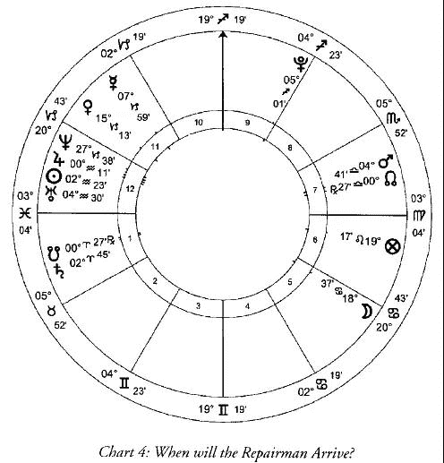

问卜者总是由主宰上升点的行星代表，在这个例子是木星( ♃ ) 。在水瓶座 0 度，木星没有力量；并且如此接近太阳() ，一个行星会遇到的最具破坏性的位置，证明我在这种状态下完全缺乏力量。困在 12 宫内，星盘中涉及监禁的部分，我除了等待外没有别的办法。修理工的位置非常不同。他由月亮() 代表，6 宫宫主星，就像修理工被视为我们的仆人。在他自己的星座内，巨蟹座，它非常强壮：他掌控着现状。

我期望看到他的行星产生入相位- 可能是合相- 与上升点或我的征象星。他的行星为了圆满的形成相位而需要运行的距离代表（自起盘之时）他到达（我家）所耗费的时间。我惊恐的看到他的征象星，在星盘中以逆时针方向运行，恰好进入 6 宫，仆人的宫位。这将解读得非常字面：修理工将会去到他自己的屋子。月亮在离开它自己的星座之前不会与任何传统行星产生主要相位：这个更进一步证明他除了自己家里哪儿也不会去。之后被证明正是如此。

卜卦占星的判断很少有像这样直截了当的，主要是因为卜卦问题很少像这样简单：可能只是我对浴室的期望，“修理工什么时候回来？”没有问卜者通常那样摆出问题的同时伴随着复杂的情况。不管怎样，留下规则都一样。混杂的情况产生混杂的星盘，但是耐心并小心的应用少量简单的规则将会解开这所有的错综复杂的绳结。

卜卦占星学可以处理各式各样不同风格的问题。问题的情形是探求在该时刻对事物实际的认识，寻找问卜者隐藏的信息，比如“我的钥匙在哪儿？”或者“我怀孕了吗？”我们可以关注过去，并询问比如“清洁工偷走了我的戒指，还是我仅仅是弄丢了？”通常来说，不管怎样，问题是指向未来，询问如果，如何或何时某一事件将会发生。

为判断这些问题而设置星盘的技术规则在本质上是简单易行的。最重要的，这些技巧是固定的，尽管它们必须被深刻的理解。这里最不重要的是对问题的直觉力，除了被 Polyani 称为“ 隐性知识” 的直觉力构想之外- 那就像，技工知道什么是导致机器发出吱吱声的原因，但却没有能力清晰的说出为何是这个原因，大部分的经验在推理过程中的某个阶段是多余的。任何有能力的占星师在查看同样的星盘应该会，考虑到人类的易错性，获得同样的结论。直觉在通常的字眼中- 甚至在它的引申或本意中是关于特别的事实或相应的知识- 与此无关的是：顾客可能从他隔壁的邻居得到‘直觉’；通过占星师他需要得到真相。

这些技巧涉及首先要找出代表问卜者的行星；之后找出代表所问事物的行星。如果这些行星通过相位产生联系，我们可以认为事物将会发生；如果没有产生联系，则不会发生。一旦我们发现这儿有相位，将两个行星联系在一起，我们必须评估行星的力量，为了确定他们中的哪一个有足够的力量使事件发生；之后我们评估他们彼此之间联系的属性，从而找出是否他们都想要事件发生。如果行星足够强壮，如果他们都有兴趣制造事件的发生并且他们通过相位产生联系，我们可以判断- 总是在预言范围的可能性内，就像一切都是服从于上帝的意愿- 事件将会发生。

因此，如果问题是“Susie 将会与我出去吗？” 并且星盘显示我的征象星和她的征象星马上要形成相位，这将会是一个令人鼓舞的判断。相位提供，可以说是，机会，没有相位就没有事件发生。如果我们的行星都非常强壮，星盘看起来仍然是美好的，就像我们都有能力去行动。假设她的行星非常虚弱：不管多么绝望她都会和我出去，任何阻碍都将会使她难以克服。星盘将会显示阻碍物的属性：可能她受到代表他父亲的那颗行星的折磨，因此我们可以判断他父亲不让她见我。最后我们检查两颗行星彼此重视的程度。在这种情况下，理想状态是我的行星所在的星座由她的行星主宰，同时她的行星所在的星座由我的行星主宰：这将会显示彼此强烈的感觉。如果她的行星没有落在十二星座中由我主宰的星座，我们可以判断她对我没兴趣。如果问题期望有一定程度的兴趣，我们可以期望我的行星落于十二星座中她主宰的某些部分；如果，不管怎样，如果它（我的行星）落于我自己的星座中将会清晰的表示我没有真的对她产生兴趣，只是想得到被 Susie 注意的荣誉，她是学校里最美的女孩。我们可能可以发现行星彼此没有任何兴趣，但是都对同一件其他的事物有兴趣，就像他们都在十二星座中被第三颗行星所主宰的位置：我们彼此并不重视，但是我们都想要去跳舞。

正如喜爱 Susie 的例子那样，其他所有的问题也都是这样。在关于修理工的例子中，他的行星非常强壮，当我的行星虚弱的时候：他可以选择什么时候发生，当我不能选择的时候。他的行星落于由他自己守护的星座内，他的首要任务是他自己的事。他的行星- 木星落于巨蟹座，我的行星被称为旺势位置的星座；这是一个重要的尊贵，我很明显对他有重要的意义，但是远不及他的自己更为有意义。总而言之，他有力量，当我没有的时候；他对自己比我更有兴趣；这里我没有与他形成相位。在此情况下，我可以接受没有相位连接对我没有兴趣的他：如果他出现了我将会觉得高兴，我并不介意如果当他工作时考虑别的东西。如果环境不同，并且我询问的是关于 Susie ，她对我感兴趣的程度将会极为重要。

假设我问“我会得到这份工作吗？”星盘中我的行星强壮将会表示我有能力和资格去得到它。我的行星可能有两种虚弱的方式：如果它在十二星座中没有得到力量的位置，它将会建议我是虚弱的- 在这个环境中，我缺乏该工作所需要的各种能力。它可能，不论怎样，在十二星座中有个比较不错的位置，但是被另外一颗行星折磨或者在天空中相对于地平线来说是不幸的位置：我有必要的技巧，但是某些事情造成了妨碍- 可能我在面试时喝了酒（我的行星因为在自我毁灭的宫位里而变得虚弱），或者可能我确实的能力因为 CEO 的新女婿迫切的需要一个岗位而失色（我的行星受到另外一颗行星的折磨）。即使我研究的星盘透露出我缺乏胜任这个工作的能力，但是仍然有可能我并不会失去它。可能行星代表的工作与我自己有共同之处，比如我发现我母校与该公司有某些秘密的联系从而知道这将会弥补我的不足。但是对于这一切，如果代表我和工作的两颗行星未能形成相位，什么事也不会发生。不管状态是怎样的有希望，我都不会得到这份工作：可能公司最终没有决定雇佣一个新员工；可能舅姑老爷 Silas 去世，我得到了他的遗产而不用去工作：星盘将会显示出来。

我的鱼在哪儿？

在转向考虑占星著作的简单工具之前，就像我们观看不管什么类型的戏剧时评估演员有关的优势、兴趣和行动的可能性，不论它是个不受约束的暴躁型男性还是一个伟大帝王的遗嘱，让我们检查最后一个卜卦占星学案例，弄清某些环绕在这个占星学的分支周围甚至比其它分支更多的问题。这个星盘是由最伟大的占星大师之一 William Lilly 来判断的。

Lilly 在十七世纪的实践，因为预测精确而获得声望，尤其是占星学上获得的名声都传播出他的祖国 England 之外，再次向我们显示有两个选择的真相：要么我们的祖先非常的愚蠢，要么他至少拥有他所宣称的某些预测能力。他大部分的实践是在卜卦占星上；他流传的笔记显示他一年接待了 2000 个左右的客户，丰富的实践经验结合极为深刻的学习使他写下了《Christian Astrology 》，卜卦占星和本命占星的教程，并蒙受不同程度的曲解，其作为标准教程一直到 Alan Leo 放下垂死的占星学尸体，至今（这本书）已经离开我们两个半世纪之久。

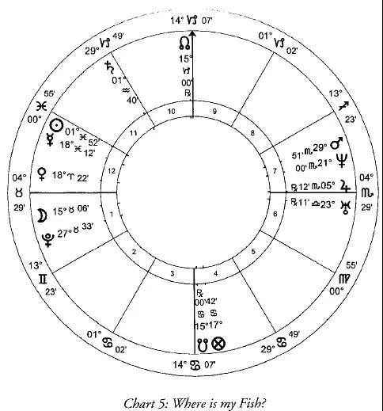

Lilly 打算从上游的 Hersham 要一些鱼和一袋葡萄牙洋葱，去他在伦敦的家里。但是当仓库老板到达 Lilly 的房子的时候，并不是履行诺言，他告诉占星师仓库被破坏并且鱼被偷了。Lilly 设置卜卦星盘去找到小偷。

问题里的小偷，在一个角宫里没有力量的行星通常代表小偷，当太阳或月亮落于上升点并且拥有自己的尊贵的地方代表小偷将会被找到。这里，木星( ♃ ) 在角宫并没有力量，当月亮落于上升点和它有尊贵的地方。木星是财富和高贵的天然守护星，但是 Lilly 认为一个绅士不大可能去仓库盗窃鱼。他认为，不论如何，要注意木星所在的星座：天蝎座，一个水象星座。福点，落于巨蟹座 17 度，在星盘中代表问卜者的‘ 财富’ ；Lilly 的财富在这里是他失去的鱼，因此它位于巨蟹座，另一个水象星座，有重要意义。水星( ☿ ) ，星盘中 2 宫的宫主星，并且同样是 Lilly 财产的征象星- 他的鱼- 位于第三个水象星座，双鱼座。考虑这个证据和小偷的状况，Lilly 认为小偷必然与水有联系，可能在水上工作（木星在水象星座）并且鱼肯定在某些潮湿的地方（福点和水星在水象星座）。

月亮通常担任问卜者的次要征象星，因此它的立即会与水星（财产）形成相位代表问卜者将会找回它。不幸地，水星在双鱼座非常虚弱：相位显示鱼将会被找回，但是这个虚弱代表它被找回时不是原来的状态。Lilly 判断他不能找回完整的鱼，但是他将会找回一些。星盘告诉他将会发现小偷并且找回一部分货物。这个判断是根据固定规则的应用产生的：Lilly 没有使用他的直觉。

除了在角宫虚弱的行星之外，小偷也可以被 7 宫主代表。这里是火星(♂) 。火星在离开天蝎座(e) 的位置，属于他自己的星座。这里暗示小偷最近离开了屋子，或者几乎要如此做（专业术语屋子一般是指宫位和星座）。结合这两个适合代表小偷的征象星，木星和火星，Lilly 可以算出此人的外部特征。在询问之后，他听说有个有偷盗劣迹的渔人刚刚离开家去到河边，正好符合星盘里位于水象星座特点的描述。高大、体型匀称、皮肤白皙，并且有红黄色的头发，他的外貌是火星结合木星的特点。Lilly 找到了嫌疑犯。

拥有占星学和侦探工作的组合，他接近地方治安官，容易得到批准进入到该男子屋子里搜查并让一位法警陪同他执行。他们发现一部分的鱼，并且小偷供认不讳，解释剩余的部分已经被吃掉。Lilly 因为他购买的葡萄牙洋葱的命运而对该男子的妻子表示不满 – 她不知道他们是什么，并把它们用作制作鱼汤的材料 – 不过后来他态度软化并让他们留下了他们战利品的遗骸（译者：意思是把洋葱的渣滓留给了他们）。

正如我们所看到的，在星盘中发现小偷和找回鱼被显示出来，清晰且按照标准操作；但是这些预言依赖于某些他们发起的行为，明显的，行为不需要被预测。星盘指导 Lilly 找到小偷。发现小偷，很多人可能不会面对他。这是个小规模社会圈子：Lilly 可能会因为他的指控而受到恐吓，或者对他的判断拿不准并且如果他的判断错误而感到非常的为难。但他没有。这就是 Lilly 的为人，像一个年轻人那样很快达到伦敦，为他雇主的妻子做乳房切除手术，并且他在后来冒着死刑的风险在内战期间热情的代表国会进行占星学宣传：他不是一个会放弃挑战的人。于是，相信预言会实现，Lilly 无疑是在某个位置获得了搜索小偷屋子的保证。少量现代占星师可能曲解星盘，认为他会在到达当地警察局得到许多警察的安慰并且要求知道谁偷了他们的财产。Lilly 作为一个有价值的市民和一个精确的占星师享有的盛名。价值在于他通过他的占星学名声从当地治安官哪儿获得了信任，因此他可以获得担保。

Lilly 的性格和环境需要纳入预测的精确度。但是考虑到环境的不同是合乎情理的，包括 Lilly 的性格，他可能不会在这个特殊的时间提出特殊的问题。例如，如果他很胆小，他可能在提出问题之前把时间花费在担忧上，从而导致得到不同的星盘；如果他的声望使他没有得到地方治安官的信任，他首先就很有可能没有条件要到鱼。星盘本身是人创造的产物，就像发生在生命中诸如此类的事物；除非我们将会做出相当离奇的事情，然而一般流行的说法，假设生命是一个连续的随机事件，两者连接在一起肯定是有意义的。这可能仅仅是一种可能的环境，可以导致在准确的时刻作出准确预言（的环境）。所处环境是唯一的，有且只有一个，并且已经出现。别的东西仅仅存在于假设的世界，如同人们在不知疲倦的想象力中创造出来的。

现在很容易看出大部分的现代占星师为何不与卜卦占星学相往来，因为愚昧无知，以及为何他们中的许多人当出现该课题时变得出人意料的激动：预测是可以被证实的，基于合理规则的精确占星学不可避免的触碰到他们的软肋和痛处。

某些现代占星师正设法通过培育一个被称之为“心理卜卦”的神秘东西来解决入侵他们朦胧的梦幻世界的现实。这个奇怪产物的遗传工程一无所知到如此粗俗，就像给一个简单的问题提供一个简单的回答，但是却非要从提出的问题深入到心理动机。如果 William Lilly 愚蠢到向这些占星师中的一个索要“ 我的鱼在哪儿？” 他可能获得这样的答复“ 你的鱼对你意味着什么？” 如此奇怪的心理借口使你想要去知道鱼发生了什么变成某人从你哪儿偷走了什么？按这个路子，现实是通过它的习惯性位置还原描述顾客的心理，并且在生命中发生了什么是不重要的除了作为使我们自己旋转精神万花筒得到倒影真相大白的手段（译者：好拗口，就是说生命中发生什么是不重要的，那只是作为投射出了我们内心倒影的手段）。我们可以注意到过去这类态度通过世界上各种诺言来赦免我们，诸如此类我们可以视为不道德的事仅仅是我们的心理投影，因此当世界燃烧我们的时候我们可以无可非议通过镜子赞美我们自己。

我们可以假设 William Lilly 可能给出了猜想“ 鱼对你来说意味着什么？” 一个简短且令人不满意的回答；我们可以确认只是使用星盘分析这个问题得到可能不会将鱼放到他餐桌上的猜想 – 但是思考这类想法揭示出我们缺乏世故：“ 你的晚餐对你来说意味着什么？” 任何问题都会被翻译为邀请当代占星师去践踏问卜者的心理。同时某些人会觉得高兴，我们对此不得不感到厌恶。René Guénon 曾经指出大脑保持无意识是有原因的；在它里面乱翻是没用的。我们在周围看到的精神碎片的数量与 20 世纪的流行趋势不无关系。各种各样令人讨厌的怪物从封印瓶子里被放出来；他们不会那么容易的回去。

当我们非常确定不恰当的心理分析会降低卜卦占星最大收益的时候，我们也错误的认为卜卦占星学的重要性是在于它提供的最后结果。不论是我们可以找到丢失的戒指或是判断修理工是否会准时到达，在事物发生的结构中，这都没有任何意义。正如卜卦占星是进入占星学的门槛，它是天上的科学，可以给我们少量的糖果引诱我们进入。我们是在提供直接确认真相背后的科学；然而它没有在这些证据中放置太多的重点。一如既往的在占星学中，重点在于向着远方的神圣看去。“我们应该展示我们在地平线上的预测，并且直到它们在得到证明之前都要在它们里面，因为那是真相” 6 但是我们不可以对预测有依赖：指示牌不是目的地。

# 04 时间的本质

在进一步探究占星学知识中的等级制度之前，我们必须致力于对某些描绘占星学判断的法则产生注意。首先开始我们必须探究时间本身的属性，时间是占星学最基础的考量，也是它运作的原理。

对于科学家来说，十点过三分和其他任何时间是一样的。某些事情很有可能在其之后发生 - 水壶会烧开，火车会达到，他可能想念他的母亲 - 但是没有理由为何这些事情不会恰好发生在九分过三秒，或者二十点过四分，或者任何其他的时间。如果我们将时间比作风景，科学家是在俯视广阔而无特色的远景。那儿没有山脉，湖泊或者沼泽；那儿没有荒地，没有肥沃的田地。时间是均匀的；没有哪个时刻会与其他的时刻有着不同的品质。

占星师看到的时间非常不同。对他而言每个时间与它的伙伴们都是不同的，就像你和我不同于我们。时间的风景从占星师所在的窗口看过去是随着自然景观的变化而变化的：它有它的山脉和平原，他的荒漠和牧场。对于它而言，不论是什么发生在十点过三分都是属于十点过三分的特殊品质；如果一个表面上相似的事件发生在二十点过四分 - 水壶烧开了，例如 - 也会有着细微的不同。

传统的科学实验将时间视为一个稳定的常量。实验是，所有其他条件都相同的状况下，可以在其他任何时间都可以得到不会产生改变的结果的事物。这个，科学家将会坚持，显示时间的确是一个常量并且基本可以假定占星学是错误的。这是撇开了事实 - 某个科学文献自己承认过 - 这个声明实际上是不正确的，我们可以看到科学实验，可以说是故意地在‘ 生命之外’ 构建，具有如此简单并且如此显而易见的本质，这种方法将会几乎总是一成不变的得到它那相同的结论。在处理生命所有的微妙和复杂过程时，与是否是人工实验的结果都是不相干的。值得注意的是，当科学转向对更为微小领域的关注时，比如量子物理学，实验变得没再那么彬彬有礼。

对于科学家而言，字眼‘十点过三分’是告诉所有人这是已知的特殊时刻；对于占星师而言，字眼‘十点过三分’没有什么意义除了是方便辅助识别的标记，并且描述该时刻的本质还没有比我家门上的数字描述我屋子的本质更有意义。整个占星学的工艺由时间构成 – 真实的个体时间片段的本质被描述为他们生存于某个特殊的空间。意味着由占星学通过参考行星的相对位置描述现实。这就是占星学是什么，并且所有的占星学都是：描述的个体时间片段本质的手段。

我们选择的时间描述的是那些我们所工作的环境。他们可能是出生的时刻，结婚的时刻，建国的时刻，或提出问题的时刻。知道环境并理解当时的环境，占星师可以，在严格规定的范围内，就可能会出现的信息做出判断。这里并没有什么魔法：一旦我们接受时间如同空间一样有差异，预言的可能性将不可避免的出现。如果我理解其与土地的属性是一致的并且我知道一个农夫将要在里面播下什么样的种子，我可以作出这儿将会长出什么并且会有多么茂盛的预言信息；如果我理解时间与其一致的本质并知道某人打算在该时刻做什么，我可以作出该行为可能会造成何种结果并且该结果有多么成功的预言信息。永远要记住所有的事物始终受上帝意愿的支配，不管我的预言是如何不可避免，不论是占星学还是园艺学，将永远是会发生的。

时间的变量是我们生活常识的一部分。我知道我今天可以看到我的朋友并且我们将会度过一段愉快的时光，我们没有一个想要分开；我可以看到在另外一天同样的朋友在同样的地点并做同样的事，然而我们都会不断的看表期望我们是否可以礼貌的离开。科学家可以指出物理变化：我穿着不同的衬衣，我的朋友牙疼并且有一张税款单；占星师将会声称我们聚会的属性是由聚会发生的时间的不同品质决定的，并以此判断在此之前和在此之后的事情。或者在比赛中：组建超级巨星联盟可能需要花费数百位英镑；他们可能在所有的毫无胜算团体的领域中有着极大的优势；然而如果没有我们所不知道的一些偶然因素，体育将会失去它的所有乐趣，基于一些表面上看不出来的因素，毫无胜算的团体却可以带给超级巨星联盟极好的对抗。占星师将会建议这是由事件发生的时间属性来表明的。

旧约有着类似的语句：“世间万物皆有本身的季节，做任何事情也有一个得当的时机。” 当今，世界忽略了时间属性的变量，这个意思是“ 每件事都可以在某个时间或者另外一个时间发生。” 但是这恰好意味着它所说的：每个意愿都有一个具体的时间。“ 生有时，死有时；栽种有时，拔出所栽种的也有时；杀戮有时，医治有时；拆毁有时，建造有时；哭有时，笑有时；哀恸有时，跳舞有时；抛掷石头有时，堆聚石头有时；怀抱有时，不怀抱有时；寻找有时，失落有时；保守有时，舍弃有时；撕裂有时，缝补有时；静默有时，言语有时；喜爱有时，恨恶有时；争战有时，和好有时。” 2 我们找出诗篇是阐明占星学的基本原则：时间在本质上有所不同。理解一段时刻的属性让我们深刻的理解该时刻会发生的事。在属于它自己（属性）的时间内行事将会获得成功，如果不是在属于自己（属性）的时间内行事将不会获得成功。可以确信种子被播入肥沃的土壤将会成长，播入贫瘠的土壤将不会成长。并且这种行为不是在人们想要他们这么做的时候发生的，就像“ 树倒在何处，就存在何处” 。 许多现代科学家致力于深入学习空间属性的变量；占星学是致力于深入学习时间属性变量的传统科学。

这些时间品质的变量难以让我们欣赏到，因为我们不可能看到时间：我们看到的仅仅是它的效果。我们可以容易的看到空间的属性，并因此采取恰当的行动：我们不会将种子播入混凝土内而造成浪费。我们唯一可以看到时间的方法是通过观察事物随着时间有规律的发生改变，比如手表的指针 – 或者行星的位置。学习占星学能够使我们理解时间中的这些改变，并且相应的形成我们的行动。

钟表时间和真实时间

按照时间属性行动变得越来越困难，就像我们的文化远远没有意识到时间的真实现象。时间是需要被征服的东西。正如地球上大部分的空间已经被占领并被塑造成型，因此我们力图对时间也这么做。24 小时商店；渴望永远年轻；无所不在的电灯；一年到头都可以享用到草莓：不管这些发展是如何的方便，它们都让我们远离了对时间真正属性的认识。在我们的街道上耀眼的灯光让我们更难以看到星星，这是真实时间的标记。

占星学的时间 – 或者，更为准确的说，占星学定义的真实时间 – 是与日常使用的时间有着相当不同的区别。确实，占星师充分利用了大众的惯例：我们通过时钟设置一个星盘并且只有最反常的人才会 ‘ 在下一个水星时开始时’ 安排会议。时钟时间是有用的事物；占星师不认为它是错误的，他仅仅认为天文学是错误的：占星师仅仅认为时钟时间，比如天文学，和真实的时间相比缺乏意义，就像占星学与天文学的意义不一样，不论有多么迷人，是没用的。

占星学的时间是由一系列的循环周期显示的。我们熟悉其中的一些：太阳绕地球一周为一天；月亮绕地球一周为一月；太阳相对恒星循环一周为一年。这三个循环周期的术语在传统近似值中带给我们的是天，月，年。还有更长的周期，某些能长达数千年，以外行星的运动为标志。还有一些小的周期，小到时间的最小单位。长周期描绘出漫长的时间模式：信仰或帝国的兴衰。最接近我们更多的是天与天，代表的是短周期小时与天之间的相互影响。

占星学的小时与时钟小时的区别在于他们不是统一的。每个时钟小时与其他每一个是有着相同的长度；占星学的小时，然而，是从日出到日落这段时间（或者如果是夜晚小时是日落到日出这段时间）的十二分之一。正如日出到日落之间的时间长度变化不止是每日都不同，甚至每地都不一样，小时的长度变化不止是每年这个时候都不同，而且地理位置都不一样。在温带地区，自然小时的变化长度在冬天大约是 40 分钟而在夏天大约是 80 分钟。正如每个小时的开始和结束是由日出的准确时刻决定的，这将会因为地点的不同而产生变化：（日出）在城镇的某一边是一天中的第三个小时，而且在其他地方仍然是第二小时，这是非常可能的。

地点和季节都有着重要的意义。据说在远古时代每个小时都被七个行星其中之一守护。行星的双重性将会在它守护的一小时内展示得最为明显。每一天也是被七个行星其中之一守护：日曜日，月曜日，火曜日，水曜日，木曜日，金曜日和土曜日，一周的顺序（占星学的守护关系在法语里面非常清晰：周二，周三，周四，周五）。如果我期望向 Ermintrude 求婚，占星师可能建议，我将会被建议最好等到周五（金曜日）的金星时，这比我在土曜日的火星时胡乱决定去求婚要好。同样的，如果我的真爱在不同的城镇，金星时的到来会填满我思念她的心；我会赶紧打电话对她甜言蜜语，结果却发现她是处于土星时，因此我的魅力没有很好的传达到她哪儿。

守护行星的力量和精确属性对当时所守护的小时的影响将会首先按照当天的守护星性质 - 金曜日的金星时与土曜日的金星日相当不一样 - 和当时行星在天空中的位置而改变，相对于黄道星座和其他的行星。如果金星在该时刻位于金牛座，它很强壮的位置，并与仁慈的木星产生相位而受到帮助，她可以在她最佳的状态进行工作。如果她位于白羊座，她虚弱的位置，并且与有约束力的土星产生相位，她的影响力将会受到阻碍。这两个案例中，她将会受到与她产生相位的行星的影响。

在传统的行星序列中，小时在连续的循环中不断推进：土星，木星，火星，太阳，金星，水星，月亮，土星，木星，等等。一天开始于日出（不是午夜）。每一天都是采用当天日出时的时主星作为该天的守护星：这说明似乎每天的顺序都是随机的，我们可以首先瞟一眼期望接下来的行星顺序，运行土曜日，木曜日，火曜日等等。因此月曜日的第一个时刻的时主星是月亮；第二个时刻的时主星是土星，第三个是木星。根据这个顺序来看一天的二十四个小时，我们发现在星期二（火曜日）日出后的第一个时刻的时主星是火星，星期三的第一个时刻的时主星是水星。如果将十进制用于时间的计算 - 这种计量法是不以人为本，纯按有理数的方法 - 将一天分成两个时段，每个时段各十小时，这样一来，将重新命名一周中的第一天，每天的小时顺序也将不按传统方式重新排列（月曜日将会是水星，金星，太阳，火星，木星和土星）。这样完全颠倒自然规律的结果显然不是件好事。

找出任何特定时刻的守护星有着足够简单的方法。可以通过大部分的日志和年度星历表中找出日出和日落的时刻，计算出问题中日期的白天和黑夜的长度。将这两个时区分为十二个并找到每一天中白天和黑夜的时刻长度数据。之后，将日出作为你开始的那一点，计算出迄今为止你在那个时间内流逝和自此开始有多少个时刻（例如第十个，或者第十四个）。每一天的第一个时刻，并因此也是第八个，第十五个和第二十二个，是由守护该日的行星守护（月曜日的守护星是月亮，星期二的守护星是火星等等）。中间的时刻根据上面提到的行星序列排列。例如，星期三是由水星守护，因此第一，第十五和第二十二个时刻都是与星期三的守护星一样是水星。第二，第十六和第二十三的时主星是月亮；接下来是土星；之后是木星；之后是火星，太阳，金星和后面的水星。

尽管人为设定的时钟时间概念严重限制了我们对真实时间在流逝过程中不断变化的属性的感受，但只要看一眼每周的开始，就会发现痕迹仍然存在。每周的第一个时刻，就是周一的破晓时分，是月曜日的月亮时。我们可以认为这样的一个时刻的普遍影响将会显现出我们心中的婴儿（月亮）：虚弱，无序，仅仅想要偎依和睡觉。但是下一个时刻是由土星守护，有序的行星，纪律、责任，还有，甚至，时间本身：它是我们这个舒适、幼稚的月曜日的世界里面的一个非常不受欢迎的访客。我们必须假设那些感觉自己不受占星学影响的人从来不会在星期一早上做的第一件事是将闹钟甩出房间。

从最早的时代起，人们就开始同时使用不等量的占星学时间和不等量的机械时间：滴水的水钟就像发条时钟那样，时间是均匀的、机械的（尽管它可能有时被修改为不等量的时间）。在那个年代，商业考虑并不是衡量整个生活的标准。到了中世纪晚期，越来越多的人着重于等量的机械时间，从而使得机械时间成为主流。十三世纪意大利占星师 Guido Bonatti 提出不等量时间的行星守护规则之后声称，这个规则同样适用于于等量的时间，尽管他说这话时没有太多说服力。随着商业生活的重要性越来越大，他开始抛弃时间拥有自我、变化的本质，并认可了当时不断发展的机械时间观念。

时间属性最明显的变化是在特定的时刻变得黑暗。当这发生的时候人类存在一种停止工作的自然倾向。中世纪公会的规则通常禁止其成员在天黑后工作：这表明即使在那个时候，想要赚钱的欲望也在破坏人与时间的自然联系。就像机械时钟变得越来越普遍，自然联系也变得越来越脆弱。

在当时，很可能已经发明了一种机械化时钟，这时钟能显示自然的时间, 而这时间不见得都是均分的：是的，这样的机械已经很复杂，兼具了天体运动的记录功能和报时功能。但如果认为这样的发明是超出了那个年代的智慧，那显然是不对。当日本引进这钟表时，这样的机械装置已经有了。但在欧洲，没有这种机械的记载，因为当时的商人们需要的是对他们有利的那种钟表，这种钟表每天时间都是一样的，能帮助他们在短暂昏暗的冬日里，也尽可能地压榨劳动者的每一个小时。

这就指出了两个时间系统之间的基本冲突 - 如果一定要有冲突的话：一个有金钱的奖励；另外一个使人类过得幸福康乐。一个需要人们战胜时间，为了满足他的短期利益而让强迫制定一个专制的计划；另外一个认为在时间流逝的过程中让自己和自己的欲望适应时间的本质，是对人有好处的。当然，人们可以在时间的表明上强加他自己的人为模式，这并不意味着时间的属性会略有改变：周一的早晨依然是周一的早晨；不论黑夜是在下午 4 点还是 10 点降临，生物都会对黑暗做出反应。

就像商业主义者在整个大陆上种下它的邪恶工厂，更为著名的 Josiah 之子 Tom Wedgwood ，向 Etruria 提出不切实际的计划，这个计划极端的破坏了人类与时间的自然联系。在这个示范村落，每时每刻都受到严格的管理，最重要的是孩子们的生活。这儿没有时间浪费在玩耍或休闲懒惰上。自然世界太混乱了，因此‘ 孩子绝对不能出门或者离开他自己的房间’ ，这本身就是一个完全受到控制的环境：‘ 纯灰色的墙壁上有一个或两个生动的物体可以被看到和触摸’ 。6 每一分钟都会被花费在紧张的工作和道德修养时间表上。这个充满理想的男人，他决定，经营这个疯狂的乌托邦的理想人物是 William Wordsworth ；但是当他意识到他所选择的独裁者认为他的时间花费在凝视一个倒下的树上是非常好的时候，他的计划就失败了。Wordsworth 被这个想法吓到了，他的反感很大程度上促成了《The Prelude 》的诞生，在《The Prelude 》中他详细描述了对成长中的心灵受到随机刺激的重要性。这不是巧合，Wedgwood 家族最著名的后代是将人类的机械模型作为现代思想基石的男人：Charles Darwin 。

我们可以避免这些遵守纪律的乌托邦，但是人造时间的欺骗将我们与时间那种有机的、有生命力的联系删去。在我们的电力城市，我们并没有注意到夜幕降临，因为灯被打开了。在冬季，人们并没有在夏天的高峰期那样的行为表现，但却感觉产生出一种进入半冬眠状态的自然欲望：那么他就‘患有’季节性情感障碍。Britain 的每个冬季都会讨论是否采用当地的时间，就像格林威治时间那样，是否应该被抛弃并采用欧洲中部时间 - 那是远在东方一千英里以外的 Prague 时间的。格林威治时间下深夜的时钟时间是不方便的。这就是为何 British 人难以理解为何他们的生命要采用 Czech Republic 的时间 - 除了有助于商业政策外。这个问题的常识答案是，在早上还是漆黑一片的时候，每个人应该在床上多呆一会，使他们自己去适应该地区的时间属性，而不是要按照人造时间起床。

正如我们所见，占星学时间的决定因素是太阳的位置。小时是被计算为太阳从地平线的一边到另外一边这个旅程的一小部分（而不是原子衰退的结果，我们现在的定义）和某个特别时刻 - 金星时或者火星时，例如 - 通过太阳相对于地球的位置来说明。太阳在我们的宇宙中是神性的明显标志；时主星，守护太阳旅行中某个特定段落的行星，太阳光线定向的过滤器，在特定时刻将永恒的白色光辉染成五颜六色的玻璃碎片。欧洲许多教堂的彩色玻璃都是采用这个概念。

这个概念有另外一个表现形式，使得时主星的属性非常清晰 - 而且更加清晰地展示我们是如何与时间的真实属性失去接触的。一个天使，按照字面意思，是一个信使：无数的他们帮助上帝向陆地和海洋传递消息。他们，就像我们，在本质上是有区别的，并被相应的充分利用。为了一个仁慈的使命，将会由 Gabriel 送出；裁决的使命，由 Michael 送出，等等之类，天使是上帝意愿的可见形式就像时间是太阳的白色光辉的可见颜色。例如，Shelley 每年都会在一个特别糟糕的时刻去缅怀 Adonais 。我们发现并告诉他一个狡猾的计策中有另外一种表达方式。穆斯林，基督徒和犹太教徒可能把这描述为一个天使奉上帝之命令的造访；翻译为占星术语，这变成了与水星的接触。它们都携带者来自同一来源的相同信息。

天使们，就像时主星，曾经比现在更亲近人类。存在大量关于天使形象的文学作品，我们现在选择只把它们当作童话故事，或者，最多当作某种符号。但我们没有理由忽视它，除了它不符合我们现在的先入之见。当 William Blake 告诉我们他在 Peckham Rye 无意中碰见一个天使时，我们可以把这当作是一个疯子的呓语，因为科学家向我们担保这类事情不可能发生。也是这些科学家告诉我们牛吃羊；但 Blake 才是疯子。天使出现证据随着占星学时间的使用减少而减少。就像占星学的时间，天使们仍然在那儿，但是人们变得越来越不愿意去注意到他们。在十七世纪，占星师 William Lilly 特别遗憾即使是在他那个时代也不再容易与天使们沟通，因为他们说话‘ 像 Irish ，喉咙里有很多东西’ 。我们可以怀疑问题是在于天使清晰发出声音的力量要比我们听力障碍的发展小得多。

时钟时间，一旦具有便利性，就会变成一个在工业时代商业上的必须品。人体对时间的自然节奏作出反应，但这种节奏并不适合于无情的机械韵律。工厂的老板们发现，通过把有着华丽外表的时钟时间强加给他们的雇佣者是可以践踏这些自然韵律的有效手段。把时钟强加于自然时间是有意为之的，正如历史学家所记载的那样，人人常常以惊人的洞察力，相当有意识地把它作为一种破坏劳动力意愿的手段。我们今天仍然能看到对某些退休人员赠送时钟这种匪夷所思的礼仪 – 因为恰恰在那个时候，他不再需要时钟。这就像将手铐作为纪念品送给一个获得自由的奴隶。

占星学的世界观是不承认随机巧合的可能性。因此，钟表业随着宗教改革而占据主导地位并非巧合，或者钟表制造业是‘典型的新教产业’。 一件事和另外一件事一样，是对本质概念失去理解而导致的直接后果，本质概念是传统宇宙观点的核心，即宇宙中神圣之光的存在。时钟就是从这种不理解中诞生的，它在它的觉醒中传播着它的病菌，就像一个旅行者无论走到哪里都带着瘟疫一样。我们曾经拥有家庭天使的地方，现在放置了一个时钟，要让来访的外星人相信我们不崇拜它确实是一件困难的工作。无处不在的时钟已经强破我们默认了本质并不存在；然而这个观点是个谎言，而且真实、传统的占星学是西方世界少数仍然能够说出真相的声音之一。

把占星学看作是对时间属性变量的研究，我们可以更好的理解现代科学家对待它采取绝对防卫的姿态。根据他们的说法，占星师研究的是一些根本不存在的东西，这不是一个人投入精力的最明智的追求。然而，对占星学的理解清楚地表明，保存我们仍然拥有的与真实时间仅有的一点联系是一件极其紧迫的事情。我们就像一种濒临绝种的动物，随着人类对环境被破坏而变得越来越少，因为我们的环境与人类形态中的机械生物截然不同。允许建立一个的二十四小时不间断的大型购物中心的世界危及到我们的生存。

# 05 宇宙的规则

占星师是以地球为中心的宇宙模型进行工作；也就是说，在这个模型中太阳依然围着地球转。这是传统上被称为 Ptolemaic 的宇宙模型，在科学领域里这个模型被称之为 Copernican （哥白尼）模型所取代，（广义上）地球围绕着太阳转。少数古怪的人根据科学定义并实践以太阳为中心的占星学，但是他们的影响力就像他们的想法那样微乎其微。这（Copernican 模型）持续影响着以地球为中心模型的使用，它可能会被用以 – 而且经常被那些真正应该知道得更清楚的大声疾呼的科学家们这样认为 - 证明占星学是过时而无可救药的并且是虚无的迷信。远非如此。

当我解释以地球为中心模型的结构时，Ptolemaic 宇宙对于新学生，总会有那么一个人提出问题，“ 是的，这非常好 - 但是它并不真实，难道不是么？” 基于 Copernican 模型假设我们在学校里面学习到的（Ptolemaic 模型）是真实的。这个问题转向占星学的核心并且精确的揭露了占星师实际上在做什么。

我们知道什么是真实的。我正在写字的这张桌子是真实的；我所在的房间是真实的；我打字的这个键盘是真实的；正在打字的手指是真实的：这些都是真实的。或许我们所生活的文明也许是世界历史上唯一一种对现实有过这种特殊想法的文明。回到一百年前的时间：桌子，键盘，手指，很有可能房子本身 - 这些没有一个会存在。历史中绝大部分文明认为这些事物可能是真实的想法是概念相当的荒谬：如此短暂的事物不可能是真实的；真实的事物必须持续至少超过比我环视四周时眨眼消失的时间要长。因此它是或不是真实的概念不是像它看上去的那样清晰。

地心说描绘了什么是真实的；也就是说，在精神的永恒世界里是真实的。是的，地球围绕太阳转是纯粹的物质真实概念，但是这并不重要。在物理层面上，流行用 Copernican 模型取代 Ptolemaic 模型是因为此模型比彼模型或多或少要精确；从纯实际的角度来看，这对于任何人来说都没有任何影响，除了是对行星位置做出无限微小的更准确的预测，没人有兴趣对此进行改进，除非是有着极度处女座属性且有很多闲暇时间的人（译者：大哥，您也在黑处女座啊，问题是，您不是说不要以星座讨论共性的么）。在更深层、更相关的精神真理层面上，用一种真理替代另一种真理，就是用一种琐碎的真理替代一种深刻的真理，这种替代对人类产生了灾难性的后果。

远古世纪已经充分认识到日心说模型；它与地心说同时存在。因为兴趣点不在物质实体上，很少关注它而已。地心说恰好描绘了宇宙结构的精神真理，并提供了一个完美恰当的方法跟踪其本质现象，例如描绘行星的位置。因此当 Galileo （伽利略）宣传日心说模型的准确度受到整个文明世界的称赞时，历史悠久的标准学校课程告诉我们 Ptolemaic 模型非常不恰当。这是非常不真实的。事实上，在 Copernican 学说系统之前的两百多年就可以通过 Ptolemaic 模型精确描绘出行星的位置。它的采用与科学的准确性几乎没有关系；这与宗教改革时期及其带来的政治和宗教信仰的变化有很大的关系。l 这反映了兴趣从精神到物质的巨大而坚定的转变，或者用哲学术语来说，从本质到偶然的转变。我们可以注意到，对地心说的持续使用，证明了占星师的固执和愚蠢在其他领域是完全可以接受的。就像 Kuhn 所解释的：“ 大部分航海或测量手册都是以这样的句子开头的：‘ 就目前的目的而言，我们应该假设地球是一个小的静止不动的球体，它的中心与一个极大的正在旋转的球体相一致。’”  （如果按照科学家们的说法，那）占星师将会与一些值得尊敬的人一起被关在疯人院里面。

以地球为中心的宇宙

传统宇宙模型的运作机制从来就不是没有争议的。在其基本框架内，为了能呈现各种可见的现象而设计出各种样子；然而这是一个技巧性问题并且没有多大的意义。最常见的例子是通过所有的圆轮和导轮来修饰地心说模型中需要保存的天体现象，用来描述可以看得见的事物，但是它们在占星学中从来都只是次要的。可以说，他们是为了取悦那些被这类东西吸引的人而做出的工艺装饰品。重要的部分是其基本结构。或者，换句话说，基本的地心说结构是精神上的真理，并且实际上在今天和过去一样真实；关于这种结构如何产生可见现象的技术解释属于物质领域，并已被在现代普遍使用的日心说宇宙模型所取代。

传统对宇宙的描述通常从外部开始，然后向内部展开，就像剥掉洋葱的层层表皮，因为宇宙是由上帝创的同心球体组成的。我们最需要关注的最外层是黄道十二宫。这个球体是完全看不见的，并且没有行星在这里。它所携带的是黄道十二宫的符号，它们与同名的天文学星座毫无关系。科学家让我们相信在遥远的远古时期，一个富有想象力的穴居人，拖着妻子的头发筋疲力尽的向后倒去，仰望着天空。“我的天啊，”他大喊道，“那天上的一群星星就像一个人从他肩膀上的水壶倒出水来。”“啊呀！”周围的人都叫了起来，“正是如此。以后就把那些星星就叫作水瓶座吧。”然后我们的祖先将这个人用肩膀上的水壶倒水的画面的新发现传播到了很远，并且没有一个人敢于建议那些同样的星星像一束胡萝卜或者一个骑着剑齿虎的人，否则就会被排斥直到承认他的方法是错误的。当读到这样的科学家论断时，科学家可能不记得占星师是非常愚蠢的人。

当然，事实并非如此。黄道十二宫是将黄道平均十二等分。它们通过创造的过程彼此区分开来。创造宇宙的原始物质本身并不显化。它是通过（似乎我们也是）热、冷、湿和燥来得到显示的。将这四个因素赋予到三种模型上：外向型，携带来自于最初创造时的冲动；膨胀型，继续和深入的创造；还有回归型，将冲动带回它的本源。这三种法则融合热，冷，湿和燥四种属性（3 × 4 ）赋予到十二个创作品中。每一个创作品有着独特的性质：每一副画像都揭示了这一性质- 一副画面胜过千言万语。这些就是黄道十二宫。

一旦知道了反映每个星座本质的图像，一群长相相似、位置大致正确的恒星就被连接在一起，形成了这幅图像的画面。因为，由于上帝的仁慈和智慧，造物始终是一致的，所以在黄道十二宫的每一个点附近都有一串看起来很像的星体，这些星体显然是按照上帝所要描绘的形象排列的。足够接近（真相）了，但还是不太确定，因为任何物质形态都不能完美的反映其本质，并且黄道星座对于天文星座就如同本质与物质形态的关系一样。你将会在占星学和天文学的书中反复读到，曾经有一段时间，黄道星座和共享它们名字的天文星座是重合的。这不是真的。

黄道十二宫，在名义上是一个圈，可以从任何地方开始，开始于春分点，酷似神最初创造冲动的形象。这被称作白羊座 0 度。黄道上的一切都是以此作为度量，就像地球上的经线是以格林威治为度量。当太阳每年到达这个点的时候，白昼与黑夜是等长的并且白昼逐渐增加。曾经，2000 多年前的这一天，太阳出现在天文学的白羊星座。但这并不意味着天文学星座与黄道十二宫有着巧妙的契合：它们并没有。按照定义，黄道十二宫是按照每 30 度进行等分；天文学星座，只不过是这些星座的物质形式，并不符合整体规划。它们很混乱，虽然它们横穿过太阳在天空中的轨迹：黄道线。这些天文学星座，比如狮子座，是巨大的，延绵于天空。而另外一些天文星座，像白羊座本身，是很小且无关紧要的，没有任何璀璨的星体。它们之间没有严格意义上的界限，而且有重叠的部分：例如，水瓶星座的大部分是在摩羯星座之上而不是在其之后。其他一些天文星座，比如臭名昭著的‘第十三星座’蛇夫座，也闯了进来。因此，尽管太阳到达天文学白羊星座的时间点曾经碰巧发生在春分点，但在黄道十二宫中，没有任何其他地方的神圣计划与其物质形态相匹配。天文学星座是我们首先需要忽略的，永远缺乏它们内在的潜力，但是仍然与这些可能性联系在一起，正如它们拥有相同的名字。

名字的概念是要着重去理解的：我们现代的概念，名字是一个可选择的标签，可以按照我们的意愿随便粘贴到某个事物上，这是非常错误的。然而，传统告诉我们，它远比这很重要：名字是一个神秘的事物，至少是在神圣的语言中。它不是一种由巧合产生的任意声音组合。因此在圣经中上帝的名字是很重要的。我们被赋予的名字通常神秘的捕捉到了我们的本质或者潜能；我们的姓氏描述我们的物质形式或社会功能（Long, Whitehead, Butcher, Baker ）。例如，以圣人的名字命名，是因为我们都认同圣人的本质。因此天文学星座命名的真相（白羊座，金牛座，双子座） - 是被启发的，就像它们的符号 - 是因为黄道十二宫象征着重大意义。

白羊座，金牛座之类的天文星座，连同其它所有在天空中的星体，都包含在黄道十二宫的下一层范围内 - 类似于洋葱的下一层。这个范围，是恒星的范围，是移动的，虽然运动很缓慢，相对于黄道十二宫的范围，产生岁差的现象。也就是说，当太阳进入天文学星座的白羊座的时候春分点不再进入该位置，而是向后移动并且现在靠近双鱼座的起始点，几乎是整个星座的距离。再次强调，现代教科书说春秋分点是通过天文学星座移动的，这完全是错的。这是不对的：天文学星座的移动与春秋分点有关。这是一个相当重要的区别，尽管无论以何种方式表达运动，其实质结果都是相同的。缺乏本质的是物质，而不是物质缺乏本质。

传统告诉我们，占星学测量的运动和它开始的方式，只是在秋天。在那之前，存在一个永恒的春天，但在这个春天里所有的花草树木都产生出果实和花朵，因为季节（以及死亡的必然性）并不存在。Milton ，通过良好的占星学和传统神学知识，描述了《失乐园》的过程。一旦 Adam 和 Eve 尝试了苹果，上帝命令他的天使重新调整宇宙，首先推动太阳进入到它的椭圆形轨道，因此地球首次因为它的移动感觉到‘ 冷与热难以忍受’

来自北方的呼唤

衰老的冬天，来自南方

夏至的高温，

然后设置行星的运行：

白色的月亮

他们规定她的办公之处，对于其他五个

他们的行星运动的相位

在六合，邢，拱，对冲之中

有害的功效

并且教会恒星‘当显现时展现它们坏的影响。’

天空的这些变化产生了 – 因为人类不是独自堕落的，而是把整个宇宙都带走了 - 所有不愉快的事远离了伊甸园：争夺，野兽的凶狠贪婪，吵闹，疾病，恐惧和痛苦。宇宙的本质就如同一系列的球体；物质形式是太阳在椭圆轨道上的运动 - 这给我们带来春秋分点的岁差。本质和形式之间的区别在故事中得到清晰的展现：Adam 和 Eve 从与神合而为一的快乐中，一堕落就意识到他们的物质本性，并对其存在的缺点感到恐惧和羞愧。我们这儿看到黄道十二宫和共享它们名字的天文星座之间的区别。

天球内恒星的范围是宇宙中可见的极限。天球内黄道带的范围和那些超出黄道带的范围具有形而上的重要性，但与我们的占星学没有直接的、实际的联系，对我们来说没有任何有形的物质形式。因此恒星是我们所能看到最接近神的物体。正如我们所预料的那样，它们在生命主要的转折点上有特殊的占星学意义，尤其是在生命进入和离开的时候。

因此，黄道十二宫反映出三种创造模式 - ‘ 外向的’ ，‘ 扩张的’ 和‘ 收缩的’ – 通过四种基本特质进行运作，而主要的物质形式就表现在这四种基本特质上：热、冷、湿和燥。我们在这里说的仍然是远超任何有形的人类。这个 3×4 的组合是，似乎就是，创世的设计蓝图。它比神最初的创造冲动更为明显，但是它与我们日常对现实感知的联系和建筑师的设计与实物之间的区别没有什么不同：计划赶不上变化。

热、冷、湿和燥这些原则它们本身不能够胜任物质的表现形式。要做到这一点，要联合传统自然科学的四种元素：火（热和燥）、风（热和湿）、土（冷和燥）以及水（冷和湿）。它们仍然远不同于那些我们似曾相识并与它们有着相同名字的物质，甚至固体、液体、气体和能量这种物理状态与土、水、风和火也只是大体上一致；但是我们正开始接近有形的实体。火元素可以说是‘火的构成要素’；水，‘水的构成要素’；土，‘土的构成要素’；以及风，‘风的构成要素’。然而，这些物质形式只是方便我们理解这些元素。设计蓝图是在烈火、静水、厚土、虚空之中绘制的。

创世的模式通过这些元素运作，比如基本型（外向的），固定型（扩张的）和变动型（回归的）。这给了我们十二个星座，一类基本型，一类固定型和一类变动型并分配到四个元素中：白羊座是基本型的火象，金牛座是固定型的土象，等等。这是我们的设计图，我们被创造的潜能。继续我们的构建暗喻，设计蓝图是同时存在的：它不可能同时显示出来。如果我们期望通过计划搭建一个屋子，我们必须一步一脚印的进行：我们不能在打地基的时候同时搭建屋顶。因此，想要显示出物质形式，同样的 3 模式和 4 元素规则必须同时存在于（3+4 ）的交集内与（3×4 的设计蓝图）中。3+4 告诉我们传统宇宙的 7 颗行星，现实扩展创造的可能性。这是唯一可以借助时间的媒介，真相带领我们回到我们应该学习的地方：逐渐通过时间媒介认识到造物者存在的可能性，通过行星彼此相对位置的变化和黄道十二宫最初的设计蓝图显示。

最外层行星的范围号称与恒星一样对内部产生作用。这是土星的范围，它与恒星的范围有着相同的含义，它是通往神的大门。但是恒星只是偶尔被我们的占星术所激活，土星却一直在起到影响。它是公正的行星（因为它在天平座旺势），因为它不受欢迎。对于我们现代对神圣正义性的感性概念 - 不管我们如何生活，每件事物将会最终自行解决的概念 – 这根本不是宇宙赖以建立的正义：无情的真相是如果我们认同本质，我们就会与本质共存；如果我们认同物质，我们就会与物质共亡。土星是通往神的大门，但是它是一狭窄的门，通往神的路是狭窄的。

现代文明是强烈反对土星的。正因为如此，土星的显现被洗白而不复存在。土星代表死亡：死亡仅只发生在隐秘的位置。它代表年龄：我们不切实际的幻想是活在永远的青春期。它代表价值观：虽然现代世界没有价值观。它代表奉献：但即使是通往上帝的道路，现在也是一种放纵 – 但愿上帝不允许我们改变我们自己的行为，以某种方式接近他。土星代表农业：我们播种什么就会收获什么。它是时间，我们有形的经验受到时间的限制，但这也是我们通往上帝的大门。它是智慧的；但是人们现在喜欢相信，智慧是像糖果那样被包装在书店里售卖的。

土星被称为最大的凶星，现代占星师们经常吐槽的一个词。他们说，现代人比他们的祖先更为复杂，因此这些“凶”与“吉”的词语不再适用于我们。他说我比莎士比亚更加老练，这是奉承，但我还没自负到相信这点。传统占星学要处理凶象和吉象。土星和火星是较大和较小的凶象，但都不太好。它们在我们生活中的行为往往是我们不愿遇到的。较大和较小的吉象，分别是木星和金星，‘使用起来非常友好’，就像糖果和香料以及所有美好的事物。有了选择，我们自然而然的会选择它们（木星和金星）。

当代占星师们告诉我们，我们现代社会复杂性的另一个方面是，我们现在有着如此丰富的内心生活从而导致不可能通过一个星盘判断任何事件将会是发生在世界中还是仅仅发在我们的脑海中。二十世纪之前的人只想到他的犁和拉犁的马。可怜的家伙。我们可能会怀疑，发明一个盒子（译者：指电脑或手机）来成为填满我们内心生活的的必要性，并以此显示出现代人内心的巨大空虚，这是他的祖先从未经历过的。

木星，最大的吉星，是一个比它严肃的竞争对手土星更受欢迎的伙伴。木星是我们向天球内部探索的下一层。今天，它属性中的快乐被过分强调了，因为它不只是一个充满派对和冰淇淋的行星。‘快乐’一词，来源于拉丁语“行星”，在我们的语言中逐渐变得无足轻重，直到它只是用来描述葡萄酒的。诚然，木星膨胀属性的一个常见表现包括解开某人的腰带，但是它真实的属性是作为精神向导，在这方面它不是独自运作，而是与土星携手。他们是胡萝卜加大棒，‘是你的杖，你的竿’，当我穿过死亡的阴暗山谷，它们安慰我。土星是威，鞭策我走在正规；木星的恩将我拉离荆棘。它们是扩张和收缩，仁慈和制裁。我们喜欢仁慈 - 或者至少，我们认为我们喜欢，我们喜欢它，直到它被显示给那个曾经伤害过我们的人。

另一对相关的行星在太阳的两侧各有一个球体。火星，武力的化身，和金星，调解的化身。如果一切都能正常运作，火星将是带领我们接近上帝的热情，金星将是点燃这种热情的和解愿望；因此，它们是同样法则的一体两面。然而并不是所有都按照它应该的那样运作。火星是一种动态模式下的意志力；但如果没有正确的引导，火星则变成一个讨厌的东西，尤其是当我们接触到它是由其他人表现出来的时候。金星，也是如此，虽然通常令人愉悦，因此是个受欢迎的小星球，如果它也没有被正确的引导仍然会造成破坏。

金星的能量在今天被大大低估了。她是，继太阳和月亮之后，迄今为止天空中最亮的物体，也是唯一能投射阴影的物体。如果我们不妨设想一下广告业的影响力，我们就会开始看到一些她的能量，不仅是用美丽的脸蛋卖给我们某些东西，几乎每个目的都是在利用金星的能量。实际上，她有着火星那样的危害力，带领我们远离真实的自己。我们现在的时代正受到她的影响；甚至在内心的事物中，也摒弃了土星式的牺牲精神，甚至摒弃了为达到目标而改变自己的精神动力（正如一个多情的青年将他所有的兴趣都放在心上人的要求上），在内心发动圣战，却期望有一种宗教能容忍我们的过错，不离开我们的安乐椅就能把我们送入天堂。社会上常见的对于金星的解药是原教旨主义的爆发，其方法被错误引导的火星力量所践踏。没有正确的引导是由于躺在它们之间的太阳造成的，每个成对的行星都可以像另外一个那样危险，我们常见的问题是如何将它们接纳到我们自身之中，通过对抗内心的躁动和调节好自己，从而更为容易使它们一致对外，奋斗和对他人的渴望。

金星之下躺着水星，理性的行星。在法国大革命期间，也是我们现在称之为启蒙运动的鼎盛时期，理性女神被隆重地加冕为最高的神。当然，不是女神本人，而是一个女演员；因此，声称主宰我们生活的理性本身，不过是对理性真实含义的一种嘲弄。在有记载的历史中，理性思维的质量从未像现在这样低，尽管杂乱无章的文字围绕在我们周围，这一事实与绝大部分的人对占星学普遍不了解有很大关系。在我们这个没有巧合的星象宇宙中，我们必须注意到水星的印刷术突破性进展是与宗教改革紧密的联系在一起发生的，我们已经讨论过宗教改革的影响。所有的行星需要依靠正确的指引；这就是为何我们发现太阳保持在星序的中心。

最深处的行星是月亮。高于这个层级的一切被认为是绝不会改变的。在它之下的是月下世界，万物在此产生和消亡，是我们生活的世界。历史告诉我们，放弃这种宇宙精神原型的主要推动力是看到一颗新星，在天文学家 Tycho Brahe 首次对它进行评论后被称为“ 第谷新星” ，那是心碎的人对超月世界不变性的幻想，明显那颗新星发生的地方远离月亮，因此在该层级的事物肯定终究是易变的。如果按照逐渐发展的逻辑，甚至天球都可以变化，那么我们的宇宙中就没什么是可以确定的了。这导致信仰的缺失；但是它的原因并不像历史告诉我们的那样。问题不在于新星表明天球内的变化，而是在于这被当作是有意义的。第谷新星不是过去第一个被发现的新星，并且之前的那些新星也没有设法让它们不被观测到。在过去，基本模型中什么是重要的被广泛接受的，事物的概念；如果物体未能接纳它的怪癖，这恰好是宇宙属性堕落的反映，物质和本质之间的差异是不可避免的。在 1572 年，当新星变得可见的时候，人们非常认同他自己的实体，以至于他认为物质的意义更大：如果物质的本质与物质的形式不匹配，那么物质的本质就是错误的。这就好像牧师在仪式上打喷嚏一样，而人类打喷嚏的弱点比实际仪式的神圣性更为重要。这大大推动了抛弃精神上正确的模式。人类正按照自己堕落的形象重塑宇宙：哥白尼走过的地方，罗纳德·麦克唐纳并未落后。

在这篇描述中，我们轻轻的越过太阳的范围，我们现在将会返回。看上去很奇怪，被宣传为宇宙精神模式的东西实际上是以地球为中心的 - 或者，更为正确的说，是以人类为中心。当然，我们当前以太阳为中心、以上帝为中心的日心说模型，在精神上就一定是正确的吗？也许从我们相当片面的现代视角点来看；但这是靠不住的。地心说模型中的太阳位置澄清了这个困惑。

太阳不是上帝的意愿，而是上帝在世界中的圣显。在已被证明的宇宙范围中，太阳位于中心地带。说地球是中心也是对的，但是是以一种不同（更物质）的方式来表达。我们可以说，太阳是这模型的构成要件；它是它的中心心脏。如果我们按照顺序考虑这些明显的行星，用* 表明恒星的范围和⊕ 表明地球的范围，我们会发现太阳在中心。

* ♄ ♃ ♂ ⊙ ♀ ☿ ☽ ⊕

如果我们将行星的范围按顺序放在太阳的两边，这就像宇宙围绕着这个中心点展开，我们会发现以下的模式：

    ⊙

♂      ♀

♃       ☿

♄       ☽

这是黄道星座守护星的模型：由火星守护的星座（白羊和天蝎）与由金星守护的星座（天平和金牛）相对，就像由木星守护的星座（射手和双鱼）与水星守护的星座（双子和处女）相对，以及土星守护的星座（摩羯）和月亮守护的星座（巨蟹）相对。我们在上面的讨论中看到有一对不同的行星。土星作为水瓶座的守护星使模型变得完美，相对狮子座，太阳守护的星座。水瓶座是人类的象征，最有人情味的星座，并且我们将在此再一次发现凡人与上帝的对立。太阳和土星多是都最接近上帝的行星：从地理意义上说，土星是离上帝最近最近的最外层行星，在我们所能谈论到的地理学概念上最接近上帝（与地球上同类学科相比，神性地理学是一门不那么受物质约束的科学）；太阳作为系统构成的要件，本身就是神性显现的形象。

我们也可以完成通过增加两个最外层出现的星球来构建模型：

   ⊙

♂     ♀

♃      ☿

♄      ☽

*     ⊕

这就指出了人类和恒星之间的平衡，两者的创造体现了丰富性和相似性的原则，这被认为我们每个人都是天上的一颗星星。这些星体就如同天使，或者像神的名字，有着任意的数量。行星，它们的属性仅仅是‘游星’，是它们中那些在不断的移动，或者是在运转的：当其它‘游星’正处于停滞和等待进行服务的时候，这些行星‘快速将神的旨意传遍陆地和海洋’；因此行星是那些最具潜力的神圣显化的品质。而神圣的品质是无限的，因此为了创世的目的，有十二种的潜力从无限中显现（从所有星体的数量中显现出黄道十二宫）并将这十二种的潜质与 7 种现状交织在一起（通过 7 颗行星）显示出创造的蓝图。

这个模型，我们仅仅对它错综复杂的真实形态做了很肤浅的研究，被随意抛弃了，取而代之的是一个严格的单维度模型，它符合人们对物质世界的痴迷，它只是以物质的形式表现真理。坦率的说，是的，地球围着太阳转 – 但是那又怎么样？这对我们来说是无关紧要的。很明显，只要我们往窗外看去，太阳围绕着地球转，这才是很重要的。

仅仅把日心说作为时尚来考虑宇宙造成深远的影响。意识到这些影响和不可避免性，促使教会建议那些宣传这种时尚的人们在打开他们的嘴巴时要慎重。我们被教导红衣主教是个设法扼杀自由思想的坏家伙；这个观点多少有点偏颇，这是由那些从这种自由思想所推动的衰落中受益的人 – 或者自认为受益的人 – 引发的争论。它是符合于当前这个世界的想法，我们最为关心的是通过饮用不同品牌的可乐使我们自己变得迷人，现在这个世界比文艺复兴之前的有序世界要更为优越，当前世界的建成促进了人们精神的升华，但这种想法的优越感并不意味着可以像那些从这种想法中获利的人一样让我们确信无疑。当 Galileo 和他的同事秉诚行事时，他们的行为也是缺乏远见的，但这决不仅是缺乏认识，而且还完全没有关心他们说出的话造成的后果 – 那些就像切割、修补还有克隆般展现出千篇一律的父亲般肖像的科学家们，着迷于他们自己的小聪明，变得厚颜无耻而忽视长久的结果。

从地心说的世界观向日心说的世界观的转变，其压倒一切的意义在于从精神价值向物质价值的转变，就像我们所看到的那样，这既是结果也是原因。它可能在理论上可以保持精神和物质之间的平衡，证实物质通过技术获得便利，但是这仅仅只存在于理论水平：正如首次通过 Adam 证明，我们可以从报纸和电视上经常看到，向人们提供一个低贱的选择时他会乐于接受。在贪婪和对渴望创新的影响下，倾向于精神的这一比例急剧下降，有利于物质的选择。我们的科学家以他们自豪的技术成就作为依据，证明他们的观点是正确的；然而他们的宇宙观点可能与正确或错误的任何其他观点一样一点也不重要。我们可以把宇宙比作一本书。我们可以使用它来增加我们的身高，因此我们可以获得拿到货架高处饼干包的技巧；我们可以打开它来制造一条可以穿越火车的通道；然而，对于所有这些奇迹，只有当我们读到其中的内容时，我们才能找到最高的真理。科学忘记了宇宙中也有可以阅读的文字。日心说模型是一大批把眼光从神性转向物质的科学家建立的。

随着对宇宙‘新’观点的采用，最重要的变化不是太阳的位置，而是对一个无限宇宙的信念，而这个信念正是从这个模型中得出的。人们忘记了人类是一种独特的创造物；在宇宙‘新’观点中，可能有千千万万其他的地球分散于无止尽的空间中。人类甚至从一开始就被驱逐出的伊甸园而一直在流浪寻找其替代物。由于存在着无限的、同样重要的世界的可能性，所有的价值观点都注定要失败，而这个不可避免的结果就在我们生活的世界中。

# 06 外行星和小行星

多元世界的观点包含在新的日心说模型内，对人类来说宇宙的混乱被证明是无可救药。然而，人们所面临的不仅是我们这个小系统之外的的无穷无尽的太阳，其中还有额外的物体，因为 Galileo 首次通过他的望远镜看到木星的四颗最明亮的卫星。第一颗新行星天王星在 1781 年被发现。某些比较爱幻想的占星师声称，古老的迦勒底人早就知道了它，因为它的光度为 6 ，属于可以被肉眼观察到的极限。相信这个的话，那将会绝对相信其他任何事情。英国皇家天文学家 John Flamsteed 建立了格林威治天文台，他对天文学进行了追踪，并将其指定为天文星座金牛星座群的一颗恒星 - 金牛星座群 34 - 并且没有迹象表明它在其他方面曾经被重视过。由于迦勒底人似乎很粗心的遗漏了他们对于天王星知识的任何记录，将这类知识归属于他们的原因比行星本身更难被发现。

海王星在 1846 年被发现，接着冥王星在 1930 年被发现。现在数以千计的其他星体已经为人所知，包括凯龙星这样满桶的奇怪天体所形成的小行星，它的天文学名称随着微风的变化而变化。似乎这并不足够，现代占星师坚决要求发明更多，有些是彻底想象出来的，有些他们声称存在但没法被观测到的，因为人类还没有完全到达灵魂进化的境界。当然，能够确定这些尚未被发现的行星的存在和位置，确实表明那些这样做的人是人类灵魂进化的先锋（别管为什么他们没有找到更好的方法）。说来也奇怪，所有这些额外星体的意识对精确的占星判断没有提供一丁点儿的帮助；事实上，占星师在他们的工作中使用的星体越多，他们的工作就越远离任何有形的现实。这些创新背后的基本原则是：“我不会费心去深入研究传统方法，所以我将会发明一种自己的新系统。”

一旦天文学家发现了新的行星，超前思维但又缺乏独立思考能力的占星师就会感觉到需要将它们纳入到自己的工作中，这无疑是在担心他们会被现代科学的进步抛在后面。为了做到这一点，他们面临着为自己找到一个角色的问题。这并不容易：传统的系统已经很完备而且难以插足；每个事物都有它们自己的位置；丝毫没有等待在它们之后有新的发现。最重要的是，系统描绘了真相，真实宇宙的秩序。但是现代占星师，并没有充分学习传统模型且没有意识到它的重要性，对这些没有星座可以去守护的新生品产生了怜悯。绝大部分传统行星都有守护两个星座：这非常不公平，并且 - 民主是这个年代的口号 - 我们新的行星一样有能力像它们的前辈那样守护一个星座。然后决定将天王星守护水瓶座，海王星守护双鱼座以及冥王星守护天蝎座。然而，就像 Mick Jagger 可以拥有多个房子，很难理解为何木星和土星在宇宙秩序中可能有更重要的意义，却反而不能做同样的事。

将这些新的行星吸收到系统中的需要本身就是个错误，暴露出对这个系统的无知。传统系统的工作原理是基于光线和幸运的被肉眼看到的天堂外貌：行星没有光线就没有力量，因此无论哪个发光体在日蚀之下都是暗淡且虚弱的。新的行星和其他各种各样的物体没有可感知的光线。没有人工的帮助，从地球上是看不到它们的。它们中的某些即使通过人为的帮助也不能在地球上被观察到。光线是真理的可见表现，创世的实质。这些物体缺乏它，并且与我们毫不相干。当然，它们是“在那儿的”；并且它们以同样的紫外和红外的光波长也“在那儿”。这些极端的光谱是存在的，并且通过人工的帮助可以被人眼观察到；但是它们与我们无关。因此天王星，海王星和冥王星也是如此。

这些外行星激发了占星学界的想象力。当每一个占星师都以外行星在本命盘上的某个位置而编出某些故事并用以战胜其他占星师的时候，占星学界回响着对荣誉的绝望追求，或者，他们对即将到来的行星过境所造成的破坏程度满怀希望，无论是哪个，他都认为是最具戏剧性的。即使是位置不佳的土星，也不具有本命盘中外行星的魅力。它把它的受害者刻画成一个与他的朋友不同的人，一个命中注定要在阿尔卑斯山的悬崖中心与强盗搏斗的超人。这些外行星是浪漫的象征。当我们注视着它们模糊的运动时，我们所获得的巨大喜悦有一个简单的原因：我们已经设想好了这些星体假定的意义；但这不仅仅是我们非常不愿意看到的俗气的日常画面：这是一个黑暗并且诱人的激情画面，是沉思的 Heathcliff 属性和元素，就像我们枯燥的度过我们的日常生活，我们喜欢认为我们在分享。这是由几条不同的线织成的画面。

传统的、充满真理的系统已经被遗忘，现代占星师必须创造一些新的‘真理’来解释外行星的意义。我们被告知，它们是更高于七颗传统的行星，因为我们不断增长的灵魂意识，它们对我们来说变得可见并且与我们的生活相关。这些新的行星似乎或多或少都是有害的，这一事实可以用顽固的死亡无法应对它们的更高频率来解释。这种傲慢的想法认为，现在的人类比过去尚未发现这些行星被发现的时候更加复杂，而且只有现在才能够去体验新的情绪秩序，思想和灵魂使信仰难以实现；与它的傲慢相匹配，只有一种无知的想法，认为这个时代的灵魂比过去更加进化的。唯一比这个时代灵魂进化较少的事物是地狱本身，而这有时似乎是一件无法避免的事。这个观点证明不了什么，除了格言“上帝让谁死亡，必先让其疯狂”的真理。值得注意的是，这种对人类精神进步的感人信念与科学家们是一致的，他们也把过去三百年看作是令人目眩的从完全的漆黑中走向着光明的上升过程。这完全违背了所有公开的信仰的教义，也无法通过常识的检验。

于此相补充的是，这些新的行星守护着在它们未被发现之前不存在的事物。因此天王星守护电视机和电脑。它需要分裂出最细的头发来宣称这些事物在本质上与之前存在的事物有着不同：在传统模型里这些例子都可能被描述为水星，就像是他守护通讯和计算的能力。除了用来执行这些功能的盒子外，还不清楚电视或电脑还可能是什么。天王星也被赋予守护离婚。那么，我们必须假定，按照这样的想法，《圣经》中提及的离婚只是考虑到过去两个世纪中；亨利八世的婚姻问题仅仅是一个虚构，并且 Milton 的离婚证书是维多利亚时代的伪造品（译者：因为那个时候天王星还没有被发现）。

给我们的新伙伴赋予意义的两种最受欢迎的方法是利用神话和历史。必须指出的是，人们始终认为，对这两门学科的极度无知比任何明显的知识更为有用。神话的方法始于天文学家给新发现的星体命名。（新）行星被邀请进入到咨询室，躺在沙发上，并被要求透露它的脑子里在想什么；然后，审问的结果通过荣格思想的搅拌，通过抛弃神话中任何不符合西方资产阶级价值观的方面，将星体与神话之间的联系中可疑的部分减少至最小从而增加可信度。我们只需要说神话中那些用来证明行星应该是什么样子的部分。例如，来自罗马神话的海神，并不出名；在古典世界中他被认为是与希腊的波塞冬一样，海之神。但是波塞冬也是地震之神，现代占星没有给予海王星这个属性，而是给予天王星（在传统占星学，就像现在很多被是认为是属于天王星的事物，它们是属于水星） - 还有马匹，他们明显没有足够的兴趣将其赋予任何外行星。这种把一切都归结为二十一世纪资产阶级琐碎的关注点的心理学方法，其主要结果是含蓄的断言占星师自己的心理缺陷是我们都应该追求的理想。我们不应该怀疑这是否真的是这样，以及为什么这样，并且将会在未来的几千年里继续存在，我们当代琐碎的关注点宽广得足以涵盖它的意义。

我们也不必产生怀疑，这个神话的方法可能已经想出天王星的任何一个早期的名字并流传了下来。名字为乔治的行星可能会把它和国王联系在一起，因为它是唯一一个以国王的名字命名的行星，还代表农业，因为这是农民国王的最大兴趣，以及还代表疯狂。它一直以古怪著称，但这并不是因为它与一个花费时间与树木讲话的国王有关，而是因为它那轴心的离心率和轨道。然而，与冥王星相比，它轨道非常稳定的 – 我们被告知，冥王星的轨道与离心率无关。从 Herschel 那里，它可能与那些把妇女工作的全部功劳都据为己有的人建立了联系；但这并不符合我们的政治正确。

用完了神话的一切可能性，占星师摇醒他的读者并转向历史，采用特别奇怪的方法，从孩子们历史课本中找到行星被发现的日期和能够描述行星属性的著名事件。这个历史完全忽略了绝大部分无忧无虑的生活在欧洲和美洲之外的人，好像这些新行星与这些人的生活无关。从二十世纪末开始，我们的鼻子被他们紧紧的牵着走，他们选择的事件看起来像西方世界进步的里程碑。我们必须考虑它们在遥远的未来对历史学家是否还有意义，并且还有多少个行星将会被发现并用来说明所有尚未发生的同样重大的事件。占星学在大约公元 2500 年将会是一个复杂的系统。我们也可以评论一下某些具有重大意义的事件相当片面的解释：似乎是符合写手们先入之见的事件。我们有理由问，为何法国大革命配得上一颗新的行星，而当所有伟大的宗教的创造者诞生，以及世界上帝国的兴衰时似乎都没有出现一个新行星。

我们一会将详细讨论海王星的例子；现在让我们简要地看一下这个奇怪的物体，凯龙星。天文学的观点是认为凯龙星每隔几个月就会发生变化。尽管它毫无意义，但它使那些认为自己在灵魂上进化了的占星师着迷不已。1977 年，当它被发现的时候，它被一个视它们如同医疗者的喧哗派占星师强行控制。他们一厢情愿的认为，人类正处于黄金时代的边缘，每个人都将治愈自己的同胞。凯龙星是在这个新时代被发现，它肯定是代表医疗者的行星；因为我们所有人都拥有过黑暗的孩提时代，他是一个受伤的治疗者 – 最好的那种，很明显。

只怕只是对我们有局限性的西方历史观进行片刻反思，也会对这一理论产生怀疑。在凯龙星被发现的时候，初年轻精英们的崛起比治愈疾病的新时代的到来更为重要。他们是市场的唯物主义者，那些什么也没有生产却让自己富起来的人。然而，这本说明凯龙星如同一个股票经纪人的书，无论是否受伤，都还没有出版。从另一个角度来探讨同样的问题，我们的反思提醒我们，治疗（字面意思是‘使之完整’）在传统宗教中已经进行了几个世纪。例如，基督教中弥撒对个体和共同体而言都是一种高效的治疗仪式：‘主啊，我不值得你的接见，但只要你说一句话，我就会痊愈’。问题中的词语存在肉体的字眼，即个体通过仪式即将在宿主中接收到肉体。治疗的焦点已经从教堂转移到书店，但这并一定会使这种治疗更广泛或更有效。

因此外行星和它们的小行星军团的主要角色是为当代迷恋的娱乐事项提供燃料。所有理解这些行星假设意义的基本原则都是这样一种信念，即这些行星实际上是人造物体，而不是仅仅是新发现的，我们可以根据我们的意愿来设计它们。对此缺乏确凿的证据。就像我们自己塑造这些行星时，我们已经确保它们都包含一些东西，以我们每个人最喜欢的方式来奉承我们每个人的自我。一个以自我满足为目的的占星学是否足以取代一个旨在引导我们走向上帝的占星学是值得怀疑的。作为娱乐愿望的一部分，占星学自身已经被赋予由天王星守护（假定占星学在 1781 年前没有存在过），这个行星以和蔼可亲的怪癖而闻名。传统上，占星学被水星守护。曾经占星师把自己视为思想家，现在却把自己塑造成怪人。这也许比较符合新时代的需要，但并不一定是一种进步。

我们现在被告知，天王星是占星学的行星；但是按照历史上赋予行星意义的方法，事实上天王星是在启蒙运动期间被发现的，那应该是最大的意义 – 并且启蒙运动导致了占星学走向死亡。那么，那些选择伪装成占星师的现代人声称天王星是他们的守护星也就不足为奇了。

让我们回到宇宙模式的大转变上来，以便进一步研究这些新的行星。传统的情况是这样的：

* ♄ ♃ ♂ ⊙ ♀ ☿ ☽ ⊕

其中* 是恒星的而⊕ 是地球。正如我们所看到，尽管地球是在天球的中心，但太阳（神的显现形象）也在中心，以一种不同但并非唯一的方式来看。

日心说是这样的：

♄ ♃ ♂ ⊕ ♀ ☿ ⊙

太阳与地球互换了位置。我们还发现了其他主要的差异。月亮不在队列中了。通过创世的画面，它是完美的天球区域与在其之下拥有产生和毁灭的尘世之间的边界和连接，她变成仅仅是银河系中太阳系的一个不重要的卫星。历史的对比很明显：正如 Our Lady （圣母玛利亚）被新教徒废黜，因此她所代表的天象，月亮，也被科学家废黜了。那导致了什么？月亮和它所有的意义不再重要，我们继续掠夺大自然，并不会有一点儿心疼。今天带有讽刺意味的是，恰好是那些最大声抱怨占星学中缺乏女权的人，期望通过拉进各种各样的小行星来试图弥补这点，那些女权们将假设的‘暗月’或者其他代表男女平等的幻想星体拉入到传统模型中，但却最不可能以此找到女性在占星学中的最重要位置。

恒星也不见了。它们失去了它们的意义 – 不在天球内，不再是通往神性或神名之路上最遥远可见的标志，仅仅是茫茫一片，太阳系的绿洲散布其中。回想起人类与星体之间的联系，我们或许会想，这是否反映出人类沦为无名工厂的饲料，并且所有品质沦为不合格的“ 数量” 。最确定的是科学家保证我们的天空中燃烧最明亮的星体其实并不是那么的亮，少量甚至肉眼看不到的恒星比它们更亮，它们的视亮度由于距离的缘故造成了错觉，反映在我们世界中是价值观的毁灭：我们可以完全这样欺骗我们自己，我们比任何事物都如此有价值或者如此神圣 – 它们的视亮度只是错觉。

因此我们将地球放在中心位置；我们把自己创造成神。至少我们是这样想的 – 因为后来意想不到事情发生了：我们开始发现新的行星，不是在其他的太阳系里，而是我们自己的太阳系内。我们每增加的一个行星到队列中，中心就会转移。天王星离开了地球；之后海王星出现了。

正如我们所见，当决定一颗新行星是代表什么的时候，现代占星师停靠的第一站是那不可或缺的一卷，世界历史上的三个段落。查看天王星被发现的年代和之后几年，我们的占星师选中法国大革命，并认为天王星肯定与革命有联系。法国大革命发生在英国，最终以处死查理一世而告终，法国大革命的知识分子前辈显然不配拥有一颗新的行星。显然，在思想上和信仰上更为深远影响的宗教改革和文艺复兴革命也没有拥有一颗新的行星。但是这些问题在历史书中是如此简短以至于这些事件在天王星的页面中找不到一席之地。

现代占星师告诉我们，在海王星被发现的时代唯一要注意的事件是，马克思主义的诞生和将乙醚引入手术室。一个证明了海王星与理想主义之间的联系，另一个证明了毒品和麻醉剂之间的联系。现代占星师，和古怪的人一样，喜欢认为自己是理想主义者，并不热衷于个人的不适 – 因此海王星强烈赞成的。我们应该避免指出，与卡尔马克思相比，当代海王星的画面更像是 Harpo ，我们也不应该怀疑，为何犹太教与基督教的异端邪说的发明配得上一颗新行星，而这两种信仰的揭示都是在没有一种信仰的情况下完成；我们不应该怀疑，为什么唯心主义被认为是一种美德，而不是它随意引起的人类痛苦所占据的份额。我们也不应该对现代西方医学对麻醉的使用吹毛求疵，因为自史前以来，世界各地就有了其它让人类脱离痛苦的方法，包括使用或不适用药物的方法：我们反而应该转向讨论被压制的却又受欢迎的历史案文的第四段。从这一点，我们可以清楚的看到，海王星从历史观点来说可能与为了有效率的进行屠杀而改进后装填式步枪的跨越式发展有着联系；首先发明的是连发步枪而之后是机关枪；发明炸药；消耗战的时代，开始于克里米亚半岛（‘第一次现代战争’）和美国南北战争；以及特别血腥和剥削性殖民的爆发。从历史上看，海王星的时代，如果我们可以这么称呼它的话，更多的是与流血有关，而不是麻醉、音乐、神秘主义、毒品或者强加于它的任何其他含义。我们宇宙模型的变化模式清楚地说明了原因：一旦海王星加入到这条队列，中心将转入到战神火星上。

♆ ♅ ♄ ♃ ♂ ⊕ ♀ ☿ ⊙

战争，当然，在占星师之间并不流行，因此他们不想看到这个。

在许多导致第一次世界大战的世运星盘中，从海王星被极端地突显，它代表战争的这一观点不仅在理论上是正确的。 “ 啊！” 现代占星师大声叫道，“ 正如我所告诉你的 – 瓦斯！” 但是，用一小部分知识来代替习惯性的模糊说明，尽管很可怕，瓦斯的意义在战争和其领导人强加的屠杀中相比是微不足道的。在重要战争中选择一个特别的武器，我们很难指望它能够成为决定占星学的基调，尤其是该武器只具有次要意义。更有理由来判断海王星的起源，如果有的话，更多的是大规模的屠杀，而不是瓦斯或伪神秘主义。使用瓦斯照明通常会被认为是将海王星与瓦斯联系在一起的充分理由；但是，瓦斯照明在海王星被发现前 100 多年就被首次引进了。基于历史巧合，标准的瓦斯应该给予天王星；但是这不符合对这些行星属性的偏见。历史评判标准仅仅是在需要它们创造出方便的结果时才会被使用：例如，我们可能怀疑为何天王星通常与电脑（水星）有关，而它们的现代形态和原型机出现时是在天王星被发现很久以后。

最后，在海王星之后，冥王星加入到这个计划中。冥王星非常受我们古怪、唯心主义的现代占星师的爱戴：黑暗、神秘和热情（就像他/ 她一样），是各种反社会但相当刺激、令人毛骨悚然的恶习的储藏室，它在占星学界中相当于蜷缩在一本吸血鬼小说中。进一步引入冥王星到我们的行星队列中，中心移动到火星与木星之间 – 这里的空间居住着无数的家仆，是那些大批的小行星和占据了该位置。那些无数微不足道的尘埃宣布它们才是我们的宇宙中心，所有残留的价值观最终消于无形；最荒唐的不道德行为现在被视为与最高的真理有着同等价值，并且任何胡说八道可以被当作合理的思想来对待。

冥王星最受欢迎的关联之一是性侵犯。一个被称为‘本地空间占星学’的现代技巧声称，通过将出生盘投射于当地的地图上，以此来显示当地人将如何在任何特定的环境中进行管理。这个地方可能是一个城市或者一个国家，这种情况下，投射星盘将会显示该区域的人将会在哪些领域获得经济上的成功、获得乐趣、结识伴侣、或者其他什么。或者它可能是一个房子，就像某种占星风水学，显示出它最好的布局和哪个位置有问题。由于每个星盘都会有冥王星在其中的某处，因此每个屋子将会有它的性虐待室。这让人觉得自己落伍了。

小行星数以千计的存在。首个被发现的名字取自古典神话；到了现在，以发现者的姓名首字母作为命名标准。甚至 Frank Zappa 也有以他名字命名的小行星。这些数量多得让人头晕目眩，那些沉迷于使用它们进入现代占星界的占星师似乎是理性的。如此多的小行星有着如此多的名字，如此多的次要相位可以随意支配，总会有一颗小行星在特定的时刻与其他的稍微产生联系。因此，如果往我的衬衣上撒点意大利面酱，我可以自信的预计，小行星“ 通心粉” 将于小行星“ 衬衫正面” 形成对不利的相位，而小行星‘ 在我女朋友的父母面前有点局促’ 将会在我的本命盘上当与以太阳为中心的凯龙星形成 144 度的相位。读者可能认为这太夸张了，是一种减少荒谬的尝试，但是像这样的想法已经没法再进一步减少荒谬了。最近记录了一个关于购买汽车的星盘显示火星与小行星‘ 许多’ （就是那样）和‘ 英镑’ 产生联系，当‘Ernestina’ ，购买者的名字比较女性化，比较突出，顺着，当然，与小行星‘ 小轿车’ 形成联系以及指出其他许多显示事件发生的位置，占星师的名字被涉及进来，简要描述当地的农村和隔壁邻居在吃什么早餐。我们相信，这一切都很好，这是一个令人信服的观点 – 证明了这些微小天体的确切关联性。但是其他好几百颗小行星呢？它们也与当时的星盘或相关人员的本命盘形成了联系。当这些发生的时候我们的汽车买家怎么会没有被 Eros （爱神）所引诱呢，或被 Lancelot 刺中，或被 Frank Zappa 逗乐呢？如果我扔了很多骰子到地板上，它们中的一个很好的选择结果是 6 ，这应该不足为奇；任何人都不用惊讶，除了某些现代占星师外。

这并非不合理，当这些新星体被发现时，好奇心会引起占星师们对它们的关注。在 19 和 20 世纪之前的英国占星学《A Confusion of Prophets2 》一书中有这样一个有趣的叙述， Patrick Curry 讲述了一件关于 John Varley 的趣事，Varley 是一位献身于占星学并以预测精准而闻名的占星师，也是著名的水彩学家并与作家 Blake 是好朋友。在 1825 年 6 月 21 日的早上，他让他的儿子重新设定他的手表。他解释道，他期待天王星的某个相位会在中午之前对自己或他的财产造成突然而又严重的危险。快到中午，Varley 越来越担心，与其说是担心可能发生的危险，还不如说是担心他对这颗新发现行星的属性的理解是错的。然而，就在中午之前，从下面的街道传来“ 着火了！” 的喊叫。Varley 和他的儿子跑到了外面，发现他们的房子着火了。尽管他的房子和它里面的东西被烧毁了，但 Varley 还是很高兴：他的方法和他对天王星的理解得到了证实。要是他能读到一本现代占星学的教科书就好了：代替他屋子被付之一炬的事情，也许是他可能只是让人送来了一台电视机（译者：现代占星学中将电视机归属于天王星）。

Nicholas Culpeper 是《Herbal （草药）》一书的作者，他对占星学产生兴趣的原因是，准备和他一起私奔的情人，在他们约定的见面地点等待他时被闪电击中。天王星在他的出生盘中特别突出，紧密折磨着代表他的未婚妻的行星。然而，就像 Varley 房子着火的星盘，这个事件可以清晰的显示出来，而且不需要涉及到天王星。它就在那里，没有任何事情不是传统宇宙的七颗行星可以告诉我们的。事实上，如果对传统方法有一定的了解，那么在没有外行星的情况下，外行星所代表的情况总是可以在星盘中看到的。

偶然有人宣称，古人肯定知道外行星的存在，因为这些神祗的名字与现代占星师赋予该行星名字的含义非常吻合。这种循环论证显然是非常严肃地陈述的，这在很大程度上说明了现代占星师逻辑思维的标准 – 有证据表明水星可能不想再和它们（译者：被现代占星师赋予外行星的属性有很多是原本属于水星的）联系在一起。只有这样，这些行星才会如此重要。

即使是 Caesars （凯撒大帝）也常常等待直到其他人把它们送上天堂。占星师得意洋洋地觉得它们适合的位置和它们所有的黑暗和迷人的情感，并且，像 Caesars ，看起来确信它们闪烁的图案比我们长久以来就使用的过时的行星更加重要。将这些新行星纳入占星学是完全没有必要的：在发现天王星的很久以前，没人觉得需要把木星的卫星放入到星盘中任何位置的必要，尽管事实上它们（木星的卫星）有好几个明显大于很大一部分某些现代占星师着迷的小行星，更何况是像海王星和冥王星这种只可以从孩子的天文望远镜中模糊看到的天体。如果有一天人们的灵魂里有“太阳之下的新鲜事”，这样可能需要天王星，海王星和冥王星出现在星盘中；在那之前，它们是多余的。

# 07 行星和它们的本质

整个占星学的核心概念是“本质”，这一概念对准确判断占星学和理解占星学的原理都至关重要，但是现代占星学却彻底忽视了这一点。这个概念并不适合当前的世界观，所以现代占星师们，没有坚持他们的知识 – 良好的知识可以避免他们的手艺是真实的而不是被怀疑论者宣传这是毫无根据的骗人 – 但却拜服在错误的现代思想（我们使用的术语‘ 思想’ 在它的里面有不合理的感觉）之下，并且废除了占星学大厦建立的基石，传统思想。

这里不是梳理哲学细枝嫩叶的地方，所以我们要用粗线条的笔触来描绘世界的传统模型，以及其中的一切，就像荷包蛋一样。每个物体的核心都是它的本质；围绕在它周围的都是它的偶然形式。本质的基础画面的概念就像是在神圣的建筑师心中的理念，是理念作为世界客体出现在我们面前的偶然形式。“事物的本质据说是它本身。”  就是说，例如，如果我想念我最好的朋友，那种品质就会留下来，但是这样做的时候，我就把我可能用来形容他的每一个形容词都扔掉了：那种永远也追不上“ 他” 的本质。每件事物，即使是最容易凋零或触碰不到的事物，一个梦想或一个闪过的念头，都有它的本质；但是一般情况下（除非我们是圣人并且有着智慧）我们仅仅只能看到偶然形式。

本质本身对我们来说是不可感知的，至少用我们的外部感官是如此。传统面相学给出一个如何看待它的例子。由于面相主要存在于一种堕落的状态中，我们想象一个艺术家努力盯着他的作品，注意它们脸上的每个线条和凸起处，并且根据这个计算它们的本性。但事实并非如此：在传统上，艺术家将会凝视他的作品，然后转身离开。当他变得老态龙钟的时候，他仍然在用他的心眼注视着本质，他将从本质来判断一个人的属性。但这也只是一个图像的本质，而不是本质本身，无论我们认为我们可以看到的它是什么样子，但是这也只是一些它的结构，或多或少是将其物质表现形式具体化了。而且，通过这个显示特征的画面，不是来自人体的外在美，它违背了出人们真正的内在本质。

实际上，本质变成了一个相对的术语。它是缔造者心眼中的景象，它将由于建造材料的属性，不能完美的展示（本质）。它也是建筑承包商、分包商和砌砖工心眼中的景象，在不同情况下又不完全体现从视觉过渡到材料的形式（我们要注意，不要说‘从视觉到现实’，因为这是本质，不是物质形式，即现实），但又与它（本质）密不可分。

然而，在十七世纪初期，人类已经得到了足够的‘进化’，或者说在精神上变得‘足够先进’，以至于忘记了本质。在培根哲学的美好新世界中，本质并不重要，主要是因为它令人沮丧的拒绝被称重或测量，所关心的只是事物的数量。在此基础上形成了我们当代的世界观。这是现代占星师崇拜的圣坛，尽管没有本质概念的占星学是毫无意义的。

如果不承认本质的存在，我们就只剩下物质（并且可能连那都没有！）。仅剩下物质，我们不可能对占星学的运作原理作出令人信服的解释。由于只有物质，我们必须追随科学家的脚步，坚持我们和行星之间或多或少地建立某种有形的等长绳索，作为解释行星和地球上物体之间联系的唯一方法。正如科学家们不厌其烦指出的那样，这是无稽之谈（他们应该知道 – 这是他们发明的概念）。

有哪些选择？我们可以假设一个有意识的行星影响理论，行星的‘灵性’就像一群（特别勤奋的）木偶师一样作用于人类。这是宗教攻击占星学的有利基础，尽管很少有占星师会接受它。这在传统中是绝对不会被接受。我们有物理理论，行星是惰性物质，当它们沿着轨道缓慢移动时，会产生类似于万有引力的引力（译者：啊？引力不是来源于物体的质量么？）。这导致了关于木星和助产士对新生儿的相对引力效应的无休止且乏味的争论。有许多现代占星师都认同这个理论的某种形式或其他形式，通常发明某些至今仍没有被发现的宇宙规律来描绘行星与物体之间的联系。正如许多这些相同的占星师都坚定不移的相信占星学中许多有着影响力的半英寸尘埃聚合物漂浮在小行星带，显然是有大量的工作来定义这个力是如何运作的，当然，前提是发现了这个力的存在。但是，更多的现代占星师相信荣格的同步性理论 – 这是一个“ 让我们根本不去想它” 的精致借口。

只要我们仍然从本质上思考，一切将会变得简单。所有的本质都是同一类型的。在离我们更远的地方，在显化的阶梯较低的地方，所有构成属性的本质是唯一的。就像白色的光线可以通过棱镜分为七种不同的颜色的光一样，本质的统一性通过行星折射出来。它好像（我强调，好像）被分成了七种不同颜色的光线，传统宇宙中七颗行星各代表一种颜色的光线。就像所有红色的事物有着共同之处（它们是红色的），所有本质被折射到金星的光线所着色的物体都有某种共同之处是拥有某种金星的性质。也就是说，它们的本质是分享了金星的品质。在某种程度上，所有具有这种特性的事物都是同一类型的，不管它们位于何处。所以如果金星移动，所有拥有的金星属性的物体都会移动。严格来说这不是因果关系，因为它们都一个整体。但是通过观察金星，我们可以推测出地球上无数具有相同金星属性的事物发生了什么，从而避免了无数的个人推论。金星的运动所代表的神圣行为或时刻，并不是先发生在金星上，然而再发生在属于金星属性的物体上，而是同时发生在金星和拥有金星属性的事物上。观察金星向我们展示了什么是更容易理解和接受的方式，而不是试图从金星上推断本质上的东西确实被古人描述为“行星射线”；但是，如果我们把它理解为像一束光或一种能量这样有形的东西，那我们就错了：这将使我们回到不可能存在的洛浦理论。

很多，很多事物 – 大约所有事物的七分之一 – 在它们的本质中主要是金星的属性，就像另一个七分之一的事物是主要是火星的属性，再另一个七分之一的事物是土星的属性，等等。通过确定金星在任何特定时间的状况，我们可以确定所有与她属性有关的事物的状况。当然，生命中的一切并非是如此巧妙地划分为七个离散的类别中，并对应到传统占星学中的七颗行星；没有一件事物的本质是单一的：而是混合在一起。现代化学理论的原理，不可能存在于一个纯粹的状态，就是这一点的一个大体表现。金星守护年轻的女性：也就是说，‘ 年轻的女性’ 是带有金星属性的一种类别；但并非所有的年轻女性都会在同一时间以完全相同的方式行事。个别的年轻女性有着火爆的脾气 – 她享有强烈的火星属性；有一类是爱抱怨的 – 她享有土星的属性；因此她们按照金星属性的活动将会被缓和，某一类是由火星的属性来活动，其他的是由土星的属性来活动。这是一个非常简单的例子：每件事物根据这七种规则交织成为一张庞大的网络。重要的是，我们考虑的不是一个相对的因果关系：我们考虑的是事物一起运动，因为它们是一个整体。

例如，红色草本，在传统医学中很重要，认为一种叶子像心形的植物对心脏有治疗作用。在现代术语中这是被描述为植物因为看起来像心形所以有这样的效果。在传统术语中，它有这样的效果是因为，它的本质，它与心脏有同样的本质。外表的相似是一个偶然现象（严格意义上）。同样的，黄金和心脏彼此类似，不是在于它们的形状而是在于他们的本质，它们都带有同样的基本属性（就行星而言，它们分享太阳的属性），因此黄金是传统医学上治疗心脏的药物。现代医学仍然视黄金为治疗关节炎最有效的药物：这是纯粹的‘本质药物’，利用的是本质的对立关系而不是相似关系。关节炎展现的是土星的方式，限制和界限，因此用属于太阳的药物来进行平衡：黄金。

然而，科学已经抛弃了本质的概念；现代科学实践中对实验的强调同时也扭曲了我们对事情是如何发生的理解。现代科学本质上是经验主义；实验的本质是将所有条件正常化，除了科学家想要测试的条件（正如我们所见，科学家把时间不再认为有任何影响）。科学家只给自己留下一个变量来做实验，导致实验的结果是一刀切的，这破坏了我们对因果关系的理解。Francis Bacon ，比其他任何人都容易被指责为现代科学方法之父，他接受大法官职位的主要原因（也就是神圣工厂）；但是，由于一切事物的本质都是比较低级的，所有他认为对次要原因的考察是很重要的，因为他忘记了首要因素，他发明的方法将注意力集中于一个且只有一个次要因素上。进球了；粉丝们干杯；进球是粉丝们干杯的原因。但是有很多原因可以让粉丝干杯：为何他在此而不去工作的原因有很多，比如说他在帮他的妻子买东西；为何他支持这个队而不是另外一直球队的原因也很多；为何他没有认为欢呼比干杯更为恰当的理由也很多；等等等等。进球 – 或者任何现代思维认为是直接原因的情况下的进球 – 根本不值得称之为原因；它只不过是个机会。那么，为何我们对现实的看法如此肤浅。难道是因为这样我们就能相信，喝上一杯极品汽水就能钓到一位完美的女人，或者脚下穿着有 3 公升的仓鼠毛皮就能让我们永远快乐？

科学抛弃了本质的概念，而现代占星师，奉承他们的科学主人，都遵循着科学模式。这种本质的概念缺失也使得现代扭曲的占星学更好的与当代社会理念一致。

理论到此为止。在实际的占星学中，不考虑本质则一无所有。在现实生活中，黄道十二宫的首要意义只不过是作为锁定位置的手段。星座各自有 30 度的黄经，因此说“ 这个行星在白羊座” 仅仅意味着它落于黄道十二宫第一个部分内。说它在白羊座 12 度意味着它已经穿过黄道十二宫第一个部分内的三十分之十二的距离。因此行星在不同星座中的位置描述了它们相对于春分点（白羊座 0 度）的距离以及彼此之间的位置。如果我们之后确定此时此地某个星座的某个度数在东方地平线升起，我们可以知道在天空中所有这些行星此时是在何处 – 也就是说，我们可以告诉黄道十二宫各种三十度部分的位置以及行星相对于地球上的观察者所在的位置。这是星盘可以告诉我们的：没什么神奇的，没什么神秘的，仅此而已。通过这些信息，我们可以得出某些结论。

想象你正进入一个村庄，寻找你的兄弟。“Bob 在哪儿？” 你询问路人。“ 他在酒吧，” 路人回答道。这相当于告诉你代表 Bob 的行星位于天宫中的某个星座。但是要找到他，你仍然需要知道酒吧相对于你现在所处位置的相对位置：“ 酒吧在哪儿？” 你问到。“ 它在那儿，” 乐于助人的路人回答道。我们现在相当于绘制一个星盘，除了该星盘不只是锁定你兄弟 Bob 的位置，还有代表 TOM ，Maggie 和其他各种行星的位置。通过锁定位置，我们可以绘制出必然的结果：正如我们在电影里看到的那样，如果我们知道 TOM 正在酒吧里，他不可能在半个小时前出现在犯罪现场。因此占星学的判断也是如此：它（行星）同样简单，对于天上的事物来说，它正好降落在地球的某处。

由于他是我的兄弟，我非常熟悉 Bob 。我理解他。我知道他是个喧闹的，爱社交的，喜欢声色犬马的人，一位和蔼的花花公子。知道这个，我就知道他会在酒吧间里左右逢源；如果我被告知他在地方图书馆观看 Ebenezer 叔叔（土星）的幻灯片，我将会知道他的结局有一千种死法。我们在此看到本质的判断。这不是一个难懂的概念，但很少有现代占星师可以运用。对于现代占星师俩说，行星无论落在什么地方都是心满意足的：Bob 在图书馆里和在酒吧里一样快乐。这些令人钦佩的人并非一年四季都生活在传统世界里，无论在什么地，无论从事什么活动，都能感到心满意足；我们可能怀疑传统世界在某种程度上更接近现实。

正如我们所见，压抑真实的时间意识反映出人们在企业机器中变成齿轮的过程；本质也是如此。传统占星学教授行星的本质在某些星座中是强壮的，或者快乐的，而在其他星座中是虚弱的。它通过时间穿越星座。因此行星 Bob ，我的兄弟，将会拥有他的休息日 – 由于它穿越不适宜的星座所显示。如果 Bob 是个工人并且感觉他不在最佳状态，他将会把复杂的精细工作留到他拥有最佳状态的那天，先忙着打磨他的工具以及修补工作间的屋顶。如果 Bob 是企业的核心人物，他将会日复一日的按下杠杆：他不允许有休息日。曾经占星学的作用是指导人们与上帝取得联系（译者：指的是传统占星学），它现在却变成在日常工作中的一副安慰剂（译者：指的是现代占星学）；同样地，保留本质将会有着强力的相反效果。

正如我们所见，来自神的创造冲动的本质使得造物主赋予十二星座每个不同的品质。例如，白羊座，十二星座的第一个星座，代表无差别创造力的首次激烈燃烧，驱动整个显化创造。有了这个原始力量，这不是一个适于娇小金星的地方，就像没有高炉是一个适合穿着芭蕾舞裙的地方一样。它也不适合土星，代表限制、约束、界限的行星。在白羊座中最强大的行星是太阳和火星，白羊座的本质就是在动荡的环境中茁壮成长。因此他们被称为在此处有着尊贵。金星和土星，是在此最不开心的：它们在此是虚弱的。

现代占星师将行星 – 比如说金星 – 描述为‘ 和谐之星’ ，或者类似的变幻莫测之星；如果它落入白羊座，他们会拿出另外一个词语描述白羊座 – 可能是‘ 独断的’ 或者‘ 有活力的’ ，然后过分的渲染和谐是如何被独断或有活动力的方式伤害，这是一个几乎所有人都可以找到完美描述它们自己的狂想曲，就像适合每个人的魔法衣服。遵循传统方法的占星师无论如何也不会说这类缥缈的标准，而是会关注星盘中关于金星的特别部分。“ 你的财运，” 他们会说，如果财运在这里与金星有关，“ 是（由于金星在白羊座是如此虚弱）不好的。你可能总是很穷。并且因为火星（白羊座的守护星并且对落于它守护星座内的任何行星产生影响）是这个星盘中特殊的部分，我可以看到你把钱全浪费在堕落的生活中。”这是一个可以被证明的陈述，并且不是任何人都可以用到的精确判断。例子是简化过的，生命一部分的甚至全部都是由很多因素建立的一个 3D 图画；重要的是，只有考虑到本质，因此可以通过尊贵和衰弱，我们从而有能力通过星盘对任何事物作出的具体判断。

我们评估行星的行动能力最基本的方法就是考虑本质。现代占星学几乎不关心任何表面上有行动的东西，它没有考虑本质，它也不再是可能实现这一点的工具。行星可能通过它在星盘中的位置增加或失去力量，例如在上升或中天的位置会大大增加它的力量；这被认为是偶然尊贵或虚弱。然而，对力量的评估主要根据其本质：它的先天尊贵。如果我赢得百米赛跑是因为我是最厉害的运动员，那么我是通过先天尊贵而获得的；如果我赢是因为所有的竞争者感冒了 – 简单地说 – 这就好像我是通过偶然的力量赢的：我只是恰好在正确的时间出现在正确的地点。

行星落于它们自己守护的星座获得最大的尊贵（比如火星落于白羊座或金星落于金牛座）。这在传统上比喻为一个人在他自己的屋子里最为安全。每个行星会在一个星座里旺势（太阳在白羊座，月亮在金牛座，例如）。这是另一种有力量的尊贵，虽然不像在自己守护的星座里那么强大。行星在它旺势的位置被比喻为在其他人家里的贵宾：他会获得最好的招待，但是对他的力量有严格的限制：他不能随意的搜索人家的橱柜。旺势通常有不真实的感觉，源于尊贵的本源。使行星旺势的星座据说是在人类堕落之前所占有的位置，因此一个行星在它旺势的位置给我们一种就像人类堕落之前的视角，不论行星代表什么。这非常好 – 人类得到极大的光荣；然而在我们这个世界里我们知道它看起来不是那么好。就像我们的贵宾：我们认为他值得让我们尊敬的对待他。

每个行星都与一个或者另一个的元素有关联，不论是在白天还是黑夜都统治着三个星座的属性。这相对于它位于自己守护的星座来说是较小的力量，但是仍然要给出重要的考量。短语“在他所身处的”描述得很好：它是一个舒适的尊贵；并没有什么特别，但是非常的安全。例如，如果我开始一份工作并且相关的星盘显示我的行星位于一个拥有它属性的星座内，我肯定可以处理好工作对我的所有需求。我不是一个交易大师，但是我在此会很满足。

每个星座是可以以两种不同的方法细分，每个行星总是落入这些划分的每一组中。得界是将每个星座分为五个不同大小的部分；得面是将每个星座分为十度的三个部分。每个界和每个面都由一个行星守护；如果行星落于它自己得界或得面的位置它会增加少量的尊贵 – 只是一点儿，但是总比什么都没有要好点。行星的这些尊贵可以被比作办公室里面经理之下的管理人员。他有一定的权力但他的位置是绝对从属的。还有更小的星座分类，但这些精度级别我们在实践中很少被用到。

下面的表格显示行星的先天尊贵和衰弱。左边的一列是黄道十二星座。相邻的一列显示每个星座的守护星（因此白羊座^ 由火星♂ 守护而金牛座 _ 由金星♀ 守护）。接下来的一列显示某个行星在该星座内旺势（因此太阳⊙ 在白羊座旺势而月亮 ☽ 在金牛座旺势）。每个行星在旺势的星座内有一个特别的度数是更为旺势。2 下一列显示该星座的三分守护星，包括白天和夜晚。很容易看出来任何一个星盘是日盘还是夜盘：日盘，太阳在地平线上，就像现实生活中；夜盘它就在地平线下。那么，白羊座，有着火象的三分主星，太阳就像它的属性那样属于白天而木星（ ♃ ）属于夜晚，在金牛座时，土象星座，金星属于白天而月亮属于夜晚。

数字给出的是序数，不是基础。因此旺势的度数，例如，太阳是白羊座的 19 度，是从 18.00 度到 18.59 度，不是从 19.00 到 19.59 度。

先天尊贵表

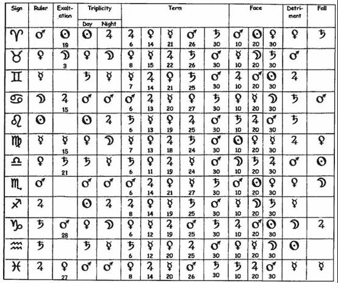

下一列的格子显示得界的行星。每个符号下的数字代表行星得界的守护关系：因此在白羊座，星盘的起始，从开始到 5 度 59 分木星保持着次级守护关系；金星从 6 度开始接管，统治直到 13 度 59 分，当她移交给水星（ ☿ ）时，之后是火星，最后是土星（ ♄ ）。下一个格子显示星座的得面位置，与得界的原理一样。在白羊座，那么，火星的守护关系是从星座的开始直到 9 度 59 分的得面位置；然后太阳从 10 度直到 19 度 59 分；然后金星直到星座的末尾。最后两个表格显示衰弱：第一个代表每个星座中有哪个行星落陷；第二个代表每个行星弱势的位置。

然后，我们有五种方法判断行星获得哪种尊贵：它可能入庙，旺势，三分，得界或得面，或者不在这些里面。一般来说，这些尊贵的各自强度可以从入庙到得面被视为五个下降的音阶。强度是可以累积的，例如，如果火星在天蝎座首个少量的度数中，它位于入庙，三分，得界和得面的位置，它的确非常强壮。行星没有位于任何一个得到尊贵的位置被称为游离，就像它是一个无家可归的流浪汉。它因此没有先天尊贵，除非它拥有相当重要的偶然尊贵，它才会有一点行动的能力。‘游离’在现代通常被误会，甚至被哪些虚假的普通得要命的占星资格证书（误导），通常被认为是没有与任何行星形成相位的行星 – 某个技艺，现代发明的过剩的次要相位，有一点成绩，这导致行星不会没有与其他行星形成相位。我们相信，对于任何与现实世界有过一定程度接触的读者来说都会很容易地发现，有能力或没能力行动的关键问题在于契机；因此，事实是现代占星学无法作出判断，在某种程度上是一种失败。但是，由于现代人只关心心理，在这个领域内，我们都可以想象自己是世界冠军，而不用担心发生冲突，因此，描绘出真正的力量是无关紧要的。

对力量的评估在我们从事的任何占星学领域都是至关重要的。在卜卦占星学中，几乎所有的问题取决于某人是否有执行某些行动的能力。因此他们采取行动的力量至关重要的。在择日占星学中，选择行动的时刻，找到合适的行星拥有足够尊贵的时间是这门艺术的主要部分。在本命占星学中，发现某个特征是有力量或虚弱，或者我们是否有能力在特别的方向上取得成就，几乎告诉了我们所有我们希望知道的事情。在世运占星学中，公共事务的占星学中，例如判断国家防御是强还是弱的能力显然具有重要意义。这是完全是通过对尊贵的研究来实现的，而对尊贵的研究的关键在于理解本质。

本质的虚弱也可以表现出来。行星在自己入庙位置对冲的星座内肯定是它的落陷位置，在旺势位置对冲的星座内是它的弱势位置。这些是很严重的折磨，行星位于此处甚至比游离还要多得多的衰弱。我们无家可归的流浪者可能仍然是健康的；行星位于落陷或弱势可以比作某人因为疾病而苦苦挣扎。正如我们可以想象的那样，这样一颗行星在星盘上所代表的任何一个人，通过自己的努力取得任何成就的可能性都是微乎其微的。

卜卦时经常被提到的一个问题提供了一个简单的例子来描述行星的强和弱之间的区别。问题是“我什么时候会遇到与我结婚的人？”如果是由西方人提问通常是在意志消沉的时候。由于文化背景下的期待，问卜者通常觉得自己无能为力，只能满怀希望地等待丘比特之箭射中自己。即使是加入婚介所，想要获得成功，仍然要依赖于盲目的行动。星盘反映出这种状况，并且就本身而言通常会发现代表问卜者的行星位于非常衰弱的位置。然而，有着亚洲文化背景的问卜者，状况通常是不同的。一旦决定结婚，社会习俗就会导致其采取行动，通常很快就找到合适的伴侣，而不是等待丘比特的心血来潮（译者：西方人对东方人的误解？）。而被问到的那个人却有所不同，他们的行星通常是强大的，反映出他们自己有更大的力量来达到预期的结果。

然而，从现在被忽视的对尊贵和衰弱的至关重要的研究中，我们不仅可以看出这个行星究竟代表着某人的长处还是缺点，甚至还能看出他们喜好的优先顺序和倾向是什么。如果我们需要，这可以使我们进行一个详细的心理分析，无需通过虚无缥缈的心理分析学来进行。在其他的情况下，它允许我们评估人们可能会怎么做。如果一个世俗星盘揭示邻国在加强它的军备，重要的是要知道它的意图是打算侵略我们的家园还是巩固对野蛮人的防御。这些知识是通过学习接纳而获得的。

如果行星落入它守护的星座或者星座的某一部分，它被称为拥有尊贵。当它落入由另外一个行星守护的星座或星座的某一部分，它被该行星所接收。这个接纳关系显示不论我们的行星代表什么，它在星盘中对接收它的不论代表什么的行星感到兴趣。因此如果火星代表 John 而金星代表代表 Jenny ，火星落入金星守护的星座告诉我们 John 喜爱 Jenny 。我们然后注意到金星落入木星守护的星座：Jenny 喜爱木星。木星是什么？我们可以发现它守护星盘的部分代表 John 的钱财。我们也看到木星它自己有许多的先天尊贵。因此我们判断 John 很富有并且此时 Jenny 并不关心他，她非常喜欢他的银行存款。这个信息非常值得帮助 John 选择一个做法。

这个例子很简单。行星可能被接受各种不同的尊贵，使我们能够进行极为微妙的分析。这些接纳关系在力量上存在不同，正如我们看到的这些尊贵；它们在品质上也不同。行星三分接纳不仅是比入庙接纳的力量要小：它也有一个不同的角色。大部分情况下，我们可以认为接纳如同显示喜爱。如果我想知道在新工作中是否会获得大量的钱财，星盘可能显示我的行星被代表工资的行星接受：在这个有限的环境中，我喜爱工资。如果代表工资的行星被我的行星接受，它将会想要接近我：这是个吉兆判断的开始。这可能看起来是愚蠢地拟人化，但是为它作一个有效的比喻将会满足大部分的情况，并且符合基本的哲理，爱是所有事物的动力，准确地说。只是我们处境的黑暗使它显得奇怪，在某些情况下，‘影响’似乎比‘爱’更为合适。

行星在另外一个行星的入庙位置，说明它真的喜爱该行星代表的事物。此行星清楚的看到彼行星，理解它并且接受它。通常情况下，它代表行星最主要的喜好，尽管其他尊贵的组合会超过入庙的力量（我爱 Jenny ，虽然我对 Melissa 不那么感兴趣，但她是超级名模并且她的父亲是董事会主席的组合会让她占得上风）。行星落入其他行星旺势的位置会得到提升。这是强力的，但是绝不是完全真实的。它看得并不清楚。卜卦星盘投射人际关系的早期通常显示旺势的接纳：神圣的光环还没有被他那令人讨厌的习惯所打破。卜卦“ 它真的结束了吗？” 的问题经常显示征象星刚刚离开旺势的接纳。

三分的接纳关系就像友谊。这不是非常有激情，但它是温暖的，体谅的和舒服的。并且，重要的是，得界和得面的接纳关系相当微小，就像它们只覆盖了星座的一小部分，它们代表关注度没有像其他接纳关系一样持续得长久。正如我们看待尊贵，相对于衰弱，它们比什么都没有要好得多。它也可能接受一个陷入落陷或弱势的行星。正如我们所料，这并不好。在那些绝对权力拥有绝对腐败的人的出生盘中 – 伟大的 Catherine 是一个例子– 我们发现上升点的守护星（代表他自己的身体）被落陷或弱势的代表中天的行星（人的职业）接受：这是能够使他纵容他恶习的职业，给他带来毁灭。

先天尊贵和衰弱的评估描绘出一幅极其复杂意义的网络。某个戏剧中关于所有角色的力量和意图，星盘通过先天尊贵和衰弱展现在我们面前，不论它是简单的卜卦或者包含百年政治事件的世运盘。然后通过考虑偶然尊贵，能够使我们判断全部的行动能力。一个角色的先天尊贵，基于他的行星所在星座的位置，可能揭示他是有史以来最伟大的田径运动员；然而，如果他在坐牢，他将不会赢得比赛：这类事件通过行星在星盘中的位置，偶然尊贵和衰弱来展现。的确，学习尊贵和接纳关系是占星学的关键，并且使用得当将会阐明最复杂的状态。它几乎被现代占星师所遗忘，并且已经遗忘了它，这位现代占星师仍然觉得他自己有判断星盘的能力，这说明了当前这门手艺的现状（译者：相当糟糕）。

# 08 相位

一旦我们确定了我们的行星，我们需要知道他们在做什么。无论我们审查什么类型的星盘，不论它是一个琐碎的卜卦盘或者一个关系重大的世运盘，比如一个帝国的出生，每个行星将会代表具体的事物，不论这是卜卦案例中一条鱼或者一个商人，再或者是世运盘中的皇帝或敌国。一般来说，行星的位置，包括宫位和它的先天尊贵，代表它的力量，它行动能力的范围。接纳关系，在它所落位置与其他行星尊贵的不同组合，代表它的倾向和爱好的优先顺序，因此将会指出它将会选择应用何种力量。不同行星之间的相位代表时机：已经或者将要做什么。

一个简单的卜卦案例说明了这点。假设我的问题是，“我会得到这份工作吗？”如果我的行星是强壮的，它代表我非常适合担任这个位置。代表我的行星的尊贵由代表工作的行星守护，而代表工作的行星的尊贵也被代表我的行星守护，这说明我想要这份工作并且工作想要我。但是我们两个行星之间没有形成相位，代表什么事也没有发生：时机没有出现。不论我与主事人是如何熟络，不论他是多么的想要雇佣我，可能现在这个位置的在职者并没有打算离开，因此什么也不会发生。正如这个例子所示，我们处理相位的方法在我们判断星盘时是非常重要的；它不是可以随意改变的东西。然而，这却恰好发生在占星学被摧毁的期间。

传统认可四种相位：120 度为拱，60 度为六合，90 度为刑以及 180 度为对冲。合相严格意义上来说不是一个相位，但是为了避免不必要的重复说明，在此将其看作是相位。这些被认为是托勒密相位，就是我们唯一一个提到的托勒密有影响的教材，四书。决定相位的存在和属性是名义上由地球延伸向两个行星的直线构成的角度，但是，几个世纪以来，许多占星师们认为这句话是对的。事实上黄道是一个椭圆形而不是一个正圆，从而导致这些角度并不成立：例如，当两个行星在占星学中准确的形成刑相位的时候，它们很可能在视觉上看没有精确的形成 90 度。重点是行星在黄道中的位置：如果火星在天蝎座 10 度而金星在水瓶座 10 度，他们距离三个星座（=90 度）并且因此形成刑相位，不论我们是否在地球上的某个特殊的位置，它们依然都是相距 90 度。我们一定要牢记宇宙是自外而内构建的：尝试从地球上重建占星学是糟糕的哲学观念并且会导致占星学失灵。

直到伟大的占星师/ 天文学家 Kepler 之前，占星师们愉快的运用着这五个相位，而他（Kepler ）一只脚踩在传统的船上而另一只脚踩在现代世界的船上，创造出一系列其他的东西，现在被称之为次要相位。Kepler 对于占星师和科学家来说是个固执的角色（事实上他似乎一直都是那样）。科学家们难以令人信服地应付这样一个难题：一个彻头彻尾的傻瓜 – 他一定是这样，花了那么多的时间研究占星学 – 怎么会发现现代天文学赖以建立的定律？很少有占星师对 Kepler 的研究传统占星学给予足够的关注，但他们不得不承认，他是一个非常善于计算的彻底的占星师。通过这些次要相位，他不幸地沉醉于数学计算中（从而发现了行星运动的三大定律）。

托勒密相位是将黄道分割两等份（对冲 - 180 度），三等份（拱 – 120 度），四等份（刑 – 90 度），以及六等份（六合 – 60 度）构成。这是有确定意义的数值，而且该数值是描述，不是判定：说刑相位实际上是因为将周天分割成四份，相当于说我病了是因为我感觉不好。在占星学术语中，相位的判定因素是在来自于宇宙制造的四种属性：热，冷，湿和燥。Kepler 着迷于他自己将周天分为五份，八分，十份和十二份。他解释说，“ 这些数字是可以被认知和构成的… 它们也是等份的，”  所以它们在数学上是一致的；在占星学上，它们是无关紧要的。现代占星师更进一步的发展，将周天分割为九等份以及甚至其他能将 360 度进行分割的份数。这些度数的范围，或者说容许度，是被允许围绕在这些相位精确度数周围的点，所以不需要多少时间的心算就能意识到，一旦我们引进这些巨大数量的次要相位，几乎每个行星都能与其他任何行星形成某个相位。

说来也奇怪，所有这些新的相位产生的效果也符合对它们的期望。我们可能想知道，现代占星师们对柏拉图式和谐的理解是否甚至超过了 Kepler ，或者这些假设的效果是否是某些丰富想象力的产品，因为这些都是如此琐碎的事情，表达得如此含糊，以至于无法确定它们是否正确。

每个托勒密相位的特定意义是整合了星座之间热，冷，湿和燥而产生的效果。这个基本属性决定了相位将如何运作。令人惊讶的是，现代人，他们的性情不能处理好吉星和凶星的概念，却坚定的将相位划分为好和坏。拱和六合是好的；刑和冲是坏的；合相是易变的；极大数量的次要相位在他们的想象中已经列好了队伍。在传统占星中，刑和对冲是难以行动的，拱和六合是容易行动的。这不完全相同：凶星产生的一个美好的拱相位是非常不愉快的。仁慈的木星产生的困难的刑相位在大部分情况中要好于邪恶的土星产生的拱相位。如果要选择土星产生的六合或对冲相位，傻子才会选择对冲相位，但是那仍然不足以将六合相位描述为‘好的’相位。

最容易的相位是拱相位；这是因为它们将位于相同元素星座中的行星连接在一起：在风象星座中的行星（例如天平座）只与那些位于其它风象星座中的行星（双子座和水瓶座）形成拱相位。也就说，行星位于热且湿的星座与其他位于热且湿的星座的行星形成拱相位；冷且燥与冷且燥形成拱相位；等等其他两种组合。处于同样的元素中，行星彼此了解得很好；它们有很多相似之处。期望它们相处得容易并非没有道理。六合相位把相同温度的星座中的行星连接在一起（冷和冷以及热和热）；要注意的是，是将湿和燥联系在一起，而不是将湿和湿以及燥和燥联系在一起，这表明行星在此缺乏像拱相位那样的理解力。刑相位将相反温度的星座中的行星连接在一起，这样形成的链接比相同温度的连接要弱。例如，在卜卦占星盘中，由两个行星形成拱相位代表的事件将会很容易发生；同样的两个行星形成刑相位则显示，它仍然会发生，但仅仅是在延迟和困难发生之后。

对冲，就像六合，将相同温度星座中的行星连接在一起，但是它们之间的排斥力比引力更大，无法将它们统一起来。对冲的属性是将其连接在一起然后再分裂开；它是典型的分离相位。合相则恰恰相反，将黄道十二星座中恰好在相同位置的行星连接在一起。这种连接甚至比拱相位更近，因为行星不仅具有相同的元素，而且拥有相同的品质（基本，固定或变动）。同样行星的尊贵恰好是一样，我们可以看到，它们的优先顺序正好是相同的。最重要的是，如果在它们在一个它们都很强壮的星座中连接 – 假设，月亮和金星合相于金牛座 – 那么它们都拥有强大的力量并且都对彼此有兴趣。合相是‘coniunctio’ ，拉丁语中代表夫妻之间的联系，在十七世纪，合相的另一种说法甚至更加清晰：性交和交配。两个行星是一个整体，这就是为何在技术上说它不是一个相位。

两者间柔情蜜意

本质上融为一体；

看似俩，实不分离；

一或二，毫无意义。

它清晰地表明了传统的知识概念，与现代所谓的知识有很大的不同，并且对理解占星学至关重要：合相的字面意思是‘圣经意义上的知识’，也就是说，因为知道的人和已知的成为一个整体。正是这种统一性解释了为什么合相不是严格意义上相位：一个相位的字面意思是（aspectus ，拉丁语）瞟视，而你不能瞟视你自己。 合相很容易将参与其中的行星聚集在一起，但就像所有的相位一样，这些行星是否和睦相处是由它们的属性、它们的尊贵和它们共享的接纳关系决定的。

还有值得一提的一点是，现代的‘次要相位’，比如所称谓的梅花相位和半六合相位，据说它们用来连接星座中的没有被连接的行星，而用正确的占星术语来说，这些星座并不能互相看到对方。如果你没有注视事物你就不能看到它，因此这些不能被称之为相位。

理解相位四个基本品质的重要性已被遗忘得如此之多，以至于现代人现在在决定两个行星是否产生相位时，忽略了所有星座的边界。我们可以允许有围绕形成精确相位点附近的容许度；然而，这个容许度在星座的末尾突然停止。如果一个行星在金牛座首度而另一个在金牛座第五度，我们可以认为它们形成了合相。如果一个行星在金牛座首度而另一个在白羊座末度，现代占星师会认为它们形成了合相；但是，如果没有共同的元素和共同的星座特质使它们完美的理解彼此时，那么 – 即使它们比我们第一个例子中的行星要离得更近 – 认为这是合相的想法是非常荒谬可笑的。当妻子在隔壁房间的时候，男人可能会想要和妻子在一起，但除非他们中的一个来到对方的房间，否则他会发现这是完全不可能的，并且很可能会很痛苦。上述情况也适用于其它相位：行星必须在适当的星座才能形成相位；相位无力的笼罩到下个星座是现代占星师为了便利而随便这么认为，这是非常没有道理的。

同样的，必须指出的是，在传统占星学中，任何两个星座之间只可能产生一种相位。一个行星在白羊座而另一个在巨蟹座可以彼此形成刑相位 – 那是因为它们所在星座的属性决定的。现代使用过多的次要相位使行星在某一点上能够很好地了解彼此，但是在同一星座上几乎没有任何程度的区别。然而，这对组合构成的元素并未发生改变。

我们在这里看到的是一种决心的证据，以确保任何两个行星都可以形成某些好的相位。事实并非如此，然而，它确实让占星师们得以高唱它们之间的假想关系。当然，我们要重新训练自己，不要认为这与现代占星学用于填充解读时间的习惯并进行反复练习是一样的。我们 99% 的思想和经验与其他人 99% 的思想和经验大致相同；我们所关注的 – 或者，至少应该关注的 – 是那 1% 的与众不同之处。但是，当人们开始讨论我们最琐碎的事情时，我们那梦幻般的魅力却没被关注，反而被占星师把那 99% 的事情呈现出来，就像水中的宝石没被识货的人拾起。实际上，在我们自己的星盘中，行星之间没有产生联系代表这些是无关紧要的事，而在其他人的星盘中，同样是没有产生联系，也代表是无关紧要的事情。重点在于关注主要相位代表的事情，以及那些与之密切相关的事物。现代占星师是按小时计费的，所以需要拿话术来填充时间，或者直接念计算机产生将近 30 或 40 页的‘ 星盘解读’ ，我们可以拿古代大师本命推算的例子进行比较，这些判断通常包含在几段简洁的话中。这里不再企图描绘司空见惯的心理类漫无边际的讲话，而是使命主了解他有一个头和一个身子。

在传统占星学中，每个行星都有固定的容许度，就像力场一样在其周围辐射的影响区域。当两个行星的容许度相互触碰时，不论是合相还是其他角度形成的相位，行星被称为形成相位。这些容许度越靠近得紧密，相位的力量也就越强。在卜卦占星和本命占星中，我们通常关心事件是否会发生，我们主要关心的是准确的相位。如果我们在寻找解释、原因、外貌 – 描述而不是行动；那些不精准但仍然在容许度内的相位也变得重要：它们显示一个行星对另外一个行星的影响。行星与行星之间的容许度面积是不同的：太阳拥有的最多，水星最少。它们的大小不确定，行星容许度是逐渐消失而不是在某个特定的距离突然停止，由于这个原因权威人士们采用它们的大小有些许不同。Lilly 的列表是标准的：土星是 9-10 度；木星是 9-12 度；火星是 7-7.30 度；太阳是 15-17 度；金星时 7-8 度；水星是 7 度；月亮是 12-12.30 度。 现代占星师认为行星的容许度不存在 – 有些莫名其妙，就像新时代占星学的光谱表非常乐于人们拥有灵光的概念，而我们可能认为存在某种目标的行星却没有。容许度，已经从行星那儿被移除，即使存在，也是给予了相位，虽然这没什么卵用。因为相位只是两个星体之间的联系，一条线而不是一个实体，所以很难以看出它周围怎么会有一个力场，而一个星体却没有。

例如，一个六合相位将会给予某个数值的容许度，通常是 4 或 6 ，而拱相位的容许度将会给予稍微大一点，可能是 6 或 8 度。这将保持不变，不论涉及到什么行星时都一样，除了太阳和月亮有时允许多 1 或 2 度。因此冥王星和凯龙星之间形成的拱相位将会拥有与木星和土星形成拱相位时一样的容许度。这使得每个外行星都能公平地分享相位，即使新发现的行星都会在这些相位的轨道内停留数月甚至数年，这使得它们在任何个体的生命中都显得特别重要。但是我们每个人都必须有自己的黑暗和戏剧性的秘密，否则我们为什么要咨询占星师呢？相位的数量和容许度的大小确实意味着它们会彼此碰撞：就像把很硕大的超重者硬塞入一个电梯，在一个只有 360 度的范围内，根本没有足够的空间容纳他们所有人。但是没有关系 – 所有这些词的含义都是如此模糊和宽泛，以至于永远不会有任何矛盾的迹象。

我们可以合理的预期我们祖先是有能力将复杂运算的魅力引用在古老典籍中，他们曾经应该有过这样的需求，所以传统占星学使用了五个主要的相位，并且在某种程度上将它们应用在占星学中，而不是虚构大量无足轻重的新相位。关键是在于行星的运动。这是占星学奏效的原因。这是占星学所研究的。行星的运动。没有它，什么也没有。我们观察一系列球体相对于我们自己和彼此之间的运动。因此，无论我们从这次观察中得出什么结论，都必然隐含着这样一个结论，即对这一运动的考量，而不只是一系列表面上静止的点。现代人告诉我们，事实并非如此，他们抛弃了所有与此相关的有限用法，只保留了很少的几个，以至于我们发现许多‘合格的’来自于占星‘学院’的毕业生甚至不知道哪个行星运行得比其他行星快这个简单的事实。对运动的忽视可能与占星学从天空到印刷版的转变不无关系：对熟悉夜空的人来说，行星的运动是显而易见的。在占星师中，即使是在最基本的层面上，这样的熟悉程度也是极为罕见的，因此现代社会也乐于假设，看不见的太空尘埃碎片与木星或土星等明亮的天体相等。由于不知道如何分辨主星和过往飞机的灯光，夜空成了一个令人困惑的地方。

行星的运动在真正的理解相位中具有特殊意义。首先，我们的问题是，一个相位是否已经形成并正在离开，或者尚未形成并正在进入。正如我们上面提到的，两个事物彼此靠近和同样两个事物彼此分开是存在明显区别的。行星的运动也使那些没有形成相位的行星能够通过第三方的介入而互相影响。当行星以不同速度运动时，一个快速的行星可以向一个慢速的行星靠近，收集它的影响力并将其带到另一个慢速的行星上；或者两个快速的行星不能彼此形成相位，但它们都与第三个行星形成相位，一个慢速的行星，该行星可以收集它们的影响力。这好像我想和十年级的美女 Donna 约会；如果我没有勇气亲自问她，我可能会说服一个我的朋友替我打破沉默。这两种占星学的模式，分别被称为光的传递和光的聚集，显示了这类第三方的介入，这是一个被现代占星学抛弃的微妙技巧。由于第三方存在于我们的心灵之外，他或她明显的不再对我们有任何兴趣（译者：指因为这种技巧与心理无关，所以被现代占星学抛弃了）。

我们可以选择一系列以占星学结构为基础的相位，也可以选择一系列以心血来潮为基础的幽灵。如果我们想要做的是描绘没有实质的幻想画面，这些虚无的相位很好的满足了我们的目的，因为它们可以被随意操纵，而不会有撞上任何现实墙壁的风险。如果我们从占星学需求更多的东西，我们只有通过学习如何利用已知的东西才能找到它：我们幻想的产物只会向我们展示我们的幻想。是学会使用真实东西的最大缺点是确实需要一点努力，而且我们时常会不可避免的意识到我们做错了。贪图安逸的人更为安全，他们把自己包裹在次要相位与小行星之中沉沦下去。

# 09 宫位

星盘被分割的部分被称之为宫位，或者，更准确的来说，世俗宫位，因为这些是天宫或黄道十二宫在地球上的反映。世界上一切有形的或无形的，过去、现在或未来，真实的或虚幻的，都属于这些宫位中的一个或另一个。现代占星学中‘宫位’的概念与传统占星学中‘宫位’的概念有很大的不同，事实上，这是我们能最清楚的看到被现代占星学扭曲了的区域。

将星盘分割为十二份的概念看起来很简单：十二份相等的切片，就像我们在分蛋糕一样；但是占星师和地理学家所面临的问题是一样的，那就是在二维平面上表现一个球体的现实。实际上，这还是低估了任务的难度，因为我们的‘球体’是基于黄道十二宫的椭圆轨道，所以严格来说不是球形的。我们可能开始采取平均分割十二份的方法，但是很快要面临着‘平均，但是怎么做到平均呢’的谜题。我们是按照蛋糕的大小平均分割呢，还是按照每份蛋糕包含樱桃的数量来平均分割呢？

有超过一百种不同的方法解决这个问题，每一种都给出分割星盘的不同方法；其中，只有 6 个被广泛的使用。正如我们从它们的数量想象到的那样，其他方法之间存在差异极大多数是微不足道的。这些宫位系统分为三个大类：星盘的分割根据时间、根据空间或者仅仅是纯符号术语。在过去，不同的系统看起来共存得非常不错；在最近的时代，占星师们发现试图证明他们使用的系统是唯一正确的方法是，殴打对方的头部。我们可以注意到，人们对宫位系统的热情不断高涨，与此同时，利用宫位系统进行任何建设性利用的能力却在下降，具体的、可检验的占星学就证明了这一点。

宫位系统将天文现象与尘世联接在一起。我们已经知道任何行星的位置是如何标记出它的黄经来对着天空定位的。这个位置在地球上任何地方都是一样的。如果在 Hawaii 看到月亮在双鱼座 4 度，在 London 看它也是在双鱼座 4 度。然而，很明显，它相对于观察者的位置因地而异。如果双鱼座 4 度的月亮高挂在 London 的天空，在 Hawaii 相同的时刻观察它将会低于地平线。黄经告诉我们行星之间的相对位置；我们现在所做的是寻找这个问题的答案：“ 那颗行星相对于我们来说在哪儿？是在那里，还是它在下面？” 我们永远不能忘记，我们的星盘不止是描绘象征符号的纸片：它们是我们走出家门就能在天空中看到的东西的方案。

没有一个‘正确的’宫位系统。就像地理学家的制图投影，这个问题的每个解决方法都需要妥协。在世界地图中，如果我们把国家放在正确的相对位置，它们的形状和大小将是错误的；如果我们需要正确地显示它们的相对大小，我们就不能将它们准确地放在正确的位置。在任何特定情况下使用投影将按照现行标准来选择，而不是因为其中一个是正确的，其他可能性是错误的。可以选择这样一种投影，它让我们我的国家看上去是位于世界的中心；另一个原因是因为它使国家看上去比较大；还有一个原因是，它能够使世界呈现出一个连贯的长方形；或者，可能我仅仅是想要清楚的看到火车是怎么把我从 A 带到 B 的。占星学的宫位系统也是与此类似的：不同的宫位是适用于不同的目的。有些根本不适合做任何事。某些现代学校完全摈弃了宫位，流行的说法是“ 我无法理解的不可能是真的” 。

许多现代占星师使用一种符号性划分天空的方法，称为‘等宫制’。这是以上升点所在的黄经度数为起点，并以同样的黄经度数分割占星学蛋糕；因此如果上升点落于狮子座 10 度，2 宫宫头将会落于处女座 10 度，3 宫头落于天平座 10 度，等等。它的支持者经常声称它是 Ptolemy 和其他古代占星师使用的古老系统，这种说法除了证明他们对 Ptolemy 和其他古代占星师的无知外，什么也证明不了。它是现代占星师试图降低占星学的门槛，从而让初学者一直处于在初级水平。作为一个纯粹的符号划分，它无疑告诉我们现代占星师所钟爱的符号世界的种种迷人之处，但对我们其余的人所居住的现实世界却一无所知。如果我们想知道的关于我们存在的一切是包含在‘Janet 和 John 和他们的斑点狗’ 的页面中，那么整宫制系统将会为我们服务。如果不是，我们必须另谋出路。

最近一个顾客先前与一个现代占星师有过一段‘心理’本命解读就是使用的等宫制。他吐槽得最多的是那个现代占星师说得非常不正确，该占星师回复，“如果你没有被你的父母养大，你就会变成现在这个样子。”！

古时候使用的系统，现在仍然是印度占星中普遍使用的系统，被称为‘整宫制’，这有点不准确。在这里，星座和宫位的边界是重合的。因此如果我们的上升点在狮子座 10 度，狮子座将会是 1 宫，处女座是 2 宫，天平座是 3 宫。确切地说，这里没有宫位，只有星座；所有落入 2 宫的行星被认为是落入了第二个星座。在这个系统中，处理星盘的方法是相当不同的，没有把重点放在各种行星所落的黄经度数上。星盘被一次又一次解读，每次的视角都有些微的不同，直到形成一个全面的画面。在传统中，在不同的文化中运作，采用不同的宫位系统来处理不同的优先事项。

在传统占星学中，我们发现根据时间和空间分割宫位之间的区别。每一种系统的普遍例子是 Placidus 和 Regiomontanus 系统。Regiomontanus 系统将天空分割成相等的区域，或多或少就像人们肉眼看到的那样；Placidus 按照太阳通过天空的时间来划分天空。每个 Regiomontanus 宫位包含三十度的赤经。每个 Placidus 宫位，按照时间的顺序，覆盖了太阳从日出到日落旅程的六分之一，反之亦然。在建立的这些系统中，争论某个系统和与之相似的系统相比谁更优越的过程中，人们发泄了大量的激情，就像足球球迷们为自己喜爱的球队的优越性而争论不休一样。幸运的是，就像足球队一样，宫位系统也可以受到严峻的考验：有些行得通，有些行不通，如果一个系统不能产生结果，再多的辩论也无法证实它的有效性。这本书中的卜卦星盘是采用 Regiomontanus 系统绘制的；其他所有的采用 Placidus 系统。这两种方法都适用于不同的目的，这并不是说没有其他有价值的方法。

Regiomontanus 系统是以十五世纪的数学家兼占星师 Johann Muller 的名字命名的，他使用‘Regiomontanus’ （‘ 群山之王’ ）作为笔名；Placidus 是以十七世纪的僧侣 Placidus de Tito 的名字命名的。这两个系统早在它们的养父之前就已经使用了。De Tito 的占星学著作引人注目的主要原因是，他达到了连伟大的 Ptolemy 也未能探测到的浑厚深度；尽管如此，它还是成功地普及了这一系统，而这一系统现在可能是使用最广泛的。这个极端的海拔高度更多地是由于历史偶然因素，而非对其优点的任何认识，用这种方法计算出来的图表，恰好是拉斐尔星历表的编辑决定在他的年度作品中收录的这些图表，这类出版物是最畅销的，在他决定进行年度工作的时候碰巧就在他的手边。

划分星盘的方法很多；现在让我们考虑每个划分方法都有什么。所有的东西都可以放在某个地方，所以一个完整的清单可以无限期地继续下去；但是每个宫位有特定的主题。知道哪个宫位与我们所考虑的某件事物相关联是 – 或者，至少曾经是 – 占星学判断的首要步骤，否则，其他任何事物就没有意义。William Lilly 是一个典型的例子，他要求学生在掌握基本的星盘设置能力后，首先要做的就是‘ 非常完美地了解宫位的属性，这样他就能更好地发现需要从哪个宫位对提出的问题做出判断’ 。 简单地说，如果我们不知道哪个宫位掌管我们所谈论的事物，那么我们只有十二分之一的机会在星盘中找到正确的位置来作出判断；因此，如果我们的判断是错误的，我们不应该感到惊讶。篡改这一基本知识就像污染一口井；然而，这是现代占星学最高兴的事，他们不顾事实，只顾自己短暂的关注，重新绘制了星盘。

让我们思考一个典型的现代占星学涉及的宫位列表：

1 宫：自我

2 宫：财产

3 宫：表达

4 宫：家庭

5 宫：娱乐

6 宫：服务

7 宫：合作伙伴

8 宫：性

9 宫：探险

10 宫：职业

11 宫：朋友

12 宫：心灵

将宫位的意义缩减为一个词是不可能的；但是，无论使用多少单词，也总是会比这样要多得多，因此，我们不反对这个列表中必要的缩写。但是，即使是这样一种截短的形式，只有 12 个词，我们可能希望它不会留下多少错误，却也揭示出对星盘基本属性的重大和决定性的误解。如果不运用任何占星学知识，我们可能会对性以及快乐与伴侣的分离感到惊讶（让我们感激它没有位于代表事业的宫位吧）；对传统占星学知识如果有了解，就会知道其中一些宫位的意义明显被胡乱分配了。不出所料，正是这些令人不愉快的宫位被现代占星学扭曲得最厉害，就像在现代占星学的仙境里，任何不裹糖衣的东西都不允许进入。6 宫与服务无关；8 宫与性无关，12 宫与精神无关。绝对没有。在任何情况下。即使在你的星盘上也没有，不管你是多么的喜欢这些在 12 宫内的行星。6 宫、8 宫和 12 宫并不好，仅此而已。对于现代占星师来说，除了让他的客户相信精神花园里的一起都是美好的之外，对其他任何事情都不感兴趣的人来说，生活中有一些不愉快的事情发生的想法是完全不能接受的，他已经重塑了占星学来证明他的观点。

1 宫在问题中的确是代表这个人的宫位。它是从上升点、东方地平线延伸开来，在那里神圣的光芒进入物质的身体，所以引申出它也是‘ 你乘坐的船’ ，不论那条船是运输工具还是地面的车辆的意思。在卜卦星盘中，它代表提出问题的人；在出生盘中代表人本身；并同样在某种程度上也包括其他所有的星盘；在世俗盘中，它代表国家的总体情况。通过 1 宫我们描述一个人的身体特征，包括心理 – 甚至到了可以告诉哪儿有记号，伤疤或刺青的程度 – 以及品格。在现代一般通过太阳星座来描述身体和属性，但这时相当不切实际的。聚会上有一个聚精会神地盯着你说“ 你肯定是金牛座的”， 就像一个人对你说“ 我确信我们在上辈子是一对恋人” 一样，你也不会相信他。太阳所落的星座对外貌无关，通常只有那些我们最亲近的人才能看到我们真正的太阳星座属性。然而太阳星座非常的方便，因为每个人都知道他们的星座是什么，并且在真实与便利之间的斗争中，现代占星师在便利军队的前线占有光荣的地位。

上升点所在的星座决定外貌；该星座的守护星和其落入的星座；靠近上升点的行星；月亮和其所落入的星座；与所有这些行星形成相位的行星都能进行染色。太阳只扮演极为次要的角色，除非它属于上述类别之一。不幸地，你不大可能通过斜视别人并明智地告诉他们“你的上升星座是水瓶座” 来给他们留下深刻的印象，因为他们很可能不知道这是他们自己。然而，比起猜测他们的太阳星座，你更有可能给出正确的归类。

2 宫的主要标志是资源和财产。占星学使用财产的定义在西方社会中不再流行，这对我们的损失很大，但除此之外，这是不言自明的。从占星学的角度来看，只有当某物是无生命的并且你可以移动它时，你才能控制它或拥有它。很明显，我并不拥有我的猫，而且我也没有拥有我的狗，不管他对此有什么看法。我也没有拥有我的雇员，甚至我的奴隶也不是，即使他们在某种意义上是‘ 我的’ 。流动性意味着我既不拥有土地，也不拥有不动产，无论我拥有多少地契，也不管我为此花了多大的代价。不管广告告诉我什么，我永远也不会拥有一颗星星！

3 宫是兄弟姐妹、邻居和通讯的宫位。因此，它包含了谣言和小道消息；短途旅行；电话、传真机和邮局；命主自己清晰表达自己想法的能力。汽车在当今通常归于 3 宫，这表明现代占星学缺乏逻辑推论，即对宇宙怀有一种模糊的仁慈之心，就足以取代思考的能力。在这里，就像许多其他情况一样，我们看到对象和对该对象所做的操作之间存在混淆。我的汽车是我的财产，因此属于 2 宫；这是我的旅程，是属于 3 宫的事情。唯一可能导致一辆车归属于 3 宫的情况是，如果我们判断一辆汽车的本命盘，并想知道它和它的兄弟姐妹相处的如何。经过三十多年的实践，我还没有做到这一点。

4 宫让我们进入一个存在严重争议的领域：红色代表占星学；蓝色代表政治正确。4 宫是土地、不动产以及 – 经过两千年准确的文字传统 – 父亲。10 宫，4 宫的对冲宫位，是父亲的配偶，母亲。这是不能再接受的。现代占星师分为两派，一派将 4 宫归于母亲，而 10 宫归于父亲，而另一派将它们按照‘ 主导型父母’ 进行分配。那么谁是你主导型父母呢？也许现在流行的观点是，我们可以免除父母中的一方或另一方的服务，但对“ 主导型父母” 这一概念的最简单的反思就揭示了它是多么的毫无根据。因此，母亲独自将你带大；你的父亲在你出生前离开了你，并且从那之后就再也没有见过你；这个可能会使母亲成为主导 – 然而你有你父亲的体格，你父亲的气质，你父亲的举止。我们中的哪一个是如此微妙，以至于他可以公正的决定哪一个是孩子的‘ 主导父母’ ？ 一个人的缺席可能比另一个人多年来精心培养的影响更大，不管他留下了什么样的身体和性情遗产。

且不说理论上站不住脚，仅仅扭转宫位就是根本行不通的；因此发展为按照‘主导’来分配他们（一个可计量的因素仅仅来自于现代占星师自己的社会意识形态）。为何天堂应该按照流行的社会正确性概念来重新排列自己，答案大概可以在 California 的某处被找到。最初决定将这些宫位扭转过来的是一种奇怪的、畸形的黑暗生物，被称为按照字母顺序排列的黄道十二宫，是时候向我们亲爱的读者 - 对于他的安全引起注意 – 介绍了。就像某些令人恶心的寓言野兽，这种生物孕育了无数丑陋的后代，它们要对现代以占星学名义下大部分的胡言乱语负责。

基于对一些非常简单的原则的重复，我们可以认为占星学是足够简单的，并且发现其始终贯穿于它的绝大部分的历史。然而，对于现代占星学来说，这还不够简单。有三套变量，行星，星座和宫位，已经非常混乱了；因此他们（现代占星师）提出一个简单的公式来将占星学渲染成一个无定形体：行星= 宫位= 星座。那么，1 宫，与白羊座一样，与火星一样；2 宫= 金牛座= 金星；等等。在传统占星学中宫位和星座按照 1-12 宫和白羊座- 双鱼座有各自基础的顺序，但只有一个特定的背景，那就是：人的身体和疾病。白羊座和 1 宫都与头有关，金牛座和 2 宫与颈部有关且因此穿过星座到双鱼座和 12 宫是与双脚有关。这种联系在任何其他情况下都不成立，只要运用少量的知识，这样做就很容易被认为是错误的。

稍微动动脑筋，我们就能把白羊座、金牛座和双子座与前三宫联系起来。然而，巨蟹座与父亲毫无关系：它是阴性星座，由月亮守护。它与农业，不动产，矿山，宝藏或者其他任何传统意义上 4 宫所涉及的事物都没有关系。就像当代的趋势一样，我们并没有试图去理解已经存在的东西，而这些东西必然涉及到改变我们自己，我们只是漫不经心地把它们抛到一边，强加于自己愚蠢的先入之见，即我们天真地认为事情应该是怎样的。因此母亲（巨蟹座，月亮）属于 4 宫。很难理解现代占星家对科学家们拒绝理解占星学而发出的困惑之声，因为他们自己的行为也完全一样。确实是我们这个时代的孩子。

在 5 宫上，孩子的宫位，宫位/ 星座相连变得更为站不住脚。这相当于认为孩子是狮子。狮子是传统占星学中被认为是‘ 贫瘠（不生育）’ 的星座，它出现在第五宫是一个强烈的迹象，表明当地将不会有孩子。

方程式的第二部分，将行星与宫位连接，是 – 如果有可能 – 更为没有道理的。我们从把火星放在 1 宫内开始说起，唯一的理由是它碰巧是守护白羊座。正是如此；然而，在整个传统占星学中，这似乎从来就不是把它放在第一宫的理由，因为火星并不启动任何东西。无论宇宙的结构是地心说还是日心说，火星都是位于其中间位置。传统占星学将土星与 1 宫相连，因为土星是最外层的行星，因此按照它们在宇宙中运行的自然顺序，正如我们所见，恰好与宫的意义完全相同。

简单的一对一制定字母的星座, 在一个整洁的民主原则的星球上 – 一个星座（令人欣慰的看到, 天空采用现代政治理念把它们都聚集在一起），导致最近发现的行星天王星、海王星和冥王星都作为宫位守护星来符合他们的需要，并逐渐与水瓶座，双鱼座和天蝎座形成联系，传统星座的意义被武断的分配到这些没有多少联系的行星上。即使有他们的帮助，可怜的金星和水星仍然各自有两个星座/ 宫位要处理；当他们拼命地从一个人跑到另一个人并试图跟上时，这种疲劳状态使他们减少了，这也许可以解释为什么现代世界明显缺乏爱和理性。

除了没有任何真正的理由，按字母顺序排列的十二宫图根本不起作用，作为证据，我们可能会注意到现代占星术无法做出准确、具体的预测。虽然我们不应该预测有一些与道德有关的问题，但如果我们希望预测，那么我们可以证明自己有能力预测，这仍然是占星学理论能否站得住脚的严峻考验。

5 宫是属于孩子、娱乐，以及按照 William Lilly 的说法，还有‘ 酒吧和酒馆’ 的宫位。4 这里我们再次发现困惑。7 宫，古人和现代人的意见一致，代表‘ 其他人’ 的宫位；但是我们在哪里可以找到微不足道的其他人、短暂的风流韵事、情人、一夜情？我们可能会认为，为了跟上不断变化的社会和政治趋势，诸天完全忙于自我重组，但它们似乎能够随心所欲地适应任何一位占星家所写的个人道德规范。在第七宫的“ 严肃” 关系和第五宫发生的事情之间有一条非常灵活的分界线，而即使是最放荡的占星家也会通过把性安全地锁在第八宫来中和所有这些关系，无论是长期的还是短暂的。在我的黄道十二宫里，对不起，一个也没有!

占星家越刻板，第七宫的限制就越多，第五宫就越宽敞。但两者之间真正的区别与道德无关，而与我们之前看到的造成问题的对象和功能之间的划分有关。人属于 7 宫，行动属于 5 宫。因此不管她是妻子或是初次约会的对象，她都属于 7 宫；当我在酒吧或酒馆认识她的时候是 5 宫：一个是人，另一个是我和这个人在一起时做什么。这些活动包括性，这是原本然属于儿童和快乐的宫位，即使在占星圈中不能拿在台面上讲。

6 宫是首个不愉快的宫位，为了避免任何不愉快的痕迹污染他们居住的玩具世界，现代占星家发现有必要粉刷这些房子。它现在被称为服务之家，这是一个很有启发性的归属，因为在我们自恋的世界里，我们可能为任何人服务的想法显然是非常不愉快的，属于这个不幸的宫位。它也被认为是健康的宫位；传统占星学中它始终是疾病的宫位，完全不同的概念。

6 宫是磨难、糟糕运气的宫位；生命中所有的肮脏事，我们极为不需要得到它们；生活中的一般问题，显著地排在 7 宫旁，其他人的宫位，因为通常是他们对他们负责。它与代表自我毁灭的 12 宫形成对比，12 宫位于 1 宫旁边，代表我们设法强加于自己的愚蠢事情。许多居住在此的怪物中，最重要的是身体不健康。传统占星将疾病视为 1 宫与 6 宫之间力量的考验，1 宫是代表生命元气的宫位。6 宫是服务的宫位，但只有一个特定的意义：它代表我的奴隶和仆人 – 因此如果我与商人经常发生问题，我应该期望通过研究我的 6 宫来找出这些问题的根本原因。但如果我是一个仆人，我的工作是与其他人的工作一样的宫位：属于 10 宫。毕竟，每个人都是在为别人服务，否则我们永远得不到报酬。

现代占星学没有改变 7 宫的意义。这是‘ 其他人’ 的宫位，尤其是与我们关系密切的人，不管是通过爱情、商业伙伴还是敌意；但它也是属于其他任何人的宫位，在星盘中并不适合归类于其他位置的特殊类别的人群。

8 宫是传统占星学中代表死亡的宫位。我们的现代占星学兄弟告诉我们，自从真正的 Messiah （弥赛亚），Carl Jung （卡尔· 荣格）诞生以来，死亡就不复存在了。现代占星学教程用十分明确的言语告诉学生，在任何情况下，他们都不应该向他们的客户暗示，他们可能不会长生不老。谈论死亡是比其他罪行更大的原罪。然而，在过去，在判断本命盘之前，对死亡的预测是一个必要过程：如果命主将会死于周二，那么就没有必要预测他会在周三得到真爱、名声和幸福中，Ptolemy 写道，“ 对寿限的考量主要采用打听在出生后发生的事件，就像古人所说的，他的生命年限的构成，永远不会获得所有预测事件的应期。”  的确，死亡是一个占星师可以作出一个合理并可确定的一个预言：应期可以有出入，但是至少事件是正确的。但是就像今天判断出生盘涉及的仅仅是顾客心重急切想要知道的事情，不难理解为何死亡应该被坚决的排除，因为它给咨询过程的带来了一种严酷的现实寒意。

我们的祖先被无知和迷信蒙蔽了双眼，他们认为人是会死的，既然这是人生中相当重要的一件事，占星家应该对它加以关注才合理。由于它的重要性，它在星盘中占有一席之地并不是没有道理的。然而，在现代占星学中死亡被废除，现代占星师在 8 宫的位置发现了一个大洞。为了填满这个空间，性行为被转变为 8 宫的事物；不知何故，人类通过几千年的误解成功地繁衍后代。这种重新定位的传播者充分利用了 Elizabethan （伊丽莎白时代）诗人将“ 死” 作为性高潮的委婉说法，来指出性与死亡之间的联系。这种强调和从中得出的结论表明，我们对隐喻概念的理解相当不可靠：如果我们温和的读者有任何疑问，那么伊丽莎白时代英国的卧室里并没有堆满腐烂诗人的尸体。

对于绝大部分现代占星师来说，所有的性行为应归入到 8 宫。某些，然而，把 8 宫限制在性高潮，显然他们已经发明了一些其他类型的东西，并把它们交给了第 5 宫。然而奇怪地是，这种非高潮性行为却成功地生育了孩子( 第五宫的主题) ，而高潮性行为却没有。区别是“ 高潮” 性（8 宫）和“ 休闲” 性（5 宫），显然，按他们的说法“ 休闲” 性是错误的。但是，让我们小心的揭开这个混乱的面纱，就可能揭露了现代占星师的世界。

9 宫，我们被我们的现代代理人告知，是‘ 探索’ 。它在传统占星学中被视为上帝的宫位，因为它涉及那些最明显地使我们接近上帝的活动：各种形式的宗教；知识和学问；梦想和愿景。就本身而言，它是星盘中最重要的宫位，因为从那里我们获得了许多关于命主所拥有的的信仰品质的信息。判断本命盘的目的是根据该宫位所透露的潜能来评估属性的优缺点：其他一切都只是装饰。它还涉及到长途旅行：正如我们所见，3 宫，涵盖了世俗中我们日常生活中平凡琐碎的旅行（极端情况，包括上厕所）；9 宫涉及长途旅行，每一个都是通往神的旅程。

且不说，正如我们所见，10 宫是属于母亲的宫位，在现代和传统占星学中，都是属于国王的宫位，在某些情况下我们考虑为老板，命主的职业。这是一个重要的观点，因为这几个字把占星学的绝大部分科学测试都说得一无是处。在传统占星学中，判断职业生涯的标准是衡量 10 宫、它的守护行星、碰巧落入其中的行星，以及对水星、金星和火星进行判断。这是一个好的选择，但是在大部分星盘中将不会涉及到太阳。科学家 – 比如天文学家 Paul Couderc ，我们之前提到过他的所谓研究 – 通常会列出出生日期，从中得出结论，太阳星座和职业之间没有相关性。现代占星师们声称两者之间（太阳和职业）存在这种联系，不论这个研究怎样愚蠢可笑，起码揭露了现代占星师们说的事情都不属于占星学的范畴。

现代占星师对 11 宫没有大量的修改，继续将它视为朋友和友谊的宫位。在传统占星学中，它也是希望和期望的宫位，因为一个人的希望，无论是在现实或隐喻的层面上，都属于国王（10 宫）的礼物（2 宫），也就是说，它们位于国王财产的宫位，也就是 11 宫。

第三个令人不幸的宫位是 12 宫，所以现代占星学在这里也发现有必要对真相进行重大的整容手术，以避免在他们极其干净的 Walt Disney 迪斯尼世界中留下任何肮脏的脚印。据 William Lilly 所说，12 宫是“ 私下的敌人，女巫，大牲口，比如马，牛，大象，等等，悲伤，苦难，监禁，各种各样的折磨，自我毁灭，等等，以及那些恶意破坏邻居，或者暗中告密反对他们的人。”  我们没有理由反对马，牛，大象，等等，- 也许必须指出的是，和他所从事的传统工作也没有什么可反对的，但除此之外，这所房子里的东西并不好。Lilly 没有提及精神上的事物，探讨它们应归属于的宫位是：9 宫。然而，现代占星学将 12 宫改造为心灵的宫位。我们可能会怀疑，将最难以解救和否定的宫位重置为心灵的宫位，能够让现代占星师保持最为病态的错觉，导致他们表面上一本正经地声称，现代世界的心灵正在以巨大而又稳定的速度成长。

除非在某些特殊环境里（紧密相位或强力接纳）能够使他们在其他方面发生作用，否则落在第 12 宫的行星会发现它们的行动有着极大的困难。这就像一个黑暗的井，行星落入其中 - 我们听到遥远的回声，他们的声音呼唤从深处，但无法帮助他们走出。我们发现，向现代占星师的听众解释这点，会产生激烈且持久的敌意。在占星宫位中分配身体部分，12 宫守护双脚，并且任何关于它实际情况的讨论能够踩到某些人的痛处。这是一个微妙的地方，它揭露了现代占星流行的信念“ 我对生活没有希望，因此我必须深入心灵” 这种愚昧的言行。大量行星位于 12 宫内，很有可能（根据上面的附文）命主的生命已经无可救药；然而，方程式的第二部分并不遵循。可以通过它在星盘中的真实位置看到，心灵是生命的一部分，而不是那些退出生命的人的安慰奖。一个现代占星师告诉我们，12 宫‘ 还能’ “ 为人类作出指示深刻的服务；” 7 因为现代占星师都是精神战士，无私地为人类而战。这项服务是‘ 深刻的’ ， 因为它是在独自在家进行的，对任何人都没有明显的影响。正如该宫位代表隐秘和自我毁灭，12 宫也是自慰的宫位 – 心理上或者其他方式的。

这种对宫位含义的扭曲，从根本上决定了现代占星师要让他们的世界里的一切都是甜的——甜的，以确保他们的糖果为客户和占星师提供完全愉快的体验，而不管它缺乏任何营养成分。行星和宫位之间的真实关系为了使拙劣的按字母顺序排列的黄道十二宫延续而被压制了。

作为第一个行星，土星与 1 宫有联系 – 现在却被火星篡夺 – 应该是显而易见的。1 宫代表肉身，灵魂进入肉体的入口，它整个行动由土星代表。土星本身是物质属性的守护星，尤其是对身体的重要部分：支撑身体的骨头，身体外部边界的皮肤，以及作为身体连接点的关节。木星是第二个行星，因此与 2 宫有联系。作为繁荣和财富的行星，这并不是不合适的。火星，不是与 1 宫有联系，而是与 3 宫有联系；火星兄弟的天然守护星，3 宫的主要含义之一，并且是沟通背后的推动力。水星与任何信息的实际发声有着明显的联系，但火星是其背后的推动力，是促成沟通的欲望。

与现代占星学毫无根据的将月亮和巨蟹座与 4 宫联系在一起的说法完全相反，传统占星学是将 4 宫给予太阳。太阳是父亲的原型，因此 4 宫是父亲的宫位。也许现代占星学怀疑太阳是代表统治的行星。在太阳之后，是令人想要拥抱的小金星，一个极为适合 5 宫‘ 快乐、高兴和欢喜’ 的行星，  然后是水星，仆人的天然守护星，它属于 6 宫，仆人的宫位。月亮，天赐婚姻的永恒象征，与代表亲密关系的 7 宫有联系。当我们考虑上升点的时候，立刻就想到 7 宫头与其对冲，是高于一切的日出点，我们开始看到这个美丽的自然模式，平衡太阳与月亮，男性和女性，神圣和创造，在它们的完美和谐中。与现代占星学努力将 7 宫与 5 宫分离并混淆区别一样：它们将金星给予了 7 宫；但是根据合伙（7 宫）的原则来说它应该给予月亮。金星（5 宫）在该原则中是我们的爱情。

与现代占星学不同的是，当传统占星学用完行星时，它发现不需要发明新的行星时，而只是简单地重复这个模式。所以土星，之前我们在生命中归类于 1 宫，现在将其归类于 8 宫；土星，边界的守护星，开始和结束，死亡和墓穴。由于土星也是所有黑暗和不愉快地点的守护星，所以 8 宫与排泄系统有关也就不足为奇了。生殖系统，合理地说，属于 7 宫，婚姻的宫位，现代占星学想要通过歪理邪说拯救我们，就把 8 宫、冥王星和天蝎座搞混了。

9 宫是信仰的宫位，因此自然与下一个行星有联系，木星，宗教信仰、牧师、老师等等的天然守护星。在印度占星学中，木星被称作‘ 上师’ ，这个称谓非常精确。10 宫是事业的宫位，并归属于火星。与 3 宫一样，重点是让我们精力充沛的出去并征服一切的冲动，因为我们的事业就是征服我们自己的小帝国。11 宫在现代占星学中认为是采取了天王星和水瓶座的属性，因此代表命主的无私希望去帮助公众。与其在新发现的行星上钻研虚构的领域，我们不如满足于给予太阳在这个宫位里应有的位置，通过这个宫位，我们发现占星学自身也有其局限性；11 宫是国王仆人的宫位 – 因此如果太阳，最强大的行星，‘ 生命的主宰’ ，却只是仆人的话，那么统治世界的人将是多么强大和辉煌啊！

最后，12 宫：海王星，按照现代占星学的说法，它非常适合他们对灵性的奇怪理解。按照传统占星学，这是自我毁灭的宫位，当然也是由金星所守护，我们在 5 宫发现的可爱乐趣被转化成 12 宫的致命诱惑。

行星和宫位之间联系的模式，要通过回溯 12 宫的潜能和 7 个行星时间之间的区别和联系，从而弄明白宫位的真实意义，并要注意到宇宙的结构是不可改变的。这并不是把东西随意扔进十二个篮子的其中一个中。同样具有重要意义的是行星和宫位之间的第二个联系模式，它给出了现在被忽视的行星喜悦系统，在这个系统中，每个行星都发现自己在一个特定的宫位中会感到喜悦。

行星的喜悦有这些：水星在 1 宫喜悦，月亮在 3 宫，金星在 5 宫，火星在 6 宫，太阳在 9 宫，木星在 11 宫以及土星在 12 宫。实际上，当判断星盘时，任何行星位于它的喜悦宫位时会增加力量。如果在其对冲的宫位，它会变弱。它会增加力量是因为这个宫位是适合它的位置；它在此可以最好的显示它的真实属性。再一次，这将我们带回行星和宫位的基本意义。

水星在 1 宫喜悦，是因为它的属性是通过时间的表达：散漫的原因。因此，在某种程度上，它包含了整个创世的功能 - 通过七大行星的运动，将潜能表达成形态，因此它是人类的象征，是创世的王冠。因此，水星是所有被创造物的反射，在‘ 较低’ 的程度上。首先，身体的宫位，我们拥有了被创造的肉身。在实际运用中，1 宫是激发星盘中任何行动的起始点，而行动是将潜能表达为物质形式的一个例子。

太阳，真理之光，通过 9 宫掌管整个星盘，这是宗教信仰、愿景和知识的宫位。它的伙伴，月亮，在对冲的宫位，3 宫，通过反射太阳的真理光线到我们的日常生活中，就像该宫位所显示的那样，短期、琐碎的旅程。当太阳和月亮都在它们各自喜爱的位置时，它们彼此对冲，所以月亮处于满月时，从而有能力反射所有太阳的光线。太阳充满了天堂的光线，因此没有任何地方留给它自己：它成了“ 主的仆人” ，完美地完成了它的角色。

金星，爱的精灵，在 5 宫喜悦。在某种程度上，我们发现爱在这里以最明显的形式发挥作用，如性和生殖；但是 5 宫也是信使和使节的宫位，它们显示出与同胞和解的基本动力。另一个吉星，木星，在对冲的位置，11 宫。这是希望的宫位，木星的存在证明了我们对神的希望是可靠的。在物质方面，我们把 11 宫视为‘ 国王的礼物’ ， 我们依赖天上掉下来的馅饼，甚至在最普通的意义上，11 宫位（10 宫的 2 宫）是我们老板的钱财，因此也是我们的工资。介于神的宫位和星盘所表达时刻 – 或者‘ 现在’ – 的中间地带，我们看到全能的神的实际介入，他在精神上不断鼓舞着我们。

我们理解的凶星，火星和土星，它们在星盘中的位置，都受到了我们与生俱来的信念的严重阻碍，即它们的影响与我们没有任何关系，而是一些邪恶阴谋的结果，这些阴谋剥夺了我们应有的权利。从这个意义上说，他们在不幸的 6 宫和 12 宫确实很自在。但这么想就抓不住重点。12 宫是原罪的宫位，我们自己做错的事；土星，约束的行星，是我们在这里能找到的最有用的工具。6 宫对他人和世界那种随意态度的不愉快和厌恶。火星是一把剑，我们可以用它来对抗这些不愉快和厌恶，因此提供了行善的意愿。火星可以是疾病，也可以是让我们摆脱疾病的外科手术；土星也是如此：要么是束缚我们的负担，要么是约束原罪并使我们摆脱原罪的纪律。这是我们的选择。无论它是哪一颗行星，如果它处于喜悦之中，我们就最容易利用它的最佳状态。

正如 Lilly 所说，如果要做出正确的判断，对宫位清晰的理解是至关重要的；知识不能被无知和偏见所取代。或者，更确切地说，正如现代占星学的存在所证明的那样，它可以存在；但它们不能发挥同样的作用。现代占星学不仅不起作用，而且还破坏了宫位、行星和星座之间的联系，而这些联系提供了对创世奇迹以及与造物主联系的深刻理解。

# 10 择日占星学

通过卜卦，我们在占星层级中的下一步是选择的艺术，选择最佳时机采取行动。“哦，太好了！”我们想；“你能选个时间让我买一张中奖的彩票吗？”“可能不行，”这是令人失望的回答。因为我们不能选择任何本命盘上没有显示出来的可能性，所以如果你的本命盘中没有获得暴富的潜力，那么就没有一个择日盘会给你带来暴富的时机。这种反应总是使占星师蒙羞，仿佛这是占星学上的失败。但是，如果有人告诉我们，没有一具能够跑得特别快的身体，无论我们选择在什么时候尝试，我们都没有可能打破 100 米世界纪录，我们也都不会对此吹毛求疵。如果某个骗子想引诱我们，“买张票，参加比赛，你也可以打破纪录，”我们当然不会理睬他；我们把希望放在错误的位置是我们自己的失败，而不是占星学的失败，而艺术的主要目的是向我们揭示这些幻觉的本质。

择日占星学可以可以用政治术语来很好地描述：它是‘可能性的艺术’。 无论占星家在计算上投入多少精力，不可能的事就是做不成的。我希望采取的任何行动都包括两类: 我的潜力和真实的状态；只有它们彼此一致，才能取得相应的成就。择日占星学的目的是使这两个群体以最有效的方式结合在一起。我的潜力不一定会被实现。我的本命可能表明我有成为有史以来最伟大的将军的可能性，但如果没有发生战争，则该潜力将会被荒废；同样的，如果我的国家的军队由两个人和一条狗组成，我不论选择一个什么样的时刻都没法通过赢得战斗来展示我的才能。

考虑尝试去建造一座房子。我有一堆材料：这是在我出生盘内包含的潜力。这些材料之中有一部分非常不错；有些很糟糕；某些材料有着非常好的质量，但是对建房子没什么用。我也需要从中选择各种各样的尺寸：这是现实情况。如果我将房子建在山顶，景色很好，但是去商店需要走很长的路；如果我把房子建在山谷，我会离商店很近，但是我的材料不符合当地的建筑规定。然后这些有时间限制：还有时间的限制：如果我在冬天开始工作，地面会太硬，挖不动地基；但是如果我不在三月之前开工，房子在我孩子出生时就没法完工。综合这些各方面的因素找出最佳效果正是择日占星学的挑战。

然而，当我为我的房子选用材料的时候，我必须小心谨慎。如果我用树枝建造我的房子，当大灰狼出现的时候，它是不会变成砖房子；择日盘也是如此。社会经济地位处于上升趋势时的年轻夫妇可能坚称他们不想要孩子，如果占星师愚蠢的为他们的婚礼时间选择星盘参考了这个意愿，那么他很可能有机会在十年后再次见到他们，并被要求选择一个可以开始多多生子的方法。就像在童话故事里一样，如果我们的愿望得到了满足，我们很可能会绝望地祈求把我们鼻尖上的香肠拿掉，让我们的环境恢复原样。卜卦占星学在我们的愿望上投射出冰冷而清晰的光芒，它清楚地表明，大多数时候，如果我们没有确信想要的东西，我们的生活会好得多；通过择日盘，我们真正面临的危险是，将这些短暂的陶醉带入到我们的生活，并不得不承受其后果。这本身就是坚持传统占星学实践等级制度的一个令人信服的理由，在进入择日占星实践之前，通过卜卦占星的实践，允许他的眼睛被打开，让其看到人类冲动的随机本质。这也是一个很有说服力的论点，让我们相信我们的择日行为是因为我们信仰上帝而得到他提供给我们需要的时机，而不是通过选择某个时刻来创造我们想要的。当然，我们不能通过选择一种星盘来把自己从上帝的意志范围内排除出去；然而，我们可以去除无用的保护层，这层保护层通常会将我们从欲望的结果中屏蔽掉。

但我们必须行动，在任何行动中，我们都会选择一个行动的时间，尽管很少是从占星学的角度来选择。如果我想要进行日光浴，我不会在太阳下山后这么做，尽管我通常不会用占星学的方法来选择。我可能很天真的认为，我可以通过我自己清晰的思维来理解所有状况的品质；如果我觉得这远超我的理解范围，我可能会选择利用星体提供的更广阔的视角。然而，如果我真的选择了一个星盘，结果很可能总是令人不满意，留下挥之不去的疑问：这次的选择毫无用处。我没有空闲的生活，我可以采用一个实验对照组来测试。我不可能在生命中的某个时刻娶到 Judy 并且用占星学选择的时刻也不行，因此我可以比较一下结果。很少有情况下，我们处理的是一个具体的目标，要么其实现了，要么没有：例如，买一张中了头彩的彩票。然而，大多数的择日活动都没有这样明确的结果。无论我的婚姻多么幸福，我的事业多么成功，如果换一个时间开始，也许会更好；不管灾难有多严重，也许情况会更糟。

所有关于它使用的范围，择日占星学被广泛用来为一个巨大的各种各样的活动确定最佳时刻，从建立城市或者君主加冕这类重大的事件，到理发（取决于是被要求能很快长出来或者保持短小）或者首次穿上新衣这类琐事。Henry Coley 讲了一个伟大的占星师 William Lilly 的轶事，他穿上一件新衣服前没有查看月亮的位置，‘ 月亮位于狮子座，没多少力量，并且被坚果撕开许多个洞，在两个星期之后，导致新衣服都没有起到作用。’ ‘ 然而，’Coley 继续说道，‘ 我们不能迷信，而是要谦虚地对待我们的选择，指示把它们当作自然的帮助。’ 特别重要的事情是城市的投资，以确保它们能被、迅速的获得收益，外科手术的时间，确保双方获得最大限度的快乐的‘床上运动’，无论是否需要怀孕。如今，很少有顾客咨询包围城市的建议，以及没有人会愚蠢的询问现代占星师去选择做爱的时间：按照现代占星学理论中性爱归属于 8 宫，传统占星学理论中代表死亡的宫位，这样的建议可能会造成可怕的后果。

简略的择日可以仅通过时主星或者月相的了解，而全世界的园丁们仍在这样做。建议在金星时求婚比在土星时求婚的成功率更大；对建立一座城市来说，情况正好相反。即使是科学家也不情愿地承认，在满月时做外科手术会流更多血，尽管这个当然与占星学无关。但是，一个完整的择日是一个更为具体的过程，因为它需要关注参与择日的人的出生情况。月亮或时主星的方法相当于思考“夜晚红色的天空：牧羊人的喜悦，”这类简单的气象现象，当进行完整的择日则会比较仔细地分析所有的气象变量。择日盘的理想状态是皇家占星师的日常。除了研究皇室成员的本命盘表上的每一个细微差别，他没有别的事情可做，他完全熟悉他们出生时所包含的所有可能性；他会发现计算择日盘可以相对来说简单一些。

通过本命盘，我们可以确定在择日盘中哪颗行星必须在特别好的位置。这些变量取决于行动是什么，以及所需结果的确切性质。知道结果应该是什么是很重要的：仅仅说“我想创业”是不够的。你想通过生意中得到什么？赚大钱？享受成功？改变世界？雇佣你所有的堂兄弟？正因为侧重点不同，占星师择日时从星盘中关注的焦点也是不同的。通过本命盘，我们将确定哪些行星与此有关。我们通常会想要即将登基的统治者的本命盘中的命主星（如同他自己）尽可能的强壮，连同聚在一起的发光体（也要强壮），因为它们是星盘中能量的导管：一起的发光体都虚弱，这不大可能有足够的能量来触发任何事件。然后，我们会根据手头的主题去寻找其他行星。如果选择一场婚礼的（日子），我将会增强 7 宫主（伴侣），我们也可以同样以此选择生意上合作的时刻，虽然我们要要小心 7 宫主的力量，不管它怎么强壮但仍然要比上升点的守护星稍微弱一点：我们想要我们自己人处于领导地位。对于生意，我们可以增强 10 宫主和 2 宫主（事业和金钱）；建一个屋子或挖掘一个矿场，属于 4 宫主；举行宴会，属于 5 宫主（娱乐）。最后，我们必须增强与手头任务有联系的行星的先天属性：婚礼属于金星，例如，建造城市属于土星。

在我们选择的星盘中，我们通常想要七个行星都强壮，但实际上可能有 5 或 6 个行星并不强壮。最重要的，我们也希望择日盘的命主星，和相关的宫主星，是强壮的。实现这一切是不可能完成的任务。毫无疑问，如果我们花时间让这个行星强壮，那么另一个将会是虚弱的；如果我们等到该行星强壮一点了，但是第三个行星又将会失去它曾经拥有的力量。择日的任务通常是来避免最不幸的可能性，以及让行星不离开它目前最好的位置，尽管我们习惯性的说‘ 让行星强壮’ 或者‘ 将它们放入强力的位置’ ，但我们可以不做这样的事情，我们只用看着行星位于安排给它们自己（的位置）就行，就像我们观看万花筒，我们仅仅能够抓住当画面处于它最美的时刻。

需要加强命主生命适当区域的守护星 – 也就是说，那些守护他出生盘的特定宫位的行星 – 说明为何一个择日盘不能不考虑出生盘，以及为什么现代占星学尝试的择日占星学通常是错误的。我们必须知道哪个行星守护生命的哪个区域，这是不研究本命盘就无法知道的东西，也超出了现代占星学的认知范围，他们只是注重行星的先天属性，而忽视或者说极大的削弱了它们作为宫主星的重要性。如果我们不知道这一点，我们就是在黑暗中战斗。假设我们要为开始一项事业选择一张星盘。在其他条件相同的情况下，我们的首要任务之一是确保火星和土星这两颗凶星远离（译者：这里作者应该是犯了习惯性的错误，毕竟他一直在强调有尊贵的行星是吉星，虚弱的行星是凶星）。因此我们可以乐滋滋地抓住一个将土星放入 12 宫的机会，在那儿它将难以行动。但是如果土星碰巧守护出生盘的 10 宫，命主的职业，仍然将它放入 12 宫是我们能做的最糟糕的事。不首先判断命主，我们将得不偿失。

我们可以利用的其他因素，包括选择适当的星座。对于那些我们希望能够持续的事情，我们会选择上升点在固定星座以及其他适合的位置。例如，如果我们的目标是创办一家可以迅速赚到 100 万美元然后被清算的企业，那么基本星座将会更为适合。同样的，如果我们开始经营一个农场，土象星座将会是最好的；一家电视公司，风象星座。

我们并不局限于用增强行星的先天尊贵，还可以调动它们到星盘中有利的位置。正如我们所见，拥有强大的太阳总是有好处的，但是通常采用增强先天尊贵的方法是不可能的；可以将它放入角宫，通常是中天，也会一样做得好。我们无法通过改变行星来达到的目标，但我们完全可以通过明智地通过安置恒星来弥补。每个恒星带有一或两个行星的属性，所以如果我们必须在金星较弱的时候选择一个结婚的时间，那么拥有金星属性的恒星位于在角宫宫头也会起作用。轩辕十四，狮子的心脏，是世俗成功的一个耀眼的恒星，在许多国家事务的择日盘中都很突出：Alexander （亚历山大）的出生据说是占星大师人为的推迟了，直到轩辕十四到达合适的位置。角宿一，是天文学星座处女星座中灿烂的恒星，在星盘中经常被强调，人们追求的目标是幸福而不是成功。

尽管我们可能希望把凶星移开，但当他们守护我们所需要的房子之一时，我们经常被迫将他们纳入我们的计划。即使它们没有这样做，它们有时也可能是有用的：托勒密的名言《百诫》建议我们“可以利用凶星，土星和火星；就像熟练的医生也能用毒药治疗病人。” 在这些字句中蕴藏着择日星盘的最大可能性，这样我们就可以明智地选择时间来平衡我们本来的缺点。也许我们的客户希望开始创业，但我们对他的本命盘的评估显示，他有一种强烈的粘液质气质（水象，情绪的中心）；其他迹象表明，尽管他是个迷人的人，但他缺乏在市场上保持竞争优势所需的任何素质。如果他决心继续他的计划，我们必须充分利用我们所得到的：在择日盘中将土星位于强有力的位置，将会给他带来一些毅力，支撑他忍耐即将到来的困难；让火星位于强有力的位置，将提升他先天缺乏的精力，给予他在必要的时候挥舞匕首的能力。如果我们选出的星盘造就了一个慈善人士，企业就会因他的善意而陷入困境。同样地，选择手术的时间与选择聚会的时间是不同的：手术的时间应该是血腥且令人不愉快的，不管结果是如何的成功。在我们的选择中，我们从我们所掌握的有限资源中，提供了开展这项事业所必须使用的工具；我们必须确保我们提供的是最适合用户的需求的。择日占星学不会创造出奇迹：没有哪个星盘可以使两个从根本上互不相容的人成功联姻，或者让一家公司在北极销售冰淇淋成功。但如果有潜力的话，一个适时的择日盘将会显示出它的最好品质并减轻缺点。

英明女王

John Dee 为 Elizabeth （伊丽莎白）一世加冕礼选择的时间，通过“ 一个虚弱女人的身体” 和一些聪明的占星学，展示了什么是可以实现的。 Dee 并没有给我们留下他的草稿，但是遵循传统的择日盘原则使我们能够接近他的思想所走的道路。同以往的择日盘一样，他的两个限制是：他必须与之合作的“ 本命盘” 中存在的可能性，和必须在其中发生事件的实际时间范围。如果 Elizabeth 的本命盘显示她英年早逝，任何择日盘都不可能使她在位长久而光荣；如果他在等待加冕典礼的理想时刻，他还会等待。

由于太阳是王权的先天守护星，他的第一个想法应该是让它变得强大。毫无疑问，他希望太阳出现在白羊座或狮子座，在这些星座里太阳具有强大的先天尊贵；然而，即使是春天的白羊座，也会需要漫长的等待。由于时间的限制，他只能让太阳落于摩羯座或水瓶座。太阳在摩羯座最后 10 度拥有一些非常次要的尊贵；在水瓶座它非常的虚弱：这肯定使得 Dee 急于进行加冕礼，让它在一月份的前十天举行，那时太阳还没有离开摩羯座。但尽管太阳在那里很虚弱，但水瓶座有一个适当的优点：它是一个固定星座。由于 Dee 首要目标显然是长期稳定，水瓶座是首选，尽管太阳在那个星座很弱。它也是最有人情味的星座，并且其他的迹象表明，促进人道的恩宠是一个重要的次要考虑，他在这方面取得了最辉煌的成功。让太阳位于中天 – 在中午举行加冕礼 – 如果缺少先天尊贵则可以通过该位置增强。如果其他变量不合适，他可能不得不重新考虑让太阳回到摩羯座；但是到目前为止，他无疑认为一切都很好：“ 太阳位于中天水瓶座 – 好的，让我们看看有什么选择。”

在这段时间里，观察行星的相对位置，他可能会对土星与火星之间的对冲深感忧虑。这是在天空中最为有害的迹象之一，必须以最大的谨慎来处理，以避免在择日盘中建立无法克服的困难。火星，尤其是土星的移动速度都很慢，因此，如果他等上几天，这种结构也不会消失：它必须得到处理，如果有可能的话，就变成他的优势，如果没有，就变成中立。他会立即排除 1 月 22 日之后所有的日子，因为到那时太阳（新君主的标志）将会进入与两个凶星形成困难的刑相位。当它从他们的影响中解放出来的时候，可能已经太迟了，加冕典礼的时间也肯定意味着失去太阳位于水瓶座的稳定性。所以他现在把他的机会窗口缩短到 1 月 10 日到 22 日。

稍后是 Elizabeth 的本命盘版本，试图把她理想化为“ 一个最好的 XX” 而校正她的出生时间，让她的上升点在射手座。Dee 很肯定是从一个上升点在摩羯座的星盘来进行工作的；这意味着土星，摩羯座的守护星，有特别的意义，代表 Elizabeth 她自己。那么，他会发现，确保好战的邪恶火星不与土星形成的这一困难相位，而是安全地通过土星，是非常必要的。对冲的效果仍然在徘徊：统治将不会安静（因为这是不现实的期望）；但是将加冕礼放在 1 月 14 日以后将会把最糟糕的困难转移到别人头上。避免与土星对冲，他必须等到太阳离开摩羯座才行。

到目前为止，Dee 决定加冕礼应该在 1 月 14 日到 22 日之间的一天正午举行，最迟也要在 1 月 22 日举行，以确保太阳安全地远离土星，避免形成困难相位。然后他会注意到两个幸运的事件。正如他想要的，太阳在中天，两个麻烦的凶星将会被关在 12 和 6 宫，它们喜悦的宫位，并且到目前为止对它们来说是最好的位置。而且，加冕礼的择日盘在该日子里，太阳落于中天时，上升点正好位于双子座以及下降点位于射手座。下降点位于射手座，它的守护星，木星，将会代表国家的公开敌人。在这段时间里，火星出相位土星，最大的凶星，并且与木星形成困难的入刑相位：火星，战争之星，拾起土星所有的不愉快并投射到木星上，公开的敌人。由木星落入的星座由土星守护，这只会让 England 的敌人得到最大的挫败。Dee 看到这个一定非常高兴。

他现在仅仅需要对日期进行微调。14 日或 15 日的木星（敌人）位于水星的次要尊贵，上升点的守护星代表 England ，稍稍加强了 England 的位置。更为重要的是，越早举行加冕礼，水星离太阳就越近，保持国家（水星）位于君主（太阳）的力量之下。Dee 可能希望它离得更近一些，但那不可避免的与火星/ 土星的对冲相撞。选择 15 日，则强力的恒星参宿七（猎户星座较亮的两颗星体）位于上升点。在择日盘中，在显著的位置放置合适的恒星，在任何长期事件的择日盘中是最为重要的；Dee 本来想在中天上也放置一颗恒星，但这在当时是不可能的。参宿七，强力的吉星，在上升点是一个非常可以接受的选择。

按照简单的占星学逻辑，充分利用当时主要的天体结构，建议 15 日的正午是 Elizabeth 加冕的最佳时间。到目前为止，Dee 的工作很大程度上是受约束的；现在，他要检查一下这张择日盘提供了什么可能性，并确保这没有任何他忽略掉的不幸。他会注意到其他有帮助的恒星位于火星、月亮以及，最重要的，福点。福点与轩辕十四合相，最强力的恒星之一。毫无疑问，他认为，让这合相位于地平线上，尤其是在 10 宫，这样会更好；但它在现在这个位置也将相当不错，并将确保该国保持相当的债务偿还能力。

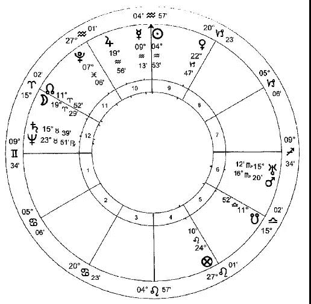

他会特别高兴地注意到，他选择的这个星盘与 Elizabeth 的本命盘之间有着密切的关系。他选择的星盘中，太阳和月亮所落的位置与 Elizabeth 本命盘中的两个吉星形成紧密的相位，木星和金星。，在星盘和空中，发光体都是光源；因此，回顾多年后，Dee 可能把这视为对女王美德的杰出艺术崇拜的来源。在择日盘中，吉星金星紧密的被土星所束缚（因为每一颗行星都统治着落入它入庙星座的行星）；它恰好对冲本命盘中土星的位置（Elizabeth 她自己）；这个本命土星，位于巨蟹座，非常虚弱。金星在本命盘中守护宗教和学问的 9 宫，并且在择日盘中位于同样的宫位。Dee 会认为这是一种有效的方法，可以遏制 Elizabeth 更多令人讨厌的生活习惯；作为朝廷的常驻圣人，他很可能看到了这个金星，除了其普遍的幸运意义之外，还象征着他自己，从而将他对新王后的影响力纳入了星盘中。由于之前的日食是在天秤座形成的日食，属于金星的星座，金星受到那次日食的影响。Dee ，可以说是，想要在择日盘中将金星放置到与它的蚀相形成拱相位的位置，这就如同将择日盘的‘ 插头插到’ 蚀相提供的能量上，从而让 Elizabeth 在某种程度上获得她的前任 Mary 当时的精神，并甚至具体化，但这绝不可能。

Elizabeth 统治时期的历史，至少在大体上说，已经足够清楚地表明 Dee 的择日工作没有白费。他没有为接下来的事情创造任何东西，而是通过选择一个具有感悟力的时刻，利用当前的条件，他使某些可能性得以蓬勃发展，而其他不那么令人满意的可能性则逐渐消失。Elizabeth 的统治并不是一个女王和国家不间断的成功和幸福的故事；占星师不能选择一个完美的时刻，因为完美的时刻并不存在。作为一个琐碎但却真实的例子，Dee 的择日盘预示着巨大的艺术成就；他不可能选出一张显示核能发展取得重大突破的星盘：某一类星盘可以被选择，某一类则不行。择日占星学固有的局限性反映仅仅是生命固有的局限性；尽管这意味着我们可能达不到目标，但对于想要扬帆远航的人，逆势而行是愚蠢的。

# 11 本命占星学

在个体变得越来越无足轻重的世界里，妄图说服自己很重要的欲望会变得越来越强烈。因此，占星学的分支，本命占星学已经在很大程度上主宰了这门学科，以至于绝大多数公众，以及相当多的占星家，都不知道还有其他的分支存在。想要赞美自己的欲望是无止境的，所以每个占星书店都有几个热带雨林，专门提供各种各样拿镜子的方法，以获得更讨人喜欢的视角。所以，是的，亲爱的读者，让我们把这件事做完，然后我们可以讨论一些更严肃的事情：你非常棒，没有人理解你，这不是你的错。现在让我们继续。

我们已经看到占星学的实用技术和基本精神都发生了怎样的变化，最显著的是在过去的一百年里，为了消除所有的客观性，使其成为一种纯粹的自恋工具。现在的主题是‘心理描绘’。试图批评这种态度，会使我们对过去的一种相当错误的看法具体化，就好像我们的祖先没有精神世界，也不关心人的内心世界一样。就像任何科学一样，心理学的有效性取决于正确的方向：只是在走动根本就没有意义 – 我们需要往某个目的地前进。传统占星学包含着对心理学的深刻而微妙的理解，这种理解隐含在这种理解隐含在传统、正常、我们现在如此无助地游离于其中的世界中：一种面向神性知识的心理学。如果我们说，没有这种指定的方向，我们就没有心理学，只有错误，就像我们试图在关灯的情况下工作一样，这种说法并不是错误的。

让我们首先考虑一下现代占星学对本命盘的解读方法。很明显，人们人们很少要求看本命盘，除非那天下午很潮湿，同时他们的口袋里还有一些余钱。他们通常询问因为他们在感情上迷失了方向：情绪消沉，困惑或迷茫。因此，他们处于一种脆弱的心态，愿意接受建议。我们可以将“自助”文学与现代占星学之间的亲缘关系进行比较: 人们不会购买自助书籍，除非他们觉得自己无法独自应对。所寻求的主要是安慰和保证。大多数现代占星家都很清楚，他们在任何情况下都不会提供明确的信息（也就是说，任何可能对客户实际有用的东西）。如果我们的客户，可以说，从船上掉下去了，我们就不要做任何粗俗的事，比如扔给他一个救生圈；最好是讨论一下他下落的情况和水温。

 “ 你能解读我的出生盘吗？” 我们被问到。这意味着：“ 你能和我单独聊一小时吗。” 在那个时候，我们说什么并不重要，只要我们用现代心理学的棉絮似的语言说话，我们就永远不会说任何自相矛盾的话。我们都有相同的特点，只是比例略有不同，所以无论对客户说什么，他总能感觉到，“ 是的—— 这就是我对 T 的看法：但是你知道吗，聪明而强大的人?” 让我们不要否认，在一个小时或更长时间内获得某人一心一意的关注是一件美好而罕见的事情：即使在亲密的关系中，在迷恋的早期阶段也不会经常发生。任何一个把全部注意力放在盘子上的人都会发现，有一长串急切的顾客排着队，他们被迷住了，不管别人在说什么，只要盘子里有足够多的“你”这个词。

听得目瞪口呆，别人会像接受金子一样接受你的话语，这是另一件罕见的事情，所以在他们两人之间，客户和占星家激起了相互赞赏的火花，就像一对长臂猿在梳妆打扮，充满了喜悦。在我们这个享乐主义的时代，咨询这种诱人的巫术似乎是无害的 — 我们被告知，它不再让你失明 — 但这种亲密关系是为情感关系保留的，理由很充分。它导致了心灵之门的开启，这是最不明智的，除非我们很清楚到底是谁或什么将要穿过它们。绝大多数占星家无疑是善意的；但仅仅有良好的意愿是不够的：如果认为让它们在我们的心灵中游荡是安全的，那将是愚蠢的 — 它们不知道自己在做什么。不幸的是，今天有相当一部分自称是占星师的人，因为他们无法应付生活，并且发现在纸上处理符号比在现实世界中处理符号要容易得多，而逐渐转向占星学。我们有这样一种奇怪的情况：领先的占星家每天都在接受治疗 — 我们可能怀疑这暗示着某种程度的精神失衡 — 但他们仍然认为自己值得在客户的脑袋里踩上自己浑浊的脚步。

现代占星家经常评论“我得到的星盘反映了我自己的问题”。这并不令人意外。真实占星学的全部功能是提供一个客观的分析手段；占星师用来做这件事的工具已经被抛弃了，所以可怜的客户现在只是被占星家的精神垃圾淹没了。“这是我的治疗方法，”不止一位专业占星家这么说。不知情的客户是否发现自己充当了帮助占星师自我治疗的角色都可能是个问题。这里甚至不再有为了客观性斗争的借口，并且很多占星师会找出，客户所提出的问题在他自己的生活中有什么意义，以及客户的本命盘与他自己的本命盘有什么联系，似乎这比客户所关心的事情更有意义。这些占星师的能力水平就是这样，我们很可能会认为我们自己参与到客户的星盘中的情况越少越好, 但恰好相反：我们本来是一团糟，占星师的未解决的问题涌入到对客户的判断，好像他的本命盘的一部分也带入到客户的本命盘中，使他自己的问题的一部分成为了客户的问题。客户发现非但没有把问题解决，反而带着一大堆他到达时没有遇到的问题离开了。所有这一切都是通过诉诸“ 同步定律” 来证明的 — 也就是说，如果这个客户现在在这里，他必须承受我目前正在费力处理的那些精神污水：不管你喜不喜欢，他都要把头埋进去。

当然，这并不是说，过去每一位占星师都是开明和明智的；但传统占星学的技巧在实践中对占星师与客户之间存在着严格的障碍。这里没有占星师主观的余地 – 尽管今天可能许多假装传统主义的实践也可能坚决地试图为其引入辩护。占星学是白纸黑字地写在你面前的这张纸上的：这里没有主观的余地，就像修车一样：它纯粹是客观的，要么对，要么错 — 修车的人要么把车修好，要么不修好。这种方法与许多当代占星师所宣称的目标截然不同，他们自称为“ 占星顾问” 或类似的人。很明显，他们和他们的客户一样渴望情感上的联系。这不是一个健康的状态。如果有人说他们可能会对客户进行性侵犯，从业者会感到震惊，他们会读一本关于心理折磨的因果经，然后确信自己做了一件道德高尚的工作。

在最糟糕的情况下，心灵的弱点是通过接受很久以前的虐待咨询造成的，尽管通常是在医生不知情的情况下。尤其是那些故意使用‘特异功能’或者反心灵操作的人中（他们比当下所见到的还要真实且阴险得多），此反人类行为启蒙于心理分析，这通常是悲伤的并甚至被认为是跻身于占星学群体的标志，更多的力量召唤或释放有毒的物质，有可能导致出现各种东西，可能是‘鬼神’（比如召唤来的鬼，仙女或者精灵：简称，神灵），‘幽灵’（那是，人们‘心灵的残骸’，不朽的灵魂达到他们的最终目的地，然而必定会留下低级的元素，‘死亡仪式’未能抚慰它们，在世界灵魂周围不断徘徊，通常是因为横死），或者直接导致魔鬼附身( 通常是多个) 。灵魂是一种脆弱的生物；必须谨慎对待。然而人们可能不会考虑走到街道的尽头去见一个不知道是否有资格的陌生人，并邀请他对自己的眼睛做手术，但却会让此人对自己最为宝贵和最为脆弱的那一部分进行手术，最重要的是，这是永久性的。

对现代的客户来说，现代本命占星学解读的关键是立刻可以验证。有效的经验是让别人讨论我：我很重要。这个人实际上说的话，虽然意义不大，但都是为了达到同样的目的。占星师的工作就是告诉我，我不仅仅是无名小卒中的一员，而且我是独一无二的、重要的、令人兴奋的。就像今天很常见的那样，我们最容易被自己的原罪所验证。我们在白天的电视上看到一个极端的例子：我的恶习让我变得足够有趣，我的 15 分钟名声足以引起全国的关注。占星学也是如此 — 这也是为什么天王星、海王星和冥王星等外行星被如此重视的原因。这些都变成了许多有趣但不太可怕的恶行的储存库 – 这类事情是属于可以接受的程度，并不会通过我的信箱造成汽油炸弹爆炸的程度。当然，这些恶习都是经过精心挑选的：性方面的小过失是好的；踢开猫咪绝对不是。占星师挑出了其中的几个 — 这并不难，因为我们都有自己的缺点，就在表面之下不远的地方 — 当我们略微有点脸红时，我们会有一种奇怪的愉快而又尴尬感觉。他通过知道我们衣服下面有什么这一非凡的壮举显示了他的伟大智慧。他不以我们的恶行来评判我们，而是让我们去培养它们；因为我们喜欢这样一种感觉: 它们以一种相当令人兴奋的方式，让我们变得有点危险。我们被亲密的幻觉，理解的幻觉迷住了，但我们所理解的一切都是我们所有人共有的。

然后，我们将被赋予宇宙的秘密，权力的话语，让一切变得更好，一切都好起来：这一切都不是我们的错。占星师，分享 Philip Larkin 亲子关系观点的人，将首先解释具体的人如何阴谋反对我们。首个候选人通常是母亲，紧接着是父亲。这两个人把我们的生活搞得一团糟也就不足为奇了 — 我们应该得到某种公众的认可，仅仅因为我们在面对这些障碍时需要顽强地坚持下去。我们都有这样‘ 不幸的童年’ ，我们或许有理由感到委屈，我们的双亲没有放弃我们把我们拿去喂狼。值得注意的是，在大多数的孩子死于襁褓中的时候，借口‘ 你有个不幸的童年’ 并不是占星家的专长。然而，如果你暗示你的童年是相当满足的，那就表明你严重否认了这一点，你会顽强地试图证明，你的星图显示的恰恰相反，你这个可怜的受创伤的东西，就是你自己。你的伴侣可能不像你的父母那么应该受到谴责，但毫无疑问，他是这个阴谋的一部分，因为他没有意识到你的坏性格有多讨人喜爱。当你的父母，你的伴侣和整个世界都被拖上法庭，并被判有罪后，下一步就是要明白真正的恶棍是行星。他们对你下手了。对你个人。没有任何理由。

从你的本命盘开始。看看这些问题！你怎么能指望我做什么？你不能指望我准时到 – 我是个双子座。你当然不能指望我付钱 – 看土星在我的 2 宫呢！有我这样的月亮，我一定会不忠。冥王星在天蝎座 – 我要玩些下流的游戏。本命盘确实是个奇妙的发明：你失败的选择是由你的本命盘行星配置所证明的。现在，甚至没有必要再把它钉在特定的人身上，也没有必要再进行那些尴尬的对话：“ 我的母亲害了我一生；” “ 但是你母亲是一个可爱的女性。” 是行星，它们以一种强烈而反常的喜悦使你失败。

但它们并没有停留在本命盘上：它们是如此坚定地扰乱你的生活，以至于它们非但没有占据让行星自己获得极为舒适的位置，反而永远操纵自己进入到不利于你的本命行运中。因为他们中至少总有一些人在做一些不愉快的事情 — 或多或少有些琐碎，或多或少有些敏感 — 你总有一个理由为自己的不幸或失败找借口。在任何占星师的聚会上，这也保证了打破僵局：“ 我的土星正经过我的月亮；” “ 哦，可怜的娃 – 我恰好能明白你的感受：冥王星正控制这我的本命凯龙星。”

这与真正的占星学完全相反。占星学不是让我们放弃所有责任的方法：“土星越过我的中天，因此我的生意失败了。”不 – 你的生意失败是因为你租用昂贵的办公室，以及买了一个车队，却没有花钱培养你的客户群。土星并没有做什么：这是你的责任和行动。土星只是标志着这些鸽子回家栖息的时刻。任何真正占星学的挑战在于，它面对着我们承担全部责任的可能性；但这只有在传统世界的精神取向内才有可能，因此我们再一次回到同样的十字路口：没有信仰，没有占星学。

当然，我们所看到的一切都不意味着客户在咨询占星师时想要的 — 无论是有血有肉的那种，还是电脑打印出来的那种 — 是“ 我希望有人谈论我” 。这就是所发生的事情，是什么让这段经历显得有价值，是什么在效果消失后吸引他回来。然而，我们需要的是改变。占星师将以某种方式收集客户出生时所发的牌，洗牌，并以更可接受的模式( 最好没有父母/ 伴侣/ 土星或任何其他把事情搞砸的人) 分发出去。不知何故，占星师会按下一个神奇的按钮，改变生活，也许不是戏剧性的，但意义重大。占星师解读的神话是以某种方式在生命之外；一个独特的有利位置，所有的东西都可以重新排列，就像我们在玩具剧院里移动角色一样容易。当然，事实并非如此；但客户购买的却是渺茫的希望。他沉迷于同样的变革梦想，通过这个梦想，他买了一张彩票。但是在这场彩票中，从来没有人赢过。

对本命盘的解读并非总是如此。在占星学堕落到今天这种地步之前，本命解读的目标、方法和结果与现代占星都大不相同。首先，无论是处理外部事件还是命主的心理状态，目的都是提供具体的信息。无论是对父母还是行星，责任的分配都不是计划的一部分。方法简单明了。在现代占星学中，关于正确的“综合”方法，就是把星盘上的各种迹象综合起来，从而导致有很多的争论。关键是什么？哪个才是切入点？传统的占星家遵循着过时但有效的方法，从开始到结束，都走在中庸的路上。

在我们盲目地考察 Hitler 本命盘的期间，我们看到了一些传统的先天本质的判断。首先，要评估人的气质、态度和精神素质，可以说要了解人是由哪种材料构成的。完成后，解读就是一个简单的过程，通过对星盘中每一个宫位解读，处理该宫位的事务。因为所有的东西都包含在一个或另一个宫位里，当我们解读到尽头的时候，我们已经找到了所有我们需要知道的关于性格和生活的基本趋势。在实践中，解读通常仅限于当时特别感兴趣的宫位内：一个强健的二十岁的年轻人更可能想要了解他的婚姻、财务或职业前景，而不是他晚年可能得什么病。命主许多最直接的世俗效用在这个角度上被建立，因为它允许理解特定的情况。为什么我的生意从来没有成功过？我应该在国内还是到国外去碰碰运气？传统的判断方法给出的答案将是清晰而具体的：例如，你的企业之所以失败，是因为你容易受骗，而且坚持选择不诚实的合作伙伴。

然后星盘进行推运或推进。也就是说，我们让它运动是为了找出什么将会发生，什么仍然是未实现的潜力。现代占星学也是如此，但方法却截然不同。在传统和现代的方法中，星盘的宫位和宫位内的行星以各种相互关联的周期进行运动，这些周期是真实的和( 在我们看来) 具有象征意义的时间。那是，我们关注现在（真实时间）天空中的行星与本命盘中行星的紧密关系，以及那些根据其他某一度量显示出的信息，比如出生后 X 天行星的位置代表出生后 X 年或月的事件。前者的位置被称为是行运，后者，被称为推进或者推运。各种各样的推运技术在精确的判断上各有各的优势，但基本原理是相同的。有的时候我们采用其他手段将流动的时间与出生的固定时间联系在一起的，比如太阳或月亮返照技巧，凭借我们计算出将太阳或月亮返回到在出生盘中它们所在的位置的星盘（比如太阳返照时，某人在生日会上会觉得很快乐），我们有大量表面上无关联的周期。这看起来毫无道理，为何在出生后 36 天的行星位置会显示出将要发生的事件与，在多年后太阳返照以及当年当月月亮返照显示出发生的事件是相同的。然而，就是这样，因为全能的上帝以他无限的智慧塑造了一个以连贯的方式结合在一起的宇宙。在占星学研究的众多乐趣中，最重要的是有机会惊叹于这种结构的精确性和复杂性。

虽然传统和现代占星师都使用许多相同的预测技巧– 这里有某些额外的，那里有某些额外的 – 但它们的应用方式却非常不同。如果我们把行星的运行周期比作鸡尾酒会上的客人，我们可以进行比较。对于现代占星师来说，两位客人之间的每一次琐碎的谈话都是非常重要的。如果推进的金星小姐碰巧撞上了本命火星先生，我们必须注意结果。然而，传统占星师知道这个酒会的意义在于有皇室成员参加，他们在宾客中穿梭，在这里和那里挑选一些人来执行任务。金星小姐碰巧与火星先生低声说话，这一点也不令人感兴趣。

传统占星学认为本命盘是一系列的承诺，或者潜力。如果我们永远活着，所有这些承诺最终将会实现；但是我们没有。他们中的大部分人，甚至可能是一些是最耀眼的人，将会因为在实现承诺之前就死亡而感到沮丧。我们通过推运星盘寻求的是找出这些承诺中哪些将会发生，以及这些事件将会在什么时候发生。星盘中相对于其他行星而言，有五个主要点向我们展示将会在发生何事，并在何时发生：这些是我们的‘皇室家族’，穿过星盘发号司令的人。其他客人随便混在一起，但这没什么大不了的。事件是通过太阳，月亮，上升点，中天和福点的推进引发的。当其中一个遇见年轻的金星小姐或火星先生时，一些重要的事情就会发生。如果星盘被正确地解读，其他行星之间的会议也可以显示事件 — 特别是那些与他人有关的事件，如父母或伴侣；但是，可以说，正是皇室家族的允许，这些行星才能采取行动。

行星，或者宫头，或者恒星碰撞的时间，或者当它们从一个界（星座的细分）移动到另外一个的时间。这些推进是一个事件即将发生的标志 – 枪好像已经上膛了。一旦装填完毕，我们需要扣动扳机：这，只有这个，是行运行星的作用，仅此而已。行运在现代占星学中被极为高估了。作为一个正在工作的占星师，我每周都发现我不需要弄清楚那些阅读过非常多现代占星书籍的人所在的世界，或者至少是他们认为的世界，因为行运的冥王星/ 凯龙星/ 土星在他们的本命盘中碰到了某些本命行星，他们会喋喋不休，不会结束。行运扣动扳机：枪支一旦上了膛，在扣动扳机之前不会开火；但是，不管扣动扳机的力度有多大，频率有多高，而枪是空的，都无济于事。绝大部分的行运行星是无害的，除了情绪的改变外没有任何影响。

我们要留意当我们的推运点撞击到本命其他行星，宫头，恒星的时间，或者改变界的时间。现代占星学忘掉了界，并且令人遗憾的忽略了恒星。由于抛弃了大部分的工具，难怪它没有作用。

太阳和月亮返照盘显示了命主本身的突出事件，但主要根据本命盘来解读。例如，如果一个婚礼将要在一个太阳返照年内或者一个月亮返照月内举行，我们很有可能看到返照盘中统治一宫和七宫的行星进入合相；然而，更多时候，我们将会发现在本命盘中的 1 和 7 宫主在返照盘中入合相。在返照图中行星被着重强调，不论是产生紧密的合相还是在宫头一两度的位置，都可以单独判断；但我们主要是查看星盘与星盘之间的联系。在返照盘中木星处于强有力的位置，与我们本命盘中 2 宫主形成准确的拱相位，例如，可能是在那个月有好财运的证据。土星在它落陷的位置对冲同样的行星（本命盘的 2 宫主），那么发生的事情就将会恰好相反。这些证据可能显现出的细节可以根据返照盘中木星或土星所在的宫位配置、接纳关系以及与其他行星形成的相位来查看，而与其形成相位的行星所代表的意义我们永远要放在本命盘中考虑。因此，如果给我们带来如此好运的木星位于返照盘的 9 宫内（国外），并与本命盘的 11 宫主（朋友）合相，那么这笔钱可能来自一位在国外的朋友。

大部分返照盘，无论这对我们中间那些极度倾向于投资的人来说多么令人失望，都没有显示出任何重大意义。在大多数人的一生中，大多数月份甚至大多数年份都没有发生任何重大事件。当一些重要的事情即将发 1 时，这张图表会以各种方式吸引我们的注意力。在返照盘的角宫发现反复或精确的反射那些本命盘线索是强力的指示，我们应该端坐并集中注意力。南北交点落于角宫，或者强力的行星与角宫宫头形成紧密的相位（通常是合相），是其他重要时刻的典型指示。如果月亮返照盘中所有的行星在果宫的中间被隐藏起来，我们可以整月安全的躺在床上，而不用担心错过任何有趣的东西。

重要的是要记住，就像推运和行运，返照盘不能显示本命盘中没有承诺的事物。我可能会花一个月的时间梦想中彩票，但无论我的月亮返照盘如何显示，如果在我的本命盘中没有获得暴富的指示，这个梦想将不会实现。这是一块试金石，它使我们能够做现代占星师声称不可能做到的事情：区分世界上的事件和主观情绪。

那些占星学的指示将会表现为事件是一系列建立在连续的、可描述的铁链上，根据本命盘进行各种推运和返照盘，然后直至行运。那些只存在于一个层面上的现象，比如未经证实的行运或者月亮返照的指示，就像阳光明媚的山坡上出现的云层阴影，从我们头顶掠过。

要理解这些明显不相连的系统是如何连接在一起的并不容易；它不符合我们通常的线性思维。我们可以说，它们每个提供了一个不同的度量方法：正如我们都可以用英寸或厘米来度量两点间的距离，每个都会以不同的方式决定同样两点间的距离，因此我们可以通过推运、返照和行运度量从出生到生命中事件的距离。但这并不能完全解释星象模式的内在联系。

我们可以认为生命在结构上与人体相似，在其中，各种系统 — 骨骼、静脉、神经等等 — 根据它们各自的性质展开，缠绕在一起，以填补相同的空间。当所有这些系统在同一点做一些重要的事情时 — 例如，在一个手指的末端 — 我们在人体中有一个“ 事件” ，而不是在胫骨中间有一个“ 事件” 。同样的，当不同系统的推运、返照和行运都在同一点做一些重要的事情的时候，我们在生活中就会发生一个事件。

虽然这个比喻有它的局限性，但几个系统结合起来编织生活的结构形象是比较恰当的。结构的根基，骨骼系统，可以说是，保持身体的直立以及提供飞速发展模式的框架，随着时间的奇怪的伸缩，它们暗示行星在某一天中的移动显示出某一年中发生的事件。虽然在二十世纪的人看来，这似乎是武断的，我们给出最高权威的标准：圣经。在民数记中，在解释谁应该离开荒野进入应许之地之后，上帝继续说道：至于你们，你们的尸首必倒在这旷野，你们的儿女必在旷野飘流四十年，担当你们淫行的罪，直到你们的尸首在旷野消灭。按你们窥探那地的四十日。一年顶一日：你们要担当罪孽四十年，就知道我与你们疏远了。当 Ezekiel （译者：以西结，希伯来先知，旧约圣经以西结书之作者）被告知要对耶路撒冷说出预言的时候，与一天代表一年相同的标准在被反复的强调。

我们当然不是要把这些经文的重要性降低到作为占星学实践的指导意义；但是他们确实说了一些关于时间的本质和生活在那个时代具有重大意义的事情。我们赖以生存的线性调性概念可能对日常生活很方便；然而，一旦我们开始观察时间本身或它的产物，就必须把它搁置一边，就像我们在占星学中不断做的那样。我们不能把这种“可伸缩”的时间与我们认为时间是直线的概念对立起来，这样一来就会发现它不够用，因为它与直线不匹配。当我们观察行星的时候，我们是在看更高的世界，在我们所能看到的最远的地方，我们是在看上帝创造的真正“大爆炸”；如果我们忘记了这一点，我们就不能指望理解占星学中时间的本质。而不是坚持时间作为一个直线运行从开始到结束, 我们最好把它换成一个图像, 比如将一块石头扔进的水：在占星学中我们提供的时间模型，是使我们的生命从环形的最外侧作为起点出发。在不同的环层之间有一个明显的、数学上可以定义的“ 可伸缩” 关系。我们的推运就是这样的一个例子。无论从这里看起来是什么样子，当我们往更高的世界看时，我们看到的时间尺度不是我们自己的。

本命盘中展现的推运、返照和行运的方式挑战着我们生活模式，就像它挑战着我们的时间模式一样。我们对生命的普遍看法是，当一个人从出生到死亡在一条直线上徘徊时，或多或少会发生一些随机事件，这与我们认为生命通过本命盘按照有规律的有机模式发展的方式是不一致的。星盘和推运的性质表明，人与生活的关系远比我们通常所认为的更为密切。人生不是一连串的意外。更确切地说，这个人似乎是生活的一个横截面，是某个特定时刻生活的快照；或者好像生命是一个人随着时间的推移而延长。这个模型很好地解释了 Plato （柏拉图）所给出的灵魂对生命的选择。3 他解释说，在形成人身之前，灵魂选择的生命期望被引导。“ 没有选择的品质或性格，因为每一个灵魂必须采取一个适合其所选择( 生命) 的性格。” 。选择生命，并因此角色跟随它发生，灵魂首先被 Clotho （克洛索，命运三女神之一，命运之线的纺织者）引导，现在的命运，选择生命必要的本命盘的人，然后去到 Atropos （阿特洛波斯，希腊神话中命运三女神之一），未来的命运，检查推运的人，“ 这样制作它不可逆的命运的纺线。”

一个灵魂漫不经心地抓住了一个有着可怕命运的生命，“他那灼热的胸膛，悲叹着他的选择……他忘记了他的不幸是他自己的错，责怪命运、天堂和除了他自己以外的一切。”按照这种提示，人身和命运之间牢固的联系通过推运、返照和行运来演示，所有这些不同的方法都是由本命盘决定的，这也是那些最强烈反对占星学的人最常提出的指责，他们放弃了个人的责任。虽然不可否认的是，大部分向占星师咨询的人确实寻求准确的预测，但这并没有给他们推脱自身责任的借口。正相反，占星学强调的是一个人对自己的生活，以及对过去、现在和未来的整个生活的绝对责任。

然而，我们还没有接近生命的真正内涵。如果占星学最初发现了知识, 或者，至少，知识的起源在于灵感( 在这个词的真正意义上) ，它是没有明显或者没有目的的启发，并且其目的不仅仅是为了告诉我们，我们有可能结婚，或我们将会永远的富有，甚至我们的父母也不是什么可怕的人。真正的目的，就像现代占星学所说的那样，‘ 心理’ 上的；但是‘ 心理’ 在某种程度上是完全不同的，并且与现代对这个词的曲解完全相反。这是一种真实的、有指导意义的心理学，它阐明了我们在“ 这里” 的位置，而这只能与我们在“ 那里” 的方向有关。

任何对本命盘解读的要求，尽管只是在最罕见的情况下才会这样公开，都是一种试图抓住化身之谜的尝试：在这堆欲望和困惑中，我内心的神圣火花在做什么？本命盘的解读恰好可以阐明他的观点。本命盘处理的是较小的奥秘 – 成为真正的人类艺术，恢复失去的尊贵和正直，这是开始进入更大奥秘或者生命灵性之前所必需的。因此，我们在其中看到了灵魂的形成和培育的可能性。

灵魂通过上升点进入世界；我们在星盘中看到的是当它到达这里时，它所携带的装备。其中一些比另一些更有帮助。一般来说，如果管理得当，行星越强大，它就越有用。星盘中的标志，主要围绕着 9 宫，将会显示这类可靠的指导是可能的，尽管在这里首先必须记住的是，万能之神从不受占星学的束缚，他会介入，因为他的智慧认为这样做是合适的。虚弱和受折磨的行星通常代表生命必须与之搏斗的特定困难。然而，即使是强大的行星也必须谨慎使用：过量和短缺一样有害，虽然更容易补救。把一种热情引向错误的方向，要比唤起一种不存在的热情容易得多。

像往常一样，我们必须从评估气质开始。胆汁质、火象的天赋，气质是欲望；挑战在于正确地引导这种欲望。多血质、风象，气质有它的精神力量（不一定与现在所谓的智力一致）；它常见的问题是知道每件事，但都没有深入理解。抑郁质、土象，气质是有怨恨和迟钝的倾向，但一旦被感动就有了实用性和坚实的方。黏液质、水象，气质是最容易受到情感障碍的困扰，通常表现为自我放纵和冷漠。

在这样的背景下，我们就可以判断出行星的位置：例如，火星在白羊座强有力，会让一种冷漠的性格变得活跃起来。这确实是一个令人遗憾的星盘，它在任何地方都没有优势。土星提供智慧和辨别力，原理邪恶；它的原罪是贪婪。木星给予信仰和正确的判断；它的原罪是暴食，这和所有的罪一样，应该从最广泛的意义上理解：对经验的贪婪也是暴食，需要土星的辨别力作为约束。火星，可能是最不时髦的行星，给予伟大的灵魂，给予较小的和较大的圣战的热情 – 外在和内在的圣战 – 行善的力量；当然，它的原罪是愤怒。太阳赋予了生命、尊严和纯洁 – 从字面上解释 – 并由此预言；它的原罪是骄傲。金星提供爱和调解的要求；它的原罪，情欲，肉体失去正确的欲望。水星给予清晰表达和精神上的理解，它的原罪是嫉妒，这是误解，因此它的产物是谎言。从最广泛的意义上说，月球也能生育；作为行星中速度最快的，它的缺点，正如龟兔赛跑的寓言中的兔子一样，就是懒惰。

在个人星图中，这些行星的确切位置，它们的尊贵、它们的接纳关系和它们的相位，将以最详尽的细节清楚地显示出命主位置的真相。这是最重要的。我们总是很容易用最积极的色彩来描绘自己的缺点：我是一个浪漫的惹事佬；你是个醉鬼。星盘给出一个清晰的、客观的（记住我们正在使用传统的工具）画面，我们可以选择忽略它，但我们不能否认它。随着社会习俗变得越来越腐败，这样一幅画的价值变得越来越大。我周围的人可以向我保证，某些行为是探索精神的标志；我可以看看那些广受尊敬的人物，看他们也都是这样做的；但是如果我的图表显示了这种行为，例如，自我毁灭的 12 宫主接受命主星（我）在它落陷的位置，我不能假装我没有受到警告。此外，星盘不仅为我们提供了一个清晰而无可争辩的弱点所在的评估，而且也同样清楚地显示了我们有什么可用的工具来弥补这些缺陷。

为这种补救行动指出适当的工具是最重要的建议，占星师是可以提供给他客户的。星盘让这样的建议对个人来说是绝对具体的，避免那些没有具体知识的人提出的善意但无关紧要的建议。星盘中接纳关系的研究显示向我们展示了哪些属性可以拯救那些功能不正常的属性。假设我们的目标在大学里做坏事，父母和老师唠叨他让他好好学习。如果火星（活力）和土星（纪律）与他的水星（思想）产生有益的联系，这类建议可能会奏效。如果没有，那么继续提供这种服务就没有什么意义了。星盘可以显示一个容易移走的苦难：水星被太阳和月亮折磨，这两者都落于星云状的恒星，这表明他的视力很差（太阳和月亮守护眼睛）- 因此我们停止大声训斥他并给他买副眼镜。或者，我们可能发现金星与水星产生有利的联系，因此我们允许他放弃数学，去上艺术课，在那里他的思维能力可以超群出众。

同样的原则适用于内心世界。一个人的金星位于糟糕的位置可能会受到土星有益的帮助：禁欲可能是抑制他欲望的方法。然而，对于一个没有这种关系的人来说，禁欲主义可能是毫无意义的痛苦，而如果他的 7 宫主主动提出给他找一位妻子，就能满足他的要求。我们可以把星盘中的行星看作是外部世界的功，并受到它们的影响，或者视它们看作我们自己灵魂的属性，并努力将它们整合起来。

这种定向视角为我们研究本命盘提供了一个更深刻的模式。首先，对宗教倾向进行评估，因为这是理解所有后续内容的唯一框架。毕竟，没有这些，生命就没有存在的理由。我们从研究木星开始，宗教的天然守护星；9 和 3 宫（9 宫是宗教的宫位，3 宫将宗教带入到日常生活）；上升点（自我）；以及月亮（灵魂的精神物质），在它们的尊贵、相位和位置中考虑这些。我们之后可以查看精神背景，没有它的支持，即使是一个有希望的星盘也可能是微不足道的。如果画面迄今为止是合理的，我们可以转向太阳，圣灵的象征，看看这两者之间有什么联系。对这些观点的考虑给我们带来了一种难以捉摸的品质，现代占星师向我们保证，这种品质不能从星盘中判断出来：一个人所处的“阶级”。阿拉伯点，我们将在后面讨论，以及某些恒星 – 尤其是那些将天空分为四份的：毕宿五，轩辕十四，心宿二和北落师门 – 也在这里非常重要。

这样，我们就可以考察一个人的生活，在这种生活中，他发现了自己的气质和态度，对这种气质和态度的了解不仅使他了解了自己，而且使他了解了别人与他不同这一事实；以及潜力，优势和劣势，如行星所示，以及建议通过接纳关系改变的可能性。这个改变的可能性，即摆脱任何固有问题的“出路”，显示了人类自由意志的所在。然后我们围绕他的生活，由星盘的各种宫位代表：直系亲属，广泛的人脉，工作，学习，他可能获得的家庭，等等。最终，尽管我们可能明智地选择遵循传统的禁忌，但我们有能力通过观察推运、返照和行运来观察生活可能如何进行。

然而，就我们所有的占星学而言，我们对人和生命的描绘只能在对人类有充分认识的范围内进行：拥有工具是很好的；我们还必须有必要的理解来应用它们。我们再一次回到同样的观点：我们只能在已揭示的信仰中拥有占星学。即使把这些精美的工具应用到 Californian 的某个海滩上的生活理念中，也只会给我们带来稍纵即逝的乐趣。占星学本身并不是目的：它必须被引导，作为一门真正的科学，它的方向是在传统精神中给出的。没有了信仰，正如历史所示，占星学就会消亡；一颗宝石曾经是那么光彩夺目，现在却变成了那么多尘埃。但如果把这两者结合起来，那么研究本命盘的益处甚至超过了现代占星学那最无可救药的心理呓语中最无法挽回的承诺。

# 12 世运占星学

尽管当代人们痴迷于我们大脑内部的活动，但占星学的皇冠和鲜花传统上被认为是世运占星学：研究世界上的事件。根据占星学的阶层性，它暗示较小的总是被包含在较大的之中。我生命中的一些小事情都包含在我生命的承诺中，因此如果我应该赢得彩票或奥林匹克的承诺没有在我的生命中，不用通过行运就可以否定这样的想法，并指引我应该做什么；正是如此，我本命盘所有的可能性被包含在命主出生地更大环境的可能性中。这句话并没有说任何对常识来说不明显的东西，但从来没有产生过极端的反对意见。举个例子：我出生于二十世纪中叶的英格兰；不论在我的生命中承诺出什么，我既不会被作为女巫烧死，也不会带领骑兵冲锋陷阵。同样的，世运占星学处理的是更大的范围：Fiji （斐济）的国王，无论他的诞生有多么辉煌，也不会统治一个日不落帝国。

如果这些大范围的工作规模是属于占星学顶端层次的，那么这些工作所涉及的判断的复杂程度则会警告那些没有掌握较低等级知识的人不要在这里尝试。我们每个人的生活都倾向于按照自己的方式前进，很少受到我们所生活的更大范围的影响。我们国家的命运也许为我们的生活提供了背景，但我们只是在很少的情况下 — 通常是不愉快的情况下 — 才会碰到它。国王的一生是多么的不同啊，他的诞生与他的国家是密不可分的。因此，尽管我们可以放心地将个人的星盘作为一个单独的事物来判断，但国王的星盘，乃至他的国家的星盘，只能通过一系列其他的星盘来判断。

世俗占星学研究的是范围和时间都相对巨大的事件。它处理帝国的兴衰，然而，即使这在更大的范围以及更广的领域内只是一眨眼的功夫。这些巨大的时间范围通常被认为是印度哲学所独有的（译者：印度哲学中，世间所有的一切只不过是梵天的一场梦），但在西方占星学传统中，即使这被严重的忽视，但这些时间周期仍然存在。他们被如此忽视，显示了我们的自我中心，使我们的学习占星的兴趣点在于我们自己的琐碎生活。从学习下一个三十六万年的世界并不能给我们带来多少安慰，我们只是希望我们的爱情生活在开始时能稍稍活跃起来。

值得注意的是，社会对个人重要性的关注程度越高，对世俗占星学的兴趣就越低。现代占星学所处理的部分错觉是我们认为自己摆脱了这些更大的周期；但是，如果我们不能摆脱几乎决定我们所有人生活的无意识反应，那么，我们从决定我们周围环境的历史 – 就像宏大的占星学周期所显示的那样 – 中得到的自由就更少了。在当代世界，世俗占星学特别不流行，肯定与一代又一代占星师的主导地位不无关系，他们中的大部分人，没有经历过别的国家毫无理由就把炸弹扔在自己国家头上的经验。世俗占星学不存在的错觉，或者我们不受占星术控制的错觉，是世界停在游戏室门口的错觉。

让我们高兴的是，我们认为自己的生活是容易受占星学影响的，而在现实的背景下却并非如此。占星学和现实因此成为两个独立的东西，留下占星学作为一个附加的额外，我们可能承认进入我们的生活或许不像我们所希望的那样。因为占星学承载着改变的希望，我们可以通过等待有利的金星行运来重组我们的命运，按照木星的相位行事，或者只是去找一个不同的占星家 — 那个告诉我们我们想听什么的占星家 — 来重新调整我们的命运。但我们生命的占星学是在更大的周期内进行的：统治者、国家、帝国等等。不论我的星盘中有怎样的可能性，发生在我身上的很多事情都是在更高的层次上决定的。我也许有能力成为有史以来最伟大的将军；我我可以参军，一路奋斗到顶峰；但如果更大的范围不能为我提供一场战争，我将不会被历史所铭记。同样地，一个人可能具有专业商人的天赋；另一个可能是普通人的（本命）：它所在的世运范围内提供一个经济低迷的时期，将会显露这两者的区别。为此，传统占星学通常强调，重要人物只有通过与较大范围的时间周期进行比较，才能在本命盘中找到显著性。

一个明显的例子是，一个没有明显天赋的人凭借时代精神而成名。占星学明，任何在世界上获得名望或显著成功的人，也会做同样的事情。将会有许多人具有类似的品质：一个人能赶上潮流，而另一些人则不能。有能力赶上浪潮将会通过人的命运与人出生前后的阴历月（新或满月）或蚀象（阴历月，地球、月亮和太阳都是一致的，不论太阳是整个或部分被月亮的阴影所掩盖，还是月亮整个或部分被地球的阴影所掩盖）之间的联系显示。正如每个传统宇宙的每个球体都包含在一个更大的宇宙中一样，在一个时间周期内所有可能的都包含在一个更大周期内所有可能的范围内。用占星学术语来表达，这听起来是有争议的；用常识性的术语来表达，这是显而易见的。世界并不是随机发生的。可能在小范围中（例如，今天这个小范围）可能发生的事情，都包含在一个稍微大一些的周期( 今年) 的可能性之内；如果不是这样，如果我踏出家门，就会有被恐龙吃掉的危险，尽管这种危险很小，但却是实实在在的。这并不符合现代占星学的梦想，在那里，只要我们喝对了可乐，一切都可以实现；但它未能做到这一点，并不一定表明它是错误的：一个男孩可以长大，从木屋搬到白宫，但只有特定的男孩可以。

从每 36 万年发生一次的白羊座首度所有 7 颗行星的合相，到地球周围所有行星的简单公转，这些周期的描述各不相同。当然，后者是我们熟悉的日子；前者是世界年，它本身只是“ 世界大千世界中的一天” 。世界年被强大的 qisma （译者：没找到是什么意思）细分而来的，沿着天球赤道每 1000 个太阳年移动一度，进一步定义为大、中、小 qisma ，各自每 100 个、10 个和 1 个太阳年移动一度。还有许多其他不同程度的周期，这些周期的重叠定义了任何时期的特定品质，无论大小。大部分，比如 intiha’at 和 fardarat ，是鲜为人知的；某些，比如恒星天球层的运动，产生了传说中的“宝瓶座时代”，这种篡改的知识反而变成了常识。在实际应用中，我们最关心的是木星和土星这两颗最外层行星的周期，被称为主星法，宇宙的计时员。

木星与土星每 20 年合相一次。这些大合相发生在同样元素（地，风，火和水）的星座内的周期是 240 年（译者：即假如木土合相于风象星座，那么在 240 年，土木合相的位置都是在风象星座）。960 年后（4 元素在每 240 年=960 ）重复循环。正如阿拉伯新柏拉图哲学家 Purity 兄弟（Ikhwân al-Safâ ）所解释的那样，“ 对于来世和帝国，我们从大约每一千年就会出现一次的大合相中寻找迹象；通过一个民族与另一个民族的关系变迁，或者一个国家与另一个国家，或者一个王朝与另一个王朝，是由一系列事件引起的，这些事件的迹象，我们在每二百四十年出现一次的联系中寻找；对于个别统治者的加入，以及由此引起的诸如战争和纷争等问题，我们从每二十年一次的大合相的迹象中寻找。”  这里我们有三个最高的占星学等级：国王和君主；朝代和家族；以及，最高阶的，国家和伟大的民族。大合相的判断既要从它们发生的时间开始，也要从上一次世界公转的开始，也就是太阳在那一年进入白羊座的那一刻开始。星盘以我们关心的事件所在地起盘。在这些合相的背景下，解释星盘的蚀相和新、满月。其他的合相，尤其是那些火星与木星或土星合相的，并不是没有意义的，但通常不那么重要。这些天文现象决定星盘将会被认为是当作相关事件的星盘，比如建立一座城市或国家独立。对于每一个星盘。我们都必须考虑上一个蚀相和大合相的星盘，这很容易看出星相学世俗分支的极端复杂性。我们已经从简单的卜卦占星判断中走了很长一段路，我们在一个星盘中仅仅需要关注两个或三个行星的运动：这里，我们有一堆的星盘，每一个都必须将该星盘和其他所有的一起被考虑。没有掌握（占星学）较低阶层的知识，学习世运占星学注定要被折磨。

这个必要的复杂性不方便以简单的方式判断现代世界：要么我们代理我们的读者辛苦的查看几十个相关的星盘，从它们那里串起一个又一个有关联的点，或者我们截取其中的一个星盘进行判断，但这样做会显得毫无意义，失去的不仅是学习世运占星判断的复杂性，还失去对这些绝对令人敬畏的宏伟运动周期的理解，这些都是一环套一环的，是需要针对其他每一个星盘的。我们给出的例子必然也只能展现出世运占星学最微小的一面。

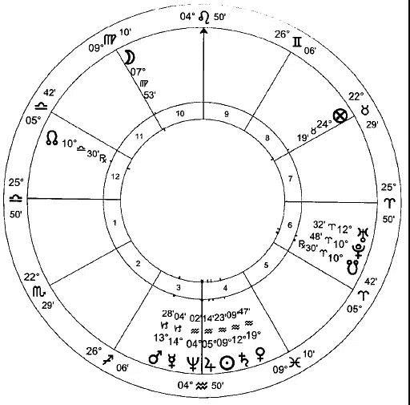

Chart 7: 考文垂, 城市建立盘

城市和人一样，也有自己的天宫图。然而，与个人的天宫图不同的是，这些星盘很少设置在城市诞生的那一刻，因为大多数城市都是在没有正式开始时间的情况下慢慢积累起来的。当然也有一些例外：al-Biruni 给出哈里发 al-Mansur 选择的星盘，用来确定他辉煌的新城市 Baghdad （巴格达）的建立时间；但在大多数情况下，我们的城市星盘是来自一些重大事件的时间，通常是授予城市宪章的时间。我们将参考 Coventry （考文垂）的星盘。 它的命主星是金星，落于固定的风象星座水瓶座，星盘立即显示了它对于一个以一个女人裸体骑马穿过市中心而闻名的城市的适宜性，以证明一个观点。

在 1940 年 11 月 14/15 日的晚上，城市的中心被德国轰炸机一次闪电般的攻击中被彻底摧毁。占星学不包括我们对原因的简单现代解释：“ 空难，谁应该承担责任？” 好像事情发生的原因只有一个，而且是碰巧发生在它们身上。根据传统哲学，我们要在原因内部中找原因，所有的原因都包含在所有事情的主要原因内，那就是上帝的意志。对于任何行动我们可以找出任意数量的直接原因：我的牙齿脱落因为我吃了太多的糖果，因为我太自我放纵了，因为某些身体失衡，因为我的父母在弥补自己的严厉教育，等等。因此，在占星学中，我们总是可以在因果关系的道路上再向前走一步，这是一项壮举，表现在我们沿着一系列相互关联的星盘再往前看，直到我们没有更多的星盘可供查看，直到最终面对主要的原因。为了实际的目的，我们可以从 1921 年的大合相开始我们的研究。

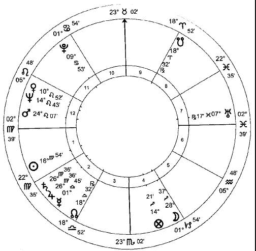

Chart 8: 1921 年 大合相

在突袭之夜之前有另外一个短暂的宏伟合相，在 1940 年 8 月 8 日和 10 月 20 日（尽管这些合相每 20 年才发生一次，但行星的逆行运动有时会导致一个合相在几个月内重复出现两次）。然而，铺设的种子是在 1921 年大合相的这段时期的播下的，因此我们必须关注这个时间。无论我们在地球上的什么地方，这种合相都是同时发生的；我们根据想要调查的地方的经度和纬度来设置这次的星盘。把 Coventry 的的大合相盘与考文垂出生盘重合，可以看到出生盘的 8 宫宫头 – 8 宫是死亡的宫位 – 恰好位于大合相盘的中天。这并不好。更加糟糕的是，所有恒星中最邪恶的大陵五落在了这一点上，这颗恒星被中国人称之为‘积尸气’。火星是 Coventry 出生盘 7 宫（公开的敌人）的宫主星，并且（大合相盘中的火星）通过一个紧密的刑相位折磨大合相盘的中天。Coventry 可能会遭受敌人的蹂躏。月亮的南交点显示命主将会在何处受到攻击。在 Coventry 的大合相盘中，它恰好落于 9 宫头：Coventry 将会被外国人攻击。（译者：这最后一个证据存疑，南交点位于 9 宫头，应该是在折磨 9 宫，除非南交点与代表考文垂的行星形成合相，但是不管是出生盘还是大合相盘都没有这方面的线索。另外，城市如果会受到敌人的折磨，一般来说就应该是国外的敌人，不可能会是本国有其他的团体对城市进行折磨。所以这最后一句话暂时存疑，没有必要去深究。）

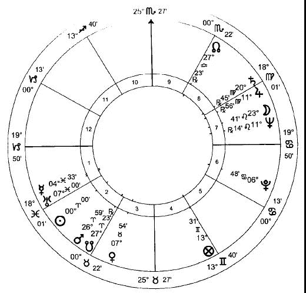

Chart 9: 1921 年 春分盘

将大合相星盘放在一起，我们必须考虑太阳即将进入白羊座的那个时刻。 同样，我们以 Coventry 为地点起盘。在 1921 年太阳位于白羊座春分点时，春分盘的火星与南交点合相。这是一个非常不幸的组合，但是全世界都是一样的。然而，在白羊座 27 度，这个合相正好落在 Coventry 出生盘的下降点，7 宫头属于公开的敌人。再一次，暴力（火星）受苦（南交点）来自于敌人的强力指示（译者：春分盘的火星位于金星落陷的位置，金星是考文垂出生盘的命主星，所以火星讨厌金星，并因为自己拥有强大的先天尊贵，所以有力量来伤害金星，火星位于出生盘的下降点，对冲出生盘的上升点，所以是受到了来自敌人的攻击）。由于它的力量，它与月亮形成入相位，并且是中天所在星座的守护星以及在上升点所在星座中旺势，火星是这个春分盘的统治者。

因为这些是一环套一环的，我们立刻发现战争发生之前的蚀相盘确认了 Coventry 即将来临的麻烦，蚀相盘的君主金星尤其显著（译者：金星是出生盘的命主星），它恰好落于城市的出生盘南交点处。5 占星学的层级和常识都告诉我们，Coventry 的命运是属于更大范围的一部分。不论之前的大合相盘或蚀相盘有多么糟糕，它们都不会导致 Coventry 被纳粹德国空军轰炸，除非英国与德国开战。当然，这需要更进一步的研究大量的星盘，我们在这里不做这些。然而，联系德国的星盘，显示一种内在的联系，倾向于拆除 Coventry 。例如，第三帝国的出生盘上，它火星的映点正好落于 Coventry 的南交点上，也就是易受攻击的地方。世界上有很多城市，我们也可以说同样的话；它们包含在更大的范围中，并不以这种倾向的方式发挥作用。国家的命运意味着 Coventry 的命运；在德国的星盘中，我们发现了一个致命的日期：如果我们把第三帝国的出生盘推进到 1940 年 11 月 15 日，我们就会发现，福点 – 它的‘ 财富’ – 恰好与 Coventry 星盘中的死亡点合相。也就是说，当时第三帝国的宝藏与 Coventry 之死是一致的 — 这一点显而易见。

如果我们考虑这段时间太阳和月亮的返照，我们就能看到战云密布。 Coventry 1940 年的太阳返照盘 – 可以说是它的生日盘 – 是最黑暗的。我们看到白羊座，出生盘 7 宫所在的星座，落于返照盘的上升点。按照 William Lilly 的说法，“ 命主之后将会在该年按照该宫位的属性收获失败和损失，上升点的运行在底部有重要意义” ； 因此在这个案例中，可以说 7 宫位于底部，将会通过公开的敌人失去，或者按 Lilly 的话“ 争辩和冲突” 。

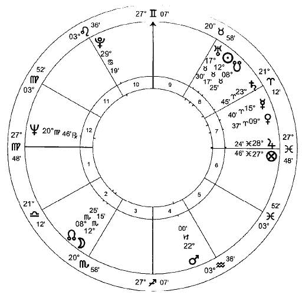

Chart 10: 战争之前的蚀相盘

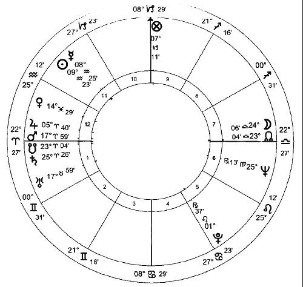

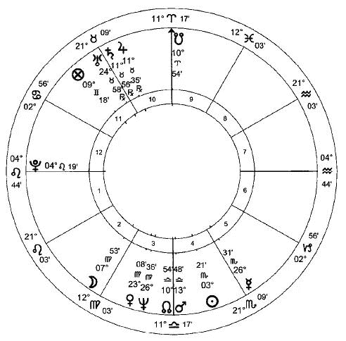

Chart 11 and 12: 考文垂战争发生时的日返盘和月返盘

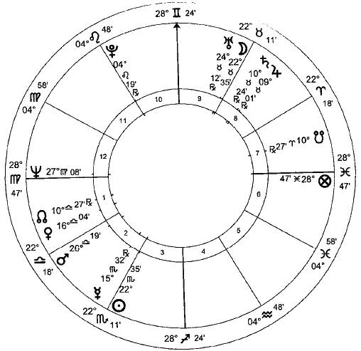

Chart 13: 战争发生当天的满月盘.

由于返照盘的上升点的实际度数是如此贴近轴线，所表示的度数将会更加明显。Lilly 还告诉我们，“ 当返照盘的上升点降临到敌对的凶星上时… 命主可能会在那一年面临巨大的危险。” 返照盘的上升点即将合相所有三个凶星：火星、土星和南交点，最远的距离也只有 4 度。夹在两个凶星之间的可怕状态被称为围攻（译者：这里火星拥有大量的先天尊贵，按照作者本人的说法，这应该不算凶星）；这里，上升点困住这三者之间。南北交点与上升点/ 下降点的轴线合相：南交点恰好落于 1 宫，这重复强力的指示我们已经看到在敌人手中遭受苦难。火星，本命 7 宫的宫主星，正压在上升点处，证实了这一点。月亮返照盘，南交点位于火象星座，恰好在中天描绘了一幅生动的画面：Coventry 将会受到怎样的伤害？来自空中的火焰。

最后，我们查看事件之前的满月或新月盘。袭击发生的那天晚上是满月。 在金牛座 22 度，满月盘的月亮恰好落于 Coventry 本命死亡宫位的宫头，并让我们回到大合相盘，在同样的度数合相于大合相盘的中天，代表在这个特殊的位置实现了合相的可能性。发生满月的时间 – 也就是在那次突袭中 – 我们通过这些星盘追踪到，火星的恶性循环恰好落于 Coventry 出生盘的上升点。我们可能还会注意到海王星正好位于满月盘的上升点：现代占星学将会告诉我们轰炸是一个深刻而又神秘的体验。

这些是一系列星盘中几个的要点，对这些星盘的全面描述，即使仅限于这一单一事件，也需要写一本自己的大部头著作。1921 年的大合相对世界产生了影响：它们不仅仅限于 19 年后一个城市的一个晚上的事件。通过一个不断缩小的过程，以更具体的时间和地点开始一环套一环，平凡的占星家从巨大星图的潜力中选择他所关注的特定地点将要发生的事情。如果判断一个人的本命，以及一个人一生中所有错综复杂的事件将会是一项艰巨的任务，那么对世俗周期的判断就更加令人敬畏。但是，要真正了解一个人而不了解他所生活的环境是不可能的，即使只是因为环境有一种将他扫除并带走的习惯。世运占星学被如此忽视，留给我们的只有政治评论家们简单的解释。如果把这些对国家和社会等复杂生物行为的解释应用到一个人身上，就会被人嘲笑；然而，没有更好的办法，我们只能认真对待他们，因为我们自己就生活在他们之中。这对我们不利。我们喜欢的幻想是，不管外面的世界发生了什么，我们都可以培养自己的个性；但是，当灵魂进入肉体时，它在社会中就占据了一席之地，这是时髦的说法；因此，当前对世运占星学的忽视对我们的危害最为严重。

彗星

在世运占星学中，彗星，那些令人敬畏的预兆“不孕的大地、瘟疫、饥荒、战争、国家和帝国的更迭、法律和风俗、飓风、地震、洪水、酷热和干旱、严重的疾病和虚弱，以及诸如此类可怕的罪恶”， 有着最大的影响。这些‘ 毛茸茸的星星’ ， 就像它们名字的来源一样，看起来就像从无到有一样，它们的形状、运动，通常还有从其他天体中脱颖而出的光辉。虽然有些彗星在轨道上运行，可以预测它们的运动轨迹，但从我们有限的人类视角来看，这种生物的本质是某种超越一切定律的东西，就像一把扳手被扔进了有规律的球体发条装置中，因此意味着混乱和破坏。正如上面的事物反映了下面的事物一样，天空中这些不同寻常的现象只能标志着地球上发生的可怕事件。

一个来者（彗星）所预示的事件的性质，主要从它在天空中的颜色和位置来观察。例如，红色显示了它与火星的联系；蓝色与金星。极端的亮度再次将其与金星联系起来，金星是天空中仅次于太阳和月亮的最亮的天体；只有在日出或日落时，金星或水星才可见，这两颗行星的行为比较类似。它的效果将会由那些受它所通过的星座所支配的创造的部分中被感觉到，最大的意义被赋予了它最初被看到的那部分：如果它出现在白羊座，士兵们可能会受苦；如果在巨蟹座，海洋和它们的居民会；如果在狮子座，国王和领导者。与行星和恒星合相将根据它们的属性提供更多的信息。

例如，我们可以考虑 Hale-Bopp （海尔波普）彗星，它在 1997 年春天毫无预料的出现。它的银蓝色表明它是金星/ 水星的性质，因为它只在日落时出现。它的明亮证实了它的金星属性的首要地位，表明它所预示的痛苦主要与女性有关，因此应该是分娩和生殖。它次要的水星属性意味着它也会涉及思想以及发明。它在金牛座出现，因此它的影响将会在四足动物中被感觉到，然后推进到人道的双子座，将骚乱带入到人类之中。它首次出现时与所有恒星中最邪恶的大陵五产生合相，传统上与丢脑袋联系在一起。由于虚荣心的原因( 金星/ 水星) ，这颗彗星出现后不久就宣布克隆多利羊，这一明显的迹象表明，四足动物的头部受到了损失。我们怀着忐忑不安的心情等待这一行动的后果，正如彗星进入双子座所表明的那样。

# 13 气象占星学和园艺占星学

世俗占星术的一个分支，在过去是最常用的，而在今天是最被忽视的，它可能有最直接的实际用途：预测天气。这种忽视更令人惊讶，因为某个占星学最直接的指示对任何人来说都是显而易见的：当太阳穿过黄道十二宫时，季节会发生变化；当它上升到中天时，温度升高；当它下沉到西地平线以下时，温度迅速下降。

从原理上讲，占星学预测天气是很简单的；然而，由于要考虑的变量太多，所以简单的原则都是以极度复杂的模式出现的。与任何世运占星学的分支一样，实践者要面对一系列无限延伸的星盘，每个星盘都在另外一个星盘所规定的范围内运作，而另一个星盘又反过来受到再另一个星盘的限制。对于政治事件，通常有一个我们需要查看的分界点：一个王朝的建立，或者一个国家的独立。但在气象占星学中没有这类分界点。在国家作为一个地理实体出现的时候，我们没法以此时刻绘制出星盘。然而，仍然有很多事情可以做。

预测天气的关键在于把星座和行星按照基本原则分类为热或冷和湿或燥的各种组合。这些给出了天气的明显指示。

预测天气最简单的方法毫无疑问是用卜卦：问题本身将星盘限制在特定的时间内，是我们不必把一系列的星盘放一起，并比较它们的各种证据。确实，天气的问题通常是最容易判断的卜卦类别。假设我询问关于我假期出游时的天气：卜卦盘中找出太阳（热且燥）在狮子座（热且燥）正好在 9 宫头（长途旅行）将会 – 如果这里没有相反的证据 – 我将有个理想的天气让我在海滩上晒太阳。然而，如果我计划烧烤，并发现木星，代表雨水的行星，位于双鱼座，它的强力位置并且也湿润（如果在它其他的入庙星座，射手座，它将会同样强壮，但是较为干燥）对冲 5 宫头（聚会），我将谨慎建议更改我的计划。如果问一个关于天气的一般性问题 – “ 今年夏天会是个好天气吗？” 例如 – 我将会查看星盘的 1 宫，作为该位置的一般状况显示。

卜卦的限制是它不能机械地工作。如果我不由自主地想问关于我的烧烤或整个夏天的天气，卜卦星盘将会给出准确的判断。我不能每个早上例行公事般地问：“今天天气如何？” 而且要有一定程度的准确性 – 就像我不能机械地问彩票中奖号码，“ 我可以选 1 吗？”“ 可以选 2 吗？” 因此当脑中没有特别的事件需要预测，我们必须求助于世运盘。

我们可以为一整年设置星盘，也许可以确定一下：一些一般情况，比如降雨量；但是我们很可能询问的是一个季节这样的长周期，随着自然变化从一个季节到下一季节来询问季度的天气，询问一年的天气则效率比较低：运用我们占星学知识判断出夏天将会比冬天热是没有意义的。在季节方面，我们以太阳进入每个基本星座的时刻起盘：春天是白羊座，夏天是巨蟹座，秋天是天平座以及冬天是摩羯座。这些星盘，然而，这些星盘并不是单独判断的，而是与太阳进入星座之前的新月或满月一起判断的。当然，行星在黄道十二宫和彼此之间的位置在世界各地将是相同的；根据我们感兴趣的位置绘制星盘，可以看出各地天气的不同。宫位，尤其是角宫，是至关重要的。一个潮湿的木星位于中天将会带来大量的雨水，而如果当他藏在 12 宫的时候，他将没有什么影响。

这种从一个地方到另一个地方的变化将使我们能够看到天气模式的大致轮廓；但是这里我们的木星在一个地方正好落于中天与另外一个地方差两度（离中天）之间的区别没有多少不同。当地的详细情况是由恒星提供的。每颗恒星都有一颗或两颗行星( 偶尔也有三颗) 的属性，而且最重要的是，它仅仅操作在一个小容许度上（译者：与恒星必须合相在 1 度以内才有意义）。拥有木星属性的恒星正好落于中天，而同样的恒星离中天仅仅相差 1 或 2 度的距离，两者之间存在着巨大的差异。必须特别注意恒星的天体纬度。我们通常只关心天文经度：围绕黄道运动，或多或少地从观察者地平线的一边到另一边。行星在黄道的范围内也有上下运动；这是用纬度来测量的。掩星在天气预报中起着至关重要的作用，它只发生在行星与恒星经、纬交汇的时候。行星每隔一定的时间回到同一经度；它们彼此定期形成相位；任何一颗行星对任何一颗恒星的遮挡都非常罕见。我们在这里看到了我们判断中的一个主要变量，反映了天气不会以精确的规则模式重现的事实。

一旦我们确定季节的大概前景，我们可以通过太阳进入每个黄道星座 0 度和塑望月星盘查看更多的细节。进一步的细节由每一次的月相盘来提供。进入星座 0 度之前的新月被当作是我们的开始点；在每四分之一的精确时刻起盘（那是，当月亮与太阳刑、冲或合相的时候），将会把月分成几个周。每天的天气可以由这些星盘中行星之间的距离来决定，也可以由恒星的升起和落下来决定，还可以由所讨论的那一天的日出来决定。然而，重要的是要记住，不能单独判断这些较详细的图表：不能省略从一幅图表到另一幅图表逐步提高精确度的任何阶段；每个星盘的证据只在星盘的“ 层次结构”的下一层所规定的范围内起作用。我们从所有这些星盘中得到的信息必须根据整体气候来判断（我们在这里是在弥补我们缺乏地理知识的不足）：Scotland （苏格兰，欧洲）的冷且湿并非是 Algeria （阿尔及利亚，非洲）的冷且湿。

在判断中，星座遵循它们的基本属性：火象星座是热且燥；风象是热且湿；水象是冷且湿；土象是冷且燥。这些基本的属性是由星座的季节来限定的，不管该季节投射出什么样的星盘。狮子座，是夏天的星座，比秋天的射手座更热且更燥；冬天的双鱼座比夏天的巨蟹座更冷且更湿。土星带来寒冷，如果被位置或相位润湿，就会有云。他是东风。木星带来好天气，尽管占星学中好天气的定义是对于农民而言，而不是对度假者来说的：因为它带来的巨大好处是天气晴朗、温和、晴朗 – 但是任何降雨的线索附上它就将会带来充足的雨水。他是北或东北风。

正如人们所预料的那样，火星会带来剧烈的天气：打破闷热天气的雷暴；强化任何与他有关联的证据。他是西风 – Shelley 诗中‘ 狂野的西风’ ， 从树上剥下树叶。太阳的迹象随季节而变化：春天代表湿润；夏天代表火热；秋天代表薄雾；冬天代表细雨。它预示着东风。

金星很像木星，只是规模较小：天气晴朗，除非湿润，否则那时她会下雨。她是南风。水星的主要意义是风和湍流 – 甚至是地震。一如既往，它使自己的属性靠近它所接触的任何行星的属性；他所激起的风的方向将是他所靠近的行星的方向。月亮本身是湿润的，但是主要作为一个催化剂，给其他与她构成相位的行星带来行动力。就像水星一样，她激发她下一个接近的行星所代表的风。因此，如果我们的塑望月盘显示水星落于处女座（冷且燥）并正好位于中天，我们应该期待寒风。如果它即将与位于双鱼座的木星形成对冲，风将会是由木星（北方）带来的，并溢出雨水。

还必须注意到某些阿拉伯点：天气点，一般显示天气并且尤其是风（上升+ 水星的定位星- 水星）；火和高温点（上升+ 火星- 太阳）；云的点（上升+ 土星- 火星）；雨水点（上升+ 金星- 月亮）；以及寒冷的点（上升+ 土星- 水星）。在日常盘中，计算日出，白昼点可以被使用：月亮+ 太阳- 土星。和往常一样，阿拉伯点所落星座守护星的状态与阿拉伯点本身的状态有同样的意义。

最终，我们必须求助于早已被遗忘的占星学技巧，关掉电脑，走到外面，看看天空中发生了什么：在气象占星学中，月亮轨道迹象有自己的重要地位。行星，特别是发光体外观的变化，由于大气的变化，如果明智地结合星盘上的信息，将为准确的预测提供最后的润色。

当然，我们在预测天气时所考虑的占星学指标，正是我们在研究人类任何方面的生活时所考虑的指标。也许我们在这里找到了气象占星学失宠的原因。因为它适合后启蒙时期的人把自己当作一台机器那样，有能力在每天一小时接着一小时辛苦的磨磨，而不管时间或季节、天气，这和他幸福的状态是如此密切相关，它们都可以推导出来自同一指标的研究，但这并不方便。但对他目前的癖好来说，什么是方便的，什么是对他的身体、心灵和灵魂是有益的，并不一定是相同的。

世界各地的农夫和园艺师仍然是按照月亮的周期来种植的，尽管他们在实践一种简单的择日占星学，但他们从来也没有考虑到自己是在采用择日占星学。

土地将会被耕犁，这一行动最好是在土星守护的小时内开始，土壤的守护星。施肥将适宜于在土曜日的木星时开始，反之亦然，给土壤带来营养和肥沃。月亮应该强大（在金牛座，土象星座，如果可能），增加光线并入相位福点或者，至少，一个拥有某些强力的先天尊贵的行星。至于播种，应该选择木星时，以及月亮增加光线时，并且是在新月过去的 36 个小时以内，确保它远离太阳的光线不被衰弱。同样地，出于同样的原因，应该在满月前的 36 小时以外。上弦月，当月亮刑相位太阳的时候，也最好避免。

除非种植一些生长缓慢的植物，比如树木，正在种植，否则月亮不应该在固定星座。在巨蟹座是很理想的选择，因为月亮在此强壮且是基本星座，给予快速的生长。如果月亮本身没有在水象星座，那么它应该与其他行星形成相位，为了提升饲料。问题中月亮与植物的天然守护星形成的幸运相位是有帮助的，比如与木星产生联系，增长的守护星。这些简单的规则也有例外，尤其是豆类，它们应该在月亮减少光线的时候播种，以阻止它们以牺牲果实为代价来开花。任何有迅速开花倾向的植物都将受益于这些原则，通过避免基本星座给予的速度和缓和月亮的力量。在这种情况下，必须谨慎地避免月亮和火星之间产生联系，因为这使增长速度过快。

同样，阿拉伯点非常有帮助，存在许多农作物的阿拉伯点，从洋葱（上升+ 火星- 土星）和玉米（上升+ 土星- 木星）到西瓜（上升+ 水星- 木星）。但是始终，无论我们的占星学如何微妙，选择种植时机的第一步总是要弄清楚天气会是什么样的，不论是通过占星学来做还是采用更多的世俗方法。选择月相或者木星的精确位置并不会带来可以克服缺乏阳光或雨水的魔力。

# 14 医药占星

现代医学的提供者们，决心垄断所有的医学知识，不仅是今天，而且是所有的时间，他们会让我们相信我们的祖先是不可救药地疾病缠身。当他们感到比平时更难受的时候，就去看当地的江湖骗子。江湖骗子会切断他们的一两个静脉，用手边的任何一种野生植物给他们注射药物。我们的祖先是多么愚蠢的人啊！

在 Hippocrates （希波克拉底，希腊的名医，称医药之父）强调占星术在医学中的重要性之后，这位江湖骗子很可能（但并非总是）将占星术作为治疗的基础，包括诊断和处方。他会为疾病起一个星盘，以其中一个时间起盘，患者躺在床上  – 称之为疾运盘，或者‘ 卧床’ 盘 – 并将其尿样被交给他的时间，或者仅仅问题是被问到疾病进程的时间。通常的做法是同时判断星盘和患者的尿样，如果有的话。

星盘可以视作判断患者元气与疾病之间的战斗状况；如果有必要，医生和他的药物会站在病人的一边。患者和他的元气被 1 宫代表，疾病由 6 宫代表，医生由 7 宫代表，以及药品由 10 宫代表。与此相关的还有疾病点和手术点。短期疾病的进程，延续一个月，大部分是由月亮的运动来代表；长期疾病是由太阳的运动来代表，虽然太阳作为生命之主，因此也是生命之灵的代表，在任何医学占星盘中都是非常重要的。

将病人和星盘中所示的疾病都考虑在内，表明该方法在本质上 – 用现代术语来说 – 是‘ 整体的’ ：  它着眼于特定个人的特定紊乱。疾病 X 被药品 Y 来治疗的概念是非常不同的性质；患者 X 目前的情况可能需要用某种药物治疗：被治疗是的患者，不是疾病。其结果是，从现代的角度来看，传统的诊断可能显得非常粗糙。我们习惯于更为精细的疾病分类，如果疾病是一个象棋的开局：“ 哦是的，你患了 Ruy  Lopez 病，交叉变异；” ，医生会有一组特定的反应，不管是谁他都会这么做：“ 给 4 号国王的主教打抗生素。”  传统医生更关心的是确定到底发生了什么，以及最重要的是什么原因，而不是给这种疾病贴上标签。因此一，像“在 Brest 或者 Stomack 里有一些忧郁的阻塞，是他所有疾病和痛苦的原因”  1 这样的诊断是完全清楚的。原则是原因只有几个，症状是多样的，因此追赶症状是在浪费时间；最好的办法就是找到原因。

原因将是气质失衡。正如我们所看到的，每个人是由热、冷、湿和燥组成的，它们通常处于可控的平衡状态，尽管其中一种或两种体液所占的比例总是大于其他体液。每个人将会由他或她特有的疾病，这些疾病可以分为两类：一类是由于主导的特质过度膨胀引起的，另一类是由于不明显的特质不寻常地在短时间内下跌引起的。一个简单的例子发生在青少年时期。青少年时，特别是男孩，变得更为胆汁质，血管里充满了火焰；典型的发泄方式是性迷恋和相互攻击，以及爆发痘痘，就像火山爆发一样，是胆汁质过量的症状。这大部分发生在那些天性最暴躁的人身上，或者是那些极为缺少胆汁质并且体质缺乏处理它能力的人身上。

因此，远离疾病的现代思想就像外星生物侵入一个毫无戒备且身体永远健康的人 – 远离现代医学痴迷徒劳的消灭所有疾病的概念 –  疾病是人体不可分割的一部分，当它变得足够多的时候，一个不平衡将会篡夺物质形体。我们在日常用语中也能看到这种情况，比如‘ 痛风’ 或‘ 硬化’ 这样的词既能描述疾病，也能描述性格特征。因此，症状和原因之间的关系比现代分门别类的医学所认可的更为密切。症状不是身体试图对付这种入侵者；而是原因本身以不同的形式出现。艾滋病的样本显现得很明白。艾滋病，现代医学术语中，使身体免疫系统崩溃；也就是说，它缺乏障碍或界限。原因是这样的：缺乏边界, 因此滥交的同性恋者、滥交的吸毒者之间的普遍表现可以称之为缺乏必要的边界  — 血友病患者，承载的病痛显示出障碍 —  身体本身缺乏障碍阻止出血。从占星学的角度来看，每一组都以不同的方式显示出土星的极度短缺，这颗行星与障碍和边界相连。“ 抗击艾滋病” 的主要武器是什么？使用避孕套，只提供了一个屏障（土星），而身体本身是没法提供的。

一旦作为疾病根源的不平衡被确定，治疗的目标将是恢复已经失去的平衡。要做到这一点，要么通过流血或清洗等方法，排出多余的特质，要么通过加强相反的特质。传统英国公立学校解决青少年时期过多火气的方法证明了这些规则：要么给这个可怜的孩子洗个冷水澡，通过使用冷水来平衡多余的热量；要么打发他去进行一次越野跑步，通过通过体力消耗来排出多余的热量。如今，越野跑是一种比流血更能被社会接受的平衡治疗方式，不过最好不要用在重病患者身上。任何过量的特质都可以通过出血来治疗，出血部位和出血时间决定了哪种特质会被抽出来。古代外科医生在病人死亡时放血的证据只存在于现代医学辩护者的脑海中；除非我们的祖先非常愚蠢，否则我们必须怀疑，这种疗法至少和现代的掏空病人钱包的做法一样有效。

然而，如果这种不平衡特别极端，可以用相生而不是相克来对待。所以，假设疾病是由一个强大的火星在星盘上代表，而病人的重要元气是由一个极度虚弱的金星代表，这将表明严重的热量过剩，而医生可以在病人体内建立的恢复平衡的宝贵资源却很少。在这种情况下，与其加入一场无望的战斗来增强寒冷的体液，还不如使用更多的热量。尽管听起来不太可能，但这将带走系统中一些多余的热量。如果我们记得英国人会在寒冷的冬天喝一杯热茶使自己暖和起来，而一个印度人会在炎热的夏天喝一杯热茶使自己凉爽，并且假设我们的标准中他们没有一个失了智，我们可以看到这是有用的。我们建议持怀疑态度的读者不妨试一试，而不是让他弄得一头雾水。

大多数治疗都是通过饮食和内服外敷的草药与矿石来完成。食疗被认为是比较可取的，因为创伤较小；只有在病情需要迅速干预时才应用药物和物理治疗。在这个时代，改变饮食的目的几乎总是为了调整外表这个微不足道的目的，人们忘记了饮食制度对人的影响有多么强大。许多个体的总体幸福感，不论个体是好或坏，只需要按照本命盘改变饮食就可以得到  – 尽管我们必须强调尝试这 20 世纪的占星学知识有可能比食物造成更多的伤害。

药物是按照它们的属性来选择的，不管所需要的药物是热的还是冷的，是湿的还是燥的。不同的药物有不同程度的热、冷、湿和燥。第一等级的药性是温和的；第四等级的药物通常是非常有害的，甚至是致命的，尽管在极端的情况下仍然要谨慎使用。关于植物属性的知识，就像占星学本身，来自灵感，就像 As-Suyuti 在穆罕默德言行录中描述的那样：

“当 Sulayman （所罗门），愿他安息，完成构建庙宇的时候，他进入祈祷的位置，并突然那儿在他之前是一个灌木丛。当他完成他的祈祷，灌木丛说，‘ 你不打算问我是谁吗？’ 他回答道，‘ 是啊，你是谁？’ 灌木丛说，‘ 我是一个如此这般的灌木丛，并且是诸如此类的解药，以及这和那来自于如此云云。’ 然后 Sulayman 命令割掉灌木丛。当做完这个的时候，然后突然另外一个，与它类似的，长了出来。因此每一天，当他进入祈祷位置的时候，他会看到另一个的灌木丛。用这种方法他获得一个关于它们完整的知识，并在之后将它们写在他的书中关于医药的部分，描述它们的药效。”

在基本的体液框架内，每一种植物或矿物都在一个或两个行星的统治之下。为了让它发挥最大功效，植物应该在它守护星的星时内被采摘，最好是在行星处于先天或位置强壮的时候（现成的草药就这么多！）。药物应该在类似的情况下准备，最重要的是，它必须在适当的时候使用，这将由疾运盘来决定：这为药物的精细调整提供了相当大的余地：假设我们希望在增强病人土星的同时也使他的火星活跃起来；我们可以在火曜日的土星时摘取土星的草药，或者当火星在天空位于强力位置时在土星时摘取；或者当一个有火星属性的恒星在一个显著的位置的时候；或者在土星时摘取土星的草药并在火星时准备好它。其中任何一个方法都能让我们在集中精力推动土星的同时，给病人的火星以它所需要的微调。当然，草药也可以直接混合，我们被建议“在所有的治疗方法中，选择一些在阳光下的草药，把他看作是生命的源泉和唯一的天堂君主。”  这需要掌握渊博的知识，否则，就像调色板上的调色一样，原本是一种微妙的色调，会变成一个中性的灰色斑点，对任何人都毫无用处。

我的女儿为何会生病？ 

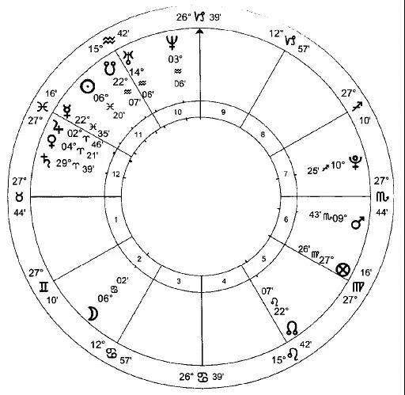

Chart 14: 我的女儿为何会生病？

这是一个医学主题的卜卦盘。  问卜者的女儿好几个月都在忍受着头疼并逐渐加重。药物治疗无效：头痛继续恶化。医生对她进行了各种可能的病因测试，包括她的眼睛、运动反应和慢性便秘。家长们对医生无法治疗这种疾病感到困惑，他们担心情况会更糟，这是可以理解的。

我们在这里所拥有的是一些与传统的现实观念相背离的东西。现代医生告诉我们，行星和人类生活之间不可能有联系。然而，这张星盘与通常设想的联系更为遥远，因为它是一个卜卦盘  – 一个在明显随机的时刻提出的问题而起的盘。而且，问题甚至没有通过当事人来提问，而是通过她的母亲。高度迷信的胡言乱语。

正因为问题是由她母亲提出，我们不用查看上升点而是 5 宫主作为我们的主要征象星。这是星盘中涉及孩子的部分，因此它守护的行星将会代表问卜者的女儿。这里，它是太阳。我们立即注意到月亮的北交点正好在 5 宫内。这个是一个一切将会很好的指示。

在任何医学星盘中，我们首先是检查当事人是否真的生病了，他们是否对医学词典学习得太投入了。太阳（女儿）是热且燥的属性；在这个盘中，它位于双鱼座，冷且湿的星座。我们的主要征象星位于一个与自己并不相宜的星座，从而确定我们的病人是生病了。

之后我们必须确定病情的严重性：病人是否会康复？由于父母担心可能患上脑瘤，死亡的可能性是必须考虑的因素之一。代表死亡的宫位是 8 宫以及病人宫位的 8 宫，在这个案例中是 5 宫的 8 宫，也就是 12 宫。这些宫位都是有木星守护。太阳与木星之间（女儿和死亡）缺乏任何相位是一个不需要恐慌的强力证据。关于病人不会死的判断，在很大程度上取决于没有令人信服的证据证明她会死；然而，在这里，有两个强烈的迹象表明生命和恢复：太阳和木星在彼此尊贵的位置，并且，仍然强壮，太阳与月亮之间有一个紧密的拱相位。这可能是最幸运的相位，月亮位于它自己的星座巨蟹座是个强力位置更是如此。我们的病人不会死。

疾病是由星盘的 6 宫和当事人的 6 宫代表（因此在这个情况下是 10 宫）。在现代占星学中通常称 6 宫是‘ 健康的宫位’ ，但这是非常错误的：6 宫是疾病的宫位，完全不是一码事。健康的宫位是 1 宫，代表生命元气。6 宫这里由水星守护，10 宫主是土星。正如上升点（译者：在这里应该是 5 宫主）和原始 6 宫与转动后的 6 宫都在它们宫头较后的度数（26 或 27 可能不到 30 ），我们可以判断, 很快就会有重大改变疾病的状态，要么好要么坏。我们相关的行星没有一个落入固定星座证实了这点。月亮/ 太阳的拱相位和北交点在女儿的宫位内这个仁慈的证据，再加上她的行星太阳没有发生任何特别不愉快的事情，我们可以判断这个变化会变得更好。

迄今为止，一切顺利；但是她到底怎么了？首先必须检查 6 宫主。水星自然与脑子有联系，并且位于对于它来说糟糕状况的双鱼座；但它并没有做什么坏事。它既不折磨太阳，也不折磨女儿的宫位，并且它没有折磨它自己。如果答案是肯定的，对可能存在肿瘤的担忧将促使我们更深入地研究它；但没有理由这样做。一个更可信的罪魁祸首是木星。太阳被木星统治（因为它位于双鱼座，木星的星座），反映了情况：我们希望有证据表明疾病对孩子有影响。木星代表的是巨大的物体，它位于白羊座，守护头部的星座：如果她遭受巨大的头痛，位于白羊座的木星将会描绘出一幅可接受的小病的图像。决定性地，映点的技巧，通过在两个至点之间联成的线反射我们行星的位置（巨蟹座 0 度/ 摩羯座 0 度），木星在白羊座 2 度 46 相对于处女座的 27 度 14 。这恰好在代表疾病的 6 宫头。我们有足够的证据认定木星就是疾病。

到目前为止，我们还没有发现大脑有任何问题；我们现在可以稍微转移一下注意力，排除眼睛是造成麻烦的可能性。眼睛是由太阳和月亮代表，两个发光体，根据自然的联系来表示。通常眼睛问题的常见迹象是这些行星受到苦难并且，最常见地，是它们位于特定的恒星上。有一些恒星，主要是星团或星云，在肉眼看来是模糊的，与视力低下有关。从星盘上看不出她的眼睛有什么毛病。

回到木星，我们已经确定它是问题的根源。木星是与血液（只有当血液在体外时，火星才会代表血液）和肝脏有关联的行星。正如木星是疾病的所在地，我们可以看到，它一定是由  – 用通俗的现代说法 –  “ 坏血” 引起的。木星（疾病）恰好位于太阳（病人）和土星之间一半的路上，土星守护女孩自己宫位的 5 宫，那是，9 宫。5 宫代表肝脏，因此土星明确地代表女孩的肝脏和木星（疾病），然后它加入了肝脏和女孩。土星位于白羊座，它非常虚弱的位置，我们可以看到她的肝脏很糟糕。木星和土星都位于女孩自己宫位的 8 宫；这是统治肛门以及相关功能的宫位，所以我们看到了与她便秘的联系。在专业术语中，星盘显示出与血液混合的过量黄色胆汁。

即使没有采用传统医学的语言，我们也可以看到头痛是由肝脏功能失调引起的。金星与木星的紧密合相，加上女孩的年龄，将会显示出月经初潮的关联。便秘不会引起头痛，但却是潜在问题的另一个症状。传统医师会治疗肝脏；他的处方（比如大黄）将会有清理便秘的副作用，但必须强调的是，他的首要关注将是治疗顺序的问题，同时提供立即缓解不适的办法。长期治疗并要避免复发，将是通过对饮食的调节。任何处方将会涉及比上面简述的更为详细的判断，上面仅仅显示出对疾病的识别。

经过几周的测试，传统医学专家得出了与星盘同样的结论。

# 15 合盘

合盘的基本格式是现代占星学最常见的一种用法，即“你的月亮在哪里?” 对占星学一知半解的人来说，这是求偶的呼喊。你所需要的是告诉这个人的月亮的下落 – 不论它是否在双鱼座，狮子座或猫的身下 – 保持沉默，并给予一个好像是在说有某种重大意义，以及你正拥有一段美好关系的表情。

合盘是比较两个本命盘的艺术，用来评估人们之间希望以何种形式进行互动的可能性。虽然这通常涉及情感关系，但在商业伙伴关系、教师与学生或雇主与雇员之间的关系中，合盘也可以发挥很大的作用。雇佣一个有才华的人是件好事，但是如果你们之间的交流存在根本性的问题，就像你们各自的大脑收音机被调到了不同的频率一样，那最好还是换个地方。这正是可以被合盘解读的问题，使用占星学摆脱“他是笨蛋，”“他是太笨拙了，”或者“他没有集中注意力，”这样的主观反应，并且通过投射一个不带情绪的光线揭露困境的真实来源，之后就可以解决或者规避。

传统上，是在安排婚礼的时候使用合盘。这个简单的事实指出了现代使用这门艺术的主要问题：如果你在评估两个人结婚的可能性，有必要对婚姻有一个清晰的概念。情感和性的兼容性将发挥重要作用 – 可以说这个是世俗的事情 – 但更重要的将是促进每一个伙伴的精神发展，因为如果人际关系没有发展方向，必然会枯萎。我们回想 Socrates （苏格拉底），故意选择让人愤怒的 Xantippe 做妻子：如果没有对人际关系的重要性有更深层次的认识，任何占星家都不会建议这样的婚姻。然而，如果没有这种理解，任何程度的情感、身体或精神上的相容都是一堆尘埃。占星师需要有一个高角度的整体观点，否则他根本不知道他在看什么；因此，我们再一次面临着占星学被导向精神框架的绝对必要性，这在整个人类社会历史上都是正常的。也许比研究个人本命盘更明显的是，合盘瞄准的是被称为虚无自恋的‘人文主义’占星学。

我们还必须怀疑，用现代占星学中粗糙而扭曲的工具能否完成任何有意义的工作，无论有多少小行星被拖进来支持这一论点。合盘的第一步（被现代占星学通常忽略的一步）是对每个个体的本命盘进行详细的评估。只有从这里，两个星盘之间的联系和比较才有意义。回到我们多情的占星师身边，喊着“你的月亮在哪里?” – 过多的行星、小行星、少量的宇宙尘埃、不重要的相位和其他用品的现代占星学是混乱的，如果他的被受害人的月亮在他的星盘中落入的位置不能与其他的事物产生好的联系他将会有异常的不幸。“ 啊！” 他然后想到，“ 我们是天生的一对！” 但是，尽管我们的占星师说的话是不可抗拒的，我们也可以大胆地说，事实未必如此定。人们忘记的是，在他的星盘和几乎所有曾经生活过的人的星盘之间，都可以建立一个令人印象深刻的“重要联系”列表 – 如果我们使用现代的“ 包罗万象” 的方法，就更是如此。虽然一方面反映了这样一个真理：如果她是世界上唯一的女孩，我是唯一的男孩，我们可能会找到一种方式相处在一起，这表明它需要的不仅仅是通过几个行星产生联系，而是需要通过现实世界中的工作关系联系在一起。尽管你们的星盘之间所有的太阳/ 凯龙星和火星/ 冥王星形成连接，但当她明确表示，到目前为止，她在你的公司里只呆了 2 分钟最多 3 分钟，对你并没兴趣的时候，你可能只会感到困惑。

教科书上经常会落入这样的陷阱，给出 Romeo 和 Juliet 的本命盘，并列出它们之间行星的联系，来证明他们的爱情。这一切都很好，直到我们想知道 Romeo 和 Flavia 、Claudia 、Rosalind ，或者其他一万张星盘中的任何一张之间可能有什么联系。Edward Ⅷ 和 Wallis Simpson 以及 Freud 和 Jung 是有趣的例子；但上面给出的联系列表完全证明不了什么。事实上，在给出的例子中，都是存在密切联系的例子，那么问题来了：“ 为什么没有产生更多的联系呢？如果这几次接触能让我感觉到我与这些人之间存在的亲密关系，那我观察到我自己的星盘和其他人之间的也有这样的联系，为何却没有发生任何事？我哪里出错了？”

答案是，这些行星之间的联系，即使判断正确，在意义上也相对微不足道，如果按照当代的规则判断，它们或多或少是没有意义的。它们表现得很肤浅，就像我们在征婚广告中看到的那样：“素食主义者寻找类似的无聊联系”。素食动物的周期性 – 火星补八分相（135° ）冥王星：事物的种类非常相同。但是这没有造成真爱。我们真正捕捉到的，正是我们在《孤独的心》广告的购物清单期望中找不到的东西：“ 素食主义者寻找脾气不好的好色之徒，我差不多可以忍住不去杀人，但我将深爱他，共度余生。” 我们可以找到任意数量的星盘与任意数量的行星之间产生的亲密联系（任何精通占星学的人将会精确的做到，发现每一个曾经见过或暧昧过的异性成员的本命盘与他的本命盘有大量的联系 – 这个占星游戏是与在你所有的学校课本上写下她的名字有同等意义）；但是，如果星盘中更基本的组成部分不协调，则什么也不会发生。一定有一种气质上的联系，否则她就不会愿意认识我，即使她觉得我的笑话很有趣。

让我们假设一个例子。假设 Romeo 的本命盘中太阳在白羊座 15 度。一个星盘的太阳与另一个星盘的月亮之间形成相位被认为是最重要的兼容性指标之一。我们应该把 Juliet 的月亮与 Romeo 的太阳形成合相看作是最重要的。作为现代占星师，我们迫切地想把意义拉到绝对的任何事物中去，所以我们允许有 10 度的容许度；所以，如果 Juliet 的月亮位于白羊座 5-25 度的位置，我们有一个强有力的爱的证据。同样地，如果她的月亮形成拱相位，同样是 10 度的容许度，如果她的月亮位于狮子座或射手座 5-25 度，这就也是一个强有力的爱的证据。到目前为止，360 度中我们有可能 60 度的位置可以提供证据证明 Romeo 和 Juliet 之间的爱。我们还必须考虑六合相位，可能容许度要小一些，就 8 度吧。Juliet 的月亮位于水瓶座或双子座 7-23 度，与罗密欧的太阳形成六分之一的距离。甚至刑或冲也必须被考虑进来，因为尽管这些是不利的相位，“ 即使在压力同时存在的情况下，它们也包含着魅力的因素” 现在我们回到 10 度容许度，所以巨蟹座、天平座或摩羯座的 5-25 度之间任何位置，会给予我们另一个强烈的爱的信号。我们现在看到的是 Juliet 的月亮在 360 度中的任意 136 度。作为现代占星师，我们现在可以涉及许多的次要相位，容许度全部当然要更小：150 、135 、45 、30 度，都是 4 度的容许度，得到另外 64 个有意义的度数。我们现在已经在可能的 360 度占了 300 度 – 并且我们还没有考虑 36 、72 、111 度等等。基于太阳/ 月亮连接的重要性，我们可以看到，从 Romeo 的视角来看，至少有三分之二的女性非常适合这个角色。但是我们必须记住，Juliet 的月亮和 Romeo 自己的月亮之间形成上述任意的相位同样是极为合适的强力标志。或者他的上升点。或者他的火星、金星、木星、冥王星，可能还有海王星、天王星、土星或水星。更不必说，凯龙星、暗月莉莉丝和 4000 个小行星。几乎在星盘的任何位置，Juliet 的月亮都会在 Romeo 的星盘上引起一些重要的共鸣。他明显不那么挑剔。但是，如果由于某种疏忽，她把自己的月亮藏了起来，不管它的偏离程度如何，与 Romeo 星盘上的重要点没有任何联系，那么一切都不会消失：她的上升、太阳、金星、火星、木星或冥王星也会起同样的作用。Romeo ，当然，是一个青春期的男性；所以我们可能会认为这种有意义的接触是不可避免的，因为这反映了这样一个事实，如果这个女孩的脑袋数量接近传统的数量，他就会觉得她很有吸引力。然而，他和她的出生曲线在一生中都是一样的，即使荷尔蒙已经平静下来，这对他们未来的生活并不是一个好兆头。

公平地说，现代占星师希望在判断真爱和永恒之爱之前，能在几对行星之间找到重要的联系；但是正如我们所见，重要的联系比看到的首个案例要少见得多。我们应该很难找到两个没有相当强大的行星联系的星盘。被困在荒岛上，也许我们可以相处，尽管它宣称这是我们的兴趣，这是现代的配对，却没有告诉我们如果没有其他选择的情况下我们能否在一起生活，或者我们是否会在有大量选择的情况下建立一种关系。

现在让我们考虑一个实际的例子，遵循讨论作者知之甚少的重要关系的惯例。与许多流行的占星学杂志明显违反了信仰，神圣的科学并不是一种透过锁着的门窥视的方法，我们也不会把它当作一种方法来对待。不过，我们或许可以简单地看一眼，希望能在不引人注目的情况下，在好莱坞少量几对持久的婚姻之一，看看我们是否能找到一些如此紧密地联系在一起的线索。

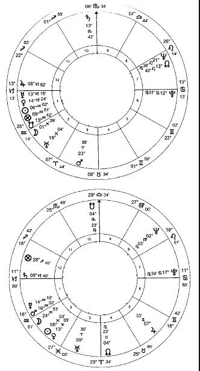

Paul Newman and Joanne Woodward

仅仅对比 Paul Newman 和 Joanne Woodward 本命盘之间的相位，就会让人感到困惑。 这里的紧密相位，但并不比我们从行星的随机散射中所期望的更多。Woodward 的土星，特别重要，因为它守护她的上升点，落于与 Newman 的木星合相的位置。他的水星/ 金星的合相靠近她的上升点并六合她的金星。她的太阳和金星六合他的上升点和木星。这一切都很好；我们也许会提出合理的疑问，为何不是 Loretta Young ，她的太阳和月亮与 Newman 的木星产生了强力的联系，或者是 Doris Day ，她的太阳和月亮击中同样的点，或者是 Jane Russell ，她的月亮、金星和木星漂亮的与 Newman 的星盘配合得很好（且不说在这三个案例中有没有其他的联系）猛咬它们的手指头并且把他拂去，当 Woodward 依次与 Jack Lemmon, Robert Wagner 或任何一个人的星盘进行合盘的时候，可以发现这些都与她的星盘形成紧密相位，却并没有产生亲密的联系？我们可以看到的这些接触令人印象深刻，但前提是我们不将它们与可能的竞争对手进行比较。

关键在更深的层次。如果这没有与那结合，行星之间就没有多少相位可以被代替。相位很重要，但是更重要的是更深层次的连接：没有它们，什么都不是。相位代表联系的方法；如果它们没有出现，我们可以认为两个人彼此之间无法相处 - 就好像他们是一间廉价公寓的房客，一个白天使用房间，另一个晚上使用房间，但从未见过面。在合盘中，相位提供关系是‘ 如何’ 的；我们必须首先有一个‘ 为什么’ 。

原因的根源在于气质。在我们的例子中，气质是相对平衡的，Newman 有些微多血质的（风象）情况，Woodward 有些微忧郁质（土象）。多血质是热且湿；抑郁质，冷且燥：两者之间我们有一个完美的平衡，让人想起柏拉图式的半个灵魂正在寻找它失去的一半。没有什么比这更紧密的联系了：异性相吸；相似的人也一样，但是相似的人会对彼此感到厌倦。这两张星盘在各自的方向上只占了很小的权重，这是很重要的：我们正在寻找两个人之间互补和相似的正确组合，这样他们就可以彼此完整，同时又能彼此认同。 如果这两种气质是强力的多血质和强力的抑郁质，尽管它们需要彼此，但彼此都会觉得对方难以理解，甚至难以忍受。

在考虑商业伙伴关系时，这种必要性或许更容易看出：选择一个技能与我们相同的伙伴是没有意义的；我们希望伴侣能做我们做不到的事情。然而，我们必须有足够的共同基础来共同努力。

共享的上升点组成为类似焊接那样对立的气质，就像一个木匠的支柱支撑一个胶合接头直到它被设置好。两人几乎所有的传统行星都在地平线下并且在星盘的东边（上升点），这两人能在情绪上很大程度的自给自足。在首次见面时，我们可能会期望他们找到一个共同的观点，通过他们对立的性情来观察对方，并在对方身上找到一种他们可以尊重的情感完整性。同样重要的是，在每个图表中都要考虑到对方的弱点。在两者的本命盘中，主要的弱点是太阳和月亮；两者的月亮落于对方太阳的星座（当然，反之亦然），即使不能补救，至少也能让对方对自己的主要弱点有所理解和同情。我们可能注意到他们的太阳落于相邻的星座，正如任何杂志上的文章都会告诉我们的那样，这表明它们完全不相容。如果我们对伴侣的要求只是穿着不同的衣服，那么这句话绝对是正确的；事实上，考虑到其他约束关系的迹象，这种非常不同的关系可以成为一个主要的优势。

我们已经努力把这些星盘中的困难看作自由意志的许可证 – 通常使用占星学就像取代狗仔队的变焦镜头那样令人厌恶 – 但是在足够的深度中表明，这里比合盘更为要紧的是混合和匹配方面的相似之处。即使我们在这里看到了什么，然而，即使我们在这里看到了什么，也不能让我们判断这两个人是否会形成持久的关系：这在很大程度上取决于他们见面的时间的性质。无论它们在理想情况下多么兼容，都有许多可能的情况将它们分隔开来。首先，他们必须见面；这本身就是一个非凡的事件。这个聚会或集会，然而，必须在合适的情况下发生：男孩可能遇到完美的女孩，但是如果他正在迷恋其他的美女, 他将无法注意到她，他们之间有着无数的可能性，但其中之一的可能是会在这段最有前途关系开始之前结束。

星盘中相位和气质倾向之间的根本区别在于，平衡的气质显示了关系发展的可能性。注意力集中于相位，尽管没有照这样解释，但却是一个社会的典型特征，这个社会把人际关系当作不同种类的早餐麦片来对待：而是把它放在一个精美的盒子里，要么吃掉，要么扔掉。这种侧重于发展可能性的方法是至关重要的，揭露了合盘最常见的用法 – 就像回答问题“ 这是真命天子吗？” – 虽然判断错了。这个艺术分支的作用是，至少在西方文化中婚姻不是被包办的，不需要抓一个配偶，而是对必须处理的现有关系的弱点来提供具体证据, 而优点是用来处理弱点的。

以合盘作为选择合作伙伴的工具的最大陷阱是必须在判断中加入时间因素。这种情况很少发生，如果曾经发生过的话。占星师将会拿两个本命盘来判断它们，就好像它们是几只蜉蝣的星盘，它们的生命只剩下几个小时。这里我的星盘和 Tammy 的星盘很有可能显示出最强大的结合，甚至是在我们看起来很重要的气质层面。占星师将会给出匹配她的祝福。但是我仍然少不更事，不知道怎样对待我的理想伴侣。如果我们几年后再见面，我可能已经成熟了，一切都会好起来；但是我们没有，所以它以眼泪结束。我们可以把匹配两个人比作对接一个太空舱；不考虑时间来判断合盘，就像试图让飞船停靠在母船上，却不知道它可能在轨道上的什么位置。它成功的机会也差不多。

合盘容易受到某些非常可疑的用途的影响。有一个共同的信念，它给一些控制他人的权力，或将使事情发生：许多失恋的占星师通过许多时间盯着完美的女士的本命盘，并向自己保证他的星盘中太阳/ 月亮（或者诸如此类的事）与她的星盘产生了联系表明他们之间会有着持久的幸福 - 并且甚至同样会告诉她，从而对她产生潜在的压迫力“ 这是老天注定的，因此从了并享受吧。” 与此同时，完美女士正表现出良好的判断力，与对她感兴趣的人建立关系，而不是与她的星盘。正确的使用，合盘的作用就像本命解读的扩展形式，是分析并明确尊贵、接纳和相位的工具，我们已经在其他地方看到它是如何工作的。没有这些工具，它什么也不是并且毫无意义，只能让我们陷入现代文化中最脆弱的地方，对被爱的无尽渴望，这当然让我们完全着迷。

# 16 魔法占星学

与择日占星学和医药占星学两者紧密相连的是魔法占星学。正是这种魔法实践把最凶狠的诅咒降到了占星学上；然而，这种做法正是占星学大众最需要的，并且如果缺少了它将会非常遗憾。当顾客向占星师询问信息时，通常或多或少会有一种明显的愿望，不仅想要信息，还想要行动。 “ 我什么时候会结婚？” 期望的回答不是一个预言，而是希望占星师能挥一下魔杖，马上有一个白领和一个绅士从大量的烟雾中出现； “ 我什么时候会得到一个更好的工作？” 期望的回答是“Blodgett 和儿子们，在周一的 9 点开始。” 占星学甚至拒绝尝试表演这些绝技，这与公众对占星学的排斥有很大关系：“你不能让我发财；你不能让我和 Julia Roberts 在一起；因此我不会相信你的。”

有些占星师许诺会施魔法。广告声称“我会将你爱的人带到你的身边，”或者“没有我的帮助你不会找到你的灵魂伴侣”，以此来诱惑那些容易上当受骗的人。很难理解我们为什么要用不可靠的魔法把我们所爱的人和我绑在一起，而我们做梦也不会想要把他们锁在家里（因为这是犯罪）；但是这些江湖骗子却找到了客户。在非西方文化中，魔法占星学仍然是司空见惯的：占星师会贩卖护身符或宝石，通常，但绝对不是唯一的，是在疾病的案例中。

我们理解这一点的主要问题是对魔法的普遍态度：自从大人们不再给我们读童话故事以来，我们就没有完全认真对待它。尽管有些人可能会声称自己与“神秘学”有关（现在看来，这个词用错了地方，任何希望找到它的人似乎都能找到），但我们这个时代的思想给我们留下了不可磨灭的污点。一个人的科学是另一个人的魔法，这是一个老生常谈的事实：对于一个只会钻木取火的人来说，打火机是一个神奇的装置；但事实并非如此。魔法不仅是一门使用者一无所知的科学，还是一门使用者不赞成的科学，通常是因为它的基础与他的世界观不一致。在我们这个启蒙时代典型的傲慢中，我所不理解的不可能是真的。把魔法定义为缺乏知识是“对科学家友好的”，因为这意味着如果这些力量完全是呆板的，科学的无情前进迟早会驯服它们，使它们成为自己的力量。将魔法问题简化为语义问题，从而解决了这个问题。对任何魔法展示的可能解释只有两个方面：要么是欺骗，要么是观者缺乏相关的知识。

我们的理性世界声称已经将魔法彻底扫除；然而，对我们来说，它并不像我们想象的那么陌生。我们的生活充满了魔法。我喝这个牌子的可乐是为了让自己性感；开着那辆车，让我的生活充满魅力和冒险。如果我想起我的真爱，在一尊维纳斯雕像前点燃蜡烛，我就是在表演一种明显具有魔法的动作；如果我用一束玫瑰（由金星掌管）或一盒巧克力（由金星掌管）来表达我的真爱，我的行为同样具有魔力，因为我看起来很平凡。可以说，我是在用共鸣的魔法，把她的“金星级别”提高到让她无法抗拒的程度。科学怀疑论者可能会否认魔法的功效，但他仍然不会带着一棵卷心菜来到女友家的门口。

与此同时，我期望的对象，在她的魔镜面前执行一个漫长且艰苦的仪式，每一瓶魔法药水包含大量最新的蝾螈之目和蝙蝠的脚趾，保证在她的外表和她的生活中产生出一些幸运的效果。她把臭鼬的精华涂在耳朵后面，把嘴唇涂成鲜红色，让我看到了火星。魔术和“真实”行为之间的明显区别是虚幻的。例如，点燃蜡烛对世界产生了影响：至少改变了操作者自己的心理状态（就像我女朋友的化妆仪式让她晚上有个好心情一样，完全不用考虑任何行星可能引起的影响；但除非我们将固执愚笨的想法延伸为怀疑论，否则我们都无法否认这些所做的事情都会有一种神奇的效果）。

魔法占星学有三大类。我们可以选择合适的时间来进行仪式，尽管仪式本身没有明显的占星内容。我们可以认为行星的影响力是一种物质，考虑到必要的知识，行星的影响力可以被开发，或者我们可以认为行星的影响力就像可以处置或扣留的“首席天使”这种行星的怪念头，因此必须连哄带骗地让他配合我们的愿望。让我们依次考虑这些问题。由于将会变得很清楚的原因，我们的考量将会仅限于目标的概况，省略所有的技术细节。

其中最著名的例子是 Geoffrey Chaucer 在他的 Franklin 故事中讲述的一件事。Chaucer 精通占星学的知识，并且假装他的听众也一样：例如，他希望通过在他的人物演讲中使用专业术语的方式来区分他们的占星知识的可靠性；这是一个超越大部分现代占星学会成员的壮举。在他的 Chaucer’s Universe 中，法理学博士 North 似是而非地辩称，Franklin 讲述的故事是基于一个特殊时刻的星象结构，故事中融入了适当的占星特征。North 的推理似乎有些牵强，但这只是因为他在追溯历史，在文本中寻找线索，并试图将它们与当时的天文模式相匹配。对于 Chaucer 来说，把他的诗歌结构在星象图上，并不比 Dante 或 Spenser 那样把他们的诗歌结构建立在复杂的数字结构上困难多少。

剧情围绕着一场魔法展开。侍从爱上了他的骑士的妻子，他的骑士目前在海外。为了结束这孩子烦人的纠缠，这位女士给他布置了一项不可能完成的任务：移走 Brittany 海岸上那些威胁到她丈夫安全归来的凶猛的黑色岩石。他的热情阻止他看到女人唯一关心的是她丈夫的安全，侍从开始执行这一壮举。他找到一个宣称只要 1000 英镑就能创造岩石被移走的幻觉的占星师。这件事已经办妥了。不清楚行星的作用是否牵扯到魔法中，尽管操作的时间肯定是选定的：要等很长一段时间，直到占星家“ 找到属于他的时间” ，才能施展使岩石隐形的魔法。同样，我们也不清楚这个时刻的选择是否只是对魔术有利，还是真的有行星的影响促成了这一事件。这并不像看上去那样令人毛骨悚然；在案例中影响的因素将会是虚弱的土星，守护‘可怕的黑色岩石’的行星；在另一种情况下，它可能是守护被用于掩盖这些岩石的强力行星（在 North 的论据中，天宫图的选择是基于一个相当普遍的前提，即这是由异常高的潮汐造成的）。如果我们接受我们可以考虑占星学因素来选择一个合适的时间来做任何事情的想法，我们可以选择一个时间来表演魔术和其他任何事情；占星学的介入并不能说明魔法的真实性或其他方面，半信半疑的魔法也不能反映占星学。只有当占星学和魔法相结合时，这些问题才会出现。

我们的第二种魔法将行星影响力视为一种自然资源，拥有足够知识的人可以随心所欲地运用它。我们只需要看看自然资源被利用的后果，因为人们希望看到以同样的方式处理行星影响力导致的危险。然而，同样的魔法，无论是技术上的还是占星学上的，都可以用智慧来造福我们。尽管我们可能会对现代世界的许多发展感到遗憾，但令人遗憾的不是技术本身，而是应用技术的方式；对占星学的理解也是如此。

这种魔法的作用纯粹是呆板的；正是在这种情况下，“魔法”才真正成为一个贬义的术语，用来形容人们无法理解的技术。然而，必须强调的是，与占星术的联系本身并不足以使这种伪装下的做法从迷信的胡言乱语中挽回多少。大部分基于医学治疗的占星学都是这种直接的“魔法”；医师应用属于金星或者火星的草药，挑选并准备适当的行星时来确保完全发挥正确的行星影响力。对于科学家来说，虽然可能被误导了，草药的应用并不是魔法；这种想法认为，草药的采摘、准备和应用的时机可能是重要的，它改变了我们通过错误的魔法技巧做出的事情。同样的道理，把一颗具有治疗作用的宝石磨成粉末，然后吞下去，或者把它挂在自己的脖子上，两者的区别也是一样的：一个仅仅是奇怪，另一个就是魔法。下一步，也就是我们准备护身符的时候，如果把不可理解的古怪技术抛在脑后，就变成了纯粹的魔法。

护身符通常是 – 在某些现代文化中仍然是 – 一个小的金属圆盘，上面有特殊的图案，可能还镶嵌着特殊的宝石。设计，最重要的是，仔细选择护身符的制作时间，用以捕捉和引导一个或多个行星的影响。这一想法与医学治疗背后的想法类似：可能需要增强微弱的行星能量；另一种方法是平衡过分强大的力量。护身符的使用时间要比药物治疗的时间长得多，而且它的使用绝不仅限于身体健康问题。我们听说 Elias Ashmole ，查理二世的半官方宫廷占星师，当土星位于合适的位置时辛勤工作，生产出大量铅制护身符，他的客户需要这些护身符来驱赶老鼠。想要结婚的年轻女子可以佩戴金星属性的护身符；年轻人奔赴战场，佩戴火星属性的护身符强化胆量。护身符最大的问题在于，它可能真的有效：我们的年轻女性发现自己的声誉受损；我们年轻的亡命徒还没到前线就在一场斗殴中被打死了。当使用药草治疗疾病的时候，我们可以从温和的准备开始，如果需要，我们可以加强它；但是纯粹的行星力量是强大的，即使不是不可能，也难以去调节。这些机械形式的魔法，就像草药的应用一样，显然可以由任何具备必要知识的人来完成。Al-Kindi ，伟大的魔法占星学理论家，认为即使操作者不相信他在做什么，它们也会起作用。 正如《魔法师的学徒》所说，有使用魔法的能力却并不一定意味着有使用它的智慧。就像占星学一样，我们的无知很大程度上保护了我们；如果我们有能力实现我们认为自己想要的东西，我们就会自我毁灭 – 正如现代科学造成的后果所表明的那样。呆板的操作行星影响力的可能性，与启蒙运动时代的世界欣然接受的邀请一样，是进入一个技术仙境的邀请。正如专注于操纵自然的能力不可避免地导致了一个完全世俗的社会那样，缺乏真正的价值观，因此，随意施加全球影响力的能力也会产生同样的效果。正如传统所表明的那样，尽管科学值得称赞，但它决不能超过女仆的信仰，无论这门科学是天上的还是世俗的。

从现代的角度来看，当我们开始对行星的“灵力”进行祈祷时，我们就会看上去变得觉得非常奇怪。目前的态度可以应付呆板的行星影响力的概念：他们否认它的存在，但是它至少是可行的。影响的概念，可以在某些行星灵力的幻想中非常跳跃地打开或关闭。然而，对这些灵力的祈祷在历史上一直存在，并在一些占星学团体中幸存下来，例如今天的‘通神学说的血统’。从传统占星学的角度看，它既亵渎神灵又毫无意义；在伊斯兰教和基督教中，这都是严格禁止的，并被视为异端邪说。

正如我们所见，传统的七大行星可以等同于大天使，或是希腊神话的‘诸神’； 这是描述同一现象的三种不同方法。这些概念的混合给出在行星在它们范围内被它的几个‘ 守护神的灵力’ 推动前进的共同图景。到目前为止，我们仍然只是用稍微不同的术语描述相同的现象。但是我们被明确禁止崇拜除了万能的上帝外的任何东西，这是经常被认为是必要的，因为我们要利用这些灵力去为我们的意愿服务；我们若不听从这诫命，只祷告，不敬拜，祷告就没有功效。我们可以向万能的上帝祈祷；我们不用向他的天使祈祷。天使仅仅因为上帝而存在；它们服务于他的意愿，不是我们的，向我们告知他的意愿，不是向他告知我们的。它们没有向我们服务的业务。从占星学的角度来看，这是由一个简单的事实所表明的，那就是 – 再多的恳求，再多愚蠢的装扮 – 也都无法改变土星在黄道十二宫的位置来满足我们的欲望。它将要移动是因为它想要移动；我们的责任是习惯它。正如 S.H Nasr 所写的那样，“ （占星学）的重要部分是占星学在宇宙中扮演的角色，试图展示‘ 天堂’ 在‘ 地球’ 的统治地位，通过一个独特的法则演变所有的创造物，地面上的生物在天使面前无能为力且毫无抵抗能力，或者通过行星代表神圣的媒介。”  这个角色没法通过尝试提升个人的地位来更进一步。

尽管许多拥有魔法力量的神话故事可能对我们不纯正的属性有吸引力，这里说的是祈祷的魔力：当纯粹的机械构造将对任何人产生作用的时候，消息人士认为，操作者必须在他能够赢得行星灵力的喜爱之前把自己提升到一个合适的水平。如果他这样做, 他可能不再希望把他的邻居变成青蛙：他将不再异想天开的试图强迫他短暂的接近宇宙，但将会强迫生命流动在他们本来的渠道。然而，如果他已经达到了这种存在的水平，就很难看出他为什么还要保留召唤行星灵力的需要。圣经解释得很清楚，人类不屈服于天使，因为它们需要他们（译者：人类）去崇拜他（译者：上帝）；试图召唤行星灵力相反暗示了堕落的信念，而操纵生命力量的欲望则宣告了一个巨大规模的自我膨胀，这将自动阻止一个人获得这样做所必需的行星灵力。

召唤魔法必须在各个层面上受到彻底的谴责，就像一神论宗教所做的那样。就其有效性而言，大多数呆板的魔法占星学都属于‘无法理解的技术’范畴；然而，这并不意味着使用它是安全的。科学家们对不为人知的技术的掌握，使他们越来越多地进入他们无权进入的领域，在他们自己的聪明才智的殿堂里克隆和变形。占星学表明我们可以了解上帝，而不是试图站在他的位置；为了我们自己的利益，祈祷是最有效的护身符，也是唯一能够辨别这是什么东西的护身符。

# 17 占星学实践指导（上）

无论我们实践的是什么形式的占星学– 或者更确切地说，无论我们实践的是什么形式的传统占星学 – 基本方法都是一样的。它包含了一些简单原则的反复应用。不管情况有多复杂，如果应用得足够频繁、足够小心，几个原则就可以解决它。唯一困难的部分在于避免诱惑– 一种完全基于假设的诱惑 – 试图跳到前面去猜测答案，这种技巧通常被称为‘ 直觉’ 。

占星学的真理之一就是简单。如果它开始变得复杂，这是一个确定的信号，说明你在某个地方出了问题。这不意味着它必然是容易的：举重很简单，但仍然需要付出巨大的努力。板球运动中有个‘线和长度’的术语，这很可能是某个有抱负的占星家的座右铭。如果投球手发现不可能让击球手出局，他会被提醒：“直线球；直线球。”也就是说：忘掉所有的妄想；只要保持向正确的方向、对正确的距离投球，迟早你会让他出局。所以在占星学中：始终如一地应用基本规则，抵住试图变聪明的诱惑，就会展现在你面前的一切。

星盘就像一个岩石池。行星是在其范围内的生物。占星师所要做的就是观察正在发生的事情。他把头伸进水潭里，什么也没做，因为所有的动物都急忙躲了起来。同样地，把他的先入之见插入星盘也无济于事，因为真理在他面前消失得比生物还要快。我们所讨论的规则是理解我们所观察到的动物的本性所必需的几个简单的事实。有了这些知识，我们只要坐下来看看他们在做什么，一切都会变得清晰起来。因此，占星学传统的技术使从业者能够超越自己的反思，消除偏见和偏见的幻觉，直到真相的清晰形式在所有尖锐和严格的细节中变得可见。

在占星家开始他仔细的研究任务之前，我们必须先熟悉一些他所掌握的工具。

我们可以看到行星的先天力量在黄道十二宫的不同位置是如何变化的，因为它们进入入庙、旺势、三分、得界和得面的尊贵，或者游离、弱势和落陷的虚弱。判断先天尊贵取决于行星位于黄道十二宫的哪个位置：也就是说，它相对于黄道星座不那么明显的范围（不是有着同样名字的天文星座）。我们还必须考虑行星的偶然尊贵和虚弱，这是由行星相对于地球、其他行星和星体的各种位置来决定。这些偶然尊贵和虚弱是非常重要的。以老虎为例：它自己有巨大的力量（先天尊贵），但是如果它落于猎虎的陷阱（偶然尊贵），它仍然有同样的力量，然而实际上是没有帮助的。这些偶然品质并不是所讨论的事物的固有性质的一部分，而是在某个时间和地点影响着它，无论是好是坏。

这些偶然因素有很多；的确，可以这样说，星盘中的所有内容都会对星盘中的其他内容产生一些偶然性的影响，但是这些影响中的绝大部分都是微不足道的。166 页的表格显示了这些因素的相对强度，从 1-5 来表示从弱到强。必须要强调的一点是，所有这些点的强度的影响明显不同, 这主要取决于问题中因素的精确程度（例如，行星恰好位于 10 宫头要比在该宫位内 20 度的位置强很多）。这个表格，改编自 William Lilly ， 他取自阿拉伯的作者，这张表只是给学生的一个经验指导，而且要有相当多的常识。

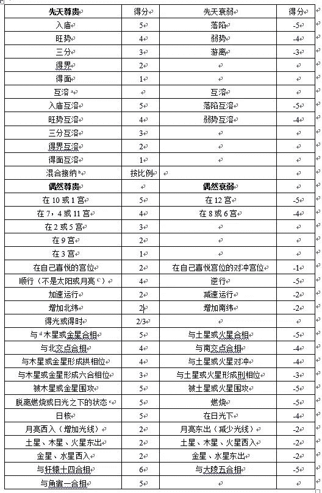

a 通过与宽泛意义上强力的行星产生互溶而得益。

b 比如入庙与旺势接纳；三分与得面接纳等等。

c 因为它们一直是顺行。

d 两个行星在它们各自的星座上同样的度数形成相位。

e 当然，这不是入相位太阳。

我们从考虑行星的宫位开始，这是它相对于地球的位置（例如，我们可以发现它在天空的位置：“在头上”或“在远方”）。它入庙的位置向我们显示它的先天力量。行星通过星座的时间都相对固定：土星停留在每个星座超过两年；即使是月亮，最快速的行星，也需要两天半才能穿过每个星座。然而，每个行星每天要穿过所有十二个宫位。当在某个角宫的时候（1 、10 、7 或者 4 宫），行星可以更容易的运作：我可能不是一个好的驾驶员（虚弱的先天尊贵），但是如果我在 10 宫头，我是一个掌舵人。相比之下，在果宫（3 、9 、6 或者 12 宫），行星最难以运作 – 尤其是在 6 宫和 12 宫。其余的，继宫，介于这两种极端之间。

与上面这些角宫、继宫和果宫之间的区别中，我们有一个喜悦的系统。正如我们所见，每个行星都在一个宫位中喜悦，在那里它获得力量，并且在它喜悦宫位的对冲宫位会虚弱。喜悦是：土星，12 宫；木星，11 宫；火星，6 宫；太阳，9 宫；金星，5 宫；水星，1 宫；月亮，3 宫。从这个列表中可以看出，喜悦可以增加一个行星的力量，即使是在一个弱宫 – 例如，土星，喜悦在 12 宫，最虚弱的果宫。这并不矛盾，正如这些，因为这些所有的尊贵和虚弱一样，是质量和数量的问题；也就是说，它们的种类和强度不同。在实践中，土星在第 12 宫仍然会难以行动，但是，在它喜悦的位置，它确实有一些力量，几乎就像一个被围困的守军被赶回最后一个城堡，从那里敌人想驱逐它将极为困难。

必须考虑行星的加速和顺行。相对于它的平均速度，它移动得越快，它就越强大；速度越慢，力量就越弱。除了太阳和月亮外所有的行星有时出现转向并往回走的情况，这是行星相对于地球运动的一个光学效应问题– 就像当你的火车退出站台的时候，站台好像正往回走。一个行星逆行要比顺行（即正常状态）的时候更虚弱。当行星要改变方向时，它们会逐渐失去速度，直到它们静止下来：这些静止点是非常脆弱的时候。一个行星在它首次停滞时（当它转向要往回走的时候）在传统上比作一个人走向他的病床：他觉得糟糕并且将要更糟糕。一个行星在它第二次停滞的时候（转向要往前走）被比作一个人首次从病床起来：他仍然感觉摇晃且易受伤，可能比他仍躺在床上的时候更差，但是从此时开始他知道事情将会逐渐变好。

行星如果增加北纬会增强力量，而如果增加南纬会变得虚弱。通常在占星学中，我们考虑经度的测量：也就是说，横越天空的运动。给出一个行星的位置，如白羊座或金牛座的度数，就是通过经度来确定它的位置。纬度是向上或向下的运动。占星学是出生于北半球并且大部分历史都是在这里度过的，北纬，在天空中行星升起得更高并因此让它显现得更清晰。

阿拉伯作者特别重视得时和得光赋。一个行星如果位于它相对于地平线的‘正确’位置，是为得光：也就是说，如果它是一个日星（土星、木星或太阳）它应该在白天是位于地平线上而在夜晚位于地平线下；如果它是一个夜星（火星，金星或月亮）则反之亦然。得时与之相似，但更为严格：一个阳性的，日星（土星、木星或太阳）应该在阳性星座并也要在它得光的位置；一个阴性的，夜星（金星或月亮）应该在阴性星座并且在它得光的位置。火星是阳性和夜星，因此如果它在阳性星座并且在夜里位于地平线之上或白天在地平线之下时得时。当水星在太阳之前升起是日星，当它在太阳后面升起是夜星。阳性星座是：白羊座、双子座、狮子座、天平座、射手座和水瓶座；其他的是阴性。一个行星得时或者，最起码是得光，有一定的控制力和摆脱危险的能力。

其他的偶然尊贵与行星相对于其他行星或个别恒星的相对位置有关。与两颗吉星，木星和金星，形成紧密连接，尤其是合相、六合或拱，是有帮助的。另一方面，紧密连接火星或土星，是碍事的，尤其是合相、刑或对冲。如果我们考虑一个人将要打架，一个人与木星形成幸运连接可能显示他体型庞大的兄弟将要支持他；然而，如果与土星形成困难的连接，他可能会生病或被恐惧压倒。月亮北交点的（贯穿黄道北方位置的点）行动非常像木星；它南交点的（贯穿黄道南方位置的点）行动非常像土星：行星落于这些点上会相应地增强或减弱。这些交点只通过合相影响行星。

行星可以被有害或有益的行星围攻。当它在两个吉星之间的时候被吉象围攻，金星和木星。这三颗行星离得越近，效果越强；无论行星转向哪个方向，某些好事情必然会发生在它身上。被困在土星和火星之间正好相反– 占星学版本的‘ 进退两难’ 。 然而，将吉星的相位投射到一个被两个邪恶势力包围的行星上，可以缓解这种情况：就好像行星在它的城堡中被围攻，但是这里有大量的食物和水。如果一颗行星不是位于两颗被包围的行星之间，而是将它的相位投射在这两个行星之间，它就会被光线围攻。这类似于围攻，但要温和得多。

太阳赋予了我们巨大的力量和巨大的虚弱。太靠近太阳是最不幸的：如果在黄道十二宫的同一星座内，一个行星在离太阳 8.5 度以内，行星被太阳燃烧。没有比这个更大的折磨了：就好像行星的力量被烧焦和毁灭。在 17.5 度以内，是在日光之下。这也很不幸，但比燃烧要小得多。然而，行星在太阳的圆弧 17.5 分以内，是极为强壮的：它被称为位于日核，或者位于太阳的中心。这就像一个男的被提拔坐在国王身边一样：它有行动的最大力量。

月亮的力量变化取决于它相对于太阳的位置。在新月，它完全没有光线的时候，它没有力量。当它远离太阳时，它会逐渐增加光线，从而增强力量。然而，在满月时，当它拥有它最大程度的光线时，它却和处于新状态时一样微弱。它完全充满了太阳的光线它完全充满了阳光，没有自己的力量。满月之后，月亮开始再次捡起力量，但却要逐渐失去它，因为它在减少光线。

当月亮增加光线的时候，它是西入；当减少光线的时候，它是东出。这些术语描绘任何行星相对于太阳的位置。任何在黎明时出现在天空的行星将被称为东出，因为它是在太阳升起之前出现的。任何行星在黎明时在地平线之下是西入。火星，木星和土星在东出时力量得到加强，而在西入时会减弱；金星，水星和月亮则相反。要找出在任何个别的星盘中哪个行星是东出还是西入，只要在脑海中旋转所有的行星，直到太阳位于上升点的时候（这个位置是黎明），就可以知道。任何行星在地平线上是东出，或者在地平线下是西入。

某些恒星可以极大地影响判断。正如凝视夜空所看到的，有不计其数的恒星。那些具有特殊占星意义的是最亮的和最接近黄道的恒星。它们只通过合相才能发挥作用，不论是与行星、宫头或者阿拉伯点。在我们占星学等级中，我们爬得越高，它们就变得越重要。大多数时候，大部分恒星在卜卦占星中扮演的角色很少。它们在检查本命盘中生命的重大事件或查验精神实质时，它们变得有影响力。在世运占星学中，它们越发的重要。

有三个恒星的力量最经常延伸到卜卦盘中，它们是轩辕十四，‘狮子之心’，狮子座最亮的星体（当前在狮子座 29.51 度 3 ）；角宿一，‘ 处女的穗花’ ，天文星座处女座最亮的星体（现在在天枰座 23.51 度）；大陵五，‘ 美杜莎之头’ ，在英仙座中难以注意到的星体（金牛座 26.11 度）。轩辕十四是尘世中对行动而言是强有力的幸运，尽管这类行动可能最后有个不愉快的结局。角宿一不那么以目标为导向，但是它也是强有力的幸运，具有强大的保护作用。大陵五是彻底的凶星，传统上与失去某人的头有关，不论是字面上的还是隐喻。天文学上，它是一个变星；它从来不是非常亮的，而是暗淡得几乎看不见。这是它邪恶本质的关键，它就像一个永恒的日食。

尽管恒星是“固定的”，但它们确实会以每 72 年行 1 度的速度缓慢运动，或者每年 50 分的速度运动– 这种光线对于一个人来说是微不足道的，但是对于一个国家有重要的意义。所列的位置是 2000 年的位置。注意角宿一，尽管是在天文星座的处女座，但落于黄道带的部分是天枰座，这是天文星座和黄道星座之间的一个区别的例子，这里提到的大多数其他恒星都重复了这个例子。

轩辕十四和角宿一是两个王者之星（译者：角宿一不是王者之星，四大王者之星是：毕宿五、心宿二、轩辕十四和北落师门），正如名字那样，通向王座。其他的是毕宿五，‘公牛的眼睛’，在天文星座的金牛座（双子座 9.48 度）；北河三，‘ 双子星’ 之一（巨蟹座 23.15 度；也被称为武仙座）；卢西卡兰西斯，或者氐宿增七，在天枰座（天蝎座 15.06 度）；以及心宿二，‘ 蝎子之心’ （射手座 9.47 度）。实际上，他们很像纸牌游戏中的王牌：国王的第一个儿子的本命盘中可能有 X 或 Y ，但如果第二个儿子有一个显著的王者之星，他将会获胜。查尔斯一世给出一个案例：轩辕十四在他的上升点，他生来就是要统治的；他哥哥的死亡出乎意料的让他得到王座– 然而轩辕十四有着它通常的不幸结局。当然，敬爱的读者们，这并不意味着王者之星在你的上升点将会让你成为总统或首相：Charles 是裁缝的第二个儿子，他将会继承店铺。

权衡每个行星的尊贵和虚弱，无论是先天还是偶然，都将告诉我们它有多强大或有多脆弱，并使我们能够更多地了解是什么让它变得强大或脆弱。每个行星所处的星座的主要意义是使我们能够确定它的先天尊严。通常，我们根本不会关心星座的特殊性质；现代占星学过于强调黄道十二星座，是为了让报纸卖得更多，与占星学的关系并不大。星座不像流行杂志认为的那样有可爱的、全面的个性。然而，他们都属于不同的群体，具有某些共同的特征。这些在判断中可能很重要。

这里简单划分为阳性和阴性：白羊座和每一个隔位星座（双子座、狮子座、天平座、射手座和水瓶座）都是阳性；金牛和每一个隔位星座（巨蟹座、处女座、天蝎座和双鱼座）是阴性。例如，如果我们想要确定未出生孩子的性别，或者想知道小偷是男人还是女人，我们只要把相关行星的线索加起来：许多阳性行星落于阳性星座，我们有一个男孩；阴性行星落于阴性星座，一个女孩。

火（热且燥），风（热且湿），土（冷且燥），以及水（冷且湿）这四种元素的划分，可以对许多问题给出简单的判断。如果查看天气，我发现一个热且燥的行星位于热且燥的星座，我得出明显的结论。如果寻找一个失物，它的征象星在土象星座将会显示它在地面上；在一个风象星座，它在高处，或者别的与追求知识有关的地方；一个火象星座代表热闹的地方；在一个水象星座代表在湿润的地方，或者与情感或舒适有关的地方。因此如果物体的征象星在 5 宫，物体可能在娱乐场所。如果征象星也在一个风象星座，它可能在电影院或图书馆；在火象，一个餐馆；在水象，一个酒馆或游泳池；在土象，一个公园或坚硬的地方。

分类为基本星座（白羊座、巨蟹座、天平座、摩羯座），固定星座（金牛座、狮子座、天蝎座、水瓶座）以及变动星座（双子座、处女座、射手座、双鱼座）是一个重要的时间指标。固定星座的疾病将会拖延数年；基本星座的将会短且急剧；变动星座将会来来去去。如果为某事物选择一个星盘使其持久– 假设，建一座房子 – 我们将会在重要的地方选择固定星座；让事物可以快速的发生和结束，比如手术，我们可以选择基本星座。变动星座也是双体的，显示二元性。代表事业的 10 宫主位于双体星座将会是某人会有自由职业的指示（不只一个老板）或者不止一个工作。

同样，这些星座表明一个人拥有的决心。如果一个敌人让我上了法庭，而我为此起了一个卜卦盘，我将会担心如果我发现他的宫头和他的征象星都在固定星座，我将会知道他决定打官司到底，并不会因官司的进程而动摇。比较让人放心的是，找到它的宫头和征象星都在基本星座，表明他“不稳定，并且没有决心…摇摆不定，易变的人”。变动星座，像往常一样，将会显示介于两者之间。当然，如果征象星在固定星座的最后面，那么就必须相应地判断。这是一个典型的卜卦盘，在这个星盘中，某人即将要失去他们做了许多年的工作：他们到达稳定（固定）状态的终点。

某些星座（水象星座：巨蟹座、天蝎座和双鱼座）是肥沃的；某些（双子座、狮子座、处女座）是贫瘠的。其它的介于两者之间。这有明显的隐喻，但不仅是生育：如果我想让我的投资增长，我应该乐于发现它们的征象星在肥沃的星座。值得注意的是贫瘠的星座是人类形象的星座，而介于肥沃和贫瘠星座之间的星座大部分是动物，因为人类的后代往往比动物少，而动物本身的后代远少于蝎子、螃蟹或鱼类。

具有动物形象的星座（白羊座、金牛座、狮子座、射手座和摩羯座）是野蛮的；人类形态的星座（双子座、处女座、水瓶座– 以及天平座，因为天平是人类造的物体）是仁慈的。这种分类的重点在于告诉哪个创造物的分支将会受到，例如，蚀相或彗星的影响。更直接地说，如果我选择在这个时候要求我那又大又讨厌的邻居改过自新，一个人形星座的出现将会增加我在鼻子被打开花之前逃走的可能性。野蛮的星座，狮子和射手座的后半部分也是野性的，因此在适当的星盘中引入任性的概念。当“ 处女座和天平座这里有点麻烦” 的时候，狮子座、天蝎座和摩羯座是忧郁且焦虑的。 我们可以注意到，天平座的现代图像作为‘ 无可挑剔’ 星座的第一个星座，似乎已经完全忘记了这一点，正如在我们解读 Hitler 出生盘的例子中清楚地证明的那样。

还有好多的分类，但最后一个具有共同实际重要性的分类涉及这些星座所具有的声音程度。水象星座是无声的；双子座、处女座和天平座是大声的，双子座能够演讲。这种区别在任何交流中都是相关的。我什么时候打那个电话？当无声的星座支配星盘的时候，就不是这样了。我天生就是歌手吗？代表我职业的征象星位于发声的星座，很有可能。

这些不同的含义强调每个星座的精确图像是有其适用的意义的，提醒我们这个图像不是随机的一组恒星围成的涂鸦，而是象征着强大价值的帮助记忆的形象，那些用眼睛看到的，是星座的属性，创世十二分之一的先天属性，创世三种模式之一的先天属性，一起结合成四个元素之一。这些图像都是精心而精确地形成的：对它们的想象的“艺术”解释并没有增加任何东西，而仅仅是越来越无法理解图像的一个症状。这些图画的确说明了一千多个字，因为它们体现– 同时，而不是必然地 – 包含了一大堆意义，这些意义对于任何一种清晰的表述来说，就像一个球体对于一条直线一样。试图将这些意义转化为文字的尝试，确实准确地反映了行星运动的迹象所显示的潜能；但是，由于作用于本身的性质，这种呈现清晰明了，在微观世界或宏观世界中，总是远远不能实现这种潜力的一小部分；因此，星座的形象需要沉思，而不是表达；但是，这些意象所表现的东西与它们所代表的东西是如此完美地契合，不是我们所背负的情感包袱：这些意象所包含的东西，不是我们自己。

这是星盘中较为罕见的一点，阿拉伯点不能散发光线。阿拉伯点，因为阿拉伯占星师经常使用它们而得名，是星盘中特殊的点，每个点都告诉我们一个特定的主题。我们通过简单的计算得到这些点。例如，如果为问题“我的婚姻结束了吗？”设置卜卦盘，我们可以计算婚姻点，并研究它的状况。

任何物体都存在阿拉伯点：11 世纪的 Al-Biruni 写道：“ 不可能列举已经发明的很多东西（即阿拉伯点）… 它们的数量每天都在增加。” 这些问题的范围很广，从处理诸如胜利、死亡或婚姻等显然很重要的事情，到处理诸如杏子和黄瓜这些起初令人迷惑不解的事情。但是如果你是农夫想知道什么是最佳的收割杏桃拿到市场的时候，或者皇家占星师计算春分点盘来检查国家当年的命运，当黄瓜收割的尺寸可能有某些重要性的时候，即使这些深奥的阿拉伯点的意义也将会变得清晰。

Al-Biruni 给出了一个最有用的阿拉伯点的公式。现代阿拉伯点的列表加入了天王星、海王星和冥王星根本是缺乏基础且可以被忽略的。

每个阿拉伯点的位置是由星盘中两个位置之间的距离相加到– 通常是两个行星的位置 – 第三个位置的公式来决定的，通常是上升点。最有名的阿拉伯点，例如，福点，从月亮到太阳的距离然后加上上升点的距离（因此是上升点+ 月亮- 太阳）。一旦阿拉伯点被计算出来，我们查看它发生了什么（原则是阿拉伯点不会产生影响；它们被影响）。如果我们的黄瓜点合相木星，我们会很高兴；如何合相土星，我们很感激今年我们选择了多样化的种植。就像行星一样，我们将会检查它的力量– 仅仅是偶然的 – 和接纳关系。最重要的是，我们还将查看它的定位星，它所落星座的守护星。阿拉伯点的守护星代表星盘中的那个事物：因此如果婚姻点落入白羊座，它的定位星是火星，所以火星代表婚姻。如果火星很强大，位于固定星座，并且配偶的行星都通过接纳关系显示对其有强烈的兴趣，一切都会很美好。如果火星在糟糕的位置，并且配偶的行星对其没有兴趣，就有理由担心。同样的道理也适用于黄瓜点的定位星：如果行星与我和其他人的钱财之间有个好的联系，我知道是时候卖掉它了。

然而，阿拉伯点的最大价值在于，当我们试图透过物质的表面现实来审视内在的精神现实的时候。阿拉伯点的关键正是为了这一目的而设计的，它们的存在本身就是一种令人敬畏的精神状态知识的证据– 与现代所谓的‘ 秘传的’ 占星学中包含的任何知识都截然不同。

福点，基于月亮，代表灵魂：它的相反公式，7 精神点，代表精神（那是，上升点+ 太阳- 月亮。这也被称为太阳点，或者未来点，后者大概是因为一个人的终极目标，确切地说，取决于精神）。信仰点（上升 + 水星 - 月亮）代表正确或错误心灵方向。上升 + 精神点 - 福点得到爱情、友谊和情感点。它的相反公式，上升 + 福点 - 火星代表勇气或伟大的灵魂（勇气、胆量点）。上升 + 木星 - 灵性点代表胜利和得到上面（成功和帮助点）的帮助。上升 + 土星 - 福点代表监禁和逃脱，智慧源自于经验（囚禁和逃脱点）。这些是通过阿拉伯点评估的传统的七个精神支柱，虽然许多其他的阿拉伯点提供了重要的额外信息。

许多占星师，包括 Bonatus ，在夜生盘中颠倒了这两个公式，使它们彼此成为对方；但这种颠倒背后的原因及其颠倒后的公式和实际应用都不令人信服。

其中，可能最重要的是死亡点，由上升 + 8 宫头 - 月亮和上升 + 土星 - 月亮得到，两者都可以使用。

在我们相位系统之外一个的重点是映点，我们在 Hitler 的本命盘中看到了它的作用。行星或阿拉伯点的映点是通过在一面假想的镜子中反射它的位置而发现的，这面镜子伸展在两个至日点之间，巨蟹座 0 度和摩羯座 0 度。例如：行星位于镜子一边的 25 度（在巨蟹座或摩羯座 25 度）它的映点在镜子另外一边的 25 度（即双子座或射手座 5 度）。因为任何与映点的连接必须是近距离的 – 没有什么比一度以内的相位需要我们考虑得更多– 只要稍加练习，只要花点时间在星盘上扫视一下，就能看出任何相关的映点是否有什么值得注意的地方。我们要找的是与另外一个重要点的合相或对冲相位；映点的其他相位是值得注意的，但只有次要意义。映点，字面上来说，就是一个影子；因此，正如人们所怀疑的那样，连接映点的行星通常带有一种隐秘的感觉，向我们揭示了隐藏的动机和行为：如果男孩约会女孩是由一个普通的相位来显示，说明他们可能会结婚；如果是涉及映点的相位，他们很可能会有秘密恋情。

我们现在已经装配了一个工具箱，它将证明足以应付任何占星事件。不需要进一步阐述技术；我们所需要做的就是在我们所有的工作中运用大量的常识– 或者，用传统的说法，将“ 谨慎与艺术” 结合起来。虽然天体科学就是这样的，但要想正确地实践，始终脚踏实地是必不可少的。

不论我们判断怎样形式的星盘，实践都可以用几个基本原则来描述。行星在问题中代表力量的属性。星座限制力量，就像形容词限制名词。宫位定位力量，显示它在哪里行动。相位把力量与一个物体联系起来，就像动词把名词联系起来一样。

行星的先天属性是：

土星，收缩的法则

木星，膨胀的法则

火星，活力的法则

太阳，力量的法则

金星，爱情的法则

水星，连接的法则

月亮，生殖的法则

在实践中，我们几乎总是根据行星与之相联系的宫位来识别它们，而不是它们的本质，但这种本质总是存在的，而且总是具有某种意义。也就是说，当我们在星盘中观察火星时，我们将会更多考虑的是它恰好守护的 6 宫，因此代表一个商人（例如），而不是它的活力法则。但是火星代表的商人和金星或土星代表的商人之间会有质的区别。这一差异在实际操作中可能与我们的具体咨询有关，也可能不相关。特别力量的位置是由宫位或行星守护的宫位以及它所落的宫位位置代表。火星守护 6 宫，因此它代表商人；火星在 6 宫的 10 宫（母亲）内，因此商人去看望了他母亲。从那时起，它对一个守护 4 宫的行星（我的家）产生一种敌对的（不幸的）情绪。所以我的家因为商人去看望他的母亲而受到折磨。

星座就像形容词一样，限制了行星的属性。这主要通过给予或拒绝它们的力量，但也通过它们自己的某些特点。火星位于天蝎座，所以是是非常强壮的（先天尊贵）：商人控制着局势。天蝎座是无声的星座，因此他没有告诉我他请了一天假来拜访我。力量的评估是通过考虑偶然尊贵来阐述的。

除了当行星落于它自己的尊贵或衰弱的时候会给予或拒绝力量之外，星座也通过行星落在其他行星的尊贵的位置来产生兴趣。火星落于天蝎座，它自己入庙和三分的位置，因此商人最关心的是他自己。如果它落于天蝎座 20 度，它也是在金星得界和得面的位置，所以他也关心金星在这个星盘中所代表的任何东西。我们看到金星出（过去的行动）刑（困难的）相位火星；金星守护 6 宫（商人）的 7 宫（伴侣）：因此我们看到他与妻子吵了一架，并因此去看望母亲对她发牢骚。

考虑到这一点，我们可以计算商人的婚姻点，把他的 1 宫头（盘中的 6 宫）和他的 7 宫头的度数加在一起并减去金星的度数。它落于天蝎座。它的定位星，火星，我们已经在天蝎座中找到。阿拉伯点和定位星都在固定星座是一个婚姻将会持续的强力线索。阿拉伯点落于火星入庙和三分的位置，因此婚姻被丈夫控制。它是在金星落陷的位置，因此我们看到这对他的妻子不利。

然而，有时我们会把行星纳入它的先天属性来显示。我们可以转向火星，不是因为它守护星盘中一个特定的宫位，而是因为我们是在询问一名战士、军队、、外科手术、烙铁，或者它无数守护着的事物中的任何一个。

通过考虑宫位守护和先天守护，我们将会在任何占星学分支的询问中，通常出现三或四个行星‘在运行中’，以及三或四个我们目前不关心的行星。这种情况就像在剧院里一样：我们让一群角色在灯光下热烈地交谈，而其他人则占据舞台的上部，直到轮到他们发言为止。当我们继续研究星盘时，我们通常会发现某些其他的角色卷入到行动中。

无论主题是什么，我们通常总是首先考虑 1 宫主。在卜卦占星中，这代表问卜者；在本命盘中它代表命主自己；在世运盘中，它是国家和当前的状态。其他宫位将会根据我们询问的性质多样性而加以考虑。例如，如果问卜者在卜卦时问“ 我的兄弟想骗我吗？” 我们将会查看 3 宫，兄弟的宫位，它的守护星和火星，兄弟的先天守护星。因此在本命盘中，如果我们期望找出关于命主兄弟的状态以及他们之间的关系。在世运盘中，我们可能会关注新闻对国家的有害影响，因此我们可以再对 3 宫和它的守护星进行调查，这次是与水星一起，新闻记者的天然守护星。

在确定了相关行星之后，我们根据以下三个指导原则来判断它们：

尊贵代表行动的力量

接纳代表行动的倾向

相位代表行动的机会。

# 18 占星学实践指导（下）

不论我们从事占星学的哪个分支，无论它涉及的是最琐碎的卜卦问题还是最大的世俗事件，如果上帝愿意，对这三个因素的研究将会给我们带来正确的结论。不论我们研究的是卜卦盘、本命盘、择日盘还是世运盘，方法本质上都是一样的，唯一的区别是根据我们在星盘中所调查的是什么来转移注意力。我们通过研究这三个原则来判断任何星盘。如果我们发现这将我们带入一个死胡同，答案很简单：我们必须进一步研究它们。它们总会产生结果。下面的卜卦和本命的例子显示了占星学在不同层次的询问是如何操作的。

卜卦

一个复杂的问题：“X 先生，一名代理商，声称他可以让我的商业产品上到国家电视购物节目。他可以这么做吗，值得这么做吗，以及我可以信任他不会去直接接触产品生产商而把我撇开吗？”

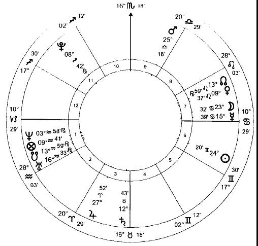

依旧，问卜者由守护 1 宫的行星代表：土星。土星怎么样呢？先天上，它是虚弱的：它没有自己的尊贵，并且是游离的。这个虚弱反映出问卜者无法通过他自己的努力在这个状态中取得任何成就。然而，他有一定程度的偶然尊贵：距离 4 宫头 5 度以内，让他位于角宫；土星在顺行；它移动得很快，并且在太阳的东边（转动行星到太阳在上升点的时候，你将看到土星在地平线上）。这种偶然的力量使他可以在正确的位置达到目的。到目前为止，一切顺利。

我们现在需要锁定 X 先生。他是一个代理商：也就是说，我们的委托人可以和他合作；但他或多或少是处于同一层次的人，与问卜者可能建立互利的关系：因此他是由 7 宫和 7 宫主代表，月亮。月亮通常是问卜者的共同征象星，但是如果它守护涉及的其他一个宫位，该宫位将首先要求它的服务。

月亮怎么样？非常的强壮。它有许多先天尊贵，因为它是在它入庙和得面的位置。它有偶然尊贵，在一个角宫，快速运行并增加光线。这种偶然尊贵因为入刑相位火星而被限制。有如此多的力量，代理商很大的权力行动，这表明他像他声称的那样将产品放到电视上。月亮即将形成的相位确认了这点：出合相位水星，并入刑相位火星。水星是所有交流方式的先天守护星，包括电视。它在月亮的星座和宫位，代表（在这个问题的环境中）电视是在代理商控制之下的。火星守护问卜者的 10 宫，并因此代表他的生意。因此，月亮的运动将电视与生意联系了起来。

我们可以看到代理商可以实现他的承诺。他对什么感兴趣呢？我们通过接纳关系来得知这一点。月亮在它自己的星座，代表他主要关心他自己 – 这是我们所期望的。月亮在它自己的宫位，因此他不可能为我们问卜者的利益而付出太多。月亮在木星旺势的位置：也就是说，代理商喜爱木星在星盘中代表的事物。木星守护 11 宫，10 宫的 2 宫：生意的钱财。代理商喜爱生意的钱财 – 这并不意外。然而，问题中的接纳关系是一个旺势的，表明他可能高估了钱财。他认为他能从这笔交易中得到比实际更多的钱财。

但是可以信任他吗？那他的行星，月亮，是如此强壮，清楚地表明他可以做到：所有的行星越强，它们的表现就越好。即使是凶星，火星和土星，当先天强壮时也会展现它们最好的一面，就像吉星，木星和金星，当它们虚弱时也会展现一种堕落的优点。月亮是强壮的，并且在 7 宫内没有凶星，所以我们没有理由怀疑他有不良行为。他只顾自己；但如果不是这样，他将是一个不同寻常的代理商。

那么底线是什么？我们看到代理商可以让产品上电视。但这值得吗？在任何有关利益的问题中，我们必须考虑我们希望赚多少钱。这将会由其他一个宫位的 2 宫（钱财）代表，取决于我们想要谁的钱财。在这里，我们想要的是观众的钱财，一大批未知的‘ 其他人’ ；因此我们锁定这个群体为 7 宫（一般来说的‘ 其他人’ ），所以 8 宫代表它的钱财。是的，它也代表代理商的钱财（7 宫的 2 宫，代理商的宫位）；但是我们对此并不关心。宫位可以有多种含义：对我们来说重要的是它在问题环境中的含义。

太阳守护 8 宫，并且即将入拱相位火星。火星是问卜者的生意；太阳是其他人的钱财：它们正走向一起。所有的事物是平等的，这正是我们想要看到的 – 但这里所有的事物并不都是平等的。钱财来得很容易（拱相位代表事情进展得很顺利）：一旦产品上了电视，我们的问卜者只用坐等电话打来。但是太阳极其虚弱。它的先天尊贵仅仅是得面，并且由于在 6 宫内，它被意外的严重削弱。如果太阳是强壮的，它将会显示生意赚到大量钱财；在这里，将会很少。得面的尊贵显示这里会赚一些钱，但是不足以说明经营得好。这是由火星（生意）和木星（生意的钱财）入对冲相位应验的。如果火星和木星代表两个通过对冲相位走在一起的人，我们可能会认为它们会发生争吵或分离：我们可能会预见一个类似事情的发生，生意与它的银行余款之间的争吵。

我们的判断是明确的：代理商能做到他承诺的事；但是他不能把顾客拖到问卜者的门口。财政收益将是有限的 – 付出太多的支出和努力不能得到相应的回报。

本命

让我们用同样的星盘来演示本命的解读方法。一个详尽的本命解读，如果有这种事物，会花费和生命本身一样长的时间，甚至就像是一本一千页的传记，也会留下许多的宝石。然而，当解读星盘的时候，占星师将通常会指出你特别关心的领域：“请告诉我关于我自己的事，”这样的询问要少于“我真的适合于会计工作骂？为何所有的女朋友都会抛弃我？”我们可以把调查比作去看医生：他的首个问题通常是“哪里疼？”这使得他的调查范围缩小到了可控范围。

就像我们考虑 Hitler 的星盘所看到的，我们首先描绘大致的轮廓。可以说，这种对构建人格材料的基本评估，可能不会提供他所期望听到的令人兴奋的细节，但会给我们提供大部分关于他的信息。它就像金字塔的底层，其中的细节就是峰顶；细节只有在看到简单轮廓的情况下才有意义。然后，我们开始评估命主的气质。

为此，我们必须考虑：

1\. 1 宫和它的守护星

2. 太阳和月亮

3. 盘主星，星盘中最强有力的行星。

最强的，也就是说，根据先天和偶然尊贵，与星盘中的宫神星形成对比，宫神星是黄道的某一度上拥有最多先天尊贵的行星（宫神星，来自于阿拉伯的 al-mateen ，意思是‘ 内在的强壮’ ，因此是‘ 坚韧的’ ）。很明显，这两者通常是同样的行星。这两个词都不能和生命主混淆，生命主表明人的‘ 生命力’ ，正如我们所预料的那样，人的生命力根本不需要很强壮。

眼下，我们只关注这些行星的热、冷、湿和燥的程度。

1. 上升点在摩羯座，一个冷且燥的星座。它由土星守护，一个冷且燥的行星落于一个冷且燥的星座（金牛座）（译者：这时的上升点是三个冷和三个燥）。上升点与土星本身形成相位，这增加了它的冷且燥（译者：土星总的属性见下段，是四个冷和二个燥），同时也与水星形成相位。水星是西入的，增加它的干燥；但是这与它落于一个湿润的星座（巨蟹座）形成平衡。它（译者：水星）有一点冷，因为位于寒冷的星座而增加，因此相位进一步让上升点变冷。因为上升点还有 5 度才与水星形成完美相位，所以影响会很小（译者：就算是一个冷和一个燥吧）。（译者：这里上升点是八个冷和六个燥）

土星是东出的，所以被弄湿了（译者：两个冷和一个燥）。它也与水星形成相位，进一步变冷（译者：三个冷和一个燥），并也与金星形成相位。金星是冷且湿的，这些品质因为落于一个热且燥的星座（狮子座）而有所缓和。它（译者：金星）是西入的，所以增加一点湿润。因为这些相位，没有一个是紧密的，这使得土星仍然是更冷且少量的干燥（译者：四个冷和二个燥）。如果 1 宫内有七个传统行星中的任何一个，我们将会把它们纳入我们的判断，但是这里没有。迄今为止，气质是强力的冷和燥（译者：我们计算一下，上升点是八个冷和五个燥，土星是四个冷和二个燥）。

（译者：当判断行星的东出西入时，有专门的一套规则来说明当行星东出或西入时，增加哪种属性，这个在 The Real Astrology Applied 里面有写。上面说所的是，当判断行星的属性时，根据行星本身的属性再加上行星东出西入的属性，再加上与之形成相位的行星的本身的属性。而判断上升点的属性时，除了上升点所在星座的属性外，还有与上升点形成相位的行星的本身的属性加上其东出西入的属性，同时考虑上升点的守护星的综合属性。最后一起考虑。真复杂！）

（译者：我还是列出来吧，怕自己都忘了。）

土星 东出 冷且湿 西入 燥

木星 东出 热且湿 西入 湿

火星 东出 热且燥 西入 燥

金星 东出 热且湿 西入 湿

水星 东出 热 西入 燥

月亮 的四个阶段：

塑至上弦月：热且湿 上弦月至望：热且燥

望至下弦月：冷且燥 下弦月至塑：冷且湿

太阳在四季：

春季（白羊座、金牛座、双子座）： 热且湿   夏季（巨蟹座、狮子座、处女座）： 热且燥

秋季（天平座、天蝎座、射手座）： 冷且燥   冬季（摩羯座、水瓶座、双鱼座）： 冷且湿

北交点就像木星 南交点就像土星

2. 太阳是热且燥的属性，但由于这是一个‘ 给予’ 任何人的星盘，我们需要查看其他的因素来确定太阳的影响力。这些因素是太阳落入的星座和季节。在这里，它位于双子座，一个热且湿的星座。因为双子是一个春季星座（白羊座、金牛座和双子座），热量和水分都有所增加，除了它们各自的属性，所有这些星座对太阳都有这种影响。

（译者：太阳本身的属性受到所在星座属性和季节属性的影响。因此，这里太阳是得到了三个热和一个湿。）

太阳与火星形成非常紧密的相位，并与木星离得更远。火星是热且燥的属性，它因为西入而使干燥得到加强，热量得到缓和（译者：热量只是没再增加而已。）。它（译者：火星）在天平座，一个热且湿的星座。总的来说，火星增加太阳的热量，使它变得稍微更干燥（译者：这里火星提供的是二个热和一个燥的属性）。木星是东出的，增加了热且湿，在一个热且燥的星座（译者：此时木星的属性是一个热和一个湿，因为木星离太阳较远）。同样，它（译者：木星）增加了太阳的热量，粗略地平衡了火星的干燥力量。因此太阳混合增加了大量的热量并让它更湿润。（译者：让我们算算，上面太阳的属性是三个热和一个湿，加上火星的属性是二个热和一个燥，以及木星的属性是一个热和一个湿，综合一下，是六个热和一个湿。）

月亮是冷且湿的属性，但我们需要再次找到其独特的性质，使其影响这个星盘。在这里，它（译者：月亮）位于巨蟹座，一个冷且湿的星座。它在新月与上弦月之间，增加了它的热量和湿度（译者：这时的月亮是一个冷和三个湿）。它也与火星形成相位，变得更热以及稍微更燥（译者：根据上面，火星是二个热和一个燥的属性，加入到月亮，应该是一个热和二个湿）。与木星形成的相位是次要的，但可以考虑，因为它是一个入相位，木星在月亮的星座中有强力的尊贵：更热并且更湿一点（译者：这里就算木星的属性是一个热和一个湿，加上月亮的一个热和二个湿，是两个热和三个湿）。然后，月亮将热量和湿度增加到气质中。在它们之间，光线已经相当地缓和了上升点和它的守护星所表现出来的的冷且燥的属性（译者：计算一下，上面上升点是八个冷和六个燥，土星是四个冷和二个燥，这里的太阳是六个热和一个湿，月亮是二个热和三个湿）。

3. 最终，盘主星。这个星盘中只有一个可行的候选人：它必须是月亮，唯一有所有主要尊贵的行星。所以我们可以再次把月亮的影响力计算在内。（译者：全部加一起，上升点是八个冷和六个燥，土星是四个冷和二个燥，这里的太阳是六个热和一个湿，月亮是二个热和三个湿，月亮是二个热和三个湿。综合一下，一共是十二个冷和八个燥、十个热和七个湿。）

综上所述，冷和燥以微小的优势胜出，给予一个明显的抑郁质（用专业术语来说）属性。如果热和湿与冷和燥拥有相同的源头，它们可以平衡彼此（译者：比如说评估土星的时候，热和湿与冷和燥是可以平衡掉的，但是土星和太阳的属性之间的热和湿与冷和燥，是不能平衡掉的。）。这里，一套证据给了我们一个属性，以及另一个；因此，我们在属性中看到两股截然不同的力量：抑郁质- 多血质（译者：通过四个步骤的评估，我们得到的要么是冷且燥的属性，要么得到的是热且湿的属性，只不过冷且湿的属性更多，但热且湿的属性依然是存在的，并没有消失。）。土星（译者：1 宫宫主星），大量寒冷和干燥的提供者，正在星盘的底部，以及发光体（译者：这里是指月亮，因为是夜生盘），热量和湿度的承办商，环绕在 7 宫头，我们可以判断命主多血质的一面出现在大众面前，当命主自己独处的时候会陷入抑郁质的一面。

在现代占星学术语中，多血质属性是‘风象的’：乐观、和蔼，主要存在于心理层面（这并不一定等同于聪明）。抑郁质的属性是‘土象的’：迟钝、谨慎、节俭、胆小、‘脚踏实地’。 在这个背景下，我们所有发现的一切解读起来都是相反的。

习惯是气质的外在表现，是气质说话的面纱。为了判断习惯，我们首先查看位于上升星座的行星。这里没有。我们的下一个可能性是与月亮或水星有关的行星。这也没有给我们任何满意的结果：它们互相连接，但占主导地位的伙伴（因为它是两者的定位星）是月亮，并且太阳或月亮都不能作为习惯的指示：它们的角色是作为星盘的力量源泉，而不是显示如何使用这种力量。我们然后转向上升点的守护星，土星。土星与它自己的定位星（金星）形成相位并接近于角宫，因此它的影响力足以满足我们在这里的目的。

现在我们必须开始考虑行星的属性。土星是收缩的法则。这可以表现为积极或消极的方式。如果土星是强壮的，我们将会发现一个积极的收缩，表现为自律、有序、尊重和类似的美德。如果它是虚弱的，它表现为胆怯、反应迟钝、顽固、吝啬等等。这里的土星没有先天尊贵，但位于 4 宫头并是东出的，从而有着强力的偶然尊贵。这种先天的虚弱和偶然的显著相结合，使土星不幸的一面处于一个有影响力的位置。它可能会弱得多，所以我们将在这里发现的是失败，而不是积极的谋划。在 4 宫头，父亲的宫头，表现出对传统的深切关注；但是虚弱的行星表明，这是存在一个被约束的属性，命主躲在过去，害怕面对世界。与水星形成相位，沟通的行星，位于 7 宫头，我们看到了培养一个小气的习惯以及（记住气质的多血质一面）冷幽默。与金星形成刑相位，金星统治着落于它入庙位置的土星，暗示着对女性的一种特别的恐惧，这种尴尬的习惯将在他们公司里的表现得最为明显。

我们现在评估命主的智力。月亮和水星之间有利的相位是一个积极的信号。通过它在角宫的合相有着强力的偶然尊贵，并且两个行星都有着先天尊贵，以及快速的运行提高了心智能力。月亮这个更强的伙伴（入庙和得面的先天尊贵，相对于水星的得界和得面的尊贵）我们看到一个聪明和机智的人，但不是一个严格的思想家：记住土星的位置，我们看到一个阳光和机灵的人，但未必精于算计。与土星的六合相位赋予了脑力劳动的能力 – 尽管受限于土星的虚弱。我们看到通过月亮与水星合相于无声的星座，可以限制在角宫的水星导致的话痨，来自于土星（收缩）的相位增加了言简意赅的倾向。尽管如此，水星在土星落陷的位置显示出命主抑郁质属性的一面（土星）由于展现出部分多血质属性的一面（水星）而受苦。水星和月亮都位于著名的恒星上（各自是老人星和北河三）：这些，在小气习惯的基础上，增加了思维的攻击性，导致它进入爱争论且不受欢迎的区域。（译者：月亮）与火星的刑相位加强了这个证据。（水星）与 7 宫头（其他人）形成紧密的合相，我们看到他想要传递信息并让人理解的决心，但要知道该信息通常不被人接受。

到目前为止，我们评估了人格的原材料。现在我们来谈谈信仰的问题，因为没有心灵归属的生命是无意义的。为此，我们首先查看 9 宫。这个宫位因为一个虚弱的火星而遭到严重的折磨：命主的活力位于这个领域，但运行的状态不好。9 宫主，金星，是先天虚弱的，并与土星形成刑相位，土星是命主星，也是它（译者：金星）的定位星。因此，命主非常关注宗教问题，但是无法（固执的土星，抑郁质）改变他的自以为是（命主星），以符合信仰，而且有反宗教的行为（火星在 9 宫与月亮形成刑相位；金星，9 宫主，刑相位土星）。这通过虚弱的火星和木星之间的对冲得到应验，宗教的先天守护星，并且通过福点的位置，显示出灵魂的意义（译者：福点位于 1 宫内，自己才是自己精神上最大的财富）。（福点）在水瓶座 9 度，不舒服地接近南交点，对冲金星，9 宫主，与土星形成刑相位，命主星。存在这些相位再次显示了宗教在其人生中的重要性，但它们的属性却显示了对宗教的抗争。缺乏任何实质性的互溶，（译者：如果有的话就）这将使一颗行星帮助另一颗行星，这显示命主不会试图改变自己的处境，从而证实了土星顽固和不灵活的迹象。

无论我们所调查的生活领域有多平凡，对宗教属性的考虑都是至关重要的，因为仅凭这一点就能告诉我们，命主使自己变成金子付出了多少建设性的努力。在这种情况下，没有证据表明这种情况会发生，所以我们可以从基本的角度来判断星盘中的任何内容，而不是从更高的角度来判断。正是这一点提供了现代占星师向我们保证在星盘中不可能找到的东西：生命所在‘层次’的知识。例如，这里有精神努力的证据，我们可以通过在 9 宫的一个行星与在 6 宫的太阳（精神）形成的拱相位来判断显示通过处理现实生活的变迁来展现精神的曙光（6 宫）；在这里，它将显示出亵渎神明的倾向（虚弱的火星在 9 宫）是通过低级趣味（来自 6 宫的拱相位）来刺激的。

我们将更详细地阐述这些观点，但只有通过反复一致地应用相同的方法才能做到这一点。完成这一步后，占星师现在可以开始对当前感兴趣的生命区域进行判断。无论这关系到哪个宫位，判断的方式都大同小异，根据相同的基本原则来评估宫位本身和它的守护星的状况。我们可以，例如，我们可以研究后代的前景。

这是 5 宫的问题。5 宫头位于一个贫瘠的星座（双子座），一个反对有孩子的证据；但是它不是唯一的证据。水星，5 宫的守护星，合相月亮，生育的先天守护星，在一个肥沃的星座（巨蟹座），接近角宫，两个行星都在快速运动，并且月亮在增加光线：要想否定如此有力的生育能力证据，需要付出很大的努力。月亮与木星形成入相位，即使是刑相位，甚至补充了更多显示生育的迹象，多于月亮与火星形成刑相位的权重，一个贫瘠的行星落于贫瘠的星座（译者：不知道这句话是什么意思），因为月亮和水星位于木星旺势的位置。孩子的阿拉伯点（夜生盘是上升+ 木星- 土星：射手在 25 度）是由木星定位，与它形成拱相位。木星将会更为强壮，但是这仍然是一个多产的有说服力的证据。有了这样强有力的证据，我们可以期待有三个或更多的孩子。主要征象星在一个阴性的星座，并且月亮是阴性的，水星通过哪些与它产生联系的行星带给它的属性 – 在这个案例中，与月亮产生联系，所以水星属于阴性的行星。我们可以期望大多数的孩子是女孩。然而，孩子点在一个阳性的星座，并且被一个落于阳性星座的阳性行星所定位：我们可以期待至少有一个男孩。

5 宫主正好在 7 宫内（命主的妻子），孩子们对她的依恋就会超过对他的依恋。水星和土星之间的六合相位代表命主和孩子的和睦相处，但是接纳关系显示出困难：土星在水星得界的位置，但却位于它自己落陷的位置。水星位于木星旺势的位置，守护绝大部分的 2 宫（钱财），我们看到孩子的兴趣点在他的钱包上。

或者我们可以通过查看 2 宫考虑命主的经济前景。5 宫一样，这里没有行星。一个吉星将会提高预期，一个凶星将会阻碍它们，按照宫位的属性和宫主星来判断。2 宫主是土星，位于 4 宫（宫头 5 度以内），父亲的宫位。这可以指出从父母那儿获益；但是在这里，因为虚弱的土星以及与 4 宫主金星形成刑相位而严重受到限制。木星也必须被考虑，因为它守护双鱼座，占据大部分的 2 宫，并将永远被认为在这里作为财富的先天守护星。木星在 3 宫 – 得益于火星，3 宫主和兄弟的先天守护星。因此我们清楚地看到了这个家庭为钱争吵的情景。金星（4 宫主，并因此是命主的父亲）对冲福点，财富的世俗意义。但是该点也与土星形成刑相位，命主自己，因此我们看到尽管他的财富受到父亲的危害，他远不是无可指责的，也要为现状负责任。

所以家里没有多少钱。福点被土星定位，命主的征象星，这表明他是靠自己挣钱。然而，他所赚到的将会持续下去：福点和它的定位星土星两者都位于固定星座。月亮守护 7 宫，也代表老婆。在巨蟹座，她喜爱木星并与其形成刑相位：婚姻将会消耗他的财产。由于问题中的接纳关系是一个旺势的，我们有被夸大的感觉。木星在月亮没有尊贵的位置，因此可以说，妻子喜欢钱财，但是钱财对她没兴趣。所以我们看到妻子对丈夫经济状况不满意。这把我们带回到火星与月亮产生的刑相位：火星守护 10 宫的事业，而且非常虚弱。因此，丈夫不好的职业前景令妻子讨厌（与月亮产生刑相位），并且折磨他的财富（对冲木星）。

当我们从各个方面接近图表时，我们可以继续用这种方法探索一层又一层的意义。正如 Al-Biruni 提醒的那样：“ 在所有的情况下，总是有好的和坏的混合，通常很难解释，并且需要所有的艺术资源、经验和勤奋” 但是占星学本质上是简单的。一个好的占星师和一个差的占星师之间的区别与技术的精雕细琢没有多大关系，而与方法的完整性有很大关系，这表现在愿意接受星盘所提供的东西，而不是试图把自己和别人的先入之见强加于星盘上。占星学的研究与其说是运用更多的技巧，不如说是逐渐学会如何把自我排除在阅读之外。印此，占星大师 William Lilly 给出了迄今为止最可靠的占星学建议：

“我的朋友，无论你是谁，你将如此轻松地从我的刻苦学习中获益，并打算继续学习关于星星的神圣知识，在这些知识中，看不见的、至高荣耀的上帝的伟大而令人钦佩的工作是如此明显地显现出来。首先，思考和祈祷。你的创造者，感谢他，你要谦卑，不要让任何自然的知识，无论它是多么深刻和卓越，使你得意忘形地忽视神圣的天意；但是，你的知识增长得越多，你就越能扩大全能的上帝的力量和智慧，并努力保持自己在上帝的恩宠之中。”

# 19 某些流行的谬论

“ 我出生于一个交界点。”

不，你没有。在黄道十二宫的边界上有一个模糊的恒星责任区域，这是报纸占星学的一个创举。媒体使用太阳星座只有一个原因: 绝大多数人仅仅通过知道自己的出生日期就能知道自己属于哪个星座 – 这对于其他的占星学变量来说是不可能的。

例如，每个出生在 5 月 5 日、15 日或 26 日的人，都能相当肯定地知道他们出生时太阳正在穿越的星座。但是太阳从一个星座移动到另一个星座的确切时间每年都略有变化。如果你出生在某个月的 21 号左右，你不能确定你的太阳星座，除非检查它在你出生的年份改变星座的精确度时间。例如，在一年中，一个人出生于 5 月 21 日上午 3 点可能太阳在双子座 1 度；在另外一年，某人出生在同样的时间可能太阳仍然在金牛座的最后一度。倒不是说它落在什么地方没有任何模糊之处；只是因为只知道出生日期，而不知道时间或年份，我们没有足够的信息来确定它可能在哪里。太阳绝对在一个星座或另一个星座：你只是不知道在哪个星座。

“ 土星来到了我的上升/ 太阳/ 月亮，因此我将要有一个真正糟糕的时期。”

不，你不会。你会过得很艰难，因为你没有做作业/ 付房租/ 刷牙。你不能把这一切归咎于可怜的土星，他一直在宇宙中埋头苦干，只顾自己的事。他在你本命盘上的某个敏感点上的通过，很可能标志着这些不受欢迎的鸽子回家栖息的时刻，但这些问题是你造成的，而不是他造成的。占星学不是放弃你对生活的责任。

“ 我们测试了 500 位占星师…”

有能力的占星师寥寥无几；但不知何故，进行占星学测试的科学家们似乎在寻找他们方面没有任何困难。“ 我们测试了 50/500/5000 位占星师，” 他们宣称“ 并且发现他们中只有两位知道它是星期几。” 他们在哪里找到这些有能力的占星家的，除非他们像实验室里的老鼠一样繁殖，这是一个谜。世界上可能 – 也许 – 有 500 位有能力的占星师：但最确定的是，科学家既缺乏确定他们是谁的倾向，也缺乏必要的标准。更确定的是，大多数有能力的占星家会有更好的事情来做，而不是跑过迷宫去启发穿白大褂的人。

占星学作为一门真正的科学，不接受现代‘ 科学’ 标准的检验：这类测试是否有效的工具根本不存在。现代科学研究数量；真正的科学研究品质。再多的数量也无法理解质与量的区别：如果这样的话，我们不妨从圣经的页数来判断它的价值。基于这个理由，我们不仅感叹的是嘲笑测试占星师的科学家，但更有害的是‘ 科学占星学’ 的增加，甚至有的占星师声称通过构建统计学模型来证明他们用传统方法得出的总结。正如 René Guénon 解释的那样，“ 统计数字实际上只包含对大量或少量的事实进行统计，而这些事实都被认为是完全相同的，因为如果事实并非如此，那么它们的加法将毫无意义。”1 在占星学中，统计研究的无意义性比任何地方都明显；如果占星学的基础是，任何特定时刻发生的事情都具有特定时刻的特定性质，那么我们在哪里可以找到相同的事实，并将结果与之相加，从而得出我们的统计数据呢？

“ 我的占星学知识是凭直觉的。”

毫无疑问。但是你会乘坐一个是凭直觉驾驶公共汽车的人的车吗？

“ 一个相位必须按照一个人是进化了或没有进化的灵魂来判断。”

这种进化或未进化的灵魂的概念被通神学者硬拉入到占星学中的，他们在二十世纪的头三分之二的时间内控制了占星学的写作。进化论概念对他们的思考的中心地位证明了通神学的反精神性。这不仅关系到我们是否碰巧有意识地将我们的注意力引向神，而且始终如此；因为宇宙是建立在精神之上的，不符合精神的必然是谎言。正如所有被揭示的信仰所表明的那样，进化不是宇宙的本性。

想象人类的最终目标就像他们一样，这对于各类作家来说都是一个可爱的弱点。因此，作为主要的英国中产阶级的有神论占星师很自然地认为，一个进化了的灵魂的标志就是表现得像一个英国中产阶级。他们的描述得非常清楚，学习用哪个叉和给抽水马桶一个适当的词语是最先进的精神进化的标志。这个神圣的计划是否真的是所有人类都应该成为 19 世纪晚期的英国资产阶级，这是一个值得商榷的问题：圣典似乎出人意料地对餐后港口应该经过的方向保持沉默。

“ 外行星 – 天王星、海王星和冥王星 – 是高八度的调音师，人类被赐予通过它进入增加灵性。”

额，人类现在比 2000 年前更有灵性吗？（译者：别忘了，三王星只是近代被发现而已，实际上很早就是存在的，如果说三王星现在能影响到我们，那么在古代也能影响到古人，那也就是说从灵性的角度来说，古人和我们的灵性实际上是一样的。）

“ 蛇夫星座，Arachne （阿拉克尼），或者今年的版本是什么，是黄道十二宫的第 13 个星座，无知的占星家/ 天主教会/ 男性/ 西方的邪恶女巫对其一无所知。这彻底改变了占星术。”

不是的。黄道十二宫被分为十二个相等的部分，通过难以形容的创世威严反映在拥有相同名字的天文星座上。它不可能发现十二分之十三。

12 是在天上展示于地上的数字：神的行为的外在的、扩展的和返回的方面 – 我们成为基本、固定和变动的三个模式 – 通过四个一组的土、风、火和水显示给出（3×4 ）12 。再多的花招也不能使 3×4 产生出 13 。

“ 恒星黄道是精确反映天堂，因此占星师应该使用那个。”

不是的。这两种黄道都包含同样的十二星座，每一个星座的跨度正好是 30 度，排列顺序相同；它们只是在圆形黄道带 “ 起点” 的位置不同。印度占星术学派所推崇的恒星黄道，以太阳明显进入天文星座白羊座为起点。我们在西方很熟悉的回归黄道带，是以春分为起点的。二分点的岁差 – 人类堕落所引起的一种现象 – 导致这两个点在不同的位置。

一个是开始的好地方，另一个也是。但是当占星学和天文学的‘ 白羊座起始点’ 的巧合似乎是采用恒星黄道的一个诱人的理由，但这个黄道与天文学现实之间的联系就在这里停止了。天文学星座不像占星学上的黄道十二宫那样整齐地划分成十二个相等的、三十度的部分；恒星和回归黄道唯一的区别是这 12 个整齐相等的部分是从哪里开始的。在熟练的人手里，两个系统都工作得非常好。

“ 占星学是个宗教。”

你只是信仰偶像崇拜，混淆了物质与神；崇拜上帝的创造物，而不是上帝。

“ 占星学拒绝了我的自由意志。”

在现代，关于占星学是否允许自由意志的讨论是在完全不了解“ 自由意志” 实际含义的情况下进行的。正如我们所料，这种无知不会导致高水平的辩论。

假设自由意志是我们已经拥有的东西（一个由那些明显缺乏自由意志痕迹的人做出的最自由、最激烈的假设）。通常所说的自由意志更类似于“ 自由的奇想” 。我们绝对没有做到。“ 我有自由的意志 — 我要创造奇迹… 哦，她很漂亮，不知道她现在忙不忙… 天哪，我饿了；晚餐吃什么？我知道，嘎吱嘎吱的爆米花就是我的午餐，还能治好我的口臭…” 。

当占星学没有任何魔法可以可以立即为我们提供自由意志，但它可以清楚而冷静地显示我们所处的现实情况，是我们可以用来获得自由意志的有力工具。最重要的是，没有通过传统占星学的暗示和明示来意识到人与上帝的关系，自由意志的想法只能是一个幻想。传统占星学非但没有否定自由意志，反而是通往自由意志的为数不多的途径之一。