## 瞬间肯定自我的冥想术

# 前言

最近，你是否覺得累了？
每天工作、滑手機導致大腦疲乏、被繁雜的人際關係搞得心力交瘁，有時候甚至覺得活著好累？

人只要活著，都會感到疲憊。就連植物都會選擇在夜間停止光合作用，好好休息促進生長。

**疲倦是活著的證據。**

不過，很多人的累，或許是「現代人特有的疲勞」。明明是為了幸福而努力工作，卻因為過度忙碌而離幸福越來越遠；明明是相當自由的時代，卻找不到真正想做的事，沒有活著的真實感；許多事都照自己的方式進行，卻因為人際關係受挫而崩潰，在這樣的狀態下，甚至開始覺得活著好痛苦。

有上述狀況的人，現在必須立刻讓腦和心靈獲得休息。

而有助人們好好休息的方法，就是本書的主題「冥想」。

冥想是將意識專注於當下的瞬間、當下的感覺，不否定自己感受到的事物，接受所有真實的感受。

如果意識飄往其他非當下的事物上，內心會產生匱乏感，湧現痛苦的感覺。

反過來講，專注於當下的事物，接受一切感受，反而能獲得心靈上的充實感，靜下心來。

例如，就算自己充滿負面情緒，也只要接納負面情感，心情就會瞬間變快樂，緩和負面的感受，逐漸肯定自己和身邊的人。

冥想出現於幾千年前，對於甚少有機會接觸大自然、每天慢慢被痛苦啃食而麻痺的現代人，冥想是必要的休息法。最確切的證據就是，進入二十一世紀的現代，日本和全球各地，都盛行透過冥想和運用冥想方法來進行正念減壓。

在這股熱潮下，很多人開始對冥想產生興趣，嘗試冥想，但也有不少人在試著進入深度冥想時，陷入「現代人特有的困境」而感到挫折。

進入深度冥想時，現代人容易遇到特殊的困境。

這樣的困境，來自於在這個時代，有許多事情都很容易照著我們的想法進行。進行深度冥想時，凡事「皆該順心如意」的感覺越強烈，就會越無法達到冥想的目的，陷入矛盾。

**光靠動力和技術，做不到深度冥想**。生活在現代的我們，逐漸失去接受原始大自然世界的能力，也忘了我們不能只靠自己的力量生存等，現代人必須重新喚醒這些感覺，這是我深入學習冥想後，發掘到的深刻領悟。

**本書不僅教你冥想的技巧，還要告訴你深入冥想不可或缺的「思維」和「看待事物的觀點」**，讓你避免因為太想加深冥想卻適得其反，而是能體悟冥想的好處，舒適地生活，維持身心平衡。
重新學習冥想的思維和如何感受當下，每天練習並逐步加深冥想，以身體習得的感覺，將冥想的思維內化成自己的東西，如此循環下去。

希望本書可以幫助大家加深冥想，肯定原本的自己和他人，藉此順利消除大腦和心靈的疲憊，讓你再度「從心感覺到世界的溫暖」和「生命的美好」。

除此，也期待大家能透過冥想，打造強健的心靈，讓自己能充分發揮能力，活出快樂的每一天。

由衷祝福大家。

綿本彰

# 序章

## 用冥想打造心有餘裕的生活

冥想是幾千年前誕生於東洋的自律訓練方法，將意識集中於當下，不否定自己的意識，感受真實的感受。

在文明進步、法律制度完善以前，我們的祖先們活在極為不合理的困苦環境中，隨時代累積下來的幸福智慧，即濃縮於冥想的方法中。經歷嚴苛時代的祖先們，透過讓腦部進入深度休息的狀態，消除所有壓力，並以更豁達的態度，面對生活中的人事物。

近年來，隨著科學研究證明歷史悠久的冥想真的有效，不僅Google和Intel等各科技業的龍頭，全球各國的企業都紛紛開始推動冥想課程。並且，美國甚至將冥想引進軍中，越來越多人做瑜伽，帶動全球興起瑜伽風潮。

冥想的效果非常廣泛，其中最核心的功效就是「提升專注力」。培養將意識脫離壓力和負面情緒，集中在未來應該努力的事物上的能量。實際上，目前的研究已經證明，進行冥想達一定期間的人，大腦會產生許多α波，有助減輕雜念和壓力，且進行深度冥想時，更會產生能提高記憶力和學習能力的θ波。

除此，將意識脫離壓力後，「讓腦部達到深層休息的效果」，也是冥想受到注目的要因之一。尤其近年的研究發現，冥想會抑制腦部內側前額葉皮質和後扣帶腦皮質的活動，讓腦部整體達到深層休息。

如果腦獲得充分休息，就能消除各種煩惱，尤其有助在職場上與同事建立圓融的人際關係，大幅提升自己的工作表現。

如上所述，冥想是很棒的活動，可以強化人們生活上所需的必要基本機能，提升生活品質，並有助企業提高生產力，讓員工更幸福。為了讓你更全面了解益處良多的冥想，我想從各種角度來介紹冥想。

### 嘗試感受當下

想專心做手邊的事，腦中卻一直浮現好友令人不悅的email、對重要的人惡言相向，非常後悔、三天後有一場重要的口頭簡報，現在就緊張到胃抽痛……

我們的心總是被過去發生的事情困住，不斷鑽牛角尖，或者為了未來即將發生的事感到焦慮，而無法百分之百專注在當下。

並且，為了一掃內心的混亂和焦慮，恢復清靜，通常會轉而尋求讓人短暫忘卻煩惱的刺激、購物、賭博、電玩、電視劇或暴飲暴食等。

冥想是清理心中對過去和未來的煩憂，消除貪念，只專注於當下，接受所感受到的感覺。

如果我們把心放在非當下的事物上，就會陷入空虛而急躁，反過來講，如果將意識專注在當下的事物上，就會感到祥和而滿足。這就是冥想的精髓。

而且，將心靈的意識留在當下，就能掃去所有生活中的煩憂，從內心深處感到寧靜，平穩地休息，從腦部深層消除疲勞，重新獲得生命的能量。

不斷困在過去或還沒發生的事，削弱自己的精神，不但無濟於事，也無法提高效率。而且，這樣反而會形成不必要的負面思考，陷入惡性循環。

相反的，**清理心靈，恢復活力，並以冷靜客觀的觀點看待事物，就能順利解決各種問題。**

對於整天動腦動個不停、壓力沉重的現代人而言，冥想是必要的休息法。本書將於第一章介紹如何練習感受當下。

### 肯定當下感受

冥想是感受當下。不過，冥想並不去批評或否定自己所感覺到的刺激感。冥想是感受當下、肯定當下的感受，感受真實的感覺。

例如，假設你現在不去想過去或未來，只專心聽眼前討人厭的主管對你說教。你內心的怒氣快要爆發，拼命壓抑怒氣，只感受到當下不斷湧現的憤怒。在這樣的狀態下，再怎麼感受當下，都不能稱之為冥想。

冥想是一種不否定當下感覺，接納真實感受的狀態。心保持來者不拒，往者不追，降伏於所有感覺，毫無防備接受的狀態，即為冥想。冥想的狀態，可以讓心遠離煩惱，在心裡的安全空間，舒適地休息。

不過，冥想並非逃避現實的工具。

冥想讓我們的腦和身體處於可以發揮最大效能的狀態，也就是體育界廣為人知的ZONE神馳狀態。

我會在第4章的〈ZEN與ZONE〉（第152頁）部分介紹神馳狀態，這是很多頂尖運動選手都會體驗到的精神狀態之一，一旦到達這個境界，就能隨心所欲的控制身體，做到最出色的表現。ZONE不是拼命吞忍煩人的事、鞭策身心，而是關注身心，維持在能發揮最佳表現的境界。這樣的精神狀態，正是能稱為冥想的狀態。

為了使腦部保持在這樣的境界，不能一股腦地只想專心，而是必須培養心無的觀點和接納真實感受的思維。並且，透過這個過程，讓自己擁有「自我肯定力」，接納真正的自己。

本書第2章到第4章，都在介紹「培養肯定能力的觀點」。藉由內化這些思考方式，可以加深冥想，而加深冥想則可讓自己習慣冥想思維。

### 「清醒地睡著」進入正反兩極的心靈狀態

「感受當下」與接納當下感受到的「真實內在」。這兩個要素可說是冥想的精髓。簡單來講，冥想就是「清醒地睡著」，我不怕這樣的說法造成誤解。但恐怕日本全國會有很多冥想大師不滿意這樣的說法……

我想表達的意思是，**冥想是一種「腦部可同時處於正反兩極狀態」**。

冥想可產生「專注力」，讓自己不被固定的思維綁住、心不會被過去和未來牽動、煩東煩西，迅速告別這樣的狀態。冥想同時也能使人保持「豁達大度」。

兼具這兩種心境的狀態，才是冥想所追求的精神狀態。較平易近人的說法就是：……清醒地睡著。

正常來講，越想集中精神，就越會希望「事情照自己的意思發展」，所以除了心智大師，一般人很容易就陷入緊張狀態。另外，心態越「豁達」，「順其自然」的感覺就越強，而我們又不是神仙，所以很容易就昏昏入睡。
冥想並非「專注與緊張同時存在的狀態」，也不是「豁達與瞌意共存的狀態」。而是專注且豁達隨興，豁達且專注的狀態。同時培育兩種相反的心境，才是冥想的核心。

為了降低難度，本書在第1章詳細介紹「姿勢調整」。東洋說「身心如一」，也就是心靈和身體合而為一的思維。專注狀態表現在脊柱的伸展上，豁達則透過放鬆肩頸來表現。掌握這個原則，注意冥想的姿勢，就能培養兩極的心境。這也是本書的特色。

這些技巧都整理在第1章的前半部，請仔細調整姿勢，從動作著手，透過肢體深化冥想。

### 安穩的幸福狀態

我想你應該對冥想有一定的概念了，但很多人會因此對冥想產生無聊、枯燥乏味的印象。冥想好像會讓人對所有事物失去興趣，變成沒有喜怒哀樂的人等……

請放心。我們透過冥想所體驗到的，並非完全消除所有負向能量的寂靜，而是被幸福包圍的感覺。

美國威斯康辛大學進行了一項研究，在西藏佛教僧侶的身上裝置感測器，測量僧侶的腦部在冥想時的狀態，結果發現很多僧侶的左側前額葉皮質，活動相當活躍。尤其資深僧侶的活躍指數極高，這個部位的活動，可以增加幸福感，反過來講，就是擺脫負面的思考模式。最新研究證明，冥想程度越深層，越能增加冥想中的幸福感。

而且，冥想時，腦部也會分泌多巴胺和血清素這兩種腦內物質。適度增加多巴胺，可以提升幹勁，但分泌過量則會引發亢奮和成癮症。
另外，血清素則可以抑制多巴胺分泌過量，穩定精神、產生幸福感。就像這樣，從腦內物質研究的結果也可看出，冥想是「專注」與「豁達」兩種心境並存的狀態。

也有真實案例可以支持上述的研究結果。我曾經拜訪過溫哥華的貧民區，那裡有一個瑜珈教室，針對周邊的藥物成癮者，提供免費的瑜珈和冥想課程。主辦人愛默生（Emerson）表示，活動持續辦了幾年下來，由於該區的藥物成癮者已經減少，因此政府機關也可以減少對該區的援助金。透過冥想所產生的幸福感，也可幫助藥物成癮者克服成癮症。

冥想絕對不會把你變得沒有感情，像機器人一樣冷冰冰，而是讓你的心充滿溫度和幸福感。

### 不必達到心空境界

冥想是腦袋清醒，專注當下，被動地接受所感覺到的感受。當這個狀態達到深層，最後就能體驗到心空的狀態。這是極致的冥想狀態，屬於無我的境界。

沒有任何負面要素的境界。人在這樣的狀態下，沒有不滿與不足，形成堅固的心靈庇護所。這是內心充滿活力，能夠發揮最大潛能的 ZONE 狀態。「空」即冥想的最高境界。

不過……以達到空的狀態為目的來進行冥想，就算按照第一章的說明調整姿勢，確實閱讀第2章並調整心態，**也很難達到深層冥想或心空的境界**。

很遺憾地，我必須告訴你，心空並不是一朝一夕就能進入的境界，這是非常崇高的境界……

有不少人體認到現實，認為充滿雜念的冥想沒有意義，練習一陣子就放棄了。在序章的最後，我要對這些人說一句話。

那就是，「沒有失敗的冥想」。

即使無法進入極度深層的冥想，達到心空、就算雜念盤據內心，冥想還是具有很重要的意義。

一次做完50下伏地挺身，和每做5下就休息一次，疲勞程度完全不同。

即使無法深化冥想，對於從早到晚不斷思考的大腦而言，就算方式不到位，但些許休息時間都是促進腦部消除疲勞的重要機會。

而且，一點一滴累積大腦的休息時間，逐漸掌握大腦休息的訣竅，會讓休息時間變得更有效率。

除此之外，更重要的是冥想時體驗到的感覺，有助於肯定自我。第2章之後將介紹如何認同自己的情緒，冥想可以幫助你重新認識自己，學習活在當下。

學會活在當下後，你會習慣接納當下內心的真實感受，深化冥想程度，而這樣的感覺能產生自我肯定，形成良性循環。
因此，一定要記住沒有失敗的冥想，不要以空的境界為目標，每天練習一點，讓自己學會冥想的思維。

# 1

## 冥想的基本方法

### 基本的冥想姿勢

那麼，讓我們趕快進入冥想課程。
冥想的魅力很多，而隨時、隨地、任何人都能做，是其中最大的優勢。
冥想不一定要「坐在地板，以複雜的方式盤腿」。這或許是最穩定的冥想姿勢，但冥想應該是在電車上、髖關節僵硬、膝蓋不好的人都能做的活動。
因此，第一堂冥想課程，就是介紹各種進行冥想的姿勢。

#### 《冥想的姿势》

##### 莲花坐式
将左右腿各自摆放在大腿根部的坐姿。下半身较稳，脊柱也较容易维持挺直，但膝盖痛和腿麻容易妨碍冥想进行。

##### 盘腿
舒适盘腿的坐姿。坐姿轻松，也不必担心睡着会发生危险。不过长时间维持这个姿势，腿容易麻。

##### 椅子
这是浅坐在椅子或床边的姿势。除了每个人都能轻松做到之外，也是下半身最稳定的姿势，但不小心睡着的话，也比较危险。

##### 仰躺
所有人都做得到的姿势。由于容易产生睡意，所以这个姿势其实不适合初学者。

##### 站立
在通勤中等场合也可冥想。但要避开危险场所，担心睡着的话，也要避免站姿。

### 冥想姿勢要點

上一頁介紹了各種冥想的姿勢，不過調整冥想姿勢時，最重要其實並非盤腿的方式，坐姿或站姿皆無妨，而是怎麼挺直脊柱。我在序章也提過，脊柱的挺直方式對於冥想初學者而言尤其重要，是能否加深冥想的最大關鍵。

東洋說的「身心如一」，是一種心靈與身體合而為一的思維。其中，心靈的狀態會如實地呈現在脊柱上，只要觀察脊柱的狀態，就可了解一個人的心理狀態，這麼說一點都不為過。

而挺直脊柱的要點在於，以最小的力量順暢地伸展脊柱。

冥想是使「專注」與「豁達」兩種心境並存的狀態。其中，專注與脊柱的伸展方密切相關，而豁達則直接展現在頸部和肩膀的放鬆上。

接下來介紹的，是冥想姿勢所必備的各身體部位的具體擺放方式，實際進行

#### 《如何運用身體，調整理想的姿勢》

冥想時，敬請參考。如果冥想姿勢不太自然，請先參考第30～35頁調整身體的協調。

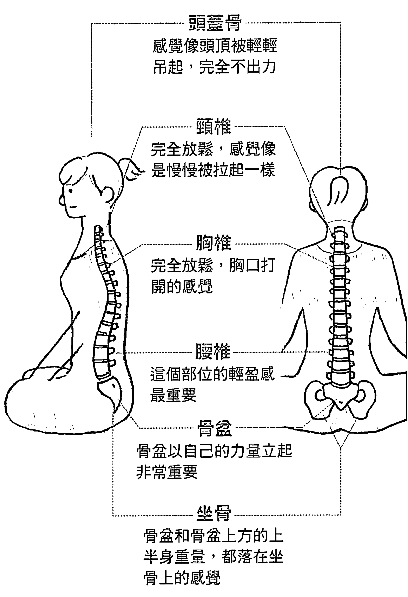

頭蓋骨
感覺像頭頂被輕輕吊起，完全不出力

頸椎
完全放鬆，感覺像是慢慢被拉起一樣

胸椎
完全放鬆，胸口打開的感覺

腰椎
這個部位的輕盈感最重要

骨盆
骨盆以自己的力量立起非常重要

坐骨
骨盆和骨盆上方的上半身重量，都落在坐骨上的感覺

##### 上半身的重點
在於背肌打直

按照上一頁介紹的「如何運用身體，調整理想的姿勢」，實際調整冥想姿勢。姿勢不到位的話，會影響後來的呼吸，導致無法達到深層冥想，因此請盡量仔細調整。

實際調整姿勢時，首先應注意作為脊柱底座的骨盆。以最小的力氣立起骨盆，可以改變姿勢甚至冥想的品質。

出現在左頁兩種不良姿勢的話，不妨改坐在椅子上，或在臀部下方放軟墊，淺坐在墊子上，找出以最小力量輕鬆地挺立骨盆的姿勢。

##### 《容易出現的不良姿勢》

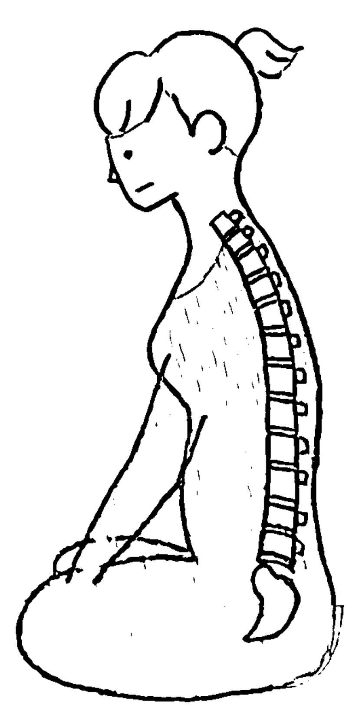

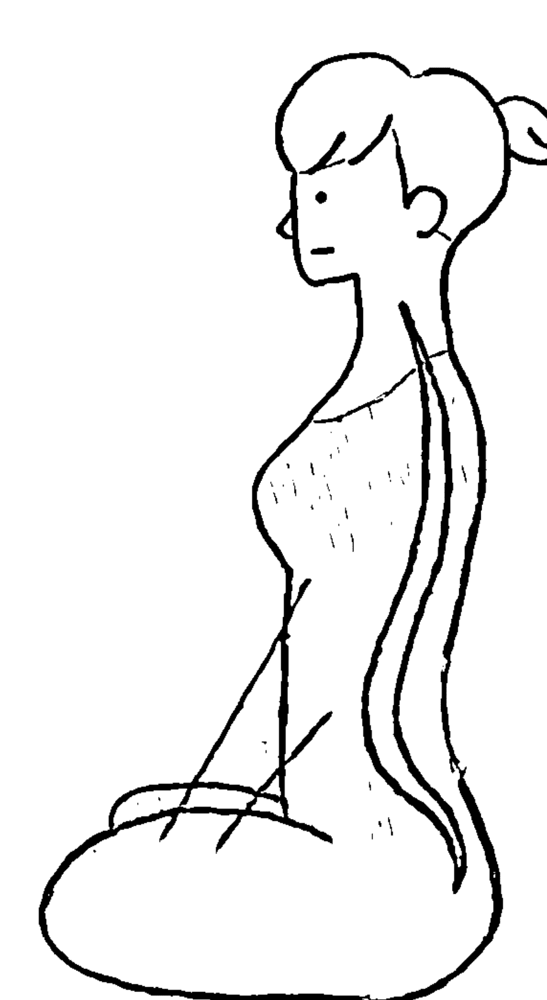

①骨盆向後倒
這是注意力不足的狀態。這樣的狀態最後只會產生睏意

②用力挺起骨盆
出力的專注狀態。以這個姿勢冥想，很難進入自然的狀態

想要解決這些問題……

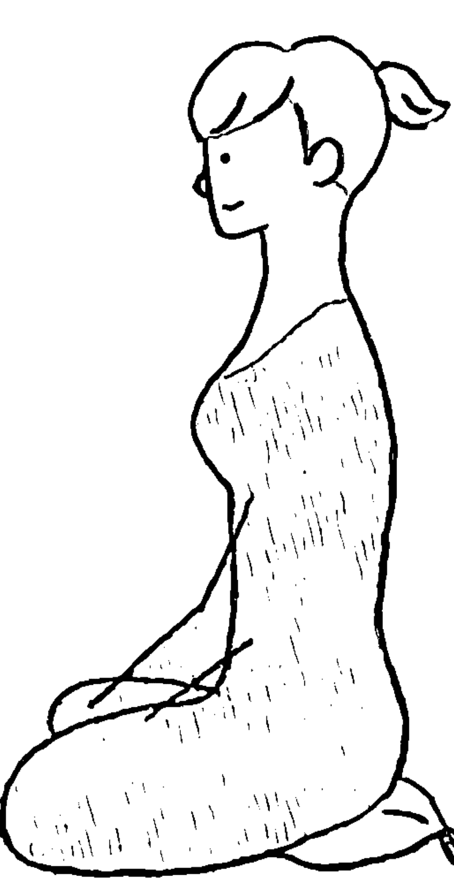

在臀部下方墊軟墊，
立起骨盆
淺坐在軟墊上，讓骨盆
輕鬆挺立。

##### 下半身應以最小的力量，立起骨盆

骨盆穩定，就能以最小的力氣挺直脊柱。輕輕伸展腰部，想像有一條線拉著頭頂，放掉肩膀和手臂的力量。

不過，如果伸展方向不對，上半身就會產生多餘的力量，而無法完全放鬆，

**因此請前後左右緩緩搖擺，感受脊柱的平衡，找出最不出力的姿勢。** 順利調整好姿勢後，就能體會到上半身重量落在左右坐骨上的感覺。並且，能感受到脊柱自行挺立，本身不必出任何力量，就像一根立起的火柴棒。

##### 《感受脊柱的平衡》

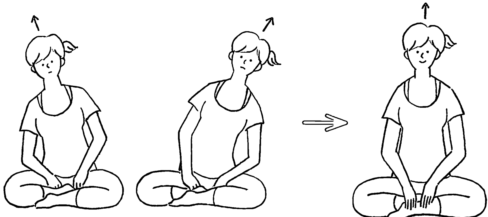

**左右摇摆**
想像有一条线拉著头顶，缓缓左右晃动身体，找出身体的轴心后，维持这个姿势

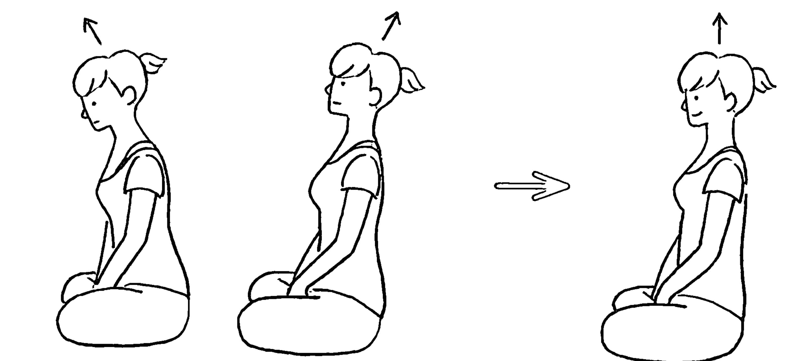

**前后摇摆**
想像有一条线拉著头顶，缓缓前后晃动身体，找出骨盆和脊柱可以自行挺立的姿势。维持这个姿势，往前移动，将体重落在腿上，感受稳定性和不出力的感觉

##### 手放在不會導致肩膀緊繃的位置

學會不出力，輕輕伸展脊柱之後，就要來調整手的擺放位置。

**左右手放在不會導致肩膀緊繃的位置，非常重要。** 一般會將手放在膝蓋、大腿或腹部前方附近。手放得太遠或往左右垂下，會造成肩膀產生些許緊繃。擺放位置差異，會妨礙胸部擴展或呼吸不順暢，所以請配合自己的身體狀況，找出最舒適的位置。

確定手部位置後，接著是手的方向和狀態。手掌朝上，可以讓心情明朗開朗；手掌朝下則能產生沉穩和平靜感。除此之外，手交疊放在腹部前方，能培養下腹深處的穩定感；拇指和食指圍成圈，較容易提升專注力。可依照個人喜好、直覺或當天的心情，改變手的擺放方式，不必過度拘泥。

##### 《手的位置》

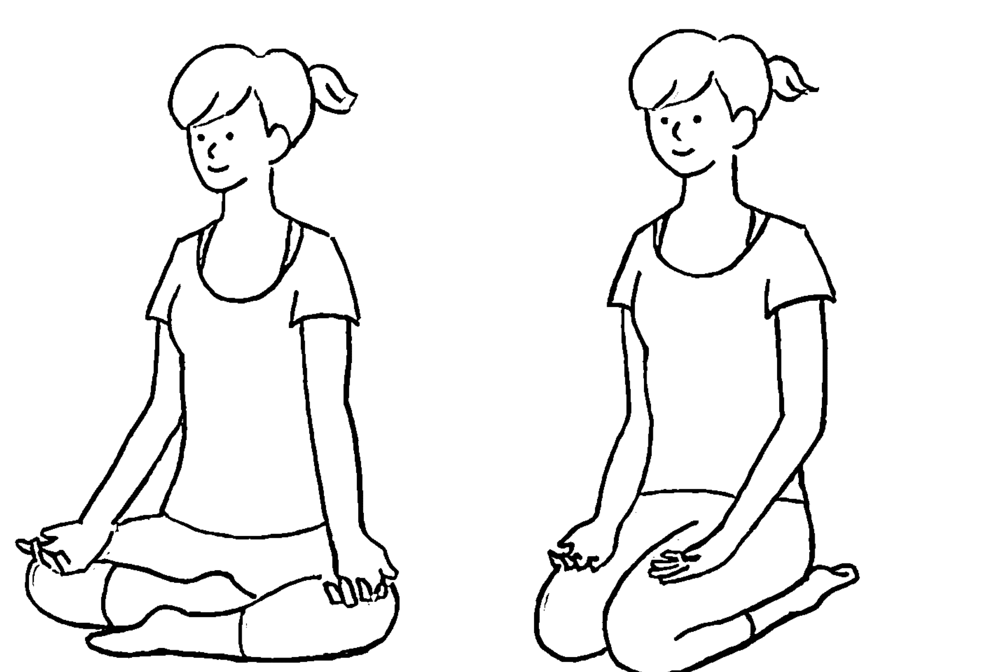

一般會將手放在膝蓋或大腿上方

##### 《手掌方向》

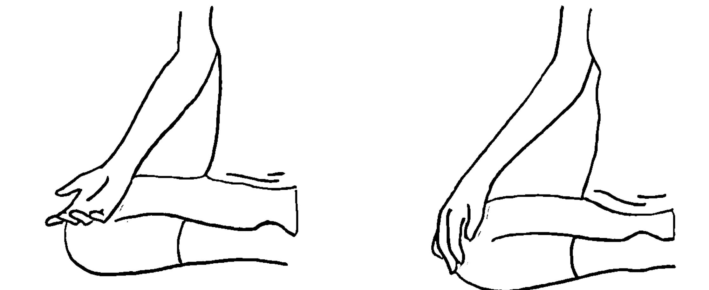

手部放鬆，手掌朝上或朝下，都是適合初學者的方式

##### 《各種手部擺放姿勢》

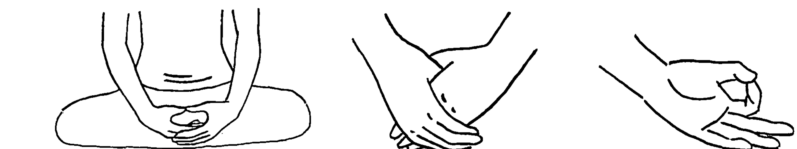

可培養細膩的專注力

較容易意識到下腹深處

能感受到下腹的穩定感

##### 調整目光，改造心靈

眼睛是靈魂之窗，眼睛能如實展現心靈的狀態，反過來說，只要調整好眼睛的狀態，就能集中精神，放鬆心情。眼睛的狀態有張眼、半張眼、闔眼三種選擇，讓我們來認識個別的特色和要點。

##### 張眼

凝視蠟燭火焰、風景等，利用視覺集中精神的冥想，是以張眼的方式進行。在保持視野開闊，視線範圍寬廣的狀態中，聚焦於其中一個部分，放鬆眼部。在眼睛被動地接收光線的狀態下，不要讓眼神渙散，而是炯炯有神地看著喜歡的人事物。眼睛疲勞的時候，可閉眼或眨眼。

##### 半張眼

眼睛和眼皮不出力、放鬆，眼睛張開一半，視線落在斜下方45度處。如果有自己覺得更舒適的角度，也可以把視線轉向這些地方。不要聚焦於特定物體，將意識轉移到視覺以外的感受上。建議閉眼容易睡著的人，可以採半張眼，這是修禪打坐時的眼睛狀態。

##### 闔眼

這是進行冥想時，最常用的眼睛狀態，張開眼睛容易有雜念、眼睛喜歡看東看西的人，推薦採用這個方式。輕輕閉眼、放鬆，將意識轉移到視覺以外的感官。

閉上眼容易睡著的話，不妨以半張眼的方式進行，有助加深冥想，多試試各種方法。

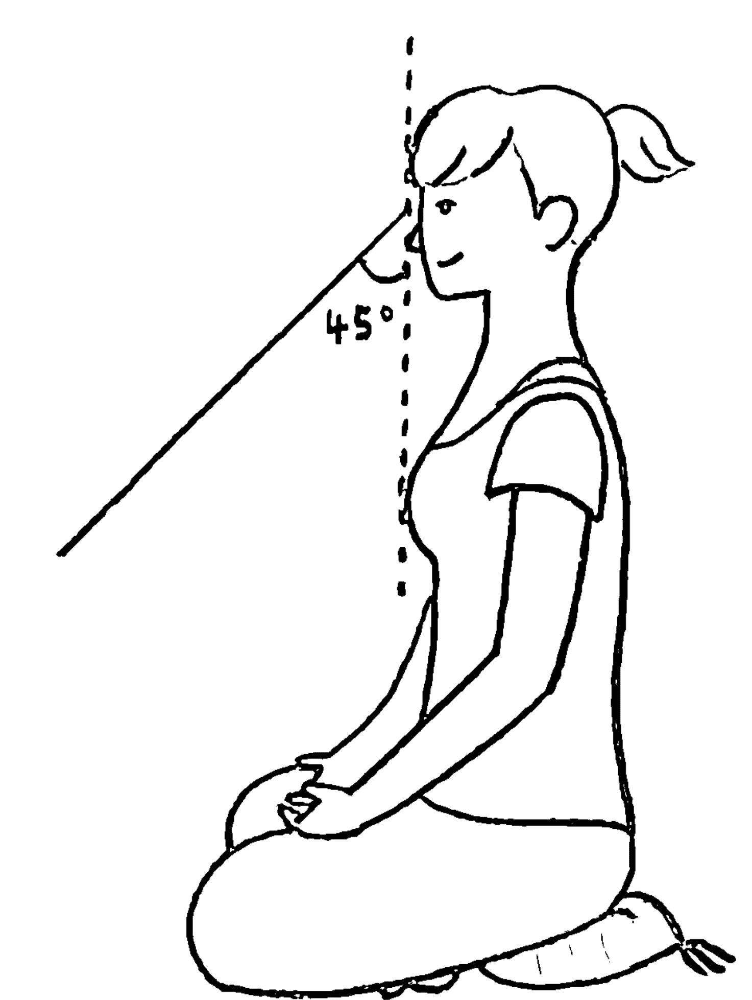

##### 遵循自然呼吸

學會冥想的基本姿勢、脊柱的伸展方式、手的擺放及眼睛的狀態之後，接著就要留意呼吸。**我建議冥想初學者學習自然呼吸。**

就像脊柱和眼睛一樣，呼吸與心靈狀態也有緊密的關係。由於冥想是接受真實感受的狀態，因此冥想時的呼吸是舒適的呼吸，也就是說，自然呼吸是最理想的呼吸法。

不必刻意進行腹式或胸式呼吸、一吸二吐或計算呼吸等，只要尊重體內的自然節奏，自由呼吸即可。除此之外，也不像睡眠中一樣，完全不在意呼吸律動，而是清醒著睡著，意思是，**不要強迫、控制體內的自然呼吸，只要觀照即可。**

覺得這類呼吸很難的話，請參考第60～61頁的各種呼吸法，消除呼吸時的緊張，引導自己學習如何舒適地呼吸。

##### 〈自然呼吸法〉

###### ① 進入舒適的呼吸

調整好冥想姿勢後，想像漂亮的自然景觀、清新的空氣或香氣等，營造能進入舒適呼吸的狀態。

也可以前往景觀美、空氣新鮮的地方，讓自己實際置身於美好的環境中進行冥想，就不用靠想像。

###### ② 體驗自然呼吸

覺得呼吸變舒適的時候，即可停止想像，將新鮮的空氣吸入肺部、深深吸氣的暢快感、延長吐氣的沉穩感、維持吸氣時腹部鼓起，吐氣時內縮的平順韻律等，在舒服的狀態下重複上述步驟，體驗自然的呼吸。不必刻意深呼吸。

### 冥想的基本思維

調整好姿勢、進入舒適的自然呼吸後，即可開始冥想，但冥想到底要做些什麼？讓我們再來回顧一次序章中提過的冥想基本事項。

#### 將意識放在當下

坐骨觸碰地面的感覺、緩慢呼吸的感覺、下腹和肋骨隨著呼吸變化的感覺等，將意識放在當下的感覺上。意識集中的對象不拘。除了同一處之外，也可以將意識聚焦於下半身或任意變換目標。強調「將意識轉向當下」的是正念冥想。

#### 觀照當下

將意識聚焦於當下的感覺之後，不要企圖改變或消除自己的感受，而是無防備地接受。不要討厭、迴避任何感覺，也別試著避免自己受傷，只要發自內心接納所有感覺。

即使你的意識轉向未來或過去，或在潛意識中產生抗拒，也不要急著否定，有所自覺後，就只是感受當下的感覺。接納當下的感受和變化。自然串連起所有感覺的，是禪的冥想。

#### 不必以心空為目標

冥想深化後，心靈會接近空的狀態。所以，不必刻意以此為目標。所有義務、目標都不存在、停止監控冥想流程是否順利、莫急莫慌，當下只須完全放鬆。

注意這3點，就算做不到也不必自責，有所自覺後，讓腦部好好休息即可。冥想的根基，就在於重複上述流程。

#### 找出適合自己的冥想法

即使遵照冥想基本方針進行，例如，將意識集中在腹部的感覺、只感受腹部，被工作盤據的大腦還是難以得到休憩。心靈脆弱的我們，需要一盞明燈，引導我們進入冥想。

輔助大腦休息的小招數。這些技巧即稱為冥想法。這裡我們要將具代表性的冥想法粗略分類並介紹。不過，接下來要介紹的所有冥想法，都只能帶領你到某個程度的冥想。由於冥想是真實地感受當下，所以一旦試著控制局勢，就不是冥想。放開掌控的意念，才能讓腦和心靈獲得充分的休憩。

##### 體驗自然冥想法

觀看實相是冥想的本質。換句話說，即極致的自在。所以，將意識轉向自然或令人感覺自然的事物上，是練習觀看實相的最有效方法。

雖然最理想的方式是接觸真正的大自然，不過在戶外冥想難免不能安心自在，因此播放影片或CD也不錯的選擇。

###### 【進行方式】

- ①調整冥想姿勢，進入自然呼吸。
- ②使用五種感官的任何一種，單純地領受自然。

感受大自然譜出的節奏、舒服的感官刺激，不要企圖改變一切感受，放任自己隨之流動，用心隨興地感受大自然的變化。

- 聽覺：鳥鳴聲、波浪和溪流聲、樹木搖晃、播放CD，聆聽自然之聲
- 視覺：自然景色、雲狀變化、海浪、河川水流、蠟燭
- 觸覺：微風徐徐吹來的感覺

##### 體驗內在自然冥想法

將意識聚焦在全身或局部的冥想法。由於不必拘泥於場所，可以打造內心的祥和狀態，逐漸學習接受所有感覺，所以目前有很多冥想法都屬於這一類型。但是，也因為容易產生控制欲念，所以建議無法消除緊張和雜念的人，可以從「體驗自然冥想法」開始練習。

###### 【進行方式】

- ①調整冥想姿勢，進入自然呼吸。
- ②選擇身體的感覺之一，單純地感受。

不要企圖控制情況，以觀照內心真實模樣的心態，單純地感受。避免讓意志駕馭自己，打開心胸體驗皮膚深處的各種變化或大自然的流動。

- 呼吸：氣息的流動、空氣通過喉嚨的溫度、肺部的起伏
- 伴隨呼吸而來的變化：骨盆、下腹、肋骨的變動
- 其他：坐骨觸碰地面、手指的觸感、體溫、頭內部的感覺

##### 加深具體意象冥想法

很多冥想法都會運用想像力。雖然想像本身與觀照內心的冥想法本質相反，但藉由想像的力量，可以讓呼吸變緩慢柔和、穩定情緒並使心胸闊達，因此非常推薦作為冥想的前導步驟。

###### 【進行方式】

- ①調整冥想姿勢，進行自然呼吸，想像能加深冥想的事物。
  想像此生看過最美的景色、空氣中飄盪的清新空氣、最喜歡的香氣、莊嚴神聖的場所、尊敬的人或治癒百病的仙丹等。最好想像一些可以使頭腦變清晰，讓心靈變闊達，將煩憂拋諸腦後、不會引發欲望的事物。重點在於想像越細膩越好。
- ②從想像逐漸開始體悟感受。轉換至體驗內在自然的冥想法，感受體內的舒暢感、緩慢且加深的呼吸等，將意識轉移至當下、皮膚內部的變化，單純隨興的感受一切。

##### 情緒標籤化冥想法

將內心當下的感覺，在心裡以文字敘述出來，是佛教的冥想技巧，經常運用在正念冥想中。

冥想最重要的是體驗當下。因此，不必非要專注於單一事物。這個技巧可以用來處理雜念，請一定要試著練習，體驗其所帶來的愉悅。

###### 【進行方式】

- ①調整冥想姿勢，進入自然呼吸。
- ②將自己意識到的大自然或體內的感受和變化，在心裡以文字敘述出來。

例如，感覺到「下腹」時，在心裡想下腹、下腹、下腹，將當下的意識化成語言，如果注意力轉移到其他地方，則在心裡默念下腹、下腹、外界聲音、外界聲音、下腹、背部（搔癢）、下腹，就像在實況轉播自己意識到的事物。最重要的是，不要否定任何事物。出現雜念，感覺雜念並在心裡說「雜念」，然後再重新將意識集中於下腹等，持續進行情緒標籤化。

##### 動作重複冥想法

這個冥想法已滲透至日本的各種傳統藝能等領域，是重複進行相同動作並進行冥想的技巧。沖泡抹茶、插花、射箭。持續反覆一樣的動作，讓身體習慣這個動作，每一天都不斷重複，最後自然就能從自身內部，觀照這個動作。

瑜珈的姿勢練習，也具有這個深層意義。只記住動作，照要領擺動姿勢，稱不上是冥想，所以接下來要介紹幾個連結呼吸的簡單動作，讓你更能輕鬆達到「單純觀照」的境界。

###### 【進行方式】

- ①調整冥想姿勢，進入自然呼吸。
- ②吸氣時，也就是肺部鼓起時，手臂往左右打開；吐氣時，也就是肺部體積縮小時，放鬆手臂、垂下。
- ③配合自己的呼吸節奏，持續做這個動作。

盡量放鬆肌肉，像隨風飄揚的羽毛一樣，讓身體活動融入呼吸，持續數分鐘，觀照自己的動作。

### 冥想後張開眼的方式非常重要

如果只是5分鐘左右的冥想，不必太拘泥張開眼的方式，但長達15分鐘以上的話，結束冥想的方法和張開眼的方式就變得非常重要。由於達到深層冥想時，身心都會變得非常細膩，因此緩緩給予刺激、慢慢睜開眼很重要。所以，我要在這裡介紹從冥想中睜開眼睛的基本方法。請在參考後，找出最適合自己的方法。

#### ①反覆深呼吸

結束冥想時，請先緩緩進行5次深呼吸。不要立刻活動身體，以冥想後獲得的豁達心胸，感受舒適呼吸和清新的肺部。

#### ②緩緩活動手指

接著，開始慢慢地活動身體。手掌張開、握成拳狀，轉動手腕，確實重拾手部感覺。

#### ③慢慢張開眼

透過呼吸和活動手指給予腦部少量刺激後，慢慢睜開眼睛。冥想地點光線明亮的話，光線會過度刺眼，因此請務必放慢速度。

#### ④緩緩活動身體

眼睛睜開後，慢慢活動手臂和腿，包括手肘、肩膀、腳趾、腳踝及膝蓋等部位，恢復全身的感覺。感覺腿部痲痛的話，可以稍微按摩一下。如果有其他不舒服的地方，也可以進行緩慢的伸展，刺激身體。

#### ⑤重新回到日常生活

頭腦變清晰、身體恢復感覺後，慢慢起身，回到日常生活。由於身體尚未完全甦醒，突如其來的動作會造成危險，因此請一定要放慢動作。

### 從調整姿勢到結束冥想的練習法

前面已介紹冥想的基本知識，為了讓你習慣整套的冥想練習，我將實際進行冥想練習時的方式，重新整理一遍。

#### ① 設定鬧鐘

使用可調整音量的鬧鐘，將音量調到最小並設定時間。剛開始冥想時，設定3分鐘即可，習慣以後則以20分鐘為標準。不建議使用無法調音量的鬧鐘。手機內建的鬧鐘也很好用。請準備可以調音量的鬧鐘。

#### ② 調整姿勢和呼吸

請參考第28～37頁，調整基本姿勢、手部擺放位置及眼睛的狀態，再照第38～39頁的方式，調整呼吸。

#### ③ 開始冥想

從第42～47頁的冥想法中，選出適合自己的方式，學會如何進行。不知道怎麼選的話，建議採用適合初學者的「加深具體意象冥想法」。

啟動鬧鐘，照冥想法的步驟進行冥想。

#### ④ 結束冥想

鬧鐘響起時，依照第48～49頁的「冥想後張開眼的方式非常重要」所介紹的方式，緩緩活動身體，恢復身體感覺並回到正常的生活。

以上步驟為完整的冥想流程，請讓冥想成為日常。剛開始會想去雜念、放空心靈，這些意念會妨礙冥想的深化，但經過多次練習後，就能學會放鬆肩膀，自然達到深層冥想。我將自製的冥想引導影片放在網路上，不妨試著聽看看。

YOUTUBE 早上20分鐘冥想聲音引導 http://yoga.jp/dl/20（※無中文）

### 如何讓冥想成為習慣

每天做幾分鐘冥想也好，最重要的是持之以恆。久而久之，思緒自然會沉斂，只要調整好冥想姿勢，即可保持心靈清澈明淨。在這裡，我要介紹幾個日常生活中適合進行冥想的時刻。提供參考並希望有助你打造冥想生活。

#### 剛起床是最佳時機

睡眠充足時，剛起床是進行冥想的最佳時機。不僅心緒沉穩，也是一天中能量最充足的絕佳時刻。如果時間不夠，利用通勤時間在電車等交通工具上進行冥想，其實也是不錯的選擇。靠著椅背，輕輕立起骨盆，放鬆地闔眼，進行冥想。請一定要養成早上冥想的習慣，度過美好的每一天。

#### 固定的冥想時段和時間

不僅早上，在固定的時段和時間進行冥想，也有助持之以恆，而且能幫助加深冥想。上班前、泡澡後等，將冥想的時間固定下來，一到這個時間，就能順利進入冥想狀態，並較容易鍥而不捨。

#### 隨時隨地進行冥想

不拘泥於時段、時間或次數等，一有空檔即可設定鬧鐘，播放引導的聲音檔，開始冥想。休息過後，頭腦會變清晰，產生良性循環。並且，頻繁進行冥想，也有助腦部達到最深層的休息。

#### 冥想的時間長短

我建議冥想初學者可進行 3～20 分鐘的冥想。一開始時間太長，容易遭受挫折，所以習慣之前，可以設定較短的時間，再慢慢延長，一有空檔就進行冥想。不要想消除雜念或達到心空的狀態，單純以調整良好姿勢，讓腦部休息的心情進行冥想。請一定要將冥想變成生活的一部分。

### 無法達到深度冥想① 精神篇

開始冥想時，馬上睡著、雜念不斷湧出、煩惱盤據腦海、無法靜坐、結束後筋疲力盡等……都是常發生的狀況。

上述狀況的原因，都在於「專注」與「豁達」失去平衡，這麼說一點都不為過。失去專注導致思路不清晰的話，很快就會睡著，也容易在半夢半醒間出現各種雜念。

相反地，心境不夠豁達，腰部、肩膀過度使力，冥想過後會感到疲憊，產生睏意。

在掌控和放手的意念之間找到平衡點，正是冥想不可缺少的要素。為了保持心態上的平衡，重新調整姿勢，或者利用下一頁〈無法達到深度冥想②～身體篇～所介紹的方法，都能有效幫助自己進入冥想。處於最自然的狀態下，就能深化冥想。

然而，想達到深層冥想，最重要的其實是：……

#### 別太在意是否達到深層冥想。

以重視的心情集中專注力，仔細一一調整姿勢和自然呼吸，將第2章到第4章的內容讀到滾瓜爛熟，保持心境豁達，在這樣的狀態下進行冥想，就不要太刻意想加深冥想，保持順其自然的心態非常重要。

#### 冥想不分成功或失敗。

讓大腦稍微休息、心緒獲得平靜，以這樣的心情進行冥想，維持豁達開放的心態，非常重要。

### 無法達到深度冥想② 身體篇

長時間冥想、長年冥想，依舊無法消除雜念或經常打盹的話，就表示冥想的**姿勢不到位**。如果沒有按照第28～35頁介紹的方式調整姿勢，緊繃感會長年累積在體內，妨礙冥想時的肢體協調。

這裡介紹的姿勢，可以緩解累積在體內的陳年緊繃感，同時也能迅速消除壓力，非常適合在冥想前進行。形式不重要，請感受和接受身體當下出現的所有變化。

#### 《消除背部緊繃》

這個姿勢可立即消除肩、頸、胸部、腰部的緊繃，有效清除雜念。

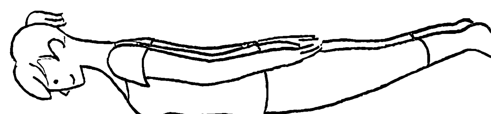

1. 趴臥，深呼吸。
2. 抬起雙腿、上半身及手臂。不是往上提，而是往前後伸展的感覺。
3. 保持此姿勢，深呼吸，覺得撐不下去的時候，動作再維持2個呼吸，慢慢放鬆、回到①的姿勢。在腰部、頸部不感到疼痛的範圍內，進行此動作。

#### 《消除前側的緊繃》

這個姿勢可立即消除胸部、心窩、腹部及內臟器官的緊繃，有效清除雜念。

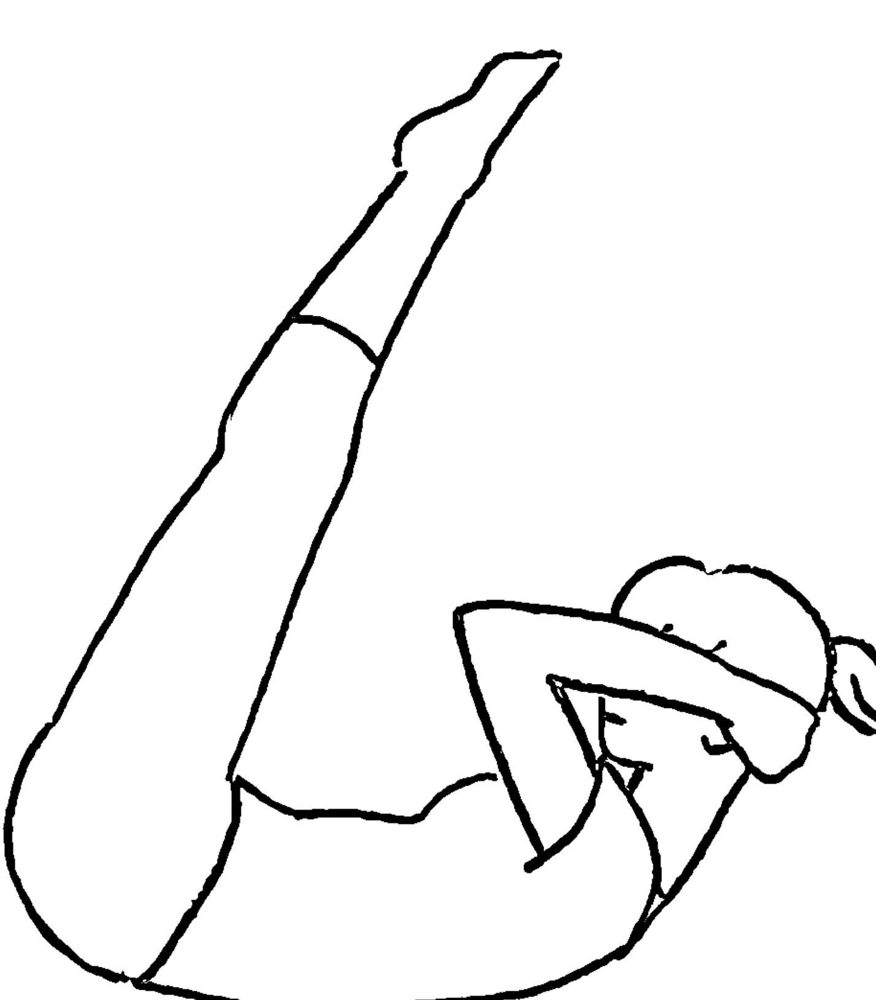

1. 仰躺，膝蓋靠近胸口，手抱頭部。
2. 手用力抬起頭部，儘量抬起臀部，腿伸直。在腰部不感到疼痛的範圍內，減少背部與地板的接觸面積。
3. 深呼吸，覺得撐不下去的時候，動作再維持2個呼吸，慢慢放鬆、回到①的姿勢。在腰部、頸部不感到疼痛的範圍內，進行此動作。

### 無法達到深度冥想③
#### 行動篇

平時壓力造成思緒一片混亂的話，請一掃壓力後再進行冥想，會更能發揮冥想效果。這個時候很重要的是，**腦袋放空**，不給予任何刺激以免胡思亂想。只要暫時忘卻生活中的煩憂，就更容易轉換情緒，加深冥想。

不過，**如果選擇容易引發成癮的刺激**，就會身陷其中無法自拔，因此請謹慎選擇刺激的種類。避免暴飲暴食、甜食、購物、賭博、藥物等會產生強烈快感的刺激，盡量選擇使人心情怡悅、不會引起「貪念」的刺激。例如以下這些刺激。

##### 吃力的健身鍛鍊

肌肉訓練、跑步等各種健身運動、高難度瑜珈等，讓人沒空胡思亂想的高強度運動，也能促進身體健康，達到一石二鳥的效果。不過，請在身體不感到疼痛的範圍內做這類運動。

##### 運動競賽和跳舞

輸了也不會有壓力的運動比賽和跳舞等，令人享受其中的活動，都是輔助冥想的絕佳選擇。由於在沒有壓力的狀態下進行冥想，腦部能獲得深層休息，這樣的感覺會回饋到運動上，所以與冥想的調性很合。

##### 大吼大笑

唱卡拉OK、看體育比賽或令人捧腹大笑的節目等，大吼大笑是有效發洩壓力的方法。由於大吼時腹部壓力升高，具有舒緩呼吸不順的效果，因此冥想前可透過大聲吼叫，放空腦袋。

##### 驚險遊樂設施

雖然要花錢買門票且是特殊方法，但如果能接受的話，刺激的遊樂設施是非常有效的壓力消除法。從高空快速落下的感覺，會使人本能地放空腦袋，瞬間使頭腦煥然一新。

### 無法達到深度冥想④
#### ～呼吸篇～

無法進行深度冥想時，通常與此心靈狀態密切相關的呼吸，也會變得不順且緊繃。冥想時的呼吸，要做到順其自然，如果無法自由自在地呼吸，便會呼吸不順暢。

我們可藉由第56～57頁介紹的姿勢，舒緩緊繃的呼吸，也可以透過呼吸法來解決這個問題。

在這裡，我要介紹兩種可以消除呼吸緊繃的呼吸法。保持冥想姿勢後，先執行這兩種呼吸法以進行自然呼吸，就能順利進入冥想。

##### 《平衡呼吸法》

計算呼吸時間的呼吸法，是具有代表性的呼吸法，在冥想前進行。

1. 採冥想姿勢，放鬆。
2. 在心中默數呼吸長度，吸氣和吐氣的時間一樣長，形成固定節奏（使用節拍器非常方便）。
3. 習慣之後，將吐氣的時間拉長為吸氣的二倍，有節奏地呼吸。請勿刻意大口深呼吸，儘量維持呼吸舒適度，重複3～5分鐘。

##### 《腹式呼吸法》

用腹部呼吸，可穩定精神狀態和改善姿勢的呼吸法。

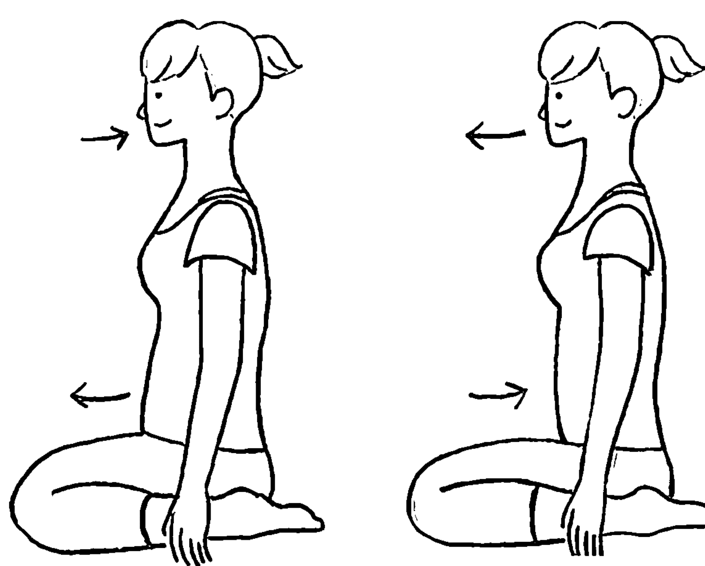

1. 採冥想姿勢，放鬆。
2. 吸氣時，腹部凸出，吐氣時腹部內縮。儘量維持呼吸舒適度，重複3～5分鐘。

### 冥想知識 Q & A

**Q 什麼時候不適合進行冥想？**

A 飯後、睡前、喝酒時等，容易產生睏意的時候，都不適合初學者做冥想。容易導致養成冥想時打瞌睡的壞習慣，長期下來也會妨礙加深冥想。除此，打瞌睡會引起抑制睡意的否定意念，因此請避免在這些時刻冥想。

另外，內心充滿憤怒、悲傷等強烈負面情緒時，也要先清空負面情緒再進行冥想。持續抗拒負面情緒，大腦反而會疲勞。

還有，行車中等依常識來說應該避免的情況，也不該進行冥想；且培養足夠的冥想感覺之前，最好也避免以站姿或在步行中冥想。因為這樣有可能因膝蓋突然癱軟無力而跌倒，或因分心而發生意外事故。

尚未習慣冥想前，請在安全的環境下，從短時間開始自在地進行冥想。

**Q 冥想可以自學和練習嗎？**

A 可以。尤其短時間的冥想，可以讓腦部獲得短暫的休息，請一定要自行找時間練習。

冥想不需要特殊技術，目的是為了讓腦袋休息。

不過，如果不確定自己的冥想方式是否正確、對冥想抱持負面觀感或想要真正深入長時間的冥想，則不妨向值得信賴的老師學習。擔心正不正確的問題，會束縛心靈，因此為了打造安心舒適的環境，我建議可以找自己信賴的老師，一起練習冥想。

冥想沒有成功或失敗。所以，放鬆心情、自在地讓大腦休息就沒什麼問題，但如果過於拘束而無法緩和緊張情緒的話，也可以跟著老師學習一段時間。

另外，冥想過程中如果出現任何疑惑，請先暫停冥想，待問題解決後再重新開始。

**Q 怎麼樣都無法達到深層冥想。。。。。**

A 聽起來真是很令人喪氣。無論持續幾分鐘或幾年的冥想，就是無法消除雜念，完全感覺不到一絲一毫心空的狀態。

但即使是這樣的狀態，**我認為也已經獲得冥想的效果。**

而且，我認為這就是「在冥想」。

本書一再強調，為了加深冥想而做好萬全準備，努力消除雜念，再開始冥想……

**絕對不要刻意加深冥想，非常重要。** 靜靜坐著本身就很重要。

問如何加深冥想的人，就像躺在沙灘或草原上做日光浴的人問「我曬了好幾年太陽，但就是曬不出什麼結果。怎麼樣才能曬到深層？」一樣。

**冥想是心靈的休憩時間。** 刻意想加深冥想，就失去冥想的意義。請懷抱著讓自己休息的心情，「做冥想」。

**Q 坐不住。怎麼辦？**

A 如果你目前是盤腿冥想，請改成坐在椅子上冥想。如果還是坐不住，那就在自己坐得住的時間內冥想。冥想是腦部的休息時間。勉強自己做下去，等於浪費了得來不易的休息時間。

不過，有幾個方法可以讓你更舒適地度過這段休息時間。例如事先緩和身體的緊繃僵硬、從骨盆開始仔細調整姿勢，或翻閱〈無法達到深度冥想③〉行動篇〉（第58頁）等，嘗試各種方式。冥想前先消除壓力，久坐自然不是問題。

如果還是坐不住，那麼冥想30秒或1分鐘都可以。**一定要久坐的想法，本身就不是冥想。** 只要能讓腦部休息，哪怕一點時間也好，因此請每天持之以恆。久而久之，你就會習慣長時間久坐。

**Q 連三天都持續不了。怎麼樣才能持之以恆？**

A 我的回答和前面一樣，不要認為冥想是自己的義務，而「必須去做」。如果是禪寺等具強制性的場所，那產生約束力也無妨，但自學的話，不只冥想，學習任何事物只要受義務感所迫，都無法長久。

就像一天結束後，每個人都會想睡覺、躺在床上會閉起眼睛，大腦疲倦的時候、煩惱盤據腦海時、腦袋打結想不出好點子之際，我們都會想擺脫這樣的狀態。而冥想正是讓大腦休息的方式和心靈的庇護所，讓我們得以找到出口。

30秒或1分鐘都無妨，請養成設定鬧鐘的習慣。在公司冥想時，可以將手機鈴聲調成震動模式，拿在手上。你一定可以感覺到大腦正在休息。冥想是讓心靈曬日光浴。不必在意時間長短，請將讓大腦休息的習慣，融入每天的生活。

**Q 冥想時出現靈感，可以筆記下來嗎？**

A 如果你冥想是為了提升工作效率和創意思考的能力，那麼請先中斷冥想，簡潔地把靈感紀錄下來，再繼續冥想。

實際上，冥想過程中，很多想法會泉湧而出，且大多會隨著冥想結束而稍縱即逝。所以如果你是為獲得靈感而進行冥想，一定要在靈感消失前記錄下來。

但是，如果你進行冥想最終的目的在於讓大腦休息，那就請丟掉所有一閃而過的想法。冥想時，這樣的心態是必須的。來者不拒，往者不追，進行冥想時，一定要保持心靈的豁達大度。

惦記著靈感，就像帶著筆電到夏威夷的度假飯店工作一樣。特地想讓大腦休息，卻無法放寬胸懷的話，腦袋無法得到真正的休息。具備魄力，乾脆地讓各種靈感流逝，才能得到更多的收穫。

然而，最後的決定權還是在你自己手上（笑）。

**Q 冥想和禪修有什麼不同？**

A 禪修是佛教創始者釋迦牟尼佛修行開悟的方法，也就是只管「冥想」的佛教宗派之一。因此，禪寺所進行的「坐禪」，其實就是冥想。

實際上，在印度的古老語言梵文中，Dhyana即意指冥想，雖然傳到中國後被音後被音譯為「禪那」，傳到日本則被簡略為「禪」，但實質上指的都是冥想。

雖然各宗派和法師運用計算呼吸的「數息法」、想像靈丹妙藥（仙丹）的「軟酥法」等各種冥想技巧，但基本上都強調專注於冥想。觀察當下的實相。這就是禪宗最根本的教誨。

另外，禪宗包括立禪、動禪等修行方式，將日常生活的一切都視為冥想，觀看事物的實相。就這層意義來看，禪即是禪。然而，過程中所進行的活動還是冥想，也可以說是禪修問答。

**Q 冥想和正念有什麼不同？**

A 正念強調的是不批評、不判斷，將意識聚焦在當下。也就是冥想。實際上，正念中運用的大多是情緒標籤（第46頁）、專注呼吸和動作（第44頁）及瑜珈和冥想自古以來所使用的技巧，並沒有建立專屬於正念的技法。不過，正念將宗教背景排除於冥想之外，以科學證明冥想的功效，這一點非常值得肯定。有了科學證據的佐證，不但讓很多人對冥想抱有親近感，可以很自然地進行冥想，也有很多企業開始推廣冥想，好處超乎想像。就這樣看來，正念即正念療法。但實質上所進行的活動仍是冥想。本質同於禪修。

**Q 請說明瑜珈和冥想的關係。**

A 瑜珈可大略分為兩種，而兩種瑜珈在本質上都是冥想。第一種是創立時代與佛教相同的「冥想瑜珈」。如字面所示，意指靜坐冥想的瑜珈。身體不必擺放任何特殊的姿勢，只要靜坐冥想，這是瑜珈最初的根源。也可說是冥想和冥想的起源。另一種是以輔助冥想形式出現的「哈達瑜珈」（Hatha Yoga）。就像大家所認知的，這是挑戰各種體位法進行瑜珈，透過改善身體狀態，獲得「萬物一體的感受」。我在後面的Q&A中會再提到，「萬物一體感」也是在冥想中能領悟到的感受之一，因此我們可以說，哈達瑜珈的最終目標還是冥想。也就是說，兩種瑜珈的目的都是進入冥想狀態，瑜珈即冥想，或者是深化冥想的方法理論。

**Q 透過冥想可以和宇宙產生連結嗎？**

A 首先以感覺來講，深入冥想、達到心空的境界後，我們會產生與萬物連結的感覺。自己與其他事物之間的界限消失，從所有的束縛中解脫並感到自由。由於是腦的運作讓我們產生自我的感覺和認知，當大腦停止運轉，自我的感覺也會隨之消失。即使消失，依舊仍保有知覺的能力，而這就是冥想的狀態。

接著是如何表達這種狀態的問題，有人將之描述為心空或與宇宙產生連結，也有人以帶有哲學性的論述，認為人自出生之初便連結宇宙萬物，冥想只是讓人重新找回這種感覺。

我進行學術論述時，也會以這樣的方式表達，但真正重要的並非「真相到底如何」，而是接受這種感覺。因此，我不曉得透過冥想是否能和宇宙產生連結，但的確能體驗到這種感覺。而這也就是冥想狀態。

**Q 冥想是宗教嗎？**

A 冥想本身和宗教沒有任何關係。只是，禪宗等眾多宗教非常重視冥想技法和冥想的感覺，並以進入冥想狀態為目標。

意思是，冥想所期待的「觀看實相」的境界，不是讓人更容易親近宗教的境界，而是眾多宗教的共同目標。

我沒有宗教信仰，但你可以選擇與宗教毫無關係的冥想，也可以進行宗教性的冥想。我認為冥想的重點不在於有無宗教信仰，心靈狀態才是冥想的本質。

## 2 提升自我肯定力的心灵学习

### 自我肯定的重要性

讓大腦獲得休息且加深冥想最重要的關鍵，就在於「接納實相」。看起來既單純又容易，但其實很難實踐，所以我們才會無法順利轉換情緒，煩惱過去或擔心還沒發生的事。

如此一來，便無法專注在眼前的事物上，繼而自我否定，讓大腦越來越疲倦……

要打破這種惡性循環，重點在於接納「真實的自我」，也就是自我肯定。

缺乏自我肯定感，就會害怕未來，擔心被別人看穿自己的弱點或醜陋的部分，或者對於傷害自己自尊心的事耿耿於懷，困在過去的回憶中，一旦憤怒情緒爆發，就會離「實相」越來越遠。

相反地，具備自我肯定感，就能勇於接納自己的弱點和醜陋，建立完整的自我價值感，安穩過生活。不必隱藏或擔心自己的弱點被看穿，即使被人揭露自己的弱點而受傷，傷口也不至於太大，且很快就能復原。

不但可以變得更堅強、不輕易怨恨他人，也能培養肯定他人的能力。接納真實的自己，就能認同真實的他人，進而接納所有事物的真面貌。

最重要的是，自人們出生的那一刻起，至少有一件事是肯定的。

那就是，**我們一輩子都在與自己相處**。如果能與自己相處融洽，人生將變得非常快樂。所有人人生的起跑點，都是「接納真實的自己」。

加深冥想的第一步是自我肯定
接納真實的自我，才能活得快樂

### 自我肯定的第一步，肯定自己的情緒

自我肯定的第一步，是感受並肯定自己目前的「情緒」。憂心、焦慮、害怕、寂寞。腦海被過去和未來的事情佔據，陷入無法繼續前進的困境……想要脫離這樣的困境，最重要的是不要自責。不要強迫自己轉換心情，硬是往前邁進，是自我肯定的第一步。

例如，你現在非常傷心，找了朋友訴苦。結果，朋友對你的悲傷完全無法感同身受，反而對你說「這種事有什麼好在意的」，這種時候你有什麼感覺？恐怕會更傷心吧？

「好難過」、「好痛苦」，我希望你能先認同自己的情緒。這無關對錯，請你做自己最好的朋友。

因此，先學會做自己最好的朋友非常重要。請接受籠罩在負面情緒中的自己。

我現在很傷心。我可以傷心。在悲傷情緒消失前，做自己最好的朋友。就像對別人傾訴後會大鬆一口氣、情緒獲得他人理解會感到得救一樣，由自己察覺並認同自己當下的情緒。如此一來心情會豁然開朗，非常神奇。瞬間增進自我肯定感。因此，花時間慢慢聆聽自己的內心，並坦承面對。

我，現在，很傷心。這很正常。哀傷的時候，本來就會感到傷心。

請先學會坦誠面對自己真實的情緒。

接納自己的情緒，心情就會豁然開朗

### 情緒是身體給的

肯定身體的感覺，非常有助於理解自己的情緒。

東洋說「身心如一」，認為「身心靈形成緊密的連結」。例如，焦慮的時候，眉頭、肩膀及喉嚨會出力，心臟噗通噗通噗通跳，血液往頭部輸送。擔憂的時候，則呼吸肌肉緊繃，腹部沒力，沒由來地全身無力。

東洋認為身體的感覺，正是焦慮和擔憂的真面貌。請你試著稍微舒展眉間，並完全放鬆喉嚨和肩頸，緩緩呼吸並感到焦慮。

做不到吧。

我們無法在完全放鬆身體的狀態下，感到焦慮。也無法感受憂慮。

不僅負面情緒，所有情感、情緒的真面貌，都是身體的變化和身體感覺。因此，消除身體上的變化和感覺，就不會感到焦慮和憂心忡忡。

並且，就像第76～77頁講到的一樣，想消除身體的感覺，**必須先接納它**。身體的感覺，其實是身體的吶喊。身體希望大腦能聽它說話、察覺到它的需求而發出的吶喊。大喝一聲「走開！」並否定身體感覺，只會讓身體更僵硬緊繃。

所以，**請先接納身體的所有感覺**。不要一股腦地否定這些感覺，將之視為絆腳石。

肯定身體感覺，將產生美妙的變化。一旦你真心接納，這些感覺就會立刻消失。身體會對你說，「謝謝。我只是希望你能傾聽我的聲音」。就像幽靈成佛一樣。讓身體脫離負面狀態，負面情緒瞬間消失無蹤。

情緒是身體給的。所以請仔細聆聽身體的感覺。

接納身體的感覺，這些感覺即會消失

### 名為不安的「妖氣天線」，是一種能力

真心接納，負面情緒和身體感覺就會瞬間消失。讓我們以最具代表性的情感為例，協助大家詳細了解這個機制。

第一個例子是不安感。我以前很喜歡《怪怪怪鬼太郎》這部動漫，而我們最討厭、最具代表性的負面情緒之一「不安感」，就好比鬼太郎的「妖氣天線」能力。

根據東映動畫官網（www.toei-anim.co.jp）的解釋，妖氣天線意指「只要有敵人靠近，鬼太郎的頭髮就會因為偵測到妖怪而豎起，告知周遭有危險」，是避險所必備的危險感知能力。

真不愧是人氣動漫的主角，擁有樸實卻很厲害的能力。這個能力讓鬼太郎可以完美的避開危險，下一週繼續充滿活力地登場。

沒錯，不安感就像是日常生活中用得到的妖氣天線。因為感到不安，所以我們才能提早為各種事做好準備，預防狀況發生。

再這樣下去可能導致簡報失敗、多吃會胖、寄出這封信或許會被討厭。不安感是一種絕佳能力，可預知不愉快的未來。問題在於，拒絕擁有妖氣天線的風險感知能力，認為不安感會妨礙自己前進，最後便永遠陷在不安中。

因此，如果你正感到不安，請先接受不安的感覺。

我，現在，覺得很不安心。對於○○感到不安。害怕事情會演變成那樣。真的很怕。但是，不安感絕不是壞東西。而是能力。我能夠培養這個能力。不安是一種能力，是因應問題的必要功能。

就像這樣，溫柔地對待自己，承認自己的不安感。如此一來，不安感就會神奇地消失，讓你不再為此所苦。

不安感是能力，是因應問題的必要功能

### 「憤怒」是有助情況好轉的能量

內心有很多憤怒、不滿，總是表現得很焦慮的人，其實是很有能力的人。他們充滿逆轉不利局勢的能量。而且，也具備扭轉局勢的力量。

動物在面臨天敵或食物可能被搶走等不利的狀況時，會感到憤怒，產生威嚇、擊退敵人的能量。憤怒是為了協助我們而產生的自然反應。

缺乏憤怒，我們就難以產生克服困境的能量，最糟甚至可能活不下去。

憤怒是一種能力。因此，感到憤怒時，不要急著消滅憤怒，將之視為絆腳石，請轉個念頭，體悟自己具備克服難關的力量，並接納憤怒的情緒。

我，現在，很生氣。真的很抓狂。充滿焦慮。這是自然反應。自然的機能。這是才能。我，想要改善目前的狀況。

不要急著壓抑怒氣，察覺正在生氣的自己，感受怒氣騰騰的身體感覺，並全面接納這些情感和感覺。

並且，可以的話（這點很重要），不要去思考發怒的原因，而是將意識轉移到自己的怒氣或者憤怒的身體感覺上。

我，現在，真的超火大。我，現在，很生氣。面對自己的怒火，持續肯定憤怒的情緒，怒氣會緩和下來，經過持續肯定情緒，憤怒就會消失得無影無蹤，非常神奇。如此一來，冷靜之後，就能將能量使用在對的地方。

生氣時，不要壓抑怒火，請先真心接納自己的情緒。肯定憤怒。請一定要在日常生活中運用這個方法。

請先肯定發怒的自己

### 「悲傷」是需要協助的訊號

失去重要的東西、被自己信賴的人背叛、努力卻達不到目標、遭逢難以接受的哀傷，內心充滿無力感。所有人在人生中，一定經歷過一、兩次悲痛欲絕的時候。

這些難過悲痛的情緒，都是有意義的。**想哭表示自己需要幫助。是無法獨自撐下去，「希望獲得協助」的情緒。**

請先接受悲傷的情緒。

如字面所示，「人」是互相陪伴的生物。無論再怎麼獨立、自給自足或看起來自信滿滿活得很好的人，人最終還是無法獨自生存，因為人是害怕失去依靠、容易感到寂寞的脆弱生物。

請先承認這一點。

我，現在，很傷心。我可以傷心。這表示我需要協助。這證明我的情緒機能正常運作。

不要去思考悲傷的原因，而是將意識轉移到自己的哀傷，或者自己到底想怎麼做，接納自己的情緒。

現在，此時此刻，我難過不已。悲傷情緒引起胸口悶痛和全身無力等身體感覺，就像部分機能停止運作一樣。無關對錯，你自己想怎麼做？希望別人做什麼？請承認自己所有的思緒。

被自己重視的人說「這種事有什麼好在意的」，只會徒增傷心。所以，請至少自己尊重自己的悲傷。

並且，試著找別人傾訴。

表現出脆弱的一面也沒關係！

脆弱沒關係。因為悲傷具備求救的功能

### 肯定疲憊，就能瞬間消除疲憊

不僅負面情緒，皮膚內側的世界中，存在很多「接納就會消失」的感覺。疲累感也是其中之一。

一般我們在潛意識中討厭、想要遠離的疲累感，其實和情緒一樣，都是機能。是因應需求而生的機能。在肌肉長時間處於緊繃狀態後，提醒我們需要休息。當腦運轉不停時，告訴我們該休息了。

你很認真打拚。即使你目前的生活步調緩和下來了，但長久以來的努力痕跡，早已留在身上。所以，請先認同那個疲憊的自己。說聲「你好棒」，謝謝自己。偶爾不要過得分秒必爭，稍微悠哉地停下來，讚賞努力生活的自己。

並且，很妙的是，如果你發自內心認同自己，幾乎所有疲憊感都會消失。這點我十分肯定。接納疲累，疲累感就會瞬間消逝。

相反地，很多人對疲勞有著負面印象，這種厭惡疲勞的負面情緒，才會使得肌肉緊繃，阻礙血液循環，導致細胞氧化、疲勞感加倍。

當自己筋疲力盡，卻被自己看重的人否定自己的辛苦，說「要更努力」的時候，一般人會感到心情沮喪吧。一樣的道理。身體疲憊不堪、示弱的時候，你否定身體的疲勞，只會讓身體更加疲乏。

因此，別厭惡疲勞和疲勞感，確實面對疲憊的身體，說一聲「辛苦了」，體諒身體的心情。

如果你真心這麼想，就能瞬間消除疲勞，非常神奇。所以，請確實聆聽、理解身體的心聲，並謝謝它。說一聲「謝謝你一直以來的付出」。

### 別厭惡疲勞，傾聽身體的聲音

### 肯定貪念，就能瞬間消除貪念

「接納就會消失系列」的最後一個情緒，就是「貪念」。

飽到不行卻還想再吃、別人對自己讚譽有加，卻還想獲得更多肯定、到了休肝日還是想喝酒，甚至無時無刻都想喝酒、好賭成性等……

打從內心肯定「無時無刻想要」、「想要更多」的貪欲，貪念就會消失殆盡，非常妙。

欲望是人類生存不可或缺的要素，但滿足某些條件後，超過需求而產生的欲望，就會變成貪圖快樂而生的「貪欲」。

在幾個條件下，會令人產生「貪欲」，但我認為最關鍵的因素是「沒有以實質的方式滿足心靈」。

由於沒有獲得應得的東西，所以想辦法囊括不屬於自己的東西。

這就是貪欲的結構。說得複雜一點則是，心裡有沒有被滿足的需求，而替代品填補。而「應得的東西」，正是本章的主題「自己肯定自己」。

**自我否定時，否定的人是自己，被否定的也是自己。等於是雙重否定。**

在這樣的狀態下，心靈不可能獲得滿足。首先，請察覺到這一點。透過貪念承認這個事實，非常重要。

我，現在，想得到○○。我想要做○○。

別否定貪欲，認同內心有貪念的自己。認識並包容那樣的自己和情緒。這是邁向自我肯定的一大步，獲得自己應得的東西，貪欲就會昇華。

自我否定的情感，會引發貪念

### 壓抑會令人石化，令人喪失感覺

我想你已經了解，藉由肯定自我，可以讓很多情感昇華、消失，但我也想順勢說明，否定自我會讓很多情感失去溫度。使人成為地縛靈。

我們是一種哺乳動物，從極度任性的嬰兒時代，進入兩人以上的社會，逐漸成長。

不能以自我為中心而無理取鬧。這是社會的生存法則。因此，我們為了經營融洽的社會生活，便學會壓抑自己的情緒、情感及欲望。雖然說是學習，但其實我們是透過不自覺地控制呼吸，出自本能地開始壓抑自己。瑜珈和冥想大師也會利用呼吸技巧，控制自己的心，但一般人控制心靈的方向恰好相反，是朝負面的方向偏去。

也就是說，必須培養呼吸的控制力，來掌控自己的心。

例如，在公眾場合下不能大吼大叫。在需要安靜的場合，不能任意發出聲響。透過控制呼吸，封閉各種衝動、情感及欲望，導致我們所有的機能石化。

除了欲望、情感之外，免疫功能、血液循環、淋巴循環、能力、大腦運作、自然的身體動作等，喪失所有感覺。各種機能僵化、流暢度降低，動作變遲鈍。

這種狀態使人容易疲勞，無法充分發揮能力，免疫力也會下降，陷入半當機狀態。

這是身體向大腦發出求救訊號。希望大腦察覺到。身體感到痛苦。請解開束縛。有怨氣……

但我們卻選擇避開這些負面狀態，不傾聽身體的聲音，為了彌補不滿足感，讓自己寄生在「無時無刻想要」和「想要更多」的貪欲中。

就是這樣，才造成我們體內產生出許多地縛靈。

壓抑會導致身心喪失所有機能

### 從內心療癒自我的方法

否定各種感覺，身心會變得跟石化一樣動彈不得。怎麼做才能避免身心僵化？

強制一點的方法是，先讓僵化的部位緊繃、再鬆開，就能稍微恢復到原本的狀態。

讓僵硬的地方變緊繃，呈現缺血狀態，再一口氣鬆開，消除僵硬感，促進血液循環，使僵化的身心恢復柔軟度。

這個方法具有即效性，我非常推薦。

但這個方法無法消除身心深處的僵硬。石化並非單純只是肌肉的緊繃，否定的痕跡也影響了心理層面。

為了清除怨恨，一定要傾聽內心的聲音，接納身心發出的訊號。因此，認同可以讓這些負面的身體感覺消失。

察覺自己的壓抑。承認自己的緊繃感。輕聲地說「對不起」，在心裡默念「辛苦你了」，擁抱這些負面情緒。如果你能真心這麼想，石化的咒語將瞬間解除，身心也會調整回原本的狀態，正常運作、流動及恢復往日的色彩。

消滅討厭的身體感覺。讓肌肉變緊繃。蠻做讓問題暫時消失。把身體感覺視為阻礙……你真的覺得這樣可以解決問題嗎？可以解開石化魔咒嗎？

真正的療癒應該來自身心內部。

請真心認同身體的感覺、貼近自己的情緒，聆聽內心的聲音。只要想著「是啊」，理解身心感覺即可。然後……沒有然後，只要這麼做就好。

善用聆聽，就能消除僵化。無論疲勞或貪欲，都會消失。感受真實的感覺，由內而外產生療癒的力量。

當一個傾聽者，就會從內心產生真正的療癒能量

### 擁有放下問題的柔軟度

前面說明了自我肯定的重要性，並介紹許多重要的方法。

自人年幼時，身心便累積了許多壓抑情感。察覺並給予肯定，這些情緒就會跟著消失。無論是負面情緒、疲勞或貪欲。我說過，透過接納這些情緒，形成自我肯定，負面能量會瞬間化為烏有。

不過，任何事物都存在著理想與現實的差距。

無論再怎麼努力肯定自己的情緒，心緒還是會跑到讓自己不開心的原因上、就算知道不安是一種能力，還是快被不安感擊潰、想要接納身體感覺，但還是出現排斥現象……

這樣的狀態下，要放棄學習自我肯定嗎？並不是。這種時候，接受「現在能肯定的範圍還不夠大」的「目前位置」，非常重要。我在第4章〈認同自己目前的位置，你就會快樂〉（第122頁）中，有詳細介紹這部分，請記得翻閱。

稚嫩的我們，還有很多「現在處理不了」、「現在無法面對」的事物。在尚未培養出肯定力的階段，有很多事情還無法接受。放下這些事情，並不是逃避，而是對自己的溫柔。

不過正因如此，每天練習冥想，反覆閱讀第2章～第4章，逐漸培養一顆能肯定自己情感和身體感覺的心，非常重要。

由於我們還要與自己相處很久，所以多練習絕對不會吃虧。

如此一來，便能一點一滴提升自我肯定的能力，最後就能直接面對、接納真正的自己。

所以，請相信這一天的到來，從做得到的地方做起。有些事，現在暫時迴避更好。但一定也有你可以處理的部分。經歷不斷累積後，你就能學會正面處理各種事物，接納一切。這一天一定會來臨。

相信這一點，並繼續閱讀第3章之後的內容，就能得到更多啟發。你才剛踏上自我肯定之旅。

有些事，現在暫時迴避更好

# 3 強化肯定他人能力的心理學習

## 肯定他人的重要性

如第2章所說的，學會自我肯定，你會活得更自在。舒暢地感受內部的身體感覺，舒適度過每一天。

但是，**自我肯定時，其實多數人都很容易掉入一個大陷阱**。有不少人會變成只肯定自己的情緒、只包容眼前的欲望、只想解放自我而更任性驕縱。

上班遲到了，但我現在想慢慢來，所以任由自己遲到。想要立刻得到男／女朋友的回覆，所以狂發催促訊息。這種言行舉止經常出現在不成熟的自我肯定中，對周遭的人造成相當大的困擾。

**會出現這些行為，明顯是缺乏肯定身體外在負面狀況和刺激的能力。** 只肯定身體內部的刺激和衝動，尤其是讓自己感到快樂和舒服的感覺，心境上完全無法接納讓自己不快的劣勢和刺激。

我認為，貫徹「觀看實相」最大的陷阱，就是容易出現上述的行為傾向。由於價值觀因人而異，如果唯我獨尊可以讓人永遠快樂當然無妨，但這麼下去，自己遲早仍會受到旁人、社會及法律等的約束而動彈不得，無論怎麼做都不快樂和煩惱。一旦如此，這種人的快樂神話就會瞬間幻滅，活得悶悶不樂。

為了避免自己落入這樣的陷阱，不必等到建立一定程度的自我肯定能力，才開始學習肯定他人，而是練習肯定自己的同時，也練習肯定外部的事物。

包容自己身處的環境。這才是觀看實相，也就是加深冥想最難的地方，同時也是最關鍵的部分。

包容自己身處的環境和他人

## 肯定自己的「與眾不同」，就能肯定他人

每個人看到自己覺得很棒的電影、電視劇或音樂等，都會想要推薦給身邊的人吧？

並且，會很開心能獲得共鳴，但如果別人覺得很無聊或看不懂，會不會覺得很可惜，若有所失呢？我的話：……就會如此（笑）。

而這種時候，我會不假思索地與自己站在同一陣線，心想「我，現在，心情低落」，肯定自己的情緒。接納沮喪的身體感覺，馬上就能恢復精神，但精神振奮後，一定要記得做一件事。

那就是「尊重別人的感受」。

肯定他人認為作品「無聊」的感覺。換句話說，就是接受別人與自己有「不同的感受方式」。這一點很重要。

接受「差異」的能力，正是認同他人的最大關鍵。

日本人在這方面尤其不拿手，日本文化認為求同才是美德，差異是應該敬而遠之的搞怪行為。這樣的文化造就了喜歡一致的國民性格，也因為求同的思維，使得自己和他人都被同一套價值觀和規範約束，最後自然產生壓迫感。

無論別人認同與否，我們每個人都擁有獨特的個性。

即使是一對基因相同的同卵雙胞胎，也是個性不同的獨特個體。重要的是，我們是否能認同眼前的「差異」。這一點才是肯定他人的關鍵。

那麼，從沮喪心情中站起來的我，尊重別人以不同於我的見解欣賞電影，我尊重別人的看法，肯定彼此的差異，讓自己的心恢復平和。

認同與自己相異的看法和性格

## 尊重多元的成長背景

將眼前的人，視為個性與自己不同的個體。認同彼此的差異。這是肯定他人的關鍵。而且，要做到這一點，很重要的是，「理解他人有自己的成長背景」。

也就是說，**我們日常生活中接觸到的每一個人都有「各自的成長背景」**。

你們知道是哪一部漫畫，創下由「單一作者創作發行量最多的漫畫」的金氏世界紀錄嗎？

這本漫畫就是《ONE PIECE航海王》（尾田榮一郎著）。《ONE PIECE航海王》講述的是男孩魯夫和夥伴攜手闖過重重難關，一起尋找神秘寶藏（ONE PIECE）的冒險故事，為什麼這部漫畫可以風靡全球？

身為航海王忠實讀者的我，認為這是因為除了熱血地展現人與人之間的情感之外，也描繪了各主要角色「成長背景」，讓讀者產生強大的共鳴。

漫畫中詳細說明了為什麼這個角色會有這種看法、為什麼如此執著於某件事？

他的人生中有過哪些遭遇和經歷、有什麼想法、背負著哪些重擔？

不僅止於細膩的角色設定，也描繪了角色的形成背景，詳加交代每個人的過去。長一點的話，甚至一整本都在介紹人物的成長背景，也很費心在角色的回想場面上。

說個題外話，**Character** 這個字的語言來自希臘文，意指雕刻。就像是將故事刻劃入角色的內心一樣。正因如此，航海王的讀者才會對各角色的感受產生共鳴，對他們的生活態度和重視某件事的心情等產生同理心。

還有另一個原因。

理解每個人的想法、包容一切，重視夥伴們擁有各自成長背景的主角魯夫，也很能引發讀者的共鳴。正因如此，這部漫畫作品才能風靡全球到被列入金氏世界紀錄的地步。

我們都只能從自己的角度看世界，這一點有利有弊。

小時候，我曾經幻想「早上醒來後，發現自己在別人的身體裡，或靈魂和別人交換一等，但每次睜開眼，我都還是只能從自己的體內觀察世界。

我用這雙眼睛看到的風景、經歷過的事物、我的痛苦、煩惱、克服過的難關、學會的事情、跨越不了的障礙、得到的幫助、擁有的東西，以及當下內心的感受。全部的出發點都是第一人稱，我一輩子都無法脫離這個我。

現在看到本書這句話的所有讀者，也都是以第一人稱閱讀著，在你購買本書之前，經歷了多采多姿的人生，有過各種體驗、歷練、挫折及欲求，而在因緣際會下，如今閱讀著這篇文章。

**地球上有多少人或多少生命，就有多少第一人稱。**

我們每個人都有各自的成長背景，用自己的雙眼看過各種事物，經歷過許多事，一生一世都採用第一人稱，努力追求幸福，但因為無法如願，所以處於目前的狀態。

就像自己對自己而言是特別的存在，他人的自己對他人而言，也是特別的存在。我們都以第一人稱活著，是有溫度、有血有肉的人。

這種感覺即尊重「各自的成長背景」。並且，包容他人與自己的「差異」。

這就是加深冥想的下一步，也是肯定他人原貌的第一步。

有多少人或多少生命，就有多少第一人稱

拾回這樣的感覺，是學會肯定他人的關鍵

# PART 3 強化肯定他人能力的心靈學習

## 肯定他人的第一步，肯定對方的情緒

肯定他人的第一步，是尊重各自的成長背景。並且，肯定彼此的「差異」。

因此，雖然「肯定對方的情緒」不是第一步，但可以和第2章的〈自我肯定的第一步，肯定自己的情緒〉（第76頁），一起說明。

前面提過，**自我肯定的第一步，是認同自己當下真實的感受和欲望**。別管是非對錯，認同自己當下的心情和欲望，做自己的朋友。這麼一來就能產生肯定感，消除各種負面情緒。

以這種感覺，己所欲，施於人。這就是肯定他人。無關對錯、無關彼此的差異或自己沒有相同的欲望，而是接受別人當下的心情和欲望，他，現在，很傷心。擁有不同成長背景的我們，去批評他人悲傷的時機和深度，是沒有意義的。

他，現在，想法是如此。他有這樣的感受。他具備如此的感受能力。他就是會有這種言行舉止的人。

無關是非對錯，接受感受能力不同於自己的人，現在處於某種狀態中的事實。別去想「為什麼一定要接受？」、「不想接受」，當我們肯定他人，至少我們自己的情緒也會穩定下來。而且，情緒被接納的人，也會變得平穩。

他，現在，處於這樣的狀態。

隨時在心中默念這句美好的話。

> 在心裡默念「他，現在，處於這樣的狀態」

## 肯定他人可避免情緒衝突

如果我們無法肯定他人的情緒和行為，無法認同彼此的差異，心裡一定會覺得「為什麼他會這樣？」

「為什麼這種小事他也要生氣？」

「我說了幾百遍，為什麼他就是聽不懂？」

「為什麼我要聽他的酸言酸語？」

我們的內心一定會出現失望、煩躁、憤怒、悲傷、厭惡等各種負面情緒。

這種時候，如果我們可以接納內心萌生的負面情緒和產生這種想法的自己，做到肯定自己，就能讓負面情緒冷靜下來。

但是，如果我們無法肯定自己內心的負面情緒，被負面情緒吞噬的話，他人便能從我們的言談和態度中，感受到這些情緒。或者，假設我們只顧自我肯定，完全缺乏肯定他人的同理心，就會像本章一開始的例子一樣，任性到了極點，遲早會轉而猛烈砲轟他人。

你的言行舉止，會讓對方心裡產生新的「問號」、出現負面情緒，使得對方做出令你更難以接受的行為，面臨這種情況的你，內心再度湧現負面情緒……

這就是負能量的惡性循環。陷入惡性循環後，就無計可施了。自己的心靈變得不平靜，受到這種狀態的牽制，直墜入負面能量的漩渦。

因此，為了保護自己的心，我們必須阻斷這個循環。所以，正因如此，我們必須同時練習肯定自我和肯定他人。

負面情緒會隨著循環而逐漸擴大

## 專注於接納情緒

在情緒衝突產生、陷入負面情緒的循環之前，我們可以做一件重要的事。那就是「專注於接納情緒」。

我們和別人聊天的時候，通常會邊聽邊思考自己接下來要說什麼、表面上贊同對方的想法，心裡卻不以為然，或極力鋪陳，表達自己的意見。如果雙方能順利溝通倒也無妨，但也有不少人因為上述方式，變得情緒化，導致對話沒有交集。

這種時候，「專注於接納情緒」更顯得重要。在對方講到一個段落前，徹底當個聽眾就好。

不要批評對方的意見、不要費心抓對方的語病，先試著動員自己所有的感官，聽聽對方想表達什麼、想對自己說什麼。

我在第1章中提到，別否定冥想中出現的雜念。一樣的道理。放下來成長過程中形成的「個人標準」，請專心聆聽，盡力理解對方的想法，推測對方的心情。無論別人講什麼歪理，都不要去衡量對錯，只要一心一意接納他有這樣的想法、心情以及他就是會說這種話的人等事實。

用寬容的心靈，將大腦轉換至接收模式，專心當個聽眾。**如果能做到這一點，就能降低在對話中使用情緒性字眼的機率。**而我認為，專注傾聽就是在日常生活中運用冥想感覺的最重要關鍵。

放下個人標準，徹底當個聽眾

## 尊重他人不等於放任問題不管

肯定他人的重點，在於接受他人的成長背景、個性、心情、狀態及事實。但並非建議你要「認同他人的想法或者放任問題不管」。這是兩個不相干的問題。

由於在肯定他人時，這一點最容易引起誤會，因此請詳細看下去。

例如，無論自己說幾次，有些家人或朋友還是會無所謂地做令人反感的事。

老是不關燈、衣服脫了隨手亂扔、對沒興趣的話題總是已讀不回、冷靜地撒謊等……儘管在心裡告訴自己「每個人的價值觀不同，要接納彼此的差異」，但同樣的事持續發生，最後當然會不禁發怒和難過。

這種時候，請先遵照第2章的方法，將意識轉移到自己的情緒和身體感覺上，肯定自己非常重要。

> 「我，現在，感到很煩躁。這無可奈何。」

「盡量不去想別人，將意識放在自己身上即可，認同自己的情緒。如此一來，內心會逐漸恢復平靜。接著，再按照第3章的方法，以平穩的心看待他人，接受別人是會出現這種行為的人（個性），而且實際上真的這麼做了（事實）。

讀到這裡的人，應該可以充分了解上述作法。或許有人早已落實在生活中。而接下來的說明有點複雜，但卻是肯定他人的過程中，最重要的一點，請慢慢仔細地閱讀。

在右邊所舉的情況下，「肯定他人的個性和事實」與「放任問題不管」，完全是兩碼子事。

接受個性和事實，能讓自己的心恢復寧靜和柔軟度，避免否定他人的人格。這不代表你要對眼前的問題置之不理。

這一點是肯定他人時，最須特別留意的部分。肯定他人的目的，是恢復心靈的平靜與柔軟度，並且讓自己可以接受他人的個性。而後，再重新面對自己與他人之間的問題，思考是否要放任問題發生，或應該妥善處理。

例如，假設你在書店看到有人在偷書。以這個例子來講有點極端，所以聽起來像開玩笑，不過「他偷書一定有他的理由」，接受小偷的個性和偷書的事實非常重要。但這並不意味著你要放任偷竊行為發生。任書被偷、任書店蒙受損失、任小偷逃走……不是這樣的，除了在情緒上接受眼前的偷竊行為之外，也要採取適當的作為。我認為這才是自然的「接受實相」。

看到有人路倒在斑馬線上，冷靜地觀察這個狀況，與不積極處理這個狀況是兩回事。

相同道理，當別人硬逼自己接納他的意見時，接受他有那樣的想法和說話方式的事實，與迎合他的想法是兩回事。

如果不充分理解這一點，肯定他人就會變得荒謬。

肯定他人不是迎合對方的想法，也不是放任問題發生。藉由接受他人的個性和事實，可以避免引發情緒衝突，而讓自己冷靜下來、擇善而行、解決問題，則是必須做的另一件事。

雖然肯定他人不免要忍氣吞聲，但並不是讓自己獨自忍耐，而是保持心境平穩，積極採取作為。

這個微妙的差異，是肯定他人的過程中很重要的一點，請一定要多看幾遍，直到懂了為止。

肯定他人不是迎合他人的想法，而是接受他人的行為傾向和情緒

# PART 3 強化肯定他人能力的心靈學習

## 原諒他人等於原諒自己

前面介紹了肯定他人的基本觀念、重點以及容易誤解的部分，但一定有很多讀者會在心裡會出現「為什麼？」的想法，從頭到尾都覺得「為什麼我非要認同他不可？」，而無法做到肯定他人。

他不該說那種話。他應該更客觀地看待事物。他應該多尊重我的立場。

將上述結構視覺化，就像是你用一條名為價值觀的鐵絲，纏繞、綑綁住別人的行動和思想。

他應該這樣做、這樣想、這樣感覺。

但是，在心裡綁住別人，實際上動彈不得的卻是自己的心。自己的心失去自由，行動範圍遭到限縮。因為，過度在意他人，便無法天馬行空地思考，轉換情緒、專心做眼前的工作。

況且，大多時候，心裡的怨恨並不會對他人造成任何傷害，因此被束縛的不是別人，完全是自己。

**雖然這麼說，但也請不要否定無法寬恕別人的自己。因為這樣會變成雙重否定。** 首先，最重要的前提是，請承認自己還沒原諒別人，接受自己內心的憤怒和哀傷，與自己站在同一陣線。我還沒原諒他。現在維持這樣的狀態沒關係。因為我的心做出的反應就是這樣。我也控制不了。

而接納自己的情緒、心靈有足夠的彈性之後，再試著肯定他人。

**為了替自己解除魔咒，讓自己活得更自由，請學習接受別人的個性。**

自己的價值觀，束縛的是自己

## 擁有讓步的柔軟度

肯定他人，最後解脫的是自己的心。因此，為了自己好，擁有認同他人、寬恕他人的包容心非常重要，我在前面說明過了。

而正因如此，接納彼此間的「差異」才顯得重要。每個人有各自的成長背景，別人用自己的眼睛看世界、經歷過許多事，用自己的價值觀去評判他人是沒有意義的。

我也提及，認同別人的個性和現在的心情。但不用去迎合別人的想法。原諒他人，等於讓自己擺脫束縛。

然而，即使明白這是為自己好，但肯定他人時，理想和現實終究還是有段差距。

所以，肯定他人是紙上談兵嗎？也不是。就像我在第2章最後提到的，這種時候請參閱第4章〈認同自己現在的位置，你就會快樂〉（第122頁），承認自己「目前可接受的範圍還很窄」，接納「目前的位置」。

尤其肯定他人的時候，會面臨許多令自己束手無策的狀況。暴怒的主管站在面前，無法冷靜地想「他，現在，很生氣」等，況且如果在第一時間將意識集中在他人的情緒上，很可能會漏聽重要事項，讓自己被罵得更慘。

除此，如果別人一再犯相同的錯，即使心裡知道「他就是那樣」，但由於錯誤擺在眼前，所以會生氣也是人之常情。

因此，稚嫩的我們，還有很多「現在處理不了」、「現在無法面對」的事物。在尚未培養出肯定力的階段，有很多事情還無法接受。

所以，請一定要牢牢記住，肯定他人的時候，**姑且退一步海闊天空也很重要**。

我們的心靈必須擁有足夠的彈性，讓我們避免當下太情緒化，離開現場、找回自己、恢復冷靜後，再重新面對他人和問題。

情緒一旦產生衝突，事情即無法朝有建設性的方向發展。

因此，在本章最後要再提醒大家一次，為了彼此好請暫時退一步，擁有溫柔的智慧，是落實肯定他人很重要的因素。

有時候，保持距離才是最好的方法

# 4

# 接受現狀，面對生活

## 認同自己現在的位置，你就會快樂

人類是非常脆弱的動物。即使心裡很想做自己的朋友、努力尊重每個人的成長背景，還是無法百分之百做到，甚至有可能在起跑點受挫，討厭自己。我果然很失敗。差人一等。貶低自我，認為自己是最好沒有出生的瑕疵品。低自我評價會降低免疫力、弱化能力，讓自己貪圖眼前的快樂，並更討厭自己……

意志薄弱的我們，嘗試用各種方式去肯定自我和他人，卻在不斷的失敗中產生自我嫌惡感，為了避免落入這樣的惡性循環，必須釐清自己「目前的位置」，並同時設定「目的地」。

現在的自己做不到肯定自我和他人是「目前的位置」，自己未來要去的地方則是「目的地」，釐清這組問題，肯定自己的答案。

肯定營盡各種失敗滋味、無能（自我感覺）的自己，是一件很難的事。因此，將現在辦不到，但未來希望能達成的事設定為「目的地」，就更容易確認「目前的位置」。

不知道目前的位置，很難抵達目的地。大部分的人在迷路的時候，都懂得先辨識自己現在在哪裡，而不是查詢目的地。

這也可以運用在「自我成長」的旅程中。

接納真實的自己和他人。這是使心靈沉靜的終極目標。是冥想的目的地。而想要的抵達目的地，應該承認自己目前做不到這個程度，接受目前的位置。這才是抵達目的地不可缺少的步驟。

我，現在，還在這裡。沒關係。我，一定會往那裡走！

稚嫩的自己，應辨識目前的位置和找出目的地，以達到自我肯定

PART 4
接受現狀，面對生活
123

## 順從自己的「欲望」而活

找出自己「目前的位置」和「目的地」。如果要再加入一個元素，那一定是「路徑」。怎麼走，才能抵達目的地？知道「路」，就會安心多了。自然也能接受自己目前的位置。本書中所介紹的各種技巧和說明，即相當於「路徑」。而且，即使我們內心身處的「欲望」，也能明確地找出「路徑」。

「隨欲望而活，自然可抵達目的地」。

心理學中有一個「馬斯洛需求層次理論」（Maslow's hierarchy of needs）。簡單來講，滿足一個需求，就會進階到下一個更高層次的需求。

人類最底層的需求，是生存的基本需求，也就是吃飯、睡覺等「生理」需求，此需求滿足後，會產生「安全」需求，追求安定性。

滿足此需求後，接著是想要擁有朋友的「歸屬」需求，並進而產生希望被認同的「尊重」需求。不覺得這是很美妙的機制嗎？不僅以個體生存，而是希望成為家庭、團體及社會的一員，做個對群體有貢獻的人，我們的心原本就內建這樣的機制。

因此，欲望不是壞事。我們應該盡量依序滿足欲望。

然而，如果被欲望支配則有損健康，也可能會傷害到別人。這種情況也應該肯定嗎？並不用。馬斯洛所謂的「滿足需求」，正確來講應該是滿足「原始」欲望。

例如，食欲原本是攝取必需營養以利生存的需求；味覺的功能是辨識必要食物或有害身體的食物。但我們卻誤用味覺系統。利用味覺系統來享受化學調味料，而非攝取真正的必需營養，且刺激出更多不必要的食欲。

還有，希望獲得認同的尊重需求，原本應該在社會中做好自己的本分時，便會被滿足，但現在卻被誤用，變成只要別人肯定自己是個有價值的人，說謊也在所不惜、犧牲他人也要成就自己等。

這類誤用都會產生「貪欲」，就像第88～89頁所說的一樣，會在「沒有以實質的方式滿足心靈一下孳生。

然而，**無論是貪欲或「原始的欲望」，肯定這兩種欲求非常重要。確實面對自己的情緒，找出自己真正想做的事，無論答案是什麼都要真心接納，這一點也很重要。**

我，現在，想得到○○。想要做○○。

如果這些欲求是貪欲，渴望的感覺會淡去，最後蕩然無存，而如果是原始的欲望，則會促使我們在心裡摸索滿足欲望的方法。

我希望成為一個獲得家庭和公司認同的人。我想要被視為有價值、有貢獻的人。我們會為此充實地過每一天。

盡人事，聽天命。

**確實盡好自己的本分，欲望自然獲得滿足後，最終便能找到自己真正的使命。** 逐一確實滿足各項欲望，自己在團體中的角色會變得明確。接納真正的自己，自然而然就會知道如何發揮自己的能力。

這就是冥想的「目的地」。在肯定一切之後要達到的目標。而「目前的位置」是起跑線，滿足原始的欲望，就能取得明確的「路徑」。誠實面對自己的情緒，肯定所有的感受，滿足原始欲望並朝目的地邁進吧！

欲望不是壞東西。請大膽追求自己想要的東西，但是，也要確實洞察欲望是否有被誤用

# 接受現狀，面對生活

## 認同自己的角色，恪守本分

國小裡的桃太郎話劇表演，全部的孩子為了搶著當主角桃太郎，吵得亂七八糟……這是最近時有所聞的事。

我懂這種心情。想必大家都想成為最受矚目的焦點。想當主角。相信自己是最適合擔綱主角的人選。希望人認同自己是個很有價值的人。我都懂。但是，我也相當清楚，這種心態是讓自己受折磨的最大原因。

如果胃不滿意自己的位置和功能，瘋狂地想要變成大腦的話，會發生什麼事？或者，腳不喜歡臭味，吵著想當手的話，又會怎麼樣？

**每個器官和部位，都有獨自的個性、守備範圍及功能。** 就像樹認真扮演樹的角色、胃善盡胃的職責。

拜大家各司其職所賜，我們才得以生存。因此，如果我們也能全力盡好自己的本分，自己所屬的社會就能完整地運作。並且，我們的心原本就會產生欲望、希望對社會有所貢獻、想要被需要。本來就會這樣。

但我們卻羨慕別人漂亮、工作效率佳、交友廣闊，不斷地和別人比較，並莫名覺得自卑，對自己的能力和角色感到不滿，造成自己和團體的壓力。

**接納真正的自己。** 意思是充分了解自己的個性，認識自己的守備範圍，並善盡職責。

插個題外話，通常我上完課之後，會對學生說「謝謝」。這在國小其實是滿奇怪的情景。學生感謝老師，是因為從老師身上得到寶貴的知識，但很少看到老師跟學生道謝。

但我由衷感謝學生來上我的課，所以向他們說「謝謝」。因為有他們來聽課，當時在課堂上的我才活得有意義。

這種感覺之所以如此強烈，是因為在發生奧姆真理教的「東京地鐵沙林毒氣事件」後，經歷了瑜伽教室冰河期，好幾次面臨教室裡空無一人的窘境，我失去站在教室的意義，這樣的日子持續了好一陣子。**因為有人來上課，才讓當下身處於教室裡的我有了意義。** 誇張一點的說法是，讓我有了生存的意義。所以，我一定會跟來上課的學生們說「謝謝」。

你應該扮演的角色，等於是你的存在意義。表示有人需要你，因此你才能在某個時空下感到自己存在的意義。

因此，沒必要當主角。「樹A」扮演好「樹A」的角色，別以狹隘的視野，只在意他人對自己的評價，應該用更開闊的視野看待，讓桃太郎話劇變成一場出色的表演。我只會這個，但我會做好自己能做的事。這麼一來能讓自己活得更快樂，也為自己所屬的群體帶來幸福。

「從你所在的地方開始，運用你所有的，做你能做的。」

這是美國第26任總統羅斯福（Theodore Roosevelt）的名言。做你能做的，就是幸福。有能力的喜悅。肯定你現在的境遇，盡全力在當下的環境中，做你能做的事。

人類這種生物，很容易不自覺地關注自己沒有的東西，忌妒別人擁有的，並因自己沒有而討厭自己。但是，這樣的想法會讓人活得不快樂，導致桃太郎這齣劇演不下去。讓社會（2人以上的世界）停止運轉。

這樣可就糟了，所以有泰迪熊（Teddy Bear）暱稱的羅斯福總統，才會呼籲人民，找到自己現在的位置。看清楚自己能做什麼、不能做什麼。然後善盡職責。

你能做的事。感受其中的樂趣，並認真去做。

我認為這樣的心境，才是接納真正的自己。

用寬闊的視野看待自己，積極做好自己能做的

## PART 4

# 接受現狀，面對生活

131

## 多比較，摸索自己的個性

比較會突顯出自己的缺點，築起自我厭惡的地基。我認為這個說法沒錯。負面的比較，無益於任何人，應該全面拒絕。但我卻到處建議多和別人比較。比較並不是為了讓你怨嘆別人有但自己沒有的，而是讓你認識自己和自己的能力。讓你了解自己的真面貌。

古時有位賢者曾對弟子這麼說：

> 「請去深山裡把不是草藥的草採來。」

弟子們花了好幾個小時，拼命找不是草藥的草。但是，最後還是沒找到。有了這次經驗，弟子們領悟到，沒有不能當藥的草。依狀況、使用方法和劑量不同，任何草都能變成藥或毒。

這位賢者正是喬達摩·悉達多（Gotama Siddhattha）。也就是釋迦牟尼佛。

沒有不是草藥的草。只是產生藥效的方式不同。認同差異，正是這麼回事。也就是找出該種草獨具的功能。

而為了找出藥效，必須大量比較。

我們人也一樣。DNA、成長環境、飲食、知識、達成的目標、落空的夢想、現在擁有的、正在追求的事物等，大家都不同。所以，每個人能肩負的事情也都不一樣。那麼，你到底可以做什麼？透過建設性的比較，你才摸索得出答案。

他有他看過的風景、他有他的能力。透過比較，才能看到這一點。

藉由具建設性的比較，充分認識自己的個性

## 盡心盡力，肯定自己的努力

所有的自然現象都是必然的。科學家持續不斷地努力以科學證明這一點。而另一方面，無法鉅細靡遺了解相關理論的我，則相信並接受宇宙的存在與萬物，都遵從著科學家所發現的「自然法則」而生。

晚間吹起的陸風、懸在空中的彩虹、形成這些現象的基本粒子和光的作用、血液在我們體內的循環方式、形成腦的神經細胞運作、內心產生的衝動等，全都是「本來就是那樣」，難以言喻。

愛因斯坦說過一句話。

> 「我們的知識會越來越豐富。但我們永遠不會知道自然真正的本質。」

做自己做得到的，追自己追得到的。但最後我們終究必須承認，有些事「本來就是那樣」。然後，我們會發現，自己能做的還是……

就像樹認真扮演樹的角色、水盡好水的責任、在我們體內循環的血液做好自己的工作，你也只要做好自己。

**你只要做好無可取代的自己。**

當然要努力。為什麼？因為我們不知道努力過後會得到什麼。但是，盡全力努力，心力交瘁也要往前邁進，並接受最後的結果，這樣的心態才是讓我們活出自在的最大因素。

本來就是那樣。接受你是你，做好自己就好。我每天都覺得，落實冥想可以令人深刻產生這樣的感受。

就像樹認真扮演樹的角色，你做好自己即可

PART 4
接受現狀，面對生活
135

## 不隨手關燈困擾與禪宗問答

你們都聽過「禪宗問答」嗎？和尚提出意義不明確的難解「公案」，由弟子耗費時日思考答案，想到答案之後，卻被「喝！」一聲，然後繼續苦思。禪宗師徒間的對話世界，即被稱為禪宗問答。

禪應該是沒有交談的冥想世界，為什麼會出現大量的公案，而本應放空腦袋的弟子們，又為什麼必須日日夜夜苦思？

我個人的解釋是，**這是為了讓人接受世事本來就是那樣、別人的本性即是如此**。因此，和尚才會對弟子提出沒有答案或找不出答案的公案。

例如下面這個公案。

> 〈牛過窗櫺〉：大水牛過窗櫺，頭角和四隻腳都過去了，為什麼尾巴卻過不去？

隨便回答「不知道啦」、「因為牛沒有尾巴」的話，就會被「喝！」一聲，就算你很機智地說「因為其實緊跟在牛正後方的馬兒，製造了視覺上的死角」，還是會被「喝！」不管答案是什麼，照樣是被「喝！」老實講，真的是很為難人的問題。以公司來講，簡直是黑心企業。

被逼到最後，就只能承認「就是那樣啊，這也沒辦法」，面對現實。我認為這就是禪宗問答的世界。

而無論說再多次都照樣不隨手關燈的家人，也是一則禪宗問答。你只能接受家人的本性。因為，當下他的本性並不會改變。所以你只能接受事實。

並且，當我們發自內心接納事實時，內心會瞬間變輕盈，從詛咒中解脫，不亦樂乎。

接納才是讓我們前進的唯一選擇

## 觀看實相，人生會快樂嗎？

在前面幾章，我們學到了觀看實相的方法和如實生活，假設努力會有回報，我猜很多人都會產生疑問：「當我們達到可以接納自我與他人的境界後，是不是就會滿足於現狀而失去上進心？又或者，要達到那樣的境界才活得下去？這種人生有趣嗎？」

的確，骨骼肌讓我們的身體可以自由活動，除了膝反射等反射作用之外，都是由腦對身體下「動作」指令。如果我們能肯定所有的事實，大腦還會運作嗎？

假設大腦動了，在這種狀態下的人生還會有趣嗎？心裡出現這些問題是正常的。

我的答案是，雖然不有趣，但很快樂。儘管是沒有起伏的平坦道路，但非常快樂。

因為不會感到任何不滿和不愉快。

很多人雖然對生活沒有什麼特別的不滿意，但就是覺得少了什麼，而當我們能夠肯定一切，便甚至不會產生這種隱隱約約「少了什麼」的不滿足感。以日常生活的感覺來表達這種境界，就像被自己愛的人擁在懷中，而感到知足。或者，在南國享受宜人的微風和和煦的陽光，沉浸在喜悅中的狀態。

沒有任何抗拒、不滿及否定，便是這種境界。不必依賴藥物、不必得到渴望已久的東西，保持在沒有不滿足感的狀態。至少，冥想深化後的境界，就是這種狀態。我在序章的尾聲處也提到，而科學也已經證明了這一點。

**觀看實相的人，雖然生活不必然有趣，但不亦樂乎。**

因此，請安心地邁向這樣的境界。

能觀看實相，就不會有不滿和不足感，活得非常快樂

## 觀看實相，人還會主動嗎？

觀看實相的人，在南國沙灘上曬日光浴，享受熱帶風情，靜靜地沉浸在快樂的狀態中，當然會開始懷疑「幸福是幸福，但還能保有積極主動的態度嗎？」我的答案是可以。

但是，**行為的原動力，與一般人的截然不同。**

例如，請想像我們的心裡有很多空的杯子。通常我們會感到空杯子散發出來的渴求，採取行動去填滿杯子。這就是欲望，以錯誤的方式去滿足欲望，只會讓欲望膨脹，變得更飢渴。

不過，能做到觀看實相，肯定一切的人，不會感到任何不滿和不足，所以杯子一直都是滿的。

沒有欲望。所以，我們才會懷疑「這種人還會主動積極嗎？還活得下去嗎？」

其實正好相反，內心知足的人，生命是滿溢的。**他們不會以強奪的方式滿足欲望，而是以豐潤滿溢的生命，去影響身邊的人事物。**

例如，心情愉悅的時候，自然會想幫助需要幫助的人吧？由於內心知足，所以會向別人伸出雙手。因為不需要再滿足自己，所以會產生想要滿足他人的衝動。這就是樹認真扮演樹的角色、胃善盡胃的職責。到了這個階段，我們就能徹底發揮潛能。

過去的一個經驗，讓我深刻體悟到這一點。

幾年前，我在倫敦舉辦一場禪學與瑜珈的大型工作坊，除了必須用生澀的英文教課，壓力很大之外，偏偏又選了較難的主題，所以覺得後悔，導致我緊張得不得了。

我在上課前五分鐘還是很焦慮，看著越來越多的當地民眾，不禁膽怯起來。

**我對這群人有所圖。** 我希望他們認為這個日本人教得不錯、看到參加者滿意的樣子以滿足自我，我察覺到自己有所企圖。

我的心……飢渴著……

因此，我再度環視每一位參加者，思考我能為聽眾做什麼，感受自己的內心深處。我所擁有的一點點東西。給出去。用有限的英文能力，努力傳達自己想講的話。在我真心這麼想的瞬間，緊張感也跟著神奇地消失。而我盡力做好當下能做的事，在課程結束後，讓參加者心滿意足地回家（應該吧）。

停止滿足飢渴的心，觀看實相，我們內心的能量，就會往完全相反的方向流動。

從獲取者轉變為給予者。工作坊的經驗再度讓我深切地感受到，正是在這樣的狀態下，我們才能充分發揮能力。

丟掉想要從別人身上獲得好處的想法。也就是不要對別人抱有任何期待。這並不是要你假裝不期待或放棄、忍耐自己期待的心情，而是讓心的能量往相反的方向流動，從內心感受自己可以付出什麼。這就是觀看實相。

這麼一來，我們就能感受內心深處的滿溢，隨著能量的流動，知足常樂。這種境界即馬斯洛需求層次理論（第124頁）中，最高層次的需求「自我實現需求」。讓自己持續處於滿溢狀態中的需求。藉由滿足達到滿溢狀態，繼而幫助他人。

我認為這才是冥想的目標。

一般人會想要滿足欲望，但深化冥想，可以帶來心靈的滿足，達到滿溢狀態

## PART 4

# 接受現狀，面對生活

143

## 用冥想填補心靈漏水的部分

心靈滿足，能量滿溢後，隨著能量自然流動，就像河川扮演好河川的角色，我們也只要做好自己即可。

那麼，逐漸潤澤心靈後，似乎會讓人再度心生「貪念」，只貪圖眼前的快樂……我要再提醒一次，並不會發生這種狀況。

我們所有人的心靈水杯，底部全都有洞。說句玩笑話，毫無遺漏地全部都會漏水。而且更糟的是，水杯底部的材質，薄得跟撈金魚的紙網一樣。**放在水裡越久，破洞就越大，漏水越嚴重，因此必須用更強烈的刺激來填補洞口。** 所以，即使水杯暫時滿了，也會馬上漏水，讓我們很快又覺得飢渴，為了滿足自己的渴求，再繼續產生更大的貪欲……以下省略。

那麼，到底該怎麼倒滿破洞的水杯？最後的答案還只有一個。「感受當下」。並且，「觀看實相」。也就是冥想。
因為當下將意識轉移到目前沒有的東西，所以內心才會飢渴，產生貪欲。停止這麼做，將意識轉移到當下擁有的東西上，感受眼前的事物。停止在心裡追求、別有所抗拒，僅專注於眼前的事物。
如此一來，當下的感覺會深深地滿足你的心，非常奇妙。這就是冥想。維持冥想狀態，即使漏水，心也還是滿的，且能量會滿溢出來，影響身邊的人。
而最後達到心空境界時，內心的水杯會自然消失，進入無欲狀態。

## 冥想可補滿心靈的漏水

## 所有事物都有有效期限

冥想可補滿心靈的漏水。但必須防止心靈漏水，才能深化冥想。雖然這像「先有雞還是先有蛋？」的謎樣一樣難解，但本書存在的意義，就是讓你從中解脫。我要介紹一個重要的思維，讓你可以馬上將意識轉移至當下的事物上。

這個思維即是，所有的事物都有有效期限。

> 「如果今天是人生的最後一天，我會想做我今天即將去做的事嗎？」

這是史帝夫．賈伯斯（Steve Jobs）每天早上站在鏡子前，問自己的話。

時間很多的想法，會令人忽略時間的寶貴，但如果把今天當作是人生的最後一天，我們就會體認到時間有多麼珍貴，了解時間的可貴而感到知足。

這是有效期限的思維。

所有的事物都有有效期限。除了食物，藥品、家電、器官功能、自己的生命、自己所愛之人的生命都是如此。任何事物都有盡頭和有效期限，我們經常忘記這一點，所以才會忽略眼前事物的難能可貴。

如果今天是你生命的最後一天，你會怎麼度過今天？

> 賈伯斯說，「所有外界期望、所有的名譽、所有對困窘或失敗的恐懼，在面對死亡時，都消失了，只有最真實重要的東西才會留下。」

當心靈變得純粹，我們會感謝眼前重要的事物和自己擁有的東西。為了防止心靈漏水、勇敢地肯定真正的自己、接納真正的他人，請重新感受各種事物的有效期限。

想像「如果今天是人生的最後一天」

## 偶爾也要停下來

從無法觀看實相的目前位置，朝觀看實相的目的地跨出第一步。也就是確認自己現在在哪裡，知道目前所在位置。而為了找出自己目前的位置，我建議可以先「停下來」。

很早以前，日本觀光客到國外旅行，不仔細欣賞風景，拍完照就搭巴士前往下一個景點的行為為人詬病，然而，手機普及的現代，全世界的人行徑如出一轍。

急著趕路，就無法看見眼前難得的風景。況且，只顧著滑手機，翻閱過去的景色，也會令人欣賞不到眼前的美景。

正因如此，我們偶爾也要停下繁忙的腳步。

別急、別只追求結果，學習像以前的人一樣，悠哉地觀賞眼前的風景非常重要。

要。
大大的太陽緩緩地沉入水平線、微風徐徐吹著，鳥兒飛越此景。以相同的感受，慢慢地感覺體內的血液流動和規律的呼吸。
我認為這才是真正的奢華時光。這才是真正充實的現代生活方式。讓心休憩的時間，正是冥想的精髓。
不四處追逐的時間。不必急、不必慌張，只看著眼前的風景的時光。在太陽下，看著風景而感到心滿意足的時間。這樣的時光對我們而言是必須的。
而我們需要心平靜氣的時光，來促使自己確認目前位置、邁向目的地。
有時候，只要靜靜看著眼前的風景就好

PART 4
接受現狀，面對生活

149

## 不干擾流向是冥想的本質

深度冥想中所獲得的感受。那就是所有的事物都遵從自然法則持續變化。一切事物扮演好自己的角色，其中一部分與外界產生連結而持續轉變。

冥想是從頭到尾以毫無防備的心，觀看事物變化的狀態。深度冥想讓我們察覺到，原來自己的心也是在一模一樣的系統中運作。

就像河水順地形而下、汽車前擋玻璃的水滴，沿著較少阻礙的路線滑落，我們的心也會根據個別狀況和經驗，自然地朝對的方向移動……

這種感覺就好比心是由細微的光粒子組成，流暢地往最適切、正確的方向流動。

並且，在感覺如此細膩的世界裡，身心的界線消逝，細微粒子間相互連結，遵從自然法則而去。

在這樣的世界裡，我們唯一能做的，便是不要妨礙自然的流動。

就像誰都無法阻礙星星的運行、無法改變雲的形狀（黑澤明導演等人例外），

我們只需看著自然的流動即可。

別試著去改變任何事物，尊重自然界的運轉，無防備地接納大自然的流動。

如此一來，內心流露出來的能量，會自然讓心轉動、使身體動起來，讓我們完成自己的使命。

這樣的境界，是我所體驗到的冥想境界。

細膩地感受心靈的活動，就像光粒子正在自由流動的感覺

## ZEN與ZONE

不經意地停下腳步，讓心貼近當下的感覺，把身體寄託給來自外界和內在的能量，看著這一切流動的狀態。這就是冥想的境界、禪的境界，也是運動界所說的ZONE的境界。

ZONE是頂尖運動選手能體驗到的一種精神狀態，在進入這樣的境界中，選手會感覺時間流逝變緩慢，身體隨心所欲地反應，並發揮最大潛能。

日本花式滑冰選手羽生結弦，在與其他選手相撞受傷後，仍在隔月的比賽中奪冠。受訪時被問到「是抱著克服傷病的心情參賽嗎？」的他，表示「一直想這些，是贏不了的。」正是這種境界。

不多想的境界。

每天持續練習，所有動作會變成自己的血、肉，自然成為第二本能。這就是

樹認真扮演樹的角色、我們做好自己的本分。

單純不去抵抗內在湧現的能量。接納所有變化。我的觀點和前面一致，進入ZONE狀態的人，已經不是做動作的人，而是變成觀照動作的人。正是在這樣的狀態下，選手們才能發揮最大的潛能，做到最好。

我在撰寫本書的時候，也曾進入這樣的境界，我不再是思考且撰寫的人，而是成為了接收閱讀文章的人，我將其稱為文科ZONE。但無論文科或運動選手，每個人日常生活中所累積的經驗，都會自然而然對他人產生助益。這就是ZONE的境界、觀看實相的境界。也可以說是運動界的ZONE狀態，或運動界以外的文組ZONE境界。

當人進入ZONE狀態，就能做到最好

## 第一步是學會肯定自己的情緒

前面一口氣簡明扼要地介紹了深化冥想的必要思維、肯定自我與他人，以及觀看實相。應該有不少人覺得聽起來像是烏托邦，甚至是遙不可及的世界。

我想應該也有人對照本書的內容與自己實際的日常生活後，發現思維基礎差異過大，認為自己不可能辦到而放棄。

然而，正因如此，所以才需要有將本書內容變成現實的「第一步」。而你要跨出的第一步，就是第2章談到的「肯定自己的情緒」。

無論冥想有無深化，生活中會遇到許多事情，產生各種情緒。不論是哪種情緒、不論有多痛苦，都不要去想對或錯，我希望你可以從理解自己的情緒開始，學習「觀看實相」。

我，正在，生氣。我，現在，很傷心。我，現在，非常痛苦。但沒關係。有這些情緒和感受很棒。因為，這就是我當下的實際感受。那是我內心的自然情緒。我目前的位置就在那裡。

別去想引發特定情緒的對象，先將意識放在自己的情緒上，當自己的朋友。

這就是自我肯定的第一步。

除此，**跨出第一步後，就能慢慢培養自我肯定感。學會接受事實，滿足目前擁有的一切，善盡自己的本分。**

與他人比較，是為了摸索出自己的使命，不必當主角。善盡自己的本分，知足常樂。

並且，深化這一瞬間，以文組ZONE的狀態過生活。

第一步就是理解自己的情緒。請先從這裡做起。

## PART 4
接受現狀，面對生活

## 結語

寫完本書後，我有兩個想法。
首先，截稿時間非常急迫（笑）。
但因為時間急迫，所以我才能進入文組ZONE的狀態，發揮最大的潛能。
另一點是，看了本書的讀者，或許會把我想像成高僧或悟道之人。
不認識我的人有這樣的想樣也就罷了，但為了在最後親自向大家傳遞一個重要的訊息，我要破壞這個形象。

**我是一個很糟糕的人！**

經常姿勢不良、肩頸痠痛，很多時候都做不到肯定自我與肯定他人。也會感到急躁不安。三不五時就覺得沮喪。我原本是個想法超級超級負面的人，透過冥想才有所改善。

「所以這本書寫的全都是假的囉？」看到這裡，可能有人會後悔買了這本書，站在書店翻閱本書的人，應該很想把書放回書架上，但請再給我3分鐘。

本書寫的內容都是真的。不是謊言、假話或妄想。

靠著冥想可以加深肯定自我和他人，當肯定一切後，身體就能隨心所欲地活動。當我撰寫本書的時候，有一半是站在讀者的立場寫的。然而，這些並不是我的日常生活。我現在也還處於需要再多加努力的程度，這樣的說法或許有點奇怪，但我也是個血肉之軀。

透過之前出版的書和DVD，在腦海中想像我的樣子的讀者，在看過我本人之後，想法都很一致。「很有人味」。沒錯，因為我是人（笑）。

當意識到此時，就能深化自我肯定，也能隨時記得肯定他人。面臨難解的狀況時，先暫時退一步，利用瑜珈姿勢等方式來抒發情緒、整理好心情，隨著時間達到自我肯定的狀態。但反過來說，當缺乏意識或不夠努力時，就達不到這個境界，用煮飯來比喻，就像半生不熟的狀態。我就是處於這種程度的人。

我，目前，在這樣的階段。

透過以上自我剖析，我想告訴大家的最後一個訊息是……

這樣的我所看到的獨一無二的景色，成就了這本書。

我可以藉由冥想讓心靈平靜，體驗空的境界，但無法徹底將之運用在日常生活中，每天仍不斷探索。這樣的我才寫得出的務實的問題解決方法和技巧。**才能詳細說明如何聯結冥想這個崇高境界和現實的艱苦生活。**

冥想很容易被認為是有形無體的東西、高不可攀的裝飾品，是我們達不到的境界。但並非如此，半生不熟的我，透過桃太郎的話劇，盡自己的本分，告訴你該怎麼在現實社會中練習冥想，和如何運用冥想的力量。

自己目前在哪裡？自己現在擁有什麼？自問自答、善盡自己能做的事之後，所得到的成果就是這本書。做好自己目前能做的事，我才有活著的感覺、因為有正在讀這行字的你們，我寫下這行字才有意義。

如果這行字能對你們產生助益，那便是最幸福的事了。

請你們一定要在自己目前的環境中，利用自己當下擁有的東西，全力做好自己的工作。並且，偶爾停下腳步，讚賞自己。誇獎自己。除此之外，可以的話，請感謝認同自己的人。**他人的存在，一定會讓你此時此刻產生存在的意義。**

謝謝你們讀到最後。
並且，我想在本書結尾，感謝所有協助製作書籍的人、平日支持我的員工、講師、讓我的生命有意義的學生們，以及和我一起生活，永遠支持著我的家人。
由衷感謝你們！

綿本彰

感受當下、肯定當下的情緒，面對真實的自我，
讓身體、心靈獲得真正的休息——

- 序章 用冥想打造心有餘裕的生活
- 第1章 冥想的基本方法
- 第2章 提升自我肯定力的心理學習
- 第3章 強化肯定他人能力的心理學習
- 第4章 接受現狀 面對生活

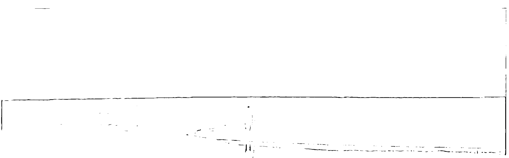

從3分鐘開始，輕鬆養成冥想習慣，提升自我肯定力，以全新的視野面對工作與人生！