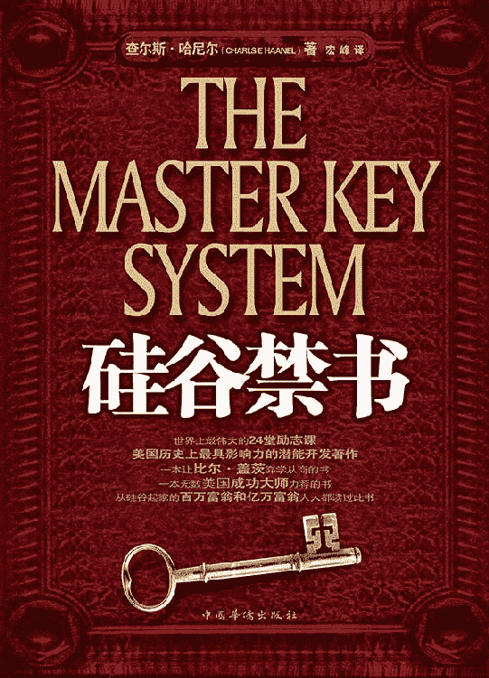

# 目录

硅谷禁书 1 硅谷禁书 2 硅谷禁书 3 硅谷禁书 4 硅谷禁书 5

# 硅谷禁书 1

## 目录

拿破仑·希尔写给哈尼尔的感谢信推荐序《硅谷禁书》的神奇命运作者自序第一课 引爆你的内在能量第二课 潜意识的巨大威力第三课 自己才是最丰富的宝藏第四课 我能成就一切第五课 想要就能得到第六课 全力以赴，才有收获第七课 绘制你的精神图景第八课 思想是成功与财富的种子第九课 首先要改变自己第十课 失败定有原因,成功必有方法第十一课 自然界最伟大的法则第十二课 聚集你的精神能量第十三课 梦想的精神作用第十四课 扫除一切消极思想第十五课 做一个有洞察力的人第十六课 成功者的精神法则第十七课 渴望的力量第十八课 引力法则第十九课 用知识克服恐惧第二十课 思想的神奇力量第二十一课 想大才能做大第二十二课 思维决定健康第二十三课 到达成功的巅峰第二十四课 我能，一切皆能附录 我们能从本书中学到什么

## 拿破仑·希尔写给哈尼尔的感谢信

尊敬的哈尼尔先生：

不知您是否还记得我，《金规则》的编辑拿破仑·希尔。

在此，首先请允许我向您欣喜地汇报一个有关我个人的好消息，我刚刚被一家国内著名的公司所雇用。与一般情况不同的是，我每个月只需要在这家公司工作几天，而年薪高达 105200 美元。这极大地出乎我的意料。雇用我的雇主说，这一切都只因为他看中的是我的思想以及我的思想为他们的公司带来的难以估量的积极影响。

我想，您大概已经知道，正像 1 月号《金规则》（我的秘书给您邮寄了一份）的社论中所提到的，我在 22 岁的时候，还只是一个靠体力活谋生、每天挣 1 美元的煤矿工人。

之所以要跟您说起这些，最大的原因是，我至今为止取得的一切成功，以及我在担任拿破仑·希尔学会会长之后取得的所有成就，绝大部分归功于《硅谷禁书》所讲述的“最神奇的 24 堂课”里所制定的那些体系与原则。

正如您在书中所写的，一个人能够在心里勾画出来的所有美好愿景，只要敢于将之付诸行动，就没有什么是不能实现的。我们所需要做的，只是把蕴含在我们自身内部的所有潜在力量激发出来。

鉴于此，我非常感谢您让我第一时间读完这本书，也感谢您为了让更多的人学习到书中的精华，而不惜将您多年来所总结出来的宝贵经验毫无保留地阐述出来，您的这种甘愿奉献的精神让我深为折服，因此，我希望可以与您携手合作，不遗余力地将这些创造财富的神奇课程推荐给我所能接触到的人们，让他们一起来分享这本书带给我们的生命中辉煌的成果。

您的忠诚的拿破仑·希尔

《金规则》编辑

1919 年 4 月 21 日，伊利诺斯，芝加哥

## 推荐序《硅谷禁书》的神奇命运

1912 年，纽约图书市场出现了一本神奇的书，这本书在出版后，仅仅上市几周，就从大众的眼里神秘消失了。1933 年，此书再次出现，但是这一次的命运却更加扑朔迷离，面世后短短数天，就被全面查禁，而且，这一次被禁时间长达 70 年，直到新世纪后才被解禁，这本名为《硅谷禁书》的神秘之书才得以重见天日。

《硅谷禁书》到底是一本怎样的书？它为何被禁止呢？

原来，这一切和本书的作者查尔斯·哈尼尔有着巨大的联系。因为查尔斯·哈尼尔在出版此书之前，一直在纽约商业协会担任商业管理课程的讲师。他将自己多年从事商业研究和个人潜能开发的精华体验浓缩成 24 堂课程，这些课程贯穿了哈尼尔多年的实践经验，将成功之道凝练成一条条切实可行的经典法则。此书出版后，刚开始时只在小范围内被人阅读，但读过此书的这部分人从书中发现了一个惊人的秘密——通过学习《硅谷禁书》中的成功法则，可以获得一种全新的能量，它将彻底改变你的人生观，让你获得巨大的财富。而当时的纽约商业协会几乎都是由一些成功个人组成的富人组织，他们被《硅谷禁书》中的神奇力量震惊了，因为这些富豪者不希望有更多的人从书中学习到成功的法则。他们发现，所有读过《硅谷禁书》的人，都如同接受了神的启示一样，从此脱胎换骨，在极短的时间内获得了巨大的成功。而在当时，财富与成功只属于极少数人所拥有，哈尼尔的书引起了纽约商业协会大部分人士的恐慌。出于这些人的一己私念，《硅谷禁书》被这些人利用职权查禁，目的就是不想让世人看到书中所阐述的成功之道。

《硅谷禁书》被查禁并没有遏止它的传播途径。因为此书被禁后，在纽约出现了一种奇特的现象，那就是《硅谷禁书》的手抄本正在少数人之中悄悄流行，尽管这些手抄本并非完整的《硅谷禁书》，但仍受到人们的狂热追寻。有人愿意以 300 倍的价格求购《硅谷禁书》的完整版本，但没有人愿意转让。更神奇的是，此书传入硅谷后，在那里掀起了一股争相传抄的热潮，而其中最大的受益人应该就是比尔·盖茨。当时的比尔·盖茨还在哈佛大学读书，他在非常偶然的情况下获得了一本《硅谷禁书》的完整版本，当他读完此书后，被书中所述的观点完全震撼了，他毅然决定放弃自己的学业而开始白手创业。短短几年时间，一个财富帝国诞生了，那就是“微软”！

时间已经过去了七十余年，非常幸运的是，《硅谷禁书》终于解禁了！活在新世纪的我们，终于有机会学习书中的所有课程。庆幸之余，我们绝不能错失这一次机遇，因为《硅谷禁书》已经不是单纯意义上的文字读本，而是一把开启财富宝藏的金钥匙。如果你仔细阅读此书，你必将重新认清自己的人生轨迹，从书中获得前所未有的力量，你一定可以创造出属于自己的成功神话！

## 作者自序

大多数人都认可并宣扬这样的一句话——“人是生而平等的”，这也是大多数人所坚持和信仰的一种观念。然而，事实上人并不是平等的，虽然我们都是由父母带到这个世界上来的，虽然我们的身体构造是相同的，但我们的思想和意识却有着迥异的差别。尽管这种差别可能从外表无法识别出来，但之所以会有成功与失败，富有与贫穷，非凡与平庸，正是因为有了这样的差别。

失败者就会抱怨自己的运气不佳，总是为自己的失败找借口，总以为如果幸运之神站在自己这边就会获得成功。同样地，穷困潦倒的人也是频频感叹命运的不济，总认为成功的人、有钱的人就是天生的富贵命，还幻想着如果自己也是富贵命，一定会更加的富有。其实，非凡与平庸的最大差别并不在于身体的强健与否，而在于人的思想正确与否，人的心智清明与否。若非如此，那么伟人就肯定是那些拥有健壮体魄的人了。

漫漫人生路，坎坷与艰辛同在。是心智，使我们能超越环境、战胜困难。只有深刻理解了思想的创造力，才可以发挥出它非凡惊人的功效。

世上万物并不是混乱无序，而是遵循着一定规律的。人的精神世界，和物质世界一样，也存在着规律。各种各样的规律，总是在控制着我们的物质世界和精神世界。

让我们时刻牢记，只有我们的思想才是能力和力量的源泉。若是依靠外在的帮助，我们便会变得软弱。然而只要你愿意，你就能够成为帮助别人的强者，而不是被帮助的弱者。我们必须及时地调整自己，以积极的心态，毫不犹豫地投入到自己的想法之中，去描绘自己的蓝图，创造属于自己的奇迹。只有清楚并严格地遵循这些规律，我们才能够得到理想的结果。同样地，也只有能够遵奉和恪守这些规律，我们才会得到准确的结果。

倘若你否认并拒绝接受由于遵守规律给人类带来的益处，倘若你不能够掌握并透彻地研究和利用那些最新的伟大成果，那么你很快就会发现，自己被社会和主流给抛弃了，被远远地甩在了后面。获得富有的人生，正是依赖于认识到了这个实现富有的规律。所以，只有那些认识、遵循这一规律的人，才能体会到它所带来的益处。

“种瓜得瓜，种豆得豆”，这个自然界的规律也同样地适用于人的思想。在你的头脑中建立积极的意象，就等同于创造出积极的条件助你成功。倘若你有意无意地想象各种匮乏、局限和混乱，那么与此同时，你的头脑亦可同样轻而易举地创造出消极的条件来，将你推进失败的境地、痛苦的深渊。

这样的错误，谁都有可能犯。千万不要过分自信地认为自己已是十分谨慎小心并有足够的智谋，肯定不会犯这种低级的错误。跟任何其他的规律一样，在潜意识里创造不利的条件而阻碍自己迈向成功，也是一种规律。它一视同仁，铁面无私地严格按照每个人所创造的回报他们，永不停息。

在当今，哲学思考已经应用于各个领域，其中的因果关系也已不再为人们所忽视。人们早已懂得因果循环的道理，那就是，要为实现自己的志向抱负而创造必需的特定条件。

所谓的规律，并不是显而易见的，而是隐藏于种种表象或假象之下的。我们只有将大量的、个别的事例进行对比，只有找出它们的共同之处，才可能找到规律，这种方法被我们称为归纳推理。正是因为规律的发现，所以才能够建立原则与推理，才能消除人类生活中变幻莫测的因素，生活中原来的那些不确定的因素才能相对地确定。

在众多人类文明进步的方法中，归纳推理是最科学的方法。每一个文明的国家无不受益于它，姑且不论是国家的繁荣昌盛、学术的欣欣向荣，还是人类寿命的增加、医疗的进步、信息的发达、人类视野的史无前例的开阔。我们上可翱翔于太空，下可以探究深海，这些都得益于归纳推理的思维方式。只要具备了这样的思维方式，那我们要做的仅仅是将结果进行分类，其他的都会自现于其中。

因此，如何正确运用精神世界中这些积极的、能动的因素？如何培养并正确运用想象力、欲望、感情和感官直觉？在“世界上最神奇的 24 堂课”体系中它将得到系统阐述。只有明确了这些，我们才能激活个体生命的潜能，才能做到精力充沛、洞悉世事、充满活力、不屈不挠，才能提高我们人生的效率和自身的才能。你知道如何识别机遇，如何加强你的推理能力，如何坚定你的意志吗？这些都是我最迫切想做的。通过学习这本书，就可以使你具有抉择的智慧、理性的同情，使你拥有主动进取、坚韧不拔的精神，让你知道如何尽情地享受高质量的生活。

“硅谷禁书”体系的目的也不是运用任何让人迷醉一时的骗术去蒙蔽善良人的双眼，误导人们。我不是江湖术士，既不会催眠术，也不会魔法。它只想教给你们如何更好地使用精神力量，不是替代品或曲解的产物，而是真正的精神力量。我始终坚信“一分耕耘，一分收获”，让我们一起钻研和实践这个真理吧。

极具创造力的精神能量，使你有能力为自己而创造出美丽新世界。而这也绝不是从别人的身上巧取豪夺，因为大自然从来不屑此举。正像大自然能够让原来只有一片草叶的地方生长出一片森林一样，精神力量之于人类，亦是如此。我坚信，你若是能够竭尽全力发掘出精神力量的巨大潜能，那么它绝不会辜负你。它会让其他人甘愿听命于你，因为它可以使其他人本能地认为你就是一个力量充沛、个性魅力四射的人。

拥有精神能量，说明你能够感悟到大自然的基本法则，并与伟大的自然融为一体。同时，这也意味着你了解魅力的奥妙所在、掌握成长的规律以及生存在世界上的心理学法则，意味着你拥有取之不尽、用之不竭的力量源泉。此外，拥有精神能量还意味着你像一块巨大的磁石一样，吸引着身边的人和事。在他人看来，你就是幸运之神的宠儿，你拥有梦想成真的金手指。

让我们加深对生命的感悟，掌控我们自身，常葆健康，增强记忆力，提高洞察力。这样，在任何情境下，我们对机遇和困难都洞若观火，有能力把握近在咫尺的大好时机。它以明确的原则，取代了那些飘忽不定、云遮雾罩的方法，而每一种效率体系都奠基在这些原则之上。这些都是很罕见的能力，能够改变成千上万男女老少的生活，同时也是每一位成功的人士所必备的特质，而这些就是我长篇大论的精髓所在。

洞察力，拨开困扰我们的迷雾，洞悉世事的本质。它摧毁猜疑、恐惧与忧郁，打破局限，消除匮乏。它唤醒你沉睡的才能，给你胆魄与活力，令你积极进取，也唤醒你对艺术、文学、科学之美的感受能力。在现实生活中，曾有多少人为了永远不可能实现的事而殚精竭虑，最终换来一头白发两手空空，却把眼前的机遇拒于千里之外，与成功擦肩而过却浑然不觉。本书讲述的就是如何开发人的洞察力，如何增强人的独立性，如何使你具有远见卓识，如何提高你的能力，改进你的性情。

美国钢铁集团董事长埃尔伯特·加里有这样一句至理名言，也是他取得成功的不二法门：“在多数大型企业中，顾问、专家、培训师等成功有效的运作管理诚然不可或缺，但我坚信，对正确原则的重视和采纳更是重中之重。”

本书不仅仅要教给人正确的原则，同时也不想给读者一本类似于其他课程的说教。它更愿意提出实践这些原则的方式、方法与读者分享，让读者懂得实践是一件多么重要的事。没有实践，就是不能取得任何能够证明这些理论的实际进展。所有的原则，若是只在书本上都是毫无用处的，只有将它们应用于现实生活，才能体现它的价值和魅力。只有根据本书提出的方法，遵守它的原则，身体力行地在日常生活中付诸实践，方为上策。

世间万物都在变，没变的只有变化。包括思想观念在内的世界上的一切事物，正在我们身边发生着变化。这些变化成为改变我们一生的最为重大的思想变革。

置身于生物的国度，你便会发现其间的一切都处于变动状态，永不停息地变化着，循环往复地进行着创造、再创造。在看起来一切都是固体的、不易挥发的矿物世界中，它们也无时不刻不在进行着细微的变化。每一个领域，总是在变得越来越美好，从低级演变为高级，从有形演变为无形，从粗糙演变为精致。当细察无形的精神世界的时候，我们会发现，能量处于最纯粹、最活跃的状态，随时准备被激发，以绽放出绚丽的花朵，结出丰硕的果实。

这样的一场人类历史革命，正改变所有人的观念，不分种族，不分阶层，不分信仰。然而，有的人能够对此端正态度，有的人对此却不屑一顾。

长期被传统桎梏羁绊的人们，已摆脱了所有的束缚。那些旧的习俗、教条等一切陈腐的、不适应时代发展的东西已被代表着新文明的思想、信念取代了。今天，科学为我们揭示出无尽的资源、无数种可能，展现出那么多的令人吃惊的力量。

过去的 20 世纪是一个无比光辉的世纪，它见证了人类历史上最辉煌的物质进步。与我们共同前进的 21 世纪必将再创奇迹，必将给我们的精神和心灵带来更伟大的、更显著的进步。那些处于沉睡中的神秘世界，被一种来自我们内心的、全新的力量和意识所唤醒，这样的觉醒引导我们重新审视自己的内心世界。

由分子的出现到原子的发现，进而到量子的问世，无不表明世界上所有的有形实体基本上已经被人们细化到了极致，它们的内部构造已经非常明白透彻。因此，接下来我们要做的事情就是把精神细化，找到精神的量子。安布罗斯·弗莱明爵士这样说过：“能量，就其本质而言，只有当它表现为我们所说的‘精神’或‘意志’时，才能被我们所理解。”

什么是大自然中最强大的力量呢？那是无形的力量。同样地，人类最强大的力量——精神力量，它虽然无形，但却不容小觑。精神过程唯一的活动方式是思维，观念是思维活动的唯一产物。因此，思维过程是精神力量得以显示的唯一途径。

不难看出，世事的变迁转化，只不过是精神事务而已。推理是精神的过程，而观念则是精神的孕育。其实，问题是精神的探照灯，而思辨与哲学便是精神有机的组织体。

使人的身体组织发生彻底改变的方法，就是针对某一给定的主题做出一定数量的思考。这是由于想法必然会招致生命机体某种组织的物质反应，如大脑、神经、肌肉的生理反应等，这就是由精神活动引发了机体组织结构中客观物质的改变。

原先的失败、绝望、匮乏、限制与嘈杂的声音，被勇气、活力、灵感、和谐等取代了。而且，这些新的精神力量慢慢在心中生根，身体组织也随之而发生改变，生命将被新的亮光所照耀，万物焕然一新，你因此获得了新生。这就是失败演变为成功的过程，也是一次精神世界的重生，生命因此而有了新的意义。这样的重生重新塑造了一个充满欢乐、信心、希望与活力的生命。新的思想不仅改变了你自身，同时也改变了你的生存环境、际遇以及你自身的形象。

尽管在此之前，你是在黑暗中不断地探索的，但是你已经熬过了黎明前的黑暗，现在你将看到成功的机遇，你将发现新的可能，新的世界。你的身上因此而充满了成功的想法，并影响到你周围的人，同时他们反过来又会帮助你实现自身与事业的攀升。那些新的、成功的合作伙伴将受你吸引而来，你们彼此促进，进而改善你的外部环境。

假如回到 100 年以前，便会发现那时的人是多么的脆弱与无力，恐怕只要一挺现代的机关枪，就可以轻易地歼灭整整一支用当时的武器装备起来的军队。相比之下，我们有理由相信每个人的崭新世界就在我们执著不断地追求中来临。美妙神奇、令人痴醉、广阔无边以至于几乎令你目眩神迷的崭新的一天、崭新的世界即将到来。因此，如果你希望获得难以想象的优势脱颖而出，那么就请你相信，并提前准备好吧。

## 第一课
引爆你的内在能量

首先，让我们开始第一堂课吧。进入这堂课，你原本就不平凡的生命将从此刻起大放异彩，它会使你的生命力变得空前强壮而旺盛，让你过上健康快乐的生活，使你的人生幸福美满。人类的强大就在于潜意识中蕴藏着宛如宇宙般无穷无尽的巨大精神能量。只要你愿意充满信心地去提高和挖掘自己，就一定可以找到可行的途径或方法实现这种惊人的改变。

而这种神奇的力量正是你自身本来就已经拥有的，你无须再去茫茫无际的外界苦苦找寻，你唯一要做的就是立即去充分地了解它，进而真正学会并熟练运用它。本课堂就是着力引导你去全面认知这种非凡的能量，切实掌握它，使它深深融入你鲜活有力的生命，成为你有形自我和精神自我的无比坚固的一部分。如此，你就能一往无前地战无不胜、攻无不克，完完全全地把控自己人生的命运。

每个人在昨天、今天、明天都必然谱写出属于自己人生的或壮丽或灰暗的蓝图。我们从一个个稍纵即逝的昨天迈步走来，在唯一可真正把握的今天用积极勇敢的行动点燃起鲜亮夺目的希望之火，把近在眼前的明天之辉煌绚丽的梦想放飞出去。在这之中，最重要的就是紧紧抓住今天，但昨天的种种经历与感悟也不能轻易忽略，它们是今天我们能够做出理性而正确选择的前提。世界多维而多彩，生命亦是珍贵而美丽，但所有这些缤纷与绚丽是呈现给那些有准备去接受而不是茫茫然毫无知觉就匆匆走过的人们的，让我们都成为用心来感悟美丽人生的人吧。慢慢深入地领悟这个世界，我们将会获得更多泉涌而来的感悟与自信，我们的生命也会因此更为深刻而丰富，充实而亮丽。

我们生命中的每一天，是明天，也是今天，更会成为昨天。好好珍惜并把握生命中的每一个今天，那么我们就会迎来更加灿烂耀眼的明天。下面开始我们的第一课。

1.太多不容辩驳的事实证明，成功从来都只偏爱有足够准备的头脑。准备得越多，就越靠近成功，反之亦然。我们要相信，灵感是从大量的积累或沉淀中提炼升华得来的。

2.在这个世界上，最为活跃而涌动不止的能量、最具不可思议的超凡创造性的就是人类的大脑思维。每个人的生活环境与际遇都是大脑生生不息的主观思维在客观世界中的具体反映，是我们自己造就了我们的所有生活。

3.我们以往的思维方式在很大程度上决定了我们每一次的选择，所以我们的选择并不是偶然的或随机的。我们只能在我们思想范围以内作出选择，而不会做出超越思想范围以外的任何行为。正是所谓的思路决定了出路，想法决定了方法。

4.我们的思想自始至终在主导着我们的一切行动。从某种程度上说，我们的思想以及思维方式决定着我们的现状和未来。我们今天所做的一切对未来人生都影响深远。

5.通常，我们潜在的能量总是被自己不知不觉地忽略了。意识到这种力量的存在就是重新认识自己的前提。那么，怎样才能意识到这种力量的存在呢？首先，我们必须明白一点——我们一切的力量都来源于自己的内在世界。

6.我们的内在世界虽然是无法触摸的，但却是真实存在的。它是一个由思想、感觉、力量等要素构成的、极具能动性和创造性的神秘世界。你简直无法想象它强大到何种程度。

7.我们的内在世界是由思想统治着的。我们只有意识到和探知到自己的内在世界，才能够从根本上解决那些使我们困惑不已的人生难题，进而就可以顺畅自然地解释产生这些难题的动因。一旦有效掌握了我们难以言喻的内在世界，那么,所有那些无往不胜的有关力量、取得成就与财富的规律或法则也就尽在我们的掌控之中了。

8.内在世界是一座蕴含着无尽的力量、无尽的智慧、无尽的供给的巨大宝藏，它拥有无比惊人的潜能，它可以轻松地满足现实的一切需求。只要能够认识到并加以运用和释放这种内在世界的无限潜能，那么由此而生的结果就会鲜活如实地反映在外在世界之中。

9.融洽的人际关系，舒适的生存环境，处理问题的高效和最佳的精神状态等这一切，都是由内在世界的高度和谐直接或间接映射到外在世界而表现出来的。同时，内在与外在的契合与和谐既是一切力量、健康和成就的充分条件，也是必要条件。

10.我们完全能够控制自己的思想，并在外来困扰面前更加积极主动地面对而不是消极对待，这些也是内在世界和谐的表现。

11.保持内在世界的和谐，这样我们就会变得乐观自信且能够不断进取拓展。在这种内在和谐世界创造的良好的精神状态的明智引导下，我们也会体验到外在世界带给我们的满足和愉悦。

12.同样的，外在世界也能够紧密而生动地反映出我们内在世界的变化和发展。

13.我们内在世界中所蕴涵的高超智慧，能够迅速地帮助我们开启和释放内在世界中的潜能。如果能够认识到这一点，那么我们就获得了把这种能量如实准确地映射在外在世界的能力。

14.我们一旦意识到内在世界所蕴含的惊人智慧，并能够合理运用它，我们就会在思想中也拥有这种惊人的智慧，通过有效地控制我们的行为而拥有实际的智慧和力量，从而为我们自身和谐的发展所需要的各种条件打造扎实稳固的基础。

15.每一个渴求上进的人，都会在内在世界萌生希望、热情、自信、坚强、勇气、友好和信仰等正面的愿望。进而能够通过这些品质来开拓和完善自己的精神世界，在完善与强大的精神世界的引导下，获得非凡的能力，使自己梦想成真。

16.生命并不是像表面看上去的那样——简单地从无到有再到无的浅显过程，而是一个逐步深入、持续升华的多层次的复杂过程。我们从外在世界所获得的一切，包括财富、健康、人际关系等，都是我们在内心世界早就已经拥有了的。

17.我们的成就和财富是建立在自己认知的基础之上的，我们的收获都是认知不断积累的结果。但如果认知中断了或意识分散了，那么就会使你事倍功半，效率锐减。

18.我们的内在世界能否正确发挥作用，与和谐息息相关。因为不和谐的内在世界就会导致混乱无序的外在世界。所以我们要想有所成就，就必须与自然法则和谐友好地相处。

19.思想是我们与外在世界产生关联的凭借，而大脑又是思想和意识的器官载体。大脑——脊椎神经系统是身体的枢纽，把身体的各个器官和组织密切联系起来，因此我们对光、热、嗅觉、声音和味道等各种感觉有了相应的生理或心理反应。

20.我们通过思考了解和把握事物的本质、事物发展的规律，正是大脑——脊椎神经系统把这些正确的信息传送到了我们身体的各个部位，使得我们的各种感觉相互作用并和谐统一，而且这种感知是舒适的、愉快的。

21.凭借思想和意识，我们把希望、勇气、信心、热情以及活力等能量都灌注到了我们的身体里。同时，思想也会把疾患、悲伤、倦怠、失望、匮乏等各种局限的东西带给我们，这些都是由错误的思维方式导致的，它们会捣乱和破坏我们的世界，导致它的不和谐与冲突。

22.通过潜意识，我们与内在的世界建立广泛而紧密的连结，这种潜意识的器官就是太阳神经丛。交感神经系统掌控我们的各种主观感觉，如愉快、恐惧、依恋、喜好、渴望、想象等各种潜意识现象。我们能够逐步掌控内在世界的能量之所以成为可能，正是因为这种潜意识成为了我们与内在世界之间的稳固桥梁。

23.这两大神经系统的协调以及各自功能的运用，决定着我们与内、外这两个世界的联系。只要认识到了这一点，那么就会有利于我们的客观和主观的协调一致，从而使我们自己和谐地发展；只要认识到了这一点，那么,面对各种外界的变化，我们就不会茫然不知所措，我们就能够明白未来是否成功根本就是取决于我们自己。

24.在任何场合、任何角落都适用的普遍的法则，遍及整个世界，所有正确的理念和思想都被它所涵盖。它是丰富的，强大的，充满智慧的，永不过时的。

25.这种普遍适用的理念能够把我们的想象转变成现实，它还能够指导实践。尽管每个人对这种理念的认识都不尽相同，但它发挥的作用是相同的。每个人的不同认识，只是它的不同的表现形式。

26.一般来讲，普遍适用的意识和理念的本质是相同的。因此，我们可以说所有的理念归根结底就是一条理念。而我们只有认真体会和领悟事物的规律，才能够找到这条理念。

27.宏观来讲，我们每个人的大脑中聚集的意念与他人的相比并没有什么不同，只是在作为个体化时，存在细枝末节的差别罢了。

28.这个能够普遍适用的理念，是一种潜在的能量，而且只能借由个体的人来展现。而个体化意识的集合就形成了普遍适用的理念，二者是集合和个体的关系。

29.我们每个人，作为个体之间不同的主要区别就是每个人的思维特点和思考能力的不同。这个区别正是人的内在意念的外化手段。而具体的想法则是由意念本身——一种静态能量的微妙形式所产生的。想法是意识的动态阶段，而意识是想法的静态阶段，由此可知，两者是同一事物的不同阶段的表现形式。从静态的意识到动态的想法再到现实中起作用，这正是人类的思维过程。

30.普遍适用的规则中包含了世间万物的内在属性，它无所不能，无所不知，无所不在。当然，万物的内在属性也包括人自身的属性。当一个人进行思考的时候，他自身的属性决定了他的思维动态，并通过人的行为反映在外在的客观环境中，与人自身的属性是相互呼应的。

31.归根结底，我们的行为所产生的结果都是思考的产物。所以，控制自己思想的根本所在就是把自己的行为结果规划好。

32.内在世界是所有力量的源泉所在，而且你是有能力掌控它的。掌控的前提是准确的认知，以及而后对这种认知的践行。

33.如果能够领会这条法则，并能够对自己的意识加以控制，那么你就可以自由地运用这条法则了。因此，你也能够真正对那些普遍适用的法则融会贯通，运用到自己的行动中。

34.每一粒原子的生命法则也同样是客观存在于普遍适用的法则之中，每一粒原子的内在属性和这个法则也同样的契合，所有的原子也都无时无刻不在遵循着这个法则。

35.大多数人并没有认识到这种全新的理念，他们只是企图从外在世界寻找解决问题的答案。显然，这样做是白费工夫的，或只是能够解决表面的问题，是治标不治本的。要想在根本上得到解决，那就要到内在世界中去寻找真正的答案，如此才能达到和谐的状态。

36.内在世界是源头，外在世界是支流。内在世界和外在世界是相辅相成的，共存的。我们在外在世界所体现的能力，取决于我们对这种能量源泉的认知。每一个个体都是这种无限能量的出口，而每个人对于其他人而言也是这样。

37.认知是一种精神体验过程，这种过程就是个体和普遍适用的法则相互作用的体现。这种精神体验过程的作用和反作用也是一种因果关系，这种关系并不是建立在个体之上，而是建立在人类共同的普遍性理念基础之上。我们的外在世界当中，并和我们的内在世界相呼应。

38.我们拥有的精神实体的世界是广袤的、丰富的，仿佛一个深邃无比的海洋。这个海洋蕴含着勃勃生机，它可以满足不同层面的精神需求。它是通过我们不同个体的思想来表达和外化的。

39.这种理念的价值就是体现在了对它的充分应用。当你能够真正领悟并自如运用这些理念和法则的时候，你的生活中就会发生很大变化，无论是物质层面还是精神层面：光明取代黑暗，和谐取代混乱，睿智取代迷茫，富足取代贫困。

### > > >开始心灵训练

接下来，就让我们把它付诸实践吧。先找一个安静不受打扰的地方，放松但不要放任你的身体，逐渐对你的身体实行完全的控制。让思绪自由地在内在世界之中徜徉，每次持续一刻钟或半小时，连续做三到四天或一个星期，直到你能够有所感悟，有所收获，达到一种美好的境界为止。

这个过程的快与慢是因人而异的，有的人不会很快进入状态，但也有人轻而易举就能做到。不要着急，只要每次都有进步即可。另外要注意，必不可少的前提就是控制自己的身体。最后就让我们好好体会一下本章的内容吧。

### > > >进行重点回顾

1.什么是所有成就和财富的基础？

认知。

2.生命个体是如何与客观世界连结在一起的？

生命个体是通过思想和意识与客观世界连结在一起的。大脑是思想的器官。

3.生命个体是怎样同内在世界相连结的？

生命个体通过潜意识与内在世界相连结。太阳丛是潜意识的器官。

4.普遍适用的法则是什么？

是客观存在的每一粒原子的生命法则。

5.个体是怎样作用于外在世界的？

每个人进行思考的能力就是作用于外在世界的能力，而这种思考就是认知的体验过程。

6.怎样达到最和谐、最完美的境界？

通过正确的思维方式。

7.是什么导致了混乱、冲突、匮乏等各种局限的东西？

是错误的思维方式导致的结果。

## 第二课
潜意识的巨大威力

大家都知道，世上从来没有一帆风顺的美事。那么我们所面临的最大困难到底是什么呢？是混乱的观念以及并不明了自己真正的兴趣所在。而如果要改变这种状况，我们所能做的就是在这些杂乱无章的现象中找到内在的规律，以便调整自身去适应自然规律。因此，清晰的思路和敏锐的洞察力就显得更加难能可贵。这些能力并不是从天而降的，而是建立在我们平日努力的点点滴滴积累之上的。

你的一切，包括你的道德取向、才智、判断、志向、品位、情感都会影响你在现实生活中产生的满足感。而前者是在你的学习中、实践中慢慢积累起来的成果，每个人的境遇不同，这种成果亦随之迥异。我们都在追求满足感，因此就要学习所有最优秀和先进的思想。

知识就是力量，而思想是更大的力量。这种能量更加神奇，远胜过那些促进物质进步的梦想，甚至是那些能想象到的最辉煌的成就。积极的思想能产生积极的能量，集中思想便是集中能量，所以集中的某些积极的思想将转化成为非凡的力量。这种力量正是不甘贫穷、不甘平庸的人们所孜孜以求的。

怎样获得这种能力？怎样使用这种能力？这一切的前提就是对这种能力的认识，认识得越深刻，就越可能获得这种能力，反之亦然。而一旦具有这种能力，它就会一直驻留在你的头脑中，就会不断创造、更新着你的思想和意识，并把这些改变在外在世界中生动地显现出来。我们的第二节课便是阐述认知这种力量的方法，它将教你怎样识别并掌握这种力量。让我们开始上课吧。

1.运转思维是离不开显意识和潜意识的共同合作的，它们是两种平行的行为模式。“只是想用自己有限的显意识去说明整个精神世界的内涵和外延的行为，就如同用一只蜡烛想去照亮整个宇宙。”戴维森教授如是说。

2.思维为我们的认知活动做好充分的准备，它是一件颇为完美的作品。其中的潜意识运行是准确而富有逻辑性的，自然不会出现张冠李戴的情况。但令人遗憾的是，又有多少人知道什么是思维运作的规律和逻辑呢？

3.潜意识，在我们需要的时候就送来足够的供给，为我们耐心而辛勤地劳作。就像一位默默无闻的幕后工作者，一位不求回报的仁爱慈善家。潜意识提供了一个让每个人尽情表现的舞台，是我们内在世界最重要的精神活动的源泉。

4.潜意识成就了无数的人，正是通过潜意识，莎士比亚就从一个普通学生的反应中领悟到了那些伟大的真理并表现在他的作品中；也正是通过这种潜意识，菲迪亚斯创作了那些著名的大理石和青铜雕塑，拉斐尔画出了圣母像，贝多芬写出了令世人惊叹不绝的交响乐。

5.潜意识教给了我们在工作和生活中处理问题的各种方式，而不是我们的显意识。潜意识还教我们弹钢琴、溜冰、打字以及干练圆滑的商业行为等完美的技巧。一边弹奏流畅优美的乐曲，一边和他人进行着幽默风趣的对话，这更是归功于潜意识。

6.我们每个人都得依赖于潜意识。思想越是崇高、伟大、卓越的人，就越清楚潜意识在其中发挥的不可替代的重大作用。在绘画、雕塑、音乐等艺术的各个方面的技巧、本能，还有灵感、美感，全部都在潜意识中而且也只能在潜意识中找到。

7.潜意识引导我们的思想过程、我们的品位，还有对生活的态度。它从我们的记忆库中提取我们所需要的一切信息，如人物、场景以及时间。潜意识无时无刻不在注视着我们的生活。它的价值是显意识所无法比拟的，是非凡的。

8.我们无法随意地控制我们的生理机能，不能随便地停止自己的心脏跳动，也不能阻止自己的血液循环。但是在潜意识的指引下，我们可以随心所欲地用感官去感受这个世界，改变这个世界。

9.我们的行为可以概括为两种：一是听从当前的意愿发号施令而有所行动，一是根据潜意识中的规律有条不紊、从容不迫地支配行为。显然，后一种行为更有研究价值，研究后我们会认识到，这些来自于潜意识的规律，自产生以来就是如此的运转，它们似乎一直就被控制在我们永恒的内在力量之中，从不受我们意愿的管制与操纵，不被各种影响而左右。

10.显意识和潜意识主导着我们的这两种行为，外在的可变能量就是显意识（客观意识），内在的可变能量就是潜意识（主观意识）——保障我们的内在世界有序地进行。前者更接近现实层面，后者则更接近精神层面。

11.显意识是通过我们的感官对外在世界发生作用，是我们的意志及其所产生结果的动力源。它具有分辨、鉴别、选择以及推理的能力，其中可以把推理能力如归纳、演绎、分析、推论等开发和拓展到更深的层次。

12.显意识能够引导潜意识活动，它充当着潜意识的监护人，要为潜意识所引发的行为承担后果。有些时候，这个角色可以从根本上改变我们现有的状况。自然，显意识也会在其他的精神活动上留下自己的印记。

13.潜意识处于我们意识的较深的层面，若是接受了一些错误信息，就会直接反映到大脑，进而影响到我们的现实行动。然而，显意识就是充当门卫的作用，在潜意识接受之前便把这些错误的或是负面的信息，如恐惧、焦虑、疾患以及冲突等统统挡在门外，从而保护我们的行为。

14.如何区分显意识与潜意识呢？有位作家是这样区分的：“前者是意志推理的结果，而后者是以往意志推理的累积结果产生的本能的欲望反应。”

15.潜意识只从现有的前提下进行判断对错并得出行为的指向，它本身并不具备推理证明的能力。若提供的前提是正面的或正确的，潜意识就会得出正确的判断和正确的指向；若提供的前提是负面的或错误的，潜意识得出的结论就是错误的，产生的行为指向也就是错误的。只有通过显意识的把关，才能防止这种错误判断的发生。

16.除了能够判断现有的前提之外，潜意识是从来不去判断它所接受信息的正确与否的，更谈不上让它更正这个前提并在此之下引导行为。然而，我们所处的现实境况所带来的信息并不都是正确的。若是错误的，潜意识的判断行为就会误导我们的人生轨迹。

17.与此同时，作为潜意识的监护人及门卫的显意识也并不是万能的。它总会有擅离职守或判断失误的时候，尤其是在异常复杂的情况之下。此时的潜意识，就会对所有的信息和暗示敞开大门，很多负面的、错误的信息就会趁机长驱直入，尤其是在情绪激动以及各种刺激中，这种情况发生的几率会大大地增加。这样的结果就是制造出很多负面的东西，比如自私、贪婪、恐惧、憎恨、自暴自弃，甚至是长时间的悲伤压抑。由此看来，潜意识的大门对我们来说是多么的重要，保护好它尤为重要。

18.与显意识相比，潜意识的过程非常短暂，因为它只是通过直觉做出判断而不需要证明自己的判断。而显意识则显得缓慢得多。

19.潜意识一旦接收到信息，就会按照它自己的规则运作，得出它的判断，反应很迅速。而它的规则就是我们作用于外在世界的所有行为的动力之源，这也就是我们为什么要去探究它的原因。

20.只要了解了潜意识的运行规则，就会发现生活中有太多的地方都能实践这种规则。举个例子，比如一个你原以为可能很艰难的谈判，但随后也许由于一个合适的话题，或由于某个契机，谈判圆满结束了。再比如，当你面对可以预见的很多困难一筹莫展的时候，突然发现自己自然而然地另辟蹊径，扭转了当前的不良处境……事实上，只要掌握了潜意识的规律并能很好地利用它，就能够顺利化危机为转机，机智地应付各种各样困难的局面，有效地开阔你的视野。

21.我们为人处世的原则以及对未来设想的源头便是潜意识，包括我们的品位、审美在内的各种品质都是来自于我们的潜意识。它就是已经写好的程序，并能够在我们的身体中自然无碍地运行。假如接受了负面的信息，若要克服负面的后果，那就必须给它以持续不断的反暗示，直到排除原有的负面暗示，使得潜意识接受新的、健康的思维方式或生活方式为止。我们长期坚持不断地做某一件事，便会形成习惯，也就会在潜意识中形成固有的模式。习惯源于潜意识，而不是根据显意识的分析、鉴别或是推理而产生的。

22.健康的好习惯，我们要坚持下去。反之，错误的、有害的习惯则要利用相反的暗示来清除出去。只有清楚地认识到潜意识中蕴含着巨大的能量，并坚信你可以大力开发自己的潜意识，才能够使你的生命力量与之相结合，才能使你的人生更充实、更绚丽。

23.最后总结一下潜意识的作用：在物质层面来讲，潜意识是生命得以维持的必需，在大脑正常运转中也发挥着十分重要的积极作用。这些都是取决于潜意识具有的宛如天生的本能，如心脏的跳动、血液的循环等等。

24.在精神层面来讲，潜意识有着强大的记忆储存功能，好比一个巨大无比的仓库或银行，它可以存储人生中所有的认知、思想和情感。另外，它还十分有助于发展人的智力，能够极大激发人的创造力，使人的思维敏捷，精力集中。

25.在心灵层面来讲，我们的理想、抱负和想象都是起源于潜意识。它能够激发出我们的源源不绝的内在力量，也就是说，潜意识是连接人类心灵与宇宙间无穷智慧的一座无比宽阔的桥梁，是连接精神世界与物质世界的强大纽带。

26.接下来，我们来研究潜意识究竟是怎样改变环境的。潜意识的规则之一就是，它可以激发起我们独特的创造性，而这种创造性同时又通过我们的思想反映出来并付诸行动，进而改变我们的还不甚理想的现状和处境。

27.我们把思维分为两种：一种是简单的思维，它直接、无意识；另一种是引导思维，它有意识、有逻辑并富有建设性。当充分利用我们的引导思维时，我们就能完全统一主观和客观，就会迸发出无穷的震撼人心的创造力。也可以说，我们的意识是具有创造力的，能够对客观环境发挥主观能动的作用，其成果会精确地表现在我们的外在世界之中。而这个法则就是所谓的“引力法则”。

### > > >开始心灵训练

在上一课我们完成了主要针对身体进行控制的训练，接下来的训练就是控制自己的思想。让我们再一次进入完全沉静的状态，最好能跟上一次是同一个地点，只要能够真正让你安静下来的地方就行。然后试着控制自己的思想，保留那些幸福、安详的感觉，远离那些担忧、焦虑的想法。经常进行这样的练习，会让你懂得怎样控制自己的思想和情绪，怎样以一种良好的状态来面对人生。

首先要明确这个练习的重要性，我们如果控制不了自己的思想，那自然就控制不了我们的情绪状态，那么我们就会被生活中无穷无尽的琐事而烦恼、郁闷，以至于错过一些能够实现我们价值的机会。为了摒弃那些无足轻重的东西，为了让我们时刻保持清醒，为了不浪费我们的光阴，让我们的训练从今天开始，并坚持下去吧!

### > > >进行重点回顾

1.什么是精神行为的两种模式？

显意识和潜意识。

2.是什么决定了悠闲从容的理想状态？

我们不再依赖显意识活动的程度决定了悠闲从容的理想状态。

3.潜意识的价值体现在哪里？

潜意识是记忆的中枢，它有着非凡的价值。其价值体现在它能够控制我们的生命过程，警示、引导我们。

4.什么是显意识的功能？

显意识具有识别检查的功能。另外，它还有推理的能力，是意志的策源地，并影响着潜意识的活动。

5.如何表述显意识和潜意识的差异？

显意识是推理的意志，而潜意识是由以往意志推理的结果累积而产生的本能的欲望反应。

6.如何去影响潜意识？

在内心里不断地暗示自己，强调你想要的结果。

7.积极影响潜意识的结果是什么？

使主观和客观相一致，才能够运转实现所要求的结果的力量。

8.这一规律运转的结果如何？

我们的外部环境是客观条件的反映，而这些客观条件与我们内在世界所规划的要一致。

9.这一法则叫什么名字？

引力法则。

10.如何陈述这一法则？

精神是具有创造力的，并自动与其客体相关联，在客体中显示出它巨大的能量。

## 第三课
自己才是最丰富的宝藏

跟偌大的宇宙相比，人是极其渺小的，是沧海之一粟，是泰山之一石。但是人绝不该是被动的、无所作为的，每个人都应是世界的主人。人正改变着世界，让世界尽可能地以我们的意愿来运转。同时，世界也在改变着我们，这种作用和反作用就体现了因果关系。

毫无疑问，思想永远是走在行动前面的，只有想到了才能做到。所以，思想就是因，而你在生活中因此而遇到的一切就是果。有因才有果，既是如此，那就不要再为过去或现在的一切境遇有些许的抱怨了。因为这一切都是你自己的所思所为而造成的，完全在于你能否把环境塑造成你所希望的样子。

我们的脑海里蕴藏着世界上最丰富的资源，我们的思想蕴含着极其丰富的宝藏。让我们努力开发精神能源吧，把它们最大化地转变为现实。使它们彻底地听命于你，开发出一切真实的、长久的能力。

当你渴望帮助时，那么请你记住无须向外界作无谓的求助，你自己就是一切力量的源泉，没有谁会比你更强大。只要你了解了你的真实潜能，坚定不移地朝着目标付出努力，你在生命的旅途中就不会被绊倒，就没有任何困难能阻止你向理想的前方迈进，因为精神力量随时随地都准备向坚定的意愿伸出及时有力的援助之手，帮助你把想法和渴望扎扎实实变为明确的行动、事件与条件，只要你愿意开启它。当你做到了这些的时候，就是你找到了生生不息的力量源泉的时候，此时你能够从容应对生活中产生的各种境遇，并且得心应手。

显意识会让我们刻意地去做一些事，只要我们把它们变成自发的意识或潜意识，就可以把我们的自我意识从中解放出来，进而可以关注其他。习惯渐成自然，在新一轮的回合中，这些新的行动又渐渐变成了自然轻松的习惯，继而成为潜意识。这样，我们的心智可以再度从这一细节中解放出来，进一步投入到其他的新行动之中。实际上，显意识转变为潜意识的过程就是从刻意到自觉再到习惯的改变，也就是形成习惯的过程。

1.人体的器官不同，其分担的工作也必然不同。比如大脑——脊椎系统，它是显意识得以发生的器官，而交感神经系统则是潜意识赖以发生的器官。大脑——脊椎系统是我们通过感官接收意识传输的渠道，并控制着全身的所有动作，它的中枢在脑部，担任显意识的工作。而潜意识的工作则是由“太阳神经丛”所担当，它是一个神经节丛，在胃的后部，是精神行为的渠道，是交感神经系统中枢，同时支撑着人的生理机能。

2.是“迷走神经”把显意识和潜意识两种系统连接起来的，迷走神经作为大脑——脊椎系统的一部分，它是从脑部延伸出来的，并延伸到胸腔，其分支分布在心脏和肺部，最终穿过横膈膜，并脱去表层组织与交感神经交结起来。这样就构成了两个系统的联结，使人在物质上成为一个“单一实体”。

3.人类的大脑就相当于一台电脑的显示器，接收每一种想法，并在脑海中形成相应的影像，但它要听命于我们的推理能力。当认定客观想法正确时，就会被传递到潜意识系统或是主观意识当中，成为我们生命的一部分，然后再作为事实传递给外界。但在到达主观意识之后，这些想法就对推理论辩产生免疫力了，不再受其影响。潜意识不能进行推理，只是执行，它会全盘接受客观想法的结论。

4.所谓“太阳丛”，就是因为它是像太阳一样能够分发能量的中枢机构，把全身不断产生出来的能量传递出去。能量被神经运送到身体的各个部位，散播在周围的大气中。这种能量是非常真实的能量，而这颗太阳亦是非常真实的太阳。

5.如果“太阳丛”的辐射足够强大，人的身上就会散发出很强的吸引力——充满人格魅力。这样的人会向周围的人群散发良好的能量。他的出现，本身就会给那些与他接触的人带来安慰，就像太阳一样照耀着周围的人，平息他们精神上的风暴。

6.显意识系统，就相当于一个马力强劲的发电机，当它启动运转时，就会辐射出生命能量，此时你全身各部分的能量都处于被激发状态，这种被激发的能量会传递给与你接触的每一个人。这种感觉令人愉悦，它使生命充满活力，使周围的人都会受到你的感染，变得和你一样的精神焕发、活力四射。

7.如果“太阳丛”系统失灵，功能紊乱，那么通往身体各个部位的能量就会中止，人就会处于情绪低迷状态，对一切都提不起兴致。这就是造成我们精神和肉体上的困扰、或是受到环境的各种困扰的原因所在，当然这也是产生失败的主要原因。

8.假如给我们的显意识思想提供能量的通道不够顺畅的话，就会造成思想上的困扰；若是潜意识和宇宙精神的联系被破坏了而无法沟通并处于紊乱状态的话，那么就会造成环境上的困扰。

9.“太阳丛”就像一个枢纽，处于十分重要的位置。生命的数量是无限的，个体可以从这个太阳的中心孕育出来。在这里，宇宙可以转化为个体，无形可以转化为可见，有限可以转化为无限，寂灭可以转化为创造，它是部分和整体相互转化的点。

10.显意识的能量潜伏在能量的中心里。之所以能够完成一切应当完成的任务，是因为它是身体全部能量的总和，全部生命和全部智慧的汇合点。

11.显意识是策划者，潜意识是执行者，潜意识能够并且必将执行显意识交付给它的一切计划和使命，二者珠联璧合，配合得天衣无缝。

12.思维的质量取决于显意识的思想的质量。我们的显意识所抱持的想法的品格决定着思维的品格，其特性决定着思维的特性，从而决定着将导致最终结果的人生遭际的特性。我们能够辐射出的能量越多，我们就会以越快的速度把令人不快的境遇改造成令人快乐、受益的源泉。由此可以得出，我们所要做的一切就是增强我们的电量，使我们内心的光芒照亮四面八方，抚慰万千苍生。

那么，我们怎样使内心的发光体闪耀出光芒，怎样产生这种能量呢？这是一个十分重要的问题。

13.消极的意识就是寒流，它会削减“太阳丛”的光芒，使之黯淡无光；而积极、愉悦的想法就像暖风，能给“太阳丛”升温，使“太阳丛”不断扩张。我们的信心、勇气、希望就是“太阳丛”的暖风，相对地，恐惧便是太阳丛的主要敌人。只有令“太阳丛”永远灿烂，不被乌云遮蔽光芒，才能够彻底打垮、消灭这个敌人，才能把它驱逐出境，直到永远。

14.恐惧在不停地扩展它的疆土，它是一个贪心的恶魔。一旦染上它，它就会在你全身扩散，使你每时每刻都处在它的控制之下，甚至让你恐惧每一件事和每一个人。只有当恐惧被彻底地、有效地清除时，你的太阳才会闪光，阴霾才会消散。也只有这样，才能使你重新充满活力，重新找到生命的源头，重拾久违的快乐心情。

15.之所以会产生恐惧，是因为自己不够强大，是因为对自己缺乏信心。只有当你发现自己真的拥有了无限力量时，只有当你通过实践证明了自己足以凭借思想的力量战胜任何的不利因素时，只有当你自觉地认识到这种力量时，你才会觉得没什么可恐惧的了。因为你知道，与恐惧相比，你是更强有力的。

16.是我们对自己权利的不敢坚持或维护，才导致了世界对我们的苛刻。也就是说，世界只对那些不能为自己的思想争取容身之地的人发难，只会对他们冷酷无情。而我们却是由于畏惧这种发难，才把我们的许多思想深埋在黑暗之中，不敢让它们见于光天化日之下。假如我们一无所望，那么我们就将一无所有；假如我们希冀颇多，那么我们就将很自然地得到更多。这正是所谓的“有期望才能有所得”。

17.太阳之所以不需要外来的光和热，正是因为它自身拥有着光和热。拥有太阳的人，总是忙于向外界辐射自己的勇气、信心和力量，他们以期许成功的心态把障碍砸得粉碎，跨越了恐惧在他们前进道路上设置的重重障碍——怀疑和犹豫的鸿沟，如此就没有什么可以阻挡他们迈向成功了。

18.只有当你意识到自己拥有太阳时，你才不会畏惧黑暗。一旦认识到这一点，我们也就没有什么可畏惧的，因为我们的力量原本就是无穷无尽的。

19.大家都知道，运动员是通过锻炼才变得强健有力的，而我们是通过实践来学习的。为了获得更深刻的认识，只有把知识付诸实践。

20.我们每个来到这世界上的人，都带着不同的使命。钟情于自然科学的人，则可以唤醒自己的“太阳丛”。倾向于宗教信仰的人，也可以让自己的太阳发光。偏爱科学阐释的人，则可以发挥自己潜意识的功效。

21.潜意识就是显意识的镜子，会分毫不差地回应显意识的意愿。但是，让你的潜意识发挥你所想要的功效，最简单的方法又是什么呢？这说起来很简单，那就是让你的内心关注你所向往的目标。只有当你真的把内心的关注点集中起来的时候，潜意识才开始为你服务。

22.创造就是打破一切已有的约束、陋习，就是思想不再受束缚。创造性的能量是无限的，它能摆脱任何以往的约束。因此，也就是没有已有的范式能够应用其建设性原理。

23.整个宇宙的创造原理是宇宙精神，而潜意识作为宇宙精神的部分，和整个宇宙精神是相结合、相统一的。潜意识会对我们的显意识意愿做出回应，这说明宇宙精神无限的创造性能量是被人类个体的显意识所掌控的。

24.正如我们知道的，一杯水不能浇熄一堆燃烧的木头。同样，无限的能力不需要有限的能力告诉它如何去做。你只需要简单地说出你想要的，而不是你想如何去实现它。虽然，这不是惟一的方法，但却是一个最简单、直接而有效的方法，因而这也是能够给我们最佳效果的方法。

25.我们知道，潜意识是宇宙精神的一部分，也是宇宙的渠道。它通过占有把浑沌一片的宇宙分化开来。只要在你想要的结果之上注入“因”作为动力，你就可以扬鞭驰骋了。这表明宇宙只能通过个体来实现，而个体也只能通过宇宙来实现——二者是互为依托、相辅相成的。

26.人的精神跟弓箭的弦一样不能总一直绷着，一张一弛方为文武之道。紧张会使精神活动反常变化或动荡不安，会使人产生忧虑、恐惧和焦急的负面情绪。相反，放松可以使精神功能游刃有余地进行，这是绝对必要的。

### > > >开始心灵训练

首先请你彻底地静默下来，尽最大的可能停止、并放松你的思想，同时让肌肉保持正常的状态。身体的放松练习是一个意志自主的练习，它将对你大有裨益，因为它能使血液在周身畅通无阻地循环运行。这将把一切的压力从神经当中驱逐出去，把那些将会导致肉体劳顿的紧张状态消除得无影无踪。

请你尽你最大的可能放松你的每一块肌肉和每一条神经，直到你能感受到宁静从容，与世界合二为一时为止。此时的“太阳丛”就开始运作了，这将会让你惊叹不已，你会明显地感觉自己的能力在一点一滴地增强，觉得自己越来越充满力量。

### > > >进行重点回顾

1.显意识器官的神经系统是什么？

大脑——脊椎神经系统。

2.潜意识器官的神经系统是什么？

交感神经系统。

3.身体产生的能量分发的中枢是什么？

“太阳丛”。

4.什么会经常干扰能量的分发？

恐惧、苛刻、混乱的想法会干扰到能量的分发，其中最严重的是恐惧。

5.能量分发被干扰的后果都有哪些？

后果是整个人类所遭遇的一切苦难。

6.如何控制、引导身体产生的能量？

身体产生的能量是被潜意识所控制、引导的。

7.如何彻底消灭恐惧？

必须对于一切能量的真正来源有所领悟、认知，才能消灭恐惧。

8.哪些因素决定了我们生活中的一切境遇？

是我们精神中占主导地位的态度决定了我们生活中的一切境遇。

9.如何激活“太阳丛”？

集中精神，专注于我们渴望能够在生活中出现的境遇。

10.宇宙的创造原理是什么？

宇宙精神。

## 第四课
我能成就一切

因果循环，有因才有果，无风不起浪。然而在现实生活中，很多人都只注重结果，而忽略了最关键的原因。

这是由于“因”隐藏在过程之中，是潜在的、不引人注意的。而“果”则是显现的、引人注意的。思想能够转化为能量，能量亦可推进思想，但由于一切宗教、科学、哲学都是这能量的表象，而不是能量本身的缘故，当能量以“因”出现在我们面前时，它就被忽视、或是误解了。

但反其道而行之的《硅谷禁书》，只关注“因”的那个方面。实际上，和快乐、幸福、健康、财富相对的悲伤、不幸、疾病和穷困都是纸老虎，我们应敢于并且也有能力消除它们。生命就是一种表达，我们不可推卸的责任就是和谐而富有建设性地表达自己，这也是我们的分内之事。

只有高于并超越种种限制，才能消除这些因素。就像船长驾驶船舰，又如火车司机开动火车一般，所有厄运、幸运都尽在掌握之中。一个强化并净化了思想的人不必再担心细菌的侵扰，一个懂得了财富法则的人很容易就能够看到致富源泉的所在。

一个人的一切取决于他的想法、做法和感受。所以，出现了宗教上的神与鬼，发明了科学上的正与负，定义了哲学上的善与恶。那么，是做一个主动有力的强者还是一个被动无力的弱者，是做一个驾驭自己命运的成功者还是任人宰割的失败者，这一切都取决于你自己。

1.“自我”不是身体，亦不是心智。实际上，身体只是“自我”执行任务的工具，而心智则是“自我”进行思考、推理以及谋划的工具。

2.只有认识了“自我”的真实特质，才能享受到前所未有的、充满力量的感觉。这是因为“自我”能够控制并引导身体和心智，进而能够指挥身体和心智去做什么，以及怎样去做。

3.你可以成为任何一种你想成为的人，因为一切的个人特征、习惯和性格特点都潜藏在你的身体里，它们都是你以前的思维方式的产物，而这些和你的“自我”并没有本质上的联系。

4.“自我”被赋予的最伟大、最神奇的力量才是思想的力量。然而遗憾的是，很少有人知道什么是具有建设性的、或是正确的思考，正是因为这样，人与人之间便产生了差别，有了好坏、善恶之分。多数人允许自己的思想驻留在自私的层面上，而这正是幼稚的心智不可避免的结果。只有当人们的心智变得成熟时，才会懂得自私的想法正是孕育失败的温床。

5.那些以为别人比自己愚蠢的人，才是最愚蠢的人。我们做任何一件事，都必须让每一个与这件事相关的人能从中受益。任何一种企图利用他人的软弱、无知或需求而使自己受益的举动，都只会落到赔了夫人又折兵的惨淡下场。

6.正如大家都知道的，宇宙是由无数个个体组成的，个体是宇宙的一部分。属于同一个整体的两个部分之间是不能相互敌对的，因为只有团结才能产生合力。因此每一个部分的幸福都建立在对整体利益的认知的基础之上。

7.尽最大可能把注意力集中到任何一个主题上，同时不让自己精疲力竭，才能果断地消除一些游移不定的想法。不在任何一个无益的目标上浪费时间或者金钱，才是最睿智的做法。

8.春种秋收，因果循环。我们可以借用这句强而有力的口号来增强你的意志，认识你的力量，那就是：“我要成为怎样的人，就能成为怎样的人。”

9.如果你能尽自己最大的努力去理解“自我”属性的真正内涵，那么你将无往不胜；如果你的目标和意图是具有建设性的，并且与宇宙的创造原理和谐统一的话，那么你将战无不胜。在奔向成功的道路上，所有人只能看到你的背影，你是他们的领军人物。

10.无论何时，无论何地，只要你想起“我要成为怎样的人，就能成为怎样的人”，那么你就重复一遍。就这样坚持下去，使它成为你生命的一部分，成为你的一种习惯。

11.要做任何事都要坚持到底，万不可虎头蛇尾。如果我们不把已经开始的事情完成、或是作了某项决定却并不坚守的话，那么我们就形成了一种失败的习惯——彻彻底底的、可耻的失败。如果你不想做一件事情，那你就不要开始；如果你开始了，那么即便是天塌下来也要把它做成，不要受任何人、任何事的干扰。让你身上的“自我”做出决定，事情已成定局，没有讨价还价的余地，那么你就只有完成它，并全力以赴把它做好。

12.就是一滴水也可以折射太阳的光辉，从最小的事情做起，从那些你能够掌控、能够不断取得进步的事情做起。但在任何情况下都不要容许你的“自我”被推翻，那么你将发现你最终一定能够战胜自己。但也要知道小事中也藏着大玄机，许许多多的人们都曾悲哀地发现，战胜自己，并不比战胜一个国家更容易，那是一项艰难的任务。

13.谁是你最强大的敌人？他往往就是你自己。只有当你学会战胜自己，你的“内在世界”才能够征服外在世界。此时的你将攻无不克、战无不胜，一切都会对你的每一个愿望做出积极回应。此时此刻，成功于你，就如探囊取物般轻而易举。

14.宇宙精神或宇宙能量就是所谓的“无限之我”，人们通常称之为“上帝”。那么，我们的“内在世界”又是由“自我”掌管着的，而这个“自我”正是包含于“无限之我”之中。

15.赫伯特·斯彭德曾经这样说过，“发生在我们身边的所有奇迹中，最令人确信的是：我们一直置身于万物、或由此而产生的无限而永恒的能量之中。”这些并不仅仅是为了证明或建立某种观点而提出的一种陈述或理论，而是一个事实，并且是被最优秀的宗教思想和科学理念所接纳的事实。

16.科学发现了亘古常在的永恒能量，而宗教却发现了潜藏在这能量之后的力量，并把它定位在人们的内心之中。这体现了科学与宗教的不同分工，但这也绝不是什么新发现。《圣经》中早已有所描述：“难道不知你们是神的殿，神的灵住在你们里头吗？”我们“内在世界”的神奇创造力的奥秘就体现在这里。

17.你无法给予别人你没有的东西。你不具有的你怎么能给予呢？倘若我们软弱无力，那么就无法帮助别人；倘若我们希望自己对他人有所帮助，那么首先自己要拥有能量。只有先让自己变得富有，才会有能力去帮助他人。

18.充分开发自己的潜能，这会让你受用不尽。因为人的潜力是无限的，是永远挖掘不尽的。无限则意味着永远不会破产，而我们作为无限能量的代言人，自然也不应以破产的面貌出现。

19.克己忘我并不等同于成功，战胜一切并不是目中无物。这就是控制力的奥秘所在，也是力量的奥秘所在。

20.欲取之，必先予之。我们必须对他人有所帮助，我们给予的越多，所得的就越多。宇宙处于不断寻求释放的永恒状态之中，处于帮助他人的永恒状态之中，所以它总是在寻求让自己能够最好地释放的渠道。而我们应是宇宙传递活力的渠道，这样才能做更多有益的事，能够给予他人更多的帮助，并尽力做到最好。

21.我们要高瞻远瞩，不要只拘泥于自己的计划或是人生目标。让我们所有的感觉安静下来，专心地寻求内心的愿望，把精力的焦点放在内心的世界中，并在这种认知中安居。密切注视各种各样的机遇，找出能量所赋予你的精神通道，这正是所谓的“静水流深”。

22.精神是万物的精华，精神是真实的存在，因为它就是我们生命的全部。如果精神离去，那么生命也就随之而消逝了，不复存在了。所以，精神就是生命的灵魂，我们真正的价值体系。

23.精神活动是属于内在世界的，因为它是在头脑和心灵中完成的。精神还是属于“因”的世界，而由内在世界产生的一切环境和景况都是“果”。因此，你便是创造者，这是比其他所有的事都更重要的劳作。

24.与肉体一样，精神也会因过度操劳，而感觉倦怠。倘若精神倦怠，就会无法前进，就无法再进行实现意识力量的工作了。因此，我们必须经常寻求适时的“寂静”，在“寂静”中我们才可得以安宁。当我们安宁下来，我们才能好好地思考，而思考正是一切成就的奥秘。力量是通过休息得以恢复的，所以请不要忘记让你的精神也休息一下，欲速则不达。

25.思考是一种运动形式，它并不是静止的。而且，它遵循着爱的定律，激情赋予它活力。同时，它的形成与释放都遵循着增长规律。思考是自我的产物，同时也是创造性本质的产物，精神的产物，神圣的产物。

26.首先，我们必须唤醒心中的激情，因为激情可以使思考成形。只有这样，才能释放能量，获得财富或实现其他具有创造性的意图。

27.持续思考同一件事情，最终会使这种思考变成自发性的行为。我们会情不自禁地思考这件事情，直至我们对所思所想再毫无疑问，并持积极的态度。这是因为同身体力量的获得一样，精神力量的获得是通过锻炼达到的。我们思考一件事情，可能在头一次非常困难，但当我们第二次思考同样的问题时，就变得容易多了。当我们反反复复、一遍又一遍地思考它的时候，这种思考就成了一种习惯。

28.只有能够有意识地迅速而完全放松下来的人，才是自己的主人。那些做不到这样的人是尚未获得自由的人，仍然受到外在条件的奴役。

如果你们都已经熟练掌握了上周的练习，那么可以进行下一步的练习，即精神放松。练习放松精神，做我们自己的主人。

### > > >开始心灵训练

合上眼睛，停止思考，除去一切的紧张，完全彻底地放松下来。然后，远离憎恨、愤怒、焦虑、嫉妒、悲痛、烦忧、失望等一切不利的精神因素，那么无比的轻松随之而来。

万事开头难，坚持就是胜利，不要放弃。很少有人一次成功，相信自己会越做越好，不论是做这件事情，还是做其他事情，都要如此的坚持。不光如此，你还要驱除、消灭、彻底摧毁心中一切的消极负面的想法，并一定坚持下去。因为这些想法会使生命的乐章变调，它们是你心中持续不断地产生各种各样的不和谐状况的种子，是一颗定时炸弹。

### > > >进行重点回顾

1.思想是什么？

是精神能量。

2.思想是怎样运行的？

思想是遵循共振原理运行的。

3.思想是如何获取活力的？

它是遵循爱的定律的，是激情赋予它活力的。

4.思想是如何成形的？

它的成形是遵循增长规律的。

5.怎样解释创造性能力？

创造性能力是一项精神活动。

6.怎样开发勇气、信念和激情？

是通过认识我们的精神本质来开发的。

7.能力来源于哪里？

能力源于对他人的帮助。

8.如何理解能力源于对他人的帮助？

因为有所予，才能有所取。

9.寂静是什么？

寂静就是身体的安宁。

10.安宁的价值体现在哪里？

安宁是控制自我、主宰自我的第一步。

## 第五课
想要就能得到

我们进入第五课的学习。心智在行为中发生了作用——潜意识在人类精神生活中的储备占据着 90%以上的主导地位，于是就产生了思想。人类的思想具有充沛的创造能量。与过去相比，当今活跃于人们头脑的各种想法意识，已经有了决定性的进步。不容置疑，我们所处的这个时代正是因为创造性的思想才得以发展和丰富的。同时，世界对于那些在思想方面有着卓越贡献的人们，给予不菲的物质和精神上的奖励。

思想释放自然能量，推动自然能力，最终又在人类的言行举止中得以体现，在人类相互的碰撞中产生作用，直至影响和改变人类所存在的这个世界。然而，这一切并不是思想凭空施魔法变出来的，也是有规则可循的，这就是自然法则。

只有想不到，没有做不到。人正因为自身的这种创造性，才能够产生创造性的思想，才使人类充满能量。

1.在我们的精神生活中，潜意识占据着主导地位，不容忽视。由于有些人不懂得潜意识的巨大威力和影响力，从而限制了他们的生活和生命。

2.当我们能够正确地对待并引导潜意识时，就是到了能够解决我们的各种困难的时候，到了有能力为顺畅的人生保驾护航的阶段。人可以休息，但潜意识却始终在工作。对于人和潜意识之间的互动，我们是单纯地被动接受，还是发挥主观能量以引导其运作呢？也就是说，我们是要积极把握住自己命运的舵盘，提前预知并防范可能的风险，还是随着命运的潮水，任自己在际遇中漫无目的地飘荡呢？

3.大家都知道，精神存在于我们的肉体之中，并受其牵引和影响。而我们所面对的某个客体、或是在我们的心智中业已形成的某种想法观念，就是牵引力和影响力的根源。

4.我们的精神已融汇在我们身体的血液中，那种一脉相承的气质就是我们所谓的遗传。它是我们的先人们对自身经历的一种反应，体现了一种永无止息的生命力量。只要正确地理解了这一点，我们就能正视自身暴露的一些小毛病和弱点，就能利用自身的主观能量去加以改变，才能让我们得到提升。

5.保留并发扬自身遗传下来的好的、正向的性格特点正是我们的主观能量的体现。让我们隐藏、修正或摒弃那些不好的、负面的性格特点。

6.因此，我们自身的意念性的精神并不仅仅是简单的遗传，而是我们的家庭、事业以及社会环境综合作用的结果。在这个作用过程中，还有无数的人以及他们的想法、思想感染了我们，众多的直接或间接经验启发着我们，当然，其中也不乏我们自身的一些主观性思考，有选择性地对待。但是，就在我们直面这一切的时候，我们基本是没有加以检查或考虑的。

7.自古以来，我们人类之所以能够创造、再生自身，就在于“昨天的思考成就了今天的我，而今天的思考必将引导和塑造明天的我”。这也应验了人类的引力法则，它回馈给我们的只是我们的自身，而绝非其他，而这个“自身”就是我们思想的产物。不管这之间是否参有意识的作用，但是我们绝大多数人都在无意中遵循着这个法则，创造着我们的自身，我们的思想。

8.当我们给自己盖房时，都会周密筹划，密切关注每一个小细节，选用质量上乘的材料。同样地，当我们在为自己构建精神家园的时候，我们能否做到如此这般的细致与周全呢？我们人类的损失大概也就在于此，因为就重要性而言，后者远远超过前者。我们的精神家园构架、其中所选用的材质以及氛围都将直接影响我们面对生活中每一个细微问题的态度。

9.那么到底什么叫精神家园材质呢？它实际上就是过往经历集中反映在我们潜意识中的一种反馈。倘若反映出来的印象充满了恐惧、忧愁或是焦虑，那么反馈自然也就是负面的、消极的或是充满怀疑的。这就意味着我们今天能够用来建造精神家园的材料，其质地一定是负面的甚至是腐烂的。这只会将生命淹没在痛苦与怨恨之中，对我们的生活没有丝毫正面的影响。我们为了让它看起来像样一点，就要竭尽全力地去改造，不惜耗尽心力。

10.相反的，倘若我们勇敢坚定、乐观向上，主动地摒弃或改造一切不良有害的观念，长此以往，我们留下的精神材质绝对上乘。在此基础之上，我们甚至可以自主选择想要营造的色彩，构建出来的精神家园自然也是恒久坚固，历经风雨不褪色。精神有了合宜的栖息之所，还有什么疑虑呢？我们大可以信心十足地面对将来，可以勇敢地前进，一切势如破竹。

11.从心理学的角度来说，上述种种都是摒弃了猜测和理论推导的事实，没有什么神秘的色彩。道理确实简单，而且让人一目了然，领会于心。这就告诫我们：精神家园的建设不可偏废，需要用心经营，持久关注，使它充满着阳光、温馨、整洁的气息。这密切影响着我们在生活中的全面进步，万万要认真对待。

12.只有出色地完成了精神家园的基础性建设，才能徜徉其中。进而，可用剩下的上乘材料在此之上来构筑我们自己的理想，我们自己的完美国度。

13.我们可用一个美好的比喻来描绘建造精神家园的意义：有这样一处良田美地，那里广阔无垠，青山绿水，还有坚实的木材。一座豪华大厦矗立其间，内藏有罕见的名贵字画、豪华的家具摆设，典雅精致。而作为财产的继承人唯一要做的，就是专心致志地行使自己的继承权，占有并合理支配这些配置，不让它闲置。无论多么美好的事物一旦被荒废，那就无异于被无情地放弃，无异于暴殄天物。

14.在人类的精神领域，是否也存在着这样的一处房产呢？答案是肯定的。而你就是这房产的继承人！你可以完全自主地占有并使用它，发挥自身最大能量去掌控它，营造出自然和谐的、繁荣兴旺的景象。这就相当于资产负债表中的净资产，而它将回馈给你幸福与安详。你丢弃的是你的软弱无能，为了生命和尊严而战，得到的就是掌握了决定自己生命方向的权杖!

15.真诚渴望——主张权力——势必占有，这是顺理成章地占有这笔丰厚财产的必经之路。三点一线的终点就是你所渴望的美好家园。对你来说，迈出这三步并非难事。

16.从遗传学角度来讲，睿智的先祖们，譬如达尔文、赫胥黎、海克尔及其他生物科学家，已经为我们确立了遗传法则在人类进化演变中所占据的主导性地位。人类的直立行走，以及其他种种生理能力——运动、消化、血液循环、神经系统、肌肉力量、骨骼结构，甚至是精神能力，这一切都得益于人类的遗传。

17.尽管如此，还是遗漏了一种遗传，它超越了科学家们所能研究和想象的范畴。对于这种非凡的遗传现象的存在，他们深感无力无望，更是无法昭示于世人。

18.人类自身就是流淌在人类自身体内的无限生命，而进来的就是人类的感官意识。只要大胆地敞开这扇大门，就能轻而易举地获得这股鲜活能量。那么，此时的你还犹豫什么呢？

19.内心世界是诞生一切生命和能力的源泉，这是一个重要的、不容忽视的事实。你所处的环境、经过的人和遇到的事，也许会帮助你意识到眼前的机遇和需求。然而，只有着眼于内心世界，才能找到你的机遇和需求的力量。

20.为了剔除这其中的一些赝品，就需要我们去伪存真，发挥主观能量来认真鉴别。根据宇宙精神的内涵与形象，为自己的精神家园打造一个坚实的基础。

21.我们因为获得了美好的精神家园而重焕生机，拥有了敢于面对一切的勇敢与坚定，不再彷徨、怯弱、恐惧、害怕。一些新的意识在心底被唤醒，我们瞬间便拥有了无穷的能量。在它的指导下，我们跨越人生的沟壑坎坷，无所畏惧地笑着阔步前行。

22.这股改变的能量是由内而生的。只有我们先付出主观能量，才能拥有它，而且除此之外，别无他法。全部的宇宙能量在形态分化中，注入到了我们每一个人的体内，为了不让这些能量在体内堵塞，我们必须将它释放,而且也只有这样，我们才能获得源源不绝的新能量。在生命进行的每一步中，只有实实在在地付出越多，才能得到越多。如果需要身体更强壮，那么就必须付出比一般人更多的毅力和心血去坚持锻炼；如果需要积累更多的财富，那么就必须先投资金钱去搭建创富平台。只有这样，我们才能获得丰盈的回报。

23.推而广之，商人用商品换回利润，产品凭高效的服务赢得主顾，律师以有效的辩护维持客户。这个道理存在于所有的奋斗经历之中，也同样存在于精神能量的领域中。只有对自身已经拥有的精神能量加以尽心使用，才能得到一切其他的能量。倘若丧失了精神，那么我们就一无所有了。

24.只要意识到了精神的力量极其强大的事实，我们就拥有了去获取精神的、或是物质的一切必要力量或是能力。

25.心灵力量和金钱意识相互作用累积就形成了一切你想拥有的财富。心灵的力量就是那充满魔力的权杖，使你接受正确而有效的理念，为你安排具体可行的计划，让你在执行的过程中富有创意并充满快乐，最终收获因成功而带来的满足感。

### > > >开始心灵训练

尝试：仍坐在原来的那个座位上，以同样的姿势，做一个深呼吸，放松身心。在脑海里面勾勒这样一幅精神远景：蓝天、白云、绿草地、茂密的树林、欢聚的朋友……这可以是你所能想到的一切美好的事物。起初，也许你会有些许沮丧，因为你尽管可以任意想到太阳下所有事物，然而就是圈定不了自己渴望专注的理想远景。但请不要气馁，每天坚持重复做这样一个简单的尝试，那么你就会发现——改变就在眼前。

### > > >进行重点回顾

1.潜意识在人类精神生活中的储备到底占据多少比重？

占据 90%以上的主导地位。

2.通常，这一主要储备是否被人类利用了？

很遗憾，没有，反而被搁置了。

3.为什么被搁置呢？

因为绝大多数的人都忽略了自己的主观能动性。

4.存在于显意识中的倾向性调控指令的根源在哪里？

根源就是遗传，就是先人的经验性意识作用在我们身上的结果。

5.引力法则回馈给我们人类的到底是什么？

是我们“自身”。

6.什么是“自身”？

自身就是我们之前的经历和意识综合形成的结果，包括显意识和潜意识。

7.什么是构筑精神家园的物质材料？

是存在于我们自身的观念想法。

8.怎样认识我们自身体内的这股能量？

它是宇宙全能威力分化的结果。

9.身体内的这股力量是如何产生的？

一切的力量都是源于内心。

10.我们如何获得、拥有能量？

这需要我们对已有能量恰当使用。

## 第六课
全力以赴，才有收获

本课将为你揭示一种奇妙的机制，在这种机制的运行之下，你就能为自己创造很多——健康、勇气、成功、财富以及其他一切你想达到的圆满。你在你的“需要”中谋求，进而又会在“谋求”中采取行动，最后就在你的“行动”中有所收获。这个机制指导我们走向一个又一个不同于今天的“明天”。和宇宙的进化一样，每个人的发展也经历着循序渐进的过程，我们不断增长的能力伴随其中，而且与日俱增。

我们一旦侵犯了他人的权利，就会成为道德的绊脚石，在前进的过程中磕碰不断。这是个再浅显不过的道理了。由此看来，成功应该以“为最多的人谋求最大的利益”为道德理念。

只有坚持梦想、坚定渴望，构筑和谐的关系，才能实现我们心中的目标。而偏执、错误的理念只会导致我们失败。

只有维持我们自己内心世界的和谐，才能与永恒的真理步调一致。因为智慧的传递要求接收者与传递者步调一致，所以，作为接受者的我们必须如此。

我们的思想来源于心智，同时心智又蕴含着创造力，但是它却不能创造和改变宇宙的运行方式。所以我们只有去适应它，有创造性地去维系我们和宇宙之间和谐良好的关系，才能向宇宙索求，才有资格去拥有值得拥有的一切，才能够使自己的人生更有价值。

1.奇妙的宇宙精神蕴含着无穷的结果和实用性能量，深不可测，它能生发无限可能。

2.心灵是一种精神智慧，同时它也是以物质性存在的。那么，如何分化精神形态？我们又如何得到想要的结果呢？

3.物理学上的电功效是这样说的：“电是一种运动的形式，它的功效取决于它的运动方式。”我们所拥有的力、热、光、电、声音等都是电在特定的运动模式下，被人类驱使所产生的功效，它们只是形式不同。

4.思想的功效又是如何产生的呢？它的产生就像空气运动产生风一样，精神运动便形成思想，不同的思想结果来自于不同的思维机制。因此，精神能量完全是我们自身思维机制的体现。

5.在开始使用任何一种器械的时候，我们都习惯性地查看相关的机械原理手册，以便于我们操作自如。这就像我们在驾驶汽车之前，必须先弄清楚操作规程一样。但我们中间又有多少人能正视自己对伟大生命机制——大脑的无知呢？

6.在这种机制的指导下，我们所创造的奇迹如雨后春笋般遍地开花。因此，对它的领悟成为一种必然，成为一种必需。

7.有句话说得恰到好处：“你的信念如何，你的力量也必如何。”我们在一个宏大的精神世界中存在、生活、运动。包罗了一切形形色色的这个世界具有无穷无尽的能量，能随时对我们的渴望做出回应。我们的存在法则决定了我们的信念和目的，这种信念应该是富于建设性、创造性的，它会产生一股无坚不摧的强大力量驱使我们去实现自己的目标。

8.我们的大脑完成了思维的过程——个人与宇宙两者之间互动的结果。可以想象这其中的奇妙之处：你在芬芳的花朵中沉醉于美妙的音乐，你的思绪超越时空的阻隔与那些古代的、近现代的天才自由地神交共鸣。你的大脑通过某个可以沟通的轮廓来让你获得所有美的感悟，这就是思维的一切。

9.大脑能释放自然界中任何一种美德或是原则，相当于一个无价的宝库。它的胚胎结构能够在任何需要的时候发育成形，蓄势待发。如果你确认了这一点，那么你就已经接触到了自然界中最为奇妙的法则之一，就已经能够对那创造一切的伟大机制有所领悟了。

10.倘若以电路来做比，神经系统就好比一个细胞蓄电池——产生能量，神经纤维就是传输电流的导线，在这里，我们的血液奔腾的冲动和渴望就是电流。

11.作为感官渠道的脊髓，相当于一个巨能发电机，接收和传递大脑发布的所有信息。随着脉搏的跳动，流淌在血管里的血液，能不间断地更新、唤醒并激发我们的能量。我们细腻的肌肤在最外面，它完整地覆盖住了整个身体。这个完美的构架，就是机制运行的系统。

12.可把它赞誉为“永生之神的殿”，而我们每一个人都在领悟这种伟大机制之后完全地掌管这殿堂。掌管得好与否，完全就取决于我们对机制认识和运用程度的深与浅。

13.推动脑细胞能量增长的就是我们的每个想法。在开始的时候，脑细胞中的相应物质可能没有轻易接受这种想法。但当这一想法精确、集中到让这种物质屈服时，从而淋漓尽致地被表达出来，就会回馈给我们。

14.身体的每一个细胞都受到心灵的这种能量的影响，能否直接摒弃所有负面的效果关键就在于我们的想法是否精确、集中。

15.倘若人类用心领悟并能够掌握精神世界的法则，能够运用于商业行为之中，那么必将产生难以估量的巨大价值。同时，还能提高你对事物的洞察力，从而在更全面地理解问题的基础上，做出正确的、客观的判断。

16.那些专注于内在世界的人，在使用这种全能力量上无疑会拥有战胜一切的优势，他们不会被轻易绊倒。这必将使他们的生命旅程美好、坚定而温暖。

17.在精神文明的发展过程中，一个至关重要的环节就是集中意念、全神贯注。一旦你越是专注地对待一件事情，结果就越会超乎你的想象。所以，那些希望获得成功的人们的首要功课，就是培养意念集中，这也是他们通往幸福之旅必备的条件和必由之路。

18.我们知道，放大镜能够聚焦太阳的光线，但是如果把放大镜晃来晃去，光柱不断移动，这时的放大镜就不会产生任何能量，只有当它静止下来，才能把光线集中于一点，过一段时间就能看到奇妙的效果。因此，意念的集中就如同放大镜。

19.与此甚为相近的就是思想的能量，如果你的思维游散、飘离，那么就导致思想的能量无法集中，自然也就难以成就任何事情。所以只要你全神贯注，对准一个目标笃定地坚持下去，那么只要有合适的时机，你就能够获得任何你想要的成就。

20.也许你会轻蔑地说：“原来成就是如此简单的！只要集中精神就好了。”这无疑是忽略了锁定目标的重要性。随便将意念集中在一件事物上，你肯定难以办到，会不停地走神，不断回复到最初的目标上，每一次都等于前功尽弃，以致到最后毫无收获。原因是，你全部的注意力根本没有完全集中到这个随便的目标上。

21.尽管我们通过集中意念、全神贯注，就能克服和解决前进路途中遇到的种种挫折和困难。但获取这种奇妙能力的实现途径只有一种——熟能生巧。所有事情都逃不过这唯一的途径，无论是难或易。

22.经历过成功的人几乎都在尝试远离人群喧嚣，想过一种避世退隐的简单生活，其中原因就是为了在这种简单纯粹中用心思考和计划，使自己找回一个明净的、平和的心态。

23.在这方面，已经有很多商业精英为我们做出榜样。就算我们不像他们那样有天赋，但是如果追随他们思考的方式，在某个方面我们也是一定会有所成就的。

24.我们要为自己营造一个良好的心灵模式，因为机会只青睐有准备的人。在这种随时随地做好准备的心灵中，很有可能就会长出价值连城的金点子呢。

25.与庞大的宇宙精神保持和谐，与万物保持一致，尽可能完全准确地掌握思维的基本法则和原理，这是我们的必修课。同时，这也将迅速地帮助我们有效地成就人生，改变世界。

26.我们精神的进步和成长会影响着我们周边的环境和我们的际遇。要清楚，我们是在认识中成长，在行动中焕发激情，在际遇中洞察一切。只有心灵的不断跟随，人生的进步才会永无止境，才会越来越好。

27.巨大的宇宙能量分化给我们每个渺小的个体，它赋予我们的能量是无限的。因此，我们可能取得的进步将不会停止，人生会不断地得到升华。

28.思想是吸取精神能量的过程，这一点需要我们切记，任何时候都不能忘记。本书力求说明的方法就是让你不断地领悟和学会实践一些基本的原理，唯有你真正做到了这一点，才算得上是找到了开启宇宙真理宝库的钥匙，开启美好人生蕴藏着的无限宝库。

29.肉体上的病痛和精神上的焦虑构成了我们人生中一切的苦难。究其根本，这些苦难都是由某些违反自然法则的行为所导致。其实，这种违背是由我们有限或是肤浅的认识所造成的。如果我们补充过去一些不完备的知识、全方位地获取新的信息和认知，那么这一切悲苦境遇就会随之消失殆尽。

### > > >开始心灵训练

培养这种能力的方法非常简单：取一张照片，坐到你之前的那个座位，以相同的姿势坐定。这时你认真观察手上的这张照片，从照片中人的眼神，到他的面部表情，到他的衣着打扮，包括他的发型设计等等，坚持 10 分钟以上。然后，拿走照片，闭上眼睛，尝试着在心里勾勒这张照片的所有细节，如果你能在心底清晰呈现出照片，那么你的尝试就告捷；如果不能，就请你继续反复尝试，直到达到这种效果为止。

这个步骤只能算是松松土，真正播种的过程会在我们下一课讲述。

这个练习主要目的是教你学会控制情绪、态度和意识。

### > > >进行重点回顾

1.电力能创造的效果有哪些？

电的效果随着电的运动形式的改变而改变，有力、热、光和声音等。

2.产生这些效果的机制是什么？

是电力被使用的机制。

3.人的精神和宇宙精神互动的结果是什么？

是我们人生各种各样的际遇。

4.怎样改变这些际遇？

只有通过改变宇宙在形态上分化的机制。

5.那这个机制是什么？

是人的大脑。

6.大脑怎样改变际遇？

是通过“思维”的过程。思维作用于大脑，从而引导我们的行动。

7.如何评价集中意念、全神贯注的能量？

这是每个成功的人所必备的品质，能帮助人类抵达任何一项伟大的成就。

8.怎样能做到集中意念、全神贯注呢？

这需要切实地进行《世界上最神奇的 24 堂课》体系中的训练。

9.这一点为什么如此重要？

因为这将使我们能够掌控自己的思想，而思想是因，境遇是果，如果我们能够控制成因，也就自然能够把握结果。

10.客观世界的境况为什么会发生不断的变化？它的成效为什么会不断累积？

因为人们学习和运用了建设性思考的基本方法。

## 第七课
绘制你的精神图景

主观事物是不可用肉眼看见的非实体，是属于精神层面的，但是它却极其重要。广袤博大的世界是由不计其数、各不相同的有形实体和主观事物构成，有形实体是指能够通过感官来认知的客体、物质等一切可见之物。

首先，人的身体是有形的实体，可以看得见，摸得着。而人的思想、意识和精神则是非实体。人则是有形实体和主观事物的结合体。人的有形实体拥有选择能力和意志力，可以称之为显意识，它可以在能够解决困难问题的种种方法中选出最佳方案。而作为非实体的精神，由于不能意识到自身的存在，被称为潜意识。精神虽然依托人的形体而存在，无法进行选择，但却是人自身一切力量的源泉，它可以支配驾驭“无限”的资源来达到目的，像一个运筹帷幄的操纵者。

运用潜意识来开发无限的潜能，就仿佛用一把万能金钥匙打开未来之门，它将带给你不可胜数的挑战和惊喜。思想、精神等潜意识就是人类取之不尽、用之不竭的巨大宝藏，是伟大的造物者赋予我们珍贵无比的财富。

本课将直观明确地阐述这种神奇的力量，具体细致地讲解自觉地利用这种能量的方法。如果想准确地掌握这种神奇的力量的精髓，你就要怀着一颗理解、认同的心，仔细地研读，认真深入地学习。

1.先要胸有成竹，才能画出逼真传神的翠竹。当工程师计划挖一个深渠时，他首先要确定许许多多不同部分所需要的力。当建筑师计划建筑一幢宏伟建筑时，他必须预先在心中描画好每一个线条和细节。无论你要做什么，你都是要在详细计划的基础上才能真正做好。

2.运用潜意识的第一步是要在心中设定一个清晰的目标，目标可大可小，但是一定是你十分愿意并确实能够为之付出努力的。也就是说你先要在心中画一幅栩栩如生的精神图景，一定要极其用心描绘，绝对不能漫不经心地信手涂鸦，因为你要对自己完全负责任。

3.精神图景一定要绘制得非常具体、清晰透亮、轮廓鲜明，每一笔都要勾勒得很清晰美好，有一种呼之欲出的感觉。不要考虑成本，不要为画布够不够大、颜料是否充足的事忧心，不要让自己的思维被局限。你应该尽情地从无限中大量吸取能量，在想象中大胆地构建它。勇于放开思想的缰绳，让它自由奔放地驰骋，设想一个毫无限制的宏大图景。请记住，世界上没有任何人可以限制你，除了你自己。

4.第一步是绘制宏伟蓝图，一个良好的开始就意味着图景绘制得精美宏大。接着要将这幅动人的图景深深地植入心中，然后充满信心地按部就班、坚持不懈地努力去实现。你每付出一分艰辛，它就会多向你靠近一步。虽然很少有人愿意付出这样的努力，但工作是必不可少的劳动，而且是艰辛的精神劳动。一分汗水，一分收获，这是永恒的真理。可是仅仅知道这样一个事实对你的心灵毫无用处，你还必须将它转化为行动，付诸实践。

5.在播种之前，你一定要明确你将来要收获什么。同样，在行动之前，你一定要明确地知道你的目标在哪里，知道你应该朝哪个方向前进。这样，你才会明白，未来已经为你准备了什么。千万不要在没考虑清楚的情况下就盲目行动，这样将使你越来越远离正确的轨道。假如你不知道该往哪里走，不知道朝哪个方向努力，那么就先停下来仔细思考。不要以为这是浪费时间，因为明确的目标和周详的计划才是事半功倍的前提保证。此时，你一定要让自己平心静气，慎重考虑，一步一步地展开逐渐清晰宏大的画卷。先是一个非常模糊的总体规划，但是已经成形，轮廓已经出现，继而是细节的描绘。从而，你的能力就会循序渐进地获得增长，直到你能够详细地阐述你的宏伟蓝图。让它在现实生活中得以实现，这正是你最终的目的。

6.思想指导行动，而行动又产生和创造方法。“视觉化”是一个很生动形象的说法，同样也是一个非常行之有效的方法。赋予抽象的事物以形象，在头脑中为它画像，仿佛它就在你眼前，能够看到它、触摸到它一样，这就是我们说的“视觉化”。当细节在你面前一一展开，所有细节清晰可见，环环相扣。运用这一方法，你就能够看到一个趋于完善极其迷人的画面。

7.人类的思想具有极强的可塑性，可以按照主观意愿将它塑形。如果你想建造一所梦想中的大房子，那么首先你要在头脑中给这所房子画像。不管是巍峨壮观的高楼大厦还是优雅静谧的田园庭院，其风格无论富丽堂皇还是平淡朴素，都由你自己做主。你的思想就是一个可塑的模具，而你心目中的大房子最终就是从这个模具中诞生的。

8.人类有史以来最伟大的发明家——尼古拉·泰斯拉，他的一生信奉这样一句箴言：“用这种方式，我得以迅速提高并完善每一种想法，而不需要碰任何物件。当我前行到这种地步——设计出我所能想到的所有改进方式，却看不出任何纰漏——的时候，我才让头脑中的产物具体成形。我设计制作的产品最终总是与我所设想的一模一样，二十年来无一例外。”他首先在想象中逐步建立起理念，使它成为一幅理想完美的精神图画，然后在脑海中重组、改进，而不是急于在形式上把它们具体化，然后再耗时费力地去修正。这正是尼古拉·泰斯拉所拥有的神奇的天赋，它创造了最令人叹为观止的传奇。在他实际创造之前，通常是先把这种发明在头脑中视觉化。

9.有这样一条规律——形态能够表现思想，只要你有意识地循着这一方向前进，你将发展出信念，而这种信念就是你获得成功的前奏。有了这种信念你将战无不胜、无坚不摧；有了它，你就会充满自信——带来毅力和勇气的自信，使你相信自己已经为成功做好了所有准备；有了它，你将发展出集中意念的力量，它使你能够排除一切杂念，把思想集中在与目标相联系的一切事物上。倘若你知道如何成为一个非凡的思想者，那么你就拥有了金字塔尖上令人景仰和艳羡的地位；倘若你是一个这样的人，那么你就成为了群体中颇具威信的意见领袖、知识分子。

10.无论怎样精湛的工艺都不可能用再生绒纺织出上好的呢料。可以说材料的优劣决定事情的成败。要想构造出有价值的产物也必定需要合适的材料，材料的品质决定了成品的价值。所以，要想构建质量上乘的杰出作品，首先要做的事就是要确保材料的品质一流。

11.与各种形态的生命一样，我们的精神要为自己的成长聚拢所需的物质，也遵循同样的法则。最完善地发展自身、聚拢最优秀的材料是获得所需材料的最可靠途径。其实这对于你来说并不难，因为你拥有为数超过五百万的精神建筑工——脑细胞，它们时刻待命，不惜一切地为你的宏伟事业冲锋陷阵。这些细胞不停地创造并重新塑造着你的身体，另外，它们还能够通过一种精神活动，把进一步完善所需要的物质精确无误地大量聚拢到你的身边。在这个意义上讲，你就是一个无比富有的老板，因为你的体内拥有数以亿万计的精神建筑工，每一位都有足够丰富高超的智慧去领悟并作用于所接收到的信息或建议，帮助你在关键时刻做出果断明智的抉择。

12.尽管绝大多数人都喜欢创新，厌恶重复，然而重复是一件十分重要而又必要的事。只有不断地在头脑中重复展现和描绘精神图景，它才能够变得清晰无误、精彩动人。重复不是无用功，每一次重复的过程都会使图像比先前更加生动清晰，而图像清晰准确的程度与它在外在世界中的展示成正比。你的思考能力无限，这意味着你的实践能力无限，足以让你创造出一切你自己渴望拥有的美好外部环境。只有在心灵中牢牢地把握它、铭刻它，才能在外在世界中实现自己的愿望。

13.很多人都忽视了自己非凡的内在力量，总消极错误地认为自己是无力的，总希望从“外在世界”中寻求力量和能力。但是，倘若在内心以外的地方寻找力量，那就太荒唐了。实际上，最强大的力量一直潜藏在人的内心之中。可令人遗憾的是，许多人丝毫没有意识到自己会拥有着这样巨大的力量，这种超自然的能力。一旦这种力量从他们的生命中涌现出来时，他们一定会被自己所惊吓，并会感慨道：“原来我就是最强大的力量!”

14.一块白布上有一个小黑点，如果你把自己的目光一直聚集在这个黑点上，那么这个黑点就会被无限放大，最终挡住你的视线，使你看不到整块白布，虽然白布才是主体。这样的做法带来的结果是：你因为一个小黑点而失去了一整块有价值的白布。永远不要受外部环境的无端干扰和影响，让我们专注于设想的理想蓝图，让我们的内在世界美丽开阔而丰富多彩，那么外在世界自然会流畅自如地表达、彰显你在内心的状态。

15.强烈迫切的愿望、自信和渴求必将带来成就的壮丽辉煌，因为内心的愿望就是感觉，自信的预期就是想法，而坚定的渴求便是意志。感觉为想法赋予活力，而意志使之坚定不移，直到“生长法则”使远景成为现实，这都是毫无疑问的。设想一幅精神图景，不断使它清晰、完美、明确，牢牢地把握它。方法和手段就会随之萌生或被创造出来，指引你在正确的时间，用正确的方式，去做正确的事情，那么就会得到你渴望的圆满结果。

16.几乎每个人都渴望得到金钱、权力、健康和富足，但却很少有人弄清因果循环的道理。有善因才有善果，天下没有免费的午餐。有太多的人无比积极地去追逐健康、力量或其他外部条件，但几乎没有人如愿以偿，这是因为他们只在与“外部”打交道。相反地，只有那些不把目光专注于外部世界的人，只想一心一意寻求真理和智慧的人，上帝才会慷慨地把智慧赐予他们，因而力量的源泉就会为他们汩汩打开。认识到自己创造理想的神奇力量，而这些理想终将投射在客观世界的结果中。在他们的想法和目标中，智慧美妙惊人地绽放出来，进而创造出他们渴望的令他们惊喜的良好境遇，实现他们梦寐以求的绚烂多姿的理想。

17.和一个刚刚开始换牙的孩子一样，我们总是充满好奇地用稚嫩的手去摇动松动的牙齿，总是情不禁地用舌头去碰触刚长出的新牙。无疑，在这种情况下牙齿经常会长得畸形变样，而我们的精神亦是如此。我们急切地想做一些事情，我们需要得到外界的帮助，我们沉陷于深深的忧虑不安之中而无法自拔，我们表现出来的也是如坐针毡的忧虑、恐惧或是悲愁。而这正是很多人在自己的精神世界中进行把自己带向软弱的、负面的意识活动。

18.胸怀勇气和力量的人，必将在引力法则强大而正确的指导下获得自己的渴望；而怀抱着匮乏、恐惧想法的人，引力法则必将确定无疑地牵制他们陷入到穷困潦倒的境地。因此，所有的关键都在于你，即你是怎么想的，又是怎么做的。

19.思想是巨大能量的源泉，它产生的动力足以极大快速地推动财富的车轮，我们在生活中遭遇的或沉或浮、或顺或逆的所有经历，都取决于此。思想的力量是获取知识的最强有力的手段。没有什么是超出人类理解力的，只要利用思想的力量。只要我们拥有一颗开放的心灵，应运而生、应时而动，那么我们就能做比以前更多更好的工作，新的渠道将不断出现，新的大门将为我们敞开。

20.当蒸汽机、动力织布机以及其他每一次技术进步和改良措施被提出来的时候，都曾遭遇过强烈的反对，不过这并不影响它们走进我们的生活。不要永远只是被引导，要勇于担当引导者。自己是能够坚持自我，还是像大多数人一样随波逐流？自我与形体是否同在？这是一个你每天都要问自己的问题，并且要在内心深处寻找答案。

### > > >开始心灵训练

平心静气，在脑海中想象一下你最亲密的人。回想你最近一次见到他时交谈的情景——他的外貌特征、衣着打扮、言谈举止。本周的练习是把你的一位朋友在你的脑海中视觉化，直到你的头脑中清楚地出现他的形象，完全和你最近一次看到他时一样。看那屋子，家具，重复你们对话的场景，最后看他的脸庞，仔细清楚地观察。然后就某个共同感兴趣的话题和他展开交谈；想象他的表情变化、他的微笑。你做到了吗？好的，你没问题；然后激起他的兴趣，告诉他你的一次历险，看他的眼神中闪烁着的兴奋开心的光芒。你能做到这些吗？如果做到了的话，那么你的想象力很好，同时你也取得了了不起的进步。

### > > >进行重点回顾

1.什么是视觉化？

就是精神图景形成的过程。

2.视觉化产生的结果是什么？

在内心产生一幅理想的景象，并且能够指引你按部就班地行动，实现目标，成为自己希望成为的人。

3.理想化是什么？

是最终会在客观物质世界中实现的计划视觉化或是设想的过程。

4.为什么理想化（或视觉化）中的清晰度（或准确度）非常重要？

那是因为“视觉”创造出“感觉”，进而“感觉”来改变我们的境遇。首先是精神上的，继而是情绪上的，最后则是实现的无限可能性。

5.如何实现这种清晰度呢？

重复，因为每一次重复会使得这幅图景比前一幅更清晰、更准确。

6.如何获取建设精神图景的原材料？

这些是由数以亿万计的脑细胞们完成的。

7.如何获取使理想在客观物质世界中实现的种种必要条件？

通过引力法则实现的。一切境遇或经历的发生都遵循引力法则。

8.把这条法则付诸实践有几个步骤？

三个步骤，它们是真诚的渴望、自信的预期、执著的追求。

9.什么是许多人失败的原因？

是他们把关注点放在了损失、疾患和灾难上，引力法则运行不怠；他们恐惧什么，什么就会降临在他们头上，所以他们失败了。

10.怎样正确地取舍？

只要专注于你渴望生活中实现的理想。

## 第八课
思想是成功与财富的种子

尽管生活看起来是千头万绪、丰富多彩、变幻无常的，但实际上它是有规律可循的，是处于一种相对稳定的状态的，而不是受制于各种飘忽不定、难以捉摸的偶然性。这种稳定的状态就是我们的机遇，因为只要遵从这个定律我们就可以准确无误地获得想要的预期结果。我们可以自由地选择自己思考的内容，然而想法的结果却总是服从一条铁的定律。正是因为有了这个规律，所以宇宙才是朗朗乾坤、井然有序，而非一片空虚混沌；正是因为这个规律，宇宙才变得和谐欢乐。

思想是行动的前提和动力，倘若思想是和谐的、具有建设性的，那么结果一定是美好的；倘若思想是破坏性的、嘈杂不堪的，那么结果一定是不幸的。思想是善与恶、幸与不幸的奥秘所在，这一切全都是由思想来主宰的。

用以说明我们对这一规律是遵从抑或违逆的——成功与失败，它们只不过是用来描述行为结果的词语而已。卡莱尔和爱默生就是证明这一点的典型例子。卡莱尔憎恨一切坏东西，他的一生可以说是一部永远嘈杂不宁的纪录。与卡莱尔形成鲜明对比的是爱默生，他的一生就是一首宁静而和谐的交响乐，他热爱一切好东西。两位人类历史上的智者，为了实现同一个理想却使用了截然相反的方法。卡莱尔接纳了破坏性的思想，因此给自己带来了无尽烦躁不宁。而爱默生则利用了建设性的思想，因此能够与自然和谐一致，奏出了和谐美妙的生命乐章。

种瓜得瓜，种豆得豆，持有破坏性的思想不放手，收获的必将是自作自受难以下咽的苦果。由此我们可以很清晰地看到，恨是极具破坏性的，憎恨任何事物都是愚笨的做法，即使是憎恨坏事。

1.因为宇宙的创造原则——相类似的思想总是会更容易地结合在一起，思想得以成形。努力或聪明地寻找到一种方法，能够使建设性的思维习惯取代那些给我们带来不利效应的思维习惯，这一点就变得至关重要。一切有生命的物种都有生长的过程，并且总是自觉不自觉地朝着实现这个目标努力。

2.每个人的思想都可以天马行空般自由地驰骋，但所有持久的想法都会在个人的性格、健康和外在环境中产生相应的结果，这是万事万物必然遵循的一条永恒的定律。

3.精神是抽象的、无法碰触的，所以精神很难掌控，但并非完全做不到。做个测试，从这一秒钟开始，看看自己的某种想法是否必要，形成一种分析任何想法的习惯——彻底剔除脑海中的那些破坏性的思想，然后用建设性的思想取而代之。

4.乔治·马修·亚当斯留给我们这样一句话：“学会关上你的大门，不要让任何不能给你的现在和未来带来明显益处的东西进入你的心灵、你的工作、你的世界。”这其中的道理是真切实在的，因为所有的人都很有必要培养一种有助于建设性思维的心态。有些想法是有价值的，是与“无限”步调一致的，它能够生长、发芽，进而结出丰硕的果实，那么我们必须保留它、珍惜它、发展它。倘若你的想法是批评性质的或具有破坏性的，那么在任何条件下都只能招致混乱与不和谐，于人于己都毫无用处。因此，我们要毫不手软地剜去由这些想法所形成的一个个毒瘤。

5.一切建设性的行为都有想象力作为先导，这是因为想象力是思想的建设性形态。想象力是光，这道光为我们照亮了一个崭新的思想世界。想象力是一种高度可塑性的能力，它把感知到的事物塑造成新的形态和理念。想象力是一个强有力的工具，几乎所有的探险家、发明家都是借助了这一魔幻般的工具来开辟一条通往经验宝库的大道。

6.如果导演找不到优秀的剧本，那么也就无法拍出精彩的片子，而这至关重要的剧本则是来自于奇特的想象力。如果把未来比作一件衣服，那么想象力则能够起到积聚原材料的作用，心灵的作用就是把材料编织成精美适体的衣裳，而我们的未来就是来自于这样的想象力。也就是说，理想的引发需要在培养想象力的帮助下进行。

7.事物是由伟大的思想创造的，物质世界中的事物就如制作陶器的软泥，由思想将它塑造成形，而这项工作的完成必定要借助想象力的巧妙运用。为了培养想象力，我们是有必要做一些练习的。

8.我们身体的肌腱需要坚持不断地锻炼，才能变得更加结实健美。对精神来说，同样需要锻炼，需要营养，才能茁壮成长，持续进步。

9.想象力和幻想之间有本质上的区别，切忌混淆想象力和幻想，或把它和白日梦等同起来。做白日梦是一种精神的挥霍浪费行为，它将导致精神上的疾患。

10.建设性的想象力是最为艰辛的劳动，这是一种高强度的精神劳动，但它的回报也是最为丰厚甜美的。倘若企业家在他的创业中没有想象力，那么他就无法建造一个拥有上百个分公司、若干员工、上百万资产的大集团公司。因为上帝会把生命中一切最美好的事物都赐给那些有能力思考、想象，并为自己的梦想成真而拼搏奋斗的人们。

11.只要有意识地运用思想的能量，并与精神步调一致，那么你就能够在成功的道路上大踏步前进。因为精神是唯一的创造原理，它无所不在、无所不知、无所不能。

12.真正的力量来自内心。因此，我们必须有一颗乐于接纳的心灵，这种接纳性也是需要经过有针对性的训练。和锻炼身体一样，这种能力需要培养、发展、提高。之后的事就是要把自己放置在一个能够接收这种能量的位置上。

13.在我们心中占主导地位的精神状态起着真正的作用。倘若一天大半的时间都沉浸在软弱、或是憎恨的负面想法中，那么你不可能凭借在教堂中的短暂沉思而削减，也不可能指望仅凭一瞬间的强大、积极、创造性的想法，就能带来长期美好、强大、和谐的身心状态。这是由于引力法则若是回馈于你，那么它必然准确无误地按照你的习惯、性格以及占主导地位的精神状态，并根据你在生活中的境遇、经历等方面来做出正确的决定——把什么回馈给你。

14.每个人的内心都蕴涵着无穷的力量，它们在等待着你的努力挖掘、你的专门注目，进而拥有它们的所有权，并把它们融入到你的意识中，与你合二为一。

15.健康长寿一直都是人们孜孜以求的，但是就目前来看进展甚微。这其中的关键在于无知，而无知就是一切错误产生的根源。但当人们敢于肯定自己同一切“生命”的协调统一时，就会发现自己变得耳聪目明、四肢灵活、活力四射，就会发现自己找到了一切能量的源泉，得到了长生不老的仙药。

16.成长和进步的决定性因素就是知识的获得带来能力的增长，这是宇宙的灵魂。知识的获取和证实是能量的组成部分，而这能量就是精神能——潜在于一切事物核心的能量。

17.推进人类意识进化的动力是我们的思想，而知识又是人类思想的结晶和升华。假如人类的思想停滞不前，理想也不再提升，那么我们的能力就会开始瓦解并丧失殆尽，我们的面容也将随之而改变。

18.成功的必要条件——坚定不移的理想。所以，你可以把精神与能量的华服编织到整个生活的锦缎上，与之融为一体。由此，你能够过上充满快乐的生活，免除一切苦难，可以产生积极向上的能力，将富足与和谐极力吸引到你的身边。如果你忠实于自己的理想，那么当环境适合于实现你的计划时，你将听到心底发出清晰的召唤。而这样做的结果将与你对理想的忠实程度严格地成正比关系。

19.建设理想所用的材料是思想，而想象力就是理想的精神工作室。心灵是它们用来把握周边环境和人物的不竭动力，是筑造成功的阶梯，而想象力正是诞生一切伟大事物的母体。

20.只有少数人知道自己所见的一切都只是结果，并知道形成这些结果的原因。而大多数人都只是看到表面现象，这就是为什么会有波动和不安。就如一座 21 层摩天大楼一般高大的巨轮，漂浮在太平洋上，用肉眼望去看不到任何生命的迹象，它的一切都是静默沉寂的。它有一大半身躯隐没在海平面以下，就像冰山一样。

21.这条船看起来是默默无语、逆来顺受，但却能发射数千磅的炮弹，重创几英里外的敌军。船上有一只整装待发的精英部队，船体的每一部分都由能干的、训练有素的军官驾驭着，他们通过驾驭这艘巨大的船体来证明自己的胜任度。它尽管看起来已经被万物遗忘，但任何东西都逃不出它的视野。尽管，这些是我们通过观察而产生的联想和推断。

22.这条船是从何而来的呢？由上千家铸造机械厂的工人从矿山提取铁矿石，将它们运上货车或汽车，然后熔化，锻造出了许多钢板。这些钢板就是造船的原料。

23.那么这艘战舰是如何来到这里的呢？如果你是个细心的观察者，你会知道所有的这一切。

24.建造这样一艘大船的目的是什么呢？也许是来自国防部长的命令，但更有可能的是自战争开端以来战舰就被设想出来了。进一步的思索会让我们明白：如果没人发现如何使这个钢筋铁骨的庞然大物能够在水面上行驶而不至于沉下去的规律，这艘战舰就根本不会诞生。这是一切事件中最重要的事实。

25.把思想回归到战舰无形无物、无法触摸的形态中，那时它仅仅存在于工程师的脑海中。也就是说，我们的思想轨迹起始于这艘战舰，终结于我们自己。我们常常忽视的就是自身的思想对这个问题或其他很多问题的责任。

26.当我们能够看穿事物的表象时，那么一切都与先前截然不同了——那些我们曾经认为毫无用处的事情将成为生命中至关重要的存在，琐碎卑微的变得意义深远,了然无趣的变得趣味无穷。

### > > >开始心灵训练

本次开始培养自己的想象力、洞察力、感知力与敏锐度。为此，我们可以随便拿起一件物品，追本溯源看看它到底是什么，有怎样的构造。这个不能依靠多数人的肤浅观察得来，而必须透过事物的表面，用分析的态度细致观察。试试看，这个办法不错。

### > > >进行重点回顾

1.怎样解释想象力？

是我们用以洞察思想和经历的新领域的照明灯，是所有发明家或探索者开路冲锋的强有力的武器。

2.运用想象的结果是什么？

想象使你得以大展宏图、开拓未来。

3.怎样播种想象？

通过训练。

4.怎样区别想象力和白日梦？

想象力是建设性思维的一种，它必须伴随着建设性的行动，而白日梦是精神涣散的表现。

5.由什么产生错误？

无知。

6.知识是什么？

是人进行思考的能力。

7.成功人士运用哪种能力取得成功？

是心智，心智是保证他们把握他人和外部环境以帮助他们完成蓝图的原动力。

8.预定结果是什么？

是理想，心中坚定不移的理想是实现理想的必要条件。

9.敏锐地分析观察会产生什么样的效果？

会产生想象力的开发、洞察力的深入、感知力的增强与睿智的增长。

10.这些将带来的结果是什么？

是富裕与和谐。

## 第九课
首先要改变自己

如果要改造环境，那么首先要改变的就是我们自己。但这并不意味着我们无能为力，只能听从社会和环境的摆布。世上的事固然不能尽如人意，人们在实现美好的愿望通常步步受阻，然而，总会有这样或那样的办法克服阻力，让美梦成真。我们无法让社会来适应我们，只能改变自己以适应社会。

世上的人千差万别——这一切差别都是性格使然——有的懦弱胆怯、优柔寡断、害羞内向，而有的坚强勇敢、胸怀壮志、热情开朗；有的由于恐惧即将到来的危险而过度紧张、焦虑烦躁，而有的人天生喜欢挑战，在与困难作战的斗争中永远是胜利者。

不是所有的性格都是天生的，很多都是持续努力的结果。医治的良方非常简单，用勇气、自强、自信的念头，取代那些无助、畏怯、贫乏的想法。如同白昼驱散黑暗一样，肯定积极的想法必将摧毁消极的念头。如同植物的种子发芽长叶一般，我们内心深处的愿望、期盼完全可以找到表达的方式。因为两种相对相克的东西不能同时共存于同一点。

假设我们想要改变环境，如何改变它呢？答案很简单——最好的办法就是：改变我们自己。坚定不移的信念要靠不断地重复来巩固和增强，不断地重复，会使心中所渴望的远景成为我们自身的一部分。就这样，我们改变了自己，并且改造成了内心向往中的自己。

改变的想法要有行动的支持才可行，因为行动是思想盛开的鲜花，境遇就是行动的结果。只有把思想落到实践中，我们美好的远景才能得以实现。

1.人类天生的使命——爱、健康与财富，这是人类个体最高层次的表达，最全面的完善。也可以说人从呱呱坠地到寿终正寝，一生孜孜不倦追求的就是这三件事。但健康才是最终的根本，才是快乐的本钱，假如肉体痛苦，还有什么快乐可言呢？

2.当然财富是必不可少的，虽然这种说法显得有些市侩，一些人并不会爽快地承认。但与富足和阔绰相比，所有人都不能长期忍受贫乏和拮据，因为选择好的东西是人的本能。倘若你需要“财富”，那么请你必须认识到，你内在的“自我”与宇宙精神合二为一，而宇宙精神就是全部的财富，它无所不在。在这种认识的帮助之下，你将实现并运用引力法则，使你与那些能够使你走向成功的能量共振，并带给你与你宣称的目标绝对一致的能力与财富。

3.很难给爱下一个准确的定义，因为它是一种神奇的东西。爱并不符合守恒定律，如果你需要爱，那么请你认识到这点——得到爱的唯一方式是施与爱，你施与的越多，得到的也越多。而你能够施与的唯一方式就是让你自己充满爱，直到成为爱的磁石。只有健康和财富而缺少爱，生活就不会完美，是无法弥补的遗憾。爱是全世界通用的语言，对于人类幸福来说是头等重要的大事，与健康和财富相比，爱似乎更为重要。

4.很多人总是南辕北辙地在“外在世界”中追寻这三样事物，事实上，它们都隐藏于“内在世界”。找到它们的秘诀非常简单——找到一种合适的“机制”，与全能的宇宙力量相联系、相融合。宇宙物质等同于“全部健康”、“全部财富”和“全部的爱”，而我们能够用来和这种无限相联系、相融合的机制就是我们的思维方式，这就是我们得到它们的秘诀。

5.内心是属于精神的，是绝对完美的。思想是精神的活动，而精神是创造性的。把这一点谨记在心，现实的景况就会与你的思想保持一致。所以，“我完整、完美、强大、有力、热爱、和谐而幸福”的宣称就是对“我”的科学描述。

6.什么是关乎人类生存和发展的大问题？正确的思维实际上就是神奇的金钥匙，就是“芝麻开门”的神奇咒语。正确的思维带领我们进入“至高者的圣殿”，会使我们体会爱、健康与财富的真谛。

7.真理是每一次正确举动的先决条件，是所有事业和社会交往中的潜在法则。假如真理是世人梦寐以求的宝藏，那么正确、合理的思维就是引导我们找到宝藏的精确地图。有了正确的思维这盏亮闪不灭的指路明灯，我们就一定能够找到宝藏的所在。

8.能够自信并肯定地认识、运用真理就是与“无限”和“全能”的力量和谐相处，就可以获得真正的满足。所以，认识真理就是使自己与战无不胜的力量相连通，这是一切其他事情都无法与之相比的。真理是强而有力的，它可以从根本上清除各种各样的嘈杂与混乱，可以战胜一切的怀疑与谬误。所以在这个充斥着怀疑、冲突和危险的世界中，真理是唯一的一块坚实的地面。

9.无论你是绝顶聪明，还是学富五车、明察秋毫，如果你的希望是建立在错误的前提之上的话，你也将会迷失在谬误的丛林里，对接下来的结果无法形成概念；反之，即便是最缺少智慧的人，也可以靠直觉对一件基于真理之上的行动的结果进行预测。可见，一个人的成功在很大程度上取决于其行为是否能和谐地与真理保持同步。

10.宇宙精神的至关重要的原则——真理，是个专横的独裁者，它不容许任何人、任何事去挑战它的权威，也容不得丝毫的反叛。不管是故意还是无心，任何与真理相抵触的行为都会导致混乱不安。

11.倘若把最伟大的精神真理与生命中的细微之处相联系，那么就已经找到了解决所有问题的秘密。倘若我们能做到这一点，那么我们体内的每一个细胞都将体现着我们所认识的真理。倘若你看到的是缺憾，那么它们彰显的也是缺憾；倘若你看到的是完善，那么它们彰显的也是完善。你心中有什么便会看见什么，内在的“自我”是具有精神属性的，而所有的精神都是合一的。大胆宣称“我完整、完美、强大、有力、热爱、和谐而幸福”，将给你带来和谐的境遇。因为这样的宣称是与真理严格一致的。在真理的光芒下，一切的谬误和混乱都将消失无影。

12.人和事是可以相互影响渗透的——近朱者赤，近墨者黑。如果一个人与伟大的自然、高尚的理念、高尚的事业、高尚的人朝夕相处，那么他就会在潜移默化中受到鼓舞，思想也会随之变得深邃神明，人也变得睿智聪颖。

13.视觉化是想象力的产物，因此也是主观世界，即“内在世界”的产物。视觉化有着旺盛的生命力，在人们的不断摸索实践中成长起来，它是经过千百年发展进化而趋于完美的机制。

14.视觉化是借给我们的思想一双明亮锐利的眼睛，使我们能够直观地看到无法在物质世界中显形的无形精神，许多伟大思想的产生都要归功于视觉化。它是一种非常实用的机制。

15.做一个视觉化训练：取来一粒种子——花也好，草也好，不管是什么种子。埋入土中、浇水、悉心照料它，把它放在能够让阳光直射到的地方，看它长出嫩芽。于是，一个新的、开始获取生存物质的生命诞生了。

16.这粒种子的根，正在向泥土中延伸；它的芽，正在向上伸展；它发绿长叶，向上向前生长，它的枝丫是那样的完美匀称，它的叶子逐渐长成，它抽出小小的茎秆，一个个害羞的小花蕾正腼腆地对着你笑。利用视觉化的机制你能够看到那些组成生命的细胞，它们每一个都充满智慧，知道自己想要得到什么，并知道如何获取它们。

17.你能够看到你想看到的任何东西，因为我们能视觉化。有意识地集中注意力，你喜爱的花儿出现在你眼前，你将闻到一股扑鼻的清香，这是你视觉化带来的芬芳。当你能够让你的视野变得清晰明朗，你就能够进入到一件事物的灵魂深处。

18.但不论你的意念是集中在一朵鲜花上、一个棘手的商业方案上，还是在健康上、理想上或是人生的其他种种问题上，视觉化都可以令精神世界异常真实地展现在你的面前。那么，你唯一要做的就是——学会心神的集中。

19.一切的成功，都是通过把意念恒久地集中于某个看得见的目标而实现的。

20.弗里德里克·安德鲁斯曾是一个弱小、畸形、跛脚、只能用手和膝盖在地上爬行的孩子，后来经过努力奋斗他长成了一个强壮、挺拔、健康的人，这生动地证明了——信念的力量是出人意料和令人惊叹的。

21.弗里德里克·安德鲁斯的成长过程是一场持久的消耗战，也是一场信念与绝望的对抗赛，使他的母亲在希望与失望之间不断地来回穿梭，但是最终的胜利是属于有坚定信念的人。

“不，没有机会了，安德鲁斯太太。我也是这样失去我的小儿子的，我为他付出了全部可能的力量。我特别研究过这种疾病，我知道他确实没有好起来的希望了。”

“医生，如果他是您自己的孩子，您会怎样做？”

“我会一直战斗、战斗，只要孩子一息尚存，我就要战斗下去。”

22.信念可以让所有的医生们都认为没有治愈希望的残疾儿童奇迹般地生存下来，那是因为它坚韧而有力。但是信念也需要得到鼓励和安慰，需要为它加油，这是因为几乎所有的人都忍受不住长期的失望、反复的失败。

23.每日早上醒来所说的第一句话，每天夜里睡前所说的最后一句话都是“我完整、完美、强大、有力、热爱、和谐而幸福”。如果你秉持这个信念，并一遍遍地对自己说这句话，那么你就真的完整、完美、强大、有力、热爱、和谐而幸福了。

24.生活是一面镜子——你笑它就笑，你哭它也哭。倘若我们奉行了爱与健康的信念，那么它也一定会照此回报我们；但倘若我们呈现的是恐惧、忧愁、嫉妒、愤怒、憎恨等想法，那么我们也一定会在生活之中看到随之而来的惨重恶果。

25.倘若你需要什么，那么你最好能够运用这句宣言，这实在是一句极其完美的话。如果你想要熊掌，就不要害怕在别人面前肯定地宣布它，彰显你的态度与信念，它将使你受益，你会发现你想要的东西已经在你的手中了。

26.据科学家的研究推断，所有的人都只有 11 个月的年龄。因为人类的肉体每隔 11 个月都会重塑一次，11 个月是一个周期。倘若我们年复一年地把缺陷植入我们的身体，这可就怪不得别人了，只能从我们自己身上找原因，只能使自己首先改变。

27.倘若我们精神中的主要倾向是力量、勇气、宽厚和同情，那么环境也一定会照此折射出来。相反地，倘若我们的心灵倾向于软弱、嫉妒、破坏、毁灭，我们就会发现周边的环境自然摒弃了与我们思想不符的景况，成为我们心灵状态的映射。

28.世世代代的人们在祈祷中获得力量的法则——因果法则，也可以称之为引力法则，对这个法则的认知和运用，将决定着一切的开端和结局。思想是因，则境遇是果。思想是创造性的，它将自动与客体相关联。这就是精神的优势所在，精神是无处不在的。唯一需要我们做的就是认识它，认识它的无所不能以及领受它的善意。

### > > >开始心灵训练

怎样摒弃一切消极的念头？又如何抱持令人振奋的好想法呢？下面就开始我们的训练。人是自身思想的总和，刚开始可能我们不能阻止坏念头的侵入，但我们可以不去理会它。拒绝它的唯一方式——忘却——这意味着，找一些东西替代它。那句准备好了的宣言，现在就可以派上用场了。你可以随时随地运用它——无论是办公室的电脑旁边，还是在家里的床上。

光明可以打败黑暗，温暖可以除去寒冷，善良可以战胜邪恶，一切美好的事物一定会让邪恶自惭形秽，退避三舍。当愤怒、嫉妒、恐惧、焦虑等思想病毒偷偷摸摸地潜进你的脑海时，请开始运用你的宣言吧。运用它，根据它的指示去做，把它带入你的灵魂深处，直至它沉浸到你的潜意识中，成为你的习惯、你的必需。

### > > >进行重点回顾

1.幸福的必要条件有什么？

善行义举。

2.什么可以产生正确举动？

正确的思考。

3.什么是商业活动或社会交往的前提条件？

认识真理。

4.真理能带给我们什么？

倘若行为基于正确的前提，那么我们能够很容易地预测出这种行为的结果。

5.行为基于错误的前提会导致怎样的后果？

无法预知随后可能出现的可怕结果。

6.简单阐述真理的定义是什么？

真理是宇宙至关重要的总则，因此无处不在。

7.什么是解决各种问题的秘诀？

运用精神真理。

8.精神方法的优势体现在哪里？

总是唾手可得。

9.什么是运用真理的必要条件？

是渴望成为精神力量的慈善行动受益人。

## 第十课
失败定有原因,成功必有方法

当你如愿以偿地赢得了胜利时，你也要弄清楚自己为什么会胜利。这是因为没有人能随随便便成功，生活从来没有特别地偏爱谁。任何事情的发生都有一个明确的原因，看到别人成功的同时，也要想想他为之付出的汗水与艰辛。

有什么样的原因就会产生什么样的结果。原因和结果天生就是直系血亲，从不分离。不了解事件因果关系的人，经常被自己的感受和情绪牵着鼻子走，而做出错误的判断。一盆鲜花摆在面前，他们会认为花就是花，长得漂亮和埋在土里的根没有任何关系，似乎花朵不需要根为其提供必要的养料和水分。所以他们遇到问题之后从来不去分析原因，而是一味地怨天尤人。若是成功了，则只顾着庆幸而不总结经验；若是失败了，就埋怨别人抢走了他的好运气。倘若缺乏朋友，就会说没有人懂得欣赏他敏感的心灵。这种人从来都不去全面或客观地考虑问题。总之，他不懂得一切结果都是由某个特定的原因造成的，而是用许多借口和理由来安慰自己。他所能想到的只有消极地自卫，而不是积极地去分析、去改变。

在任何情况下，你都能通过把握事件的原因来控制局面。学会不偏不倚地思考问题，把“凡有果，必有因”的道理铭记于心，学会根据精确的事实制订计划。这样的话，倘若你经商赔本了，就不会埋怨运气不好，而是去找经营的漏洞，生意很快就会扭亏为赢。

知其然，更要知其所以然，轻松自愿地跟随真理的脚步。把每一个问题都分析透彻，并能充分恰当地做好自己应该做的事。如此，无论是友情、爱情，还是荣誉、赞许，都会投进你的怀抱，收获到的将是这个世界真情无私的回馈。

1.宇宙的自然法则之一就是富裕充足。大自然是无比慷慨的，向世界上的每一个人都敞开了它宽广的胸怀。各种动物、植物和浩大的繁殖体系，创造与再生永恒地进行着。这一切都不容辩驳地证实了大自然为人类准备了丰富豪奢的供应，大自然的丰盈充裕在万物中充分体现了出来。

2.在一切造物上，大自然都毫不吝惜，而且自始至终都是慷慨、大方的。但遗憾的是，相当一部分人还无法认识一切财富的普遍存在性，也不知道我们与渴望的事物相联系的活动原理就是我们的精神。

3.与物质能量一起，精神能量同样属于所有的能量之中。也就是说，心理和心灵上的能量同样存在。

4.“正如大家所知道的，物质世界分为有机物和无机物。矿物世界是无机物的世界，它和动植物世界完全隔绝；往来的通道被打上了封印。这些障碍不可跨越。物质无法改变，环境无法改造，没有化学，也没有电，没有任何形式的能量，也没有任何种类的变革可以为矿物世界的一个小小原子打上生命的烙印。”亨利·德拉蒙德曾这样说。

5.丁铎尔说：“我承认，没有一丝一缕的确凿证据，可以证明我们今天所能见到的生命是与更早的生命毫不相关的。”赫胥黎也赞成这一观点，他说过，生源论——生命只能来自生命的信条放诸四海而皆准。如果生命不曾降临，这些没有生机的原子没有被赋予生命的属性，矿物的世界就永远只能停留在无机的层面。由此我们就可以得出这样的结论，生命使这个世界生动起来，没有生命的地球只是一片死寂，所有的一切只有在和生命联系在一起时才有意义。

6.一切有生命的物质都在不断为自己谋取充足的供应和合适的环境，以便尽可能完美地表达自己。大自然的一切，在生长法则中不断彰显自己。因为，凡是有生长的地方，就一定有生命；凡是有生命的地方，就一定有和谐。

7.在无机物和有机物之间隔着一条无法跨越的鸿沟，此时两者是互不相干的个体，并且没有交集。而生命就像一道桥梁，它跨越了这条鸿沟，沟通了两个世界。生命开启了物质的宝库，使人类进入精神世界的领域。否则就没有有机体的改变，就没有精神能量，就没有任何种类的进步。

8.自然世界与精神世界的联系是一样，生命和非生命之间的联系亦是如此。世界上的万事万物，方方面面，都是通过这种联系取得了骄人的成就。就像植物深入到矿物世界当中，用生命的神秘触摸这个世界，宇宙精神也是这样屈身来至人间，赋予人类新奇、美好、甚至是奇妙的力量。

9.思想是一条沟通的纽带，它联系着无限与有限，联系着个体与宇宙。当一颗思想的种子渗透到宇宙精神不可见的诞育万物的财富宝库中，生根发芽，生长规律就开始生效。一切环境和境遇都是我们思想的客观形式，思想只有在精神的温床上才能茁壮地成长。

10.“你决意要做什么事，世界就必然会给你成就。”思想作用于无声之处，但它的成就却是非常显著的。其实一切可见的客观世界中的物体都是出自于不可见的能量的创造。思想是动态能量的重要活动形式，它能够与客体相联系，并使生命能量视觉化，一切事物都是通过这种规律得以显现的。

11.无数个个体组成了宇宙，于是这些个体精神联结在一起便构成了宇宙精神——宇宙的灵魂。我们的生存环境被个体化的宇宙精神用完全相同的方式创造着。

12.对潜在精神力量或心灵力量的认知，决定了最具有创造力的力量——宇宙精神。创造力能够使客观世界从无到有，从低级到高级。

13.使一切发生的，则是那诞育万物的精神，一切力量来自精神。宇宙精神值得信赖，它在彰显自己的力量，寻找到实现一切需要的途径。而我们并没有做什么，只不过是遵从这个规律。

14.创造完美无缺的理想就是作为个体的我们的唯一使命。

15.像电一样，精神既实用又危险。倘若你可以合理地运用这种看不见的力量，那么它可以通过成千上万种方式为我们的幸福和舒适服务，为我们照亮整个世界。但倘若你不了解它，驾驭不了它，有意或无意地违反了电的规律，带来的后果很可能是毁灭。对于许多人来说，他们的苦难正是来自于此。

16.与精神世界的法则保持和谐一致，这是我们要时刻谨记的。一定要了解这个法则是什么，否则就不能与这个法则保持一致，这是最大的、最重要的前提。

17.倘若我们尽可能地让自己的思想与自然的创造性准则保持和谐，那么就会与“无限精神”步调一致，如此我们就走上了成功的快车道，事半功倍。然而，你很有可能有些想法与“无限能量”并不和谐，那么你就会产生内耗，以致掉队，所以一定要及时清除这些不和谐因素，以保证我们的行进速度。

18.如同和谐的乐曲能让人心情愉悦，而不和谐的音符则异常刺耳一样，和谐能提高效率，实现共同进步，而对抗则产生内耗，这是很浅显的道理。建设性的思想必定是创造性的，而创造性的思想必定是和谐的，那些破坏性的或竞争性的思想会被它们取而代之。

19.一切软弱、匮乏、局限和种种不利的境遇都是软弱的后果，而软弱无非出自于力量的缺乏。同样，智慧、勇气，和一切和谐的景况都是力量的结果，而我们知道一切力量都是由内而生。与开发别的能力的方式一样，开发力量的方式也是要通过反复的强化训练。

20.确定一个具体的目标的意识，以及执行目标的意志力，并使它付诸实践。当这个法则畅通无阻地运行，你将发现你所寻求的东西会主动找上门来，一切会喜出望外、尽如人意。

### > > >开始心灵训练

找一面空白的墙壁，坐在它的前面。在意念中画一条大约 6 英寸的黑色的水平线，试着看清这条线，就像画在墙上一样。接着再用意念画出两条垂直的线，与前面的那条水平线的两端相连。然后再画一条水平线，把这两条垂直的线连接起来——形成一个正方形。试着看清楚这个正方形。看清以后，在正方形中画一个圆。在圆心画一个点，然后把圆心的点向你自己的方向拉近 10 英寸。现在，你在一个正方形的底面上做成了一个圆锥；你应该能记住这个圆锥是黑色的，再把它变成红色、白色、黄色。假如你能够做到的话，那么你已经取得了很了不起的进步。

实际上，这样做的目的是为了锻炼我们的注意力，坚持下去过不了多久，你就能够做到在心中所想的任何一件事情上全神贯注、集中心神了。可以想象，倘若一个目标已在思想中极其清楚地成形了，那么离实现它的日子就不远了。

### > > >进行重点回顾

1.什么是财富？

力量的产物。

2.财产的价值有哪些？

只有当财产能赋予力量的时候，才有价值。

3.知道“因与果”的道理有何益处？

知道“因与果”的道理，就可以使人能够大胆、无惧地制订并执行计划。

4.生命是怎样在无机世界中诞生的？

别无他途，只有借助某种生命形态的介入。

5.是什么联系有限和无限的？

思想。

6.为什么是思想联系着有限和无限的呢？

宇宙是通过个体的人来体现的。

7.建立因果关系的基础是什么？

建立在正负两极关系的基础上，这就好比是一段闭合的电路，宇宙是生命蓄电池的正极，个人是负极，思想形成回路。

8.在生活中，为什么许多人无法保证境遇的和谐？

他们不懂得这一法则，在他们的生命中没有正负两极，电路是闭合的。

9.怎样做到和谐？

要充分地认知引力法则，在某一特定的目标中有意识地将它付诸实践。

10.结果会如何？

思想将与其目标物建立关联，并让目标物得以彰显，因为思想是人精神的产物，而精神是整个宇宙的创造原理。

## 第十一课
自然界最伟大的法则

事实上，由一长串的因果关系链组成了人们似乎漫长的一生。无论是哪一个“果”，都会有相应的“因”。而原本的“果”也可能反过来又成了“因”，从而导致其他的“果”，同时这些“果”又可能成了其他的“因”。

所谓原因，就是指产生某一现象并先于某一现象的现象；所谓结果，就是指原因发生作用的后果。原因与结果具有时间上的先后关系，但并不是所有那些具有时间先后关系的现象都是因果关系，因为除了时间的先后关系之外，因果关系还必须具备一个条件——结果是由于原因的作用所引起的。在自然界和社会中，各种现象之间都是普遍联系的，作为普遍联系表现形式之一的因果联系又是普遍的联系、必然的联系，所有的现象都是由一定的原因引发的，当原因和一切必要条件都具备时，结果就随之必然地产生了。

因果关系是环环相扣的，无论中间的哪一个环节出现了问题，整个链条都会断掉，因而无法运行。只有掌握了因果关系并能够正确地运用它，你才会受益无穷；反之，受害无穷。

因果关系链脱节的人常常会发出这样的抱怨，“我现在的生活真是惨透了，这根本不是我自己想要的结果，我未曾想要看到这样的结果。”这正是因为他们没有认识到自己心中的想法不仅不会带来益处，甚至还会影响到自己的境遇。而这一切反过来又会成为他们对现状产生抱怨的理由。

1.归纳法是通过对事实的比较得出结论，它是一种客观思维的过程，是人类最伟大的发明之一。正是运用这种研究方法，把很多独立的例证进行相互的比较，然后从中找出引发它们的共同原因，人类才得以发现了大自然中的许多规律，也正是这些发现，造就了人类历史上划时代的进步。

2.比较异同和找共同点，是归纳推理法的两个要点。只要掌握了这两点，那么你就可以熟练地运用这种方法了。

3.在归纳推理法中，用规律、理性和确定性替代并消除了人类生活中变幻莫测的成分，它帮助我们避开愚昧迷信布下的圈套，走进智慧的领地，成为智慧超卓的人。

4.归纳推理法就是我们尽忠职守的门卫，绝对不会允许虚假、混乱的表象进入我们的思想，混淆我们的视听。

5.归纳推理法有助于我们集中并增强我们的能力，获得那些尚待撷取的成果；它有助于我们通过运用精神最纯粹的形式，找到解决个人的和宇宙的一切问题的答案。在它的帮助下，我们人类就可以大踏步地前进了。

6.在任何一个文明国家中，人们都是通过某些过程来获取一些结果，但由于他们只知其然而不知其所以然，所以常常为这些结果附加一些神话色彩。探求使结果能够得到实现的规律，这就是我们找出原因的目的。

7.那些有着上帝特别赐予的好运气的人，在其他人需要艰苦跋涉也不能达到的目标的时候，却可以毫不费力地达到了。他们从来无需进行良心的交战，因为他们总是走在正道上，行为举止总是恰当得体，无论学习什么都是轻而易举；他们无论开始做什么，总能窥其堂奥，轻松完成；他们和自身保持着永恒的和谐，从不需要追悔自己的作为，也不需要经受困难或辛劳的考验。事实上，这只不过是因为他们掌握了归纳推理这种方法的精髓，而并不是什么所谓的命运。

8.人的心智只有在合适的条件下才能拥有这种神奇的力量，它可以被利用并引导来帮助解决人类的一切问题。认识这种力量，明白这样的事实，有着极其重要的意义。归纳法所向无敌，但它从不轻易降临。

9.按照我们所熟悉的，我们的生存环境在有条不紊地运行着：太阳东升西落，地球在绕着太阳公转的同时进行着自转，春天花开，夏天结果，秋天落叶，冬天飘雪。浩瀚宇宙的每一个角落，都洋溢着生命的力量，万物在不断地运动但却秩序井然，真是叫人叹服。

10.酸碱中和，同性相斥，异性相吸，供需互补等等，这些都是大自然的法则。人类世界与此类似，也可以借鉴。就像力与力之间的关系一样，人与人之间总是相互保持着一定的距离，因而具备不同才能的人才能够相互吸引，共同合作。

11.人们能够在矿石中找到金子，在茫茫大海中找到珍珠，就是因为这些都是他们需要的。需求、向往与渴望引导着人们的视线，人的眼睛搜寻并满意地接收的都是他想要得到的东西。

12.部分和整体需要互相匹配，是相互联系的，并具有统一性，整体的属性在部分中也有所体现。这就好比考古学家能够根据一块碎陶片还原出整个容器的模样。我们能够认识到这些，实在是莫大的幸运。因为世界是广大的，而我们的视野却是很有限的，我们只能管中窥豹般地通过了解个体，进而了解整个社会。

13.所有的事物都是有规律可循的。当天王星的运动轨道出现偏离，打乱了太阳系的秩序，而海王星就在预定的时间和地点出现了，冥冥中似乎有神的安排，其实这个神就是规律。

14.哪里有“存在”的想法，哪里就有“存在”的事实。人类学习和思考是出于理性，这与动物趋利避害是出于本能的道理相同。

15.“给我一个支点和一根足够长的杠杆，我可以撬起地球。”阿基米德如是说。在风云变幻的今日，我们可以借助飞速发展的科学来握住那根撬动地球的杠杆；我们的意识同外在世界有着如此紧密、多变、深切的联系；我们的目的、愿望也和整个宏大的宇宙结构相吻合。我们是宇宙中的个体，同时我们同宇宙又是统一的，是一体的。

16.个人利益被国家的武器所保护。我们所有的人都是大自然共和国的公民，我们个人的利益的总和就是这个国度的整体利益。个人需求的供给，在某种程度上取决于这些需求是否能够被普遍地、有规则地感觉到。这里我们要强调的是和谐与统一，个体与整体对抗的后果只有灭亡。大自然就可将人与外部世界之间相互作用所需的劳动力合理分配，以最好地实现创造者的意图。

17.柏拉图通过归纳法想象出 100 幅类似的画面，在他的脑海中出现这样的一片乐土：一切人工的、机械的劳动和重复性劳动都指派给大自然的力量去完成。由此看来，每个人心中都有渴望，每个人脑海中都有一幅美丽绝伦的画卷。

18.无论理想看起来是多么的遥远，但它一直用种种恩惠环绕着人们。而这些恩惠同时也是对过往忠诚的酬报，对未来勤恳耕耘的激励。我们的愿望只需要我们意念灵动，加以精神的运作就可以完成。你越渴望，它实现得就越快，一切供应都由需求创造出来。

19.古时，人们总是羡慕鸟儿的翅膀，总是想象自己也能飞翔在蓝天上，这在当时无异于痴人说梦。然而，在几千年后的今天，这一理想实现了。万万不可把远大的理想贬低成异想天开，因为理想一定会成为现实。只有相信这些东西已经实现，才能实现你所寻求的东西。

20.当你的心中产生某个理想时，伴随着它产生的是你为之努力、付出艰辛的决心和态度。因此，理想代表着一种决心，一种态度。

21.理想并不是虚幻的，而是实实在在的，通过努力就可以达到的。把一颗种子种在土壤中，只要不破坏它，它就会发芽长大，结出果实。把我们渴想的某一件特定的事物，作为一个已经存在的事实，让它在宇宙主观精神上留下印记。我们首先要相信，我们的渴望已经实现，接下来的就必然是看到它的实现。于是，我们就可以在绝对的层面上进行思维，排除很多相对的条件或限制，尽最大的可能去实现我们的理想。

22.真理的意义都不会变，本质都是相同的，无论是书面的，还是口头的；无论是出自美国人之口，还是出自日本人之口。只要对这些论述加以分析，就会发现其中都包含着相同的真理。而这种种之中，唯一的差异就是表达方式的不同而已。

23.不存在任何一个能够表述真理的每一个层面的人类公式。真理是用一种新的、与以往不同的方式在告诉各个时代的每一个人。在真理和人类的需求之间正在建立新的关系，而这种关系渐渐被理解并获得普遍的认知与接受。

24.在当今这样一个快节奏的社会中，新旧更替快速进行着，我们正处在一个新旧交替的十字路口。新型社会的道路已经铺好，所有的一切都在为新的秩序扫清道路。比迄今为止的所有事情都更加神奇的，就是社会的新陈代谢。

25.每一种新的信仰的诞生，都呼唤着新的表达形式，这种信仰正是通过对能量表象的深层领会，让它在各个层面的精神活动中体现出来。因此，新的社会运动的巨大能量摧毁了传统中陈旧腐朽的一面，将精华部分保存了下来。

26.宇宙精神虽大却无形，但在任何事物中都能够找到它的影子。它在矿物质中休眠、在植物中吐纳、在动物体内运行，而且能够达到人类心灵巅峰。它将天下万物联系起来，帮助我们跨越理论和实践的鸿沟，飞渡行动与目标的天堑，巩固了我们的统治能力，使我们成为自己的主人。

27.思想的力量是如此的强大，以至于它不甘于被埋没或漠视，而且要在我们的生活中唱主角。思想的力量的重要性在各个研究领域中也正在突显出来，为此我们受益匪浅。

28.思想的创造力是由创造性的理念构成的。这些理念通过发明、观察、应用、鉴别、发现、分析、控制、管理、综合等手段，运用物质和力量，使自身客观化。思想是处于激活状态的，它不断地改变，不停地创造，它是富有智慧的创造力。

29.思想的力量，随着靠近思想的核心而更加的强烈。思想本身也是在真理的各项严格的检验下，不断地完善和升华的。过去、现在和未来都将融为庄严和谐的整体进入永恒之光的所在，而这就是所谓的智慧。

30.智慧是阐明的理性，它引导人走向谦卑，因为谦卑是智慧之大成。智慧能够领悟、改造、治理，按照自己的终极目的应用一切，主宰一切，因为智慧天生就有领导才能。智慧是思想的最高形式，智慧诞生于理性的破晓，在这个自我沉思的过程中，诞生的将是智慧创造性的启示，这种启示高于一切元素、力量或是自然法则。

31.我们会为生活中的许多事而惊奇，为许多无坚不摧的力量而惊叹。许多人取得了看似不可能的成功，也有许多人实现了自己一生渴求的梦想，还有许多人改变了一切，包括他自身。但是这一切并不神奇，只不过是世界的自然法则而已。假如我们也能合理地运用它，那么我们也会成为令人惊奇的对象，成为改变我们自己和主宰自己命运的人。

### > > >开始心灵训练

“凡你们祷告祈求的，无论是什么，只要信得着的，就一定会得到。”我们所一再强调的就是信念，坚定的信念。唯一限制我们的是我们自己思考的能力，适应一切场合、一切情况的能力，要记住信心不是缥缈的影踪，而是确实的存在。“想到就能做到”——这是我们的口号，也是我们的信念。

### > > >进行重点回顾

1.归纳推理怎样解释？

它是一种客观思维的过程。把很多独立的例证进行相互的比较，然后找出引发它们的共同原因。

2.归纳导致了哪些结果？

发现了人类进步史上划时代的统治法则。

3.是什么主导并决定人的行为举动？

是需求、期望和渴求；这些在最大程度上促使、引导并决定着人的行为。

4.什么是解决一切个人问题的基本的公式？

相信我们所渴求的已经实现，接下来的就是看到它的实现。

5.有哪几位伟大的传道者支持过信念的观点？

耶稣、柏拉图、斯韦登伯格。

6.信念可以产生什么？

我们的想法就像在土地上播种，如果让种子安静地生长，它一定会生根发芽、开花结果。

7.什么是信念？

“信念是所望之事的实底，是未见之事的确据。”

8.什么是引力法则？

就是让信念成为确定的法则。

9.你怎么看待这项法则的重要性？

引力法则消除了人类生命中变幻莫测、反复无常的成分，以规律、理性和确定性取而代之。

## 第十二课
聚集你的精神能量

就知识本身来讲，它是无生命的。若不被应用的话，知识是没有价值的。如果没有人的参与，知识就像荒废的土地一样，不起任何作用，产生不了任何价值。只有人类将其付诸应用，知识才能具有生命的力量，焕发出青春。所谓应用就是用充满生机的目标去浇灌思想之树，使之茁壮茂盛。因此，知识不过是个工具，而有思想的人才是真正的主体。

有多少人在终日奔波中，匆匆地、忙碌地度过他们的一生。如此的身心疲惫，却做不出任何的成就。为什么会这样呢？那是因为他们的努力漫无目的、毫无方向，他们只是在浪费生命，浪费想法和精力，所做的都是些无用功。他们倘若能够朝着远景中的某些特定的目标努力的话，那么结果就会截然不同，也能够创造出奇迹。而这便是专注的力量。

专注是指心无旁骛地做某件事情，是一种至高的境界。倘若要想做到这一点，那么你必须在某一特定的目标上聚集你的精神能量，排除一切杂念的干扰。这就好比摄像机的反光镜一样，倘若没有对准焦距，物体产生的影像就会模糊不清。只有调整好焦距时，图像才会变得清晰明朗，这就体现了集中所具有的力量。倘若你不能把精力集中在你所期待的目标上，那么你就只能得到一个模糊不清的理想轮廓，而最后的收获是与你的精神图景相一致的。

只要把注意力全部投入在你的目标上面，只要专注于思考，那么你头脑中便会出现其他与它们相和谐的想法，于是你便很快就能体会到你所关注的这种思想的深刻意义。专注，能使你提高效率，能使你明确目标，更能使你成就非凡事业。

1.同宇宙一样，人的思考力也是无限的，因而创造力亦是无限的。要想完美地实现生活中的任何一个目标，那么就要科学地把握思想的创造性力量。

2.具有强大思想能量的消极情绪，如恐惧、焦虑、气馁之类，它们会袭击我们，常常使我们进一步而退两步，与渴望的东西越来越远。可见，消极负面的思想最终会表现在物质财富的损失上。那么，不断前进就是唯一避免后退的方法。

3.人类所共有的思考力，是我们头脑的本能。思想是为其客体而生的，最终将缩短我们与客体之间的距离。

4.所谓理想，就是因为它具有稳定性和确定性。它不是每天都可以换的衣服，因为频繁的更改只会将你的力量耗散，使你的一切变得混乱不堪、毫无意义可言，最后导致你的失败。这就好比雕塑家在获得一块上好的大理石之后，本想用它来雕塑一座宙斯的神像，然而还没雕出轮廓，他便改变主意，又想雕塑一个美女，没凿几下他又想不如换成植物。如此这样不停地更改，结果只是什么也没有雕成，却浪费掉了上好的原料。

5.也许有人会认为，金钱和财产是世界上最可靠的东西，它们意味着稳定、衣食无忧的生活。但是，金山能够在瞬间崩塌，财富亦会在一夜间化为乌有。而对思想创造力的实际运用，才是世界上唯一可以依靠的，尽管思想看不见、摸不着，但是事实证明，它确实是最可靠的。

6.我们只能通过调整自己的思考力，去适应无所不在的宇宙思想，因为我们无法改变“无限”的存在。调整自己，使之与神圣的永恒原则相协调是我们所能拥有的、唯一真实的力量。这种能力的强弱，将决定着你未来取得的成就的大小。

7.只有明白了这一点，你才能真正地掌握实际应用的方法。进而，你才会清楚地认识到你确实是可以改变自己的。

8.思想的力量绝不是一时的冲动、固执或莽撞，这些实际上只是鱼目混珠的赝品，或许它们也能产生一点成功的假象，让人迷醉一时，但它们所带来的后果绝非有益的，它们可能会让人迷失目标，毫无作为。

9.与焦虑、恐惧等等一切负面的想法相比，我们不如以积极向上的信念取代。那些抱持消极、悲观想法的人，最终只能收获自己种下的恶果；而乐观的人却沉浸在他们收获的成功与欢乐中。

10.有些迷信于鬼神的人，整日沉醉在深深毒害精神世界的潮流中。他们没有意识到，这种力量只能让他们变得消极、被动，只能让他们沉迷于这种思想形式中，甚至使他们精神耗尽，元气大伤。或许，他们至死也不会明白，消耗了他们生命的正是他们的信仰。

11.还有一些是确实努力进取的人，虽然看到了一种力量之源，但是却没能坚持到最后。一旦意念消退，形式也随之而凋零，充斥其中的能量，在转瞬间就无影无踪。总而言之，他们最终失败就是因为他们没有坚持下去。

12.请记住，意念是具有极强的感召力的，如果意图明确，那么这种意念就会传递出去，影响并带动周围的人，形成一个强有力的团体。此时，你奔向目标的脚步就会变得轻快起来，因为你再也不是一个人在孤军奋战了。

13.想要控制他人的意志的人，都是愚蠢的人。因为如果你想要向人们宣传虚假，那么首先要让自己信以为真。这就跟催眠术一样，对受催眠者和施术者有同样的作用。所有这些曲解，都会给人暂时性的满足，甚至有一定的迷惑力。在这个过程中，施术者也将会逐渐地丧失自己的力量，掉进自己挖的陷阱里面。

14.精神力量不是过眼烟云、稍纵即逝的，它是永恒的。它是一种创造性的力量，是实际存在的，并潜藏着无限的魅力。我们可以借助这种力量，为自己创造新的环境和际遇。它不仅能起到补救的功效，弥补以往错误思想的结果，也能起到预防的作用，使我们免于种种形态、种种样式的危险。随着对精神力量的使用，我们会不断加深对它的领悟。

15.精神与物质是相互依存的，紧密相连的；相同地，思想与其客体也是紧密相连的。精神世界中的一切，都会在物质世界中一一对应地实现。精神是真实的，每一种思想在物质世界里都是有落脚点的，这是因为思想与生俱来地就有“真”的萌芽。

16.世间一切都离不开爱的法则。在万物之中，在一切哲学体系、一切宗教、一切科学中，爱都是与生俱来的，爱是一个永恒的基本法则。它是一种赋予思想以活力的情感。情感即为渴望，而渴望就是爱。只有思想在爱中孕育而生时，生长规律才能把“善”注入到外部显现中，因为只有“善”才能赋予永恒的力量，才会所向披靡、战无不胜。爱创造了整个世界、整个宇宙，以及想象力能够赋予形态和观念的万事万物，它是一切现象背后的创造性力量。

17.爱的法则是十分有力的。它能够吸引一切，小到一个原子、分子，大到整个世界乃至整个宇宙。

18.宇宙精神不仅是智慧，也是物质。这种物质通过奇异的引力法则的运行，赋予思想以动态力量，使之与其客体相关联，使世世代代的人类相信，这世间一定有什么人格化的存在，回应人们的祈求和心愿。它通过对大小事件的操控，以回应人们的种种要求。

19.在爱中孕育而生的思想可以强化爱。倘若思想与爱能够强强联手，那么它们就能所向无敌，成为一种不可抗拒的力量，这种力量就是引力法则。我们应该知道，自己对这个法则的了解还有欠缺，就像在面对数学难题时，我们并不能总是很迅速、很容易地得出正确答案，但是我们不应该放弃，我们要继续努力。

20.世界上的所有事物都是形神兼备的，而且一般都是先有的“神”而后有的“形”。事物首先在精神世界或心灵世界中被创造出来，然后才在外在的行为或事件中表现出来，完整的事物都是形神兼备的。

21.通常情况下，我们很难接受或认可一种全新理念，这是为什么呢？因为一切的怀疑、抵触，在我们的大脑中没有脑细胞和这种全新的理念发生共振，所以人的思想就不能接受这种理念。这也就是说我们的大脑中没有细胞能接收这种信号。

22.倘若你还没有真正了解引力法则的全能力量，不晓得它运行的科学方法，如果你还不知道无限可能性的大门是敞开着的，那么请你从现在开始吧，创造出需要的脑细胞，去体会这种无限的力量。只要与自然法则协调一致，这种力量就会属于你。专注心神或集中意念是把引力法则落实在行动上的必要条件。

23.我们的注意力是由意图来控制的。对思想力量的控制过程，创造了将要发生在我们未来生活中的事件。集中意念可以使人将深邃的思想、睿智的谈吐和一切至高的潜力都充分地发挥出来，那么你还在等什么呢！

24.只要能够和潜意识中无所不能的力量建立密切的联系，那么它会带给你无穷的动力，你就将会拥有强大的力量。

25.寂静指的不是外部环境，而是人的内心。渴望智慧、力量或者任何取得不朽成就的人，都会在内在世界中找到这些。内在世界会不断为你揭示各样的奥秘。那些粗心大意的人可能会认为，“寂静”非常简单而且容易实现,所以要记住，只有在绝对寂静的状态下，你才能够触摸到神本身，才能领悟到永恒不变的法则并且受益。

### > > >开始心灵训练

跟前面一样，还是走进那间屋子，坐在椅子上，保持和先前同样的姿势。切记要放松，让心灵和肉体都保持自然的状态，不要在压力下进行任何的精神劳作，让你的神经和肌肉都保持放松，让自己感觉舒适。现在，要意识到自己与全能的力量是和谐一致的，认识到宇宙能力将满足你所有的要求；认识到你与任何人已有的或将有的潜力完全不相上下；因为任何个体都不过是宇宙整体的彰显或表达，全都是整体的组成部分，在种类和性质上并无不同，差异仅仅在于程度不同而已，你就会发现，经过一年的集中和坚持不懈地练习，那扇通往完美的大门已经为你打开了。

### > > >进行重点回顾

1.怎样完美地实现生活的目标？

准确地理解思想的精神实质。

2.绝对必要的三个要求是哪些？

首先，要了解你的力量；第二，要有挑战的勇气：第三，要有去做的信心。

3.如何获取实际而有效的知识？

通过理解自然法则。

4.理解这些自然法则会给你什么样的回报？

理解了这些自然法则，你就能自觉地意识到自身的能力，以便适时调整我们自身。

5.应该怎样看待我们取得的收获或是成功的程度？

看看我们自己是不是已经认识到这个道理：我们不能改变“无限”，只能与它合作。

6.赋予思想以动态力量的法则是什么？

是引力法则，它建立在爱的法则之上。在爱中孕育而生的思想是战无不胜的。

7.为什么这一法则颠扑不破？

因为它是自然规律。一切的自然规律都是颠扑不破、不可改变的。

8.为什么我们会在生活中遇见一些棘手的问题？

就如同我们做数学题时会遇到困难一样，可能是因为做题的人没有经验或是没有学过此类知识。

9.为什么我们的心智很难领会一种全新的观点？

因为在我们的头脑中没有共振的脑细胞，去接受相应的信息。

10.怎样获取智慧？

集中精神；它将为你开启智慧之门，智慧来源于内在。

## 第十三课
梦想的精神作用

聪明睿智、富有创意的建筑师们设计建造了造型别致的悉尼歌剧院、古朴典雅的巴黎圣母院。到如今，他们的人已经不在了，但他们的作品却为后人所景仰，他们的名字被载入史册。梦想也是伟大的建筑师，甚至比他们更伟大。它潜藏在人们的灵魂中，透过怀疑的薄雾和纱幕洞穿未来时间的墙垣。它们比皇冠更加宝贵，比宝座更加高不可攀，是神圣帝国的创始人。

梦想是一种精神作用，它先于行动和事件。在美丽的梦想的国度里，墙上绘着梦想家灵魂中的幻影。装甲的车轮、钢筋的履迹，哪怕一颗小小的螺丝钉，都是梦想用来织造神奇挂毯的织梭，所有一切都为梦想所支配。墙垣崩塌了，帝国就会倾倒。随着时光的飞逝，不断有腐朽的王国倒下，但只有梦想家亲手缔造的一切，存留了下来，永远不会倒塌。

科学带我们走进了这个发明创造的神奇时代。现在，精神科学正在扬帆启航，梦想家们大显身手的日子到了，他们可以把全部聪明才智发挥出来，以此来完美我们的世界，使精神中形成的图景最终成为现实，使我们的梦境成真。

1.科学发展就如同指南针一样，引导着科学的全部发现。它的趋势就是对罕见、特殊的事件进行概括，解释日常的事件，这也是社会进步的需求。

2.火山爆发是因为地球内部的热能运动导致的，而闪电又揭示了一种改变无机世界的微妙能量。通过概括这些偶然现象，我们可以得出这样的结论：地球内部的热能运动使地球表面形成了现在的样子，电能进入我们的生活最初源于闪电。

3.在西伯利亚，考古学家发现了一颗巨齿，它诉说着过往岁月的变迁;在地球深处，地质学家发现了一块化石，它告诉我们居住其中的山陵河谷的起源是什么。

4.归纳法是一种科学方法，它破除了迷信、常规与先例，是建立在推理和经验的基础上的。它宛如一把锋利的手术刀，彻底地切掉了人们头脑中狭隘的偏见、根深蒂固的理论。

5.归纳法成功地把人们的目光从虚无缥缈的天际之处带回现实世界，这使得我们的科技进步和生活水平提高。它是通过令人吃惊的实验，而不是直接批驳了人们的无知；它是通过把最新的有用的发现公布于众，而不是通过对那些头脑中的固有理念夸夸其谈。三百多年前，培根就向世人大举推荐这种方法，他拥有了发明创造的本领正是得益于这种方法。

6.所有的科学领域里都有归纳法的足迹，不论是广袤无垠的文学空间，还是精密严谨的数学国度；不管是内涵丰富的社会学，还是细致入微的细胞学。这种方法在新时代里，在新的观察手段下照样行之有效，而这就是归纳法的本质所在，范围所属。

7.我们通过归纳和推理知道，人的脉搏是每分钟跳动 70 下。我们的寿命延长是因为攻克了破坏人类健康的疾病；土地的生产量增长是因为人们摸清了植物的生长规律；外出旅行更加方便快捷是因为交通工具更先进了。曾经无法逾越的大江大河两岸可以互相沟通了，光明驱走了黑暗，人类的视野被大大地拓宽了。现在，人们可以放心大胆地潜入大海深处的那些幽深的地球的穴洞里，自由地在高高的天空上遨游，已经没有什么能阻挡我们迈向更宏伟的未来了。

8.实施归纳法的前提是利用一切手段和资源，细致、耐心、正确地观察个体的事例。人类的科学成就越是卓越，我们就越应该领悟这些例证和教导，从而得出普遍规律。

9.为了探知闪电的原理和电动机上出现火花的原因，富兰克林勇敢地在电闪雷鸣的大雨中放风筝；为了弄清苹果为什么会落在地上而不飞到天上，牛顿反复地实验和思索。他们都是我们的典范。

10.万不可只注意自己所希望看到的事物，而致使我们忽视了那些不愿意见到的事物。这个雄伟的科学建筑需要扎根在宽阔稳固的基础上。我们不允许暴虐的偏见让我们忽视或毁坏那些不受欢迎的事实，这是基于我们期盼稳定的进步，基于我们所认定的真理的价值。

11.今天的社会是多元化的，这里有着大量的、繁杂的信息。但千万不要对此感到迷惑和厌烦，因为对于解释自然规律来说，大量事实有各不相同的意义和价值。我们可以通过观察，收集越来越多的资料，便于我们再用归纳法对一切事实进行筛选，得到新的规律。

12.我们生活在如此广阔的星球上，在这里经常会发生一些奇怪的、令人无法理解的现象。假如我们因此而退缩，相信这些是超自然现象干预的结果，那么这些现象对我们来说就永远是个谜。倘若我们利用思想的创造力去探究，就会发现，其实所有的异常现象都可以用科学来解释。我们从自然法则的科学理解中知道，超自然的现象在世间是不存在的。

13.无论哪种情况、哪个领域，因果关系的原理都是普遍适用的。一切现象的发生都有原因，而这种原因一定是某种固定的法则或原理，它必然是精密准确、始终如一的，无论你相信与否。

14.只有细心思考每一件事实，才能更容易地发现事物运行的基本规律。最终我们发现，不管是物质的、精神的，还是心灵的一切的经历或际遇，都可以用思想的创造力来解释。

15.我们可以随心所欲地在科学的广阔领域上探险，这里不存在“禁地”，也没有什么是我们不应该知道的。尽管提出新的理念可能会遇到反对，但这种反对的声音是无需顾忌的。哥伦布、达尔文、伽利略、布鲁诺等人都经历了这样的冷嘲热讽，甚至残酷迫害，但是最终他们的学说和观点被世人接受并认可了，他们成为我们社会进步的功臣。

16.精神状态取决于思想，什么样的思想产生什么样的精神状态。如果我们对疾病恐惧，最终，疾病就会成为必然结果，思想形式可能会使多年的辛苦努力付诸东流，可能会让健康也离我们远去。

17.境由心生，把意念集中在想要的情境上从而引发这种情境，如果能够再付出适当的努力，那么就会推动这种情境，最终这会帮助我们实现自己梦想的际遇。如果你渴望自己成为一个富翁，那就以此为目标，终有一天你会成为一个名副其实的富翁。

18.每一个人向往追求的——幸福与和谐，是所有人的梦想，也是全人类的梦想。这个共同的梦想把我们联系在一起，只有使他人幸福快乐的人才能体验到真正的幸福与快乐。

19.世界送给我们很多的礼物，如健康、快乐、知己好友以及令人开怀的际遇。想要获取真正的幸福吗？那么，就请你好好把握这个世界所能给予我们的一切。

20.一切物质都是起源于宇宙精神的，它是世间最伟大的创造者，赋予了我们天地万物间最好的一切。只要我们有愿望，有渴求，那么它就能实现我们所有的理想。

21.纸上得来终觉浅，绝知此事要躬行。如果让一个孩子读很多关于描述狮子的书籍，却不让他接触真正的狮子，那么假如他有一天遇到了真正的狮子也不知道躲避。因为他不知道自己遇到的这只动物，就是他读的书本上所说的可以吃人的野兽。可见，实践是多么的重要。

22.只有付出各种有益的思想，如勇气、激情、健康，才会出现相应的结果。因为我们的思想是因，而境遇是果。自然法则公平合理，它使每个人的收获与他的付出成正比。付出是一个精神过程，收获的却是实在的，可及的。

23.虽然精神世界中最活跃、最有创造性的一分子是思想，但倘若思想缺少有意识的、系统化的和有建设性的引导，也不会有任何创造。这就是空想和建设性思想的差异。建设性思想能带来创新和创造，带来成功，而空想只是蹉跎光阴，浪费精力。

24.我们经历的一切都是在引力法则的指导之下的。快乐的意识相互吸引，与不快乐的念头相互排挤。于是为了适应新的形势的新需求，必须改变意识。只有这样，一切情况才会随着意识的改变而逐步改善。

25.宇宙物质是万能的。我们可以通过认知宇宙精神的无限能量和无限智慧，最好地维护我们的利益，用无限的宇宙精神实现我们的美好梦想。

### > > >开始心灵训练

这一周，我们的功课是认识到个体是整体的一部分，在本质和属性上完全相同。自我是伟大整体的不可分割的组成部分，在本质、种类和性质上，创造者给所有人的都是一样的，唯一可能的不同只是程度上的差异而已。

### > > >进行重点回顾

1.自然哲学家靠什么方法获取知识、应用知识？

仔细、耐心、精确地观察个体的事实，利用手边的全部资源和各种手段，在这些基础上大胆提出普遍法则的论述。

2.我们怎样确信这种方法的正确性？

不让我们的内心受偏见统治，也不要忽视那些不受欢迎的事实。

3.需要格外重视哪一类的事实？

那些无法通过日常生活中的观察做出解释的事实。

4.这种理论依据什么？

依据经验和推理。

5.这种方法论将摧毁什么？

将摧毁迷信、先例和传统。

6.如何发现这些法则？

通过对那些少见的、陌生的、不寻常的事实进行概括和总结。

7.如何对那些稀奇的、迄今为止无法理解的现象寻求解释呢？

通过思想的创造力。

8.为什么？

因为当我们了解一件事实的时候，我们可以肯定，它是某个原因的结果，而这个原因一定是非常精确地运行。

9.这种认知导致什么结果？

这种认知可以解释一切境况的原因，不管是物质的，心智的，还是精神的。

10.怎样才能获取最大的利益？

要认清这样的事实：对于思想创造性本质的认知能使我们与“无限”的力量联系起来。

## 第十四课
扫除一切消极思想

从本质上来讲，思想是一种高级的精神活动，它给人类一种超乎想象的创造能力。而这种创造力是全部思想的共同结果，并不仅仅局限于部分的思想。所以，假如把一个法则安置在“拒绝、否定”的心理过程当中，那么一些非积极的因素就会影响或误导我们。

显意识和潜意识是人的行为与精神相连结的两个阶段。潜意识与显意识的关系，与我们平素所见的风向标与天气的关系非常相似。风向标可以直接、准确地表现出大气每时每刻的细微变化。相同地，当我们的显意识在变化时，潜意识也会向着相同的趋势发展、变化。无论从影响的深度还是强度上来讲，潜意识与显意识在人的心理感受上造成的影响是非常相似的。

所以，当那些愤怒、沮丧、失望等负面情绪来骚扰我们时，我们就会因此而抗拒或否认，那么此时为了使它们从我们的思想中消失殆尽，我们就会把思想中的创造力不自觉地抽离出来，而且很难再次激发创造力。

当我们面临令人悲观、失望的情形时，事物本身不会因为我们始终沉浸于此而有任何改变。因为我们要相信这样一点——人类的思维本身控制着人的任何行为。比如说，当一棵大树被连根拔起时，虽然仍能保持一段时间的葱绿，但最终免不了慢慢枯萎死去。人的思想亦然，要想与这种思想情绪彻底地告别，那么我们就必须真正地从消极的或负面的情绪中解脱出来。

这可能与我们平时常见的处理方式大不相同，也会导致截然不同的后果。许多人将自己的注意力连续不断地投入到令其不满的场景或情形当中，但正因为如此，这种不良的消极情绪能够在我们的思想中极大地发挥和蔓延，进而促使自身能量及活力在倾刻间荡然无存。

1.宇宙虽是没有边界的，万物却有因果。宇宙是一切运动、光、热、色彩的根源，是一切事物能够产生最终结果的原因所在。在宇宙中，我们可以寻找到无处不在的力量与智慧。

2.在我们逐渐熟悉并掌握了这种智慧的思维法则的同时，也就认识了人类精神本质的规律性。它使我们认识了万事万物——宇宙，也让我们自身与这种属性相契合，并最终达到协调统一。

3.我们的智慧并不是只存在于大脑中的。当智慧被付诸行动时，我们便可以领略到，人类智慧无处不在，就像能量与物质那样。

4.那么也许会有人问，怎样才能证实它的正确性呢？ 在现实生活中，我们在根据这样的观念或思维行动时，为什么没有达到自己所希望的？很简单，原因就是我们想获得的一切结果和我们对这一观念的领会与实施程度密切相关。也就是说，我们对此的掌握越全面、领悟越深入，那么就会越接近我们所想要达到的理想境界。

5.随着我们的心灵对其熟识的程度日益提高，这一系列有序的法则会不断生根、发芽。

它在无形中改变了我们自身与外界的关系，并为我们开辟了一条前无古人、后无来者的通道。在这条通道上，我们能够进入崭新的心灵状态，建立起新型的内外协作关系。

6.精神非凡的创造力蕴含于万物本质中，这种创造力来源于宇宙——所有能量和物质的初始和源泉。同时，精神具有非凡的主观能动性。我们众多个体，只是宇宙能量的一条支流。通过我们，宇宙随机地组合我们每一条支流来表达自己。宇宙自身力量的存在是通过个体来表现的。

7.物质被科学家们分割成无限数目的分子，又把分子分成原子，进而把原子又分成电子，并通过在含有熔化的硬金属接线端的高真空玻璃管中对电子的观测，证明了电子充满了我们生存的整个空间。它们存在于万物之中，即使是我们所谓的真空地带。因此可以说，万物之源的宇宙物质是电子。

8.电子根据“指令”将自我组成为原子或分子，而这种所谓的“指令”就是我们的“宇宙精神”。电子以能量核为轴心旋转，就构成了原子；原子按照一定的比例组合，就形成了分子；分子相互结合，就形成了不同的化合物。众所周知，我们的宇宙便是由这些化合物构成的。

9.我们现在已知的最小的原子是氢原子，它的重量是电子的 1700 多倍。作为负电荷的电子也是一种宇宙能量，它与光、热、电能、思想(每秒 189，380 英里)具有相同的速度，所以它可以在一切时空中运动、遨游。

10. 1676 年，丹麦天文学家罗默通过观察木星的月蚀现象测得光速。木星月蚀的发生随地球接近木星距离的变化，会比预计时间提早或推迟八分半钟；因此，罗默得出这样的结论：从木星来的光线穿越地球轨道半径需要 17 分钟。这个结论后来得到了验证，从而证明了光的速度可达每秒 186, 000 英里。

11.人体中自如运行的细胞，可以在人体内发生无穷的功能。细胞在接近于完美的精神和智慧的协助下，可以完全自由、独立地工作。它们有时会集结成团队协作配合、分工明确。有些细胞忙于建立人体组织，有些则从事构造人体所需的各种分泌物的活动；一些负责传递物质，另一些则是专业熟练地修复创伤，还有一些是负责清洁血管、运送垃圾的；更重要的是那些专门负责防御的细胞，在体内阻挡病菌的入侵。电子也如这些细胞一样，在宇宙中起着重要的作用。

12.在细胞的协同下，运动与工作的目标达到一致。每个细胞都具备应付其分内工作的足够能力和智慧。这不仅使它能够高质量地完成使命，并且还能够保存其自身的能量进而延续生命。细胞通过令人吃惊的自我调节来吸收能量，以获得充足的养分，进而把经过严格筛选所得的养分储备起来，以备不时之需。

13.细胞的新陈代谢，正是生物能够维持生命与健康的基础。所有生物的细胞都必然要经历产生、繁殖、死亡和被分解的几个阶段。

14.实质上，它正如超验疗法那样，它所依存的基础正是人体内的内在精神的自我转化和调节性。身体内的每一个原子中都蕴含着一种精神，是负极性的；通过人类自身思考的能量，我们就可以把它改为正极性的。这种转变也就很清楚地解答了一直困扰我们的难题——人如何才能战胜与此相类似的负极因素或负极精神。

15.负极精神极具隐蔽性，并蕴含在身体的每一个细胞之内，也被称作潜意识精神。负极精神只能够反映或回馈显意识的状态，它的一切动向皆不为显意识所显现。

16.决定人一生的便是他的思想，所以人的思想在生命过程中的映射即是人这一生的写照。精神领域的实验和自然科学领域的实验一样，也从未停止过，并且实验的每个结论都使人类在自身的认识能力上攀上一个新的台阶。人的外形、性格甚至际遇、机缘，都被人的思想在无形中改变和重新塑造着。

17.显而易见，“因”与“果”有着天生的对应关系，这种关系起源于创造原理。有什么样的“因”就会相应的产生什么样的“果”。现在，多数人已经接受并相信了这样的一个结论。

18.世界上有着太多迄今尚不能做出解释的能量，但它们却控制着客观世界。根据自身的认知能力，人类将这种超自然能量归结为上帝或神的意志。今天，我们通过对精神本质或原理的理解与认识，可以将此种力量概括成宇宙精神，它是无限的，或是普遍的。

19.宇宙精神拥有着取之不尽用之不竭的能量，可以说它是无限的，是全能的。同时，它的全能使其无处不在。推而得知，我们自身自然也是宇宙精神的体现。

20.在人类自身中，潜意识的能动作用与宇宙的精神力量极其相似，它们的种类和性质完全相同，它们之间的唯一差异就像滴水与海洋之间的差异，只是程度的不同而已。

21.智慧就是全知全能者，领悟了它，我们就得到了庇护，它使我们的生活散发出迷人的光芒。潜意识与宇宙力量的无限结合可以创造出无限的活动能力。宇宙精神通过潜意识与显意识进行联络和沟通，显意识引领或影响思想，而潜意识会左右思想对于行为的控制。

22.如果用科学的态度和眼光来理解这个原理，那么我们常常用到的祈祷也就简单明了。当我们在内心向上帝祷告和祈望时，当我们希望通过全能的上帝用它超自然的能力帮助我们时，而实际上真正的恩惠者却是自然法则，是它使我们有如得到了上天的眷顾，所以，实际上并不是宗教或者其他神秘而未知的事物导致了这种行为结果。

23.现在，还是有很多人不愿意尝试用正确的方式去拓展自己的思维，进行有效而合理地训练，尽管很多人都已经知道错误的思维必将带给我们错误或失败的结果。

24.另外，负面的思想一旦形成，在短时间内是不可能被清除的。这是我们必须注意的，因为负面的环境和思想会带给我们一生不良的影响。所以，在思想上，我们必须做到清晰、明确、坚定、踏实，在确定之后不要轻易去改变它。

25.当你了解了这种思维的巨大作用时，当你希望通过有效的训练来改变你的人生时，那么就请你一定要排除杂念和其他任何不良的干扰，明确目标且不轻易改变，要在头脑中反复认真地思考这个决定，那么最终你会获得强大的力量。

26.这种自发的训练会更新转变我们的思想，从这种转变中，我们会逐渐地体会到从心态到生活的全面更新，在这个过程中，我们获得的将不仅仅是物质财富，更多的是有利于我们的整个身心健康。

### > > >开始心灵训练

心态的平和，内心的平静，会使我们的生活和工作变得更加顺利，也会使我们的人生境遇变得更加顺畅。外在的客观世界就是我们内心世界的反映，专注于“和谐”，意味着排除一切杂念，完全地、彻底地专注。在你的思维中，只有“和谐”本身这一命题，没有任何额外的负担或课题。用诚恳和信服的心态，来领会“和谐”的内在精神。真正的人生改变蕴藏在你不断付出的努力实践的过程之中，在学习中锻炼，在锻炼中体会。因此，只是对于这些理论理解和阅读，是并不能帮助你转变你的生活的，只有付诸行动。

### > > >进行重点回顾

1.一切才智、力量与智慧源自何处？

宇宙精神。

2.所有的运动、光、热、色彩从何而来？

体现宇宙精神的宇宙能量中。

3.创造力——思想的精灵，来源于哪里？

源自宇宙精神。

4.宇宙在形式上如何分化？

宇宙将个体无限次组合，这些不同的组合转化成完全不同的各种现象。

5.这种无限次的组合导致的完全不同的结果，这一过程是如何实现的？

通过自身的思考的能力，个体使它能够作用于宇宙并使宇宙精神彰显出来。

6.科学观察表明，宇宙的最初形态是什么？

是在宇宙中无处不在的原子。

7.思维方式的改变会导致什么？

会导致整个人生境况与机遇的变化。

8.和谐的心态会为我们带来什么结果？

和谐的心态会使我们的生活变得更加和谐完美。

## 第十五课
做一个有洞察力的人

自然界支配了一切生命，它是最有力的主宰。所谓适者生存，就是适应自然法则，能够存活下来并进化和发展；反之，就会受到惩罚，最终走向衰亡。

所有生物都遵循趋利避害的自然法则，无论是出于本能还是理性。就连那些最低等的生命也是遵守这个法则的。

假如将一盆正在生长着的植物放在一个房间里关着的窗子前面，植物上就会生出许多无翼的蚜虫。假如让这棵植物枯萎，那么这些小生灵在发现它们赖以繁殖的植物已死之后，为了适应环境，就会从无翼蚜虫变成有翅的昆虫，长出临时性的翅膀，然后飞走。这是它们拯救自己、逃离饥饿的唯一办法，它们也确实是这样做的。它们变形后，便离开了这株植物，飞到窗口的玻璃前，最后找到能够逃生的缝隙，奔向了它们的新生。

我们所有的经历和境遇，都是为了造就我们而出现的。没有付出就没有收获，付出多大的努力就会获得多大力量。自然法则用具有魔力的手指引导着它的拥护者，且无处不在。只要我们自觉地与自然法则合作，就会获得莫大的幸福和快乐。

1.任何人都无法逃脱各种法则布下的天罗地网。为了我们的利益，那些伟大而永恒的法则被设计出来了，它们庄严而寂静地发挥着难以测度的作用。我们所需要做的就是让自己与它们保持协调统一，以便享受自然界给我们的礼物。

2.先给予后索取是完美思想的必然要求，而作为完美思想的实体的每个人自然是要遵守这个要求的。如果我们违反了这一规律——要么是不愿将自己多余之物施予他人，要么是拒绝承认我们自己所需要的是什么——那么一切困难、混乱或是障碍就会随之而出现了。

3.所谓的生长过程就是新陈代谢的过程。然而生长是有条件的互惠行为，能否将根须交叉以便分享彼此的养料和水分，这决定了我们能否实现和谐幸福以及实现的程度，决定了我们能否演奏出幸福而快乐的生命乐章。

4.如果想要看到我们生命中所没有的，那么就把眼光从我们已经拥有的东西上放开，进而认识到我们的目标应该是我们需要且缺少的，这就能够有意识地控制我们的外部环境，从每一次经历中吸取养分，使我们进一步生长。

5.随着境界的提升和视野的开阔，我们获得生长所需养分的能力会逐步增强。这种能力的增强，使我们能够识别和吸收我们所需的一切养分来满足我们生长的需求。

6.我们的所有境遇和经历都是自然有意安排的，都是有利于我们发展的。运气和优势也好，困难和障碍也罢，它们都能带给我们想象不到的好处。

7.你的收获永远正比于你的付出，付出多少就收获多少。你为战胜困难付出多少努力，就会从中获取多少力量。世界上是绝对不存在不劳而获和劳而无获的。

8.我们要尽最大的努力去吸引那些与我们自身完美一致的东西，这是因为生命的不可改变的需求。为了得到最大程度的幸福，我们就得彻底地领悟自然法则，并有意识地与之合作才行。

9.爱是情感的产物，是鲜活的。有生命的、有活力的思想，都是在爱中诞生的。爱把生命力注入思想里面，它带给思想必要的养料，使思想发芽、生长、成熟、结果。

10.就像大海承载轮船一般，语言承载着思想，表达着思想。正如我们所知，水能载舟亦能覆舟，我们的言谈也必须特别谨慎。就像照相机一样，我们的心灵运用语言就好比是按动快门。如果我们草率地按动快门，说一些与我们的福祉相违背的话时，那么这些错误概念的影像就会在我们心灵的底片留下抹不掉的记录。

11.语言能包罗一切的知识，令人赏心悦目。今天，我们拥有的这些文字是宇宙思想成形于人类心灵之中的表达。我们能够在语言中找寻到过往的历史，亦能够看到未来的曙光。通过书面语言的使用，回望过去若干个世纪，我们能够与历代最伟大的作家和思想家交谈。同时，语言又是充满活力的信使，因为有了它，就产生了一切人类和超人类的行为。

12.思想必须靠语言表达，因为它是无形的，看不见的。假如要运用更高层面的真理，那么说话的时候，我们就要按照这个标准，慎重地、明智地选取得体的言辞。我们所运用的语言图像会随着我们的思想清晰程度、品位的高低程度的提高而更加清晰明确，那些低级思想的错误概念就能渐渐地被我们摒弃，我们的生命显现得也就越多。区分人与动物的重要界限，便是言语的形式和组织思想的神奇力量。

13.任何行为都是由思想来引导的。为了得到满意的情境，我们首先应当具有相应的想法。假如我们希望生活富足，那么首先要想到富足的生活。只有先在思想上富足起来，我们的生活才能真正地进入小康。

14.我们的语言是一种思想形式，每句话都是一个思想形式的综合体。言词可以是不朽的精神殿堂，也可以是经不住风吹浪打的陋室。语言的精炼准确是一切文明的至高无上的建筑形式，是一切成功的通行证。我们理想的殿堂就是由言词垒砌而成的。

15.言词之所以动人，是因为思想的美丽。思想的力量决定着言词的力量，而思想的力量是存在于思想的生命之中的。语言是一种无影无形、战无不胜的力量，因为语言就是思想。赋予语言怎样的形式，最终在客观存在中就会对应地实现。为了使我们的理想美好而强大，那么我们就必须锤炼语言，做到三思而后言。

16.错误是没有法则可守的，尽管检验真理的标准是永恒的。光线必须走直线，黑暗却没有规定。那么有生命力的思想到底是什么呢？它有怎样的与众不同的特征呢？

17.真理与谬误势不两立，永远不能共存。因此，正确地运用数学定理，我们就可以确知运算结果;健康存在的地方就没有任何疾病，知道了什么是真理，就不会受到谬误的欺骗。

18.一切有理可依的思想都是有生命的，所以它能够扎根、生长，最终必将排除那些负面的思想。而那些谬误的思想都是无根之草，是无法长存的。因此，我们能够战胜一切的混乱、匮乏或是局限的情况。

19.不用置疑，那些“有足够智慧去领悟”的人们必将认识到：思想的创造力给予了他所向无敌的武器，使他成为了自己命运的主人。

20.自然界遵循着能量守恒定律，因为它需要平衡。若某处多了些能量，那必是在其他地方消失了相同的能量。这告诉我们，有舍才能有得。只想索取而拒绝付出，就会违背自然界的平衡，最终什么也得不到。

21.潜意识是十分忠诚地听从我们的吩咐的，因为它不具备推理能力。描绘了逼真形象的蓝图，准备充分之后可借助潜意识将其实现。倘若你已经决定做某件事情，那么你就要做好准备，为这个举动及其产生的一切影响负责到底。

22.洞察力是专属于人类的精确入微的望远镜，因为它是一种心灵的能力，凭借它可以从长远角度来考虑问题，认清困难，审时度势，把握机遇。

23.洞察力使我们权衡利弊，妥善规划。同时，它还为我们做好了迎难而上的准备。这些障碍还没有成为足以阻挡我们的困难之前，是洞察力使我们先跨越了它们。

24.为了使我们不误入歧途，洞察力朝着正确的方向引导我们的思想和我们的注意力。为了阻隔自己的思想中那些没有物质的、精神的或是心灵的细菌，防止它们感染我们的生活，让我们开始勤恳锻炼自己的洞察力吧。

### > > >开始心灵训练

我们要清楚，洞察力是内在世界的产物。在“寂静”中集中意念，可以开发洞察力。在这一周中，你要练习：关注洞察力。在原来的位置上，思考这样的问题：思想有创造力并不意味着掌握了思维的艺术。让思想停留在这样的地方：知识本身并不会运用自己，我们的行动是取决于积习、流俗和先例的，却不是取决于知识。唯一可以让自己运用知识的方法是：下定决心，有意识地努力。设想这样的事实：不用的知识会从大脑里溜走，信息的价值在于对它们的应用。沿着这条思想的路线想下去，直到你的洞察力足以使你针对自己的特定问题，运用这个原理制订出明确的方案。对于一切伟大成就来讲，洞察力是不可或缺的。另外，在洞察力的帮助下，我们可以进入、探索进而占有所有你所向往的精神圣殿。

### > > >进行重点回顾

1.什么决定了我们所能达到的和谐程度？

从每次经历中摄取生长所需的养分的能力。

2.困难和障碍说明了什么？

说明我们智慧和精神的成长离不开它们。

3.如何避免这些困难？

有意识地去理解、掌握并运用自然法则。

4.思想在形式上显现自身要遵循什么原则？

引力法则。

5.思想的生长、发展、成熟需要哪些原材料？

爱的法则，它是宇宙的创造性原理，赋予思想以活力。引力法则，借助生长规律提供思想成长的必需品。

6.如何获得令人满意的境况？

通过坚持令人满意的念头来获得。

7.不理想的境况是怎样发生的呢？

通过思想、谈论和观察一切匮乏、局限、疾患、混乱、嘈杂等境况。这种对于错误观念的精神摄影会被潜意识吸收，引力法则不可避免地在客观现实中成形。“种瓜得瓜、种豆得豆”，这句话是科学的、准确的。

8.如何战胜各种形式的恐惧、匮乏、局限、贫穷和混乱？

用法则取代谬误。

9.如何认知法则？

有意识地认识这样的事实：真理总会战胜谬误。无须费力地铲除黑暗，只要开灯就行了。对一切负面的想法，也是这样。

10.“领悟”的价值是什么？

让我们明白知识的价值在于运用。知识本身没有价值，要靠我们的运用，才产生价值。

## 第十六课
成功者的精神法则

凡是有生命的物质都有诞生、成长、发展和衰亡几个阶段，可见周期性是生命的第一属性。世间万物都要按照这个周期运行，相差的只是周期的长短不同罢了。成长在生命周期中是最为重要的，它意味着增强和提高，所以在这一课里我们主要谈论成长。

生命预示着成长，同时成长又意味着变化。依据生命具有的阶段性特征，我们把 7 年定为一个阶段，每一个 7 年都意味着一个新的阶段、新的里程。

人生的第一个 7 年就是懵懂无知的幼年期，那么我们的第二个 7 年就是儿童期，而个体责任感的开端便是儿童期。我们的第三个 7 年是青春期，第四个 7 年是达到生命完全成熟的阶段。第五个 7 年是建设期，在这个阶段中，人们开始获取财富、成就等。第六个 7 年，也就是从 35 岁到 42 岁，是反应和行动的阶段。一个循环中的最后一个 7 年是一个重组、调整和恢复的阶段。从 50 岁起，人生的下一个 7 个 7 年的循环就又开始了。

生命的周期就是由这样的循环构成的，只要熟悉了这样的循环，那么就不会因为遇事不顺而沮丧，反而可以根据课程中阐述的原理，并通过对于精神法则的深刻理解和自觉应用，把不利变为有利，把劣势转为优势，把每一个表面上的困难转化为祝福。

1.有许多种解释财富的说法，但其基本的内容是大概一致的。财富是一切具有交换价值、对人有用、令人愉悦的物品。财富的交换价值正是它的支配属性。

2.财富是一种媒介，所以它具有交换价值，而它的真正价值也正在于此，而不是在它的实用性上。因为假如不进行交换的话，财富本身是没有任何价值的。财富本身给它的拥有者带来的，不过是小小的快乐，它带给我们更多的是在实现理想的过程中获得的那些真正有价值的东西。

3.“勤劳致富”就说明：劳动是因，财富是果，财富是劳动的产物。

4.财富不是目的，而是手段，是一条达到终点的途径；财富不是主人，而是仆人，它是为我们服务的，我们才是它的主宰。

5.判断一个人成功与否的标准绝不仅仅是财富。比积聚财富更为高远的理想才是决定一个人是否真正成功的标准，它比任何财富都更有价值。志当存高远也就是这个意思。

6.树立一个让自己为之奋斗的理想，是使自己成功的前提。因为只有确定了目标，才知道自己的方向在哪里。只要心中有了理想，那么你就能找到实现理想的途径与方法，但万不能把达到目的之途径误当做终点，把方法错当成目的。

7.普仁提斯·马福尔德说：“成功的人是那些有着最高的精神领悟的人，一切巨大的财富都来源于这种超然而又真实的精神能量。”但不幸的是，有很多人并不能够认识这种能量，因为他们没有一个具体的、固定的目标，最后使得英雄无用武之地。

8.贫穷是不能够阻挡成功的。这方面的例子数不胜数：哈里曼的父亲是一个穷职员，只有 200 美元的年薪；安德鲁·卡耐基全家刚刚来到美国时，他的母亲去帮人做事来养活一家人；富可敌国的托马斯·利普顿勋爵从 25 美分起家。这些人开始是没有什么财富权势可以依靠的，但这并没有阻挡他们的成功。

9.通过将精神力量理想化、视觉化、具体化，亿万富翁、石油大亨亨利·M·弗莱格勒取得了自己的成功。他反复地向自己描述事物整体的图景，最终做到只要闭上眼睛就能看见轨道，看到火车在轨道上高速地行驶着，听到火车发出的汽笛声，这最后成就了他的成功。

10.不经过脑子的行动只是鲁莽行事，是不会有好结果的，可见思想必须领先于行动并且指导行动。所有的境遇自有其成因，一切的经历都只不过是一种结果；社会之所以能够正常地运行下去，也都是由于因果循环，和谐有序的规则存在着。

11.心灵的能量是创造力的源泉，成功商人是靠这种能量才能向越来越高的标准迈进，他们常常也是理想主义者。运用精神能量的理想化、视觉化，集中意念，使一点一滴的思想在我们每日的心境中不断地结晶，形成我们现在的生活。

12.像我们童年时玩的橡皮泥一样，思想是具有可塑性的，它帮助我们构筑生命成长的蓝图。使用思想就是思想存在的体现，才能使有价值的事物发挥作用。无论想要做成什么事情，对它的认识和恰当运用是必要的。

13.不劳而获的财富是我们生命中的匆匆路人，也是灾难和羞辱的开始。因为只有通过自己努力得来的财富才是真实的，才是属于我们的。假如我们不配得到财富，或者不是我们努力所得的，那我们也就无法永久地占有这些财富。

14.根据引力法则的规定，我们知道外在世界中我们的种种际遇，是与我们的内在世界相对应的。因此，决定应该让哪些事物进入我们的内在世界便成了关键所在。这些经历大部分是外在环境、际遇、过往的思虑，甚至是一些负面思想的结果。在进入我们的心灵之前，我们必须仔细地分析验证。不管是经由感官还是客观，进入我们心灵的一切都会在我们的心灵上留下印记，构成精神图景，而创造性能量的产生模式正是由此所形成的精神图景。

15.命运，掌握在我们自己的手里。在引力法则面前，我们能做的就是通过我们内在的思维过程自主地创造精神图景，无须顾虑其他，诸如外部环境、种种际遇等。通过运用这种力量，我们就可以掌握自己的身体、精神和心灵。

16.把命运紧紧地掌握在自己的手中，有意识地在生活中为自己创造出我们在头脑中渴望得到的图景。如果你发自内心地想实现某种境遇，那么你就能在生活中实现它。

17.从本质上来讲，思想就是生命的原动力。只有把握了思想，才能把握环境和际遇，才能创造成功的条件，掌控自己的命运。

18.思想的形态、性质和生命力决定了它的结果，思想的性质也正是由这三者的共同作用来决定的。思想的形态是由产生这种思想的精神图景来决定的，而精神图景又是由心灵印记的深度、观念的优势、视觉化的清晰度以及构成这幅图景的胆识与魄力来决定的；思想的性质由它的组成部分——心灵的成分来决定，心灵若是由勇气、胆识、力量、意志组成的，那么它所编织的思想亦然；思想的生命力由孕育思想的那个时刻的感受决定的，思想若是建设性的，那么生命必将充满活力，能够生长、发展和壮大。

19.思想有体现“善”和“恶”的能力，我们的思想若是建设性的、和谐的，我们就表现为“善”；相反地，我们的思想若是破坏性的、不和谐的，我们就表现为“恶”。

20.不论是“善”还是“恶”，它们都不是实体，也没有固定的形态，不过是描述我们行动结果的词语而已，而是由我们思想的性质决定了我们的行动。

21.那些破坏性的思想既伤害对方，更伤害自己。破坏性思想因自身的矛盾因素也会最终走向消亡，但在其消亡的过程中，它会把疾病、患难或者其他形式的不和谐带给我们。

22.努力拼搏能够成功，同样失败也取决于你自己。尽管有人可能把这一切的困难或是厄运都归咎于超自然的神灵，但实际上这所谓的“超自然的神灵”，只不过是那处于平衡状态的“心智”罢了。

23.或许，你并不知道视觉化的力量怎样控制了我们的环境、命运、性格、能力和成就，但这却是不可否认的科学事实。你渴望的境遇本身蕴含着所需的一切，所需的人和事都会在合适的时间和合适的地点出现。

24.思想和心灵的状态是符合对立又统一的哲学规律。我们的精神状态又决定着我们的能力和心智，而我们的思想决定着我们的心灵状态。

25.思想的表现形式体现为视觉化的图景，思维的过程在心灵中留下的印记便形成了观念和理想，同时这些观念和理想进而又形成了计划。在心灵中绘制一幅成功的图景，有意识地把你的愿望视觉化；在心中坚定一个理想，直到你心中的幻影变得清晰起来。假如你想要实现心中的理想图景的话，就要在成功前进的步伐推动下，使它通过科学的手段来实现。

26.不管是我们的各种成就和收获，还是我们能更好地控制的环境，都是来自于我们能力的提高。只有将我们的愿望视觉化，逐步使理想变得清晰可见时，生活才会显现给我们一个完全不同的环境。

27.对于我们的眼睛来说，它们更易看见有具体形态的东西。因此，我们多数情况下，只看到了客观世界的存在，却无法看到精神世界中已存在的视觉化的图景。而这图景恰恰是一个重要的标志，它预示着将要在我们的客观世界中出现的一切。

28.自然法则完美、和谐地运行着，那么的顺其自然。倘若你需要“一切不过是发生了”的证据，那么就回首看一下你自己生命中的种种奋斗与努力。你的行动朝着一个高尚的方向努力和你怀着自私自利的动机时的状态，差异是显而易见的。

29.感受的官能，是人类唯一的一种官能，其他的官能都是感受的变体而已。思想和感受是一个整体，是密不可分的。因为一切能量都源于感受，情感可以轻易战胜理智，我们的思想中不能没有感受的存在。

30.在意愿引导下的视觉化，是一个行之有效、妙不可言的方法。然而，我们绝不能毫无节制地放纵我们的想象力，因为想象力是一个糟糕的主人，但却是一个忠实的仆人。如果想象力没有得到很好的控制，那么它就会使我们陷入五花八门的空想和各种不切实际的理论中。倘若不加以分析检验，那么我们的心灵就会受到那些似是而非的想法的扰乱。

31.做到透彻地分析所有的理念，以便我们摒弃一切非科学、不正确的东西。这样你就不会在一些无谓的事情上浪费精力，而是有把握地做每一件事，成功必将为你的奋斗加冕。这与洞察力基本相似，就是企业家所说的“远见卓识”，是获取成功的一个关键因素。

32.为了构筑我们美好的未来，必须建立一种科学的正确的精神图景。只有这样，伟大的心灵建筑师才会据此筑造出我们所设想的灿烂明天。

### > > >开始心灵训练

这一周里，让自己认识到这样一个关键的问题：和谐和幸福是一种精神状态，它们不取决于物质的占有。要用心去营造一切，心态决定了我们收获的结果。生活拮据但内心富有，比拥有财富而内心贫穷，更要幸福。

如果我们想要获得物质上的富有，首先应该关注，怎样保持良好心态，最终拥有我们想要的理想结果。要想拥有这种心态，就必须认知精神的本质，并领悟到我们与宇宙精神的合二为一。这种领悟能够为我们带来我们想要的一切，这是一种科学的、正确的思维方式。如果我们成功地达到了这种精神状态，那么一切愿望就如同已经发生的事实一般，实现起来就变得相对容易得多了。如果能够做到这些，那么我们就会发现是“真理”赋予我们“自由”，使我们摆脱所有的匮乏和局限。

### > > >进行重点回顾

1.什么是获取财富的基础？

通过对思想的创造性本质的理解。

2.财富真正的价值在于什么？

在于财富的交换价值。

3.成功取决于哪个方面？

取决于精神力量。

4.精神力量取决于什么？

取决于运用；运用决定了精神力量的存在。

5.在一切变幻中，我们如何把握我们的命运？

如果我们希望生活之中出现怎样的情境，我们就要有意识地实现它。

6.什么是生命中最重要的一件事？

思想。

7.一切邪恶之源是什么？

是破坏性的思想。

8.真善美的一切源于何处？

源于科学的、正确的思想。

## 第十七课
渴望的力量

美术课上，老师要求学生画出上帝的样子。作业收上来后，大部分同学都画得不错，但有一幅画却令老师大吃了一惊。这是一个黑人孩子画的，他将上帝画得和自己一样：黑黑的皮肤，卷曲的头发，一个黑人上帝。而其他孩子画的上帝，和我们平常见到的画像上的一样，都是金发碧眼。

不能说这个黑人孩子画得不好，亵渎了上帝。每个人的心中都有一个神，并且自觉或不自觉地崇拜心中的“神”，这反映出了人的心智状况。

问一个印度人什么是神，他会向你描述一位显赫部落的神武酋长。异教徒心中的神则是火君、河伯，诸如此类。

有人说，我不信神，我没有宗教信仰，你的那套理论在我这儿行不通。其实不然，我们为自己塑造了“财富”、“权力”、“时尚”、“习俗”、“传统”等偶像，我们“拜倒”在它们脚下，崇拜它们。我们把全部意念集中在它们身上，使它们在我们的生命中具体化。

“蛮族”的人们塑造自己的神，然后向它屈身跪拜。他们中少数有智慧的人不过是把这些偶像当做一个精神支点，一个可视化的外在形象，用来寄托自己的灵魂。如果你明白了因果相循，明白了表象不过是本质的外在表现，就不会错把表象当成现实。你将关注一切的“因”，而不会只在乎“果”。因为你明白，只有知道了原因，才能得到你想要的结果。

1.在本质和属性上，最高级的行为模式都处于更高的地位，因此决定着一切环境、面貌以及与它联系着的万事万物。人类可以“支配万物”的支配权是建立在精神基础上的。思想是一种活动，掌管着一切行为模式。

2.我们靠口、眼、鼻、耳感知这个世界，习惯于通过五官去看待宇宙，我们的人或神的观念也正是源于这些经验，但是，只有通过精神洞察力，我们才能获得真正的观念。这种洞察力需要有加速精神振动，并且只朝一个固定的方向全力、持久地集中精神意念，才能够获得。精神力量的振动是最纯粹的，也是现有的最强大的力量。

3.学习需要成年累月的集中精神，要掌握其中的原理。所有伟大的发现都是持久观察的结果。持续的意念集中意味着思想不间断的、平衡连贯的流动，这需要在一个持久、有序、稳固、坚韧的体系下才能完成。

4.一个好的演员能取得成功，最重要的一点是，他能在扮演角色的过程中忘却自己的身份，而让自己与所扮演的角色完全等同起来，然后用真实的表演来打动观众的心。有一种看法，认为集中意念就是努力做某事，这是误解，事实正好相反。

5.完全沉浸在你的思想中，沉浸于你所关注的主题，忘却其他一切不相关的事情。如此会引发直觉的感知，以及直接的洞察力，让你能看透你所关注的客体的本质。

6.我们的心灵就像一块磁铁，而求知的渴望就像不可抗拒的磁力，将知识和智慧吸引，为我所用。一切知识都是集中意念的结果。

7.渴望大多是潜意识的。潜意识的渴望能够激发心灵，使困难迎刃而解。渴望，加上意念的集中，可以帮我们了解自然界的一切秘密。

8.意念的集中能够激发潜意识，并引导它的方向，驱使它实现我们的意图。集中意念的实践，包括对物质、精神和身体的控制。仅凭一时的热情没有任何价值，想要实现目标，必须有极大的自信。

9.自然界中的一切，不管是物质的、精神的还是身体的，一切意识模式都在我们的掌握之中。因此，控制因素在于精神原则；精神原则能够使你摆脱有限的成就，使你能够达到一种境界，把思想模式转化为性格和意识。

10.在拥有“分外之物”之前，必须有可以容纳它的“领地”。集中意念的关键不是考虑某些想法，而是把这些想法转变为有实用价值的东西。

11.理想和现实有时会有很大的差距，很可能在心灵想要展翅翱翔之前，就跌落在平地。精神可能会把理想定得过高，最终却发现心有余而力不足。但是这一切，都不能成为我们不再进行下一次尝试的理由。如果我们还没有取得成功，只能说明我们的付出还不够。

12.肉体的局限或是精神的不确定状态会导致软弱，它是精神成就的唯一障碍。重新尝试一下吧，不断地重复，最终会让你游刃有余。

13.人们把精力集中在生活问题上，才有了今日庞大而复杂的社会结构，一切事物都是如此。地质学家把注意力集中在地下底层的构造上，产生了地质学；天文学家把注意力集中在星体之中，揭示了天体的奥秘。

14.渴望是一种最为强大的行为模式。热切的渴望加上意念的集中，导致一切精神发现和精神成就，渴望越是热切持久，就越能得到明白无误的发现。

15.在实现伟大思想的过程中，在经历与这些伟大思想相吻合的过程中，心灵能够欣赏更高事物的价值。

16.意念的集中能帮你打开疑惑、软弱、无力、自卑的镣铐，让你品尝到征服的乐趣。在一段时间内高度集中意念，加上对实现与获取的长久渴望，会比成年累月的被动、缓慢、常规的努力更加有效。

17.渴望是一种先决性的力量，一切商业关系都是理想的客观化。商业课程非常重视意念的集中，鼓励性格中果断的一面。商业活动开发实践中的洞察力和迅速作出结论的能力，每一宗商业活动，其精神因素都是占主导地位的。商业行为可以培养很多坚定的、重要的美德。在商业活动中，心灵稳固、定向地成长，不断增强精神活动的效率。

18.心灵的成长是最重要的。坚持不懈的精神努力，有助于开发你的独创性和进取精神，使得精神不会受到无缘无故的干扰和本能冲动的左右。自我从低层向高层的迈进过程中，心灵得到成长。

19.发电机具有很大的威力，但是如果没有被启动，就不能发挥出任何力量。我们的心灵就是身体发电机的开关，只有心灵才能使身体运转，使它产生效力，使它产生的能量明确有效地集中。心灵是引擎，它产生的能量是前人所不能想象的。

20.把意念集中在一些重要的事情上面，直觉的力量就开始运作了，它会引导你走向成功。集中意念只不过是意识的聚焦，与关注对象合二为一。就像身体要维持生命必须摄入食物一样，精神也需要摄入它所关注的客体，获得生命与存在的本质，这里边并没有任何神秘可言。

21.人类的直觉仿佛是冥冥之中的神，不需要凭借经验或是记忆就可以获得答案。利用直觉来解决问题通常能超越理性能力。直觉常常不期而至，令你惊喜万分。直觉往往会出奇不意地直接击中我们寻求了许久的真理，让人感觉它似乎是来自更高层次的力量。直觉是可以培养、可以开发的。但是想要培养直觉，必须认识它、欣赏它。想要直觉做客你家，就要给它一个皇室的接待礼仪，只有这样，它才会再次光临。你的接待越是热忱，它的光临就越是频繁。但如果你对它不理不睬或视而不见，它就会越来越少的降临。

22.潜意识像一个常胜将军，所向披靡，无所不能。如果赋予潜意识以行动的力量，它就具有了没有止境的能力。如果你的愿望与自然法则或宇宙精神和谐一致，潜意识就会解放你的心灵，赋予你战无不胜的勇气。你的愿望的本质决定了你将取得何种程度的成就。

23.我们跨越的每一个障碍，获得的每一次胜利，都会增强我们的信心，会让我们有更大的力量去赢得更多的胜利。你的精神状态决定了你的勇气，如果你表现出成功自信的精神状态，充满了百折不挠的信念，你就会从一个你用肉眼看不见的地方中汲取到无声的力量。

24.有时候，我们弄不清自己到底想要什么，可能只是在追求名声，而不是荣誉；可能只是在追求富贵，而不是财富；可能只是在追求地位，而不是支配权。在这些情况下，当你得到的时候，你就会发现，这些只不过是过眼烟云而已,并没有多大价值。只有对心灵中的想法保持忠贞，它才会逐渐在客观世界中成形。

25.明确的目标本身就是一个动因，在不可见的世界中，它为你寻找到实现目标所需的一切材料。你正在追求的，或许只是力量的符号，而不是力量本身。

26.一个为了财富而终日奔波劳碌、最终拥有了巨额支票、口袋里沉甸甸地装满黄金的人，最终会发现，金钱不过是一个数字而已。金钱以及其他一些纯粹的力量符号，往往是人们竞相追逐的对象，但如果我们认识到了真正的力量之源，我们就可以不理睬这些符号了。同样，寻找到了真正的力量之源的人，对力量的伪饰或赝品也就失去了兴趣。

27.思想会带来外在世界的变革，如果把思想的矛头对准内在的世界，思想就会把握一切事物的基本准则，领略万事万物的核心。

28.如果你能把握万物的本质，就可以轻易地领会它们，使它们忠实地听命于你。事物的精神是事物的本质，是它的核心部分，是它的真实存在。外部形态是内在精神的外在显现。

29.有心栽花花不发，无心插柳柳成荫，完全放松下来，才会拥有力量。集中心神意念，不要有意识地为实现目标而努力去做什么，凝神思考，使你的意念完全与它合二为一，直到你意识不到别的东西存在，你就拥有了力量。

### > > >心灵训练

为什么很多商业人士都要求有一间单独的办公室?这是因为，直觉通常在“寂静”中获得。伟大的心灵常常喜欢独处，在这里他不会受到外界的干扰。许多生命的重大问题在静默、独处中得以解决。如果你没有这个条件，至少要找到一个可以每天独处几分钟的场所，在那里训练你的思维，开发自己的能力，最终可以让你战无不胜。

把意念集中在你的目标上，把没有实现的目标当做既成事实 如果你希望消除恐惧，那么就把意念集中在勇气上 如果你想要消除疾病，那么就把意念集中在健康上 如果你希望消除匮乏，那么就把意念集中在富足上。这是引发“因”的生命法则，正是这些“因”，诱导、指引，建立起必要的关联，使你在物质形态上实现目标。

### > > >进行重点回顾

1.怎样正确集中意念?

明确你的思想所关注的对象，摒除一切与此无关的事物。

2.这样集中意念会带来什么结果?

可以触发看不见的力量，带来与你的思想相吻合的境遇的改变。

3.这种思维方式的决定性因素是什么?

是精神原理。

4.为什么?

因为我们欲求的本质必须与自然法则相和谐。

5.这种集中意念有什么实际价值?

使思想转化为品格，而品格是一块可以创造个体环境的磁石。

6.在一切商业活动中，什么是决定性的因素?

是精神因素。

7.所谓的集中意念如何运行?

通过发展感知能力，提升智慧、直觉和敏锐度。

8.为什么直觉比推理重要?

因为直觉不依赖于经验或记忆，而是通过我们一无所知的一些方式方法来解决问题。

9.追求本体的符号象征，会有什么结果?

等他们得到的时候，通常会发现这些不过是过眼烟云，因为符号象征只是内在精神活动的外在形态的表现。因此，除非我们能拥有精神上的本体，否则，外在形态终归会化为乌有，我们依旧一无所得。

## 第十八课
引力法则

在整个自然界中，我们并不是独立存在的，所有的人都处于各种各样的社会关系之中。例如，一个男人可能拥有多种身份和角色，处在多种社会关系的交集中。他既是父亲又是儿子，既是丈夫又是兄弟。同样，女人也是如此，在不同的社会关系中扮演不同的角色，不同的角色赋予她们不同的任务和责任。因此，一个人的存在，在于他和整体的关系，在于他和其他人的关联，在于他和社会的联系。他的环境由这种联系构成，而不可能是通过别的方法实现。

因此，个体是宇宙精神的分化，它不能脱离整体。这种宇宙精神，将“照亮一切生在世上的人”。宇宙所谓的个体化或人格化不过就是个体和整体的关联的方式。

上述这种关联的方式，我们称其为环境，它由引力法则主导。

为了生存，我们必须获取生存资料。这是由引力法则决定的，这一法则区分开了个体与宇宙，使我们能更加清楚地看待这一问题，从而使我们更好地掌握它，并利用它。

1.一切事物都在变化。世界的思想观念的变化，成为自异教衰亡以来这个世界所经历的最为重大的思想变革。尽管一切都在变，唯独变化是永远不变的。

2.不管穷人还是富人，黑人还是白人，天主教徒还是基督教徒，也不管最上层、最有教养的人群，还是最底层的弱势群体，都在进行着这场人类历史上空前的革命。然而，对此有的人明察秋毫，有的人却视而不见。

3.我们在矿物世界中，看似一切都是固体的、不易挥发的，其实它们也无时无刻不在发生着细微的变化。同样，走进生物的国度，你会发现，一切都处于流动状态，永远在变化，被创造和再创造。

4.各个领域，都从有形到无形，从粗糙到精致，从低潜能量到高潜能量，都在变得越来越美好，越来越精神化。当你抵达无形世界的时候，就会发现，此时能量处于最纯粹、最活跃的状态，它随时都有可能被激发。

5.来自我们内心的一种全新的力量和意识，正以令人难以置信的意志和决心，唤醒我们处于睡眠中的世界，让我们对自己的内心不得不重新审视。

6.如今，人们已经挣脱了束缚，挣脱了长期以来传统的桎梏，在不知不觉中，代表新文明的眼界、信念与服务，正在取代旧的习俗、教条、残暴等一切陈腐的、不适应时代发展的东西。如今，科学揭示出无尽的资源、无数种可能，展现出那么多不为人知的力量。科学家们越来越难于肯定某种理论，为其定规定法；同样，那些荒诞不经、胡乱捏造的理论将被彻底否定。

7.人们已经把世界的有形实体细化到了极致，已经看透它的内部构造。从分子到原子，再从原子到量子。接下来我们要做的事情就是把精神细分，找到精神的量子。安布罗斯·佛莱明爵士说:“能量，就其终极本质而言，只有当它表现为我们所说的‘精神’或‘意志’而运转时，方可被我们所理解。”

8.精神是居住在我们内心的终极能量，存在于物质，也存在于心灵，是维持一切，使生命能量无处不在的宇宙能量。世间的风云变迁，都是精神的变化而已。精神是过程推理；观念，则是精神的孕育；问题，是精神的探照灯和逻辑学；而论辩与哲学，就是精神的组织机体。

9.正因为智慧，使动物比植物高一个等级，又使人比动物高一个等级。人与动物最大的区别也就是脑容量，即平时讲的智力。

10.大家知道，人类个体生命的差异，大多数取决于他们在何种程度上能够体现出这种全能的宇宙智慧。我们知道，在人类身上，这种逐层递增的智慧表现为人类个体控制自己的行为模式，以及按照环境调适自身的能力。拥有的智慧的程度越高，越能理解这些自然法则，越容易拥有更强的能力。因此判定，一切生命个体都是靠着智慧而生存。

11.我们只有遵从宇宙精神，宇宙精神才会乐意听命于我们。所有心灵都需要调适，如同钟表需要对时一样。所谓调适，是对于宇宙精神现存秩序的认知。

12.自然法则使我们能够跨越时空的距离，使我们能够在高天之上翱翔，也能让钢筋铁骨在水面上漂浮。因为人类能够认识到，人类自我是宇宙智慧的个体形式，才能控制那些没有达到这种自我认知程度的个体。宇宙精神能够回应一切需求，因为宇宙精神本身也遵从着自身存在的规律，这就是自然法则。

13.宇宙是一切能量与物质的源泉，个体不过是宇宙能量分流的渠道。我们的思想是极其活跃的，是具有能动性的。但是，这种创造力不是源自于人类个体，而是来源于宇宙。

14.个体表现整体。宇宙通过个体，创造了种种组合，也就发生了种种的现象。物质的运动频率各不相同，新的物质在振动频率上与原来的物质保持严格一致，是遵从了振动的原理。

15.人类能够感觉、行动、获得知识，都是思想的魔力，思想可以称为是人类的第一特征。 它是一个看不见的桥梁和纽带，它将个体与宇宙、有限与无限、有形与无形联系起来。

16.人类认识的过程，就好比一个没装录像带的录像机，假如没有理解和领悟，就什么也不会留下，只是一个空镜头而已。

17.领悟，不过是一个信念而已。食人族也有自己的信念，但那种信念又有什么用呢？唯一对人有价值的信念，是能够经得起实践检验证明的信念。经过验证后的信念就不再仅仅是信念，它成为有生命的信仰和真理。这个真理经过成千上万人的验证，只需要合适的方法手段来加以运用。

18.在很多年前，我们只能看到头顶上的一片天空。如今，依靠足够倍数的望远镜，人类能定位数亿英里以外的星球。随着科学不断发展，人类研制出更大、更清晰的望远镜，也因此更多地了解了天体的知识，收获了巨大的成果，开阔了视野。

19.我们对精神世界的领悟也是一样，精神的望远镜也在不断更新换代。在与宇宙精神及其无限可能相联系的方法上，人们也在不断取得巨大的进步。

20.各种事物之间存在着巨大的吸引力，宇宙精神通过引力法则在客观世界中存在。每个原子对其他的原子都有无穷大的引力。正是这种吸引、结合的法则使万物相互联系在一起。这个原理是有普遍意义的，是一切现有结果产生的唯一途径。

21.生命的表现是生长，通过宇宙原理得到表达，这种表达最为美丽壮观。为了生长，我们必须获得生长所需的必需品，因此，成长建立在互惠行为的基础上。在精神层面上，同类事物相互吸引，精神的振动只对那些与它们保持和谐一致的振动做出回应。

22.富足的想法只回应那些类似的意念，人的财富与他的内在想法一致。内在的富足是外在富足的秘密，它吸引着财富来到你身边，拒贫穷于千里之外。人类真正的财富资源取决于他的生产能力。他付出的越多，收获的也就越多。因此，一个人如果将全部的身心投入他所着手进行的工作中，他的成功是无止境的。

23.华尔街的金融大亨们，那些产业领袖、大律师、政治家、发明家、作家、医生，除了自己的思想，并没有别的贡献来增进人类的福祉，然而只是思想的贡献就令他们的形象无比光荣。因此证明，思想是借助引力法则运行的一种能量，它最终体现为客观世界的丰裕富足。

24.我们的思考能力导致了宇宙精神在形式上的分化。事实上，宇宙精神是保持平衡状态的静态精神或物质。

25.精神力量的运用，取决于意念的集中。意念集中的程度决定了我们获取知识的能力，而知识不过是力量的代名词。如果不运用力量，我们就会失去力量。如果我们不认识力量，就无法运用它。

26.现在的热门话题就是专注，也是许多人成功的秘诀，意念的集中是一切天才的特质。这一能力的培养建立在实践、反复练习的基础上。

27.我们这周的练习是把注意力放在自己的创造力上，认识到，个人肉体的生存和行动，需要靠空气来维持，我们必须呼吸，才能活着。接下来，让思想停留在这样一个事实上：人的精神的生存、行动都是如此，只有吸收一种更为微妙的能量，才能延续下来。人体就像一部不停运转的机器一样，需要新陈代谢，需要吐纳。

28.自然界中，没有播种，就没有生命；结出的果实绝对不会比生育它的植物高一个等级。同样，在精神世界中也是如此，只有播下种子，才能结出果实。种子的性质决定了会收获什么样的果实。所以，你一切的境遇都取决于你对这种因果循环法则的领悟，这种领悟是人类意识的最高境界。

### > > >开始心灵训练

我们会把做自己喜欢做的事当作享受，把做自己不喜欢做的事视为折磨，这就是兴趣产生动力的原因。

注意力集中也取决于兴趣。兴趣越高，注意力越容易集中；而注意力越集中，兴趣就越大，这是作用和反作用的结果。让我们从注意力的集中开始做起。这样不久，你的兴趣就会被激发；兴趣的产生则会引起你更多的注意力，这种注意力会带给你更多的兴趣，这样持续下去，就会形成一个良性循环。

### > > >进行重点回顾

1.个体生命之中的差别怎样衡量？

通过衡量他们生命之中所彰显的才智。

2.个体服从什么法则，才能掌控其他形式的种种才智？

认知自我是宇宙智慧的个体化。

3.实现生存方式的原理是什么？

爱的法则。

4.这种法则如何表现？

通过生长法则表现。

5.什么条件决定了生长法则？

互惠行为。无论何时，个体都是完整的。我们付出的是什么，收获的也是什么。

6.创造力来自哪里？

来源于宇宙。

7.宇宙是怎样创造外在形式的？

通过个体。

8.联系个体和宇宙之间的是什么？

是思想。

9.我们付出的是什么呢？

付出的是思想。

10.我们又获取了什么？

思想遵循守恒定律，我们所思所想是不断变化的，尽管表现形式不尽相同，但最终获得的还是思想。

## 第十九课
用知识克服恐惧

通常情况下，恐惧是某种危险引起的消极情绪，是在个体认为自己不能克服这种危险而试图回避时所产生的情绪。不管是在动物世界还是人类世界，恐惧都是广泛存在着的一种情绪反应。动物在遇到天敌或处境危险时都会表现出恐惧，但因为有了语言和文字，人类恐惧的对象就变得更为广泛。人类极其丰富的想象力及其特有的象征性思维，使得恐惧随时都可能产生，而且可以无处不在。

恐惧是由肾上腺素分泌产生的，能够麻痹神经中枢，影响血液循环，反过来又会影响肌肉系统，同时它也是思想的一种强有力的形式。所以，恐惧影响着包括身体、大脑和神经在内的我们整个的生命。

人类描述恐惧的词汇是非常丰富的，诸如害怕、不安、担心、恐怖、惊吓、惊慌、惊恐、惊骇、惊慌失措、担忧、犹豫、胆怯、不安全感、忧心忡忡、沮丧、畏惧、战栗等等，足可证明恐惧是普遍存在的，也表明了人类战胜恐惧是任重而道远的。

可以说，恐惧是一种过分的自我关注。我们之所以会感到恐惧，正是由于我们只在全心全意关注着自己，若是能够把注意力转移到别人身上，恐惧也就会随之消失了。战胜恐惧的方法就是认识力量。虽然我们不知道被称作“力量”的这种神秘的生命力到底是什么，但这并不会影响我们使用它。

虽然我们不知道它是什么，而且可能永远也搞不清楚，但只要知道这是一种运行在生命体中的主要力量就好。只要遵循这种力量的法则和原理，我们就可以让这种生命的能量注入自己的胸怀，提升我们自身生命的潜能，从而最大可能地释放精神、道德和心灵的功效。

1.因为经验在成型之前，可以在意识上指导我们。所以，人类对于真理的探索，不再是盲目的探险，而是一种合乎逻辑的运作，是系统化的进程。

2.人类发展进程中，每一次经历都会有一个结果，一旦我们确定经历的原因，就能够有意识地加以控制，如此一来，我们就可以掌握自身一切的遭遇。总之，探索真理，其实就是在探索终极原因。

3.依照这种理论，人生绝不是一场命运的球赛；人，也绝不是际遇的玩偶。我们要做自己命运的主人，际遇的舵手，就像司机驾驶火车和汽车一样，紧紧握住自己人生的方向盘。

4.自然界的事物都在同一个体系中，它们之间都有着千丝万缕的联系，在一定条件下可以相互转化。他们各自之间并不是相互孤立，或者对立。

5.物质世界中存在着很多对立关系：所有事物有不同颜色、形状、大小，有两极，还有内外；有肉眼看得到的，也有我们肉眼无法观察到的。这些都是人类为了方便称呼而赋予它们的不同名称，都是表达方式上的不同。

6.事物不同名称的两个方面，不是两个独立的实体，而是这个整体事物的两个部分。实际上，这两方面是相互关联的。

7.道德世界的“善”与“恶”，应该这样理解：“善”是有意义的，也是可以被触摸感知的，而“恶”呢，是一种反面的状态，“善”缺席，就变成了“恶”。尽管有时候“恶”同样也是一种客观存在，但是它没有法则可循，没有生命，缺乏活力，总是被“善”摧毁，就如同光明驱走黑暗，真理打败谬论一样。当“善”现身，“恶”就会灭迹。因此，在道德的世界中，只存在一个法则：“善”。

8.我们经常说到的“物质”和“精神”，听起来似乎是两个独立的实体，但是实际上，精神世界中也只存在唯一的法则——精神的法则。

9.在漫长的时间长河里，一日和千年毫无区别，物质也是不断变化和更新，而精神是永恒真实存在的。我们在一个大都市看到的高楼大厦，车水马龙，霓虹闪烁，这些物质文明绝不是一个世纪之前的人能想象的。同样，如果我们的子子孙孙在百年之后依然站在我们今天的位置看这个物质世界，他对我们今天所拥有的一切也会毫无概念，到那时，今天的一切早就消失得无影无踪。

10.动物世界里同样也适用这唯一的变化法则。成千上万的动物在度完自己短短几年的生命之后消失，植物世界也是如此，有多少植物只有昙花一现的光景！也许只有在无机世界中，我们才能期待永久一点的存在。然而，沧海桑田的变幻让我们无奈：曾经的汹涌大海变成了陆地，曾经的平湖耸立起高山，变成了沙漠。

11.物质，不过是精神借用的一种形式，一个条件，本身没有任何原理、法则，精神法则是主宰世界的唯一法则和原理。因此，我们时时刻刻处于瞬息万变之中，变化的根源是宇宙精神的演变，万事万物都逃不过这个最初的体系。

12.学到这，我们完全可以确定，精神法则是唯一的，不可替代的。它主宰了物质世界、精神世界、道德世界和我们人类的心灵世界。

13.人类的思考能力是它作用于宇宙精神并使宇宙精神转化成动态心智的能力。精神的运动状态就形成了我们所谓的动态心智。因为，精神是永远处于静止状态的。

14.精神的运动行为，也就是我们所说的思维过程，如果没有借助一定的物质手段，就不可能转化成为快乐。只有具备充足的动力燃料才能运动，食物就是这些燃料的物质形式，因为一个人不吃东西就无法思考。

15.人，只有借助食物提供能量才能思考，才能让宇宙精神发挥作用。这就好比要把电力转化成动态能量，首先需要一定的能量创造电力；要想让植物茁壮生长，就必须借助阳光、水分和空气。

16.非常笨重庞大的机器怎样才能运转起来？当然需要有足够多的发电厂为它们提供能量。人类发掘了很多原材料，这些原材料经过转化，增强了我们生活的舒适度。与此类似，我们的精神发电厂也需要寻觅这样的原材料，加以开发培育，最终将它们转化成高于一切自然力的能量。比起这些看起来神奇非凡的自然力，精神力量要显得更为伟大和高深。

17.什么材料才能最终转化成能够控制其他一切能量的力量呢？精神发电厂又需要寻找什么样的原材料呢？精神和思想分别是这种原材料的静态形式和动态形式。

18.这种能量存在于一个很高的层面上，超越一切，它促使人类发现自然界的法则，开发和利用自然界伟大神奇的能量，跨越时空的距离，战胜重力原理，这是靠人类几代人或者几十代人的辛苦劳动所无法造就的东西。

19.学到现在，你应该已经明白，思想无休止地在客观物质世界中成形，寻求着表达的出口。即使你还没有意识到这一点，也绝不能忽视这样的事实——你的思想会体现在你的健康水平、事业经营的状态，以及你的生活际遇中；那些软弱的、负面的、具有破坏性的思想，会带给你恐惧、不安、忧虑的情绪，让你的生活变得困顿、颓丧，在你的事业、感情中产生不和谐的音符。

20.世间万物，都是一定的形态和一定程度的力量的表现。力量产生财富，而财富只有在被赋予力量时才会变得有价值。

21.蒸汽、电力、化合力、重力都无一例外地重复论证因果循环的真理，它让人能够大胆无畏地制订并执行计划。自然法则统治整个自然界，精神能量与自然物质的能量是并存的。所谓精神能量，就是来自我们人类心灵和心理的力量。

22.让我们掌握知识的各类学校，都只是我们精神能量的发电站，是开发我们心灵潜力的地方，并没有任何持续性的价值。

23.在 20 世纪上半叶，思想创造了无数看似不可能的奇迹，这在前 50 年，甚至是前 25 年都无法想象的。如果精神发电厂在 50 年之内就能筑就出这样不可小觑的辉煌，那么，试想，下一个 50 年之后，我们又会站在一个怎样的高度？因此，思想只有充满了能量，才会不断地发展。

24.我们确信：物质产生的本源，是普遍存在的。万物之源又是无限广大的。我们知道，光传播的速度是每秒 186，000 英里，宇宙中有很多星球上的光线经过二千多年才能到达地球，而光的传播形式是光波，光线传播的“以太”(能媒)只有是连续的，才能穿越那么漫长的距离到达地球。

25.这种规则在形式上又如何表现呢？记住，我们只要改变事物的两极，就有希望去改变客观环境中的表现形式。这就是所谓的因果循环。例如，从电学上来讲，把电池的两极——铜和锌的两极连接起来，就形成了电路，电流在其中通过就产生了能量。其实，任何两极都会出现类似的情况，同时还因为所有事物的外在形态都跟它振动的频率有关。

26.我们必须从思想上充分意识到，一切事物的表象并非真实，一定要透过现象看本质。天空不是我们看起来的那个巨大的穹庐；地球不是静止的，不是方的；太阳没有绕地球运行；星星并非只有那么一点点微弱的光芒；物质也不是像我们所认为的那样静止不动的。

27.依照这种理论，总有一天——也许就在某个拂晓时分，我们会知道越来越多宇宙精神的运行原理，从而调整和改变人类所有的思想和行为模式。这一天，马上就会到来。

### > > >开始心灵训练

我们早已习惯，通过每天的进食，不断地给身体提供所需的养分和能量。在吸收精神食粮方面，我们也需要多一点的耐心和坚持。本周，建议你每天花上短短几分钟的时间来做集中意念的练习——全身心地沉浸在你的思想所能触及的客体中，不受任何外部的刺激和影响。切记一定要专注，投入进去。

### > > >进行重点回顾

1.两极是怎样相互对照的？

被赋予独特的名字。比如，内和外、光和暗、好与坏、顶端与底部等。

2.这些是独立的实体吗？

不是。它们都是整体的部分或不同方面。

3.事物的本质是什么？

事物的本质是一种振动的频率。

4.这种振动的频率如何改变？

通过精神行为。

5.这种精神行为基于什么？

基于两极的作用。即个体和宇宙之间的作用和反作用。

6.这种创造性能量是发源于哪儿？

源于宇宙，但是，宇宙只有通过个体才能把这种能量显现出来。

7.在物质、精神和心灵世界中的创造性原理是什么？

是宇宙精神，即永恒能量。万物皆由它而来。

8.我们如何与这个创造性法则相联系？

依靠我们的思考能力。

9.如何运行这种创造性法则？

思想是种子，它引发行为，而行为导致现实中的结果。

10.为什么个体是不可或缺的？

宇宙是静止的，是能量赋予了它推动力。这种推动力是从哪儿得来的呢？食物转化为能量，使个体得以进行思考。当人完全停止进食，思想也就终止了，这时他也就不再作用于宇宙，存在于他和宇宙之间的作用与反作用的行为也就停止了。

## 第二十课
思想的神奇力量

迄今为止，人们一直在探讨一个问题——“恶从何而来？”宗教向我们宣扬了神的全知全能，神一直普度和关照着众生。既然神如此地爱护我们，那世间为什么仍存在如此之多的邪恶与黑暗，又为什么要划分出地狱和天堂？

神就是众生，万物之灵。按照自身的形象，上帝创造了人。创造产生了众生、万物、人，因此创造力才是神或灵。因此，人就是内部世界的“精神”在外部世界的一种体现形式，也是创造力的产物。这种精神只有一种特殊的属性——思考。

随着创造力不断再现，思考表达为思想，这也正是创造的过程。因此，世上的一切都可称为思想过程的产物。外在世界中不论是发生的还是毁灭的都是创造力的产物——思想过程的产物。思想创造力的产物包罗万象，如人们肉眼可见的各种发明创造、组织结构以及建设性活动。

所谓的“善”，就是思想的创造力创造出对人类自身有益的、人们向往的结果。

所谓的“恶”,就是思想创造力产生出对人类自身有害的、不希望见到的结果。

据此，我们在解释了“善”与“恶”的起源的同时，也能够简单地区分它们。就创造本身来讲，它就是思想的过程，而“善”与“恶”都是用来形容这种思考或创造过程所产生的不同“果”的名称而已。思想决定着人类行为，不同的人类行为导致不同的人生之“果”。

在这一课中，更多地是阐述了这个深入且重要的话题。

1.精神是永恒不变的，它证实我们自我的存在。精神表现出什么样的自我，我们就是精神所再现出的模样，随着这种精神的消失，人也消失了。我们对精神的主观能动性的深刻领悟会激发我们的精神，使其更加旺盛。

2.只有了解身边可用的资源，才能够对它们加以运用。这就好比我们只有知道了拥有财富之后，才会去使用财富以改造、经营自己的生活。倘若你从不知晓它的存在，也不懂得加以运用，那么任何事物的存在对你来说都是毫无意义的。同样地，假如你不能意识到这种巨大精神财富的真实存在，那么你也不会利用它去为你创造更有价值的东西。所以，只有了解它、相信它、运用它，你才能得到精神的帮助。

3.一切事物被创造出的基础是认识和了解，而创造力又是由主观意识和思考过程来产生的。在它们的协同作用下，那些内在的、我们肉眼不可能看见的主观世界才能转变为可见可触的外部世界中的一切经历。

4.思考往往可以体现出生存的价值，它还能够使人获得巨大的潜能。事实上，我们生命里的每一分钟都是依赖着思想和意识的创造性的活动而存在着的。思想仿若一只神奇而又有力的大手，掌握并美化着我们的生活。倘若我们对这只大手的魔力一无所知，那么就将无法依靠它来改变我们的生活。

5.倘若不幸真的如上面所说，你对这只无形的大手始终一无所知的话，那么你对世界的认识就只会是片面而浅薄的，就会不由自主地将自己的命运交托于思考者。而这些思考者借助于思考增强了自身的力量，又轻易地主宰了我们的生活。这种主宰并不是依存于任何财富的收买或暴力的干预，只是由于他们的主观思考。所以在生命的进程中，不思考的人必定要走更多的弯路，付出更多毫无必要的艰辛。

6.只有掌握了思考可以创造、改变一切的力量法则，才能够完全地信任并应用它。这样我们就可以持续不断地将这些原理、方法、能量以及精神产物领悟透彻，从而找到我们自身与最强大的宇宙精神之间的沟通桥梁。

7.假如你能够信任并使用这种法则，那么它就必将把福音注入到你的生活之中。凭借它，我们可以与宇宙精神保持连接，进一步领悟和实践它的能量。另外，宇宙精神对世间万物的创造和改变，也是要依靠我们个体去实现的。

8.只有通过思考过程与宇宙精神本质合二为一时，你才可以成功地成为宇宙精神的信使。你一切的行为都是宇宙精神在世间的真实再现。让你头脑中的创造力将你的生命推至无限活力与能力的巅峰，去与那无法看见的宇宙精神相连。在它的激发与帮助下，去果断地利用这种能量改造你的生活，美化你的人生。

9.在获得这种能量之前，就要创造出一种平和而静寂的内心环境。只有处在这样的静默当中，你才能感知到最真切而具体的力量。宇宙精神在你的身上，就如海面中漂泊的五色瓶，唯有平静的海面才可以使它惬意而舒缓地漂浮于上，才能使它在阳光的照射下闪现出迷人的魅力。

10.在领悟了这种力量的使用方法之后，你就要不断地琢磨和思考这种方法的全部过程。只有十分熟悉了这种力量的形象和使用过程之后，你才能够随时随地控制自如地使用它。

11.也许，我们无法看到内在世界的全貌，但它却真实地存在于我们的思维之中。当你相信它的存在并认真寻找进而研习它的时候，才发现其实它的存在是一切存在的根本。它不仅可以帮助你，也可以帮助你身边的所有人逐渐地了解自己的内心，了解一切人与事的内在与外在，从而缔造出自己内心的王国，并通过自身的努力来实现自己的梦想。

12.另外，这个法则的永恒不变性也为我们带来了另一个难题——有什么样的思维就会产生什么样的结果。这一法则总是精确无误地运行着。假如我们思考的是匮乏、局限或是混乱，那么我们就会处处遭逢恶果；假如我们思考的是贫困、不幸或是疾病，那么各种劫难就会接踵而来。有此因，则必有其果，因果始终如影随形。倘若我们自身对这些灾难充满了恐惧，那么灾难就会降临到我们身上；倘若我们的思想冷酷而愚昧，那么无限而未知的恶果也将等待着我们。

13.由此可见，这种能量同时具备着创造性和毁灭性。它戴在我们的头上，既像光环，也像孙悟空的紧箍咒。若能够恰当地使用它，那么我们人生就犹如得到了上天的庇护，它将时刻赋予我们能量和希望；但若错误地使用了它，那给我们带来的后果则是不堪设想的。在这种无穷力量的帮助下，我们可以自信而勇敢地去实践那些以往生活中我们曾因恐惧、担心或因能力不足而放弃了的想法和愿望，此时你会发现，灵感与天才已不再是普通人一生都不敢想象的东西了。

14.我们那些不同凡响的灵感来源于创造性的思维，它们是只有借助于非常的手段和方法才能实施的非常想法。一切力量都源于我们自身，释放我们的力量，灵感就会随之而来，而要认识到这一点就要具有打破常规的勇气。

15.灵感是一种通过个体精神与宇宙精神的合二为一、并随世间情形而调整的艺术。它知道用有效的机制去保障自己运行的通畅性，并能够通过思维将世间的一切无形转化为有形，将不完美变成完美，将不可能变成可能。

正是通过灵感自身的实现过程，它协助我们完成了我们自身的实现过程。

16.这种无限的力量不仅存在于无限广大的空间当中，也存在于我们无法想象的微小空间当中，它无处不在。不论何时何地，只要接受并掌握这样的事实，我们也就掌握了这种精神力量。它恒定不变的本性使它不可再分，我们还可以随时随地求助于它，这正是因为它的稳定性。

17.一直以来，理性与情感都是密不可分的。当我们已经从理性上完全接受并信任这种力量时，它能否被我们的情感信任并接受呢？全面而良好的土壤是一种观念或方法的植入的必需，因此当情感一同接受并发挥作用时，思想才会焕发出无限的生机。

18.创造平和而安静的环境是孕育灵感的第一步。放松自己的肌肉，静止感官，进入到休眠状态，此时我们可称其为完全的“寂静”。当你体会到了自身的平衡和力量时，那么你就可以愉快而放心地去接受灵感和智慧的洗礼。

19.我们灵感的获取绝不是迷信或巫术，而且与它们没有一点相同之处。我们是通过体悟与思维，运用正确的方法从“寂静”中来获得灵感的。如果领会了这种无形的力量，那么你便抓住了人生中一次最为重要的命运机缘。它非但不会使我们成为它的奴隶，反而会更加热忱而忠实地协助我们，赋予我们无穷的力量，提升我们生活的能力。

20.众所周知，我们通过呼吸提供给生命富足的养料，但是你可能不知道：无意识的呼吸与自主的有意识的呼吸会产生完全不同的结果。如果能意识到这一点，那么我们就要调整自己的意识状态，能够主动地、持久且坚定地实施这种行为。

21.是需求产生了供应。只要有意识地增长需求，那么身体的力量就会帮助我们去发掘这种需求，进而就会导致供应的增长。生命因此而变得更加丰富，大大增强了我们的能量与活力。

22.这个道理是非常的简单了，但还有另外一个几乎不为人所知的生命的奥秘。倘若能够真正地了解并掌握它，那么我们就会拥有一个十分有意义的伟大发现。

23.在我们的整个生活中充盈着这样一种物质，我们生活且存在于“它”之中，同时还在“它”当中呼吸、运动。“它”就是“灵”——“爱”。所以每当我们呼吸时，吸纳到体内的都是这种生命、这种爱，也就是“气能”。尽管我们常常会提及它，但却不知晓它会在我们生活中如此的重要，甚至被看成了整个宇宙的能量。

24.我们呼吸时也吸入了这种“气能”，它把生命本身徐徐注入到了我们的体内。它在全部的生命、智慧及物质与我们之间架起了一座相互连接的桥梁。

25.为了远离疾病、困境与众多限定的规律性，为了走出消极生命的篱笆，那么我们就要借助阳光、宇宙能量，更借助自身的呼吸，以建立自身与整个宇宙的和谐统一关系，并积极不断地使其保持一致。

26.借助我们的身体，宇宙精神可以自由地生根、成长，可以在我们的体内协助并控制我们自身的创造力。超自然存在的生命气息，使我们体会到“真我”的真谛所在。

27.思想的创造性之永恒不变的规律——“种瓜得瓜、种豆得豆”。能够获取什么样的思想，完全依赖于这种思想被创造时所处的环境，不同的环境造就截然不同的思想。但无论我们创造得好坏，那都是我们自身所产生的结果。所以，若想保持思想的正确性不致偏离方向而导致错误的结果，简单而又有效的方法就是始终与宇宙精神保持统一。这样就不会因混乱不堪的思想而导致破坏性的结果。这就好像是拥有了创造力的金手指，你可以用其造福自身，也可因使用不当毁灭自身。这种神奇又巨大的创造潜能，可以成就你，但也可以毁灭你。

28.意志是不能够帮助我们远离这种境地的，“自由意志”带给我们的危险，远非个人意志力可以强制地控制或是改变的。那种寄希望于个人意志使宇宙力量依存我们的想法，是一种对事实的歪曲。这是因为它与宇宙精神背道而驰，更是因为创造力的基本原理普遍存在。侥幸只是一时的，而自食其果却是在劫难逃的。

29.假如你希望强大而不可抗拒的宇宙力量能够帮助你，那么你就不要妄图通过主观意志去操控它。只有真诚地去顺应它，与它达成实质上的和谐一致，你才有机会被赋予能量，才能获得与其协调一致地去创造、去为自身理想工作的机会，才能在最大程度上激发出你内在的潜能，从而创造出属于你的奇迹。

### > > >开始心灵训练

这一周，你的作业就是：创造平和的心境。进入到我们所谓的“寂静”状态中，调动思维思考一个道理：作为“气能”之中的一个个体，我们自身与其有着怎样的关系？我们存在于其中，它无所不在。假如它是“灵”，那么我们也必将按照它原有的样式被创造或改变。你和它在精神上有着共同的核心与本源，所不同的仅仅是程度的大小，所以在所有的特性上你们就应该是完全相同的。只有这样我们才能把握自身，才能区分“善”与“恶”。这种思考会使我们做到与“灵”的真正的和谐统一，可以集中我们的意念，帮助我们解决生活中的一切难题。

### > > >进行重点回顾

1.在什么样的情形下才可产生力量？

当我们真正去认识并使用它。

2.什么是意识？

意识是对事物的认识、了解、知晓。

3.通过怎样的方式可以认知力量？

思考。

4.人生中最为珍贵的是什么？

科学而正确的思考能力。

5.正确的科学思考是指什么？

通过对宇宙精神的遵循来调整我们的自身思维过程，从而与自然法则保持和谐一致。

6.如何实现这种和谐一致呢？

透彻而准确地理解精神的永恒法则、力量、方法与组合。

7.宇宙精神是什么？

是一切存在的基础与本源。

8.为什么生活中会出现局限、疾病等各种不良的结果？

这些负面情况的产生方式，与一切积极、理想的结果的产生方式是完全一致的。它们遵循着同一个法则，然而正因为这个法则的运作公正无私，所以当思想本身发生偏离时，运用这一法则，就会创造出不良的境遇或结果。

9.灵感是什么？

灵感是一门无所不在的艺术。

10.我们如何知道什么决定着我们的各种遭遇？

我们自身意念的方向性。我们是什么，就会得到什么；我们做了什么,我们想了什么，我们最终就会成为什么。

## 第二十一课
想大才能做大

学习了前面的 20 课，我们应该对这种经典原理法则的特性有了一定的了解。学习本课的第七节，你将会掌握，在现实生活中采用积极思考的方式获得灵感的方法，它将使你变得更加聪明过人。

第八节讲述的是祈祷的奥妙，以及为什么祈祷会带来神奇力量的原因。在学习的过程中你会发现，实际生活中的一些偶然出现在脑海中的灵感或想法都会在我们的潜意识里或多或少地保留一部分痕迹，这些长期贮存的痕迹在我们大脑中会逐步形成一套自己的思维模式。我们生活中常见的事情大部分都是靠这种思维模式来解决的。

宇宙是有一定运作法则的，世界也一样，也是如此的运作才不会变得无序。存在于宇宙的一切事物都是有因果关系的，在同样的外部环境下一定会发展为相同的结果。

同样，对上帝祈祷也是这个道理。我们向上帝祈祷获得了恩准，那么以后的祈祷也会获得恩准。这样的情况和宇宙按照有序的法则运作是一致的。祈祷作为一种无形的概念在某种事实上和地球引力法则也是一样的，都是绝对、准确、科学的。

尽管大部分人出生以后，通过学习获得了很多知识，但是能了解祈祷的法则毕竟也只是一小部分人。在我们还没有发觉和了解祈祷所遵循的精神法则时，其实这样的法则一直存在并且永远地运行着。直到现在，我们通过科学的证明才得以发现这个法则的科学性。

1.一旦我们意识到宇宙精神会带给我们巨大的力量，我们就可以与之达到和谐统一。因为宇宙精神本身就是永恒不变、永不消失地存在着的。当然，若要做到与其保持一致，需要克服的最大阻力将会是一些外因的限制和不足。但只要你在潜意识中紧随宇宙精神的实质，就一定能从局限、禁锢中解脱出来，获得原本认为可望而不可及的自由。

2.当我们内在力量的巨大作用被我们发觉时，就可以从中获得自信与鼓励，使这种力量永不衰竭地延续。

3.博大的宇宙精神是没有边界的。它是万物产生的根源，是一个整体形态。而我们作为其中的个体，是用来展现它庞大力量的细小支流。根据这样的法则，使我们的思想得以在客观世界中呈现出来。

4.我们对宇宙力量法则的了解决定了精神行为力量的强弱。所以，当我们逐步上升到宇宙精神的高度时，我们就会获得更强有力的能量去控制或改造外部世界的问题。

5.宇宙精神所具有的无限力量犹如一个取之不尽、用之不竭的生命源头。相对于我们每一个个体，宇宙精神就如同母体之于胎儿。借助精神上的脐带，我们与宇宙精神血脉相连，从而得以源源不绝地丰盈自我精神思想和思维生命，来获得生命及生活所需的全部精神能量。

6.在精神力量的学习运用过程中，一定要把握方向并保证不被不良倾向所引诱。在精神理念的领域中，记住这样一种法则，即渺小的理念可以被宏大的理念逐渐消除、抵消，甚至摧毁。这个法则可以帮助我们清除前进路途中的种种障碍，逐渐进入更加广阔的思想领域之中。在广阔思想指引下，我们会发现比以前更强大的人生目标。

7.精神能量自身并不会因外界困境的强弱而有所改变。无论敌人是强悍还是弱小，精神能量都能够使你应对自如，在与敌人的交战中处于居高临下的地位。精神自身有着强大的创造性，我们通过它，可以获得内心所向往的任何胜利与成功，从而获得巨大能量即大能力、大智慧，而且有更为宽广的胸怀和更加广阔的眼界。

8.我们曾在前面提到，一切思维只要在意识中存在过，就会留下印记，这种印记经过转化，就会形成一种创造性的能量，进而改变个人的生活与境遇。通过领悟精神事实，我们便可清晰地了解，怎样将意识中的内在世界植入到外部世界。

9.正确的思维方式实质上是一门科学。我们身处的环境与生活就是我们内在世界的外部显现，我们固有的心态会折射至行为与客观世界之中。

10.人生经历是由精神倾向决定的。留存于头脑之中的思维印记的倾向性会引导精神发展的方向，而精神的发展特点又将左右人的性格、能力和一切意图与倾向。

11.什么样的心态就招引什么样的外部境遇。相同品性的事物也会相互吸引，因为物以类聚。与外部世界相似事物之间的吸引力的强度我们是远远不能想象的。

12.心态，即来源于我们头脑中的思想。心态的改变导致人格随之改变，进而身边的所有人、事物与环境也随之发生着改变。改变我们内心世界的想法就可以改变自己的人生，这是最简单可行的有效方法。

13.我们受到挫折时，可以运用视觉化的艺术作用援助自己，用可令自己兴奋的正面图像取代头脑印象中负面的消极图像，从而形成圆满而令自己满意的精神图像。转变心态并不是一件很容易的事，只能通过自己不断地努力才能实现。

14.当你保存内心正面图像的同时，请不要忘记一起保存将要实现这些愿望时所必须具备的决心、毅力、智慧、勇气、能力或任何其他精神能量放在你内心的最深处，因为这些图像所必不可少的因素，会使你的精神与理性的完全融合变得更加容易，头脑中的精神图像会变得充满生机，充满活力。

15.当我们坚定不移地向着最高目标而努力，精神能量就一定会把最高理想的现实送至你的手中。百炼成钢的道理在这里依然适用，任何事物只要我们长期不懈地坚持，多次重复就会逐渐形成习惯，习惯后的行为在实施时显得是那样轻而易举。同时，努力避免坏习惯也会使我们逐渐从中解脱。努力实践的过程并非一帆风顺，相信付出必得的法则，就可以战胜每一个困难险阻。只要你相信自己在追求目标时可以达到理想中的最高境界。此时你就被赋予了强大力量的支持，完全有能力应付眼前的一切。

16.看到这里的时候，这条黄金法则一定已经让你满心欢喜。那么放心大胆地去实践它吧!一切皆有可能，看起来最难改变的人类性格，参照这种法则，也能够被重新改变，你只需将自己想象成你理想中的模样即可。

17.人的生命本身会被客观世界轻易地改变和影响。假使没有坚定的理念，思想本身会受到重重阻碍。我们要让创造性、建设性的思想同消极、负面的想法不断斗争，直至创造性的力量战胜那些受表象支配着的不良思想。

18.创造性思想最英勇的实践者，是那些在实验室中通过显微镜或望远镜锲而不舍地观察世界的人们。这些科学家、企业家与政治家们将创造性的思维力量应用于身边的工作与生活。他们不会像消极者那样只关注以往的经验而不去信任自身的开拓创新能力，他们生命的核心并不是那些我们平时经常见到的金钱和权力。

19.生活以严格的评判标准将人类分为两种：运用创造性思维奋力拼搏的精神追求者与循规蹈矩、从不改变自我的保守者。世界千变万化，不存在原地踏步的境地。总之，追寻更高的生命价值，如逆水行舟，不进则退。

20.旧观念的固守者和拥护者，对于新思维、新体制充满恐惧，畏缩不前。在新时代的黎明前仍焦躁不安地互相安慰，大肆谈着固有生活的安定与完美，将已经清晰可见的未来趋势掩耳盗铃地置于脑后。

21.当前，我们正处在一个充满竞争、变化莫测的世界中，每一天、每一小时、每一分钟的世界都在发生着巨大的改变。现今世俗生活所带给人们的苦闷、压抑接连不断，如星星之火可以燎原一样，一种企图改变、毁灭并重建这种生活的愿望正汹涌而来。

22.随着人类智慧的不断发展和突飞猛进，人类对宇宙本性认识的发展也日益更新着。当人们真正将崭新的宇宙精神理论应用于人类生存体制之中时，诸多社会问题皆会因之而得到迅速改善。社会更加尊重个体的创造与更新，压制极少数人对整个社会的控制权。

23.只要人类一天还处于对宇宙能力理论的懵懂之中，少数的特权者就将多一天借助于神或宿命论来控制这个世界。人与人之间的创造力或行动力都在最大程度上拥有自由，这种自由神圣而不可侵犯，绝不允许旧有秩序的卫道士们打着各种幌子继续为虎作伥。人们对于宇宙精神的认识实际上是一个由认知到确信的过程。

24.宇宙精神有其自身的禀性，它刚正不阿，不为吹捧恭维所动，也绝不会因一时的情绪做出非理性的判断和厚赐。它是公正的、可信赖的、强大的。当人们真正领悟到宇宙精神并能够与其保持同一高度时，必将会得到它特殊的偏爱与眷顾，实现人类向往中的最高理想。

### > > >开始心灵训练

获得自由的唯一途径就是真理。当我们运用宇宙精神法则去思考和经营我们的生活时，我们就不必再惧怕成功道路上的艰难困苦。通过内在精神的自我强大，你就可以达到外部世界的协同改变，并且当我们身处“寂静”之中时，我们随时都可以唤醒思维之中的灵感之泉，使其源源不绝地为我们破译出幸福人生的密码。我们可以借助于集中意念而进入心灵的静土，并在这片土地上找寻生命中完全不同的奇迹。

### > > >进行重点回顾

1.力量是从哪里来的？

力量来自于宇宙精神，万物都由此而来，它是一个不可分割的整体。

2.这种力量可以通过什么方式显现？

彰显自身的支流或渠道的就是人类个体。

3.自己怎样才能达到与这种“全能力量”的和谐一致？

我们通过思维的想象能力，来获得对宇宙能量的感知，在外部的客观世界，我们的内心世界所想即会得以呈现。

4.这种发现将意味着什么呢？

这不仅是一个伟大的奇迹，而且它还带给我们前所未有、无穷无尽的机遇。

5.我们怎样改变不好的境况？

通过宇宙精神力量与自我的内在精神的高度统一。

6.卓越的先知先觉的创造者与大多数人有什么差别？

卓越的先知者总是思考大的观念，借此消除、摧毁内心中渺小而卑微的小理念。

7.经验是怎样产生的？

经验是通过固有法则与理念产生的。

8.怎样运用好这项法则呢？

通过我们对事物控制、支配的心态。

9.新旧体制之间有哪些不同？

对宇宙本质的理解与认识不同。新体制强调人类神性的一面，认同人的自由与民主。旧体制借助“神的选择”控制众生。

## 第二十二课
思维决定健康

大家将在这一课中学到：任何思想都可以在我们潜意识的意识层中生根发芽，对我们的精神世界产生作用。但是，思想的种子不一定都是健康的种子，它可能会结出令你非常失望的不良果实。

生活中的不尽如人意的事情，势必会引发各种各样的疾病，这些疾病虽然表现形式有所不同，但究其原因，通常都是由于我们人类自身没有屏蔽或消除多种负面情绪的能力，例如恐慌、犹豫、焦虑、烦闷、嫉妒、厌恶，等等。

同化和异化是生命系统存在着的两种基本功能；同化，即吸收、利用养分，制造细胞；异化，即分解、转化养分并排泄废物与毒素。

生物体在其生命过程中都在进行着这种建造与破坏的循环活动。建造所需的养料可以简单地表述为食物、空气和水。这样看来，人类健康生存以至延年益寿、长生不老好像变得十分容易了。

人们在生活中常会感觉到全身或某个部位的不适或病痛，那么，这些不适或病痛是怎样产生的呢？原来，存在于人体内的“犯罪分子”——破坏系统会将人体内的垃圾累积起来并通过渗透的方式将其运送到人的机体细胞里。这一过程看似简单，但其危害性却是巨大的。随着机体细胞中垃圾数量的增加，人们全身的毒素水平也会随之呈直线上升趋势。而当人们体内的毒素泛滥之时，我们之前所说的不适或病痛这些健康问题就会逐个出现了。

那么，人们在疾病面前是不是就无能为力了呢？很显然，答案是否定的。当我们努力做到将意念中的消极因素逐步减少直至消除时，我们就相当于给体内那些用于清除毒素的神经和腺体穿上了一件防护外套，使它们能远离恐惧、忧愁、焦虑、苦恼、嫉妒等健康大敌的侵害。这样一来，这些腺体和神经也自然能安心地进行体内毒素的清除工作了。一旦体内毒素得到了很好的清除，人类的延年益寿这道难题也就不攻自破了。

任何营养品或保健食品只能在相对次要的层面上补充机体，都只是辅助性的，那么生命体的和谐健康主要依赖什么？我们如何了解并综合利用它？通过这一课的学习，这些问题会被彻底地解决。

1.我们依赖知识而生存，只要我们借助知识，就可以更有效地控制和调节我们的性格、情绪、力量乃至机缘，我们就会更加确信，人类现在的健康状况是过去思维方式与习惯的结果。一定不要忽视知识在我们的生活中的至关重要的作用。

2.我们应该不断反思自己的思维方式，看是否存在着问题，把不良的诱因扼杀在萌芽状态。因为意识自身所产生的负面作用很可能在我们还不了解它的作用时，就已经在我们的机体中集结了庞大的敌对力量，将我们思维中的印象作为种子，种植在潜意识的土壤里，并随时幸灾乐祸地准备收成。

3.一定的“因”就会产生相应的“果”。过多的消极因素占据我们思维的话，就必将为病痛、失败、颓废、虚弱无力所累。归根结底，我们所思考的决定了我们将获得的。

4.假如你身患疾病，你可以借助我们上面所提到的方式，在大脑中构造美好图景，来尝试和改变体内消极的固有平衡。你会发现，当你连续不断地将自身体魄雄健的图画烙印在头脑中并反复重现时，各种非疑难的微小病痛就会在十几分钟内消失殆尽，即使是长年的慢性病痛也只需数周的时间而已。很多人用这种方法获得成功，你一定能够做到!

5.物质的存在都是依靠一种固定频率的振动。物质自身是通过无休止的振动来达到不断的改变与更新。精神同样也可以通过共振的原理改变我们体内的原子活动形式，从而带来细胞内部结构的共同改变，随后机体也会随之发生化学改变。

6.所有自然界中的事物，都按照自己固有的频率不断地振动。不管宏观上是静止还是运动，无论是肉眼可见还是不可见。若人为地改变其振动的频率，物质的本质、性质、形态也将随之发生相应的改变。根据这一法则，我们可以借助改变思维的振动方式来改变机体的运行，使其达到最理想的运动状态。

7.在日常生活中，我们无时无刻不在使用着这种力量。也正因此，我们才会有太多不理想的结果发生。当我们还不知道这种因果关系时，我们会不自觉地将负面的思想根植于身体中，从而招致祸害。通过训练，我们就可以正确地使用这种有益的振动，使身体状态向着我们所希望的方向发展。如此，长期累积的经验会使我们更加自信地使身体产生愉悦的振动，也同时会感觉到怎样避免不愉快的感觉。

8.现实世界中的任何振动，都会形成不同的结果，或健康愉快，或疾病缠身。让我们仔细回想一下我们过去的思想所带来的种种后果。当我们的思想更加积极、崇高、勇敢、善良时，它就具有积极的活力和高强度的创造性，那是因为我们的身体得到了较好的振动形式。如果我们的思想充溢着愤怒、厌恶、失败、嫉妒，身体则会是另外的一种振动形式。

9.综上，我们可以知道，精神自身有着能够指引和支配我们身体的巨大力量。

10.生活中，当你听到滑稽可笑的事情时，脸部的肌肉会做出笑的表情，身体也会产生振动，这是思想在主导我们的肌肉；当我们看电影时，会被电影中的剧情感动得流泪，也会因紧张的画面而手心出汗，这是我们的腺体在配合我们的思想；当你愤怒时，会感觉全身的血液一时间全部充盈到你的头部，这是思想在控制血液的循环。这些都是客观精神对身体的作用，它们都是暂时的，并不会长久。

11.当我们感觉到寒冷的气流时，我们可能会立即打喷嚏以驱赶寒冷的空气。如果我们不小心感染了细菌或病毒，身体立即会发出警报，首先将患处同其他身体部位阻隔开，然后专门与病毒战斗的白血球就会开始激烈战斗和反抗。如果我们出血或受伤，便会有数以万计的细胞开始进行分工协作，使伤口愈合。如果我们因外伤而骨折，虽然我们要接受医生的帮助和治疗，但真正帮助我们的骨头重新长合在一起的仍然是我们自己。我们可以得知:潜意识用另一种完全不同的方式来控制我们的身体。

12.这种人体细胞通常在潜意识的作用下不知不觉地自动完成，尽管我们主观上不去刻意更改或控制它们的行动，它们仍会非常出色地把任务完成。它们对我们的思维非常敏感，几乎可以胜任所有工作。假如我们的头脑中一旦出现了一些负面消极的想法或因素，或者一些与浴血奋战完全不相符的画面，智能的细胞们就会不知所措。久而久之，在不明确的指令下，细胞就会变得乏力、迟钝，最终放弃行动。

13.共振法则通过我们的精神世界发挥自身的巨大作用，从而改变内在世界，最后轻而易举地改变我们身处的客观环境。所以如果我们拥有了这种智慧，了解了这个基本原理，当我们发现自己生活之中存在的问题时，就能马上行动起来去努力改变自身的内在思想和精神，在我们的外部世界中就会获得相同的反映。领悟了思想与身体的共振法则，我们才可以顺利地走上健康之路。

14.“因”的改变必然会导致“果”也发生相应的改变。客观世界的问题总能在精神领域中寻找到求解方法。

15.我们身体的每一个细胞都具有非凡的创造力，它们会在现实中准确勾勒出最理想的图景。每个细胞都是智慧的化身，它们不需要我们大脑的指引即可帮助我们轻松、圆满地解决身体中的一切问题。

16.只需将你印象中理想的图画储存进你的大脑，细胞就会像个天才一样完美地为你打造一个真实而健康的体魄。

17.我们大脑在生活中也遵循这样的工作法则。大脑受控于我们的心态或精神，如果我们将不良的图景或信号导入大脑并被主观意识所接纳，那么我们的身体也会接受到同样的信号信息，并逐渐衰退。因此，不时地将健康、积极主动的思想导入大脑中，我们才能拥有强健的身体。

18.通过学习，现在我们已经知道：人体一切器官或行为的产生是不断振动的结果；主观精神也是一种振动的结果；低级的振动将被强大有力的高级振动所取代、引领、改变、控制；身体采用何种振动形式取决于大脑细胞的性质。

19.现在，我们就完全可以让主观思维去顺应与支持机体自身的智能，让精神力量的或宇宙精神的法则使自己与自身的智能保持高度一致，并引领 我们的身体状态向着我们希望的、好的方向发展。

20.现实中，精神能够实现对身体的控制的观点，越来越多的人对此法则表示支持和认同，甚至很多的医生也开始加入这个行列并全力以赴进行研究。在这一研究课题上著述甚多的肖菲尔博士曾经说过：“迄今为止，在医学世界中，精神疗法尚没有受到极认真的对待，在心理学界也极少有人以此为出发点做精神能量方面的研究。对于精神具有能够控制身体的巨大力量这一观点予以关注的人太少了。”

21 医学对功能性神经疾病的治疗卓有成效，虽然人们相信此结论，但这些医治方法大多来源于人们对以往经验的总结和对新问题的创造性解决，很难在固有书本中找到答案。精神治疗本身是一种自我唤醒或自我暗示，因此患者自己完全可以独立完成。

22.如今，大多数病人并不知晓精神疗法这个道理，并且从未在自己的身上使用过。如果有一天他们使用精神疗法，将会得到意想不到的良好结果。病人可以将自己的情绪或思想由不利、消极的状态中解脱、置换出来，取而代之的是欢乐的、充满希望的、平静的心绪，这种治疗依赖自身的力量来改变病情，甚至生活都因此会受改变。

23.大多数医生往往只使用眼前的医疗手段或措施，而忽略精神疗法的实际运用。如果医学重视精神疗法并在医学院校中开始授教，那么，因为医生实施救治时因治疗手段不足或不够有效而造成的错误便可以大大地减少，医患中存在的很多问题也会得到更完善地解决。

24.许多人相信人类的一切不幸皆是由上帝安排，多么荒谬的理论！要是真这样，那么所有人类生命的救助不是无视于上帝的安排而对天命做出反抗？因此真正顺应于上帝的意志的生命体应该确信，无所不在的宇宙力量可以帮助我们去摧毁人世间本不应该存在的不和谐因素，消除一切痛苦与疾病。

25. 2000 年来，神学家以自己有限的心智曲解了上帝的意志，错误地引导人类，却将神的意愿本质埋没。有些学者还在一直鼓吹“生而有罪”的理念，令我们深信不疑，因而从出生起便没有一天可以逃离自我忏悔和心灵的处罚。若造物者果真爱人，又为何让我们以有罪之身活在人间，通过一生的自责与悔悟去得到不可知的来世的清白？这种对于宇宙万物的极端无知使人们充满恐惧，因其对全能上帝的惧怕而非“爱”，人们不断地忏悔自我。

26.精神是按着上帝的意志服务于客观世界，是万事万物之源。人生活的环境情形都来自于对这个世界的认识，人的所作所为也都受制于不断闪现的瞬间灵感。对已有知识的掌握和对未知事物的探索使人类不断进步、成长直至达到卓越。最终，精神本质会将人意识中的无限潜能转变为现实。

### > > >开始心灵训练

请大家围绕着丁尼生这首美丽的诗继续展开思考：“当你向他索取，他必会恩惠于你，你们的心灵将在瞬间聚合，犹如骨肉血缘般亲密，他每时每刻都会陪伴在你的身边从未远行。”这样，你会逐渐领悟，主动地“向他索取”，便会将自己的心灵接近力量无限的宇宙精神世界。

### > > >进行重点回顾

1.人如何才能摆脱疾病的负累？

让自己同全知全能的自然法则统一。

2.完全的高度统一应该怎样保持？

人的肉体为精神掌控，当人类将自己的思想或精神打造得理想完善时，肉体也将随之拥有相似的完美。

3.大家是否都认同精神治疗法？

没有全部认同，但在我们的国家中已有数百万人依靠此法改变了自身的健康、生活、能力等。

4.精神治疗会带来什么样的疗效？

人类思维最高境界中的创造力与推理可以借助现实存在的结果被验证，从而使人满足自身的表现，获得精神上的愉悦。这种效果是史无前例的。

5.生活中的其他方面的改变能否借助这种方法？

借助于这一理论体系，人类可以满足个人或群体的一切期望。

6.精神和本体的一致性是什么意思？

当精神有意识地趋向于完美时，人类的理智与情感也逐渐将这种完美表达出来。

7.精神与客体之间是否有一个对应的自然法则？

借助振动法则，精神对客体产生影响。

8.为什么振动法则会适用于此？

大思想、大智慧可以支配、转换、消除小的思想与理念。同样，高频率的振动可以管理、更改、控制、转变或消除较低频率的振动。

## 第二十三课
到达成功的巅峰

非常高兴能和大家一起进入第 23 课的学习，在这一课中我们将一起来探讨金钱在我们生活中的不同表现与特点，明白成功的原因。我们生活中的一切获得都源于我们曾经的付出。倘若我们有机会能够帮助他人，那么这就表示上天是恩宠我们的。

通过前几课的学习，想必我们已经了解，拥有取之不尽、用之不竭的思想是上天对于人类最高价值的恩赐与奖赏。创造性的行为源自于创造性的思想。所以，想让生活有意外的收获，那么我们的思想之泉就是最好的源头。

想要产生真正具有爆发力的创造性思维就要使我们的意念高度集中。在一段时间内，我们将思想高度集中于一点，汇集全身所有的能量与精力，进行一场飓风般的脑力激荡，我们就将被赋予超人的智慧与力量，生活中的内在精神也会完美体现。

这门科学是所有科学最基础的，所有的其他科学都包含其中；这又是高于一切艺术的艺术，可以使人生因它而变得无限曼妙。当我们对这门艺术的科学、科学的艺术熟练掌握、灵活运用之时，就可以在人生道路上获得长足的进步。面前这美好的场景并不是不可触得的海市蜃楼，不断的努力之后，你所收获的一定会令你为之振奋。

不用怀疑，厚重、踏实、深远的人生前提是积极、无私、公正的心态。“春种芽苗秋收果”，体现了“付出必有回报”的忠实法则。自然因其规律而复始，同样，人生也因此规律而前行。要相信付出必定会有回报，宇宙精神的主旋律是由人生的平衡、乐观所构成的。

1.我们对金钱的理念取决于对金钱的态度。商业经济的典型表征是金钱。对金钱的渴望可以调动我们对其重视的程度与欲念，从而促成整个经济的加速运转，打开财富的通路。如果我们在获得金钱的过程中感到害怕，那么财富会离我们越来越远。

2.如果我们害怕财富与获得财富的过程，那么令人厌恶的贫穷会紧跟着我们。意识世界中的贫穷是真实的贫穷的根源。有付出才会有收获，如果我们因恐惧而止步不前，那么我们就只会得到我们恐惧失败后所产生的那种悲惨结果。金钱是这个整体世界的一部分，它同样遵循宇宙精神的法则，所以智慧、勇敢、优秀的人类思想会制约它。

3.我们平时的生活中，会经常引用“人脉即财脉”这样的俗语，用来形容朋友与财富的关系。当我们帮助朋友、为他们服务、为他们谋利益、为他们做更多有益于他们自身的事情时，也同时不断扩展了我们的交友领域。为他人服务是成功的一条黄金定律，而这种服务必须是一种源自于本性的给予，它的背后是一颗诚实、正直、关爱他人的心。有所企图的帮助不能称为真正意义上的服务。当心怀鬼胎者使用其有目的的手段与方法对人待友时，他们最终也必将遭受人际关系及事业上的全盘失败。因为他们根本无法去欺骗宇宙间的根本法则，他们对于交换原理一无所知。根据因果关系的定理，他必然会深深陷入无力、无为、无能的泥淖。

4.可聚积于一点的是生命的力量，也可以向周围扩散。生命意识中的图景会将我们的生活塑造成可见可触的外在形态。当我们调试自我的心态、开放我们的心灵、吐故纳新地不断更新自我，侧重追求过程而非结果，到最后，我们所收获的不仅仅是知识的果实，还有丰富的心路历程。

5.如果你有吸引财富的内心因素，那么随之而来的也是财富。在财富到来的过程中，你不只需要具备一颗心服务于他人，同时也要具备敏锐的洞察力，以便在机遇与你碰触的瞬间将其牢牢把握。你需要将所有机遇可能垂青于你的因素汇聚于身旁，做好一切准备。当你获得有利时机时，你就能够协同他人一起迈向获得财富与成功之路。

6.能给予我们的思想迷人的活力是人的广阔胸襟以及对他人的慷慨大度，而谋私的思想或行为只能导致精彩思维的毁灭。就像蚁洞一样，自私最终会将我们创造力的大厦瓦解、毁灭，进而折断我们飞往财富宇宙的翅膀。我们就在这样的过程中慢慢体会“舍得”的真谛。

7.要尽一切力量为他人和世界服务。我们自身的力量创造了整个社会和人类。我们通过不断调整自己的意识，使其与全能之力的法则保持一致。我们会轻而易举地看到，我们给予的越多，收获就会越多。工人以技能服务于人，艺术家以艺术作品服务于人，商人以自己的货品服务于人。依照法则，付出越多，得到越多，那么再次付出的能力也越多。

8.按照我们的思考方式，源源不断地付出的金融家始终努力保持自我思考的独立性，从未将这样那样的工作委以他人。如果他希望获得想要的结果，他必会得到身边人的众多启示，当他得到了他想要的答案时，他就可以用更多的形式和手段去为更多的人谋求利益。最后，当众人也随之得到了成功，金融家也就成就了自我。很多的成功者或财富的拥有者，并不是依靠损失他人的利益而自我收获，另一方面，他们最大的财富就是帮助他人。

9.这个世界上的人能善于思考的没有几个。大多数人对思维的尝试都是浅尝辄止。他们没有太多自我的观点，而是人云亦云地过着平淡无为的生活。对于既有的思想，他们从不过多地去验证或反思，而是以极度柔顺的态度迷信于权威和宿命。他们将思考太多重大决定的工作推给极少数的人，这些人在失去思考者权利的同时也放弃了创造能力。

10.把意念和能量集中起来，我们就可以在我们所真正关心和专注的事上心无旁骛地利用思维为自己服务。太多的人不了解这个法则，反而将消极而负面的因素——悲伤、困苦、混乱等常常挂在心上，这对他不仅没有任何益处反而徒增烦恼。当我们满心所渴望和想象那些理想的结果，事业或生活不断收获的顺利与满足会更加使自己关注于这种良好状态所带来的良好心绪，这种良性的循环就会带给我们一种快乐的生活状态。

11.我们自始至终都必须坚守的阵地是精神世界。只有在精神中，我们才能够去创造并实现一切可能。不论精神被界定在什么领域，它都会使我们的思想凝结成精华的本质。任何精神的有意义的行为都必然在我们的思维中得以实现。

12.通过这些你一定会产生相同的结论。如果你是一个真正的“务实者”，那么你最安全、最踏实的选择就是认认真真地去学习这种法则，并坚持不懈地实践它。坚定地学习和实践才能使我们真正领悟其中的真谛。“务实者”不是只知努力不知抬头看路的愚笨者。

13.下面，为了证明创造力和人的成功之间的密切关系，我将举一个现实中的例子。过去，我有一个芝加哥的朋友，他始终如一地用原有的观念来指导人生。他的生活一度很成功，尽管有一些失败，却并不是事业的主旋律。后来我再遇此人时，正逢他处于事业上的低谷，似乎再无回天之力，和过去的他相比较，现在他头脑中的新鲜想法极度匮乏。

14.当他了解了这本书的理念时，他显然如获至宝。他说经商多年的经验告诉他，做生意贵在新奇的想法和高招，这才可以应对风云变幻的商场。但现在的他江郎才尽，已经没有什么好的创意和点子了。我们的理论对他非常有效，将给他提供回转的机会，加之其多年的经验，他一定会再次走向巅峰。

15.不久以前，我再一次地听到了此人的消息。当时，我在跟一个朋友聊天，问他：“我那个朋友现在如何？他是否重振雄风，再创佳绩？”这位朋友一脸惊讶地看着我说：“你不知道吗，他可大发了一笔，现在已经成了某个企业的重要人物。”他所提及的这个企业正值发展的春天，各种广告在国内外闻名遐迩。它发展如此迅猛的原因是缘于一个价值连城的黄金点子，而这个点子正源自于他!这个事例的确是一个真实的故事，绝非夸大其辞。听了以上这些，你的内心有没有一点变化？以上的事例表明这种精神确实会使人受益，也确实有人可以做到自身与无限精神的合二为一。他能够利用它为自己工作，把思维灵感应用于商业中。

16.听到这些，请不要拘泥于“无限”这样的词汇，这并非将人神化或将人的品格或意志无休止地夸大，我只是想告诉你们，当你用最灵敏的智慧去倾听无限的意义时，“无限”本身就会为你带来“无限的力量”。精神与你的客观行为就会得到前所未有的和谐统一。这不仅不是对神的万能的亵渎，反而是对神的意志思想的提炼与解释。当我们对自己的能力充满自信，并在创造性思想的指引下运用我们的精神，那么我们就拥有了这种“无限的力量”。

17.在此，我要提醒大家，我从未与此人商议自我更新的步骤与方案，而是他自己从这种“无限的能量”中找到了自己所需要的，他利用思维中独到的创造力打造了自己理想中的模式，不断对自己的思想更新、否定、填补、改进，不放过任何一个细节。同样，如果我们也每天身处于对这个理念的研究之中，就会从所接触到的一个个典型事例和典型人物的身上感受到这种神奇的“无限力量”。

18.也许会有人怀疑，这种“无限力量” 为何如此有力并且如此容易地作用于客观物质世界？事实上，在与“无限能量”的接轨中，一定要与它运行的法则完全一致而和谐，否则一个最小的失误也会导致你全盘皆输。“无限能量”只赋予那些能够经受得住考验的人。

### > > >开始心灵训练

这一周，每天想这样的意念：肉体使人存在，而精神使人永生。因此人的任何生命活动或内心憧憬都将通过精神的影响力去得到满足。金钱与利益只能让我们满足于一时，只在环境的层面上对我们的生活有所影响。而当人的精神与“无限力量”合二为一，它就可以带给你永不枯竭的供给。金钱的最终目的只是为了服务于人，当你能够以这种开阔的思想去看待财富时，你的思想与财富源头就会被开启。到时，你就能体会到精神疗法的美妙了。

### > > >进行重点回顾

1.什么是成功的第一法则？

为别人服务。

2.我们怎样更好地去服务别人？

与结果相比，更重视过程；与拥有相比，更重视追求；将思想与胸襟同时开拓。

3.自私会给我们带来什么样的后果？

自私的观念会毁灭我们思想中有价值的东西。

4.成功如何被发展到极致？

轻视结果，重视付出；轻视拥有，重视过程。付出大于收获。

5.金融家怎样赚取财富？

依据自己的想法决策并有效执行。

6.为什么大部分人甘愿一生庸碌却将自己的思考权赠予他人？

他们依赖少数人执行，他们的想法不具有创造力，最终导致恶性循环。

7.如果悲伤与消极占据了思想的核心，会怎么样呢？

会导致更多的悲伤和损失。

8.如若快乐和收获占据了思想的核心，会有什么结果？

会为我们带来更加愉快的收获。

9.精神法则是否可以应用到商业中？

当然可以。无数个例证向我们表明这一法则非常适合于商业，即使我们不能发现，其实它已经在无意识中被大家使用了。

10.这些原理会给我们带来哪些实际的收获？

我们可以从中明白：凡事都有因果，这项原理在精神世界中的应用就是我们健康的“因”，必将会得出完美的“果”。所以如果我们想借此信条而取得收获，就应该深知这一理念，并在生活中随时应用。

## 第二十四课
我能，一切皆能

假若曾经的你是一位忠实的宗教信徒，那么这种来自理论和精神的力量会使你感觉更接近和信任你的神；如果你一生都坚持笃信科学，那么你会臣服于论述中那如数学般精确的描述；如果你相信灵魂至上，并且已经进行了很长时间的哲学的自我剖析，那么这种唯心与形而上学的精神领域的最新结论会让你在这种长久的上下求索中有一种“久旱逢甘霖”的感觉。

我们相信，千百年来，在宗教、哲学、科学领域内的人们所孜孜以求的千古绝密会在今天得到圆满破解。此时，它正在你的手中，等待着和你一起步入你梦想中的天堂。

恭喜你，已经开始本书第 24 课的阅读，就快结束这次旅程了。

倘若你相信神奇的力量存在于生活中，并在你的生活中不断地尝试和实践这一真理，曾经在你头脑中闪现过的场景便会不时地出现在你的生活中。因为，你心中的思想已经映射了你的现实生活。许多人学习完这本书对我说：“思想真的像一把利剑，可以在我们的生活中披荆斩棘，勾勒出一道美丽的风景线。”

通过学习与实践，我们可以获得这种创造能力，它可以使你的一生都快乐。让你获得自我醒悟与提升的是这种无处不在的思维法则，它让你脱离物质的匮乏，走出自我思想的局限，告别消极、悲伤、恐惧或忧郁的生活。不管你曾经的个性与信仰如何，它都不会歧视你，它也不会因你对此道理醒悟得早晚而对你有所偏见。不论怎样，它都会无任何条件地接受你。

1.我们能从某些科学中发现，诸如“太阳是宇宙的中心”、“地球围绕太阳旋转”等等，这些说法首次被公之于众时，人们怀疑、惊讶，并且一度认为这是一种极端错误的学说。因为人们每天可以看见太阳是从东方升起从西方落下，用肉眼可以看到太阳本身的运动轨迹，于是这个观点及提出此观点的科学家被人们竭力地抨击，并将这个定义称为歪理学说。长时间的验证过后，我们可以看到，我们会渐渐接受真理能打败一切的道理。

2.世界上可以发出声音的东西有很多。这些物体之所以有声音，是因为它本身使空气产生了振动。振动的频率越大，声音就越容易发生。一般来讲，振动达到每秒 16 次以上时，我们就可辨识到声音；但是当振动达到了每秒 38000 次以上，因为频率过高一切将回复到无声。我们可以这么说，声音不是产生于物体本身，而是在于我们对声音的感觉。

3.对于色和光的感知我们也是同样的原理。我们知道，一种本身发光和热的物体是光。波振动的结果是“光”。我们将能量光波定义为太阳以每秒钟四百亿次以上的振动频率传递着能量，“光”便是这种能量的表现形式之一。随着振动频率的改变，光的颜色也会相应的发生变化。在这里，我们要说明，色彩本身也存在于我们的心里。绿树红花、海绿天蓝都是光波以不同频率的振动而带给我们自身的感受。当振动频率低于每秒钟四百亿次以下时，这种能量便会以热表现出来。如果我们完全依赖感觉去判断世界上的事物所传递的信息，有的时候会出现差错。

4.这种思想我们可以用形而上学的思想来解释。当思想中有着平和如镜的精神世界时，生命的诸多相关事物也会随之显现出和谐的一面。如果我们思想中存在健康、财富、成功，在现实生活中，我们就可以真的得到健康、财富与成功。

5.也许你长久生活在各种苦痛和压力下，但如果你能了解到生命中所有的疾病痛苦和局限性皆源于你自身内在的“因”的错误，你就会明白你现在的这种生活状态是有原因的。绝对真理可以通过改变我们的思想而改变我们的生活。一切犹豫、恐惧和不信任都是你自己内心的逃避，不过是虚幻的存在，并非真实的困境。如果你轻视它们，就不会再被牢禁，你的那些苦痛会被摆脱掉。

6.坚信这个真理就是你现在需要去做的。如果你能够做到这一点，你就可以准确无误地运用你的思维能力，而真理也将飘然而至于你的生活。

7.一些人不断地去帮助自己和他人就是靠着对这种精神力量的确信。他们借此开展对自己的治疗，把梦里的场景变为理想的现实是来自于自己的行动与努力。他们了解只要你掌握了这个法则，一切健康、富有、成功在我们周围都时刻围绕着。这些东西离我们并不遥远，还没有参悟到这个真理的是那些受困境所折磨的人们。

8.我们本身不和谐的精神状态来自于疾病或困苦。我们以往头脑中的错误态度只要清除掉，而对这项绝对真理坚信不移地应用，那么所有不利于我们心情愉悦的情形就能被改善。

9.那么，真理进而清除思想中的错误如何破译呢？最有效的方式是让自己向“寂静”中走去。你可以帮助他人，同时也可以一人独往。如果你想要的理想图景已经能自如地在头脑中勾画出，那么就说明幸福之路的始端你已经踏上了。当你打开门的那一瞬间，生活的一切美妙都将扑面而来。如果我们无法自我完成，那么说明我们仍有疑虑存在于我们内心，我们就应该与自己的心灵反复交谈，使它真正地接纳这个真理，幸福的大门才能被我们打开。

10.无论处在什么环境，你要永远记住，这一生真正需要斗争和征服的仅仅是我们自己。一切困难与恐惧皆产生于你的内心，所以外界的困难、坎坷都不应该将你压倒。你只要从内心不断进行自我调整，自己想要的完满结果就能顺利实现。

11.在实践过程中，帮助自己我们可以借助很多方式。例如，在内心描绘理想的蓝图、与自己的内心交谈，可以将你的意念不同程度地集中起来，并给你以良好的自我暗示，最终取得真理。

12.那么通过这种力量我们应该怎样去帮助他人呢？如果你希望一个人从困难中解脱出来、战胜局限与谬误，那么从你的思想层面上做出努力是你只需进行的，从意识上去帮助他。可以让你们在思想上产生激荡共鸣的这种意识，你会把内心中对软弱、匮乏、局限、危险、困难的抗争与化解等想法传递给他，从而帮助他得到解脱。

13.当然，有时活跃性和无穷尽的创造性是因为思想本身存在着，你可能会专注于眼前境遇的不和谐。你不必担心，只要你坚定自己的真理，相信一切现象并非事实本质，而只是暂时的表象，你就可以战胜一时的困难，精神上也会得到永不消逝的力量。

14.一切皆源于振动是因为事物本身，那么以振动的形式存在的都是正确或错误的思想。往往正确思想的振动频率会高于错误的思想，因此真理将永远战胜谬误。只要真理出现，肆虐的邪恶便会望风而逃。

15.你生活中可能获得的客观境遇完全是取决于你对真理的理解和领悟程度。在你不断更新、超越原有自我的过程中，你的生命也在不断的进步。

16.精神的范畴包括“自我”，它的根本是尽善尽美。它本身是不存在着恐惧或任何疾病的。最初的它如一个初生的婴儿般纯净、完美。我们不要将灵感的闪现误解为是我们大脑细胞工作的结果，其实那是“自我”被激发的产物。“自我”与宇宙精神合二为一，这种精神是稳定而永久的。灵感可以改变一个人自身，能为这个世界创造出无限的希望。

17.意识的不断开发是来源于真理，而不是因长期的训练或实验。换言之，真理不是学而时习之的，依靠一种信念所带来的悟性是对它的领悟、破解。我们对真理的领悟程度决定了我们生存的世界、周围的生活以及社会的变革。真理是将思想融于行为的一种客观显现，而不是简单恪守的信条。

18.真理产生的一个重要因素也是性格。一个人的性格由他的自身宗教信仰的形式所决定，而性格对于个体则是它对于这个个体信仰的诠释，信仰即为人们所坚信不移的真理。一个人相信什么样的真理会体现出他的性格和品质。一个人一味地抱怨时运不佳，这是一种曲解真理的表现。因为他自身的性格决定了时运的好坏。

19.在人的生命里，一种不间断地连接是过去与现在。当我们遭遇失败或困境，其实这种场景或意识早在这些困境真正出现之前就已经显现在我们的潜意识之中了。这种潜意识会在我们不知不觉的时候，把与此相同的精神和物质吸引过来，造就了生活中的局面。知道了这个道理，我们就应该自我反省、剖析自己的内心，找到影响我们的心智的究竟是什么东西。

20.真理可以带给你“自由”，如果真理能被你主动地认识并应用它，你就能够战胜生活中的一切困难。

21.你在现实生活中所遭遇到的，永远都是你内心世界的反映。因此，只有拥有完美无憾的理想，你才能够获得理想的机遇和条件——这是经得起科学验证的观点。

22.如果你只能看到环境中的缺憾、不满、限制等负面的东西，那么这些东西便会愈发地出现在你的生命中。然而，如果你训练你的心灵，去注视精神的自我，也就是永远完美、完整、和谐的“自我”，那么在现实生活中，你就能够获得对你的身心健康有益的环境。

23.思想是具有创造性的，真理便是最完备、最高境界的思想。因此，正确的思考能够引发正确的创造。真理到来，谬误就会退避、消失，这是显而易见的。

24.宇宙精神是一切精神的汇聚。精神就是智慧，即心智。精神和心智可以看成是同义词。

25.精神并不是存在于我们的个体之中，它是一种永恒存在的东西，它无时不在，无处不在，遍及宇宙。我们的生活和生活中的一切事物全部是精神的产物，它同我们的肉体紧密跟随，与宇宙共生共存。

26.人们相信上帝，把人世间所有不可琢磨的巨大力量归结为神的观点。但是“上帝”这个词还不能完全表达宇宙精神。用上帝来解释超自然的力量相当于认同力量源自于外部世界，而精神本身是源于人的内在能量。“上帝”是我们精神的灵魂，无时无刻不存在于我们的体内。

27.创造是思维的精髓，也是精神的本质。我们应用思维和精神进行创造的时候也赋予了我们自身一种超人的力量。我们为自己也为别人在思维与精神不断地寻求中，使自己的能力也得到了提高。

28.如果我们真正理解了这个精神法则，体会到了宇宙精神的奥妙，就会拿到通往幸福的金钥匙，打开人生最为瑰丽的宝库之门。此时的你就成为了上天的宠儿，具备了足够的才智与心力去领悟真理，具备了常人无可匹敌的广阔心胸，还有不可磨灭的坚定意志。

### > > >开始心灵训练

在这一周内希望你能体会到：我们生存的世界是丰富多彩的，这个世界充满着神奇和很多的可能，而你自身是一个神奇而富有活力的生命体。如果我们能够认识到这个道理，就会新奇而惊喜地发现，宇宙早已为我们预先准备好了无限资源，它们可能是我们从未见闻过的美妙的事物，是我们的思维创造力所未曾触及的事物。当我们相信我们自身完全可以明辨世间的善恶是非时，我们就可以逐渐领悟到那些曾经存在于我们思想中的无比完美。但这些与内在精神所带给我们的巨大宝库相比，仍是微小而平庸的东西。

### > > >进行重点回顾

1.真理在人的自身是如何存在的？

在人的精神领域中有一个真正的“自我”，并且它天生纯净完美。

2.我们应该如何消灭存在心里的谬误？

用正确的真理消除谬误。相信我们所期望的必会显现在未来的客观世界中，这样就能帮助我们修正我们的方向而毫不迟疑。

3.我们能否将“宇宙精神”的真理传递给别人？

宇宙精神充溢于我们的一切生活环境，所有人都在其中，帮助他人同时就如同帮助自己。它是一个整体，是密不可分的。

4.宇宙精神是什么？

所有精神的总和就是它。

5.宇宙精神在哪里？

它既存在于我们的身体，也存在于我们的内心。它是我们的精神之源，是宇宙的灵魂，我们的生命和灵魂都依托于此。可以说，它无所不在。

6.我们怎样才能够获得宇宙精神？

依靠思考就可以表达出宇宙精神，同时自己和他人也可以获得宇宙精神的巨大能量。

7.思考有哪些作用？

思考可以带给我们更加清晰、恒定、冷静、审慎的思想状态，使我们更加明确而积极地面对所追求的目标。

8.当我们的思考使我们的思想无限接近宇宙精神时，会有什么结果？

宇宙精神是你体内一股潜在的神奇力量，并真真切切地存在于你的身体里。只有善待它，你的思想才会是它的永恒家园。

## 附录
我们能从本书中学到什么

《硅谷禁书》到底教给了我们什么？

1.本书说明了大自然为人类提供了丰富的物质财富，解释了为什么一些资源好像是远离人类的。它告诉我们个体与供给之间联结的纽带。它还解释了引力原则，让你看到真实的自己。另外，它还告诉我们为什么生活中每一个经历都是这个原则的结果，说明了引力原则是根本性的和永恒不变的，谁也不能逃出这个规则的支配。

2.本书传授给了我们一个非常好的方法，通过这个方法我们可以发现无穷大和无穷小归根结底只不过是力量、运动、生命和意志。

3.本书揭示了有时候我们天生就拥有语言技巧、直觉意识以及精确的判断和灵感是为什么;阐述了所有伟大的、崇高的、卓越的思想和观点是如何而来的。

4.本书解析了为什么熟悉精神王国的规律的人都能成功，为什么他们能够实现自己的抱负，为什么他们能成为政府官员、作家、艺术家、工业巨头，而这些人所占的比例又为什么总会少于百分之十。

5.本书教我们如何才能克服所有的困难，阐明了先有付出才会有回报的原理。倘若我们无法提供金钱，那么我们就要提供时间或方法。

6.本书告诉我们人类仅仅需要三个事物就可以实现自己的幸福和完善发展，指出了它们是什么以及我们如何才能够获得它们。

7.本书揭示了很多假象和异常现象，这些现象会误导人们以为一些成就的取得是无须付出的。

8.本书告诉我们怎样制造一个有用的工具，一个可以使一些规则生效的工具。同时，这些规则又能为我们开启通往大自然宝库的大门。

9.本书解释了某种形式的思维为什么常常会导致灾难性的后果——付出一生努力所取得的成果付诸东流。它传授给我们现代的思维方式，如何调整目前的状态以便迎合已经改变了的思维意识，启发我们如何保护我们已取得的成果。

10.本书告诉了我们一切力量、智慧和才能的发源地，并教我们如何协调日常事物的发展。

11.本书解释了散发人体能量的中心点，告诉我们这个能量如何分配，以及能量的散发为什么会使人体拥有愉快的体验。同时，它还说明了能量散发受阻时如何给个体造成不和谐及各种各样的不足和坏处。

12.本书指出哪些是必须消除的负面力量，并教我们如何消除。

13.本书告诉了你，在本质上，“你”不是指你的灵魂，灵魂只是自我用来思考、推理和设想的另一个工具；“你”更不是指你的肉体，因为肉体只是自我用来达到目的的物质工具。

14.本书告诉我们潜意识的程序如何处于不停的运转中，并启发我们如何积极地去引导这一过程，而不单单是这个过程的被动承受者。

15.本书教我们抛弃自身的局限性、奴役性和欠缺性，要求我们在最大限度内利用我们所拥有的一切资本，最终成为健康和富裕的继承者。

16.本书教我们如何使它变得宏伟和美丽，并告诉我们——除了我们自己没有任何人能阻碍我们，不能因为物质条件而受到局限。还告诉我们未来赖以发展的基础和模型如何构建。

17.本书告诉我们：只要我们虔诚不懈地沿着这个途径努力，就一定会得到和最初预想相同的结果。

18.本书告诉我们一些表面上努力追求自己理想的人看起来却是失败的,是为什么。它告诉我们个人的性格、健康和经济状况是如何形成的，指导我们如何取得合理的物质财富。

19.本书告诉我们该做什么、何时才做、怎么做等来保障未来发展有一个安全的物质基础。同时，它还告诉我们处于贸易关系和社会地位的底层时获得成功的基本原则、重要条件和永恒不变的游戏规则。

20.本书揭示了任何事物最终都会归结为一件事。因为它们都是可以转化的，是相互联系的，绝对不是相互对立的。

21.本书揭示了获得基础性知识是一种能力，懂得因果关系也是一种能力，而财富则是种种能力的产物。只有事件和环境影响到能力时，才显现出它们的重要性。实际上，一切事物都以特定的形式、在特定的程度上反映了能力。

22.本书揭示了金钱观念和能力观念，它们使货币实现了流通，产生了巨大的吸引力，并打开了贸易的大门，它还告诉我们如何创造自己的金钱和磁场，如何争取和利用机遇，并阐述了什么是生命的真谛。

23.本书阐述了精神对思维的重要性，什么是决定语言的关键和什么是思维活动的载体。

24.本书教我们如何保证财产的安全，为什么我们需要为自己每一个思想和行为负责任。

25.本书揭示了财富的本质，如何创造财富和财富存在的基础。成功的取得是依靠崇高的理想而不仅仅是财产的累积。它还告诉我们不义之财是灾难的先导。

26.本书揭示了人类利用科学和高科技而追求成功的奥秘。尽管人类具有创造和谐以及利用环境的能力，但同样也有制造不和谐或制造灾难的能力。

27.本书揭示了振动原理、最高原则为什么在很大程度上决定了事物的存在环境和事物接触时的相互关系。

28.本书告诉我们想要得到某一事物先要彻底地了解它。人的意志是一个磁铁，它如何以一种不可抵挡的吸引力得到它所需要的。

29.本书揭示了直觉发挥作用的机制和该如何依靠直觉走向成功。它还揭示了真实力量和象征力量之间的差别，为何当我们超越象征性力量时它会成为一片灰烬。

30.本书告诉我们创造力起源的时候和它起源的方式。它揭示了个人真正的财富资源，并教给我们集中注意力的方法，阐述专注为什么是一个人能力的最杰出特点。

31.本书告诉了我们如何才能实现自己未来的理想。它揭示了如何仅仅改变振动的频率就可以改变大自然的全景，以及人体的振动频率是如何不断改变的。这种改变常常是无意识的，并伴随着不利的灾难性后果。它教给我们如何有意识地控制这一改变并把它引向和谐有利的方向。

32.本书告诉我们如何培养足够的能力应付日常生活中出现的每一种状况。它还阐述了为什么我们抵制不利境况的能力取决于精神活动。它揭示了伟大的思想拥有消除渺小思想的力量，重要的是，它说明了持有一种伟大的思想是足以对抗和消灭所有渺小的、负面的思想的。

33.本书讲述了处理重大事务时不会比处理小事情遇到的困难多是为什么。它也告诉我们如何使动力发挥作用。

34.本书向我们揭示了人类生命和健康赖以存在的基础是微粒和细胞的本质，它教给我们进行自身变革的方法以及变革所带来的结果。

35.本书揭示了成长的规律，为什么当我们只是牢牢地抓住已取得的成果不放时，更多的机会已经从我们身边悄悄地溜走。我们把自己束缚在破旧、陈腐的事物之上，而不去寻找发展所需要的鲜活的源泉。各种困难、矛盾和障碍产生的原因，不是因为我们舍不得放弃已经没有价值的东西，就是因为我们拒绝接受有用的事物。

36.本书教给我们如何改变自身的状况，揭示了所有状况背后的本质。它告诉我们怎样克服所有的困难，并指出了做到这一点的唯一途径是什么。它送给我们一把万能钥匙，那些拥有深刻理解力、辨别力、坚定的决断力和坚强的奉献意志的人能利用这把钥匙开启成功之门。让我们赶紧学会如何使用这把万能钥匙吧。

现在,也许你已经明白当时的人们为什么甘愿掏出 1500 美元来买这本书的手抄本了吧。此刻，我建议你把《硅谷禁书》中这最神奇的 24 堂课重新读一遍，这不仅是一个再次提升自我的好机会,而且它对你的一生都会有极其深远的影响。

# 硅谷禁书 2

## 目录

推荐序推 荐 信史上最富有传奇色彩的励志大师第二十五课 主宰世界的周期法则第二十六课 生命能量法则第二十七课 消除心灵的畏惧第二十八课 上苍的恩赐第三十课 精神力量第三十一课 个性是生命的奥秘所在第三十二课 精神世界的自然法则（一）第三十三课 精神世界的自然法则（二）第三十四课 精神世界的自然法则（三）第三十五课 精神世界的自然法则（四）第三十六课 精神世界的自然法则（五）第三十七课 精神世界的自然法则（六）第三十八课 思想的协调法则第三十九课 思考与行动的黄金法则第四十课 思想的吸引法则第四十一课 做到最好的自己第四十二课 因果法则第四十三课 富足法则第四十四课 成功心理图表第四十五课 未来如此美妙附录让我们重温《硅谷禁书》一生中不能错过的成功天书

## 推荐序

一波三折的《硅谷禁书Ⅱ：成功秘钥》

1912 年，纽约图书市场出现了一本神奇的书，这本书在出版后，仅仅上市几周，就从大众的眼里神秘消失了。1933 年，此书再次出现，但是这一次的命运却更加扑朔迷离，面世后短短数天，就被全面查禁，而且，这一次被禁时间长达 70 年，直到新世纪后才被解禁，这本名为《硅谷禁书》的神秘之书才得以重见天日。

《硅谷禁书》到底是一本怎样的书？它为何被禁止呢？

原来，这一切和本书的作者查尔斯.哈尼尔有着巨大的联系。因为查尔斯.哈尼尔在出版此书之前，一直在纽约商业协会担任商业管理课程的讲师。他将自己多年从事商业研究和个人潜能开发的精华体验浓缩成 24 堂课程，这些课程贯穿了哈尼尔多年的实践经验，将成功之道凝练成一条条切实可行的经典法则。此书出版后，刚开始时只在小范围内被人阅读，但读过此书的这部分人从书中发现了一个惊人的秘密——通过学习《硅谷禁书》中的成功法则，可以获得一种全新的能量，它将彻底改变你的人生观，让你获得巨大的财富。而当时的纽约商业协会几乎都是由一些成功人士组成的富人组织，他们被《硅谷禁书》中的神奇力量震惊了，因为这些富豪都不希望有更多的人从书中学习到成功的法则。他们发现，所有读过《硅谷禁书》的人，都如同接受了神的启示一样，从此脱胎换骨，在极短的时间内获得了巨大的成功。而在当时，财富与成功只被极少数人所拥有，哈尼尔的书引起了纽约商业协会大部分人士的恐慌。出于这些人的一己私念，《硅谷禁书》被这些人利用职权查禁，目的就是不想让世人看到书中所阐述的成功之道。

《硅谷禁书》被查禁并没有遏止它的传播途径。此书被禁后，在纽约出现了一种奇特的现象，那就是《硅谷禁书》的手抄本正在少数人之中悄悄流行，尽管这些手抄本并非完整的《硅谷禁书》，但仍受到人们的狂热追寻。有人愿意以 300 倍的价格求购《硅谷禁书》的完整版本，但没有人愿意转让。更神奇的是，此书传入硅谷后，在那里掀起了一股争相传抄的热潮，而其中最大的受益人应该就是比尔.盖茨。当时的比尔.盖茨还在哈佛大学读书，他在非常偶然的情况下获得了一本《硅谷禁书》的完整版本，当他读完此书后，被书中所述的观点完全震撼了，他毅然决定放弃自己的学业而开始白手创业。短短几年时间，一个财富帝国诞生了，那就是“微软”！

时间已经过去了七十余年，非常幸运的是，《硅谷禁书》终于解禁了！我们终于有机会学习书中的课程。

可是，当人们在欣喜之余，却发现了一个奇异的现象：通过学习《硅谷禁书》中的课程，确确实实让人们获得了一股全新的与以往截然不同的力量，但是这股力量却如同火山喷发一样难以进行自我控制。许多人运用《硅谷禁书》中的法则对自我人生进行了全面的校正后，在极短的时间内获得了巨大的心灵能量，并创下了前所未有的物质财富，可是，这一切能量与财富却像一匹脱缰的野马一样，根本不可将之驯服。这是一种可怕的情况，它让绝大多数人因为无法驾驭自身山崩海啸般的精神力量而失去控制。一时之间，《硅谷禁书》被读到它的人们认定是一本让人疯狂的“魔鬼的文字”，人们对《硅谷禁书》又爱又怕，以至于被这种极端矛盾的两种思想折磨得死去活来。

事实上，这是查尔斯.哈尼尔的一个小小的“恶作剧”，他在制定《硅谷禁书》的课程时，实际上并非只有 24 堂课，而是准备了 28 堂课，并且，在这些主课之后，他还特意设定了一些辅助课程，用来加深对主课的理解与巩固。但是，查尔斯.哈尼尔却心血来潮，只是将前面 24 堂激发人们心灵潜能的主课公之于众，将后面的课程暂时保留下来，因为他想看看人们通过学习前期的 24 堂课之后，会有什么样的效果？

让查尔斯.哈尼尔没有预料到的是，当时有幸学习到前面 24 堂课的所有人，他们的精神力量无一例外地达到了巅峰状态，比吸食兴奋剂还要厉害。其中为数不少的人因为完全失去自我控制而导致进入长时间的精神亢奋状态，不得不被送往精神康复中心进行治疗。

出现了这样的事情，对查尔斯.哈尼尔来说是一种极大的打击，他原本的愿望是希望人们通过学习《硅谷禁书》而获得激情与力量，并借助这些力量创造财富，改变自己的人生轨迹，却没有想到会有如此多的人走向了完全相反的道路，于是他马上将剩下的书稿交给出版商，希望让人们在获得心灵力量的同时，可以轻松自如地驾驭这种力量，将之提炼成美好的精神动力。但是，由于前期的 24 堂课程，对人们的心灵带来了一股摧枯拉朽的颠覆，引起纽约政商两界首脑人物的恐慌，他们既不愿意更多的人从书中获得能量，也不愿意看到有人因为读到这些“魔鬼的文字”而变得“疯狂”，于是坚决禁止《硅谷禁书Ⅱ：成功秘钥》的出版，这些人的行为是多么幼稚与自私，无疑是对世人的漠视与愚弄。

但其中有一部分人却能控制住自己澎湃汹涌的激情，并有意识地引导自己内心的力量向美好的方向前进，从而创造了巨大的财富。这些人中，托马斯.沃森应该是非常成功的一位，他将从学习查尔斯.哈尼尔的课程中得到的力量完美地控制住了，并引领自己不足千人的小公司快速步入创业的金光大道，在极短的时间内创造了巨大的财富，奠定了后来成为美国也是世界上最大的电子计算机公司——美国国际商用机器公司（IBM），谱写了计算机领域的财富神话。

让我们感到欣慰的是，《硅谷禁书Ⅱ：成功秘钥》最终还是得到了出版，并在 1929 后的美国经济大萧条时期激励了无数人士，使人们在茫然与萎靡中重新振作起来。可以说，20 世纪 30 年代初期的美国，《硅谷禁书》和《硅谷禁书Ⅱ：成功秘钥》中所展示的课程，对美国经济复苏起到了极大的推动作用。由此可见，《硅谷禁书》和《硅谷禁书Ⅱ：成功秘钥》绝非“魔鬼的文字”，而是心灵的强化剂，是财富与成功的金钥匙！

如果你缺乏一种来自于内心的巨大能量，你一定要看一看《硅谷禁书》；如果你拥有了心灵的力量，却很难运用它们创造出属于自己的财富，那么，你绝不能错过《硅谷禁书Ⅱ：成功秘钥》中的文字。这是一整套可以全面提升你成功系数的金课程，如果你心怀大梦，错失它们，将是你生命的缺憾。

## 推 荐 信

——安东尼.R.米查尔斯基

我很高兴把自己的推荐信随同《硅谷禁书 II 成功秘钥》这本书给您奉上，正像哈尼尔先生热切地将他的思想精华无私地展示给所有心怀梦想的人们一样，我也希望所有人能通过阅读此书而获得巨大的力量。

我必须承认，查尔斯.哈尼尔《硅谷禁书》对我产生了巨大的影响，正如它影响了许许多多其他的人。自从 2000 年第一次再版《硅谷禁书》以来，我已收到来自生活在全球各地的人们的电子邮件和信件。一些人说，他们甚至可以大段大段地背诵其中的章节，并且经常和朋友们一起热烈讨论它。

一位来自澳大利亚的小伙子写道

“我的妻子和我一直大声朗读，而且整个早上一段又一段地讨论，以至忘记了我们的正常工作。如果说我们无比振奋地读它，那只是说对了故事的一半，因为本书也是一种深深的激励，一个人甚至会对它所带来的影响感到敬畏。”

我坚信，你们中的很多人已经明白《硅谷禁书》是多么地强大有力。如果你还不这么认为，那么你读完它之后，你一定会这么认为——尤其当你被这本书的内容“缠绕”之后。

那么，你很可能会问你自己：《硅谷禁书 II 成功秘钥》这本书又会给我们带来怎样的惊喜的力量呢？

《硅谷禁书 II 成功秘钥》是查尔斯.哈尼尔被“丢失”文稿的结集，是对《硅谷禁书》的补充与延伸。《硅谷禁书 II 成功秘钥》也包含哈尼尔先生其他经典著作中作为参考的杰出人物的文稿。当我得到有 28 个部分的《硅谷禁书》新版本时，对这本书的工作就开始了。我还从来没见过这样版本的《硅谷禁书》！我只看到过有 24 部分的版本。我在卡利斯蒂出版社对它重编条目好几个星期，以便使它更易于阅读和学习。当时我寻找，但没有发现有关“丢失”的部分。当我得到哈尼尔的其他作品，我就检查，看是否它们是更加难懂的章节，事实上，我发现它们是真正的、哈尼尔对未来产生重大影响的作品的补充部分。

就这样，我决定出版这些“丢失”的部分和其他在我研究哈尼尔和他的作品时所发现的重要条目。这“丢失”的部分是十分优异的作品，它们在更大程度上增加了《硅谷禁书》的深度。我敢确信，当你阅读《硅谷禁书 II：成功秘钥》的时候，你一定会获得非凡的见识和洞察力，并且对前一部《硅谷禁书》中所提到的观点与理念产生更深刻的理解。

在这里，我必须提到本书中的《成功心理图表》这一节，并且希望你们花费一点时间仔仔细细地阅读它，同时对照上面的提示进行自我鉴定，你会发现，它确实是一个强有力的工具。毋庸置疑，很多人都想要知道用什么标准来判断在对卓越的追求过程中，自己已经站在哪一级台阶上，离成功还有多远？这个图表不仅给我们一个等级系统以作为自我评估之用，而且提供了一个让我们知道看什么和评估什么的特性清单。它是多么一目了然，使我们在客观和真实的层面上看清楚一个人目前站在什么位置上。我非常鼓励你运用这个图表，然后在做《硅谷禁书》中的练习时尽可能警觉和彻底。我认为这样的自我评估非常有必要，恰如哲学家苏格拉底所说：“认识你自己！”

在我出版了《硅谷禁书》后，有许多读者和学生写来赞扬和感谢的信。他们无一例外地告诉我，通过学习《硅谷禁书》中的课程与理念，获得了前所未有的信念和信仰。所以，我希望你们能够用心去理解书中的理论，并以此作为自己的实践准则，如果你真正做到了这些，相信你一定会冲破所有怀疑和挫折的时刻和时段，你会得到你已忽略了很长时间的极大滋养。我知道，这一定会发生。当你沮丧的时候，请读这本书，然后完全放松，确信你并非疯狂或把你的赌注投放在一个远程射击上。你在《硅谷禁书》中所阅读的内容被很多人知道，而且它是真实和恰当的。它不是天上掉下的馅饼——它是一个实实在在的约定。相信我，尤其在刚刚开始，一个人需要被重复确认。

这本书的其余部分是相关文稿集中起来的。当你读《硅谷禁书 II 成功秘钥》时，你会明白哈尼尔先生参考了一些人：查德.托马斯.特罗华德、詹姆斯.艾伦和亨利.杜鲁蒙德。我研究这些人，且发现他们的许多作品。我发现我在这里摘选的作品非常深刻、富有洞见力和影响力，因此，你可以看到哈尼尔是多么受其影响。不少作品是《硅谷禁书》出版以后才写的，但它们是多么完美地验证了哈尼尔的一些思想和观念，以至我不得不把它们收录进来。如果你想要了解更多我收录在《硅谷禁书 II：成功秘钥》一书中的杰出人物，他们的书可以在图书馆、书店，甚至在网上找到。我的希望正是，你扩充你在这本书中所阅读的内容，尽可能掌握你所能掌握的关于心理科学和心理的材料，这里所包含的只是可以利用的浩瀚海洋中的一滴。你的选择是潜入海洋，探知它的深度。

我已经做了尽可能多的工作，以便使查尔斯.哈尼尔的传记更加有深度。这项工作一直进展缓慢。没有很多已知或书面的关于这个伟大人物的资料。我曾向作为他后代的一对夫妇了解，他们只知道他们的曾祖父是一个作家，怎么能让一个这么有影响力的人无人知晓？他的葬礼证明和讣告图像是 NGS 新闻杂志一个有奉献精神、名叫德威特.A.拉德福特的研究者奉送的敬意。我想，你将发现这些条目是有益的，因为它们使哈尼尔“人性化”。

我的意图是，这本《硅谷禁书 I 成功秘钥》可帮助你学习《硅谷禁书》课程。感谢你允许我这么做。如果你是刚刚认识哈尼尔和《硅谷禁书》，那么，我诚恳希望和祈愿你全面探知这一本令人惊讶的巨著，而且取得超越你最雄心勃勃的愿望。

记住：你已拥有了工具，哈尼尔为你提供了操作指南。

祝你从阅读中获得全新的能量！

——安东尼.R.米查尔斯基

## 史上最富有传奇色彩的励志大师

——查尔斯.F.哈尼尔小传

在圣路易斯——曾经是美国历史上的第四大城市。

查尔斯.F.哈尼尔与这个城市的商业利益有着广泛的联系，他被邀请就职于许多具有巨大财产价值的企业。除了就任洲际商务公司主席之外，他还是萨克莱门托流域发展公司主席和墨西哥金银矿公司主席。从任何意义上说，哈尼尔先生都是一个自我实现的人，他通过充分利用自身天赋资源，已经在商业世界上升到他目前的显要和杰出地位。

查尔斯.F.哈尼尔 1866 年 5 月 22 日出生于密歇根州安娜堡，他是雨果和埃米莱恩（弗斯）.哈尼尔的儿子，他在少年时代的早期跟随父亲搬迁到圣路易斯。他自我推介担任国家搪瓷和邮票公司办公室男童，从而进入商业世界。为这家公司，他工作了 15 年之久。

最后，他自愿辞去他的工作，且满怀雄心地在财商界上升到更高职位，他构想出组建一个公司以促进企业发展的创意。那时候，在墨西哥铁环铁佩克邻近地区，据说特别适宜糖和咖啡的生长。他成功说服许多资本家在那个地区购买土地，并发展种植园。于是，土地被购买下来，公司得以组建，专门从事糖和咖啡的种植，而他则被推选为公司的主席。

种植园从一开始就很成功，而且很快成为一家具有雄厚资产的企业。这家公司是 1898 年成立的，随后，在 1905 年哈尼尔先生组建洲际商务公司，与其他公司加强联合，也吸纳了六家附属公司。它目前正在以哈尼尔先生为主席的洲际商务公司名誉下运营。经核定，它的资产达 20 多亿美元，是世界上同类企业中最大的公司。

哈尼尔先生并没有限制自己只努力到此限度为止，他已经延伸他的才干到其他企业，并凭着自己卓越的能力参与其中的工作。他是萨克莱门托流域发展公司的组建者之一，同时从一开始就担任主席一职。从组建伊始，该公司就已进入它的繁荣时代，至今拥有和控制世界上最大的托开葡萄园。他还是墨西哥金银矿公司的主席，该公司是一家致力于发展美国南部富矿资源的重要企业。

1885 年，哈尼尔先生与埃索.M.史密斯小姐结婚而组建家庭。16 年后，他成为一位鳏夫，有一个儿子和两个女儿，而后，1908 年 7 月，他再与圣路易斯的马卡雷特.尼卓尔森小姐成婚。

尽管哈尼尔先生是一名共和党人，但他迫切的商业利益使他没有时间谋求政治利益，他无暇拉取选票和运用他的影响力来争当他坚定信仰其宗旨的党派之候选人。

他是“拱顶石房门”的一个关键性成员，一个处于第 32 等级的共济会会员和朝圣者。他还是密苏里州运动员俱乐部会员。

他具有成熟的判断力，能够对生活进行冷静的观察并正确地评估它的机会、它的可能性、它的需求和责任。他一直聪明地沿着抵制最少的路径寻求成功，而当有困难和障碍摆在他的面前，他就显示出他有能力克服它们的性格力量，继续沿着正确的轨道通向繁荣。许多人，他们的生活是一种不知疲倦的付出，但还是没有赢得成功，因为他们的付出中缺少一种值得称道的补充物，那就是促进个人延伸到其他领域，从而紧紧抓住出现在眼前的机会的雄心。在这些品质中，哈尼尔先生富有天分，因此他获得了目前在财富圈令人称羡的地位。

哈尼尔先生于 1949 年 11 月 27 日去世，享年 83 岁。他被安葬在圣路易斯贝利丰坦恩公墓。

在一生中，哈尼尔先生攻读并获得许多学位，包括国家电子学院博士学位、神学形而上学学院心理学博士学位、印度杜勃雷斯大学硕士学位。哈尼尔先生加入了许多团体，包括伦敦精神治疗学院同道会、美国作家协会、美国超自然力量研究会、露西克鲁彩恩协会、美国积极暗示疗法协会、美国科学团体、皮卡玛姆博爱会，任 A.F﹠A.M 第 243 号拱顶石房门共济会教师，并在穆拉寺庙设立最高奖学金。

## 第二十五课 主宰世界的周期法则

1.我们的思维是很不可思议的，它永远都生动、鲜活并极为敏锐，它会对我们的内心需要作出反应，从而产生各种思想。那些有价值的思想正是成就我们未来的金钥匙！有了这把钥匙，我们就能从平凡走向卓越，从贫穷走向富有！我们每个人都有这样一把钥匙，它就存在于我们的思想中，等待着我们去取出，来打开我们内心的宝藏。

2.意识对于整个世界是至关重要的，它能反映出世间万物的存在，并且永无休止地创造出新的事物。人类正是由于具有意识这种强大的力量，才成为地球上最具智慧、最有创造力的生物。

3.思考，能使一切问题迎刃而解。人类之所以能创造出令人难以置信的奇迹，就在于懂得思考。我们完全应该相信：凡是经过我们缜密思考的事，都有可能实现。

4.我们每一个人的身体细胞结构都是不同的，这就会影响到人们的思维力量。所以，人们参差不齐的智力水平可以追溯到个人身体的组成细胞的差异。

5.在现代社会中，我们已经掌握了如何在天空和大海中自由自在地遨游，如何通过极速光缆传递信息，如何使用吸尘器将灰尘清除干净等等科学技术。人类也在几千年的发展过程中创造了不计其数的卓越发明，其中有许多至今还令人叹为观止。这就是智慧的力量，人类的力量。

6.生命的奥秘是一个永远值得我们去研究的课题。我们需要更深入地探寻这个深奥的课题，因为有了对自身更多的了解，我们才能生活得更平和、更愉悦、更健康。

7.古往今来，为了寻找让人长寿的灵丹妙药，许多心存幻想的人长期乐此不疲地试验、研究。哲学家们甚至还梦想过有一天人类会成为万物之主，随心所欲地支配世间的一切。然而，他们都无一例外地惨遭失败。翻开他们留下的那些早已陈旧的手稿，可以看到里面记载着无数幻想家们在希望破灭时忍受的巨大痛楚。千千万万这样的先行者们为寻找人类的幸福作出了贡献，但最后他们都没有取得成功，而是以自己的惨痛失败告诉后人这种幻想是永远不可能实现的。

8.我们长期以来一直在追求健康的体格，以为通过防疫、消毒或者仅仅依靠节食、斋戒就能健康长寿。但事实上我们每一个人都错了，真正能够拯救我们身心的力量不单单是来自外在的防护，更重要的是来自我们内心，来自我们的思维。一个人只有拥有健全的心智时，才会拥有健全的体格。

9.我们所需要的健康饮食并不必模仿圣人们的习惯和喜好。因为时代不同了，生存的环境也发生了改变，对古人的身体有用的东西，不一定真正对我们的身体有同样的作用。

10.我们一定要相信我们的身体具有自我恢复的功能。我们体内的物质分分秒秒都在不断地更新，每时每刻都存在着衰亡和再生，正是这种永不停歇的更新、变化使我们保持健康和活力。

11.健康其实就是我们的身体在增加新组织、清除老化废弃组织的这个过程中达到的一种均衡状态。任何一方倾斜都不能达到健康状态。

12.人的心理原本是很平静和谐的，所谓“人之初，性本善”，这种心境无疑是上天赋予我们的美妙礼物。然而，在人的成长过程中，仇恨、嫉妒、好胜、自私、尖刻、战争、自惭、谋杀这些阴暗的种子却无时无刻不在干扰我们，使我们心生烦恼。

13.人体内时时刻刻都存在着衰亡和新生。我们摄入的食物乃至吸入的空气都被转化成身体所需的一部分。关健在于我们如何发挥身体的更新功能，使身体保持和谐状态。

14.我们的大脑每思考一次，或者身体每动一下，都会使许多细胞衰老甚至死亡。正是这些不能再发挥作用的细胞累积起来，贮存在我们体内不能化解，以至于破坏了我们的身体系统，使我们遭受病痛的折磨。

15.如果任凭恐惧、愤怒、焦虑、仇恨、嫉妒这些消极情绪占据我们头脑的话，它们就会制约我们的思维并影响我们身体各个部分的正常运转——新细胞增加的速度缓慢下来，与此同时，细胞老化、死亡的速度加快了，结果我们体内原有的平衡就被打破了。

16.食物、空气和水是我们生命活动必不可少的三要素，然而还有比这些更重要的，那就是生命的元气，也就是人的生命力。我们的每次呼吸，不仅供给身体所必需的氧气，也给身体注入了充沛的元气，从而使我们富有生机和活力。

17.这种能使我们焕发活力的元气远比食物、空气和水重要。人可以四十天不进食，三天不喝水，一小段时间不呼吸；但人如果失去元气的话，就一秒也不能生存了。元气是生命存在的基础。可以这么说，呼吸不仅供给我们身体所需的要素，更供给了我们生命的灵魂。

18.有这样一种在印度广为流传而在其他国家却鲜为人知的说法我们正常的呼吸每一段时间都是在一个鼻孔中进行的。大约一个小时用左鼻孔，然后另一个小时又用右鼻孔，如此循环往复。

19.从右鼻孔吸入的气流带着积极快乐的因素，会传送到我们右半边的身体而从左鼻孔进入的气流则会被传到左半边的身体。之后，这两股气流才借助神经系统被输送到身体的各个组织。

20.一般来说，在节奏均匀的呼吸过程中，呼气所用的时间是吸气所用时间的两倍。比如，如果吸气需要四秒钟，那么算上呼与吸之间的短暂停顿时间，呼气就需要八秒钟左右。

21.呼吸还在很大程度上决定了人体内自然磁场的平衡。所以，人需要保持顺畅而均匀的呼吸，这对我们的身体有着极为重要的作用。

22.印度的智者们认为，通过呼吸，我们不仅获得了可感知的物理能量，还获得了生命的元气。这种元气是生命存在所需的最重要的能量。有了元气，别的能量才能被我们的身体转化吸收。而元气正是在我们的一呼一吸之间从我们的身体流进流出。像人类一样，其他所有的生物也都是通过呼吸获取生命的活力。

23.当缓缓地深吸一口气时，我们就从身体的最深处与大自然作交流，从与它们的交流中获得生命最基本的能量。如果没有这种与大自然的亲密接触和交流，我们就不可能存在。

24.自由并不意味着无视一切准则，而是要与准则保持一致。毫无疑问，自然的法则是公平而慈祥的，偏离这些法则就不会得到自由。真正的自由在于有意识地遵循法则，只有这样，我们才能达成所愿，和谐、快乐地生活。

25.澎湃的河水只有在河岸之间流淌才是自由的，河岸的存在使它能履行一条河流所背负的使命，从而造福一方。可见，只有遵从一定的限制，它的自由才能创造出和谐与繁荣。一旦河床升高或水量急剧增大，洪水就会溢出河岸，漫过村庄，造成破坏和损失。这时它也不再享有河水那种欢快流淌的自由了，因为它已经不再是一条河流了，它成了洪水猛兽。

26.需求刺激行动，行动带来进步和发展。正是这个看似简单的过程，使人类每过十年就会有飞跃性的进步。有一种说法毫不过分人类在过去的二十年里取得的进步远远超过以往任何一个世纪的进步而我们在刚刚过去这个世纪里的成就比以往那个所有时代累计的成就还要卓越。

27.尽管人们的品格、性情、爱好千差万别，但他们却无一例外地要受到某些规律的制约。这些规律对每一个人都有同样的作用力，就看你本人能否认识并运用它们为人类造福。

28.我们的想法是思维运动的产物，而人的思维总是要遵循思维法则的，就像原子引力要遵循物理定律一样。我们的意识蕴藏着无穷无尽的能量，而思考则会帮助我们把这些能量释放出来。

29.创造力是我们的意识里所具有的一种神奇力量，它使我们的各种想法在大脑中相互作用，并产生出的新念头。这个创造新念头的过程如此奇妙，以至于往往只有聪明人才能想出好点子。

30.人的意识含有某种思维特质，使得各种念头能在相互碰撞、相互融合之中孕育出大脑中从未有过的新想法。意识必须具备这种特质，才能在没有任何外界刺激的情况下自发地产生新的思想。

31.意识所具有的这种伟大创造力是大自然赋予我们的、与生俱来的宝贵财富。一旦你拥有了它，你的命运就会得到真正的改变。

32.然而，人如果到了茫茫太空，他的创造力就无法施展了。意识的特性决定了人的这种神奇的思维能力只能在生机盎然的地球上才有用武之地，才能产生有实际效用的想法。

33.我们的大脑不断吸收、储存自己的新想法，并不断地对其加深理解，从而使我们的意识越来越丰富并得以发展壮大。这些意识将指导我们不断地充实自己，改造自己，以达到理想中的状态。

34.意识能不断创新、不断丰富，就在于我们的思维是一个庞大的、发散的、相互交织的复杂体系。一切意识皆来源于这个复杂的体系。所以，我们要懂得合理运用我们的思维能力。

35.意识是人体的精髓，它能与宇宙中任何事物的精华相媲美，并且毫不逊色。人类的意识甚至具有其他事物难以企及的功能，它能决定人的一切活动。

36.拥有这种强大而又无穷无尽的意识能量，人完全可以做到博闻强识、无所不能。你想要做的事，你想要成为什么样的人，都可以运用你强大的意识能量去实现。

37.真正能发挥出意识的巨大威力的人，将会成为生活的主人，将能够一手规划、创造出自己的未来。请你记住意识对人生发展的重要性，发挥你的聪明才智，利用你的意识潜能，为你自己创造幸福的人生，为人类作出杰出的贡献。

38.自然界中有千千万万的花儿，它们姹紫嫣红、争奇斗艳。然而无论看起来如何不同，它们都无一例外、毫无怨言地朝着太阳盛开，怀着持久绽放的美好愿望，让太阳赋予它们更多的生机。这是自然界永不改变的规律。

39.在阳光的呵护下，每一朵花都在努力吸收生命的养分，使自己看起来娇艳欲滴，闻起来芳香四溢。人又何尝不是这样呢？每个人的心灵深处都怀着生的信念，而且，这种信念往往都是极为强烈、坚定不移的。

40.人活着就意味着要一年年地老去，然而，如今的社会对年龄却怀有普遍的偏见。我们的思维对年龄已经形成了固定的反应模式，以至于一提到某个年龄，我们头脑中就会相应地浮现出一种形象。

41.比如，提到二十岁，我们的眼前立刻就会浮现出一个充满青春活力的女孩形象。那种意气风发的青春韶华是那样令小女孩陶醉与向往，又是那样令不惑之年的人们缅怀与回味。

42.提到三十岁，我们就会联想到一个浑身散发着成熟魅力的男人或女人，他们正处于人生的上升阶段，富有激情和活力；他们正处在开始组建家庭，操劳家事，养育儿女的时期，生活是痛并快乐着，既辛苦又甜蜜。

43.提起四十岁时，我们就会想到这是人的生命历程的顶峰，无论男人还是女人，他们所付出的努力得到了回报，事业和爱情双丰收，生活质量也都有了质的飞跃，人生感悟也进入了一个前所未有的境界。正所谓“人生四十而不惑”。

44.接下来，尽管我们仍然会满怀期待、斗志昂扬地走下去，我们的人生之路却已经不可逆转地延伸向了无尽的、黑暗的深渊。当然，绝大部分人都能勇敢地面对年龄的老去，往日的风光也许随之飘散，但整个人生应该升向一个更高更远的境界。

45.活过半百时，我们就踏上人生的下坡路了。这是人类不可改变的生命规律。也许不久前的辉煌还未曾远去，仍能照亮你前进的道路，滋润你的心田。然而，到了知天命的年龄，人又无一例外地对前方那无尽的黑暗心生寒意。

46.六十岁时，我们越来越接近那个令人心灰意冷的深谷入口处了，我们无法抗拒命运的一切安排，只能着手准备去度过这段人生最后的漫长而又略显凄凉的旅程。

47.步入了七十岁，我们将会皱纹满面，带着对未来毫不确定的心情静静地等着人生最后一个阶段的结束，同时，常常从心底里感激上苍让我们这样长寿。

48.如果我们能活到八十岁，那就是十分宝贵的了。所有的亲朋好友、所有的街坊邻居，甚至所有我们能够碰到面的人都会对我们顽强的生命力产生敬意。但只有我们自己知道平常的日子并不是十分好过。比如，我们常常会因为突然的碰撞或者神智不清而给自己带来不小的伤害。

49.现实真是这样吗？人的年龄和人的价值之间到底有没有联系？我们不禁要责问一下自己。很显然，这条强加于人们的残酷标签应该被彻底废除。

50.事实上，一年过去了仅仅意味着地球绕着太阳又转完了一圈，这与个人的发展并没有任何关联。年龄的计算本来就是以自然界的天体运动为标准的，人类本身并没有能够衡量年龄的标准。

51.一个人活到一定岁数，也仅仅意味着从他出生以来，地球的公转又重复了若干次。单单看年龄并不能推断出一个人的智力水平和身体状况。所以，我们完全可以不去理会年龄的大小，不以年龄论得失。

52.宇宙中的一切运动、变化都受到周期法则的掌控。所有生物都要经历诞生、成长、成熟的过程。人类也一样，同样要遵循这种周期法则，生老病死乃人之常情，便是这个道理。

53.周期法则掌控着生物循环、月亮的圆缺等规律，集合了声、光、电、热、磁、原子的和谐，它主宰着整个宇宙，也主宰着个人乃至整个国家的活动，它甚至还影响着商业领域的各种行为。

54.生命就是不断地成长，成长就意味着变化。宇宙的事物没有一刻不在变化之中。每隔七年，我们的生命就会进入一个新的变化阶段。

55.人出生后的第一个七年是幼儿期。紧接着的七年是童年期，我们的思想和责任感就是在这一时期开始萌发的。之后的七年是青春期。紧接着，在第四个七年里，人的内在和外在就都成熟了。第五个七年是奋斗的时期，在这一阶段，人们开始积累财产，购置房屋，组建家庭。第六个七年，从三十五岁到四十二岁，我们的观念会发生剧烈变化。而在下一个七年里，又会逐渐从暗地里恢复、调整过来，从而为下一个阶段做好准备。

56.周期法则掌控着所有领域的周期活动，这些周期有长有短。一段时期里，人们对神灵的信仰占了上风，就会痴迷于宗教思想；而过一段时间后，科学又占了上风，人们会转而热衷于学习、研究，做出许多发明创造。有的时期里可能会邪恶当道，有的时期里人们又会历经艰辛、迷茫、灾难和痛苦，而有的时期又会将这一切彻底革新。

57.这些周期活动的动力和原因是什么？难道它们都是自发的、随意的，没有受任何外力影响却能异常准时地完成每次轮回？或者，难道它们是在宇宙法则的制约下，受所在星球的周期转动影响而发生？那么如果人类掌握了这种神秘法则，最终就可以确切地预测某些现象的发生了。

58.地球的四季变换与人一生所要经历的几个阶段极为相似。人生的春季可以看成是从婴儿到青年这段过程。这段时期，从一岁到二十一岁，人无忧无虑，不用承担什么责任，主要是通过学习为下一个至关重要的人生阶段作好准备。受家庭和社会的影响，这段时期里，诚实、孝顺、勤奋、遵规守纪这些美德会在孩子们的头脑里生根发芽。

59.人生的夏季，从二十一岁到四十二岁，是人充分参与社会生活、进行实践的阶段。同时，家庭生活也成为个人生活的主题。这一时期，人们背负的责任和义务越来越沉重，不得不为生活奔波劳累，而财富已成为这个阶段追求的主要目标。

60.人生的夏季是被狮子座所掌控的，它使人们在这一阶段里尽情燃放生命的能量，并且对伴侣、对子女的爱也日益深沉，达到前所未有的高峰。这个时期也可以说是人的体验最为成熟、最为丰富的时期，人的社会责任感和家庭责任感得到了充分的体现。

61.到了人生的秋季，人们不再停留于小家庭的利益上，而是转向了更广阔的领域，淡化了个人得失，开始努力为家庭以外的大众利益着想。有的人协助政府的福利事业，无私地、热心地为社会贡献一份力量，帮助其他公民。这段时期，平等、公平、勇敢、慷慨的美德会渐渐融入人们的思想。

62.主宰人生秋季的是天蝎座。天蝎座代表着稳定的情绪和比较固定的行为模式。所以，处于这段时期时，我们的心态会趋于平和，能看透许多是非，从而在生活中能举重若轻、不计得失，自在自得、自怡自乐。

63.接下来的这一阶段是人生的冬天。饱经风霜的人们走上了人生的最后一程。回顾过去，他们往往会感慨万千，丰富的人生阅历使他们的内心世界不断完善。这段时期里，人们会变得有耐心、无私、睿智、慈祥、心地单纯、富有同情心，仿佛又回到了天真无邪的孩童时期，即使是在最为痛苦的日子里，也会乐呵呵地接受生活的洗礼。

64.主宰这段人生冬季的是水瓶座。这个阶段里人的意识会趋于完美，对一切都有比较理性的认识，头脑是清楚明朗的。这时期的人们心理非常健康，凡事也都能看得开，知足常乐。

65.这大概就是一个人生命的旅程。实际上，国家的发展也像人一样，会经历一些兴衰轮回，然而，最终在若干年以后，国家也会达到一种完美的状态，这是自然的趋势，是冥冥之中的安排。

66.有一位智者或许已经预见到了国家最终的理想状态，他对自己的美好设想作了生动描述。他说：“未来的景象浮现在我眼前。我看见的是这样一个世界：在那里，国王的宝座纷纷倒塌，帝王都化作一抹尘土……”

67.“我看见的是这样一个世界在那里，不再有人沦为奴隶，所有人都是自由的。自然界中的神奇力量，无论闪电雷鸣还是阴阳卜卦，无论狂风还是巨浪，寒霜还是烈火，都任凭人类驾驭、使用……”

68.“我看见的是一个太平的世界在那里，有各种形式的工艺品使它增辉，有千变万化的乐曲声在激荡回响，人们相互之间都充满温情，坦诚相待。在那里，不再有流放者的悲凉叹息，没有囚犯的痛苦呻吟，没有绞刑台上的绝望和阴霾。在那里，付出总会得到丰厚的回报，人们陶醉于收获的喜悦中……”

69.“我看见的是一个祥和的世界在那里，没有伸手乞讨的乞丐，没有一毛不拔的守财奴，没有令人心生恻隐的恸哭，没有欺上瞒下的谎言，也没有旁观者的冷言冷语……”

70.“我看见的是一个最完美的世界在那里，所有人都摆脱了病痛，每个人都健康长寿、快乐幸福。整个地球上处处充满了爱，人人都充满了对生活的感激和美好的信念。”

## 第二十六课 生命能量法则

1.生命不是被谁创造的，而是原本就存在的。自然界中的一切都因为具有生命这种能量而生机勃勃。生命现象是在能量转化为物质这个过程中产生的。任何物质其实都是由能量转化而来的。

2.生命组织是紧密联系的有机体，而衰亡的身体组织是零散的、杂乱无章的。当身体组织失去生命力之后，组织内部就会自然地分解，达到新陈代谢的效果。

3.我们的身体组织需要不断地活动、运转。构成这些组织的细胞一刻不停地活动，从而使我们的身体组织具有生命，从而使我们的身体不断地发育成长。

4.呈现出老态龙钟的样子是我们生命中不可回避的一部分，并且这种状态终将消逝。这种外表的变化是由于我们体内长期以来积淀下的一种盐——或者说矿物质——所引起的。

5.这种矿物质所含的某些成分会积淀下来，附着在我们的动脉血管的内壁上，久而久之，血管壁会变得越来越厚，整个血管系统就会变得僵硬，失去弹性，从而使人失去生命力，走向死亡。

6.但如果身体组织的活动足够有活力的话，这些物质就无法在我们体内沉积下来，破坏我们的生命线——血管，而是经过身体的分解并通过排泄系统被排到人体外。

7.所以，年老、身体衰弱、死亡，只源于人体内组织的活动无法与生命所需的运动速度保持一致。而死亡就是这种身体组织运动的终止。

8.生命是一种运动的表现形式，而死亡是一种分解过程，是生命运动的缺失。所以，我们要认识到，其实我们每过一天就离死亡更进了一步，死亡是生命的终结点。但是，我们也无须惊慌和害怕，当认清了自身的生命结构和死亡的真相，我们就能坦然面对生命的起落，欣然接受死亡的事实。

9.大地永远都张开双臂接纳一切事物，它是地球上一切生命的栖息地和坟墓。我们每一个人的生命终结点都是这个巨大的坟墓。大地既然如此宽容博大、慈祥友爱，年老的我们就应该高兴地投奔到它的怀抱中。

10.土壤里的运动就是分解、同化。没有任何物体能抵抗得住土壤的这种持久、强大的力量，它们最终都会被一点点地腐蚀、分解，直到化为泥土的一部分。自然界中的一切存在最终都会回到土壤里，等到在阳光照射下再次产生生命的运动，并转化为某种新的生命形式。

11.但是，这个过程会永远这样一成不变地存在下去吗？答案并不确定。也许人类最终有一天会摆脱衰老、腐朽的宿命，或者，至少也会减轻、减缓它们对人的身体的影响吧。

12.宇宙本身是因运动而形成的。这就意味着，宇宙中的一切事物之所以千姿百态，本质原因是它们内部的运动速率不同。宇宙里，无论从整体的角度还是从局部的角度来看，都是一系列运动产生的结果，换句话说，每个星球各自不同的运动状态决定了它们的形状。

13.人体的生理活动表达出人体具有一种智能，它并非我们通常所说的智能，而是我们身体与生俱来的能力，负责人体各部分的生长、更新，包括皮肤、骨骼、牙齿、头发、指甲，乃至血液循环和呼吸。无论我们清醒时还是沉睡时，这些活动都在正常运行。

14.这种智能存在于一切事物当中，唯一特别之处就是，它与其他任何事物在性质上不能相提并论，因为所有事物的智能都是共同的、相通的，只不过以不同的事物形式表现出来而已。

15.我们的思维是一个在不断运转的系统，大脑是负载这个系统的机器，而想法就是系统运转后产生的成果。所以，我们如何运用自己的大脑机器，将决定我们会有怎样的前途。

16.决定思维高度的并不是我们脑细胞的多少，而在于这些细胞在面临不同问题时能否有足够的应变能力，是否能采取有效的思考模式，并以此来战胜人生中所遇到的所有难题。

17.人类也有万物都具备的那种基本智能，思维的种子正是从这里根植于人脑，从而使人具有了思考能力。在人的大脑里，思考变成了离心的能量束；而在万物的智能中，思考则是向心的能量束。

18.这些思维的种子有一种发芽、生长的趋势，并促使它们不停运转，产生了我们称之为想法或思想的东西，而这些思想将决定我们的行动。

19.当一幅心理画卷浮现在我们大脑时，与之相对应的运动速率就会出现。然而，运动速率取决于意志或欲望原则是否在起作用，也取决于是向内还是向外运动。

20.如果意志被运用，运动就是外向的，强迫的原则就开始起作用；如果欲望的天性被唤醒，运动就是内向的，吸引的原则就会起作用。

21.不过，凡事都是有因可循的。无论出现的是哪种情况，其结果也是可以预见到的。为了能清楚地知道自己想要一种怎样的结果，你必须学会合理地、谨慎地运用这两种原则。

22.也许在不远的将来，我们的身体再也不会受到疾病的困扰，再也不必忍受痛苦的衰老过程，即使活了几个世纪之后，还能永葆青春。当然，目前我们只想做着这样的美梦，并期望有一天能美梦成真。

23.长期以来，拥有永恒的、不会老去的生命，是每个人的美好愿望，这是合情合理的想法，也是人类的天性。并且大多数人们，包括来自不同国度、信奉不同宗教的人们，都认为这个理想总有一天会变成现实，哪怕发生在遥远的未来，或者发生在另一个有生命存在的星球上。

24.只要没有病入膏肓或精神失常，每一个人都会渴望自己活得越久越好。如果这个世界上有人不想再活下去，那么，他要么就是处在不正常的精神状态，要么就是他想让自己不正常。

25.在现实生活中，情况往往是这样的：一个人的思想越开化，越进步，他对生的渴望也就越强烈，因为他能更多地欣赏到生命的美好。一般来说，一件事越难实现，人们要实现它的欲望就越强，因而，人们对于长寿总是怀有一种自然的期待。

26.曾担任过加利福尼亚大学生理学系教授的杰魁斯.里尔博说过，当人类洞穿人体最微小结构的生理反应的奥秘时，就能进而控制身体各部分的变化，人就能长生不老了。

27.托马斯.爱迪生也曾说过：“我绝对相信总有一天人类会永远活着，不再死去。”这些科学家们都执着地认为，既然科学的发展如此日新月异，只要给一定的时间，所有的难题都能被解决，那么人体的奥秘也迟早会被解开的。

28.人体血肉的成分中有七分之五是水，其余成分由蛋白质、脂肪、纤维素、矿物质组成。这几种物质最初是由四种重要的气体组成的：氧气、氮气、氢气和二氧化碳。水便是由氧气和氢气两种气体反应生成的。

29.由此可见，我们的身体只不过是由几种气体转化而来的。我们的身体——脸、口、胳膊、头发，甚至指甲——没有哪部分形成于三四个月以前，它们都在不断转化，不断更新，从最初的气体变成了我们身体的一部分。

30.人体，是一条潺潺流淌的细胞流，一团熊熊燃烧的火焰，一条不断向前奔驰的小河——它如此执着向前，以至于我们一生之中不会再触摸到同一朵水花。我们的生命每一天，甚至每一分每一秒都是全新的。

31.在一种无形力量的指引、掌控和安排下，这些细胞彼此间相安无事，各自尽职尽责地履行自己的使命，直到被下一批新细胞接替，就像是换岗执勤的警卫员一样。不同的是，被替换的细胞不再有生命力，不再对人体产生积极作用。

32.正如法国的知名学者凯米奥.弗莱莫瑞恩所说的，这种神奇的无形力量，或许可以被称为“灵魂的魔力”，它在不知不觉之中就将我们体内的生命活动安排得井井有条。

33.生命之谜已经无数次被作为题材写入了歌曲、剧本和小说之中。 一大批早期的思想家们也都尽情地讴歌人类生命的杰作，他们的作品被永远地载入了人类文明的史册。生命的问题，就像斯芬克斯之谜一样迫使我们不遗余力地去探索、思考——因为我们只面临着两条出路要么成功地解开谜底，要么就接受死亡的命运。

34.也许答案就藏在人的几大腺体之中，因为它们分泌的激素决定了我们的生理和智力发育，还决定了对人体至关重要的新陈代谢过程。

35.这些腺体主导着人体各种功能的正常发挥，而各个腺体之间也是紧密联系的，它们互相合作，彼此制约，就像密切相关的政府部门一样。缺了它们当中的哪一样，或者它们当中的哪一样出了问题，人体的整个生命系统都将受到影响。

36.这些腺体生成各种激素，它们的技术非常高超，极为广泛地影响着我们身体的各个层面，它们决定了我们将来长得高还是矮，英俊漂亮还是相貌平平，聪明过人还是反应迟钝，脾气暴躁还是温和平易。

37.举世闻名的思想家威廉.奥斯勒先生认为，人的身体就像由活跃的细胞所组成的一个繁忙的蜂房，每个细胞都有特定的功能，但都在大脑的统一指挥下活动，而激素就像润滑油一样，协调身体各部分的正常运转，推动生命的车轮滚滚向前。

38.激素对人类有不可替代的作用。举个例子，如果把甲状腺从人的喉咙下移除，那么就会使人失去正常的思维能力，渐渐地原先储存的思想也会变得迟钝。接着，一年以内，整个人就会变得痴呆，皮肤也会停止更新，头发脱落，面部肿胀。最终，原本作为生物界精华与典范的人，就变成了长相茁劣、极为恐怖的怪物。

39.人体共有七大腺体：脑垂体、甲状腺、胰腺、肾上腺、松果体、甲状旁腺和生殖腺。它们就像生命的秘密武器，共同控制着人体的新陈代谢和其他主要功能的发挥。

40.脑垂体如豌豆大小，悬于大脑底部，借助小柄附在下丘脑上，刚好位于头骨的一个凹进去的下坑里。它分泌的激素有助于平衡糖分，稳定血压，调节其他腺体，保持神经系统的兴奋活跃。

41.甲状腺位于我们颈部前面，喉头下方，左右各有一叶向两边伸展，总体看起来就像一个半圆。甲状腺激素能调节机体对蛋白质和糖分的利用，调节其他腺体。另外，它还能提高机体免疫力，促进消化和吸收。总之，它是在人体智力和身体的全面发展当中具有广泛作用的决定性因素。健康、平衡的甲状腺将确保我们身体协调、头脑敏捷。

42.肾上腺由于位于肾的内侧上方而得名。它有时被戏称为人体的美容腺，因为它的功能之一就是保持身体色素在各个部分的合理分布。然而，它的主要作用还在于其他的方面。肾上腺激素是产生血压的原动力之一，也是神经系统保持兴奋的因素，它通过调节血压和神经影响到我们的肌肉、心脏、动脉和静脉。肾上腺也参与调节人体的应激反应，当我们发生情绪变化时，它会分泌出大量激素，从而全身的整个系统都会兴奋起来，为下一步行动作好准备。

43.松果体是一个很小的圆锥体结构，位于大脑颈部的后端。古人们早已意识到了这个腺体的极端重要性，把它称为“灵魂的中心”，认为它是灵魂驻守的位置。

44.甲状旁腺也在我们的喉咙底部，恰好在甲状腺的下面。人们认为这个腺体只对小孩有用，因为它促进幼儿成长，有助于骨骼的发育等。如果甲状旁腺的功能退化的话，可能导致青少年呈现衰老的模样。

45.胰腺处于胃的后方，它的头部被十二指肠包围着。胰腺能促进消化，然而当它不能正常运转时，就会产生过多的糖分，导致血糖升高，引起糖尿病和其他严重问题。

46.生殖腺位于腹腔的下部。通过生殖腺，新生命被创造并生育出来，从而有了人类的子子孙孙，人类代代相传，而人类文明也得以一代一代延续下去。

47.当人体不处在生育时期时，生殖腺分泌的激素就会转而影响其他细胞和组织，协助更新身体的能量，使我们总是充满活力。确切地说，生殖腺也是保持生命原动力的至关重要的器官之一。

48.综上所述，如果这七大腺体的功能没有正常发挥出来的话，人就会体弱多病，心情抑郁。有许多疾病、不适和情绪波动都与身体激素的作用有关。

49.显然，如果我们能找到一种方法可以使这些腺体持久地正常运行，那么我们就可能永葆青春，永远具有充沛的精神和活力。这是因为甲状腺可以使我们焕发活力，脑垂体能控制血压和精力，胰腺可以协助消化，肾上腺能带给我们激情，而生殖腺会让我们显得年轻、富有力量。

50.怎样看待人体这七大腺体的功能与机制呢？这至今还是一个令人困惑的问题。也许是太阳光的七种光普照到每个人身上所引起的反应吧。我们生命依赖于这些腺体，它们控制着我们身体的每一项功能。

51.但是不幸的是，我们人类总是抓不住问题的关键所在。我们以为紫外线对人体的伤害过大，以至于拼命生产各种各样的防紫外线的产品。比如，普通的玻璃窗挡住了所有的紫外线，而事实上适量的紫外线对维持我们的健康和活力有极其重要的作用。好在一些疗养院和医院已经注意到了这一点，开始采用石英玻璃做窗户，以便能使一些紫外线透过窗户照到病房里。

52.当各腺体接触到紫外线时，将会产生令人意想不到的效果——我们的大脑和身体都会高度活跃起来。事实上，已经有科学家证明在紫外线的照射下，胆固醇可以转化成某种有益于身体的维他命。很有可能其他对人体没有实际作用的物质也能在这种条件下发生有意义的转变。

53.另外，红外线也是很有价值的。人们已经发现它具有医疗作用，并开始使用一些特殊的材料来过滤阳光以取得红外线。

54.一些世界顶尖的科学家们由此得出了诸多结论。认为未来人类的身体将会极为纯净，反应敏捷，能排除一切致病和衰老的因素，并永远活下去，而不用担心衰老和死亡。我们身体吸收的和排出的物质将被调整到完美的程度，从而各个器官总是在不断地更新，而不会衰退。

55.人类生命的力量如此旺盛和强大，以至于能延伸、反映到每一个身体组织，使身体的每一部分都异常精巧、灵活自如。每个人简直可以称做是“活着的神灵”，而不是只有杂乱无章、蒙昧的意识。

56.只要提供简单的医疗保健，就能大大地延长一个人的生命。那么我们有理由相信，一旦获得了对生命活动的完备知识，了解它对人体的影响，人类就有可能使身体组织不会衰老，使我们获得永恒的生命。

57.死亡并不是必然的、不可避免的结果，也不是生命具有的特征。死亡只是一种生物现象，出现在生物经历过一段漫长的生命过程之后。所以，只要找出生命的规律，并把握它、运用它，我们就有可能长生不老。

58.科学的实验观察表明，单细胞生物可以长生不老。它们通过细胞分裂来繁殖，每一个个体都会分裂成两个个体，只要环境适宜，这个过程就会一直无止境地进行下去，不会放慢速度，也不需要在中途注入新的动力。

59.只要多细胞生物也通过这种方式繁衍后代，那么自然界就不会出现死亡了。当然，这种设想是很难实现的，我们只能另辟蹊径。

60.科学家们曾对脊椎动物的身体组织作过长期的试验和观察，发现这些组织没有衰亡的迹象，能无限期地活下去。这类试验更进一步证实了死亡绝不是生物不可逃避的宿命。

61.纵览近年的科学研究结论就可以发现，所有生物的体内都蕴藏着长生不老的潜力。把一小部分生命组织置于适宜的环境中，供给所需的养料并随时移除新陈代谢的废物，这部分组织就能永不衰竭，表现出其能永恒生存的潜力。

62.高级的多细胞生物之所以不能永恒地存在，就在于它们内部细胞和组织间的巨大差异和功能上的复杂分工。每个独立的身体组织都需要特定的环境才能更长久地生存，然而身体作为一个整体，无法同时满足所有的需要。总之，衰亡是生物体自身的复杂性引起的，而并非细胞天生的属性。

63.当一些细胞出现衰老的迹象时，并不意味着它们本身老化了，而是在与其他细胞相互作用中引起的。衰老绝不是每个细胞自身的原因所致。总之，细胞的衰老、死亡并不是单个细胞固有的命运，而只是在整个身体的影响下发生的。

64.科学研究无不一再表明，人体细胞和组织的衰老完全有可能被大大推迟。曾经，人们认为我们无法延缓衰老的过程，认为所有的细胞都注定了会老化、破损和分解。然而，在当今科技高速发展的情况下，这个问题已经不再无法触及了。通过对人体激素的研究，科学家们发现，一些医疗手段可以使我们的细胞重新焕发活力，或者也可以对细胞进行人工更新。如果这种技术进一步完善，那么人类衰老的期限将有望被推迟到几百年以后。

65.众所周知，一个人只有度过漫长的一生，才会获得某些宝贵的经验。因而，大企业里的高层主管往往都是年过花甲的老人，他们的建议也会格外受到重视。可见，延长人类生命的确是一件意义重大的事，能使人们经历更多的事，懂得更多的道理，从而更加成熟，更趋向于完美。

66.许多科学界的权威们坚信，总有一天生命之谜会被完全解开，人类普遍都能活到几百岁。到那时，长命百岁的人就处处可见，而不是稀有的奇迹了。当然，现在也有一些人活到一百二三十岁，但只是极罕见的现象。医学专家们曾断言，在不久的将来，人类就能活到二百岁以上了。其实，回想过去，在早期的历史上，人类的平均年龄仅仅四十岁，而现在我们会认为五十岁的人正处于他生命的高峰，那么，谁敢肯定再过一些年后，我们生命的高峰期不会是一百岁或一百五十岁呢？

67.英国著名的医学家蒙瑞尔博士说过，人体的结构就像机器一样，并没有任何迹象表明它必然会衰老，显然人体完全可以永恒地运转下去。

68.神经是具有各种颜色的纤维。每根神经都含有专门的化学物质，以形成特定的有机物质，如脂肪或蛋白质。只有通过神经的作用，有机物才得以形成，生理活动才得以展开。

69.不难想象，这些精巧的、无穷无尽的神经纤维就如同人体这架竖琴的琴弦，而细胞矿物质就是具有无穷力量的手指，弹奏着美妙的生命之歌。

70.然而，各领域的专家们都只专注于那座神奇的大桥的三座桥墩，因而没有人比大诗人以赛亚表达得更清晰、优美：

于是，盲者获得光明，聋者听到声音；

跛者如小鹿般跳跃，哑者尽情欢歌。

荒野里溪水潺潺，沙漠里小河流淌；

流沙变成清池，旱地涌出甘泉。

豺狼的栖所变成一片芦苇荡和灌木林；

一条公路通向那里，它将被尊称为神之路。

不洁之物无法通过，但可以被救赎；

在那里，迷途的人、愚蠢的人将不再犯错。

## 第二十七课 消除心灵的畏惧

1.我们内心的各种情感总是要通过某种行为来宣泄，否则心里就会郁郁不乐，备受煎熬。比如怀有热爱之情就会千方百计地表达出自己的仰慕和关爱，以此释放深藏的感情，使自己不至于太压抑。

2.反之，有怀恨之心的人总会暗暗地等待报复的机会，待时机成熟就会把所有的愤怒、仇恨化为实际行动，只有这样一泄心头之恨，内心才会畅快，才能安宁。

3.一个人如果对某件事情感到耻辱，那么由此产生的内心的阴影就会久久存在。每一次回忆起这件事，或者遇到和这件事相类似的事件，都会引发他情绪上的巨大波动，他的行为也会因此受到影响。

4.有时一件伤心事会令人悲恸欲绝、情绪失控，做出失去理智的事。然而，有时悲痛也可以化作催人奋进的力量，平常我们劝戒别人或自己要化悲痛为力量就是这个道理。而“哀兵必胜”就是一个古老而典型的例子。

5.不难看出，内心情感对我们的行为有多么重大的影响。它会影响我们的观念的形成、目标的制定，并最终通过我们的行动找到宣泄的途径。

6.如果我们的情感能找到合适的方式释放出去，那就万事大吉了；然而，如果人为地压抑自己的情绪，那么这些情感仍会停留在心中，并不断地积聚起来，等待爆发的时机。在有些情况下，由于某种原因，情感会被封存在内心，永远见不了天日，但被压抑的情感并不会慢慢消散，而是渐渐转移到大脑的潜意识里，并永远呆在那儿。

7.这些被压抑的情感会成为我们的心结，它有极其强大的能量，并且每一个相似的念头、愿望或回忆又会给它注入新的激情。它的这种激情与能量会持久地潜藏在我们的内心深处，除非有一天能将它宣泄出来，否则它就会一生一世埋藏在心里。

8.爱情的感觉会使我们的神经变得兴奋活跃，从而影响到各个腺体，使其相应地分泌出一些激素，这些激素对我们的身体的某些部位产生作用，于是身体产生激情，有了示爱的冲动。憎恨的感觉也会影响我们的身体活动，它能改变体内血液中的化学成分，对身体健康产生不良影响。

9.情感可以通过语言、运动、思考来宣泄或消解，大多数情感都是通过这些途径得以释放。感情释放之后，人就不会再被它纠缠、折磨，变得格外轻松。然而，有时，由于自尊、愤怒、仇恨或痛苦的原因，这些情感被长埋于心，久而久之，滑入潜意识中，成了心头的一块瘀青，一经碰触就会疼痛不已。

10.怀着这种复杂情愫的人有时也可能通过南辕北辙的方式来解脱自己。比如，一个男人对一个女人怀有无比强烈的爱，但是他的爱情没有实现的希望，于是他憎恨一切女人，看到有关女人的东西就会恼怒、烦闷。也许表面上，他仍旧是一个果敢、独立，能呼风唤雨的成功人士，但实际上，他掩藏了自己那颗渴望爱情、渴望支持与同情的心。

11.或许这位男士最终仍会选择一位伴侣，但他会有意或无意地选择与原来深爱的那位截然不同的女人，因为曾经的那个女人带给他太多的痛苦，他对她已经由爱生恨，他不想生活中有任何会唤起他回忆的人或物。

12.痛苦是一把开启潜意识之门的钥匙。当一个人感慨：“我真是自作自受、自讨苦吃”时，潜意识里就会出现一个结论：“我再也不会那样做了。”由痛苦而生的自我暗示，往往都会使我们的潜意识得到同步改进。自此，我们的内心原有的愿望就被转向了，取而代之的是不会再引来挫败之痛的新愿望。

13.愿望其实也是一种情感，产生于潜意识之中。情感则源于心灵深处或潜意识中。潜意识不断地传递出各种感受，其中，有时我们会感到快乐幸福，那就是对潜意识的犒赏。

14.每个人都会有这样的经历：某些想法、观念或愿望会融入潜意识，在不知不觉中影响到神经，然后神经总会无意识地带动各个身体部分采取行动，把这些想法、愿望变成现实。有时我们以为自己的某些行为很异常，没有来由，然而实际上这种行为的动机已经潜藏于我们心里很久了，只是没有被察觉到，没有被唤醒而已。

15.意识和潜意识对神经系统产生的影响是相似的。神经系统是身体与意识之间的纽带，通过神经，我们接受到意识的指令，并在其引导下控制身体的行动。没有神经这个桥梁，意识也就无法落实到行动上。

16.一切生命现象都是和谐的、合理的，似乎生物都具有灵魂似的，并且这种灵魂早在生物出现之前就产生了，因而使得各种生物从一产生就具有觅食、自我保护的能力，并且不断地向更高的生命阶段进化着。

17.心灵是每个人生命中最精华的部分，它通过神经系统传递意识的讯息。所有行为，无论是有意识的还是无意识的，都在神经的支配下产生。神经是专门听凭意识使唤的身体器官。

18.人类的意识尽管有无比强大的力量，但与自然界相比仍然显得微不足道。自然界仿佛在每一棵植物内部都安放了奇妙的化学实验室，各种精妙的反应贯穿了每株植物从发芽到死去的整个过程，哪怕是最不起眼的一棵小草也经历着这样复杂的变化。

19.人类更是自然界的杰作。我们身体的结构、功能如此精密，配合得如此和谐，如此天衣无缝，而我们引以为豪的意识也是自然赋予的……我们不得不赞叹自然界真是一位了不起的工程师。

20.在矿物质组成的世界里，一切都是固定不变的……在动物和植物的王国里，一切又是处在不断变化的状态中，要么成长，要么老去，要么就是产生新的一代……在大气层里，充斥着热量、光线、能量……看待这些领域时，我们需要从表面进入深层，拨开粗砺的一面，看到精巧的一面，从其平凡的外表，看到深藏的潜力，这样一来，每个领域在我们的眼中都会越来越具有灵性和潜力，变得妙不可言。

21.自然界最强大的力量是潜藏着的，等待人类去发掘。同样，人类最强大的力量也是深藏于内心的精神力量，我们只有通过思考才能释放出这种潜在的能量。

22.运算是意识的日常事务；推理是意识运转、工作的过程；观点是意识对事物的理解；疑问是意识借以寻找方向的探照灯；而逻辑、辩论、哲学都是组成潜意识的重要思维机制。

23.我们的每个想法都会影响我们的身体组织，比如大脑、神经或肌肉，使它们产生反应，以行动来配合想法，这会引起各个组织结构上的实质性变化。因此，为了使这些变化比较彻底，比较容易被我们看清楚并能好好把握它们，我们对于特定的问题应该三思而后行。

24.当满怀勇气和理想时，你就能以崭新的眼光来看待这个世界——你的心灵会被理想牵引，你的整个思想都将因此大大改变，你会始终充满喜悦、信心、希望和激情；生活对你而言有了全新的意义；你会觉察到以前忽视了的机遇，你会发现以前不曾留意的东西……总之，怀有一种积极的思想，其他的想法就会被照亮，然后它们会一起助你进步。通过这种简单的思维革命，你不仅能改变自己，同时也因你的进步影响着你周围的人和事。

25.这些变化都是由微小的精神元素引起的，精神元素对我们的所有想法进行筛选、组织、指导。这些元素有着极强的感知力、理解力，它们显得灵活而又不失严谨。

26.自然界也有记忆的功能，借以记载下它经历的沧海桑田，记下它曾经展露出来的千姿百态。生物的遗传正是自然记忆的一种形式，它使我们能估测到在很久以前生物的大致模样。

27.人的畏惧心理总是天生的，对一些危险会有条件反射，这也是遗传的力量之一。畏惧是一种无意识的心理活动，因此，它从来都无章可循，你很难找到一种有效的方法去消除它。所以，你不仅会对敌人，也会对朋友心生畏惧你不仅会对未来，也会对过去和现在怀有畏惧感。如果你备受畏惧折磨，那么就必须想办法将它减弱。

28.每个人都会对如何清除这种畏惧心理怀有强烈的兴趣。我们首先要知道，跟自己讲不要害怕之类的道理是没有用的，因为畏惧是产生于潜意识之中的，要触及它只能另想办法。

29.一种可行的方法就是唤醒腹部的神经丛，让它从沉睡中苏醒过来，发挥作用。首先，做深呼吸，使你的腹腔吸入的空气能达到它的最大容量，然后屏住呼吸，强忍着，再吸入一些空气，让它从胸腔进入腹腔。

30.这时，你会憋得满脸通红，但还是要忍着不往外呼气。再过几秒后，挤压胸腔使更多的空气流入腹部，同时一定要坚持屏住呼吸。然后，将胸、腹腔交替着放松四五次之后，吐气。这时，你心中的畏惧感就消失得无影无踪了。

31.如果这样做过一次之后畏惧感并没有立即消失，那么就将这个过程多重复几次直到达到了预想的效果。不久你就会感到完全放松，内心平静。为什么会这样呢？因为这个呼吸练习集中作用于腹部，触及了位于腹部附近的神经丛，这些神经在很大程度上控制了我们体内的血液循环。

32.呼吸练习刺激了腹部的神经丛，使它放松了神经，消除了神经的极度紧张感，而与此同时血液循环也加快了，这样能带给机体新的能量。新能量能够帮助我们面对突发其来的恐惧。这种呼吸练习对身体具有很大的益处。

33.我们通过右鼻孔吸入的空气产生的电磁流含有乐观积极的情绪，从身体右半边向各处传递，而从左边进入的空气则带来消极悲观的情绪，从身体左半边传送。这些气流都通过神经的引导传输到身体的各个部分。

34.单从外在的角度来看，我们是活着的，身体总在动着，不断产生各种情感。我们这种旺盛的能量正是从呼吸而来。空气通过肺部进入脾，然后腹部也会吸入一些空气，这些空气从腹腔出发，顺着神经流到脊椎底端附近的神经丛，然后再到大脑的脑髓神经，这三处是身体的枢纽。

35.在脑髓里，生命的能量遇到伸向大脑的神经。往下运行，它又经过神经系统的中心，然后与面部神经交汇，之后经过喉、肺、胸、生殖器官，这样，生命的能量就完成了它在我们体内的流转，渐渐地通过毛孔排出。

36.了解了这个过程在我们身体中引起的反应，你就会逐渐明白这些运动为什么能够消灭你那顽固的敌人——畏惧。这是一个联系紧密的神经系统，由外在的空气传输到身体内在的神经，从而使整个身体都产生连锁反应，起到解决问题的作用。

37.若你感到疲惫，希望消除疲劳，那么就地站直，把全身的重量都放在脚上，接着，深呼吸，脚尖点地将身体撑起，双手向头部上方伸展，手指并拢并往上伸。然后两手在头部上方握紧，缓慢吸气，急速吐气。将上述动作重复三次，只需一到两分钟，你就会觉得比打了个盹后更加神清气爽。这样，很快你就能摆脱疲劳的困扰了。

38.这种运动从意念上使人得到放松，意念控制着注意力，于是一直紧绷着的注意力得以松弛，转而作用于想象。想象是思考的一种形式，而思考是正在运动中的思维。

39.所有的思考形式相互作用，直至达到成熟的境界，然后就有了重新创造思想的能力。这就是创造的规律。这些在人体的外部特征上可以体现出来。若肢体庞大、骨骼粗重、指甲厚实、头发粗糙，那么可以判断此人生理比心理占有优势；若肢体纤细、骨架小巧、指甲薄而柔韧，那么此人在精神和思维上占有优势。另外，头发粗糙的人有享乐主义倾向，发质良好的人敏感、富有鉴赏力。直发的人直率，卷发的人思维易变、优柔寡断。

40.蓝眼睛的人阳光、乐观、开朗、活泼；灰眼睛的人冷酷、果断、爱揣摩；黑眼的人急躁、冲动、胆大；棕色眼睛的人真诚、精力充沛、感情丰富。

41.因此，你的外型特征会充分体现出你大部分的内心世界。你眼睛的颜色、皮肤、发质以及身体的曲线都相应地显示着你具有的一些思想特征。

42.不仅如此，甚至你所写的信，传达的不仅仅是文字所包含的信息，也映射着你思想的影子，蕴含着你性格的特质，从而这封信带给阅读者的感受就远远超出了你想要表达的内容。所谓“字如其人”、“见字如见人”就是这个道理。

43.最后，即使你日常的穿着也会反映你的内心世界，使你展现出自己特有的气质。正是这个原因，心理学家们总是能很容易地通过观察一个人的衣着推测其性格和情绪。正因为如此，现实生活中的许多人都非常注重自己的衣着打扮，以此来显示自己与众不同的精神风貌。

## 第二十八课 上苍的恩赐

1.在一根普通的铁条里，原子是零乱排列的，磁场线仅存在于铁条内部，没有延伸到铁条以外。在没有外力的作用之下，铁条里的原子组合是不会发生变化的。

2.但当铁条被磁化时，原子就会按照引力规律重新排列，形成一条轴线，原子大致都位于一条条直线上，磁力的北极都指着同一方向。原先内部闭合的磁场线断开了，形成了明显的外部磁场。

3.你看不到铁原子在磁力的作用下一一地改变位置和方向，但产生的效果却会证实铁条内部的确产生了变化。当所有的原子都在铁条里对称地有条不紊地排好位置时，这个铁条就被完全磁化了。在此之后，无论多强的磁力对它都不会再有影响了。

4.铁条被磁化后，自身就成为一块磁铁，并向四周发散出磁力，凡是靠近它的金属都会被它吸过去，但距离铁条越远，受到的磁力就会越弱。

5.每一条磁场线都是独立的，从不会与另一条线交叉、汇合。磁场线之间永远是平行的。

6.置于这个磁铁的磁场内的另一个铁条受到这个磁铁的影响时，也会产生磁性。这种现象就叫做电磁感应。

7.与磁力有所不同的是，电会有各种各样的形式来昭示自己的存在。我们每个人都是一个完美的带电体。食物、水、空气是能源，腹部神经丛是蓄电池，其他身体神经是充电的媒介，睡觉是为我们身体充电的过程，这个过程不断重复，我们的能量就不断得到更新。

8.从电磁场的角度来看，男人是带电体，是正电荷，具有万丈豪情；女人是磁铁，是负电荷，温婉持重。男人就是激流，是力量，是活力；女人则是包容、坚忍和能量。

9.当有异性进入你的磁场时，会出现什么情况呢？首先，异性相吸的法则总是屡试不爽，然后，在彼此发生电磁感应的过程中，你就会被磁化，受其影响，逐渐具有他（她）的一些特点，这种慢慢“同化”的过程就将发生作用。

10.当别人进入你的磁场时，两人之间会通过电磁感应传递什么无声的讯息呢？是什么导致你激动不已的呢？实际上，你体内的细胞在电磁感应的作用下，正在传输着两人互相发送的电磁力，从而你就被磁化了。在对方魅力的吸引下，你会接受、模仿其行为，也许这就是为何恋爱中的两个人会越来越相似的原因吧！

11.通过两个人磁场的接触，电磁流在二人之间传递的信息已经包含着丰富的内容，有喜悦或悲伤，有关爱或仇恨，有畏惧或痛苦，有成功或失败，有理想，有崇敬，有勇气，有智慧，有美德，有音乐，有艺术，包括一切遗传的或后天在你身上产生的特质。

12.如果两人的磁场相和，那么就会产生爱。异性相吸的法则其实就是爱的法则。爱是生活的精髓，因为有爱，生活才得以充满生机，人生价值才得以实现；因为有爱，你才会感觉到快乐和幸福。

13.当你因为爱、成功、雄心壮志，或失败、恐惧、仇恨、痛苦而心生感慨时，你能立即意识到这些情绪的存在吗？不可能。为什么呢？答案非常简单：人的大脑是形成意识的器官，它只通过五种途径与外部世界产生联系，那就是视觉、听觉、嗅觉、味觉和触觉。然而爱是不能通过这五种方式感知到的，它完全是一种潜意识里的感受。

14.潜意识也有自己的一套神经系统，以此联系身体的各部分，并接受外界的讯息。这个系统是相当完备的，它控制着体内最重要的部分——心脏、肺部、消化系统、肾、肝脏和生殖系统。自然界作出这样的安排是很有道理的，它把这些器官都置于潜意识的控制之下，因为潜意识不易受到干扰，更为安全可靠。

15.当有了身体接触时，一种全然不同的情况就出现了。通过触觉，脑髓神经被唤醒，产生了反应。你一定还记得意识是通过五种器官感知外部世界的，而触觉是其中比较独特的一种，它不仅影响了身体神经，还影响到脑髓神经。因此触觉比其他四种感觉更易使人兴奋。

16.正是因为大脑也是神经系统的一部分，我们才得以对触觉有如此强烈的反应。从而当心理活动或身体接触引起感情变化时，我们的每一根神经都会有知觉，我们的感受才越发敏锐。

17.内心与外在世界的交流总是会使我们情绪高涨、活力焕发，尤其是当这种交流很合心意、很有成就时，对我们的积极影响就更显著了，它会使我们的意识和身体都得到提升。

18.引力法则最主要、最明显的效果就是把两个彼此可以亲近的事物拉近到一起，实现生命的成长、进步。

19.明白了在有异性进入你的磁场时将会发生的情况之后，让我们再来了解一下当你踏入另一个同性的磁场时会出现什么变化。

20.所有的人际交往都是一种相互适应的过程。在这个过程中，你有能力决定让你们之间的关系向哪个方向发展。并且，新建立的关系是否占主导地位完全取决于你自己的意愿。

21.如果你乐于付出、乐于奉献，对别人的关心胜过对自己的关心，那么你就是人际关系中积极主动、占有先机的一方。你更容易快乐，因为你的快乐源于自己的给予。付出爱是一种更大的幸福。

22.如果你更乐于接受，乐于得到别人的赠予、关爱，总是不想迈出第一步，那么你就是人际关系中消极被动的一方。你的快乐很大程度上依赖于别人，这是很可悲的一种人生体验。因为，只一味地索取而不懂得给予，你的快乐只是你一个人的，没人与你分享而你的痛苦同样是你一个人的，没人与你分担。

23.每个人都是一个磁体，有正负两极，对于所接近的人，会感到意气相投或心生厌恶，这些感受是不由自主的，取决于两个人的磁场是相互契合还是彼此排斥。这种感觉在结识新朋友的时候体现得更为彻底。

24.一般来说，磁铁的正极比负极敏感，更容易产生反应，而两块磁铁的正极都转到一处时，就会发生冲突和碰撞。这就是硬骨头碰上了硬骨头，谁都不让谁了。

25.然而，生活需要和谐，纷扰争斗只会成为人生路途上的障碍，它们使你忽略了深埋于内心的平和。随着阅历的增加，你就会拥有一颗明智淡泊的心，能发觉在那些丑恶掩盖下的美好。你会变得成熟、豁达，能接受许多过去所痛恨的现象，能欣赏过去不能感知到的美。

26.当你快被磁化到饱和状态时，你就对自己和对方的关系有了比较深刻的认识，对下一步的发展就胸有成竹。

27.两块磁性强弱不同的磁铁之间很容易进行和谐的接合。磁性强的一方占有主动权，而弱的一方则会顺从地接受。这是一个永恒的物理规律，反映在人的交往上，也如此。

28.当两块磁铁接近时，力量较弱的那一个会调转两极，从而两个磁铁就可以融洽地走到一起了。当对方力量强于自己时，较弱的磁石总会不加争辩，顺从地妥协，接受对方的控制。

29.较弱的磁铁无法抗拒这种强大的力量，它必须承认对方的威力，服从其领导。它将自己的正极转向另一边，而将负极朝着对方的正极，这样，两块磁铁就毫无争执地走到一起了。

30.但事实上，主动妥协的弱小磁铁或许具有更渊博的学识，只不过没有控制别人的欲望罢了。当拥有更广博的智慧时，往往就不屑于争夺地位，不屑于玩弄权势了。

31.如果较强的磁铁更乐于抚慰他人，更乐于承担压力而不想让别人苦闷，那么有时它或许会自愿调转方向来配合弱小的对方，而不会强行地迫使弱小者来服从自己。

32.倘若你具有高尚的情操，那么在一些情况下，你凭直觉就会懂得该采取强制的方式还是顺从的态度。如果采取强力迫使对方屈从，那么得到的和睦只是暂时的表象，而非发自内心的臣服；如果不主动胁迫对方，那么在自由、平等的条件下，双方往往两厢情愿地合作，并且双方都会对彼此心存感激。

33.强制性的手段可以称做是明智的，因为它确保了目的的实现。然而相比之下，采用不强制的方法则是从心灵上征服对方。这将是一种更为持久、更有魅力的征服。

34.如果你心灵高尚，同时又天资聪颖，那么后一种方法比较适用于你，你可以将其优势发挥得淋漓尽致。在此过程中，你还用得上自己的推理和逻辑思维能力，因为你需要这些方法去理解、判断在生活中遇到的问题。

35.在生活中，我们会发现人活着就是要学会宽容、妥协。许多情况下，主动调转一下磁极就可以息事宁人。面对强力时，默然接受，让对方自得一番又何妨？既然无法改变，就退一步，守着自己恬淡的心情吧。

36.有时候，当你需要别人的服从、配合时，不一定非得通过强制命令才能实现，你可以婉转地请求，或许对方会更乐意，更积极。为人处事也要讲究艺术。

37.在交往中，是创造出和谐友好的桥梁，还是树立起厌恶、仇恨的壁垒，全取决于双方的意愿和努力。任何关系是双方共同建立起来的，这种关系是好是坏都要自己去承担。

38.这种人体磁场在无形之中影响着你的想法、你的情绪，因而对其属性了解一二，将有助于你处理生活中产生的种种问题。

39.社会生活中，冲突和对立总是存在的，不可能完全避免或消除，因为其产生有一定的合理性，但一般来说，它们组成了生活中的重重阻碍和道道艰险，应该尽可能避开。

40.你会发现有时只需你主动让步，或者以你的实力让对手心悦诚服地甘拜下风，那么，许多不必要的争执和冲突就能避免了。

41.当你这样做的时候，实际上，你顺从了一条真理性的法则——爱的法则。这条轻易不变的法则折射着爱心的光辉、宽容的心胸，并且对你来说，是百益而无一害的。

42.你只有两种选择：要么与别人和睦相处，过一种相对平静、快乐的生活；要么就是固执地与别人对立，面对不可避免的冲突、矛盾，烦恼地度日如年。而对这样两难的命题，你的答案是什么呢？

43.你要明白，无论哪种结局都是你自己的选择，自己所引起的。你在生活中建立起什么样的人际关系，就决定了它将带给你什么，是快乐还是烦恼全由你自己来决定。

44.或许你能从每次经验中领悟到它所要传达的哲理，将其融入自己的智囊；又或许直到相似的事发生若干次，跌倒无数次，你才悟到其中的道理，不再冲动莽撞。

45.只要做个有心人，我们总是能从经验中汲取智慧，尽管有的可以不费吹灰之力信手拈来，有的则来之不易，颇费周折，但我们不能气馁，不能懈气，要坚持自己的处事原则，要以高标准来严格要求自己的言行举止。

46.当你对未来的模糊期许逐渐沉淀下来，变得明晰时；当你能从每次的经历中汲取未来成长所需要的养分时，你就能理智地掌控自己的人生之路了。这种感觉将会带给你无穷的动力，推动你走向更加辉煌更加幸福的明天。

47.如果你拥有很好的天分，那么你就会迅速进步，达到一个较高的思想境界。到了这个境界后与别人相比，你已经占了先机。然而，这些思想能否让你受益匪浅仍取决于你自己，取决于你在行动中能否运用自己拥有的思维品质。只有恰当地将它们的潜力发挥出来，才能为自己谋取到成功和幸福。

48.到此为止，对生命的一些基本原理你已经大致了解清楚了，你已经正式入门了。之前，你也许从未想到过我们的身体被无数的生命活动所包围——电、磁、能量、神经，正是它们的存在使我们如此生机勃勃，活力四射。

49.你可以想象一下，我们人体的电子居然承载着智慧，并且与大自然的那种无所不知、运筹帷幄的智慧是相通的，同样有巨大的威力。

50.再想象一下，人体的电子不仅是力量和能源的中心，也是智慧的中心，并且人类发现，大脑是千千万万个人体电子的司令部。这些电子和构成宇宙中其他物质的电子是密切相关的。

51.整个宇宙是一个由运动组成的系统。宇宙中存在的一切物体都是由运动形成的。所有运动都依据一定速率，而正是速率决定了所形成物体的形态。因此，除非运动的形式有所改变，否则宇宙注定了就是这个样子的。

52.威廉.克鲁克斯先生曾做过这样一个有趣的试验：他把一些细沙洒在鼓面上，然后敲出不同的音符，沙子会随着音符跳动，然后在鼓面上形成各种相应的形状。这样一来，震动的效果就会清晰地表现出来。

53.当一个音符响起时，沙子便跳动起来，呈现出一种几何形状。而在另一个音符的影响下又会形成另一番样子。这个实验证实了：音符的震动能使各种可塑性的物质产生相应的形态变化。

54.这个实验同时还证实了运动是物体形成的根源，每一种运动都会引起一种相应的形态变化。因此可以说，运动是万物之源。物体的形态，连同光、热、色彩、声音，无一不与运动密不可分。每种形态都来源于一种运动，而每一种运动都会导致相应形态的产生。

55.可以这么说，形态是能量在某种速率下运动产生的结果。运动总会以几何的形态显示出自己，并在此基础上聚集一些小的分子、晶体，从而组成相应形态的物体。

56.认真观察一下在寒冷的冬天落下的那些美丽的雪花吧，你会发现当天的雪花和前一天、后一天的雪花在形态上都是不一样的，即使只存在细微的差异，但总有不同。

57.不仅如此，其实每过一秒，环境所产生的变化都足以造成这样的差异。每一朵雪花的形成受到湿度、气压、温度、化学成分等等一些复杂因素的影响。所以说，世界上没有两朵完全相同的雪花。

58.把一根线浸入盐水中，再拿出来时，线的四周已经密布着细小的盐的晶体。盐水里存在着我们看不到的运动、变化，盐的分子在运动中附着到了线上。

59.在实验课上，学生们已经作过观察，发现晶体都是不一样的。 其实，不仅构成元素不同时，晶体看上去大相径庭，即使同一种晶体也总是存在着或大或小的差异。

60.物体结晶的过程就是小分子不断运动的过程，晶体外形的差异都源于分子运动的不同速率——当意识到这一点时，你就会发现它们又验证了那条真理：物体的形态源于某种特定的运动。

61.也正是在这条运动法则的支配下，我们的思想——无论高尚的还是低俗的，无论引人遐想的还是使人避之不及的——都在渐渐地变得成熟、完善。也是这个法则让事物具有形态，清晰可见，让宝石熠熠发光，让水晶玲珑剔透，让葡萄色泽诱人，让荷花芳香四溢。

62.生命就像纺织机纺出的布一样。布的宽窄、花样都已经固定了，线圈一旦放进去，时间这个纺织机就会通过多种因素逐渐渗透、影响生命的布匹，使它要么更加绚烂精致，要么就更加丑陋粗糙。而产生的后果都取决于我们内心的信仰。

63.运用十个简单的阿拉伯数字 1，2，3，4，5，6，7，8，9，0，一切数都能被表示出来运用二十六个英文字母的组合，一切思想都可以传达运用十四种基本元素，一切事物都可以生成。

64.没有生命的无机世界在某些方面就像生物圈的有机世界一样，有一些结果总是一成不变、可以预料的。显然，也必定存在一种力量使他们遵循这些规律，正是这种无形的力量指挥原子和分子们有条不紊地排列起来，形成了各种物质。

65.植物总是分秒不停地在进行细胞分裂，饥渴地吸收水分、空气、光线，而岩石的活动与之完全相反。不过，它们含有类似的元素组成，并将各自的特征永恒地传递下去。

66.所有生物，包括人类和其他动植物，都有一个亘古不变的目标：自我保护和延续。我们的祖先在漫长的岁月中，形成了种群、家系和各自的特征，并将其一代代地传承了下来。整个家系的历史是看不见的，但它们很少断开过，其特征也经历了历史变更，流传至今。

67.无论我们把一些元素如何折腾，提纯、分析或是混合，都无法产生出类似于一颗坚果，一个李子，甚至是一个芥菜籽的物质，除非我们能赋予这些元素某些种群的特征，再输送给它们一些能量。种群特征对外界事物而言是神秘、不可穿越的，它树立起了万物之间的樊篱。

68.种群特征是自然界在创造万物时留下的看不见的轨迹，从渺小的真菌到具有非凡智慧的人，都是自然界用原子创造出来的，它的工作程序的轨迹由于创造物的存在而永不泯灭。

69.异性相吸的原理适用于多领域，而对其作用最高级的诠释就是爱意的产生。从宇宙一元论的观点来看，矿物质之间、植物内部看上去无意识的接近、动物之间的好感以及人类之间的爱情，都是同样的一种情感。

70.爱的法则也是一种科学规律，最古老、最单纯的爱是两个细胞之间的认可与亲近。爱的法则在一切法则中是至高无上的，因为有了爱才有了生命。

71.发展和进步是自然界永恒的主题，而个人的奉献和付出则是进步的动力。总之，生命这本书应该是一个充满温情、充满爱意的动人故事。

## 第三十课 精神力量

1.有些人看上去并没有付出多少努力就获得了成功、权力和财富，而有些人却不断地遭受着挫折和打击，无论怎样努力也不能实现自己的野心、愿望和理想，这究竟是为什么呢？为什么有的人很容易知道自己的目标，而有的人始终犹豫徘徊，甚至根本不清楚自己到底想要得到什么呢？这些问题并不是光看外在就能解决的，否则外在看来最完美的人就该是最成功的人了。问题的关键在于人的精神和心理。精神和心理是由人与人之间完全不同的创造力构成的。是它们帮助人们在前进的过程中不断克服各种各样的困难，适应不同的环境。

2.思维的创造力体现了个人内在的素质，敢于创造的人注定会成为历史中赫赫有名的巨人。亚历山大、拿破仑、克伦威尔和华盛顿，他们开创了世界一个又一个文明史；工商业中的领袖卡内基、摩根、洛克菲勒、哈里曼让全球卷入经济大潮；发明家斯蒂文森、摩尔斯、马可尼、爱迪生、泰斯拉推动人类社会不停向前进步。这样的例子数不胜数，这是千古颠扑不破的真理。人们之所以不同，是在于思考、运用、掌控和发展思维的能力因人而异。获得成功、权力、财富的根本秘诀就是拥有创造性的思维能力、思考的力量——当然我们所说的是科学的思考，这是每一个人至关重要的素质。

3.当思维的创造力被充分掌握后，它的影响是不可思议的。然而，如果没有合理的运用、坚持不懈的勤奋和专心致志的品格，也很难收获好的结果。你们会发现控制精神和思维世界的法则在物质世界中同样适用，为了达到自己希望的结果，了解这些规则并顺应法则行事是很必要的。与这些法则合理配合，毫无疑问会让你走向成功。那些原本完全借助于外部帮助的人们，一旦认识到力量是来源于内在的道理，就会毫不犹豫地坚持自己的想法，维护自己的权力，建立正确的观念，采取高屋建瓴的态度，然后一次又一次地创造奇迹。

4.科学家告诉我们，人们都住在宇宙的中心区域之内，它本身是无形的，但它却柔软地围绕在我们四周，甚至深入我们的身体，遵从于我们的思想和话语。我们通过思考让它进入实践活动，然后它让我们客观而明晰地认识到我们想过了什么或是说过了什么。

5.思考是受规律控制的。至于原因，还没有更令人信服的证明，因为我们对它都知之甚浅。我们还不知道是不是每一项工作都与明确的法则紧密相连，是否思维规律也能够像数学法则、化学法则，或者电学法则，抑或是重力法则一样地明确适用。当我们开始理解幸福、健康、成功、财富和周围所有条件或是环境都是结果，而这些结果建立于有意识或无意识的正确的思考之上，我们就会认识到理解这些规律和利用这些规律的重要性。

6.那些对思维力量的有目的的认识是生命给予我们的最大财富。更多的关于生活本质的东西融入到了这些认识之中，从而组成了每个人生活中必不可少的一部分。那些拥有这些认识的人看到了一个更高层次的世界，并使这种力量不断延续下去。它们取之不尽，用之不竭，源源不断地流动着，将我们带向了一个又一个成功。它们让那些看起来不可能解决的困难也被一一克服，让敌人变成了挚友，让艰苦的条件得以改变，让环境转换，把命运征服……

7.无穷无尽的商品以供选择，而我们的需求也随着品位的提高逐渐上升。这就是所谓精神上的“供求规律”。

8.我们所处的环境和条件是在我们的思维的指导下形成的。我们已经或是正在无意识地创造着这些条件。如果结果并不令人满意，那我们就要下意识地调整我们精神上的态度，并注意观察随着精神环境的调整，周围环境发生了哪些变化。这并没什么可惊讶和奇怪的，这仅仅是生存简单的法则。那些在头脑中深深扎根的思想必然会产生出更为深远的影响。最伟大的计谋家不会做那些徒劳无获的努力。要想改善我们所处的环境，首先要改变我们自己。我们的思维和想法都要进一步地提升。

9.忽略掌控精神世界的法则就如同幼童玩火，或者像一个应用高反射性化学物质的人对其属性和关系一窍不通。这是一个颠扑不破的真理，因为思维是人类生活财富的最伟大的创造者。

10.如果你对前面所说的一切都十分认同，那么现在就要把这个法则付诸实践。因为再好的精神法则，只有通过实践，才能在生活领域发挥出巨大的作用。

11.为了充分地利用这一法则，让我们与它和谐相处，以至于对我们的生活有所帮助，我们有必要把有利于这个法则发挥作用的条件找出来。举一个例子，我们掌握了电学法则，也具备所有合适的器材，像日光灯、灯泡、电线、按钮等等，同时我们也知道怎么来收集电能，但是，如果各个器材没有按要求连接好，那么即使我们按下了按钮，也永远等不到任何灯光出现。引力法则也是如此。任何时间、任何地点，它都需要恰当的“连接”和“合作”。一些东西正在不断地被创造，一些东西已经出现，世上的万事万物都处于不断的变化之中。但是，要想充分利用这个过程，就要像遵从电力或是重力法则一样，恪守我们的引力法则。

12.思维是有创造力的，它通过引力法则来起作用。我们并不是想影响其他东西，让事事都按照我们的想法进行。每个人都有选择的权利，但是如果不考虑这一点，强迫其他人去做他们不愿做的事，那样对他们的天性是有破坏性的，也与我们所说的引力法则背道而驰。你要相信，所有伟大的自然法则都是在静默中发挥着巨大的作用，而“引力法则”是潜在的运行力量。只有地震一类的大灾难才动用有破坏性的强力，而这种力量只能破坏自然规律，永远得不到理想的结局。

13.想要获得成功就要把注意力始终集中于创造平面上，而非竞争平面。因为你所做的并不是要从别人那里夺走什么，而是为你自己创造财富。并且，对于你所向往的东西一定要像其他人一样抱有强烈的愿望和热情。

14.我们没必要从一个人手中抢走些东西送给另一个人，因为供应品是那样的充足。大自然财富的储藏库也是取之不尽、用之不竭的，如果哪里看上去出现了财富的短缺，那只能是因为开掘财富的渠道还不完善，而非自然的刻意不公。

15.充裕是全世界的自然法则。这个法则的证据是具有决定性的。我们可以从每个人的手中得到证明。无论在哪里，自然都是慷慨大方的，而经济观察是从不在纯自然的地区进行的。大自然的丰富通过各种各样的方式向人们展现出来，数不清的树木、花朵、植物、动物，还有让创造和再创造的过程永不停息地进行下去的广阔的再生产方案。这些都证明了自然提供给人类的特权，展现了它的慷慨。自然赋予人们的丰富是显而易见的，但是，它却不能给予我们全部，它不能赋予我们对整个宇宙中的物质的认识，而思维却能让我们望着星空许愿，把我们真实的情感融入到自然中去。

16.由此可以得知，那些不能认真研究和充分利用上面提出的伟大科学的美妙过程的人，将会与那些不承认电学规律为人类带来好处的人一样无可救药。

17.当然，思维创造出消极的条件也像创造有利条件一样容易，当我们有意或无意地想象到一些缺陷、限制或混乱时就会出现这种情况。这是很多人在无意识的情况下一直在做的事情。

18.这个法则像其他法则一样，不是人们的崇拜对象，但它却始终不停地控制着每一个人，让他们知道自己究竟创造了什么。换句话说就是“种瓜得瓜，种豆得豆”。

19.丰富的概念实际上是建立在对富裕法则的认识基础上。当然，没有什么东西可以被凭空创造出来，除非我们付出努力，让它变成一种客观的存在形式。如果不是五十年前的发现，现在世界上还不会有人使用电能，直到有些人发现了一些可以被利用的规律，我们才慢慢从中得到益处。既然这些法则逐渐被掌握，那么世界也慢慢被人类的智慧之光点亮。因此，对于富裕法则来说，只有那些认识到这一法则并与之和谐相处的人才能真正从中获益。

20.对于富裕法则的认识发展了某些精神和道德素质，比如勇气、忠诚、机智、敏锐、独立，还有建设性。这些都是思维的模式。所有的思考都是创造性的，它们体现在客观条件与精神条件的协调之中。这是千真万确的，因为个体思考的能力是通过普遍思维活动表现出来的，在这个过程中，个体体现出的能力又从普遍性中产生了分化。每一次思考都是一个起因，而创造的每一个情况都是结果。

21.这个原则似乎带给了个体完成超越的可能，也就是通过创造和把握机会掌握有利条件的可能。这些对机会的创造证明了我们拥有思考所必需的素质和才能，形成了一种连未来都不能干扰的无形力量。我们的思维中存在着对于胜利和成功的定式，这些权利意识将我们的所作所为与追求的客观目的和谐地联系起来。这就是吸引法则在行动中的体现。这个法则是所有事物的普遍财富，任何充分了解它运行规律的人都可以在实践中进行运用。

22.勇气是在精神冲突中体现出的一种思维的力量，它是一种高贵的、值得崇尚的情操。无论是下达命令还是服从要求，都是需要勇气的，而勇气总会有一种将自己隐藏起来的趋势。不管男人还是女人，表面看起来都是为了取悦别人而存在，但当某一时刻他们潜在的愿望被揭示，我们便看到了隐藏在柔软天鹅绒手套下的坚硬的手掌，不必惊讶，这毫无疑问。真正的勇气是冷静，是审时度势，是有理有节懂得选择，而不是一味地犯傻、吵架、性格怪僻或者喜欢争论。

23.累积是一种保留财富的能力，这种能力让我们不断地提高自身的素质，获得更多的资本，当机会来临时做好充分的准备。就像人们所说的“机会总是会降临给有准备的人”。所有成功的商人都具有这种宝贵的能力。詹姆斯.吉.西尔在去世时留下了总价值超过五千两百万美元的遗产，他说：“如果你想知道自己的一生注定是成功还是失败，那么通过下面的方法就会得到答案。这个测试方法很简单而且非常可靠你能否省钱？如果不能，那么就放弃吧，你不会成功的。可能你对此不置可否，但事实会告诉你结局就是这样，成功的种子并不在你身上。”这些话是正确的，了解詹姆斯生平的人都知道，他正是像我们所说的那样做才获得了五千多万美元的财产。刚开始时，他一无所有，当他建造横穿西部大草原的铁路时，他只能在广阔的铁路线上勾画着未来的蓝图。接着，他开始认识到富裕法则，并想方设法为他的理想谋求实现的可能。他若不是遵守了这个规律，那么他永远也不会获得什么财富。

24.积累是需要动力的，你积累的越多，你的愿望和需求也就越大；愿望的提高就使你更努力地去积累。像这样经过一段时间，作用和反作用就为积累提供了源源不断的动力。然而，积累不能和自私、吝啬或是贪婪混为一谈，它们是完全不同的概念，对成功起不到任何积极的作用。

25.构造是头脑中的创造性本能。显而易见的是，每一个成功的商人都必须有能力规划、发展和建构。在商业领域，这可以被看做一种本能。在前人走过的道路上亦步亦趋是不够的，观念要更新，做事的方式也要随之更新。不论是建筑、设计、计划，还是发现、发明、改善，都要用到这一点。拥有创造力是一笔得天独厚的财富，必须要常常锻炼和提高这种能力。每个人都或多或少地拥有创造力，因为每个人都是一个信息中心，通过这个信息中心吸收无限的能量，就使任何事情都成为可能。

26.水这种物质有三种形态固态的冰、液态的水和气态的蒸汽。这三种东西的构成是完全相同的，造成它们形态不同的唯一原因是温度。但是没有人会尝试用冰来带动马达，然而把冰变成蒸汽，它却能轻松带动发动机运转。你的能量也是如此如果你想乘上创造力的飞机，就要从第一步开始——用想象力的烈火融化坚冰。你会发现，你的火焰越强烈，融化的冰越多，你的思想就会越有力量，想要达成自己的愿望也就易如反掌。

27.睿智是一种感悟自然法则并与之合作的能力。真正的睿智要避免欺骗和谎言，就像防止腐败一样。这是一种个人内在深度的反映，它让人们看到了事物的本质，了解到那些潜藏着的创造成功的条件。

28.机智在商业成功中扮演着一个十分微妙而重要的角色。它与直觉很相似，为了拥有机智，一个人必须有良好的感觉，可以本能地知道该说什么或是该做什么。此外，想要变得机智，还必须拥有同情心和理解力。但是理解力却很稀缺，每个人不停地在看、听、感觉，而很少“理解”。机智能帮助人们预先感知将要发生的事情，预料出活动的结果。当我们的身体、精神和道德处于澄澈的状态中时，机智就会帮助我们去感受和体会，这也是如今成功必备的素质。

29.忠诚是把人的能力和性格紧密连接起来的最有力的纽带。打破了这条规律的人一定会受到应有的惩罚。那些宁可失去右手也不背叛朋友的人是永远不会缺少朋友的。那些如果别人需要就默默守护的人，除了拥有自信和朋友真挚的友谊外，还会感到一种宇宙的力量与自己相连，这种力量将会为他创造成功所需要的条件。令人难以置信的是，能做到忠诚的人竟然少之又少。

30.个性是一种揭示我们自身潜在可能的力量，是一个深入研究自我的法则。对个性的追求重在过程，而非结果。个性强大的人不会去在意那些跟在自己身后还洋洋得意的模仿者，他们也不会仅仅因为一大群人的追捧和喝彩而感到自我满足，因为只有那些思想单纯浅薄的人才会为此感到沾沾自喜。一味的谦虚和怯弱制约个性的发展，只有将自身的内在力量充分展现才能让个性发挥作用。

31.个性是一种与各方面都密切相关的力量。人们可以从个性的发展和结果中看到指引自己前进的方向，而不是盲目自信地去做领头羊。

32.获得心灵的安定的前提是生活在真实中。知道真相并且坚定地站在真理的一边是一种无人能企及的境界。事实才是生活的真理，即每种商业和社会关系的先例。在一个充满冲突、怀疑与危险的世界上，真理是我们脚下最可靠而坚实的大地。

33.任何与真理不符的行为，不管是有意的还是无意的，都等于在动摇我们脚下的根基，必将导致不和谐、迷惑和不可避免的损失。有时候，最卑下的头脑也可以预言每个错误行为的恶果，而最伟大、最具有远见和洞察力的头脑也会迷失方向，不能预见到愚蠢的行为会带来什么。此所谓“愚者千虑，必有一得；智者千虑，必有一失”。

34.那些在自己内心里累计成功因素的人，他们积累了自信和成功的计划，剩下要做的就是有条不紊、坚定不渝地实施这些步骤，而且刚刚觉醒的思想力量会导引他们。一切神奇力量的秘密就在于此。

35.只有不到百分之十的思考过程能够被我们意识到，而其他的思考都是在潜意识和无意识中进行的。所以若是一个人仅仅依靠他能够控制的那百分之十的意识，那他的效率也就只有百分之十，获得的成就也就只有百分之十。而那些成就非凡事业的人，无一不是充分利用了自己头脑财富的另一部分巨大的潜能。隐藏的真理就存在于这一潜意识的广阔天地中，也正是在这里，思想发展出它的强大创造力、实现目标的能力和认识事物的深度。

36.那些了解电学的人都知道这样的原理让电流从电势高的地方流向电势较低的地方，从而获得人们所需要的电能。然而，那些不了解这些法则的人影响不了任何事情。这个道理同样适用于控制思维世界的法则。那些懂得思维可以洞察万事万物的人总是对任何事件都给予回应，并利用这个法则来控制周围的环境和条件，而那些被条条框框束缚的人永远不会使用它，因为他们从未了解过它。

37.这样的知识成果是上帝送给人类的礼物，是赋予人们自由的“真理”。它不仅让人们从匮乏和限制中得以解脱，也帮助人们摆脱了悲伤、焦虑和担心。认识这一史无前例的发现难道不是件美妙的事情吗？难道你的思维习惯没有因为它的存在而改变吗？如果你认识了这一切的源头，你前方的道路必会充满光明。

38.如果你意识到自己的精神力量可以对其他的力量产生控制和引导作用，那么，你就会自觉自愿地对自己这方面的能力进行培养和发展。而一个人在这方面的潜能是可以被无限开发的。

## 第三十一课 个性是生命的奥秘所在

1.精神的本质就是爱与生命以及美。精神的动力，或者说是原始冲动，是为了展示他心中的爱与生命以及美。大自然的一般规律不能应用于特殊的个体层面上，除非由一般变为特殊，通过个体生命特征表达。如果掌握这三条真理，那么我们就已经为今天要思考的问题打下了坚实的基础。

2.今天的第一个问题是如果事情真的如上所说，那么为什么个体不能展现宇宙精神的爱与生命以及美呢？我们可以从意识的规律中找到这个问题的答案。如果我们认识不到事物与自身的关系，那么我们就感觉不到它们的存在。虽然我们感觉不到，但它们却用某种方式影响着我们，也正是因为如此，我们才知道它们真的存在着。我们通过自省会发现原来自己和外界事物有那么多的关系，不论这些关系是精神上的、智力上的，还是身体上的，它们都是构成人类认识生命过程的一部分。

3.通过这条规律，我们有意识地进行了思考，发现原始思维创造生命是必须的，这让我们更好地了解了自己。只有当个体拥有绝对的把握可以掌控这种规律时，才会实现对事物关系的认知，否则将一事无成。就让我们拿爱来举个例子吧，爱必须是自发的，否则就不是爱。我们不能想象用机械制造出爱的东西会是什么样子。

4.任何没有思想和意志的事物，即使它可以自动生成一些东西，它也仅仅是一个机械装置，一个没有生命的机器而已。因此，原始思想想要认识到爱的存在，只能靠爱和某种事物之间的关系，这种事物必须具有可以抑制爱的力量。这种方法可以被应用到对所有生命形式的认知过程当中。

5.在宇宙精神创造的所有生命形式之中，只有部分个体生命才会具备独立的行为活动中心，并具有从事积极活动或是消极活动的选择权。生命中所体现的机械配置的因素越少，也就是说，生命的机械化程度越低，它所处的生物级别就越高。太阳系就是一个进行着机械化运转的典范，但是对于构建一个独立自主的行为中心来说，它只是一个机械化的系统，尽管它有着近乎完美的运转方式，但是它自身没有思想中心来控制自己的行为，更不能和最伟大的自然形式及神的思想相互作用。因此，人应该根据自身的意愿，选择和宇宙思想构建的关系，不论是积极的，还是消极的，否则他将像计时器上的数字一样只是机械化地存在着，毫无生命可言。

6.人类精神境界中的爱与生命，以及美都是无形的，它们只能通过自然界机械化和自动化的运动形式才能有所体现。事实上，它们之所以可以拥有那么完美的运行方式，是因为它们像原始思想一样具有选择积极的运行或者是消极的运行的权利。

7.那么，为什么个人总会作出消极的选择呢？因为他不了解自己个性中所存在的规律，认为这种规律是有限的，没有认识到这种规律具有选择性。 他从没期望过可以找到在他身上再生的创造过程的起点。当他思考生命的基础时，他所看到的是事物机械化的那一面。由于他把生命的有限性作为前提，因此逻辑上得出的结论当然也就是生命是有限的。他认为这就是定律，是不可超越的，任何超越这个定律的行为都是荒唐可笑的。他还认为生命中的因果规律就是死亡、疾病和灾难，它们就像单摆一样，在生命中摇摆不停，这种次序就是定律。他的想法是完全正确的，可这些只是定律，而不是规律。当我们对生命的理解达到这一步的时候，我们也就可以认识到高级规律可以包容低级规律，而且是包容其整体，就像把它吞噬了。

8.有一种消极的谬论，宣称所有级别的生命在本质上都是有限的。这种说法就像古老的造船者说用钢铁造船是完全不可能的一样荒谬。要想真正地了解生命，我们就应该知道让规律进行正常运转的幕后使者是谁，在比自然的条件更高的条件下，对生命的本质进行深入地研究，这种研究只有将个人的自身因素引入才能取得成果，也就是说靠个人的智慧是可以理解并找出这个幕后使者的。问题又出现了，让我们降临在这个世界上的幕后使者又是谁呢？这个幕后使者一定也是一种看不见摸不着的规律。这个问题只是就人类而言的，那么就整个世界而言，世间的一切都是从哪里来的呢？

9.人类的内心世界是丰富多彩的，人类可以列出完整的哲学体系，并创造出圣经这一不朽之作。这种内心世界的创作和肢体所进行的创造不同，肢体所能创造的只是外部世界的各种媒介物，如飞机、汽车、轮船等，这只是将各种工具具体化了，使这些工具可以在不同类别生命体上得到运用。然而当我们进入人类的内心世界时，就会发现实际上我们已经找到了一种自身的规律，这种规律就隐藏在我们的各种媒介物和外部环境之间，并高于它们，和它们相关，而且创造了它们，也许我们从没有认识到它的存在，它就是因果关系链中最初的“因”。我将它称之为初始原因。

10.对于初始原因的认识是有关人类自己和与人类相关的整个世界的新发现。有了这项发现，我们就再也不会错误地认为世界上没有更高级的规律存在，因为我们已经知道人类内心世界的规律也就是自我原则是源于神想象的过程，这一过程就是“因”，在人类内心世界所体现的自我规律就是“果”。

11.我们发现我们正处于两个世界之间，一个是真正的初始原因世界，另一个是充满二级原因的世界。为了了解我们所处位置的情况，我们必须求助于上篇文章中所讲的真理，大自然的一般规律不能应用于特殊的个体层面上，除非由一般变为特殊，通过个体生命特征表达。因此个体生命的作用就是将宇宙中并未进行区分的事物关系链条加以区分，并将它们引导到正确的方向上，开始一个二级因果关系链的新的征程，这条路注定了是和以往不同的。

12.人类在宇宙中所扮演的角色就是，将神的力量和意愿散布到人间的使者，然而人类所能做的也只是将事物内部规律所蕴含的力量发散到人间。普通科学也可以证实这一点，人类只能散播这种力量却永远也创造不出这种力量。“Man”即英文中“人”，这个字本身就意味着分配者或者是测量工具，同样所有由词根“MN”衍生出来的词隐含着度量的意思，例如英文中的 moon（月亮）,month（月）,mens（心智、精神）,mind（头脑、智力、精神）,以及 man（人类）等。Man 这个单词在印度语中表示重量，因此在圣经中人类被称为神的福祉的施与者。当我们可以深刻领会到人类在宇宙中所扮演的角色和所处的位置的时候，生命的无限可能性，以及人类对生命的职责都会在我们眼前显现。

13.个体生命是其自身世界的创造中心。我们以往的经历，非但不能推翻这句话，相反却恰恰是这句话的根据。事实上我们一直都沉浸在大自然的怀抱里，只是迄今为止人类总是固步自封，总是从低级的机械的那一面看待生命的起点，并认为生命是有限的，而不是无穷的。

14.即使我们已经对创造的规律有所了解，我们也不能就此放弃对于其他问题的探索。我们从唯一一种比人类高级的事物，即神的思想或者叫宇宙精神中找寻生命的起点，而不是研究那些比人类低级的生物，是因为只有在宇宙精神中我们才能找到无穷的创造力。生命就是存在，是思想意识的经历与体验，在我们的内心世界和外部环境之间总是存在着一种巧合的呼应，它们是响应而生的关系。

15.宇宙精神并不会阻碍人类个性的发展，相反它可以使个性得到正确的发展，它不仅能塑造个性，在更大的程度上它是在塑造人类自身。它也不是不可抗拒的力量，而是可以无限扩展、无限延伸的无穷力。个体生命对宇宙精神和人类之间的互惠互动了解得越多，他的生命也会变得越完整。

16.根据自然规律，只要人类心中有爱、生命、美，上帝就可以为我们创造所有的条件。因此我们可以深信，只要我们沿着正确的生命轨迹前进，上帝就会为我们开辟出一条通往成功的道路。曾经有位伟大的哲人说过这样的话，“不要理会明天会怎样”，我想对于这句话的正确理解应该是“不要过分担忧”。这句话可以称做是至理名言了，因为这句话所体现的是对全部哲学的具体应用。当然这并不意味着人类所付出的努力都是徒劳的。不要总是奢望上帝会给予我们什么，我们首先要做的就是做好自己分内的工作，上帝所能做的只是通过我们人类的行为而彰显自己。

17.我们要学会在当今的外部环境条件下运用常识以及自身的能力进行思考。我们要尽可能地充分利用这些条件，但又不能脱离现实。同样，我们不能将自己的意志强加于其他事物上，而是要在全能的创造者的指引下，细心观察它的变化，让其自然发展。按照这种方法，渐渐地，我们就会学会将思想、精神当做一把使人类在生命的旅途中不断发展进步的钥匙，并认识到世间万物都源于宇宙精神，并能进一步发现，人类的思想精神，是由我们看待宇宙精神的方式最终决定的。

18.最终我们会发现宇宙精神就是爱、生命和美的化身。我们应将自己看成是宇宙原始能量的分中心，也就是宇宙原始创造的下属中心。当我们在真正的知识的海洋中遨游的时候，我们就会发现我们所要找寻的规律是至高无上的。回首我们所超越的那些定则，它们无一不是片面的、低级的、狭隘的，直到最后，呈现在我们眼前的便是我们的最终目标——完整的自然规律。我想没有规律的大自然一定是一片混乱。

19.当我们学习人类自身的规律的时候，我们应该用学到的知识理解它、分析它，不能回到过去对于规律的狭隘的理解上。面对各种各样的自然规律的时候，只有认识到事物的普遍规律是大自然的基本法则之后，对于具体的规律的研究才能继续下去，否则这项研究是无法进行的。因此，学生们应该努力钻研，使自己的思想意识越来越清晰，在理论和实际两个方面充分理解宇宙精神和个体思维之间的关系。它们是互相作用的。如果掌握了这一点，你就会理解为什么个体对于生命的完整意义的认识是那么短浅，为什么精神的力量却可以帮助人了解真正的生命，就像我们之前讲的一样，同样的一条规律既可以解释钢铁在水中下沉的原因，又可以阐述它在水中漂浮的原因。这就是宇宙精神在个体上的不同显现，只有认识到它们之间的相互作用才能理解，这也就是个体成长的秘密所在吧。

## 第三十二课 精神世界的自然法则（一）

这一部分将由亨利.德拉蒙德牧师来主讲。

亨利.德拉蒙德，1851 年出生于苏格兰。他是一个博学多才、才学超群的人。而对许多人来说，亨利.德拉蒙德之所以声名远播，在于他曾在德怀特牧荻的“回归之旅”中帮助过他。当时，人们都冠以他“天才布道者”的美称。同时，他还是一位在自然科学方面卓有成就的讲师。

尽管亨利.德拉蒙德一生从未获得过任何学历上的承认，但他却有幸获得了任命，成为了一位牧师。他本人同时还是神学方面的权威人物。在其有生之年，他曾将其一生所学和所感悟到的东西编辑成书并付梓出版。《精神世界的自然法则》便是其中一部伟大的作品。此书在 1883 年出版后，仅在五年之内就售出了 7 万册，这对于自然科学著作来说，是很难得的，也可见此书的影响力。亨利.德拉蒙德从此声名雀起。

亨利.德拉蒙德也曾游历过非洲南部，并在对当地的地质地貌作出全面详细的勘查后，写成了《热带非洲》一书。亨利.德拉蒙德还出版过另外一本意义深重的书——《人类的进步》。然而，真正奠定亨利.德拉蒙德终生成就并使他能够流芳百世的著作却是《世界上最奇妙的事》。这部书是亨利.德拉蒙德在 1874 年所写的沉思集。在亨利.德拉蒙德的有生之年中，《世界上最奇妙的事》得到了人们广泛地阅读，书中的大量句子及其思想也频频被人们引用。当年，此书的销售量已超过 1200 万册，即使到了今天，该书对人们的影响仍不可小窥。由于受到亨利的影响，人们至今还信奉并遵循着上帝的指示：人们要爱上帝，并且互相之间要相亲相爱。

1.自然法则可说是新近流行起来的一个新名词。在所有的科学发现中，它可以算得上是很晚的一个了，然而，它却是流行最广、最引人注目的发现。早在科学出现之前的几个世纪里，人们研究的仅仅是现象本身。

2.当时，世界还仅仅是一片洪荒，到处一片混乱、纷杂、熙熙攘攘，好不热闹，仅仅是一个由许许多多单独的孤立的毫无关联的个体组成的整合体。但事实上，许多见解独到的思想家在经过深入的思考后，都得出一个共论，那就是：所有这些个体之间必然存在某种联系。

3.可惜的是，这些法则规律对古人来说是无法被理解和认知的。人类自身是无法发现到它们的，于是，先人们只能寄希望于诸神，试图通过神的指示，去解释一些特殊的自然现象。

4.因此，具有创新精神的先人们，通过苦苦地思考，不断地实践，纷纷著书立论，创立各自的哲学门派。其目的无非就是想给自己，同时也给其他世人一个关于世界的合理的解释。

5.他们中最值得注意的是斯多葛派和毕达哥拉斯派。他们不畏艰辛，孜孜不倦，试图从仅有的零碎材料里理出头绪来，并将它具体化、合理化。但是，先辈们经历无数个日日夜夜、殚精竭力、呕心沥血所创作出的华丽篇章，其价值也随着时间的流逝而消逝了。

6.如今，对现代人来说，那只是一份来自远古的证据，它见证了和谐的美丽和伟大，而这种和谐是前辈们倾其一生的执着追求。遗憾的是，这些先辈大师们的努力并没能让他们获得过片刻的和谐与安宁，他们的一生充满了常人所难以体会到的痛苦和寂寞。

7.随着哥白尼发表日心说，伽利略发明望远镜，开普勒发现宇宙三大定律，人类正在一步步解开宇宙的奥秘，其步伐虽然缓慢但却稳健有力。自然开始向人类缴枪弃械了，那些看似天大的秘密，如今正一个个大白于天下。

8.人类对于引力的存在已见惯不怪了，而真正让他们大吃一惊的是万有引力定律竟然存在，而且它的存在已是不可争辩的事实。自那以后，人类由研究单个现象转为研究众多现象之间的关联。科学界自此陷入了一个疯狂的境界当中。人类开始狂热地探索事物间的内在联系，并试图找寻出其中的内在规律。

9.至于这些规律法则的发现究竟能对自然界产生多大的影响，没有人能够，也没有人敢妄加评论。宇宙向人类展示着它的美丽，是那么纯粹，那么动人心弦，那是一种天下无双、舍我其谁的美。它似乎在向人类揭示：只要依“法”办事，就能得到上天的恩赐。

10.所有这些规律法则都是人类与真理的面对面的心灵交流。它们是真实可靠的，不是虚无飘渺、信口开河的痴言妄语；它们是科学研究的工具，简单好用，百试百灵。然而，世界上没有绝对完美的东西，就像世界上不存在永动机一样，任何规律法则必然存在其局限性。尽管如此，人类知识大部分都来源于此，并且，这些知识都是经得起考验的。

11.在现代，对于自然法则的真实含义，如果仅局限于蜻蜓点水般的了解，那是远远不够的。依据艾吉尔公爵的看法，在世界上，“自然法则”一词包含五层含义，而对于我们普通人来说，只要知晓其中的一层含义就已足够。因为这层含义是其他所有含义中最简单、最显而易见，但又最举足轻重的。

12.这层法则就是一切自然现象如果要发生并持续下去都必须遵循一定的规律，而这些规律必须是经过验证确保万无一失的，是不会轻易改变的。这就像人类社会，如果想要保证其正常运转，就必须依据一定的社会秩序。正所谓“没有规矩，不成方圆”。

13.因此，这些法则必须是简单易懂的，必须是任何有心人都可以掌握的，而不应只属于有限的几个人。它们应是全人类共同的财富，而不应专属于某个人或某些人。

14.而事实是，人类往往喜欢随心所欲毫无节制地荼毒法则，曲解它的含义，硬是给它戴上一顶因果循环的帽子，将简单的问题复杂化。对于即将发生的事，法则无法事前预知，因为它不是这个事件发生的原因，它仅是一个关于事实的陈述，它向人类陈述自然界中万事万物是如何产生，怎样发展的。这是那些洞察力强的卓有远见的人，在对自然作了长期深入的观察后，对其发现所作的总结。

15.除此之外，这些法则之间也可能是互相矛盾、水火不相容的，甚至，它们也不是在任何情况都适用的。所有这些法则和人类有着莫大的联系。由于人类自身的局限性，使得人类对其生活的环境有所期待并寄予了莫大的希望，这些希望正通过这些法则反映和表达出来。

16.但是，人类和这些法则之间的联系并不是随意而毫无章法的，相反，它们是有法可依、有章可循的，且必须遵纪守法，绝无捷径可走。自然法则不是万能的上帝，它不能随便想干什么就干什么。它既不能随时随地地让某个现象发生，也不能随心所欲地让它持续下去。

17.在这一方面，规律不再是万能的，不再是一切说了算的老大哥。那么，它们究竟有何用呢？毫无疑问，对于已经发生和正在发生的现象，它们确实能够使其持续下去，但这必须是在某种前提下进行的。它们是现象运行的模式，而不是操控现象发生的操作者。它们向人类呈现了现象发生的全过程，却不是使现象发生的力量。

18.举例来说，万有引力定律，科学地向人类昭示了万有引力发生作用时的始末。除此之外，再无其他。确切来说，引力不是也不可能是牛顿发现的。任何人都不可能有幸发现引力的存在，因为引力一直都存在，也就不存在所谓的发现。牛顿发现的只是和引力有关的规律，而不是引力的存在、性质或者是引力的成因。

19.自然法则作用的范围不仅仅局限于我们所熟知的世界，它同样适用于整个宇宙世界。就好像一圈一圈平行而绕的纬线一样，自然法则也可以简单地归结为，人类智慧所总结出来的关于宇宙间事物运行所依据的规律。而有一点必须重新声明的是，自然法则不是绝对的存在，就像纬线并不是真实存在的线，而只是人类人为将它划分的一样。

20.然而对于我们来说，它们的存在是确确实实的。就好像在神秘莫测的宇宙世界中存在着一种不为人知的力量，它就像一只无形的魔手，操纵着整个宇宙，将宇宙的部分秘密呈现给我们。或者，它的意图很明显，即希望我们先了解其中的一小部分，进而了解其全部的奥妙。

21.在探索这些自然法则的过程中，我们走了不少弯路，吃了不少的亏，问了不少问题，而如今，所有的探索和努力都化为一个个的疑问。是不是自然法则也有其局限性，它只能在某个情况、某种场合下适用？对于未来的发展，它们是否起着决定性的作用？而那只拥有魔力的手，会否在最需要它的魔力的时候，却又吝啬地将其收回，给人类杀个措手不及？又或者，这只魔力之手将世界一分为二，一个是有秩序的宇宙，一个是混乱无序的宇宙，而其中居于更高的地位的当属那混乱无序者？

22.如果自然界是人类所熟知的和谐与美丽的象征，我们是否仍要讨论那些超出自然界的东西呢？或许，这样说它们会让人觉得不舒服。但那些非自然的世界是否也存在自己专属的规律和法则？也许那是一个完全不同于自然界的无法预知和感触的世界，在那里，某种神秘的力量会取代自然法则而成为万物运行的准则和参照吗？

23.对以上这些疑问，只要稍加考虑，我们就会发现只有在涉及到自然法则时，它们才有现实意义，而对于自然现象来说，它们是毫无意义的。精神世界里发生的现象在某种程度上和自然世界里的相似，它们之间具有可比性，这是毋庸置疑的。

24.不知从什么时候开始，思想家们开始自然而然地相信：“在上帝的创造中，除了人类之外，还有许许多多的有形的真实存在的事物，它们的存在是无法否认的，它们的内在规律又是能为人类所感知和理解的。”

25.是从柏拉图向世人宣布其关于理想国的理论开始或者，最早是在耶稣基督所引用的圣经里或者，是从普罗提诺将世界看做一个意象的意象开始；又或者，斯维东堡的神秘主义才是它的开端……那么，培根和帕斯卡有没有可能是它的发起者呢？又或者，从“衣裳哲学”和“回忆录”就开始了？

26.对于弥尔顿曾经的疑问：“如果人类生活的尘世只是天堂的一个缩影，是否与天堂里的一切更接近的是尘世的思想？”如今，答案已是不言而喻的了。

27.自然法则所用的类比和现象所用的类比是截然不同的，两者的价值也是不可相提并论的。帕斯卡说：“自然是一幅壮丽的画卷。”这个比喻很优美，很有诗意，然而也仅此而已。贺维的“花园里的沉思”和弗拉维的“神化的管理”，都是说教性很强的著作。不可否认的是，尽管冗长，它们还是有那么一点可读性的。

28.圣经在教学领域享有极高的声誉。关于这一点是无法否认的，因为许多知名的教育者对此都曾发表过肯定的说法。语言的必需性要求我们必须并且只能将真相呈现出来。一切永恒不朽的精神化的事物，都是以尘世为外衣，以世俗为结构的。而思想是不能凭空存在和产生的，只有以物质为基础，以物质为媒介，思想才能表达出来。

29.但是，尽管其性质不一样，现象之间的类比和自然法则的类比确实存在着联系，并且这种联系是不可割断的，是必然存在的，即一切现象都必须遵循法则和规律。诚如我们所见，法则和规律之光照耀在真理上，将希望点燃；希望之光又照亮了“现象”前行的道路，加快了它前进的步伐。可以说，法则规律的发现无疑就是科学的发现。

30.如果我们能将自然法则应用到精神领域，就能用科学的方法解释精神层面的东西，就能以科学为依据来阐释自然的构成以及展示自然变化发展的进程。如此一来，精神领域的一切就如同物质世界中的事物一样，可以被感知和触摸，而不再虚无飘渺、不可琢磨。更进一步说，精神领域的一切已然科学化，就能经受住任何更精尖的科学的测试，然而此时已经没有这个必要了。

31.一般来说，一个类比是否恰当，是否贴切，总是受到最严厉最苛刻的质疑。毫无疑问，试图在特定的领域里发现或者建立类比，这必然会犯下许多大错，而这些错误又是不可避免的，是非犯不可的，否则，人类社会又怎会进步？至于这些相似之处的价值，可谓是仁者见仁，智者见智。

32.即便是在讨论过程中，疑惑的出现也是不可避免的。就像约翰.米尔所说的：“任何一个关联，只要它能够被证明，关于其真实性和可靠性的质疑就会如洪水猛兽般席卷过来，势不可挡。”而对大部分人来说，真正的困难在于无法找到强有力的证据来证明其正确性，而与之相比，人们对这些相似之处的真正的价值估计不足，对他们而言，这仅仅是推理的一种方法。

33.殊不知，这种认识所带来的危害，远比无法找到充分的证据所带来的危害要大。而在应用方面，具有类比性的证据在表示沉默的反对或拒绝时明显发挥了巨大的作用，而当其用于证明那些显而易见的真理时却显得苍白无力。

34.类比性证据在用于论证时是非常有效的，因为它们彼此之间不会互相排斥。外来的论证也难以将其驳倒，相反，它们却能经受住任何外部的质疑和驳斥。就像某些武器一样，它们的用途不能用来置敌人于死地，取对方的性命，但总在最后的紧要关头，大显神威一番，将最致命的一击挡了下来。

35.相信大多数人都能知道这样一个现象，即类比性证据在论证中只能算是一个名不见经传的无名小卒，它所能起的作用是微乎其微的，甚至，有人还认为，类比性证据根本不能称得上是证据。但同时，也有许多权威人士认为，类比在逻辑里的地位是其他任何一种方法都无法企及的，是学习逻辑学的敲门砖。威廉.海弥顿便是这些权威人士中极有影响的一位。

36.到目前为止，我们已经花费了不少的篇幅来讨论这个早已过时的命题，这值得吗？我可以很确定地说，这完全值得。并且，我还能举出两条令人信服的理由来。

37.首先，我们必须知道，自然无法直接证明宗教信仰的合理性，无论我们如何强人所难，这都是无法完成的，因此，我们就必须不再强迫自然去做这种永远不会有结果的蠢事。并且，那也不是它的功用所在。那么，是否自然就真的拿宗教信仰没辙了呢？当然不是。

38.自然的责任应是去阐释宗教，充当宗教的代言人。或许到了最后，自然对宗教的阐释反而成为了最有力的证据。就像谚语说的，“耳听为虚，眼见为实”。要证明一个事物的存在，最好的证据就是我们确实亲眼看到了它。我们总是认为眼睛是不会欺骗我们的，只有看到了，才能真的感受到它的存在。否则，任何人任何事都无法强迫我们相信。

39.长久以来，人们都希望能像先知或预言家那样，拥有能够预知未来的能力，能像他们那样“一叶知秋”，于细微中窥见博大，在转瞬即逝中体味永恒不朽。然而，这只能是人类的一个美好的却永远无法实现的心愿。

40.而正是由于这种不可得，人类的满心希望落空了，继而就被能使人窒息的失望所填满。失望导致不满，不满就会心生怨恨，就会使人开始怀疑。

41.第二个理由就更具独特之处。但在陈述这第二个理由之前，我们必须将某种特殊的情况考虑进去。这一特殊情况在接下来的章节中会详尽地叙述，但在这儿，我们要先有所了解。

42.一直以来，大众舆论就灌输我们这样的思想——精神世界的法则和自然世界的法则是完全一样的。而这是大错特错的。精神世界的法则仅仅是可以类比于自然世界的法则，但两者是完全不可同日而语的。就好比秋天象征着凋零和衰败，落叶则象征死亡，但自然世界的法则和精神世界的法则之间的关系却无法简单地通过这样的比喻或象征来表现出来。它们之间并不区分谁是主，谁是次。

## 　第三十三课 精神世界的自然法则（二）

1.现在，让我们稍微休息一下，然后再来看看，我们所提出的问题在当今社会所处的情况下，这个说法是否正确。在某种条件下，精神世界的法则和规律是否也能运用到自然世界里？答案是肯定的。

2.总有人时不时地试图证明，在理性的基础上，精神世界的某几条道德原则是适用于自然世界的。而这些试验里，成功的例子亦不在少数。但是，在物质世界里，精神世界的法则是行不通的。无论如何努力，不管其法则系统是如何地完整、庞大，精神世界的法则都无法渗透到物质世界的内部，而其对物质世界所产生的影响和作用，要么是不为人知，受人忽视要么被人刻意忽略，置之不理。

3.据说，物质世界和精神世界是冰火两重天，永远不会互相妥协，永远不能调和。或许，宗教世界里某些“真相”和“事实”是建立在道德的基础上的。但即便我们能够这样说，坦白地说，也是因为作出了巨大的让步。

4.然而，无论在何时何地何种情况下，精神世界的法则都不可能应用在物质世界里。这样做的任何努力都将是可笑的，是必然失败的。而从科学的角度来说，要尝试在精神世界和物质世界中建立更亲密的关系，这一过程中需要做的努力还很多很多。

5.科学将神学当做衡量其价值的标准。然而，这是行不通的。两者之间就犹如横跨着一道永远都无法跨越的天堑。精神世界是一个全新的世界，一个独立的、完全不同于其他世界的存在。它有自己独特的专属的一套运行规律，一套独立于其他规律之外的规律。

6.而渐渐地，人类越来越喜欢在自然界的每个领域里寻找规律。这已成为一种潮流、一种时尚，其势如破竹，势不可挡。法则规律的统治已慢慢渗入到自然的方方面面，普普通通的知识也一下子身价倍增，升级成为科学。随着这一进程，自然也不再仅仅是零零碎碎的物质的组合体，而正逐渐作为一个整体呈现在人类面前，直到触及到了精神世界的边界。

7.在精神世界里，一致性原则停止作用，和谐被打破了。而此时，某些人们不再只满足于已知的规律，他们想要追寻更深层次的知识。毫无疑问，精神世界正是他们一直在探寻的领域。而突然面对如此广阔的未知领域，他们在惊喜的同时也有些茫然。

8.即使是那些对自然世界和精神世界的关系作过深入研究的学者，也会犯很低级的错误。在对这两者作出详细的研究后，他们往往都会作出同一个错误的论断自然世界和精神世界的法则是不同的两套法则，这两者之间没有必然的联系。

9.即使是像海勒斯.布什尼尔这样著名的作家，也不可避免地犯了相同的错误。海勒斯认为，精神世界是另外一个世界，它和我们平常所说的世界是完全不同的两个概念，这两个世界是彼此独立的，它们之间没有交集，彼此不可接触。

10.他甚至还认为，精神世界是上帝创造的另一个世界，并且这个世界只为那些更高级的生命体和更强大的力量所存在自然只是为了这个更高级别的世界所存在。精神世界里无须遵守因果循环的规律，它自有它自己的一套法则，而这套法则是区别于自然世界的法则的。

11.不仅是海勒斯，与他同时代的持有相同看法的学者不在少数。他们都缺乏在预见科学时所必备的果敢和远见，因此，他们对精神世界的理解也就仅限于此了。难怪，他们无法洞察到精神法则和自然法则之间的相似之处；即使他们有幸察觉到了，唯一的反应也只能是断然地否认它。

12.在文学著作中，关于自然和超自然的看法一直都是一成不变的，没有创新过的定论。超自然的世界，其运行的规律还不为人知。

13.“信仰的科学基础”，这本身就是一个极具启发性的论题。在此，才华横溢的默非也向其读者发表了他的研究目的。他写到：“对于人类来说，道德生活和精神生活是属于更高的境界和领域的，这是上帝所鼓励人类去做的，并且，人们能在其中发现到上帝的存在，这才是人们应当追求的生活。而我们通过科学来解释和了解自然和内心世界，都只是为更高境界的道德和精神生活做准备而已。”

14.总的来说，在科学和宗教的关系这个问题上，默非的认识和理解要比任何一个现代作家的认识和理解哲学性要强得多，也更有深度，更透彻。在他的理解下，宗教不仅仅局限于一个很小的范围，相反，他眼里的宗教的含义已远远超出了人们所熟知的领域，其范畴扩大了，意义也加深了。

15.同时，他也具备了足够的科学知识，这使得他的研究更方便，更具成效。在研究的过程中，他也用到了类比的方法。而他所用的类比往往前后一致性很强，通俗易懂，并且都是他自己独创的。这些都是值得让人称赞的优点。

16.尽管默非引用了本段开首的那段话，他却独独没有看出所有这些法则之间所存在的可类比性。而这本应是一个极具挑战性的、值得关注的课题，却偏偏容易被人们遗忘和忽视了。

17.在别的领域里，例如，宗教和自然的联系和区别，默非轻轻松松地就比较出了基督教福音派和自然之间的联系，然而，除此之外，他的研究就再无进展，可以说是一无所获了。而追究其原因，我们不能简单地将其归咎于默非目光短浅，缺乏远见，或是他自视过高，不够脚踏实地。

18.这都是很极端很偏激的看法，都是很片面很肤浅的说法。事实上，默非不止一次地想到了两者之间的联系，但他却都不把它当一回事，并顽固地否认掉它。在他看来，这个命题是绝对不会成立的，任何研究都只能是在浪费时间和精力，做无用功，最终结局只能是劳而无获。

19.在巴特勒的著作《起源说》中有一章叫做“类比”，而其中有一段令人记忆深刻、发人深省的话。巴特勒认为，宗教哲学体系和宗教的构成模式是相似的，而宗教的构成模式和自然的组成方式又是相似的，因此，宗教哲学体系和自然的组成方式是相似的，这样的解释是合理的，在宗教层次上也是说得通的。

20.而默非对此却颇有微辞。默非认为，巴特勒关于宗教哲学的类比是肤浅的，并且是大错特错、毫无意义的。他认为这种说法不但没有实际意义，而且这样的双重类比是不存在的。

21.如果一切生物天性里都具备一定的道德品质，并且一定具备公平正义的品质，那么，宗教里关于道德的部分和自然之间是有可比性的，并且两者之间联系的密切程度也超出人们想象。

22.宗教道德体现的是人类的一个美好愿望，希望自然世界的公正不会仅止步于自然世界而已。宗教道德是自然世界里公正的延伸，它延伸至不为人所知的未来。但在基督教教义里，是否也存在这样的道德？神会同意这样的比喻吗？我可不这样认为。

23.而当问到具体的实际性的问题，如关于“永恒不朽”的问题时，他断言：“自然界里的东西和法则是不适用于永生不朽的世界的，或者说，永恒的世界其运行规律和自然法则是截然不同的。因此，这两个世界之间是不具备可比性的。”

24.当巴特勒开始研究这个领域时，他的目标很明确，然而，随着研究的深入，他渐渐地偏离了他最初的目标，对于这一点，他自己竟毫无察觉。而现在指出这一点，对他也是于事无补了。

25.一开始，他的研究目标并不是为了弄清楚自然的形成和发展变化的进程以及宗教的形成和发展变化的进程之间是否存在相似之处。他的主旨是“宗教和自然的形成和发展变化的进程之间的类比”。

26.虽然，他直接指出了宗教哲学和自然现象之间有可以比拟之处，例如，昆虫蜕变进化（如毛毛虫变成蝴蝶）就像宗教里的教义会随着时间而不断完善一样。他进而指出，来自自然的和来自道德的统治世界的力量，它们彼此联系，相互作用，最后形成一股统一的力量来管理和领导世间万物。

27.巴特勒试验研究的真正目的不是为了发现并创建新的理论，一开始他就从当时的理论中精心挑选，确定了自己的信仰。他所要做的，仅是大量搜集证据来证明他所选的理论的正确性。而在他的漫长的求证之旅中，旅途上的阻挡和障碍数不胜数，所付出的艰辛和努力可想而知。

28.因此，巴特勒把所有的精力和注意力都放在了克服这些艰难险阻上，再无暇顾及其他。所以，他难免会走弯路，难免会走错路，难免会出现遗漏和失误。因此，他无法清楚地认识到这两种力量对于世界运转所产生的积极作用，而是过分强调其所产生的负面的消极的影响。这是非常遗憾的地方。

29.关于这一点，他作了很详尽的解说。他认为，在这两种力量的作用下，人类依旧没能通过自然法则合理地解释清楚精神世界，因此，他们不接受精神世界更糟糕的是，在其影响下，人类渐渐对这两个世界都失去了信心，失望和失落同时袭来。

30.这是巴特勒的局限性，也是他所处的时代的局限性。因为，在巴特勒所处的时代，证明已知理论比创立新理论更有必要。原因在于，新理论的创立不是小孩子玩过家家，其中的困难和艰辛是常人无法想象的。除此之外，创立新理论还需要许多别的必要条件，如其他可供其作为参考的理论和实践等，而当时，可参考的理论和实践，要么少得可怜，要么就是无法令人信服。

31.所以，那时候并不是创立新理论的最佳时机。与此同时，前人所提出的理论尚待考证，而这亦非易事。所以，当时的学者求证前人留下的理论尚且忙不过来，又如何分得了身去自立新说呢？尽管巴特勒的学说不完全正确，他在这一领域的影响却是无人能企及的。

32.而随着时代的发展，现代人们普遍的看法是，精神世界是无需遵循自然法则的。然而，奇怪的是，在精神世界不适用的自然法则却可用于宗教学。而对于这一观点，人们自始至终都是承认的。为什么会出现这种情况呢？究竟谁对谁错呢？

33.普遍看法是，宗教学是无须为这种情况的出现负责的。人类在研究精神世界时，经常忽略宗教的研究，这使得宗教的完整性得以保全下来，它一如创立之初般令人敬畏，让人不敢轻视它，让人忍不住地面对它的伟大大发感慨，它的成就是无法超越的。

34.一直以来，自然都在向人类诉说，尽管它的声音很低微，有时甚至都听不见，但它的诉说从未停止过。现代科学才是这个怪现象的罪魁祸首。因为科学是衡量一切标准的最根本的尺度，而宗教学尚未完全发展。

35.或许，宗教学要充分完整地发展，还需耐心地等上好长一段时间。在科学尚未完全进化之前，宗教学是不可能真正有所发展的。

36.神学的世界作为一个独立完整的世界将会永远维持下去，而对于将其称为“肉眼无法看见的宇宙”的说法却遭到了越来越多的质疑。

37.过去，神学里曾提到奇迹的出现，现今的神学认为：“奇迹的出现是无法用自然法则来解释说明的，如果硬要如此，只会越解释越乱，最终的结果也只能是徒劳无功，白费力气。因为奇迹和任何事物都没有联系，不管是自然世界的，还是精神世界的，无论过去，还是现在，抑或将来。”

38.奇迹的存在只是为了在我们普通意义下的宇宙里再构建一个无形的宇宙。在这个奇迹的宇宙里，一切的发生都无法也无需用科学常识来解释。这个世界是神秘莫测的，是奇特无比的。在它和科学之间横架着一道科学永远也无法跨越的鸿沟。

39.在科学的世界里，宗教已经堕落了，而这就是它堕落的原因。因为科学无法容忍例外的存在，在科学的理解范围内，只有符合其规律的才是正确的，才能合理地存在；而不符合科学规律的东西，根本就不会存在。而宗教的存在无疑是对科学权威的最大挑战。

40.奇迹之类的超科学的存在，是永远不会得到科学的承认的。因为这是自然对科学最诚挚的忠告，也是自然献给科学的最实用的课程。那么，自然总不会错吧！所以，任何无法用科学解释的存在都是虚假的，其存在只是用以迷惑人的假象。

41.为此，无论要付出多少代价，无论会遇到多少阻挠，科学都有责任、有义务去维护自己的权威，维护自然的权威。如果科学只会怨天尤人，一味地责备神学不知变通，那真的就是贻笑大方了。而在还没有弄清楚事实的真相之前，科学就对神学起内讧，最终的结果将是“螳螂捕蝉，黄雀在后”。最后便宜的只是别人而已。

42.因此，将所有的过错全都推到神学的身上，还为时过早。想一想，假如宗教真的能用某些条条律律来界定社会上发生的一切，将会发生什么呢？一切的法则定律都是无数人类历经沧桑、不断犯错，在错误的基础上不断前行、不弃不馁而总结出来的。

43.正是因为有这种“屡战屡败，屡败屡战”，不轻言放弃的精神，人类才能一步步揭晓自然的秘密。而所有这些发现都是好几代人努力的成果，是无数人智慧的结晶，是时间的沉淀。

44.时间在缓缓地流逝，人类社会在不断地进步，科学发展的脚步也加快了。科学早已细化为许多彼此独立的学科，如生物科学、自然科学、社会科学等等。每个细化的学科都是独立又完整的，各个学科之间又天衣无缝地联系着。只有所有这些科学领域都得到了完善，精神科学才能最终完善。

45.要解开有机世界的谜就得先解开无机世界的谜。只有破译了自然世界的密码，才能破译精神世界的密码。否则，就会像还没有学会走路之前就想跑，只会摔得个鼻青脸肿，给旁边的看客徒增笑柄罢了。

46.和其他学科比起来，宗教学仅处于起步阶段，还只是个牙牙学语的婴儿。它的发展究竟会受到别的学科多大的影响呢？或者，诚如它自己所宣称的，它是独一无二的，它亦能够独善其身。我们可以拭目以待。

47.从古至今，无论是人类自身的进化，还是人类社会从低级到高级的过渡，都是循序渐进的过程。而科学由一个整体分裂为不同的学科，不同的学科又由最初的创立到最后的完善，都不能一蹴而就，就像不能一口吃成个胖子。有句俗话说：“罗马不是一天建成的。”神学也不例外。

48.凡事只能一步一个脚印，走稳了才能走得快。妄想一步登天，一劳永逸，只能落得一事无成的下场。而人类经过几千年不断的探寻与试验，建立了比较完善的科学机制，能对一切事物的发展做出合理的解释与预测。

49.所有事物都是由低级向高级，由简单到复杂发展的。这是众所周知的事实。任何事物的发展过程及模式都是一样的。例如地质学，一个世纪以前，地质学这门学科尚未出现。而在当时，自然灾害频繁发生。

50.在强大的无法预知的大自然面前，人们深受其害，甚至到了谈虎色变的程度。由于对这些自然灾害不了解，人们无法预测灾难什么时候发生，也不知道如何避免这些灾害并将伤害程度降到最低，但是人类并不想坐以待毙。

51.人们开始意识到，在大自然精致华丽的外衣之下竟是满目疮痍。原来所谓的和平只是一个华而不实的美丽的谎言，为此，人们付出了沉重的代价。但是，人们就甘愿坐以待毙、别无他法了吗？不！人类是世界上最聪明的动物，他们不会就此放弃，更不会轻易认输！不战而降不是人类的作风。

52.而此时，地质学应运而生。可以说它是在人类无限期待与希冀中诞生的，它身兼无比重大的责任。因此，一开始地质学被看做是一门“灾难学”。其含义不言而喻，是专门为了预知和避免自然灾害的发生而特别设立的一门学科。

53.其他学科向我们呈现的大自然是神秘难测、博大精深、令人敬畏的，而地质学却向我们揭示了大自然鲜为人知的阴暗邪恶的一面。对于这一事实，人类大为震惊，他们一直赖以生存的、视为亲邻睦友的大自然竟会在背后狠狠地给他们捅一刀。

54.因此，一些有为之士开始“光明正大”地断言，对于自然的研究只能止步于地质学了。然而这一论点的错误很快就彻底地暴露出来了。修正后的均变论的诞生，标志着灾难不再是科学研究的重点，也标志着一个全新的地质学的诞生。

55.地质学不再只是“灾难学”，而我们现在真正意义上的地质学也就是从那时候开始的。这也意味着地质学开始步入了正轨，地质学的研究也有理可依、有章可循了。

56.而宗教学的发展正犹如当时被认为是“灾难学”的地质学，许多宗教教义对自然的理解与我们一贯的解析是背道而驰的。在科学界一直盛行这样的说法，即在精神世界里，依照神学规律运作的事物，其排列顺序及运作模式和我们所熟知的自然世界的排列规则是大不相同的，其排列方式是不科学的。这也是科学对神学的不满之处。

57.所有持有相同看法及不满的人，都有权就此发问。在精神世界里，事物的排列方式只是暂时的，抑或这便是其一贯的，也是最终的运作方式。任何人只要有任何疑问都有权就此展开新的调查，无论用何种方法都在所不惜，一直到得到满意的结果为止。

58.然而，科学根据其经验告诉我们，永远不要轻举妄动。只要有一分希望就绝对不放弃，直到最后得出正确的结论。因为科学是一门精确的学科，只有“奉公守法（法则规律）”才能做到万无一失。这都是经验之谈。

59.人们真诚地希望这样的尝试能够开花结果。但他们的心里充满了矛盾的心情。在他们看来，成功已经在望，但他们又异乎寻常地脆弱，因为他们害怕失败。是希望大于恐惧还是恐惧大于希望？这都取决于他们的信心，取决于他们是否相信人类与世间万物都存在神性。

## 　第三十四课 精神世界的自然法则（三）

1.自然界是完整和谐的统一体吗？一致性定律和每个科学发现都能完美无缺地契合吗？只要答案是肯定的，那么结果就是预料之中的了。如果说神学确实有其理论基础，任何精神世界里发生的现象都是真的，那么不管是其基础还是其现象，都必然遵循一定的规律。因为这本身就是颠覆不了的事实。

2.因此，目前宗教能够做和必须做的就是继续探索，直到证明其合理性，了却科学对他们的期望为止。瑞典著名的植物学家林奈博士的植物学及动植物分类法是一个完全根据人类的意愿，人为创造出来的关于植物界的理论系统。尽管如此，他对人类所作的贡献仍是不可磨灭的，在开拓植物王国的疆土的进程中，他的成就比之前任何一位植物学家的成就都更令人瞩目。

3.然而，所有人类凭空臆想出来的毫无科学根据的东西都是靠不住的。它经不住时间的考验，注定要退出历史舞台。对此，没有人比林奈自己更了解这个道理。

4.无论其理论的构思多么天马行空，言词多么华丽优美，都不能掩饰其虚妄性。它的存在只是暂时的，终将在历史的潮流中被淘汰出局。要正确地解读自然，就只能按照自然自己的方式来办，否则，只能是徒劳无功。

5.随着世人对植物研究的逐渐深入，才渐渐地揭开了其神秘的面纱。法国的植物世家朱西厄家族经过几代人的共同努力，再加上瑞士的植物学家康多尔的不懈努力，他们分别创立了自己的植物分类系统，为现代植物分类体系的建立奠定了坚实的基础。

6.他们的理论的出现像花儿应季而开一样，一旦时机成熟，就像雨后春笋般势不可挡。透过他们的理论，自然将其秘密透漏给了人类。而林奈的植物分类体系就被永远地推出了历史的舞台。

7.如此说来，现在的神学就犹如林奈的植物分类体系一样虚妄。脱离自然的轨道就是对神学的污蔑，就是栽赃陷害，是挑拨离间、无中生有。对于神学只是需要一个新的表达方式，使它更具有现代意义上的科学性这一说法，也只是无稽之谈。

8.即使神学有充分的自然基础，这个基础也从未充分地显示出来过。在精神世界里，事物的运行是由某种不为人知的神秘力量控制着，而不是遵循人类已知的任何规则定律。因此，对于那些将法则规律视若无上权威的人，要想使他们彻底死心和最终满意，神学就必须重新寻找一个更强有力的新的基础，更使人信服。

9.想当然地认为精神世界与自然世界确实存在许多截然不同之处，用科学方法就能消除所有这些不同，这是令人啼笑皆非的。真正的科学不是专治蛮横、不讲理的暴君，并非眼里容不下一丝杂质。

10.每个学科都有其独有的特色，不分青红皂白一刀切，或强制实行统一标准，这无异于拔苗助长，好心办坏事。而正确的做法应该是，在一个大前提下求同存异，即在总的原则问题上，各种学科应该协调一致，但又允许各自保留其原创性和独特性。只有这样，他们彼此才会有充分的发展空间。

11.然而当下，普遍的做法是忽略各自的区别，一味疯狂地追求简单化，妄图一劳永逸，一次性解决所有问题，结果只会使人更困惑。这样做没有使问题简单化，反而是使其更加复杂化了。

12.这正如休顿所说:“妄图用一个学科的知识来解释另一学科的变化，例如用物理学中的力学原理来解释化学反应的过程，用化学知识来分析生理学变化，用生理学知识来说明精神变化等等，这无异于搬起石头砸自己的脚。他们是风马牛不相及的。”

13.这种做法完完全全地忽略了各学科之间的差异性。同时这也是对各类科学自身法则的一种无知的亵渎，强行用一个科学体系的理论来解释另一科学体系理论，这是一种自杀行为，明知不可为而为之。

14.这种做法也许可以称得上是精神可嘉，但是其做法并不值得鼓励。没有调查就没有发言权。正是因为没有经过深思熟虑才会犯这样的低级错误。这种轻率武断且欠考虑的行为最终将会带来极其严重的后果。

15.以一个外来的理论作基础，构建一个性质全然不同的新概念，不加验证就将新概念介绍给广大的读者，一旦新想法广泛流传，人们就会先入为主地认为是正确的。而其一旦影响到世人的思想体系，要彻底纠正过来谈何容易！

16.我们真正需要做的，只是将各学科的构思统筹起来，找出其一致的协调之处。这种协调和统一并不是建立在不同学科特有的现象之上，强行地将这些现象的相似之处罗列整合，这种牵强附会的一致，根本不同于我们真正所需的统一。

17.毫无疑问，不同的现象之间确实存在相同之处。但只要我们稍加调查研究，就会发现，这种一致性是毫无真正意义的。要最终实现不同学科之间的统一，必须同时具备一定的条件。尽管各个现象之间纷杂无章，它们之间的关系错综复杂，但都无一例外要遵循共同的规律。

18.设想一下，所有的现象都必须遵循一定的自然规律，就像只有半径确定了，才能划出一个完整的圆一样。科学的最终完善就是一个完整的圆，而所有的现象都是完成这个圆上的一点。这些规律就是他们必须遵循的半径，虽然半径不一样但却都有同一个圆心。

19.而接下来要讲到的是，精神世界的大部分奇特的现象都在科学的圆上找到了属于自己的点，他们的半径确定下来了。接下来，本文将从生物学的角度，重新阐释精神世界里最普遍、最基本的真相。

20.任何关于精神世界里的有关自然法则的争论，目前来说，都没有办法得到确切的合理的解释，而只能等待将来出现更先进更完善的理论后才能得到最满意的解答。一开始本文并不打算耗费过多的笔墨来证明这一个真理，但从全文行文来看，在此早些澄清似乎更好。

21.真正的考验要比想象中的严肃得多，不容丝毫偏差，但其得出的结论也一定会令人满意。我们付出了如此巨大的努力，究竟会得到什么样的进展呢？我们是否可以成功地解释清楚这个难题？尽管答案尚未确定，但总有一点是确定的，那就是我们的获益必定是巨大的。

22.其中的一项收获就是，我们最终会实现人们对科学的期望。就像文章一开篇就提出的，这个期望就是用科学的手段来解释一切生命及其行为。这也是时代的需要。

23.但是在起步之前我们必须重新审视一下，所谓的以科学为理论的基础究竟指的是什么？而所谓的时代的要求又为何物？

24.对此，赫胥黎说：“我所理解的科学是指以证据和推理为基础的所有知识，而这些论证和推理有的是在得到一致肯定的科学性、常识性观点上进行的。如果有人断言神学的存在有充分的证据可证明，并经受了严格的推理和验证。即使它能证明自己的看法，在我看来他所说的神学并不是人类普通意义上的神学，而只是科学的一个分子。”

25.而事实上，那些宣称这一论断已被证实了的人，是否真的能拿出真凭实据呢？所有这些证据不必是多么高深精尖的科学，只要是能从不同的角度加以证明即可。然而就算他们无法证明，这尝试的过程也足以使他们欣慰了。

26.在这一问题上，腓特烈.哈里森在给我们提出建议时进行了积极的有建设性的思考。他说：“它既不是建立在虚假、不切实际的假设上，也不是建立在看似完美无缺、实则漏洞百出的所谓的理想化的完整的标准之上。它不会花言巧语、恬不知耻地吹嘘自己早已超出法律的范畴，也不必遵循任何法则规律。”

27.然而，一切的生命及其行为方式只有以法则规律为基础才能正常运行，整个宇宙也才能存在、运行并继续存在下去。并且，其依据的法则规律必须有充分的科学依据，否则，其存在和行为也是虚妄飘渺、毫无意义的。

28.而我们所使用的方法应该是老少皆知、通俗易懂、具有逻辑性的，是任何一个有逻辑领悟能力的人都能分析采用的。因此，我们所指的科学，并不包括自然科学，而仅指道德科学和社会科学。

29.在这一限定的科学领域内，我们可以随心所欲地将我们的聪明才智运用到这些方法上。任何假设，无论它是多么地华丽夺目、深入人心，一旦我们无法用所拥有的知识来将其陈述解释，一旦它背弃了那些世界通用的准则，那么，在面对这样的假设面前，我们只能摇头表示遗憾，只能将其置之一边，不再理会。

30.这样的要求及建议是再恰当不过了,我们应该谦逊地接受这一挑战。因为，精神生活里大部分的行为事实是能用我们所知的科学知识来阐述的。这是既定的事实，而不仅仅是人类一相情愿的想法。

31.尽管看起来我们像是在暗示您去尝试证明精神世界的存在，而事实上，我们并不建议您这样做。那么，精神世界的存在需要证明吗？即便如此，需要什么样的证据才能使人们信服呢？

32.对大多数人来说，精神世界的存在就像自然世界的存在一样，毋庸置疑。甚至其中的少数人会认为精神世界的存在比自然世界的存在更真实。若是有人试图证明精神世界能为人的感官所洞察，其结果都极具戏剧化，要么是轻松取胜，要么是毫无头绪，无功而返，一无所获。

33.而事实是，这两个命题，无论要证明哪一个都绝非易事，因为所有能找到的证据都不是完全正确和充分的，甚至是似是而非的，只是为了迷惑人类。若有人试图证实精神生活的存在，那么就要像证实自然生活的存在一样不遗余力，而这一命题的可证性似乎要强得多。

34.但这并不是时下人们应该关注的事。科学只与已知的既定的事实打交道。精神世界的某些既定已知的事实一旦为人类所接受，人类就会借此重新解释，编译其密码，期望能解开其依赖的规律，而在这一过程中，人类必定会大胆设问能否用科学知识来合理地解释这些事实？这是他们研究的目的之一。

35.尽管在此我们不鼓励用哲学的证据来证明精神生活和精神世界的存在，但对于那些致力于此的人们来说，或许，我们在此所讨论的想法对他们来说会有莫大的帮助，这也不是不可能的。

36.对于许多研究者来说，真正的绊脚石和拦路虎不在于人类无法看见精神世界是否存在，而在于如何对这个世界作一个准确的定义，因为这个世界充满了太多的未知数及不解之谜。要解开这些未知数和不解之谜比登天还难，希望十分渺茫。然而，并不是所有的人都这样认为。

37.在某些研究者的眼中，这些未知数和不解之谜不仅仅像其表面上所表现出来的那样，他们都带有精神世界里的事物所特有的标志。对于这样的发现，他们显得欣喜若狂。最起码，对于所有这些最狂热的探索者来说，精神世界不再是海市蜃楼，不再可望而不可及。

38.他们终于可以放下心来，不再畏惧人们的质疑。他们终于可以抬头挺胸、理直气壮地说，在精神世界这个秩序井然的领域里确实有许多我们熟知的事物和鲜为人知的法则规律，它们是有形的存在，我们可以找到其身影。

39.精神世界里迷雾重重，这是毫无疑问的事实。只要思考存在一天，怀疑也就存在一天。两者相生相伴、如影随形，就像中国俗话说的那样，“谁人背后无人说”。疑问是必然有的，只要有想法就会有人提出疑义。

40.而在许多宗教文章里，在有分量的研究所里，思想一片混乱，良莠不齐。对一个怀疑者来说，此时，很容易迷失心性，乱了阵脚，不加判断就掉入了陷阱。这无疑是对科学的极大侮辱。那么谁又会对这一片狼藉负责呢？

41.天下没有免费的午餐。要想有所得就必须有所付出。尽管科学尚未站稳脚跟，然而上帝的权力至高无上、一统天下的日子早已一去不复返了。以往人类完全没有必要了解真相，只需要相信即可，质疑上帝所说的话是大逆不道的行为，是人们应引以为耻的举动。

42.因此，神学范围里的事实真相是神的旨意，人类是无法凭借一己之力去发现其存在的，只有通过神，一切事实的真相才能得以昭告天下。这是早期神学对事实真相的定义，同时也是最原始、最根本的呈现形式。

43.然而时过境迁，人类早已不再满足于仅仅知道事实真相的存在，他们希望识得庐山真面目的渴望越来越强烈。然而在如愿以偿后，他们的自信心大大受挫，因为他们的所见并非所期望的那样。

44.在此，我们无法肯定他们看到了什么，然而我们可以想象或预测一下他们究竟看到了什么。假设一下，自然法则可以运用于精神世界，那么人类就可以清楚地看到宗教事实真相所活动的领域，就像人们能毫不费力地指出科学的边界一样。

45.许多人或许仍旧无法相信，如此变幻莫测的世界，竟然这么轻易地就让人类攻破了城池，这其中是否有诈呢？他们一边暗暗窥视，一边又忍不住自言自语：“天哪！这个东西我以前见过。这个道理我早就知道了。这完全是个有序的世界。我们以前都想错了。这条所谓的新规律，不就是以前那条旧规律吗？只不过换了个说法而已，本质还是一样的。”

46.这个现象看起来毫无头绪、错综复杂，但仔细一想，用那条定律轻而易举就解释明白了。所谓的新的定律原则只不过是好大喜功的人类的又一 “杰作”。而人类渐渐接受了这一新原则，因此，新的说法就一直沿用了下来。

47.精神世界在慢慢自然化了的同时，自然界也逐步被精神化了。这两个世界早已相互渗透，自然只是精神世界的反映和象征。但这个说法早已过时，事实上，精神世界是以自然为模本用同样的轮子运行着，或许唯一的不同就是用的不是铁制的轮子。在精神世界里，同一批演员穿行于舞台上，一样的成长经历再次上演。而自然界里通行的生物学法则，一样应用于精神世界，两者所起的作用是一样的。太多的一样是否仅仅是巧合而已？当然不是。柏拉图的逃犯，即使他没有逃出监狱，也是能感受得到光明的吧。因为凡尘已与天堂合为一体，神的光芒正普照着世间万物。

48.然而不管两者之间的相似之处何其多，差别仍是存在的。精神世界和自然世界相交的部分有多大呢？我们一时半会也说不清楚。对于这一问题我们不认为现在是讨论的最佳时机。最起码有一点可以肯定，两者必定不是完全重合的。而正是这一点认识，更增强了人类探索精神世界的信心。这是因为这一无法重合之处，给予了人们无限的想象空间，勾起了人们的好奇心。一旦它毫无神秘之处，它必定会失去研究价值。

49.毫无神秘性可言的事物，是既非科学意义上的，也非宗教意义上的事物。简而言之，这样的事物根本就不存在。如果说科学不再有秘密需要揭晓，这将会被看做是年度最冷的冷笑话。然而这并不意味着我们可以将宗教简单化为一个数学难题，或仅用生物学公式就能证明上帝的存在。一旦宇宙没有了神秘之处，宗教也就不再具有其存在的价值。

50.即便科学神通广大，上天入地，无所不能，就像齐天大圣一样，终有能制得服他的如来佛。而精神世界无疑就是科学的克星，因为宇宙中总有一些领域是科学无法涉足的，而只能通过宗教信仰来解释，精神世界便是这样的一个领域。我们永远都难以看到用科学来解开所有的未解之谜。

51.对我来说，真理之旅是认识我的无知和荒谬之处，并最终意识到科学知识不是万能的。在科学止步的地方正是宗教信仰起航之处。而这也是我的新起点，由科学皈依宗教之旅。这既不是妥协，也不是投降认输，相反，这是一次新生。

52.为避免某些人被我们的关于神秘性的说法吓到，我们假设所有的未解之谜都是科学的。即便如此，这个科学无法涉足的领域是确确实实存在的，不仅是在精神世界里，自然世界里亦如此。一切相信科学的人都支持这一观点，无论是其在写作、日常会话，还是思考时，有一个论题总会被提及，即科学的这一不确定性。

53.这个科学无法涉足的领域就犹如永远都无法被光明照到的黑暗之处。这永无止境的黑暗已经渗透到他们生活的各个角落。自然之光再神奇也不可能毫无遗漏地照亮精神世界里的每个角落，其间总有那么一个角落会被遗漏，这些角落正在等待合适的时机与自然界里的那处黑暗寄居之地遥相呼应。

54.而所有这些科学之光无法照耀的黑暗角落，终将被神学之光所照亮。将精神世界的法则规律建立在坚实的自然基础上，这的确为宗教奠定了一个新的基础。

55.上帝的权威和力量正在逐渐减弱，这已经是不可避免的不争事实。而人类的权威仅仅对孩子才有用。当一切的权威力量都消失时，有一个问题将无法回避，那就是人类将何去何从？或者，没有了上帝，没有了神，我们又该信仰些什么？这是任何一个成人都必须考虑的问题。为什么？因为这个问题是神圣的，同时也是无法逃避的。

56.郝特伯.斯宾塞极有远见地指出：“一直到目前为止，宗教都没有完全充分地意识到自己在人类生活中所占据的地位有多么重要，并且这个地位是不可动摇的。即使是最虔诚的信仰者，在其内心深处，对这一观点依旧保持着深深的怀疑。而在面对科学的质疑时，连最诚挚的信徒都会矛盾，既怕自己的怀疑得到证实，又无法忍住心中的好奇。”郝伯特说得再正确不过了。

57.宗教从未意识到自己的地位是多么地重要，也从未意识到这一地位是多么地固不可摧，更别提它是否知道自己的地位屹立不倒的原因。而在现在这个过渡期，人们一手紧握着宗教的大旗，一手四处寻探，希望在这浑浊之世中寻求新的信仰。因此，对于神学的失势，不得不表示同情。那么，在面对科学的质疑时，宗教信仰者又有何恐惧呢？

58.毫无疑问，他们惧怕的不是科学事实。因为科学在宗教里从未发现过任何事实真相。任何科学家对此都心知肚明，因此他们才敢理直气壮地宣称，他们从未惧怕过任何有可能对宗教有害的科学发现。那么，科学究竟使出了什么杀手锏，能让神学不寒而栗呢？那便是科学所使用的方法，科学的原理即其整个庞大的理论体系，同时还有科学世界里颠覆不倒的真理——和谐一致。而科学的攻击从来就不会针对神学的某一观点，它采取的不是个个击破的战术，而是擒贼先擒王，一举进攻整个神学系统。

59.郝特伯.斯宾塞不愧为卓有远见的大师。在此基础上，他指出，宗教的完善从来都是来源于科学。而这一观点，究竟有几分是可信的，在此就不多作分析。而值得肯定的是，宗教是绝对无法否认在其发展过程中接受过科学的帮助的。

60.滴水之恩当以涌泉相报。宗教的净化和完善就犹如房子的装修，不是一朝一夕就能完成的，但也不是一个漫无止境的过程。而一旦宗教最终完善了自身后，必然会反过来促进科学的发展。这是宇宙中一个普遍定律，看似相生相克的两个事物，实际上是相互联系相互促进的。

61.对此，我们可以考虑一下生物学和社会学之间的互惠互利、相互促进的例子。最早的生物学和社会学之间的比较可以追溯到孔德（法国哲学家和社会学家）。孔德细心比较了人类社会及动物群体的生活之后指出，这两者之间存在许多相似之处。

62.生物学和社会学之间的联系是如此紧密，以至于人类不得不承认，任何一个领域要想取得突破，都少不了另一方的努力。两者之间是相互促进、荣辱与共的。这正是科学和宗教之间的关系的真实写照。科学的进步必然会推动宗教的发展反之亦然。如若宗教发展一直停滞不前，科学发展的脚步必然会受到影响。如果说宗教的完善来源于科学，那么，科学的完善必定也源于宗教。

63.自然的运行有其特有的一套体系，这点应得到肯定。而科学只是一个讲解者，对于自然独有的法则体系，只能实事求是地作出阐释，绝不可胡言乱语，脱离事实。因此，不仅仅对神学家们，同时对科学信仰者来说：

那时的科学是珍稀事物

也唯有那时它才名副其实

因其用心点亮了它

了无生气的眼

而不是将其所有的野蛮束缚

但细心观察发展过程

解释现象之时

并不能因此忘记其根本职责

其最主要用途

必是提供明晰的引导和帮助

而不是将人类发散的思维

置之危险于不顾

64.这个说法有点夸大其词。科学并非如此地出神入化，然而其力量也是不可小觑的。上帝的启示之光无法找到黑暗的角落，但它终将会被自然之光所照亮，那时一切都将化为统一的一体，人类终将迎来和谐一致的盛世。到那时，异教邪说将再无容身之处。

65.一旦超自然世界被自然世界所统一，人类将会发现当初的怀疑是多么地幼稚可笑。没有了怀疑的困扰，人类终于可以以平和的心态来憧憬未来。这一天将不再是遥不可及的梦想。

## 　第三十五课 精神世界的自然法则（四）

1.在过去的几个世纪里，自然界的新发现数量之多令人震惊。如果说因此而使人类产生厌倦而停下了发现的脚步，这无疑是无稽之谈。如果说如此多的自然发现对人类的精神生活毫无影响的话，那么无疑也是毫无根据的痴言妄语。如果宗教教义不断得到补充和完善只是为了充实人类对未来的预想，那么可以想象，神学也正是以这样的方式，不断地通过揭示有形世界之谜为破译无形世界的秘密作铺垫。

2.当我们凝望夜空，重新审视我们所生活的世界，我们会发现我们的所见和几千年前人类的所见毫无区别。唯一的区别就是我们或许会比我们的祖先们要看得更清楚，了解得更深刻。这或许就是人们常说的“透过现象看本质”吧。

3.就像牛顿必定会看得比柏拉图远一样，这不仅是因为他站在无数巨人的肩上，这是事物发展的必然规律。因此，经过数代人的努力，人类对精神世界的了解必然会一点点地加深，越来越透彻。随着了解的加深，人类必然想要将之更加规范化，将精神世界构建成一个更易懂的、更有序的世界。

4.然而，天上绝不会无缘无故地掉馅饼，一分耕耘才有一分收获。自然也不会轻易就将其秘密和盘托出。如果它说了，那么人类就不得不考虑其真实性。正所谓“天助自助者”，只有那些不畏艰难、坚持到最后的探索者才有资格获得奖赏。

5.然而，在孩子的世界里，是不需要纪律来规范他们的行为的。当然，带强制性的命令除外。由于尚无分辨是非的能力，他们对一切都言听计从，不假思索地全盘接受。然而，这只是暂时的。总有一天他们会长大，到时他们会质疑一切，不惜任何代价寻求答案。而人类就是那个已经长大的孩子。现在正是他们发问的季节。他们将开始有自己的信念，用自己的双眼去审视这个世界，用自己的标准去衡量对与错。

6.而在好几千年前，耶稣基督就开始了这次的发现之旅。人类试图用自然法则来解释精神世界，就像不依靠神父，只凭自己的力量，解开心中的困惑，最终获得心灵的安宁。虽然艰难，但并非不可。那么在这趟发现之旅终点等着人们的将是什么？或许只为了告诉人类一个简单的事实天堂无处不在。无论身在何处，心存天堂，心存美好，保有信念，就能获得心灵的宁静。

7.上文提到的一致性法则，是这次调查研究的重要因素，其影响非常深刻。通过简单的陈述和对一致性法则的应用，我们维持精神世界里的自然法则的抗辩并不是不可能的。

8.一致性法则提出了完全新奇的观点，这也正是我们试图确立的最令人信服的证据——那种我们头脑中最终定性的证据。简单指出我们的前提是自然界处在和谐之状，人类所有的关系——生理的、心理的、道德的，或是精神的都包含在精神世界内。人的精神世界（心理）跟自然世界在成长、发展和生活中严重与人体分开是全然不可能的。

9.我们一贯认为自然法则主宰着自然界的生命与生活，并且此刻我们还是那么需要这些法则。但就在这时，我们却突然被告知主宰世界的法则并不是自然界法则，而是一套全新的全然没有联系的毫不相关的法则。我们当然很难接受了，不是吗？自然没有教过我们，我们又如何预料得到我们会遇到如此大的变故。因此我们也毫无准备。人类在事物上、思想上、语言上是无论如何也不会分裂成毫不相关的两部分的。

10.确实应该从自然人各个方面所形成的自然科学入手研究精神人。但是自然科学产生的和谐并不等同于具体科学内部的和谐。无限宇宙的和谐才是最终的永久性和谐。自然科学产生的和谐只是苍茫宇宙的一部分。这些自然科学的和谐或是别的和谐都取决于它们在宇宙中的地位和利益。也就是说，它们的和谐存在离不开且仅存在于广袤的宇宙中。所以说世界充满部分和谐，和谐无处不在，而所有部分和谐最终都将归结在整体宇宙的和谐中。

11.把各种自然现象解析开来，精心分组，然后把绝妙的宇宙自然法则也分裂开，用这些法则分别研究课题。但有一点不容忽视或遗忘的是无论自然如何费尽周折来适应这一点，人为分裂的行为依然看上去太假，不自然。

12.我们发现植物学有进化之说，地理学亦有此说，天文学亦然。最后的结果就是人们愚钝地将这种自然进化分裂开来，并赋予其旗帜鲜明的科学名称和分类。这种做法相当具有误导性。当然，这些科学也仅仅是我们人类为了方便获得知识而创造的。人类将自然法则所蕴含的知识减之又减，最后剩下人类自己的智慧。要不是为了获得知识，这种分类是万万要不得的。

13.自然不容分裂。但是现在的具体科学将世界“四分五裂”，世界已不成体系。如同拼图游戏，现在要求我们再将各个部分回归其位，乍听起来好像不可思议，要在心理上接受这一事实也非易事，甚至是困难重重。

14.在现实生活中我们必须时刻提醒自己世界是绝妙的，也是不容分割的整体。同时我们还要担心具体科学的划分不会因为自己的有限性而产生某种缺陷，最终“深受其害”。正如前文提到的，不同学科都有进化之说，这种惊人的相似性也是普遍原理决定的。

15.自然法则不容违反，即使假设也不成立。一方面，任何人都不能摆脱精神生活另一方面，也有充分的极具说服力的理由来解释为什么自然法则在精神领域也适用，并且在新形势下这种解释将越来越科学。自然法则的适用是无可厚非的，因为它本身就是完美的代表作。

16.我们还是先看看下面这个较详细的解释吧。近代科学有很多相似之处，但其中一个最为惊人的共同点就是，科学法则本身也有其发挥作用有效运行的法则。我们在学习如何去努力汲取知识源泉时，通常从研究各个现象入手，然后将它们进行归类。于是宇宙间的种种奇观最终被简单地勾勒出来并呈现在人们眼前。

17.人们不懂得美的真谛在于自然法则。如果将自然比做一张画布，那么这些具体科学法则仅是画布上简单叠加的线条。把自然分开割裂，自然就失去自身的完整性，就不再完美。我们试图从各种现象中寻找自然的痕迹，但是我们须谨记寻觅自然之时，应该从各个现象的法则中总结发现自然的法则。有一点需要指出，即自然法则也如现象本身一样是可以分类的，在更小的范围内，它也可以“自立门户”。而位于最中心和最重要的自然法则就是一致性法则，这是法则中的法则，被称作做“黄金法则”。

18.有趣的是关于一致性法则的定义我们几乎找不到。在 W.R.格拉夫先生的著作中也仅仅列出了这条法则的种种表现形式。这与一致性法则的真谛还有巨大的差异。在著作中，作者甚至未曾尝试给出一个合理而科学的定义。实际上，书中提到的种种一致性法则的表现形式的意义非凡。重要的是它能引导人们进行感性的大胆的想象和思考，而不是束缚人头脑的种种机械的假设推理。

19.当人们有所发现时更喜欢将其展示出来跟别人分享，而不是仅仅给它下定义，不是吗？这些表现形式的伟大之处在于它很成功地在人们头脑中留下了这样深刻的印象自然法则万变不离其宗，即永不变更的一致性法则。自然是永恒连贯的，其运行必有规则可循。这也符合我们这里所讲的一致性法则。如此一来，一致性法则就为自然宇宙的和谐添上了画龙点睛的一笔。

20.神奇的是，要想真正理解一致性法则，最令人满意、放心的方法就是假设宇宙并不存在这种所谓的一致性法则。怎么说呢？就是连贯有序的宇宙的对立面是不连贯、无关联、不相关的另一个宇宙，如果真有这么一个宇宙存在的话，那么，那个宇宙的万事运转都有自己的章法可循，但事物之间并不相干，就像现实生活中一个人为人处事有自己的风格和原则一样。

21.实际上，将一致性法则与宇宙剥离，就像将一个人的头脑与其身体分开，使其互不相干。这样，他不能思考，不能为自己辩解，像个傻子。同样，这样就会导致宇宙像一个精神错乱的疯子一样不能持续有效地运行。而我们的世界也变成了一个疯狂的逻辑混乱的不讲道理的疯子，真是不堪想象。

22.我读过一本写给小孩子的书。书名十分吸引人，叫做《如果的事》，书中充满了想象。书中描写的世界跟我们的现实世界截然不同，这是一个绝对滑稽的世界。比如，孩子们出生时可能只有一个脑袋，这很正常，但也有可能长了 12 颗之多。这些疯狂的脑袋有可能并不竖立在肩膀上，小孩子的身上很可能没有叫做肩膀的部分。那些脑袋都耷拉在人的腿上或是胳膊上。要是绷起脚尖，垫起脚底，向上跃起，那么你能否再落回地面就很难说了，很可能你被悬在空中，也不知道下一秒会被风吹到哪个角落。也许这次你有幸落回地面，但下次就不能保证这么幸运了。

23.由于每天的事情并没有其前因后果，万有引力，还有其他的一切事物时时刻刻都在变化之中，所以每次的结果都有可能不同。今天有可能孩子的体重太轻了，要从板凳上下到地面上都做不到。而明天孩子不甘心，想要再试试看能否落地，但巨大的地心引力将他狠狠地拉了下去，甚至三层楼房都不能阻止停下这个恶作剧，然后在地球中心附近的某个地方，我们就会发现孩子已“万劫不复”“碎尸万段”了。

24.在这个充满冒险、未知的神奇的世界里，因果关系是不存在的，要怎样才能发挥其作用呢？所有孩子们的“游戏规则”都给推翻了。那里的居民，世界上的人民只能活在这个疯狂的星球上，在那里一切理性都将化为乌有。我们只能想象那个疯狂的世界里面住满了精神错乱的疯子。

25.如果自然界没有法则，没有最重要的一致性法则，那么，上面所述的疯狂的世界就是我们现实世界的真实写照。直到现在我们才清醒地意识到那些法则的客观必要性。的确，在整个宇宙运行的过程中，法则自始至终都存在并发挥着功效。

26.人是理性和道德的结合体。如果自然引导人类有幸看到了这一幕幕不幸的画面，那么人类就应该为了得到某种特定期望的结果而向自然祈祷，保佑人类的智慧不会受到侮辱，人类的自信不会遭到攻击。如果要人类相信自然，依靠自己，那么，他必须这么做，才能“永远不受困扰”。

27.《宇宙的另一边》的作者在洞察了一致性法则之后这样写道：“如果说有且仅存在一个伟大的宇宙的主宰者，要想让人类相信宇宙的主宰永远不会让人类的智慧陷于尴尬的困惑之境，那么宇宙最有力的表达方式就是一致性法则了。有了这个法则，人类就有能力从别人那里看到并获得相似的信任眼神或别的表达方式。”

28.或者，也有人这么说过：“一致性法则实际上是神圣的大自然（宇宙）的真谛所在。”说得实在不错。最能说明一致性法则的例子可能就是天文学提供的，尤其是与最近光谱分析应用相关的现象。其实，即使在最简单的规则下，依然可以完整地证明一致性法则。除一致性法则外，我们没有理由期望万有引力存在于我们星球以外的世界。

29.在飘渺浩瀚的宇宙中，无论是行星还是其他星球，无论是彗星还是陨星，无论在哪里发现了什么新物质，一致性法则在整个宇宙都是适用的，并且必须要服从于这一法则。如果我们并未找到其他暗示这种一致性法则的证据，没有关系，因为一致性法则已经足够说明一切问题了。

30.在大地运转、迁移的机械原理中，一致性法则实际上是一个完整并且通用的法则。我们自己的身体结构以及其各个组成部分都由万有引力主宰着，万有引力决定了无数星体的组成形式和运动规律，而我们人类只能受其控制，并只能努力去适应它。要是万有引力忽然改变或者消失，人体适应的环境就会改变，那么顷刻之间，人体的各个部分将千疮百孔、万劫不复。

31.当然，在这里，没必要举更多的例子，因为我们都已经很清楚这种严重的后果了。了解了一致性法则之后，我们很快就想将其利用起来，于是就产生了疑问，那就是既然一致性法则在宇宙的物质和空间方面都适用，那么在宇宙的精神空间是否也适用呢？答案毋庸置疑。但除了肯定，就没有什么别的答案吗？

32.的确有人给出了否定的答案。做出如此回应的人应当补充证据说明问题。这种分歧产生在众所周知的一致性法则上。给出否定答案的人要勇于承担起提供证据的责任究竟在什么地方，一致性法则是不起作用的？

33.提出否定答案的人必须要抛弃自然，进而毁灭科学，最后摧毁人类的思维，并最终将人类自己彻底毁灭，因为人类存在且仅存在于一致性法则所主宰的宇宙中。

34.有一种反对意见很明显很多自然法则似乎与所有精神世界没有一点点联系，而且实际上也确实如此。比如说，万有引力，它在精神世界的直接实际应用是什么呢？答案有三点：第一，并没有证据表明精神世界不存在。如果精神世界的某一方面是物质的，那么根据物质是客观存在的，精神世界也必然存在。第二，万有引力可能作用于精神世界。虽然这点还有待证明，但精神世界里可能有一些能量装配超过了引力的作用。当这些能量发挥作用时，万有引力效用只得暂停，就像植物并不受万有引力作用影响就能够茁壮成长，不断长高一样。植物生长的例子体现了其尊重较高法则的同时忽视了较低法则。但还是有法可循的。第三，如果精神世界不是物质的，我们仍不能断言万有引力在那一刻没有起作用，要明白停止的不是万有引力，而是物质本身。

35.这点仍需要继续解释，因为答案尚不完善。就拿刚才举的植物的例子来说，植物的生长或新生事物的活力取代了万有引力，从而万有引力就不再那么惹人注意了。但是为什么在无机世界找不到一致性法则存在的体现呢？这难道不是说明了一致性法则并不贯穿事物发展的全过程吗？

36.如果新生事物跟无机世界的联系如此少，甚至比万有引力跟精神世界的联系还要少，那么到底是什么构成了它们的一致性呢？难道自然每科每系都有其自身的法则主宰，法则一致性并不受外界影响，但也无法超越其本身？这不也很明显吗？

37.没错，当我们从无机世界到有机世界，理所当然会接触到一系列新的法则。较低层次的法则在较高级别的空间里似乎并不那么积极活跃。但是这并不表明较低层次的法则已不存在或不发生作用了，实际上较高层次法则的影响盖过了较低层次法则的影响。也未发现较高法则在较低层次的空间发挥作用。这不是因为较高法则一直向下变成了更低法则，而是因为并没有可以引起其作用的物质存在。也就是说并不是法则不起作用了，而是没有让法则起作用的环境和条件。生物法则贯穿生命体，也就是说哪里有生命，哪里就有相关法则，正如哪里有物质，哪里就有万有引力作用一样。

38.在上段中，我们专门列出了一些典型的谬见。我们已经说过生物法则在较低层次或矿物质方面如果有可以引起它们反应的物质存在就一定会存在一致性法则。现在要澄清的一点是法则本身并不会对任何事物做出任何反应。前面已经说过，而且这点也不能过分强调，法则本身只是反应发生的代码。也就是说法则本身不能改变物质的属性与特征，因为法则不是反应的发出者或者操作者。

39.那么，准确地说，生物法则的原理应该是：生物法则在较低层次或矿物质方面如果有可以引起它们反应的物质存在，就一定会存在一致性法则，但法则本身不会做出反应，它只能保持某种属性。如果没有反应发生的刺激物，法则没有保持其属性，那么就跟一致性法则没有任何关系了。

40.一致性法则，像起跑线上的运动员一样，总是做好就位活动，当需要时或是万事俱备时，就会在第一时间做出反应。这点我们需要注意一下。在思考时人们总是强迫自己接受这一点。误解经过改正后依然不那么容易被人接受。人们一看到自然法则，自然而然就会想到运动、本质、能量等。我们需要将这些一贯的想法清除出脑外，不然就很可能得到错误的结论。素质不高的人很容易将自然法则等同于本质或者原因。现在，只要看一眼我们此时的论题的人，就能明白这个结论显然是错误的。

## 　第三十六课 精神世界的自然法则（五）

1.接着上面的论述，我们觉得很有必要在下面探讨一下生物起源。这也是生物界最基础的一种生存法则。正如我所说的，生物起源法则不仅仅适用于生物界、自然界，它在精神世界也是适用的，虽然在精神世界里并没有实实在在的表现形式。自然界中存在可引起自然法则反应的物质，但这样的物质并不存在于精神世界。所以有人会说，生物起源法则效应并不延伸至精神世界，也就是说精神世界里并没有生物起源法则这么一说，或者生物起源法则并不适用于精神世界。在这点上一致性原则好像从自然界到精神世界突然断开了。适用于物质（自然界）的关键法则跟适用于精神世界的法则并不是一样的法则。

2.顾名思义，生物起源研究的是生物体、自然界、细胞，还有细菌等。而在精神世界我们根本找不到类似于细胞或是细菌的对应体。所以，结论就是生物起源法则并不适用于精神世界。这看上去无懈可击，就像著名的几何学家欧几里德的第一本力作中的第五命题。我们可以用粉笔在黑板上画下栩栩如生的各种人物，但实际上这些人物并没有真正的生命，它们的结构也仅仅是没有生命的木头或者是石头。

3.这个命题在整个世界都适用。也就是说在太阳、月亮还有众多星球上都适用。如此一来，生物法则的适应范围就显得很宽广。在有生命的地方我们会发现，其构成有条不紊，受同一条法则主宰而有序运行着。

4.自然界的生物存在是因为在其存在之前就有其他的生物存在。生物存在是在前生物存在的基础上产生的。同样，精神世界的存在是因为精神世界以前就存在。精神存在也是在前精神存在的基础上才产生的。这就像有了精卵才孕育了美丽的生命。但这并不代表或者说明，自然界和精神界存在有两种法则保证它们可以有效有序地存在运转。我要说的是主宰它们的只有一种法则，即我们熟知的生物起源法则。

5.我们将生物起源法则比做一条绳子。绳子的一端对应的是物质世界，而另一端无疑就是精神世界了。无论是自然界还是精神界，它们在性质上并没有本质的不同。生物起源法则适应于所有世界，各种各样的世界。它适用于世间所有的一切，无论是将生物起源法则与精神世界联系起来，还是将万有引力与精神世界联系起来，这些看上去很牵强的联系实际上是成立的。

6.虽然这样的推理让我们觉得有些排斥，甚至想不通。但我们已经确信万有引力法则适用于一切物质，不管是太阳还是其他星体，或者小到一粒沙子或者一滴雨珠。同理，在任何有生命的地方生物起源法则也一样发挥着作用。

7.最后，我们得到这样的结论自然界的法则无一例外都适用于精神世界，无论是宽泛的自然法则，还是具体到一致性法则。这并不排除以下两种可能性一是在精神世界有可能会有其新的法则二是在自然界适用的法则在精神世界并没有十分明显的惹人注意的作用结果。

8.现在我们就来讲讲这两种可能性。我们不会否认，无论我们发现什么东西，总会有发现它的地方，而有时候这些地方并不是显而易见的，甚至是非常隐秘的。但是，如果有东西在那里，东西就会表现出来，只是其表现方式可能比较明显或者比较隐晦。我们再来看一下我们的结论生物起源法则适用于自然界和精神界，自然界的法则在精神世界也是成立的。如果一致性法则的命题是成立的，那么唯一能否定这个结论的方法就是否认精神世界的存在。我们与其放弃法则不如否定客观存在的现象，不是吗？

9.现在就有两个问题需要我们进一步去深入研究。其一，一种精神世界里存在但自然界并不存在的新法则，其存在的可能性到底有多大？其二，假设自然法则在某些情形下在精神世界并没有那么明显的主导作用，而是处在从属的位置，这种“隐身”功能到底发挥了没有？如果发挥了，到底发挥了多少呢？

10.我们并不急于否认精神世界存在着新法则的可能性。那么我们的第一个问题就可以转换成这样了：在自然界的一般情况下，我们从较低层次进化或者过渡到更高层次时，会伴随有新的较高层次的法则产生，并且作用于新物质。这时较低层次的旧法则还是存在，并且依然还在继续发挥作用。

11.假设在精神世界存在新的法则，那么我们自然会期望新法则能起作用，并且期望这种作用能远远超过旧法则。然而，此时旧法则的作用与新法则类似或者相同，在这种情况下我们想要寻找旧法则作用后的功效是不可能的，或者说旧法则作用后的功效没有实际影响，它的影响是隐形的，甚至可以被忽略。新法则会重组事物运行法则，让事物受控于新法则之下。这些新法则的层次往往会有很大提高。

12.这样一来，新法则就拿到了控制精神世界的金钥匙，处于掌控的地位。万有引力的确存在，可是一到现实生活中，万有引力就自己隐形了，因为在实际生活中，我们很难感觉到万有引力的作用。与万有引力的情形一样，生物起源法则一碰到精神世界就成“半隐形人”，它存在，但是它存在的痕迹，或者说它发挥的效用并不明显。

13.在这里，我们有必要陈述一下法则与能量的区别。人们经常混淆这两个概念。不管你承认与否，万有引力自始至终都存在于有机世界并且发挥着功效。地心引力在一定程度上就不一定是这种情形了。地心引力只有在受到更高层次能量的吸引时才会发生反应。这也是法则与能量的区别所在。同时不容否认：可见的有机自然界法则并不是无机世界法则。

14.然后，根据我们所说的“可见的有机自然界法则并不是无机世界法则”，我们预料到肯定有人会举一反三，学以致用，立刻用这个不可否认的原理作类比，然后得出这样的结论：生物起源法则并不适用于精神世界，或者生物起源法则并不存在于精神世界。对此结论，我们给出的回复是实际上，生物起源法则确实存在于精神世界。

15.虽然我们看不见，但是生物起源法则确实存在，存在于精神世界的入口、出口，还有精神世界的角角落落。假设精神世界是肉眼看得到的房子，在某种程度上说，我们看不到的不是生物起源法则而是自然界的生物。对于精神世界，自然界的生物是看不见的。虽然这听上去好像很奇怪，但这就跟有机世界存在万有引力一样，其存在是很正常的。真正奇怪的是一些更高层次、更有效力、更具特色的新东西产生了。

16.对于不熟悉的东西我们会觉得奇怪，这是很正常的，但精神世界里存在更高层次的能量是确切无误的。这并不是说有了更高层次的能量就使得一些法则变为必要，要知道法则跟效力没有必然的联系。我们可能看不见物质，看不见能量，但是我们还是不要糟蹋语言，浪费言语，说我们看不见法则。法则是客观存在的，不管我们主观上接受与否。

17.那么，是不是可以说，在精神世界里展现的法则仅仅是自然法则的表现或者延伸呢？精神世界就没有自己的法则了吗？在较高层次我们发现了众多的自然法则，这些自然法则涵盖了广袤的空间，这些法则的影响力贯穿了整个宇宙。从这些事实来看，似乎精神世界里不可能有发展自己法则的空间和余地了。

18.但如有反对意见，认为更高层次的空间没有新的支配法则，这绝对是说不过去的。如果是这样，我们就要制造一些新的法则。实际上，法则是客观存在的。如果精神世界在概念上、在成长和发展中并不遵循自然法则，那我们就要把这些存在并且主宰精神世界的法则解释清楚。我们并不否认精神世界除了受自然法则主宰之外，还受到自然世界不存在的新法则主宰。如果精神世界真的不存在自己的法则，这倒是令人大吃一惊的事。

19.自然界物质如此丰富，从自然界到精神世界，物质不断地融通、相传，这个过程是很明显的。因此在我们彻底弄明白这种现象之前，是不敢断言已知法则在哪些空间里并不适用的。依目前的水平来看，只能粗略地估计这种假设的“未知领域”到底涵盖了多少空间，它的深度，宽度如何等。从一方面看，这种未知领域范围并不大，而从另一方面看，未知领域可能就真的成了名副其实的“未知数”。但不管受这些新法则支配的未知领域其范围有多么宽广，在微小的空间里，例如像一根头发那么宽的空间里，自然法则（旧法则）还是能够起作用的。

20.相对我们来说，这片小小的空间可能也涵盖了相当宽广的内容。揭开这片小空间的真面目的金钥匙就是，适用于这部分空间的自然法则。这就保证了精神世界的可知领域至少跟其自然世界的对应物是一样宽广的。而不得不感谢自然法则，正是有了这些法则，我们才有机会和基础去探索别的法则，比如精神法则之类。

21.毫无疑问，还有一些自然法则有待探索和发现，而这些自然法则将启发人们继续探索和研究精神世界法则。然后，我们最终就会从自然界和精神世界两方面去了解世界到底是怎样的。也许世界就是我们现在看到的、知道的模样了，也许我们认识的世界只是沧海一粟，仅仅是宇宙间非常微小的一部分，结果如何，需要我们去进行积极的考证。

22.中心法则掌握着那个看不见的精神世界的权杖。精神世界必须有一种权利——自由的权利。它将自由灌输在我们的头脑中，而同时也教会了我们如何尊重它。它跟我们相处、接触，形成了“模板关系”。在这期间我们并未感觉到还有其他的法则。

23.最高法则就是唯一主宰我们的法则，除了最高的法则并没有别的了。即使有，它们也仅仅是最高法则的一部分而已，大自然也不能完全将其呈现在我们眼前，我们的头脑尚未到达的地方就是最高法则所在——爱的法则。然而，最高法则不会因为有人看不到、感觉不到别的法则的存在而恩惠于他，也不会因为有人发现了从爱的法则演绎出的具体科学的法则，就阻断他与爱相逢的任何机会。

24.关于这些假定的精神世界的新法则，也就是我们在精神世界首先发现的法则，处在最低层次的它们没有类比。我们要说的是，我们没有必要夸大它的重要性和其存在的数量，它的重要性已经摆在我们面前了。

25.在此，我不得不说，语言与一致性原则的联系已经不止一次地被提到。很明显，此前我们只借用自然界的语言来表达精神世界法则，但精神世界的法则则直接建立在我们意象方面的词汇量的基础上。

26.如果一套全新的陌生的法则的确存在于精神世界，那么它们的形成是不可能像具体的想法那样只对词汇有要求。这种假定的新法则仍然有望在自然界或精神世界里被发现。一旦发现，就有可能为更高层次的法则提供索引和帮助。当然，这就意味着我们对于后者，也就是较高层次法则并不陌生，而是感觉似曾相识，或者更为熟稔——就好像是从一个模子里刻出来的，完全雷同或者相同，就像长相没有区别的双胞胎。

27.再假如自然界法则跟这些更高层次的法则都没有交集，那么谁还更有资格与之有联系呢？语言从何而来，又是如何形成的呢？如果这些更高层次的法则对我们有那么一点点实际作用的话，我们就一定要弄清它们的原委，揭露出它们的本质如果当中的某些层次可以适用于自然，我们就要懂得如何发挥其功效如果现在我们人类一时半会儿用不到这些新法则，最好这些法则不会令人类感到难堪。毕竟，我们对于更高层次法则的了解是建立在对较低层次法则的了解的基础上的。

28.根据目前所知，自然法则已经相当全面具体地概括了自然界的种种事实和现象，且不论以后会有别的什么事情发生，或者还有别的什么法则产生。那么，我们就可以说，这些自然法则在精神世界的演绎和展示是对精神世界或者是对精神世界一个或两个明显组成部分的符合事实的描述和再现。那么现在就是要给出描述的时候了。

29.掩盖在神学法则里的精华其实就是自然法则。神学的一个伟大的任务就是向人类揭开神学的神秘面纱，并更具有对超自然的怀疑精神。超自然现象中也有自然的部分。

30.很长一段时间没有人认同自然法则与精神世界法则的联系，这实在是很奇怪的事。除了可能的建立在因果关系上的原因外，两者的关系还涉及到整个由上帝主宰的西方世界的基石结构。当这两个世界的两种现象出现很相似的情形时，主宰两者的法则不仅仅是相似而是完全相同的。然而在《圣经》里却忽视了这个，或者对其注意还远远不够。

31.所以，夏普尔主教这么说：“精神世界法则在自然界里可以显示出来，这并不是幻想，自然界与精神世界是千真万确有联系的，它们有很多相似的地方。科学在某些程度上并未证明确有其事，但是我们只要放开思想的翅膀，充分地进行想象，就可以发现一个世界在另一个世界的对应物。”

32.这难道不是相似的法则决定相似的现象的一个合理解释吗？实际上，这个问题涉及到我们是否认为法则跟法则之间具有相似性。现象跟现象之间有相似性，而法则之间也是这样，法则本身也是一种现象。

33.在讨论自然界与精神世界之间的关系时，所有的论据似乎都在暗示，精神世界法则是源于自然界法则的。首次从相似性来研究这两个世界的学者可能很自然地有这样的印象低级的自然世界先诞生，之后在此基础上才产生了更高级的自然世界和精神世界。在这里，自然世界充当了桥梁的作用。而现在看来，应该把两者颠倒一下位置才对，最先产生的应该是精神世界。

34.在这里我们没有必要再次详细论述《宇宙的另一端》中最近才陈述出的富有说服力的种种论断。其结论就是，可见的宇宙（自然界）是从不可见的宇宙（精神世界）发展而来的。此结论还没有受到攻击。他们的根据除了一致性法则外，还有别的独特见解。

35.他们认为：首先，赫斯切尔和克拉克.迈克斯韦尔坚持的事实，即组成可见世界的物体都具有大批量生产的产品的特性其二，从关于能量消散的已知事实看，宇宙在起源时间上随着宇宙整个能量的消散，损失的能量要一直消耗到消失殆尽。这样一来，在某个时间点上，宇宙的能量必然全部消散完毕。既然在时间上最终会结束，那就是说不可能无穷无尽，有结尾必有开始。所以，看不见的比看得见的存在在前，即精神世界在自然界之前就存在了。

36.我们急切想要找到自然界与精神世界的血亲联系，这并不需要什么真正崇高的理由。我们这么做不仅是因为这些法则（精神法则）是最基础的法则，即使我们地位低下也有很多机会接触到；也不仅仅是因为像《宇宙的另一端》指出的“它们（精神法则）是法则之中最低级别的，而且最简单，我们人类有限的资源和思考能力决定了我们只有从最低做起，而这些法则具备了这些条件”那样，我们这么做的真正原因和意义是事实上这些法则确实在法则名单之列，而这些法则名单只有一个，或者所有的法则名单都是一样的。它们的身份是精神法则而不是自然法则，它们一端跟物质接头，一端跟精神结尾。

37.有了上帝手把手教给我们的实实在在的物质财产——字母，我们才能学习，如果学习方法正确，我们还有可能吃透“宇宙”这本大书。在此基础上，自然法则使我们读到“看不到的宇宙”的副本，启发我们思考如何与之和谐相处。毕竟，法则最重要的功能就是它能够让我们看到我们看不见的。

38.可见世界上的法则就是可见法则里不可见的东西，法则是不可见的。我们说法则是自然的或者说自然法则，是为了定义它在宇宙中的应用。它是宇宙的一部分，可以用感官感受到的一部分。而一个覆盖面更广的研究则使我们对这一点深信不疑，那就是法则本质上是具有精神属性的。

39.为了更清晰地认识我们这个小小世界的法则——自然法则，我们的宇宙观不得不保守。法则很伟大并不是因为这个充满自然现象的宏伟的世界，而是因为这些正在消失的自然现象正在通向最后的世界——精神世界的必经之地。

40.如果我们认为宇宙是那条通向上帝居住的天堂的无尽的道路，那不虔诚。但如果我们把宇宙看做是一个由不可穿透的厚墙围起来的那一片小天地，我们透过墙看过去，如果我们的眼睛能穿透墙的话，我们就能立刻看到那片最后的精神乐土真的存在。这样说显得更不虔诚。实际上《宇宙的另一边》的作者并不认同“物质世界”的说法。因为，正如他们在书里写的那样：

41.“物质就是存在于客观世界里的没有什么重要性和意义的一部分。”（虽然听上去有点矛盾。）甚至胡克斯勒先生也从不同角度肯定了这点。他引用了数学家笛卡尔的话：“我们了解我们的身体，但我们更了解我们心里在想什么；精神世界的存在比物质世界的存在更真实更确切。”

## 　第三十七课 精神世界的自然法则（六）

弗洛伦斯.斯高尔沃于 1871 年 9 月 24 日出生在美国新泽西州卡姆登。她的母亲是宾夕法尼亚州的前艾米莉.霍普金森。她的爸爸奥尔登.柯德兰.斯高尔沃在卡姆登做律师。她还有一个姐姐和弟弟。1889 到 1897 年间弗洛伦斯在费城的朋友圈和宾夕法尼亚艺术学院学习艺术。就是在那里她遇到了她的白马王子——依尔瑞德.施恩，在当时他是相当出名的印象派油画家。除此之外，她还做现实主义的壁画。

弗洛伦斯从艺术学院毕业不久，她就跟依尔瑞德步入了婚姻的殿堂。夫妇二人就搬到了纽约市追求他们各自的艺术事业。依尔瑞德对戏剧非常感兴趣。他不仅设计了一个剧院，并且在华盛顿广场他们家后院的瓦尔雷那里建造了一个，然后自己亲手粉刷剧院的墙壁。他组织了一个瓦尔雷表演团，并且写了三部剧本，每次都由弗洛伦斯出演戏中的女主角。第一次世界大战前她在书和杂志里为儿童文学做插画。1912 年，他们夫妇结婚十四年，然而依尔瑞德向她提出了离婚请求。

1925 年，她的《人生的游戏和规则》一书因为找不到出版商，她就自费出了这本书。1928 年，她又出版了《魔杖下你的世界》。1940 年，她的《成功秘笈》出版了。就在她 1940 年 10 月 17 日死后不久的 1945 年，她在学生时期整理的课堂笔记概要也被结集出版，名为《弗洛伦斯语录》。这本书非常有影响力，是一次具有里程碑意义的突破。

1.我们每个人都应该有一个看门人守在我们思想的大门口。看门人实际上是我们超意识的思想。我们一定要有选择我们思想的权利。成千上万年以来我们都活在这种思想里面，要控制它们似乎不可能。它们像惊逃奔窜的牛羊群一样闪过我们的脑子。但是只要一条牧羊狗就可以看住这些受了惊吓四处逃窜的羊群，随后牧羊狗就将羊群圈进了羊圈。

2.一条牧羊狗就看住了羊群，透过这个形象的事件我看到了新的另外的景象。狗把所有羊群都聚拢在一起，除了三只。这三只羊并不与狗妥协，它们瞪着狗，满是怨恨的眼神。它们发出“咩咩”的叫声，并且扬起前蹄以示抗议。但是狗只是静静地坐在它们前方，眼睛一刻也不离开这些羊。它甚至并不发出吠声，也不做任何有威胁性的举动。它就一直那么静静地静静地坐着看着它的目标物。过了一会儿，这三只羊垂下了脑袋，乖乖地钻进了羊圈。

3.如此我们也可以控制我们的想法，不是用力气，而是以柔克刚，一直盯着我们的目标物，不要放松。慢慢地，我们开始确定我们控制了我们的想法，之后我们一直重复重复……而此时我们的心可能像小鹿一般紧张，横冲直撞。

4.我们不能时时控制我们的想法，但是我们可以控制我们的话语，一直重复的结果就是我们潜意识已深受其影响，我们将会惊奇地发现，我们已成为控局者，一切皆在我们的掌控之下。

5.耶拉米亚在《圣经》中第六章说到：“倾听对喇叭声说：‘我把第三只眼睛安置在你身上。’”个人事业是否成功，生活是否幸福取决于他的思想的看门人。迟早，思想的第三只眼睛的功效会在外部（事业、生活上）明朗化。

6.人们误以为逃避问题可以摆脱不利局面，但事实是无论走到哪里，困难都会尾随到哪里。阅历无数，我们才会领悟到人生大课堂中的这一课。我也是看了电影《绿野仙踪》才想到的。

7.有个小女孩，唤做桃乐茜。小狗兜兜是她的小玩伴。可是，村里有一个可恶的妇人想要夺走兜兜。于是小女孩非常担心，终日郁郁不乐。她在绝望之下，只好向艾米莉姑姑，还有亨利叔叔倾诉苦衷。可是他们太忙了，哪有闲工夫听小桃乐茜念叨什么小狗和那可恶的妇人呢。于是三言两语就打发了小桃乐茜，让她自己去玩耍了。小桃乐茜很伤心，抱着兜兜说：“在高高的天空上有一个地方，那里是个非常好的去处，因为那里的人们的生活都很快乐，那里的人们都是好人。”她是多么希望自己能到那里生活啊！

8.堪萨斯的旋风突然席卷了小村庄。小桃乐茜和兜兜一起被刮到了高高的空中，然后在一个叫做欧斯的地方落了下去。起初，这里似乎就是那个高空中的乐园，小桃乐茜好开心。可是好景不长，烦心事又来了。那个可恶的村妇居然也来到了这片乐土，她依旧可恶，并且变成了一个可怕的巫婆。尤其可恶的是，她依然不放过兜兜，并想尽办法要从小桃乐茜那里抢走兜兜。

9.这个时候小桃乐茜又是多么希望能够回到堪萨斯，那里至少可以逃避巫婆啊！这时，小桃乐茜被告知要找到这里的最高统治者绿野仙踪，因为他可以满足小桃乐茜的愿望和请求。绿野仙踪住在翡翠城的宫殿里。于是小桃乐茜就出发，开始了冒险之旅。

10.在路上她碰到了一个稻草人，但是稻草人因为没有头脑不能思考而苦恼不已。继续前行，小桃乐茜又遇到一个铁人，他的身体全是铁，他也很不开心，因为他没有一颗知冷暖的跳动的心。然后小桃乐茜遇到一头狮子，而狮子因为缺少森林之王的勇气而闷闷不乐。小桃乐茜就鼓励他们说：“咱们一起去绿野仙踪那里，他会赐予咱们想要的东西的。”——稻草人想要聪明的头脑，铁人想要一颗跳动的心，狮子想要森林之王的勇气。

11.一路上，他们困难重重，经历了无数艰难险阻。那个可恶的巫婆死追不放，她要抓住小桃乐茜，然后夺走兜兜，还有那双保护小桃乐茜的红宝石拖鞋。

12.最后，他们终于来到了翡翠城，找到了绿野仙踪的宫殿。他们要求拜见绿野仙踪，但是没有人真正见过绿野仙踪。绿野仙踪是一个神秘的人，他从未接见过任何人。在北方女神的帮助下，小桃乐茜他们还是进入了宫殿，却惊奇地发现绿野仙踪只不过是个冒充的魔术师。更为神奇的是他居然也来自小桃乐茜的家乡——堪萨斯。

13.小桃乐茜他们都觉得十分绝望，因为这就意味着他们得不到想要的了——小桃乐茜回不了家稻草人还是没有头脑铁人没有心脏狮子没有勇气。

14.但是这时北方女神提醒了他们你们的愿望不是已经实现了吗？在冒险中，稻草人不得不决定遇险时该怎么做，于是在这个过程中他学会了用脑，有了一颗会思考的脑袋铁人也收获了一颗多情善感的心，因为他喜欢上了小桃乐茜而狮子因为在冒险中不得不勇敢面对诸多变故而变成了真正的森林之王。

15.北方女神询问小桃乐茜：“经历了这么多，你学到了什么？”小桃乐茜突然醒悟似的回答道：“我终于明白了。其实我的心一直都在家乡。我想家里的艾米莉姑姑，还有亨利叔叔。我的乐趣就在家里前面的院子。”然后北方女神挥动她的权杖，小桃乐茜就又回到家里了。

16.小桃乐茜醒来的时候就发现她的朋友稻草人、铁人，还有狮子居然都变成了村里的人，在艾米莉姑姑的农场忙碌呢。他们看到小桃乐茜回来都很高兴。

17.这个故事告诉我们逃避问题不是解决问题的方法。问题会一直跟着你，直到解决为止。但是如果不为窘境所困，那么困境的分量就会减轻，不那么重了。还有就是不为所动的秘密法则。用现代话说就是：“我不为凡事所缚”，或者“我才不在意呢”。

18.当你心理不再受困扰，那么所有的外部困扰都将化为乌有。比如，看着讨人厌的老师，他再也不会困扰你了，困扰消失了。倾听对喇叭声说：“我把第三只眼睛安置在你身上。”喇叭是一种音乐乐器。古时候人们吹奏它来吸引别人的注意力——为了庆祝胜利或是制止喧哗。

19.当你意识到事物的重要性时，你就会不自觉地聆听每个想法，每个词语。想象，是思想的剪刀，它总是不断地剪掉那些不相关、不吸引人的部分，最后才进入我们的生活中。很多人会剪掉那些令人发怵的画面。当然这并不是神意，因为我们看到的东西都是我们人脑加工后的成品。

20.有了第三只眼睛，人们就会看到生活的真谛、生命的真理。看到邪恶，知道邪不压正，邪恶的最后归宿一定是正义和美好。所以人们将不公变成公平，并且只要教育表面的敌人一心向善就能帮助他放下屠刀，改邪归正，立地成佛，走上正轨。

21.我们在神话中读到了“独眼巨人”的传奇。独眼巨人据说是群居在西西里岛的一群巨人。这些巨人只有一只眼睛。它们的眼睛都长在前额的正中心位置。人体成像发挥作用的位置正是位于前额、两眼之间，所以传言中的巨人也是从这一想象构造出来的。

22.那么当你只有一只眼睛的时候，你就成了巨人。那么你的想法就是别出心裁，别具慧心，别有一番意味了。而这时每个词都是力量的完美诠释和具体展现。

23.如果你有第三只眼睛，那么你身上就散满了希望与智慧的光芒。有了第三只眼睛，你的物质的实实在在的身体就变成了“精神的身体”，那么“身体电流”就进入了上帝的相似物和想象之中了。

24.如果我们清楚地看到世界完美无缺的运行计划，就知道如何拯救世界。此时我们的内心想到的都是世界充满了和平、富足还有善意。

25.不要以貌取人，或者从表面现象轻易做出某种判断。要认真观察、思考，最后才能做出正确的判断。

26.国与国之间应该和平共处而不是短兵相接、劳民伤财，也不应当钻研如何发动战争，如何运筹帷幄、战胜别国。

27.不为所动的秘密法则是说你并不为真、善、美的另一面所困扰。假、恶、丑的东西我们都应当摒弃。在它们进入我们头脑之前就将之抛到九霄云外，最后留在我们心里的就只剩下那些美好的、富有建设性的想法了。谁笑到最后，谁笑得最好。

28.精神法则超越了宿命论，人定胜天。这是治愈者或是医生给病人看病治病时应该抱有的心态。疾病可以治愈。生命，我们每个人只有一次，但是我们可以挽救这唯一的美丽生命体。

29.如果我们贫穷却并不抱怨，吃亏并不在意，患病并不怨天尤人，那么我们的身体和心灵都会得到净化，越变越好，而事情好像也顺利了许多。

30.下面我引用了《圣经.耶利米书》第三十五章的内容。这章的感情基调是愉悦的、快乐的、向上的。它向我们展示了人类不再受负面思想影响后的情形。这真是太美好了。书中是这么说的：“总会有那么一天，以色列圣山的看门人会向人类大声呼吁，醒醒吧，崛起吧，让我们一起登上锡安山，在那里的天国我们会看见我们的上帝。”

31.锡安山上的看门人从来不睡觉，即使小睡也不成。因为它是“守护以色列的那第三只眼睛”。但是，活在世界阴暗面的人是不会意识到这第三只眼睛的存在的。偶尔有幸他们会在脑中闪过某种知觉或者思想的火花，但是也就是那么一瞬间，他的世界又恢复到混沌状态。

32.要想保持头脑健康向上就必须核对、校检每个词语、每个想法。这需要决心和毅力。而我们的头脑则自始而终要对每个词语、每个想法保持警戒。害怕、失败、怨恨还有别的灰心的想法，或是别的恶意是万万不能有的。所有这些都应当唾弃、摒弃、放弃。

33.记住这句话：“上帝在天堂种下的都是美好的希望和美好的前程，他没有种的种种恶果我们是万万不会让它们在人间发芽，开花，结果的。”这句话让我们很快就想到了那些花园里的杂草。很生动的一个画面，是不是？这些杂草被连根拔了起来，扔在一边，很快它们就变干，枯萎，死亡了，因为它们缺少滋生它们生长的沃土。

34.但是活在黑暗世界的人们，那些消极的人们，只看得到黑暗，看不到希望的光芒，他们是注意不到第三只眼睛的存在的。你想的黑暗的东西越多就给了阴暗面生长的空间和能量。这时我们不妨运用不为所动秘密法则，让这些黑暗面永远尘封在记忆里，再也不要打开封印。

35.不久，那些“反军”就会投降、放弃，因为它们是与美好背道而驰的。然后，你的头脑就会充满了那些神圣的想法，或者说你的意识里只有那些上帝希望你期望的太平盛世下的和睦，而那些错误的想法就会慢慢退去，消失殆尽。

36.中国有一句古谚：“各司其职，哲学家把剪衣服的活交给裁缝做。”但是，活在黑暗世界的人们看不到，感觉不到，意识不到第三只眼的存在。所以，神圣的上帝创造了一切，把一切都布置得周周全全，天衣无缝，而且都是为了最美好的明天。

37.我们要做的就是遵从上帝的意思，想想我们的世界充满美好和光明，这是永恒不变的。我们脚下的这片土地是神圣的，是上帝赐予的，我们只需打开那天眼（第三只眼睛），按照上帝的旨意，净化我们的心灵，保卫那片乐土，完美计划我们的人生，那么，我们的生活就会永远完美无缺。

## 　第三十八课 思想的协调法则

本课由费尼兹.帕克赫斯特.昆比来给您讲授。

费尼兹.帕克赫斯特.昆比，即众所周知的帕克，他于 1802 年 2 月 16 日出生在新罕布什尔的黎巴嫩。他是近代欧洲著名的精神治疗师。他的精神治疗法得以发展，是生活中诸多重要的因素发挥了巨大作用。

当昆比染上肺结核时，内科医生的治疗方法让他心灰意冷，导致他最后放弃了痊愈的希望。这是昆比成功史上的首个重要转折点。这时，他的一个朋友建议他参加户外的体育运动，以改善身体状况，比如骑马、跑步、打球等。然而昆比的身体已经病入膏肓，疾病的折磨显然没法儿让他真的去参加那些剧烈的运动。

接下来，昆比做了最好的尝试——他决定去旅行。令人不可思议的是，旅行让昆比受益匪浅，他的身体得到了康复。自己的身体奇迹般地康复了，使昆比开始思考起这个发人深省的过程。然而直到几年之后，他才进一步发掘出这一事件的整个秘密。

1838 年，在卡利尔博士的一个讲座的启发下，昆比开始进军催眠术研究领域，并在卢修斯.伯克玛的帮助下进行了更深度的催眠实验。卢修斯.伯克玛是一个毫无内科专业概念的人，可是，他却能够用自己的一套独特的处方让病人药到病除。他可以让病人比较容易地进入催眠状态，并为之诊断出病源——深层的精神上的疾病。卢修斯的精神治疗法令昆比无比佩服，使他开始注意到了精神上的变化，以及安慰剂对一个病人生理上的作用力。

昆比为此进行了深入的研究，根据研究的结果，他发展了精神辅助治疗理论，并于 1859 年在缅因州的波特兰组建了一个专门的研究室。在昆比的研究室里，有几位得力的助手，如“新思想运动”的发起人沃仑.飞特.伊文斯、安尼特.塞伯利.杰瑟、朱利叶斯.杰瑟和“基督科学运动”的发起人玛丽.贝科.埃迪。他们积极参与到昆比的精神辅助治疗理论的研究中，并将所有研究成果记录了下来。

昆比博士的精神治疗法研究在全世界医疗界引起了很大的反响。昆比于 1866 年 1 月 16 日卒于他居住了大半辈子的缅因州贝尔法斯特，享年 64 岁。

1.如果一个人总是自以为是，以自我为中心，完全不考虑他人的态度的话，那么，这个人就得了“信念病态症”。如果我是病态的，那么这种病态就来自于我的感受、我的信仰和我的思想，因为是我的感受、信仰和思想让我以为自己处于病态中。所以，我们所有的疾病都可以归结为：我们在思想或信念上出了差错。

2.由于我们的疾病是由实质存在的思想造成的，我们就势必要去了解我们的脑袋里到底在想什么。治病即是更正错误，而疾病又总是尾随错误而至，所以，只有采取追根溯源、釜底抽薪的方式才能拒疾病于门外。那么，这种方式该如何去实现呢？只有通过协调法则。

3.为了更好地阐释协调法则，我首先给大家引荐一些人人都已达成共识的规律常识。拿数学来说，你得到一个数学题，想要解开它，答案就藏在问题里面，但错误同样源于题目。这就使得解题不是那么容易。要知道，最终解开题目后的豁然开朗的愉悦感和始终百思不得其解的苦闷同时存在。

4.错误将导致疾病或烦扰。想要治疗疾病或解除烦扰唯有更正错误。如果你了解事情的真实状况，就不要去请教一个还不如你清楚事实真相的人。

5.前面我们提到，所有的疾病都存于思想中，而且思想是实质性的病源。读者可能会认为这是我个人的臆断，因为我没有实际的证据可以证明我的论断。但应该没有人会否认我们坚持的理论与思想是息息相关的。比如，我们会说一个人“思想错乱”、“精神失常”；记忆也可以被称为思想，比如你忘记了东西，你会说“它从我脑中溜走了”；如果我告诉一件你并未亲眼所见的事情，你相信了，那不就是你的思想上的信念吗？

6.再者，一个人相信的东西不就是知识吗？我要是问你去过伦敦没有，你说没有，但你仍旧相信的确存在伦敦这么一个地方或城市，难道这不是你的思想上的信念？这座城市不就在你的信念中吗？试想，你现在站在伦敦的某个公园里，那是信念还是事实？若是事实，你对它不会有任何想象，这时你是确确实实看到了一个想象或信念之外活生生的城市。

7.即便没被人的视觉感官接收到，所有的外界事物都会一如既往地存在。人们承认客观事物的存在，是因为主观的信念在起作用。作为一种信念存在，人们的所作所为，创造的一切都存在并隐蔽于大脑中。

8.例如，树木独立于大脑之外存在。人们设想建造一座房子，便是脑中的一个构想，但是木材本身是不会有思想的，它存在于思想之外。当人们运用智慧建造房子的时候，木材本身就成为了表达人们构想的外在表现。于是，我们把这种用来建造房子的物质称之为木头。

9.现在，假设我们认为跑到户外的话会得感冒，这种意念便是我们的思想的体现。我们相信自己一定会患上或者染上什么病，同样也是一种思想的表现。这些会患上或染上的疾病正像是木头，是用来实现某种东西的，同木头如出一辙的是，之前所述的一切都是存活于思想中的。

10.事实上，有些事情必然是作为信念而存在的，因为我们对它的感知程度并未超过我们对伦敦的了解，既未亲眼看见，也没能身临其境，但我们此刻的确能够感受到它们的存在。所以说，它们不就存在于我们的感官或者思想中吗？

## 　第三十九课 思考与行动的黄金法则

这一课的主讲人是詹姆斯.艾伦。

詹姆斯.艾伦，1864 年 11 月 28 日出生在英格兰中部的莱斯特。出生几年后，其家族的生意渐渐没落。1879 年，他的父亲离开家乡前往美国，试图挽回生意上的损失，重振家业。成年后的艾伦曾经希望在美国安家落户，但不幸的是，他的这个计划还没有付诸实施就遭人劫杀。

家庭的经济危机迫使艾伦十五岁辍学，几番周折后，他开始做私人秘书，同时为好几个英国制造商卖力。直到 1902 年，他才决定弃商从笔，全身心投入到写作当中。

詹姆斯.艾伦的第一本书《从贫穷到发达》杀青后不久，他搬到了英格兰西海岸的伊夫腊库姆小镇。在这个小小的度假小镇上，有临海而建的维多利亚酒店、连绵起伏的群山和蜿蜒通幽的小巷，这样幽静宜人的环境正是他研究探索哲学的理想乐园。

艾伦的第二本书是《一个人的思考》。这本书是他所有著作中最简单扼要、最具雄辩才思的一本，而且最出色地诠释了他的思想，但他自己却对之不甚满意，也没有认识到其价值。此书最终得以出版完全是由于他的妻子莉莉对他的诚恳说服。这是很令人费解的。事实上，这本书出版后大受欢迎，外界也给予了它极高的评价。

可惜的是，詹姆斯.艾伦的文字生涯极为短暂。直到 1912 年丧生前，艾伦的写作生涯仅仅持续了九年。在这九年里，他共有著作 19 部，他那海纳百川般的思想将永垂不朽，激励后人。

1.行动对于思考的意义就如同果实对于果树、泉水对于泉眼的意义一样。树上为什么会长果实？泉眼里为什么会流出泉水来？它们不是无缘无故突然从天而降，而是经过长期静默地酝酿而成，是一个长期养精蓄锐的隐性过程的结果。

2.树上结出累累硕果，岩石间水流淙淙，无一例外是空气与泥土之间的一套自然过程的结果。空气和泥土长年累月相互作用，潜移默化，于是，自然现象便诞生了。无论是发人深省的高尚德行还是黑暗的罪恶行径，都是蕴藏脑海已久的一连串思考的产物。

3.一个口碑极佳、对自己的操守立场自信满满的人，受到难以抗拒的诱惑，措不及防地堕入罪恶深渊，我们可能会认为这是个突发状况或者无从解释的事情。不过，当导致这种事件发生的隐性思想过程曝光于众时，我们就不会这么认为了。堕落仅仅是脑中某种思想的一个终结、一种外在活动和成果，然而这种思想或许早在几年前就在脑中悄然滋生了。

4.一个人首先让大脑接受错误的思想，接着一而再再而三地开门揖盗，甚至让它在自己心底扎根筑巢。渐渐地，他习惯了这种错误的思想，从珍惜到爱不释手，再到最后不由自主地庇护它。

5.日积月累，错误的思想能力不断壮大，于是，它开始迫不及待地想要寻找一个破茧而出、变隐身为具体行动的时机。就如一座雄伟庄严的大厦，根基被流水逐渐腐蚀之后摧枯拉朽般倾塌，一个意志坚定的人如果让不正当的思想在大脑里蔓生，神不知鬼不觉地侵蚀他的人格，结果可想而知。

6.当发现所有的罪恶和诱惑都是个人思想自然而然的结果时，战胜罪恶和抵制诱惑的手段变得苍白无力，采取的任何手段都只是适当延缓这个过程，该发生的迟早都会发生。然而一个人如果愿意承认、珍惜，慎重地琢磨纯洁美好的思想，这些美好的思想一定会遵循着同样的规律，它们在你的脑中将不断壮大，积聚力量，最后，在天时地利人和皆具备的条件下升华为实际的行动。

7.“天底下没有藏得住的秘密。”心中隐藏着的任何想法都会借助宇宙规律固有的驱动力，根据各自的本质最终表现出来，要么造福人类，要么生成恶果。

8.神圣的教师和酒肉之徒的区别在于他们的各自思想的大相径庭。他们播下了不同的思想种子，并把它们撒在心灵的花园里，施肥浇水，精心培养，收获的便是他们现在迥异的情形。

9.任凭谁也不能狂妄自大地企图通过与机遇一较高低来战胜罪恶和抵制诱惑，我们所能做的就是净化我们的思想。如果我们愿意日复一日地在我们静默的灵魂里和生命的责任中积极地克服误入歧途的倾向，用真理和光明磊落的思想取而代之，那么犯错误的机会就会不攻自破，乐善好施的行为也将畅通无阻。

10.一个人只能趋近于与其天性相和谐的事物，假设他的内心存在能够与不利的诱惑相斗争的力量，那么，面对一切诱惑，他便都能置若罔闻、岿然不动。

11.护卫好自己的思想吧！此时此刻，你们的脑中必有暗流涌动，无论它们是好是坏，你们迟早会将其付诸行动。

12.一个人若能孜孜不倦地护卫好思想的大门不受歪门邪道的入侵，让全身上下注满爱的力量和纯净、坚定而美好的想法，当收获的季节来临的时候，他将收获高尚的善举。诱惑造访他的时候，看到的只能是全副武装、百毒不侵的他。

## 　第四十课 思想的吸引法则

本课由威廉.沃克.艾特金森律师来给您讲授。

威廉.沃克.艾特金森，1862 年 12 月 5 日生于马里兰州的巴尔迪莫尔，1889 年与新泽西州贝弗利市的玛格丽特.福斯特.布莱克共结连理，生有两个小孩。他于 1882 年起开始经商，1894 年被宾夕法尼亚法庭录用为律师。尽管他的律师职业给他带来了物质上的富足，然而强大的精神压力和过度的精力消耗最终令他筋疲力竭。

这段时期，艾特金森遭受了生理和心理上的双重重创，加上他在财政上的重重危机，他整个人几近崩溃。于是，他试图寻求治疗。19 世纪 80 年代末，他发现了一本《新思想》期刊，并从中找到了绝佳的疗伤方法。

艾特金森康复后不久，便开始在那本期刊《新思想》中发表文章。这本期刊后来更名为《精神科学》。

1889 年，他写的一篇命名为《精神科学教本》的文章刊登在了查尔斯.菲默的新期刊《现代思想》上。

1900 年，艾特金森成为了《新思想》的一个副刊《建议》的副总编辑，完成了他的第一本书《商业及日常生活中思考的力量》。这本书在塑造个人魅力、提高精神影响力、增强思想的力量、集中注意力、培养意志力，以及实用精神科学方面都有发人深省的见解。

之后，他又遇见了《新思想》的知名出版商西德尼.弗劳尔。他们两个人开始通力合作。1901 年 12 月，艾特金森出任《新思想》的总编辑，在这个位置上，他一直做到了 1905 年。

艾特金森在《新思想》上发表了许多作品，这些作品在《新思想》忠实的读者群，尤其是医生和律师中广受欢迎，影响颇大。艾特金森的名气也被广泛地流传开来。1903 年，他又被伊利诺伊州法庭录用为律师，这意味着他并未真正脱离律师这一行当。

艾特金森于 1932 年 11 月 22 日在加利福尼亚州逝世，一颗新思想运动中的真正的巨星就这样悄然陨落了。

1.我有过一个计划，想要把讨厌的感觉、不快的状态从心里驱逐出去。事实上，一个更加行之有效的办法是努力去培养与你想根除的情绪恰恰相反的情绪。

2.我们通常容易把自身当做是情绪和感觉的产物，误以为这些感觉和情绪就是“我们”。但这偏偏与真相相距甚远。不可否认，我们当中的相当一部分人沦为了自身情绪和感觉的奴隶，任由其摆布。他们相信人是由感觉来操控的，人根本不可能摆脱感觉，于是他们停止了对感觉的反抗。

3.尽管他们可能也明白感情和精神特质正在虎视眈眈地想伤害他们，他们却依旧心甘情愿地向情绪俯首称臣，以至于遭到不幸和挫败，与幸福和成功绝缘。即使是这样，他们也总是为自己开脱，他们会说这是命中注定的，听天由命吧。

4.新心理学传达给人们的是更加积极美好的事物。它的全新的概念是人们绝非感情和感觉的奴隶，而是它们的主人。它还透露了一个秘密——人们可以随心所欲地照着自己的意愿改变脑细胞，给人们带来不幸和失败的旧脑细胞可以被我们开除掉。

5.只要我们对旧脑细胞弃而不用，它们便会自动地衰败灭亡。只要愿意，人们是可以颠覆自我、彻底改变其内在属性的。这决不是纸上谈兵和空头理论，而是证据确凿的事实。这个理论已得到成千上万的人的验证，而且受到人们越来越多的关注。

6.不管我们接受的是何种思想理论，毋庸置疑的是，在我们活着的时候，大脑是我们思想的工具和载体。这是我们对大脑的物质认识。大脑就像是一种奇妙的乐器，用其数百万的键奏出不计其数的动人音符。

7.我们降临到这个世界，带着各自不同的喜好、性情和癖性，我们可以将其归因于遗传因素，或者可以解释为这些都是先于肉体存在的灵魂中固有的东西，肉体诞生以后，性情癖性便随灵魂而至。

8.相比较而言，大脑中的某些键可以更敏感地回应我们的触击。微风轻拂过琴弦，一些音符即刻弹跳而出，而其他的一些音符则难被奏响。但如果我们内心强行克制，不让心中的那些敏感的琴弦轻易振动发音，那么这些琴弦将变得越来越迟钝，不再随风而鸣。

9.另一方面，要是我们愿意将注意力转移到之前甚至连一个音符都发不清楚的琴弦上，我们会立刻将它们井然有序地重新排列整顿。如获新生的琴弦即刻便能发出清脆悦耳的声音，这些音符响彻云霄，顿时会令其他的音符黯然失色。

10.大脑中有数百万闲置着的细胞亟待我们去开发和利用。我们所启用的只是很小很小一部分的脑细胞，其中有一些由于被过度使用而死亡。我们何不让这些使用着的细胞稍作休息，而启用那些闲置的细胞呢？

11.对于那些不了解真实情况的人来说，大脑可以被训练和培养的潜力是难以置信的。我们可以按照自己的意愿人为地取舍、熏陶和改造精神状态。人们为什么会滥发脾气和随心所欲地发泄不良情绪？答案就在自己手里。

12.我们重复的思维、感觉和行为等会形成惯性。我们每个人自出生以来就有某一方面的倾向，也可能受他人影响养成某些偏好。比如我们周边的例子、书上的启发、老师的忠告等。我们有一箩筐的思想习惯，每当沉溺于不快的想法或习惯时，我们便会轻易地随着惯性重复这种不愉快的行径。

13.精神科学家的习惯是把称心如意的想法或思想态度称之为“积极”，把令人不快的想法称之为“消极”。这不难理解。大脑会本能地为持有者辨别事物的好坏，而且会为美好的思想扫清道路，最大限度地屏蔽障碍，令其一路畅通，如入无人之地。

14.积极的思想与消极的思想所受的待遇不可同日而语。一个积极的想法可以以一敌三，消除诸多消极的想法。战胜讨厌的或消极的想法和感觉，其不二途径是酿造积极的想法。积极的思想犹如无敌的参天大树，它会不断地汲取消极思想赖以生存、不可或缺的养分，最终令其枯竭死亡。

15.当然，消极思想可能一开始就占据强势地位，毕竟这是决定其生死的较量。但只要给予积极思想生存发展的空间，那么消极思想就如一句经久不衰的谚语所说的那样——“死亡在望”了。起初，消极思想总是给人设置障碍，令人不快，当我们调整好心态轻装上阵并决定将其斩草除根时，消极思想必将无处遁形。

16.与其他任何生命形式一样，脑细胞不喜欢被闲置在仓库里，他们持续不断地反抗挣扎，寻求出路，直至精殚力竭，再也无力反抗。我们最好的做法是尽可能少地关注思想的种子，而尽可能多花一些时间去照料心灵花园里美丽的新生植物，给他们施肥浇水，除草去虫。

17.举个例子，你容易对人产生憎恨情绪，最好的改善方法是在心中培养爱别人的感觉。尽可能地把爱放在心里，并把爱付诸行动。在心中熏陶善念，碰到熟人也好，素未谋面的陌生人也好，以悲天悯人的善心去对待他们。这么做刚开始时可能会出师不利，但不用担心，循序渐进地，憎恨最终将是爱心的彀中之物，很快憎恨就会如败军之将，消失殆尽。

18.要是你有抑郁的倾向，挤出一个笑容，乐观开怀地看待周遭吧。要坚信天无绝人之路，要坚定信念，努力发掘事物的光明面。当抑郁的恶魔气势汹汹发起进攻时，我们要视若无睹，不予理会，做到处变不惊，一如既往地保持乐观、愉快的心情，因为我们的座右铭是“阳光，愉快并且幸福着”，我们一直在努力实现我们的座右铭。

19.上述这些豪情壮语似乎显得有些过时而且费时耗力，但它们是货真价实的哲理，能为你所用，助你一臂之力。一旦你领悟了事物的真谛，就会顿悟年轻时所做的宣誓和自我暗示的意义，并且好好利用它们。

20.这样的话，懒惰和散漫都会成为过去，你将呈现的是精力充沛、积极向上的全新面貌。当然，要获得这些变化，关键是对你心中所希望达成的美好愿景进行长期的、有条不紊的、按部就班的实践。

21.新思想的拥护者总是不遗余力地宣扬“坚持信念”。事实也是如此，为达到预期目标，“坚持信念”是不可或缺的精神。然而，要达成目标，光是“坚持信念”显然还不够。你必须不断地用行动验证你的信念，直至使其成为与你融为一体的固定习惯。

22.所以，用行动验证脑中的一些想法，行动再把效果回馈给大脑，这可以帮助与这个行动亲密相关的一部分大脑进一步发展成熟。有如规模经济，每一次大脑新添了一个想法，想法变为实际行动的可能性就会更大得以实践的行动每增加一个，大脑也就更容易得到一个回馈信息了。你会发现一个想法可以带来双重作用——行动和回馈。

23.你高兴愉快，很自然地就会想开怀大笑，然而你只要稍微咧一咧嘴，你就会开始感觉到阳光的明媚和生活中的轻松愉悦。一言以蔽之如果你想养成一种行为习惯，首先要培养与它相关的心理态度。而要培养出这样的心理态度，则要表现出与这种心理相对应的该有的行为，哪怕仅仅走走过场，装装样子。这样便能通过行为对大脑进行回馈暗示，培养出美好的心态，具备了相关的心态，想要养成的行为习惯便水到渠成了。

24.试试你能否运用这条规律吧。找出你觉得不得不做可又不情愿做的事情，清理出要做好这件事必须具备的心理态度，告诉自己“我喜欢做这件事”，然后开始走过场，把说服自己乐意做的心理表现在具体的行动上。在行动的过程中多花心思寻找兴趣点，比如我怎么做才能达到最好的效果，我要在哪些地方多下点功夫，我为我现在做的事感到自豪……你会发现这个过程十分愉快，并从中获得了相当多的乐趣。一个新习惯就会在不知不觉中诞生了。

25.如果你想摒弃思想上的某些缺陷，这个方法同样行之有效。怎么做呢？首先要开始培养与缺陷相反的特质。先把它从大脑中整理出来并付诸实施。看看你自身有了多大的变化。当遭遇挫折时不要灰心丧气，要大声高歌：“我行！我会！”然后认真地继续努力。要获取成功，重要的砝码是持续保持轻松快乐和兴致勃勃。能做到这一点，其他问题也就能迎刃而解了。

## 　第四十一课 做到最好的自己

路亚德.奇普灵，1865 年生于孟买。父亲是约翰.洛克沃德.奇普灵，母亲爱丽丝是伯恩尼.约翰斯夫人的姐姐。

1871 年，奇普灵从印度回到家，在南海岸的一个寄养家庭里度过了郁郁寡欢的五个年头。上大学期间，他开始写诗，并在 1881 年私人出版了《男生短诗集》。接下来的一年，他在印度当起了新闻记者，同期写出了集工作纪事、小说、小品及诗歌于一体的著名作品集《山间的平凡故事》，这让他成为一匹闪耀的黑马，闯入了文坛。

1892 年，他和美国姑娘卡洛林.巴拉斯蒂尔结婚，俩人在 1892 年至 1896 年间居住在弗蒙特（Vermont）。在这里奇普灵写下了《弱肉强食》，并于 1894 年出版。1902 年的作品是《基姆》，1902 年的作品是《浮想联翩》。

1902 年起奇普灵在萨塞斯（Sussex）安家落户，不过他仍旧继续广游天下。他随后写的《纷繁物种》、《借方和信用》、《限制和更新》被不少人认为代表了他最细腻的文笔。1915 年他的独生子的夭折也促使他的思想见解进入了一个更深层次的空间。

奇普灵拒绝接受“诗界教父”的称号以及其他民间殊荣，但是 1907 年他被授予诺贝尔奖，这在英国作家中还是头一个。他于 1936 年逝世。

如果当你身边的人失去所有并将之怪罪于你的时候，你还能保持头脑冷静；

如果所有的人都用怀疑的眼光看着你，你还能镇定自若，无愧于心，并且对所有的怀疑睁一只眼闭一只眼；

如果你能够耐得住等待的寂寞，或者遭受蒙骗能不以其人之道还治其人之身，或者被人怀恨在心却能一笑置之，而看起来不那么光鲜亮丽，说话也不这么自作聪明；

如果你偶尔能做做美梦，却又不寄托于幻想；

如果你有很好的思考能力，却不把这种能力当做攻击的工具；

如果你碰到胜利和灾难，能对这两个迷惑人心智的骗子不偏不倚，一视同仁；

如果你说出的事实被曲解，甚至被奸猾之人断章取义用来蛊惑不明事理的人，你能够做到忍辱负重，明白小不忍则乱大谋也可能你亲眼看见倾注了一生心血的东西瞬间支离破碎，你也能够弯下腰，用斑痕累累的旧工具重新打造；

如果你有勇气把所获得的一切成功当做一个赌注，投注在掷硬币上，成败就在一面之间，结果你输了，能够不喘一口大气，没事似的从零开始，重振旗鼓；

如果在心脏、神经、肌肉都萎缩退化的情况下，你仍能因为内心的需要调度它们继续发挥功能，就算身上所有器官都已罢工，你仍能说服它们坚持到底，因为心中有股意志力一直在对它们呐喊：扛住！

如果你能周旋于人群之中，保持洁身自好，即便和国王一起散步也能落落大方，不亢不卑，礼仪得体；

如果没有人能够将你伤害，无论他是仇敌还是至亲，如果所有的人都反对你，但都未到不共戴天的地步；

如果在短促的一分钟内，你能不带停歇地跑好每一秒，那么这个世界，世界上所有的一切都将是你囊中之物，更重要的是——你将成为一个真正的男人，亲爱的孩子。

## 第四十二课 因果法则

宇宙智能留下它的最初原料，并以物质的形态使之具体化，然后再回到它的起源之处。无机生命通过电磁化而富有生机活力，这是它的智能实现提升的第一步，且朝着宇宙之源靠近。宇宙能量是有智慧的，同时，经过这个无意的过程，物质得以构成，它是一个具有特定目的，使其智能个性化的自然而明智的过程。

斯托克威尔说：“生命与意识的基础存在于原子的背后，同时在宇宙以太中可以找到。”

海姆斯特里特说：“精神在以太中就像在肌肉和血液中那样自然。”

斯托克威尔说：“以太正被理解为一种非物质、超物理形态的东西，它溢满所有空间，在无限宇宙中传递，亦在聚合着被称为世界源头的生机勃勃的力量的细小微粒内核中震动。它体现着最根本的精神原理，并代表着从各种源头喷薄而出的力量和能量的集合，这些源头如肉体、心理和精神，正像人们所了解的那样。”

多尔.比尔在他的伟大作品中阐述以太时说：“除了具有储能和运动的作用以外，以太还有其他固有的特征，在适当的环境下，这些特征将呈现出来，如生命、心理或任何可能处于底层而未显现的现象。”

1.微小的细胞构成人体的极小的微粒，在它的里面就包含着精神的可能性和萌芽。我们不是已经得出精神因素在这些组成细胞的化学元素——碳、氧、氢、硫、磷、钠、钾、氯——中出现的结论了吗？我们不仅必须要做到这一步，而且要更进一步。由于我们知道，每一种元素和另一种元素都是由一个恒定不变的单位构成，它就是电子，因此，我们可以断言，精神隐藏于物质的组成单位——电子——本身里。

2.无机物质的原子相互吸引而形成原子聚合体或原子团。这种吸引叫做“原子亲和力”。原子的化学聚合是由于它们彼此之间的磁化关系。正极的原子总是吸引负极的原子。这种聚合现象将不断持续，直到有一个静态且更强的正极原子不再被吸引到它上面而断裂开来。两个或更多的原子聚合在一起而形成一个分子，而分子是被定义为“能够维持自身性质的最小的物质组成单位”。正如一个水分子由两个氢原子和一个氧原子组成一样。

3.在创建一株植物的过程中，大自然与胶体细胞的相互作用大于跟原子的相互作用，因为她已经把细胞组建成一个统一体，正像她通过与无机物质相互作用而把分子和原子创建成一个统一体那样。植物细胞（胶体）有能力从土壤、空气和水中吸收它生长所需要的一切能量。因此，植物从无机生命中吸取能量，并支配它。

4.当植物的各个成分经过充分提炼而可以储存更多静态的宇宙智能时，动物生命就出现了。植物细胞此时已经变得这么富有可塑性，因此它们获得了额外的新特性——比如那些个体意识和其他的附加能力，那些令人震惊的磁性。动物从无机物和植物生命中吸取生命力，并支配它们。

5.躯体是由经精神磁化而获得生命的细胞构成的一个集合体，它倾向于把这些细胞组织成一个群落，进而这些群落与躯体协同一起发挥作用并使整个躯体形成一个有意识的，可以把自己从一个地方带到另一个地方的实体。

6.原子和分子及其能量现在已成为细胞的次要接济。每一个细胞本身已是一个富有活力的实体，它能够自我选择食物，抵制外来侵犯和自我再生。由于细胞具有个体意识、直觉和意志，因此，每一个众多细胞的联合组群都有一个共同集中起来的群体意识、直觉和意志。相类似地，每一个细胞组群不断协同联合，直到整个躯体产生一个可以统合所有“头脑”的中心大脑。每一个人的躯体平均由大约 26 万亿个细胞组成；其中大脑和脊髓约有两万亿个细胞。

7.生物基因法则证实，每一种脊椎动物都是由一个单细胞演化而来。根据哈伊科尔的研究所得，即使是人类组织，最初也只是一个简单的，有细胞核，直径约为 1.125 英寸的血浆滴液，刚好是肉眼还可以看得见的一个小点。

8.卵细胞通过遗传而把母亲的个人特质以及来自父亲的精子所携带的基因密码传播到孩子那里。同时，这些遗传因素扩展到精神领域并形成最完美的特质，就像在躯体层面所发生的情况那样。

9.血浆是什么？这个我们随处可见，作为奇迹生命物质基础的神秘物质是什么？正如赫胥黎所说，血浆或原生质是有机生命的物理基础。更准确地说，它是一种单独完成各种各样生命过程的化学性碳化合物。在它最简单的形态里，这个富有生命力的细胞只是一个含有先前细胞核的柔软血浆滴液。只要受精，它就通过分裂而繁殖，并形成由许许多多特定细胞组成的群落或集群。

10.这些自我分化，以及通过它们的专门化或更新，使构成各个器官的组织得以发展。这种发达、多细胞的人类和所有更高级动物的组织跟一个社会或市民社区很相似，无数的单个个体以不同的方式获得发展，但都只是来源于具有共同结构的简单细胞。

11.地球上的所有生命，正像巴特勒先生在《精神治疗》中所指出的，都开始于一个细胞形态，是它组成了一个通过精神而被赋予活力的躯体。在一开始及以后很长的时间内，这个生机蓬勃的精神正是我们现在所说的下意识。然而，随着细胞形态经过复杂的成长，产生了感觉器官，这个精神分化出一个附加的产物，形成了另外一个部分，也就是我们现在所说的意识。最初，所有生物只有一个在一切活动中必须遵守的指导原则，而这个后来产生的附加物给生物们提供了一个选择。这就是所谓的“自由意志”形成的过程。

12.每一个细胞都具有一种独特的智慧来帮助它完成复杂的工作，这简直是一个奇迹。细胞是人类生命的起点，在谈到精神化学的奇妙之时，这个事实必须被经常谨记在心。正如一个国家由大量有生命的个体组成一样，躯体也是由大量活生生的细胞所构成。一个国家的公民在不同的领域从事各种工作——一些人在田野、森林、矿藏、工厂等从事生产工作；一些人在交通运输、仓库、商店或银行等从事分配工作；一些人在法院、法庭、检察院等从事有关规章制度的工作；一些人从事保卫工作，如战士、海员、医生、教师、牧师。类似的，在人的躯体中，一些细胞负责生产活动，口、胃、肠、肺等提供食物、水分和空气；一些负责供给的分配和废物的清理，如心脏、血液、淋巴、肺、肝脏、肾脏、皮肤；一些进行指挥协调，如大脑、脊髓、神经系统；一些专职护卫，如白血球、皮肤、骨骼、肌肉；还有一些细胞被委派专门负责物种再繁殖的任务。

13.如同一个国家的实力和福利从根本上依赖于其市民的活力、效率和协作那样，躯体的健康和生命力也依赖于无数细胞的活力、效率和协作。我们已经懂得，细胞被聚合形成系统和组群，以便实现物质生命必需的特定功能及其表达，就像我们在器官和组织中所看到的那样。只有各个部分的运行协调一致、彼此关联并致力于组织总体目标的实现，才会有健康和效率。但是，一旦不论什么原因导致混乱产生时，疾病就随着出现。疾病就是缺乏舒适与和谐。

14.在大脑和神经系统里，细胞根据它们被召唤来完成的特定功能而集合成群，以便共同行动。正是通过这样的方式，我们才能够看、品尝、闻、触摸和听。也正是通过这样的方式，我们才能够唤起过去的经历、记住事实和数字等等。

15.当精神和生理健康时，这些不同的神经细胞组群会很好地协同工作，但若生病，它们就不是这样。在正常情况下，自我意识会维持这些个体细胞及其组群处于和谐一致的行为过程中。

16.病痛意味着相脱离的有机行动。某些系统或组群，每一个都由庞大数量的微小细胞组成，开始独自运行，因此造成了不和谐；也打乱了整个组织的健康状况。一个单一的器官或系统就这样背离了躯体其余部分的步调，且带来了严重危害。这是病症中的一种。

17.在任何一种联合中，行动的效率和协调都依赖于与它的事务管理中心要求一致的力量和信心。相应地,维持这些条件的任何失败必然产生混乱和困惑。

18.内尔斯.奎瓦立在《细胞智慧》一书中对这一点说得很明白。他说：“人类的智慧正是大脑细胞所具有的智慧。”如果人类富有智慧并且依靠它而能够组合并安排物质与力量，以致影响到事物的结构，比如房子和铁路，那么，当细胞能够指导自然力，以致影响到我们所看见的植物和动物的结构时，为什么不能说它同样富有智慧呢？细胞不能比人类更多地被强迫按照任何化学和机械因素的要求而行动。它根据自己的意志和判断而行动。它是一个独立的、活生生的动物。伯格森在他的《创造性革命》中似乎在物体和生命中看到一种创造性的能量。

19.如果我们站在远处观看一幢摩天大楼渐渐地转变成一个巨大的整体，我们将会情不自禁地说它的背后必定有某种创造性的能量，并在推动这种建设。而如果我们从来都不能够靠近，以便看见人们和建设者在工作，我们将不会知道这个摩天大楼怎么成为现实，除非它被某种创造性的能量所引发。

20.细胞就是一个被高度组织化和专门化了的动物。拿称为“变形虫”的单细胞为例。它没有机器用来生产淀粉，然而，它生产了，带着它的建筑材料，以便在危险时刻给自己盖上一件盔甲外衣，从而拯救自己。其他细胞随身带着一个叫载色体的构件。凭着这个工具，这些细胞能够在阳光的辅助下从原始的土壤、空气和水等物质中制造出淀粉。通过这些事实，很明显已向读者证实，细胞是一个高度组织化和专门化的个体，而且，单纯从作为物质和力量的角度来看，明显得如同拿一块石头从一座山上滚落下来的运动过程跟一辆汽车在一条平滑畅通的路面上行驶相比较。一个是由于万有引力的作用而被迫运动，另一个则是因为有指导它的智慧而行驶。

21.生命的构造，如植物和动物，是由从土壤、空气和水中抽取的物质而合成的，正像人类构造的物件，如铁路和摩天大楼。如果我们被追问：人类怎么可能影响到这些铁路和建筑物的构建？那么，我们会说那是因为他是一个有智慧的生命。

22.如果细胞也经过像人类这样的社会组织和演化过程，为什么它就不能也成为像人类一样有智慧的生命呢？你曾经停下来仔细想过当躯体表面被割破或擦伤时，会发生什么吗？白细胞——或者像人们所说的白血球——它是躯体的总护理师，它的职责是从总体上照顾身体中的每一部分，比如与细菌和病菌斗争以及完成所有的维护工作。如果有必要，它情愿牺牲自己成千上万的生命来拯救躯体。它们生活在躯体里，享有完全的自由。它们不会在血液里流动，除非当需要急匆匆赶往某个地方的时候，但是它们会作为单个和独立的个体到处转动，以确保每一事物正常运行。

23.如果躯体发生擦伤或割伤，它们会立即被通知并成千上万地冲到出事地点，从而开展维护工作。如果有必要，它们将改变自己的角色，进行不同的工作，如缔结组织，以便把各个组织粘合在一起。几乎每一次疼痛、擦伤或割伤，它们都在尽忠竭力修护和愈合伤口的过程中被大量杀死。

24.一本有关生理学的教科书明确地这么说：“当皮肤受伤，白细胞就在皮肤表面形成新的组织，同时上皮从边缘开始扩展并经过它上面而覆盖它，然后停止生长，完成愈合过程。”

25.似乎在躯体里没有以智慧为核心的特定中心。每一个细胞似乎都是一个智慧中心，并懂得它的职责所在，正如我们所看到的那样。每一个细胞王国的市民都是一个有智慧、独立的存在体，而且所有成员都共同为全体的福利而工作。我们在任何地方都看不到比在细胞王国中所看到的为整体福利而更为绝对地牺牲个体生命的事实。

26.这种结果不能通过任何别的方式或者以任何更少的个人牺牲之代价来获得，因此，对于它们的社会生活来说，这么做是有必要的。个体为整体利益而牺牲的原则已被接受并被视为绝对正确的事情，这也是它们共同的责任。它被毫无偏袒地分配在它们当中，它们都忠实地履行自己被分派的工作和责任，而不管自己安适与否。

27.爱迪生先生说：“我相信我们的躯体由无数生命单元组成。我们的躯体不是它自身的生命单元或一个生命的单元。让我以 S.S.毛里塔尼亚号船给你作为例子。毛里塔尼亚号船本身不是活生生的事物——而是在它里面的人是活的。如果它在海岸上受到损毁，比方说，人们逃出，而当人们从它里面出逃只是意味着‘生命单元’离开了船体。因此，同样的道理，一个人死，不是因为他的躯体被埋在地下了，最根本的准则是，构成他的‘无数生命单元’离开了躯体。有关生命的每一事物依然是充满活力的，而且不能受到损害。有关生命的每一事物依然遵循动物生命的法则。我们具有无数的细胞，正是这些细胞里面的栖息者（栖息者本身是用显微镜都看不到的）使躯体活力迸发。从另一方面看，我相信我所说到的这些生命单元自己无数地、成百万上万亿地聚合在一起，以使自己成为一个人。我们已经过于肤浅地假定我们每一个人自身就是一个生命单元。这一点，我确信，一定是错误的，即使用高能望远镜来观察也是如此，因此，我们已经假定的这个生命单元只是我们所能看到的人本身。其实，我们已经忽略了真正的生命单元的存在，那是我们所不能看到的。至今仍没有人可以界定哪里是生命的起点和终点。尽管在水晶的制造过程中，我们能看到一个明确有序的工作规划。一定的做工方案总会精确无误地形成特定类别的水晶。这些生命实体在无机界和植物界的工作像我们在‘动物’世界中所看到的那样，并不是不可能。”

28.光和热都是从距离 9300 万英里之遥的太阳那里以各种可能的方式传播而来，这一观点很盛行。如果这一看法正确，那么，所有空间将会溢满亮光，以致任何时候都看不见哪怕一个星星，因为星星在有亮光的地方是无法看到的。

29.太阳是一个直径为 886000 英里的巨大发光体。它像行星一样在它的中轴线上转动，并且在从一末端到另一末端距离为 6 万亿英里的整个太阳系中传送着电磁流，而它只是成千上万个类似的太阳和行星系统中的一个。它们中的许多更为庞大，所有的太阳和行星都在浩瀚无际的空间中向前运动，同时都围绕一个共同的中心运行着。

30.很显然，除了发出光和热，太阳只会向前发射出电能。这种能量关系着地球大气中光线的形成。由于地球是以不可思议的、超过每小时一千英里的速度围绕着它的圆周进行运动，因此，迅猛前来的大气与太阳发出的电磁流相互作用而产生摩擦，从而形成了光和热。

31.当地球以持续减慢的速度转动，比如我们来到它的两极，摩擦就变得越来越小，因此，当来到两极时，我们发现光和热越来越少，直至几乎没有一点光和热。我们知道，光只会在大气层中出现，而大气层以外的空间并不存在，光也只有在朝向太阳的那部分大气层中存在。

32.我们知道，当我们从地球表面向上逆行，大气会变得越来越稀薄，而且相应地，摩擦也越来越小，因此，光和热也越来越少。由于发自太阳电能的直接光线只能照射到朝向太阳的那部分地球表面，因此，光只能在那一面出现。地球的另一面背向太阳，那里没有摩擦，相应地，也没有光，但是，当地球以惊人的速率即大约每小时 1000 英里向上提升它运行的中轴线，大气逐渐与来自太阳的电磁流相互作用，以致光渐渐出现。越是有更多的垂直光线直射到地球，摩擦就越强，光线就越亮，热也就越大。这种有关太阳的现象，我们称为早晨、中午和晚上。

33.这种有关太阳的流质是太空的大气或以太，它受太阳系的限制。它是把在各个行星始创的能量进行传播的介质，并且控制所有关于生命和思想的解决方案的基础要素。以太是唯一可能有效而又难以察觉地携带着纤弱的波的流质，它时常借助无线电装置而被传播，而且它可以渗透过铁块、木头、钢条以及其他任何一种障碍物，也不受空间和时间的制约。

34.每一个行星同时也是一个功率强大的发电机，但是它们传播的波特性依赖于行星的特定性质，另外，这种波在黄道带上转变能量位势。这些波的散射由于太空以太的完美传导性而经常被烙印在我们太阳系的所有领域上。

35.太阳不是使光和热得以产生的电能之唯一来源，但它是自身生命的来源。如果没有来自太阳的、充满能量和生机的磁力，没有任何一种生命可以存在于这个星球上。当春天地球靠近太阳时，我们看到的结果是无数的树木和花朵，以及田野里铺满了绿色的植物。这时候，赋予人生命的自然力变得处处可见。

36.这种影响的效果体现在居住于地球上的人们的气质中。当垂直而温暖的光线照射在人们身上，我们看到一个愉快、乐观和“阳光”的个性。但当我们来到遥远的北方，那里缺乏光和热，以致生活变得艰难，我们看到人们相应地变得暗淡和忧郁。

37.因此，我们看到，不仅太阳，而且金星、火星、土星、月亮，以及所有其他的星球发射出它们特定性质的波。这种影响依次反映在那些受到这些波影响的人的气质中。由于太阳发射出来的能量特性与它内在的本质相一致，因此各个行星发射出来的波特性与它们各自内在的本质相一致。

38.金星长期以来被认为是爱的女神，相应地，受到她影响的人的个性特征是多愁善感、富有同情心、优雅和知足。火星长期以来被理解为战争之神，因此，受他影响的人个性特征是勇敢、爱冒险、进攻性强、毫无畏惧。受月亮影响的人则是好沉思、善于接受和多产的。受水星影响的人则是富有智慧、能干、巧妙和聪明的。受木星影响的人则是慷慨大方、仁慈、正直、宽厚和忠诚的。受土星影响的人深谋远虑、谨慎、忍耐、缄默。受天王星影响的人富有创造性、有发明之才、具有很强的直觉力。受海王星影响的人则是理想主义、神秘、富有灵感和奇异个性。

39.如果我们在一定程度上都受到这些行星的影响，我们就在相应的程度上表现出这些行星所具有的特性。除了某个特定行星的影响之外，还有不同行星组合的影响，它们通常被划分为主要、固定和普通等三种类型的星座。受主要星座影响的人是唤起潜在力量变为实际行动、促进变化和具有首创精神的人。

40.受固定星座影响的人表现出稳定的特性。他的个性或许是行动缓慢和艰难，但他会坚持不懈。他不知道什么是挫败；他会把所有精力集中在一点上，并追求到底；他的热情总是痴迷的。普通星座的影响是灵活性和变化。这个星座的影响是纯粹心理和精神上的，从而为行动提供目的和动机。

41.可见，属于主要星座类型的人是积极行动的，普通星座类型的人是烦躁不安的，固定星座类型的人是呆板的。由于物质上的成功依赖于行动，因此世界上所有工作中的重要因素都来自主要星座这种类型。

42.因为稳定性在重要的生产任务中是一个必要的因素，所以固定星座类型的人跟主要星座类型的人经常能够一起分享物质和财务上的成功。然而，普通星座类型的人则是背运地进行努力。他们想冒险、改变和旅行。因此，他们是将生产制造和发明结合起来的发起人他们是在买者和卖者之间进行讨价还价的商贩、中产阶层人士和代理人。他们也是敏感的，并且对生活经验的反应更为热心。他们肩负着更多的重担，因为他们感受得更多。他们在更大的程度上参与生活问题，因为他们承担的不仅是他们自己的责任，而且还有他们周围人的责任。更大可能性的内心扩展、悟性和发展总是与敏感性相关联。敏感性运用的不仅是理智，还有想象力、观察力、直觉力和自省力。

43.固定星座类型的人通常是满足于物质目标的拥有与实现的物质主义者。他们运用他们的理智，并且只对那些可以测量和可以看见、触摸、掌握的事物感兴趣。他们是行动胜过于梦想，同时绝对地保持稳定。他们可以在许多重要的职位上获得巨大的成功，因而是非常有价值的社会成员。

44.没有哪一个星座类型比另一个更高级。他们只是各不相同，也都是必要的。每个行星都有自己的波动速率，它对地球的影响取决于与地球所形成的角度。一定的角度会导致波动被加速或减慢，放大或迟缓。这些行星角度的影响已经被发现可以带来像在化学中那样肯定和明确的效应。

45.因此，七大行星放射出七种光线、波动或旋律，地球则是使这些乐符得以弹奏的风琴，其结果和谐或不和谐取决于我们所说的好或不好的影响，也就是说，效果是令人愉快的或者相反。正是这些看似不同影响的运行，使古罗马人形成了在宇宙中有好与坏两种力量的二元论观念，后来这两种力量被人格化而称为上帝和撒旦，以致造成思想上的很大困惑。

## 　第四十三课 富足法则

1.富足是宇宙的一个自然法则。这个法则的证据极具说服力,我们在每一方面都能很明白地看到它。大自然处处都是慷慨的、富余的、奢侈的。观察所有被创造的事物，你会发现没有哪一种是吝啬或贫乏的。数不胜数的树木、花朵、植物、动物，还有广大无际的再生产，使得创造和再创造的过程永不停息地进行着，所有这些足以证明大自然提供给人类的已经无比充足，甚至过量。

2.显而易见，自然会有足够的供给让每个人享用；但与此同时，许多人也被从这样充足的供给中分离了出去。因为他们还没有意识到宇宙中有大量丰富的物质，也没有意识到心理是一切事情最初始的内在动因，正是这种动因使得我们与所渴望的事物发生关系并得到它们。

3.为了掌控环境，掌握某种关于心理驱使行动原理的科学知识是必要的。这样的知识是一项最有价值的资产。它可以通过攻读学位而获得，然后把所学到的知识尽快付诸实践。超越环境的力量就是它的一个显著成果，健康、和谐和繁荣都是它平衡表上的资产。它只是与收割它的巨大资源的劳动等值。

4.所有的财富都是力量的产物。个人财产的多少只会等同于他们付出力量的多少。一切事情只有当它们对力量产生影响时才有意义，所有事物都代表一定的形式和不同程度的力量。

5.这种力量是一种统治法则，它可以通过每个人的不懈努力而获得。它标志着人类进步史中一个重大时代的开端。它是划分蒙昧与文明的分界线它清除了人们生活中的迷信因素，并且替代了绝对的、永恒的宇宙法则。

6.像适用于蒸汽、电、化学的亲和力和万有引力法则那样的因果知识，使人类能够勇气十足地进行规划设想并大胆无畏地进行实践。这些法则就叫做自然法则，因为它们支配着整个物质世界。然而，并非所有的力量都是物质力量，还有心理力量、道德力量和精神力量。

7.思想是最不可或缺的、正在得到迅速发展的力量或能量，而且在最近的半个世纪以来，它已经带来了令人惊叹不已的非凡成效，以致产生了一个让短短 50 年甚至 25 年以前生活于其中的人绝对会感到不可思议的世界。通过调用这些精神力量的巨大宝库，仅仅 50 年就形成了这样一个令人始料不及的世界，那么，在下一个 50 年我们还有什么不能期待的呢？

8.一些人会说，如果这些原理是真的，我们为什么不证明它？既然这个基本法则显然是正确的，为什么我们得不到合适的结果？我们确实已经这么做了！我们获得的结果恰恰跟我们对这个法则的理解和我们对它正确应用的能力相一致。

9.只有经过某些人向我们系统阐明关于电的原理，并向我们展示如何应用它之后，我们才可能确保得到满意的结果。精神行为在以太（Ether）中激起一系列的震动，而以太是一种万事万物都在其中诞生并持续着的物质，它依照自身固有的秩序在分子水平的物质层面上诱发一种与之相符的，更为根本的震动，直至最终产生机械运动。

10.这将使我们与环境处于一种全新的关系之中，为我们打开迄今做梦都想象不到的种种可能性，而且，这会通过一连串井然有序、自然而然涉及我们新的精神态度的法则而进行。

11.因此，富足的思想只对相似的思想有反应是再明白不过的道理。个人的财富恰恰可以从他的内在看出来。我们发现，内在富足正是吸引外在富足的真正秘密，创造能力则是个人财富的真正来源。正因为如此，一个把自己全部心思投入到工作中的人必定会毫无疑问地获得成功。他会付出，而且不断地付出，他付出的越多，收获的也越多。

12.思想是吸引法则借以发挥作用的一种能量，并最终证实在人类的生活中一切都是富足的。

13.一切力量的源泉，就像所有弱点一样，都来自内心一切成功的秘密也像所有的失败那样来自内心。一切成长皆源于内心的展现。从所有自然物看来，这一点非常明显每一株植物、每一只动物、每一个人都是这个法则活生生的例证，各个时代的错误之处就在于愚昧地到外界去寻找力量或能力。

13.透彻地理解这个弥漫于所有宇宙时空的伟大法则，会使人达到一种心智状态，这种心智状态将发展和呈现出一个极具创造力的思想，从而使生活发生魔术般的变化。无数宝贵的机会将被撒播在你经过的道路上，同时正确利用它们的各种力量和直觉也会从你的内心深处萌发且蓬勃壮大。朋友们从四面八方不请自来，周围环境自我调整而得到改善，然后你会惊喜地找到“一颗价值连城的珍珠”。

14.智慧、力量、勇气和所有和谐的状态都是能力的结果，我们已经看到所有能力都起源于内心深处。正如每一种贫乏、受限制或不利的境况皆乃软弱所致，而软弱即是能力的缺乏。软弱犹如空穴来风，它一无是处。那该如何补救呢？最简单地的办法就是发展能力。

15.这也正是许多人变损失为收获，化恐惧为勇毅，变失望为振奋，化理想为现实的关键所在。这似乎太美好而显得不真实，但请记住，在仅仅数年时间之内，通过碰触杠杆的按钮或旋转钮，科学几乎已经安排所有无穷无尽的资源任由人类自己处置和支配。难道这还不足以表明宇宙中极有可能蕴含着潜在的、更伟大的其他法则吗？

16.让我们弄明白在自然界中什么才是最强有力的法则？在无机物世界中，每一种事物都是坚硬和固定不变的。在动植物王国，一切均处于流转不居、永恒变化或总是在被创造和再创造的状态之中。在广袤无边的大气里，我们发现了热、光和能量。每一个领域比前一个变得更加精致，也更加精神化，就像我们经历从可见的到不可见的、从粗糙的到精美的、从低级可能性的到高级可能性的空间转换一样。当来到不可见的世界时，我们会看到能量最纯净和最富活力的存在状态。

17.正如自然界中最强大的力量是无法以肉眼看到的一样，我们发现人类自身最强大的力量也是看不见的，那就是精神力量，而可以证明这种精神力量的唯一方式即是通过思考的过程。思考是精神所具有的唯一活动，思想则是思考的唯一产品。因此，加法和减法是精神的交易，推理是精神的程序，想法是精神的概念，问题是精神的探照灯，而逻辑、辩论和哲学是精神机器的部件。

18.每一个思想都会促使某些身体组织、大脑局部、神经系统或肌肉产生运动。这会引起组织在构建的过程中出现一种真切的形态变化。因此，只需就一个既定的主题展开思维并探讨出一定数量的积极想法，便可令一个人的身体组织发生完好的改变。

19.这即是将失败转变为成功的过程。勇气、力量、激情与和谐的思想替代了失败、失望、贫乏、受限和混乱的思想。而正像这些思想的转变一样，身体组织也跟着变化，同时个体会用新的眼光来看待生命。旧事物已经完完全全一去不复回，所有事情都焕然一新。

20.此刻，他彻底重生，这是精神的新生。生命对他来说，已被赋予全新的意义。他重塑自我，且充满欢欣、自信、希望和跃动的能量。他在过去茫然无措的地方看到了无数成功的机遇。他从过去对他毫无意义的事情上辨认出了巨大的可能。已经根植和孕育于他身上的成功思想在放射着光芒而照耀他身边的人群，他们反过来帮助他步步攀升；他把新的、成功的伙伴吸引到他的跟前，而这反过来改变了他的环境。因此，就是通过这样简单的思想训练，一个人不但改变了他自己，而且改变了他的环境、状态和条件。

21.你将明白——你必须明白——我们正处在一个新时代的黎明。各种各样的可能性是多么壮观，多么迷人，多么辽远，以致令人迷惑不解。一个世纪以前，任何拥有一架战机或哪怕一部机关枪的人都能彻底歼灭整支以正常战争武器装备的军队。同样地，在今天，任何掌握现代形而上学知识而洞察无限可能的人都具有无可比拟的优势而超越芸芸众生。

22.心灵是富有创造性的，它遵循吸引法则而发挥作用。我们并不试图影响任何人来做我们认为他应该做的事。每一个人都有权利为他自己进行自由选择，若背离了这一点，我们必然是在强制力法则之下行事，它（强制力法则）的本质是具有破坏性的，而且恰恰与吸引法则背道而驰。会有一些迹象使你确信所有伟大的自然法则都在静默中运行，同时，潜在的原理就是吸引法则。唯一具有破坏性的方法就是诉诸暴力或强制力，但它就像地震和大灾难，世间没有一样美好的事物是通过这种方式达成的。

23.为了获得成功，注意力要始终被指引到创造性的层面。它永远都不是争夺性的。你不要企图从任何其他人那里拿走任何东西，你要想着为自己创造一些东西，而且你想要获得的东西，你也要全心全意地希望其他每一个人都应该拥有。

24.你知道，没有必要从一个人那里硬要拿走某样东西去给另外一个人，因为上苍对每个人的供给都是十分富足的。大自然的财富宝库永远都不会耗尽，如果在什么地方好像供给短缺，那仅仅是因为分配或流通的渠道还不够完备。

25.富足有赖于对富足法则的认识。心灵不仅是创造者，而且是所有创造者的唯一所在。理所当然，在我们懂得它可以被创造并做出正确的努力之前，没有任何事物可以被创造。就整个世界而言，今天的电并不比 50 年前的更多，然而，直到某些人率先认识到通过它（电）可以提供服务的法则之后，我们才大受其益。一旦这个法则得到掌握，整个世界就被彻底照亮。因此，对于富足法则，只有那些认识到它并与之和谐相处的人，才能享受到它的益处。

26.对于富足法则的认识可以发展出某些宝贵的精神和道德品质，比如勇气、忠诚、机智、敏锐、独特性和积极性。这些都是思想的模型，而且，正如所有思想都具有创造性一样，它们证实了客观情况总是与精神状态相一致。这绝对是正确的，因为个体的思考能力是他遵循宇宙智能行事的能力体现。正是通过这个方式，每个个体成为了宇宙展示其多样性的渠道。每一个思想都是一个因，每一种状况都是一种果。

27.这个原理赋予个体种种近乎超自然的可能性，通过创造和识别无限机会，这些可能性使个体完全掌控了环境。创造机会意指必要品质或才能的拥有或培养，它们是思想的力量，并且会萌发一种权力的意识，以使未来的事件免受干扰。

28.正是这种内心关于胜利或成功的机构——内在的权力意识——它促成了敏锐的、和谐的行为，从而使我们同所寻找的客观事物和目标发生关联。这就是吸引法则。这个法则是所有人的共同财产，任何具有充足的、关于它的运作知识的人都可以通过训练而掌握。

29.勇气是一种心理的力量，它反映了精神冲突中的个体偏向。它是一种宝贵和崇高的情操。它同样适用于指挥或服从——两者都需要勇气。它经常有一种自我隐藏的倾向。不论男人或女人，显然在日常生活中都只乐意做让他人高兴的事，但是，一旦时机到来，隐藏的勇气将被挖掘出来，我们会在柔软的手套和强硬的手掌之下看到它，那就是勇气，丝毫不错。真正的勇气是冷静、镇定、泰然自若的，而非愚笨僵硬、好争辩、病态或自傲的。

30.累积是保存和维持我们平常获得的一部分供给的能力，以致可以充分利用我们为之准备且即将快速到来的更大的机会。不是有这么一句话吗，“他已经有的还要给他”。所有成功的商业人士都已经很好地发展了这种累积的品质。

31.死后留下 5200 万美元财产的詹姆斯.J.希尔说：“如果你想知道你在生活中是否在通向成功或失败，你很容易就可以发现其检验的方法很简单，而且万无一失：你能够存钱吗？如果不能，那就退出。否则,你将会遭到损失。你或许不这么想，但是你的损失必然确定无疑，就像你还要活着那样。成功的种子不在你那里。”

32.这一点永远都运行如常，从不改变，任何了解詹姆斯.J.希尔生平的人都知道，他是通过以下我们曾提到的确切方法获得他的 5200 万美元资产的。他一开始是白手起家的。他必须运用他的想象力对他规划要横穿西部草原的巨大铁路系统详尽地进行理想化。然后，他开始承认并确信富足法则，以便能够提供方法和手段来对它进行物化。若非遵循这个程序，他将什么也贮存不了。

33.累积需要获得动力。你累积的越多，你渴求的也越多；你渴求的越多，你累积的也越多。因此，只有你的行动和反应能获得一个永不止息的动力，累积才会变得持久。然而，累积决不能受到自私、吝啬和贫穷的困扰，它们都是扭曲的，并且会使一切正确的进步均变得不可能。

34.建设性是心理的创造性本能。我们很容易就看到，每一个成功的商业人士一定擅长计划、发展和建设。在商业世界中，通常需要“首创精神”。光走别人走过的路是不够的。新的创意必须要发展，新的做事方式要采用。这些体现在构建、设计、规划、发明、发现、提高等方面中。它是一种最弥足珍贵的品质，而且应该时常受到鼓励和促进。在一定程度上说，每个人都拥有它，因为任何人都是一个借以创生的无限和永恒能量的意识中心。

35.水有三种存在状态：冰、水和气。它是同一种化合物，唯一不同的是温度，但是没有谁会试图用冰来驱动引擎，把它变成气体之后，它很容易就可以承载重负。你的能量也是如此，如果你想让它在创造性方面发挥作用，你将需要运用想象力的火把融化冰块，你的思想能力越强，那么，把你的欲望转变为物质就越容易。

36.敏锐是知觉以及它跟自然法则协同的能力。真正的敏锐将避免狡诈和欺骗，防止产生麻痹心理，它是一个人可以透视到事物核心的内在洞察力的产物，同时它使人懂得如何变动机为行动，从而必然地创造成功的条件。

37.机智是难以察觉到的，同时是获得商业成功的重要因素。它与直觉力非常相似。为了具备机智的品质，一个人一定要有良好的感觉，能够凭直觉就知道说什么和做什么。为了变得富有机智，一个人要有一颗同情和理解的心，理解是多么地宝贵，尽管所有的人都可以看到、听到和感觉到许许多多事物，然而要达到真正的“理解”是何其困难！

38.机智可以使一个人预见将要发生的事情，并精确计算行动的结果。机智使我们感觉到何时我们正处在身体、精神和道德的纯净状态，这些都是永远必需的成功筹码。

39.忠诚是把人的力量和品质结合起来的最强大的连结点。宁可失去右手也不背叛朋友的人将永远不缺朋友。哪怕死也情愿默默地站立而守卫在信任或接纳他们的友谊圣地旁边的人，将发现自己与一股宇宙力量的洪流紧紧接通，这股力量只会吸引来他们所渴盼的各种有利条件。这样的人在任何一方面出现贫乏都将是不可想象的。

40.个性是展现我们内在可能性的力量，是我们自身的一种律令，它对比赛过程比对比赛目标更感兴趣。真正强大的人不在乎那些傲慢地小跑在他们身后的一群仿冒者，他们也不会仅仅从领导一帮数量庞大或对他们喝彩的混乱人群中获得满足。这只会取悦那些狭隘卑微的品性和低级趣味的心灵。高尚的个性对内在力量的扩展比对意志薄弱的人的卑恭屈膝更感到自豪。

41.个性是每个人内在固有的真正力量，它的发展和表达结果使一个人可以承担起指导自己前进的责任，而不是盲目跟随那些过分自信或武断的自鸣得意的人。

42.激情是吸收和同化的艺术，自我实现的艺术，把个体心灵调适到宇宙心灵的艺术，使正确的机制同所有力量源泉接通的艺术，将无形事物分化成有形事物的艺术，将自身转化成无限智慧流通渠道的艺术，让视觉化形象尽善尽美的艺术，让万能上帝变得无所不在的艺术。

43.真理是所有人获得安康幸福的极其重要的条件。可以确定，了解真理并坚守真理，是一个人获得的其他任何一种事情都无法比拟的满足感。真理是一种潜在的真实性，是每一项成功事业或社会关系的前提条件。

44.任何与真理不一致的行为，无论无意还是有意，必定切断或抽空我们脚下的土地，从而导致混乱、不可避免的损失和迷惑即使最愚笨的心灵都可以精确地预言每一个正确行动的结果而如果背离正确的原则，哪怕最伟大、最精妙和最有洞察力的心灵都会绝望地迷失方向，且对行为的结果毫无概念可言。

45.那些在内心构建了真正成功的必要因素的人，已经建立了信心及有规划的胜利，对他们来说，只需要时时按照新觉醒的思想力量指引而保持采取这样的步骤，同时内心保存着所有力量的神奇秘密。

46.我们的心理过程只有不到 10%是有意识的；其他 90% 是下意识和无意识的，因此，仅依靠有意识思想来获得结果的人，有效度将低于 10%。那些正在成就任何有巨大价值事项的人，都是能够充分利用这个更大的精神财富宝库的人。在那广袤无垠的下意识心理领域中，隐藏着数不完的伟大真理，正是在这里，思想找到了极富创造性的力量——它与目标相联系，促使不可见的事物变得可见。

47.那些熟悉电流特性的人都明白这样的原理电流一定是从高电压的位置流向低电压的位置，因此通过对电的应用，他们可以制造自己所渴望的一切。那些不熟悉这个原理的人，影响不了任何事物，支配精神世界的法则也是如此。那些懂得精神渗透在所有事物的人是万能的，而且他们对每一种需求都做出响应，能够利用这个法则，从而主控条件、状态和环境。然而，不熟悉这个法则的人，由于不了解而无法应用它。

48.这个知识的成果，正如它过去的情况那样，是上帝的一份礼物。它是使人类获得自由的“真理”。它使人类不仅从贫乏和有限中获得自由，而且从悲伤、焦虑与烦恼中获得自由。了解到这个真理对每个人，不论贫富和社会地位的高低，不论你的思想习惯怎样，也不论你是否已准备好了迎接它的办法，它都一视同仁。这难道不令人惊叹不已吗？

49.要认识到，这种精神力量主宰和引导其他一切存在的力量，它可以得到培养和发展，而且没有任何限制可以强加在它的运行之上。可以明显地看出，它是世界上最伟大的事实，是每一个病人的治疗方法和每一种困难的解决方案，它使每一种渴望得到满足。事实上，它是造物主为解放全人类所提供的宏伟壮丽的恩赐。

## 　第四十四课 成功心理图表

1.心理学家们的实验证实我们每个人都具有无穷无尽的精神力量，但令人遗憾的是，这些力量中的 90%都很少甚至从来没有被开发出来，因此，如果这部分巨大的能量能够得到合理地开发和有效地利用，我们当中绝大多数人将会取得 10 倍于他们现在所获得的成就！

2.通过对下面这张图表的分析，你能够清楚地看到自己现在拥有了多少成功的资本，目前的状况下你会实现何种目标，以及当你做出正确的努力后最终将获得怎样的成就。请详细地阅读下面列出的说明，然后仔细填写这张图表：

头脑………………………………-----%

健康………………………………-----%

时间利用率………………………-----%

创造力……………………………-----%

专心度……………………………-----%

-------------------------------------------

总计………………………………-----%

平均（总数除以 5）……………-----%

**头脑**

3.第一个测试将用于测试你的头脑。你的头脑、你的智商，它们在何处发挥价值？你有没有利用它们来提高赚钱的能力？你有没有充分利用自己的精神资本？你是否能充分发挥自己的潜能，是否能深度挖掘你的自身价值，是否能利用它们获取成功？

4.你能依靠你的头脑得到什么，完全取决于你有没有能力让你的头脑资本发挥最大价值。在这个世界上，有很多人，他们不一定比你聪明，也不一定比你有能力，但是当被置于同样的条件下，他们却赚得了比你多 10 倍、20 倍甚至更多的钱！那么为什么会出现这样的情况呢？在这一章里，我们将用这个图表来为你解释这一切。

5.现在让我们考虑一下你手中可以利用的资源——你的知识、你的经验、你的技能、你的忠诚、你的热情——如果你已经充分运用了这些内在的力量，那就给你自己打一个满分：100%。如果你才调动了这些精神力量的一半，而让另一半都白白浪费，那么，只能打一半的分：50%。注意：一定要对自己坦诚，不要低估自己的能力！有时候你所能发挥的能量是非常巨大的。要记住浪费将会导致更大的浪费！而且绝大多数的浪费都是缘于对自己的低估。任何结果的出现都可以追本溯源，有果必有因，这条法则并不是只适用于一时一地，而是在所有时间所有场合都适用。这是一条永恒的法则，所以不管你得到的是什么，好抑或是坏，这都是由某种确定的原因带来的奖赏或是惩罚。

6.记住这一点：利用自己的头脑赚钱，让 50 万美元以每年 5%的速度增长是一种能力，这种能力既不取决于你的才能，也不取决于你所具有的知识。你可以只需要每年卖出 2，000 美元的产品，却要比每年交易 25，000 美元更有价值。而原因是显而易见的知识不会自动增值！如果不加以推动，知识会一直停留在以前的状态而不会有任何的发展——只有通过你提供的创造性的力量和对经验的总结，知识才有可能进入动态发展的状态。缺少总结、缺乏智慧可能会让你每年浪费掉 20，000 美元。

**健康**

7.接着，我们再来说一下健康。如果你吃得好，睡得香，有适当的休闲娱乐，能够胜任商业、工作中的和家庭里的一切事务而不用担心自己的身体健康状况，那可以给自己填一个 100%。如果身体稍弱，可以填 90%，当然也有人的健康状况只能打 50%。如实地写下这些数字，不要自欺欺人。

8.你的身体每天都不断地进行着消耗与恢复，像机器那样不分白昼黑夜地运行着。人的生命，简单地说就是新陈代谢的过程。只有能在产生新物质和排出废弃物的过程中保持均衡的人才是健康的。

9.在我们身体内部，诞生与死亡时时刻刻都在发生。我们吃的食物、喝的水、吸进的空气都被身体吸收、利用，变成了身体中新的细胞和组织。大脑的每一个活动和肌肉的每一次收缩都意味着我们在自我消耗，意味着有一些细胞老化死去。这些老化的、废弃的和死掉的细胞累积起来会使我们遭受疼痛、不适，甚至感染疾病。而究竟会出现哪些症状则取决于身体在新陈代谢的过程中哪些器官出了问题。

10.所以，保持身体健康的诀窍就在于理解身体是怎样工作的，在此基础上掌握如何使身体在创造新生细胞与排除死亡细胞之间保持均衡，这样才能保证我们的身体能够被最大化地利用。

**时间利用率**

11.接下来很重要的一点就是时间利用率。因为时间是我们所拥有的全部，我们能作出何种成就完全取决于我们是怎样利用自己的时间的。如果你工作 8 小时，睡 8 小时，再用 8 小时来娱乐、学习和提高自己，这样所有的时间都得到了充分利用，你就可以给自己一个 100%。

12.但是如果这三个 8 小时中的任何时候被浪费在了无所事事、闲谈或是任何形式的虚度上面；如果有一部分时间被荒废了，甚至比荒废还要糟糕，你把它们用在了烦恼一些无聊的令人不愉快的事情上，那你就要相应地降低自己的分数。如果你每天头一放到枕头上就酣然入睡，那很好但是如果你每天要花 15 分钟到一个小时才能入睡，你的分数就得再往下降。如果有噩梦或是恐惧或是担心等等不良情绪干扰你的睡眠，分数就得更低一些。

13.如果你每天早上一个鱼跃从床上跳起来，觉得精神焕发，活力充沛，然后用最快的速度洗漱和上厕所，不浪费任何时间，这就很好但是如果早上赖床、迷迷糊糊地耗掉了很多时间就要减分。如果你工作学习之余的时间用在了健康积极的娱乐活动上，对你的身体和精神都大有益处，那样再好不过了——你获得了可以赚取金钱的资本；反过来，如果你让时间白白流逝了，你既没有变得更健康，也没有变得更有头脑或更有道德，随着时间一点点过去，你就不再有任何可以用来牟利的资本。你丢弃了最重要的本钱——时间，甚至比这更糟，你不仅没得到什么益处，反而得到了一些阻碍你成功的障碍。不管事实是怎样的，你必须要诚实地面对，给自己打一个最真实的分数。

**创造力**

14.下面谈到创造力。如果你身边的大多数人做的是你希望他们做的事情，他们对你的看法也是你所希望他们认同的看法，他们的思维方式也正是你所期望的那种方式，那么给自己 100%，因为想获得任何成就，都必须要借助别人的力量。没有他人的帮助，也就谈不上创造力。获取成功，除此之外没有第二条途径。但这种创造力无法刻意去练习——这是你的人格魅力。然而，如果你想要做成功一件事总需要付出很多的努力，或是你很可能因为一次重要的见面而紧张焦虑，那就把你的得分降到 50%或 40%甚至更少，因为你并未真正理解创造力的真谛。

15.如果你理解了，那你就会明白——没有什么能让你焦虑。因为在最初的时候你就应该让每个人都做好应做的，对他们来说也是最合适的事情。你会明白一场交易必须对双方都有利。当你明白了这些道理，当这些原则渐渐融入了你日常的一言一行，纳入了你个人的道德体系，你就会发现你已经拿到了成功之门的钥匙，一所宝藏的入口已经向你敞开。

16.每件事情，每种情况反映在你心中首先都是一种观念，只有你冷静下来并且把精力迅速集中到这个观念上，将头脑中的杂念过滤掉，排除意识中一切多余的想法对你的干扰，各种各样的可能性和相关的解决办法才能在头脑中大量涌现。而且只有当你准确无误地在脑中清晰地描绘出这个观念以及这个想法的前因后果时，你的创造力才开始发挥作用，它总领全局，导演身体和心理的每个活动，调动一切相关信息，加以汇总和区分整理，最终变成一个切实可行的具体的计划。如果你将这一点理解透彻，并在实践中一次一次证明了它的正确性，并且可以塑造、改变乃至决定自己的处境，那么就可以打 100%了。

**专心度**

17.接下来说一说专心度。你能够聚精会神吗？你知道聚精会神是什么意思吗？你会在 5 分钟、10 分钟还是 15 分钟内排除其他杂念的干扰，集中精力解决手头的问题吗？你能不能把一个问题庖丁解牛一般分解成不同的部分，看清问题的每个阶段，明白事情的真实诱因，进而知道解决的途径，并确定地预见到事情的结果，知道你的做法是正确的？等你解决掉一个问题，能不能马上把这件问题弃置脑后，并且再也不去想它，不浪费多余的精力？如果这些你都做到了，那就打一个满分吧。

18.另一方面，如果恐惧，烦恼和焦虑萦绕四周阴魂不散；如果并没有什么问题要解决而你却杞人忧天，凭空想象出一些没有发生的麻烦和烦恼；如果你成天担心这个人说了什么，那个人做了什么，别人都怎么看你等等，那就要减少自己的分数，因为若是你明白怎样聚精会神，你就不会再害怕任何人或是任何事情对你造成烦扰。那样你就会拥有一种强大的力量，和这种力量比起来，其他形式的力量根本就微不足道，不值一提。给自己评定分数的时候要认真考虑，应得多少分就是多少分。

19.下面让我们把平均分算出来。看看你自己的位置。如果你比平均分略高的话，你的图表差不多会是类似于下面这样的：

头脑……………………………50%

健康……………………………80%

时间利用率……………………80%

创造力…………………………50%

专心度…………………………10%

————————————————

总计……………………………270%

平均（总数除以 5）…………54%

20.假设你每年赚 5，000 美元，但是你觉得以你的头脑来说你应当每年赚 10，000 美元，那么如果有任何方法可以让你每年赚到 10，000 美元的话，这种方法就价值 5，000 美元。

21.再强调一下这句话，如果任何方法可以给你带来健康，提高你的时间利用率，或增加你的专心度，那这方法至少价值 5，000 美元！经过许多人的实践证明，《硅谷禁书》完全可以做到这一点，不仅如此，《硅谷禁书》能够给你带来受用一生的知识财富！

22.《硅谷禁书》中的 24 堂课体系是一个实用性的形而上学体系。根据《新标准词典》的解释：“形而上学是一门关于自然和真理之间的基础关系的合理的学说。”因此，形而上学是一门非常实用的科学。

23.让我们探寻一下什么是自然界最伟大的力量。在矿物世界，所有东西都是固体的、稳定的。而动物和植物则是一个永在变迁、永在出生、永在死亡的王国。从大气中我们得到热量、光和能量。我们对周围事物的认识从具体形态到抽象规律，从略知一二到完全精通，从不可能到一切皆有可能。在此过程中，每个领域都变得更精神化，被概括为相对稳定的规律法则，并因此更容易把握和应用，使我们的生活变得越来越美好。当我们掌握了抽象的原理，我们就会从规律最纯粹和最稳定的性质中获得最伟大的力量。既然这无形的抽象力量是自然界最伟大的力量，那我们可以知道人类最伟大的力量就是人类的精神力量。而人类用以表现这种伟大力量的唯一方式即是思考。思考是获得精神力量的途径，思想便是思维不断运动的产物。

24.思维上的损益，可以看做是精神上的交易。而推理是一个思维上的论证过程。至于观念则是精神层面上的概念。质疑是寻找锻炼思维能力的前驱之光。而逻辑推理、质疑精神和哲学思辨等则是锻炼思维的有效工具。

25.大脑的每一次思考都会引起身体组织的活动大脑的一部分、神经，或者肌肉。在这一过程中产生的真实的物理变化对身体组织的建构起着重要作用。因此只要围绕一个特定的主题进行一定时间和深度的思考，就可以引起一个人身体组织的变化。

26.这便是化失败为成功的不二法门。要驱除脑中关于失败、绝望、缺陷、劣势和不和谐的想法，代之以勇气、信心、灵感和和谐。一旦这些积极的想法占据了你的思想，你身体中的组织起了相应的变化，你就会用一种新的姿态面对每天的挑战——以往的一切都已成为历史，现在所有一切都是崭新的，你的思想重生了，你整个人都重生了，生活对你而言具有了全新的意义。你被重塑，被灌注了快乐，充满自信，饱有希望和能量，这是凤凰涅槃一般的新生命！以前的你是盲目的，但从现在开始你看到了成功的希望。之前没有想到的生活的各种可能性也纷纷呈现在你面前。你被灌注的成功的能量不仅颠覆了以前那个不成功的你，而且也同时感染到你周围的每一个人，你带动他们一起积极向上，他们反过来又成为推动你获得更大成就的力量。所以，仅仅通过这种简单的头脑锻炼，一个人就能够改变自己，改变环境，改变生活，甚至改变世界！

27.你会看到成效——而且一定会！现在我们正处在新的一天即将开始前的黎明时分，新的生活就在眼前，那么美好，那么引人入胜、丰富多彩，让人眼花缭乱，你难道不心动吗？一个世纪之前，任何人只要有一架飞机甚至一支格林机关枪，就可以消灭一支装备精良的部队。现在也是！不管是谁，只要学习掌握了这门学问，就等于插上了成功的翅膀，必将取得不同凡响的成就！

## 　第四十五课 未来如此美妙

1.本书关注的焦点更多地集中在事情的起因而非结果，它更注重实证而非理论，更关注实践应用而非抽象的原理。这本书中阐述的道理十分的简单明了，但这个简单的理论却能很好地解释许多时至今日仍然未知的事实，与此同时它还能为揭示更多类似的未知事实提供一种可能性。

2.这是一种以其迅捷性和确定性来获得动力的力量，传统和反动也不能够阻碍这种力量发挥其巨大威力。它摒弃了繁琐曲折的理论、思索和各种抽象的解释，而是直接与自然界的生存法则相呼应。这些原则以科学的精确性发挥着作用，任谁理解并运用了这种力量，他/她就能够突破周围环境的局限，控制身边发生作用的力量，开发出深藏于自身的无限潜能。

3.在相当长的一段时间里，只有很少甚至几乎没有任何深奥的理论普及开来，更遑论被大众接受，然而在近二十五年中，在这方面有了相当大的进展。时至今日，在所有以追求真理为最终目标的教学中，它已经占了相当重的地位。简单来说，在全世界范围内，有一种观点渐渐被越来越多的人们所接受和认同有些学习方法经由世界各地的人们验证，能给人们带来更高深的知识，而这些知识是老师教授和课本上提供的内容中所没有的。

4.但是，一直以来，人们发现，这些知识被警惕地保卫着，而因为和自己的进步息息相关，这些知识的研究者注定将成为这些知识最神圣的保密者。因此，当一个在哲学的漫漫长路上努力探求的非权威人士对这些问题进行揭露时，根本不会有什么事情会让你觉得更加无法想象。

5．这一切都千真万确，因为那些学术权威们害怕一旦这些重要的原则被揭露出来，大众还没做好充足的准备，而无法合理地运用那些非凡的力量。但是，你必须明白，通往科学的真相的道路是向所有人开放的。而古往今来，一代又一代人的不懈努力，已经为我们揭开了许多将自身的本来面目深深隐藏起来的领域的神秘面纱，而这些研究成果，正是通往那些能给人类带来巨大启示的领域的通幽曲径。

6.曾几何时，那些掌握了知识的少数人还能蒙蔽大众，让他们相信变化会孤零零地在一个层面上发生，让他们继续对事实的真相懵懂不知。而这仅仅只是他们对人们精神和思想层面上耍的一个略显深奥的障眼法。

7.在有些科学领域中，它的研究者致力于发掘那些在实际中运用大自然力量的技巧，而他们在研究中获取的这些知识将大大改变我们日常生活的方方面面。正因为如此，在一般人眼中，这些人就具有了不同凡响的力量，而这种力量，甚至能让他们创造奇迹！

8.很多人在看过《硅谷禁书》之后，都能理解这本书中宣扬的理念，但是有时他们片面地理解书中的思想，过分夸大精神和思想的力量，而没有对大自然的根本法则给予足够的重视，让这些杰出的理论成了不切实际的空想。对真相的否定绝不会带来人类的进步。

9.《硅谷禁书》将赋予你透过事物的表象直接触及到它们本质的能力。科学的思想现在在各个领域都起到了支配性的作用。而事物发展中的因果联系也不再会被人们忽视。法律渐渐在人类社会的行为法则中占到统治地位，标志着人类发展的一个重大进步。法律排除了一切不确定因素，同时消除了人们的反复无常和理由借口对公正性的影响。

10.人们现在已经了解到“种瓜得瓜，种豆得豆”的道理，每个结果都是由一个明确且合理的原因导致的。所以现在当人们想达成自己的愿望时，他们已经开始懂得努力创造达成这种愿望所需的条件，并且利用这种条件去获得他们想要的结果。

11．所有法律的建立都是事先经过非常严密的论证的。人们将大量实证进行总结和比较，直至他们将这些最具普遍代表性的例证研究透彻，继而总结出具有普适性的一般原理。而当我们弄明白这些事情发生和发展的根本原因后，我们才能够建立起社会生活中的法则。

12．现在世界上由人类建立起来的文明国度的一切繁华和我们手中握着的最伟大的知识都应归功于这种学习的方法。它让我们的生命得到延长它让我们承受的痛苦大大减轻它让千里天堑变通途它让黑夜如同白昼般光彩壮丽它让我们的视界无限拓展它让我们达到几乎不敢想象的速度它让万水千山也不再成为阻隔它让人们更自由地交流它让人们“上九天揽明月，下四海擒蛟龙”，无所不能。让人惊讶的是，人们渐渐开始竭尽全力地把这种研究的方式扩展到自己思维的各个方面。而当“有因必有果”的道理逐渐变得越来越显而易见时,留待我们解决的就只剩下将这些结果分门别类进行总结。

13.这种方法是科学的，而且我们也只有通过这种方法才能保有一定程度的特权和自由——虽然我们一直以来都习惯性地将其视为上天赋予我们不可剥夺的权利。加州大学教育学院（California University School of Education）主任 A.F.兰格（A.F.Lange）教授说：“终有一天，人类社会的生产力会达到一个极高的水平。到那个时候，人们创造的价值会大大超过我们自身的需求，而我们的生产效率会提高到一个极高的水平，因而无论公有企业还是私营企业都会积累下大量的财富。科学和艺术都将得到持续的快速发展。只有当我们的国家机器为这种情况的到来做好充足的准备，能尽力对这些以前从未出现过的复杂情况保持掌控性，充分考虑到由于国家快速发展带来的各个方面的问题，并且能够用科学、人文和道德的指导思想来指导人们做每件事时的动机，真正意义上的民主主义才能在全世界范围内得到广泛普及。”

14.《硅谷禁书》是一本完全基于科学的事实的著作。它将完全为我们呈现隐藏在我们每个人身上的各种可能性。在为我们揭示这些可能性的同时，它亦会告诉我们这些并不为我们所知的能力将如何让我们的才能得到显著的提高，让我们变得活力充沛，让我们变得洞察入微，让我们变得魅力四射，让我们获得宠辱不惊的心态……那些认真学习了这本书的读者充分理解了这本书中揭示出的人类精神世界的“法则”，并从中获益匪浅：他们拥有了至今仍让他们觉得做梦都不敢想的非凡才能，并因此获得了用任何语言都难以形容的巨大回报。

15.它为我们阐释了对精神力量从主动或被动两方面进行运用的方法。与此同时，它还教给它的读者如何分辨稍纵即逝的机遇它将增强我们的意志力和推理能力它还能教会我们如何培养我们的想象力，并让它们得到充分的利用它教会我们在任何情况下都紧握住自己的希望教会我们如何建立和别人之间的感情教会我们如何最好最合理地运用自己的直觉它让我们明白怎样建立一个合理的目标，并且坚持不懈地为这个目标付出努力它赋予我们把握时机的智慧它告诉我们不要被自己的同情心蒙蔽了双眼。最终，它让我们从一个更高的层面上全心全意地享受我们的生活。

16.《硅谷禁书》教给我们如何运用自己的“精神力量”——我们指的是真正的“精神力量”，而不是有些人曲解的“精神力量”或是其他的替代品。它既不是催眠术，也不是魔术或者其他诸如此类的东西：这些东西或多或少地会运用让人的精神陷入一种类似被催眠的状态的伎俩。它们总想让我们相信，我们可以什么都不用付出就获得回报。

17.《硅谷禁书》帮助我们培养和发展了对自己的了解，从而让我们能很好地控制自己的身体，继而让我们能够一直保持健康。它能够大大发展和增强我们的记忆力。它发展了我们的洞察力。而这种洞察力是如此的杰出和不同寻常，这种洞察力正是获得成功的商人和普通人的区别所在，正是这种洞察力让我们能在所有情况下都能分析出自己所面对的困难和机遇，而不会失去冷静的头脑。这种洞察力能让我们发现近在咫尺却一直被我们忽视的机遇，如果不具备这种洞察力，我们也许会一直埋头辛苦工作，却从未发现机会正一次次地从我们手边溜走，而只要我们能抓住这些机会中的任何一个，我们就能获得实质性的回报。

18.《硅谷禁书》将发展我们的精神力量。这种力量能赐予你一种不同凡响的特质，这种特质能让你在其他人眼中自然而然地显现出一种具有非凡能力的形象，而你的人格魅力能让他们心甘情愿地去完成你的意愿。这也就意味着你能够很轻易地吸引人们的注意，并且能够很轻松地影响事情的发展。如果你能做到这些，你也就成了很多人眼中的“命运女神的宠儿”，似乎连上帝也站在你这边。然后，你就会渐渐懂得自然中千万年来一直存在的最基本的法则，并且努力让自己融入其中，顺应天则。接着，你就已经变成了一个参透了宇宙奥秘的人了，你将会懂得成为众人焦点的方法，你将会明白万物生长发展的法则，你将会顿悟人们内心深处的法规。而这些，正是现代社会和商业竞争中人们苦心孤诣追求的致胜法则。

19.精神力量是一种具有创造性的力量。它赋予你运用自身能力创造自己想要得到的才能。但是这种才能并非是让你从别人身边夺取你想要的东西。大自然中永远不会有这种情况发生。“天道者，补不足而损有余”。所以精神力量所能赋予我们的也不过如此。

20.《硅谷禁书》能让我们变得更睿智，更明察秋毫，同时，它还能让我们变得更自立自强，更具领导才华它能让我们不再互相猜忌，它能让我们从消沉中振奋起来，它能消除我们内心深处的恐惧，它能在我们忧郁时为我们带来希望；任何一种形式的缺失、限制和弱点都将被消除，当然也包括伤痛和疾病；它将唤醒我们被埋没的天才，给我们带来积极向上的精神力量，给我们带来活力、能量和信念它还将唤醒我们内心中深藏的精灵，让我们懂得欣赏艺术、文学和科学中蕴含的美。

21.迄今为止，它已经改变了成千上万的人们的生活。它帮我们将心中以前那些模棱两可的朦胧不清的存在于我们心中的法则变得清晰明确。而这些法则正是我们提高效率的方法所建立的基础。

22.全美境内最大的企业的总裁、美国钢铁公司的埃尔伯特.加利曾经说过：“对绝大多数大型的企业来说，他们的顾问、讲师、效率专家发挥的作用是巨大且不可或缺的。但是在我看来，能承认并且采用一个能发挥巨大作用的优秀方法，才是最重要的。”《硅谷禁书》在教给我们正确的方法的同时，对我们如何将这些有益的方法投入到实际应用中也给出了很多切实可行的建议。这一点也是它区别于其他同类课程的地方，它告诉我们，一门课程只有可能为我们带来价值和财富的时候，才具有存在的价值。许多人终其一生，阅读了很多的书，在家自学许多课程，参加了许多演讲，但是最终，他们却并未能从中获得任何裨益。《硅谷禁书》为我们提供了证明我们学习的知识的价值所在，并且在每天生活中的点点滴滴中运用它们的方法。

23.我们对于这个世界的思辨一直在发生着改变。这种变化是在潜移默化中悄悄完成的，如春风化雨般改变着我们的思想。而这种改变在我们心中的变化甚至要比异教徒们垮台之后发生的任何一件事都要大。

24.人类社会的各个阶层中的人们的思想正在进行着一场革命。不管你是处于金字塔顶端的社会精英，或是靠出卖劳动力换口饭吃的劳动阶层，我们现在都处在了一场空前的社会改革的风口浪尖上。

25.最近取得了大量的新发现，揭示出了无数不为我们所知的智慧，掀开了许多以前被认为是毋庸置疑的力量的神秘面纱。这些发现让具有科学探索精神的人们越来越多地开始对我们从前建立的那些被我们认为是准确无误的理论感到犹豫不决。而许多以前被这些理论否定的，甚至在前人眼里荒谬可笑的理论也渐渐变得不是那么不切实际。正因为如此，一个崭新的文明也已经在酝酿之中了。既有的习俗、信条和我们现在的残忍都将被抛弃，取而代之的是天马行空的想象、忠诚的信仰、不求回报的付出。传统的羁绊将被从我们的血液中彻底地分离出去，唯物主义的渣滓全都将被消灭，我们的思想将得到全面的解放，在大多数民众感到惊讶之前，真相就将得到迅猛的发展。

26.我们的世界正处在觉醒的前夜，一种新的力量，一种正将实现的对资源的充分利用。上个世纪见证了人类文明史上物质文明最华美绚烂的发展；而在这个全新的世纪里，我们将会见证到我们精神和思想上最伟大的跃进。

27.物理学已经将物质分解到了分子，分子分解到原子，原子继而到能量，但是，到此为止了，再也没有进一步的发展了。J.A.福莱明（J.A.Flaming）在一次皇家学会的演讲中，讲到了要将能量进一步分解，进入到精神领域。他说道：“如果我们探索到它的本质，那可能已经超出了我们的理解能力范围之外，除了在精神和意志上能给我们一个直观的可操作的展示，我们可能会发现我们对它一无所知。”

28.我们来想想大自然中最强大的力量是什么。在精神的世界里，所有事情都是立体交叉而又确定无疑的。在动物和植物的世界中，所有物质都是在不断流通的，新陈代谢在一刻不停地进行着，每一分每一秒，不断有新的事物被生产出来，每一分每一秒，也不断有衰老的事物在休养生息。在大气中，我们得到了光，我们得到了热，我们得到了能量。我们在每个领域都将变得更加出色，当我们渐渐融入到自己的精神领域中，我们的内心从粗糙慢慢变得精细，我们的潜力渐渐变得越来越高。如果真的融入其中时，我们将在这里面发现最纯净、最具爆炸性的能量。

29.自然界中最强大的力量就是这种不可见也不可感触的力量，我们会渐渐明白人类最强大的力量也是这种不可感触的力量——他的精神力量——而只有通过我们坚持不懈地对自己的思想进行探索，这种力量才有可能会显现。思考是唯一受精神支配的行为，而思想则是思考最好的产物。

30.思想上的每一个细微的变化，每一分增加和减少，都是我们精神上处理的结果。我们进行推理是精神活动的过程，我们的主意是精神上的观念，我们提出的问题是精神世界的探照灯。而逻辑、思辨和哲学都是我们生产这些精神产物的机器。

31.每个思想上的活动都会和我们的肉体发生确定的联系也许是大脑的某个部分，也许是肌肉中的某根神经。而这种联系又将带来我们肉体上实实在在的改变。因此，只要我们对一个问题给予了足够充分的重视，我们精神上的改变终将导致我们物质上的彻底改变。

32.在我们创造的过程中，我们能真正地实现“失败是成功之母”这句话。在我们的思想中，勇气、力量、灵感和和谐将会最终取代挫折、绝望、缺失、束缚和混乱。而当这些思想在我们的脑子中扎下根来，我们前面提到的“肉体上的改变”就将慢慢发生，而那种“看不见的力量”将让我们的生活沐浴在一种崭新的光芒下。过去的事情会渐渐地随风远去，所有的事情将从此翻开新的一页。我们好像得到了重生，而这次新生的灵魂和生命对我们来说有了完全不同的意义。我们的生命被重新定义，我们心中的愉悦满得好像就要溢出来了。我们的整个身体中都充满了快乐、信心、希望和能量。我们现在一眼就能辨别出成功的机遇，而以前我们总是对它视而不见。我们现在能从以前看起来毫无意义的事情中看到胜利的端倪。对成功的渴望充满了我们身体中的每个角落，这种渴望能感染我们身边的每一个人，而他们在这种渴望的感染下，亦会全力以赴地帮助我们向我们的目标一步步靠近。这个全新的自我让我们越来越靠近成功，而这种变化反过来又能改变我们周围的环境。现在，你看到了，通过这种对自己思想的锻炼，我们不但能改变我们自己，还能改变我们周围的环境，影响我们所处的境况，改变我们生存的条件。

33.会看到——不！是你一定会看到——我们正处于崭新的美丽一天的黎明里。摆在我们面前的未来是如此地美妙，如此地让我们沉醉，如此地让我们着迷，如此地无拘无束，哦，它简直要让我为之疯狂了。一个世纪以前，任何一个拥有了飞机或者加特林机关枪的人完全可以轻松歼灭一支手持冷兵器的军队。而现在，我们面对的情况正是这样：掌握了《硅谷禁书》中的伟大知识的人在面对普通人时，拥有几乎难以想象的巨大优势。

## 附录

### 让我们重温《硅谷禁书》

探索与发现是当今时代的两大主题，在这个时代里最大的发现莫过于对思想动力或是思想能力的揭示。然而，如今人们还未能认识到其重要性，至少在文化领域是这样的，人类对于思想的认识颇为肤浅。但这一思想概念在印度却由来已久。

《硅谷禁书》向读者们呈现了正确的思维所带来的创造力,虽然它在倾向上具有浓厚的唯心色彩，但它同时也强调了人的主观能动性方面的积极作用，值得读者批判地借鉴。根据书中所指导的方法，读者可以逐渐认识并体会到这一苦苦探索出来的理论的重要性，它是思想的结晶，是一项不能被人类抛弃的重要理论。

这本书包含了世界上最伟大的 24 堂励志课，第一课讲述了内在世界和外在世界的各种联系。第二课讲了两种不同的思维活动，以及潜意识的重要性。第三课教你怎样唤醒自己的太阳，它可以使你拥有巨大的能量，并消除一切恐惧。第四课是有关信念与勇气的开发。第五课教你怎样绘制出精神图景，是关于将理想视觉化、物质化的秘密。接下来的三课也很重要，讲述了对于心灵模式的巧妙指导，解决一切问题的秘密，以及如何运用自然法则让自己达到富裕幸福的生活。后面几课给出了一些有价值的指示和线索，包括思想、精神和谐、思想的神奇力量，对命运或是可以决定命运的事物的掌控，可以控制其他形式智慧生命的成就法、消除疾病的困扰、精神疗法的秘密。第二十三课是对以往没有认识到宇宙精神的人进行的安慰。最后一课，绝不会是你想象的那般空洞，它包含了很多有价值的内容，同时期盼你们可以早日掌握这一精美绝伦的理论，并培养出属于你自己的创新思维和建设性思维。这是最后一节激励读者们认识并了解真理的课程。通过这段学习，学生们应该有了这样的认识他是一个充满潜力和能量的生命个体，在这个真实而又奇幻的宇宙间奇妙地存在着。所有有理想、有抱负的人们都会享受到这些课带来的巨大的快乐。当他在生命的旅途中艰苦挣扎的时候，这些方法也许会对他们有所帮助。

### 一生中不能错过的成功天书

1975 年，比尔.盖茨决定不完成哈佛大学的学业，辍学创立微软公司，之后的故事每个人都知道：他成为世界上最有钱的人。

但是，有件事情很少有人知道——据说比尔.盖茨之所以做下“辍学创业”这个勇敢的决定，是受到一部百年的古老成功密笈的启发。

这部成功秘籍叫做《硅谷禁书》，百年来都只有极少数人才能学习到的秘密！同样，因为这部百年致富秘籍的教导，让《思考致富圣经》作者、被称为“成功学之父”的拿破仑.希尔得以用零碎的时间，一年就赚到一般人要 140 年才赚得到的收入！

这本神奇的书于 1912 年在美国出版，出版后，仅仅上市几周，就从大众的眼里神秘消失了。1933 年，此书再次出现，但是这一次的命运却更加扑朔迷离，面世后短短数天，就被全面查禁，而且，这一次被禁时间长达 70 年，直到新世纪后才被解禁。

《硅谷禁书》到底是一本怎样的书？它为何被禁止呢？

原来，这一切和本书的作者查尔斯.哈尼尔有着巨大的联系。因为查尔斯.哈尼尔在出版此书之前，一直在纽约商业协会担任商业管理课程的讲师。他将自己多年从事商业研究和个人潜能开发的精华体验浓缩成培训课程，这些课程贯穿了哈尼尔多年的实践经验，将成功之道凝练成一条条切实可行的经典法则。此书出版后，刚开始时只在小范围内被人阅读，但读过此书的这部分人从书中发现了一个惊人的秘密——通过学习《硅谷禁书》中的成功法则，可以获得一种全新的能量，它将彻底改变你的人生观，让你获得巨大的财富。而当时的纽约商业协会几乎都是由一些成功个人组成的富人组织，他们被《硅谷禁书》中的神奇力量震惊了，因为这些富豪者不希望有更多的人从书中学习到成功的法则。他们发现，所有读过《硅谷禁书》的人，都如同接受了神的启示一样，从此脱胎换骨，在极短的时间内获得了巨大的成功。而在当时，财富与成功只属于极少数人所拥有，哈尼尔的书引起了纽约商业协会大部分人士的恐慌。出于这些人的一己私念，《硅谷禁书》被这些人利用职权查禁，目的就是不想让世人看到书中所阐述的成功之道。

《硅谷禁书》被查禁并没有遏止它的传播途径。因为此书被禁后，在纽约出现了一种奇特的现象，那就是《硅谷禁书》的手抄本正在少数人之中悄悄流行，尽管这些手抄本并非完整的《硅谷禁书》，但仍受到人们的狂热追寻。有人愿意以 300 倍的价格求购《硅谷禁书》的完整版本。甚至更神奇的是，此书传入硅谷后，在那里掀起了一股争相传抄的热潮，成就了一大批杰出的企业家和亿万富翁！

时间已经过去了七十余年，非常幸运的是，《硅谷禁书》终于解禁了！活在新世纪的我们，终于有机会学习书中的所有课程。庆幸之余，我们绝不能错失这一次机遇，因为《硅谷禁书》已经不是单纯意义上的文字读本，而是一把开启财富宝藏的金钥匙。如果你仔细阅读此书，你必将重新认清自己的人生轨迹，从书中获得前所未有的力量，你一定可以创造出属于自己的成功神话！

同时，一个更好的消息是，查尔斯.哈尼尔，这位神奇的励志大师的其他系列著作，也即将由中国华侨出版社翻译出版，敬请大家关注！

# 硅谷禁书 3

## 目录

推荐 一生中不能错过的成功天书前言 世界上最神奇的法则史上最富有传奇色彩的励志大师第一课 万能的吸引力法则第二课 内在富足才能吸引外在财富第三课 伟人身上的秘密第四课 吸引力为你实现愿望第五课 思考就是力量第六课 建造你的精神财富宫殿第七课 不同的思想造就不同的人生第八课 思考决定行为,行为决定结果第九课 大自然的平衡法则第十课 健康从“心”开始第十一课 潜意识是最好的医生第十二课 人人该懂得的精神化学第十三课 精神疗法的康复力量第十四课 让生活过得圆满充实第十五课 让潜意识助你成功第十六课 自我是一切的根源第十七课 消除内心的创伤第十八课 只要相信，奇迹就会发生第十九课 祷告的神奇力量第二十课 精神图腾的无穷吸引第二十一课 物理法则第二十二课 科学法则

## 推荐 一生中不能错过的成功天书

1975 年，比尔.盖茨决定不完成哈佛大学的学业，辍学创立微软公司，之后的故事每个人都知道：他成为了世界上最有钱的人。

但是，有件事情很少有人知道——据说比尔.盖茨之所以做下“辍学创业”这个勇敢的决定，是受到一部百年的古老成功密笈的启发。

这部成功秘籍叫做《硅谷禁书》，百年来都只有极少数人才能学习到的秘密！同样，因为这部百年致富秘籍的教导，让《思考致富圣经》的作者、被称为“成功学之父”的拿破仑.希尔得以用零碎的时间，一年就赚到一般人要 140 年才赚得到的收入！

这本神奇的书于 1912 年在美国出版，出版后，仅仅上市几周，就从大众的眼里神秘消失了。1933 年，此书再次出现，但是这一次的命运却更加扑朔迷离，面世后短短数天，就被全面查禁，而且，这一次被禁时间长达 70 年，直到新世纪后才被解禁。

《硅谷禁书》到底是一本怎样的书？它为何被禁止呢？

原来，这一切和本书的作者查尔斯.哈尼尔有着莫大的联系。因为查尔斯.哈尼尔在出版此书之前，一直在纽约商业协会担任商业管理课程的讲师。他将自己多年从事商业研究和个人潜能开发的精华体验浓缩成培训课程，这些课程贯穿了哈尼尔多年的实践经验，将成功之道凝练成一条条切实可行的经典法则。此书出版后，刚开始时只在小范围内被人阅读，但读过此书的这部分人从书中发现了一个惊人的秘密——通过学习《硅谷禁书》中的成功法则，可以获得一种全新的能量，它将彻底改变你的人生观，让你获得巨大的财富。而当时的纽约商业协会几乎都是由一些成功个人组成的富人组织，他们被《硅谷禁书》中的神奇力量震惊了，因为这些富豪们不希望有更多的人从书中学习到成功的法则。他们发现，所有读过《硅谷禁书》的人，都如同接受了神的启示一样，从此脱胎换骨，在极短的时间内获得了巨大的成功。而在当时，财富与成功只为极少数人所拥有，哈尼尔的书引起了纽约商业协会大部分人士的恐慌。出于这些人的一己私念，《硅谷禁书》被这些人利用职权查禁，目的就是不想让世人看到书中所阐述的成功之道。

《硅谷禁书》被查禁并没有遏止它的传播途径。因为此书被禁后，在纽约出现了一种奇特的现象，那就是《硅谷禁书》的手抄本正在少数人之中悄悄流行，尽管这些手抄本并非完整的《硅谷禁书》，但仍受到人们的狂热追寻。有人愿意以 300 倍的价格求购《硅谷禁书》的完整版本。甚至更神奇的是，此书传入硅谷后，在那里掀起了一股争相传抄的热潮，成就了一大批杰出的企业家和亿万富翁！

时间已经过去了 70 余年，非常幸运的是，《硅谷禁书》终于解禁了！活在新世纪的我们，终于有机会学习书中的所有课程。庆幸之余，我们绝不能错失这一次机遇，因为《硅谷禁书》已经不是单纯意义上的文字读本，而是一把开启财富宝藏的金钥匙。如果你仔细阅读此书，你必将重新认清自己的人生轨迹，从书中获得前所未有的力量，你一定可以创造出属于自己的成功神话！

现在，《硅谷禁书》的整个系列已经完全出版了，但愿，这套改变无数人命运的潜能开发体系同样能带给你幸福、快乐和健康！

## 前言 世界上最神奇的法则

根据经济学家的统计，地球上大约 96%的财富都掌握在 1%的人手中。原因是什么？难道是其他 99%的人不够努力吗？世界上努力却没有成就的人很多；难道是其他 99%的人不够幸运吗？也未必，很多幸运者今天成功了，很快却遭遇了失败；难道是其他 99%的人不够聪明，缺乏才智吗？否也，这个世界上有着大量的有才华的穷人。

究竟是什么原因导致那 1%的人能够拥有 96%的财富呢？你以为那只是意外吗？那是有原因的。他们知道某些事情，他们明白这个秘密。

这个秘密就是——他们懂得运用吸引力法则。

关于吸引力法则其实并不是一个什么新鲜的话题，实际上，这个概念早在 20 世纪初期的美国就被一些大师们所发现，而且，在这一领域，很多研究者都是当时声名显赫的成功学家、心理学家、思想家等。如：查尔斯.哈尼尔、罗伯特.柯里尔、威廉.华特.阿特金森、华特.沃伦斯等等。在这些人物中，最神奇最出色的莫过于查尔斯.哈尼尔了，他就是美国图书出版史上最传奇的图书、被禁止达 70 年之久的《硅谷禁书》（The Master Key System）一书的作者。实际上，贯穿《硅谷禁书》整书的最核心的一个思想就是“吸引力法则”。

在《硅谷禁书》出版几年后，查尔斯.哈尼尔出版了他一生中最重要的一本书《The New Psychology》（中文版本翻译为《硅谷禁书Ⅲ——吸引力法则》。这本书凝聚了查尔斯.哈尼尔一生的心血，堪称他的巅峰巨作，体现了作者在成功心理学上的最高成就。

那么，到底什么是吸引力法则呢？如果看过《硅谷禁书》和《硅谷禁书Ⅱ》的读者，一定对此不会感到陌生，因为，查尔斯.哈尼尔在这两本书中论述的核心就是这一法则。

简单来说，吸引力法则就是在你的生命中，你会吸引到你所注意、关心和聚焦的东西。吸引力法则是宇宙间最根本的法则。吸引力法则的存在和世界一样历史久远，就像地心引力一样，在牛顿发现它之前，已经存在了亿万年之久。只是，在牛顿发现并将它形成理论之前，有的人意识到它的存在，有的人意识不到而已。伟大的吸引力法则也一样，一直以来，它就在主宰着我们每个人的命运，但是，有的人意识到了，能够根据吸引力法则行事，因此，取得了成功，而有的人把吸引力法则用在了失败的方面，从而导致了失败。

我们每个人都是一个活磁铁，我们生命中的财富、成功、幸福、健康都是我们吸引而来的，同样，一个人之所以失败、贫穷，也是因为他内心吸引的结果。吸引力法则给我们最大的启示就是不要去预期你不想要的事物发生，也不要去设定一个连你自己都不相信会实现的目标，如果你想着你不想要的，你就会吸引来你不想要的东西；如果你一直想着你想要的，你就会获得你想要的。

正如作者在开篇中所说的一样：“具有金钱意识的人经常吸引金钱，而具有贫穷意识的人总是引来贫穷。通过你的思想、语言和行为，它们将为你所意识到的事物打开道路，无论富有或贫穷，都恰如你所想的状况那样满足你。”

相信很多人都看过一部很热门的美国电视连续剧《越狱》，主人公迈克尔.斯科菲尔德就是运用“吸引力法则”的一个最好范例。

在整个越狱过程中，迈克尔.斯科菲尔德的身边不断地有其他狱友参加进来，敌对的犯人转变为盟友，各种有助于越狱的资源（人、物质、信息等等）都出现在迈克尔.斯科菲尔德的身边，甚至在关键时刻连监狱一方的人（医生）都伸出援手。这一切的出现很难想象会出现在一个甘于命运安排、准备老老实实把牢坐完的犯人身上。但是，迈克尔.斯科菲尔德和其他犯人完全不一样，他想越狱，并相信自己一定能够成功！

正是他的思想为他吸引和创造了“越狱”的一切条件，并最终让他取得了成功。

福特有一句名言：“你认为你行或者不行，你都是对的。”思想决定现实，一个人想什么，他就会做什么，最后他就会得到什么。“吸引力法则”强调个人的主观能动性，特别是强调人的思想和信念对事件结果拥有决定性的影响。要想改变结果，就必须改变思想。

如果一个人认为自己不行，就不会去采取行动，就不会出现他想要的结果，这样他就更加确认自己不幸，从而陷入“吸引力法则”的恶性循环。相反，一个人相信自己行，他就会采取一切行动，一些他想要的结果就会出现，这样，他就更加有信心，会采取更多的行动，取得最后的成功，从而进入“吸引力法则”的良性循环。

你想在你的生命中吸引些什么呢？是幸福、健康还是财富？立刻打开这本神奇的成功之书吧！你想要的一定能够得到！

## 史上最富有传奇色彩的励志大师

——查尔斯.F.哈尼尔小传

圣路易斯——曾经是美国历史上的第四大城市。

查尔斯.F.哈尼尔与这个城市的商业利益有着广泛的联系，他被邀请就职于许多具有巨大财产价值的企业。除了就任洲际商务公司主席之外，他还是萨克莱门托流域发展公司主席和墨西哥金银矿公司主席。从任何意义上说，哈尼尔先生都是一个自我实现的人，他通过充分利用自身的天赋资源，已经在商业世界上升到他目前的显要和杰出地位。

查尔斯.F.哈尼尔 1866 年 5 月 22 日出生于密歇根州安娜堡，他是雨果和埃米莱恩（弗斯）.哈尼尔的儿子，他在少年时代的早期跟随父亲搬迁到圣路易斯。他自我推介担任国家搪瓷和邮票公司办公室男童，从而进入商业世界。他为这家公司工作了 15 年之久。

最后，他自愿辞去他的工作，且满怀雄心地在财商界上升到更高职位，他构想出组建一个公司以促进企业发展的创意。那时候，在墨西哥铁环铁佩克邻近地区，据说特别适宜糖和咖啡的生长。他成功地说服了许多资本家在那个地区购买土地，并发展种植园。于是，土地被购买下来，公司得以组建，专门从事糖和咖啡的种植，而他则被推选为公司的主席。

种植园从一开始就很成功，而且很快成为一家具有雄厚资产的企业。这家公司是 1898 年成立的，随后，在 1905 年哈尼尔先生组建洲际商务公司，与其他公司加强联合，也吸纳了六家附属公司。它目前正在以哈尼尔先生为主席的洲际商务公司名誉下运营。经核定，它的资产达 20 多亿美元，是世界上同类企业中最大的公司。

哈尼尔先生并没有限制自己只努力到此限度为止，他已经延伸他的才干到其他企业，并凭着自己卓越的能力参与其中的工作。他是萨克莱门托流域发展公司的组建者之一，同时从一开始就担任主席一职。从组建伊始，该公司就已进入它的繁荣时代，至今拥有和控制世界上最大的托开葡萄园。他还是墨西哥金银矿公司的主席，该公司是一家致力于发展美国南部富矿资源的重要企业。

1885 年，哈尼尔先生与埃索.M.史密斯小姐结婚而组建家庭。16 年后，他成为一位鳏夫，有一个儿子和两个女儿，而后，1908 年 7 月，他再与圣路易斯的马卡雷特.尼卓尔森小姐成婚。

尽管哈尼尔先生是一名共和党人，但他迫切的商业利益使他没有时间谋求政治利益，他无暇拉取选票和运用他的影响力来争当他坚定信仰其宗旨的党派之候选人。

他是“拱顶石房门”的一个关键性成员，一个处于第 32 等级的共济会会员和朝圣者。他还是密苏里州运动员俱乐部会员。

他具有成熟的判断力，能够对生活进行冷静的观察并正确地评估它的机会、它的可能性、它的需求和责任。他一直聪明地沿着抵制最少的路径寻求成功，而当有困难和障碍摆在他的面前时，他就显示出他有能力克服它们的性格力量，继续沿着正确的轨道通向繁荣。许多人，他们的生活是一种不知疲倦的付出，但还是没有赢得成功，因为他们的付出中缺少一种值得称道的补充物，那就是促进个人延伸到其他领域，从而紧紧抓住出现在眼前的机会的雄心。在这些品质中，哈尼尔先生富有天分，因此他获得了目前在财富圈中令人称羡的地位。

哈尼尔先生于 1949 年 11 月 27 日去世，享年 83 岁。他被安葬在圣路易斯贝利丰坦恩公墓。

在一生中，哈尼尔先生攻读并获得许多学位，包括国家电子学院博士学位、神学形而上学学院心理学博士学位、印度杜勃雷斯大学硕士学位。哈尼尔先生加入了许多团体，包括伦敦精神治疗学院同道会、美国作家协会、美国超自然力量研究会、露西克鲁彩恩协会、美国积极暗示疗法协会、美国科学团体、皮卡玛姆博爱会，任 A.F﹠A.M 第 243 号拱顶石房门共济会教师，并在穆拉寺庙设立最高奖学金。

## 第一课
万能的吸引力法则

1.具有金钱意识的人经常吸引金钱，而具有贫穷意识的人总是引来贫穷。通过你的思想、语言和行为，它们将为你所意识到的事物打开通道，无论富有或贫穷，都恰如你所想的状况那样满足你。乔布说：“一个人在心里怎么想，他就会是什么样。我一直很害怕的事物总是向我走来。”用现代心理学的语言来说，或许这样表达更为恰当：“我所强烈意识到的事物总是来到我这里。”意识，或思想与信念，是使我们所意识到的事物找到路径来到我们这里的精神导线。

2.预防窃贼的家庭正是引来窃贼的家庭。没有任何恐惧或不存在窃贼闯入他家意识的人，从来都不受骚扰。路上熙来攘往的行人决不会去攻击那些毫无畏惧的人，因为总有一种说不清的东西阻止他们那样做。怀有畏惧心理的人无异于公开招引外来的侵袭。正如大街上一只受惊、畏怯的狗恰恰是所有其他狗攻击的天然目标一样。

3.每个人都是他自己机遇的制造者。他可以造就或不造就他自己他可以通过操控他的意识和发展自身内在特有的能力，从而使自己变得怯弱或强大，富有或贫穷他所需要具备的条件是开展各种工作、活动和学习的意志力、决心与自我提高；他必须学会给自己的心理穿上力量和能量的美丽外衣；他必须愿意投入足够多的金钱、时间和耐心来打造这件精神外衣，就像他穿在自己身上的衣服那样漂亮迷人而有效实用。只要遵循信念法则并正确调适，在这个繁华的世界上，一切皆有可能。

4.你天生就继承了一份具有无限价值的遗产。然而，尽管这份遗产已经归你所有，但只有当你经过遵行自然、心理和精神的法则，为它开辟通向你这里的道路时，它才为你所拥有。生命中伟大的事业和目标绝不是采取随随便便的方法就可以实现的。你需要一种能够导向崇高和强大有力的非凡潜质。但是，这种潜质决不能被扭曲地包裹在一块尿布里，以致遁然消失。它必须要被明确地引领向前并被充分使用，必须经过长期的磨炼。

5.如果你想要变得伟大，那就发掘出你自身暗暗涌动着的潜质吧，然后对自己说：“这就是我要做的事，忘掉其他的一切，我坚决朝着更高的职位迈步前进！”你有一项神圣的天赋权利，若这项权利得不到运用，它就依然无人知晓。

6.成功、名誉、光荣就在高高的上方，只是很少有人能到达那里并拥有它们。那里有你的空间，那里有你的财富，那里有你的荣光。因此，你要将注意力集中在渴望获得高级的，而拒绝低级的事物上，要满怀意志和信心去获取它们。

7.要牢记“宝藏在哪里，心就在哪里”，人的意图统治着人的注意力。树立一个伟大而值得自豪的理想，并让这个理想永远召唤着你。在不断前行的过程中，很可能你有必要经常树立一个个新理想，因为一个理想一旦实现了，它就不再成为理想。要清醒地明白你的理想并与它融为一体，拜访它，梦见它，让你的心思完全扑在它上面，让你的雄心和能量带你一步步靠近它。

8.一个充分相信自我价值的人，其本身所说的话语是多么响亮而坚强有力，以致于人们在你所说的每一句话里都无意识地感觉到：“一个人的天赋将为他自己创造发展的空间，并把他带到伟人的面前。”持有自己的坚定信念，那么你会找到你的天赋，然后你的天赋会极大地提升你，并把成功的桂冠戴在你的头上。

9.只管对自己保持这样的信念：

你已经为自己勾画出一幅宏伟的未来蓝图了吗？

如果你要实现它，那就绝对保密，别告诉任何人。

在筹谋的过程中，你已经制定了详尽的计划、框架或设想了吗?

坚持你的构想。若非如此，它必定流产。

10.这些都是你个人的宝贵财产。你对自己的信念，你未来的成功，都是你个人绝对私密的图画，除了你自己，任何人都不许偷看到它们。让这些事物孕育在你的大脑胚胎中，一旦它们准备就绪，它们就将面世。

11.每一幢建筑物，无论大小，最初都是一个心理意念，从意念的状态再转变成心理图画，从心理图画进而发展成一个草图，或者被鲜明地勾勒在一张图纸上。从图纸再经由钢筋或木材架构而形成物质形态，紧接着就是木头、砖块、石头或水泥混合而成的墙壁。这就是一幢建筑物由不可见变成可见形态的具体方法。任何建筑物都是先有它的心理模型，然后才表现为物质形态。

12.心理模型的背后就是原始的创意。创意来源于肉眼看不见的领域。只有经过个人接受和认同的创意才能变成可触可摸的心理模型。一切宏大的事业和伟大的成功最初都存在于宏大的创意和壮阔的规划之中，然后加上宇宙神奇智能的配合使之成为活生生的现实物质。

13.在把你的事业视觉化或者构建它的心理模型时，要始终保持在合理的成长和发展的范围之内。一个持久的成功通常是适度成长和发展的。如果你构建自己成功的心理模型或图画超过了合理的程度，那你极有可能会因此而落败。条件尚未成熟而提前到来的成功无法长久保持。

14.不断地对一件事物进行视觉化或形象化，直到你得到它。然后，你才去对更大的成功进行视觉化或形象化。这样，一种沉静而更大的成功将一直在合理的范围内持续着，同时你会考虑到那些似乎不可能发生或不可预见的突发情况。

15.在那高高的顶端有着大量的机会，只是因为极少有人能够充分地自我发展、不屈不挠、满怀信心地攀爬到那里。一个月收入 500 美元的人，只有当他能够每月提供价值 1000 美元的服务时，他才会获得 1000 美元的月收入。

16.你自己就是自身机遇的制造者。当你的真正价值变得足够巨大和珍贵，从而使你的服务成为不可或缺时，精明的商业人士会带着极具吸引力的薪水来找你。然后，你可以自行确定你的身价——而且你会如愿得到它。要心甘情愿地投资在你的心理装备上，全力去做任何可以提高你价值的事情。

17.在你这样为自己谋求成功之时，你有必要也为他人谋求成功，因为，更进一步来说，你的成功有赖于他人的成功，他人的成功可以有助于你取得成功。那些一无所有的人不可能购买你的服务或产品。因此，你一定要激发他人也获得成功。在这方面你做得越好，你的成功就越完美。

18.你只能获得你所给予的。给予的越多，得到的也越多，因为他人的思想会给你提供心理能量，而在这种能量里，你会获得巨大的、超越心灵的力量，它是一切力量的源泉。

19.不可能通常会变成可能，因为一些人敢于相信它是可能的。过去的伟大发明都是那些比他人更有信心的人开创出来的。他们的信念强烈地刺激着他们的行动、学习、思想和努力。当信念通过工作而得到支持时，它就会带来可观的成果。这便是亘古不变的宇宙法则。

20.世上有很多事情需要拥有信念的人来完成。如果你满怀信念，你就会成为一个在知识领域中具有敏锐洞察力的人，而且你会从眼睛不可看见的地方促成新的、令人震惊的事情发生。

21.这些令人震惊的事情是专为那些足够勇敢、哪怕站在凶猛的狮子之穴口也毫无畏惧的人提供的。尽管他在做这些事情的时候要面对狮子般怒吼、充满荒谬的指责或各种危及生命的威胁。

22.为了做得更多更好，你必须保存你的力量。你必须奉献这些力量来达成你的理想。矿工不停地往地下深处挖矿，不辞艰辛地劳动着，坚决拒绝一切欢愉和奢华，以便挖到珍贵无比的矿石，来改善他的生活，使他可以在更大的规模和更好的程度上保障其生活必需品。

23.我们都有精神的金矿藏，就像物质形态的金矿藏一样。精神的金矿藏可以被专注、勤奋和相互激荡的思想所识破。这样的人给自己披上了精神的金色外衣，这使得他能够通过务实、巧妙而又合法的方法吸引来大量的物质财富。

24.勤奋思考就是精神的矿藏。同时，深入、敏锐地思考可使思考者把心里的金矿转变为手里的金矿。精神矿藏正像金矿藏一样需要高度的专注。

25.专注就是把注意力集中在一个平常的中心上，使你的注意力中心化和集中化，使你的心思完全集中而形成一个聚焦的点。

26.百分之百地集中注意力就是专注。甘油炸药就具有被高度集中和结晶化的能量。当注意力高度集中时，人的心灵就会变得生机勃勃。这样的心灵能够创造很多奇迹。一个心灵充满活力的人可以在他人失败的地方获得成功。这是千真万确的，因为它会演化和发明出新的有效手段和方法来吸引成功。它有能力把计划付诸实施。

27.通向成功的道路始终是向上和在向上的攀爬之中，在这个过程中有许多事情需要超越和克服，比如万有引力，它总是倾向于把我们拖垮。很多有学识的人之所以失败是因为他们的知识过于肤浅且停留在理论层面上，他们不切实际，也缺乏生命力。这就导致他们无法接通力量的源泉。相反，不少没有接受过高深教育的人获得成功与荣耀是因为他们的内在精神根本不知道什么是挫败。

28.不可能通常被转变为可能。为了获得心灵主人的无限力量，你必须学会自由地思想，勇敢去相信并去实践它。

29.有意识地重复任何陈述、解说或其他的声明，都会使你获得在这些话语里所表达的品质或特性。给你的“自我”取一个败坏的名称，然后诋毁它，诅咒它，这样你将不可避免地成为你所咒骂的那样糟糕。相反，由于你的“自我”是发自你真正的内心，如果你记住你的真正“自我”事实上是非常优秀和令人满意的，如果你说它的好话，积极地赞美它，那么，即使有时它看起来让你失望，但它依然不会辜负你所给予它的美名，最终，你会真真切切地发现你的“自我”是一颗“具有巨大价值的珍珠”。

30.专注能力是所有天才与众不同的显著标记。它存在于他们敞开心灵接通无限知识源泉的能力，从而确保精神的精确、智慧、广博、有力量、振奋和扩展，避免心灵力量被误导和被麻痹，而直接导致了一个人生命中的许多失败。

31.太多的人以过于随意、缺乏明确目标或意图的方式来开始人生的旅程。在人生中，首先应该注重的是要设法了解和熟悉宇宙法则，因为它决定了我们所有精神和物质生活的水准。

32.若用电来作为比喻，精神可以比作高压电，心理就是可以变压的电站。当电车脱离电线时，人的整个状态就会变得毫无活力、心慌意乱和胆怯畏缩。如果在重新将电车与电线连接之前，他采取冒险行动，他的努力必将以失败告终。

33.从心理上来解释，那就是要了解他怎样进行必要的心理连接，并且要以争取最大的成功和完全积极主动的心态来运用内在动机的力量解决生活中的问题。人与人之间的不同之处就在于他能否有效统治和运用这种心理力量的法则。没有被应用的力量就等同于深埋在地底下而隐藏着的金矿。只有被发现和应用，它才能实现自身的价值。

34.精神力量可以转化为任何资产。只要正确引导，它将达成一切目标。这种力量就是“具有巨大价值的珍珠”。它是“隐藏在矿藏下面的珍宝，是一个人在耕耘的过程中所发现的，然后他竭尽全力出售自己的所有，把这块宝地一并买下”。它就是被包裹在尿布里而遁然消失的宝贵潜质，人们必须发现并挖掘它，以便用它来实现一切事物的非凡价值。这种“具有巨大价值的珍珠”可以通过坚持不懈、明智以及正确指引的刻苦训练而获得。

35.人类是所有法则、力量的缩影，也是大自然智慧的集中体现。电话、电影、飞机、打字机等等，这一切都是人类高级品性和特质的典型代表物。“人类最伟大的课题正是人本身。”这一论断依然确切无疑。

36.人类的本质具有两重性，表现为精神和肉体两个方面。剥离了精神，那么人就只剩下一团毫无生气的粗俗肉身。人类的精神具有它自身明确的运作和表现的规律。对这些规律的研究就称为心理学(Psychology)。“Psycho”表示灵魂，“ology”表示信息、学说或规则。因此，心理学（Psychology）就是精神或灵魂的科学。

37.对这门科学中具有主导力的原则的实际运用，将会使你找到解决一切生活问题的可行方案，因此而将你从许多不愉快的经历中解脱出来。当我们说一个人把他的全部精神投入到他的工作上时，我们的意思是说，他正运用他的精神来指导他所进行的工作。所有的工作，所有的技艺——事实上，生活中的所有事务——都必须全神贯注才能取得成功。灵魂和精神实际上是同义词，同时，支配它们的法则在实际效果上是明确、肯定和万无一失的，就像数学的法则那样。

38.任何人如果不具备地理知识，也没有指南针，那么，他们在寻找到一个陌生的国度或城市的过程中一定会遇到很大的困难。但是，如果具备一定的地理知识，也拥有指南针，还有必要的旅行工具，那他们几乎可以毫不费力就找到这个不熟悉的目的地。

39.在生活的道路上，具有一定程度心理学知识的人就是明白或通达的人。他所迈出的每一步都保持在正确的方向上。这样，他就可以避免时间和金钱的双重损失，并在更大范围和程度上把控他在生活中遭遇到的各种处境和经历。

40.宇宙法则总是永恒不变，正像春去秋来那样受到关注，周而复始，自然而然。这些法则在精神层面上就如同在物质层面上那样正确无误。你的精神由宇宙精神通过人类这个生命形态所延伸出来并得到验证。你是宇宙这个无限统一体的一个分支，就像一个细枝是一棵树或攀缘植物的一部分。这在本质上是完全相同的。

41.人，不仅仅是一个人那么简单。无数神圣自我的可能性正等待着他去尽情展现，恰如含苞待放的玫瑰那般，寒冷的严冬里它在枝干上悄然沉睡，夏天则在灌木丛中娇艳盛开、蓬勃生长。玫瑰丛和所有其他开花植物都在寂静中梦想着自己繁花锦簇。鲜花怒放是它的荣光。看，植物精神在以周全的表达方式来催促它的梦想获得实现。

42.因此，人渴盼成功，渴盼权力，渴盼荣耀——这些正是他与神圣本性一致的突出证据。这些急切的欲望是应该得到尽快满足的“饥渴”，只要他开始了解或认识了主宰其所有行为的宇宙法则，便可以做到。

43.那些失败者总是行走在黑暗和不确定之中。他们偏离了光明或宇宙法则的指导。他们行使个人自我的意志胜过行使神圣自我的意志，他们还没有获得可以使他们走向自由的知识。

44.心理学的陈旧理想必定成为过去。“看，我创造了所有新鲜的事物。”一个心理学的崭新理想正在到来。人们正在缔造一个众多民族国家休戚与共、和谐相处的世界。在这个新世界里，人们再也不知道战争和战争的谣言。“所有人都将播种什么就收获什么。狮子和绵羊一视同仁。世界将不再有哭号和抽泣。也不会再有死亡。崎岖之地将被夷为笔直的平地，高地将被削平，低洼之处被填满，荒漠将像花园一样姹紫嫣红。人间也将不再有黑夜和令人惊恐之事。”

## 第二课
内在富足才能吸引外在财富

1.富足是宇宙的一个自然法则。这个法则的证据极具说服力，我们在每一个方面都能很明白地看到它。大自然处处都是慷慨的、富余的、奢侈的。观察所有被创造的事物，你会发现没有哪一种是吝啬或贫乏的。数不胜数的树木、花朵、植物、动物，还有广大无际的再生产，使得创造和再创造的过程永不停息地进行着，所有这些足以证明大自然提供给人类的已经无比充足，甚至过量。

2.显而易见，自然会有足够的供给让每个人享用；但与此同时，许多人也被从这样充足的供给中分离了出去。因为他们还没有意识到宇宙中有大量丰富的物质，也没有意识到心理是一切事情最初始的内在动因，正是这种动因使得我们与所渴望的事物发生关系并得到它们。

3.为了把控环境，掌握某种关于心理驱使行动原理的科学知识是必要的。这样的知识是一项最有价值的资产。它可以通过攻读学位而获得，然后把所学到的知识尽快付诸实践。超越环境的力量就是它的一个显著成果健康、和谐和繁荣都是它平衡表上的资产。它只是与收割它的巨大资源的劳动等值。

4.所有的财富都是力量的产物。个人财产的多少只会等同于他们付出力量的多少。一切事情只有当它们对力量产生影响时才有意义所有事物都代表一定的形式和不同程度的力量。

5.这种力量是一种统治法则，它可以通过每个人的不懈努力而获得。它标志着人类进步史中一个重大时代的开端。它是划分蒙昧与文明的分界线;它清除了人们生活中的迷信因素，并且替代了绝对的、永恒的宇宙法则。

6.像适用于蒸汽、电、化学的亲和力和万有引力法则那样的因果知识，使人类能够勇气十足地进行规划设想并大胆无畏地进行实践。这些法则就叫做自然法则，因为它们支配着整个物质世界。然而，并非所有的力量都是物质力量，还有心理力量、道德力量和精神力量。

7.思想是最不可或缺的、正在得到迅速发展的力量或能量，而且在最近的半个世纪以来，它已经带来了令人惊叹不已的非凡成效，以致产生了一个让短短 50 年甚至 25 年以前生活于其中的人绝对感到不可思议的世界。通过调用这些精神力量的巨大宝库，仅仅 50 年就形成了这样一个令人始料不及的世界，那么，在下一个 50 年我们还有什么不能期待的呢？

8.一些人会说，如果这些原理是真的，我们为什么不证明它？既然这个基本法则显然是正确的，为什么我们得不到合适的结果？我们确实已经这么做了！我们获得的结果恰恰跟我们对这个法则的理解和我们对它正确应用的能力相一致。

9.只有经过某些人向我们系统阐明关于电的原理并向我们展示如何应用它之后，我们才可能确保得到满意的结果。精神行为在以太（Ether）中激起一系列的震动，而以太是一种万事万物都在其中诞生并持续着的物质，它依照自身固有的秩序在分子水平的物质层面上诱发一种与之相符的，更为根本的震动，直至最终产生机械运动。

10.这将使我们与环境处于一种全新的关系之中，为我们打开迄今做梦都想象不到的种种可能性，而且，这会通过一连串井然有序、自然而然涉及我们新的精神态度的法则而进行。

11.因此，富足的思想只对相似的思想有反应是再明白不过的道理。个人的财富恰恰可以从他的内在看出来。我们发现，内在富足正是吸引外在富足的真正秘密，创造能力则是个人财富的真正来源。正因为如此，一个把自己全部心思投入到工作中的人必定会毫无疑问地获得成功。他会付出，而且不断地付出，他付出的越多，收获的也越多。

12.思想是吸引法则借以发挥作用的一种能量，并最终证实在人类的生活中一切都是富足的。

13.一切力量的源泉，就像所有弱点一样，都是来自内心；一切成功的秘密也像所有的失败那样来自内心。一切成长皆源于内心的展现。从所有自然物看来，这一点非常明显：每一株植物、每一只动物、每一个人都是这个法则活生生的例证，各个时代的错误之处就在于愚昧地到外界去寻找力量或能力。

14.透彻地理解这个弥漫于所有宇宙时空的伟大法则，会使人达到一种心智状态，这种心智状态将发展和呈现出一个极具创造力的思想，从而使生活发生魔术般的变化。无数宝贵的机会将被撒播在你经过的道路上，同时正确利用它们的各种力量和直觉也会从你的内心深处萌发且蓬勃壮大。朋友们从四面八方不请自来，周围环境因自我调整而得到改善，然后你会惊喜地找到“一颗价值连城的珍珠”。

15.智慧、力量、勇气和所有和谐的状态都是能力的结果，我们已经看到所有能力都起源于内心深处。正如每一种贫乏、受限制或不利的境况皆乃软弱所致，而软弱即是能力的缺乏。软弱犹如空穴来风，它一无是处。那该如何补救呢？最简单地的办法就是发展能力。

16.这也正是许多人变损失为收获，化恐惧为勇毅，变失望为振奋，化理想为现实的关键所在。这似乎太美好而显得不真实，但请记住，在仅仅数年时间之内，通过碰触杠杆的按钮或旋转钮，科学已经安排几乎所有无穷无尽的资源任由人类自己处置和支配。难道这还不足以表明宇宙中极有可能蕴含着潜在的、更伟大的其他法则吗？

17.让我们弄明白在自然界中什么才是最强有力的法则。在无机物世界中，每一种事物都是坚硬和固定不变的。在动植物王国，一切均处于流转不居、永恒变化或总是在被创造和再创造的状态之中。在广袤无边的大气里，我们发现了热、光和能量。每一个领域比前一个变得更加精致，也更加精神化，就像我们经历从可见的到不可见的、从粗糙的到精美的、从低级可能性的到高级可能性的空间转换一样。当来到不可见的世界时，我们会看到能量最纯净和最富活力的存在状态。

18.正如自然界中最强大的力量是无法以肉眼看到的一样，我们发现人类自身最强大的力量也是看不见的，那就是精神力量，而可以证明这种精神力量的惟一方式即是通过思考的过程。思考是精神所具有的惟一活动，思想则是思考的惟一产品。因此，加法和减法是精神的交易，推理是精神的程序，想法是精神的概念，问题是精神的探照灯，而逻辑、辩论和哲学是精神机器的部件。

19.每一个思想都会促使某些身体组织、大脑局部、神经系统或肌肉产生运动。这会引起组织在构建的过程中出现一种真切的形态变化。因此，只需就一个既定的主题展开思维并探讨出一定数量的积极想法，便可令一个人的身体组织发生完全的改变。

20.这即是将失败转变为成功的过程。勇气、力量、激情与和谐的思想替代了失败、失望、贫乏、受限和混乱的思想；而正像这些思想的转变一样，身体组织也跟着变化，同时个体会用新的眼光来看待生命。旧事物已经完完全全一去不复回，所有事情都焕然一新。

21.此刻，他彻底重生，这是精神的新生。生命对他来说，已被赋予全新的意义。他重塑自我，且充满欢欣、自信、希望和跃动的能量。他在过去茫然无措的地方看到了无数成功的机遇。他从过去对他毫无意义的事情上辨认出巨大的可能。已经根植和孕育于他身上的成功思想在放射着光芒并照耀他身边的人群，他们反过来帮助他步步攀升他把新的、成功的伙伴吸引到他的跟前，而这反过来改变了他的环境。因此，就是通过这样简单的思想训练，一个人不但改变了他自己，而且改变了他的环境、状态和条件。

22.你将明白——你必须明白——我们正处在一个新时代的黎明。各种各样的可能性是多么壮观、多么迷人、多么辽远，以致令人迷惑不解。一个世纪以前，任何拥有一架战机或哪怕一部机关枪的人都能彻底歼灭整支以正常战争武器装备的军队。同样地，在今天，任何掌握现代形而上学知识而洞察无限可能的人都具有无可比拟的优势而超越芸芸众生。

23.心灵是富有创造性的，它遵循吸引法则而发挥作用。我们并不试图影响任何人来做我们认为他应该做的事。每一个人都有权利为他自己进行自由选择，若背离了这一点，我们必然是在强制力法则之下行事，它（强制力法则）的本质是具有破坏性的，而且恰恰与吸引法则背道而驰。会有一些迹象使你确信所有伟大的自然法则都在静默中运行，同时，潜在的原理就是吸引法则。惟一具有破坏性的方法就是诉诸暴力或强制力，但它就像地震和大灾难，世间没有一样美好的事物是通过这种方式达成的。

24.为了获得成功，注意力要始终被指引到创造性的层面。它永远都不是争夺性的。你不要企图从任何其他人那里拿走任何东西，你要想着为自己创造一些东西，而且你想要获得的东西，你也要全心全意地希望其他每一个人都应该拥有。

25.你知道，没有必要从一个人那里硬要拿走某样东西去给另外一个人，因为上苍对每个人的供给都是十分富足的。大自然的财富宝库永远都不会耗尽，如果在什么地方好像供给短缺，那仅仅是因为分配或流通的渠道还不够完备。

26.富足有赖于对富足法则的认识。心灵不仅是创造者，而且是所有创造者的惟一所在。理所当然，在我们懂得它可以被创造并作出正确的努力之前，没有任何事物可以被创造。就整个世界而言，今天的电并不比 50 年前的更多，然而，直到某些人率先认识到通过它（电）可以提供服务的法则之后，我们才大受其益。一旦这个法则得到掌握，整个世界就被彻底照亮。因此，对于富足法则，只有那些认识到它并与之和谐相处的人，才能享受到它的益处。

27.对于富足法则的认识可以发展出某些宝贵的精神和道德品质，比如勇气、忠诚、机智、敏锐、独特性和积极性。这些都是思想的模型，而且，正如所有思想都具有创造性一样，它们证实了客观情况总是与精神状态相一致。这绝对是正确的，因为个体的思考能力是他遵循宇宙智能行事的能力体现。正是通过这个方式，每个个体成为了宇宙展示其多样性的渠道。每一个思想都是一个因，每一种状况都是一种果。

28.这个原理赋予个体种种近乎超自然的可能性，通过创造和识别无限机会，这些可能性使个体完全掌控了环境。创造机会意指必要品质或才能的拥有或培养，它们是思想的力量，并且会萌发一种权力的意识，以使未来的事件免受干扰。

29.正是这种内心关于胜利或成功的机构——内在的权力意识——促成了敏锐的、和谐的行为，从而使我们同所寻找的客观事物和目标发生关联。这就是吸引法则。这个法则是所有人的共同财产，任何具有充足的、关于它的运作知识的人都可以通过训练而掌握。

30.勇气是一种心理的力量，它反映了精神冲突中的个体偏向。它是一种宝贵和崇高的情操。它同样适用于指挥或服从——两者都需要勇气。它经常有一种自我隐藏的倾向。不论男人或女人，显然在日常生活中都只乐意做让他人高兴的事，但是，一旦时机到来，隐藏的勇气将被挖掘出来，我们会在柔软的手套和强硬的手掌之下看到它，那就是勇气。丝毫不错，真正的勇气是冷静、镇定、泰然自若的，而非愚笨僵硬、好争辩、病态或自傲的。

31.累积是保存和维持我们平常获得的一部分供给的能力，以致可以充分利用我们为之准备且即将快速到来的、更大的机会。不是有这么一句话吗，“他已经有的还要给他”。所有成功的商业人士都已经很好地发展了这种累积的品质。

32.死后留下 5200 万美元财产的詹姆斯.J.希尔说：“如果你想知道你在生活中是否在通向成功或失败，你很容易就可以发现其检验的方法很简单，而且万无一失：你能够存钱吗？如果不能，那就退出。否则，你将会遭到损失。你或许不会这么想，但是你的损失必然确定无疑，就像你还要活着那样。成功的种子不在你那里。”

33.这一点永远都运行如常，从不改变，任何了解詹姆斯.J.希尔生平的人都知道，他是通过以下我们曾提到的确切方法获得他的 5200 万美元资产的。他一开始是白手起家的。他必须运用他的想象力对他要横穿西部草原的巨大铁路系统进行详尽地规化。然后，他开始承认并确信富足法则，以便能够提供方法和手段来对它进行物化。若非遵循这个程序，他将什么也贮存不了。

34.累积需要获得动力。你累积得越多，你渴求得也越多；你渴求得越多，你累积得也越多。因此，只有你的行动和反应能获得一个永不止息的动力，累积才会变得持久。然而，累积决不能受到自私、吝啬和贫穷的困扰，它们都是扭曲的，并且会使一切正确的进步均变得不可能。

35.建设性是心理的创造性本能。我们很容易就看到，每一个成功的商业人士一定擅长计划、发展和建设。在商业世界中，通常需要“首创精神”。光走别人走过的路是不够的。新的创意必须要发展，新的做事方式要采用。这些体现在构建、设计、规划、发明、发现、提高等方面中。它是一种最弥足珍贵的品质，而且应该时常受到鼓励和促进。在一定程度上说，每个人都拥有它，因为任何人都是一个万事万物借以创生的无限和永恒能量的意识中心。

36.水有三种存在状态：冰、水和气。它是同一种化合物，惟一不同的是温度，但是没有谁会试图用冰来驱动引擎把它变成气体之后，它很容易就可以承载重负。你的能量也是如此如果你想让它在创造性方面发挥作用，你将需要运用想象力的火把冰块融化。你的思想能力越强，那么，你把你的欲望转变为物质就越容易。

37.敏锐是知觉以及它跟自然法则协同的能力。真正的敏锐将避免狡诈和欺骗，防止产生麻痹心理它是使一个人可以透视到事物核心的内在洞察力的产物，同时它使人懂得如何变动机为行动，从而必然地创造成功的条件。

38.机智是难以察觉到的，同时是获得商业成功的重要因素。它与直觉力非常相似。为了具备机智的品质，一个人一定要有良好的感觉，能够凭直觉就知道说什么和做什么。为了变得富有机智，一个人要有一颗同情和理解的心，理解是多么地宝贵，尽管所有的人都可以看到、听到和感觉到许许多多，然而要达到真正的“理解”还是何其困难。

39.机智可以使一个人预见将要发生的事情，并精确计算行动的结果。机智使我们感觉到何时我们正处在身体、精神和道德的纯净状态，这些都是如今永远必需的成功筹码。

40.忠诚是把人的力量和品质结合起来的最强大的连结点。它在任何时候都不可随意地被打破。宁可失去右手也不背叛朋友的人将永远不缺朋友。哪怕死也情愿默默地站立而守卫在信任或接纳他们的友谊圣地旁边的人，将发现自己与一股宇宙力量的洪流紧紧接通，这股力量只会吸引来他们所渴盼的各种有利条件。这样的人在任何一方面出现贫乏都将是不可想象的。

41.个性是展现我们内在无数可能性的力量，是我们自己的一种律令，它对比赛过程比对比赛目标更感兴趣。真正强大的人不在乎那些傲慢地小跑在他们身后的一群仿冒者，他们也不会仅仅从领导一帮数量庞大或对他们喝彩的混乱人群中获得满足。这只会取悦那些狭隘卑微的品性和低级趣味的心灵。高尚的个性对内在力量的扩展比对意志薄弱的人的卑恭屈膝更感到自豪。

42.个性是每个人内在固有的真正力量，它的发展和表达结果使一个人可以承担起指导自己前进的责任，而不是盲目跟随那些过分自信或武断的自鸣得意的人。

43.激情是吸收和同化的艺术，自我实现的艺术，把个体心灵调适到宇宙心灵的艺术，使正确的机制同所有力量源泉接通的艺术，将无形事物分化成有形事物的艺术，将自身转化成无限智慧流通渠道的艺术，让视觉化形象尽善尽美的艺术，让万能上帝变得无所不在的艺术。

44.真理是所有人获得安康幸福的极其重要的条件。可以确定，了解真理并坚守真理，是一个人获得的一种任何其他事情都无法比拟的满足。真理是一种潜在的真实性，是每一项成功事业或社会关系的前提条件。

45.任何与真理不一致的行为，无论无意还是有意，必定切断或抽空我们脚下的土地，从而导致混乱、不可避免的损失和迷惑。即使最愚笨的心灵都可以精确地预言每一个正确行动的结果而如果背离正确的原则，哪怕最伟大、最精妙和最有洞察力的心灵都会绝望地迷失方向，且对行为的结果毫无概念可言。

46.那些在内心构建了真正成功的必要因素的人，已经建立了信心并拥有了获取胜利的精神力量，对他们来说，只需要时时按照新觉醒的思想力量的指引而采取行动，就能获得成功。

47.我们的心理过程只有不到 10%是有意识的；其他 90% 是下意识和无意识的，因此，仅依靠有意识的思想来获得结果的人，有效度将低于 10%。那些正在成就任何有巨大价值事业的人，都是能够充分利用这个更大的精神财富宝库的人。在那广袤无垠的下意识心理领域中，隐藏着数不完的伟大真理，正是在这里，思想找到了极富创造性的力量——它与目标相联系，促使不可见的事物变得可见。

48.那些熟悉电流特性的人都明白这样的原理电流一定是从高电压的位置流向低电压的位置，因此通过对电的应用，他们可以制造自己所渴望的一切。那些不熟悉这个原理的人，影响不了任何事物，支配精神世界的法则也是如此。那些懂得精神渗透在所有事物的人是万能的，而且他们对每一种需求都做出响应，能够利用这个法则，从而主控条件、状态和环境。然而，不熟悉这个法则的人，由于不了解而无法应用它。

49.这个知识的成果，正如它过去的情况那样，是上帝的一份礼物。它是使人类获得自由的“真理”。它使人类不仅从贫乏和有限中获得自由，而且从悲伤、焦虑与烦恼中获得自由。这个真理对每个人，不论贫富和社会地位的高低，不论你的思想习惯怎样，也不论你是否已准备好了迎接它的办法，它都一视同仁。这难道不令人惊叹不已吗？

50.要认识到这种精神力量主宰和引导其他一切存在的力量，它可以得到培养和发展，而且没有任何限制可以强加在它的运行之上。可以明显地看出，它是世界上最伟大的力量，是每一个病人的治疗方法和每一种困难的解决方案，它使每一种渴望得到满足。

## 第三课
伟人身上的秘密

在永恒之城中，伟大的人们和大师们像一座座耸立的高塔。对客观自然深沉的思索成为通向成功的秘密途径，并在思想交流过程中，赋予他们高度的智慧，这智慧能够巩固和克制他们。而那些只做表面功夫的劳动者，甚至都不会去梦想什么。

1.那主宰精神就存在于你的身体和灵魂之中，并使二者融会贯通。它就是存在于我们内的“伟大之人”、“神人”等。这对于整个人类都适用，并通常被称为“我之所是”。

2.一个主宰者是那种不受肉欲、邪念或其他事物控制或主宰的人。他不是一个隶属者，而是统治者。他了解事物，并知道自己是了解它们的。正因为如此，他总是自由的，是不受任何人支配的。

3.当你做到一点，就能稳定地主宰和征服你的思想，并用越来越多的知识来充实它时，你便已经在成功的路上了，并能不断地向前、向上提升你自己。法则成了你的仆人，而不再是主宰者。这时你就会带着信念、意志和美好的图景来表达思想、传递言语，你的言语也会在其所到之处取得各种效果。

4.高度的压力代表着身体与精神力量之间的一种直接联系，但是与电学世界中的道理一样，你必须把机器的高压降为低压，这样才更有实际价值和机械的价值。因此，这种存在于人的灵魂（或潜意识）内的高压也应被转化或减弱成低压，以使它们在所有事情上都能发挥出实际的效用。我们是通过自学、自我克制和自我引导等努力来成为自身的主人的。

5.我们对于那些隐而不现的知识充满着无限渴望，以致于我们时刻准备为获得它们而献出自己的生命。在追求知识的路途上，我们决不能让那些受众人所欣赏的所谓传统、习俗和其他被社会所赞赏的事物成为我们的绊脚石。每一个想达到精通境界的人，都必须做到敢于驳斥陈腐的思想和固有的判断，向客观世界发起质疑和挑战。

6.有一个故事讲的是一个学生师从一位智者，而那个智者对他引导学生的工作显得冷漠而粗心。学生就向那智者抱怨说自己从他身上什么也学不到。那智者回答说：“很好，年轻人。请跟我来！”他带着那学生翻过几座山，又越过峡谷和田地，最后来到一个湖边。他们走入湖水中，那个智者将学生带到湖水的深处。然后，那智者猛然间把学生的头摁到水里，不让他出来。直到那个年轻人的渴望只剩下最重要的一样——空气。金钱、财富、荣誉、富贵、名望等等对于他都已显得不再重要了。最后，当他快要被窒息的时候，那智者将他的头露出水面，然后对他说：“年轻人，当你的头被浸在水下的时候，你最想要的是什么？”那年轻人回答：“空气、空气、空气！”他的老师对他说：“什么时候你对智慧的渴望也能像你刚才对空气的渴望那么强烈，那时你才会真正得到它。”

7.因此，强烈的愿望是成为一个主宰者的必要条件。在世界上有所成就的人们——也就是那些达到一定高度的人们——往往是那些拥有强烈而不间断的渴望的人们。那些只有微弱渴望的人永远不能达到对知识精通的高度，直到他们的渴望变得强烈而充满热情。

8.化学药品之间的吸引与排斥完全是一个智能和极性的问题，或者我们更好说是药品的“好恶”问题。如果是这样，我们的精神就是一个有磁性的东西，它或者吸引成功，或者吸引失败。当你的意识集中在金钱上时，你的精神就会变成一个吸引金钱的磁铁。而当它变成一个金钱磁铁时，它处理事物的时候就会以获得利润为准了。

9.一个人的商业价值取决于他的内在价值和效率，依赖这内在价值和效率，他可以将自己的内在价值转化成为外在的、有意识的价值和具体行动。换句话说，这就是潜在财富吸引表象财富，是内在价值吸引外在价值。一个人如果有财富和价值的意识，再加上渊博的知识，那么他就会永远立于不败之地。

10.有人说：“精神对肉体的控制是一件很伟大的事情。它可以在短时间内让我们的血肉之躯变得坚不可摧，使我们的身体变得似乎刀枪不入，使软弱的成为强而有力的。因为井然有序的精神是以事物本身的状态来看待它们的。它恰当地评价事物的价值，使它们能发挥出各自的优势，并始终坚持自己的观点，因为它了解事物各自的影响力和分量。”

11.有些规则，如果你违反了它们就会将那强大的精神减弱，或者阻碍它们的发展，而如果相反，就会造就精神的成长。当这些法则成熟之后，它就会防止软弱的发生，会使那精神更加强大，并将精神表达出来。而这种精神被公认为是一种力量。

12.不要让任何人支配你的想法！很多人由于他们的朋友或者邻居或者亲人与他们持不同意见，而不敢表达他们自己对某事的想法，不敢说自己对事物是确信无疑的。这是一种消极的压抑和克制。在这种压抑之下，没有任何事物可以变得伟大而强壮。表达，就是生长的法则。

13.胆怯会妨碍你进行独立思考，而“天下之韪”以内的想法却会使人的头脑变得笨拙，并阻碍头脑与能力的接近。在两种意见之间的犹豫不决往往会阻碍一种强大精神的发展。要勇于去做一个精神领域的开拓者，敢于进行深沉和非凡的思考，因为精神就如同人的肌肉一样，要不断地锻炼才会变得更加强壮。

14.很多人由于缺乏主动性而将很多伟大的事物隐匿于胸，而缺乏主动性是由于恐惧。恐惧又是源于惧怕两种实际力量的存在好的和坏的。那些将伟大隐藏在自己的灵魂深处的人往往都相信邪恶的能力会比正义的能力更强大。因为这种恐惧，他从不会去冒险听从自己灵魂深处的呼唤，也不愿去争取那属于胜利者和征服者的王冠。由于没有去行动，他渐渐习惯了不去行动。从这个意义上讲，恐惧就是罪魁祸首，是所有贫穷、忧愁、疾病和罪恶的渊薮。

15.万能的吸引力法则让每一个人都觉得——也相信——他永远不会缺乏拥有好的事物，让他相信他已经在成功的道路上了。物理学家发现，所有被称为物质的东西都是不可摧毁的。它可能改变了存在的形式，它可能被减小到肉眼不可见——但是，它仍然是存在的。每一吨可燃物被火焰点燃，它燃烧过后，整个地球的重量仍跟燃烧之前一样，这就证明没有什么是可以被彻底毁灭的。物质的存在形式改变了，可是它们仍以其他的形式继续存在。这一事实本身就是“物质永恒且不可毁灭”的明证。如果上吨重的物质在燃烧之后就扩散到大气中去，变成了不可见的物质，那么我们知道，同样的道理，那些不可见的物质也会以某种方式变为可见的。大型硝酸盐制造工厂可以为这个道理提供论据。通过通电颤动的方式将大气中的氮浓缩并结晶，然后将它们储存起来，以待那些“具有创造性的头脑”——即人类的利用。他们用这些氮肥来耕种土地，并生产出食物供我们享用。

16.那些能够向知识的更深、更广处——比如跟电学有关的法则，或者其他超凡力量的领域——思考的人们将会成为发明家和发现者，他们的名字将被载入名人纪念馆中。这些人一定没有恐惧。他们在各种嘲笑和挖苦中仍然不为所动、坚定不移；他们信念坚定，只把精神集中在自己心中的伟大目标上。他们不断向前，无论周围的人对他们持怎样的看法，或者怎样评论他们。这就是主动性。这种主动性能使梦想变为现实。那些相信事物是可能的人们，那么事物对他们就是可能的。有这种信念的人就已经走在成为主宰者的路上了。灵动之光闪耀在他的路上，引导他的每一步，使他免于各种缺陷和绊脚石的困扰，并引领他达到巨大的成功。

17.几乎每个有相当生活阅历的人都有各种类似的经验，就是他们会觉得在自己体内有一个意识，它经常会向他们揭示一些超出常规概念或者智力范围的事物。它出现的形式可能仍然是一个“微弱的声音”，或者是一个生动的、预言性的梦或者景象。很多时候，它可能仅仅是一种印象或感觉，特别是对于那些成功的商业人士，他们听从内心里的声音和直觉，而不是以外在的表象和判断为根据，无论这些判断对于质疑的头脑来说有多讨人喜欢。这些经验就是那内在的声音，它彰显着更高超的知识和智慧。那智慧来自某种神秘的泉源，并呈现在意识里。同一种智慧也以同样的方式向古今的伟人们讲话。这个声音和这些现象来自第三知觉，有时也被成为“第六感”。在《心理学新论》（New Psychology）中,它又被称为超意识（super-consciousness）。这种无上智慧知道你的危险，并时刻保护着你。这种保护通常是没有任何理由的。

18.这无上智慧也能造就山清水秀、平静祥和的景象，它引导着积极回应它的学生们，对于那在寂静中聆听它智慧的人，它总是给予他们机会。当人没有这智慧做顾问和向导时，他就会被危险所压倒，付出了辛苦却最终徒劳无功。

19.以色列最伟大而富有的国王所罗门，将这种超意识和他外在的主观意识联系在一起，这种做法使他无论在个人问题，还是国家大事，或是财务问题方面都能有效地处理之，他也因此而成为以色列家族中最富有和显赫的国王。

20.有时候所有其他的行动和进步的方法都似乎离我们很近，但是，只有当我们踏上这惟一开阔的道路，我们才可与成功相遇，而如果我们能在寂静中聆听那个内在的声音说点什么的话，也许这成功早就属于我们了。如果你与这个超意识精神建立一种共融的关系，你从此就有了一个启示者的伴随，他会以寂静的方式告诉你周围人们的内心真正的想法和意图。或者是“披着羊皮的狼”，或者装扮成天使的魔鬼，或者是以温顺小狗的形象出现的狐狸等等，都会在你面前现出原形，并让你提高警惕。这位全知的智慧实际上已经成为一个顾问、一个支持者和一个向导了。这个内在的声音，或者说直觉，会以明智的方式带领你。它会在任何你需要的时候警醒你，并为你找到解决之道。

21.一定要让你自己有足够的独立空间。保持宁静的心态和一种寂静的状态，并免受其他事物的打扰是非常重要的。我们要放松心神，使我们内在的精神从外界的各种繁杂事物中脱身，然后以一个乐于受教的心态来接受那无上智慧的教导。他会使我们精力充沛，给予我们启发，并整理我们的思维。每天都有一段这样的静默的时间是非常美妙的一件事。拥有这种静默时刻可以有很多方式，比如在你的桌子上小憩几分钟，在你的办公室里凝神，或者当你在公共汽车或火车上的时候，也可以保持这种静默。

22.如果在你静默的时候没有发生什么奇妙的事，你也不要因此气馁。因为奇妙的事情往往都是发生在静默之后，而不是静默过程中。不要依靠自己的思想，而要让无限的那位在替你思考。一开始，当那些思想要来临的时候，它们可能不是特别清晰和准确。但是，你只需聆听。当思如泉涌的时候，它们会进行自我净化。一段时间之后你就能获得那智慧，它会在你的生活和工作等方面助你一臂之力。

23.假如你觉得好像没有什么收获，你也要确信：那些收获已经存在于你的潜意识里了，当你有需要时，它们就会自动转化为主动意识。在静默中，你会变得更加有灵感，更易受启迪。这样，在生命的路上，你不再是一个单纯的生活实验者或含混度日的人。在静默中，你的经验会是跟你的本性和内心开放程度相关的，在静默中，你会表现出你的本性。一些人可能生发出很多奇思妙想和完整的计划另一些人可能会有一种感觉或冲动去做——或者不做——他们在沉思中所得到的东西。

24.保持静默的目的和意义是让人跟智慧宝库之间建立一种联系，人在其中根据自身的具体需求来寻找合适的养料。这个过程很像为电池充电。因此，当你觉得不够有智慧和精力，觉得不太会处世之道时，你就需要重新回归静默当中，在其中充实自己。这样做会为你重新注入能量，当你再回到现实世界时，你会发现自己充满了活力。然后，你就会在胜利的道路上继续向前迈进！

25.曾有过——但却只有很少的人真正找到了那条通往“神圣之杯”的道路。那是一条神秘的路，它的入口是模糊不清的。散漫之人、毫无进取心之流、内心有所旁骛之类的人，一定会错过那个入口。而时常静默的人却能够及时发现它，他们因此而能实现自己的理想。

26.剃刀之所以有如此强的穿透力，是因为它有锋利的刀刃。剃刀在穿透物质时不费吹灰之力。高度集中的精神也是尖锐锋利、无往不胜的，它总能在棘手的问题中找到解决之道，它总能使不可能的事情迎刃而解。很多处于窘境的商业人士们曾将莫大的失败转化为巨大的成功。他们每天总会用几分钟的时间在办公室里凝神沉思，这样做可以达到两个目的一方面可以让他与宇宙法则相一致，另一方面可以将这个引力法则付诸实践，这种吸引就像花蜜吸引着蜜蜂一样。

27.静默是修习主宰精神的最高学府。在这里，所有明智的人都能找到他们所寻求的智慧，在这里，人类最伟大的导师将要亲自引导那些献身于寻找它的人们。真正的静默能将隐藏的光芒彰显出来，就像百合花开时，那隐藏在百合花蕾里的光芒被彰显出来时一样。因此，隐藏在人心内的智慧也将通过自我信赖并在深沉的静默中彰显出来，开出美丽的花朵。这才是教育的真正内涵。“教育”（education）一词来源于拉丁语的“educio”，意思是“将内心表达出来”。

28.当你能像探望一个亲密的朋友一样来享受与静默的亲密关系时，那你就会更容易得到你想要的结果。

你要有最强烈的渴望、最备至的关切和最坚定的决心。

你首先要有最大的渴望，为了实现心中最伟大的梦想。

然后将精神全部集中在那上面。

一定要坚信你会实现你的理想！

坚信世间的一切都会助你一臂之力！

要知道，你并不是独自一人，而是那存在于你内心当中的智慧跟你一同工作，看护你，引导你的思想，帮助你做决定，指导你的行为。

放松你的每一根神经，然后保持宁静。

在那无限的源泉中，自由地沉思……

伟大的企业首脑很少有密友，因为他们知道，伟大的思想，伟大的作为和伟大的成就，都只在静默中诞生。

## 第四课
吸引力为你实现愿望

我们发现，如果我们对某一目的进行预想和中规中矩的思考，那么我们就会使那个目的向固定的形式发展成熟，我们当然会对那些力学实验的结果确信无疑。

——弗朗西斯.拉利摩.华纳（Francis Larimer Warner）

1.从那些生长在山间和溪谷里的无数植物身上，我们也可以看到这一点。它们的身体都努力地从黑暗之处朝向同一的光源，它们沐浴同一的水源，呼吸同样的空气，但是它们却都保持着各自的独特的个性。就像我们所看见的，玫瑰永远是玫瑰，永远不同于紫罗兰；紫罗兰也永远只是紫罗兰。橡树提供给这个世界的木材永远都只是橡木，而不会是柳树木材。尽管所有的植物都扎根于同一片土地，在同一片阳光下开花结果，却是有的长得脆弱，有的茁壮；有的结出的果实是苦的，有的却香甜可口；有的植物令人厌恶，有的却讨人喜爱。因此，各种植物都通过根部从同一的生长元素里面汲取营养，却也是同一生长元素使它们彼此有了差别。这个关于生命的伟大法则，这个持续不断的强烈愿望，这在植物体内的潜在力量，使每株植物都在其中生长、开花、结果。这个法则就是吸引力法则，它在庄严的静默中诞生，结出果实，它不勉强任何事物，但却依照它自己的独特本性，让万物生长。

2.在矿物界，岩石、沙砾和陶土就是按照这个法则凝结而形成的。这个法则同样成就了花岗岩的坚硬，大理石的美丽，蓝宝石的晶莹和红宝石的鲜艳。然而，我们只是在肉眼所见的事物上发现了这个奥秘，那种不可见的能力，当它在人的精神上起作用时是更强大的。

3.这个吸引力法则没有好坏之分，无所谓是否合乎道德规范。它是一个中立的法则，它与每个人的愿望都通力合作，促成人们愿望的实现。我们都选择自己的成长方式，有多少个个体存在，就有多少种成长方式存在。可是，虽然没有任何两个人是完全相同的，却有很多人遵循着相似的成长路线。

4.所有的成长方式都由过去的愿望、现在的愿望和那每时每刻都在成为“现在”的未来的愿望组成，人们以自己为中心划一条中心线，然后就按照这条线向前发展。这些愿望的本性决定它们并不能检验自己的行为，因为它们的作用是让所有的经验——无论是痛苦的还是欢乐的——都成熟起来。

5.从嫁接苹果树和野山楂树的实例中可以看出这个法则的中立性及其作用，因为我们发现，在特定的时间内，同一棵树上可以同时存在着可食用的果实和不可食用的果实。这说明，虽然是同一种树液的滋养，却会同时产生有益健康和不益健康的果实。

6.将这个例子运用到我们身上就是，人工种植的苹果树和野山楂树代表着我们不同的愿望，而树液就代表着那生长的法则。就像树液能使各种各样的果实成熟一样，这个法则也会让我们的各种愿望实现。无论我们的愿望对我们是否有益，都跟那个法则无关，因为它在我们生命中的作用是实现我们的内心所持的那些愿望，当然同时也实现了它们的自然本性、产生的效果和它们的意义。

7.人们将这个法则分割之后，扩大了我们的行动范围，我们可以接触到那些永远不可知的原始的思想，使我们意识到自身蕴藏的力量可以在更大范围内发生作用。换句话说，就是接触更广泛的真理、更伟大的思想和更深邃的洞察力。

8.我们正在接触着伟大的现实，是存在于我们的行动之内，而不是行动之外的事物让我们明白了这个事实。我们存在，就是要将有关我们的法则完整地运用到生活之中。那存在于植物体内的潜在动力才是植物存在的真正本体，而不是我们所看见的外在的生长形式。

9.真正的知识来源于我们的行为实践所得，而他人的行为实践的经验是我们借来的知识。二者都可以使我们的智力成熟。慢慢地，我们就形成了一个独特的自己，一个富有个性的个体。

10.当我们致力于开发自身的智能——即那个永远处于变化之中的意识——的时候，我们便在学习寻找事情的前因后果。在这种探索中，我们认为自己是独一无二的。而事实上，我们只是学习到了一些由世世代代积累下来的固有的信条、概念和既定事实。

11.如果我们不去发现和利用那放之四海而皆准的不变真理，我们就会一直生活在恐惧和不确定的状态之中。在我们真正成为自身的主人和各种环境的主人之前，这个真理是我们必须应该了解和充分利用的最重要的真理。生长法则能使我们成熟，因为它的职责之一就是“在我们想让它发挥效力的地方发挥它的效力”。

12.由于自然法则中是原因决定结果，因此，我们的思想也应该领先于我们的行动。每一个人都必须清楚地、有意识地去运用这个法则，否则我们就会造成对它的盲目运用。我们务必要好好地利用它。

13.我们在从原始人进化到有意识的人的过程中，一共经历了三个阶段。第一个阶段，我们从野蛮人发展到无意识状态第二个阶段我们发展到有智力的和有意识的生长阶段第三个阶段，我们发展到了在有意识的状态之中有了自我认识的意识状态。

14.我们都知道鳞茎必须首先生根，才能长出芽来它也必须在长出芽之后才能在阳光底下开花。我们也是这样。就如同植物一样，我们也必须首先生根（我们的“根”就是我们的思想），才能从蒙昧的原始状态中进化出来，进入有智力和有意识的生长状态中。之后，我们也跟植物一样，必须在发芽之后我们才能从仅仅有智力和意识的状态中进化到拥有自我意识的状态。不然的话，我们就将仅仅是法则的受造物，而永远不会是法则的支配者。

15.最后，我们仍然像植物一样，必须赋予自己完整的个性——即必须开出繁盛的花朵来。换句话说，我们必须拥有散发美好气息的完美生活。我们必须向自己和别人显示我们才是那些看似统治和支配我们成长的法则的真正主人。每一个人都有一种潜在的能力，我们将这种能力通过自身的行动付诸实践。我们是通过这种意识来掌握这些法则的，并利用我们已有的知识使这些法则在实际生活中运转生效。

16.我们的生活是严格遵行这些法则的，在此我们做自己的谨慎——或者不谨慎——的化学家。因为如果我们真正领悟了生活的实质，我们会发现，它不过是由一些化学行为组成的。当我们呼吸氧气的时候，在我们的血液里会产生化学反应当我们吸收食物和水的时候，在我们的消化器官里会产生化学反应当我们思考时，我们的精神和身体都会产生化学反应当死亡之时，我们的身体也会发生化学反应，并开始逐渐被分解……因此我们认为生理存在就是一些化学反应行为。

17.当我们产生消极的思想时，我们就会使体内发生一些有毒的且具瓦解性的化学反应，它们会使我们的感情变得麻木，使我们的部分神经坏死，并导致我们的身心都陷入消极状态，进而导致很多问题，如疾病等。相反地，如果我们一直保持积极的状态，我们就会使体内发生健康而有益身体的化学活动，并使我们的精神和身体都免受由不协调的想法所导致的疾病等。

18.这些分析适用于生活的各个方面，并且可以充分证明生活是一个庞大的化学活动，而我们的头脑便是储藏思想的“图书馆”，我们自己就是那些“精神活动工作坊”的化学家，在那些“工作坊”里一切事物都供我们利用，并且那作坊的出产将与我们的物质投入成比例。换句话说，我们运用什么样的思想，决定了我们将会遇到什么样的境况，获得什么样的经验。我们向生活投入多少就会收入多少——不会多也不会少。

19.生活，是一个在吸引力法则的管理下有序前进的过程。就像人类的进化过程一样，我们自身也经过三个过程而达到成熟。一开始，我们是法则的创造物，仍然受它的束缚；第二步，我们是法则的使用者；第三步，我们成为了法则的主人。开始时，即在第一阶段时，我们还不能有意识地使用我们的思考能力；而到了第二阶段时，我们能够进行有意识的思考；以至第三阶段，我们就能够有意识地使用“有意识的思考能力”了。

20.假如我们坚持只运用这些法则的第一个阶段，那么我们就会被它束缚而如果我们仍然满足处于这些法则的第二个阶段，即仅仅满足于使用这些法则，那么我们永远不会对更大的进步有任何意识。在第三个阶段，我们开始清楚地认识到自己对第一和第二阶段的法则的运用能力，这时，我们也对如何运用第三个法则有了更清醒的认识。

21.当我们正确地理解了这一切时，我们似乎发现生活跟机遇无关，跟宗教信仰无关，跟国籍无关，跟社会地位无关，跟财富无关，跟权力也无关。不是的，所有这些在完成个体成长过程中都占有一席之地。只是我们最终要知道，只有在依从自然法则的条件下，我们才可最终得到融洽的结果。

22.自然法则的严密精确和稳定性是我们最大的财富，当我们意识到这种可利用的能力，并能明智地利用它们时，我们就会发现，真理能够使我们自由！

23.科学最近竟然产生了如此重大的发现，并将如此无限的资源展示给人；竟使如此众多的事物成为可能，并将未知的力量公之于众，以致于越来越多的科学界的人们对那些固定的和不容置疑的理论不再确定，或者不再否认另一些理论是荒谬的或者根本不可能的了。新的文明从此诞生。习俗、信条和不公被淘汰，想象、信念和服务的精神正在取代它们的位置。传统的桎梏正在从人类中间消融，军国主义和唯物主义的糟粕也正在被消灭，思想正被解放，真理在芸芸众生面前正在达到圆满。

24.我们对于头脑的控制——即精神的控制能力还知之甚少。我们只是在很小的程度上认识了这种新近发现的能力到底能为我们做多少事。这种能为世界问题的解决带来成功的能力，正在被成千上万的受众所理解和实践。

25.整个世界将迎来新的观念、新的能力，并将存在于个体内的资源实现出来。20 世纪见证了历史上最伟大的物质进步。祝愿新的世纪能够创造出最伟大的精神上的进步！

## 第五课
思考就是力量

“思想比任何形式的言语更为深刻，

而情感比一切思想更加敏感，

灵魂与灵魂之间不能交换

从心灵深处感悟到的真理。”

对于那些缺乏真正精神和心理训练的人来说，灵活自如地掌控思维机器以达成自身的愿望看上去很难，但事实并非如此。如果一个人在创造性活动的进行中仍能深刻地认识到正确思想的强大力量，那么无论他从前的基础如何，他都能做到慢慢地改变自我，提高自我，重塑自我，进而掌控周围的环境，甚至牢牢把握自己的命运。

——拉森

1.神经系统是一种物质，它的能量来源于思维。因此，它是宇宙智慧用以连接精神世界与物质世界的一种工具。作为通往无穷力量的桥梁，它把我们的潜意识与宇宙的潜意识巧妙地连接起来。

2.脑脊髓系统和交感神经系统都由神经能控制。这两种系统的类型十分相似，常常紧密交织在一起，彼此间的神经冲动可以相互传递。身体的每一次活动，神经系统产生的每一个神经冲动和每一次思考都在消耗着神经能。

3.我们可以把神经系统比喻成电报系统神经细胞相当于电池，而神经纤维相当于电缆。电池和细胞惟一不同的是，前者可以产生电能，而后者却无法创造神经能。能量通过它们被转换成了其他形式，然后经过神经纤维传导出去。在神经系统中，这种被传导出去的能量并不像电能、光能或是声音一样表现为物理上的波动，而是以思维的形式展现。

4.神经系统与思维的关系与钢琴和演奏者的关系相似。神经系统是思维活动的工具和基础。只有当它处于井然有序的状态时，思维才能得以完美地表达。脑脊髓神经系统的重要器官是大脑，而交感神经系统的器官是神经丛。前者产生自觉的意识，后者产生不自觉的潜意识。在脑脊髓神经系统和大脑的共同作用下，我们获得了自制的意识，而所有的自制行为都起源于意识之中。年幼的孩子的意识尚未发展成熟，智障者的意识形成缺失，因此，他们都没有自制力。

5.我们的精神状况，也就是意识，会随着知识的积累获得相应的提高。知识可以通过观察、体验和反省等方式获得。我们是利用思维去了解这些无价的财富的，所以，这些财富建立在意识的基础之上。意识存在于世界的本质之内，而我们获得的各种形式的财富则是世界的外在物质体现。

6.存在于世界本质之内的是思维，让我们努力获取世界外在财富的同样也是思维。思维通过思索、精神图景、词语和行为不断地丰富着自我。思维是一种富于创造性的活动。只有养成良好的思考习惯，我们才能有力量创造不错的条件、舒适的环境和其他美好的生活体验。我们要做什么取决于“我们是谁”；而“我们是谁”则取决于我们的思维习惯。在我们有能力做些什么之前，必须知道自己是谁在我们知道自己是谁之前，一定要牢牢掌控住自身思考的强大力量。

7.思考就是力量。宇宙中只存在着两种物质：力量和形式。当我们认识到自己已经拥有这些，并可以支配它们作用于客观世界时，我们就在精神化学领域跨出了第一步。宇宙智慧是所有力量和形式的“物质表现”，是一切事物的现实基础。宇宙智慧符合既定的法则，从自身出发又回到自身，它让一切成为现实并继续向前发展。这是对思维强大创造力的最完美的表达。宇宙智慧是一切意识和力量的集合，它的作用随处可见。从它的不同表现形式中可以发现一个共同点——所有的思维都起源于一个思维，所有想法都是相似而统一的。这就解释了为什么宇宙中的万物都生存得和谐自然，井然有序。如果你理解了这一点，那么你就已经获得了解决生活中一切困难和问题的能力。

8.思维的表现具有双重性有意识的或是客观的，以及潜意识的或是主观的。我们与这个世界的联系依靠的不是客观的思维，而是通过潜意识中的思考达成。我们努力区分意识和潜意识，想从中找出细微的差别，然而，实际上这种差别却是不存在的。但是，这种区分也有它的合理性，有时会给我们带来方便。所有的思维都相似而统一。在人们精神生活的各个阶段都存在着这样惟一的不可分割的联合体。

9.是潜意识中的思维把我们与宇宙智慧联系在一起，从而使我们有条件支配所有力量。对事物的观察和对各种人生经历的体验通过表层的意识思维过滤，然后储存在潜意识思维当中。潜意识是所有记忆的仓库，同时，它也是智慧的花园。这里撒满了思维的花种，细致的观察也将各种经验和阅历的幼芽在土壤中播下，随着它们的成长，意识的果园中一次又有一次变得硕果累累、花团锦簇。意识是内在的，而思考是外在力量的表现。它们紧密相连不可分割。那种想不经过思考就获得可靠合理的认识的想法简直就是天方夜谭。

10.我们捕获了闪电并把它转变成了电能。我们利用了水能，让冷酷的洪水变为温顺的奴仆。通过神奇的思考，我们加快了水汽化的速度，从而实现了人工降雨。我们开凿人工湖泊，让幻想中的浮动宫殿变成了现实的水上楼阁。另外，我们在对空气的征服中也取得了胜利。虽然，我们也曾在银河的渺渺浩波中迷失方向，但我们最终做到了，我们征服了时间和空间。

11.如果现在我们有这样两根电线：它们的带电量不同，第一根承担的电流比第二根要大，那么当它们足够接近时，第二根电线就会通过电流感应从第一根中分担一部分电流。这个现象也可以解释人类对宇宙智慧的态度，他们都是无意中与力量之源取得了联系。如果把第二根电线捆在第一根上，那它们就会分担同样大小的电流。当觉察到“力量”的存在时，我们就变成了“有生命的电线”。因为通过意识，我们与“力量”结合在一起，我们拥有使用无穷力量的能力。这样看来，无论在生活中出现何种状况，我们都有能力游刃有余地把它们解决。

12.宇宙智慧是一切力量和形式的源泉。它的力量要通过我们作为渠道来呈现。因此，我们自身中蕴藏着无穷的力量和无限的可能，一切都在我们思维的掌控之中。因为我们拥有这些力量，因为我们与宇宙智慧联合成一个整体，所以我们可以改变或控制所有降临在我们身上的经历。对于宇宙智慧来说没有什么是不可能的。因此，随着我们对自己与宇宙智慧的联系和了解的愈加深入，限制和残缺的概念就会在脑海中愈加淡化，从而更好地理解它的伟大力量。

13.不管是无限大，还是无限小，无论宇宙智慧以何种表现方式存在，它的本质都是相同的。世间万事万物之所以会展现出不同的力量，是因为它们自我呈现的能力各不相同。相同质量的土块和炸药所含有的能量大小完全一样，可是，炸药能被轻易点燃，释放出能量，而我们却不知道怎样才能让土块中的能量也得到充分发挥。

14.出于表达的需要，我们必须在意识中创造相应的条件。可以静静思考，也可以在潜意识中不断重复这种条件，从而打下深刻的烙印。意识理解了我们渴望的条件，思维将它们呈现出来。出现在我们生活或是周围环境中的种种条件都只是对我们脑海中起决定作用的思维的反映。所以，对正确思考的重要性无论怎样重视都不为过。“有眼无珠，有耳塞听，这样的人永远无法理解世界。”这是表达真理的另一种说法。没有意识介入的理解根本谈不上是理解。

15.建设性地利用思维可以在潜意识中创造一种趋势，这种趋势可以不断地呈现自我，比如说性格。性格这个词的含义就像是在图章上刻下的一个标志性的符号，是“由一个人的天赋和习惯所决定的某种特殊的品质，是一个人区别于其他人的特征”。性格的表现可以分为内在和外在，内在表现为目标，而外在表现为能力。

16.每个人都有想要实现的理想、愿望和野心，目标就是一种关于这些的思维。“目标”让人们拥有善于思考的品质。而“能力”是一种与无所不能的力量合作的素质，尽管这些活动都是在无意识中进行的。我们的目标和能力决定了生活的经历。做到目标和能力的平衡是十分重要的。当前者超过后者时，“幻想家”就会诞生，而当能力强于目标时，人们就会变得冲动，做出一些毫无意义的举动。

17.依照吸引力法则，我们的经历取决于精神上的态度。有些事情是互为因果的，精神的态度从很大程度上看是性格造成的结果，而性格的形成又受到精神态度的重要影响。每一次作用和反作用都会对两者产生深远的影响。似乎在每个经历背后，“幸运”、“机会”和“命运”都在盲目地发挥着作用。事实并非如此，每一次经历都受永恒的法则控制着，而我们可以掌握这些法则从而创造出我们希望的条件。

18.在宇宙中，我们看到的实实在在的一切都是由物质组成的，物质在力量的支配下运行。事实上我们都知道，它的外在表现只不过是被赋予的一种形式罢了。存在形式可以被分作四个等级。首先，是毫无生命力，仅仅作为形式而存在的物质，比如钢铁和大理石。其次，是有生命的，或者说是有器官的物质，像各种蔬菜和植物。再次，是既有感觉又具备自发运动能力的存在形式，例如动物。最后，除了具有感觉和自发运动的能力外，自身还存在可以指导各种活动的意识，这种存在形式就是人。

19.潜存在所有成功的商业关系和社会条件背后的基本原则是认识到内在世界和外在世界、主观世界和客观世界之间的区别。

20.没有了你，以你为中心的周围的世界将不再运转。物质、有组织的生命、人类、思想、声音、光线和其他一切的震动形式，宇宙本身和它包含的无数千变万化的现象你周围的所有物质都会向你发出震动的信号，光的震动，声音的震动，或是触觉的震动；喧闹和温柔，热爱与憎恨，纯良或邪恶的想法，明智与愚笨，真实与虚假。这些震动都直指向你——或大或小，或近或远，或直接或间接。然而，在这些震动中，只有很少的一部分可以进入你的内部世界，而其他的只不过是擦肩而过，当你意识到它们的存在时，它们早已消失得无影无踪。

21.一些震动或力量对你的健康、能力、成功或幸福来说是至关重要的。当它们从你身旁经过你却毫不知情，你的内部世界对它们的震动也并无察觉时，你要怎么做呢？卢瑟.博班克说：“我们刚刚开始认识到人类的大脑是一个多么美妙的机器。现在，我们站在知识之门的入口。而直到昨天，我们还被拒之门外。人类在毫不知情的情况下传递和接收了无数信息，或许已经有几百万年。然而，与此同时，人们又在接收到的不良思想的折磨下承受着痛苦，并在传递不良思想时感到无比煎熬。我们可以把大脑比喻成一台非常简单的工具——收音机，这可以帮助我们理解大脑能够做些什么，以及它正在做些什么。

22.那些了解收音机工作原理的人一定会知道“干扰台”的含义——无数的发射站在同一时间开启，不同的电波一起挤入窄窄的波段之中，从而造成了电波干扰。人类无时无刻不在思考，于是，大脑始终处于传导各种脑电波信号的状态中。用于无线电传输的长波段“干扰台”现象与人脑十几亿的脑电波传输相比，根本算不了什么。对于辽阔牧场上空的苍天来说，喧闹这个词的色彩是相当浓烈的，但那些了解如何操控无线电接收系统的人会理解这种用法的含义。举个例子，无论无线电波多么拥挤，无线电接收器都会像石头一样安静，除非你想调整波段，利用它们相同的频率引起共鸣。那时，安静也许就会变成令人难以忍受的尖锐的鸣叫。这就是喧闹要表达的意思。

23.每一人都同时向外传递信息，所以以太就像一间挤满了人类思考的房间。由于我们散播信息的强度不同，造成的结果是振幅较小的震动被振幅较大的所淹没。与此相似，那些不成熟的不堪推敲的想法必然会面临崩溃，而真理会一直走到世界的尽头，让所有的人都听到它的声音。也有一些想法，因为它们自身的合理性很容易被大众接收，从而成为社会公认的真理，即使它的人类传导者的自身传播能力并不是很强。

24.如果把意识看成一个集合名词，我们就可以说，它是一种客观作用于主观的运动形式。无论我们睡熟还是清醒，这种运动都在一刻不停地进行着。意识是体验和感受的结果。我们可以很容易地把意识划分为三个阶段，它们彼此之间的区别是很明显的。首先是简单意识。这是所有动物都具有的意识。它是一种对存在的感应，通过它我们可以知道“我们存在”和“我们在哪里”。通过简单意识，我们能够察觉出多种多样的客观事物和千变万化的环境及条件。其次是自我意识。这是除了婴儿和精神障碍者之外的所有人类都具有的意识。它赋予了我们自主计划和思考的能力，也就是除去作用于内部世界之外的，宇宙对我们的影响。“自我设计自我。”在其他因素的共同作用下，语言开始出现，每一个单词都成了一种思维或想法的符号。最后阶段是宇宙思维。这种思维形式就像自我意识凌驾于简单意识一样，远远超越了自我意识的作用。它既与视觉不同，又与听觉和触觉相异。一个盲人感觉不到任何有关于颜色的真实的概念，然而他的听觉和触觉却可以很灵敏。

25.无论是简单意识还是自我意识都不能获得对宇宙意识的了解。它们间就像视觉与听觉一样截然不同。听觉上失聪的人不可能通过视觉和触觉来弥补自身的缺陷，获得对音乐深层含义的理解。宇宙意识是对必要条件进行创造的结果，所有宇宙智慧会给人以方向上的指引。所有与自身愿望相契合的震动都可以被宇宙智慧捕捉从而为己所用。

## 第六课
建造你的精神财富宫殿

1.墨西哥所有不为人知的矿山，从印度启航的所有商船，停驻在西班牙的载满金银财宝的所有财富舰队，与当今商业界每天 8 小时所创造的财富相比，只不过是乞丐手中寒碜的施舍品。

2.理解创造机会，精神指导行动，知识造就成长，发展开拓环境；社会的每一次变革都以精神为先导，为品质和功绩的塑造创造无限可能。美国的进步主要是由它人口的 2%创造的。换句话说，我们所有的铁路、电话、汽车、图书馆、报纸和其他成千上万的给人们带来方便和舒适的必需品都是由人口中 2%的天才所创造的。自然而然，这 2%的天才也成为了我们国家最富有的人。如今，谁又将作为拥有创造性的能力和精力的天才，加入这个百万富翁的队伍中，成为为文明的进步和社会的发展作出实质性贡献的人呢？他们中的 30%都是贫穷的传教士的孩子，每年只有不到 1500 美元的收入；其中 25%是教师、医生或者乡村律师的子女；而只有 5%的天才是银行家的后代。

3.因此，我们会感到好奇，想要探寻为什么这 2%的人可以获得想要的一切，享受最美满的生活，而其余的 98%的人只能处于永恒的需求之中？我们知道其实这不关机会什么事，因为宇宙被规律所控制。规律掌控着太阳系、太阳，以及所有的恒星和行星，规律掌控着各种形式的光、热、声音和能量。规律控制着所有物质的材料和非物质的思想。规律用美丽装饰了地球又慷慨地给予使它日趋丰富。难道这样还不能让我们相信，规律在控制着它大方的给予吗？

4.规律像它控制健康、成长、和谐或生活中的其他条件一样，的的确确以积极的态度管理着经济事务。规律是每一个人都必须遵守的。很多人在无意中顺应了规律而另一些人是有意识地与规律相适应。顺从规律就意味着你正走向那 2%的行列。事实上，在这个新时代，黄金年代，工业解放的时期预示着那 2%将不断扩大，直到总体情况被倒置过来——生活富裕的比例很快就会从 2%变成百 98%。

5.在寻找真理的过程中我们也在寻找最根本的原因。我们知道，每个人的经历都是最后的结果，因此，如果我们探索到原因，进而发现这个原因是可以被下意识地控制的，那么最终的结果也就存在于我们的控制之下了。那时，人类经历也就不再受命运车轮的控制，人们也不再是命运的孩子；反而，我们可以像船长执掌舵盘，或是机械师开动火车一样得心应手地操纵命运。

6.一切事情最终都会融合成一件相同的事，因为它们都是可以相互转化的，经常会从一件事转变成了另一件。另外，它们必须时刻保持彼此间的关系，永远不能相互对立。自然世界中存在着无数的对立现象，而出于方便的考虑，它们或许被赋予了截然不同的名字。任何事物都有表面、颜色、阴影、尺度或末端。地球有一个北极点和一个南极点；空间存在内与外；根据视觉可分为可视的和隐形的。可是，这些都只是对立现象中的极特别的表现。相同数量的两部分或两方面被命以不同的名称。这两个极端并不是彼此独立的实体，而是有联系的，构成一个整体的两部分或两方面。

7.在精神世界中我们可以发现相同的规律。我们说知识和蒙昧是对立的，可是，蒙昧和无知只是一种缺少知识的表现，却被一个简单的词概括为毫无知识，两者的程度是完全不同的，而这个词自身却没有衡量的尺度。

8.在道德世界中，我们说到善良和邪恶是对立的，但是通过调查我们却发现它们间也存在着千丝万缕的联系。思考的进行先于行为，并可以预示行为的结果如果这个行为对我们自己以及其他人都有利，我们把这种结果叫做善良。如果结果对我们和他人都有害，那就把它叫邪恶。因此，善良和邪恶变成了两个极为简单的词，就像硬币的两面，把我们所有的行为定义为非善即恶，从而也让我们的思想被分割成两种对立的模式。

9.在工业世界中，我们把劳动者和资本家看做两个截然不同相互独立的阶级，但是资本就是财富，财富又是劳动的成果，另外，劳动必然包含着工业生产的各种要求——体力、精神、执行和专业。在工业世界中，任何依靠自己的劳动获得收入的人，不管他们的收入有多少，都可以被划分为劳动阶级。因此，我们发现在工业世界中只有惟一的法则，那就是劳动法则，或叫工业法则。

10.现在有很多人十分严肃而急切地渴望找到当今工业和社会动荡问题的解决方案。我们经常听说“生产”、“浪费”、“效率”这些词汇，有时也会涉及到关于创造性思考的一些问题。人类正处于新思想的边境，新时代的黎明即将破晓，世界历史将要开创新的纪元……这些想法在人们的头脑中飞速地传递着，改变了人们预想的图景以及他们与工业的联系。我们知道，每一种情况都是某种原因造成的结果。并且，同种原因产生的结果总是相同的。在世界的思维中，文艺复兴、宗教改革以及工业革命等其他类似的社会大变革的真正起因是什么呢？一般都是对新思想的发现和讨论引发了重大变革。

11.通过将工业集权化垄断转化成公司制管理和诚信制度而消除了恶意的竞争，经济从此成为人们斗智斗勇的战场。有人认为竞争对于进步来说是不必要的。他也许会这样问：“如今工业世界中正在进行的进化会带来什么样的成果？”这种想法渐渐地开始出现并迅速地成长起来，进而在世界各地的人们心中喷涌而出。它使人们脚踏实地，把任何自私的念头都驱逐出去。同时，它也让工业世界的解放变得唾手可得。这种可以激发人类热情的想法是史无前例的。它可以把人们的力量和精力积聚起来，在达成目的的过程中无坚不摧，足以克服重重阻碍。这不是对未来的想象，而是对现实图景的描绘。它就在你我的门前，如今，门业已打开。

12.个体的创造性本能是他精神上的天性。它是对宇宙创造原理的反应。因此，它是本能的，天生的，无法被根除的。由于在工业世界中发生的变化，这种创造性的本能不再寻找表达的途径。如果一个人不能修建自己的房子，那他也不能建造自己的花园。他根本不懂得怎样去使用自己的力量。因此，他被剥夺了对于个体来说最大的乐趣——创造成就的乐趣。因此，这种原本美好的力量就变得不正当了，转而走向毁灭的道路。他变得极易嫉妒，经常试着捣毁比他幸运的人的作品。

13.行为因思考而实现。如果我们虚妄改变行动的性质，就必须改变原来的想法，而改变想法的惟一途径就是用健康的精神态度代替现有的混乱的精神状况。

14.思考的力量是目前为止现存的最伟大的力量，这是有目共睹的。思考的力量可以控制其他任何力量。虽然直到最近，了解这些知识的还仅仅是少数，但在不久的将来，它将会变成很多人不可估量的无价的特权。那些拥有想象力和广阔眼界的人将会看到把这些思考指向富于建设性和创造性道路的无限机遇。他们会鼓励这种精神上的冒险，也会唤醒、发展并指导创造性本能。这样，在不久之后，我们就可以看到一个从未经历过的世界工业的复苏。

15.亨利.福特在《迪尔伯恩的独立》中想象新时代的临近，他说：如今，人类正站在两个时期的边界线上一个是使用的同时正在失去的时期，而另一个则是不使用就是在浪费的时期。很长时间以来，人类已经或多或少地意识到了无忧无虑的童年即将结束上天赐予的各种供应因为浪费而即将告罄。也就是说，人们感觉到使用得越多，我们储备就变得越来越少。这种感觉已经在流行的谚语中表现出来：“你不能吃掉了蛋糕还渴望永远拥有它。”

16.但是现在，人们已经学会足够的知识，在收获的同时播下种子，补给自己的供应。人们懂得让自己的庄稼周而复始地提供供给，而不是一味慢慢地消耗原来储备的自然资源。一个崭新的时代正在走来，我们从害怕浪费资源而不敢利用它到惟恐它们得不到充分地利用而造成浪费。人们应该担忧的不是把水能用尽，而是没有充分地好好利用，让它们没起到应有的作用。

17.如果在你的脑海中能构想出这样一个世界：在那里，各种物质的供给都极其充足，人们不必像我们现在一样担心使用了太多的资源，而是担心它们没有得到充分的利用，那你就会了解我所说的即将到来的世界。长久以来，我们都依赖于自然界储存了若干年的资源，而这些资源不可再生，存在着被用尽的危险。我们正步入一个时代，那时，我们可以创造能够不断再生的资源，而惟一的损失就是不利用它们。此外，我们还有充足的热能、光能和动力，以至于如果不随心所欲地用自己需要的东西就成了罪过。这个时代即将到来。

18.随着燃料问题、光能问题、热能问题和动力问题一一得以妥善解决，事实上，整个世界已经从这四个负担的重压下解脱出来。不仅如此，随着燃料、光能、热能和动力情况的好转，为了避免浪费，人们将可以随心所欲地使用他们想用的任何东西，现在节俭的生活也将获得解放。我们可以深深地吸一口气，就像看到一个崭新的春天降临到人间。

19.这个时代正在临近，这是毫无疑问的。当然了，在初期私欲与服务意识之间不可避免地会出现一些摩擦，但最终服务意识会最终胜出。一个人的财产所有权可以被轻易地转让，但河流的所有权怎能转让！大自然会谴责那些自称是河流主人的无耻之徒。

20.我们的下一个时期就在眼前，不是第一个不计后果的浪费时期，也不是出于焦虑的计算中的第二个阶段，它是第三个时期，丰富充足的物质堆积成山，强迫我们使用、使用再使用，以满足各种各样的需求。

21.思考是意识的运动，就像风是气流的运动。思维是一个精神的活动。事实上，它是精神上人类所拥有的惟一活动。而“精神”是创造性的宇宙法则。因此，当我们思考，我们就开始了一种对因果关系的训练。思维向前发展，遇到了另一种相似的思维，它们相互结合从而形成了思想。此时，不同人的思想是独立存在的，它们是肉眼观察不到的种子，散落在各地，萌发，生长，结出成百上千倍的果实。

22.我们被引导着去相信，很多人仍这样认为——财富是一种物质化的切合实际的东西，它可以让我们的生活、特定的需要和自身利益都得到保证。我们也许忘记了世界上的黄金总数只占世界货币中很小的一部分。世界全部的黄金数量也只有 80 亿美元。这已经包括世界各地的银行和政府基金中储备的所有金币和金条。这些数量的黄金可以被轻松地放进高 60 英尺的立方体中。如果我们仅仅依靠黄金储备生活，它总有一天会被耗尽。然而，如果我们把它作为发展的基础，即使每天花费成百上千，以至于几亿甚至十几亿，原来的黄金储备量也不会有明显的改变。黄金仅仅是一种财富，一种标准。依照一种标准，我们可以衡量上千甚至上万英尺的距离。黄金也是这样一种标准，即使只是一张 5 块钱的钞票，从一个人的手流到另外一个人，无数的人把它作为标准使用，从而实现了它的价值。

23.如果我们让财富的符号，也就是所说的金钱，始终保持流通，那么每一个人都可以拥有他们想要的东西，没有什么需要不能得到满足。只有当我们开始储藏，当我们被恐惧和惊慌占据，当不能付出与释放时，那种难以满足的缺失感才会出现。

24.因此，我们想从财富中获取任何好处的惟一办法就是充分利用它的价值。我们利用它的同时必须让它流通出去，这样其他人才能从中也获得好处。那时，我们就会为共同的利益一起合作，进而把富足法则付诸于实践。我们也可以发现，财富绝不像很多人所想象的那样物质和切实化。然而恰恰相反，获得它的惟一方法是让它保持流通而不是据为己有。一旦这种交换中介的循环流通出现停滞的危险，那么整个社会都会出现萧条、不安、惊恐，甚至会导致工业的毁灭。

25.正是财富的这种实用性的特质使得它极易受到思维力量的影响。它让很多人在短短的一两年内就聚集了大量的财富，而对于其他人来说，是穷极一生都无法得到的。这就是创造性思维的伟大力量。海伦.威尔默在《征服贫困》一书中对这一法则实际的运转做了有趣的描述。她说似乎全世界都在以各种各样的方式掠取金钱。这种掠取仅仅是出于自身贪婪的本能，运行的领域也只局限于竞争激烈的商业世界。此外，它仅仅是一种单纯的外在过程，它的运行模式是出于追求更加美好的生存和精神需要而建立的，并没有根植于内在生活的本质之中。它是从动物本能到人类世界的扩展。但是，没有什么力量可以把它带到一个神圣的层面。所以，与人类的精神追求相比，它还只是一种出于本能需要的较低层次的追求。

26.浮动在神圣层面的一切事物都是精神发展的结果。想要变得丰富而充实，就要首先在自身中寻找独立存在的天堂或是理想王国。当你发现了它们时，所有外在的财富就会自然而然地填充进来。存在于人类自身的天国究竟是什么呢？也许对于这个问题，我所给出的答案让 10 个读者中没有一个人信服，那是因为他们的内在精神财富像绝大多数人一样贫瘠而枯竭。即使如此，我还是要说出我的答案，真诚地回答这个问题。

27.人类的大脑中潜存着一些难以觉察的缺陷，天堂就存在于这些缺陷之中。天堂包罗万象，它的丰富是任何人都难以想象的。即使是最笨拙的人也拥有上帝藏于他脑中的神奇力量，但只有当人们相信这些力量的存在并努力开发它们时，天堂的大门才会开启。人类总是缺乏自省精神，所以无法体验丰富与充足。他们总是执著于自己的想法和力量之中，并在一切与之有联系的事物上刻下自己思维的标记。

28.让我们试想一下，如果有一天，劳动者长时间认真地审视自己，从而感到自己比上司更有智慧和才能，足以创造更多更伟大的成就如果他认清了自己的真实才能，并给予这种发现足够的重视，那么他就会放开手脚，用自己的力量开创更美好的生活。

29.在认识自己的过程中，或是在与别人能力的对比过程中，他会在自己身上找到很多一直渴望拥有的品质，这些品质早已存在，只不过他一直没有意识到它们的存在。接下来，他还需要了解规律和法则，并掌握它们的运行方式。随着他认识的提高，更为高级的职位就会随之到来。他必须懂得这些并对此深信不疑——相信自己正亲身体验着地位逐步上升带来的满足感。无论在什么公司，当主管获得有能力的雇员时都会在心里暗自欢呼庆幸，他们需要的不是服从命令的机器，而是可以独立思考的头脑。他们愿意支付高昂的薪水，把那些有创造性的智慧融入到自己的生意中。从创造利润的角度衡量，所谓的廉价劳动力实际上是最为昂贵的。员工灵活的头脑，发达的思维会让他们在主管面前拥有更大的价值，获得更多的信任。然而，当员工们的头脑发展到更高阶段，可以为自己做些什么的时候，另外一种可以取代他的力量又开始悄悄生长。

30.人们对自我潜在力量不断认识的能力存在于天国之中。要想获得这种认识就要在现实世界中创造一些相关的条件。智慧上的贫瘠事实上是因为精神把现实的贫瘠反射到大脑之中，这种精神通过外在可以看到的事物影响了性格的塑造。精神上的宫殿可以投射出现实中看得到的与之相关的宫殿。同样道理，如果你看到的是疾病和罪恶，你的精神中也就存在疾病和罪恶；如果你看到的是健康和美好，那你的精神也会是纯净善良的。

## 第七课
不同的思想造就不同的人生

任谁也无法否认，我们接受到的思想的品质高低，是同我们接触到的外部世界紧密联系在一起的。这是宇宙中任何人也无法摆脱的基本法则。也正是这条法则，这种思想和物质的联系，这种从远古时代传承下来的法则，让人们开创了对上帝的信仰。

——威廉姆斯

1.如果一个科学家的研究成果毫无价值，没有任何实际效益，没有人会对它感兴趣的。但是，幸运的是，处于这种境况下的科学家发表了一篇对于人类来说比以往任何一篇文章都更具有实际价值的论文。他的发现是全世界都迫切需要的，这个发现能在任何时候、任何场合为我们带来收益。这个发现并不是一个缓慢增值的财富；恰恰相反，它的价值在任何地方都会被人们所认可。这个发现就是思想！思想规范着这个世界，思想支配着存在于这个世界上的每一个政权，每一所银行，每一所工厂，每一个人，每一件事；而且思想还会将它们同其他的事物一一区分开。这一切的发生，正是，也只是，因为思想的存在。

2.正是由于不同的思维方式的存在，这个世界上的每个人都是如此的不同。实际上，世界上的国家、人类之间的区别全都是由于他们不同的思想造成的。那么，到底什么是思想呢？思想其实就是存在于我们每个人身体中的“实验室”制造出来的，它受我们自己想法的支配。智慧的产生是我们早先的想法互相联系作用的结果，这就好比是植物的花。而思想则是这朵花结出的硕果，它包含了这个世界上一切美好和有价值的东西。

3.思想本身是完全脱离于物质世界之外的。正因为如此，思想才能具有比现实世界中存在的任何事物都更大的价值。因为一个事物如果不是物质世界中存在的，它就一定存在于人们的精神世界中。而我们也就可以为思想所具有的巨大价值作出解释了。

4.思想是精神层面上的活动。实际上，它是我们的精神所能支配的惟一的活动。精神是宇宙中一切创造的源头。由于事物的某一部分必定具有和整体一样的本质和性状，它们的区别只是程度上的不同，仅此而已。所以，思想也一定会具有创造性。

5.我们不难发现，从上古时代开始，人类世界的一切法则，以及它们当中的每一个部分，都体现了我们的想法或情感。而在这些法则中，都告诉我们在我们的精神状态和物质表象之间，存在着完美的联系。现在社会的人们意识到我们的精神状态和我们的身体状况之间存在着非常直接的联系，而这些知识已经得到了很好的总结和阐述，所以现在我们了解到任何情况都只是一个结果，这个结果必定有自己的起因，而这个起因，又必定可以在我们的精神世界中找到源头。

6.现代科学开始直接关注这样一个事实人类的思想同时还是所有形式的财富以及由它带来的其他事物的存在的原因。正因为如此，经济学看起来更像是一门涉及到思想的支配，以及对这些思想从精神层面上进行解释的科学。

7.太阳从黄道带上的一点移动到另外一点将花费 2000 年的时间。在东方的文学著作中，他们称之为“沧海桑田”，因为在这么长的周期里，一个国家将经历从建立、发展、强盛、衰落直至灭亡的过程。现在，绝大多数欧洲的国家都正在渐渐结束他们这 2000 年之久的周期，一个必要的调整和改变正在发生。摆在我们面前的问题是在这个全新世界中的全新国家，将要如何在这轮调整中完善自己。

8.在世界的这次调整中，我想我们最好牢牢记住智慧的法则,只有我们的头脑，只有它才能为我们提供需要的知识，只有具备了这些知识，我们才有可能改造我们的生活，让它变得更加美好。是我们的头脑，只能是我们的头脑，为我们建起了每一栋华宅，为我们创作出了每一部巨著，为我们绘制了每一幅传世佳作只有我们的头脑能让我们感受痛苦和快乐。接下来，紧紧排在它之后的就是我们对于我们的思想的功能的了解，这些，对于人类来说，都是至关重要的事情。

9.努力认清我们面对的状况吧！认真地沉思一会儿。去回想人类的大军，在脑子里对他们进行回放，4 个人一排肩并肩站着，所有人，都位于生命的起点上。想象着他们正一场接一场地在人生的赛场上奔跑着。德国人、法国人、英格兰人、比利时人、奥地利人、俄罗斯人、波兰人、罗马尼亚人、保加利亚人、塞尔维亚人、土耳其人，没错，还有中国人、日本人、印度人、新西兰人、澳大利亚人、埃及人和美国人。在他们活着的每一天，他们都在不停地比赛，今天在比赛，明天在比赛，以后的每一天也都在比赛，整个礼拜，他们都在朝向一个目标奔跑，下个礼拜，还是这样，再过一个礼拜，丝毫没有改变，接下来的一个礼拜，接下来的一个月……还是这个样子。因为你要知道，想要这个包含了数亿人的大军通过任何一个目标，可能都要花费几个月的时间。所有的停滞，所有的停滞都是因为处于社会上层的一些人，太过关注物质性的感受，而忽略了精神上的追求。他们不知道总有力量能和他们具有的力量匹敌，甚至，具有更大的力量。他们不了解更高层次的法则一直控制着低层次的法则。而且由于聪明的人们会允许那些处于社会高层的人们引导他们的思维方式，整个世界都将会处于麻布和灰烬的包围中，人们会发现他们将不得不将自己剩余的全部生命都用在工作上，以此来偿还他们背负的债务，而他们的孩子将发现这份债务接下来会继承到他们头上，当他们老去时，又会落到他们自己的孩子的头上，继而他们孩子的孩子……无穷无尽。

10.欧洲曾经有一个饱受赞扬的政治家很有预见性地提到过这种情况：“不幸的是，战争留下的创伤，正如 1914～1918 年发生的那样，虽然得到了一定的修复，但是却遇到了巨大的困难。即使把全部的优秀的品质和信念都加诸其身，即使那些尽职尽责的劳工们真心实意地想要帮助这个饱受摧残的世界从这个可怕的噩梦中醒过来，重新回到正常的轨道，这个世界在很长一段时间里依然好像孤立无援地漂浮在绝望的大海中。今天，我们所做的一切仍然是为了帮助我们的世界从战争的创伤中恢复过来，除非有一个新的方向能引导我们走向新的和平年代，否则我们甚至都不知道如何去接近战争的尽头。上层金融业下滑，预算人工造假，法郎对英镑和美元的汇率分别为 65∶1 和 14∶1，信托流通严重扭曲，物价水平持续上扬，罢工，股市震荡严重，在这种环境下，工商业几乎寸步难行，股票堆积——所有这一切都是我们在为 4 年的战争还的债。这场大灾难让世界变成了混沌一片。从本质上来讲，在这场战争中，不存在胜利者——我们都付出了惨痛的代价。数以百万计的人成为了这件耗时 52 个月的死亡和毁灭的艺术品的献祭品，以此为代价我们才换回了和平。想要迅速地重新找回和平和安宁，却已经是超出人类能力范围之外的事情了。”

11.当人们开始思考时，结果是显而易见的。在以前，如果人们感到不满或是不高兴，他们会到附近的沙龙坐坐，喝上一杯，接着，很快地，他们就能忘记自己的不悦。那时候的情况和现在大不一样，人们将他们的时间花在读书、学习和思考上，而他们思考得越多，也就变得更加地不满足。

12.所有人类的领袖都知道这一点。正因为如此，英格兰人有淡啤酒，苏格兰有威士忌，法国人有他们的苦艾酒，德国人有啤酒，而对于我们美国人，作为他们中的新成员，我们对这些酒都会尝试一下。这也是迄今为止，让人们保持“快乐和满足”最简单有效的办法。任何一个喝了足够多的酒的人，就不会再有那么多的问题了。如果还不行，再给他来一杯吧。你要知道，无法自主思考的人很难正确地理解精神上的真理。

13.这个世界的历史进一步巩固了这个结论。埃及，曾经的世界文明的领袖，最终，由于他自己的娇气，衰落成为一堆沙砾。希腊，曾经的胜利和荣耀变成了经年累月的死亡和黑暗。而罗马，这个凭借着铁蹄蹂躏了无数国家，震颤着地球上每一寸土地的国家，在它的最后时光里，国民们的精神也变得昏乱不堪，权贵们的保护也被弃之如敝履。

14.我们必须记得我们生命中最大的买卖并不在于勤俭节约，我们应该做的是努力想办法把我们手头的资源，展开成为最高阶形式的物质，精神、道德上的成果。马里昂.莱罗伊.伯顿，莫西干大学的校长，说道：“也许对于现在的人来说，最严肃的问题莫过于：‘你能思考吗？’对于个体效率和人们对社会发挥的作用所做的测试发现，一个人的能力大小的核心问题取决于他运用自己的思想的能力。当爱默生说出下面这句话时，他树立起了一个前所未有的危险信号，‘当上帝在我们这颗行星上放下一个思想家的时候，小心了！’只要我们能够驯服当今人类所具有的精神力量，我们就有能力解决这个世界上任何一个现在看来的巨大问题。”

15.罗格.W.拜伯森说过如果统计学在过去的 20 年里教会过我们什么事的话，这件事一定是精神要素是社会团体和国家发展中最为重要的要素。就让我们来谈论一下关于土地、劳动力、资源的话题。他们都分别具有自己的用途和职能，但是单独将他们拿出来，对国家的繁荣并没有太大的帮助。在我们的文明出现之前，这些土地、劳动力、资源就已经存在了很久了。很多伟大的国家，比如巴比伦、波斯、埃及、希腊、罗马，甚至西班牙，都占有了充足的土地、劳动力以及资源，但是他们忽略了更为重要的因素——精神因素。从我的窗口望出去是一条高速公路，有人扛着鹤嘴锄在公路上工作。那条高速公路就是土地；那些工作着的人们就是劳动力；而鹤嘴锄，就是他们的劳动资源。这就是对于土地、劳动力和资源的最恰当的例证；但是，它同时也是告诉我们这样的组合，既可以用来创造，也可以用来毁坏的最恰当的例证——把路面挖开，或是把它修补好。那些拿着鹤嘴锄的人们既可以把路面上的车辙和小洞挖得更深，也可以把他们填埋好。这完全取决于我们的目的、我们的动机，以及人们的期望。而这些目的、动机、人们的愿望，就属于精神要素，而且他们也正是非常重要的。土地、劳动力、资源，甚至教育，都仅仅只是既可以带来好的结果，也可以导致坏的结果的工具。两个从同一所法学院毕业，获得了同样的学位的人，一个人可能会运用他所受到的教育来维护法律，另外一个，却有可能运用自己受到的教育来帮助人们逃脱法律的制裁。从同一所技术学校的同一个班级里毕业的两个药剂师，有可能一个用自己获得的知识来检验食品的质量，另外一个却用自己获得的知识来想办法在食品中造假。

16.思考是一个创造的过程，而将不同的事物联合起来就是创造的关键所在。大自然将电子、原子、分子、细胞……全部联系起来，最终，形成了这个宇宙。在人类努力的领域里，所有的发展、进步和成就都是遵循从大自然中获取的知识的结果，而人类也正是遵循着这些知识的引导，从茹毛饮血的远古时代一步一个脚印地发展，直至现在在地球上主宰了事物之间的联系、关系，与之相关的思想、事物以及力量。

17.在科学和发明创造的领域，在艺术的领域，在文学的领域，在商业的领域，在有人类活动的每个领域，将那些最普通，最平常，已经为人们所熟知的事情联系起来，人们就能把那些不普通，不平常，不为人们所知的事实发掘出来并将它公之于众。不管人们是在多么无意识或是不系统的情况下做出了这些新的发现，人类还是得到了迅猛的发展。为了消除意外和偶然性因素的影响，我们必须运用科学的方法来明确地，系统地，竭尽全力地，认真地，诚实地，坚持不懈地进行这方面的工作，只有这样，我们才能获得更大的成功，取得更灿烂的发现，取得更多，更令人震惊的成就。

18.这有一条宇宙中的主旨：所有宇宙中的事物都是基于此建立的，而肉、蔬菜、石头、铁、玻璃之间的区别，也正是由于他们中的粒子按不同的规律排列和运动所造成的当这些粒子被放在一起，他们会发生反应和变化，最终使这些物质表现出它们自己的特性。

19.人类的大脑的潜意识里具有许多非同寻常的伟大能力。虽然并没得到广泛承认，其中有些能力的确在很久以前就已经为人们所熟知而另外一些已经在心理学家的不懈努力下变得日渐暴露在人们的视线里。相当多的司空见惯的行为，只有当我们不再用惯常的眼光来看待它们时，才能体现出它们真正的美好。熟练的打字员能做到这件事的原因完全是因为他训练有素的手指，而同样的道理也适用于钢琴演奏家。当突然遭遇紧急情况的时候，汽车驾驶员必须迅速做出正确的反应当遭遇危险时，他必须“本能地”做出反应，这句话经常被我们挂在嘴边上，但是现在我们才知道，这其实是由于他的潜意识受到过的严格的训练所致。

20.潜意识从不休息，也从不遗忘，他所受过的一切训练都将持续地发挥作用，一直以来，就没有一个合理的解释来告诉我们，为什么这种训练只能间接地、曲折地灌输进我们的潜意识，而无法直接地、有意识地进入我们的潜意识。或者说，只是我们还没找到这个解释，就好像以前的许多事情一样。

21.正如广播播音员可以通过在睡觉的时候接受电波信号的训练，并把它变为自己的一门技能，而且这门技能将大大超越他们在醒着的时候获得的技能。看起来，再没有其他的方法能在对人们的指导上达到同样的效果。从今往后，那些幽默作家大概会这样想象和描述学校和大学所有的老师和学生们都来运用他们的精神力量，然后他们就可以去睡个觉，并且在睡梦中想办法释放出他们的灵感。事实上，并非如此，“过犹不及”，任何一个理论如果被推向极端，如果被过分地夸大，以至超出合理的范围，都会变成不健全的谬论。

22.任何人在专家的指导下，对自己每天要依靠信心以及潜意识的力量才能完成的任务列一个清单，他们都会为清单上列出的巨大数目所震惊。这些事情包括我们心脏的跳动，我们呼吸的气息，继而延伸到和朋友见面时我们应该用哪只手和他握手，我们要到哪个口袋里去找我们的铅笔和小刀。

23.才干和无能之间的区别就如同我们在意识的神秘河流里游泳，不会有哪个游泳者能说出他们学会这项技能之后和之前有什么区别。但是，我们的潜意识很清楚，并且能把我们看起来根本不可能的事情变得简单轻松。

## 第八课
思考决定行为,行为决定结果

我们可以把思考的人分为两种：一种自己独立思考，一种通过别人来思考。后者是统治者，前者是反对者。前者是在双重意识下的有独创性的思考者，是在世界的崇高意义上的自我主义者。世界只有从他们身上才能学到智慧。只有我们点燃起自身的光芒，才能让别人得到光亮。

——叔本华

1.在地球现今的环境（不论和谐与否）被创造之前，总发生过某些行为；在任何行为发生之前，总要产生某种思想（不论有意无意），而且既然思想总是头脑的产物，那么很显然，头脑中的智慧便是一切创造力的发源地，世界万物都由此而起。

2.你不能够期望现在实施的那些用来管理现代商业社会的固有的法律会被同一水平上的某些力量延迟或废止。但是有一个道理是不言自明的一个更高一级的规律可以超越一个低级的规律。这就好比一棵树木可以让树液顺着枝干上升来为自己提供营养，它并不靠废除地心引力规律，而是靠着对地心引力的克服来实现。

3.博物学者们通常花费大量的时间来观察身边的各种现象，这种观察使他脑中负责观察的那一部分不断地创造力量。结果他们就变得非常擅长记住他们所看到的，一眼扫过去就能够记住无数琐碎的信息，他们的这种观察能力会比那些未经训练、不善观察的人强好多倍。他们通过锻炼使大脑在这方面变得相当娴熟。他们有意于提高大脑在观察方面的能力，因此他们有目的地更为用心和专心地反复锻炼这种特殊的技能。然后我们就能看到，这个人在观察的学问上远远超出了他的同伴们。否则的话，如果一个人不这样做，就会感觉迟钝，神经麻木，让自己原本敏感的大脑神经变得像木头一样无知无觉，直到他的整个人生都如同沙漠一般单调、空洞。

4.每个思想都可能结出现实之果。我们的愿望是种子，思想会让这粒种子萌芽，生长，开花，结果。每天我们都会种下这些种子。我们会收获什么？我们每个人的现在，就是他过去的思想的结果。将来，我们还会成为我们现在的思想的结果。我们用我们自己创造的和从别人那里接受的思想造就了自己的品质、性格和周遭的环境。

5.反抗的意识来源于头脑中持续的活动。大脑的活动起作用于脑中负责某种特殊才能的那部分。头脑的潜在力量是通过不间断的练习才得以发展的。通过练习，大脑每种形式的活动都变得越来越完美。

6.促进大脑的能力发展的练习呈现出根据需要而出现的多种动机，包括理解力、洞察力的发展，情感的培养，想象的敏感度，直觉力的双向体现——这种直觉推动你迅速地做出某种选择或阻止某个决定，最终头脑的力量将有可能通过道德品质的发展来得到培养。

7.塞内卡说：“最伟大的人，是以不可征服的决心做出正确选择的人。”那么，头脑最伟大的力量，就依赖于道德方面的练习，因此，就需要每个有意识的精神活动都应有一个道德上的目标。一种完善的道德意识会对考虑事情的动机加以改善，而且会增加大脑活动的力度和连贯性。最终，得到完善和均衡发展的人格就会造就健康的体魄、精神和道德，继而这三者相得益彰，又会创造出无穷的能力、无敌的力量和无数的成功。

8.大自然永远在努力地在一切事物上创造和谐，永远在试图将和谐带到任何混乱和困境中。因此，只要思想本身是和谐的，大自然就会依此创造出物质上的和谐环境，所以，拥有和谐的思想是造就和谐环境的第一步。

9.当我们理解了头脑是最伟大的创造力量后，还有什么事情是不可能的呢？既然欲望是创造力的动力来源，那我们就应该明白为什么在我们的生活中，欲望是应该被培养、控制和引导的。有些人拥有过人的精神力量，以至能够支配周围的人（有时甚至是离他们很远的人），这些人的确能够发出一种电流，用这种电流影响到其他人的头脑，使得他周围的人都不由自主地与他的愿望相一致，屈从于他的强大的个人魅力之下。凡是世上卓有成就的人无不在这一点上非常突出。不管是远是近，人们都能感受到他们的影响力，他们通过使别人“自愿”与他们相一致来达到自己的意愿。用这种方式，那些有着强烈的欲望和杰出的想象力的人就可以对他人的头脑施加影响，引导他人走上他所希望的道路。

10.每个人生来都具有能够成就自己的力量。一旦你懂得自身蕴藏着攻无不克的智力和道德力量，将会收获意想不到的硕果。要唤醒沉睡着的有清晰洞察力的精神力量和能够有所担当的道德力量，对每个人来说都是可能的。

11.我们说太阳“升起”和“落下”，虽然我们知道这只不过是一种运动的表象。在我们的感觉中，无疑地球是静止不动的，但我们知道它实际上一刻不停地旋转着。我们说一个铃铛是“发声的”，但我们知道铃铛惟一能做的就是在空气中振动。当这种振动的频率达到一秒钟 16 次以上时，它们就会产生一种能够被大脑识别的声音。大脑最多可以识别一秒钟高达 3.8 万次的振动，一旦振动超过了这个频率，大脑就感觉不到任何声音了。所以能够发声的并不是铃铛本身，而是我们的大脑。

12.我们都说，甚至会认为，太阳是“发光的”，实际上它只是向外释放能量，在大气中引起一秒钟 400 万亿次的振动，产生我们所谓的“光波”。因此我们所说的“光”只是我们的感觉，也就是说光仅仅存在于我们脑中能感知到光的那一部分中。随着振动的频率的增加，我们就能感受到颜色在变化，颜色上的每种变化都是由更短和速度更快的振动引起的。所以虽然我们说玫瑰是红色的，青草是绿色的，或者天空是蓝色的，但实际上关于颜色的概念只存在于我们脑中，那只是大脑对于光波的感应所导致的结果。当振动低于了每秒钟 400 万亿次，我们就不再有光感，取而代之的是对于热量的感觉。

13.从这些事实中我们知道，任何现象的存在都只是存在于我们脑中的。即使所谓时间和空间都是不存在的，时间只不过是我们的一种连续的体验，只有与现在的感觉相联系起来才谈得上所谓过去和未来。因此，在最后的分析中，我们明白，有一个原则统领一切存在。每个原子都是永远存在的，失去的东西总会在别的地方得以弥补。它不会被毁灭，只会存起来备用。它只会到需要它的地方去。我们只能得到我们所付出的，我们只能付出给那些能够接受的人。我们可以决定自己成长的轨迹和所需要的和谐环境。

14.统治着我们的生活的法则是维护我们的利益的。这些法则是永恒的，我们不可能逃出它们的掌控。所有永恒的力量都在严肃的沉默中发挥着作用，但是我们要借助自身力量来使自己与宇宙法则相和谐一致，只有这样才能拥有平安和快乐。

15.遭遇到困难、不和与障碍，说明我们要么就是拒绝放弃已经用不到的东西，要么就是拒绝接受我们需要的东西。通过更新换代，将好的转化为更好的，我们才能够获得成长。这是一种有条件的或者说是相呼应的行为，因为我们每个人都是一个完整的有思想的实体，就因为我们的完整性，我们要先付出才能有回报。如果我们不愿意放弃一些东西，那就不可能得到我们所需要的。

16.这个关于吸引力的法则的运转将会带给我们对我们有益的东西。当我们明白自身的吸引力的作用，并可以从以往的经历中吸取能帮助我们成长的经验时，我们就可以有意识地对周遭的环境加以控制。我们能做到这一点的能力决定了我们获得的和谐和幸福的程度。

17.当我们达到更高的水平，有更宽的视野的时候，我们获取促进自身发展的力量的能力也会随之不断增强。而且我们越是明白自己需要什么，就越容易认清现状，吸收所需的力量我们就只会得到对我们有益的、让我们成长的养分，所处的环境和获取的经验都会为我们带来优势。直到我们学会从经验中吸取智慧并从中总结出获得进步的原理，困难和障碍才会不再继续纠缠。“种瓜得瓜，种豆得豆”是一个人尽皆知的道理。我们做出的战胜困难的努力会为我们带来同样程度的完善自己的力量。

18.成长的必要性要求我们要尽我们最大的吸引力去获得能与我们自身达到完美的和谐的事物。我们的终极幸福要通过我们对自然法则的理解与合作来实现。我们的精神力量常常被别人的建议所限制，我们有时会错误地接受别人并不成熟的意见，并毫不怀疑地听从。每天我们都会听到有关担忧、烦恼、无能和自卑的种种说法，这就为这些人的一事无成提供了充分的理由。大多数人的一生都是碌碌无为的，虽然在他们身上始终存在着成功的可能性，只需他们解放思想、勇于开拓就能获得真正的成就。女性比男性更容易遭遇这种困境。因为女性的感情更丰富，所以更容易被别人的思想振动所干扰，而且悲观和消极的想法也更容易侵扰到她们。

19.但是人们正在逐渐进步，越来越多的人在战胜这一困境。当“佛罗伦萨夜莺”以先前未曾体现于女性身上的极温柔的同情心和出色的执行在克里米亚半岛上掌权时，她做到了这一点；当红十字会的领导人克莱拉.巴顿在联邦军队中也做着同样出色的工作时，她做到了这一点；当詹妮.琳达显示出其掌管巨额财富的能力，一方面满足了自己各种生活必需，一方面在音乐造诣上也达到了很高的境界时，她也做到了这一点。除此之外，还能列出一长串的女性歌手、慈善家、作家和演员，她们无不证明了自己能够在文学、戏剧、艺术和社交等等方面做出非凡成就的能力。

20.现如今女性和男性都开始有自己的独立思考。他们开始逐渐意识到自身的各种可能性。他们要求揭示生活的秘密。在此之前，思想的影响力和创造力从未得到过如此认真细致的研究。一些先知先觉的人领悟到一个伟大的真谛，即头脑是宇宙的实质，万物的基础。以前这条重要的真理从不曾被多数人接受。但现在很多人都在努力奋斗使这条真理得到明确的表达。现代科学让我们知道，光与声只是不同强度的感觉，这使得人类发现了自身的力量。在这条真理未被揭示前，人类是不会想到这一点的。

21.一个新的世纪已经展露曙光，沐浴在这曙光下的人看到了一个崭新的世界，一个伟大的时代。在这个新世界中人类是有着无限力量的生物体。人们都会觉得人类发展的潜力是难以估量的，向前的步伐是永无止境的。站在这种高度之上，人类发现，他们可以从无限能量中汲取新的力量，而他自己就是这无限能量的一部分。

22.有些人看起来并没费什么劲就将成功、财富、地位等吸引了过来；而有些人以极大的努力战胜困难，反而没有实现他们的愿望和理想。为什么会这样？为什么有些人很容易就认清自己的目标，有些人却很难，还有些人根本就认识不到？这些道理不可能是物质上的，最完美的人在物质上将会最为成功。因此原因只能是精神上的，是和头脑有关的。因此，头脑一定是创造性的力量，构成了人与人之间的差别。也是头脑使人类在前进的道路上成功地克服环境的恶劣和各种障碍。

23.科学告诉我们，我们生活在宇宙的大气中。它本身是无形的，但是它充塞于我们四周并且随着我们的思想和语言而改变。我们的所思所想和所说的话都会转化成为物质性的东西。思想也是在法则的统治之下的。我们对此没有更信仰只能说明我们的理解还不够深入。我们不明白每件事情都是与自然界的原则完美一致的。思想的法则和数学法则、电子学规律或力学原理都一样是确定无疑的。当我们明白了幸福、健康、成功和任何其他的环境都是思维的结果，不管是有意识的还是潜意识的思维结果，我们就会认识到这种统治着思想的法则的重要性。

24.那些认识到自己精神力量的人会发现自己已经拥有了生活所能给予的最好的东西。高质量的生活是属于他们的，他们拥有支配生活的自由。他们见识到一个拥有强大力量的世界，并且这种力量在持续发挥作用。这种力量是无穷无尽的，不受任何局限，它能为人们带来的除了成功还是成功。看起来不可能克服的困难也被克服了，敌人变朋友，逆境变顺境，生活成为你的奴隶。

25.供给是无穷的，我们所要求的一切都可以得到满足。这就是关于要求和供给的精神法则。我们的环境和境遇是由我们的思想造就的。可能我们在无意中造就了这些环境。这没有什么奇怪和难以理解的，这就是生存法则。在脑海中扎根的思想总会结出相应的果实。即便是最厉害的谋划者也不能“采集荆棘上的葡萄和蓟条上的无花果”。想要改善周围环境就要先改善我们自己。我们的思想和愿望会首先展示出这种进步。

26.对这种关于振动的规律置若罔闻，就相当于小孩子玩火或者一个不了解物质特性的人使用有强烈杀伤力的化学物质。因为大脑是所有人类生存环境的惟一造就者。当然，大脑造就消极环境的能力与造就良好环境的能力是一样的。当我们有意无意地设想资源的贫乏、自身的局限和环境的不和，那大脑就会按照你的想象造就出这些事实。

27.这条法则和其他所有法则都不会对任何人法外开恩，它只会一刻不停地运转，无情地把每个人应得的结果带到每个人面前。换句话说，就是“种瓜得瓜，种豆得豆”。

28.亚瑟.布里斯班说：“思想和思想所做的工作就可以概括人类做出的所有成就。”精神和思想就好比天才的音乐家和从乐器中流出的曼妙音乐。乐器对于音乐家的意义就相当于大脑对于产生思想的精神的意义。不管音乐家有多伟大，他总要依赖使乐器振动在空气中产生的声波，然后大脑将这种声波处理成声音反映到人的意识里。给帕德雷夫斯基一架走音的钢琴，他只能奏出不和谐的噪音。或者给帕格尼尼（有史以来最伟大的小提琴家）一把音准混乱的小提琴，这位天才的音乐家也只能奏出不悦耳不美妙的声响。音乐的灵魂必须借助适当的乐器才得以表达。产生思想的精神、人类的灵魂，也必须有一个完善的大脑才能做出成就。越是复杂高级的乐器，音准有偏差时就越是使人不愉快。在人类中，一个成熟强大的头脑若是出了差错，一定比一个较为虚弱无力的大脑出了差错更为痛苦和可怕。

29.我们的头脑是如此不习惯应对障碍，我们太多地沉浸于物质世界里，冰冷的物质花费了我们太多的精力，很多人甚至终其一生都没有考虑过灵魂的意义。但其实精神才是宇宙的本质。而思想是精神的表现，作用于每个或多或少都有不足之处的人身上。静下心来认真想一想有关自然和精神的神奇力量。你会觉得没有什么思想比这更鼓舞人心，更引人入胜，更眼花缭乱。想一想蕴含着巨大能量的尼亚加拉大瀑布，高速运转的机器、灯火辉煌的城市、繁茂苍翠的森林和疾驰而过的汽车——这一切都得益于尼亚加拉瀑布。但是更得益于人类伟大的头脑。没有人类的聪明才智，尼亚加拉瀑布不会有如此大的作用，是精神的力量才使瀑布的力量得以发挥，成就了这座城市。

30.精神没有形状，没有重量，没有颜色，没有气味。你问一个人：“精神是什么？”他可能会说精神什么都不是，因为它不占据任何空间，看不到摸不到。但他也可能会说精神是一切，没有精神的存在世界对我们就变得毫无意义。视觉神经记录下一幅画面，把它传到大脑中，我们才能够识别和运用。是精神作用于哥伦布的头脑，又通过他传递给周围的人，才把人类的脚步第一次带到美洲大陆的。

31.精神通过头脑的思想来工作和表达自己，它随着历史不断进步，将人类从蛮荒时代带入文明社会。也同样是精神的力量，在过去的岁月中不断证明，它能够为地球带来真正的和谐。你应当明白精神的作用，若不是精神鼓舞着你，在你跌倒的时候搀扶你，在你成功的时候激励你，在你失意的时候安慰你，那你的生命还剩下什么呢？你同一块路边的石头或者裁缝店门口摆的假人又有什么区别？

32.将你对于精神和物质世界的看法与存在于那些伟大的画家脑海中的图画相比较。米开朗基罗所创作的每一尊雕像、每一幅画作和教堂的壁画都已经事先存在于他的精神中了。但是精神对那些作品的单单存在并不满足，它要让它们形象化，它要亲自看着它们被创作出来。

33.精神只有在看到自己在物质世界的反映之后才算是实现了自己的价值。全部的母爱都存在于女性的精神生活里。但是只有当母亲将自己的孩子抱在怀中并亲眼看见这个实体——有血有肉的生命实体——那个她深爱着的由她产生的生命，这时她的母性精神才完全彰显出来。

34.伟人们的成就在起初都是被尘封着的，但是一旦他们的精神通过大脑的活动在现实中产生作用，通过思想而表达出来以成就他们的事业时，他们就能达到完满的自我实现。

35.我们知道，一切对人类有益的贡献都来自于沉静的思考。如果我们认识到思想本身就是精神的表达，我们就会感到，自己有责任赋予这种存在于我们并不完美的身体内的并对我们并不完美的头脑讲话的精神，以我们力所能及的最好的表达，给予它应有的最佳机会。人类正在从动物性逐渐向精神性进化，经过几个世纪的演变，人类注定要通过自己的肢体来表达那在我们内心鼓舞着我们的精神。

36.人类每一代都在不断地改善自己，这是众所周知的。这种改善要归功于父亲母亲之间的相亲相爱，同时也包含着对子女的爱。

37.数百万年前的远古人类长得很像动物，他们有着宽阔而前伸的下颔，大型的牙齿，窄扁的前额和十分丑陋的体型。逐渐地，随着时间的流转，我们人类发生了巨大的变化。人类的兽性逐渐消失，下巴突出的脸庞也变得丰满了些。下颔凹进去了，额头突出来了。逐渐地，多亏了女人们的贡献和她们耐心的劳动——我们才发展出了一个可以进行深沉而精确的思考并表现自己的精神的大脑。

38.精神和思想是相似的，就像音乐家的天赋和你听到的他创作出来的乐曲是相似的一样。在音乐中声音代表着音乐家的精神，同时也是精神的一种阐释。这种阐释和它的准确度取决于你用的是管弦乐器，是小提琴，还是钢琴。如果这种乐器跑调的话，这也不是音乐家的天资出了错，而是你对乐曲的误解。

39.对于我们人类的大脑来说，如果它们大部分都“跑调”了，它们大部分都不能表达什么，只是表达那些最纯粹的、最微弱的精神生活的真实反映，那么我们就很难获得真正的和谐。

40.通过我们完善的大脑，宇宙精神（我们相对于宇宙精神只是一个能思考的原子）在我们内心清晰地对我们讲话。然后这个星球——宇宙的一个小角落——就会进入真正的和谐共融当中，被清楚表达出来和立刻执行的精神所统御。这个宇宙精神能够（也经常这样做）通过一个人的精神来作用于另一个人的精神。很多人似乎都在做着一些精彩的事，而现实中另外一些人——也就是另外一种精神——在工作中是不起眼的，但却实实在在地在工作——去做那些重体力活。你可能看见了那些推销员、导演、售货员、工程师、建筑师……从事任何工作的任何人都在做着一些令人惊奇的事情。但是一个人不能做所有的事情。一种你看不到的力量——另外的人，另外的头脑，可能是一个有着矮小的身躯的小矮人，或者是一个大到我们视野之外的巨人——正在做着其他一切工作。

41.我们每一个人都在被一种无形的力量牵引着。可能是一个在办公室伏案工作的人，通常你看不到他也可能是一个贤妻良母型的家庭妇女，给予她的丈夫工作的灵感和力量，这是其他人所不能给予的也可能是慈父般的热情让一个男人能够为一个孩子做些事情，而这些事为他自己却做不来。这种力量很可能已经在地球上长久地消失了，一个父亲或者母亲为自己的孩子付出无限的精力，如果没有这种力量，他们的孩子可能永远不会达到现在的成就。

## 第九课
大自然的平衡法则

思考引领人类走向新知。他可以在任何高兴的时候看和听、阅读和学习，而且做得像他所愿意的那样多。他将不知道任何事物，除非他通过思考而造就了他自己的内心财富。如果我说人类正是通过思考而成为真正的人类，这样会显得过分吗？把思考从人类的生活中拿走，那还会剩下什么？

——佩斯塔拉兹

1.大自然永远都试图促成一种平衡。与此法则相一致，我们看到了恒定不变的行为和反应。物质的集中意味着运动的驱散相反，运动的吸收意味着物质的扩散。

2.对整体变化循环而进行的这个描述，贯穿于每一种存在物。而且，它适合于每一种存在物的所有循环，也适用于它成长历程中的每一个细节。两种过程时时刻刻都在进行着；但总有一个不同的结果偏向于这一种或那一种。同时，每一种变化，哪怕只是各个部分之间的调换，都不可避免地倾向于众多因素中的一个。

3.吸引力法则最终会导致一个平衡状态，通过分散方式进行的运动数量意味着一定具有相同数量的通过聚合方式进行的运动，甚至一定是相同的运动，可以拿臼齿的形成和分子的形成为例。经由这样的结果，不仅增强了我们关于整个恒星系局部演化和消解的概念，而且也增强了还不怎么明确的总体演化和消解的概念。

4.乔尔丹诺.布鲁诺 1600 年在罗马被活活烧死，因为他发表了以下的言论：

“那被播下的种子首先变成青草、麦穗，然后成为面包、富有营养的汁液、血液、动物、精子、胚胎、人类、尸体，接着再一次成为泥土、石头或其他无机物，等等。因此，我们认识到因为变化而产生的各种事物，它们在本质上还是一种事物，而且是相同的。”

5.这种细小微粒永恒和不间断地盛衰涨落，始终不变地以它们各自的方式进行着，且已被称为“食物循环”。它已足够证明物质在宇宙中所经过的变化和循环。同时，人类已经借助天平和量杆而部分遵循这种循环，它们没有终点，也没有界限。

6.消解与再生、毁坏与更新在无穷无尽的循环圈内随处可见。在我们所吃的面包里，在我们所呼吸的空气里，我们从曾经构成我们祖先躯体的物质里吸收养料。不仅如此，我们自身每天都给外部世界提供一部分组成我们躯体的物质，而且，很快我们就从我们的邻居提供的相类似的物质那里取回。

7.至于战场上的胜利者，我们可以毫不夸张地说，他们利用他们的成功来血淋淋地吃掉他们的敌人，而战场上的骨头则被大量地用车运走，然后转变成肥料。

8.在地球上的所有能量，不论无机或有机，都是直接或间接地来自太阳。奔流的水、呼啸的风、飘动的云、轰隆作响的雷、闪耀的亮光、撒落的雨、雪、露珠、霜、冰雹、植物的生长、动物与人类躯体的温暖和移动、木头与煤的燃烧，还有其他一切事物，都是太阳能量的结果。

9.经过燃烧的过程，已消失的所有阳光能量都贮存在可以再次进行演化的木头或煤矿里。驱动机车向前的力量正是阳光转化而形成的动能。

10.在 1857 年，伦敦的穆瑞先生出版了著名的英国工程师乔治.史蒂芬逊的传记，里面有一段关于光和热的有趣论述：

“一个星期天，史蒂芬逊与一群伙伴从教堂回来，他们站在露天阶梯的看台上俯瞰着火车站，一辆列车正朝他们飞驰而来，留下一条长长的白色蒸汽在后面。

“‘现在，’史蒂芬逊对很有名气的地质学家巴克兰德说，‘你能告诉我是什么动力在推动那辆列车吗？’‘嗨，’另一个回答说，‘我想，那是你的一个发动机。’‘但是，什么推动发动机？’‘哦，或许是你的一个结实的新城堡号发动机——推动者。’‘你说阳光怎么样？’‘你什么意思？’‘没有其他东西驱动发动机，’这位伟大的工程师说，‘正是已被积淀在地下几千年的阳光——这些光被植物吸入，同时在植物成长的这段时间中，这些光被固定在碳上，而现在，经过被埋在煤床长达几千年之后，再次被引发，获得释放而为人类的伟大用途服务，就像在这里驱动发动机一样。’”

11.相同的太阳能量从海洋里以水蒸气的形式吸取水分。水依然会处于一种完美的平衡状态，不会因为太阳的吸取而被打破。照射在海洋上的光线将水转变成水蒸气，然后这些水蒸气以雾的形态被吸收到大气中。最后，风把雾聚集在一起而形成云，并把它吹过海洋上空。这里，通过气温的变化，云再变成雨或雪。

12.让任何人来研究寒冷的冬天降落在地上的壮观美丽的雪片或雪花，他将会使自己确信，任何一天雪的形态都非常不同于之前或之后一天的形态，哪怕条件仅仅是极其细微的不同。

13.然而，这些极其细微的差别已足以使这些不同的形态发生演化。它显示，正如詹姆斯.斯特内说：“每一种这些短暂的形态恰恰是一种特别复杂的潮气、运动、压力、温度、稀薄度、电压和在形成过程中占优势的空气化学成分之间关系的具体表现。

14.“从多角度的观点看，那些忙于从事结构图样和图纸绘画的人很可能会嫉妒，我们所了解的、最简单且几乎毫无差别的化合物的内在天赋就这样以跟影响外在世界的模型相反的方式体现它们自己。”

15.太阳的活动再一次将雪转化成水，而且通过万有引力法则的作用，使它从山上降落到不同的河流里，然后最终回到它的起点即海洋里。这些循环被一种周期法则支配着。每一种事物都有出生、成长、成熟和衰退的过程。这些周期遵循着七的法则。

16.七的法则决定着每周的天数、月亮的盈亏、声、光、热、电、磁和原子结构的和谐。它决定着所有个体和民族的生命，同时支配着商业世界的活动。

17.统计学家知道，每一个时期的财政繁荣会跟随着一个时期的萧条，而且，相应地，他们很容易就可以预告商业世界的总体状况。我们能够应用相同的法则在我们的生命中，因此得以正确理解许多原本出现的令人费解的经历。

18.生命就是成长，成长即是变化。每七年的一个周期把我们带入一个新的循环。第一个七年是婴儿期。第二个七年是少年期，代表着个体责任的开始。第三个七年代表着青春期。第四个七年标志着全面成长的完成。第五个七年期是建设期，这个时期人们会拥有财富、财产、家庭和子女。接下来，从 35 岁到 42 岁，是一个反应和变化的时期，跟着依次是重建、调整和恢复期，以便准备新一轮的七年期，这个周期从 50 岁开始。

19.有许多人认为世界正要走出第六个周期，它很快就进入第七个周期，也就是调整、重建与和谐的周期。这个周期经常被谈到千年期。数字只是象征。它们表明能量的数量和质量，而且他们的象征适用于宇宙中的每一事物。我们需要七个周期才能完善任何被创造事物的物质表现形态，哪怕是一个观念。

20.巴拉瓦特斯基夫人在她的《秘密学说》，以及其他神秘学家在他们的作品中告诉我们，在人类发展的历程中有七个大的循环，每一个大循环都会产生一个伟大的民族，而且，每一个伟大的民族都依次被划分为七个分支的种族。

21.在不同的民族中，这七种宇宙的创造性力量已经用七个神圣星球的主宰者来作为识别标志——太阳、月亮、水星、火星、金星、木星、土星。月亮每七天就改变它的脸面。众所周知的事实是，月亮的盈亏不仅支配着潮汐和植物，而且在总体上支配着更高级形态的生命调整每一代的周期性功能。

22.数字“7”代表着识别出生理、心理和精神作为一个整体而存在。它渗透到极限的深度去揭示出生命的奥秘。“7”是大自然因果法则的关键数字。

23.在很多方面，数字、字母和观念之间有一种确切、有形和可以证明的关系。所有事物都被引诱它们的波所作用或作用于那些引诱它们的波。这些波既是心理上的，也是生理上的。

24.大自然从来不会犯错误。她的每一种表现都代表着某些神圣的观念，不知不觉中，我们的行为就被引导到遵循她的法则上面来。这消除了偶然的因素，我们的所思和所为都是确定不变的法则作用以及它们对我们生命反应的结果。一切都与一个根本的生命原理相吻合，那就是运动或者波，而且它永远在寻求平衡。

25.“宇宙，”法国哲学家帕斯卡很有说服力地评述道，“是一个处处都是中心的圆，但它的圆周却无处可寻。”

26.由于物质在时间上是永恒而没有尽头的，因此，在空间上它一样是无始无终。在它的真实存在上，它从被时间和空间概念强加于我们心理上的限制中撤离。这些概念使得物质不能使自身在思想上获得自由。无论我们是否在最伟大的小试验中追问或探究物质的扩展情形，我们在任何地方都找不到一个终极的或最后的形态，无论我们是否求助于辅助性的实验或映像。

27.当显微镜或放大镜的发现打开了以前未知的世界，给观察者的目光展现了一个精致和微观的有机生命和不可梦想的有机形态部分时，人类才珍视这个最后的、从有机元素路径上走来的，也有可能是以生存为基础的大胆希望。

28.随着我们所借助工具的不断提高，这个希望相应地消失。在 1%的一滴水中被发现一个有机生命的世界。通过它们的运动状况，可以确定无疑的是，它们决不能没有两样主要的动物生命的标志，即感觉和意志。这些有机生命中，最小的生命在最大倍数放大镜的观察下，能够刚刚识别出它们的轮廓；它们的内在结构，我们依然一无所知。我们也毫无知晓的是，还有什么更小的生命形态可以存在。“我们应该，”科塔问，“用已经改进的工具在结构机体更小的侏儒世界中把单孢体看成巨人吗？”

29.正如显微镜在微观世界指引我们一样，望远镜在广阔的世界中引领着我们。在这里，也有天文学家雄心勃勃地梦想着要洞察到宇宙的极限边缘，然而，他们越是完善他们的工具，世界越是无法测量地延伸在令他们惊叹不已的目光之前。当借助望远镜观察无数的星星、行星、太阳和行星系统时，通过肉眼可以看到的轻轻白雾就在天空的拱顶上瞬间消融地球上的居住者，他们多么天真和傲慢地自认为是一切存在的最高主宰和中心，并感受着从自我迷恋的得意到单一的原子在无限空间中的运动。

## 第十课
健康从“心”开始

思想引发思想。把一个念头写在纸上，另一个念头会跟着产生，而后又跟着产生新的念头，直到你已写满一页纸。你无法探测心灵的深度。它是一个无底的思想之井,你越是从它那里吸取源泉，它越是清澈和富有成果。如果你忽视了思考你自己，一味使用他人的思想，人云亦云，你将无从知道你能做些什么。

——G.A.萨拉

1.一个最令人发生兴趣的人类制度特征是它的一系列生产厂房，通过这些厂房，必要的化学制剂得以生产，并用来激活物质的构成要素。它们是精致的自然经济的一个部分，其产物也包含着这些应该服务于几种其他用途的化学制剂。总的来说，每一个人都可以说对其他人有着非此即彼的影响，或者至少影响到其他生产厂房的活动。同时，他们也在有意和无意的活动中以更加兴奋的效应而作用于其他群体的神经环路。

2.一种观念被保存的总体原则就是震动，这一点跟其他自然现象完全相似。每一个思想都会触发震动，并且持续扩展，形成许多波圈，就像一块石头被扔到水池中形成波浪一样。这些思想的波圈可能会产生其他与原先思想相抵触的思想，或者它可能最后屈服于自己的虚弱无力。思想会立刻对行为赋予最纯净的精神磁性，然后这些行为显得更厚重和更粗大，最后对身体状态发生影响。

3.生命不是被创造的——它很简单。所有自然物都是因为我们所说的“生命”而富有活力。在我们给以极大关注的生理层面上的生命现象，是由于“能量”变成“物质”而产生的，而物质自身隐含着能量。

4.内在的产物构成并决定个体的大部分固有力量及其发展。它们控制着生理和精神成长以及所有基本和重要的新陈代谢过程。它们统治着一切人类自身最重要的功能。它们在一种毫无活力的关系中相互合作，如同一个相互牵扯的董事会。功能的混乱导致它们缺乏效率，一种过度或者反常完全颠倒了身体的平衡，以致在心理和器官上产生变异效应。这样，我们通过自身的能量所创造出来的价值，对上一代人来说，是做梦都想不到的奇迹。

5.脑脊髓神经系统是有意识心理的传输系统，它是一个非常完整的、从大脑到身体各个部分进行沟通的记录系统，尤其是神经终端。它是人体内具有自我意识的情报部。交感神经系统是一个潜意识心理的系统，在胃的后面和脊椎骨的前面，是一个名为“腹腔神经丛”的系统的中心。它由两团大脑物质组成，每一个都呈新月牙形，主要调节心脏及其他内脏器官的活动。在腹腔内，脊柱前方还布有椎旁节，分别位于同名动脉根部附近。交感神经系统的活动比较广泛，刺激交感神经能引起腹腔内脏及皮肤末梢血管收缩、心搏加强和加速、新陈代谢亢进、瞳孔散大、疲乏的肌肉工作能力增加等，它的活动主要保证人体紧张状态时的生理需要。

6.正如大脑和敏感的神经系统组成一个具有自我意识的人的装置一样，腹腔神经丛和交感神经系统组成了潜意识心理的特殊装置。交感神经系统的功能是维持身体的平衡，就像平衡轮那样发挥作用，防止脑脊髓系统活动亢奋或不足。由于它直接受到情绪状态如恐惧、愤怒、嫉妒和仇恨的影响，因此这些情绪很容易破坏身体自动功能的运行装置。就是说，像高兴、恐惧、愤怒和仇恨等这些情感状态很可能会打乱身体的功能，如消化、血液循环、均衡营养，等等。

7.导致身体不舒服或有害健康的不愉快经历是由于消极情感所引起的，如恐惧、愤怒、仇恨等类似的情感。它们损坏了一直由各种神经丛提供的抗体，当各种神经丛工作秩序正常时，会产生确定的能力来阻止这些情感的影响。

8.交感神经系统是一种维持身体处于正常和健康工作秩序的组织，并且更新由于日常损毁和耗费所产生的废弃物，包括情感上的和生理上的。我们持有的情感类别十分重要：如果积极，它们就是建设性的；如果消极，它们就是破坏性的。

9.幸福、繁荣和满足是清晰思考和正确行动的结果，因为思想先于行动并且决定着行动的特性。一点人为的兴奋，如令人迷醉的酒精可能暂时平静一下感觉，并使问题变得迷糊，但正如在经济和机械领域一样，每一个行为必然跟随着一个反应在人际关系中也是如此，每一个行为都跟随着一个同等的反应，以致我们开始明白，事物的价值建立在人的价值之上。无论什么时候，都流行这样的信条事物比人更重要，固定的程序是把财富的利益放在人的利益之上，这样的行为必定跟随着一个反应。

10.但是，因为鸦片贸易给英国人带来了无数的利润，无数的中国人必定成为牺牲品，同时，因为酒精的销售和流通为大银行和信托公司的账号提供了上百万美元。用 10 万美元贿赂社团律师，因为他可以使参与选举的广大民众为道德和政治败坏的政党投票，还有那些将再次强加这样的致命灾难在我们国家的公民身上的人。

11.沃德斯.赫金森告诉我们，美国的人口死亡率在最近 3 年内已经从 14.2‰降到 12.3‰，这意味着自从酿酒生意被关停之后，每年可以挽救 20 万人的生命。“来自公共学校、学校和社区医师、贫穷的产业工人、开明政策的领袖、慈善组织的领导几乎一致地认为：在他们的经验中，从来没有在饮食、衣着、总体舒适和学校孩子福利的提高等方面比最近两年内给人留下的印象深刻。”然而，依然有那些倾向于修改沃尔斯铁特法案的人。可能不只有一个单个的个体存在这样还处于未成年阶段的思维程序，即他不知道当一扇门按要求被部分打开，但接着小手指轻轻一按，门就被打开得更大，因此，修改无非是取消他的生理、心理、道德和精神堕落和灾祸的另一用语，以致所有的悲伤、痛苦、耻辱、羞愧和惊恐等这些最骇人听闻的诅咒被强加在痛苦的人们之上。

12.经验已经证明，任何刺激物都明显适用于胃，它可以唤起胃分子的活跃气氛并超过通过食物、睡眠和自然情况所能维持的水平，当刺激物一旦消失，就变得虚弱——组织工作过度之后的歇息，其与超自然的兴奋程度相对应。如果胃提供的生命动力过度低于兴奋和健康的水平，当然也是失败的，就像过度激活它那样不明智。如果这样的试验被经常重复，胃就会产生一种人为的格调，它对于兴奋和肌肉活力来说变得不可或缺，并且完全超出正常的自然物质所能维持的程度，以致形成一个由破坏性力量引起、没有任何物质可以填充的虚空而当延缓使用已造成自然格调与人为格调之间很大的不同，习惯已经使人为格调成为第二本能，就像嗜酒如命的酒鬼，99%的人是不可挽救的。

13.啤酒被推荐为一种替代品和引领那些沉迷的人重获健康和自由的方式。但是，尽管它或许不会很快使人养成毫无节制的习惯，可它没有能力来中止这样的习惯。它只不过是了断已经开始喝的烈性酒，而以啤酒取代而已。它确实没有像用锋利的锉刀刮掉极其重要的器官，从而使受害人快速走向坟墓那样，而是以某种缓慢得几乎令人难以发觉的过程进行。

14.酒已被规定为一种从死亡的道路上把放纵者引诱回来的药方。但是，习惯并不这么就被它的统治所欺骗，贪得无厌的胃口也没有轻易就这么被打发而使人成为一个清醒者和需求趋于温和的人。说酒将使放纵的人恢复正常并阻断疾病的入侵是不正确的。足量的酒将搞乱人的本性而使人变得异常兴奋，或它将以一种无可抗拒的强求大声喊“给”。很快，死亡的工作就开始，酒将无法为刺激物的充分活动提供服务而激活萎缩的精神，也不能使虚弱的胃变得敏锐，于是，威士忌和白兰地等更烈性酒将被更多的人接纳，这样无疑会进一步加快了这一人群自我损毁的进程。

15.在托尔斯泰的一篇散文里，我们发现了内在的督导或精神存在，它是我们通常所说的良心的显现，它总是一端指向正确，另一端指向错误，当我们遵循它所指引的道路，即远离错误而追随正确的时候，我们没有注意到它。但是，一个人只需做一些与良心的指示相反的事情，它就会感觉到这个精神存在，它接着指明了兽行怎样违背了良心所指引的方向。就像一个导航员，他意识到自己正行驶在错误的航道上，不能再继续让螺旋桨、引擎工作或航行，直到他已经调整他的航线回到指南针所指示的方向上，或者他有意抹去对这种偏差的认识。每一个已经感觉到他的兽行和良心同时存在的人，只有调整他的行为回到符合良心的要求，或在良心指出他的兽性生活的错误后隐藏起来，才能继续他的活动。

16.所有人类的生活，我们可以说，只由两种活动组成第一是使一个人的行为与良心相和谐另一种就是把自己的良心指示隐藏起来，以使自己能够继续像以前那样生活。一些人选择第一种，其他人选择第二种。

17.为了做到第一种，只有一种方式道德启蒙——提高自己内心的领悟并注意它的指引；对于第二种（把良心的指示隐藏起来），有两种方式：一种是外在的，另一种是内在的。外在的方式在于把自己的注意力从良心所提供的指示中转移到别的事情上内在的方法在于泯灭良心。

18.正如一个人有两种方法避免看到摆在他面前的事物（要么转移视线到其他更引人注目的事物上，要么闭上自己的眼睛），恰像一个人把他良心的指示隐藏起来也可以有两种方式要么通过外在方法，把他的注意力转移到不同的工作、关切、娱乐或游戏上要么通过内在方法，堵塞注意力器官本身。对那些迟钝、道德感有限的人，外在注意力的转移常常足以使他们感觉不到良心所提供给他们的错误生活的指示。但对那些道德感强的人，这种方法并不奏效。外在的方法不能使一个人完全把注意力从自己的生活和良心需求之间的混乱意识中转移开。这种意识妨碍一个人的生活，人们为了能够像以往一样继续生活，则有赖于可靠的、内在的方法，那就是借助使人神志不清的物质来毒害大脑而使良心泯灭。

19.一个人不是不按良心要求的那样生活，而是缺少力量来重塑自己的生活以符合它的要求。从混乱意识中分散注意力的转移方法并不总是充分有效的，或者已经变得陈腐，因此，为了能够继续生活，只能无视良心所提示的生活中的错误，人们中断良心可以证明它自己的器官的活动，就像一个人遮盖自己的眼睛，以使自己从所不愿意看到的事物面前隐蔽起来。不在于味道，也不在于它们所提供的满足、消遣或欢乐，而在于世界范围消费鸦片、酒和烟的原因，但最简单的在于人类从自己良心要求之中隐藏起来的需要。

20.人们不仅蒙蔽他们自己来窒息自己的良心，而且他们还希望使他人违背良心做事，他们企图蒙蔽他人——那就是，有意蒙蔽他人，以便夺走他们的良心。当一个堡垒被占领之后，战士们并不是把它包围起来和杀掉那些毫无防卫的老人与孩子。命令被下达：让他们吃喝，然后做他们所想做的事。

21.每一个人都知道，已经喝醉酒的人或多或少会相应地做一些错事，以致折磨他们的良心。任何人都能预言，那些过着不道德生活的人比他人更容易受到令人神志不清的物质的引诱。抢劫犯或盗窃团伙不能没有令人迷醉之物而生活。一句话，避免麻醉物的使用是不可能的，数量或大或小、偶然或经常、社会高层或底层，都是由一个而且相同的原因所唤起：需要窒息良心的声音，以使自己感受不到自己的生活方式与良心的要求之间存在着混乱。那原因只在于麻醉物的广泛使用，而且除了烟草之外，很可能使用得越多，危害就越大。

22.任何抽烟的人都在自己身上发觉，某些时候很急切地渴望着用香烟来麻醉自己，尤其是在困难的时候。我回顾自己过去抽烟的日子什么时候是我感觉特别需要香烟？那总是在当我不想记得一些出现在我记忆中的事情的时候，当我想要忘记——不去想的时候。我一个人独自坐着，什么也不做，而且明白我应该着手去工作，但很不情愿去做，因此，我抽烟，并继续坐着。我已答应 5 点之前在某人的家，可是我在别的地方已呆得太久；我已经记得我错过了约会，可我不想去记起它，因此，我抽烟。我很烦恼，对某个人诉说着不愉快的事，也知道自己正在做错事，而且明白我应该停止，然而，我想要发泄自己暴躁的脾气，因此，我继续抽烟，并继续暴躁。我玩牌，而且损失超过了我想要冒的风险，因此，我抽烟。我已经使自己处于一种尴尬的境地，做得很糟糕，犯了一个错误，应该承认我所身处的混乱，并从中逃离出来，然而，我不愿意承认，因此，我责怪别人——且抽烟。我写一些东西，而我对所写的东西并不满意，我应该删掉它，可是，我想要完成我已作的计划——因此，我抽烟。我争论，看着我的对手，我不理解，也不能理解对方，但我想要表达我的观点，因此，我继续说——并且抽烟。

23.从这个恶魔中摆脱出来将成为人类生活的一个新纪元——这个新纪元似乎就在手边。这个恶魔已被认出。关于麻醉物的使用，在我们的知觉里，一个变化已经发生。人们已经了解这些物质的严重危害，并开始把它们指出来，同时，这个不引人注意的、意识里的变化，将使人类从麻醉物的使用中解脱出来，然后使他们睁开眼睛看见他们良心的要求，并按照他们的内在知觉来开始安排他们的生活。

24.生理学已通过众所周知的活体解剖实验科学地证实了大脑和心理之间的密切联系，这些实验由生理学家进行，他们反对一切自相矛盾的说法。这些实验中，最著名的是法国生理学家弗洛伦斯所进行的关于一些动物的生理构造使它们可以承受重大的头颅和大脑损伤的实验。他切掉动物大脑的上半部分，一层又一层，一个又一个，这么说一点也不过分，那就是：随着大脑一层一层地消失，动物的心理能力也同时相应减少，直到最后完全消失。弗洛伦斯在迫使家禽达到这样的状态方面取得成功，家禽的每一种精神功能和每一种获得令人震惊的感觉的能力，或者表现出任何有意识的行为被完全清除，然而，它的生理生命仍然继续。家禽不论被放在什么地方，依然保持一动不动，就好像它们正在深深的熟睡中一样；它们活着，就像过去那样，不过，只是一种植物性的存在。就这样，它们依然活了几个月，甚至几年，同时，身体的重量和体形在增加。

25.类似的实验已经在更高级的动物身上取得成功，也就是说，在哺乳动物身上取得了成功。“如果哺乳动物的大脑半球被一点点割掉，”瓦伦丁说，“它的精神活动就减退，所有更深、更远的量化的功能丧失不断扩大。就像一个定律，当割到大脑室时，完全的无意识现象随之发生。”还有什么关于心理和大脑之间有密切联系的证据比解剖学家的手术刀更强的？

真理何在

真理就在我们自己的内心，

它绝非从外在的事物中升起，不管你坚信什么，

我们每个人内心深处都有一个中心，

在那里，真理完整地存在着；

在四周，壁垒森严，众生把它紧紧包围，

这完美清晰的构想——那就是真理。

一个充满困惑和歪曲的肉体啮合着，

使它目盲，以致造成所有错误；

于是，误以为宁可向外开辟一条道路，

通过它，受约束的辉煌会逃走，

胜过向内寻找一道光，

猜想着在外面。

——罗伯特.布朗宁

## 第十一课
潜意识是最好的医生

1.科学猜想得以前进，一些新思想欣欣然兴起——那些新思想在几年前还会被误认为是对根基稳固的传统医学的革命性颠覆——这些变化很大程度上归功于广播通讯的发展。

2.尽管不被大众认可，心理疗法在治疗学上一直都发挥着重大的作用。心理疗法是通过信仰起作用的。持有信仰可以振奋人的精神，让血液循环更加畅通无阻，使各路神经不受干扰，正常工作。泄气颓废或者缺乏信仰的话，即便是最强壮的体魄也会如泰山倒塌。治疗某种疾病，当最昂贵的药材都回天乏力的时候，有了信仰，即便是一小片面包或者一勺清水都能发挥神奇的治疗功效。医学所谓的专业素质的根本就是对医生、医生开的药方及其治疗方法的信任。

3.巴黎大学生理学教授查尔斯.理奇是一批兢兢业业的科学先锋们的领头羊，他们正在探索各种知觉的边缘关系。在爱丁堡举行的生理学者国际大会上，理奇博士的一个发言登在了英国医学主流报纸《手术刀》上，其中他说道：

4.这里，我要坚持，并通过实验方法证明的观点是，除了通过常规的感知渠道获得的信息外，应该还存在能通过其他方式才能察觉的世界。诸位都知道，外界的世界对我们来说是可知的，因为我们有视觉、听觉、触觉，一定程度上也可以依靠嗅觉和味觉。除此之外要感知这个世界似乎别无他法了。公认的观点是，除了通过五种知觉感知到的世界，我们对其他的潜在事实是没有概念的，而且如果不能通过五种知觉感知到它们，这些事实永不可能被察觉。这是传统的，又是广为流行的观点。尽管没有人去证明它的正确与否，这个观点依旧堂而皇之地位居正统，排除异己。的确，要承认通过五种知觉之外的途径仍能感知到事物的存在是一个需要莫大勇气和革命性的进程，但这就是我将要坚持的论点。

5.进入潜意识层面的神秘的感应现象十分值得玩味，但这个现象并不与任何事实相冲突。这是一个新的事实，仅此而已。而这个新事实与现代物理传达给我们的奇妙的概念居然是那么地契合。此时此刻在这个大厅里，我听不到任何的演奏，当然你们也没有听到。大家可能会下论断说这里不存在音乐感应。大错特错！如果在这里放上一个无线接收装置，我们立刻就能听到可能是远达三里之外，甚至是百里之外的音乐会。无线接收器可以证明感应是存在的，它便是信息进入意识的神秘通道之一。我们可能没有感应到那些信息，但它们确实存在。要证明它们的存在，需要的不过是一个知觉敏感的人，或者是一台接收器。所以说，切莫怀疑这个新的事实，未知的感应将给大脑带来冲击，并在大脑中开辟出一块新的知识领域。

6.生理学家们，以及医疗工作者可以断言说他们已经完成了对大脑的探究，已经没有更多的东西可以发掘了，并且已经界定了所有可能的感应模式吗？大脑是一台比我们无知的、自以为是的理解更加复杂的机器。为什么不设想一下这台多姿多彩的机器有时可以接收到一些感应，带给我们不为人知的事情呢？

7.如果这只是一个生理问题的话，问题会简单得多，医生们利用他们广博的知识和丰富的临床经验早就可以把这个问题解决了。可惜在导致生理问题之前它首先是个精神问题。在我们继续运用反应能力的时候，如果我们想要获得更加牢固的健康，思想和情绪治疗也是不容忽视的。

8.举个例子，众所周知，忧虑或者持续的负面亢奋情绪会使消化系统紊乱。消化功能正常的时候，饥饿感会消失，并在我们摄入足够所需能量的时候得到抑制，直到下一次需要补充能量的时候才会出现。在这种情况下，我们身体的抑制中心是正常工作的。但一旦消化不良，抑制中心便会停止工作，我们会持续地感觉到饥饿，结果可能会过度工作，消化器官受损。

9.人类一直以来都受到类似这样的小毛病的困扰。这些疾病发生在身体的局部，不容易受到身体大控制系统的注意。它们经常发生，又容易很快痊愈，正因如此，人们往往会忽视这些毛病，让它们自生自灭。但如果这些生理功能的紊乱是由难以治愈的隐性病引起的，那么更严重的病状必然尾随而至。在这种情况下，由于其严重性和持久性，这些小毛病必然会波及所有器官，甚至威胁到生命。认识到这一点时，如果身体大控制中心生机勃勃，能对身体进行强有力的管理的话，紊乱很快就会被消除但要是大控制中心弱不禁风的话，整个有机系统便分崩离析，树倒猢狲散了。

10.琳达拉赫博士说道：“自然疗法哲学意味着对邪恶的理性认识，即邪恶的源起和目的。邪恶产生于对自然规律的违反基于它的目的，人们重新认识到只有跟着自然规律走才能把它彻底打败。若说世界上有什么折磨、疾病或邪恶的话，那一定是有人在某时某地违逆了自然规律。”违反自然规律或许要归咎于人类的无知、冷漠，或者过度自我以及凶残。这也就应了因果报应，有果必有其因。

11.自然生存与自然疗法的科学清楚地告诉我们，我们所谓的疾病主要是自然力想要将不健康的物质淘汰，保存身体的正常功能。疾病和自然界中其他的事物一样都是各居其位，有条不紊。我们不应该制止或者抑制疾病，而是要和疾病合作，对此我们可以一步一步坚持不懈地做到。我们学到的至关重要的一课便是“顺从自然规律”，这是预防以及治愈疾病的惟一途径。

12.自然疗法哲学透露的治疗基本法则、行动与反应法则、危机法则传达给我们一个令人印象深刻的事实是在健康、疾病和治疗方面没有偶然或者随意事件身体上发生任何一个变化要么与生理机能相和谐，要么就和身体属性相冲突只有完全向自然法则低头，顺从自然规律，我们才能掌握自然规律，取得以及保持理想的健康状态。

13.在我们研究疾病的起因和特性的过程中，我们必须努力从源头开始研究。这个源头就是生命本身，所谓的健康、疾病和治疗都不过是生命和活力的表征。

14.对生命或活力，有两种盛行却迥异的概念：物质性的理解和力量性的理解。前者把生命或活力，以及它们表现出的所有物理现象、精神现象和超自然现象，都当做是电、磁和化学活动的表征，正是这些物理的、物质的电元素构成了人类有机体。根据这个观点，生命就是一种“自燃现象”，或者就如一位科学家所述，是“一系列的发酵作用”。

15.随着现代科学的出现，对生命的物质性理解，不管怎么说，对于高级的生物学家来说已经是一个过时的概念了。现代科学的出现快速地在对人类属性的物质和精神理解之间架起了桥梁。

16.另一方面，对生命或活力的力量性理解，是把它们当做一切力量的中坚分子，来源于一切力量的中心。这一股遍布宇宙，给世界带来旭日般温暖和无限生气的力量，是神明的旨意，是宇宙伟大的创造性智慧的标志和心声。令人们日出而作，日落而息，人间一片热闹繁忙；令天空风云变幻，难以捉摸令组成不同原子和物质的血细胞和离子活跃起来的，是神的力量。

17.血细胞和离子是电的正负极形式，而电是能量的一种形式，这种能量是有灵性的，否则它怎么可以把原子内的电子恒定？奇妙的规律当做标尺随之变化，并且跟着宇宙中的恒星和行星亦步亦趋？如果宇宙至尊的大智慧将其能量——也就是电能，附带着原子和元素收回，那么整个物质世界将在瞬间消失殆尽。

18.从这里我们看到的是，天然的物质并非是生命以及所有与之相关的复杂的精神和心理现象的起源，而仅仅是生命力的一种形式，它本身是伟大的创造型智慧的一个表征，有些人把这智慧称为上帝，一些人称之为自然。根据个人理解的不同，还被称为超灵、婆罗门或者其他各色的名字。

19.贯穿人体内每一个原子、分子和细胞的至高力量和智慧，便是真正的医生。这种“自我修复力”总是竭尽全力地修复、治疗人体，并将完好的部分保存下来。而内科医生能做的是以助手的身份给身体清除障碍，维持病人体内的正常状态，以便这股力量可以最大程度地发挥功效。

20.最后的分析结果是，自然界的所有东西，细微到转瞬即逝的想法和情感，坚固到钻石和铂金，无一例外是运动或活动的某种形式。多年前，物理学上断言原子乃是可以想象的最小颗粒的物质，尽管小得可怜，原子是坚固无比的。现在有了新的证据显示，我们有充分的理由相信这所谓坚固的原子是不存在的，每个原子都由正负电子构成，这些电子自天地初始便发挥着作用。铁原子和氧原子，或者其他任何原子之间的区别仅仅在于内含电子、质子的数目的不同，以及运转速度的差异。于是乎，在曾经被认做是最微小的固体颗粒的原子内部，我们又发现了一个小宇宙。在这个小宇宙里，电子和质子围绕着彼此旋转、活动，犹如星系中的恒星和行星。这就解释了我们为什么把生命和物质说成是运动的。

21.“无生命的物质”是美丽而井然有序的，因为它们和生命这个交响乐的乐谱是合拍的。人可以不按理出牌，可以不着调地哼唱，因为人有选择和行动的自由，根据人的选择，那可以成为一种特权，抑或是对人的诅咒。

22.从以下摘自《自然疗法教本》的选文我们可以更好地了解对健康和疾病的定义：“健康是元素和力量正常并和谐活动的结果，这些元素和力量使人成为独立的统一体，构成了人物理、心理、道德和精神的各个层面，并且和作用在人体上的自然建设性原理是相契合的。疾病是元素和力量失常或不和谐的活动结果，这些元素和力量导致了人在单个或多个层面，属性上的跟作用在人体上的自然破坏性原理相苟同。”

23.随之而来的问题是，正常或失常地活动着的到底是什么？答案在这里，有机体的活动情况必须与自然和人类生命行动固有的协调关系步调一致，不管是在物理、心理、道德、精神或生理任何一个领域。

## 第十二课
人人该懂得的精神化学

1.一个人可以继承一亩良田，却无法继承另一个人的知识和智慧。一个人可以花钱雇人给他干活，却不可以出资请人替他思考，或者为他提高精神修养。

2.化学是研究物质在多种力量影响之下原子内部以及分子内部发生变化的科学。精神的定义则是：关于大脑的东西，包括智力、知觉、意志或者是所有理性特征。科学是通过精确的观察和正确的思考得出的一门知识。而精神化学是一门研究大脑活动给人体带来的变化的科学。由于在实用化学上，化学反应产生的新化合物是物质有序结合的结果，在精神化学上这个原理同样适用。

3.任何一个可以想到的数字都可以用阿拉伯数字 1，2，3，4，5，6，7，8，9，0 来表示。任何一个具体的想法都可以字母表中的 26 个字母表达出来。任何一种可以想象的物质可以用 14 种元素组建出来，只要将电子有序地组成相应的分子就行了。当两个或两个以上的分子组合在一起的时候，一种新的物质诞生了，并且这种新物质包含着组成它的各种元素都不具备的全新的属性。例如，一个钠原子和一个氯原子可以构成盐，就这个组合可以构成盐，别的都不行，而盐具备了钠原子和氯原子都没有的属性。

4.无机世界里正确的事情在有机世界里同样也适用——一定的意识过程会导致一定的效应，过程和结果一定是一一对应的。同样的想法一定会引致相同的后果，不会有第二种可能。无须怀疑这个结论，因为器官发挥功能时遵循的准则和器官本身一定是分别独立存在的。不管有没有眼睛的存在，光一定是存在的；无论耳朵是否存在，声音一定是存在的；不管有没有大脑，思想一定是存在的。

5.精神行为其实就是个体与宇宙思想之间的互动，既然宇宙思想是遍及任何空间，令所有生物生机勃勃的大智慧，那么精神行为和反应就是一种因果关系。这便是宇宙化学，不过因果原则在个人思想里并不通用，必须放在整个宇宙思想中才行得通。这不是客观的天赋，而是主观的过程。尽管如此，个人或许可以将这股力量展现出来，由于人的想法可以随意地拼凑出无限的组合，这股力量展现的结果也体现在包含各种情况经历的不同案例当中。

6.原始人的生活状态是，赤裸着身体，保留着兽性，窝居在洞穴中，茹毛饮血。他们从出生，成长到死亡都处在一个弱肉强食，危机四伏，充满敌意的世界里。原始人对这个世界的敌意以及生存中遭遇的种种不幸归根究底是因为他们的懵懂无知。他们以憎恨和害怕与这个世界对抗着，惟一的武器便是手中的棍棒。在他们眼中，野兽、森林、湍流、大海、乌云，甚至是自己的同伴，都是带有威胁性的敌人。他们未意识到别人之间，别人和自己之间存在任何的依托关系。

7.现代人相对地都是含着金钥匙出生的，生活舒适方便多了。一出生便被包裹在爱的襁褓之中，家人们爱意拳拳地摇着他们的摇篮，为青春期的他们遮风挡雨。现代人为生活而奋斗一纸一笔足以，肯定不用挥着一根棍棒。他们赖以生存的是大脑的智慧，而非一身蛮力他们既不对强壮的体魄顶礼膜拜，也不与之平起平坐，而是把身体当做是得力的助手他们把同伴和自然力当做是携手共进的好朋友，而非怒目而视的敌人。

8.从原始人到现代人的飞跃——由憎恨跨越至爱心，由畏惧跨越至自信，由物质纷争跨越至精神控制，这些匪夷所思的变化源自人们对世界的认知启蒙已经慢慢开始。人们的好运或歹势跟他们对宇宙规则的认知是成正比例关系的。

9.思想可以引起人体或动物器官的变异。原生质细胞想要获取光线，它便会把这个需求以神经脉冲的形式发送出去。神经脉冲便逐渐地制造出了眼睛。某一种鹿，其生长的地方树叶都高高地长在树梢，长期伸头去够喜欢吃的树叶导致这种鹿脖子上的细胞分化，增多，于是长颈鹿便诞生了。两栖爬行动物想要离开水面，在空中飞翔，于是它们进化出了翅膀，变成了鸟类。

10.生长在植物里的寄生虫，通过实验也证明了即便是最低级的生物也在利用精神化学。马里兰州的杰克琼斯.兰波博士，他是洛克菲勒研究所的研究员之一，做了如下试验：为了获取资料，将一盆盆栽放在一个房间内密闭的窗户前。随着盆栽逐渐干枯，寄生在盆栽上原本没有翅膀的蚜虫会变异成有翼昆虫。蚜虫彻底变异后，会离开盆栽，飞向窗户，然后沿着玻璃往上爬。显而易见的是，这些小昆虫意识到了它们曾经赖以生存的乐土已经死亡，它们再也不能从中获取食物和水分，惟一的办法便是自救，为求活路它们长出了临时的翅膀。

11.脑细胞受大脑想象的直接影响，脑细胞同样可以对生物起作用，改变生物属性，这一点得到了华盛顿史密森纳研究所的艾尔默.格迪士教授的证实。他做了一个实验，将豚鼠置放在以某些颜色为主色调的密闭空间里，大脑解剖显示，生活在有颜色空间里的豚鼠的大脑要比其他同级别豚鼠的大。对处在不同情绪中的人的排汗作用以及排出的汗的分析发现，生气的人排出的汗里，其盐分的属性与众不同，让小狗尝过这些盐后居然发现带有毒性。

12.哈佛学院做了一项实验证明了大脑有活络通血的功能。协助实验的同学们站在测量板上，当他们开始想象跑步的情景的时候，测量板下沉到了脚部，当他们开始计算一道数学难题的时候，平衡板则降到了头部的高度。这实验说明，想法不仅是某种密度与速度都高于电流的闪电，来回不断穿梭于大脑与身体之间，想法同样能建起可供其发挥功能的器官。

13.通过意识，我们了解到作为个体的自身以及和我们相关的外界世界。而潜意识则是脑中出现过的想法的储存库。通过小孩学钢琴的例子，我们可以获知什么是有意识或潜意识行为。老师会教小孩怎么做手势以及如何敲击琴键，起初，小孩不知怎么才能控制自己的手指，他必须常年累月地练习，并且全神贯注地指挥手指，敲出正确的音符，这些都处在理性意识状态下。日积月累，这些理性意识，潜移默化地变成了潜意识——在演奏过程中手指自然地受潜意识控制。在练习的头一个月，或者头一年，学生不得不把注意力全副集中在琴键上，习惯成自然后，他可以轻松自如地演奏，并且演奏的同时还能和周边的人谈话，因为潜意识已经彻底吸收了弹琴正确的指法知识，即便意识出差了，潜意识也能应付自如。

14.潜意识是本能的欲望，它遵照意识的提示执行任务，并且是无比忠诚地。正是因为意识与潜意识之间紧密的联系才使得有意识的思考如此重要。人的官能是受潜意识控制的。循环、呼吸、消化、吸收通通都受潜意识控制。潜意识不断地从意识那儿接受神经脉冲，我们想要改变潜意识的话只需率先相应地改变我们的意识就行了。

15.我们一直生活在深不可测的海洋里，里面是人造的思想物质。这种思想物质从一而终地处于活动状态，而且极度敏感。它会根据精神需求成型，具体呈现什么形状是由思想决定的，例如我们的未来便会以此刻心怀的理想为模具呈现它们的样子。

16.宇宙是活动的。宇宙想要表达生命的存在必须依靠思想，没有思想万物都是无稽之谈。存在的一切物体都是思想的表征，万物被创造和更新进化的前提都是思想的存在。人的思考能力决定了人乃是创造者，而非普通生灵。

17.一切事物都是思想的结果。人类得以攻克看似不可能完成的难题，那是因为人拒绝把它当做难题，人类已经成功地在有限与无限，可视与不可视，私人与公众之间架起了桥梁，世间没有什么事是不可能的。

18.通过创造出绝妙的狂想曲，伟大的音乐家们震惊了整个世界凭借非凡的创造力，杰出的发明家造就了令世人为之瞩目的作品。伟大的作家、哲学家和科学家们为这个世界带来了难能可贵的和谐，尽管他们的作品、成就可追溯到几百年前，今天的我们对于他们阐述的真理也不过是管中窥豹，稍知皮毛。对音乐的热爱，对事业的投入，对创造的执著使得这些伟人们在为之着迷的爱好上呕心沥血，实现理想虽然长路漫漫，却始终在前进着。

19.就全宇宙范围而言，因果法则无时无刻不在发生作用。这条法则是至高无上的：起因必然会导致结果，两者如分开就无法单独存活的连体婴，相辅相成，密切统一。大自然总是致力于构建完美的平衡和谐，这便是活跃着的从不懈怠的宇宙法则。宇宙和谐是大自然奋斗的终极目标，整个宇宙都在这条法则的管制之下。为取得和谐，太阳、月亮、星星在宇宙中各得其所，各司其职。它们围绕着各自的轨道运行，在固定的时间出现在固定的地方，分毫不差。正因为宇宙法则的准确无误，天文学家有能力告诉我们 1000 年后任何一颗星星将会出现的位置。科学家把所有的假想都建立在因果法则的基础之上。这条法则放之四海而皆准，惟独在人类范畴遭遇了争议。有人提到运气、机会、偶然和不幸，这些似乎无因果可言，它们有可能存在吗？宇宙是一个整体吗？若回答是肯定的，宇宙中某一局部存在法则和秩序的话，局部的法则和秩序势必会延伸到其他任何部分，遍及整个宇宙。这是一个科学推论。

20.任何一个有生命存在的层面都存在“有其父必有其子”规律。当人们对这一规律认识模糊、模棱两可的时候，他们拒绝给予更多的思考，即便是与他们休戚相关的事情。这应该归因于，迄今为止人们还对为什么会遭遇一些事情懵然无知，谁知道早在事情发生前他们的经历、人格等已经为此悄悄埋下了伏笔。直到最近的几年才出现了一个有效的假说——宇宙以和谐为目标，成功地把这条法则传达给了人类。宇宙以和谐为目标意味着万物完美的平衡。

21.天空填充了太阳系内所有行星之间的空间。这多少有些抽象难懂的物质乃所有物质之本。无线信号的传播便是通过这种物质。思想碰到天空引起某种感应，这种感应又与天空中相似的感应产生共鸣，同时回馈给思想者。所有能看见、听见、感知到的物体都属于思想的产品，不过思考却处于另外的层面。

22.某一个层面的思想属于动物层面。动物层面内由动物参与的某些行为与互动是人类全然不知的。然后是意识层面，人类能够参与的思想层面似乎是无限多的，而我们的思想停留在哪个层面上取决于我们的思想的属性与高度。我们可以有无知的、睿智的、贫穷的、富裕的、生病的、健康的、可怜的、病入膏肓的各种想法。思想的层面可以无限多，关键在于我们将自己定格在某一个具体思想层面时，我们会对这个思想层面的想法做出反应，然后我们可以在周围明显地看到这种反应带来的效果。

23.举个例子，一个人的思想处于如何致富的层面上，致富的想法令其发奋图强，最后的结果便是他取得了成功，不会有别的结果。他的思想要是停留在获取成功的层面上，物以类聚，他的这种想法引起其他类似的想法，诸多同以成功为目标的想法豁然贯通，成功便水到渠成。试图成功的人只接受关于成功的想法，其他的不利信息都会被他的意识过滤掉，所以他能够心无旁骛，一心倾注于如何达到成功。他接受信息的天线会伸向广袤的天空，网罗有助于完成计划和实现野心的有利信息。

24.原地坐下来，戴上耳机，你可能听到天上有人间无的美妙音乐，或者是一场慷慨陈词的讲座，或者是最新的市场报告。除了从音乐中获取的享受和从讲座和市场报告中取得的信息之外，这还给你什么启示呢？

25.首先，一定存在某种相当细腻的物质能将音乐和信息的振动传达至世界各个角落。其次，这种物质一定是细腻到了一定的程度，足以穿透人们所知的任何物质。携带信息的振动必须穿透木头、砖瓦、石头，或者钢铁等等，必须跨越高山，穿越河流和土地，在任何地方都畅通无阻。再者，时间和空间都对它无可奈何。在匹兹堡或任何地方实时播放的一首音乐，只需合适的收听仪器，你就可以身临其境般将其尽收耳中，清晰而别致。还有，这些振动无孔不入，没有固定的方向，只要有耳朵存在的地方，它们都可以被听见。

26.那么如果有一种足够细腻的物质可以运载人的声音并将其传播到四面八方，任何带有合适的仪器的人都可以接受到声音信息，难道这种物质就不能同样地携带、传播人的思想？当然能够。我们何以得知？通过实验。这是证实事情的惟一途径。

27.原地坐着，选择一个你比较熟悉的主题，开始联想。想法会很快地接二连三出现。一个想法启迪出另外一个。你很快会对出现的某些想法感到惊异，它们把你当做了展示的通道。你会前所未有地发现原来你对这个主题所知颇多，你从未想过原来自己可以将这些想法诉诸如此美妙的语言。当你的触角探进这些想法中时，这些想法自如快捷的出现会令你乍舌。它们是打哪儿冒出来的？是从包含着所有智慧、力量和理解的统一源泉中来的。你曾经到过所有知识之源，因为任何在人们脑中出现过的想法一直都存在着，并且整装待发，就等着人们连接上合适的仪器，给予它们表达的机会。因此只要愿意动脑筋，你可以拥有每一个贤哲、艺术家、金融家、各行业巨头的思想，因为思想是不会死亡的。

28.如果你做的这个实验未臻完善，再试一次！没有人第一次努力便可功德圆满，就像我们第一次学走路的时候东倒西歪的样子。当你进行第二次尝试的时候，记住，大脑是容纳客观思想的器官，大脑通过脑髓和自主神经系统与外界客观世界相连接，神经系统通过各种感官和某种仪器与外界世界相连。这些感官便是视觉、听觉、触觉、味觉和嗅觉。

29.想法是无形无声的东西，我们也无法品尝、嗅闻，或感觉到它。显然这五种知觉对接收思想爱莫能助，可以将它们从候选名单中剔除。思想是一种精神活动，我们无法通过物质途径接收它们。既然如此，我们就放松精神和身体，发出 SOS 求救信号，等候结果吧。这个实验成功的关键完全在于我们是否有足够灵敏的接收能力。

30.描述“我们生活、活动和存在的地方”时，科学家们喜欢引用“以太”这个词，“以太”无处不在，它能穿透物质，乃是一切活动之源。科学家喜欢用“以太”这个词是因为其涉及到的东西都是可测量的，而根据唯物主义流派的科学家们力所能及的研究深度，任何不能被测量的东西都是不存在的。可是谁能够测量出一个电子的大小、重量呢？目前据我们所知，电子可是构成一切物质的最基本单位。

31.要测量出一寸的长度需要 5 千亿个原子并排放着；需要将相当于地球人口 2500 万倍数量的原子放在试管里，科学家才能在化学试验中检测到它们一立方英寸的铅里大约含有 125 倍的 10008 个的原子；想通过显微镜看到原子简直是痴心妄想。原子虽小，不过相对于其内部的电子而言，它算得上是一个太阳系。原子中心有一个带正电的核心，周围有一个或多个电子围着它转，所有的原子都是这个情况。原子含有的负电子的数量决定所谓的元素的属性。例如，氢原子内部应该有一个电子围着带正电的原子核转，于是科学家就以此为标准测量原子的重量。带有一个电子的氢原子的重量定为单位 1。一个电子的直径相对于一个原子的直径也就是地球的直径相对于地球围绕着太阳转的轨道直径。更具体一点，一个电子占了一个氢原子质量的 1/18000。

32.显而易见的是物质可以精细到人们脑力无法测量的程度。我们目前的分析能力只能到电子的水平，想再进一步便是心有余而力不足了。即便是在电子层面上，我们也是在物理实效观察的基础上再加了一些想象猜测作为补充才勉强做到。由电子建立起物质的过程是一个让智慧的力量带上个体色彩的非自主过程。

33.人们赖以生存的三大重要因素是食物、水和空气。事实的确如此，没有比它们更重要的了。我们每呼吸一次，不仅仅是受了太阳球体的指挥将空气吸入肺中，同时我们也是在给自己补充精神能量，呼吸不但是生命的需要，也满足了思想和精神的需求。作为生命支柱的精神要比空气、食物、水要重要得多，因为一个人没有食物可以存活 40 天，没有水可以存活 3 天，没有空气还可以存活几分钟，但要是没有空间的存在，他一秒钟也存活不了。精神是生存的命脉所在，包含了生命所有的必需品，结论是呼吸不仅仅是为身体的新陈代谢服务，它还是精神食粮。

## 第十三课
精神疗法的康复力量

相由心生，人的一切外在行为都是内心想法的表达和实现。想要事半功倍，必要精心策划；想要举止高尚，必要品行端正。智能乃是灵魂的根本，应该作为每个人生存的原则。

——钱宁

1.在《精神疗法法则》一书中，汤姆斯.杰.休德森说道：就如其他所有的自然定律，精神疗法法则是通用的，并无二异的是，它同样简单而易懂。假设身体的功能正常与否受某一种智能的控制，可推出的结论是生病的时候就是这种智能失效的时候。之所以失效，是因为它需要协助，如何寻求协助便是医疗机构力图解决的问题。不管是哪个流派里医术超群的医生，没人敢自诩能够利用比“协助治疗”更高明的手段治疗疾病。

2.毋庸置疑，为获得健康，人的精神能量需要获得协助。科学家告诉我们，身体是由各种独立的智能个体联合而成，每一个智能个体作为联盟的一部分，利用分配给它的智能履行着应尽的义务。从低级的单细胞生物到人类，它们的生命无不因思想而存在。因此，不管在何种情况下，总有一股精神力量在刺激着人体神经纤维，不证自明的是,每一个大脑器官都受中央情报的控制。

3.是否如唯物主义科学家坚持的，这个中央情报仅仅是身体器官中众多小细胞智能的集合，抑或它根本就是个独立存在体，即便在身体消亡之后也能永恒存在，这个问题并不是我们此刻要讨论的重点。对于我们而言，了解到这么一种中央情报确实存在，此时此刻它运筹帷幄，规划协调着人体繁多的细胞，令其有条不紊地工作就足够了。

4.不管起因是什么，当精神对身体结构任何一部分的功能失效时，就该由医疗机构来激发、修复精神有机体了。于是精神疗法似乎成了激发精神有机体最主要和常规的途径。也就是说，精神疗法对精神有机体所起的作用比什么都要直接快捷，原因就是精神力量的效果是直观而易懂的。不过物理疗法也是不容忽视的，因为一切经验显示，精神有机体不仅对精神刺激，对物理刺激同样也是有反应的。

5.治疗学上客观理性的结论是，精神刺激和物理刺激之间并无孰是孰非之说，只是在治疗效果上精神刺激要比物理刺激更直接有效一些，这对人体来说是必要的。原因很简单，精神疗法一方面是一种智能手段，另一方面它并不曲高和寡，是平易近人，容易为人所理解的。

6.值得一提的是，在精神疗法的实施过程中，想要排除心理暗示法显然是完全不可能的。极端分子断言物理治疗的所有功效都要归功于心理暗示法，但这说法似乎站不住脚。不管在哪个程度上都可以肯定的是，物理疗法在自身不带严重危害性的前提下，可以认为是有效、合理的治疗手段，因此获得了治疗学上一定的权威，比如安慰剂的使用便是颇得人心的。可以肯定的还有一点，不管是物理疗法还是精神疗法，直接或间接地，它们都起到了激发精神有机体的作用，以此修复身体功能。除此之外，它们所起的医疗效果是治标不治本的。

7.所有治疗法，包括精神疗法和物理疗法，衡量它们治疗价值的标准是拥有多大的本领能够有效地刺激主观思想，令其回归到正常状态，并且重新在体内调兵遣将，发挥指挥作用。我们明白没有比暗示法能够更有效直接地达到这个要求的治疗法了；除了外科手术外，让精神有机体重新活跃起来是想要恢复健康的首选，也是惟一的选择。在治病这一点上，宇宙中没有比刺激精神有机体更有效的方法了，精神有机体即身体健康的所在和源泉，相较之，奇迹也不过如此。

8.克劳斯顿教授在 1896 年皇家医学会的就职典礼上发言说我渴望利用今晚的时间劳烦各位屈耳倾听一下我即将阐述的原理。这个原理一般在实用医学与外科上鲜有人注意，它建立在生理学的基础上，具有相当高的实用价值。具体内容是，大脑皮层，尤其是精神皮层，在人体上所处的位置虽然毫不起眼，麻雀虽小五脏俱全，我们不得不重视皮层作为影响身体健康的一个相关因素，它对各器官疾病、生理活动和身体损伤所起的正面或者消极的作用。从生理学的角度看，大脑皮层是所有生理功能的大型调节器，总是积极地控制着功能紊乱的器官。我们知道每个器官和每项功能之间如果关系正确，相互和谐，那么它们便会齐心协力融合为一个强大的整体。

9.生命和思想是构成生物有机体的两个重要因素。人类的精神皮层是进化金字塔的顶点，金字塔的底端是大自然中无处不在、不计其数的细菌和单细胞生物。精神皮层似乎是生物进化一开始便有的终极目标，在精神皮层里可以找到所有器官和功能的有机终端。据我们所知，在组织结构上，精神皮层的复杂程度远远超过了其他任何器官。

10.当我们了解到每个神经元的结构，包括其几百条神经纤维和几千条末端神经，以及各个神经元之间的关系当我们能够证明这让人类的神经能量沟通互动起来的皮层功能，并且向大众展示出它的绝对统一性，不完全的局部化，以及体现在思想、动作、知觉、营养、修复、排泄方面的杰出的组织能力——当我们对这些一览无遗的时候，就不再会有人对大脑皮层在有机金字塔上的顶级地位和它在疾病治疗中的至高无上的重要性产生质疑。

11.《手术刀》上记载了巴卡斯博士的一个病例一个病入膏肓、周身疼痛、没有一个完好器官的妇女，试过了各种治疗方法均不奏效，但最后竟然由实验性的精神疗法轻而易举地治好了。可以肯定的是，她的病况可能导致死亡，而有一种药可以绝对有效地将其治愈。假定由一位经验丰富的护士来处理，每天 7 点、12 点、17 点和 22 点准时给病人服下一大汤匙的蒸馏水，然后给予悉心护理，不出 3 个星期，病去如抽丝，所有的疼痛都消失，疾病完全给治好了，并且不再复发。这是一个价值重大的实验，任何跟物理疗法相关的因素都被排除在外，充分证明了将这位妇女治愈的完全是精神因素。当然，人们有可能将这种方法跟物理治疗联系到一块儿。

12.爱丁堡的莫里森教授发现，一位患有不间断的歇斯底里的暴力倾向的妇女，她对一个人暴力相向时，对另外一个人却可能是笑容可掬、友善可亲的。取代上一个案例中一汤匙的蒸馏水的是一段短短的生活对话，同样将病人的病奇迹般地治好了，病人再也没有对他人进行人身伤害。

13.总而言之，有哪个医疗实践人员真地在怀疑精神力量的作用吗？难道他不知道有一种叫做“信仰”的良方，如果和普通的药方一起使用的话，可以锦上添花，令精神力量威力无穷吗？医药可以带来如此的效果，并且还是一个获得精神力量的强有力途径，坚持这个理论所具有的实验性价值，他了解了吗？

## 第十四课
让生活过得圆满充实

降临到这个世界的每一天都是一首音乐，通天畅响不断。你可以闻歌起舞，也可以把它当做一曲挽歌默哀，或者是当做一首开到荼蘼的生活进行曲。

——卡莱尔

1.维吉尔说道：“快乐在于找到生活的奥秘。”投身于身体研究之后，梅契尼柯夫努力把道德伦理填充到生活中，让生活过得圆满充实。这是至理真言，梅契尼柯夫把这个叫正常生活。他说科学的终极目标是建立起完善的保健学和一套完备的预防法，消除世界一切祸害的根源。

2.麦恩.梅契尼柯夫参照她丈夫的观点说道，我们日复一日的生活之道是科学理性的，我们的生活方式必须依照这个规律为标准进行调整，并以它为方向标。对理性科学的生活方式的追求将始终影响着道德根基。只有人们增长知识，端正品行，团结一心，社会环境得到改善，社会发展到一定的高度，人们才可能拥有理想的正常生活。

3.和所有的才能一样，信仰在大脑有个控制中心——松果体。因此，如同疾病具有精神属性一样，信仰可以理解为是物质化的。精神和身体只不过都是荣耀的整体的一部分。治疗疾病必须求助于宇宙力量这股力量名称诸多，因地而异，又叫上帝、自然、超灵、婆罗门、生命力象征或者神旨，全世界可以达成共识的是它通过物质和精神双渠道来展现自己。

4.布兰迪博士告诉我们：“柏拉图说过：人的根源在天堂。对此我们深信不疑，但人同样扎根在土地里。”事实上，我们可能会认为人有两个根源，一个扎根土地，具象而物质化；另一个精神化。但是由于前者衍生于后者，所以本质上根源只有一个。人是一个有机体。德昆西将有机体定义为作用于整体的局部集合，整体又作用于局部，这不愧为简单而又一针见血的定义。

5.似是而非的是，尽管思想作为一种原理，对人类有机体的行为和反应起了决定性的作用，但在那些非由接触传染引起的身体紊乱问题上，思想往往被正规医学忽略了它是罪魁祸首之一的可能性。不过近年来，身体中毒和内分泌紊乱受到了越来越广泛的关注，对其病因的追溯也不仅仅局限于身体上，已经深入到了思想的层面。这些状况并未超出诊断的范围，开明的医疗技术也将他们列入治疗名单。

6.对思想可以影响身体的认知可以追溯到希波克拉底(古希腊名医)，甚至在他之前。14 世纪的时候，曼德维尔就认可病人服药时背诵圣经中诗篇的习俗，而且也不反对信徒为祈求健康而踏上漫漫朝圣旅途。他认为这些做法有百利而无一害，在朝圣的途中，人们徒步行走，身体可以得到锻炼；常期呼吸到户外新鲜空气，也有利于健康，这些好处是不言而喻的。针对中老年倦怠和肥胖症状的治疗方法，其疗效应归功于，有一批著名的内科医生们坚持认为，不管一个人有多富有，出身有多高贵，想获得健康的话，出门时最好都谦逊地以步代车，而不是接受其他各种治疗。

7.Loyola 的伊格内修斯的以下言语受到大众的认可：“相信一切都掌握在自己手中，不遗余力地奋斗，然后抱着尽人事听天命的态度等待结果。”

8.我们可以发现，任何医学流派里最明智的、最普遍的自由倡导者们会落落大方地承认其他流派的价值以及自己所在流派的局限性。未来有责任心的治疗者，会虔诚地面对肩上神圣的使命，起用一切能为科学效力的建设型人才。

9.于是，有位著名的神秘主义者说道：“在关节错位、脱臼，或者骨裂的情况下，缓解病人痛楚最快捷的方式是请一位技术精湛的内科医生或者解剖学家为患者开刀动手术。如果是血管堵塞或者肌肉劳损，应该迅速向外科医生求救。选择这些物理处理手段，不是因为思想无法治疗一部分或者所有的这些病例，而是因为此刻的事实是，即便是受过教育的知识分子也可能无法正确地认知或者驾驭自己的思想，结果导致思想在该起作用的时候缺乏用武之地，白白地浪费了。若要免去不必要的痛楚，更快地恢复健康，将精神疗法和物理疗法结合起来才是明智之举。”

10.用现代内科学鼻祖威廉.奥斯尔的话说再合适不过了：“科学的救星出现了，它就是一门新的哲学——科学之科学。柏拉图对此发表了观点：‘我认为只有当所有的这些研究之间建立起了相互沟通联系的和谐关系，把对方当做自己的利益相关体的时候，进行这些研究才算有了真正的价值。’”

11.科学家们假想世界上只有一种物质，因此他们推导出来的科学是属于那种物质的科学，专一而局限，容不下其他的东西然而他们又面临了这样的事实自己所坚信的惟一物质还可以进行分解，并且当触及生物原生质——惟一物质可以分解到的最精细单元——的时候，他们遭遇到了超出他们的理解能力，不在他们熟知范围内的运行规则。不过仍有许多开通的科学家视野开阔，他们开始留意“第四维空间”的存在，并且承认物质的某些层面完全是化学测试和显微镜的探测能力望尘莫及的。

12.新的历史篇章打开了。电话、电报、无线电设备被广泛地采用，现在每一个信息和知识通道都已被人类攻克。因此病人要享受到治疗技术能带来的一切好处只不过是个时间问题。

13.医生频繁地流失病人是因为他们不愿意承认病人的精神属性，人的精神属性决定了精神世界里存在某些特定的基本规律，不管人们是否意识到了这些规律的存在，它们一直都在发挥作用而玄学家频繁地流失客人是因为他们拒绝承认身体是内在精神的物质表现，身体状况只不过是精神状态的外在形式。

14.保守主义是自然而人性化的，所有打破迷信、推陈出新的行动都是某种保守主义的结果。随着时代进步的智慧告诉我们，不久的将来人们都会拨开云雾，了解到病菌并非生病的原由，而是生病的结果。细菌是含杂质的水里繁殖出来的，而非导致水质不纯的因素。这种例子比比皆是。

15.我们所能看见、掌握或者触摸的东西决不是缘由，而应该是结果。如果我们的目的是简单地将一种痛苦替换成另外一种，我们只不过是徘徊于各种痛苦之间，这些痛苦都属于结果。要是我们旨在找出一种治疗方法，我们应该去寻找导致各个结果的缘由，而缘由绝对不会出现在结果的范畴里。

16.新时代里，不正常的精神和情绪状况可以迅速地被检测出来，并且得到纠正；外科医生可以使用建设性的手段将变坏的组织切除或者修复重组；受伤后身体的变形可以通过推拿疗法矫正，但是比上述治疗手段更为主要和关键的是持有一种观念——不应该让病人产生不和谐的或者破坏性的想法，给病人灌输的想法应该是健康的、建设性的，因为每一个医生、护士，每一个相关者最终都会认识到思想一直在寻找展示的通道，一旦找到了肥沃的土地，它们便会开始生根发芽——这个观念决定了产生的一切结果。

17.并非所有的思想都能在实物世界里，尤其在健康的状态下和病人所在的环境中得到表达，因为并不是所有的病人都反应灵敏，先知先觉。不过当病人发现这些看不见摸不着的不速之客给他们满载而来的是珍贵的礼物时，他们将给予皇家般的礼遇，但由于那些思想是在病人潜意识状态下产生的，所以受到的也是潜意识给予的礼遇。

18.意识通过感官接受信息，这是它与客观世界的接触方式，这些活灵活现的感官有视觉、听觉、触觉、味觉和嗅觉。

19.潜意识法则是通过身体相关的任何器官获得。试想一种已有的、能将接受到的想法客观化的机制，其步骤为，首先，数以百万计的细胞化学家整装待命，准备执行接受到的指示接着轮到全面交流系统的任务，交流系统包括了交感神经系统，遍及人体的每一根神经纤维，随时对最轻微的情绪波动——欢乐或者畏惧，希望或者绝望，勇敢或者懦弱——做出反应。

20.再者，便到了全面制造厂，它由一系列的腺体组成，这些腺体的分泌物是细胞化学家执行已给的指示时必需的。然后是全面消化特质，在这里食物、水和空气被转化为血液、骨头、头发和指甲。然后是供给单元，它不断地往人体的各个部位输送氧气、氮气和以太，其奥妙之处在于以太将细胞工作所需的一切囊括在溶液里，因为以太包含的是最初级、单纯的物质形式，食物、水和空气是中级形式，细胞工作所需要的每一个元素都为合成一个完美的人出了一臂之力。

21.那么为什么这些细胞化学家不直接创造出一个完美无暇的人来呢？答案很简单潜意识接收到的思想处方并不会依葫芦画瓢，事实上，这些处方往往倒行逆施，创造出缺陷和阴暗面。

22.潜意识里还有一台清理废弃物和无用材料的完整设备以及一个完整的维修部门。除此之外，还有一个完整的无线系统，潜意识通过它与其他的潜意识实体进行联系。我们通常不了解这种无线系统的运作，这其实和马可尼系统的操作原理是一样的。我们周围可能存在各种各样丰富多彩的信息，但只有使用放大器我们才能接受到它们，我们的潜意识无线系统也是这个原理。只有努力协调意识和潜意识，使其相互配合工作，我们才能发现潜意识在不停地接受某种信息，就像不断地将我们生活和环境中的信息客观化一样。

23.这便是造物主自己发明和设计的机制，受到潜意识的支配，而与意识无关。不过可别忘了，潜意识，不管它的机制有多么的美妙神奇，当它与宇宙思想相适应时将受到意识的控制和操纵，在宇宙思想里，曾经存在，现在存在或将要出现的一切思想都被保存在以太溶液当中，等待着展现的机会，跃跃欲试。用一句话统领之：对你自己忠实，并长久坚持，你将不会对别人虚情假意。

## 第十五课
让潜意识助你成功

1.人类意识的探索和分析，意识活动的研究和分类，包括心理学的研究，在高校已进行多年，但这种自我意识绝不是构成意识的全部。

婴儿体内进行着一些极其复杂而富有规律的生理活动，他们身体本身并不能引起这些活动，而且他们的大脑也尚未具备足够的能力去计划安排甚至意识到这些活动。也许在大多数情况下，就算是成年人也无法清楚地了解这些高度复杂的生理活动。它们显示着人的智能，一种极其复杂而有序的职能。

2.从人体内部活动的研究结果，从所有复杂的生理过程——心脏的跳动、食物的消化、腺体的分泌和排泄，我们可以得出一个明显的结论：有控制、有秩序的精神具有更高水平的智能，而精神只负责操作构成人体的无数个细胞，所以在我们所谓的意识背后操纵的是潜意识。

3.潜意识有两种。连接每个人的潜意识在一定程度上是属于那个人的潜意识，而在更大的程度上它被合并入普遍存在的意识或者宇宙的意识。可以这样来解释如果你想的是湖面的波纹，这稍微高于小水槽的水平却代表了许多人的思想水平你想的是湖面下的一片小水域，有时随波逐流或模糊不清地汇入湖底那不可动摇的大水体，而那个大水体代表了思想的最高境界。湖里这三种不同深度的水就相当于个人意识（或自我意识）、个人潜意识、普遍存在的意识（或宇宙的意识）。

4.首先必须注意的是，这种不断进行的精神活动我们通常是感觉不到的。因此，我们称之为大脑的潜意识部分，以区别于我们能够感知的、通过感觉器官起作用的部分，即自我意识。人体存在着两大截然不同的神经系统——大脑——脊椎系统和交感神经系统。它们有各自的控制范围和特殊功能，分别掌控着人体内两种不同的意识类型。

5.大脑——脊椎系统控制着自我意识，而交感神经系统则控制着潜意识。正如我们在人体中所发现的那样，尽管两大神经系统的功能和活动不同，但是两者之间存在着密切的相互作用尽管两种不同的意识类型的功能和活动不同，但是它们之间存在着一定的共同活动规则。

6.潜意识的主要任务是保护人的生命和健康。因此，它控制着人体所具有的一切自然功能，如血液循环、消化食物、肌肉机械运动等等。它将食物转化为构建人体的材料和人体活动所需的能力。有意识的人会在脑力和体力劳动中运用这种能量，而在体内的生理活动中运用潜意识提供的智能。

7.潜意识的活动是一种累积的过程，它可以通过以下方式来解释。假设你弄来一桶水，用一根小木棒在桶里从右到左地画圆圈搅拌它。一开始，你只能在木棒周围挑起一丝波纹，但如果你不断地搅拌，水就逐渐积累了你传递给木棒的力量，很快就变成一个飞速旋转的漩涡了。如果你将木棒扔进水中，水就会带动这个最初使它运动起来的工具一起旋转。如果你突然用手抓住还在水里旋转的木棒，就能感觉到这样一种强烈的倾向——它不仅带动木棒继续前进，而且促使你的手一起运动。现在假设你将一桶水变成一个漩涡之后，又不想让它继续旋转，或者想让它往相反的方向旋转，于是你试图让它恢复平静或改变运动方向，你会发现阻力很大，得花很长一段时间才能让它恢复平静，而改变它的旋转方向则需要更长时间。

8.这能解释一个问题——无论意识重复地做些什么，潜意识都会将它累积成为一种习惯。潜意识接收到的任何一次经历都会像水一样被搅动。无论这些经历对我们是有益还是有害，是善良还是邪恶，这个结论都是千真万确的。潜意识是一种精神活动，而且精神是具有创造性的。因此，潜意识能创造出习惯以及意识所喜爱的环境和条件。

9.如果你心里怀想的是关于艺术、音乐、美学和一切真善美的东西，那么我们就会发现这些东西植根于潜意识之中，而我们的经历和所处的环境是意识偏好的反映。然而，如果你心里怀想的是仇恨、猜疑、嫉妒、虚伪、病态，那么我们就会发现我们的经历和所处的环境也折射出这些想法。

10.“种瓜得瓜，种豆得豆。”这个规则无人能够例外。我们可能去思考自己愿意思考的东西，但思考的结果却必须遵守一个不可更改的定律：“没有什么善良和邪恶，一切都只不过是思想的结果。”我们不可能埋下一种种子，却收获另一种果实。

11.意识有力量去思考、决定和选择自我意识有力量去认识到自己是会思考、学习、决定和选择的个体。大脑是承载意识的器官，大脑—脊椎神经系统是连接身体各个部位的系统。

12.成长过程是一种潜意识作用的过程。那些重要的、自然的生理过程都不是由意识掌控的。一切复杂的自然过程——心跳、消化、分泌、排泄，需要高级的精神和智能。个人意识并不能操控这些错综复杂的问题。因此，它们是由普遍存在的意识决定的，在人体内我们称之为潜意识。

13.普遍存在的意识有时也被称做超意识，潜意识有时则被称为主观思想，意识则是客观思想。但需要记住的是，语言只不过是思想的载体，如果你想得到思想，就不要咬文嚼字。思想是一种精神活动，精神具有创造力。因此，潜意识不仅控制着成长过程中一切至关重要的功能和过程，而且是记忆和习惯的摇篮。

14.交感神经系统是潜意识与感觉或情绪保持联系的工具，从而潜意识和神经分别对情绪和理智做出反应，因为情绪远比理智强大。因而个人常常做出与理智的指令背道而驰的事情。

15.同一个时间、同一个地点不可能发生两件事情，这一点不言而喻。某件事情之所以正确，是因为你的思想认为它是正确的。因此，如果你的思想试图走向邪恶的精神领域时，你必须迅速将它替换为一种有助益的思想。以下是两条极有价值的心理暗示。

库尔暗示：无论日子怎么过，我总会变得更好的。

安德鲁斯暗示：我健康、强壮、有力、友爱、和睦、快乐。

16.这两条或其他相似的心理暗示依赖于加强记忆和不断重复，直到它们成为无意识或潜意识。由于身体状况只不过是精神状况的外在表现，我们很容易理解，只要牢牢抓住潜意识里的暗示表达出来的想法，为了与新的思维方法相适应，条件和环境不久就得到改善了。而且，这种方法也可通过消极的方式来达到效果，也就是通过拒绝的方式。许多人运用这种方式也收到了良好的效果。

17.意识和潜意识是与思想相连的两个思想阶段，它们之间的关系类似于大气层和天气。正如大气最小的一点压力变化都会对天气起作用一样，意识里微乎其微的想法都会在潜意识里产生相应的影响，这种影响取决于想法的深度和强度。

18.如果你拒绝艰苦的条件和环境，你就会失去思想从这些条件和环境中获得的创造力。你会切断创造力的来源，扼杀它们的生命力。

19.成长的法则必然控制着望远镜里的每一张图像，所以拒绝艰苦的条件和环境不会立即产生什么后果。植物被连根切断后，仍然保持一段时间的鲜活，但它会逐渐枯萎直至消失不见。因此，如果你的思想远离艰苦的条件和环境，会逐渐且必然使这些条件和环境消失。

20.这是我们通常最不愿意经历的一个过程。它与那些四平八稳的经历产生相反的效果。许多人在艰苦的条件和环境里坚持不懈地奋斗，于是他们得到了茁壮成长的必要条件——对能量和生命力的调节。

21.思想的潜力是无限的，其重要地位是永恒的。而很少人愿意在艰苦的环境中锻炼思想，因为害怕承受痛苦。相反，他们总是寄希望于机会和迫使思想开始行动的种种条件，而不主动出击。

## 第十六课
自我是一切的根源

一切真正伟大的思想都是经历过千百万次思考的；但要使之成为我们自己的思想，就必须脚踏实地去思考，直至融入到我们所做的每一件事。

——歌德

1.哈里.布鲁克斯编著，Dodd，Mead & Co.公司出版的《自我暗示实践》一书中，写了作者拜访库尔医生在法国南希市开办的诊所时的所见所闻，非常有趣而又发人深省。当布鲁克斯先生来到诊所时，候诊室早已挤满了排队等候的病人，尽管如此，还是有许多刚来到的人试图挤进去。一楼的窗台坐满了人，房门也被围得水泄不通。那些病人占用了所有的椅子，还有的坐在帐篷支架和折叠椅上。接着，他告诉读者，库尔医生采用的神奇的疗法只不过是告诉每一个病人，战胜疾病的力量就蕴藏在他们自己身上。一家儿童诊所的创办者考芙曼特小姐也将自己毕生的精力奉献给了这份事业。

2.布鲁克斯先生认为，库尔的这一发现将深刻地影响我们的生活和教育，因为它告诉我们，生活的负担至少在很大程度上是我们自己一手造成的。我们不断重复着思维里的自己和我们所处的环境。进一步来说，它给我们提供了一个消除邪恶念头、发扬美好意念的办法，这样，我们的生活就能得到相应的改善了。社会的思想由社会环境决定，而人类的思想由世界环境决定。从幼年起就掌握了心理暗示的一代对社会和国际问题的态度会如何呢？如果每个人都在自己的内心找到快乐，那么一切虚伪和贪婪还会存在吗？对自我暗示的接受使人对社会和国际问题的态度，以及整个人生观都得到了转变。如果我们面朝西方站着，只能看到云朵和黑暗，但只要稍微扭转头部，一幅广阔的旭日东升图就呈现在眼前了。

3.1922 年 8 月 6 日，《纽约时报》刊登了伊迈尔.库尔的学术论文和医学学士凡.布伦.托恩的评论。他认为，伊迈尔.库尔发明和详细阐述的心理暗示疗法的主旨可概括为：人体由两种思维控制，即意识和潜意识。后者也被一些心理学家称为超意识,它实际上是意识谦卑的、顺从的仆人。潜意识是人体内部运转的指挥官和监督者。由于它的工作，食物才得以消化，伤口才得以愈合，废物才得以排出，器官功能才得以发挥，生命才得以延续。库尔医生认为，一旦意识里升起某些意念，如需要加快修复肉体或精神上的残缺，这种意念就会以直接指令的方式传达到潜意识，这位谦卑而顺从的仆人就会二话不说立即执行意识主人的命令。

4.库尔医生和布鲁克斯先生，以及法国、英国和欧洲其他国家的一大批权威专家宣布了他们对众多病例的研究结果，其中不乏奇迹。那些没有亲眼目睹这一疗法神奇疗效的人，可能会持怀疑态度。但是当他们得知以下关于自我暗示疗法的三个事实后，可能会对此更加关注。

5.首先，库尔医生从医多年以来，从未收受过病人一分钱。第二，他只是习惯性地向患者解释他们拥有恢复健康的力量，他一生中从未亲自治愈过任何一位病人，而是告诉他们必须自己去寻找恢复健康的途径。第三，任何人都可以不向他人求助而进行自我治疗。还需补充的是，能够理解意识和潜意识的关系的小孩就能利用意识向潜意识发出命令，从而进行自我治疗。

6.“人怎么会知道拯救了存在于他体内的灵魂的东西呢？”这是布鲁克斯先生在书的扉页引自《欲望迷城》的话。毫无疑问，这是对神经的一个绝妙的引用，借以说明意识与潜意识存在的关系。

7.促使库尔医生的疗法风靡法国南希市的最主要动力就是他坚定不移的信念——只要风雨不改地重复他的秘方，就能获得益处：无论日子怎么过，我都会越来越好的。

8.正如我所注意到的那样，他的疗法并没有强调宗教的重要作用。然而，布鲁克斯先生却说：“宗教人士若将这些秘方与上帝的关爱和保护联系起来，也会收到同样良好的效果：无论日子怎么过，在上帝的帮助下，我都会越来越好的。”此疗法成功的秘诀在于，它能唤起病人内心的自信，从而转化为获得康复的现实，并且成为今后人生中一个永恒的伴侣。

9.布鲁克斯先生是个英国人，他对库尔医生的疗法产生了浓厚兴趣，为了获得第一手资料，他来到了南希市。书的前言部分写道：“库尔医生说布鲁克斯先生在去年夏天拜访过他几个星期，他是以研究自我暗示疗法为目的而来到南希的第一个英国人。”布鲁克斯先生亲自体验了库尔医生的会诊，对该疗法有了充分的理解。然后两人共同反复推敲，得出了支持该疗法的一系列理论。

10.库尔医生说，布鲁克斯先生在抓住重点时显得游刃有余，并将它们简单而明了地载入书中。“这种疗法适用于每一个人——患病的人能得到康复，健康的人能抵抗疾病的侵袭。运用该疗法，我们今后的人生中，无论精神还是身体上，都会处于非常健康的状态。”库尔医生说。

11.现在让我们随布鲁克斯先生一起进入库尔医生的诊所。后院有个漂亮的花园，繁花盛开，草莓飘香，树枝上果实累累。成群结队的病人占满了花园里的长椅。那里有两座砖瓦房——候诊室和诊疗室，里面挤满了患病的男女老少。

12.库尔立即开始工作。1 号病人是个体弱多病的中年男子。他无法行走，而且头部、腿部和胳膊不停地剧烈颤抖。他女儿搀扶着他。库尔请他试着站起来走一走。在拐杖的支撑下，他蹒跚地在地板上走了几步。库尔告诉他，他将会取得进步，并补充道：“你已经在潜意识里埋下了坏种子，现在你要播下好种子。使你产生如此不良后果的力量在将来也同样会产生良好的效果。”

13.“夫人，”他对一位抱怨连天的妇人说，“你对自己的病想得太多了，如果继续想就会生出另一种病来。”

14.他告诉头痛的女孩、眼睛红肿的少年、静脉曲张的工人，必须完全信任自我暗示疗法。轮到一位患神经衰弱的女孩了，这是她第三次光临这家诊所。她已经在家练习该疗法 10 天了。她说自己的病情逐渐好转，现在胃口好，睡得香，开始享受生活了。

15.接下来是一位人高马大的农民，他以前是个铁匠。他说自己已经快 10 年不能把右手抬到肩膀以上的高度了，是库尔帮他彻底治愈了这一毛病。40 分钟里，库尔不停地为病人答疑解惑。

16.然后，他注意倾听回来向他报告疗效的病人的汇报。一位妇女乳房长了一个令她疼痛不已的肿瘤，医生诊断为乳腺癌（库尔医生认为这是误诊）。经过 3 个星期的治疗，她已经完全康复了。另一位贫血患者也已战胜了疾病，体重增加了 9 英磅。第三位病人的溃疡已经治愈了。而第四位——一位天生口吃的人，宣布仅仅一个疗程他的口吃就好了。

17.现在，库尔对以前做铁匠的人说：“过去的 10 年里，你认为自己无法将手臂抬到肩膀以上，于是，你就无法这样做，因为我们的想法会变为现实。现在你得这样想：‘我可以举起来。’”

那人将信将疑地说：“我可以。”接着使了使劲，悲伤地把话说完。

“打起精神来，”库尔用不容置疑的命令语气说，“并且在心里要想着‘我可以，我可以！’闭上眼睛，用最快的速度默念这句话。”半分钟后，库尔说：“现在想清楚了，你可以举起右手。”

“我可以。”他信服地说，并高高举起了右手，向所有人宣告他的胜利。

“我的朋友，”库尔平静地说，“你的病好了。”

“真是奇迹啊！”铁匠疑惑不解，“我简直不敢相信这是真的。”

“那你证明看看吧，”库尔说，“用你的右手拍拍我的肩膀。”

于是他的拳头雨点般地砸在库尔的肩头。

“好了，”库尔躲开他大铁锤般的拳头，心有余悸地说，“现在你可以回去打铁了。”

18.然后，他看看 1 号病人，那位步履蹒跚的中年男子。他似乎从刚才的所见所闻中获得了信心。在库尔的指导下，他极力控制着自己的脚步，几分钟之后，他走得稍微轻松了。

“我的门诊开着的时候，你可以来花园跑跑步。”库尔说。

这事就真的发生了。不久这位病人就在花园里以每小时 5 英里的速度蹒跚而步。

19.接着库尔开始讲解他的特殊疗法。他让病人闭上眼睛，用一种低沉的嗓音讲述着：“对自己说，我即将发表的言论将被固定、烙印和铭刻在你的潜意识里它们将永远地固定、烙印和铭刻在那里，因而你无需动用意志或知识，无需知道发生了什么，你的潜意识和所有的器官都会自动调节。我首先告诉你的是，每天到了用餐时间——早晨、中午和傍晚——你就会感到饥饿；也就是说，当你在心里想或者说‘我真想吃点什么’的时候，就会生出一种愉悦之感。然后你会胃口大开，享受美食，但你绝不能吃撑了，而是适可而止，既不会多吃，也不会少吃，因为吃饱的时候直觉会立即通知你。你会充分咀嚼食物，使之成为一团光滑的糊状物，然后才咽下。这样，吃下的食物会被充分消化，你再也感觉不到任何肠胃不适了。食物被充分消化吸收后，你的器官会最大限度地利用食物提供的营养去制造血液、肌肉、力量、精力——总之两个字：生命。”

20.布鲁克斯先生说：“他们（库尔医生和考芙曼特小姐）不仅仅改变了自己的人生，更是用毕生的精力去服务他人。库尔不仅从未收受任何医疗费用，而且一旦病人需要治疗，无论时间多么不便，他都有求必应。如今，他已声名远播，不仅在法国，在欧洲各国和美国也是如此。库尔的工作如此繁忙，他的日工作时间常常达到 15 或 16 个小时。他是‘自我暗示疗法’神奇效果的活生生的见证。”

21.在《重生》中，威尔特先生写道：“种族之间的战争仍在继续。这不是炮火纷飞、刀光剑影的战争，而是思想观念之间的矛盾冲突。这种战争不具有破坏性，而是有助益的——不是毁灭，乃是成就。它不会造成种族冲突的升级，而将必然带来和平安宁。它不会使人类变成一个大家庭，形成联盟、组织或集体，而是使种族更具个性特征，并且种族里每个人都是独立的，认识到自己所具有的一切潜能，认识到一切构成一个完整个体的超意识规律。

22.“当一个人能这样看待自己时，他就会明白这个理想国不仅存在于自己，也存在于其他所有人。我们必须运用这种力量去完成我们交给头脑的工作。然而，在我们把工作完全交给头脑之前，必须清楚地知道要完成的工作是什么。为了重建身体健康，我们必须推断或假定这种能够产生生命力和健康的力量就在我们身上；必须知道这种力量在哪儿产生以及怎样产生。

23.“如果我们了解这种力量，那么笼罩在我们身上的蒙昧无知的面纱将被揭开，我们就能像先知和预言家那样进入知识的宝库了。如果我们能爬上摩西屹立的地方，就能俯瞰众生如果我们能经历当保罗说‘我不知道自己是在身体之内还是在身体之外’时所经历的一切，就能明白他话里的玄机——若能视而不见、听而不闻，一切俗事杂念皆无法打扰你的心，那么天国的荣耀就在你身上显现了。”

24.头脑是我们与体内其他器官进行交流的器官，它还负责接收感觉器官对外部世界的印象。伟大人物通过吸收伟大的思想创造了杰出的头脑。人们认为伟大思想是杰出头脑的产物，但是当你把头脑视为容易腐烂的人体的器官中的一个，就会明白它只不过是意识借以遣词造句的器官罢了。

25.一切成就都有一定的程序，如同日月星辰的运转那样。首先，我们需要；其次，我们相信；再次，我们付诸行动；最后，我们获得经验。

26.如果我们坚定不移地坚持某种信念，它就会进入我们的潜意识并牢牢控制着我们。一个饱受贫困之苦的人，若能坚定致富的信念，就能挣脱贫困的枷锁。

27.有一定影响力的心理暗示必定是一个有积极意义并且不受干扰的自我暗示，它必须被人视做一生中的固定装置，而不是可以随便更换或丢弃的东西。

28.J.R.西渥德先生提出了另一个应用暗示法者的有效方法：“我是个 36 岁的男人，拥有幸福美满的家庭。家人都为我感到高兴，因为我把烟戒掉了。15 年来，我一直咀嚼甚至吞食香烟。我开始吸烟的时候，并没有料到会成为一种习惯，只想着这有助于我从一个男孩成长为一个男人。之后的几年里，我无法抗拒地彻底染上了烟瘾。我发现自己被一只缓慢长大而又确信无疑存在于体内的章鱼牢牢捆在它的怀抱里，而我对它无可奈何。我染上烟瘾后，不得不总是抽烟，我也会觉得自己是最强大的人，但我仍然没有感到满足，于是我开始感到疑惑，我应该何去何从？慢慢地，一个念头在我的脑海里逐渐明朗——我已经成了香烟的奴隶。我开始想控制烟量，甚至彻底戒烟。

29.“现在，我来介绍我的贤妻帮助我改掉抽烟恶习的方法。正确使用心理暗示时产生的强大力量使我们折服。下决心戒烟后，我注意到一些书里关于心理暗示法的描述，并对它的强大力量产生了浓厚的兴趣。于是我开始学习这种方法，并且研究后来看到的一些励志书籍。一开始，我有些怀疑，但我一边看书一边思考，并且开始从日常琐事和周围环境中寻找例证。于是，它的真实性逐渐被证实了。我开始明白，生命的一切表象都来源于内心。如果内心处于腐朽的状态，外表会毫无保留地显现出来。实际上，我理解加利利的人（耶稣基督）说‘相由心生’时的弦外之音。如果你心想自己是香烟的奴隶，那么你就是了。你必须想着自己是自由的，那么你立即得到自由。

30.“只要在心里想着远离这些恶习，那么它们就不是牢不可破的城墙了。在我运用心理暗示法戒烟的那段时间，我和一个孩子在一个房间睡，妻子则与 8 个月大的小儿子在另一个房间睡。她常常每天夜里起来好几次，哄哭闹的儿子入睡。在那些日子里，我睡着的时候她还对我进行精神治疗。

31.“我们不必在同一个房间，尽管这样效果也不错。我睡觉的时候，脑子里会出现她跪在床边对我说话的情景。她的暗示是有益的、积极的，而不是消极的。她通常会说：‘你渴望戒烟，你是自由的，你完全可以控制自己，而不是放纵自己明天你只会抽相当于平时一半的烟量，而且以后会一天天地减少。一个星期以后，你就不抽烟了，并且从此以后不再对香烟产生依赖感。你是可以自控的、自由的。’

32.“夜里每次她醒来，就会对我说以上那些话。从她开始对我进行治疗后的第 6 天，我果然彻底戒掉了烟瘾。几个月过去了，如今我对自己的思维习惯、言行举止的控制力比之前任何时候都要强。我从一个骨瘦如柴、紧张不安的残骸变成一个结实、健康、强壮、精力充沛、头脑清晰的男人，认识我的人都惊异于我外形、举止的改变。从那以后，我就坚持练习这种对我大有裨益的疗法了。”

33.你知道，在无线电报或电话里，使用一种叫做“音圈”的装置，它与某种电报或音长产生共振，于是就产生了和声，振动就能传播到对方听筒的音圈了。然而，可能会有其他较高或较低的“音调”的振动传播出来，但是只有和声才可以被听筒接收到。

你的思想也是一样。我们的意识掌管着头脑里的“音圈”。我们可以使头脑接收低频率的振动，比如动物本能的冲动，也可以接收一种有内容、有涵养的思想，还可以（达到一定水平后）接收纯洁的、神圣的思想。这种神圣的力量已被赐予人类。当然，你会逐渐明白，没有积极思维和可视化原则的应用，无论是简陋茅屋还是摩天大厦都无法建成。

34.一切推销手法的核心就是正确理解和熟练运用心理暗示。当它被推销员聪明地运用时，就会放松顾客的精力，点燃并加快顾客的购买欲望，直到达成交易。橱窗陈列、柜台陈列以及广告都依赖于这种力量在欲望深处进行暗示，如果暗示与欲望产生共振，那么欲望就会上升到行动的点了。如果欲望意识不到或者不能与暗示产生共振，那么它就像“掉落在坚硬石块上的种子”，是无法使顾客付诸行动的。

35.想法加行动确实能产生实质性的结果。这是显而易见的，就像建设者与工程规划图，裁缝与服装设计图——所有这些都与建设性的思想相一致。思想的质量决定一个人成就的高低。

## 第十七课
消除内心的创伤

所谓的成功者，必定是这样的人:

他过得很幸福，有所爱的人和物，常常会有发自内心的笑容；

他赢得了人们——包括单纯的妇女和儿童——的信任；

他总是圆满地完成自己的工作和任务；

他有一双敏锐的眼睛，总是能发现平凡生活中的美；

他能看到别人的闪光点，并时时处处以诚待人、慷慨豁达；

他的到来使世界变得比原来更加美好；

他的存在对旁人而言，是鼓舞，是福音……

——B.A.史丹利

1.你能治愈一颗受伤的心灵吗？麦克白问医生。他们二人的对话非常恰当地阐述了心理分析疗法的精髓，所以我们最好完整地来读一下这段话吧：

麦克白：你能治愈一颗受伤的心灵吗？

将根深蒂固的烦恼从记忆里统统移去，

将烙在脑海里的烦恼彻底清除，

再用一味解药，

将生长在心头的毒草全部灭除。

医生这种情况的病人只能靠自己去医治。

2.当今社会中，很少有人不怀有某种恐惧、忧愁，这些心理的起源可能要追溯到多年以前，甚至是源于在记忆中早已模糊的童年几乎每个人都有一些特别厌恶的东西，这些不正常的厌恶往往都不是人们自己的意愿。这是因为潜意识将一些事藏在心中那些不显眼的角落里，那些不愉快的经历也随之被深埋在心里。而我们出于维护自尊或虚荣心的目的，常会为这些不正常的心态编造出看似合理并且堂而皇之的理由。于是，这些心态就顺理成章地形成并存在了下去。例如，有一位恐雷症患者，她的病因很简单：小时候曾听到一枚炮弹在离她很近的地方爆炸了。她还以为自己早已忘了这件事呢，更不会想到这正是自己的病因所在。而如果承认这个病因，那么即使在自己看来也未免太孩子气了，所以就选择了雷这个不太丢面子的理由。毋庸置疑，正是这种零碎记忆的伪装，使得心理分析师的工作变得异常艰难。当我们知道心理在希腊语中不仅指思想，更是指灵魂时，我们就能对莎士比亚所写的那段麦克白与医生的对话有更深的理解——它不仅提到了受伤的心灵，还写到了生长在心头的毒草，可见他对心理学有精辟而独到的见解。

3.我们每个人都会有这样的心结，有温和的，有严重的对某些食物的厌恶，害怕紧闭的房间，以及正好相反的旷野恐惧症，怯场，还有一些迷信……如果将所有情形都罗列出来，那将会是一张很长很长的单子。

4.要消除这些心理疾病，必须在医生的帮助下，靠自己的力量来进行调整。有的情况下，患者需要一个漫长而艰难的过程才能完全恢复，要用到心理测量仪和其他的精密显示仪器。但大多数患者的调整过程还是比较简单的。医生会在一个舒适、安静的环境中对患者进行问询，尽量保持患者情绪平和然后，患者会被引导着，讲出他所能想到的、关于这个心结的一切经历医生只会偶尔给出一些提示或问一点问题。渐渐地，随着谈话的深入，埋藏在内心深处的病根就会浮出水面了。通常，一个合理的解释就足以将那个困扰已久的心病消除得干干净净。

5.然而，还有一种病情——癔症，会同时影响到身体和心理，或者其中一方的问题波及到另一方。理查德.伊格雷斯曾在他的著作《意识的能量与渊源》中清楚而准确地概括了这种情况：“疾病可以被分为两类，一种是幻想的，一种是真实的。幻觉中的疾病是主观意识里的痼疾，它会对身体产生或轻或重的不良影响。这种状况的患者往往都无视病理学的客观规律，只一味地相信自己的直觉。这也是最难治愈的病，因为患者总是非常固执，要消除他们的这些念头，必须将他们的思维模式彻底改变。我遇到过有的患者居然指着腰以下几英寸的位置说自己肾疼，认为一定是得了肾病还有人觉得自己‘右边’的脾生了肿瘤。这些幻觉如果长期存在的话，就会将致病因素卷入身体，到最后，幻觉的病就变成真的病了。”

6.心理分析疗法有一个假设的前提，认为大部分病情都源于对正常欲望的压制或以往生活所留下的阴影，导致病根往往不易察觉，隐藏了一年又一年，必须耐心搜寻才能揭开谜底。

7.心理医生一般都具有破解“谜底”的功底，通过了解病人往日的经历，甚至通过了解、分析病人的梦境来寻找答案。并且，接受过良好训练的医生通常有赢得病人的信任与好感的能力，这样，病人在叙述一些私密的时候就不会犹豫。

8.每当患者在医生的引导下回忆起一些往事时，医生就会鼓励他将这些事情详细地讲出来，从而那些深埋于潜意识中的往事就被回忆起来。医生得向患者解释使他产生心结的原因，症结找到了，根源消除了，心病就自然而然地治愈了。

9.心结，就像是皮肤里的一根刺：那根刺引起皮肤发炎、肿胀、疼痛。外科医生来了，他移走了这根刺，之后，皮肤就渐渐自然地愈合，健康如初了。心理治疗遵循的也是这个程序：内心有不正常的情结，伤痛存在了一年又一年；只要把症结找到，向患者解释清楚，那么，久藏的情绪得到宣泄，就不会再困扰心头。

10.美国西北大学医学院的神经与心理疾病临床教授休.帕特里克曾提到几个有趣的病例在许多功能性神经紊乱的病情中，恐惧的来由一般都是很明显的然而在另一些情况中，就不那么明显了——这些情况可以被划分为几个种类，其中一类就是那些看上去很勇武的人。几年前，我有一个患者，他性格豁达，曾因英勇无畏而远近闻名。然而他却被一种说不清、道不明的心理疾病所困扰，导致失眠、兴趣淡漠、情绪糟糕。经过一番深入细致的心理分析，我们发现他原来只是被一些生活琐事所困扰——家庭不和、生活压力，他的头脑中充斥着这些念头，以致于他觉得自己快要被逼疯了。恐惧占据了他的头脑，使他惶惶不可终日，什么都干不成。不用说，患者自己完全不清楚自己的病因，而他的医生也忽略了这些内在的因素。

11.因此，如果单从身体的角度来诊治，那么这个患者是无法痊愈的。必须分析其内在的原因，把根源追寻出来，展示给患者——就像从你迷住的眼睛里拿出来一根睫毛并给你看一下似的，让他确信导致自己痛苦的祸首已经不在了，痛苦的感觉自然会烟消云散。

12.俄亥俄州的一个养羊的农场主曾向我抱怨自己失眠、食欲下降、肠胃难受、神经紧张，简直没法照管自己的农场了。而事实上，他的问题仅仅是担心自己得了胃癌。对此的恐惧使他紧张不安，放大了身体的一切感觉。他是一个懦夫吗？绝对不是。有一段时间强盗的侵扰使西部的养羊业充满风险。在那些艰险的岁月里，他每晚睡觉都枪不离手，但在危险面前，他从未哆嗦过一下。有一次，他得到可靠消息说，有 3 个强盗准备来要了他的命。他从容地跨上马背，带着武器，单枪匹马地去会了会那几个人。后来，他说服他们打消了念头，那 3 个强盗灰溜溜地回去了。整个过程中，他镇定自若，没有丝毫怯懦。他有非凡的勇气，然而，当感觉身体出了问题时，他却被吓住了。医生发现了他恐惧的来由后，给他拍了 X 光，向他显示——确实什么问题都没有。这样，他相信了自己的恐惧是毫无根据的，随后，各种症状就逐渐消失了。

13.还有一位警官，49 岁，患了让医生觉得很棘手的病情：头痛、失眠、紧张，并日渐消瘦。一直以来，他是那种跟恐惧不沾边的人——曾在芝加哥治安最差的警区任职，并且总是被派往一线，缉拿最难对付的罪犯。他经历过不计其数的枪战。有一次，一个臭名昭著的杀手在他不远处对着他开了枪……这些丝毫没有改变他那沉着冷静的性格。然而，现在他的病情却不可否认地是由纯粹的恐惧而起。事情是这样的一个心怀恶意的人控告他玩忽职守，他已经被法庭传讯了。这件事使他极度苦恼和焦虑。无辜的他生怕自己因为这个案子而蒙羞，怕自己被停职察看，甚至开除。他更担心此事会殃及他那来之不易的声誉和幸福的家庭。于是，过多的焦虑使他寝食难安，大脑中不时出现奇怪的念头，渐渐地，他对自己的能力也没有把握了。这时，一些好心的朋友劝慰他看开一点，不要钻牛角尖，否则会把自己逼疯的。情况往往是这样一步步恶化的：先是担心丢脸，出丑然后又想到会波及自己的经济利益最后就接近精神失常的边缘了。但是这个患者并不了解这些道理，他只知道自己很紧张，很痛苦，对一切都没有把握了。当他病情的谜底被揭开时，医生向他解释了他所有苦恼的来龙去脉，使他相信了自己只是被恐惧给压倒了。于是，他下定决心勇敢面对困难，不再恐惧，摒弃一切不必要的焦虑。就这样，他恢复了往日的健康、活力与勇气。

14.心病是由一些情感、经历引起的——往往是一些久驻心头的感情。而且，潜意识总是在不断地重复那些旧梦，使它无法消逝。这样，就成了心头的一块痼疾，一个心病。

15.有一位妇女长期以来体质虚弱，总是感觉心口如同压了一块巨石，无法释怀。心理医生试着去探查问题所在。他随意地念出一些单词：“桌子，书，毯子，中国人。”当他说到中国人时，这个妇女被吓了一跳。医生就问她为什么这个词让她有这样的反应。她说起了当她还是个小女孩的时候，她和一个小伙伴常常在一个中国人开的洗衣店旁边玩，并总是从门口往里面扔玻璃球，戏弄那个中国人。有一天，那个人拿着一把刀出来驱赶她们，差点把她们吓死了。“哦，”医生说，“这正是我想要了解的事情之一。”然后，他又开始念一些别的词。当他说到水的时候，这个妇女又被吓了一跳。原来，在她很小的时候，她曾和哥哥在一个码头边上玩，结果她一不小心就把哥哥推到水里淹死了……她说这些事已经过去很多很多年了。医生问她：“你会经常想起这些事吗？”“不会，”她说，“在过去的十几二十年里，我几乎从来没想到过这些。”医生又说，“好的，我来告诉你怎么做。”（当时她住在一个疗养院里，由一位护士照料着。）“你每天都向护士讲述关于中国人和你哥哥的这两件事，直到你觉得提起他们的时候不再难受了。每过两三周我会来看看你的进展。”她按着他所说的去做了。果然，60 天后，她奇迹般地恢复了。多次重复的叙述会让那些原本痛苦、不愿触及的往事变得平常，而不再一味地让它们在内心的一个阴暗的角落里肆虐生长。潜意识不再感到内疚，存在了多年的恐惧被抹去，心结也就消失了。

16.潜意识具有许多与生俱来的特征，比如，非凡的记忆力。每个孩子都会从父母那里继承一些性格特征，这些特征就是存在于潜意识里的。当生活中需要它们时，它们就会发挥作用了。

17.其实，人类本可以无忧无虑地出生、成长，无忧无虑地生活，无忧无虑地老去、离开——就像一棵树，到时间了就开花结果，果实熟了就无怨无悔地落下。潜意识会帮我们打理好一切，应付所有的情况，即使受到干扰时，它也会有补救措施。比如，也许你忘了一些事，但潜意识并不会忘记；当你的意识从其他事物中清醒过来时，这件事就会出现在你的脑海中了。

18.所有的工程师都知道，当你对着一个问题苦思冥想却始终没有进展时，不妨把它暂搁一旁，也许睡一觉醒来就会有灵感了。因为，睡着的时候，潜意识还在思索着，活动着。例如，当你丢失了一个文件时，烦躁、焦急地四处翻找也找不着；然而如果你先把这件事抛在脑后，那么过一会儿，你就能轻而易举地想起来把它放在哪儿了。

19.当你遇到一件棘手的事情时，如果你不焦虑、不恐惧，那么潜意识就会帮助你找到解决的办法。举个例子吧：你掉进了深水里，你不会游泳，不断地在下沉。这时，救生员来了。如果你抓住他的脖子，阻碍了他的行动，那么他可能就没法救你出去了；但是，如果你相信他，把自己交到他的手里，那么他准会把你救出去。潜意识也是这样的。它像救生员一样守护着你，在困难多的时刻会向你伸出援手——但是你首先要去安抚自己不再恐惧，不再紧张地挣扎。

20.如果你总是为一丁点小事而发怒，那么你的冲动的情绪就会被一次次加剧。最后，意识里具有了冲动的惯性。这时，你的意识不仅受到外界因素的影响，又受到内在冲动的牵制，你会越来越容易发怒，越来越难以克制自己。

21.易怒是一种不正常的心理状态，它会附带一些不良的后果，这种后果最先表现在身体中最脆弱的部分。比如，一个人肠胃虚弱，那么他的怒气就会引起严重的消化不良，最终也许会转化成长期存在的慢性病。

22.很明显，这些症状只是后果。一旦产生这些结果的根源不存在了，那么结果就会自动消失。当一个人知道这一点时，他就会毅然地控制自己思想的每个细节，从而，愤怒和其他不良的思维习惯得到抑制，渐渐地，坏习惯和由此而生的所有消极因素都会一扫而光。

23.这些道理对于嫉妒、贪婪、虚伪也是同样适用的，它们都会进入潜意识，并影响到身体的健康。因此，有经验的医生从患者的病情中就能推断出他的心理状况。

24.佛列德里克.皮尔斯在《我们的潜意识》一书中写到：一般人都会或多或少地受到别人的影响，产生积极的或消极的反应，有的会全盘接受，有的则会极力排斥。在这个过程中，人们都会对外界传递给自己的因素进行审视、权衡。我们曾对一种盛行一时的犯罪行为进行过调查，发现罪犯的行为其实都是对外界的仿效。媒体关于犯罪细节的详尽描述，以及生活中不断积聚而无处发泄的愤慨，共同促使一个人失去理智，走上了不归之路。

25.极度的愤慨之下，体内强烈的本能被唤醒了，并冲破了身上文明的藩篱——对于罪犯而言，这一道后天修筑起来的防线是极其脆弱的。最终，本能的力量超越了对后果的恐惧。其余的人，由于体内的防线比较坚固，对外界因素会有冷静、平和的反应，会把冲动化做愤怒宣泄出去，或者通过理性的分析来平息自己的情绪。

26.正是这个原因，我们总会饶有兴趣地看到一个满腔仇恨的人，提到报仇的时候往往言语激烈，充满了暴力倾向然而如果付诸行动，却远没有当初说的那么野蛮、冲动了。言语有时仅仅是一种宣泄。心理分析师们甚至认为，人类是在通过这种途径来修筑自己那永远都不够坚固的道德藩篱，通过理性的思考来警示自己，通过怒气来释放冲动和压抑。

## 第十八课
只要相信，奇迹就会发生

1.世间有千千万万种不同的想法，于是相应地就有千千万万种能产生事物的胚芽。这些胚芽有破坏性的也有建设性的，但无论哪一种必须找到适宜的土壤才能生根发芽。我们周围的世界中有各种各样、不计其数的意识。当一个人打开心扉时，外界的各种意识就会向他扑来。如果他认为世人都心怀恶意，虎视眈眈地想要陷害他，那么他就会接纳这样的消极意识，最后他会说“我所担心的厄运都一一地降临了”；如果他认为人们都是善良热忱的，那么他就会发现别人身上的闪光点，不断地挖掘出世界的美，最后他会感慨“只要相信它，它就是事实”这句话实在是亘古不变的真理。

2.托尔斯泰曾说过：“如今，人们接触到了越来越多的道理。以前，人们总被教导着‘不要深究，只须深信不疑；道理反而会让你迷惑，而信念足以让你过上幸福的生活’。于是人们就努力地让自己去相信。然而后来，他却发现别人的信念与自己完全不同，他必须从芜杂的信仰中去做出自己的选择。”

3.一切自然的、社会的现象都是被宇宙法则所掌控的，这个法则使整个宇宙井然有序、一派和谐。

4.总是有人试图在人们心中树起某种信仰，却无视人与人之间理解力的差别。这就像给一个人喂食，却不看清他的嘴在哪儿。

5.人都是具有一些常识的，不会再步入曾走过的歧途。人民的呼声就是上帝的旨意，谁也不能将其忽略或阻塞因为这不是一个人的声音，而是大众的意见。

6.根据推理学宇宙是一个有序的体系，那么它必定是被一些规律所支配的。当看到别人取得了非凡的成就时，我们就应该相信——自己完全可以做成同样的事，因为在规律面前，每个人都是平等的。每一天，都有人通过自己的努力来验证这个事实。

7.现代科学告诉我们，物质有许多种存在形式，从最粗砺的、有形的物体，到最精妙的、无形的存在，它们都与意识有着密不可分的关系。

8.电，就像一种气态的物质，通过介质的振动来传递力量、发生作用，经过这种作用，它会转化成液体或气体等较高层次的存在形式。

9.无线电通讯过程中，信号通过振动的电波在以太里传播，被远方的收音机接收。整个传播系统都依赖于无形的以太。以太，这种无色、无形、无嗅，看不见也摸不着的物质，充满了所有的空间，填满了地球与太阳、星星之间的广袤空间，也填满了最结实的物体内部的微小空隙。

10.以太尽管无所不在，但作为一种物质，与高深精妙的心灵力相比，它仍是微不足道的。物质本身都是毫无知觉、毫无意识的，只有当它被意识所控制——并且这种意识符合该物质的内在规律时，物质才会活跃起来，发挥作用。

11.广阔无边的意识支配和控制着宇宙,所以注定要由人类支配和控制他们所创造和改造的世界。它是“众生的神殿”，是无限宇宙的一个章节或缩影。

12.智慧源于恰当地运用知识，带来和谐、幸福、安详和健康。无知源于真理之光的涣散，若将它集中起来必能使我们的头脑懂得抓住事物的本质这一首要任务。

13.形而上学旨在使人真正理解自己与世界的关系，在这个世界上，他生活着，活动着，存在着，并且支配一切承袭下来的遗产。形而上学者没有给病人任何看得见、听得见、尝得到、闻得到、触得到的东西，因而无论如何绝对无法到达作为客体的病人的意识。有人会说，他可以给病人精神方面的建议，可以传达一种意念。这也许是正确的，但事实是，如果不借助感觉媒介，我们的意识是无法接收到别人的意念的。

14.再者，就算到达意识可以不借助任何有形的媒介，也不能为意识所接受，因为意识是客观的，一切思考、计划、决定、决心都在此进行。意识永远要求完美，因而这样一种与前提条件相违背的意念是不能为意识所接受的，它立刻就烟消云散了，所以起不到任何作用。

15.形而上学者认为起作用的是普遍存在的意识，而不是个人意识。他们的信条是：“超意识在满足并且将来永远满足人的需求。”这种超意识就是宇宙的创造性法则，是基督教徒说“工作的不是我，而是我心中的天父。一切事情都是他的杰作”时心念的“天父”。

16.显而易见，形而上学者所运用的力量是精神而非物质；是主观而非客观。因此，需要到达的是潜意识而非意识。这就是它产生神奇功效的秘诀。交感神经系统是潜意识的器官，它控制着一切对身体至关重要的生理活动——血液的循环、食物的消化、组织的构造、各种分泌物的生产和分配。实际上，交感神经连接身体的每一个部位。一切重要的生理活动都是在潜意识的控制之下进行的，它们似乎已被故意地带出意识的领地，置于某种不会变幻无常的力量的掌控之下。

17.因此，意识、潜意识或超意识对“我们在某种意识中生活、活动和存在”的解释截然相反。我们通过意志与这种意识相联系。意识是普遍存在的，因此，我们可以随时随地与它联系而无须考虑时间和空间。

18.由于精神是宇宙的创造性法则，一个认识到这种精神的客观的人，以及他由此获得的完美，为超意识所拥有，显现为生命和病人的经历。

19.有人会说这种理想的完美是无法实现的。的确，大师参与辩论的时候，并不会说：“我父亲的房子里高楼林立。”——这意味着存在多种不同程度的完美。尽管法律是完善的，但是执法者可能缺乏素养或经验。未知的领域里的一切都有待于发现、理清、发展和结晶定型。在找到证据之前就提出思想的，不是初涉精神遗产的知识热心者的工作，而是那些感知到最微妙的振动的那些听得见沉默的声音的那些惊骇地发现沙漠中的绿洲不过是海市蜃楼的——你接近一步，它便退后一步那些不再对任何发现感到惊奇的人。毕竟真正的力量是不受个人支配的，它可以创造出猛兽，也可以创造出超人。

20.形而上学法则及其应用有利于人们巧妙地开展工作，但许多人对它并不理解，这样，他们只能寄希望于他人，如果这种情况持续不断或频繁出现，那么意识里的精神因素就会被削弱而不是加强。因此，有必要深入理解这一真理。大多数对形而上学感兴趣的人都有过美妙的经历，或者知道谁有过这种美妙的经历。

21.哲学家、宗教学家、科学家一再重申，没有证据证明绝对正确的真理是存在的。换句话说，使人相信创造性力量的惟一方法就是证实；或者假设一切真理都是正确的，然后在此基础上进行证实——这就是证据，这就是自由，这就是为什么“你若相信真理，真理就会让你自由”。

22.对某种事物外部特征的观察，以及在此基础上的推断，构成了关于这个事物的知识。因此，显而易见的是，如果你观察并仔细了解真理的某些外在特征后，感受这些外在特征（尤其是那些复杂的部分）背后一致的东西，并且领会作为外在特征的基础的规律或系统，那么你就完全掌握了真理。

23.尽管精神在一个世纪以前就觉醒并创造了现代的进步思想，但是某些高级的力量和法则却是人脑发现的。同样，新的思想和精神领域对意识敞开——新发现，至少在一定程度上改变了生活，并提供一种伟大的思想，使得宇宙向四面八方无限延伸。因此，在开始理解真正的人和真正的宇宙时，这样一个双重目的就显现出来了。这种远古的欲望在现代复苏，它是如此刚强有力，以至于成为千百万现代人灵魂的支柱。

24.那么，真理的特征是什么？所有的人都认为哲学意义上的真理是绝对的、不可更改的，真理必须是一个事实。那么什么是事实？例如三乘以三等于九，这就是一个事实——现在是事实，将来也永远是事实。它无法回避，无可争辩，毫不含糊。在美国、中国、日本它都是正确的；无论何时何地，它都是不容置疑的。事实存在于万物的自然属性之中，没有开始，没有结束，没有局限，它支配人类的活动和商业运作，忽略事实无异于玩火自焚。然而，事实看不见，听不见，尝不到，闻不到，触不到——身体的任何一个感觉器官都无法察觉到它，难道因此事实就不存在吗？它无色无形，因而它就是不正确的吗？它没有年限，因而昨天、今天、将来它都是一样的吗？

25.你可能一出生就一直在利用事实。其他千百万人可能按照自己的意愿去运用它。这不会对它产生任何破坏，因为它是事实或真理。真理是人类惟一拥有的知识，因为不以事实为基础的知识是错误的，也不可能成为知识。

26.假币不是真正的货币，不管它流通了多少次，始终是假的。因此，真理就是人能够知道的东西，因为虚假的东西是不存在的，我们自然就无法知道。我们认为自己懂得许多虚假的东西，但虚假的东西并不存在，所以我们并不懂得。因此，真理或绝对的知识是惟一可能的知识，使用任何其他字眼都是不科学的、不准确的。

27.东方的玄学大师并不会对龙鱼混杂的人传播精神的知识。他们不会拿去教育孩童或年轻人，除非他们有意培养和教导，就像我们让孩子接受学校的教育一样。

28.在印度，年轻男子必须跟随博学之士修行 7 年，学习精神方面的知识，以了解自己人生中首先要了解的东西。他们的博士老师用最大的关怀，预先警告他们整个人生旅途中可能遇到的种种险境，以预防他们在早年的人生中摔倒。

29.如果玄学也在西方世界盛行，那么也会出现同样的事情了。在掌握简单的知识之前，人们就不必做如此多的准备工作了。到达意味着责任：如果你爬上了文化的阶梯，如果你进入了理解之国，如果你看到了真理之光，那么你就被认为比未到达的人懂得更多。你的神经系统会自动调整到更高的层次，因而你的生活必须更接近你的存在法则。这个规律是没有例外的。

30.起死回生并不是从坟墓里掘出尸体的过程，而是灵魂由物质层面上升到精神层面，是横渡约旦河进入“允诺之地”。直到人们熟知控制精神世界的法则之后，才开始真正地“活着”。所以，活在物质世界里的人们都是“死去的”——他们尚未起死回生。“有眼睛却看不到，有耳朵却听不到。”

31.那些上升到精神层面的人发现，自己必须丢弃许多行为。多数情况下，这些行为能轻而易举地、自动地离开人，但如果人执意生活在旧世界里，通常会发现“自我分割的屋子无法立足”。孤立精神法则必遭惩罚，在他懂得这个道理之前，常常遭遇重创。

32.意识本身是一种微妙的静电，一种被称做“思想”的活动在此进行。思想是意识的动态阶段。意识是静电，而思想是动能——二者是同一事物的两个阶段。

沉 默

在沉默中孕育宇宙，

在沉默中发现人心。

其他的心灵都歇息了，

惟有自然的灵魂，

渴望不停地向她喧闹嬉戏的孩子

散播无言的平静。

远离中心的地方是他们的家园。

你能与大自然母亲面对面吗？

你能听到她无声的心跳吗？

关闭你的耳朵，

静止你的感官，

你能感受到她拥抱你的双臂吗？

你必须不顾一切代价奉行她的意旨，

她会教会你一个真理——保持沉默。

保持沉默——在沉默中遗忘的神秘将被唤起。

你的灵魂将恢复平静，

升华到那无言的领域。

在那里你会知道土地、风、火焰的秘密，

以及星球如何诞生。

你将了解自己快乐的遗产，

在生命之鸟的羽翼中降生，

使星球旋转的轨迹协调。

感受一切呼吸，

感受一切抗争。

这沉默的慰问者名叫——爱。

——弗朗西斯.培力

## 第十九课
祷告的神奇力量

1.不管是个人的抑或是国家的命运，都早早地被基本得不能再基本的因素和力量决定了。比如，人们相互之间的态度，比起一些历史事件、理想和动机在造就历史方面更加强而有力。人们长期关心生活、对生活的态度，比起关注任何短暂的骚乱和动荡有意义得多。

2.几个世纪之前，普遍的观点是人们必须在《圣经》和伽利略之间各取其一。50 年前，普遍的观点是我们必须在《圣经》和达尔文之间做一个抉择，但是伦敦圣保罗大教堂的 W.R.英奇院长说道：

3.“任何一个知识分子都知道，关于生物进化的主要事实已经被牢牢地建立起来，并且这些事实和古希伯来人从巴比伦借来的传说毫无共通之处。尽管师出有名，但我们无须通过驳斥现代科学研究设定的结果来表示对这个理论的抗议。而传统基督教的确必须被简化和精神化，以便与时俱进。它现在的状态是，伪科学令其举步维艰，萎靡的经济让它看起来滑稽可笑，我们越是信奉它，越是不乐意把我们的信仰投注到迷信上，这个迷信就是宗教已经成了不虔诚者的宗教，科学成了科学盲徒的科学。”

4.现代社会不尽如人意的状况乃是深藏不露的毁灭性灾难的前兆症状。利用法律和压制或许能在一定程度上缓解这些症状，但却无法根治表现为别的和更加严重的症状的疾病。就如一句话所说，几块补丁对于一件破旧褴褛的衣服乃是杯水车薪，于事无补。要巩固我们的文明，必须采取建设性的手段，那就是我们的思想。

5.生活哲学抱有宗教信仰，但这宗教并非一周 7 日都生效，持有一些主张，却是不切实际的主张，这就是生活哲学的盲目乐观性，对于聪明人来说毫无吸引力可言。我们想要得到结果，所有人都要面对的刁难问题是：它是有效的吗？

6.明确的不可能性正是我们认识可能性的好帮手。如果我们期望走进光明的殿堂，我们必须走过还未被走出来的思想之路，穿越无知的沙漠，趟过迷信的沼泽，攀登上典礼和葬礼的高峰，方能到达那充满希望的圣地。一旦到达目的地，智慧即是主宰！有智慧作为引导的思想可产生创造性的力量，这力量将在物质层面上发挥其功能。给他一只耳朵聆听，聆听！

7.大众觉悟的显著标志之一是，乐观的光芒驱走了疑云和骚动。乐观起的就是驱散阴霾、带来光明的作用，一旦天下得以普照，害怕、生气、自私和贪婪都将自动消失。

8.我们期待着人们对真理更广泛的认知，这样人类便能无拘无束地享有自由。仅靠一个男人或者一个女人首先发现这个新时代的真理是不可能实现的，要探求到醍醐灌顶、造福全人类的真理必须依靠全民的万众一心。

9.任何时候在我们意识里逗留过的任何事情都会作用于我们的潜意识，并形成某种模式，创造力便是通过这种模式迂回地进入我们的生活和环境中来的。这就是祷告力量来源的秘密。

10.知晓并运用这个规律的人在任何时代都是为数不多的。要让伟大神秘的哲学系的任何学生成为这个信息的发布者简直是天方夜谭，因为他们毫无权威性可言。事实如此，当权者的难言之隐是生怕公众还不具备接受的能力，他们可能还无法正确地掌握这些原理所能够发挥的奇异力量。

11.我们都知道，宇宙是有规律可循的。任何结果必有其原因，相同的原因在相同的状况之下引致的必然是一致的结果。

12.由此可以推出，一旦祷告得以实现，那只要符合天时地利人和，祷告总是可以愿望成真的。这也必须是真的，否则宇宙则不为宇宙，而是一团糟了。祷告的实现遵从了宇宙的规律，而就像控制着地心引力和电，这个规律确实存在，精确无误，而且是科学性的。基督教教义只要理解了这种规律，便能从迷信和轻信的定位中摆脱出来，以对科学的理解作为后盾屹立不倒。

13.宇宙创造性的准则不会给任何人开出特例，它不会随波逐流，被生气、嫉妒或盛怒所左右，也不会遭受任何哄骗，接受溜须拍马，或者妇人之仁，为祷告所动。但当我们理解自己与宇宙是一体的时候，我们应该是得道多助的，因为我们将会发现自己已经找到了所有智慧和力量的源泉。

14.每一个思考的人都必须承认祷告的实现更加确凿地证明了无处不在、无所不能的大智慧的存在，而这个大智慧对所有人类和生灵都是攸关紧急的。迄今为止我们把这个一直存在的智慧拟人化，称其为“上帝”，但这种人性化的主意涉及到了外形，而外形又是物质的产品。这个永存的大智慧或者思想一定是所有外形的塑造者，一切能量的操盘手，一切智慧的源泉。

15.祷告无疑是一种美好的信念，为了将此形式完好地保持下去，“行者信托公司”最近出资 1 万美元组织了一次主题为“祷告”的征文活动。文章的内容可涉及祷告的意义、现实性、力量，它的地位和对于个人、教堂、国家、日常生活、治疗疾病、窘困和国家危难时刻，以及关于国家理想和世界进步方面的价值。

16.这次征文活动得到了响应，信托公司总共收到来自世界各个角落，用 19 国文字写成的 1667 篇文章。最终 1 万元奖金由来自马里兰州的巴尔的摩的立夫.撒母耳.麦肯获得。在致词的时候，行者信托公司的戴维.拉塞尔说道，对于所有的参赛选手来说，祷告是真实的，而且意义非凡，不幸的是，在实际中该把祷告摆在什么位置还没有人给出具体的明示。

17.祷告的实现肯定是由自然规律来操作的，拉塞尔先生也同意这一观点。他说道：“我们都知道大智慧驾驭好自然规律的前提是它能够很好地了解自然的情况并且规划和控制好秩序。既然大智慧大到了已将精神囊括在内，我们是否可以怀疑精神规律也是其中的一部分呢？”

18.看来我们正在迅速地理解这个规律和它的治理之道。祷告的意义取决于精神活动的规律。精神是宇宙创造性的准则，它无所不能，无所不知，无所不在。思考是一种精神活动的同时，也包括了和宇宙思想不融洽的个人反应。

19.有名言曰“我思故我在”，“停止了思考，我将不复存在”。思考是经精神加工的惟一产物。精神是创造性的，因此思考同样也是个创造过程。但由于我们思考过程的大部分都是主观性而非客观的，我们是在主观地进行我们大部分的创造性工作。因为这是一项精神工作，它又再真实不过。我们知道自然界所有永恒伟大的力量是无形无味的，是精神而非物质的，也是主观而非客观的。

20.正是由于思考是一个创造性过程，我们大多数的人在制造着不利的因素：比起生命，我们想的更多的是死亡比起富足，我们想的更多的是匮乏；比起健康，我们更容易联想到疾病；比起和谐，造访我们大脑的更多的是冲突……

21.我们自身的经历和我们所爱的人的经历最终会反映在我们习惯成自然的思想态度中，而要是我们了解到既然我们可以为所爱的人祈祷，那么我们同样也会心怀叵测地企图伤害他们。

22.我们是自由的代言人，可以自由地想所欲想，但是我们思考的结果却是受一条永恒不变的规律左右的——以下是现代科学对这条精神要旨的阐述：不要试图欺骗，上帝是糊弄不得的；种瓜得瓜，种豆得豆，播下恶因的必将收获恶果。

23.祈祷是一种祷告形式的思想而誓言则是对真理的一种陈述。祈祷、誓言再加上信仰（另一种思想形式）的援助，他们三位一体，将是无可匹敌的，因为有一句话说道：“信仰是人们渴望的物质，是不可见的存在。”这种物质是精神物质，其中包罗万象，有创造者、创造成果、细胞，包括神——来去自如，畅通无阻，最后和物体融为一体。

24.祈祷和誓言并非创造性思想的仅有形式。一个计划建一栋雄伟大厦的建筑师，会一个人安静地呆在工作室里，发挥想象力，构设出一栋新颖别致的大楼，里面宽敞舒适，设备先进齐全，希望建起后能够不负众望，甚至让人跌破眼镜。

25.一个设计如何拓宽河道的工程师，在让河道成形之前必会先让整个河道的结构在脑中成形。这个形象化过程是为工程做铺垫的蓝图，决定了最终在客观世界出现的河道结构的特征。

26.一个化学家安静地呆在实验室里思考研究，发现了一些新的现象，然后给全世界带来恩惠，人们因此得以享受更多舒适和奢侈。

27.一个金融家把自己关在办公室或会计房里，专心致志地思考着公司或财政的问题，很快地，这个世界了解到了一种新的组织生产的方法，额外的几百万元入账了。

28.想象力、形象化、专注无一例外是精神才能，都具有丰富的创造力，因为精神是世间惟一的创造准则，谁要是发现了大脑创造力量的秘密，谁就找到了隐藏多年的宝藏。其中规律用科学的话说就是：“思想和其目标是会碰撞出火花的。”令人惋惜的是，世上大多数的人都心甘情愿地让自己的思想驻足在匮乏、局限、贫困以及其他消极的想法上。既然规律不会对人卑躬屈膝，更不会随着个人的想法改变原有轨道，这些负面的因素在现实中必然四处碰壁，举步维艰。

29.最后要说的是爱。爱也是思想的一种表现。爱绝非物质性的东西，而且也没人会否认爱真真切切地存在。圣约翰告诉我们“上帝就是爱”，然后他又说：“我们不都是上帝的子民吗？”这意味着爱也是宇宙的创造准则，用圣保罗的话就是，“在上帝的庇护之下，我们活着，行动着，带着我们的人性。”

30.爱是情感的产物。感情是由位于胃部和脊柱之间的太阳神经丛和神经感应系统控制的，所以它是一种潜意识的活动，完全处在植物性神经系统的控制之下。正因如此，情感容易被一些莫名其妙的动机所激发，尽管这些动机来得是那么地不可理喻，毫无推理性可言。

31.每个蛊惑人心的政客或者复兴布道会的主持人都善于利用这个准则。他们明白如果能够激发起群众的情绪，目的就有保证了。所以这些政客总是想方设法地带动观众的热情，或激起他们的偏见，可从来不摆事实，讲道理。复兴布道会主持人常用的伎俩是利用人们爱的本性俘获人们的情感，却也从来不推理解释。他们不约而同地达成了共识，情感被激发的时候，也就是推理和理性被冻结的时候。

32.我们发现两个相对立的极端可以殊途同归，产生同样的结果——一极聚集了憎恨、报复、等级偏见和嫉妒这些负面情绪；另一极则吸引了爱、服务、希望和欢乐等美好的情感。但是两极遵循的原则是一样的。一个吸引，另一个排斥；一个是建设性的，另一个是毁灭性的；一个积极，另一个消极。一样的力量发挥作用的方式是一样的，只是用途不同。爱和恨不过是同一股力量的两个相反的极端，就像电或其他形式的能量，既可以被用于建设性的事业，也可能发挥负面作用变成危害。

33.一些人会说如果上帝是精神，是无所不能、无所不在的，怎么能将破坏性的罪过归咎于他呢？他不可能给人间带来灾难、疾病、欲望和死亡。当然不可能，但可能是人们违反了精神法则，自食其果，对这些罪过难辞其咎的应该是人类自己。

34.要是我们对思想的创造力一无所知，我们可能会心怀不健康的想法，比如想到不和谐、匮乏或者疾病，这些不良想法便是导致灾难事件的罪魁祸首。但是我们只要理解了精神法则，就可以扭转局面，变废为宝，取得良好的结果。

35.美好和邪恶是相对性的词语，暗示了我们的思想和行为可能带来的结果。如果我们满心怀着建设性的想法，产生的结果便会施惠于我们自身和他人，这样的恩惠我们把它叫做美好相反，如果我们居心不良，便将招致祸害，害己害人，这种祸害我们管它叫做邪恶。

36.要强调的是，导致这两种天渊之别的情况的其实是同一种力量。有且仅有一种力量，我们可以用它来造福人类，也可用其祸害人间，正如我们通晓了控制电能的规律，便能将其收为己用，利用电能发光发热或者转化为别的能量但是如果我们对于驾驭电能之道全然不知，可能会导致灾难性的结果。能量并不是说时好时坏、因地而异的，关键是看我们是否根据规律正当地使用了它们。

## 第二十课
精神图腾的无穷吸引

1.原始的人类远没有发达到可以将他们的思想用文字记录下来的程度。他们就是古代和现代所谓的野人和野蛮族群。他们一定程度上能为后人所知的，是通过其文明的后代以及从这些文明后代的文字作品中所看到的流传下来的思想和习俗。

2.早期令我们印象深刻的是人类心理的统一性。早期的这些部落之间的生活习俗和习惯信仰可能不尽相同，这是当然的，但是这些差异远没有人们想象的那么多。令人吃惊的是，在生存的基本问题上，分布于世界各地的人们的想法是那么的一致。

3.人类思维过程的心理联系是现代最震惊的发现之一。

4.古老宗教的精髓部分与其说是一种信仰，倒不如说是一种惯例——那时的人类还未进化到具备推理能力，能够掂量和比较自己的想法。他们只是需要一种用来训练身体和磨炼情绪的纪律。针对这个目的，他们得到了相应的锻炼机会。为求得生存，他们开始对超自然的物体顶礼膜拜，祈求援助，那些超自然的物体被叫做神。为了不触犯众神，人类必须约束自己，做出牺牲。神是令人敬畏的。

5.死后灵魂的存在又是另一个阶段的信仰。一些灵魂将下地狱，一些得以升到天堂。另一种信仰叫万灵主义。万物，除了动物，还包括植物、雷、水、土、火等都是有精神或灵魂的。人类的行为要是触犯了这些灵魂，它们就有可能对人类加以报复。所以对于这个阶段的灵魂信仰，人类依旧抱着畏惧的心态。

6.这种畏惧系统教会了人类遵守一定的秩序，所以是有生存空间的。许多部落相信一些没有生命的东西，比如动物的骨头、爪子、尾巴、脚掌等，附着了生物体上的某种力量，于是历史进入了神物崇拜阶段。

7.和神物崇拜接近的是偶像崇拜。因此我们可以看到今日的社会组织是受古代神明观念影响的。那个时候人们把大地当做是上帝——取之不尽、用之不竭的生产力的来源，雷电的来源，勇士的避难所。我们很乐意承认，这些观念丰富了我们的文学作品，还成为许多迷信的起源。

8.图腾信仰是部落细分时代的产物，不同的部落以图腾为标识区分。图腾一般取自自然物体，例如动物，也可以是植物或花草，象征着一个宗族或部落。“图腾”这个词来自美国印第安语，意思是“祖先”或“家族历史”，而图腾崇拜在世界上许多地方依旧存在。无论在世界上哪个角落，为信仰作出的让步牺牲总是存在。

9.所有所谓的文明的宗教都能追根溯源到那些原始的信仰。就如一棵树有一部分从根里长出来，更多的是在透过叶子的空气中生长的，所以现代文明的宗教继承了远古的原始宗教，我们应该对其致敬。

10.古人的信仰总是不理性的，他们的习俗也往往令人反感，但正是他们的存在和贡献，前进的路才得以开拓。

11.人性从来都不是完美的，所以也不存在完美的宗教。而宗教也总因各种试图把它定型的企图饱受折腾。但所有的宗教本质上是一致的，它们不外乎是人性天生的欲望。欲望经过漫长的过程，通过积累信仰知识使一个无知的愚民变为了虔诚的信徒。

12.人骨子里就是虔诚的。在人的内心底处有一种永恒的动力促使他不断演变，而这股动力内蕴藏着一个秘密，那就是生活原则，所以我们可以把宗教称做“生活演变的技术”。

13.我们现在生活在一个被有思想的学生们称为“雅利安时期”的年代。这是历史上的第五个时期。在前四个时期，人们忙着探索生存的技能和获得生活的智慧。这个时候寻得一个能够结束这种愚昧无知状态的合适的宗教变得势在必行。

14.有句话说，“人是时间的继承者”，我们发现在每个原始时期，总有些学说会流传到后代手中，并且融入后人的信仰当中。因此，我们依然可以读到从远古时期流传下来的传说或者民间故事。

15.当我们阅读这些远古的传统和传说时，说起其中大蛇的传说，从夏娃和亚当开始人类有了性别差异的故事，伊甸园的故事，生命起源于蛋的故事等，依旧津津有味。这些故事都成为了如今生活的标志，现代宗教中也把许多其他类似的故事当做真理的象征。

16.我们还会注意到，几乎在每个故事里都会有洪水的情节。这一点很重要，因为它和科学发现是一致的，据科学研究，地球上的确曾经洪水泛滥过很多次。

17.巴比伦、亚瑟和埃及都给人类留下了曾经对人们的心灵和思想有过重大影响的思想和哲学遗产。

18.谁没有在书上读到过埃及那片神奇的土地？谁在了解了之后感受不到古埃及盛极一时的气势？谁又不渴望亲临其境，更加深切地体会一下这盛极一时的气势？这片伟大的土地的昔日光辉已一去不复返，现在的她是更富传奇色彩的尼罗河从沙漠中开垦出来的一个国度。

19.这可能就是地球上最古老的文明之一了。历史在长河中越走越远，最后在黑暗中消失了身影，但在遥远的公元前 5000 年，曾经存在过那样的部落，他们信仰诸多神明，每个部落都膜拜自己的图腾。

20.就像其他邻国拥有着自己的“孕育之神”，所以古埃及人也十分拥戴司阴府之神奥西里斯和他的妹妹兼妻子司农业及受胎之女神伊希斯。奥西里斯代表了尼罗河，伊希斯代表的是埃及大地。汛期到来的时候，尼罗河灌溉了其他的沙漠地区，也给这些地区带来了丰厚的收成，这收成代表了圣子何露斯。

21.埃及的神祇众多，随着时间的推移，埃及人的思想和理想发生了变化，而信仰的神也以家族的形式出现，最后分为九个流派，后来希腊人把他们称为九柱神。这种分组方法得益于我们的九进制算法。

22.随着人们社会意识的增强，这个宗教的影响力也日益凸显，从此埃及进入了一个思考和哲学研究的时代。

23.埃及的宗教难免也遭受过质疑。早期，只有法老王才能升入天堂，人们就开始疑惑：“为什么普通人不能上天堂呢？”从这里我们可以看到民主的种子开始生根发芽。

24.据说曾经有一位国王，他是个极度虔诚的信徒，试图统一人们的思想，让他们信奉一位真神——太阳神。只可惜埃及还未做好宗教改革的准备，况且人民依然沉浸在众多神祇信仰当中。

25.拉美西斯二世和塞提一世统治时期，古埃及受到了亚洲宗教的影响，但是巴尔神和安娜哈斯塔神在埃及人的宗教史上并未留下多重的痕迹。

## 第二十一课
物理法则

1.物理学把物质细分为分子，再把分子细分为原子，最后原子还可以进一步分解为能量。J.A.弗莱明在皇家学院的一次演讲中说道，我还将把这种能量化作思想的力量。

2.最根本上，能量这种东西是无形无踪，难以被人察觉或者心领神会的。我们只能通过所谓的思想或者意志，也就是它的外在表现形式来对它稍作了解。因此，我们发现，科学和宗教并非冲突对立的矛盾体，它们反而是相辅相成、统一和谐的。

3.利兰先生在《造世》上发表的一篇文章中一针见血地指出：首先，冥冥之中有股无形的智慧创造了这个宇宙，并将宇宙万物规划得井井有条。物竞天择最终令众生相生相克，生态达到平衡。既然宇宙是无限的，那么无形中安排这个宇宙的智慧必然也是无穷无尽的。

4.其次，上天的旨意牵引并操控着宇宙内的各种活动以及力量，并委派给它们神圣的任务。这股旨意还创造了不容置换、永恒固定的规律法则，把这些活动和力量紧紧地结合在一起。无论何时何地，这万能的旨意都会给这些能量和活动设置限制，指引方向，让它们不偏不倚、稳定地发展，亘古不变地统一。既然宇宙是无穷的，这股旨意必然也是无穷无尽的。

5.第三点，始终有一种力量生生不息，前赴后继，这种力量永不懈怠，掌控着所有能量。既然宇宙是无穷的，这种力量必然也是无穷无尽的。我们该如何给这无穷的智慧、旨意和力量命名呢？科学上有一个不能再简单的名词，它叫“上帝”，一切尽在不言中，这个名字囊括了所有。

6.通过字面意思，我们可以想象出某个物体，虽然我们可能并不理解其真实的内涵。而这个物体居无定所，能力不可限量。它不仅要表现在精神层面，同样急于以物质形式表现出来。所有的规律、生活、自然力中都渗透着它的身影。它是宇宙中生生不息、泽被万物的力量之源。

7.生灵万物无一例外都仰仗着这无所不能的智慧的福佑，得以长生不灭。我们会发现，生物个体之间的本质差距在于它们分别能够在多大程度上体现这种智慧。比起植物，置身于动物体内的智慧要丰厚一些，所以动物的灵性级别高于植物；同样地，人类的级别又比动物的要高。

8.不难发现，个体要是能够调控自己的行为模式，有意识地让自己适应环境的变化，不言而喻这是智慧的提升。最高级智慧的头脑会把注意力集中在如何调整自身以适应环境这个问题上，只有当你领会到这个宇宙已经存在的无形的秩序的时候，你才会真正意识到调整适应的意义和重要性。显而易见，要是我们先打破了这种秩序，宇宙将毫无疑问地让我们自食其果。

9.随着我们经验的日益丰富、人类社会的逐步发展，相应地，我们的智能也得以提升，情感变得更加深刻和多样，选择和鉴别的能力也得到提高，人类开始野心勃勃，越来越追求特立独行，个体自我意识得到强化。这意味着自我意识正在增强、膨胀、成长、发展以及扩张。自我意识不断发展变化，其原因在于这是一个精神活动。我们更加频繁地动脑子，我们脑子里的思想会正比例地增加。有意思的是，所有的物质材料都是越用越少，用完之后便不复存在了，但用脑却与之截然不同。

10.宇宙力量的质量或原理体现在所谓的能够生长以及可以自由活动的有机体上，便构成了生命。宇宙力量的质量或原理，在另一方面表现为智慧的形式。在某种程度上生命和智慧往往是共存的。世界上只有一种高级原理的自然属性是不为人理解的，那就是绝对体。人的脑子只能够相对地思考。因此，一个人将某物定义为大智慧、一般物体，或者苍穹、生命、思想、精神、能量、真理、爱等等，他在任何时刻对事物下的定义，都是由彼时彼刻他根据这个原理对这个事物的认识来决定的。

11.现在，以原生浆或细胞形式存在的大脑是生命最低级的形式。原生浆，或者脑细胞感知着这个环境，指引人的行为，为自己挑选食物，这都是大脑存在的实据。大脑器官成长发展，结构变得更加复杂，细胞开始分化分工，不同细胞群各司其职，而所有的细胞共同代表着大脑的智慧。细胞们万众一心，大脑的力量强大了。

12.然而在起初阶段，生命的每一部分功能和每一个行动都是理性思考的结果，习惯性行为是自动发生的而且会变成一种潜意识，这是为了给大脑腾出空间去处理新的事物。而新接收的行为也会按部就班地成为新的习惯，然后自动化、潜意识化，以便大脑甩开之前的包袱重新捕获其他行为，并让它们也成为一种习惯。

13.直到最近，人们才认定物质的本质是永恒的，变化的只是它们的外在皮囊。这么说吧，一座大厦在一场大火之下化为乌有，剩下的只有一堆灰烬，以及浓厚的黑烟和废气，但消失的只是大厦的物理状态，构成大厦的化学成分依然存在于各个角落里。

14.我们知道所有物质都是由分子构成的，而分子可以细分为更小的元素——原子。直到最近，原子仍被当做是物质能够分解成的最小的颗粒，科学家们都认为这就是终点了。

15.但是随着镭的发现，科学家惊奇地发现原子内部仍藏有玄机，原子其实是由许多更小的电子和离子组成的。根据原子种类的不同，这些电子的数量和分布也是各异，氢原子所含的电子数就和氧原子不一样。以此类推，其他原子也一样。

16.以它们的直径而言，分子中的原子们相隔着十万八千里。与之相同的是，原子中的电子之间的距离也犹如太阳系中的行星之间遥不可及。所以当我们想起分子的时候，在各种微粒之中它相对来说已经比较大了，却仍小得连最高倍率的显微镜都找不着它的身影，就算把数以百万的它们塞进一个普通大小的顶针里空间也绰绰有余。你可以想象物质可以分解成的最小颗粒电子或离子小到了何种程度。

17.研究发现，镭原子在不断地朝外部空间放射离子，造成了我们所说的辐射；随后这些离子明显是不见了，它们不过是消失了。

18.后来又发现除了镭之外，其他的一些物质也在向外放射离子，而这些离子在被放射出后确实消失得无影无踪了。因此，原子的质量在不断地受到损耗，继而现代物理学家也不敢断言说物质是不可摧毁的。物质处在一个永动的状态——永远在改变它们的形态。

19.那么谁是离子放射行为的幕后操盘手？是谁决定了离子辐射后的形态？幕后的操盘手其实是大脑，整个操控的过程我们称之为“创造”。

20.渐渐浮出水面的真相是，物质赖于栖息的大本营就是大脑或者说是灵魂。一个物体的灵魂就是它本身。在灵魂的指引下，物体根据生长规律从外部空间吸取、积聚必需的电子，让自身得以发展壮大。因此，圣保罗说的这句话显然准确无误：肉眼见者乃凡尘，无声无形方永恒。

21.许多年前，约翰.波威.道格斯写下如下文章：

我们已经从铅的发现进步到了电的发明，不过在我们前进的途中，我们发现每种连续的物质都要比低它等级的物质更容易变化。迄今为止我们仍未找到一种拥有与其本质属性相一致的固有形式的物体。不论铅、岩石、泥土，或者水，都无法固若金汤，雷打不动。空气会随着海拔的增高而变得稀薄，正负极电子的移动使电得以传导。如之前所说的那样，我们确实是在进步，而且是到了电阶段。可是即便是电，若非正负极能量出现了落差，也不可能会有电流的形成。

22.电是最微不可测、最难以捉摸的暗藏于狭小空间内的流体。据估算，若要做出像可见到的最小的沙粒大小的斑点，大约要积聚 400 万空气中的灰尘，然而电子比一粒灰尘要细微 70 万倍以上。这简直就是超微粒物质，不仅不可见，以我们现在的判断能力来说，它还是无法分割的。

23.我们看不见它，也无法测量它的重量。1000 个莱顿瓶，容量各为一加仑，把它们放在最好的天平上，进行最准确的测量。用这些罐子装满电子，如果人们的智能足够正确地判断这件事情的话，将会发现天平的指针纹丝不动，电子犹如不存在一般。也就是说 1000 加仑的电子在我们的感知范围以内相当于空无一物。

24.在正负极力量的制衡下，电流呈现的是一种完全均衡稳定的姿态。所以我们只要稍微往前进一步，就会豁然开朗，我们所要研究的是会变化的物质，而变化的产物就是思想和力量。对了，我们要研究的其实是大脑。因此，根据现在能提供的论点，令人茅塞顿开的是作为哲学家的我们，不会因为科学未探究出物质的变化规律而止步不前。这个结论是积极正确、绝对不可逆否的，它经得起任何辩驳的考验。

25.当通过对不同层次物质的深思探究，我们得以更上一层楼、一步步将物质了解得更加透彻的时候，当我们在一帆风顺并为之窃窃自喜的事业上快马加鞭，直到我们碰见那有质无形的，却以每分钟高达 1200 万里的速度运行，一秒内便可环绕地球的 1/8 的超小微粒时，我们除了震惊和敬畏，茫然不知所措！但由于这种微粒并不是不可测量的微型链上的最后一环，我们不得不继续探索，直至找到所存的最细微、最极限、最考验人类智慧的微粒。

26.这种微粒拥有固定的本性和生存的能量，能够自主运动，而且是不可估量的宇宙中所有的运动和能量的源头。这便是无穷的思想，既可无影无形，又可流形于外。这又是一个生命。无穷的思想来到电的身边，让它动了起来，用能量武装它，并通过这个全能的隐性动力，让宇宙的每一部分各就各位，令整个大自然像一台巨型机器般运作起来。

27.因此，从地球自转到树叶凋零，世界上没有一个活动不是思想的杰作，“电”便是它创作的动力和通道。可以大言不惭地说，思想是一切物体的完美存在，自主活动是它当仁不让的首要态度，在这一点上，它与没有自主活动能力的其他所有物质是恰恰相反的。思想，或说精神，首要的特质是它构成了万物，并且统领一切。所以说，思想是不可磨灭、无形无色，与天地共存的。

思想者

造铁的锤子反复的敲击声背后

工厂车间的嘈杂背后

摸索者可能在这里发现思想

这思想从来都是铁、蒸汽、钢的主宰

它高于一切灾难，并把它们踩踏于脚底

——伯顿.布莱利

## 第二十二课
科学法则

1.科学不是理想主义，不是精神主义，也不是物质主义，而仅仅是对自然的尊重科学的意义在于寻找出所有的事实，发现它们的逻辑规律，而无须提前向这样那样的系统部门鞠躬敬礼。格罗夫说道，科学，不应该夹带任何的私欲或者偏见，真相将是它惟一的目标。

2.生物学家赫胥黎说，现代科学已经成功地潜入我们最优秀的诗人的作品中，即便是作家也不由自主地受到了科学精髓的感染，受科学的启迪写出出类拔萃的作品，受益匪浅。我相信历史上最伟大的一次人类知识的变革在科学的推动之下正在悄悄地酝酿着。

3.科学告诉这个世界，检验真理最终的途径是观察和实验，而非依靠权威。她提醒人们要正确估量证据的价值。科学建立了一套坚定的不可动摇的信仰，坚信经久不衰的道德与物理规律的存在，并且惟所谓的高级生物追求的最高目标马首是瞻。

4.瑞迪并未对推测性质的思考感到忧心忡忡，这对他来说不足以构成烦扰，他反而对一些特殊的案例进行了攻击，这些案例所涉及的便是实验性的“自生的一代”。

5.他提到，有一些动物尸体和几块肉，在炎热的天气里自然存放它们，不过几天，这些尸体和肉上会爬满蛆虫。你告诉我这些蛆是从没有生命的肉里生出来的。但如果我把活生生的肉体装在罐子里，罐子盖用纹路细腻的纱布蒙上密封，结果一只蛆也未出现。但是如果密封在罐子里的是死尸或没有生命的肉，它们照旧会溃烂长蛆。

6.因此显而易见的是，导致长蛆的不是腐败的肉，它们的成因必然是被纱布隔绝在罐子之外的东西。但是纱布不能隔绝空气和液体，所以这个东西应该是大的固体颗粒，大到不足以穿越纱布。这些固体颗粒究竟是什么？不久之后谜底就解开了。原来是苍蝇受到肉发出的臭味的吸引，蜂拥至容器周围，由于受到自身强大的本能的误导，在纱布上产下了卵，不久之后蛆便孵化出来。蛆并不是从肉里长出来的，产下它们的实际是苍蝇。

7.这些实验看来是那么地幼稚简单，但有人就疑惑了，之前怎么就没人想到呢？实验尽管简单，却十分值得认真地玩味推敲。关于这个课题的每一项实验工作都是以一位意大利哲学家塑造的试验模型为模板的。

8.由于不管这位哲学家采用本质如何大相径庭的实验材料，其实验结果都千篇一律，难怪会在瑞迪的脑中造成一个假象所有在死肉里长出生命物质的这些案例，能给出的有效解释是：死肉里从无到有自然生出了这些生命。因此，生命的出现都是通过先于生命而存在的灵魂附身而成这个假说得以成立。当然，在其他个例中，如果不能提出对生命的出现更加具有说服力、能令谨慎的学者心服口服的解释，这个假说有理由让人们为其思考，同时也容许质疑反驳。

9.能经得住时间考验的不是这个或那个关于生命形式的联想推测，而是宇宙衍生万物的过程。对于这个过程来说，各式各样的推测联想不过是过眼云烟，转瞬即逝。

10.在这个活生生的世界里，最具特色的自然过程之一是生存之战，一个生物与全体竞争，竞争的结果就是适者生存。也就是说，那些生存斗争中的幸存者，总的来说，是最适应当时环境的，在当时的情况下（也只限于当时情况）是最强的适应者。对于丘陵的植被，这个自然过程中登峰造极地表现在长着杂草和荆豆的草坪上。在某种境况之下，它们在自然竞争中脱颖而出，生存下来就意味着它们是最适合存在于这个世界上的。

11.尽管思想的形成过程具有多样性，归根结底，思想肯定会有绝对统一的特征。纵观全宇宙，思想的规律同样未能免俗。

12.我们可以通过思维器官的物理发展向大众展示从低级动物到高级人类的不间断的生理上渐变升级的过程，类似地，我们一样可以在人身上看到每一个发展前进阶段的心灵和精神特性的提升。

13.不是形态学或者化学，亦非微观学或宏观学可以区分出人类和动物大脑的根本的差异，尽管它们之间可能天差地别。这样就不难解释为什么即便是进步到我们的年代，如此多的科学家尝试探索出这个特性或本质的差别却屡试屡败，努力想要在自然史上给人类划出格外的空间和不同于动物的鉴定却无功而返。

14.哈佛大学心理学知名教授威廉.麦克杜格尔在多伦多的英国科学进步协会授课期间，发表了以下意义重大的演讲：

三四十年前，我开始步入科学研究领域。在科研工作中力排众议，坚信自己的主张需要莫大的道德勇气。那个时候，科学物质主义的热潮稍有消退，但依旧盛行。那时科学界是斯宾塞和赫胥黎他们的天下，克利福德和特纳尔、兰格和魏斯曼、威尔沃和贝恩同样各分一杯羹。这个世界和它的芸芸众生在我们面前表现出无上的荣誉感和自豪感，就如一个强大的机械决策系统，选择不再只有一个，取而代之的是两种针锋相对的生活方式。一方面是科学、宇宙机械论；另一方面是人性、宗教、通灵主义和迷信。

15.但是由永恒坚固的原子、广袤无形的苍天、纯粹的技工组成的物理世界变得杂乱无章，沦为混沌的一体，变成无章可循并且随时可能像万花筒里的图案那样莫名消失的活动。原子消失了，物质转化为了能量，无人能道出何为能量，只能望洋兴叹，勉强将其解释为变化的可能性，进化的可能性。

16.在心理学上，随着人们对生物有机体复杂性的深入了解，有机体更多的特性，诸如自我补给功能、自我调节功能、繁衍和修复能力的被发现，19 世纪对机械论的盲从追捧现象逐渐退出历史舞台。

17.谈到大众生物学，我们会面临关于进化、变异和突变的缘起，大脑在之后人类进化过程的各阶段中所起的突出作用，有目的地奋斗却找不到丝毫的头绪，寻找某种执著得令人诧异的复合物（它不定的可塑性可以蔓延到生活的各个角落，只有在孜孜不倦地为塑造一个坚毅果断的人格而奋斗的过程中才能找到它惟一的影子）……这一类的问题，这个时候机械式的新达尔文主义便英雄气短、束手无策了。

18.奥列弗.洛奇先生说过，研究天空的是物理学家而非所有的科学工作人员。天空被化学家所忽视，更别说生理学家或者生物学家，他们思维中可能压根就没天空这个概念。然而，如果天空是宇宙中的一个实存体，就如它在物理学上发挥的突出功能，它在化学和生物学上也应该占有一席之地，照样可以发挥出其化学和生物学上的功能。在光、电、磁现象中我们对它如数家珍，我们也十分确定地着手将它和弹性、粘力以及地心引力联系在一起。

19.我们渐渐了解到宇宙中大部分的能量（当然包括所有的势能）都存在于空中，而非具体的某种物质上。由原子构成的物质是一回事，天空又是另一回事。它们之间的维系物是电。但如果可以把它们统一为一体，把它们当做是一种东西的不同表现形式，毫无疑问两者之中谁是更加根本的了。而形成物质的电荷很可能是由天空的变体构成的。

20.科学家们没有意识到，生物学家大都对此抱有敌意并且也清楚地明白自己对事实的憎恶之情。里查特教授令人心存敬意的是，尽管他对此也心无好感，但他却能够实事求是地欣然接受事实。不过在我看来，里查特教授坚持物质的惟一性也给对事实的研究增加了不小的难度。他永远无法把天空跟“物质”这个名词联系到一块儿，他认为这简直是不可理解的。

21.严格地说，我们无法用物质单一地把每种东西都理解透彻。当我们把焦点集中在物质上时，就像把思维套上了框框，宇宙中大部分的奥秘便都被我们排出在外了。宇宙中蕴含着许多非物质的东西，除了光、电、磁、天空之外，还有生命、想法、思想、意识、记忆、人品和性格等等。十分神奇的是，这些非物质的东西通过令人好奇的化身于生物的过程，它们都和物质产生了密切相关的联系。

22.艾伯特.爱德华.维根有这样的言论：今日此刻，在原子内的电子以及生物原生质内的细胞中，我们最终在上帝的工作室碰见了上帝。机械主义者打量着工作室，大声宣布：这是全机械化的。精神主义者厉声说道，在这背后是上帝的鼻息。一方面，人看到的是一个如大机器般运转着的宇宙，另一方面，人关注的却是宇宙的内涵意义一方面，人找到的是打造万物的工具，另一方面，人找到的却是工作的人。但不论是一个机械师还是一个信仰生命者，一个物质主义者还是精神主义者，他们不约而同的观点是跟自然规律（也就是上帝的旨意）同舟共济是惟一的正道。这是有组织的道德，也是进步的思想。

23.我不知道何为正确的哲学，我可以肯定的是惟有无拘无束、不受外在约束的哲学思想才能把我们引向真理。在此我恳请大家关注真理的重要性和影响力，在这个年代我们可以将对真理的了解提升到另一个高度，这是留给全人类的丰功伟绩。

24.尽管如此，如果我相信约翰.戴维教授极端与众不同的见解的话，科学，以及出现在这个世界上的尖锐的思考又给哲学带来了两个新趋势，无论是哪种，我认为对天下之道和天下之理的意义都是举足轻重的。

25.首先，哲学的知识理论，即思想对事物的认识过程的本性已经发生了变化。对此生物学功不可没。旧有的观念是，知识的建立基于独立的感知。也就是说知觉是通向知识的门径。生物学给这种观念带来的新的变化是，知识是生物作用于环境的行为，以及得到的反应和回馈。知识由此变为了有机体发掘利用事物内在结构的积极的操作经验。避开晦涩难懂的行话，所有以理性主义者的理性和经验主义者的经验之谈为基本理论模式的旧式哲学已经分崩离析，谁也不知道现在的哲学变成了什么模样。

26.其次，关于知识属性的变化导致我们对真理属性的认知发生了变化，关于孰是孰非的概念也发生了沧海桑田的变化。我们发现真理与我们获取知识的渠道往往不谋而合。以往的观点是真理位于自然界某个地方，是固定不变的。如今观点转变了，我们开始把真理当做是不断运转的有机生命体。所以由来已久的介于真实与理性、客观与主观、经验或理论、现象与非现象之间的争论得以告一段落，因为这种争论永远也不会有实际的结果。

27.令社会深受其难的不是收支不平衡，也不是国家之间不和睦，罪魁祸首是不正确的思想模式。许多这些不正确的思想过程已经成了约定俗成的制度，就如马丁所说，正是这些制度导致了顽固不化的社会习俗。结果人们思考的模式成了制造正确或错误，明智或与愚蠢的制度的元凶。而有些思维模式错得离谱，却不妨碍其作为有历史权威的制度，正是这样的模式成为了人们为满足新的需求而让内心汲取更多养分的拦路虎，成为了人们在心灵的早晨吸取新鲜空气，以让科学照亮世界的绊脚石。

28.这些思维习惯还不能被称为恶魔，因为它们离我们周边常规的恶魔太远了，我们甚至都察觉不到它们的存在。它们并不引人注目，永远上不了报纸的头版头条。陪审团和调查委员会从不把它们列入导致社会运转不灵的嫌疑犯之列，因为陪审团和调查委员会自身就染有此恶习，是顽固制度的牺牲品之一。所以只有将这些劣习恶俗大曝于天下，且加以匡正，这个社会才能得以海晏河清，天下太平。只有天下太平了，人们才能活得舒舒心心，自由快活。

29.威廉.艾尔斯沃斯.赫曼斯持有一个对本性认识的非正统观点，他认为，我们被迫把事情分成两个层面：物质的和精神的。单一的原子是非物质，属于精神领域，给出的解释是它只不过是一定的能量，而能量毋庸置疑是非物质的。

30.我们所说原子是可知的跟我们说物质是可知的是两个完全不相同的概念。无机组合的原子在物质层面只能理解为是不可知的。

31.物质主义犯下的错误之一是号称物质在一定的条件下，比如在大脑中，是有感知能力的。物质主义者假设说，既然我们人类是有感知能力的，那么一定是我们体内的某部分物质在发挥着感知功能。根据一元论思想，这种感知能力是生命外在活动的结果，或者是人们做出的行为结果而一些物质主义者持有的观点是，感知能力是物质进行特定排列组合的物理产品。事实是这两种观点都是凭空设想，毫无真凭实据。

32.持有“生命体的外在活动首先应该追溯到分子和原子层面”的观点是否就与逻辑背道而驰、不可理喻呢？如果确实应该这样，那么感知能力的确就应该理解为存在于原子或者是生命个体里面。

33.建立起一个军队要比召集可以组成一个军队的人要困难得多。黑帮里一个个流氓混混和军队里的军人或许并无本质上的不同，他们的差异在于组织形式的不同。

34.我的假说是宇宙力量是有意识而且是聪睿的，它的每一部分也都如此，但是由于局部无法与整体匹敌，所以没有一个原子或者个体的智慧足以与宇宙相抗衡。另外我还相信如果宇宙所有的小部分有机统一地联合起来，力量相较于整体肯定有过之而无不及。每一个小部分对整体来说都是不可或缺的、相应成比例的，整体对于部分来说也至关重要。

35.我从不假设原子密度这个问题。密度是相对于物质属性的概念，而一个原子并非物质，它是精神，怎么会有物质的属性呢？这是我的观点和物质主义者的观点之间一个典型的不同点。如果氢原子不像氧原子那样能够快速地渗透进牛皮纸，这是为什么呢？难道是因为氧原子比较小吗？显然不是，那原因在哪呢？

36.可以得出的结论是，在有机生命体里，除了物理作用力和属性固定的化合物以外，一定存在着某种和生命共存亡的东西。在某种关键的情形下，分子具备一定的能量，形成了具有孕育能力的组织，这组织与无机物的属性截然不同，或说比无机物高了一个层次。

37.这是一股进化的力量、建设性的力量，我们不仅要对化学作用歌功颂德，同时也要感谢这股力量衍生出了形形色色的组织、物种，又让我们继承了祖先的优良特质，而缘何继承了这些特质令成熟的物质主义理论却不明所以。

38.奥格斯特.孔德说道，积极健康的精神状态应该是一个人和两种威胁保持适当的距离——通灵主义和经验主义。通灵主义让他领教到了何为无可查证的解释以及想象超凡的假说。人们可以在通灵主义里尽情畅享想象的快乐，但是我们要有能力将所有通灵主义“真实”的理论回归到大体或者特定的事实。因此，有建设意义的科学应该是尾随跟踪所研究的对象，仔细观察其过程，缜密剖析其结果，之后方能收获研究成果。通灵主义关注的只是事情的表象以及它们的关联物。

39.通过观察和推论，奥格斯特.孔德掌握了两种主义的规律，总算没有枉费心机。利用掌握的规律，在某些情况下他可以对事情发生的现象进行干预，根据需要人为地打乱这些现象的自然秩序，让它们跟着自己的要求走。所以现在机械现象、天文现象、物理现象、化学现象，乃至生物现象对他来说都只是相对性的客体，不过他同时又可以好好利用它们，发挥它们的正面功能。

40.一旦这个问题成为类如人们良心衍生出的东西，或者和社会生活和历史相关的事实之一，那么这个问题的负面效应将越来越严重。我们的大脑不仅仅是要探索出现象里面的规律，更有强烈的欲望想要解释发现的规律。大脑的目的是找出本质和原因。

41.让这个世界麻烦不断以及让人们兴风作浪的是混沌不清、惟恐天下不乱的暴动、起义，它们的起因不仅仅是政治方面的。只有理性的和谐最终得以建立，暴动起义才会销声匿迹。道德混乱是暴动产生的温床，人们走上歧途的知识意识错误更让它们如虎添翼。换句话说，暴动盛行也是由于社会上能够召唤启迪心灵的共同准则遗失了，人们缺乏通行的观念和信仰。

42.为了让社会得以可持续发展，人们一定程度上情感的和谐，甚至让社会成员之间享有共同的利益都是杯水车薪。首要考虑的应该是建立知识和谐，能在公众信仰体系中具有发言权的知识和谐。

43.时间空闲，而且具备足够文化内涵可以去检验这些结论，寻找出证据的人总是寥寥无几。其他人持有的态度必然是作为一个无力反抗者的屈从，或者作为一个追随者对权威的敬畏。但是在这点上，与宗教教理不同的是，“人性”直到今日才意识到，新的信仰迟早是要接受检验的。

44.人性若非建立在科学之上，并用科学方法治理，它不过是泛泛之谈，似是而非之物，任何时候都不可能被相信权威检验的人群所接受。

45.“信仰”的这种形式在相当多的已发现的科学真相中已经崭露头角。因此，今天所有的人都相信“太阳系”理论，对此我们对哥白尼、伽利略和牛顿都心存感激。但是，又有多少人能够真正理解某种理论的检验过程呢？对他们而言，这只是科学家给出一个理论后信与不信的问题，其他的是科学家的事，与他们无关。他们相信某个科研结果也就意味着他们相信经过他们亲自动手研究之后所得到的正确结果应该是一样的。

46.知识的力量给人带来的信仰遵循的是永生的规律，永不停歇地给世界带来变化，在无尽的空间里永久流传。而相比较而言，宇宙能量则交替着体现在潜能时期和显性时期。

47.神和宇宙绝非单一的事物，而是精神与物质的并存，内涵和外延的统一，这是“神”为凡人所了解的惟一特质。

48.虽然可能性微乎其微，如果在遥远的宇宙中存在更加高级的生物，由于他们只是进化到了较高层次的常规生物，所以毫无疑问，他们在智能方面和地球人应该是雷同的。而在整个宇宙中放之四海而皆准的智慧，可以想象的有且只有一种——就是令一切物理规律与智能规律相一致的大智慧。

49.普林斯顿大学的哲学教授亚历山大.托马斯.奥曼德说：“世界上有一种流行甚广的知识，它不是科学，就像每个凡人展示出的那样，它也有自己的价值。但是这种知识很快走到了尽头。整体而言，它变得缺乏说服力，人们充其量也不过是勉强相信它。后来科学和精确的科学技术的冉冉升起更是给这些经验之谈带来巨大的威胁和阻力，并导致其彻底崩盘。

50.“不管古代出现过何种风靡一时，对人类社会的发展功不可没的知识，当今社会若没有科学的帮助是寸步难行的。科学以前发挥的不仅仅是实用层面的作用，比如给我们日常生活带来了便利，现在也是如此。

51.“现代科学展现给我们的是一个崭新的天堂和焕然一新的世界，它拓宽了我们的思维，令我们的生产方式改弦更张，让我们大开眼界，对现实世界看得更加仔细透彻。可以大言不惭地说，我们现在生活的这个世界即便不是古代人那不可企及的梦想，对他们来说也是奢侈之极的事情。

52.“事实是，当我们开始担忧在戏剧般神奇先进的现代生活中发挥着广泛作用的现代科学的时候，我们所担心的不是科学无法得到应有的认可和肯定，而是科学可能居功自伟，占据垄断地位。想要阻止这样的趋势，只有将公众在哲学系统对科学占据的地位的认可同对另外存在的一种视点（即以主观意识为首，主观意识所涉及的是另外一套概念和处事方法原则）的认知结合起来。哲学系统以科学为起点，却以形而上学为归宿。

53.“试想我们有真凭实据可以断言世界上绝对体的存在，那么我们的经验能力能否足以让我们感知到这个绝对体呢，无论是通过视觉、听觉，或是触觉等。

54.“如果上帝的能力是以协调并统一生活中真实的利益和理想冲突来衡量的话，我们显然就陷进了进退维谷的境地文化让我们往东走，科学指的却是北方，而宗教的方向是朝南的。

55.“如果一个人碰见了这样跋前踬后的混乱局面，实事求是地说，上帝也爱莫能助。我们设想一下，文化和科学统一了战线，代表着真理，而我们的政治理想也团结一致，站在了利益这一边。那么如果我们对上帝的理解是他有能力调和真理和利益之间的矛盾，让它们相安无事，我们信仰的宗教便成了某种准则，他可以化解万物之间的矛盾，上帝这个概念成了支撑我们思想的中流砥柱。

56.“现在清晰的结论是，上帝发挥的基本作用是统一万物，上帝完美地实现了我们神往的一切理想。他就是心灵的保证书，上面的字体并不大，可却字字珠玑，力透纸背。上帝的思想完美地诠释充实了生活的细枝末节。

57.“自然而然地，上帝的思想应该向我们的生活以及一切生活元素展示他让我们奉若神明的准则与我们的生活究竟存在多大的联系。上帝的思想与现实生活之间的距离取决于他有多少和生活是相关的。如果他只是脱离人类生活的抽象概念，那么他可以不给予现实任何承诺。但这偏偏是对现实最残忍的剥夺，因为他不仅对我们生活中的点点滴滴至关重要，作为人们现实中崇敬的理性和原则他也是必不可缺的。”

58.我们在当世伟大科学家的言论中发现，纯粹的科学和纯粹的宗教是绝对和谐的。英国著名的科学家 J.S.霍登教授继续说道：“只有教条主义的科学才会否认精神现实的存在。但是，在伟大的科学人士的著作中出现教条主义的可能性是微乎其微的，教条主义只能在毫无生气的教科书和说明文里大行其道。”

与时间无关，而是深埋在人类的思想里；

任何的美好或者邪恶都是壮观的；

他的话便是金科玉律，他的想法决定了命运；

时间只是他的仆人，随时恭候其大驾；

一切听其发落，

每个凡夫俗子可获得“掌握一切的钥匙”，

超越时间、天数和命运。

——亨利.维克特.摩根

# 硅谷禁书 4

## 目录

推荐序 《硅谷禁书》与《你的秘密》出版者序作者自序第一课 星体的感应第二课 太阳的感应第三课 精神的感应第四课 电子的感应第五课 天体的感应第六课 宇宙的感应第七课 光的感应第八课 声音的感应第九课 色彩的感应第十课 热的感应第十一课 周期性法则第十二课 生命的秘密第十三课 情感的秘密第十四课 磁场的秘密第十五课 想象力的秘密第十六课 命运的秘密

## 推荐序 《硅谷禁书》与《你的秘密》

1912 年，纽约图书市场出现了一本神奇的书，这本书在出版后，仅仅上市几周，就从大众的眼里神秘消失了。1933 年，此书再次出现，但是这一次的命运却更加扑朔迷离，面世后短短数天，就被全面查禁，而且，这一次被禁时间长达 70 年，直到新世纪后才被解禁，这本名为《硅谷禁书》的神秘之书才得以重见天日。

《硅谷禁书》到底是一本怎样的书？它为何被禁止呢？

原来，这一切和本书的作者查尔斯.哈尼尔有着巨大的联系。因为查尔斯.哈尼尔在出版此书之前，一直在纽约商业协会担任商业管理课程的讲师。他将自己多年从事商业研究和个人潜能开发的精华体验浓缩成 24 堂课程，这些课程贯穿了哈尼尔多年的实践经验，将成功之道凝练成一条条切实可行的经典法则。此书出版后，刚开始时只在小范围内被人阅读，但读过此书的这部分人从书中发现了一个惊人的秘密——通过学习《硅谷禁书》中的成功法则，可以获得一种全新的能量，它将彻底改变你的人生观，让你获得巨大的财富。而当时的纽约商业协会几乎都是由一些成功个人组成的富人组织，他们被《硅谷禁书》中的神奇力量震惊了，因为这些富豪者不希望有更多的人从书中学习到成功的法则。他们发现，所有读过《硅谷禁书》的人，都如同接受了神的启示一样，从此脱胎换骨，在极短的时间内获得了巨大的成功。而在当时，财富与成功只属于极少数人所拥有，哈尼尔的书引起了纽约商业协会大部分人士的恐慌。出于这些人的一己私念，《硅谷禁书》被这些人利用职权查禁，目的就是不想让世人看到书中所阐述的成功之道。

《硅谷禁书》被查禁并没有遏止它的传播途径。因为此书被禁后，在纽约出现了一种奇特的现象，那就是《硅谷禁书》的手抄本正在少数人之中悄悄流行，尽管这些手抄本并非完整的《硅谷禁书》，但仍受到人们的狂热追寻。有人愿意以 300 倍的价格求购《硅谷禁书》的完整版本，但没有人愿意转让。更神奇的是，此书传入硅谷后，在那里掀起了一股争相传抄的热潮，而其中最大的受益人应该就是比尔.盖茨。当时的比尔.盖茨还在哈佛大学读书，他在非常偶然的情况下获得了一本《硅谷禁书》的完整版本，当他读完此书后，被书中所述的观点完全震撼了，他毅然决定放弃自己的学业而开始白手创业。短短几年时间，一个财富帝国诞生了，那就是“微软”！

《硅谷禁书》实际上不仅仅是一本书，而是一个个人潜能开发体系。在出版《硅谷禁书》之后，查尔斯.哈尼尔的其他课程讲义也被整理成书出版，据有关记载，一共有六本书。但是，和《硅谷禁书》一样，这些书也遭到的同样的命运——被禁止出版发行。

《硅谷禁书》解禁以后，作者查尔斯.哈尼尔和这本奇书的传奇故事在美国引起轰动，《硅谷禁书》成为人们争相阅读的畅销书，同时，无数人开始四处寻找查尔斯.哈尼尔其他遗失的文稿。

查尔斯.哈尼尔的其他著作最终得以全部公布于世，它们是：

1.The Master Key System（中文翻译为：《硅谷禁书》）

2.Master Key Arcana（中文翻译为：《硅谷禁书 II：成功秘钥》）

3.The New Psychology（中文翻译为：《硅谷禁书Ⅲ：吸引力法则》）

4.Mental Chemistry（该书内容与 The New Psychology 基本一样）

5.A Book About You（中文翻译为：《硅谷禁书 IV：你的秘密》）

6.The Amazing Secrets of the Yogi（中文翻译为：《硅谷禁书 V：瑜伽的秘密》）

这些书被狂热的查尔斯.哈尼尔读者迷奉为圭臬，成为轰动全美的畅销书。而在这些书中，《你的秘密》和《瑜伽的秘密》（即将由中国华侨出版社出版）尤为奇特，前者揭示了很多左右个人命运的神秘规律，而后者则是作者与一位神奇的东方大师合作的结晶。

《硅谷禁书 IV：你的秘密》是一本十分独特的著作，它融合了很多学科的内容：天文学、占星学、物理学、炼金术以及其他很多学科。这本书可不容小视，它告诉我们：在浩瀚而未知的宇宙中，我们人类可能会被并正在被各种各样的因素影响，这些因素源于栖息在我们太阳系和银河系的各种主体，与我们人类相互作用；但最终我们可以享受自由的意志。

这本书绝不是你看了一次就丢掉的那种类型的书籍，恰恰相反，这本书将会成为解决你众多问题和疑问的参考书之一。你会发现当你自己开始对自己在这个世界上看到或经历的事情有疑问时，就会读这本书。如果要让我就这本书给些忠告，我要说的是：细细品味，边读边问问题，问题多多益善。

你是谁？从哪里来？到哪里去？这些人类永恒的命题都在这本书中得到讨论！我相信，当你读完这本书的时候，你会对你自己和身边的这个世界——这个宇宙能有更多一点的了解。你会学会在更高的甚至自己都不能想象的层次上处理与别人的关系，因为你能真正的理解他们了。你能真正的意识到自己的自由意志，打开通向自由和兴旺的终极之门。

## 出版者序

这本书是关于你的，我再也找不到另一本书，能像这本书一样详尽地介绍一个人在宇宙中的地位以及宇宙如何能影响一个人。尽管已经有很多书写过哈尼尔先生写的这个主题，我觉得这本书还是无与伦比。如果说哈尼尔先生的《硅谷禁书》是一门讲述决定性胜利和成就的哲学，这本书则是关于你以及是什么造就了你的一个决定性的声明。

你读这本书时，会学到很多学科的内容：天文学、占星学、物理学、炼金术以及其他很多学科。这本书可不容小视。一些人可能会说占星学应该是一些三流报纸的娱乐版块才会关心的内容，但按我的观点，你应该试试读了这本书再发表评论。

占星学历史悠久，它是关于星座和宇宙的最初研究。但不幸的是，该学科已经被没有数千也有几百的伪预言家和江湖术士们给误导和削弱了。

可以说，在你正握着的这卷书中，哈尼尔先生努力地修正了这一现状。他清醒而逻辑清晰地解释了这一主题，他并没有说如果你是双子座，你就会这样那样完全按星座的指引行事；他更倾向于“星座会影响你，但它们不会驱使你做某事”的观点，换句话说，也就是星座可能会对你有影响，但这个影响不是决定性的也不会迫使你这样或那样行事。

哈尼尔的思路大致如下：在浩瀚而未知的宇宙中，我们人类可能会被并正在被各种各样的因素影响，这些因素源于栖息在我们太阳系和银河系的各种主体，与我们人类相互作用；但最终我们可以享受自由的意志。

对一些人来说，这些可能有点难以理解，但确实有已显示出来的证据证明天体实际上确实影响我们。例如，月亮不是影响潮汐，还有女人的月经和人的精神状态么？这些就足以证明我们确实会被天体的感应所影响，现在唯一要验证的问题就是这些影响有多深远。

我们在彼此间的感应、地球的感应和天体的感应之中生活，这个已是个不争的事实；所有的事物——事实——都是由数不胜数的电子所构成，这也已是不争的事实；科学不断发现新的证据，这被许多人认为是骗术，但事实上它们可能是可能的或真的，这也是不争的事实。

这就是《你的秘密》想展示给你的：你是一个有意识的同时可能被我们宇宙中各种不同感应影响的实体。仅此而已。

在这本书中，你将学到相当多的关于你自己的事情。

.你将看到宇宙中的万事万物是怎样相互感应的，这些感应又是如何影响你的

.你会发现你星座特征的真正意义，以及这些星座特性为什么会成为你的趋势倾向

.你会学到周期法则，以及如何运用这些法则为自己谋益

.你会对自己的人生有一个更加清晰的认识并学会利用身边无数的机会

.你会理解占星学的科学依据

.你会学会在更高的甚至自己都不能想象的层次上处理与别人的关系，因为你能真正的理解他们了

.你能真正的意识到自己的自由意志，这是通向自由和兴旺的终极之门。

如同生活中许多事情一样，学习这本书里的内容也是一个耐力赛而不是速度赛。要花些时间品味。如果对什么事情有疑问，就对它调查研究直到能分清它的对错为止。你学习这本书的同时，也在学习了解自己。我希望，你读完这本书的时候，对你自己和身边的这个世界——这个宇宙能有更多一点的了解。

最重要的是，要享受学习和学习的这个过程。如果刚开始觉得一些东西完全没有意义的话，就先把它放在一边，等以后回头再看；等自己准备好了解决的时候，再试着解决它。

这真的是一本关于你的书。我希望，你能利用从该书中学到的知识和对该书的理解，努力的做出一番事业来，实现自己所有的目标。

好好地读吧……

## 作者自序

运动物体和受压以太定律①是我们在物理学中必用的基本定律，这两个都是感应运动。

它们看起来好像是两个定律，但其实只是一个定律的两种表现形式它们互为因果关系。物质的运动使以太处于紧张的状态，而受压以太导致了物质的运动。

宇宙中所有现象都是这个基本定律作用的结果。下面我们就看看我们最熟悉的那些事情吧。

### 力

力量，动力，能量——不管你怎么称呼吧——都可以分为两类：运动引起的和潜在的。运动引起的力是实际的动力，永远与运动息息相关。没有移动的物体，也就不会有移动，因此，运动的动力在于运动物体。而潜在的力是休止状态的力、储存的力、遍布于所有空间的力或者受压以太。

因此，所有的力量，所有的动力，所有的能量都是感应运动。

### 光

地球是我们太阳系的主体之一。当地球以一颗炮弹的高速绕着太阳公转时，它使以太处于一种受压的状态，这样导致氢原子和氮原子构成的大气变得白热化，光的现象由此而生。

因此，光是一种感应运动。

### 热

但地球可不仅仅只是在充满以太的空间里飞速公转，它也绕着自己的轴心自转，在赤道处速度高达每小时 2000 英里②，从赤道向两极速度递减，至两极处速度几乎降为零。

地球公转中，运动物体是原因而受压以太是结果而在自转中热是结果，赤道处以太承受的压力最大，产生的热量也最多，从赤道向两极，产生的热量递减，至两极处时没有运动，也就没有热量了。

因此，热也是感应运动。

### 声

声音是运动物体使以太受压而产生的一种感觉。你在世界任何地方说一个词都会改变组成大气的原子的相对位置，这个变化会传导到以太那里，而以太是难以想象的敏感和活跃，它会把每个声音、每个字母和每个音节传播到世界的每个角落，甚至可能传播到其他的世界里去；因此，一个人在纽约发表演讲或唱歌，其他上百万的人在自己的家里就可以听到每个字才有可能。

声音是由物体运动产生的，但却是通过以太介质来传播的，以太是我们能想到的最轻浮最活跃的物质。

因此，声音是一种感应运动。

### 色彩

色彩是构成物质的原子或运动物体的感应运动所产生的。频率加强时，感应变得短而快，色彩就会发生变化，色彩的任何变化都是由感应频率变化所引起的。

### 思想

思想内在表现为意识，外在表现是想法。所有人和大部分的动物身上都有无数的天线伸展出来，时刻准备接收他们所处直接环境内的每个想法、每个灵感、每个对危险的暗示。这些与人身体毛孔相连的细小的天线或毛发，会因太阳的感应而运动。太阳滑下地平面以后，他们就如阿拉伯人一样“卷起帐篷悄悄溜走”③了。我们也就不再有意识了，我们睡着了。因此，意识也是一种感应运动，而且是由我们接收到的太阳的感应运动引起的。

太阳发散出来的能量储存于所有空间，意识是由人脑和组成发光以太的电磁感应之间的联系而产生的，这些电磁感应源于太阳。每个星球都会穿过这个力的电磁场，然后形成自己的电磁场。

这些感应经常反映在以太上，每个个体接收时根据自己接收能力的大小接收，这是因为大脑是一个接收的工具，它必须和感应保持一致，否则，它也接受不了。

这样，思想或意识也是感应运动。

### 生命

一群暴民和一个军队的人员组成可能是完全相同的，它们的区别仅在于一个是有组织的而另一个不是。单个的原子还不是物质，而只是一团能量，它自身绝对是非物质的，但当这些原子集合组织到一起时，它们表现出了它们组成的这个整体的特征。作为整体中的部分，是不可能等同于整体的，反过来说，整体也不会大于其所有组成部分组织起来的集合体。部分对整体如整体对部分一样重要。

那么，如果一个生物体是有意识智能化的，组成这个生物体的原子也一定是有意识智能化的，就像是一个士兵的力量很小，但如果他和成百上千的和他一样的士兵组到一起，他们经过彻底的训练组织之后，就会产生一个相当大的力量。

创造了有机体或无机体的原子是非物质、有意识、智能化的。意识和智能化的程度在一个有机体上的表现取决于是暴民精神占上风还是效率和军队精神占上风。

单个的原子是没有密度的。密度是物质的属性，而单个原子是没有物质属性的；只有千百万个原子组合成形后，它们才会表现出物质属性。

原子是基础单元，而人是这些单元的集合。正如 Mr.Edison 所言，“我认为我们的身体是由无数个生命单元组成的，我们一直认为生命单元是人，因为我们可以看到，却忽视了我们看不到的真正的生命单元的存在。”

这些生命单元的集合是以太，以太体现了主要的非物质原理，代表了力和能量的联合，我们知道的所有现象——不管是物质的、精神的还是非物质的——都是从这些力和能量中产生出来的。

但是，这样的感应，不是朝着一个方向运动的结果。

星体如一个个巨大的发电站，它们在以太中飞速运动，同时还自己绕着自己的轴心旋转，并因此而把以太拧成了螺旋状。因此，从各个星体到达我们这里的力也呈现出一种螺旋状的感应。

当这些磁力线被第二个或第三个星体所切割时，电子④不可避免地开始绕着彼此旋转，这就是它们形成组织的第一步。然后电子就不再是零散分布，它们开始绕着一个轴心旋转，形成一个弧形的轨道。旋转的速度、旋转电子的大小和形状决定了最终形成的原子的性质。

如果电子散乱的运动，它们就只是电子。而当它们被集中在一个确定的系统中，开始像一个小的太阳系一样绕着一个中心原子核运动时，它们形成了原子。

这些单元集合在不同的系统中，形成了分子；分子经过进一步的组合，形成了化学物质。无机物其实就是简单的基本成分和酸性物的组合，而有机物的组合相对复杂。当这些物质或者说这些物质中的一些物质形成细胞结构时，它们就有一些处理能力了，比如说：同化作用，异化作用，生长，感觉和复制。

当一个生物体能自给自足的运作时，我们就说，它是一个活的生物体。

### 结构

结构是物质集合的产物，而物质的集合则意味着运动的消减。只要有物质的集合，就一定会有等量的动能被吸收掉。

退化和进化是两个不定向转化的过程。这两个过程每时每刻都在进行，大自然中力的流动和消减从来都没有停止过。

每个结构，不管是有机的还是无机的，都是土、空气、火和水组合的结果，而土、空气、火和水都直接或间接的来自太阳。没有太阳光线的能量，也就不可能有运动了。

太阳的介质是以太，以太包括了所有可能的物质结构，剧烈感应状态下的以太表现为呼吸，而轻微感应状态下的以太表现为无机结构或物质。

因此，所有的结构都是感应运动。

## 第一课 星体的感应

1.你出生时会收到一种由当时存在的以太感应组合成的感应。这个感应作用到你身上，就如交响乐团中的一支曲调被留声机的唱针传到蜡质接收器上，每个旋律每个语调都与原来一模一样。

因此，在你精神、道德、灵魂和肉体特征中，那些明显的感应的性质和强度是在你出生时就已经决定好了的这些又反过来反映了你以后的性格、将面临的环境和会碰到的机会。

2.但这并不意味着你就注定要在毁灭性的宿命论的困境中苦苦挣扎。恰恰相反，这只是指示了你以后会遇到的机会和诱惑，并不否定自我决心和自由意志的作用。

3.你可以接受出生时得到的性格，也可以按自己的意愿改变自己的性格。

4.你出生时接收到的感应的独特性质在于它只是你的工具，你不埋怨，才能成为“你的小星球的主宰者”，因为你得到的是一把吉他而不是一把竖琴，你可以用这把吉他演奏各种曲子，而在生命宏伟的交响乐中，每一首乐曲都是必不可少的。

5.但是因为你自身有可能超越环境和遗传的工具，是不是应该限制你知道你必须依靠的工具的性质呢？你是更愿意知道关于你必须用来雕刻自己命运的工具的所有可能信息呢？还是对未来的危险和陷阱一无所知的人会比对未来的每个危险都了然于胸的人更有机会呢？

6.要想成为智慧的主人必须得先有超凡的智慧，你获得成功的能力取决于你能达到成功水平的能力。恐惧是迷信滋生的根源，也是实现一切的难以克服的壁垒。

7.当太阳主要朝着某个行星的相位时，该行星的个体性质和品质就和该行星的磁力相联系起来了，因此，黄道十二宫内，也就是各个行星移动的那个空间内包括构成你身体的各种元素。

太阳是所有生命的分配者，因此它包括了构成所有行星的要素，每一要素都表示了从宇宙中演化而来的一个要素。

8.当太阳那里的感应到达行星时，每一个感应都占有和收录了一道主要的辐射线，当一个行星分到的特有的那道辐射线再次被发散到黄道十二宫的宫内时，这道辐射线会集中到该行星管辖的宫内。

9.那么七个行星其实就是太阳的七道主要辐射线的反映物。分化和完成周期结束后，它们会再次集在一起，组成一道大的白光。

10.太阳是创造中心，它包括了思想的主要胚芽，它是潜在的，在难以想象的相当长的时间里，这个潜在的东西逐渐显现出来，显现出来的东西就是神圣创造的行星系统。

11.因此，太阳自身就有所有行星的要素，这些行星只不过是太阳区分自己各种力量的一个工具。目标随着建造和区分原则的实施一直继续显示出来。生命就是分子中心闪烁的以太物质显示成形的过程。

12.太阳那里接收到的感应代表了不朽这个原则，他们是完全的自我或者生命本身。

13.月亮那里接收到的感应代表了凡人或构成性格的所有东西，所有凡人的东西；因此太阳和月亮就分别表现为精神和物质，灵魂和肉体。

14.水星那里接收到的感应表现为智力和思想金星那里接收到的感应表现为爱和情感火星那里接收到的感应表现为能量和力木星那里接收到的感应表现为怜悯和投入土星那里接收到的感应表现为毅力和坚持天王星那里接收到的感应表现为创新和改变海王星那里接收到的感应表现为宗教和神秘主义地球这里接收到的感应表现为唯物主义和蜕变。

15.古人眼中的月亮是埃神，天国之后。她代表了女性生活准则的根源，实际上就是女性。她可能被称之为结构的缔造者。

16.千百万年以前，世界就已经知道月亮对潮汐、植物和所有未出生的生命的影响，其对妇女的特殊影响更是众所周知，但是人们很少将此事与事实相联系起来。内科医生开始意识到大部分的疾病都是有特定周期的，这种周期可能与月亮的运动直接相关。过去的智者们都知道这一事实。

17.在天空中飞速运行的行星开始使人们注意到每个人身上有许多相位——有好的也有坏的——可能是蛰伏的，直到形成了一个角度，就引发了人类所不能控制的感应。这就是为什么我们会遇到突然的事故、难以控制的怒火以及同样的永远不会忘记的狂喜的原因。

18.太阳的辐射线通过脾脏区分开来。太阳辐射线条件的改变变成了活力；这是一种自上而下的力。同样的，思想也是一种自上而下表现出来的基本要素，当它经过我们大脑时，我们把它专门化或者说是引导它，通过我们的意志把它塑造成构成思想并最终转化为行动的思想结构。

19.每个主体都对其他的主体有引力，该引力与其质量成正比，相互之间的距离成反比。正因为如此，太阳对水星的影响才会比火星的大，对金星的影响比对地球的大，对金星的影响又比对木星的大，对土星的影响也比对天王星的大。

20.为了与此种情况相对应，离太阳近的行星一定比离太阳远的行星转的快。因此，我们会看到，水星在其轨道上运行的速度是每秒三十五英里，地球是每秒十八英里，火星是每秒十四英里，木星是每秒八英里，天王星是每秒四英里，而海王星只有每秒三英里。

21.光、热、声音、色彩、力量、电、生长、健康、疾病、所有的物理现象、潮汐、无线电和收音机都只是感应的表现，而各个行星都是引起感应的金属、气体和化学物质的巨大的聚集物，而这里说的感应是指我们做出反应的那部分感应。收音机的闭路天线在各个发射站接收信号基本上也是同样的原理。

22.有时候这些行星会改变它们的相对位置，这时它们感应的频率也会随之发生改变，有些感应会加强而有些会减弱。

23.正因为如此，自你出生呼吸第一口空气开始，你身上的每一个纤维都会受到磁力的完全影响，细微的感应总是与各个行星的位置和你出生时随之在以太中存在的感应完全对应的表现出来，你出生时决定的性格会每时每刻永久性的陪伴着你。

24.因此，科学家们知道了你确切的出生时间、地点和日期之后，就可以推断出当时的行星位置，并由此判断出你的性格，该推断的精确程度只受到科学家个人知识面和其经验的限制。

25.因为所有的变化都是运动的结果，所以要考虑三种运动。

首先是地球绕太阳的公转，其周期是一年。

其次是月亮绕着地球的运转，其周期是一个月。

最后是地球绕着地轴自转，其周期是一天。

26.地球绕太阳公转的轨道就是黄道面。当地球进入四个本位星座时就出现了四季，分别是：三月二十一号的白羊宫，六月二十一号的巨蟹宫，九月二十一号的天秤宫和十二月二十一号的摩羯宫。

27.日出、正午、日落和午夜这四个点处在有醒目变化的位置，因为它们显示了什么时候一个影响或一个影响组合结束，而新的一个开始。

28.日出昭示了一天的开始，因此，你生命开始时处在命宫或运星位置的预兆或星座中就包含了以后可能会表现出来的各种可能性，而对于一块石头，其未来的轨迹在其被丢到空中时就被丢它的手所给予它的力所决定好了，这两个道理其实是一样。

29.下一个关键的点是正午。在这里太阳达到了其最高点，日出时就开始聚集的能量也达到了极点。出生时处于这个位置代表了权力、成就、权威、自尊、高度、公众注意、名声和荣誉。

30.第三个区间是日落，是日出的极端相反面。这两个点是一对平衡后的相对面，代表相似的情况。

31.最后是午夜这个点。它代表了隔绝和休息，是精神和星的影响最强的时间。

32.据天文学记载，太阳的质量大约是它所有行星质量总和的 700 倍。

具有无尽可能的黄道带是我们从地球上看到的太阳运行的轨道各个行星都是以太阳为根源和源头的专门能量中心。

33.太阳的流体是乙醚大气层，或者以太，该流体只存在于太阳系中；是传播各个行星发散出来能量的工具，包括了所有生命和思想的基本元素。

34.以太是唯一一种足够细微到可以携带细微感应的介质。这些感应细微到可以经常通过收音机广播，可以穿透钢铁、木头和其他任何阻碍，而且这些感应不受时空的限制。

35.因此，我们发现不仅是太阳，金星、火星、土星、月球和其他所有行星都会表现出自己独特的影响。反过来，这个影响又反映在受到这些感应影响的东西的性格上。

36.因为太阳发射出的能量的性质是跟太阳本身性质相一致的，所以，行星们传送出去的感应的性质也是与行星本身性质相一致的。

37.金星一直都被认为是爱神，因此她影响之下的性格表现为深情、具有同情心、文雅和安分。火星一直被认为是战神，他的影响就表现为有勇气、爱冒险、激进而无畏。月球的影响表现在深思、感觉敏锐和多产上；水星的影响表现在智力、成就、技术和聪慧程度上；木星表现为慷慨、仁慈、品行端正、有善心和真诚；土星表现为谨慎、仔细、耐心和保守；天王星表现为原创、敏锐、有才能和直观；海王星表现为理想主义、神秘主义、鼓舞力和独特性。

每个行星都有自己的感应频率，其对地球的影响取决于它所形成的角度，有一些角度会导致感应加速或消减，扩大或受阻。

38.人们已经发现，行星影响中的角度产生的效果和化学中各种角度产生的效果一样确定和明确。

39.因此，七个行星给出了七种辐射线、七种感应或者说是七种节奏，地球就是演奏这些音符的乐器，根据影响让人满意与否，我们把这里产生的和谐或者不和谐叫做善良或者邪恶的影响。

40.沿着脊椎神经间隔分布着七个神经簇。这些神经簇作为服务站对七个行星做出回应和采取行动。它们分别是：

骶骨——土星

前列腺——木星

上腹部或者腹腔神经丛——火星

心脏——太阳

喉——金星

喉头——水星

瓮声——月球

41.这些是传播星际要素的工具，星际要素从这里通过交感神经系统被传播到身体的各个细胞中以进行演变和同化作用。因此，天文总会影响到自我的精神和肉体层次。

42.太阳是生命的本源。它只发射纯粹的生命，因此是一个统一体。这个统一体进一步通过一个确定的几何过程多样化。

43.行星绕着太阳旋转时，它们会散发磁力，磁力的种类和性质由行星的性质而定。对应行星在其黄道带内惯常轨道上运行时产生的各种各样的组合，这些磁力又反过来在化学和精神方面改变行星。

44.锌和铜组合在一起并不一定就会产生电流，它们只是在一定程度上创造了一个很常见的特性。同样的，行星也仅仅是太空中移动的巨大的电池而已。

45.因此，当代表锡本源的木星和代表铜本源的金星组合成一个相位时，天体磁场产生的感应将会与发生组合时这两个行星所有的磁性引力相一致;或者说，土星代表铅本源，因此也代表寒冷和阴性性质，而太阳代表金本源，因此也代表生机和热情，当这两个星体组成一个相关的相位时，感应作用会受到很大的干扰，这造成的不和谐会影响受这两个天体中任一个影响的所有人的生命力。

46.所有表现出来的和很多没有表现出来的冲动，其原始刺激物和倾向都存在于星体的感应中，冲动是其通过感官的表现形式。正如我们所知，生命始于感应，存在于感应之中并通过感应表示出来。

47.行星穿过黄道带沿着轨道运行时，形成感应相位，我们会对这些感应相位有所反应，每个人因能力不同而反应各异。

48.各种性质的星体感应在不停地对我们施加影响，这些影响可能我们根本没有意识到。

我们发现，星体运动指明了新陈代谢、膨胀、收缩的方向，除此之外还改变了身体感觉的性质，身体感觉是思想态度的诱因，思想态度则决定了我们行为的路线和性质，我们行为的路线和性质会反过来形成环境。

49.我们必须记住，我们身体对刺激的反应，我们并不是都知道的；而且也不是每个刺激都会转化成有意识的思想。实际上，我们身体大部分的反应都是在无意识的状态下完成的。

思想和物质间有一个直接的联系。思想中较高层次的分支源于脑中较高级的器官，这些器官与离太阳最远的行星相关而思想较低层次的分支——如事实和事情，家庭事务，金钱问题等——源于脑中底部的器官,这些器官与离太阳最近的行星相关。

50.因为，我们离太阳越近，行星的运动就会越活跃，受这些行星影响的人也就相应的越活跃。

51.不管我们是把金星看作一个天体还是爱的统一集合体，把土星看作结构的本体还是恐惧的来源，把火星当成力量的原素还是力量的活力之源，我们必须意识到特定条件的本体并理解下边的这个综合陈述，即尽管完整的思想在本质上是综合的，其表现出来的却是无限和复杂的结构。

## 第二课 太阳的感应

1.《启示录》中说道：“宝座前燃烧着七盏灯，分别代表了上帝的七个灵魂。”宝座前燃烧的七盏灯就是我们太阳系的七大行星。

2.这七个灵魂永恒的包含和发展着宇宙中七个活跃的准则。

3.每个行星都有自己独特的个别的物理力量。这个力根据行星个体在整个行星家族中的性质施加精神影响。土星发射形体物质，木星发射力量或者感情，火星发射能量或者勇气，金星发射和谐或者爱，水星发射智慧或者思想，天王星发射高智力或者直觉力，海王星发射精神因果律或者灵感。

4.那么这就是这七个强大的动力室,它们创造和辐射了所有存在过的、现在正存在的和将来可能存在的事物。有了七个基本的旋律或者音符，我们就可以演奏出所有可能的音乐组合，有了这七个根本的力，我们就可以得出所有可能的组合。

5.因此，你表达的能力其实就是你接受、吸收的能力。

6.你能给予的必须与你能够接受的成比例，不会多，也不会少。

7.你只能得到你有能力辨认的东西。

8.现存的行星中，你只能调整自己适应自己知道的那些行星。这悲伤悔恨（rue）是现存的所有行星都有的：物质的，精神上的，道义上的或者灵魂上的。

9.你身体上的感觉能力取决于你的敏感程度。

10.你的怜悯只施予感激你此举的人。

11.你只和与自己处于同样知识理解水平上的人和谐相处。

12.只有你有了自己的理解之后，才会欣赏别人的魄力。

13.土星的本源表现在学者、哲学家、牧师和隐士身上，所有这些过着孤独和隐居生活的忧郁的、沉默的人都更倾向于思考，而不是行动；但是因为思考先于行动，思想先于言论，所以商人、制造商和银行家们都依赖于发明家、工匠和建筑师的思考；同样的，政治家和演说家也是从哲学家那里得出自己想法和政策的。这两类人，一类人探索，另一类人执行实施。

14.星球凭借着其有机结构都是巨大的电池组，精神能量寻求到了表示。它们代表了与所有物质表达形式共存的本源。

15.刺激星体变化形成一定外观的思想按一定比例影响每一个行动，因为每个原子都是精神能量的具体表示，都被赋予了磁力响应度，该磁力响应度与构成其神圣和谐的特定活动完全一致。你出生时候天空中星体的外观可能因此作为你宇宙经济结构中的精神价值而被接受。

16.因此，你出生时的自我，只吸引与你的精神要求相协调一致的那些影响。

17.但这并不是必然意味着命运和宿命论，因为你也参与决定你整体的性质，因此整体性质的潜力是无限的。正因为如此，如果你清楚地知道你周围的星体条件，你就可以主动把自己同有建设性的、值得向往的事情联系起来，同时避开那些可能会带来不利条件的事情；另一方面，如果你不知道这些天体轨道给你的影响，你就只能盲目前行，因此等条件来临的时候，可能会因为完全没有准备而不能成功地把握住这些条件。

18.因为各个天体不停地在辐射与其性质必须一致的放射物，所以太空中不仅滞浮着所有的这些特性，而且还有组合引起的化学变化和对两个或两个以上天体的放射物的吸收所形成的新的特性。

19.因此，你收到并对之做出反应的影响是磁力影响，这些磁力影响是天体经过和再经过其各个轨道时的各种各样的感应组合所引起的。

20.宇宙包括了所有天体原素的总数和本质，该原素包括了全部的存在，而且因为部分不可能从整体中分裂出来，所以每个个体都必须分享这些特性。

21.土星代表了结构本源。

木星代表了精神本源。

火星代表了进取本源。

太阳代表了生命本源。

金星代表了爱的本源。

水星代表了智慧本源。

月球代表了情感本源。

22.这七个准则，它们活跃于所有的冲动中，构成了神圣原素，这些神圣元素可能会变成美德也可能变成责任，这七个准则可能会为有机生活增光，也可能会颠倒黑白造成误解；它们负责整个矿物、植物和动物王国的结构的表现。

23.你出生时，相对于整个宇宙，如大海里的一滴水，就你本身而言，把你从这个海洋中提炼出来时，你的化学性质跟这个海洋的性质是一样的。

24.因为宇宙中的每个原子都是一个具体的精神能量的表示，都被赋予了一个构成神圣和谐的磁力响应度，所以最重要的要素是精神线索，通过这个精神线索，你可能会查明你和这个整体的确切的关系。

25.你必须沿着从铁到钢再到金的楼梯一步步往上爬。生命是一个过程，生命是最真诚的，生命是真实的——你要不就精化自己的生活，要不就延误自己的进步。

26.地球每二十四个小时绕着自己的地轴自转一周，那么，很清楚，它每一天沿着黄道面公转一周。地球每天通过的黄道面轨道被分成了十二个宫。

27.这些宫代表了和你日常生活有关的限制因素或者机会，而天体征兆则与你总的经历相关。行星代表了交替消除和建立条件以及经验的原因。

28.第一个宫控制你的环境、性情和自身兴趣——总的来说就是你的个性。

第二个宫控制你的财政情况和金钱方面的前景。

第三个宫控制你的亲属、旅行和客观思维的总体情况。

第四个宫控制你的住所、家庭生活、你的父母和你生命将结束时的状况。

第五个宫控制你的社会事务、恋爱关系和孩子。

第六个宫控制你的健康、受雇情况和精神趋向。

第七个宫控制你的婚姻伴侣或者生意伙伴和你的个人品质。

第八个宫控制你的意志和你可能感兴趣的遗产。

第九个宫控制你的长途旅行、国际事务和你主观思维的综合情况。

第十个宫控制你的职业、荣誉和魄力以及大概的精神和道义方面的情况。

第十一个宫控制你交朋友和与人相识的能力。

第十二个宫控制你的不可预知的困境和不幸以及感情的倾向。

29.就物质层面而言，黄道面上这十二个称之为宫的分宫可以看成是太阳作用于地球而引发的活动的能量。它们都是作用于地球电风的宇宙力量的分化，因太阳引发的感应而保持活跃的状态，如下表所示，它们被各个行星差异化了：

30.通过这个，我们可以看出为什么太阳光可以通过三棱镜折射出七种颜色。

31.金星的本源也是一样的，它在人类情感中表现为爱，在金属王国中作为铜的活跃的基础，它也会对与此类似的感应做出反应。

32.水星的本源是智慧或者思想。当各种原型的想法充满了发光的以太使之达到饱和时，水星就进入你体内物质原素硫的所有阶段并会加速该阶段的运行。该阶段对智力非常重要——不停地对难以达成的事情作出努力，并展露你灵魂中的渴望。

33.木星的影响使你宽宏大量，慷慨，热爱学习并热爱户外运动。

34.如果金星是主要的冲击力量，那你会表现的深情，友善，可能追求肉欲；这一切都取决于你出生时行星的显要程度。

35.如果土星是你的主导星体，那你会是一个耐心、沉默并很容易动情的人。

由于星体的感应刺激，而形成的性格也许可以总结如下：

火星：冲动，勇敢，好斗，活跃，有洞察力，没有耐心而且好辩。

金星：深情，温柔，亲切，有爱心，感性，喜欢享乐，艺术家气质，善于交际。

水星：有想象力，勤学，敏锐，机智诙谐，有说服力，有逻辑性，雄辩。

太阳：高贵，慷慨，忠实真诚，有魄力，骄傲。

月球：感觉敏锐，不定向，敏感，易变，同时又文雅而足智多谋。

木星：慷慨，高贵而真诚，慈悲而虔诚，谦恭，公正正直，谨慎，忠实。

土星：有洞察力和领悟力，节约，沉默，忠诚而耐心，勤勉，深思并且天赋高雅。

天王星：有独创性，不连贯，不稳定，浪漫，狂放不羁或者思想抽象并喜欢古物。

海王星：通灵，容易动情，浪漫，可塑性强，爱空想，天生神秘主义，对凡尘俗世漠不关心。

36.很明显，你的气质、性情和人格都取决于你的守护星在哪个星座宫位。

37.你可能疑惑为什么出生时太阳位于第一宫位会导致长寿、荣誉和活力；或者为什么水星位于第二宫位会带来文学和科学探索上的成功为什么一个人出生时火星位于第一宫位会赋予此人不凡的相貌和物质上的富裕为什么金星位于第十宫位就暗示了会有杰出的成功的婚姻为什么木星位于第四宫位暗示了会在房地产运营上成功，而土星在这个宫位却暗示运营房地产会有损失。

38.要回答这个问题，需要先问自己这几个问题，为什么大脑在特定的一个宫位上受到干扰，记忆会受影响，而在另一个宫位上受到干扰，影响的是视觉，在另外一个宫位上受到影响，推理的能力会遭到破坏。

39.大脑是由大量神经纤维组成的，能量不仅仅取决于这些纤维的数量和大小，而且还取决于其长度；感应的性质也是如此，其波长取决于其发射站或者发射时处于的宫位。

40.最后一定不能忘记，科学是以经验为根据的，结果必须建立在试验的基础上。一个医生不能告诉别人说切除大脑中的一个特定部位，记忆就会被消除，除非这已经被实际试验证明属实；同样的，关于行星在各个宫位上产生的活动的声明也不仅仅是理论或者猜测，而是通过对成千上万的经验进行观察而得出真实知识的结果，这些经验也都是经过上百年的考验和分类的，更有趣的是，这些信息可以被任何人在任何时候证实，因为，你可以很容易的找到一个占星命盘（又叫出生命盘），观察这些行星通过各个宫位时它们产生的影响。这样做了之后，你就再也不会怀疑木星对你经济事务方面的影响或者金星对你社会事务和恋爱关系的影响了。

## 第三课 精神的感应

1.能量根据其表达工具的不同，经过多个阶段表现出来。能量是同源的一个综合体，但是当它穿过不同的物质或生物体时，它就多样化了。无限的能量是运动状态的以太，或者说有节奏的感应。那么，意识就是进入到一个重要生物体接触到其宇宙能量的登记证。

2.当地球朝着太阳运动时，直射的辐射线扰乱了身体的神经细胞。这样的骚乱或者感应就导致了我们所称的意识的产生。

3.所有的神经细胞都有能够互相触到的树状突，神经动作电流通过这些树状突从一个细胞传到另一个细胞。这些神经动作电流对于意识的存在是必不可少的，当这些树状突不再接触电流或者辐射线时，它们会自发的变短，这样它们之间就没有了互相联系，睡眠随之产生了。因此神经元到了晚上就只是收缩起突起而已，换句流行的话来说，就叫做“挂断电话听筒”。

4.我们睡觉时接收到的感觉刺激并不能自然而然的或者说到了一定的强度可以激起有意识的感应，但是它们通常可以引起梦的产生。这种类型的梦就是单纯的简单的幻想，比如说平常生活中并不罕见的事情，这种情况在许多精神病中也很常见。它们其实就是对真实刺激的错误理解。

5.宇宙被认为是由好几个区域或者平面组成的，我们现有的物质平面就是其中之一。地球及地球上所有的东西，还有太阳，月球，行星都位于这个物质平面上。其他的平面不是被空间所隔断，离我们遥不可及的星球，它们也处于这个太空之中，围绕着我们知道的平面并与之互相贯穿互相渗透。

6.为了区别这些内部的平面，很早以前人们似乎就已经接受了这样的权宜之计，即以我们很熟悉的物质给它们命名，比如说土、水或者空气。

7.这三种意识结构对应三种相对的运动等级：太阳、月球和地球。地球每天绕着地轴自转，此间它会和十二个星座发生接触，在每个星座那里停留两个小时。因此，我们会接收到每个天体感应以及其引起的意识形态。

8.每个人实质上是“神圣之光”——照亮并启发这世界上每一个人的光中的一颗小火花，神圣之光只有与物质平面有了联系或者进入物质世界中较深层次时才可以达到物质的本质。意识单元就是物质世界中的一粒种子，物质世界不停地旋转，一天二十四个小时内会受到所有星座宫位的影响。在金牛宫，逐渐形成嗅觉，在双子宫，形成触觉，在巨蟹宫，逐渐形成味觉，在狮子宫，逐渐形成视觉，在处女宫和天秤宫，逐渐形成大脑的内部器官，在天蝎宫，创造力被加速。

9.现在一个人已经获得了基本的身体感觉，他接着在射手宫被灌输了爱和虔诚的品质，然后到象征行动和服务的摩羯宫，下一步来到宝瓶宫并获得推理和直观能力，最终他进入双鱼宫的影响，从双鱼宫这里获得智慧和理解力。

10.思想是有机物质结构中转化的能量的一个方面。它既存在于分子中，也存在于细胞中。构成地球物质的元素中包含的能量被转化成分子能量，这些分子能量支持并组织物质本质，即附着力和内聚力。这就是原始的思想，因为分子能量的工作间是有创造力的，这在一定程度上暗示了分子中的核反应就是思想和感觉的基础。生命是从有机物质进化过来的观点只是比任何结构都是从其他物质进化过来的观点更加神秘，因为现实中它是这种情况，即新的变化会比创造环节中各个水平发生的变化更让人吃惊。

11.每个人自身就是一个小宇宙，他是由一个细胞构成的宇宙，其中每个细胞都是有智力的个体。在这个宇宙中，数不尽的细胞时刻都在百万百万的死亡。这些死亡细胞的遗骸以代谢排泄物的形式排出人体，然后每个细胞中的生命火花迅速复燃，这样的过程会周而复始的进行，直到人死亡为止。

12.人类在理解方面有缺陷，因为人的大脑对一些很细微的影响不会产生共鸣，神经灰质中有活力的细胞理解方面不够精细，对这些影响不反应。

13.我们可以通过音叉的例子来形象地说明这种情况，这里的音叉代表个体或个人的意识。把音叉调成 B 降调音阶，然后把它放在钢琴上，弹奏钢琴，弹出各个音阶，但是不要弹 B 降调，音叉没有反应；然后弹 B 降调这个音阶，因为音叉与之发生共鸣，所以音叉立刻就发生了感应。对于这个音叉来说，除了与之相一致的那个旋律，这个钢琴上其他所有的旋律都是不存在的。

14.把这些钢琴上弹出的音符称为暗示。唯一对音叉有影响的是与音叉自己的音调一致的那个暗示。决定音叉是否会感应的不是钢琴，而是音叉的音阶。音叉会感应不是因为它在一个特别的钢琴的旁边而受到钢琴独特性的影响。为了证明这件事，换用小提琴或者锡盘演奏 B 降调这个音阶，音叉也会立即发生感应。看来，赋予暗示力量的不是乐器，而是音叉的音调。

假设有人想要消除这个音叉对 B 降调的磁化率，他看到在钢琴上弹奏 B 降调音叉就会感应——就推断钢琴是导致音叉这一行为发生的唯一原因，并在这一假设的前提下推理，把钢琴移走或者把音叉拿出钢琴的影响范围内，我们想要的目的就达到了，音叉不会再受钢琴的影响了。按这个程序来的话，我们什么结论也得不到，因为推理是在错误的前提上进行的。音叉对 B 降调的磁化率跟环境根本没有关系，所以对环境的操控是不会有效果的。要让音叉对 B 降调没有反应，唯一的办法就是换掉音叉自己的音调。

15.个人意识就如这个音叉一样。它有一个特定的音调，这个音调是出生时就决定了的，所以这些构成其独特性质的要素就决定了其对暗示的磁化率的点。除非实际中有对该特定意识有吸引力的要素或品质，否则遗传和环境、人格或种族分类下可能的暗示的广度跟个人意识根本没有关系。个人意识做出回应的方式是接受给出的暗示并表现出暗示的性质。

16.动物平面组成上包括一个思想平面。这里有能引起动物反应的行为和互动，人类对此则毫无反应。那我们就到了有意识的思想平面，这里有我们可能做出反应的几乎是数不胜数的思想平面。正是我们思想的性质决定了我们会作出反应的平面。在这个平面上，我们有无知者的、大智者的、富人的和穷人等人的思想。思想平面的数量是无穷的，但关键是当我们在一个既定的平面的基础上思考的话，我们只对那个平面的思想有反应，我们对那个平面反应的影响就构成了我们所处的环境。

17.意识是绝对的，积极的，可变的，直率的；而行动，意志行为，决断力和意图都是适用于它的条件。在许多种情况下，它仅仅是在环境方面的一个反应，比如，食物是环境的一部分，排斥食物就是对环境的一个反应。这有时候被称为意志，但这里的意志不是形而上学中的意志，那个意志是内部控制的，受外部环境中引力或者排斥作用的影响。

18.因此，关联是这方面意识的本质，正如行为被分为两类——分离和联合——感觉被分为两类——一致和分歧——关联也被分为两类，即相似关联和相异关联。

19.很明显，分离行为，出现分歧的感觉，相异的关联都是倾向分离的，个别的并对应着没落的；而联合行为，一致的感觉，相似关联都是倾向联合和聚集的。

20.环绕着你的这个外部的世界在以你为中心旋转。系统的生命、人、思想、声音、光、宇宙自身以及宇宙内其数不胜数的现象都会向你发出感应：爱恨的感应，善良的或邪恶的、明智的不明智的、真实的虚假的想法的感应。

21.这些感应——从最小的到最大的，最远的到最近的——都是针对你的。但是就你而言，一些感应到达了你这里，而其他的就越过了你，错过了。

22.这些感应中，一些对你的健康、权力、成功、幸福是必不可少的。那你怎么就错过它们了呢？

23.路德伯班克说：“我们刚刚开始意识到人脑是一个多精巧的机器。我们现在是在知识之门的门槛上了，但是昨天时我们还在门外边呢。人类一直在传播并接收知识，可能已有百万年之久，但人类只是浑然不觉，一直遭受着传来的邪恶的想法的折磨。收音机跟人脑相比，是一件非常简单的工具，但它可以帮助我们理解大脑是怎么工作的。

24.“了解收音机的人都知道人为干扰的意思——大量的发送站突然一起工作，发送的东西全挤进一个狭窄的波道。因为我们每次思考就同时传送思考的内容，所以很明显，收音机传导体所用波道中的人为干扰跟十五亿大脑造成的喧嚣相比，就不算什么了。喧嚣这个词用在这里好像有点奇怪，这就像是把喧嚣这个词同一个安静的牧场上方的以太联系起来一样，但是那些知道如何操作收音机接收设备的人就可以理解这些，因为不管人为干扰有多严重，如果一个收音机接收设备没有调试到可以与干扰一致发生共振的状态，它就会像坟墓一样安静，然后这种沉默可能突然转为几乎是尖叫的分贝。”

25.“每个人一起广播的结果就是以太作为混音室，充满了各种各样的人类思想。因为我们广播的强度不同，所以较弱的感应会被较强的感应所掩盖下去。较弱的感应一定会很快降下去，而较强的感应则会一直留下来。但尽管传播人个体可能不是很强的发送者，我们千百万人共有的思想可能会因为其相同的性质而合成一曲超大型合唱，相信这种想法也是符合逻辑的。”

26.我们可以很容易的理解三个阶段的意识，这三个阶段之间差异相当大。

27.简单意识。这是所有动物所共有的。它就是对存在的感知，通过这个意识，我们认识到“我们在”，认识到“我们就是我们在的地方”，感知到各种各样的目标和不同的场景条件。

28.自我意识。这是除了婴儿和神经不正常者之外的所有人类共有的。这就给了自我思考的力量，和外部世界对内在世界的影响，即“自我思考”。这导致的其他结果包括语言的形成，每个音节都分别代表了一个思考或者想法。

29.宇宙意识。这种形式的意识超越自我意识的程度就和自我意识超越简单意识的程度一样。它同以太完全不同，就如视觉同听觉或触觉完全不同一样。

30.一个人既不能通过简单意识获得宇宙意识的观念，也不能通过自我意识获得。它不同于以太，就如视觉不像听觉一样。一个失聪的人永远不可能通过视觉或触觉了解到音乐的重要性。

31.宇宙意识包括所有形式的意识，它超越了时空，因为除了身体和物质世界之外，这些都是不存在的。

32.永恒的意识定律意识发展的程度同力量在主观世界的发展程度和力量在客观世界随之的表现是一样的。

33.宇宙意识是创造了宇宙思想朝着想要方向发展的必要条件的结果。

34.如果你还没有掌握感应法则在思想世界中的应用，如果你还不知道如何改变感应率，那么记住，每个思想都会改变感应率。如果你进行更大的，更深的，更高层次的，更有力的思考，大脑细胞就得到了改善，它们会变得更强大，它们就可以接收到更微妙的感应。

35.不仅在精神世界是如此，在物质世界也是如此。耳朵经过了音乐的训练之后，就能收到更精微的感应，所以训练有素的音乐家就能听出声音中的和谐，而普通人是完全听不出的。

36.行星的感应主要作用于神经系统，神经系统由水星控制，或者说对水星有响应。神经系统是思想的信使，在思想中传输智力的冲动，这些冲动知道如何指引身体各个器官的活动，以得到选定器官和涉及的功能中适当的反应。

37.如果你想强大，你潜意识中的思想会朝着你暗示的这个方向行动，然后你就会无意识的做那些会显示强大的事情。每个思想都有自己专用的表达，因此，如果你非常想要、非常渴望力量，你必须给关于力量的这个思想以形式、目标和能量——你必须给关于力量的这个思想一个专用的表达。

38.维持想法的基本原则同自然界其他现象一样，都是感应法则。每一个想法都会引起一个在波环中持续膨胀、收缩的感应，就跟一个石块丢到一池水中所引起的波浪一样。它可能会与其他思想的波相抵消，也会可能因自己衰弱而消亡。

39.潜意识的思想可以通过受到影响的任一个身体器官获得，想一下你所有的、可以使你收到的想法具体化的机制吧。首先是成百万的随时准备着等着实施所有收到指示的细胞药剂师。接着是完整的联络系统，包括分布于人体内的每个纤维，随时准备对最细微的欢喜或恐惧，希望或绝望，勇气或软弱的感情做出反应。

40.再接下来是完整的制造工厂，包括一系列的腺体，在那里会制造出所有必须的药剂师用来实施接收到指示的所有分泌物。

41.然后是完整的消化管道，食物、水和空气在这里被转化成了血液、骨头、皮肤、毛发和指甲。

42.最后是供应部门，它持续不断地给身体的各个部分提供氧、氮和以太。它最让人称奇的是，这里的以太包括所有药剂师要用的东西，因为以太包括纯粹的结构——和食物、水、空气这些二级结构——所有要生产出一个完美个体所需要的元素。

43.你还有一个完整的排出代谢废物和无用物质的排泄系统和一个完整的修复系统。除了这些，你还有一个完整的无线电系统，通过这个，你可以和任何其他存在的实体联系。

44.你可能不是总能意识到这个无线电系统的运作，但考虑到无线电报系统的运作，这也是真实存在的。

45.空气中可能有所有的音乐种类，但除非你用扩音器，否则你用你潜意识的无线电系统根本收不到信号之类的东西。除非你努力调试你的意识和潜意识，否则你根本意识不到你的潜意识在持续接收某类信息并持续地将这些信息在你的生命和环境中具体化。

46.试着做一下下面的练习：

静静的躺下，完全放松身心，自然呼吸。如果思想有一点紧张或压抑，你就不能得到想要的结果了。

思想必须放松，让灵感自由流畅。

迟早会有一种温暖、磁性的感觉贯穿全身。随着你的进展，你会完全的感觉不到身体的存在，呼吸量会变小，最终有意识的呼吸完全停止了。

你会陷入安静之中你可以去你想去的地方并随时回来，你可以通过你想象的主观的世界，在思想中漫游。

你与宇宙意识达到了一致。

你与无限相协调。

## 第四课 电子的感应

1.至今为止，唯一一个解释电的性能的重要理论是法拉第提出来的，该理论认为，带电主体周围的区域被磁力线穿过，这些磁力线的两端严格的连在由电池充电的充电主体的两端。

2.洛奇认为电子不是别的，就是脱离了电流的点电荷，振动的微粒子是构成原子的要素，但其本身并没有原子核。他提出了一个理论，理论指出所有的物质本性都是带电的，现在还没有物理科学家怀疑与这个理论一致的物质构成的真实性。

3.地球是一个巨大的磁体，从太阳和脉冲那里充电。每个生物的感觉和各个状态的意识都取决于不断从行星那里收到的感应。行星同地球一样也都是大磁体，也都是从太阳那里充电，它们只是大小和构成与地球不一样而已。

4.如果一条铜丝成螺旋状绕到一块软铁上，然后让铜丝通电，那目前这块铁就被转化成了一个磁体。如果你把这块缠着螺旋状铜丝的铁块平衡的固定在一个点或水平的挂在一条线上，让它能自由转动，它就会像永久磁铁或磁针一样指向南北方向。

5.一团中空的中间没有插入铁块的螺旋状铜丝，如果也给它通电，也让它平衡住了能够自由转动，那它也会做出同样的运动。只要有电流通过，它就会指向南北方向，而且指向南方的那端是电流在螺旋铜丝中呈顺时针方向通过时对应的磁极。

6.磁性中，同性相斥，异性相吸。一个磁体的北极会排斥磁针的北极，但会吸引其南极。

7.因为磁针是一个永久磁铁，所以从它指向南北方向就可以很明显的推断出地球北极的磁性一定跟磁针或块状磁体指向南方的那端的性质相似，电流方向也相似。磁体互相吸引就意味着磁性相反，因此，地球北极的磁性一定和磁体指向北方的那端是相反的。事实上，地球的运动就像是一个巨大的条状磁体沿着地轴插入了地球磁体的南极是地球的北极。

8.由此可知，电流是从地球一极绕着地球成螺旋状流向地球另一极的。如果我们可以俯瞰地球北极并能看到电流的话，我们会看到它们会成顺时针方向流动；也就是说，它们就跟太阳、月球、行星一样——从东边升起，穿过子午线，在西方落下。

9.所有电能之源都是太阳，太阳是所有生命、力量和能量的中心，代表了所有存在的阳性的原始的源泉。太阳中包括了太阳光谱的所有颜色。太阳系中表现出来的所有形式的存在都沐浴在太阳光下，存在物中心的生命也就是从这里被提炼出来。

10.月亮代表了阴性的影响，它发射的光是从太阳处借来的，它本身是不发光的，只是收集太阳处的光，起一个反射器的作用。

11.我们可能会把太阳当成精神的象征，而把月球当成物质的象征，这二者在精神物质或者说生命和结构中协调一致运作。

12.离太阳最近的行星运动是最活跃的。绕着太阳旋转的周期最短，使得它们穿越太空的速度最快。随着我们从太阳依次向海王星的轨道后退，行星的活跃性逐渐递减。因此水星以每秒二十九点三英里的速度穿越太空，仅八十七天就能绕太阳公转一周，而海王星这个离太阳最远的行星，运动速度仅为每秒三点零五英里，要绕太阳公转一周，需要差不多一百六十五年的时间。我们的地球以每秒十九英里的速度运转，或者形象一点说，其速度比一颗炮弹要快七十五倍。

13.水星直径大约为三千英里，大概为地球直径的八分之三。这意味着其离太阳的距离为三千五百三十九万三千英里，它的轨道是所有行星轨道中最椭圆的，有时候与太阳接近到距离只有两千八百一十五万三千英里，而有时候与太阳距离远达四千二百六十六万九千英里。

14.受到与之相联系的行星的影响，水星天生就是可以转换性质的。当其完全不受其他行星影响时，是一个易变、又冷又干、“很水星”的行星。

15.在水星影响下出生的人对大气压力的上升或者下降极其敏感。身体很容易受到环境的影响，因此易于感觉到各种情况下的安逸或者不适。而就身体而言，水星控制的是大脑，神经，肠道，胳膊和手，嘴，舌头和肺。其影响下的性格为易激动，性子急，活跃，非常易变，有时候会高度紧张。

16. 水星被称为是“众神的信使”，而他似乎也设有为其他星球给太阳送信的特殊服务。它是伟大的精神控制者，因为如果没有水星的影响，我们就不会有记忆，可能也不会有说话能力，也就不会有所有其他的表达能力了。

17.因此，水星是生命之剧中的重要角色。

18.如水星一样，金星的轨道也在地球的轨道之内，而且，和水星一样，金星也是有时候傍晚出现有时候清晨出现。她的轨道比水星的大，但离太阳最远也没有超出过四十八度。

19.金星绕太阳公转一周大概需要二百二十五天的时间，其直径为七千五百一十英里，距离太阳六千六百五十八万六千英里。

20.金星是太阳系中最美丽的行星。她的影响表现在愉悦、欢乐和感情上面。

21.金星是一个很明确的女性的行星，管辖所有跟女性有关的事务，和关于执着维持的、滋养的和持久的要素；因此，她在女性事务中的影响是最大的。她引起了所有艺术的、理想的和音乐的机能。她掌控较高级的情感、微妙的渴望以及人对美的感知。情感和对愉悦的渴望是金星的本性，无论在什么情况下，只要有欢笑、乐趣和乐事，金星自身的感应肯定对其有决定性的影响。金星也会受到其他行星相位的影响，根据与其同相位的行星的性质的不同，感觉和情感会受到压抑或变强。

22.典型的金星女人在各方面都发展的很好，会是中等身材，皮肤特别好。肤色清透迷人，眼睛明亮，闪闪发光，可有可能是深蓝色或者淡褐色，眼神深情（眼睛和头发的颜色会受与其同相位的行星的影响）。脸上总挂着微笑，招人喜欢，声音又甜又温柔。纯金星型的女人魅力不可阻挡，她似乎天生就是为了获得身边所有人的爱和感情的。

23.就身体方面而言，金星赋予人漂亮的形体，清透的皮肤，一头秀发和象征健康的紧实的肌肉。就精神方面而言，她赋予人对高雅艺术的欣赏力，但在学习或知识的追求方面几乎没有爱好，在她影响下出生的人更容易受感觉的指引而不是思考或原因的指引，道德品质有时候非常的热切，金星性格倾向于通过最简便的方法，快而容易的满足自己的渴望，实现完全的道义，有时候，为了满足考虑的渴望，甚至根本就不考虑原因。

24.金星型人的性格是欢快、高兴、慷慨大方、无忧无虑，有时候非常的幽默诙谐。金星影响下出生的男性尽管有时候会很娘娘腔，但他们友善、勇敢、亲切而且富有同情心。金星只控制感觉和情感，这些感觉和情感会受到出生时与其同相位的行星或者影响金星的行星的影响。

25.火星是第一个外围行星，我们这里说外围的意思是说其轨道在地球轨道的外围。火星每二十四小时三十七分绕其地轴自转一周，每两年差六星期绕太阳公转一周。

26.火星天生热情而豪爽，他的影响和金星的完全不同，后者控制所有和缓的、柔和的、有感觉的东西，而火星控制所有强有力的、严酷的、通常是没有感觉的东西。这个行星也不受其他行星的影响，主要发挥自己更肯定的影响。如金星代表女性一样，火星代表了男性。火星型的男人中等体格，圆脸，气色红润，眼光锐利，眼睛明亮，眼睛通常是淡褐色，体质很好，身体健康，身体结构看上去非常有男子气概。

27.就身体方面而言，火星控制外部的生殖系统，男性的系统和身体上所有跟运动和行为相联系的部位。

28.精神上，火星控制所有投机活动、冒险精神和英雄气概。火星对人的影响表现在勇敢，好斗，无畏并且爱冒险。只要是需要勇气、力量和能量的事情，火星型的男人一定是冲在最前面的；他们总是随时准备防御，一旦情势看上去需要他们行动，他们就会毫不犹豫的出击。

29.火星型男人的性格是慷慨，自信，武断，易怒，经常贸然行动甚至会刚愎自用，只要是勇敢的行为，他们通常都不考虑后果，永远是第一个。

30.火星轨道外围的邻近行星是木星。裸眼看来，木星是最亮的一颗行星。它的光线持续，明亮，但却很少见。这个巨大的星球直径八万五千英里，比地球大足足一千三百倍。其周长为二十六万八千英里，是我们地球周长的十多倍。

31.众所周知，木星是代表好运的行星。这个行星所有的感应都是和谐的；所有完全受木星影响的人都是和平、伦理道德和正义的主体，同时还有同情心和怜悯心。所有受这个幸运行星影响的人都是充满希望，快乐，真诚，坦率，而且真正热心的。木星型的人因其审慎、真诚、诚实和居高临下的姿态而闻名，他们都是高个儿，高额头，毛发浓密。他们通常会表现出真正的自尊和高贵，但一点也不带嘲讽或者傲慢，而是伴随着慈悲和慷慨的本性，急切的为别人的利益打算，想让别人得到好处。

32.木星的影响表现为审慎的魄力，高尚的行为，和对人性的怜悯的感情。真正的木星型性格的人是最宽厚温和的，同时又是所有性格中最有男子气概最高贵的，木星性格中包括了最富有魅力的品德和高贵的本性，他总是体面行事，对任何人，不管是显赫还是卑下，都充满感激同时又表现出真正的谦恭；他总是幸福，平和而又真诚的。

33.木星是“幸运的创造星”，是所有行星中最有益的，没有了木星的影响，就不会有真正的快乐。是木星的感应给我们带来了福气和想帮助别人的渴望。

34.接下来离太阳再远一点的行星是土星。土星这个行星跟我们目前讲过的四个行星完全不同。该行星本性阴冷，有限制和约束性，不自由。从身体方面来讲，土星控制骨架结构，在土星影响下出生的人通常很瘦，中等身材，额头狭窄，小眼睛，肤色苍白，发色通常很深，有时候会是黑色。

35.从精神方面来讲，土星控制沉思的、冥想的癖性，其影响下人的思想会比较迟缓，但同时会细致，有节奏感，耐心，深思，沉默并且周详。

36.道义上，土星在公正方面给人施加影响，倾向于贞洁，禁欲，思想纯洁，节俭和谨慎的人。

37.性格上，土星型的人严肃而审慎，寡言少语，但一旦到了非要说话的时候，则一言九鼎，语出惊人。其性格有怀疑和忧虑的倾向，但更倾向于忠诚，可靠，勤奋和坚忍。

38.土星十小时三十分钟绕其地轴自转一周，绕太阳公转一周则需要差不多三十年的时间。保守的看，土星直径大概为七万零一百英里，比地球大七百四十六倍，离太阳有八亿七千二百一十三万七千英里，作为最亮的行星在太阳系闪耀。

39.目前天王星在各大行星中，如八度音中那个高八度的音，最难引起响应。事实上，迄今为止，还有很多人不能够响应天王星那里传来的感应。它的力量在当今那些不受常规约束，坚持己见，不受别人偏见和公众意见影响的人身上得到了形象的说明。

40.从身体方面来说，天王星影响一个人的神经和魅力条件。每个人周围都环绕着一种叫灵光的能量场。天王星控制这个能量场。

41.从智力方面来说，天王星控制发明和创造才能，倾向于浪漫、放荡不羁、不寻常的生活和所有独特、原创的品质，比如说才华和洞察力。这个行星倾向于形而上学的研究，或者那些主要跟高层次的思想和主观性质相关的事物的研究。

42.天王星影响下的人的性格有点鲁莽，倾向于神秘、深邃和严肃的思考，遇到困难的问题、古代的谜团和超自然科学会欣喜雀跃。

43.天王星被发现一段时间后，人们发现，除了我们已经知道的原因，还有其他的事物会影响到它的运动。有人认为，影响它运动的是另一个距离太阳比天王星距离太阳远的行星那么问题是：“如果这个行星存在的话，它在什么位置呢？”

44.我们不必吃惊，两个有才智、都认为自己有能力解决这个问题的人会独立的承担起发现这个未知世界的重任来。我们发现早在 1841 年的 7 月，亚当斯先生已经下定决心要调查天王星不规律运动的原因。到 1846 年 9 月上旬，这个新的行星完全的被抓住了。我们发现约翰.赫歇尔先生就此事评论道：“我们看到了这颗行星，就跟哥伦布在西班牙海滨看到美洲大陆一样。我们经过分析，已经很确切的感知到了它的运动就在我们深远的分析范围之内，这一点，就跟亲眼看到一样确定。”

45.1846 年 7 月 29 号，剑桥天文台的大望远镜首次被采用，在亚当斯先生计算推断出来的该行星应该在的位置寻找。9 月，勒威耶先生写信给柏林的观测员，提出他计算出来的那个行星应该在的位置，他和亚当斯教授推理的位置相差甚近。在柏林，多亏了他们的星图（星图在当时还没有出版），伽勒博士在离两位天文学家指定位置很近的地方发现了这颗新的行星。

46.直觉官能、精神感应还有才华这些性质通常都是可以直接归因于海王星的。因此，可能海王星的性质就是要加强这些官能并使这些官能专门化。

47.但是，我们一定不能忘记了，根据行星的性质，它们总是与我们自身和我们所处的环境协调一致的起作用的。一个无精打采、没有抱负的人，就算火星是他的运行星，他也不可能做出什么显著的、成功的事业来；一个只有小志向的人领到一份意料之外的失业救济金就觉得幸运的不得了了。大的成就只会来源于远大的志向和高度的努力。火星在一次冒险中总是强加上不利的结果，土星需要时间来让自己的好处酝酿成熟，木星是一个有“远大前程”的行星，但幸运往往不够持久，海王星非常爱阴谋或者诡计，天王星根据一个人自身建设性或毁灭性的倾向表现出成功或者毁灭。人就是一个具体化了的宇宙，各个行星都复合在他的存在之中，因此，他才会对行星的行为有反应。

48.这七大行星就是组成宇宙的七大本源的指示物。如同黄道带自身就是十二个宫的完整体一样，行星在太阳的磁力场里也是一个分为七个区域的完整体。

49.从太阳那里发射出来的辐射线经过这些行星时分解为七道辐射线，然后这七道辐射线又分解成千百万条独立的辐射线，每道辐射线就构成了一个独立物质结构的核。

50.因此，所有的生命都是通过这些行星影响的组合和复合而表现出来的。

51.地球和人类形成的故事，听上去很像是一个巨大的车轮在缓慢的不可避免的转动，始终向前，每转一周，就被称作一个时代。随着这个“生命之轮”的转动，它也带着人类和地球经历各种各样的变化以及它们交织在一起但又单独的命运状况的发展。

52.人体刚形成胎形时，主要处于月球的影响之下；“胎动初期”火星赋予了人体生命活力；而当时位于星位上的那个特定的行星控制大脑和神经系统的形成。

53.一个婴孩第一次吸气时，它吸入身体的是一口充满了各个星球特定感应的以太。

54.每个人实质上都是神圣生命的一粒种子，内部神圣生命的展开是人类命运的一个目标。

55.所有到达我们地球的行星的力都会通过我们的身体、情感和精神体在身体上、精神上和智力上影响我们。这些行星影响我们人类时，其影响本源既不是善也不是恶它们是所有人都很熟悉的品质，所有人都协调自己以适应这些品质。它们潜伏在每个人体内。

56.水星的影响本源是推理；金星是情感；火星是能量；土星是耐力；木星是维持；天王星是建群性；而海王星是神秘主义。

57.黄道带包括了各种形式物质的种种品质。这些品质由相位的性质表明，这些相位跟星座有着直接的关系。但是这个关系并不是取决于星座的位置，就跟收音机音乐的性质不是取决于电台的位置一样。

58.人体中有数不清的感觉神经，每个感觉神经有一个“末梢器官”，这些末梢器官的职责就是接收外界传来的刺激，然后把这些感应传递给神经中枢，神经中枢又通过交感神经系统把它们依次传递给对每个新的特定的刺激都有感应的那些器官，这样就产生了化学变化，化学变化导致了感觉的产生，感觉引起了同样方式的思想，思想决定了行为，行为进一步决定了环境。

59.在一个人感知到一个特定的感觉之前，先发生了一个化学变化，化学变化是因为接收到了一个刺激性的感应，这个感应给了当时的化学情况一个推动力，指引着它根据感应的性质发生了反应。火星的感应是积极的，令人兴奋的，激动的；金星的感应是让人宽心的，抚慰的，令人高兴的。每个行星的感应都会有自己独特的影响。

60.火星的影响是广泛的，有推动力的，始终不停的，它包括了能量、力量和运动的精髓。对这样的一个影响，我们不应该把它给压制下去，而是应该控制住它，把它给精化并引导它的发展。

61.所有的石头里都有火星辐射线的火花，所有的行星都能感觉到它的生气的影响，所有的动物都靠它的能量运动，所有的人类都被它的力量所控制。

62.金星的本源是爱。这个意义上的爱并不仅指情感上的抽象概念，它还代表了宇宙中起作用的内聚力的本源，代表了吸引跟自己性质相关的任何东西——不管它是建设性的还是毁灭性的。没有任何东西在此过程中消失，因为神圣经济学中，创造就只在于再创造——新的和旧的的互换。

63.木星的影响主要是交际方面的，慈善方面的和宗教方面的。木星维持以土星的客观影响力的形式表现出来的影响力。土星和木星控制身体条件，火星和金星控制情感性质，水星控制人体的精神本质。木星的影响具有广泛性，它倾向于华丽的表达方式，并发展组织才能，它影响种子和花苞的展开并为它们里边的生命创造合适的生存环境。因此，木星展露的是所有交际方面的，合作方面的还有和谐方面的影响。

64.所有的力，不管是磁力、共振力、动力还是机械力，都是行星的感应。因为木星的体积是地球的一千四百倍，它发出的感应和施加的力都是非常大非常重要的。它影响和谐、地位和身体状况。

65.可能土星型人最大的个性特征就是惯性迟缓。物质中三个内在的品质分别是：惯性，活动力和流动性。在所有行星各种各样的影响力类型中，这三种品质按照不同的比例组合在一起，而在土星的影响力这里，惯性占了主导地位。

66.属于这一类型的人行动较为迟缓，但行为坚定而恒常。他们通常忠诚、有耐力，不屈不挠而稳定不变。惯性的特殊性使得这类人接受新想法比较缓慢，而常常固执的坚持老一套的思想和方法。对这种类型性格的人，一个结果是他能够保住他已经得到的东西，不管这些东西是想法，感觉，习惯，还是真正的财产，都是如此另一个结果就是他把这些品质发展的更为严格化和具体化。因此，土星有助于通过雕塑、建筑和物理科学来表达思想。

67.土星中包含有沉思的特性，这可以追溯到对所有神秘智慧和玄妙科学的一种内在的渴望。这就是土星的影响作为性格和命运的缔造者的秘密。

68.因此我们会发现土星型的人永远愿意接受责任，突出责任，并通过冥想和沉思重建的影响来使责任发生转变。同样的方式，火星的影响经常被转化成投入，水星的影响经常被转化成智慧。

69.因此，土星型的人永远倾向于孤独和分离，这个影响是不断收缩的，总是倾向于通过设定一系列的限制因素把个人约束在具体的原则里来发展具体细节。

恰恰相反，所有没有约束没有限制的影响来自天王星。

70.所有形而上学的思想和先进的观点在天王星这里都是领先的事实上，它的影响如此显著而浪漫，一旦一个人感觉过一次，他肯定会终生难忘。

71.如果说受土星影响的哲学家思考比较缓慢，那受海王星影响的哲学家得慢到什么程度啊！海王星离太阳可比土星离太阳远一倍啊。如果一个人想获得灵感，他必须保持安静而且要用很长时间。这会让我们想起圣约翰收到《启示录》时，他被丢弃在帕特摩斯岛上，无人打扰。当然，他是被敌人丢在那里的，但是，这样对他是再好不过了，因为在这个荒岛上，他可以自由的放飞自己的精神，而完全不会受到骚扰。要获得灵感需要时间，但是也有一些人愿意斋戒四十天以获得这样的报偿的。

72.人类是所有要素的一个混合体。幼年的时候，表现出来的主要是动物的本能，他只能意识到对自己的感官有吸引力的物体。之后，他开始意识到自身的内部的一个力，学会了诉诸于推理。最后，他意识到自己和整个宇宙的统一。因此，他经历了从动物到人，最终到神的过程。

73.因此，太阳科学就是一个螺旋状的楼梯，它注定会通向一个光辉的未来，因为，我们不仅仅是在迷信权威，我们的信念可以通过知识来得到证实，而我们的直觉是由推理论证支撑着的。

## 第五课 天体的感应

1.我们对新的刺激的态度暗示并决定了我们释放的运动或者所有可能的身体反应的方向和种类。那些冲动行事的个体仅仅是沿着刺激的趋势行事而已，因此，过后他经常会为自己的行为感到后悔。

2.“星相会影响我们，但它们不能强迫我们的行为”。春天的时候，万物复苏，开始生长，但是如果我们选择什么都不种的话，很容易推断，没有播种，到了接下来的冬天，就会出现食物短缺。

3.聪明的人不会去控制他的星相，而会控制自己以和大自然时间规律的作用相一致，结果证明他的选择是明智的。

4.另一方面，当处在不利的相位时，我们都容易感到不和谐并且容易做出不和谐的举动，因此，会带来不快和反对，这会产生障碍、限制和困难。

5.“相位”这个词用来表示相互联系的行星的位置以及它们对地球和地球上居民随之的影响。

很容易看出，如果木星夹在土星和地球之间，那么土星的影响就会被抵消掉——它的感应无法到达我们这里。因此我们可以看到行星之间总是连续不断地形成不同的角度——形成的角度可能会增强也可能会抵消预期的行星影响的效果。

6.只有与一个相位相协调的人才能对这个相位产生响应，就像是无线电报接收器只对相同的波长的发射台发出的感应是协调的一样。因此，可能一个人能感觉到一个相位的作用，而他的亲兄弟却感觉不到。一个相位的影响，其物质上的过程表现为人体化学构成的改变导致一些体液被压倒、耗尽或者消弱了，而其他的体液则增加了。

7.这导致的相应的细胞结构的变化通过持续的疼痛、身体特定部位的疼痛、恶心和虚弱使思想注意到身体内部的紊乱。

8.在思想领域，太阳和土星之间不利的相位会导致精神压抑，严重时会导致人对明显的约束和限制或缺少机会的情况感到抑郁，讽刺和愤恨。这易于引起怯懦、恐惧和节约、半途而废，退却和放弃斗争的倾向。因为这是因此被影响的人的斗争，有人会因为这些不好的心理感觉占了上风而屈服了，而有人则因为不善处理事务，觉得障碍太大，所以他们在理解这些相位的人会给出激励和善心的帮助这里失败了，而这些帮助和鼓励本是可以帮助他们度过受影响的这一时期而进入正常条件占上风的时期的。

9.黄道带被分为十二个宫，每个宫都有自己独特的特征。正是在这些宫里太阳辐射的要素和行星通过黄道带特定宫位时的地心引力的性质结合在了一起，宇宙中所有的物质表示，不管是矿物、植物还是动物，性质中都会表现出与之相协调的黄道带的某个特定的宫的性质。

10.出生时，孩子第一次独立吸入的空气充满了它的肺，使得血液和当时占主导地位的大气要素相互氧化，根据那一时刻那一地点特定的行星相位的性质，它会收到特定的影响或者倾向，以后每次黄道带相位的感应影响出现相似的条件，它都会响应。人们只对与自己相协调的感应或者相位反应，对其他的是免疫的。

11.人们认为，出生时占主导地位的宫位是自然界对性格的指示，这就出现了以下简单总结的十二种不同类型。

白羊宫：坦率，直言不讳，好斗，慷慨，武断而冲动，有直觉力，同时又喜欢推理和争辩。

金牛宫：武断而顽固，无所畏惧，意志坚强，有耐心，坚决，深情。

双子宫：两面，永不安定，聪明，哗众取宠，紧张，易怒，同时又和善而慷慨。

巨蟹宫：含蓄，敏感，有同情心，顽强，没有耐心同时又很坚持，易受影响，感情脆弱。

狮子宫：坚定而自制，坚韧而有魄力，忠诚，高贵，慷慨。

处女宫：谦让，有辨别力，心灵手巧，活跃，体贴，投机。

天秤宫：文雅，有直觉力，敏锐，有魄力，有艺术天赋，敏感，公正。

天蝎宫：含蓄，坚决，顽强，诡秘，聪明，谨慎，坚定，骄傲，怨天尤人。

射手宫：活跃，心灵手巧，坦率，诚实，慷慨，真诚，易受影响，自省，感情外露。

摩羯宫：有魄力，敏锐，宽大，坚持，沉着，鼓舞人心，倾向于政治。

宝瓶宫：聪明，记忆力好，勤奋，体贴，啰嗦，多才多艺，心灵手巧，有艺术天赋。

双鱼宫：感情脆弱，诡秘，有耐心，爱沉思默想，和善，慷慨，爱模仿，宽大，有耐心，热爱和平。

### 白羊宫

12.白羊宫是黄道十二宫的第一宫。火星是此宫的控制行星在这里，脑力和好战的本性非常活跃，外界客观的、有形的世界要比内在的主观的或者说沉思的世界更加有吸引力，更加迷人。这是控制智力的三个宫位中的第一个宫位。

13.3 月 21 日到 4 月 21 日之间出生的人非常坦率，直言不讳，爱冒险，孤行专断，有魄力，敏感，聪明，心灵手巧而且有趣，但是经常过高的估计形势——不管事情是好还是坏——总是把事情想象的比现实中的好。

14.这个宫位的优点可能在于在此宫位下出生的人忠诚，热爱真理，坦率，自由，独立，慷慨，给人印象深刻；精神上，他们非常有魄力，而且总是很有进取心，新的构想和想法。他们因其计划和规划未来蓝图的能力而备受瞩目，但他们很少是独自把自己的想法发展成熟的。

### 金牛宫

15.金牛宫是黄道十二宫的第二宫。所有 4 月 21 到 5 月 21 日之间太阳占据金牛宫时出生的人，都严肃，含蓄，实际，就事论事，倔强，坚决，有耐心，工作孜孜不倦，保守。他们都很可靠，诚实，言行谨慎，有能力担任需要自尊、自力更生的职位；因此，他们通常都获得政府指派的工作或者惯例胜过一切、已经很有权威的重要的职位。

16.这个宫内包括了意志和渴望的潜在能量，这些能量通常都是隐蔽的、被压制着的，直到受到很大的挑拨，金牛宫中被压抑的能量几乎用一场爆炸那么大的力度逃逸出来时，才被释放出来。

17.讲求实际的金牛宫性质中有独特的通灵的一面，通常是因为一些特殊的经历导致感觉受到了很大的触动而发展开来的。在这个宫里，思想和感觉结合得很紧密，几乎无法分辨哪个是最主要的因为意志和渴望融为一体，所以那些道德高尚的人非常有直觉力，企图控制自然界中的渴望以净化情感。

18.精神上，他们有很大的权力，但是渴望通常比意志强大，我们发现他们总是用一种就事论事的态度表达他们心理状态，因为他们被说成“实际” 好像也很高兴。换句话说，就是他们很客观。他们做事很专心而且也很有固定的目标，但是很难让他们的思想精力充沛，因为他们好像很喜欢随意对待事情，经常依赖自己的直觉而不是推理。

### 双子宫

19.所有在 5 月 21 日到 6 月 21 日之间的这段时间出生的人都会多少受到太阳的影响，该影响是通过双子宫表现出来的。这是黄道十二宫中的第三个宫，也是风相三宫中的第一个宫。该宫的品质容易变化反复无常，表现出两面性，就如双子宫控制的身体部位，肺、手、胳膊和眼睛一样是前述的两个宫——白羊宫和金牛宫——的活跃的、潜在的品质的表达者、工具或者媒介。这使得所有在双子宫的影响下出生的人都有能力同时从事两个方面的追求，热爱变化和多样性，有调整自己适应立时需要的特殊能力。

20.双子星α星卡斯托尔（Castor）和双子座β星波吕克斯（Pollux）如此接近，以至于人们一直认为它们是双胞胎，它们是天体宫中的双子宫中最亮的星体，为此，双子是一个双重的宫，被“双子星”所控制，我们会发现该宫最经常表现出来的性格特点就是双重性。

21.双子宫中主要有三个星座，第一个是御夫座，代表驾驶的能力和机械方面的才能第二个是毕（宿）星团，代表怜悯，经常和水的相位联系在一起第三个是猎户座，表示对研究的好奇心，对克服障碍的倾向和对美的热爱。因此，双子宫的性格要么就是追求实际、悲天悯人要么就是有艺术天赋，这取决于与之和调子的特定的星座。

22.双子宫的另一个性质是有艺术天赋，?表现为对装饰的热爱和在素描和油画上的个性特征。双鱼宫也出了很多艺术家，但是那个宫里，艺术天分是以天生的一个倾向为基础艰难发展而来的；而双子宫的艺术家们更加的焦躁不安，缺乏坚持，所以并不总是成功，但会因为对颜色的热爱和对表达的渴望而得到发展。尽管双子宫有艺术性的气质和性格，但其追求实际的倾向会消减其艺术性的实现。

23.双子宫的人或多或少都有一点倾向于学术的追求，对教育工作非常感兴趣，他们更多的，是活在思想里而不是感觉里。事实上，他们一生都在努力克服自己的感觉、努力的推理克服自己感知的影响。这导致他们在一定程度上有点唯物主义，永远在相信和怀疑之间盘旋。他们通常感觉他们想同时去两个地方，而不满足在一个地方呆很长一段时间。除此之外，他们很少是做完了一件事情才去做另外一件事情的，这导致他们在一定程度上不可靠而且优柔寡断。就做决定而言，他们生命中有很多两面性的经历和同时有两个原因的行动这样的事情。他们总是多少有点神经质，焦躁不安而且很易怒，这通常会导致他们忧虑，变得啰嗦，而且不怎么能集中精神。

24.如果道德修养发展到了一定的程度，他们会心怀一个有价值的目标，能够生活在一个既不是完全客观也不是完全主观的层面上，可以看破这两种类型的表现方式；但如果道德修养发展的不好，他们就会把思想看成一切，需要确信除了物质存在外还有其他的存在形态。

### 巨蟹宫

25.巨蟹宫是黄道十二宫的第四个宫，控制 6 月 21 日到 7 月 21 日之间的这段时间，是一个水本位星座，同时也是三个月亮相位（maternal trinity）的第一个。在这个宫内，外界刺激使感觉和情感转化为行动。所有当太阳位于此宫时出生的人都敏感，怯懦，谦让，同时又顽强，他们有自己独特的风格，比其他宫的性格都要显著、有特色，其中首要的就是他们因袭的同时又迷人的气质。他们喜欢被人注意，但却又总是表现出一副谦虚的不爱出风头的样子。他们为人节俭，保守，记忆力好，浪漫，通灵，并且富有想象力，只有别人了解他们之后才能看到他们真正的性格，因为虽然没有刻意如此，但他们总表现出是与其本性相反的一面。如果巨蟹宫的人道德修养不够，那他们就特别情绪化，而且反复无常，总是在感觉和感知这样的事情上摇摆、犹豫不决。但如果他们道德修养很高，那他们的所有心情会综合成一种顽强的意志或者一种持久的渴望促使他们学会世故圆滑或者坚持持久的信仰以实现目标。他们喜欢遗迹、古器物、珍品和其他所有和过去的记忆相关的事物。

### 狮子宫

26.狮子宫覆盖了从 7 月 21 日到 8 月 21 日这段时间，是黄道十二宫中的第五个宫，感情激烈，固定而且高贵。所有当太阳处于这一宫时出生的人都很有影响、居高临下、自制、坚决、慷慨、有魄力、忠诚、感情很深厚。如果道德修养很高，他们就很有吸引力很有同情心，但是如果道德修养不高，他们就性情暴躁而且轻率，很容易被自己的感觉所主导。

27.这个宫的主要特征就是信任，这个宫出生的人总是很轻易就相信别人，认为所有的人都是善良的单纯的，然后当他们发现不是这样的时候，就会特别强烈的感觉到自己信错了人。狮子宫的人总是把目标定的很高，结果理想很少有实现的时候。有时候，他们很不切实际，凡事都要追求完美。但他们几乎从来不偷偷摸摸的，而选择坦率和开诚布公，即使这会导致痛苦的结果。当被欺骗或者被冤枉时，他们很有可能表现的很骄傲很不屑，但仍然会很有雅量、很宽容。

28.出生时太阳位于狮子宫的人会因为自己的人格魅力和适应环境的能力而在人生中获得一系列的成就。他们越是自制，成就就越大，因为这样的话，他们天性中的直觉力就可以自由发挥作用。狮子宫的人总是想做一切的领导，因为他们有很好的组织能力，能够承担起重任并且善于发号施令。他们通过自身所有的一种独特的内在感觉来统治，这种感觉在别人身上并不常见，所以从一定程度上来说，狮子宫的人比大多数的人都有优势。他们主要通过自身性质中的情感来学习，而狮子宫的人往往情感激烈而深厚。

### 处女宫

29.处女宫从 8 月 22 日开始到 9 月 21 日，是黄道十二宫中的第六个宫，是土相宫，也是易变的一个宫。所有太阳位于处女宫时出生的人都追求实际、有辨别力、爱挑剔、办事有条不紊、勤奋并且聪明。这是商人的星座，对物理层面非常敏感的人的星座，不怀疑精神的存在但从不花费时间空想或思考未知世界而是就事论事的把事情放在我们每天看到的这个世界里解决的人的星座。这个星座下出生的人都冷静、沉着、细心、勤勉、谨慎同时又活跃、机智、警觉并且心灵手巧，总是留心着身边的“主要机会”。

30.这个宫内很少有极端偏激的人，大多数都是很安定很冷静的人。处女宫的人很少做作，多选择安静工作，不愿引起别人的注意。他们也不醉心名利或别人的认知，只是尽可能地谨慎行动。

31.8 月的后十天出生的人总的来说很慎重，凡事都要三思而后行，很少会冲动行事，他们往往腼腆害羞，很难讨好。而 9 月 1 日到 9 月 10 日之间出生的人更加仔细，他们通常因自己的功绩而使生活兴盛。他们总的来说很有科学头脑，很爱挑剔，对周围的环境条件非常敏感，同时很善于推理，体贴而坚持。9 月 10 日到 9 月 20 日之间出生的人倾向于不太活跃的生活，他们更加含蓄，安静而坚定。

### 天秤宫

32.天秤宫，从 9 月 22 日到 10 月 22 日，是黄道十二宫的第七个宫，是风相宫，也是一个本位型宫，是掌管平衡的一个宫。天秤宫是控制生殖的三个宫中的第一个宫。太阳位于此宫时出生的人都非常文雅，极其热爱正义。他们敏感、喜欢别人的赞许、喜欢享乐、有魄力、慷慨、直觉力强、和谐、有洞察力和艺术天赋。所有这一宫内出生的人都神智健全、待人友善、容易引起人的好感，能够对生活采取冷静的态度。他们能清醒的看到一个主体的两面性喜欢被赞许夸奖，一旦受到表扬或者有人欣赏，就能把工作做的很好；总的来说，他们讨人喜欢而平和，值得称道，会是很好的室友；他们洞察力很强，总能清楚地观察到周围发生的事情。

33.在此宫的影响下出生的人会有两种极端情况一种爱享乐，崇尚形式、礼节、惯例和传统另一种思想以精神为核心，心理微妙，非常欣赏所有事物和谐融洽。

34.9 月 22 日到 9 月月末之间出生的人冷静，容易相处，非常的文雅，和善，和谐。10 月 1 日到 10 月 10 日之间出生的人热爱正义，很聪明，喜欢好的社团，对自己所有的情感都非常忠诚。10 月 10 日到 10 月 21 日之间出生的人要物质一点，但是很聪明，非常欣赏各种各样的智力表现形式，由于他们通常会努力维持和谐，所以他们会是很不错的工作伙伴。

### 天蝎宫

35.天蝎宫，掌控 10 月 23 日到 11 月 21 日这段时间，是黄道十二宫的第八个宫，是一个固定型的水相的宫。所有太阳位于此宫时出生的人都坚定，庄严，能够自我控制，含蓄，顽强而有魅力。他们为人机智、谨慎、小心，习惯被赞许并欣赏别人对自己的鼓励。

这个宫内隐藏的能量比其他大部分宫里的能量都要多，这使得天蝎宫中道德修养不高的人狡猾奸诈，同时显示出极端的情欲和猜忌，因此，他们的性格中很有可能会表现出严厉、多疑和不信任人的一面来。

36.天蝎宫的三种类型中，10 月 23 日到 10 月月末之间出生的人非常容易受身边事物的影响，他们不善言词，通常很害羞腼腆但是他们的性格到了中年以后会发生非常大的变化 11 月 1 日到 11 月 10 日之间（包括 10 月 10 日）出生的人，会较前者健谈一点，但他们太过依赖别人说的话，结果经常被自己错置的信任所欺骗而不得不忍受痛苦，而实际上他们是非常热情和善的；11 月 10 日到 11 月 20 日之间出生的人特别顽强，坚决而且有魄力，他们喜欢公共集会和协会，也喜欢家庭和朋友的陪伴。

37.太阳位于天秤宫时出生的人都有很坚强的性格，如果他们能克服骄傲和嫉妒猜忌，他们对世界往好的方面发展的贡献是巨大的。随着他们的发展，他们会变得越来越有直觉力。

他们往往体格强健，同时有很强的内力和恢复力，而且也有直观的医学知识。

38.在经济方面，他们因敏锐的洞察力和适应环境的能力而获得成功；靠着要出人头地的意志力和决心，他们在生活方面也会很不错。

39.对天秤宫的人，婚姻非常重要，而且对他们也很有帮助，由于他们有很强的归属感，所以他们会成为特别好的父母。

### 射手宫

40.射手宫，从 11 月 21 日到 12 月 20 日，是黄道十二宫的第九个宫，也是热情和易变的一个宫。所有当太阳位于射手宫时出生的人都充满希望，阳光，容易受到影响，有预言的天赋。他们活跃，心灵手巧，忠诚，善于表达并热衷于表达他们的感情；他们热爱文学，相信言论自由，而且没有人比射手宫的人更了解如何找到别人身上的死穴。因此，他们坦率，独立，达观，在思想和原则方面持宗教观点。

41.射手宫的三种类型中，11 月 21 日到 11 月末之间出生的人非常率直，直言不讳，不愿意屈服于任何的约束或控制，他们喜欢科学和生活中的日常事务，极其关注细节和很小的个别项目。12 月 1 日到 12 月 10 日之间出生的人热情，慷慨，开放而自由，喜欢争论，傲慢，独立，热爱宗教和哲学研究。12 月 10 日到 12 月 20 日之间出生的人很顽固，有时候独立而冷淡，有时候喜欢战斗，在精神上很好战，思想上很有洞察力，有机智。

42.精神生活对射手宫的人特别有吸引力，他们总是多少研究点哲学，但也很有同情心。

43.这些人本性就是充满希望而快乐的，即使到了晚年也是如此，尽管有时候会受到干扰，但他们的生活总的来说还是平静的。他们生活方式简单，尤其愿意独立，即使牺牲一切也不愿受到约束。他们会对冷漠的周围环境表现出异常的烦躁和忧虑，对别人总是抱有戒心，不信任别人，甚至不相信自己，这样有时候会在试图避免欺骗的时候反而导致欺骗。他们热爱真理、和平和公正，人很复杂所以不好给出他们一个标准的规格，喜欢神学和精神主题的学科，但是有点不切实际的倾向。

### 摩羯宫

44.摩羯宫，从 12 月 21 日到 1 月 19 日，是黄道十二宫的第十个宫，一个本位型的土相宫。所有在太阳位于摩羯宫时出生的人都很有魄力，喜欢构建物质上显赫和完美的崇高理想。他们很节俭，富足，坚忍，含蓄，办事得体，学识渊博，同时又勤奋，刻苦，做事迟缓而谨慎，很少会骄傲或者太过依赖别人，但是却因此而相当有自信。他们很少会感情外露，也不喜欢表现，总的来说真诚而且说话直率。

45.摩羯宫影响下出生的人非常果断，他们的心理状态表现为勤勉，谨慎，体贴，能够进行科学研究，会进行自我反省和冥想。

46.太阳是生命之源，摩羯宫影响下出生的人的健康和体格主要受太阳的影响。摩羯宫是掌管寿命的宫，出生时受其影响的人会很长寿，比其他所有宫影响下的人都长寿，通常能活到九十岁到一百岁，同时还能维持身体的机能和感官的功能。

47.所有完全受其影响的人都很有魄力，细心，体贴，谨慎，含蓄，精力旺盛，坚忍，有影响，有耐力。

### 宝瓶宫

48.宝瓶宫，从 1 月 20 日到 2 月 18 日，是黄道十二宫的第十一个宫，也是一个固定型的风相宫。所有当太阳位于此宫时出生的人都很难懂。他们很安静，谦虚，有耐心，忠诚，有人情味而且和善，喜欢大自然、音乐、艺术和文学，以及生活中理智和文雅的层面，这些层面吸引他们的关于平等的人道主义感觉。他们有直觉力，诚实，好心，本性勤勉而体贴，决意要理解大自然的神秘。

49.这个宫属于风相三宫，因此与黄道十二宫中的精神领域有关。

50.所有品质通过宝瓶宫表现出来时，人类还没有发展到可以发展这些品质的阶段，所以我们现在这个时代很少有人能完全的表现出宝瓶宫的个体特征，但是进化过来的能表现这些个体特征的人往往是坚决、耐心、安静和忠诚的人。他们通晓哲学，很人道主义，非常的文雅，而且会是杰出的研究员和科学方面的撰稿人。

51.精神上，他们谨慎、镇静、聪明、有辨别力、专心、用功、体贴，当他们集中精力学习时，他们从学习的学科中提炼出来的东西比其他的风相宫都多。他们更倾向于精神生活而不是物质生活，精神世界中的每件事情都对他们有着很强的吸引力。他们通常身体健康，但是如果他们太过专注或者总是坐着，那这个不健全的循环就可能导致有问题出现的危险。

52.他们最可能会成为成功的艺术家，设计家，音乐家，发明家，电气技师，作家，或者任何要求稳定，忠诚，专心的工作。

53.土星是他们的主宰行星，土星抽象的方面控制着沉思和冥想的品质。所有受宝瓶宫影响的人都或多或少的会研究学习人类的本性，而且跟他们接触的人了解了他们以后，往往会因为他们安静、沉默、体贴的举止觉得他们很有自信。

### 双鱼宫

54.双鱼宫，从 2 月 19 日到 3 月 20 日，是黄道十二宫中的最后一个宫，也是一个易变的水相宫。所有当太阳位于此宫时出生的人都很宽大，可以通灵，而且容易受到影响。他们既不坚决也不积极，但却能坚持不懈，很有说服力，很容易动感情。他们很有耐心，不愿意抱怨，而且善于模仿，很平静，有同情心，慷慨大方。

55.在这个宫里，有两个极端；因为双鱼宫是一个双重的宫，宫内的个体通常会表现出性格中两个相反的面来，因此，他们不是很容易被理解。他们相当警觉，而且只要是为了好的有用的目的，都愿意承担任何责任。

56.受双鱼宫影响的人会有独特的直觉力和很宽大的条件，这就使得他们可以以一种完全不同于其他宫的人的方式来内在的感知和了解事物。在性格方面，双鱼宫的人在一定程度上有点太过焦躁不安和忧虑，而且非常优柔寡断，但是他们能感知到周围的环境，而且还有一点通灵的倾向，他们的感情很强烈，非常有可能会受到跟他们接触的人很大的影响。

57.精神上，他们很易变，很有想象力，而且总是或多或少的喜欢浪漫，他们有种很独特的不是通过实际学习获得的理解力，好像可以通过一种很奇特的方式了解事情。他们很少会在解释事情时不知所云，实际上他们经常被称为“行动的百科全书”。他们的性格中一个很特别的性格表现了双鱼宫一个很有特色的特征：即热情和对沉默寡言的动物的热爱。身体上，他们的身体好像很容易被担忧和过度的焦虑、过度的焦躁不安所扰乱。

58.所有这个月出生的人看上去都很鼓舞人心，而且多是生活在自己的感觉和情感中。在这个宫里可能可以找到最高贵的一些品质。

## 第六课 宇宙的感应

1.我们大部分人都对太空中奇妙的真理毫无知觉——而这些真理更加奇妙，甚至比任何神秘的神话或浪漫的传说都更加辉煌，并且通过大自然这本大书不断地在我们面前延伸开来。

2.希腊人在公元前一千四百多年就安排好了我们现在沿用的天空的布局;托勒密六百多年前就从各个恒星中记录了多达四十八个现在最大最广为人知的星座而且别忘了，望远镜的发明仅仅是四百年前的事。

3.美国色彩鲜丽的土著人，沙漠里的阿拉伯人，尼罗河岸天真的孩子，海上荒岛里的野人都比我们这些现代人更注意恒星中所隐藏的秘密。

4.太阳系——从最高的意识形态一直到最低等的物质存在——是一个广袤的有组织的整体，绝对不是没有生命、没有意识、没有用、偶然的，而是经过仔细组织的，秩序井然的，在组织管理下表达其内部存在的生命、表现造物主的智慧并协助其开展计划。事实上，太阳系本身就是一个巨大的有活力有意识的实体。

5.从恒星到我们的距离如此遥远，如果用英里作为计量单位，我们根本就没法形成概念它到底有多远；因此，我们必须采用其他的方法，用光年计量就是一个很简便的方法。光以每秒十八万六千英里的速度运行，如果用这个作为量杆的话，我们关于恒星离我们的距离就能形成一个更好的概念。比如说，最近的恒星，阿尔法人马星座离我们的距离有三点五光年那么远。平均来说，第二等星距离我们有十五点五光年，第三等星距离我们有四十三光年，依此类推，直到第二十等星，它们距离我们长达三千五百光年。

6.那么我们的天文学家们是怎么确定离我们太阳系最近的恒星就是二十五兆英里那么远呢？地球轨道的直径是一亿八千六百万英里，也就是说，六个月以后地球会在一亿八千六百万英里以外的太阳的另一面。那么，如果我们照下来今天众天体的状态，然后六个月以后再照一次，我们会看到，在第二次的照片中，有一些恒星跟其他的恒星相比移动的幅度特别小。如果我们把这些恒星比作晚上的一排灯笼，那么这样的改变就很容易理解了，如果你站的位置离灯笼排成的那条线很近，你看到的灯笼都是一个个紧紧连在一起的光点，但是如果你站的稍远点并从合适的角度看的话，你会看到它们都稍微分离开了，而且离你最近的那些灯笼比离你远的那些分的开。我们把这叫做视差。地球移动了一亿八千六百万英里就给我们展示了离我们最近的恒星的视差，这个视差已足够我们的天文学家们计算出它们之间的距离了，计算出了这个视差以后，计算那颗恒星离我们地球的距离就不是问题了。

7.美国加利福尼亚威尔逊山天文台上的望远镜直径为一百英寸，打磨镜片就花了七年时间，这些镜片都以银装边，只镜片就重达四点五吨。它并不是如我们所认为的那样放大物体，而是聚光对焦。就这个望远镜来说，它的反射光是人眼的二十五万倍，我们用它看太空比人眼能看到的远四百倍。

8.任何接目镜都会有放大功能，观察恒星用的放大倍数一般是三千到六千。我们通常用一个大的计时电动机来测量由于地球自转而引起的明显的天体的运动。这种机器如此精确，只要你想看到它，你就能通过接目镜在同一个点看到它。

9.太阳和太阳系的其他成员绕着一个中心恒星运转，该恒星离我们有百万英里远，需要差不多两万六千年才能公转一周。这个公转的轨道就被称作黄道带，黄道带分为十二个宫，分别是我们熟悉的白羊宫、金牛宫、双子宫、巨蟹宫、狮子宫、处女宫、天秤宫、天蝎宫、射手宫、摩羯宫、宝瓶宫和双鱼宫。我们的太阳系要两千一百多年才能转过这十二个宫中的一个宫，我们就用这段时间来测量一个时代或一个天道。但由于天文学家们所说的“昼夜平分时的岁差”的因素，太阳通过黄道带的顺序与上述所给的顺序是相反的。

10.在刚过去的几年里，太阳系——包括我们的地球——经过了黄道十二宫中的宝瓶宫，这是一个风相宫，主宰精神，与电有关的宫，倾向于形而上学和心理学的、革新的、变化的环境，在此影响下合作并平均分享收益。这个宫有益于研究调查，对连环事件的兴趣，运输和交流，教育，保健和政府的革新。

11.宝瓶宫的主宰星是天王星，天王星又被称为“革新者”，倾向于摧毁旧事物然后建立起更好的新事物。天王星就是要“让旧事物成为过去，使所有的事情都是崭新的”。它有益于解放、自由和表达。有人把它称为有人性的宫。

12.这十二个宫交替着表现出性质中的阳性和阴性——每个宫都有自己特定的独特的影响，有一个包括其影响性质的主宰星。太阳向所有太阳系的成员辐射能量，作为太阳系的中心天体，它的位置就表明了它的天体运动会使得受它影响的个体获得很大的成功，而且其本性中会有冲动和动力促使他成功。

13.太阳是所有生命的创造者，而月球是所有结构的缔造者，因为生命是通过结构表现出来的，因此每个人都要受到月球的管制，或者说受到他从太阳或生命方面那里得到的结构方面的管制，他做到这一点的程度也就反映了他控制自己主宰恒星能力的大小。

14.因为太阳是太阳系中生命的创造者，而心脏是身体中生命的创造者，因此很容易看到太阳在人出生时的影响是最大的，它直接对心脏起作用。

15.月球的影响在一个人前半生是最重要的，而太阳的影响在一个人的后半生是最重要的。

孩子出生时，每个行星都会赋予他特定的性格。这主要取决于孩子吸入第一口空气时大气的静电条件，因为吸入的这口空气会使血液的性质发生重大的改变。为此，在特定行星影响下出生的人会在精神气质方面表现出很强的那个行星的性质特点，这既表现在冬季上也表现在行动上。

16.除了特定行星的影响，还有各个星座的影响。黄道十二宫通常被分为三类：本位型宫，固定型宫和变通型宫。本位型宫的人性格敏锐、活跃、焦躁不安、有抱负的、易变的；变通型宫的人冷漠、迟缓、摇摆不定、犹疑不决同时又温顺而易受影响；固定型宫的人性格坚决、果断、坚定、有魄力、不屈不挠，虽然行动较慢，但一旦开始做一件事情，就没有什么能阻止他了。

17.因此，星座也很容易就分成了三种类型：

本位型：白羊座-巨蟹座-天秤座-摩羯宫

固定型：金牛座-狮子座-天蝎座-宝瓶座

变通型：双子座-处女座-射手座-双鱼座

18.本位型宫的影响在于激起人潜在的力量使之转化为行动，促进变化，创造领先者。

19.固定型宫的影响在于稳定，此种类型的人可能迟缓而单调，但却坚持不懈；他们永不言败，认准了一个目标之后就会为之奋斗到底，其追求几乎是疯狂的。

20.变通型宫的影响在于灵活和改变，这些影响是纯精神或者纯心灵的，给出了行动的目标和动机。

21.因此，本位宫型的人性格活跃，变通型宫的人焦躁不安，而第三种类型的人则性格严谨，因为物质上的成功取决于行动，故而世界上工作中很重要的要素都是从第三种类型中得来的。

22.因为稳定性是工业任务中的重要要素，因此，本位宫型的人和固定宫型的人通常在这一领域获得物质和经济方面的成功，但是变通型宫的人讨厌努力——他们喜欢冒险，变化和旅行因此他们是把制造商和发明家集合到一起的发起者，他们的职业通常是小贩或者在买主和卖主之间协商的中间人或者代理商。

23.他们也是很敏感的人，对生活中的经历反应更为激烈，因为他们感觉到的多，所以他们思想上的包袱更为沉重因为他们不仅背负着自己的包袱，而且还背负着身边的人的包袱，所以他们参与到生活中各个问题的程度也就更深。敏感的人表露内心、心灵领悟和发展的可能性更大，他们不但有推理能力，而且还拥有很强的想象力，观察力、直觉力和洞察力。

固定型的人通常都是唯物主义者，往往会对真实的财产和所得感到满足，因此通常只会把自己的推理能力和兴趣投入到能够看到、感觉到和实际操作的事情上去。他们是实干家而不是空想家，非常非常的稳定，在许多责任重大的职位上都会取得很大的成就，是社会的栋梁之才。

24.没有哪一种类型比其他的类型优越，它们只是不同而已，每一个类型都是必不可少的。

固定型宫代表聚集的、收集到一起的、积累起来的、相对来说一致的品质，确定而统一，是力量的中心，具有各种各样的可能性，相对来说不太活跃，比较稳定，从外界接受事物，必要的时候再还回去。他们跟剧烈的爆炸很像，没有干扰的时候内心很不活跃，但身体里却蕴藏了巨大的能量，一旦受到刺激释放出来，会造成很意外而猛烈的效果。

本位型宫表面上总是充满生气，从来不会表现出呆滞或者静止的状态，总是忙碌而不断变化的——他们在世界上是最引人注目的。

25.变通型宫是这两个极端之间的中间物，在二者之间摇摆，与二者的性质都有关联但是他们既不会像固定型宫那么坚定，也不会像本位型宫那么活跃而开放。与此相一致，我们可能会注意到四分之三的变通型宫的人都被描述为“两面性的”。

26.就各个宫对现今平均年龄的人性格方面的影响而言，固定型宫象征的人的感觉、渴望、情感在这一阶段内表现出来的一种或多种意识中很强烈，他们性格自私与否则要根据其出生时此时此地占优势的行星感应对他们的影响来决定。

27.这样的人讨厌变化，他们有固定的观点和习惯，不管这些观点和习惯是对是错，他们都不愿意改变。他们跟有耐心和耐力的人不同，跟顽固的、坚决的人也不一样。有时候他们会长期从事一项职业或者坚持一种生活方式，丝毫不变。他们交的朋友忠诚，结的敌人则不共戴天。

28.本位型宫的人象征着充满活力的人，这种活力可能是身体上的也可能是思想上的，但通常既是身体上的也是思想上的。他们焦躁不安、忙碌、爱冒险、勇敢无畏，能够在人生的道路上自己披荆斩棘；他们是创新者和先锋，总是抛弃旧的事物转而寻求新的事物。他们自力更生，而且很有魄力；在自己生活的领域，通常会成为重要的、受欢迎的要不就是臭名昭著的人物；可能会从事政府职位或者成为当权者。他们慷慨而冲动，行动迅速，不会像固定型宫的人一样孜孜不倦而坚持不懈，但是却能努力而高效率的工作，并在很短的时间内达成目标。他们宁愿按照自己的意志改变环境，而不愿像变通型宫的人一样适应环境或者像固定型宫的人一样顽强的坚持以克服环境的影响。他们敢爱敢恨，与人交朋友很容易，结仇也很容易，但是他们的这种感觉也变得很快。活跃是他们性格的主基调，不管是在通过哪种渠道，是实际的、情感的还是智力上的——也不管是好的方面还是坏的方面，都是如此。

29.变通型宫比较难以描述。我们也许可以用适应性来表达它们的意义。在实际生活中，变通型宫的人既不会表现出要按自己意志改变环境的活跃（本位型宫人的性格特征），也不会表现出固定型宫的人的坚持不懈和忍耐；他们会通过自己理智的辨别力、避免走极端来适应环境以达到自己的目的。直走的大路不通时，他们会选择走迂回的小道，有时候即使是通的，他们也会选择走小道。这个倾向本身就包含了很多方法。他们可以适应别人的习惯和情绪，很容易就看到一个问题的两个方面，诚实的支持很矛盾的主张和原则。在情感方面，他们很有同情心、人道、宽厚，热爱和平和安静。理智方面，他们的思想不偏不倚，难以捉摸，有洞察力，同时有辨别力。总的来说，他们在一定程度上是天生的经理、邮递员、旅客或者中间商；能够理解或者陈述别人的感觉和打算，可以做各个等级的撰稿人和演说家，从小职员到作家，从律师到传教士。

30.对个人而言，本位型宫会赋予他们管理能力，使之与自然和神圣法则相协调而行动；变通型宫则认知相似之处、综合和团结；而固定型宫则给予稳定性和明显的分离之下的一致性的实现。

这些宫可以进一步细分如下：

土相宫——实际而物质，商业化，理智，系统。

水相宫——易动情、易受影响，有同情心，有影响力，管生殖方面。

风相宫——文雅而有艺术天赋，惯于抽象思维。

火相宫——崇高和理想主义，精力充沛，有创造力。

它们界限如下：

土相宫：金牛座——处女座——摩羯座

火相宫：白羊座——狮子座——射手座

风相宫：双子座——天秤座——水瓶座

水相宫：巨蟹座——天蝎座——双鱼座

31.土是物质形态中最低等也是最外层的；是分化最细的，最有限的，也是最复杂的；离纯粹的精神状态最远。涉及宇宙层面时，它代表的是物质层面；作为一种物态时，它意味着固态；关于人，它意味着肉体；作为意识形态，它代表着与感觉和思想不同的行动、行为和决断力。

32.出生时土占主要地位的人和其他元素占主要地位的人一样，表现出许多改变和种类；但在这个世界上，他们总的来说是很实际、就事论事的那种人，善于行动而不是思考或者感觉或者是试图把思想和情感应用到实际行为中去的那种人。

33.可能有人认为他们是天生的执行者，但是他们的职业范围很宽，从总书记、店员一直到劳动者；从聪明人到愚笨的人，从积极的有魄力的、自私或者无私的人到消极的呆滞的、没有进取心的人。

34.水，作为一种物态，意味着液态；应用到宇宙层面时，代表相对于紧接着物质的里面的那个层面，有不同的叫法，叫做星界或者超自然层面。它通过感觉、情感、渴望、本能、激情和直觉来表达意识；在它的影响出生的人既表现出人类性质的这一面的优势，也表现出了劣势。他们可能有同情心、温柔亲切、仁慈、有想象力、真诚、虔诚，也有可能好逸恶劳、贪慕虚荣、性情暴躁、自私、倦怠而且毫无生气。

35.气，作为一种物态，意味着气态。它对应着日落，通过思想和理解表达意识。在风相宫影响下出生的人，表现出许多、各种各样阶段的思维能力，从文学到科学，从形而上学到诗歌，从忙碌、实际、可实施的东西到渊博、综合和完全的东西。想象力，不管是通过诗歌、音乐还是艺术表现出来，只要是想象力，就好像一部分属于风相宫的，一部分属于火相宫或者水相宫。

36.火对应着日出和个性。火相宫下的人冲动、精力充沛、热情、积极、鲁莽、活跃。他们跟水相宫的人好像比跟土相宫或者风相宫的人更为相像，因为他们更多的生活在感觉、情感和热情中，而不是生活在理智中。因为太阳是火相宫的代表，因此火可能就代表着所有能量的供给，这个宇宙中到处的芸芸众生，所有进化—所有进步的主要根源。

37.那么，这就是大自然的实验室，它总是在这里综合各种超自然的力，得到各个方面无限的差异，因为“所有的一切都是一个巨大整体的组成部分”。

## 第七课 光的感应

1.能量是一种运动的模式，我们只有借助它的效应才感知到运动。这种效应，如果通过眼睛这个工具来传输到大脑，就会使它自己被认知为光；如果它撞击到耳朵上，我们称它为声音。

2.无论这种能量将传到眼睛或者耳朵，都取决于波振动的长度和频率。收音机的波振动频率从每秒 10000 到 30000000 次热波和光波更快得多。因此，收音机的波相当长，热的波长更短，光的波长甚至更短。

3.一种波的长度取决于它的频率，也就是，一秒钟之内这种波经过一个给定的点的次数。

4.我们可以把电子或收音机的波比作一个音乐音阶中的男低音音调。随着我们提高音阶，波长变得越来越短，而频率越来越高，直到它们产生热的感觉。如果频率不断增加，可见光波将会出现。

5.当频率继续增加时，光的感觉最终消失；在这里，我们接触到紫外线或 X 射线。如果它继续增加，我们不再感觉到振动，而只有借助它们的效应才能认知到它们。

6.当振动频率超过每秒 38000 次时，耳朵不能识别声音；当频率达到 400000000000 次时，我们感知到光的感觉，随着振动频率逐渐增加，眼睛感知到一种又一种颜色，直到振动频率为 75000000000000 次的紫色出现。

7.自然界的每一种现象是什么，由运动或者振动的速度而定。

8.我们说太阳“升起”或“降落”，尽管我们知道这只是运动的现象，但对于我们的感觉，地球显然是静止不动的。我们说一个钟在响，然而我们知道钟所能做的只是在空气中产生振动。当这些振动每秒达到 16 次时，它们就快到足以使耳膜产生运动，并沿着神经而被传送到大脑，在那里它被记录为“声音”。对于大脑意识，听到频率为每秒 38000 次的振动是可能的。当次数增加到超过这个数时，一切又一次变得沉静。因此，我们知道声音不是在于钟本身，而在于我们自己的大脑意识。

9.我们说，甚至认为太阳“提供阳光”。然而，我们知道它只是提供能量，以致在以太中产生每秒 400 万亿次的振动速率，引起被称为光的波，因此我们所说的光只是一种运动的模式，所有的光，都只是被这些波的振动在大脑意识中产生的感觉。当振动的次数增加时，光就变成颜色，每一次变化都是由更短和更快速的振动所引发；因此，尽管我们说玫瑰是红色，草是绿色，或天空是蓝色，我们知道这些颜色只存在于我们的大脑意识中，是由于我们对一个特定频率的振动波体验所产生的感觉。当振动频率减少到低于每秒 400 万亿次时，它们不再像光那样影响我们，但我们体验到热的感觉。

10.科学观察已经显示，在地球表面上空 100 英尺的高度，地球的温度降低 1 度，相应地，每 100 英尺就有一个不同的温度；据推测，从地球表面起，超过一定的半径范围——超出它的大气层——弥漫着浓浓的黑暗，具有相应浓度的冷气占据绝对的统治地位。

11.保持世界纪录、到达 40820 英尺高度的法国飞行员简.卡利左说，他能对他的温度计进行的最后观察显示，度数为零下 58 度，但很快水银便沉落下去而低于支架，再也无法看到。因此，他无法知道那里是怎样的冷。尽管事实上，他戴着四双手套——纸、丝绸、羊毛和皮的——但他的手指已变得麻木。

12.如果太阳像许多人所猜测的那样提供光和热，那么所有空间将会充满了光；也没有黑夜，因为地球运行的整个轨道将充满了光。同样，星星也不会被看到，因为星星在光里是不可见的。

13.太阳离地球 93000000 英里。它是一个直径为 866000 英里的巨大的发电机。它在从一端到另一端大约为 60 亿英里的所有太阳系空间中传送着电磁流。它像行星一样在它的轴心上转动，也只是成千上万个相似的太阳和行星系统中的一个，它们中有许多在体积上比它还要大得多，它们都在空间中向前运动，同时全都围绕着一个共同的中心旋转。

14.那么，很明显，太阳不是提供光和热，而是只直接地提供电子能量。这种能量以射线的形式与地球的大气相接触。由于地球以不可思议的、每小时一千多英里的速度在它的圆周上自转，因此伴随它的大气与太阳的电子射线相互碰触、摩擦而变得闪亮，以致引发光和热的感觉。

15.随着我们向两极靠近，地球自转以固定的速度减小，到达两极时，摩擦变得越来越小，因此我们发现光和热越来越小，直至在两极几乎没有光、没有热。因此，我们所知道的光，只在大气中出现，大气之外便没有光，而且只在面向太阳的那部分大气中有光。

16.当我们从地球向上升高，大气变得越来越稀薄，相应的结果就是摩擦越来越小，因此，光和热也越来越小。

17.由于来自太阳直接照射的电子能量只到达面向太阳的那部分地球，因此光只在那一面出现。地球的另一面，由于背向太阳，因此没有摩擦，也没有光，但因为地球在它的轴心上自转，所以随之而来的大气直接与来自太阳的电子射线接触，并产生光。越多的射线直接照在地球上，就有越强烈的摩擦，越明亮的光和越大的热。这种有关太阳的现象我们称为早晨、中午和夜晚。

18.一个人看见事物是因为视觉神经的活动，通过它，光的振动波接通了视觉中枢，并在那里光波形成事物的图像。这个视觉中枢是大脑中被连接发光的以太赋予能量的通信中心因此，视觉活动等同于形成被看事物的图像。事实上，我们所看见的是图像，而不是实体。

19.一个反射是一种本能的行为。当作为放射能量的光照到眼睛时，瞳孔自动收缩。这些动物性的本能反射在灵敏度上超过任何人为设计的装置。

20.眼睛的视网膜比一个图像感光板灵敏 3000 倍。嗅觉在精确度上远远超过最敏感的科学仪器。肺比风箱先产生；心脏比水泵先产生；手比杠杆先产生；眼睛比摄影照相机先产生。

电话和电报设备正是对神经系统所做的进行复制模仿，而且总是由相同的能量作为辅助。

21.科学家们运用“以太”这个词来描述关于“我们在其中居住、活动和生存”的物质；它无处不在，渗透所有事物，是一切活动的源泉。他们使用“以太”这个词是因为以太包含着一些可以测量的东西，而唯物主义的科学学派认为，任何不能测量的事物都不存在。但谁能测量一个电子？可到目前为止，我们知道电子是一切物质存在的基础。

22.一位化学家在试管内一个单位的化学微量中观察到的电子数量相当于地球人口数的 2500 万倍。在一立方英寸的铅中大约有 125×1000 的 8 次方个原子。我们无论距离多么近，甚至通过显微镜也不能看到一个原子。然而，相对于组成它的电子来说，原子就像我们的太阳系那样大。

23.在具有一个正极、位于中心的能量的太阳（原子核），其周围环绕着一个或两个负极电荷方面，所有原子都是相似的。

24.一个电子的直径相对于原子的直径，就像我们的地球直径相对于它围绕着太阳运动的轨道的直径。更为特别的是，经测定，一个电子的质量是一个氢原子质量的 1/18000。

25.因此，很显然，物质可以达到的精细度几乎超过人类意识的感知能力。我们还没有能够分析超过电子以上的精细度，甚至要达到这样的精细度还远远必须用想象来补充我们物理上的观察效果，从而弥补一定的空白。

26.从所有这方面看，很清楚，电子只是一种看不见的运动模式——一个电子能量的电荷。可见，光是一种运动的模式。因为它源于撞击在细胞上极其微小的微粒的振荡，从而激起我们称为视力的变形的运动。

27.太阳流质也是由不同的行星组织起来的力量的传送介质。它保持在基本生命元素的溶液里。它是唯一足够灵敏和可能携带细微的、经常被传播到收音机的振动波的流质，而且它渗透铁、钢和其他每一种障碍，它不受时间或空间的限制。

28.各个行星的运动引发以太的振动。它们传送的振动波的特性取决于该行星的特性，诚如它在黄道带转变位置那样。这些散发的振动波凭借太阳流质完美的传导性而经常在我们太阳系中的所有天体打下印记。

29.因为和谐，太阳、月亮、星星都保持在它们各自的位置。它们在它们的轨道上运行，它们在一定的时间和一定的地点出现，由于这个法则的精确性，天文学家可以告诉我们一千年以后不同的星星将在哪里出现。科学家把他的假设建立在因果法则的基础上。除了在人类领域，它在任何地方都没有争议。我们看到人们说幸运、机遇、偶然和不幸；但这其中任何之一可能吗？宇宙是一个整体吗？如果是，那么在一部分中具有的法则和秩序，它必定扩展到全部整体。这是一个科学的推论。

30.遍及整个宇宙，因果法则永远在起作用。这个法则至高无上；这里有一个因，那里就必然有一个果。它们从来都不是独立运行。一个是对另一个的补充。大自然在所有时候都试图建立一种完美的平衡。这是一个宇宙的法则，而且永远积极活跃。宇宙和谐是一切自然都追求的目标。整个宇宙都在这个法则下运转。

31.以太充满行星之间的所有空间。这种或多或少显得深奥的物质正是所有生命和物体的基础元素。

32.物质运动代表着动能。以太处在张力状态下则代表着势能，宇宙物质的所有活动都由这两种形态的能相互转化而组成。

33.行星的运动代表着动能，物质在运动。例如，天王星是一个周长超过 10 万英里的物质团。这个体积巨大的物质实体在以每秒 4 英里的速度穿过以太，由于它具有的直径达 34800 英里，因此它至少使 34800 英里的以太处于张力状态下，并促使它以每秒 4 英里的速度向前运动，更为重要的是，这个行星不仅向前运动，而且在它的轴心上自转。于是，它不仅会推动以太向前，而且会使它弯曲形成螺旋状。这些螺旋状的振动波都是势能。

34.天王星在 1927 年春天进入白羊座。白羊座是一个深红的、如火如荼的星座。那些在这个星座影响下而出生的人，雄心勃勃、多才多艺、充满企图心、富有力量、坚决果断、刚愎自用、易冲动、有激情和脾气暴躁。

35.火星是一个正常统治者的星座，带来进取心、勇气、能力和进步。

36.但来自天王星的振动波创造一种异常的情势企图心被转变成冲突，勇气被转变成摩擦，能力被转变成事故，雄心被转变成仇恨，建设被转变成破坏。来自天王星强有力的电子振动波，与白羊座火辣热烈的振动波相碰撞，将有一种粉碎一切现存状态的趋势，并在此过程中导致破裂、纷乱、突然的灾难、疏远、绝交和分离。

37.在天王星的影响下，这一切是永无穷尽的。他（天王星）的任务就是使那些在他的神奇魔力影响下的生命被唤起和得到重生、重塑和重建。迅速和意外地，他带来晴天霹雳的灾难和料想不到的经历，因为对于他，真是“意外总是发生”。他等待着受到折磨，但从他的罪恶中总是产生好处。他不给任何关于他的像闪电一样的大灾难特征的警告，但它（灾难）像它本来面目那样极其沉重地到来，还伴随着各种颜色的混杂，各种奇特的颜色与他遇到的振动波的颜色密集交织。

38.然后，在接下来的几年之内，我们可以预期看到一个巨大的自然力量的冲突——风暴、灾害、不合常理的天气——伴随着相应的生命和财产的毁灭。这些是自然的和不可避免的不可见力量相冲突的结果，而且似乎没有办法逃离或避免这种不可见的冲突的结果。

39.但不幸的是，这种结果并没有到此结束。这种振动波到达人们的意识，并对其冲动性的欲望和情感发生作用，除非国家的事务掌握在意识到这种危害且懂得如何更改、调整或控制这种形势的人的手里，否则，结果就是战争。

40.战争只不过是无知和偏见的结果。试想象一下缺乏有关自然法则知识的结果。你能意识到这种形势吗？沉思一会儿。在回顾中想象那些死去的军队，在世界历史上曾结集到一起的、最庞大的军队。来自德国、来自法兰西、来自意大利、来自英格兰、来自比利时、来自奥地利、来自俄国、来自波兰、来自罗马尼亚、来自保加利亚、来自塞尔维亚、来自土耳其的人们，是的，还有来自中国、日本、印度、新西兰、澳大利亚、埃及和美国的人们——他们继续前进，安静地、悄无声息地，因为死亡的人非常平静，整天地行军，整个第二天还是行军，大后天他们还是来。一天又一天，一周又一周，一月又一月，这支千万人的军队花了几个月的时间经过一个任何给定的点。所有死去的人，死因只是一些在高级职位的人不懂得一种力量总能碰到相同或更高级的力量他们不懂得一种更高级的法则总是控制着更低级的法则，还因为聪明的男人和女人允许一些人控制他们的思想过程，于是所有世人都必须坐在麻衣和灰烬里，因为活着的人将发现很有必要使他们的余生忙碌起来，以便有利于尽到他们在上次战争中承担的责任，而他们的孩子将发现这些责任是一种遗产，他们将依次传递到他们的孩子身上，以及他们孩子的孩子。

## 第八课 声音的感应

1.耳朵在一支交响乐管弦队美妙和令人惊奇的音乐中所感知的一切只是一个维度的运动，或在一条直线上的运动。

2.噪音和音调只是相对的词语。噪音源于没有周期性的振动。音调是具有持续性和包含像音高、频率、强度和品质这些特性的声音。

3.振动在空气中产生不同的效应，如位移、速度和加速度，还有密度、压力和温度的变化。由于空气的弹性，这些位移周期性地发生，并从它们的源头起，在放射性的方向上得以传送。这些仿佛存在于空气中的扰动形成了声波。

4.几乎所有记录声波的方法都运用隔膜，比如听筒。耳鼓、电话听筒、留声机和收音机都表明隔膜被插入由声波直接作用而引起的振动中的方法。

5.一个隔膜与显著的设备相互响应而产生一种极好的音调组合的变化;电话和收音机是声波可以被这些工具完美地获得的令人信服的证据。但更值得惊奇的是，一个隔膜的反作用可以引起振动，因此再产生任何种类的声波，正如留声机的隔膜所做的，它（声波）被留声机自动推动着前进。

6.这种简单的振动性运动像交流电振幅一样变化。由于这个原因，振动在它们最初的形态通常是听不到的，因为它们没有在空气中引起波动，正如没有带乐器的一把小提琴的琴弦或没有带管子的单簧管的弹簧所表明的。

7.产生声音的乐器有两种功能——发声器和共鸣器——这可以由钢琴的琴弦和声板得到说明；还有人体的声带和口腔；一支鼓的隔膜和鼓体；风琴的口和管子。可见，共鸣器除了接收那些来自发声器的音调，它没有发出什么声音。音调的质量取决于发声器和共鸣器之间的协调程度。

8.为了协调，一个发声体需要调整共振器，从而与它特定频率的自然周期相适应。当它们相协调时，回响将达到最大的效果但当它们不相适应时，将只有很小或没有回响，相应的，也没有什么效果。

9.听觉是听觉神经产生的感觉声音振动波与大脑接通，因此到达意识之内。听觉神经以这样的方式连接圆润低沉的以太声波，以致在它之内复制声波。因此，正是这种赋予神经能量的过程产生了听觉，事实上，是我们内在所复制的被听到。

10.为了使这一点变得清楚，例如，或许在空气中有一首美妙的爱情歌曲、一支军队的行军乐或者一个葬礼的哀乐，但是如果不用扬声器，你什么也听不到；然而如果使用这种工具，你可以通过简单的选择程序而听到这些歌曲的任何一首，然后你关于爱的、胜利的或者悲伤的感情被不同的振动波所唤起，而这些来自几千英里以外的广播电台的振动波已被投射到以太中。

11.在白天，来自太阳的能量干扰声波。因此，太阳下山之后，收音机的收音效果更好，而冬天比夏天效果更好。也就是说，由于光波减弱，所以声波增强。

12.在 1923 年 9 月 10 日发生的日全食期间，当日全食正发生时，收音机的收音效果增强 15 倍多。确切地说，在日食发生的当天上午 9 点钟，收音机可接收的声波是 32 个（波段），而在日全食发生时，则是 490 个（波段）。

13.以太是把宇宙连结起来的宇宙连接介质，它将宇宙连成一个有序的整体，而不是混乱的、独立分离的碎片的集合。它是所有形式的能量传输的工具。因此，它是势能的储藏库。它是一种渗透一切、把物质微粒整体连结起来的物质。如果没有它，一切都只能杂乱无章而以分离的碎片存在。它是宇宙通信的介质。

14.通过发掘潜藏的原因，自然的活动可以归纳为一系列的法则。经过对通信的观察和分类，这些原因得以发现。

15.没有新的法则。所有法则都是永恒的——它们从来不改变。它们总是一直存在着，并将永远持续下去。所有自然生命的显现都依赖于这些法则。这些统治着化学反应、能量保护、电子放射、化学现象和物理现象的法则都适用于有机物的领域，我们所遇到的处境和经历取决于我们对这些法则的理解和应用。

16.在所有管弦乐器中，小提琴所具有的极大优势是由于表演者对该乐器的完全控制。只要弓法在压力、速度和方向上保持不变，其音调质量、还有波的形态，就始终恒定不变。

这种形态的波通过在交感神经系统里引发振动而激起欢乐、激情、坚强、悲伤或愤怒的感情。

17.感情是最神圣的灵魂之地的门扉。所有科学都导向这个看不见的门厅的入口并指向里面。

18.音乐是声音、音调、韵律、精确比率、还有甚至静默的科学，一切只通过作为唯一作用方式的以太振动波来传递；然而，借助这些，最深和最复杂的感情被唤起。一个对言说的信息绝望得麻木、并对书写的话语无动于衷的心灵，可以被看不见、摸不着、无法用语言表达、由训练有素的音乐艺术家的微妙振动波激起的言辞所打动。

19.但是，无论多么伟大的艺术家，他在特定事务中的地位将取决于他表现出来的与环境协调的能力。因为如果一支管弦乐队的每个成员都不顾他的团队伙伴而任意演奏，那么联合的结果将是一个令人痛苦的混乱，尽管每个成员单独演奏可能产生令人愉快的和谐。

20.我们每个人都是一个有机整体不可分割的组成部分，因此必须协调一致地行动。每个人必须有意识地与其他成员保持合拍，完成他与整体有关的特定部分的任务。他必须不干扰其他成员的角色，当指令是一个交响曲时不做个人独奏。

21.短号绝妙的音调，长笛像鸟鸣一样的啼啭，长号的庄严洪亮，单簧管的尖利多变，铃声的嘹亮清脆，喇叭的喧闹音符，小提琴的美妙悦耳，竖琴令人陶醉的甜美，短笛的诱人乐声，和鼓声的隆隆作响，在辉煌宏大的管弦乐合奏中都是必要和不可或缺的。

22.一首即时的音乐被广播，通过给你的耳朵戴上合适的装置，你可以清楚和明显地听到，就仿佛你在同一间屋子（广播间）里。这表明这些声波在每个方向上都向前传播。有耳朵听的地方，就可以听到。

23.那么，如果有一种如此精密的物质，以致它会在每一个方向上传送一种乐器的声音，使得每个戴上合适装置的人都可以接收到这些信号，照此看来，同样的物质将轻而易举和确定无疑地携带一个思想，难道不可能吗？

24.如果通过以太传送振动波长达几千英里来唤起爱或力量或恐惧的感情，以这样的方式使任何人都可以接通它们是可能的，那么如果只要传送站足够强大有力，任何感情、任何思想可以用同样的方式得以传送，难道不可能吗？

25.但这些思想、感情和感觉不会有意识地被接收，因为非常突出和简单的理由是，除非通过五种感觉之一传到我们这里，否则我们感知不到任何事物。

26.五种感觉是我们可以连接客观世界的唯一方法，由于我们不能看见一个思想，也不能听到它、品尝它、闻它或触摸它，因此我们无法意识到它。但这并不意味着我们没有接收到它，事实上，我们的思想绝大部分是通过潜意识或凭直觉来到我们这里。

27.这种潜意识被装备有到达身体每个部位的完整的神经系统，这个系统完全分离和不同于客观事物，它被称为交感神经。你皮肤上的每个毛孔都配备有一根细微的毛发，它是伸向外在空间的一个触角，并且比你收音机上接收信号的天线不知灵敏多少倍。这就是密林中的野生动物为什么以及怎样在猎手远远看到它们之前就接收到危险信号。它们感觉到危险，然后离去。

28.思想是大脑活动作用于精神以太所引起的振动性力量。当我们思考时，意识首先被一种特定的能量赋予活力。富有活力的意识促使它自己作用于那种能量的刺激物，作为这种赋予活力的结果，一个思想在意识中得以形成。然后，有一个充满活力的大脑，思考的精神行为和作为这种思考结果的思想形成。开始思考，思想就会一连串地快速相互追随。一个思想启发另一个。你很快会对一些已使你找到了它们的表达渠道的思想感到惊讶。你不知道你对这个问题懂得如此之多。

29.你不知道你能以这样美好的语言来表达它们。你惊讶于这些思想来得如此容易和迅速。它们从哪里来？它们从一切智慧、一切力量和一切悟性的源头来。你已经到达一切知识的源头。每一种曾被想过的思想依然存在其中，它已做好准备并等待某个人连接装置，以使它可以得到表达。这个装置就是大脑。你可以思考曾经存在过的每一位圣人、每一位艺术家、每一位金融家和每一位工业领袖的思想，因为思想从来不会消亡。

## 第九课 色彩的感应

1.光的不同速率包含了宇宙所有的壮丽色彩。这些速率从白光（每秒 186000 英里）开始降低，经过紫色、青色、蓝色、绿色、黄色、橙色和红色，再到黑色（每秒 140000 英里）。正是眼睛受到这些不同速率的运动影响而产生了我们称为颜色的感觉。

2.物体的分子组成决定了它返回到眼睛的光振动波的特性和速度，就这样，每一种物体散发出具有它自己特性的颜色。因此，“颜色”这个词经常意味着物体单独以它的形态呈现到眼睛的不同外表。

3.黑色由相同等分的红色、黄色和蓝色组成。白色由五分红色、三分黄色和八分蓝色组成。正常或自然的灰色由相等比例的白色和黑色组成。因此，黑色意味着包含所有颜色的结果，而白色意味着所有颜色的反射，每一种颜色依次只是一种运动的模式，或当这些光波影响到视觉神经时我们所体验的不同感觉。

4.可见，颜色是各种振动波的一种显现，所有波都表现为相应的颜色，颜色只是深奥的化学活动的一种表征。

5.由于它自身特定的振动频率，颜色显示的不仅是任何化学物质的品质，而且显示它的价值。任何特定颜色的一切物体都具有与这种颜色相适应的振动性活动和振动性价值。颜色如此，振动波亦如此。

6.大自然的振动波范围非常广。它与声音交汇，然后融合到热波中，随着温度增加，这些波振动范围跟着上升，并融进放射性的红外线热波中。

7.在红外线波普范围之上的颜色是:

颜色种类 频率（次/秒）

可见的红色 15 万亿

橙色 20 万亿

黄色 28 万亿

绿色 35 万亿

蓝色 50 万亿

青色 60 万亿

紫色 75 万亿

8.因此，颜色的感觉取决于光以太的振动频率，恰如音符的强度取决于发声体振动的频率。每一种颜色的振动频率是恒定的。我们所认知到的这七种不同振动频率的颜色构成了可见光的范围。超出这些范围的是一系列我们称为紫外线的振动波。这些延伸的振动波被标明为放射线，其中镭和 X 射线是最著名的例子。这是目前为止所知的光谱和振动波范围的终端。由于所有形态能量的品质和价值归因于它们的振动频率，因此，紧接着，颜色将标示着这些振动能量的品质。

9.颜色，就像全音阶一样，被分为七种不同的色谱。

10.红色具有一种刺激效果。红色的扰乱效应可以从表示不计后果和破坏的“Painting the town red（狂欢庆祝）”的语言表达中很好地得到说明。

11.黄色是一种神经增强剂。它是最大强度的亮光，它自身象征着阳光。它产生欢乐和喜悦的感觉。

12.绿色有一种宁静和安慰的效果。它是自然的颜色，代表着生命。它抑制精神活动，暗示着入眠。

13.蓝色代表着空阔、巨大。它令人沮丧和寒冷。一个持久住在蓝色环境中的人迟早会带有“蓝色”的特征。它是一种令人忧郁的颜色。

14.紫色是魅力和冷静。

15.由于波长不同，因此每一种颜色具有不同的频率或振动。红色比蓝色具有一个大得多的波长，而蓝色的波长相对来说要短得多。这就是为什么快节奏的鼓声激起狂暴的情感——它们表现在声音上，相当于红色体现在颜色上，而快慢适中的长笛或小号声产生一种宁静的作用，它们表现在声音上，相当于蓝色体现在颜色上。

16.当它们（颜色）被不同的神经感知时，这些表现（感受）就得到认知，因为人的心理把对事物的印象转化为意识的事实，并借助神经来思考。所有这些各不相同的振动波区别只在于方向、速率和频率上，而且它们按照不同的神经或与它们相适应的生理神经组群而得到解释，或有组织地选择和对特定的振动性活动的显现产生反应。

17.颜色在意识上的影响既是生理的，也是心理的。生理的影响是化学性的；心理的影响是精神性的。神经系统把它的失调反应表现在意识上；因此痛苦或快乐的感觉和情感状态伴随它们。对于所有颜色，这都是真实的。基础颜色在它们的频率或波长方面是彻底的、根本的和固定的，因此一旦它们产生的感觉效果在意识上被认知到，它们的统一性是值得信靠的。

18.红色是关于热的，也是一种刺激物，而蓝色是关于电的，且令人沮丧。它们对所有形态的生命都产生同样的效应。光谱分析表明，七种光的颜色由极其精确的振动频率或波长组成。

19.由于所有振动性的活动都以形态、颜色和声音表现它自身，因此，紧接着，能量总是表现出属于它特定振动频率的特定颜色、形态或色调。这不仅对于那些可以感知的可见光的颜色、形态和色调是正确的，而且那些超出生理感官的更精细的自然能量亦如此。

20.任何特质的所有能量都在持续振动，由于这种振动，它呈现出属于自身特定振动频率的颜色、形态或色调。

21.基础颜色是红色、蓝色和黄色。所有其他颜色都是这些颜色按照一定比例的组合。红色是一种身体的颜色，是所有身体能量的颜色。不同形态的红色具有它们不同的含义，但，通常来说，红色是一种身体的颜色。

22.红色也是一种意志的颜色。无论哪里有意志得到表达，它都呈现出红色，因为意志是原则的外在流露或体现，是自我的扩张或表达。因此，它必须通过身体来显现；相应地，它在颜色上变成红色。

23.第二种基础颜色是蓝色，它是感情的颜色。所有音高在八度以上的能量振动波，要么是蓝色，要么是红色，根据它是阳性或阴性而定——蓝色代表阴性、女性或磁性，红色代表阳性、男性或放射性的。物质越是蓝色，它就越呈现出磁性，而它越是红色，就越表现出放射性。因此，意志和欲望是以太物质的两极——意志是红色，欲望是蓝色。

24.第三种基础颜色是黄色，它代表精神层面的颜色。每一种在精神层面振动频率高于八度的事物都是黄色。越暗的黄色，思想的特征就越粗俗和物质化；它越轻，就越精神化。越清晰的黄色，思想特征就越纯洁。越明亮的黄色，表明心智越光亮。

25.黄色或橙色象征着我们本性的最高作用和力量，并杰出地代表着“科学”气质。

26.白色确实是所有七种颜色的组合。它们被发现凝结成白色光线的形态。棱镜可以把白光分解成七种绚丽的光线，因此，事实上白光是这些光线的组合。

27.纯净的白色是一个整体。实际上，它恰恰是平衡的要素。它是代表洁净和象征力量的希望之星。它是知识、表达和精神性的语言。

28.原始的白色不仅代表洁净，还代表纯洁；自然地，心理有意无意都受它影响。

29.黑色是白色的反面。白色表示精神。黑色表示极端的物质性；并不是有形物质意义上的物质性，而是作为精神对立面的物质性黑色表示彻底毁灭的瓦解。

30.黑色令人郁闷、压抑、沮丧。它代表悲伤、恐惧、错误、疾病、无知、悲观和绝望的消极状况。

31.黑色象征宇宙所有颜色被隐藏、吸收的消极面，也是死亡、遗忘和瓦解的象征。

32.鲜红色是代表愤怒的颜色，是星际天体处于高度狂暴状态下呈现的颜色。愤怒确实是意志以非常亢奋的方式向外表现出的强迫性行为。这就是产生愤怒的状态。

33.以太的颜色是粉红色，尽管它的振动波是那么强烈，以致极少有人能够看到这些波；但以太总是粉红色。深红色是爱慕和人类感情的颜色。它是自我关联的颜色，因为我们的爱被给予跟我们有特定关系的人。

34.爱完全是一种身体的和动物的感情。

35.玫瑰红是一种生命的颜色，当我们接近自然时，它变得更红。由于生命是在感情的影响下产生的，因此它在每一种可发现的颜色上呈现，即混合着这种红色或玫瑰色。

36.靛蓝色是一种神秘主义的颜色。深暗的靛蓝色带有某种魔法的元素，而纯粹的靛蓝色代表纯粹的神秘主义。

37.紫色是一种魔法的颜色，因为它比正常的振动波频率远远高出很多，以致它具有中和、甚至转化其他振动波频率成为它自身频率的能量，因此它具有炼金术的魔力。

38.紫红色是蓝色与红色相混合，是感情积极的方面，代表着主宰和主人。

39.淡紫色，是大量白色混合着紫色，表示在星际层面上的主宰，但向精神方面融合。

40.绿色是行动的颜色。它由小音阶的和弦来表达，它是通过行动来体现内心状态的积极表达。

41.无私的行动——与个人没有任何关系的、在本质上完全利他的行动——是清亮的翡翠绿，越是靠近精神层面，它就变得越浅。

42.在某种意义上，褐色是令人敬畏的颜色，它表示着白色、红色和黑色在某种程度上的组合显现。它的色度怎样，它的影响就怎样。

43.正如所有颜色都包含在白色里，所有物质也都由更简单或基本物质组成，所有的变化都是由于基本物质的分布和聚合而产生。

44.运动是颜色得以产生和所有其他现象存在的基本原因。

45.为了探查源头和取得可见或不可见的进展，一定要致力于测定运动或引发各种现象存在的活动。

46.振动波的原理遍布于整个放射或运动的科学，并以通常的方式如此表述：一个物体吸收那些与它自身振动时所发出的波周期相同的波。

47.因此，必不可少的条件是，接收者应该与发送者或源头的运动处于相同的调或波长。

48.源头的波把能量传输给它影响的波。当一个获得能量时，另一个正失去它，这个状态将持续不断，直到吸收过程得以完成。

49.这个原理适用于光、热、声音、颜色或任何种类的能量，这些能量通过一种放射的过程而被散发。

## 第十课 热的感应

1.热对于我们有如此重大的益处，有时热又是如此的可怕，以至于从远古人们无法追忆的时间起，人类对热便投以了巨大的关注，但是有时也有崇拜也就不那么令人惊奇了。

2.所有的动物和蔬菜植物都是由于热的中介作用才得以产生的。如果没有热，我们所知道的地球上的生物都将不存在。

3.热是由于物质的原子的运动而产生的感觉。如果我们检验一下热的各种各样不同的作用效果，我们就会发现物质和运动是热的必然联系。

4.随着与某些物质的接触而产生的热引起了一种现象，我们把这种现象叫做燃烧。燃烧是氧气和碳的聚合而形成的，这种聚合同时会产生热量和光。结果是引起了物质的解体。

5.有其他原因，可以使燃烧进行的更快。以一片销棉为例。销棉是氢、氧和氮的一种混合物。当其被加热时，四种原子就会马上分离，销棉也就不见踪影了。那么，销棉到哪去了呢？碳和一部分的氧形成了含碳气体，其余的氧与氢结合生成了水蒸气。氮维持原状态不变。然后，你将会发现热并没有改变原子的本质，它只是改变了原子间各自的相对位置而已。

6.热的应用不仅使物质的本质引起了化学变化，而且，在这期间，它也释放了能量。在这些被释放的能量中，最最有趣，值得我们观察的一般是太阳能。

7.在煤燃烧的过程中，其实燃烧的是那些在人类出现以前很早就已经存在在地球上的巨大的森林的遗骸。这些森林依靠它们从太阳那获取的能量才能得以生存。现在我们烧煤，实际上是在释放太阳向地球所辐射出来的能量，这些能量是数千年以前释放出来的，并且保存了很久，完好无损。

8.如果我们把热量加到水上，我们只是简单地把储存在木头或者煤中的太阳能与水结合，并由此将水转化成水蒸气。

9.如果我们利用水力能量，其实我们还是在利用来自太阳的能量，这些能量被用来把水从大河或者湖泊中升起来，然后升到山顶。

10.风能只是由水蒸气的压缩而传输到大气层中的一种力量，当然也是来源于太阳的。

11.所有动物生命的存续都依赖事物，而事物只是太阳能作用于地球的结果而已。动物的血液中的每一个氢原子脱离出一定数目的太阳能，这些氢原子反过来又与氧结合，使其以另外一种形式回归大自然。

12.一条条能量带穿过中心，在中心汇聚，转化成热或者光，或者热和光，从未停息。那些穿过汇聚中心的被延迟的能量会固定在一种休眠状态，变成一种静态的物质状态。

13.物质是一种休眠的状态，这是它抵制能量流入以及太阳产生的核心，还有焦点中心和深处的极光。

14.在能量和物质之间存在一个桥梁，不断被应用着。这个桥就是热量，它通过利用的能量，遇到的阻力还有消耗的时间等表现出来。如果阻力很大，而且被禁锢了较短时间，热量就会加强；如果阻力较小，或者消耗的时间较长，那么热量就会像辐射一样被减少，扩散。这不是因为热量较少，但却是因为热在消耗很长或者很短时间里被扩散了。

15.运动中的物质以及强压力下的以太构成了我们在物理中不得不应对的基本的坚固的东西。第一代表动力能，第二代表潜在能量；宇宙间所有物质的活动都是通过从一种形式转化到其他形式来实现的。

16.能量是一种存在于运动状态的潜在力量，而物质是一种处于休眠状态的扩展能量。能量先于物质而产生，它是一种更为精致的构成，更容易受自然法则的影响。源于大自然的外部规则，宇宙能无尽的海洋就这样慢慢的产生。外部的寂静是海洋生命的发源地，它给了海洋生命和活力。

17.只要发生了能量的转化和变换， 不论何时，一定都会产生一定的影响；但是，不管怎样，能量的数量是不会减少。它只是从一个机体转移到另一个机体而已。

18.能量的大小取决于运动的速度的大小——等于质量乘以速度——所以，我们就会发现无穷的能量穿过恒星空间，当然，那是因为太空中的天体质量非常大，而且运动的速度也极其的快。有人曾经计算过太阳向宇宙发射能量的速率是每平方英寸 12000 马力。

19.然后，我们来看看以太，它是能量的巨大驱动体，同时也是所有能量产生的媒介。能量从潜在的能量转化到动能，然后再转化回去。例如，当一个星球在离太阳最远的位置上时，它的速度就会最小；结果，它的动能也就最小。随着它在自己的轨道上进行旋转，远离最远点，靠近太阳的时候，它就损失了潜在能量，而获得了较大的运动能量。当它距离太阳最近的时候，它的运动速度最大，它的潜在能量最少。随着它的旋转，转过最近点的时候，它便开始隐退，它的动能开始消失；它为了抗衡太阳的引力，消耗掉了自己的能量。

20.这就是宇宙间所有可见的自然能量消长的整个过程，通过这个过程我们找到一个解释，来了解地球是如何对人类施加各种不同的影响的，因为它们不断地变化位置——所有的变化，所有的现象都源于恒星体的运动，即能量乘以速度而引起的运动所造成的空气流的变体。

21.太阳中包含着无限数量的氦。氦来源于镭，镭是一个人类所知道的最为集中的能量储藏室。它是一个能量源，可以释放出其他已知的任何化学物质所释放的能量的三百万倍或者四百万倍，而且它一直在以无限的数量继续着。

22.分子是一种由碳、氮、氧和氢结合而成的物质；这四种原子分别代表土地、空气、火和水。这四种不同的元素原子构成了各种分子，并进而构成了 86 种化学元素。

23.元素的性质取决于四种元素的原子结合的比例，每一个元素根据其在结合物中的比例，贡献出自己的振动速度。这八十六种不同的化学元素构成了所有物质组织的基础，不管是有机的还是无机的，各个元素间唯一的区别就在于其运动的速度不同，或者分子的机构构成的振动性活动不同。所以说，物质的组成，只是一种简单的运动模式而已，所有的形式状态都只是宇宙能量的振动性运动的结果。

24.发生的物质变化是由于原子的机构变化而引起的，并且原子结构的变化反过来又是宇宙能量振动性运动的一种变体。因为这些事实，所以我们才会看到变化的发生不仅仅是完全可能的，同时也必须不断的发生。

25.能量不同的表现有：地球引力，热能，光能，电能，磁能，化学引力，物理内聚力，以及相互支持或分子引力。

26.地球引力的内容是宇宙间所得物质都对其他任何物质有一种力量，这种力量与吸引物体的质量，被吸引物体的质量成比例，同时与两者的距离成比例变化。

27.光能，热能，磁能，电能，化学引力只是一种能量的不同形式的表现形态而已，不论是直接的，或者是间接的，每一种能量都可以通过某种方法将其转化回原始的能量形态，而这种原始的能量形态就是其最初的来源。

28.宇宙能量，不管静态的还是动态的，都是既不能被增加，也不能够被减少。但是，因为科学家们接受事实是有一定条件的，那就是这种事实一定要能够通过数学计算或者是通过试验表现出来同时，因为与称量物体的重量比起来，测量或者计算这种力量就困难的多了，所以，这种力量旋转运动的规律就一直隐藏了好多年，就如同一个迷一样，直到最近，这种定理才被得以承认并展示出来。然而，现在，这种定理确是毫无争议的，被人们加以认可。

29.如果想要发生化学反应，两个物体必须含有内在固有的能量，存在于不同的化学潜能里面。当这样的两个物体被带到一起的时候，其中一个物体或者两个物体的一部分内在的能量就会被转化成新的结合体的形式，这种结合体在新的环境下是非常稳定的。

30.我们所说的“支持”这个词，指的是当两个不同的物体放在一起，相互发生联系时，其各自的微粒对对方的微粒所施加的吸引力。另一方面，当不同物体的微粒跟对方产生这样的一种吸引力时，它们就会冲到一起，形成一种具有不同化学本质的物质，然后，我们会完成了化学吸引力的操作。

31.当我们将一个物体加热的时候，这个物体就会释放出一部分热能，这些热能将通过围绕在其周围的媒介传播出去。这种热能量的传播是通过媒介的振动来实现的，而且以每秒钟 186000 英里的超快速度向外扩散。如果受热物体的温度不是特别高的话，这种振动就不会对我们人类的眼睛产生效应，但却是看不见的，形成一种黑色的热波；然而，随着温度的不断升高，我们将会开始看见一些红色的光线，这个时候，我们会说这个物体是“红热”的。 随着温度的继续向上增加，物体就会变成黄色的，然后就是一点白色的热，直到物体最终发出光彩绚丽的光为止，就像太阳那样。

32.太阳的这种光彩壮丽也仅仅是自然发生的所有现象的过程的一个表现而已，因为光能，热能还有能量都只是释放太阳能的一个过程而已。

33.通过燃烧的过程，蕴藏在木头或者是煤当中的消失的太阳能又一次重新得到解放。那些推动机车机头向前进发的力量，很简单，就是太阳能转化而来的能量而已。

34.在 1857 年，伦敦的默里先生出版一本传记，主人翁是英国著名的工程师乔治斯蒂芬森，在这个传记里面，作者给出了光和热循环的一个有趣的描述：

一个星期日，刚刚去了教堂做了礼拜之后，然后站在站台上，正对着铁路车站，这时一列火车飞驰而过，留下了一条长长的白色的蒸汽带在后面。

“现在”，斯蒂芬森对巴克兰德——著名的地质学家说，“你能不能告诉我，是什么力量让这个火车运动起来的啊？”

“什么”，另一个人回答道，“我觉得是你的一个大发动机驱动火车动起来的。”

“但是，是什么东西让发动机动起来的？”

“哦，可能是你那的来自纽卡斯尔的一个结实的司机吧？”

“你觉得太阳光是怎么一回事？”

“你什么意思？”

“并不是其他的什么东西驱动这个发动机”，这位伟大的工程师说道。“是光，在地球上汇集了数千年的光——那些被植物所吸入的光这些植物在其生长期间或许固定了碳，现在，这些光在地球的煤床上面埋藏了数千年之久，它们再一次被带出来，释放出来，为了人类伟大的目标而服务。就是现在在发动机里的这样。”

35.如果这位伟大的工程师仍然活在今天，而不是遥远的 1857 年，他可能不只会问“你能告诉我是什么驱动发动机运动起来的么”？而且还会问“是什么驱动我们所有的火车，我们所有的机械什么给我们的家里，工厂，甚至我们的城市提供照明，加热的呢”，而且，答案是一样的。什么都不是，就是太阳的光。

36.同样是太阳的能量使水从大洋中出来，变成水蒸气。如果没有太阳的运动，水永远都会保持这种完美的平衡状态。太阳的射线落到大洋上面，把水转变成水蒸气，这个水蒸气以薄雾的形式被带到大气层中。风又将这些水蒸气汇集起来，形成云层，然后带着它横穿大陆。这，通过温度的变化，水蒸气又被转化成雨或者雪。所以说，太阳不只是发出光和热的电能的来源，同时也是生命本身的来源。地球上，没有哪种形式的生命能够存在下去，如果没有从太阳那里演化而来的能量化及激发机制。春天的时候，地球靠近太阳，我们看到的结果是无数的植物，花儿和野草，铺满了整片大地-这种赐予生命的神奇力量在所有的地方都变得如此清晰可见。

37.这种影响的效果，我们通过居住在这个星球上的人们的性情可以看出来。当太阳垂直的光线射到人们的身上的时候，我们会发现一种欢快的，乐观的，“阳光的”的部署，但是，随着我们不断地向遥远的北方深处挺进，那里缺少阳光和热量，生活很是艰难，我们会发现那的人很抑郁，而且并不开朗。

38.而且，不只是科学家，诗人也是，他们怀着正确的犀利的眼光和看法，承认了这种阳光对人们性情的巨大影响。因此，一百多年以前，拜伦将这种影响归因于太阳系的天体：

众星之首

在众多星星之中，它是中心，让我们的地球，

可以适应，调和色调，

所有行走在这片光线里的人的内心，

季节的领袖，气候的君主，

那些居住在其中的人们，不论是近还是远，

我们天生的精神，都源于此，

甚至于我们外在的表现！

39.地球上所有的能量，无论是有机的，还是无机的，都直接的或者间接的源于太阳。流动的水，飞驰的风，飘过的云，轰隆的雷声以及突然闪耀的闪电；那些下着的雨，雪，雨露，霜，或者是冰雹；植物的生长，动物以及人类身体的温暖，运动，木材的燃烧，煤的燃烧，所有这一切都只是运动着的太阳能而已。

40.最为强大的物理力量，这种力量的各种不同的形式和行动的范围每天都在增长，它的益处是如此的强大，以至于与人们对其的无知和歧视相当，毫无疑问，这就是电能。

41.当我们了解了电能所有的变体以后，电能将会成为所有医治疗法的基础，因为所有其他形式的能量都要么仅仅只是它的衍生，要么就只是与电能相当的其他方法，它们在我们机体的深处发挥着同样的作用。

42.通过电流，我们才得以成功地压制细胞的骚乱。这可以被应用在对能量的所有减少上，应用在压抑的所有物种上，或者身体活力的腐蚀上，以及在反射作用传播过程中发生的所有的混乱无序。

43.作用于神经的极端，它纠正了我们不正常的感觉，或者是控制了我们焦躁不安的情绪。为了应对无序的焦躁，它像一股和谐的平衡力一样，发挥着巨大的作用，像是一个活力消失殆尽的再生机最后，像一个有着很好疗效的稳定剂，它拥有着军事化的特征，就像大自然那样，对我们起着很大的帮助作用，而且非常理性；同时它让我们摆脱了无尽的抱怨。

44.所有的病理学都只在其自己的领域内有效，而且，在回复活力方面，它处于优势的位置上。

45.在我们人类的机体深处，辐射热量时的电能转换，提高了我们身体组织的温度，使其达到一个准确的数值点上，它施加一种双重影响，既通过它的电的方面的影响，也有聚集许久，密度很高的热的迸发，通过它，辐射可以流过我们所有的器官，并将他们得以治愈。

46.一般情况下，它会为组织带来很多好处，通过一定的热量表现出来，这可以使组织有效地抑制身体的腐蚀。

47.最后，高频率，电子疗法的最新产物，它的益处每天都在不断地增长，这些我们都看见了；而且，在恢复活力的治愈过程中，它为我们提供了身体所需的神经能量；它为我们注入了很多的抵抗能力，这在所有当中，比例是最大的它在神经细胞中为我们储存着极为重要的活力。所有的这一切，都可以得到，确定无疑。

48.为了保证电能够有效的发挥作用，电必须像其他活跃的治疗媒介一样，被加以规范，保持适当的比例关系。

49.电可以对每一个器官发挥巨大的作用，抚平神经系统，平衡细胞间的相互交换，使退化的功能得以正常，重建机体结构，然后，抵御年纪增大所带来的问题。

50.在处于静态的状态时，神经官能症，恐惧，忧郁症，精神紧张，神经紧张，过于兴奋，心情低沉，所有这些的全部范围都是由其控制的。所有那些抑郁，或者患有神经衰弱的人，那些受失眠之苦困扰的人们，都对其使人平静，给予人活力的作用非常的熟悉。至于它在治愈皮肤感染方面的惊人效果，早已为我们所知晓了。

51.循序渐进的再生，营养和吸收方面的觉醒，舒适，散步，移动的乐趣，不断增强的力量，不断增强的对于辛苦工作的适应，生活上的不断增长的乐趣，这些都是我们一般情况下可以观察到的结果。而且，电只是振动的另一种形式而已，仅仅是阳光的另一个代名词。它只是太阳的光辐射，特定而且直接。那么，如果它不是人类所知的最为伟大的治疗物，它也就不会是光，热，能量，或者说生命本身的来源了。

## 第十一课 周期性法则

1.我们的思维是很不可思议的，它永远都生动、鲜活并极为敏锐，它会对我们的内心需要作出反应，从而产生各种思想。那些有价值的思想正是成就我们未来的金钥匙！有了这把钥匙，我们就能从平凡走向卓越，从贫穷走向富有！我们每个人都有这样一把钥匙，它就存在于我们的思想中，等待着我们去取出，来打开我们内心的宝藏。

2.意识对于整个世界是至关重要的，它能反映出世间万物的存在，并且永无休止地创造出新的事物。人类正是由于具有意识这种强大的力量，才成为地球上最具智慧、最有创造力的生物。

3.思考，能使一切问题迎刃而解。人类之所以能创造出令人难以置信的奇迹，就在于懂得思考。我们完全应该相信：凡是经过我们缜密思考的事，都有可能实现。

4.我们每一个人的身体细胞结构都是不同的，这就会影响到人们的思维力量。所以，人们参差不齐的智力水平可以追溯到个人身体的组成细胞的差异。

5.在现代社会中，我们已经掌握了如何在天空和大海中自由自在地遨游，如何通过极速光缆传递信息，如何使用吸尘器将灰尘清除干净等等科学技术。人类也在几千年的发展过程中创造了不计其数的卓越发明，其中有许多至今还令人叹为观止。这就是智慧的力量，人类的力量。

6.生命的奥秘是一个永远值得我们去研究的课题。我们需要更深入地探寻这个深奥的课题，因为有了对自身更多的了解，我们才能生活得更平和、更愉悦、更健康。

7.古往今来，为了寻找让人长寿的灵丹妙药，许多心存幻想的人长期乐此不疲地试验、研究。哲学家们甚至还梦想过有一天人类会成为万物之主，随心所欲地支配世间的一切。然而，他们都无一例外地惨遭失败。翻开他们留下的那些早已陈旧的手稿，可以看到里面记载着无数幻想家们在希望破灭时忍受的巨大痛楚。千千万万这样的先行者们为寻找人类的幸福作出了贡献，但最后他们都没有取得成功，而是以自己的惨痛失败告诉后人这种幻想是永远不可能实现的。

8.我们长期以来一直在追求健康的体格，以为通过防疫、消毒或者仅仅依靠节食、斋戒就能健康长寿。但事实上我们每一个人都错了，真正能够拯救我们身心的力量不单单是来自外在的防护，更重要的是来自我们内心，来自我们的思维。一个人只有拥有健全的心智时，才会拥有健全的体格。

9.我们所需要的健康饮食并不必模仿圣人们的习惯和喜好。因为时代不同了，生存的环境也发生了改变，对古人的身体有用的东西，不一定真正对我们的身体有同样的作用。

10.我们一定要相信我们的身体具有自我恢复的功能。我们体内的物质分分秒秒都在不断地更新，每时每刻都存在着衰亡和再生，正是这种永不停歇的更新、变化使我们保持健康和活力。

11.健康其实就是我们的身体在增加新组织、清除老化废弃组织的这个过程中达到的一种均衡状态。任何一方倾斜都不能达到健康状态。

12.人的心理原本是很平静和谐的，所谓“人之初，性本善”，这种心境无疑是上天赋予我们的美妙礼物。然而，在人的成长过程中，仇恨、嫉妒、好胜、自私、尖刻、战争、自惭、谋杀这些阴暗的种子却无时无刻不在干扰我们，使我们心生烦恼。

13.人体内时时刻刻都存在着衰亡和新生。我们摄入的食物乃至吸入的空气都被转化成身体所需的一部分。关健在于我们如何发挥身体的更新功能，使身体保持和谐状态。

14.我们的大脑每思考一次，或者身体每动一下，都会使许多细胞衰老甚至死亡。正是这些不能再发挥作用的细胞累积起来，贮存在我们体内不能化解，以至于破坏了我们的身体系统，使我们遭受病痛的折磨。

15.如果任凭恐惧、愤怒、焦虑、仇恨、嫉妒这些消极情绪占据我们头脑的话，它们就会制约我们的思维并影响我们身体各个部分的正常运转——新细胞增加的速度缓慢下来，与此同时，细胞老化、死亡的速度加快了，结果我们体内原有的平衡就被打破了。

16.食物、空气和水是我们生命活动必不可少的三要素，然而还有比这些更重要的，那就是生命的元气，也就是人的生命力。我们的每次呼吸，不仅供给身体所必需的氧气，也给身体注入了充沛的元气，从而使我们富有生机和活力。

17.这种能使我们焕发活力的元气远比食物、空气和水重要。人可以四十天不进食，三天不喝水，一小段时间不呼吸；但人如果失去元气的话，就一秒也不能生存了。元气是生命存在的基础。可以这么说，呼吸不仅供给我们身体所需的要素，更供给了我们生命的灵魂。

18.有这样一种在印度广为流传而在其他国家却鲜为人知的说法，我们正常的呼吸每一段时间都是在一个鼻孔中进行的。大约一个小时用左鼻孔，然后另一个小时又用右鼻孔，如此循环往复。

19.从右鼻孔吸入的气流带着积极快乐的因素，会传送到我们右半边的身体而从左鼻孔进入的气流则会被传到左半边的身体。之后，这两股气流才借助神经系统被输送到身体的各个组织。

20.一般来说，在节奏均匀的呼吸过程中，呼气所用的时间是吸气所用时间的两倍。比如，如果吸气需要四秒钟，那么算上呼与吸之间的短暂停顿时间，呼气就需要八秒钟左右。

21.呼吸还在很大程度上决定了人体内自然磁场的平衡。所以，人需要保持顺畅而均匀的呼吸，这对我们的身体有着极为重要的作用。

22.印度的智者们认为，通过呼吸，我们不仅获得了可感知的物理能量，还获得了生命的元气。这种元气是生命存在所需的最重要的能量。有了元气，别的能量才能被我们的身体转化吸收。而元气正是在我们的一呼一吸之间从我们的身体流进流出。像人类一样，其他所有的生物也都是通过呼吸获取生命的活力。

23.当缓缓地深吸一口气时，我们就从身体的最深处与大自然作交流，从与它们的交流中获得生命最基本的能量。如果没有这种与大自然的亲密接触和交流，我们就不可能存在。

24.自由并不意味着无视一切准则，而是要与准则保持一致。毫无疑问，自然的法则是公平而慈祥的，偏离这些法则就不会得到自由。真正的自由在于有意识地遵循法则，只有这样，我们才能达成所愿，和谐、快乐地生活。

25.澎湃的河水只有在河岸之间流淌才是自由的，河岸的存在使它能履行一条河流所背负的使命，从而造福一方。可见，只有遵从一定的限制，它的自由才能创造出和谐与繁荣。一旦河床升高或水量急剧增大，洪水就会溢出河岸，漫过村庄，造成破坏和损失。这时它也不再享有河水那种欢快流淌的自由了，因为它已经不再是一条河流了，它成了洪水猛兽。

26.需求刺激行动，行动带来进步和发展。正是这个看似简单的过程，使人类每过十年就会有飞跃性的进步。有一种说法毫不过分，人类在过去的二十年里取得的进步远远超过以往任何一个世纪的进步，而我们在刚刚过去的这个世纪里的成就比以往所有时代累计的成就还要卓越。

27.尽管人们的品格、性情、爱好千差万别，但他们却无一例外地要受到某些规律的制约。这些规律对每一个人都有同样的作用力，就看你本人能否认识并运用它们为人类造福。

28.我们的想法是思维运动的产物，而人的思维总是要遵循思维法则的，就像原子引力要遵循物理定律一样。我们的意识蕴藏着无穷无尽的能量，而思考则会帮助我们把这些能量释放出来。

29.创造力是我们的意识里所具有的一种神奇力量，它使我们的各种想法在大脑中相互作用，并产生出新念头。这个创造新念头的过程如此奇妙，以至于往往只有聪明人才能想出好点子。

30.人的意识含有某种思维特质，使得各种念头能在相互碰撞、相互融合之中孕育出大脑中从未有过的新想法。意识必须具备这种特质，才能在没有任何外界刺激的情况下自发地产生新的思想。

31.意识所具有的这种伟大创造力是大自然赋予我们的、与生俱来的宝贵财富。一旦你拥有了它，你的命运就会得到真正的改变。

32.然而，人如果到了茫茫太空，他的创造力就无法施展了。意识的特性决定了人的这种神奇的思维能力只能在生机盎然的地球上才有用武之地，才能产生有实际效用的想法。

33.我们的大脑不断吸收、储存自己的新想法，并不断地对其加深理解，从而使我们的意识越来越丰富并得以发展壮大。这些意识将指导我们不断地充实自己，改造自己，以达到理想中的状态。

34.意识能不断创新、不断丰富，就在于我们的思维是一个庞大的、发散的、相互交织的复杂体系。一切意识皆来源于这个复杂的体系。所以，我们要懂得合理运用我们的思维能力。

35.意识是人体的精髓，它能与宇宙中任何事物的精华相媲美，并且毫不逊色。人类的意识甚至具有其他事物难以企及的功能，它能决定人的一切活动。

36.拥有这种强大而又无穷无尽的意识能量，人完全可以做到博闻强识、无所不能。你想要做的事，你想要成为什么样的人，都可以运用你强大的意识能量去实现。

37.真正能发挥出意识的巨大威力的人，将会成为生活的主人，将能够一手规划、创造出自己的未来。请你记住意识对人生发展的重要性，发挥你的聪明才智，利用你的意识潜能，为你自己创造幸福的人生，为人类作出杰出的贡献。

38.自然界中有千千万万的花儿，它们姹紫嫣红、争奇斗艳。然而无论看起来如何不同，它们都无一例外、毫无怨言地朝着太阳盛开，怀着持久绽放的美好愿望，让太阳赋予它们更多的生机。这是自然界永不改变的规律。

39.在阳光的呵护下，每一朵花都在努力吸收生命的养分，使自己看起来娇艳欲滴，闻起来芳香四溢。人又何尝不是这样呢？每个人的心灵深处都怀着生的信念，而且，这种信念往往都是极为强烈、坚定不移的。

40.人活着就意味着要一年年地老去，然而，如今的社会对年龄却怀有普遍的偏见。我们的思维对年龄已经形成了固定的反应模式，以至于一提到某个年龄，我们头脑中就会相应地浮现出一种形象。

41.比如，提到二十岁，我们的眼前立刻就会浮现出一个充满青春活力的女孩形象。那种意气风发的青春韶华是那样令小女孩陶醉与向往，又是那样令不惑之年的人们缅怀与回味。

42.提到三十岁，我们就会联想到一个浑身散发着成熟魅力的男人或女人，他们正处于人生的上升阶段，富有激情和活力；他们正处在开始组建家庭，操劳家事，养育儿女的时期，生活是痛并快乐着，既辛苦又甜蜜。

43.提起四十岁时，我们就会想到这是人的生命历程的顶峰，无论男人还是女人，他们所付出的努力得到了回报，事业和爱情双丰收，生活质量也都有了质的飞跃，人生感悟也进入了一个前所未有的境界。正所谓“人生四十而不惑”。

44.接下来，尽管我们仍然会满怀期待、斗志昂扬地走下去，我们的人生之路却已经不可逆转地延伸向了无尽的、黑暗的深渊。当然，绝大部分人都能勇敢地面对年龄的老去，往日的风光也许随之飘散，但整个人生应该升向一个更高更远的境界。

45.活过半百时，我们就踏上人生的下坡路了。这是人类不可改变的生命规律。也许不久前的辉煌还未曾远去，仍能照亮你前进的道路，滋润你的心田。然而，到了知天命的年龄，人又无一例外地对前方那无尽的黑暗心生寒意。

46.六十岁时，我们越来越接近那个令人心灰意冷的深谷入口处了，我们无法抗拒命运的一切安排，只能着手准备去度过这段人生最后的漫长而又略显凄凉的旅程。

47.步入了七十岁，我们将会皱纹满面，带着对未来毫不确定的心情静静地等着人生最后一个阶段的结束，同时，常常从心底里感激上苍让我们这样长寿。

48.如果我们能活到八十岁，那就是十分宝贵的了。所有的亲朋好友、所有的街坊邻居，甚至所有我们能够碰到面的人都会对我们顽强的生命力产生敬意。但只有我们自己知道平常的日子并不是十分好过。比如，我们常常会因为突然的碰撞或者神智不清而给自己带来不小的伤害。

49.现实真是这样吗？人的年龄和人的价值之间到底有没有联系？我们不禁要责问一下自己。很显然，这条强加于人们的残酷标签应该被彻底废除。

50.事实上，一年过去了仅仅意味着地球绕着太阳又转完了一圈，这与个人的发展并没有任何关联。年龄的计算本来就是以自然界的天体运动为标准的，人类本身并没有能够衡量年龄的标准。

51.一个人活到一定岁数，也仅仅意味着从他出生以来，地球的公转又重复了若干次。单单看年龄并不能推断出一个人的智力水平和身体状况。所以，我们完全可以不去理会年龄的大小，不以年龄论得失。

52.宇宙中的一切运动、变化都受到周期法则的掌控。所有生物都要经历诞生、成长、成熟的过程。人类也一样，同样要遵循这种周期法则，生老病死乃人之常情，便是这个道理。

53.周期法则掌控着生物循环、月亮的圆缺等规律，集合了声、光、电、热、磁、原子的和谐，它主宰着整个宇宙，也主宰着个人乃至整个国家的活动，它甚至还影响着商业领域的各种行为。

54.生命就是不断地成长，成长就意味着变化。宇宙的事物没有一刻不在变化之中。每隔七年，我们的生命就会进入一个新的变化阶段。

55.人出生后的第一个七年是幼儿期。紧接着的七年是童年期，我们的思想和责任感就是在这一时期开始萌发的。之后的七年是青春期。紧接着，在第四个七年里，人的内在和外在就都成熟了。第五个七年是奋斗的时期，在这一阶段，人们开始积累财产，购置房屋，组建家庭。第六个七年，从三十五岁到四十二岁，我们的观念会发生剧烈变化。而在下一个七年里，又会逐渐从暗地里恢复、调整过来，从而为下一个阶段做好准备。

56.周期法则掌控着所有领域的周期活动，这些周期有长有短。一段时期里，人们对神灵的信仰占了上风，就会痴迷于宗教思想而过一段时间后，科学又占了上风，人们会转而热衷于学习、研究，做出许多发明创造。有的时期里可能会邪恶当道，有的时期里人们又会历经艰辛、迷茫、灾难和痛苦，而有的时期又会将这一切彻底革新。

57.这些周期活动的动力和原因是什么？难道它们都是自发的、随意的，没有受任何外力影响却能异常准时地完成每次轮回？或者，难道它们是在宇宙法则的制约下，受所在星球的周期转动影响而发生？那么如果人类掌握了这种神秘法则，最终就可以确切地预测某些现象的发生了。

58.地球的四季变换与人一生所要经历的几个阶段极为相似。人生的春季可以看成是从婴儿到青年这段过程。这段时期，从一岁到二十一岁，人无忧无虑，不用承担什么责任，主要是通过学习为下一个至关重要的人生阶段做好准备。受家庭和社会的影响，这段时期里，诚实、孝顺、勤奋、遵规守纪这些美德会在孩子们的头脑里生根发芽。

59.人生的夏季，从二十一岁到四十二岁，是人充分参与社会生活、进行实践的阶段。同时，家庭生活也成为个人生活的主题。这一时期，人们背负的责任和义务越来越沉重，不得不为生活奔波劳累，而财富已成为这个阶段追求的主要目标。

60.人生的夏季是被狮子座所掌控的，它使人们在这一阶段里尽情燃放生命的能量，并且对伴侣、对子女的爱也日益深沉，达到前所未有的高峰。这个时期也可以说是人的体验最为成熟、最为丰富的时期，人的社会责任感和家庭责任感得到了充分的体现。

61.到了人生的秋季，人们不再停留于小家庭的利益上，而是转向了更广阔的领域，淡化了个人得失，开始努力为家庭以外的大众利益着想。有的人协助政府的福利事业，无私地、热心地为社会贡献一份力量，帮助其他公民。这段时期，平等、公平、勇敢、慷慨的美德会渐渐融入人们的思想。

62.主宰人生秋季的是天蝎座。天蝎座代表着稳定的情绪和比较固定的行为模式。所以，处于这段时期时，我们的心态会趋于平和，能看透许多是非，从而在生活中能举重若轻、不计得失，自在自得、自怡自乐。

63.接下来的这一阶段是人生的冬天。饱经风霜的人们走上了人生的最后一程。回顾过去，他们往往会感慨万千，丰富的人生阅历使他们的内心世界不断完善。这段时期里，人们会变得有耐心、无私、睿智、慈祥、心地单纯、富有同情心，仿佛又回到了天真无邪的孩童时期，即使是在最为痛苦的日子里，也会乐呵呵地接受生活的洗礼。

64.主宰这段人生冬季的是宝瓶座。这个阶段里人的意识会趋于完美，对一切都有比较理性的认识，头脑是清楚明朗的。这时期的人们心理非常健康，凡事也都能看得开，知足常乐。

65.这大概就是一个人生命的旅程。实际上，国家的发展也像人一样，会经历一些兴衰轮回，然而，最终在若干年以后，国家也会达到一种完美的状态，这是自然的趋势，是冥冥之中的安排。

66.有一位智者或许已经预见到了国家最终的理想状态，他对自己的美好设想作了生动描述。他说：“未来的景象浮现在我眼前。我看见的是这样一个世界：在那里，国王的宝座纷纷倒塌，帝王都化作一抹尘土……”

67.“我看见的是这样一个世界在那里，不再有人沦为奴隶，所有人都是自由的。自然界中的神奇力量，无论闪电雷鸣还是阴阳卜卦，无论狂风还是巨浪，寒霜还是烈火，都任凭人类驾驭、使用……”

68.“我看见的是一个太平的世界在那里，有各种形式的工艺品使它增辉，有千变万化的乐曲声在激荡回响，人们相互之间都充满温情，坦诚相待。在那里，不再有流放者的悲凉叹息，没有囚犯的痛苦呻吟，没有绞刑台上的绝望和阴霾。在那里，付出总会得到丰厚的回报，人们陶醉于收获的喜悦中……”

69.“我看见的是一个祥和的世界在那里，没有伸手乞讨的乞丐，没有一毛不拔的守财奴，没有令人心生恻隐的恸哭，没有欺上瞒下的谎言，也没有旁观者的冷言冷语……”

70.“我看见的是一个最完美的世界在那里，所有人都摆脱了病痛，每个人都健康长寿、快乐幸福。整个地球上处处充满了爱，人人都充满了对生活的感激和美好的信念。”

## 第十二课 生命的秘密

1.生命不是被谁创造的，而是原本就存在的。自然界中的一切都因为具有生命这种能量而生机勃勃。生命现象是在能量转化为物质这个过程中产生的。任何物质其实都是由能量转化而来的。

2.生命组织是紧密联系的有机体，而衰亡的身体组织是零散的、杂乱无章的。当身体组织失去生命力之后，组织内部就会自然地分解，达到新陈代谢的效果。

3.我们的身体组织需要不断地活动、运转。构成这些组织的细胞一刻不停地活动，从而使我们的身体组织具有生命，从而使我们的身体不断地发育成长。

4.呈现出老态龙钟的样子是我们生命中不可回避的一部分，并且这种状态终将消逝。这种外表的变化是由于我们体内长期以来积淀下的一种盐——或者说矿物质——所引起的。

5.这种矿物质所含的某些成分会积淀下来，附着在我们的动脉血管的内壁上，久而久之，血管壁会变得越来越厚，整个血管系统就会变得僵硬，失去弹性，从而使人失去生命力，走向死亡。

6.但如果身体组织的活动足够有活力的话，这些物质就无法在我们体内沉积下来，破坏我们的生命线——血管，而是经过身体的分解并通过排泄系统被排到人体外。

7.所以，年老、身体衰弱、死亡，只源于人体内组织的活动无法与生命所需的运动速度保持一致。而死亡就是这种身体组织运动的终止。

8.生命是一种运动的表现形式，而死亡是一种分解过程，是生命运动的缺失。所以，我们要认识到，其实我们每过一天就离死亡更进了一步，死亡是生命的终结点。但是，我们也无须惊慌和害怕，当认清了自身的生命结构和死亡的真相，我们就能坦然面对生命的起落，欣然接受死亡的事实。

9.大地永远都张开双臂接纳一切事物，它是地球上一切生命的栖息地和坟墓。我们每一个人的生命终结点都是这个巨大的坟墓。大地既然如此宽容博大、慈祥友爱，年老的我们就应该高兴地投奔到它的怀抱中。

10.土壤里的运动就是分解、同化。没有任何物体能抵抗得住土壤的这种持久、强大的力量，它们最终都会被一点点地腐蚀、分解，直到化为泥土的一部分。自然界中的一切存在最终都会回到土壤里，等到在阳光照射下再次产生生命的运动，并转化为某种新的生命形式。

11.但是，这个过程会永远这样一成不变地存在下去吗？答案并不确定。也许人类最终有一天会摆脱衰老、腐朽的宿命，或者，至少也会减轻、减缓它们对人的身体的影响吧。

12.宇宙本身是因运动而形成的。这就意味着，宇宙中的一切事物之所以千姿百态，本质原因是它们内部的运动速率不同。宇宙里，无论从整体的角度还是从局部的角度来看，都是一系列运动产生的结果，换句话说，每个星球各自不同的运动状态决定了它们的形状。

13.人体的生理活动表达出人体具有一种智能，它并非我们通常所说的智能，而是我们身体与生俱来的能力，负责人体各部分的生长、更新，包括皮肤、骨骼、牙齿、头发、指甲，乃至血液循环和呼吸。无论我们清醒时还是沉睡时，这些活动都在正常运行。

14.这种智能存在于一切事物当中，唯一特别之处就是，它与其他任何事物在性质上不能相提并论，因为所有事物的智能都是共同的、相通的，只不过以不同的事物形式表现出来而已。

15.我们的思维是一个在不断运转的系统，大脑是负载这个系统的机器，而想法就是系统运转后产生的成果。所以，我们如何运用自己的大脑机器，将决定我们会有怎样的前途。

16.决定思维高度的并不是我们脑细胞的多少，而在于这些细胞在面临不同问题时能否有足够的应变能力，是否能采取有效的思考模式，并以此来战胜人生中所遇到的所有难题。

17.人类也有万物都具备的那种基本智能，思维的种子正是从这里根植于人脑，从而使人具有了思考能力。在人的大脑里，思考变成了离心的能量束；而在万物的智能中，思考则是向心的能量束。

18.这些思维的种子有一种发芽、生长的趋势，并促使它们不停运转，产生了我们称之为想法或思想的东西，而这些思想将决定我们的行动。

19.当一幅心理画卷浮现在我们大脑时，与之相对应的运动速率就会出现。然而，运动速率取决于意志或欲望原则是否在起作用，也取决于是向内还是向外运动。

20.如果意志被运用，运动就是外向的，强迫的原则就开始起作用；如果欲望的天性被唤醒，运动就是内向的，吸引的原则就会起作用。

21.不过，凡事都是有因可循的。无论出现的是哪种情况，其结果也是可以预见到的。为了能清楚地知道自己想要一种怎样的结果，你必须学会合理地、谨慎地运用这两种原则。

22.也许在不远的将来，我们的身体再也不会受到疾病的困扰，再也不必忍受痛苦的衰老过程，即使活了几个世纪之后，还能永葆青春。当然，目前我们只想做着这样的美梦，并期望有一天能美梦成真。

23.长期以来，拥有永恒的、不会老去的生命，是每个人的美好愿望，这是合情合理的想法，也是人类的天性。并且大多数人们，包括来自不同国度、信奉不同宗教的人们，都认为这个理想总有一天会变成现实，哪怕发生在遥远的未来，或者发生在另一个有生命存在的星球上。

24.只要没有病入膏肓或精神失常，每一个人都会渴望自己活得越久越好。如果这个世界上有人不想再活下去，那么，他要么就是处在不正常的精神状态，要么就是他想让自己不正常。

25.在现实生活中，情况往往是这样的：一个人的思想越开化，越进步，他对生的渴望也就越强烈，因为他能更多地欣赏到生命的美好。一般来说，一件事越难实现，人们要实现它的欲望就越强，因而，人们对于长寿总是怀有一种自然的期待。

26.曾担任过加利福尼亚大学生理学系教授的杰魁斯.里尔博说过，当人类洞穿人体最微小结构的生理反应的奥秘时，就能进而控制身体各部分的变化，人就能长生不老了。

27.托马斯.爱迪生也曾说过：“我绝对相信总有一天人类会永远活着，不再死去。”这些科学家们都执着地认为，既然科学的发展如此日新月异，只要给一定的时间，所有的难题都能被解决，那么人体的奥秘也迟早会被解开的。

28.人体血肉的成分中有七分之五是水，其余成分由蛋白质、脂肪、纤维素、矿物质组成。这几种物质最初是由四种重要的气体组成的：氧气、氮气、氢气和二氧化碳。水便是由氧气和氢气两种气体反应生成的。

29.由此可见，我们的身体只不过是由几种气体转化而来的。我们的身体——脸、口、胳膊、头发，甚至指甲——没有哪部分形成于三四个月以前，它们都在不断转化，不断更新，从最初的气体变成了我们身体的一部分。

30.人体，是一条潺潺流淌的细胞流，一团熊熊燃烧的火焰，一条不断向前奔驰的小河——它如此执着向前，以至于我们一生之中不会再触摸到同一朵水花。我们的生命每一天，甚至每一分每一秒都是全新的。

31.在一种无形力量的指引、掌控和安排下，这些细胞彼此间相安无事，各自尽职尽责地履行自己的使命，直到被下一批新细胞接替，就像是换岗执勤的警卫员一样。不同的是，被替换的细胞不再有生命力，不再对人体产生积极作用。

32.正如法国的知名学者凯米奥.弗莱莫瑞恩所说的，这种神奇的无形力量，或许可以被称为“灵魂的魔力”，它在不知不觉之中就将我们体内的生命活动安排得井井有条。

33.生命之谜已经无数次被作为题材写入了歌曲、剧本和小说之中。一大批早期的思想家们也都尽情地讴歌人类生命的杰作，他们的作品被永远地载入了人类文明的史册。生命的问题，就像斯芬克斯之谜一样迫使我们不遗余力地去探索、思考——因为我们只面临着两条出路要么成功地解开谜底，要么就接受死亡的命运。

34.也许答案就藏在人的几大腺体之中，因为它们分泌的激素决定了我们的生理和智力发育，还决定了对人体至关重要的新陈代谢过程。

35.这些腺体主导着人体各种功能的正常发挥，而各个腺体之间也是紧密联系的，它们互相合作，彼此制约，就像密切相关的政府部门一样。缺了它们当中的哪一样，或者它们当中的哪一样出了问题，人体的整个生命系统都将受到影响。

36.这些腺体生成各种激素，它们的技术非常高超，极为广泛地影响着我们身体的各个层面，它们决定了我们将来长得高还是矮，英俊漂亮还是相貌平平，聪明过人还是反应迟钝，脾气暴躁还是温和平易。

37.举世闻名的思想家威廉.奥斯勒先生认为，人的身体就像由活跃的细胞所组成的一个繁忙的蜂房，每个细胞都有特定的功能，但都在大脑的统一指挥下活动，而激素就像润滑油一样，协调身体各部分的正常运转，推动生命的车轮滚滚向前。

38.激素对人类有不可替代的作用。举个例子，如果把甲状腺从人的喉咙下移除，那么就会使人失去正常的思维能力，渐渐地原先储存的思想也会变得迟钝。接着，一年以内，整个人就会变得痴呆，

39.人体共有七大腺体：脑垂体、甲状腺、胰腺、肾上腺、松果体、甲状旁腺和生殖腺。它们就像生命的秘密武器，共同控制着人体的新陈代谢和其他主要功能的发挥。

40.脑垂体如豌豆大小，悬于大脑底部，借助小柄附在下丘脑上，刚好位于头骨的一个凹进去的下坑里。它分泌的激素有助于平衡糖分，稳定血压，调节其他腺体，保持神经系统的兴奋活跃。

41.甲状腺位于我们颈部前面，喉头下方，左右各有一叶向两边伸展，总体看起来就像一个半圆。甲状腺激素能调节机体对蛋白质和糖分的利用，调节其他腺体。另外，它还能提高机体免疫力，促进消化和吸收。总之，它是在人体智力和身体的全面发展当中具有广泛作用的决定性因素。健康、平衡的甲状腺将确保我们身体协调、头脑敏捷。

42.肾上腺由于位于肾的内侧上方而得名。它有时被戏称为人体的美容腺，因为它的功能之一就是保持身体色素在各个部分的合理分布。然而，它的主要作用还在于其他的方面。肾上腺激素是产生血压的原动力之一，也是神经系统保持兴奋的因素，它通过调节血压和神经影响到我们的肌肉、心脏、动脉和静脉。肾上腺也参与调节人体的应激反应，当我们发生情绪变化时，它会分泌出大量激素，从而全身的整个系统都会兴奋起来，为下一步行动做好准备。

43.松果体是一个很小的圆锥体结构，位于大脑颈部的后端。古人们早已意识到了这个腺体的极端重要性，把它称为“灵魂的中心”，认为它是灵魂驻守的位置。

44.甲状旁腺也在我们的喉咙底部，恰好在甲状腺的下面。人们认为这个腺体只对小孩有用，因为它促进幼儿成长，有助于骨骼的发育等。如果甲状旁腺的功能退化的话，可能导致青少年呈现衰老的模样。

45.胰腺处于胃的后方，它的头部被十二指肠包围着。胰腺能促进消化，然而当它不能正常运转时，就会产生过多的糖分，导致血糖升高，引起糖尿病和其他严重问题。

46.生殖腺位于腹腔的下部。通过生殖腺，新生命被创造并生育出来，从而有了人类的子子孙孙，人类代代相传，而人类文明也得以一代一代延续下去。

47.当人体不处在生育时期时，生殖腺分泌的激素就会转而影响其他细胞和组织，协助更新身体的能量，使我们总是充满活力。确切地说，生殖腺也是保持生命原动力的至关重要的器官之一。

48.综上所述，如果这七大腺体的功能没有正常发挥出来的话，人就会体弱多病，心情抑郁。有许多疾病、不适和情绪波动都与身体激素的作用有关。

49.显然，如果我们能找到一种方法可以使这些腺体持久地正常运行，那么我们就可能永葆青春，永远具有充沛的精神和活力。这是因为甲状腺可以使我们焕发活力，脑垂体能控制血压和精力，胰腺可以协助消化，肾上腺能带给我们激情，而生殖腺会让我们显得年轻、富有力量。

50.怎样看待人体这七大腺体的功能与机制呢？这至今还是一个令人困惑的问题。也许是太阳光的七种光普照到每个人身上所引起的反应吧。我们生命依赖于这些腺体，它们控制着我们身体的每一项功能。

51.但是不幸的是，我们人类总是抓不住问题的关键所在。我们以为紫外线对人体的伤害过大，以至于拼命生产各种各样的防紫外线的产品。比如，普通的玻璃窗挡住了所有的紫外线，而事实上适量的紫外线对维持我们的健康和活力有极其重要的作用。好在一些疗养院和医院已经注意到了这一点，开始采用石英玻璃做窗户，以便能使一些紫外线透过窗户照到病房里。

52.当各腺体接触到紫外线时，将会产生令人意想不到的效果——我们的大脑和身体都会高度活跃起来。事实上，已经有科学家证明在紫外线的照射下，胆固醇可以转化成某种有益于身体的维他命。很有可能其他对人体没有实际作用的物质也能在这种条件下发生有意义的转变。

53.另外，红外线也是很有价值的。人们已经发现它具有医疗作用，并开始使用一些特殊的材料来过滤阳光以取得红外线。

54.一些世界顶尖的科学家们由此得出了诸多结论。认为未来人类的身体将会极为纯净，反应敏捷，能排除一切致病和衰老的因素，并永远活下去，而不用担心衰老和死亡。我们身体吸收的和排出的物质将被调整到完美的程度，从而各个器官总是在不断地更新，而不会衰退。

55.人类生命的力量如此旺盛和强大，以至于能延伸、反映到每一个身体组织，使身体的每一部分都异常精巧、灵活自如。每个人简直可以称做是“活着的神灵”，而不是只有杂乱无章、蒙昧的意识。

56.只要提供简单的医疗保健，就能大大地延长一个人的生命。那么我们有理由相信，一旦获得了对生命活动的完备知识，了解它对人体的影响，人类就有可能使身体组织不会衰老，使我们获得永恒的生命。

57.死亡并不是必然的、不可避免的结果，也不是生命具有的特征。死亡只是一种生物现象，出现在生物经历过一段漫长的生命过程之后。所以，只要找出生命的规律，并把握它、运用它，我们就有可能长生不老。

58.科学的实验观察表明，单细胞生物可以长生不老。它们通过细胞分裂来繁殖，每一个个体都会分裂成两个个体，只要环境适宜，这个过程就会一直无止境地进行下去，不会放慢速度，也不需要在中途注入新的动力。

59.只要多细胞生物也通过这种方式繁衍后代，那么自然界就不会出现死亡了。当然，这种设想是很难实现的，我们只能另辟蹊径。

60.科学家们曾对脊椎动物的身体组织作过长期的试验和观察，发现这些组织没有衰亡的迹象，能无限期地活下去。这类试验更进一步证实了死亡绝不是生物不可逃避的宿命。

61.纵览近年的科学研究结论就可以发现，所有生物的体内都蕴藏着长生不老的潜力。把一小部分生命组织置于适宜的环境中，供给所需的养料并随时移除新陈代谢的废物，这部分组织就能永不衰竭，表现出其能永恒生存的潜力。

62.高级的多细胞生物之所以不能永恒地存在，就在于它们内部细胞和组织间的巨大差异和功能上的复杂分工。每个独立的身体组织都需要特定的环境才能更长久地生存，然而身体作为一个整体，无法同时满足所有的需要。总之，衰亡是生物体自身的复杂性引起的，而并非细胞天生的属性。

63.当一些细胞出现衰老的迹象时，并不意味着它们本身老化了，而是在与其他细胞相互作用中引起的。衰老绝不是每个细胞自身的原因所致。总之，细胞的衰老、死亡并不是单个细胞固有的命运，而只是在整个身体的影响下发生的。

64.科学研究无不一再表明，人体细胞和组织的衰老完全有可能被大大推迟。曾经，人们认为我们无法延缓衰老的过程，认为所有的细胞都注定了会老化、破损和分解。然而，在当今科技高速发展的情况下，这个问题已经不再无法触及了。通过对人体激素的研究，科学家们发现，一些医疗手段可以使我们的细胞重新焕发活力，或者也可以对细胞进行人工更新。如果这种技术进一步完善，那么人类衰老的期限将有望被推迟到几百年以后。

65.众所周知，一个人只有度过漫长的一生，才会获得某些宝贵的经验。因而，大企业里的高层主管往往都是年过花甲的老人，他们的建议也会格外受到重视。可见，延长人类生命的确是一件意义重大的事，能使人们经历更多的事，懂得更多的道理，从而更加成熟，更趋向于完美。

66.许多科学界的权威们坚信，总有一天生命之谜会被完全解开，人类普遍都能活到几百岁。到那时，长命百岁的人就处处可见，而不是稀有的奇迹了。当然，现在也有一些人活到一百二三十岁，但只是极罕见的现象。医学专家们曾断言，在不久的将来，人类就能活到二百岁以上了。其实，回想过去，在早期的历史上，人类的平均年龄仅仅四十岁，而现在我们会认为五十岁的人正处于生命的高峰，那么，谁敢肯定再过一些年后，我们生命的高峰期不会是一百岁或一百五十岁呢？

67.英国著名的医学家蒙瑞尔博士说过，人体的结构就像机器一样，并没有任何迹象表明它必然会衰老，显然人体完全可以永恒地运转下去。

68.神经是具有各种颜色的纤维。每根神经都含有专门的化学物质，以形成特定的有机物质，如脂肪或蛋白质。只有通过神经的作用，有机物才得以形成，生理活动才得以展开。

69.不难想象，这些精巧的、无穷无尽的神经纤维就如同人体这架竖琴的琴弦，而细胞矿物质就是具有无穷力量的手指，弹奏着美妙的生命之歌。

70.然而，各领域的专家们都只专注于那座神奇的大桥的三座桥墩，因而没有人比大诗人以赛亚表达得更清晰、优美。

## 第十三课 情感的秘密

1.人的情感总是试图通过实际行动表达出来。因而爱会通过为爱付出的行动来表达。恨会通过敌对和报复的行动来表达。羞愧会引起相应的举动，使得这种情感得以宣泄。悲伤会使人泪如泉涌。由此我们可以看到，情感总是将人的精力聚焦于正在寻求宣泄途径的想法或者欲望。

2.当情感找到适合的途径宣泄出来之后，一切都会安好；如果情感被克制或压抑，愿望或意念将继续聚集能量，而且如果出于某些原因情感最终被压抑，那么它将被传递到潜意识，并且留存在那里。

3.此类受压抑的情感将变为一种心结。心结是一种有生命的东西——它具有生命力，并且这种生命力在人的一生中保持旺盛，永不衰退，除非它得以宣泄。实际上，它会随着每一个相似的念头、愿望、意念或者记忆而愈加强烈。

4.爱能使太阳神经丛变得富有活力，太阳神经丛则对腺体的活动起作用。腺体对某些人体器官产生一种振动性的影响，这些人体器官则创造出激情。而恨则会加快某些体内活动，改变血液的化学结构，最终导致人体部分麻痹。如果这种情感长期持续，将可能造成人体完全瘫痪。

5.情感可以通过精神、语言或是体育运动来宣泄，它们通常从这三种途径之中的一种释放出来。因而它们聚集的能量会在几个小时内烟消云散。然而，如果出于自尊、自负、愤怒、憎恨或者痛苦等原因，这些情感被埋葬在潜意识里，它们将成为潜意识里的一颗脓疮，给人们带来痛苦的煎熬。

6.这种心结也可能通过相反的方向表现出来。例如，一个求爱被拒的男人可能由爱生恨，一看到关于这个女人的所有事物时，他就立刻恼怒起来。他可能表现得勇敢、独立而盛气凌人，但这只不过是一种伪装，借以掩盖他对爱情和同情的渴求。

7.这个男人最终会选择一位伴侣，他会下意识地选择一个类型与曾经给他带来痛苦的女人完全不同的人。感情已经发生了改变——他不想引起痛苦的回忆。

8.痛苦是一种情感，它开启了潜意识之门。“这就是我曾经犯下的错误。”这种想法使人得出一个结论——“噢，我再也不会那样做了！”这就是一种深入潜意识里的革新意识，是遭受痛苦者的自我暗示。这种革新意识的产生是由于它改变了心灵的愿望，并产生一种新的愿望，那就是避免痛苦的再次发生。

9.愿望来源于潜意识，它显然是一种情感。情感源于灵魂或者潜意识。快乐这种情感是潜意识提供给身体的。

10.我们可以看出，当任何一个想法、念头或意图通过情感进入潜意识后，交感神经系统就会占据这个想法、念头或意图，并将其带到身体的每一个部分，从而将它转化为你生命中的一种真实经历。

11.意识与潜意识之间必要的相互作用要求相应的神经系统之间要有这种相似的相互影响。脑脊髓系统是产生意识的器官，而交感神经系统是产生潜意识的器官。脑脊髓系统是我们感知肢体感觉和控制身体运动的途径。这种神经系统在大脑中具有一个神经中枢。

12.交感神经系统的中心位于腹腔正中央，它被称作太阳神经丛，是进行精神活动的途径，而精神活动则悄无声息地支持着人体各种极为重要的生命活动。

13.这两大神经系统通过迷走神经进行联系。迷走神经作为胸腔自主神经系统的一部分穿过脑部，向心脏和肺部发出分支，最终穿过横膈膜，它便失去了自己的外衣，与交感神经无异了。这样一来，它建立起了两大神经系统之间的联系，使人在生理上形成一个独立的统一整体。

14.太阳神经丛已经与人体的能量之源相连接，是人体不断产生的能量的分配中心。能量正在被神经系统源源不断地分配到身体的所有部分，最终在包围着人体的大气中消散。

15.如果某个人体内的这种辐射足够强烈，那么他就被称之为富有磁性的人，有巨大人格魅力的人。这类人永远掌握着巨大的能量，他的出现通常会给心绪烦乱的人们带来安慰。

16.当太阳神经丛积极运转，并将能量和活力散发到身体的各个部位，以及我们接触到的每一个人时，感觉就会十分愉快。这不仅使我们自己的身体更健康，而且与我们交往的人也总能得到一个好心情。

17.如果这种辐射遭到阻碍，那么感觉就是不愉快的。流向身体某些部位的活力和能量被停止，这也是导致人类生理和心理疾病的原因。

18.对生命现象的任何解释都必须建立在和谐理论的基础上。在一切生命物质中都可以发现精神元素，潜意识一定在生命物质产生之前就已经存在。因而现在它包围着我们，在我们的生命中流淌。潜意识以生命物质的形式释放出来，并与意识一起制造生命物质所需的能量，将生命物质的组织发展到一个又一个更高的层次。

19.潜意识是宇宙的创造法则，是万物的神圣本质。因此，它是一种精神活动。一切潜意识活动都是由潜意识产生的器官——交感神经控制的。

20.在矿石的世界里，每一种物质都是固态的，静止的。在动植物的王国里，生命则是一种流动的状态，不停地发生变化，永远处于创造和再创造之中。在大气中，我们可以发现光、热和能量。每一个领域的物质都趋于精细化和精神化，正如我们从有形到无形，从粗糙到精致，从低潜力到高潜力不断地进化。当我们到达无形时，我们将发现能量处于最纯粹、最易爆发的状态。

21.正如大自然最强大的力量是无形力量一样，我们发现人最强大的力量是他的无形力量，他的精神力量。精神力量表现的唯一的途径就是思考的过程。

22.因此，加法和减法是一种精神劳动；推理是一种精神过程；思想是一种精神概念；发问是一种精神探索；逻辑、辩论和哲学是一种精神武器。

23.每一种思想都会引起某种身体组织的活动——大脑、神经或肌肉的一部分。这使得组织的结构产生一种实际上的生理变化。因此，为了给你的身体组织带来彻底的蜕变，你必须在某个领域内拥有较为深厚的思想。

24.勇气、力量和灵感等思想将根深蒂固，并且在这一过程中，你将看到生命沐浴在新的光芒之中。生命对你来说将有一种全新的意义。你将获得新生并充满快乐、自信、希望和能量。你将从迷茫中走出并发现机会。你将认识到从前对你毫无意义的潜能。

25.注入你体内的思想也会被辐射到你周围的人，他们反过来帮助你前进和提高。你将乐于结交新朋友，从而改变你所处的环境。因此，通过这种简单的训练，你改变的不只是你自己，而是你的环境和条件。

26.这些改变是由生命的精神元素带来的。这些精神元素并不是机械呆板的。由于这种力量具有选择、组织和指向的作用，它也不能是机械呆板的。

27.潜意识拥有记忆功能，这种记忆功能的目的是记录它所经历的一切，并通过自我规划和组织将生命提升到一个更高的境界。在生命有机体中发现的这种记忆功能就是传递指向力量。

28.这种传递指向力量的典型表现就是恐惧。恐惧是一种情感，因此它无因可循。你可能既害怕敌人，又害怕朋友；既害怕将来，又害怕现在和过去；如果恐惧袭击你，你就必须毁灭它。

29.你应该对如何实现这一点感兴趣。原因对你毫无用处，因为恐惧就是一种潜意识思想，是情感的产物。那么，一定还会有其他的方法去解决它。方法就是唤醒太阳神经丛，使之运转起来。经过深呼吸训练，你可以将腹腔扩展到极限。这是第一步，吸气，保持一至两秒钟，然后仍然保持住，吸入更多的空气，并将其带入上胸腔，收缩腹腔。

30.这次努力尝试将引起面部涨红。将这次吸气保持再保持一两秒钟，然后仍然保持住，收缩胸腔，扩展腹腔。在这个过程中不要呼气，而是将它保持住，如此快速地交替扩展胸腔和腹腔四至五次，然后呼气。恐惧就这样烟消云散了。

31.如果恐惧没有立刻离开你，那就重复这些步骤，知道你不再感到恐惧为止。不用多久，你就会恢复到正常状态了。为什么？因为，首先，这种深呼吸训练集中于太阳神经丛的中心部位，它控制着大部分的体内循环。

32.一旦太阳神经丛受到刺激，就会释放神经流，改善循环，恢复对肌肉的控制。右鼻孔的吸气产生正极的电磁流，穿过脊椎的右侧；左鼻孔吸气产生负极的电磁流，闯过脊椎的右侧。这些电磁流通过神经中枢或交感神经系统中枢进行传输。

33.一切力量或者能量皆源于太阳。从生理的角度来讲，我们实际上是依靠着太阳而生活、运动和存在。这种力量或能量在每一次吸气时进入我们的脾脏，然后被太阳神经丛所吸收，并从太阳神经丛开始沿着体内神经传送到荐骨神经丛、脊椎的末端——这是人体的三大中心。

34.这种生命力从太阳神经丛开始，横贯神经系统，到达脑部。此外，它还穿越心灵中心，停留在两眉之间的位置，接着沿面部神经、支气管、前喉、肺部中心、上胸腔和肺部下端扩散，停留在心脏里。人体能量的中心位于腹腔下部，因而这种生命能量围绕着人体的神经系统进行传递，直至完成使命，最终通过皮肤的毛孔消散出去。

35.由此，你一定明白了这种呼吸训练能够消除恐惧的原因，并通过这种方法完全消除恐惧这个狡黠的敌人。

36.如果你感到困倦，如果你希望战胜困倦，那就找一个地方用双脚支撑全身的重量站直。深吸气，踮起脚尖，将身体往上提，双手举过头顶尽量伸展，手指向上指。重复这个动作三次，只需要一两秒钟，你就会觉得比打了个盹还神清气爽，而且你总能及时战胜困倦的倾向。

37.这种练习的实质是意念训练，意念控制注意力，并对想象力起作用。想象力是思想的一种形式，是活动中的意识。

38.一切思想都会相互影响，直至达到一个可产生新思想的成熟境界。这就是创造法则。这从每个人的外形特点上都可以体现出来。如果某人体形高大，骨头粗壮，指甲较厚，发质粗糙，我们就可以看出这个人的生理因素占主导地位。如果某人体形纤弱，骨头细小，指甲薄而柔软，我们就可以判断此人的精神因素占主导地位。粗糙的发质意味着物质主义倾向，精细的发质意味着敏感和鉴赏力。直发意味着直率，卷发意味着多变和优柔寡断。

39.蓝眼意味着阳光、快乐、乐观和积极，灰眼意味着冷酷、自私和决然，黑眼意味着敏锐、刚健和喜欢冒险，棕眼意味着忠诚、精力旺盛和感情丰富。

40.因此，你的外形特征就是你大部分内心世界的体现。眼睛的颜色、头发的质地、身体的每一条曲线都是你性格和思想的指示器。

41.不仅如此，你所写的信件所蕴含的并不仅仅是语言所包含的信息，而是被赋予了与你的思想的性质相应的能量。因而它们通常传达出多于你希望表达的信息。

42.最后，甚至是你的穿着也会反应出你的内心世界，因此，心理咨询师可以从一个人所穿的衣物上判断他的性格特征。

## 第十四课 磁场的秘密

1.在普通的钢棒或者铁棒中，分子杂乱无章地排列着。磁路只在内部形成，外部并不产生磁性。

2.当钢棒被磁化后，分子就会按照自然吸引法则进行重新排列，围绕它们的中轴线转动，形成一条一条指向相同的磁感线。这时闭合的磁路被打破，外部磁性出现。

3.你是无法看见钢棒的分子是如何在磁性的影响下改变它们各自的位置的，但结果表明这种改变确实发生了。当所有的分子围绕这条中轴线转动直至形成对称分布时，钢棒就被完全磁化了。即使外部磁场再强大，它也再不能进一步磁化了。

4.现在钢棒已经变成了磁棒，它将向各个方向施加作用力。作用力的大小随着与钢棒距离的增大而减小。

5.磁感线在磁路中是完全独立的——无法分割、交叉或重合。另一条放在它的磁场里的钢棒也会得到磁性；这种现象被称作磁感应。

6.电是无形的，但我们可以从它的各种现象当中知道它的存在。你本身就是一座极佳的发电厂。食物、水和空气就是燃料，太阳神经丛就是储存电量的电池，交感神经系统就是身体补充磁性的媒介。睡眠就是电池充电的过程，是进行补充和更新的重要程序。

7.男性是阳性的，充入的是电力；而女性是阴性的，充入的是磁力。男性代表电流、力量和能量，女性则代表电阻、包容和能力。

8.当一个异性闯入你的磁场时，会发生什么？首先，自然的吸引法则就会起作用，然后，在磁感应过程中，你会被磁化，得到这个人的磁性。

9.当另一个人进入你的磁场时，从一个人传给另一个人的东西是什么？使整个交感神经系统兴奋不已的东西是什么？是细胞的重新排列带来了能量和活力的补充，并从一个人传递到另一个人，你同样也接收到了这种电磁感应过程中所传递的能量。

10.你正在被磁化，在这个过程中你正在获得与你交往的人的品质和个性。

11.从一个人传递到另一个人的磁性就是一切快乐、一切悲伤、爱、恨、恐惧、苦难、成功、失败、抱负、胜利、崇敬、勇气、自由、美德、美丽。这些已经通过遗传和环境储存在你所爱慕的人的生命之中的东西。因为爱情不仅仅是爱情，自然的吸引法则就是爱的法则；爱情就是生命，就是生命节奏得以加快的经历，是决定性格、命运和遗传的东西。

12.当你被这些爱、恨、成功、抱负、胜利、失败、悲伤、恐惧、苦难填满时，你会马上意识到它们吗？绝对不会。为什么？答案是显而易见的。大脑是产生意识的器官，它有五种与外部世界联系的途径。这些途径就是五种感觉：视觉、听觉、嗅觉、味觉和触觉。但爱情是一种我们看不见，听不见，也不能品尝、闻味或触摸的东西。因而它显然是一种潜意识活动或者情感。当然，潜意识有自己的神经系统，分布于身体的每一个部位，并接收来自外部世界的信息。它拥有一套完整的机制，控制这一切生命活动：心脏、肺部、消化器官、肾脏、肝脏和生殖器官。大自然显然已经使这些生命活动脱离了意识的控制，并交给更为可靠的潜意识去支配。在潜意识里，它们不会受到干扰。

13.当进行身体接触时，情况就完全不同了。在这一过程中，我们动用的脑脊椎神经系统是通过触觉来感知的。你应该还记得意识有五种与外部世界联系的途径，触觉就是其中之一。因此，身体接触时起作用的不仅是交感神经系统，还有脑脊椎神经系统。

14.由于大脑是脑脊椎神经系统的器官，你将立即意识到任何一个动作的发生。因此，当情感和感觉都被精神和生理接触唤醒后，我们体内的每一种神经系统都在起作用。

15.这类交往产生的结果是有益的、激励人心的、富有活力的。这是进行理想的和有建设性的交往时的情况。这种交往对潜意识和生命起作用，这在植物、鸟类和动物的杂交品种中表现得特别明显。这个结果意味着能力、功效、美丽、财富或价值的增加。

16.自然的吸引法则在无限的时间里起作用，并以不断地增强的方式证明自己的存在。吸引法则最基本和不可避免的结果就是将互相吸引的东西吸引到一起，这造就了生命的生生不息。

17.你已经明白了当一个异性进入你的磁场时会发生什么。现在，让我们来思考当你靠近一个同性时的情况。

18.一切人际往来都是一种积累，你将是决定关系状况的一个因素。在一个新的关系中你是不是一个主导因素，取决于你自己。

19.如果你付出，那么你就是积极的或主动的因素。如果你索取，那么你就是消极的或被动的因素。

20.每个人都是一块同时拥有正负极的磁体，并伴有这样一种倾向——吸引对自己有吸引力的东西，排斥与自己相抵触的东西。

21.一般来说，正极占主导地位，两个正极从相反的方向互相靠近就是发生冲突的预兆。

22.生命的基本法则是和谐，任何不协调都是你人生道路上的障碍物。和谐隐匿在你的每一次经历当中，但随着你人生阅历的不断丰富，你能够在丑恶的外表中分辨出美好，而且你的吸引力也会成倍地增长。

23.你不断地被磁化，并向着“饱和点”迈进。你被磁化的程度决定了你与别人的关系以及别人对你的态度。

24.任何一个磁体都具有引起较为弱小的磁体产生和谐共鸣的力量。这一过程的实现是通过其中一个磁体极性的调转，相反的磁极可以实现和平、和谐地共处。

25.力量较强的、占主导地位的磁体将迫使力量较弱的磁体变得更容易为自己所接受。

26.力量较弱的磁体可能不得不被这种过于强大的力量接纳。它承认这种强迫的力量使它改变磁极。

27.它调转了自己的阳极，将阴极转向这个更为强大的磁体的阳极，这样这两个磁体就达到一种和谐的关系。

28.然而，阴性磁体可能有更高的见识，它并不想去占据支配地位。它可能拥有更大的自由，并对力量的使用不屑一顾。

29.如果你是个聪明人，直觉会告诉你是否需要采取强制手段。如果采取强制手段，得到的和谐只是勉强的暂时的屈从而非强制手段在本质上是一种精神手段。强制手段显然是智力上的较量，而非强制手段更多是精神上的征服。

30.如果你擅长运用精神力量，或拥有运用精神力量的天赋，那么你就可以运用非强制手段去获得更大的利益。在这个过程中，你不会放弃推理和逻辑思考，因为你理解生命的数学，你将根据所遇到的问题的需要去运用精神几何学、精神代数学、生理代数学等等。

31.你可以通过沉默的屈服来逃避强迫力，通过愉快的默许来避免力量的运用。

32.你可以带来和谐，创造友好的关系，或者种下仇恨的种子，而仇恨最终将转变为必须履行的义务。

33.对人类磁性特点的了解会增强你结局生活中诸多问题的能力。冲突和对抗都是有理由发生的，但它们一般构成了人生道路上的障碍。

34.你将发现自己总是可以通过调转自己的磁极或者推动对手调转磁极来避免无益的冲突。

35.你可以使自己与外界和平共处，从而得到一种比较和平和幸福的生活。你也可以使自己与之相互敌对，带来不可避免的、令人不快的结果。

36.你决定自己与外界的关系。你允许进入自己生命中的关系决定了你的生活幸福与否和幸福的程度。

37.你可以从任何一次经历中学到精神的课程，或者你也可以创造许多相似的经历。

38.你可以从经历中迅速而轻易地得到智慧，或者你也可以缓慢而困难地积累智慧。

39.随着你对自己目标的了解，你能够有意识地控制自己的外部条件，并从每一次经历中提取成长所需要的东西。

40.当你拥有的这种能力达到一定程度时，你就可以迅速成长，达到更高的思想境界，你也要学会如何达到更和谐的关系。因为只有通过这个方法，你才明白什么是自己可以利用的东西。

41.现在你已经进入了基本的、积极的生命法则的边界地带。从前的你很少意识到围绕在你身边的电、磁、光和热等无数振动，而现在的你则忙于控制和利用它们。假设你称之为“电子”的东西是一个与无所不知、无所不能的无限智心相连接的一个活动中心。那么非凡的思想就能够从开始看出结局。

42.假设“电子”不是力量和能量的中心，而是智慧的中心，那么人类最终将会发现大脑是千百万个智慧电子的中心，它们与宇宙创造的所有其他电子相连接。

43.宇宙是某种振动系统的产物；它是由能够使之成形的相应速率的能量振动产生的。因此，宇宙绝不会发生根本性的改变，除非形成它的振动的速率发生改变。宇宙只是这种振动速率所聚集的能量的表现形式。

44.威廉.克鲁克斯先生取来一些非常细小的沙粒，并将它们洒在鼓皮上。然后用音叉在鼓皮上方弹奏不同的音符，使音叉在鼓皮上方振动。他观察到沙粒在跳动，并形成与正在演奏的音符相对应的几何图形。

45.这证明振动是外形的来源。每一种振动都会产生相应的形状。那么，振动就是产生外形的基础，外形以及光、热、颜色和声音都分别与振动相连接。每一种振动都通过一种由相应振动速率产生的形状表现出来。那么，外形就是某种振动的速率所聚集的能量产生的结果。振动通过几何图形表示出来，并用这种方法创造晶体。许多晶体共同形成了元素，元素最终构成物体。这些元素也是振动产生的结果。

46.仔细观察在寒冷的冬天飘落的雪花，它们有着美丽的外形。你会发现某一天的雪花的形状与前一天和后一天都是不相同的。尽管天气条件可能不同，但变化并不大。

47.然而，这一点小小的变化足以引起雪花形状上的差异。每一种形状都是它们形成过程中的不同的湿度、气压、温度、电压和空气成分的组合的表现形式。

将一条棉线浸入一碗盐水中，然后取出。这时一整条棉线都融入了无数的食盐晶体。

48.通过显微镜可以观察到，晶体的形状是不同的，不仅不同化学元素的晶体形状不同，同一种化学元素的晶体的形状也稍有差异。现在，我们已经知道结晶是由振动引起的，晶体形状的不同是振动速率不同的结果。因此我们可以认清一个事实，那就是任何一种物体都是相应速率的振动产生的结果。

49.振动的法则带来了每一种思想的成熟，无论这种思想是有益的还是无益的，是称心如意的还是令人不满的。振动的法则引起我们看得见的东西成形。它为宝石带来了光芒，为水晶带来了光泽，为葡萄带来了颜色，为玫瑰带来了芬芳，为百合带来了美丽。在这一法则的作用下，我们才被社交、经历、环境和条件所吸引，才与这些东西以及我们追求的目标产生关系。

50.存在就像一台织布机织出的布料。布料的花色和设计是设定的，然而织布机只不过是机器而已，它需要纺织工人的操控。当线头被塞进机器里，大批纺织工人控制这些复杂的操作程序，他们可以修改丝线的排布，而织出的布是更加精美或是更加丑陋则取决于他们与机器的配合是否默契。

51.有了 10 个阿拉伯数字——1，2，3，4，5，6，7，8，9，0——任何一个能想得到的数字都可以表达出来。有了 26 个字母，任何一种能想得到的想法都可以表达出来。有了 14 中基本元素，任何一种物体都可以被创造出来。

52.在无机世界里正确的理论在有机世界里同样正确。某种意识活动必然会引起相应的结果。那么，显然需要一种智慧的力量去指引这些电子的活动，使它们按照常规的数学精度来结合，从而形成每一种能够想象得到的形状的实物。

53.意识就是万物之源，从这个意义上说，意识的活动就是万物形成的根本原因。这是因为万物的最初来源是潜意识，它是每一种物体的精髓，在意识活动的作用下精髓才有了外形。一个念头就是意识中包含的一种思想，这种思想形式是构成形状的根本原因。它对某些物质起作用，使之成形。

54.如果意识没有产生任何思想，世界上就不会存在任何东西。思想对宇宙产生作用，形成相应的物质。

55.物质是意识的物理表现，我们可以感知到意识支配一切物质，并指引它们的发展方向。意识是引起岩石结晶和紧密结合的原因，而植物生命的表现方式与人类完全不同。

植物迅速进行细胞分裂，不断地吸收水分、空气和阳光，而岩石则随波逐流。但它们同时改造和合成等量使得各种元素进行再造、延续。

56.几千年来，生命都有一个共同的目标，这个目标与那些低等动植物一样简单，那就是种族延续、繁殖后代。人类满足于最简单的器官功能、营养和生殖。饥饿和爱情是他们行动的唯一动力。在很长的一段时期，他们必须以种族延续作为唯一的目标。

57.在我们祖先走过的道路上，特定的发展路线和民族性格形成了。而这些我们一个也没有丢失，因为发展路线和民族性格都是代代相传的。尽管发展路线是无形的，但它从未受阻断或者突然改变。民族性格也从未磨灭，因为它也不断地通过老年人传给后代。

58.我们可以分析、提炼和合成一切元素。这些元素在创造能量的过程中起着传送者和发动机的作用。

59.发展路线是无形的道路，通过这条道路大自然才能创造出各种元素和物质，从低等的菌类到高等的动物和人类。

60.自然的吸引法则最高的表现形式就是爱情。它是一个普遍适用的法则，同等地支配着看似被迫吸引到一起的矿物质和植物、动物的激情，以及人类的爱情。

61.爱的法则是一种纯粹的科学，爱的最古老和最简单的表现形式是两个不同的细胞进行的选择性吸引。爱的法则高于一切法则，因为爱就是生命。进步是大自然的目标，利他主义是进步的目标，生命之书就是一个爱的故事。

## 第十五课 想象力的秘密

1.你想象的许多事情并不如你所想，但如果你继续想象这些事情，它们最终会开始发生；这是为什么？这是因为这种想象是在你的心里或心上想象这些事情的过程，这个过程是自然的创造方法。

2.或许，你会认为你的想象什么也不能创造。那么，你可以亲自证明是否如此。拿出一张大约 24 平方英寸的白纸。在它上面画一个尽可能大的圆周，然后通过圆心画一条水平线。线的左端称为“A”，右端称为“B”。现在，通过圆心画一条垂直线，这条线的北端称为“C”，南端称为“D”。拿一支铅笔，并给它系上一条 8 英寸长的绳子，绳子的末端系一枚 25 分硬币大小的重量。现在开始证明。

3.把白纸放在一张桌子上。站直身体，在纸的上方拿着铅笔杆，以致保持钟摆恰好位于白纸的中心即线条的交叉点上。现在想着线条 A-B，但身体不要动；在几分钟之内，钟摆将沿着线条 A-B 来回摆动。现在想着线条 C-D；钟摆将停止来回摆动，然后开始沿着线条 C-D 上下摆动。

4.现在把你的思想完全从线条中拿开，将它集中在圆周上。那么，钟摆会开始一个圆周运动。现在想着钟摆正摆动得越来越快，以致你几乎不能中止它。运动变得那么快，你几乎看不出它在运动。

现在，想着它根本不会运动，那么，重要的事情随之发生，它将停止！

5.这个实验是法国简.杰克研究院的查尔斯.鲍多恩先生用来向他的学生解说思想的力量。你可能认为这是意志的力量。根本不是那样。事实上，如果你想要钟摆移动，它不会移动。你必须想着结果，而不是想着它怎样被完成。

6.在他的实验中，鲍多恩先生发现学生具有的理解力越高，就越快得到确定的结果。那些在精神方面有或多或少的欠缺的学生，得到的结果非常慢，在他们的一些实验中，其结果甚至几乎可以忽略。

7.当你熟悉这个法则的运行时，你会发现成功、健康、富有、幸福和受人欢迎的秘密。

你会发现一个像万有引力法则一样可靠的法则。

当这个法则被运用于为了带来物质的成功或繁荣时，它被称为成功的创造力法则。

8.你可能问，这个结果是怎样被完成的？这些情形将怎样被带到你这里而使你和谐、成功和幸福？它们将通过自然法则的运行而来到你这里。

9.精神、宇宙意识、生命力、能量——它们通过所有形态的可见和不可见的生命活动得到表达。在这方面，人的大脑是最精致、最充满生机活力的工具，因此它对所有的事物都具有主导力或控制力。

10.如果你把思想集中在任何特定的领域，那么你就开始了一个引起结果的训练。如果你的思想足够集中，而且一直放在心里，会发生什么？

11.只有一种情形可以发生。无论你有什么样的憧憬或想象，这种想象都会被通过你的身体细胞和环境表达出来的宇宙智慧所接受。这些细胞向你周围伟大而无形的能量发出请求，以便得到与你的想象相一致的原料，并与其振动相协调。无论你的想象是在任何特定的领域成功或恐惧特定的事物，你都会从无形的能量那里召唤来给你制造成功或你恐惧的事物的原子——你会与必要的情境相联系，从而使你渴望或恐惧的事物得到显现。

12.除非被爱、和谐、快乐、信心等等所克服，否则愤怒、仇恨、恐惧、嫉妒、焦虑等等思想，将直接对分泌物起作用，并在系统中产生毒害，进而迅速破坏身体。建设性思想和爱是最强大的。

13.我们被最伟大的教师们告知，我们人类根本或基本的法则是爱。爱上帝，爱你的邻居，爱你自己，爱你的敌人，爱每个人和每一事物。没有人能够提供仇恨，因为仇恨总是毁灭仇恨者。据说，“上帝想要毁灭谁，首先使他愤怒。”

14.成功是一种和谐、充满创造力的存在状态。创造力法则会战胜每一种不和谐，无论它是财务、身体、心理、道德或社会。

15.每一种贫乏或穷困的思想直接对心脏发生作用，并影响循环而引起便秘、充血和许多种由于循环不佳而导致的疾病。

16.成功、爱、快乐和幸福的思想也直接作用于心脏，并带来良好的循环和健康的躯体。许多真理隐含在这样的谚语中，如“欢笑使人长胖”和“快乐的心情像药物一样有疗效。”

17.任何医生将会告诉你，无论出现什么样的困难，如果他能够使洁净的血液顺畅地循环到身体受感染的部分或器官，他就可以治愈它。

18.一切财产都建立在意识的基础上。所有收获都是一种累积的意识的结果。所有损失都是一种分散的意识的结局。这种思想就是事物的另一种说法，就是一个人思想的物化。今天被深深印记的思想正表明它们在周围的以太或宇宙物质中成形。这些是科学的事实。

19.思想是一种充满创造力的能量，并将自动与目标发生联系，从而使它得到证实，因为思想是一种精神能量或振动。这一切把我们带回到这样的事实，即成功是正确或创造性思想的结果，而贫穷是错误或破坏性思想的结果。

20.你可以在很短的时间内为你自己证明这一点。以这些话语作为开始;“我很健全、完美、强大、充满力量、富有爱心、和谐、成功和幸福。”按你认为你能做到的那样一遍又一遍对你自己重复这些话语，尤其要把它当作你在晚上睡觉前的最后一件事和早上醒来时的第一件事。记住，这些是极具创造力的话语。

21.每一种与它们相违背的思想或话语都是破坏性的，一律不允许进入你的心里或用话语表达。每一种疾病、呕吐和痛苦的思想都与健全和完美相违背，应该通过宣称“我很健全和完美！”来清除。每一种软弱的思想都与力量相违背，并应该通过说“我很强大和充满力量！”而把它从心里驱逐出去。

22.懂得这个法则并与之和谐相处地生活，就是在牢固而没有什么可以破坏的基础上建造成功。借助这个法则，可见的事物将被从不可见的事物中创造。

23.我们被自然科学的学生告知，物质世界中的每一种元素都在以太中。从这些元素中，卷心菜取得它所需要的来形成一棵卷心菜。从这些相同的元素中，苹果树形成一个苹果并给它着色；也是从这些元素中，玫瑰生出玫瑰花，且使之色彩鲜艳、芬芳馥郁。毫无疑问，人们应该了解尽可能多的关于卷心菜、苹果或玫瑰怎样对待这些元素的知识。

24.自然科学的学生也告诉我们，有一种宇宙物质，所有事物都从其中衍生而得以形成，肌肉、植物、石头、铁和玻璃等等，不同之处在于当这些物质的微粒被带到一起并彼此相互作用时的振动或运动。

25.如果你传送出健康、爱和成功的思想，它们会像你撒播在花园里的种子那样成倍地返回到你那里。如果你传送出破坏性的思想，它们也会像杂草那样成倍地回到你那里。你收获你所播种的。

26.法则统治着每一种形态的光、热、声音和能量。法则统治着每一种物质和非物质的思想。法则以美好的事物覆盖地面，并以奖赏来填充它。那么，你还不确定它也会统治着这种奖赏的分配吗？

27.然而，有许多你可能不熟悉的法则。例如，当你厌倦听一首正从一家纽约酒店广播出来的爵士乐，你转动波长选择盘 1/8 英寸，然后你听到来自底特律或克利夫兰或芝加哥的、美妙动听的小提琴乐符。再一次，你旋转波长选择盘 1/8 英寸，你听到来自奥马哈或丹佛的管风琴独奏。接着再旋转一次波长选择盘，你听到一段正在旧金山或洛杉矶演唱的四重奏。不论你住在纽约的一个公寓里或在夏威夷岛的小屋中，或者是阿拉斯加海岸的一间轻便房屋的看守人，这都是一样确定无误的。

28.简单地旋转波长选择盘将给你带来清晰的跨越各个大洲的声音，同时你可以随你所愿随时停止收听，这都是因为不同的广播电台使用不同的波长。

29.波长取决于频率或在一秒钟之内通过给定的点的振动次数。对于一个更为强大的广播电台，传送一个同时到达美国境内每一个人的信号是可能的，但这个信号将只被那些有一个与正传播信号的广播电台相一致的接收器的人接收到。

30.构成太阳系的七大行星都正在以太中产生振动。这些振动的频率尽是如此之高，以致目前还没有办法测量它们。这些振动改变着思想、感情和脉搏的特征，因而影响着每一个重要生物的生活。

31.为什么这是正确的呢？来自一个普通广播电台的信号传带着大约相当于 5000 马力的能量，而像直径为 85000 英里的木星这样一个行星，当它以一枚炮弹的速度在以太中穿过时产生一个几乎不可想象的能量值。这是自然的方法与人类的方法的比较，但你是倾向于夸大人类努力的结果，而最大限度地低估或否定存在着的、最大数值的物理力量的影响。

32.当你重复说“我很成功、和谐和幸福”时，你就是在使自己与木星这个最强大的广播电台相协调。你在提高你的振动，你在增加频率，你在缩短波长。木星是一个好运的广播电台，力量的广播电台，富足的广播电台。调准你的精神波长选择盘来获得它。

## 第十六课 命运的秘密

1.美总是伴随着机体和运动的经济，真的，这是这种经济的表达。所有在运动速度和方向上的提高必须一直在调整，必须给个体在获得食物、逃避敌人方面一个优势，或在某种方式上使它的演进姿势变得更安全。

2.美和智慧是相同的机体进化力量不同阶段的结果。那些好的我们称为美。

3.一个优雅的举止，一个富有弹性、充满活力和韵律的脚步，一次甜美的呼吸，洁白健康的牙齿，清洁的面容，一个令人愉快的乐音，健美匀称的脖子，红润的嘴唇，饱满的下巴和清澈、明亮、炯炯有神的眼睛，都是健康的表现。

4.那些我们用来教导年轻男女的人类优点、性格、道德、美、智慧、健康、神志清醒和充满活力的理想，促使他们在同伴中寻找这些东西。这些理想正是如此灌输进人类种族的身体和精神素质中。它们变成人类种族最宝贵的财富。

5.还有，因为生殖细胞血浆之流几乎是神圣不可侵犯的，它在当人类种族通过自然选择获得健康和性格时出现，这些优点可以被流传给后代，直到生命之河流入永恒的海洋。

6.为了保持后代在数量和质量上的平等，大自然已规定在每一代后代中，人类性格元素将穿过最初的界限。世界历史揭示这样的事实，男人不会传输他们的性格特征给他们的儿子。女人也不会传输他们的性格特征给他们的女儿。

7.不具有一位在她的性格特征中表现出使他成功的元素的母亲的伟大男人，从来没有出现。没有哪位女人曾以她的天赋震惊世界，却不是一位拥有显现出相同天赋的生殖细胞的父亲的后代。

8.环境和教育的不同具有它们的影响，但关于遗传法则提供可觉察到的结果的直接动因，这个规则是没有例外的。

9.在任何看起来一个儿子跟随他父亲的脚步而成功的明显例外中，将发现母亲拥有使成功成为可能的性格元素。

10.在所有时代，男人们哀叹这样的事实，即他们的儿子没能跟随他们的脚步，可如今的神学理论和社会习俗已否定他们女儿的这种成功，因为那些天才人物占据的将要闪光的职位已不被考虑在“女人的范围”之内。

11.因此，经过几十年的误用和压制之后，天才已出现在男孙子上。同样的方式，从母亲那里继承了原本可以使他们成为辉煌的音乐家、卓越的画家和无可比拟的诗人的敏感及优雅特性的天才男孩，已被迫从事他们根本不适合的商业追求。

12.这种后天获得性的发展迁移到第三代相对性别的典型例子，可以在跑马家族中发现。经过高度训练的牡马乔治.威尔克斯从来没有以跑得非常快的公马身份出现过，但他以公马的子公马身份出现过 10 次，也以公马的孙公马身份出现过更多次。

13.马丁.卡里卡柯认为血统不能说明什么；或者，如果它确实说明什么，那它至少不会在他身上说明什么。马丁戏剧性的个人经历和他的生殖细胞、他的血统的历史，已在一本名为《卡里卡柯家族》的小书中得到讲述，这本书由俄亥俄州尤文尼乐研究所所长兼前著名的新泽西维兰德精神虚弱学院院长亨利.H.果达博士所著。

14.在革命战争中，马丁.卡里卡柯是一名年轻的战士。他的祖先非常杰出。但一个狂风暴雨的晚上，在哈德逊河上游，马丁忘记了他高贵的血统。在这个放荡的晚上，他遇见了一个身体诱人、精神虚弱的女孩。这一相遇的结果是诞生一个精神虚弱的男孩。这个男孩长大并与一个女人结婚，这女人的智力果达博士可以保证没有任何记录。但她显然与该男孩是相同的家族。他们生育了许多绝大部分精神虚弱的后裔。这些后裔长大后，懒散、毫无志气、毫不节俭、卑微琐屑、对人行窃。由于他们同族内结婚，因此主要性格特征相同的另一代人在人类的图景中出现。延续至今已有六代人。

15.然而，在画布的另一面，血统已描绘出一个不同和令人惊奇的故事。后来，在他的人生中，马丁与一个年轻的教友派教徒妇女结婚，这位妇女天赋极佳，是英雄祖先的后代。看起来这个家系的孩子们在任何环境下肯定都不会糟糕。的确，像所有的家系一样，无论好坏，它创造它自己的环境。这个家系给我们提供了 496 名后代。他们都是身心健全的正常人。如果达博士所说，他们已给我们最值得尊敬和对社会有用的后代，在他们的成员中，包括“医生、律师、法官、教育者、土地拥有者、商人和在社会生活每个方面都杰出的男人和女人。”排在这张图表中的最后一位，现在是一名富有和有影响力的男人。

16.没有人曾必须为这个家系的成员建立庇护所、监狱、少年管教所或特殊学校。而另一家系已经使社会付出成千上万美元来管制他们罪恶的倾向和照料他们虚弱的精神和身体。一个家系已沉沦破碎，另一家系却已奋起成功；一个家系已收获硕果，另一家系却已消散无成；一个家系除了罪恶和悲伤，无所贡献，而另一家系给大地赐予美好和成就。

17.因此，我们发现个人生命的不同很大程度上由他们体现出来的智慧程度来衡量。动物比植物被赐予更高等级生命的更大智慧，而人类的智慧比动物的更高我们发现这种增加的智慧再次被个体的力量所支配，以便控制行为模式，从而有意识地调整他自己来适应他的环境。

18.正是这种调整占据了最伟大的天才的注意力，而这种调整存在于宇宙意识中的一个存在着的秩序，因为众所周知，这种宇宙意识将明确地按照我们最初遵从它的、与此相协调的比例来遵从我们。

19.随着我们在经验和发展上的增加，在智力的练习方面也有相应的增加——在感觉的范围和强度、在选择能力、在意志力、在所有行动的执行、在自我意识等方面。成功的时刻或许属于最强大的战士，但未来属于那个懂得最好地调整他自己来适应最不确定的生活条件的人。

20.生活在遥远的地理时期的巨型动物已经消失，但许多与它们同时期的更弱小者依然存在。

21.选择你想要一朵花、一个果实或一棵树发生的改进，通过杂交、精选、培育和坚持，它可以成为永久性的固定不变。

22.选择任何性格品质，它可以是诚实、公正、纯洁、勤奋或节俭，通过在一切隐含它的有益健康的环境中付出，你可以培养它和在生活中固化它。

23.当然，遗传会有它自己的本性，正如在改进条件下的植物，将有强劲的反弹回来的趋势，但坚持会赢得胜利。

24.如果你具有高度的雄心，并正在贪婪地阅读这个伟大天才或那个强有力的工业领袖的传记文学，以便得到成功的启示，这将有利于形成一个这位天才在他生命的成长时期被赋予的天资的清单。

25.宇宙智慧继续实验，并发展其他相应的系统，形成越来越高级的复合组织。一个又一个实验被尝试，然后不同种类的组织得到发展，每一种组织都通过不断调整自己来适应变化的环境条件，从而试图保持在它内部燃烧的生命火花，以便达到它的最高等级。

26.原生质或细胞感知它的环境，主动地运动，并选择它的食物。这些是意识的证据。随着一个组织发展，并变得越来越复杂，细胞开始分化，一些细胞做这种事情，一些细胞做另一种事情。但它们都显示出智慧。通过联合，它们的意识能力增加。

27.尽管在一开始，生命的每一种功能和每一种行为都是意识思想的结果，但是那些习惯性的行为会变成自动化的或潜意识的，以便自我意识可以关注其他事情。同样，新的行为依次变成习惯性的，然后自动化，然后变成潜意识的，以使意识从这些细节中解放出来，依然向其他的活动迈进。

28.人类的爱有许多因素和方面，正如人类的意识和兴趣有不同阶段一样。它包括感情上的热情、亲切和奉献；美的吸引、欣赏和满足；智力上的激励、赞同和尊敬；社交方面的相知、同伴、友谊，和作为自我克制的关照及自我牺牲付出的结果的幸福。

29.这意味着自我意识在增加、扩张、成长、发展。它增加和发展是因为它是一种精神活动。我们增加的精神财富，与我们使用它们的程度成比例。所有的物质都在使用中消耗。主宰精神和物质的使用法则恰恰相反。

30.知识分子并不是人类必需的伟大的施恩者，因为作为一个统治者，他们高贵的观念没有感情来促进他们成功。毫无疑问，你知道许多太笨以致不能意识到困难的人，完成了那些知识分子说“不能做”的事情。

31.把正确、明智、成熟的感情与观念结合起来，这样就有可能与大众的能量相结合——这将使他们有方向且有力量地迈步向前，并给世界带来好处。抑制臆想这种故弄玄虚的特质，它有可能胎死腹中，但要保持崇高的构想。

32.你由千千万万个具有意识和智慧、并充满活力的微生物构成。这些由群体的意识所控制，而这些群体意识由潜意识控制，反过来，潜意识由进入它里面的思想所控制。正是思想使你进行调整。

这是一个带着神圣的生殖细胞穿过人类的过程。

这是一个更高类型的灌输。

这是人类命运的终极目标！

# 硅谷禁书 5

## 目录

第一课 印度最神奇的发现第二课 普拉那：不可思议的灵性能量第三课 昆达里尼：决定命运的神秘力量第四课 呼吸，治疗百病的灵丹妙药第五课 对生命的控制第六课 控制生命的八个步骤第七课 再生能量的升华第八课 利用无限的力量第九课 生命的呼吸第十课 起死回生第十一课 自性之光第十二课 完美的和谐第十三课 懒人瑜伽操第十四课 瑜伽的宗旨第十五课 信仰的秘密第十六课 真理的秘密第十七课 儒学第十八课 希腊哲学第十九课 瑜伽圣典《瑜伽经》第二十课 瑜伽饮食法让我们重温《硅谷禁书》

## 第一课 印度最神奇的发现

这一课将向你讲述印度科学家的奇异发现为什么一些特定的锻炼能够让人变得积极、勇敢、无畏和有激情，而另一些运动却让人变得羞怯、谦逊、温顺和有深度，这些锻炼又是怎样达到目的的？这一发现是瑜伽修行者惊人的秘密之一，它的价值是整个瑜伽课程价格的很多倍。

1.如果我们将人体从中线分为两部分，我们会观察到大部分对人体有作用的器官都包括两个对称的部分：一半在身体的右边，另一半在左边。

2.因此，大脑、眼睛、耳朵、鼻子、胳膊、睾丸、卵巢、肺、肾和腿，都是或者有两个对称器官，或者两个部分，分别分布在身体的左右两侧。

3.这是因为人体是有两极的磁体，就跟其他所有的躯体一样，显示着磁性的特征。

4.身体的右侧代表阳极，左侧代表阴极。

5.精神、思想质、星质、以太（醚）和物质，所有这些都显示出两个极性：阳极和阴极。这是宇宙的固有法则。男性和女性，热和冷，北和南，西和东，浅和深，昼和夜，都代表着连续整体的两个磁极。

6.阳极显示出的特质恰好跟阴极的那些特质相反。它们每个的功能都跟自己的另一半相反。

7.每个身体的两个磁性特质都是这样构成的：它从周围的空间吸收（吸进）那些稀薄形式的能量，然后将它们贮存（保留）并向周围发散。

8.被阳极吸收和发散的能量跟阴极吸收和发散的能量大不相同。虽然体内阳极和阴极是分开的，但人体拥有的特性却不是阳极或阴极的，而是二者的结合。

9.这就是人体构造的真相。右侧形成人身磁体的阳极，而左侧形成阴极。

10.由于能量是活跃流动的，因此它可以控制物质。

11.以太（醚）是一种静态的能量。它充满所有的空间，并可渗透一切固体和气体。

12.以太（醚）是由正负两种电子组成。

13.当人体的磁性特质中止从周围空间吸收或发散能量，它的磁性特质也就中止了。

14.然后，那身体就死了。

15.每一个人从生到死都在进行着呼吸的动作：吸气、持气和呼气。

16.在人的每一次吸入过程中，他吸入的都不仅是空气，还有渗透在空气中的以太（醚），或者说普拉那能量（Pranic energy）。

17.空气从鼻孔中吸入——左鼻孔和右鼻孔。

18.空气从鼻子内部吸入，通过咽、喉、气管、支气管，最后进入肺。

19.肺接受了吸入的空气并从中吸取氧气，然后氧气跟血液混合。

20.当氧气跟血液接触之后，会发生一个氧化的过程。血液因此吸收了氧气并释放由肺在每次呼吸中排出的二氧化碳和带阳（氢）离子的气体（或“酸性气体”）。

21.印度的科学家发现人的两个鼻孔并不是同时呼吸气体的。他们发现每次呼吸都是通过一个鼻孔进出，一天之中两个鼻孔是间歇性轮流工作的。

22.这些科学家并不是为了找到人类呼吸的不正常现象或者跟人类呼吸相一致的规律——在一切有呼吸的生物身上绝非如此。他们只是发现了掌管所有法则、规律和节奏的宇宙表现（manifestation），从最无关紧要和最细微的到最惊人的表现。

23.他们发现那些健康状况比较正常的人们，一个鼻孔呼吸大约六十分钟左右，然后就换下一个鼻孔来呼吸相同的时间。

24.每个小时呼吸气流从一个鼻孔换到另一个鼻孔，一天有二十四小时，就是左鼻孔呼吸十二个小时，另外十二个小时由右鼻孔来呼吸。

25.当其中一个鼻孔呼吸的时候，另外一个鼻孔并不进出气流，直到轮到它的时候它才开始工作。

26.在脊柱上有两个神经，分别叫平加拉（pingala)和艾达(ida)。有一个被称作“苏淑马纳”(sushumana)的中空导管从脊髓中穿过。

27.每当我们呼吸的时候，空气和以太（醚）都会在艾达神经或者平加拉神经循环之后再从鼻孔出去。

28.艾达神经起始于左鼻孔的底部，就是跟右鼻孔连接的地方，穿过小脑和椭圆形骨髓（oblongata)，从脊髓神经的左边经过之后，在脊骨的底部结束。

29.相似地，平加拉神经起始于右鼻孔，穿过小脑和椭圆形骨髓并通过脊骨的右部，在脊骨的底部终止。

30.苏淑马纳神经，或者叫神经管，并不是直接跟任何一个鼻孔相联系的。它从大脑的底部或者从椭圆形骨髓开始，顺着脊骨的右侧延伸，最后在脊骨底部结束。

31.在鼻子的底部——就是两个鼻孔交接的地方，也是艾达和平加拉神经起始的地方——是人体中至关重要的地方。这个地方很敏感，并显示出一种奇特的智能。

32.艾达和平加拉神经的根部都在这里。它们的感知能力和智能在从每次空气穿过鼻孔的呼吸中选择醚电子的过程中显示出来。

33.在每个鼻孔的内腔里都会有一个软骨质的“小门”或类似闭合物，这两个小门都是由艾达和平加拉这两个关键部位控制。当呼吸气流从其中一个鼻孔进出时，鼻腔内的小门就会保持开放状态，而另一个鼻孔此时是闭合着的。这个部位是个至关重要的中心点，因为它的运作方式会决定一个人是健康还是生病，成功还是失败，生存还是死亡，有所得还是有所失。

34.行星的光线也在这里聚合并对其功能进行控制。这个部位还存在着掌控人类生命的机关。因此，一个瑜伽修行者必须学会如何控制这个关键部位并对呼吸气流进行调整以确保达到预期效果。

35.当平加拉神经——即右侧鼻孔——正在进行呼吸流通，那么艾达神经就处于不活跃或者睡眠状态，而左鼻孔内的小门也处于闭合状态。同样地，当艾达神经——即左鼻孔——处于工作状态时，平加拉神经就处于静止状态，而右侧鼻孔内的小门就是关着的。但是当苏淑马纳神经——也即两个鼻孔——都处于工作状态时，那么两个鼻腔内的小门就都是微开着的，平加拉和艾达两个神经也都处于活跃状态。

36.当右鼻孔工作时，平加拉神经都会从每次吸入的空气中选取阳性电子——这些电子分布在以太（醚）中，这些以太（醚）又跟空气相互交融。每次吸入的空气都汇合着阳性的电磁流，从脊骨的右侧流下。

37.当右侧鼻孔处于积极活跃状态时，此时从人们右侧鼻孔进出的气流就会表现出一些阳性的性格特征，比如好战思想和虽罕见但也偶尔会有的侵略性特征。

38.对于一些男性来说，有时候放任的性欲激情就是右鼻孔的气流过于强大。

39.同样地，当左侧鼻孔工作时，艾达神经就会将阴性的电子从脊骨的上面运送而下。

40.当男性的左鼻孔担任主要的呼吸任务时，他就会表现出阴性的性格特征，譬如恐惧、羞怯、柔顺、谦逊、服从等等，当然同时也有一些诸如真诚、良善、仁慈、受敬重和有灵性等美德。

41.阳性电磁流和阴性电磁流会在平加拉和艾达两条神经中交替流动，也会分别跟腹腔神经丛和其他交感神经系统丛上面相遇。交感神经系统沿脊柱分布，并为人体机械运作提供普拉那（Prana）。

42.平加拉和艾达神经向周围放射大量的神经分支，这些分支将所有的交感神经系统丛与脑脊髓系统连接起来，因此，大量通过平加拉和艾达神经传递的能量都在不同的神经丛中储存起来，而所有的神经丛中最主要的是腹腔神经丛。

43.当苏淑马纳或说两个鼻孔同时工作时，平加拉和艾达神经也同时沿着脊柱运送各自的气流。当这些气流顺着脊柱向下流动的时候，它们将各自内的营养成分沿途分散给不同的丛，最后剩下一些带到脊柱底部。平加拉和艾达神经在脊柱底部会聚，并向苏淑马纳神经管提供普拉那。

44.交感神经系统的中心在腹腔神经丛上。人体的某些重要功能是由特定的精神活动来指导的，而交感神经丛正是这些精神活动得以进行的渠道。

45.脑脊髓系统和交感神经系统是由迷走神经连接起来的。迷走神经是自主神经系统的一部分，它从脑部区域出发，经过胸腔、心脏和肺（肺部上也有迷走神经分布），最终到达横膈膜部位。此时迷走神经脱掉表面的被覆，变得跟交感神经的外形一样。这样，迷走神经就成为连接两个神经系统的纽带，并让人体成为一个单独的生理实体。

46.脑脊髓系统是主观意识神经器官，而交感神经系统是潜意识神经器官。脑脊髓是我们接受外界生理感官信息的渠道，也是我们控制整个身体动作的渠道。脑脊髓的神经系统中心在脑部。

47.当腹腔神经丛处于活跃状态时，它会向你身体的每一部分，同时也向你遇见的每一个人散发生命的能量和活力。这种感觉是让人很愉快的，整个身体都充满了朝气，那些与你接触的人也会体验到这种愉快的感觉。

48.如果你想要让自己变得更有勇气和力量，少些羞怯而更有闯劲，那么就练习用右鼻孔呼吸吧。一开始你可能需要用食指来堵住左鼻孔，但是最后你就渐渐地能自由控制，可以关闭任意一个鼻孔了。

49.如果你想培养某种精神特质，比如博爱、威严、真诚、善良、快活或者仁慈，那么你就要练习用左鼻孔呼吸。

50.包含在这一课的信息是多么令人吃惊、多么独特、多么有用、多么令人惊讶的可靠，以致我们感到，所有有幸得到这一个惊人秘密的学生们，都将立刻打破一切已经像手铐脚镣一样奴役他们的错误概念和传统。

### 本课训练

1.大脑、眼睛、鼻子、胳膊、肾脏、肺和腿等都是成对的器官。这是为什么？

因为人是一个有阴阳两极的磁体。

2.只有人才是这样吗？

不仅仅人是磁体，而是任何其他的生命躯体都是具有磁性的磁体。

3.人体的哪一部分是阳极？哪一部分是阴极？

人体的右半部分代表阳极，左半部分代表阴极。

4.当人体停止从周围获取和向周围散发能量时会发生什么？

人体的磁性特质就会停止，甚至死亡。

5.空气是一直从两个鼻孔进出的吗？

每天，两个鼻孔是短暂间歇地轮班呼吸。一般来说，呼吸每次都是只从一个鼻孔进出。

6.对于一个健康状况良好的人，呼吸气流是怎样进出的？

对于那些健康状况良好的人，一个鼻孔每次大约呼吸是六十分钟，然后转换到另一个鼻孔，呼吸相同的时间。

7.当右鼻孔处于呼吸的支配地位时，人们会受到怎样的影响？

由于右半身是阳极，而当右鼻孔处于呼吸的支配地位时，人们就会表现出阳性（积极）的性格特征，比如好战的精神，偶尔也会出现不太常见的侵略性。一些男性所表现出来的放纵的性冲动就是右鼻孔呼吸过分所造成的。

8.当左鼻孔处于呼吸的支配地位时，人们会受到怎样的影响？

由于左半身是阴极，而当左鼻孔处于呼吸的支配地位时，人们会表现出阴性（消极）的性格特征，例如恐惧、羞怯、屈服、谦卑、服从等。也有一些诸如真诚、善良、仁慈、威严和内敛的精神等。

9.艾达和平加拉神经在哪里相接？

艾达神经和平加拉神经各自分别在左鼻孔和右鼻孔起始，经过小脑和椭圆形骨髓，并分别沿着脊髓的左右两侧下走，最后在脊髓的底部相遇，也就是在尾骨——即未发育的人类的尾巴——处相接，它是脊椎部分的尾部，是一块三角形的骨头。

10.当两个鼻孔同时进行呼吸时会发生什么？

当两个鼻孔同时呼吸时，两个鼻孔处的“小门”会处于微开状态。这时艾达神经和平加拉神经都处于活跃状态，它们各自所携带的以太（醚）能量流从上面运到下面的脊骨处来。当这些能量流经过交感神经丛时，它会将大量的能量分布其中，然后再把剩下的那些能量带到脊骨的底部。这两股能量流在脊骨底部相遇。脊骨底部还同时提供普拉那——瑜伽修行者对以太（醚）能量的称呼，最后到了苏淑马纳神经管或苏淑马纳神经这里。这时，两股能量流从大脑的底部开始，穿过脊骨的中央腔，在尾骨处将艾达和平加拉神经重新连接起来。

## 第二课 普拉那：不可思议的灵性能量

这一课将向你展示那个能使人或吸引邪恶和不幸，或吸引快乐和运气的简单方法，还有其他一些能使人长寿的方法。这个方法是迄今为止从未向人展示过的。这部分还会告诉你那些印度大师是怎样运用这个方法让自己的身体轻浮起来，或者为了隐藏自己的隐私而让身体随心所欲地移动的。这也是一个旷世的惊人秘密。

1.人体是一个磁体。每一个磁体都有两个磁极：阳极（北极）和阴极（南极）。任何一种型号的，包含有这两个磁极的任何磁体，在分割成两块或两百块之后都会跟原始磁极一样也有两个磁极。

2.当条形磁铁从中心处被悬挂起来之后，它的两个磁极会分别指向南北两个方向。这是个永恒不变的定律。但是指向北方的那个磁极并不是磁体的北极，而是相反的方向——南极。因为根据磁力学可知，同性相斥，异性相吸。

3.整个世界就是一个巨大的磁体。

4.人身磁体可以按照三种方式被分割为次级磁体，按照任何一种方式分割之后都仍然呈现阴极和阳极的特性。

5.如果将人体分为左右两个部分，那么右侧部分就是阳极，左侧是阴极。

6.如果将人体分为上下两个部分，那么上半部分就是阳极，下半部分是阴极。

7.如果将人体再按照腹背两个部分来划分，那么划分之后的腹部就是阳极，背部是阴极。

8.同样地，当我们将地球分为南北两个半球之后，北半球就是阳极，南半球是阴极。

9.如果我们再将地球分为东西两个半球，那么东半球就是阳极，西半球是阴极。

10.一些印度的贤士发现当一个人睡觉的时候，如果他将头部分别朝向南北东西四个方向时，他会吸引不同的气质到他的生命里，这取决于他自身的磁体跟地球磁体之间处于何种关系状态之中。

11.他们说，当人们采用南北方向的睡姿时会带来平静、舒适和长寿；而东西睡姿则会产生相反的效果。

12.1905 年，菲尔博士（Dr.Fere)为法国生物协会检验了这一理论并得出了相似的结论。最近，另外两个法国工程师：Wm.度沙特尔（Wm. Duchatel）和雷内.沃克里尔（Rene Warcollier）也检验了这个理论并且发现这个理论是有现实根据的。他们甚至进一步确定人类不仅要采取南北方向的睡姿，而且要在工作的时候面朝或东或西的方向。他们还得出结论说，如果工作时动作方向是南北走向的，就会花费很多无用功，但是他们并没解释这个法则是基于地球的磁流原理还是地球的自转产生的结果。他们要求人们不仅把床调整到南北走向的位置，还建议人们把工作地点的桌子调转为东西走向以取得最好的效果。

13.在每个朔望月（太阴月）中，当月亮经过黄道带的十二个标志时，阴极的以太（醚）流会转换到人体的另一个部分。这个以太（醚）流从脚趾尖一直流到头的顶部，再从头顶部流回脚趾尖形成一个完整的循环。每一天的电磁感应的中心——也就是阴极以太（醚）流在身体上聚集的那个点——会有所不同，而一天中的那个点就是这天身体的薄弱处。

14.在每一个朔望月（太阴月）中，人体阳极以太（醚）流的聚焦点也以同样的方式从人体一部分转换到另一部分而形成一个完整的循环。

15.在禁食的日子里，胃里没有东西，那么空气就会进入胃里并把里面的真空填满。瑜伽修行者认为，空气将胃填满之后能够帮助人们产生各种各样的精神能力，如神视或者治愈疾病的能力。正是为了这个目的，有些瑜伽修行者每天竟然一天之中多次吞空气。这种有意识地吞空气不仅可以给人带来很多益处，还能让那些经常做这样练习的人控制自己食管和胃部的肌肉。整个练习过程如下：

16.合上嘴之后把舌头轻触在略高于牙齿的上颚，用鼻孔吸气。用会厌将声门关闭，再用舌根和喉咙做吞咽空气或向下送气的动作。

17.印度的瑜伽大师自古代始就比那些强大而能显奇迹的人有名望。这不是东方传说，而是铁证如山的事实。在印度的全盛时期，神秘学曾风行一时，印度的社会上层人士和很多富家子弟都放弃家业而隐居深山老林，只为寻觅一方宁静的土地来达到神秘学的最高境界。

18.像类似能将身体轻浮起来，或者能利用空气作动力随意移动到自己想去的地方这样的神奇的能力，对于当时这些大师们来讲是很普通的事情。

19.人体是由以太性质的物质组成，而环绕人体周围的物质也是跟我们的身体相对应的物质。

20.在瑜伽的科学里，人体中的这种阿卡萨（Akasa）物质是一种异常敏感的物质，它存在于任何空间当中并且能进入一切个体当中。由这种物质组成的物体叫做星形躯体（Astral Body）。

21.面朝东方，直立坐在椅子上，这椅子要放在一张虎皮或者鹿皮上，还可以放在胶皮地毯或者一个厚大的玻璃板上，再将你的脚轻轻地放在这块兽皮或玻璃板上。

22.苏淑马纳神经管的底部是“昆达里尼的莲花”(昆达里尼，Kundalini, 瑜伽教理中的“生命力”，据认为蜷伏在尾椎部,当上升至脑时,即激发悟道——译者注），呈三角形。据瑜伽的符号语言记载，在这个莲花里盘桓着一种被称作“昆达里尼”的力量。

23.当昆达里尼活跃时，它会尽力在苏淑马纳这个神经管道里形成一个通道。当它逐渐上升时，人的精神也一层一层地开启。之后瑜伽修行者眼前就会出现一些景象，身体内也会产生一种神奇的力量。当这种力量到达大脑时，瑜伽修行者的精神和身体就会完全分离出去——灵魂得到了充分的自由。

24.水平地写个数字“8”，我们发现上下两个部分在中间相连接。继续写“8”把它们纵向罗列起来。这就代表了脊髓。艾达神经位于脊髓的左边，右边是平加拉神经，苏淑马纳从脊髓中间穿过。当脊髓在腰椎部分结束时，就会有一条纤细的纤维从上面顺下来。苏淑马纳神经管甚至可说就位于这条纤维上，只是更细而已。

25.这个神经管在稍低的部位关闭，这个部位在骶椎丛附近，根据现代生理学的说法，这个部位呈三角形。

26.每天进行下面这个均匀呼吸的练习三十分钟用右手大拇指摁住右鼻孔然后用左鼻孔呼吸。现在将两个鼻孔都关闭，屏住呼吸。现在把两个鼻孔都闭上再屏住呼吸。用左鼻孔呼吸。吸气，同时数八下心跳再屏住呼吸，同时数四下心跳；呼气，数八下心跳。每次呼吸练习的间隔应为四下心跳。这个过程的时间是在 2∶1 和 2∶1 的比例下进行的。在几次练习之后，每次呼吸的时间可以增加到 12、16 和 24 次心跳。在给出的比例之下渐增每次保持呼吸的时间、呼气和间隔的时间等。

27.如果你继续这种练习的话，那么有一天你就能感到一种无形的力量，这就是积聚起来的普拉那。

28.当你达到这种精神阶段时，你就能几乎毫不费力地将你的灵性生命提升起来了。

29.很可能在你没有认识到这个初级阶段，或者认识得不清楚的时候你就已经多次经验到它了。你是否曾有过在半梦半醒的状态之下感觉到身体突然抽搐或者突然跳跃的感觉？你有没有过快要下沉的感觉？或者头昏眼花、随波逐流，或者进入漩涡或浑身震动的感觉？

30.这些都是由于人的精神体从肉体上松散下来而导致的，这样就会造成神经系统的紊乱。

31.当一个儿童急速旋转时会感到眩晕。为什么呢？因为这时候他的精神体已经从肉体上松散下来了。而一些瑜伽大师却经常为了将自己的灵性生命提升起来而有意“急速旋转”。

32.“天主用地上的灰土造成了人，并在人的鼻孔里呼了一口生命的气息，这样，人便成了一个有灵性的生命。”好好想想这个深奥的道理。这种由精神体产生的能穿透肉体的能量就是普拉那或称“生命之气”。如果没有这种引起震动的力量，那么人的身体就会回复到原始的由土地之土组成的物质。

33.这个星形体是我们生命的重要组成部分——是我们灵魂的保护衣。肉体只不过是受灵性能量的驱动罢了，灵性能量驾驭着人的肉身。

34.当这种精神体在与其相对应的肉体之外时，这种精神体就会通过一个纽带相连，它被各个时代的神秘学家称作“银索”（即生命）。实际上，这个纽带是一个跟电流强度差不多的能量流，它呈灰白色，并能像活体一样有规律地搏动。事实上，当我们从一个投影状态下看这个“银索”时，就会发现，它近乎于一个活的、智能的东西。当灵性生命跟肉体十分接近时，它的直径会有一英寸多长，而它本身能发光，导致它显得比实际的要更粗些。如果肉体离灵性生命越远的时候，这条纽带会变得更细更窄。

35.这条银色纽带从肉体的前额开始，又在脑后将精神体跟肉体连接起来。当这种提升相对来讲比较接近肉体时，你就会感到脑后脉搏的跳动，并且会在这纽带上看到类似的脉搏或脉动。当精神体不工作时，这个纽带就是为肉体提供重要能量的媒介。

36.灵性纽带一旦被切断，那么人就会马上死亡。因为人体已经没有了生命力量的来源。

37.当你提升自己的精神体的时候，你也可以屏住呼吸，但这是非常危险的。当这种呼吸的停止影响到了骨髓纽带有规律的动作时，就会由于肉体充血而危及生命。如果肉体和精神体不保持一定距离的话，这纽带就会对精神体施加很大的拉力。你必须运用意志力量来提高自己以超过这纽带的力量。如果你能成功让自己与精神体保持一定的距离，那么这种拉力就会变得越来越弱，直到后来你已经一点也感觉不到了。

38.先哲们发现，如果人要延年益寿，呼吸是最重要的，其次是食物，再次是饮水。在对矿物、植物和动物界进行深入研究之后，他们发现了很多可以延长生命的秘密。他们还发现，像鸟类、蛇类、爬行动物类、青蛙、鹿等动物都可以不用很多食物就能保持旺盛的精力。因为它们依赖空气胜于依赖水和食物。通常，这些动物都能在没有水和食物的情况下生活好多天。为了弥补食物和水的缺乏，它们把肺完全充满空气并不时屏住自己的呼吸。对于它们来说，空气就是食物，是灵丹妙药。据说，鹿能在闪电般的奔跑时通过皮毛上的小孔进行呼吸，以及它们通过一次次鹿角和毛发脱落而重焕青春的能力告诉我们这种说法是可信的。

39.因此，那些吸入更多的空气的动物就更能延长自己的寿命，无论是出于自主还是天性使然。因此，我们有理由相信，同样作为可呼吸动物的人类，也能以同样的方式保持青春，通过控制呼吸来延长寿命。这一点已经被无数印度瑜伽修行者检验过了，所有的人都一致认为，如果能够用科学的方法控制自己的呼吸，那么人们就能永葆青春和延年益寿。

40.空气是氧气和氮气的混合物。西方科学家都认识到了氧气对于生物的意义。如果没有氧气，地球上就不会有生命。但是这些科学家同时又宣称氮气是生命的敌人，如果没有氧气，氮气就根本无力维持生命。这可能是真实情况。但是如果没有氮气，氧气自己也不能支持生命的继续。那么自然又为什么将空气里融入这么大比例的氮气和其他气体呢？自然中的一切都是由一个全知的智慧（Intelligence）创造的，如果我们更深入地去看它们时就会发现即便是宇宙中最微不足道甚至无用的东西都在自然实验室里占有很重要的位置。

41.自然是全知的。是我的视野和知识受了限制罢了。

42.科学家告诉我们我们需要用来组成和修护我们身体的物质无处不在。由于空气和水的主要成分是氮，我们可以从其中找到很多对于组建生命体十分有价值的物质。由此可见，呼吸不仅可以帮助血液氧化，还可以供给身体以构建材料的胚芽，用以造血、组建细胞以及构建机体。因此，为了延长寿命，每天我们都需要练习呼吸新鲜空气至少十五分钟。

43.在太古时，榕树被种在远离城镇喧嚣吵闹的地方，印度的瑜伽练习者在这些榕树下挑选树荫的阴影来练习瑜伽，对他们来说，这是最理想的练习场所。这些瑜伽练习者之所以选择特定树木所投下的阴影来作为练功场是有着充分的理由的。

44.众所周知，榕树是世界上最长寿的树种。据估计，一棵榕树的寿命应在五千年左右。这种树的树液富含提升生命活力的组织以及组建脑组织的含磷的物质。哲人把这种树液推荐为治疗性缺陷的简单又有效的药物。

45.榕树的树叶含有这种液体，这就是说，一个瑜伽练习者每天吃少量的榕树叶作为食物便足够了。我们得知一些瑜伽练习者完全依靠榕树叶和榕树的果实来维持他们的营养。现在你将得知另一个瑜伽达人保持健康、强壮和旺盛性能力的秘密他们通过形体的弯曲变形来锻炼更智慧的大脑，并且不断获取多种多样的精神力量。

46.尽管西方学生并不像一些瑜伽练习者那样运用榕树的树液，我仍然建议他们准备一个替代物，这样的东西同样能够使他们获得永驻的健康和长寿。

47.东西方的学生都会发现准备和使用这种混合物并不困难，这样东西叫做酥油。

48.准备酥油的方法如下：将新鲜黄油加热直至其中水分完全蒸发。剩下的油我们将其称为酥油。酥油可以用带软木塞的瓶子来存放相当长的一段时间。将酥油和蜂蜜以二比一的比例混合，每天早晚各服用一大汤匙。服用酥油不仅使用者健康长寿，同时可以使他们的精神得到提升。不仅仅是印度人服用酥油，犹太先知也有服用它的习惯。身形庞大和受洗的约翰就有服用蜂蜜作为其食物一部分的习惯。在《圣经》中，我们可以发现以下这些文字：吃了黄油和蜂蜜，他便知道远离邪恶，选择正途。(《以赛亚书》第七-十五章）

### 本课训练

1.就像磁铁拥有两极一样，人的素质也分为正极和负极两个方面。如果我们把人分为左右两半，那么哪一半是正极，哪一半又是负极呢？

人的右半部分是正极，左半部分是负极。

2.如果我们把人分为上下两部分，正负极如何分布呢？

人的上半部分是正极，下半部分是负极。

3.如果我们把人分为正面和背面两部分，正负极如何分布呢？

人的正面是正极，背面是负极。

4.地球的哪一部分是正极，哪一部分是负极呢？

如果我们把地球分为南北两半球，那么北半球是正极，南半球是负极。同样地，如果我们把地球分为东西两半球，那么东半球是正极，西半球是负极。

5.从以上这些答案中我们能学到什么呢？

磁场因素的规律性存在给我们上了生动的一课人类之所以会得各种各样的疾病，取决于他们身体的磁极与地球磁极之间的关系。

6.什么是普拉那？

普拉那是一种源生于身体并遍布人全身的能量。在呼吸过程中，这种能量以太中的电子那里产生，并通过艾达和平加拉神经传递到交感神经丛。作为一种引起震动的力量，普拉那可以迫使身体里的组成成分结合在一起，并阻止身体中的废物再次转换成废物。因此普拉那又被称作“生命之气”。

7.什么是灵性身体。

所谓灵性是指每一个人最重要的组成部分。它实际上是灵魂的外显。我们的肉身是借由这些灵力而显形的，并因此能够在存在的物理层面有所动作。灵性身体就是人类肉身的对应，它是由宇宙中的物质高速振动而组成的。灵性身体包围着肉身，既不打搅其运作，也不强迫其行动。每个人的肉身与灵身并不分离，灵身在不同程度上投射出肉身。这种联系多多少少由一种能量流来维持，这种神秘的能量流被称作“银线”。一旦这种灵性的能量开始流动，死亡便立即发生了。

8.我们能做些什么来延长生命？

我们可以通过有意识的控制呼吸来延长自己的生命。通过科学的控制呼吸，可以保持健康，重现青春，延长寿命。

9.瑜伽练习者用印度酥油来做什么？

瑜伽练习者用酥油来使健康永驻，寿命延长，同时提升自己的精神境界。

10.怎样准备它?

为了准备酥油，就要把新鲜黄油加热，直至其中水分完全蒸发，剩下的油被称为酥油。酥油可以用带软木塞的瓶子来存放。然后把酥油和蜂蜜以二比一的比例混合，每天早晚各服用一大汤匙。

## 第三课 昆达里尼：决定命运的神秘力量

本课告诉你男子气概、充满激情和阳性的活跃力量来自哪里，以及它们怎样被分配到身体的所有部分。也告诉你女子气、满怀同情和阴性的力量来自哪里，以及它们怎样被分配到身体的所有部分。它讲述当阳性和阴性力量相遇时会发生什么。它讲述关于创造、保持和破坏的力量。它讲述关于力量——用象征意义的话语说，即“伊甸园（Garden of Edon）”、“生命树”和“智慧树”——以及这种力量又是怎样下降而变成不受约束的强烈欲望和死亡，以及它怎样可能被迫上升而到达天上力量和精神的极点。这是瑜伽修行者的另一个惊人的秘密！

1.平加拉神经——或右鼻孔气流——或许正确地说是太阳神经（Solar Nerve）。正像我们依靠太阳获得能量和热，因此身体依靠右鼻孔的气流获得能量和热来实现它的功能。

2.这个神经系统在特性上是阳性和充满激情的。它只携带太阳能量的电流，或活跃的以太电子。它是身体右半部分的护卫者或统治者。

3.当我们把身体分为上下部分时，它也统管着身体的上半部分。

4.或者，当我们把身体分为两部分，例如前半部分（腹部）和后半部分（背部），它统管着前半部分或腹部。

5.艾达神经——或左鼻孔气流——或许正确地说是月亮神经（Lunar Nerve）。它在特性上就像月亮一样是阴性和寒冷的。

6.它控制着体内的流质并降低过度的热。这些是该神经系统要完成的两项最重要的任务。艾达神经系统只携带阴性以太电子流。当它在流动时，嗅觉将非常敏锐。它是身体左半部分，同时也是下半部和背部的护卫者或统治者。

7.苏淑马纳神经——或者两个鼻孔气流平等流动——在特性上是中性、破坏性和恶意的，尽管它可能得到力量而提升一个人到达精神福地的喜玛拉雅山顶点。

8.创造、保护或破坏的力量潜伏在它里面。这是沿着平加拉神经往下流动的人体阳性电流和沿着艾达神经往下流动的人体阴性电流相遇的地方。

9.它是测量体内太阳电流和月亮电流的天平称。在底端有沉睡着且盘绕着的蛇状力量，称为昆达里尼，它往下运动就带来不受约束的强烈欲望和死亡，但如果被迫上升，会到达天上的精神顶点。

10．这是在伊甸园前夕欺骗的蛇但同样的力量向上运行会使耶稣占据支配地位。

11.这个神经从脊柱底端向下到达性器官的分支，用象征性的话语说就是“善与恶的智慧树”，但苏淑马纳神经向上到达脑部的分支，在《圣经》里说成“生命树”。

12.在脊柱底端是人们所熟知的荐骨、盆腔或神经丛。对于有透视眼的人，在星形躯体的这一点上可以看到发光的十字形或一个被分为四份的、橙红色的圆盘。用《圣经》的语言说，这是带着闪亮的、在各个方向上转动的剑来护卫生命树的小天使。

13．苏淑马纳神经的电流被瑜伽修行者比喻为火和死亡，因为它是在各种各样的意外事件、罪恶和失败发生时产生的电流。

14．你应该总是在右鼻孔呼吸时进餐，因为它是沿着平加拉神经向下流动的阳性以太电流，它创造能量和热来消化所有的固态食物。正是这个鼻孔的呼吸给一个人带来食欲和饥饿。如果当你进餐时，右鼻孔没有呼吸，就要按照我们给你的方法来使它呼吸。要是你遵循这个规则，你将永远不会遭受不消化或其他胃病的痛苦。

15.对于男人，当右鼻孔在呼吸时，性因素非常活跃而占主导地位。在这样的时候，女性自然被男人的魅力所吸引，而男人自然去寻求女性同伴。男人们如果在这种时候订婚求爱，他们会获得足够的成功和幸福。

16．右鼻孔呼吸会使得身体温度增加。因此，当你感觉寒冷时，要使用你的右鼻孔呼吸。当沐浴或洗澡时，会看到你的右鼻孔在呼吸，因为在凉水或冷水中洗浴时会降低身体的温度。

17.月亮神经对体内的液体构成产生影响，因此月亮神经电流相当有助于进入胃里的液体的吸收和分配。

18.月亮神经主导和控制着女性的性表现。因此，对于女性，当左鼻孔呼吸时，她的性冲动处在最高程度。在这样的时候，她散发着一种难以觉察的魅力，加上混合着她的性的诱惑，就能抓住男人们的心。

19.因此，印度圣哲曾吩咐说，女性应该在她们的左鼻孔呼吸时进行恋爱或性结合，以便获得成功和一种完满的幸福。

20.有一些妇女，放纵的性激情是左鼻孔过度呼吸的结果，因为妇女的性功能取决于左鼻孔的呼吸。

21.当左鼻孔呼吸时，做所有工作和行为，都要求你的注意力完全集中，那么你的情绪自然处于平静和宽容的状态。

22.当你疲惫时，当你忧伤时，当你同情别人时，或者当你给别人忠告时，最好使用左鼻孔呼吸，这样会使坏事降低到最小而带来好处。

23．成功或在一切值得的任务中有收获，收到好消息和所有其他好结果等，这些几乎都发生在当左鼻孔呼吸时。

24.当苏淑马纳神经或两个鼻孔都平等呼吸时，没有任何世俗的事情——要么好，要么坏——应该开始，因为这只会使他们以失败告终。当两个鼻孔同时平等呼吸时，所有灾难、事故和失败会发生，因为任何这类事情的发生都是人体内巨大力量导致的结果，可他无法控制。

25.这是千真万确的，因为在这种时候，当两个鼻孔都呼吸时，更多的普拉那（prana）比其他任何时候在体内得以产生。

26.但同时，当这样的呼吸发生时，如果这种创造性能量得到有意识的控制，人可以做出了不起的事情。为了把苏淑马纳神经这种糟糕的效果转化成一种祝福，瑜伽修行者被吩咐进行冥想、专注、肯定和其他练习，从而在这样的呼吸时间里发展精神层面。

27.苏淑马纳呼吸以两种或更多的不同方式发生——你应该小心地记住这一点。当呼吸气流从一个鼻孔转变到另一个鼻孔的时刻到来时，与此同时会发生两个鼻孔共同平等呼吸大约 5 分钟，然后突然转为另一个鼻孔呼吸。这是一种方式。

28.第二种方式如下：几次呼吸，让我们说三次吧，从右鼻孔流动，然后三次呼吸从左鼻孔流动，如此持续大约 10 分钟。最后，呼吸改变成在另一个鼻孔进行。苏淑马纳呼吸的这第二种方式相当少见，呼吸科学家特别强调这一点。他们宣称当这种所描述的呼吸发生时会带来祝福，它会具有生机勃勃的活力，从而产生理想的结果。当右鼻孔呼吸的几秒钟之间或每一次它开始呼吸时，这种祝福必将发生。这是瑜伽修行者一直保守的一个秘密。

29.现在进行解释。当这种呼吸发生时，阳性以太电流和阴性以太电流依次沿着脊柱右侧和左侧向下流动，然后向上相遇，以致它们产生一股普拉那（Prana）大旋风，因而给当时来自心理的思想带来额外的剧烈度。这也是一个众所周知的事实，即右鼻孔呼吸更适合所有的意识心理活动，而左鼻孔呼吸更适合潜意识心理活动。这就是为什么右鼻孔呼吸的时间被推荐用于铭记欲望到意识心理上，而在左鼻孔呼吸的时间你被要求保持安静，以便允许你的思想从意识心理转交到潜意识心理，使得即时行动带来结果。

30.在这方面，我们有时听到一些人据说具有不幸的才能，那就是人们所知的“巫术”。他们声称的事物，不论是诅咒或赐福，都具有即时性的效果。那么，是一种什么神秘的力量赋予他们的思想以如此迅速的效果？它不可能是其他任何事物，而只能是一种每天经常发生的苏淑马纳神经不自然的呼吸气流。

31．在投射思想来治愈或祝福或近或远的一些人之前，瑜伽修行者习惯于练习交替节奏的呼吸。这给他们的思想输入符合要求的力量强度。但在通常节奏的呼吸中，我们一次从每一个鼻孔吸入一口气。因此，如果通过一定的技巧，我们能够促使苏淑马纳神经按要求来流动气息，通过在呼吸时带有肯定和我们欲望的视觉图像，我们甚至会获得更快的效果。

32．这似乎是统治着创造性言语（Creative Word）的宇宙法则。

33．这三个过程的活动包括吸气、保持和呼气。平加拉和艾达神经抓住微小的以太颗粒，并只在吸气时当空气从鼻子的通道经过时携带它们沿脊柱往下。因此，铭记你的欲望到潜意识心理最好的时间是在吸气时，因为从大脑产生出来的思想将沿着以太系统而被携带。

34.一旦空气进入肺部，以太电流便停止流动，而空气只能给肺部的血液供氧。因此，保持气息不会有助于储蓄以太能量。但是，在保持气息的时间里，意识能轻易地保持在一点上，以致在印记你的思想到意识方面有一定的帮助。

35.因此，当你想要储存更多的普拉那，就要练习交替节奏的呼吸，吸气和呼气非常缓慢，但不要保持气息。但是，当你想要尽可能多地给血液提供氧气，同时还尽可能多地储存普拉那，那么你可以进行同样的练习，同时保持气息。

36.接下来的练习是针对苏淑马纳呼吸而设计的，以便帮助你通过运用创造性的思想来物化你的渴望。

37.闭上右鼻孔，通过左鼻孔吸入一口气。不要停留地缓缓呼出气息，然后再通过左鼻孔吸气，再呼气。

38.通过相同的鼻孔进行 3、4、5、6，或甚至 7 次呼吸。现在闭上左鼻孔，并通过右鼻孔吸入跟以前相同次数的气息。当你通过右鼻孔呼吸时，所有的时间都要肯定、渴求或者视觉化你的向往。

39.当你通过右鼻孔完成所要求次数的呼吸时，像以前那样通过另一个鼻孔呼吸。注意次数、节奏和协调。只有当通过右鼻孔呼吸时，你才应该肯定、渴求或视觉化你的向往，而当通过左鼻孔呼吸时，你要保持安静。

40．这样，你可以说，通过保持你渴望在你今后的生活中开花成长的思想，以及排除那些趋于挫败你的生活目的的思想，你会取得迅速和持久的效果。

41.因此，那些渴望掌握命运的人需要注意的最重要的事情是，排除所有失败、不幸、贫穷和其他落败的观念，即使这样的状况出现也要如此，而代之以健康、成功、财富和幸福的思想。

42.你所做的每一种努力——为了达成你的生活目标，你持有的每一种渴望——将有助于你吸引你想要的条件。

43.或许，正是你无意中持有的思想和渴望把《瑜伽的秘密》这本书吸引到你自己这里来。

44.带着这些教导放在你手里的力量权杖，你能够打开一条通向健康、成功和富裕生活的通道。

45.第四章将揭开在瑜伽修行者王冠上最昂贵和最闪亮的珠宝——在这秘密智慧的神秘项链中最珍贵的宝石。

### 本课训练

1.什么神经控制身体的右半部分？

掌管右鼻孔呼吸的平加拉神经控制身体的阳极，因此控制身体的右半部分，它是一个阳极。

2.它携带哪种能量？

平加拉神经只携带太阳能量的电流，是阳性的以太电子，它在特性上是阳性或男子气概和充满激情的。

3.什么神经控制身体的左半部分？

掌管左鼻孔呼吸的艾达神经控制身体的阴极，因此控制身体的左半部分，它是一个阴极。

4.它携带哪种能量？

艾达神经只携带阴极以太电子，它在特性上是阴性和寒冷的。

5.昆达里尼（Kundalini）位置在哪里？

昆达里尼位置在脊柱底端。

6.它有时称为什么？

昆达里尼有时称为“善与恶的智慧之树”。它是蛇形的力量，如果它向下运行会导向不受约束的强烈欲望和死亡。但如果它迫使它的力量上升，会通达来自天上的精神极点。

7.苏淑马纳渠道有时称为什么？

苏淑马纳渠道或神经有时称为“生命树”。

8.什么时候灾难、失败和事故经常发生？

灾难、失败和事故经常发生在苏淑马纳神经的鼻孔呼吸之时，即当右鼻孔和左鼻孔的呼吸平等且同时发生之时。在这样的时候，不幸发生是人体内巨大而他又无法控制的力量带来的结果。

9.这是为什么？

因为两个鼻孔平等和同时的呼吸气流在性质上是中性、破坏性和恶意的，除非昆达利尼已受到更重要的潜意识训练的引导，以致它自动通过苏淑马纳神经向上运行，而不是向下运行。

10.在呼吸中包含的三个过程是什么？

在呼吸中包含的三个过程是吸气、保持和呼气。当你吸气时，你的思想被携带在普拉那能量的气流中。当你通过右鼻孔呼吸时，要肯定、渴求或视觉化你的向往。当你通过左鼻孔呼吸时，要保持安静。当你保持住呼吸的气流时，你的主要目的是给血液供氧，以及有助于给它提供氮，但是在保持气流期间的好处将来源于吸气时持续怀有的思想。

## 第四课 呼吸，治疗百病的灵丹妙药

这一课中我们将会告诉你印度的瑜伽是怎么样让我们轻松地保持健康，增强我们的力量，让我们变得更富有魅力并且，它还能够延缓我们的衰老，甚至让我们做到延长生命。无论是用印度的科学还是现代的方法，我们都还没找到能够永久地避免岁月的积累对我们的生命造成影响的方法。但是，现代的科学至少能够告诉我们衰老是由于我们的身体中主要器官功能的衰退造成的。瑜伽发现，当我们度过自己的壮年，岁月一定会在我们的生命中留下一些痕迹，导致我们的衰老。但是，这种影响是能够被改变和缓解的，而我们的书中这一部分就揭示了他们是如何做到这一点的，这是瑜伽中又一个价值连城的秘密。

1.任何一种形式的疾病都会扰乱我们左右两鼻孔之间的平衡。而治愈疾病的方法就是恢复之前的那种平衡。

2.如果你生病了，那么你应该马上去认真地检查一下自己的呼吸状况。呼吸能够实现我们身体的许多主要功能。它不仅仅能够为我们的血液供氧，而且还能够为我们储备气息能量。它不光能够让我们身体中主动和被动的电磁流协调合作，而且能够利用磁性吸引和排斥的规律来确定某种事物对我们的身体是否适宜。

3.现代的科学家认为，所有我们用来建造和修复自身机体的物质都是溶解在大气中的以太里的。如果这种设想是真的，我们每次呼吸的时候，都会从空气中吸取氧气，与此同时，我们还会从以太中汲取我们所需的营养。

4.那些能够几天甚至几个月不吃东西的瑜伽高手们已经一再地向我们证明过这一点，不仅如此，即使不吃不喝，他们仍然能够保持自己呼吸轻快，强健有力，而且魅力迷人。

5.无一例外，我们都是靠呼吸活着的。那么，我们是不是可以这样想：如果我们有意识地延长我们主动呼吸的时间，那么是不是我们的生命就能得到某种程度的延长呢？

6.如果我们能够通过科学的控制自己的呼吸来避免疾病，那么自然地年迈、衰老甚至死亡也有可能通过科学的控制呼吸，同时合理饮食，并且对自己进行精神上建设性的训练来得到某种程度的延缓。

7.这不是什么新鲜的理论了，恰恰相反，现在在印度就有活生生的例子——那些瑜伽练习者的年龄可以延长很多。你相信这一切吗？

8.首先，也是最重要的，你应该了解的就是所有的疾病都是我们身体里两种电磁流——主动和被动电磁流——的平衡被打破的结果，这种混乱常常是外部干扰导致的。所以，如果我们能够让这两种电流恢复平衡，那么我们就能去除导致疾病的生理和精神因素，那么我们的疾病也就无药自愈了。

9.如同天性使然，我们身体中积极电流和消极电流一旦达到了适当的平衡状态，我们就能生产出很多普拉那，凭借普拉那的作用，不管身体有任何要求，哪怕是以前不敢奢求的要求，我们也能够轻松的做到。但是某种电流的增加也会相应的造成其他电流依照一定比例的减少。而如果发生这种状况，我们就不能够生产出足够的普拉那了，因为如同电流，产生普拉那需要一定的积极和消极电流共同发生作用。

10.我们中大多数人生病都是因为浪费了自己身体里产生的普拉那。在我们睡觉的时候，或是白天的某些时候，我们能让身体得到休息，这种休息能够保存我们身体中生产出来的普拉那。

11.快乐、自信、信仰、充满勇气和力量的想法就能够为我们保存普拉那。而悲哀、恐惧、忧虑的思想就会消耗我们身体中储存的普拉那。

12.忽然经受巨大的恐惧会让我们感觉有一种令人毛骨悚然的、奇怪的战栗沿着我们的脊柱传递下来。有谁在年幼的时候不曾体会过看见想象中的幽灵或是其他更具体的原因造成的这种恐惧的冲击？那么，造成这种结果的秘密到底何在？其实归根结底，这不过是我们大量消耗身体中的普拉那造成的。而我们的脊柱中那种如同寒战的感觉正是普拉那从脊柱中大量渗出表现在外部的特征。

13.所有胃部的问题，譬如腹泻、胃胀气、长期的消化不良、痢疾、霍乱，还有其他种种诸如此类的问题，经常都是发生在左鼻孔通气的时候，而且常常是在左鼻孔鼻塞了一段时间之后。那么，如果想让这些症状痊愈，我们应该按住左鼻孔，只用右鼻孔呼吸，直至不适的症状痊愈。

14.为了加快治愈，你可以把右手掌心或肘总下面的前臂肌肉部分放在胃总的病灶上，而且通过右鼻孔深呼吸十五到二十分钟，保持呼吸尽可能长的时间。三分钟之后，你会感觉胃部有普拉那气流通过。

15.所有的肺病,诸如哮喘、黏膜炎、肺癌，都是由于成年累月过度使用左鼻孔呼吸，而很少使用右鼻孔呼吸所致。为了有效地治愈，要在白天大部分时间关闭左鼻孔。另外，吃营养丰富的食物来增强弱化的系统。

16.为了治愈便秘和它的并发症或痔疮,要坚持在晚上用睡觉前和早晨各喝一杯水,并在你平时排便前关闭左鼻孔大约半个小时，这样你排便就会很顺畅。

17.麻痹症是由于每个白天用其中的一个鼻孔呼吸太长时间所致，而糖尿病则是白天右鼻孔呼吸太长时间所产生。

18.男性神经衰弱和阳痿是由于左鼻孔呼吸占主导地位所导致。通过白天关闭左鼻孔大部分时间,和吃营养丰富的食物,这些病就能治愈。女性的神经衰弱是由于右鼻孔呼吸占主导地位所导致,因为女性的性原理由左鼻孔呼吸决定。

19.我们上面这些大段的文字向你揭示了我们要怎么样用自然、科学而且非常简单的方法来治愈疾病，而这些方法是以前任何时候、任何地方的先贤们想破了脑袋也没想到的；在阅读这些文字时，我想你一定在问：“那么对于瑜伽高手来说，他们要怎么样来克服衰老和死亡呢？”好吧，实际上，这个问题对于我们每个现在精神已经觉醒的人来说，都是至关重要的，不管是远古时期的人们还是现在印度的瑜伽高手——他们对生命奥秘的了解是全方位多角度的，他们对于这些秘密的认识比现在西方的科学家们知道的还要多——一直以来，我们就在追寻。

20.他们一直在坚定地面对这个难题中的难题，而且付出了和西方的炼金术师寻找长生不死药——虽然结果是徒劳的——相当的努力（也许是更多的努力），最终，他们找到了能延缓衰老和死亡这两个人类最大的敌人的方法。

21.一个偶然的机会，有一个不速之客闯入了喜马拉雅山脉的一处森林中，在这个森林里住着隐居在此的瑜伽高手，从他们那儿他得知现在这片神奇的土地还有寿命很长的瑜伽高手。

22.如果这一切都是真的，那么我们只能说，他们一定掌握了至今尚不为人知的能大大延长人类寿命的方法，即使是最伟大的科学家恐怕做梦也不敢想人类有一天能做到这一点。

23.但是，做到这一点的具体方法直到现在对所有人来说还只是个遥不可及的秘密。如果说瑜伽是我们现在所知的所有神秘智慧中最光辉璀璨的一颗宝石，那么现在你就将接触到瑜伽的皇冠上最美最亮的那颗宝石。但是你要谨记你要追求的是生命的真相，而不要让自己坠入世俗的手掌中无法脱身。请你闭紧自己的嘴唇，用沉默保持自己的清醒。

24.深藏在每个人内心深处的——即使这个人的精神已经觉醒——是对生命的无尽渴望，生命的不确定性让我们都渴望能活得更久，甚至再也不受岁月的约束。

25.也许你在年轻的时候曾经风光无限，为自己的健康而骄傲，为自己生命的活力而激动，为生命中最美好的时光而欢呼雀跃可是当时光流逝，当我们目睹着我们的红颜，我们的精力，我们青春的气息，我们的魅力，我们的吸引力，我们生命的搏动，我们充盈着每一个细胞的勃勃生气都随着岁月的流逝，一点一点离我们远去,任谁也不可能抑制自己心中的悲哀和伤感。但是，时光是无情的，它不会为任何人停留。

26.科学至今还没发现任何方法或是途径，能够从我们的身上消除无情的岁月留下的痕迹。但是科学可以告诉我们人的衰老是由于身体中多个重要的器官和腺体的功能变得衰退，而这种衰退有可能是由于我们身体中产生的能量不足，而无法支持我们的所有器官保持最佳的功能状态不过，这种缺失并非一定是因为我们的身体无法产生足够的能量造成这种状况的原因还有可能是我们没有认真地规划自己的生活，所以对这些能量的利用中有不必要的浪费。

27.如果我们所有重要的器官都无法发挥出自己最完美的功能，那么在我们进行同化作用、修复和建设自己的身体时，我们就不可能发挥出所有原料的最佳作用；同样的道理，在我们进行异化作用，消灭我们身体里的不良因素，并且把垃圾排出我们的身体时，我们也不可能做到最好。这些征兆总会先于衰老和死亡出现。而且到现在，没有任何药物或是食物的养分能完全阻止我们的衰老，确切地说，靠我们现在的科学水平，我们找不到任何一种科学方法能成功地阻止衰老在我们的生命中肆虐，更不用说赶走可怕的死神了。

28.瑜伽修行者知道，在人们度过了自己生命最初的年轻时光之后，随着时光的流逝，月亮开始越来越多地对人们施加它的影响，每一年，每一天，月亮都在教给我们的身体新的东西。月亮的影响是通过慢慢改变我们的呼吸实现的，随着这种改变，我们的左鼻孔开始一步一步地占据了优势的地位，这种改变每天都会发生，每一年都会持续。这种改变的结果就是，右鼻孔呼吸的气流会日渐减少，而这样的结果就是我们的消化系统和同化作用会变得不再完美，随之而来的就是衰老的征兆，以及重要器官的渐渐衰退。

29.我们身体中醚的流动既有由太阳光所驱动的，也有由月光——或是太阳光的偏振光——所驱动的所以，如果我们能够在这两种醚之间找到一个恰当的平衡点，我们就能够减缓发生在我们身上衰老的征兆的速度，而且它们还能帮助我们避免对能量的浪费，让我们获得更为纯净的能量。

30.瑜伽有自己的办法能让练习者们生命之树长青，而且还能将他们的生命一定程度地延长现在我也许应该向你们大家解释一下这种方法。从日出到日落——或者说是在白天的时候——这些瑜伽练习者们让自己的右鼻孔一直紧闭着，然后他们就只能通过左鼻孔完成自己的呼吸过程从日落到日出——也就是在晚上的时候——他们改成让左鼻孔闭上，只用右鼻孔呼吸。

31.按照这种方法进行了一段时间小心并且系统的训练之后，他们就能够延缓所有形式的衰老，让自己青春永驻，并且甚至可以向死神发出挑战。但是这种方法的追随者都非常注重控制自己的欲望，并且一直努力保有自己身上“有生殖能力的液体”，因为如果他们不这么做，那么想象要求中那样严格地控制自己的呼吸会变得几乎完全不可能。

32.在这种方法中包含了逻辑学、科学和哲学的思想。天空中高悬着的那两个发光体——我是说太阳和月亮——支配着人类生命循环中的每一个事件的发生。太阳的影响在白天要更大，在这个时候，它会不停地向外面放射光和热而到了晚上，月亮的影响就占了上风。这两个与我们的生命和生活息息相关的天体对人类也有负面甚至邪恶的影响，但是通过让月亮神经在白天循环，同时让太阳神经在夜晚循环就可以消除这种邪恶的影响，这样，它们的腐蚀作用也就得到了阻止。因此，所有身体的衰老现象就被相对阻止了。

33.现在我要向你介绍的就是这种伟大的方法，已经有人遵循着这种方法成功地达到了我们几乎不可想象的效果。如果你真的认真听了我说的话，你就有可能也达到这种高度。那些愿意为此作出牺牲的人们是会得到庇佑的，你付出的一切终将以更丰厚的形式回馈于你的。

### 本课训练

1.各种各样的疾病最终造成的结果是什么？

正常情况下，我们左右鼻孔呼吸时气流是处于平衡状态的，但是任何一种形式的疾病都会扰乱这种平衡。

2.我们为什么这么肯定地认定这个说法？

因为如果我们能让自己恢复这种平衡，我们就能够治愈自己的疾病。想做到这一点，我们必须先对呼吸时的气流进行专门的研究。

3.这些疾病要怎么才能痊愈？

只要我们身体中的积极和消极电磁流能够达到恰当的平衡，我们罹患的疾病就有可能痊愈。而消极和积极电磁流之间的平衡是自然界的趋势，而只要顺着这种趋势发展，我们就能够制造出能够满足我们身体任何需求的普拉那。

4.我们要怎么样才能实现这些目标呢？

如果我们闭上能够影响疾病的那只鼻孔，并且适当延长另外一只鼻孔呼吸时的气流，我们就有可能重新实现这种电磁流之间的平衡。右鼻孔，或者说是阳性的鼻孔，经常都是能够引导主要气流的鼻孔，这种气流对于我们治愈疾病有着非同寻常的意义；当然了，我们也不能否认，在治愈某些由于右鼻孔气流的延长导致的疾病时，我们也不得不延长左鼻孔——也就是阴性鼻孔——的呼吸来平衡它们之间的气流。

5.呼吸还能够实现什么其他重要的功能？

呼吸能够实现我们身体的许多主要功能。它能够让我们的血液充满氧气。更重要的是，它能够为我们储藏普拉那气息能量。它能够平衡我们身体中阳极和阴极电磁流之间的关系，而且它还能够利用电磁学中的吸引排斥定理为生命体吸引到我们所必需的物质。我们一直在从空气中吸取氧气，而从以太中吸取营养物质。

6.如果能够科学地控制呼吸，那么我们是不是就有可能延缓衰老，甚至是死亡的到来？

如果能够科学合理地控制呼吸，同时辅以合理的饮食，和对我们身体成长的精神控制的练习，我们的确有可能在一定程度上延缓衰老的到来，乃至延迟我们的死亡。

7.慢性病的病因是什么？

许多慢性疾病都是由于左鼻孔经年累月以来一直呼吸不畅，气息太长导致的。

8.我们要怎么样才能治愈这些疾病？

治愈这些问题最好的良药就是闭上自己的左鼻孔，同时尽可能地延长右鼻孔呼吸时的气息。

9.女性神经衰弱症常见的病因都有什么？

女性神经衰弱症最常见的病因是由于呼吸时右鼻孔一直处于优势，因为女性的性原理与男性的相反，是由左鼻孔的呼吸来决定的。因此，对于女性来说，如果想要治愈神经衰弱之类的病症，就可以尝试培养自己左鼻孔呼吸时发挥的作用。

10.在治疗衰老和死亡时，瑜伽能发挥什么样的作用？

想要永葆青春并且尽可能地延长自己的生命，瑜伽教给我们应该在白天从日出到日落的时候保持自己的右鼻孔一直关闭着；而在夜晚，从太阳落山到它再一次升起之前，保持左鼻孔封闭。如果我们能够这样做，就可以在白天的时候充分利用月亮神经潜伏着的能量，而在夜晚，我们又可以充分利用太阳神经中已经潜伏起来的能量，而且这样我们还可以尽可能地抑制这两个天体里邪恶的力量对我们的侵扰。因此，我们身体平时会经受的衰退就能够被阻止，而且，随着时光的流逝，我们甚至还能够慢慢地恢复青春，恢复生命的活力。除了控制我们的呼吸，瑜伽还能够为我们保持我们身体的纯净，并且一并保存下其中纯净的能量，这种能量能进一步加强我们对自己进行呼吸控制的效果。

## 第五课 对生命的控制

这一课将告诉你们印度的古瑜伽大师是怎样学到足以驱使自然的伟大智慧的，运用这种智慧他们可以随心所欲地支配自然的力量，因为这个原因，在不了解这一点的人们看来，他们简直可以创造奇迹。我们将向你们揭示他们是怎样把自己的头脑当作一根天线来接收其他人无法言说的想法。我们还将告诉你们他们是怎么样保持健康、活力，他们是如何永葆青春甚至延长生命的。

1.瑜伽是印度一种古老的哲学。一个瑜伽练习者实际上就是践行这种哲学的“学者”。而一个瑜伽老手就是已经精通了这种哲学思想的“哲学家”。那么自然的，瑜伽高手就是已经掌握了自然的力量因而看起来可以创造奇迹的人，虽然实际上，他只是把自己已经明白了的宇宙法则在现实中简单地再现而已。

2.借助自然的智慧，我们就可以掌控自然界中那些无形的力量，而瑜伽高手和普通人的区别就在于他们已经学会了这种智慧。

3.他们懂得那些无形的内核控制着我们可以看到的表象譬如说思想决定了人的行为燃气驱动了引擎的运转当今世界上绝大多数工业都是由电流驱动的。

4.对于我们来说，客观情况就是外在可见的表象，而我们的主观能动性就是驱动它们的内核。主观因素和客观情况会相互作用，互相影响，但是推动我们向前进步的力量还是我们的主观努力。如果主观因素没有先发生变化，客观情况是不可能产生任何改变的。

5.只要是真的渴望，一个人即使是在最汹涌的逆流中，在最不利的环境中，也能够克服所有问题，凌驾于这些困难之上。这一点，是迄今为止玄学教给我们的最重要，也是最伟大、最正确的知识。

6.瑜伽是一种能够发展我们头脑中才智的科学，一旦拥有这种才智，我们就能够理解更高层次的人类智慧，并且对它们产生感应。

7.事实上，它能够把我们变成一座不但能接收外来信号，而且还能自己发射信号的广播站，而我们的头脑，就是那个活跃着的天线。

8.正因为如此，我们可以接收得到任何距离之外其他人的思想，而不管他有没有把它说出来。

相应地，一个人也可以把他自己的思想发射出去，这种思想被其他人接收到之后，首先可以提高你们俩之间的默契其次在他遇到困难时，还能够通过这种思想上的联通从你这儿获得帮助。

9.在人类历史的滚滚长河中，曾经有很多的圣人、救世主、先贤创造了无数的奇迹，而不管他们生活在什么时代，存在于哪个国家，他们创造的这些奇迹实际上都要归功于他们对于瑜伽中知识的深刻理解。所以，我们说瑜伽是这个世界上最光彩夺目、璀璨华丽的科学是一点都不夸张的。

10.这种科学能引导我们从人生大厦的最底层一步一步地向上攀爬，由易到难，不停地前行，直到你站在我们生命所能达到的最高峰，你才发现，在瑜伽的指引下，你几乎没怎么费周折就实现了自己的人生理想。

11.而对于西方世界中所说的“以太”，瑜伽将其称之为“普拉那”。普拉那是万物的根源，从这种奇妙的物质中幻化出了无数奇妙的东西，譬如说我们说的能量、力量或是精力。

12.如果你拥有解析支配普拉那的法则的能力，那么，你就相当于打开了一扇通往无限可能性的大门。

13.我们的生命是从呼吸的开始而开始的，我们的死亡也是由呼吸的停止而终结的。所以说，呼吸才是控制我们生命的因素，至于包含于我们生命中的自然法则，也是由呼吸控制着的。

14.我们第一次呼入的空气浇灌了我们的生命，随着这股甘泉的流入，我们真正具有了自己的生命。而随着最后一口气飞离我们的身体，我们生命的火花也湮灭终结，只留下一具冰冷的躯壳，不管这之前它是一个孩子，一个年轻人，或是一个老年人，到了这时候都不再有任何区别。

15.这些事实都在向我们揭示呼吸的本质，虽然我们一直都把它看成是一件再平常不过的事情了，而且所有活着的生命体都能够做这件事，但是实际上这却是一件再重要不过的事情了，重要到任何一个开化了的人都应该对它进行最认真的探究。

16.在大概三个多世纪以前，印度的圣贤们就发现，生命、健康、长寿、智慧，还有成功等等人们苦苦追求的东西都是由宇宙中亘古不变的法则所支配的。

17.他们发现了呼吸给我们的生命实体带来的影响到底是如何作用的，而且他们还发掘出这种作用的原理。然后，通过对这种法则进行进一步的详细研究，他们弄明白了要怎么样才能够控制自己的呼吸，因而，他们就可以通过聪明地对自己的呼吸进行控制来达到自己想要达到的效果。

18.通过控制自己的呼吸，他们能够保持自己的健康、活力和永不衰退的青春；同样是通过控制呼吸，他们获得了所有的智慧，并且让自己的灵魂升华到一种前所未有的伟大的境界；还是通过控制呼吸，他们甚至可以让自己的生命延长。

19.我们自己体内潜藏的自然力量是同所有外在的自然力量，所有的人，所有的事物存在着直接的联系的。

20.正因为如此，任何一个能够征服自己体内自然本性的人就具有了控制整个宇宙的能力——它们都将成为他的奴仆，为他的意志服务。

21.本书中这一课内容将会告诉你们各种各样对你的体内自然本性取得控制的方法。如果你认真地学习了这些内容，你会发现自己能够获得比你曾经在自然界中见过的任何力量都更强大的能量。躯壳不过是我们的头脑在外在世界中的一个表象。头脑和躯体实质上是没有任何区别的。它们不过是一枚硬币的两个侧面而已。

22.我们物质上的身体就如同一台发电机，而我们精神上的躯体就好比由这台发电机产生的电磁场。宇宙中星体的振动是可以通过不同波长的波传达到我们头脑里的，虽然这种波是不可见的，但是它的确是存在着的。印度教的先贤们，在经过深入的研究和无数的试验之后，终于发现这种振动传来的波是可以改变我们精神躯体的极性和化合价的，而这种改变则能够控制我们的物质身体做出的所有下意识的行为。

23.他们同时还发现精神躯体这种极性和化合价上的改变会导致我们的呼吸气流发生同步的突变。因此，他们进一步进行探索并且最终发现，星体发射出来的那种振动的能量能够调节我们呼吸的气流。

24.反过来，这种改变会对我们潜意识下的行为产生影响，而这种影响反馈到我们的个体身上，又会让我们的思想发生改变。

25.我们思想上发生的改变会对我们自身的磁场产生影响，使我们的磁场对周围环境的吸引和排斥发生相应的改变。于是，我们就会被引导进入一个完全不同的环境里，在这个新环境里，我们将要面对新的成功和失败，欢乐和悲伤，收获与损失，健康和疾病……

26.瑜伽的先行者们发现我们的所有思想发生的任何细微的改变都会让我们的星形躯体发生新的改变。

27.大家都知道我们的思想活动是可以有意识地进行控制的。任何人，只要能够开始研习瑜伽的哲学，就能把力量的权杖握在自己的手里。只要我们弄明白瑜伽的哲学，我们就能成为自己未来的建筑师，我们可以一手规划自己的生活，掌握自己的健康、地位和经历。我们的生命，将完全由我们自己做主。

28.那么，让我们来看看到底怎样才能做到这一切。首先，我们要明白的是，有节奏的呼吸能够让我们身体里的每一个分子都按同一个方向进行排列。而这就会导致我们身体里的电流发生改变，继而会让我们头脑里的思想发生改变，因为分子里电流的作用会让我们的细胞表现出极性，作用在神经细胞上的极性电流就会改变我们的思想。

29.如果我们身体里的所有运动都能按照和谐完美的节奏进行，我们的身体就将变成一个储满了意志力的巨型电池。而实际上瑜伽一直在追求的正是这种意志力，因为意志力是经过浓缩的思想，它能够为我们的精神躯体注满能量。

30.我们的精神躯体是由许多无形的宇宙物质组成的，而这些物质都有各自固有的振动频率，这些物质是和其他所有类似的物质存在着固定而直接的联系的，同样的联系还存在于具有相似固有频率的躯体之间。这种联系就好比是一台收音机，只要调节到合适的波长，同样的一台收音机可以接受到任何其他具有相同波长的讯号。

31.所以这种内在的力量不但控制着我们的身体，进一步地，它还控制着我们所有外在的处境和经历。

32.那么，现在我们很明显的就可以看出来通过控制内在的思想和精神，我们可以很轻易地改变自己外在的表现和肉体。

33.一直到现在，我们都忽视了自己身上如此出色的内在自然。我们总是习惯于从表象来分析一件事物，而不是从它的本质入手进行分析。我们早已发现适应环境要比改变环境轻松得多。

一旦我们内在的思想有了大的进展，我们对事物的理解就会变得越来越透彻，直至我们开始接触到意识的领域。而在我们意识到这一点之前，我们甚至可能根本不清楚它的存在。

34.如果你想有所进步，那么首先你必须对你的内在思想和精神自然给予足够的重视，原因就在于如果你希望弄懂思想中创造性的力量，你就必须对这些事投入充分的重视，而只有掌握了思想中的创造性力量，我们才能让我们已经熟知并且掌握的法则真正在实际运用中发挥它们的作用。

35.第五课结尾处的宣言是为了帮助你实现生活中的理想而设置的——毕竟，谁的生活中没有梦想呢。

36.对于这种锻炼进行持续地练习，它就能对你的生命产生一种奇妙的影响，因为所有的环境——不管是物质的、精神的或是外界的影响——都会渐渐地发生改变，以此来和你心中的思想保持协调统一。

37.但是除非你真的去运用它了，否则这段宣言对你而言将没有任何价值，而且，它到底能为你带来多大的好处将完全取决于你在这项工作上投入的时间和精力。如果你肯花时间来学习如何运用这段宣言，你会发现自己同样有充足的时间去做其他任何事情。“我没时间”是我们的语言中最危险的几个字——它们是成功和失败的分界线，有数以亿计的人们因为这几个字与成功渐行渐远。取得成功的人总是有很多时间。他们从来不会行色匆匆，因为他们明白自己应该在任何的场合都保持从容不迫。因此，他们总是将全部的精力都投入到手头的工作当中去。

38.如果你能把自己的精力集中到眼下要处理的问题上，如果你把所有的注意力都放在这上面，你将会发现一个全新的世界在这个世界里，每个句子都有它们自己的含义，而且，你会发现你能把那些和你的思想相协调的其他思想吸引到自己身边来，如果你已经做到这一点了，很快就会抓住你正集中精力冥思苦想的问题的所有关键，很快就会发现这个问题中所有明显或者隐藏着的意义。

39.知识不会自己发挥作用。作为一个独立的个体，你必须学着自己运用这些知识。如果有一个明确的目的，再加上你的运用，这些知识就能够灌溉你的头脑。

40.大部分人都把时间和思想浪费在了漫无目的的努力上，如果你能够把这些时间和精力收集起来，并且加以合理的引导，让它们被用在看得见摸得着的地方，那么你一定能看到它们创造的奇迹。想要做到这一点你必须先把自己的精神力量集中到一个特定的思想上并且要专心地坚守这个信念，以排除其他思想的影响。

41.如果你曾经用过照相机，并且调节过它的调焦镜头，就会发现如果我们拍摄的对象没有对准焦点，它在镜头里呈现出来的影像是模糊不清的，甚至根本就是一片虚影而如果我们把镜头调节得非常合适，拍摄出来的照片就是非常清晰和明显的。

42.我们举的这个例子非常有力地证明了集中的力量。除非你能集中精力处理眼下最紧迫的事物，否则你得到的结果只能是“模糊不清”的。任何其他的选择在这儿都是无关紧要、不明确、模糊、混乱的轮廓。只有按照我们说的——集中精力，你才能让这个模糊的轮廓变得清晰起来，然后你会发现，它和你理想的情况是多么的吻合。

宣 言

灵魂是不可分割的一个整体，如果是我们的灵魂无法到达的领域，那么它的任何一个部分都不可能凌驾于整体之上到达这个领域。所以我们说“我”是一个整体，无法分割，我们自身的本质和特性都是一致的，不管是哪个部分，都不可能摆脱这种本质和特性。如果非要说有什么区别，那应该就是程度上的区别。“我”指的就是我们自己的灵魂，当然，还有跟他在一起不可分割的部分，还有我们对完美的追求，我们的力量，我们的强势，我们的喜好，我们的和谐，我们的欢乐……

灵魂才是能让生命永存的真正的灵丹妙药，它是化粪土为金珠的点金石，是我们生命永不枯竭的源泉，只有你的灵魂能让以前看起来晦暗无光或是神秘莫测的真相变得清晰起来，而你看清这些真相之后才发现它们是如此的光彩夺目，就如同成色最好的黄金一样。所以说，“我”就是我们在口头上，实际行动上，乃至内心的追求上最高层次的追求。

灵魂才是这个世界上存在着的惟一主宰。所以说，“我”是可以永远保持自我更新、自我修复、自我创造、自我改造的，我们的身体，在一天又一天的流逝中，每一个分子都在进行这种更新改造的过程，它们从食物、水和空气中不断地吸取养分，然后让自己永远保持新鲜、精力旺盛而且青春洋溢。又因为如此，它可以轻松愉快地处理我们每天的各种行动。

灵魂是无处不在的，同时它又是遍布我们每天的生活、所有的力量和能量之中的。因此，我们所处的环境都是由自己的灵魂营造的，而且这种环境大都是对我们有益，能让我们振奋，让我们心情愉快，能激励我们的，处在这种环境里，我们有最大的可能性以达到人类最大的成就。

灵魂拥有能够自己思考的力量。因此“我”能够通过思考，通过自己的渴求，来创造我们的身体、我们的环境和我们获得的收益。出于这种原因，我们应该充分利用自己的灵魂，让它尽可能详尽地去思考，这样才能让我们自己以及其他所有人都获得最丰裕的收益。

灵魂是无所不知无所不晓的。所以我们说灵魂可以很容易地决定我们什么时候应该做什么事，而且你可以完全对它放心，因为它在任何时候都是忠心耿耿、机智聪明、警惕机敏，而且不会发牢骚，最重要的是它永远都考虑得非常周全。

灵魂还是无所不能的。所以，如果在合适的时候、合适的地点、得到地某些人、某种程度上的帮助，我们甚至完全有可能让太阳再不落山。

我休息得很好，睡眠很好，而且我会把正等待我去处理的任务和未尽的职责想象成能让我振作、鼓舞，而且心情愉悦的事。

下一课，我们会教给你必须掌握的八个步骤。而当你完成最后一个步骤时，你会变得平静、沉着，而且再不会感到痛苦，再没有任何困惑，再不会为任何事苦恼。

### 本课训练

1.什么是瑜伽？

瑜伽是从远古时期就已经开始在印度流传的一种哲学体系。这种哲学体系虽然古老，但却绝不陈旧，它是一种永不过时的科学。这种科学能教会我们怎样发展自己的头脑，以便让它能够接收得到更高级更有利的思想电波。

2.怎样才能成为瑜伽高手？

其实任何人都能成为一名瑜伽高手。不论是谁，只要他正在修行瑜伽，并且能够坚持努力练习，达到一定的熟练程度之后，他自然而然就能变成一名我们所说的——瑜伽高手了。

3.什么样的人才算是瑜伽大师？

瑜伽高手的境界其实并不难达到，但是要想被人们称作“瑜伽大师”，难度当然会更大一些。只有那些潜心修行的瑜伽练习者们才有可能学会运用自然界中无形力量的智慧，而只有掌握了这种智慧，我们才能够被称之为“瑜伽大师”。

4.一名真正的瑜伽大师能做到那些常人所不能的事情吗？

每一名真正的瑜伽大师都是能够征服自然力量的人。他们征服自然之后效果是显而易见的，你不可能对那些能够征服自然的人们视而不见的，因为一旦做到这一点，他们看起来就好像能够轻易地创造奇迹。虽然实际上，这个世界上并没有什么神仙，他们也只不过是把自己已经理解了的自然界的法则运用于实际生活中而已。

5.什么是我们说的星形躯体？

星形躯体简单来说就是我们每个人自身周围存在的磁力场。

6.跟我们的物质躯体相比，它们之间各方面有什么异同点？

还是举电磁流的例子我们的物质躯体就好比是能够产生电流的发电机，而所谓的我们的星形躯体，就是由它产生的电流以及由此衍生出的磁流。

7.我们说的这些理论，这些林林种种的名词、概念，它们到底是怎么改变我们的生活的？它们是怎样对我们的快乐与悲伤，我们的收获与损失，我们的健康与疾病……这些东西产生影响的？

行星的波动会以各种不同波长的波的形式到达我们的头脑里，虽然这种波是不可见的，但是它们是可以改变我们头脑中星形躯体的极性和化合价的，而正是这些东西在控制着我们身体中下意识的行为。这些所说的下意识行为包括我们每一次呼吸气流的大小，以及由潜意识中自发产生的那些思考活动。我们思想上的变化会影响自身身体中电磁场对外界的吸引和排斥作用。所以，当一个人遭遇到成功或失败、欢乐或悲伤、收获或失去、健康或疾病时就会很容易进入到一个全新的环境中。

8.什么是普拉那？

西方世界称之为以太的东西在瑜伽中就被称为普拉那。

9.普拉那都有什么作用？

普拉那能让我们表现出能量、活力和力量。如果你能够真正理解普拉那所代表的含义，并且懂得如何利用它的力量，恭喜你，在你面前打开了一扇通往无限可能性的大门。

10.为什么我们一定要强调对呼吸的科学认真而且持久的学习？

通常情况下，我们都把呼吸当作是一种再平常不过的事了，我们觉得任何一个活着的生物都会呼吸，并且因此忽略了它的重要性。但是实际上，它却具有着无法替代的重要性，这种至高的重要性要求每一个渴望涅槃的修行者都认真地对它进行研究和练习。我们每个人的生命都始于第一次呼吸，而每个人的生命也都会随着最后一次呼吸的结束而终结。所以我们说，呼吸控制了我们的生命以及隐藏在其中的小自然。而这个小自然确实和我们通常所说的那个“自然”有着直接的联系的，不仅如此，它和所有的人，所有的东西也都有着直接的联系——正因为如此我们说体内的“小自然”可以控制整个宇宙：如果运用得当，整个宇宙都会成为你的仆从。这一课就教给你获得这种控制能力的具体方法。

## 第六课 控制生命的八个步骤

这一课会告诉你变成一个真正的瑜伽修行者必需的一些步骤。我们将要告诉你一名瑜伽修行者是怎样把事物都吸引到自身周围的。我们还会告诉你我们是如何保证我们的同化作用和谐地进行的，而如果你真的做到这一点了，我们能让一切不朽，这会给我们的生命一个华丽的结尾。我们能教会你如何冥想，如何集中自己的注意力，我们能向你展示真正的希腊文化，真正的印度教的精神。

1.Raja Yoga——照字面理解就是“王者瑜伽”——从本质上看就是征服我们的内在自然的科学或者是认清我们自己体内潜藏着的神性的方法。我们可以把这个过程划分为八个步骤

第一步：制戒

2.促使非暴力、无伤害的行动和思想；致力于言行的真诚；避免欺骗、偷窥、隐藏或忌妒的思想；负责任的性行为；避免依赖和占有的行为。

现在存在于这个世界上，所有和谐的同化作用都有这样一个共同的特征:它们绝对不会耗尽我们生命中那些至关重要的能量，而且也不会让我们掌握的那些珍贵的财富凭空流失相反地，它会让我们身体中所有优秀的品质都得到升华，它会让我们的生命以华丽的姿态结束，它能让我们的才华、我们自己永垂不朽。

第二步：洁行

3.净化知足遵从自己的理想自我反省和研习经典诚心遵循圣者。净化的实质是诫命。身体上数以百万计的毛孔是我们的生命功能得以正常运作的通道，你必须保持它们时时都是清洁的。外部和内部具有同样的重要性，必须保持同样的清洁，而且内部的清洁是可以在身体外部体现出影响来的。

4.同时你还要保持精神上的洁净。如果你想要你的头脑对任何更高层次上自然的问题进行思考，你应该做到的最基本的事情应该包括杜绝对别人的恶意、仇恨，不可不近人情，任何诸如此类的情感都是你应该避免的。因为你只有达到这些要求，自己的内在思想、头脑才能得到净化，然后你的思想才能够清晰地明确自己的目标，这样再去实现自己的功能才能更好地完成要求。

5.知足是我们头脑里绝对神圣的一块区域，在这个区域里每个瑜伽的皈依者都保留着自己独有的思想，这是你们的宝贵财富，你绝不可让其他不良的思想来侵蚀它。实际上，你不能让任何游走的思想进入到你的头脑里，否则头脑里的平衡就会被打乱。

第三步：体态

6.姿势和体态。每个人都应该让自己的身体保持一个舒服的姿势，只有这样我们的身体才能良好地工作而不会因为它们的不适分散你的注意力。当我们的思想执行它们的任务时，我们应该给它们绝对的自由，让它们可以不受任何阻碍随意游走。体态平衡能让我们表现出更佳的意志和理智，当我们具有了足够的意志和理智时，我们更高层次的头脑才可以在诚挚和真相中体现出它们的作用。

第四步：控制呼吸

7.这是对关乎我们生死的力量的控制。这就意味着我们必须熟练地掌握这种重要的力量，以便让它可以以一种自己的方式发挥作用，而不要让它独自去承担满足我们灵魂各种需要所需的能量，否则它是有可能会被消耗枯竭的。

第五步：收神

8.头脑认真地进行自我反省自我的反思过去的经历都给我们留下了什么经验教训熟练地运用自身已经具有的知识洞悉事物的本质以及它们中隐藏的因果关系，无论是直接的还是看似没什么关系的。

第六步：专注

9.合理地安排我们的思想以及它们所负责的工作，这样我们才可以充分利用头脑中的所有资源，并且更容易抓住工作的关键。

第七步：冥想

10.我们集中注意力提炼出来的问题的关键并不代表问题的终结，现在我们要做的是对这些提炼出来的问题进行深入地思考，只有这样，我们思想的力量才能作用到这个问题上，只有这样，我们才有可能真正解决这个问题。

11.当你陷入沉思状态时，你应该选取一个问题，然后进行持续而深入地思考，直到你能够认清这个问题的起源、历程，以及它同其他事情之间的联系。那时，你会发现在你思考的过程中，一个思想又会启发其他的思想，直到最后你弄清楚了整个问题的来龙去脉。你面对的所有问题都可以用这种方法来解决。

第八步：禅定

12.这是一种只有最伟大的瑜伽修行者经历了最严格艰苦的训练才有可能达到的境界，因此，这是一种远远超越了我们现在精神层面的境界。在这种境界下，每一件事看起来都是那么的完美——它已经超越了自身的限制，成为了一个完美的综合体。在这种平静的沉默笼罩下，所有的异端都会被征服，所有事情都变得完美起来。

13.在完成第一步的过程中，你会发现自己正变得越来越聪明。

14.而在第二步的练习中，你的头脑将不再有不满的情绪。

15.做完第三步，你一定会认定自己已经发现了隐藏在这个世界上的真理。

16.第四步，你会在太阳刚刚破晓、清晨第一缕阳光洒下的时候就重新变得充满力量，并且会一直坚持下去，直到达成你的目标。

17.第五步，你会发现身上所有的伤痛都消失了。在这个世界上将再也不会有任何事情能让你感觉疼痛，无论是肉体、精神或是灵魂。

18.第六步，你将得到从没想过的、完全的自由。一旦你能达到这种境界，这个世界上再不会有任何事情能让你感觉快乐——别误会，这时候，你就是快乐的化身，快乐将永远陪伴在你的身边。

19.第七步，你会发现这些知识再也不用依赖于任何事情而存在，你也不用再专门花时间去学习和巩固这些知识，它们完全可以完成对自己的完善。

20.第八步是我们能达到的最高境界，如果能达到这种境界，你会发现自己变得平静而且沉着，永远也不会感觉到疼痛，永远也不会感觉到困惑，永远也不会感觉到悲伤。

21.妨碍我们达到大师级境界最大的妨碍就是自己的疑惑。人类生性都是多疑的，即使是我们当中做得最好的那部分人们在有些时候也会产生疑惑;但是，通过不断地练习，在一段时间之后，我们还是能取得一定的进步，足够的练习就能获得足够进步，这样，我们就能获得足够的鼓舞和希望。

22.举个例子，经由刚开始几个月的练习之后，你就会开始发现你已经有了读懂其他人的思想的能力。它们能够以图像的形式到达我们的头脑里。也许在你集中自己的注意力，或是试着去集中自己的注意力的时候，你就有可能听得到很远的距离之外正在发生的事情。刚开始的时候，这些片段也许只有很少一部分能到达你的头脑里，但是即使只有这一小部分，它也能给予我们足够的信念、力量和希望。

23.想要得到这些结果，你一定要了解我们的基本法则，并且要能够在实践中运用它们。奇迹的本质其实就是那些了解了大自然法则的伟大灵魂在某些特定的情况下因为机缘巧合，运用它们做出了一些超出常人认识的事情，这些事情在一个普通人看来可能过于难以想象，因此，我们坚持认定这就是“奇迹”。

24.每一天，你都能在日常生活中看到那些伟大的灵魂是怎样推动人类的进步的，他们在各自的领域里对人类做着无可替代的巨大贡献，正是他们的贡献推动了我们这个世界的发展进步。虽然他们对组成我们这个宇宙的物质不会有任何形式上哪怕一点儿的贡献，但是他们懂得怎样去利用这些物质，他们懂得怎样用自己已有的资源来达到想要的结果。

25.当苏格拉底被指控犯有服用毒品的罪名时,很多人都以为他要逃避，逃离他的生活，但是他拒绝了很多人想施予他的帮助，拒绝了逃避，他说如果逃避了法律的规范和制裁就必须去为他所做的事情缴出罚金。他是个真正的哲人。他没有经历过我们这个时代的大学教育，但是他的追随者数以百万计。他已经在自己的心中深深植入了人类世界中最美好的思想，这种被最广泛的人们认同的思想一直扎根在他的头脑中。他的教导为我们创造出了很多“超人”，而这些“超人”都懂得如何控制自己的呼吸，以此达到我们所说的境界。

26.瑜伽的这些哲学和思想既不是什么异端，也没什么好神秘的。

27.神秘的传播和流言会渐渐变弱。因为对于所有的哲学理论来说，所谓的神秘并非它们刻意为之的，之所以显得很神秘只是因为人们对它的了解和认识还不够。那些所谓的“高人”和瑜伽老手向我们展示出来的不可思议的力量其实就是对自然法则和力量的合理运用，这种力量我们每个人都能拥有，我们和他们之间的区别就在于他们懂得如何去运用这些力量。

28.瑜伽的哲学在大概四千多年前就已经被人们发现了，而且那个时候人们就已经对它进行了很详尽和完善的描述了，也许让人感觉很难以置信，但是那个时候的先哲就已经对这门我们看起来深不可测的学问进行了简洁却清晰的概括，让任何人都能够理解和运用它们。

29.一个真正的瑜伽修行者从来都不会说谎，不但自己不说谎，他们还不会让别人为他们说谎，如果他们知道，他们根本不允许任何人说谎。

30.瑜伽修行者知道如果你想让自己变得快乐，最简单而有效的方法就是为别人带去快乐。

31.一旦这种真理的力量在你的头脑中扎下根来，你的思想，你的言语，你的行为中都会带着这种力量的影子，可能当你对一个人说“愿你得到保佑”，他真的就得到保佑了；当你对一个生病的人说“愿你尽快好起来”，结果他真的就好了。

32.通过发展自己精神力量的方法，你就可以突破所有的阻碍。举个例子来说，譬如说你正在钻一口井。如果你有一只金刚石的钻头，那么你就可以很轻松地用它穿透岩石或是其他任何的障碍，只要它们阻碍了你向下掘进，你就可以把它们全破开。同样的道理也适用于我们的精神力量。你可以利用自己的精神力量穿透现实的界限，你可利用它达到在以前看来根本就是奇迹的目标。

33.肉体所具有的能力也许总是存在这样或是那样的限制，但是我们的精神力量从来就不知道什么叫束缚。它们能一直钻到这个世界上最偏僻最遥远的角落里去它们能跟我们周围的无穷——无穷的宇宙，无穷的力量，无穷的智慧——联系起来，它们能把所有的不可能变成现实。

34.思想能带着我们一直前行，带着我们到达可以看到伟大而显赫的“原动力”的地方，这样，我们就可以理解那来自宇宙源头的力量。

35.这个世界上存在这样的一种东西，它们完全超越了我们头脑掌握的范围，我们把这种事物称之为“宇宙头脑”，毫无疑问，宇宙头脑要比我们的头脑更了不起。打个比方也许能让我们更好地理解它们之间的差别：“宇宙头脑”就好比是一个发电厂，而我们每一个人的头脑不过是为这座发电厂提供能量的发电机。

36.如果你想通过利用磁场的吸引作用将你感兴趣的东西吸引到自己的身边来，那么你首先要弄清楚的一件事就是：“宇宙头脑”其实是既在我们的头脑里，又不完全存在于其中的，而不管是不是存在于我们的头脑中，它都能对自己，对我们的头脑起到调和作用。

37.在我们学习瑜伽哲学的过程中，总有一天你会发现自己也可以做到这一点。如果你对捆绑在你身上的“枷锁”感到厌烦了，不管这枷锁是黄金打造的或是其他什么东西锻铸的，它也终究是你身上的枷锁，那时你就有可能做到这一点了。

38.一个人如果总是想着压制别人，那么他自己实际上也不过是这种压制下被奴役着的另外一个奴隶。

39.瑜伽哲学是一个教给我们如何运用宇宙头脑的体系。我们之所以用了“体系”这个词就是因为它实际上是一种方法，运用这种方法，我们可以用自己有限的力量在很短的时间内，耗费更少的精力，而得到更好的结果。

40.这种体系的运作方式，我们称之为“呼吸与调息”。

41.普拉那就是生活中每一个活动的内在动力——这是一种旺盛的活力、一种冲动、一种具有创造力的能量。

42.希腊的文化对所有活在这个世界上的生命，对于他们对生命中种种美好事物的向往和喜好都不会施加任何限制。

43.对于希腊人来说，禁欲的意义就相当于对与可能来到的冲突的一种调节和缓冲——这是一种真正意义上的对称、比例、平衡和和谐，这是平衡、和谐、对称的完美混合体。这些思想在他们的建筑中得到了体现而且不单单是建筑物，还包括它们周围景物、流水和蓝天的设置。

44.当他们做到了所有的这一切之后，他们将不会再为开创一种新的思想——或是对更高层次思想的追求——而付出自己的努力，他们的所有目标将变成谱写一曲华丽、绚烂、迷人而和谐的旋律，伯克利时代以及菲迪亚斯风格的艺术作品都体现了这种希腊式的生活观念。

45.我们到现在还在受用于希腊人追求的健全的身体，同时也应该有一个健全的头脑和思想，虽然瑜伽也提出了相同的观点，但是我们加上了一条新的思想我们的精神应该具有一定的灵活性。希腊神话中众多的男神和女神都是同时具有美丽的外形和同样迷人的容貌，但是这种“好色”的做法最终没能抵挡得住岁月的磨砺。

46.在对生活和精神的提炼与升华这一点上，古印度人和古希腊人是如出一辙的。古代印度人的思想能穿透到超意识的层面上，在这个境界中，他们能享受完全属于自己的美好而纯粹的平静。

47.印度几千年历史上那些伟大的先贤和圣人一直在向我们传达着他们的伟大思想，他们也许无意间的所作所为流传到现在也是我们伟大的财富，他们的思想让这个世界的空气里充斥着《奥义书》、《吠陀赞美诗》和《罗摩衍那》、《摩呵婆罗多》这种上古史诗的绚丽思想，而它们的美丽即使流传到今天也足以让世人们兴奋得发抖，更重要的是，它们带给我们的不止有诗歌的美丽，而且还蕴含了最敏锐的哲思。

48.而我们这些西方人，现在有了同时欣赏古希腊人美丽而匀称的思想以及古印度人的精神智慧的机会，而且，我们还可以把它们结合起来，充实我们自己的思想。

### 本课训练

1.什么是 Raja 瑜伽？

Raja 瑜伽的意思就是所谓的“王者瑜伽”，它是一门征服的学问，它教给你的是怎么去征服自己心中的自然，同时认识到它里面蕴藏着的神性。如果一个人可以征服自己，那么还有什么是他无法征服的呢。

2.什么是王者瑜伽的八步法？

第一步：制戒或者用我们的说法，即坦诚、仁慈、正直以及节制

第二步洁行，我们也可以说对自己灵魂和肉体上洁净的追求自知而知足

第三步体态，我们可以解释为姿势以及它们的平衡

第四步控制呼吸或者说是对生命中重要力量的运用

第五步：收神，其实就是自我反省和检讨

第六步：专注，就是集中注意力

第七步：冥想或者说沉思

第八步：心定，超越我们现在精神层面的境界

3.进行王者瑜伽第一步能为我们带来什么样的结果？

如果你真正完成了王者瑜伽的第一步，制戒，那么最终的结果会很不错的，每个人都追求自己的生命能有一个华丽的结局，如果你完成了这一步，就可以让自己身上那些能为你带来这个华丽结局的品质得到长足的发展。在完成第一步的过程中，你会发现自己变得比以前睿智了。

4.第二步？

如果你完成了王者瑜伽的第二步，洁行，你就可以实现自己内在和外在的完全洁净，你的身体和心灵也都能达到彻底的纯净，而这一步对我们头脑中那些下意识的思想也能起到净化作用，这样一来，这些被净化了的思想也可以以一种完全纯净的方式来发挥它们的作用。在第二步中，我们的头脑再也不会有不满的思想。

5.第三步？

我们做第三步，体态练习的目的就是想让我们的体态达到一种良好的状态，在这种状态下，我们的思想能够完完全全彻彻底底地发挥出自己的作用，而不会受到肉体上的限制。意志和信念将能够自由、彻底地表现出它们的力量，而且在更高层次的思想上，我们的意志和信念能为我们展现出真理和诚挚的伟大。第三步之后，你会很肯定自己已经发现了这个世界上的真理。

6.第四步？

做第四步，控制，我们惟一的也是最重要的目的就是想学会控制自己身体里那种重要而伟大的力量，让它们来满足我们灵魂上的种种需要。做完第四步，你就能够知道每天都是一次新生，太阳破晓的那一刻，我们就应该重拾勇气，除非达到了我们的目标，否则无论如何都不要放弃。

7.第五步？

你会具有自行分析过去经历的种种事情的能力，你能认真分析自己从过往的经历中学到的知识，并且发现到底哪些对于你现在要面对的新的问题，以及它们当中隐藏的种种错综复杂的关系才是最重要的，而且你能知道要怎么运用这些知识——如果你完成了第四步，你就会有这样的变化。无论这个问题和以前的经历有着直接的联系还是看起来根本风马牛不相及。在第五步中，你会发现所有的痛苦都会消失。从此以后，任何精神上、肉体上，甚至灵魂上的伤害都不会再让你感觉痛苦了。

8.那么当我们做到第六步时，事情会有什么改观？

我们想要完成自己的目标，就好比想要盖一栋大厦，首先要有材料，我们的思想就是建筑这栋大厦的材料，学过第六步之后，你就能够懂得如何整理自己的思想，如何对它们进行提炼，并且懂得如何在以后头脑工作时把它们当作“建筑”的材料。第六步能带给你自由。而一旦你得到了这种自由，你将再也不需要任何事情来让自己变得开心，因为那个时候你自己就是快乐的化身。

9.第七步时又会有什么新的变化？

第六步做完之后，我们就提炼出了自己思想中可以当作材料和基础的精华部分，接下来，到第七步了，我们就能告诉你怎样进行思考，对这些提练过的思想进行思考，进行进一步地加工，你可以通过这种方式在头脑里对你感兴趣的问题进行加工和修饰，如果你真的做到这一点了，我们说你的思想上已经在闪着耀眼的光芒了。你会轻易地发现所有问题和事物之间的内在联系。如果你思考的问题还没有解决，你现在已经解决的问题就会一个接一个地自动运作，来帮你找出新问题的答案，除非这个问题也得到了解决，否则它们永远都不会停下来。这样一来，任何问题对我们来说都将不再是问题。走过第七步你才会发现，我们以前获得的那些知识并不会依赖任何事情而存在——它们永远都是靠着自己进行完善。

10.当我们完成所有八步的时候，我们能有什么改观？

任何一个人如果能做到第八步，我们说他关于所有问题的所有看法都将达到一种完美的境界。这是一种世间万物之间和谐美好的关系，彻底的完美;所有的不和谐都被征服，所有的事情都变得完美和谐。第八步也是我们所能达到的最高境界，达到这种境界，我们会变得平静而沉着——再没有痛苦，再没有困惑，再没有悲哀。

## 第七课 再生能量的升华

这一课将告诉你有节奏的呼吸的方法，运用这种方法你能获得更多的心灵能量的供应。它同时也能让你有一个感受再生能量变化的练习，在此之前，这种玄妙的经验还没被任何人所发现过。

1.想要让自己的生命得到延长，你首先要具有强健有力的肺。在通常情况下，我们每次普通的呼吸只用到了肺部的一小部分，除非我们每天都有意识地花费大量的时间对它进行恰当的深呼吸等练习才能锻炼到这部分肺部的组织，如果我们没有这么做，这部分器官就会因为长时间得不到锻炼而渐渐变得萎缩，如果一个人的肺部器官开始萎缩，那么最终的结果只能是罹患疾病。

2.你应该学着养成这样一个习惯，每天在空气清新的户外练习深呼吸，每次持续十分钟。

3.在你进行深呼吸的时候，你的肺部中较低、中间和上面——我是想说，你的整个肺——各部分组织都会充盈着空气，它们都将得到充分的锻炼，如果你能学着用一种缓慢而持续的气流进行深呼吸，这些部分都将充满着空气。

4.每一次呼吸动作都可以分解为三个部分：吸气，保持着这口气，然后呼气。在普通意义上所说的呼吸运动进行时，我们能观察到每两次呼吸之间都存在着一个小的间隙，在这个小间隙的时候，我们没有进行任何的呼吸运动，所以这个时候我们的肺是完全空着的，里面没有任何气体。

5.在有节奏的呼吸运动中，最基本的一点就是要求我们观察到这种间隙发生的时间以及它们持续的时间。有些瑜伽修行者有用自己的心跳或是脉搏数来对这个过程的时间进行衡量的习惯，这样它就能和我们每个人自己的身体节律结合起来，这样一来它就对我们每个人有了具体而特别的意义。

6.在练习深呼吸的时候，用自己的手指把两个鼻孔都捏上，让它们不能出气，利用这种方法来保留自己吸入的空气。但是我们并不推荐你利用收缩自己咽喉部的肌肉来阻塞自己的咽喉，从而达到更好的闭塞呼吸的作用，因为我们很清楚这么做是有害的。

7.我们应该学着闭上自己的鼻孔，这样就可以把吸入的空气控制在胸腔里，让它们在鼻呼吸道和咽喉呼吸道之间进行循环流通，如果你希望刺激一下自己的大脑，让它变得更灵敏，这么做会是大有裨益的。

8.在练习的过程中，你必须一直注意观察接下来我们要告诉你的这些内容。它们对你会具有非同寻常的重要性。

9.只要你能够严格恪守这些规则，你将不但可以延长自己的生命，而且可以永远保持年轻和健康——你可以永远不用担心老化和衰退。这其中有些内容是迄今为止第一次揭露在世人们的面前。

10.吸气和呼气应该以一种非常缓慢的节奏来进行。随着这种练习不断深入，你应该努力尝试尽量延长你进行每次吸气和呼气过程所用的时间，而做到这一点的方法就在于，在进行每次呼吸运动时，你应该尝试着用一种悠长、持久，但是细微的气流来完成。

11.非常缓慢地进行呼气可以帮助我们的阳脉（太阳脉）和阴脉（月亮脉）吸取更多以太中蕴含着的能量。而且这么做也能让我们在呼吸之前先对空气进行细致的过滤和温暖，在它们通过温暖而曲折的鼻腔时，我们的器官可以自己完成这一过程。而急促的吸气会损害我们提出的所有关于呼吸的要求。

12.如果我们急促地呼气，那么我们会把自己肺部血液中很多建设自己身体的材料都呼出体外。这样做的结果不但会浪费我们身体里的能量，而且会使我们的身体变弱。如果你一直都能保证自己很缓慢地进行吸气和呼气这些过程，你将学会怎样对自己的所有呼吸肌进行完全而有效的控制。

13.对自己的控制力的训练和想办法延长呼吸的时间以及控制自己两次呼吸之间的间隔，这些训练都要遵循循序渐进的原则。这么做能让我们肺部的血液得到充分而完善的氧化，而且能让我们的肺变得更加有耐力，它甚至还能加快我们肺部的新陈代谢循环过程。

14.充分地进行吸气，直到你的腹部都膨胀了起来；同样地，充分地呼气，直到你的腹部整个收缩了进去。这种做法相当于对我们腹部这些区域进行了一次彻底而全面地按摩，而这种“按摩”能让这些器官都达到一个较为兴奋的状态，这样我们就可以保证它们正常运作。

15.在每一次吸气的时候，想象着你正在从空气中贪婪地吸取宝贵的普拉那和氧气，并且更加贪婪地把它们都储藏起来。

16.你应该学会观察自己呼吸的节律，并且去尝试通过自己的力量平衡阳性和阴性的以太能量流之间的关系。想达成这个目的，我们的方式有很多种，譬如说我们可以在每次呼吸的过程中交替使用两个鼻孔来完成呼吸的过程或者我们可以在一段时间只用一只鼻孔进行呼吸，然后在一段时间之后换另外一个，如此交替往复。

特别练习

17.不管是坐着还是站着都可以，但是请保持你的脊梁挺直。现在张开嘴并且把自己的舌尖顶在上牙床的牙根处。现在请用你的手指把你的两个鼻孔都捏上，然后运用你的口腔完成一次缓慢而悠长的吸气过程。接着把你刚才吸到肺里的空气用同样缓慢而悠长的方式从嘴里吐出来。现在闭上你的嘴，然后开始用鼻孔呼气。反复练习这几个动作，持续大概十遍。这种练习能治愈由于血液中的成分不够纯正导致的种种疾病。

18.每天抽出五分钟左右的时间来练习吹口哨。这个简单的小动作不但可以强化你的肺，同时还可以净化你的血液。

19.如果你苦于找不到一个合适的机会能让自己每天都由衷地大笑几次，那么你可以每天都强迫自己大笑两三分钟。别觉得这是一件可笑的事，你每天都不应该忘记做这件事，因为在你开怀大笑的时候，你的口腔，你的肺还有膈膜都得到了很好的锻炼和良性的刺激。

20.交替进行有节律的呼吸。瑜伽修行者们把他们心脏的每次搏动当作自己节律的基础，并且在这种搏动和自己之间建立起了一种奇妙的联系。每个人的心跳都是不一样的，但是对于任何一个人来说，他的心跳对于建立自己有节律的呼吸来说都是再好不过和最为标准的标尺。如果你想确定自己的正常心跳，你可以把自己的手指置于身体上可以感受到脉搏的地方，然后开始默数：“1-2-3-4-5-6-7-8……1-2-3-4-5-6-7-8”直到这种节奏好像镌刻在你的心里一样，熟悉得再也不会忘记。稍加练习你就可以让这种节奏烂熟于心，那时在任何需要的时候你都可以轻松地在脑海中再现这种节奏。有些瑜伽修行者通过计算自己吸气、含气、呼气所耗费的时间来练习有节奏的呼吸，然后通过其他的方法来测定自己呼吸间隔的时间。

21.下面所列的是三种练习的方法，每一种都与其他两种有很明显的区别。但是它们的效果是没有区别的，所以你完全可以选一种你最感兴趣的进行练习。

（1）每数八次心跳吸一次气在三十二次心跳里保持自己含着这口气别吐出来然后再数十六次心跳，同时把这口气完全呼出来呼吸之间不要留有间隔。在你不断进步的过程中，你可能逐步延长自己这三个过程坚持的时间，但是请记得保持它们按照?1∶4∶2 的比例分配这三个过程占用的时间。

（2）吸气的时候持续八次心跳的时间然后再数十六次心跳，含着吸进去的气不要吐出来在最后八次心跳的时间里完成吐气的过程两次呼吸之间不要留有间隙。经过一段时间的练习之后，你完成吸气和呼气所用的时间有可能扩展到刚开始时的两倍、三倍甚至四倍。

（3）在这种训练方法中，你只要把我们上面教给你的几种方法中的时间换成是 16，然后进展到 24、32、40、48、56 等等，只要是八的整数倍就可以了（记住，这一点是最重要的），如果你做不到，哪怕只坚持八次也可以，但是必须是八次心跳的整数倍。

22.以前有的瑜伽修行者，通过经年累月对这些方法的努力练习，可以让自己在一个小时甚至两个小时里都不用换气。这对于普通的人们来说，看起来根本就是奇迹。

23.交替呼吸。闭上你的左鼻孔，然后学着用自己的右鼻孔缓慢地向肺里吸气。然后坚持着不要换气，你能坚持多久就坚持多久，绝对不要轻易让自己放松，甚至放弃这种坚持。然后你应该做的是用同一个鼻孔（也就是右鼻孔）向外呼气，完全地呼气，肺里一点空气都不要再保留了。现在，我们来换个方式，用左鼻孔先吸气，然后呼气，刚才你用右鼻孔是怎么做的，现在就用左鼻孔重新再做一遍。坚持多做几次，坚持久一点的时间，交替练习你的两个鼻孔，一直不要松懈。

24.为了实现对思想的控制进行呼吸上的锻炼。闭上你的左鼻孔然后用自己的右鼻孔来进行呼吸，先向里吸气。坚持着一直不换气，能坚持多久就坚持多久，然后试着把你的所有注意力都集中到如何保持着胸腔里的空气上，尽力集中所有的注意力，不要让任何其他的杂念在这个时候侵入到你的脑子里。然后用右鼻孔向外呼气，接着用左鼻孔向里吸气，如此往复，一直坚持着不要犯错误。每次当空气在你的肺泡里的时候，努力试着控制自己的思想，这种努力养成的习惯能让你很容易就养成自主控制自己的思想的好习惯。

25.其他可以控制自己思想的方法也都是利用类似的原理，譬如说把自己的思想集中到某些声响上，譬如说集中注意力听闹钟的滴答声或者是把自己的注意力集中到那些深深地静默中，但是如果你真的经历过就会发现，其实这种静默并不是完全的安静，而是在安静中还可以听到某种“细微的小声音”；当然你也可以安静地盯着随便什么东西上看，也许可以什么都不看，只是呆呆地望着虚空。

26.这些方法中的任何一个都可以让你很好地控制自己的思想，集中你的注意力，而如果你能够把这几种方法结合起来使用，再加上我们讲过的通过呼吸来控制思想的方法，我们就可以在很短的时间里掌握控制思想的方法。

27.我们这儿还有一个特别的呼吸练习可以让我们学会关于改变再生性能量的方法。如果你想要让自己能够把你所具有的再生性能量传播出去，传播到腹腔神经丛里面去，或者是传播到心肺区域中去，又或者是传播到大脑中去，在这种时候，你的性别本能会占到相对来说更重要的作用，那么如果你是一位男士，首先应该做的就是闭上你的右边鼻孔，让它不要再呼吸了，而如果你是一位女士就请反过来，闭上你的左边鼻孔。你也许应该用你自己的一根手指按上我们要求的那个鼻孔，直到你完全完成了这个练习。站着，或者坐着，效果都一样，但是请保证你的后背挺直，同时让你的两脚稳定地放置在地板上，并且用你自己张开着的那个鼻孔进行深呼吸。保持自己的这口气，别换气，别松气，同时让自己的腹部扩张收缩几次，然后再呼出肺部的空气。然后再用相同的鼻孔吸气，重复刚才做过的那几个动作。

27.当你按照我们指导的方法完成了三到四次呼吸运动之后，你就能够完全地征服自己的情绪，但是现在，你必须要完成的任务就是把你的能量散播到需要它们的地方，你的身上有不止一个器官需要这种能量来帮助它们完成自己的功能。你可以通过重新吸进另外一口空气，然后将它们含在胸口里，但是这回不用再让你的腹部膨胀收缩了，你这次要注意控制自己的肛门，让它在你的控制下收缩起来，与此同时，你的精神力量应该控制着我们所说的能量到达你想要它们到达的地方，不管这地方在哪儿。向外呼气然后进行另外一次新的吸气，然后像刚才一样注意收缩自己的肛门。如果你已经掌握了如何控制自己的肛门进行要求的运动，那么你会感觉得到那股重生的力量是怎样让我们的性器官盎然勃发的。

28.记住在重生的力量的变化繁衍中，最本质的东西就是让自己的肛门保持良好的收缩状态。这个时候你的腹部区域应该没有任何的收缩或者扩张的行为，但是我们肠胃器官的正常内在活动以及肛门的收缩活动是不会也不可以停下来的。

### 本课训练

1.我们为什么要练习深呼吸？

我们应该在每天都拿出相当大的一部分时间来练习深呼吸，因为如果我们不这么做，我们的肺中那些很少用到的部分还会继续地处于赋闲状态，而如果它就一直这样下去，这部分不大会用得到的肺泡就会慢慢萎缩，而我们就会因此患上疾病。为了延长我们的生命，我们必须要拥有一个强健有力的肺。在普通的呼吸时，我们只用到了肺部的一部分组织器官。但是在进行深呼吸的时候，我们把自己的整个肺部所有的肺泡里都充满了空气，而如果利用缓慢而持久的吸气来完成深呼吸的时候，我们将可以大大强化我们的肺，并且因此让我们的生命得到了延长。

2.瑜伽修行者们是怎样练习自己有节律的呼吸的？

瑜伽修行者们会认真地观察自己在有节奏的呼吸的过程中各个步骤所占用的时间。每一次呼吸都包括三个步骤：吸气、持气和呼气。有些瑜伽者们习惯于通过数自己心脏搏动的次数来确定自己一次呼吸各个部分所要花费的时间，如果我们也能够掌握这种能力，我们就可以让呼吸的节奏和我们身体的节奏保持协调一致。

3.在我们进行呼吸练习的时候，首先要记住的最重要的一条法则是什么？

第一条必须要记住的重要法则就是在我们进行呼吸练习的时候，吸气必须以一种缓慢的、悠长的，但是细微的气流来进行。

4.我们为什么说这条法则是必不可少的？

因为缓慢地吸气可以帮助我们的太阳脉和月亮脉神经能够从空气里面吸收更多的以太能量。而且这么做同时还可以在我们把空气从鼻腔里缓缓吸入的时候，利用我们鼻子里多皱而复杂的鼻腔对它进行仔细地过滤和温暖。

5.下一条重要的法则是什么？

接下来的一条重要法则同样是关于呼吸练习的，而且也同样需要我们每个人牢牢记住，那就是你向外呼气的时候同样要用一种非常缓慢、非常悠长、非常细微而持久的气流来完成。缓慢地呼气能让我们肺部血液中的营养物质更多地留在它里面，而如果我们用急促的呼气来完成一次呼吸过程，我们就有可能损失相当多这样的物质。正因为如此，缓缓地呼气能保留更多的能量同时强健我们的体魄。

6.第三条我们应该记住的法则是什么？

第三条必须牢记在心的重要法则是我们应该循序渐进地延长自己呼吸的过程，尤其是呼吸中持气的过程，同样应该得到延长的还有我们两次呼吸之间的间隔。

7.我们为什么非得要这么做？

因为这样做能让我们肺部血液的氧化过程变得相当完美。因此，它将能够让我们的肺部变得更有耐力，同时还能够让血液的循环速度变得更快。

8.接下来的一条重要法则是什么？

接下来的一条重要法则就是我们呼吸的时候要先充分地向里面吸气直到我们的腹部整个膨胀起来，而在我们呼气的时候，我们又应该完全地向外呼气，直到我们的腹部整个瘪了下去。

9.我们做到这些之后能获得什么样的好结果？

我们之所以必须这么做，就是因为这样做能够让我们这些区域的所有器官都得到一种类似按摩的作用，这种按摩能够让它们一直保持正常的工作状态。每一次吸气的时候，就想象着你把空气中存在着的氧气和普拉那都吸收到自己的身体里，并且把它们全都储存了起来。

10.接下来还有两条法则是什么？

接下来的两条法则是让我们记得观察我们身体的节奏并且试着平衡我们的阳性和阴性以太流，想做到这一点，我们既可以用两个鼻孔分别交替地进行呼吸，也可以用一个鼻孔呼吸一段时间之后，换成另外一个继续呼吸，然后交替进行这两种行为。

## 第八课 利用无限的力量

这一课要讲述生命的三个阶段。我会向你揭开生命中那股无穷无尽、无处不在的力量之源。教会你控制这股力量的方法。这股力量来自宇宙中心的力量源泉，它会让你跨越低谷、困难和野蛮的阻碍。你要学会培养自身神秘的力量，来唤醒它。这一课还将教导你如何净化你的身体，并且让身体成为你强大力量的源泉。

1.在瑜伽哲学中生命有三个阶段:

阿卡萨(Akasa)——普拉那(Prana)——普拉那雅玛(Pranayama)

2.阿卡萨——空无。“阿卡萨”是外在于一切切实之物的。它是一种充斥在宇宙之间无处不在、无限的物质。

3.普拉那——宇宙中原初的无穷无尽，无始无终的力量。

4.普拉那雅玛——控制“阿卡萨”和“普拉那”的方法。

5.雅玛——应用这些力量的方法。

6.因而，“阿卡萨”是宇宙间一切事物无穷的本质。

7.“普拉那”就是运动中的天地万物的表现，而“普拉那雅玛”则是控制这股无限的力量的方法。

8.“普拉那”就是生命的力量。

9.“雅玛”就是这种力量的控制。

10.“奇乌塔”（Chiuta）是心灵的原材料。心灵从僵死状态发展到生机勃勃，其中经历了几个阶段。“奇乌塔”就是从宇宙的源泉中吸取能量的力量。

11.“维瑞迪”（Vritti）是阻碍并且使注意力分散的力量。外在事物会传达给大脑不同的印象。“维瑞迪”就是那些阻碍干扰人们看到真相的幻象。

12.“德拉拉”（Dhrara）是全神贯注。为了达到全神贯注的效果，就要静观自己的意识，让自己的意识自由流动，渐渐地，那流动的意识就会静止下来。这时让你的意识集中到一点上，这就是全神凝注。

13.我们拿书作个例子。我们看见一本书，然后我们把自己的注意力集中到放在桌子上的这本书，但我们不会注意那张桌子。我们眼中除了那本书以外别无他物，我们关注它的形状、颜色，等等。当我们全神贯注之时，脑海中其他的杂念都不见踪影，只剩下这本书。下一步就是思考这本书。努力思考这本书的内容——其中包含的思想。当我们做到这一步时，我们就能从这本书中吸取思想，它们也成为了我们自身的一部分，再也不会离开我们。

14.“普罗萨”（Purusa）就是自我，和外在事物区分开的自我。它的力量比其他力量都要强大。能够感知客观世界的灵魂，那些感觉像是没有加以驯服的奔马，而“普罗萨”就是这匹奔马的指引。“普罗萨”指引生命向快乐运动，这也是生命最终的目标。

15.“因迪亚斯”（Indryas）是人体的五种感觉——我们识别事物的途径。它们自身没有价值，但是一旦接受了心灵力量或是“奇乌塔”的指引，就会变得无比强大。

16.“玛那撒”（Manas）就是心灵。玛那撒的作用在于收集外在的感官印象，让具有辨识能力的“布达黑”（Buddahi）加以区分。

17.“塔卡斯”(Takas）是黑暗——悲观、止步不前、野蛮的环境。对应的性格则是自私、无知、消极、寻求感官满足。“塔卡斯”总是寄希望于速成。它们对公共环境的改善没有作出任何贡献。这展现出了人类历史中的黑暗时代，人们自行其是，不会团结一致。

18.“拉加斯”（Rajas）是那些幸运的，拥有智慧、财富和舒适生活的人。他们鲜衣怒马，引人瞩目，但也时常空虚，他们会把自己献给公众的赞誉。他们喜欢让自己青史留名。他们作出奉献，得到回报。他们活跃，有力量，享受他们的尊严。

19.“萨塔瓦”（Sattva）是心灵的平静。能让自己的心灵平静是力量的最高体现。就像经历暴风骤雨之后的水面依然平静如初。“萨塔瓦”不用自我标榜。它们的声音早已传遍整个世界。“萨塔瓦”的境界来自于顺应自然，不图回报。

20.“萨塔瓦”是一种高贵的处世方法。就像是父母抚养孩子一样，他们完全出自本心。“萨塔瓦”是一个神圣的境界。达到这种境界的人们会平安喜乐。

21.那些达到“萨塔瓦”的人们，他们的心灵早已超过前面两种境界，他们平安宁静的生活可称典范。在“萨塔瓦”中，追寻者和被追求者已经融为一体。

22.以上介绍的这些境界描述了个人、种族和国家的生存状况。这些特点表现在我们每一个人身上。

23.“普拉那雅玛”的方法是对“苏淑马纳”（Sushumana）加以特别的关注，这样才有可能获得神力。

24.为了激发沉睡在你心中那股神圣的力量，你必须练习集中屏气凝神的技巧。

25.在这些练习过程中，瑜伽修行者应该采取不同的姿势，他们遵循固定的坐姿以便于收集“普拉那”，他们也进行变化呼吸节奏的练习，这样可以帮助他们成为天地灵气的中心。

26.一天二十四小时的呼吸周期可以分为十二个部分。这十二个时期对应着十二星座。在每个时段内，左右两个鼻孔交替着工作。这样每个时段都是由正负两种气流组成的。

27.这十二个时段一半在白天，一半在夜晚。白天的呼吸处在太阳的统治下，夜晚则受到月亮的影响作用。

28.每种正气流——或是通过右鼻孔的气流——都是由太阳掌管。而负气流则是月亮的臣民。每个月里的呼吸也可以简单地划分为太阳和月亮的气息。

29.从满月开始，以新月结束的半个月，属于积极的时期。相反的半个月则是消极的时段。

30.一个健康的正常人，每天大约呼吸 21600 次。大概每分钟 15 次。一呼一吸构成一次完整的呼吸。

31.然而一个更加强壮的人，每分钟呼吸的次数更少。相反一个人身体越弱，他每分钟需要的呼吸次数越多。

32.当我们呼气时，我们把气流从鼻孔里送出一段距离。这段距离越长，证明这个人身体越弱。科学家们甚至研究出一个正常人在从事休息、睡觉、散步、唱歌和思考等一系列活动时，这段距离应该是多少。当一个人在休息时呼气的距离达到八英寸，你就会知道他的身体在走下坡路了。

33.通过进行变换呼吸节奏的练习，瑜伽修行者不仅减轻了他们每天呼吸的次数，而且减短了他们的呼吸距离。在这些练习中，他们通过极其缓慢的呼气吸气，学着延长每次深呼吸的最大限度。通过几年系统和自愿的修行，他们可以完美地控制自己的呼吸机制。他们的呼吸距离不会超出一至二英寸。

34.这样坚持不懈的呼吸练习可以净化修行者们的身心，让他们成为天地灵气的中心。当他们修行有成，呼吸会变得极其缓慢以至于几乎感受不到。当他们到达这个境界之时，他们甚至可以在一个密封的棺材中呆上几个小时。

35.这是通过练习瑜伽延长你的生命的方法之一，只要你达到这种境界，你的身体就不会衰退。因为身体越是衰退，对空气的需求就越大。而当身体的机能达到顶点时，几乎只需要一点点空气就足够了。

36.每个鼻孔在一小时内的呼吸都可以分为五个时段，旋转中的五大元素掌管着五个阶段。

37.这五大元素就是，天空、空气、火、水和土。

38.整个宇宙都是由这五种元素构成的，人体也是如此。因而这五种元素的相互作用也在人体上体现出微妙的影响。

39.当鼻孔处在呼吸状态一个小时，空气的元素统治人体占了八分钟，火元素则有十二分钟，水元素有十六分钟，土元素则是二十分钟，天空元素只有四分钟。

40.那些在特定时间掌管人体的元素同样也掌管着呼吸。

41.每半个月时间就可以分为五个历时三天的时段。对应着人们自然的呼吸，这五个时段分别被五大行星掌管：水星、金星、火星、木星和土星。

42.数字三、五、七和十二在我们的宇宙秩序中都是极其值得注意的。我们想知晓宇宙万物的法则、秩序、重量、节奏和比例，这一切奥秘都可以通过一个神奇的罗盘得到指引——无穷无尽无所不知的精神。

43.现在你手头的这十二期课程会给你明确实际的教导，让你唤醒你隐藏的神秘能量，它们会使你获得爱情、名誉、地位和财富。

44.下一课会给你一些改善呼吸的切实指导，让你自如地调节自身的呼吸，促进你的身心发生一些健康的转变如果你一直采用不恰当的呼吸方法，会给自己的身心带来很不好的影响。

### 本课训练

1.在瑜伽中生命的三个阶段是什么？

（1）阿卡萨；（2）普拉那；（3）普拉那雅玛。

2.什么是“阿卡萨”？

“阿卡萨”是外在于一切切实之物的。它是一种充斥在宇宙之间无处不在、无限的物质。

3.什么是“普拉那”？

普拉那——宇宙中原初的无穷无尽，无始无终的力量。

4.什么是“普拉那雅玛”？

普拉那雅玛——控制“阿卡萨”和“普拉那”的方法。雅玛——应用这些力量的方法。

5.什么是“维瑞迪”？

“维瑞迪”是阻碍并且使注意力分散的力量。外在事物会传达给大脑不同的印象。“维瑞迪”就是那些阻碍干扰人们看到真相的幻象。

6.什么是“德拉拉”？

“德拉拉”是全神贯注。为了达到全神贯注的效果，就要静观自己的意识，让自己的意识自由流动，渐渐地，那流动的意识就会静止下来。这时让你的意识集中到一点上，这就是全神凝注。

7.什么是“玛那撒”？

“玛那撒”就是心灵。玛那撒的作用在于收集外在的感官印象，让具有辨识能力的“布达黑”加以区分。

8 什么是“萨塔瓦”？

“萨塔瓦”是心灵的平静。能让自己的心灵平静是力量的最高体现。就像经历暴风骤雨之后的水面依然平静如初。“萨塔瓦”不用自我标榜。它们的声音早已传遍整个世界。“萨塔瓦”的境界来自于顺应自然，不图回报。“萨塔瓦”是一种高贵的处世方法。就像是父母抚养孩子一样，他们完全出自本心。“萨塔瓦”是一个神圣的境界。达到这种境界的人们会平安喜乐。

9.瑜伽修行者怎样才能让他们吸收天地精华？

为了激发沉睡在你心中那股神圣的力量，你必须练习集中屏气凝神的技巧。在这些练习过程中，瑜伽修行者应该采取不同的姿势，他们遵循固定的坐姿以便于收集“普拉那”，他们也进行变化呼吸节奏的练习，这样可以帮助他们吸取天地灵气。一些瑜伽修行者可以屏住呼吸生活数月，而且有延年益寿的功效。

10.宇宙是由哪几种元素构成的？

这五大元素就是，天空、空气、火、水和土。整个宇宙都是由这五种元素构成的，人体也是如此。因而这五种元素的相互作用也在人体上体现出微妙的影响。

## 第九课 生命的呼吸

这一课会告诉你呼吸的奥秘，呼吸的四种方法以及各自的价值优点所在。会教导你获取能量、平衡还有更高的自我本质。怎样才能净化你的思想，让你能够不受干扰全神贯注。还会进一步教导你变换呼吸的技巧。

1.“普拉那”是宇宙中原初之力。

2.“普拉那雅玛”是控制这种力量的方法。

3.瑜伽修行则是通过呼吸的锻炼实现这种控制。

4.呼吸就是生命。有些人天生就掌握正确的呼吸方法，但也只限于自己使用，然而也有一部分人发现了这其中的奥秘，另外还有一部分人是靠后天习得掌握了这种方法。

5.呼吸就像是一台机器的齿轮。在一台大型机器中，齿轮是最先传递动力给更高层次的机械的部分，它驱动着整台精密机械的运转。

6.呼吸就是人体的齿轮。它给整个人体的运转提供动力，并且加以规范调整。

7.我们从来不会同时使用两边的鼻孔呼吸。根据瑜伽的方法，我们应该采用下面的呼吸方式：

（1）深吸气十二秒；

（2）让气息停留四秒；

（3）用八秒时间缓慢地将其呼出。

8.当你修行瑜伽数月之后，你就会对你之前的岁月心生怀疑，你会说：“我从来不知道我还可以达到这样的境界。”

9.呼吸大体可以分为四类。高位呼吸、中度呼吸、低度呼吸和瑜伽呼吸。高位呼吸就是我们都知道的锁骨呼吸方式。在这种呼吸方式中，我们只使用比较高位置的胸腔和肺部，因而只有一小部分空气被吸入肺部。除此以外，横膈膜（分开胸腔和腹腔的器官）的位置提高了，这样就压缩了底部肺部的比例，肺部因此不能充分扩张。在这个呼吸过程中，呼吸的效果很明显事倍功半。

10.中度呼吸就是我们平时习惯采用的呼吸方式，我们称之为肋间呼吸。这种方法的效率高于高位呼吸，但是比低度呼吸略低。

11.低度呼吸或是横膈膜呼吸的效率远高于前两种呼吸方式。西方研究者们最近开始意识到呼吸方式的重要性，并且在健康刊物上用很大篇幅介绍正确的呼吸方式的价值所在。在低度呼吸中，横膈膜起着非常重要的作用。静止时的横膈膜就是腹腔顶部的凹面，让胸腔成为一个锥形。当呼吸时，锥形外表消失，横膈膜给腹部施加压力，让更多的空气填满肺部。

12.瑜伽呼吸综合吸收了上面三种方法的优点。它的进程如下：顶部的肺器官首先被空气填满，然后，通过肋部的扩张，吸入更多的空气填充中部的肺器官。这样，瑜伽呼吸法就可以让整个肺部吸收进最多的空气，同时也吸取最大量的普拉那。

13.学会扩张自己的肺容量之后，下一步就是要让呼吸有节奏。

14.这个节奏包含着吸入空气，让气息停留，随后再次让气息停留，最后呼出这四个步骤。当你完全掌握扩张呼吸和控制呼吸节奏的方法之后，“普拉那”就会充盈在你身体的各个部分。

15.这种意志的训练会让灵魂得到锻炼，这样随着时间的推移，灵魂就会对超意识作出回应，这也正是“普拉那雅玛”和瑜伽修行所要达到的目标。

16.伴随着呼吸的过程，身体会自动和你的思想协调一致。当你习惯这种呼吸的进程之后，你会发现自己的思想得到了净化，你现在可以做到全神贯注了。

17.有时你会想唤醒往日的记忆，这时只要你昂起头来凝神默想一分钟，那些记忆就会来敲你的门了。

18.在两只鼻孔之间变换呼吸的方法十分重要，当你处在疾病和困难之中时，呼吸的调整会给你带来有益的帮助。

19.大部分人都得过感冒或者粘膜炎，鼻子里被粘液阻塞。这直接影响了呼吸，损害了人体健康。通过以下方法的练习，可以让你的鼻子通畅无阻，免受感冒、粘膜炎、头疼之苦。

20.鼻部清洗：取一杯干净的凉水，将你的鼻子浸入其中，用手按住一侧的鼻孔。然后吸入一些水直到那些水进入你的口中，这时将它们吐出。起初你也许会觉得有一点疼痛和不适，练习几次之后痛感就会消失了。

21.随后在另一侧的鼻孔重复一遍。经过一星期的练习之后，每个鼻孔都被清洗过三至四遍。你可以每天早晨盥洗时练习。你可以用右手持杯子，然后吸入净水，也可以将脸浸入脸盆之中。要坚持每天练习。

22.以下一些方法可以调节呼吸:

（1）取一块干净柔软的旧抹布，从上面剪下一小块。将其团成球状塞入你的鼻孔。这样就可以让呼吸在一侧的鼻孔进行。你也可以用干净的棉花进行这个练习。

（2）用你的手指按住正在呼吸的鼻孔，这样呼吸自然会变换到另一侧的鼻孔。

（3）从一侧鼻孔吸气，然后按住它，从另一侧将气流呼出。反复这个过程几次，然后变更练习的鼻孔。

（4）当你躺在床上时，你可以侧卧，让正在呼吸的一侧鼻孔处在下方，这样不呼吸的那一侧鼻孔就在上部。此时你身体的重量就会迫使呼吸改变鼻孔进行。

23.一个人呼吸的方式决定着他的身体状况。这句话反过来也成立。即外在条件引发了特定的身体状况，如食物、饮料、药物和环境等等，身体的反应也会造成呼吸机制的变化。

24.忽然的温度变化也会造成呼吸波动，特别是那些身体较差的人。

25.你会发现第一种变换呼吸的方法最为简单易行，但前提是你的鼻子没有受感冒或者粘膜炎的困扰。但是要想达到长久的效果，应该采用最后一种方法。

26.如果你感冒了，最好不要用凉水进行鼻部清洗。在采用第一种方法之前，最好用小拇指清理一下你的鼻孔。然后用力呼吸一到二次。

27.另一种方法是深呼吸然后紧闭两侧的鼻孔。让那些吸入的空气进入上部的肺器官和气管。尽力屏住呼吸，随后吐气。练习四到五次。这会在你感冒时帮助你练习打开阻塞的鼻孔。

28.有时鼻部器官的肉质增生或是畸形也会导致呼吸不畅，这时就要咨询外科医生了。

29.所有热食都可能会提高人体的温度，从而导致右侧鼻孔呼吸加速。白兰地、威士忌或是葡萄酒都会促使右侧鼻孔呼吸加速，并且对消化功能有影响。

30.另一方面，冷食相比之下更加难以消化，它们会促使左侧鼻孔接管呼吸。

31.热食包括牛肉、可可、咖啡、蜂蜜、鱼肝油、各种酒类、浓牛奶、腌制或是罐头鱼类和肉类。这些都会增加人体内部的热量。

32.下一课我会教给你让起死回生的秘诀，这种方法曾经引起过一些人的嫉妒，但还是艰难地流传了下来。直到此时，这还是一种没有完全揭开的秘密。

### 本课训练

1.什么是宇宙中的原初之力？

“普拉那”是瑜伽修行者给宇宙间的原初之力起的名称。

2.什么是控制这种力量的方法？

“普拉那雅玛”是控制这种力量的方法。

3.瑜伽修行者们怎样达到这种控制？

瑜伽修行则是通过呼吸的锻炼实现这种控制。呼吸就是生命。有些人天生就掌握正确的呼吸方法，但也只限于自己使用，然而也有一部分人发现了这其中的奥秘，另外还有一部分人是靠后天习得掌握了这种方法。

4.什么是人体上的齿轮？

呼吸就是人体的齿轮。它给整个人体的运转提供动力，并且加以规范调整。

5.呼吸的四种方法是什么？

呼吸大体可以分为四类高位呼吸、中度呼吸、低度呼吸和瑜伽呼吸。高位呼吸就是我们都知道的锁骨呼吸方式。在这种呼吸方式中，我们只使用比较高位置的胸腔和肺部，因而只有一小部分空气被吸入肺部。除此以外，横膈膜（分开胸腔和腹腔的器官）的位置提高了，这样就压缩了底部肺部的比例，肺部因此不能充分扩张。在这个呼吸过程中，呼吸的效果很明显事倍功半。

中度呼吸就是我们平时习惯采用的呼吸方式，我们称之为肋间呼吸。这种方法的效率高于高位呼吸，但是比低度呼吸略低。

低度呼吸或是横膈膜呼吸的效率远高于前两种呼吸方式。西方研究者们最近开始意识到呼吸方式的重要性，并且在健康刊物上用很大篇幅介绍正确的呼吸方式的价值所在。在低度呼吸中，横膈膜起着非常重要的作用。静止时的横膈膜就是腹腔顶部的凹面，让胸腔成为一个锥形。当呼吸时，锥形外表消失，横膈膜给腹部施加压力，让更多的空气填满肺部。

瑜伽呼吸综合吸收了上面三种方法的优点。它的进程如下顶部的肺器官首先被空气填满，然后，通过肋部的扩张，吸入更多的空气填充中部的肺器官。

6.瑜伽呼吸法包括了什么？

瑜伽呼吸法可以让整个肺部吸收进最多的空气，同时也吸取最大量的普拉那。

7.呼吸控制的下一阶段是什么？

学会扩张自己的肺容量之后，下一步就是要让呼吸有节奏。

这个节奏包含着吸入空气，让气息停留，随后再次让气息停留，最后呼出这四个步骤。

8.当你掌握呼吸节奏时，会给你带来什么帮助？

当你完全掌握了扩张呼吸和控制呼吸节奏的方法之后，“普拉那”就会充盈在你身体的各个部分。

9.呼吸方式决定了什么？

呼吸方式决定着人的身体状况。

10.通过“普拉那雅玛”的练习，最终会达成什么效果？

这种意志的训练会让灵魂得到锻炼，这样随着时间的推移，灵魂就会对超意识作出回应，这也正是“普拉那雅玛”和瑜伽修行所要达到的目标。伴随着呼吸的过程，身体会自动和你的思想协调一致。当你习惯这种呼吸的进程之后，你会发现自己的思想得到了净化，你现在可以做到全神贯注了。

## 第十课 起死回生

这一课会告诉你一个精彩的秘密，这个秘密在日本被曲解，它是一种可以让人起死回生的方法。在首创者把这种秘技简化为固定的程式之后，它被称为列奥.麦克兰格兰的复生体系。毫无疑问，它源自于瑜伽，然后渐渐被中国和日本改进。因而这也是瑜伽的另一个让人惊讶的秘密。

1.这里介绍的是一个起死回生的秘密。它并不是直接脱胎于瑜伽，但是从中吸取了很多经验，并且融合了中国和日本人的一些知识，中国和日本也有人也发现了这门奥秘，而且运用它创造了独特的格斗技术。

2.对空手道有所了解的人一定会知道，日本的这门格斗艺术和瑜伽有许多相通之处。

3.在日本，一小部分人小心翼翼地传授一门隐秘的养生之道，它流传了几个世纪。只有极少的人被挑选出来作为空手道秘密的传授者。

4.这门艺术的创始人对它各个环节了如指掌。他们也了解心跳和呼吸的方式对人体的重要影响。而且他们还对前脊椎神经系统的重要性有所了解。

5.这门艺术中最大的秘密是一些绝处逢生的招数，以及对神经系统施加压力，让人昏迷的技巧。这些技巧同样可以让人避免死于非命。这个秘密一直以来只被传授给一些宣誓的人们。

6.只有一位白人通晓了这个秘密，他也是一位空手道冠军，在非洲的猿猴身上作了试验后，他对这个秘密作了如下描述：

7.“我现在很确定地宣布，很多死于惊吓或是溺水的正常人实际上还是可以捡回一命的，只是人们认为他们死了，浪费了抢救的时间。如果按照我下面所说的方法去抢救一个刚刚死亡的人，他的大脑、心脏和肺部很快就能从中断中恢复运转。这个人很快会恢复心跳、呼吸和清醒的意识。简而言之，他又活过来了！这就是奇迹——起死回生。

8.“我们都知道大脑的神经和脊椎神经控制着人体的功能，包括心跳和呼吸。我们也了解那些神经不仅给身体的各个器官发放指令，让它们运转或是安静，同时这些神经也从它们那里接受刺激。因此，尽管那些神经是发放指令的工具，但是它们和特定的器官仍然有着交互的作用，并且互相依存。

9.“例如，我们都知道当心跳停止时，外科医生会打开人的胸膛，有节奏地按摩心脏。

10.“有节奏地按摩会刺激心脏的肌肉和神经中枢，这样它们就会重新运转，随后恢复呼吸。

11.“这种刺激神经的方法经常可以让人从昏迷状态下苏醒过来。这些事实都有助于我进一步讨论这种起死回生的方法。

12.“我提到的这种方法是我综合了空手道、瑜伽以及其他一些资源而创立的，对刺激人的神经中枢，让人恢复正常状态很有帮助。

13.“这种方法可以运用于任何昏迷以及失去意识的状况，一旦电击治疗不足以唤醒病人的血细胞，这种方法就可以派上用场了。

14.“作为一种激发呼吸的方法，它远远超出各种西方的急救方法，因而也是抢救溺水者的不二之选。

15.“在治疗因为麻醉剂而引起的昏迷时，这种方法也同样有效。

16.“不止一位医生认为应该采用这种方法治疗他们的病人，并且让他们免受被人活埋或者活埋他人的恐惧侵扰。

17.“我之前说过，我是知晓这个古老的东方奥秘的惟一白人。实际上日本人没有教我什么。他们嫉妒我在空手道上的成就，以至于不把这个秘密传授给我。

18.“我在空手道比赛中从一位空手道冠军手中获得了黑带段位，他是我的手下败将。

19.“我的好奇心被激起了，因此我在东方的旅程中，在各处收集这个秘密的信息，将它们组合在一起，用我的知识弥补其中的漏洞，将这个系统逐渐完善，并且在非洲猿猴身上作了试验。

20.“随后，我对自己满怀信心，又在非洲土著身上进行了试验。我是当之无愧地揭开这个奥秘的第一人。现在我以我的名义，把这个发现贡献给全世界，我将其命名为：

列奥.麦克兰格兰的急救方法

21.“让病人保持仰卧姿势，两腿的膝盖保持一前一后。将两手的拇指放在他的脖子上，那里有许多最敏感的神经。将其他手指按在他的胸部，手指朝下，略微张开。用力按压他的颈部和胸部。这也会促进呼吸和心跳（对清醒的患者来说，这种方法太过疼痛因此不宜采用）。

22.“继续按压脖子的根部，将其余的手指张开，轻轻按压整个胸部。这样会使胸部膨胀，促进呼吸，有助于心脏跳动和血液循环。大概保持一至二秒的按压速率，逐渐加快速度和力度。

23.“大约按压十五秒之后，忽然拍患者的背部大约第七脊椎神经区一下，同时在他耳边大叫一声‘嘿’。

24.“如果第一次尝试不成功，那就再试一次，这次试试更大力度和更快的速度。

25.“对待那些溺水者时，你必须首先把水挤压出他的胸和胃。我发现的最好的方法是让溺水者仰面躺着，你跨站在他身上，双手重叠着按压他肋骨以下的胃部。那些肌肉会强迫肺部从口中喷出那些吸入的水。然后再采用以上的急救方法。”

下一课我会告诉你们一切秘密的核心——与储存生命、爱和力量的源泉相沟通的方法。变得光彩四射的方法——让不可能变得可能的方法。

### 本课训练

1.起死回生的奥秘是不是直接取自瑜伽？

它并不是直接脱胎于瑜伽，但是从中吸取了很多经验，并且融合了中国和日本人的一些知识。

2.日本人的空手道和瑜伽修行是否有一些共同之处？

对空手道有所了解的人一定会知道，日本的这门格斗艺术和瑜伽有许多相通之处。

3.这种方法源自哪里？

在日本，一小部分人小心翼翼地传授一门隐秘的养生之道，它流传了几个世纪。只有极少的人被挑选出来作为空手道秘密的传授者。

4.这种方法是否实用？

日本的空手道高手用这种方法来救醒他们重伤昏迷的对手，如果不采用这种特别的方法，他们也许会死掉。

5.何时使用这种方法？

这种方法可以运用于任何昏迷以及失去意识的状况，一旦电击治疗不足以唤醒病人的血细胞，这种方法就可以派上用场了。

6.这种方法还可以用于何处？

这种方法还可以用来克制癫痫病的发作。

7.谁创立并且完善了这种方法？

是麦克兰格兰，他也是第一位在日本空手道比赛中技压群雄获得黑带的白人。

8.这种方法被称为什么？

它被称作列奥.麦克兰格兰急救方法。

9.这种方法对于溺水者有效吗？

这种方法是对于溺水者最有效的急救措施，其效率远远超过西方国家采用的其他急救方式。

10.应该如何实施对溺水者的急救呢？

## 第十一课 自性之光

这一课将会向你介绍“自性之光”。当你学会使用“自性之光”时，你不仅简单地去接受外在的知识，而且对自己的智慧也有着清醒的认识。你不再需要摸着石头过河，犹疑猜测，你已经接触到了力量的源泉，可以随心所欲地补充自己的力量。所以你可以扭转颓势，转败为胜。你可以成为一位心灵大师。

1.进入沉静就是说，你处于身体和意识的放松与被动的状态下，精神开始照耀意识的领域，给予它以力量，使之清明。

2.为了确保精神的统治悄然到来，在此之前享有一段无人打扰的绝对安静的时间十分重要。

3.这时你身体的每一寸肌肉都应该放松，意识也应该从外界纷扰的事物中退回，处于一种聆听状态，就好像在一位受人尊重的老师面前一样。

4.在沉静状态下，意识的耳朵应该听从更高一级的精神的指示，而非别的声音。如果你的注意力正四处游荡，请把它收回。保持十到十二三分钟的沉静。没有必要花费更长的时间处于沉静，除非是其间碰到了意外的干扰。

5.每天安排一个固定的时间或几个时间段保持沉静，能起到十分好的效果。你在日常抽空就可以做到，比方说，在你的书桌前、卧房里抽出三到五分钟的时间，甚至在骑车、乘公交或火车时也行。你会发现闭上眼睛更容易陷入沉静并收获心灵的智慧。

6.如果在沉静状态中没有特别的收获，你也不必失望。许多有益的收获往往在于沉静状态过后而不是当中。不要刻意地去思考，要让上面的精神世界自然来到你这里，为你思考。

7.一开始思索到来的时候，并不是完全清晰而准确的。请保持沉默，继续倾听！随着思索的不断涌现，它最终会使自己澄澈，带给你来自上面的智慧之声，这对你今后的工作、生活都十分有益。

8.如果你完全没有得到任何启示和收获，也不要失望。一旦你清楚的意识来临，我保证你也会收益颇丰的。你可以暂时使自己的思索处于潜意识状态下，等待哪一天意识对它的召唤。

9.下面来比较瑜伽哲学与摩西哲学的相似之处。

10.摩西建立起来的古代神龛，分别以它的三庭代表着意识的三个层次:外心、内心和底心。外庭众所周知，代表着肮脏的外部世界。在这里，禽兽作为祭品供奉神明。它代表着世界或道德意识，也就是我们通常所说的，头脑意识。

11.内庭是圣洁的地方，也是人们聚集在一起朝拜、祈祷和接受神明启示的地方。内庭代表着灵魂，它是外心和底心的中介，专为人们传递信息。就像电话机一样也是出于同样的目的传递信息。当你拿起电话机话筒，你会拨通或要求转到你要找的人的号码。你与数字间的转换将你与另一头联系起来，这时，你就可以通过它的联系与人轻松对话了。

12.底庭是最圣洁无瑕的地方，它是圣地中的圣地，代表着净化过的内心。除了大祭司以外，其他人不允许进入——况且他也只是在一年一次的为自己和人们赎罪的活动中才能进入。在这个圣地中的圣地中，有一个箱子，里面装有神龛里最神圣的陈设。箱子的面上刻有和覆盖着金片。在它的最上面有两个跪着的小天使，她们相互对望。箱盖的小天使之间，有一个高高举起的地方，像一个祭坛一样。这就是人们所说的“宽恕席”。从宽恕席上发射出一束神秘的光线，也就是神灵之光。它代表着耶和华的显现。人们通常认为，这就是耶和华的真实显现，它的神采充盈着整个“圣地之圣地”。

13.装有陈设品的箱子也是“契约之箱”，它代表着神最内心的言语和想法。人类的精神与神的精神并无本质差别——它不过是神在人类身体的延伸。通过这样的精神，所有的人都被连结为一个整体。

14.“一”存在于每个人，我们称它为超意识，或者说是“你内心的救世主，神圣的希望”。从这个意义上说，人们是神的分枝。“我们都是分枝”，耶稣曾说道。神的纯净的光和生命显现在人身上，并通过人们纯净或不纯净的身体透射出来。我们可以举个例子来更好地说明它，电光通过红灯泡发出的是红光，通过蓝灯泡发出的是蓝光，通过白灯泡发出的是白光。存在于每个人体内的光都是纯净的。我们的任务只是清理我们外在的意识，以便神圣之光从我们体内透射出来时是纯洁的白光，而不是其他别的颜色。

15.到达了这个境界，我们就得到了神的关照和启示，不再是生活的实验者、投机者和盲目者了。我们领悟并真正懂得了我们知道的事物，不再夸夸其谈、自以为是。因此，进入沉静状态也就意味着进入“圣地中的圣地”，超越世俗的感官，自我救赎。我们也因而把握了神圣意志和宇宙精神，“它使我们富足，不再忧虑”。

16.进入到真正的沉寂状态中，你便掌握了最精深的智慧。在沉静中你遇到来自上界的老师。那里是大学的大学。在寂静的会堂中，所有人都学会了如何进入沉寂、学习智慧。

17.在沉静和冥思状态中，我们的身心发展毫无例外地都会从中获益。有的人会看到光有的人能听到声音；有的不过是形成了有创意的想法和计划;还有的会感到有一股力量促使自己去做或不要去做自己正在筹划的事情。有的人好像一无所获，实际上他们还是有收获的，只是不明显罢了。

18.人的精神或者说超意识意志，是力量、爱、生命等其他物质的最佳库房。这种精神也可以比作高压电能。它是人类生命外观的原动力。

19.处于沉静的目的，是让你的日常生活与取之不尽的能量库房连接起来——根据你的特殊需要，在沉默中汲取能量，就像蓄电池一样。当你觉得能量不足，或者智慧、能力有所欠缺时，不妨进入沉静，充实自己吧。

20.这样，你便弥补了自己的不足，使自己体内充满了神的力量，当你返归日常世界中，会感到浑身充满了神力，应付一切都游刃有余了。当你与宇宙同调时，再没有什么可以超越你。

21.你向前行进，所向披靡。

22.手术刀由于它锋利的刀刃而有力。通过物质的分子时，它所受的阻力明显比一把钝刀小得多。全神贯注的头脑会将精神集中于一点，在解决难题时，往往表现得尖锐、高效。这样就溶解和粉碎了看起来不可能战胜的事物，并给你增添了难能可贵的经验。

23.许多迷惑的生意人转败为胜的方法是，在面对众人之前，花上一个小时时间来思考生意方面的事务。他听从了内心指导者的意见，与之达到了和谐。

24.沉静是一切大学之大学。所有具有智慧的人们都是从那里获得智慧的。处于沉静之中，所有老师中最伟大的老师会给以他皈依者最耐心的教导。

25.能动的意识能解决它面对的任何困难。全神贯注的人往往是最具智慧的，他能解决他所面对的一切问题。

26.人是一切法则、力量以及自然显现的概括者。电话、照相机、飞行器、打字机等等，都不过是神秘自然的表现，它们通过人得以实现。“人类最伟大之处在于认识你自己”，这始终是个真理。

27.通过电的比喻，人的精神也许可以比作高压电力；这样，人的灵魂就好比中转站和导线了，它能将精神力量传达给意识头脑，促使它在其中发挥实际的物理作用。

28.事实上，精神就是人类文明与荣耀背后的源动力。

下一课我们会告诉你，如何运用吸引、支持、凝聚来获得你所期望的条件，如何运用驱散、稀释、蒸发、溶解来摆脱你不愿意面对的状况。

### 本课训练

1.什么是沉静？

沉静就是使身体和意识处于放松和被动的状态下，这时，精神开始照耀意识的领域，给予它以力量，使之清明。沉静是一切大学之大学。所有具有智慧的人们都是从那里获得智慧的。处于沉静之中，所有老师中最伟大的老师会给以他皈依者最耐心的教导。

2.我们为什么需要处于沉静的状态？

为了确保精神能够将智慧顺利地传达给意识头脑，使自己处于一段绝对安静的时间是十分必要的，其间不应该有任何打扰。

3.这通常需要多长时间？

这一般需要十到十二三分钟。没有必要花费更长的时间处于沉静，除非是其间碰到了意外的干扰。

4.有必要定时定点来做吗？

每天安排一个固定的时间或几个时间段保持沉静，能起到十分好的效果。你在日常抽空就可以做到，比方说，在你的书桌前、卧房里抽出三到五分钟的时间，甚至在骑车、乘公交或火车时也行。

5.什么使你的意识清澈澄明？

当你处于沉静状态下，超验精神便来与你沟通，这时，你头脑的意识被照亮了，它也因而变得澄澈。事实上，人类的精神与神的精神并无本质差别——它不过是神在人类身体的延伸。通过这样的精神，所有的人都被连结为一个整体。

6.请具体举例说明。

处于沉静中，你身体的每一寸肌肉都应该放松，意识也应该从外界纷扰的事物中退回，处于一种聆听状态，就好像在一位受人尊重的老师面前一样。在沉静状态下，意识的耳朵应该听从更高一级的精神的指示，而非别的声音。如果你的注意力正四处游荡，请把它收回。你会发现闭上眼睛更容易陷入沉静并收获心灵的智慧。

7.它会给你带来怎样的变化？

来自上界的精神通过我们来思索并且为我们而思索，这样，我们就获得了生活和工作的智慧，我们就得到了神的关照和启示，不再是生活的实验者、投机者和盲目者，而是了悟并真正懂得了我们知道的事物。

8.在沉静中我们获得了什么？

进入到真正的沉寂状态中，你便掌握了最精深的智慧。在沉静中你遇到来自上界的老师。在寂静的会堂中，所有人都学会了如何进入沉寂、学习智慧。在这里你自我敞开，并得到发展。当你觉得能量不足，或者智慧、能力有所欠缺时，不妨进入沉静，充实自己吧。

9.沉静的目的是什么？

处于沉静的目的，是让你的日常生活与取之不尽的能量库房连接起来——根据你的特殊需要，在沉默中汲取能量。

10.沉静的结果怎样？

在沉静中历练一双洞察万事万物的眼睛，你便弥补自己的不足，使自己体内充满了力量，当你返归日常世界中，会感到浑身充满了神力，应付一切都游刃有余了。当你与宇宙同调时，再没有什么可以超越你。你踏步向前，所向披靡。

## 第十二课 完美的和谐

这一课将告诉你有关生存的更高境界。在这个境界里一切都是完美的。和谐平息了一切争论。在这个境界里，脸上任何粗糙的痕迹都将消失，你的声音也会变得柔美动人。在这个境界里，生活的所有冒险和浪漫将汇聚为一个美满的结局。在这个境界里，理想将会成为现实——寻求者与寻求对象将难分彼此。

1.全神贯注意味着将所有的精神力量集中于一个公共点上。全神贯注意味着集中并强化你的注意力。全神贯注意味着意识的单一指向。百分之百的注意力就是全神贯注。百分之百的注意力将带给你成功和力量。

2.爆发力意味着精力的高度集中和能量的明确统一。意识在充分投入的过程中将产生爆发性的精神动力。全神贯注的意识能帮你漂亮地完成工作，并达到常规难以想象的结果。在意识的死角里，具有爆发力的、活跃的意识往往能闯出胜利的途径。之所以这样，是因为它能够创造性地生发出各种办法来吸引成功。它有将它的计划和方案付诸行动的不竭动力。

3.将一个双倍凸镜置于任何可燃物质之上汇聚阳光。积聚的充足能量能够熔合或漫射在这个物质上。意识也应该同样善于聚合与发散。

4.通过科学的意识集中训练，能够运用意识消除所不期望的困境，并产生你所期待的条件。在这个过程中，人们通常使用一些精神理念和词语。这些词语代表着他所希望发生的，它们分别是驱散、稀释、蒸发、溶解。

5.为了集中精力寻求出路，通常运用这些词，它们是磁力、引力、支持、凝聚。人们期待这些词能帮助他们实现他们期望达成的事情，在全神贯注的过程中，这些词能发挥强大的作用。

6.集中精力最理想的条件是孤独。意识的结构应该是热望、关怀、决心中的一种。为了在全神贯注中获取更好的结果，你首先应该明确自己最迫切期望的是什么。然后将所有精力投入其中。鼓励自己一定能达成心愿。要知道在这个过程中你并不孤单，你内在的意识会与你一同尽力，指导你的思想、决定和行动。

7.当你明确了自己最迫切的需求并给予了自己正面肯定后，开始放松你身体的每一块肌肉，确定它们正处于无人干扰的冥思状态。你可以坐下，安静地放置自身。

8.全神贯注能帮你获得事业的成功、神思的精确，以及智慧、力量、灵感和灵魂的成长。错误导向或无导向的意识力量是导致你生活诸多失败的原因。有如此多的人，他们从没有为自己树立过明确的目标，只是以偶然的面目进入生活。

9.像数学和电学一样，成功也是有它明确的规律的。一个人关于生活最初的思考应该是认识成功的规律——这既包括内在的精神规律，也包括外在的物质规律。

10.有些师傅和高人具有全神贯注的能力，各个时代的人们都尊奉他们为“奇人”。

11.为了完善全神贯注的本领，人们往往要花费大量时间，有时甚至是很多年；但加大训练的强度能帮你加快速度，早日达到，所以对知识的汲取能助你一臂之力，使你能够着手控制具体的条件和环境。任何力量的完美展示都离不开对普拉那（Prana）的有意识的控制，普拉那是一切力量、动作、生命的源泉。

12.自然的杰出力量也许静静地存在于你自身，如果是这样的话，它们一定正等待你的召唤。门就在那儿——锁一直在期待着它的钥匙。这把钥匙就是你拥有的知识，它能打开神秘的宇宙保险箱的安全锁，那里面存放着各式各样的珍宝。一旦拥有了知识，你就能自主地拥有你的公寓，长居其中，在那里，和平与欢乐永存。

13.人类身体的神经力量也控制和影响着血液的循环。也就是说，心脏并不是决定血液流经身体的惟一动力。此外，我们还知道，神经力量在身体各个部分的增减，会随着意志在身体各部分的集中程度而变化。通过对意志力的良好运用，你可以任意增加或减缓血液流经身体各部分的速度。

14.餐后紧接着的任何强度的精神活动都会增加大脑的供血量，肠胃的供血因而得不到保证，这时，消化工作就会减缓以期待充足的血液供给。饱受消化不良之苦的人们，在用餐过后应该有意识地运用意志力量，使它集中作用于肠胃，以补充血液供给。这种治疗消化不良的方法十分管用。

15.富足表征着人类在各个领域的杰出成果，它的背后倾注了正确的决断和努力。这意味着它不仅是外在事物的充足，更是内在智慧的富有。它来自你对于所学知识的运用。如果你积极进取，就能变得富有。真正的富有存在于你的内心，它是人们最大的财富，因为它时刻跟随着你，任何人也夺不走。

16.富足是这样一种财产，它显示了人们遵从原则的价值，这背后的支撑往往是聪明、忍耐，以及对目标的坚持。

17.没人会想到，科学适宜地控制呼吸能产生如此不可思议的结果。但这确是事实，每一个准备好要全身心投入学习的人都能够证实。只要他去做了，就一定能做到——如果他掌握了正确方法的话。

18.通过学习瑜珈哲学，你能够增长学问，接受能力也会有所提高。学习瑜珈哲学还能够唤起你内心潜伏的能量，这股哲思激情将找到它自己的燃料，预备化为不朽的火焰以照耀整个世界。

19.和谐面前，一切的争执停息了。一种超感官的更高的境界仍然存在，它就是撒马德西（Samadhi）。在这样的境界里，一切都是完美的，它是所有存在的统一——没有斗争和争执。在极度的静默中，所有的差异都被克服了。一切都呈现出完美。

20.这很好地解释了我们为什么不应该讨厌，而应该拥戴自然的伦理规律，因为这就好比电的情况一样，能量离开了发电机仍然能完成循环并最终回到发电机。因此，所有的自然力也最终会回归到它的本源。

21.因此，请不要对人怀有憎恨之心，因为来自你自身的仇恨情绪最终也将回到你自身。

22.如果你对世界充满爱意，爱最终也会降临你。这就好像你心中的每一丝仇恨最后一定会毫厘不爽地回到你自己头上一样，没人能够阻止得了。每一种情绪的蔓延都终将回到它产生的源头。

23.瑜珈甚至能将嘶哑的声音变得优美动人，能使面部所有皱纹都不见痕迹，从容平静的表达也是可以培养的。只需几个月的训练，就可以达到预期的效果。

24.在瑜珈哲学里，精力的集中控制称为普拉那雅玛。记住以下这些瑜珈术语吧：

（1）阿卡萨——无所不在、遍布一切的存在，宇宙能量的总和。

（2）普拉那——生命的动力。

（3）普拉那雅玛——对普拉那的控制。

25.这样，我们发现，每一样事物的形成都出自阿卡萨。

26.普拉那是贯穿宇宙的生命动力。它是阿卡萨的动态形式。

27.普拉那雅玛是对这种生命力量的控制方式。

28.瑜珈哲学正是运用了普拉那雅玛原理以达到预期的效果。这些效果与个人的需求并不一样。对普拉那雅玛的理解将我们从个人的痛苦、畏惧、感伤中解救出来。它是关于力量的学问，将不可能变为可能。

29.瑜珈哲学让原本神秘博大的“感应原理”变得清楚明晰，只要你掌握了所有规律中这条原理的运行方式，你就能明白瑜珈究竟是什么。

30.阿卡萨是一种原始、同质、普遍存在的物质，它的每一部分都蕴涵着潜在的能量，这些能量迟早会以存在显现。现有的存在差异的宇宙的每一粒原子，都来自同质的整体，只不过是在具体条件下呈现出事物的不同方面而已。在这些原子内部，无限的生命力量都试图寻找表达自身的可能。

31.但这些力量的活动会依物质的具体状态而定，它们在一定的范围内运动着，在现实层面上受限于具体条件，这样，它们创造出生命、意志、精神，以及自然的一切动力。

32.这就是精神、意志——一种能动的力量和物质，或者说是它所来自同一精神的不可分割的部分。

33.这种精神或者说是意志、力量也就是所谓的普拉那。

34.上面提到的运动的第三部分也是不可分割的部分，叫普拉那雅玛，精神或物质通过它得以控制，三者是三位一体的，彼此融合为一个整体。

35.这里有各式各样的运动，它们都由振动组成，每一种运动或振动都呈现出它们相应的物质、颜色、声音以及数目。

36.所有不同的运动中，一种代表着螺旋式运动，还有垂直、摆动、波纹式运动，其他的也不过呈现出引力和斥力。

37.通过显微镜的帮助，科学家发现与各种运动形式相对应而存在着各种微小的生物，它们的形貌也泄露了它们之间的关系。让我们拭目以待吧，由于这些小生物在神秘领域中活动，不久也许远古的瑜伽哲学就被宣称为科学。

38.在这隐蔽的王国里，团结协助的关系普遍存在着。拯救者与拯救不再是主调——个人与普遍意志之间没有任何矛盾。

39.怜悯、仁慈以及正义对于那个世界不过是些空洞的词语罢了。在那里，年轻、美丽、显赫照耀一切，耶稣、摩西、摩奴、苏格拉底、卡比拉和帕坦加利与菩萨、穆罕默德合而为一。

40.在那里，生命呈现出伟大与光辉。国王集道德、伦理、权力和吸引力于一身。

41.他们是通过不懈的努力和奋斗来获得这一切的。

42.他们最终实现了自己的目标。

43.最终，瑜伽修行者在神保下到达了他们理想的国度——涅槃。想要描述它是不可能的，因为这个世界上没有任何一样事物可以与它相媲美。尽管如此，这个世界在我们的生命中还是可以企及，它存在于我们的内心。

44.巴塔瑜伽（Bakta Yoga）教我们怎样才能到达那个世界。

45.对于一个瑜珈老手来说，理想世界通过现实来表现，具体体现在每天的日常生活当中，因此，你的思想、语言、行动都要表现出对理想世界的虔诚，表现出对达到理想世界付出的不懈努力。

46.实现意味着你与你的付出合而为一了——也就是寻求者与寻求物融为一体了。你成了理想本身。

47.在涅槃的路上，所有障碍的设置都是对你信念是否坚定的考验。事实上，每一次克服困难，活力、精神、信心都会倍增，你也能更快地实现目标。

48.基督徒们全能的上帝、穆斯林的真主阿拉、佛教徒的菩萨、印度人的梵天，还有犹太人的耶和华——都是各个民族的理想。这些理想至今还在他们的生命中担当着重要角色。这些名字能够促使人们在神的教义里寻求庇护。

49.当你最终修炼成巴塔瑜伽后，生活中所有的冒险与浪漫都合为康庄之道，与此相融合的还有上帝、天使以及各个地域尊崇的神性形象。他们在融合的境界里最终带给你幸福的结局，没有比这更令人向往的了。这个境界只能通过不断地努力和修炼才能达到，在这个世界里：

没有健康的乞求者——人人都是健康的，没有美丽的乞求者——人人都是美丽的，没有年轻的乞求者——人人都是年轻的。

50.这个世界无与伦比——它的崇高、壮美举世绝伦。

51.瑜伽修行者将所有的善集于一身。他们之间已然没有了高下之分，所有的智慧都化于胸中。

这是意义非凡的课程。如果你在学习过程中感到愉快，作为出版人，我在你身上已经看到了这几个词了。它们对于现有的和潜在的学生都会起到很大的帮助，对你们的生活也将是莫大的鼓舞。

### 本课训练

1.什么是全神贯注？

全神贯注意味着将所有的精神力量集中于一个公共点上。当你全神贯注的时候，你会集中并强化自己的注意力。你使自己的意识只具有单一的指向。百分之百的注意力就是全神贯注。全身心地投入将带给你成功和力量。

2.什么是爆发力？

爆发力意味着精力的高度集中和能量的明确统一。具有爆发力的头脑是意识的完美集中。

3.什么是具有爆发力的意识？

意识在充分投入的过程中将产生爆发性的精神动力。它能够帮你漂亮地完成工作，并达到常规难以想象的结果。它有将它的计划和方案付诸行动的不竭动力。在意识的死角里，具有爆发力的、活跃的意识往往能闯出胜利的途径。

4.全神贯注会带来怎样的结果？

全神贯注能够消除你所不期望的困境，并产生你期待的条件。

5.什么是吸引性集中法？

吸引性集中法意味着运用磁力、引力、支持、凝聚这些词，它们在帮助你达成愿望的过程中十分有力。

6.什么是消解性集中法？

消解性集中法意味着当你期望驱散、稀释、蒸发、溶解这些事情发生时，就使用代表这些理念的词语来使之发生。

7.什么是富足？

富足表征着人类在各个领域的杰出成果，它的背后倾注了正确的决断和努力。这意味着它不仅是外在事物的充足，更是内在智慧的富有。它来自你对于所学知识的运用。如果你积极进取，就能变得富有。真正的富有存在于你的内心，它是人们最大的财富，因为它时刻跟随着你，任何人也夺不走。富足是这样一种财产，它显示了人们遵从原则的价值，这背后的支撑往往是聪明、忍耐，以及对目标的坚持。

8.瑜伽哲学是怎样运用精神集中法的？

瑜伽哲学靠精神集中法来达到预期的目标。

9.为什么对精神的控制是可能的？

因为普拉那雅玛意味着对生命力的控制，而且全神贯注也是生命强力的一个方面。

10.什么是巴塔瑜伽？?

巴塔瑜伽教我们怎样才能到达那个理想世界。对于一个瑜伽老手来说，理想世界通过现实来表现，具体体现在每天的日常生活当中，因此，你的思想、语言、行动都要表现出对理想世界的虔诚，表现出对达到理想世界付出的不懈努力。当你最终修炼成巴塔瑜伽后，生活中所有的冒险与浪漫都合为康庄之道，与此相融合的还有上帝、天使以及各个地域尊崇的神性形象。他们在融合的境界里最终带给你幸福的结局，没有比这更令人向往的了。这个世界无与伦比——它的崇高、壮美举世绝伦。所有人都是健康、美丽、年轻的。瑜伽修行者将所有的善集于一身。他们之间已然没有了高下之分，所有的智慧都化于胸中。

11.你享受到学习瑜伽哲学的乐趣了吗？如果有的话，能否写几句话以表达你心中的想法呢？

我们将诚挚对待每一封来信。

如果你有美好的祝福，请将它传递。

让它随着时间而流传。

让它驱散人们的苦闷。

请将它传递，直到所有的事迹在天堂得到显现。

## 第十三课 懒人瑜伽操

1.这一课以及下一课将由罗伯特.柯里尔博士来讲叙，他曾拜一位印度大师为老师学习瑜伽。

2.在唤醒我们体内的神秘精神力量之前，我们必须先净化我们的身体，然后纯洁我们的心地与心灵。下面的运动是专为净化我们的身体而开的处方，其效果妙不可言。

头倒立

3.在地面上铺开一个毯子。跪在上面，双手交叉，牢牢扣住。然后对着肘部，将双手向上举。现在将头顶放在两手之间（手仍然是交叉状）。慢慢地向后提腿，抬高，直到它们能垂直竖立着。刚开始倒立保持五秒钟就好了。经过长期练习，可以逐渐达到一星期十五到二十分钟或半个小时左右。最后，我们要做的就是小心翼翼地将双腿放下来。

4.身体强壮的人可以两到三个月内就做到倒立半个小时，这是没有害处的。如果时间充足的话，一天做两次，早一次，晚一次。做倒立时务必小心，以免拉伤。倒立时谨记一定要通过鼻子慢慢呼吸，千万别用嘴呼吸。

5.倒立真是一种享受，它有如琼浆玉液般甘甜可口，沁人心脾。再优美的话语也不能恰如其分地形容这种神奇的感觉跟效果。只单单这一种练习，我们的大脑就可以从普拉那中获得无数能量。这将有助于增强我们的血液循环，让我们的记忆力也会突飞猛进，其速之快，令人艳羡。律师、神学家，还有那些善于思考动脑的人都会青睐这套瑜伽操的。

肩倒立

6.这套阿萨纳十分神秘，且效用不是一般的神奇。在地板上铺个厚毯子，在毯子上练习。平躺下，慢慢地向上提腿，这时我们身体躯干，还有臀部都会相应地被提高。一直向上提腿，直到我们的腿高高地直立，一定要把腿伸直，不要打弯。用两只手放在身体两旁，支撑我们的背部。将肘部弯曲放松贴住毯子，用下巴去碰触我们的胸部，但是身体不要移动或者晃动，同时腿不要弯曲，要伸直。做这套阿萨纳时，我们身体所有的力量都放在了双肩上，但同时我们不得不借助我们的肘部来支撑我们的身体。尽量长时间地屏住呼吸，越长越好，要是感觉不舒服，就慢慢的通过鼻子呼气。

7.这套阿萨纳一天可以做两次，早晚各一次。刚开始做坚持两分钟就可以了。经过长期练习，我们可以将时间慢慢地提高到半个小时左右。

8.这套阿萨纳对所有疾病都通吃，对症下药，效果奇佳，真乃是灵丹妙药也。它使我们身体器官活跃、灵动，它唤醒了我们身体内部的神秘精神力量。它消除所有肠部、腹部疾病，最终改善了我们的心智与思维。它为我们的脊髓神经末梢输入了大量的新鲜血液，因而我们的脊髓能够自如弯曲，柔韧有力。就是通过这套阿萨纳，我们能够将血液灌输到脊柱上，完美的为其注入营养，令其生生不息，坚忍不拔。这套阿萨纳没有给神经末梢留下什么余地用来吸收足够的血液供应，但它使我们的脊椎弹性十足，而脊椎有弹性则意味着青春永驻。这样我们工作时，激情万丈，就可以事半功倍。我们的脊椎不会过早硬化，这就保证了我们在很长的一段时间内可以保留住我们的青春。脊椎老化的过程中，骨质会变得脆而生硬。脊椎硬化骨质疏松是我们不再年轻，正在变老的表现。而这种瑜伽练习，则像是强心剂与净化器。它能舒缓神经，让我们不用精神高度紧张。经常做这套阿萨纳的人头脑会变得十分敏捷，身体异常灵活，精力非常旺盛。背部肌肉也会相应地收缩、放松、伸拉、伸展，因此背部肌肉可以通过这套阿萨纳得到保养。因为这套阿萨纳的动作很丰富，能给血液提供充分供给。此外，各种性质的肌肉类风湿病、腰痛、关节扭伤、神经痛等等都可以通过此操治疗。

9.脊椎是身体非常重要的组成部分，它支撑了整个身体的重量。它包括脊髓、脊髓神经和神经系统。因此我们必须要保证它健康强壮且富有弹性。如果脊椎保养得好，那么腹肌、大腿肌肉就会很柔韧，弹性好，而且保护得特别好，少有拉伤。过度肥胖臃肿，日常生活中长期的由生活习惯不好引起的便秘，肝脏或脾充血、扩大，这些疾病可以通过这套阿萨纳治疗。

养心操

10.躺在地板上，腿伸直，跟棍子一般直。用大拇指、中指、食指去够脚指头。够的时候，我们不得不弯曲身体躯干。弯腰对于身形肥胖的人来说并不是件容易的事情。但不要放弃，我们做的多了就自然简单多了。慢慢来，小心拉伤肌肉。我们一直努力向前够，一直够到我们的前额碰到膝盖。我们把头放在两膝之间也是可以的。弯腰时，要收腹，这样我们很容易就能弯下腰，够到脚指头了。但是弯腰要一点一点来，千万别闪了腰，或拉伤肌肉。我们有的是时间，完全不必着急。弯腰的时候，头也应当低下，垂在两手之间。头与手处在同一水平线上，如此动作保持一段时间。年轻人脊椎弹性好，他们可以在第一次尝试的时候就完美地完成并演绎这个动作。前额碰触膝盖对他们来说可能就是小菜一碟，他们很快就能沉浸在成功的喜悦中。但成年人不一样。他们的脊椎不如年轻人来得有弹性，他们弯曲身体也不容易。这样就得花两个星期或者更长比如一个月来完成这个动作。只要用心，就能获得完美的成功。做这套阿萨纳的时候，屏住呼吸，一直到我们将前额收回，回到它以前的位置——我们刚坐下的位置。之后慢慢呼气。刚开始我们保持前额碰触膝盖五秒钟就可以了。经过长期练习可以适当延长到十分钟。

11.这套阿萨纳绝对的出类拔萃。它可以帮助我们减去腹部的赘肉，重塑我们的腰型，更会令我们的腹部平坦光滑。可以说这套阿萨纳专门为肥胖的人量身制作的，是肥胖的天敌。此外，萨瓦嘎萨纳专门为刺激内分泌腺而生，正如这套阿萨纳专为腹部内脏而存在一样。比如说：肾、肝脏、胰腺等。这套阿萨纳可以消除便秘，改善肝脏缓慢，治疗消化不良，打嗝和胃炎。腰痛及所有背部肌肉的疼痛也可以减缓。同时，这套阿萨纳也是痔疮和糖尿病的杀手。腹肌、心肌、胃肌、膀胱、前列腺、腰部神经，神经系统都会保养得很好、很健康、很结实。

孔雀式

12.孔雀姿式远比肩倒立要难。这套阿萨纳对身体有很高的要求，我们必须身体强壮，体力充沛。

13.跪在地上，把重心放在脚指头上，慢慢地抬起脚后跟。将两只前臂交叉，手心向下，放在地上，十指靠拢，紧紧贴着，尽量去够脚部。现在我们前臂已经足够稳当。固定好之后，这时足以支撑我们全身的力量。我们的身体躯干弯曲和重心从腿部开始向下移。之后，慢慢向前弯腰一直弯到两只小臂所在的位置。这时，我们的重心和全身的力量就全部放在小臂上了。别着急，这仅仅是第一步。接下来，伸展你的双腿向后提高，提高到与头保持在同一水平线上。腿伸直，保持一会儿。这是第二步。

14.初学者会觉得他们一将脚从地面移开就难以保持身体平衡。这时，在你的前方放一块垫子。万一我们不小心摔倒了，很可能会划伤了我们的鼻子。所有万一我们有要摔倒的趋势，可以尝试朝两边倒去。要是练习者觉得一下子将两只脚同时移开地面有难度的话，那就先提一只脚，稳定了之后再提起另一只脚。同时有一点小技巧分享身体要前倾，头要低下。如果我们学会了这招，就会觉得脚会自然而然地离开地面，而我们伸展腿脚也就顺利多了。这套阿萨纳做到位的话，我们的身体会成为一条直线——一条与地面平行的直线。这个动作显然是十分雅观，百看不厌。

15.这套阿萨纳对提高身体消化能力有奇效。它能治疗消化不良和其他腹部疾病。由于腹部运动增加了压力和动力，所以整个腹部器官都会运动起来，活络起来，由此对我们的身体产生和发挥调节作用。而肝脏有了活力，它就不会再出现反应迟钝或者缓慢的情况了。这套阿萨纳能让我们的腰部无比灵活，我们也不必再受普通的、日常的、慢性的便秘困扰。

瑜伽练习忠告

16.坚持长期练习。那些只有三分钟热情的人们是不会在此获得一点点益处的。

17.早上空腹时做操或者饭后至少三小时再做。早上是练瑜伽的最佳选择。

18.刚开始，可能有些操跟动作我们做得不够完美。但勤能补拙，熟能生巧。只要我们有耐心，持之以恒就能取得成功。我们要真诚，心诚则灵，只有这样才能真正唤醒我们身体内部的秘密力量。

19.要是我们做瑜伽操时重视饮食，并且自我深思反省，那么我们就会双眼炯炯有神，面部跟身上的皮肤细致嫩滑，我们的心灵也会暂时获得一片宁静与安生。哈塔瑜伽可以为瑜伽修行者带来美丽、力量、智慧和精神上的胜利。

## 第十四课 瑜伽的宗旨

1.这一课将由罗伯特.柯里尔博士来讲叙，他曾拜一位印度大师为老师，学习瑜伽，本文就来自他的体悟。

2.从瑜伽的宗旨可以看出，瑜伽给我们描绘出了一幅理想的人类的图画。尽管时代不同，要求会有所不同，但其本质和精髓是不变的，其追求的都是“身心合一”直至“天人合一”的境界。瑜伽所青睐和倡导的人类的典范必须要有文明，有教养，全面发展。他必须有健康的身体，能够自尊自爱，尊重爱惜自己的身体，养成良好的生活习惯，绝不会随波逐流，放任自己沉溺于声色犬马的享乐之中。他过着简单纯朴的生活，独立自主，进退有度，有良好的人际关系，与人为善，为周围的人所喜爱和敬重。他独立自强珍惜自己，但绝不会牺牲他人来成全自己，也绝不会自私自利到无视、牺牲他人的利益。他清楚自己的能力，有强烈的自我观念，但绝不会自高自大，任意贬低他人的价值，轻视他人的存在，而是尊重他人，平等地对待别人。

3.在情感上，他是客观理智的。他对别人的爱是建立在理解的基础上，每个人都是独立完整的个体，都是独一无二、不可替代的，谁都没有权力要求别人为了他而做出改变，即便是打着爱的旗号也不行。爱不是以自我为中心，蛮横无理地指挥、操纵别人，想要将之据为己有。这样的爱只是针对自己的爱，它无视别人的存在，丝毫不顾及他人的感受;这种爱甚至不能称之为爱，它只是披着爱的外衣招摇撞骗的利己主义罢了。真正的爱是建立在平等、尊重的基础上。尊重别人的意愿，像珍爱自己一样珍视别人的独立、完整性。因此，一个成熟的人不会试着去改变和利用他人，将自己的意愿强加于人。相反，他会鼓舞、激励他人去完成他们自己的梦想，尊重他们的生活方式，怀着欣赏赞叹的心情去关注他们的发展。与之相反的是，过度地依赖别人，自私地要求别人永远都关注照顾自己，将别人绑在自己身边，束缚别人的发展的同时，也限制了自己的成长。这种人同样是自私的，同样是在操纵利用他人。这样的爱是建立在双方的自由平等的基础上，才能称之为真正的理解和尊重。它既不会要求完全地占有对方，也不会完全地依赖对方。双方都是平等、独立的个体，都能对自己、彼此的感情和行为负责。

4.瑜伽的“完人”，他对别人的亲切、友善是完全发自内心的，没有丝毫的矫揉造作。他古道热肠，乐于助人，不求回报，富有同情心，绝不会趁人之危、落井下石，对于别人的不幸遭遇，绝不会幸灾乐祸。他心胸开阔，绝不会嫉妒他人，不斤斤计较，不会睚眦必报。善妒的人，从本质上来说，他对别人的遭遇、目标不屑一顾，表面上却还装出一副悲天悯人的神情。他做好事和帮助别人，都并非出自真心，只是一种伪装，或许是为了讨好别人，融入社会，或许是为了掩藏自己内心真正的龌龊的想法。无论他们的笑脸多么灿烂，声音多么亲切，但其内心的阴暗终有一天会暴露出来。他一切的伪装迟早会被揭穿，因为他的笑缺乏真心和诚意，无论如何善于伪装，终会失败。

5.瑜伽“完人”是自信的，完全信任自己的能力和力量，又能认识到自己的局限性。既不自视过高，也不妄自菲薄，对自己有正确、客观的评价，不惧怕失败。只有内心缺乏安全感、自卑的人，才会惧怕失败，对失败耿耿于怀，需要别人的肯定和认可。自信的人能够正确看待和处理失败失败并不意味着他们的能力就比别人差，他们不会回避失败，如果真的失败了，他们会大大方方地承认，绝不躲躲闪闪失败并非丢脸的事，某一次的失败并非就代表了他作为一个人的失败，并非代表他整个人生的失败。因此，即使是失败了，他们也绝不会灰心丧气，自暴自弃。别人的认可固然重要，但并不是人生少了它就无法继续下去。因此，失败时的惊恐、不安都和他们无缘。

6.只有不懂人情世故、不通情理的人才会像孩子一样，跟什么事都较真，别人的一句批评，会令他们耿耿于怀、寝食难安，不顾一切地极力去维护自己。如受惊的刺猬一般，一丁点儿的风吹草动就张开浑身的刺，严阵以待。这样做，只会令自己疲惫不堪。而且清者自清，浊者自浊，解释就是掩饰，只会越描越黑，这是极不理智的做法。无论别人的指责和批评是善意的还是恶意的，喋喋不休的争辩只会自降身份，有失体面，反给人欲盖弥彰的感觉，徒让人看笑话罢了。真正的聪明人，在面对别人的责难、批评时，应有克里希那穆提的从容和镇定：“如果他说我是个不诚实的人，那么我就应该好好反思一下自己的行为，想一想为什么他会如此认为。”如果确实是自己有做错或做得不好的地方，就该及早改正如若不是自己的错，亦无须过于担心，只要自己行得正就无须惧怕别人的流言蜚语、恶意中伤相信真相总有大白的一天。令人可怕的并不是批评你的人；相反，我们应感谢他们，因为人难免都会护短，对于自身的缺点缺乏全面的认识，多亏了他们指出，我们才能加以改正，不断自我完善。而那些明明看出了我们的缺点却不指出，任由我们一直错下去的人才是真正可怕的人。

7.一个成熟的人应有宽广的胸怀，虚怀若谷，能听得进别人的意见，而不是刚愎自用、固执己见。承认自己的缺陷不足，承认自己的想法错误，并非是有损尊严的事。承认别人的优点，并非是对自己的贬低。真正有自信的人是不畏惧这样的比较的。他的心里一片清明，别人的评价无法动摇他对自己的看法，他也无须通过贬低他人来肯定自己，以求获得安全感。他已然能够宠辱不惊，笑看云淡风清。心灵不再不安，不再担惊受怕，不再患得患失。他已经为自己的心找到了一个最舒适的居住地， 这个地方就叫平和。

8.心灵的安宁不应是一种高高在上的社会美德，只供人们怀着敬畏的心顶礼膜拜。不应是人们可望而不可及的。它应该是一种普遍的人生态度。然而，现实却恰恰相反。悠悠天地间，人类就如匆匆过客，潮起潮落中，不经意间就不知将自己的心遗落在了何处，走着走着就迷失了最初的方向，遗忘了最初的梦想，浮躁成了这个时代的代名词，心如止水般的从容、淡定已是很遥远的事情了。如今，只有少数的了解生活的真谛，了解天地间、宇宙中万事万物运行的自然法则的人，才拥有这份闲适、淡定。世界上多的是浑浑噩噩得过且过混日子的人，人们都这样自我安慰着，直接忽略掉内心深处的不安和愧疚。这份闲适、淡定，不受时间、空间的限制。它不是看破一切后的绝望和对一切都无所谓，不问世事的淡漠，而是拈花微笑，相信一切事物的存在都自有其道理的乐观与笃定。这是因为他们的心里居住着一位神灵，有一种超意识的力量，在指引和保佑他们。为达目的不择手段的人，为了避免良心的不安，一再地自欺欺人：物竞天择，适者生存。一切都只是为了生存罢了。事实上，他们的所作所为都只是出于嫉妒。嫉妒吞噬了他们的最后一丝理智，让他们完全失去了自我。凡是比他们优秀的人，他们会千方百计地要将之比下去；别人有的，他们不顾一切代价也要得到。别人住洋房开跑车，他们也要住洋房开跑车。一切行动都惟别人的马首是瞻。如若别人拥有的比他们多或是阻碍了他们的道路，他们会一直怀恨在心，伺机报复。这种人既不知道什么是爱，更不懂得如何去爱，并且就像爆竹一样，一点就爆。他们的内心永远无法得到安宁，终日里疑神疑鬼如临大敌般，因为任何人随时都有可能超越他，那时，他引以为豪的成就都将变得一文不值，他的骄傲、自尊都土崩瓦解了。他们精心为自己构建的安全的堡垒不再能够为他们惶恐的心灵提供任何庇护。然而，无论他们再怎样努力地去重新超越别人，只要他们一日没有和自己的心灵讲和，和自己讲和，他们就一日无法获得真正的安宁。这时候，正是让心底的神灵说话的时候，指引他们能够让心灵真正获得平和的方法。无须别人的认可和那些身外物的证明，只需内心里对自己的肯定和信任，相信自己的能力，相信自己能获得心灵的平静，相信凭借自己的能力可以达成一切的心愿。这种扎根于心底的安全感，才是实实在在、最牢靠的。

9.若要获得心灵的平静，不仅要和自己讲和，还需和身边的人、事、物和谐相处，凡事要依据大自然的规律，顺应天意，切不可逆天而行。顺应天意，方能得到上天的眷顾，才是正确的安身立命之道，其所作所为既不会伤害到身边的人、事、物，也无须以牺牲自己的利益为代价。天地间的万事万物都以最自然的状态在其轨道上运行，彼此之间和平共处，彼此都能获得自身最大限度的发展、实现自身的存在价值。在这样和谐一致的外部环境的熏陶和影响下，人的心灵慢慢地也会柔软下来，心里阴暗角落渐渐被平静填满，为坦然所照亮。

10.这样的人显然已经达到“身心合一”的境界，从容、自信，进退有度，对自身的能力、局限性有着全面客观的了解同时他们用心体会和感受着自然界一切美好的事物，怀着尊重、欣赏的心情与身边的事物和谐相处。神圣的、超越生死的神性不是只存在人类身上，宇宙间万事万物，无论有无生命，都存在着至高无上的神性。他们以宽容的眼光，包容欢迎的姿态诚挚地接纳宇宙中的一切事物这是“天人合一”最高境界的显现。在中国哲学思想里，这样的人被尊称为“圣人”，或是道家学说里称之为“得道之人”。

11.在印度，瑜伽是一门博大精深的学科。修习瑜伽是很神圣的事情，等同于在寺庙里进行的学习和修行。其重要性可想而知。St.Augustine 认为“我们都是由神一手创造的，是神的孩子；只有在神那儿，我们才能找到自我，我们的心灵才可以获得平静。”在这一点上，印度人持相同的看法。他们认为，人的生命有限，须善加利用，须倾尽一生的努力去认识了解真神，不断地亲近神，追寻自我和心灵的和谐统一，这样子才不枉此生。然而，能最终获得神的眷顾，和神处在同一高度、平起平坐的人少之又少，这样的美差永远都只会是“僧多粥少”。大部分的人只能是通过不懈地努力，更靠近神罢了。因此，若是不全力以赴，就只能在远处远远地观望罢了。而在印度人看来，这将是不可饶恕的罪恶：虚度人生，无所追求。

12.瑜伽师们潜心修行，追求“天人合一”的境界。一旦他们达到与神和平共处的境界，他们亦拥有了如神般全知全能的力量。他知晓世间万物存在运行的规律，拥有化腐朽为神奇、点石成金的神力。神能使种子破土而出，在一眨眼间长成参天大树，开花结果。对于“得道”的瑜伽师来说，这种事易如反掌，不值一提。然而，奇迹之所以让人为之惊叹，成为奇迹，就在于它如及时雨般，只在最需要时，在最诚挚的召唤时，才出现，拯救或医治受伤或堕落的心灵。若是能够呼之则来，挥之即去，它也就不能称之为“奇迹”了。这种力量应善加利用，妥善利用，但绝不可无所顾忌地滥用。

## 第十五课 信仰的秘密

1.原始的人类远没有发达到可以将他们的思想用文字记录下来的程度。他们就是古代和现代所谓的野人和野蛮族群。他们一定程度上能为后人所知的，是通过其文明的后代以及从这些文明后代的文字作品中所看到的流传下来的思想和习俗。

2.早期令我们印象深刻的是人类心理的统一性。早期的这些部落之间的生活习俗和习惯信仰可能不尽相同，这是当然的，但是这些差异并远没有人们想象得那么多。令人吃惊的是，在生存的基本问题上，分布于世界各地的人类的想法是那么的一致。

3.人类思维过程的心理联系是现代最震惊的发现之一。

4.古老宗教的精髓部分与其说是一种信仰，倒不如说是一种惯例——那时的人类还未进化到具备推理能力，因而无法掂量和比较自己的想法。他们只是需要一种用来训炼身体和磨炼情绪的纪律。针对这个目的，他们得到了相应的锻炼机会。为求得生存，他们开始对超自然的物体顶礼膜拜，祈求援助，那些超自然的物体被叫做神。为了不触犯众神，人类必须约束自己，做出牺牲。神是令人人敬畏的。

5.死后灵魂的存在又是另一个阶段的信仰。一些灵魂将下地狱，一些得以升到天堂。另一种信仰叫万灵主义。万物，除了动物，还包括植物、雷、水、土、火等都是有精神或灵魂的。人类的行为要是触犯了这些灵魂，它们就有可能对人类加以报复。所以这个阶段的灵魂信仰，人类依旧抱着畏惧的心态。

6.这种畏惧系统教会了人类遵守一定的秩序，所以是有生存空间的。许多部落相信一些没有生命的东西，比如动物的骨头、爪子、尾巴、脚掌等，附着了生物体上的某种力量，于是历史进入了神物崇拜阶段。

7.和神物崇拜接近的是偶像崇拜。因此我们可以看到今日的社会组织是受古代神明观念影响的。那个时候，人们把大地当作是上帝——取之不尽用之不竭的生产力的来源，雷电的来源，勇士的避难所。我们很乐意承认，这些观念丰富了我们的文学作品，还成为许多迷信的起源。

8.图腾信仰是部落细分时代的产物，不同的部落以图腾为标识区分。图腾一般取自自然物体，例如动物，也可以是植物或花草，象征着一个宗族或部落。“图腾”这个词来自美国印第安语，意思是“祖先”或“家族历史”，而图腾崇拜在世界上许多地方依旧存在。无论在世界上哪个角落，为信仰作出的让步牺牲总是存在。

9.所有所谓的文明的宗教都能追根溯源到那些原始的信仰。就如一棵树有一部分从根里长出来，更多的是通过透过叶子的空气中来的，所以现代文明的宗教继承了远古的原始宗教，我们应该对其致敬。

10.古人的信仰总是不理性的，他们的习俗也往往令人反感，但正是他们的存在和贡献，前进的路才得以开拓。

11.人性从来都不是完美的，所以也不存在完美的宗教。而宗教也总因各种试图把它定型的企图饱受折腾。但所有的宗教本质上是一致的，它们不外乎是人性天生的欲望。欲望经过漫长的过程，通过积累信仰知识使一个无知的愚民变为了虔诚的信徒。

12.人骨子里就是虔诚的。在人的内心底处有一种永恒的动力促使他不断演变，而这股动力内蕴藏着一个秘密，那就是生活原则，所以我们可以把宗教称作“生活演变的技术”。

13.我们现在生活在一个被有思想的学生们称为“雅利安时期”的年代。这是历史上的第五个时期。在前四个时期，人们忙着探索生存的技能和获得生活的智慧。这个时候寻得一个能够结束这种愚昧无知状态的合适的宗教变得势在必行。

14.有话说“人是时间的继承者”，我们发现在每个原始时期，总有些学说会流传到后代手中，并且融入后人的信仰当中。因此，我们依然可以读到从远古时期流传下来的传说或者民间故事。

15.当我们阅读比较这些远古的传统和传说时，说起其中大蛇的传说，从夏娃和亚当开始人类有了性别差异的故事，伊甸园的故事，生命起源于蛋的故事等，依旧津津有味。这些故事都成为了如今生活的标志，现代宗教中也把许多其他类似的故事当作真理的象征。

16.我们还会注意到几乎在每个故事里都会有洪水的情节，这一点很重要，因为它和科学发现是一致的，据科学研究，地球上的确曾经洪水泛滥过很多次。

17.巴比伦、亚瑟和埃及都给人类留下了曾经对人们的心灵和思想有过重大影响的思想和哲学遗产。

18.谁没有在书上读到过埃及那片神奇的土地？谁在了解了之后感受不到古埃及盛极一时的气势？谁又不渴望亲临其境，更加深切地体会一下这盛极一时的气势？这片伟大的土地的昔日光辉已一去不复返，现在的她是更富传奇色彩的尼罗河从沙漠中开垦出来的一个国度。

19.这可能就是地球上最古老的文明之一了。历史在长河中越走越远，最后在黑暗中消失了身影，但在遥远的公元前 5000 年，曾经存在过那样的部落，他们信仰诸多神明，每个部落都膜拜自己的图腾。

20.就像其他邻国拥有着自己的“孕育之神”，所以古埃及人也十分拥戴司阴府之神奥西里斯和他的妹妹兼妻子司农业及受胎之女神伊希斯。奥西里斯代表了尼罗河，伊希斯代表的是埃及大地。汛期到来的时候，尼罗河灌溉了其他的沙漠地区，也给这些地区带来了丰厚的收成，这收成代表了圣子何露斯。

21.埃及的神祗众多，随着时间的推移，埃及人的思想和理想发生了变化，而信仰的神也以家族的形式出现，最后分为九个流派，后来希腊人把他们称为九柱神。这种分组方法得益于我们的九进制算法。

22.随着人们社会意识的增强，这个宗教的影响力也日益凸显，从此埃及进入了一个思考和哲学研究的时代。

23.埃及的宗教难免也遭受过质疑。早期，只有法老王才能升入天堂，人们就开始疑惑：“为什么普通人不能上天堂呢？”从这里我们可以看到民主的种子开始生根发芽。

24.据说曾经有一位国王，他是个极度虔诚的信徒，试图统一人们的思想，让他们信奉一位真神——太阳神。只可惜埃及还未做好宗教改革的准备，况且人民依然沉浸在众多神祗信仰当中。

25.拉美西斯二世和塞提一世统治时期，古埃及受到了亚洲宗教的影响，但是巴尔神和安娜哈斯塔神在埃及人的宗教史上并未留下多重的痕迹。

## 第十六课 真理的秘密

1.一种物质的产生，实际上就是两种或几种物质以一定比例融合之后产生的结果。这种创造往往都是很神奇的，例如，无形的氧气和氢气以一定比例混合就产生了有形的水。

2.万物都是由一个小小的胚芽成长而来的。胚芽是富有生命和活力的，它一定是由一种智慧的生物创造的。

3.一个人产生一种想法另一些人有类似的想法；当这些想法相遇、碰撞之后，就会形成新的观点。这个观点会作用于一些无形的力量，渐渐地，它就具有与自身品质相符的影响力了。

4.在战场上，大批备受病痛煎熬的士兵产生了厌战、低落的情绪；不久，另一大批士兵就死于流行病了。只有哲学家们知道那些致命的病菌从何而来。

5.世间有千千万万种不同的想法，于是相应地就有千千万万种能产生事物的胚芽。这些胚芽有破坏性的也有建设性的，但无论哪一种都必须找到适宜的土壤才能生根发芽。

6.我们周围的世界中有各种各样、不计其数的意识。当一个人打开心扉时，外界的各种意识就会向他扑来。如果他认为世人都心怀恶意，虎视眈眈地想要陷害他，那么他就会接纳这样的消极意识，最后他会说“我所担心的厄运都一一地降临了”；如果他认为人们都是善良热忱的，那么他就会发现别人身上的闪光点，不断地挖掘出世界的美，最后他会感慨“只要相信它，它就是事实”，这句话实在是亘古不变的真理。

7.托尔斯泰曾说过：“如今，人们接触到了越来越多的道理。以前，人们总被教导着‘不要深究，只须深信不疑；道理反而会让你迷惑，而信念足以让你过上幸福的生活’。于是人们就努力地让自己去相信。然而后来，他却发现别人的信念与自己完全不同，他必须从芜杂的信仰中去做出自己的选择。”

8.一切自然的、社会的现象都是被宇宙法则所掌控的，这个法则使整个宇宙井然有序、一派和谐。

9.总是有人试图在人们心中树起某种信仰，却无视人与人之间理解力的差别。这就像给一个人喂食，却不看清他的嘴在哪儿。

10.人都是具有一些常识的，不会再步入曾走过的歧途。人民的呼声就是上帝的旨意，谁也不能将其忽略或阻塞，因为这不是一个人的声音，而是大众的意见。

11.根据推理学：宇宙是一个有序的体系，那么它必定是被一些规律所支配的。当看到别人取得了非凡的成就时，我们就应该相信——自己完全可以做成同样的事，因为在规律面前，每个人都是平等的。每一天，都有人通过自己的努力来验证这个事实。

12.现代科学告诉我们，物质有许多种存在形式，从最粗砺的、有形的物体，到最精妙的、无形的存在，它们都与意识有着密不可分的关系。

13.电，就像一种气态的物质，通过介质的振动来传递力量、发生作用，经过这种作用，它会转化成液体或气体等较高层次的存在形式。无线电通讯过程中，信号通过振动的电波在以太里传播，被远方的收音机接受。整个传播系统都依赖于无形的以太。以太，这种无色、无形、无嗅，看不见也摸不着的物质，充满了所有的空间，填满了地球与太阳、星星之间的广袤空间，也填满了最结实的物体内部的微小空隙。

14.以太尽管无所不在，但作为一种物质，与高深精妙的心灵力相比，它仍是微不足道的。物质本身都是毫无知觉、毫无意识的，只有当它被意识所控制——并且这种意识符合该物质的内在规律时，物质才会活跃起来，发挥作用。

15.广阔无边的意识支配和控制着宇宙,所以注定要由人类支配和控制他们所创造和改造的世界。它是“众生的神殿”，是无限宇宙的一个章节或缩影。

16.智慧源于恰当地运用知识，带来和谐、幸福、安详和健康。无知源于真理之光的涣散，若将它集中起来必能使我们的头脑懂得抓住事物的本质这一首要任务。

17.形而上学旨在使人真正理解自己与世界的关系，在这个世界上，他生活着，活动着，存在着，并且支配一切承袭下来的遗产。形而上学者没有给病人任何看得见、听得见、尝得到、闻得到、触得到的东西，因而无论如何绝对无法到达作为客体的病人的意识。

18.有人会说，他可以给病人精神方面的建议，可以传达一种意念。这也许是正确的，但事实是，如果不借助感觉媒介，我们的意识是无法接收到别人的意念的。再者，就算到达意识可以不借助任何有形的媒介，也不能为意识所接受，因为意识是客观的，一切思考、计划、决定、决心都在此进行。意识永远要求完美，因而这样一种与前提条件相违背的意念是不能为意识所接受的，它立刻就烟消云散了，所以起不到任何作用。

19.形而上学者认为起作用的是普遍存在的意识，而不是个人意识。他们的信条是：“超意识在满足并且将来永远满足人的需求。”这种超意识就是宇宙的创造性法则，是基督教徒说“工作的不是我，而是我心中的天父。一切事情都是他的杰作”时心念的“天父”。

20.显而易见，形而上学者所运用的力量是精神而非物质；是主观而非客观。因此，需要到达的是潜意识而非意识。这就是它产生神奇功效的秘诀。交感神经系统是潜意识的器官，它控制着一切对身体至关重要的生理活动——血液的循环、食物的消化、组织的构造、各种分泌物的生产和分配。实际上，交感神经连接身体的每一个部位。一切重要的生理活动都是在潜意识的控制之下进行的，它们似乎已被故意地带出意识的领地，置于某种不会变幻无常的力量的掌控之下。

21.因此，意识、潜意识或超意识对“我们在某种意识中生活、活动和存在”的解释截然相反。我们通过意志与这种意识相联系。意识是普遍存在的，因此，我们可以随时随地与它联系而无需考虑时间和空间。

22.由于精神是宇宙的创造性法则，一个认识到这种精神的客观的人，以及他由此获得的完美，为超意识所拥有，显现为生命和病人的经历。

23.有人会说这种理想的完美是无法实现的。的确，大师参与辩论的时候，并不会说：“我父亲的房子里高楼林立。”——这意味着存在多种不同程度的完美。尽管法律是完善的，但是执法者可能缺乏素养或经验。未知的领域里的一切都有待于发现、理清、发展和结晶定型。在找到证据之前就提出思想不是初涉精神遗产的知识的热心者的工作，而是那些感知到最微妙的振动的那些听得见沉默的声音的那些惊骇地发现沙漠中的绿洲不过是海市蜃楼的——你接近一步，它便退后一步那些不再对任何发现感到惊奇的，毕竟真正的力量是不受个人支配的，它可以创造出猛兽，也可以创造出超人。

24.形而上学法则及其应用有利于人们巧妙地开展工作，但许多人对它并不理解，这样，他们只能寄希望于他人，如果这种情况持续不断或频繁出现，那么意识里的精神因素就会被削弱而不是加强。

25.因此，有必要深入理解这一真理。大多数对形而上学感兴趣的人都有过美妙的经历，或者知道谁有过这种美妙的经历。

26.哲学家、宗教学家、科学家一再重申，没有证据证明绝对正确的真理是存在的。换句话说，使人相信创造性力量的惟一方法就是证实，或者假设一切真理都是正确的，然后在此基础上进行的证实。这就是证据，这就是自由，这就是为什么“你若相信真理，真理就会让你自由”。

27.对某种事物外部特征的观察，以及在此基础上的推断，构成了关于这个事物的知识。因此，显而易见的是，如果你观察并仔细了解真理的某些外在特征后，感受这些外在特征（尤其是那些复杂的部分）背后一致的东西，并且领会作为外在特征的基础的规律或系统，那么你就完全掌握了无真理。

28.尽管精神在一个世纪以前就觉醒并创造了现代的进步思想，但是某些高级的力量和法则却是人脑发现的。同样，新的思想和精神领域对意识敞开——新发现，至少在一定程度上改变了生活，并提供一种伟大的思想，使得宇宙向四面八方无限延伸。因此，在开始理解真正的人和真正的宇宙时，这样一个双重目的就显现出来了。这种远古的欲望在现代复苏，它是如此刚强有力，以至于成为千百万现代人灵魂的支柱。

29.那么，真理的特征是什么？所有的人都认为哲学意义上的真理是绝对的、不可更改的，真理必须是一个事实。那么什么是事实？例如三乘以三等于九，这就是一个事实——现在是事实，将来也永远是事实。它无法回避、无可争辩、毫不含糊。在美国、中国、日本它都是正确的；无论何时何地，它都是不容置疑的。事实存在万物的自然属性之中，没有存在，没有结束，没有局限。它支配人类的活动和商业运作。忽略事实无异于玩火自焚。然而，事实看不见、听不见、尝不到、闻不到、触不到——身体的任何一个感觉器官都无法察觉到它，因而事实就不存在吗？它无色、无形，因而它就是不正确的吗？它没有年限，因而昨天、今天、将来它都是一样的吗？

30.你可能一出生就一直在利用事实。其他千百万人可能按照自己的意愿去运用它。这不会对它产生任何破坏，因为它是事实或真理。

31.真理是人类惟一拥有的知识，因为不以事实为基础的知识是错误的，也不可能成为知识。

32.假币不是真正的货币，不管它流通了多少次，始终是假的。因此，真理就是人能够知道的东西，因为虚假的东西是不存在的，我们就无法知道。我们认为自己懂得许多虚假的东西，但虚假的东西并不存在，所以我们并不懂得。

33.因此，真理或绝对的知识是惟一可能的知识，使用任何其他字眼都是不科学的、不准确的。

34.东方的玄学大师并不会对龙鱼混杂的人传播精神的知识。他们不会拿去教育孩童或年轻人，除非他们有意培养和教导，就像我们让孩子接受学校的教育一样。

35.在印度，年轻男子必须跟随博学之士修行七年，学习精神方面的知识，以了解自己人生中首先要了解的东西。他们的博士老师用最大的关怀，预先警告他们整个人生旅途中可能遇到的种种险境，以预防他们在早年的人生中摔倒。

36.如果玄学也在西方世界盛行，那么也会出现同样的事情了。在掌握简单的知识之前，人们就不必做如此多的准备工作了。到达意味着责任如果你爬上了文化的阶梯，如果你进入了理解之国，如果你看到了真理之光，那么你就被认为比未到达的人懂得更多。你的神经系统会自动调整到更高的层次，因而你的生活必须更接近你的存在法则。这个规律是没有例外的。

37.起死回生并不是从坟墓里掘出尸体的过程，而是灵魂由物质层面上升到精神层面，是横渡约旦河进入“允诺之地”。直到人们熟知控制精神世界的法则之后，才开始真正地“活着”。所以，活在物质世界里的人们都是“死去的”——他们尚未起死回生。“有眼睛却看不到，有耳朵却听不到”。

38.那些上升到精神层面的人发现，自己必须丢弃许多行为。多数情况下，这些行为能轻而易举地、自动地离开人，但如果人执意生活在旧世界里，通常会发现“自我分割的屋子无法立足”。孤立精神法则必遭惩罚，在他懂得这个道理之前，常常遭遇重创。

39.意识本身是一种微妙的静电，一种被称作“思想”的活动在此进行。思想是意识的动态阶段。意识是静电，而思想是动能——二者是同一事物的两个阶段。

——沃尔克

## 第十七课 儒学

1.毋不敬，俨若思，安定辞，安民哉。

——《礼记》

以上引自一位非常非常古老的中国作者的书中，如果我们仔细想想在之后岁月里中国人的性格特质，我们知道这个教诲已经深入中国人心，再也没有这样一个带有如此浑然天成的尊严、沉着，和尊敬天性的民族了。

2.中国文明的发源开始于中国的西北部黄河沿岸的几个省中，那里气候干燥清爽，土壤肥沃，盛产苹果、梨、葡萄、坚果和小麦。

3.现代的玄学是源自这样一个观念宇宙中每个事物的背后都有隐藏的一面。在当时那个极度原始的年代，或许没有看到这个隐藏面含有可供朝拜追随的神明，但他们确实觉察并教导人们有一种不可见的精神力或品质在控制一切，就像我们之后所做的那样。

4.他们将宇宙起源看成是从两种灵魂或称作“气”的东西经年累月而来，分别是“阴”和“阳”。阳为暖、光明和生，同时还是所有好的、善的事物所在的天堂。而阴是黑暗、寒冷、死亡、地狱。阳被分割成许多好的灵体，被称为“神”，阴也被分化成恶的灵体，称为“鬼”，即是幽灵。正是这两种灵体在统领运转着人间。

5.生是这些气的聚合，而死则是这些气各自分散。其中属于神的品质回归阳，而属于鬼的品质回归阴。

6.正如人类有一个最高统治者，这些灵体们的世界里也有至高无上的统治者。玉皇大帝就是这个最高统治者，但中国人也会供奉许多较小级别的统治者。

7.五经是由孔子将过去的古籍整理增修后而成的，在后世广为流传：一本关于史，一本关于诗，一本是孝道，一本关于机变（占星术），最后一本关于礼仪之道。这些教义在很大程度上决定了直到今日的中国人的性格。

8.皇帝被认为是“上天之子”，尊崇祖先一直是各种教条最为重要的品质。寺庙遍布在全国大地上，每逢冬至夏至就要举行两次重大的节日，来显示他们懂得上天的深奥的意义。

9.中国历史上影响最大的人就是孔子。孔子约生活在公元前 550 年到 480 年间，据记载，他的一生就类似任何时代的任何普通人的一生。

10.十五岁时，他执著于学习，之后他娶妻并生有一子，但他天生无法适应居家的生活，于是他最终与妻子离婚，成为一名老师。他自此找到了时间来学习和冥想，思考两件与神秘的灵魂有关的事。

11.三十而立，他已形成了自己的观点，并开始广泛知名，他成为许多年轻贵族家庭的老师，据说当时他有三千名弟子。他在所有事情上都是个不折不扣的形式主义者，从未作出变革，到最后他的宗教都是延续祖先理念而来。

12.这遥远的过去是他的黄金时代，而延续它就是他的目标。他最崇高的言论是：己所不欲，勿施于人。这真是金科玉律，真实的反映了这个宗教的决定性原则，就是天堂和地狱的最高目标即为“仁，以仁德为治”和“万物和为先”。

13.老子是第二位中国伟大的老师，他十分神秘。他出生于公元前 600 年，在朝廷中居高官之位很多年，但当他发现自己有迟暮的迹象时，他辞官归田，开始隐居。在隐居生涯中他创作了标志性的智慧之作——《道德经》。

14.《道德经》凝结了老子最古老的教诲，在他的体系里，最美好和伟大的东西是“道”，可以被翻译为“方式”或“力量”、“自然”甚至是“神”。

15.对老子而言，道是无穷无尽无法表达的，就像他如下的表述：

16.道可道，非常道。名可名，非常名。无，名天地之始；有，名万物之母。此两者，同出而异名。同谓之玄，玄之又玄，众妙之门。

湛兮，似或存。吾不知谁之子，象帝之先。

17.他的说法从圣保罗对“跟随神的感觉”的说法中可见：

上善若水，水善利万物而不争，处众人之所恶,故几于道。

18.通过他的作品我们看到一个忘却自我和有一点宿命论的人——佛教形成在北部。大乘佛教在公元 75 年左右被带入中国，但它的知识却早在那之前被人所知。曾有几个世纪中国人不被允许成为僧侣，但随着时过境迁，中国学生长途跋涉地前往印度去追寻学习其信念。

19.但儒家曾反对过佛教，结果是在儒教内部产生了很多不满，因为他们在佛教中发现了某些他们需要的精神。佛教的信徒会去祈拜，相信在转世投胎化身前会去到天堂和地狱，等等。所以我们在中国可以看见儒教、道教和佛教，没有哪一个独掌大权，但它们每一个都对整体产生着影响。

20.我们可以如此总结，儒教规范人的道德，道教使人拥有精神力量来面对人现在的生活，然后佛教为人描绘了栩栩如生的未来。儒教针对可见的现实，道教针对不可见的现在，而佛教针对不可见的未来。

## 第十八课 希腊哲学

1.早期的希腊居民，要追溯到公元前 3000 年。早在石器时代，希腊就以与巴比伦、埃及和中国相似的方式演变发展起来。印支欧洲人从北部途经多瑙河的山谷进入了希腊，在青铜时期的影响下，所有这些种族交织融合在一起，最终互相吸纳了彼此。

2.万神殿就正是所有神的一个融合。

3.还有更伟大的神是阿波罗和赫耳墨斯。

4.公元前 6 世纪，在一个名叫米利都的亚洲爱奥尼亚城市，泰勒斯、阿那克西曼德、阿那克西米尼发觉世界是一个整体，有一个元素是万物之始，正是这个元素衍生出了所有一切。

5.泰勒斯认为是“水”，阿那克西曼德认为是“空气”，在阿拉伯和巴比伦研究学习的毕达哥拉斯坚持认为数值关系可以解释万物，我们知道直到如今，他卓越的数学理念仍在教导现在的数字科学。

6.其他伟大的头脑促进了另一些伟大的思想，一位哲学家认为神是惟一的，而不是很多个。并且神不像人类，所有事物都是惟一的，没有什么真实存在又或是真的曾被摧毁。这位哲学家就是塞诺芬尼。

7.苏格拉底（公元前 469～公元前 397）是他那个时代的评论哲学家，他解释了许多伪知识的浅薄无知，同时试图让人们自我觉悟。他是卓越的老师，他那通过问与答来教学的方法无人可超越。他相信在他内部有一种引导他的精神，他的理念就是找到最好的方式生活在此时此地。他过着简单的生活，当被责罚至死时，他就那样勇敢从容地慨然赴死了。

8.柏拉图，作为苏格拉底的学生共八年，世界上最好的哲学家之一，最好的导师之一，以及最好的作家之一。他告诉我们，所有外部事物都是始终在改变中的，只有观念是惟一永恒隽永的。这感性的存在来自于试图表达一个永恒理念，在他的观念里，灵魂是居于理想世界和肉体世界中间的那个，并且灵魂能将二者联系起来。灵魂属于这个世界，建立在感觉之上，只有当我们可以发现真理，并且将真理延续存在下去时，灵魂才在感官之中。

9.亚里士多德，柏拉图的学生，发现真实并不在观念之中，而是在实物中。“事物始终改变，但物种仍在延续。”他对宇宙统治者的观念是一个永恒的心智。而这些伟大的头脑将会跟随着像斯多葛和伊壁鸠鲁这样学校里的发现者们。

## 第十九课 瑜伽圣典《瑜伽经》

练瑜伽，不读《瑜伽经》，就如同学佛而不读基本的佛经，信基督而不读《圣经》，谈论儒家文化而不读《论语》。

《瑜伽经》是瑜伽学派的根本经典，为瑜伽先师巴坦加利所著的，是每个修习瑜伽的人都应该知道的。该书大约成书为公元 300 年，而历史研究表明瑜伽公元前 3000 年在印度就有相关的修炼了。巴坦加利的伟大在于他不加偏见地系统整理了当时流行的各种宗派，又结合古典数论的哲学体系，从而使瑜伽为印度正派哲学所承认，瑜伽也因此影响了印度的各种哲学而取得了印度文明的核心地位。

《瑜伽经》记载了古印度的大师们关于神圣、人、自性、物质观、身体、精神、梵文语音几乎所有范围的深邃的论述。《瑜伽经》指引瑜伽者完成性灵的旅程，书中充满对身心世界的探索，告诉人们最为根本的道德，书中的所有智能并不能被后人完全解释，历代大师不断地撰写关于《瑜伽经》的书籍。瑜伽经的思想在瑜伽者的生活中处处体现。

《瑜伽经》由梵文写成，原文只有几千字，但微言大义，全文如下：

静坐冥想篇

1.现在开始讲瑜伽。

2.瑜伽是控制心念（Chitta），不让它受到其他心念变体(Vrittis)的干扰。

3.当心念平静的时候，人就能回到自己的本性状态，犹如先知（Purusha 神我）附体。

4.否则，我们便会受到心念变体的干扰。

5.有五种思想干扰物，有一些让人很痛苦，有一些则不会。

6.它们分别是正知、谬误、幻想、睡眠和记忆。

7.直接认知，推理加上足够的证据就构成了正知。

8.谬误是没有建立在（一个东西）真正天性基础上的错误的知识。

9.幻想源于那些不对应现实的话。

10.睡眠是另一种形式的心念变体，它包含一种空性的感觉。

11.当感觉到的东西（的心念变体）没有被大脑遗忘（并通过印象又回到你的意识之中时），你就产生了记忆。

12.这些心念变体通过修行和无执（Nonattachment）可以控制它们。

13.修行就是努力控制和约束心念变体。

14.心怀对最终的目标的热爱,长期坚持不断地努力，为目标的实现打下坚实的基础。

15.无执是指对看到的或听到的事物无所求、无所依。

16.无执发展到最高境界后，甚至放弃了对“德”的渴望，是由对神我（本质）的了解而得。

17.赋予了正确观念的三摩地（Samadhi 其意为“禅定”）包括推理、辨别力、喜悦和完全的自我。

18.还有一种三摩地，是通过不断实践，抑制所有的精神活动，使心念只保留潜在的印象而得到的。

19.这个三摩地，如果没有极其无执作基础，就会成为神和那些与人类原始状态相结合的灵魂再次显现的原因。

20.这个三摩地是通过他人的信念、能量、记忆、专心和对现实和非现实的区别而实现的。

21.对那些意愿强烈的人来说，进入这种三摩地是很快的。

22.瑜伽士们因采取的方式或温和，或中等，或极端而各不相同，其成功也各异。

23.这种三摩地也可以通过自在天对 Isvara（指终极统治者）的信仰而实现。

24.自在天是一种特殊形式的神我，不会被不幸、行动及其后果和他们的渴望所影响。

25.在他人身上只表现为一个胚芽的知识在自在天身上却表现为无限大。

26.自在天不受时间的限制，是古人也是今人的导师。

27.表示上帝的那个词叫 Om。

28.重复念诵 Om 这个词，并冥想它所代表的意思，是修行的方法。

29.通过反复念诵 Om 及冥想其含义，可以内省并消除障碍。

30.疾病、精神懒惰、怀疑、缺乏热情、无感觉、依赖于感官的享受、缪误、精神不集中、注意力不稳定这些就是让人分心的干扰因素。

31.悲伤、精神压力、身体发抖以及不规律的呼吸都是伴随着注意力不集中而来的。

32.要纠正上述的这种情况，你应该朝着一个特定的目标进行练习。

33.针对高兴或悲伤、善良或邪恶的客体，分别采取友谊、怜悯、喜乐和平等心可以帮助平息心念。

34.通过呼气和控制呼吸，心念得以平复。

35.那些能带来奇特的感官洞察力的注意力的形式，可以坚定坚持不懈地进行瑜伽练习的思想。

36.通过超越悲伤的辉煌之光（的冥想，使心念得到平复），也是让人坚持下来的一个途径。

37.通过冥想已经放弃对所有感官享受依赖的人的心境帮助自己坚持下来。

38.通过冥想你梦到的知识或深睡状态时的快乐体验来帮助自己平复心境，坚持下来。

39.通过冥想一切对你有吸引力的好的东西来帮助平复心境，帮助自己坚持。

40.瑜伽士的思想，通过冥想，已经到了不受小到原子大到无限的任何东西的限制的程度。

41.那些心念变体已经没有力量（被控制住了）的瑜伽士们获得了接受者、接受的技能和接受了的事物，即灵魂、思想和外在对象，这三者的集中和统一就如一块水晶对其面前不同颜色物体反射的统一程度一样。

42.声音、意义和得到的知识综合在一起的三摩地被称为无疑问的三摩地。

43.当记忆被纯化或者不再有实质，而只表达冥想对象的意义时，我们就进入了无疑问的三摩地阶段。

44.在此过程中，冥想对象更为精微的有伺三摩地和无伺三摩地也得到了解释。

45.最精微的冥想对象是普茹阿塔那（Pradhana）——无上本质。

46.这些三摩地都是有种子的三摩地。

47.一个瑜伽士在无伺三摩地阶段已经很稳固时，他的心念就变得很坚定了。

48.通过无伺三摩地获得的知识被称为“完全真理”。

49.从例证和推论中获得的知识是普通的冥想对象。刚刚提到的三摩地的形式是比较高级的形式，能够跨越推论和例证的范围到达它们无法到达的地方。

50.三摩地里得到的印象遮挡了其他所有的印象。

51.压制那个遮挡了其他印象的印象，所有的印象都被压制下去了，我们就获得了无种子的三摩地。

实践锻炼篇

1.禁欲、学习和对神的顺服是学习瑜伽的起步。

2.克里亚瑜伽的目的是促进冥想，除去障碍的根源。

3.痛苦有以下几种：无知、自我为中心、眷恋、厌恶、害怕死亡。

4.不管印象是处于休眠状态、削弱状态、力量强大的状态、还是扩大的状态，无知都是制造这些印象的原因。

5.无知就是把短暂、不纯洁、痛苦和不属于真我的分别误当作永恒、纯洁、快乐和属于真我的。

6.自我为中心就是利用感觉器官认识灵魂。

7.迷恋就是依赖那些能够给我们带来快乐的事物。

8.我们厌恶的是那些给我们带来痛苦的事物。

9.因为思想中还残存着过去死亡的经历，即使是最博学多识的人也会害怕死亡，对死亡的恐惧已经成为了人类的一种本能。

10.只有找出它们的根源，那些潜在的印象才会被彻底的征服。

11.通过冥想，思想的波动起伏就会终止。

12.一个人的潜在习性来自于他过去的思想和行为，并会在今生或来世结出果实。

13.根源已经找到了，这个根源会影响生命的状态、长短和喜乐或痛苦。

14.善良或者罪恶的行为会酿成快乐或者痛苦的果实。

15.在具有辨别力的人看来，一切都是痛苦的，因为所有的事情都会产生痛苦。这些痛苦要么是因为失去了快乐造成的，要么就是因为回忆过去幸福的生活产生的，还有一部分痛苦是因为自然界不同的品质之间互相作用抵触造成的。

16.那些还没有到来的痛苦是可以避免的。

17.灵魂（Seer）和大自然（Seen）结合的结果就是产生了痛苦。

18.由各种不同的成分和元件组成的大自然以光明、活动、懒惰为特征，大自然是为了让灵魂经历不同的事情而存在着的，它是为了解放灵魂而存在的。

19.物质（Gunas）有四种状态：清楚的（即具体的元素）、模糊的（即难以察觉的元素）、暗指的（伟大的智慧），以及无形的（看不见的）。

20.Seer 指的就是智慧，它似乎可以改变心的色彩，实际上它是不变的。

21.大自然是为精神而发生变化的。

22.自性属于所有的人，对所有的人来说也都是一样的，尽管在那些灵魂已经得到自由的人那里没有了大自然，但是自性还会一直存在着为其他的人工作服务。

23.自性和灵魂的结合致使大自然实现了其巨大力量。

24.无知是最主要的原因。

25.没有了无知也就没有了灵魂同大自然的结合。无知的消亡也就意味着灵魂的独立。

26.消灭无知的手段是坚持不间断地练习辨别能力。

27.瑜伽士的知识是通过七个至高步骤得到的。

28.通过练习各个不同的瑜伽，灵魂中那些不纯净的东西就会被彻底地销毁，知识被点燃了，引领着人们走向拥有辨别的洞察力。

29.禁制（Yama）、劝制（Niyama）、坐法（Asana）、调息（Pranayama）、制感（Pratyahara）、执持（Dhyana）、禅定（Dhyana)以及三摩地（Samadhi），是练习瑜伽的八大步骤。

30.禁制（Yama）就是要做到不杀生、忠诚、不偷盗、节制性欲、不接受别人的馈赠。

31.这些规则是不受时间变换、地点、目的的影响和破坏的，这些规则是永恒的伟大的誓约。

32.控制思想就是要做到：内心的和外在的纯洁、有自我满足感、苦修、学习、礼拜神。

33.当有阻碍练习瑜伽的想法出现时，我们就应该有相反的想法出现。

34.妨碍瑜伽的是：杀戮、虚假等等之类的反面的行为——不管这种行为是否发生了，是否造成了影响，还是已经通过了——也不论这些行为是因为贪婪、愤怒，还是无知造成的——也不管这些错误的行为是轻微的、中等的，还是严重的；总之它们造成了人类的无知和痛苦：这就是反向思维的方法。

35.当瑜伽士坚持不杀生时，所有的敌人在他面前也望而却步，不再出现。

36.当内心中充满真理时，瑜伽士就会拥有了这样的能力，让自己和别人都能在不劳作的情况下得到业的果实。

37.当内心中没有了偷盗别人财物的想法时，瑜伽士就拥有了一切财富。

38.做到了节制性欲，瑜伽士就会得到无穷的精力。

39.当瑜伽士做到了不接受别人的馈赠，他就拥有了对过去生活的回忆。

40.当他的身心都十分圣洁时，他就不会因接触别人而受到影响。

41.瑜伽的练习能够使人拥有超凡的智慧、思想的愉悦、精力的集中、器官的征服、自我的实现。

42.心满意足的心情来自于极乐。

43.通过消灭瑕疵来控制感官和肉体的欲望能够给它们带来力量。

44.重复地念咒语能够使你与天合一。

45.三摩地是注意力与神合一产生的。

46.瑜伽的姿势要保持稳固，感觉舒服。

47.通过控制不安和冥想，可以使姿势稳固、舒适。

48.练就了舒适的姿势，事物的对立性就不会作为障碍出现了。

49.练好了姿势接下来就该练习控制呼气和吸气了。

50.呼吸的调整包括三个方面，即内部的、外部的和静止的；呼吸的调节受地点、时间、数量的控制；而且，呼吸可长可短。

51.第四步就是控制住普拉那，把它引向外部的或者内部的物体。

52.这样一来，掩盖储存思想的物质的光芒就被削弱了。

53\. 思想就会实现凝神。

54.控制感官（Pratyahara），也就是克制身体的欲望，只有在感官放弃自己追逐的物体和把思想当作追求的东西时才能做到。

55.这样就达到了对感官的最高控制。

禅定力量

1.凝神（Dharana）就是把思想集中在一些特定的物体上。

2.能够持续地关注某一事物时，就是进入禅定了。

3.当高度集中的精力放弃了所有的形式，只注重意义时，也就达到了极乐，这就是三摩地。

4.上述这三种状态都集中在一个物体上时就组成了三夜摩。

5.拥有了三夜摩知识的光芒也就出现了。

6.三夜摩应该分阶段练习。

7.这三条规则比前面提到的那些更注重精神的东西。

8.这三者也只是处在外在无种子的境界。

9.通过压制干扰思想的印象和控制思想的产生，处于控制中的思想就能够得到具有控制权的调节能力了。

10.对思想的控制会变得越来越稳定，直到变成一种习惯。

11.接受所有各式各样的物体和只把精力集中在一个物体上是两种不同的限制思想的方式。当第一种方式被压制住时，另一种方式就会发挥功能表现出来，拥有了这种限制方式的思想被称作三摩地。

12.这种限制思想集中在某一点的方式是在过去的印象和现在的印象相似的情况下才获得的。

13.利用前面提到的三种限制方式，解释了物质和器官中三种跟形式、时间和状态有关的三种不同的转变方法。

14.不管是在过去还是现在受到转变的影响的、又能显现出来的物质，都是有资格的物质。

15.持续的变化导致了多种多样的进化。

16.在三种变化的基础上练习三夜摩就可以获得过去和将来的相关知识。

17.有动物发出的声音了。

18.通过感知印象就可以掌握有关过去的生活的知识。

19.在别人肉体的记号的基础上练习三夜摩的话，就可以了解那个人的思想。

20.仅在肉体基础上练习三夜摩不能了解思想的内容。

21.在那个人肉体的基础上练习三夜摩，感知形状的能力就会被阻止了，而且眼睛观察到的同身体的外在形状是分离的，瑜伽士的身体也就成了隐形的不会被看到了。

22.用这种方式也可以解释为什么说出的话会消失或者隐藏起来，以及其他种种类似的事物。

23.业 Karma（译者注个人行为的总和可决定其来世的命运）分为两种有的业会很快就结果，有的业要等到以后才能结果。在业的基础上练习，或者是在被称作预兆（Arishta）的符号的基础上练习三夜摩，瑜伽士就可以知道自己死亡的时间。

24.在友善、宽恕等等优秀的品质的基础上练习三夜摩，瑜伽士在这些方面可以具有超人的品质。

25.在力大无比的大象，以及其他的动物的基础上练习三夜摩时，瑜伽士就可以拥有这些动物所具有的力气。

26.在闪耀的光芒的基础上练习三夜摩，可以知道细微的事物，和在被阻隔的遥远的地方发生的事情。

27.在太阳的基础上练习三夜摩，可以知道世界所有的知识。

28.在月亮的基础上练习，可以知道关于星际的知识。

29.在北极星的基础上练习，可以知道有关行星的运动状态的知识。

30.在肚脐的基础上练习三夜摩，可以知道身体是由什么组成的。

31.在喉腔的基础上练习，可以知道如何停止饥饿的感觉。

32.在被称作 Kurma 的神经的基础上练习，可以保持身体的稳定性。

33.在从头顶散发出的光芒的基础上练习，可以看到超自然的生灵（Siddhas）。

34.如果人心通过净化自然而然地获得启迪，便可得到所有这些知识的力量。

35.在心灵的基础上练习三夜摩，就可以拥有思想的知识。

36.欢乐来自于灵魂和智慧的公正、不偏袒，灵魂和智慧是完全不同的。这种快乐是为了灵魂。智慧还有另一种状态，称作萨埵（Svartha）是它本身纯洁的状态。在这种状态基础上练习三夜摩，可以获得关于灵魂的知识。

37.由于自我生成的觉悟，人会获得知识并拥有了超自然的听觉、触觉。

38.这些是阻挠三摩地的障碍，但是他们也是存在于尘世间的力量。

39.当造成束缚的纽带松开后，瑜伽士通过自己掌握的关于思想的活动的知识进入了另一个人的身体。

40.当瑜伽士战胜了叫做优答那的神经流时，他就不会沉入水中或者陷入沼泽了，他也可以在荆棘上行走，也可以按照自己的意愿安排死亡。

41.通过控制支配普拉那的力量，瑜伽士周身可发出光芒。

42.在耳朵和以太（Akasa）的关系的基础上练习三夜摩就会拥有超凡的听力。

43.在以太（Akasa）和肉体之间练习三夜摩，并且把自己想成跟棉花或者羊毛那样轻盈的东西，瑜伽士就可以在天空中飞行了。

44.在思想的真正的限制，也就是在体外被称作游荡的魂魄的基础上练习三夜摩，掩盖光芒的覆盖物就会消失不见。

45.在组成物质的大小元素（也是三德固有的元素）上练习三夜摩，也是通过对灵魂的贡献的基础上练习，瑜伽士就可以控制所有组成物质的元素了。

46.通过以上的练习，瑜伽士可以随意变小或者变大，也可以变得力大无比，拥有值得骄傲的坚不可摧的体质。

47.“值得骄傲的身体”意味着拥有美丽的外表、健康的肤色、强大的力量和坚韧的毅力。

48.通过器官在感知外部物体的基础上练习三夜摩，就会获得知识，“自我意识”会伴随着这种知识出现，三德的精华也都在其中，征服了器官就可以让灵魂拥有经验了。

49.通过这样的练习可以让身体拥有快速运动的力量，速度之快就像思想的运动一样，器官的力量也可以独立于身体，然后还可以征服大自然。

50.在能把智慧（Sattva）和灵魂（Purusha）辨别力的基础上练习三夜摩，就可以无所不知、无处不在。

51.放弃这些力量就可以将所有罪恶的种子毁坏了，从而也就达到了解脱（Kaivalya）。

52.瑜伽士不应该因神的赞扬而沾沾自喜，因为那赞扬里也可能含有邪恶的意思。

53.在过去和将来的时间因子上练习三夜摩，就可以拥有辨别力。

54.那些不能按照种类、形状、地点来区分的东西，可以通过上面提到的三夜摩区分开来。

55.拯救的知识是指那种具有辨别能力的、可以同时覆盖吸收所有以不同形状存在的物体的知识。

56.完美（Kaivalya）来自于智慧（Sattva）和灵魂（Purusha）纯洁的相似性。

解脱自在篇

1.超自然的力量对于一些人来说是天生的还有一些人是通过神奇的化学药物、念诵咒文、苦行、静坐冥想才能拥有超自然力量。

2.生命从低级转向高级，是来自大自然的创造。

3.人类的善举或恶行不是导致人本性变化的直接原因，但是他们却能在人类进化的道路上扫平障碍——就像那往前流淌的河流，只有在农民扫平那些阻止水前进的障碍一样，水才会按照它原来的流向继续前进。

4.瑜伽士可以从自己身上创造出许多的思想。

5.尽管这些再造思想的行为各不相同，但是原始思想控制着他们。

6.在这众多不同的思想中，只有通过三摩地得到的才是没有欲望的。

7.瑜伽士的业是非白非黑的（既不是邪恶的也不是善良的）；其他人的业有三种：黑的、白的、又黑又白的（邪恶、善良、正邪混和）。

8.在这具有三重性质的业中，只有那些在适合自己的环境下存在的欲望才能表现出来。其他的欲望暂时都被终止了。

9.欲望是有前后顺序的，尽管它们所属的种类不同、所处的空间不同、表现的时间也不一样，人的记忆和印象也是有区别的。

l0.追求幸福的欲望是永恒的，没有开始的。

11.欲望是由原因、结果、支持物、物体共同组成的，没有它们也就无所谓欲望的存在。

12.过去和将来，都按照它们各自的形式和原理而存在。

13.不管过去和将来是以明显的形式还是好的形式存在，三德（Gunas）是它们最真实的本性。

14.所有的事物都是合一的，因为这是整体的进化。

15.既然人们对同一个物体的感觉和欲望是不同的，思想和物体的本质也就不同了。

16.不管事物对思想来说是已知的还是未知的，事物是靠它留给人的思想而存在的。

17.人的思想状态一直都是透明可以了解的，因为思想之王，灵魂，是不变的。

18.思想作为一个物体时是不会自己发光的。

19.思想不能同时点燃两样事物，因为思想本身是不会发光的。

20.如果假设存在一个可以自己发光的思想，那么这种假设就会无止境地进行下去，这样的结果就是造成了一个混乱的记忆。

21.当心灵变成更高形式的灵体，便能知觉更高的意识。

22.在预言家和先知（Seer and the seen）的影响下，思想能够理解一切事物。

23.尽管思想里充斥了太多的欲望已经变得斑驳迷离，但是思想还在为灵魂工作着，因为思想是在众多力量的联合下发挥威力的。

24.心灵受欲望调节，是为了最高者工作，这是因为它的混合特质。

25.对于那些有分辨力的瑜伽士来说，他们的真我会与思维分离。

26.跟障碍同时出现的想法都是来自于印象。

27.他们破坏的方式同无知、自我为中心等等是一样的。

28.即使已经获得了如何拥有敏锐洞察力的精髓，那些在属于自己的果实成熟之前拒绝接受他人的成果的人，最终因为达到了完美的辨别力而拥有了“美德”（Cloud of virtue）。

29.拥有了美德，痛苦和辛劳就会望而却步。

30.去除了虚伪的包装和杂质的知识成了永恒不变的，无所不知的人的数量就会减少了。

31.然后与有关三德（Gunas）的接连不断地转变就结束了，因为它们的循环也走到了尽头。

32.变化是存在于一个时间段里的，这些变化也只有在结束（可以是一系列事物的结束）的时候才能被觉察出来，这就是所谓的变化的连续不断性。

33.当他们丧失了为自我工作的动力，三德（Gunas）的反向就颠倒了，造成的结果是孤立或者自由（Kaivalya）；或者说孤立或者自由（Kaivalya）是它本性上知识的力量的发展建立。

## 第二十课 瑜伽饮食法

1.饮食为人人所必需，不能一日或缺，因为我们的身体依赖饮食来维护，而旺盛的精神来自健康的身体。“民以食为天”，先哲们早已有此体认，怎样的饮食才适合身体的需要，不会导致疾病，损害健康呢？瑜伽对于饮食有其特殊的看法与做法，值得瑜伽爱好者以及一般人士的参考。

2.瑜伽饮食首重摄取平衡的食物，人类的祖先也和动物一样，是食自然的食物，即生食，故很少生病，自发明火后才知熟食，植物性的食物经烹调后会损失一部份营养成分。动物性食物毒副作用大，加进调味品烹煮后，使人食欲大动，争相摄取，致使失去平衡，造成疾病。

3.瑜伽修行者主张平衡的饮食，多食植物性食物，包括各种蔬菜水果，最好生食，如必须烹煮，也要注意烹调技术，简单快速为好，勿使养分损失太多。蔬果须注意其新鲜度，否则，腐烂的蔬果有害无益。至于动物性食物，原则上以不食为宜，蛋类、乳类及乳制品食宜谨慎。

4.食物营养的平衡应注意酸碱度的适中，东方人的饮食习惯多偏于酸性食物，以致百分之八十的人都酸性过度，发生酸性中毒的现象。酸性的食物包括淀粉质、蛋白质、脂肪三大类，我们通常都以米麦为主食，以肉类为副食，故容易造成酸性过度，应多食蔬菜、水果等含碱性的食物，以求中和而达平衡。

5.现代人的饮食问题不在于营养不够，而是吃得太多、太偏、营养过量，以致发胖超重，于是心脏病、高血压、糖尿病乃至癌症、风湿、老年痴呆等接踵而至。瑜伽修行者主张少食、少睡、多动。少食则营养不会过量，少睡则身体不会僵硬，多动则身体不会萎缩，这样才能健康长寿。

6.日本瑜伽专家冲正弘曾往印度学习瑜伽数年，并深进各地考察，根据他访问一位名为巴拔的瑜奇（终生从事瑜伽者）名喊巴拔的记载：巴拔当年（公元 1961 年）已经 152 岁，但看起来只有五十多岁，体格结实，目光锐利，长发披肩，除下部用羽毛遮住外，全身赤裸，说话时声音坚强有力，冲正弘请教他健康长寿的秘诀，他不直接回答，仅说是受持瑜伽教条，要冲正弘同住几天，以便自行看察。

7.经过几天相处看察后，冲正弘发现瑜奇巴拔的生活极为奇特，一天只有极短的时间睡眠，而且是零星小睡，不分日夜，感到疲倦或想睡时，便闭目睡眠五至十分钟，时间到了又坐起来冥想。巴拔说：“我们一生的饮食和呼吸的空气，一出世便有了规定的分量，所以我拉长时间慢慢的吃，而且使呼吸和脉搏也尽量的缓慢，这就是长寿的基本原则。”

8.巴拔的饮食份量极少，饮食的时间也没有一定，想吃就吃，他一天的食物只有一小盆东西主食是糙米饭或粟饼或是米粉的合制品，副食每天不同：青菜、青椒、胡萝卜、豆类等，都是生吃的。水果汁、苹果浆、甘蔗汁、干果是常用品，有时也饮椰子汁、牛奶、蜂蜜。他无论吃什么都咀嚼很久，甚至饮水或果汁时都在口中含很久，待唾液出来后才慢慢咽下去。

9.冲正弘归纳巴拔的生活修养如下：一、凡事决不勉强二、多动、多想三、少吃四、实行冥想以修养脑筋五、每天的生活务必保持明朗轻松的情绪六、没有固定的长时睡眠、只有零星小睡，不使疲倦留在身上。

10.冲正弘又曾访问印度另一位高寿一百三十八岁的瑜伽老人名喊格拿南达基里，他却是一个胖子，身体柔软如婴孩，但使劲时则坚硬如铁，他说:“平时越是柔软收缩力越强，这紧张和松弛的幅度越大，便越是健康。身体硬化就是肌肉萎缩，丧失弹性。”硬化是老化的肇因，所以永远保持婴儿一样柔软的身体，就是长寿的诀窍。

11.冲正弘还会晤了其它六个长寿的印度人，发现他们的饮食都吃得很少，一天只有小碗一碗半的食物，每天只吃一次，时间没有规定，饿了便吃。米、麦凭各人喜欢。不吃零食。主食是糙米、粟、面、稗等，浸在水中，到快要发芽时煮成糊状或做成蒸糕。副食多半是植物的叶、根、实，一般都是生吃，不能生吃的则蒸或煮，也不破坏其原形。除了生吃的食物外，多半是晒干或烘干的食物。进食时不让两类以上的食物同时进口，他们认为这样较容易消化。

12.冲正弘归纳瑜奇们的饮食习惯有下列几点：一、多嚼，食物进口大概要咀嚼一百次；二、每天变换副食品；三、不吃过热或过冷的东西，热度接近体温时进口；四、以大豆、芝麻为经常必需品；五、十天内平均断食两天；六、经常吃一种干燥的药茶；七、每天用冷水浸腹部一次，大概是为了预防便秘。

13.冲正弘曾请教过一位长寿的老人，吃得那么少会不会觉得饥饿，他回答说：“不会，按照一般习惯，一日三餐在规定的时间里用餐，可是规定时间到了，不管饥饿与否都要用餐，是不合理的。我只是在感到饥饿时才吃，每天一餐、二餐、三餐，或停食，没有一定，如果吃一次已够，就只吃一次。不必考虑吃不吃，只要考虑是不是需要便成了。”

14.印度瑜奇的饭食习惯很有道理，也许我们不能马上都做到，但我们可以酌量试行。例如多吃蔬菜、水果，多多生食，副食品每天变换，豆类、坚果种子类可多食。进食时多加咀嚼，食勿过量，饿时才食等，都可照各人的状况试行，以减少因饮食不当的疾病，而常保健康。

15.有一些动物在冬季食物缺乏的时候，能够躲在窝内不食不动，实行冬眠，到次年春天，万象回春，便醒来进食，重新活动，这是它们的本能。印度瑜伽修行者中不少人也有冬眠的能力，不但断食，甚至可以暂时停止呼吸，活埋土中数天后仍能复活。

16.为什么要实行断食呢？断食的目的何在？一般断食的目的有三一、排除体内毒素，使身体净化；二、平衡体液，以改造体质；三、休息内脏，以促进其机能。

17.生物为维护生存而摄取营养，这是天性，然而一般动物进食限于果腹，人类则果腹之外加上嗜好，故往往摄取不当，在体内形成、积存诸多毒素，轻者引起食欲不振，重则招致种种疾病。若实行短期断食，这些异常现象均可消解。

18.我们的体液因饮食习惯的偏差，往往由正常的弱碱性偏于酸性，而疾病是体液不正常的反映，故欲免生病，必须平衡维持体液的酸碱度，我们可藉断食来平衡体液，以改造体质。

19.我们的内脏经年累月都在活动，若无适当的休息，使用过度，往往生病。一般动物凭其本能常会自动断食，人类则不然，往往发生食欲不振时还是照常进食，若能适当断食，使内脏获得休息，便能促进内脏机能。

20.前述的印度瑜奇格拿南达基里，当冲正弘访问他时，是他断食的第十二天，精神仍很充沛，问他断食是否对长寿有益，他说：“不是为了长寿而断食，身体内部越是多休息，多清除，机能愈是健全，心情也愈愉快。活动太多或不够，对身体都是有害的。呼吸短促或吃不合身体需要的东西，或把大小便及汗留在体内，都会毒害身体。”他认为断食是使内脏和血液清洁的最好方法。他又说：“吃得太多，身体便僵硬了，饭后不是懒得动弹的吗？便秘也会使身体僵硬，便秘时不是感到身体怠倦吗？断食便能消除这些疾病。”

21.愈是下等的动物愈能忍受断食，有的动物仅喝水便活上一百天，乌龟可活十八个月，蛇可活二十二个月，兔只能活十天，小鸟二十天。至于人类，根据记录，有的囚犯仅给水喝，至六十二天而死。冲正弘的断食纪录是二十八天。

22.民国初年我国著名的和尚弘一大师（俗名李叔同）在出家前，为实行“断食疗病”曾经断食二十一天，（第一星期逐渐减食至尽，第二星期除水以外完全不食，第三星期起，由粥汤逐渐增加至常量）。星相家说他活不过三十七岁，结果却活了六十二岁，他作有断食日记。

23.瑜伽将食物分为三种：惰性食物、悦性食物以及变性食物。瑜伽主张人们“多吃悦性食物，少吃变性食物，不吃惰性食物”。

悦性食物，使身体健康，提升身心灵平衡的理想食物，包括所有的水果、大部份蔬菜、坚果、椰糖、适量的糙米饭、全麦面包及其制品（碳水化合物）。

变性食物，吃多时会影响人的性情、产生不好的情绪，如妒嫉、沮丧、愤怒、恐惧、躁动等。包括咖啡、浓茶、强烈调味品、泡菜、海带、可可、巧克力、白萝卜、酱油、汽水、可乐等。这类食物要酌量使用才好。

惰性食物，吃了容易懒散、粗鲁、仇恨、昏昧、欲望难耐等。对身心都有害，故应避免食用。这类食物系指肉类、鱼、蛋、洋葱、菇类、芥末、蒜，麻醉性饮科如酒、烟、鸦片、大麻烟等，以及放置太久或不鲜的食物。奶粉因经过高热，失去了生命力及原有本质，不能算是牛奶代用品，所以也是低级食物。健康是个复杂、奇妙、全方位、开放式的动态有机系统，饮食能够养生，断食也会有助健康。深进了解，趣味无穷、利益无穷。

24.瑜伽文献里也极力推荐大量地喝水：“因为水可以消除内脏器官的污垢”，“而人的牙齿和消化管道是为处理素食而设计的”。

## 让我们重温《硅谷禁书》

探索与发现是当今时代的两大主题，在这个时代里最大的发现莫过于对思想动力或是思想能力的揭示。然而，如今人们还未能认识到其重要性，至少在文化领域是这样的，人类对于思想的认识颇为肤浅。但这一思想概念在印度却由来已久。

《硅谷禁书》向读者们呈现了正确的思维所带来的创造力,虽然它在倾向上具有浓厚的唯心色彩，但它同时也强调了人的主观能动性方面的积极作用，值得读者批判地借鉴。根据书中所指导的方法，读者可以逐渐认识并体会到这一苦苦探索出来的理论的重要性，它是思想的结晶，是一项不能被人类抛弃的重要理论。

这本书包含了世界上最伟大的 24 堂励志课，第一课讲述了内在世界和外在世界的各种联系。第二课讲了两种不同的思维活动，以及潜意识的重要性。第三课教你怎样唤醒自己的太阳，它可以使你拥有巨大的能量，并消除一切恐惧。第四课是有关信念与勇气的开发。第五课教你怎样绘制出精神图景，是关于将理想视觉化、物质化的秘密。接下来的三课也很重要，讲述了对于心灵模式的巧妙指导，解决一切问题的秘密，以及如何运用自然法则让自己达到富裕幸福的生活。后面几课给出了一些有价值的指示和线索，包括思想、精神和谐、思想的神奇力量，对命运或是可以决定命运的事物的掌控，可以控制其他形式智慧生命的成就法、消除疾病的困扰、精神疗法的秘密。第二十三课是对以往没有认识到宇宙精神的人进行的安慰。最后一课，绝不会是你想象的那般空洞，它包含了很多有价值的内容，同时期盼你们可以早日掌握这一精美绝伦的理论，并培养出属于你自己的创新思维和建设性思维。这是最后一节激励读者们认识并了解真理的课程。通过这段学习，学生们应该有了这样的认识他是一个充满潜力和能量的生命个体，在这个真实而又奇幻的宇宙间奇妙地存在着。所有有理想、有抱负的人们都会享受到这些课带来的巨大的快乐。当他在生命的旅途中艰苦挣扎的时候，这些方法也许会对他们有所帮助。