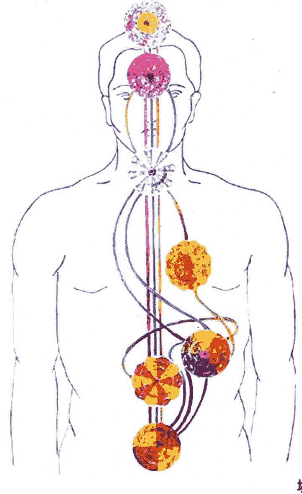
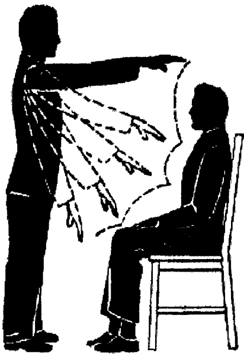

# 磁与灵魂治疗实践手册

作者：Jussara Korngold
埃罗 译
英文版修订：Maria Levinson 和 Edward Christie

献给 Tete Pretti, Maria Levinson 和 Nilce Palotta，我灵魂的领路人。

---

St. Royal College

## 天使神秘学院

- ※ 专业占卜预测机构
- ※ 神秘学培训机构
- ※ 水晶能量研究中心
- ※ 神秘学资料库
- ※ 官方微信：strcdts
- ※ 微信公众平台：strc2011
- ※ 读书交流QQ群：
    - 占星塔罗占卜师交流群：814594478（加入密码：PDF）
    - 神秘学其他综合群：659338717（加入密码：PDF）

微信号：strcdts

院长QQ：715104687

微信公众平台：strc2011

---

## 目录

- 序
- 传递法
- 抚头顶祝福礼
- 介绍
- 学习传递法的目标
- 1 灵医对传递法的使用方法
- 2 传递法的机制
    - 2.1 流
    - 2.2 灵魂、经络及肉体
    - 2.3 氛围
    - 2.4 脉轮
    - 2.5 传递法的三种类型
    - 2.6 传递法的仪式
- 3 传递者
- 4 病人
- 5 当传递法有效时
- 6 当使用传递法不方便时
- 7 传递法可以施行的地点
- 8 实践指导
- 9 缺席情况下的传递法
- 10 灵医中心外的传递法
- 11 传递法的作用
- 12 物质的磁属性
    - 12.1 物质属性的改变
    - 12.2 磁化水
- 13 传递法的类型
    - 13.1 抚手祝福礼
    - 13.2 纵向传递法
    - 13.3 旋转型传递法
    - 13.4 横向传递法
    - 13.5 垂直传递法
- 14 呼气治疗
    - 14.1 冷呼气疗法
    - 14.2 热呼气疗法
- 参考书目

---

## 序

这本实践手册的写作目的需要一个解释。

在我们热切地希望进一步推动在美国的灵医教条下，我们意识到人们对英文教材的巨大需求。毫无疑问，我们通过教学书和易理解的册子是能够发扬教理，并创建形成新组织的。

自从我们在九年前离开了巴西之后，我们努力的目标就在这里。为了满足人们对英文书面资料的需要，我们对其内容进行了编译使它能以书面形式阐明。我们真诚地希望它能给其他团体带来有利的帮助。

愿上帝的祝福伴随着你，

Jussara Korngold
纽约，2002

---

## 传递法

耶稣用他的双手对病人施加影响从而给他们带来健康。他的伟大力量能够知晓自然资源中微小的不平衡并对其不可或缺的部分进行修复协调。没有一位神圣大师的行为会缺乏意义。请注意这个事实，他的信徒以大师之名，让他们的友谊之手成为他无上仁慈的工具。

在基督教复兴的现在，我们通过传递法从一次努力的拯救中再次受益。对传递法的控制如同在灵魂上的能量输入，是代表着大师在世界各地拯救苍生工作的延续。这就是为什么从基督使者的灵魂能量对捐赠者和受益人如此珍贵的原因。

期待新的门徒达到像耶稣那样治疗残疾、躁动症及垂死病人的程度是不切实际的。当我们仅仅只是学习的时候，大师是知道的。然而，不要去忽略他的教导，要通过对友谊之手的使用继续大师的工作。只要是任何真诚为善的情况，耶稣的双手就会向你展开；外在的形式并不重要。行善之举应该在他的名义下进行。

---

## 抚头顶祝福礼

抚头顶祝福礼并不只是为了灵魂能量的注入。它是平衡大脑及有效地帮助所有治疗种类的理想方式。最让人头疼讨厌的是灵魂的综合病症；它们使身体产生不平衡并促使疾病的发展。哪里是健康的，这些大脑中的状态就会给器官带来灾难；当某个地方存在病况时，它们促使他过早的死亡；但这并非全部。在所有的灵魂不平衡时，负面能量更容易进入，强迫产生不可预料的破坏。如果我们服用抗生素作为在体内阻止微生物发展的物质，那为什么不用传递法为衰弱的灵魂代偿呢？

如果我们想要去除身体内的病源微生物，为什么要忽视清除灵魂的呢？在磁力学中对治疗力量的运用是出现在电流的放射使用中的流疗法。我们尊重原始合法的治疗完整版，以祈祷的方式让灵魂和媒介物帮助我们提升传递法的力量。

当然，如果你滥用催眠，你会为你的轻浮在科学名义下的背叛者的陈列室中承担责任。这是在世界中新的动乱；然而，传递法和祈祷的高贵一直对人类的需要做出神圣的帮助。要谨记描述耶稣受难的福音书，传承他的意志。

---

## 介绍

根据福勒简明词典的解释，治疗就是“修复生命”，而健康的定义是“健全的身体”。在牛津词典中找到的解释为“（致使）健康和健全；给一个（人）修复健康，治愈。”虽然健康的定义可以有很多，但是它们是以贴近社会理解的词语根据一点或几点强调的。比如，世界健康组织就把健康完全地在肉体上、灵魂上和社交上定义，而医学上对健康的专业定义是强调没有疾病或生物紊乱。

在生命之树上有很多分歧。如今，在传统给药和灵魂治疗上已经有了区分。然而，这条区分它们的三八线正在越来越短。医生、护士、临床医学家以及心理学家都属于医疗者（healer），但是，刚刚提到的医疗者（healer）通常是与灵魂医治有关。

通过传递法来医治疾病并非是一个现代概念；它是像人类自身的存在一样久远。让我们通过对历史及全世界的观察来看看一些不同的传递法种类。

在埃及，有一种非常高级的治疗牧师称为“圣殿神使”，他们是从在洪水到来前，由不同种族带入的六本共有 42 篇章的书上，所习得的医学知识。这六本书涉及到人体的结构、疾病、器械、草药和妇科疾病。同样也有很多善于治疗的神：托特，伊姆霍提普等。托特是治疗的主神；他同样与时间和因果相关。其他埃及的治疗之神是猫女神——巴斯特，她是防止灵魂疾病的守护神。伊希斯——魔法的女大师，因为她教育的性质及治疗的能量而召唤。何露斯——伊希斯之子，有助于治疗年轻的孩子和灵魂创伤。阿奴比斯——麻醉的守护神，人们相信当在手术中灵魂与肉体分离时，他能帮助照看灵魂。

在中国，传递法的给予者懂得医术并以针灸实践。防患于未然是指“当一个人生病时，他就会停止向医生支付诊金。”中国人有一个“经络”概念，或者可以称之为“没有被遮盖的灵魂。”观音是被认为能治疗任何疾病的女神。

在古印度，疾病的治疗在当时显得相当先进。根据记录，他们懂得外科手术、大脑和剖腹手术，以及对所有种类疾病的草药治疗。治疗也同样是建立在大脑和身体的重要性上。

希腊与罗马的居民，以及其他地中海民族都有强大的治疗传统。苏格拉底知道先治疗灵魂对治疗身体的重要性。如今所被理解的医学是起源于希腊的学校。要注意到希伯来人和艾赛尼派教徒也将治疗身体与灵魂同等对待。像埃及的传递者启蒙后，当他们变得年长时，他们可以从人们的躯体中驱逐出“恶魔”。他们研究“醚的身体”，并认为它应该在身体治疗进行前调整。

在地球上最为杰出的治疗师就是耶稣·基督。最初的基督教徒们见证了许许多多治疗的例子和一个“抚头顶祝福礼”传统的建立。这个惯例延续至今，虽然是已经被修改过。

所有的民族都有共同的治疗术历史，只是被传统和风俗所单独区分而已。从埃及人、印度人、中国人、凯尔特人和德鲁伊到美国印第安人和澳大利亚土著人，治疗术的确是无国界之分而且是存在于人类本性的真实本质中。

一些古代的风俗提倡在一些可达到的持久身体治疗前是先对身体经络治疗。这也同样体现在灵医的治疗手法上。要治疗一个人，必须要考虑他的整体——身体和灵魂。

现代先进的医学技术只是注重身体上的治疗。这只能治疗单方面。完整的健康是需要平衡的，而在这一点上却常常无法做到。当这一条件发生的时候，在身体与灵魂之间就产生有一点或根本的不协调。

所有古代的治疗者都是祭司和牧师。在现代医学中，对高等专科训练有着很大的需求量，这会让我们产生疑问：“有多少人能去治疗疾病？”当考虑用传递法来医治灵魂时，我们可以确实地来说，每个人都能治疗到某一程度，我们将着眼于这整个工作上。

在 18 世纪，弗·安顿·梅子美 (F. Anton Mesmer) 医生对医学界作出了一项重大贡献，完成了他对动物性磁力及其特性的研究。它被命名为催眠引导法 (mesmerism)。它是将磁性的传递法加入到催眠疗法中，而且这个方法还延用至今。

很多人都将磁性传递法与灵魂传递法搞混，所以必须在这一点上进行一些解释。当传递法是磁性时，给病人注入的是传递者自己的流；而使用灵魂传递法，注入的是灵量流，传递法的给予者只是担当引导者的角色。当传递法是灵魂的时，传递者不会耗尽能量，但在磁性传递法的使用中却可能。作为导磁体的人，在接受他们工作中灵魂的求救时，不管他们是否要求，你一定要注意这一点。他们自己的潜力也会因此大量增加（详见第 2.5 章——传递法的三种类型）。

---

### 学习传递法的目标

**目标：通过对流的操控来使之成效**

- 1. 在简单、谨慎及基督教的道德规范的条件下，理解、掌握并练习流的传输技巧。
- 2. 正确结合在传递法过程中的集中度、祈祷及放射的需要，在传递法过程中，更好地去感受重要流动能量的注入，这会使其传输更为简单。
- 3. 理解营造一个特殊环境是需要与一个特殊周围环境氛围的条件结合的，给传递法的运作创造一个最理想的环境。
- 4. 严格遵守道德、身体与灵魂的重要，与教条相结合，使在传递法的给予中能够一直有效及严肃。
- 5. 遵守运用传递法的简单、正确的形式，避免过于仪式化，以及奇怪的想法和手势。不正确的手势会导致传递者对病人的传输错误。
- 6. 能通过示范举例说明传递法运用的正确形式，并由整个组织的成员观察。
- 7. 要认识到在传递法的训练中不应带有任何像巫术假装的成分。避免在传递过程中与病人谈话，在每一次的运用中都应保持安静。
- 8. 要认识到在传递法的过程中身体上的接触是不适合的。这样的接触会对病人产生负面的影响以及尴尬。这在教条和道德中都是不允许的，因为所有的流能量从传递者传向病人是通过磁场，而不是皮肤。这是已经被基尔良（Kirlian）图像所证实的，它清楚地展示了传递者给予病人的能量流是不通过身体接触。
- 9. 在通过使用灵魂传递法对组织成员灵性发展和对他正在被暂时的不平衡而受苦大众的帮助任务中，要培养练习的主动和判断力。
- 10. 要注意到在传递法的过程中，媒介不应该只依赖在好的信仰上，也应该要学会依靠自己和他自己的能力。
- 11. 理解至少三位传递者（作为一个团体，而不是个人）一起工作的必要，这是为了达到并支撑所需要的浓缩共振。每个灵医组织或中心应该主张定期的传递法会议。他们不应该在等中贯彻实行，除非是在遵循“在家中的福音”，或者是发生身体疾病时。如果发生后者的情况，团队要记住在祈祷和特殊文字的阅读前（例如：根据灵魂术的福音书，或其他有意义的灵魂学预言），要准备好环境的绝对必要。
- 12. 要知道对传递法有利、有害或者无效的情况。每个灵医中心或组织应该将传递法连同福音书和教条指示一起提供，并告知一般公众与传递者一起合作，以便让传递法得到全面的效果。传递法应该在一间单独的房间作为传递法的避难所中运作。

---

## 1 灵医对传递法的使用方法

灵医对健康的定义是以灵魂对自然法则的承诺程度所表现。用以马利灵魂的话来说“……健康的意思是与灵魂的完美协调。然而，为了最终达到这个目的，往往需要收到以地球固有的疾病与缺失的形式的有价贡献。”（《抚慰者》——第 95 条问题）

然而，人类存在于他灵魂、经络及身体的本质中；保护后者的良好功能是非常重要的，但不要忘了我们思想的品质影响着我们的经络，而它会直接反应在我的身体上。有句谚语表达了对受保护灵魂的关心：“那么，爱你的灵魂，也要照顾你的身体，因为它是你灵魂的器具。”（《灵魂学的福音书》——第七章——第 11 节）

灵医的教条告诉我们，跟随耶稣的教导是向灵魂进化及最终净化的可靠之路。“爱的存在是最好的情操，它概述着耶稣的全部教条。”（《灵魂学的福音书》——第 11 章——第 8 节）

耶稣教导我们要热爱我们的邻居，传递法是众多能让我们守护它的方法之一。在灵媒学中心，举行给予传递法的会议成为了一种传统。我们可以在那里观察三种传递法的形式：

- 即使无法达到完全的治愈，它也能让病人减轻痛苦。
- 它让传递者有机会从事慈善事业并为他的邻居服务。
- 它让那些灵魂的工作者带来更多帮助有需要的人的意义。

在灵媒学中心实施传递法，可以描述为从灵魂世界直接对流的传输。这些流是被灵魂捐助者操控并通过传递者的肉体引导出的，他贡献出他们自己的“重要流”的一部分去帮助病人。

作为导磁体的伟大的传递者对大部分疾病都可以做到立即治愈。但在灵医的教条里，我们相信灵魂的捐助者要给予患者所最需要的。这需要考虑到行为及反应的准则以及我们灵魂所会面临的许多困境，甚至是某些疾病。我们无法逃脱宇宙的法则，我们都需要对我们过去、现在和未来的言行负责。

“治疗疾病，净化麻风病人，让死者复生，赶走魔鬼，你自由的接受，自由的给予。”（马修 10：08）。这同样也是灵医们的愿望。

---

## 2 传递法的机制

### 2.1 流

根据正统的物理科学，有三种形态的物体：固体、液体和气体。这些形态的物体都是由分子的特殊排列而成。

在固态的情况下，分子有规则地周期性紧密排列着，它非常坚固，允许非常短暂的分子振幅。一般来说，这些因素解释了其形状和固体体积的保持，不管其中是否有存在物。

在它们的液态的情况下，分子可以几乎自由的移动，分子间的作用力相对固态而言变弱。因而，液体可以保留它的体积，但是不能保留它的形状。容器的形状就决定着液体的形状。

在气态的情况下，分子可以自由移动，它的分子间不存在互相作用力。在这种形态下，它没有形状或体积的保持能力，而是由容器的形状或容积决定。

后两个形态的物质：液态和气态，表现在一种称为“流”的物质上。

#### 宇宙能量流（UCF）

宇宙的能量流被证明为元素的原始物质，它的修正和转变组成了多种的本质主体（引用于《起源》，艾伦·卡德特，第 14 章，2 到 6 节）。就基本的宇宙原理而言，它有两种截然不同的状态：气化或失重（你可以简单地把它认为是普通的状态），而它的物质化或称为可秤性只是稍微联贯。流成为切实物质的转变是其中间点；但是转变是不会意外地发生，你可以把我们不可估量的流看作是这两种状态的边界。

每一种状态会被特殊的现象所代替。第二种是属于显象世界的，而第一种是属于隐象世界的。那些被称为是物质世界的可以说极是属于科学范畴的。其他的解答划入灵魂学及医学的范畴，因为它们都有灵魂存在的概念，而这是灵医的特权。但是，因为灵魂与物质生命是不断接触的，所以这两种状态的现象经常会同时发生。人类作为肉体的形态，通常只有与物质生命相连的物质现象的感知。那些属于高等的灵魂领域的生命是我们物质感知的双眼无法察觉到的，只有在灵魂层面上才能被感知到（此处用灵魂现象来表达或者会更容易理解，因为现象是取决于灵魂的属性与贡献，或者说是取决于经络流，它与灵魂是不可分割的）。

在虚无的状态下，宇宙流并非是统一的。如果不终止它的虚无化，它会顺从其他的种类的改变并在比切实物质情况下进行更多的修正。这些修正会组成截然不同的流，虽然它们都是来自于同一原理下，但是会因被赋予了特殊的属性，而被隐象世界的特别现象所代替。

所有的生命都是互相关联的，灵魂的自身是流体的，而那些灵魂所具有的流，通常它的物质化外表是具体化的物体，对他们而言的世俗世界也就是我们的世界。他们精心制作并使他们合并，是为了产生起决定性的影响因素，就像人类用他们所拥有的材料所做的那样，当然这个过程是相当艰难的。

但是，无论是那里还是这里，只有最受启迪的灵魂才能理解他们世界所构成的元素角色。隐象世界的愚昧者是无法理解他们所见证的现象，他们只会机械化地相互合作。而地球上的愚昧者却会去解释光或者电的影响，会去解释他们所听见的或看见的东西。

灵魂世界的流体元素躲避着我们的分析手段和我们的感知理解。它们是与切实相称却不灵化的物质。灵魂的物质在我们中间是属于极不相同的，我们只能像是一个先天性色盲的人寻求一个形成色彩理论的概念一样去对比鉴定它们。

在这些流中有大部分是密切加入有形的生命中，它们应归入世俗世界的分派中。因没有直接的引导感知，一个人可以观察它们的作用，并从中学到它们本质的知识。这种研究学习是最基础的；它是限定大多数现象的钥匙，也是无法单独用物质法则所能说明的。

宇宙流的起始点是在绝对灵妙的程度上，我们无法从中理解任何。它相对的点是它转化成实质性的物质的点。在这两个极端中存在着数不清的或多或少的联合转变。最接近物质性的流也因而是最小最纯粹的，它们是被称为地球灵魂的大气所组成。在中间存在着非常不同的灵妙程度，在地球上有形或无形的居民从中汲取他们的存在机制的必要元素。然而，这些流对我们而言也许过于微妙而难以理解，它其实是相对总量的自然到高等领域的灵流罢了。

考虑到机制和固有的生命力不同，所有的世界都在表面上相同。物质生命的存在越少，具有密切关系的物质灵量流也就越少。

“灵量流”这个名字在严格意义上并非正确，因为它通常或多或少的与精练相关。没有什么真正灵魂的，其实是心灵或者说是完美的法则。它们是被比喻成流，而这个主要原因是它们精神上的密切关系。它们构成了灵魂世界的物质。这就是为什么它们被称为灵量流。

#### 宇宙的能量流结构表

| 概念 | 描述 | 状态/分类 |
| :--- | :--- | :--- |
| **原始物质** | 元素的原始物质的更改和转变 | 构成本质主体的多样性 |
| **存在状态** | **气化 / 失重** | 隐象世界（灵魂或精神现象/灵魂学） |
| | **物质化 / 可秤性** | 显象世界（物质现象/物理科学） |
| **中间点** | 流转变为切实物质 | 没有突然的转变，灵魂与物质生命永远互相作用 |
| **现象感知** | 灵魂次序现象 | 只能在灵魂层面上被注意到 |
| **UCF 修正** | 在虚无状态下不统一 | 经受多样修正，产生截然不同的流（取决于灵魂属性与经络流） |
| **流体元素** | 灵魂平面的流体元素 | 躲避常规分析手段及感知理解 |

在灵魂世界的流中存在着与物质生命紧密连接的流。（我们在其中找到一个无限现象的钥匙，它是无法用物理法则所解释的）

## 宇宙能量流

#### 绝对的纯粹

灵量流并非是一个合理的解释，因为它们通常或多或少与精炼相关。

灵魂只是心灵或者说是完美的法则。（它可以说是构成了灵魂世界的物质。这就是为什么它们被称为灵量流）

#### 切实物质的转变

##### 接近于物质性

它们构成了地球的灵魂大气，地球上的有形及无形生命为了生存接受到必要的元素。

谁能理解错综复杂的切实物质的构成？也许只是因为我们感知的镜像；而这似乎就证明了这是灵流穿越的工具。灵魂对我们而言，将身体透明光化不再是个障碍。

切实物质具有宇宙流的原始元素，一定会被慢慢分解回归其灵化的状态，就像钻石是最坚硬的物质，但却可以挥发成触摸不到的气体。在现实生活中，物质的凝固只是宇宙流的暂时状态，当达到凝聚停止的条件时，它会回到其初始状态。谁又能知道物质在切实状态下会不易得到能给予某种特殊属性的灵化？某种现象会可信地趋向这种假定。我们还没有支配隐象世界所有的眼光；但毋庸置疑未来的可能性，新法则的知识会允许我们理解今天的谜题。

##### 生命流

生命流是宇宙能量流的修正，它能产生通过神经系统围绕在我们身体周围的神经脉冲。

生命流的数量是根据生存着的生物数量而决定的。每当到周末的时候，它会通过吸收并同化能找到的物质（呼吸系统、皮肤和食物）来修复。它的第一种状态是属于隐象世界，其分类为精神或物理现象中，属于灵医领域。

多次的研究已经证实了控制能量流通（从灵到物质，从物质到灵）的能量轮的经络是存在的。它表现了生命的本质。

这些能量轮以它们特别的功能掌握了各种神经地带和特殊的神经中枢的活力系统，通过基因和遗传密码引发并从神经系统的内分泌体系组织一个适当固有的运作。

> （卓格·安德丽亚——灵魂的性力量）

## 2.2 灵魂、经络及肉体

根据阿兰·卡德克对于《灵魂之书》第 175 问的评价，人类是由三个基本部分组成：

- 1. 身体或物质存在，类似于动物，以同样重要的法则赋予生命。
- 2. 灵魂或现具化的灵，居住于身体中。
- 3. 媒介的法则或经络，一个不完全物质组成的灵魂外在包膜，并结合灵魂与身体。

在同一本书的第 27 问中，灵魂告诉我们，宇宙中有两种普通的元素：物质和灵。灵被定义为宇宙的智慧法则，我们是这个法则现具化的灵。同样，我们的身体是在物质的法则下个体化产生的。

经络是一个不完全物质的特性，是属于物质领域。虽然它非常微妙，但事实上，你可以将它作为灵魂的流体来理解。它是宇宙能量流最重要的产物，是在智慧或灵魂聚集周围同质量流的浓缩。带有经络成分的流具有其失重性及灵化的质。虽然它也许仅仅只以水汽出现在我们面前，但是，它会以纯粹的物质姿态出现在灵魂面前。

宇宙中充满了流。在现具化的过程中，灵会披上肉体的外衣是因为它与它们世界的物质状态相协调的结果。这个肉体是已经与必须的流相联合并生命化的物质构成。

在任何星球上，一个灵会汲取元素并形成它的经络。其元素的纯度取决于道德前进的程度。我们可以在这个方面察觉到经络的本质构成对每个个体都是不同的。

关于具形化，经络会一个分子接着一个分子地联合成肉体；灵魂在其过程中能够参与进物质世界中。它可以说是灵魂需要，经络再传输信号，由身体来执行。同样，身体接触到外在的影响，经络传输信号，灵魂敏感、聪明地接收它们。我们因此可以发现灵魂和肉体是通过经络的连接方式互相作用并反应。

经络因为它灵化的质量，而不能不与通过给予肉体生命的生命流在肉体上施加影响。这生命流是宇宙能量流的修正，它与电磁流极为相似，它也因此可以产生神经脉冲，能通过神经系统环绕在身体周围。

生命流的数量是根据种族而定的。它不仅数量多样化，而且它也会变得枯竭，因而无法维持生命。它可以因多种方法补充，如：吸收并同化具有流的物质、呼吸系统、通过皮肤及食物的摄取。它也可以通过个体对另一个个体的传输而补充；这是传递法的基础，我们会在后文中详细介绍。

## 2.3 氛围

氛围是经络流能量的放射，它是超出物理器官的界限，参与由生命流萃取的能量。因为人体是由亿万个细胞所组成，每个细胞都会放射出辐射，我们将产生的辐射总量称为“能量域”。这个域会持续被灵魂的思想修正，并与参与人类氛围构成的物理影响心理的物质力量相结合。

对个体而言，每个氛围都是独特的。它渗透并环绕肉体并可以用颜色来代表。颜色的种类取决于灵魂所包含的层次。它们从深灰色到黑色向低等热情或邪恶趋向倾斜。我们可以通过氛围的不规则外表来发现疾病。疾病也同样反映在颜色上面，氛围被认为传递法机制的关键，因为传递法会替换给予者与病人的氛围。

## 2.4 脉轮

经络是由不同浓缩状态下的流层所组成，它是灵与物质之间的调停者。靠近灵魂的层是由靠近肉体的灵流所组成，它更浓缩。在经络中最为浓缩的区域也就是“脉轮”，灵流会在那里吸收。这些被吸收的灵流会转换为生命流。C.W.利德比特的《脉轮》一书中对词语“脉轮”的解释说是梵语中“轮”的意思。这个词反映了脉轮是一系列的涡流，它看上去像轮子，存在于人类的灵化双体的表面。所有的这些轮都是永久旋转、吸收着能量，它们无法离开肉体生存。脉轮是能量从一个人到另一个人身体的流动点。当灵魂被经络吸收时，它们会围绕着多个脉轮。然后，它们会转换为生命流通过神经系统贯穿着整个身体围绕。在经络及脉轮和肉体中自由的流会被一系列因素影响，因而导致肉体及精神上的不平衡从而产生疾病。

脉轮会直接影响人类的主要神经丛。这些脉轮是：

- 1. 顶轮（花冠轮）
- 2. 额轮（宽恕轮）
- 3. 喉轮（大同轮）
- 4. 心轮（仁爱轮）
- 5. 脐轮（正道轮）
- 6. 脾轮（真知轮）
- 7. 根轮（纯真轮）

#### 生命力之流

---

#### 顶轮（花冠轮）—— 智慧的中心

- **腺体**：松果腺
- **位置**：头顶
- **射线数**：960 + 12（一朵有千片花瓣的莲花）
- **颜色**：主色为紫罗兰（黄和白）
- **责任**：管理及控制所有其他的脉轮，负责灵魂与身体的连接，也同样与大脑和脊神经系统相联系。

**花冠轮：**它位于头顶部，朝着松果腺的方向。它并不与任何身体的交感神经丛连接。然而，这个脉轮是与松果腺和脑垂体相关。它是灵魂能量的最大接受和分配处。这个顶轮能收到分布在其他六处脉轮的灵魂能量，以及这些脉轮发出的能量。因此，这个脉轮同时是接收者和供者。

在灵媒学中，这个脉轮有着吸引、接近和接触灵魂的能力。在磁学中，它能感知并捕获灵的能力，同时当它传输能量到灵魂世界时，能起到稠化加强的作用。

---

#### 额轮（宽恕轮）—— 直觉的中心

- **腺体**：垂体
- **位置**：第二节颈部脊神经——在双眉中心
- **交感神经丛**：颈动脉交感神经
- **射线数**：96
- **颜色**：一半是玫瑰红和黄色；另一半是紫蓝色
- **责任**：所有高智慧的中心和中央神经系统以及视觉、听觉和嗅觉的运作。

**宽恕轮：**它影响智慧感知、综合逻辑推理能力。它由三片头颅内的神经节组成。它具有强烈的魔法感知。它直接连接于脑垂体，对耳鼻喉及眼部领域敏感，刺激着嗅觉和其他内分泌腺体，促使荷尔蒙的产生。这个脉轮的主要功能是发展人类的内在智慧和灵魂进化。

如：洞察力，灵敏能力及直觉。它同样也在物理现象物质化和其他现象的外质提取中扮演着重要的角色。额轮也掌控着在迷睡交流中的手势控制程度。在磁学中，它在催眠及记忆衰退上扮演着非常重要的角色。通过额轮可以建立一个控制联系，也同样会因为外在结合而破坏。

---

#### 喉轮（大同轮）—— 创造力的中心

- **腺体**：甲状腺和副甲状腺
- **位置**：颈部脊神经第三节——喉部
- **交感神经丛**：咽交感神经
- **射线数**：16
- **颜色**：银色，紫蓝色
- **责任**：会话，呼吸系统，初步消化，血压

**大同轮：**这个脉轮掌控心理语言以及所有与说话能力相关的功能。在身体中，有两个神经节供应咽及舌根部，它也刺激咽部肌肉，使其像括约肌一样服务于咽部及声带。其交感神经丛的影响也同样刺激一个非常普遍的现象，它能使灵媒感觉到那个区域的重量，使其能在他说出单词前听见它们。大同轮完全支配着从不经意呼吸肌到说话时空气排出所使用的语言系统。

在灵媒学中，它在迷睡交流现象中起着关键的作用。它也同样在外质提取中表现积极。在磁学中，它负责呼吸治疗。

---

#### 心轮（仁爱轮）—— 情感的中心

- **腺体**：胸腺
- **位置**：颈部脊神经第八节——在心脏上方
- **交感神经丛**：心交感神经
- **射线数**：12
- **颜色**：发光的金色
- **负责**：循环系统，情绪的控制，及神经系统

**仁爱轮：**它的位置在心脏上方，与灵魂的存在法则及循环系统相关。存在于较少的生物中，来自胃部脉轮的震动会将无法控制以及负面的情绪传向仁爱轮并影响着它。在肉体中，它位于气管分支、无神经的大动脉、肺动脉、心脏及心包膜上。这个脉轮及其交感神经丛在传递法的仪式中会被很大程度地利用。如果传递者们祈求灵医中心的导师（门特）们的协助，那么在任务的过程中，导师会与传递者通过流的纽带将他们互相连接。

---

#### 脐轮（正道轮）—— 生命力的中心

- **腺体**：胰腺
- **位置**：胸脊神经第八节——在肚脐之上
- **交感神经丛**：腹腔神经丛
- **射线数**：10
- **颜色**：红色和绿色
- **负责**：各种感觉和情绪，消化的过程，以及部分新陈代谢系统，胃，交感神经系统

**正道轮：**它位于下腹部和胃部之间，它在个人及人性的层次上表达情绪。它被人类过分地使用而成为一个非常麻烦的脉轮。在这一程度上，激情影响并要求人类：他们的意见、决定和行为举止。而在灵魂上，如果那里含有了未成熟的情绪，宇宙能量流不会流入脐轮，但会一直封印在其中。在肉体中，有两个未完整的胆管神经节在胰腺上方。它能削弱胃、肠和肝脏等。

在灵媒学中，它吸引受苦的灵魂及浓厚震动的灵魂。在磁学中，它能生产大量的生命流，如同一个有机体一般自我维持、代偿和具形化。

---

#### 脾轮（真知轮）—— 平衡的中心

- **腺体**：胰腺
- **位置**：第一节腰神经——在脾脏上方
- **交感神经丛**：脾交感神经丛
- **射线数**：6
- **颜色**：彩虹色
- **负责**：在血液循环中器官屏障的形成和代偿的脾。它主要专门细致分配来自太阳的生命力。

**脾轮：**位于脾的上方。它是影响肉体共振的脉轮之一，它能强烈地吸收并分配能量。脾轮能调节宇宙的生命元素循环，使其能在循环后通过毛孔排出。有一些灵魂将他们自己与脾轮相连接，以便从人类处吸收生命能量。他们一般被称为“吸血鬼”，因为他们把自己的兴旺建立在我们的能量之上。在肉体中，它的交感神经丛由靠近肾脏的腰神经组成。当病人被吸血鬼实体控制时，可以发现腰部和腹部周围的不适。病人有时还会觉得腿部颤抖以及身体的苍白无力。

在灵媒学中，它影响虚弱的灵魂或黯淡经络的灵魂的流体供给活力。在磁学中，它能为有机重组产生大量的生命流，特别是关于器官和骨头等的重组。

---

## 根轮（纯真轮）—— 平衡的中心

- **腺体**：性腺
- **位置**：第四块荐骨——在尾脊骨上
- **交感神经丛**：尾骨神经丛
- **射线数**：4
- **颜色**：红色和橘黄色
- **负责**：生殖器官及其相关的情绪

**纯真轮：**这个脉轮会因为低俗的过分享受而变得不平衡；而当以爱的名义有尊严及智慧地使用它时，它代表着生命的基础能量。从身体上来讲，它与有六对延向双腿的神经的坐骨神经相应。它能调节与性和生殖相关的活力。

在灵媒学中，根轮释放着强烈的磁性引力的能量。在磁学中，它是浓厚能量的生产者。

---

## 2.5 传递法的三种类型

- 磁性传递法
- 灵性传递法
- 混合型传递法（磁与灵）

有两种类型的流：磁性和灵性流。在传递法的仪式中，控制传递法的灵的健康与否在灵性方面及磁性的影响方面都比我们的努力重要。因此，磁性的传递法不会单独地发生。从理论上来讲，传递法合并了健康灵控制的灵性成分，以及根据传递者自己的磁性资源而加强的磁性方面。

### 灵性传递法：

灵性传递法时需由一个或多个人的灵魂在同时给予，而不用传递者的协助。在灵魂使用灵媒资源的情况下，他们在传递法的这种类型下甚至可以是远程操控流。

- **灵性传递者**：传递者一般能在他的头顶处感受到一股温和及惬意的感觉。他能感觉到一股微妙的震动循环及贯穿全身的愉悦之感，特别是贯穿他额头、心脏、肺和他体表的循环。它不间断地发生到他的手臂，抵达双手并最终覆盖到病人。在传递法的最后部分，传递者不会感觉到不愉快或疲劳。

### 磁性传递法：

磁性传递法是由传递者传输，是使用他自己的磁性流，用他个人的能量来照射。这对于器官、肉体和经络的问题解决相当有用。

- **磁性传递者**：传递者需明白其经络所受的磁性过程的清晰迹象。脉轮能引发在肉体中的“流体生产”。在大多数的问题中，脐轮在磁性流散发过程中是最先及最强的一个脉轮；因此，在腹部经常会产生感觉。

### 混合型传递法（磁与灵）：

混合型传递法是使用磁性流与灵性流。它的目的是辅助治疗肉体、经络及灵魂的问题。

- **混合型传递者**：给予者会轻微感知上述类型的感觉，这主要是取决于给予者的敏感度。如果他不具备最低量的敏感度，那么他是无法感觉到任何特殊的感知。因此，他不传输磁性流并不意味着他不应该不作为一名磁性给予者加入。

## 2.6 传递法的仪式

肉体和道德上的不平衡影响着我们的经络，可能会帮助或抑制器官的平衡。其不平衡的症状根据类型、起源及疼痛的持久度而有所不同，它们可能是在精神上、肉体上或两者上产生。我们应该将这些病症作为警示记号来理解，它们能通知我们一个救助治疗身体、灵魂的紧急情况。这个救助可以是药物、传递法或者两者相互配合。传递法是含有灵魂的教条，它对于身体和灵魂都非常有益。

在传递法的仪式中，我们有三大基本要素：

- 1. 病人：一名病危中的病人。
- 2. 传递者：一名愿意且能够帮助的人。
- 3. 灵能捐助者：仪式的指引者和组织者。

传递法的仪式需要发生在高度限定参与操控流的灵魂的灵性平面，这是为了确保他们对每一位病人的最大利益。

在仪式中，传递者会通过祈祷和一个正确的思想态度与灵魂捐助者调和，从而捐赠这些流体资源。因此，良好的亲和力能增长传递者从灵性世界吸收的健康流，这些流会被他的顶轮吸收。传递者然后就能将这些流与任何的生命流一起传输给病人，从而寻求给病人带来健康。这种流的传输通常是由传递者将双手置于病人头顶上来实施的。

传递者的双手置于病人头顶上的一个原因是因为顶轮，它位于人的头顶，掌控着所有其他脉轮的功能，负责整个神经系统的生命流的分配。靠近并接触经络的治疗流是那些靠近病人顶轮的流。这个轮会促使流体流向最需要的地方并被吸收掉。这个仪式与吞下去的药片在胃里消化没有什么分别，只是它一定会减轻头痛。

## 3 传递者

当以传递法为主题时，最经常被问到的问题是：

- 谁能成为传递者？
- 我怎样才能知道我是否能胜任给予者的工作？

回答这些问题需要从肉体和精神两方面来考虑分析。

首先，如果一个人身体不适或虚弱，那么他就不适合捐赠生命流给另一个人。虽然这些流会在传递法的仪式中被补充，但是任何一个需要生命流的人应该是“病人”而不是“给予者”。一些人拥有比普通人更多的容量来吸收并储存生命流，如果你就是其中之一，那么你就好好地享受更多的生命流。

第二，要确定一个身体健康并能将生命流传输给病人的人，我们也一定要考虑被挑选的给予者在道德和思想上是否健康，因为这也会影响他将传输的灵流质量。

当我们留意传递者给病人建立传输并靠给予者意志力维持流体的流量时，我们要认识传递者是否积极参与的重要性。我们通过祈祷来建立给予者与灵魂捐助者之间的联系并以此作为整个仪式的开始。因此，如果你无法或不愿意祈祷的话，是对任务不适当的行为。

简单来说，传递者只是灵流的引导渠，这灵流是由灵魂捐助者操控并提供的。因此，这条渠的洁净与否决定着他是否会对流造成污染。一条“洁净的渠”不仅规定应该是一个健康的身体，也规定着他不能过于兴奋。这条渠一定要具有健康和仁慈的思想，这样才能不被任何低劣的思想模式影响到这个仪式。没有一位传递者会被期望完美，这里始终是个低俗的世界，但是一颗能持续尽责向着完美的心必须存在。

要维持一个健康的身体，我们需要饮食适当，有规律地进行锻炼、休息并避免所有有害及令人极度兴奋的行为。要保持良好的思想，是有必要实践基督徒的美德，每天都要朝着道德进步的方向作出努力并学习灵医的教条，它会给予你将这些付诸于实践的方法。

最重要的是，潜在的传递者必须要认识到他所承担的重大责任，病人是将自身性命交托于你手中的。此外，潜在的传递者也要承担传递法举行地的组织的责任承诺。他们也会指望传递者能在工作日时有空接见他们。

最后，传递者必须耕耘谦卑并紧记他只是传递法的一个渠或者工具，会没有任何偏见地被病人替换。同样，传递者一定要耕耘他对邻友的爱，尝试去尽可能地提供帮助并坚持努力做一个更好的人。

### 给传递者的建议

灵医安德鲁·路易斯的书《灵媒能力的范围》告诉我们，意志力是灵媒所必须具有的基本品质。另外，他也必须要具备以下品质：

- 1. 学说的知识和儒雅的举止。传递者是站在病人面前的实体化，他代表着磁化的守护灵，同时他是在传输一条爱的信息。研究的缺乏代表着停滞不前。
- 2. 传递者所耕耘的成就就会使他/她的精神资源增长，从而推动更佳的接收能力去面对灵医讲师的建议和指导。
- 3. 良好的精神和身体状态。
- 4. 情绪平衡。
- 5. 对内在变革的渴望。
- 6. 自我控制能力的锻炼。
- 7. 对神圣力量的信仰和信任。

但是除了上述这些要求，还有一些障碍需要传递者来克服：

- 1. 情绪上的不平衡。
- 2. 过多的悲伤、仇恨和愤怒。
- 3. 过于疯狂的热情、急脾气、无礼、羡慕、嫉妒、空虚、骄傲和狭隘。
- 4. 没有意义的不安、精神沮丧、大声地笑和歇斯底里的哭泣。
- 5. 凡事缺乏尺度，诅咒、变得讽刺和不易妥协。
- 6. 不良的生活习惯，如：吸烟，吸毒，醉酒，及背离正常的行为举止。

## 4 病人

如在第 2.6 项中的一样，传递法的仪式有三个基本要素：灵魂捐助者、病人及传递者。灵魂的捐助者因为是工作的指引者而一直出现。另外，与其他两个要素相比，我们可以得出病人必须存在的结论，不管出席与否，对于传递法会议的产生没有影响。当病人不在灵媒学中心的时候，我们称传递法为“缺席者传递法”。

虽然传递者在传递法仪式中是个重要的元素，但是，他一定要认识到自负的骄傲和认为工作中不可或缺的错误想法，因为如果需要的话，灵魂捐助者可以直接治疗病人。

如果情况真是如此，那病人又为何必须参加灵医中心的常规议程？这是因为，传递者作为肉体化身可以传输灵流及他自己的生命流来帮助病人，这是在某些情况下病人最为需要的。

因为病人是在寻求帮助，他应该在传递法前或传递法后收到一个心理定位，让他知道该如何通过祈祷和态度的改变，以及为其他需要的人祈祷，来在最大程度上帮助自己。如果病人需要传递法，但却无法去灵医中心的时候，他就可以简单地让大脑达到一个虔诚的状态来治疗自己。这就是所谓的“自我传递法”。然而，一般传递法的结果是取决于灵魂捐助者和病人是否同时出席。

这些结果分为三个种类：

- **有益**：传递者的生命流取决于他的健康状态，他的灵流取决于他与优质灵魂的亲合力。这个亲合力是对传递法拥有有效结果所需要的。同样，病人需要去接受传递法的仪式并善于处理灵性的发展。如果病人不愿意在一般的仪式中合作，那么其结果就是暂时的。这对于没有对基督生活作出任何努力的人特别可能。
- **有害**：如果传递者处于一个不稳定的健康状态，或者他的器官深陷吸烟、酗酒、毒品等的恶习，又或因叛逆、虚荣、骄傲、愤怒、绝望、担心、疑虑等原因而导致灵魂不平衡状态，他就没有条件去传输传递法。另外，如果病人的免疫系统几乎无法合作，那他就无法中和被粗心的传递者所传输的劣质能量，他所收到的能量流只能是有害的。
- **无效**：不管给予帮助的传递者是否有良好的准备，如果病人因为不信任、反感或轻浮等状态而将自己处于封闭的位置，那么，传递法就会失败。病人将无法吸收灵流而变得无效。我们可以通过对病人反复地强调要放开心胸地合作，以及为了治疗而去改变他的思想态度来改善。

传递法也会因病人吸收负面流而无效。这通常发生在传递者自身毫无准备，或在不适合的环境下传输时。

## 5 当传递法有效时

灵医教条能教导因果的法则，我们都会面对自己现在或将来的行为而产生的循环结果。每个人都需要经历审判和赎罪，从错误中汲取经验。情绪、灵魂和肉体都会给我们痛苦和苦难。灵医教条同样也教导：“慈悲为怀才能造就超度者；”因此，帮助那些需要帮助的人是最基本的。这是上帝无限的爱和仁慈的行为，他给予了我们实践对进步十分重要的慈悲的机会。

如果帮助那些需要帮助的人是我们基督徒的责任，那么，我们必须要认识到时机的合适。我们使用传递法是否要在任何地点、时间及情形下提供帮助？我们需要紧记每一件事情都有其发生的时间和地点。

让我们来看一下什么时候传递法最需要说明。

- 关于病人：帮助一个人有很多种方法。有时，经过传递法的一个不间断的能量更新会显得毫无效果。这也许是因为在传递法之后，个人没有遵从必要的补充指导，我们应该要一直鼓励个人参与他自己的更新进程。这个指导应该永远也不要在实际的传递法中给出。传递者也许是帮助方，但是，病人也一定要履行他自己的义务。

### 在什么时候可以给予传递法：

病人在要求传递法时，必须要服从中心或组织的常规传递法议程的规章制度。

如果病人决定合作，传递法在肉体、情绪或灵魂上的任何情况下都是有益的。然而，也有病人不可参与的例子存在，如：癫痫症发作、妄想和高烧等的情况下。其也会偶然发生催眠或梦游，所以病人需要保持清醒。

传递法对能量的补充会产生极大的好处，是所有药物治疗的补充。它可以是基本的修复由现代医学药物所导致的重大问题的方法。它也是医学专家所推荐的外科或其他特殊的治疗方案以及处理再生或毁灭进程的理想准备工作。

关于困扰的情况，我们将在下一章节作出特别说明。

## 6 当使用传递法不方便时

为了避免发生困扰，永远也不要在中心或组织的主任没有对病人进行诊断的情况下给出传递法，请铭记在这些情况下是需要另外的准备，特殊的预防措施以及一个团队的 PASS 给予者。

- 永远不要在没有以祈祷的形式或远离灵医中心、没有阅读福音书和信息、在举行地没有适合气氛的情况下给出传递法。
- 永远不要仅仅为了方便病人，在除了常规时间，又或者当没有准备好的传递者的情况下给出传递法。
- 永远不要在肉体、情绪或灵魂感觉不适的情况下给出传递法。

关于最后一条，对我们而言其实很难说完全的舒服，所以我们必须要守护自己，避免在传递法中达到极限而枯竭。如果我们有“流感”，就会嗓子沙哑，或者我们会感到实在疲倦或过分紧张、沮丧、压力大、伤心，或牙痛、胃痛，感到极不寻常的悲伤，没有任何原因而想要哭泣或气愤，那么我们就可以确定所有的事物都不寻常。因此，传递者要对那天给出的传递法进行解释。

传递者是不可能有长期的健康条件，如果不是传染病，就不必打乱当天的节奏，这样他就可以正常地祈祷，要感觉开心并无足轻重，那样在传递法任务中就不会有什么妨碍。

不要让你的兴趣和快乐超过传递法的给予，影响你的判断力和责任概念。如果传递者不在一个良好的状态，忍住在那些特殊的日子里给出传递法是对病人和给予者自己负责。

如果在他的脑海里有任何疑虑，传递者可以一直向灵医中心的主任寻求建议。

## 7 传递法可以实施的地点

### 传递法最为合适的地点：

传递法最适合的地点是在灵媒学中心或组织，因为那里维持着一个持续的灵性环境，有专门研究工作的灵魂捐助者的住处也一样。

### 不适合的传递法地点：

任何供氧不足、香烟和酒味弥漫或人口过于密集的地方，以及可能有爱嘲弄或不恭敬的人在附近时，都不适合传递法。好的东西是不会在污染的气氛中产生的。

同样还包括些有大量人群通行的地方，有噪音及任何精神污染的地方。这些限制排除了除灵医中心以外的主要公众地点。

我们一般不建议在私人家中治疗，因为会有你和其他人不一致的共振，它们会相互影响。然而，也会发生必要的情况。因此，必须要阅读福音书和通过祈祷来准备房间。另外，要利用至少三位高能量和有经验的人来组成传递法团队。

请牢记，我们一定要遵守一个仁慈的态度。因为要避免不可预料的情况、特别的需要和环境的发生，深信真理、有纪律的传递者会发现这是可能的，去给予那些甚至起初认为不满意以及我们处在危险情况下的帮助。奉献一生的传递者会一直受到灵魂捐助者的保护和帮助。

尽管如此，传递者一定永远也不滥用这项许可，因为他很快会失去可信任的灵魂帮助者的“支持”。因此，我们必须谨慎地评估每一次“紧急情况”。

### 一个中心的组织：

最理想的工作地点就是在灵媒学中心内。像之前所提及的那样，最佳的方案是用一个独立的房间。如果条件不允许这样的话，可以选择一个安静点的房间，能躲避别人好奇的目光。所有传递法的议程都需要预先安排，并在适当的时间举行。

在活动中心必须有一个有经验的人来监督整个团队工作的仪式，以防任何特殊情况或要求。

常规的仪式应该为训练新手而举行，这也同样是为了给传递法给予者复习传递法基础原则的一次机会。

在任何“议程”开始之前，一定要通过祈祷来营造合适的氛围。用一次性的杯子来盛水。音乐对于气氛的营造也同样有用，选择舒缓的音乐较为恰当。

### 传递者的准备：

无论是否在一天中安排了传递法任务，传递法的准备工作每天都要做。传递者一定要勤奋坚持地以灵性提升为目标而进行内在变革和进化的训练。如果纯净的灵流经过一条污秽的渠道，那么灵流就会被污染！所以，作为一名传递者有着很重的责任！

最适合从事这项任务的同事是那些能正确共振出回应的特性，能够充分准备，准时，刻苦，负责任，肯努力做出内在改变并对神、耶稣及灵魂捐助者尊敬的人。这些工作者同样必须要尽力去热爱他的共事者并要愿意牺牲自己。对那些传递者的要求还有：遵守日常的均衡饮食，定期锻炼身体和充足的休息（也请见第三章——对传递者的建议）。

**注意：经常吸烟、喝酒及吸毒的人，易于发怒和急躁的人，经受沮丧痛苦的人，经常说脏话的人，过度沉迷于性生活中的人，经常在不理想的环境或过着轻浮生活的人，都不是成为传递者的理想人选，除非他能改变自己的生活习惯。**

### 传递法当天的准备：

在这一天需要格外的注意。在开始一段普通祈祷之前，先要简短朗读福音书，以便开始着手一天的工作。

注意个人卫生一直很重要，但是在这天还需要特别的注意。你不能吃得太快，也不能吃得太多。传递者所吃的食物一定要易于消化。要在饱餐后给予传递法是不可能的！整个消化系统会忙于消化，从而影响作为一个干净、优秀渠道的质量和容量。因此，建议少量进食。

在这天，你也需要注意你的态度。要注意避免攻击低劣的灵，这可能会导致传递者分配能量时的无效。

所有的服装都必须非常干净和舒适，千万不要穿紧身的衣服。同样，为了能舒服地工作，建议穿鞋，要保证你不会过热或过冷。避免在议程中佩戴恼人的首饰、寻呼机、手机、闹表等。

在这一天中，传递者应当尽量为自己的防护和任何附近需要帮助的灵魂而祈祷。建议在离开家去灵医中心前，先念诵一段简短的福音书内容并做一次祈祷。如果可能的话，在出发前休息一下。如果给予者是刚结束工作的话，那么要休息、祈祷或念诵。

传递者要培养自己谦逊的态度，寻求对每一位接触的人，甚至是那些乐于争吵的人保持和睦及融洽的态度！

### 在到达中心时：

到达中心的时候，传递者要扪心自问“我今天是否进入了准备传递法的状态？”

在抵达中心后，不建议与共事者过多的谈话。在整个任务完成后谈论更为恰当。你需要保持隔离的状态，直到会议的开始。

注意演讲或研习时的教义，然后，通过特殊的祈祷来做准备工作。

当传递法议程准备好要开始的时候（在传递者选好了他们的位置之后），给予者一定要保持祈祷的状态并净化思想。千万不能出神；然而，大脑会在集中注意力的时候出现短暂的入定状态。

（译者注：人的大脑有四个状态：1. Beta 13 - 30 赫兹以上：清醒、警觉状态；Alpha 8 - 12 赫兹：放松状态；Theta 3 - 7 赫兹：禅定/入定状态；Delta 0.5 - 2 赫兹：睡眠状态。大脑在 Alpha 和 Theta 状态下，是吸收宇宙能量的最佳时期。）

传递者要注意别人的接近。当病人都坐下时，所有给予者就可以开始传递法了。

一旦病人接受完传递法后，给予者要继续集中注意并与灵魂捐助者联系，保持双眼的闭合，直到另一名病人接近座位。这一过程要持续到所有病人都被照顾到后。

在结束的时候要祈祷，传递者要对有这么一次服务大众的机会做出感谢性质的祈祷。

在议程结束后，最好能尽可能久地保持灵性环境，引导欢欣的话题。

## 8 实践指导

- 1. 传递者站在病人的背后或两侧开始。当传递法开始之后，给予者可以保持那个位置，也可以绕着病人移动并站在病人面前。如果是这样的情况，传递者必须在传递法结束时，安静地走到一边等待下一位病人的到来。
- 2. 双手应该聚在距离病人头顶大约 6~12 英寸。这个姿势要尽可能久地保持，直到给予者能感到“传递法共振”从他的手指和手掌流下（这是假设灵医中心在使用抚手祝福礼的情况下）。然后，双手要轻轻并慢慢地放在两边。
- 3. 传递者绝对不能接触病人，甚至是病人的头发。这会在病人及给予者之间导致一种“震惊”的感觉，会对双方都产生影响。
- 4. 每一次传递法议程都应该有一名引导者在旁监督身体状况。这个人负责呼叫病人的正确号码。
- 5. 在传递法议程结束后，也需要一名分发磁化水的员工。
- 6. 当传递法在相邻房间中实施时，应该先把门关上，每次病人进出再重新打开。
- 7. 当所有病人传递法的接受都已完成，最后还需要感谢的祈祷。这个祈祷应该简短和精确。然而，在此次祈祷中感谢灵魂工作者团队是最基本的。我们也许会在前进的道路中和个体的内在变革中寻求他人帮助。要紧记，真正的祈祷是发自内心深处的爱与谦卑的情操。我们应该在祈祷中加入这些真挚的情感，感谢能够参与进给予传递法的任务中。

## 9 缺席情况下的传递法

这种传递法类型是在病人缺席的情况下实施的。病人会因为身体不适等原因，而无法到传递法中心接受治疗。有时，病人有迫切需要治疗的愿望，但却因不信任灵医学或其他信仰而拒绝治疗。因此，缺席者传递法就能帮助那些在肉体和灵魂上需要帮助的人，不管他们是否相信，也不管他们是否知晓自己的参与。

这个方法通常需要结合灵媒能力发展议程。预定时间也因此而决定。那些病人的名字需要逐一念出，整个团队需要集中注意力在祈祷上，随着念出的名字，让思想与每个人连接。根据加入祈祷的人数来操控能量，而不是像往常一样根据时间的长短专注于每个名字，这会创造更好的能量集中。

## 10 灵医中心外的传递法

当因某些特殊原因，而需在远离中心的地方给出传递法时，可以使用这种方法。

### 1. 机动的传递法团队

首先，要组织一个机动传递者团队。最好是先列出在当地可随时应召的给予者名单。每个团队的人数不应少于三名给予者，包括指引者，人数总共不得超过六人。

这些团队需要接收到特殊的定位并给予工作的指示，他们也同样要意识到，在这些环境下工作可能带来的各种困难。

### 2. 在家中的传递法

在家中的传递法只允许对于那些因身体欠佳无法去中心的人实施。除了需要接受传递法的人，其他家属都不应呆在屋内，这是为了避免任何对共振协调的破坏。

接下去的步骤照例。首先，通过一次简短的祈祷来营造环境的准备工作，然后，另一位成员通过对《福音书》的念诵来完成在传递法前气氛的营造。

念诵的内容一定要是摘自《灵媒的福音书》，如果病人有点受其感染，指引者可以简短地解释一下。在这一点上，最好不要讨论或回答问题。如果病人想要提问，他一定要等到传递法完成之后再问。除了福音书外，也可以念诵教义书上的内容。一般来说，要充分营造一个良好的共振环境，需要大约 15 分钟。

然后，团队的指引者会指示传递者该采取的措施，是他自己进行传递法祈祷还是委任另一名成员来做。在其他方面，这次的祈祷必须补充对于要受保护的要求，召唤灵魂捐助者的出现，给予作为渠道的传递者服务。在这一点上，祈祷的那一名成员必须要知道周围环境的形成，这样才能判断什么时候适合停止祈祷，开始真正的传递法仪式。记住，通常在家中的环境要比在灵媒学中心工作的时候，付出更多的努力来准备一个正确的共振领域。

当传递法结束并且结束的祈祷也已完成时。倘若病人有祈祷的习惯，可让病人自行做出感谢的祈祷。当病人心存疑虑时，最好是由团队的指引者或委派其他成员祈祷。最后，要给予病人一小杯磁化水。

### 3. 在公共场所的传递法

这是指在公共大厅或剧院等地方，传递者被其他人环绕，但无法有效地隔离他们。因此，这并非是最理想的给出传递法的环境。

我们都知道思想的力量，而这会影响我们的工作。传递者尽可能快地想要创造一个良好的环境，但是，旁观者含有各种思想模式，往往会立刻影响病人周围的环境。更重要的是，带有怀疑眼光的旁观者的注视不可避免地导致负面流的渗入，这会对给予者和病人带来巨大伤害。本该是正面健康的传递法流会变得负面甚至带来破坏性干扰。

### 4. 在医院和监狱的传递法

有些地方对传递法的需求很大，但是却并不乐意其存在。然而，传递者会受到病人或囚犯的邀请去那种环境下工作。

无论什么时候可能被邀请，一定要使用隔离的房间。要申请在医院里的传递法或许比申请监狱里的更为困难！在医院中给出传递法通常需要给予者一定的伪装，这种传递法给出的类型通常会比较困难或者无效。要在这些环境下给出传递法还不如使用缺席者传递法，总比在医院中引起骚乱的要好。

在监狱中使用传递法倒有更多的可能性。有人可能会要求监狱的狱卒安排传递法，更有可能会得到管辖者的批准，让在监狱的静闭室中给出传递法。在后者的可能性中，可以为传递法治疗安排合适的房间。

然而，要让整个传递法团队进入监狱是非常困难的！因此，如果没有达到一个团队人数的话，不建议进行这次任务。

### 5. 突发事件

在中心里，被灵魂“接管”的人应该给出适当的协助。为了防止疾病，要呼叫救护车并继续给予传递法，直到救护人员的到来。

如果在传递法的过程中，病人突然失去意识，给予者必须要加倍地努力，并为病人和尝试联系的灵魂祈祷。召唤灵魂捐助者裹住灵魂是最基本的举动，同时，传递者要对双方都继续做出努力。在发作时，传递者的主要任务是增加祈祷及对灵魂热爱思想的努力，同时也要与捐助者紧密联系。

**在中心外：** 我们需要认识到，慈悲为怀才能拯救苍生。真正的紧急情况是会让传递者独自面对的。要确定这是否是真的紧急情况，它是在没有其他人的帮助下发生的，只有简短的祈祷后给予传递法才是可行的（通过高尚的思想）而没有平时的准备工作。然而，我们因为辨别是否是真正的紧急情况而顶着相当大的压力。

这些情况通常在没有其他人在的情况下发生。在这种情况下，我们不要恐惧在公共场所的任何负面影响。在传递法的过程中，要尽量保持住热情洋溢的祈祷（无声），然后再口述感谢的祈祷。

## 11 “灵性传递法”的作用 [4]

我们走进房间，发现自己身处明亮宜人的环境中。

一名年长的先生和一名高贵的女士拿着本小的记事本正在记录些什么。他们被那些自己卷入治疗服务中的灵魂所围绕。

顾问指向两位灵媒，向我们说道：

“他们是我们的兄弟，克莱拉和亨利 [5]，他们被指派帮助灵魂朋友指引方向的任务。”

“我们怎样才能理解发光的气氛？”好奇的海克特 [6] 斗胆问道。

“在这个房间里，”奥卢斯亲切地解释道，“在磁的辅助下的充满爱和信赖的许多卓越精神放射物聚集在一起。我们在这里摆布一种内在祭坛，它由思想、祈祷和许多关注着我们的渴望而生，尽着他们最大的努力。”

我们没有足够的时间来继续交流。

克莱拉和亨利正在祈祷中，他们被明亮的光圈环绕着。

可以说，他们几乎已经与他们的致密体分离，因为他们所显现的灵性越来越强，并与出现的捐助者直接接触着。但是，他们个人无法察觉到这一点。

真挚并充满自信的他们似乎在吸收令人精神充沛的力量进他们灵魂的亲密关系中。他的稳固方法是，用祈祷来为他们的灵魂与隐形和明亮的能量源沟通。

在大门前，人们焦急地肩并肩，站着等待不可缺少的预先准备工作结束。

两名看上去有些疏远的灵媒非常吃惊这支灵魂团队的亲切，正在用直觉资源的方法来获得他们的指示。

---
[4] 注：在《灵媒能力支配》一书中的第 17 章的一个引用，招魂师安德烈·路易斯通过弗朗西斯科·C·维多的无意识书写中看到。（译者注：无意识书写是灵媒放松后，集中注意力时的自动书写）
[5] 注解：原葡萄牙语是 Henrique (亨利奎)。
[6] 注解：原葡萄牙语是 Conrado (康纳多)。

通过亨利个人的磁放射，我们可以很容易发现他更优越于他的同伴。在他们两人中，他是起主导地位的。也因为如此，他的位置，这次辅助任务的高层次精神导师（Mentor）要求就体现了。

奥卢斯亲切地拥抱他，并把他介绍给我们认识。康纳德兄弟，我们的新朋友，深深地拥抱了我们。他告诉我们，举行时间可以由我们来决定，这样我们就能及时观察。我们的导师告诉我们要尽量放轻松，审定我们要向康纳德提出的问题。

> “朋友们都这样经常来吗？”
> 
> “是的，这是我们协会服务的职责所在，每个星期都会来两个晚上。”
> 
> “只是那些现具化有问题的人吗？”
> 
> “不，并不完全如此。无论本质如何，我们都会予以帮助。”
> 
> “你能信赖那么多合作者吗？”
> 
> “我们是来自高等领域的导师们所建立的组织，我们相辅相成。”
> 
> “你是说，像这样的一个中心，灵魂合作者们都是合理分工，像地球上的医院会有医生和护士一样吗？”
> 
> “的确，不管别人还是我们自己，都认为我们离完美有一定距离，任务的成功是需要经验、时间、准确性和来自相互信任的同伴们的责任。原则是不能不顾逻辑的法则。”
> 
> “那灵媒呢？他们是不变的吗？”
> 
> “是，虽然在适当的情况下，他们是可以被替换的。但在那些情况下产生的些小问题是因为错误的调整，这是不可避免的。”

我的同事令人不安地瞥了一眼还在祈祷的现具化共事者，继续问道：

“我们的朋友准备好开始任务的祈祷了吗？”

“毫无疑问。祈祷会产生一阵强大的能量雨，因为它投射出的强大精神能量。通过祈祷，克莱拉和亨利将他们内心、世界日常生活的因果循环所带来的昏暗的坏习惯驱逐了出去，他们再从我们的星球上吸引能补充更新的物质，从而补充他们自己，让仪式更有效地成功。这样，他们可以从头至尾非常稳定地协助。”

“这是否意味着他们不需要担心竭尽？”

“并不完全如此，就像我们一样，他们不是在这里伪称自己善于接受利益，但是像接受到的受益方一样，也是为了给出。祈祷，连同我们次要价值的赏识一起，将我们置于一条简单的援救链，它是连向天堂的。我们在这个房间里，在耶稣的启迪下，将注意力集中在带来福音的任务上，这是一个允许不属于我们自己的力量前去传递法的电子出口，它会作用于能量和光的生产之上。”

这些解释再清楚不过了。

## 12 物质的磁属性

### 12.1 物质属性的改变

#### 磁的医疗作用

> “……一价氧和二价氢，两个无害的物质形成了水；增加一个氧原子，你就会得到一种有腐蚀性的液体。如果没有改变属性，通常以分子集合的改变就可以简单地改变属性；这就是为什么不透明的身体会变得透明，反之亦然。因为灵魂在元素物质上的作用非常强大，可以想象他不仅可以构成物质，也可以改变它们的属性，在磁的医疗中，他就更容易参加化学反应。
> 
> 这个理论给了我们磁学上的结论，它非常的众所周知，但迄今难以解释——水的属性改变。起作用的灵魂是导磁体，经常被一个外国灵魂所协助；他以增加磁流而产生变化，他是最接近宇宙物质或元素的物质。如果他能作用在水属性的改变上，他也能由适当引导的磁作用在有机体的液体上产生相同的作用。
> 
> 我们知道意志在磁现象上所表现的重要部分；但是，要怎样才能解释具体的行为？意志并不是一种生物或物质；它甚至不是灵性物质的属性；意志是大脑最基本的特征，这是说，它是属于可以思考的生物。在这种层次的帮助下，它可以作用于元素物质。
> 
> 意志是现具化的特征，也是徘徊灵魂的特征；我们知道来自导磁体的力量与意志强度是成比例的。现具化的灵魂可以作用于元素物质，那么也可以在某种限制上改变它的属性；我们在这里解释了抚手祝福礼的治疗能力，它是种因拥有者的不同而或强或弱的能力。”（详见《Revue Spirite》1859年7月，第184~189页）

### 12.2 磁化水

在众多人类所必须的液体中，水毫无疑问是最为重要的。人类的身体的70%是由水组成。因此，在灵医的教义里，最为普遍的是在病人接受完传递法后，会被给予一杯磁化水来作为补充，它也是身体复新的方法之一。它并不是原始的水，它是在为传递法工作负责的灵魂捐助者的指引下来源于灵性世界的有益液体。这就是为什么它被称为磁化水。这种特别的水能够让病人保持能量并增加在传递过程中受到可修复流体的可能性。它会让病人在传递法仪式中持续接受灵性营养。它也对消化器官直接接受灵流很有帮助。

原始的水在未确定时期拥有储藏灵流的可能性，而不会经受任何属性变质。因为它的无机性质，它也在身体复新过程中发挥了重要的作用。事实上，它是原始的生命力和思想的媒介，让有机体和无机体之间的连接成为可能。

## 13 传递法的类型

### 13.1 抚手祝福礼

> “现在，约书亚嫩之子拥有了指挥之魂，是因为莫西抚手于他之上。犹太人也因此听命于他，莫西做了上帝命令他做的事。在所有犹太人眼里，没有人展示过像他那样的伟大力量或者做出任何不可思议的事迹。”
> ——申命记（旧约中的一卷）34, 9 : 12

> “耶稣伸展双手触摸男子：我很乐意，他说，变得纯净吧！立刻，他的麻风病就被治愈了。”
> ——马太福音 8, 3

> “然后，亚纳尼亚走进房间，将他的手置于索尔之上，说道：索尔兄弟，上帝——耶稣在你前来的道路上已遇见了你，他派我来这，是让你再开眼界，让神圣之魂填充你吧。”
> ——使徒行传 9, 17

毫无疑问，抚手祝福礼是被认为最普遍及宇宙的行为，以治疗为目的而使用，我们可以观察上述中对《圣经》的引用。

保罗·克雷牧·杰格先生告诉我们，埃伯斯（Ebers）在底比斯（古希腊皮奥夏的主要城邦）的废墟中发现的一份草纸，翻译们设法翻译了一段独特的话：“将你的手置于疼痛处，那么疼痛就会消失。”

在《亡灵之书》中我们读到：“我把手举在你之上，奥里西斯，是为了帮助你，让你得以继续生存。”这在埃及神庙里是最为普遍的行为，圣职者会把手举在病人之上，尝试治愈他们。普斯博·阿尔匹妮是一位圣职者，他提到在古埃及使用神秘的“医学摩擦力”可以很容易地在磁性传递法中发生。

在希腊，毕达哥拉斯的学说示范将双手置于阿斯克勒庇俄斯（Asclepiadeans）的医学实践并没有考虑要将其实验化，但却是相当可信的数据。

在整个中世纪，抚手祝福礼，呼气疗法和其他人类显著的磁学得到了充分的实践。像中世纪的导磁体利用“无力接触”，他们当时理解为“触摸者”。事实上，自从法国路易九世（也有人说是从克洛维）开始，国王触碰病人是为了让其复原的行为成了一种传统。这一传统直到亨利四世王朝才结束。

除了关于抚手祝福礼的历史文献，我们可以确定这种类型的传递法技巧结构非常简单，并没有太多需要学习的地方。传递者将双手伸向病人身体前方，置于病人头顶上方（五指张开），或者其他需要治疗的地方。手掌需要向下，不要有任何的肌肉收缩。除此以外，最重要的是要保持住炙热的祈祷，向上帝寻求对病人的祝福。传递者也需要用到他的意志力来进行辅助传输正面的优质能量，忘却此时他内在所抱有的任何不完美，如骄傲、空虚、怨恨或任何其他可能有的焦虑。因为这是一个神圣的时刻。

要记住在法则之中，有一条大体的规矩存在，就是在上帝祈祷中是由耶稣引领我们的：“你在地球上完成，就如同在天堂上完成一般。”这就意味着我得要服从自己的行为举止是要以乐于助人为前提，并帮助那些已经被认定为神圣正义的事情。

在规定中，病人是在一个精神不平衡和不能的情况下。所以，建议先着手于分散传递法，而不要先进行抚手祝福礼。在进行分散传递法的过程中，传递者需要移动并再排列不平衡的能量。

抚手祝福礼可能会单手（单一强加）或双手（双倍强加）施行。最常见的技巧是使用双手。它通常用于流的捐赠或用于分离迷惑或任何来自病人的负面精神影响。

#### 抚手祝福礼的图例

-  置于头顶上
-  置于太阳神经丛上
-  置于膀胱上
-  置于支气管上
-  置于脚跟上
-  置于颈部区域

### 13.2 纵向传递法

纵向传递法是一种技巧，它是给予者沿着身体进行传递法，先从头部开始，向下直到脚跟（或者到需要治疗的部位）。双手要保持打开，手臂要伸展开，但不要带有任何的肌肉收缩，但要带有必要的移动机动性。

当纵向传递法慢慢运用（从头到脚大约 30 秒钟）和病人保持的距离较近（大约 2~6 英寸）让病人充满能量的时候，它会达到一种积极和刺激性的效果。当纵向传递法慢慢运用并在由 6~40 英寸距离的时候，它会在病人身上反应出一种镇静的作用。

纵向传递法也被称作“伟大的气流”，当快速运用（从头到脚大约 5 秒钟左右）并且由大约远于 6 英寸的距离时，它会具有异常的分散性力量。它同样也会有平静的作用，并能调节血液循环。

#### 纵向传递法能用于：
- 移除和分配流
- 分离病人经络中的实体
- 防止梦游症
- 治疗失眠症

#### 伟大的气流能用于：
- 移除、分配并让流正常化
- 高烧
- 预防苦恼和痛苦
- 使人平静
*注意：伟大的气流只能一直从头部到脚趾运用。*

#### 纵向传递法的五种移动
1. 第一步：当确定着手治疗的位置时，注意力集中并祈祷。
2. 第二步：将双手置于头顶上方（力量的顶轮中央）并向下移动，直到根轮。
3. 第三步：双手打开，释放在第二步中被替换掉的负面能量。
4. 第四步：合拢双手，迅速回到开始点，重新开始传递法。
5. 第五步：一旦传递法结束，合拢你的双手并让双臂远离病人身体。

### 13.3 旋转型传递法

这种传递法类型通常是以手掌或手指来运行。传递者要从右至左或反之亦然，缓缓开始画圆形移动在需要进行治疗的地方上，距离大约 4~6 英寸。当用手指施行的时候，应该朝需要磁化的部位方向转，不要过快或让肌肉收缩。然后，给予者开始花几分钟集中在那片区域上移动的注意力。旋转型传递法是非常刺激性的，因此，它可以治疗呕吐、阻塞、脓肿、肠炎、月经痛、便秘和一般的下腹小病。它同样也能帮助预防脱水和营养不良。

如果给予者必须要使用双手，一只手可以持续置于脑后方（右撇子用左手，反之亦然），另一只手在需要的地方进行旋转传递法。

#### 分散性旋转传递法
传递者将他的手置于需要治疗的部位上方大约 4~6 英寸或更近一点的位置。手掌面向需要分散性传递法的部位，给予者的手指要保持张开并像要吸住什么一样地向后伸展。与此同时，导磁体会明显感知到能量在手掌中心的集中并开始离开他的手指朝向灵性空间。

如同所有种类的传递法一样，我们要注意自己的精神态度；要感受这并不只是单纯的机械化移动，而是释放分散性的流来帮助病人。我们的精神支配也是不可或缺的。

### 13.4 横向传递法

在分散性传递法之后，横向传递法是最能用于分散集中的能量。然而，目前而言，在灵媒学中心使用它还有很多不便之处。让我们来看一下为什么：
1. 传递者需要站在病人大约 12~20 英寸远的位置。
2. 给予者在双手的两倍强加下伸开手臂，大拇指收缩并朝下，如同想要隐藏它一般。
3. 给予者需要快速平行地打开双臂（十字姿势）。
4. 给予者需要迅速回到初始姿势并重复多次之前的顺序。

这种类型的传递法要求行动迅速并且双手和手臂移动猛烈，以及足够施行的物理空间。横向传递法也可以是“十字”的。这种类型的传递法的技巧和目的都相同，除了手臂需要在病人面前十字交叉。传递者要将双臂相交成“X”形，而不是伸展双臂。然而，这项技巧比第一种更困难，因为给予者会处于无意图的危险位置，从而可能会影响到病人。

因为有更简单的传递法形式也同样具有强大的分散能力，我们并不建议在常规仪式中使用这种传递法。

### 13.5 垂直传递法

像横向传递法一样，垂直传递法是被认为非常趋向分散的。传递者站在病人的两侧，从头部两边开始抚手祝福礼。然后，给予者双手同时降下，一只手在前，另一只手在病人后面，以纵向传递法的方式降下直到脚部。这个步骤可以重复多次。它的分散力量特别有效，经常用于神经系统的治疗上。

## 14 呼气疗法

> “上帝之神用尘土造人并向他的鼻孔呼入生气，然后，人类就成为了有生命的物种。”
> ——创世记 2:7

> “风儿肆意地吹着。你听见了它的声音，但你无法得知它来自哪里，又要去何方。它是人出生的灵魂。”
> ——约翰福音 3:8

在第一条引用中，我们可以发现人类起源的象征。在第二条引用中，我们明白了耶稣依然不被我们了解的说明，以及灵性造物是以空气姿态出现。有两种呼气疗法的类型：冷疗和热疗。

### 14.1 冷呼气疗法或冷注气法

冷呼气疗法（CHB）需要离病人大约 12 英寸到 40 英寸的距离。与病人的距离越近，气息就会越冷。这个过程是迅速有力地向需要治疗的身体部位吹气，仿佛是要远距离吹熄烛火一般。它的作用是使人精神振奋并安定，组成一个宝贵的分散过程。

它可以运用于：
- 治疗头痛
- 神经崩溃
- 烧伤治疗
- 由发烧导致的痉挛
- 阻止另一人被迷惑
- 阻止癫痫发作

当应用于眼部及额部时，它能唤醒因导磁体的作用而被磁学上催眠的人，也能唤醒被迷惑影响的人。冷呼气疗法一般相当有效，即使病人中途突然“接管”，他会在仪式结束后依然保持睡眠状态。假设发生这种情况，要警惕并给予病人支持，因为通常病人在清醒时都会感觉头晕并且容易失落。

### 14.2 热呼气疗法或热注气法

热呼气疗法（HHB）是一种磁性传递法，通常用于减轻痛楚或任何疼痛，甚至是晕厥下的。虽然它的治疗理论尚未被人了解，但它的有利效果不能被忽视。因为它与冷呼气疗法正好相反，所以在治疗过程中，或许会有肉体上的接触。

因此，在需要磁疗的部位放上一块方巾或手帕，给予者再隔着这层薄布用力吹气，而且要尽可能地慢，直到给予者完全呼尽，在嘴部不要有任何的收缩和用力。在结束后，给予者举起手，让嘴远离方巾或手帕，再用鼻孔吸入纯净的空气，然后再最多重复六次，这是一项非常艰辛的技巧。

另一种不需要嘴与病人接触即可运用的方法是：将嘴移动到需要治疗的部位上方，然后，如同冬日试图吹暖自己双手或清洁自己的眼镜镜片一般哈气。这个方法也能运用于覆盖了方巾的部位上。因为 HHB 是一种易让人兴奋的传递法类型，它不能用于身体重度损伤，特别是心脏或大动脉上的瘤，也不能用于治疗恶性肺结核。

#### 热呼气疗法可运用于：
- 消化不良及疼痛
- 阻塞
- 胃痛
- 肝和肾的绞痛
- 头痛
- 腺体紊乱
- 耳痛、聋、口吃

它也可以用于头顶、小脑、额头、眼睛、双耳、胃部、脾、肾、膀胱、脊骨和心脏。

#### 对要使用这项技巧的传递者的建议：
1. 为了要适于使用呼气疗法，给予者一定要身体健康，特别是呼吸和消化器官，以及没有任何临床心脏疾病。
2. 要保持均衡的营养摄入，以及口腔健康，避免气味冒犯病人。
3. 因为这项技巧要求给予者与病人之间的距离较为亲密，给予者一定要尽责，不能有任何不恰当行为。

总而言之，因为呼气疗法的积极和集中方面的原因，在传递法后，建议局部的分散传递法。因此，在呼吸疗法之后建议分散性旋转传递法。

## 参考书目

- Kardec, Allan. *The Gospel According to Spiritism*. Trans: Janet A. Duncan. London: ALLAN KARDEC Publishing Ltd. 2nd Edition.
- Kardec, Allan. *The Spirits’ Book*. Trans: Anna Blackwell. Rio de Janeiro: FEB. Questions 420, 658 to 666.
- Kardec, Allan. *The Mediums’ Book*. Trans: Anna Blackwell. Rio de Janeiro: FEB.
- Kardec, Allan. *Book on Mediums*. Trans: Emma A. Wood. Samuel Weiser, Inc.
- Kardec, Allan. *Genesis*. Spiritist Alliance for Books/Spiritist Group of New York Chapter 14, items 2 to 6.
- Duncan, Janet. *The Healing Brochure*. Prepared by Allan Kardec Study Group of London, 1993.
- Leadbeater, C. W. *The Chakras*. Illinois: Theosophical Society House, 1927.
- Jacob Melo. *O passe* & *Manual do passista*.
- Paul Clément Jagot. *Initiation à l'art de guérir par le magnétisme humain*.

- Melo, Jacob. O passe. Rio de Janeiro: FEB, 1992.
- Melo, Jacob. Manual do passista. Rio de Janeiro: Mnêmio Túlio Publisher, 1998.
- André, Prof. Jorge. Forças Sexuais da Alma. Rio de Janeiro: FEB, 1987.
- Zimmermann, Zalmino. O Perispírito. Campinas: Published by CEAK, 2000.
- Denis, Leon. No Invisível. Rio de Janeiro: FEB; 1919 - 2nd part Chapter 15.
- Xavier, Francisco C. / Emmanuel. O Consolador. Rio de Janeiro: FEB. Question 95.
- Xavier, Francisco C. / André Luiz. Os Mensageiros. Rio de Janeiro: FEB, 1944. Chapter 19.
- Xavier, Francisco C. / André Luiz. In the Domain of Mediumship. Spiritist Alliance for Books/Spiritist Group of New York. Chapter 17.