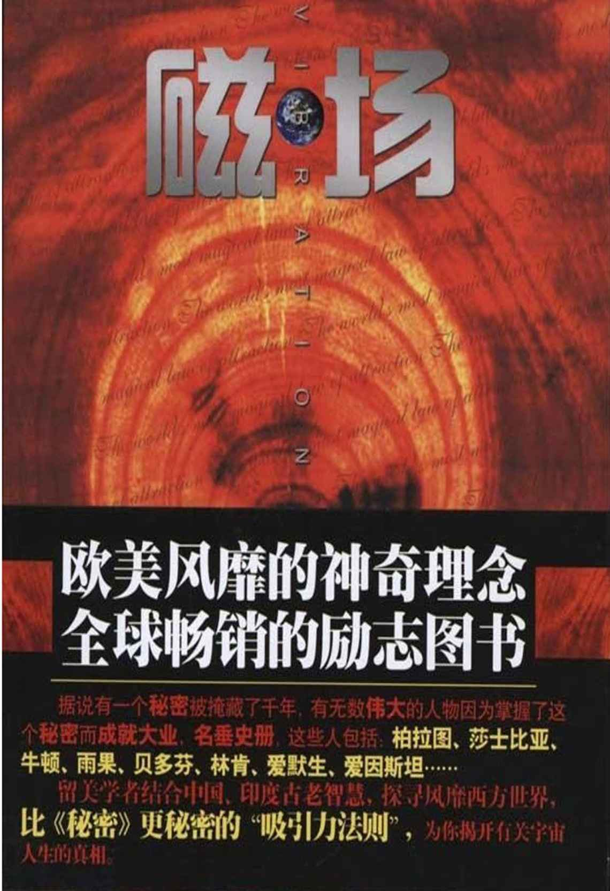

# 磁场：世界上最神奇的吸引力法则

自序

有一个秘密掩藏了千年，一直到一部叫做《秘密》的影片问世才被揭晓。有无数伟大的人物因为掌握了这个秘密而成就大业，名垂史册，这些人包括：柏拉图、莎士比亚、牛顿、雨果、贝多芬、林肯、爱默生、爱因斯坦。

这个秘密，就是“吸引力法则”。

近年来，国外占据励志类图书销售量排行榜榜首的几乎都是关于“吸引力法则”的书。什么是“吸引力法则”？简单地说，就是你是一块磁铁，你生活中拥有的一切都是你所吸引来的。同类相吸、同频共振，你的人格特质所带来的磁场，吸引来的也全都是和你的磁场相近的人或事物。当我初次了解到这个被许许多多伟人视为座右铭的“秘密”时，我恍然大悟，原来我们冥冥之中一直半信半疑的东西竟然是一个永恒不变的真理，那些早发现它的人们更早感受到它带来的神奇。

但是，对于西方人所谓的这个秘密，历史上的圣人早已经给予我们启示。而中国古人的智慧处处在向我们展示秘密背后的真理——幸福、成功、健康、爱情、财富，你都可以因施展这个秘密的魔法而拥有。

我曾经对很多朋友说，如果你学佛，根本就不需要再去追捧什么“吸引力法则”，因为这个被西方人从古老的印度多神教中拾起并又改头换面重新包装的术语所反映的宇宙真相早已经记录在佛经中了。但是我的一个朋友仍然鼓励我写作此书，她说：“学佛的又有几个人？”我想，这个主意不错，借着这股“吸引力法则”的热潮，将我所领悟的圣人的智慧，以深入浅出的方式与读者分享，假如他们发现单单一个“吸引力法则”还很难对很多问题自圆其说，那么完全可以去查询浩如烟海的佛经，那里面有关宇宙人生真相的理论是我接触到的所有学说中最为完善也最具说服力。

现代量子力学虽然承认“吸引力法则”的科学性，但是到目前为止，没有一个专家敢站出来说“吸引力法则”究竟是如何发生效应的。这就好比轮回与转世，虽然无数人相信它，甚至包括各国科学界顶尖的权威人士，但是科学至今无法证明。

所以我一直计划写这本书，那就是和读者来分享、探讨大家对“吸引力法则”的经验与感受。我们每个人从某种意义上都可以说是成功者或者失败者，作者未必就比任何读者成功，他只不过思考得更多更深一些，愿意和别人分享。对于那些哈佛大学的博士生，他们和我们国内硕士毕业的人相比就是成功者，而对于那些虽然学历不高，但是经过个人奋斗成为商界精英的，他们和两袖清风的博士生相比又是成功者。所以，本书贵在分享，而不是说教。

本书不同于西方人所写“吸引力法则”的特色在于：

首先，本书不是以成就事业、发财致富为主要内容，更不是传授具有“忽悠”性质的程式化的秘诀——除了比尔·盖茨那样的世界首富可以居高临下地告诉我们他成功的秘诀，我们这些仍然需要为生计奔波的人，没有资格向任何人传授成功的技巧。我们所能做到的就是与读者分享经验与感受，并探讨人与人之间的“吸引力法则”和其在爱情、友谊、家庭生活及社交中带来的巨大影响。美国心理学家研究表明，人在事业上的成功，生活上的幸福 85%取决于人际关系。作者通过剖析“吸引力法则”来探讨如何把自己塑造成一个受到别人尊重、信赖并欣赏的人。

其次，国外有关“吸引力法则”的图书，大多数过于强调“吸引力法则”带来的成功，将“心想事成”绝对化，夸大主观意识，而忽视了人的客观实际。本书在剖析、介绍吸引力法则的同时，也强调人贵有自知之明，先研究自己、认识自己，然后加强自身建设，取长补短、扬长避短，同时也应当善于开发潜意识中的前世残存记忆，知道自己能够吸引来什么、不能够吸引来什么。这是本书不同于其他同类图书的一大特点。

第三，本书中有大量生活中的真实事例，不仅包括了成功人士的成功案例，还有凡人琐事，妙趣横生，可读性强。本书中所提到的人名除了名人之外，绝大多数为化名。

最后，本书作者兼有中西方双重文化背景，平时也爱阅读研习基督教的《圣经》，佛教显宗、密宗，以及《易经》等东方哲学思想，所以在书中时时会迸发出古老东方智慧的火花，这也是西方同类图书中没有的。此外，作者与美国通灵大师雪柔女士系多年密友，二人一同探讨、研究了玄学领域的很多话题，比如塔罗牌、前世研究、催眠术等等，在开发潜能、掌控命运上，取得了一定的成绩。

由于作者水平有限，如有纰漏在所难免，希望读者多多批评指正。

引子

我很早就相信“吸引力法则”所说的“同质相吸”。我一生中有很多这样的奇迹发生。让我对研究“吸引力法则”产生兴趣的源头来自于一次有关学习《易经》的经历。

陷于对命运的困惑之中而常常思考命理的人，往往会逐渐爱上佛学和《易经》。人生中，每次我无路可走或无法抉择的时候，都会拾起家里的那一堆有关《易经》的图书，还会饶有兴致地看起易坛泰斗邵先生的有关著作。

2009 年 10 月的一天，我走在北京的长安街上。我一边走一边想，这个邵老先生的确功不可没，他不仅是改革开放后做了第一位敢于吃螃蟹的人，将《周易》的预测进行应用和普及，他传奇般的人生更是让人着迷。我不知道今生是否有缘和这位高人相识。

我正在想着，就在此时此刻，就是这么巧，我在这颗星球上的某一隅与这位中华奇人擦肩而过。

走在这条著名的街道上，行人来来往往，我突然感觉眼前一亮，左前方几米处迎面慢步走来两位长者，左边一位西装革履，戴着眼镜，仪表堂堂，气度不凡，其威严颇像中央首长，眉宇间透着慈祥，举止间又流动着一番古人风韵。我当即认出他就是易坛大名鼎鼎的邵老师，于是毫不犹豫地走向前，斗胆对他说：“请问您是邵老师吗？”

二位老先生都愣住了，半晌说不出话来。我坚信我不会认错人——尽管我从来没有见过邵老师真人。他们上下打量我，几乎是张口结舌，旁边那位浓眉大眼的长辈问我：“你怎么认得他？”我回答说，我看他的书看了十多年，一直崇拜邵老师。此间，邵老师一直握着我的手，久久不放，他的手很厚、很暖，他的笑容很可爱，眼神中透出的是激动、率真，甚至还有青年人的单纯。

邵老师操着他那浓重的湖北口音问我是哪里人，叫什么，等等，告诉我他又写了新文章，他在递给我名片时连连说着：“有缘！有缘！”的确，世界如此之大，人口如此之多，我却在这里碰到了我心里一直向往遇到的大师，不是缘分是什么？分手时我们几乎是三步一回头。走在路上，手中还有邵老师温暖的双手的余热，回想起几分钟前和邵老师的巧遇，激动得差点落泪。我很诧异，怎么一直特别想见到他，果然就这样巧逢了呢？

类似的巧合并不罕见。我想，这就证明了“吸引力法则”，你的磁场在和你的目标磁场不断接近，磁力越强，吸引力就越强，你就越能把自己想得到的东西吸引来。你想吸引来谁，你就可以做到。

其实，我们每天都在感受着“吸引力法则”。无数朋友告诉我，有时候，当他们念叨一个人之时，正要给他或她打电话，结果他或她的电话就打过来了。我曾经认识一个来自青海的藏传佛教大堪布。我在几年中只给他打过两次电话。第一次给他打电话，恰逢他的生日，而我并不知道他的生日是哪天。第二次打去电话，他刚刚抵达北京。有时候你正急需钱，偏偏就来了一单生意，比如 2002 年，我刚刚入住自己在北京买的房子，因为手头紧，简单装修后就没有钱买家具了，第一次出现了忍饥挨饿盼着发薪水的情况。但是就在这时，当我脑海中想象着一叠人民币到我手中的时候，手机铃声响起，一个已经认识两三年的加拿大商人请我给他们公司设计英文网站，并提前支付我四五千元人民币的报酬。那笔钱真是雪中送炭，让我得以购买了沙发、餐桌、椅子等居家必需品，免去我睡在木地板上的痛苦。还有，有时你心情格外的好，你就会遇到很多友善的人，好运也会接踵而来，而你心情欠佳的时候，又会赶上一连串的倒霉事情，可谓“屋漏偏逢连夜雨”。为什么有的人人缘很好，广结善缘，而有的人则困于糟糕的人际关系，也许有的人很有才华和能力，却因为人缘差而难以有所成就？

这一切都是“吸引力法则”在起作用。究竟什么是“吸引力法则”所说的“吸引力”？它是一种我们看不见的能量，一直引导着整个宇宙规律性的运转，这种能量引导着宇宙中的每一样事物，也引导着我们的生活，这种能量就是“吸引力”。

你生活中的一切，包括你的事业、爱情、友谊、家庭关系等等，其实都是你自身的磁场所吸引来的。整个宇宙都是由一种神秘的能量来操纵着，万物才得以运转，亿万星辰则得以有条不紊地在各自轨道上日复一日、年复一年行进着。而我们每个人又是宇宙中的一个微小颗粒，我们自身也是一个微缩的宇宙，能量也在操纵着我们的生命轨迹，引领着我们每天的生活。这种引领的力量就是我们所说的“吸引力”。

人们常常会祝愿他人“心想事成”，但是人真的能够做到心想事成吗？我们如何去施展自己的吸引力而做到心想事成呢？

我们每个人生活中都会遇到这种情况，那就是如果你特别想要达到什么目标，你就会产生一种巨大的能量和动力。它不仅影响着你自己的每一步路，还会吸引着不同人群，影响着你周遭的人际关系，它会吸引来你需要的贵人，会吸引来你所梦想的机遇。

真理需要靠自己去寻找，如何施展“吸引力法则”需要自己去领悟，因为没有任何人能够站出来说他有资格教你如何施展“吸引力法则”。虽然科学家求证了“吸引力法则”的存在与科学性，但他们尚不能确切解释“吸引力法则”究竟是如何奏效的。但是先行感悟的人，可以和你分享经验与感受。这本书将与你探讨“吸引力法则”，探讨“吸引力法则”为何会彻底改变你心态，并最终改变你的人生。看了这本书，从此你会发现上帝为你打开了一扇新的窗户来眺望远方的美景，你的能量会神奇地剧增，你的影响力会让人感到震慑，你的生活也会越来越多姿多彩，并充满机遇。

1.不是秘密的秘密：“吸引力法则”缘何掀起全球的关注热潮

“吸引力法则”，这个已经诞生了一百多年的术语，传入到中国也就是近些年。在影片《秘密》和随后的一部部有关“吸引力法则”的西方畅销书翻译并介绍到中国来，这个术语也逐渐被中国的读者所了解、关注，甚至着迷。人们迫切需要知道这个秘密，以及秘密背后隐藏的更深的秘密。

1.1　“吸引力法则”，源于古老的印度教

虽然作为一个术语，“吸引力法则”很短暂，但是据说它的理念渊源于古印度的宗教信仰中。在那个诞生了众多先知、哲人和多神宗教的神秘国度，古老的智慧经过现代西方人的诠释和包装，几经周折，成为今天人们狂热追逐的励志法则。

我曾经好奇，为何在印度那片贫瘠、荒芜的土壤上，曾孕育着能够启迪全人类的智慧。让我对古印度圣人的智慧产生兴趣的是 DISCOVERY（发现）频道的一部有关印度那迪叶的专题片。

DISCOVERY 频道曾经报道过印度南部起源的、号称世界上最为神奇的那迪叶占卜术，相传是两千多年前的古印度圣人将每个人的一生记载在棕榈叶子上，而如今年代已久，只有 40%的叶子幸存下来。据 DISCOVERY 的这部专题片介绍，这些神奇的叶子居然能将人类配偶的姓名、职业和子女情况都一五一十地记载下来，实在令人匪夷所思。那么这些那迪叶记载的每个人的一生详细到了什么程度呢？据本人在印度的英文网站上了解，每个人的那迪叶分为十二个章节，分别是这样归类的——

章节一为综述章节，系关于询问者未来的大致情况。章节二系关于家庭、教育、言谈、眼睛、金钱、直觉。章节三系关于兄弟姐妹和你之间的关系好坏。章节四系关于母亲、住房、土地、财产、车辆和生活享受。章节五系关于子女、子女的出生状况、无子女的原因、领养子女的情况、促进生育的秘方、子女前途。章节六系关于疾病、债务、敌人、诉讼以及化解方式。章节七系关于婚姻、婚后生活、配偶未来的具体状况、寻找配偶的地理方位。章节八系关于寿命、事故和危险，去世之地点与日期。章节九系关于父亲、财富、对圣地的朝拜、颂扬圣人之益处、慈善活动和社会生活。章节十系关于事业、工作、行业、地点的更换、事业的盛衰之期、成长、事业中的得失。章节十一系关于再婚、生意的收益、第二职业的收益。章节十二系关于支出、异域远行、来世和消业的收获。

为何那迪叶对每个人的一生都了如指掌，而且面面俱到？这是十分可怕的。我暂且不怀疑 DISCOVERY 被印度人愚弄或作假，倘若属实，那么那迪叶证实了俗话所说的命运堪称“一饮一啄，莫非前定”。如此一来，那我们活着，不都是坐以待毙吗？如果命运丝毫不能为人类所改变，那么存在还有什么意义呢？

列夫·托尔斯泰语录：

“活着为了什么？死吗？立刻自杀？不，我不敢。静候死亡来临？我更怕。那么我必须活着。但是为了什么呢？”

我们一生所走的路，在两千年前已经被圣人所预见并记载。冥冥之中，有只无形的手在操纵着天地宇宙，我们人类就好像是入戏的演员，将那只无形的手交给我们的戏剧剧本表演一遍，只不过结局我们并不知晓，但是早已经写在了剧本中。

那迪叶的神奇，让我陷入对宿命论的苦苦思索中。印度人和小乘佛教国家的居民都是很相信宿命的，你去这些国家总是会看到成群的贫困人口，他们闲散无事、不思改变，呆呆地望着时间的流逝。中国人则很奇怪——我们既相信“富贵在天、生死由命”的宿命论思想，又是一个很务实、很物质的民族，中国人的勤奋和努力是世人皆知的，中国人对发财致富、家族兴旺的世俗欲望也是很强烈的。

《了凡四训》在我周围的朋友间很流行。所有人都想探知，我们人类究竟能不能改造命运？在我继续研习了古印度圣人的智慧后，我得到的答案是：如果你不相信自己能够改造命运，你就要按部就班地演完那迪叶在两千多年前就给你写好的人生的剧本；而如果你相信你能够改造命运，那么你就可以感召宇宙，来给你的人生剧本进行增删润色，而改造命运的魔法就包括了同样源自古印度圣人的智慧——“吸引力法则”。

最早在印度接受到“吸引力法则”教诲的是一位俄裔的美国妇人。早在 1877 年，出生于沙俄，后来移居美国纽约的灵魂学家、通灵大师海伦娜·布拉瓦茨基夫人（Helena Blavatsky）出版了《揭开伊西斯的面纱》（Isis Unveiled：Secrets of the Ancient Wisdom Tradition）一书，第一次提到“吸引力法则”。她曾旅居过印度，在那里接受了有关“吸引力法则”的智慧。两年后的《纽约时报》上，“吸引力法则”这一术语又被用在科罗拉多州淘金热中如何吸引财富的文章里。“吸引力法则”的由此开始出现在大型报刊媒体之上。有意思的是，我还在网上搜索发现这个通灵大师竟然对藏密也有所研究。

在布拉瓦茨基夫人之后，“吸引力法则”随着 1906 年威廉姆·沃尔特·阿特金森（William Walker Atkinson）的《思维波动或思维世界的吸引力法则》（Thought Vibration or the Law of Attraction in the Thought World）一书出版，作为一个学术研究课题，又被引入到思维科学领域。“吸引力法则”成为励志的主题，启发人们如何致富，则起源于 1907 年布鲁斯·麦克莱兰（Bruce MacLelland）的《想象力带来富有》（Prosperity Through Thought Force）一书。他在书中指出“你是你所想，而非你想你所是”（You are what you think, not what you think you are）的概念，意思是说不要低估自己的能量，你所想即所是，所想即所得。

在这之后，西方心理学界开始掀起了研究“吸引力法则”的热潮。曾被理性主义者、纯唯物主义者视为唯心的“吸引力法则”，如今被纳入“思维科学”、“精神科学”的领域，有关它的学术研究著作开始涌现，比如具有代表性的、1926 年出版的欧内斯特·赫尔姆斯（Ernest Holmes）所著的《心灵科学的基本思想》（The Science of Mind）和 1949 年雷蒙德·霍利维尔博士（Dr.Raymond Holliwell）所著的《让吸引力法则伴随工作》（Working With The Law）等等。

但是在那之后的长达半个世纪里，“吸引力法则”的研究几乎销声匿迹了。到了二十世纪九十年代，美国著名励志畅销书女作家、演说家埃丝特·希克斯（Esther Hicks）和她丈夫杰瑞·希克斯（Jerry Hicks）共同出版了包括《亚伯拉罕的教义》（The Teachings of Abraham）、《情绪的惊人力量》（Let Your Feelings Be Your Guide）在内的一系列著作，这些有关“吸引力法则”的励志类图书竟然几乎全部成为美国畅销书。由此，“吸引力法则”开始广为美国乃至整个西方世界的读者所接受。

而导致“吸引力法则”彻底风靡全球的是 2006 年一部叫做《秘密》（The Secret）的电影，埃斯特·希克斯是本片最初的画外音解说者，她也是影片中的采访对象之一。《秘密》电影以纪录片的方式，集中了一系列真人接受采访，每个人讲述的是自己心想事成的实例，从而证明“吸引力法则”的真实性和实用性。影片主要通过 DVD 和网上发行，在西方引起主流媒体极大的关注。影片揭示了人们的情感、思维，能够感召宇宙间的神秘力量，感天动地，对在与人的互动中影响其生理、情感和专业的举动，从而吸引并促成某件事。影片之所以被命名为《秘密》，是因为“吸引力法则”曾经被地位显赫人士视为秘不可传的法则，不能公之于众。

这个一度被西方各国权威人士视为高度机密的秘密通过此影片公之于众，影片中揭示了实施这个秘密法则有三个步骤——索要、相信、接受。索要，即明白你想要得到什么，是事业的成功，幸福的婚姻，还是完美的健康，要把你想要的东西充分视觉化，在脑海中展示出你成就的喜悦场景——明白了你想得到什么，那就开始向宇宙来索要。相信，即要充满信心，集中精神，任何疑心会坏掉好事儿，你要想象着你所要的正在来到你身边的道路上，哪怕是一种自我暗示。接受，意思是说，要敞开心扉与迎接你所要的东西，你的所作所为要和你即将获得的成功相匹配，不要犹豫，不要踟蹰，要留心任何具有“共时性”特征的、来自宇宙的信号，这些信号会暗示你，你所走的道路是正确的，要勇敢走下去，你曾表白所需要的东西不久就会显现。

影片发行后，即刻得到全世界无数人的强烈反响，很多人在得知这个秘密之后，生活中发生了巨大的奇迹。有的人常年的顽疾突然不治而愈，有的人突然得到了一笔巨款，有的人找到了自己的恋人，有的人考上了自己理想的学府，有的人改善了自己的人际关系，有的人找到了一份理想的工作……

1.2　一部影片，带来一部畅销书的诞生

电影《秘密》在全球的巨大成功，又带来了随后出现的同名励志图书《秘密》的畅销。《秘密》一书的女作者叫朗达·拜恩（Rhonda Byrne），也是同名影片的制片人，来自澳大利亚，是一位电视制片人和作家。她自称在人生进入低谷时，在千年古书中发现了一个惊世秘密。《秘密》一经出版，便横扫美国、澳大利亚、加拿大、英国等多个国家的各大图书排行榜，创下美国赛门·舒斯特出版史单月再版破 200 万本、四个月销量破 500 万本纪录，并荣获“诺提勒斯书奖”（Nautilus Book Award）。《秘密》DVD 发行则达到 200 多万张。2007 年，拜恩被《时代周刊》选为全球最有影响力的 100 人之一。之后，有关于“吸引力法则”的书籍忽然间涌现在全球各大连锁书店以及网上连锁书店之中，在全球的读者中掀起了一股关注“吸引力法则”的热潮。全球的无数名人都热忱赞赏“秘密”，并支持“吸引力法则”。

全球名人感言推荐：

这让我感到震惊！《秘密》就是这样一种当下能帮助你在人生中更有效、更能创造的积极正面的工具。

——美国最有影响力主持人欧普拉

我学到许多关于生命的秘密，希望每个人都能受惠。

——美国新闻界金牌主持人赖利·金

《秘密》简单明了又充满智慧，帮助我度过了婚姻难关。

——奥斯卡影后妮可·基德曼

任何让你感觉美好的东西，总是会为你引来更多美好。你现在正在读这本书，就是你把它吸引进生命里的。

——《男人来自火星，女人来自金星》作者约翰·格雷博士

这是历史上最具历史意义的一刻，因为这一重要的信息将被传递给大众，并且以他们能理解且和他们的生活息息相关的方式传递给他们。他们会坐下、会思考、会明白。

——著名的国际营销大师维泰利博士

我也读了《秘密》一书，颇有感想。读这本书是我第一次接受到现代人所诠释的古老的“吸引力法则”。总的来说，这本书值得一看，但是这本书中的理念也有不够完善的地方。

该书最有价值的观点就是它引述并试图以现代科学的理论来解释“吸引力法则”。根据量子物理学论，如果一个人思想乐观、意志坚定，他就会发射出积极向上的电磁波，就会感召宇宙中的积极向上的能量，吸引能够帮助他的人，从而促使其成功。严格来说这个观点不是什么新鲜的秘密，在我们平时所学习的佛学中，在《圣经》中，在中国古代哲人的智慧里，都处处可见“吸引力法则”，但是作者举出大量事例，书中甚至还有大量成功人士的评价，大大增加了其观点的可信度。这些成功人士包括量子力学科学家、畅销书作家、大学教授、风水师等等。

但是我注意到，此书的观点在欧美也遭到很多反驳。有作家说，多数情况下人们需要实际一些的帮助，而不是单纯的乐观的思想。书中说到减肥，只要你心想自己苗条，自然会有助于成功减肥，但是实际上这是虚无缥缈的愿望。哪个胖人不想让自己瘦下去？难道你想瘦，就能瘦了吗？还有的评论家说，此书最大的“秘密”在于其作者和出版社靠此书的市场运作而发财的秘密——他们善于制造噱头，并善于用名人的影响力来为此书促销。还有的作家担忧此书会误导人们过于乐观而放弃实质的努力，或者存有不切现实的幻想。对于这些人的质问，《秘密》并没有一个合理的解释。

我想，为何都是政界、商界或好莱坞的名人对此书倍加推崇？因为首先他们都是佼佼者，都是成功人士，他们的成功来自于个人的天资、勤奋，还有运气，而且他们早就是“吸引力法则”的相信者。任何名副其实的成功者，都是有意识或无意识的“吸引力法则”的实施者和受益者。他们所追求的也是他们命中就应当拥有的。如果某种东西在你命中应当归属于你，只要你向宇宙索取，自然老天都会相助。但是也有无数人，无数做着发财梦或明星梦的人，对于成就的心切和执著不休的确不输给任何人，但依然一无所成，其实这些人不是思想悲观、消极，或者没有雄心壮志，甘于平淡，只不过他们眼高手低，一方面做着白日梦，一方面又对前景产生怀疑，守株待兔，画饼充饥。生活中有甘于平淡的非成功人士，也有不甘于平淡的平常人和失败者，心境不一，结果雷同。积极乐观固然重要，但是盲目乐观也很危险，因为盲目乐观会导致欠成熟的成就感，容易让人眼高手低。虽然“吸引力法则”是千真万确的，但是它不属于那些指望不劳而获的人。信念虽然很重要，但是人的客观努力也同样重要，没有付出，只追求得到，追求不切实际的东西，信念再强也是徒劳，这就是为什么有人会屡战屡败。

所以我所理解的“吸引力法则”，结合了我学习到的《圣经》的智慧和源自东方古老的宗教、哲学中的智慧。我绝对相信“吸引力法则”，但我也不认同《秘密》作者的“吸引力法则”万能并适用于任何人的主张。我坚信“吸引力法则”属于相信自己，热爱生命，同时也属于付出心血和努力的人们。我认为在施展“吸引力法则”的同时，还要有自知之明，充分了解自己的根基、品行和命理，知道因果，按规律行事，既不能万念俱灰、消极厌世，也不能盲目乐观，守株待兔，或者贪得无厌、唯利是图、损人利己。急功近利地开始实施“吸引力法则”，最终反而会因为求而不得而痛苦失落。

我不相信巧合，但我相信奇迹。我曾经很多年在寻找一个丈夫，一个终身伴侣，经历过两段不幸的婚姻，我依然没有失去信心。我时常用“吸引力法则”告诉我的秘密来在脑海中勾勒出未来的丈夫的容貌，他是一个很结实、强壮的男人，不是特别漂亮，但是非常阳刚，能给我带来安全感。他会很体贴我，会乐于品尝我烹饪的美味佳肴，会为我在浴缸中灌满洗澡水。我读了塔罗牌，知道会有这么一个人出现，所以我就更加有信念了，一切只是一个时间问题。终于有一天，奇迹降临，我的丈夫出现了，当他出现在我的视野中，直觉告诉我他就是我曾经视觉化的那个男人。很快我们就结婚了。我现在很幸福，我们之间没有一点问题，每天都很美好。

——美国佐治亚州雪柔·贝斯顿·索利斯（Cheryl Baisden Solis）

我虽然刚刚听说《秘密》这部影片，也刚刚听说“吸引力法则”这个词，但我马上就给予它以肯定。没错，你身上有什么能量，就会吸引来什么东西。信念特别强的人，你会感觉到他的能量的。他也会吸引周围所有能够帮助他的人去帮他成功。

——奥地利维也纳国立音乐学院毕业生韩京

1.3　秘密，其实早已不再是秘密

对于我们国内读者来说，“吸引力法则”作为一个术语，是一个新生事物，但是仔细一思考，其实这个术语所折射出的很多人生哲理则都是来源于中国古人的智慧，因此，秘密其实早已不再是秘密。中国古人早已经掌握了“吸引力法则”。比如说古人所说的“天人合一”，按照“吸引力法则”来解释，那就是人的思维振动频率和宇宙能量之间的感应；古人说的“物以类聚，人以群分”，用“吸引力法则”来解释，那就是人与人之间的磁场的互相吸引；“相由心生，境由心转”，用“吸引力法则”来解释则是人的磁场对环境的作用力。

中国古人的确伟大，他们掌握了宇宙和人的奥秘，因此给我们留下很多足以验证“吸引力法则”的成语。

先说“物以类聚，人以群分”，这是绝对有道理的。有一个女性朋友叫郭宝宝，是北京科技大学研究生毕业，身为某银行的首席程序员，不修边幅，生活俭朴，性情古怪，自己业余时间爱好古筝、钢琴、小提琴，还吟诗作画。果然，她身边所有的姐妹们都很古灵精怪，也都颇有文化修养，而且都是白手起家的事业上的强者。在郭宝宝网络交友的自述中，她写道：

我是土生土长的山西人，祖传三代都是贫农，1996 年以前一直在山西太原一带出没，后于北京求学，这期间在私营电脑学校任过教师，在中关村卖过耗材，当过赔本的家庭教师和短期的公关公司的 OL，出过书，翻译过英文资料赚零花钱，做过兼职的英文口译，但报酬不丰，编过一些大小程序，其中有一国防科工委基金项目，由此出版论文若干篇，但大多成为别人评职称或增加威望的工具，而于自身毫无益也。至今漂泊于海淀一带，常往来于阜光里和鼓楼一线，工具多为自行车。其人性情怪异，时而衣着光鲜，奇装异服不嫌其瞠目，招摇于市不惧流言，时而邋遢放浪，脚着破屐脚趾隐约而现；表情虽不及练过表演的人那番生动多变，但间或眼波流转，眉目之间也能有股清秀之气，令人一见倾心的妩媚之象全然皆无，但自有一股沁人心脾的味道。只不过仁者见仁，智者见智，是香气还是腐糜也由各位自相评断。其人性喜猎奇，年未逾而立而行动有古稀之象，常妄自揣摩是否能如古欧阳修一般老有所成，不被后人耻曰空为一抔黄土。论其人其事，功毁参半，据云曾得过一方英语专业八级之魁，其在大学时的英语修为已前无古人，后无来者之高也，然空有传闻，确无人亲睹，不知乃否属实。岁月遁逝，星月变迁，此人头上也空添一丝华发，常对镜自怜，吾乃千里马，而伯乐何处？其邻日间或听得几句东瀛诵读，但声如锯锉，往往一笑置之，心道：“阿弥陀佛，哪里来的日本蚊子。”

一堆文字可览全貌，能看出此人颇有个性，甚至有些古灵精怪。出身贫寒，生活艰难，邋遢放浪，但内心世界又很丰富，字里行间还有一丝黑色幽默。这样的奇女子，在当今中国社会可不多见。我很好奇她的朋友都是什么样的，因为像这样另类的女人，可谓不识时务者，难得会有很多红尘知己。但是她偏偏有很多和她相似的姐妹，个个也都古灵精怪。

古灵精怪的人，吸引来的多是古灵精怪的人。事业有成的人，也不会吸引来彻头彻尾的失败者。下岗职工不会奢望去和亿万富翁结为知己。非富即贵的妇人们，闺中密友也都非富即贵。

“酒逢知己千杯少，话不投机半句多。”人说异性相吸，我看同性也会相吸，当然不是说性方面的吸引力，而是性格、个性、志趣。我喜欢结交古怪的人，古怪的人也会被我身上的怪癖所吸引。我结交朋友首先要看这个人怪不怪，有没有个性，如果太大众化了，就没有必要交往了。

另外一个朋友是个拥有千万资产的富姐，她的朋友也都全是富人，每次聚会都在高消费场所。而她在一贫如洗的时候，身边交往的也都是生活拮据的人。看似富人不和穷人来往，其实是磁场在发挥作用。你满脑子想的是投资、经营、回报，怎么可能和那些满脑子是劳保、救济、借债的人吸引到一块呢？爱好高雅的人身边多是爱好高雅的人。胡同串子的周围则全都是胡同串子，天天在一起无非就是东家长西家短，是非多的磁场自然会吸引来一样有这方面嗜好的人群。举这些例子，并不是将人三六九等来划分，而是说你是个什么层次的，吸引来的就是什么层次的人，你的磁场只会吸引来和你磁场相类似的人们。坏人吸引不来好人，君子也不可能与小人为伍——当然，度化众生的圣人除外。如果你想吸引来能够帮助扶持你的贵人，那么你就要先去做别人的贵人；如果你吸引来的都是占便宜、损人利己的小人，很有可能你自己也是别人的小人，或者产生过当小人的念头。

而“相由心生”也是真理，一个人的基本情况，比如道德水准、思想境界、生活背景、文化层次、心理状况，都可以从相貌上反映出来。聪慧还是愚笨，厉害还是柔弱，大器还是小器，落魄还是有福，都写在脸上了。而心的变化，会带动相的变化，即，会改变相貌上的某种特质。爱尔兰戏剧家奥斯卡·王尔德的《道连·格雷的画像》讲的就是人的堕落也会让相貌变得狰狞的故事。现实生活中何尝不是呢？比如林彪，早年和晚年的相貌，虽然还是一个人，但是某种特质发生了变化，一前一后，对比鲜明。“境由心转”，则颇有“吸引力法则”的特色：心地纯正无欲、健康向上了，那么周围的环境也会发生变化，因为心态不同，吸引到的磁场也不同。只要你注意，我们都可以发现，凡是幸福、平和的人，都是品行端正，欲望不强，而且有崇高信仰的人。痛苦，绝对来自于贪婪的欲望，欲望越强，痛苦越大。

有一个演员朋友，叫章如华，长得很精神，但是英俊的面孔上，又明显带有落魄相。我不常见到他，有时候是一年见一次。我每一次见到他，他的面部都会有某种难以描述的变化，那就是那落魄的感觉在加剧。你难以想象一个英俊的人，脸上反而会挂有落魄相，但是这恰恰是事实。二十年前，风华正茂的他放弃了原先稳定的国企职位，加入到北漂的演员行列，但是一直怀才不遇，虽然出演了一些电视剧和电影，网上也有一些自己的粉丝，却仍然徘徊在无名北漂的行列中，没有住房，片酬低廉，生活拮据。梦想着有朝一日大红大紫，成为明星，但是随着年龄的增大，机会越来越少，虽然安慰自己会大器晚成，但潜意识中不安全感却在日益增加。你说，这样的心境能不反映在脸上吗？况且他总是给自己以落魄的心理暗示，这样的暗示反而会招来更多的倒霉事。比如他总是逢人就说他很贫寒，或者他福报不够，压力太大，而他越是将自己贫寒的状况奔走相告，他就越发不走运。心态若是负面的，你吸引来的则都是负面的东西。如果将消极的话奔走相告的话，只能招来更多的消极的能量，会让人越来越落魄。而落魄所散发出的磁场，恰恰又吸引来向他讨债的人。积极向上的人会吸引来正在走运的人；消极落魄的人，总是会吸引来同样在走背运的人。

一个人是富贵还是贫寒，人品优秀还是猥琐，我一眼就可以看出，因为全写在脸上了，比如说气色、神态、眼神等等，这和漂亮不漂亮没有关系，漂亮的人也会有红颜薄命的。有时候你看一个人的气色，会感应到此人不久将会有血光之灾；而有的人往你前面一坐，你就会感觉到不久他会交大好运。走运的人，绝对不会将自己的倒霉事儿挂在嘴边。老发牢骚的人，相貌也会晦气的。

——《易经》大师邵华宏

世俗之人相貌也都是俗气的，而喜欢灵修的人，相貌也会端庄、祥和。有一天晚上，我在北京朝阳区 CBD 的嘉里中心酒店炫酷酒吧会见一位不久前去印度灵修的朋友，名叫倪思思。她一见我就问我，最近我在做什么特别的事情，为何相貌发生了变化？为何气色变得更加祥和？我说我最近一直在读《圣经》及有关耶稣的生平，并时时冥想和忏悔，可能这就是导致相貌发生变化的原因吧。

这位朋友也变得更加脱俗了。如果说以前的她是一个贵妇、女企业家、美容师，那么现在的她活像是空行母——她的头发剃短了，身披手绣的西南民族服饰，朴素中又透着华贵，清纯中又带有风流。她酷爱藏传佛教，也爱印度古老的嗜那教，不久前她前往印度著名的瑜伽圣地瑞诗凯诗进行灵修，如若不是她国内签证到期的原因，她还会在那里多待上一段时间的。我也曾向往印度，但是目前尚无机缘。

很默契的会谈，是关于我们在精神领域自我完善的途径。我们虽然走的途径不一样，她十分富有，物质生活一流，远远超出绝大多数人的水平，但是“吸引力法则”把我们带到一起，来畅谈各自的生活点滴，因为我们都拥有很多精神的财富和人生的经验。我们聚在一起，并没有什么商业上合作的契机，或者是金钱、物质的交易，而是源于灵修所带来的感悟——那就是进入某一种精神境界的人，都会趋向于和同一境界的人接触，都会寻找有相似的磁场的人群。精神领域，不分门派。无论是佛陀的教诲，还是耶稣的引导，无论是更古老的印度多神教，还是较年轻的藏传佛教，总之，热爱追求精神生活的人们，都可以在冥冥之中找到自己的最佳途径来让自己的灵魂升华并不断臻于完美。

灵魂升华，意味着拥有一个不断开阔的胸怀和眼界，俗世间的琐事一概可以视而不见，至少对自己平静的内心的干扰不再像以往那么强烈。如果心中时常默念“爱人如己”，你的思维振动频率自然会感天动地，并影响到你周围的人们，所以你会发现以往你厌恶或疏远的人也变得可爱起来，任何伤害你的人都可以被原谅和宽容，任何对你不屑一顾的人你都不再耿耿于怀，任何曾利用你达到个人目的的人，你也会祝福他们前程美好。变化不会一蹴而就，但是你能够明显感觉到，而每一个变化都会自内而外影响到你的相貌。

佛陀语录：

所有的境界都是以心为引导者。心是主人，所有的境界都是由心造成的。假如一个人怀有一颗污移的心，那么苦恼便立刻会跟随他，宛如车轮紧随着挽牛的足蹄。

“相由心生”容易感受，但是“境由心转”似乎有些抽象。我很相信“境由心转”。如果你不喜欢一个地方，你吸引来的则都是这个地方你所不喜欢的事物。我住过徐州、南京、北京、多伦多、温哥华、伦敦等处，也住过某邮轮，没有哪一个地方是完美无缺的，但是我很快能够找到自己，很快能够调整心态，适应环境。

最初从文明、宜居的温哥华回到北京，总是看什么都反感，可是当我越加反感，我眼皮底下则出现越多的乱七八糟的东西。

2008 年夏天在北京，赶上了国人百年不遇的奥运会，一天傍晚回家，飞尘满天，走在马路上，残砖碎砾，衰草枯枝，陋房穷店，恶水横流，摊贩比肩，行人接踵。车辆鸣笛，此起彼伏，而行人全然未有耳闻。轿车、卡车、公交车、三轮车、电动车、自行车，横七竖八，追逐抢行，行人见缝插针，惶惶然飞速穿梭其间。公交车上，老人和孕妇先后上车，乘客视而不见，需司机恳求众人才让座，年轻人坐在老孕病残黄色专座上，表情木讷。公共场所，排队没有队形，总是有人“宁做鸡头，不做凤尾”，后到则另起一队。更有突然间在我身前闪现者，以至于我疑惑自己是否穿上了隐身衣。踏过垃圾，越过人的痰、狗的粪等秽物，闻着路边烧烤和毛鸡蛋的腥味，经过街边打牌全半敞露着大肚皮的男人，进入我们相对洁净的小区，与不盖盖儿的垃圾箱擦肩而过，在楼梯扶手上悬挂着的蒜头下终于急不可待地打开自己的家门，方才进入污浊恶世中的一方净土，感叹世间忽然少一人。

但是我接触了“吸引力法则”，方知大脑的思维波动会吸引来同质的事物，即你越是想着那些不愉快的东西，你就越会把他们吸引来，所以当我脑海中满是污浊恶世的景象，身边接触的也都是乱七八糟、腌腌臜臜的事物。我想，为何不能做到不见世人过，只看美好的一面呢？当我想象的全是美好的景象的时候，心里也坦然很多，外界环境也不再那么狰狞可怕了，陆陆续续会有吉祥如意的事情出现在我的生活中，于是北京美好的事物也纷纷涌现出来，有重情重义的朋友，有无数的发展机遇，有最新的好玩的去处……，心态一变，生活就会出现惊喜。

而我初次移居加拿大，也经历了类似的过程，那绝对是一个“境由心转”的历程：如果你看到眼里的都是消极的事物，那么这个地方就成了人间地狱，无处藏身，没有什么能够让你开心。

我初次到温哥华，一下机场就傻了，原来想象中的加拿大还没有我眼前亲眼见到的这个地方文明、静谧、发达。朋友打车带我回家，沿途经过的就是那条两边满是大别墅的格兰维尔大街，朋友说这里住的还不是什么富豪，顶多算是中产阶级，而且有很多华人，我更傻了，没想到好莱坞电影中家家住着拥有大花园、大车库的大别墅原来是真的。

起初十天，这个朋友几乎一日三餐都下馆子请我。说实话，我身上只有国内带来的招商银行的信用卡，所带加元现金一分不敢乱花，所以第一次没有和朋友抢着买单。我暗自好笑，怎么，刚出国就变得小气了？

我去了一些小超市，每看见一样东西的价格，不由自主会乘以六，所以这个也不敢买，那个也不敢买。有时候我自己一人逛街，饿了，想在路边买热狗和可乐，心算着乘以六的价格，竟然犹豫半天才咬牙买了一个。当时吃着热狗一阵心酸，开始痛骂万恶的资本主义社会了。从中国去泰国的时候大手大脚，而来到比我们富裕的发达国家，优越感变成了一种难以名状的自卑情结，那种感觉是不好受的——尤其是在你没有工作、居无定所，而且一切都那么陌生的时候。

人生第一次学会了放低姿态，平衡心态。以前总有人说，你英语那么好，又是硕士学位，在加拿大一样可以找到好工作，这全是恭维。现实是残酷的，即便你是清华、北大的硕士生、博士生，你来到这里一样会四处碰壁。不要把什么事情都想得太好，因为这个国家学而不以致用的情况极为普遍。也不要听信哪位新移民一夜之间找到高薪工作的传闻，因为总是有人会为国内的亲友编织一个海外淘金的美丽神话。现实就是现实，运气不会为所有人降临。你很有可能发放二百份简历，而只有五个答复，其中还有四个是请你先缴费去接受“职业培训”，一看就是老华侨骗新移民的惯用伎俩。那个时候，天天都有挫败感。每天最喜欢的时间是夜晚，因为倒头一睡，什么烦恼忧虑都抛之脑后，而最怕早晨醒来，因为你不知道醒来以后该做什么。

可怕的日子。没钱的人会有艰辛的日子，而有钱人也有有钱人的烦恼。一对大陆移民夫妻来加拿大时带的七百万人民币几年内花得一干二净，最后还是回去了。这个时候你会天天骂加拿大，天天颂扬伟大祖国的繁荣昌盛。你会天天往国内打长途，以至于那边都听烦了——大家个个在忙着挣钱，谁有工夫听你唠叨几个小时？

住在朋友家的时间总有尽头。在多伦多，朋友介绍的一个老外朋友收留了我，每天早晨还为我做早饭，我感激得甚至有点手足无措。但是住了不到一个星期，这位一向慈祥可亲的老外很直爽地问我，什么时候可以找好房子搬出去，因为下周他还要在客卧里接待来自渥太华的一家中国客人。听到这委婉的逐客令，我当即很委屈，很反感，有种四面楚歌的危机，想赌气登时就走，但走不了，想厚着脸皮留，又不情愿留。但是转念一想，人家已经让我免费住了一周就非常不错了，不感激人家，难道还恨人家不成？这个时候突然想起自己在北京的家，自己父母的家，想住多久就住多久，怎会有这种寄人篱下的卑微感？没几天我找到了房子，但是对方要用一周时间腾房，于是这个老外又通情达理地让我继续住了一周，我临走时他还送我一大堆锅碗瓢盆。

我简直不明白为什么到加拿大受罪来了。我天天抱怨加拿大，天天给国内打电话，想回去。但是有的加拿大朋友说，加拿大也不是那么一无是处，也有很多美好的东西，但是需要你用心去发现。我告诉自己，要给自己一些时间，人如果生存能力强，他就不会担心某一个地方不适合他的。

当我逐渐融入这个社会后，当我遇到越来越多的善良热情的人们的时候，我的心情好了很多。我住在清一色老外的公寓，电梯里会遇见老外邻居为我这个东方面孔的新租户好奇；我在地地道道的老外公司里求职，他们工作中不怕争执，但是不记仇，吵过之后一下班又打得火热；我开始结交本地人朋友，逐渐习惯了直截了当的交流方式，习惯了简简单单思维，简简单单处事，YES 就是 YES,NO 就是 NO。虽然论及人情味，他们没有中国人那么容易跟人走得很近，但是纠纷少了，闲话少了，琢磨人心思的工夫少了，勾心斗角的行为少了。同时，帮助你去找家庭医生、找工作、找房子，带你去一些著名餐厅、俱乐部以及景点并融入主流社会的人多了。一旦开始感觉有些适应，这个时候就能够领略加拿大社会的种种优越性来了，虽然他们奥运金牌拿的少，也举办不了像我国这样的国庆阅兵式，但是它的报税制度、信用体系、社会监督体系、社会保障体系、医疗卫生、义务教育、职业教育和高等教育乃至社会其他方方面面，都逐渐让我叹服，也开始思索我们的国家，我们的民族，我们的社会和先进国家的差距。

这个时候消费不再乘以六——你越是乘以六，就越是不敢花钱，越是不敢花钱，也就越挣不来钱。现在反而觉得很多东西很便宜——尤其是当你有了收入的时候。你会花几个加元轻而易举成桶的鲜牛奶买回家，不用担心有三聚氰胺；你会花三个加元买回一大桶鲜橙汁，远远比粒粒橙好喝。空心菜、香菜、手工制作的商品、请保姆、保洁员、做按摩，想腐败一番要比国内贵很多，但是飘柔、潘婷、牛奶、巧克力又比国内便宜不少，去了美国又便宜好多。

这个时候你一旦有了很多要好的加拿大朋友，发现租到便宜的好房子司空见惯，不是网上宣传的那么多天价出租房。在温哥华滨海的西区，你可以以不到五千元人民币的价格租到海边的一居海景公寓，水、电、气、电视、宽带、暖气全部包括在内。在中产阶级云集的耶鲁小镇，你可以以不到人民币六千的价格租到联体别墅，虽然要与房东分享，但是你有独立进出大门，独立的厨厕，互不影响。而在从前心态欠佳的时候，我听闻到的则全是离谱的价格，一间地下室都要宰你没商量。要么就是房东的刻薄刁钻。总是听到新移民埋怨，她每次做饭都给房东捎一份，而冰箱出故障，房东还要赖她弄坏的；要么就是房东为了省钱，暖气总是开不足；要么就是房东嫌孩子闹，嫌做饭油烟大，嫌这嫌那……总是这些鸡毛蒜皮之事。为何心态改变，好事就全来了呢？

心情转好，同频共振，便让我接二连三吸引来了善良忠厚的房东和室友——很难想象，如果你每天耷拉着脸，你会吸引来友善的人们。我遇到的人都是宁可自己吃点亏也不会让我吃亏的，占人便宜更不可能。比如我曾经有一个老外房东，他的洗发液、沐浴液让我随便用，而我买的他一动不动；冰箱里他买的副食品和饮料让我随便用，而我买的他也从来不碰。有时候我二人都会买鸡蛋，他煎鸡蛋会给我一份，我以为他用的是我买的鸡蛋，而我打开冰箱，发现我买的那盒鸡蛋一个没少，而他买的那盒几乎空了！我觉得过意不去，所以有时候我将我买的饮料、冰淇淋、水果送到他手中，他眼里闪着慈祥的目光接过来，津津有味地品尝，一边不停地说“谢谢”。公寓里只有一个宽带接口，知道我离不开网络，他索性都不上网了。我说我受不了闻二手烟，于是他烟瘾犯了会跑到户外吸烟。我说我吃素，看不惯别人在我面前炖肉吃，于是他把荤也戒了。他只不过是我遇到的众多老外活雷锋中的一个，后来去了美国，发现像他这样的好人居然随处可见并非个别现象，不由得想起祖国的同胞们来，脑海里浮现那里的人们开车像打架，坐地铁你抢我挤的景象……，还想起陈佩斯和朱时茂的喜剧小品，两个人在小饭馆为争一瓶胡椒粉打架的情景。我想，生活在这里也满不错嘛，至少没有什么生气的地方，大家相敬如宾，简简单单，每天都很舒心。

我坚信，无论你生活在哪里，美好还是丑恶，都是由你的心境而产生。如果你眼中不容沙子，即便到了天国，你也不会满足，但是你心中如果充满了美好的事物，你所看到的、吸引到的也都是美好的事物，在哪里生活都一样美好。

住在哪里都会有人骂。有人住在北京骂北京，有人住在广州骂广州，也有的骂香港的、上海的。我曾经住在奥地利有很多年，刚去的时候也总是骂奥地利，骂欧洲人都是冷血动物，大街上看到的都是面无表情的冷漠的人们。你不跟他们打招呼，他们也绝对不会搭理你，我甚至以为他们恐怕就是瞧不起中国人。但是日子久了，我对他们的印象就改变了。当我迷路的时候，我鼓足勇气，强作欢颜去向一个表情极其严肃的白人绅士问路，没想到从我开口的那一刻，他就显示出热情来，慌忙找出地图，给我解释，怕我听不懂，甚至给我带路带了几个街区。我想，人都是这样的，你对他多一些微笑，多一些友好，人家自然也会给你微笑，对你友好。后来我又遇到过很多很多的好人，于是也喜欢上了欧洲，喜欢上了奥地利。

——奥地利国立音乐学院毕业生韩京

2.宗教与科学，如何看待“吸引力法则”？

宗教和科学不是对立的，它们总是抱有同样的任务，去揭开自然之谜、宇宙之谜，人类之谜，但是宗教永远是先行一步，而科学在不断跟进，求证着宗教已经证实的事物。

埃德温·阿若德语录：

“我常说，而且将一直这么说，在佛教与科学之间存在着一股智慧的粘合力。”

爱因斯坦语录：

“如果说有那个宗教可以应对于现代科学要求的话，那一定是佛教了。”

艾基尔顿·巴普铁斯特语录：

“在面对原子方面，科学不能给人以确切的保证，而佛教完全可以应付原子的挑战，这是因为佛教超凡的智慧始于科学所不能应对和解决的地方。这对从事佛学研究的人来说是显而易见的。因为，通过佛教的禅定，原子的成分构成物质的过程，便可如实看到或觉察到。而物质的生与灭所引起的忧伤与痛苦均源于所谓的‘灵魂’或‘梵我’等法执之妄见，这便是佛经里所阐述的。”

2.1　圣人的启示，科学的验证：信仰让你和宇宙成为一体

前面我已经写到，秘密早已不再是秘密。在这一章节里，我想谈的就是影片《秘密》中所揭示的、曾经秘不外传的“吸引力法则”其实在许多历经 2000 多年的不同的宗教圣典中都有过启示，比如《圣经》——

我又告诉你们，你们祈求就给你们，寻找就寻见，叩门就给你们开门。因为凡祈求的就得着，寻找的就寻见，叩门的就给他开门。（路加福音 11：9-10）

我们晓得万事都互相效力，叫爱神的人得益处，就是按旨意被召的人。（罗马书八章 28 节）

耶稣回答说，你们当信服神。我实在告诉你们，无论何人对这座山说，你挪开此地投在海里。他若心里不疑惑，只信他所说的必成，就必给他成了。所以我告诉你们，凡你们祷告祈求的，无论是什么，只要信是得着的，就必得着。（马可 11：22-24）

也许耶稣或者《圣经》的作者没有听说过“吸引力法则”这一术语，但是毫无疑问，《圣经》中的这几段教诲颇有“吸引力法则”的特色。圣人教导我们，只要你诚心索求，你就会得到你想要的；你不仅要索求，还要充满信心，没有疑惑，只要有信心，你就能得着。

圣人启迪我们要有信仰，信仰让我们生活有目标，人格更高尚，心境也更纯净，人生也更加幸福。信仰，让我们与上帝接近，让我们和宇宙同频共振，能量相通，从而达到天人合一的和谐境界。

在中国的佛教和道教领域，更是推崇天人合一、天人感应的学说。圣严法师在他的著作《学佛群疑》（陕西师范大学出版社，第 66 页）中阐述了人体官能通过心念能够和宇宙的磁力与电波接通，说的就是“吸引力法则”。

信仰能够使人做到天人合一，从而感召宇宙。我周围凡是没有任何崇高信仰或者对信仰不坚定的人，因为自己挣扎在与宇宙闭塞的世界中，所以他们的生活也是不完整的，不健康的，主要表现在以下方面——

在感情上，遇到求而不得或付出多于收获时很容易痛苦；遇到不顺时容易有受挫感，对未来有不安全感。

运气好时踌躇满志，运气不佳时则容易怨天尤人、牢骚满腹。

会逞强，容不得被轻视或小看。

会轻易评价某人某事，并带有个人喜恶和偏见，甚至会出言不逊。

和人相处可能会你敬我一尺，我敬你一丈，但也会“人若犯我，我必犯人”，容易翻脸。

会为一点利益而去争，把得失看得比较重，也可能不屑于占便宜，但是绝对不能吃亏。

会虚荣，比如为了面子给自己粉饰一下，以博得别人的重视或羡慕。

时运不济时很容易接近《易经》、佛教之类，但是是为了消业积福、扭转命运，而不是为了发菩提心。

其实，烦恼都是自找的，正如《太上老君感应篇》第一句话所说：“祸福无门，惟人自召”。烦恼本无，都是我们自找的。“本来无一物，何处惹尘埃？”但是，一旦接受了信仰的教诲，意识到人和宇宙一体，宇宙具有智能化、人格化特征，可以给你所需要的一切，那么上述的情况就会消灭掉，至少会去掉很大一部分。这是没有信仰的人尚且意识不到的。这需要过程，根器不一样，悟性不一样，所以每个人的感受都不一样。

陀思妥耶夫斯基语录：

“如果没有神，什么都可以做。”

“吸引力法则”揭示的不正和圣人所说的相同吗？只要你集中注意力，向宇宙求索，就会感召宇宙中的神秘力量，从而会吸引和调动一切能够促使你心想事成的元素，你所拥有的一切都是你自己的思想感召宇宙吸引来的——连宇宙都是由思想所构成的。你还需要信心，因为一丝一毫的疑惑都会干扰你的思维振动频率，影响你和宇宙中神秘力量的沟通。

有人问，如果你向宇宙发愿，它能有感应吗？能！宇宙是思想创造的，它具有人格化的特征。爱因斯坦说过，宇宙是“和善”的。而牛顿则说过这样的话——

这个由太阳、行星和彗星所构成的美丽体系只可能是出于一位有智慧与大能的存在着的计划和权能。

宇宙中的神秘力量是什么？世间没有一个合适的词语来形容它，所以不同文化和区域的人们给了它不同的称谓。你可以说是神，是上帝，也可以说是佛，是真如，是法性，就好比中国南方人叫外婆，北方人叫姥姥，名称不一样，但说的是一个人。

我还联想到念经、持咒。我们如果学佛，就会念很多经文。我们念《地藏经》，祈求超度所有的冤亲债主；我们念《心经》祈求破迷开悟；我们念《药师经》祈求得到药师佛的加持，以消灾延寿；我们念《楞严经》祈求了解宇宙真相；我们念《金刚经》祈求得到殊胜的智慧。而无数持诵经卷的人都有过许多神奇的灵异感应。如果用“吸引力法则”来解释，那就是通过潜心诵经，声波向外传送出你的人体脑电波，和宇宙的能量产生共鸣。而念经后的回向更是为了输出电波，让你回向的目标人群接收到你的电波，从而接收到你的祝福。

神奇的是，的确有人能够感受到你诵经念咒时候发送的能量波。现代科学无法验证的“吸引力法则”却被宗教所验证了。几个灵异的事例，让我对人体能量波的传导和感应产生了浓厚的兴趣。

一位在北京老居士家里结识的四川藏区活佛，屡屡让我和朋友在不经意间莫名其妙，甚至是惊讶、惶恐。记得刚认识他不久，他用还不熟练的汉语说道：“我没有文化，没有智慧，没有神通。”我心想他一定是谦虚，智慧自然不用说，但是如果没有确凿的求证，我也不会轻易相信任何玄之又玄的东西的。但是有几件事情让我和我的同修大悲女士百思不得其解。

有一天，大悲突发奇想，冷不丁随便念了绿度母心咒一千遍。当晚活佛冷不丁地从四川藏区来长途电话说：“对，就这样，每天念绿度母心咒一千遍。”大悲奇怪他怎么知道自己念了什么心咒，又怎么知道自己念了一千遍？这也太巧了吧。

我和大悲初次拜访了该活佛后，我回家就买了宜家的镜框，将活佛的像装好挂在了我佛堂的墙上。大悲来我家看到了，当即打电话告诉了远在藏区的活佛。结果活佛听似很严厉地声讨她：“那你挂了没有？你挂了没有？”大悲不好意思了，原来她没有挂上师像，估计活佛感应到了，其实活佛是在开玩笑，并不会真责怪她。

有一年夏天，我因喝水少，尿路结石犯了，剧痛难耐，在北京朝阳中医院超声波碎石，当即治好。两天后活佛竟然从藏区来电话，说：“我听说你病了，你是不是肚子疼？”我心想，他会听谁说呢？我只跟两个他认识的人说过。先后与这两个人电话证实，二人都矢口否认曾给活佛通风报信。那么这又作何解释？

大悲工作特忙，而我又长年生活在国外，并没有很多机会见面。有一天大悲来我家做客，顺便给活佛打了个长途，让他猜猜她和谁在一起。活佛说他没有神通，不知道。大悲软缠硬磨，非让活佛猜不可。活佛这才猜道：“你和 H.B.达哇在一起。”我在她旁边听着，也惊讶不已，但是转念一想，在北京和大悲同时认识他的人没几个，不是我会是谁？

我一向只用一个手机，但是就在有一年年初见到活佛时候，身上带着移动和联通两个手机。活佛要给我手机上打个中国结。我递给他一个手机，他又问我：“你还有一个手机呢？”我真是很纳闷，他怎么知道我身上还有一个手机？即便是误打误碰，也不会这么巧。

一个老居士摔了一跤，胳膊打了石膏。第二日，活佛打来长途问她：“你身体怎么样？”老太太不想让太多人牵挂她，于是撒了个谎，称自己身体很好。结果活佛连连问她：“你确信吗？你肯定吗？”然后电话挂了。老太太吓了一跳。

就在前不久，两件事又把大悲吓得不寒而栗。

一是有一天大悲躺在床上，枕着两个枕头给活佛打长途。活佛在电话中说：“你坐起来吧。你的枕头怎么这么高？”一句话吓得大悲立马从床上坐起来了。二是大悲从台湾旅游回来，买了很多书放在床上，其中有一本是算命的书，当时窗户上拉了一个透明窗帘。她给活佛去电话，活佛开玩笑说：“你现在床上有很多书，还有一本算命的书……你没有拉窗帘……”

如果说以前的感应事例都纯属巧合的话，那么这一次大悲彻底被活佛的本事折服了，她立即打电话又紧张又兴奋地告诉我。修行到一定程度，在坐禅入静后观想，世间万物，前因后果都可以看到。网上有的人学了一些佛法，便不是很谦虚，说那点神通算什么，都是小儿科，某某高僧会穿墙，某某活佛会腾空，等等。但是到目前为止，我所能见证的就是心理遥感能力，至于什么飞檐走壁、腾云驾雾的都是传闻，甚至连张照片或视频都没有。这个世界神奇的事情不是很多，否则就乱套了。

不单单只有活佛能够感应到别人的信息，生活中也有凡人具备这样的能力。我身边就有一个朋友，名叫曲浩，既不是活佛，也不是神汉，更不是什么易经大师、看相大师，但是他对他人的信息的感应能力相当了得。虽然不是 100%稳定，但是经过我的观察和统计，他的感应能力准确度可以达到 75%以上。我跟他做过这样一个实验，即我不露声色地拿出我的很多中外朋友的照片，我相信他不认识他们中的任何一个人，让他判断每个人的状况——包括与我的关系远近疏密、人品、性格特征等等。这个朋友居然脱口而出，而且百发百中。据他自己说，当他看到每个人的照片，马上会感应到对方的磁场，是积极的还是消极的，是吉祥的还是倒霉的，他能明显感觉到。下面就是一些例子，曲浩对每个人的感应是非常到位的，至少是很靠谱。

詹姆士·米凯伊——他的实力没有你想象那么大，但是他会尽力帮助你。因为帮不上忙，所以他比较内疚，就没有再联系。

梁冰——他对你非常好，他也很有福报，出身较贫寒，但是贵人很多，帮助他成为今天的他，但是他也到此为止了，也就是当个高级白领或金领，再往高处，就不会有更大的突破了。

凯蒂——她对你很忠诚，还有一些罗曼蒂克的意思。

汪文——他对你不错，但又防你，防你的同时又离不开你。

凯文·贝格玛——他对你不错，但是有些怕你。

马科斯·摩根——他对你很不错，很忠厚老实的一个人，但是他有些恨你。

韩宁——他对你很铁，很讲义气，也很服你，绝对没有二心。陈晨——他很不靠谱，虽然人很好，没有什么坏心眼，但是太能忽悠，水平也不高，有点半瓶子醋，对你也没有什么益处。

安德烈·德·布希——他出身很好，可能有点类似贵族家庭，现在地位也不错，官运亨通，但是也就到此了，不会再升到哪里去。他很欣赏你，但是只能帮上一些小忙，比如介绍个人什么的，大忙帮不上。

罗德里格斯——他的业务不错，人也很老实，对你很尊重，可以合作得很不错。

内森·史密斯——这是一个好人，对你特别忠诚。

艾米——她是帮你的人，绝对够意思，此人很有能量，2010 年会有大作为。

皮埃尔·克里斯蒂安——这个人对你特别好，可能超过其他所有人，但是非常情绪化。

上面的这些由感应得来的对素昧平生的人的印象，虽然不具有惊人的细节——诸如此人的身高、体重、生日等具体信息，但是基本上是符合实际情况的。一般来说，人体磁场的感应也就是感应出一个大概情况。如果有的人较真说，没有感应到他有几个兄弟姐妹，或者结过几次婚，或者身上有几颗痣，就不算数，那未免把感应夸大、神化了，但是即便是这种具体而微的感应，我也经历过。

感应能力人人都有，只不过程度有多不同。能力强大的人可以感应到很具体的信息，比如你的年龄、婚否、兄弟姐妹、你身上的胎记、伤疤以及你的内衣颜色，还有某年某月某日发生了什么事情等等；能力稍弱的可以大体感应出你的人品、健康程度和性格特征；能力更弱的，比如我们绝大多数人，多少可以感应出一个人的素养和他对你的喜恶。

由此我相信，人体是有一种可以被遥感到的磁场，你发散出去的能量波，都会被他人或宇宙所接收，而修得神通的人（如上面说的那个活佛）或者天生便具有感应能力的人（如上面说的曲浩），会感知到的。根据心理分析大师弗洛伊德和荣格的有关学说，我们每个人在潜意识中，都具有这样的遥感能力，然而由于后天的显意识的干扰，潜意识被湮没了，但是修行的人，通过坐禅、冥想，达到一种非常纯净、没有杂念的状态时，会开发出很多智慧与神通，而人自身在催眠状态下也会进入一种突然具有超感官知觉的奇妙的状态。

人是绝对有感应的，很多信息可以遥感到，而女人的直觉一向都比较准。我和我女儿之间就存在着一种感应，那是很多年前的一天，我去学校上课，不知道为什么，总感觉会有什么不好的事情发生。我一路心思地赶到学校，教课的时候也六神无主，不知道为什么。我想，可能是家里发生了什么事情，所以我琢磨是不是煤气忘记关了，还是家门忘记锁了，还是自来水笼头没有拧上。中午吃午饭的时候，我根本吃不下去饭，心里一直咚咚咚地跳个不停。就在这个时候我接到一个电话，我的女儿被汽车给撞了，已经送到了省人民医院，让我赶紧去。谢天谢地，好在没有生命危险。我觉得我的潜意识中一定存在着某种预感，能够接收到我女儿的磁场信息。我是受过教育的人，不会轻易迷信什么东西，但是我坚信人的第六感觉绝对存在，而且可以是很准的。

——南京师范大学教授吕丽华

科学总是在跟随着宗教，证实圣人描述的那些过去无法被证实的事物。现代心理学和超心理学研究，已经取得了惊人的进展。宗教中所描述的神迹、神通等等，逐渐在被科学所验证。潜意识学说当初还被认为惊世骇俗，而今天已经广泛地被人们所接受和认同。

潜意识还被叫做宇宙意识。心理学家认为，人的潜意识中聚集了人类自始至今的遗传基因层次的信息。它囊括了人类生存最重要的本能与自主神经系统的功能与宇宙法则，即人类过去所得到的所有最好的生存情报，都蕴藏在潜意识里，因此我们只要能开发这个能力，就能真正做到“心想事成”。

我们人类对于自己的潜意识开发是远远不够的。好像冰山一样，露出水面的冰山一角就是我们的显意识，而深藏在水面下的是我们的潜意识。像爱因斯坦这样的旷世奇才，也仅仅使用了他的潜意识能量中的 2%，但是就是这 2%，使得他成为世界级的天才科学家。我们每个人都可以开发自己的潜意识，不管你的智商有多高或多低，不管你是大字不识还是拥有名牌大学的博士学位，不管你已经功成名就或者仍然在艰辛奋斗，如果你会调动起来自己的潜意识，那么你可以达到你所从未敢想象的成就。在美国著名心理医生布莱恩·魏斯博士（Dr.BrianWeiss）所著的畅销书《前世今生》（Many Lives, Many Masters）中记述了一个很普通的女子，在催眠状态下调动出了潜意识中的能量，不仅能够回忆自己的八十六个前世，而且对相关年代、人名、地点、事件了如指掌，她甚至会说出具有高度智慧的哲人说出的警句。同类调查还证实，有的人在催眠状态下居然能给人开处方。

这种对个人潜意识的开发，能够为施展“吸引力法则”如虎添翼，因为施展“吸引力法则”的重要环节——“索要”和“相信”都需要你和你的潜意识进行秘密交流：“索要”即告诉你的潜意识，你需要得到什么，让潜意识为你散发出感召宇宙的能量；“相信”即在潜意识中给予自己暗示，你一定能够成功。往往积极的暗示会带来积极的结果，消极的暗示则会带来消极的结果，这是完全符合“吸引力法则”的。

此外，潜意识中残存的记忆能够告诉你什么你可以吸引来，什么你不要去徒劳，那些你能够吸引来的，都是某个前世中和你结缘的事物。

请坚信“吸引力法则”！只有毫无保留地相信它，你的潜意识才会向你敞开。潜意识大师摩菲博士说过：“我们要不断的用充满希望与期待的话，来与潜意识交谈，于是潜意识就会让你的生活状况变得更明朗，让你的希望和期待实现”。

2.2　量子力学揭示了吸引力法则的理论根据

科学史家乔治·萨顿（George Sarton）语录

科学总是革命的、非正统的，这是它的本性，只有科学在睡大觉时才不如此。

“吸引力法则”认为你生活中的一切都是你自己吸引来的。有的人认为它太唯心主义，太不理性化，也有人不相信人就是一块活磁铁。但是现代量子力学证明了人和万物都有振动频率，同频共振、同质相吸。对于那些不相信科学事实的人，他们才恰恰是唯心的。

量子力学是在旧量子论的基础上发展起来的。量子力学是描述微观世界结构、运动与变化规律的物理科学。它是 20 世纪人类文明发展的一个重大飞跃，量子力学的发现引发了一系列划时代的科学发现与技术发明，对人类社会的进步做出重要贡献。量子力学是现代物理学基础之一，在现代科学技术中的表面物理、半导体物理、凝聚态物理、粒子物理、低温超导物理、量子化学以及分子生物学等学科的发展中，都有重要的理论意义。量子力学的产生和发展标志着人类认识自然实现了从宏观世界向微观世界的重大飞跃。

量子理论，可以解释我们所赖以生存的这个宇宙的运转。茫茫宇宙，看似无始无终，为何日月星辰，如此有条不紊地沿着各自轨道运转？是谁设计出这个精密的宇宙体系？我相信有一种我们看不见的能量，一直引导着整个宇宙的运转。没有它，地球怎么能够日复一日、年复一年地保持运转状态？没有它，我们如何迎来一年四季？整个宇宙中有无数的星球，各自在自己的轨道上运行，相安无事，井然有序。是谁在指导着这一切？好像有一个无形的红绿灯指导着来往穿梭的车辆一样，宇宙中也有着一种神秘的能量在指挥并控制着一切，这种能量既然能够引导着日月星辰，就能够引导着我们每一个人的生活。这种能量就是我们所说的吸引力。

现代量子力学表明，宇宙中万事万物都是由能量构成的。能量在振动，产生振动频率，万事万物都有各自的不同的振动频率，所以万事万物都呈现出各自不同的面貌，这正好和佛教所说的万事万物皆由因缘而聚合如出一辙——科学再次验证了佛教中深奥的哲理。不同振动频率的能量不仅能够组成各种肉眼可以看见的物体，也组成了我们的思想、意念和情绪。前面那个藏传佛教活佛能够感应到我们思想和行为的记述，证明了人的振动频率的存在并可以被人感知，被宇宙万物感知。

量子力学理论中重要的一点就是振动频率相同的东西，会互相吸引而且引起共鸣。我们的意念、思想、情绪具有可感知的能量，而我们的脑电波不断产生振动频率，只要有振动，就会影响其他同样在振动的事物。我们的大脑就是这个世界上最强的“磁铁”，我们的起心动念，无时不在向宇宙发出信号，和你的脑电波振动频率相同的东西，会统统被你吸引过来。你生活中的一切，都是你自己吸引来的。科学又一次验证了佛陀在 2500 多年前所说的“唯心所见，唯识所变”的哲理！

总而言之，不管你的能量是消极的还是积极的，你都在吸引着同质的事物构成你生活中的各个组成部分，而且，如果共振性不被改变，“吸引力法则”会使得你吸引的同质事物越来越多，不断扩大膨胀。这就解释了为什么有时候走运的人越来越走运，而落魄的人会越来越落魄。

“吸引力法则”是宇宙的规律之一，是永恒不变的真理，没有任何力量能够打破它，改变它。圣人在冥想中得到的灵感和智慧，总是在被科学不断地检验、求证。那些总是要等到科学明确无疑地证实了圣人智慧的人，当他醒悟的时候为时已晚。

3.物以类聚，人以群分：谁的磁场和你的磁场互相吸引？

生活中你能够吸引来什么样的人，决定了你能够成就多大的事。没有一个人靠单枪匹马、孤军作战就可以获得成功的。人生中的每一个阶段都要依靠不同的人的帮助。

纵观中国历史，从刘邦到朱元璋，一介布衣当了皇帝，离不开一堆患难兄弟的支持。用人体磁场的理论来说，单有你自己的磁场还不够，你还需要众人能量的补充。如果你哀怨自己运气不佳，一事无成，那么先看看你周围都有些什么人，是给你的事业添砖加瓦的，还是给你的好戏拆台的。

3.1　我们都吸引了什么人？

前面的章节简要提到过中国人所说的“物以类聚，人以群分”。英语中有个类似的谚语则是“同样羽毛的鸟聚集在一起”。不同语言和文化，但是说的都是一个意思。我们生活中你所交往的人，都是你自己所吸引来的，而你的成败，往往也取决于你所交往的人群。

我们有时候都会有这种感觉，有的聚会，你会感觉到磁场不对，浑身不舒服，但是有的聚会你会觉得磁场和你很吻合，你也迟迟不愿散会。生活中，我们也会遇到很多人，有的人随着岁月的流逝和你越走越远，有的人则成为十几年甚至一生的世交。这些人的确和你之间存在着一种吸引力，你们彼此吸引，所以即便是你的手机号更换很多次，或者电子邮箱失效，你们也永远不会失去联系的。

我们所吸引的人是我们生活中很重要的一部分。毕竟，生活中的绝大部分机遇是直接或间接通过朋友得来的。即便是在美国、加拿大这样的不像东方人那么注重裙带关系、人际关系的西方国家，有多数人的好工作也是来自于朋友的介绍，而不是看报纸或互联网上的广告。

现在，你不妨合上书，闭上眼，想一想自己周围的人，想一想你都吸引来了什么样的朋友。

我的人际之间的“吸引力法则”会是什么样的呢？纵观过去这十多年，时间如大浪淘沙，淘掉了很多曾经萍水相逢的“朋友”，也许他们算不得朋友，只是过客，而最后剩下的，却都是真正的朋友，如伯牙和钟子期一般的朋友，他们大多拥有硕士、博士学位，华人中不乏海归人士，其他就是老外。他们见多识广、事业成功，且都具有高智商和情商。我们可以十多年都不红脸，都没有摩擦和纠葛，就是因为大家都是明白道理、胸怀坦荡的君子，善于沟通和理解。我们关注的是我们的世界观、人生观，我们的谈吐也都围绕着哲学、艺术、文学、宗教，没有家长里短或流言蜚语。

而有一位朋友，他身边的人平均学历为初中文化，其中还有很多胡同串子，而他抱怨最多的就是他身边的人都要占他便宜：先后两个人顺走了他的笔记本电脑，一个顺走了他的家具，一个用他的信用卡刷卡购物，还有一个和他翻脸的时候要叫来黑社会的给他“卸胳膊卸腿”，还有一个和他说话急了上手抽他耳光……我纳闷的是，他的“吸引力法则”吸引的全是我一辈子几乎碰不到的人。我平时交友很注意，凡是遇到稍微看出有些差劲的人，释放出较为不善的“磁场”，我马上会不露声色地渐渐退出此人的视野，以后再不往来，这就是为什么我身边小人较少，君子较多。

还有一个朋友，是个漂亮、慈善的女士，她的“吸引力法则”吸引来的人非富即贵。吃了一顿饭，在座的这个是台湾著名作家，那个是某公安厅长的千金；这个是某上市公司老总，那个是国家某部委的高层领导……她说，结交朋友一定要和运气比你好、地位比你高、财富比你多的人往来，这些人的强大“磁场”会带动你个人的“磁场”，也自然而然会给你吸引来好的运气。而和运气比你差、地位比你低、财富比你少的人来往，他们的“磁场”只能是吸走你的好运，他们也只会沾你的光，吃你的、喝你的，还未必说你好。她说的虽然有点现实，但是却很有道理。

我则更愿意吸引有智慧的人。我和北京的一位好朋友，谈莫扎特、贝多芬，谈了十二年都没有厌烦；我们如果下馆子吃饭，也不会抢着买单，因为抢着买单都是做给别人看的，真正的朋友，谁买单都一样，花谁兜里的钱都一样。和美国的老朋友斯蒂芬妮，天各一方，但是电子邮件通了十二年也未曾间断，我们也有争执，但不会因此关系破裂，因为真正的朋友是不怕得罪或被得罪的，我们之间只有信任，没有猜忌。和一位老居士，四年了，每隔几天就要通电话谈学佛的体会，因为朋友之间如果没有高尚的情操维系友谊，迟早会变成没完没了东家长西家短的世俗之流。我原来中直机关单位领导，已经退休十年有余，但是我们保持了十余年的联系，她不仅是一位有智慧的、让我受益匪浅的长者，更是一位相处平等的朋友，朋友之间如果没有这种年龄、级别、地位上的平等，那所谓的来往无非就是一种具有现实目的的拍马逢迎，不是真友谊。

当然还有新的朋友，逐渐演变为更深层次的朋友，他们也都强烈感受到我发散出的磁场的效应，而同时我也感觉到这些人都不是等闲之辈。但是新的考验也在面临着，那就是我不仅要吸引磁场相应的人，还要去吸引磁场不同的人群，这对锤炼自己的人格也是一个挑战。

你吸引来的朋友，决定着你是否能成功。同样是做销售工作，有的人压力很大，一段时间没有业绩，就自动辞职了，但是我却在这个职位上做了二十年，至今成为公司高管，而且我每年的提成也达到了上百万。我可以当之无愧地说，我赚得的每一分钱都是干净的。即便是在经济萧条时期，我仍然能够吸引来客户，因为他们对我的印象一直很好，也有不少新客户，见了我第一印象就很好，愿意信任我，和我签单，当然，还有相当比例的客户是通过老客户介绍来的。就像滚雪球一样，我的客户越来越多。口碑很重要，但是树立口碑却不容易，需要保持一贯的姿态，如果你急功近利的话，你很有可能会很快变脸。可以说我今天的成绩，是我的真诚、友好、实在吸引来的。

——传媒公司高管许力

3.2　君子之交中的“吸引力法则”

俗话说，君子之交淡如水，小人之交甘如蜜。如果生活中有的人跟你热衷于请客送礼、吃喝玩乐、甜言蜜语，那绝对不是君子之交，这种人今天可以跟你称兄道弟，明天可能就会为一点鸡毛蒜皮小事和你撕破脸，这样的友谊是经不住考验的。根据“吸引力法则”，君子吸引来的多是君子，而小人吸引来的都是小人。君子也会与小人交往，但不是建立在利益关系上——心中是君子，看人都是君子，心中是小人，看人都是小人。

从海外回国的朋友胡女士曾经认识一个“朋友”，暂且叫她为张女士。张女士是一个闲不住的家庭妇女，经常组织一些传销的老鼠会。二人在某直销商品的展销会上相识，彼此彬彬有礼，并没有太执著于交对方这个朋友。对于胡女士来说，和谁认识她都不攀缘，哪怕这个人向她彰显其地位和财富。如果你认识某个人就是为了攀缘，最终会让你失望——你的磁场会招来同样也在攀缘的人群。

但是张女士倒是热情有加。不仅屡屡邀请胡女士参加聚餐、郊游，还主动来胡女士家做客、烧饭。张女士的豪爽让胡女士一家人都产生了好感。但是胡女士知道，这种火速发展的“近乎”，绝对不是什么君子之交。果不其然，没有多久，张女士将矛头对准胡女士，原因是她认为她介绍的两个年轻人参加了胡女士的传销团队，但是无法证实，张女士没辙，只好开始和胡女士胡搅蛮缠。面对这样无法讲理的人，胡女士只有不加理睬，于是短暂的“友谊”画上了句号，几个月的“甘如蜜”从此夭折。

但是胡女士认为，自己不能记恨任何人，力争不去以怨报怨。倘若要做到“爱人如己”，你的仇敌都要去爱，更何况张女士根本算不得什么仇敌。半年多后胡女士主动和张女士联系，告诉她，她已经原谅了她，希望她不要多虑。

胡女士也向张女士做了自我检讨。她之所以会 180 度大转弯，是因为她对胡女士并不了解就走得太近，而胡女士也不善于为了面子而有来有往——那样活得太累，而一旦别人对她产生疑心自然会感觉得不偿失，就会翻脸不认人。其实，和人交往也要做到交人不疑，疑人不交，这是君子之交。如果你真心和某人交往，就要毫不怀疑，一旦你有二心、疑心，你的磁场就会和对方的磁场相互抵触，选择对抗，解决不了问题，因为你出击，你的磁场会接收到对方磁场反弹的力量，因而自己也会遭到伤害。

我有一个朋友老是跟我计较吃饭买单的问题。他常常主动买单，然后又会抱怨我从来不请他吃饭。我不明白为什么有的人把请客吃饭看得那么重要，好像朋友之间没有抢着买单就不是真朋友。我从来就没有这个习惯去抢着买单，因为我觉得凡是抢着买单的人，心里都不是很情愿的。我也见过有很多人，到了买单时候就上厕所，从厕所回来还会假装叫服务员来买单。还有的到了买单的时候装作掏钱包，一边还口口声声说“我来我来”，但是半天掏不出钱包。所以我觉得如果单纯从吃饭买单来衡量友谊，未免太虚伪。我跟别人交朋友，就不注重这些表面现象。当我的朋友在做生意需要钱的时候，我毫不犹豫地借给他四万，帮他周转。请几顿饭算什么呢？能在关键时候帮你一把才叫真朋友。

——自由职业者汪洋

有一个朋友去和别人谈生意，他不知对方意图，总觉得天下没君子，都是小人，要么就是开空头支票，要么就是让他白干活白付出，于是他带上了录音笔，以防对方出言不逊，或者不守诺言，而将来留有证据。结果到了现场，气氛果然很僵，没有五句话两个人就争执起来，究其原因，是因为双方都感觉到了不信任的磁场。试想，你带着录音笔去和人谈事，要伺机打开录音笔，还要对准位置，还要隐藏得当，那么在洽谈过程中你不可能十分自在，也不可能开诚布公、友好坦诚地和人谈判。你对别人的疑心，别人也一定能够感觉到，因为这个时候的磁场是相当强烈的。

对朋友充分信任，只会让你产生更加庞大的吸引力，你越是对别人信任，别人感应到你的磁场，也就越不会辜负你的信任。要无条件地信任，哪怕你的朋友因为临时的情绪而没有给你笑脸与拥抱。

信任别人，就要做到不计较回报。有的人对别人好需要马上得到回报，而有的人则不在乎。如果你对别人的友情，是带有某种目的的，你的磁场必定会散发出这种信息，而让敏感的人感受到。所以只要是伪善，最终是要被人识破的。

对别人好，不要怕别人不领情。人心都是肉长的。你越是怕别人不知道你的好，别人也就越对你的好不领情。所以说，如果对别人好，就要不计较回报。

记得我在上研究生的时候，我的同学沈君在另一所大学读研究生。有一天晚上很晚的时候我们通电话，他有气无力地告诉我他拉肚子很严重，而学校周围的药店都关门了。我连忙说我可以去给他送药。挂完电话，立即就给他送了过去。

半年后，我偶然去沈君家里做客，他热情地把我介绍给他的家人。这个时候他的父亲极其热情地对我说：“哎呀，你对我们家小君真好！他病了你还去给他送药！”一个我已经淡忘的琐事，居然沈君向他父亲说起，他父亲记了半年。这就说明，如果别人感激你，不一定会马上说出来，也不一定会挂在脸上，但是心里很清楚。所以为什么一定要让人马上道谢或者回报呢？

还有一个大学同学季晨，有一年暑假来我家做客，白天他自己一个人在外面观光游玩，晚上回到我家住宿。一天他跑累了，换下的背心、裤衩扔在盆里忘记洗就睡着了。怕他第二天没有内衣裤换，我母亲看见就为他洗。我一看见，觉得我的同学的衣服，让我母亲洗有些说不过去，于是我抢过来给他洗了。这么一件小事，过后谁都没有再提起过，久而久之就淡忘了，但是这个同学很多年后见到我依然记得我给他洗过衣服，并表示感激。我一旦有什么地方需要帮助让他知晓了，他的那个关心和牵挂，就好像发生了一件顶天的大事一样，让他无比重视。

人非草木，孰能无情？对别人真心好，就不要挂在嘴上：“你看，我对你好吧？”这样就没有意义了。而真正感谢你的人，也不一定把“谢谢”二字挂在嘴边，因为当一个人感激得无语的时候，任何语言来表达感谢都会苍白无力。

当然，生活中也会有忘恩负义或者以怨报德之人，遇到这样的人不要担心，更不要怨恨。他欠你的，宇宙的能量会给予你偿还，因为宇宙中万事万物的能量都是守恒的，有得必有失，有失必有得，得与失不一定都因为同一个人而发生。

如果对别人好，目的是让人对你感恩戴德，为你效劳，给你回报，那么你就会带有这种能量，别人不仅不会感激你，反而会因识破你而排斥你。你可以欺骗自己，也可以欺骗别人，但是你欺骗不了你的磁场，你的能量，以及宇宙。你可以伪装自己，但是你伪装不了你的脑电波和你的振动频率。你的真实思想、意念和情绪都在释放着能量，都在吸引着同质的能量进入到你的生活。你骗了别人，也会被别人所骗。你坑害了别人，也会有人来坑害你。根据我的个人经验，君子之交有这样一些原则：

首先，交往建立在共同理想和志趣的基础上，而不是小恩小惠、吃喝玩乐——利益不能维持友谊，只有共同的理想和志趣才能让友谊持久。其次，交往要给予对方充分的信赖，不能因为对方偶尔的情绪状态的变化而起疑心，因为人都有脆弱的时刻，一时的态度转变并非是针对于你；当然，也不能过分关注对方的缺点——如果你眼中只有对方的缺点，对方就会向你展示越来越多的缺点，而如果你眼中只有对方的优点，对方会向你展示越来越多的优点。第三，帮助别人要无条件的，不计较得失，不图回报和感激——你对别人的每一笔无私帮助都被记载在了宇宙里，宇宙的能量会给予你补偿。

有人说君子报仇十年不晚，我觉得应该是君子报恩，十年不晚，如果是君子，就不应该报仇，君子怎么能够有嗔恨心呢？你多记住别人的好处，多多感恩戴德，带着感激来生活，那么你吸引来的帮助就会越来越多。一个斤斤计较的人，得到别人的帮助会越来越少的。谁也不愿意去帮一个抠门、小心眼儿的人。想做事，先把人做好了。

——外企高管郭扬

4.自恋的磁场，阻碍别人和你接近

有一个自恋的朋友说，他相信“吸引力法则”，也迫切要把贵人都给吸引来，但是无从下手。我问他：“为什么你身边的人都是需要你帮忙的，而没有一个能帮你忙的？”他仔细想了想，说“也是”，和朋友出去吃饭、消费，从来都是他买单，从来没有别人为他买单，更何况他还没什么钱。

我问他：“你不觉得自己自恋吗？”他承认自己高度自恋，而且一度过于注重相貌。我说，过于自恋的人，都是以自我为中心，很难吸引来帮助他的人，因为自恋的人总爱听好听的，所以宁肯替别人买单，买来一批追捧他的食客。

我对他说：“你相貌不错，但是完全没有必要自恋，真正美丽的人，无须证明给他人看。”

我跟一个老夸自己的人在一起可受不了。他老夸自己，就显得我很平庸，而他高我一筹，如果总是这样的话，即便这个人请我吃饭再多，再舍得买单，我也不愿意和这样的人深交。好像他找我就是为了找个耳朵来听他自己夸自己似的。当然，他一叫我下馆子吃饭我还是会去的，反正吃他的，不吃白不吃。

——民营企业职员罗旭

4.1　美丽无须证明

有一个朋友名叫约瑟夫，四十七岁了仍然孤身一人。他外表还算英俊，高鼻深目，一双剑眉，刀削一样的下颌，虽然鬓角有一些花白，但是仍然可以看出他年轻时候一定是个很精神的小伙子，他有些自恋情结，比如他讲究穿着，总是照镜子，家里也都是自己的大头艺术照，而同时他又有着强烈的不安感，比如他在任何公众场合，生怕人家没有在乎他；与任何人接触，也都生怕别人对他反感。他很难交到好朋友，更不用说婚姻了。一晃已经过了四十七年，至今仍孤身一人。

还有一个一直独身的赵女士，也是四十多岁，相貌不能算是漂亮，只是说得过去，但是她认为自己是个美女，顾影自怜，颇有林黛玉一般的清高。经常会叹气说：“哎，像我这样漂亮的女人，就是没人敢要。”要么就是“谁叫自己漂亮呢，连去个同事家，人家老婆都要给颜色看。”

还有一个三十出头的年轻人，外表还算可爱，但是自己感觉自己是个帅哥，走在大街上总是会跟人说：“有个人在看我，”“真讨厌，那个人又在看我了，”要么就是“看什么看？烦死了。”我和朋友们每次听到他这番感慨都暗自好笑，因为我们觉得他没有那么大的魅力会让众多人为了他而回头、注目，我们也不觉得一个男人会如此关注别人眼中自己的容貌。但是当他来到某个地方，他会十分敏感，甚至因为别人的一个不屑一顾的眼神愤懑不已。

巧的是，这些自恋而又不安的人，生活中几乎都是比较孤僻的人，独来独往，形单影只，没有什么太多的好朋友。这是他们自身的磁场所决定的：当你以自我为中心，你的磁场会朝中点紧缩，并对别人的磁场产生排异；而你同时又有不安感，更加促使你的磁场向内收缩。如此一来，谁会和你互相吸引呢？

有人说，真正美丽的人是无须证明的。比如好莱坞明星汤姆·克鲁斯，如果你在某个鸡尾酒会上碰到他，走到他跟前告诉他你认为他很英俊，他会很麻木的，因为他知道自己英俊，他也知道别人都知道他有多么英俊，他无须自恋——真正美丽的人反而不一定会自恋。如果你在大街上碰到已故的明星奥黛丽·赫本，称赞她美貌绝伦，她也不会因此就对你产生极大的好感，因为她的美，连上帝都认可，多你一句赞美，并不能给她增添一丝自豪——真正的美丽无须别人来证明。但是如果你遇到某一个相貌不是特别出色，但是无比自恋的人，当你奉承他很漂亮，他则会受宠若惊，甚至欣喜若狂，可能一晚上都睡不着觉。需要别人来证明自己美的人，都是既自恋又欠缺自信的人。越是那些对外表感到不自信而同时又自恋的人，处处会对别人如何看他而不安。那种不安的磁场是非常强烈的，周围几乎每一个稍微有些敏感的人都会感觉得到。

为什么有人会说，自信就是美？的确如此，生活中我们会遇到这样的人：严格来说，他们并不算特别标致，但是他们身上洋溢着一种自信，他们敢于挺胸仰头，举止大方自然，敢于用他们真诚的目光向你直视，不怕别人私底下如何评价他们的外表。遇到这样的人，你会逐渐被他们吸引，甚至越发觉得他们很有吸引力。奥斯卡二度影后希拉里·斯万克就是这样的人，她不是很漂亮，但是她的真诚和率真总是能够吸引观众和评委。她在镜头前落落大方，你看不出她会因为身处美女如云的好莱坞而有丝毫的不安和自卑。她无论走到哪里，身上都会散发出奥斯卡影后的气息，那种磁场给人以震撼和感动。

托尔斯泰语录：

人并不是因为美丽才可爱，而是因为可爱才美丽。

莱辛语录：

美丽的灵魂可以赋予一个并不好看的身躯以美感。

生活中，那些自信的人，不怕别人注意到自己的外表缺陷，他或她对此越是不加遮掩，你也就越是不会注意它。曾经有一个女孩，嘴上有一小块胎记，她一点不在乎，和人交往总是落落大方，对她那一块明显的胎记，也从不遮掩，别人如果问起来，她也毫不避讳。你见她第一面会注意到她的胎记，但是久而久之，你就不再注意了，反而觉得那个胎记还蛮个性化的。她的自信给人带来强烈的积极向上的印象。她的风趣、幽默、调侃，反而还让人觉得她很有魅力。但是不自信的人，就会招来别人的侧目。另外一个朋友是个相貌还挺俊俏的男孩，因为大门牙有些突出，所以和人说话不时会下意识地捂住自己的嘴。他不敢大声说话，也不敢大笑，生怕别人看到他的兔齿。但是越是遮掩，也就越是让人注意到。他的自卑给别人带来压力，就是要时时装作自己没有留意到他的牙不好，或者说话时不要哪壶不开提哪壶，一不留神侃到牙口上。

4.2　孤芳自赏的人

在热爱探讨“吸引力法则”的人中，真正求出大名、发大财的人不是很多，大多数也就是求一份工作、一辆新车、一笔外快、一个升迁机会，而几乎每个人都想吸引来的，是一个美满的婚姻，一个绝佳的伴侣。

婚姻是绝对要看缘分的。大千世界，芸芸众生，肯定有一个人属于你。他或者她在哪里等你，你不知道而已。

很多人吸引来一个人恋爱、结婚比较容易，以后过日子也容易满足，但是也有不少人，困难重重，比如孤芳自赏的人。

在我的调查中，有一个经营夜总会的年轻男士，十分自恋。他认为他很帅。如果他不说自己帅，我们还都觉得他挺顺眼，挺精神，但是正是因为他常常把自己的帅挂在嘴边，反而引得大家特别注意一下他面部的缺陷——他的两只眼离得有些近，而且需要开内眦，因为眼睛太小，几乎是两道缝隙；他做过双眼皮手术，但是有些失败重睑，双得太过；他的嘴有些尖，还有点地包天，侧面看特别明显，需要他下意识地将下巴往外撅一下才会矫正过来；他的人中也明显太长。所以说，这是一个奇怪的现象，就是你自己越夸自己帅，越吸引别人来挑你的毛病，因为人人都有这样一种倾向——他们不喜欢自视太高的人，如果好，应当留给别人来评判。

这个男士没有爱情，没有很铁的朋友，内心比较孤独。为什么过于自恋的人都会孤独呢？心理学中将自恋型人格障碍列出了几项表现特征，包括：自我夸大、沉湎于幻想、认为自己特殊而需要被他人了解、喜欢听过分的赞扬、喜欢荣誉而且对荣誉有不合理的期待、喜欢占他人便宜并认为是天经地义的，不愿意换位思考来认同他人感受，妒忌心强，易显露骄傲。

有趣的是，这个过度自恋的男士上述的这些特征全部具备。你很难想象一个具备上述所有的自恋型人格障碍的人，会有完美的人际关系甚至是爱情。事实恰恰证明，这位男士尽管待人不错，也比较慷慨，但是几乎身边所有的人都试图利用他，甚至过河拆桥。

还有一个已经过了不惑之年的独身朋友，一生中遇到过不少让他喜欢的人，也有零星一两个喜欢他的人，但是从来没有遇到过双方互相喜欢的，更是从来没有婚姻或同居生活。他告诉我说，他一直在试图使用各种招数去吸引到一个爱人，但是总是吸引不来。

人如果单身，岁数越大会越古怪，所以他现在又总是自我解嘲说他喜欢一个人过，两个人太麻烦，但是我们心里都明白，他太想遇到一个爱他的人了，如果他一生中能遇到一个爱他并且他也爱的人，他能幸福死了。

如果按照“吸引力法则”分析他的情况，他的个人磁场就是一个和善的、爱打扮的、偏中性的、高度自恋并有些神经质的独身男士的磁场。自恋的人会随时随地散发出强烈的自恋电磁波，会干扰或阻挡别人被你的磁场所吸引。换言之，你如果追求别人，希望被爱，就要对别人发散具有吸引力的电磁波，而不能沉迷于掩耳盗铃般的自恋情结。

所以，如果想让人爱你，你就应该明白别人眼中是如何看待你的容貌、举止和谈吐，而不能一味地按照自己喜好行事。这个朋友平时不仅爱穿花衣服、瘦腿裤，更爱戴一只十分招摇的耳坠，在光线下分外显眼。我曾委婉地问他，你戴这个耳坠是为了吸引谁？还是自己觉得好看？因为无论男人女人看了都不会欣赏：女人看见的是长着男人身体的女人，男人看见的是一幅女人打扮的男人。但是他不以为然，因为他自己觉得很美。而有时候他穿得宽松一些，随意一些，朴实一些，我们周围人反而会眼前一亮，觉得他原来还是个纯爷们。如果是为了自我欣赏而打扮，那就不要抱怨自己被爱情所遗忘，被别人所忽视了。

我们如果要施展自己的“吸引力法则”，就不能孤芳自赏，不能以自我为中心，要瞄准他人，体会他人的感受，改变自己并向他或她发散你强大的磁场引力。如果你一心一意爱上某人而不是仅仅自恋，所谓相由心生，你渐渐会变得更加富有魅力，而且渐渐会往你爱的人所期待的形象和气质上过渡与演变。心理学家调查研究表明，沉醉在恋爱中的女人是她一生中最有女人味的时候，而陶醉在恋爱中的男人，也是他一生中最具有男性魅力的时候。爱情可以改变一个人第三性征男性化或女性化的程度，而没有爱却只有自恋的人，则更偏于中性。恋爱中的人，相对于失恋或独身的时候，往往会表现出其一生中最美的、最可爱的、最性感的、最少有攻击性的形象。所以，如果你想追求某个和你颇为有缘之人，就要想象着你和他或她双双已经坠入爱河，彼此深爱，情真意切，如此一来，你凝聚的磁场与对方的磁场是相容相吸的，你们之间的能量往来穿梭的渠道也彻底打通；但是如果你暗示自己这将是无言的结局，将是一厢情愿，那么你对他或她所发散的磁场与对方的磁场就是相斥的，量子活动就会减缓，甚至僵滞。

有的男人太注重衣着修饰，我不喜欢，一般来说女人不会喜欢一个比女人还讲究打扮的男人，因为这样的男人会给女人不安全的感觉。我看见有的男孩儿哈日哈韩的打扮，头发弄得比女孩子还讲究，就很倒胃口，因为太中性化了，除非女孩子也喜欢有点女孩气的男孩，但是我还是传统一些，更喜欢比较纯爷们的。

——外企白领杨吉

5.社会大磁场：从俗，还是洁身自好？

我们现在这个社会让人浮躁，人的心很难静下来。一方面是社会风气不好，人心不古。没有爱心，人们就会个个以自我为中心，以自己的家庭为中心。另一方面是拜金主义让很多人昏了头，贪婪成了一大现象，贪婪衍生了腐败，贪婪导致了假冒伪劣产品，贪婪腐蚀了人的灵魂，让人陷入虚荣、享乐主义和攀比风。

5.1　爱之深，恨之切：冷漠源自何处？

净空法师语录：

尤其在现在这个时代，我们讲社会风气，外国人讲磁场不好，我们受这个风气、磁场的影响，身心都不稳定。情绪不定，心情急躁，容易出事情。

如何形成良好的社会风气，如何使经济社会发展更顺利地进行，是摆在我们面前的一项历史性任务。这就需要我们进一步提高对形成良好社会风气重要意义的认识，从理论和实践的结合上，加强研究，把握社会风气的特征及其与个体道德之间的关系，把握社会风气的形成、变化及其发生作用的机制，切实有效地促进良好社会风气的形成和发展。

——《光明日报》2006 年 4 月

任何一个地域都是一个大磁场，这里你会明显感觉到人们是彼此尊敬、友好，还是排斥、冷漠。人与人之间的磁场决定了大环境的磁场，于是形成了社会风气。

北京有朋友问我，中国和加拿大的生活，最大的区别在哪里？我想了想，回答说，最大的区别是：在中国生活让人生气的地方比在加拿大多很多，经常有人会感到遭遇到的某种待遇给他或她造成了心理上的伤害，虽然都不是什么大事，但是那种火气是让人很不舒服的。当然，我现在已经培养自己不见世人过了。在加拿大，几乎没有什么东西会让你生气。怎么解释呢？每天清晨，从你睁眼开始，你就要准备面临这一天的生活，在中国，一天之中恐怕处处会有让你生气的地方。比如，你离开家，楼道里有邻居将垃圾袋放在家门口，放了好几天也不管了，等着别人给他倒，你看了会生气；你下楼，有过往的私家车嫌你挡了道冲你鸣笛，你又生气；上地铁排队，有人夹在你前头，你生气；在地铁上有人踩你一脚而不说对不起，你又生气；如果开车，所有车都不让你并线，你生气；有人超你，你也生气；到了单位，同事跟你搞办公室政治，你心里不爽；中午休息出去吃快餐，吃到了地沟油炒的炒菜，或者地沟油煮的一盆水煮鱼，你又生气；下班后你去购物，售货员给你眼色看，你生气；买错了东西想退换而遇到重重阻力，你又生气；投资被人忽悠，你生气。做生意被人黑了，你又生气……总之，只要是生活在中国，难免会生气。这个社会里，很多人都经常抱怨社会风气，很多人都抱怨过自己心理受伤害的经历，很多人都会指责个别国人的素质，媒体上也频频有报道和评论，说明大家普遍都有提高全民素质和社会公德的意识，但是为什么起不到任何作用？你生别人的气，别人也生别人的气，没有听说可以由某一个人带头，来改变整个社会的道德面貌。

但是你一旦生活在加拿大，你会发现无论你做什么，可以说这个社会没有给你生气的机会。租房、买房、求医、购物、入学、开车、乘车……生活中的一切，几乎没有让你生气的地方。如果你生气，那是你自己的原因——因为你想打破规矩、走捷径，凌驾于众人之上搞特殊化，而别人一般来说不会主动惹你的，万事都有自己的规矩。

越是海外华人越是爱国，而越爱国越恨铁不成钢，越爱批评检讨我们这个社会。其实他们不是不爱祖国，而是太爱国了，反而会对某些现象深恶痛恨。真正不爱国的人，早已视他乡为故乡，自己的祖国是好是坏，对他来说根本无关紧要，他也无暇关注国内。

在国内遇到几个从未出国的人，反而沉浸在媒体带来的意淫之中，比如说 GDP 即将超日本，北京生活水平达到中等发达国家水平，中国综合国力位居世界第二……。李光耀接受美国《时代周刊》记者采访时候就中国一些年轻人的民族主义说过这样的话：

“在这条道路上的某个地方，一代人在他们成熟之前，也许觉得他们已经成气候了。

Somewhere down this road, a generation may believe they have come of age, before they have.”

我也发现国内意淫的年轻人还真有，他们就以为中国进入了五千年最大的盛世，已经是世界第二强国了，一切已经很完美了，老百姓没有丝毫怨言，所有人都过上了高度富裕的生活。再意淫，你出国持一本中国护照，到处还是要碰壁受阻。中国公民赴日本自由行签证需要出示一堆证明，包括保证金、单位营业执照等等；而日本公民来华签证，则一律享受十五天之内的免签。从这种国与国之间的不公平就可看出我们的国际地位，这是一个在很长时间内改变不了的现实。中华民族真正屹立在世界民族之林的时候，将是中国真正强大富裕起来的时候，但还不是现在。

我对网络上的民族主义颇为反感。我觉得中国还是一个发展中国家，不是发达国家，我们的生活水平还是落后于先进国家，我们的教育、医疗卫生、社会保障体系还很不完善，社会风气也不是很好。总之，我们还是有待改善，尤其是人与人之间的关系。

——网友梦回唐朝

我感觉，同样是中国人，北美的中国人文明一些，大家彬彬有礼，恭敬谦让，当然，能够移民北美的中国人绝大多数都是有一定文化层次的。但是不容忽视的事实是环境造就人，善的环境造就善性，恶的环境造就恶性。中国是一个“恶”占便宜“善”吃亏的社会，“高尚是高尚者的墓志铭，卑鄙是卑鄙者的通行证。”如果有条件，建议每个中国人都去发达国家感受一下文明程度。国内经济条件好的父母很多都在不遗余力地将子女送出国，就说明有头脑的人都有为后代着想的意识。

为什么我们的社会风气和先进国家相比会是这样不尽如人意？“吸引力法则”认为，社会风气取决于由每个个体的小磁场聚集而成的整个社会的大磁场，社会大磁场的转变，犹如冰冻三尺非一日之寒，不是哪一个人可以改变的。整个磁场能量的运转存在着一个良性循环抑或是恶性循环：你对别人的信任和尊敬，换来的也是别人对你的信任和尊敬。而你对别人的防备，换来的则是别人对你的冷漠；别人对你的冷漠，则换来的是你对别人的防备。

举例说，去年在国内媒体上看到一个报道，南京街头有一位老太太被撞倒在地，尚有知觉，周围围观了上百人，没有一人上前搀扶或询问，数小时之后才有救护车开到现场。这是为何？你能指责谁呢？你指责周围围观者的冷漠、自私、麻木，但是他们也会说，经常有做好事的，反而会被人讹上、赖上，逼着你带他去医院，还会敲你一笔医药费，所以与其多一事，不如少一事。

2003 年夏天，我在北京八王坟公交车站被挤车的人推倒在地，胳膊和面部多处擦破出血，而现场没有一个人来搀扶我，我感觉如此无助。我的香港同事则在某一个雨天，滑倒在四惠的公交车站，摔得很惨，周围人全部围观，甚至还有指指划划，有说有笑的。但是我在加拿大温哥华，也是一个雨天，滑倒在街边，说时迟那时快，马上有一堆人上来扶我，并且关心地询问我感觉如何。

现在社会不是没有人想做好事，而是做了好事还要被人冤枉。做好人难啊。

——媒体记者叶超

人与人之间的防备和不信任，在今日中国尤为甚。但是，和几个不同时期留学或移居欧美的朋友聊起海外经历，每个人印象最深的一段或几段记忆，都是他们在西方国家遇到的善人。出国之前的我，很难有同感，但是国外生活一段时间，我对他们的感慨产生了共鸣。

一个“30 后”的长者李先生，上海人，上世纪 80 年代移居到德国慕尼黑。刚搬入新家，邻居夫妇将一堆崭新的瓷器放在他家门口，有盘子、茶壶、碗等等，还留了一张纸条，上面写道：“欢迎您做邻居。您刚搬来，估计您需要这些东西，它们都是没用过的，敬请笑纳。”

“60 后”的老朋友韩京先生，北京人，20 多岁的时候留学奥地利，业余时间在餐厅里当侍者，勤工俭学。每天都会有一个白人老太太前来就餐，每次都给韩先生留下不菲的小费。突然，有一个多月，这位老太太再也没有来吃饭。一个多月后，老太太终于又回来就餐了。这次她给韩先生留下相当于 200 美元的小费，还悄悄塞进韩先生的裤兜里，怕被老板看见。韩先生不解。老太太说：“对不起。我病了一个多月，没有来吃饭，影响您的小费收入了，这些钱算作这一两个月的补偿。”

一个“70 后”的朋友崔女士，西安人，90 年代在英国留学。在苏格兰爱丁堡，她乘坐一辆公交车前往自己的酒店。因为不熟悉方向，她向司机询问。司机在征得全车乘客的许可后，居然将公交车开往了崔女士入住的酒店。

我也遇到过类似的活雷锋。起初人家帮助我，我还存有国内带出去的戒备，生怕这里面有什么猫腻，有什么陷阱，后来逐渐明白，人家就是表达一番善意，不图回报，不图感激，就是淳朴民风中的友好姿态的展示。

回到国内，我也想多对陌生人热情一些。来家里做保洁的二位阿姨，我给她们买了午饭，每人都多给二十多元，但是她们一走，我才发现原来二人干活一直偷工减料。卖了老房子，买了新房子，雇了搬家公司，我也给买了午饭，甚至多给一些劳务费，但是仍然，他们偷走了我的一个手机，还有两盒茶叶。我有一邻居，家里长达一个月装修，我出于“远亲不如近邻”的友好和体谅，一直忍受。但是他们家入住后，竟然因为我家里钻四个眼儿而指责我让她心脏病发作。几次不愉快的经历让人心痛，于是我又恢复了对生人的戒备。善良淳朴的社会磁场，吸引出了每个人心中最美好的能量，而自私自利、互相猜忌排斥的民风，则诱发出每个人心中最为消极的能量。

我相信人们集体构成的社会大磁场，无论是互相充满敬意，还是敌意，你可以从空气中闻到；无论是互相信赖还是防备，你也可以从别人的眼神中看出端倪。可喜的是，这些年，国内也在变化，在往好处变，虽然比较慢，但是变化可以隐约感觉到。公交车上让座的比以前多了，80 后与 90 后也经常涌现出舍己救人的事迹。人们越来越敢于表白自己的喜恶，也越来越敢于批评社会的腐败现象。丑恶的现象仍然存在，中央电视台也频频曝光，希望借这个国家级的媒体，让社会上的每个人都警醒并给予监督。

与人为善，在中国的大部分场合，是行不通的。最近装修房子就发现了，大部分装修工人，你越宽容，他越乱来。你越对某些工人和气，他们越是把你当傻子整。装修前，我对老婆说，我来做个实验，这次装修，咱还是实践一下以人为善有好报的为人哲理。

开始装修没多久，我就对水电工夫妇很是客气。装修厨卫的时候，都要用到高压水管。我好多年没装修了，不了解行情。就给装修水电工说，帮我买。因为他亲戚是开五金店的。我给他明说了，一定要买质量好点的，价格贵点，没啥，也算照顾其亲戚生意。这家伙，给我买了好几根，15 元/根。我满以为是好东西，结果这家伙自己装上去，才用了一天就全坏了。然后，我就自己到市场买，国内的一线品牌，才 11 元。我也没埋怨他任何一句话。只是回来给老婆说，“啥社会？”然后，我认真复核了该水电工帮我买的小配件，都比市场报价高 30%以上。我也没说啥，算是彻底服了咱中国人的素质了。

整个装修过程还有很多细节。都让我觉得，中国的社会风气和大部分中国人真是差劲！当然，还是有少部分中国人是好的，极其个别地方的社会风气是好的。

——网友“中国风”

5.2　难道“吸引力法则”失灵了吗？

《秘密》给西方社会带来震撼，崇尚个人奋斗，不断追求更高品质生活的西方社会，在金融风暴、经济危机之后，更是有很多人期待出现奇迹，所以他们对“吸引力法则”给予了无限希望。

前面的章节说过，“吸引力法则”告诉大家一个秘密，那就是如果要心想事成，就要采取三个步骤来实施你的“吸引力法则”——索要、相信和接收。如果能够心想事成的话，谁不想向宇宙索要自己心仪的事物呢？有的人想要的是位于北京的一套房子，而有的人想要的是一部新型宝马私家车，还有的人想要的是一笔投资，来开辟自己的事业。很多人说，他严格按照“吸引力法则”三部曲去做了，但是仍然没有看见奇迹的发生。

一个朋友说：“我的目的很明确，就是要在北京吸引来一套房子。但是看看现在房价，我是无论如何都不会吸引来的。”

还有一个朋友说，她代表公司参加一个招投标会。假如每家公司都相信并使用了“吸引力法则”，但是最终中标的只有一家，这怎么解释？

在美国，人们已经广泛地接受了量子力学理论和“吸引力法则”，美国书市的励志图书几乎被“吸引力法则”的书所独占。有的书教你如何吸引财富，有的书教你如何构建美好的两性关系。几乎每一本书都畅销，人们太需要“吸引力法则”来改变命运，提高生活质量了。你去跟人们谈“吸引力法则”和量子力学的原理，没有问题，大家都认可，尤其是在影片《秘密》和同名畅销书公开发行之后，但是即便是“吸引力法则”的研究专家至今也无法确切地解释“吸引力法则”究竟是如何奏效的。他们一致确信心想事成的秘密在于同频共振，但是究竟如何实现共振，并如何通过共振来吸引到同质事物，如何吸引来金钱、配偶、幸福、健康等等，如何与你期望得到的东西产生共振，其具体环节还没有明确答案。

为什么有的人索求的欲望极其强烈，所产生的磁场也很强烈，但是没有吸引来他所要的东西呢？索求的欲望太强，是不是说明太贪婪，上帝就不会帮助你呢？

我查阅了很多资料，美国的专家没有一个人给予这个问题以合理的解释。由此我回到东方的佛学上来，在这里面寻求西方人没有的智慧，寻求《秘密》中没有涉及到的更深一层的秘密。

我走访了许多居士，本来想学佛，但是听到的却都是如何求佛。他们向我讲述了亲历的种种佛氏门中有求必应的神迹。很多居士告诉告诉我，他们的好工作、好老公乃至疾病痊愈、考上研究生等等都是从佛菩萨那里求来的。按照他们所说，求别的什么都没用，“吸引力法则”也没用，只有求佛菩萨。

一个四十出头的居士，两年内换了数个高薪工作，每个工作月收入都有两万元左右，在经济危机下，别人要被裁员减薪，但是她好工作连连，而且都是网上找的。问她为何如此好运，她回答说是向观世音菩萨求来的。

一个朋友要打官司，开庭前去广济寺烧香许愿，结果官司赢了，他也认为是广济寺菩萨显灵了。

我的大侄子考上北京大学计算机系研究生前，曾去雍和宫许愿，后来果然考上，于是在开学后再次去雍和宫烧香还愿，毕恭毕敬、无比虔诚，生怕如果不还愿佛菩萨会不乐意。

还有一个居士得了眼病，不去医院，想去山西大同的那个出了名的山西小院，据说向佛菩萨求痊愈非常灵验。

看来迷信的人还真不少，这些人是迷信，而不是正信。虽然人们说佛氏门中有求必应，但是有很多东西是如何求都求不来的。我想，有求则应的人毕竟是少数，而且应也可能就是巧合，毕竟应和不应各有 50%的概率，但是有求但不应的是绝大多数。向佛菩萨来求，那是把佛教曲解了。佛教也因此会被人利用。有人求，有人迷信，就有人去利用此来赚钱。

佛氏门中，有求必应。一句话使得佛教的产业化被人类发展得淋漓尽致，这也成了一股席卷中国的社会风气。有人说，各个寺庙都成了收费站。不说寺庙门口会有人假借结缘的名义挣你的钱，也不说昂贵的门票以及庙内处处有功德箱，单是请香、请护身符、请佛具等等，玄机就很大，花起钱来几乎上不封顶。各种佛香功能都不一样，这个香是求财运的，那个香是求功名的，还有的香是用于化解厄运的，价格不菲（2001 年我在承德大佛寺就被寺庙里的人要求请过这样一炷香，90 元人民币）；这个护身符是保平安的，那个护身符是能起到加持作用的，而念珠最好要玛瑙的或天珠的，当然也有的是来自印度的菩提树或者藏地的人骨。网上购买某某活佛的书，也很商业化：买一本赠送吉祥物结缘，买五本赠送活佛免费签名照。佛像就更有名堂了，按照人家所说的功效，你不仅要请释迦佛，此外还有观世音、地藏王菩萨、阿弥陀佛、藏地绿度母、白度母，有的人甚至还请济公、唐僧、孙悟空、欢喜佛、舍利塔、天降舍利、曼扎、转经筒回家。请了佛像，你还要装藏、开光，甚至要为佛像镏金，因为镀铜镀银有不敬佛之嫌，这些仍然要花钱。即便有的没有明码标价，给钱是不言而喻的。有的人在佛具开光的时候还将手机、钱包也一并开光，希望自己生意兴隆、财源滚滚。有人还会告诉你，念这个经多少遍有什么好处，念那个咒多少遍又有什么好处。还有人会告诉你念了多少遍以后一定要回向给自己，再回向给众生及冤亲债主，否则都“白念”了。想治好病就念《地藏经》或《药师经》，想发财就放生，最好放狐狸，因为据说放狐狸的功德比放鱼呀、泥鳅呀等低一级动物的功德大，于是有人又驱车赶往山区找狐狸放。想求出名，就去泰国拜四面佛，因为据说很多港台明星都去芭堤雅见白龙王，去曼谷拜四面佛许愿，而拜四面佛，你还需要花钱请一帮人为四面佛唱歌跳舞，因为据说四面佛看到歌舞就会高兴，而让你求有所得，歌舞按照价格等级也分简洁版与豪华版，多花些钱，歌舞更隆重，四面佛会更欢喜……另外，请人超度亡灵是要花不少钱的，请和尚念经也是要花钱的，烟供、火供也是需要给钱的，一般工薪阶层很难承受，所以看似“信佛”的门槛还挺高。你如果囊中羞涩，不花钱，会有人告诉你舍得舍得，不舍不得，舍的越多，得的越多，于是便有人借钱也要消费。越迷信越好，因为越迷信就越肯花钱。

佛陀的教诲，其实是教导人们放弃对名闻利养的追求，但是恰恰相反，许多人信佛是为了追求名闻利养；佛陀教导众生四大皆空，而现在恰恰相反，佛教圣地到处都是钱、钱、钱。这已经完全和佛教背道而驰了。还看到一个报道，据说大陆很多落网的贪官家里都供有佛像，这不更加搞笑？还有的明星，据说皈依了某某高僧，媒体炒作一番，但是没多久又爆出丑闻来，生活中岂不是也在演出一场大戏？

佛氏门中，有求必应，那就求吧，求名，求利，求财，求官，求功名，求福报，求长寿，求往生，求来世好命……，有求必有应。

按照“吸引力法则”，只要你有信念，并善于将所求事物视觉化，你所想得到的东西是可以向宇宙求来的。你烧香拜佛，或者向上帝祈祷，其实也是在和宇宙对话，也应该可以求来你所要的东西，但是为何偏偏求不来？是信念不够？还是欲望不强？

求不来有很多种原因，有可能是你对此怀疑，信心不够，也有可能是你并不是十分想要你要求的东西。比如说你参加高考，父母想让你考医科大学，但是你想考中央戏剧学院，那么你如果求高考考中，是不是特别想考上医科大学呢？还有可能是因为你有业力——人无时无刻都在造业，走路还会踩死蚂蚁。为什么放生那么多条生命的人，仍然求不来财富？为什么念了那么多遍经书的人，仍然一贫如洗？原因在于这些人虽然在放生、念经，但是不知道发菩提心。这边放生三百只狐狸，那边又去饭馆大鱼大肉；这边念了一百万遍大慈大悲观世音菩萨，那边又会为一点鸡毛蒜皮小事和别人翻脸。

当你烧香拜佛求佛菩萨，或者面对浩瀚宇宙许愿的时候，你有没有想过你是否了解自己的品性，是否明白因果和宿业的道理？所以，不忏悔，不消业，不发心，你如何能够感召宇宙呢？

还有一种求而不得的原因比较常见，那就是很多人不知道自己究竟要求什么。他们没有一个具体的目标，只是受虚荣所驱使，被一些虚无缥缈的假象所迷惑。

有一个姓常的朋友是个已经进入不惑之年的名不见经传的演员。她求名心切，那种欲望强度，让人在几里之外就可以嗅到。我问她，你为什么要追求出名？她回答，她梦想的就是走一次电影节的红地毯。原来她向佛菩萨求的就是走一下红地毯，佛菩萨可以随时让你有求必应——如果只是想走一下红地毯风光一下，那么去一次北京饭店贵宾楼大堂就可以了，那里随处有红地毯，你想走几遍走几遍。

还有几个年轻的女孩，也做着明星梦，不是要参加超级女声大赛，就是要参加非常 6+1 之类的真人秀。她们一样求名心切，苦苦求索，仍然求而不得。世上有无数的追星的少女，都会在自己的豆蔻年华做着成为大明星的美梦，但是梦终究要破灭，因为这是一个不切实际的幻想——成为明星需要多方面因素：天赋、外表和机遇，缺一不可，你求的是哪一桩？

索求也要会求，不是瞎求，不要去求虚无缥缈的东西、看不见、摸不着的虚妄的事物，而要目标明确无疑，那就是你认为你理所应当有它，责无旁贷、当之无愧，但是就是没有机缘，所以你才向宇宙来寻求帮助。这些人不明确自己要索求什么。你如果求的是虚的东西，宇宙无法给你来调动，因为宇宙也是具有人格化的，它被你搞糊涂了。而你如果要实实在在的东西，宇宙则会给你调动出实实在在的东西。有鉴于此，我则给上面两个朋友修改一下她们所求的目标——

那个索求走一回红地毯的演员，不妨向宇宙许愿，求自己能够有机会参演一部好戏，一部能够打动观众和评委并给自己的演艺生涯增光添彩的好戏，一部能给观众带来心灵震撼的戏。

而那个梦想做大明星的少女，不妨向宇宙许愿，自己能够得到一次珍贵的上镜机会，并遇到慧眼识英才的伯乐来展示自己的才艺。

还有一种求而不得的原因是守株待兔，等着天上掉馅饼。

有一个年轻男士，求的是一份高薪工作，一直在家里等待，但是半年了仍然没有任何结果。难道有求必应，就意味着不出门就会有人来送上门吗？我想，他还是不明白自己要什么，不明白要在行动中索求——比如说，你想求飞机上靠着窗户的座位，但是如果你不登机，又怎么会得到那个靠窗户的座位呢？

演员都想出名。但是光求名有什么用呢？你凭什么出名呢？正因为娱乐圈里的人被名所迷惑，他们不知道自己在做什么，有的炮制绯闻来出名，有的因大放厥词而出名，有的故意制造什么艳照风波来出名……最后是出了名，但是都是臭名，这种名是持续不了多久的，人们很快忘掉。就像当年的人造美女，热闹了一阵子，现在谁还再提起呢？很多老艺术家，比如说王丹凤、白杨、赵丹，一生也没有什么绯闻，至今还被观众爱戴。那种靠噱头来出名，充其量就是昙花一现。演员要求名，那就最好别胡搞，要求真名，名副其实的名，求一个好角色，一个好本子给他带来名气，而不要求恶名、臭名。

——演员经纪人李建丽

的确，在《秘密》中展示的成功案例中，每个人向宇宙索求的目标都明确无疑——有的人只要一部新车，有的人只要良好的人际关系，有的人要疾病痊愈，有的人只要自己的书出版并且畅销，他们一一实现了自己的愿望。而当你笼统地告诉宇宙你要出名或暴富时，你将会一无所得。

更为重要的是，向宇宙索求的人，也必须有清净的心态、健康的人格、高尚的品质和回馈社会的愿望。如果你的心不干净，如果你贪嗔痴慢疑，不管你如何索求，你自身的消极、紊乱的磁场在妨碍你和宇宙能量的共振。宇宙是具有人格化的——积极或者消极，美好还是丑恶，宇宙万物都有感应。不要以为任何劣迹只要隐藏之深，就不被人知晓，你的起心动念，一举一动，无时无刻不在影响着你周围的能量，宇宙中的能量。

查尔斯·哈尼尔语录：

思想与爱的融合，形成了吸引力法则不可抗拒的力量。

5.3　“吸引力法则”不是教你去贪

“吸引力法则”一经介绍到中国来，即刻引起广大网友的热情关注。这个社会，太需要这个“秘密”了，如此多的人去琢磨生财之道、致富之道、成名之道，正在苦于没有捷径可走的时候，突然了解到这个千年“秘密”，一定会有人去尝试。事实是，现在竟然已经有了所谓的“吸引力法则”网络教程和培训班，而且开始收学费了。我看，无论是佛教还是“吸引力法则”，只要是什么东西一到中国来，就立即会变成赚钱的工具。

我不相信忽悠，我也拒绝被人忽悠。那些号称能够教授如何实施“吸引力法则”的人，貌似瑜伽教练、灵修导师，言必称什么深呼吸、冥想、绘画、虚拟实践等等，教授学员如何炒股、投资、减肥、瘦身、美容、开网店等等。这些人自己还挣扎在是否能够实践“吸引力法则”的过程中，他们也不是什么大成就者，如何向别人传授成功秘诀呢？

但是有人忽悠，就有人上当，上当的缘由是因为有的人太急功近利，也就是说是贪在作祟。只要你不贪，保持一个平和的心态，你就会明白不少、清醒不少，也就不会那么容易被人忽悠。

遗憾的是当前这个社会，风气不好，贪心太重。看看全国各地的媒体报道，尤其是有关 315 消费者权益的节目，看到一幕幕触目惊心的假冒伪劣产品生产基地，看到卖家如何欺骗消费者，看到有毒的一次性筷子和相当普及的地沟油……感觉到这个社会有相当多的人把金钱、利益奉为上帝，贪婪是他们心中的撒旦，因为贪，他们可以做任何事情。

跟那些被利益驱使而昏头的人谈“吸引力法则”合适吗？任何本来有意义的事物到了他们手中，马上会变成赖以发财的工具。“吸引力法则”是否会助纣为虐？

其实，“吸引力法则”虽然启发我们如何吸引来自己想要的一切，但它并不是教给我们如何去贪，而是教我们如何去爱——“同类相吸”，所以善结善缘，恶结恶缘，吸引来恶的东西，自己就会遭殃。有因必有果的吸引定律，不单单教给我们如何积极面对人生，如何去赢得你所应该拥有的一切，还教导我们诸恶莫作，诸善奉行的道理。我奉劝那些贪婪的人，莫要动“吸引力法则”的念头，因为宇宙不会为贪婪的人服务，而因为贪而造业之人，势必会遭到来自宇宙的天谴。

我就不信网上的什么“吸引力法则”教程，看上去还挺丰富，连公式、图表都有了。课程编写者和培训师也是突然冒出来的什么人，压根就没听说过，也没有什么成功案例，就开始教“吸引力法则”。我想知道他自己为自己吸引来了什么没有？难道就是网点赚的五元钱？再看看网络教程收费，几百元到上千元，原来这就是这些人的“吸引力法则”，靠忽悠来吸引一些头脑不够清醒的人。

——出版社编辑荀丽娟

6.磁场秘密：告别痛苦的单相思

对“吸引力法则”产生兴趣的人，有很多是希望自己能够通过运用它来吸引自己生活中的另一半。有的人用一生的时间去寻找和求索，而有的人在短暂的时间里顺利找到每个人都希望这种吸引是互相之间的，单方面的吸引，带来的总是痛苦。

6.1　为什么有人说人的本性都是一个“贱”？

有人说恋爱中的人是脆弱和愚蠢的。是的，爱情使人智商下降，它是一个甜蜜的陷阱，让人沉醉其间不能自拔。有一个朋友不久前给我打来电话，诉说自己的痛苦：他喜欢上了一个舞蹈教师，每晚一起跳舞，肌肤的接触让他以为自己已经坠入爱河。于是，经过激烈的思想斗争，终于鼓足勇气，给人家发了一条求爱的短信，结果反而被对方贬损一通。他痛不欲生，甚至产生回复短信谩骂报复的念头。有意思的是，在起了报复心的同时，他居然把对方的手机短信读给所有的朋友，非要挖掘出暗含的意思，因为他总感觉对方也喜欢他。我也听了这条短信，说实话，说的什么，就是什么意思，不是每个人都爱玩并会玩文字游戏。挖掘别人的话中话，是中国人群体心理的一大特点。

单方面的吸引是最难受的。你被某个人深深吸引了，但是他或她却不接招，甚至对你都没有印象，你想用“吸引力法则”把他或她吸引来，又打了退堂鼓：“吸引力法则”真能帮我把心上人吸引来吗？其实，满世界的俊男美女，不是说你想吸引来谁，就可以吸引来谁的。这时候任凭你如何使用“吸引力法则”，你也无法改变单相思的事实。爱情是不能勉强的，强扭的瓜也不甜。

但是也有很多情况，是你被人家的魅力吸引了，而你的直觉告诉你，对方也对你有好感，至少不排斥，不介意继续深交，这时候你就可以实施“吸引力法则”了。恋爱中的人，直觉是很准确的，尤其是对某个人是否在乎你，是否和你来电。当你对某个人产生了爱意，他或她也对你有初步的好感，你明确你想得到他或她，然后就要在脑海中想象着对方对你的接收，想象着你们二人共浴爱河，或者金色的沙滩上漫步，或者在热带丛林中接吻，或者在花前月下诉说衷肠……甚至你要在入睡前默念他或她的名字，那么你在无形中就会产生吸引对方的能量，越发拉近和对方的距离。根据有关人士对于神咒的解释，某个人的名字，你集中精神每念一遍，他或她就会多闪现你的形象一次，这是一种感应。

但是偏偏大多数人在对某人产生爱意的时候，会不由自主先想到被对方冷酷拒绝的场面，甚至会提前感受到失恋的痛苦，那么这样一来势必会导致对方对你的反感。

比如有一个朋友朱先生在某高校进修 MBA 课程，喜欢上了执教的邵女士。邵女士其实对他也挺有好感，但是二人还停留在师生的关系上，没有达到要约会的程度。朱先生夜夜想着邵女士，夜夜难以入眠，不由得想象着得不到邵女士的痛苦，于是乎居然给邵女士发去一封短信：“你好！也许你不知道，你害得我天天想着你，睡不着，而且很是痛苦。你看我该怎么办？”邵女士看了短信以后，本来对朱先生的好感立即荡然无存，觉得二人还不是很熟悉，朱先生就莫名其妙地把自己的失眠和痛苦归罪在她的身上，无形中给了她莫名其妙的压力和责任，于是她没好气地回复短信说：“我不希望课堂之外还有什么其他的关系往来。如果你痛苦，你可以到一个不会给你造成痛苦的老师的课堂。”

我曾经有一个同事，他平时对我非常关照，工作中他会无私地帮助我写文件，准备 PPT 演讲稿，或者是给国外客户或者同行发传真，中午他有时候会替我去食堂排队打饭，有的时候我忙起来没工夫去食堂，他就会帮我把饭带上来，还会把我的饭盒给刷了。下雪的时候他还会陪我走到地铁站。久而久之，我对他产生了好感。我想，放着这么爱你的一个男人你不要，你还想要谁？所以我答应和他约会，他先带我去了长城饭店的西餐厅，一顿饭就花了将近九百元人民币，但是他并不心疼。在这之后，他就开始变了，本来做同事的时候还很好，但是一旦决定进一步交往，他就开始查我的手机短信，有一次甚至趁我不在办公室的时候进入我的电子邮箱看我的邮件。我非常生气。我觉得那是他对我的不信任。我跟谁通电话，通邮件，都需要让他知道，我受不了，这种状况是不健康的，所以决定不再深交。

——外企职员王蕾

人世间对等的爱是极少的，两个人互相都喜欢对方，而且互相爱慕对方的程度是一样强烈，这是非常之罕见的。俗话说“十年修得同船渡，百年修得共枕眠”，倘若一见钟情，二人彼此爱得死去活来，那该是多少世的缘分铸就的！两个人的磁场又该是多么完美地契合！我遇到过这样的情况：有一男一女通过我相识，二人都是离异过的，而且各有一个小女儿。男的是个医生，貌不惊人，但是很会讨女人喜欢；女的也不算是天生丽质，但是很会讨男人喜欢。二人见面后就开始彼此暗送秋波，直到若干年二人结婚以后在外面看到他们，仍然像当初一样互相凝望，每三分钟两个人都要深情款款地对视，可以想象，如果他们在自己家里，更不知晓又该是多么缠绵悱恻、如胶似漆了。

可惜的是，绝大部分情况，都是一方喜欢另一方多一些，或者一方喜欢另一方，但对方并不喜欢他或她——倘若是这样的话，必然会有一方痛苦，因为他或她的爱和付出，没有得到他或她认为应有的回报而痛苦。

陷入爱情的人就是贱的。我就不明不白地爱上了他，为了他牺牲了一切，忍受了一切。我跟着他移居到了加拿大，在这里赌场是合法的，一次跟朋友来玩二十一点，他赢了一大笔钱，从此他上了瘾，成了一个地地道道的赌徒，每个月都把自己薪水赌个精光，还输光了我所有的积蓄。最近三个月天天晚上不回家，偶尔回来就把我当成一个保姆，或者是泄欲的工具。我很清楚他不爱我，因为他经常躲到外面接手机电话，外面肯定有人，但是我还是下不了决心离开他，因为我就是贱，我就是爱他。你说我能怎么办？我很痛苦。但是如果离开他我会更痛苦，所以还是选择保持现状，默默承受着一切。我只能自己去做得更好来感化他，把他重新吸引到我身边来。

——移居加拿大的网友芳心欲碎

恋爱过的人们都知道爱欲会带来痛苦。爱别人是痛苦的，被爱也会痛苦。被你爱的人离去了你会痛苦，而爱你的人突然变心了你也会痛苦。既然人们知道爱会带来痛苦，又为什么对它趋之若鹜呢？有人说，因爱欲而带来的痛苦也是一种幸福。那种焦急、犹豫、彷徨、牵挂、恍惚……还有片刻间的飘飘欲仙、欣喜若狂，还有两情相悦、肌肤之亲，等等，都给人带来无比的快感。绝大多数人一生中最向往的仍然是爱欲，因为爱欲可以让人抛弃对名利的追求——人们追求名利，归根结底是受力比多的驱使，来吸引异性，所以一旦得到所爱，就会将那些表面的事物抛之脑后。

人如果陷入情爱，等于自寻烦恼，但是人又是奇怪的动物，越痛苦，则陷得越深，因为得不到的都是最好的。所以有人说，人的本性都是贱的。比如，你爱上某一人，给他或她发了五条手机短信，但是都没有回复，你一定会坐立不安、心神不宁，甚至会痛苦、懊恼、怨恨……但是如果你不喜欢某一人，对他或她没有感觉，你即便给他或她发了二十条短信，对方没有回复，你也不会太往心里去。这就说明，爱欲是痛苦的来源。而情爱是自私的爱，不是博爱，不是“爱人如己”的那种无条件的。如果你对某个人的爱，不是自私的、带有占有欲、排他性的爱，而是无私的爱、真挚的爱，你的磁场就会通畅很多，会逐渐和对方的磁场相容，从而感召对方。对方也只有真正感觉到你的爱才会给予你回馈，尽管这种回馈有可能只是陷于报恩。

佛陀语录：

沉溺在爱欲的人，宛如兔子困在牢笼里那般惊恐，为束缚和执著所缠绑，长期受苦痛的折磨。

解决爱欲痛苦的方式，就是学佛、学《圣经》——我个人觉悟出二者必须都要学习和敬畏。学习圣人的智慧，不一定非要自己去做和尚或修女，而是明白爱欲和痛苦的因果关系，从而破迷开悟，跳出来看待问题。学佛是为了学般若，知道人的姻缘的来龙去脉，世事无常，这样就会明白很多事情的原本真相和因果，对万事怀有理性和清醒的姿态。而学《圣经》，热爱神，热爱耶稣，则让你潜移默化地将为了私欲的爱升华为一种崇高的人性之爱，会让你从儿女私情中脱离出来并成为一个独立于世俗的、有明确生活目标的人。我觉得，个人的精神改造，不可以有分别之心，厚此薄彼、妄自评论，而要以海纳百川的宽大的胸怀和放眼世界的开阔眼界，在茫茫苦海中寻找一切能够照亮宇宙人生真谛的智慧的灯塔。

6.2　良缘与孽缘

弗洛伊德语录：

生命中唯一重要的事情是爱情和工作。

在人的潜意识里，人的性欲一直是处于压抑的状况，社会的道德法制等文明的规则使人的本能欲望时刻处于理性的控制之中。

传授“吸引力法则”的人都致力于教给你如何吸引来你所想要的东西，但是没有告诉你如何吸引来能够结善缘的而不是恶缘的东西。的确，有时候你吸引来的不是你所想要的东西，比如姻缘，你想找一个白马王子，却吸引来了一个流氓色鬼。

人人都在寻找爱，寻找生活中的另一半，但是找到合适的不多，真正幸福的也不多。目的不纯，就不会吸引来真爱，因为你图别人某一方面的好处，别人也自然会图你某一方面的便宜。我认识很多单身女士，每晚默默祈祷，向宇宙索求一个爱人，同时，她们仍然要借助于一些具有实际可操作性的手段，比如参加联谊会，或刊登征婚征友广告。有人说，文如其人，你的磁场，也会反映在你的文笔中，你的广告中。所以你想要吸引来什么人，首先取决于你的广告给人以什么样的磁场。

有关于寻找伴侣所折射出的“同频共振、同类相吸”的科学道理，我们在生活中总是听到很多经典的概括。

雅一些的说法，有“金玉良缘”，形容绝世佳配，有“香火姻缘”，形容彼此志气相投——《北史·陆法和传》：“法和是求佛之人，尚不希释梵天王坐处，岂规王位？但于空王佛所，与主上有香火因缘，且主上应有报至，故救援耳。”

俗一点的说法，有“不是一家人，不进一家门”，意思是说脾气、习惯、德行都差不多的两个人容易成为夫妻。

再粗一点的说法有，“鱼找鱼，虾找虾，乌龟找王八”，虽然粗鄙很多，但说的是和上面差不多一个意思。

生活中何尝不是这样的呢？

偶尔进入国内一个英文交友网站，被黑压压一大片征友广告震慑住了，上下一扫，发现十有八九全是中国女人找西方男人，估计都是一些白领，从二十多岁到五十岁上下都有，每个人都写着错误百出的蹩脚英语。乍一看，这些人真够开放、直率的，写的那些火辣辣的话即便放在美国、加拿大的征友网站上也会让人瞠目结舌。

“我是个很美丽、性感的东方女人，寻找英俊高大的西方男人共度一生。”

“我是个传统的中国女人，长长的黑发，至今未婚，诚实、热情、开放，容易交往，希望与一个收入丰厚、生活稳定的可靠男人结婚……”

“我身高 1 米 74，生长在北京，我的英语很好，大学教育，是一个很甜，很性感、美丽的中国女孩，想找一个好男人，最好是美国的。”

“如果您严肃地考虑婚姻，我可以免费给您提供我的联系信息和个人信息。”

“我是个幸福的中国女孩，喜欢诗歌、艺术和冒险，喜欢走路和蹦蹦跳跳……我希望自己的心上人是美国人或者英国人，爱我就像爱中国文化一样，让我们在一起互相学习对方的文化。”

“我在寻找一个来自西方的白马王子，性感、阳刚、浪漫，希望每夜躺在你的怀抱中入睡……”

注意，这些广告不是少数，而是铺天盖地，远远超过西方人寻找中国伴侣的广告数量，这是很可怕的。俗话说，上杆子不是买卖，这样露骨地上杆子找洋人的女人，即便嫁出去了，最终多半也不会幸福的。这是某些女人的可悲，为了出国或者为了物质生活，甚至能抛弃了自己的尊严和体面，乃至那最后一道防线。更何况，如果你的广告写得如此直接和露骨，那么你吸引来的不是性狂就是淫魔，不是花花公子就是骗色之徒。

我曾经有一个朋友遇到过类似情况。她是某外语院校的一个讲师，在离异后，她把眼光投向了衣着光鲜的洋人。也许是受好莱坞电影的影响，她总以为西方的男人个个都是绅士，个个都浪漫体贴。她打出了英文广告，和上面的诸多广告颇为类似，字里行间可以感觉出她的孤注一掷和放荡不羁，还可以感觉出她把西方男人盲目地理想化了，于是她接二连三地吸引来了各国流氓。

“我是一个极具东方魅力的中国女人，长发披肩，高颧骨，丰满的嘴唇，思想前卫，个性鲜明，喜欢尝试不同的事情。我可以教你汉语，你可以教我英语作为语言交换。我在等待着一个西方白马王子出现，每天晚上喂我冰淇淋吃……”

“中国女角斗士，寻找高大威猛的古罗马的圣斗士……”

她遇到的第一个人是个加拿大男人，长得颇像好莱坞明星李察·基尔。虽说有五十开外，但是一身打扮颇为时尚前卫。你看他模样很斯文，谈吐也高雅，举止很得体，但是第一次见面他就把这个女老师带回家，一番亲热后，将女老师按倒在床上。女老师一害怕，一脚把他踹开，拔腿就跑。老外跟了出去，还算绅士，给她叫了一辆出租车，并塞给她五十元人民币，算作路费，同时向她赔不是。原来老外看了她的广告，接触了她人以后，误以为她就是要寻找性伙伴，所以放肆了一些。说来也巧，过了许久以后，我陪同另一位来自哈尔滨的女士去长城饭店和一个网上认识的素昧平生的老外约会，她让我替她当翻译，当晚见到的这个老外就是那个女老师见的，看来这个加拿大老外在北京艳福不浅。换了约会对象，换了约会场地，这个老外也跟变了个人似的，这次特意戴上了文明人的面具，活像一位陷于深思的艺术大师，一举一动、每个眼神，不敢有丝毫的轻浮。

第二个是美国夏威夷大学的教授，夏天的时候喜欢穿着热带风情的花衬衣，发福的小腹略微突出，把肥硕的衬衣顶出了一块。按说被派到北京当外教的教授，应该很文明，很斯文，很正统，但是这个人居然是个流氓，比起加拿大的“李察·基尔”，更加过分。一天晚上，二人饭后散步之际，美国教授在黑暗中，趁其不备，突然握住女教师的手，按在他的激凸的裤裆处，让她去感受一下他的“其势雄伟”。女教师吓坏了，撇开他拔腿就跑。后来我将此事告诉一个美国女学者，她很气愤，说这种事情如果发生在美国，这个教授肯定立马会因为性骚扰而被学校辞退的。

第三个是某意大利外企老板，平日里西装革履、风度翩翩，不料女教师到了他家，他马上脱个精光，露出一身的体毛。他还执意要求女教师也脱，和他来一个裸体烛光晚宴。女教师看他有些变态，找个理由撤了。

难道文明的背后都掩藏着下流和无耻？这个女教师为何频频吸引来外国色鬼？看了上面那些女同胞赤裸裸的、毫不含蓄的征偶广告，你便会明白，“同质相吸”，你散发出什么样的磁场，便会吸引来什么样的人。如果你标榜自己性感、妩媚、开放，热衷于“冒险”与“试验”，那么你吸引来的男人不仅不会尊重你，反而会把你当成性玩物、一夜情的对象。所以，寻觅好男人的女人，还是要把自己打扮成淑女。遗憾的是很多中国女人受西方媒体和影视的影响，总觉得传统的淑女不是西方男人所要的那种女人，所以摇身一变，成了离经叛道的麦当娜似的另类女性。看看上面的那些广告，可以看出她们有意要像西方人一样彰显个性，却弄巧成拙，被人误以为是“查泰莱夫人。”

再看看京城某报纸上的男士征婚广告——

“外企老板，年薪百万，两套别墅，一辆奔驰，一辆宝马，一辆奥迪，一辆切诺基……”

“国企高管，体健貌端，无子女，无负担，三室一厅无贷款，桑塔纳一辆……”

“高级白领，有美国绿卡，月薪近万，住房一套，贷款较少……”

不明白这些人是在找财产继承人还是找老婆。有哪个男人愿意女人只是为了你的薪水、积蓄、美国绿卡和车房才嫁给你的呢？当他们收到一堆堆应征回复的时候，心里是高兴、快慰，还是有难言的苦衷？这个问题一定很是棘手。

按照“吸引力法则”的“同质相吸”的原理，你想要寻找具有什么样特质的人，就展示你的那一方面的特质。比如说，你要找一个浪漫温馨的人，那就展示你的浪漫温馨；你如果寻找一个老实本分的人，那就展示出你的老实本分；你如果在乎人品，那么就先展示自己的人品。有两位来自哈尔滨的大龄未婚女士，在北京工作，二人的英文广告都请我帮助撰写，最后二人纷纷嫁了出去，岁数大一些的张女士嫁到了美国加州，先生比她还小三岁，是硅谷的计算机工程师；小一些李女士的则嫁到了澳大利亚，先生是曾经驻京澳大利亚公司的总代表。

张女士当时已经有四十岁上下，个子较矮，长得颇像香港电视连续剧《射雕英雄传》中的郭靖妈妈。她离过婚，没有孩子，虽然在北京一家中小型外资企业任经理一职，但是她早就盘算把自己嫁出去。她在北京新源里租的房子，收入还不错，如果换了别人，恐怕就已经很知足了，但是她相信人无近忧，必有远虑，她要为自己的将来做打算。她知道，凭她自己的收入，即便是不吃不喝，存钱到退休，也在北京买不起一套房子，而处在四十岁的年纪，还能干多少年呢？公司是人家的，即便你不想走，人家说不准哪一天就会请你走人，即使公司不让你走，公司能活到什么时候也是个未知数，到了那个时候，还能去哪里呢？养老怎么办？医疗怎么办？难道再卷着铺盖回哈尔滨？她对我说：“别人眼中的我是一个精明强干的职业女性，其实那是因为我没有办法，一个单身的离异的女人，还有什么乐趣？其实，女人干得好不如嫁得好。”

所以张女士的意念非常强烈，那就是一定要嫁一个美国人，而且定位在不是医生，就是律师，要么就是工程师。我帮她草拟了广告，刊登在了国外的交友网站上——

中国职业女经理人，富有独立精神，传统保守、温存体贴。喜爱俄罗斯文学，自比作《战争与和平》中的“娜塔莎”。擅长烹饪，并以一手好菜而闻名遐迩。虽然孤身一人，但并不寂寥，喜欢每夜冥想，祈祷生命中出现一个灵魂的伴侣，与我白头到老。

你如果要找西方人，那么广告词也要对西方人口味。上面的广告词在中国也许会被人认为是个疯子写的，但却倍受西方男士推崇。张女士毫不费力地吸引来了六十多封回复信。

绝大多数人对网络交友产生怀疑，不相信那上边的人都是正人君子，更不相信他们会在网上找到一生至爱，但是张女士的信念征服了美国的脑外科医生、大学教授、律师、电脑专家、公司 CEO 等等。她挑花了眼。面对一堆人，她选择了那个她最具好感的人名——布莱恩，这个名字听上去像是一个很乖巧、很温顺的大男孩。布莱恩是美国加州硅谷的计算机工程师，比张女士还年轻三岁，从未结婚。他不是什么富豪，但是凭一技之长，工作十分稳定，月收入有六千多美元，属于中产阶级，而且其家境也比较富裕。

这之后就是长达两年的电子邮件联系。换做别人，早已经心灰意冷，彻底放弃了，但是张女士仍然怀有信心，那就是只要你不放弃自己的努力，一旦机缘成熟，属于你的自然会来到你的身边。急功近利，不仅吸引不来你要的人，反而会把人吓走。

两年后的一个国庆节，布莱恩终于向张女士表示她准备亲自飞往北京向她求婚。他二人在中国度过了难忘的两个星期，随后登记结婚。布莱恩甚至还对张女士说：“亲爱的，你来到美国后是想读书还是工作？如果你想工作，我帮你找。如果你想读书深造，我给你交学费。”这之后张女士随同夫君飞往了美国加州，至今还住在那里，夫妻相亲相爱，如胶似漆。

那个年轻一些的李女士，则只有三十出头，是个“三高”的老大难：学历高、个头高、职位高。她在国外留学，获得了博士学位，但是正是因为这个博士学位，使得她的婚姻成了问题，中国男士都不敢问津。她有一份不错的外企工作，外国老板竟然和她是同一所学校毕业，所以对她格外器重。如果换了别人，恐怕会珍惜这份工作，不再三心二意，但是李女士的心却一直在找男人上。她的信心很足，说：“北京有这么多优秀的西方男人，我就不信凭我的条件我就找不到一个？”当然，北京也有很多混在这里的外国年轻混子，没有正经职业，只是靠一张洋脸和能说几句北京土话来忽悠中国人，这些人不是李女士想吸引来的，因此，为了避免招来这些人，就要在广告文字上下功夫。

她请我帮她在北京的英文直投杂志上刊登一则征友广告，上面是这么写的——

国外留学七年的中国女博士，身高 1.72 米，因为一个学位而让男人们望而却步。究竟有没有一个男人，会把我当作一个女人对待，而不是一个女博士？难道学问和智慧会成为一个女人的劣势？我其实是一个懂得上厅堂下厨房的女人，我懂得更多的生活的情趣。我想说，如果爱需要我，那么我只需要爱……

李女士的广告吸引了几十位驻京的外企经理人，其中一位叫格兰特的，是澳大利亚某医药公司驻京总代表，和李女士一见如故。年龄大了十岁，但是事无巨细，极尽体贴。有一天在格兰特位于国贸的公寓中，格兰特拨通了远在澳大利亚的老母亲的电话，让李女士和未来的婆婆通话，老太太激动不已，热切期盼着早日与儿媳见面。

随后不久，李女士的手机停机了，工作也辞了，据她的同事说，她已经远嫁澳大利亚了。

我的美国朋友雪柔女士是一个很注重精神享受的人，她心目中的男人应该是一个懂得体贴和分享，善于沟通和理解的男人，一个既浪漫又会脚踏实地过日子的男人。她在想象中勾画了这么一个理想男人的形象后，在网上打出了自己的征偶广告，这样充满诗意的广告在美国并非罕见——

“我喜欢凉爽的下午，清冷的夜晚，一轮明月，满天星斗；喜欢穿梭在博物馆和艺术馆中，读一本好书，和朋友看一部好电影，听我爱听的音乐。我喜欢在一个温馨的地方品尝美味的晚餐，喝上一杯冰啤酒，并与一个风趣的人交谈。我爱傍晚的海滩，观看夜晚的灯塔……很多很多。”

奇迹总是为有心人所创造，三年的等待和祈求，她的生命中终于出现了一个她梦想中的男人。二人喜结连理，至今生活在美国佐治亚州萨瓦那市的家中，相亲相爱，甜甜蜜蜜。

“吸引力法则”能为任何人找到自己的伴侣。如果你还没有找到，并不是因为没有，而是因为你尚不知道他或她身居何处，他或她也可能近在眼前，也可能远在异国。只要你向宇宙索要，只要你充满信念、毫不怀疑，只要你积极乐观，决不放弃，你一定你能够感召宇宙中的能量，让你吸引来你要的那个白马王子或者白雪公主。

我从来不会对爱情失去信心。没有爱情的人，多半是因为他们不相信爱情，不再去主动寻找。但是爱情是相互的，如果你不主动去找，别人怎么会找到你呢？这就好比接发电报，如果你不发出电波，别人怎么会接收到呢？这世上每个人都要找一个伴儿，一个人的生活是不健全的，需要有一个人来和你分享人生。这个人是谁？在哪里？只要你用心去找，你一定能够碰见的。上帝创造了亚当，就会再创造一个夏娃，而你的另一半，也已经有了，但是不知道在哪一个角落里。不管你英俊、美丽还是相貌平平，不管你身材健壮还是肥胖臃肿，也不管你是白人、黑人、亚洲人、拉丁裔……这世上肯定有一个人会喜欢你，而且怎么看你都觉得你很有吸引力。当然有时候我们会遇到假象，以为自己找到了那个人，但是没多久就会发现那是一个错误的选择，这是上帝对我们的考验，你要相信，你还会找到那个人，最终一定能够找到。爱情不歧视年龄，我在十八岁时候遇到自己第一个丈夫，但是却像是一场噩梦，而我真正的爱情则出现在我接近五十岁的时候。我用了五十年的时间就为了等待这么一个人。

我相信人是有磁场的，比如说，一个人是已婚，还是单身，是异性恋还是同志，敏感的人都可以感觉到，即便他伪装得再巧妙。在情场上，你和某个人是否有化学反应，一样可以感觉到，而且那种磁场更加明显。我和我现在的丈夫就是这样坠入爱河的。

——美国佐治亚州雪柔·贝斯顿·索利斯（Cheryl Baisden Solis）

7.海外游历见证“吸引力法则”

荣格语录：

高出水面的一些小岛代表一些人的个体意识的觉醒部分；由于潮汐运动才露出来的水面下的陆地部分代表个体的个人无意识，所有的岛最终以为基地的海床就是集体无意识。

每个民族都有着集体无意识的群体心理特征。环球网上曾经看到一篇文章，说的是世界上最为自卑的民族是中国人、日本人、韩国人和印度人。的确，印度人“强国梦”的意淫使得他们总是要和中国相比，而韩国处处要和中国争世界遗产，争名人国籍，这都反映了这两个民族的心理，越没有什么，越是要显示什么，越是有自卑情结，就越是要强调自尊和面子。日本人的自卑情结则渊源已久，早在我国宋朝时期，日本就鼓励本国妇女与中国男子交配，以改善人种；近现代欧美列强的科技、武力和文明让日本放弃对中国的崇拜，日本天皇又下令日本女子与西洋人交配来改善人种。而中国人的自卑情结自鸦片战争以来就开始了。一个远在天边的弹丸岛国——大不列颠帝国，居然不费吹灰之力打败了大清王朝，掠夺中国财富、瓜分中国土地、焚烧皇家园林，让这个曾经不可一世的泱泱大国从此沦落为半封建半殖民地社会。

7.1　中国人真的处处受歧视吗？

《秘密》一片中展示了这样一个事例：一个男“同志”，认为工作环境中所有同事都歧视他，所以他就总是招来不愉快的人际关系。而当他接受了“吸引力法则”，以积极的态度面对所有人时，他竟成为一个人见人爱的核心人物，以往他所感觉到的歧视对待也没有了。这就说明一个人与周围人群的磁场存在着感应。如果你带着怀疑自己会被歧视的态度和他人相处，那么你的磁场招来的就是负面的能量。而究竟是别人先对你有歧视态度，还是你先多心，有时候这是一个类似先有鸡还是先有蛋的话题，很难回答。我们不讨论谁先谁后，而要关注于改变我们自身，从而改变周围的环境。

我对影片中的那段镜头感触颇深。暂不说某个“同志”被他人歧视还是不歧视的话题，我关心的是我们的同胞所议论的在海外遭到歧视的话题。我也经常在国内媒体上看到中国人在海外遭到歧视的报道。为什么遭到歧视？在美国和加拿大，我感觉歧视虽然或多或少存在，但是并不是我们有些人想象的那样。根据我个人和我周围朋友的一些海外亲身经历，这些所谓的对华人的种族歧视大多数都是个人自卑心态在作祟，和《秘密》中那个一度脆弱、自卑、敏感过度的男“同志”的经历如出一辙。

我不敢说那叫自卑，以前每次过海关，排着长长的队伍，各色人种每个人手中都攥着一本护照，看看这个人的护照是美国的，那个人是英国的，还有日本的、加拿大的、欧盟的，还有香港特别行政区的，而我的手中是一本中国护照，那就意味着经常会被海关官员倍加留意，反过来倒过去地仔细检查。难道这不是一种歧视吗？去欧洲的时候，我看见一群小日本儿手里晃着自己的护照嘻嘻哈哈地就被放过去了，而我们几个中国人就要接受漫长的盘查。这难道不是歧视吗？这种歧视引起我的自卑，甚至不敢像老外那样将护照封面露在外头，而且紧紧攥着自己的护照，生怕别人看见它的封面。现在中国国际地位提高了，自卑也没有以前明显了。

——海归教师周志刚

中国人在海外的较为普遍存在的怕被歧视的自卑情结，源于我们民族的集体无意识的群体心理现象，我们的民族自古至今在乎外族人如何看待我们，而且对此十分敏感，所以当我们在古代强大时，我们会自大于万国来朝、四夷臣服，而近现代以来，当我们落后于人时我们全民族犹如遭受重重一击，从此一蹶不振，陷入自卑，在洋人面前抬不起头。集体无意识的概念来自于瑞士著名心理学家卡尔·荣格，简单地说，就是一种代代相传的无数同类经验在某一种族全体成员心理上的沉淀物，而之所以能代代相传，是因为有着相应的社会结构作为这种集体无意识的支柱。

近些年随着中国经济的腾飞和国际地位的提高，中国人钱袋鼓了，所以出国多了些自信，但是仍然或多或少带有过去几十年国人积累下来的自卑感和由此造成的脆弱的心理——毕竟我们穷过，落后过，所以在海外和当地社会接触中稍微遇到些挫折和不快，很容易敏感地联想到种族歧视。

比如一个福州朋友，身家千万，在加拿大温哥华一个富人区也有自己购买的房产，按说没有理由再感到自卑。但是有一次她很生气地告诉我说她在某国海关受到官员的歧视对待。“我看他们就是歧视中国人！”她说的时候语气很是强硬，愤愤不平、慷慨激昂。其实，我也去过这个国家，人家海关人员对所有人都一样冷淡、刻薄和不耐烦，这是职业习惯，你不要指望海关人员都把你当作上帝一样，跟她是不是中国人几乎没有什么关系。这样的例子不胜枚举。如果你骨子里面带着准备被人歧视的心态与别人接触，那么稍微遇到一点不快，你都会联想到种族歧视。

有一年的年二十九，包括我在内的几个中国人在温哥华国际机场被检查了行李，里里外外查了个遍。我听别的中国乘客神色慌张地议论说，检查是不是专门冲着中国人来的，海关可能以为他们是偷渡来的或者证件有假等等。但是我心里很明白，这些人绝对是多心了，因为海关查行李跟某个人的国籍没关系，跟他的社会地位和知名度也没有关系。我所认识的一位美国驻香港领事馆的高级官员在从泰国度假返美的时候，也被美国海关检查了行李，原因他很清楚：任何从泰国或者南美国家归来的人，都自动被列为贩毒的高度嫌疑者，检查行李是例行公事。还有一位好莱坞影星、奥斯卡最佳女主角获得者希拉里·斯万克（Hilary Swank）在去新西兰的时候也接受了行李检查，并因为携带了一个苹果和一个橘子而被罚款一百美金。

还有一个北京朋友，去香港遇到了不愿跟他说国语的人，于是乎就定论香港人歧视内地人：“他们也太认为自己很了不起了，不就是一个弹丸之地吗？见了我连国语都不会说了。”其实，没准那天他碰到的那个人国语的确不好，或者正巧心情不佳，任何人都懒得理睬。这位朋友未免有些太敏感。我去香港的时候遇到的国语不好的人，个个都会用蹩脚的国语向我道歉：“对不起，我的国语很烂。”

还有几个中国大陆移民，在多伦多找工作，每次一碰壁，就联想到种族歧视。事实上，同等条件的白人也一样会因为某些资历不够格而被拒绝，况且这些大陆新移民的英语口语、听力还不过关，你怎么就能断言人家是歧视中国人呢？

还有的中国大陆移民，晚上很晚去温哥华某餐厅就餐，适逢餐厅打烊。西方人一般不愿意为了多一点生意而延长工作时间的，所以他们很客气地告诉这群中国客人，打烊时间到了，欢迎改日再来。中国客人很奇怪：“怎么，放着生意不做？难道不要挣钱了吗？难道他们认为中国人穷，不愿意接待中国人？”这又是自卑心态在作祟。人家是例行公事，到时间就打烊，多一分钟不愿意加班，而绝非是因为对中国人歧视。

这种事例简直太多太多，有时候听多了，让人难免觉得可悲。为何一个泱泱大国的国民，在海外心理如此脆弱？遇到歹徒不敢报警，受到欺负忍气吞声，遇到一点不顺就联想到种族歧视。

我的个人海外生活、学习、工作经历告诉我，国外一般来说不仅不歧视中国人，有时候反而重视中国人。究其原因是因为中国毕竟是一个举足轻重的大国，一个世界上屈指可数的文明古国。那些在国外当一回背包客或走马观花的团队游游客，外语也不甚精通的人，是体会不到的。骨子里为做中国人而自豪的，言谈举止中自然会透出一种大气来。而口口声声抱怨别人歧视华人的中国人，骨子里会自然而然地流露出一种自卑。所以，如果想让别人尊重你，要先尊重自己，先去掉那种根深蒂固的民族自卑心态。

我在温哥华上学深造的时候，创作了一部学生作品，需要一位男芭蕾舞演员出演，当时就想到了加拿大首席男芭蕾舞演员雷克斯·哈灵顿。于是我给位于多伦多的加拿大国家芭蕾舞剧院发了邮件，邀请雷克斯参加演出，没有报酬。按说我一部区区学生短片，怎敢请加拿大首屈一指的芭蕾大师？但是，该剧院的院长助理亲自给我回信，“责成”雷克斯也给我回信，并答应演出。我还就此在学校师生前炫耀一番。我跟我加拿大的朋友们说起此事，感叹这些大师级人物真是一点没有架子。没想到，加拿大朋友说：“那是因为你是中国人，如果你是本地人，或者是印度人、墨西哥人，我敢保证他们不会理睬你。”

在一个国家，带着不同的态度和“磁场”去游历，便会有截然不同的经历和感受。你邂逅到的人，遭遇到的事情，统统是你自己吸引来的。我曾经在我的博客上刊登了我在英国的游记和照片，于是有一个女士在我的博客上留言，说起她在英国伦敦的不愉快的遭遇：冷漠、无礼的伦敦人，歧视任何外来人，更不用说中国人。说起在英国的遭遇，相信有很多人都有同感，尤其是那些寄人篱下的偷渡者，或者陷于打工之苦的留学生，但是我的一些朋友在英国，从伦敦到爱丁堡一路却感受到了友好和热情。

我去英国伦敦的时候，有一日在地铁站为我的交通卡充值，队伍排了几道弯，估计有上百人，我一看那阵势就傻了。一方面我必须为交通卡充值，因为第二天需要用此卡乘地铁去希思罗机场，否则打出租车可是天文数字；另一方面，我又不想把半天时间用在排队上，在离开伦敦前的有限时间里我还有很多事情去办。我问队伍中的一位金发碧眼的年轻男士，队伍的尽头在哪里。没想到他主动让我站在他前面，而后面排着的几百人居然没有意见！所以没有十分钟，我就充了值，后面的队伍越来越长，我是队伍中唯一的中国人。

在伦敦的头几天，有一位当地的志愿者为我免费当导游，徒步带我去了 SOHO、中国城、大英博物馆、大英美术馆以及泰晤士河。在大英博物馆，当时正在展出秦始皇兵马俑，吸引了来自英国甚至欧洲毗邻国家的游客前来一睹为快。在排队购买饮料和快餐的时候，有几个从英国其他地方坐火车来伦敦专门为了看兵马俑的白人女士，友好地问我是不是中国人，当我的回答是肯定的时候，她们也都十分高兴，连连赞赏兵马俑的伟大。说实话，我没有遇到任何一个歧视中国人的英国人，我也不觉得他们就有资格对中国人品头论足，人与人都是平等的。你用平等的眼光看待他们，他们自然也会用平等的眼光看待我们。

一天晚上，我回到我位于伦敦市中心旅馆的住处，我的床上竟然摆着一瓶红葡萄酒！原来是旅馆女老板送的。我们的旅馆住着欧洲各地的游客，她倒是对他们很不客气，而对我这个远道而来的中国客人，热情十足。后来我想，那是因为我先对人家友好，入住当天就和她姐弟俩聊天，还送了他们一副来自中国的剪纸，女老板甚至还要介绍朋友给我认识。

7.2　爱的回报

在埃及，我个人的经历和别人的经历更是相差甚大。我是个彻头彻尾的埃及迷，从小就向往埃及，业余时间自学古埃及文化和历史。记得多年前，我住在北京中日友好医院附近的芍药居，有一晚上做梦梦见自己到了埃及开罗，住在开罗的中日友好医院附近。梦醒后觉得好荒唐，怎么到了埃及会住在中日友好医院附近呢？感觉冥冥之中暗示着埃及可能是我前几世的生活之地。

2006 年 2 月我终于去埃及旅游了，乘坐尼罗河豪华游轮，游遍了尼罗河沿岸所有美轮美奂、惊世骇俗的千年古迹，处处遇到热情过度的人们，导游也惊叹我对古代埃及文明有很多了解，分明是事先做了功课。他更惊讶所有埃及人都要问他我是谁，有的人还怀疑我某个前世是古埃及人，所以导游判断我一定和埃及有缘。我和朋友走到哪里，都会吸引来一群“追星族”。在旅游景点当然是满口叫着“一美元”的小贩，但是有时候在大街上遇到的一群群天真烂漫、活泼可爱的年轻人，也只不过就是普通的学生，并不是想要你的钱。虽然有的埃及人可能狡猾一些，想挣点小钱，但是大多数人只是处于好奇心想和一个中国人说说话，或者留个影。

在尼罗河岸边，我目睹了埃及的贫穷。一千年前的样子，至今几乎没有什么变化，所有的景象就像金字塔一样，默默见证着流逝的岁月。我看见穿着脏兮兮的袍子四处叫卖大饼的埃及少年，仔细看去，一个个相貌英俊，面露微笑，似乎并没有感受到生活有多么艰难；我看见头顶着大陶罐的妇女，在飘逸的黑袍中慢慢挪动着肥硕的身躯，悠闲地走在乡村小道上，似乎并没有为生计而忧虑和奔波；我看见开着破败不堪的旧车的司机，像人猿泰山一般穿梭在各种车辆编织成的丛林中，大声放着音乐，似乎一点没有为自己的车的破旧而愧疚。夜晚，走在脏乱差的开罗大街上，迎面走来一群群游行的青年，他们欢呼着、舞动着，庆祝自己的国家赢得了非洲杯又一场重要的比赛。

每天夜晚，我都要为埃及流泪。我为极端贫困的人们伤心地流泪，也为那些知足常乐的人们高兴地流泪。在白天，我则会处处施舍，处处购物，尽管我不需要那么多纪念品，但是我们花出去的几个埃镑，有可能能帮助穷人买到那些廉价但实惠的大饼而活几个星期。埃及的一位大使对我说：“你爱埃及，埃及人民自然就会爱你。”

的确，我感到了爱的回报。有时候我想穿过马路，但面对疯狂穿梭的车辆望而却步，此时一位交警上来，挥动胳膊，叫停所有车辆，仅仅为我一人开路。我在开罗海关等待护照盖出境章，一个警察又把我从长长的队伍旁边径直带到了队伍的最前头，而排队的人中没有一人抱怨；我夜晚在金字塔下的街道上散步，便有便衣警察跟随我左右，告诉我他要保护我；我在游船上，埃及少年观看我游泳，还告诉我《古兰经》上说“求知不怕远赴中国”；酒店的经理请我喝免费的卡布奇诺，看见我的朋友过来，马上又免费招待她一杯。而尼罗河邮轮上的船长则招待我喝免费的埃及茶，他为我倒了一杯滚烫的茶，另一位船长则嗔怪地嫌他也不把杯子先凉一下，于是拿过茶，把茶水倒在一个他用冰水降过温的玻璃杯中……我奇怪为什么这里的人都那么热情善良？

金字塔下的一件小事让我颇有感慨。那是我在埃及的最后一日，该购买的纪念品都已经购买，实在不想再添任何东西了。但是金字塔下有一对十岁上下的小男孩、小女孩，手捧着明信片、小金字塔、书签等小玩意儿向游人拼命兜售，很是难缠。一个黑黝黝的小男孩，自称是西班牙后裔，身边还带着两个小“兵”，会说英语，而且相当能说会道，要我买他手中的玩意儿。我说：“我什么也不买，干脆我一人给你们两埃镑。”说着，我把钱塞到他们每人手中。这个小男孩顿时懵了，他举着钱，自言自语道：“这是给我的？什么都不买？”我回答：“是的，没错儿。”顿时，这个小男孩将手中所有的玩意儿使劲塞到我的手中，说：“这些全都给你了，不要钱！”小小孩子，竟然知道你仁我义，让我感激不已，当即便想在金字塔下高歌一曲《爱的奉献》。眼看着这个男孩空着手离去，我深深感到：的确，人心都是肉长的，作为游客，如果你避他们像避蝗虫一样，那么他们会更加骚扰你，但是如果你真心爱他们，同情他们，你的慈悲，谁人又会熟视无睹？

从埃及回来后我向一个朋友绘声绘色地描述了我在埃及的种种见闻，勾起了他的兴趣，于是没多久他自己也去了一趟，但是回来后他就破口大骂埃及，还埋怨我“忽悠”了他，让他花了冤枉钱找罪受，因为埃及根本没有我说的那么有意思，那里的人也没有那么热情好客，他遇到的全是刁民、土匪、奸商、骗子。他发誓再也不去埃及了，而我甚至开始准备去埃及工作、生活一段时间了。

2009 年四月在美国洛杉矶机场，办登机牌的美国女士说我的行李略为超重，需要罚钱。我拿出我的电子秤，很友好地说，我的行李都是事先秤好的，在我的秤上显示不超重。我告诉她，我的秤一向很精确，应当以我的秤为准。她客气地说：“好，好，那就以你的秤为准！”然后就让我过了。在海关，遇到的所有官员也没有很多中国人反映的那么粗鲁、傲慢和无礼。

再回到温哥华，年初我的一个重庆朋友在市区一家大超市里看中一瓶高级香水，价值一百多加元。她捧在手里，爱不释手地端详了半天，还是没有买，但是这一幕早已经引起了一个白人男士的注意。当她走出化妆品区的时候，那个白人男士走到她跟前，递给她那瓶香水，说他已经为她买单了，然后扭头就走了。她受宠若惊，百思不得其解。如果人家对你有歧视，还会那么对待你吗？有意思的是另外一个人，处处认为白人和中国人过不去，据他说，当他走进某一间男装店的时候，售货员特地留心他的举动，生怕什么东西遭窃。

只有深入异国主流文化，才能真正体会到主流社会如何看待我们。不要因为在异国他乡走马观花的时候遇到的一点小挫折，就主动去伤害自己的民族自尊；同时，我们也要从自我做起，别的同胞把陋习带到国外遭到鄙视，我们改变不了别人，但我们自己可以展示自己的文明、礼貌和修养。我们出了国，代表的就是整个中国人，尊重自己，善待自己，最终会赢得他人的尊重和善待。

我不觉得在国外人家歧视你，就是因为你是中国人。我感觉有教养的西方人对事不对人，不会因为遇到一个素质差的中国人，就影响到他对所有中国人的好感。歧视不歧视，全是你自己吸引来的，如果你行得端坐得正，彬彬有礼，落落大方，遵纪守法，谁会歧视你呢？倒是有些国人，出了国也把国内的陋习带出来了，吐痰、逃票、大声喧哗、占便宜、偷漏税、纵容小孩随地大小便什么的，当然这种人会被人歧视的，他们自己干了缺德事儿还不算，还影响了别的同胞的声誉。长此以往，人家会对中国人印象不好，所以在旅游景点贴的禁止吐痰的告示都是中文的。我们初次看到这些带有歧视性的文字，感觉义愤填膺，对外国人也会多了一分敌意，掩藏在敌意背后的，又是一点自卑心，但是再一想，这不都是国人自找的吗？你不给人歧视的把柄，人家凭什么会歧视你？

——英国留学海归崔盈盈

7.3　放下自卑心态，向世界出发

新浪网的博客，什么样的类型最受欢迎？我认为是那些放弃正当职业而去周游世界的背包客的博客，那几个耳熟能详的绰号，在网上颇具人气。“背包”客起源于西方国家的年轻人，大学毕业后，不是着急去找工作，而是用打工赚得的钱，去异国游历，开阔视野、增长见识。还有的则是在自己二十岁生日的那天，收到父母的一份礼物，即一张前往某个国家的机票，然后还会有一些现金。父母也鼓励自己的孩子出去多看看，多走走，了解外面的世界。

现在中国的背包客越来越多，但是路途上障碍重重，一是签证太难，甚至处处被人刁难；二是语言问题，出了国就好比聋子哑巴，以往学的英语口语也根本派不上用场；三是固有的中国人受歧视的观念，在国外游历中无论是遇到一个大巴司机，还是一个街边巡警；无论是一路的同行，还是一个客栈老板，只要是中国人，见到他们或多或少会觉得有些怵，因为他们出来就带着会遭受冷遇、有色眼镜和不公平对待的心理准备。

但是我接触的一些周游世界的背包客，一定都是施展“吸引力法则”的成功者。他们不仅在经济上较为宽裕，而且心态也是无比阳光的，他们对地球的热爱，对不同国家、地域、民族、文化的热爱，也赢得了别人的友谊和帮助。假如你总是带有中国人处处被歧视的固有观念去周游世界，那么恐怕很快你就要碰壁了，而且不出几天，你就会打道回府，放弃环游世界之旅。

人出远门，如果自尊心太强，太好面子，那肯定会吃不开的。出了门，没有爹妈，没有亲朋好友，那只有靠自己了，嘴甜一些，脸皮厚一些，多微笑一些，否则的话你连问路都不敢问，连请人帮你照个相都不好意思。人都愿意接触那个经常给笑脸的、嘴也甜的人，谁也不愿意出门碰见个丧门星。你也不要怕人家歧视你，因为这个世界谁也没有资格歧视谁，只有你自己歧视你自己。

——网友孤独星球

我曾经也向往浪迹天涯的生活，虽然我没有做背包客，但是我选择了移居加拿大开始新的生活。移民朋友说，人生贵在折腾。而我觉得，周游世界，试一试异国他乡的生活，则不枉此生。但是每个人价值观不一样，想法不一样。绝大多数人愿意过着四平八稳的生活，有一个美满的家庭，有一份踏实的工作，日复一日，年复一年，直到退休。

有绝大多数中国人，一生中没有想过离开这片土地，就撒手人寰。辛苦挣来的钱，基本上都用于住房、教育、养老……我的中学同学，十年前在某储蓄所工作，十年后还在那里工作，只不过有了丈夫孩子，人也发胖了。

而我从懂事起就不愿意过这种生活，我喜欢的是处处充满悬念和未知的人生。那一年，我拎着两个衣箱，在加拿大开始了新的人生。想起最初的欧洲移民来到美洲拓荒开垦，我已经觉得自己十分幸运。

落脚在美丽恬静的温哥华，但是我还不甘心，不想让人对我说“你已经见识了加拿大了，”于是我又带着衣箱飞到了多伦多。我会住在哪里？我会遇到什么贵人？或者我会有什么样的浪漫经历……一想到这些我就兴奋无比。

还记得飞到埃及的那段日子，穿越了七千年的时空隧道，每天每夜都有让人心醉的滋味，第一次感受了被埃及人回报你的爱所带来的至尊享受。我想，人生原来可以如此丰富多彩，只要你敢于独自旅行和冒险！

记得一个人来到伦敦，又前往爱丁堡，正是因为我不认识一个人，才让我倍感刺激。谁会出现在我的命运中？一个个悬念，让我每天都期盼明天的来临。

异域旅行，不需要雄厚的经济后盾，因为如果金钱太充裕，反而没有那种天塌下来当被盖的豪爽和刺激，而且旅行的乐趣更偏爱敢于冒险并对生活充满爱心之人，我虽然四处流浪，但至今仍没有经济困窘的情况出现。走到哪里，我的生存秘诀就是微笑——微笑散发出积极乐观的磁场，微笑让人更加愿意和你接近，所以至今无论走到哪里我遇到的几乎全是帮助我的人。我也不自卑，我从来不认为我作为一个中国人，究竟做错了什么会让外人歧视，相反，我觉得中国人的身份很好，它是一个无形资产的标记，代表着悠久的历史和灿烂的文化。人与人的差别，往往甚至大于人和动物的差别，人家歧视那些在个人修养上表现差的中国人，但是如果你展示的不是别人都有的差劲素质，而是丰厚的文化积淀所酿造的超脱的素养，外族人又有什么缘由来歧视你？

活着的乐趣，对于我来说，不是吃吃喝喝，赚钱发财，而是多看看这个世界。在有限的人生中，见识不同的文化、景致和风俗，才不枉在这世上走一遭。乌云终会散去，生活总有阳光，那些心里充满阳光的，望见的也是阳光。奉劝朋友们，有了足够买机票的钱，就放下自卑与不安，带着自信，向世界出发吧！

8.换位思维：员工与老板间的“吸引力法则”

绝大多数白领高度关心在职场上如何运用“吸引力法则”。如果你想千方百计保住自己的饭碗，保住自己的丰厚的薪水或者想申请加薪，你会天天琢磨你和老板之间是否磁场相和，或者是属相、星座是否相和。平日里有不少人问我如何处理和老板间的微妙关系，因为老板毕竟不是朋友，即便以前是朋友，现在聘用了你，成为你的老板，一个给你发薪水的人，如何能够像朋友一样和你平起平坐，无所不言？

8.1　每个人一生中都应该当一次老板

我有一个朋友一直在外企当高管，虽然薪水高，但是每天工作都不是很舒坦。俗话说拿人手短，挣了那么高的薪水，手里捧着沉甸甸的人民币，时时刻刻如履薄冰、战战兢兢，生怕老板哪一天心血来潮嫌他挣得太多而让他走人。除非老板有钱没有地方花了，他给你高薪，无非是看重你的能力和价值，希望你能为他多赚钱。对于我的那个朋友，五万元的月薪诱惑毕竟很大，即便日日夜夜因为工作压力坐卧不宁，他也要硬撑到底，他打算做一天和尚撞一天钟，混一个月薪水是一个月。他问我，如何跟老板搞好关系，让自己的工作更加踏实放心？当我向他介绍了“吸引力法则”，他便马上问及一个颇为地道的问题，即“如何与老板实现‘同频共振’？”

我对他说，你目前没有能够和老板实现“同频共振”，是因为你内心的不安；而你的不安来自于你对老板的不信任，或者你辜负了他的信任。老板既然重用你，咬了牙给你高薪，说明他还是信任你的，他也自然会明白“用人不疑，疑人不用”的道理，并给你充足的时间去磨合，但是这个信任的阶段也不是无限期的，任何精明的老板不会永久地白白养着一个只拿钱不赚钱的废人。如果要做到和老板“同频共振”，就需要换位思维：如果你自己当老板，你会对员工怎么样？

和一个多年前从美国归国创业的老朋友聚会，聆听了她创业的喜怒哀乐。我曾说过，每个人一生中一定要当一次老板，才会知道当老板的不容易，才会珍惜自己的每一份工作。我说的老板指的是参与投资，承担风险的企业所有者，可能是唯一的投资人，也可能是合伙投资人。而给别人打工拿薪水的，即便拥有 CEO 或总经理的头衔，其实还是打工的，不能叫做老板。

打工比当老板容易。给人打工，每个月到日子就领工资，旱涝保收。而当老板，每个月到日子就要将大把的钱拱手送出去——房租、水电、通讯、耗材等各项开支，还有员工薪水……最后到老板手里，所剩无几。员工可以不用关心公司盈亏，但是老板每天为投资风险如履薄冰。

记得非典的时候，公司几乎全体放长假，所有业务陷于彻底停顿状态，但是员工当月工资一分钱不少拿。我心里非常不安，也由衷感激我们的老板，同时我看看周围的同事理所当然的样子，暗自思忖，他们是否体谅过老板的不易？

虽然一方面国内侵犯劳动者权益、拖欠薪水的雇主不少，但是也有很多老老实实本本分分的正规公司，谈不上剥削劳动力，不仅没有剥削，老板反而是在给员工打工。我无数次亲眼所见，老板日理万机、无暇休息，又是跑市场又是跑销售，而一个个员工泡在网上聊天、上网、下载视频，甚至在淘宝网上购物。你不得不感慨，这些老板太仁慈了，养着这么多口人，给他们打工，给他们开工资，而谁给老板开工资呢？

小公司有小公司的烦恼，大公司也有大公司的顾虑。有的老板还处于原始积累阶段，急于赚钱，也有的老板养着一摊事业，其实就是做慈善。

我认识一些老板，其实以他们已有的财富，已经完全可以提前退休了。他们之所以还要出来创业，一来是做点事解闷，否则有坐以待毙之感；二来是以个人财富回报国家，给国家多上些税；三来是回馈社会，解决就业问题，以自己的实力开辟一块平台，不仅给许多人提供了饭碗，甚至是施展自己才华的机会。总之，他们是值得钦佩的，但是偏偏还会遇到来自企业内外的种种刁难。

国内的职场，有时候很难说谁是强势的，谁是弱势的。在这个不善于制定或恪守规则，而以人情世故来维系交往的社会中，老板弱一些，员工就会去欺负他；员工弱一些，老板则会任意摆布他们。所以越是处在社会底层的打工族，越容易被雇主欺负；而越是处在社会上层的高级打工族，就越可能会胁迫自己的老板。

只有自己当过一次老板，才会体会到原来当老板比打工还艰难。知道了难，你才会珍惜每一个聘用你并给了你一份旱涝保收的薪水的老板。这个社会已经开始逐渐地把员工视为强势群体，而老板却成了弱势群体：老板可以赢利负增长，但是不能短员工一分钱；老板面临金融风暴、经济危机，但是同时还要对付屡屡提出加薪的员工；老板每个月面对一笔笔支出，而员工每个月固定日子拿钱；老板辛苦奔波赚钱，为了养活全体员工，员工却可以三天打鱼，两天晒网，得过且过……

员工总是希望老板能正确看待他的价值，但是又有哪一个员工能一心为老板着想？研究“吸引力法则”的人会相信，那些饭碗最为稳定，在老板心目中最忠心耿耿的员工，不是最会拍马逢迎的员工，也不是言语不多、走中庸之道的老好人员工，也不是薪水拿得低，即使解聘也省不下多少人员成本的员工，而是和老板一心，视企业为自家，具有主人翁精神的员工——即便你有时会为了维护公司的利益而和老板顶撞。

我有一个朋友就是这样的一个员工。从她大学毕业后，她就来到这家当时还在地下室的私营企业，如今她跟随她的老板已经有十三年了，公司也搬到了北京朝阳区的 CBD 地带的某高档写字楼。十三年间她放弃了很多高薪的外企职位，一心一意跟着她的老板，她也敢为了某一原则问题和老板吵架，甚至在其他员工面前不给老板面子。她有时候对员工也有些苛刻，导致员工怕她甚于怕老板。但是老板心里明白，她所做的一切都是为了他的事业，这样的员工打着灯笼都找不着。视老板的事业为自己的事业，视公司为自己家，与老板心境合一，磁场相容，何来那种战战兢兢、如履薄冰的不安之感呢？

本人自从创业之后，突然一下子明白了以前我的老板的做法、说法、想法。内心深处经历了一次痛苦的大的煎熬，我都有点遗憾，遗憾以前未尽到的责任。这样的历练对我来讲，应该早点，晚点不如早点，早得到教诲会早成功。

——私企总裁周继红

我当了老板，才觉得当老板之不易，所以又回过头给人打工，现在明白了很多，所以和老板走得很近，他的事业也就是我的事业。我不计较自己的收入，因为我要考虑以自己的能力，是否能把老板给我开的这份薪水挣回来。如果你连自己的工资都挣不回来，你有什么资格和老板谈加薪呢？他也不容易，以他的资产和积蓄，他完全可以移民澳大利亚，下半辈子天天度假了，但是他是一个爱做事的人，他养着百十来号员工，除了房租、水电等日常开销，他要保证每个人的工资一分不少，一天不拖。过去我们觉得是个老板就是剥削阶级，剥削我们的才智，剥削我们的资源，剥削我们的劳动力，现在我觉得那种想法太荒唐了。老板的收入即便是个零，都要保证我们每个人的工资，即便这样大多数员工还是做一天和尚撞一天钟，挣一个月薪水算一个月的，你说是谁剥削谁呢？你如果带着和老板抵触的情绪，当然老板不会器重你，但是如果你为他着想，再笨的老板也会明白。

——私企销售总监曹志峰

8.2　用人不疑、疑人不用

你作员工的时候，会疑心老板对你的不信任，而当你作了老板，你是否会不信任你的员工？

每一个工作场合都是一个磁场。当我随便走进一幢写字楼，随便走进一间满是员工的办公室，我会马上感觉到里面的磁场。是人心涣散的磁场，还是人心凝聚的磁场；是明争暗斗的磁场，还是互帮互助的磁场，即便对于一个初来乍到的员工来说，都可以强烈地感应到。积极的磁场有助于企业提高工作效率，增加经济效益，而消极的磁场势必带来败落和萧条。如果你作了老板，你就有必要去了解这个磁场，有必要学习“吸引力法则”而适时地调整这个磁场。

作为老板，对员工首先要做到“用人不疑，疑人不用”。信任他人的磁场，吸引来的是忠心、踏实，甚至是卖力。怀疑他人的磁场，往往吸引来的是反感、排斥、二心，甚至背叛，尤其是当你毫无根据地怀疑某个人的时候。而当你的确怀疑某个员工的能力、承诺和资质的时候，那么你最好就不要用他，否则拖泥带水，夜长梦多。

朋友王义的一次海外经历就告诉他被怀疑的滋味是不好受的。王义去一家福建老华侨开的公司应聘。老华侨约王义会谈四次，每次少则两小时，多则四个小时，但是每次都迟迟不跟王义签署合同。他之所以仍然不放弃王义，是因为他看中了王义中国和北美两地都较为熟悉的背景，以及两地都具备的人脉关系、客户资源。但是，因为他们毕竟是网上结识的，况且在海外，华人之间尤其相当防范，所以老华侨对王义国内外的教育背景、工作经历、社会活动经历一概要追问到底，并像警察局预审员一样逐条核实。有哪一个细节让他不十分确信，他都会打破砂锅问到底。

更要命的是老华侨对王义以后是否能发挥作用，是否能为他的企业创造明显的效益不敢确信。所以他千方百计地要王义表白他的志愿，勾勒未来的蓝图，并做出口头承诺。起初，为了怕白白付薪水，老华侨吞吞吐吐两个小时，才透露出他想让王义只领取佣金，而不拿基本底薪的念头。在被王义断言谢绝后，老华侨又咬牙答应给王义最低保障的基本月薪，同时反反复复用计算器计算钱数，并不断地念念有词说：“嗯，只需要多来两个客户，就把你的月薪给抵了。”老华侨如此计算并悭吝，让王义浑身不舒服。他对老华侨说：“如果您不是很信任我的话，我看我最好还是不来了，因为让您招聘我如此之难，即便我来了，以后工作起来也一定不会舒心的。”

老华侨一听，傻了。他还是非常想用王义，被王义这番话一激，当即拍板和王义签署了聘用合同。

但是这之后的两个月，果不其然，多疑而且又悭吝的老华侨，让王义寸步难行，每天要有大量时间用于解释他什么时间到什么时间在做什么，什么时间到什么时间去了什么地方，有谁可以作证等等。王义为公司介绍来的客户，居然也被老华侨怀疑是托儿。结果不言而喻，不出两个月，王义不辞而别，再见了。他一想起被老板如何怀疑，就浑身发麻，连临别打招呼的心气儿都没有，一走了之倒干净。

还有一个朋友陈先生，在北京开了一家广告公司，经人引荐，聘请了一位精明能干的中年女士做他的经理。这位女经理早先自己也开有公司，但因为亏损只好回头再给人打工，但即便是退而求其次，她也十分敬业，工作踏踏实实，一丝不苟，毅力坚定，而且很能吃苦，出去谈客户、跑业务，早出晚归，废寝忘食。但是，一件小事让她发生了 180 度的大转弯，那就是陈先生见识了女经理的精明，萌生了请会计查账的念头，因为他觉得，一个如此精明强干的经理，一定会动念头做假账、吃回扣、私吞公款。

陈先生周围的人告诉他，既然用人家，就不要怀疑人家。但是他已经表现出了怀疑，所以那个女经理从此和他结下了永远解不开的疙瘩。而陈先生的疑心，竟然吸引来了他最不愿意看到的：女经理逐渐控制了广告公司的所有命脉，她成为了一个实际操纵一切的老板，辖制住了陈先生——她用的财务会计是自己亲戚，她用吃吃喝喝、小恩小惠拴住了所有的员工，她的客户资源全部由自己掌控，她的名字就代表着公司，人们逐渐淡忘了公司的名称。她充分利用了这个平台，为自己吸引了了雄厚的人脉资源。

对于一个精明能干的员工，作为老板的你不可能指望他一定就是一个风格多么高尚，为人多么正派的好人，严格来说，利益面前，谈不上谁是好人，谁是坏人，好与坏的表现全在于外因。有时候你对人家的信任和关爱，会赢得人家的尊敬和忠诚。人都是这样：你越是对我信任，我就越不会辜负你对我的信任。

我有一笔较大的广告交给我的总经理去和广告公司谈，我没有插手，而是给予他充分的信任。如果他吃回扣，我也睁一只眼闭一只眼。有什么用呢？只要是有能力的人，你就是防范他也防范不住。而如果你不信任他，他反而会成为双刃剑。所以与其不让他接触财务的事情，倒不如放开手让他干，你越信任他，他越不会干出太过分的事情。

——民营企业董事长黄庭发

9.梦想与现实，差距究竟有多远？

亨利·福特语录：

不论你认为自己能还是不能，你都是对的。

人们乐于梦想，但又被现实所束缚，有时候不知道自己的梦想应该有多大的尺度。但是我觉得，敢于梦想总比不敢梦想要好。而梦想是否能够成为现实，取决于多方面因素，否则也就是白日梦。

美国著名女诗人艾米丽·迪金森（Emily Dickinson）有一首诗是这么写的：

要造就一片草原，

只需要一株苜蓿一只蜂，

一株苜蓿，

一只蜂，

再加上白日梦。

有白日梦也就够了，

如果找不到蜂。

如果你心目中想要的是一片草原，而你又不去搜捕蜜蜂，不去采摘苜蓿，那么你的草原则永远存在于你的白日梦中。

问题是你想得到的是现实中的草原，还是白日梦中的草原？

9.1　意淫不是“吸引力法则”

卡耐基语录：

我们不要看远方模糊的事情，要着手身边清晰的事物。

千万个案例证明，“吸引力法则”是绝对存在并绝对可以发挥神奇功效的：久病不愈的人可以通过它吸引来健康的生命细胞，陷于失眠痛苦的人可以通过它吸引来甜美的睡眠，贫困潦倒的人可以通过它吸引来一份工作或是一笔外财，茕茕孑立的人可以通过它吸引来生活中的另一半，人际关系不佳的人可以通过它吸引来众多的好友，焦头烂额的销售人员可以通过它吸引来更多的客户……人们生活中需要“吸引力法则”来改变现状，但是也有的人，心太高，他或她的欲望绝不仅仅是让病痛痊愈，或者要一个情投意合的伴侣，而是要做凌驾于众人之上，让所有人都羡慕的富豪或明星。

我认识过一对旅居美国的中国母女，女儿梦想当好莱坞巨星，而母亲也望女成凤。女儿不到二十岁，相貌非常一般，但在母亲眼里却是个白雪公主；女儿天赋一般，看不出是块表演的材料，但在母亲眼里却一直是一个明星坯子；女儿也娇生惯养，不肯吃苦，不肯受累，但在母亲眼里那却是大富大贵的前兆。为了求来机会，二人也不惜走南闯北，结交圈内人士，甚至花钱请客、送礼、递红包。为了营造一股声势，母亲还奔走相告，女儿被某个好莱坞大导演看上了，要接什么人的戏了，但是一晃三年，大话倒是说了一大箩，至今也没见什么动静。

在加拿大有一个没有受过什么教育的白人男士，平时在某便利店做收银员，但是他总是说他要成为比尔·盖茨那样的世界顶级富豪，他要住上超大的房子，带有室内室外两个游泳池，他要拥有多个公司，还要能全世界旅游。他特别喜欢养狗，在训练狗方面他的确有两把刷子。他曾经说他要从自己的小生意做起，比如开一个宠物美容店，然后逐渐积累资金，再开更大的买卖。了解了这个人，方知他一向是一个只说不做之人。大话说了很多年，但他至今还是一个收银员。

还有一个已过知天命之年的朋友汪先生，一生中都梦想着成名和发财，而且他的胃口不小，他要发千万的财，要有好莱坞巨星那样的知名度。其实他有过很多非常难得的机遇，但是都没有把握住——有时候虽然人的命理有八字说、星相说，但是从理性角度看，人的命都是自己造的：性格决定命运，意志决定命运，人际关系决定命运，但是这些道理汪先生不明白，他相信的是梦幻成真。二十岁的时候他梦想自己三十岁的时候事业有所建树，三十岁的时候又暗示自己男人的成功要非等到四十岁不可，四十岁的时候安慰自己五十岁方可大器晚成……但是一晃一生就很快过去了，现如今已经五十多岁了，要开始为自己的养老金盘算了。你说，人的一生是不是过得很快？

在这里我要告诉大家的是，痴人说梦般的意淫不是“吸引力法则”。意淫是白日做梦，脱离实际地痴心妄想。意淫来自于对自己的高估，而且幻想着不劳而获就能见证奇迹的发生。天上不会平白无故地掉馅饼，人的命虽然可以预测，但是命也是人自己造就出来的，你付出多少，就会收获多少。老天有报：速报、现报、生报，其中速报与现报都是你此生所作所为来影响及你的命运。没有任何付出，根器也低下，而仅仅想走歪门邪道或者捷径来达到目标，到头来只会是竹篮打水一场空。

在你实施“吸引力法则”的时候，先不要盲目地开始向宇宙索求，要先保持清醒的头脑，分析一下你自己的情况。问问自己：你究竟了解自己多少？你的根器是上等、中等还是下等？你有何比他人更为突出的地方吗？你知道自己前世和现世的因果吗？俗话说，当局者迷，旁观着清，自己往往是最不了解自己的人，每个人都有可能自视甚高，而带有一种根深蒂固的“不成熟的成就感”——它貌似“吸引力法则”所讲述的将索求事物“视觉化”手段，但是它不是建立在清醒的知性的基础上。

“人贵有自知之明”。老百姓说，三岁看大，七岁看老，想知道自己究竟能够成多大气候，基本上在儿童时代就可以看出端倪。

我的大侄子已经二十出头了，从小就喜欢智力玩具，什么积木、魔方和各种拼装玩具一玩可以玩一下午，而且从会说话起就会问各种各样的“为什么”。上学后一直学习出色，更是酷爱做数学题，小小年纪就被选入奥林匹克数学训练班。果然，这孩子后来以优异的成绩考上了南京大学数学系，后来又考上了北京大学计算机系的研究生，还享受奖学金。现在这孩子已经开始瞄准了美国著名的大学，而且瞄准了博士学位。一个孩子今天所成为的角色，的确不是一朝一夕突变而来的。

我的另外一个侄子也二十岁上下，从小不爱学习，一做作业就坐不住，总是要看电视。不是特别爱玩智力玩具，魔方玩两下玩不出个名堂就随手扔了，而喜欢变形金刚、坦克大炮之类的玩具。看电视不喜欢看科教片，而酷爱《西游记》、《新白娘子传奇》之类的电视连续剧。但是这孩子从小就嘴甜如蜜，而且幽默风趣、洋相百出，深得大人喜爱。果不其然，这孩子后来好不容易上了个大专，学业虽然一般，但是群众关系很出色，不仅是三好生，还是班长、学生会干部，班上每次选举，他几乎都得到全票通过。

看看这两个孩子的幼年和今天，想起那句话“三岁看大，七岁看老”，的确说得没错。英国伦敦精神病学研究所教授卡斯比对一千名三岁儿童展开了一项时间跨越了二十三年的调查研究，从 1980 年一直持续到 2003 年。在这二十三年中他跟踪观察这些孩子的发育、成长，从三岁的幼儿一直到二十六岁的青年。结果表明，如果环境不变的话，三岁的儿童的言行就预示着成年后的性格，从而为中国古人所说的“三岁看大，七岁看老”提供了强有力的证据。

你现在能成为什么人物，从一小就可以看出。仔细想想你过去的道路，你就会明白自己能够有多大的作为。你可以在后天以你的所作所为为你的命运做加减乘除，但是你无法根本上扭转自己的命运，因为你的意淫和钻营，都无法消除你历劫早就的业力，而执著和妄想又遮住了你的双眼，堵塞了你的慧根。不了解自己，或者高估自己，就盲目地施展“吸引力法则”，只会导致你对它最终的怀疑和抛弃。

9.2　活到老，梦到老，也是一种人生态度

鲁迅语录：

人生最苦痛的是梦醒了无路可走。做梦的人是幸福的，倘没有看出可以走的路，最要紧的是不要去惊醒他。

《秘密》一片公布了秘密之后，“吸引力法则”席卷欧美各地。发达国家，人们生活水平已经很高了，为何还如此推崇“吸引力法则”？这是因为当今发达国家的人们，生活水平越高，人们对达到更高的生活质量的欲望也就越强。你很难想象生活在柬埔寨、缅甸、老挝、尼泊尔、海地、智利或者黑非洲那些穷国家的人们有什么名利欲望，因为对于这些国家的人们来说，能够吃饱穿暖，养家糊口，就谢天谢地了。但是在发达国家，尤其是美国这样的国家，人们对物质的追求是无止境的，当人们有了舒适宽敞的住宅，便会考虑花园和游泳池的大小；当人们家家户户人手一辆轿车，就会开始考虑添置私家快艇。而生活水平高，人们就更希望健康、长寿。

多年前我住在地下室的时候，人们很难想象我其实有多么开心。住惯了集体宿舍，我庆幸平生第一次拥有了自己单独的空间，尽管它才有五平米，尽管夏天的时候被褥都会发霉。那是位于中国地质大学校园内的一处防空洞，上面是一座几乎被废弃的建筑，旁边是一个施工工地，我们洗了衣服都不敢晾在外边，因为经常有建筑工人偷衣服。这个防空洞好似阿里巴巴和四十大盗的那个洞穴，深邃、厚实、幽远，有时候还会停电，于是打着手电，或点上蜡烛进去，更像是进入一个神秘的古洞。夏天有时候回到那间小屋，在发了霉的褥子上铺了报纸就睡觉。因为洗过的衣服不敢晾在外面，而是在屋里阴干，所以第二天上班总是浑身一股霉味，只好买劣质香水拼命往身上喷。但是我还是很知足，很开心。住在防空洞半年之后我搬到了一处半地下室，更加高兴了，因为终于有了阳光。不知道我前世做了什么好事，半地下室住了半年，又先后搬到了国贸世纪公寓、罗马花园和国际友谊花园。我的经验就是，其一，无论你在别人眼里多么倒霉，你一定要学会调整心态，积极的心态会让你频频迎来好运；其二，即便自己时运不佳，也不要逢人就说，更不要到处倾诉，要在别人眼中保持乐观的面貌。这世上就是这样，谁都不愿意和倒霉的人来往密切，怕沾到晦气；谁都愿意和走运的人来往，以便沾些好运。

但是当我第一次购买了自己的公寓，我则常常觉得不够理想：主卧不够大，放了一张超大的床，就没有什么可以走动的空间了；而且浴室不够理想，太小，布局也不好，更何况我只有一间浴室，客人来了都要和我共用，所以我一直念叨要换房子，买一套有两间浴室的公寓。

我用“吸引力法则”教给我的“视觉化”手段，吸引来了一套时尚现代的复式公寓。在北京，挑中一套合适的复式公寓不是很容易的事情，我的脑海中经常会把图像锁定在这样一套复式公寓：楼里有电梯，公寓里有两间浴室，主卧里面有一间浴室，楼下宽大的客厅，有着从天花板到地板有落地大窗户，窗外有宽阔的视野。我将未来的生活视觉化：我想象着我在楼上上网，而楼下我母亲在做饭，并叫我下楼吃饭；我想象着我有一间主卫生间，不用和来客分享。我想象着窗外有着一览无余的视野，可以看见远处的云彩和飞鸟。

结果有一天，一个房地产中介带我看房，我一眼就看中一套复式公寓和我曾经想象的是一样，而且价格也很不错，我当即决定签署购房合同。现在我在这里会客、写作，心情十分舒畅，累了还会端着一杯咖啡走到床前，眺望远处鳞次栉比的高楼大厦。

生活水平的提高，给人们带来更多的诱惑，人们总是不满足。我认为我已经不缺任何家具了，但是当我拿起一本最新的宜家家居的目录时，感觉到自己需要淘汰旧家具，换一些新家具了，虽然这些东西都是可有可无的。

路过某个旅行社的窗口，看到满墙的广告，突然意识到世界上还有如此多的地方我没有观光过——希腊、意大利、法国、土耳其、以色列……我还想去兰毗尼亲吻佛陀踏过的土壤，还想去耶路撒冷走一走耶稣曾走过的道路。

生活中总有未尽的心愿，刺激着人们努力把愿望变为现实。

欧美发达国家人们的心态就是这样的，我们中国人现在开始步入的阶段，恰恰是欧美人过去半个多世纪已经经历的。励志图书之所以风行西方，尤其是美国，就是因为那里的人们生活越富足，也就越追求更多的成就感。当人们的生活已经达到一定水平，不用再为实际的温饱、住宿、看病问题发愁时，人们就开始有了很多完美的梦想。

从周围人身上，我感悟到人一生中永远充满梦想，也是活下去的一个动力，它无须谴责，但是无论梦想成真，还是破灭，能迅速找到平衡也是一种技能。

有两个人：几近不惑之年的这个人，依然对命理迷惑，有时感觉似乎大彻大悟，所以言谈时可以嗅到他的心平气和；有时候又对一切充满哀怨，又可以触摸到他心中的躁动和焦虑。而已过知天命之年的那个人，知道退休的日子进入了倒计时的阶段，对美好的前景，虽然远没有年少时的执著，但胸中还燃有许多扇不灭的火苗，试图去点燃发令枪，发起最后的冲刺。

很多人就是这样，二十岁时梦想三十岁时候事业辉煌，结果却差强人意；三十岁时候又梦想四十岁能有一番作为，结果仍然差强人意；四十岁又暗示自己五十岁时候会大器晚成，结果仍然差强人意……总之，这一辈子都过完了，才最终悟出曾经寄予的希望原来就是一个幻觉。

印度哲学大师奥修有句话说的很好。不要试图去成为什么人，而要甘于做自己。我的理解是，奥修不是让我们无所事事地面对人生，而是说，无论去做任何事情，要有清醒的自知之明，要在自己力所能及的范围内努力，在自己所拥有的天赋、才干、学识、技能、资源之范围内行事，而不要去对不现实的目标抱有妄想，期待着奇迹的降临。没有自知之明，人做什么都会眼高手低，所以才总是会有挫折感。任何成就者，其成就是偶然和必然的矛盾统一，并非天上掉块金砖偏偏砸在人家头上。

但是活到老，梦到老，也是一种人生态度，它是一种原动力，是人赖以生存下去的借口，是聊以自慰的希冀。而甘于平淡和对生存现状的知足，也是一种人生态度。纪伯伦说过一句话：“人生的意义不在于一个人的成就，而在于他所要成就的东西。”所以，目标是虚妄的，而过程是真实的，事实上，能改变人生的不是成就，而是自己的心态。

10.意志与潜意识的对抗

弗洛伊德语录：

人的精神生活包含两个主要部分：意识的部分和无意识的部分。意识部分小而不重要，只代表人格的外表方面，而广阔有力的无意识部分则包含着隐藏的种种力量，这些力量乃是在人类行为背后的内力。

10.1　潜意识的威力

真正了解自己、有自知之明的人，他所要求的东西，基本上都是唾手可得的，得与不得，成败就在一念之差。科学地来说，这“一念”说的不是自己的意志，而是自己对自己的潜意识的某种暗示。很多人虽然接收了“吸引力法则”，但是他们不明白这样一个道理，那就是：意志越强烈，则会越压制潜意识。心理学大师弗洛伊德认为，我们的显意识是不重要的，潜意识远远比显意识更有研究、分析的价值。

有一次我跟一个加拿大朋友闲聊，说起某件事似曾相识。我记得英语中照搬了一个法语词来形容这种“似曾相识”的现象，但是突然忘记了。我虽然忘记了这个词，但是并不等于这个词对我来说完全是陌生的，因为它还存在于我的潜意识中，然而片刻间我的显意识中却找不到了这个词。我强迫用自己的意志去找它，去回忆它，但是越强迫自己，越发想不起来。所以我干脆放弃这个话题，开始转移到别的话题上，忽然间，我脑海中蹦出了那个词——dejavu！

因为这件小事我对人的潜意识的研究产生了浓厚的兴趣。人的潜意识是奥妙无穷的，一旦开发，便会有惊人的创造。牛顿在树下休息，看到落下的苹果便发现了万有引力，而门捷列夫在梦中发明了元素周期表，同样，爱因斯坦是在日常生活的劳动中受到启发，从而创造了他的著名的“相对论”。

一天，爱因斯坦要把墙上的一幅旧画换下来，他搬来一架梯子，慢慢爬上去。就在此时他突然开始琢磨起一个问题，忘记了自己要干什么，于是不留神从梯子上摔下来。摔到地上以后他又开始琢磨：人掉下来的路线为什么是笔直的而不是弯曲的？看来物体总是沿着阻力最小的线路运动的。想到这里爱因斯坦忘记疼痛，走到桌边，找来纸币把自己的想法记录下来，后来便演变成了他的“相对论”。

据说爱因斯坦仅仅使用了他的潜意识中的 2%，就成为了举世瞩目的科学家。而我们究竟用了自己多少的潜意识？

人们所说的灵感，往往来源于人的潜意识，而不是苦思冥想出来的。

“吸引力法则”是将心理暗示作用在潜意识上，从而调动潜意识中的能量。强加的意志，反而会使得潜意识产生对抗。

医学专家和心理学专家已经通过上千例临床实验证明了潜意识的无所不能，而心理暗示和催眠术被公认为能够有效地调动潜意识中的能量的手段。被称作“心理暗示之父”的法国著名医学专家埃米尔·库埃（Emile Coue）（1857-1926），在他的著作《心理暗示术》中介绍了许多著名的暗示法治疗疾病的临床案例：一个身患重度胃痉挛的军官，吃任何药都不起作用。医生给了他一个奇特的处方：一小撮饼干碎末，要求他将这幅偏方每七分钟吃一次，便可治愈胃痉挛，而且一定要准时。这个军官的胃痉挛果然痊愈了，而使他痊愈的灵丹妙药不是什么饼干碎末，而是他的心理暗示的魔力。

另外一个类似的实验则发生在一所法国医院。皇家御医让一百多人喝了糖水，然后假装焦急不安地向众人致歉：刚才他们喝错了，喝的是一种强力催吐剂。结果 96%的人开始感觉到恶心，想呕吐。

再有一个事例，发生在法国巴黎贺诺德医生的诊所里。一种据说能够治愈肺结核的血清被发现后用于患者的治疗。注射结果表明，这种新型血清疗效甚好：患者的咳嗽减少，所有患者都取得了满意的结果。然而，这之后患者才得知一个秘密：原来所谓的“新型血清”不过就是以前的实验中采用的毫无效果的普通药物。秘密一经公布，幻想破灭，所有患者的旧的病状则又复发了。

我们多数人身体健康，感受不到心理暗示对治疗疾病的神奇效果，但是通过我们对生活的观察，则处处可见有关心理暗示的现象：

多年前有人向我父母宣传某离子水机能治疗百病的神奇功效，而后来电视报道披露了这种价格不菲的离子水机，其实技术含量非常之低，充其量也就是个滤水器，但是偏偏有很多老年人向我绘声绘色描述他们喝了此水以后感应到的疗效：有的哮喘好了，有的糖尿病有所改善，有的则胃病不再复发。你很难说这些人都是被厂家买通的托儿，我们所说的“心理作用”其实就是一种自我暗示。

儿童教育也是如此。美国家长大多采取鼓励、表扬式的教育方式，永远夸奖自己的孩子，所以美国孩子长大后多数都很阳光，很开朗、自信。但是很多问题青年都是在幼时犯了一次错误后屡屡被父母责骂，从此在潜意识中埋下了自暴自弃的种子。我在加拿大遇到一个年轻白人，曾经因为贩毒被联邦政府的监狱关押了三年。据他说，他在五岁的时候，母亲就时常打骂他；他犯了错误，母亲甚至用烟头烫他。我看着他已经扭曲变形的脸，那是一张上面写着“三年有期徒刑”的脸，没有了纯真和健康，留下的是麻木不仁和玩世不恭，让人心痛。他告诉我说，他从小就知道自己不是个好孩子，所以长大后也绝对不是好人。没有人估计到，心理的暗示对一个人的成长影响如此之大。

我曾两度参加高考。第一次高考之前，我给自己算了一卦，查了《易经》，卦辞上写道“贤人在野”，我隐约感到不妙，我祈祷：千万别让我考试失误，千万别让我落榜。然而在高考数学科目的考试中，我突然在解一道难题的时候想到了“贤人在野”，于是整个脑子一片空白，会做的题目也不知道从何下手了。当年分数下来，不够本科分数线，于是回校复习，又考了一年。一位酷爱研究心理学的老师对我说，《易经》给我带来的心理暗示影响了我的考试。我不知道那是命中注定，还是暗示造成的结局，但是我相信，如果《易经》告诉我我能够考好，我恐怕会在考场上发挥得更好。

《秘密》一片中的专家说过这样的话：“如果你得了癌症，向很多人唠叨、哀怨，那么只会引起你的癌细胞扩散。这是‘吸引力法则’在起作用，你的注意力越集中在什么事物上，你在潜意识中就会吸引来更多的同类物质。”这个事例说明，“吸引力法则”在你的潜意识中不仅能吸引来你想要的事物，也能吸引来你所不想要的事物，所以要多想你想要什么，而不去想你不想要什么。

当你失眠的时候，你会想，天哪，我怎么失眠了，千万不要失眠！结果是，你越想不要失眠就越睡不着。

当你和别人发生争执的时候，你冲对方说：“我可不想和你吵架！”对方的反应不仅没有平息，反而会更加激烈。

当你过独木桥的时候，你会想，千万别掉下去，掉下去我就没命了，很快，一不留神，你就失去了平衡。

没有一个夺冠的田径运动员，比赛前愿意想象着自己落在他人后面。

没有一个健康的长寿老人，每时每刻都沉思于自己的身后之事。

有一个五十多岁的老朋友告诉我他写了一本自传叫做《十八年的抱怨》，讲的是上世纪九十年代初他从海外回国创业，处处被骗被坑的经历。我问他，为什么要写洋洋万言的抱怨呢？而且还延续了十八年？正是你抱怨太多，你吸引来的全是让你抱怨的事物。越抱怨，心就越烦，于是烦恼的事情一股脑地全被你的磁场吸引来了。

人都是这样，你越不希望不发生的事情，越是会发生，因为你的思想把它吸引来了。那么就多想想你希望发生的事情吧。

我相信心理暗示对人的巨大影响，因此在生活中我用暗示来帮助了很多人。

有一位朋友五十多岁，得了淋巴癌，是他周围的朋友告诉我的。很多年以前医生就判他为癌症晚期。但是我和他在一起，从来不显示出我已经知道他是淋巴癌晚期，也从来不像别的朋友那样和他交往言谈中处处小心，而且处处流露出同情，处处要对他格外关照，仿佛他就是一个垂危的病人似的。我把他完全当成一个健康人，有说有笑，甚至还请他帮我一些小忙，意思时说我们都是一样健康的人，没有什么区别。好在他的心态很好，这些年活得不也挺滋润吗？

我还曾带我母亲去泰国旅游。同一个旅行团的一位女士悄悄对别人说：“你看他多不孝顺，也不搀着他妈！”后来这句话传到我耳朵里，我回答说，为什么要搀着？我母亲还没有老到那个地步！六十多岁的老人，你越是搀着他们，就越是在暗示他们：“您已经老了！”

心理暗示，要做积极的暗示，而不要做消极的暗示。

我在硕士研究生考试的时候，就验证了积极向上的暗示所带来的奇迹。我想考上研究生的意念甚至比高考的意念还强大，因为只有考上研究生，才能让我堂堂正正从南京来到北京读书，此外别无出路。我暗示自己，北京在召唤着我，我甚至想到了自己骑车漫游在长安街上、学院路上，还有西单、王府井……一切都那么真实。我暗示自己试题都是为我而出，考试也就是一个形式，最终的目的是让我来到北京。果然，在考试中奇迹发生了，鬼使神差地，有很多极其偏门的填空题竟然全部让我猜对，比如：伦敦最大的教堂是什么？剑桥大学与牛津大学分别成立于哪个世纪？小说《汤姆·琼斯》有多少部，多少章等等。这样，一下子解决了十多分的问题，让我成为从上百人中录取的六个人中的一个。

写了这么多有关潜意识的话题，无非是想告诉读者：“吸引力法则”能够奏效的一个秘密就在于调动你的潜意识中的能量，而一个行之有效的方式便是进行自我暗示。潜意识不仅仅存在于我们的大脑中，而且无处不在。实现与宇宙的“同频共振”，必须要开发潜意识。

佛陀语录：

智慧是从禅定产生的，没有禅定就不能生出大智慧。

圣人之所以成为圣人，就是因为他们身先士卒，开发了自己的潜意识，于是常人难以想象的智慧如泉涌一般流入他们的脑海中。佛陀通过坐禅与冥想，在潜意识中悟出了宇宙人生的真谛；耶稣向上帝虔诚祷告，在潜意识中聆听神的旨意。伏羲八卦、文王八卦，无不是在潜意识中演绎。潜意识是人人都具有的，只不过都被显意识所湮没，正如佛陀所说，一切众生皆有如来智慧德相，但以妄想执著而不能证得。智慧德相存在与人的潜意识中，而妄想执著存在于人的显意识中，摆脱妄想执著，人人皆可成佛。潜意识的确是人类最伟大的财富，遗憾的是我们都不知如何去运用它。

在实施“吸引力法则”的三个步骤——索要、相信和接收中，每一步都需要你的潜意识来促成你的伟大的心愿。调动潜意识，自我暗示是一种方式；此外还有心理学上的催眠术、宗教冥想与持咒、修炼瑜伽、气功以达到入定等等。值得注意的是，“吸引力法则”所说的将你期望吸引来的事物“视觉化”，其实就是一种自我暗示。比如在影片《秘密》中，那个想要得到一部新车的人，就会想象着自己驾驶着新车，手里握着新车的方向盘，美滋滋的，好像真有了车一样，而后来果然心想事成。新车到手，埃米尔·库埃就自我暗示说过：“自我暗示其实就是和自己谈心，和自己的潜意识交谈。只要坚持有规律地和自己坦诚相见，什么奇迹都可能发生，你甚至可以改变自己的命运。”

10.2　留意自己的梦

荣格语录：

梦无所遮蔽，我们只是不理解它的语言罢了。梦给我们展示的是未加修饰的自然的真理。梦是无意识心灵自发的和没有扭曲的产物。梦是启迪，是人的潜意识在努力使整个心灵更趋于和谐、合理。大多数危机都有一个很长的潜伏期，只是意识觉察不到而已。梦能够泄露这一秘密。

人们会彼此祝愿“美梦成真”。有的读者问我，如果“吸引力法则”证明了你生活中的一切都是你吸引来的，那么梦是否反映了你所期望吸引来的事物？还是反映了你即将吸引来的事物？或者还是完全相反的？梦是否就是将未来所要吸引的事物的视觉化？我觉得这是一个非常好的问题。这里我想先谈谈我对梦的理解。

每个人都做梦，但不是每个人都有兴趣研究梦。喜欢研究梦的人，一是要看《周公解梦》，二是要看弗洛伊德的《梦的解析》，但是根据人的根器不同，有的人更相信前者，有的人则更容易被后者折服。

我对弗洛伊德的潜意识理论和本我、自我、超我的学说很赞同，但是他对梦的剖析，不一定放之四海而皆准，因为有的梦是有意义的，它从近乎怪诞的反逻辑的表象中能够折射出人的一种状态、处境和未来的走势；而多数梦是没有意义的。个人经验中，梦无非有以下五种类型：

第一种梦是最简单的类型，即日有所思，夜有所梦，这是因为在清醒状态下发生的事情所引起的兴奋尚残留在大脑皮层，导致梦中还会以一种扭曲的形式重现。比如，白天一位姓郭的朋友来电话跟我说起一个荒谬的提议，而晚上我就梦见了她。这种梦是无意义的，是没有分析价值的。

第二种梦是入睡状态下的生理反应。比如血液循环通畅，则会梦见游泳；身体高度放松，可能会梦见飞翔；如果你盖的被子很暖和，房间里暖气很足，于是即便是在冬天也会做夏天的梦；比如说你的枕头边放着一瓶香水，那么晚上很可能会梦见进入一个花园。还比如，有一年我和两个朋友因为有事，临时住在某学生宿舍，他二人在隔壁房间的上下铺，我一人一间。由于他二人均鼾声如雷，于是我晚上就梦见自己来到北京动物园的狮虎山。后来想，为什么会梦见北京动物园而不是某个屠宰场或猪圈呢？原因是我们当时就在北京教育学院内，恰巧离北京动物园很近，自然梦到了北京动物园。其实这种生理反应的梦也是没有分析价值的。

第三种梦，如弗洛伊德所说，反映的是人不能满足的欲求。比如你喜欢某个人，但得不到他，你在梦中可能会梦见和他在一起，亲密无间。比如你梦想成为明星，却没有这个运气和天资，于是梦中会让你走一下红地毯过把瘾。这种梦也可能是日有所思、夜有所梦的那种类型，但也可以不是，因为有时候你在潜意识中具有某种难以实现的欲望，但被伪装了，而在梦中显现出来。

第四种梦，是最离奇古怪的，最具分析价值的，它展现的是潜意识中的那些信息，是显意识中无法感受到的。它可能有预见性，能预示未来，也可能带有一种心灵感应色彩，可以间接反映出很多显意识所无法感知的状况。只有这种梦才是最重要的。比如 2005 年我做了一个梦，梦见自己被告知到某考场参加高考，我进了考场，却空空如也，到处找桌子上贴的考号，却死活找不到自己的考号。这个梦说明个人专业发展方向仍然没有着落，还在寻觅斟酌之中。还有一个预言梦，2003 年非典之际，有一晚梦见了久别的大学同学，结果第二天在过街天桥上与该同学巧逢。当时他戴着口罩，但是仍然一眼被我认出。

第五种梦，其实是神识离体、灵魂出窍，比如根据国外的临床研究报道，很多人在催眠状态下能穿过时空隧道，回到自己的前世或未来，还有的人会梦见自己到异国他乡周游一圈，所见事物和人物，后来考证，果然存在。我虽然没有看见真实的凭据，但是我认为这是可能的。催眠术不是伪科学，而是国内外国为流行的心理理疗手段，同时能大大开发人的潜意识。

上述五种类型的梦中，只有第四种和第五种具有研究、分析的价值。第四种梦表明你的潜意识在梦中以扭曲的形式向你展示你目前的状态或即将发生的事件。如果你开始实施“吸引力法则”，这种类型的梦则会暗示着你实施的进程。

我曾经做过好几个具有预言性质的梦，梦中反映的是一种志在必得的心理状态，是盖棺定论的“视觉化”，告诉我我在努力吸引来的事物正在向我走来。我梦见自己搬到了一个复式公寓中，后来果然如此；我梦见自己得到美国洛杉矶的一份工作，没几天就完全应验。

就在不久前我做了一个具有预言性质的梦，梦中的内容就在随后的一个月发生。现在想起来，十分诡异。

事情是这样的，我的北京的亲戚向我引荐了某高校的一个系主任徐老师，请她介绍我认识同一所学校的英语学院院长并应聘英文教师职位。尽管我当时尚未见到这个徐老师，我梦见一个较胖的女老师，带着我去见一个男老师，此人即该校英语学院院长。在梦中他告诉我，我的各方面条件都不错，但是只有硕士学位，而学校给他们英语学院定的门槛颇高，非博士不要，只有遗憾了。在这之后，我见到了徐老师，果然是一位胖胖的中年女老师，她带着我去见别的老师，虽然没有见到那个英语学院院长，但是见到了副院长，而且还和院长通了话，他告诉我的话完全就是我做梦梦到的那些话。

这件事如果和“吸引力法则”来相提并论，是个很值得探讨的问题。首先，我既然有兴趣去申请到大学任教，当然非常想“吸引”来这个职位，那么我为什么没有“吸引”来？难道是“吸引力法则”失效？事实是，梦中潜意识告诉我，我心里并没有把握，因为我也知道这个一刀切的规矩：应聘大学教师，非博士不要。隐隐中我关注的环节，竟然在梦中表现出来。从理性角度说，仅仅有硕士学位去申请大学教师，难度很大，但也不是没有可能；从非理性角度说，去之前本身自己就给可能性打了问号，吸引力不够强，宇宙就不会给你调动所有能促成此事的能量，所以你心想事不成。

古印度人有句话让我不寒而栗：梦和现实世界没有本质区别。

10.3　打破思维定势

说到有时候人的显意识中的理性思维会给自己的意愿打问号，这说明人旧有的意识会干扰“吸引力法则”的实施，所以要实施“吸引力法则”，就必须打破原有的思维定势。

旧有的思维、情绪及行为模式总是时不时在干扰我们实现自己的目标。这就是为什么年轻人更加敢于创新和实验并接收新事物、新理念，而年长者更加趋于墨守成规并对新事物、新理念产生怀疑、不信任的原因。如果你要实施“吸引力法则”，请问问你自己，你的意识中给新的尝试提供了多少的空间？

看魔术表演，观众总是猜不出魔术的秘密，那是因为观众固有的思维定势。人的思维定势总是不经意地在干扰人的创造性，总是在成为人发挥自己潜力的绊脚石。中学时候，有一次语文老师出了一个题目：砖头能够用来做什么？同学们纷纷回答说，可以盖房子，可以盖厨房，可以盖厕所，可以盖鸡圈，可以盖围墙……总之，所有想到的用途都是盖建筑物。老师说，这就是思维定势限制住了大家的想象力，于是同学们马上恍然大悟、豁然开朗，纷纷举手说，砖头还可以用来在水泥地上写字，可以用来砸核桃，可以用来垫高家具，可以用来自卫防身，可以用来碾碎当颜料……这个例子很简单，但是它能够说明一个问题，即打破思维定势，抛弃旧有的意识是多么的重要。

人的思想意识极其复杂——一刹那之间都会有起心动念，控制自己的起心动念，对于六根不净之人，实在很难，但是我们可以很容易控制自己的情感。想象那些美好的事情，人就会变得积极快乐，想着各种隐患和艰难，人就会变得消极沮丧。控制了自己的旧有的思维、情绪及行为模式，就会防止无关紧要的因素潜入你的潜意识中对你进行干扰。

如何控制情绪？靠的是想象。记得初到加拿大多伦多，不知何去何从。每天最怕醒来，因为醒来以后不知该做什么，于是躺在床上就开始胡思乱想。先想我能不能找到工作，如果找不到工作，就要继续花自己的积蓄，钱是越花越少。然后想到的是一系列的账单、房租，甚至还有回程机票，又想到国内的工作也辞了，外面折腾一趟就这么回去也无颜见父老乡亲……越想心里越难受，心情也越不好，也就越懒得出去。天天在家里自闭，如何能改变现状？但是我有办法改变情绪，那就是换一种思维，我为什么不把移民暂且当成一次旅游呢？如果是旅游，花费积蓄是应当的，而且但凡找到一份工作，即便收入再低，也至少减少了我一部分开支，何乐而不为？对！我就把它当作旅游！放飞心情，四处观光，于是在“旅游”中还结识了很多新朋友，增长了很多见识，更加融入了当地文化和习俗，日后都给我带来了各种各样的帮助。

有的人驾驭情绪的能力很强，而有的人则容易陷入其中无法自拔。比如同样对于失恋的问题，有的人一蹶不振，惶惶不可终日；而有的人则天生具有免疫力，很快又恢复到无忧无虑、谈笑风生的状态中。对情感过于执著的人，如果仅凭个人奋斗，往往很难获得成功，因为他们难以摆脱思想中已经占据位置的固有意识和负面能量，因此无法专注于“吸引力法则”，无法向宇宙能量敞开心扉。

“一切众生皆有如来智慧德相。”聆听自己内心深处的潜意识，就是聆听宇宙的智慧。摆脱了那些干扰你的旧有意识，你就会拨开迷雾，看到曙光，并沿着一条通途走向你的目标。按照直觉走下去，你的选择和举动，每一步都会处在绝佳时机和绝佳地点——上帝会成全那些内心纯净，信心十足的人。

在潜意识中，你相信什么就会看到什么，而你看到什么就会得到什么。

10.4　“吸引力法则”是伪科学吗？

遗憾的是，生活中太多人带有一贯旧有的意识，反对所谓唯心的“伪科学”。这类人刚强，因循守旧，以狭隘的“理性主义”对待一切玄妙但又客观存在的事物。在美国，反对“吸引力法则”的学术界人士也大有人在，很多人列举出很多事例来证明“吸引力法则”是“现代伪科学”，这些人都带有固有的“学院派”的思维定势和偏见，即，凡是科学的东西，要符合两个原则：一是可实验性，二是可重复性，反之都不是科学的。

曾几何时，中医和针灸在西方也被视为“伪科学”，但是今天已经被广泛接受。气功的“气”之理念过去也被认为是子虚乌有，人为杜撰的，但是现在在西方国家也被人们广泛认知。

有媒体指出，有关“吸引力法则”的成功案例缺少证据和可测性，所谓的成功案例都是传闻，况且有关作者所选择的成功案例的报告结果都带有主观色彩，所以这些报告在确证与筛选上恐怕都会带有个人喜好。

物理学家阿里·阿卢西则认为，“吸引力法则”所说的思想会影响现实不具有可实验性，所以不是科学的。

还有的物理学家以现代科学理论为依据，质疑“吸引力法则”，称该法则歪曲了脑电波活动。学者维克多·斯坦格尔和里昂·莱德曼认为“吸引力法则”引入量子物理学的理论未免牵强，有现代伪科学之嫌。

《纽约时报》上刊登了弗吉尼亚·赫弗南的文章，指出《秘密》汇集了一系列的断章取义的转述和具有欺诈性的格言，却把人带到“一个幸福的地方”。

有量子力学专家撰文指出，“吸引力法则”用量子物理学来解释原理，认为思想具有能量来吸引事物，目前这一概念没有得到科学界广泛接受。

美国就是这样一个充满矛盾的国家——它有着最开放前卫、离经叛道的人群，又有着最保守、古板的清教徒势力；它既是最大的基督教国家，又是科技最为发达的超级大国；它有着最为支持“吸引力法则”的成功人士，又有着最反对它的专家学者。

我既相信科学，但又反对科学迷信。对于科学的两个原则，可实验性和可重复性，我认为不能一概而论，有的现象不能因为不具备这两个条件，就否认其存在，这是典型的科学迷信。比如说扶乩和由此演变来的笔仙、碟仙以及西方的通灵板，至今有很多奇妙的东西用科学无法解释。因为无法解释，所以在美国，主流媒体和科学界一般都回避这些玄之又玄的事物，但是如果你想否定它，只须找出一条理由就可以否定它。所谓经验“否证原则”，存在着许多逻辑和验证上的困难，只适用于全称命题，不适用于或然命题；当经验和理论发生矛盾时，单一的否证事例并不能说明任何问题，因为错误的很可能不是理论，而是事例本身。因此，有人用某一事例来否证“吸引力法则”，有可能只是事例本身的问题，而不是“吸引力法则”有问题。

至今科学无法验证“吸引力法则”，虽然引入量子物理的理论依据，也只是停留在一个类比的基础上，它无形无相，无法实验，无法重复，就像是先有鸡还是先有蛋这样的问题，人们永远无法给出一个答案，所以只能是凭每个个体去感受和体验，但是它是符合宇宙自然规律的，在宗教经典中也能找到圣人的启示和依据。我曾经对很多朋友说，其实如果你学佛，根本就不需要再去追捧什么“吸引力法则”，因为这个被西方人从古老的印度多神教中拾起并又改头换面重新包装的术语所反映的宇宙真相，早已经记录在佛经中了。但是我的一个朋友仍然鼓励我写作此书，她说：“学佛的又有几个人？”我想，这个主意不错，借着这股“吸引力法则”的热潮，将我所领悟的圣人的智慧，以深入浅出的方式与读者分享，假如他们发现单单一个“吸引力法则”还很难对很多问题自圆其说，那么完全可以去查询浩如烟海的佛经，那里面有关宇宙人生真相的理论是我接触到的所有学说中最为完善也最具有说服力的。

有句话说得好——“你的信念总是自我证明的，你所不相信的总是自我证伪的。”

11.奇迹属于有准备之人

巧合与奇迹是两个概念。巧合是针对没有准备的人发生的，而奇迹是针对有准备的人发生的。我相信的是奇迹，我不相信巧合。

爱因斯坦语录：

天下只有两种生活方式：人生不存在奇迹；人生处处孕育着奇迹。

在我审视我自己和我的思考方式时，我的结论是：在吸收有益的知识方面，奇思玄想的天赋对我而言，比我的才干更重要。

由百折不挠的信念所支持的人的意志，比那些似乎是无敌的物质力量具有更大的威力。

11.1　“吸引力法则”让你成名

根据“吸引力法则”，思想积极乐观的人，吸引来的也都是积极的事物。你很少看到一个悲观忧郁、消极厌世的人能够一夜间奇迹降临，即使他有多么才高八斗、天赋非凡。

音乐神童莫扎特，是人类音乐史上极为罕见的音乐天才，很多早期音乐作品中充满乐观主义情绪，但是他一生中为怀才不遇而愤世嫉俗，且多愁善感，每逢伤心处时经常落泪。后期作品更是充满悲剧性色彩，在还没有完成《安魂曲》时便在贫困交加中与世长辞，年仅三十五岁。可怜一代音乐巨匠，留给人类无比宝贵的财富，但是在死后居然连买棺材的钱都没有。

中国古典文学史上成就最大的小说家曹雪芹，何尝不是如此？他的那部悲剧性的巨著《红楼梦》，字里行间流露着的虚无宿命的思想、自伤自悼的情怀，皆是对他一生经历中的家族兴衰、世态炎凉的映照。他经历了家族衰微、幼子夭亡，最终悲伤过度，一蹶不振，终于因贫病无医而逝世，享年四十岁。

伟大的作品往往是在悲愤中诞生，但是没有任何一个顾影自怜，甚至万念俱灰、愤世嫉俗的人，能够从宇宙中求得他所要的、此生能够目睹并亲临的那种荣誉。消极的脑电波，只能吸引来更多的消极因素：名利场的失意、贫困、疾病、亲人故去……俗话说祸不单行，所有的磨难都会接踵而来。

我想，莫扎特活着的时候也不会希望自己死后没钱买棺材，而曹雪芹也不希望扔下一部《红楼梦》，后人还要考证作者究竟是谁？但是这都是无法选择的结果。

我这里要写的是，如果你不想走他们的路，而要亲眼看到自己的成功，那么你就要改变心态，从而扭转悲剧的命运。

这里我要写到一个人，一个因为看过《秘密》一片又读过《秘密》一书而发生巨大转变的人，也许他不算是一个艺术巨匠，但是他是“吸引力法则”的应用者和成功者。他是巴黎歌剧院里的魅影，神出鬼没，多才多艺，而且又敢爱敢恨；他是斯巴达勇士中的勇士，战死疆场，英名永存；列奥尼达王的雄性十足，堪称男人中的男人，率领 300 勇士对抗十万波斯大军，虽败犹荣；他是一个难得的好演员，张力、爆发力强，能文能武，且又刚柔并济、粗中有细，可塑性强。难怪片约不断，在好莱坞炙手可热。他就是杰拉德·巴特勒（Gerard Butler）。

杰拉德·巴特勒 1969 年 11 月出生于苏格兰佩斯利，母亲叫玛格丽特，父亲叫爱德华·巴特勒。在他两岁时，父母离异，他直到十六岁才见到亲生父亲。他的母亲后来再婚。他和兄妹主要由母亲抚养成人。在巴特勒二十岁出头的时候，父亲离世了，对他打击很大。

巴特勒的少年和青年时代是消极、悲观的，常常想到死。据他自己介绍说，十六岁时候他感到了死亡的恐慌，二十四岁的时候他则感觉到死亡也许是一种解脱。

巴特勒在格拉斯哥大学法学院学习法律。在西方国家，男孩子的前途无非就是成为医生或者律师，进入法学院或者医学院是很多高中生的志愿。巴特勒这一步似乎是成功的。但是他并不甘心，因为他自幼就迷恋演戏。他是身在曹营心在汉，学着法律，却想着表演。

人们看到舞台上或银幕上的明星无比荣光，但是殊不知演戏是一条铺满了荆棘的道路。

从法学院毕业后，巴特勒在一家律师事务所任职。此时的巴特勒，一心二用，虽然当着律师助理，但心思全在表演上。所以当我们后来听说他在即将获得律师资格之前突然被那家律师事务所解聘，我们并不吃惊。塞翁失马，焉知非福，上帝安排了他被律师事务所解聘，就是为了让他专心致志从事表演，因为上帝看到他有一天会成就非凡。

任何一个伟大的演员，都要从某个不知名的角落开始自己的演艺生涯。巴特勒则选择了伦敦的一家咖啡馆。在巴特勒被律师事务所解聘后，恰巧演员斯蒂文·波考夫（Steven Berkoff）给巴特勒找了电影中的一个小角色。因此巴特勒决定彻底结束自己的律师生涯，投入到演艺事业中去。

在今日好莱坞，巴特勒是出了名的演了无数小角色最后才熬到男一号的演员。二十六的时候，他出现在尤恩·麦克格雷格（Ewan Mcgregor）的舞台剧《猜火车》中。二十七岁，巴特勒初登银幕，在 BBC 的戏剧电影《布朗夫人》（Mrs.Brown）中扮演比利·康纳利（Billy Connolly）的弟弟。拍片的第一天，巴特勒就需要赤身裸体跳入冰冷的水中，后来导致了他发低烧。拍摄过程中，他看到一少年溺水，于是他奋不顾身跳入河中将落水少年救出，还因此得到皇家机构的表彰，而他只是轻描淡写地说了一句：“我只不过做了件任何人在那种情况下都会做的事。”

二十七岁的巴特勒在 007 电影《明日帝国》中扮演了一个小角色，二十八岁的时候又在电影《魔茧复活》中扮演小角色。

直到 2001 年，巴特勒在《神鬼战神》中以扮演了匈奴王，实现了自己的首次突破。这个角色本来是要启用更有名气的演员，但是巴特勒在试镜的时候就征服了制片人。所以，对于那些怀才不遇的、苦苦挣扎着的无名的演员们，那些做着明星梦但是恨自己生不逢时的年轻人，怨天尤人无济于事，要想想，你拿什么去征服别人？是穷尽脑汁琢磨潜规则和算命求佛，还是努力提高自己的素养以及建立自己的信心？

恐怖片大师韦斯·克莱文（Wes Craven）正在筹备一部吸血鬼电影《德古拉 2000》，他们同样要物色一个知名演员。尽管他们压根瞧不上巴特勒，但是巴特勒仍然送去了一个自己在《神鬼战神》中的小样。巴特勒再一次以自己的热情和毅力征服了导演和制片人，他们一致认为《德古拉 2000》就需要巴特勒这样一个演员，于是又把这个角色给了巴特勒。这两个角色让巴特勒成名，但是仍然不能算是具有国际知名度的大明星。

在这之后他在《火焰末日》（2002）、《古墓丽影 2》（2003）中分别扮演了配角。三十三岁的他，在根据畅销小说改变的电影《时间线》（2003）中扮演了安德烈·马利克（Andre Marek），再次博得观众和制片人的好感——这也给他带来了新的契机，一个让他获得国际知名度并得以进军好莱坞的契机，那就是 2004 年根据著名音乐剧改编的电影《剧院魅影》（The Phantom of The Opera）。

《剧院魅影》由号称“戏剧界的比尔·盖茨”的英国音乐剧大师安德鲁·劳伊德·韦伯所作，从 1986 年问世起，在世界各地久演不衰，票房收入达到三十多亿美元。韦伯为将舞台剧拍成电影，融资达十四年之久，最终得以将此剧搬上银幕，而那个魅影角色，无数一线的明星大腕都在角逐。但是有一次试镜过程中，巴特勒以自己的激情、张力和颇具摇滚乐特质的嗓音征服了韦伯和导演，他们当即决定让这位不甚知名的演员来扮演众多音乐剧高手所扮演过的魅影一角。后来，在影片《剧院魅影》全球首映式上，巴特勒面对记者竟然动情地落泪。

《剧院魅影》给巴特勒带来的璀璨的星途，之后他的片约不断，包括那个极为火暴性感的《斯巴达 300 勇士》。他的片约总是从今年排到明年甚至后年。巴特勒目前在国际上被公认为是演技最为出色的演员之一，也是最能保障影片票房收入的明星之一。

巴特勒的成功，没有靠任何“空中掉馅饼”般的运气，也没有什么低级的“潜规则”，更没有任何后台背景。在他十多年的演艺生涯中，他所得到的一个接一个的成功，都是他用信念、勤奋、积极开朗的心态所吸引来的。他是无意识或有意识地运用“吸引力法则”的成功者，从他的一些话语中可见一斑。

“在我一生中最凄惨的时期，人们总以为我其实很开心。现在的我其实更开心了，我没有必要表现出来。”

在人生中“凄惨”的时刻，也不会表现出自己的心境，而甚至让人们误以为自己很“开心”，说明巴特勒非常善于控制自己的情绪，这不就是“吸引力法则”所强调的吗？积极向上的磁场，吸引来的全都是积极向上的事物，消极悲观的脑电波，吸引来的则全是负面的事物。我有一个防君子不防小人的朋友汪先生，一生中屡屡被骗，甚至在国外也被一向遵纪守法的西方人所骗，而他一生中都在马不停蹄地四处奔走相告他是如何容易被骗的，所以他不断地吸引那些要骗他的人。还有一个朋友常先生，是一个满腹才华但不得意的人，在北京奋斗十余年了仍然租住在一间斗大的地下室中，而平时也逢人就哀怨自己贫寒交加、生活拮据。人都有一种倾向，那就是都愿意接近运气好、正在走上坡路的人，而不愿意接近运气背、正在走下坡路的人。如果你处处向人展示自己的落魄的话，别人逐渐会反感甚至远离你，久而久之，落魄的人会更加落魄，贫寒的人会更加贫寒。

2009 年 7 月，发行量最大的报纸——英国《每日电讯报》在《丑陋的真相》一片公映后对巴特勒进行了专访。在该访谈中，巴特勒透露了他曾经接受过印度裔美国人迪帕克·乔布拉专门为明星开设的冥想训练，而且向记者披露：关于“吸引力法则”的影片《秘密》及随后出现的同名畅销书对他的影响极其深远。

在采访中巴特勒说：“我太想成名了，我期盼着成功。而且我对自己有信心……”

在看过《秘密》一片并读过《秘密》一书后，他的生活中出现了奇迹：

当我很自然地开始将接到一部部戏视觉化的时候，一切开始发生转变，宇宙开始用它相匹配的能量来回报那股能量。

谈及巴特勒的成功，他简直就可以为“吸引力法则”充当活广告。但是他依然以幽默的方式来保持低调，以防止别人的闲言碎语。他的好友介绍说，巴特勒生活中唯一的改变就是他有了更多的房产，他的手机号没有变，也没有抛弃老朋友。

11.2　魔法造就成功

托·富勒语录

财富是智者的奴仆，笨伯的主人。

很多人抱怨自己的贫困，或者挣钱之不易，在当今中国这样的社会，人们处在信仰危机和道德危机之中，加上贫富悬殊加大，收入差距加大，而我们的文化又注重面子，所以虚荣和攀比在所难免。我总觉得虚荣和攀比是我们的特有文化现象，在西方国家就不是很明显。比如有一位大学毕业生小谭，刚毕业参加工作不久就买了一辆 POLO 开着。有一次我说道，如果我长期住在北京的话，我会考虑买一辆 QQ，又便宜，又省油。小谭觉得很不可思议，说道：“QQ 多跌份呀，怎么也得至少开辆帕萨特之类的吧。”还有一次，我刚从美国回北京，一个人请我见面谈合作项目。到了那里，他问我怎么来的。我不假思索地回答，乘坐公共汽车来的。他马上就变了脸色。我才意识到我回到了中国。我不明白我为什么不可以乘坐公交车来，难道必须开一辆奔驰来吗？还有一个人开着捷达，在和他人聚会时怕人嫌弃，于是有些“此地无银三百两”般地告诉众人，她的奔驰拿去修了，所以临时把她保姆的捷达开来了。还有一群年轻的女孩，在某 KTV 包间里一起互相攀比谁傍来了一部新的手机，谁傍来了一枚戒指，谁则陪哪个老板免费游了一趟香港……

在这样的社会大环境下，自然会有很多人陷于对钱的苦恼之中：有钱人希望更有钱，没钱人则苦心积虑幻想如何一夜暴富，由此衍生了一批批斩不尽杀不绝的贪官污吏、奸商、刁民、暗娼。随着三鹿奶粉和地沟油等大量假冒伪劣产品陆续被曝光，我们不禁要问问自己，这个社会还有没有道德底线？

没有信仰的人，会很容易成为金钱的奴隶，因为没有信仰，人所剩下的那一点点本能就是享乐，所以金钱就成为了信仰。弗洛伊德说过：“我们整个心理活动似乎都是在下决心去求取欢乐，避免痛苦，而且自动地受唯乐原则的调节。”弗洛伊德认为人的本能是唯乐的，假如人纯粹受追求物欲的本能驱使，那和牲畜有什么两样？

人对钱的欲望无止境，源自人对未来的不安全感，尤其是在中国，因为这里的社会福利保障体系尚没有西方国家完善，人们仍然需要为自己日后的不测和养老做准备。过去人们养儿防老，今天则需要拼命积累钱，越多越好。越多以后越安全。其实，只要你有才干，有信仰，就不要怕没钱的日子，你的钱都存在上帝那里了。无论眼下什么境况，都需要知足，随遇而安。

我无论在什么景况都可以知足，这是我已经学会了。我知道怎样处卑贱，也知道怎样处丰富，或饱足、或饥饿、或有余、或缺乏，随事随在，我都得了秘诀。我靠着那加给我力量的，凡事都能作。

这里我要写的是这么一个人：她从一个穷人变成拥有十亿美元的富婆，她的每一分钱都不是贪来的——她也没有任何机会去贪，而是一个字一个字写来的。在她贫困的时候，甚至没有钱交房租，她也没有放弃自己的写作之梦。她编着最受儿童们欢迎的魔幻故事，而她心中也有一股强大的魔力，那就是她坚信自己一定能够成功。她就是《哈利·波特》作者 J·K·罗琳，又一个“吸引力法则”的成功榜样。

生于 1965 年的英国女作家 J·K·罗琳可谓创造了出版史上的神话。因为一部儿童魔幻小说《哈利·波特》，这个昔日穷困潦倒的女作家如今拥有的资产足以让她富可敌国。她也是历史上第一个收入超过十亿美元的作家，她的收入达到五亿英镑，超过了英国女王（英国《经济学人》），《星期日泰晤士报》的全球富豪榜把她列为全球第 122 位最富有的人。罗琳还热衷于慈善事业。2008 年 9 月，她向她支持的英国工党捐献了一百万英镑，因为她认为英国工党的政策有益于像她当年一样贫困的穷人。

出版罗琳第一本《哈利·波特》的布隆贝利出版社（Bloomsbury）也不过是一家小型出版社，但是当时也只有这样的不知名的出版社才会接受一个不知名作者的投稿。但是，到如今罗琳出版了七本《哈利·波特》系列丛书，被翻译成六十七种语言，全世界总销量超过四亿册。美国华纳兄弟电影公司已推出首六本作品的电影版本，电影票房收入皆在七亿美元以上。罗琳在多年的穷困潦倒后终于可以享受一番了。

罗琳的富有是常人难以想象的。她花巨款在苏格兰购置了一座古宅。这座古宅始建于 1865 年，位于苏格兰中部风景如画的珀斯郡阿伯费尔迪附近。豪宅里拥有两间大厅、一间画室、一间晨间起居室、一间餐厅和一个图书室，附近是典型的苏格兰乡村风光，绿草茵茵、花团锦簇、溪水潺潺、如诗如画。据说，1745 年斯图亚特王朝的查尔斯·爱德华王子曾在这座宅第附近的一棵榕树下避难，因此此豪宅还是一座历史古迹，颇有纪念意义。

富有的罗琳并不贪图繁华的大都市生活，她没有搬到伦敦或者纽约这样的大都市，而是选择在家乡苏格兰的乡下隐居。虽然贫困不再了，但是她还是想过着清净、悠闲的生活。

构思哈利·波特这个人物，始自 1990 年。那一年，二十五岁的罗琳乘坐火车由曼彻斯特出发前往伦敦。火车误点，但就是在百无聊赖的等待中，她突然来了灵感，脑海中出现了哈利·波特的形象——一个戴着眼镜的、精灵般的文弱小男孩，眼镜一眨一眨地冲着她诡秘地笑着。虽然一个字也没有写，但是她对这个人物早已经胸有成竹了，谁也没有想到十年后这个人物竟然成为世人皆知的小魔法师。

在爱丁堡的若干间小咖啡馆里，罗琳开始写《哈利·波特》了，当然她最经常去的咖啡馆包括尼克尔森咖啡馆（Nicolson’s Cafe）和大象咖啡馆（The Elephant House）。据罗琳自己介绍，她之所以选择在咖啡馆中写作，是因为带小女儿出门是让小孩保持睡眠状态的最佳方式。有谣传说她的公寓没有暖气，所以她去咖啡馆写作。罗琳说那完全是荒谬的猜想，因为她不可能租住没有暖气的公寓。

2007 年十月，我有幸来到苏格兰爱丁堡，住在著名的皇家大道上的一所由中世纪古堡改建成的酒店式公寓中。这条大道至今仍然保留着中世纪的欧洲风貌，据说有很多建筑至今还有鬼魅出没，吸引了来自世界各地的灵异爱好者。白天，我游荡在这条大街上，走在鹅卵石铺成的道路上，和一个个琳琅满目的古玩店、时装店、咖啡馆擦肩而过，远处是威武雄壮的爱丁堡古堡。我想象着罗琳的脚步，和她笔下的那个小魔法师，如何在这里诞生。

爱丁堡虽然比伦敦更有情调，但是生活条件逊色很多。苏格兰的经济不如英格兰，人们收入偏低，但是消费堪比伦敦。一听可乐，在美国需要一个美元，在这里就是一个英镑，即两个美元，生活之艰难可想而知。罗琳在咖啡馆写作时候，据说没有钱点餐，所以时常只是点上一杯卡布奇诺，大约需要一两个英镑，然后就开始她的写作。

她每天都在那里写，不像现在的作家都用笔记本电脑写作，她是手写，然后再用老式打印机。时间一长，咖啡馆里的人开始好奇，在好奇之余还有些同情：为何一个孤零零的弱女子，每天都在这里不停地写东西，难道她以为她会成为莎士比亚吗？她穿得很朴素，看上去有些营养不良，所以人们同情之余，会为她叫上一杯卡布奇诺。

《哈利·波特》第一集写完之后，她没有钱去复印和打印手稿，只好自己用一台老式打字机将全书打印出来，形成两本厚厚的书稿。她以前从来没有出过书，所以不认识任何出版商，甚至不知道应该寄给谁，毕竟那个时候互联网没有现在这么普及。

有一位极有热心的读者，名叫布朗尼·埃文斯（Bryony Evans），读了头三章后，大加赞赏，竭力向克里斯托弗·里特文学经纪人公司推荐（Christopher Litter Literary Agents），希望该经纪人能来代表罗琳和出版商洽谈。经纪人将稿件推荐给了十二家出版社，竟然无一例外，全部被拒绝！

然而罗琳没有放弃。一年之后，伦敦一家小型出版社——布隆贝利（Bloomsbury）的编辑巴利·康宁汉（Barry Cunningham）终于同意出版，并预支一千五百英镑的稿酬。最终能够出版此书的原因，要归功于出版社主席的八岁女儿爱丽丝·牛顿（Alice Newton）。在父亲给她阅读了第一章之后，她马上迫不及待地索要第二章。

尽管出版社同意出版，编辑康宁汉劝罗琳找一份白天的工作，因为出版儿童书籍不可能赚大钱。紧接着，1997 年罗琳收到来自苏格兰艺术委员会的八千英镑奖金，以鼓励她继续创作。1998 年，美国举办了拍卖会，一家公司以十万五千英镑的价格拍得《哈利·波特》的美国出版权。1997 年，布隆贝利出版公司只首印了一千册《哈利·波特》第一集，其中有五百册发行给各个图书馆，今天，这些首印的《哈利·波特》价格已经上涨到两万英镑上下。随着《哈利·波特》的出版，此书频频获奖，并一版再版，罗琳也接二连三推出了续集。后来的续集甚至在刚刚发行后的二十四小时之内仅仅在美国和英国就销售了上千万册。

1998 年华纳兄弟影业公司斥巨资购买了《哈利·波特》的电影改编权，为已经一夜暴富的罗琳又增加了一大笔收入。罗琳的生活也已经今非昔比，她甚至可以决定《哈利·波特》的电影导演，甚至可以要求制片公司全部启用英国演员，并全片在英国拍摄，还甚至要求可口可乐公司为片中“植入性”广告而向慈善机构捐款一千八百万美元。

罗琳是魔法的创造者，正是她心中的魔法，给她带来日后的巨大成功。她的意志、决心和周围支持她的朋友，在她体内造就了一股强大的能量，逐渐地吸引来了全世界能够帮助她走向巨大成功的因素。

罗琳语录：

失败使我的内心产生一种安全感，以前通过考试也没有的安全感。失败让我看清自己，以前我从没认识到自己是这样的。我发现，我比自己以为的，有更强的意志和决心。我还发现，我有一些比宝石更珍贵的朋友。

只有到逆境来临的那一天，你才会真正了解你自己，了解你结识的人。这种了解是真正的财富，虽然是用痛苦换来的，但是它比我以前得到的任何证书都有用。

我们不需要改变世界的魔法，我们自己的体内就有这样的力量，那就是我们一直在梦想，让这个世界变得更美好。

11.3　机遇是吸引来的

托·富勒语录：

一个明智的人总是抓住机遇，把它变成美好的未来。

狄更斯语录：

机会不会上门来找，只有人去找机会。

卡耐基语录：

我们多数人的毛病是，当机会朝我们冲奔而来时，我们兀自闭着眼睛，很少人能够去追寻自己的机会，甚至在绊倒时，还不能见着它。

我认识许多人，受过很好的教育，脑子很聪明，才华也很出众，就是感慨运气不好、机遇不好。有的则在对命运的困惑和无奈中转向了《易经》，迷信于八字、六爻、梅花易数、奇门遁甲之类的玄之又玄的东西。正是因为别人给自己的命都算不准，自己开始研究如何给别人算命，学会了算命，又觉得最终让人太过于宿命，叹息富贵在天，命运无法改造，于是想改造命运，增加福报，所以又开始学佛，而学佛的目的不是修行、发菩提心、放下名闻利养，而是为了求佛。念经、大叩头、放生，五台山也去了，西藏也去了，有的甚至连尼泊尔和印度也去了，无比精进，但是仍然感慨不灵，机遇仍然不为他降临。

还有一个人经朋友介绍，去教堂受洗，成为基督徒。他听信别人说，只要你向上帝求什么，上帝就会给你。于是他就去教堂里天天祷告，求一份工作，但是几个月过去了，上帝还是没有给他安排一份工作。

我不信佛菩萨或者上帝会直接把机遇送到你跟前。宇宙中的能量是具有人格化的，它总是以某种具有“共时性”特色的方式，在你与人互动的过程中送来机遇，而不是将机遇两个字直接呈交给你。守株待兔而不主动出击的人，因为没有实质性的能量交换，不会感召宇宙。机遇对于每个人来说都是平等的，它时时刻刻在每个人身边擦肩而过，要靠你自己把它吸引来。

曾经有一个女孩，其貌不扬，走在大街上估计你也不会多看她两眼。是信心让她争得了机遇，是信心支撑着她在美女如云的好莱坞打天下，是信心让她以两部小投资的影片，两次获得了奥斯卡影后的桂冠。她就是希拉里·斯万克。

希拉里·斯万克 1974 年七月三十日出生在美国华盛顿州的贝林汉姆。在大学求学时，她有两大业余爱好，一是体育，二是表演。她是一个游泳运动员，在少年奥林匹克运动会和华盛顿州锦标赛上都获得过佳绩；她也是一个业余演员，在地方剧院的舞台上偶尔会登台演出。十四岁那年，斯万克来到洛杉矶，先后在电视连续剧《成长的烦恼》（Growing Pains）和《夜色》（Evening Shade）中出演角色。接下来的几年之中，斯万克在影坛上演的都是一些不起眼的小角色，默默无闻。

因为斯万克的形象过于硬朗，很少有适合她角色。但是 1999 年，契机到来。新锐导演金伯利·皮尔斯准备将一件真人真事搬上银幕，讲的是一个有变性倾向的女孩，原名叫媞娜·布兰登，女扮男装，改名叫布兰登·媞娜，因为喜欢上一个女孩而被人强奸并开枪打死的故事。影片名字叫做《男孩不哭》（Boys Don’t Cry）。演好布兰登可不容易，生理上她是一个女孩，心理上她是一个男孩，外表则像是一个假小子。她一心要做变性手术，在人们面前女扮男装，瞒住了很多人。导演皮尔斯一直在物色这个演员，三年内面试了上百人，但没有找到合适的人选。此时斯万克送来了自己演出的录像带，她的自信征服了皮尔斯，为了得到这一角色，她甚至对导演撒谎说，她和女主人公布兰登一样，都是二十一岁，而且都出生在内布拉斯加州的林肯。最后该角色定为斯万克表演。尽管片酬只有三千美元，但是斯万克不负众望，以惊人的演技获得了 2000 年奥斯卡奖最佳女主角。丑小鸭令人大跌眼镜，一夜间登上了好莱坞的顶峰。五年后，希拉里·斯万克再度出击，在克林特·伊斯特伍德（Clint Eastwood）的影片《百万宝贝》（Million Dollar Baby）中饰演女拳击手，虽然该片是一部小制作的影片，但是斯万克精彩绝伦、感人泪下的表演使得她在奥斯卡颁奖台上再度封后。

斯万克的事迹是一个奇迹，因为她实在是貌不惊人，她的硬朗的外形在崇尚性感金发美女的好莱坞可算是一个明显的劣势，但是两个适合她的角色都被这个外表有些男性化的女演员赶上了——一个是假小子，一个是女拳击手，而且这两个角色都给她带来了电影界的最高荣誉——奥斯卡金像奖。有人会问，是机遇找到了她，还是她找到了机遇？我认为，机遇与她在彼此感应，互相寻找。

在一次媒体采访中，斯万克描述了拍完《男孩不哭》之后，她是如何寻找下一个机遇的。让她惊讶的是，离第二个机遇到来的时间，仅仅五年。在这五年之中，她又演了八个角色，但是都无法超越《男孩不哭》中的那个角色。《男孩不哭》成就了她，也限制了她。当媒体公开评价她已经达到顶峰，无法再超越自己的时候，她倒是充满了信心。她说：“谁都会有不如意的时候，但是我会回来的”。

她的第二次成功，关键在于她强大的磁场吸引来了好莱坞大师级的演员兼导演克林特·伊斯特伍德。是她对自己的信念，博得了伊斯特伍德的对她的信心，于是再度创造了奇迹。更为有趣的是，她和伊斯特伍德磁场特别相容，二人达成了一种忘年交般的默契，伊斯特伍德甚至成为斯万克的人生导师。

斯万克语录：

我总是在谈“信心”，这个单词几乎贯穿了我整个人生。

在生活中，你的思想可能是最大的工具或障碍，这要取决于你如何来使用它。我发现很多在生活中成功的人士会说：“我能够做这件事情，我将会去做。”他们的思想没有成为拦路虎；可是也有人醒来会说：“哦，我干不了。”他们的思想挡住了他们的路，阻止了他们去采取行动来实现自己的梦想。

精华摘要

“吸引力法则”相信的是你是一块活磁铁，你生活中的一切都是你的思想所吸引来的。

同频共振，同质相吸。你所吸引来的都是和你的思想本质相呼应的人或事物。

积极的思想会吸引来积极的事物；消极的思想会吸引来消极的事物。

物以类聚，人以群分；相由心生，境由心转。这些说的都是“吸引力法则”。

实施“吸引力法则”的三部曲是：索要、相信和接收。

人有两个选择：一是遵循命运，做命运的奴仆；二是改造命运，做命运的主人。

宇宙是有人格化的，如果你想感召宇宙，你就要释放爱心。

吸引的奥秘关键就在于“视觉化”。

人都是这样：你越信任他，他就越不想辜负你的信任。宇宙对你也是如此。

如果连自己都不相信，你还能相信谁呢？

“吸引力法则”教给你如何美梦成真，而不是贪得无厌、不劳而获。

“吸引力法则”也不是教你去意淫。你付出多少，就会得到多少。

“吸引力法则”之所以会创造奇迹，是因为潜意识的力量是无穷的。

“吸引力法则”之所以会创造奇迹，还因为你就是宇宙！

结束语

佛陀语录：

人是他自己命运的主人。

信赖你自己，除了自己之外，还有谁能做你的依靠。

古人云，人生不如意事常八九，意思是说，人生漫长的岁月中十有八九都是不如意的，更何况“巧者多劳智者忧”，多思多虑之人势必比他人有更多的烦恼。而我是越年轻时候越不顺，曾遇到很多打击，几度徘徊在死亡线上。

首先踌躇满志，却不料高考就遭遇不顺。一向班上名列前茅，高考前我去拜佛，让佛祖保佑我考上理想的大学，同时我自己摇了一卦，翻看易经，卦辞上有一句话“贤人在野”。于是我隐隐约约感觉到落榜的结局。佛祖没有保佑我如愿以偿，我不知道该信谁了。

再度高考，寄人篱下，满腹辛酸，结局依然不顺，上了分数线，但是选报的学院只录取一人。本来这家学院来这所学校为我一人面试，一位教师让另一学生也参加面试，结果人家因为分数比我高几分而被录取。我被划分到第二志愿。我哭人笑，但世事无常，笑的人也笑不到最后，哭的人也哭不长久。

小小年纪便感觉到命运难以抗争，业力强大，任凭你如何奋斗，也难以扭转乾坤。“宁为玉碎，不为瓦全”，我不甘心去第二志愿学校，曾想到以死来反抗不公平的命运，安眠药准备好了，却被我二嫂偷吃，结果她昏昏沉沉睡了一天，我的性命却得以挽救。

迈着沉重的脚步，最终还是不情愿地走进了那所大学，尽管如此，我开始如鱼得水，崭露头角，但是“太高人愈妒，过洁世同嫌”，在一片没有共鸣的人中，难免会选择特立独行、自得其乐。

大学毕业时，就业形势严峻，地方上更是看重裙带关系，那些父母有本事的学生，好运唾手可得，而我父母老实憨厚，两袖清风，使我顿感孤立无援。谁知峰回路转，水穷云起，毕业前又考上理想学校的研究生，众人艳羡，命运发生转机。冥冥中感到有神在暗中相助，因为有一门考试我竟然猜对了将近十分左右的填空题。一分定终身，更何况十分？

好梦不长，毕业后虽然分到中直机关，但月薪八百元，囊中羞涩，度日如年。工作后看望父母，打掉了牙也要往肚里咽，给家里买了个电热水器花去一千三百元。离开那家单位后，更是身陷囹圄，受人蒙骗，入住奇惨无比的防空洞，只有一破窗通着天井，凄风冷雨，昏暗无天。每夜都有恶俗之人在我门前小便，浓重的尿臊气混合着我被褥的湿霉味伴我入眠。实话说，我倒没有觉得世界末日来临，因为我还算知足，我也从不放弃对未来的憧憬。

那年秋天跳槽到互联网公司，薪水上涨到四五千元，终于过上了较为体面的生活，不久又遇到了一位异国女神，改变了我的命运。然好景不长，一年多后又遭遇重创，求生不得，求死不成，看朱成碧，以泪洗面。失落和痛苦容易让人有自我毁灭的举动，铤而走险也许可以暂时麻痹精神上的脆弱。

庸庸碌碌、浑浑噩噩混过这之后的两年，熬到了而立之年，憔悴心事，又有何人知怜？夹着尾巴做人，苟且偷生，才发现生存的秘诀原来如此简单。人有失意的时候，但无论何处失意，必有一处得意，也许我得意之处就是寂寥时总有风月情浓。

移居到加拿大温哥华，一生中出现了巨大的转折，一系列奇迹让我重新找到了自己，找到了幸福的源泉。我开始潜心学习世间法和出世间法，我的研究兴趣也深入到不同的领域，无论是宗教还是哲学还是心理学，抑或是被视为伪科学的玄学，我的目的就是要搞明白宇宙人生的奥秘。

曾听人说，人生有两大悲剧，一是踌躇满志，一是万念俱灰。我遇到不少才华横溢人士，就是在这两者间徘徊，而最终陷入消极厌世的泥潭。不明白中国古代文人为何都把自己的一生想象得如此悲怆，要么抒发怀古之情，要么感叹朝代兴亡，要么就是自怜自悼。我们民族的集体无意识的群体心理，使得我们更容易接受悲剧的结局。

突然有一天，一个偶然的机会我发现，无论哪个时代，哪个地域，不同的圣人和科学伟人都在阐述着“吸引力法则”的奥秘。“我命由我不由天”，你的命是你自己造就的，你身边的一切也都是你自己吸引来的。“事在人为，休言万般皆是命；境由心造，退后一步自然宽。”我们不用去迷信“富贵在天”，我们也不用去自怜自悼，因为是我们的心态在左右着我们自己的命运。

这一天是我人生的分水岭。我意识到自己的一生悲喜剧分为两幕，第一幕已经接近尾声，而第二幕即将开始登场。我不再对命运感到困惑和无奈，因为我在创造自己的命运。我也不再因一点挫折就怨天尤人，因为内心的充实和对上帝的敬爱让我知足常乐。我相信“吸引力法则”所说的“同质相吸”，当你的心态是积极向上的时候，你所吸引来的万事万物，也都是积极向上的。宇宙万物，诸法“唯心所见，唯实所变”，若想改造你周围的世界，那就先改造自己的心境吧！

代后记：我的感谢

许多年以前，一部叫《绝对隐私》的畅销书，让读者记住了新世界出版社，至于作者叫什么都忘记了。那个时候的读者渴望窥探他人情感隐私，所以在《绝对隐私》后，随之又涌现了一批“隐私”系列畅销书——无论是正版还是盗版。

时过境迁。近日看了 2010 年新世界出版社书目和 2009 年畅销书排行榜，大部分是励志类图书和灵异魔幻类小说。再也看不到什么“隐私”了。中国读者的兴趣已经和国际接轨——时下的美国畅销书排行榜一样满是励志类和灵异类图书。

我感谢新世界出版社，始终走在国内出版同行的前沿，心系读者，珍爱作者，重文轻利，志在精品，清誉所播，薄海同钦！

我感谢我的策划编辑黎靖先生，年轻有为，思想敏锐，胸襟开阔，他的头脑和意识以及职业精神让我钦佩。

凡是出现在我的人生道路上的人，或多或少都给予过我帮助。茫茫人海中，能够相逢，就是缘分。

我要感谢我的父母——暴国英和韩爱萍，正直、憨厚的两个人，一生中都宁肯吃亏而从不愿占任何便宜的人，他们也无私地帮助了很多人而从来不计较回报。我曾经埋怨他们太老实懦弱，导致我走向社会而没有任何后台与背景，但是我现在要感谢他们，正是我的父母一生老老实实、本本分分做人，才给了我一个纯洁无瑕、健康成长的童年和少年时代。我看到自己的父母七老八十仍然十分健康，子孙满堂，阖家欢乐，我由衷觉得吃亏是福。

我还要感谢所有那些被我的“吸引力法则”所吸引来的朋友们。建立在现代量子力学的科学根据上的“吸引力法则”，相信“同频共振，同类相吸”。我的很多中外朋友，和我保持了十多年甚至终身的友谊。他们的启迪、分享、鼓励与支持，伴随着我的成长。有人说，在你最困难的时候，当祈祷似乎不再奏效，当所有的梦想似乎完全破灭之时，你最大的财富就是给予你信赖的朋友。信赖就是给予你支撑的磁场，在支撑着宇宙中所有你需要的元素为你优化组合，所以朋友们信赖你，你更要相信自己。

我感谢美国朋友斯蒂芬妮·泰勒（Stefani Taylor），她曾经就读于新泽西州立大学历史系学习中国史，现在台北任教。十多年来，我们仍然邮件不断。她不是一个阿谀奉承、甜言蜜语之人，她的直爽、率真和正义让我汗颜。她在我的学业上给予的帮助是巨大的。在我还住在地下室的时候，在我一文不名，为生存辛苦奔波的时候，她就对我充满了信心和赏识。当然，她的批评也一直鞭策着我不断修正自己，完善自己。

我感谢我的硕士论文导师斯蒂文·海文博士（Stephen Haven Ph.D.）。我们至今仍然保持密切的联系。他对英文诗歌的深刻的理解也深化了我对诗歌的理解。他通过自己对诗歌的无比热爱，将我领进了一个充满想象力的伊甸园，让我意识到，无论这个世界有多么纷繁复杂，我们还有一个王国，可以任我们自由驰骋翱翔。

我感谢美国佐治亚州萨瓦纳的通灵大师雪柔女士（Cheryl Baisden Solis）。她是一位灵魂的伴侣，有时候又是我的精神支柱。在茫然的时候，没有这样一个给你信念的朋友你简直难以生存下去。作为一个画家和诗人，她同时又酷爱中国文化，曾在“非典”流行之际离开家乡只身一人来到北京。她的经历也鼓励了我带着行李一个人向世界出发。很多人用一生在寻找纯真的爱情，一直彷徨迷惘的雪柔，最终采纳了“吸引力法则”，在两段失望的婚姻后，将近知天命之年，她终于找到了她的一生挚爱。

韩京先生，则是一个难得的知己。他的智慧是罕见的，而他也是“吸引力法则”的受益者，从身无分文，到跨国贸易集团的总经理，他始终在将未来的美好视觉化，始终坚信他所想象到的，就是他能够得到的。他强大的、积极的磁场也一直在感染着我，并带动着我的磁场去感召宇宙中神秘的力量。

由衷感谢周奎杰先生。人生中相逢的人有无数，但大多是擦肩而过。“吸引力法则”相信“同类相吸”，磁场相近之人，决不会萍水相逢，而是越走越近。我和周奎杰先生的十多年的忘年交就验证了“吸引力法则”的“同类相吸”。她出众的人品和智慧，是我学习的榜样。她对我的信念和鼓励，又告诫我不要低估自己，要看得高，望得远，暂时的困难或者停滞不代表失败，成功的路不止一条。

当然，在我的“吸引力法则”实施的范围中，还有很多很多值得我感谢的人们，我想提及一下他们的名字：北京的倪薇薇女士、张丽娟女士、唐居士、熊玉竹女士、李尔葳女士、郭激扬女士、王宝义先生、赵丽丽女士、赵东东女士、王宁博士、王星教授、叶军先生、张杰贤先生、张敬女士、徐立先生、刘建芬女士、张洪仪女士、宛兵先生、毛留根先生、戴燕旭女士、王姬女士、李解女士、赵学文先生；江苏的朱金才先生、梅小毅女士、张洪涛女士、周永康教授、齐利燕女士、曹翔宇先生；贵州的崔海先生；山西五台山释秒荣师傅；四川甘孜的康巴活佛；广东的吴健中先生、仲伟合教授；香港的王竹杰先生、黄金先生；俄罗斯的安娜·克鲁格洛娃女士（Anna Krouglova）、美国的帕梅拉·索伦女士（Pamela Solon）、丹尼斯·本科特女士（Denise Benkert）、罗伯特·桑德森先生（Robert Sanderson）、内森·史密斯先生（Nathan Smith）、皮尔斯·巴特勒先生（Pierce Butler）；加拿大的杰里·摩根先生（Jerry Morgan）、王争先生、安东尼·考克斯先生（Anthony Cox）、奇思·盖尔边博士（Keith Garebian, Ph.D.）、韦恩·罗斯先生（Wayne Ross）、凯蒂·鲍里斯科娃女士（Katy Boriskova）、米歇尔·露西尔先生（Michel Lussier）、廖何婉文女士、理查德·帕斯利先生（Richard Parsley）、卡麦拉·斯普鲁尔女士（Kamala Sproule）；巴西的罗德里戈·罗查-堪珀斯先生（Rodrigo Rocha-Campos）；法国的安德烈·德·布希先生（Andre de Bussy）；英国的特雷莎·希伯特女士（Teresa Hibbert）、詹姆斯·米凯伊先生（James Mackay）；芬兰的玛吉·林德曼女士（Maggie Lindeman）；德国的凯琳·西格蒙女士（Karin Sigmund）、李兆勋先生。当然还有很多很多给与过我帮助和鼓励的人们，在此无法一一赘述，但是他们的音容笑貌会永远留在我的心中。他们对我的信任，是我一生中最大的财富。

人生中有光明也有黑暗，在黑暗的时刻，这些朋友每个人都点亮一盏火炬，为你照亮前进之路；火炬越多，路途就越光明，你对宇宙发射的能量也就越大。