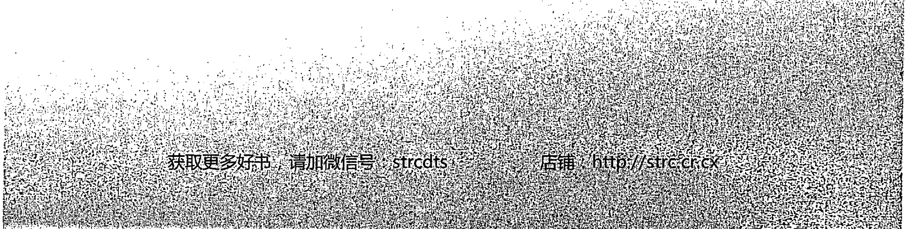
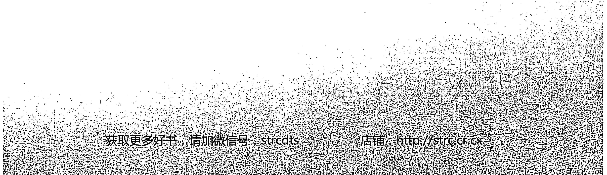
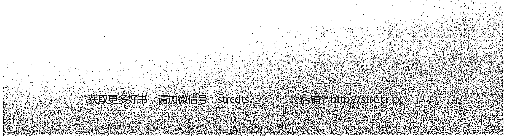
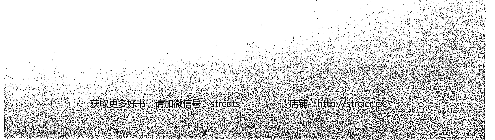
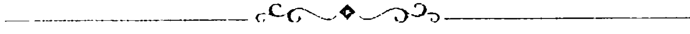

# 神圣药轮的教诲

## ★序幕

我是一个成长于二十世纪大都会中的白人女性，在那样的时代里，人们早已失落了自己的传统、仪式和祭典，失去了与神秘古老药轮的连接。那“药轮圣圈 Medicine Wheel”，曾经是一道门户，祂能带领人们通往一个非比寻常的次元—我们的“实相 Reality”！一旦我们踏上这条通往内在的道途，就能去探寻自我灵魂中那片荒芜的旷野，而今，我们却早已遗失了这条路。

我在一个充满希望的年代里书写着，并开始寻求另类的方式，试图明了大地母亲的律动和节奏。我们去礼敬神或女神，试着在这地球上平衡自我内在的男性与女性能量。我们已在这样的追寻中走了一大圈，终于循着药轮圣圈回到了原点，这古老的萨满哲学概念、这神圣的“梦时空 Dreamtime”，以及萨满教诲中的神圣药轮，此时此刻将重新苏醒。我们能够借助那些萨满哲学中的技巧，去环绕着药轮圣圈移动，你我得以再度回到起点，回到我们最初的源头。

人们已然领悟到：倘若没有“大灵 Great Spirit”、没有这造物主的存在，我们什么都不是；倘若没有壮丽高贵的大地母亲赐予我们生命，我们也将一无所是。我们来自星辰，且终将返回星辰。

回顾整个追寻力量的旅程，我接受了一位不寻常的印地安导师的祝福，这女人教会了我古老神秘的女性之道。我的老师们，被称作“盾牌姊妹圈 Sisterhood of the Shields”，她们早已在三十万年前教导过我，那些星辰的子民，从昴宿星下凡来到这大地母亲之上，祂们授予地球伟大的知识，这些知识如同一颗颗种子，被播撒在海洋里、树林间、山峦中……唯有当我们的社会已准备好去聆听这些伏藏的珍贵知识，这些智慧的种子，才会在各种因缘时刻里成熟，被揭露于世。

这其中有许多知识，被“盾牌姊妹圈”特定的女人所讲述和牢记，这些女人是世界上各种原始本土文化的代表，从古到今，这些极少数的女人，透过口述的传统去传颂智慧给她的学徒、她的女儿。

《神圣药轮的教诲 Teachings around the Sacred Wheel》这本书，描述我曾经有过的一些学习，以及学习过程中，我被要求以“盾牌姊妹圈”的药轮去教导、分享的部分。当我在尼泊尔和西藏那段时间，我与“盾牌姊妹圈”的老师们一起准备这本书；之后，我带着她们的教导，回到了洛杉矶家中进行研究。这一系列的训练，在某个因缘际会的时间点诞生了；这本萨满工作簿，正是整个过程的成果！

书上这些工作，是为了帮助萨满初学者而设计，用以锻炼他们的心念与“萨满意志 Shaman Will”，训练他们的观想能力，以及在好几个不同意识层次上显化的能力。书中的一字一句、每一个祈祷的音声，都经过仔细的拣选，祂们将会在使用这本书的世人中心，产生一种扬升作用。这本书融摄了“盾牌姊妹圈”的珍贵萨满教诲，它的目的，并非仅用来研究传统的美国原住民部落疗愈技术。

我们在这“盾牌姊妹圈”里是萨满，但我们并不属于任何部落或种族，虽然这教导源自三十万年之前，但我们属于此时此刻、属于这块土地！我们必须学习与这土地的神灵和平共存，没有一个人拥有真理，我们都是大地母亲的孩子，我们必须伸出手来穿越文化的藩篱，共同疗愈我们的伟大母亲。

无论我们住在这世界上的繁华城市或荒漠野地，我们所有人，都将藉由这神圣药轮的教诲，学会如何去重新连接我们的源头。

琳恩·安德鲁丝 Lynn v. Andrews

## ☆译者序 一切唯心照

黄裳

这本工作簿中大量的冥想引导词，经过字斟句酌的拣选和翻译，刻意排除艰涩深奥的字眼，以求能步步如实地带你进入不同的意识层次里工作。每一句看似平凡的诉说，都有其深刻的意义，都像一道不可或缺的阶梯；就如同这全书的每一个练习，其实有其先后次第，最好能从头开始踩稳每一个步伐、循着道路拾级而上，才能看见真实的风景。

新时代里散播着五花八门的学习，其中不乏一些事半功倍的诀窍，问题也往往出在这里，类似的教导在古老的年代中，需要一些必要而漫长的行为前提，若少了这些基本前行，除了正念、利根者侥幸能掌握领会之外，再好的心法来到了新时代，只怕都变得荒腔走板、光怪陆离。

诚如艾格尼斯·呼啸麋鹿的教导～ 如果没有建造好一个稳固的地基，你一开始就要爬上你灵魂小屋 Spirit Lodge 的圆顶上做灵性工作，这座小屋就算装饰得再宏伟华丽，肯定很快便摇摇欲坠甚至倒塌倾毁……这本工作簿，是给现代人们的一种古老教导，是进行高度心灵训练的前行法，也是你灵魂小屋的地基。

古老教导中的前行法，旨在“净业”及“正念”；净化、清理所谓的“业力”～亦即因过往生命经验而残留导致的习气，释放了这些知情或不知情的恐惧与制约模式，才能全然的交托与信赖，才能开展出随心所欲的创造力。而守护“正念”，更是致力于澄明本心的慎独哲学，不是为了表演给谁看，只为了能在业力的循环里解脱，为了此刻一念不再成为下一刻的恶业，为了不再创造生命中更可怕的噩梦。

这些初期的清理和矫正，都在你的心智 (Mind) 上工作，在你的概念、观念上疗愈，就如同琳恩在此书的序文中所说：“我们总误认为我们等同于自己的心智 (Mind)，但其实不然！”心智、头脑，或者说是“自我”，其实由一层一层的观念编织交错而成，而非你先验的真如本心；倘若无数不恰当的观念构筑成一座怪异的地基，其上所搭盖出的灵魂小屋如何安稳？因此这本工作簿，将大量的工作焦点放在“清理”的议题上，帮助萨满初学者锻炼他们的心念、意志，训练他们的观想能力，以及在好几个不同意识层次上显化的能力，将使你能正确地驾驭你的心智，有能力让你的思维、意图为你而工作。

所谓萨满～ 一个能够以自己的意愿去创造和生活的人；试想，如果这个“意志”未经任何纯化与试炼，那么，以粗钝的意欲去创造出何等离奇古怪的人生、做出何等荒唐的噩梦，是可想而知的。当你要用你的意图去工作之前，净化、厘清你的意图是首要关键，你必须明了你真正想要什么、不想要什么。我们的意图有许多层次，例如接受勒戒的毒犯，表层的意欲虽想戒毒，但心里却渴望吸毒，再更深一层的意识里，或许又憎恨着毒品所带给他的不自由……人们在如此自我矛盾、自我冲突的层层分裂意图下，光是想着“心想事成”、“吸引力法则”、“一切唯心造”…这些美丽口号，其实很难放诸四海皆准。

没有一步一脚印的前行功夫，业力、习气、模式、概念无法改变，它们在意识或潜意识里无时无刻不扯你后腿……现代的疗愈课程里，不乏许多观念的校正，当你的老旧概念被打破，重新构筑一个意义的世界、建立一些强有力的崭新观念时，你开始重写过往生命故事的意义，你能够笑看自己的伤口、甚至欢庆自己的痛苦；而你未来的人生或许也会过得更幸福…在这样的状态下，你再高喊“一切唯心造”，或许就真有能力创造出你想要的美梦。

然而，终究它还是一种概念的运作，仍是出了一个轮回、又进一个轮回；从一个噩梦醒来，又掉进一个美梦罢了。有能力创造出一个美梦，虽然暂时比噩梦美好，但毋宁说：“一切唯心照”；毋宁说：我们所追寻的萨满之梦～那最终极的梦，是超越了概念思维、超越了头脑的造作，而真真实实、不垢不净的映现与照见。

人们来到这世上，只用肉体生活着，而从不思索灵性的成长，无异于行尸走肉；也有一些人，只专注灵性的追寻，成天活在幻景之中，空有梦想却难以实现。一个萨满，应同时活在现实与梦幻里，他能看见美好伟大的幻景 Vision，更重要的是：他能找到一条路径，在现实里通往这圣境，他更能把这幻景中的神圣力量带回到现实生活，能够在他凡俗生活的每一个当下，看见所有平凡事物的神圣性……于是，现实与梦幻、圣境与俗世，亦无二无别。

萨满们用“做梦”和“冥想”这二种途径，来移动世界之间的神圣力量，在开展这样的精纯能力之前，你得先仔细去锻炼、区辨自己的梦境、自己的冥想灵视 Vision，清楚明白它是来自你的头脑思维、潜藏观念、制约、甚至知识学问的圈套……或者映照自你的真如本心，清楚看见那是一场混沌的业力之梦，抑或清明之梦。

在这本工作簿中，你将会有非常多诸如此类的练习：你在“死亡之箭”送走仪式中，必须与过往陈旧的生命剥离；在“丁狗人之梦”中，遭逢自我的阴影，去释放内在受困的人、事、物，去遇见心中的“咕娃娃”…你也将会去攀爬心中的圣山，在身体、情绪、灵性、理智层面，彻底丢掉自我生命中沉重无益的包袱，你更需要在“欧朗恰灵性手术”中学习“死去”，为了重生、为了好好活着。

上路吧！这无疑是一趟回归本心、照见自己的艰难旅程……

## ☆作者序

“萨满 Shaman”是什么？我们现在正试着去学习什么？

所谓“萨满”，是一个清楚明了各种“力量”的人，他学习去编织宇宙能量，朝向生命的较高目的飞舞！他有能力用一种神圣之道去疗愈自己、疗愈别人。我所教导的萨满哲学，承袭自“盾牌姊妹圈”，这些智慧被她们所牢记和传授。

姊妹圈竖起女人的第一面盾牌，那是一个古老的知识系统；她们以成为一个女战士或女神为目的，而且关涉于土地、星辰、以及这女性地球最原初的能量。

现今，当我们向外观看这个世界，我们看到了一个失衡、病萎的地球母亲，当你看见一个系统已失去平衡，你必须去发现问题出在哪里？去寻找究竟失落了什么？去问问你自己：“如何能够恢复地球的平衡？”

我的教导以及我这本书，是关于女性意识的彰显，我们必须去了悟力量的源头——女性意识！在这样的时代里，唯有如此才能将这个世界带回和谐之中。

这本工作簿，包含一系列的灵视观想技巧，让门徒或学生们开启他们“看见”的能力，加强他们的想象力、创造力，让他们重整恢复这样的力量，而且能够随心所欲使用它。你必须学习到一件事～“你所想象的一切都是真实”！这深度的出神状态，是一种深邃的意识转换，这种“灵视 Visualization”的艺术是古老的萨满技巧，藉以进入精神世界旅行。在灵魂的旅程中使用的是象征符号，而不是言词述说。象征符号可以触及心灵伟大的深渊，并提供萨满一张不可思议的地图，去为那些惯常被限制在语言、文化、身体层面里的人工作；我们开始藉此另类的语言沟通，移动进入每一个人独特想象的力量畛域。

记得：能量跟随着思想！假如你需要去向你自己证明这一点，你只要仰躺在一个浴缸或水池里，将你的手臂放松伸展于两侧，然后闭上你的眼睛，进入冥想状态，感觉能量移动贯穿你全身……接着，想像所有能量移动到你的右侧，当你仰躺飘浮在水面上时，你知道会发生什么事吗？你整个人将会迅速翻滚至右边。

同样地，你可以再做一次实验，观想全身能量移动聚集在你左侧，你将会看到～“能量”确实跟随着思想，那就是为什么人们会说：“你的思想创造了你的实相”！的确如此，你是由你的思想形态所组成，事实上，你就是一个“思想模式”，假如你将你的人生耗费在负面消极的事物上，你将变成一个负面的思考模式；如若你能够将你的想法，移动到生活中较为正面积极的方向，你也将会吸引来更多正面的事物，你将变成一个更成功、更有力量的人。

因此，我们的教导初期，将大量的工作焦点放在“清理”的议题上，清理掉在你系统之中的负面消极思想，清理掉你身体和情绪中的垃圾残渣……在你过往的生命中，有太多垃圾藉由种种事件和结果，终其一生遗留在那里，甚至从前世到今生，从今生到来世。

这本工作簿，设计给一个萨满初学者，给一个已将自己扎根于这物质世界的人，他们明白之所以选择来到这地球上行走，是为了学习成为一个开悟者！

然而“开悟 Enlightenment”，却是我们最惧怕的一件事，我们的头脑对祂充满恐惧，那是因为“开悟”同时也意味了“形体的消失”或“自我的死去”，“头脑 Mind”亦即“自我 Ego”，时时抗拒着死亡。我们让自己耽溺在二元性和幻相之中，我们每个人都拥有一个割裂的自我或心智。身为萨满，你最重要的一个工作，就是去战胜、克服这分离的幻相而达到合一。

我们的头脑、我们的思维概念之心，在生命中如国王般主宰着一切，这样的“心智 Mind”，的确是我们所拥有的最重要工具，但它就像你的手～只不过是工具罢了！有些时候我们必须去驾驭这样的心智；然而很不幸的……大多数人却被这心智所掌控，因此人们总误认为我们即等同于我们的头脑、我们的思维心、概念心；但其实不然……。这个工作簿，将使你有能力正确使用自己的头脑，有能力去让心智为你而工作。

每当你谈及“开悟”这个字眼时，你头脑里的守护者，它会变得非常惊惶失措……因为所有的头脑都知道：死亡意即形体的消失；形体的瓦解对于头脑而言就是死亡，并非开悟；而这头脑心智绝不想死，因为那样就意味着它将失去它的生命，所有生命都努力想要存活下去！你必须去教导你的头脑、你的心，让它能够学习以一种不同以往的崭新方式，去看待这个真实。这个工作簿正是走向这条道路的第一步。

## ☆如何使用这本书？

你可以独自使用这本书，但倘若你和一个伙伴、和你的家庭、你的团体一起运作，你可以透过这些经验得到更多助益。建议你使用本书之前，先录下这些静心引导和冥想练习，好让你能够自由地闭上眼睛，完全放松地聆听这些指令。

这书本中的练习方法，你可以一再重复使用，一旦你如实经历且熟悉这本工作簿，你可以自由去修改这些内容。在每一次的冥想中，你都将发现一些幽微的改变；让这本书成为一本进入“梦时空 Dreamtime”的日记，记录你每一个当下崭新的回响，描绘出你独一无二的成长地图。

## ❖ 准备工具 ❖

- 鼓
- 沙铃
- 铃铛
- 鼓声音乐
- 静心冥想音乐
- 鼠尾草、雪松、甜草瓣，贝壳烟熏器；打火机或火柴。
- 五颗水晶：二颗便于携带在身上的小水晶；三颗任何尺寸大小的水晶，其中至少要有一颗单尖水晶。
- 笔记本、笔
- 以你自己的声音，朗读录制这些静心引导词备用，或向出版社洽询《神圣药轮的教诲》静心冥想CD。

获取更多好书，请加微信号：strcdts

店铺：http://strc.cr.cx

## 1 开启神圣空间

### Opening Prayer

请闭上你的眼睛，让你的身体开始放松……放松进入这些话语的振动和画面之中……让你的身体更深更深地放松，去注意觉察你的身体……有哪些地方让你感到紧绷？你可以随心所欲的移动它、放松它……去释放这个紧绷的感觉。

生命是一个药轮圣圈，我们每个人都独一无二，各自画出这圆圈上的每一点。使用这本工具书时，你将会形成一个永续的连接……无穷无尽的连续，持续到你生命的尽头，甚至更远、更远……。

当你和别人一起使用这本书工作，祂将闪耀出你个人的独特光芒，你也会开展出许多工具和方法，去帮助其他人发光！当你开始发展并巩固你的药轮圣圈时，这个连接便显化成形，这圣圈将散射出光和热进入这个世界，这个强有力的神圣之轮，由你们这一颗颗闪亮的水晶构筑而成，你们这些美丽善良的光之存有们，相偕同行！这是一趟去寻找“开悟”并医治我们“大地母亲”的旅程。

想像你在一片广阔的沙滩上……看见你自己和许多人手牵着手围成一个圆圈，你很喜欢这里的每一个人……不必担心你是否能清楚看见这个画面，只要去感觉这个画面在你脑海里即可！

现在，呼唤每个方位的力量到来，来到此时此地，来到这浩瀚的大海边缘……这是你开悟的圣境之海，崭新的洞见之海，你未知的荒野之海，这是一个“地”元素与“水”元素的交界、“意识”和“无意识”、“已知”与“未知”相逢之处。

在这个新的畛域里，我呼唤所有方位的神圣力量到来，与你同在……。

做几个深呼吸，释放掉所有让你不舒服的意图……。

呼唤大地母亲的力量，妳以一只大海龟的形象缓缓出现！妳将我们背在妳的肩膀上；土地的神灵啊，妳教导我们耐心，教我们在生命旅途中的每一刻，踩稳每一个步伐。

土地的力量，来吧！伟大的海龟，请在我们神圣药轮的中央，指引我进入这块土地学习。

南方的力量，神圣的老鼠，请来到我们的药轮圣圈中心！神圣的老鼠，信任与天真的老师，来吧！请教导我们信任当下，去重新找回我天真的双眼、清新的视野，找回我对这世界孩子般的惊奇！请教导我去看见我眼前的事物，好让我可以收集我的学习、收集我的信任、收集我轻柔的力量去碰触、疗愈别人！南方的力量，神圣的老鼠，来吧！

西方的力量，直觉之地，往内观照的地方，我们所有人的内在女性之地，大熊的家，請現在就來到我們的藥輪聖圈……偉大的熊啊！你承擔著冬眠、夢想時的神聖任務，來到我們的聖圈當中，教導我走進自己更深的內在去聆聽；教導我走進生命中所有的寒冬……神聖的熊！我帶著興奮、帶著你的偉大力量，毫無恐懼的進入這黑暗，我祈求能學會寧靜，去聆聽我內在的聲音，去分辨那直覺的聲音，究竟來自神聖的直觀，或出自我的恐懼和懷疑。西方的力量，神聖的熊，現在就請進入我們的圈子當中！

北方的力量，智慧的暴風雨之地，知識的聖山，白水牛的家，來吧！來吧！白水牛……現在就來到我們的藥輪聖圈當中，教導我如何贈予，如何分享我所學習的一切，用我的慷慨去滋養其它人！北方的力量，請教導我去面對寒冷，教導我獨立，教我去照顧所有族人，讓我們成為一個真正的圓圈！白水牛，神聖的供應者，請賜給我智慧、知識，賜給我分享的能力。北方的力量啊！現在就進入我的圈中……。

## 1 開啟神聖空間

東方的力量，請進入我們的藥輪聖圈，現在，就來到我生命的中心。東方啊！光明的地方，啟蒙、體驗之地，夢想中的真實，老鷹的家，所有能飛得更高、看得更遠的鳥兒們，現在請來到我們的聖圈中心！教導我如何揚升到日常視野之上，展望新的夢想；教我將眼光提升到較高的自我，教我去讓這高我的視野，落實到日常生活中，使我的生命恢復生氣，教我犧牲那不再餵養我較高目的的事物，讓自己免於那些不能服務於我的錯誤道途……靈性的偉大之鳥、神聖的鷹，東方的力量，現在就進入我的藥輪聖圈中！

天空的力量，大靈！現在請以你的大光，充滿我們的聖圈！當我想象我的藥輪聖圈，被無限光明的黃色亮光所環繞，我便被籠罩在您的大光之下，被您的療癒力量深深觸動；我站在這裡！站在我存在的中心，呼喚我每一個兄弟姊妹，也回到他們存在的中心！我祈求大靈，您帶著我們，以這真實的指引來滋養我們的聖圈，讓大地的力量，讓這南方、西方、北方和東方的力量，去閃耀、穿透我們……點亮、啟動我們的藥輪聖圈，並教導我們和平、智慧和歡愉。

願所有方位的所有力量，指引我們，守護我們，HO！

現在，再次把注意力放回你的身體，覺知你的呼吸，自然地呼吸……深深地把空氣吸進你的腹腔，進入你的薩滿力量中心。

現在，開始慢慢移動你的四肢，用你自己的速度，慢慢回到這空間中；當你準備好了，你可以慢慢地睜開眼睛……。

歡迎你！

## 2 宇宙合一意識
*The Feeling of the Universe*

觀想出滿天星斗的宇宙，去感覺你和宇宙中所有生命的關聯，覺知你和大地母親的關係！如果你是在團體中進行這個冥想，去覺察你和這個團體的關係、感覺你和每個夥伴之間的關係……尤其重要的是～去將昴宿星的能量拉下來，讓祂進入你的「薩滿中心 Shaman Center」，讓這星辰的能量成為你薩滿能量的一部分，接下來，你必須將這能量投射進入一顆水晶中！

假如你尚未發展出觀想能力，無法想像出某些清晰具體的事物，至少你試著去感受祂，千萬不要困惑或氣餒；如果你無法清楚地看到任何東西，讓自己去感受祂即可……。

## 冥想練習

如果你在團體中練習這個冥想，請坐在你的夥伴旁邊；當然，你也可以獨自進行！每個人握著一顆水晶，閉上你的雙眼……去感受大地母親的能量在你腳底！你深深的呼吸，有意識地放鬆整個身體……給自己一點時間，繼續做幾個深呼吸。

現在，你已經完全放鬆了，開始去感受這空間中的能量，去感覺其它的存在……感覺我們和這些存在之間，那一條條發光絲線般的連結……再次聚焦在你的呼吸上，握著你的水晶，輕輕地放在你的大腿上。

深深地呼吸，將氣息帶進你的腹部、你的肚臍下方……這個地方是你的力量中心，祂被武術大師稱為你「炁Ki, Chi」的聚集點，或者是你的「完整點One-Point」！而我稱之為你的「薩滿力量中心Shaman Power Center」、「存在中心Center of Being」，總之，那是你的「力量之地Place of Power」！

讓你的注意力集中在你的「完整點」，將你所有的念頭和感受，拉進這個區域，你將變得極其專注……。

我們正採集了整個房間的能量……凝聚了每一個其它存有的能量，收攝進入我們之內……這些能量錦帶非常重要，即將在未來支撐我們。

現在，深深的呼吸，你持續採集這個空間的能量、凝聚這整個團體的能量，想像這些能量如同一條發光的藍色小溪流，祂倒灌注入你的頂輪……

現在，開始想像大地媽媽的能量往上湧進你，這來自大地的金色光芒充滿你、凝聚在你之內……我們即將在大地媽媽的「夢時刻」裡進行許多工作。現在，專注在你之內的金色光中，專注在這大地媽媽的療癒能量裡，將這大地的能量，保存在你的「薩滿力量之地」。

現在，我要你想像宇宙中的滿天星斗；每一個夜晚，祂都靜靜地在我們之上，而我們卻太過習以為常，我們總是遺忘了這些星辰……現在，去觀想這些星辰，觀想祂們的能量，想像祂們的能量是多麼的強而有力！讓這能量進入你！現在，想像昴宿星的獨特能量～神聖的七姊妹，這些星星薈聚成一顆鑽石般的輪廓，或者像一面拖著尾巴的風箏……昴宿星，與地球上的我們，有著深深的連結……現在，我要你拉下昴宿星的能量，讓祂進入你……我們來自星辰，而終有一天，我們也將回歸星辰。

當你開始去觀想滿天星辰，也請你同時將太陽和月亮的能量，帶到你頭頂上方，讓這些能量進入你的頂輪，透過頂輪帶進你的神聖中心……接著，開始將這能量投射進入你手中的水晶。

當你將這些能量投射進入水晶之後，請仍然閉上你的眼睛，將水晶舉在你面前，觀想你投射著「愛」的感覺、投射著「接納」的感覺進入這水晶中……給自己一點時間，確實地讓這「愛自己」、「接納自己」的感覺，灌注進入你，灌住進入你的水晶當中……記得！你現在被整個宇宙所支持！月亮、星辰和太陽，以及我們的大地媽媽，都與你同在。

現在，握著這水晶朝向你身邊的夥伴，使用這水晶來聚焦、指引、投射愛，投射接納，投射和諧，投射平衡……給你身邊的夥伴。保持靜默片刻，去專注你所有能量在這個美好的任務上。

唯有透過持守我們自身中心的能量，並投射出愛與接納，才是開展我們自己的第一步！將愛和領受投射進入這個世界，我們開始改變了自己、也改變了我們的週遭，世界將更美好！請守護著你的中心，然後觀想白光向外放射出你的能量，進入這個世界，你看見這整個世界開始發亮，並且以白色的光芒脈衝著……

做一個深呼吸，感覺大地媽媽的能量，再次往上湧進你的身體、滋養你全身……當你感到舒服時，可以慢慢睜開你的眼睛……

# { 習題 }

投射能量進入水晶中的過程，你有什麼感受？
請寫下你的三個步驟～

- 1
- 2
- 3

◆ 當你使用水晶傳導能量給身旁的夥伴時，感覺如何？

◇你是否連結了昴宿星的能量？請描述過程。

◇你看見了祂的顏色嗎？請描述祂的色彩和形狀。

◇ 當能量在你的系統中運作，你感覺如何？

◇ 祂如何影響你？

## 3 力量行動 儀式
*The Act of Power*

我已經反覆提起無數次：如果你希望能夠確實發展你的靈性，開始建造艾格尼斯所謂的「靈魂小屋 Spirit Lodge」之前，你必須去仔細檢視這座「靈魂小屋」的地基。

這基礎必須由你的物質生活所組成：你如何對待你的環境？如何賺取金錢？你如何活出尊嚴？如何關懷你的孩子？如何去照顧那些你對他們有義務、有責任的人？

靈魂小屋地基的本質，是你這個人整體的範本。你自己的存在，必須非常安全穩固的紮根於地，當你靈魂小屋的地基，非常安穩且強而有力建造在你的生活中，接著，我才能繼續我的教導，帶你前往艾格尼斯所謂的～你的「靈魂小屋」！然而，那必須仰賴一些靈性儀式、高度心靈訓練、以及其它較高次元實相的教導，假如你一開始就爬到這靈魂小屋的圓頂上工作，卻沒有如實打造小屋的地基，那麼任何時候，任何風吹草動都足以顛覆祂，祂們就好像一棟沒有安全地基的建築物，無論裝飾得再怎麼美崙美奐，都註定得倒塌！

開始著手打造你的靈魂小屋地基時，我們總是從「力量行動 Act of Power 」開始！你必須知道你今生的「天命 Destiny」是什麼？明白你的「道路 Path」是什麼？你才可能有安穩的物質生活。不管你是在團體中跟著你的老師一起工作，或自己獨自成長，這是一個很重要的關鍵點，去問問你自己：「這一生中，我真正滿懷熱情想做的是什麼事？」

我常問人們：他們想成為什麼？或是他們想成為時代雜誌上的哪些封面人物？因為成為這封面人物意味著～一個完全達成某種物質計畫的典範，如果你出現在時代雜誌封面，你希望人們在你的相片之下讀到什麼樣的敘述和傳奇？以我為例，那標題可能會是「作家與薩滿療癒師」，我非常幸運，我在我的人生中已經成為了一名作家，而且「想要」成為作家；在我的生命中，我「想要」成為一個治療師，而且我也早已致力關注於意識的其它層面與薩滿療癒哲學。

因此，身為一個薩滿療癒者和作家，對我而言非常愉快！但是，我經常和一些人聊到他們兒時的夢想與渴望，他們的憧憬也許是一名舞者、藝術家或政治人物，但他們現在卻成了一名保險人員或秘書，或一個組織的領袖……他們此刻走在自己所選擇的道路上，卻沒有任何一件真心喜愛的事物可做。什麼是他們發自內心的渴望？倘若我這樣問：「假如你可以選擇重來一遍，忘掉你是男人或女人、忘掉你的教育程度、忘掉你生活中所有的責任……你想要成為什麼？」幾乎他們總會說：「噢！我從未想過這些……如果我能有自己的選擇，我寧願當一個治療師！」之類的話……所以，我協助這些人，能夠在這條路上往前走，因為：你內心真正想做什麼，事實上你都能夠做到！

去找出你這一生中的「力量行動」，祂將給你一個觀點，給你一個出發之地，你可以在這裡得到你物質生活的滿足和成功，這點非常重要！不管是要成為一名麵包師父、家庭主婦、一個服務生、一個國家的總統……無論想成為什麼，都必需將極大的能量專注聚焦於此，必須運用你所有的意志去完成這個非凡的「力量行動」！

我想告訴你們一個小故事，關於我的「力量行動」如何顯化的過程！

我住在洛杉機，那時我已經和艾格尼斯及盧碧工作了三年之久，我和她們倆人在加拿大一起工作，我總是希望能有更長的時間待在她們身邊。在我們開始工作的前二、三年，她們要我嚴格保密這段師徒關係，所以除了兩個重要的親友之外，我不敢告訴任何人關於我在加拿大的旅程，我總說我是去墨西哥、夏威夷、或北方拜訪我的教父、導師之類。

在我和艾格尼斯這場奇特的旅行中，有一天，她盯著我說：「小母狼！為什麼妳不來和我們一起待個幾年呢？」

我聽了非常興奮，這是艾格尼斯第一次這樣問我；她通常在幾週後就把我一腳踢開……當我知道能有這麼多時間和她在一起，我雀躍不已，於是趕緊回家將我的房子出租給別人，我們訂了兩年的契約；我的女兒也離家到學校住宿……安頓好一切，我帶著二只皮箱回到加拿大，在我生命中這個時期，我只有非常少的錢。當我抵達時已是深夜，我連跑帶跳的衝下山凹去見艾格尼斯……。

她正做著不尋常的事情：她坐在她小木屋外的火堆前，就彷彿她正在等待著我，或等待著某人似的……。

我一面跑下小山丘，一面興奮地向艾格尼斯打招呼：「我在這裡！我在這裡……」我高喊著。

她緩緩轉身，用我所見過最冰冷的眼神看著我：「妳在這兒幹嘛？」

「我……我在這裡幹嘛？是妳叫我來這裡跟你生活個幾年……妳這樣問我是什麼意思？」我一頭霧水。

她說：「喔！不……你誤解了我的意思！」她說：「是時候了！我們生活在夢想的時空裡，是該放老鷹去飛翔的時候了！帶著妳所學到的女性力量及神聖道途，帶著妳和我們一起工作時所學的一切，去給妳的人們吧！」

「但是……艾格尼斯，妳曾經告訴我，不要讓任何人知道我們之間的關係！」我一邊說著，疑惑的淚水流滿我的雙頰。

她竟回答：「喔……好吧！但現在是改變這一切的時候了！」

我驚愕、受傷且氣憤地看著她，整個人深陷困惑無助……「我該怎麼做呢？艾格尼斯……我如何能夠將你教我的東西帶給人們？妳要我去做些什麼？要我站在街角的臨時舞台上表演雜耍嗎？」

艾格尼斯，她竟笑得花枝亂顫……她不停抖動著她的頭，咯咯笑道：「不！我的女兒，去做妳生命中注定要做的事，去寫下有關我們的工作的第一本書；在這本書完成之前，不准回來！假如妳不去做這個任務，我將不會再見妳！因為我們沒有更進一步的工作了，直到妳執行了妳的『力量行動』為止！」

我簡直嚇壞了，我開始恐懼哭泣：「為什麼妳叫我出租我的房子？為什麼妳叫我來這裡？然後又叫我回去？為什麼是這樣……我不懂，艾格尼斯！我沒有錢，我也無處可去……」

「那是妳自己的問題！」她說：「當妳的手稿完成時，我就會再度見妳！」

她甚至不讓我留宿一晚，她把我遺棄在木屋外寒冷的黑夜裡……我不懂她為何這樣做？我帶著深深的困惑和憤怒回到洛杉機……然後才開始逐漸明白，這一切似乎有一個理由！我知道，我總是想成為一個作家，我總是把艾格尼斯和盧碧曾告訴我的每件事，鉅細靡遺的寫在日記本上；我已記錄下我們共同學習的所有故事……很顯然地，我想做的就是「書寫」！但我卻沒有勇氣、紀律和組織能力去將我的工作轉化成「書」的形式。艾格尼斯深知我這些弱點，她知道我毫無紀律、無法專注，但倘若她告訴我這些，那只會從我的左耳進、右耳出，並不會在我的生命裡造成任何改變；於是我同意了她的所做所為，並開始確實去做我該做的事！艾格尼斯看見了我這個部份，但她明瞭她說再多都於事無補；關於人們自己的生命，永遠必須讓他們親自去體驗那些不恰當、不滿足的部份，生命因此才圓滿完整。

一個「力量行動」，提供你一面鏡子，這是一條唯一的最佳途徑，讓你去學習關於你自己！去看看這鏡中你所創造的自己，去看看這透過你努力和專注得來的非凡工具。我要求你去找出你內心中、你的靈魂深處那最有力量的行動是什麼？如果你無法和我一對一進行這個工作，這個任務對你而言或許會有點困難……但是，我想如果你能和一個團體、或一個夥伴一起工作，你們可以探究進入每個靈魂深處，並且找出一些非常具體而務實的事物。

我不要聽到諸如此類的力量行動：「我想變得像某某人一樣知名，他帶來愛和光進入這個世界！」儘管這是個美麗的念頭，但這並不是一個「力量行動」。我要聽到非常確切的事物，例如：「一個醫生」、「一個律師」、「一個家庭主婦」、「一個園丁」、「一個作家」之類的……你可以真實地說出：「這就是我的力量行動」！

這是一項重要的任務，尤其是對某些女人而言，在她們和長輩一起生活的傳統環境中，要往外發展的確有點困難，必需要站穩自己的立場、覺知到自己的力量，雖然很困難，但卻是必要的！接下來，我要在這個時刻給你一個教導，讓你自己從信任、交託中去著手進行這場儀式。

### 3 儀式

這是一個「力量行動儀式Act of Power Ceremony」，祂由「生命祈禱之箭Life Prayer Arrow」和「死亡祈禱之箭Death Prayer Arrow」所組成。

「生命祈禱之箭」是一支你自己所製作的箭或樹枝，以及一張祈禱清單，條列出你即將要去做的十件事，你將顯化出你「力量行動」的十件具體事物。

「死亡祈禱之箭」，由另一張清單列表所組成，這個清單上，可以寫下你們想要釋放的任何事情，那些事物緊抓著你、佔據著你整個生命。從你的「力量行動」中去釋放它，例如：「我不夠好」、「害怕成功」、「害怕前進」……你的清單想寫多長就寫多長。

這是一個非常強而有力的儀式！我和盾牌姊妹圈的夥伴們，會在每年之初進行這個儀式，好讓我們專注聚焦在這一年；從開始到結束的十二個月之間，我們會清楚知道自己該做些什麼。

當你寫下了你的祈禱清單(有時你甚至要花上二、三個月去列出這些事件)，製做二枝箭：一枝是生命之箭，另一枝是死亡之箭！這死亡之箭必需用易燃材質來做，例如非常乾燥的樹枝，因為你將要去焚燒祂，你會希望祂很快被燃燒殆盡。在每根樹枝的末端都綁上四條彩帶：紅、黑、白、黃四色的小絲帶，這象徵了四個方位、四大元素，記得在箭羽處繫上一支羽毛！你可以將這根樹枝彩繪得很漂亮，你可以為祂做任何你想要的裝飾……我通常把祂做成六英吋長，但其實祂可以是任何尺寸。最後，把你的祈禱清單綁上去，像卷軸般將祂纏繞包裹在你的箭上。

接下來，製作二個大小相同(三或四英吋直徑)的包裹，獻給「地方精靈Spirit of Place」。我們得用天然材質的紅布去包裹祂，紅色，象徵著以女性力量去守護你放進包裹裡的物件的能量。在每個包裹裡放進一顆小蠟燭、一些焚煙藥草(鼠尾草、雪松、甜草瓣……或三種混合)、一小撮玉米粉和菸草、火柴、一些花或花瓣，將這些物件用紅布包裹好，再將這二個地方精靈包裹放在一張毛毯上，那毯子要夠大到讓你能坐在上面進行儀式；我用紅色的「印地安藥毯Medicine Blanket」。帶著任何你想要在你的儀式中使用的物件，祂們可能是任何東西：水晶、個人的醫藥煙斗……任何在你生命中有其特別意義的事物，那些事物的存在，會帶給你力量！將祂們包裹在你的毯子裡，我通常會翻捲起這張毛毯，用皮繩綁住祂的兩端。不要忘了在你的毯子裡放進一大袋散裝菸草，當然，更不要忘了你的生命之箭和死亡之箭。

去到一處不被打擾的荒野，找一座你能夠攀登的小山丘，在這山丘的底部，尋找一個「力量聚點Power Spot」，一個你感覺很好、很溫暖的地方，帶著你的散裝菸草，去尋找四顆石頭，這象徵著你的四個方位。

找一顆南方石象徵著南方的信任與天真，祂的顏色是紅色！這石頭實際上不需要有任何特別顏色，只要在你心中憶念著南方的信任與天真，並且想像祂是紅色即可！

找一顆代表西方的石頭，西方的顏色是黑色，這西方石象徵著神聖的夢、死亡和重生、轉化，在你藥輪聖圈的西方擺上這顆石頭！

找一顆石頭代表北方，北方是白色、力量與智慧，把這顆石頭放置在北方。

最後，找一顆石頭，把它放在你神聖藥輪的東方，東方的顏色是金色或黃色，這是太陽升起的地方，這是光明的地方，神聖小丑的家！

安置好你的藥輪石之後，帶著你的菸草，從南方開始沿著西方、北方到東方移動，一邊繞圈一邊念誦你的祈禱，一個關於「保護」的祈禱！例如：我安放一個聖愛的光環，保護環繞這藥輪聖圈，保護我免於所有的傷害……HO！

接著，帶著你的藥毯從東方之門進入這個聖圈，然後撒上菸草關閉你東方的藥輪開口。

在你的神聖藥輪中，用你的雙手撫平地面，攤開你的藥毯，並面向南方。將你的死亡之箭放置在地面上，這枝箭表示男性，而土地是女性，所以你正執行了一個完美的平衡儀式！接著，拿出你的其中一個「地方精靈包裹 Spirit of Place Bundles」，敞開祂，點亮小蠟燭，你需要一盞搖曳的燭光，但如若這火焰因為風的吹拂而無法持久，那也無妨，你可以接著點燃妳的焚煙藥草(鼠尾草、雪松或甜草)，煙燻淨化你週遭的環境，同時也燻淨你自己，用這些神聖的香煙包覆你的身體……在戶外要小心使用這些煙草和火燭，特別留意周圍不要有乾燥易燃物，並且盡可能的仔細把地面整理平坦。

接下來，開始燻淨你所有的神聖物件，包括你的祈禱之箭，將祂們一一陳列在藥毯上。

在這個時候，你可以唱歌，可以用任何你所喜歡的方式祈禱！記得，這個儀式是為你而做的，就某種意義而言，它是「自我發生」的……這不是一個制式的宗教儀軌，不是你每次做祂都會一模一樣的死背公式。這是一個儀式，因此有著你某些自發性的參與，每個人在執行這場儀式時，都將會有所不同。

你以「地方精靈包裹」所做的工作，是在努力喚醒這個地方的神靈，這些地方精靈，已經在所有知名與無名的事物間沈睡了數千年；至少，祂們從上一場儀式在這個特殊地點進行以後，便沈睡至今……祂們靜靜地睡著，祂們需要被喚醒。想要叫醒這些地方精靈，祂們必須看到光、必須聽見你的聲音、去知曉你的真實！你還得焚燒神聖藥草，供養香煙祝福祂們，這些都是祂們所喜歡的美好事物。祂們還喜歡花朵和火焰的光輝，供養花給地方精靈，供養菸草和玉米粉，然後開始對祂們唱歌，一定要大聲說出來、完全地大聲唱出來，祂們需要聽見你！

## 3 力量行動儀式

當你聽見薩滿們和地方精靈交談、呼喚祂們醒來，那簡直如同在和他們的愛人說話；人們告訴地方精靈祂們有多漂亮！祂們是閃閃發亮的神奇存有！這些精靈充滿了好奇心，祂們會被喚醒……如果你夠幸運，你也許能夠看見祂們，或許是個光亮的輪廓，或許是雲朵般的外形；假如你無法看見祂們，你也會感覺祂們像空氣一樣，輕輕拂過你的肌膚，非常的纖細幽微、難以捉摸。

在你能感覺到這些存有之前，不要進行你的下一步儀式，一直到你終於感覺祂們的出現，謝謝祂們與你同在，然後，再開始你對大靈的祈禱……

我會這麼說～

偉大的大靈，地球母親，四方的力量與神靈，
我的力量動物，我的盟友，我的祖先，
以及所有愛我的，現在聽著我的祈禱……

這是為我的力量行動所進行的儀式！
謝謝你們在這裡與我同在……
在我的聖圈中，我神聖的藥輪中，
我榮耀你們的存在！
這是我的死亡祈禱之箭！
這所有的事物……
是長久以來使我遠離我力量行動的事物！
我願意去釋放這所有事物，
好讓我能完成我的力量行動——
我這一生中命定的行動！
在一年之內，我即將開始行動！

然後，宣讀你的死亡之箭清單中的所有事物，你可以尖叫、哭喊祂們，你可以跳著舞吟唱祂們，或者，你也可以只是簡單地宣讀，但是必須從你的心裡由衷地說出祂們，用能量及力量環繞著你的太陽神經叢，去宣告祂！記得你正在和大靈許下一個承諾，不要輕忽它，不要去送走那些你無法真正割捨的東西。

當你對大靈宣讀完這張清單，燒掉這枝箭和清單，然後在這神聖藥輪的中心，小心地完全埋葬這些灰燼……當你完成時，在上面仔細覆蓋泥土，熄滅任何木炭餘燼，對大靈以及地方精靈們獻上感謝。留下你的地方精靈包裹，捆束起你的毛毯和物件，從藥輪東方的門離開這個神聖空間。

接下來，你得走到山頂上去，在那裡確實地做同樣的事。

為藥輪聖圈尋找四顆石頭，為自己找一個力量聚點，一個你感覺很好、很溫暖的地方，然後確實重覆相同的儀式。

將你的生命祈禱之箭安放在地面上，完成一個陽性和陰性的平衡，打開你的地方精靈包裹，確實地執行完成你之前所做的步驟！對大靈訴說你的祈禱，並且宣讀你生命之箭清單上的每件事，當你完成宣讀，將清單再度捆綁回箭上；這次，將這生命祈禱之箭留在宇宙中，要求祂指引，並要求這整個宇宙，在你的道路上協助你。

當你完全地通過這個儀式，寫下在這兩個儀式中所發生的每一件事。

記下什麼樣的鳥兒，從什麼方向飛過來；記下風中發生了什麼事？這土地感受如何？什麼樣的雲朵靠近？祂是什麼樣的形狀？去意識到每一件事物，去全然地覺察。

當你結束這個儀式，必須從東方之門離開這個藥輪聖圈，帶著你的藥毯，和你的神聖物品下山來，並且慶祝這個夜晚！就好比你已從學校畢業一樣，會有一些人找你出去聚餐，這是一個很重要的日子，一個著實盛大的日子，假如你住在部落裡，你們會有一場盛宴，你們會跳舞，會有一個給你的慶祝，應該要這樣！你已和大靈、和你自己、和這個宇宙許下了一個承諾，你承諾要去執行你的「力量行動」！現在，你已經真正地開始了你的薩滿之路，HO！

# { 習題 }

◆ 生命祈禱之箭 清單

1. 
2. 
3. 
4. 
5. 
6. 
7. 
8. 
9. 
10. 

## ◇ 死亡祈禱之箭 清單(你想寫多長就寫多長)

◇ 描述在你的儀式中發生了什麼事？在風中發生了什麼事？當時的大地帶給你什麼感覺？什麼樣的鳥兒從什麼方向飛過？描述你所覺察到的每件事……

## 3 力量行動儀式

> 去追尋一個靈境、做一個夢吧！
那是很美好的……
～ 艾格尼斯・呼嘯麋鹿

> 親愛的大靈，您的光，如同金色太陽……
我們站在您的光中，與您合一……
獻上我所有的感謝
～ 盧碧・眾酋

## 4 平衡
Balancing

## 冥想練習

這個「平衡練習」需要夥伴；你可以和團體中的夥伴們一起做，或單獨找一位夥伴進行。這是一個位於神聖藥輪南方的練習，你必須以信賴和天真而做。這個練習被設計用來開展、鍛鍊你的觀想能力，同時也訓練你釋放與接收能量的能力。「放送」和「汲取」大地母親的能量、愛與擴張感……這兩者能力都同等重要，在真正成功的薩滿工作裡極其必要；這個平衡練習，也會幫助你去體驗那環繞在你肚臍周圍的薩滿力量中心！

假如你是在團體中工作，請轉身面向你右手邊的夥伴，並請求他的應允，和你進行一場愉快的冥想靜心。花幾分鐘閒聊、相互介紹你們自己。

接下來，請你們起身面對面站著，舉起你的雙手，掌心相對，然後快速地用力摩擦你的雙掌一會兒……現在，將你的氣息深深吹進你的手掌心，你的手掌應該會感到細微的刺麻和振動……永遠記住：「呼吸」是靈性的！藉著將你的呼吸吹進掌心中，你便平衡了你的精神本質和物質身體。

現在，朝向你的夥伴伸出雙手，讓你的手掌和他的身體或手掌之間，保持約一英吋的距離。閉上你的雙眼，深深地呼吸，挺直你的脊椎和地板垂直……對你的夥伴保持敞開，讓你的頭腦完全靜止下來……觀想混和著淡綠色的白光，環繞著你的心！

做一個深呼吸，接著，請你帶著愛……投射這燦亮奪目的光芒，進入你的夥伴心中！當你在天真信賴之中，對你的夥伴的生命能量完全敞開，敞開你整個存在……你會感覺到你全身放鬆，而且不斷的向外擴展……保持你肩膀、背脊挺直而放鬆，多花一點時間，繼續傳送著你的愛。

現在，觀想金色的光芒環繞著你、籠罩著你的夥伴，最後這燦爛的光芒向外輻射出來，順時針流動、旋繞在整個房間中……請你做一個深呼吸，微微地張開雙腿，稍微彎屈放鬆你的膝蓋，觀想你自己是一棵巨大的紅杉樹，感覺你的腳踩在地面上，感覺你的樹根，開始往你底下的土地伸展，很深很深的紮根進入大地之中……

請你再一次深深的呼吸……吸氣時，去感受大地媽媽的神聖能量，正往上移動通過你的根、流進你高大的樹幹中……去感覺你多麼的安全！你紮根進入土地裡，那感覺多麼的強壯安穩、多麼的驕傲自信！挺直你的樹幹去感覺一下……

現在，請舉起你的手臂，去感覺這大地的生命力，正往上蔓延流進你健康強壯的樹枝！您可以隨意伸展你的手臂，讓生命能量在你的樹枝裡順暢流動……

讓你的手臂放鬆伸展，讓祂高舉過你的頭頂，這時候，請你輕柔地緩緩蹲下約一尺左右，依然保持你膝蓋的軟柔輕鬆……現在，觀想週遭吹起了一陣非常輕柔溫暖的風，而你的樹枝開始在微風中來回搖動，向前、向後……或者向左、向右……來來回回的搖動。

現在請放下你的手臂，放鬆地伸展你的身體……做幾個深呼吸，慢慢睜開你的雙眼，去覺知你此刻根深蒂固的落實感。

現在，你們其中一人，拾起二顆水晶面向你的夥伴，倘若沒有一個人可互動，你無法進行接下來的練習。

用你的右手握住一顆水晶，放在你的夥伴的左腳上，固定片刻……心中連結著女性的、陰性的能量；你可以聯想那些象徵女性的事物……無論你的夥伴是男性或女性，他們的左邊都屬於陰性。你握著水晶，從你夥伴的左腳開始，緩慢地沿著左側往上移動……當這水晶移動到他的頭頂上方時，你將會感覺到一股刺麻的震顫，現在，將水晶沿著左側慢慢移動下來，讓它安置在一個濃稠點、一個最陰柔的女性力量之地！那可能會是任何部位：手肘、足踝或任何地方……然後，請你的夥伴自己握著這顆水晶，停放在這個女性力量點上。

接下來，你要在夥伴的右側做相同的工作，請用你的左手握住另一顆手晶，這一次，你要去尋找那最陽剛的男性力量點！當你找到祂時，讓你的夥伴握著水晶固定在這個力量點上。

現在，你和你的夥伴一起做幾個深呼吸，去感覺你們生命律動的同步性……

那些水晶，會關閉你的肉眼並開啟你內在的靈性視覺……想像你內在陰陽的力量，被整合平衡了……這股嶄新的、平衡的力量，像粉紅色光芒環繞在你的肚臍週圍。接著，用你的意志和力量，去感受你體內陰陽能量的平衡；用你的意志力，去凝視那二個被水晶所標示出來的力量點，那男性和女性的力量之地……慢慢地，將祂們帶到你的肚臍上合而為一，讓祂們歸於平衡。

做一個深深的呼吸，記得去感受～你的存在如此落實、紮根……一切能量都如此平衡……

現在，睜開你的眼睛，並且和你的夥伴交換重覆這個練習，再次用你的右手握著水晶，開始在對方的的左側工作……

# { 習題 }

◇ 請描述：你對你的能量中心——「薩滿中心」的感覺如何？

◇ 他如何對另一個人「接受」及「給予」能量、光和愛？

◇ 你在你身體上的哪個部位，發現了男性和女性的力量之地？請描述……

### 5 上山
Up the Mountain

## 冥想練習

這個冥想，用以釋放你情緒、心靈和理智中的垃圾殘渣，你將用一種螺旋方式攀爬這座聖山……但願你沿著這條道路一層一層確實往上爬，你會永遠擺脫掉那些事物！那些總是在你背後牽累著你的事物，使你無法登上自己心中的聖山頂峰，而這座聖山，象徵著你生命中通往開悟及靈性的道途！

假如你生命的杯子已經滿溢了，假如你已蒐集了太多的成見、批判和感受……以及那些在生命中侷限你意識的種種事物，你需要藉這個機會去搜尋出它們、釋放、捨棄它們……於是你才能更進一步成長！當你想要踏上這薩滿旅程，最重要的第一件事是～讓自己成為一個「空」杯子，如此你才能夠往前走，並且以更多有用的事物來填滿祂。

如果能夠和你的家人、朋友、工作夥伴甚或你自己，每個月攀登一次這座心靈的聖山，那將會非常棒！這是一個很好的鍛鍊，去練習促進你和家人的溝通，大部份時候，我們的情緒和理智中，背負著許多自我甚至不曾察覺的包袱，唯有在深度的靜心狀態中，我們較容易找到它們，並且對大靈宣說！

如果你在團體中工作，當你們完成這個冥想，探討一下你們所發現的每件事，利用後面的習題頁，寫下你在此次或其它冥想中所發現的任何事物，好讓你可以反覆回去檢視它……每一年，你都將發現許多不同的事物離你遠去，最好能一一寫下這所有事件，當你再回首時，你就可以看見你已走了多遠。

進行「上山」冥想之前，你得先學習去運作你的薩滿意志。

挑選三顆重量和力量都相近的水晶，找一個力量之地坐下來，挺直你的背脊和肩膀，讓你的脊椎與地面垂直……握著一顆水晶在你的肚臍上，深深地呼吸……觀想金黃色的光芒籠罩著你的腹部，去感受祂的力量……接著，專注你自己的意圖，將腹部的金黃色亮光與能量，透過肚臍送進你的水晶當中，給自己一點時間做這件事……

現在，把這水晶放在你面前。

拾起另外二顆水晶，兩手各握住一顆水晶，去感受祂如何分化你的女性和男性能量，深深地呼吸……去經驗這陰陽兩極的能量有何不同？

首先，專注在你右手中的水晶，感覺祂的能量顫動穿透你的手掌、往上通過你的手臂，並進入你的身體，仔細去覺察祂能量中的陽性本質……現在，放這顆水晶到你的喉輪上，觀想一道美麗的天藍色光芒，從你的喉輪源源不絕湧進水晶之中，這時候，你的太陽神經叢會自動地收縮繃緊；給自己一些時間去做這個工作……

現在，將這顆水晶放在你右側的地面上，觀想祂散發著鮮明強烈的藍光……

接下來，把意識聚焦在你左手的水晶上，去感覺祂強化著你的陰性能量，感覺祂的力量振動著……穿過你的手掌，進入你的手臂，感受這水晶如何提升著你的女性力量……做個深呼吸，讓你自己去探索這個感覺。

現在，握著這顆水晶在你的心輪上，觀想著清新明亮的綠色光芒……像一片美麗的翠綠草原，做幾個緩慢而深長的呼吸，用你的鼻子吸進這新鮮甜美的綠色氣息……接著，繃緊你的太陽神經叢，用你的嘴巴大口呼氣，用力將這綠色光芒和愛，吹進你的水晶當中……感覺你的心完全敞開，被一種排山倒海而來的愛所充滿，讓這擴展的愛像一束綠色光芒投射進入水晶中……現在，將水晶放在你左側的地面上，做幾個深呼吸，讓你自己在左右二側的水晶之間，靜默片刻，歸於中心。

現在，用兩手拾起你面前的另一顆水晶，握著祂停留在你的第三眼或薩滿之眼，感覺祂碰觸到你額頭時的清涼……做一個深呼吸，意識到你現在正用兩隻手握著水晶，這是在平衡你的陽性和陰性能量，這樣的平衡正協助開啟你的脈輪中心，讓能量開始清理、流動……花一點時間去看看這能量的流動，祂從你的腳底開始往上自由地流動，遍佈你的全身，往上流進你的頂輪，接著，再以螺旋狀沿著你的能量系統往回旋轉流竄……。你可以觀想這能量像一道藍光，從你的右腳底沿著身體右側奔馳而上，聚集到你的頭頂之後，開始轉化成綠光，然後迴轉向下，沿著你的左側奔馳到你的左腳，讓能量聚集在你的腳底並轉化成藍光……接下來，給自己一點時間，專注、確實地繼續運作這個能量迴圈，記得用鼻子深深的呼吸，讓自己歸於中心！

現在，感受你身體中平衡的能量，開始去感覺你自身的振動，與你手中水晶的頻率共振著、交流著……祂們振動得如此和諧、如此完美……

無論何時，當你想要擺脫一個情緒或念頭，用一顆單尖水晶或投射水晶來進行這個工作。

將祂放在你的太陽神經叢，觀想祂散發著金色光芒，尖端指向地面。現在，專注在你無用的有害情緒上，用你的嘴巴呼出它……讓你的負面念頭湧進這顆水晶，持續做這個動作片刻，直到你感覺自己舒緩了、輕盈了、平靜了……這水晶也許已變得黑暗、混濁。現在，仍然讓你的水晶尖端朝向地面，用你的意志力量以及你繃緊的太陽神經叢，將你不想要的念頭和情緒，透過水晶尖端發送到地板上，並穿越地面流進土地深處……去看著這一切發生，看著你不想要的情緒和念頭，透過水晶尖端像一條黑褐色、泥濘的河流，不斷灌注流進地上那深深的裂縫中，直到它完全被吸收、隱沒於大地之中……靜默片刻，等它完全消失之後，用鼻子做幾個深呼吸，讓自己放鬆下來。

假如你是在戶外做這個練習，你可以就地埋葬這顆水晶；你也可以帶祂回家，將祂浸泡在海鹽水裡超過四天，徹底的淨化祂。

記住這個練習！現在，讓自己躺下來，把水晶放置在你的腳底，左右各放一顆，而你自己握著另一顆單尖水晶，做幾個深呼吸，並清理你的念頭！

想像這是一個美麗的夏天，你在一條小溪旁散步，這條小溪迂迴地流過一片綠色山谷，你聞到花朵和土地的氣息，一陣溫暖的微風吹來，親吻撫過你的肌膚……你抬頭一看，前方有一座美麗的聖山，從這片山谷地面聳立而出！

你被自己內心深處一股難以言喻的吸引力，拉往這座聖山……

你帶著一種莫名的期待，加快了步伐……

讓你自己自然的呼吸，深深地將空氣吸進你存在的中心，去感覺你的放鬆，去享受這片原野……你感覺非常好，這是一個力量之地！

你看著自己正面對這座巨大的聖山，如果你無法確實地觀想這座山，沒有關係。你不必非要想出一個完美的圖象，只要去感受這聖山、意識到祂的存在即可，你知道你即將旅行進入這座聖山……

繼續讓你的呼吸進入你的存在中心，呼吸是光，祂是能量的來源……現在，想像你站在山腳下仰望這座山，這是你的聖山，你生命中的山，祂象徵著你通往開悟的旅程。你看到雲朵飄浮在土耳其藍的天空上，讓自己靜默片刻，在寂靜中獻上你的感激！感謝你自己，感謝此時此刻的運作，感謝你分享給這個世界的愛！

現在，你準備開始你的聖山之旅！但是，為了這趟長途的攀爬，你必須減輕你的重擔。請你坐在樹蔭下的草地上，問問你自己：為了要動身去攀登這座聖山，你需要在你的「身體自我」、你的「物質層面」捨棄些什麼？靜默片刻……去發現你在身體或物質層面，必須放下什麼？並且為它們舉行一個小小的儀式，就像你之前以投射水晶所做的工作，同時告訴你自己：「現在，我把這些事物遺留在這裡……。我放下，是為了要繼續成長！去知曉我自己真實的本質，去探尋開悟的旅程……。」

將這些事物吹進水晶中，並將它們投射進入地面的裂縫之中，直到它們消失隱沒於大地深處。

現在，你感覺自己的腳步變輕盈了，你開始循著彎延的小路上山，你輕快的一面走、一面欣賞風景；這山中的景色，就如同你在山腳下看到的風景一樣美麗……漸漸地，這山變得愈來愈陡峭，你感覺塵土都在你腳下……

你正走在一條窄小的荒野步道上，它呈螺旋狀盤繞著這座山……一路迂迴通往山頂。你已經感到有點疲累了，這條通往聖山頂峰的路，你已經走了四分之一了……此刻，你終於看見一小塊平坦的空地；請你用手在泥土地上畫出一個圓圈，坐進這個藥輪聖圈之內，歇息片刻……問你自己：「為了繼續攀爬我開悟的旅程，我必須放下什麼樣的情緒？』信任你內在直覺的聲音，聆聽這答案到來之後，用你的水晶舉行一個簡單的送走儀式，確定你已經釋放它、放下它，並且記住你在這個地方遺留下什麼。讓自己靜默一段時間去做這個工作，深深的呼吸……

現在，你開始繼續往前走……這條小路變得更加陡峭，你努力保持平衡，努力去踩穩每一個步伐，但是你感覺到你自己的內在，愈來愈清晰、愈來愈乾淨……你繼續行走著，儘管這條路非常艱難……你已經走完了一半的路程！你來到一塊空地，那裡有一顆圓形的巨石，你感覺這會是一個歇腳的好地方，於是你選擇背靠著這顆大石頭坐下來……去感覺這石頭的冰涼、感覺它的堅硬，去感受這巨大岩石的力量……這時候，你探頭往下看，你看見了美麗的溪谷，看見了像銀色絲帶般細小的溪流！你問你自己：「為了繼續走這條自我探尋的路程，我在我的理性上，必須放下什麼？在這個區域裡，有什麼樣的事物障礙住我？」讓這寧靜來指引你，讓呼吸來引導你……
在這條協助你釋放古老恐懼和擔憂的道路上，
無論你發現什麼，你都必須放手……

保持靜默片刻，看著你自己去放開它們、
讓它們離去！完全移除你頭腦中所有的阻礙，
釋放那些在理智層面阻止你開悟的障礙和制約！將它們放進水晶中，並投射進入地面，看著它們隱沒於大地。

現在，你可以再度往前走了……你專注著每一個腳步，感覺精力充沛！雖然這山路非常狹窄、非常陡峭，你卻愈來愈快樂、愈來愈有信心……你自信滿滿的走著走著，眼看著你就要登上山頂了，在抵達聖山頂峰之前，你經過一片岩石峭壁，你在懸崖邊坐下來休息，把兩隻腳懸在空中擺盪著，美麗的溪谷就在你腳下很遠很遠的地方……看著你自己坐在這懸崖上，這裡有廣闊的天地，但卻沒有任何人和你爭奪……現在，問你自己這個問題：「為了完完全全站上我的聖山頂峰，我必須釋放我靈性中的哪些事物？」當你向宇宙拋出這個問題時，讓你內在的力量、讓你週遭環繞的力量，一起回答你的問題。

靜默傾聽著答案，記得～使用你的水晶再度做一場儀式送走它們……最後，你感覺到一種前所未有的歡樂和解放，你慢慢地從這懸崖邊往後挪動，後退到安全的山壁邊，你慢慢的站了起來，繼續往山頂走去…… 你知道自己正在這高聳的聖山頂上，你感覺到自己正穿越那盤繞山頂的白雲；你帶著一種熱切的期望，攀爬在這條小徑上！

你現在站在你的聖山頂峰，環顧著所有的方向……你看到一隻老鷹高高的飛翔，這裡的空氣寒冷卻清新。在溪谷中的那些樹，看起來就像地面上一根根的小樹枝……你明白～這是你生命中的聖山，這也是你每天的聖山，不管你知道或不知道，你每天都得爬這座山……我鼓勵你去瞭解祂、完全地知曉你在這條道路上，完全明白你的聖山之旅！

現在，你環顧這山頂的地面，這是一片片的雲母，在陽光下閃閃發亮……你注意到美麗的藍色小花，去輕輕地觸摸祂們，去覺知這裡所有的事物 ～那環繞在你週遭清淨的空氣、那常青的綠樹……接著，你看到地上有一顆水晶，一顆非常特別的水晶，祂比你曾經見過的任何水晶還要光還要光光還要光燦美麗……撿起這顆水晶，將祂握在你心輪片刻，然後，往上舉向光中！

看著祂的彩虹光芒，讓太陽的光線進入這水晶中，當你握著這顆水晶時，我要你去聆聽你內心油然而生的祈禱，一個和諧的祈禱。

信賴任何訊息到來、信任和諧、信任平衡、信任你自己將會記得～該放下什麼……

慢慢地開始步行下山，在你心中靜默地重覆這祈禱，你輕鬆的走下這螺旋盤繞的小路，它比起上山時容易太多了！

你很開心地握住你的新水晶，你知道祂是這座聖山頂峰的標記；當你經過每一個你曾經歇腳休息的地方，你曾經卸下沈重包袱的地方，請你將這顆水晶碰觸著你的心，並獻上感激！

當你快要抵達山腳下時，你看見了這聖山拉長的陰影，祂倒映在山谷的地面上，你看著太陽緩緩降落在地平線之後，現在，你急切地加快腳步，想在天黑之前回到家……加快腳步……當你已抵達平地，讓你的注意力回到你的身體上，做幾個深沈的呼吸，用你自己的速度，慢慢睜開你的眼睛……

# { 習題 }

◆ 在你的身體、物質層面，你釋放了些什麼？你的感受如何？

### 5 上山

◇ 在你的情緒層面，你釋放了什麼？感覺如何？

◇ 在你的理性層面，你釋放了什麼？感受如何？

### 5 上山

◇ 在你的靈性層面，你釋放掉什麼？你感覺如何？

獻上我最深的感激～
給盾牌姊妹圈的老師們！
給所有幫助我們生存的兄弟姊妹們！
你們是我的指引，是我的神聖樂輪！
我傳送光和能量給你們！
我用我生命中的每一天來榮耀你們！

H O !

琳恩·安德魯絲

### 6

### 力量動物之旅

#### The Power Animal Journey

## 尋找力量動物之旅
The Power Animal Journey

你需要一個沙鈴和一面鼓，來進行這趟旅程。

對於「盾牌姊妹圈」來說，認識你的「力量動物Power Animal」是非常必要的！因為祂會在一個治療師或薩滿的工作中提供指引與守護。和一個夥伴或團體一起做這個冥想，將獲益良多；當然你也可以獨自進行。在這趟旅行的尾聲，將你的動物精神，吹進你的手掌心中，並且迅速地搗住你的手掌，深深地吸氣，讓氣息深入你的肚臍區域，然後，和你的力量動物共舞！

找到你的力量動物，能夠讓你在首次旅行時就順利進入「下部世界Lower World」，那是祖先們和力量動物的家，你必需去經驗這條螺旋狀的地道，它引領你去到那個世界，去學著在那樣詭譎神秘的風景裡感到自在，這非常重要！

盡快去試著開啟這趟旅程。

## 冥想練習

躺下來，閉上眼睛，做幾個深呼吸，讓自己的意識移動至很深很深的靜心狀態……

這並不是一個令人害怕的旅行，我要你去認識你最深層的自我，這個部份的你，祂想成為全知的、有智慧的一個薩滿。在這趟旅程中，我們即將旅行回到你自己最原初的時刻，回溯你身為一個理性人類的歷史，去探尋你最原初的本質～你的力量動物。

要去尋找你原初的質地，我們必須開始揭露你真實的自我；在你的真實自我之內，居住著你的力量，我們將旅行回到你最初的時光，我們必須去發現這股力量。

在這個冥想中，我要你保持覺知……首先，去覺知你身體的存在、你的皮膚、你的肌肉、你的器官、你的胃腸……以及你的骨架、頭顱、你的骨頭……試著去感受祂們。花一點時間去感覺你的胃和腸子的區別，感覺你的胃是被充滿的、或空虛的？感覺能量在你的腸子裡蠕動……

現在，感覺你的心跳……請你深深地呼吸，感覺你的肺在擴張，感覺你的肋骨在移動著……

接著，拉緊你腿部的肌肉，感覺這肌肉緊緊附著在你腿部的骨頭上……去感覺你的身體功能如此的完美……而你卻不曾感謝、不曾珍惜。去感覺你的器官和腺體如何餵養你的肌肉、如何清理你的血液？即使你從未想到祂們，祂們也一樣自動運作者……去感受這個運作。

現在，我要你讓自己的意識，在你的身體中漫遊，去尋找你的「真實自我」，那是個力量的神聖之地～你最原初的本質！給自己一點時間做這個工作；當你找到祂時，記住祂！你已經找到了力量，因為你渴望看見！讓這個力量幫助你，我們將要透過這心智的過程，旅行進入「下部世界Lower World」，那是一個擁有大量薩滿寶藏的地方，我將給你機會去經驗你自己的質變，轉化成為我們所謂的「原初靈魂本質Original Spirit Nature」，或稱為你的「力量動物原型」！

你的力量動物，是一種力量質地，祂等同你最原初的精神本質……你的力量動物可能是一個哺乳動物、一隻鳥、一條魚、海豚、甚至龍……但是，祂絕不會是齜牙咧嘴露出毒牙的可怕生物，不會是蛇或任何恐怖的爬蟲類……假如這類動物用一種不祥的方式，呈現在你面前，不要理會牠，請繼續往前走……假如牠堅持跟著你，你就返回隧道並結束這場旅行！等到下次重新進行這個力量動物之旅時，務必先清理淨化過你的思緒再開始！

現在，請你閉上眼睛，再做一次深呼吸，慢慢地……完全放鬆你的肌肉，放空你腦袋裡所有的念頭……翻轉你的眼珠朝向頭頂，你看見你的頂輪散發出白金色光芒，深深的呼吸，在這金色光中休息片刻，讓祂的療癒力籠罩著、防護著你。

現在，想像你正行走著穿越一片茂密的草地……這草地翠綠而且芳香，遍地都開滿了紅色和黃色的花朵；你停下片刻，深深地吸幾口氣，去感受祂們的氣息……接著，你繼續往前走，感覺無憂無慮、輕鬆愉快，這是正午時分，太陽高高掛在天空，氣溫非常舒適宜人，輕柔的微風，彷彿絲絹一樣拂過你的肌膚；去覺察你週遭所有生命的聲音……草原的狗蹦跳著跑進了洞穴中，你在溫柔的微風中聞到到甜草的香味，這是一個初夏！

你很高興看見前方有一個池塘，它就像一池水銀一樣在陽光下閃閃發亮，當你到達它的岸邊，你環顧四週……發現除了你一個人之外，數英哩之內空無一人，於是你興奮地脫掉你的衣服，跨進水中……這池水，非常的溫暖而且乾淨。

你開始在水池裡愉快的游泳，游著游著……你潛進水中；你很驚訝自己居然能在水中呼吸，彷彿一隻快樂的海豚，到處遊來遊去、毫不費力……突然間，你在這池塘的底部，發現了一個開口，當你認出這是一個進入螺旋隧道的入口，一股莫名的興奮，像海浪般湧進你的身體……

你知道這個隧道是一個神聖的「西帕卜 See-Pa-Poo」，是一個通往下部世界的入口；下部世界是力量動物的居所。

現在，你在水池裡悠遊著，但是你感覺到你內在深處有某種蠢動，你被一種難以抵擋的引力，拉向了這個通道口……你知道你已經尋找你的力量動物很久很久了……所以你也渴望被吸引進入這隧道，你非常舒適、輕易地游進了這個開口，愈游愈深、愈游愈深……你被拉進一條迂迴的螺旋隧道中，正通往下部世界。

一旦你旅行進入這隧道之後，它會變成非常舒適的寬度，你將順利通過這螺旋隧道，最後，出現在一片綠色的草原上……在那裡，你會看到許多鳥類，看到各式各樣的動物，但是，只有一個動物會向你展示出祂的四個面向，祂就是你的力量動物！當祂出現時，靠近你的動物，用你的雙臂環抱著牠……假如你和夥伴們一起做這個冥想，記得當你進行到這裡時，請將你的雙手交叉抱在自己胸前……好讓夥伴知道你此刻旅行到了哪裡。

接下來，你帶著你的力量動物，通過這螺旋隧道往上回到水池中，當你抵達這池塘岸邊，趕緊帶著你的力量動物上岸休息……

現在，你的夥伴們將繼續擊鼓，這靈性的鼓聲將移動進入你的神聖旅行中……請你強而有力的去對你的力量動物宣告：

> 來自下部世界的神聖存有啊！
感謝你來到我這裡，
向我示現你的四個神聖方向……
靈性的存有，
感謝你來守護我們、賦予我們神聖力量！
看看我們的謙卑、聽聽我們自己的心跳聲……
HO！神聖的大地母親和天空父親～
請幫助我們！

持續閉著你的眼睛，在你面前打開你的雙掌，現在，深深地吸一口氣，將你的氣息吹進掌心！然後，迅速將手中的能量放進你的太陽輪和肚臍之上，你可以揉一揉、按一按……去感覺這力量的流動。呼吸代表靈性，而你力量動物的精神本質，現在正重回你之內……祂將終其一生指引你並保護你，無論你活得多久，祂都與你同在。

假如你一個人進行這趟旅行，你可以和你的力量動物共舞，直到祂與你合而為一，成為你存在裡無可分別的一部份……如果你和你的夥伴一同工作，你可以搖響你的沙鈴，榮耀四個方位！接著，你們輪流擊鼓，當你的夥伴開始擊鼓時，你盡情地和你的力量動物共舞。

如果你們在一個團體中工作，請各自站在原地，每個人手中握著沙鈴，面對所有方位各搖動四次，榮耀四方並獻上感謝！現在就開始做，做完之後開始和你的力量動物共舞，你的舞蹈將榮耀著這股力量品質，並讓祂融入你的存在，無二無別！

## HO!

去榮耀你內在這嶄新的個人力量！

### 6
力量動物之旅

# { 習題 }

描述你的力量動物

◇ 你對這力量動物感覺如何？

### 6 力量動物之旅

◇ 這個力量動物，對你的反應如何？

◇ 去深入研究你的力量動物，寫下牠所有的特質！如果你的力量動物是一頭熊，去瞭解熊的飲食習慣、冬眠型態……等等，你將能夠更熟稔你的力量動物本質。

### 6 力量動物之旅

## 7
力量動物水晶
Power Animal in a Crystal

## 力量動物水晶
Power Animal in a Crystal

這個觀想強而有力，且極其重要，因為你的力量動物應該要隨時隨地與你同在！將一股難以捉摸的無形能量，放進一個具體可見、可觸摸的事物當中，有助於人們去連結、理解並使用這股力量！

例如：當你將要出席一場重要聚會，你想讓自己變得有力量，你可以拿出這顆水晶，讓祂在陽光下閃耀著……你凝視這些稜面相互輝映折射出的光芒，你看到了其中的彩虹，這時候，你也就憶起了你曾經做過的神聖儀式，你曾經很努力才尋找到你的力量動物，而且為祂精心物色了如此美麗的環境，讓祂心滿意足的住在這水晶之中……

從今以後，每當你需要你的力量動物，而你卻無法到荒山野地裡進行一場儀式、你沒有機會去坐在一個藥輪裡抽你的神聖菸斗、你不方便使用任何一種神聖儀式……那麼，將這樣一顆水晶攜帶在身邊，這非常重要！祂帶給你力量和勇氣，給你一些可觸摸、可看見的美好覺受！祂提醒你憶起：你在這條靈性道途上有多麼美麗！祂提醒你記住：每一道光擊中祂，都有其生命的意義；每一個苦難，之所以和我們的生命遭逢，也都有其偉大的理由。

為你的力量動物挑選一顆漂亮的石英水晶，祂會開心地安住其中，不再想去尋找其它地方駐居……

當你選擇這顆水晶時，考慮你是否要將祂戴在脖子上？或攜帶在你的口袋裡？還是想把祂放在你家裡的祭壇或醫藥包裹中？當你在重要時刻需要你神聖動物的力量，你想隨身攜帶著祂，那麼你得仔細考慮祂的尺寸。

記得這力量動物永遠與你同在！當你憶念著祂，你就賦予了祂能量；倘若你忽視了你的力量動物太久，祂會離你而去。這不是一件好事，因為你的生命將會對疾病、邪惡和問題更加敞開……。力量動物能使你強壯有力，因此，去憶念、照顧這顆水晶是很重要的！如果你不能時時刻刻攜帶著祂的話，就每天花一點時間去凝視祂、撫觸祂……

## 冥想練習

挑選一顆美麗的水晶，作為你力量動物的居所，記住，這顆水晶將會在你的神聖包裹中，並且絕不再被用於其它用途！

躺下來，閉上眼睛，做幾個深呼吸，完全放鬆你的身體……我們得先進行清理的工作，清理出你堵塞的陳舊能量、清理掉你心靈的殘渣垃圾……那些膠著、凝滯的能量，會阻塞你的力量中心，阻礙清新的高頻能量順暢流動！

現在，請你再做另一個深呼吸。在你的腳底觀想一顆金黃色太陽般的光球，光芒四射……看著這太陽光異常的燦爛奪目，祂非常非常的明亮，去感覺祂的溫暖……現在，觀想這顆太陽正緩緩向上移動，進入你的腳底，祂照亮你的雙腳，去感覺這溫暖的光芒往外散射，穿透了你每一根腳指頭！感覺你的身體完全地放鬆，彷彿你正無憂無慮躺在沙灘上，心中毫無牽掛……

當你放鬆你的腳背時，這光輝燦爛的太陽，開始從你的腳底往上移動，它慢慢的移動上來，停留在你的腳踝，你放鬆腳踝上所有緊張的肌肉，你會看到一些不尋常的事開始發生……

在你的關節或肌肉中貯藏了許多心靈的垃圾殘渣，那些被你挽留在身體中的陳舊記憶、古老的情緒，現在就像國慶日的煙火般，正此起彼落的爆炸著、閃爍著、發光發熱著……

你也許不曾覺察到～你的身體緊緊抓著這些陳年的苦難；無論如何，現在藉由這顆明亮的太陽，將這些能量殘骸焚燒殆盡……

接著，完全地放鬆你的小腿……讓這發光的太陽，慢慢往上移動，通過你的小腿來到你的膝蓋部位，你看著燦爛溫暖的太陽光輝，籠罩著你的膝蓋；如果你緊緊抓住任何死亡的恐懼，它將貯存在這裡；現在，看著這恐懼被太陽照亮並燃燒掉……

持續去感受這太陽光芒四射的力量和溫暖，現在，讓祂慢慢的往上移動，通過你的大腿，進入你的骨盆區，去看看貯藏在這裡的任何「性」的議題、或「失敗」的記憶……去焚燒祂、釋放祂！完全地放鬆，讓你緊緊挽留在這裡的任何事物，離你遠去……

現在，感覺這光芒萬丈的太陽，往上移動通過你的髖關節、你的腰，籠罩著你的胃部……做幾個深呼吸，感覺你隨著每次的呼吸，更深更深地放鬆……當這顆閃耀的太陽在你的胃部放射著光芒，讓你幼年時期的悲傷、夢想的幻滅，都燃燒在熊熊火光中……讓老舊的憤怒、任何的黑暗，都消失在光明中……讓這灼熱的太陽，徹底照亮你的腹部、你的太陽神經叢……你全然地放鬆，放開那些你終究無能為力的事，讓它們消失於熊熊火光之中。

接下來，有意識地放鬆你的胸膛和你的背部，看著這太陽緩慢的往上通過你的軀幹、感覺這溫暖的光芒放射穿透了你的手臂、手掌和手指頭……感覺這明亮的太陽停留在你的心間，祂光芒四射、照亮你整個胸膛、整個肩膀……給自己一點時間，去感受你肩膀以下整個較低的身體部位，去享受祂煥然一新的明亮、放鬆的感覺！你深深的呼吸著，享受這光明、清新的感覺……

現在，讓這火焰一般熊熊燃燒的光球，緩緩上升進入你的喉嚨，你用力嚥下一口口水……那些曾經被你吞下的難以啟齒的問題，將會在這裡被照亮，看著它們燃燒消失在火光中……完全地放鬆你臉部的肌肉，放鬆你嘴邊的肌肉，放鬆下巴、眼睛周圍的肌肉，完全地放鬆你的前額、你的頭皮……讓這光芒四射的太陽往上籠罩住你整個頭部，讓自己在這強而有力的溫暖中，完全的放鬆……最後，將這太陽移動往上，帶出你的頭頂……你感覺這光明燦爛的溫暖能量，遍佈你全身！

現在，請你握著你的水晶……那顆你準備給力量動物居住的水晶。

把祂放在你的心輪前，觀想一支綠色的光之箭，從你的心，發射進入這水晶中央，讓你內在那美好、乾淨的感覺湧進這水晶中……給自己一點時間做這件事，讓自己準備好一個美麗的環境，給你的力量動物……。

深深的呼吸，現在，將你心輪上的水晶，往下移動到太陽神經叢，靠近你肚臍部位，溫和地將水晶壓進你自己的力量中心，當你往下按壓時，去感覺那溫暖的力量！

直到這個冥想結束前，這是你最後一次實際碰觸這顆物質水晶，在接下來的旅程中，當我要求你在「夢時空」裡拾起這水晶，我指的是祂精神層面的光體。

現在，做幾個深呼吸，讓自己更深更深的進入夢時空……帶著你的意識進入你的太陽輪，感覺這裡的力量和溫暖……環顧你的力量之地，你內在的一個幸福之地，當你找到這個地方，用你發光的靈性之手整理、撫平地面，觀想一張漂亮的紅色藥毯，你欣賞祂、觸摸祂、感覺祂的纖維……將祂攤開鋪在你的力量之地上，現在，讓自己坐在這紅色藥毯上……

你感覺非常舒服，在你面前放著一支個人的神聖煙斗；你對自己唱起了力量之歌，呼喚你的力量動物到來……你看見遠遠的地平線上，有一個小圓點朝你走來，愈走愈近、愈走愈近……最後，祂以一種恭敬的姿勢坐在你面前，你看著祂的眼睛，彼此親密的交流……

感覺這神聖動物的力量進入你，感覺祂那平靜、幸福的能量，像金色的光芒籠罩著你！在你們之間，放置著你的力量動物水晶；去榮耀、讚美你的力量動物，去告訴你的力量動物：你需要什麼？你希望祂給你什麼？祂將會保護你、為你抵擋邪惡力量……去告訴祂你的感覺；告訴祂：祂在你生命中存在的意義，然後，讓你的力量動物向你述說，讓祂告訴你：祂將如何使你變得強壯有力！你不會真的看到你的力量動物開口說話，但是，假如你坐在自己內在寂靜的中心點，你會感受到祂的心意。給自己一點時間去體會……

## 7 力量動物水晶

現在，請你握著這顆水晶，放在你的力量動物的第三眼，讓這動物的神聖質地，慢慢滲透進入水晶，看著你的力量動物完全消失……最後，再次出現在你的水晶內部，給自己一點時間去做這個工作。

看著你的力量動物在水晶裡面，被祂天然的棲息地所環繞……花一點時間，去觀察這環境的細節，聞一聞這草地、綠樹和泥土的氣息……

現在，將這顆水晶放在你自己的第三眼，透過你的第三眼，去看看住在水晶裡面的動物，祂非常快樂、自由、輕鬆自在……你知道你的力量動物將永遠居住在這水晶中；任何時刻，你想和祂一起工作，你只要帶著這顆水晶！你和祂有著相同的電能，這水晶裡面所擁有的能量，也俱足在你之內……請你用天然材質的紅布包裹這顆水晶，永遠將祂放在你身邊！這顆力量動物水晶，住在你的力量中心，任何時候，當你需要和你的力量動物對話，只要帶著你的意識，進入你的太陽神經叢，攤開你的紅色藥毯，然後，重覆你之前在「夢時空」裡所做的儀式。

現在，請你再做一個深呼吸，讓你的意識離開你的太陽輪，回到你的頭頂上，開始去感覺生命力回到你身上……做幾個深深的呼吸，感覺大地媽媽的能量進入你的腳底；再做一個深呼吸，讓這生命力沿著脊椎螺旋往上穿透你全身……用自己感到舒服的速度，動一動你的腳指頭、手指頭、慢慢睜開你的眼。

現在，請拿起你放在自己太陽輪上的水晶，將你的氣息深深吹進水晶裡，將所有美好的能量、美好的記憶，封存在水晶裡……最後，用紅色天然布料包裹祂；假如你尚未準備好紅布，也請你先將祂妥善收藏在小布包、小盒子裡。

## 習題

- 描述一下在這水晶之內，你所創造的環境
- 當你的力量動物，遷移進入水晶之內時，祂感覺如何？
- 當金色太陽移動向上通過你的能量系統，燃燒掉你心靈的垃圾殘渣時，你感覺如何？
- 這個工作對你而言，效果如何？
- 當太陽往上通過你身體的脈輪系統，你發現祂燒掉了什麼？
- 你發現了什麼樣的感受、情緒，必須釋放？
- 清楚地記住這淨化練習的每一個階段，記得從你的腳底開始，往上運作到你的頭頂，並問你自己：對於你的生命而言，這樣的淨化練習有何助益？
- 在這過程中，發生了什麼重要的事？
- 假如你在這練習中感覺不順暢，描述一下你覺得哪裡堵塞了、障礙了？

## 力量歌

創作一首力量歌，去召喚你的守護神、你的祖先們、你的力量動物，或任何你在夢時空裡一起工作的神聖存有……。

你的力量歌，可以只是簡單的重複一個口號；祂也可以是一首如詩般的短歌；祂可以用任何對你而言饒富深義、強而有力的方式寫下來。

祂必須表現出你的存在本質、靈魂與力量，而且祂必須被你輕易牢記！

## 8 丁狗人之夢

*Dingo Man Dreaming*

這個冥想和我們的「陰影自我 Shadow Self」有關，那是我們在生命中選擇忽視的部份；而我們在生命中不想去看見的這個部份，往往也統治了我們的人生！我們必須對自己的陰影和黑暗有所瞭解，將我們始終否認的那些事物，整合進入我們的日常生活，我們才可能因此而完整！那些黑暗面，終其一生不斷試圖用各種方式吸引我們的注意力；這個冥想，會幫助你去看見你不願面對的這個部份！

一幅原始土著的沙畫，就像一個小宇宙，是生命以及祂所有體驗的縮影！在這個冥想中，長得像土狼一般的澳洲野犬～丁狗，祂是「天空神靈 Sky Being」～「歐朗恰 Oruncha」的靈性幫助者，歐朗恰，祂有一頭凌亂的黑色卷髮，額頭上繫著一圈紅色的繩索，祂看起來如此古老且永恆……你們每一個人，都會以自己不同的方式去經驗到祂！

你意識到丁狗的親切體貼，祂絕不會躺在你的沙畫上睡覺，不像你生命中大多數的人，他們表現得像瘋狗一樣，發狂、粗野地闖進你生命的畫作中，他們把你繽紛的沙畫衝撞得塵土飛揚、一片混沌……許多彩色的沙甚至噴飛出你的空間之外，再也不復可尋……你成為這場混亂中的受害者，而且你似乎完全忘了自己正在創造一幅畫～你自己的畫……更糟的是：我們總是跨入另一個人的沙畫中，卻以為那就是我們自己的畫。我們遺棄了自己美麗的設計圖樣，任憑我們的沙畫紛散飛揚在四方的風中……

在澳大利亞，有一群住在水邊的人，他們一輩子觀看著河裡的自己，就像照鏡子般。他們是殘缺的「半邊人 Helf People」，被徹底從中央劈成兩半，當他們聽見你來了，他們將自己的兩邊拚湊在一起，跑到樹林裡躲藏……大部份人們交換貨物且彼此服務，而這「半邊人」卻只交換菸草；他們認為菸草是神聖的，祂的煙可以攜帶祈禱的訊息，去給夢時空裡的天空神靈們，他們希望大靈能幫助他們恢復整全，然而他們無法領悟～自己必須更徹底的參與自我療癒，勝過僅是簡單的供奉著菸草！

我們大部份的人，就像這「半邊人」，當我們聽見其他人的腳步聲，就趕緊將自己的二側擺在一起，以為別人看不見這無形的撕裂……。現在，我們要去會見這個盟友，用我們的「不完整」來幫助自己！這個盟友，祂黑暗且強而有力，祂瞭解你，祂也深知我們每一個人！記住：這黑暗盟友是我們本質裡被壓抑的面向，祂並不是惡魔！

這裡的每一個人，都曾經呼喚澳洲丁狗～這個伴隨著他們自身恐懼的黑暗盟友……在生命中有太多事物，人們選擇不去正視祂，而你選擇忽視的那些事物，最終會統治你的人生！

每個人都需要明白自己的陰影和黑暗，才能平衡我們生命裡的光，使我們免於陰影和黑暗的吞噬……。陰影和黑暗為了幫助我們，曾經試著以非常真實的方式去吸引我們的注意力；每個人生命中分外美好的光芒，都需要一片清楚的黑暗去界定祂、襯托祂！這個黑暗將提供你無限的寧靜與平衡。雖然祂現在只是個朦朧的陰影，藉由見證這真實的黑暗，看見你這女神的對立面，你的靈性也將更明晰地被界定出來。當黑暗或負面來到你生命中時，你也将更容易保持覺知；而且能夠承認祂、改變祂，或跳脫這個狀況，避免捲入、迷失在這黑暗之中。

我們有一個方法可以去遭逢我們的盟友、去遇見丁狗人的夢，我們將召喚祂們、迎接祂們……當我們這麼做時，請留在你沙畫的保護範圍中；你只要觸及這沙畫，沒有任何傷害能靠近你，你完全被「夢時空」所保護。

## 冥想練習

做幾個深呼吸，放下腦袋裡雜多的念頭……有意識的放鬆，放鬆你全身，讓自己呼吸得更深更深……感覺大地母親的能量就在你的腳底。

現在，你已經完全放鬆了，看著你自己在一片曠野裡，那裡有乾淨的泥土、紅色沙子，週圍有很多的樹……你深深的吸氣，嗅聞這些桉樹的味道，感覺一種喜樂、幸福。

信任你自己，你已經更深更深地進入這「夢時空」，相信你進入一個和自己的靈性更親密、更深刻的關係之中……

讓自己去感覺～從你肚臍之下散射出的光芒，非常燦亮的小小火光……這裡是你的力量之地，你健康、美好的中央之地。

當你往內觀看自己，你注意到自己的身體裡面，已經被安置了一顆燦爛的水晶……去感謝祂！一切都非常美好……當你進入這個「夢時空」旅行，你的身體和靈魂都會非常安全。

我們將要去經驗這「丁狗人之夢」的力量，請你保持沈默片刻，將意識完全聚焦在你的呼吸上，純粹的呼吸著，去適應這個神聖的寂靜和這個「夢時空」……

現在，你注意到你的沙畫，祂就在你身處的荒野之中，你看見祂在某處，看著祂，盡可能清楚明確地看見祂……你朝這沙畫走過去，坐在祂前面靜心沈思片刻，你看見這幅沙畫，像一個螺旋狀的同心圓，中央有一個小圓點……

你注意到你的沙壺旁邊有一小塊空地，似乎有一隻動物躺在那裡……你立刻意識到那裡就是你靈性動物的床；躺在那裡的是一隻澳洲丁狗，牠看起來很像一隻野狗或土狼。

去覺察你的感受……當你注視著這沙地上的動動棲息地時，感覺如何？去留意這塊沙地的大小，去觀察它的形狀……這隻丁狗已吃飽了，牠舒適地躺在那裡，牠的腹部裝滿了水和食物……你注意到這丁狗並沒有在柔軟的沙地上留下任何腳印！

這隻澳洲丁狗已在你的精神世界留下了地圖，你不必擔心這靈性動物沒有在沙裡留下任何足跡，不必煩惱牠如何將訊息帶來給你……你只要信任，就是這樣！不必懷疑，牠早已在你的精神世界留下了路徑。

你端詳著躺在土地上的丁狗，你看著看著……發現牠的身體看起來像雲朵，而牠的四隻腳伸展著，從雲裡垂盪下來，整個畫面，彷彿一朵下著雨的雲……

你意識到這是一個「天空神靈」的符號，祂是一個盟友！一朵降雨的雲是女性的，祂誕生出了「賜予生命之雨Life-Giving Rain」。

現在，在你神聖「夢時空」的曠野裡，尋找十顆大石頭，把它們都搬回你的沙畫上，堆在中央備用，我們之後將會需要它。

接下來，去尋找一棵櫻桃樹，你很驚訝地……在這附近一眼就找到它！請你從櫻桃樹上採集一些葉子和樹枝，聞聞這芳香的綠葉，聞聞這粉紅色的小花……將它們帶回你的沙畫裡，放在你所收集的大石頭旁邊……請你用這些樹枝搭起一座小柴堆，它雖然很新鮮，但出乎意料地～它卻非常容易燃燒起來，現在就點燃你的火堆……

有一處神聖之地，那是天空神靈～「彩虹巨蛇Rainbow Serpent」，和祂們孩子的守護者相遇之處，這些守護者仍行走在地球上。

那神聖之地，是一個沒有惡魔存活的地方，沒有任何罪惡的念頭或邪靈敢去那裡，那是一個沒有疾病的國度，每個人都生活在自由裡……那裡有一片神聖的湖，海豚悠遊其中，這片湖泊由銀色的影子所形成，在湖水中間，長出了一棵野生的櫻桃樹……剛才你所帶來的這櫻桃樹枝和葉子，就象徵著這棵「中央樹 Center Tree」！我們現在燃燒它們，這濃濃的白煙，將帶著你更深更深地進入夢時空……這樹枝是來自神聖的天空神靈～歐朗恰的禮物，你在這裡靜坐片刻，讓這些煙霧籠罩著你！用力的嗅聞它、猛烈地吸進它，感覺心情為之振奮，感覺你渾身充滿了力量！

現在，請你站起來，將你剛才所蒐集的大石頭，一顆一顆平均地放置在沙畫周圍，環繞出一個藥輪聖圈……請仔細去感覺你放在每一個方位上的石頭……你意識到每一顆石頭的顏色、密度都截然不同，每一顆石頭都有著它們自己的生命！

放置好石頭之後，你低頭看見腳邊有一堆紅色泥土，你拿了一些紅土放在旁邊的小盆子裡，和盆裡的水混合攪拌成濃稠的紅色泥漿……現在，脫掉你的衣服，將你的兩手都泡進泥漿中，你用這紅色泥漿塗抹你的身體，仔細地抹遍你全身，去感覺這紅土的細滑和溫暖，而且祂非常迅速被風乾了……這紅色泥土裹著你全身，你的身體看起來真美！給自己一點時間，仔細地用這個泥漿塗滿你自己。

現在，請你坐下來，在靜默中，獻上一個感謝的祈禱，感謝你自己完成這個工作；你做得很好！

現在，我將進入你的「夢時空」，進入你的曠野去幫助你，你看見了我，我和你一樣，全身也被美麗的紅色泥土包覆著，我們倆人在精神世界裡相互擁抱！接著，我們一起把更多的櫻桃樹枝放進火堆中……火愈燒愈旺，我們倆一起在這寂靜中，小心仔細地把這個工作做得很好！

這熊熊燃燒的火堆，正好緊鄰著你的沙畫，當我們將柴火堆得得更高時，一陣風開始吹了過來，那風聲聽起來非常強大，簡直就像一頭公牛在咆哮著……這呼嘯的的聲音在沙畫上刮起了一陣旋風……

現在，我坐在沙畫的另一邊，與你面對面，你看這火堆、這些石頭、這沙畫……還有你身旁象徵「保護」的櫻桃樹枝……我們有這麼多光的象徵！現在，請你在心中開始輕輕地吟唱一首歌，在靜默中唱你的力量歌，你的力量歌，就是召喚澳洲丁狗的一條路徑。

你唱著唱著……很快地，你發現了丁狗的腳印，那很像是土狼的足跡；這些痕跡出現在沙畫周圍，出現在石頭圍成的圓圈旁邊……接著，你看見一道藍色亮光一閃而過……丁狗的尾巴末端，從石頭後方露了出來……這藍色的尾巴彷彿鍍了一層銀色光芒，閃耀著美麗的金屬色調…… 這丁狗慢慢地走了出來，祂開始順著沙畫周圍繞圈圈……好像漫步行走在雲中一般，祂強壯健美的肌肉，起伏閃動著彩虹般的光澤，你感覺這丁狗散發著威嚴，令人敬畏……最後，這澳洲丁狗走進了你的沙畫裡，蜷曲著身體趴了下來。

丁狗轉過祂的頭，非常慎重地直視著你，祂的眼睛是紅寶石般明亮的深紅色，祂的目光有一種不可思議的強度，把你整個人的上半身往後推……

在這時候，我，琳恩，我在這沙畫圓圈的四個角落放置了四顆水晶，我早已經等待著這個力量時刻來到，我期待已久這兩雙眼神的對峙，期待你光明的眼睛，和這黑暗的雙眼遭逢！現在，四顆巨大且閃耀的水晶，正放射著光芒，照亮了我們聖圈中的四個方位！

從櫻桃木火堆中冒出的白煙，不斷朝向東方的水晶飄過去，濃濃的煙混合在水晶的光明之中……這是顆夢想的水晶、創造的水晶、清晰洞見的水晶。記住：我們將黑暗帶進中心點，那是為了更清楚去界定、識別出光明！

現在，丁狗以一種兇猛的能量顫動著……
突然間，東方水晶裡升起一道光明的長廊，伴隨著濃濃的白煙通往天空。丁狗開始踩著安靜的、溫馴的腳步，走上這條被點亮的光廊，祂朝向天空走去，並且不時地回頭看著我們、確認我們是否跟在祂後面……我們趕緊跟上前去！我們此刻的身體不是物質肉體，祂是純粹的靈性組成，雖然我們每個人都感覺到自己的身體，在一個極其強大的壓力之下，那感覺彷彿行走在海底巨大的水壓底下，但我們還是努力跟著丁狗走上了這條光的長廊……感覺你的身體被一團蠶繭般的雲朵保護著，它圍繞著你就像一個防護的子宮；我們奮力地往上，通過沈重意識的甲殼……讓我去握住你的手，我們一同為了意識而奮鬥。

當我們握著彼此，你發現我的皮膚、肌肉莫名的開始溶化了，溶得只剩下白骨……起初你感到非常震驚，但這感覺很快的過去了，你現在看見自己手上的肌膚也開始溶化了，你看著我們手部的骨骸，這泛著藍光的白骨，仍緊緊握著彼此，你低頭看看自己……發現自己全身也都消融得只剩下一副骨骸。

讓自己緩慢、平靜的呼吸，專注的呼吸，不要害怕！信任你的戰士靈魂，繼續朝向雲端那隧道般盡頭的光明前進……我們繼續並肩地走著，走著走著……你看清楚了那道光，其實是從一個洞穴的入口綻放出來……

你注意到這澳洲丁狗早已經跑在我們的前頭，並且消失在一座藍色螢光的岩石邊緣……

我和你一起走進這洞穴，我們看見了高大雄偉的歐朗恰，祂強而有力的站在這洞穴中央，歐朗恰是一個「天空世界Skyworld」的神靈，祂揹著祂的醫藥智慧袋，袋子裡裝滿了神奇的魔法水晶。祂銳利的眼神極具穿透力，你的一切都逃不過祂的眼睛……祂正歡迎著你的到來！接下來，不要恐懼或批判任何事的發生，你透過你的頭顱白骨，看看你週遭這仙境洞穴的壯麗美好，一道彩虹光正閃耀在洞穴牆上，彷彿太陽、月亮和星辰的碎片，全都鑲進了這牆面上，閃爍著奇異美麗的光芒……

### 現在，請聆聽歐朗恰說話：

親愛的水晶存有們！請從這銀河系的星辰中拿回你的力量吧！你們就像活在海底，現在，你們已經抵達了「可拉坎Krakkam」國度，你們是「繆露 Muru」，你們被生命所祝福！請你們各自從這個洞穴的牆壁裡撿起一個珍珠貝殼，和一顆「若淚Rore」～一顆神聖的水晶！很久很久以前，女人負責替人們守護著這神聖的「讓嘎思Rangas」！然而，這傳統早已失落了，並且交給了男性的氏族。漸漸地……我們在恐怖和失衡之中迷失了我們的道路；但人們即將以一種嶄新的平衡再度揚升，這母親本質的力量，無法被忽視或遺忘。今天你能出現在此時此刻，我們為你感到榮耀！不要害怕聽到公牛的咆哮，也不要害怕去參與男人或女人的儀式；什麼樣的事物真正適合男人，就會永遠屬於男人！而什麼事物該是女人的，也將會永遠屬於女人！在智慧上總會有一個平衡，而且人們將會看見這一切的改變，簡直就像個奇蹟！你來自大自然的力量之中，終有一天你也將返回那裡……現在，你被賜予一個機會去觀看，藉著榮耀你自己的骨骸，榮耀這將你的肉體依附在一起的真實架構；去看見……這副白骨，它總是關聯著恐懼；不用害怕！一切都很好，你的靈性，永遠存活在你的骨頭裡。

現在，請你去檢視洞穴中乾燥的石頭牆，那牆面……像是乾硬的樹脂一般，你終於挑出了一個閃耀的珍珠貝殼和水晶，這顆水晶從祂的稜面投射出紫色的光籠罩著你……這些東西的大小，剛剛好適合放在你的手骨上。現在，你走起路來似乎有點困難了……好像你的骨骸被一個看不見的力量壓迫著……

你看見歐朗恰正坐在這洞穴的地面上，一堆柴火正燃燒著，而那澳洲丁狗，則恭敬地坐在一個尊重的距離之外，祂閃亮的爪子，壓在一個圓圈邊緣，你發現自己和我正在這聖圈之中。我們現在坐了下來，將水晶放在我們面前一張草席上……

這草席上記載了星宿的圖樣，這些圖騰被仔細雕刻在草席的樹皮纖維上……

歐朗恰再度開口了：

持守這珍珠貝殼和水晶的人！當我們一起旅行時，這「卡拉利Karari」或珍珠貝殼對我們而言是神聖的，許多年以前，祂們被穿戴在我們的毛髮上！今天，你已來到這裡，你會帶回平衡給你自己，也帶給所有人們；當我們開始去療癒我們自己，我們也改變了所有的人，就好像一顆小小的鵝卵石在湖裡激起了漣漪……你還有很多需要學習，但是你已經帶著天真和信任，冒險進入了歐朗恰的神秘之中，你的努力，將得到報償！這獎賞就是歐朗恰的眼睛。這神聖的水晶～若淚，這是我的眼，就像用你自己的眼睛一樣去使用祂吧！現在，看進這水晶裡，讓任何黑暗在你的生命中無所遁形！

在這寂靜之中，讓任何的影象、感覺……任何黑暗的感受，呈現在你的水晶中，去留意你看見什麼？感覺到、聽到什麼？有誰出現了？注意其中任何的事物……

信任無論你看到什麼，那就是你的一個黑暗區域，一個將要被療癒的象徵、關係或狀況……去療癒它吧！或許你極度不喜歡某些人的出現，但他所呈現出的某種質地，將會被你療癒。

去和水晶中出現的某些人、某些事物對話吧……讓你的頭腦去信任這段對話，即使出現的是一個符號或物件，就讓這些東西說話吧！給自己一點靜默的時間，去做這個工作，去聽它說話！

現在，讓這黑暗的人、符號或物件，去揭露你人生中必須聚焦的區塊：你必須去更加覺知你自己的黑暗？你的負面面向？或者該覺察你的天真爛漫？你的恐懼？你需要釋放掉什麼呢？

你的黑暗面，現在化身為一塊黑曜石，請你收下這份禮物，在感謝中收起祂，紀念這趟旅程，好讓你的靈魂永遠記住這黑暗所帶來的禮物。

黑暗能讓我們真實地活在光明裡，藉由榮耀和知曉我們自己的黑暗，我們得以完全地活在光中；給自己片刻，去細細端詳這塊黑曜石。

此刻，歐朗恰說話了……

帶著祝福，鼓起勇氣，振作起來！你的旅程已經走得很棒了！帶著這顆水晶、這珍珠貝殼、以及這塊黑曜石，與你同在，你將行走在覺醒的生命中。不管是在你的靈視冥想中、或者用你的醫藥袋實際地攜帶著祂們，都請你讓這些神聖物件貼近你的心！我感謝你的旅程，以及「夢時空」裡所有神靈的努力。

當歐朗恰說完，你和我，我們的骨骸就像舞動的火焰一樣，非常靈活快速的移動回到煙的光廊。當我們在這光的走廊上一路下降時，我們覺知自己的肌肉，正回復到我們的骨架上，我們的身體完好如初，甚至更明亮、飽滿、美麗……我們只有在進入歐朗恰的神聖洞穴時，才必須被剝除乾淨，而現在，當我們抵

## 丁狗人之夢

達地面這沙畫時，我們的身體，已完全的再度屬於我們自己。

現在，在這神聖的夢時空裡，你覺察到自己美麗完好的手掌心中，仍緊緊握著那顆水晶、珍珠貝殼，以及一片黑曜石……請依你自己的喜好，將祂們排列在你的沙畫上……

放輕鬆，用自然的節奏呼吸……

開始去感覺你的身體，感覺祂的奇妙和不可思議，開始去輕輕移動你的四肢……當你聚焦在你的呼吸時，去覺知你在這個房間中，覺知你已回到身體當中……當你完全準備好了，請睜開你的眼，完全地進入你的身體、進入這個房間。

我要你去找一些黑曜石、一顆水晶、和一個珍珠貝殼，把祂們放在一個特別的袋子中，去牢牢的記住歐朗恰。

# { 習題 }

在你之內，你覺察到什麼樣的黑暗？你對澳洲丁狗的感覺如何？他喚起了你的恐懼或信任？當你更深地移動進入「夢時空」，你是否發現你很難信任自己？你的感受如何？請描述。

◇ 描述一下你的沙畫，形容出祂的顏色和圖樣，盡你所能的好好畫出祂來。

◇ 描述你神聖「夢時空」的曠野，簡短地形容一下你所蒐集的十顆大石頭。當你將紅色泥土塗抹在身上時，感覺如何？形容一下這紅土的質地、觸感。當你的身體被紅土完全覆蓋時，是什麼樣的感覺？

◇ 寫下你的感謝祈禱，再次寫下你的力量歌，好讓祂更深地銘記在你的腦海中。

◇ 歐朗恰如何影響你？祂對你說了什麼特別的關注？你必須聚焦、覺知你存在中的哪一個區域？它貯藏了什麼樣的黑暗或負面能量、天真爛漫、或者恐懼？你必須釋放掉什麼？請描述。

◇ 形容一下這顆水晶、珍珠貝殼，以及這片黑曜岩對你的意義。在你生命中，什麼樣的關係需要被療癒？

## 咕娃娃

「咕娃娃 Goowawa」類似小仙子或樹精靈，祂們是澳大利亞原住民世界中的小矮人族！這是另一個有助於鍛鍊你的「信任」的冥想，特別是在這「夢時空」裡交託、信任你們所觀想的一切。再次記得～你所想像的都是真實的！

這些咕娃娃已被人們遺忘；祂們渴望被你發現、被你瞭解，祂們想成為你的盟友，想幫助你！這個冥想，會療癒你的心！

## 冥想練習

我們正旅行到一片曠野，這裡的樹木蒼翠茂盛，你可以聽見遠處傳來的許多鳥叫聲……此刻，你感到很平靜、覺知、非常的快樂！我們正要開始一趟很棒的旅行，一趟心的旅程！

給自己一點時間，在靜默中，去感覺你置身於這片荒野，置身於一個奇妙的地方。

此刻是傍晚時分，世界和世界交接的時刻，月亮清晰地高掛在天空；今晚，我們將和水晶一起工作，還有咕娃娃這些小精靈！

咕娃娃就像小仙子、樹精靈，祂們住在這附近的洞穴裡，祂們用「夢時空」裡的夢想，來幫助我們！今晚，我們將獻給他們食物，因為祂們總是很飢餓！這些咕娃娃非常善良，但是你必須小心～祂們脾氣很壞，極端情緒化……不要惹祂們生氣發狂，絕對不能對祂們說謊，而且你必須永遠遵守你的諾言！

現在，感覺你將自己的意識放在你的身體中心～在你肚臍下方兩吋左右。這個力量之地，被武術家稱作「炁」的地方，或「完整點」，這是意志所在之處。

將你的力量收攝在這裡，並深深的呼吸……這是拉開你弓箭的時刻了，保持靜默片刻。

刻，讓你的能量歸於中心，集中在這裡……你知道你是安全的，被保護的，在你的旅程中，沒有任何傷害能靠近你！

現在，想像你自己在森林中的一塊空地裡，你可以聞到附近的桉樹散發著美好的氣息，你看見你旁邊的地面上有一幅沙畫，由美麗鮮豔的彩色沙子所構成。你看著這沙畫上的圖案，這線條從中央的圓心開始往外順時針向右旋轉，一圈一圈的螺旋狀旋轉開來，就像個彩色漩渦一般……

你看見這沙畫上有許多水晶，這些水晶反射著天上的月光、反射著一旁的柴火……你看著祂閃爍的光芒，去覺察自己的感受如何？去感覺你身體內的溫暖。

你明白矮小的咕娃娃大概到你腰部的高度，祂們是被我們所遺忘的人，祂們是驕傲的精靈，祂們用一種神奇的方法，知曉許多事情！

現在，請你順時針圍繞著這沙畫行走，走著走著……你找一個地方坐下來，當你坐在這沙畫的前面時，你感覺到其中一顆水晶正在呼喚你……祂呼喚著你並且對你展現出祂美麗的色彩，給自己一點時間靜默片刻……去聆聽這水晶的呼喚，感受祂在你內在出現！請你和這顆水晶一起夢想，你的視線停留在祂之上，去留意這水晶是什麼顏色和結構。

你看到的這顆水晶，非常美麗；這水晶雖然由物質事物所組成，祂是這紅塵俗世的一部份，然而，祂有一些美麗的本質，遠遠勝過於山、勝過於岩石、塵土。

在這「夢時空」裡，大靈是永恆的，而我們也是永恆的！假如我拿走這水晶中的一小片碎屑，你可能會認為祂變得較小了、變少了……但祂仍然是「夢時空」的一部份；如果我從這水晶中取出某些質地，你可能會認為祂少了點什麼，但我告訴你，這水晶是一部份的整體，因此，祂永遠不會被削弱、減少。祂的美麗就是關鍵！這美麗遠大過於祂礦物和原子的總和。美麗是祂的本質，祂最精緻的、永恆的部份。美麗是「夢時空」裡的度量方式，祂不像一些物質事物那樣～1、2、3……如此規律的遞增。當你進入這夢時空，你的計算概念必須改變，在這沙畫裡有祂的美麗，也有著生命的神聖性。

現在，看著沙畫上的色彩，看著你的色彩，開始去移動，這些顏色將閃耀出火花，然後開始像一圈圈漣漪一樣，前後波動著……。

這沙畫的名字叫「咕娃娃之夢」。這咕娃娃，是被人們遺忘的種族，也是我們每個人內在一個被遺忘的人；那個被你遺忘的人，在你的沙畫中以一個小圓點被標示出來，它也象徵著咕娃娃，因為無論任何外在的顯現，也是你內在的投射；任何在下方的，也猶如上方的倒影……。這每一個圓點，都象徵著自我未完成的部份。這沙畫幫助我們明瞭，並整合那些之前從未有過的生活。你想要強而有力的去運作這個儀式，必須要帶著直觀、洞見以及自我實現。這咕娃娃，喜歡我們去更深地探尋我們自己的內在，那就像在餵養這些小人們更多的糧食，於是祂們可以被記得！你現在注意到這沙畫的邊緣，圍繞著一圈暗影，它象徵著令人厭惡的黑暗；當我們無法去看見內在的整全、無法去平衡內在的直覺和外在的行動時，我們就掉進了這黑暗。

你看！這月亮此刻正高掛著，讓我們一起祈請咕娃娃，召喚祂們來加入我們的儀式！

現在，你深深地呼吸，讓自己更深更深地放鬆……去感覺那高頻的力量環繞著你、同時也充滿著你……這強而有力的能量，讓你的頭不自覺地往後仰，你更深更深地看進這夢時空！你看見你面前的泥土地上～那嬰兒般小小的腳印，你覺察到祂似乎出現了，好像有些什麼，伴隨著一種新的能量湧了進來……這咕娃娃已經加入了我們，祂要幫助我們再度去發現自己失落了什麼？給自己一點時間，在靜默中去感謝咕娃娃，並且在這「夢時空」的嶄新道路上，信任你自己！現在，請你和咕娃娃握手，凝視著祂們的眼睛，並榮耀祂們！

我們每個人都遺忘了生命中重要的事；我們忘了，直到某些事狠狠地撞擊我們，例如：一場疾病，一個死亡，一個工作中重大的改變，一段關係……這才迫使我們去想起！我們必須學習去憶起，而這水晶和咕娃娃會幫助我們。

現在，用你靈性的手拿起這顆水晶，之前那顆在沙畫裡呼喚著你的水晶！當你將祂握在手中時，去察覺祂的重量似乎在增加著，你靜靜地祈禱，全然地與你的水晶融合……接著，你發現你的水晶變得像鏡面一般，你在鏡中看見了自己的臉，那些咕娃娃正圍繞著你而跪坐著，祂們坐在祂們的後腳跟上，以一種冥想祈禱的狀態協助你……請你將這水晶，放在你的太陽神經叢上！

現在，讓你的腦海裡浮現起某個人，這個人一直在你心裡！花一點時間去記住他們，去療癒並撫平古老的創傷，或者去尋找一個新的洞見～關於你自己的心的道路。告訴你自己：接下來這心靈的對話，你將有意識地記得那些重要的、必須記住的事。你看著這咕娃娃對你說話了，祂們正告訴你：想要成功地往前移動進入新世紀，你必須請求那些陳舊的情緒傷痛，被處理、被釋放。

讓我們開始召喚你的父親，即使你從未見過你的父親，你就只要信任地讓他的形象呈現……

你知道現在來到你面前的任何人，都會帶給你一份禮物，這禮物也許是具體可見的，可能是一首歌、一顆石頭、或一朵花，但也可能是從他自己最高層面而來的禮物～一個內在的洞見和智慧！

現在，緊緊擁抱你的父親，並和他對話，我會給你一點時間，做幾個靈性的深呼吸；不管你感受到什麼痛苦和負面情緒……將它吹進你的水晶中～

讓你父親的影像逐漸散去……

接著，你腦海中浮現出母親的形象；現在，去和母親對話，去留意她在這「夢時空」中的美麗。記住～悲傷、憤怒、甚至恐懼都可以變成禮物，領引我們進入轉化；你可以將任何的不舒服，吹進水晶中……

讓所有影象，漸漸散去……

現在，召喚出你任何兄弟們的印象，與他對話，如果你沒有兄弟，就觀想出一個在你生活中扮演兄弟角色的人，和他對話……給自己一點時間做這些事；記得將負面情緒都吹進水晶中，讓影象慢慢消逝……

接下來，請你召喚你的姊妹，假如你沒有姊妹的話，就觀想那些曾經和你情同姊妹的人……她帶來什麼樣的禮物呢？給自己一點時間去探索、去發現，並將負面的感受吹進水晶中。

讓這些影象慢慢模糊、消散……

現在，呼喚出你深愛的人；假如你此時此刻的生命中沒有愛人，就觀想出你過往的愛人吧！去和這個人對話，仔細想想他說了些什麼，而你對這些話的感覺如何？將水晶握在你手中，你知道這水晶會幫助你自我療癒、幫助你自我實現。你和這個人之間所存在的任何問題，現在就去化解它，將負面的感受吹進你的水晶中，釋放它……

讓這些印象慢慢消散……

現在，問問你自己：你最需要和哪個重要的人對話？讓他在你腦海中浮現，並和他說說話…… 為什麼這個人會出現呢？他帶來了什麼樣的禮物或訊息給你？你對他的到來，感覺如何？如果有負面的感受，請吹進你的水晶之中。

讓這些影象逐漸散去……

請你做一個深呼吸，呼喚你的一個祖父的影象，假如你從未見過他，就信任自己，觀想出一個祖父的模樣……

他也是被遺忘的人之一，請你憶起他，與他分享你的人生……將生命中任何負面的情緒，吹進你的水晶中……

讓這祖父的畫面，慢慢消失……

現在，召喚你其它的祖父……若有任何負面能量生起，將它吹進你的水晶中！

接著，呼喚你的祖母之一，將所有負面能量吹進你的水晶中……

現在，呼喚你其它的祖母，若引起你任何負面感受，請吹進你的水晶中……

讓所有的影象逐漸模糊、消散……

此時此刻，問問你自己：還有誰？你還需要跟誰對話？

記住，你的意識，是到達自由的一條路；感覺，就是一條通往自由的大道！讓你的意識變得自由而且專注。如果沒有任何人、任何對話來到，就讓你的感覺去指引你，感覺你進入了某個重要的人……我們每個人，都曾經遺忘了一些人～那些在我們生命中必須要去進入的人，我們必須凝聚我們的感覺朝向他！現在，讓你自己的感覺指引你，給自己一點時間，在靜默中放鬆……釋放……和記起……將負面情緒吹進你的水晶中。

接下來，再次問你自己：你還需要去連繫誰？信任不管是誰來到，他都有某些理由，對你而言都是一個重要的人！就算你不知道為什麼～會從你內在的深淵中召喚出這個人，但你的力量水晶，已經為了某些原因而召喚出這個人……去和他對話吧！去找出你有什麼樣的功課必須學習……給自己一點時間做這件事！

現在，我們已經接近這趟旅程的盡頭了，開始去環顧你所在的這片曠野之地，記住這個地方，你隨時都可以再回到這裡……這個地方的禮物是「回憶」的禮物、是「記起」的能力，這禮物揭露了那些曾被隱藏或遺失的故事……你和這些咕娃娃握手，和祂們一起感謝這地方，將祂牢記在你的記憶中，祂將成為你的一個力量之地！

現在，你已經在你的記憶中，深刻地標示出這個地方……請帶著你的水晶起身，開始走到另一個地方，盡量遠離你力量之地的視線。你努力走著走著……這些咕娃娃也跟著你走，祂們會幫助你，你們會找到一個適當的地方，一塊鬆軟乾淨的土地……

你們在柔軟的泥土上坐下來，開始去挖一個洞，咕娃娃正幫你移開這些泥土……你挖出了一個洞，安葬你的水晶。這顆水晶已經幫助你引出了你內在的力量，這力量已經在你的感覺中、在你的心中振動著！這水晶已經從你們所有的對話中，汲取了任何的痛苦、悲哀，或傷害……現在，是時候了！該讓你的悲傷回到大地了；這大地是我們的母親，祂可以療癒一切！請你釋放掉所有的人～那些你從生命裡任何的責難和責任中所召集而來的人。現在，給自己一點時間，在靜默中做這個工作……

用你的左手，將這顆水晶高舉向大靈感謝；現在，你開始埋葬這水晶，當你這麼做時，去覺察你的心輪……你的胸口似乎開始感到溫暖，就好像有一顆燦爛的水晶放進了你的心輪……確實如此！我們每個人的心中，都擁有一顆水晶！但是我們關係中的堵塞、我們過往的堵塞，阻礙了我們去治癒心中的傷痕。

現在，咕娃娃們圍成一圈，站在你周遭……祂們非常的高興。給自己一點時間，在靜默中覺察你的身體，當其中一個咕娃娃對你微笑，並將祂細小的手心輕輕放在你的胸膛時，去覺察你內心的感受……你看進祂的眼底，這咕娃娃會幫助你完成水晶的安葬……

你們慢慢地、溫柔地填平、撫平這泥土地……完全埋葬了過去的束縛和捆綁……你感覺更輕盈了，你感覺你胸口的緊繃和沈重，不可思議的減輕了、放鬆了……記住這個自由的感覺。

這個咕娃娃現在緊握著你的雙手。再次叮囑你自己～去記住今天所有對話中需要被記住的全新感受……你感謝咕娃娃和你自己，完成了這個美好的工作！給自己一點時間，去獻上你的感謝！再次牢牢地記住這曠野裡的沙畫，這些被遺忘的人們的居所～這些咕娃娃的家！在靜默中告訴自己，你將永遠記住祂們，並知曉這地方是一個具體的工具、一個被力量和禮物所充滿的畛域，這是一處讓你的人生休息、充電的地方，你所需要做的～只是去渴望、選擇來到這裡，並看見祂們！當你下次再回到這裡旅行時，記住你胸膛裡這無比光明和溫暖的感覺，這就是你內心中的水晶，當你在未來進行任何的對話時，讓你的能量歸於這內在水晶的中心……這顆內心水晶，將成為你自我療癒最好的嚮導！

同時，也請你記住～是我們的地球母親和這些咕娃娃，祂們帶走了、驅散了所有的悲傷。

現在，開始去釋放你腦海中的所有畫面……讓這曠野之地的風景，逐漸散去……讓你的注意力慢慢回到你的呼吸上，讓呼吸引導你從神聖之地醒來，完全的清醒，回到你的身體……慢慢地、溫柔地移動你的四肢，用你自己的節奏，完全地回到你的身體！回到這空間裡，並睜開你的眼睛……

# { 習題 }

◇ 描述一下你的沙畫，描述沙畫中的水晶，以及他們陳列的位置。

◇ 你在你的心中找到誰？你需要去療癒哪些傷口？關於你自己內心的道路，你找到了什麼樣的洞見？

◇ 描述你所見到的咕娃娃，祂們對你有什麼樣的感覺？祂們對你說了些什麼？

描述一下你對你母親的感覺如何？你看到你的家庭成員：你的姊妹、以及你在「夢時空」裡的兄弟們，你感覺如何？是哪一個愛人，來到你的腦海裡？描述一下你和他或她的對話！

◇ 誰是你生命中早已遺忘的人？祖父母？描述一下這個人，你對他或她有什麼樣的感覺？還有誰是你需要去對話的？請描述這個對話，並且說說你有什麼感受？

你找到的曠野之地，祂看起來如何？祂對你有什麼影響？在你的生命中，這個和咕娃娃的冥想，將對你產生什麼樣的觸動？描述一下你所丟棄的悲傷。

我的祖先，我的盟友，我的醫藥
以及所有愛我的……
感謝你們在我薩滿道途上的參與
偉大的風啊！因為有你……
將我的訊息帶給了大靈
我感謝這一切

H O !

——吉尼維 Ginevee

## 歐朗恰靈魂手術

在這個靈視與冥想過程中，你必須去強化你的「信任」，去練習揚棄你對肉身存在的執著，你知道「大靈」、或是一個由大靈所派來的「使者」，祂將出現在這個神聖手術儀式中。

歐朗恰是一個「天空神靈 Sky Being」，一個祖先的形象，我和吉尼維 Gincevee 在澳大利亞工作時遇見祂，吉尼維是原住民女人，也是盾牌姊妹圈的一員。我和歐朗恰工作的方式，一點也不像祂和古老原始門徒的工作方式，祂和我這個白人女性一起工作的重點，是努力去成為一個文化和另一個不同文化之間的橋樑，我們也致力在薩滿之道和不同的女性力量之間，架起一道橋。

祂對待我的過程，總是一種摧毀和撕裂，祂扯下我那些老舊的習慣架構，並移植入一個嶄新的模式。祂將植入在你知識與智慧的水晶中，那成了你通往較高意識的窗戶，也是進入你私密的個人「阿卡沙記錄 Akashic Record」的窗戶，換言之，這水晶扮演一道門戶，引領你進入你最秘密的、最強大的力量源頭，那是一片全知的海洋，是所有智性可知曉的海洋，那是大靈的一部份！然而，那往往是一般人非常難以契入的地方。

無論如何，這個冥想不是設計來讓人驚駭的。將身體撕裂開來，並以一個更具智慧的設計取代，這是薩滿很常見的一個觀點，也是我走遍這世界和盾牌姊妹圈一起工作時，所發現的一個重要面向。薩滿總是需要以此而入門，藉由扯掉陳舊的事物並改造物質身體，於是靈性的光體便轉化成了某些嶄新質地，能夠更有效率地進行靈性的工作！

當你進行這所有冥想時，請準備一本記事本在旁邊。

我希望你能夠確實達成和歐朗恰的工作；當你從這深度的出神狀態回來，請確實寫下你所有的印象和感受，如此一來，祂們便落實顯化在你的筆記本之中。

## 冥想練習

現在，我們將要開始這趟旅行，在你的腦海中，想像或感覺你自己在一片曠野上，你正旅行來到一個力量之地，在你內在的一個荒蕪之地。

當你想像你自己在這個野地裡，看見自己赤裸著雙腳，踩在柔軟的土地上，你的腳碰觸到這鬆軟細緻的泥土，去感覺這土地的溫暖，去感受我們的大地母親是如何保護我們，她現在正保護著你……當你保持這樣的覺知，踩在泥土裡，你輕輕地對自己唱起了力量之歌；給自己一點時間做這些事……

你知道自己是被保護的，你非常的安全！現在，開始環顧你的四週，你看見附近有一顆巨大的圓形岩石，你看見了許多高大的樹木，你注意到你正坐在一個圓形的露天儀式場中，附近有一處濃密的草原……在這裡，你感到非常舒適愉快，去覺察這裡明亮的色彩、這些花朵、這些樹木的樣子，去覺察你在這個地方那種鎮定、自在、覺知著當下的狀態……給自己一點時間去感受、去聞聞看、去觸摸看看……在你印象中，這是一個什麼樣的曠野？

現在，你走上前去，將你的手放在這圓型巨石上，這是一顆被稱做「力量岩石」的石頭；去感覺祂平坦、光滑的表面，你覺得好像有許多的手曾經碰觸、撫摸過這個表面，所以祂非常的平滑、細緻……非常的美好！同時，你也感覺到～彷彿你是第一個、也是唯一一個碰觸這顆力量岩石的人；這兩者都對！許多人曾經碰觸這顆巨大的力量岩石，並給予祂新的力量；而你正是這第一個人，因為你的力量是一股原初的力量、一個和創造本身連結的力量！當你將手掌貼在這岩石中央古老的凹陷處，你感受到這磨損的凹陷，竟完全符合你的手，當你把手掌放上去的那一刻，你感覺到……你久久無法移開你的手，有一種愉悅波浪衝擊著你，一波一波歡愉的振動不斷經由你的手臂通過你全身，你對這岩石的古老力量，感到興奮和震驚……這是一顆「入門之石」，數百年來，祂被用來清理新門徒身體上的能量障礙和堵塞……你可能會感覺到一個明顯的顫動或刺痛感；你注視著岩石上細碎的雲母片，欣賞祂們閃爍的光輝，愈來愈強烈清晰的光芒……

去覺知你在每一個呼吸裡，更加的放鬆、更加的舒適和愉快……現在，將你的手從這石頭上移開！

當你從這力量岩石上接受了全新的能量波濤之後，你看見自己正脫著衣服……因為我們全都必須裸體走進這「夢時空」；當你脫去你的衣服、脫掉我們的社會道德規範，現在，你天真的在這神聖的夢時空裡赤裸裸的敞開，你反而更有安全感、感覺深受保護……你意識到你在這裡，雖然有著身體的形式，但你其實是完全靈性的存在……

在你脫下了你的衣服之後，一股引力把你拉往這巨石附近的一片樹林，你被拉進桉樹叢下的林蔭裡，當你走進這樹蔭……一個女人的身形從黑暗中浮現，那是一個年老的印地安女人，她的頭髮綁成了長長的灰色髮辮，她穿著一件很長的藍裙子，一件美麗的上衣，從肩膀處垂下了紅色和黃色的閃亮流蘇，她腳上有一雙鑲著珠寶的紅色鹿皮鞋，你認出了她原來就是艾格尼斯·呼嘯麋鹿！她的臂彎裡正抱著一個東西要給你，她拿出一個捆綁著的包裹交給你，艾格尼斯用她閃閃發光的眼睛對著你微笑；你非常高興能見到她，但是你眼中有一絲疑惑；她彷彿立即讀到了你的心思，於是她開口對你說～

「有時候，女人必須被男人啟蒙，如同男人有時也必須被女人點化！我在這裡，成為你的嚮導！是因為我，所以你在這裡；因為我們相遇的時候到了。這是給你的，在你之前的姊妹和兄弟們都已經穿上祂了；在「夢時空」裡沒有文化的疆界……。」

當你接過這個包裹時，你看進了艾格尼斯明亮清澈的雙眼！你慢慢地解開包裹，發現裡面是一件袋鼠長袍；當你披上祂時，感覺這袍子如此的溫暖和美好……你對這動物獻上你的感謝，感謝祂為了讓你穿上這療癒的長袍，所分享、贈予你的一切。

艾格尼斯對你說：這件長袍，是昴宿星七姊妹的長袍！

現在，在你的腦海中，觀想天色已近黃昏；這是大地改變的時刻，這是真實力量和神秘的時刻。你知道你是安全的，你被較高的神靈們保護著，被這件袋鼠長袍守護著，被這夢時空裡四方的神聖力量保護著，你也被艾格尼斯看顧著，她正靜靜地走在你的左後方。

你抬頭一看，天空中的雲都消散了，月亮變得清晰可見……你對這片寧靜獻上感謝，歡迎這個夜晚！你知道你正等著為這療癒和力量而工作，給自己一點時間靜默，去榮耀這夢時空裡從光明到黑暗的轉變……你再次感謝這條道路；在這旅途中，你藉由這些禮物的賜予，來榮耀你自己、愛你自己！你感覺和艾格尼斯如此的親密；她的出現並沒有帶給你任何打擾。

現在，你看著自己架起了一堆柴火，艾格尼斯和你一起收集著木柴……那火堆讓你感到溫暖和滋養；去覺察那堆柴火，就像是一個你可以真正信任的朋友。

艾格尼斯隔著火堆與你面對面坐著，她正靜靜地冥想……而你對自己唱著你的力量歌，唱著唱著……你開始聽到磨擦的聲音，嘶嘶嘶嘶的聲音……你轉身一看，看到你的火堆投射陰影在你身後的力量岩石上，你看到火的影子在岩石壁上……接著，這陰影突然變成了一對巨大的翅膀。你發現自己並不害怕，你瞥了一眼艾格尼斯，但她的眼睛仍是閉著的。你的內在有一個聲音告訴你～一切都安好！當你再度凝視那飄晃的影子時，你開始看見一個很大的烏鴉的頭，那烏鴉像駝鳥般大……當這烏鴉出現在火光中，你的雙眼和烏鴉的眼睛對峙；在一個長長的凝視中，你盯著這美麗動人的生物，你被祂深深的吸引……

很快地，這烏鴉的形體逐漸遠去……從這力量岩石的後方，走出了一個長相威嚴的男人！祂個子很高，是一個滿臉髭鬚的原住民戰士，祂額頭上繫著紅色的頭帶，身上彩繪著白色和紅色的夢幻花紋，祂強而有力的邁開大步，開始狂野地圍繞著你跳舞……接著，祂示意你跟著祂走，你發現在這力量岩石的後面有一條步道，你跟著祂走上這條小徑……你走著走著，放心地跟在祂旁邊走著，似乎是走了非常久的時間，而艾格尼斯依然在後面遠遠的跟隨著你。

你繼續走著，天色開始變亮了；你無法分辨自己究竟是走了一整夜，還是已經去了「夢時空」中另一個光亮的地方……你覺察到在靈性世界中，時間並不重要……突然間，這戰士轉過身來，拿著一個黃麻袋，迅速有力的套住你整個身體，緊緊綁在你的腳上。祂毫不費力的將麻袋裡的你丟到肩膀上扛著，就像扛一袋玉米那樣……起初，你非常恐懼、驚嚇，因為你無法看見任何事物，這袋子編織得異常強韌，它緊密堅固得甚至可以裝進水……但是慢慢的，你變得不那麼害怕了，你感覺這戰士的步伐很穩健，祂帶著你上山、下山……走了很久很久一段時間……最後，祂突然輕柔地把你放下來，並褪去你的麻布袋，你張望著尋找艾格尼斯，這時，你看見她就坐在你旁邊，她向你點著頭。

你現在正坐在河邊一片濃密柔軟的青草地上，你聽著流水的聲音，聽著樹上鈴鳥唧唧喳喳的叫聲！祂們的聲音非常微小，但非常清澈、響亮、非常的和諧。

你本能地躺下來休息，感覺有一種難以言喻的奇妙，似乎你已移動進入一個新的、陌生的次元……你隱約覺察到烏鴉的陰影正向你靠近，但是你卻不害怕……接著，這戰士來到你旁邊，祂握著一根「力量棍」，這樹枝約有一尺長，用皮繩纏裹著，它的尖端有一顆非常清澈乾淨的水晶，這水晶是長型的，被紅色布條綁在棍子上！你端詳這男人黝黑的臉孔，祂的臉一點也不老，卻散發著某種非常古老的智慧，祂的雙眼，就像被擦拭光亮的鏡子，眼神強大而有力，讓你無法逼視……突然間，祂躍進空中並大聲尖叫起來，接著，祂圍繞著你跳舞，將這力量棍高舉在頭頂上跳著舞……你依然靜靜地躺著，看著這一切發生……

慢慢的，這戰士安靜了下來，祂站在你旁邊上下打量你全身，接著，拿著祂的力量棍在你身上晃動游移……最後，祂用棍子溫和輕柔推了你幾下，把你壓在地面上，示意你繼續躺著，不要起身……當你躺在這緩緩流動的河邊，你感覺到這地面散發著從太陽而來的溫暖，這時，妳發現艾格尼斯正在你身後，她非常慈愛地讓你的頭枕在她大腿上……她的眼睛安詳的閉著，進入深深的禪定中……突然，你意識到這戰士似乎正在執行某些手術之類的工作，因為你感覺自己彷彿被溫柔地從中切割開來……

你非常驚訝這不尋常的儀式！因為你竟感到如此理所當然，毫無驚恐、甚至充滿安全感……你領悟到在這神聖的夢時刻，沒有任何傷害能靠近你。在這裡，你的身體雖有肉體的形象，但實際上，祂完全由精神、靈性所組成；你知道艾格尼斯將會保護你。

接著，這戰士說話了，祂的聲音很渾厚、很低沈，祂說～

我的名字是「來自酋依祭的歐朗恰 Oruncha of Chauritzi」，我是一個醫藥靈性戰士，我是一個瘋狂的人，一個陰陽合體的人；我已殺死了你，好讓你能夠繼續活著！這烏鴉，祂是你的「那麗Nari」，你的醫藥伴侶！祂是一隻聰明伶俐的鳥，祂將永遠守護著你。你必須在你老舊的路上死去！才能進入這神聖的「夢時空」。我已經在你旁邊的地面上畫了一個螺旋迴圈；現在，伸出你的手指頭……

歐朗恰的大手抓著你的手，帶著你用手指頭在一旁的沙地上勾勒這個螺旋紋路，你感覺到沙子的摩擦聲……

給自己一點時間去體驗這花紋……你們一起追蹤著什麼，你們一圈一圈又一圈的探尋著最深處、最內部的圓圈！

歐朗恰說：「這個螺旋是你的孩童時期，你想像著、並看著這圖形，祂象徵著你的孩童期……在那裡，祂代表你生命中曾有的成長與體驗！」

當你的手指頭繼續追索著螺旋紋路時，去覺察這螺旋迴圈連結到你的身體中央、連結到你存在的中心，你感覺到祂在你太陽神經叢的一股拉力。

現在，你的身體已經被歐朗恰的力量剖開了；歐朗恰開始吟頌著一首歌，你無法瞭解這些歌詞文字，但是那歌聲穩定了你、安撫了你，就如同這是你的力量歌！烏鴉也來幫忙，祂拍打著祂的翅膀飛過你的身體，彷彿在為你擊鼓祝福。

歐朗恰接著從祂的醫藥袋中拿出許多水晶；這袋子是用某種植物纖維編織而成，它有著紅色和藍色的條紋……大約二尺長、一尺寬，歐朗恰將祂許多神聖物品存放在這個醫藥袋裡。祂說話了～

> 「我將在你的身體內部添加光明和智慧；我將安裝水晶在你的靈性身體中，好讓你永遠堅強、並且被保護……這些醫藥水晶，將會被放在很重要的部位！今後，在你生命中的任何層面上，當你需要力量、需要內在洞見、需要直覺時，你可以隨時召喚這水晶的能量！」

歐朗恰現在舉起第一顆水晶，在靜默中對著太陽祈禱……然後將這第一顆水晶放進了你的心輪……你立刻感到一股溫暖，你的體溫剎那間往上竄升……歐朗恰說：「這顆放在你心中的水晶，將給你更大的敞開、更寬闊的心胸，也將給你能力去表達『愛』……」

歐朗恰正處理著你整個身軀，你低頭一看，全程目擊了這場手術，就好像被一把尖銳的利刃剖開一樣，你看見你的喉嚨、你的胸膛、你的肚腹都敞開了，但卻沒有任何流血和疼痛……偶爾，艾格尼斯會拍拍你的頭髮安撫你。

歐朗恰一邊工作一面對你說～

「現在這顆水晶，雖然很小但很有力量……我把祂放進你的喉嚨裡！喉輪，是你較高靈性脈輪的起點；從現在開始，你將能夠陳述更神聖的真理，並且能夠自由表達你的情緒。

接下來，為了讓你能夠感受到「自由」與「個人力量」，我有一顆較大的水晶，現在正放進你的肺裡！給你自己一點時間處於靜默中，去感覺這嶄新的呼吸，讓這光明的氣息在你的肺裡一進一出的移動著……

現在，看著你敞開的胃，這裡面有一顆完美的赫基蒙水晶，祂將幫助你消化生命中的一切，你會明白所有生命都處在一個恰當的秩序裡！藉著這顆治療水晶的協助，在靜默中開始去消化、領悟這一切……

現在，你看見你的肝；你的肝位於肺的下方右側，肝象徵你的生存意志，我在裡面放進一顆雙尖的投射水晶，祂將幫助你～繼續以偉大的志願行走在一條強壯的道路上！你靜靜地看著這雙尖水晶的力量，進入你的肝，並開始運作……

現在，注視著你的胰臟，我已經在那裡放進了一顆水晶！你的胰臟位於你的肺的左下方，胰臟象徵著女性的勇氣；大膽去發揮那些女性力量吧！例如：膽大心細的直覺！例如：勇敢去追隨你自己的夢！例如：天真地去敞開、接受任何事物……

你的膽囊，位在你身體右側，非常靠近肝臟的地方……它代表著男人的勇氣！例如：努力在這世界上追求成功、為了你自己的信念用力去站起來……我在這裡安放了一顆紫水晶來支援你；當你在這男性勇氣的區塊需要幫助時，你可以聚焦在這顆紫水晶上。」

現在，歐朗恰已經完成了祂的醫藥手術！祂用神聖水晶協助並療癒了你的身體……祂再度拿起祂的力量棍，從喉嚨開始往下戳弄整理著你敞開的皮膚和肌肉，就好像一層一層緊密的將它們縫合起來……祂完全密合復原了你的靈性身體，毫無傷痕，你感覺不到任何痛苦，一切都如此理所當然，你很高興地體驗著這覺知、放鬆的感受……

歐朗恰用祂溫暖的雙手，輕輕地撫摸過你全身……烏鴉也再次拍動祂的翅膀，一起祈禱著……歐朗恰一面碰觸你、療癒你、一面正輕聲地吟唱起一首歌～.

你是如此美麗！
你比你曾經有過的模樣，更加美麗！
大地上最偉大美好的事物～這石頭！
這水晶的光！全都在你身上……
和平與覺醒，已遍佈你全身；
黑暗對你來說，將不再是黑暗……
因為，我已給了你工具、給了你能量、
給了你力量去療癒你自己……
讓你自己調頻進入這深愛的大地頻率吧！
讓你自己接受，並使用這個力量！
去接受，並使用這些禮物！
讓你自己靜靜地在心中說～
我接受、我接受、我領受這嶄新的自我！
我接受我的禮物、我接受我的天賦！
我接受我的禮物、我接受我的天賦……

現在，這烏鴉停止揮動祂的翅膀，歐朗恰將手放在你的腹部上，這裡是我們很多恐懼和焦慮所居住的地方，你可以感覺一股熱力從歐朗恰的手掌心散發出來，祂開口說～

> 「我正在描繪那神聖的螺旋迴圈。較早之前，你也曾經用你的手指將這相同的紋路畫在你旁邊的沙地……而現在，我用我療癒的手，要將這螺旋紋路畫進你的腹部！今後，無論何時，只要你需要更多能量、你需要歸於中心、或者需要釋放情緒時，你不只可以呼喚這些內在的水晶，你還可以追溯這生命的迴旋。用你的手掌心，以順時針方向去移動探尋這螺旋迴圈……無論何時，當你回溯這道螺旋紋路，你將會喚回這個夢！憶起那夢就是真正的你！」

給自己一點時間，在靜默中，去感覺並觀想這螺旋紋路被深刻地勾勒在你的腹部裡，你知道在你之內，現在已擁有了許多工具，祂們將在這開悟的道路上幫助你。

現在，你看進歐朗恰的雙眼，你們深深地凝視著彼此，去感覺祂眼底的愛……你看著祂的黑皮膚、祂的髭鬚、以及環繞祂額頭的紅色髮帶！你靜靜地感謝祂的出現！你知道你感受到一種真誠的、由衷的信任和愛，當你們相互擁抱時，再次獻上你對祂的感謝，然後，你看著祂和烏鴉一起離去……：

此刻，艾格尼斯握住你的手，你正陶醉於你的寂靜曠野之中……你知道～寧靜與和平，原來在你之中……

現在，慢慢讓你的意識，回到你的身體，讓艾格尼斯的手、以及這夢時空的一切影象，逐漸消散遠離……你眼看著她往後退，並漸漸消逝……你將注意力聚焦在你的呼吸，輕鬆的呼吸，用你自己的節奏，慢慢去移動你的身體、去伸展你的四肢……當你準備好了，張開你的眼，帶著這些嶄新的禮物一起回來！

# { 習題 }

◇ 描述一下你所看到的「力量岩石」，當你把手放在他上面時，形容一下你的感覺。

◇ 請描述你在「夢時空」裡赤裸裸的感覺如何？

# 10 歐朗恰靈魂手術

◇ 形容一下來自西依祭的歐朗恰，祂帶給你什麼感覺？

◇ 歐朗恰將水晶放置在你身體內部哪些地方？當那些水晶放進你體內時，你感覺如何？請描述。祂們在你身體內添加了更多的光亮和智慧嗎？你覺得這些水晶將如何運作影響你的日常生活？你是否會感到難以接受這些禮物？請討論一下這些議題。

◇ 請描繪出歐朗恰描畫在你腹部的螺旋紋路，和這些圖案一起靜心，去感受祂和所有生命的意義有何關聯。

## 11 戰士武器和藥女水晶

Weapons of The Warrior and Medicine Woman in Crystal

每一個戰士和女戰士都需要武器，藉以移動進入世界～進入這物質世界或靈性世界；而每一種武器，都代表了一個意義。舉例來說：一面盾牌，並不只是一面保護的盾牌，祂的設計，同時也向世界宣告著你的靈性道途！一支長矛，擁有擊中目標的能力，換言之，不要只會在生活中攻擊那些你自以為存在的問題；你必須用這支長矛去為你所擁有的能力而奮鬥，讓自己能夠倖存下來並活出你的天命！在你衝動激情的人生裡，一把斧頭，可以劈砍掉老舊的制約、感受、以及那些你不想再捎負的情緒；這把斧頭，同時也會是你防衛和進攻的武器！

當你進入這冥想之中，請仔細選擇你的武器……我們經常在內裡攜帶著弓和箭，也往往花掉我們整個人生去拉開這把弓，卻從未曾射出過這支箭，那是因為我們從不曾清楚界定出標靶；這標靶，或許就是我們的「力量行動」！

鼓，讓你去揣摹大地媽媽的心跳聲，鼓也能夠傳送出訊息，讓你去舞出你的歡樂、去唱出你的歌…… 鼓面上有雷和閃電的圖騰，祂能召喚較高存有的力量，去和大地媽媽的力量協調、交融。

這把黑曜石磨成的匕首，有著一段鹿角把柄，這黑曜石刀，像一面精美華麗的神奇鏡子，祂也可以用來切除那些綑綁住你的發光纖維，讓你不再被糾纏深陷其中。當我拿回「婚禮籃」給姊妹圈的做夢者時，我必須以這黑曜石刀斷除一個邪惡巫師的發光纖維；這把刀是一項偉大的武器，也將帶給你巨大的力量。

當你祈禱時，你會需要一支個人煙斗！學會如何祈禱是很重要的；去分享一些東西給大靈，因為祂給了你生命，你必須學會契入祂之中，並且找出你的感激、謙遜、以及使你生命更加完整的渴望，那是非常重要的！

這個冥想，幫助你選擇你生命中的武器，也幫助你尋找你內在的「藥女Medicine Woman」！

為了這冥想，你還需要一顆可以隨身攜帶的小水晶，祂將成為你藥女的居所，因此你絕不能再將這水晶用於其它用途。這藥女將成為你內在的智者，她會在你的道路上指引你，即使沒有老師陪伴在你身邊，你仍然能在這條路上繼續前行。無論何時何地，若你在這世界上感到孤單、需要慰藉，至少你的藥女會陪伴著你。

在這個冥想之後，你會知道如何和她建立一個連結，並且將她的力量封藏在這顆水晶之中。永遠用一塊天然材質的紅布包覆著這顆水晶，將祂保存在你的力量包裹之中，或者你也可以放在一個小小的菸草袋中，隨身攜帶祂。因此，當你挑選這顆水晶時，你最好考量一下這些因素，假如你想用一個藥草袋佩戴在胸前，那麼你應該找一顆較小的水晶。確定這晶石是一顆石英水晶，祂會用一種極其特別的方式召喚你的注意力……同時，祂應該也會是一顆非常美麗的水晶，去提供一個讓你的藥女心滿意足的環境！記住，美麗是她靈性中的一部份，她無法在靈性世界或這個世界做出任何醜陋邪惡的事情。

藥女在你之中也會是一個轉譯者；她協助你去契入那些被貯藏在潛意識心智中的知識，倘若你無法意識到自己的潛意識，那麼除了透過「做夢 Dreams」和「靈視旅行 Visions」之外，沒有任何路徑可以潛入這些知識！因此在薩滿的傳統中，我們有許多神靈和力量將幫助我們進入這些智慧，並且顯化這些智慧成為我們日常生活中的一部份。那也正是我要你去連結藥女的主要原因之一，我要你明白這藥女住在你自己之內，她從你出生那天開始就在那裡，而你卻不瞭解這力量始終內在於你。在這個冥想當中，她將清晰地對你示現，她早已等待了一段很漫長的時間，等著要和你見面、和你對話！

記得去問她：在每一天或每一週裡，什麼時刻最適合去見她？這點很重要！這些神聖存有們需要你的光和你的能量，祂們才得以在你之內更加清晰可見！你若能花愈多時間和她一起，她也就能夠更強而有力的傳遞訊息、意義和解答給你。

## 冥想練習

精心挑選一顆非常特別的水晶，一顆你很喜愛而且不會再作為其它用途的水晶；你將用這顆水晶，來呼喚你的藥女！

現在，讓自己以舒服的姿勢躺下來，將你的水晶放在胸口，做幾個深呼吸，感受這水晶的振動，和你的心跳和諧地相互輝映著……

你即將展開這趟旅程，在你的腦海中，尋找一片新的曠野，一個你之前任何旅行都未曾到過的地方；當你找到祂時，你會感覺彷彿回到了家。現在，開始讓這樣一個地方，在你的內在視野中展開……那或許是一片寬廣的荒野，有著紅色的山、低矮的灌木叢、乾淨的土地、明豔的太陽……也或許，你旅行到了海邊，到一處潔淨的蔚藍海岸；在那裡～海鳥用清新的聲音唱著歌；在那裡～風充滿了你的頭髮……在那裡～美麗的海浪，讓你想起你自己內在的美好和力量！

你也可能旅行到了一處森林，在那裡～豐富的樹木的氣息，充滿了你的肺……在那裡～青翠的綠色照亮了你的心靈；在這荒野裡，你感到自由卻非常安全。或者，你可能旅行到了一座高山……一處險峻的懸崖峭壁，你在那裡俯瞰一切。這高山上有一個藍綠色的湖泊……即使山頂上堆滿了白雪，你仍然感覺到太陽灑在你身上的溫暖……走吧！上路吧！我們每個人都將找到我們自己的曠野，一個全新的地方、一個「歡樂」與「發現」的地方、一個「自由」的地方，同時也是一個「成長」的地方、一個「愛」、「滋養」和「力量」所凝聚的地方……

給自己一點時間進入靜默中，去發現你獨一無二的曠野之地。

當你開始看見你在自己的荒野之中，去覺察那裡的聲音，去聆聽這風、鳥兒、以及任何可能在這附近的動物……現在，將你的注意力放在週遭的氣味上；你可以聞到海洋嗎？可以聞到一些這地方的小植物嗎？你自己的肌膚，在這荒野裡聞起來是否不太一樣？給自己一點時間，開始靜靜地在你的曠野中四處散步，去熟悉祂、去觸摸這土地、去感受這沙子或泥土、去感覺這樹皮的質地……讓你自己的渴望去引導你，讓你像認識一個新家一樣，去認識這個地方。

現在，我要你去找出一個力量聚點，一個感覺「對了」的地方！找一個夠大的地方去建立一個神聖藥輪。

當你找到你的力量聚點，我要你在這夢時空裡低頭看看你的靈性身體……你注意到你的腰間正掛著一個小小的菸草袋；你站在你的力量聚點上打開這袋子；你發現裡面裝有菸草和四顆美麗的水晶，這些水晶，是這夢時空的神靈們所送給你的禮物，你將用祂們來構築一個神聖藥輪。現在，我們即將開始以順時針方向轉動藥輪，在每一個方位都供養菸草，並獻上一個簡短的祈禱，然後在每個方位上放置一顆水晶。

現在，請站在你藥輪的中心，面對著東方，在靜默中跟著祈禱～

我呼喚東方的力量們！此刻我在這日出的地方、光明和創造的地方、出生的地方，在這黑猶卡和神聖小丑的家，呼喚所有飛得最高、看得最遠的老鷹們，我呼喚大鷹～這通往神靈世界的信使！呼喚土狼，你總是環繞著大地萬物，總是為嚴肅的狀況帶來幽默……東方的力量顏色啊！太陽般的金黃色光芒，來吧！請現在就來到這裡指引我們，與我們同在！

接下來，請你在靜默中，向東方獻上你個人的祈禱，並且在你神聖藥輪的東方，鄭重的安置一顆水晶。

現在，請你轉身面向南方祈禱～

呼喚南方的力量！我在這天真和信任的地方，專注看著我眼前的道路，一步一腳印踩著當下的步伐……美麗的南方！我們在這裡找回了孩子般的雙眼，找回對世界無限的驚奇和嚮往…… 神聖老鼠啊！請教我看清楚面前的事物；採集的松鼠啊！請教我一步一步去覓集過冬的乾糧！美麗的南方啊～岩石縫中那些流水的源頭，這裡也是海豚的家，充滿信任和機靈的地方！呼喚神聖的紅色和綠色光芒，我在這個充滿了改變、充滿了發現的神聖之地，呼喚所有南方的力量，來吧來吧！請與我們同在，並指引我們……

現在，請你在靜默中，對南方獻上一個個人的祈禱，並將你的南方水晶，放在這藥輪的恰當之處。

接下來，請轉身面向西方，開始宣告西方的力量～

偉大的西方！死亡和重生的轉化之地，直覺和內省的地方，我們站在這裡往內看進黑暗，看進我們的內在女人，我們感謝祢的力量！偉大的熊啊，祢在西方寧靜的渡過寒冬；偉大的蛇，祢在西方冬眠和蛻變，未曾謀面的狼啊，請教會我西方的神奇魔力！美麗的鹿，請教會我像祢一樣優雅，即使是巨大的雄鹿都如此謙遜有禮！西方偉大的黑色之光，我們獻上對祢的榮耀與感激，祢讓我們每一個人都能深深的往內看，去找到我自己內在的豐足。我呼喚所有西方的力量，請現在就來到這裡，指引我們，與我們同在！

在靜默中，對這西方訴說著你個人的祈禱，並在你藥輪西方的位置，放下你的西方水晶。

現在，請你轉向北方，開始祈禱～

我榮耀北方的力量，榮耀我的工作！我在這個獻祭的地方，學習分享、學習贈予……我分享我所學會的任何事物！偉大的北方，這充滿挑戰的地方，這冬季暴風雨之地，我們在這裡學會了倖存的能力。北方的白色光芒啊～請聆聽著我們的祈禱！我榮耀偉大的白水牛，祢送出了祢的一切，分享出祢身體每一個部分；我榮耀大角山羊，這荒漠之王！你滴水未飲卻能長途跋涉！我呼喚強勁的北風、陡峭的山……我呼喚北方的智慧和理性，呼喚所有北方的神靈，來吧來吧！現在就來指引我們，請與我們同在。

在靜默中，向北方獻上你個人的祈禱，並將你的北方水晶，放在你神聖藥輪的方位上！

現在，請坐回你的藥輪中心，面對東方，再次與東方的力量連結：去憶起那些創造的、光明的、出生的、日出和新生命……請將你的注意力聚焦在你東方的水晶上，然後從你肚臍下方的薩滿中心送出這些金黃色能量到水晶中，直到這顆金黃色水晶變得無比鮮豔燦爛。

接著，這些能量持續從你的力量中心投射到天空中，形成一道美麗的金黃色光橋……此刻，請你向東方呼求一個動物幫助者到來！祂或許是任何動物或鳥類，你從東方召喚而來的指導靈，或許不是那些傳統的東方動物象徵，不是老鷹或神鷲 ……然而，那會是你此刻最需要的東方力量！現在，開始從東方呼喚你的靈性幫助者！祂將從金黃色光的大道上走下來！給自己一點時間，在寂靜中等待這動物來到！當你的動物出現了，歡迎祂！並供養祂一些菸草和玉米粉，你可以在你身邊的小菸草袋中找到這些……

現在，你的動物幫助者已經為你帶來了一個訊息，讓你開始去踏上一趟分享知識的長途旅行、一段終生的旅程。去問問你的動物，祂帶來了什麼樣的訊息？這動物將給你一個關於你和東方力量的訊息、一個幫助和指引的訊息。記得！我們很容易在這夢時空裡溝通；讓自己靜默片刻，和這個東方的嚮導溝通，去聆聽祂來自東方的訊息。

請對你東方的靈性動物獻上感謝，並且讓祂知道～未來，你將透過使用這四個方位的水晶來連結祂！現在，感謝祂，並向祂道別。

接著，在你的藥輪聖圈中面向南方，再次連結關於南方的力量～南方的信任與天真、孩童般的驚奇與想望、腳踏實地的和諧與平衡…… 請你將注意力放在南方的水晶上，從你肚臍下的薩滿中心送出能量到水晶中，直到你這顆南方水晶散發著濃豔紅寶石光芒……

然後，從你的存在中心繼續投射一道紅寶石光抵達天空中，形成一條鮮明閃亮的紅色光橋……你聚焦所有的能量，從南方天空召喚一個動物指導靈，走下這條光之橋……祂可以是任何動物，這來自南方的幫助者，將幫助你去發展你即將到來的南方力量。去信任這個動物！現在，你坐在你的藥輪圈中供養著菸草，並在靜默中等待你的靈性動物到來！記住，就算祂是一隻老鼠，一個渺小的動物，或是一個看起來不合邏輯的生物，但是在神聖世界中，祂們都有自己偉大而美好的力量。現在，進入靜默……邀請你的動物一起靜默；假如你找不到任何動物，運用你的想像力，去選擇一個動物與你同在！記得：在這靈性世界裡，你想要什麼？你必須發出請求！

南方的動物已帶來了訊息給你，祂已經前來和你開始一段持續終生的關係……你的南方動物將教導你一些你必須知道的事～關於信任和天真的故事！現在就去傾聽祂，去和祂對話……在這寂靜中聆聽並記住～這南方動物教導了你什麼？

現在，對你的南方動物獻上感謝；當你說再見時，讓祂知道～你將在未來使用你的四方水晶連結祂！

現在，轉身面對你的藥輪西方，這夢想之地、所有人的內在女性之地，再次深深連結這西方的力量……直覺、內省、安靜、深深的往內看……現在，請將你的注意力放在你的薩滿中心，同時也將能量聚焦在你西方的水晶之上，從你的存在中心送出能量到這顆水晶中，直到你看見祂凝聚著飽滿黑亮的光芒！接著，你聚焦在你的能量中心，持續投射出一道鮮明濃豔的黑色光橋，通往天空……

呼喚一個動物指導靈從西方而來，透過這道黑亮的光束來到你身旁，祂或許是熊、蛇、鹿、某些傳說中的西方動物，祂也可能是任何動物或鳥類……總之，祂們會是你需要的，來幫助你去學習更多關於你的西方力量。現在，當你坐在你的神聖藥輪中，供養著你的菸草，並靜默片刻……讓你的動物幫助者來到，你的動物將帶給你一個關於西方的訊息。

對你西方的靈性幫助者獻上感謝，並讓祂知道：在未來，你將透過運用四方的水晶與祂連結！現在，向你西方的動物幫助者獻上感謝，並且道別。

讓自己輕鬆自在的呼吸，並深深的放鬆，完全的歸於中心……現在，回到你的藥輪北方，從你的薩滿中心送出能量，連結北方的水晶，直到祂被白色強光所充滿。開始連結著北方的力量，北方的智慧與工作，連結我們內在的成年男人，我們在這裡分享知識、相互饋贈，我們在這北方的暴風雨中堅強倖存！現在，聚焦你所有的注意力，看著你的能量中心持續輻射出一道白光，形成一條燦亮的光橋，通往天空……

召喚一個動物指導靈，從北方的天空而來，這動物也許是水牛、也許是一頭大角公羊，祂會是你所需要的動物！祂來教導你～你所需要的北方力量。現在，在你的藥輪圈中供養一些菸草，並呼喚你的動物到來……你看著祂從這白色的光橋走下來，給自己一點時間，在靜默中歡迎你的動物，並與祂對話！你的北方靈性動物，已為你捎來了一個訊息，幫助你連結你個人的北方力量。

多花一點時間去傾聽……在此時此刻，你的靈性幫助者還有什麼話想告訴你？

現在，對你的北方動物獻上感謝，並讓祂知道：你將在未來，透過這四個方位的水晶去聯繫祂。此刻，對你北方的動物幫助者獻上感謝並道別，看著祂走上白色光橋，回到北方的天空……

現在，你坐在你的藥輪中心，專注於你的呼吸……慢慢地，將你的呼吸往下帶進你的存在中心……你深長而緩慢地呼吸著，感覺有風溫柔地輕吹你的髮梢，你的呼吸也像一陣輕柔的微風；祂改變了你，也提升了你的能量，祂使你變得更堅強卻也更柔軟……

你現在坐在你的藥輪中心，你看見了艾格尼斯·呼嘯麋鹿，她是我的老師、你的祖母，她正慢慢的朝你走來……你看見她穿著一件藍色和紅色的格子襯衫，脖子上戴著一串綠松石項鍊，她穿了一件長長的牛仔布裙；艾格尼斯的灰髮，綁成了兩條長辮子；她手上捧著一條摺疊好的大毛毯……

你注意到～她走路的體態像一個老人，然而她的臉孔，看起來卻像個中年人。艾格尼斯走進你的藥輪，將她的大藥毯攤開鋪在地上，你看到這毯子上有許多物件。你看到艾格尼斯將兩手放在她的心前，她用微笑問候著你！去感受在你和她之間散發的那股溫暖……你和艾格尼斯彼此都非常歡迎對方。

在這張毯子上，艾格尼斯帶來了許多工具，這些是戰士和女戰士的武器，你首先注意到祂們明亮繽紛的色彩；艾格尼斯將一一拿起這些工具遞給你，讓你去觸摸祂們、熟悉祂們。

首先，這是一面彩繪的盾牌，這盾牌非常美麗，古老的皮革，彷彿被使用過很久遠的年代……咖啡色皮革上彩繪著一匹側身的黑馬，在馬頭上方，有許多黃色的星辰；盾牌的邊緣懸掛著五支美麗的老鷹羽毛……當艾格尼斯交給你這面盾牌時，去覺知你身體的感受如何？

接下來，有一面小鼓，直徑大約一呎的鼓……這鼓的兩面，都彩繪著紅色和黃色的雷電圖騰，你拿起鼓棒開始敲擊這鼓面；去留意每一聲鼓聲，迴響貫穿你全身的感覺……

現在，艾格尼斯遞給你一把閃亮的黑曜石刀，祂有一段鹿角製成的刀柄；這把黑曜石刀刃，被熟練巧妙的手藝琢磨而成，祂大約有四吋長，用鹿腸線纏綁在鹿角刀柄上。當你握住這把刀時，有一股沈重的力量灌進你的手裡；去感覺這力量……

接著，艾格尼斯交給你一支長矛，大約五呎的長矛；祂用木頭雕刻而成，有許多小串珠裝飾纏繞在上面，還掛了大約八支或十支的老鷹羽毛！這長矛頂端是一個黑曜石磨成的尖頭。當你握住這長矛，你感覺到祂似乎曾被使用於無數的儀式之中……去覺察什麼樣的感受通過你的身體。

接下來，艾格尼斯小心地交給你一支神聖的個人煙斗；這小巧可愛的直角型煙斗碗，是用紅色煙斗石琢磨而成，非常簡單的設計……這煙斗的長柄纏裹著兔毛，象徵著你靈性的豐饒。你將煙斗緊緊的握在手中，去感受祂，讓你的呼吸引導著你的感覺！

現在，她遞給你一把石斧，看起來像所有工具中最古老的！這塊磨成斧頭的岩石是灰色的，非常紮實、堅硬有力！這斧頭的握柄，被彩色的美麗珠飾完全包裹住；你立刻意識到～這或許是艾格尼斯她親自纏繞上去的小珠串……艾格尼斯似乎讀到了你的心思，她微笑著對你點了點頭。當你握住這石斧，敞開你自己去接受任何感覺……你可能會看到過去曾經使用過這把斧頭的一些人的影像；允許自己去連結祂……現在，將這把斧頭放在你面前的其它工具旁邊。

接著，艾格尼斯交給你一把長弓，和一個裝滿了木箭的箭筒；這些箭和這把精美的彎弓，都彩繪著鮮豔明亮的條紋，每支木箭的箭頭，都經過很細心的削磨，看起來非常的精緻優美。這個箭筒上，用彩色的小珠子鑲成了三角形和圓形圖樣，當你看到它們，你立刻就聯想到聖山和大地母親。

現在，所有的戰士工具都平放在你面前，在靜默之中，艾格尼斯有一個訊息要給你！關於你自己的靈性自我、關於你真實的戰士或女戰士的本質！現在，靜靜地聽著艾格尼斯，聽她給你獨一無二的訊息；給自己一點時間在靜默中聆聽……

現在，我們將再次環繞這神聖藥輪的四方移動，幫助你在所有的神聖方位中發展你的天賦和能力。

## 11 戰士武器和藥女水晶

請你面向東方，問問你自己～你在東方所需要的願景和創造力是什麼？哪一種戰士工具能夠在你的旅程中幫助你？能在東方引領你邁向整全？你在寂靜中聽著……這些盾牌、鼓、黑曜石刀、石斧、長矛、神聖煙斗、弓和箭……任選一種你需要的工具，放在你東方的水晶旁邊，你知道你的東方工具終其一生都將幫助你，去發展你東方的天賦。給自己一點時間去挑選出這項工具……

現在，請你轉向南方，去想想哪一種神聖的戰士工具，會是你需要的？你需要祂協助你去發展你的信任和天真，發展你孩子般的南方本質。你看著這彩繪的盾牌、鼓、黑曜石刀、石斧、長矛、神聖煙斗或弓箭……選出你要的工具，把祂放在你的南方水晶旁，在靜默中傾聽著……會有一個訊息從這個工具中散發出來，祂會給你一個啟蒙的教導，告訴你祂將如何幫助你去發展南方的天賦、發展你的信任和天真！

接著，你面向西方，問問你自己：眼前這些彩繪的盾牌、鼓、黑曜石刀、石斧、長矛、神聖煙斗或弓箭……哪一種工具是你所需要的？你需要祂去幫助你發展你在西方的直覺、向內看的本領、做夢的能力……請選擇你的工具，然後把祂放在你西方的水晶旁，你在靜寂中聆聽一個訊息，這工具會開始教導你～祂將如何幫你發展你內省的、直覺的西方天賦……

現在，轉身面向北方，問你自己：你需要將什麼樣的工具放在你的北方？在這個工作的地方、分享和獻祭的地方、智慧的地方，你需要鼓、彩繪的盾牌、石斧，還是長矛、神聖煙斗或弓箭？選擇你需要的戰士工具，放在你北方的水晶旁，然後靜靜地聆聽著一個訊息，聆聽這工具將如何協助你，開始去發揮你的智慧、你的工作、分享你曾經學習過的教導。

此時此刻，在你藥輪的每一個方位上，都分別有一個神聖的戰士工具和力量動物，祂們將幫助你、指引你、保護你並教導你。在這夢時空裡，在這靈性且美麗的世界裡，你並不孤單！

## 11 戰士武器和藥女水晶

請你現在順時針繞著你的藥輪行走，去看看這四個方位，東方、南方、西方、和北方，去看看你每個方位上的動物和你的戰士工具！你在這場對抗「無知」的戰役中，已經擁有你自己的議會可以商量問題，而且也有了你自己的武器可以戰鬥；好好去使用祂們！請在每個方位宣告一個祈禱和感謝，然後回到你藥輪的中心，花一點時間在靜默中去做這些事，「感恩的祈禱」永遠不嫌多。

現在，當你再次回到你的藥輪中心站著，你看見艾格尼斯·呼嘯麋鹿，從她之前隱退的樹林裡再度出現……她從你的神聖藥輪東方進入你的聖圈當中，開始在每個方位和中央獻上玉米粉。你歡迎她、歡迎著她的祝福！艾格尼斯轉身面對你，且緊緊地擁抱著你……當你的雙臂緊緊環繞著她的身體時，你感覺到艾格尼斯的灰髮辮，你感覺到她的格子襯衫，同時你也感覺到她的土耳其石項鍊，輕柔地壓進你的胸膛。她深深呼吸著雪松的氣息和北方的風；你感覺她似乎正在給予你些什麼……你和她一起深深的呼吸著，然後你明白了～你們其實是互相在給予些什麼：你們在交換著「愛」！一個人對另一個人的愛……

你感覺到艾格尼斯的懷抱如此的美好！比任何的情愛都更加恆久，這緊緊相擁的感覺彷彿將持續到永遠、永遠……你和艾格尼斯彼此都明白～你們已經走上了同一條道路，你們將永遠同在。你們相互微笑點頭同意；艾格尼斯接著從東方離開了你的神聖藥輪，她的眼神安詳而灼亮！你感覺你被她眼底輻射出的光芒充滿……艾格尼斯轉過身來指著你胸膛上的水晶，一道金黃色混和著銀白色的光束，從她的手指頭放射出來照亮了你的水晶，你看著艾格尼斯的身影，逐漸消散在這一片強光之中……

現在，請你握起你胸前的水晶，將祂放在你的薩滿之眼～你的第三眼處；這水晶被金黃色和銀白色的光所充滿，祂以一種高速的頻率振動著，你整個身體開始感到顫動，隨著一波波振動頻率不斷增強，你試著去和這頻率和諧共振，你感覺到自己和這顆水晶逐漸合而為一……

做一個深深的呼吸，輕柔地移動你的意識進入這水晶中，你的發光身體和這水晶的金黃色、銀白色光芒交融在一起，你在這水晶之內四處遊走，去經驗這晶體之中美麗、絢爛的光彩，紫的、綠的、白的……彩虹般的顏色，你感覺你所有的脈輪都敞開著，並且振動著力量和光……這個片刻，你彷彿變成了純粹的光……你去經驗這水晶中的結構、去穿越祂們之中那些完美的氣泡……

這水晶之內非常的清澈，在裡面探尋並找一個力量之地，在這水晶中屬於你的特別之地。坐下來並攤開一張紅色醫藥毯，把你所有神聖珍愛的事物都放在你面前。這時候，你看到一線陽光從水晶的頂端投射進來……那道光，是從天堂而抵達這水晶內部的光之橋……你對你自己唱起你的力量歌，並且抬眼往上一看，你看見了你的藥女……

無論她以什麼樣的形象化現，她會走下這道彩虹光橋，走進水晶內部，來到你的紅色藥毯上……花一點時間讓你自己能夠更清楚地看見她。當她抵達你面前，你站起來和她緊緊擁抱，她會拿出一個禮物送給你，你收下祂，並緊緊地放在你的心上！然後回送給她一份禮物。記住交換禮物時帶給你什麼感覺？接著，你拿出一顆水晶指向她的第三眼，去感受、去接收她的本質；然後，你握住這顆水晶放在你自己的第三眼，去感受這親密的愛，在你們之間流動著……

你知道你能夠請求她任何事；她是你的導師。看這銀色光索像一道雷射光束連結著她的心到你的心，去感覺那股連結，那份愛和信任；你知道當你有任何問題需要與她商量時，你永遠可以進入這水晶；你可以經常這麼做。

現在，觀想你自己坐在你的藥輪聖圈中，看著你的力量動物、你的藥女，和你並肩坐在一起……你四個方位上的動物幫助者和戰士工具守護著你。你看見了那些小矮人們～那些咕娃娃微笑著坐在你的藥輪周圍；那隻澳洲丁狗，以及歐朗恰，祂們和艾格尼斯也站在藥輪周圍；他們正交換一顆美麗的水晶。你將意識……聚焦在你的心輪中心，去牢牢記住這些存有們的力量，他們是你新的家人！感覺這水晶留在你內在的靈境中；給自己片刻的靜默，去和祂們每個人親密的交談……然後，讓這些畫面慢慢淡出……

現在，是該說再見的時候了，你看著你的藥女往上走回這道彩虹光橋……直到她消失在盡頭。你捲起你的藥毯和神聖物品，將祂們留在這水晶中你的力量聚點。

你感覺自己就像一道光，慢慢地從你的水晶中移動出來，直到你感覺你回到了這個空間……現在，將這顆水晶放在你的第三眼，請向大靈獻上感謝，感謝祂為你帶來你的老師及藥女，然後，將你的氣息深深吹進你手中的水晶……當你感到舒服時，你可以慢慢地睜開你的眼睛……

## 習題

逐一描述你所有的武器；你將他們放在什麼方位？

◇描述你的動物幫助者，牠們各自在你藥輪中哪一個方位？

## 南方

11) 戰士武器和藥女水晶

## 西方

## 北方

## 東方

艾格尼斯：呼嘯麋鹿，如何出現在你面前？當你看見她的時候，心中生起什麼樣的情緒？

◇除了艾格尼斯所帶給你的工具之外，你覺得你還需要什麼其它工具？

## 11 戰士武器和藥水水晶

◇為什麼你需要他們？他們有什麼用途？

你的藥女叫什麼名字？詳細形容她的模樣，頭髮、衣服……各種細節。

◇她給了你什麼禮物？描述祂，祂帶給你什麼感覺？

## 11 戰士武器和藥女水晶

◇你給了她什麼禮物？請描述。

妳是我的支柱，妳是我的生命
偉大的地球母親
我要將和諧帶進妳的土地……

HO！

——雙胞胎作夢者 Twin Dreamers

## 12 打結儀式
The Knot Ceremony

這個冥想和靈境，是艾格尼斯·呼嘯麋鹿、盧碧·眾酋、盾牌姊妹圈以及我琳恩·安德魯絲送給你的一個禮物；我們將透過這儀式，去協助你在你自己的旅程中開悟，去真正走在你的薩滿道途！

「打結儀式 The Knot Ceremony」，總是在盾牌姊妹圈的聚會尾聲進行；祂曾經被這世界上的許多團體所執行，用以示現我們和整個宇宙、星辰、一切生命的合一！我們也藉由這個儀式，來宣告我們都屬於同一個聖圈；而我們的夢和祈禱，就在這藥輪聖圈的中心！

如果你在一個團體中執行這個儀式，我們會協助你將一股無形的祈禱能量，放進某個有形的具體事物之中；你可以從這個聖圈中帶走祂，祂將提醒你想起你們這共同的祈禱與成長。假如你獨自工作，去繫一個結，並在這繩結之內放進一個祈禱，這仍然是很重要一件事！當你切斷這繩索，拿起那個祈禱之結，並且把祂放進你的醫藥包裹中，這個結將永遠與你同在，永遠去提醒你在這星辰中的位置。

我們從這星辰而來，總有一天，我們終將返回星辰……

### 儀式

如果你在團體中進行這場打結儀式，你必須留意你所傳遞下去的麻繩長度；那象徵著你們的藥輪聖圈。如同我一開始所說的，我們是一個迴圈，我們的生命、我們的夢、我們的工作、我們的力量……都已交織混融在一起；我們所形成的這個聖圈，持續將祂自身的和諧頻率送進這個世界、這個宇宙；而我們之中的每一個人，都將肩負起責任去創造美麗，並且療癒我們的生命。

用一條連續不斷的繩索，去象徵出這藥輪聖圈的綿延無盡；我相信你的團體將會受到極大的祝福，你們的連結也將永恆不滅；即使你們之中的一些人，將永遠不會再互相見面，我們也依然存在於彼此的心中。

因此，帶著這樣的心念，將這條繩索傳遞下去，圍成一個神聖的圓。每個人都拿著另一小段繩子，在你們的聖圈上繫上一個繩結；當你綁上這個結，我要你去大聲宣告一個祈禱。你們每一個人都需要有自己個人的祈禱，一個為你們自己的生命而發的祈禱，為你的心而宣說的祈禱，為了療癒而感恩的祈禱；我要你去添加你的個人祈禱，給這神聖意識的宇宙之輪……

我們的團體就是一個藥輪聖圈，在這圓心之中，有著我們相同的祈禱與夢。你們的聖圈，會將你們的夢想和祈願往外帶進這個世界，就彷彿一圈漣漪，讓和諧波動至世界的每一個角落……當你取下一個結，祂永遠提醒你記得這個聖圈；這個繩結在較高層面的靈性聖圈裡，已經將你們緊緊相繫在一起；你們每個人都領受著其它人的祝福、領受著這聖圈的所有祈禱；當然，你們對其它每一個人所宣說的祈禱，也必須負起相同的責任。

高舉你的繩結給大靈，獻上你最深的感激～

此時此刻，我們的繩結分離了；但我們的祈禱合一了……

從今以後，我們將各自成長，我們也一同茁壯……

Ho !

## 尾聲

你已經通過了這些靜心冥想；現在，我要你去寫下一個故事，一個關於你自己的故事。

此時此刻，你應該和自己的生命有了更深的連結；你知道你必須拋棄掉哪些包袱，才能爬上你更高的聖山。在我們所有人的生命深處，總有一些傷痕；我們在人群裡羞於面對這些創傷，於是我們想盡辦法去掩蓋祂，用繃帶緊緊包紮著祂……我們忘記了我們之所以來到這地球上行走，其實是為了開悟。在我們的傷痕和痛苦之中，有著許多偉大知識的種子；這些痛苦的源頭其實也正是我們開悟的源頭。因此，我希望你去描述你的傷，關於你人生中最巨大的創傷，你如何看待祂？請你開始圍繞著這個傷痛去寫一個故事：你來到這地球上經驗這樣的痛苦，你的感覺如何？你要用什麼方法去療癒祂？你必須在這薩滿道途上尋找什麼樣的醫藥？去治癒你內裡的傷！

這個故事，你想寫多長就寫多長，但是我要祂來自你存在的最深處！我要你好好保存著這個故事；因為在這教導的第二階段，在你的薩滿道途進階旅程上，我將和你一起工作！但願在未來，你能帶著這故事來給我；我需要在這個議題上和你一起工作，所以請精心製作祂，花幾天時間在靜心中仔細思索祂，你已穿越了這神聖之輪的教誨。

在你開始寫這故事之前，我要你到戶外找一棵強而有力的大樹，一棵祖母或祖父之樹！我要你去背靠著祂靜靜坐著，冥想幾個小時，在靜心中觀照你所穿越的這整個過程；最後，來到一個你內在的寂止之地，去檢視那些你需要釋放的傷痛。假如你感覺到自己確實完全處理了這個傷口，祂已經從你的生命中離去了……那麼，寫下這些過程，寫下你如何來到你內在的和平之地。

我感謝你的努力、你的專注、你所有能量的參與！現在，請你和我一起祈禱，從我的心到你的心～

偉大的大靈！我們在風中、在樹梢，聽見您的聲音……大地母親的呼吸，給了我們生命，幫助我們行走在美麗和力量之中，幫助我們去學習那些被隱藏在石頭、樹林和海水中的教導！請給我們力量，去戰勝我們的無知，那是我們最大的仇敵！偉大的大靈啊！請聽我這發自內心的感激，並幫助我找到每個人靈魂之內的智慧、力量和歡愉。我們是您的迴音，偉大的大靈！請來這道路上與我們同在，一如我們在生命裡的每一天，與您同行……

Ho！

在靈性和愛之中—— 琳恩·安德魯絲

《神聖藥輪的教誨》這本強而有力的工作簿，取材於《藥女》作者～琳恩·安德魯絲的暢銷書與工作坊，用以協助點化薩滿進入「夢時空 Dreamtime」。本書將引領讀者踏上環遊神聖藥輪的旅程，並幫助行者契入自身的薩滿力量。閱讀了琳恩在《藥女》中的精彩夢時空之旅，渴望追尋個人開悟與力量的讀者們，可善用這本工作簿，啟程去展開你們自己的「靈視探尋 Vision Quest」。

琳恩提供許多精闢的解說，以及深入淺出、易於操作的冥想練習，帶領薩滿初學者走上這條通往藥輪四方的內在旅途。讀者們將在旅程中發現自己獨特的力量動物、將在水晶藥輪聖圈裡被能量療癒、也將透過種種鏡像反射而自覺自明、並且一路攀登至你心靈的聖山頂峰。

練習在夢時空裡開展一段獨一無二的「靈視 Vision」過程，你也将從此踏上覺悟自我並療癒大地母親的旅程。