## 神奇之门

——奇门遁甲大解谜

本书是易学研究界第一次从理论和实践两个方面彻底揭开了奇门遁甲之谜，展示了来源于军事上排兵布阵的这种时空数理模型，时至今日仍然具有深刻的哲学内涵和广泛的实用价值。是一部以学论术，以术证学，雅俗共赏的易学研究新著。

## 《中国易学文化传承解读丛书》出版前言

中国传统文化以诗、书、易、礼、春秋为源头经典。《三字经》上曾讲“诗、书、易，礼、春秋，号六经，当讲求”，又说“有连山，有归藏，有周易，三易详”。在这六种（其中礼，有周礼、礼记二种）经典中，又以易经为最重要的经典。儒家将其列为群经之首，道家将其列为三玄之冠。因此，武汉大学哲学学院博士生导师唐明邦教授将易经称之为“中华文化的源头活水”。

易经文化的传承，一向分为两大部分，一部分是义理的传承，主要从哲学、政治学、社会学、伦理学等人文科学的方面进行阐释、发挥；另一部分就是数术的传承，主要从未来学、预测学、咨询文化的角度进行阐释、发挥，乃至创新、改造。

该套丛书，虽然也有部分文章着重从义理方面进行阐发解读，但大部分著作主要是从数术角度进行传承，进行解读。这十几部书涉及到数术中的绝大部分种类，既有古代称之为“三式”的太乙、奇门、六壬，又有八卦、六爻、梅花易数以及四柱命理等，都是作者近几年最新的研究和实践成果。

数术文化，源远流长。中华传统文化从本质上讲是一种没有宗教的文化（所谓本土宗教道教，也是在佛教等外来宗教传播的形势下，才以道家老子为鼻祖而新创的一种宗教），而易经数术文化在中国历史上在一定意义上发挥着“准宗教”的作用，起着抚慰广大人民心灵的作用，换言之，发挥着社会心理学的作用。这就是它“野火烧不尽，春风吹又生”，能够顽强生存下来，得到持久传承的原因。即使到现代科学如此昌明的今天，有人称之为电子时代，信息化社会，但它不仅未能消亡，反而仍然在生生不息地传承着。

当今社会上人们虽对数术文化有着不同见解和看法，但大多数人对其并不十分了解。

为了使广大读者能够深层次地了解传统文化中的数术文化，以便独立地确定自己的意见和见解，我们出版了这部“中国易学文化传承解读丛书”。参与解读的作者都是个人研究的心得和实验的成果，正确与否，只是一家之言，一得之见。广大读者可以从中辨别真伪，或赞同，或批判，或质疑，或否定。

本丛书的很多内容讲的是预测及占筮技术。对此，我们比较赞同著名作家柯云路先生的观点，他在给本丛书之一的《梅花新易》一书的序中写道：“占筮技术在当今的实际应用则是该谨慎的。一个，是因为这种占筮技术本身的作用还是有其限度的，现代人该更多依靠科学决策。另一个，这一行良莠不齐，很容易给各种江湖骗子可乘之机。所以，对于一般大众来讲，我的告诫常常是：命一般不算，起码要少算。算错了，被误导，就真不如不算，那很有损害。而要真正使自己活得好，倒是该从大处掌握《易经》中的道理，那就是乾卦讲的‘天行健，君子以自强不息’，还有坤卦讲的‘地势坤，君子以厚德载物’。大的道理是十分简易的，再加上做事中正，为人诚信，与时偕行，知道进退，《易经》的大道理就都有了”。

## 序（一）

唐明邦

二十世纪八十年代以来，海内外掀起研究东方神秘主义热潮。其始作俑者，竟是一些西方著名科学家。海外学者将中国《周易》、道家和道教、佛教禅宗及藏传佛教密宗，视为东方神秘主义之渊薮，认为它神妙玄通，高深莫测，超越理性，重视直觉，玄思宇宙，启人遐思，非理性思维所能把握，予重实验、讲实测的现代科学思维以严重挑战。不少科学家受其启迪，探测宇宙奥秘，颇有弋获，肯定它足以催化现代科学方法而不可忽视。在此思潮影响下，国内学者逐步认识神秘文化的意义，认为离开它就难以理解中华民族童年时代的思维，即中华传统文化的胚胎。认定神秘文化实乃探索中国古史的症结所在，掌握它无异获得打开古代文明之门的一把钥匙。关于道教、佛教同神秘主义的瓜葛，暂且存而不论。《周易》被称为中华神秘文化的活水源头，须略加澄清。

严格说来，笼统称易学为神秘文化，是不可取的。易学的文化价值，包含着学与术两大方面。易学的本质，在学不在术，可以理解，同时亦当明确，学与术既有原则区别，亦有千丝万缕的联系，难以豆剖瓜分。《易传》早已指出，古人于学于术，均极重视：“君子居则观其象而玩其辞，动则观其变而玩其占。”“玩辞”属学的内容，“玩占”属术的范围。数千年来，学与术一雅一俗，长期并存，独立发展，无可争议。

就“学”而言，《周易》蕴涵精湛哲学思想，堪称宇宙代数学和经邦济世宝典。包括太极化生的宇宙观，三才统一的整体观，相反相成的矛盾观，对称互补的均衡观，穷变通久的变化观等。《周易》更展示了具有东方特色的多种思维方法，如观物取象的直观思维、取象比类的形象思维、类聚群分的逻辑思维、穷神知化的辩证思维、极数通变的象数思维等。此各具特色的思维方法，较之西方哲学思维各有优势，对古代哲学理论、艺术创作，军事韬略、道德修养都有深刻指导意义。先哲遗留的这一重要文化遗产，哺育了中华民族一代又一代哲学家、文学家、艺术家、军事家、理财家。“学”的方面，无可讳言，亦存在神秘主义因素，但理性主义是主导方面。它充分诱导了中华民族的精思睿智，使中华民族成为世界上具有高度智慧的民族，为世界文明的发展贡献了无限聪明才智。

就“术”而言，《周易》同古代数术关系复杂。易学象数及其思维模式，是通往数术的津梁，古今诸多数术，无不深受影响。《周易古经》，虽为占卜之书，受其影响的数术，绝不止占卜一类。由上古巫史文化的占卜，演变为后世复杂多端的数术，构成源远流长的中国神秘文化，这是古代文明发展的特殊现象，它与《周易》有着不解之缘。数术早已成为喜闻乐见的民间文化，浸透于日常生活的各个领域。历代史学家不敢忽视，无不在正史中为之保留一席之地。古之数术虽有其存在的社会历史条件，至今保存着一定研究价值，却难以洗雪其宣扬封建迷信的诟病。

张志春先生研《易》多年，以其独到之心得，撰成《神奇之门》。此易学新著于学于术，均有不少创见。他正确地论定易学的科学价值在思维科学，概述了易学哲学思维的多极化发展，详论了易学思维中的科学性精华，并全面地将其概括为天人合一论、太极阴阳论、五行关系论、时空统一论、宇宙全息论、穷通分合论等六大论，此种论述，颇有创见。

《神奇之门》既重义理（学）、亦重实用（术），于古称“帝王之术”的奇门遁甲，特加推崇。数术门类甚夥，同《周易》关系密切而堪登大雅之堂者，莫如奇门遁甲。《四库全书提要》肯定说：（遁甲）“实乃《乾凿度》太乙行九宫之法也。于诸术数中，最有理致”。遁甲之术，古所器重，天文学者视为必修课，司天台将其列为考试科目之一。好数术者无不为之倾倒。《神奇之门》肯定遁甲术“源于军事上的排兵布阵”，它融《周易》、天文、律历、阴阳五行为一体。在古代，当人们面临危急时刻，缺乏可靠的信息，不了解基本情况，又必须作出某种决策时，奇门遁甲可以为人们“提供一个模拟宇宙统一信息场的立体动态象数理模型”，它能随机提出某种可能，让人进行反复比较，然后作出最优选择，如果排除随机性中的迷信成分，此乃古人行之有效的一种认知方法。过去人们总以为奇门遁甲玄奥莫测，不敢问津。《神奇之门》剖析透彻，堪称入门向导。

《神奇之门》是一部以学论术、以术证学的易学研究新成果。志春同志早年游学燕园，深受良师教诲，学术根底深厚，近十余年，酷爱《周易》，潜心研习，入乎其内，出乎其外，终于撰此学术兼陈、雅俗共赏之新著，足令热衷易学义理者，一开眼界，故乐以为之序。

（序作者系武汉大学哲学教授、中国周易研究会原会长）

## 序（二）

叶梓铨

张志春先生所著《神奇之门》，是一本有关“奇门遁甲”的书。“奇门”是易学领域中高层次的预测学，是古代“善易者”留下的宝贵财富。张先生早年毕业于北京大学中文系，以其深厚的文学功底，经多年刻苦钻研，组织许多志同道合的好友一道研讨，大量实践积累，几易其稿，终于使《神奇之门》一书面世。张先生在书中旁证博引古今著述，结合现代学术成果，用深入浅出的语言，阐述“奇门”深奥道理，在书中还给出具体的起局方法，而且有许多应用的实例，这些特点在以往同类著作中所少见。本书实可作为学习“奇门”的入门之作，也可作为深入研究“奇门”的学术精品，雅俗共赏。这是一本该学术领域中承前启后的传世之作，一本“工具”书。张志春先生为弘扬我中华民族优秀的传统文化做出了新的贡献。

书中所述九星、九宫、八门、八神的运动变化，反映了开放的复杂与系统变化的顺、反螺旋运动和跳变规律，反映了生克制化、旺相休囚的相互作用和转化，认识的主体和客体的融合，形成了独特而又普适的象数理模型。这是我们先人留下的宝贵文化遗产，值得我们进一步挖掘、研究、继承和发展。

我们的先人追求“学问”，要明了事物发展的规律，仰观天文，俯察地理，远取诸物，近取诸身，向天学，向地学，向自然界的一切事物学，向古人学，向今人学；还把“外求”与“内求”相结合，进行自身修炼，通过“悟”而达“神明”。而且，人们孜孜以求，锲而不舍，生生不息，代代相续，以追求知“道”的境界，适生存，趋吉利，避凶害，图发展，达到最终与自然界的和谐。

学和问本来是不可分的，学从问中来。没有问题，学什么？学无目的，学无动力，也就不会有学问。

我们老祖宗造的文字，实在是妙极了。就这个繁体字“學”字，“子”的头上捧着个“爻”，把代表万事万物及其变化的“爻”字，装在了智慧之库，且在其中千变万化地运动。一个字，经过了多少世代，至今仍然值得我们推敲。“学”无止境，奥在深处，妙在其中。还有那个“问”字，其中一个“口”字，代表会说话的人，既在门内，也在门外，似乎在进进出出，问来问去，真让我们品味无穷。

真的，学问无止境，学问无穷尽。在这个其大无外、其小无内、变化无穷的茫茫宇宙中，作为一个个体的人，无论多么智慧，多么伟大，也只不过是宇宙中的渺小尘埃，历史长河中的滴水而已。只有我们努力修炼，把自己虚心地真正融于宇宙自然之中，与之和谐为一体，努力求索，认真做学问，才可能获得真正的智慧，真正的学问。

张志春先生及其学生在应用“奇门”预测方面，已取得了大量可考的应验结果。并且在许多方面做出了积极的贡献，受到人们的欢迎。在此，我举一个亲身验证过的实例：

1997年，我的女儿在美国参加了医生统一考试。8月中旬，其他参考者都纷纷收到了成绩通知，而她只收到一信，要她解释为什么考试成绩如此之好？要她提供背景材料，研究后再定。她很着急，也很生气，并着手请律师准备打官司……8月24日卯时，她从美国纽约打电话给我，说明了有关情况。当即，我给石家庄去长途电话，请张志春先生的学生杜新会用“奇门”测一测。半小时后，杜即打电话告诉我：“你女儿因成绩在前五名内，可能是二三名，美国考试中心统计人员善意怀疑她的成绩的真实性。不宜打官司……只要提供充分的证据给考试中心，将于阴历九月、阳历10月7日得到承认。”事实的发展与用“奇门”所测的结果相当符合。美国考试中心于1997年10月7日发出证书，我女儿10月9日接到。须知，测者与在地球另一边的被测者素未谋面！这样神奇的预测结果还有不少。当然，正如张志春先生曾经指出的，并不是人人事事时时用“奇门”所测结果都是正确的，其中缘由尚需深入探索。

有些人喜欢把术数之类一概叫作“封建迷信”，贬之鞭之。应当承认，其中有所受不同的文化教育，不同的思维模式，不同的宇宙观，不同的学术观点，甚至不同的实践经历所使然。事实是，我们的人类文明、现代科技虽然日新月异，迅猛发展，但我们对于宇宙自然，对于我们人类自己，了解得还是太少、太少、太少！多一些学术民主，更有利于学术的繁荣，更有利于人类文明的进步。

(序作者系中国科学院研究员)

# 上 编

易学思维中的科学性精华

# 第一章 易学的科学价值主要在思维科学

从伏羲画八卦，夏代出现《连山易》，商代出现《归藏易》，周初经文王等人演绎整理而形成《周易》，春秋战国期间又由孔子及其弟子写成解说《周易》的十篇文章（后世称为“十翼”，又称为“易传”），到汉代将“易传”纳入《周易》之中，列为群经之首，尊称为《易经》，易学遂成为中国人认识世界、认识社会、认识人生的指导思想。

清代《四库全书总目提要·易类》说：“易之为书，推天道以明人事者也。《左传》所记诸占，盖犹太卜之遗法。汉儒言象数，去古未远也。一变而为京、焦，入于机祥。再变而为陈、邵，务穷造化，易遂不切于民用。王弼尽黜象数，说以老庄。一变而胡瑗、程子，始阐明儒理。再变而李光、杨万里，又参证史事。易遂日启论端。此两派六宗已互相攻驳。又易道广大，无所不包，旁及天文、地理、乐律、兵法、韵学、算术，以逮方外之炉火，皆可援易以为说，而好异者又援以入易，故易说愈繁。”

这段话，大致概括了中国封建社会几千年易学研究和发展的情况，既出现了义理、象数两大流派，具体而言，又可分为象数、机祥、图书、义理、儒理、考史六个宗系，易道广大，无所不包，成为波及一切学术文化领域的一门显学。

从近代、现代到当代，易学研究的潮流虽有起伏，但从未间断过。一直到东西方文明日趋交流融合的今天，易学研究不仅没有终止，反而从中国进一步走向世界，出现全球性的易学研究热。历史上两派六宗的研究态势不仅在继续，而且出现了从现代社会科学和自然科学的各个学科、各个角度研究易学的热潮，既有理论上的种种探索，也有实践方面的不懈检验。

中国著名学者邓拓先生在《谁最早研究科学理论》一文中说：“我国最早的纯粹抽象的科学理论著作应以《周易》为代表。直到现在，人们对于《易经》的研究显然还是不够的，但是可以断定，它是人类最早的关于宇宙观和一切事物发展变化的规律性研究的知识总汇。”

瑞士哲学家荣格在《易经英文再版序言》中写道：“谈到世界人类惟一的智慧宝典，首推中国的《易经》。在科学方面，我们所得出的定律，常常是短命的，或被后来的事实所推翻，惟独中国的《易经》亘古常新，相距六千年之久，依然具有价值，而与最新的原子物理学颇多相同的地方。”

中国航天工业部总工程师张协和为山东大学中国周易研究中心题词说：“近代学者由于易理之启示获得诺贝尔奖金者已有四人：德国汉森堡，其论文为《测不准原理》；丹麦之玻尔教授，其论文为《相生相克原理》，并在庆祝酒会上以太极八卦纪念章赠人；中国杨振宁、李政道，其论文为《不对等定律》，并自称得之易经之启示。今后由此书而得奖者，当犹有其人，愿周易学者多为现代科技服务。”

中外许多专家学者、哲人贤士都对中国的《周易》一书给予很高的评价，对易学文化体系有着浓厚的研究兴趣。但对易学的科学价值究竟在哪些方面却有着很大的分歧。有人认为易学的价值在“学”而不在“术”。即在“易理”而不在“象数”、“数术”，“易理”中有精华，“象数”中充斥着糟粕，没有研究的科学价值。有人持相反观点，认为真正的“易理”不仅体现在“易大传”等哲学论述之中，更体现在“象数”、“数术”之中。有人认为“学”和“术”不能分开，正如科学与技术不能分开一样，“学”是“术”的理论基础，“术”是“学”的应用体现，故而主张“以学带术，以术促学，学术结合，古为今用”。

我赞成第三种观点。易学作为一种传统文化，包括“学”与“术”两个方面，如果只研究“学”，不研究“术”，则失之偏颇；只肯定“易理”中有科学价值的东西，否定“象数”、“数术”中也有科学价值的东西，更是一种偏见。从易学本身讲，象、数、理、占是不可分的四个方面，一切易理都是通过象、数来体现，并通过“占”（这里所说的“占”是指广义的应用，不是狭义的“占卜”）来理论联系实际，实现其价值的。

通过近十年对易学从理论和应用两个方面的研究，我认为，易学的科学价值，无论从“学”的角度，还是从“术”的角度来看，主要都体现在思维科学方面。

我国科学界泰斗钱学森同志1996年8月11日在《再谈人体科学的体系结构》（见《中国人体科学》杂志1996年第4期）一文中，将现代科学技术体系分为十一大部门，这就是：①自然科学，②社会科学，③数学科学，④系统科学，⑤思维科学，⑥军事科学，⑦行为科学，⑧地理科学，⑨建筑科学，⑩文艺理论，⑪人体科学。

他又把每种科学技术大部门分成三个层次：即①基础科学层次，②技术科学层次，③工程技术层次。

他还特别强调指出：“重要的是：每一个大部门都概括为一座桥梁，通往现代科学技术的最高概括——马克思主义哲学、辩证唯物主义。这就是说，马克思主义哲学、辩证唯物主义要指导现代科学技术工作；而新的科学技术理论和实践经验又反馈过来发展并深化马克思主义哲学、辩证唯物主义。”

我认为，钱学森同志在这里使用的“科学”这一概念，不是如同有些人片面理解的那种专指西方实证科学这一狭义的科学概念，而是指有一定系统理论作指导，通过实践对人类有实用价值的一切学科，这种广义的科学概念。

纵观钱老归纳概括的这十一大部门现代科学技术体系，我认为，将易学研究归入第五类思维科学最为恰当，最为贴切。易学的科学价值主要体现在思维科学方面。

1995年6月石家庄电台《特别访谈》节目邀我到直播间，采取与主持小姐对话的方式，讲解周易研究的科学价值，9月~11月河北省21世纪名中医培训工程首期班（属研究生性质）请我开设易经课，我讲的核心问题就是易学的科学价值主要在思维科学方面。由周易发端，中国几千年来的易学研究，反映了华夏民族一代又一代人对自然界宇宙万物（包括人类社会和人类自身）规律的探索和把握，其中有许多哲学思维和智慧结晶值得我们继承和发展，对发展我们现代的社会科学、自然科学，乃至指导人生、促进社会主义物质文明和精神文明建设，都有启迪和促进作用。

说易学的科学价值主要在思维科学，这不仅体现在易学的“学”的方面，也体现在易学的“术”的方面；不仅体现在易学的基础理论方面，也体现在易学的各种数术技术之中。

# 第二章 人脑思维方式与易学的产生

现代思维科学把人类大脑的思维方式分为两类：一类是理性思维，一类是感性思维。有的又进一步分为三类：即一是逻辑思维，反映这种思维方式的代表性成果如数学、物理、化学等；二是形象思维，反映这种思维方式的代表性成果如文学、艺术、音乐、美术等；三是感应思维，又叫灵感思维，直觉思维，医学上称为第六感觉，心理学上称为潜意识，佛家叫做顿悟，反映这种思维方式的代表性成果如易学、佛学、心理学、气功等。

动物一般只有感应思维，或叫直觉思维。人类从动物进化为人类，大脑越来越发达，逐渐具有了三种思维方式。直到今天，每一个人从母亲腹内降生，然后学爬、学坐、学走路、学说话、学文化、学知识，一直到成年、工作，成为一个独立于社会的人，仍然在重复着人类由动物进化为人类的过程，只不过由亿万年缩短为一二年和十几年而已。天真烂漫的婴幼儿，主要是感性思维，随着年龄增长和文化知识的学习积累，理性思维日渐增长，一直到成为一个完整的人。

正常人的大脑都同时具有逻辑思维、形象思维和灵感思维这三种思维能力，只不过由于每个人的先天素质（包括遗传因素在内）不同和后天的努力不同，有的人逻辑思维能力发达一些，有的人形象思维发达一些，有的人感应思维发达一些。这就是为什么有的人成为数学家、物理学家，有的人成为文学家、艺术家，有的人成为佛学家、道学家、气功师的缘故。

但是，这三种思维方式是不可能截然分开的。人类从事任何活动，都离不开这三种思维方式，人类任何物质或精神方面的成果，都是这三种思维方式的综合效应，相互交叉融合发挥作用的结果。

例如，文学家以形象思维为主，但在构思和创作中，也离不开逻辑思维和灵感思维，没有逻辑思维，作品就不能条理清楚、主题明确；没有灵感思维，作品就构思不成，现实的人和事，就不能变成活生生的艺术形象。同样，自然科学家以逻辑思维为主，但许多发明创造首先来自科学幻想，这就是形象思维，而新的发明和创造，又往往以灵感思维为触发点。佛学家、道学家、易测高手多以灵感思维为主，但也离不开逻辑思维和形象思维，如易测高手往往不用书面起卦，就能在瞬间直接断出结果，但他依赖的也是比类取象的形象思维和阴阳五行生克制化的逻辑思维。所以说，人脑在观察事物、认识事物、判断事物时，三种思维方式是在综合发挥作用的。

易学的产生来源于人类的幼年时代，它主要是人类灵感思维的产物。但同时，也是三种思维方式综合运用的成果。这一点，孔子在《系辞传》中有精辟的论述。他说：“古者包牺氏之王天下也，仰则观象于天，俯则观法于地，观鸟兽之文与地之宜，近取诸身，远取诸物，于是始作八卦，以通神明之德，以类万物之情。”

他又说：“《易》无思也，无为也，寂然不动，感而遂通天下之故。非天下之至神，其孰能与于此！夫《易》，圣人之所以极深而研几也。”

这就是说，易学的产生，是中华民族的祖先长期观察自然现象和人类自身现象，综合运用三种思维方式，特别是感应思维、灵感思维、沉思默想，“寂然不动，感而遂通”，从而悟出自然界和人类自身生存、发展的客观规律，又通过深入研究，演绎推理、综合概括而成的。

易学以阴爻、阳爻两个最简单的符号来概括和演绎万事万物，这与现代计算机技术以0和1这两个二进制符号概括和演绎万事万物，有异曲同工之妙。阴爻、阳爻这两个符号及其以这两个符号组合变化而成的八卦、六十四卦等等易学符号体系，主要不是逻辑推理、实验验证的结果，而是“感而遂通”，以灵感思维为主，结合逻辑思维、形象思维，而逐步完成的。

《周易》一书，是中华民族在易学思维发展中的第一个里程碑。它是周代以前几千年间，由伏羲画八卦，历经《连山易》、《归藏易》，而形成的一套六十四卦符号系统，并且将长期大量占筮实践中积累的经验写成了卦辞、爻辞这些文字系统。

春秋战国期间，周王朝的一统天下被打破，列国纷争，天下大乱，易学不再是统治阶级上层少数人（太卜、史官等）垄断的“专利”和“技术”，易学开始流人民间。《周易》一书，遂成为广大“士”阶级即知识分子阅读研究的对象。

司马迁在《史记·孔子世家》中讲：“孔子晚而喜《易》……读《易》，韦编三绝。”1973年湖南长沙马王堆汉墓出土了《帛书周易》，其中《要》篇中也讲：“夫子老而好易，居则在席，行则在囊。”

这些史料和出土文物都证明，处在春秋末期的孔子，不仅整理了《诗》、《书》、《礼》、《乐》、《春秋》等典籍，到晚年，对《周易》一书特别喜爱，进行了深入研究，在弟子们的协助下，写出十篇文章，不仅考证、论述了易学的起源，占卜的原理、占卜的具体方法，对六十四卦的卦象、爻象、卦辞、爻辞一一进行了诠释解说，而且还从哲学的高度，政治学、社会学、伦理学的角度阐发了《周易》一书的思想内涵，及其在经邦济世，治理国家，指导人生等方面的伟大意义和实用价值。

> 孔子在《系辞传》中说：“夫《易》何为者也？夫《易》开物成务，冒天下之道，如斯而已者也。是故圣人以通天下之志，以定天下之业，以断天下之疑。”

孔子在这里讲得很清楚，易学不是一门空洞无物纯粹抽象的理论，它是概括天下万事万物规律、能够指导实际行动的经典。所以圣人贤士用它来统一天下人的思想和意志，用它作指导思想来完成治国平天下的伟大事业，同时还用它判断、解决天下一切疑难问题。

正因为孔子及其弟子这十篇文章，将《周易》一书的哲学价值、政治社会学价值以及预测学、咨询文化价值阐发得十分精辟，十分透彻，为统治阶级和广大“士”阶层所认同，因而随着历史的发展，这十篇文章逐步被称为《易传》而纳入《周易》一书。到汉代，《周易》被官方尊为群经之首，《易经》的内容就毫无异议地包括了“经”、“传”两大部分，从此，被历代封建统治阶级作为钦定的教科书而流传到今天。

由于孔子及其弟子这十篇解说《周易》的文章的哲学价值、政治社会学价值十分突出，以至于到今天，有些所谓以“义理派”自居的专家学者，其研究“周易”，往往出现贬低“经”而抬高“传”的倾向，说什么《周易》原本是一部占卜书，只是由于孔子的“易传”才使它升华成一部哲学著作。所以他们的研究几乎都集中在“易传”部分。说穿了，这不是在研究《周易》，而是在研究孔子、研究“孔子研究周易的文章”。笔者不敢赞同这种观点。试想，没有“经”，哪来的“传”呢？难道孔子的“传”已经把“经”的所有内涵和价值都阐发穷尽了吗？如果是这样，哪还有几千年来庞大的易学思想文化体系呢？

1995年12月汕头大学出版社出版了广东民间学者黄凡一部研究《周易》的巨著《周易——商周之交史事录》，该书由中国社会科学院历史研究所所长李学勤写序推荐。该书从考据学、史学角度对《周易》本体即“经”的部分进行了全新的发掘和解说，几乎全部推翻了孔子在“易传”中对六十四卦卦名、卦象、爻象、卦辞、爻辞的解说，可以说大有“振聋发聩”、“石破天惊”之势。可惜，这部书在易学界至今影响甚微，没有引起专家学者和广大读者的注意和重视。

# 第三章 易学哲学思维的多极化发展

上章谈到，春秋战国这五百年历史，是中国社会由奴隶制到封建制大转折大变化的时期，是中华民族各种学术思想文化大辩论、大发展的时期，真正出现了百花齐放、百家争鸣的活跃局面。

在这期间，与易学哲学思维中的阴阳学说得到长足发展的同时，五行学说也在几千年前已经萌芽的基础上得到了前所未有的发展，出现了邹衍等人为代表的五行学家、五行学派。

将阴阳学说与五行学说相结合，用以阐发人与自然、人与社会、人体自身脏象、经络，如何防病、治病的中医经典著作《黄帝内经》，学术界一般都认为其成书于战国时代。

从《黄帝内经》一书中，看其作者用阴阳五行学说解说天体运行、地球上气候变化以及人类社会、人体疾病发生、发展、治疗、保健等等一切问题的透彻、熟练程度，可以推想，阴阳五行学说几乎已经成为当时所有人的哲学思维方式。

由此推理，我认为，以易学阴阳八卦为基础，结合河图洛书、天干地支、五行学说，后来被归入易学数术类的大部分东西，如太乙术、六壬术、奇门术、占星术、相人术、相地术（后来叫风水或堪舆）等等，均在春秋战国时期已经萌芽或形成。

可以佐证这一点的还有，本来是成书于战国时期的《黄帝内经》，却托名黄帝与岐伯对话，把中医研究的这些成果一律上溯到黄帝时代，把功劳归于黄帝或其大臣，真正的作者却隐姓埋名。这种著书的特点，在太乙术、六壬术、奇门术、占星术、相人术、相地术等等著作中，几乎一模一样，无一不托名黄帝，都说这些数术产生于黄帝时代，是黄帝或其大臣完成的。

到汉代，虽然出现了董仲舒“罢黜百家、独尊儒术”的学术局面，孔子及其弟子所写的“易传”成为《易经》的一部分，但董仲舒更把阴阳五行学说发展到极致，用五行相生相克来论证历史的发展、朝代的更替，在人与自然的关系上进一步走向极端，提出“天人感应”学说，把天体运行、自然界中一切异常现象都与人事社会的得失兴衰联系起来，陷入机祥、谶纬、卦建迷信的泥潭。

在汉代，象数易学得到了空前的发展，甚至走过了头，一直到晋代出现了王弼扫象，以纠其偏。但将五行学说纳入易学研究之中，却是当时的普遍现象。其中易学家京房，根据爻变学说，将《易经》六十四卦的次序重新进行了排列，分成八宫，安上世、应，将天干地支纳入六十四卦，又配上五行六亲，以此构成的所谓纳甲筮法，比起《易经》以卦爻辞为主来占断的古筮法有了更多的逻辑推理的依据，避免了古筮法的随意性和主要依靠灵感思维的弊端，使易占有了更多的规范性、稳定性、可操作性。再加上以五铢钱代替蓍草，简化了起卦的方法程序，故而历经唐、宋、元、明、清，一直到今天，仍然是易占的一种主要方法。

与此同时，产生于春秋战国时期的其他数术，如太乙术、六壬术、奇门术、占星术、相人术、相地术等等，都进一步得到了长足的发展。这不仅在《汉书·艺文志》中有明确记载，新中国成立后在安徽阜阳县双古堆出土的“太乙九宫占盘”等出土文物，也证明了这一点。

这些数术的共同特点，都是以易经八卦为基础，将河图、洛书、天干地支、阴阳五行等符号纳入自己构筑的象、数、理、占模型之中，综合运用逻辑思维、形象思维和灵感思维这三种思维方式，以达到“断天下之疑”、趋吉避凶、指导人们行为的实用目的。

其中以人的出生时间的天干地支来推导人的命运的所谓“八字算命术”，相对来说，与《易经》的距离较远，它的思维模型之中，没有八卦的概念，也没有河图、洛书。但其阴阳概念来源于易学，也是确定不移的。孔子在《系辞传》中讲的“一阴一阳之谓道”和“乐天知命故不忧”等等思想，恐怕已经是“算命术”的滥觞了。云梦睡虎地出土的秦简《日书》，说明战国时代也同样是八字算命术的萌芽时期。但“算命术”比起其他易学数术来，成熟要相对晚得多。到唐代李虚中以人出生的年月日的干支为依据，以阴阳五行生克理论来推断一个人一生的命运，才使命术初步形成一套完整的系统，但还只有“六个字”。直到唐末五代人徐子平又加上人出生时辰的干支，才使“八字算命术”趋于完整和成熟。后经宋、元、明、清的不断发展和完善，成为流传至今的所谓“四柱命理学”。

总之，以易经的阴爻、阳爻、八卦符号为基础，以太极图、河图、洛书等图象数理为依托，以记年、记月、记日、记时的天干地支六十花甲子符号为经线，以金、木、水、火、土五行关系学说为纬线，几千年来的易学研究，构成了庞大的易学文化体系，包括义理和象数两大流派，“学”和“术”两个方面，并渗透到几千年中国社会的政治、经济、军事、科技、文化、教育等各个领域，不可避免地也渗透到中华民族一代又一代人的思维体系之中。如果说，易学的哲学思维体系乃是中华民族几千年来哲学思想的主体，乃是中华民族独特的思维科学，恐怕并不为过。

在今天，在世界变成“地球村”，东西方文化日趋交会融合的情况下，我们理所当然的，应从整体上研究中华民族传统的思维科学——易学哲学体系，并且应该不局限于“学”的方面，应该连“术”的方面一起来进行研究，取其精华，弃其糟粕。

## 第四章 易学思维中的科学性精华

毋庸讳言，在几千年易学思维体系中，无论义理派，还是象数派，无论是“学”的方面，还是“术”的方面，都是精华与糟粕共存。既有精到的中国人独特的宇宙观、认识论，也有主观臆断、牵强附会、浅薄庸俗之见，甚至还有故弄玄虚、封建迷信的东西。

今天，我们以马克思主义辩证唯物主义认识论为指导，借鉴现代思维科学的成果，对古代易学思维模式进行去粗取精、去伪存真的分析批判，我认为，其精华起码可以归纳为六大论。

### 第一节 天人合一论

这是我们祖先对主观与客观关系的一种哲学概括。孔子在《系辞传》中讲：“《易》之为书也，广大悉备：有天道焉，有人道焉，有地道焉。兼三才而两之，故六。六爻非它也，三材之道也。”在《说卦传》中又讲：“昔者圣人之作《易》也，将以顺性命之理。是以立天之道曰阴曰阳，立地之道曰柔曰刚，立人之道曰仁曰义。兼三才而两之，故《易》六画而成卦，分阴分阳，迭用柔刚，故《易》六位而成章。”

这说明，易学思维，从一开始就把人类自身放在天地宇宙大自然界之中统一考察，是一种最早的朴素的系统论哲学。它认为，每个人的存在绝不是孤立的，他一刻也离不开周围的自然环境，一刻也离不开人类社会。

道家修炼者有一句话，叫跳出三界（天、地、人）外，不在五行（木、火、土、金、水）中。实际上这只是道家“求仙”的一种幻想，任何人也跳不出三界之外（就是今天的宇宙飞船，载人离开地球，也离不开宇宙），谁也离不开五行这个大系统。

我们的祖先既充分认识到天人统一性的一面，强调人一刻也离不开天地自然，人类社会的发生发展兴与衰都同天体运行、地球运转有密不可分的关系，同时也早已认识到人类社会相对独立性的一面。战国后期儒家的代表人物荀子就曾明确指出：“天行有常，不为尧存，不为纣亡。”说明天体运行与人类社会又有各自相对独立的规律。

在人与天的关系上，在人类社会与天体运行的关系上，在人的主观能动性与客观规律性的关系上，从古至今，一直存在着两种偏差。

一种是忽视人与天、人类社会与天体运行各有相对独立性的一面，把人天统一性强调过了头，认为天体、地球运行中即自然界中一切异常现象，都与人类社会、政治上的得失有关，例如汉代象数派易学中出现的机祥、谶纬派，董仲舒的“天人感应”说、“五德终始说”等等，都不免堕入封建迷信的泥潭。还有在人的主观能动性与客观规律性的关系上，过分强调客观规律性的决定作用，忽视人的主观能动性，比如孔子讲的“生死有命，富贵在天”等，必然陷入宿命论的悲惨境地。

另一种偏差则是将人的独立性、人的主观能动性强调过了头，出现人天分离的现象，则容易走入惟意志论。比如，自古至今，种种违背客观规律的“人定胜天”，随意盲目性地“改造自然”，以致于破坏了人类居住的客观环境，使得地球上的生存环境日趋恶劣，使今天地球上的人类日益尝到了人天分离的苦果。

因而，易学思维中的天人合一论，应该是人与天、主观与客观的辩证统一论。既要认识到人天统一性的一面，充分尊重客观规律，又要强调各自还有独立性的一面，要在尊重客观规律，认识掌握客观规律的基础上，充分发挥人的主观能动性，同时保护自然，保护生态平衡，使人类在自然中生存得更好，发展得更好。既要反对宿命论，又要反对惟意志论。

### 第二节 太极阴阳论

这是我们祖先对宇宙起源和万物内部结构的认识。《周易·系辞传》中说：“《易》与天地准，故能弥纶天地之道。”又说：“《易》有太极，是生两仪，两仪生四象，四象生八卦，八卦定吉凶，吉凶生大业。”在以老子为代表的道家学派（亦将《周易》奉为三玄之一）中，讲得更加明白，认为无极生太极，太极生两仪，“一生二、二生三、三生万物”，又认为宇宙万物，无论宏观，还是微观，“其大无外，其小无内，物物一太极”。

到宋代陈抟、邵雍等人弄出个太极图，还有先天八卦图、后天八卦图等，将这种宇宙起源和万物内部结构的认识，表达得更为直观形象。不仅物物一太极，内部结构都是一阴一阳，而且阳中有一点真阴，阴中有一点真阳，阴阳处在对立、统一、消长、转化、平衡等状态。

这种对万事万物内部结构的朴素辩证法认识，既符合现代物理学中基本粒子的波粒二象性原理，又与现代电子计算机的技术基础——二进制数学，有异曲同工之妙。

太极阴阳论的代表性图像就是太极图，它的符号就是阴阳二爻组成的八卦和六十四卦。

八卦是由初爻、中爻、上爻组成的三段式结构（2³=8），分别代表地、人、天三材之道，反映了古人对宏观宇宙中天、地、人三者关系和万事万物自身都具有初级、中级、高级三阶段以及开始、中间、结束三个发展层次的描述。是对宏观和微观事物的一种粗线条概括。

至于由阴阳二爻组成的六十四卦（2⁶=64），则反映了古人对事物发展六个层次（天有阴阳、人有阴阳、地有阴阳）的认识以及对万物具有六十四种基本形态的概括。这一点与后来科学发展中一些认识相吻合。例如，中世纪意大利数学家列奥多·斐波那契，从计算兔子繁殖的数学题中推导出著名的“斐波那契数列”，证明万物繁殖到第六代时，原来似乎没有关联的事物的内在对应性就都显示出来了。六十四卦正是阴阳二爻相配六次，即二的六次幂，而且每一卦又正好是六个爻，反映了事物发展的六个层次或六个方面。又例如：现代遗传学发现，生物遗传密码排列起来与六十四卦是对应的。这说明，六十四卦的形态，也符合生物的微观结构。另外，六十四卦还有方图、圆图等各种排列形式，可以从不同的角度反映事物存在的形态规律。汉代京房以八纯卦为首，将六十四卦根据爻变的原理重新进行排列，组成八宫世系，这种排列组合，不仅保留了六十四卦概括万事万物基本形态的根本特点，而且进一步发掘出六十四卦相互之间的发展变化规律，即描绘出事物由量变到质变（由一世到六世），由一种形态转化为另一种形态（由某一宫变到另一宫）的发展变化规律，使八宫六十四卦更具有了宇宙、社会、人生全息信息的特征。

### 第三节 五行关系论

这是我们祖先对世界万事万物之间关系的一种哲学概括。反映了华夏先民对宇宙自然、社会人生、万事万物之间相互存在的辩证关系的独特探索。

《周易》本经中尚没有明确的五行概念，但在孔子及其弟子写的《易大传》中已经在运用五行的概念。比如《说卦传》中已经将八卦的五行属性讲得很清楚，什么“乾为天”“为金”，“坤为地、为土”，“巽为木、为风”，“坎为水”“离为火”等。

五行的概念可能比阴阳的概念产生和成熟得稍晚一些。《尚书·洪范》中已经有完整的五行概念。我认为，五行概念的成熟并被广泛用于解释万事万物，也是在春秋战国时期。后经几千年延续而不衰。

纵观古人在易学领域和医学领域对木、火、土、金、水五行学说的阐述和应用，我认为，古人讲的五行学说，不是讲的物质内部结构，并不是讲世界上万事万物都由木、火、土、金、水这五种元素所组成，而是根据仰观俯察，远取诸物，近取诸身，将世界上万事万物按性质归纳为五大类别，即具有金属性质的一类，草木性质的一类，水的性质的一类，火的性质的一类，土的性质的一类（《尚书·洪范》中云：“水曰润下，火曰炎上，木曰曲直，金曰从革，土爰稼穑。”）。这五类事物之间有着生克制化关系，既有正常的一般情况下的相生相克，又有反常特殊情况下的相生、相克，还有相冲、相刑、相害、相合、相化等各种复杂的关系。

这就是说，万事万物相互之间的关系，绝不仅仅是阴阳对立统一、互根、消长、转化的关系，绝不仅仅是一分为二，或者一生二、二生三的关系。一种事情与周围事物有着五种走向的关系。到汉代以后，古人又把父母、子孙、妻财、官鬼、兄弟与我这种六亲关系纳入五行之中，即用人际关系来描述万物分为五大类别之后的相互关系，使易学思维对事物之间的描述更加具体生动。上有生我的父母（父为阳、母为阴），下有我生的子孙（子为阳、女为阴），左有管制我的官鬼（官为阳、鬼为阴，所谓鬼，是指疾病和意外灾难等暗中给我带来不幸的事物），右边是受我支配的妻财（财为阳，妻为阴，这里有重男轻女的传统思想，应予批判），中间是与我同类的兄弟姐妹（兄弟为阳、姐妹为阴）。而以父和母、子和女、官和鬼、妻和财、兄弟和姐妹各自为中心，又各有一个五向性的动态相互关系。万物就如此相互纠缠在一起，动态地构成家庭、社会、人生、自然界乃至整个宇宙。古人把五行纳入六亲，又把六亲广象（比类取象加以扩大延伸），以此来全息地描述事物之间的动态关系。

这种对一种事物与周围其他事物之间存在着五种走向关系，即生我、克我、我生、我克、同类，而且相互之间组成一个天然的链条，谁也离不开谁（谁也跳不出五行中）的认识，很有些类似现代科学中的生物链理论，即各种生物都共存在一个互相对立、斗争、竞争、克害，又相互依存、平衡的生物圈、生物链条之中。生物链理论只看到了生物界存在的这种关系，而五行学说，则认为万事万物，包括无生物界也存在着这种链条关系。

以辩证施治为主要特征的中医，是运用阴阳五行学说的典范。各种预测术之所以能够有一定的准确率，其基础理论，逻辑推理的依据，除了八卦六十四卦之外，就是阴阳五行学说。

毋庸讳言，古人也有滥用五行学说解释万事万物，以致于牵强附会、主观臆断的地方。但用这种哲学概念来认识万事万物之间的关系，描述一事物与周围其他事物之间的关系，却有着独特的优势。目前，我还没有看到有比此更精到的哲学理论来替代它。

### 第四节 时空统一论

这是我们祖先对时间和空间关系的认识。

我们的祖先很早就发现了时间与空间的对应关系。在《周易·说卦传》中已经描绘出一幅以黄河流域为中心的时空对应图：

> “帝出乎震，齐乎巽，相见乎离，致役乎坤，说言乎兑，战乎乾，劳乎坎，成言乎艮。万物出乎震，震东方也。齐乎巽，巽东南也；齐也者，言万物之洁齐也。离也者，明也，万物皆相见，南方之卦也；圣人南面而听天下，向明而治，盖取诸此也。坤也者，地也，万物皆致养焉，故曰：致役乎坤。兑，正秋也，万物之所说也，故曰：说言乎兑。战乎乾，乾西北之卦也，言阴阳相薄也。坎者，水也，正北方之卦也，劳卦也，万物之所归也，故曰：劳乎坎。艮，东北之卦也，万物之所成终而所成始也，故曰：成言乎艮。”

这就是后来各种预测术的基础——八卦与时间、空间对应的所谓文王后天八卦图。

易学思维中对时空统一性的认识，完全符合现代科学理论。

> 列宁说过：“世界上除了运动的物质之外，便没有别的东西。而运动的物质若不在时间空间中便无运动的可能。”

现代科学认为，时间是物质存在的连续性，是螺旋式上升的动因，它反映着事物的运动与变化。空间是物质存在的广布性，是坐标定位的静因，它反映着物质的排列与组合。时空是物质存在的两种基本形式。二者既对立又全息。时间是流动的物质空间，空间是凝固的物质时间。二者一实一虚，一纵一横，一动一静，互相交织，构成网络，便形成了显态的信息世界。物质便是这网络上纽结的集合。《宇宙全息统一论》说得更加清楚：“事物在物质结构上的层次与事物演化过程中的层次具有对应关系。或者说：事物在空间上的分布规律是其在时间上分布规律的反映。”

我们祖先在易学思维中不仅早就发现了时间与空间的对应性、全息性，而且时时、处处将人和万物放在时空统一性中进行考察，“广大配天地，变通配四时，阴阳之义配日月”，以便“彰往察来”，“明于天之道，而察于民之故”，“探赜索隐，钩深致远，以定天下之吉凶”，达到“自天佑之，吉无不利”的目的。

这种对人与时空的统一性、全息性认识，不妨以图示之。设空间为 x，+x 为天为上，-x 为地为下；设时间为 y，+y 为未来，-y 为过去；设人为 z，-z 为人的过去状态，z 为人的现在状态，+z 为人的未来状态。以 1997 年为现在时，则呈下列图示：

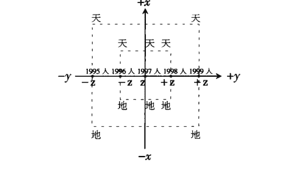

这种人与时空的统一性、全息性，就是《周易·系辞传》中讲的天、地、人三才之道。

几千年来的易学思维中，不仅认识到天、地、人的时空统一性、全息性，到后来还发现除天、地这些看得见的阳性物质对人的影响之外，还有一些看不见摸不着的神秘力量在对人起作用，即影响人的生老病死、事业兴衰、吉凶祸福。在周易纳甲法中把它概括为“六神”或叫“六兽”，以与六爻相对应；在奇门遁甲中把它概括为“八神”或“九神”，以与八卦或九宫相对应。在六壬中、在堪舆中也都有类似的东西。

这些东西既不是神，也不是鬼，只是一些神秘力量的信息符号。在科学发展的今天，如果把它理解为宇宙能量场，宇宙螺旋气场，则不无道理。据说，现代遗传学已经证实，人活着时，遗传物质呈左旋状态，人死后遗传物质呈右旋状态。如此看来，古人在奇门遁甲中讲的阳遁顺行（左旋），阴遁逆行（右旋）也不无道理了。

下边将宇宙螺旋气场左旋、右旋交感于人类身上，以实线表示左旋，以虚线表示右旋，古人构成的“天、地、人、神”时空统一图画在下边：

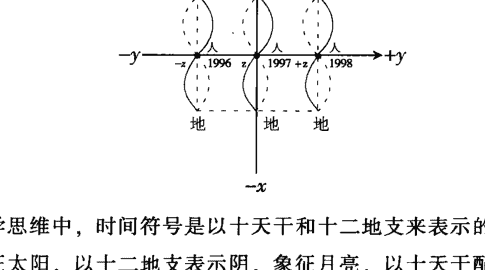

在易学思维中，时间符号是以十天干和十二地支来表示的。以十天干表示阳，象征太阳，以十二地支表示阴，象征月亮，以十天干配十二地支，以表示阴阳交替、日月出没的时间，即年、月、日、时。

空间符号主要是河图、洛书、先天八卦和后天八卦。以后天八卦和洛书九宫相配，表示地面上的九个方位，即东、南、西、北、东南、西北、西南、东北和中央；以先天八卦和河图相配，表示上下左右、正转反转、天高地卑、山泽通气、风雷相薄、水火不相容的立体动态球形空间。

珊泉先生在电视系列片《中华周易》中说，先天八卦图应当竖着看，后天八卦图应当横着看，这样表述的是“法相自然之妙”，即日月循环、阴阳交汇，组成了一个完整的立体宇宙模型。我认为，先天八卦图不仅是一个竖着看，在九宫八卦后天方位图上立着旋转的“风火轮”、“乾坤圈”，它还体现了“河图”立体球形的特征，它应该是一个圆形球体，是一个可以向任何方向转动的“万向轮”。所谓乾一、兑二、离三、震四、巽五、坎六、艮七、坤八，是一个横∞字的宇宙螺旋气场，是一个上下左右、正转反转，可以向任何方面转动的球体。将先天八卦与后天八卦结合起来，就构成了一个具有时空全息特征的动态宇宙模型，因而也就具有了一定的预测功能。邵伟华在《周易与预测学》一书中说，实用八卦图据说是宋朝天文学家、八卦大师邵康节所作，邵康节进行预测时，用的后天八卦图，先天八卦数，实为奇妙。但邵康节为何用后天八卦图、先天数，现还不知其因。我认为，上边我阐述的就是其因，就是它的原理。

### 第五节 宇宙全息论

这是我们祖先对个别与一般、局部与整体、特殊性与普遍性之间关系的一种哲学概括。当然，古人并未明确提出“宇宙全息论”这种明确的现代表述方式，但在易学思维中处处浸透着这种认识。

《周易·系辞传》中说：“《易》与天地准，故能弥纶天地之道。”“八卦成列，象在其中矣；因而重之，爻在其中矣；刚柔相推，变在其中矣；系辞焉而命之，动在其中矣。”“夫《易》彰往而察来，而微显阐幽。”“其称名也小，其取类也大，其旨远，其辞文，其言曲而中，其事肆而隐。”可以说，中国的易学，就是力图通过阴爻阳爻、八卦、六十四卦、天干、地支和金木水火土等这些全息符号来模拟、描绘、反映宇宙万物的形象、性质及其发展变化的规律的。

与易学同源，体现易学思维特征最突出的中华传统医学，在这方面表现得十分突出。中医诊断学的“望、闻、问、切”，除了“问”之外，其他三种诊断方式，无一不是通过局部或某一表象来探求人体整体健康状况的。通过望面部气色、舌苔的颜色变化，嗅病人呼吸或身体散发出的气味，摸左右手腕寸关尺三部位脉搏跳动的情况，从这些局部的表征来推断人体整体、特别是肉眼看不见的内脏各部位的健康状况，这是一种典型的全息思维方式。

更为明显的例证，如以耳朵代表全身，以脚部代表全身，通过摸压耳朵或脚底来诊断身体疾病，通过耳针或按摩脚部某些穴位来治疗全身性的疾病，等等。

上世纪 80 年代，山东大学教授张颖清根据中国传统思维与现代科学相结合，发现了生物全息律，认为生物的每一个细胞都是一个全息胚，生物的每一个局部都可以反映出其整体的信息。

其实，按易学思维的认识来讲，全息律不止存在于生物界中，宇宙万物都存在着全息性，所谓“一滴水可反映出太阳”，就是对这种全息性的概括。

不过易学思维的特点，是以阴阳五行、八卦、六十四卦和天干地支等符号为全息符号，构筑了许多有不同用途的象、数、理时空模型，无论你取象，或取数，或取理，从哪个角度切入，都能在一定程度上通过个别反映出一般，通过局部反映出整体的信息，通过偶然性反映出一些必然性来。

### 第六节 穷通分合论

这是我们祖先对万事万物发展变化规律的一种哲学概括。易的本质含义就是变化，易学就是讲变化的哲学，讲发展的哲学。

《周易·系辞传》中讲“乾坤，其《易》之蕴邪？”“是故阖户谓之坤，辟户谓之乾，一阖一辟谓之变，往来不穷谓之通。”“《易》穷则变，变则通，通则久，是以‘自天佑之，吉无不利’。”

这就是说，万事万物发展变化的规律，就是“分久必合，合久必分”，“穷则变，变则通，通则久，久则穷”，是一个太极循环格局。当然不是简单地重复过去，而是螺旋式上升，不断向更高层次发展变化。所谓“生生之谓易”，“天行健，君子以自强不息”。

易学思维中认为万事万物的最佳状态，是阴阳相交、刚柔相济，即中和平衡状态。六十四卦中最好一卦是“地天泰”卦，即象征大地、母亲、群众的坤卦在上边，象征上天、父亲、领导的乾卦在下边。按一般粗浅理解，阴在上、阳在下，地在上、天在下，这不是阴阳颠倒、违背客观规律吗？怎么还能叫最好的卦呢？

其实正好相反。因为按照易学思维，阴是重浊向下的，阳是轻清向上的。如果阳在上，阴在下，这就形成了“天地否”卦，造成阴阳不能相交，刚柔不能相济，领导脱离群众，上下分离，阻碍不通。只有阴在上，阳在下，这样阴气重浊向下而行，阳气轻清向上而升，阴阳相交，刚柔相济，领导深入群众之中，民为贵，君为轻，上下团结，官民和谐，自然就会国泰民安，出现兴旺发达、长治久安的局面。

这也就是《周易》中《象辞》对“泰卦”的解释：“泰：小往大来，吉，亨。则是天地交而万物通也，上下交而其志同也。内阳而外阴，内健而外顺，内君子而外小人；君子道长，小人道消也。”

《象辞》的解释也是一致的：“天地交，泰；后以财成天地之道，辅相天地之宜，以左右民。”

然而，平衡只是相对的，不平衡是绝对的。事物发展总是由不平衡——平衡——不平衡，这样循环往复而向前发展的。

汉代经学家郑玄在解说《易经》时提出“三易”的说法，即“不易”、“变易”、“简易”。我认为，所谓“不易”，就是不变，就是平衡，这是相对的；所谓“变易”，就是发展变化，就是不平衡，这是绝对的；所谓“简易”，就是以阴阳二爻这种最简单的全息符号来概括、描述万事万物由不平衡到平衡再到不平衡这种发展变化的规律。

《周易·系辞传》中讲：“乾以易知，坤以简能；易则易知，简则易从”，“易简而天下之理得矣”，只是“百姓日用而不知”罢了。

《三国演义》开篇言道：话说天下大势，分久必合，合久必分。不仅人类社会如此，科学的发展规律也是如此。源于亚里士多德逻辑思维的西方实证科学，善于从严密的科学分析和科学实验入手，对人类科学发展做出了举世注目的贡献，极大地促进了人类的物质文明发展。但其将事物越分越细，正如西医一样，把人体解剖得十分清楚，头疼治头，脚疼治脚，难免有机械唯物论的弊端。而源于感性思维的中国易学，却善于从整体上从关系上来把握事物。握事物的一些规律，正如中医的整体观念、辩证施治，还有儒家理学注重人际关系的和谐等等，也有不少精华值得研究和继承。而且随着人类社会的发展，东西方这两种不同的哲学思维方式、不同的文化，也必将“分久必合”，相互融合，取长补短，促进人类物质文明和精神文明的进一步发展。

## 第五章 易学符号语言的通用性

现代科学把学科越分越细，而且一个学科有一套独立的符号语言。例如数学有数学的符号语言，物理学有物理学的符号语言，化学有化学的符号语言，电子计算机有电子计算机的符号语言，生物遗传学有生物遗传学的符号语言，经济学有经济学的符号语言，心理学有心理学的符号语言，军事学有军事学的符号语言，法律学有法律学的符号语言，会计学有会计学的符号语言，公共关系学有公共关系学的符号语言，等等。这一学科与另一学科的符号语言，很难相通。你要学会这一学科，就必须先学懂弄通这一学科的符号语言的特定含义，然后，才能掌握这一学科的知识。从大的方面而言，分为自然科学与社会科学，两类科学的符号语言截然不同，就是在自然科学领域与社会科学领域之内，各个学科之间的符号语言也难以通用，它们的符号语言都是特定的，有特定的含义。

易学的特点正好与此相反，它探求的是自然、社会、人生的普遍规律，它的符号语言是一种通行于自然、社会、人生一切领域的特殊性符号语言。

美国夏威夷大学哲学系教授、国际易经学会主席成中英先生1996年12月8日在中国首届周易应用学术研讨会上的讲话中说：

> “周易的应用从三个方面看，一个是对宇宙人生的理解，叫做理解学；一个是对未来的信息方面的认识或者了解，是对未来的预测学；如何去决定自己的行为，来趋吉避凶作决策，是对自己行为的决策学。所以，周易应用实质上是这三方面得出的结果，也可以说是周易的三段论法。”

他又进一步说：“人的宇宙和自然宇宙有着类似的关系，科学解决了自然宇宙的一些问题，能不能解决人的问题，我想，周易作为关心自然、关心人事的一门实用的学问，显然对人的行为，可以作出掌握。而这个掌握，所提供的方法可以说有两个特点：第一个，它要运用的语言，是普遍性的，它肯定自然宇宙和人生有一个共同语言……周易有一个很大的特点，就是能找到一种普遍的宇宙语言来说明自然，说明人生，它的语言，就是阴阳五行的语言……第二个，就是它的伸缩性很高，丰富的程度很高……这个阴阳五行，可以结合时间、结合空间、结合种种因素，来变成一种非常丰富的语言，去描写人的行为的复杂性”（见1997年5月30日出版《中国首届周易应用学术研讨会论文集》）。

成中英教授在这里对易学符号语言的通用性论述得相当深刻。

这就是说，易学所用的符号语言，即阴爻、阳爻、八卦、六十四卦、天干、地支、阴阳五行等等，它不是某一学科的语言，它不具备某一学科所指事物的特定性、具体性，它是一种广义性、延伸性、涵盖性、包容性、全息性很强的符号语言。

正因为如此，易学应用才能借助于它来说明自然、说明社会、说明人生，向人们提供一些已知的和未知的信息，帮助人们认识客观，认识主观，了解外界，了解自身，回顾过去，把握未来，趋吉避凶，指导行动，以便顺应自然规律，发挥人的主观能动性，以期扬长避短，改善自我，发展自我，去更好地实现人生的价值，改造客观世界，造福社会，造福人类。

易学符号语言的通用性，使它具备了其他学科无法替代的独特功能，这是其优长之处。然而，事物几乎都具有两重性。所以，易学符号语言的通用性，同时也是它的短处。由于它不具备所指事物的特定性、具体性，所以，不可避免地带有模糊性、随意性。

例如，经典数学的符号语言，一就是一，二就是二，而且任何情况下，一加一必然等于二，不可能等于三，更不能等于四，等于五。

而易学符号语言就不同了，它的最大特征，正如马克思主义活的灵魂——具体情况具体分析一样，在不同的时空条件下有不同的含义，有不同的结果。例如，一个男人加一个女人，如果是兄妹俩，一般情况下只能等于二，即仍是两个人；如果是夫妻俩，结婚后，则可能生一个孩子、二个孩子或更多孩子，因此可能等于三，等于四、等于五，或者更多；如果是一对仇敌，则可能男的把女的杀掉，或者女的把男的杀掉，结果一加一仍然等于一，另一个人已经死了。

总而言之，易学符号语言，不是机械的死板的特指的语言，而是一种充满辩证思维的活生生的具有广义性和伸缩性的通用符号语言。正因为如此，它才能去描述自然、社会、人生在不同时空条件下的丰富性、复杂性，才能做出近似事物本质情况的结论，去指导人们的行动。

也正因为易学符号语言具有这种模糊性和随意性，使那些只习惯于机械的呆板的逻辑思维的人，感到很不“科学”，很难掌握，甚至斥之为“伪科学”、“封建迷信”。

按照这些人的思维定势，医易同源、同理的中华医学，也只能归入“伪科学”、甚至“封建迷信”之列了。

所以，要掌握易学，必须同时运用人脑的逻辑思维、形象思维和灵感思维这三种能力。只有这样，才能掌握这种高智慧的哲学，在实际应用中，尽量减少模糊性和随意性，具体情况具体分析，达到较好的特定性和具体性。

## 第六章 易学象数理模型的模拟性

北京大学教授、博士生导师于希贤先生在《中国古代风水与建筑选址》一书（河北科技出版社1995年12月出版）中说：

> “凡是能建立数理模型的知识，它一定是科学的。占筮本身就是一种极为严密的数理模型。”

为了预测自然、社会、人生种种问题，古人在易学领域构筑了各种各样的象数理模型。如先天八卦模型、后天八卦模型、六十四卦纳甲模型、太乙模型、奇门模型、六壬模型、四柱模型、堪舆罗经模型等等。其中后天八卦时空模型（又叫“实用八卦图”）几乎是一切易学预测方法的基础，包括手相、面相，无不如此。

先天八卦模型是模拟人类处在地球上客观外界大自然自身运动规律的一个立体动态模型。“伏羲八卦方位图”图示如下：

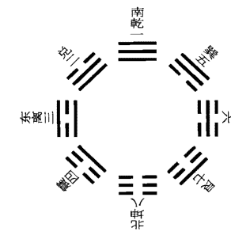

《周易·说卦传》中是这样解释先天八卦图的：
“天地定位，山泽通气，雷风相薄，水火不相射，八卦相错。数往者顺，知来者逆，是故《易》逆数也。”
又说：“雷以动之，风以散之；雨以润之，日以烜之；艮以止之，兑以说之；乾以君之，坤以藏之。”

历代易学研究者对先天八卦图有种种解释，我是这样理解的：第一，所谓“先天”，即人类尚未出现以前，这种客观自然界的现象就已然存在。所以，我认为它是模拟人类所处客观自然界形势及其规律的。因此，后人画的先天八卦图，把乾位标为南方，坤位标为北方，是不妥当的。乾为天，应标为上方，坤为地，应标为下方，这是人类站在地球上看到的现象，上边是天，下边是地。

第二，东为离，西为坎，这是对的。离为火为日，坎为水为月，这是描摹太阳从东方升起，月亮从西方升起，日升月落，月升日落，白天黑夜交替出现的情况。兑为雨为泽，艮为云为山，震为雷为动，巽为风为散，这是描摹自然界山、泽、云、雨、打雷、刮风等主要自然现象的。

第三，所谓乾一、兑二、离三、震四、巽五、坎六、艮七、坤八，按此顺序把八卦连接起来，正好形成一个横∞字形的宇宙螺旋气场，以此描摹自然界的运动状况。《说卦传》中讲的“数往者顺，知来者逆，是故《易》逆数也”。我理解是，坎为月，代表黑夜，代表过去，代表以往，巽五坎六艮七坤八是顺时针顺序，所以叫“数往者顺”，要了解过去的事情可以顺着数；而离为日，代表白天，代表未来，日出代表新的一天开始，而乾一兑二离三震四的顺序却是逆时针的，因此叫“知来者逆”，要知道未来的事应该逆着数。易学是预测未来的学问，所以一定要逆着数。然而，顺、逆本是相对的，不过以横∞字的右边代表过去、左边代表未来罢了，黑暗已经过去，光明就在前边，所谓“天行健，君子以自强不息”，易学是鼓励人向前看的。

第四，先天八卦图中，相对两个方向的两个卦数相加之和都是九，1+8=9，2+7=9，3+6=9，4+5=9，九为老阳，是阳数中最大的数。天为阳，地为阴，所以它描绘的是“天”即大自然界的情况。后天八卦图是描摹地球上北半球以黄河流域为中心的中华民族生活的客观环境，所以，后天八卦图中相对两个方向、两个卦数相加之和都是十，是代表“地”，即中国人生活的大地上情况。

相传先天八卦图是伏羲发明的，所以又名伏羲先天八卦图。与此相对应的是后天八卦图，相传是由周文王发明的，所以又叫文王后天八卦图。

文王后天八卦图，是以洛书九宫为基础，按照北半球黄河流域为中心华夏民族的生活环境而设计的。“文王八卦方位图”图示如下：

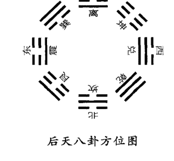

《周易·说卦传》中对此有详细的解说，我们在“第四章易学思维中的科学性精华（四）时空统一论”一节中已经引述过，这里不再重复。

这个象数理模型，从天文、地理、时间、空间各个角度模拟了中华民族生存的客观环境。

第一，周文王活动的中心是西安一带。从地理方位、地理特征和气候变化来看，北边是黄河，寒冷自北方而来，所以把代表水、代表寒冷的坎卦放在北边，又与一年中最冷的农历十一月（子月）、一天中最冷最黑暗的子夜相对应；东北方是山西高原和太行山，所以把代表山、代表稳固、停止、五行属土的艮卦放在东北方，又与一年中的农历十二月（丑月）、正月（寅月）和一天中黑夜与黎明交接的丑时、寅时相对应；第一声春雷从东方而来，春天草木生长，所以把代表雷、代表震动、五行属木的震卦放在东方，又与一年中农历二月（卯月）、一天中早晨的卯时相对应；春夏之交，风从东南方刮来，草木繁茂，莺飞燕舞，东南沿海一带风多、草木多，所以把代表风，五行也属木的巽卦放在东南方位，而且与一年中的农历三月（辰月），四月（巳月）和一天中的辰时、巳时相对应；南方气候炎热，夏季烈日高照，所以把代表火、代表太阳、代表光明的离卦放在南方，又与一年中农历五月（午月）、一天中午时相对应；西南方是四川盆地，秋季肃杀收割，所以把代表大地、代表收藏的坤卦放在西南，又与一年中农历六月（未月）、七月（申月）和一天中的未时、申时相对应；西边有青海湖等沼泽地，云雨多从西来，秋天是收获的季节，农民最为高兴，所以把代表泽、代表雨、又代表喜悦的兑卦放在西方，同时与一年中金秋八月（酉月）、一天中的酉时（古人往往一天只吃两顿饭，一顿是辰时吃，一顿是酉时吃，所以兑又代表口舌）相对应；西北方多金属矿产，西北风一刮天气渐渐变冷，所以把代表天、代表金属矿产的乾卦放在西北，同时古人认为天高西北，地陷东南，所以把代表天、代表君主、代表父亲的乾卦放在西北方，又与一年中的农历九月（戌月）、十月（亥月）和一天中的戌时、亥时相对应。这样以来，后天八卦图就把我们祖先生存的时间和空间的统一性描绘出来了。

第二，这个象数理模型还模拟了阴阳消长、交替变化的过程。冬至一阳生，从坎卦开始，按顺时针方向，阳气经艮卦、震卦、巽卦到离卦，达到极盛，阳极而衰，阳要变阴，所以到夏至一阴生，阳气开始衰落，阴气开始生长，经坤卦、兑卦、乾卦，再到坎卦，阴气达到极盛，阴极而衰，阴要变阳，所以冬至又开始一阳生。一日一夜之间也是如此，子夜阴气达到极点，然后阳气开始生长，经艮、震、巽到离的午时，阴气衰减消亡，阳气达到极盛；然后，阴气开始生长，经坤、兑、乾、坎，到达子时，阳气衰减消亡，阴气达到极盛；然后阳气又开始生长。所以与坎卦对应的子位子时是阳生阴死之位，与离卦对应的午位午时是阴生阳死之位。

第三，后天八卦图还从数学的高度抽象地模拟了天地万物。《周易·系辞传》中说：“天一、地二，天三、地四，天五、地六，天七、地八，天九、地十。天数五，地数五，五位相得而各有合，天数二十有五，地数三十，凡天地之数五十有五。”这就是说，凡奇数为阳，代表天，偶数为阴，代表地。后天八卦图，凡相对两个方位上的卦数相加之和均为十，1+9=10，2+8=10，3+7=10，4+6=10，所以象征大地。中宫的五数代表木、火、土、金、水五行，天地阴阳之数加上五行，就形成了一个和谐平衡的自然生存环境，从数学角度，就是后天八卦图中无论正向、斜向，任何一个方向的三个数相加，均等于十五：东方 8+3+4=15，南方 4+9+2=15，西方 2+7+6=15，北方 6+1+8=15，东北西南向 8+5+2=15，东南西北向 4+5+6=15，南北向 9+5+1=15，东西向 3+5+7=15。在这个和谐平衡的自然生存环境中，阴阳处于对立、统一、交叉、融合的运动状态。一、三、七、九代表阳数，二、四、六、八代表阴数，五居其中。冬至一阳生，所以序之一数，阳气顺行，到春分渐壮，增至为三，到夏至达到极盛，故为最大之九数，称为老阳，到秋分渐退，减为七数。将一、三、五、七、九连起来，则形成一条倒置的S曲线，即太极曲线。夏至后阴气开始渐长，所以到立秋序之二数，到立冬后阴气达到极点，所以以老阴六数表示，到立春后阴气减少，以少阴八数表示，到立夏阴气更加减少，所以以四数表示。将二、四、五、六、八连起来，则成一条正位的S曲线，即太极曲线。这样正反两条S曲线，其交叉点就是中宫之五，表示木、火、土、金、水这五大类别的物质都有阴有阳，都是按照这种对立统一的规律在交叉融会地运动着，存在着。

第四，后天八卦图还模拟了以家庭为社会主要单位的人事情况。以乾卦代表父亲、长辈男人，坎卦代表中男，艮卦代表少男，震卦代表长男，乾坎艮震四阳卦代表了家庭和社会上不同年龄的男子。以坤卦代表母亲、长辈女人，巽卦代表长女，离卦代表中女，兑卦代表少女，坤巽离兑四阴卦代表了家庭和社会上不同年龄的女人。这样就把人放进了这个时空大自然生存环境之中，形成了天、地、人三才统一的象数理模型。

第五，这个模型中，从坎一、坤二、震三、巽四、经中五，到乾六、兑七、艮八、离九，形成一条跳涧式曲线。爱因斯坦将这条运动曲线称之为布朗式运动，中国人叫做九宫跳涧。不少易学研究者认为，这条曲线是从信息变化角度描绘出来的，可以把它称之为信息演绎曲线。它表明，信息的变化是在时空背景上成九宫跳涧式程序运动的。总之，时间变化是信息的螺旋式重演，空间变化是信息的坐标性强化，信息的变化是时空的九宫跳涧。

易学的象数理模型是用来模拟自然、社会、人生规律，是用来预测的。

正如《周易·说卦传》中所讲：“八卦相错，数往者顺，知来者逆，是故《易》逆数也。”后天八卦图中的数字也体现了这一原则。预测过去的事，应用减法，乾六减五等于坎一，艮八减五等于震三，离九减五等于巽四，兑七减五等于坤二，这样正好是顺时针方向运转，所以叫“数往者顺”。预测未来的事，应用加法，坎一加乾六等于兑七，兑七加坤二等于离九，离九加巽四等于十三（该模型均用十以内的数），十三去掉十，正好等于震三，震三加艮八等于十一，十一去掉十，等于坎一。如此阴阳按逆时针方向循环相交相生，所以叫“知来者逆”。易学象数理模型，主要就是用来推断未来之事的。

为了说明模型的预知性，我在这里举一个运用数字九设置的数学加法小模型：

读者可以任意说出三个三位数，我说二个三位数。你在说出第一个三位数时，我就可以直接告诉你这五个三位数相加的结果。

比如：你说的第一个数是 123，我就马上告诉你 5 个三位数相加的结果一定是 2121。

不信，你往下看：你又说一个 456，你再说一个 819，我说一个 543，一个 180，123+456+819+543+180=2121。你感到奇怪，不说 456 和 819 了，改为 654 和 761，那么我就说 345 和 238，结果 123+654+761+345+238，仍然等于 2121。你还不相信，又改了，改说 789 和 345，那么我说 210 和 654，结果 123+789+345+210+654，仍然等于 2121。

这时你感到太神奇了！怎么你任意说三个三位数，我说两个三位数，只要你刚说出第一个三位数时，我就知道五个三位数相加的结果呢？

其实这就是一个用九的数学模型，其机关就是你后边说的两个三位数与我说的两个三位数，两两相加我都让它等于 999，这样就有两个 999，即 2000 中少一个 2 数，因此在你刚说出第一个数字 123 时，我就把个位的 3 数中减去 2，把 2 移到千位上，3-2=1，个位成为 1 数，于是结果 2121 就早已经预先知道了。

这当然只是一个比喻。易学的象数理模型是企图预知复杂的自然、社会、人生种种问题，所以它类似于模糊数学，不可能像上边所举由经典数学构成的模型这么精确、这么简单。但其原理应该是一致的。

## 第七章 奇门遁甲是一种比较完整的象数理模型

在易学领域的各种各样的象数理模型中，无论古人和今人，都对奇门遁甲的评价较高。清代四库全书的编纂者在为《遁甲演义》撰写的提要中，称奇门遁甲“于方技之中，最有理致”。1994年12月上海文化出版社出版的由复旦大学一批学者编写的《中国神秘文化百科知识》一书也说：“奇门遁甲素称中国方术之王”，是“中国方术中式占的集大成者”，“过去号称‘帝王之学’，它融周易、天文、律历、阴阳五行学说于一体”，“成为目前探索中国神秘文化热潮中的一个焦点”。

经过研究和比较，我也认为，在古代各种易学象数理模型中，奇门遁甲是一种比较完整的数理模型，在实际应用中，其应验率也较高。它把天时、地利、人和与影响人类生产生活的某些能量场这四个方面，与时间、空间巧妙地组合在一起，按照阴阳消长、一年二十四节气太阳对地球的影响，概括出阴遁九局、阳遁九局共十八种基本格局，为我们提供了一个模拟宇宙统一信息场的立体动态象数理模型，既可以用于预测自然、社会、人生各种各样或然性和模糊性的事物，也可以向人们提供趋吉避凶的时空选择。

# 中 编 数理奇门的基础知识

## 第一章 奇门遁甲源于军事上的排兵布阵

### 第一节 古代三式之一

“太乙”、“奇门”、“六壬”合称“三式”，是我国传统预测学中最高层次的预测学，历史上都是由国家司天监、司天台、太史令等掌管天文、历法、军国大事的少数人所掌握。据说，“太乙”以占测君国大事、自然灾异为主，“奇门”以占测行军制敌为主，“六壬”以占测日用百事为主。之所以叫做“式”，乃因为这三种预测方法，都是用特制的式盘来进行推演的。这一点，不仅在大量古籍史料中有记载，而且有出土文物为证。如安徽阜阳县双古堆出土的“太乙九宫占盘”。

“三式”的构成，均离不开天干、地支、河图、洛书、八卦、象数，因而都源自易学，其创制大约都在春秋战国时代。

其中“奇门”，全称“奇门遁甲”。据有的学者考证，奇门遁甲在周秦时期叫“阴符”，汉魏时期名“六甲”，晋隋唐宋称“遁甲”，明清以来才叫“奇门遁甲”。

奇门遁甲，简称“奇门”或“遁甲”。按时间又分年家奇门、月家奇门、日家奇门、时家奇门；按推演方法，又分为活盘奇门遁甲（排宫法），飞盘奇门遁甲（飞宫法）；按用途又分为数理奇门、法术奇门。数理奇门主要用于预测，法术奇门将奇门与道家法术相结合，夹杂了许多神秘和虚妄的东西。前者流传下来的代表性著作是《烟波钓叟歌》。后者是《秘藏通玄变化六阴洞微遁甲真经》，简称《六阴洞微真经》。

为了使广大读者都能了解奇门遁甲的预测原理及其操作方法，促进对这一传统文化的研究，本文只讲流传最广泛、实用性最强的时家奇门、活盘奇门遁甲（排宫法）、数理奇门。

### 第二节 奇门遁甲源于军事上的排兵布阵

奇门遁甲这种预测方法产生于什么时代？来源是什么呢？至今学术界尚无定论。

我认为，虽然其产生的具体年代不好确定，但是，它源于军事上的排兵布阵，应该是没错的。

首先，有流传下来的著述为证。

先秦时期兵家代表作《孙子》一书卷四形篇中说：“善守者藏于九地之下，善攻者动于九天之上，故能自保而全胜也。”

唐代李筌在注解这一句话时说：“《天一遁甲经》云：九天之上可以陈兵，九地之下可以伏藏，常以直符加时干。后一所临宫为九天，后二所临宫为九地。地者静而利藏，天者动而利动。故魏武不明于遁，以九地为山川、九天为天时也。夫以天一太乙之遁幽微，知而用之，故全也。经云：知三避五，魁然独处。能知三五，横行天下，以此法出，不拘诸咎，则其义也。”（注：天一，指奇门遁甲；太乙，指太乙金镜式。知三避五，三指开、休、生三吉门；五指其余五凶门，即伤门、杜门、景门、死门、惊门。）

李筌在这里，就是用奇门遁甲来注解孙子这句话，而且批评曹操（魏武帝）不懂奇门遁甲，误把奇门遁甲神盘中的“九地”解释为山川，“九天”解释为天时。显然，李筌认为，奇门遁甲是用于战争的。

李筌在他辑录的《神机制敌太白阴经》卷九《遁甲》章中说：经云，黄帝征蚩尤，七十二战而不克，昼梦金神引领长头元狐之裘而言曰：“某，天帝之使，授符于帝。”帝惊悟，求其符不得。乃问风后、力牧。力牧曰：“此天帝也。”乃于盛水之阳，筑坛祭之。俄有元龟巨鳌从水中出，含符致于坛而去。似皮非皮，似绨非绨，以血为文，曰：“天乙在前，太乙在后。”黄帝受符再拜。于是设九宫，置八门，布三奇六仪为阴阳二遁，凡一千八十局，名曰天乙遁甲式，三门五将具，而征蚩尤，以斩之。（注：天乙指奇门遁甲，太乙指太乙金镜式；三门指开、休、生三吉门；五将当指除元帅甲子外的甲戌、甲申、甲午、甲辰、甲寅五员大将。）

宋初宰相赵普辑录的《秘藏通玄变化六阴洞微遁甲真经》中也有类似的记载：

昔蚩尤作乱，黄帝频战不克，帝曰：“闻伏羲治天下无兵，今蚩尤一庶人，生妖气，伐而无功，战而不克，吾之过矣。”忽目前五色云从空而下，云中有六玉女持书，出二童曰：“奉九天玄女圣命，送《遁甲符经》三卷，告以伐之，愿传。此文乃天地祸福，是八卦之吉凶，辨风云之变动，识气候之成败，观日月之盈亏，论阴阳之顺逆，晓星辰之休咎，知人情之胜负。此术乃万变万化之法也。”帝乃长跪而受之。帝遂开函，得《阴符经》三卷。上卷乃神仙炼丹抱一之术，说长生之法；中卷安邦定国，抚安王民之法；下卷论战伐之事。遁甲者，乃玄女之法。帝得之，而设坛造印、剑、令依此，战蚩尤于涿鹿之野，尔后厥胜。

赵普在其所撰《烟波钓叟歌》中，对此作了进一步的概括：

轩辕黄帝战蚩尤，涿鹿经年苦未休。偶梦天神授符诀，登坛致祭谨虔修。神龙负图出洛水，彩凤衔书碧云里。因命风后演成文，遁甲奇门从此始。

以上典籍都载明，奇门遁甲源于黄帝战蚩尤之时，由天神传授给黄帝，黄帝命其军师风后整理成文字。

这种行文方式，显然与产生于春秋战国时代的《黄帝内经》等一批托名黄帝的著述相一致，由此，再结合易学中八卦、九宫、河图、洛书、阴阳五行等易学符号语言产生成熟的时代，两相对照，断定奇门遁甲产生于春秋战国时期恐怕是比较妥当的。

再者，春秋战国时期列国纷争，战争频繁，奇门遁甲正是适应战争中排兵布阵、克敌制胜的需要，才应运而生的。所谓黄帝战蚩尤不下，九天玄女授予《遁甲阴符经》云云，不过是为了神秘其术而已。

正因为它产生于或萌芽于春秋时期，才会在春秋末期我国兵家的代表人物孙武子的兵法著作《孙子兵法》一书出现上述记载。

其次，我认为奇门遁甲的格局，实际上就是排兵布阵的阵法。

有的专家考证，三国时诸葛亮演练的八阵图、八卦阵，实际上就是洛书的九宫格，即“戴九履一、左三右七、四二为肩、八六为足”的一个三阶幻方（见下图）。这个从一到九，九个数字的排列，有二个明显的特点，一是奇数1、9、3、7、占北、南、东、西四正位，偶数2、4、6、8均占斜位，即西南、东南、西北、东北；二是不论沿正方位还是沿对角线，每三个数字的和都是十五。

#### 九宫八卦阵

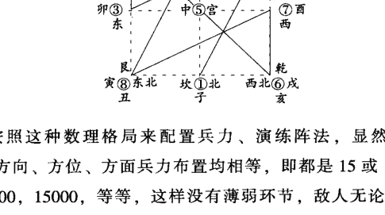

如果按照这种数理格局来配置兵力、演练阵法，显然有几大妙处：

- （一）每个方向、方位、方面兵力布置均相等，即都是15或15的倍数，比如150，1500，15000，等等，这样没有薄弱环节，敌人无论从哪个方向进攻，都会遇到几乎相同的兵力。
- （二）从一到九的行军路线走的是一条类似横∞字形的宇宙螺旋气场，符合人进入功能态后所走的罡步，这种螺旋气场中心或罡步的中心，形成一个稳定的隐蔽地带，便于保护军队指挥机关或主帅不受敌人袭击。这种步法，笔者1991年5月在成都参加中国首届民族神秘文化研讨会期间，曾亲眼目睹过。当时一位研究符咒的四川省社科院学者，一旦进入气功态，或画符之前，都会身不由己地走出这种九宫八卦阵来。
- （三）这种从一到九或从九到一的演练兵力的格局，既然是一个幻方、魔方，它就好似迷魂阵一样，从外边看起来眼花缭乱，九支部队不停地更换方位，使敌人摸不着头脑，看不见主帅，无懈可击；而在我一方，又可随时选择有利的时间、有利的方位，向敌人发起进攻，或者突围，或者退却。

现代数学工作者，依据九宫八卦这个三级幻方，可以排列出四级幻方、五级幻方、六级幻方、七级幻方乃至千级、万级的幻方。1992年在安阳召开的周易与现代化国际学术讨论会上，有一位数学工作者背去了用电脑计算打印出的重二三十斤的数学幻方图。这些数学幻方，一类是偶数级的，可以叫做偶阵图，一类是奇数级的，可以叫做奇阵图。如每个方向四个数字相加其和均为59的四级幻方偶阵图（见图1）和每个方向七个数字相加之和均为175的七级幻方奇阵图（见图2）：

| 15 | 12 | 9 | 23 |
|---|---|---|---|
| 10 | 22 | 16 | 11 |
| 21 | 7 | 14 | 17 |
| 13 | 18 | 20 | 8 |

图1 偶阵图

| 22 | 31 | 40 | 49 | 2 | 11 | 20 |
|---|---|---|---|---|---|---|
| 21 | 23 | 32 | 41 | 43 | 3 | 12 |
| 13 | 15 | 24 | 33 | 42 | 44 | 4 |
| 5 | 14 | 16 | 25 | 34 | 36 | 45 |
| 46 | 6 | 8 | 17 | 26 | 35 | 37 |
| 38 | 47 | 7 | 9 | 18 | 27 | 29 |
| 30 | 39 | 48 | 1 | 10 | 19 | 28 |

图2 奇阵图

春秋战国时期、两汉和三国时期的军事家们，是否能像现代数学工作者在九宫八卦这个三级幻方的基础上排列出这么多复杂的奇阵图、偶阵图，我不敢断定。但现代数学工作者在此三级幻方基础上能排列组合出成千上万级的幻方、魔方，则足以证明这个三级幻方的九宫八卦图有着很科学很值得研究的数学原理在里边。

古代军事家在九宫八卦阵的基础上，根据天时、地利、人和这三种制约战争胜负的主要因素，逐步完善它、发展它，使奇门遁甲从最初只是一种演练部队的阵法，发展成将天时、地利、人和以及某种自然界尚未认识的神秘力量综合在一起以便预测决策战争的“秘密武器”、“神秘工具”。

这些军事家，可能包括姜子牙、孙武子、孙膑、张良、陈平、诸葛亮、李靖、郭子仪、赵普、刘伯温等人。

由于奇门遁甲逐步成为一种预测方法，所以后来就不限于军事上使用，也逐渐被民间采用，用于预测疾病、事业、农业、商业等等各类事物。

### 第三节 诸葛亮借东风的奥秘

在流传至今的众多有关奇门遁甲的著述中，有三部书都标明为“诸葛武侯原著，刘伯温校订”，这就是《奇门遁甲统宗大全》、《奇门秘笈全书》和《诸葛武侯奇门丁甲大全》。

学者们多数认为，这三部书都是后人伪造、托名诸葛亮的。不仅如此，一位研究奇门遁甲的学者甚至提出：诸葛亮根本不懂奇门遁甲，不然，他怎么会在《隆中对》中建议刘备把根据地建在西蜀这一块按中国地理方位属于坤宫死门的地方呢？中国历代统治者统一天下，几乎都是从西北开门创业，并始终抓住开、休、生三吉门，而逐步取得成功的。

这一论点，笔者不敢苟同。

第一，《诸葛亮集》中《上先帝书》一文曾载：“臣算太乙数，今年岁次癸巳，罡星在西方，又观乾象，太白临于洛城之分，主于将帅多凶少吉。”这证明诸葛亮懂得太乙术。一般懂太乙术的人，也懂奇门遁甲。如前文所述“天乙在前，太乙在后”。而流传下来的八阵图，如前所述，正说明诸葛亮懂得奇门遁甲。

第二，为刘备选择西蜀这块根据地，不足以说明诸葛亮不懂奇门遁甲，因为奇门遁甲只是一种预测的工具，它的应用必须结合实际。诸葛亮出山之时，曹操已经统一了北方，势力最大，江东已为孙权占据，也有相当实力，只有刘备最弱，尚无立足之地，而此时荆州刘表和益州刘璋是其薄弱环节，刘备只有选择薄弱环节，先觅立足之地才是上策。况且，按照奇门遁甲中五宫寄坤二宫的办法，在当时这种客观形势下，为刘备占领中原统一天下着想，也只有先寄于坤二宫，如此，一者符合置之死地而后生的兵法策略；二者西蜀离西北开门最近，第一步先占领西蜀作为根据地，第二步就可以就近夺取西北开门之地，从而进军中原了。观诸葛亮在西蜀立稳脚跟之后，六出祁山，以及他死后姜维九伐中原，都是在力图实现这一战略决策，只不过由于种种原因，使他“出师未捷身先死，长使英雄泪沾襟”，理想没有实现罢了。但毕竟实现了他三分天下有其一的第一阶段计划。

第三，奇门遁甲只是一种预测方法，一种思维模式，运用得恰当，可以帮助决策，取得一定效果，但决不是“万能法宝”，更不是决定战争胜负的决定因素。因而一个人掌握了奇门遁甲，并不能保证他一定取得胜利。这是我们对任何学术、任何技能应有的辩证唯物主义的认识观。

第四，解剖《三国演义》一书中所载诸葛亮借东风一事，可证明诸葛亮是精通奇门遁甲预测术的。

《三国演义》写赤壁大战中，庞统献连环计，使曹操把战船连在一起，周瑜欲用火攻。

建安十三年冬十一月十五日晚上，月明星稀，曹操在战船上横槊赋诗，踌躇满志。升帐谓众谋士曰：“若非天命助吾，安得凤雏妙计。铁索连舟，果然渡江如履平地。”程昱曰：“船皆连锁，固是平稳。但彼若用火攻，难以回避，不可不防。”操大笑曰：“程仲德虽有远虑，却还有见不到处。”荀攸曰：“仲德之言甚是，丞相何故笑之？”操曰：“凡用火攻，必藉风力。方今隆冬之际，但有西风北风，安有东风南风耶？吾居于西北之上，彼兵皆在南岸。彼若用火是烧自己之兵也，吾何惧哉！若是十月小春之时，吾早已提备矣”（《三国演义》第48回）。

可见曹操对天时、地利是做了充分考虑的。

周瑜利用庞统向曹操献连环计，起初认为用火攻不存在问题，但当他站在江南岸山顶上观看曹营水寨时，忽然狂风大作，江中波涛拍岸，一阵风过，刮起旗角于周瑜脸上拂过，使他猛然醒悟，此季节只有西风、北风，没有东风、南风，怎么能用火攻呢？于是突然往后一倒，口吐鲜血，不省人事。从此卧病在床，发起愁来。

诸葛亮前去探望，屏退左右，密书十六个字曰：“欲破曹公，宜用火攻。万事俱备，只欠东风。”写毕，递与周瑜曰：“此都督病源也。”瑜见了大惊，暗思，孔明真神人也，早已知我心事，只索以实情告之。乃笑曰：“先生已知我病源，将用何药治之？事在危急，望即赐教。”孔明曰：“亮虽不才，曾遇异人，传授八门遁甲天书，可以呼风唤雨（电视连续剧《三国演义》将此句删去了，这是不应该的）。都督若要东南风时，可于南屏山建一台，名曰七星坛。高九尺，作三层，用一百二十人，手执旗幡围绕。亮于台上作法，借三日三夜东南大风，助都督用兵何如？”瑜曰：“休道三日三夜，只一夜大风，大事可成矣！只是事在目前，不可迟缓。”孔明曰：“十一月二十日甲子祭风，至二十二日丙寅风息如何？”瑜闻言大喜，矍然而起。便传令差五百精壮军士，往南屏山筑坛，拨一百二十人执旗守坛，听候使令。

孔明于是在十一月二十日甲子吉辰，沐浴斋戒，身披道衣，跣足散发，上到坛上开始作法祭风。孔明一日上坛三次，下坛三次，却并不见有东南风。是日看看近夜，天色晴明，微风不动。一直到将近三更时分，忽听风声响，旗幡转动。周瑜出帐看时，旗带竟飘西北。霎时间东南风大起。待东南风大起之后，诸葛亮早下坛到江边，乘赵云前来接应的小船离开周瑜营寨，回刘备所在夏口去了（《三国演义》第四十九回）。

这里对诸葛亮利用奇门遁甲借东南风一事写得十分详尽，不仅有具体方法和细节，而且有具体的年、月、日、时，这样就为我们剖析诸葛亮是否懂奇门遁甲以及借东风到底只是小说家的虚构还是实有可能，提供了必备的条件。

我不揣浅陋，试着解析一下这个千古之谜。

查万年历，建安十三年为公元208年，年干支为戊子，冬十一月为甲子月，农历二十日为甲子日，二十一日为乙丑日，二十二日为丙寅日。

第一天甲子日无风，第二天乙丑日，从丙子时末开始有风，到丁丑时东南风大起。我们不妨用时家奇门的方法，测一下这个乙丑日丁丑时的天气状况。

按冬十一月二十一日乙丑，已在冬至节前后，无论用置闰法定局，或拆补法定局，按符头甲子，子、午、卯、酉为上元，则属冬至上元，应用阳遁一局来测算。

丁丑时属甲戌旬，说明甲戌已在地盘二宫值班，因而与地盘二宫对应的天盘天芮星为值符，人盘死门为值使。

到丁丑时，值符天芮星运转到七宫，值使死门运转到五宫，寄二宫，天辅星运转到九宫，天英星到二宫。

现将丁丑时阳遁一局的奇门格局列在下边：

| 武 | 地 | 天 |
|---|---|---|
| 杜庚 | 景辛 | 死乙 |
| 冲辛 | 辅乙 | 英己 |
| 虎 | | 符 |
| 伤丙 | 壬 | 壬惊己 |
| 任庚 | | 芮丁 |
| 合 | 阴 | 蛇 |
| 生戊 | 休癸 | 开丁 |
| 蓬丙 | 心戊 | 杜癸 |

测天气，以天辅星为风，以天英星为火，二者旺相主风晴。此时天辅星落九宫，木生火，为我生之宫，为旺相，主有东南风；天英星落二宫，火生土，也为我生之宫，为旺相，主晴天；离九宫又呈现出辛加乙的格局，这叫白虎猖狂，主有大风；八神盘上的白虎落震三宫，也主有东风。总之，综合这几点，不难看出，此时会出现晴天，东南风大起的天气。

同时，甲子旬中戊亥空，西北方日干落空亡，为孤地。西北方乾位所在六宫又出现丁加癸、雀投江的凶格，很不利曹操一方。

再者，按阳时利客的原则，丁丑时为阳时，先动者有利，所以周瑜首先发起进攻，借助东南风，采取火攻，终于取得赤壁大战的胜利。

由此可见，诸葛亮筑七星坛施法术借东风只是个形式，实际上他运用奇门遁甲早已预测出十一月二十一日凌晨起必然要大刮东南风的天气状况。当然，也不排除，诸葛亮是将数理奇门与法术奇门综合运用，他确信法术奇门也是有效的。

由此，也会明白，所谓草船借箭，也是诸葛亮事先预测出那夜江上必有大雾，所以才采取这一措施的。只是《三国演义》一书中没有写明具体时间，故而难以验证。但诸葛亮讲得明白。当他在鲁肃陪同下，用二十只船从曹营“借来”十余万枝箭时，鲁肃问道：“先生真神人也，何以知今日如此大雾？”孔明曰：“为将而不通天文，不识地理，不知奇门，不晓阴阳，不看阵图，不明兵势，是庸才也。亮于三日前已算定今日有大雾，因此敢任三日之限……”（见《三国演义》第四十六回）。

这时，有的读者也许会提出，《三国演义》只是历史小说，并非信史。考诸历史，究竟如何？

查陈寿所撰《三国志》中《魏书·武帝纪》、《蜀书·先主传》、《蜀书·诸葛传》和《吴书·吴主传》、《吴书·周瑜传》等史料，所记赤壁之战的大体时间和主要情节，均与《三国演义》一致，在《周瑜传》中不仅有黄盖诈降的情节，而且说：“盖放诸船，同时发火。时风盛猛，悉延烧岸上营落。”明显说明有东南大风相助。只可惜没有具体月、日、时辰，也没有诸葛亮借东风的细节。

罗贯中在《三国演义》中对火烧战船的时间写得如此具体、详尽，而且与实际天气相符，这说明他一定是有根据的，并非凭空杜撰。

从以上几点看出，诸葛亮应该是懂奇门遁甲的，并在军事行动中会加以运用。至于流传至今署名“诸葛武侯原著”的三部有关奇门遁甲的书是否确系他的原著，倒不一定。我也认为，后人伪托的可能性比较大。因为正史和诸葛亮文集中没有任何记载。

## 第二章 时家奇门演局的规律

### 第一节 十天干与九宫八卦阵

奇门遁甲来源于军事上的排兵布阵，具体而言，就是九宫八卦阵。

《黄帝阴符经》上讲“八卦甲子，神机鬼藏”，这就是说，奇门遁甲的神秘奥妙之处均藏在八卦和甲子之中。

九宫八卦是以空间为主要特征的全息符号，六十甲子（十天干与十二地支的组合）是以时间为主要特征的全息符号。奇门遁甲就是将这二者巧妙地组合在一起，构成一个融时空为一体，包括天、地、人、神（自然界某种神秘力量）在内，多维立体的动态宇宙思维模型，并以提取时间信息为主，进行系统思维、辨识，从而达到预测万事万物、选择有利时空进行趋吉避凶的古典数术学、预测学，或叫预测术、预测方法，均可。

由于它来源于军事上的排兵布阵，因此，十天干除去其代表时间概念的特定意义以外，最大特征，是其含有人格化的军事意义，明白了这一点，奇门遁甲就应刃而解了。

甲、乙、丙、丁、戊、己、庚、辛、壬、癸，这十个天干符号，在奇门遁甲排兵布阵中，代表着军事上的特定事物。

甲为元帅为主将，他经常隐蔽在阵中，所以叫遁甲。

乙、丙、丁为三奇，是元帅或主将身边最得力的三个辅佐官。在一定意义上，乙、丙、丁三奇就像现代军队的司、政、后三大机关一样，司令部起参谋作用，政治部起政治宣传作用，后勤部起粮草供应作用。乙为文官为谋士，他或她打着一面绣有太阳标志的旗帜（日奇）；丙为武官，为主帅身边最得力的卫士，他打着一面绣有月亮标志的旗帜（月奇：关公的青龙偃月刀，也可能源于此）；丁为军需官，负责粮草军需供应，他或她打着一面绣有星星的旗帜（星奇）。乙、丙、丁三奇，也可以作为三支奇兵来理解，出奇制胜往往都靠它。也有人从阴阳五行的概念来解释乙、丙、丁为何称为三奇，即甲为主帅，为阳木，最怕庚金克杀（阳金克阳木为七杀，最凶）；而乙为阴木，好比甲木的妹妹，乙庚相合，甲将乙妹嫁给庚金为妻，这样甲木就解除了威胁，乙自然可称得上实行“美人计”的奇兵了；丙为阳火，木生火，他好比甲木的儿子，能克杀庚金，保护甲木之父，所以他自然也是一奇；丁为阴火，她好比甲木的女儿，也能克伤庚金，保护甲木之父，所以也是一奇，为此她还有“玉女”的美称。

戊、己、庚、辛、壬、癸叫做六仪，也就是六支仪仗队，六面旗帜。我们可以根据阴阳五行的概念，分别为它们命名：戊为阳土，可叫正黄旗，己为阴土，可叫镶黄旗。庚为阳金，可叫正白旗，辛为阴金，可叫镶白旗；壬为阳水，可叫正黑旗；癸为阴水，可叫镶黑旗。这样就形成黄、白、黑六面不同标志的旗帜、仪仗队。

十天干与十二地支相配，形成六十甲子，则十天干每个都会用六次，这样就形成了六甲、六乙、六丙、六丁、六戊、六己、六庚、六辛、六壬、六癸。

所谓六甲，即甲子、甲戌、甲申、甲午、甲辰、甲寅。这六甲就是六位将帅，其中甲子为元帅，其他五甲为大将，他们在排兵布阵中都要隐遁在一定的旗帜之下。在奇门遁甲的九宫八卦阵中，他们的仪仗旗帜是固定不变的。

元帅甲子隐蔽在正黄旗戊土仪仗之下，二甲大将甲戌隐蔽在镶黄旗己土仪仗之下，三甲大将甲申隐蔽在正白旗庚金仪仗之下，四甲大将甲午隐蔽在镶白旗辛金仪仗之下，五甲大将甲辰隐蔽在正黑旗壬水仪仗之下，六甲大将甲寅隐蔽在镶黑旗癸水仪仗之下。

换一种说法，就是元帅甲子以戊为仪仗，因此又叫甲子戊；二甲大将甲戌以己为仪仗，因此又叫甲戌己；三甲大将甲申以庚为仪仗，因此又叫甲申庚；四甲大将甲午以辛为仪仗，因此又叫甲午辛；五甲大将甲辰以壬为仪仗，因此又叫甲辰壬；六甲大将甲寅以癸为仪仗，因此又叫甲寅癸。这是永定例，即永远不变的将帅仪仗配备准则。

十天干将甲隐遁起来，剩下九干，以配九宫八卦阵。六甲分别隐蔽在六仪之下，与乙、丙、丁三奇分占九宫。他们有固定不变的顺序和队形。这个顺序和队形就是：

戊、己、庚、辛、壬、癸、丁、丙、乙

这一点是奇门遁甲排局布阵的要害，过去所有的书籍都没有或不肯点明这一点。这一个固定不变的队形和顺序，并非一条直线，并非一字长蛇阵，而是一个连环阵，是一个太极圈，是一个无头无尾永远连在一起的迷魂阵。如果把它弯曲起来，就构成一个圆圈：

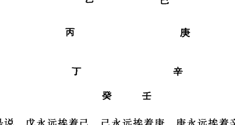

也就是说，戊永远挨着己，己永远挨着庚，庚永远挨着辛，辛永远挨着壬，壬永远挨着癸，癸永远挨着丁，丁永远挨着丙，丙永远挨着乙，乙永远挨着戊，无论谁在前、谁在后，前后邻居是不变的。

为什么要这样排列这个队形呢？原因就是出于军事上行兵打仗的需要。戊、己、庚、辛、壬、癸这六支仪仗队下隐蔽着六甲大将，一甲甲子戊、二甲甲戌己、三甲甲申庚、四甲甲午辛、五甲甲辰壬、六甲甲寅癸，无论谁在前，谁在后，但顺序和队形是不能乱的。丁奇接在甲寅癸后边，因丁奇是军需官，即粮草辎重永远排在部队最后边，但从连环阵来说，它又接近元帅甲子戊，像后勤部一样随时听从司令部元帅的命令和调遣。从长蛇阵看，似乎乙奇在队伍最后，其实不然，因为九宫八卦阵不是一个长蛇阵，而是个首尾衔接、无头无尾的连环阵，所以实际上，乙奇永远挨着甲子戊，即参谋官或者像现代军队的司令部一样永远跟在元帅甲子戊身边。而丙奇，作为武官，作为中央警卫队或现代军队的政治部一样，则永远紧跟司令部，跟着乙奇。换句话说，比如电视连续剧《三国演义》所描写的古代战争，元帅在中军帐里，谋士随时跟在身边，而警卫则站在帐外，后勤粮草官则更远一些。

总之，这是一个布阵的队形，不是一个行军的队形，是正转或倒转，即九支部队在九宫内从一宫到九宫或从九宫到一宫不停地进行演练、变换队形、变换方向的迷魂阵队形。

由此，进一步从奇门遁甲内部运作的机制上证明了它确实来源于军事上的排兵布阵。

具体而言，所谓阳遁，就是从一宫到九宫，按戊、己、庚、辛、壬、癸、丁、丙、乙这个顺序顺排；所谓阴遁，就是从九宫到一宫，按着这个顺序逆排。

这就是过来奇门遁甲书上讲的，阳遁，顺排六仪，即从一宫到六宫分别为戊、己、庚、辛、壬、癸；逆排三奇，即从七宫到九宫为丁、丙、乙。为什么叫逆排三奇呢？因为按十天干正常顺序应是乙、丙、丁，现在倒过来了，所以叫逆排或逆布三奇。阴遁呢，则顺排三奇，即从一宫到三宫，为乙、丙、丁；逆排六仪，即从四宫到九宫，分别为癸、壬、辛、庚、己、戊。

其实，只要记住戊、己、庚、辛、壬、癸、丁、丙、乙这个永远不变的队形顺序，知道阳遁是从一宫到九宫顺排，阴遁是从九宫到一宫逆排，就完全可以了（见图一《遁甲规律表》）。

还有一点，就是元帅甲子戊遁在几宫，就是奇门遁甲的几局。即阳遁时，甲子戊在一宫时，就是阳遁一局；甲子戊在二宫时，就是阳遁二局；依次类推。阴遁时，甲子戊在九宫，就是阴遁九局；在八宫，就是阴遁八局；在七宫，就是七局；依次类推。

#### 遁甲规律表

| 六甲 | 一甲 | 二甲 | 三甲 | 四甲 | 五甲 | 六甲 | 三奇 |
| :--- | :--- | :--- | :--- | :--- | :--- | :--- | :--- |
| | 甲子 | 甲戌 | 甲申 | 甲午 | 甲辰 | 甲寅 | 星奇 | 月奇 | 日奇 |
| 六仪 | 戊 | 己 | 庚 | 辛 | 壬 | 癸 | 丁 | 丙 | 乙 |
| 阳遁 | 一宫 | 二宫 | 三宫 | 四宫 | 五宫（寄二宫） | 六宫 | 七宫 | 八宫 | 九宫 |
| 阴遁 | 九宫 | 八宫 | 七宫 | 六宫 | 五宫（寄二宫） | 四宫 | 三宫 | 二宫 | 一宫 |

图一

换句话说，一提阳遁几局，就指的是甲子戊在几宫；一提阴遁几局，也是指甲子戊在几宫，只不过他们的排列顺序有顺逆之分罢了。

比如说，阳遁三局，我们即知元帅甲子戊在三宫，按阳遁顺排的规律，则二甲甲戌己在四宫，三甲甲申庚在五宫（寄坤二宫），四甲甲午辛在六宫，五甲甲辰壬在七宫，六甲甲寅癸在八宫，丁奇在九宫，丙奇在一宫，乙奇在二宫。

同样，一说阴遁四局，我们即知元帅甲子戊在四宫，按阴遁逆排的规律，二甲甲戌己在三宫，三甲甲申庚在二宫，四甲甲午辛在一宫，五甲甲辰壬在九宫，六甲甲寅癸在八宫，丁奇在七宫，丙奇在六宫，乙奇在五宫（寄坤二宫）。

依次类推。我们只要记熟了六甲隐在六仪下的固定位置，那么我们就可以随时在纸上或手上推演九宫八卦阵即奇门遁甲的格局了。

在纸上速记的方法如图二和图三：

即在纸上随便画一井字，然后填上九宫的固定位置，用几局，就在几宫的格内填上甲子戊，然后按阳遁顺排、阴遁逆排的规律，分别填上己、庚、辛、壬、癸、丁、丙、乙，这样一个奇门遁甲地盘的格局就布好了。

| 己 | | |
|---|---|---|
| 4 | 9 丁 | 2 乙 |
| (甲戌) | | |
| 戊 | 庚 | 壬 |
| 3 | 5 | 7 |
| (甲戌) | (甲申) | (甲辰) |
| 癸 | | 辛 |
| 8 | 1 丙 | 6 |
| (甲寅) | | (甲午) |

| 戊 | 壬 | 庚 |
|---|---|---|
| 4 | 9 | 2 |
| (甲子) | (甲辰) | (甲申) |
| 己 | | |
| 3 | 5 乙 | 7 丁 |
| (甲戌) | | |
| 癸 | 辛 | |
| 8 | 1 | 6 丙 |
| (甲寅) | (甲午) | |

图二：阳遁三局

图三：阴遁四局

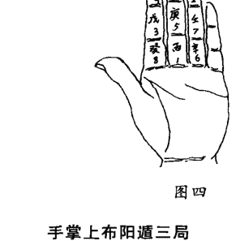

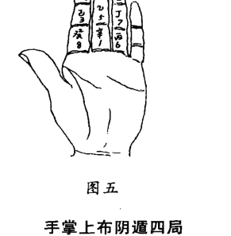

手掌上布阳遁三局

手掌上布阴遁四局

戊、己、庚、辛、壬、癸、丁、丙、乙
3、4、5、6、7、8、9、1、2

戊、己、庚、辛、壬、癸、丁、丙、乙
4、3、2、1、9、8、7、6、5

在手上布局的方法，如图四、图五。即利用左手食指、中指和无名指三个手指横纹隔开的九个空间作为九宫，即戴九履一、左三右七、四、二为肩、八、六为足，然后根据遁甲几局，将三奇六仪分别填进去。图四就是在手掌上布的阳遁三局地盘图，图五就是在掌上布的阴遁四局地盘图。把八卦九宫的位置固定在手上，并牢记阴阳二遁的规律，长此以往，熟能生巧，自然就可以在手上推演奇门遁甲了，这是第一步基本功。

### 第二节 时辰六旬与遁甲一局

由上节得知，用十天干代表军队上的将帅、奇兵和仪仗分别布在九宫八卦阵中，正转、倒转进行演练，共形成阴阳二遁十八种格局，即十八种阵势。在奇门遁甲中就叫阳遁九局，阴遁九局，共十八局，这是地盘上的十八种定局。

我们知道，十天干其实主要是时间符号，所以恢复它们的时间含义，以十天干配上十二地支，一个干支代表一个时辰（古代一个时辰相当于现在两个小时）的话，则六十个时辰，由元帅甲子戊带头，正好演练完一种阵势，一种格局。

即由元帅甲子带班十个时辰：甲子时、乙丑时、丙寅时、丁卯时、戊辰时、己巳时、庚午时、辛未时、壬申时、癸酉时；
二甲大将甲戌带班十个时辰：甲戌、乙亥、丙子、丁丑、戊寅、己卯、庚辰、辛巳、壬午、癸未；
三甲大将甲申带班十个时辰：甲申、乙酉、丙戌、丁亥、戊子、己丑、庚寅、辛卯、壬辰、癸巳；
四甲大将甲午带班十个时辰：甲午、乙未、丙申、丁酉、戊戌、己亥、庚子、辛丑、壬寅、癸卯；
五甲大将甲辰带班十个时辰：甲辰、乙巳、丙午、丁未、戊申、己酉、庚戌、辛亥、壬子、癸丑；
六甲大将甲寅带班十个时辰：甲寅、乙卯、丙辰、丁巳、戊午、己未、庚申、辛酉、壬戌、癸亥。

这样，六甲大将每人值班十个时辰，正好六十个时辰，与循环记时的六十花甲子相一致，而在这六十个时辰中，六甲大将和三个奇兵所在的宫次是固定不变的。比如阳遁一局阵式，甲子始终在一宫戊旗下，甲戌始终在二宫己旗下，甲申始终在三宫庚旗下，甲午始终在四宫辛旗下，甲辰始终在五宫壬旗下，甲寅始终在六宫癸旗下；丁奇始终在七宫星旗下，丙奇始终在八宫月旗下，乙奇始终在九宫日旗下。

由于在六十个时辰中，三奇六仪所在宫次是固定的，所以就形成一种阵式，一种格局，奇门遁甲就叫一局。

这就是时家奇门最根本的规律。见下表《时辰六旬遁甲一局规律表》，这里所谓一旬，不是指十天，而是指十个时辰。

#### 时辰六旬遁甲一局规律表

| 六甲 | 三奇 | 六仪 |
|---|---|---|
| 一、甲子 | 乙丑 丙寅 丁卯 | 戊辰(甲子) 己巳(甲戌) 庚午(甲申) 辛未(甲午) 壬申(甲辰) 癸酉(甲寅) |
| 二、甲戌 | 乙亥 丙子 丁丑 | 戊寅(甲子) 己卯(甲戌) 庚辰(甲申) 辛巳(甲午) 壬午(甲辰) 癸未(甲寅) |
| 三、甲申 | 乙酉 丙戌 丁亥 | 戊子(甲子) 己丑(甲戌) 庚寅(甲申) 辛卯(甲午) 壬辰(甲辰) 癸巳(甲寅) |
| 四、甲午 | 乙未 丙申 丁酉 | 戊戌(甲子) 己亥(甲戌) 庚子(甲申) 辛丑(甲午) 壬寅(甲辰) 癸卯(甲寅) |
| 五、甲辰 | 乙巳 丙午 丁未 | 戊申(甲子) 己酉(甲戌) 庚戌(甲申) 辛亥(甲午) 壬子(甲辰) 癸丑(甲寅) |
| 六、甲寅 | 乙卯 丙辰 丁巳 | 戊午(甲子) 己未(甲戌) 庚申(甲申) 辛酉(甲午) 壬戌(甲辰) 癸亥(甲寅) |
| 阳遁 | 逆布三奇 | 顺布六仪 |
| 阴遁 | 顺布三奇 | 逆布六仪 |

### 第三节 一年二十四节气与阴阳二遁

由上二节得知，以十天干代表军队上的将帅、奇兵和仪仗分别布在九宫八卦阵中，正转、倒转进行演练，共形成阳遁九局、阴遁九局，共十八种格局、十八种阵势。

如果以十天干每一干代表一个时辰，即时家奇门，则六十个时辰即六十甲子正好演练完一局、一种阵势。

推而广之，一年之中一共可以演练多少阵势，或者说多少局呢？

我们知道一个时辰相当于现在记时的两个小时，一天24小时，即十二个时辰，60÷12=5，这样就是5天演练完一局。古人把这五天一局称为一元。

一个节气十五天，正好演练三局，古人把第一个五天这一局称为上元，第二个五天称为中元，第三个五天称为下元，即一个节气配上、中、下三元，一元演一种阵势，一种格局。

一年共二十四个节气，一个节气三元，24×3=72，即共演七十二局。

古人根据八卦九宫阵与时间和空间的关系，对此做了巧妙安排，即以坎卦一宫正北方位对应冬至、小寒、大寒三个节气，艮卦八宫东北方位对应立春、雨水、惊蛰三个节气，震卦三宫正东方位对应春分、清明、谷雨三个节气，巽卦四宫东南方位对应立夏、小满、芒种三个节气，以离卦九宫正南方位对应夏至、小暑、大暑三个节气，以坤卦二宫西南方位对应立秋、处暑、白露三个节气，以兑卦七宫正西方位对应秋分、寒露、霜降三个节气，以乾卦六宫西北方位对应立冬、小雪、大雪三个节气。

在奇门遁甲中，八卦与时间和方位的配比关系，基本上源于《周易》中的后天八卦图，但有几点不同，需提醒读者注意：

+   (1) 周易古典筮法、纳甲筮法、梅花易数等均用的是后天八卦方位（即坎北离南、震东兑西、艮东北坤西南、乾西北巽东南，这点奇门遁甲与之完全相同），八卦的序数，却是用的先天八卦数，即乾一、兑二、离三、震四、巽五、坎六、艮七、坤八，而奇门遁甲中，八卦序数用的是洛书九宫与八卦对应之数，又名后天八卦之数，即坎一、坤二、震三、巽四、中五、乾六、兑七、艮八、离九。

+   (2) 周易古典筮法、纳甲筮法、梅花易数等所用后天八卦方位图与时间的关系是这样的：即北方坎卦对应农历十一月，大雪、冬至二个节气，对应一天中的子时；东北艮卦对应农历十二月和正月，小寒、大寒、立春、雨水四个节气，对应一天中的丑时、寅时；正东震卦对应农历二月，惊蛰、春分二个节气，一天中的卯时；东南巽卦对应农历三月、四月，清明、谷雨、立夏、小满四个节气，一天中的辰时、巳时；南方离卦对应农历五月，芒种、夏至二个节气，一天中的午时；西南坤卦，对应农历六月、七月，小暑、大暑、立秋、处暑四个节气，一天中的未时、申时；西方兑卦对应农历八月，白露、秋分二个节气，一天中的酉时；西北乾卦对应农历九月、十月，寒露、霜降、立冬、小雪四个节气，一天中的戌时、亥时。而奇门遁甲中，八卦八方所对应一天中十二地支的时间与上述筮法完全一致，但对应一年二十四节气和月份则与上述筮法略有不同，它根据“冬至一阳生，夏至一阴生”的原理，阴阳二遁以冬至、夏至二个节气为分界线，这样将八卦八方与时间的对应关系整个地依次往后错了一个节气，即北方坎卦由对应大雪开始，变为对应冬至开始；同时，一个卦一个方位对应三个节气，将上述的不等分（艮卦对应四个节气、坎卦对应二个节气等）变为等分，3x8=24，八卦八方各对应三个节气。正好将一年二十四节气平均分配完毕；这样一个卦一个方位不再是对应一个月份或两个月份，变为对应一个半月，比如北方坎卦对应农历十一月下旬和十二月，东北艮卦对应正月和二月上旬，即一个卦一个方位大致对应45天。

（3）正由于上述原因，八卦的阴阳属性、干支时间的阴阳属性也相应进行了调整，与周易上述几种筮法有了不同。在周易上述几种筮法中，乾、坎、艮、震由于分别代表父亲、中男、少男、长男，为男子为阳性，故称为四阳卦；而巽、离、坤、兑由于分别代表长女、中女、母亲、少女，为女子为阴性，故称为四阴卦。而奇门遁甲中，四阳卦则指对应阳遁四卦的坎、艮、震、巽，四阴卦则指对应阴遁四卦的离、坤、兑、乾；在时间上，则将甲、乙、丙、丁、戊、己、庚、辛、壬、癸这十天干，按顺序一分为二，即甲、乙、丙、丁、戊前五个时辰为五阳时，己、庚、辛、壬、癸后五个时辰为五阴时，所谓阳时利客、阴时利主，即指此。

古人根据“冬至一阳生”用阳遁，“夏至一阴生”用阴遁的原理，对八卦八方九宫与时间的对应关系，做了调整，使从坎一宫对应冬至节开始，离九宫对应夏至节开始，形成一卦一宫对应三个节气的等分格局，见图七。

这个图表中的冬至一七四、小寒二八五、大寒三九六，指的是从冬至节开始的十五天，分别用阳遁一局、七局、四局，小寒节的十五天中分别用阳遁二局、八局、五局，大寒节的十五天中分别用阳遁三局、九局、六局，依次类推。从夏至开始用阴遁，夏至九三六，小暑八二五，大暑七一四，指的是夏至节后十五天分别用阴遁九局、三局、六局，小暑节后十五天用阴遁八局、二局、五局，大暑节后十五天用阴遁七局、一局、四局，依次类推。

某节气的上、中、下三元即三个五天中，分别用阳遁几局或阴遁几局，这是怎么规定的？依据是什么？有什么规律没有？

初学者乍一看，眼花缭乱，感到难以记忆。其实，这种安排既有依据又有规律可循，只要给您讲清规律，您就一下子记住了。

#### 一年二十四节气奇门遁甲用局表

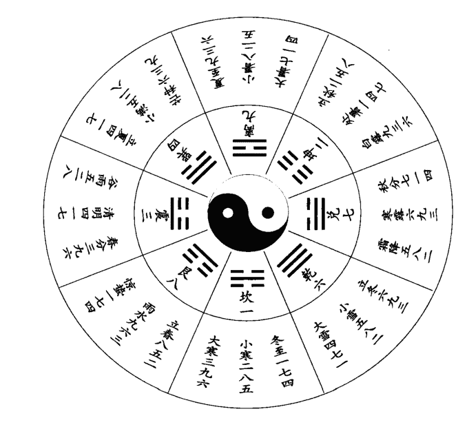

先看阳遁。北方坎卦对应一宫，所以从冬至节开始用阳一局；东北艮卦对应八宫，所以从立春开始用阳八局；东方震卦对应三宫，所以从春分开始用阳三局；东南巽卦对应四宫，所以从立夏开始用阳四局。

次看阴遁。南方离卦对应九宫，所以从夏至节开始用阴九局；西南坤卦对应二宫，所以从立秋节开始用阴二局；西方兑卦对应七宫，所以从秋分开始用阴七局；西北乾卦对应六宫，所以从立冬节开始用阴六局。

总之，八卦在几宫，对应的第一个节气的上元就用阳遁或阴遁几局，即坎、艮、震、巽四阳宫用阳遁；离、坤、兑、乾四阴宫用阴遁。这是第一条规律。

第二条规律，四阳宫即坎、艮、震、巽所分别对应的第二个节气、第三个节气上元用几局，按阳遁顺排而定，即坎一宫冬至上元用阳一局，小寒上元则用阳二局，大寒上元则用阳三局；艮八宫立春上元用阳八局，雨水上元则用阳九局，惊蛰上元则用阳一局；震三宫春分上元用阳三局，清明上元则用阳四局，谷雨上元则用阳五局；巽四宫立夏上元用阳四局，小满上元则用阳五局，芒种上元则用阳六局。

阴四宫正好相反，即离、坤、兑、乾四阴宫所分别对应的第二个节气、第三个节气上元用几局，按阴遁逆排而定，即离九宫夏至上元用阴九局，小暑上元则用阴八局，大暑上元则用阴七局；坤二宫立秋上元用阴二局，处暑上元则用阴一局，白露上元则用阴九局；兑七宫秋分上元用阴七局，寒露上元则用阴六局，霜降上元则用阴五局；乾六宫立冬上元用阴六局，小雪上元则用阴五局，大雪上元则用阴四局。

以上就是每个节气上元（即前五天）所用阴遁或阳遁几局的规律。

那么，每个节气中元、下元用几局是怎么确定的呢？比如为什么冬至节上元用阳一局，中元、下元则分别用阳七局、阳四局，形成“冬至一七四”，小寒节上元用阳二局，中元、下元则分别用阳八局、阳五局，形成“小寒二八五”呢？

甲分别值班十个时辰共演练完一局，也就是六甲分占六个宫位演完一种格局。元帅甲子戊如果在这一局中在一宫，下一局他就轮到占七宫，因为二、三、四、五、六宫分别有二甲甲戌己、三甲甲申庚、四甲甲午辛、五甲甲辰壬、六甲甲寅癸这五员大将占着，下一局元帅甲子戊就得到七宫站位带班了。这样以来，就是局与局之间，即演练完一种阵势再接着排演下一种阵势，中间隔着五个宫位。

由于这种原因，所以冬至上元用完阳一局后，则中元应用阳七局，中间隔着二、三、四、五、六共五个宫位；中元用完阳七局时，往后数过五个宫位八、九、一、二、三，则下元该用阳四局了。小寒上元用阳二局，往后数过五个宫位三、四、五、六、七，则中元该用阳八局了；中元用完阳八局，往后数过五个宫位九、一、二、三、四，则下元该用阳五局了。这就是阳遁“冬至一七四”、“小寒二八五”、“大寒三九六”等阳四宫每个节气中元、下元用几局的依据和规律。

阴遁四宫，由于是逆数倒排，所以每个节气的中元和下元所用阴遁几局，采用倒数过五个宫位的方法，也就知道用几局了。比如夏至节上元用阴遁九局，往后倒数即逆排过五个宫位八、七、六、五、四，则中元应用阴遁三局；再往后倒数过五个宫位二、一、九、八、七，则下元该用阴遁六局了。这就是阴遁“夏至九三六”、“小暑八二五”、“大暑七一四”等阴四宫每个节气中元、下元所用几局的依据和规律。

明白了以上规律，则一年二十四节气，每个节气上、中、下三元该用阴遁几局或阳遁几局，自然就清楚了。

这是掌握奇门遁甲的又一个基本功。

### 第四节 日干支与上、中、下三元

从上一节我们知道了一年二十四节气每个节气所辖十五天中，上、中、下三元所用阴遁或阳遁的局数，但是具体到每一天应该用阳遁几局或阴遁几局，这是怎么确定的呢？有没有规律呢？

这也是很有规律可循的。

我们把六十甲子作为日干支的符号与上、中、下三元对应起来，可排列出下列格局：

| 上元五天 | 中元五天 |
| :--- | :--- |
| ①②③④⑤ | ①②③④⑤ |
| 甲乙丙丁戊 | 己庚辛壬癸 |
| 子丑寅卯辰 | 巳午未申酉 |
| 下元五天 | 上元五天 |
| ①②③④⑤ | ①②③④⑤ |
| 甲乙丙丁戊 | 己庚辛壬癸 |
| 戌亥子丑寅 | 卯辰巳午未 |
| 中元五天 | 下元五天 |
| ①②③④⑤ | ①②③④⑤ |
| 甲乙丙丁戊 | 己庚辛壬癸 |
| 申酉戌亥子 | 丑寅卯辰巳 |
| 上元五天 | 中元五天 |
| ①②③④⑤ | ①②③④⑤ |
| 甲乙丙丁戊 | 己庚辛壬癸 |
| 午未申酉戌 | 亥子丑寅卯 |
| 下元五天 | 上元五天 |
| ①②③④⑤ | ①②③④⑤ |
| 甲乙丙丁戊 | 己庚辛壬癸 |
| 辰巳午未申 | 酉戌亥子丑 |
| 中元五天 | 下元五天 |
| ①②③④⑤ | ①②③④⑤ |
| 甲乙丙丁戊 | 己庚辛壬癸 |
| 寅卯辰巳午 | 未申酉戌亥 |

从以上格局中，我们可以看出这样两条规律：

（一）每一元的第一天的天干，不是甲就是己，古人把这个元头，称为符头。即符头只有二个，不是甲，就是己。

（二）凡上元第一天的地支总是子午卯酉中的一个，中元第一天的地支总是寅申巳亥中的一个，下元第一天的地支总是辰戌丑未中的一个。古人把子、午、卯、酉称为四仲，即冬夏春秋每个季节的中间一个月；把寅、申、巳、亥称为四孟，即春秋夏冬每季的第一个月；把辰、戌、丑、未称为四季，即春秋冬夏每季最末一月。从五行寄生十二宫来讲，子、午、卯、酉均为帝旺之月，寅、申、巳、亥均为长生之月，辰、戌、丑、未均为四库之月。

总之，由以上规律可以得知，日天干凡是甲、己者均为符头，即每元的第一天；凡日地支为子午卯酉者，均为上元第一天；凡日地支为寅申巳亥者，均为中元第一天；凡日地支为辰戌丑未者，均为下元第一天。

换句话说，上元符头即上元头一天的日干支为甲子、甲午、己卯、己酉；中元符头即中元头一天的日干支为甲寅、甲申、己巳、己亥；下元符头即下元头一天的日干支为甲辰、甲戌、己丑、己未。

知道了这个规律，我们就可以根据每一天的干支来确定它属于上、中、下三元中的哪一元，再根据节气，就知道这一天该用奇门遁甲的几局了。

比如1995年1月1日，农历为甲戌年十二月初一，这天日干支为壬辰。应该用奇门遁甲哪一局呢？先找符头，壬辰属甲申旬，符头为己丑，辰戌丑未为下元，故知这一天该用下元。又根据这一天在冬至之后，小寒（初六小寒）之前，所以应用冬至下元。冬至节十五天上中下三元所用奇门格局是一七四，因而知道这天应用阳遁四局。

又如乙亥年正月初六，日干支为丁卯，符头为甲子，子午卯酉为上元，又知初五立春，故为立春上元，立春节十五天上中下三元分别用八五二局，故知这天应用阳遁八局。

### 第五节 超神、接气与置闰

从上两节我们知道，时家奇门每个节气所用的元，既与节气相联系，又与日干支相联系。时家奇门按每个节气十五天分别用上中下三元，一年二十四节气，15×24=360，共计360天，而一年的实际时间即地球绕太阳运行的周期是365.2422日，二十四节气是按照地球绕太阳运行的实际时间、度数制定的（这实际是阳历，中国农历是阴阳历的结合），即每一个节气平均15.2184日，不是正好十五天。这样以来，每个节气交节的这一天，并不能都与符头即上元头一天的日干支碰到一起，由此就出现了三种情况：

第一种情况，交节的这一天正好碰上上元符头，即日干支为甲子、甲午、己卯、己酉，古人称之为“正授”。但是，实际上这种情况并不多见。

第二种情况，上元符头在节气的前边，这叫“超神”，超在节气神前边，这种情况较多。比如乙亥年（1995）农历正月初五下午3点24分交立春节，但这一天日干支为丙寅，符头为甲子，即立春前正月初三日干支为甲子，从初三这天就是立春上元了，应用阳遁八局。这就叫“超神”。

第三种情况，节气在前，即交节时间在前，上元符头在后，这叫“接气”，一般在置闰之后才出现这种情况。

实际上，大部分情况是上元符头在节气的前边，这种差距，有时只有一两天，有时四五天，最多可达九天以上。当上元符头超过节气九天的时候，就要置闰。

所谓置闰，就是接着这个节气下元的最后一天，再从上元第一天开始，把这个节气的上中下三元重复一遍。这样重复十五天，本来是“超神”，一下子就变为“接气”了，即上元符头跑到下一个节气的后边了。

但是，置闰有一个规定，就是只有在芒种和大雪这两个节气时才能置闰。这是为什么呢？因为芒种在夏至前，属于阳遁的最后一个节气；大雪在冬至节前，属于阴遁的最后一个节气。从冬至开始实行阳遁，从夏至开始实行阴遁。行阴道，为了使符头与节气尽量接近和一致，所以在改变阴阳遁之前，把符头调整好，使符头与节气不要差得太远。如果在别的节气置闰，就容易使阴阳混淆，把应该阳遁的时间搞到阴道里边去，或把应该阴道的时间搞到阳遁中来。

置闰的目的是调整二十四节气与奇门遁甲上中下三元的对应关系。古人多数主张用置闰法来解决这一矛盾，以保持以甲、己日为符头，使时家奇门用局从日干支就可以确定下来。

也有少数人不主张置闰，可称之为“无闰派”。不置闰即可解决上述矛盾，有两种方法，一种叫拆补法，又称拆补局。

拆补法仍然把上中下三元放在一个节气之中，而且仍采用日干支甲子、甲午、己卯、己酉为上元符头，甲寅、甲申、己巳、己亥为中元符头，甲辰、甲戌、己丑、己未为下元符头。但由于多数情况下不是“正授”，而是“超神”，所以从交节以后所用上元天数必然不满五天，这就叫拆。到了交下一个节气之前，用完下元之后，一般还有两三天可以用来补上元所缺的天数，这就叫补。也就是说，多数情况下交节后所用上元为残局，用完下元又来弥补这个残局，出现残上——中——下——补上的局面。

还有一种方法，由茅山道人所创，既不用置闰，又不用拆补法，直接从每个节气的交节时刻开始，即用本节气遁甲上元局，上元用满六十个时辰转入中元，中元用满六十个时辰转入下元。这样以来，就打破了根据日干支符头之日地支子午卯酉为上元，寅申巳亥为中元，辰戌丑未为下元的规律。而且还会出现遁甲下元有所取舍的情况，即前一个节气下元尚未用完六十个时辰，节气一到就停止不用，即要舍弃一部分时间；前一个节气下元已用完六十个时辰，下个节气尚未到，仍需继续用前一个节气下元，这就叫取。这种方法，进行奇门预测应用时，必须按照事先编制好的无闰法奇门遁甲历才能进行，只记住日干支和交节日就不行了。

置闰法和不置闰法，究竟谁对谁错，这不仅是个学术研究上的分歧问题，而且是个涉及到实践应用中影响奇门预测准确率的实际问题。因为由于置闰和不置闰的方法不同，必然造成某些天某些时辰所用遁甲局数的差异，即某一天或某些时辰，按置闰法应用阳遁或阴遁几局，而按照拆补法或无闰法则应该用阳遁或阴遁另外的局数。也就是说，同一天或同一个时辰，按置闰和不置闰方法，则会出现用局不同的情况，用局不同，形成的格局也不同。那么，在这一天或这一个时辰问事，则会出现两种预测结果。哪一个符合实际，应验率高，这就需要大量的实践来验证了。

就是在置闰派中也有不同意见。

比如1995年即农历乙亥年，冬至交节在阳历12月22日（即农历十一月初一）丁亥日这一天，而早在交节的前九天，即阳历12月13日（农历十月二十二日）戊寅日，阴遁大雪四七一就完了，从阳历12月14日（农历十月二十三日）己卯日这一天就该转阳遁一局了，即应该按冬至一七四了，也就是上元符头己卯离“正授”的冬至节还有九天，即“超神”达到九天了。

面对这一情况，刘广斌在其所著《奇门预测学》一书所附1991-2000年奇门预测专用历书中，采取了在冬至前置闰的方法，即从己卯日这一天开始，又将大雪阴遁四七一上中下三元重复一遍，一直到阳历12月29日（农历十一月初八）甲午这一天，才转用阳遁一局，即开始冬至阳遁一七四（见《奇门预测学》）。这样把本来属于“超神”的状况，变成了“接气”，把“超神”九天变为“接气”八天。

而刘金喜主编的《通用易学万年历》（沈阳出版社1993年3月出版）和郭志诚、李至高合著的《揭开奇门遁甲之谜》（东北师范大学出版社1993年6月出版）二书则与刘广斌不同，均从阳历12月14日（农历十月二十三日）己卯日直接进入冬至上元，开始用阳遁一局，一直到1996年夏至前才开始置闰，即从阳历1996年6月11日（农历四月二十六日）己卯日将芒种六三九又重复使用一次，这样到阳历6月26日（农历五月十一日）甲午日才开始用夏至上元，即阴遁九局，而夏至交节日是阳历6月21日（农历五月初六），这样使本来“超神”十天的符头，变成“接气”五天了。

我同意刘金喜和郭志诚、李至高二人将置闰放在1996年夏至前的意见，因为在1995年冬至前符头“超神”并未超过九天，只刚达到9天头上，这样到1996年夏至前置闰后，“接气”只有五天，使符头与节气比较接近。

当然，按刘广斌的置闰法，到1996年夏至后，也是从阳历6月26日（农历五月十一日）甲午日开始转阴遁九局，也是“接气”五天。

但是，在1995年冬至到1996年夏至这半年之间，由于置闰意见不一致，必然会出现每天用局不同的情况，比如1996年4月3日（农历二月十六日），干支庚午，按刘广斌《奇门预测学》所编奇门专用历应用阳遁9局，而按刘金喜和郭志诚、李至高二书所编奇门历则就应用阳遁1局。同一天，你用9局，我用1局，必然预测同一事物会出现不同的格局，预测结果也就不会完全一样了。

### 第六节 提倡使用拆补法定局

超神、接气与置闰的问题，古人与今人一样，由于意见不一致，究竟超过多少天才置闰，是在冬至前置闰，还是在夏至前置闰，搞得一般人无所适从，不知道每一天该用奇门遁甲的阳遁几局或阴遁几局，似乎只有依靠少数所谓“奇门大师”编好的奇门遁甲专用历书才能使用。

有的古籍，更把这个问题神秘化，说什么“闰奇闰奇有妙诀，神仙不肯分明说”，“超神接气若能明，便是天边云外客”。

实际，这个问题并不复杂，也不神秘，更没有什么妙诀。实质是，一年地球绕太阳的周期是365.2422日，而奇门遁甲按二十四节气，一个节气上、中、下三元布局，一元五天，共有三百六十天，还有5.2422日无法安排，所以才产生了符头难以“正授”，而出现“超神”和“接气”现象。为了解决这一矛盾，才出现了置闰法与不置闰的分歧。

置闰的办法，无论是“超神”超过九天还是达到九天头上就置闰，都带有很大的人为成分。无论是在冬至前置闰，还是夏至前置闰，都是把原来十五天的一个大雪节或芒种节变成人为的三十天，把阴遁四七一或阳遁六三九重复使用两次，这并不符合实际的天文现象和地球围绕太阳运行的规律，违背了老子讲的“人法地，地法天，天法道，道法自然”的原则。

而奇门遁甲预测学，正是按照老子讲的“人法地，地法天，天法道，道法自然”的原则，力图把握天、地、人三者和时间与空间的统一性的一门学问。从这个意义上讲，奇门遁甲置闰派在理论上是站不住脚的。

为解决上述矛盾，古代先哲又提出不置闰的主张，历史上称为“无闰派”。无闰派有二种方法，一种是拆补法，二是茅山道人创造的方法。茅山道人的方法必须按照事先编制好的奇门历书才能应用，比“置闰派”的方法还复杂，所以也不实用。

拆补法既把上、中、下三元放在每一个节气之中，又遵循六十甲子循环中子、午、卯、酉为上元，寅、申、巳、亥为中元，辰、戌、丑、未为下元的规律，只要一进入交节时辰，就用这个节气规定的遁甲局（见本章第三节《一年二十四节气奇门遁甲用局表》），这样就出现了残上—中元—下元—补上或残下—上元—中元—补下的局面，因而又叫做拆补局。

古人虽然有不少人使用拆补法定用局，但对它的应用原理阐发得不够清楚，甚至觉得这种方法打破了上、中、下三元整齐的用局，是否违背了奇门遁甲的原理。浙江省上虞市学员赵汉雄同志在跟我学习奇门遁甲的过程中，对这个问题进行了研究，并写出《奇门遁甲用局表的应用原理》一文，为体现教学相长、共同研讨的宗旨，现将该文附下：

#### 《奇门遁甲用局表》的应用原理

《奇门遁甲用局表》是奇门预测学决定问事日的取局的依据。其用法本是简单易行的：只要知道这天在哪个节气中，日干支归属于哪个符首，就可在《用局表》中找到对应的用局，但是后人在具体应用此表时出了诸多疑惑。

其一：地球的公转周期约365又1/4日；此表能排出总日数是5×3×24=360日，两者相差5又1/4日。那么在用完全年24节气的上、中、下三元以后，还有5又1/4日（合63时辰）该怎么取局？

其二：由于地球轨道是椭圆，太阳必居椭圆二个焦点中的一个，因而太阳对地球的引力不能处处相等；我们能对轨道测定24个等分点（即24节气的始点，其中冬至是近日点，夏至是远日点），但地球不可能以相等时间通过这些等分区段。这样对超过15天的节气只给上中下三元就不够用；不到15天的节气又用不完。对这些“尺有所长、寸有所短”的零星时辰，古贤将怎样安排它们的取局？

笔者认为：古人的一年也是365.2422日，古历的24节气也必有长有短，古贤在制订这张用局表时如果真会不顾事实，确定“一年360天，每节气15天”，此表一问世即是废品，又何能留传至今使用至今呢？

考虑到用局表是一种指导书；它不同于每年一本的历书，而是要能应用于任何一年的历书。

本文将讨论《用局表》能适应任何一本年历的充足条件及其原理。

##### 1. 用局表是对各节气消息卦的指示。

天道（十天干）运行是以10为周期，地道（十二地支）运行是以12为周期。因而在连续60变中必出现一次天道地道整合之局，这类出现在甲子戊所居宫位上的整合之局起了消息卦的作用，即在此局中可以分辨值符值使的起始位置。

当然在甲戊己、甲申庚……的所居宫位上也可以出现天道地道整合之局。但分别推之，它们也必是每60变整合一次。只是古人专注于甲子戊这只“领头羊”，麻雀解剖一只足矣！

##### 2. 消息卦的演进规律。

消息卦是每隔60时辰翻一次牌。这有点像老式自鸣钟从第一次报时到第二次报时，分针必须走满60格。所不同的是它的面盘上只有三个数字，“冬至一七四”，“小寒二八五”等等。

为什么继阳遁一局以后必是阳遁七局，继阳遁七局以后必是阳遁四局？

这可用简单数学证之：因为地盘共9宫，值使走9步必回到原宫，第十步才移出1宫，60变中共有6次移宫，必从原宫位移出6宫，阳遁1+6=7，所以如阳一局是消息卦，那么接下来的消息卦应是阳七局；继阳七局的消息卦必是阳四局（7+6-9=4）。而阴遁，如阴九局是消息卦，那么接下来的消息卦必是9-6=3，即阴三局；继阴三局之后必是3+9-6=6，即阴六局。

消息卦自动演进的规律在24节气的用局表中都能验证成立，使我们能够对超过180时辰的节气用完上中下三元以后补充取局。

##### 3. 节气能调整消息卦系统。

假设冬至节有200个时辰，那么在“一七四”用完以后该取什么局？显然继阳四局后的消息卦必是阳一局（4+6-9=1）。于是在冬至节气内必是一七四一七四一……直到200时辰用完为止。

此例可证：消息卦是一个全封闭的系统，它由三个元素组成，按一定顺序循环出现。阳一阳七阳四是冬至节气内部特有的消息卦系统。

接冬至的小寒节用局是二八五系统。二八五系统不能由一七四系统自动演进，在彼时甲子戊即使移入二宫八宫五宫并不出现天道地道整合之局，可是一交小寒节气，阳二阳八阳五就有了消息卦的特征，而此时阳一阳七阳四失去消息卦特征。在全表24节气中都有如此突变，迫使我们接受一个假设：节气能调整消息卦系统。

##### 4. 用局表中的太极圈。

古贤在用局表中央嵌着阴阳鱼并非装饰，乃是指示此表是以太极原理制订的。只有看懂此表中的太极圈才能正确使用此表。

首先，24节气排成阳遁半圈、阴遁半圈是有事实根据的。从冬至到芒种，地球是从近日点向远日点运动，地球受太阳引力逐渐减弱，节气时间持续延长。增长为阳；离日运动为阳（因为太阳为“阳”，与阳相背相斥时该物必为阳），定为阳遁半圈明矣！夏至起，地球进入向日运动半圈，节气时间持续缩短，定此阴遁半圈完全有根据。一种可以分出阴和阳的圆圈运动正是太极圈，来表征它是最形象的，但又怎样分辨其中的阴和阳呢？它的阴阳就在“隐”和“显”。

从系统内部看，任何时刻只能有一个消息卦当政，当政时它处显态，不当政时它处隐态。

从全年的大系统看，一个消息卦系统是时隐时显，例如阳遁时，一七四系统在冬至、惊蛰、清明、立夏四个节气中处显态，其他节气它处隐态；阴遁时，它在大暑、处暑、秋分、大雪四个节气中处显态，其他节气中它处隐态。

由此可知：“冬至一七四”实是一个小太极圈，这个小太极圈不仅内部不停运动，还随着全年的大太极圈作时隐时显的运动，这同地球一边自转一边公转的情况相似。

太极圈是无头无尾，无始无终的，因而也就可以随处为头随处为尾，一切取决于节气的开始和结束。下面以实例来说明怎样从这种观念使用节气用局表。

1996年芒种节开始于6月5日17时41分，即阴历四月二十（癸酉日）酉时。节气全程189时辰，用局表为“芒种六三九”。

癸酉日的符头是己巳，所以它是中元第五天，按表取阳三局，此局用3个时辰；即遇上甲戌日（下元符首），按表启用阳遁九局，此局用满60时辰，遇己卯日（上元符首）启用阳遁六局（按照消息卦演进规律，阳九局经60时辰必启动阳六局，9+6-9=6。可以看到用“演进规律”启动和用“符头”启用是完全吻合的），阳遁六局用满60时辰必启动和启用（正好遇上甲申日，中元符首）阳遁三局；此局用满60时辰启动和启用阳遁九局，阳遁九局用到第六个时辰，芒种节全部时间用完（3+60+60+60+6=189），接下来的己巳时正是1996年夏至日的交节时间，由“夏至九三六”阴遁主政了。

笔者认为这样用法是符合节气主大局，符合首定用局的原则，个个节气都这样用法，还有什么超神、接气、置闰等等问题呢？就是碰到闰年闰月的历书，这张用局表也无须改变，因而它能世世代代用下去，显示它的太极圈的面貌。

##### 5. 《奇门遁甲用局表》的物理模型。

为使本文的观点得到清晰直观的归纳，笔者给出一个用局表的物理模型。

前面已说明各消息卦系统都是独立封闭的，不能从一七四系统自动产生二八五、三九六系统，那么这些独立的封闭的系统究竟从哪里来？从阳遁一局的演局过程来看，一七四是甲子戊的消息卦系统、二八五是甲戌己的消息卦系统、三九六是甲申庚的消息卦系统……因为在阳一局演到第十一时辰甲戌己所在宫位上出现天道地道整合之局，这正是消息卦的特征，此时甲戌己居二宫，以每经60变再出消息卦的规律推之，它必是二八五系统。同理，第二十一时辰甲申庚在三宫上也出现消息卦，由此演出三九六系统。如果我们把甲午辛、甲辰壬、甲寅癸的消息卦都推演出来，分别是四一七、五二八、六三九等等，以最简约原理归纳，真正有独立性的就是“一七四”、“二八五”、“三九六”三个系统。节气可以调动其中一个系统作为自己的消息卦系统。

笔者用一个“氢原子模型”来说明它们之间的关系。三个独立的消息卦系统相当于三重核外电子轨道；被隐去的“甲”相当于一个电子，电子“甲”受激以后能在这三重轨道间跃迁，进入某重轨道就照这轨道运行，从哪个地点进入就从哪里开始，直到它再被激发脱离此轨道为止。因为电子只有一个，而且仅当电子跃入时，某重轨道的存在和性质才能显示出来；空载的轨道是一种隐态的存在；三重轨道都呈波浪形，轨道相互穿越时有交接点。阳遁是这个模型的顺旋态，阴遁是它的逆旋态。

赵汉雄在这里讲的使用奇门遁甲用局表的方法，实际就是古人用的拆补法。只要有一本每年每月每日干支及二十四节气交节时辰的历书，对照用局表，每个人都可以确定任何一天应使用的奇门遁甲局数，而且不会产生任何分歧。

为了使大家进一步学会这种方法，我再举一些例子加以说明。

（1）比如阳历1996年2月份的用局：

2月1日戊辰日，在大寒之后，符头是甲子，子午卯酉为上元，应用大寒上元，大寒用局是三九六系统，故这一天应用阳遁3局。

2月2日己巳日，正是符头所在之日，寅申巳亥为中元，故应用大寒中元即阳9局。

2月3日庚午日，符头是己巳，自然也是阳9局。

2月4日辛未日，这一天比较复杂，按历书知道这天的己亥时（21时08分）交立春节，从凌晨戊子时至晚上戊戌时，这11个时辰在立春之前，故仍属于大寒中元，应用阳9局；从己亥时交立春以后，即进入立春八五二系统，而2月4日辛未、5日壬申、6日癸酉，符头仍是己巳，故应为中元，所以从辛未日己亥时开始一直到癸酉日癸亥时，这25个时辰应用立春中元，即阳5局。

2月7日甲戌日，辰戌丑未为下元，故应用立春下元阳2局，一直到2月11日癸亥时。

2月12日己卯日，子午卯酉为上元，故从这一天到2月16日癸亥时，应用立春上元阳8局。

2月17日甲申日，寅申巳亥为中元，故从这一天开始应用立春中元阳5局。

2月19日丙戌日丁酉时（17时01分）交雨水节，从这个时辰开始进入雨水九六三系统，但丙戌日和丁亥日、戊子日均属中元范围，故应用雨水中元阳6局。

2月22日己丑至26日癸巳属于下元范围，应用雨水下元阳3局。

2月27日甲午至29日丙申属于上元范围，故应用雨水上元阳9局。

（2）比如阴历1939年（己卯）年五月的用局：

五月初一乙酉日，符头为甲申，在芒种节范围内，芒种六三九，应用芒种中元阳3局。直到五月初四戊子日。

五月初五己丑日，应用芒种下元阳9局；一直到五月初六庚寅日癸未时。

五月初六庚寅日甲申时交夏至节，从此进入阴遁系统，夏至九三六，从甲申时一直到五月初九的癸亥时，应用夏至下元阴6局。

五月初十甲午日，至十四日，应用夏至上元阴9局。

五月十五日己亥日至十九日癸卯日，应用夏至中元阴3局。

五月二十日甲辰日又用夏至下元阴6局，直到二十二日丙午日的壬辰时。

五月二十二日丙午日癸巳时交小暑节，从此进入小暑八二五系统，因符头是甲辰，所以从这时至二十四日的癸亥时，均用小暑下元阴5局。

五月二十五日己酉日，进入小暑上元，应用阴8局。一直到二十九日的癸亥时。

五月三十日甲寅，进入小暑中元，应用阴2局。

（3）又如阳历2002年12月份的用局：

12月1日癸卯日，在小雪节内，符头是己亥，属小雪中元，小雪五八二，所以应用阴8局。

12月2日甲辰至6日戊申，属小雪下元，应用阴2局。

12月7日己酉日壬申时交大雪节，这一天从甲子时至辛未时仍属小雪范畴，故应用小雪上元阴5局；但从壬申时开始进入大雪四七一系统，所以从这时到12月11日癸丑日癸亥时，则应用大雪上元阴4局。

12月12日甲寅至16日戊午，属大雪中元，应用阴7局。

12月17日己未至21日癸亥，属大雪下元，应用阴1局。

12月22日甲子日，这一天戊辰时交冬至节，辰时以前的甲子、乙丑、丙寅、丁卯4个时辰仍属大雪系列，符头是甲子，故这4个时辰应用大雪上元阴4局。从戊辰时开始交冬至节，进入阳遁的大系统，符头是甲子，所以应用冬至上元，冬至一七四，故应用阳遁1局，一直到26日戊辰日的癸亥时。

12月27日己巳，进入冬至中元，应用阳7局。直到31日癸酉日的癸亥时。

通过以上例子，可以明白，对于任何一年任何一月任何一日任何一个时辰，只要有一本历书在手，又记住奇门的用局表，自己都可以独立地确定它。

所以，我提倡和推广“无闰派”的拆补法。运用这种方法确定用局，既符合宇宙间天体运行的规律，又省去了超神、接气和置闰的麻烦。

超神、接气与置闰，充满了人为的因素，造成大量的错位现象，使许多时候，已经进入某节气之内，但却仍在用前一个节气的用局；尚未进入某个节气，却已提前在用这个节气的用局；特别是置闰的时候，把一个节气的用局重复用两遍，这更违背了自然规律。

为了摆脱奇门预测在用局上的混乱和繁杂，大家应该都来使用简便、一致又符合自然规律的无闰拆补法。这对于普及奇门预测，又会克服掉一个大的障碍。

使用拆补法定局，必然在某些日子会出现与传统置闰法定局不同的状况，即按拆补法这一天应用阳遁某局或阴遁某局，而按置闰法这一天则应用另外的局，二者在实际应用中预测准确率如何？经过我和我的学生的大量实践验证，多数情况下，拆补局比置闰局提供的信息量更大，准确率更高。当然也不排除，少数情况下，置闰局似乎更准一些。这个问题，大家还可以在实践中进一步验证。

### 第七节 地盘与天盘、人盘、神盘

以上所讲时家奇门演局的规律，都是讲的六甲将帅和三个奇兵，根据不同季节、不同日子、不同时辰，在九宫八卦阵上排演的规律，也就是在地盘上排演的规律。

而奇门遁甲用于军事作战，用于预测，用于选择最佳时间和方位，用于趋吉避凶，还必须考虑特定时空内的其他因素。我们的祖先，根据影响战争胜负的三大要素，即天时、地利、人和的辩证关系，根据阴阳五行、天人感应、宇宙全息思维的认知原理，奇门遁甲在确定了地盘的基础上，又安排了天盘、人盘和神盘三层要素。

天盘，就是讲天体运动对地球和人的影响。天上有九大行星，并非现代天文学上观测到的实际星座，而是古人在天人感应观中，凭经验和直感发现的与地球上九个方位和周易八卦有对应关系的九种天体运动能量的代称。

这就是与北方、坎卦、一宫对应，五行属水的天蓬星，又名贪狼星。

与西南方、坤卦、二宫对应，五行属土的天芮星，又名巨门星。

与东方、震卦、三宫对应，五行属木的天冲星，又名禄存星。

与东南方、巽卦、四宫对应，五行属木的天辅星，又称文曲星。

与中方、五宫对应，五行属土的天禽星，又称廉贞星。

与西北方、乾卦、六宫对应，五行属金的天心星，又称武曲星。

与西方、兑卦、七宫对应，五行属金的天柱星，又名破军星。

与东北方、艮卦、八宫对应，五行属土的天任星，又名左辅星。

与南方、离卦、九宫对应，五行属火的天英星，又名右弼星。

地盘是五天一变，即九宫八卦阵，五天换一种阵势，五天换一局，共有阴遁九局，阳遁九局，十八种阵势。这就是说，在五天一元即一局中，地盘上的阵势、格局是不变的，地盘是不动的。

而天盘上的九星是一直在运转的。九星运动的规律，是一个时辰换一个宫位，即随时辰天干而动，时辰的天干在哪一宫，值班的星球就运转到那一宫，其他星球依次运转。

具体而言，根据预测时的时辰干支，首先找出这一干支所在的旬，是甲子旬，还是甲戌旬、甲申旬、甲午旬、甲辰旬或甲寅旬。知道了哪一句，就知道了地盘上是六甲中哪一员大将在带班，这员大将站在几宫带班，与他所在宫位对应的天上九星之一就是值班的星座，奇门遁甲中叫值符。

比如冬至上元某日戊戌时预测，首先找出戊戌时属于甲午旬，冬至上元用阳遁一局，元帅甲子戊在一宫，大将甲午辛属于第四甲，自然就在四宫，即在甲午旬中由他在四宫带班值班十个时辰。这是地盘上的阵势。与地盘上值班大将甲午辛所在四宫对应的天上九星是天辅星，那么这个旬中天盘上就是天辅星为值班的星座，传统上就叫值符。值符运转的规律是随时辰的天干。到戊戌时，天辅星运转到哪一宫呢？戊戌时的天干是戊，戊是元帅甲子戊的仪仗，阳一局元帅甲子戊在一宫，所以这时值班的星座天辅星运转到了一宫。如果是在甲午旬中的壬寅时间卦，时干是壬，壬是五甲大将甲辰的仪仗，阳一局甲辰壬在五宫、寄坤二宫，因此值符天辅星在壬寅时就运转到五宫，也寄坤二宫。同样，癸卯时，天辅星转到六宫；丁酉时，由于时干丁奇在七宫，天辅星就转到七宫。

以上是九星运转的规律，也就是奇门预测中拨转天盘的方法。

第二层要素，就是人盘的设置。人盘又叫门盘。它是我们祖先根据阴阳五行和周易八卦学说，根据空间不同方位对人体生理及人类生产、生活、行军打仗等等活动利弊影响的不同特点而设置的。共设八门，与八卦、八方相对应。

- 这就是与北方、坎卦、一宫、天蓬星对应，五行属水的休门。
- 与东北方、艮卦、八宫、天任星对应，五行属土的生门。
- 与东方、震卦、三宫、天冲星对应，五行属木的伤门。
- 与东南方、巽卦、四宫、天辅星对应，五行属木的杜门。
- 与南方、离卦、九宫、天英星对应，五行属火的景门。
- 与西南方、坤卦、二宫（含五宫）、天芮星（含天禽星）对应，五行属土的死门。
- 与西方、兑卦、七宫、天柱星对应，五行属金的惊门。
- 与西北方、乾卦、六宫、天心星对应，五行属金的开门。

八门的运转规律是随时宫，即按照阳遁顺行、阴遁逆行，随着时辰的地支和九宫的顺序运转，也是一个时辰换一个宫位。

具体而言，首先要找出在某局某旬中值班的门吏是谁，奇门遁甲就叫值使，即八门中哪个门在值班。值使的确定以值符为准，也就是说，天上值班的星座是谁，与它对应宫次的八门之一就是在人间值班的门吏。

比如上边讲的冬至上元阳一局中某日戊戌时间卦，找到旬头是四甲甲午辛，与地盘甲午辛所在四宫对应的天盘上的天辅星是值符，与它对应的杜门就是值班的门吏，传统上叫值使。值使杜门怎么运转呢？它根据阳遁顺行、阴遁逆行，按照时辰地支和九宫的次序运转，甲午辛在四宫，即地支午时杜门在四宫，未时在五宫，申时在六宫，酉时在七宫，戌时在八宫。即到戊戌时，值使杜门运转到八宫。如果是癸卯时，按照午（四）、未（五）、申（六）、酉（七）、戌（八）、亥（九）、子（一）、丑（二）、寅（三）、卯（四）顺行，即卯时，值使杜门又运转到四宫。

又如夏至上元某日己巳时问卦，用阴遁九局，己巳时属于甲子旬，元帅甲子戊在九宫，与九宫对应的天盘上的天英星为值符，景门为值使。按照阴遁逆行的原则，景门随时辰地支和宫次逆行，即子时在九宫，丑时在八宫，寅时在七宫，卯时在六宫，辰时在五宫，巳时在四宫，即到己巳时，景门运转到四宫。到癸酉时，则午（三）、未（二）、申（一）、酉（九），即景门又运转到九宫了。

第三层要素，就是神盘的设置。神盘又叫八诈门、八诈盘、八将盘、针盘、顶盘。它同六爻预测法中的六神、六兽有类似之处。

它是古人根据阴阳五行学说，在天、地、人相互感应中，发现的八种影响人类生活吉凶祸福和举事成败得失的神秘能量，并分别给予命名，传统上又叫神煞。

这就是禀东方青龙木，为天乙之神的值符。它是八神的元首、九星的领袖，所到之处，百恶消散。又名小值符，以区别于天盘上九星值班的大值符。

禀南方火，为虚诈之神的腾蛇。性柔而口毒，专司惊恐怪异之事。
禀西方阴金，为荫佑之神的太阴。性阴匿暗昧。
禀东方木，为护卫之神的六合。性和平，专管婚姻交易中介之事。
禀西方之金，为凶恶刚猛之神的白虎（下隐有勾陈）。性好杀，专司兵戈争斗杀伐病死之事。
禀北方水，为奸谗小盗之神的玄武（下隐有朱雀）。性好阴谋贼害，专司盗贼逃亡口舌之事。
具有坤土之象，万物之母，为坚牢之神的九地。性柔好静。
具有乾金之象，万物之父，为威悍之神的九天。性刚好动。

八神排列的顺序，在阳遁九局中，顺时针方向，依次是值符、腾蛇、太阴、六合、白虎（勾陈）、玄武（朱雀）、九地、九天；在阴遁九局中，它们按逆时针方向排列，次序仍然是值符、腾蛇、太阴、六合、白虎（勾陈）、玄武（朱雀）、九地、九天。其中太阴、六合、九地、九天为四吉神。

八神运转的规律比较简单，有两种说法，一种认为小值符永远追随大值符。阳遁时用阳遁八神的顺序，阴遁时用阴遁八神的顺序。每个时辰预测时，只要找出大值符，即天盘上值班的星座之后，大值符运转到几宫，小值符也运转到几宫，其他七神依次旋转即可。另一种说法，认为小值符运转比较缓慢，每旬即每十个时辰才运转一个宫次。《奇门预测学》作者刘广斌先生即持此观点，并用于实践。也有的书把这种用法叫做地盘八神。

总之，奇门遁甲由地盘、天盘、人盘、神盘四层组成，将地上九宫、八卦、八方与天上九星、人间八门、自然界八种神秘力量（神煞），同时间，即一年二十四节气和月、日、时辰，六十甲子巧妙地组合在一起，构成一个具有宇宙全息特征的立体时空运动模型，我们不妨叫做宇宙统一信息场，以之用于预测和选择最佳时空、趋吉避凶。

这种思维模式、思维方法，值得我们研究。它在实际应用中的准确率和应用价值更值得我们研究。

## 第三章 时家奇门的起局方法

### 第一节 掌上快速起局法

为了使大家掌握奇门遁甲的起局方法，我首先介绍掌上快速起局法。以左手掌为用。

第一，先把十二地支放在手上。以左手无名指的最下端横纹为十二地支的第一位，即子位。以中指最下端横纹为第二位，即丑位。食指的最下端横纹为第三位，即寅位。食指的中下节纹为第四位，即卯位。食指中上节纹为第五位，即辰位。食指尖端为第六位，即巳位。中指尖端为第七位，即午位。无名指尖端为第八位，即未位。小拇指尖端为第九位，即申位。小拇指中上节纹为第十位，即酉位。以小拇指中下节纹为第十一位，即戌位。小拇指最下端横纹为第十二位，即亥位，见图一。

图一 掌上起局法

十天干甲、乙、丙、丁、戊、己、庚、辛、壬、癸是游动不定的。从地支子位上起甲子，按顺时针方向，乙丑、丙寅、丁卯、戊辰、己巳、庚午、辛未、壬申、癸酉，第一次排完十天干，正好是甲子旬，按日干支是十天，按时辰是十个时辰，这就是一甲。从起支戌上起甲戌，按顺时针方向，排到癸未，是二甲，甲戌旬。从地支申上起甲申，排到癸巳，是三甲，甲申旬。从地支午上起甲午，排到癸卯，是四甲，甲午旬。从地支辰上起甲辰，排到癸丑，是五甲，甲辰旬。从地支寅上起甲寅，排到癸亥，是六甲，甲寅旬。这样循环一圈，正好排完六甲、六十甲子。这样以来，把天干、地支、六十甲子都放在左手掌上了。

第二，把八卦、八门、九宫也放在左手掌上。以左手中指的下节为一宫、坎卦、休门，以食指的下节为八宫、艮卦、生门，以食指的中节为三宫、震卦、伤门，以食指的上节为四宫、巽卦、杜门，以中指的上节为九宫、离卦、景门，以无名指的上节为二宫、坤卦、死门，以无名指的中节为七宫、兑卦、惊门，以无名指的下节为六宫、乾卦、开门。以中指的中节为五宫，寄坤二宫（如图一所示）。

总之，十二地支定在左手的食指、中指、无名指和小拇指四指的关节处；而八卦、八门、九宫定在左手食指、中指、无名指的三个指头上。

第三，时家奇门的起局步骤和方法：

第一步，根据二十四节气和日干支，确定问事日所应用局数。

古人把一年二十四节气，每个节气上、中、下元所用局数，总结为两个歌诀，这就是“阳遁歌”和“阴遁歌”。

#### “阳遁歌”

冬至惊蛰一七四，小寒二八五同推；
大寒春分三九六，芒种六三九是真；
谷雨小满五二八，立春八五二相随；
立夏清明四一七，九六三从雨水期。

#### “阴遁歌”

夏至白露九三六，小暑八二五重逢；
秋分大暑七一四，立秋二五八流通；
霜降小雪五八二，大雪四七一相同；
处暑排来一四七，立冬寒露六九三。

首先要根据历书知道问事日处在哪一个节气，然后根据日干支，甲、己为符头，日支子午卯酉为上元，寅申巳亥为中元，辰戌丑未为下元的规律，确定该日为上、中、下某元，由此得知，该用阳遁几局或阴遁几局。

第二步，根据用局，将三奇六仪布在手上。

知道所用局数，就可以根据三奇六仪的排布规律，将该局地盘上的三奇六仪，按九宫八卦八门的位置，布在左手食指、中指和无名指上。

第三步，根据日上起时法，找出时辰干支和旬首。

首先要明确现在钟表记时与十二地支的对应关系，这就是：23点~1点为子时，1~3点为丑时，3~5点为寅时，5~7点为卯时，7~9点为辰时，9~11点为巳时，11~13点为午时，13~15点为未时，15~17点为申时，17~19点为酉时，19~21点为戌时，21~23点为亥时。即两个小时为一个时辰。

日上起时法，古人又叫五鼠遁元或五子遁元，因为在六十花甲子循环记时中，十二地支乘以五等于六十，即每个地支用五次，每天从子时开始，共有五个不同天干的子时，所以叫五子遁元或五鼠遁元。歌诀如下：

甲、己还加甲，乙、庚丙作初；
丙、辛从戊起，丁、壬庚子居；
戊、癸何方发，壬、子是真途。

这就是说，日天干是甲、是己的，子时起甲子，在手上即从左手无名指下端横纹十二地支子位上起甲子，按顺时针方向转，依次为乙丑时、丙寅时、丁卯时、戊辰时、己巳时、庚午时、辛未时、壬申时、癸酉时、甲戌时、乙亥时。日天干是乙和庚的，从子位起丙子，一天十二个时辰，依次是丁丑时、戊寅时、己卯时、庚辰时、辛巳时、壬午时、癸未时、甲申时、乙酉时、丙戌时、丁亥时。日天干是丙和辛的，从子时起戊子，一天十二个时辰，依次是己丑时、庚寅时、辛卯时、壬辰时、癸巳时、甲午时、乙未时、丙申时、丁酉时、戊戌时、己亥时。日天干是丁和壬的，从子时起庚子，一天十二个时辰，依次是辛丑时、壬寅时、癸卯时、甲辰时、乙巳时、丙午时、丁未时、戊申时、己酉时、庚戌时、辛亥时。日天干是戊和癸的，从子时起壬子，一天十二个时辰，依次是癸丑时、甲寅时、乙卯时、丙辰时、丁巳时、戊午时、己未时、庚申时、辛酉时、壬戌时、癸亥时。

这里有个规律，即凡十天干化合日（甲、己合化土，乙、庚合化金，丙、辛合化水，丁、壬合化木，戊、癸合化火），分别依次从五阳干（甲、丙、戊、庚、壬）起子时。

找出问事时的时辰干支以后，再看这个时辰属于哪一句，即在以六甲打头的哪一甲的十个时辰之内，找出旬首是六甲的哪一甲（甲子、甲戌、甲申、甲午、甲辰或甲寅）。

第四步，根据旬首所在宫位，找出值符和值使。

六甲旬首每一甲在地盘上值班十个时辰。与旬首所在地盘宫位对应的天盘上的九星之一就是值符，也就是在天上值班的星球。与旬首所在地盘宫位对应的八门之一就是值使，也就是在人间值班的门吏。

第五步，根据“值符随时干，值使随时宫”的原则，拨转天盘和人盘。

由于知道了用几局，六仪三奇所在宫位已经确定，或写在纸上，或记在左手掌食、中、无名三指所规定的九宫八卦方位上，而问事时辰的天干即六仪三奇中的一个，所以它所在宫位已经明确，将大值符即天盘上值班的九星之一直接拨转到该宫即可。

值使随时宫，就是值班的八门按地支时间和所在宫位依次运行，从值使所在宫位和其他地支时间数起，阳遁顺行，阴遁逆行，一直数到问事时辰的地支，宫位排到几数，就是几宫，即值使所落宫位。知道所落宫数，即将奇门遁甲盘上人盘的值使门拨转该宫位就可以了。

比如正月戊寅日壬戌时问卦，应用阳遁二局，甲寅癸为旬首，在地盘七宫，天柱星为值符，惊门为值使。六仪中的壬在六宫，所以天柱星就直接拨转到六宫即可（值符随时干）。惊门值使原在七宫，旬首既然是甲寅癸，说明惊门值使第一个时辰即地支寅时在七宫，按阳遁顺数的原则，卯时在八宫，辰时在九宫，巳时到一宫，午时到二宫，未时到三宫，申时到四宫，酉时到五宫，戌时到六宫。这就是到问卦的壬戌时，值使惊门转到了六宫。

如在左手掌上操作，即从食指下端横纹的寅位起七宫，按顺时针方向，数八、九、一、二、三、四、五、六，到小拇指中间第二道横纹戌位处，正好是六，说明值使惊门到壬戌时落在六宫。然后，按此拨转人盘即可。

第六步，按小值符追随大值符的原则，拨转八神盘。

至此，起局的过程就算完成了。

这里需要说明的是，初学者可以自制阳遁九局、阴遁九局十八个活盘（如刘广斌《奇门预测学》一书所示），也可以使用邱宗云研制的阴阳两面奇门遁甲活盘（又名《易经活解多用转盘》，北京师范大学出版社出版，霸州市邱庄子鹏程塑料厂印制），当然也可以不使用任何式盘，按问事时间到郭志诚、李至高合著的《揭开奇门遁甲之谜》一书（东北师范大学出版社出版）中直接去查找已经排好的格局。

但是，最便捷的还是在手上操作。当然，为了避免错误，减少脑子记忆的负担，也可以自制一个最简明扼要、只有二十四个字、上中下三层（地盘、天盘、门盘）的奇门遁甲手盘，装在衣兜里，随时与手上操作相结合。

### 第二节 纸上快速起局法

这里介绍由我设计的纸上快速起局法。这种方法一是便捷，不容易出错，可以反复审视起出的格局，便于断卦；二是可以保留预测资料，手上起卦法或用式盘，测后留不下任何资料，过后往往都忘记了，不便积累经验，进行研究和提高，而纸上起局法，把年月日时和格局都写在纸上，预测结果也可以写在纸上，这样便于积累经验，找出规律，提高预测技能和准确率；三是这种方法一劳永逸地甩开了任何形式的式盘，只要身上带一枝笔一张纸，随时随地就可以预测，不必一天到晚把一个奇门遁甲式盘带在身上，一旦丢失或忘记带，则两手抓瞎，难于进行预测工作。因此，这可以说是目前最先进实用的方法了。

这种方法的第一步，是先把阳历的年月日时换算成干支历。

第二步是根据节气和上中下三元的规律，确定求测日所用遁甲局数，是阳遁几局，或阴遁几局。

第三步，在纸上画一个井字形九宫格或者米字形八宫格，将一至九宫分别按奇门遁甲格局填在格内。

第四步，在纸上一至九宫格内，按遁甲几局三奇六仪的排布规律，即戊、己、庚、辛、壬、癸、丁、丙、乙这个永定例、永远不变的顺序，将六仪三奇布在一至九宫格内。

第五步，找出预测时辰的旬首，比如乙亥时，甲戌为旬首；辛亥时，甲辰为旬首；戊戌时，甲午为旬首；即预测时辰是六甲中哪一甲大将在地盘值班。同时根据该甲所隐的六仪，即知道地盘上该甲在几宫值班了。

第六步，根据地盘上六甲中值班一甲所在宫位，即可找出与它对应的天盘上值班的九星之一，这就是值符；人盘上值班的八门之一，这就是值使。这样把这个时辰内的值符和值使就找出来了，并一一写在纸上。

第七步，根据“值符随时干”的规律，看预测时辰的天干在地盘几宫，就将值符直接写在这个宫内，同时将它原在地盘宫内的六仪三奇也随之写在它如今运转到的这个宫内。

第八步，值符落宫确定了，将其余八星连同它们原来地盘内所携带的六仪三奇也一一写在运转到的宫内，这样用事时辰天盘运行的格局就确定了。

第九步，根据“值使随时宫”的规律，将值使的八门之一按时间和宫位运行的顺序，确定它所落宫位，然后把它写在该宫格内。同时，将其余七门按固定顺序，一一写在其他宫格之内。这样，八门运转到问事时辰的格局也就一目了然了。

第十步，根据阳遁顺时针运转，阴遁逆时针运转的规律和小值符永远追随大值符的规律，将神盘中的小值符首先写在大值符所落宫内，然后，将腾蛇、太阴、六合、白虎（勾陈）、玄武（朱雀）、九地、九天按顺序一一写在其他七个宫内。这样，八神盘在问事时辰运行的格局也就确定了。

至此，奇门遁甲起局或叫起卦的过程就全部完成了，每个宫内天、地、人、神及三奇六仪所形成的格局，就一目了然了。

下面举几个例子，具体加以说明。

**例一，1995年阳历6月11日上午9点30分问测。**

按阳历6月11日为阴历五月十四日，年干支为乙亥，月干支为壬午，日干支为癸酉，时辰干支为丁巳。

第一步，先找出日干支癸酉的符头，由癸酉往前数，己巳为符头，己巳（6月7日）日前一天是芒种，根据寅申巳亥为中元的规律，可知己巳到癸酉这五天属于芒种中元。芒种六三九，即芒种上中下三元分别用阳遁六局、三局、九局，芒种中元，自然该用阳遁三局了。这样，就可以确定6月11日癸酉日该用阳遁三局了。

第二步，在纸上画一个井字形九宫格，分别填上一至九宫的号码，然后按阳遁三局六仪三奇排布的规律，将六仪三奇分别写在九宫格内（如下图）的最底层，以表示为地盘上格局。

乙亥年壬午月癸酉日丁巳时，甲寅旬，阳遁三局，天任星为值符落九宫，生门为值使落二宫。

| 九天 | 值符 | 螣蛇 |
| :--- | :--- | :--- |
| 开门 | 休门 | 生门 |
| 天蓬星(丙) | 天任星(癸) | 天冲星(戊) |
| 巽四、己 | 离九、丁 | 坤二、乙 |
| 九地 | | 太阴 |
| 惊门 | | 伤门 |
| 天心星(辛) | 天禽星 | 天辅星(己) |
| 震三、戊 | 中五、庚 | 兑七、壬 |
| 玄武 | 白虎 | 六合 |
| 死门 | 景门 | 杜门 |
| 天柱星(壬) | 天禽星(庚) | 天英星(丁) |
| 艮八、癸 | 天芮星(乙) | 乾六、辛 |
| | 坎一、丙 | |

图二 阳遁三局图

第三步，找出丁巳时的旬首，为甲寅，说明丁巳时，是六甲大将甲寅癸在地盘值班，看一下刚才所画的图二，因甲寅隐在癸下边，所以得知甲寅癸在地盘艮八宫值班。由此，与地盘艮八宫对应的天盘九星之一天任星为值符，人盘八门之一生门为值使。这样把值符、值使就找出来了，一一写在纸上。

第四步，根据“值符随时干”的原则，丁巳时时干丁在地盘离九宫，所以直接将值符天任星写在离九宫格内，并将他所携带的六仪癸（即甲寅癸）也写在九宫内，见图二。然后按九星的固定顺序，将天冲星（戊）写在离九宫前边（按顺时针方向转）的坤二宫内，天辅星（己）写在兑七宫，天英星（丁）写在乾六宫，天芮星（乙）天禽星（庚）一并写在坎一宫（因五宫寄二宫，随二宫天盘一起转动），天柱星（壬）写在艮八宫，天心星（辛）写在震三宫，天蓬星（丙）写在巽四宫。这样，丁巳时天盘运转的格局就确定了。而且，每个宫内天盘地盘三奇六仪形成的格局也一目了然了。比如离九宫形成癸加丁，蛇天矫的格局，坤二宫形成戊加乙，兑七宫为己加壬，乾六宫为丁加辛，坎一宫为庚加丙和乙加丙，艮八宫为壬加癸，震三宫为辛加戊，巽四宫为丙加己。

第五步，根据“值使随时宫”的原则，阳遁顺行，如此，地盘甲寅癸在艮八宫，这表明寅时值使生门在艮八宫，卯时则到九宫，辰时则到一宫，巳时则到二宫，这样就知道丁巳时，值使生门转到坤二宫了。于是，将生门写到坤二宫格内。然后，按八门排列的固定顺序，依次在七宫写上伤门，六宫写上杜门，一宫写上景门，八宫写上死门，三宫写上惊门，四宫写上开门，九宫写上休门。这样八门与八宫的格局也一目了然了。比如九宫，休门落离九宫，休门属水，离九宫属火，水克火，即门克宫的格局。又如坤二宫，上乘生门，生门属土，坤二宫也属土，二土比和的格局。又如兑七宫，上乘伤门，伤门属木，兑七宫属金，金克木，宫克门的格局，见图二。

第六步，根据小值符永远追随大值符的规律，在纸上布八神。大值符天任星落九宫，于是，我们也把神盘中的小值符写在离九宫格内，然后按阳遁八神顺时针运转的规律，依次将腾蛇写在坤二宫，太阴写在兑七宫，六合写在乾六宫，白虎写在坎一宫，玄武写在艮八宫，九地写在震三宫，九天写在巽四宫。这样八神落宫形成的格局也一目了然了，见图二。

至此，在纸上所起癸酉日丁巳时阳遁三局的格局就算完成了。

下一步就是根据所问所测何事进行判断了。

#### 例二，1995年8月13日晚上8点问测。

按8月13日为阴历七月十八日，月干支为甲申，日干支为丙子，晚上8点为戊时，丙辛起戊子，戊时为戊戌，属甲午旬。

第一步，根据日干支丙子，先找符头，为甲戌，辰戌丑未为下元，丙子日正当立秋节（阳历8月8日）之后，所以应为立秋下元，立秋正当坤二宫，立秋二五八，所以下元应用阴遁八局。

第二步，在纸上画一个九宫格，布上阴遁八局地盘的格局。由于井字形九宫格跟流行的奇门遁甲式盘的样式不同，使人看起来似乎不如式盘明显，为此，我又设计了米字形八宫格，将流行奇门遁甲盘外层为地盘、中间为天盘和人盘、最里层为神盘的格式，改造为最里层为地盘，往外依次为天盘、人盘和神盘，这样画在纸上，又便捷又清楚，又接近传统的奇门遁甲式盘，使人看起来用起来更方便了。现将米字形八宫格（将中五宫直接与坤二宫写在一个格内）阴遁八局的格局在纸上画好写好，因为是阴遁，六仪三奇戊、己、庚、辛、壬、癸、丁、丙、乙是布（见阴遁八局图）。

第三步，根据戊戌时属甲午旬，知道地盘上是甲午辛在五宫值班（寄坤二宫），由此得知天盘上是天禽星为值符，人盘是死门为值使。

第四步，根据“值符随时干”的运转规律，一看时干戊在地盘八宫，就知道戊戌时，值符天禽星（连带天芮星）运转到了八宫，于是把天禽星（连它携带的辛）、天芮星（连它携带的丁）一并写在八宫格内。然后按九星的固定顺序，依次将它前边（按顺时针方向）的七宫的天柱星（己）写在三宫内，六宫的天心星（庚）写在四宫内，一宫的天蓬星（丙）写在九宫内，八宫天任星（戊）写在二宫内，三宫天冲星（癸）写在七宫内，四宫天辅星（壬）写在六宫内，九宫天英星（乙）写在一宫内。这样天盘九星运转的格局就出来了，见图三。

乙亥年甲申月丙子日戊戌时，甲午旬，阴遁八局，天禽星为值符，落八宫；死门为值使，落一宫。

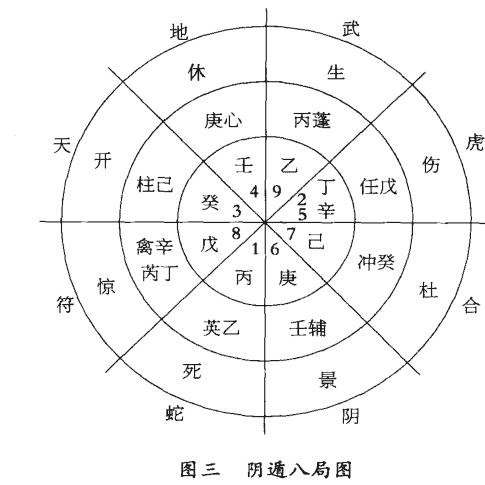

第五步，根据“值使随时宫”的原则，值使死门午时在五宫，阴遁逆行，未时四宫，申时三宫，酉时二宫，戌时一宫，戊戌时死门落一宫，即将死门写在一宫格内。然后，依照八门固定的顺序，依次将惊门写在八宫，开门写在三宫，休门写在四宫，生门写在九宫，伤门写在二宫，杜门写在七宫，景门写在六宫。这样，戊戌时，八门运转的格局也就确定了，见图三。

第六步，根据小值符追随大值符的原则，将小值符写在八宫内，然后按阴遁逆时针方向，依次将螣蛇写在一宫内，太阴写在六宫内，六合写在七宫内，白虎写在二宫内，玄武写在九宫内，九地写在四宫内，九天写在三宫内。这样，八神盘在戊戌时运转的格局也一目了然了，见图三。

这样，每个宫内天、地、人、神以及三奇六仪所形成的格局就完全清楚了，就可以进入判断的过程了。

## 第四章 奇门预测符号的象数理含义

### 第一节 九宫八卦的象数理含义

奇门遁甲以九宫八卦作为宇宙天人合一、立体全息思维模型的基础。
其中九宫来源于洛书。

《周易·系辞传》上说：“河出图，洛出书，圣人则之。”传说黄河中有一匹神马，驮出一幅图，这就是河图；洛水中出现一只神龟，龟背上的图案，就是后世流传的洛书。南宋朱熹说：河图、洛书是“天地自然之易”。

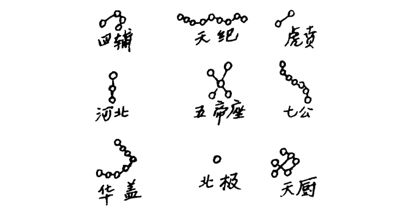

据天文学家考证，所谓洛书是古人对天空星相的观察，是我们祖先在晴朗的夜空，以北极为坐标，以斗柄所指九个方向最明亮的星为标志，而画下来指导人们判定方位和方向的记号。我们可以看一下天空这九组星，即正北方的一颗北极星，正南方九颗为一组的天纪星，正东方三颗为一组的河北星，正西方七颗为一组的七公星，东北方八颗为一组的华盖星，东南方四颗为一组的四辅星，西南方两颗为一组的虎贲星，西北方六颗为一组的天厨星，正中央五颗为一组的五帝座（见图一），正好是所谓洛书“戴九履一，左三右七，二四为肩，八六为足，中央为五”的格局和数字。所以，所谓洛书九宫，它来源于天文星相。当然这种天文星相图也可能在动物诸如龟甲上出现类似图案，这正如天文图像有时会在母鸡生出来的鸡蛋上显出一样。总之，是古人仰观天文、俯察地理、远取诸物、近取诸身而总结概括抽象，以九个不同方位，一至九，九个基本数字来描述揭示宇宙空间天人合一规律的符号，具有全息思维特征。

所以洛书九宫既代表九个不同方位，是奇门遁甲地盘上九宫的来源，又是奇门遁甲天盘九星的来源。

> 《周易·说卦传》中说：“帝出乎震，齐乎巽，相见乎离，致役乎坤，说言乎兑，战乎乾，劳乎坎，成言乎艮。万物出乎震，震东方也。齐乎巽，巽东南也。齐也者，言万物之洁齐也。离也者，明也，万物皆相见，南方之卦也。圣人南面而听天下，向明而治，盖取诸此也。坤也者，地也，万物皆致养焉，故曰致役乎坤。兑正秋也，万物之说也，故曰说言乎兑。战乎乾，乾西北之卦也，言阴阳相薄也。坎者，水也，正北方之卦也，劳卦也，万物之所归也，故曰劳乎坎。艮，东北之卦也，万物之所成终而所成始也，故曰成言乎艮。”

这就是所谓文王后天八卦，即将代表万物的八卦与时间（春夏秋冬、一年十二个月、一天十二个时辰）空间（东、南、西、北、东南、东北、西南、西北八方）相结合而形成的对应关系图。

奇门遁甲将后天八卦时间空间方位图与洛书九宫组合在一起，就形成了地盘的九宫格局，这就是北方坎卦一宫，西南坤卦二宫，东方震卦三宫，东南巽卦四宫，中央五宫，西北乾卦六宫，西方兑卦七宫，东北艮卦八宫，南方离卦九宫。

这样以来，九宫除了具有时间和空间的信息含义以外，还具有八卦和万物的信息，因为《易经》以八卦代表万物。

为了掌握奇门遁甲九宫的象、数、理信息含义，我们就必须了解和掌握八卦的象、数、理含义，弄懂八卦所概括的特定内涵和外延，熟悉八卦的万物类象。

#### （一）乾卦

乾为天，为太阳，表现天的功能、意识及刚健的性质，还代表冰、雹、霰。

在国家为国君，为主席，为总统；在单位为一把手，主要领导人；在家庭为父亲，为大人，为老人，为长辈人；在社会为名人，公门人，宦官；在性别为男，在年龄为老头。

在场所为京都，为大城市，形胜之地，高亢之所。

在方位为西北方，为南方（先天八卦方位），为上方，为高处。

在时间为秋季，农历九、十月，戌、亥年、月、日、时，立冬至大雪45天。

在数字为一（先天八卦数）、六（后天八卦数）、四、九（五行金数）。

在动物为马、象、天鹅、狮子。

在静物为金玉、珠宝、圆物、木果、刚物、冠、镜。

在人体为头、右腿（九宫位），肺，骨骼，男性生殖器。

在颜色为白色、大赤色、玄色。

在五味为辛、辣。

#### （二）坤卦

坤为地，表现地的功能、潜意识及柔顺的性质。在天时又为阴云、雾气、冰霜。

在场所为田野，为大地、为乡村、为平地。
在方位为西南方，北方（先天八卦方位），下方，底层。
在时间为农历六月、七月，未、申年、月、日、时，辰、戌、丑、未五行为土年、月、日、时，立秋至白露45天。
在数字为二（后天八卦数）、八（先天八卦数）五、十（五行土数）。
在动物为牛，为牝马、为猫、为百兽。
在静物为水泥、砖瓦、五谷、布帛、丝绵、方物、柔物，土中之物，牛肉、食品、大车、锅。
在人体为腹，右肩（九宫位），脾、胃、肌肉，女性生殖器。
在颜色为黄色、黑色。
五味中为甘味、甜味。

#### （三）震卦

震为雷，表示震动、奋起的性质和状态。在天象为雷雨、雷鸣、地震、火山喷发。
在国家和单位为当权的二把手；在家庭为长男；在社会为驾驶员、运动员，警察、法官、军人、飞行员、列车员、社会活动家、舞蹈演员、足球爱好者、狂人、壮士。
在场所为工厂、广播电台、乐器店、游乐场、机场、发射场、车站、舞厅、歌厅、闹市、战场、森林、草木茂盛之所。
在方位为东方，东北方（先天八卦方位）。
在时间为农历春二月，春分至谷雨45天，卯年、月、日、时。
在数字为四（先天八卦数）、三（后天八卦数、五行木数）、八（五行木数）。
在动物为龙、蛇，善鸣之马、善鸣之鸟，百虫，鲤鱼。
在静物为木、竹、苇、乐器、蔬菜、鲜花、树木、电话、飞机、汽车、火箭、鞭炮、闹钟、花草繁鲜之物。蹄、肉、山林野味。
在人体为足，为肝胆，为左胁。
在颜色为青、绿，碧色。
五味为酸。

#### （四）巽卦

巽为风，表示自由活动和渗透性。天象代表刮风、台风、飓风、龙卷风等。

在家庭为长女、大女儿；在社会为科技人员、教师、僧尼、仙道之人，气功师、练功者、商人、营业员、木材经营者、手艺人、能工巧匠、额头宽的人，头发细长而直的人，优柔寡断的人，自由职业者。

在场所为邮局、管道、线路、隘路、过道、长廊、寺观、草原、竹林、芦苇荡、升降机、传送带。

在方向为东南方，西南（先天八卦方位）。

在时间为春夏之交，农历三、四月，辰、巳年、月、日、时，立夏至芒种 45 天。

在数字为五（先天八卦数）、四（九宫数）、三、八（五行木数）。

在人体为股、肱、胆、气管、神经、左肩（九宫位）、练功之元气。

在动物为鸡、鸭、鹅、蝶、蜻蜓、蛇、蚯蚓、带鱼、鳗鱼、鳝鱼、斑马等。

静物为树木、木材、木制品、纤维品、丝线、绳子、麻、风扇、干燥机、飞机、气球、气垫船、帆船、蚊香、木香、兰花、草药、羽毛、枝叶、腰带、海带、下面有口的器物。

在颜色为绿色、蓝色。
五味为酸。

#### （五）坎卦

坎为水，为月亮，表示艰难、险阻的状态。在天象为雨、雷、露、霜。

在家庭为中男，中年男子；在社会为江湖之人、舟人、盗贼、匪徒，为数学家、医生、律师、逃亡者、黑社会之人、诈骗犯、劳务人员、酒鬼、娼妇、自来水公司人员。

在场所为江河、湖、海、沟、渠、井、泉、下水道、洼地、酒店、冷饮店、浴室、澡堂、水族馆、地下室、暗室、自来水公司、鱼塘、饮食店、妓院。

在人体为肾脏、膀胱、泌尿系统、生殖系统、血液、内分泌系统、耳、肛门。

在动物为猪、为鼠、为狐狸、水鸟、鱼类、水中动物、美脊之马、劳苦之马、脊椎动物。

在静物为油、酒、醋、酱油、饮料、石油、药品、水车、轮子、刑具、蒺藜、丛刺、带核的果品、冷藏设备、浮萍、潜水艇。

在方位为北方，西方（先天八卦方位）。

在时间为农历十一月，子年、月、日、时，冬至至大寒45天。

在数字为一（九宫数）、六（五行水数，一、六水）。

在颜色为黑色，或白色（玄空飞星颜色一白、二黑、三碧、四绿、五黄、六白、七赤、八白、九紫）。

五味为咸味。

#### （六）离卦

离为火，为日，表示光明、美丽的性质和状态。天象为晴天、热天、酷暑、烈日、干旱、虹霓、霞光。

在家庭为中女、中年妇女；在单位为中层干部；在社会为中间层次人物，为美人、美容师、文人、作家、艺术家、演员、明星、革命家、军人、画家、编辑、侦察员、纪检人员。

在场所为朝阳的场所、名胜古迹、圣地、教堂、华丽的街道、电影院、电视台、画院、美术馆、图书馆、印刷厂、广告塔、电车站、冶炼厂、放射室。

在方位为南方，东方（先天八卦方位）。

在时间为夏天，为农历五月，为午年、月、日、时，夏至至大暑45天。

在数字为三（先天八卦数）、九（九宫数）、二、七（五行火数）。
在人体为眼、头部、心脏、小肠。
在动物为野鸡、孔雀、凤凰、仙鹤，为虾、蟹、螺、贝类，为鳖、龟、“变色龙”，萤火虫。
在静物为字、画、美术品、报纸、刊物、图书、杂志、契约、文书、合同、书信、照相机、摄影机、录像机、电视机、复印机、照明用具、广告、奖状、电报、连环画、化妆品、火炉、打火机、火柴、烧烤物品、焊枪、霓虹灯。
在颜色为红色、赤色，花色，紫色（九紫）。
五味为苦味。

#### （七）艮卦

艮为山，为土，表示静止和安定的状态。天象为云，为雾，为岚。
在家庭为少男，青少年；在社会为少年、儿童，为土建人员、宗教人员、官僚、贵族、继承人、警卫、守门人、矿工、狱吏、石匠、储蓄所人员。
在场所为山、山地、丘陵、高台、堤坝、休息室、坟场、阁寺、房屋、监狱、公安机关、派出所、大楼、城墙、仓库、宗庙、祠堂、矿山、采石场、银行、贮藏室。
在方位为东北方，西北（先天八卦方位）。
在时间为冬春之交，农历十二月和正月，丑、寅年、月、日、时，立春至惊蛰 45 天。
在数字为七（先天八卦数）、八（九宫数）、五、十（五行土数）。
在人体为鼻、背、手指、关节、左腿（九宫位）、脚趾、乳房、脾、胃、结肠。
在动物为狗、为虎、鼠、狼、熊、牛等有牙、有角的动物，还有昆虫、爬虫、家畜等有尾的动物。
在静物为岩石、山坡、土堆、坟墓、墙壁、门坎、阶梯、台阶、门板、石碑、土炕、柜台、桌子、床。
颜色为黄色、棕黄、咖啡色，或白色（八白）。
五味为甘，甜味。

#### （八）兑卦

兑为泽，为雨，表示喜悦和言词。天象为潮湿天气，气压低、露水、阴雨连绵。

在家庭为少女、小女孩；在社会为与嘴有关的职业，如讲师、教授、演说家、讲解员、翻译、巫师、占卜者、媒婆、传达室人员、歌唱家、音乐家、相声演员、娱乐场所人员、娼妓、牙科医生、外科医生等。

在场所为沼泽地、峡谷、洼地、湖泊、池塘、滑冰场、游乐园、会议室、音乐厅、茶座、饭店、废墟、旧屋、山口、洞穴、井。

在方位为西方，东南（先天八卦方位）。

在时间为农历八月，酉年、月、日、时，秋分到霜降45天。

在数字为二（先天八卦数）、七（九宫数）、四、九（五行金数）。

在人体为口、舌、牙齿、咽喉、肺、右胁（九宫位）、肛门等。

在动物为羊、豹、豺、猿猴、水鸟、兔子、沼泽动物、鸡鸭。

静物为石榴、胡桃、饮食用具、带口的器物、刀剑、剪刀、玩具、破损物品，垃圾箱等。

颜色为白色，或赤色（七赤）。

五味为辛、辣。

总之，在奇门遁甲中以九宫八卦涵盖了天、地、人、时间、空间万事万物。

### 第二节 天干地支的信息含义

##### （一）十天干所主

奇门遁甲特别重用十天干：甲、乙、丙、丁、戊、己、庚、辛、壬、癸。

甲：五行属阳木，位居东方。五脏受病主胆，在人体表主头部。五味主酸，颜色主青色。其质劲健性直，体形长方，有萌动作用。得令为栋梁，失令为废材；受克太过则无用，生旺太过则漂泊无依。性格过于自负，不能娴于世故。在奇门中为首领，为主帅，经常逼在六仪之下。

乙：五行属阴木，位居东方。五脏受病主肝，体表主脖项和肩。颜色主碧或浅绿色。五味主酸甘。体质柔嫩。得令则繁华茂盛，失令则枯萎。性格柔顺，依附世情。在奇门中为日奇，为医生，为女人，为妻子。

丙：五行属阳火，位居南方。五脏受病主小肠，体表主肩或额。颜色主紫赤色，五味苦辣。性格刚烈，工作清廉。得令得时则战果辉煌，失令则灰槁无力。能成大材，但难持久。在奇门中为月奇，为有权威之人，为婚姻的第三者男人。

丁：五行属阴火，位居南方。五脏受病主心脏，体表主胸和舌。颜色淡红，五味主苦。形体秀丽清高。性格温和而有心计。得令则洞察奸邪；失令则愁苦、呻吟。在奇门中为星奇，为玉女，婚姻中第三者女人。

戊：五行属阳土，位居中方。五脏受病主胃，体表主胁和鼻子。颜色深黄，五味甘辛。性格刚烈暴躁，体形敦厚。得令则豪杰果敢，失令则愚笨痴呆。在奇门中又为天门，又代表资本、钱财等。

己：五行属阴土，位居中央。五脏受病主脾，体表主腹部和面部。颜色浅黄，五味甘辛。性格温顺，体质沉静。得令则教化万物，失令则洁身自好。在奇门中又为地户，代表坟墓等。

庚：五行属阳金，位居西方。五脏受病主大肠，体表主脐轮和筋。颜色主白，五味辛辣。体形长方。性格刚健锐利，得令呈其专制，失令则失去雄威。其性坚执能屈人，而不屈于人。在奇门中又代表贼人、丈夫、仇人、公安干警等。

辛：五行属阴金，位居西方。五脏受病主肺，体表主胸部和股部。颜色浅白，五味苦辣。体形方正沉静。性格忠诚爽柔，其为用坚耐似玉，得令则黄钟，失令则瓦缶。在奇门中往往代表罪人或犯过错误的人。

壬：五行属阳水，位居北方。五脏受病主膀胱三焦，体表则主小腿。颜色深黑，五味主咸。性格柔而险，可共忧患，难以同乐。得令则济物利人，失令则妨贤害国。在奇门中又代表与流动有关的事物。

癸：五行属阴水，位居北方。五脏受病主肾和心包，体表则主足。颜色浅黑，五味咸浊。性格阴柔浅露，得令则从龙变化，狐假虎威；失令则沉溺灰心，或摇尾乞怜。在奇门中往往代表与女性、与性生活有关系的事物或人。

##### （二）十天干阴阳旺衰及吉凶

在奇门遁甲中，甲、乙、丙、丁、戊前五位为五阳时，己、庚、辛、壬、癸后五位为五阴时。

时辰遇五阳时，利客不利主，做事宜先动。五阳为喜神，出军征战，远行求财，迁徙起造，百事可为而得利。逃亡者不可得。古人云：得阳干者飞而不止，利客先举。

时辰遇五阴时，利主不利客，做事宜后动。五阴为恶神。举兵御敌，待敌动后自己再动可决胜。不可拜官迁徙，婚嫁出行，举造百事。宜按兵不动，密谋策划，坐收渔人之利。逃亡者可得。古人云：得阴干利为主，伏而不起则利。

十天干之间的关系有冲克、化合：甲、庚相冲，乙、辛相冲，壬、丙相冲，癸、丁相冲，即除戊、己中央土之外，五行之间相克，阳克阳、阴克阴为冲。甲、己合化土，乙、庚合化金，丙、辛合化水，丁、壬合化木，戊、癸合化火。甲、己之合为中正之合，乙、庚之合为仁义之合，丙、辛之合为权威之合，丁、壬之合为淫荡之合，戊、癸之合为无情之合。

十天干旺衰，有生旺死绝表，与四柱预测所用相同。即甲木长生在亥，帝旺在卯，死在午，墓在未，绝在申；乙木按阳死阴生，逆行十二宫，长生在午，帝旺在寅，死在亥，墓在戌，绝在酉。

火、土相同，即丙火、戊土均长生在寅，帝旺在午，死在酉，墓在戌，绝在亥；丁火、己土逆行十二宫，长生在酉，帝旺在巳，死在寅，墓在丑，

#### （三）十二地支所主

子：五行属阳水，位居北方。主池塘、沟河，与水有关场所；在人主妇女、盗贼；动植物主燕子、蝙蝠、蜗牛、地瓜、水萝卜、浮萍；在事上遇吉神为聪明吉祥，遇凶神主淫佚。

丑：五行属阴土，位居东北方。场所主桑园、桥梁、宫殿、礼堂、坟墓。在人主贵人、尊长、神佛；动物为牛、驴、骡子；静物主锁匙、首饰、珍宝、斛斗、鞋类。在事上遇吉神吉格主喜庆、迁官晋职；遇凶神凶格，主刑狱、词讼、口舌是非、离乡背井或疾病。

寅：五行属阳木，位居东北方。场所主山林、桥梁；在人主丈夫、女婿、贵人、清官、公门人；在物主文书、单据、发票、香炉、织机、财物、棺材；动物主老虎、豹子、猫。在事上遇吉神主文书、财帛、信息，遇凶神为失财、疾病、官非。

卯：五行属阴木，位居东方。场所主大街、道路；人上主兄弟、姑娘、妇女、盗贼、手工业者；物品主船只、车辆、门窗；动物主兔子、蟒蛇。在事上见吉神主车辆船只平安无事，遇凶神则官司口舌，或车船遇险。

辰：五行属阳土，位居东南方。场所主高冈土岭、土堰、坟墓、麦地、寺观；在人主僧人、道人、妇女；物品主瓷器、缸瓮、灰盆、香纸、皮毛；在事上见吉神主医生药物，见凶神主屠夫、争讼。

巳：五行属阴火，位居东南方。在人为妇人、少妇、少女、乞丐；动物为长虫、蚯蚓、蝉、萤火虫；物品主书画、文字、花果、砖瓦、瓷器；在事上见吉神主文书、票证，见凶神主疫病、梦魇。

午：五行属阳火，位居南方。场所主大厅、会议室、电影院、娱乐场所；在人为僧人、骑马人、女秘书、宫女、使者；物品主电视机、音响、电器、书画、衣服、旌旗；在事上见吉神为信息、文章，见凶神为惊疑、口舌是非。

未：五行属阴土，位居西南。场所主大院、墙堰、坟墓、田野；在人为老妇人、老男人、放羊人、寡妇、巫师；在动物为羊、鹰、白头翁；在物为衣服、药品、食物、酒器；在事上见吉神为酒食、宴会、喜美之事，见凶神凶格为疾病、孝服、官灾。

申：五行属阳金。位居西南方。场所主神堂、佛堂，麦地；在人为行人、军徒、凶恶之人；物品为自行车、三轮车、摩托车、火车、汽车、刀剑、金银、铁器类；在动物为猿猴、狮子；在事上遇吉神主有佳音、喜美之事，遇凶神主道路损失、疾病、破财。

酉：五行属阴金，位居西方。在人为妇女、少女、阴贵人、卖酒人；物品主金银、首饰、珍宝、刀剑、皮毛、爪骨、瓜果、口罩、石柱；动物为鸡、鸽；在事上见吉神主清谈和会，见凶神主疾患、离别。

戌：五行属阳土，位居西北方。场所为山岭、冈坡、寺观、坟墓、厕所、牢狱；在人为长者、善人、僧道之人；动物为狗、驴；植物为大豆、高粱、荞麦；物品为砖瓦、瓷器、药物、尸骨、锁匙、鞋履；在事上见吉神主办事顺利，见凶神为虚诈不实及争斗走失、牢狱之灾。

亥：五行属阴水，位居西北方。场所主江河、湖海、仓库、寺院、楼台、厕所；在人主小儿、乞丐、掌鞋人、赶猪人、醉酒人、罪人、盗贼；动物为鱼类、虾类、蟹类；物品为毛发、麻布、绸绢、笔墨；在事上见吉神主婚姻、求索，见凶神主争斗、难产。

#### （四）十二地支的刑冲害化合

地支相刑，就是地支之间互相对立刑克，造成事物的挫折不顺，于事多为触犯刑法和纪律，于人体多为疾病痛苦。

地支相刑有四种：①子卯相刑，即子刑卯，卯刑子，为无礼之刑。②寅巳申相刑，即寅刑巳，巳刑申，申刑寅，为无恩之刑。③丑未戌相刑，即丑刑未，未刑戌，戌刑丑，为恃势之刑。④辰午酉亥自相刑。

地支相冲，就是处于相对位置的地支两两互相冲克。有吉有凶，吉事逢冲不吉，凶事逢冲不凶。八门、九星若逢相冲位置，则为反吟。

地支相冲有六对，这就是子午相冲、卯酉相冲、辰戌相冲、巳亥相冲、丑未相冲、寅申相冲。

地支相害，即受害、被害和严重受克的意思。凡遇害，如果气旺无制，则会有凶灾，轻者破财，重者损伤人口；如果气弱受制，处于休囚状态，又有相冲者，则可能调动工作或出差走动。测婚遇害，往往有第三者插足。

地支相害有六对，即子未相害，丑午相害，寅巳相害，卯辰相害，申亥相害，酉戌相害。

十二地支的化合，有三种，①是三会局，即寅、卯、辰会东方木局，巳、午、未会南方火局，申、酉、戌会西方金局，亥、子、丑会北方水局。②是三合局，即申子辰合水局，亥卯未合木局，寅午戌合火局，巳酉丑合金局。③是地支之间两两相合，这就是子丑合，寅亥合、卯戌合、辰酉合、巳申合、午未合，合中相生者，越合越好，如寅亥合，亥水生寅木；辰酉合，辰土生酉金。合中相克者，做事先好后坏，先热后冷，如子丑合，丑土克子水；卯戌合，卯木克戌土。

### 第三节 八门的信息特征

八门即开门、休门、生门、伤门、杜门、景门、死门、惊门。

一般来说，开、休、生三门吉，死、惊、伤三门凶，杜门、景门中平，但运用时还必须看临何宫以及旺相休囚。古人有歌曰：吉门被克吉不就，凶门被克凶不起；吉门相生有大利，凶门得生祸难避。吉门克宫吉不就，凶门克宫事更凶。

八门在奇门遁甲天、地、人格局中代表人事，所以在奇门预测中极为重要，特别是用神所临之门，以及值使门即值班的门，与所测人间事物关系很大。

古人有八门执事歌一首（原歌诀不准确，我加以修改），概括了八门所主的主要事项：

- 欲求财利往生方，葬猎须知死路强。
- 征战远行开门吉，休门见贵最为良。
- 惊门官讼是非多，杜门无事好逃藏。
- 伤门搏斗能捉贼，景门饮酒好思量。

这就是说，不论别人还是自己，如果问求财之事，起出奇门格局后，看生门落在哪个宫内，该宫所在方向就是做生意求财的方向；要问丧葬和打猎，则死门落宫方向就是最有利的方向。如果要行军打仗、出门远行，则开门落宫方向最吉；如果要拜见贵人和上级领导，以休门落宫方向最佳。惊门落宫方向一般官讼是非多。杜门落宫是躲灾避难最好的方向。伤门落宫的方向适宜搏斗、讨债、捉贼。如果要饮酒聚会，商议谋划，最好到景门落宫的方向。

下面具体讲讲八门的信息特征：

(1) 开门：开门居西北乾宫，五行属金。乾卦是八卦之首，为天为父，于社会为首长；乾纳甲壬，乾位有亥，亥为甲木长生之地，甲又为十干之首，所以古人把对应乾宫的门命名为开门，喻万物开始之意，为大吉大利之门。考中国历史，几乎所有开国之君俱从西北乾位开创基业，开门之名不虚也。

开门属金，旺于秋季，特别是戌、亥月，相于四季末，休于冬，囚于春，死于夏。开门居乾宫伏吟，居巽宫反吟，居艮宫入墓，居离宫受制，居坤宫大吉，居兑宫旺相，居坎宫次吉，居震宫为迫。

开门大吉，利于开业经商，征战远行，考学参军，婚娶乔迁，建筑贸易，添人进口，治病求医。

(2) 休门：休门居北方坎宫，属水。坎水得乾金之生，于人为中男，上有兄下有弟，从容休闲；又坎宫处冬季最寒冷季节，万物休息冬眠，故古人命名为休门，乃休养生息之地。亦为吉利之门。

休门属水，旺于冬季，特别是子月，相于秋，休于春，囚于夏，死于四季末月。休门居坎宫为伏吟，居离宫反吟，居巽宫入墓，居坤艮二宫受克，居乾兑二宫大吉，居震宫次吉。

休门也为吉门，利于求见领导和贵人，上官赴任，嫁娶迁徙，经商建造，但不利行刑断狱。

(3) 生门：生门属土，居东北方艮宫，正当立春之后，万物复苏，阳气回转，土生万物，所以古人命名为生门，大吉大利之门。

生门居艮宫伏吟，居坤宫反吟，居巽宫入墓，居震宫受克，居离宫大吉，居乾兑二宫次吉，居坎宫被迫。

生门大吉，利于求财，特别是搞房地产、种植业、养殖业等。征战出行、嫁娶建造也为吉利。但不利埋葬治丧。

(4) 伤门：伤门居东方震宫，五行属木，正当卯月春分之后甲木帝旺之时，旺则易折；震卦主动，动则易伤；元帅甲子常隐于戊土之下，子与卯相刑，刑则受伤，故古人将与震宫对应的八门命名为伤门。伤门属凶门，主人遭疾病刑伤之象。

伤门属木，旺于春，特别是卯月，相于冬，休于夏，囚于四季月，死于秋。伤门居震宫伏吟，居兑宫反吟，居坤宫入墓，居坎宫生旺大凶，居乾宫受制，居艮宫被迫大凶，居离宫泄气。

伤门为凶门，不利经商、出行、赴任、修造、嫁娶，经商易破财，出行易有灾。但适宜于索债、捕捉盗贼、渔猎、赌钱等。

(5) 杜门：杜门居东南巽宫，属木。巽为长女，受乾父之冲克，又克坤母，与父母皆不和，故在家中处事杜塞不利；又巽宫位有辰土，既是水墓、土墓，又是辛金之墓；又我国东南方面临大海，周秦时代以黄河流域中原一带为中心，尚缺乏海上交通，故大陆到海边就杜塞不通了；又八卦九宫均为阴阳对立统一格局，西北方为开门，与它对冲的东南方自然就命名为杜门，一开一杜，二者对立统一，4+6=10，统一于五行地数（九为天数，先天八卦对冲方位二卦相加均为九数；后天八卦对冲方位二卦相加均为十数，十为地数）。

杜门属木，旺于春季，特别是辰、巳月，相于冬，休于夏，囚于四季月，死于秋。杜门居巽宫伏吟，居乾宫反吟，居坤宫入墓，居兑宫受克，居艮宫被迫，居坎宫受生，居震宫比和，居离宫泄气。

杜门小凶，也为中平。在人事上多主武官、军队、警察、公安、安全等具有保密检察性质的单位。杜门为藏形之方，适宜于躲灾避难、捕盗剿贼、防洪筑堤、判决隐狱等，余事皆不利。

(6) 景门：景门居南方离宫，属火。在家中为中女，克乾金之父，与丈夫中男坎水对冲，易动口舌，常有血光之灾；又景门正当日升中天、大放光明之时，但烈日炎炎，虽夏季景色美丽，但难免有酷暑之忧；又景门所在离宫正南与正北坎宫休门相对，一个万物闭藏休息，一个万物繁茂争长，故古人命名为景门。

景门属火，旺于夏，特别是午月，相于春，休于四季月，囚于秋，死于冬。居离宫伏吟，居坎宫反吟，居乾宫入墓，居兑宫被迫，居震、巽二宫生旺，居坤、艮二宫生宫。

景门小吉，亦为中平。宜于献策筹谋，选士荐贤，拜职遣使，火攻杀戮，余者不利，谨防口舌及血光火灾。景门多主文书之事。

(7) 死门：死门居西南坤宫，属土。死门与艮宫生门相对，万物春生秋死，春种秋收，故命名为死门。

死门属土，旺于秋季，特别是未、申月，相于夏，囚于冬，死于春。居坤宫伏吟，居艮宫反吟，居巽宫入墓，居震宫受克，居离宫生旺大凶，居坎宫被迫大凶，居乾、兑二宫相生。

死门为凶门，不利吉事，只宜吊死送丧，刑戮争战，捕猎杀牲。

(8) 惊门：惊门居西方兑位，属金。正当秋分、寒露、霜降之时，金秋寒气肃杀，草木面临凋蔽，一片惊恐萧瑟之象；又兑卦为泽，为缺，为破损；又兑主口，主口舌官非，故古人将此门命名为惊门，与东方震宫伤门相对应。

惊门属金，旺于秋，特别是酉月，相于四季月，休于冬，囚于春，死于夏。居兑宫伏吟，居震宫反吟，居艮宫入墓，居离宫受制，居巽宫为迫，居坎宫泄气，居坤宫受生，居乾宫比和。

惊门也是一凶门，主惊恐、创伤、官非之事。适宜斗讼官司、掩捕盗贼、蛊惑乱众、设疑伏兵、赌博游戏，其余事不可为。

八门在五行上各有所属，开、休、生为三吉门，死、惊、伤为三凶门，杜门、景门中平，预测时常以它们落宫状况，即与所落之宫的五行生克和旺相休囚来定吉凶、断应期。

古人把门克宫称为“迫”，叫“门被迫”，而且有歌说：“吉门被迫吉不就，凶门被迫事更凶”，实际就是说，吉门克宫，吉事不就，凶门克宫，事情更凶。又把宫克门叫做“制”，实际上是门受宫克，“吉门受克吉不就，凶门受克凶不起”，吉门受到地盘宫的制约，吉事不成；凶门受到地盘宫的制约，凶事也就闹不起来了。古人又把门生宫称作“和”，宫生门称作“义”。门宫相生，对于吉门来说自然为好，等于好上加好；但是对于凶门来说，如果受生，更加旺相，那就凶上加凶了。所以，不能一般认为，相生就好，相克就不好，必须具体情况具体分析，而且还要根据季节论其旺相休囚。

至于八门所代表的事物，可参照它们所对应的八卦万物类象。

### 第四节 九星的信息特征

奇门遁甲注重的是天、地、人时空全息，九宫八卦是代表“地”的，八门是代表“人”的，九星则代表“天”的，即“天时”、天体运动对地球和人类的影响。

古人从常见的行星中，根据它们运转歇宿的位置，选择其中有代表性的九颗，分别与地上的九宫八卦相对应，这就是与一宫对应的天蓬星，与二宫对应的天芮星，与三宫对应的天冲星，与四宫对应的天辅星，与五宫对应的天禽星，与六宫对应的天心星，与七宫对应的天柱星，与八宫对应的天任星，与九宫对应的天英星。

一般说来，天心星、天任星、天禽星、天辅星为四吉星，天冲星是次吉之星；天蓬星、天芮星、天柱星为三凶星；天英星中平。

#### （一）天蓬星
原名贪狼星，与北方一宫坎卦相对应，阳星，五行属水。坎水正当隆冬季节，至寒至冷至暗，喜阴害阳，人们认为它和盗贼出没有关，所以把它称为凶星、盗星（《西游记》中猪八戒由于性贪被封为“天蓬元帅”）。

天蓬星临宫，宜安抚边境，修筑城池，兴作土木，培垫堤防，屯兵固守；余事不利，特别是经商出行易遇盗贼或破财、生病。

#### （二）天芮星
原名巨门星，与西南方二宫坤卦相对应，阴星，五行属土。因与八门中死门相对应，认为它的出没与疾病流行有关，所以把它称为病星、凶星，奇门预测疾病一般以它为用神，看它落在何宫及其旺相休囚，来定病的部位及轻重预后状况。

天芮星临宫，适宜受业师长、交纳朋友、屯兵固守，不宜用兵、嫁娶、争讼、迁徙、修造等。

#### （三）天冲星
原名禄存星，与东方三宫震卦相对应，阳星，五行属木。人们认为它有慈心造化，助人为乐之德，与农事活动有关，故把它称为吉星，但吉利程度不如天心、天任、天辅三星，所以有人叫它次吉之星。

天冲星临宫，宜于选将出师，征伐交战，鸣金击鼓，摇旗呐喊。其他一般或不利。

#### （四）天辅星
原名文曲星，与东南四宫巽卦相对应，阳星，五行属木。人们认为它是天上的文曲星，与文化教育事业有关，故称为大吉之星。

天辅星临宫百事皆宜，出行、经商、婚娶、修造均吉，特别利于升学考官，发展文化教育事业。

#### （五）天禽星
原名廉贞星，与中央五宫相对应，阳星，五行属土。土生万物，中宫是遁甲元帅值符所在之地，故为大吉之星。

天禽星临宫，百事皆宜，四时皆吉。

#### （六）天心星
原名武曲星，与四宫天辅文曲星相对，处西北六宫乾位，阴星，五行属金。人们认为它能动能静，与乾卦为天为父为首长相应，长于心计，和领导才能、军事指挥、医疗治病有关，故称为大吉之星。

它像《西游记》中的孙悟空一样，是天上的武曲星，既能惩恶助善，百事吉昌，又利求仙长寿，治病配药。

#### （七）天柱星
原名破军星，与西方七宫兑卦相对应，阴星，五行属金。人们认为它正当金秋肃杀之时，喜杀好战，与惊恐怪异、破坏毁折有关，故名为凶星。

天柱星临宫，宜于隐迹埋伏，建造军营，屯兵固守；余事不利，特别是经商远行，强行则车破马伤、士卒败亡、破财折本、意外伤灾。

#### （八）天任星
原名左辅星，与东北八宫艮卦相对应，阳星，五行属土。人们认为土能生万物，又正当春季万物萌生之时，故称之为吉星。

天任星临宫，宜立国邑，安人民，断决群凶，教化人民，入官见贵，商贾嫁娶，百事皆吉，四时皆宜。

#### （九）天英星
原名右弼星，与南方九宫离卦相对应，阴星，五行属火。人们认为天英星居离宫之位，烈火炎炎，性躁易暴，虽然如日升中天，大放光明，但又和血光之灾有关，故称之为中平之星，或小凶之星。

天英星临宫，宜于谋划献策，面君谒贵，不宜求财考官，嫁娶迁徙。

由于九星代表天时，而人的性格往往与遗传和先天有关，所谓“江山易改，秉性难移”，所以在测人事时，往往以所临九星的性质来判断人的个性特征。

九星的旺相休囚，古籍所载说法不一致，有的认为与五行旺相休囚一致，有的认为不一致。

我认为《烟波钓叟歌》的讲法是对的，这就是：“要识九星配五行，名随八卦考羲经。坎蓬星水离英火，中宫坤艮土为营。乾兑为金震巽木，旺相休囚看重轻。与我同行即为相，我生之月诚为旺，废于父母休于财，囚于鬼兮真不妄。假令水宿号天蓬，相在初冬与仲冬，旺于正二休四五，其余仿此自研穷。”

也就是说，九星的旺相休囚与五行的旺相休囚不一致。九星是：我生之月最旺，与我五行相同的月份为相（次旺），月建五行生助我的时候为废，我克月建五行时为休，月建五行克我时为囚。

为什么这样呢？因为九星是在天上运行的九个星体，它们本身其实无所谓旺相休囚。正如太阳、地球、月亮本身一样，无所谓旺相休囚，它们年复一年、日复一日地在宇宙空间运行。

五行分类，是人类对万物性质和特征的一种划分，其旺相休囚，是根据地球上特别是位于北半球中国黄河流域这一中原地带，春夏秋冬不同季节、气候的不同变化对万物和人类造成的不同影响而确定的。

奇门遁甲中所谓九星的旺相休囚，并非指九星本身，实际上是着眼于九星对地球上人类和万事万物的影响而确定的，也就是着眼于九星与地盘宫和人盘八门的关系而确定的。

古人为了分析九星这些天体运行对人类生活有什么影响，有什么生助或克制，即积极或消极的影响，也将九星分别划分了五行的属性，即天蓬星属水，天英星属火，天冲、天辅星属木，天柱、天心星属金，天禽、天芮、天任星均属土。

它们的旺相休囚，是根据它们对地盘宫的影响的轻重而确定的，即所谓“旺相休囚看重轻”。

它们对地盘宫五行产生生助作用的时候，即我生之月，它们的影响最大，所以确定为最旺。它们与地盘宫五行同类比和，起壮大声势作用时，即与我同行时，影响为其次，即次旺，这就叫相。它们处在被地盘宫五行生助的时候，即季节月令五行生助它们的时候，它们虽然降临地盘宫之上，但就不起什么作用了，所以这就叫“废于父母”。它们对地盘宫五行发生克制的时候，实际上是地盘宫五行最旺的时候，它们也就可以休息了，不用再去发挥什么作用了，所以这就叫“休于财”。最后，如果地盘宫五行克制它们，实际上是季节月令五行克制它们的时候，它们虽然也能降临地盘宫之上，但等于被囚禁起来一样，一点作用也不能发挥了，所以这就是“囚于鬼兮真不妥”。

比如天蓬水星，初冬、仲冬水旺，即十月、十一月亥、子水月，地上五行水正旺，它处在次旺的状态，即相的状态。正月、二月木旺，正需要水发挥作用，所以天蓬水星这时临地盘宫最旺，最能发挥它的作用，也就是对地盘宫生助作用最大。四月五月火旺，天蓬水星虽能克火，但地盘宫火旺，它只好休息不能起作用了。七月八月金旺，金能生水，地盘宫自己能生水，天蓬星只好作废，即像废物一样没有用处了。三月、六月、九月、十二月即辰、未、戌、丑土旺之月，土能克水，地盘宫这时土最旺，天蓬水星被克制囚禁起来，当然更不能发挥任何吉凶作用了，这就是“囚于鬼兮真不妥”。

又如天芮星为土星，为病神，如果秋季金旺之时，它降临乾、兑二宫，

### 第五节 八神的信息特征

奇门中的八神，又叫八将，类似纳甲筮法的六神（六兽）和四柱命理中的神煞，是古人在天人感应中发现的与九宫八卦具有对应性质的八种神秘力量。这就是值符、腾蛇、太阴、六合、白虎（下有勾陈）、玄武（下有朱雀）、九地、九天。在预测中具有重要参考作用，也可作为用神。

**值符：** 由于它与地盘值班六甲大将和天盘值班星球相对应，故叫值符。它具有东方青龙甲木的性质，是八神的领袖，所到之处，百恶消散，即使太白庚金这最凶的恶煞，临于值符之下，也力量大减，难以作恶了。故古人又称它为天乙之神。

**腾蛇：** 具有南方火的性质，为虚诈之神。性格虚伪，口舌毒辣，专管惊恐怪异、虚诈不实之事。

**太阴：** 具有西方阴金性质，为荫护之神。它性格阴匿暗昧。太阴所临之方，可以密谋策划、避难藏兵。

**六合：** 具有东方木的性质，为护卫之神。它性格开朗平和，专管婚姻交易中介之事。六合所临之方，利于谈判，交易、婚姻嫁娶。

**白虎（下有勾陈）：** 具有西方金的性质，为凶煞神。它的性格凶猛好斗，专管行兵打仗、凶杀打斗、疾病死伤、交通事故等。白虎下隐有勾陈，勾陈具有地户己土性质，己土长生于酉，故隐于白虎之下。

**玄武（下有朱雀）：** 具有北方水的性质，为奸谗小盗之神。性格爱偷（包括偷情）喜盗，专管盗贼、逃亡、口舌之事。朱雀本来是南方火神，但北方玄武子水之位，正是丙火怀胎之地，所以朱雀隐于玄武之下，也管一些口舌是非之事。

**九地：** 具有坤土的性质，有厚载之德，为万物之母。古人称其为坚牢之神，性格柔顺安静，滋生万物。九地之方，利于屯兵固守，播种养殖。

**九天：** 具有乾金的性质，为天为父。古人称其为威悍之神，性格刚强好动。九天之方可以扬兵布阵，行军打仗，坐飞机旅游出国。

八神运行的规律是阳遁顺行，阴遁逆行，随天盘九星值符运行的叫天盘八神，随地盘六甲值符运行的叫地盘八神。在奇门预测中，有人用天盘八神，有人用地盘八神（比如刘广斌《奇门预测学》即用地盘八神），也有人二者兼看。为了简化，我们只用天盘八神。

## 第五章 奇门预测的判断依据

### 第一节 十干克应

十干克应，就是十个天干在天盘和地盘相遇后的各种克应关系。奇门遁甲将甲隐遁起来，其余九干又分成三奇六仪，所以也就是奇仪之间的克应关系。即天盘的乙丙丁戊己庚辛壬癸和地盘的乙丙丁戊己庚辛壬癸相遇后的各种关系。那么，甲怎么用？甲常隐于六仪之下，也就是说，六甲以六仪为代表而看其克应关系。

第一，天盘甲子戊加临地盘三奇六仪的克应关系。

天盘的甲子戊加临地盘甲子戊，即戊加戊，甲甲比肩，名谓伏吟。遇此，凡事不利，道路闭塞，以守为好。

天盘甲子戊加地盘乙奇，即戊加乙，甲乙会合，因甲乙均位于东方青龙之位，所以叫青龙和会，门吉事也吉，门凶事也凶。

天盘甲子戊加地盘丙奇，即戊加丙，因青龙甲木生助丙火，故为青龙返首，为事所谋，大吉大利。若逢迫墓击刑，吉事成凶。

天盘甲子戊加地盘丁奇，即戊加丁，因甲木青龙生助丁火，故为青龙耀明，宜见上级领导、贵人、求功名，为事吉利。若值墓迫，招惹是非。

天盘甲子戊加地盘甲戊己，即戊加己，因为戊为戊土之墓，故为贵人入狱，公私皆不利。

天盘甲子戊加地盘甲申庚，即戊加庚，因值符甲最怕庚金克杀，故为值符飞宫，吉事不吉，凶事更凶，求财没利益，测病也主凶。同时，甲庚相冲，飞宫也主换地方。

天盘甲子戊加地盘甲午辛，即戊加辛，因辛金克甲木，子午相冲，故为青龙折足，吉门有生助，尚能谋事，若逢凶门，主招灾、失财或有足疾、折伤。

天盘甲子戊加地盘甲辰壬，即戊加壬，因壬为天牢，甲为青龙，故为青龙入天牢，凡阴阳事皆不吉利。

天盘甲子戊加地盘甲寅癸，即戊加癸，因甲为青龙，癸为天网，又为华盖，故为青龙华盖，又戊癸相合，故逢吉门为吉，可招福临门。逢凶门者事多不利，为凶。

第二，天盘乙奇加临地盘三奇六仪所形成的克应关系。

天盘乙奇加地盘甲子戊，即乙加戊，乙木克戊土，为阴害阳门（因戊为阳为天门），利于阴人、阴事，不利阳人、阳事，门吉尚可谋为，门凶、门迫则破财伤人。

天盘乙奇加地盘乙奇，即乙加乙，乙乙比肩，为日奇伏吟，不宜见上层领导、贵人，不宜求名求利，只宜安分守己为吉。

天盘乙加地盘丙，即乙加丙，乙木生丙火，为奇仪顺遂，吉星迁官晋职，凶星夫妻反目离别。

天盘乙加地盘丁，即乙加丁，为奇仪相佐，最利文书、考试，百事可为。

天盘乙加地盘甲戊己，即乙加己，因戊为乙木之墓，故为日奇入墓，被土暗昧，门凶事必凶，得生、开二吉门为地遁。

天盘乙加地盘甲申庚，即乙加庚，庚金克刑乙木，故为日奇被刑，为争讼财产，夫妻怀有私意。

天盘乙加地盘甲午辛，即乙加辛，乙为青龙，辛为白虎，乙木被辛金冲克而逃，故为青龙逃走，人亡财破，奴仆拐带，六畜皆伤。测婚为女逃男。

天盘乙加地盘甲辰壬，即乙加壬，为日奇入地，尊卑悖乱，官讼是非，有人谋害之事。

天盘乙加地盘甲寅癸，即乙加癸，为华盖逢星，遁迹修道，隐匿藏形，躲灾避难为吉。

第三，天盘丙奇加临地盘三奇六仪所形成的克应关系。

天盘丙加地盘甲子戊，即丙加戊，甲为丙火之母，丙火回到母亲身边，好似飞鸟归巢，故名鸟跌穴，百事吉，事业可为，可谋大事。

天盘丙加地盘乙，即丙加乙，为日月并行，公谋私为皆为吉。

天盘丙加地盘丙，即丙加丙，为月奇悖师，文书逼迫，破耗遗失。主单据票证不明遗失。

天盘丙加地盘丁，即丙加丁，为星奇朱雀，贵人文书吉利，常人平静安乐，得三吉门为天遁。

天盘丙加地盘甲戊己，即丙加己，因丙火入戊墓，故为火悖入刑，囚人刑杖，文书不行，吉门得吉，凶门转凶。

天盘丙加地盘甲申庚，即丙加庚，为荧入太白，门户破败，盗贼耗失，事业亦凶。

天盘丙加地盘甲午辛，即丙加辛，因丙辛相合，故为谋事能成，为疾病人不凶。

天盘丙加地盘甲辰壬，即丙加壬，为火人天罗，壬水冲克丙火，故为客不利，是非颇多。

天盘丙加地盘甲寅癸，即丙加癸，为华盖悖师，阴人害事，灾祸频生。

第四，天盘丁奇加临地盘三奇六仪所形成的克应关系。

天盘丁奇加地盘甲子戊，即丁加戊，为青龙转光，官人升迁，常人威昌。

天盘丁加地盘三奇乙，即丁加乙，为人遁吉格，贵人加官晋爵，常人婚姻财帛有喜。

天盘丁加地盘三奇丁，即丁加丁，为星奇人太阴，文书证件即至，喜事从心，万事如意。

天盘丁加地盘甲戊己，即丁加己，因戊为火库，己为勾陈，故为火人勾陈，奸私仇冤，事因女人。

天盘丁加地盘甲申庚，即丁加庚，丁为文书，庚为阻隔之神，故为文书阻隔，行人必归。

天盘丁加地盘甲午辛，即丁加辛，为朱雀人狱，罪人释囚，官人失位。

天盘丁加地盘甲辰壬，即丁加壬，因丁壬相合，故主贵人恩诏，讼狱公平。测婚多为苟合。

天盘丁加地盘甲寅癸，即丁加癸，癸水冲克丁火，为朱雀投江，文书口舌是非，经官动府，词讼不利，音信沉溺不到。

第五，天盘甲戊己，即六己加临地盘三奇六仪所形成的克应关系。

天盘甲戊己加地盘甲子戊，即己加戊，因戊为犬，甲为龙，故为犬遇青龙，门吉为谋望遂意，上人见喜；若门凶，枉费心机。

天盘甲戊己加地盘乙奇，即己加乙，因戊为乙木之墓，己又为地户，故名墓神不明，地户逢星，宜遁迹隐形为利。

天盘甲戊己加地盘丙奇，即己加丙，为火悖地户，男人冤冤相害，女人必致淫污。

天盘甲戊己加地盘丁奇，即己加丁，因戊为火墓，故名为朱雀入墓，文书词讼，先曲后直。

天盘甲戊己加地盘甲戊己，即己加己，名为地户逢鬼，病者发凶或必死，百事不遂，暂不谋为，谋为则凶。

天盘甲戊己加地盘甲申庚，即己加庚，名为刑格返名，词讼先动者不利，如临阴星则有谋害之情。

天盘甲戊己加地盘甲午辛，即己加辛，名为游魂人墓，易遭阴邪鬼魅作祟。

天盘甲戊己加地盘甲辰壬，即己加壬，名为地网高张，狡童佚女，奸情伤杀，凶。

天盘甲戌己加地盘甲寅癸，即己加癸，名为地刑玄武，男女疾病垂危，有囚狱词讼之灾。

第六，天盘甲申庚，即六庚加临地盘三奇六仪所形成的克应关系。

天盘甲申庚加地盘甲子戊，即庚加戊，庚金克甲木，谓天乙伏宫，百事不可谋，大凶。

天盘甲申庚加地盘三奇乙，即庚加乙，为太白逢星，退吉进凶，谋为不利。

天盘甲申庚加地盘三奇丙，即庚加丙，为太白入荧，测贼盗时，看贼人来不来，太白入荧，贼定要来，为客进利，为主破财。

天盘甲申庚加地盘三奇丁，即庚加丁，名为亭亭之格，因私匿或男女关系起官司是非，门吉有救，门凶事必凶。

天盘甲申庚加地盘甲戌己，即庚加己，名为官符刑格，主有官司口舌，因官讼被判刑，住牢狱更凶。

天盘甲申庚加地盘甲申庚，即庚加庚，名为太白同宫，又名战格，官灾横祸，兄弟或同辈朋友相冲撞，不利为事。

天盘甲申庚加地盘甲午辛，即庚加辛，名为白虎干格，不宜远行，远行车折马伤，求财更为大凶。

天盘甲申庚加地盘甲辰壬，即庚加壬，为上格，壬水主流动，庚为阻隔之神，故远行道路迷失，男女音信难通。

天盘甲申庚加地盘甲寅癸，即庚加癸，名为大格，因寅申相冲克，庚为道路，故多主车祸，行人不至，官事不止，生育母子俱伤，大凶。

第七，天盘甲午辛，即六辛加临地盘三奇六仪所形成的克应关系。

天盘甲午辛加地盘甲子戊，即辛加戊，辛金克甲木，子午又相冲，故为困龙被伤，主官司破财，屈抑守分尚可，妄动则带来祸殃。

天盘甲午辛加地盘三奇乙，即辛加乙，辛金冲克乙木，故名为白虎猖狂，家败人亡，远行多灾殃；测婚离散，主因男人。

天盘甲午辛加地盘三奇丙，即辛加丙，名干合悖师，门吉则事吉，门凶则事凶，测事易因财物致讼。

天盘甲午辛加地盘三奇丁，即辛加丁，辛为狱神，丁为星奇，故名为狱神得奇，经商求财获利倍增，囚人逢天赦释免。

天盘甲午辛加地盘甲戊己，即辛加己，辛为罪人，戊为午火之库，故名为入狱自刑，奴仆背主，有苦诉讼难伸。

天盘甲午辛加地盘甲申庚，即辛加庚，名为白虎出力，刀刃相交，主客相残，逊让退步稍可，强进血溅衣衫。

天盘甲午辛加地盘甲午辛，即辛加辛，因午午为自刑，故名为伏吟天庭，公废私就，讼狱自罹罪名。

天盘甲午辛加地盘甲辰壬，即辛加壬，因壬为凶蛇，辛为牢狱，故名为凶蛇入狱，两男争女，讼狱不息，先动失理。

天盘甲午辛加地盘甲寅癸，即辛加癸，因辛为天牢，癸为华盖，故名为天牢华盖，日月失明，误入天网，动止乖张。

第八，天盘甲辰壬，即六壬加临地盘三奇六仪所形成的克应关系。

天盘甲辰壬加地盘甲子戊，即壬加戊，因壬为小蛇，甲为青龙，故为小蛇化龙，男人发达，女人产婴童。

天盘甲辰壬加地盘日奇乙，即壬加乙，名为小蛇得势，女人柔顺，男人通达，测孕育生子，禄马光华。

天盘甲辰壬加地盘月奇丙，即壬加丙，名为水蛇入火，因壬丙相冲克，故主官灾刑禁，络绎不绝。

天盘甲辰壬加地盘星奇丁，即壬加丁，因丁壬相合，故名干合蛇刑，文书牵连，贵人匆匆，男吉女凶。

天盘甲辰壬加地盘甲戊己，即壬加己，因辰戌相冲，故名为反吟蛇刑，主官讼败诉，大祸将至，顺守可吉，妄动必凶。

天盘甲辰壬加地盘甲申庚，即壬加庚，因庚为太白，壬为蛇，故名为太白擒蛇，刑狱公平，立剖邪正。

天盘甲辰壬加地盘甲午辛，即壬加辛，因辛金入辰水之墓，故名为腾蛇相缠，纵得吉门，亦不能安宁，若有谋望，被人欺瞒。

天盘甲辰壬加地盘甲辰壬，即壬加壬，名为蛇入地罗，外人缠绕，内事索索，吉门吉星，庶免蹉跎。

天盘甲辰壬加地盘甲寅癸，即壬加癸，名为幼女奸淫，主有家丑外扬之事发生，门吉星凶，易反福为祸。

第九，天盘甲寅癸，即六癸加临地盘三奇六仪所形成的克应关系。

天盘甲寅癸加地盘甲子戊，即癸加戊，戊癸相合，名为天乙会合，吉门宜求财，婚姻喜美，吉人赞助成合。若门凶迫制，反祸官非。

天盘甲寅癸加地盘乙奇，即癸加乙，名为华盖逢星，贵人禄位，常人平安。门吉则吉，门凶则凶。

天盘甲寅癸加地盘月奇丙，即癸加丙，名为华盖悖师，贵贱逢之皆不利，惟上人见喜。

天盘甲寅癸加地盘星奇丁，即癸加丁，因癸水冲克丁火，丁火烧灼癸水，故名为腾蛇天矫，文书官司，火焚也逃不掉。

天盘甲寅癸加地盘甲戌己，即癸加己，名为华盖地户，男女测之，音信皆阻，此格躲灾避难方为吉。

天盘甲寅癸加地盘甲申庚，即癸加庚，名为太白入网，主以暴力争讼，自罹罪责。

天盘甲寅癸加地盘甲午辛，即癸加辛，名为网盖天牢，主官司败诉，死罪难逃；测病亦大凶。

天盘甲寅癸加地盘甲辰壬，即癸加壬，因癸、壬均为水蛇，故名复见腾蛇，主嫁娶重婚，后嫁无子，不保年华。

天盘甲寅癸加地盘甲寅癸，即癸加癸，名为天网四张，主行人失伴，病讼皆伤。

### 第二节 八门克应

八门克应，即门加门、门加三奇六仪和门加宫所形成的格局及其吉凶。

##### (1) 开门：
- 开加开：主贵人宝物财喜。
- 开加休：主见贵人财喜及开张铺店，贸易大利。
- 开加生：主见贵人，谋望所求遂意。
- 开加伤：主变动、更改、移徙，事皆不吉。
- 开加杜：主失脱，刊印书契小凶。
- 开加景：主见贵人，因文书不利。
- 开加死：主官司惊扰，先忧后喜。
- 开加惊：主百事不利。
- 开加戊：财名俱得。
- 开加乙：小财可求。
- 开加丙：贵人印绶。
- 开加丁：远信必至。
- 开加己：事绪不定。
- 开加庚：道路词讼，谋为两岐。
- 开加辛：阴人道路。
- 开加壬：远行有失，注意破财。
- 开加癸：阴人失财小凶。

##### (2) 休门：
- 休加休：求财、进人口、谒贵吉，上任、修造亦大利。
- 休加生：主得阴人财物，谒贵谋望，虽迟也吉。
- 休加伤：上官喜庆，求财不得，有亲戚分产。变动事不吉。
- 休加杜：主破财，失物难寻。
- 休加景：主求文书印信事不至，反招口舌小凶。
- 休加死：主文印官司事不吉，远行，僧道事不吉，占病凶。
- 休加惊：主损财、招非并疾病、惊恐事。
- 休加开：主开张店铺及见贵、求财等喜事，大吉。
- 休加戊：财物和合。
- 休加乙：求谋重，不得；求轻，可得。
- 休加丙：文书和合喜庆。
- 休加丁：百讼休歇。
- 休加己：暗昧不宁，后吉。
- 休加庚：文书词讼先结后解。
- 休加辛：疾病迟愈，失物不得。
- 休加壬、癸：阴人词讼牵连。

##### (3) 生门：
- 生加生：主远行、求财吉。
- 生加伤：主亲友变动，道路不吉。
- 生加杜：主阴谋，阴人破财，不利。
- 生加景：主阴人、小口不宁及文书事，后吉。
- 生加死：主田宅官司，病主难救。
- 生加惊：主尊长财产、词讼，病迟愈，吉。
- 生加开：主见贵人，求财大发。
- 生加休：主阴人处求谋财利，吉。
- 生加戊：嫁娶、求财、谒贵皆吉。
- 生加乙：主阴人生产，迟吉。
- 生加丙：主贵人印绶、婚姻、书信喜事。
- 生加丁：主词讼、婚姻、财利大吉。
- 生加己：主得贵人维持，吉。
- 生加庚：主财产争讼破产，不利。
- 生加辛：主产妇疾病，后吉。
- 生加壬：主遗失财后得，贼盗易获。
- 生加癸：主婚姻不成，余事皆吉。

##### (4) 伤门：
- 伤加伤：主变动，远行折伤，凶。
- 伤加杜：主变动，失脱，官司，桎梏，百事凶。
- 伤加景：主文书印信，口舌，惹是生非。
- 伤加死：主官司印信凶，出行大忌，占病凶。
- 伤加惊：主亲人疾病忧惊，媒伐不利，凶。
- 伤加开：主见贵人、开张、走失、变动之事，不利。
- 伤加休：主男人变动或托人办事，财名不利。
- 伤加生：主房产、种植事业，凶。
- 伤加戊：主失脱难获。
- 伤加乙：主求谋不得，反防盗失财。
- 伤加丙：主道路损失。
- 伤加丁：主音信不至。
- 伤加己：主财散人病。
- 伤加庚：主讼狱被刑杖，凶。
- 伤加辛：主夫妻怀私恣怨。
- 伤加壬：主因盗牵连。
- 伤加癸：主讼狱被冤，有理难伸。

##### (5) 杜门：
- 杜加杜：主因父母疾病、田宅出脱事，凶。
- 杜加景：主文书印信阻隔，男人小口疾病，迟疑不利。
- 杜加死：主田宅文书失落，官司破财，小凶。
- 杜加惊：主门户内忧疑惊恐，并有词讼事。
- 杜加开：主见贵人官长，谋事主先破己财，后吉。
- 杜加休：主求财有益。
- 杜加生：主男人小口破财，田宅求财不利。
- 杜加伤：主兄弟相争，破财不利。
- 杜加戊：主谋事不成，秘处求财得。
- 杜加乙：宜暗求男人财物，后主不明致讼。
- 杜加丙：主文契遗失。
- 杜加丁：主男人讼狱。
- 杜加己：主私谋害人招非。
- 杜加庚：主因女人讼狱被刑。
- 杜加辛：主打伤人，词讼，男人小口凶。
- 杜加壬：主奸盗事，凶。
- 杜加癸：主百事皆阻，病者不食。

##### (6) 景门：
- 景加景：主文状未动有预先见之意，内有男人小口忧患。
- 景加死：主官讼，因田宅事相争，惹麻烦。
- 景加惊：主官讼，女人小口疾病，凶。
- 景加开：主官人升迁，吉；求文印更吉。
- 景加休：主文书遗失，争讼不休。
- 景加生：主阴人生产大喜，更主求财旺利，行人皆吉。
- 景加伤：主姻亲小口口舌。
- 景加杜：主失脱文书，败财后平。
- 景加戊：因财产词讼，远行吉。
- 景加乙：主讼事不成。
- 景加丙：主文书急迫，火速不利。
- 景加丁：主因文书印状招非。
- 景加己：主官司牵连。
- 景加庚：主讼人自讼。
- 景加辛：主阴人词讼。
- 景加壬：主因贼牵连。
- 景加癸：主因奴婢受刑。

##### (7) 死门：
- 死加死：主官事稽留，印信无气，凶。
- 死加惊：主因官司不结，忧疑患病，凶。
- 死加开：主见贵人，求印信文书事大利。
- 死加休：主求财物事不吉，若问僧道求方吉。
- 死加生：主丧事，求财得，占病死而复生。
- 死加伤：主官司动而被刑杖，凶。
- 死加杜：主破财，妇人风疾，腹肿。
- 死加景：主因文契印信财产事见官，先怒后喜，不凶。
- 死加戊：主作伪财。
- 死加乙：主求事不成。
- 死加丙：主信息忧疑。
- 死加丁：主老阳人疾病。
- 死加己：主病讼牵连不已，凶。
- 死加庚：主女人生产，母子俱凶。
- 死加辛：主盗贼失脱难获。
- 死加壬：主讼人自讼自招。
- 死加癸：主妇女嫁娶事凶。

##### (8) 惊门：
- 惊加惊：主疾病，忧虑，惊恐。
- 惊加开：主官司忧疑，能见贵人不凶。
- 惊加休：主求财事或口舌事，迟吉。
- 惊加生：主因妇人生产或求财事惊忧，皆吉。
- 惊加伤：主因商议同谋害人，事泄惹讼，凶。
- 惊加杜：主因失脱破财惊恐，不凶。
- 惊加景：主词讼不息，小口疾病，凶。
- 惊加死：主因宅中怪异而生是非，凶。
- 惊加戊：主损财，信阻。

### 第三节 奇门常用吉格

时家奇门在实际应用中，因为有九宫，阴遁、阳遁十八局，六十个时辰演一局，一共会有 9×18×60=9720 种格局，排宫法将五宫寄坤二宫，等于只有八宫（配八门、九星、八神、三奇六仪、八卦），故也有 8×18×60=8640 种格局。

古人经过实践，根据阴阳五行生克制化的原理和大量积累起来的吉凶应验的经验，将上述近万种格局进行分类归纳筛选，总结出一些吉格、凶格，供后人在预测应用中参考。

一般来说，吉门、吉星、吉神配三奇为吉格，凶门、凶星、凶神相遇为凶格；星、门、宫、三奇、六仪之间，五行属性相生或比和为吉；五行相刑、相冲、相克、相害和入墓为凶；甲、乙、丙、丁、戊五阳干组合多为吉；己、庚、辛、壬、癸五阴干组合多为凶，特别是遁甲中甲为主帅，最怕庚金克杀，所以遇庚多为凶格。

这一节先介绍一下奇门预测中常用的吉格：

(1) 青龙返首（又名龙回首）。
天盘甲子戊加地盘丙奇，即戊加丙，因甲木为青龙，木生火，丙火为甲木之子，母子相顾，母亲回过头来看儿子，所以起名“龙回首”。因为丙火能克庚金，救护元帅甲木，所以为吉。宜就职、诉讼、迁移、求财、建造等，百事皆吉。

但是，如果遇到门克宫，或地盘为震三宫（子卯相刑），则吉事变凶。

(2) 飞鸟跌穴（又名鸟跌穴）。
天盘丙奇加地盘甲子戊，即丙加戊（与“龙回首”正好相反），因丙火为南方朱雀，回到母亲甲木身边，好像鸟儿归巢一般，故起名“鸟跌穴”。因木火相生，故为吉格。宜就职、求财、诉讼、建造、婚姻等，百事吉。

(3) 九遁。
天遁：天盘丙奇（月奇），门盘生门，地盘丁奇（星奇）。二奇并生门，二火生艮土（生门属土，位于艮宫），故为吉格。百事生旺，利行军、打仗、上书、求官、经商、婚姻等。

地遁：天盘乙奇（日奇），门盘开门，地盘六己。己为地户，开门又得日精之蔽，故百事皆吉。宜安营扎寨、埋伏截击、建筑修造等。

人遁：天盘丁奇（星奇），门盘休门，神盘太阴。此遁得星精之蔽，其方可以探密、伏藏、和谈、求贤、结婚、交易等，均为吉。

风遁：天盘乙奇（日奇），门盘中开、休、生之一，地盘为巽四宫。巽木主风，又得乙奇和吉门，故为风遁。如风从西北方来，宜顺风击敌；如风从东南方来，敌在东南方，不可交战。

云遁：天盘乙奇（日奇），门盘中开、休、生之一，地盘六辛。此遁得云精之蔽，宜求雨、立营寨、造军械。

龙遁：天盘乙奇（日奇），门盘开、休、生之一，地盘坎（水中有龙）一宫或六癸。宜掩捕敌人、水战、修桥、穿井等。

虎遁：天盘乙奇（日奇），合休门或生门，临地盘六辛于艮（寅虎）八宫，或天盘甲申庚合开门下临地盘兑宫（庚辛金，均为白虎）都称为虎遁。宜安营扎寨、设隐埋伏、修筑建造等。

神遁：天盘丙奇（月奇）、门盘生门、神盘九天（九天之神）。宜攻虚、开路、塞河、造像、教化兵卒等。

鬼遁：天盘丁奇（星奇），门盘杜门（人间门被堵住），神盘九地（地狱有鬼），或丁奇、开门合九地。宜偷营劫寨，设伪伏虚。

(4) 三奇得使。
三奇得使就是天盘乙、丙、丁加临地盘值使门，具体而言，就是天盘乙奇加临地盘甲戌己或甲午辛，天盘丙奇加临地盘甲子戊或甲申庚，天盘丁奇加临地盘甲辰壬或甲寅癸。

也就是说，地盘在甲戌旬或甲午旬，天盘乙奇得使；地盘在甲子旬或甲申旬，丙奇得使；地盘在甲辰旬或甲寅旬，丁奇得使。得使可以用事，若无吉门亦有小助。

关于三奇得使，《烟波钓叟歌》是这样说的：“三奇得使诚堪使，六甲遇之非小补，乙逢犬马丙鼠猴，六丁玉女骑龙虎。”对此，历代研究者解说不一。因为这其中有明显的矛盾：乙逢犬马，即乙奇加甲戌己和甲午辛，乙+己为日奇入墓，乙+辛为龙逃走凶格；丙鼠猴，即丙奇加甲子戊和甲申庚，丙+戊为鸟跌穴吉格，但丙+庚为荧入白凶格；六丁玉女骑龙虎，即丁奇加甲辰壬和甲寅癸，丁+壬虽为吉格，但丁+癸为雀投江凶格。以上六格，除丙+戊、丁+壬为吉格外，其余四格均为凶格，怎么能叫“六甲遇之非小补”、“诚堪使”的吉格呢？

也许正因为有这些矛盾，刘广斌所著《奇门预测学》一书干脆把这一吉格就取消不载了。

我个人初步意见，既然“三奇得使诚堪使”，其中一个重点就是“得使”，所谓“得使”就是得到值使门，所以虽然乙+己、乙+辛、丙+庚、丁+癸为凶格，但是如果门盘遇上值使门与这些格局在一个宫内，即三奇得到了值使门，那么就可以使用，不以凶论断了。这一点还需要在大量实践中验证。

(5) 玉女守门。
丁奇又名玉女。玉女守门，就是门盘值使门所落之宫正遇地盘丁奇。具体时间是甲子旬的庚午时，甲戌旬的己卯时，甲申旬的戊子时，甲午旬的丁酉时，甲辰旬的丙午时，甲寅旬的乙卯时。玉女守门，其方利宴会喜乐之事、婚姻之事。

(6) 三奇贵人升殿。
乙奇临震宫，为日出扶桑，有禄之乡，是贵人升于乙卯正殿。
丙奇到离宫，为月照端门，火旺之地，是贵人升于丙午正殿。
丁奇到兑宫，为星见西方（酉为丁火长生之地），天之神位，是贵人升于丁酉正殿。
三奇贵人升殿之时，百事可为。

(7) 天显时格（又名天辅大吉时）。
甲、己日的甲子时、甲戌时，乙、庚日的甲申时，丙、辛日的甲午时，丁、壬日的甲辰时，戊、癸日的甲寅时，一句话，值班的六甲大将透出之时，或与日干相合之时，虽然此时奇门格局也是伏吟，但不为凶，反而为吉。
这些时辰宜行兵、战斗、上官、参谒、求财、远行皆吉。有罪者也能逢赦免。

(8) 三诈五假。
凡做事出行宜用开、休、生三吉门所落之方位，若得乙、丙、丁三奇更好；若不得三奇，也可使用。如果开、休、生三吉门合乙、丙、丁三奇又上乘太阴、六合、九地三阴神相助者，则为三诈，经商、远行、婚娶，百事皆吉。
古代兵书曰“兵不厌诈”，诈也有运筹机谋，选择时空的问题。
具体而言，三吉门合三奇上乘太阴者，叫真诈。三吉门合三奇上乘六合者，叫休诈。三吉门合三奇上乘九地者，叫重诈。
吉门为上，奇在其次，诈再次，奇门皆合者为上吉。
五假，是天假、地假、人假、神假、鬼假。所谓假，是指借锐气来用事，事情符合其气则有利，否则不利。五假忌迫墓。
景门合乙、丙、丁三奇，上乘九天，叫天假。宜争战诉讼、见贵求官，上书献策，扬兵颂号，申明盟约。
杜门合丁、己、癸，上乘九地或太阴或六合，均叫地假。宜潜藏埋伏、逃亡躲灾、谋探私事。
惊门合六壬上乘九天，叫人假。宜捕捉逃亡，如果再遇上“太白入荧”的格局，一定能抓获逃亡者。
伤门合丁、己、癸，上乘九地，叫神假（又叫物假），宜埋藏伏藏，使人难知。又一说伤门合丁、己、癸，上乘六合为物假（又叫神假），宜于埋藏，祈祷、索债、捕捉、交易、伏藏。
死门合丁、己、癸，上乘九地，叫鬼假（又叫神假），宜超度亡灵，抚重安民，破土修茔、伐邪、狩猎。

(9) 三奇之灵。
三奇乙、丙、丁，四吉神太阴、六合、九地、九天，三吉门开、休、生，各有其一，共临其方位，为吉道清灵，用事俱吉。

(10) 奇游禄位。
乙奇到震（卯为乙木临官禄地）、丙奇到巽（巳为丙火临官禄地），丁奇到离（午为丁火临官禄地），为本禄之位，合三吉门，宜上官赴任，求财祈福等各种谋为都吉利。

(11) 欢怡。
三奇临六甲值符之宫为欢怡。凡事谋为皆有利，抚恤将士，众情悦服。

(12) 奇仪相合。
乙庚、丙辛、丁壬为奇合，戊癸、甲己为仪合，得吉门，凡事有和之象，主和解、了结、平局、平分。

(13) 门宫和义。
凡门生宫为“和”，遇吉门凡事都吉；宫生门为“义”，遇吉门凡事皆吉。

### 第四节 奇门常用凶格

奇门凶格多与庚、辛、壬、癸有关，或五行之间刑冲克害入墓。主要凶格有：

(1) 青龙逃走（又称“龙逃走”）。
天盘乙奇，加地盘六辛，即乙加辛。乙木为青龙，辛金为白虎，辛金克杀乙木，虎强龙弱，故龙也要逃走而去，故名龙逃走。阴克阴，主凶。此时举兵主客皆伤，经商破财，百事为凶。测婚一般主女方先提出离婚。

(2) 白虎猖狂（又叫“虎猖狂”）。
天盘六辛，加地盘乙奇，即辛加乙。与“龙逃走”正相反。白虎在天上横行，青龙反而潜伏地下，故名虎猖狂。阴克阴，主凶。此时举事主客两伤，出入有惊恐，远行多灾祸，婚姻修造大凶。测婚一般主男方主动离婚。

(3) 朱雀投江（又叫“雀投江”）。
天盘丁奇，加地盘六癸。即丁加癸。丁属阴火，为南方朱雀，癸为阴水，似江河，天上朱雀落入地下江河之中，所以叫“雀投江”。阴水克阴火，主凶。故此时举事，主文书牵连、音信沉溺、官司口舌，或惊恐怪异，奸谋诡诈，百事凶。

(4) 螣蛇夭矫（又叫“蛇夭矫”）。
天盘六癸，加地盘丁奇。即癸加丁。与“雀投江”正好相反。癸属阴水，为北方玄武龟蛇，丁属阴火。天上癸犹如螣蛇掉进地上火中，被烧克而屈伸，故叫“蛇夭矫”。阴水克阴火，主凶。故百事不利，虚惊不宁，文书官司。

(5) 荧入太白（又叫“荧入白”或“火入金乡”）。
天盘丙奇，加地盘六庚。即丙加庚。丙火为荧惑火星，庚金为太白金星，丙火加到庚金之上，故名“荧入太白”。阳火克阳金，庚为贼人，故曰：“火入金乡贼即去。”

(6) 太白入荧（又叫“白入荧”）。
天盘六庚，加地盘丙奇。即庚加丙。与“荧入白”正好相反。比“荧入白”更凶。此格占贼贼必来，须防贼来偷营。以固守为吉。

(7) 大格。
天盘六庚，加地盘六癸，即庚加癸，叫大格。百事凶，求人不在，经商破财，出车破马死。只宜捕捉罪犯。

(8) 上格（又叫“小格”）。
天盘六庚，加地盘六壬。即庚加壬。远行失迷道路，求谋破财得病。庚加壬又名移荡格，测工作，多有变动。

(9) 刑格。
天盘六庚，加地盘六己。即庚加己。因甲申庚位有未，甲戌己位有戌，未刑戌，故名刑格。主官司受刑，经商破财，出行患病。

(10) 奇格。
天盘六庚，加地盘乙、丙、丁三奇。庚加乙，乙与庚合，又称合格。庚加丙，为白入荧，主贼来，所以又叫贼格。庚加丁，丁火克庚金，又叫破格。三奇格出行用兵均大凶。

(11) 伏宫格。
天盘六庚，加地盘六甲值符宫。即庚加戊。比如阳遁一局，甲子旬，甲子戊为旬头，在地盘一宫，到丁卯时，天盘上甲申庚转到一宫，即庚加到地盘上值符甲子戊所在一宫，形成天盘上贼星庚金克杀地盘上潜伏在本宫的值符的局面，即形成庚克甲的格局，所以叫伏宫格。此格大凶，主客皆不利。求人不在，等人不来。出行在路上宜遇盗贼，或车折马死，百事不顺。

(12) 飞宫格。
天盘六甲值符，加地盘六庚。即戊加庚。也就是形成甲加庚的格局，与伏宫格正好相反。由于值符在天盘上飞动而遇到地盘上庚金，所以叫飞宫格。同样大凶，尤不利客。因为一般以天盘为客，地盘为主，天盘值符六甲，遭到地盘庚金克杀，自然更加不利。作战主败亡，大将遭擒；作生意破财，必须换地方。

(13) 岁格。
天盘六庚，加地盘年干（即地盘上三奇六仪十天干中，与当年年天干相同者）。用事大凶。

(14) 月格。
天盘六庚，加地盘月干。用事大凶。

(15) 日格（又叫“伏干格”）。
天盘六庚，加地盘日干。因日的天干伏在庚金之下，所以又叫“伏干格”。主客皆伤，尤不利主。奇门预测，多以日干为求测者本人，犹如“四柱预测学”中以日柱天干为命造本人一样，今遇凶星庚金，自然大凶不利。

(16) 飞干格。
天盘日干，加地盘六庚。与“伏干格”正好相反，因为日柱天干，在天盘转动，遇上地盘凶星庚金，故叫飞干格。也为大凶，主客两伤，皆不利。

(17) 时格。
天盘六庚，加地盘时干（即地盘三奇六仪中，与用事时辰的天干相同者），也主凶。

总之，年、月、日、时的天干，与庚金相遇，均为凶格。这时行兵、远行、谋事皆不利，只宜捕捉盗贼或寻找走失之人。

(18) 六仪击刑。
天盘值符，加地盘与值符相刑的宫。具体而言，即：
天盘甲子戊，加地盘震三宫（子刑卯）；
天盘甲戌己，加地盘坤二宫（戌刑未）；
天盘甲申庚，加地盘艮八宫（申刑寅）；
天盘甲午辛，加地盘离九宫（午自刑）；
天盘甲辰壬，加地盘巽四宫（辰自刑）；
天盘甲寅癸，加地盘巽四宫（寅刑巳）。
六仪击刑极凶，即使六仪为值符，也不可用。一动必有灾伤，若遇天网四张格，必被捕捉，有牢狱之灾。

(19) 三奇入墓。
天盘乙奇，加地盘乾六宫（乙木为阴木，长生于午，帝旺在寅，墓在戌）；或坤二宫（乙属木，按木笼统讲，墓在未）；
天盘丙奇，加地盘乾六宫（戊为丙火之墓）；
天盘丁奇，加地盘艮八宫（丁为阴火，长生在西，帝旺在巳，墓在丑）。
三奇入墓，百事不宜，谋事尽休。凡事吉的不吉，凶的不凶，无力之象。

(20) 三奇受刑（又叫“三奇受制”）。
丙奇、丁奇加临地盘坎一宫，或遇地盘六仪壬、癸水，为火入水乡；乙奇加临地盘乾六宫、兑七宫，或遇地盘六仪庚、辛金，为木入金乡，均受克制，故又叫三奇受刑或三奇受制，这时不可行动。

(21) 时干入墓。
即用事时时辰天干在天盘，加临地盘所在之宫正是它的墓地，比如：
丙戌时，丙属阳火，火墓在戌，因而天盘丙加地盘乾六宫，即为时干丙入墓；
壬辰时，壬属阳水，水墓在辰，天盘壬加地盘巽四宫，即为时干壬入墓；
癸未时，癸属阴水，墓在未，因而天盘癸加地盘坤二宫，即为时干癸入墓；
戊戌时，戊为阳土，墓在戌，天盘戊加地盘乾六宫，即为时干戊入墓；
己丑时，己属阴土，墓在丑，因而天盘己加地盘艮八宫时，即为时干己入墓；
丁丑时，丁属阴火，墓在丑，因而天盘丁加地盘艮八宫时，即为时干入墓。

(22) 门迫。
门迫是讲人盘八门与地盘九宫之间的关系。其中门克宫为迫，宫克门为制，门生宫为和，宫生门为义。
古人有歌曰：
> 惊开三四休临九，伤杜还归二八宫；
> 生死排来居第一，景门六七总相同；
> 吉门被迫吉不就，凶门被迫祸重重。

这就是说，惊门、开门属金，临震三宫、巽四宫；为金克木；休门属水，临离九宫，为水克火；伤门、杜门属木，临坤二宫、艮八宫，为木克土；生门、死门属土，临坎一宫，为土克水；景门属火，临乾六宫、兑七宫，为火克金。以上均为门克宫，古人叫门迫或门被迫。

“吉门被迫吉不就，凶门被迫祸重重”，吉门被迫（吉门克宫），吉事不吉，做不成，但还不会有反面结果；如果凶门被迫（凶门克宫），事更凶，事情办不成，强办还会带来灾祸（歌谣最后二句可改为“吉门克宫吉不就，凶门克宫事更凶”）。

(23) 伏吟。
伏吟有星伏吟、门伏吟、值符伏吟。凡九星在本宫不动，叫星伏吟；八门在本宫不动，叫门伏吟；六甲值符在本宫不动，比如甲子戊加甲子戊，甲午辛加甲午辛，叫值符伏吟。
凡六甲之时，门、星、符皆为伏吟。伏吟利主不利客，伏吟时一般不宜采取主动。伏吟主迟，主慢。
伏吟之时，不宜用兵，惟宜收敛财货，比如某单位和个人欠自己的款，宜去讨债催款。其中天蓬星加天蓬星、死门加死门、甲午辛加甲午辛时最凶，一般多遭遗失破财或死伤人口。凶灾日至，若不遇吉门吉格更凶，如遇吉门吉格为有救。
天显时，伏吟一般不凶，反而为吉。

(24) 反吟。
反吟是指九星、八门、值符落到与它相对冲的地盘宫内，故有星反吟、门反吟、值符反吟。
如天蓬星在坎一宫，落到离九宫，则为星反吟；休门本在坎一宫，落到离九宫，则为门反吟；天盘甲子戊加临地盘甲午辛，因子午相冲，故叫值符反吟。
反吟不吉，特别是门反吟更为不利，如遇三奇或吉门还问题不大，为有救，如果不遇，则凶灾将至。反吟利客不利主。反吟主快，主事有反复。
反吟主做事速度快，成败易分。如果出行，可能半途而回。如果做长久大事，可能有始无终。正如六爻预测中“新病逢冲则愈，久病逢冲则死”一样，近病反吟易愈，久病反吟难痊。测婚姻遇反吟则不成；测求财遇反吟往往空跑一趟，无利反亏本。

(25) 悖格。
天盘丙奇加地盘值符，或天盘值符加地盘丙奇，或丙加年、月、日、时干之上，均称为悖格。因为丙为天威，性格威猛，过于暴躁，容易出乱子，把事情搞乱。
悖格之时举事，多倒行逆施，纲纪紊乱，难达理想，易出乱臣贼子和叛逆之人。但丙又为三奇之一，如得三吉门相会，则可用，不能一律按凶断。

(26) 天网四张。
天网四张在古籍和今人写的书中讲得很混乱，有的讲是天盘六癸加临地盘时干为天网四张，有的认为是天盘时干加临地盘六癸为天网四张。这些讲法都不对，因为如果是这样，岂不同十干克应相冲突了吗？癸加十干（十个时辰；实为九干，甲在戊下），如癸加戊为“天乙会合”，癸加乙为“华盖逢星”，癸加丙为“华盖悖师”，癸加丁为“腾蛇夭矫”，癸加己为“华盖地户”，癸加庚为“太白入网”，癸加辛为“网盖天牢”，癸加壬为“复见腾蛇”，只有癸加癸才为“天网四张”。
同样，十干加癸，如戊加癸为“青龙华盖”，乙加癸为“华盖逢星”，丙加癸为“华盖悖师”，丁加癸为“朱雀投江”，己加癸为“地刑玄武”，庚加癸为“大格”，辛加癸为“天牢华盖”，壬加癸为“幼女奸淫”。
如果把上这些格局，又都叫做“天网四张”，岂不是混乱一摊了吗！
所以，我认为，只有“癸加癸”才能叫“天网四张”。不能因为癸为“天藏”“天网”，凡是遇到癸，都叫“天网四张”，这是把“天网”与“天网四张”混淆了。只有天盘是癸，地盘也是癸，才能叫“天网四张”。
这样一来，只有甲寅旬中癸亥时，才会出现“天网四张”即“癸加癸”的格局。
> 古人有歌说：“天网四张不可当，此时用事有灾殃。若是有人强出者，立便身躯见血光。虫禽尚自避于网，事忙匍匐出门墙。”
这意思是说，遇“天网四张”格局，不可举事，举事不成，反有灾祸。
至于网高网低，古籍中也有两种意见，而且互相矛盾，正好相反。一种认为，“天网四张”落一、二、三、四宫为网低，可匍匐而出，落六、七、八、九宫为高，不可用；另一种则认为，落一、二、三、四宫网低难以通过，“八、九高强任西东”，六、七、八、九宫网高可以任意通过。孰是孰非，尚待实践验证。

(27) 五不遇时。
所谓五不遇时，是指用事时的时辰天干克当日的日干，而且必须是阳克阳、阴克阴。从日干数至被克的时干，正好是第七位，故四柱预测学上叫“七煞”，二干之间相隔五位，所以奇门遁甲中叫做“五不遇时”。
具体而言，是指甲日庚午时（庚金克甲木），乙日辛巳时（辛金克乙木），丙日壬辰时（壬水克丙火），丁日癸卯时（癸水克丁火），戊日甲寅时（甲木克戊土），己日乙丑时（乙木克己土），庚日丙子时（丙火克庚金），辛日丁酉时（丁火克辛金），壬日戊申时（戊土克壬水），癸日己未时（己土克癸水）。
凡预测遇五不遇时，事多不顺，但不一定都凶，还要看格局的好坏，星、门的吉凶。凡用事时辰，最好避开五不遇时为妥。

## 第六章 奇门遁甲应用概述

### 第一节 如何运用奇门遁甲趋吉避凶

趋吉避凶，大至一个国家、一个民族，中至一个团体、一个单位、一个企业，小至一个家庭、一个人，可以说每时每刻都面临这个决策问题。国与国之间的战争与和平，民族与民族之间经济、外交来往，单位、团体的兴旺衰败，企业经营的得与失，家庭的和睦与破裂，个人事业的成功与失败，都离不开趋吉避凶。甚至，我们每个人每天每时每刻的一举一动都离不开趋吉避凶，比如过马路，首先要左右张望一下来往车辆，以防被车撞着；走路要看看前边有无坑洼沟坎，以免扭伤腿脚；点火做饭，要防止被烧着，切菜要防止刀伤手；睡觉要关好窗子，防止被风吹着；抽烟要少抽或不抽，要防止发生气管炎或肺癌；等等。

所以说，趋吉避凶，是人类生存和发展的需要，是每时每刻都在自觉或不自觉地进行着的决策行为。

奇门遁甲是一种时空载体，也可以说是将天、地、人、时间、空间、人类力量和自然界力量及其运行规律融为一体的宇宙统一信息场，宇宙全息思维模型，所以它特别适宜于人类趋吉避凶，择时择方，即选择最佳时间，最佳方位去做有利于自己的事情，避开不利的时间、不利的方位、不利的人和事及其自然现象。

奇门趋避的总原则，根据古人的经验，可以概括为两句话：急则从神缓从门，动静先后分主客。

#### (一) 急则从神

《烟波钓叟歌》中曰，“急则从神缓从门”，《奇门遁甲统宗》说：“如逢急难，宜从值符方下而行。”这就是说，事情危难紧急，没有选择三奇和吉门的充裕时间，便可从天盘值符所在之宫或地盘值符所在之宫而去，就会比较吉利，没有什么大的危险。

比如惊蛰上元阳遁1局，甲、己日庚午时，属甲子旬，天蓬星为值符，值符随时干，庚午时，六庚在3宫，天盘值符天蓬星落在3宫，地盘值符甲子戊在1宫，因此在这个时辰若有急难事，就可以从天盘值符所在3宫的正东方向或地盘值符所在1宫的正北方向去采取行动。

所谓“从神”，就是指从值符，值符被称作天乙之神。

#### (二) 缓从门

所谓“缓从门”，就是说事情不太紧急，可以比较从容地选择吉利的时间和吉利的方位去办。

第一，从时间选择上，要尽量避开五不遇时和时干入墓的方位。所谓五不遇时，就是时干克日干的时辰，而且是阳克阳、阴克阴，所以主凶。具体而言即：

甲日庚午时，乙日辛巳时，丙日壬辰时，丁日癸卯时，戊日甲寅时，己日乙丑时，庚日丙子时，辛日丁酉时，壬日戊申时，癸日己未时。

时干入墓方位，即用事时辰天干落入其墓地所在之宫。比如丙戌时，时干丙落入六宫戌墓之方；丁丑时，时干丁落入8宫丑墓之方；壬辰时，时干壬落入4宫辰墓之方；癸未时，时干癸落入2宫未墓之方；等。

比如1995年1月25日晚上中央电视台新闻联播节目中预告，我国西昌卫星发射中心将于明天即1月26日凌晨6点40分用我国制造的长征二号捆绑火箭发射美国休斯公司研制的HS601型亚太二号通信卫星，届时将现场直播。

按：1995年1月26日晨6点40分，即农历甲戌年丁丑月丁巳日癸卯时。丁日癸卯时，正是奇门择时最忌讳的五不遇时，时干癸水克日干丁火，阴克阴，凶。我听完新闻联播，当即按预定发射时间用奇门遁甲进行预测。其时用阳9局，天冲星为值符，伤门为值使。值符天冲星落5宫寄坤2宫，辛加癸为“天牢华盖”，日月失明，误入天网，大凶；辛加庚为“白虎出力”，刀刃相接，主客相残，退让稍可，强进血溅衣衫。值使伤门又落回3宫，伤加伤，成伏吟格，也主凶。再看八神，以九天为用，此时九天下临9宫，形成乙加戊格局，利阴害阳，破财伤人。

根据奇门预测格局，我对家人说，发射卫星怎么选择这个不利的时辰呢？卫星恐怕不但发射不成功，还要破财伤人。

果然，第二天、第三天接连报道了卫星发射失败，星箭爆炸、破财伤人（美国休斯公司索赔，太平洋保险公司为亚太二号卫星发射提供1.6亿美元的保险；星箭爆炸坠落，伤及当地居民，死6人，伤23人）的凶信。

第二，在避开凶的时辰之后，还要选择最佳方位。

选择吉方，应避开三奇入墓，六仪击刑，年、月、日、时格和大、小、刑格及飞干格、伏宫格、飞宫格等凶格，选择乙、丙、丁三奇与开、休、生三吉门相会的方位，这是最佳的方位。

如果只有奇而没有吉门，这叫得奇不得门，还不能算吉利方位。

如果只有吉门而没有奇，叫作得门不得奇，也算吉利方位，可用。可见吉门比三奇还重要。

如果不得奇，又不得吉门，那就不是吉利方向，但如果逢吉格，也可用；如遇凶格，则不可用。

选择最佳方位，一般而言，要尽量选择三奇和三吉门所在方位，但还要看办什么事情，比如捕猎讨债，就可用伤门，吊唁送葬则可用死门。

除此之外，还要看神盘（顶盘）。神盘上有四个吉利之神，这就是太阴、六合、九地、九天。《烟波钓叟歌》中说：“九天之上好扬兵，九地潜藏可立营，伏兵但向太阴位，若逢六合利逃形。”这就是说，八神中有四个吉神，九天所临之宫宜于为客，可以主动出击，先发制人；九地所临之宫宜于为主，可以屯兵固守，以逸待劳；太阴所临之宫适宜埋伏军队，不易被敌人发现；六合所临之宫，对于逃亡退却有利。

在门、星、神三者中，吉门最重要，吉星、三奇次之，吉神可起辅助作用。

第三，择时择方必须综合运用，门、奇、星、仪是吉是凶，还必须结合节令和所临宫位看其旺相休囚。

比如生门，本属吉门，生门属土，如临艮8宫、坤2宫和离9宫，因艮、坤2宫属土，离属火，火能生土，所以叫做得地；时令在立春至春分前45天（艮八宫对应季节）或四季月（三月、六月、九月、十二月即辰、未、戌、丑土旺之月），则为得时。得时又得地，为旺相，才是真正的吉。如果生门临震3宫、巽4宫，木来克土，生门受制，或临冬十月、十一月，秋七月、八月，土逢休囚之时，则吉门也就不吉了。

相反，凶门如果得时得地则为真正的凶，如逢休囚死衰之时之地，则凶门也就不能逞凶了。

九星也是如此。九星的旺衰与五行有些不同，这在前边已经讲过，这里不再重复。九星旺相时节，称为有气，吉者为吉，凶者为凶；如果逢休囚衰废季节，则无气，吉凶程度都大大减低。

三奇六仪则主要看它们与门、宫、地盘奇仪之间的生克制化关系。如乙奇属木，宜遇休门（属水）及临坎、震、巽3宫，这样水能生木或同类比和，则自然吉利，乙奇能够发挥它的作用；如果遇开门，则受金之克，如临乾六宫，不仅受乾金之克，而且入戌墓，乙奇自然也就不奇了，不能发挥它的作用了。

如果奇仪相合，即天盘乙奇临地盘六庚，乙庚合；天盘丙奇临地盘六辛，丙辛合；天盘丁奇临地盘六壬，丁壬合；天盘值符（甲子戊）临地盘六己，甲己合；天盘六戊临地盘六癸，戊癸合，则成和解之象。如果打仗，双方可能议和，比赛成平局，词讼可能私下了结。

又如六辛加乙为虎猖狂，阴金克阴木，天盘为客，地盘为主，客兵大胜，主军必败。如果又遇开、惊二门或生、死二门，辛金得同类壮之或被土所生，更旺，白虎猖狂就更加厉害，主军败得更惨。如果遇休门或杜门，乙奇得水生助或同类壮之，水、木泄金之气，则白虎力量减弱，主军不致惨败，也可能打个平手。

总之，必须结合时令季节和方位，运用阴阳五行生克制化的原则，辨其旺相休囚，然后才能确定吉凶以及吉凶的程度。

第四，在“缓从门”中，《烟波钓叟歌》中还加入了“乘天马”、“天三门”、“地四户”、“地私门”四种方法。

> 歌中曰：“太冲天马最为贵，卒然有难宜逃避；但当乘取天马行，剑戟如山不足畏。”

> 又曰：“天三门兮地四户，问君此法何处？太冲小吉与从魁，此是天门私出路。地户除危定与开，举事皆从此中去。”

> 又曰：“六合太阴太常君，三辰元是地私门；更得奇门相照耀，出门百事总欣欣。”

这里讲的四种方法，均属于古代太乙、奇门、六壬三式中的六壬式法，不是奇门遁甲择时择方的方法，因而本文不再赘述。读者有兴趣，可参看其他书籍。

#### (三) 动静先后分主客

在战场上是主动出击，还是以逸待劳，在商场上是先发制人，还是后发制人，这是大的事情；小的事情，比如人与人之间的交往，都有个是主动好，还是被动好，是先动好，还是后动好的问题。同时，所谓时间、方位的吉凶，有的对主客双方皆不利，但多数情况并非这样，有的利主，有的利客，此时利主，彼时利客，此方利主，彼方利客。所以，对来源于军事上排兵布阵的奇门遁甲来说，特别讲究主客关系。可以说，对于交战双方来说，随时随地都面临着分清主客的问题，利主则做主，利客则做客。

什么是主客呢？大致有五条原则：

- (1) 从动静来说，动者为客，静者为主。
- (2) 从行动先后来，先动者为客，后动者为主。
- (3) 从态度来分，积极主动为客，消极被动者为主；主动出击为客，消极固守为主。
- (4) 从奇门活盘来分，天盘九星随时辰运转，所以天盘为客；地盘在某一局六十个时辰中不动，所以地盘为主。
- (5) 从距离来分，远者为客，近者为主。

如何判断利主利客：

- (1) 以时辰而论，五阳时利客，即甲、乙、丙、丁、戊五个时辰为阳，利于为客，打仗宜主动出击，日常生活适宜远行、求财、上任、迁徙、嫁娶、起造等等。己、庚、辛、壬、癸为五阴时，利于为主，军事上宜按兵不动，后发制人，商战上宜采取守势，等待时机。
- (2) 按奇门格局来决定利主利客。比如：“白虎猖狂”（辛金克乙木）、“螣蛇夭矫”（癸水克丁火）都不利主，而利于为客（因客克主）；而“青龙逃走”（乙加辛）、“朱雀投江”（丁加癸）虽为凶格，却是为主不害（因主克客），应该为主，不要为客；又如伏吟格，就应按兵不动，以逸待劳；反吟格，就应主动出击。
- (3) 以天盘地盘生克关系来判断利主利客，若天盘星生地盘宫，则利主；地盘宫生天盘星则利客；天盘星克地盘宫，即星克宫，则利客；地盘宫克天盘星，即宫克星，则利主。如果客生主做事就称心如意，获益多端；若主生客，做事多耗散迟延，拖拉散财；若主客比和，做事对双方都有利；若主克客，做事半实半虚，有始无终，难有成果；若客克主，做事很难成功，有时求吉反招凶。当然，这都是站在为主的立场上来分析的。

古人编有《主客歌》可供我们参考：

天盘动用占为客，地盘安静占主穴。
细看星宫奇门知，察其刑克吉凶决。
分其日月旺相方，更辨其方云气色。
假如天蓬加九宫，旺相之月在秋冬。
喜逢壬癸亥子日，北方黑气客有功。
若还天英加一地，冬时北方主反利。
奇门星位仿此推，人在时方分仔细。

这就是说，无论从奇门格局来看，还是从天盘地盘星门宫的刑冲克害生合来看，都还必须同时看其时其方的旺相休囚，这样才能更准确地判断是利主还是利客。

知道了如何判断利主利客，自然我们做事时，就可以机动灵活，随机应变，此时利主，我就做主；此时利客，我就做客；此方利主，我就为主；此方利客，我就为客。总之，择时择方，从而确定自己行动的动、静、先、后，以提高做事的成功率。

#### (四) 大事看星

古人在如何趋吉避凶方面还有一条经验，这就是“大事看星”，就是说凡遇重大事情与行动，除选择吉利的时间和方位，分清利主还是利客以外，还必须看九星的吉凶状态。如发射亚太二号卫星时，天冲星落坤2宫逢丑月，天冲星休囚，土旺，木克土，克不动，反侮，凶。

#### (五) 吉凶的相对性

趋吉避凶是人们的普遍企求。在奇门诸种格局中，吉格相对来说比较少，而凶格却很多。一般初学者有一种通病，即往往看吉格少，看凶格多，记住吉格少，记住凶格多，甚至一见凶格，就惊慌失措，战战兢兢。而求测人也有一种通病，即“测凶不测吉”，认为吉事好事，不用担心，实现了更好，实现不了也无损失；而凶灾之事，则不可不防。所以一见凶字，即如临大敌，甚至惶惶然不可终日。有人嘴上虽然说不相信，但内心的阴影却老是去不掉，以致于造成“天下本无事，庸人自忧之”的可悲局面。

为此，我们学习奇门遁甲，包括古典预测学中的其他门类，都应该既钻进去，又能跳出来；要站在马克思主义辩证唯物主义和历史唯物主义的高度，高屋建瓴，以辩证的观点来看待古人这种趋吉避凶的努力，既尊重古人的经验和智慧，又不拘泥于古人设置的框框。

实际上，吉与凶并非是绝对的，它们也存在相对性，在一定条件下还会相互转化；同时，大量的是中间状态，绝不是非吉则凶，或非凶则吉这样简单，许多事情是亦吉亦凶，凶中有吉，吉中有凶，中平状态居多。

因而，我们运用奇门遁甲择时择方，为主为客，也是相对而言，是尽量利用天时、地利而已。实际结果并不一定是吉时吉方就一定有吉的成果，而凶时凶方就一定会出现凶的恶果。除了天时、地利，还有人和。人的主观努力占相当大的成分，所以还必须“尽人事”。经过人的努力，可能转凶为吉，逢凶化吉。如果坐待天时地利，则可能趋吉反凶，被对方占了便宜。

### 第二节 奇门预测的几种判断方法

俗语云：“起卦容易断卦难。”

对于奇门遁甲，学会起卦就不太容易，起出卦来，只见四层八方，天地人神、九宫八卦，星、门、神、三奇六仪，错综复杂，使人眼花缭乱，摸不着头绪，断卦就更加困难了。

古人给我们提供了一些断卦的要领。

> 《奇门遁甲秘籍大全》说：“奇门上盘像天，中盘像人，下盘像地。上盘像天，九星也；中盘像人，八门也；下盘像地，九宫也。用法则首重九星，以九星是天盘，吉凶由天故也。凡星克门吉，门克星凶。凡出行趋避者，首重八门，以八门为人盘，吉凶由人自取故也。凡门生宫、宫生门吉，门克宫、宫克门凶，伤人事故凶。凡造葬迁移者，首重九宫，以九宫为地盘，迁移等事皆由地而起也。故门宫相生俱吉，相克俱凶。苟得此意而推之，凡事关天人者无不可以类通。妙哉！此示人以用法。”

这是由天、地、人三才分别所主所象征的事通过盘与盘之间的生克关系来断卦的方法。

> 《奇门统宗》说：“奇门占法要分动静之用，静则只查值符、值使、时干，看其生克衰旺如何。动则专看方向，盖动者机之先见者也。如闻南方之事则占离位，闻北方之事则占坎位。”

这里提出的是一种静看值符、值使、时干生克衰旺，动则看其方位上天地人神四盘状况的断卦方法。

《奇门一得》对静看值符值使落宫进行断卦，有一段较详细的论述：
“如上梁安葬，赴任远行，商贾出入，婚姻谋为，求名请谒，家宅等类，只宜地盘奇仪为主，天盘九星奇仪八门为客。大抵要天盘生合地盘为主吉，有官贵相助，诸凡不逢阻隔，进益多端。如地盘生合天盘为次吉，则多耗散，为事费力，始终劳碌，诸事迟缓，宜求谋请托，事可得妥。如天盘诸星克地盘诸星，若谋为一切等事多招非厄，口舌重叠，成为自败，忧惊不免。如地盘诸星克天盘诸星，是为有势，凡事虽强，恐后无益，谓之我克者休，故诸事有始无终；惟宜求名，官事得吉；若战为主，百战百胜，奏凯而归。若天盘与地盘诸星比和，门宫亦然；或门生宫，宫生门；或门宫比和诸星，或地盘生天盘诸星，或天盘生地盘诸星，主客皆吉。如地盘临衰墓死绝之宫，逢天盘相克，大利为客，为主大凶，凡为诸事，主有灾非，吉事成凶，忧惊重见，永不为吉。如地盘临生旺得令之宫，逢天盘衰囚诸星相克者，是失令之客不能伤我得令之主，客反招其咎。如地盘之星虽在衰墓失令之宫，逢天盘诸星相生者，为主目下未逢，幸得其生，若交我旺之日时而大吉也。天盘与地盘同论，余仿此。”

以上所述，有以三才为主看其落宫来断卦者，有以值符值使落宫来断卦者，有以所动事物方位所在宫次来断卦者，更多的应用更广泛的还是：“用神断卦法。”也就是说，根据不同事物，确定不同的用神，看其落宫所处状态，以及同其他事物（代表其他事物的用神）之间的生合刑克关系，来判断其吉凶悔吝。

### 第三节 奇门用神的主要特征

古籍中虽然讲了四种断卦方法，但最主要应用最广泛的还是用神断卦法。要学会奇门预测，首先要对奇门取用神的特点有个透彻全面的了解，不然起出局来，面对天地人神四层格局和三奇六仪，只会感到眼花缭乱，无从下手，抓不住头绪。

奇门用神至少有四大特征：

(1) 奇门预测符号的多义性。

这点与六爻、四柱预测相同，特点是比六爻、四柱更复杂。比如十天干中的“乙”，在五行上属于阴木，在时间上属于阳时，在人体表代表脖颈和肩，在体内主肝脏，在三奇中为日奇，在测婚姻中代表女子一方，在测病中代表医生、医药等。八门中的“开门”，在五行上属金，在测工作中代表工作、代表单位、代表领导，在测财中代表门面、代表店铺、代表柜台，在诉讼中又代表法官等。九星中的“天芮星”，在五行上属土，在性质上属阴性，在测人上代表女性，在测胎产上代表孕妇，在测疾病中代表疾病，在测走失六畜中代表牛羊猪狗等。八神中的“六合”，在五行上具有东方木的性质，在测婚中代表媒人，在交易中代表中介、经纪人，在诉讼中代表证人、证物，在人物走失中代表走失之方，在刑侦中代表逃犯等。九宫中的“六宫”，在八卦中代表乾卦，在方向上代表西北，在时间上代表戌、亥年月日时，在场所上代表京都、大城市、形胜之地，在人体代表头部、右腿、骨骼，在数字代表一、六、四、九等。

(2) 奇门用神多达六十四个。

六爻预测，一般用神只有七个，即官鬼、父母、妻财、子孙、兄弟（所谓六亲，实际只有五个，因为我与兄弟是一个）和世爻、应爻，而奇门遁甲中的所有符号都可以作为用神，即十天干（特别是年、月、日、时）、八门、九星、八神、九宫、八卦和十二地支均可以作为用神，加起来共有六十四个。如十天干落宫以后，以年干为父母、为最高领导；以月干为兄弟姐妹、为中层领导或同事；以日干为求测者本人；以时干为子女、为下级或基层群众等。八门落宫后，以开门为公职、为文官、为单位、为领导、为店铺；以休门为离休、退休干部、为公门人、为事务工作者、为休闲人；以生门为生意人、为老板、为财会人员、为房屋、为利息、为活着的人；以伤门为公安捕盗人员、为讨债人、为竞争对手、为汽车、为司机、为船只、为身体受伤部位；以杜门为武官、为军警单位、为保密单位、为躲藏之处、为闭塞不通、为血栓、为中风；以景门为考卷、为文章、为图画、为计划、为规划、为起诉书、为宴席、为饮酒、为酒店、为火器、为枪支、为血光；以死门为死尸、为地皮、为坟墓、为疤痕、为锁、为屠户、为行刑之人；以惊门为官司、为诉讼、为律师、为外交官、为教师、为歌星、为口舌是非，等等。其他九星、八神、九宫、八卦、十二地支也是如此。比如测抢劫杀人犯，以天蓬星为用神；测小偷小摸，以玄武为用神；测南方来的电话，可以离宫为用；有人手指西南方向一个人的情况，则可看坤宫；测父亲，可用乾卦为用神；测少男，则可看艮卦；测1996年的情况，可以看地支子所在坎宫的格局；测1993年则可看地支酉所在兑宫的格局；测1999年情况，则可看地支卯所在震宫格局；等等。

(3) 奇门用神的多重性。

奇门预测同一事物，具有多重用神。也就是说，参考系数更多，可以让你从多种角度来观察同一事物，综合分析判断，故而准确度更高。比如预测人体疾病，首先九宫格局和内盘外盘，向你展示了人体体表和体内的各个部位，天芮星代表病神，它的落宫向你展示了疾病的主要部位，同时八门中的伤门、死门、杜门、景门也与疾病有关，八神中的白虎、玄武、腾蛇也与疾病有关，而星、门所临之天干以及天地两盘所形成的十干克应、八门克应也能进一步向你提供疾病的部位、特征和吉凶程度，天心星和乙奇又代表医生和医药，由此判断疾病能治不能治及其预后状况，等等；同时，时干代表所测的事，测病自然时干落宫也代表疾病的情况；如果是患者自己求测，则日干为他本人，可看日干落宫状态，是旺是衰，是休囚入墓，得奇不得奇，得吉门不得吉门；如果是儿女辈求测长辈疾病，则要看年干落宫状态，测父亲，还要兼看乾宫，测母亲还可兼看坤宫；如果是求测同事或兄弟姐妹疾病，则可看月干落宫状态，是大姐，还可看巽宫，是小弟，还可看艮宫；如果是父母求测儿女或小辈人疾病，则可看时干落宫状态，是少男还可看艮宫，是少女还可看兑宫；等等。

另外，在测人事上，除了以年、月、日、时为用神外，还应该看年命用神。这一点在《四库全书》所收《遁甲演义》中讲得比较清楚。

> 该书说：“夫用遁之法，不推本命行年，未见精妙，必人生年命乘本局吉星奇门生旺之方，始得神将护持，无不利也。若命人囚死刑克之宫，而又加以恶星，虽所谋事合生开吉门，终不为美。故遣将先择其年命利者为主，否则当候值符移易可也。”

这一点，《四库全书》的编纂者在为《遁甲演义》写的提要中还特别提及，说：“至论本命行年，谓欲乘本局中吉星生旺，其说亦他书所未及。”

古人选拔派遣将领，运用奇门“先择其年命利者为主”，我们今天用奇门进行预测决策，也应该重用年命。经过我们验证，兼取年命为用神，准确率会更高。

所谓重用年命，我认为有两点：一是看其出生年、月、日、时的奇门格局；二是平时预测，除以求测时间的年、月、日、时干分别为用神外，最好还要兼看他的年命，即出生之年的年干落宫状态。

(4) 奇门用神的纲领性。

奇门用神再多再繁再复杂，它也有纲有领，所谓提纲挈领，纲举而目张。测天时，以九星为主；测人事，以八门为主；测地理、方位，以九宫为主；测六亲，以年、月、日、时为主。总之，无论预测什么事，日干和时干一般是其主要纲领，日干为求测之人，时干为所测之事，这一点类似于六爻预测中的世爻和应爻。

### 第四节 奇门判断的根本思路

奇门断卦的根本原理也是阴阳五行的生克制化，这一点同六爻、四柱完全相同。

奇门断卦的诀窍，可以用宋代大文学家苏轼的一首诗概括，这就是：“横看成岭竖成峰，远近高低皆不同；不识庐山真面目，只缘身在此山中。”

我们要看清庐山真面目，必须从山中跳出来，坐上直升飞机，高屋建瓴，从上到下，从前到后，从左到右，从远到近，绕着庐山多转几圈，从不同角度，多侧面多层次地全面观察分析，才能得出正确结论。

第一是横看，这是主要的断卦原则。即无论是十天干作为用神，还是九星、八门、八神作为用神，主要是以它们落宫的五行属性进行横向的比较，看其生克关系。如日干克时干，指的是日干落宫克时干落宫；日干克病神，指的是日干落宫克天芮星落宫；开门克日干，指的是开门落宫克日干落宫；白虎克天蓬，指的是白虎落宫五行克天蓬星落宫五行，等等。

第二是竖看，这一般仅限于一个宫内的天、地、人、神四层之间。如天盘与地盘的关系，主要看九星与地盘宫五行属性上的生克，如天心星属金，落震3宫，则为天盘克地盘。八门与地盘宫的关系，如开门属金，落震3宫，则为门克宫，古人叫门迫或门被迫；如开门落离9宫，火克金，宫克门，叫门受制；如开门落坎1宫，则金生水，门生宫；开门落坤2宫，则土生金，宫生门。还有十天干落宫，除主要看天、地两盘形成的十干克应，看天盘天干或地盘天干落宫所处的状态，即长生、帝旺、死、墓、绝等以外，有时还看天盘天干与地盘天干的生克关系，还有六甲中的地支（甲子、甲戌、甲申、甲午、甲辰、甲寅中的子、戌、申、午、辰、寅）与地盘宫暗含的地支（坎宫的子，艮宫的丑、寅，等）之间的刑冲克害等。九星与八门之间也可以比较其生克关系。其中八神，一般不以其五行属性与地盘宫比较其生克关系。

第三是看远近、内外、快慢。阳遁以一、八、三、四宫为内、为近、为快，以九、二、七、六宫为外、为远、为慢；阴遁正好相反，即以九、二、七、六宫为内、为近、为快，以一、八、三、四宫为外、为远、为慢。另外，伏吟主迟，反吟主速。

第四是看高低旺衰。所谓高低，可以理解为高潮低潮，即旺相或休囚死废。

十天干的旺衰主要按十天干生旺死绝表（即寄生十二宫）来断，兼看月令。八门、九星的旺衰则主要按月令、节气来断，同时考虑其落宫状态。其中九星的旺相休囚废与五行的旺相休囚死不同，这点在第四章第四节中已经讲得很充分了。

总之，必须横看、竖看、远看、近看、高看、低看，全盘看问题，才能提高准确率。实践证明，从不同角度，运用多重用神，多侧面多层次地看问题，其信息在多数情况下都是一致的、同步的。这种全面观察分析问题的方法，比起单独看星、单独看门或单独看日干、时干的方法，其准确率要高得多，提供的信息更加全面、丰富。

### 第五节 奇门定应期的主要方法

关于奇门预测如何判断应期，清代锡孟樨所著《奇门法窍》一书有一段论述，可供我们借鉴，这段话的大意是：

奇门一盘，星门生克，奇仪吉凶，固然是确定的，但是应验的年、月、日、时，事情的远近，或应年月、或应时日，从星门奇仪衰旺而断，须神而明之，不可执泥。先定地支，后配天干，得干支的方法，只在正时确定。假如，甲子值符加离九宫，为子午相冲，子与丑合，应验应当在丑年、月、日、时；甲午值符加坎一宫，也是子午相冲，午与未合，必然应在未日；甲寅值符加坤二宫，为寅申相冲，寅与亥合，应验在亥日；甲申值符加艮八宫，也为寅申相冲，巳与申合，应在巳日；甲戌值符加巽四宫，为辰戌相冲，卯与戌合，应验在卯日；甲辰值符加乾六宫，也是辰戌相冲，辰与酉合，应验在酉日。这是值符相冲法，定支也是如此。甲戌值符加坤二宫，为戌刑未，卯与戌合，应验在卯日；甲子值符加震三宫，为子刑卯，子与丑合，应验在丑日；甲寅值符加巽四宫，为寅刑巳，寅与亥合，应在亥日。这是值符相刑法，定支也是如此。值符落在旬空，必以出旬论断。假如甲子旬中空戌、亥，是加在乾六宫，必然应验在戌、亥日，因为戌、亥为重，阳与阳比，阴与阴比。这是旬空法，定支也是如此。如果既不冲，又不刑，又不空，论断时必须看天盘六仪所带的地支来定支，也照看冲合，逢冲以其合定支，逢合以其冲定支。天盘所带的地支又不冲，又不合，以星、门生克来确定。生逢生日，克逢克日。应验有先后的分别，符应主先，使应主后。

这段话向我们提示了奇门预测断应期的主要原则和方法。归纳起来，不外乎这样几条：

- (1) 奇门断应期的原则有三：一是根据用神的旺衰长生墓绝，所处宫位是内盘外盘、格局是伏吟还是反吟来判断应期的远近、快慢，远慢断年月，近快断日时；二是先定地支，后配天干，以定应期的地支为主，兼看天干定应期；三是先以值符定应期，后以值使定应期。
- (2) 断应期的第一种方法是用六甲值符定应期，刑、冲者以合为应期，旬空者以填实为应期。
- (3) 断应期的第二种方法是以天盘六仪所带地支看其冲合，逢合以冲定地支，逢冲以合定地支。
- (4) 断应期的第三种方法，是天盘所带地支又不冲又不合，则以星门生克来确定，生逢生日，克逢克日。

除此之外，还有几种断应期的方法：

- (5) 用神长生、旺相应期。
- (6) 用神死、墓、绝应期。
- (7) 庚格应期（庚临年、月、日、时）；阴日看庚上之干，阳日看庚下之干为应期；时干临阴星，看庚上之干，时干临阳星，看庚下之干为应期。庚格应期多用于破案和行人走失。
- (8) 旬空填实为应期，旬空冲实为应期。
- (9) 冲墓为应期。
- (10) 马星动为应期。
- (11) 值使门所临之干为应期，值使门所落宫数为应期。
- (12) 时干所落宫数为应期。
- (13) 日支、时支三合六合为应期，日支时支刑冲克害为应期，等等。

# 下 编

## 数理奇门的现代应用研究

# 第一章 人体疾病预测

## 第一节 取用判断经验

根据易学象数理模型的模拟性，奇门预测人体健康与疾病状况，首先以奇门的9宫格模拟人体，即以离9宫代表头部，巽4宫代表左臂，坤2宫代表右臂，震3宫代表左肋左腰，兑7宫代表右肋右腰，艮8宫代表左腿，乾6宫代表右腿，坎1宫代表泌尿生殖系统。这是大致的比附。

具体结合八卦五行属性、奇门内盘外盘，又以离九宫在体表代表头部、眼部、面部；离为火，在体内又主心脏、心血管、脑血管等。坤二宫在体表代表右耳、右臂、右手、人体肌肤；坤属土，在体内又主脾胃、食道、胰脏等消化系统。巽四宫在体表代表左耳、左臂、头发；巽属木属风，在体内又主肝胆、血管、经络、气血等。震3宫在体表代表左肋、左腰，震为运动，故又主足部；震属木，在体内又代表肝胆、左肺等。兑7宫在体表代表右肋、右腰，兑为口，故又代表口舌、牙齿等；兑属金，在体内又代表肺部、气管、右肺等。艮8宫在体表代表左腿、左脚，艮为山，在面部又代表鼻子；艮属土，在体内又代表肠胃消化等系统。乾6宫在体表代表右腿、右脚，乾为天为首，故又代表头部；乾属金，在体内又代表脊髓、筋骨、大肠。坎1宫在体表代表男女外阴部，坎属水，在体内又代表肾脏、膀胱、内分泌系统。

预测疾病以九星中的天芮星为疾病的主要代表符号，同时兼看八门中的死门、伤门、惊门、杜门、景门等，还要看天芮星所临的三奇六仪，以及上乘八神状况，据此来判断疾病的性质和部位，再根据奇门格局的吉凶，节气时令的旺相休囚以及与求测者本人的生克情况，综合判断疾病的轻重、发展态势以及预后情况。也可以时干和值使门代表疾病。

又以天心星和乙奇为医生和医药的代表符号，看其落宫与病星天芮落宫的生克关系，以此判断治疗的成败及效果。

## 第二节 实例解析

### 实例一：测动过手术

1996年3月16日下午4点多，河北省国际经济技术合作公司干部孙某找我预测。

我立即按干支历丙子年辛卯月壬子日戊申时，甲辰旬，用置闰法起阳遁3局，天柱星为值符，落3宫，惊门为值使，落2宫（格局如下）。

| 蛇 | 阴 | 合 |
|---|---|---|
| 景辛 | 死丙 | 惊癸 |
| 心己 | 蓬丁 | 任乙 |
| 符 | | 虎 |
| 杜壬 | 庚 | 开戊 |
| 柱戊 | | 冲壬 |
| 天 | 地 | 武 |
| 庚伤乙 | 生丁 | 休己 |
| 芮癸 | 英丙 | 辅辛 |

并且问孙某：“你测什么吧？”

孙某说：“先看看我的身体如何？”

我说：“您的身体不好，作过手术，部位是肠胃，而且很可能是肠癌，在左侧。”

孙某说：“是的，我作过结肠癌手术，正是小腹左侧。”

我说：“做手术的时间可能是1991年。”

孙某说：“是1991年12月份。”

我问：“你是哪一年出生？”

孙某：“1943年正月，属羊。”

我说：“那就对了。你这肠癌治疗比较及时，手术做得很好，现在身体恢复得不错，没啥事。”

孙某：“你看我还能活几年？”

我说：“明年是个关口，特别是农历六月和十二月。过了明年，再活五年十年不成问题。”

我是这样分析的：

- (1) 病星天芮落艮8宫，艮属土，阳遁为内，主肠胃，乙+癸，庚+癸为凶格，庚主大肠，逢伤门，凶门克宫事更凶；又时干戊落7宫，逢开门，上乘白虎，开门主开刀，白虎主刑伤；综合这些信息，断他作过肠癌手术，艮8宫主左侧，所以断左侧结肠癌手术。
- (2) 1991年，太岁辛未冲动艮八宫病星，故断1991年。孙某告知出生于癸未年（1943年），年命癸落坤2宫，入未土之墓，辛未年（1991年）正是入墓之年，自然断是这一年住院动手术了。
- (3) 明年1997年丁丑，正当孙某54周岁，与年柱癸未天克地冲，按命理学是大凶之年，又丑土当令，天芮土星落宫旺相逢冲，自然是个关口。1998、1999年寅、卯木旺克土，所以说过了明年再能活几年不成问题。
- (4) 天芮星临乙奇，乙奇为医生，又乙庚相合，所以断手术治疗及时，做得好；又天心星主医生、医药，落4宫为木，克8宫之土，所以断现在没事，恢复得很好。
- (5) 日干壬为求测之人，落震3宫，上乘值符吉神，壬+戊为小蛇化龙吉格，卯月震宫旺相，又克病星8宫，故现在身体很好。年命癸落坤2宫，虽入墓，但下临乙奇医生，又临天任吉星，所以再活五年十年不成问题。

### 实例二：女测父病

1996年7月27日下午4点左右，河北省周易研究会理事吕凤珍找我预测其父之病，其父1921年生，今年已经七十五岁了。我立即按奇门起局：

干支历为：丙子年乙未月乙丑日甲申时，阴遁7局，甲申旬，天禽星为值符，死门为值使，星、门俱伏吟不动。1921年为辛酉年。

| 阴 | 蛇 | 符 |
|---|---|---|
| 杜辛 | 景丙 | 庚死癸 |
| 辅辛 | 英丙 | 庚芮癸 |
| 合 | | 天 |
| 伤壬 | 庚 | 惊戊 |
| 冲壬 | | 柱戊 |
| 虎 | 武 | 地 |
| 生乙 | 休丁 | 开己 |
| 任乙 | 蓬丁 | 心己 |

分析：

- (1) 天芮星为病神，落坤2宫，为旺相，死门临庚多为癌症；坤土在内盘主脾胃，故位在消化系统；虽上乘值符，但逢空亡，癸+癸为天网四张，庚+癸为大格，均为大凶之象，甲寅癸落坤宫又为六仪击刑，故极凶。据此，断为胃癌或食道癌晚期。
- (2) 天心星和乙奇为医生，今天心星落6宫，乙奇在8宫，均不能克天芮星落宫，故医生已经束手无策。
- (3) 测父病，年干丙为用神，落离九宫为帝旺之地，但老怕帝旺，又逢空亡，不吉；乾为父，又可看乾6宫，今乾宫己+己为地户逢鬼凶格，病者发凶或必死；又其父生于1921年辛酉年，年命辛落巽四宫，为入墓（辰为辛墓），又为六仪击刑（午午自刑），综此，必死无疑。
- (4) 何时去世？阴遁，年干丙、病神天芮均在内盘，主快主近；但年命辛在外盘，主迟，星门伏吟也主慢。年干丙死于酉月、墓于戌月；年命甲午辛，午午自刑，刑以合为应期，午未合；当死于酉月或戌月的末日。

测后，她告知，经医院检查其父患食道癌，已长八厘米，但有人预测其父是梅核气，她不信，故来求测。

1996年9月13日她打电话告知：其父已于9月7日白露这一天去世，现已办完丧事。9月7日正为丁酉月丁未日。

### 实例三：测何时出院

1996年5月9日下午4点20分，派出所民警小郑找我，说他侄子（1975年生）是电工，因摔伤住进医院，昨天刚做了手术。请测一下他侄子病情如何，预后情况，何时可出院？

我即按干支历起局：

丙子年癸巳月丙午日丙申时，阳7局，甲午旬，值符天蓬星落2宫，值使休门落3宫。

| 地 | 天 | 符 |
|---|---|---|
| 生戊 | 伤乙 | 杜辛 |
| 柱丁 | 心庚 | 蓬壬 |
| 武 | | 蛇 |
| 丙休壬 | 丙 | 景己 |
| 芮癸 | | 任戊 |
| 虎 | 合 | 阴 |
| 开庚 | 惊丁 | 死癸 |
| 英己 | 辅辛 | 冲乙 |

分析：

- (1) 以时干丙为他侄子，落震3宫，与病星天芮同宫，说明病伤在腰部；天芮星临壬、癸，又在内盘，说明病伤主要在泌尿系统。
- (2) 按年命看，1975年为乙卯年，年命乙落离九宫，乙+庚为日奇被刑凶格，又临伤门、九天，正是从高处掉下来摔伤之象。

小郑说：谁说不是！我侄子是电工，作业时不小心，从电线杆上掉下来，把尾椎骨摔伤了，大小便失禁，所以昨天住院做了手术。家中人很担心，您看看他这伤碍事不碍事？会不会留下后遗症？什么时候能够康复出院？

- (3) 时干丙在3宫虽为沐浴之地，但月令旺相，同时又为太岁，又临休门吉门；天芮病星落3宫受制，古云“天芮星落3、4宫不药而愈”，所以泌尿系统虽然受到影响，但并不严重。又年命乙在离宫为长生之地，癸巳月离宫又为旺相，又临天心星吉星，天心星为医生、医药，说明治疗及时得当。故断，留不下后遗症。时干在内盘，值使休门也在3宫，故断，最多超不过十三天。

小郑问：哪天可以出院？

- (4) 甲午旬中辰、巳空，正好生门在四宫逢空亡，地盘乙奇在乾六宫为入墓为住院之象，填实之日，生门冲开死门，将乙奇冲出墓地，自然就可以出院了。5月19日丙辰、20日丁巳，最晚5月20日痊愈出院。

结果：正是到5月20日上午，小郑侄子拆线出院了。

### 实例四：王建国测冯春萍姨母病

河北省周易研究会会员冯春萍的姨母于1996年5月21日发病住院，5月23日晚上打电话给河北医科大学附属第四医院的王建国（也是我会会员、同时是奇门研讨班的骨干学员）同志，让他测一下姨母的病情及预后情况。

王建国立刻按打电话时间起局：

丙子年癸巳月庚申日丙戌时，阳8局，甲申旬，天蓬星为值符落6宫，休门为值使落3宫。

| 虎 | 武 | 地 |
|---|---|---|
| 生己 | 丁伤辛 | 杜乙 |
| 英癸 | 芮己 | 柱辛 |
| 合 | | 天 |
| 休癸 | 丁 | 景丙 |
| 辅壬 | | 心乙 |
| 阴 | 蛇 | 符 |
| 开壬 | 惊戊 | 死庚 |
| 冲戊 | 任庚 | 蓬丙 |

分析：

- (1) 时干丙克日干庚，为五不遇时，古人云“五不遇时人将逝”，为大凶之象。
- (2) 病星天芮落离9宫，在外盘为头部，辛+己为入狱自刑凶格，甲午辛落9宫，为六仪击刑，丁奇、玄武主血液，凶门伤门生宫为旺，天芮落离宫受生，也为旺，据此断为脑溢血。
- (3) 姨母为长辈，可以年干丙为其符号，丙落7宫为死地，景门旺相克宫，主大凶；地盘丙在6宫为入墓，庚+丙贼必来凶格，又临死门旺相。
- (4) 姨母还可看坤宫，坤宫杜门克宫，主闭塞不通，乙+辛龙逃走凶格，乙奇也为女人，在2宫为入墓。
- (5) 天心星、乙奇为医生、医药，均不克病星。相反，病星旺相克时干、克天心星，故病情危重已无救，玄武主昏迷，病人一直昏迷不醒。
- (6) 值使休门落3宫，从现在起，难以超过三天，值使门所临之干为应期，休门临癸，5月26日癸亥，这一天恐怕过不去。

王建国把预测结果告诉冯春萍，家里于是做好了后事的准备，结果其姨母果然于5月26日凌晨子时去世，即癸亥日壬子时去世。

### 实例五：测外出求医

1997年12月27日晚上9点多，在深圳特区报社工作的老同学田诒忠给我打来长途电话，说最近几期《深圳风采周刊》连载了柯云路的新作《发现当代华佗》一书，报道了医怪胡万林打破传统中医用药方式，“治愈”了成千上万名癌症和各种疑难绝症患者；最近一期又刊登了特区记者亲自前往西安郊区目击采访的报道，在全国引起很大轰动。许多疑难病患者纷纷拥向西安。

田诒忠说：“我妻子患有肾炎等病，家里孩子们都建议我带着妻子前去西安治疗，可我又不放心，不知这个神医胡万林到底医术如何，能不能治好我妻子的病。你给我用奇门预测一下。”

我说：“我没有听说过胡万林这个人。我用奇门测一下，十分钟后给你打电话。”

于是我按老同学打电话的时间起局：

丁丑年壬子月癸卯日癸亥时，甲寅旬，阳7局。天冲星为值符在3宫伏吟，伤门为值使在3宫伏吟。

| 蛇 | 阴 | 合 |
|---|---|---|
| 杜丁 | 景庚 | 丙死壬 |
| 辅丁 | 英庚 | 丙芮壬 |
| 符 | | 虎 |
| 伤癸 | 丙 | 惊戊 |
| 冲癸 | | 柱戊 |
| 天 | 地 | 武 |
| 生己 | 休辛 | 开乙 |
| 任己 | 蓬辛 | 心乙 |

分析：

- (1) 天芮病星在坤2宫伏吟，上乘六合，确实不止一种病，临壬，壬主肾脏和泌尿系统，临丙，丙主心脏和小肠，不仅有肾炎，还有心脏病。时干癸也主病，也主肾和泌尿系统。
- (2) 天芮病星在坤宫为相，但子月水旺土囚，芮星克水，处于休囚状态，又上乘六合吉神，时干癸上乘值符，故而病并不严重。
- (3) 天心星、乙奇为医生正处外盘西北方位，但上乘玄武，有虚假宣传现象，而且乙奇入墓，不但不克天芮病星，反而受其生。
- (4) 星、门伏吟利主不利客，不宜行动，不宜外出求医。

据此，我打电话告诉田诒忠：“据我预测，你妻子的病不止一种，除肾炎外，还有心脏病，但并不严重，你在深圳到住家东边或东南方向找医生看看，吃点中药就会好转。不用千里迢迢到西安去找什么神医，报刊对胡万林的宣传有虚假之处，你到西安找他，花了钱，破了财，也不会有什么效果。要我帮你决策，就不要去西安。”

我在电话中又替他出主意，告诉他一些调整的办法。于是老同学田诒忠听从我的意见，放弃了去西安的动议。

1998年3月下旬，田诒忠给我打来电话说：“幸亏我听了你的意见，没有去西安。我们报社一些人去西安，花了钱，有的人的病不但没有治好，反而治坏了。报刊对胡万林的宣传确有虚假之处。”

我问他妻子现在病情如何，他说现在好多了，已经稳定了。

### 实例六：当场测病

1996年10月~12月，利用每月第一个双休日，河北省周易研究会在喜来登酒店举办了奇门学术研讨班。11月2日下午4点，当我将奇门测病刚刚讲一段落之后，我说：“以上所讲的实例都是过去测病的例子，现在，我们来一个当场试验，看看奇门测病的准确率如何，谁想测病？”

话声未落，河间市著名企业家阮长生同志第一个站出来说：“我想测病。”紧接着又有几个人站起来。我说：“别人这次就免了，先测阮长生同志的疾病吧。”

于是，我让研讨班助教杜新会同志把这个时辰的奇门格局写在黑板上：
丙子年戊戌月癸卯日庚申时，甲寅旬，阴遁8局，天冲星为值符落6宫，伤门为值使落6宫。

| 虎 | 合 | 阴 |
|---|---|---|
| 惊己 | 开庚 | 休丙 |
| 柱壬 | 心乙 | 蓬丁 |
| 武 | | 蛇 |
| 辛死丁 | 辛 | 生戊 |
| 芮癸 | | 任己 |
| 地 | 天 | 符 |
| 景乙 | 杜壬 | 伤癸 |
| 英戊 | 辅丙 | 冲庚 |

在此之前，我还不认识阮长生同志，只见他长得高大粗壮，红黑的脸膛，神采奕奕，气宇轩昂。他会有什么病呢？

等杜新会把奇门格局写好以后，我对学员们说：“我们刚学了奇门测病，大家来给他会诊一下，从奇门格局上看看他到底有什么病？”

于是大家七嘴八舌，一一进行了分析判断。最后，我进行了总结归纳：

- (1) 日干癸在乾6宫为帝旺之地，戊月乾宫当令，乾为头，又上乘值符，这很符合他的身份，是个民营大企业的老板，正处在事业的旺相时期。
- (2) 病星天芮落入震3宫，上乘玄武，有暗疾。天芮星临丁，丁主心脏，丁+癸雀投江凶格，丁癸相冲，说明心脏不好，有时心律不齐、心跳快；震主肝胆，临死门、玄武，辛+癸网盖天牢，可能有陈旧性脂肪肝。
- (3) 时干也代表所问的疾病。时干庚落离9宫，上乘六合，说明还不止一种病。庚在离宫受克，开门、天心星均受离火之克，说明头部也有问题。
- (4) 伤门在乾6宫，伤门主车辆，主伤灾，又临天冲星，癸+庚为太白入网凶格，寅、申相冲，据此，可能还出过车祸，乾为头，头部受过伤。
- (5) 另外，坎宫临杜门，壬+丙为水蛇入火凶格，壬主水道、泌尿系统，结合地盘壬在巽4宫为六仪击刑，巽宫也主经络系统，但受白虎、惊门、天柱之克，己+壬为地网高张凶格，据此，泌尿生殖系统也有毛病。
- (6) 但是，日干癸在帝旺之地，克病星所在3宫，病星天芮和死门落3宫本身就受宫木之克，凶不起来。因此虽然有这些暗疾和伤灾，但总的说，目前身体还不错。时干又临天心星和乙奇，有病也治疗及时，同时随身带着药。

断完之后，我让阮长生站起来讲一讲实际情况。他说：“大家测得不错。我确实不止一种毛病，心脏不太好，血压高，有陈旧性脂肪肝；1989年（己巳年，白虎、惊门、天柱所在4宫当令之年）去北京，曾出车祸，头部被撞伤，后来又查出有脑囊肿；另外还有糖尿病，但目前不重，没有+号。”

通过这一当场预测实例，四十多名研讨班学员进一步体验到奇门遁甲的应用价值。

# 第二章 恋爱婚姻预测

## 第一节 取用判断经验

测恋爱婚姻一般以天盘乙奇为女方，天盘庚为男方。如果两者落宫相生和比和，又逢吉门吉格，则恋爱可成，婚姻美满。如果两宫相冲相克，婚事难成，或夫妻关系不好。又以六合为媒人，六合落宫生乙奇落宫，媒人偏向女方；六合落宫生庚落宫，媒人偏向男方。

乙奇落宫所临门、星、神及格局，代表女方性格、身材、长相及职业状态。庚落宫所临门、星、神及格局，代表男方性格、身材、长相及职业状态。

已婚者，还可以用神相合之干为配偶的代表符号，以他们二者落宫的生克刑冲害等状态，来判断他们婚姻的美恶吉凶。

如果预测成婚或离婚等大事，还可以分别看男、女双方的年命落宫情况，以此帮助判断他们之间恋爱或婚姻的结局。

在旧社会以丁奇为妾，在现在以丁奇为插足男女双方的第三者女人，以丙奇为插足男女双方的第三者男人。

## 第二节 实例解析

### 实例一：母亲测儿子婚事

邻居王大嫂的儿子已经三十岁了，还没有谈成对象，1997年1月7日晚上8点40分，她找到我家，说她儿子最近刚谈了一个对象，各方面条件都不错，求我预测一下这个对象能不能谈成。

我立刻按问事时辰起局：

丙子年辛丑月己酉日甲戌时，阳2局，天冲星为值符，伤门为值使。

| 蛇 | 阴 | 合 |
|---|---|---|
| 杜庚 | 景丙 | 死戊 |
| 辅庚 | 英丙 | 辛芮戊 |
| 符 | | 虎 |
| 伤己 | 辛 | 惊癸 |
| 冲己 | | 柱癸 |
| 天 | 地 | 武 |
| 生丁 | 休乙 | 开壬 |
| 任丁 | 蓬乙 | 心壬 |

分析：

(1) 乙奇代表女方，庚代表男方。乙在坎1宫生庚4宫。我说：“这个女的具有大专以上文化，工作不错，但个子较矮，一米五六左右，皮肤较黑。女方对你儿子印象不错，主动追你儿子。对不对？”

王大嫂说：“是的，人家是正规大学大专班毕业，学英语的，现在中学教书。经人介绍后，人家很愿意，又是打电话，又是写信，又是约我儿子见面。可是我儿子被动得很，你问他，啥也不说，阴阳怪气的，都把大人急死了！”

(2) 庚落4宫临杜门，闭塞不通，上乘腾蛇主变化。六合主婚姻，落2宫临死门，逢空亡，又子午相冲；时干临伤门；大局为伏吟格。

我说：“这桩婚事恐怕不成，你儿子不愿意。”

王大嫂说：“这可咋办呀！家里大人都急死了，他却一点不着急。”

(3) 庚在巽4宫伏吟，临天辅星，克六合所落坤2宫。

我说：“你儿子现在根本就不想谈恋爱，一心在学习，想拿到大学文凭后再说。”

半月以后，王大嫂对我说：“你测得很对。我儿子对人家姑娘谈了二次就吹了。问他原因，他说嫌人家个子矮，长得黑。”

### 实例二：母亲测女儿婚事

1996年5月31日晚上8点30分，兄弟省出版社女编辑李惠给我打电话，说她女儿（1970年庚戌年生）在北京中央工艺美术学院毕业后留校任教，最近找了一个比她大六岁（1964年甲辰年生）的男教师谈恋爱，你看看这桩婚事怎样？我说，你等十分钟再来电话。

于是，我按她打电话时间起局：

丙子年癸巳月戊辰日壬戌时，阳6局，甲寅旬，天芮星为值符落1宫，死门为值使落1宫。

| 合 | 虎 | 武 |
|---|---|---|
| 休壬 | 生庚 | 伤丁 |
| 蓬丙 | 任辛 | 冲癸 |
| 阴 | | 地 |
| 开戊 | 乙 | 杜丙 |
| 心丁 | | 辅己 |
| 蛇 | 符 | 天 |
| 惊己 | 乙死癸 | 景辛 |
| 柱庚 | 芮壬 | 英戊 |

分析：

(1) 甲寅旬中子、丑空，今乙奇逢空亡，临死门，在坎1宫正好冲克庚所落9宫。李惠女儿年命为庚，临生门，时令已到巳月，时干壬所在巽4宫当令，因此，这对乙、庚关系不可能代表李惠女儿刚刚谈恋爱的状况。

于是，我在电话中说：“你女儿谈的这个男老师恐怕不是童子身，他结过婚，妻子不是死了就是跟他离婚了。”

李惠说：“对，对，他妻子跟他离了婚，到美国去了。”

(2) 年干为父母，年干丙在兑7宫克时干、六合所在巽4宫。

我说：“你们夫妻俩是不是不赞成女儿这桩婚事？”

李惠说：“是呀！我和她爸都说她，自己一个姑娘家，干嘛要找一个比自己大六岁又离过婚的男人呢！而且这个人个子又矮，去美国留学不按期回国，学校对他有意见，不让他上课（年干、天辅星克该男人年命甲辰壬所在4宫，壬在4宫为入墓和六仪击刑，壬+丙为水蛇入火，官灾刑禁，络绎不绝），他只得自己开了一个工艺美术店，靠卖画为生（庚临生门）。”

（3）男命甲辰壬在4宫，生女命庚9宫。

我说：“是这个男老师主动追求你女儿。”

李惠说：“是的。但我女儿个性很强，根本不听父母的意见，她说这个男的有能力，两人性格也合得来。你看这婚事最后会不会成，美满不美满？”

（4）虽然乙克庚，但时干为所问之事，时干壬临吉门休门，休门又生宫，天蓬星也生宫，又上乘六合吉神，六合主婚姻；年命甲辰壬又生年命庚。巳月火旺，时干当令；年干丙处死地。

我说：“这桩婚事，虽然你们夫妻俩反对，但最后恐怕还得屈服于女儿。儿大不由娘，你们就任其自然吧。”

结果，1997年夏天，李惠打电话告诉我：父母拗不过女儿，女儿已于最近同这个男老师结了婚。

1997年丁丑，丁壬合，时干壬与年干丁相合，成为这桩婚事的应期。

### 实例三：杜新会测男青年离婚

1996年3月27日上午9点30分，杜新会正在起局为别人预测，其公司业务员小吴（男，二十八岁）正好进来办事看见了，随口说道：“杜处长，你有时间也给我测测。”

杜新会立即根据当时格局说：“你家里最近出了大事，你爱人回娘家了，是不是跟你离了婚？”

小吴讲：“对，这事我在单位保密，对谁也没讲。”

右。离婚后你得了六千元的钱物，女方得了三千九百元的钱或物，对不对？”
小吴惊奇地说：“算得太准了！去年秋天，她非让我拿九千元为她买一架钢琴，我不同意。俺俩一个月工资一共才八百元左右，她老嫌钱不够花，越闹越僵。3月18日我们离了婚，我分得六千元的邮票，她分得一台空调和一台抽烟机，当时折价三千九百元，我俩是在区民政局协议离的婚。”

这是怎么断的呢？先看奇门格局。

丙子年辛卯月癸亥日丁巳时，阳遁6局，甲寅旬，天芮星为值符落3宫，死门为值使落5宫寄2宫伏吟。

| 蛇 | 阴 | 合 |
|---|---|---|
| 杜己 | 景戊 | 死壬 |
| 柱丙 | 心辛 | 乙蓬癸 |
| 符 | | 虎 |
| 乙伤癸 | 乙 | 惊庚 |
| 芮丁 | | 任己 |
| 天 | 地 | 武 |
| 生辛 | 休丙 | 开丁 |
| 英庚 | 辅壬 | 冲戊 |

分析：

(1) 值使死门落坤2宫伏吟无气，上乘六合，六合主婚姻，下临死门，必有婚灾，壬加癸主幼女奸淫，家有丑声；测婚以乙庚代表夫妇双方，乙庚落3、7对冲之宫，冲则散，又乙奇为其妻落震3宫，癸加丁为蛇天矫凶格，7宫庚加己为刑格；又天盘乙奇落3宫为回归乙卯正位，故据此断他离了婚，爱人回了娘家。

(2) 乙奇为其妻，落震3宫，正值卯月最旺之时，庚金休囚无力被反侮，所以断他妻子先提出离婚，地盘日干癸和乙奇均在坤二宫，上乘死门，坤宫正当秋季，所以断他们从去年秋天开始闹矛盾。春分后乙奇、伤门最旺，所以断近期离婚。

(3) 丁奇为离婚证书，又是时干，代表现在所测主要之事，落乾6宫，逢开门，开门为法官，所以断已被批准离婚；上乘玄武，为私下协议离婚，不愿让人知道。丁下所临之干为应期，丁下临戊（甲），故断3月18日甲寅日离婚。戊又代表钱财，所以断为钱财争执而离婚。天盘戊落离9宫，子午相冲，故为九千元钱的事而闹矛盾。

（4）地盘戊为主，为求测人小吴所分得之财，落6宫，故断六千元，上临丁为证券票据，上乘玄武为投机证券，故为邮票。天盘戊为客，为其妻所分得钱物，离卦3数，九宫9数，春天离宫不是最旺，而处相的状态，故断三千九百元，上乘太阴为阴金，景门主火主电器，故为空调和抽烟机。

### 实例四：中年妇女测婚

1997年12月4日中午12点40分，某市电视台家庭欢乐节目主持人赵小姐请我给她预测婚姻。赵小姐1951年（辛卯年）生，其夫1952年（壬辰年）生。

我即按时间起局：
丁丑年辛亥月庚辰日壬午时，阴遁5局，甲戌旬，天辅星为值符落1宫，杜门为值使落5宫。

| 武 | 虎 | 合 |
|---|---|---|
| 生丙 | 伤乙 | 杜壬 |
| 柱己 | 心癸 | 蓬辛 |
| 地 | | 阴 |
| 戊休辛 | 戊 | 景丁 |
| 芮庚 | | 任丙 |
| 天 | 符 | 蛇 |
| 开癸 | 惊己 | 死庚 |
| 英丁 | 辅壬 | 冲乙 |

分析：

（1）测婚首先看乙、庚，乙为女方，庚为男方。今乙奇在离9宫临伤门，克乾6宫之庚，时干壬临杜门、六合，又逢空亡，壬+辛名为腾蛇相缠，纵得吉门也不能安，若有谋望，被人欺瞒。

据此，我说：“赵小姐，您从今年6月以来，为婚姻事十分伤心，主要是对丈夫不满，他经常夜不回家，有些事瞒着您，为此二人矛盾很尖锐。”

赵小姐说：“谁说不是！我怀疑他在外边胡闹，有婚外恋，你看有没有？”

(2) 日干为赵小姐。时干壬为丈夫，在坤2宫，生兑7宫丁奇；又庚为丈夫，刑克地盘乙奇，与兑7宫丁奇比和；兑7宫丁奇又下临第三者男人丙奇。壬生丁，丁壬合又为淫荡之合。

据此，我说：“错不了，您丈夫在外边追着一个比您年轻的小姐，您丈夫经常瞒着您与她偷情。”

赵小姐：“我一忍再忍，跟他闹了几次，他不仅不改，有时干脆几天都不回家了。女儿明年要考大学，他啥也不管，里里外外家里一切都是我的事。我实在伤心透了，跟他凑合了二十年，再也不想这样过下去了。我跟女儿商量好了，坚决跟他离婚！”

(3) 日干庚为赵小姐，临死门；乙奇临伤门、白虎；乙克庚，庚刑乙。但时干壬生日干庚。

据此，我说：“您想离婚，但您丈夫还不想离，是不是这样？”

赵小姐：“谁说不是！他在外搞女人，又不肯改，我要跟他离婚，他又不离。二十年来，家里大事小事都靠我，连他现在这个经理职位都是我给他跑的。他原来工作的那个单位濒临倒闭，都发不起工资了。我给他找这个人找那个人，托人找门子，好容易才调到这个单位，而且还当了个副经理。不仅不感谢我，还背着我搞女人，实在让人太伤心了！这回，我是下了决心，非跟他离不可！你看我们能不能离了？我这个人还死要面子，不愿意经过法院，闹得大家都知道，我想跟他协议离婚，你看什么时候能离了？”

(4) 赵小姐年命辛在震3宫，直克丈夫年命壬所在的坤2宫，六合又逢空亡。1998年寅、卯月木旺，冲克坤宫之土。

据此，我说：“作为一个易学咨询工作者，我不能劝你离婚，因为组织一个家庭不容易，家庭稳定，也关系到社会的稳定。但你一定要离，又不想经过法院，那就应该到你家北边找一个律师帮你出出主意，跟你丈夫讲清利害关系，以便尽早达成协议。大约明年2月可能离清。”

后来，赵小姐打来电话说：她在春节前夕，骑自行车把胳膊摔骨折了，她丈夫也不闻不问，春节除夕和大年初一她都是在宾馆度过的，连家都没回。她实在伤心透了，年后在律师的帮助下，终于与丈夫达成离婚协议，在2月27日（农历二月初一、甲寅月乙巳日）这一天办清了离婚手续。

没想到，一个欢乐家庭节目主持人，自己的家庭却并不欢乐。

### 实例五：杜新会为第三者测婚

1996年12月29日晚上9点45分，一青年女子（1972年壬子年生）找杜新会预测，开始也不说测什么事。

杜新会立即按时间起局：

丙子年庚子月庚子日丁亥时，阳7局，甲申旬，天英星为值符落4宫，景门为值使落3宫。

| 符 | 蛇 | 阴 |
|---|---|---|
| 死庚 | 丙惊壬 | 开戊 |
| 英丁 | 芮庚 | 柱壬 |
| 天 | | 合 |
| 景丁 | 丙 | 休乙 |
| 辅癸 | | 心戊 |
| 地 | 武 | 虎 |
| 杜癸 | 伤己 | 生辛 |
| 冲己 | 任辛 | 蓬乙 |

分析：

（1）日干庚在4宫，时干丁在3宫，二者比和。庚为丈夫，丁为第三者女人。庚+丁为亭亭之格，因私匿起官司。丁+癸雀投江，口舌官司。景门为值使，景+伤主姻亲小口口舌。景门又带暗庚，庚+丁又为时格。

据此，杜新会说：“你最近遇到了麻烦，陷入一场婚姻纠纷之中，很可能充当了第三者角色，对不对？”

青年女子点点头，然后说：“你看我跟他能结婚吗？”

（2）庚为男方，上乘值符，临死门；乙奇为其妻在兑7宫，临天心星、休门、六合，乙+戊利阴害阳。乙克庚，又克丁。

据此，杜新会说：“你恋的这个对象是你单位的副经理，他是决心要离婚，然后同你结婚的。但他妻子不同意，不愿意离，他妻子长得不错，很有能力，可能是在外单位从事财务会计一类工作的，对不对？”

青年女子：“对对！你算得太对了！他老婆是一家商场的会计，说啥也不同意跟他离婚。你看这可咋办呀？”

（3）女子年命壬在离9宫，与第三者男人丙同宫，壬下又临庚，壬+庚为太白擒蛇格。庚在4宫临死门，又生9宫之壬。

据此，杜新会说：“要我说，你年青青的，可以找未婚的男青年嘛！应该从这场纠葛中退出来，不要充当第三者。如果已经不能自拔，那只有耐心等待了，等他们离了婚再说。”

青年女子：“你看他们啥时候能离了婚？”

（4）日、时均在内盘，庚+丁又为时格，景门为值使在3宫，快则三十天，慢则三个月左右。又乾6宫辛+乙虎猖狂，家败人亡。

据此，杜新会说：“时间不会太久，他们家庭就发生变故，快则三十天，慢则三个月，他就能离婚，明年四五月你们就能结婚。”

后来杜新会得知，1997年1月3日（乙巳日），即测后第五天，青年女子所恋的这个男经理家中就发生一场尖锐冲突，妻子用酒瓶打伤丈夫右脸，到医院缝合二十六针，右眼差一点被扎瞎。从此，男方更有了离婚的理由。一个月后就离了婚，1997年五月同这个青年女子结了婚。

### 实例六：妻子测丈夫外遇

江苏省农村一对患难夫妇，八十年代离开家乡，来到河南省安阳市撞大运，不料十余年过去，白手起家，竟然发迹起来，丈夫成为公司老板，妻子主管财务，资产达数亿元。然而财多事多，1997年丈夫突然提出要与妻子离婚。妻子愕然，一家五个子女也顿感意外。从此，妻子终日忧心忡忡。一天，托市政府跟我认识的一位干部给我打电话，求测婚姻。我根据奇门格局，告知主要是其丈夫有外遇，这个第三者女人看你丈夫有钱，逼他离婚，以便与她结合。但只要你坚持不离，一方面主动关怀体贴丈夫，不要闹、不要往外推，要主动往回拉，让丈夫体会结发夫妻的温暖和恩爱；一方面采取持久战的战术，过一段就会好转，丈夫与那女人就会逐步疏远。你们不会离婚的。

结果从 1998 年 1 月就开始好转了。1998 年 4 月 22 日为投资建新项目，夫妻二人又发生分歧。妻子开车亲自前来石家庄找我，下午 1 点 30 分到我家，在问了投资意见后，又一次问我：“我们夫妻俩会不会离婚？我丈夫有时还跟那个女人偷偷来往。”

我说：“不会离婚。你丈夫虽然还跟那个女人来往，不过是苟合罢了。这个女的长得苗条、漂亮，而且有公职，但死了丈夫，是个寡妇，作风不好，找她的男人很多。”

该女士说：“对对！她就是寡妇，是个女妖精。我丈夫被她迷住了。”
我说：“但你丈夫也不会跟她结婚。请放心吧！”

现在看看这个奇门格局：
戊寅年丙辰月己亥日辛未时，甲子旬，阳 2 局。天芮星为值符落 5 宫寄 2 宫，死门为值使落 9 宫。

| 地 | 天 | 符 |
|---|---|---|
| 景庚 | 死丙 | 辛惊戊 |
| 辅庚 | 英丙 | 辛芮戊 |
| 武 | | 蛇 |
| 杜己 | 辛 | 开癸 |
| 冲己 | | 柱癸 |
| 虎 | 合 | 阴 |
| 伤丁 | 生乙 | 休壬 |
| 任丁 | 蓬乙 | 心壬 |

#### 分析：

(1) 乙为妻子在坎1宫，庚为丈夫在巽4宫，二者相生，乙奇又临六合，庚临九地主长久，怎么能离婚呢？

(2) 丈夫1948年生，年命戊子，在坤2宫伏吟；妻子1947年生，年命丁亥，在艮8宫伏吟。二宫虽然对冲，有矛盾，但毕竟均属土，又有比和之意。伏吟主不动之象。所以说，不会离婚。

(3) 丁为第三者女人，在艮8宫为入墓，临伤门、白虎，丁壬合，壬为其丈夫，在乾6宫逢空亡，故而断其死了丈夫，为寡居。

(4) 第三者女人1953年生，年命癸巳，落兑7宫，癸+癸天网四张，上乘腾蛇主瘦高，临开门为有公职，又为开放性女人。江苏女士丈夫年命戊在2宫，生兑宫，自然是追求她，但戊癸合为无情之合。又丙在9宫生8宫之丁，丙为第三者男人，又逢旺相，所以断追她的男人很多。

# 第三章 怀孕分娩预测

## 第一节 取用判断经验

关于妇女怀孕后判断胎儿是男是女，是双生是单生，胎位是否正常，预产期的确定，分娩是否顺利，等等，鉴于现代医学已经相当发达，上述问题都能准确地检测出来，所以我们研究会未将此列入研究项目，也没有积累这方面的经验。

现在只将古籍中祖先留下的经验归纳在下边，并举几个现代测例，简单看一下其准确率如何。

- (1) 判断胎儿性别：以坤宫地盘天芮星为母亲，以天盘临坤宫之星为胎儿，阳星为男胎儿，阴星为女胎儿。其中天禽星临坤宫为双生，阳干是男孩，阴干是女孩。又以坤宫所临之门为胎儿，阳门为男胎，阴门为女胎。又可以日干为母，以时干为子，以时干阴阳和所临星、门、宫来判断男女。还有以值符为产母，以六合或值使为胎儿来取用神的。

- (2) 判断胎位情况及分娩是否顺利：以坤宫为产室，天芮星为产母，天盘所临之星为胎儿。天芮克天盘之星者，主产速。天盘星生地盘星天芮者，子恋母腹，产迟。天盘星克地盘天芮者，为子克母，主母凶；地盘天芮克天盘星者，母克子，主子亡，但得旺相之气，及奇门吉格者则不碍事。如果时干所临天盘星落地盘墓，主子死母腹内。天地两盘如果乘凶门凶格者，子母俱凶。

又以坤宫所临之门为胎儿，产室克门，胎不安。门克坤宫，孕妇常病。如果伏吟，为子恋母腹，胎主稳而产迟。上乘白虎，则主产速，因白虎为血光神。门到坤宫若休囚入墓，可能是死胎。如果临三奇，则为吉利。

（3）判断产期：一般以坤宫对冲之宫天盘所临之干为应期。也可按阴日看庚上之干，阳日看庚下之干等其他断应期的方法进行。

## 第二节 实例解析

### 实例一：测怀孕

我女儿（1971年辛亥年生）1995年夏天结婚，通过计划生育部门批准，要到一个1996年生育指标。本来生男生女，对于我女儿来说，都无所谓。但她丈夫在家是第三个儿子，前边两个哥哥早已结婚，所生的两个孩子均是女孩，所以她公婆及其一家人都希望她能生个男孩。为此，1996年1月13日（农历1995年十一月二十三日）下午4点多钟，女儿和女婿一起找我，让我测一下什么时候怀孕能生个男孩。

我说，这可没有把握，测测试试吧。

于是按干支历起局：

乙亥年己丑月己酉日壬申时，阳遁3局，甲子旬，天冲星为值符落7宫，伤门为值使落2宫。

| 武 | 地 | 天 |
|---|---|---|
| 休辛 | 生丙 | 伤癸 |
| 心己 | 蓬丁 | 任乙 |
| 虎 | | 符 |
| 开壬 | 庚 | 杜戊 |
| 柱戊 | | 冲壬 |
| 合 | 阴 | 蛇 |
| 庚惊乙 | 死丁 | 景己 |
| 芮癸 | 英丙 | 辅辛 |

分析：

### 实例二：测分娩

1996年11月8日下午4点多，我老伴说，女儿怀孕快十个月了，产期临近了，你测一下哪天分娩，顺利否？以便做好准备。

我于是按问时起局：

丙子年己亥月己酉日壬申时，甲子旬，阴6局，天心星为值符落2宫，开门的值使落7宫。

| 阴 | 蛇 | 符 |
|---|---|---|
| 己景壬 | 死乙 | 惊戊 |
| 芮庚 | 柱丁 | 心壬 |
| 合 | | 天 |
| 杜丁 | 己 | 开癸 |
| 英辛 | | 蓬乙 |
| 虎 | 武 | 地 |
| 伤庚 | 生辛 | 休丙 |
| 辅丙 | 冲癸 | 任戊 |

分析：

(1) 日干己、时干壬均在4宫，二者同宫比和，主母子平安。

(2) 以坤宫为产室，地盘天芮星为孕妇，以天盘星为胎儿，今天芮星生天心星，天心星临亥月为旺相，故母子平安，分娩顺利。

（3）又可以坤宫所临之门为胎儿，以天盘星为产室。今惊门与天心星比和，又旺相，故母子平安，正常分娩。虽然戊+壬格局不太好，但上乘值符至吉之神，故一定会顺利生产。

（4）以坤宫天盘之星为胎儿，今天盘为天心星，天心星本在乾宫，乾为阳为男性，但在奇门中，天心星为阴星；又以坤宫所临之门为胎儿，今惊门为阴门；又时干壬落入巽宫：据此，莫非女儿怀的不是男孩，而是女孩？但，以值符为产母，以六合为胎儿，六合落震3宫，却又主男孩。到底是男是女，我也拿不准了。

（5）断产期一般以坤宫对冲之宫天盘所临之干为应期。据此，艮宫天盘是庚，应断11月19日庚申日。但听老伴讲，医院给定的预产期是11月21日。据此，我又按阴日看庚上之干、阳日看庚下之干来判断，今己酉日为阴日，应看庚上之干，庚上之干为己，应在己亥月；庚上之干为壬，应为11月21日壬戌日，正好戊日填实乾6宫之空亡，冲动巽4宫产妇天芮和时干壬，于是我定为11月21日壬戌日为产期。

我对老伴说：医院给定的预产期11月21日应该是准的，会顺利分娩。但究竟是男孩、女孩，我也拿不准了。

我老伴说：只要母子平安就好，生男生女都一样。

结果：我女儿于11月21日凌晨3点零5分，顺利生下一男孩。农历为十月十一日，即己亥月壬戌日壬寅时。

### 实例三：广东省潮州市学员卢松天测例

1996年9月24日晚7点多，教师叶某挺着大肚子到卢家问事，说她不知为何很忧闷。卢请她在沙发上坐下，叫她不要紧张。卢起出奇门格局之后，对她说：不要烦恼，您忧闷的是产期将到，心理上紧张。明天上午7至9点之间婴儿可出世，到时比较安全，可能是个千金。

干支历为丙子年丁酉月甲子日甲戌时，阴遁7局，天心星为值符，开门为值使，全盘伏吟。

| 虎 | 合 | 阴 |
|---|---|---|
| 杜庚 | 景丙 | 死癸 |
| 辅辛 | 英丙 | 芮癸 |
| 武 | | 蛇 |
| 伤壬 | 庚 | 惊戊 |
| 冲壬 | | 柱戊 |
| 地 | 天 | 符 |
| 壬乙 | 休丁 | 开己 |
| 任乙 | 蓬丁 | 心己 |

分析：

(1) 日干甲子戊为求测之人，落7宫，上乘惊门、腾蛇，为少女惊恐之象。

(2) 外应妇人大腹便便，为临产之势，必以测产育为主。测产育，以坤宫为产室，地盘天芮为产母，又以坤宫所临之星为胎儿，以阴阳论男女；又以对冲之宫天盘所得之干为产期，看是否平安。今坤宫上乘太阴荫护之神，对冲之宫天地盘二个乙奇为医生，临生门、九地，据此断产育平安。坤宫所临之星为天芮为阴星，所临之干癸也为阴干，故断可能生女孩。

(3) 坤宫对冲之宫天盘所得之干为乙，为应期之日干；甲戊己为时干落乾6宫，临开门、天心星值使和值符，也主生产时平安，又时干为所测之事，今伏吟不动，辰戌相冲，必然辰时生育。故断第二天乙丑日辰时为应期。

结果：第二天中午她婆母来报喜，说在辰时生了一个女孩。

### 实例四：辽宁学员王作霞测例

1997年3月25日酉时，王作霞儿子的朋友从广州来电话，说他爱人要早产，不知情况如何？心里十分着急，求王测一下。

王立即按问卦时间起局：

丁丑年癸卯月丙寅日丁酉时，阳遁3局，甲午旬，值符天心星落离9宫，值使开门落9宫。

| 天 | 符 | 蛇 |
|---|---|---|
| 惊壬 | 开辛 | 休丙 |
| 柱己 | 心丁 | 庚蓬乙 |
| 地 | | 阴 |
| 庚死乙 | 庚 | 生癸 |
| 芮戊 | | 任壬 |
| 武 | 虎 | 合 |
| 景丁 | 杜己 | 伤戊 |
| 英癸 | 辅丙 | 冲辛 |

分析：

(1) 以坤宫为主妇，格局丙加庚为荧入太白，凶，是夫人坐车受冲击造成早产。又丙为日干，为儿子的朋友，丙辛合，以辛为其妻，在离9宫为六仪击刑，临开门，也为开车撞击造成早产。

(2) 坤宫天盘星天蓬为阳星，所临休门为阳门，又时干丁落艮宫，均说明是个男孩。

(3) 值符为产母，辛为其妻，在9宫临开门，又为六仪击刑，为做手术之象；又坤宫为产室，休门、天蓬为胎儿，均受宫克，也是做手术之象。辛下临丁为狱神得奇吉格，坤宫丙加乙也是吉格，天心星、乙奇为医生，正好临9宫和2宫，说明必然手术顺利、及时。

(4) 何时出生为好？丁酉时，丁为时干为孩子，在艮8宫为入库，虽然丁癸相冲，但还不会出生，而且丁加癸雀投江为凶格，这个时辰出生不好。应到戊戌时，戊干落乾6宫逢开门和天心星，年干丁生时干戊，又上乘六合，这个时候孩子出生最顺利。又阳日看庚下之干为应期，今3宫庚下之干为戊，也说明应在戊戌时出生。

结果：其夫人因坐车冲击造成早产，腹中有一男孩，马上准备做手术。到戊戌时，通过剖腹产，生出一个男孩，母子均平安健康。

> (张志春按：王作霞学员原来的判断比较简单，也不够规范。我进行了修改加工。)

### 实例五：山西学员王海燕测例

1997年2月7日（农历正月初一）晚上7点多测王立忠妻生孩子。

丁丑年壬寅月庚辰日丙戌时，阳8局，甲申旬，值符天蓬星落乾6宫，值使休门落震3宫。

| 虎 | 武 | 地 |
|---|---|---|
| 生己 | 丁伤辛 | 杜乙 |
| 英癸 | 芮己 | 柱辛 |
| 合 | | 天 |
| 休癸 | 丁 | 景丙 |
| 辅壬 | | 心乙 |
| 阴 | 蛇 | 符 |
| 开壬 | 惊戊 | 死庚 |
| 冲戊 | 任庚 | 蓬丙 |

分析：

(1) 坤宫为产室，地盘天芮为产母，天盘天柱星为胎儿，天芮生天柱，母子平安。又以坤宫所临之门为胎儿，杜门虽然克宫，但杜门落坤宫为入库，寅月杜门旺相，又上乘九地吉神，临乙奇医生，所以表明胎儿在母腹内健壮平安。又日干庚为产母，时干丙为胎儿，一个在乾6宫，一个在兑7宫，二者比和，也主平安。

(2) 又值符为产母，落乾6宫，六合为胎儿落震3宫，母克子，似乎不吉。但寅月木旺金囚，克者无妨。又地盘卯戌相合，故也表明无妨。

(3) 坤宫天盘为天柱星，为阴星；但杜门却为阳门。时干丙落兑7宫为阴宫，所临星、门也属阴。但是值使休门落震3宫，阳门阳宫阳星。究竟是男孩女孩？王海燕按值使门落宫判断为男孩。

(4) 与坤宫对冲之宫，即艮宫天盘所临之干为产期。所临之干为壬，故断壬日壬时。又艮宫临开门，也表明在此日此时出生。又值使门落宫为应期，值使休门落震3宫，表明三天内出生。

结果：2月9日即正月初三，壬午日壬寅时，顺利生下一男孩。

> （张志春按：此例，王海燕学员原来判断分析得比较简单，也不规范。我进行了修改加工。从此例，也可看出：①判断是男孩女孩，有时会出现矛盾信息，并不十分准确。②该例预测时间为五不遇时，并不凶，所以不能一见五不遇时，就按凶断，必须结合用神和整个格局全面分析判断。）

### 实例六：王建国测孕产例

河北省周易研究会会员、河北医科大学附属四院技师王建国同志，既会运用现代医疗仪器检查人体疾患，又会用周易方法进行预测。他邻居的一个同学因妻子已经怀孕六个月了，1998年3月24日到市某妇产医院进行B超检查，医生告诉检查结果：孕妇羊水过多，胎儿头部有阴影，怀疑胎儿有畸形。

这一检查结果令夫妇俩及父母均感不安，如果是个畸形，生下来可不妥，这个胎儿还要不要保留？孕妇丈夫怀着重重心事，当晚8点45分找到王建国家，求他用周易方法测一下这个胎儿是不是畸形？是保留还是做流产？

王建国于是按问时起局：

戊寅年乙卯月庚午日丙戌时，阳9局，甲申旬，天芮星为值符落7宫，死门为值使落4宫。

| 武 | 地 | 天 |
|---|---|---|
| 死辛 | 惊壬 | 开戊 |
| 冲壬 | 辅戊 | 英庚 |
| 虎 | | 符 |
| 景乙 | 癸 | 癸休庚 |
| 任辛 | | 芮丙 |
| 合 | 阴 | 蛇 |
| 杜己 | 伤丁 | 生丙 |
| 蓬乙 | 心己 | 柱丁 |

分析：

（1）以时干为胎儿。时干丙落乾6宫为入库，正应在母腹之象。时干临生门，丙下又临丁奇，此为天遁吉格，又得太岁所在坤宫生之，日干庚与之比和。这一切均说明胎儿正常。上乘腾蛇主虚惊怪异，乾为头，因而胎儿头部有阴影应是虚幻之象。

（2）死门为值使落巽4宫，与时干丙所在乾宫对冲。值使门可视为检查胎儿的值班医师，今上乘玄武，主头昏、黑暗，临辛主错误。由此怀疑值班医师检查的不认真不仔细。死门落4宫主4数。因此，王建国建议十四天以后，正好也进入了丙辰月，辰冲戌库，再到医院做一次B超检查，一定就会有一个明确的诊断。现在应该安心保胎。

这时，孕妇丈夫又问：“王老师，您再看看胎儿是男是女？分娩是否顺利？”

（3）坤宫天盘星是天英星，天英星是阴星，似乎是女孩？古人又以坤宫所临之门来判断胎儿性别。今临开门为阳门，所临六仪戊也为阳土，故王建国判断：可能是个男孩。

（4）坤宫为产室，戊+庚为飞宫格，古籍经验“飞宫伏宫，婴儿有难”，临开门，又是开刀之象；天芮星为产母，落兑七宫，临休门吉门，值符吉神，但庚+丙为时格，阻碍难产之象；又时干丙入戊墓，“入墓罗网，生产不顺利”；又问测时间为五不遇时，也主不顺利。

据此，王建国说：“可能是个男孩。总的看，分娩平安，但可能要难产，需做剖腹产手术才行，胎儿体重6斤左右。”

结果：半个月后，再次做B超复查，胎儿一切正常。6月19日下午2点剖腹产出一男婴，体重6.6斤。产期比预产期延长两天，产妇在产床上折腾了两个多小时，由于骨盆小，无法正常分娩了，只得剖腹取出婴儿。

# 第四章 求学考试预测

## 第一节 取用判断经验

(1) 凡求学考试，如果是考生本人求测，则以日干为考生；如果是父母求测子女考学情况，则以时干为考生；同时，还可看考生年命（即出生之年的年干），以年命为用神。

一般以天辅星为考试院，以值符为主考或监考官，以值使为副主考官或副监考官；以丁奇为文章，以景门为试卷；以年干为录取学校。

考生落宫旺相，得三奇、吉门吉格，又得天辅星、值符、年干相生者，能考入理想学校。考生落宫旺相，得三奇、吉门吉格，克天辅星、值符、年干者，也能考入较好学校。考生落宫休囚无力，又不得奇门吉格，但得天辅星、值符、年干相生者，虽考试成绩不佳，但也能录取。如果考生落宫死绝入墓或空亡，又得凶门凶格，又受天辅星、值符、年干相克者，定然是考不上。

丁奇为考生文章、景门为试卷，二者落宫状态及与天辅星、值符、年干的生克关系，以此来判断考试答题的优劣及得分状况。

(2) 旧社会还有武试，即考武官，如考武秀才、武举、武状元等。古人经验，是以值符为主考官，以天冲星为监考官，以日干或时干为考生，以甲戌己为弓，以甲申庚为箭，以伤门为马，以甲午辛为靶心，以景门为策论。日干或时干旺相，甲申庚落宫克甲午辛落宫，或冲其宫，皆为箭中靶心；再看景门旺相，与直符宫相生，则能考中，反此不中。还可看年命与值符、天冲星落宫的生克关系。

现在没有武试了，但如果测武术比赛或军事科目考试，不妨参考古人经验，变通一下进行试验。

（3）旧社会还有拜师学艺、入山访道。古人经验，以天芮星为访道之人，以天辅星为传道之人。若天辅得吉门、吉格来生天芮者，必得高人传授。相比和者，空见人，不传道。相克者，不能见人，或不传道。

还有投武，拜师学武艺者，以天冲星为武士，以值符为武师或教头。二者相生，主利。彼此相克，不利。如果天冲星就是值符，则大利。遇反吟、伏吟不利。

## 第二节 实例解析

#### 实例一：父测子升大学

原每年阳历7月的7、8、9三天为全国统一高考时间。1996年7月12日晚上8点35分，在石家庄铁路分局工作的老同学戴金来同志找到我家，说小儿子今年高考刚结束，现在学校让填报志愿，虽然儿子自己估了分数，但心里没有底，求我给测一下，看儿子今年高考情况如何？填报什么志愿为好？

于是我按问时起局：

丙子年乙未月庚戌日丙戌时，阴遁8局，甲申旬，天心星为值符落1宫，开门为值使落4宫。

| 武 | 虎 | 合 |
|---|---|---|
| 开癸 | 休壬 | 生乙 |
| 冲壬 | 辅乙 | 英丁 |
| 地 | | 阴 |
| 惊戊 | 辛 | 辛伤丁 |
| 任癸 | | 芮己 |
| 天 | 符 | 蛇 |
| 死丙 | 景庚 | 杜己 |
| 蓬戊 | 心丙 | 柱庚 |

分析：

(1) 父测子，以时干丙为考生。今时干丙落艮8宫，为长生之地；未月8宫旺相，丙+戊鸟跌穴吉格；虽临死门，但与宫比和；上乘九天吉神。

(2) 天辅星为考试院，生助时干丙；值符为监考，被时干所克。丁奇为文章，落兑7宫长生之地，受时干丙所生；景门为试卷，落坎宫虽然不太好，但上乘值符，临天心吉星。

据此，我说：“老戴，你儿子考得不错嘛！总分为七百分，你儿子应该在六百分以上。”

老戴说：“是的。我这个儿子是省重点中学二中毕业，今年高考他自己估分六百二十分。你看报考哪个方向的学校、什么类的学校为好？”

我问：“你儿子是哪年出生？”

他说：“1977年（丁巳年）出生，属蛇的。”

(3) 年命丁在兑7宫，为长生之地，但临天芮病星，又临伤门，受年干丙8宫之生，年干为学校，临死门，死门主地皮、地理、无机物，又与救死扶伤有关。

据此，我说：“你儿子考上重点大学不成问题。最好报考东北方向的学校，地理、物理类、医学专业类均可。从奇门格局上看，你儿子身体不太好，现在可能眼睛有毛病，将来还得注意心脏。”

老戴说：“是的。这个孩子从小体质较弱，现在眼睛近视。”

一个多月以后，老戴告诉我：儿子已经顺利被清华大学应用物理系录取。报考志愿时，西安交通大学也争着要他，但考虑你说东北方向最好，所以就报考了清华大学的志愿。

#### 实例二：母测子高考

1996年4月22日上午10点20分，某出版社女编辑与我聊天，说起她儿子今年要高考，于是求我测一下能否考上。

丙子年壬丑月己丑日己巳时，甲子旬，阳8局，天任星为值符落9宫，生门为值使落4宫。

| 天 | 符 | 蛇 |
|---|---|---|
| 生庚 | 伤戊 | 杜壬 |
| 蓬癸 | 任己 | 冲辛 |
| 地 | | 阴 |
| 休丙 | 丁 | 景癸 |
| 心壬 | | 辅乙 |
| 武 | 虎 | 合 |
| 开乙 | 丁惊辛 | 死己 |
| 柱戊 | 芮庚 | 英丙 |

分析：

(1) 时干己为其儿子，为考生。落乾6宫为胎养之地，临死门，逢空亡；己+丙为火悖地户凶格。又以丁奇为考生文章。今丁奇落坎一宫，为火入水乡，丁下又遇庚，为文书阻隔；临天芮病星，惊门，白虎。

据此，我说：“你儿子先天不足，身体不太好，平时学习成绩不会太好。”

女编辑说：“是的，他从小就多病，学习不好，所以才担心他考不好。你看他今年考大学有希望吗？”

(2) 天辅星为考试院，与时干比和，生丁奇；但时干逢空，又值符克时干；景门为考卷，在7宫被迫；年干为大学，年干丙在3宫，被丁奇所生，受时干所克。

我说：“你的小孩虽然很努力，但考试不会理想，恐怕难以考上。他是哪年生的？”

女编辑说：“他是1975年（乙卯）生的。”

(3) 年命乙在艮8宫，虽为帝旺之地，但受年干丙之克，难以被大学录取。但值符生年命，年命又生天辅，乙下又临戊。

据此，我说：“靠分数考上正规大学的可能性不大，准备自费上学吧。”

1996年7月高考过后，女编辑告诉我，儿子仅考了四百多分，根本不够录取分数线，只有想法上自费学校了。

#### 实例三：自费上学

1996年7月4日下午戌时，石家庄电力局一位干部找我测其儿子（1977年丁巳年生）考大学之事。他说：考期临近了。测一下，如果儿子考不好，家长好早做准备。

于是我按问时起局：丙子年甲午月壬寅日庚戌时，阴3局，甲辰旬，天任星为值符落1宫，生门为值使落2宫。

| 武 | 虎 | 合 |
|---|---|---|
| 开辛 | 丙休己 | 生癸 |
| 英乙 | 芮辛 | 柱己 |
| 地 | | 阴 |
| 惊乙 | 丙 | 伤丁 |
| 辅戊 | | 心癸 |
| 天 | 符 | 蛇 |
| 死戊 | 景壬 | 杜庚 |
| 冲壬 | 任庚 | 蓬丁 |

分析：

(1) 其子1977年生，年命丁巳，丁奇又为考生文章。今丁奇落兑7宫，虽为三奇正殿吉格，但临伤门不吉，丁加癸为雀投江凶格，必然考试成绩不佳。又时干庚也代表其子，落6宫，庚加丁，星奇受刑，临杜门不吉，又整个局是八门反吟局，必然考试不顺利。丁奇、景门为考卷，今景门入水乡，丁奇在七宫为雀投江凶格，故断考试成绩当在四百二十分左右，恐怕达不到分数线。

(2) 年干丙为大学在9宫，克丁奇和时干落宫，不被录取之象。幸丁奇、时干克考试院天辅星落宫，又有考上的迹象。时干生日干，也为吉象。

(3) 今日干为其父亲。日干壬落1宫，临值符，为有权之人，为单位的负责人。日干克年干落宫，又生天辅星落宫，甲子戊又生丁奇，所以靠其父找找人，最后可以考上自费大学。

结果：7月27日其父告知，该生考了四百二十七分，刚超过自费生最低分数线418分。9月13日告知，该生已作为自费生被石家庄大学计算机专业录取。

#### 实例四：杜新会测在美国考行医执照

1997年8月23日凌晨5时30分，杜新会正在熟睡，一阵急促的电话铃把他惊醒，他拿起听筒，电话里传出了国家人体科学领导小组办公室成员、中国人体科学学会常务理事叶教授的声音：“老杜吗，我是老叶，我在北京家里，这么早就打扰你，给你添点麻烦。刚才我女儿从美国打来一个电话，挺着急的，她在美国考行医执照，前些日子你和张会长在北京不是预测她考试成绩不错吗，现在就是因为她考得不错，惹出了麻烦。在美国考行医执照很严格，要分三部分考，第二部分先考过了。这是基础考试，今年参考的人有三千多人。一起考试的人在8月12号都发了通知，我的女儿8月22号才来通知，通知说她的考试成绩太好，按照考生的普遍成绩和统计分析概率，考试中心认为，考这么高分是不可能的，怀疑成绩不真实。但考试中心也不告诉分数，说要等到9月16日研究后再确定。我女儿非常气愤，准备请律师和考试中心打官司。美国的法律很严格，她要是打输了，不但不录取我女儿，还要赔偿经济损失。我给你打电话就是请你预测一下，打官司能胜吗？”杜说：“我预测一下，过二十分钟您再来电话。”

不一会儿，叶教授又打来电话，杜答复道：“我对美国的法律不了解，我按奇门格局说，这个事虽是凶事，但把握好了能变成好事。第一你女儿不宜打官司，考试中心也不怕法院。第二这次没通知录取你女儿，主要是录取人员问题，但他们没恶意，是善意的怀疑。第三证明你女儿考试成绩好的证据很多，但她没收集。第四通过工作你女儿能被录取。我建议：第一劝你女儿不要打官司，第二尽快收集证据寄给考试中心，写信申诉，和平解决问题，对方也会理解你女儿的。第三你女儿最终被录取，时间应在阴历九月份，阳历10月份，具体说10月7号以后才能收到录取通知书。”叶教授说：“好，我按你说的马上告诉我女儿。”

叶教授的女儿按杜新会的建议开始收集证据。总共收集了各种证据材料

约八磅重，从纽约寄到费城。过后，她就打电话询问考试中心，当时是秘书接的电话，她一报名字，秘书立即就说：“你的名字太熟悉了，你真优秀，你已经通过了，等通知吧。”但是10月7号通知还没接到，叶教授又接了女儿电话后，有点不放心，8号给我打了一个电话说：“老杜给我女儿预测考行医执照，说明阴历九月份接到通知书，怎么还没接到？”我说：“今天刚进入寒露，才进九月份，你等着吧，既然预测能考上那就错不了。”

第二天，10月9日其女儿果然收到了通知书。

事后，叶教授的爱人说：“你们预测，也没见过我女儿，而且我女儿是在美国，那么远，我们只是给你们打了个电话，你们预测得如此准确，真令人信服。你们对这个事情的预测，扭转了我们全家周边好多人，包括一部分美国人对中国传统文化的认识，这不是封建迷信，而是科学。”

现在看一下这个奇门格局。

1997年8月23日5时30分。

丁丑年戊申月丁酉日癸卯时，阴1局，甲午旬，天柱星为值符落5宫寄2宫，惊门为值使落7宫伏吟。

| 阴 | 蛇 | 符 |
|---|---|---|
| 杜己 | 癸景乙 | 死辛 |
| 英丁 | 芮己 | 柱乙 |
| 合 | | 天 |
| 伤丁 | 癸 | 惊壬 |
| 辅丙 | | 心辛 |
| 虎 | 武 | 地 |
| 生丙 | 休庚 | 开戊 |
| 冲庚 | 任戊 | 蓬壬 |

分析：

(1) 为何断不宜打官司，考试中心也不怕法院？

预测诉讼，伏吟就不宜打官司；开门为法官伏于乾宫，宫中戊为诉讼费，入墓遇天蓬贪财之凶星，必是诉讼费很高；宫中上乘九地主迟缓，如果打官司必费力又破财。

值符为原告，天乙为被告。现在天乙天芮星落离九宫属火，宫中遇乙奇和景门，应主有理。开门为法院，落乾六宫属金，被告离火克法院乾金，说明被告不怕法院。

（2）考试成绩优异反倒没接到录取通知书，为何说录取人员是善意的怀疑？

该格局中戊为月干，地盘戊落坎1宫，戊上逢庚为月格，凡测考试逢年月日时格，就主评分统计或录取人员作祟，宫中上乘玄武也主作事不当，但宫中逢休门和天任吉星，应主怀疑成绩不真实是善意的。

从另一角度看，其女儿年命己（1969年己酉），也代表其女儿，已落巽四宫，临杜门上乘太阴，主有人暗中阻挠，已加丁为朱雀入墓，主文书词讼先曲后直；已下临丁奇，主录取人员非恶意。

（3）为什么断证据有利却没收集？

六合为证据落震三宫属木，时干癸为其女儿，落离9宫属火，现震3宫中逢天辅文曲吉星和丁奇、丙奇，丁奇又为太岁，均来生时干宫，说明证据有利其女儿的录取，但证据宫中伤门伏吟，伏吟主没有收集证据。

（4）为什么最终能被录取？

丁奇为太岁，天辅星为考试中心,二者均落震3宫，生时干离9宫，必被录取。从另一个角度看：天辅为老师，天芮为考生，天辅落宫生天芮落宫也主能被录取。从局上分析应为第几名？年干为太岁，太岁生景门文章必是第一名。

（5）为何断10月7号以后才能收到录取通知书？

空亡必藏有玄机，宫中年命己落旺宫，下临太岁，为吉象，太岁丁又为通知书，现四宫旬空，须待填实、逢冲之日月为应期。因日干丁在外盘，时干癸在内盘，一内一外，又八门伏吟，必主时间长，所以，应断到戊月冲实四宫，通知书才能到达。10月8号是寒露节，开始进入庚戌月，所以10月9日就收到了录取通知书。

#### 实例五：当场测考博士生

1996年11月3日下午4点，在石家庄喜来登大酒店由我主办的奇门遁甲研讨班上，我刚讲完如何用奇门预测升学考试，听课的河北医科大学讲师金美含（硕士生毕业）女士突然提出：“我明年准备报考北京大学心理学博士生，请张老师给预测一下，看能不能考上？”

我说：“好！咱们再来一次当场试验。”于是让助教杜新会把现在的奇门格局写在黑板上。

丙子年戊戌月甲辰日壬申时，甲子旬，阴2局，天芮星为值符落7宫，死门为值使落3宫。

| 合 | 阴 | 蛇 |
|---|---|---|
| 惊乙 | 开丙 | 休庚 |
| 冲丙 | 辅庚 | 英戊 |
| 虎 | | 符 |
| 死辛 | 丁 | 丁生戊 |
| 任乙 | | 芮壬 |
| 武 | 地 | 天 |
| 景己 | 杜癸 | 伤壬 |
| 蓬辛 | 心己 | 柱癸 |

杜新会写好后，我让研讨班的学员先来判断，大家七嘴八舌，但意见十分一致：

- (1) 日干甲辰壬和时干壬虽然同落乾6宫为临官禄地，而且逢戊月当令旺相，但逢空亡，不吉；又壬+癸格局不好，伤门为凶门，天柱为凶星，伤+开主走失变动，不吉。
- (2) 丁奇为考生文章，在兑7宫为长生之地，丁+壬为吉格，但临天芮凶星不吉；景门为答卷，临天蓬凶星，又上乘玄武，己+辛为游魂入墓凶格，必然考卷答得不理想。
- (3) 年干丙为学校，天辅星为考试院，二者均在离9宫，直克日干壬所在6宫和丁奇所在7宫，日干又逢空亡，这些都是考不上的信息。

学员们讲完之后，我说：“金老师，但愿大家给你测得不准。希望你不要受此影响，应奋力拼搏，争取考中北大心理学博士。”

一年以后得知，金美含女士考博一事竟被大家测准，1997年她的考博愿望未能实现。但1998年她终于考取了北大心理学博士，因此，凡事还在人为。

# 第五章 工作就业预测

## 第一节 取用判断经验

工作就业预测，包括毕业分配、求职就业、竞争上岗、晋升职称、官职升降、工作调动等。

一般以开门代表文职工作及单位，以杜门代表武职工作及单位。以年干代表上级领导，以值符代表顶头上司，以月干代表同事，以日干代表求测之人，以时干代表下级或单位职工群众。

日干或年命落宫旺相，又得吉门吉格吉神者，表示自身条件好，得天时地利；再得开门或杜门相生，则求职得官顺利；如果日干或年命克开门或杜门，经过努力，也能得到工作或官职；如果自身不得天时地利，又受开门或杜门冲克者，必然得不到官职或工作。

能否晋升职务、职称也是如此。一看天时，二看地利，三看人和，四看自身条件和运气。自身条件好，又得年干、值符、开门相生者，必然能晋升，反之则不能。

开门克用神，文官降调。杜门克用神，武官降职。反吟主调任，空亡必革职，入墓不但降罚，还会招来罪戾。太岁来克，上级领导不喜；值符来克，顶头上司不爱；月干来克，同事参劾；时干来克，下边群众告状。

又以开门为官星，以其所临九星为人品。如开门上乘吉星为好人，凶星为恶人。临天辅星文雅，天任星慈祥，天心星正直，天禽星忠厚，天冲星风厉，天英星昏烈，天芮星贪毒，天柱星奸诈，天蓬星大恶。

果杜门生日干，主工作需要，领导有意留你，不准转业或退役。如果杜门克日干，则准退。比和者，也准退。如果日干乘青龙逃走或荧入白者，必退役；如果乘白入荧、虎猖狂者，则不可退。如果日干临腾蛇天矫，则可能有官司缠身，欲退不能。如果见大格或雀投江凶格，则可能被辞职。

## 第二节 实例解析

##### 实例一：测毕业分配

1996年2月9日晚上6点多，河北省周易研究会部分同志在珍朋大酒店聚会，有一位在南京上大学的学生也参加了，他今年暑期毕业，面临毕业分配问题。宴会前，他问同桌的杜新会、张顺良二人：您们看我今年毕业分配顺利否，能分到什么样的单位，寒假期间能否签订就业合同？

杜、张二人立即按时间起局。

丙子年庚寅月丙子日丁酉时，阳2局，甲午旬，甲午辛在5宫，天禽星为值符，落8宫，死门为值使落8宫。

| 阴 | 合 | 虎 |
|---|---|---|
| 开壬 | 休乙 | 生丁 |
| 心庚 | 蓬丙 | 任戊 |
| 蛇 | | 武 |
| 惊癸 | 辛 | 伤己 |
| 柱己 | | 冲癸 |
| 符 | 天 | 地 |
| 戊死辛 | 景丙 | 杜庚 |
| 禽丁 | 英乙 | 辅壬 |

杜新会、张顺良根据这位大学生当时坐在餐桌的东南巽4宫方位，就以巽4宫逢开门大致断了一下。饭后，杜、张二人又到另一雅间将此局拿给我审看，我分析：

(1) 以巽4宫断，正逢开门，开门主工作、主单位，壬主流动、变动，壬+庚，对冲乾6宫为庚+壬，均为移荡格，主工作变动，正是毕业分配之事；西北逢杜门，闭塞不通，东南临开门，当分配到其家东南方向的单位；巽为风，主教化，开门为公开，当为宣传部门，地盘为庚，当为大单位；阳遁4宫主内主近，单位应当是石家庄的单位；乘天心吉星，太阴吉神，主有贵人暗中相助。

(2) 年干与日干同为丙火，落坎一宫，逢景门，说明该生学的是理工科，丙加乙为“日月并行”，公私谋为皆吉利；又上乘九天吉神；年干丙为学校，为领导，所落坎一宫之水，生开门落宫之木，说明毕业分配比较顺利。

(3) 虽然死门为值使落8宫反吟，主不顺，但上乘值符，千灾万祸化为尘；又时令在寅月，木旺，土死，死门落宫虽然与日干、开门落宫相克，但不起作用。所以断，毕业分配虽然有难度，但会有贵人帮忙，能够比较满意。

(4) 甲午旬中辰、巳空，现在开门落空亡之地，星门反吟主做事成败易分、速度快，开门落4宫为内盘也主近主快，所以应该以本月辰日或巳日为应期。

结果，正月初七为壬辰日，单位还没上班；初八为癸巳日，是上班的第一天，人们互相拜年，尚未正式工作；初九甲午日，己巳时，该大学生与其家住东南方向的省广播电视厅签署了就业协议书。当年8月，顺利分配到省广播电视厅工作。

##### 实例二：母测子毕业分配

1996年11月4日上午8点，兄弟出版社女编辑范荣找到我，说他大儿子（1974年甲寅年生）在北京经贸大学上学，明年就毕业了。最近外经部到学校选人，他在被选之列；另外，外交部也要人，他也想去外交部。两个单位都挺好，不知去哪个单位好？而且二者不可得兼，如果选择去外交部，则失去被外经部选拔的机会。范荣求我预测一下，他儿子去哪个单位好，有把握？

于是我按问时起局：

丙子年戊戌月乙巳日庚辰时，甲戌旬，阴2局，天蓬星为值符落9宫，反吟；休门为值使落4宫。

| 蛇 | 符 | 天 |
|---|---|---|
| 休癸 | 生己 | 伤辛 |
| 心丙 | 蓬庚 | 任戊 |
| 阴 | | 地 |
| 开壬 | 丁 | 杜乙 |
| 柱乙 | | 冲壬 |
| 合 | 虎 | 武 |
| 丁惊戊 | 死庚 | 景丙 |
| 芮辛 | 英己 | 辅癸 |

分析：

(1) 以时干庚代表她儿子，落坎1宫，临死门，正发愁不知怎么办好。又以年命甲寅癸代表她儿子，癸落巽4宫，下临太岁丙，又临天心吉星，休门吉门，说明运气不错。

(2) 以开门所落3宫为外交部，时干庚在1宫，生3宫，说明其子想去外交部。以生门所落9宫为外经部，时干庚1宫克之，说明能去成；特别是年命癸在巽4宫，生外经部所在9宫，说明还是去外经部为好。年命癸与外交部所在3宫只是比和。

(3) 日干乙在内盘，时干庚在外盘，一内一外主慢；虽然九星反吟主应期快，但也主事情可能有反复。

据此，我告诉范荣：“你就让儿子报外经部吧。外经部出国机会也不少，而且对外搞经贸，比外交部自由，发展余地大。”

范荣听从了我的意见，让儿子报了外经部。

但到11月25日晚上6点30分，她又给我打电话，说如果按儿子学习成绩和品德表现等各项条件排队，他儿子应排在第三名，没想到现在有人捣鬼，把他排到了第八名，这样以来，留在外经部工作就有危险了。她儿子挺着急，给家长打电话。弄得她也不知道怎么办好了，求我再测一测。

我把11月4日的奇门格局找出来一看：

(4) 月干戊为同事同学，在艮8宫，克时干庚所在坎1宫；但年干为学校，年干丙在乾6宫，生时干庚1宫。

于是我说：“我说事情有反复，果然如此。主要是你儿子的同学、竞争对手捣了鬼，对不对？”

范荣说：“可不是，够条件的同学争着上外经部。二班班长把二班的人排了前4名，把一班我儿子排到了第八名。这可咋办呀？”

我说：“惟一的办法就是找学校领导，学校领导会支持你儿子的。”

范荣将我的意见告诉了在北京的儿子。儿子找了学校领导，及时扭转了被动局面。

结果到年底这事就定下来了。1997年暑期毕业后，范荣儿子顺利分配到外经部工作。

##### 实例三：张顺良测革职

1996年1月2日（农历1995年十一月十二日）上午10点左右，某部一团级军官找我会奇门骨干会员张顺良预测工作。

张顺良按干支历起局：乙亥年戊子月戊戌日丁巳时，阳2局，甲寅旬，甲寅癸在7宫，天柱星为值符，落8宫，惊门为值使，落1宫。

| 阴 | 合 | 虎 |
|---|---|---|
| 生乙 | 伤丁 | 杜己 |
| 蓬庚 | 任丙 | 冲戊 |
| 蛇 | | 武 |
| 休壬 | 辛 | 景庚 |
| 心己 | | 辅癸 |
| 符 | 天 | 地 |
| 开癸 | 辛惊戊 | 死丙 |
| 柱丁 | 芮乙 | 英壬 |

分析：

(1) 日干戊与值使惊门同落1宫，逢空亡之地，恐有免职、革职之忧。

惊门主官司口舌，辛加乙为虎猖狂凶格，必然有官司牵连，工作不顺。上乘九天，也主变动之象。

（2）开门为工作为单位与值符同落8宫，克日干和值使门落宫，领导对你必然不满意。又杜门主部队、保密机关，杜门落坤2宫，也克日干和值使门落宫，又杜门克宫被迫，地盘日干戊上乘白虎，难免有命案牵连。

（3）值符、开门落宫生日干落宫则升，克日干落宫则降。今开门、值符、杜门落宫均克日干落宫，所以必然被降职。

（4）降职时间，今开门落空亡之地，立春以后开门填实之日为应期。

（5）又月干戊为同事，与日干戊同宫，所以被降职者不止你一人，还会有1~2人（戊在地盘2宫）。

结果到立春后，即丙子年寅月月底，上级下达了文件，免去该军官主任职务，同时被免职的还有一副主任和一个处长。

##### 实例四：杜新会自测工作调动

1997年4月15日上午，物贸中心召开中层干部会，会议由石家庄市物资集团总公司副总经理崔同英主持。崔总主要讲经营业务情况，因为我是人事保卫处长，他讲的内容与我从事的工作联系不紧密，听了一会儿，我就走了神，也不知为什么，突然想测测我的工作怎么样？于是，我便用信笺纸起了个局。刚一看起好的格局，我心里便呼地跳了一下，格局显示：我的工作要变动。再看，还是变动，时间是在阴历六月份。我心里自己问自己：我工作干得挺好的，又没办错事，与领导、同事、下级关系处理也不错啊，为什么工作克我（指变动），我百思不得其解。哎，也许是自己测自己不一定准吧。我自我安慰，但一连几天，这个局心里一直想着。

过了五六天，4月21日，河北省公安厅通信处原处长刘哲学（退休后在联通河北分公司担任顾问）介绍我认识了中国联通河北分公司的总经理李章锁，在一起闲谈了一会儿，李总经理对我说：“你到我这里来干吧，我这儿还缺人呢。”由于第一次见面，思想也没准备，我也不知道联通是作什么业务的，所以也没有贸然答应，只当人家在说客套话，不过心里想，莫不是工作变动应在这儿吗？可我又想，相互又不认识，我已经五十一岁了，又没专业技术，不大可能。又过了一周，4月27日刘处长又给我打电话说住在国贸中心的新加坡一个大老板通过李总理想请我给他预测一下，我约了张志春会长一同前往，预测完后，李总经理送我们下电梯，在等电梯时，又对我说：“老杜，怎么样，你调我这儿来吧，我这儿不错。这是真的，说调就马上办手续。”我说：“行。”事后，我征求张会长意见，张会长说：“人家两次请你过去，联通又是大型国有企业，你到联通是往上走，别犹豫，调吧。”

5月上旬，联通河北分公司把商调函交给了我，把我的档案调了过去，并说近两天就办调动手续。但我心里明白：根据预测，从时间上还差两个月呢！6月1日李总经理给我打了个电话说：“最近联通总部来了文件，人员调动暂时冻结，你调动的事先停停再说吧！”我放下电话，又进行预测我还能调到联通吗？结论是：能调成，只不过是时间长点。果然，阳历7月28日，阴历丁未月辛未日我正式调到了中国联通河北分公司工作。一个月后我被任命为联通河北分公司人事保卫部副部长。

这次调动我共预测了五次，每次的结论都是调动必成，现把第一次我预测的格局进行一下分析：

1997年4月15日上午10时。

丁丑年甲辰月丁亥日乙巳时，阳1局，甲辰旬，天禽星值符，落9宫，死门值使落6宫。

| 天 | 符 | 蛇 |
|---|---|---|
| 生乙 | 壬伤己 | 杜丁 |
| 英辛 | 禽乙 | 柱己 |
| 地 | | 阴 |
| 休辛 | 壬 | 景癸 |
| 辅庚 | | 心丁 |
| 武 | 虎 | 合 |
| 开庚 | 惊丙 | 死戊 |
| 冲丙 | 任戊 | 蓬癸 |

分析：

(1) 怎么断出工作要调动的呢？调动好不好呢？

日干丁奇为我自己落坤2宫，开门为工作单位落艮8宫与日干落宫对冲，冲则调动，艮宫旬空，天盘庚为六仪击刑，主我要辞职。

调了好不好呢？日干丁奇落坤二宫，丁奇又为年干、为太岁，也为我的年命，临太岁百灾消除，大吉大利。值符为领导，月干壬为同事，同落离9宫属火，生日干坤宫土，必是调动后对我有利。再看日干宫中的腾蛇主预测，杜门主技术，天柱星主说教，说明我的预测技术要得到发挥。当然，时干乙加辛也主调动，逢生门主为财利而调动。但时干克日干，我经过认真分析认为：时干主工作任务，克日干主工作任务重，事实证明这一判断是正确的。

(2) 为什么应在未月呢？

一是当前日干丁落坤宫正处于沐浴、冠带状态，须待到未月日干落宫当令时最旺，那时我才能有力量调动；二是开门工作在艮八宫正旬空，待到未月才能冲实，冲实为应期，所以断未月调成。

##### 实例五：河南省林州市学员尚毓吉测选举举例

他在给我的信中说：实践是检验真理的惟一标准。只要奇门预测能和事实吻合，就能证明它的科学性。事实胜于雄辩。比如下边这一实例。1996年10月27日（农历九月十六日），本村选举村党支部书记，申时正式开始，共有五人参加竞选。如果用六爻预测，单用神一项，四个尚姓的，都是本村一个祖先的后人，两个是兄弟辈，两个是侄儿辈。熟悉六爻的人都知道，一个六爻卦中如何能同时有两个兄弟爻和两个子孙爻呢？还有一个更难的，张相如不是同姓同族，又非近亲近系，如何取用神？如果只懂六爻，采用淘汰制，至少需要三四卦。还没等你算完，恐怕早有结果了。况且，竞选会场不适宜六爻，场地人多声杂，信息干扰，时间、会议进度很快，不能从容安静预测。再有六爻预测，要本人摇卦方能比较准确，他们正忙于选举，不允许如此。

在此情况下，我按时间列了一个奇门局，一下子就解决了以上的诸多不便和不可能的事。我仅依据他们五人不同的居住方位，就十分清楚地看出了结果，并且奇准。对一个刚刚学习几十天奇门的小学生来说，奇准并不能反映我的水平高，这只能说明奇门的科学性。显而易见，奇门遁甲的科学性是不言自明的。她是真正的高级预测术！

下面是尚毓吉列出的奇门格局：干支历丙子年戊戌月丁酉日戊申时，甲辰旬，霜降上元，阴遁5局，值符天蓬星落坤2宫，值使休门落乾6宫。

| 阴 | 蛇 | 符 |
|---|---|---|
| 景丙 | 死乙 | 惊壬 |
| 柱己 | 心癸 | 戊蓬辛 |
| 合 | | 天 |
| 戊杜辛 | 戊 | 开丁 |
| 芮庚 | | 任丙 |
| 虎 | 武 | 地 |
| 伤癸 | 生己 | 休庚 |
| 英丁 | 辅壬 | 冲乙 |

尚毓吉把参加竞选的五个人：尚明吉、尚耀坤、尚文才、尚用成和张相如，根据他们居住本村的地理位置，分别将他们写入五个方位之中。尚明吉写入坤2宫，尚耀坤写入乾6宫，尚文才写入巽4宫，张相如写入震3宫，尚用成写入坎1宫。他依据各宫的旺相休囚来判断他们的得票多少，排出名次，看谁能得第一名，第二名。

他是这样断的：

- (1) 尚明吉居坤2宫，旺于月建，又上值符天蓬星，同时小值符又为吉神。但天蓬盗星临囚地，惊门又泄坤2宫之力。再看格局：壬加戊为小蛇化龙，男人发达，女人产婴童；壬加辛为腾蛇相缠，纵得吉门，亦不能安宁，若有谋望，被人欺瞒；惊加死主因宅中怪异而是非，凶；惊加戊主损财，信阻；惊加辛主女人成讼，凶。
- (2) 尚文才居巽4宫，囚于月建，上乘天柱凶星，又上乘太阴之神，皆属金，皆克巽宫之木。而景门又泄巽木。丙加己为火悖人刑，囚人刑仗，文书不行，吉门得吉，凶门转凶；景加杜主失脱文书，散财后平；景加己主官司牵连。

（3）张相如居震3宫，囚于月建，上乘天芮、天禽土星（相于月建），但六合、杜门、震3宫皆属木，囚于月建。又辛加庚为白虎出力，凶；戊加庚为值符飞宫，凶；杜加伤主兄弟相争，破财不利；杜加辛主打伤人，词讼，男人小口凶；杜加戊主谋事不成，密处求财得；杜加庚主因女人讼狱被刑。

（4）尚用成居坎1宫，死于月建，上乘天辅吉星，但天辅星处废地，玄武虽助坎宫之水，但生门之旺土克坎1宫，所谓吉门克宫吉不就。又己加壬为地网高张，凶；生加休主阴人处求谋财利，吉；生加壬主遗失后得。

（5）尚耀坤居乾6宫，相于月建，有后劲；九地旺于月建；天冲吉星为木，处囚地。又休加开主大吉；休加庚，文书词讼先结后解；休加乙，求谋重，不得，求轻可得。庚+乙为太白逢星，退吉进凶，谋为不利。

最后，尚毓吉断：乾宫尚耀坤第一，坤宫尚明吉第二（只求第一、二名即可）。

大约两小时后证实：尚耀坤得票最多，获第一名；尚明吉第二；张相如第三；尚文才第四；尚用成第五。

> 尚毓吉写道：“这是我首次用奇门占测，与事实相吻合，真使我高兴得手舞足蹈。”

（张志春按：这是一则十分典型的实例，充分显示了奇门预测的优长之处和实用价值。奇门遁甲是一个时空数理模型，其中最主要因素有二：一是时间，二是空间。这一实例是按空间方位卦宫来占断，根据某一特定时间内，用神落宫的旺相休囚来占断。虽然学员尚毓吉第一次用奇门，在占断上还很幼稚，列举断词过于繁琐，但大方向和要领，他是抓住了，所以测得很准确。

其实，这一实例的判断，既然是以空间方位即用神落宫的旺相休囚而定名次，只比较各宫旺相休囚就行了。尚耀坤居西北乾宫，乾宫临戌、亥二月，今月建成，乾宫正在当令之月，又日建酉金，乾属金，又当申时，所以该宫此时最旺，自然得票第一。尚明吉在西南坤宫，坤属土，戌月为土，也为当令，但日、时为金，泄其旺气，所以第二。张相如在震3宫，尚文才在巽4宫，二者均属木，戌月土旺，木处囚地，日、时为金均克木，二人状态差不多。但3宫天芮、天禽当令，六合、杜门为木又助其宫势；4宫天柱、太阴属金，均克宫木，景门为火又泄木气，况且戌月，乾宫金旺，冲克巽4宫，所以3宫张相如第三，4宫尚文才第四。尚用成居坎1宫，死于月建，月建为纲，是判断旺相休囚的关键，所以他得票最少，名居最后。）

# 第六章 经营求财预测

## 第一节 取用判断经验

经营求财预测，一般以日干为求测之人，以时干为财或货物；以甲子戊为资本，以生门为利息；以值符为货主，值使为购货之人；以六合为经纪人，月干为同行竞争者；以生门所临之星为财星；以值符和景门为行情；以时干和值使门落宫为经营项目；以开、休、生落宫为得财方向；以生门落宫为得财数量；以开门为店铺、门面，以生门为房屋，以死门为地皮；以值符为物主或银行，以值使为借贷人；以值符为银行为放贷人；以天乙（值符下临地盘之星）为贷款人或借款人；以值符为债主，以天乙为欠债人，以伤门为讨债人，等等。

生门落旺宫、又得奇、得吉格，则得利大，相则平，休囚利微；如休囚又逢凶格，无利赔本；甲子戊与生门落空亡，反吟、墓绝，再有凶格凶神者，不仅不得财，反会招惹是非。甲子戊和生门上乘吉星事更吉，乘凶星则含有凶的成分。又可以地盘甲子戊上乘之干来判断得财数量。

得财时间：甲子戊与生门同落内盘为距离近、速度快，一内一外则迟，全在外则更迟、更远。如甲子戊与开门同宫，则得财迅速。又以地盘时干宫的地支定应期，为得财之年、月、日、时。伏吟，则生门对冲之宫地支为应期。

(1) 交易求财。一般以日干为买主，时干为卖主，六合为经纪人、中介人。

日干生时干利卖方；时干生日干利买方；日干克时干，买主不要；时干克日干，卖主不卖；六合生日干，经纪人向买主；六合生时干，经纪人向卖主；六合入墓或空亡，必有奸诈欺瞒之事；日干与时干比和，公平交易，也主成交；日干、时干有一空亡，交易不成。

(2) 投资求财。一般以甲子戊为资本，以生门为利息。

生门落宫得奇和吉格、吉星，生甲子戊落宫吉，必获倍利；比和，得中利。生门宫克甲子戊宫，又得凶神凶格者，必赔本。甲子戊落宫生生门落宫，主添加资本仍可获利。甲子戊落宫旺相克生门落宫，或甲子戊落宫与生门落宫比和，也可获利。生门落墓绝之地（指月令与生门之关系），再有凶神凶格，必耗尽资本。

(3) 买货求财。日干为买主，时干为货物。

时干宫旺相得吉门吉格又上乘吉神者，为货的质量好；休囚不得奇门吉格吉神者，质量次；如果休囚，又临凶门凶格，上乘玄武者，必是假冒伪劣产品或腐烂变质货物。

时干生日干，好货孬货终有利。时干克日干，或空亡、墓绝，则无利。日干生时干，为主动去买；日干克时干，也能买成。

(4) 卖货求财。一般以值符为卖方，值使为买方。值使乘奇门吉格生值符或二者比和，可以卖出。值符生值使，或二者相克，则卖不出去。

又可以日干为卖方，以时干为货物；甲子戊为资本，生门为利息。日干生时干，为人恋货，不肯卖；日干克时干，能将货卖出去。

卖货有利无利，只要时干宫（货物）生甲子戊或生门宫，则可获利；时干宫不生甲子戊或生门宫，或者二者相克，则无利。时干宫乘凶神凶格来冲克日干宫者，必赔本（二、八宫不遇反吟，则按比和断；反吟，则按对冲断）。

(5) 买卖房地产求财。一般以生门为住宅，以死门为地皮，以值符为买房或卖房之人。生死二门乘三奇吉格，说明房屋和地皮好，如果生值符宫，对买主有利，买后可发达。如果生死二门不得吉格，说明房屋和地皮一般或质量差，如果生值符宫，则对卖主有利，卖后发达。如果二者比和，则主平安。如果生死二门休囚无力，又乘凶神凶格，说明房屋和地皮不好，如果二门宫来克值符宫，则主买后破家败财；如果值符来生此二门落宫，则必因此宅产而破败不利。

又可以日干为买主或卖主，以生门为房屋、以死门为地皮，看其二者之间的生克关系。

还可以日干为买主或卖主，以时干为房屋或地皮，来看其二者之间的生克关系。

(6) 开店求财。商场、门市、酒店、旅馆、餐厅等，包括开办工厂等坐地经商预测，一般均以日干为求测之人，开门为其商场、门市、工厂、酒店等的代表符号。

开门乘旺相之气带三奇、吉星、吉格、吉神来生日干落宫者，为大吉大利；比和者次吉；如果开门入墓、空亡或反吟者，则未开者开不成，已开者可能停产或关门。开门落宫乘凶神凶格来冲克日干宫者，必破耗折本，因开店而破财。

也可以日干为求测之人，以时干为店铺，看其二者的旺相休囚及其生克关系。

又以时干为顾客，乘吉门吉格吉神和旺相之气，又与开门相生，则顾客多；反之，则顾客少。

(7) 合伙求财。一般以日干为我方，时干为合伙之人。时干乘奇门吉格来生日干宫者，对我方有利；日干宫生时干宫者，对他方有利；日干与时干比和者，公平；时干宫克日干宫者对我不利；日干宫克时干宫者，对他不利。同时，生门宫生我则吉，克我则不吉。

又可以地盘日干为我方，以上乘天盘之干为合伙之人。天盘之干落宫生地盘日干落宫者，对我方有利；地盘日干落宫生天盘之干落宫者，对他方有利；比和者公平；二者相克则不成，成则不顺利。

(8) 借贷。值符为银行为放贷人，天乙（值符落宫原地盘之星）为借贷之人；地盘为静为主，为物主或银行。地盘星生天盘星者，必借给或贷给；二者比和，虽然肯借贷，但必迟疑；二星相克主不借，反惹羞辱。如果天盘星所临之干入地盘墓库者，则物主吝啬，不肯借。所去借贷之方，如果遇空亡，则说明物主无钱或人不在，去了也借贷不成。

(9) 放贷。值符为银行为放贷人，天乙（值符落宫原地盘之星）为借贷人，生门为利息。值符克天乙落宫吉，天乙克值符落宫凶。天乙生值符落宫吉，值符生天乙落宫凶。

生门与天乙同克值符落宫，放出之款损失殆尽。生门与天乙同生值符落宫，本息全还。生门与天乙有一生一克值符宫者，借出之款不能全还或迟还。如果天乙落宫休囚无力，虽生值符宫，是无力偿还，结局是不全还或迟还。

(10) 讨债。值符为放债之人，天乙（值符下临地盘之星）为欠债人，伤门为讨债人。

伤门克天乙，讨债人实心实意去讨。天乙克伤门，彼此争斗不服。伤门与天乙同生值符，本息全能追回。伤门与天乙同克值符，本息不还。伤门生值符，克天乙，能讨回。伤门生天乙，克值符，讨不回。天乙旺相克伤门，虽有能力，但不还。天乙休囚生伤门，虽有心还，而无力量，即使还，也还不全。

如果天乙乘庚辛来克值符，必有经官之事。值符克天乙乘丁奇或景门落四宫（四宫杜门主执法机关）者，也有经官之事。甲子戊会开门落内盘者，其债速还。天乙乘天蓬或玄武，又克值符宫者，欠债人存心不还。

## 第二节 实例解析

##### 实例一：测租赁经营

1995年10月21日一大早，个体企业家张某打电话约我上午10点左右到石家庄市香港美食城考察，说他准备租赁这家大酒店。放下电话，我按所约时间起局看张某能否租赁成功。

干支历为乙亥年丙戌月乙酉日（空午、未）辛巳时（空申、酉），阴8局，甲戌旬，甲戊己在7宫，天柱星为值符落2宫，惊门为值使落9宫。

| 阴 | 蛇 | 符 |
|---|---|---|
| 死乙 | 辛惊丁 | 开己 |
| 英壬 | 芮乙 | 辛柱丁 |
| 合 | | 天 |
| 景壬 | 辛 | 休庚 |
| 辅癸 | | 心己 |
| 虎 | 武 | 地 |
| 杜癸 | 伤戊 | 生丙 |
| 冲戊 | 任丙 | 蓬庚 |

分析：

（1）时干辛克日干乙，为五不遇时，百事不顺，又逢凶门惊门值使，又落日干空亡之地，故不仅租赁不成，连这次考察也未必能成行。

（2）地盘日干乙为个体企业家张某，在9宫，上乘天芮病星，惊门，螣蛇，又遇辛加乙虎猖狂凶格，惊门主官司，落9宫受制，说明他原有企业经营不善，正吃官司，受人协制；螣蛇主虚诈变动，他想改变此状况；丁加乙为“人遁吉格”，他正通过熟人和各种关系，想逃离目前困境，去谋新的生财之道。

（3）天盘日干乙落4宫，上乘太阴，正在暗中策划，但逢死门临宫，虽4宫属木，能克死门之土，但正当戊土死门旺相之月，乙奇虽得地盘巽木相助，也是休囚无力，难以成功。

（4）租赁房屋，生门主房屋，落乾6宫，丙加庚为荧入白凶格，又逢天蓬盗星，荧入白又名“火入金乡”，主门户破败，盗贼耗失，生门加庚主财产争讼，破产不利，说明香港美食城自从1990年竣工开业以来，由于经营不善，内部管理混乱，贪污盗窃，已经破产倒闭。今生门落宫克日干乙所落4宫，而且对冲，说明租赁不成，即使租赁也不会赚钱。

（5）又购买或租赁商场、门市、餐厅、旅店等坐地经商，以开门为用神，今开门落坤2宫空亡之地，已加丁为“朱雀入墓”，已加辛为“游魂入墓”，均为凶格，又与日干落宫相克，故不仅租赁不成，即使租了也不会赚钱。

综合以上信息，我断租赁不成，而且连这次考察也未必能成行。

果然，我按约一直在家一边工作一边等候，到中午张某也没来车接，到下午才打来电话告知，他岳母今天上午突然发病住院，忙得连打电话告知也忘了。后来，虽然又约我去考察了两次，但最终也没有租赁成功。

##### 实例二：测引进外资建商城

1995年3月10日下午1点30分，中国女企业家协会副理事长李月珍同志找我预测，说她准备引进外资在石家庄市中山路北最繁华地段新建一座商城，问前景如何，如果能行，还请我给这座商城起一个名字。

我除用六爻法和四柱预测外，又用奇门预测。

干支历为乙亥年己卯月庚子日（空辰、巳）癸未时，阳遁7局，甲戌旬（空申、酉），甲戊己在8宫，天任星为值符，落3宫，生门为值使，落8宫。

| 蛇 | 阴 | 合 |
|---|---|---|
| 杜癸 | 景丁 | 死庚 |
| 冲丁 | 辅庚 | 英壬 |
| 符 | | 虎 |
| 伤己 | 丙 | 丙惊壬 |
| 任癸 | | 芮戊 |
| 天 | 地 | 武 |
| 生辛 | 休乙 | 开戊 |
| 蓬己 | 心辛 | 柱乙 |

分析：

（1）生门为值使，落艮8宫，旺相，又与日干庚所落2宫比和，适合搞房地产生意。上乘九天，大有发展前途。

（2）建商场，搞房地产，坐地经营，以开门为用神，开门在乾6宫，戊+乙为“青龙合灵”，门吉事吉，这事可以办成。

（3）合资办企业，以地盘日干为主，以上乘天盘六仪为客。地盘日干庚在离9宫，上临天盘丁奇，丁奇原在地盘巽4宫，故合作伙伴即所引外资客户当在东南方向。合作伙伴为丁奇，又为文书，合资立项当以客户名义进行。丁奇临天辅吉星，合作伙伴不错，人比较文雅实在。

（4）现在八门伏吟，虽然从去年立冬以后就开始策划，但目前尚无大的进展。而且日干庚落2宫，庚+丙为太白入荧，庚+壬为移荡格，8宫临天蓬星，辛+己为“入狱自刑”，主奴仆背主，诉讼难伸，说明李月珍现在搞的事业遇到麻烦，她正变动抽身，摆脱死门另谋生路。必须到阴历三月，辰土当令，天蓬星被囚之时，才能有大的进展，夏至以后火旺生土，资金落实，立冬以后正式破土动工。1996年丙子，还需艰苦创业，1997年丁丑，丑土当令，丁火旺相，会大见成效。

测完，她说不错，她原来代表本企业引外资搞“东方购物中心”，但企业内部有人捣乱，告她的状，无中生有，找她的麻烦，一气之下她不干了，自己另搞一摊。现在她找的外商是台湾老板，人不错，很愿意来石家庄投资，目前尚未立项，还处在考察阶段。请我帮忙看看这块地方的地理环境，并且给起一个名字。

这之后，我帮她到实地考察了地理环境，又为该商城命名为“太和商城”，台湾老板对此名称十分满意。阴历三月办下了“太和房地产开发公司”的营业执照。4月26日（阴历三月二十七日），太和商城董事长、台湾老板王应球先生来到石家庄亲自会见了我。立冬前后，太和商城正式奠基开工。

##### 实例三：测商城开业后效益

由我命名的“太和电子城”1995年10月18日奠基开工，1996年11月五层商城建成竣工。拟于1997年元旦开业运营，元月8日全国城乡电子电器产品展销订货会将在此举行。

1996年12月31日上午10点15分，太和电子城总经理李月珍问我开业后效益如何？

我立即按问时起局：

丙子年庚子月壬寅日乙巳时，甲辰旬，阳7局，天芮星为值符落6宫，死门为值使落3宫。

| 虎 | 武 | 地 |
|---|---|---|
| 惊己 | 开癸 | 休丁 |
| 任丁 | 冲庚 | 辅壬 |
| 合 | | 天 |
| 死辛 | 丙 | 生庚 |
| 蓬癸 | | 英戊 |
| 阴 | 蛇 | 符 |
| 景乙 | 杜戊 | 丙伤壬 |
| 心己 | 柱辛 | 芮乙 |

分析：

(1) 日干壬代表李月珍，落乾6宫为临官禄地，上乘值符吉神，也正应她身为总经理之职。壬+乙小蛇得势吉格，丙+乙日月并行吉格。虽临伤门和天芮病星，但伤门受制，病星休于月令，只能说明她为建商城过于操劳，身体疲惫，不太好，但临乙奇医生和丙奇、值符，也不碍事。

(2) 时干乙奇在8宫，生日干6宫，虽目前逢空，填实后会更加有力，总的看商城建设进展顺利，与外商合作较好。

(3) 以甲子戊为资本，以生门为利息。今生门落兑7宫生甲子戊坎1宫，开业后必然效益很好。生门与日干宫比和，也说明效益不错。

据此，我对李经理说：“放心干吧！太和电子城开业后，效益一定会很好。特别从1997年夏季以后，效益就会越来越明显。”

李月珍说：“你别光说好的。开业后需要注意什么问题，你给我看看。”

(4) 开门为商城，在离9宫受克，虽然子月离火处死地，但毕竟不吉。癸+庚为太白入网凶格，庚为阻隔之神，又上乘玄武。开门宫克日干宫。

据此我说：“开业以后还有许多困难需要克服。一定要加强管理，健全规章制度。防止有人贪污盗窃，从中谋私，特别是合作伙伴、同事（庚又为月干，生门临庚，庚下临戊）。”

李经理问：“还需要注意什么？”

（5）地盘日干壬为李月珍，上乘丁奇，地盘丁在巽4宫，正为外商台湾老板。己+丁为朱雀入墓，文书词讼先曲后直。上乘惊门、白虎。

据此，我说：“台湾老板恐怕有官司缠身，自身状况不佳。他的实际投资不会太多，不能光依靠他。”

李经理说：“是的。他实际投资并不多，主要靠我跑银行贷款，还有出租柜台的资金。共需投资一亿六千多万元。”

我说：“你大胆干吧！既有省、市领导支持（年干丙与日干壬同宫），又有银行支持（日干临值符），太和电子城既占天时，又占地利，再加上人和，一定会发展得越来越好。”

结果：1997年元旦，太和电子城开业大吉，元月8日全国城乡电子电器产品展销订货会在此隆重举行。自此以后，该商城越来越红火，成为华东、华中、中南地区电子产品向华北、东北、西北三北地区的集散中心之一。

为此，《石家庄日报》还在头版发表了《把房地产开发与大型商业区开发改造结合起来，太和电子城创出一条成功经验》的重要文章。

##### 实例四：测投资买商位

1996年5月，由台湾企业家投资，位于石家庄市繁华地段新华集贸中心的太和电子商城正在加紧建设之中。为了融资，商城招商部积极向外出售商位，吸引了大批投资者。5月9日晚上10点多钟，一位朋友找到我，告知他准备投资求财，到太和电子商城购买一个商位，担心今后的经济效益，犹豫不决，求我给预测一下，买商位好不好，今后效益如何？

我即按干支历起局：丙子年癸巳月丙午日己亥时，阳7局，甲午辛在1宫，天蓬星为值符落8宫，休门为值使落6宫。奇门格局如下：

| 阴 | 合 | 虎 |
|---|---|---|
| 景癸 | 死丁 | 惊庚 |
| 冲丁 | 辅庚 | 英壬 |
| 蛇 | | 武 |
| 杜己 | 丙 | 丙开壬 |
| 任癸 | | 芮戊 |
| 符 | 天 | 地 |
| 伤辛 | 生乙 | 休戊 |
| 蓬己 | 心辛 | 柱乙 |

分析：

(1) 买商位坐地经营，以开门为用神。今日干丙在兑宫临开门，上乘玄武，正合暗中购买商位之事。丙加戊鸟跌穴吉格，壬加戊小蛇化龙吉格，求财大吉。日干为人，时干为事为商位。日干丙克时干己，为主动求财，可以买。

(2) 又买商位等于投资买房地产，生门主房屋，代表商位。今生门落坎1宫，天盘乙、地盘辛，合成云遁吉格，又为龙遁吉格，财星落入旺宫，上乘九天，大有发展前途。生门在1宫，可能买到一楼商位。朋友说，他就是想买一楼商位，不过据说一楼已基本卖完，不找人不走后门，恐怕难以买到手。

(3) 甲子戊为资本，今甲子戊落入6宫，投资当在六万元左右。朋友说，他就是想花六万元与别人合买一个商位。甲子戊与生门相生，生门为利息，逢吉格，财星又旺，投资后一定效益不错。

(4) 景门为文书为买房合同，今逢空亡，尚未签约。朋友说，是的，最近就准备去签认购合同。我说，5月13日庚戌、14日辛亥，冲空为实，可去签约。

结果：该朋友听从我的咨询意见，5月13日找到太和商城招商部，通过熟人以优惠价签定了认购一楼一个商位的合同，5月26日癸亥日将款交齐，合同正式生效。

1996年11月太和电子商城落成，1997年元月开始营业。该朋友将买到的商位出租，每季从银行划拨利息，取得可观的经济效益。

##### 实例五：测合资办厂

1995年5月19日，正当河北省对外贸易技术洽谈会期间，台湾夏泉股份有限公司老板杨佐仁住在石家庄天鸿宾馆。当晚10点多钟，他同秦皇岛市外贸局代表草签了合资办纸制餐具厂的意向书以后，请我预测一下这个项目能不能办成。

我用六爻法预测后，又用奇门起局预测。

干支历为乙亥年辛巳月庚戌日（空寅、卯）丁亥时（空午、未），阳遁5局，甲申旬，甲申庚在7宫，天柱星为值符，落2宫；惊门为值使，落1宫。

| 地 | 天 | 符 |
|---|---|---|
| 生壬 | 戊伤丁 | 杜庚 |
| 英乙 | 丙壬 | 戊柱丁 |
| 武 | | 蛇 |
| 休乙 | 戊 | 景己 |
| 辅丙 | | 心庚 |
| 虎 | 合 | 阴 |
| 开丙 | 惊辛 | 死癸 |
| 冲辛 | 任癸 | 蓬己 |

分析：

(1) 开门为用神，落8宫为入墓，又逢日干空亡之地，故这事办不成。

(2) 地盘日干庚在7宫为主，上临己为客，己+庚“刑格返名”，格局不好，上乘景门，为门迫，腾蛇主虚诈变动。

(3) 天盘日干庚落坤2宫，逢时干空亡之地，庚+戊为天乙伏宫，格局不好；丁奇为文书契约，落离9宫空亡。丁奇又为时干，代表所问之事，时干空亡，必然落空。

根据这些信息，我告诉杨老板，别看秦皇岛外贸局的代表现在这么积极，这个项目最终也办不成。

##### 实例六：测传销营养药品

1995年11月18日晚上9点多钟，石家庄市翔云公司经理伍小姐找我推销台湾一商家与北京一家公司合资生产的营养保健药品“华夏一宝”，该产品不通过正规商业流通渠道销售，采取所谓“直销”方式，建立推销者网络，使每个消费者也同时是一个推销员，一盒药高达两千余元，每人买一盒后必须再推销四盒才能比较合算；又说，你只要加入该网络，积极传销，一个月可赚十余万元，等等。

我不为其所动，伍小姐走后，我按时间起局测了一下。干支历为乙亥年丁亥月癸丑日（空寅、卯）癸亥时（空子、丑），阴5局，甲寅旬，甲寅癸在9宫，天英星为值符，景门为值使，星门俱伏吟。

| 蛇 | 符 | 天 |
|---|---|---|
| 杜己 | 景癸 | 死辛 |
| 辅己 | 英癸 | 芮辛 |
| 阴 | | 地 |
| 伤庚 | 戊 | 惊丙 |
| 冲庚 | | 柱丙 |
| 合 | 虎 | 武 |
| 生丁 | 休壬 | 开乙 |
| 任丁 | 蓬壬 | 心乙 |

分析：

(1) 以天心星和乙奇为医药，落乾6宫，乙奇入墓，上乘玄武，带有欺诈性质。
(2) 日干癸、时干癸同落9宫，水入火乡，癸加癸为天网四张格，景门加景门，主文状未动有预先见之意，内有小口忧患。丁为月干为朋友，落艮8宫，为入墓，又逢空亡，说明伍小姐上了朋友的圈套。
(3) 星、门伏吟，日干、时干落宫与乙奇落宫相克，生门又落空亡之地，说明赚不了钱，只能上当受骗。

第二天，我打电话告诉伍小姐，你从朋友那里买了这盒药品，上了当受了骗，如果按照厂家规定的方式替它推销，等于自己受了骗，再去骗亲戚朋友，这种生意做不得，也赚不了钱，到一定时候，官家还会出面干预。

后来，伍小姐果然没有再推销此药品。而“传销”这种营销方式到1998年终于被国务院下文件，明令取缔和禁止。

##### 实例七：杜新会测出租商场

物资流通行业原是计划经济的产物，近几年向市场经济转换，受到了很大冲击，石家庄市物资贸易中心的经营也同样不景气，经公司领导研究，准备把物资贸易中心商场的大部分场地出租出去，把出租工作交给了经理助理李文华。

李助理于1996年3月21日11时10分到保卫处找杜新会预测说：“杜处长，你测测咱们商场能租出去吗？租出去后结果怎么样？”杜起出奇门局看了一会儿说：“第一，‘五一’前后能租出去，具体说应在5月5日后；第二，谁租谁倒霉，谁租谁亏损，最终干不成；第三，最后必有口舌官司；第四，我们要租金六十万元，人家只给四十万元，不知对不对？”李助理说：“这谁也不知道，反正现在我正谈着几家，我负责出租这一块，心里也没底，过来听听你的预测。”后经验证，全部与预测一致。

经过是：石家庄市蓝天商场，5月初给李助理谈好租赁物资中心一楼的大部分和二层的全部场地，租金李助理提出六十万元，而蓝天商场只给四十万元，最后以四十万元一季度的租金签了五年合同。5月6日上午蓝天商场交了四十万元现金，租赁合同生效。该商场于8月初开业，只开了三个月终于因亏损过重，被迫于11月中旬关张，仅装修费就亏损近百万元。双方签租赁合同为五年，但只经营三个月蓝天商场就撤离，因我方早有准备，避免了一些不必要的损失，很快又于12月将场地租给另一公司。

1996年3月21日11时10分。

丙子年辛卯月戊午日戊午时，阳9局，甲寅旬，天禽星值符，死门值使。

| 天 | 符 | 蛇 |
|---|---|---|
| 景戊 | 癸死庚 | 惊丙 |
| 英壬 | 禽戊 | 柱庚 |
| 地 | | 阴 |
| 杜壬 | 癸 | 开丁 |
| 辅辛 | | 心丙 |
| 武 | 虎 | 合 |
| 伤辛 | 生乙 | 休己 |
| 冲乙 | 任己 | 蓬丁 |

分析：

(1) 为什么说商场能租出去？
日干戊为出租方，时干戊为承租方，均落巽4宫，同宫比和，出租商场必成之象。

(2) 为什么断5月5日为应期？
时干戊主事体落巽4宫，该宫旺时可成，5月5日交立夏节，所以断立夏节后出租事可成。

(3) 谁租赁谁亏损怎么断的？
测出租后的商场效益，也以开店来测，现开门落兑7宫克日干和时干宫，说明对出租方和承租方均不利。值使死门主事体，测开店死门值使主大凶，现死门落离9宫，宫中庚加戊为伏宫格，经商遇此格主此地不比他地。
时干戊也主事体，戊加壬为“青龙入天牢”，凡阴阳事都不利，地盘壬在4宫为六仪击刑为大凶。

(4) 为何必有口舌官司？
时干戊加壬主凶，景门加天盘戊主“因财致讼”。所以断有口舌官司。

(5) 怎么断出租方想要六十万元租金，但对方只给四十万元租金呢？
生门为利润落坎1宫属水，数为1、6，生日干戊4宫木，说明出租方想要六十万元租金。戊为资本又为时干为承租方，在4宫应为只出租金四十万元，为什么1宫属水一、六数不断一百万元呢？这主要是时干宫中四十万元与六十万元接近，合乎情理断出的。

##### 实例八：杜新会测买画卷赢利

1997年5月7日17时40分，杜接到河北省沧州市南皮县王某打来的长途电话说：“杜老师，我这儿有幅画，请你用奇门遁甲给测测，是真的还是假的，不知道能测吗？”杜说：“能测，你过十分钟再打过来电话。”

十分钟后，王某又打来电话问预测情况，杜说：“我先说一下画的情况，首先说这幅画是一幅不带彩色的画；第二这幅画比较旧，时间较长；第三这幅画是真画，而且是高级别的画，是名人画的；第四，你想买下这幅画。”

没等杜说完，王某就急着问杜：“这画肯定是真的吗？”杜说：“是真的。”王某又问：“我要是想买下来能行吗？”杜答：“准能买下来。”王说：“买下来好吗？”杜说：“当然好啦，买下来就能赚大钱。”王犹豫地说：“前边你测的都对，这是一幅齐白石的六蟹图，挺大，我就是吃不准画是真的还是假的。再一个，齐白石一生以卖画为生，民间散落他的画太多。买了又怕赔钱，杜老师你再给我好好看看，我是买还是不买？”

杜看着奇门局说：“一定买下来，你给对方压价，最高出九千元，最低出三千元，我也不知道人家给你要多少钱，不管怎么样最好是买下来，你应该赚八万元。”王说：“别说赚八万元，就是赚八千元也行啊，我现在老觉得这画不保险。”杜问：“你知道这画怎么来的吗？”王说：“是个农民，收废品从老百姓家收来的，他让我看着给价，现在因吃不准真假，我也没给他说定价钱。”杜说：“为了保险起见，你找个地方鉴定一下，但这个机会你别错过。”王说：“行，就听你的，我想办法买下来。”

过了约一星期时间，王某又给杜打来电话说：“杜老师，太谢谢你了，我才从北京回来，我前几天让你预测后，给卖主先押了两千块钱，带着六蟹图到北京荣宝斋鉴定了一下，这画是真的，他们劝我在北京参加拍卖，还给我贴了标签，我怕卖价低了，又怕卖不出去再贴钱，就带回来了。”

1998年3月25日王某又打来电话，说了六蟹图的情况，王以三千元的价格买进，在家只放了一个多月，就以八万元的价格卖了出去，赚了一笔钱。

1997年5月7日17时40分。

丁丑年乙巳月己酉日癸酉时，阳4局，甲子旬，天辅星值符，杜门值使。

| 天 | 符 | 蛇 |
|---|---|---|
| 杜乙 | 景戊 | 死癸 |
| 冲戊 | 辅癸 | 英丙 |
| 地 | | 阴 |
| 伤壬 | 己 | 己惊丙 |
| 任乙 | | 芮辛 |
| 武 | 虎 | 合 |
| 生丁 | 休庚 | 开辛 |
| 蓬壬 | 心丁 | 柱庚 |

分析：

(1) 该画为何不带彩色？
景门主画卷落离九宫，宫中六仪主颜色。天盘戊属性为土，颜色为黄色，地盘癸属性为水，颜色为黑色。

(2) 怎样断画卷旧，时间长？
该局八门伏吟主时间长。

(3) 为什么断是真画，且是名人字画？
景门主画卷，天辅吉星临之，六仪戊和癸合，合则吉，上乘值符主高级、高档、名画，所以断该画为真画，且是名人所画。

(4) 怎样看出王某要买下这幅画的？
景门为画，天盘戊与画同落离9宫，戊为甲子戊，离9宫为午火，子午相冲必动。时干癸主货物落坤2宫，日干己主买主，落兑7宫，时干坤土宫生日干兑金之宫，王某必然想买下这幅画，但日干兑宫中临惊门，说明王某忧心忡忡，怕买下假画，上乘太阴也主王某要精心策划一番。

(5) 为何要力劝王某买下该画，并断出要赚钱？
王某预测的目的就是要杜帮其出主意，该奇门局八门伏吟，宜收敛钱财，宜买货，测买货时干生日干，不管好货孬货都有利，所以该画卷应买下来。能赚钱是生门主利润，现落艮8宫属土，生日干兑宫金，且生门宫中上乘玄武主投机，逢天蓬星主盈大利，说明这是一笔很有利的生意。

(6) 买价和卖价的价格是怎么断的呢？
戊为资本落离9宫逢冲，离为3数，9宫又主9数，所以断三千九百元能买下来，生门主利润落艮8宫为8数，因有天蓬、玄武在宫，故断为八万元为卖出价。

##### 实例九：杜新会测企业前景及对策

惠满丰活性液肥（中国）有限公司是合资企业，1997年3月19日晚上，该公司李老板通过杜的朋友，请杜到河北宾馆一叙，并请杜就企业的经营态势与企业前景进行预测。杜依奇门格局首先对企业目前运行态势指出有三：

第一，工厂现在停产；
第二，企业生产的肥料销出去不少，但货款没收回多少，光出货不回钱；
第三，目前经营状况不佳，资金不足，产品积压，压货五百多吨，也不愿意再向外出货了。

事实是，当时肥料市场不好，工厂生产的肥料赊销出去后，收不回货款，产品积压五百多吨，工厂只好停产。所以，李老板听后有些激动地说：“嗯，说得对。”并急切地问道：“那什么时候好转呢？”杜说：“阴历八月份以后就好转，在这之前不会有起色，明年立春后就红火了，前景不错，能发大财，依你现在的状况，根据我的预测，你应改变经营策略，首先卖货应款到付货，至少也要收一大部分款，不能急于出货，而不顾回笼资金；其次要依靠各地代理商推销产品，给代理商一定的优惠条件，通过他们让农民看到有惠满丰肥料的实惠；再次要加大宣传力度，制作广告、录像带，利用各种办法去宣传产品。”李老板很深沉地一边点头一边说试试。

随后李老板按照杜提的几条建议进行运作，首先在各省报纸作广告，又请专家教授制作惠满丰肥料科教片，并在中央电视台第七套节目中播出；同时发展、培训代理商，并基本上采取了款到付货的办法。经过一系列的工作，到当年秋分后公司开始好转。翌年立春后，不但销出了所有的积压产品，而且生产供不应求，工厂由一个班次生产扩展为两班次生产，仍供应不上。仅4个月的时间就赢利七百万元。

1997年3月19日21时15分。

丁丑年癸卯月庚申日丁亥时，阳4局，甲申旬，天心星值符，开门值使。

| 合 | 虎 | 武 |
|---|---|---|
| 惊己 | 开戊 | 休癸 |
| 冲戊 | 辅癸 | 英丙 |
| 阴 | | 地 |
| 死壬 | 禽己 | 生丙 |
| 任乙 | | 芮辛 |
| 蛇 | 符 | 天 |
| 景丁 | 杜庚 | 伤辛 |
| 蓬壬 | 心丁 | 柱庚 |

分析：

(1) 工厂停产是以开门预测出来的。开门代表工厂，现在甲申旬，午、未空，开门在离9宫旬空，又上乘白虎凶神；空则代表停产。

(2) 资金缺乏、产品积压是以甲子戊和时干落宫预测的。甲子戊为资本落离九宫，离宫为午火与甲子戊相冲，资本逢冲为财散，戊空亡也主没有资金。产品积压是因时干丁奇为产品落艮8宫为入库，入库则积压。时干丁在艮8宫属土，日干庚代表李老板落坎一宫属水，时干克日干，货易卖出，但艮八宫中货物逢天蓬破财凶星，又上乘腾蛇，说明卖出货后，收不回资金。地盘丁上乘日干庚，庚为白虎主阻隔，坎宫中又逢杜门主闭塞，所以产品入库，李老板不愿再出售。产品出售不了，经营必然不景气。

(3) 改变经营策略的依据是：第一要是款到付货，因为时干货物克日干货主，货容易销出去，另外生门为利润，落兑7宫属金生日干李老板，所以只要改变售货方式就可以赢利。

第二要发展代理商，通过代理商推销产品。格局中六合为代理商落巽4宫属木，宫中惊门飞临，主代理商虚惊、担心，六合宫克时干宫，代理商不认李老板的产品，但日干庚宫李老板又生六合代理商，这说明李老板必须通过代理商售出货物，要加大对代理商的工作。

第三代理商不认李老板的产品什么原因呢？主要是宣传力度不够。格局中景、丁为广告，艮八宫中景门、天盘丁奇克日干李老板，地盘丁奇落坎一宫“火入水乡”上乘庚金白虎，都主宣传力度不够。发现了问题，策略就出来了，所以建议李老板要加大宣传力度。事实证明这三条策略是正确的。

##### 实例十：杜新会测贷款

1997年1月22日上午，石家庄物资贸易中心业务员张树勋到办公室找杜新会说：“麻烦处长给测点事，我们业务部想搞个项目，准备到银行贷款三百万元，你给好好测测能成吗？”

杜说：“好事。”当即起局预测说：“根据我的预测，这笔款银行不贷给。”

张一听就有点着急说：“你再给仔细看看，银行那边说了好几次了，每次都说没问题，而且要了我们公司一些资料，我也填了贷款表，咱们经理对这事也很重视，让财务处全力协助我们办下这笔贷款。”

杜一听，又仔细看了看奇门格局说：“我看是不行。这样吧，我再用另一种方法测测，你到哪个方向的银行去贷款？”

张说：“我到正东边的开发区银行贷款。”杜仍用该格局预测后说：“贷不成，主要是银行不贷给。我希望我的预测是错的，咱们公司资金这么紧张，你别受我的影响，因为预测也不会百分之百的准确，你该怎么努力就怎么努力，争取办下来。”

在以后的两个月里，张树勋几次见到杜新会都说，银行那边的办事人说肯定能办成。5月份，张又见到杜时说：“还是你测得对，银行不贷给咱们。”

杜说：“你是不是受我预测的影响了。”张说：“绝对没有，你预测后，我怕办不成，反而更加劲了，他们一直都说得挺好，后来变卦了，现在彻底黄了。”

1997年1月22日9时12分。

丙子年辛丑月甲子日己巳时，阳3局，甲子旬，天冲星值符落4宫，伤门值使落8宫。

| 符 | 蛇 | 阴 |
|---|---|---|
| 景戊 | 死己 | 惊丁 |
| 冲己 | 辅丁 | 英乙 |
| 天 | | 合 |
| 杜癸 | 庚 | 庚开乙 |
| 任戊 | | 芮壬 |
| 地 | 武 | 虎 |
| 伤丙 | 生辛 | 休壬 |
| 蓬癸 | 心丙 | 柱辛 |

分析：

第一种方法：值符为银行，落巽4宫属木，值使伤门为贷款人，落艮8宫属土，值符宫克值使伤门宫，银行不放款。

第二种方法：以所去之方来断，银行在东边为震属木，震3宫中天盘星为天任星为客为贷款人，属土，如宫星相生则能贷到款，现宫克星也主银行不贷给。

第三种方法，多角度分析：时干为事体，时干己落离9宫，宫中逢死门，死门主办事不成，银行贷款之门关闭不开，所以贷款不成。

##### 实例十一：杜新会测中介生意

1996年10月5日上午9时20分，石家庄市物贸中心有色金属部经理陈信华找杜新会预测说：“郑州有我一个老业务关系户，想通过我们在山西搞五万吨煤，你给预测一下这笔生意能成吗？”

杜预测后说：“这笔生意成不了，煤矿可能遭水灾了，没煤可卖，你先打个电话联系联系吧。这儿不行你可以换个地方。”陈经理一联系，果然煤矿因水灾而停产，生意没成。

1996年10月5日上午9时20分。

丙子年丁酉月乙亥日辛巳时，阴4局，甲戌旬，天冲星值符，伤门值使。

| 武 | 虎 | 合 |
|---|---|---|
| 乙休庚 | 生丁 | 伤丙 |
| 芮戊 | 柱壬 | 心庚 |
| 地 | | 阴 |
| 开壬 | 乙 | 杜辛 |
| 英己 | | 蓬丁 |
| 天 | 符 | 蛇 |
| 惊戊 | 死己 | 景癸 |
| 辅癸 | 冲辛 | 任丙 |

分析：

(1) 日干乙奇为买方落巽4宫，时干辛为卖方落兑7宫，六合为经纪人落坤2宫。
(2) 现时干兑7宫克日干巽4宫，主生意不成，时干宫空亡也主生意不成。又天蓬为水神，落于兑宫主煤矿有水灾，空亡也主没煤可卖。
(3) 日干宫巽4宫，格局庚加戊，主做生意换地盘仍可做。所以建议他换个地方。

##### 实例十二：贵州省赤水市学员卢圣湘测抽奖例

卢圣湘同学在给我的信中说：“数理奇门的科学性在于集六爻、四柱为一体，立体感较强，直观现象明显，信息量大。既客观，又全面，并能超越时空，超越国界。六爻、四柱是无法相比的。特别是测期、测吉、测方位，比任何一种预测都较之准确。”

他在信中提供了一些实例，今选其一。他写道：

“我于1997年元月15日晚在本市电视广告中得知，赤水市残疾人基金会将于元月25日至元月28日，开展有奖募捐活动，其中特等大奖为六辆云雀牌轿车。我在开奖前三天，得知设奖台方位后，本着好奇心和验证自己所学奇门知识程度，对六辆汽车的被抽走时间，进行了测试。事后，出人意料地完全符合测试结果。其中六辆汽车只能被人抽走三辆，即第一天25日的午时（实际被抽到为11点10分）、未时（实际被抽到为14点），第二天26日的巳时（实际被抽到的是10点5分），第三天不可能有人能够抽到汽车，第四天就更不可能有人抽到汽车了。”

卢圣湘在信中没有画出奇门格局，只是简单写了一下占断理由。为了让大家看清楚，现将奇门格局一一列在下边：

第一天，1997年元月25日，干支为丙子年辛丑月丁卯日，大寒上元阳3局，先看丙午时格局，丙午时属甲辰旬，甲辰壬在兑7宫，天柱星为值符落1宫，惊门为值使落9宫。

| 合 | 虎 | 武 |
|---|---|---|
| 死癸 | 惊戊 | 开己 |
| 任己 | 冲丁 | 辅乙 |
| 阴 | | 地 |
| 景丙 | 庚 | 休丁 |
| 蓬戊 | | 英壬 |
| 蛇 | 符 | 天 |
| 杜辛 | 伤壬 | 庚生乙 |
| 心癸 | 柱丙 | 芮辛 |

卢圣湘断：

(1) 测汽车以伤门为用神，今伤门落坎1宫，天盘为客，地盘为主，抽奖人为客，设奖人为主。天盘六仪壬水直克地盘丙火财，说明客克主；上乘值符，对客有利。
(2) 伤加休主男人变动，或托人办事，财名不利，也说明不利主。
(3) 丙午时为五阳时，按阳时利客、阴时利主的经验，此时利客不利主。

据此断，汽车会被客方抽走。实际被抽走时间为上午11点10分。

> （张志春按：换一种断卦方法，结果也是一样。以时干丙为摸奖人，丙落3宫为旺相，临天蓬为投机生意，丙加戊为鸟跌穴吉格，求财大利。伤门为汽车在1宫，生时干丙。以开门为主办单位、设奖人，在2宫，虽临天辅吉星，但天辅落2宫为入墓，已加乙为墓神不明凶格，上乘玄武主破财。丑月开门宫逢月破，丁卯日时干丙得地得时，旺而克开门宫，伤门又生时干宫，自然汽车被摸奖人抽走。）

再看丁未时格局：仍属甲辰旬，值符天柱星落9宫，惊门落1宫。

| 天 | 符 | 蛇 |
|---|---|---|
| 庚生乙 | 伤壬 | 杜辛 |
| 丙己 | 柱丁 | 心乙 |
| 地 | | 阴 |
| 休丁 | 庚 | 景丙 |
| 英戊 | | 蓬壬 |
| 武 | 虎 | 合 |
| 开己 | 惊戊 | 死癸 |
| 辅癸 | 冲丙 | 任辛 |

卢圣湘断：

(1) 汽车伤门落9宫，仍然上乘值符，天盘壬水直克地盘丁火财，利客不利主。
(2) 丁未属五阳时，仍然是利客不利主。

据此，此时辰内汽车也会被人抽走。实际被抽走时间为下午两点。

> （张志春按：换一种断卦方法，结果也是一样。以开门为主办单位、设奖人，此时落8宫为入墓，已加癸为地刑玄武凶格，上乘玄武主破财。以时干丁为抽奖人，在震3宫，丁加戊为青龙转光吉格，官人升迁，常人威昌。又休门合丁奇、九地为三诈吉格，求财大利。时干生伤门宫也为吉。今时干丁落3宫旺相克开门宫。据此，汽车也会被抽走。）

第二天，1997年元月26日为戊辰日，仍为阳3局，丁巳时为甲寅旬，天任星为值符落9宫，生门为值使落2宫，奇门格局如下：

| 天 | 符 | 蛇 |
|---|---|---|
| 开丙 | 休癸 | 生戊 |
| 蓬己 | 任丁 | 冲乙 |
| 地 | | 阴 |
| 惊辛 | 庚 | 伤己 |
| 心戊 | | 辅壬 |
| 武 | 虎 | 合 |
| 死壬 | 庚景乙 | 杜丁 |
| 柱癸 | 芮丙 | 英辛 |

卢圣湘断：

- (1) 伤门为汽车落7宫，天盘六仪己土直克地盘壬水，丑月己土又旺，说明客克主，又上乘太阴吉神。
- (2) 丁巳时为五阳时，利客不利主。

据此，此时汽车也会被抽走。实际被抽走时间为10点零5分。

> (张志春按：换一种断法，结果是一样的。以时干丁为摸奖人，在乾6宫，丁加辛虽然格局不太好，但杜门合丁奇、六合为地假吉格，可设计求财。开门为主办单位，在巽4宫，吉门克宫吉不就，临天蓬星主破财，丙加己为火悖入刑凶格。今伤门在7宫，与时干宫比和，时干宫克开门宫，故汽车必然被抽走。又八门反吟，利客不利主。)

第三天，就是元月27日己巳日，应用阳遁9局。辰、巳、午、未、申这几个开奖时间，均属甲子旬，甲子戊在9宫，天英星为值符，景门为值使。戊辰时，伤门落8宫，天盘乙与地盘乙比和，戊虽为阳时，但此时九星伏吟，伏吟利主不利客，天时不利，于客无缘；同时，时干逢死门，又子午相冲，故抽不到汽车。己巳时，伤门落4宫，天盘丁被地盘壬水所克，己为阴时，利主不利客；又开门临值符，克时干落宫，故抽不到汽车。庚午、辛未、壬申时，也都利主不利客，故汽车不会被人抽走。

第四天是元月28日，庚午日，仍是阳遁9局，从庚辰时至癸未时，都是利主不利客；到甲申时，虽主客比和，但六甲伏吟，利主不利客。故这一天汽车也不会被人抽走。

##### 实例十三：杜新会测讨债

土贤庄农民郝某，从1990年欠石家庄市物资贸易中心款至今，他经营亏本，无力偿还。物资贸易中心多次派人索债，郝称：“别人欠我十几万元，我一分钱也要不回来，你们找我要债，我也一分钱没有。等我什么时候有了钱，一定还你们。”

1995年9月12日物资贸易中心又派人去土贤庄索债，行前索债人怕白跑一趟，请杜新会用奇门遁甲起局预测。

测时为9月12日早晨7点30分，按干支即乙亥年乙酉月丙午日壬辰时，应用阴遁6局，属甲申旬，天辅星为值符落坤2宫，杜门为值使落5宫，寄2宫，小值符也在坤2宫。

| 阴 | 蛇 | 符 |
|---|---|---|
| 生丙 | 伤辛 | 杜庚 |
| 任庚 | 冲丁 | 辅壬 |
| 合 | | 天 |
| 休癸 | 己 | 景丁 |
| 蓬辛 | | 英乙 |
| 虎 | 武 | 地 |
| 开戊 | 惊乙 | 己死壬 |
| 心丙 | 柱癸 | 芮戊 |

分析：

- (1) 伤门为索债人，落离九宫为火，生值符落坤2宫土，索债有利，欠债可还。
- (2) 天乙（值符下临地盘宫对应之九星）为欠债人，现天乙天芮星落乾6宫属金，伤门落离九宫为火，火克金，索债可有收获。
- (3) 伤门在9宫，天乙在6宫，值符在2宫，均为阴遁内盘，为速度快，故今日去索债一定会有效果。
- (4) 所去土贤庄为东北方，为艮位，艮8宫临开门，天盘加地盘是戊加丙龙回首吉格，为动作大利，成功之象。

于是该中心索债人满怀信心于8点30分出发，9点5分到达土贤庄郝某家，欠债人理屈词穷，再难推拖，经过一番口舌和追索，郝某终于从其女儿处借款，于中午12点50分还了一万零五百元。

##### 实例十四：杜新会测讨债无获

石家庄市某机关办了第三产业，平山县农民张某办了个公司，挂靠在该机关，时间不长，张某的公司亏损，张某不告而别，一走了之，欠了该单位很多债。

该机关领导请杜新会同志帮助追讨欠款，准备在1994年7月23日早上6点出发。

杜新会根据出发时间，先用六爻起了一卦，又用奇门预测。测后，杜对该机关一同前去索债的同志说：“去了见不到人，也办不成事，最好过一段时间再去。”他们问：“路上安全吗？”杜说：“安全。”他们又讲：“既然安全，我们就去一趟吧，别的时间都有会议，不好安排。”结果是白跑一趟。

现在把这个奇门格局列在下边：

干支为甲戌年辛未月庚戌日己卯时，阴7局，甲戌旬，天心星为值符，落6宫，伏吟；开门为值使，落坎1宫。

| 虎 | 合 | 阴 |
|---|---|---|
| 伤辛 | 杜丙 | 景癸 |
| 辅辛 | 英丙 | 芮癸 |
| 武 | | 蛇 |
| 生壬 | 庚 | 死戊 |
| 冲壬 | | 柱戊 |
| 地 | 天 | 符 |
| 休乙 | 开丁 | 惊己 |
| 任乙 | 蓬丁 | 心己 |

分析：

- (1) 天心星为天乙为欠债人，落乾6宫为伏吟，伏吟为躲藏。
- (2) 张某为该机关下属公司，上级找部属看天蓬星，今天蓬星虽休囚无力，但居坎宫在外盘，又临开门相生，上乘九天，说明他躲到遥远的北方去了。
- (3) 伤门为讨债人，白虎为委托讨债之人，今同落巽4宫，受欠债人所落乾宫之克，故讨债不会有收获。
- (4) 所去之方为石家庄的西北方向，正是乾宫之位，虽然己+己百事不遂，星伏吟，又临惊门，惊加开主忧疑，但不凶，且上乘值符，百灾俱消，故断途中安全。

# 第七章 出行出国预测

## 第一节 取用判断经验

出行出国，一般以日干落宫为出行之人，看去什么方向，这个方向如果有吉格吉门来生日干落宫，则为顺利；如果无吉门吉格，但该方向地盘宫与日干落宫比和，也为顺利。如果日干落宫得吉门吉格，克所往方向之宫，也可出行。如果出行之方得吉门吉格，但克日干落宫，虽勉强可行，但必不顺。如果所往之方遇凶门凶格，又来冲克日干落宫，则大凶。如果所往之方为时干空亡之地或为日干之墓地，则不利。如果日干或年命刑、墓、空亡出行方位之宫，也为不利。同时，也可兼看日干与时干的关系，以便帮助判断出行的利弊吉凶。

凡出行乘车，以景门所临之宫为道路，以伤门为车。遇白入荧凶格易遭盗贼，逢荧入白凶格则可能碰上火灾，临天蓬、玄武可能被盗或丢失钱物。

凡出行乘船，以休门所落之宫为水路，以伤门为船只。如果遇青龙逃走或白虎猖狂凶格，可能遭遇风暴；如果碰上雀投江、蛇夭矫凶格，则可能有沉船的危险。

如果坐飞机出行，可以九天所临之宫为航线，以开门为飞机，看其临宫状态、格局如何，以定其利弊吉凶。

凡预测出发时间，一般先看日干和时干，如果日干和时干均在内盘，则行期近；如果日干和时干俱在外盘则行期远；日干和时干一内一外，也主行期远。一般以开门落宫地盘所临之干为具体出发时间。

未动身时预测外出归来之期，一般以出门之日的日干落宫下临地盘之干为归来日期。

预测行人在外吉凶，一般以用神及其年命落宫所临星、门、宫、神及其格局好坏旺衰来判断。

预测行人归期，一般以庚格来判断。阴日以庚上之干为归期，阳日以庚下之干为归期。逢年格，年内必归；逢月格，月内归来；逢日格，当日即回；逢时格，本时辰内即归。不逢格，则不归。何谓不格？乙庚合，不为格；庚金入墓或空亡，不为格。古人经验，又有以天蓬、天芮二星为代表行人的，行人在千里之外以天蓬星为用神，行人在千里之内以天芮星为用神，如果时干临天蓬或天芮，则可归来，时干就是归期；伏吟不来，反吟来；如果用神临三奇和三吉门，三奇六仪又正好是行人的年干，则马上可以回来；如果凶星凶门临行人年干，必有妨碍不能回来。

## 第二节 实例解析

##### 实例一：测出国考察

1996年6月21日晚上9点30分，深圳特区报的老同学田诒忠打来电话，说他6月24日将出国到德国等地考察，求测一下此行顺利安全否？

我即按打电话时间起局：

丙子年甲午月己丑日乙亥时，阴6局，甲戌旬，天禽星为值符落7宫，死门为值使落4宫。

| 合 | 阴 | 蛇 |
|---|---|---|
| 死辛 | 惊庚 | 开丁 |
| 冲庚 | 辅丁 | 英壬 |
| 虎 | | 符 |
| 景丙 | 己 | 壬休己 |
| 任辛 | | 芮禽乙 |
| 武 | 地 | 天 |
| 杜癸 | 伤戊 | 生乙 |
| 蓬丙 | 心癸 | 柱戊 |

分析：

(1) 日干己为求测之人，落兑7宫，为长生之位，下临乙奇，逢休门上乘值符吉神，又临天禽吉星。但同时又临天芮病星。

(2) 德国在深圳西北方位，时干乙奇也落西北乾宫，虽为墓地，乙+戊利阴害阳，但临生门吉门，九天吉神。日干与时干，所去方向比和，出行顺利安全。

(3) 古人经验，开门下临地盘之干为出发日期。今开门在坤2宫，下临地盘之干为壬，即壬日出发。6月24日为拟定出发日期，正是壬辰日。

据此，我对老同学说：“总的看，出行安全顺利，需要注意的是身体可随身带些药品。6月24日几点出发？”

田诒忠说：“听说24日下午3点多的飞机，从香港起飞。”

我说：“我再看一下出发时间的奇门格局。”

丙子年甲午月壬辰日戊申时，阴6局，甲辰旬，天芮星为值符落6宫死门为值使落7宫。

| 虎 | 合 | 阴 |
|---|---|---|
| 伤丙 | 杜辛 | 景庚 |
| 任庚 | 冲丁 | 辅壬 |
| 武 | | 蛇 |
| 生癸 | 己 | 死丁 |
| 蓬辛 | | 英乙 |
| 地 | 天 | 符 |
| 休戊 | 开乙 | 己惊壬 |
| 心丙 | 柱癸 | 芮戊 |

分析：

(1) 时干戊克日干壬，为五不遇时。用事遇此时辰不吉。

(2) 日干壬落乾6宫，正是所往之方位。壬+戊小蛇化龙吉格，又上乘值符吉神；但日干壬临天芮病星，又临惊门凶门，己+戊为犬遇青龙，门凶事不吉。

(3) 又出行乘飞机，以九天为航线，开门为飞机。今九天、开门均落坎1宫，与日干宫相生；但临天柱凶星，乙+癸为华盖逢星，退吉进凶。又地盘日干壬在坤2宫，上临庚，庚为阻隔之神，庚+壬为上格，远行道路迷失，男女音信难通。

据此，我对老同学说：“这个出发的时间可选得不太好。恐怕不顺利，对于你来说，还是要注意身体。”

1996年7月15日，田诒忠打电话告知：“7月14日已安全返回深圳。这次出国考察，总的看还是很顺利的，只是我身体欠适，有些感冒和拉肚子的小毛病。另外，6月24日下午3点多的飞机未能按时起飞，因当时香港正下大雨，一直到下午6点多才起飞。”

下午6点多已是壬辰日的己酉时了，不是五不遇时了。回头看一下奇门格局，开门、九天所落坎1宫所临天柱星为雨师，甲寅癸为水神，古人经验：“天柱乘壬癸二干游于坎兑震宫”，或“天蓬乘壬癸二干游于坎兑震宫”，“又必天英、天辅所落天上宫克地下宫者”，“必然风云雷雨交作”。今不仅天柱星乘癸游于坎宫，天蓬星乘癸游于震宫，而且天辅星在坤2宫，木克土，天英星在兑七宫，火克金，所以必然雷雨交作。只是对这一点当时没有细看。

##### 实例二：测坐飞机安全否

1996年1月17日下午3点多钟，河北少儿出版社编辑石庆林找到我说，她三兄在广东湛江工作，近日保定老家二哥意外伤亡，三兄拟购买1月20日上午10点29分从湛江飞往北京的机票，回老家奔丧，担心路上安全问题，所以请预测一下他坐这班飞机安全否？

我即按1月20日上午飞机起飞时间用奇门起局。

干支历为乙亥年己丑月丙辰日癸巳时，阳9局，甲申旬，天芮星为值符，落5宫，寄2宫，死门为值使落2宫，星门伏吟。

| 地 | 天 | 符 |
|---|---|---|
| 杜壬 | 景戊 | 死庚 |
| 辅壬 | 英戊 | 芮庚 |
| 武 | | 蛇 |
| 伤辛 | 癸 | 惊丙 |
| 冲辛 | | 柱丙 |
| 虎 | 合 | 阴 |
| 生乙 | 休己 | 开丁 |
| 任乙 | 蓬己 | 心丁 |

分析：

（1）弟媳测兄，以月干为用神。今月干己落坎1宫，正是其兄所来的方向，上乘六合吉神，临休门吉门，途中安全。

（2）从湛江飞往北京，为由南到北，所以应该看离9宫和坎1宫，今星、门伏吟，均在本宫不动，天气正常；离9宫上乘九天吉神，九天之上好扬兵，正是坐飞机之象；又开门为飞机，生月干己，坎1宫上乘六合吉神，也主顺利。甲申旬中午未空，飞机起飞后，很快进入填实之午时，正值九天吉神，未时上乘值符，也为吉神，故断乘飞机安全顺利。

据此，我告诉石庆林，她三兄刘德才坐飞机没有问题，可以打电话让他放心地买机票吧。

后来证实，刘德才果然顺利返回保定老家。

##### 实例三：杜新会测出国

石家庄某单位郭某，女，于1995年2月23日下午2点钟，到物资贸易中心找河北省周易研究会理事杜新会同志，说：“我要出国到意大利去。我妈也懂点周易，让我摇了一卦，是个六冲卦，说路上有危险，不放心。别人介绍让我找您，请您给测一测，这次出国安全不安全？”

杜新会按问事时间，先用六爻测了一下，又用奇门起局。

干支历为乙亥年戊寅月乙酉日癸未时，阳6局，甲戌旬，甲戌己在7宫，天柱星为值符，落2宫；惊门为值使，落7宫，伏吟。

| 地 | 天 | 符 |
|---|---|---|
| 杜辛 | 乙景癸 | 死己 |
| 英丙 | 芮辛 | 柱癸 |
| 武 | | 蛇 |
| 任丙 | 乙 | 惊戊 |
| 辅丁 | | 心己 |
| 虎 | 合 | 阴 |
| 生丁 | 休庚 | 开壬 |
| 冲庚 | 任壬 | 蓬戊 |

分析：

(1) 以日干乙为求测之人，时干癸为所问之事。今二者同落离9宫，临景门，寅月木生火，旺相，景、离均主文书，故断她为大学生，在文化部门工作。上乘九天，坐飞机远行之象，乙+辛龙逃走，正应出国之事。但癸+辛为网盖天牢，出国后不会顺利。开门主工作，落乾宫伏吟，与日干落宫相克，也主不顺。

(2) 意大利在石家庄西北方向，出行看所去方位与日干的联系，今日干旺相克乾宫，乾宫逢开门，壬+戊小蛇化龙吉格，又上乘太阴吉神，所以断出行安全顺利。

根据格局，杜新会对郭女士说：

> “放心去吧！途中安全，飞机不会出危险。但出国后，与你想的可能不一样，工作不会很顺心。”

郭女士又问：“您看我的婚姻怎么样？”

杜新会又看奇门格局：

(3) 天盘乙落9宫，天盘庚落1宫，水克火，坎为中男，到农历六月未土当令，乙奇入墓，土克坎水。据此，杜新会断她到农历六月会同一中年男子分手。

郭女士问：“谁甩谁？”

杜新会说：“当然是男的甩你。在国外不同国内，希望你多个心眼儿。”

测后不久，郭女士就乘飞机出国到意大利去了。

一晃半年多过去了。

为了验证一下预测结果如何，1995年10月25日下午6时，杜新会与研究会易友张粤一起，按郭女士出国前留下的家庭电话，与其母亲张某接通了电话。

在电话中，杜新会说明情况后，其母回答说：
“谢谢您给我女儿的预测。她出国一路很安全，到意大利以后，现在在一家餐馆洗盘子，至今尚未结婚，不知道这一辈子还能不能找到对象？她说她现在什么都好，来电话只报喜不报忧。你给我女儿预测，还看出什么事了？”

杜新会与张粤早把她女儿出国前预测的奇门局找出来摆在面前，二人又重新观察这一格局，只见：

- (1) 天芮病神临日干乙、时干癸在离宫，为头上，在外盘，主头面上生疮，长疙瘩，癸主妇科病，又庚落坎宫，庚下临壬，也主妇科病。据此，杜新会在电话中说：
“你女儿出国的时候就有病，一是头上长疙瘩，二是有妇科病。”
其母答道：“对，是头痛，脑袋上长疙瘩，有妇科病。”
又问：“还测出什么？”

杜新会和张粤继续看格局：

- (2) 年干乙为父，居离宫，景门伏吟，景门主血，又主血的道路，临病神，格局又凶，必是脑血液循环受阻，脑血栓之类病状。
据此，杜新会又说：“你爱人头上也有病，可能是脑血栓。”
对方回答：“对对，是脑血栓。”
杜新会说：“您先别说是哪年得的？让我先测测看。”

张粤忙带着杜新会看格局：

- (3) 离宫中年干乙与时干癸同宫，癸为事为用神，地盘癸上临之干为应期。癸在地盘坤宫，为外，为四维，主时间长，所以按年断，上临己，应为己巳年（1989年）。上乘值符，不会太厉害。

据此，杜新会马上说：“是1989年得的，但不太厉害。”

对方回答：“对极了！后来还得了一次。”

杜新会和张粤又看格局：

- (4) 庚为病凶，在坎宫与离宫对冲，克年干乙离宫，庚+壬为小格，大凶，庚下临壬为应期，故断庚午（1990年）年壬午月（五月）。

据此，杜新会说：“第二次是1990年夏天，这次闹得厉害。”

对方回答：“太对了！您再说说，还能测出什么？”

张粤和杜新会又看格局：

- (5) 乙为父，乙庚合，庚为其妻，即可看作郭女士之母亲。庚落坎宫，庚下临壬，壬主泌尿生殖系统，休门伏吟，格局凶，故郭女士之母必也有比较重的妇科病。

据此，杜新会在电话中又说：“从预测看，您本人也有妇科病，而且比较厉害。”

对方兴奋地回答：“哎呀！我也不认识您，您说的跟刚从医院检查完一样。我是子宫下垂，现在解大手都不方便。您在哪儿工作？把电话留给我。我以后一定得去拜访您，看您用什么方法预测的。”

杜新会说：“我们刚跟张会长学的奇门遁甲，现在还正在学习探讨，难免有错误，供您作个参考吧？”

##### 实例四：杜新会测出行安全

1995年3月25日晚上8点30分，河北省汽车工业贸易总公司一处赵景录经理给杜新会打电话，说他准备让战友白庆波明天开车到秦皇岛去办理手续，请预测一下此行顺行否？

杜新会即按打电话时间起局。乙亥年己卯月乙卯日丙戌时，阳9局，甲申旬，天芮星为值符，落7宫，死门为值使，落4宫。

| 武 | 地 | 天 |
|---|---|---|
| 死辛 | 惊壬 | 开戊 |
| 冲壬 | 辅戊 | 英庚 |
| 虎 | | 符 |
| 景乙 | 癸 | 癸休庚 |
| 任辛 | | 芮丙 |
| 合 | 阴 | 蛇 |
| 杜己 | 伤丁 | 生丙 |
| 蓬乙 | 心己 | 柱丁 |

分析：

(1) 测战友以月干为用神，兼看出行方向。月干己为战友，落艮8宫，秦皇岛正位于石家庄东北方，上乘六合，出行平安，并有同行人。但是，临杜门，克艮宫，途中有不吉之事；杜门加生门，主男人破财，又临天蓬凶星，宫克星，远行也主破财；己加乙为墓神不明，地户逢星，宜遁迹隐形为利，不宜出行。

(2) 又坐车出行，以景门为道路，以伤门为车。今景门在震3宫，上乘白虎，不吉；伤门落坎一宫，逢天心星，汽车应为白色，出行人艮宫克坎宫，人克车，车难免出事故。

(3) 坤2宫与艮8宫为反吟之宫，所以返途（从秦皇岛回石家庄）看坤宫，戊加庚为飞宫凶格，庚为白虎，返途遇庚，主事故，开门加庚也主道路词讼、事故之象。又甲申旬中午、未空，坤宫正逢空亡之地，出空恐有事故发生。

(4) 死门落巽4宫，白虎落震3宫，两宫皆克坤2宫，死门、白虎主伤灾，今克返途之宫，故而返途之中可能出事故。又坤宫上乘九天，主车，也主远途，在外盘主外地，九天在物品主圆状物，按九宫格断，坤为右肩，为汽车右侧轮胎可能有损坏。

(5) 事故应期，出空之日，当在己未日。

根据预测，断此行不利，返途中汽车可能出事故，但人安全。杜新会于是将预测结果电话告知赵景录经理，并劝他过几天再去。

赵景录经理听后，立即说：“我现在就通知老白，明天不要去了，过几天再去。”

过了一会儿，白庆波（也是杜新会的战友）给杜新会家打来电话，说道：“听说你给我预测了一下，说我上秦皇岛要出事故？”

杜新会回答说：“这不是开玩笑，通过周易预测，可能回来途中要出点事。”

白庆波问：“人有事吗？”
杜新会答：“人没事。”
白庆波笑着说：“我开了二十多年车了，还能出事吗？”
杜新会说：“最好别去。”
白庆波说：“我小心点吧！”
最终不听劝阻，他还是去了。

结果，白庆波开着白色桑塔那轿车去秦皇岛，一路小心谨慎，返回途中，到了徐水县高速公路口时，他一边开车，一边对同车的另一人说：“来的时候，我的战友杜新会用周易预测我会出事故，净胡说八道！回去后，我得教训教训他！”话音刚落，因地面有散落的沙子，方向盘不听使唤，汽车直朝高速公路的围栏上撞去，整个右轮胎报废，胎箍都变了形，损失六百多元，人员倒安全。

回到石家庄以后，白庆波一见到赵经理，就说：“我算服了周易了！真的出了事故。我开车二十多年都没出过事，这回方向盘就是不听使唤，瞪着眼愣是撞上了，真他妈邪门儿！”

##### 实例五：测外出旅游

1996年7月30日下午6点30分，朋友小郑给我打电话，说他的家属和小孩准备明天去龙凤湖旅游，求测一下顺利否？

我即按打电话时间起局：

丙子年乙未月戊辰日辛酉时，阴7局，甲寅旬，天芮星为值符落4宫，死门为值使落4宫。

# 第八章 行人走失预测

## 第一节 取用判断经验

预测行人走失，如果以走失时间起局，一般以日干为用神；如果是按问测时间起局，一般以六亲关系取用神，如父母问测子女走失，以时干为用神，问测同辈人走失以月干为用神，问测老年人走失以年干为用神。同时，都还可以兼取行人年命为用神。

行人走失方向，古籍多以六合落宫为走失方向。经验证，一般情况下，六合落宫是行人开始走失的方向，中间值符落宫、值使门落宫都可能是其落脚点，而最终找回或死亡的方向往往是用神（包括年命）落宫的方向。如果走失之人是有意潜逃，杜门落宫则可能是其躲藏方向。如果九星或八门反吟，或用神宫逢空亡，用神落宫的对冲之宫则可能是其走失方。又以内盘外盘分其远近，阳遁，用神落宫在一八三四，则为内为近；九二七六宫为外为远。阴遁，则以九二七六宫为内为近，以一八三四宫为外为远。

行人在外安危吉凶，则主要以用神落宫的格局来判断，如果用神旺相，又临三奇、吉门、吉格、吉神、吉星则平安无事；如果用神落宫得太岁、月干、日干或时干宫相生，则为有人帮助；如果用神休囚无力，又遇凶星、凶神、凶门、凶格或入墓、空亡、六仪击刑，则不吉或大凶。

行人走失，能否找回或自己回来，一般日干与时干同宫，或时干生日干，则容易找回或自己回来；日干生时干，日干克时干，或时干克日干，则不易归。用神旺相，又临开、休、生、杜四门者，不好找到；用神休囚，又临伤、景、死、惊四门者，则有消息，可以找到或自己回来。用神乘九地、太阴，可能有人潜藏；乘九天，远走高飞；乘玄武，被人拐骗；乘螣蛇，有人盘查羁留；乘白虎，防止刑伤；乘值符、六合，安全无事。另外，伏吟，人难归；反吟，人必归。

行人归期，一可以用神和值符定应期，旬空者，以填空之时或冲实之时为应期；逢冲者，以合为应期；逢合者，以冲为应期。二可以庚格定应期，逢年格者年内归，月格者月内归，日格者当日归，时格者本时辰内归；阴日看庚上之干，阳日看庚下之干为应期；或者看时干，时干临阴星，则以庚上之干为应期，时干临阳星，则以庚下之干为应期。三可看马星，马星动或冲动马星之时为应期。四可以看值使门落宫定应期。

## 第二节 实例解析

##### 实例一：测小男孩被盗

1996年11月23日晚上9点多钟，鹿泉市精神文明办主任韩少清给我打电话，说今天上午10点左右石家庄郊区有一周岁男孩被一个妇女抱走，至今下落不明，看能否找回。

于是我按问时起局：

丙子年己亥月甲子日乙亥时，阴5局，甲戌旬，天辅星为值符落6宫，杜门为值使落3宫。

| 虎 | 合 | 阴 |
|---|---|---|
| 景乙 | 死壬 | 惊丁 |
| 心己 | 蓬癸 | 任辛 |
| 武 | | 蛇 |
| 杜丙 | 戊 | 开庚 |
| 柱庚 | | 冲丙 |
| 地 | 天 | 符 |
| 戊伤辛 | 生癸 | 休己 |
| 芮丁 | 英壬 | 辅乙 |

分析：

(1) 以时干乙为用神，落巽4宫，而且在外盘，说明小孩被带到外地东南方向去了，大约七十公里之外的地方。用神临景门，容易找回之象。乙+己为日奇入墓，景门小凶，白虎主凶，但临天心吉星，又亥月木旺金休，白虎凶不起来，故孩子还不致于有什么危险。

(2) 拐骗小孩，以天蓬星为案犯。今天蓬星落离9宫，上乘六合，不止一人，死门主二数，可能是两个人，壬为阳，癸为阴，当是一男一女所为。

(3) 虽然伤门、白虎、值使门均不克天蓬星落宫，但杜门逢格，丙克庚，又加上九星反吟，所以该案一定能破，小孩一定能找回。又兑七宫庚+丙为年格，说明年内一定能找回。

后来获悉：该小孩是被在其家租借房子的外地打工人员抱走，案犯确为一男一女，女的把小孩抱走，男的开出租车将他们送回东南方向的老家。幸被房东发现得早，及时报警追查，结果第二天即11月24日凌晨，抱小孩的妇女被迫将小孩安全送回。

##### 实例二：测高中生走失

1997年2月26日（农历正月二十日）上午11点40分，河北省第四监狱干部王恩普之女与母亲吵了几句嘴以后，离家出走。该女十九岁（1977年丁巳年生），系石家庄市第十九中学高中三年级学生，今年暑期就要高中毕业，现在却突然走失了，弄得家庭和学校都十分着急。其父母多次找到我会人员预测，有人还断其女凶多吉少，弄得父母更加焦虑不安。4月11日其父母找到我预测，我说该女生到外边打工去了，在外平安，一定能回来。结果，5月20日晚上10点该女自己回到家中，原来她到太原打工三个月。

事后，我对照几个奇门格局，由于出走时间准确，所以这个时间的奇门格局所反映的信息比较全面、正确。

1997年2月26日上午11点40分，干支历为丁丑年壬寅月己亥日庚午时，阳6局，甲子旬，天心星为值符落8宫，开门为值使落3宫。

| 阴 | 合 | 虎 |
|---|---|---|
| 休庚 | 生丁 | 伤丙 |
| 任丙 | 冲辛 | 辅癸 |
| 蛇 | | 武 |
| 开壬 | 乙 | 杜辛 |
| 蓬丁 | | 英己 |
| 符 | 天 | 地 |
| 惊戊 | 死己 | 乙景癸 |
| 心庚 | 柱壬 | 芮戊 |

分析：

(1) 按走失时间起局，一般以日干为走失之人。今日干己落1宫，为绝地，己+壬为地网高张凶格，临天柱凶星、死门凶门，又上乘九天。据此，有人就断该女凶多吉少，甚至说已经死了。事实证明不对。一者出走之人临死、惊、伤、景四门，反而容易回来或找回；二者死门虽然克宫，但在寅月，木旺土死，死门凶不起来；天柱星虽然落入旺宫，但休于月令，所以不能按凶断，只能说明她是生气而走。临九天，说明走得比较远。

(2) 大事必须兼看年命。今年命丁落离9宫为临官禄地，临生门吉门、天冲吉星，又在外盘，说明外出谋生去了。丁+辛为朱雀入狱，主罪人释囚、官人失位。意思是有罪之人，则被释放；如果是有官位之人，则可能丢失职位。结合该高三女生，则是自我挣脱家庭束缚，失去了高考的机会。上乘六合吉神，说明在外平安。

(3) 她究竟去了何方？因为是有意出走，躲避家人，所以应以杜门为其逃遁方向。今杜门落兑七宫，正是石家庄正西太原的方向，在外盘为远，三百五十公里左右。而且地盘日干己正在这里，辛+己为“入狱自刑”格，主奴仆背主，有苦诉讼难伸。正应该女出外打工，自找苦吃。

(4) 何时归来？没有庚格。日干在内盘，年命在外盘，说明时间较长。值使门落宫可帮助判断时间，今值使开门落3宫，主3个月左右。甲子旬中戌、亥空，出空则应，值使开门所临之干为应期。开门临壬，壬戌日可以回来。

最后，果然是三个月左右的5月20日（壬戌日），据说她在太原打工由于条件差，又苦又累，身上又得了皮肤病，因而才自行回到家中。

##### 实例三：测人下落

1996年1月15日晚上9点多，中国人民银行的刘德智先生找到我家，说他在保定老家的哥哥刘德顺年年春节前到山西长治市一个水库上打鱼，近日1月12日下午在水库上打鱼，傍晚时分突然连人带船都不见了。同去的人打来电话说，至今已经过去三天了，人、船连个影子也没有，在水库里打捞了三天，活不见人，死不见尸。请我给预测一下，其兄是生是死，下落如何？

我立即按问卦时间起局。

干支为乙亥年己丑月辛亥日己亥时，阳遁3局，甲午旬，甲午辛在6宫，天心星为值符，落4宫，开门为值使落2宫。

| 符 | 蛇 | 阴 |
|---|---|---|
| 死辛 | 惊丙 | 开癸 |
| 心己 | 蓬丁 | 任乙 |
| 天 | | 合 |
| 景壬 | 庚 | 休戊 |
| 柱戊 | | 冲壬 |
| 地 | 武 | 虎 |
| 庚杜乙 | 伤丁 | 生己 |
| 芮癸 | 英丙 | 辅辛 |

分析：

(1) 弟测兄，以月干己为用神，时干也为己，落乾6宫。虽临天辅吉星，生门吉门，但丑月土旺木囚，失踪之人临生门反而不好找，上乘白虎凶神，主刑伤，己+辛为游魂入墓凶格。

(2) 其兄刘德顺生于1941年，年柱辛巳，正与乙亥年太岁天克地冲；年命辛落巽4宫为入墓（辰为辛金之墓），辛加己为“入狱自刑”，又逢死门，又值空亡(甲午旬中辰、巳空)；虽上临值符，但古人曾曰“值符逢空，年命不保”。又时干冲克日干，不吉。

故据以上信息，断其兄刘德顺必沉入水库溺死。

(3) 伤门为船只，落坎1宫，又上乘玄武，故船也沉入水底。

(4) 九星反吟，主速度快，阳遁4宫为内为近为快，甲午辛入墓，冲开之日为应期。

据此断1月16日（壬子日），子午冲，就会有消息。

果然，1月17日早上刘德智告诉我，昨晚接到电话，说下午3点多从水库里打捞上来了尸体，尸首被卡在涵洞里，是用铁钩子钩上来的。

##### 实例四：测初中生走失

1996年7月6日上午8点25分，河北省周易研究会特邀理事张振芳给我打电话，说他老家广宗县一位朋友，名叫史云景，现任清河县武装部长，史云景儿子名叫史军，今年14岁（1982年壬戌年生），正上初中，6月6日上午10点骑着自行车从学校走失，至今没有任何踪影，家中父母都急坏了，请张会长给测一下，这个孩子究竟到哪里去了，在外平安不平安，能否找回，什么时候能回来？

于是我先按问测时间起局：

丙子年甲午月甲辰日戊辰时，阴遁6局，甲子旬，天心星为值符，在6宫伏吟；开门为值使落2宫。

| 虎 | 合 | 阴 |
|---|---|---|
| 死庚 | 惊丁 | 开壬 |
| 辅庚 | 英丁 | 芮壬 |
| 武 | | 蛇 |
| 景辛 | 己 | 休乙 |
| 冲辛 | | 柱乙 |
| 地 | 天 | 符 |
| 杜丙 | 伤癸 | 生戊 |
| 任丙 | 蓬癸 | 心戊 |

分析：

(1) 求测朋友之子，应以时干为用神。今时干戊落乾6宫，逢空亡，正为出走之象。乾为西北方，又主京都、大城市、寺观等，故断该学生到北京或西北方向的城市去了。

(2) 年命壬在坤2宫，逢开门，上乘太阴，说明该生早有出走打算。年干丙为家长在艮8宫，与年命宫对冲；天辅星为老师在巽4宫，克年命宫，又受时干戊所落乾宫冲克，说明他厌倦学习，曾受到家长和老师批评，所以出走。

(3) 时干戊在乾6宫，虽为入库，但逢生门，上乘值符吉神，故平安无事；年命壬在坤2宫，为长生之地，逢开门吉门，太阴吉神，也主平安。

(4) 既然是该生有意出走，故杜门是其躲藏方向，今杜门与马星均在艮8宫，因此最后也可能从东北方向找回。

(5) 用神临开休生杜四门不思归，今时干戊临生门，年命壬临开门，又九星伏吟主慢，日干生时干也主难找，所以断他短期内不会回来。

(6) 找回时间，甲子旬中戊亥空，今时干临值符逢空，填实之时为应期，故断戊月，即阴历九月才能找回。

同时，我又根据1996年6月6日上午10点出走时间起一局：

丙子年甲午月甲戌日己巳时，阳遁9局，甲子旬，天英星为值符落1宫，景门为值使落5宫寄2宫。

| 合 | 虎 | 武 |
|---|---|---|
| 伤丁 | 杜己 | 景乙 |
| 心壬 | 蓬戊 | 任庚 |
| 阴 | | 地 |
| 生丙 | 癸 | 死辛 |
| 柱辛 | | 冲丙 |
| 蛇 | 符 | 天 |
| 癸休庚 | 开戊 | 惊壬 |
| 芮乙 | 英己 | 辅丁 |

分析：

(1) 按走失时间起局，一般以日干为用神。今日干甲戌己落9宫，与时干己同宫比和，而在9宫为临官禄地，又值月令旺相，虽上乘白虎凶神，临天蓬凶星，但午月火旺金死水囚，因而说明在外平安，而且能找回。杜门为躲藏之方，说明他躲到南方去了。

(2) 年命壬落乾6宫，也为临官禄地，壬+丁为干合蛇刑，男吉女凶；上乘九天，远走高飞之象；惊门虽为凶门，但惊+开不凶，而且行人在外遇死、惊、伤、景四门反而容易回来或找回。年命在西北乾宫，也说明人到西北方向去了。

(3) 九星反吟，主出行之人能够回来；日、时同宫，也主能够找回。但日、时、年命均在外盘，故短期内不可能回来。今年命逢空，填实之时归，据此也是农历九月找回。

行人走失的时间，由于是家人发现失踪后的回忆或估计，故而往往不够准确。所以，我以问测时间奇门格局为主来判断，告诉张振芳，小史军可能到北京或西北方向的城市去了，在外平安，短期内不会回来，必须在外游够了才能思归，大约农历九月才能找回。

这之后，小史军父亲史云景由于长期没有儿子的消息，又曾六次找我预测，每次都是平安无事，能够找回，但方向不一致。

结果，到1996年10月下旬，张振芳打电话告知：“小史军已于农历九月十三日从天津（石家庄东北方向）找回。他走时身上只带着八十块钱，骑着一辆自行车，后来把车子卖掉，他先到西北方向的大同一带，后来又到南方，周游了许多地方，最后从天津被接回。孩子确实平安无事。张会长测得最准确。”

##### 实例五：测女儿离家出走

1997年3月12日下午7点多，我会会员崔丙录给我打电话，说会员冯某的女儿3月7日这天下午3点多钟离家出走，走时给家留下一封信，只说出去玩两天，也不说到哪里去。现在已经过去五天，还毫无音信。一个十九岁的女孩（1978年戊午年生）突然离家，叫当父母的多么挂心。因此让我也帮助预测一下吉凶，看何时能回来。

于是，我按崔丙录打电话时间起局：

丁丑年癸卯月癸丑日壬戌时，阳1局，甲寅旬，天心星为值符落5宫寄2宫，开门为值使落5宫寄2宫。

| 地 | 天 | 符 |
|---|---|---|
| 壬死己 | 惊丁 | 开癸 |
| 芮辛 | 柱乙 | 心己 |
| 武 | | 蛇 |
| 景乙 | 壬 | 休戊 |
| 英庚 | | 蓬丁 |
| 虎 | 合 | 阴 |
| 杜辛 | 伤庚 | 生丙 |
| 辅丙 | 冲戊 | 任癸 |

分析：

(1) 测小辈人以时干为用神。今时干壬落巽4宫，为入墓，壬+辛为螣蛇相缠，纵得吉门，也不能安，若有谋望，被人欺骗。甲辰壬在4宫又为六仪击刑，又临死门凶门。又时干壬落宫克日干癸落宫。

据此，我当时判断：凶多吉少，恐怕难以找回。后来事实证明，此例断错，判断不够仔细。

其实，时干壬临天禽吉星，死门落4宫受克，又卯月木旺土死，凶不起来。又用神临死、惊、伤、景四门反而容易回来。壬入辰库，又辰辰自刑，是自己找个地方躲起来了。上乘九地，有人潜藏。时干在内盘为近，即到东南方向二公里或七公里左右的地方去了。

(2) 大事兼看年命。今年命戊落兑7宫，临休门吉门，上乘螣蛇，有人羁留。戊+丁为青龙耀明吉格。时干壬，丁壬合，戊下临丁，说明是到男朋友家去了。

(3) 何时归来？时干在内盘，日干在外盘，一内一外主慢。值使开门落2宫，十天或十二天左右。又时干临阳星看庚下之干，今1宫庚下之干为戊，故戊日可能回来。

结果是：女儿因婚姻与家长意见不合而出走，到其家东南方向七公里左右的男朋友家中住了十天，因患重感冒（时干临天芮病星），于3月17日（戊午日）自己回到家中。

##### 实例六：杜新会测刘司令侄儿出走

原保定警备区刘司令员是杜新会的老上级，1995年8月31日上午9点20分，突然给杜新会打电话说他老家（河北新集市）的侄子和侄媳妇生气，离家出走，现去向不明，希望杜新会给预测一下人上哪里去了，有没有危险，能不能回来？同时提出，有没有必要登个寻人启事？

杜新会当即按打电话时间起局，并把预测结果告诉刘司令员：你侄子离家后向西边去了，人平安不会有凶险，大约到9月8日（农历八月十四壬寅日）就会有信，9月9日（农历八月十五癸卯日）左右就会回来。

现在看一下他的奇门格局：乙亥年甲申月甲午日己巳时，阴9局，甲子旬，天英星为值符落艮8宫，景门为值使，落巽4宫。

| 地 | 武 | 虎 |
|---|---|---|
| 景庚 | 死辛 | 惊乙 |
| 柱癸 | 心戊 | 蓬丙 |
| 天 | | 合 |
| 壬杜丙 | 壬 | 开己 |
| 芮丁 | | 任庚 |
| 符 | 蛇 | 阴 |
| 伤戊 | 生癸 | 休丁 |
| 英己 | 辅乙 | 冲辛 |

分析：

(1) 叔父测侄子以时干为用神，以六合为出走之方。

(2) 时干己与六合同落兑七宫，说明其侄子离家后往西方去了，距离大约三十五或八十五公里或更远处。地盘时干己临伤门，又生天盘时干宫，说明他侄子是坐火车或大客车走的，逢开门，人不易寻找；开门加己，事情无头绪，人也无定处。开门、天任星属吉门吉星，申月兑宫旺相，己土长生于酉，所以人平安，不会有凶险。

(3) 丁奇为书信，落乾六宫空亡之地，说明无音信。但丁奇落宫生地盘乙奇所在坎一宫，年干乙奇为老人，地盘乙奇为原籍。地盘丁奇上乘之干（震3宫）丙日或壬日应有书信到。

(4) 归期以庚格而断，巽4宫庚+癸，所以可能于癸日返回家中。

后经验证：其侄出走后，先向西到了石家庄市，然后又向西南到河北涉县，身上带着一千多元钱，花得分文不剩。后来向家里写了信，家里在9月8日（农历八月十四壬寅日）收到来信，9月9日（八月十五癸卯日）本人就回到了家里。

##### 实例七：刘成云测外甥离家出走

1996年10月10日我会会员刘成云妻子的朋友小刘，找到刘成云，说她外甥（15岁）于10月5日上午9点多离家出走，至今已过去5天，毫无音信，一家人非常焦急，求测一下在外吉凶，能否回来，何时回来？

刘成云即按出走时间起局。

丙子年丁酉月乙亥日辛巳时，阴4局，甲戌旬，天冲星为值符落1宫，伤门为值使落5宫，寄2宫。

| 武 | 虎 | 合 |
|---|---|---|
| 乙休庚 | 生丁 | 伤丙 |
| 芮戊 | 柱壬 | 心庚 |
| 地 | | 阴 |
| 开壬 | 乙 | 杜辛 |
| 英己 | | 蓬丁 |
| 天 | 符 | 蛇 |
| 惊戊 | 死己 | 景癸 |
| 辅癸 | 冲辛 | 任丙 |

#### 分析：

(1) 出走时间局一般以日干为用神，今日干乙奇落4宫为沐浴冠带之地，临天禽吉星，休门吉门，乙+戊利阴害阳，逢吉门不凶。上乘玄武，又被马星冲动，所以经常偷着往外跑。

(2) 测出行，古籍以六合为走失之方，今六合落坤2宫逢空亡，则看对冲之宫。对冲之宫为艮8宫，为东北方向，为外盘为远。戊癸合，客合主，被人收留，惊门主公安法，当被公安部门收留。又地盘日干乙在坤2宫为人墓，上临伤门也主公安，这也是被公安人员收留之象。又杜门也主武装公安，今杜门克日干乙奇，也是被拘之象，幸杜门所在兑宫逢空，不为真克，仅收留而已。

(3) 丁奇为音信。今丁奇落离宫为临官之地，临生门，上乘白虎，必是公安人员主动来信息。

(4) 归期，日干乙长生在午，丁下临壬，丁壬合，当在壬午日（10月12日）回来。

据此，刘成云告诉小刘，你外甥去了东北方向二百五十至四百公里的地方，可能是北京，在外平安，可能被公安人员收留，11日不回，12日必归。

结果，后来小刘告知，她外甥去了北京，被商场警卫人员扣留，11日（辛巳日）打电话通知了家里，12日（壬午日）由商场警卫乘车将其送回。

##### 实例八：王庆丰测赵经理外甥女失踪

1998年4月5日晚10点多钟，石家庄源享皮革有限公司总经理赵小姐给我会会员王庆丰打电话，说她外甥女是某县师范学校的音乐老师（1976年丙辰年生），2月28日与另一位女老师来石家庄买书，办完事后，晚上8点二人分手，她说到姨妈家去，但实际并没有到姨妈家，从此失踪，至今已快两个月了，大人急得要死，不知该女是死是活，还能否回来？

王庆丰立刻按打电话时间起局：

戊寅年丙辰月壬午日辛亥时，阳4局，甲辰旬，天任星为值符落7宫，生门为值使落6宫。

| 武 | 地 | 天 |
|---|---|---|
| 死辛 | 惊庚 | 开丁 |
| 柱戊 | 心癸 | 蓬丙 |
| 虎 | | 符 |
| 己景丙 | 己 | 休壬 |
| 芮乙 | | 任辛 |
| 合 | 阴 | 蛇 |
| 杜癸 | 伤戊 | 生乙 |
| 英壬 | 辅丁 | 冲庚 |

分析：

(1) 以时干辛为用神，落巽4宫，为入墓，临天柱凶星，逢死门，辛+戊困龙被伤，上乘玄武，被人拐骗；年命丙在3宫，上乘白虎凶神，又逢空亡。

据此，王庆丰当时断：凶多吉少，恐怕人已被流氓团伙致死。事后证明，此例断错，断得不细致。

其实，辰月土生金，时干辛应为入辰库，不为墓，又甲午辛+甲子戊，虽格局为困龙被伤，但子午冲，冲则不为入墓。又4月5日清明节，刚入辰月，头九天乙木仍在当令（辰月乙木9天、癸水3天、戊土18天），木旺金囚土死，所以天柱星、死门均凶不起来。相反，用神临死门，反而容易找回。同时，木旺金囚，3宫白虎也凶不起来。

时干辛落巽4宫，正为其家乡的东南方向，阳遁4宫为内盘，说明就在石家庄市内。杜门、六合为躲藏方向，今杜门在艮8宫逢空，空则看对冲之宫，故当在石家庄市中心的西南方向。

(2) 年命丙落震3宫为沐浴桃花之地，甲午辛为罪人，上乘玄武，又躲藏之方的杜门临癸+壬，据此当为男女暧昧之事而出走。

(3) 时干辛下临太岁戊，太岁戊落宫又生时干和年命落宫，年命丙下又临乙奇，故人在外平安无事。

(4) 时干临死门，又临马星，又子、午冲，故一定能回来。时干在内盘，日干壬在外盘，一内一外主慢。值使生门落6宫，六十天左右才能回来。子、午冲，当在子日找回。

（5）丁奇为信息，落坤宫临开门，当能够找到信息。年干戊为父母，戊在1宫下临丁，可能首先由长辈人发现其信息。

结果是该女父母从她留在家中的笔记本上发现了有石家庄市内的电话号码，于是打电话找到了她。5月5日（丙辰月壬子日）将其从石家庄市中心西南方向的一家旅社接回。原来是她同男朋友住在一起。从2月28日至5月5日，正好六十六天。

##### 实例九：马兰德测出租车司机下落

1997年10月7日晚上10点50分左右，安徽省一位朋友打电话给奇门研讨班学员——山东菏泽马兰德同志，说有一女司机（1967年丁未年生）于10月6日上午10点半离家开出租车外出，至今已经一天多了，家中十分着急，求马兰德测一下在外安危，何时能回？

马兰德即按问时起局：

丁丑年己酉月壬午日辛亥时，阴7局，甲辰旬，值符天冲星落4宫，值使伤门落5宫寄2宫。

| 符 | 天 | 地 |
|---|---|---|
| 休壬 | 生辛 | 伤丙 |
| 冲辛 | 辅丙 | 庚英癸 |
| 蛇 | | 武 |
| 开乙 | 庚 | 庚杜癸 |
| 任壬 | | 芮戊 |
| 阴 | 合 | 虎 |
| 惊丁 | 死己 | 景戊 |
| 蓬乙 | 心丁 | 柱己 |

分析：

（1）时干辛为求测之事，落离9宫，午午自刑，但临生门和天辅吉星，又上乘九天，人在外虽不顺，但不会有更大的危难。

（2）六合为走失之方，落坎宫临死门，古有得生则生、得死则死之说，但有天心吉星解救，虽有难，应无妨。

（3）走失女司机年柱为丁未，丁火落艮8宫为墓库之地，此人应在东北或西南方向。今日壬午，明日癸未，丑未相冲，冲开墓库，待明日可回。最迟在10月15日（庚寅）寅日出空时回来。

（4）伤门为车，壬午日属甲戌旬，伤门所在坤宫空亡，又丙+庚为荧入白凶格，门户破败，盗贼耗失，车有被盗之象。

综上所述，马兰德告诉朋友：汽车被盗，方位在西南，人员被困有麻烦，需待10月8日（癸未），最迟10月15日（庚寅）可回来。

但是，朋友告诉马兰德，通过各方查找，到庚寅日（15日），人车均无音信。

于是马兰德给我写信，列出此局，问我此局哪里判断不对，为何至今不验。

我在回信中说，此女司机凶多吉少，恐怕已经不能生还。后来马兰德告知：确如张老师所测，此女司机被坏人害死，投在一芦苇塘内。10月19日（甲午日）在老家西南方向四百公里之外一芦苇塘内发现尸首，10月22日由家人拉回安葬。

此例在研讨班进行了研讨，正确判断应该如此分析：

（1）时干主事体，时干辛落离宫，辛+丙为干合悖师凶格，辛落离宫又为六仪击刑，六仪击刑大凶。午午自刑，临生门，上乘九天，显然是贪图赚大钱，到市外长途出车。行人走失遇生门，反而不易归。虽临天辅吉星，但酉月天辅星休囚无力。

（2）朋友之妻，应以月干为用神。月干己落坎1宫为绝地，己+丁为朱雀入墓凶格。虽临天心吉星、六合吉神，但临死门，死门落坎1宫为门迫，大凶之兆。

（3）大事必须看年命。天盘年命丁落艮8宫为入墓，酉月金旺火囚，为墓不为库，既入墓又空亡，又临天蓬大盗、惊门凶门，故为大凶之象。地盘丁落入坎1宫，火入水乡，己为阴土，正应死在水里。

（4）艮8宫逢空，空则看对冲之宫。伤门也正在坤2宫，所以说人车均去了西南方向。伤门落坤宫为入墓，又丙+庚、丙+癸均为大凶之格，又上乘九地，故车被盗，人被害死。

（5）又乘车出行，以景门为道路，今景门落乾6宫也为入墓，又逢天柱凶星、白虎凶神，白虎遇景门必有血光之灾，所以必然在道路上发生了伤灾横祸。

（6）年命丁落外盘主远，8宫四百公里左右。10月15日（庚寅），8宫天蓬星填实之日，克月干宫，估计女司机当被害于这一天。

（7）用神月干落坎宫，死门为死尸，子午冲，午日冲动死门，冲出死尸，被人发现。故在10月19日（甲午日）发现尸首。

此例，如果结合看出行之时的奇门格局，其大凶结局更为明显。

# 第九章 钱物丢失预测

## 第一节 取用判断经验

钱物丢失，一般以日干落宫为失主，以时干落宫为丢失之钱物。如果日、时同宫，为没有丢失，可以找到。如果时干落宫乘旺相之气来生日干落宫，也能找回。反吟者也主能找回。相反，则不易找回。时干落空亡、墓、绝之宫，也主难找回。

日干与时干同在内盘，则钱物丢失在家中或近处；日干与时干同在外盘，则钱物丢失在外边或远处；日干在内、时干在外，则丢失在外边；时干在内、日干在外，则丢失在家中。

如果时干临玄武，则可能被人偷去或自己忘记；如果时干宫被玄武宫或天蓬宫所克，则可能被人盗走。玄武乘阳星为男人，乘阴星为女子；旺相有气为青壮年，休囚无气则为老年人。

丢失钱物找到时间，一般以时干生日干之日时为应期；或按庚格而断，阴干寻庚上，阳干寻庚下；入库者，以冲出之日时为应期，旬空者以填实之日时为应期，等。

## 第二节 实例解析

**实例一：王建国测找发票**

石家庄市某工商所一会计在整理账目时，发现少了一本尚未启用的发票，十分着急。于是他在1994年12月19日下午4点多钟，打电话，找到河北省周易研究会王建国同志，要求预测一下，看这本发票是被人偷走了，还是放在别处，能否找到，何时可以找到？

王建国于是按问卦时间先用六爻法看了一下，又用奇门遁甲进行验测。

干支历为甲戌年丙子月己卯日壬申时，阳遁1局，甲子旬，天蓬星为值符，落5宫，寄2宫，休门为值使，落9宫。

| 地 | 天 | 符 |
|---|---|---|
| 开丁 | 休癸 | 生戊 |
| 柱辛 | 心乙 | 蓬己 |
| 武 | | 蛇 |
| 壬惊己 | 壬 | 伤丙 |
| 芮庚 | | 任丁 |
| 虎 | 合 | 阴 |
| 死乙 | 景辛 | 杜庚 |
| 英丙 | 辅戊 | 冲癸 |

分析：

(1) 景门为文书、发票，景门落坎1宫，火入水乡，景加休，主文书遗失；上乘六合，又临天辅吉星，景门落宫又生日干、时干落宫，失物可以找回。

(2) 日干为己为求测之人，时干壬为失物，今与玄武同落震3宫，说明是求测之人把发票遗失在他所去的东方了。今震3宫为木，地盘六仪庚为金，惊门也为金，说明遗失的地方是个铁木结构的容器，而且有门有口（因惊门属兑，兑主有缺口之物），恐为木质铁皮保险柜之类。

(3) 今八门反吟，反吟主做事速度快，成败易分，又震宫为阳遁内盘，也主快主近，所以遗失地方在东边离工商所不太远，而且大约3天（震3宫，又三、八木）左右即可找回。

后经证实，该本发票在位于工商所东边的工商局里办公室的铁皮保险柜里找到，找到时间是第三天即12月22日（壬午日，庚上所乘之干）。遗失原因，是在10月25日（甲申日）向局里上交当月用过的发票时，将这本尚未启用过的发票混进其中了，这次回头来查找时才发现。

**实例二：王建国测身份证下落**

河北省周易研究会会员、省医科大学附属四院技师王建国同志的侄女，准备在1995年6月中旬随其姑母去南方旅游，在收拾东西时，发现身份证不见了。因5月底搬的家，卖过一些书刊等物。

为此，6月7日下午6点钟给王建国打电话，要求他给测一下，看身份证是否随废品卖掉了？还是放在什么地方了？

于是，王建国先用六爻法测了一下，又用奇门起局预测。

问事时间为乙亥年壬午月己巳日癸酉时，阳遁3局，甲子戊在3宫，天冲星为值符，落艮8宫；伤门为值使，落3宫，伏吟。

| 阴 | 合 | 虎 |
|---|---|---|
| 杜丁 | 庚景乙 | 死壬 |
| 英己 | 芮丁 | 庚柱乙 |
| 蛇 | | 武 |
| 伤己 | 庚 | 惊辛 |
| 辅戊 | | 心壬 |
| 符 | 天 | 地 |
| 生戊 | 休癸 | 开丙 |
| 冲癸 | 任丙 | 蓬辛 |

分析：

(1) 以日干为求测之人，以时干为所寻之身份证。日干己落震3宫，时干癸落坎1宫，时干宫生日干宫，为失物能找到。

(2) 景门主文书、身份证，落离9宫，为外盘，为南方，又伏吟不动，说明身份证未动，没有离开原来家宅，离卦中虚，离又为火，主红色，故可能在一个红色容器如箱、柜、盒之类的东西内。

(3) 景门加景门，主文状未动，有预先见之意，内有小口忧患。现在旅游出发前，找寻身份证，正说明有预先见之意，因一时找不到，难免有口舌之争，但文状未动，说明身份证未卖掉，仍在家中未动。

（4）时干为失物，时干为癸落坎1宫，遇天任吉星，吉门休门，癸+丙为华盖悖格，惟上人见喜，上人为长辈，又上乘九天，九天为父辈，为文印，故可能被其父母找到。

（5）找到时间：阴干寻庚上，阳干寻庚下，或在时干生日干之日。今时干癸为阴干，西南坤宫地盘庚上之干为壬，阳遁时干落1宫为近，为速，故当在本旬壬日内找到，或癸日，时干癸最旺，生日干落宫之日找到。

结果：侄女的身份证，于6月11日（癸酉日）在旧房（西南方位）北屋的东间床下其妹的红色木箱（内装小学课本等物）里找到，是她母亲找到的。

**实例三：王建国测失钱**

某中年妇女于一周前将六千八百元人民币卷在毛衣里放进家中电视机架下层，1996年3月23日下午要用钱时，发现钱不见了。问其夫，也不知道钱的去向。因其侄儿在其家住过一天，因此怀疑钱是不是被她侄儿拿走了。1996年3月24日上午11点45分，找王建国求测。

王建国即按问时起局：

丙子年辛卯月庚申日壬午时，阳6局，甲戌旬，天柱星为值符落1宫，惊门为值使落6宫。

| 合 | 虎 | 武 |
|---|---|---|
| 伤庚 | 杜丁 | 景丙 |
| 任丙 | 冲辛 | 辅癸 |
| 阴 | | 地 |
| 生壬 | 乙 | 死辛 |
| 蓬丁 | | 英己 |
| 蛇 | 符 | 天 |
| 休戊 | 开己 | 乙惊癸 |
| 心庚 | 柱壬 | 芮戊 |

分析：

(1) 日干庚为失主落4宫，时干壬为失物落3宫，日、时比和物不失，钱未丢失。

(2) 玄武为小偷，落2宫空亡，又不克时干落宫。钱不是被人偷走了。

(3) 甲子戊为钱财，落8宫，戊+庚为飞宫格，显然钱被挪动了地方。戊下临庚，庚正好为日干，上乘腾蛇也主变化、虚幻，很可能是本人把钱移动了地方，却又忘记了此事。

(4) 地盘甲子戊在乾6宫，为原来钱放的地方，乾为金、惊门主口，正为电视机架，天芮主棉毛制品，钱被卷在毛衣里。但天盘甲子戊落艮宫，艮为山为止，阳遁为内盘，可视为家中高大的立柜。又时干壬落3宫，3宫属木，在内盘，也主在木制家具之内。

(5) 时干、甲子戊均在内盘，找到时间比较快，惊门值使落6宫，6天左右可以找到。又阳日看庚下之干为应期，今庚申日为阳日，4宫庚下之干为丙，3月30日丙寅日可以找到。

结果：这位中年妇女不再怀疑钱是被侄儿偷走，回去后把家里的立柜等家具都翻了个遍，找了三天也未找到。3月30日（丙寅日）上午8点，准备更换床单，从立柜中拿出一个折叠好的干净床单，一抖搂，六千八百元人民币啪一声掉在她的脚面上，真是踏破铁鞋无觅处，得来全不费工夫。原来是她自己把钱移动了地方，后来忘记了。

**实例四：测丢失文件**

1997年7月中旬，我和杜新会、王建国到北京出差，住在全国人大招待所——皇城宾馆内。邻屋住着国务院某部张局长，大家一来二去都熟了。7月18日中午12点零3分，张局长收拾东西，准备中午与我们共进午餐后外出办事，但发现下午要用的一套文件不见了。他把文件包、床头柜、被褥、枕头等处都翻遍了，却惟独找不见这套文件了。急得他头上直冒汗，脸色都变了。看得出这份文件一定十分重要。

于是我对张局长说：“不用着急。我让杜新会和王建国给你起个局测一下，看在什么地方？”

王建国立即写出此时的奇门格局：

丁丑年丁未月辛酉日甲午时，阴5局，天芮星为值符在2宫伏吟，死门为值使在2宫伏吟。

| 阴 | 蛇 | 符 |
|---|---|---|
| 杜己 | 景癸 | 死辛 |
| 辅己 | 英癸 | 芮辛 |
| 合 | | 天 |
| 伤庚 | 戊 | 惊丙 |
| 冲庚 | | 柱丙 |
| 虎 | 武 | 地 |
| 生丁 | 休壬 | 开乙 |
| 任丁 | 蓬壬 | 心乙 |

我和杜新会帮着王建国一起分析：

(1) 日干辛、时干辛同落坤2宫，又克天蓬、玄武落宫，文件既未丢，也未失盗。

(2) 丁奇为文件，临太岁、乘白虎，为重要文件。丁落艮8宫为入丑库，丑为牛，文件装在一个牛皮纸袋内，时干辛落坤宫为土，土主五、十数，所以断为5份文件。

分析到这里，张局长点头说：“是5份很重要的文件，装在一个牛皮纸袋内。”

(3) 7月16日己未日、辛未时，未冲丑。说明这天下午未时翻动过这套文件，之后至今再没动过。

张局长说：“是的。7月16日下午2点多，我在汽车里看过这套文件，看完后就装进文件包内，至今再没动过。今日下午要用，我一翻找，才发现文件不见了。真是怪事！”

(4) 丁奇落8宫为外盘，说明文件不在招待所内，临生门，可能在家中。

张局长说：“我已经半个多月没回家了。”
王建国说：“那就可能在办公室。”

（5）何时找到？甲午旬中辰、巳空，乙未时，乙临开门冲突4宫，未冲开丑库，文件丁奇当应找见。

于是我们告诉张局长：“抓紧去找吧，下午一点以后一定能够找见。”
张局长按照我们的意见，立即派司机开车到他办公室去找。他心事重重地跟我们到餐厅就餐，虽然坐在餐桌前，却无心吃饭。他一会儿用手机同他的司机联系一次。到下午一点钟了，司机回话说：“办公室和汽车里都找遍了，哪里也没有。”

这时，张局长更加坐立不安。我们也担心预测得不准。杜新会说：“现在刚进入未时，你再派个人帮着找一找。”于是张局长又用电话通知身边一个女工作人员小宋帮助去找。

下午1点28分，司机打来电话说，文件已经找到了，是小宋从张局长汽车的坐垫下面找到的。司机说：“真是邪门！这些坐垫我都翻过，就是没发现。小宋来了，到您经常坐的坐垫下边一翻，就找到了。”

时干辛落坤宫，坤主车，又临马星，驿马也主车。文件实际丢在汽车里，这一点事先没有断出。

**实例五：测汽车丢失**

1998年2月16日上午7点50分，老家亲戚打来电话，说本村在县地毯厂工作的一个乡友2月12日要去广州出差，当天开着拉达牌小汽车到邢台市，晚上9点将车放在一个亲友家中，他自己上火车走了。第二天亲友发现汽车不见了，因此请我测一下这辆汽车能否找回？

于是我按问时起局：
戊寅年甲寅月甲午日戊辰时，阳8局，甲子旬，天任星为值符落8宫，生门为值使，落3宫。

| 阴 | 合 | 虎 |
|---|---|---|
| 伤癸 | 杜己 | 景辛 |
| 辅癸 | 英己 | 芮辛 |
| 蛇 | | 武 |
| 生壬 | 丁 | 死乙 |
| 冲壬 | | 柱乙 |
| 符 | 天 | 地 |
| 休戊 | 开庚 | 惊丙 |
| 任戊 | 蓬庚 | 心丙 |

分析：

(1) 日干甲午辛在坤2宫伏吟，午午自刑，景门主道路，白虎为刑伤，又九星伏吟，不宜出行，行则有伤灾或破财之事发生。

(2) 以时干为失物为汽车。时干戊落艮8宫，虽与日干比和，但又有对冲之意，而且临马星，遗失之象，难以找回。

(3) 以伤门为汽车落4宫，克日干宫，又临癸+癸天网四张格。找不回来之象。

我在电话中说：“这个拉达牌小汽车是不是墨绿色的？”对方回答：“是的。”

“是不是花八万元左右买的？”“是的。”“恐怕找不回来了。”“是不是被人偷走了？”“是的。”

(4) 玄武为偷车之人，落兑7宫，克伤门所在4宫，时干戊又生玄武，显然是被人偷走了。

对方问：“丢车之事已经向公安部门报了案，你看看能不能破了案，找回汽车？”

(5) 白虎和值使生门代表刑警、捕盗之人，今白虎生玄武，生门受玄武之克，又九星伏吟，显然破不了案。

我在电话中说：“这起盗车案恐怕破不了，偷车人已经跑到南方四百五十公里以外去了。”

结果：这辆丢失的汽车，至今也未找回。

#### 实例六：刘成云测失皮衣

1995年9月28日下午7点40分，河北省周易研究会会员刘成云的邻居李云霞来到刘家，要求预测，但又不说预测何事，她来后，坐在坤位上。

刘成云即按来时起局。

干支历为乙亥年乙酉月壬戌日庚戌时，阴4局，甲辰旬，天英星为值符，落2宫，景门为值使，落3宫。

| 阴 | 蛇 | 符 |
|---|---|---|
| 死己 | 惊戊 | 开壬 |
| 冲戊 | 辅壬 | 乙英庚 |
| 合 | | 天 |
| 景癸 | 乙 | 乙休庚 |
| 任己 | | 芮丁 |
| 虎 | 武 | 地 |
| 杜辛 | 伤丙 | 生丁 |
| 蓬癸 | 心辛 | 柱丙 |

刘成云根据她的坐宫，首先看坤2宫，上乘值符、下临天英星，天英星主文书、音信、账目，落坤宫为泄气，又坤宫主衣物之类，壬+庚又主变动。故据此，断她一定是失财或错账之事。

李云霞回答：今天上午到辛集市去拉皮衣，回来对账时少了一件，不知是被偷，还是丢了，所以前来预测。

刘成云据坤宫上乘值符，又临开门吉门，还有乙奇，宫生门，星生宫，为财物不失之象。又坤宫克玄武所落坎1宫，也是非盗不失之象。又天盘日干壬受地盘时干庚之生，时干庚为对方，时干庚所落兑7宫，又受日干所落坤宫之生。时干落宫上乘休门吉门，九天吉神，又逢乙奇丁奇，故也为财物不失之象。

据此，刘成云对她说：少的这件皮衣，不是被人偷去，应当还在对方那里，应抓紧到辛集去向卖主一方寻找，一定能找回。

结果，几天后，邻居李云霞告之，少的那件皮衣仍在辛集货主那里，是取货时大意丢在那里的，现已送还。

#### 实例七：江苏学员赵国葆测例

江苏金坛县学员赵国葆在北京某房地产公司打工，1997年7月4日他从石家庄取走奇门遁甲学术资料，仅学了六天，就能够预测了。

1997年7月10日下午1点50分，本单位电气工程师梁工找他测其妻去海口看女儿事如何？他先用六爻测了一下，又用奇门试测。

丁丑年丁未月癸丑日己未时，小暑上元阴8局，甲寅旬，值符天冲星落兑7宫，值使伤门也落兑7宫。

| 合 | 阴 | 蛇 |
|---|---|---|
| 开庚 | 休丙 | 生戊 |
| 心壬 | 蓬乙 | 任丁 |
| 虎 | | 符 |
| 惊己 | 辛 | 伤癸 |
| 柱癸 | | 冲己 |
| 武 | 地 | 天 |
| 辛死丁 | 景乙 | 杜壬 |
| 芮戊 | 英丙 | 辅庚 |

分析：

(1) 日干癸为求测之人，落兑7宫，伤+惊为亲人疾病忧惊。伤+癸为讼狱被冤，有理难伸。求测时间又为五不遇时，亦不顺，但上乘值符，千灾万祸化为尘。

(2) 时干己为所问之事，落震3宫，临惊门主口舌是非。己+癸为地刑玄武，不利。

(3) 日干癸为梁工，戊癸相合，以戊为梁工之妻落坤2宫，正好是梁工妻去海口的方向（海口在北京西南方向），临生门吉门、天任吉星，可以去。反吟主快，即近期内就要动身之象。生+丁主词讼，时干己又临惊门，说明夫妻俩为去海口事有争吵。

据以上分析，赵国葆对梁工说：“你爱人最近就要动身去海口了，路上会平安的。但近来你与妻子闹矛盾，你有理难讲。”

梁工说：“你怎么知道，是我爱人告诉了你？”

赵说：“非也，卦上都有呢。”

梁工说：“我妻的身份证不见了，硬说是我藏了起来，舍不得花钱买飞机票让她去海口。我俩在北京宿舍内找了七八天了，天晓得身份证在哪儿！”

(4) 景门为身份证，落坎1宫，景+休为文书遗失，争讼不休，但乙+丙为奇仪顺遂吉格。阴遁坎宫为外为远，坎主一数。

据此，赵国葆说：“你妻的身份证未丢，在北方一千里以外你的老家呢。”

(5) 老家为地盘，地盘景门在离9宫，离为中空，乙又为木，天蓬星为一白。

据此，赵断身份证在他老家南面木制柜里搁着，木柜颜色应为白色。

(6) 找到时间：九星、八门均反吟，反吟主快，离9宫为内盘，也主快。离为三数，故断今天三个小时内就会有消息。

结果，下午3点钟，在海口的女儿给梁工打来电话，问母亲何日到海口。梁工把身份证找不到无法乘飞机前去，并把预测内容告诉了女儿。女儿立即打电话到四平市老家给哥哥说了。其兄立即开车到家中，在卧室西南一个乳白色柜中找到了身份证，然后用电话告诉梁工，身份证已在5点钟以前从四平市邮局寄出，前后不足三个小时。赵国葆由此感叹奇门预测的神奇。

> (张志春按：赵国葆刚刚在业余时间学了六天奇门，就能测得如此准确，这既难能可贵，也说明奇门预测并不难学。这例关于身份证的判断，也可以丁奇为用神。丁奇落艮8宫为入库，丁奇生日干也为物不失。阴遁艮宫为外盘为远，正主东北方向四百公里以外的四平市。丁奇临戊，戊为梁妻，临死门，正是她自己锁在柜子里了，上乘玄武主忘记。又地盘丁奇为老家，在坤2宫临生门，生门主房屋，正是老家卧室的西南方向。天任星为八白。所以在老家卧室西南的一个乳白色柜中找到了身份证。值使伤门落宫为应期，伤门落兑七宫，兑主二数，二个小时左右可有消息。)

# 第十章 刑事案件预测

## 第一节 取用判断经验

刑事犯罪包括偷盗、抢劫、流氓、杀人以及贪污受贿等经济犯罪。在奇门预测中，一般性偷窃财物、流氓强奸、轻微经济犯罪，多以玄武为用神；抢劫杀人、奸情杀人，重大贪污受贿罪犯，多以天蓬星为用神；同时，甲午辛为罪人，凡是犯错误或犯罪之人，都还可以同时以六仪辛为用神，来帮助判断之。

罪犯特征，一般以用神落宫旺衰，结合所临星、门、神、三奇六仪，来判断其职业、长相、身高、性格等。蓬、玄临庚多为老奸巨猾的重大案犯，临辛多为惯犯或曾被劳教关押者，临壬、癸多为在逃罪犯。

作案手段与工具，蓬、玄临伤门或伤门生蓬、玄，多为用车；临景门或景门生蓬、玄，多为使用枪支火器；临庚、辛或庚、辛生蓬、玄，多为使用尖刀、匕首等金属器械；临巽宫或腾蛇，多以绳索将人勒死或以手掐颈而致死人命；临甲、乙或伤、杜二门，也可能用木棍或木制东西将人打伤或致死。

星门伏吟或用神落内盘，则可能是本地人或单位内部之人所为；星门反吟或用神落外盘，则可能是外地、外单位人或流窜犯再次作案。

罪犯逃跑、藏匿方向，一般以六合为逃犯，以杜门落宫为藏匿方向。以内盘、外盘、杜门所落宫数，来判断其远近。

发现无名尸首，一般以死门为其代表符号。死门临甲子戊，可能是为钱财而被杀；临乙、庚、丁、壬或桃花者，多为奸情所杀；乘太阴、六合，多为隐私暧昧之事所杀。

能否破案，一般以伤门、白虎、六仪中的庚和值使门为公安捕盗之人。公安捕盗之人落宫旺相，冲克罪犯落宫者，案一定能破；相反则难破或破不了案。星、门伏吟者难破，反吟则能破或案犯再次作案时可破。同时，有庚格，即庚临年、月、日、时者，能破；不格者，不破或难破。另外，杜门逢庚、辛、壬、癸，或天盘六仪克地盘六仪，或地盘六仪生天盘六仪，一般也能破案。

破案时间，多以庚格而断。庚临年干，一般年内可破；庚临月干，月内可破；庚临日干，当日可破；庚临时格，本时辰内或表示较短时间内可破。如果一局中同时出现两个庚格，则表示该案一定能破，而且时间较短。具体破获时间，还可以结合阳日看庚下之干，阴日看庚上之干，或时干临阳星看庚下之干，时干临阴星看庚上之干等方法来判断。还可以按旬空出空、马星动，值使门落宫等方法来判断。

另外，古籍中还有“死门加壬，主讼人自讼”和壬临坤宫凶犯自首的经验，也可供参考。

总之，奇门预测，如果搞得好，可以为刑侦人员提供一些有参考价值的意见或信息，以减少破案的盲目性，减轻其工作量。但绝对代替不了刑事侦察和调查取证，更不能作为破案的依据和证据。易学预测本身并不能破案。

## 第二节 实例解析

##### 实例一：测钱被偷案

1995年1月16日上午9点40分，某报社记者小刘给我会人员打电话，说朋友办公桌里的钱被人盗了，请测一下能否找回？

我会人员先按六爻法起卦，接着又用奇门遁甲起局预测。问卦时间干支历为甲戌年丁丑月丁未日乙巳时，其时应用阳遁5局，属甲辰旬，天英星为值符，落4宫，景门为值使，落坎1宫。

| 符 | 蛇 | 阴 |
|---|---|---|
| 开壬 | 戊休丁 | 生庚 |
| 英乙 | 芮壬 | 柱丁 |
| 天 | | 合 |
| 惊乙 | 戊 | 伤己 |
| 辅丙 | | 心庚 |
| 地 | 武 | 虎 |
| 死丙 | 景辛 | 杜癸 |
| 冲辛 | 任癸 | 蓬己 |

分析：

(1) 以玄武为小偷，临坎1宫，冬季水旺，玄武旺相，故为青壮年；天任星为阳星，故断为男性；在阳遁内盘，故为单位内部人；临景门，说明是会写文章的人；格局为辛加癸为华盖天牢，误入天网，说明是一般人犯错误，属小偷小摸。

(2) 该报社在西南方坤位，生门为财居坤2宫，时值丑月，生门与坤宫比和又乘旺相，故2数加倍，既为小偷，故按理推断，大约偷了四百元左右。

(3) 庚为白虎，为破案人，落坤2宫，为土；上乘太阴，密谋策划，直克玄武所落坎1宫之水；八门反吟，贼易被获，且反吟速度快。但玄武所临天任星为吉星，属好人犯错误，一旦交出钱来，不会受到处理。

(4) 破案时间，以庚格而断，现庚下临丁，既为月格又为日格，故必在今日破获此案。

根据预测情况，我会人员打电话告诉小刘，并建议通过领导，讲点方法，偷钱人胆不大，只要一搞就出来了，今日一定会破案。

结果，当晚8点10分小刘打来电话说，此款确为本单位年轻同事所偷，感谢预测指点，失款已被追回。

##### 实例二：测服装被盗案

1996年3月30日下午3点多钟，一位卖服装的个体户经过朋友介绍，给我会人员打电话说：“请您帮忙预测一下，我丢了服装，看能找回来不？您如果在家，我现在就到您家去。”

我会人员答应后，即按时间起局。干支历为丙子年辛卯月丙寅日丙申时，阳4局，甲午旬，天柱星为值符，落2宫，惊门为值使，落9宫。

| 地 | 天 | 符 |
|---|---|---|
| 死癸 | 己惊丙 | 开辛 |
| 英戊 | 丙癸 | 柱丙 |
| 武 | | 蛇 |
| 景戊 | 己 | 休庚 |
| 辅乙 | | 心辛 |
| 虎 | 合 | 阴 |
| 杜乙 | 伤壬 | 生丁 |
| 冲壬 | 任丁 | 蓬庚 |

分析：

(1) 以玄武为盗贼，落3宫，故断小偷可能有三人，天辅星为阳星，卯月旺相，为青少年男性；甲子戊为钱物资本，在3宫临天辅星，天辅星主衣服、棉花之类，所盗正是服装；景门主道路，景加伤，伤门主车辆，故被盗还有车辆。地盘玄武在巽4宫，与地盘甲子戊同宫，说明小偷为附近人，熟悉你家情况。

(2) 地盘甲子戊在4宫，被盗4家；天盘六仪癸与玄武同为水，也为小偷，甲寅癸落4宫遇巳为六仪击刑，死门为锁，故为撬锁而盗。死门为2数，故被盗价值二万元的东西。又甲午旬中辰巳空，巽4宫空亡，也是四家被盗之象。

(3) 白虎、伤门主公安破案之人，白虎落8宫，受玄武落宫所克，伤门落一宫，生玄武落宫，据此看此案难以破获；但是，庚落与玄武对冲的兑七宫，庚下又临辛，正为月格，逢月格，在月内可破案。这说明该案不能全破，可破获一部分。

(4) 古人经验，又以甲午辛为罪人，庚格下之辛为作案人，在兑7宫，今卯月木旺金囚，应以2数来断，所以断三名小偷中，会有两名年幼者被抓住。地盘辛为本地人，天盘辛为外来人，天盘辛落坤2宫，逢开门，主逃跑，上乘值符，说明他是主犯是头目，而坤2宫克伤门落宫，又与白虎落宫比和，所以断主犯抓不住。而两名年幼罪犯虽被抓住，但7宫生伤门落宫，又受白虎落宫之生，所以最终也得放了。

(5) 日干为求测之人，时干为所测之事，日干、时干同为丙，落离九宫为月照端门，帝旺之乡，说明该个体户搞服装生意很兴隆，离又为中女，也主衣服，正与该人身份相合。但逢惊门，必受惊恐之事；丙加癸为华盖悖师格，阴人害事，灾祸颇多，所以发生失盗现象。

(6) 甲子戊为钱财，与玄武同落3宫，子卯相刑为六仪击刑，主损财，因卯月木旺，故按八数（三、八木数）来断，她得损失八千元左右。

我会人员刚刚测完，这位个体户女老板也来到家中。

我会人员对她说：“你的服装是被盗了，盗贼共盗了四家，是撬锁进去的，共盗走两万元左右的东西，你家丢的最多，你得损失八千元左右。”

女老板说：“前天晚上，小偷撬锁盗了四户小库房，我丢了一万七千元左右的皮衣和毛衣，四户还丢了两辆三轮车，四辆自行车，总价值也就是两万块钱左右吧。你说这案能破吗？”

我会人员说：“这个案子能破，盗贼共三人，有熟悉你家情况的人参与，现在已抓住两个，主犯抓不住，抓住的两个最后也得放了。”

女老板说：“你说的差不多。公安局现在是抓住两个，不过都是十二三岁的小孩，两小孩交待主犯是大人，是本市的，他们才认识几天。当时那个主犯拉走一三轮车皮衣，去向不明；两个小孩用三轮车拉着偷的东西走到半路被巡逻的公安人员抓住了。现在公安局正在破案，但愿能抓住主犯，别让我损失那么多。”

我会人员讲：“你思想上要有准备，期望不要过高。”

4月6日下午，该女老板给我会人员打来电话说：“公安局把追回的服装发还给我了。正像您预测的那样，主犯没有抓住，被抓的两个小孩也给放了。被盗的东西没能全部追回来，我损失了近八千元。”

##### 实例三：测抢银行案

1996年6月3日上午8点多，在北京市发生一起抢劫银行运钞车案件，被劫金额达七十四万元。6月17日，该市一位易学爱好者给我会人员打电话，求测此案案情，看能否破案？何时破案？

我会人员即按发案时间起局：

丙子年癸巳月辛未日壬辰时。6月5日芒种，芒种节尚未到，按置闰法，超神即提前使用芒种中元阳3局，甲申旬，天禽星为值符落7宫，死门为值使落4宫。

| 武 | 地 | 天 |
|---|---|---|
| 死戊 | 惊己 | 开丁 |
| 冲己 | 辅丁 | 庚英乙 |
| 虎 | | 符 |
| 景癸 | 庚 | 乙休庚 |
| 任戊 | | 禽壬 |
| 合 | 阴 | 蛇 |
| 杜丙 | 伤辛 | 生壬 |
| 蓬癸 | 心丙 | 柱辛 |

分析：

(1) 六合为逃犯，天蓬为作案人，均落艮8宫，临杜门，杜门为躲藏方向，阳遁8宫为内盘为近，故断案犯现藏在作案地点东北方向四公里或九公里范围内。内盘主本地，天蓬星所临地盘丙也在内盘坎1宫，故断案犯是本市人，不是外地人。

(2) 天蓬星落艮8宫，巳月火旺土相，所临丙奇在此又为长生之地，故断案犯为青壮年，年龄二十八至三十八岁之间；丙奇主漂亮，故人长得漂亮；艮为八白，故案犯肤色白；杜门在8宫为门迫，故身材不会太高，大约一米六八至一米七八；天盘丙代表上衣颜色，为红色，地盘癸代表下衣颜色，为黑色。丙为天威，杜门主武装，故断其职业与军、警有关。上乘六合，不是一人作案，丙为火为二、七数，丙又为3数，故断案犯二至三人。

(3) 在发案时间奇门格局中，又可以日干为用神，代表作案人。今日干辛落坎1宫，辛下临丙，丙辛合，正表明是二人勾结合伙作案。甲午辛为罪人，今辛为日干，表明案犯有前科，曾是犯罪之人。日干辛临天心星，说明案犯很精明能干，临伤门，伤门主车，说明案犯会开车，或当过司机。上乘太阴，说明二人阴险狡诈，对抢劫运钞车谋划已久。日干辛在坎宫为长生之地，也说明案犯为青壮年人。

(4) 以伤门、白虎和值使门为捕盗之人。今伤门在坎1宫受天蓬8宫之克，幸白虎在震3宫、值使死门在4宫，均克天蓬落宫，说明此案能破。但巳、午月火旺土相木休囚，木难以克土，虽兑7宫庚加壬为时格，短期内也难以破案。

(5) 具体破案时间，根据此格局，当时很难下断语，巳、午、未月木休囚，申、酉月木处死地，只有看庚格了。庚下临壬，近期6月24日壬辰日，壬水入辰墓，7月4日壬寅日，这两个日期破不了，就往后拖了。

结果：9月9日（丁酉月己酉日）主犯鹿某在该市亮马河大厦前被蹲守的公安干警击伤擒获，9月10日另一案犯郭某也被抓获。9月21日《人民公安报》在头版头条刊出侦破抢劫银行运款车特大案件的消息，9月23日《法律日报》在头版头条又以《劫钞恶魔落网记》为题，详细报道了侦破此案的过程。主犯鹿某，三十三岁，曾参过军，开过出租，后因抢劫汽车罪被判死刑，缓期执行，1994年2月18日越狱潜逃；主犯郭某，三十二岁，曾因强奸罪被判刑4年，1993年5月释放。二犯均为本市人，1996年2月8日上午9点50分，在某银行分理处抢劫运钞车，劫款一百一十六万元，打死银行工作人员两名，打伤一名；1996年6月3日上午8点5分，二人又在另一银行，抢劫运钞车，劫款七十四万元；1996年8月27日上午8点50分，二人又持枪拦截某支行运钞车未遂，打死银行职工一人，打伤两人。1996年9月2日晚上，两人又偷盗一辆黄色尼桑轿车，准备再次作案，被公安保卫人员发现，终被擒获。

从事后对照案情中，我会人员所测主要项目是对的，但应期没有断准。如果按古人经验：“阴日看庚上之干”和“地盘庚上之干为逃犯归期”来断，则奇门格局中也已显示。辛未日为阴日，应看地盘庚上所乘之干，地盘庚在中五宫寄坤2宫，上乘之干为丁，1996年所属月份之干只有丁酉月，故可断丁酉月破案。这一点在当时没有看出。

为了进一步总结、研究这方面的经验，我会人员又根据拆补法定局进行了对照验证。因为1996年6月3日还不到芒种节，尚在小满节内，小满节的奇门用局是五二八，6月1日己已是符头，根据寅申巳亥用中元的原则，6月3日应用小满中元即阳遁2局。

干支历丙子年癸巳月辛未日壬辰时，阳2局，甲申旬（空午、未），甲申庚在4宫，天辅星为值符，落6宫，九星反吟，杜门为值使落3宫。奇门格局如下：

| 虎 | 武 | 地 |
|---|---|---|
| 景壬 | 死乙 | 惊丁 |
| 心庚 | 蓬丙 | 任戊 |
| 合 | | 天 |
| 杜癸 | 辛 | 开己 |
| 柱己 | | 冲癸 |
| 阴 | 蛇 | 符 |
| 辛伤戊 | 生丙 | 休庚 |
| 芮丁 | 英乙 | 辅壬 |

分析：

(1) 杀人抢劫犯以天蓬为用神，一般偷盗以玄武为用神，今天蓬、玄武均落离9宫，巳月火旺，旺相主青壮年，故断案犯为青壮年；天蓬临乙奇，乙在离9宫为长生之地，也主青壮年；乙为二数，故可断案犯二人。火主二、七数，先天离卦为三数，故可断年龄在二十七至三十三岁之间。天蓬星临死门主2数，火也主2数，故可断案犯为两人。天蓬临乙奇，故断人长得漂亮，临死门，不会太高，可断一米六九至一米七三。乙加丙为奇仪顺遂，吉星迁官晋职，凶星夫妻离别。今临天蓬凶星，又临死门，必然夫妻离别，很可能是死囚犯；死门逢空亡，为在逃之人。地盘乙奇代表案犯的籍贯，地盘乙在坎1宫，阳遁坎宫为内盘，故断为本市人。又年干为父母，年干丙奇在坎宫，也说明是本市人。

(2) 案发之局，也可以日干为用神，代表作案人。今日干辛落艮8宫，辛临天禽星，人长得比较漂亮，体态丰满，土形人不会太高。艮8宫主少男，巳月火旺土相，由此看也为青壮年。甲午辛为罪人，辛+丁为狱神得奇格，经商求财获倍利，囚人逢天赦，正符合越狱潜逃犯和释放犯的身份。日干辛临伤门，伤门为车，此案犯必然会开车，或职业与车有关；上乘太阴，为人阴险狡诈。又日干辛临天芮星，天芮星主棉布、衣物，上乘太阴，正符合案犯蒙面作案的实际。

(3) 时干代表所发生之事。今时干壬落巽4宫，临景门、白虎，二者均主道路，说明抢劫运钞车都是在道路上拦截运钞车作案；景门又主火器、枪支，生天蓬宫，说明是持枪作案；甲辰壬在4宫为六仪击刑，说明必然开枪作案。壬在4宫为入墓，壬+庚为太白擒蛇格，壬又主流动，故必然是流动作案，自掘坟墓，最后被擒。

(4) 作案后逃往何处？杜门为躲藏方向，六合为逃犯，二者均落震3宫，阳遁3宫为内盘主近，故断藏在发案地点的东边一公里半至六公里半、四公里或九公里范围内。癸+己为华盖地户格，此格躲灾避难吉，故不易被发现。癸又为月干，月干主同事、同伙，天柱星又为阴星，正符合案犯藏在姘头家中的事实。

(5) 能不能破案？白虎、伤门和值使门代表公安刑警，今白虎在4宫生9宫天蓬落宫，值使杜门在3宫也生天蓬落宫，天蓬在9宫反生伤门8宫，说明难破。但白虎在4宫，杜门在3宫均克日干甲午辛所在8宫，这是一个可破的信息；6宫庚加壬为时格，也是一个可破的信息；另外，九星反吟，一般也表示能破案，或再次作案后被破获；还有时干克日干也可以作为一个能破的信息。综上所述，可断此案难破，但最终能破。再看马星，申子辰马在寅，马星寅在艮8宫临日干甲午辛，正符合1996年寅月（阳历为2月8日乙亥日）曾作案一次；九星反吟，主事情有反复，到农历七月申月又冲动马星寅，故又发生8月27日上午8点50分（丙申月丙申日壬辰时）再次作案。

##### 实例四：测抢劫案

1996年5月24日，石家庄市托运站发生一起持枪抢劫案，抢劫现金13万多元。据悉该案犯1995年曾持枪将一民警打成重伤，然后长期潜逃在外，四、五、六月份严打期间，又窜回本市顶风作案。为此，公安部门下达了通缉令，悬赏捉拿该案犯。

5月29日上午10点钟，一易学爱好者找我会人员试测此案，看案犯藏在何处？能否破案？何时破案？

干支历为：丙子年癸巳月丙寅日癸巳时，阳5局，甲申旬（空午、未），值符天柱星落坎1宫；值使惊门落兑7宫，伏吟。

| 合 | 虎 | 武 |
|---|---|---|
| 杜辛 | 景丙 | 死乙 |
| 任乙 | 冲壬 | 辅丁 |
| 阴 | | 地 |
| 伤癸 | 戊 | 惊壬 |
| 蓬丙 | | 英庚 |
| 蛇 | 符 | 天 |
| 生己 | 休庚 | 戊开丁 |
| 心辛 | 柱癸 | 芮己 |

分析：

(1) 抢劫犯以天蓬星为用神。今天蓬星落震3宫，震为长男，巳月3宫旺相，为青壮年，年龄在二十八至三十岁左右，身高一米七三或一米七八；蓬星临癸，为在逃犯，临伤门，会开车，上乘太阴，为人阴险毒辣。

(2) 六合为逃犯，杜门为藏匿方向。今六合、杜门均落内盘巽4宫，为内为近，故断该案犯藏在本市中心东南方向，距离大约两公里或七公里的地方。甲午辛为罪人，临杜门落4宫，又为入墓，既为深藏，又为被困死之象。

(3) 白虎、伤门为公安军警，今伤门与天蓬同宫，天蓬生白虎宫，说明该案犯与公安人员有关系，或本人曾干过军警；值使惊门也为捕盗之人，今惊门落兑7宫，冲克天蓬星落宫，说明此案能破。又庚为阻隔之神，坎1宫庚+癸，既为月格，又为时格，逢两个庚格，更说明此案一定能破，而且在本月内较短时间就能破案。

(4) 值使惊门落兑7宫，7天左右可破案，6月5日癸酉日，值使惊门当令最旺之日，可望抓获此犯。

结果：6月5日上午发现线索，下午1点40分，即癸酉日己未时，该抢劫罪犯，被市特警支队在市中心东南方向的某纺器厂宿舍包围，由于罪犯持弹顽抗，被特警将其当场击毙。未时击毙，未正是时干（罪犯）癸之墓也。

这一穷凶极恶的罪犯被击毙，大快人心。为此，市委、市政府给公安部门发了贺电，报纸、电视台都作了详尽报道。

##### 实例五：测奸情杀人案

1995年9月23日早晨6点，有人在某市中心纪念塔一角发现两条被肢解的人腿，当即向公安人员报案。公安战线一易友向我会人员求测案情。

我会人员立即按发现碎尸的时间起局。干支历为乙亥年乙酉月丁巳日癸卯时。9月23日戌时秋分，此时尚在白露节内，应用白露中元阴3局，甲午旬，天英星为值符落7宫，景门为值使在9宫伏吟。奇门格局如下：

| 合 | 阴 | 蛇 |
|---|---|---|
| 杜壬 | 景戊 | 死乙 |
| 任乙 | 冲辛 | 辅己 |
| 虎 | | 符 |
| 伤庚 | 丙 | 惊辛 |
| 蓬戊 | | 英癸 |
| 武 | 地 | 天 |
| 生丁 | 休癸 | 丙开己 |
| 心壬 | 柱庚 | 芮丁 |

分析：

（1）发现死尸，以死门为用神。今死门在坤2宫伏吟，又临乙奇，必为女性尸体。乙加己为日奇入墓格，被土暗昧，乙下又临丙，丙为第三者男人，必是因男女关系暧昧之事而被杀。地盘乙在巽4宫，为沐浴桃花之地，据此断为二十四岁左右的风流青年女子。天盘乙奇临天辅星，人长得漂亮，上乘腾蛇，必然瘦而苗条。天辅为文星，有文化，但天辅落2宫为入墓，故文化不高，最多高中毕业。地盘乙在外盘，必为外地之女。

（2）时干代表所发生之事。今时干癸克日干丁，为五不遇时，大凶之事；癸加庚为太白入网凶格，主以暴力争讼，此事正是以暴力肢解女尸。

（3）杀人凶手以天蓬星为用神。今天蓬星落震宫，震为长男，临庚为要犯，又临伤门、白虎，故必然是极端凶狠的男人。天蓬星在酉月虽废于月令，但落入旺宫，故必为青壮年男子，年龄在二十八至三十八岁左右。乘伤门、白虎，表示他的职业与军、警有关。乙庚本相合，今庚克乙宫，必然是由爱生恨，因奸情而杀害女性。地盘庚生地盘乙，说明他曾追求爱慕过此女，地盘乙逢空，天盘乙下临丙，天盘乙生天盘丙，必然是该女性又爱上了第三个男人，因此而被庚所杀。

（4）能否破案？今白虎、伤门与天蓬星同宫，值使景门反受天蓬星所生，六合为证据、证人，又逢空亡，说明证据不足，又八门伏吟，故而断此案破不了。

结果，后来这位易友告知，所测案情经过调查，基本合乎实际。被害之女系来该市打工的外地人，9月22日中午从住地出来，又去找保姆工作，有人见她出门后被一男人领走了，从此再未回来。此案至今未破。

> （张志春按：此实例说明，并非每个案件都能侦破。有些案件，由于作案者过于狡诈，加上缺乏知情人，证据不足，所以长期难以侦破。周易预测本身并不能破案，只能向公安人员提供一些接近实际的案情和能否破案以及如何破案的大体态势，供公安人员参考，减少盲目性，减轻工作量。否定它的价值与夸大它的作用，都是不妥当的。）

# 第十一章 官司诉讼预测

## 第一节 取用判断经验

凡预测官司诉讼，一般以值符为原告，以天乙（值符落宫地盘之星）为被告（古籍和今人著作中有以“乙奇”为被告者，从易理上讲不通，经过实践验证也不准确），以开门为法官，以六合为证人证据，以景门为诉状，以丁奇为传票，以惊门为律师。

值符落宫旺相有气，又乘吉门、吉星、吉格来克天乙落宫者，原告胜。如果天乙落宫旺相有气，又乘吉门、吉星、吉格来克值符宫者，被告胜。如果二宫比和，则可能合解。如果值符宫生天乙宫，可能原告主动求和；如果天乙宫生值符宫，则可能被告主动求和。

开门落宫既克值符宫，又克天乙宫者，法官铁面无私，公平审判。开门生值符，法官向原告；开门生天乙，法官向被告。如果开门入墓，则法官糊涂，审不明白；开门落空亡，不予审理；反吟，需换官来审。

起诉书是否被法官受理，以景门为用神，代表起诉书。如果景门落宫旺相，又得三奇吉格，说明情词恳切，不被开门宫冲克者，必被受理。如果受开门宫冲克，则不予受理。如果景门落宫空亡，又乘玄武或腾蛇者，主所诉事情不实。如果六合宫逢空，则说明证据不足。

预测是否判刑，以甲午辛为罪人，以壬为天牢，以癸为地网，甲午辛临壬、癸者，必有牢狱之灾；临三奇，特别是丁奇者，则可能无罪释放。再结合与开门落宫的生克关系，综合判断之。

如果是犯罪本人或亲属预测，还可以日干或按六亲关系取用神，以辛为天狱，壬为地牢，癸为地网。如果用神落宫，下临辛，主被囚禁；临壬、癸者为误入天罗地网，待冲破之日可出。如果天盘壬、癸之干下临地盘辛者，为网罗蒙头，主囚禁时间长。如果用神落空亡之宫，则不会被囚禁。

## 第二节 实例解析

**实例一：杜新会测官司**

1995年5月6日晚9点20分，某女给杜新会打电话，言她父亲昨天被检察院传走，至今未让回家，不知何故，请测一下吉凶如何，能否放回？

杜新会当即按打电话时间，用六爻起卦预测，接着又用奇门遁甲起局预测。

按此时干支历，为乙亥年辛巳月丁酉日辛亥时。

应用阳遁4局，属甲辰旬，天任星为值符落兑7宫，生门为值使落乾6宫。

| 武 | 地 | 天 |
|---|---|---|
| 死辛 | 惊庚 | 开丁 |
| 柱戊 | 心癸 | 蓬丙 |
| 虎 | | 符 |
| 己景丙 | 己 | 休壬 |
| 芮乙 | | 任辛 |
| 合 | 阴 | 蛇 |
| 杜癸 | 伤戊 | 生乙 |
| 英壬 | 辅丁 | 冲庚 |

分析：

(1) 年干乙为其父，落乾6宫，乙墓在戌，乙奇落乾6宫为入墓，说明被关押；格局乙+庚，为日奇被刑，争讼财产；乾为领导，生门+开门，上乘腾蛇，说明其父是理财的领导人。

(2) 其父乙奇落乾6宫，被地盘六仪之庚所刑，再看天盘庚落离9宫，为火而克其父落宫乾金，离主文化人，惊门主争讼，上乘九地，说明被本单位人告发所致。

（3）景门为举报信，落震3宫为空亡之地（甲辰旬中寅卯空），说明举报不实，为凭空捏造，栽赃陷害。

（4）开门为法官，为检察院，落坤2宫为土，与日干丁奇（求测人）同宫比和，上乘九天为领导。求测人一定会去找检察院领导，并会得到同情和理解。开门临坤宫，宫生门，又得奇，又生其父落宫，故断其父一定会被放出。

（5）年干乙奇为用神，地盘乙奇在3宫，上临六仪丙与己，丙日或己日可放出，阳遁3宫为内盘，主快，故断己日可放回。

后经验验证，其父确为某单位行政科长，负责基建工作，被人诬告，受到检察院传讯。求测人第二天（即戊戌日）到检察院找主管领导表明愿意支持工作，得到同情和理解。

其父果于第三天（己亥日）被放回。

**实例二：杜新会测拘留**

1995年12月14日上午10时，某公司姚某找到杜新会，说他同事张某被检察院拘留了，请预测一下后果如何，会不会被判刑？

杜新会即按时间起局。干支历为乙亥年戊子月己卯日己巳时，阳1局，甲子旬，天蓬星为值符，落2宫，休门为值使，落6宫。

| 地 | 天 | 符 |
|---|---|---|
| 景丁 | 死癸 | 惊戊 |
| 柱辛 | 心乙 | 蓬己 |
| 武 | | 蛇 |
| 壬杜己 | 壬 | 开丙 |
| 芮庚 | | 任丁 |
| 虎 | 合 | 阴 |
| 伤乙 | 生辛 | 休庚 |
| 英丙 | 辅戊 | 冲癸 |

分析：

(1) 测同事，以月干戊为用神。月干戊落坤2宫，戊又主财物，临天蓬盗星，必因钱财问题被拘留，戊+己为“贵人入狱”，戊+壬为“青龙入天牢”，正是被拘留之象；上乘值符，说明他还是一个负责人；临惊门，正主官司惊恐之事。

(2) 测犯罪，又以甲午辛为罪人，辛落1宫，正逢地盘戊，戊主钱财，正为钱财之事，辛+戊为“困龙被伤”，主官司破财，屈抑安分守己吉，妄动遭祸。该人正因为妄动，违反经济纪律被拘留。但临天辅吉星，吉门生门，吉神六合；4宫地盘辛上又逢丁奇，不逢壬、癸天罗地网，所以断不会判刑；值符又为领导，与月干同宫，开门为法官，与月干落宫和甲午辛落宫相生，故必然被保释出来。

(3) 但月干戊临蓬星，必然要破财，天蓬星在子月正当旺相之时，坤2宫、惊门均主2数，土又主5数，故断必破财二万或二万五千元左右。

(4) 甲午辛下临之干为戊，子午相冲，必在戊子月放出。

结果，12月29日即戊子月甲午日，张某向检察院交出两万五千元，被领导保释出来。

**实例三：测房产纠纷**

国务院某部委下属一个公司，为房产与北京市一个区发生纠纷，该区房管部门向法院起诉此公司。此公司张老板多次打电话，找我和我会人员预测。根据奇门格局显示的信息，我一直劝他与对方调解解决，如果不服从调解，由法院判决，则对他不利。

1996年12月11日上午9点10分，张老板又从北京打来电话，说：“明天（12日）下午法院出面调解，但对方要我付三十九万元房租，我不能接受，如果调不成，则要判决，判决又对我不利，我应该怎么办才好？”

我当时正在上班，给张老板回电话说：“您等一下，我下午抽时间预测后再告诉您。”

干支历为丙子年庚子月壬午日乙巳时，阴4局，甲辰旬，天英星为值符落5宫，寄2宫，景门为值使落8宫。

| 阴 | 蛇 | 符 |
|---|---|---|
| 惊己 | 开戊 | 休壬 |
| 冲戊 | 辅壬 | 乙英庚 |
| 合 | | 天 |
| 死癸 | 乙 | 乙生庚 |
| 任己 | | 芮丁 |
| 虎 | 武 | 地 |
| 景辛 | 杜丙 | 伤丁 |
| 蓬癸 | 心辛 | 柱丙 |

分析：

(1) 以值符为原告，代表北京市某区房产部门，以天乙（值符落坤2宫地盘之星天芮星）为被告，代表张老板的公司。

(2) 值符落坤2宫生天乙所落兑7宫，原告也愿意调解解决纠纷。开门为法院落离9宫，生值符宫，克天乙宫，说明法院向原告，不向被告，如果判决，对被告不利。

(3) 甲辰旬中寅、卯空，景门、六合均逢空亡，说明虽然开门向原告，但原告所诉理由也不充分，证据不足。

(4) 甲子戊为钱财，临开门在9宫，生值符2宫，正符合原告索要三十九万元之数。被告临生门，为房屋，也为利息，在兑7宫，说明被告只想付十七万元左右。生门逢庚，庚为阻隔之神，又上乘九天，九天主远行，因此调解后可能得让张老板搬家，不让他再在这里办公。

(5) 开门不逢庚，法院不会立即判决。惊门为律师，在巽4宫，生开门，克原告，受被告之克。

下午我抽时间预测后，于5点半给张老板打电话，告知预测信息，并建议他明天下午到法院调解时，一定要争取坐在室内的东南角，这样对他比较有利。

事后，张老板打电话告诉：12月12日下午，他按照我的建议，一到法院，就先坐在了屋子的东南方位，结果调解比较顺利。对方开始仍坚持要三十九万元，经过法院调解，最后达成协议，“我只给原告十六万元，另外负责诉讼费六千元，加上诉讼期间其他开销，也就是十七万元左右”。“另外，关于房子，只给我留下两间，其余都得腾出。这两间又要价太高，一间一年五万元房租。我只好搬走了。”

**实例四：四川学员李文达测官讼例**

1997年4月25日凌晨1点30分，乐山市某装饰公司赵经理给李文达打电话，求测目前吉凶，有灾否？

李文达即按问时起局：

丁丑年甲辰月丁酉日辛丑时，阳5局，甲午旬，值符天任星落8宫伏吟，值使生门落6宫。

| 阴 | 合 | 虎 |
|---|---|---|
| 死乙 | 惊壬 | 戊开丁 |
| 辅乙 | 英壬 | 戊芮丁 |
| 蛇 | | 武 |
| 景丙 | 戊 | 休庚 |
| 冲丙 | | 柱庚 |
| 符 | 天 | 地 |
| 杜辛 | 伤癸 | 生己 |
| 任辛 | 蓬癸 | 心己 |

分析：

(1) 以日干为求测之人，日干丁落坤2宫伏吟，丁+丁星奇入太阴；临甲子戊，开+死主官司惊扰，先忧后喜；上乘白虎，主凶杀打斗。

(2) 时干为所问之事，时干辛落8宫伏吟，午午自刑，杜加辛主打伤人，词讼，男人小口凶。

(3) 甲子戊为钱财，落坤2宫，与日干同宫。

据此，李文达说：“你是不是因二万元左右的资金与别人发生了打斗事件，此案将由法庭裁决？”

赵经理说：“算得太准了！我确实因为二万二千元左右的工程欠款去收账，对方多次推托没钱，拒不还账。这次去催，双方言语较硬，因此发生争吵，结果双方打起架来。我现在正是带着伤给你打电话呢？你看我向法院起诉能赢吗？”

(4) 景门为诉状，落3宫临丙奇。乙奇为被告，落4宫临死门，又逢空亡。日干为赵经理，临开门，与法官同宫比和。

据此，李文达对赵经理说：“此案对你有利，对方必输无疑。”

结果：5月2日赵经理打来电话：“4月29日法院开庭裁决，双方医药费各负其责，二万二千元欠款全部付清收回了。”

（张志春按：李文达断此官司，以乙奇为被告，显然不对。因为，如果以乙奇为被告，落巽4宫，则克值符原告8宫；乙奇克开门宫，开门宫又对冲值符，这么一来，原告怎么还会必赢无疑呢？又有古籍以值使门为被告，从此例看也显然不对。值使生门落乾6宫，既受开门宫之生，又受值符宫之生，被告怎么还能必输无疑呢？

只有以值符所落宫地盘之星为天乙为被告，才比较准确。此例则天任星为被告，原告被告同宫比和，开门与8宫既比和又对冲，所以公平判决：打斗双方医药费自负，欠款还清。）

**实例五：测判刑**

外地在石市打工的一男一女，1996年11月23日将房东周岁男孩抱走，11月24日追回。一男一女先后被拘留逮捕，房东以拐骗儿童罪将这对男女告上法庭。

1997年1月下旬即将开庭审理。1月22日晚上10点，女犯罪嫌疑人的亲属找我预测，问会不会判刑，是判实刑还是缓刑？

我即按问时起局：

丙子年辛丑月甲子日乙亥时，阳3局，甲戌旬，天辅星为值符落2宫，杜门为值使落5宫，寄2宫。

| 地 | 天 | 符 |
|---|---|---|
| 生癸 | 伤戊 | 杜己 |
| 任己 | 冲丁 | 辅乙 |
| 武 | | 蛇 |
| 休丙 | 庚 | 景丁 |
| 蓬戊 | | 英壬 |
| 虎 | 合 | 阴 |
| 开辛 | 惊壬 | 庚死乙 |
| 心癸 | 柱丙 | 芮辛 |

分析：

(1) 以值符为原告，落坤2宫；以天乙为被告，落乾6宫。原告生被告，原告又逢空亡，说明原告仍然有调解解决之意。

(2) 天乙天芮星为被告落乾6宫，临乙、庚，正是一男一女，下临辛为天狱，乙在6宫又为入墓，正符合现被羁押在看守所的状况。但乙+辛为龙逃走格，以辛为罪人上乘乙奇，也为能被释放之象。

(3) 开门为法官，在艮8宫为入墓。古籍云“开门入墓，问官糊涂”，结合此案情，法官未必糊涂，只是在认罪量刑上拿不准。因为被告陈述：自己家没有男孩，因为喜欢房东男孩，所以才起了抱回家自养的动机，被房东发现后又及时送回。原告却认为被告是想拐卖儿童，但又缺乏证据。开门落宫生被告宫，与原告比和又对冲，总的看对被告有利。

(4) 惊门为律师，落坎一宫，受原告和开门之克，但与被告相生，说明律师也对被告有利。

(5) 开门虽上乘白虎，但不逢庚，故而恐怕不会当庭立判，还有调解的可能。

据此，我说：“法院开庭审理，也不一定当庭宣判，只要答应向对方赔偿些经济损失，就可能判缓刑。”

结果：1月29日上午法院开庭公开审理此案，当众进行了法庭调查，双方律师辩论甚为激烈，最后宣布休庭。原告诉状中除控告被告刑事罪以外还附有民事诉状，要求被告赔偿原告经济及精神损失费二万元。

1月30日法院出面为双方调解民事诉状部分。经过工作，双方达成协议，被告赔偿原告经济及精神损失费一万元，男女两名犯罪嫌疑人各出五千元。

民事诉讼解决后，2月3日下午法院判决男女两名犯罪嫌疑人：判刑二年，缓期三年执行。第二天，男女二人即被从看守所放出回家。

#### 实例六：杜新会测劳动纠纷案

1997年11月10日18时30分，杜下班刚进家，便见到朋友老李在客厅坐着，气色不太好。老李是某大工厂研究所的高级工程师。

李说：“我有点打官司的事，请你给预测一下。”杜简单地问了几句，得知李是原告，被告是他所在工厂的厂长。便拿出笔记本，起好局，对李说：“你是原告，你胜诉，法官倾向你；被告不占理，却气势嚣张，叫嚷得很凶，但最终要败诉；律师很狡猾，他在某些事上有所担心，你小心点。你这是怎么回事，咱们经常在一起，怎么就没听说过你有官司事呢？”

老李说：“打官司的事我谁也没说过，唉！别提了，工厂突然给了我一个处分。是这么回事，我一个亲戚在国外和郊区一个公司有笔生意，去年公司要到国外去考察，我亲戚就让这家公司顺便帮我也一起办理出国护照，出去看看，钱由我亲戚出。这个公司就给我登记了一个副经理职务，并于1996年7月24日出了国。出国前，我向我们所长请了假，所长给我出具了政审材料，厂党委组织部长也给开了同意出国的干部政审信，我从国外回来后又补办了请假手续。谁料到，事隔一年后，也就是1997年7月份，厂里突然贴出一个通告，给了我一个行政记过处分，降两级工资。我气得够呛，觉得这事不公平，凭什么事先不跟我通个气，给处分也得有个理由呀，不能说给就给了。

“于是我就去找所长，所长说这是厂里处分的，他不知道。我又去找厂长，厂长说：‘我们就这么处分了，你不服你就上告吧。’我一气之下，到市工会请了律师，写了个诉状到市劳动仲裁委员会把厂长给告了。这老百姓告当官的，那哪行呢。厂长说：‘打，打到底，一定要打赢，组织人员加班加点整材料。’好家伙，真是泰山压顶，满城风雨，让我喘不过气来。另外，厂里好几千人也不明白真相，都睁眼看着我呢。10月28号开了庭，厂劳资处长代表厂里说我私自出国，请假无效，又说我搞第二职业，更厉害的是给我扣了个大帽子，说我干扰工厂的工作秩序。在法庭上我也申诉了我的理由，提供了证据材料。可到现在也没结果，我也想过了，若仲裁错了，我就告到法院，反正闹到这一步，我也豁出去了。杜老师，现在是关键时候，所以你一定要帮我好好测测，我能打赢吗？下一步该怎么办？”

老李在叙述中，由于情绪过分激动，脸涨得黑紫，端着茶杯的手也不停地颤抖，杜受他影响，同时也出于同情，便不由得也气从心中来，猛地增加了一股责任感、义务感，觉得自己是研究奇门遁甲的，而研究的目的也无非是用于实践，使其发扬光大，造福人类，如果做不到这一点，还研究它做什么！于是杜细观格局，悉心分析，向老李指出：第一，官司肯定能打赢，第二，你虽能打赢，但格局利于主，应为主，从策略上讲，现在你不主动出击为宜，要等着他们来主动找你，同时你做事要谦和，见好就收，只要给撤销处分，就别到法院告了。

老李说：“有你预测我心里更不怕了。”杜送走李，不一会儿，他又折了回来说：“杜老师，你给我爱人打个电话，把预测的情况给她说一下，今天她硬叫我来找你预测的，她特信你。”杜照办了。

结果事情的发展和预测的一模一样。厂里经过咨询和研究感到，他们的做法不符合劳动法，再打下去，厂里必败诉，就让所长和组织部长做老李的工作。只要撤诉，处分撤销，就补发老李被扣的两千多元工资，诉讼费也由厂里承担。老李依杜新会说的，见好就收，答应撤诉。

事后，老李说：“预测以后那一阵子，我索性就照你说的，等他们主动来找我。果然，过了没多久，他们天天找我说好话，求我撤诉。12月27号撤诉那天，厂里派了最高级的轿车接我去劳动仲裁委员会，我提的条件厂里全答应了，连我的内退和爱人长期没有解决的工伤问题也给解决了，真痛快。厂长气得很，因为所长给了我假，他没如实汇报，把所长的职也给撤了；组织部长给我开了政审证明，他也怕担责任，让他写了检查；劳资处长处分我，一不找我谈话核实情况，二不让我在处分决定上签字，明知处分我不符合事实，却硬去打官司，也写了检查。真是整来整去，反倒整了他们自己，对我一点损害也没有。也多亏了你的预测，既稳定了我的情绪，增强了我的信心，又指导了我的实践，以后有事还得找你测。”

1997年11月10日18时30分。

丁丑年辛亥月丙辰日丁酉时，阴9局，甲午旬，天心星值符，开门值使。

| 天 | 地 | 武 |
|---|---|---|
| 休乙 | 生己 | 伤丁 |
| 蓬癸 | 任戊 | 冲丙 |
| 符 | | 虎 |
| 开辛 | 壬 | 杜癸 |
| 心丁 | | 辅庚 |
| 蛇 | 阴 | 合 |
| 惊庚 | 丙死壬 | 景戊 |
| 柱己 | 芮乙 | 英辛 |

分析：

(1) 为什么说官司能打赢？

值符为原告，开门为仲裁机关，同落震3宫属木，天乙天冲星为被告落坤二宫属土，宫中天盘为丁奇，丁奇为年干为太岁，与地盘壬相合为淫荡之和（五宫中的壬也寄于坤二宫），丁下临丙，丙为天威很凶；上乘玄武主无理，宫中又逢伤门和天冲星，主被告无理搅三分，气势逼人，争讼很凶，只可惜被告坤土受仲裁机关和原告震木之克，原告必胜诉。

(2) 为什么要采取被动的策略？

奇门预测后，应能指导行为，采取什么策略有利于我。时干丁奇主事体，天盘丁奇为客，地盘丁奇为主，现在是主来克客；日干丙为李师傅落坎一宫，天盘丙为客，地盘丙为主，也是主来克客。从时干、日干上看，均利主，因此应选择为主的策略来指导自己的行动。为主则采取不主动去找厂领导，也不再上告，而是要等待对方上门来找我，则对我有利。

# 第十二章 体育竞赛预测

## 第一节 取用判断经验

凡预测体育竞赛，一般以值符为裁判，以日干或时干为运动员；如果主队与客队比赛，则须分主客，一般以地盘日干或时干为主队，以天盘日干或时干为客队，以其落宫的旺相休囚、格局好坏、生克关系来定输赢。同时，以庚为比赛器械，以辛为金牌，景门为技术指导，综合判断输赢胜负。

## 第二节 实例解析

**实例一：测第四十三届世乒赛女子团体决赛**

举世瞩目的第四十三届世界乒乓球锦标赛1995年5月在中国天津市举行。

5月7日晚7点至9点将进行女子团体决赛，由中国队和韩国队争夺冠亚军。

打开电视后，家人让我预测一下中国女队能否夺得冠军。于是我用奇门测了一下。

干支是乙亥年辛巳月戊戌日壬戌时，阳遁4局，甲寅旬，天英星为值符，落8宫，景门为值使，落8宫。

| 阴 | 合 | 虎 |
|---|---|---|
| 惊辛 | 开庚 | 休丁 |
| 柱戊 | 心癸 | 蓬丙 |
| 蛇 | | 武 |
| 己死丙 | 己 | 生壬 |
| 芮乙 | | 任辛 |
| 符 | 天 | 地 |
| 景癸 | 杜戊 | 伤乙 |
| 英壬 | 辅丁 | 冲庚 |

分析：

(1) 以地盘时干壬为主队，为中国女子乒乓球队，在艮8宫。上乘值符，值符为裁判，与值符同宫，说明裁判对我方有利。上乘天英星，英星属火，火生土，对我有力。上乘景门，景门为技术指导，说明我队教练指导有方。8宫属土，时当阴历四月，月令巳火生助艮土，时令对我有利，说明我女队士气旺盛。

(2) 以天盘时干壬为客队，为韩国女子乒乓球队，落兑宫，属金，上乘天任星属土，土生金；上乘生门，生门属土，土生金；说明该队实力很强。但四月月令巳火，火旺金死，说明时令对客队不利。

(3) 二队所争者为金牌，辛为金牌。地盘辛在兑7宫属金，天盘辛落巽4宫属木，金克木，所以地盘胜，即主队胜。

综合以上三点，我说，中国女子乒乓球队将夺得金牌。

结果，中国女队果然以3:0胜韩国队，夺取了第四十三届世乒赛女子团体赛冠军。

**实例二：测第四十三届世乒赛男子团体决赛**

5月8日晚7点以后，第四十三届世乒赛将举行男子团体决赛，由中国男队与瑞典男队争夺冠亚军。中国男队已经痛失冠军十六年，这次能否夺回冠军更加令人瞩目，全国亿万观众翘首以待。

我一家同样如此，所以电视打开后，一家人让我一定要测一测。

于是我用奇门遁甲起局预测。干支为乙亥年辛巳月己亥日甲戌时，阳遁1局，甲戌旬，甲戌己在2宫，天芮星为值符，死门为值使，星、门俱伏吟。

我一看是伏吟局，地盘时干、天盘时干同宫比和，不分胜负。我说，两队势均力敌，在9点以前（甲戌时内）恐怕难分胜负，一定会打到乙亥时才能见分晓。再看看乙亥时的奇门格局吧。

乙亥时，值符天芮星落9宫，死门值使落3宫。地盘时干乙在9宫，天盘时干乙落4宫。

| 天 | 符 | 蛇 |
|---|---|---|
| 惊乙 | 壬开己 | 休丁 |
| 英辛 | 芮乙 | 柱己 |
| 地 | | 阴 |
| 死辛 | 壬 | 生癸 |
| 辅庚 | | 心丁 |
| 武 | 虎 | 合 |
| 景庚 | 杜丙 | 伤戊 |
| 冲丙 | 任戊 | 蓬癸 |

分析：

(1) 以地盘时干乙为主队，为中国男队，在离9宫，属火，上乘芮星为土，宫生星；上乘开门属金，火克金，宫克门；上乘值符，值符为裁判，对我有利。四月火旺，我队落入旺宫。说明我队得地得时，士气很旺。又己+乙为地户逢星，半吉半凶；壬+乙为小蛇得势；开门也为吉门。

(2) 以天盘时干乙为客队，为瑞典男队，天盘时干乙落4宫，为木。4宫木生9宫火，对我队有利。4宫上乘天英星，木生火，宫生星；上乘惊门为凶门为金，金克木，门克宫；上乘九天，也属金，金克木；又乙+辛为龙逃走凶格。综合这几点看，客队不利，要输。

(3) 以辛为金牌，地盘辛在巽4宫属木，天盘辛落3宫，也属木，二宫比和，不分胜负。但4宫上乘九天，3宫上乘九地和死门，所以天盘落宫不利。

(4) 景门为技术指导，落艮8宫，与主队落宫相生；与客队落宫相克，四月火旺土相木休，所以也对我有利。

综合以上几点，我断，中国男队经过艰苦拼搏，最后可望夺取冠军。

结果，中国男队与瑞典男队在前四局中，打成2:2平，不分胜负，正合伏吟局，一直打到晚上9点50分即进入乙亥时才结束，最终中国男队以3:2战胜瑞典队，夺回世乒赛男子团体决赛冠军。

**实例三：测第四十三届世乒赛男单决赛**

5月14日下午5点至7点，第四十三届世乒赛进行最后一项决赛，这就是举世瞩目的男子单打决赛。该项决赛在两名中国队员孔令辉和刘国梁之间举行。

家人对我说，你再预测一下这二人谁能拿金牌。这下子把我难住了，二人都是中国队员，怎么分主客呢？电视机打开以后，我看到上场的孔令辉和刘国梁背上背的不同的号码，于是灵机一动，说：有了！我就按二人不同的号码来预测吧。

孔令辉背上号码是113，刘国梁背上号码是114。干支是乙亥年辛巳月乙巳日乙酉时，阳7局，甲申旬，天英星落6宫，景门落1宫。

| 虎 | 武 | 地 |
|---|---|---|
| 开辛 | 休己 | 生癸 |
| 蓬丁 | 任庚 | 丙冲壬 |
| 合 | | 天 |
| 惊乙 | 丙 | 伤丁 |
| 心癸 | | 辅戊 |
| 阴 | 蛇 | 符 |
| 死戊 | 丙景壬 | 杜庚 |
| 柱己 | 芮辛 | 英乙 |

分析：

由于孔令辉和刘国梁均为中国男队队员，所以无法分主客。以二人背上号码113和114为代表信息，如果看地盘3宫和4宫：

则①震3宫和巽4宫，同属木，比和；②3宫乙+癸为华盖逢星，惊门为金，门克宫，星为天心星为金，也克宫，只有上乘六合为木，与宫比和；③4宫辛+丁为狱神得奇，开门为金，门克宫，天蓬星为水，生宫，但上乘白虎为金，又克宫。

所以如果以地盘宫数为用神，仍不分胜负。如果以八门为用神，则3宫伤门代表孔令辉，4宫杜门代表刘国梁：

(1) 伤门落兑7宫属金，丁+戊为青龙转光，官人升迁，常人威昌，宫克星，宫克门，上乘九天；

(2) 杜门落乾6宫属金，庚+乙为太白逢星，退吉进凶，谋为不利，星克宫，宫克门，上乘值符；

二者比较，孔令辉的格局要比刘国梁的好，但二门落宫比和，又均为反吟，胜负也不明显。

我突然想到，二人均是乒坛明星，应以九星为用神，以3宫的天冲星为孔令辉，以4宫的天辅星为刘国梁，这样以来：

(1) 代表孔令辉的天冲星落坤2宫，癸+丙为华盖悖格，贵贱逢之皆不利，惟上人见喜；癸+壬为复见螣蛇，嫁娶重婚，后嫁无子，不保年华；逢生门为吉门，生门属土，门宫比和；上乘九地，为土，与宫也比和；开休生三吉门，合三奇（此处为丙奇），上乘九地，为真诈，三诈宜远行、商贾、嫁娶，百事皆吉。

(2) 代表刘国梁的天辅星落兑7宫，格局丁+戊为青龙转光，官人升迁，常人威昌；逢伤门为凶门，且伤门为木，被兑7宫之金所克，宫克门，为凶；上乘九天，为金，与宫比和。

从以上二星落宫格局看，孔令辉格局略好于刘国梁。再结合时令，正值四月火旺，生助孔令辉所落坤2宫之土，克制刘国梁所落兑7宫之金；换句话说，2宫旺相，7宫休囚无力。所以，我断，最后孔令辉会胜。

结果，最后孔令辉以3:2胜刘国梁，夺得第四十三届世乒赛男子单打冠军，刘国梁开始看起来很厉害，但最终屈居亚军。

**实例四：测中国队获金牌数**

1996年7月19日举世瞩目的奥运会将在美国南部城市亚特兰大举行。7月18日晚上10点30分，家人提出，请你预测一下中国队会获得多少块金牌。

我于是按问时起局：

丙子年乙未月丙辰日己亥时，阴2局，甲午旬，天任星为值符落1宫，生门为值使落3宫。

| 武 | 虎 | 合 |
|---|---|---|
| 伤庚 | 丁杜戊 | 景壬 |
| 英丙 | 芮庚 | 柱戊 |
| 地 | | 阴 |
| 生丙 | 丁 | 死癸 |
| 辅乙 | | 心壬 |
| 天 | 符 | 蛇 |
| 休乙 | 开辛 | 惊己 |
| 冲辛 | 任己 | 蓬癸 |

分析：

(1) 以地盘时干为中国队，在坎1宫，上乘辛，辛为金牌，临开门吉门生宫，值符吉神，但天任星克宫。因此，虽然困难不少，但会开创一个新局面。
(2) 金牌辛落1宫，坎宫属水，主一、六数。因而断中国会得十枚或十六枚金牌。

结果：奥运会到8月5日结束，中国队夺得十六枚金牌，名列世界第四位。

**实例五：杜新会测第十六届世界杯足球赛半决赛**

从1998年6月10日开始在法国举行的第十六届世界杯足球赛，牵动着世界各国球迷的心。截至7月6日，已经决出最后四强：巴西、荷兰、法国和克罗地亚四支球队。

7月7日上午10点钟，中国联通河北分公司的司机张东石见到杜新会说：“7月8日凌晨2点40分，巴西队将与荷兰队举行半决赛，请您测一下谁胜谁负？比分多少？”

杜新会立即按问时起局：

戊寅年己未月乙卯日辛巳时，甲戌旬，阴2局，天蓬星为值符落8宫，休门为值使落3宫。

| 地 | 武 | 虎 |
|---|---|---|
| 生乙 | 伤丙 | 杜庚 |
| 冲丙 | 辅庚 | 英戊 |
| 天 | | 合 |
| 休辛 | 丁 | 丁景戊 |
| 任乙 | | 芮壬 |
| 符 | 蛇 | 阴 |
| 开己 | 惊癸 | 死壬 |
| 蓬辛 | 心己 | 柱癸 |

分析：

(1) 要分清主客。在法国比赛，按说巴西和荷兰均为客队，但巴西在南美洲，距离更远，远来为客，应以巴西为客队；荷兰在欧洲，距法国很近，应为主队。

(2) 以地盘时干辛为主队，代表荷兰队，在艮8宫，为土；己+辛游魂入墓凶格；上乘值符吉神，值符又为裁判，与裁判同宫，说明裁判判向荷兰队。临天蓬凶星，很厉害，但蓬星为水受宫之克，又受月令未土之克，所以为被囚之象。开门虽为吉门，但落8宫为入墓；又足球赛就是破门，你逢开门，还不是让人家进球吗？进几个？艮宫属土，土主五、十数，据此断，荷兰队要输掉5个球。

(3) 以天盘时干辛为客队，代表巴西队，在震3宫，震为足，不愧是一支足球劲旅、前世界冠军队。辛+乙虎猖狂，实力很足。临天任吉星，天任星落3宫虽受克，但旺于月令。又休门吉门生宫，上乘九天，九天之上好扬兵，得胜之象。关键一点，震木克艮土，客克主，所以必然巴西队胜。休门在3宫，可能输掉三个球。

杜新会当即对司机小张说：“我断巴西队胜，比分可能是5:3。”

结果第二天司机小张告知，杜部长测得真准！九十分钟比赛，巴西与荷兰踢成1:1平，加时赛半小时，仍然是1:1，最后罚点球决胜负，巴西队以5:3胜荷兰队，取得决赛资格。

**实例六：杜新会测法国与克罗地亚队半决赛**

1998年7月8日上午8点40分，石家庄移动电话局陈小平局长从邢台打来电话，问杜新会7月9日凌晨2点40分法国与克罗地亚半决赛情况，谁胜谁负？

杜新会按问时起局：

戊寅年己未月丙辰日壬辰时，阴2局，甲申旬，天英星为值符落7宫，景门值使落1宫。

| 合 | 阴 | 蛇 |
|---|---|---|
| 开辛 | 休乙 | 生丙 |
| 任丙 | 冲庚 | 辅戊 |
| 虎 | | 符 |
| 惊己 | 丁 | 伤庚 |
| 蓬乙 | | 英壬 |
| 武 | 地 | 天 |
| 死癸 | 景壬 | 丁杜戊 |
| 心辛 | 柱己 | 芮癸 |

分析：

(1) 首先要分主客。世界杯足球赛在法国举行，法国自然是东道主队，因此应以地盘时干壬为用神。地盘时干壬在兑7宫，上乘庚为比赛器械为足球。值符为裁判，与裁判同宫。临伤门，竞争力很强。但伤门受宫克。

(2) 克罗地亚队为客，以天盘时干壬为用神，在坎1宫，临景门，火入水乡，又上乘九地。

(3) 地盘时干壬生天盘时干壬落宫。地盘时干壬在兑宫，主2数，天盘时干壬在坎宫，主1数。

据此，杜新会当时断：客队胜，即克罗地亚胜，比分为2:1。

但实际结果是主队法国队胜，比分为2:1。事后检查此局，当时在电话中看得匆忙，没看月令，月令未土，生助兑7宫，所以法国队胜；月令未土克坎1宫，所以克罗地亚队败。另外，地盘时干壬上乘庚，庚生壬，客生主；天盘时干壬下临己，己土克壬水，主克客，据此，也为主队胜。

**实例七：测第十六届世界杯足球赛决赛**

1998年7月12日晚上7点新闻节目中预告，明天（7月13日）凌晨1点30分将在法国举行第十六届世界杯足球决赛，由上届冠军巴西队与东道主法国队争夺冠亚军。

于是我立即按此时间起局预测：

戊寅年己未月庚申日丙戌时，甲申旬，阴5局，天冲星为值符落7宫，伤门为值使落1宫。

| 合 | 阴 | 蛇 |
|---|---|---|
| 死乙 | 惊壬 | 开丁 |
| 心己 | 蓬癸 | 任辛 |
| 虎 | | 符 |
| 景丙 | 戊 | 休庚 |
| 柱庚 | | 冲丙 |
| 武 | 地 | 天 |
| 戊杜辛 | 伤癸 | 生己 |
| 芮丁 | 英壬 | 辅乙 |

分析：

(1) 法国为本届足球赛东道主，自然应以法国队为主，以巴西队为客。

# 第十三章 军事事件预测

## 第一节 取用判断经验

奇门遁甲源于军事上的排兵布阵，最初主要也是用于军事上的预测和决策。虽然古籍中几乎没有留下一条应用于军事上的实例，但却留下了一些预测的经验。

为了引起军事战线上的易学爱好者对这个问题的兴趣，现将古籍中的取用判断经验归纳如下，另在实例解析一节中，写出一个事后对照研究的战例和一个预测实例。

奇门遁甲中以六甲为元帅和主将，遁在六仪之下，而六甲最怕六庚来克（庚金克甲木为七煞，最凶），所以古人就以甲与庚这一对矛盾双方来代表战争的双方。一般以值符落宫（值班六甲所遁之处）为主方（因甲处在被克状态，被动为主），以六庚落宫为客方（因庚来克甲，庚处主动地位，故为客）。

凡值符落宫克六庚落宫，则主胜，反之则客胜。又以旺相休囚论胜负，旺相者为胜，休囚者为负。凡战阵又以景、惊二门主之。经云“景门宜破阵”。又治乱之法，要看惊门。所以，如果主宫得景、惊二门，或景、惊二门宫与主宫相生，则主胜；反之，则客胜。如果主、客所乘皆旺相，俱得二门，不相刑克，其力相等，则两相恐惧，不战而退。如果六庚为值符，则是主、客同宫，二家不分胜负。如果主、客相生，二家可能讲和。又，日干加庚，则主胜；庚加日干，则客胜。也可以日干为我方，以时干为敌方，来帮助判断胜负。

凡预测军事情报和信息，以景门为用神，景门落宫旺相得奇为实信，不得奇为诈信，空亡休囚为谣言。

凡预测作战计划部署，以值符为上级，开门为官长，庚为敌人。如果开门受庚和值符克制又休囚入墓而无吉星相助者，则表示计划部署不当，损失惨重，招致上级批评拿问。如果值符生开门，而且又克庚，则表示计划部署得当，旗开得胜，会受到上级嘉奖提升。

凡预测敌人来不来，以六庚为用神，六庚落内四宫为来，落外四宫为不来。又太白入荧主贼来，荧入太白主贼去。如果贼已入境，看六庚在内四宫，为不去；在外四宫中为去。又六庚落宫克六庚，表示贼安营不稳，自惊而退。如果六庚克落宫，再乘玄武、天蓬或白虎，则必然大战一场。乘九天，大张声势，鸣鼓而进。乘九地，则偃旗息鼓而来。庚下之干即为敌人的来去时间。

凡测攻城，以六庚为攻者，以天禽为守者。六庚乘旺相星，得开门加中五官，其城必克。又，地盘天禽所乘之宫，得旺相及吉门者，其守将可擒。反之，守将必死。

凡测守城，以天禽为守者，以天蓬、六庚为攻者。天禽落宫得休、生、杜、景四门，又旺相，有六丙，其城不破。如果无吉门旺相，再犯开门，天蓬乘六庚加入中宫，则不守。

凡预测派遣何人为宜，从众将中找年命之干被开门所冲者，即为应派之人。

## 第二节 实例解析

**实例一：奇门预测第二次海湾危机，美国与伊拉克会再次打起来吗？**

1998年元旦刚过，联合国武器核查小组的工作在伊拉克受阻，美国开始准备对伊拉克实施第二次打击。特别是1月末2月初，美、英等国完成了对海湾战争的军事部署，美国总统克林顿一再宣称对伊拉克动武。俄罗斯总统叶利钦则宣称，如果美国对伊拉克动武，俄国不会袖手旁观，将会引发第三次世界大战。为了及时报道海湾的紧张局势，中国中央电视台也派出特别报道小组进驻伊拉克首都巴格达，天天通过卫星往回传播消息。一时间，战争阴云密布，大有剑拔弩张、一触即发之势。

在这期间，我们用奇门遁甲对海湾危机进行过几次预测，事实证明：这种源于战争需要而产生的古代预测术对战争形势的预测还是十分灵验的。

（一）1998年1月29日（农历正月初二）晚上10点15分，安徽省泗县供销社孙振程同志看电视上讲到海湾紧张局势，于是用刚刚学到的奇门遁甲，起局预测美国与伊拉克会不会再次打起来。

孙振程是我举办的奇门遁甲学术研讨班的学员，1997年12月下旬刚刚来石家庄参加过研讨，但研讨班上没有讲到用奇门如何预测战争，所以他起出局来，不知怎么判断，于是把格局写在信中，向我请教。

今将1998年1月29日晚10点15分奇门格局列在下边：

干支历为丁丑年癸丑月丙子日己亥时。

阳遁6局，甲午旬（空辰、巳），值符天英星落7宫，值使景门落5宫寄2宫。

| 武 | 地 | 天 |
|---|---|---|
| 伤庚 | 杜丁 | 景丙 |
| 任丙 | 冲辛 | 辅癸 |
| 虎 | | 符 |
| 生壬 | 乙 | 死辛 |
| 蓬丁 | | 英己 |
| 合 | 阴 | 蛇 |
| 休戊 | 开己 | 乙惊癸 |
| 心庚 | 柱壬 | 芮戊 |

我是这样判断的：

（1）由于遁甲术来源于战争，以甲代表元帅，遁在六仪之下，而其最大敌人是庚（因庚金克甲木，为七煞，最凶），所以古籍中以值符为战争一方，一般代表守方；以庚为战争另一方，一般代表攻方。

（2）按此原则取用，则此格局中，值符落兑7宫，代表伊拉克，天盘甲午辛为罪人，辛+己为入狱自刑，奴仆背主，有苦诉讼难伸；死+惊主因官司不结，忧疑患病，凶。这些正符合伊拉克的状况，正是由于它侵略科威特而遭到美国等国的打击，并受到联合国的经济制裁，至今武器核查工作尚未结束。临死门，至今处于死困之地。

（3）以庚代表美国一方，庚落巽4宫，临伤门，主好斗；庚+丙为白入荧，主贼必来；伤+杜主官司，变动，凶；上乘玄武，也是动武之象。但巽宫逢空亡，玄武也主虚假之象，说明美国摆出一副要动武的架势，但并非真要动武。

（4）值符落宫属金，庚落宫属木，虽然立春以后木旺金囚，但毕竟木难以克金；况且代表联合国的六合落8宫为土，生助兑宫之金；月干癸为兄弟为伊拉克的朋友之国，落乾宫为金，与值符宫比和。据此断，美国也不敢轻易动武。

（5）还可以从主客关系来看，先动者为客，后动者为主，天盘六仪为客，地盘六仪为主。

（6）按此原则取用，美国一直扬言要动武，自然应以天盘日干丙代表美国，地盘六仪癸代表伊拉克，癸水克丙火，主克客，显然打不起来；又可取天盘时干己代表美国，地盘六仪壬代表伊拉克，己土克壬水，客克主，似乎美国要打伊拉克，但此时已是丑月之末，再过六天，就立春进入寅月了，寅、卯月木旺土死，也难以克壬水。据此，也说明打不起来。

（二）1998年2月7日下午1点20分，浙江省乐清市在石家庄作生意的林守清兄弟俩找我会理事杜新会（中国联通河北分公司人保部副部长）预测生意，测完后，又突然提出：昨晚听广播，美国又要与伊拉克打仗，这事能不能测？杜新会当即回答：能测。并且就在测他们生意的奇门格局上看了一下，果断地回答：打不起来。

现在看一下这个奇门格局：

戊寅年甲寅月乙酉日癸未时，阳遁5局，甲戌旬（空申、酉），天心星为值符落1宫，开门为值使落6宫伏吟。

| 合 | 虎 | 武 |
|---|---|---|
| 杜丙 | 景乙 | 死壬 |
| 冲乙 | 辅壬 | 英丁 |
| 阴 | | 地 |
| 伤辛 | 戊 | 戊惊丁 |
| 任丙 | | 芮庚 |
| 蛇 | 符 | 天 |
| 生癸 | 休己 | 开庚 |
| 蓬辛 | 心癸 | 柱己 |

根据我在上一例中讲的判断战争双方的原则，看一下这个奇门格局：

- (1) 以值符为守方，代表伊拉克，落坎1宫，临休门伏吟，不动之象，己+癸为“地刑玄武”，主男女疾病垂危，有囚狱词讼之灾。正符合伊拉克被施行经济制裁，全国食品药物短缺，许多儿童患病死亡的困难境地。
- (2) 以庚为攻方，代表美国，落乾6宫，乾为头，又上乘九天，九天之上好扬兵，庚+己为“官符刑格”，正符合美国充当世界警察角色的情况。
- (3) 但是，庚落乾6宫属金，值符落坎1宫属水，金生水，二者处于相生关系，又八门伏吟，不动之象，怎么会打起来呢？
- (4) 以六合为联合国，落巽4宫，值符生六合，伊拉克必然求联合国从中调解。寅月，木旺金囚，庚落6宫之金虽克六合宫之木，但克不动，美国最终必然会听从联合国的调解。
- (5) 再看主客关系：以日干乙为先动者为客为美国，天盘乙在9宫，下临地盘壬为伊拉克，壬水生乙木，主生客；以时干癸为客为美国，天盘癸在8宫，下临地盘辛为伊拉克，辛金生癸水，主生客；主、客相生，怎么会打起来呢？

（三）到2月中下旬，果然联合国秘书长安南亲自出马，前往伊拉克从中调解斡旋，美国国会也通过决议，支持克林顿对伊拉克动武，伊拉克处于紧急备战状态。2月22日晚中央电视台新闻联播中报道，联合国秘书长安南与伊拉克总理的秘密会谈已经结束，是否达成协议尚且不知，全世界人民都在担心，一旦调解不成，美国会立即对伊拉克动武，海湾战争会一触即发。

7点半，看完新闻联播，我对儿子说，你再按现在时间起一个奇门局，看看安南是否调解成功，美、伊是否会立即打起来。

我儿子所起奇门格局如下：

戊寅年甲寅月庚子日丙戌时，阳遁6局，甲申旬（空午、未），天任星为值符落4宫，生门为值使落1宫。

| 符 | 蛇 | 阴 |
|---|---|---|
| 景庚 | 死丁 | 惊丙 |
| 任丙 | 冲辛 | 辅癸 |
| 天 | | 合 |
| 杜壬 | 乙 | 开辛 |
| 蓬丁 | | 英己 |
| 地 | 武 | 虎 |
| 伤戊 | 生己 | 乙休癸 |
| 心庚 | 柱壬 | 芮戊 |

根据我上边讲的测战争双方的原则，这个格局就更为清楚了：

- (1) 值符为伊拉克，庚为美国，同落巽4宫，同宫比和，怎么还能打起来呢？六合为联合国调解人安南，落兑7宫，正主口舌，7宫之金克4宫之木，说明安南已经说服美、伊双方，达成了协议。以景门为文书，为协议，受值符和庚同落4宫之生，说明协议已经达成。
- (2) 再看主客：日干庚下临丙，丙火克庚金，主克客；时干丙下临癸，癸水克丙火，主克客。形势对主方，伊拉克一方有利。

总之，根据奇门的时空象数理格局来看，美国不会对伊拉克动武，第二次海湾战争打不起来。

后来，事实证明，这次海湾战争没有打起来。

#### 实例二：希特勒发动二次世界大战

1937年4月20日下午5点多，希特勒在纳粹党全国干部大会上，向七千名党卫军队员宣告，建立光荣的第三帝国，声言要称霸世界，从而发动了第二次世界大战。德、意、日结成反动同盟。1937年7月，日本在中国发动卢沟桥事变，开始大举侵略中国。1937年底，意大利进攻埃塞俄比亚，与英法联军展开海战。1941年希特勒向苏联发动进攻，日本偷袭珍珠港。1942年美、苏开始反攻。1943年意大利首先投降。1945年4月苏联红军攻克柏林，希特勒自杀身亡；8月，美军在广岛投下原子弹，日本宣布无条件投降。至此，二次世界大战宣告结束。

现在通过希特勒发表战争宣言时间的奇门格局，看一下这场战争的大致进程及其结局。

丁丑年甲辰月丁丑日己酉时，清明下元阳7局，甲辰旬，天芮星为值符落8宫，死门为值使落7宫。

| 阴 | 合 | 虎 |
|---|---|---|
| 伤乙 | 杜辛 | 景己 |
| 心丁 | 蓬庚 | 任壬 |
| 蛇 | | 武 |
| 生戊 | 丙 | 死癸 |
| 柱癸 | | 冲戊 |
| 符 | 天 | 地 |
| 丙休壬 | 开庚 | 惊丁 |
| 芮己 | 英辛 | 辅乙 |

分析：

- (1) 测战争胜负，以值符落宫为主方为守方，以庚落宫为客方为发动战争的一方。据此，值符代表世界正义力量，落艮8宫属土，与太岁丑土同宫，又当辰月月令，处于旺相状态。庚代表以希特勒为首的法西斯反动力量，落坎1宫属水，死于月令，处于休囚状态。艮土克坎水，值符克庚，自然是发动世界大战的希特勒一方必败，正义力量必胜。
- (2) 大局是九星反吟，九星代表天时，表示希特勒是逆天而行，必然要遭到失败下场。
- (3) 以日干丁代表希特勒，落乾6宫，丁+乙为人遁吉格，贵人加官晋爵，常人婚姻财帛有喜，说明希特勒正处在得意之时。乾为天为首，临惊门，惊门主口舌，正代表希特勒发表战争宣言，要震惊天下，要称霸世界的野心。上乘九地，说明他蓄谋已久，九地也表示长久，说明他发动战争不会在一两年内，更不会在几个月内失败。
- (4) 奇门一般均以落宫论五行，而且重用天干。日干丁落乾宫，则以乾金代表希特勒，以月令为纲，今辰月土旺生金，又辰土冲乾宫之戌土生金，故而按旺相论，说明希特勒此时确有一定实力，又临马星亥，又受月令冲动，所以他蠢蠢欲动，发动了第二次世界大战。
- (5) 1938年年干戊土，1939年年干己土，均生助乾金，所以这二年希特勒大肆向外扩张侵略。1940年年干庚金，1941年年干辛金，为乾金当令最旺之时，也是希特勒最猖獗之时，所以1941年侵略苏联，日本偷袭美国珍珠港。1942年年干壬水，1943年年干癸水，泄金之气，希特勒开始走下坡路。1944年年干甲木，1945年年干乙木，木旺金囚，自然是希特勒被囚之时了。
- (6) 奇门主要以八门代表人事，人事兴衰主要看八门。代表希特勒的日干落乾宫临惊门，惊门主口舌，代表他发表战争宣言；在战争中，惊门又代表破阵，说明他要发动战争。然后是开、休、生三吉门，正是他上升得意之时。到巽宫临伤门，伤门主搏斗，说明此时搏斗最凶，也说明会遭到重大创伤。然后是杜门不通，受阻；景门主血光，牺牲惨重，也表示回光返照。最后是死门，表明了他的灭亡。这就是他的发展规律。
- (7) 奇门是一个时空数理模型，八宫所含地支代表着自然时序。1937年丁丑，地支丑在艮8宫，1938年戊寅，寅也在艮8宫。1939年己卯，卯在3宫。1940年庚辰、1941年辛巳，辰、巳在巽4宫。1942年壬午，午在离9宫。1943年癸未，1944年甲申，未、申在坤2宫。1945年乙酉，酉在兑7宫，临死门，说明希特勒到1945年这一年就进入死亡之年了。
- (8) 奇门又以值使门落宫断应期。死门值使，说明希特勒发动战争必然失败，死门落兑7宫，一者可以按七年断应期，二者兑宫属金，金主四数和九数，既然九地主长久，故可按九年断应期，即希特勒发动世界大战，七年后必然失败灭亡。
- (9) 既然以日干落宫乾金代表希特勒，那么自然应以对立面的震、巽木代表世界反法西斯力量。1944年至1945年年干为甲、乙木，木旺金囚，自然希特勒灭亡，世界反法西斯力量胜利。

# 第十四章 天时气象预测

## 第一节 取用判断经验

现代气象科学已经相当发达，通过气象卫星和地面各种仪器观测，已能对天时气象做出相当准确的预测预报。故而，我会未将天气预测列入奇门研究之中。但在古代，没有现代科学手段，古人是通过奇门或其他预测手段来进行天气预测的。

为了让现代人了解一下古人如何用奇门预测天气，现将古籍中所载预测经验归纳一下，并在下节举几个现代预测实例，以见一斑。

奇门中以九星代表天时，所以预测天气，以九星为主，兼看天干、八门、八神及其落宫状况。

一般以天英星为火神，主晴；以天辅星为风伯，主风；以天柱星为雨师，主雨；以天蓬星为水神，主雨；以天冲星为雷公，主雷霆；冬季以天心、天柱星主雪。同时以八门中的景门主晴，开、伤二门主雷，休门主云雨，生门主风，杜门主电，惊门主虹霓。十天干中，以甲、乙主风，丙、丁主火，戊、己主阴云，庚、辛主冰雪，壬、癸主雨水，壬为大雨，癸为小雨。八神中，以值符为日、月，以九天主晴，九地主阴，六合主风和日丽，白虎主风，玄武主雨，太阴主阴云霜雪，腾蛇主闪电虹霓，等等。

天英星乘旺相，落三、四宫，或克日、时二干，主晴天。天辅星乘旺相，落离九宫，或克下落之宫，或克日、时二干，主风晴。

天蓬星乘壬、癸二干，游于一（坎）三（震）七（兑）宫，或天柱星乘壬、癸二干，游于一三七宫，主雨；乘壬，主大雨；乘癸，主小雨；如果同时天英、天辅落宫天盘之干克地盘之干，必然风雨雷电交作。与值符近，则雨速，远则雨迟。天蓬、天柱乘壬癸二干游于坤二宫，主密云不雨。天蓬、天柱如果不乘壬癸水神，即使游于一三七宫，也不下雨。

冬月，天心、天柱二星乘壬癸到乾、兑二宫，主雪。

测河水消涨，以天蓬、休门为用神而判断。天蓬、休门乘旺相气而得三奇者，水虽涨，不至泛滥。天蓬、休门乘旺相气而值庚格，主河水壅塞泛滥涨满，如果再乘甲辰壬带腾蛇，则洪水肆虐为害。天蓬、休门落于二、五、八宫，水被土克，洪水立消，或无水。天蓬、休门不乘庚格与甲辰壬者，水虽旺发，也不会决堤出岸。

## 第二节 实例解析

**实例一：广东学员袁炜文测天气例**

某市工业学校定于1996年6月24日（农历五月初九）上午9点15分举行校门楼揭牌仪式，因当日邀请出席的领导及嘉宾较多，袁炜文受有关人员要求，事前择定此日课，并根据用事时间起局预测该日天气。

丙子年甲午月壬辰日乙巳时，阳遁9局，甲辰旬，天辅星为值符落8宫，杜门为值使落5宫寄2宫。

| 阴 | 合 | 虎 |
|---|---|---|
| 癸生庚 | 伤丙 | 杜丁 |
| 芮壬 | 柱戊 | 心庚 |
| 蛇 | | 武 |
| 休戊 | 癸 | 景己 |
| 英辛 | | 蓬丙 |
| 符 | 天 | 地 |
| 开壬 | 惊辛 | 死乙 |
| 辅乙 | 冲己 | 任丁 |

分析：

- (1) 甲辰壬为水，落艮8宫受制，但上乘值符，又临开门，开门属金，金生水，有雨之象。又当午月壬日，虽午月火旺，但壬日主雨。天蓬星主水，落入兑7宫得生，又临玄武，下雨信息明显。壬辰日甲辰时，辰为水库，辰辰相刑，刑必破，水库被破水必大，所以甲辰时理应有雨。
- (2) 乙巳时，乙木泄壬水，巳火也制水。
- (3) 天英星为火神，主晴，即使临休门又乘腾蛇，但落震3宫为得生，旺相，仍有雨停之象。
- (4) 天柱星为雨师，不落一、三、七宫，却落离9宫，雨受制。

综合以上信息，袁炜文断6月24日上午9点以后，即使有雨，也将会停或减少，应能如期揭牌剪彩。

结果：6月24日早上一直下雨，上午9时雨停，9点15分如期在校门楼揭牌剪彩。会议结束后，10点钟又下起大雨来了。

**实例二：杜新会测天气例**

1998年7月27日下午2点，中国联通保定分公司经理刘波给杜新会打电话，说明天（7月28日）上午10点举行保定分公司130移动电话网开通仪式，省公司和各地市公司领导都要来出席，请测一下明天上午9点半至10点半期间的天气状况，下不下雨，以便做好准备。

杜新会即按明天用事时间起局：

戊寅年己未月丙子日癸巳时，阴4局，甲申旬，天芮星为值符，落8宫，死门为值使，落2宫伏吟。

| 地 | 武 | 虎 |
|---|---|---|
| 杜丙 | 景辛 | 死癸 |
| 心戊 | 蓬壬 | 任庚 |
| 天 | | 合 |
| 伤丁 | 乙 | 惊己 |
| 柱己 | | 冲丁 |
| 符 | 蛇 | 阴 |
| 乙生庚 | 休壬 | 开戊 |
| 芮癸 | 英辛 | 辅丙 |

分析：

(1) 天柱星为雨师虽落震3宫，但不带壬、癸；天蓬星带壬，却落离9宫，而且临景门，火泄水势。天英星主晴，却落入坎宫，而且临壬水、休门，火入水乡。

(2) 癸巳时，癸落2宫，为入墓，受土克，不会下雨，但上乘白虎主风。

据此，杜新会断，7月28日上午不会下雨，但会阴云密布，而且刮有小风。

结果：7月28日天气完全如所测那样，阴云密布，刮有小风，一天也没有下雨，保定分公司移动电话网顺利开通。

#### 实例三：杜新会测天气例

1998年7月7日上午10时，中国联通河北省分公司的司机张东石正在求杜新会预测明晨2点40分巴西队与荷兰队进行世界杯足球赛半决赛的情况。公司秘书科科长从邢台打来电话，说邢台分公司130移动电话网拟在8日上午9点18分举行开通仪式，仪式在营业厅外边露天进行，请杜新会测一下明天会不会下雨，要不要准备雨具。

杜新会立即就在测球赛的同一奇门格局上进行判断：

戊寅年己未月乙卯日辛巳时，甲戌旬，阴2局，天蓬星为值符落8宫，休门为值使落3宫。

| 地 | 武 | 虎 |
|---|---|---|
| 生乙 | 伤丙 | 杜庚 |
| 冲丙 | 辅庚 | 英戊 |
| 天 | | 合 |
| 休辛 | 丁 | 丁景戊 |
| 任乙 | | 芮壬 |
| 符 | 蛇 | 阴 |
| 开己 | 惊癸 | 死壬 |
| 蓬辛 | 心己 | 柱癸 |

分析：

(1) 天蓬星主水，落艮8宫受制，又不带壬、癸。但天柱雨师落6宫，而且带壬、癸，天柱星虽然没有落一、三、七宫，但六宫属金，金能生水，又上乘太阴也主阴云，据此断明天有雨，但不会太大，因死门为土，克水。又癸主小雨，落入坎1宫，为旺。

(2) 天辅星主风，落离9宫旺相，伤门也主风，上乘玄武，雨中有风之象，明天应有三、四级风。

据此，杜新会当即在电话中回答：明天有小雨，还可能有三四级风，应准备雨具。

结果：会议筹备人员提前准备了几十把雨伞，7月8日上午从9点20分即开始下雨，一直下了一天小雨，而且有风，但移动电话网的开通仪式在雨中顺利进行。

#### 实例四：测8天以后天气

1994年5月份，我在石家庄举办周易讲习班，主要研究六爻预测，5月4日至10日要赴河南参加老子国际学术研讨会，到5月11日才能重新上课。为了让学员亲自体验一下周易的预测功能，我在5月3日晚上讲课时，当场作了一项实验，这就是提前8天，预测5月11日的天气状况。在课上，我实验了三种方法，一是按问卦时间起卦，二是按5月11日子时起卦，三是让学员摇卦（从中随便选了一个学员的摇卦），将三个卦例写在黑板上，一一进行解卦，使大家认识到信息的同步性，三个卦都表明5月11日是晴天，最多一早一晚有点风和云彩。

下课回到家以后，我又按问卦时间用奇门遁甲进行预测。

干支历为甲戌年戊辰月己丑日乙亥时，谷雨下元，阳8局，甲戌旬，甲戌已在9宫，天英星为值符，落7宫，景门为值使落1宫，反吟。

| 武 | 地 | 天 |
|---|---|---|
| 开戊 | 休壬 | 生癸 |
| 任癸 | 冲己 | 辅辛 |
| 虎 | | 符 |
| 惊庚 | 丁 | 伤己 |
| 蓬壬 | | 英乙 |
| 合 | 阴 | 蛇 |
| 死丙 | 景乙 | 丁杜辛 |
| 心戊 | 柱庚 | 芮丙 |

分析：

(1) 测天气以九星为主要用神，今天英星为值符，天英星为火神，主晴，落7宫，得伤门之木和乙奇生助，甲戌旬中申酉空，今逢空亡，5月11日为己巳月丁酉日，巳月火旺，天英星当令，酉日填实，七宫属金，但火旺金死，所以必然是晴天。

(2) 景门为值使，也为火，主晴，落坎1宫，逢乙奇生助；天柱星为雨师，上乘太阴阴金，但巳月火旺水囚，天柱雨师发挥不了作用；丁酉日，日干丁又为火，故只可能在亥子时即晚上9点——凌晨1点这期间天上有些云彩，其他时间为晴天。

(3) 甲辰壬为水，落离9宫，巳月丁日火旺，水入火乡，发挥不了作用；甲寅癸主小雨，落坤2宫为入墓受制，也起不了作用。天辅星主风，落坤2宫为入墓，也刮不起风。

综合以上信息，5月11日当天为晴天，最多早晚有点云彩。

结果，从河南开会回来，5月11日晚上再次上课时，完全证实了5月3日提前8天对11日天气预测的正确。

#### 实例五：测旅游区开业典礼时天气

河北省沙河市秦王湖风景旅游区为省级旅游景点，经过开发建设，第一期工程已经完工，拟于1993年8月3日上午9点举行开业典礼，届时省旅游局局长和地、市领导等几百人光临现场。为保证典礼顺利举行，7月26日沙河市旅游局的干部李永华来石家庄办事，同时请我测一下8月3日天气状况，会不会下雨。

我即按用事时辰起局预测。

干支历癸酉年己未月丙辰日癸巳时，甲申旬，大暑中元阴1局，天任星为值符落5宫寄2宫，生门为值使落8宫伏吟。

| 阴 | 蛇 | 符 |
|---|---|---|
| 杜壬 | 景戊 | 死庚 |
| 心丁 | 蓬己 | 任乙 |
| 合 | | 天 |
| 伤辛 | 癸 | 惊丙 |
| 柱丙 | | 冲辛 |
| 虎 | 武 | 地 |
| 癸生乙 | 休己 | 开丁 |
| 芮庚 | 英戊 | 辅壬 |

分析：

(1) 天柱星为雨师，虽落入震3宫，但不带壬、癸；天蓬星为水神，落入离9宫，也不带壬、癸，所以不会下雨。

(2) 天英星主晴，虽然未月、辰日为我生之日、月，为旺，巳时为相，但天英星落入坎宫，火入水乡，又临玄武、休门之水，所以可能是阴天。

据此，我告诉李永华，8月3日上午不会下雨，最多是阴天。结果，8月3日一天都是阴天，一点雨也未下，秦王湖旅游区开业典礼得以顺利举行，上午9点半举行开业仪式，然后是参观游览这一新辟的青山绿水风景区，中午会餐，下午与会者一一顺利返回。

# 第十五章 地理环境预测

## 第一节 取用判断经验

人类的健康发展，离不开优良的地理环境，所谓“地灵人杰”是也。奇门遁甲由于是一个完整的时、空象数理模型，因此在用于预测，帮助人类选择最佳居住地理环境方面，比其他预测术更有优长之处。特别是一个堪舆师，如果再掌握了奇门遁甲，则如虎添翼，在为人们优选地理环境方面会做出更大更佳的贡献。

古籍中在这方面有些记载，但并不多，需要我们在实践中进一步摸索探讨。

预测地理环境，一般以日干为人，以时干为住宅。时干临三奇吉门吉星吉神吉格乘旺相来生日干，则为最佳住宅，此居住环境对人最为有利。如果时干不临三奇吉门，但临吉星吉神吉格乘旺相来生日干宫，也为较好住宅。如果时干所临有吉有凶，则为一般住宅。如果时干临凶门、凶星、凶神、凶格，又来克日干宫，自然就是大凶之宅了。具体吉凶，再根据星、门、宫等的生克关系来具体分析。

测阳宅，一般以生门为房屋，以死门为地皮（宅基），再以其旺相休囚，与日干的生克关系来判断其优劣。又以值符为新宅，以值使为旧宅。

测阴宅，一般以死门为用神，死门落宫地盘为死者，天盘为生者，吉神吉星又得三奇，上下相生者吉，凶神凶星不得奇且上下相克者凶，天盘克地盘，对死者不利，地盘克天盘，对生者不利。再者，死门落二、五、八、九宫为吉，落六、七宫次吉，落一、三、四宫不吉。

## 第二节 实例解析

### 实例一：王庆丰测阴宅风水

河北省周易研究会高级堪舆师王庆丰，跟我学习奇门以后，如虎添翼。1998年春天，广东深圳一带有的单位和个人请他去勘察地理环境。因经人介绍，初次见他，对他的学术水平还不太信任，因而由当地一位年已七十三岁的老风水师吴先生陪同。

吴先生先拿一癸山丁向墓地考王庆丰。吴先生画了墓地的形势图，王庆丰看了一下说：“这个墓地家的儿子，如果不在银行工作，就是他家自己有钱，钱的数目得论亿计算。”

这位吴先生笑着说：“说得对。这家的三儿子是本地工商银行行长，自然要掌握上亿元的资金。”

吴先生又说：“我用二十多年的时间，为自己在山上找了一块墓地，是辛山乙向兼戌、辰分金，你看怎么样？”说着，又画了一个地形图。

王庆丰在他画图同时，起了一个奇门格局。

时间是1998年3月5日19点20分，干支历为戊寅年甲寅月辛亥日戊戌时，阳遁1局，甲午旬，天辅星为值符落1宫，杜门为值使落8宫。

| 合 | 虎 | 武 |
|---|---|---|
| 死丁 | 惊癸 | 开戊 |
| 柱辛 | 心乙 | 蓬己 |
| 阴 | | 地 |
| 壬景己 | 壬 | 休丙 |
| 芮庚 | | 任丁 |
| 蛇 | 符 | 天 |
| 杜乙 | 伤辛 | 生庚 |
| 英丙 | 辅戊 | 冲癸 |

王庆丰看了看吴先生画的地形图，又看看奇门格局，说道：
“你选的这块地理，气势宏大，秀丽中带刚建，确实很好。但是太好了，你不能用。”

吴先生问：“为什么？”

王庆丰说：“这块地方已经被前辈高人用连环锁锁住了，你得不到。”

王庆丰说到这里，吴先生惊讶得非同小可，说道：“王老师，您又没有到现场实地勘察，您怎么知道的？”

王庆丰指指奇门格局：“这上边都有呢！”

吴先生于是佩服得五体投地，慨叹不已地说：“确实如此啊！我去年曾亲自把这个地方挖开，结果发现穴头、穴中、穴尾都定有钉子，前边还有一个无字碑。我把钉子清理掉，回家后大病了一场。”

### 实例二：选最佳建筑方案

1997年8月下旬，中国第五届易学堪舆学术研讨会在山东省蓬莱市举行。8月27日中午，天津市大都市房地产有限公司王老板携带“北方国际金融中心”开发建设的三种设计图纸，邀请与会的主要专家学者到中国工商银行培训中心，就三种设计方案发表意见，帮助他选择最佳建筑方案。

会诊的专家有：中国易学堪舆研究院院长、天津大学建筑系教授亢亮先生，中国易学堪舆研究院副院长王来滨、李德雄，理事孙景浩，中国“万物十字定律”创建者巫露平先生等。我和我的学生、山东东营市国际经济技术合作公司总经理姜国胜也忝列其中。

王老板及其工作人员将“北方国际金融中心”三种规划方案的设计图纸一一展示在桌子上，征询这些地理专家的意见。王来滨、孙景浩、李德雄、亢亮等专家，从形势、理气、三元九运、玄空飞星等各个角度，先后发表了自己的意见，经过讨论，最后一致倾向于第三种方案，认为五十层（一百八十米）的主楼建在东北艮位最佳，其他方面，再做一些调整即可。

我说：“好吧！”

于是让我的学生姜国胜把事先已经起好的奇门格局拿出来，摆在了桌上：

丁丑年戊申月辛丑日甲午时，阴遁4局，天蓬星为值符，休门为值使。

| 武 | 虎 | 合 |
|---|---|---|
| 杜戊 | 景壬 | 死庚 |
| 辅戊 | 英壬 | 芮庚 |
| 地 | | 阴 |
| 伤己 | 乙 | 惊丁 |
| 冲己 | | 柱丁 |
| 天 | 符 | 蛇 |
| 生癸 | 休辛 | 开丙 |
| 任癸 | 蓬辛 | 心丙 |

我说：“勘察地理，当然必须到现场，但是如果学了奇门，一者可以与实际勘察情况对照校核，帮助判断；二者人未去，不看现场、不看图纸，判断意见也可以事先拿出；三者，奇门还可以帮助我们判断一些肉眼看不到的地磁场、生物场、微波等状况。

“比如，这个北方国际金融中心的主楼建在什么方位好，各位专家根据堪舆学的各种理论，发表了许多高见，最后都倾向于建在东北艮位。这个时辰的奇门遁甲格局上早已显示出来：生门为房屋，九天主高大，今生门、九天均落东北艮位，与各位专家的意见完全一致。”

说到这里，各位专家和天津大都市房地产有限公司的王老板都翘首把目光投向姜国胜事先已经写好的奇门格局上。

接着，我对王老板说：“各位专家从地理学角度发表了许多高见。我根据奇门格局，再从其他方面谈点意见：

“其一，日时同宫，太岁生助，这个事能成；但大局伏吟，时间很长，这个事进度快不了。”

“其二，这个项目您从1995年就开始策划，起码要到2001年才能开业。”

“其三，这个项目最少投资得八个亿，完全建成可能得十四个亿，但现在资金不到位，一时半时难以运作。对不对？”

王老板惊奇地说：“对，对。这个项目规划上报的就是投资八个亿，但现在资金还没有着落。”

身为吉林大学哲学系高才生的王老板，看奇门遁甲预测得如此准确，当天晚上，又专门把我请到中国工商银行总行培训中心，就这个项目的具体实施运作，征询我的意见。

会后，王老板还参加了我办的奇门学术研讨班，业余时间跟我学习奇门遁甲。从此，这个项目几乎每进展一步，都要事先征询我的意见。

# 第十六章 人生机遇预测

## 第一节 取用判断经验

一个人的命运，除了个人主观努力以外，第一，与先天素质有关，即由祖上及父母遗传基因和出生前的时间、空间等自然界因素赋予他的基本素质有关。有人将这种基本素质，称之为“天赋”，也就是降生以前，客观世界给予他这个生物的物质结构、性能等。比如说是健康的肌体，还是有病残的肌体；是高智商的大脑，还是低智商或弱智的大脑；是坚忍不拔、与人随和的性格，还是忽冷忽热、偏激古怪的性格，等等。这些都与他事业的成功与失败，选择什么样的职业才能更好地实现其人生价值，有很大关系。

第二，与后天的机遇有关。有的人先天素质很不错，但是阴差阳错，后天运程中老是碰不上发展其“天赋”的机遇，一生怀才不遇，郁郁寡欢。也有的人，从全面素质来比较可能不如另一个人，但他某一方面的“天赋”却碰上了发展的机遇，于是大展其才华，成为“一招鲜，吃遍天”的明星人物。所谓后天机遇，包括天时、地利、人和，以及某些人类用肉眼无法直接看到的自然力量（能量场、生物场等）等因素。

奇门预测由于是一个将天时、地利、人和和自然力量综合到一起的时空象数理模型，所以可以帮助人们认识自我，了解自我，帮助你了解自己的先天素质如何，后天机遇如何，以便扬长避短，调整自我，经过主观努力，发展自我，完善自我，更好地实现其人生价值。

凡预测一个人的先天素质和后天大的机遇，可以通过其出生时间的奇门格局进行分析，一般以日干落宫为本人，在家庭，以年干为父母，以月干为兄弟姐妹，以时干为子女；在社会群体，以年干为上级领导，以月干为同事朋友，以时干为下级群众；以九星为天时，以八门为人事，以九宫为地理，以八神为自然力量；结合时令和落宫分析其旺相休囚，结合格局分析其机遇好坏，通过五行生克制化分析其吉凶祸福。

凡预测一个人近期机遇和行运，可以通过问测时间的奇门格局进行分析，一般以日干为本人，结合年命落宫，综合判断之，也可以结合来人落宫方位，帮助判断之。

《奇门遁甲秘笈大全》一书将预测人生的经验归纳成一篇韵文，现整理如下，供易学爱好者研读：

其法先明戴九履一，细寻接气超神。八门配合九宫，九宫要带三奇。年月日时要旺相，八门九宫须推移。离宫头面，乾艮两足；肩耳在于坤巽，震兑左右胸襟。坎为阴肾，中为心腹。

年干父母，月干兄弟，日干本身，时干子女。推及妻妾，但看乙丁之落宫；若问夫君面首，庚丙二干定不移。要详细其强弱，即能决其荣枯。旺相得奇，且富且贵；死囚墓绝，极贱极贫。

格局要分轻重，命运验其得失。未布局先看孤虚旺相，即开口必辨天地乘时。太白入乾坤，父母早年沦没；若临兄弟宫位，手足竟是仇敌。日奇被刑，庄生嗟叹，时干逢之，邓通无儿。

生门产业，要得三奇。成败分于内外，生克决其得失。生门太白逢冲陷，背祖离乡之客；被冲克，售尽祖父旧园。生在外而身在内，必迁居而发富；身在外而生在内，纵有祖业亦难留。身生二宫俱在内，安享仆马之福；身生俱在外宫，远方创业之人。

日值孤时值虚，少年无依；时落孤，日落虚，老后鳏独。命被冲克，乞食道路；日临墓绝，难释愁眉。

财官生旺，盖因飞鸟跌穴；鳌头独立，必得青龙返首。天辅旺相得奇门，文明翰苑。天冲旺相得奇仪，威镇边疆。天禽位镇中宫，得奇门，百官元首。英星右弼合吉格，鼎鼐元勋。天柱合式直言谏议。天心入垣医药最良。任为左辅，司农之职。天芮不可得地，逢奇门曹董之流。蓬星位镇北垣，得奇门叛君之贼。

开门有奇，应是文职。伤门得令，定系虎臣。生门得奇，石崇富足。景门合局，丹天文明。惊门入式，好辩之人。休门合奇，礼宾首长。杜门得地，保密军警。死门得奇，职在司刑。

分布八门，星神奇仪。合局者，豪富豪贵。失局者，下等平人。开门、心星皆是金，稍有气，医卜星相；若值死囚，手艺辛勤。休门、天蓬同是水，稍有气，兵弁役吏；值死囚，军卒贼人。生门、天任是土宿，得地者，田地富足；若失时，庸工耕耘。伤门、天冲皆为木，稍有气，兵役之首；值死休，马后相奔。杜门、天辅亦是木，稍有气，乃是寒儒；值墓绝，僧道山林。景门、天英为火宿，稍有气，行行威烈之表；全失局，冶炼劳碌之人。死门、天芮俱是土，稍有气，赵魏家长；值墓空，孤穷之人。惊门、天柱同属金，稍有气，幕宾教授；若失令，说唱巫祝之人。

八门辨别旺相，再论九星。天蓬乘时，边疆之将；失地利，军卒贼人。天任得地，田土仆马之富；受克，农圃辛苦之人。天冲有气者武贵，背时者车船江湖之流。天辅为文昌，得气者文雅任官；失地利，僧道画工。天英火司南离，乘权者必主文明；背时者，贪暴昏庸。天芮本是黑星，得天时，性恶霸道；失天时，牧隶庸工。七赤天柱位镇西垣，有气者，舌辩当世；被冲克，优伎乐工。天心原是六白，得地者，才华国柱；若空墓，九流相寻。

青龙返首，鳌头独占。飞鸟跌穴，富贵成名。青龙转光，邑长县令。戊加丁奇，富贵荣耀。白虎猖狂，凶顽之辈。青龙逃走，懦弱之人，更主因妻成败，而且驼背驼身。朱雀投江，刀笔书吏。腾蛇夭矫，毒心小人。失时者目盲耳聩，乘气者火焚伤身。太白入荧者，进主先贫后富；荧入白者，退主家业萧条。庚加戊，戊加庚，多成多败，此地不比他地。飞干伏干，此人不比他人。太白同宫，兄弟雷攻。太白逢星，妻室常病。星逢太白，惟薄丑声。大格者，萍迹四海。小格者，暂时清贫。年月日时四格，即六亲而推去，看是何宫测验，而为悖戾无礼相从，推及父母兄弟妻子贤否，可以详明。

辛为天狱，壬为地牢，主低下之品，更主抑郁难伸。癸为天网，须看高低，高者化为华盖，可推贵格；低者天网缠身，寂寂孤贫。且忌玉女守门，妻随人行。乙丁妻妾，看是谁亲谁疏。乙奇入墓，妻不生子。丁乙同宫，另续相亲。乙奇在上，妻妾和谐；丁在乙上，妾幸夫心。

诸格忌落空亡，吉者减昌而苦者更苦。若临墓绝之地，无告穷民。八门推来最怕反吟，伏吟亦是凶神。五行配合斯理，取用在乎一心。余不尽言，惟应用者悟之。

需要说明的是，对古人的经验，只可参考，不能拘泥。古籍中所载经验，片面性、绝对性很大，往往把吉凶简单化。在应用中，必须灵活掌握，变通参考，全盘分析，综合判断，才能不断提高准确率。

再者，通过验证，奇门完全可以测终身命运。虽然它代替不了四柱命理学，但却有比四柱预测迅速、简捷、明快、直观、具体等优长之处。

## 第二节 实例解析

### 实例一：验测早夭女命

1996年第三期《八卦与信息》杂志刊载邵伟华易学研究服务中心第三届学员韩军一封来信，题目为《让我的悲剧不再重演》。信中说，他十一岁的女儿不幸于1996年农历六月二十四日午时（丙子年丙申月丁丑日丙午时）落水溺死，请研究中心的老师研究一下他女儿的四柱，看他女儿四柱中是否有早夭的信息，以便吸取教训，让其他儿童防患于未然。

该期杂志上刊载了李洪成同志给韩军的回信，从命理学角度分析了他女儿的四柱，指出其早夭的有关信息。

读了这期杂志，我也用奇门验测了一下。现在看一下韩军女儿出生时间的奇门格局：

1986年十一月十五日卯时生女，干支历是丙寅年庚子月甲午日丁卯时，大雪上元阴4局，甲子旬，天辅星为值符落7宫，杜门为值使落1宫。

### 实例一：测某女孩近期吉凶

1996年10月25日上午9点10分，内蒙古某县干部洪先生前来石家庄找我学习奇门遁甲，为了见识一下奇门预测到底准确率如何，要求先测测他的近况。于是我按问时起局：

丙子年戊戌月乙未日辛巳时，阴5局，甲戌旬，天辅星为值符落2宫，杜门为值使落6宫。

| 阴 | 蛇 | 符 |
|---|---|---|
| 开丁 | 休庚 | 生己 |
| 任己 | 冲癸 | 辅辛 |
| 合 | | 天 |
| 惊壬 | 戊 | 伤癸 |
| 蓬庚 | | 英丙 |
| 虎 | 武 | 地 |
| 死乙 | 景丙 | 戊杜辛 |
| 心丁 | 柱壬 | 芮乙 |

分析：

(1) 日干甲午辛落巽4宫为墓地，又为虚地，又临日干空亡之地，辛+戊为囚龙被伤格局，应屈抑守分，妄动必然带来祸殃。古籍云“诸格忌落空亡，吉者减昌而苦者更苦”，所以凶格空亡事更凶。何况又临惊门凶门克宫，又临天蓬凶星旺相。又地盘辛在1宫，上临庚，为日格。日主逢格，大凶之象。

(2) 年命丙落3宫，丙+己，火悖入刑凶格，又临死门凶门，白虎凶神，早天命象。

(3) 时干为事体，时干丁落艮8宫为入墓，临天柱凶星，上乘玄武，丁+癸雀投江凶格，也是溺水大凶之象。

(4) 值使门落宫定应期。今杜门值使落坎1宫，坎水主一、六数，须注意六岁、十一岁、十六岁。六岁是1991年辛未，日主当令，午与未合，该命无忧。十一岁是1996年丙子，太岁子与日主午相冲，太岁子水当令，天蓬星属水，玄武属水，癸为水，辛之墓地为辰，辰为水库；年命丙与太岁年干相同，临死门、白虎，这一年如果随便乱动，到水边去，早天之灾恐怕就难以躲过了。

这一年如果该女孩切忌去水边，就可能躲过这场劫难。因为同年同月同日同时生的人很多，四柱一样，奇门格局排出来也一样，绝不可能都在这一年被水淹死。由此例说明，出生时间奇门局中一些凶的信息只是一种可能性，如果注意或有贵人帮助，就能躲过或不发生；同样，奇门格局中一些好的信息，比如升迁、得财、扬名等吉事，如果不去努力，同样也不会“天上掉馅饼”，凭空实现。这就是客观可能性与主观能动性的辩证统一关系。

### 实例二：测内蒙古某县干部近况

1996年10月25日上午9点10分，内蒙古某县干部洪先生前来石家庄找我学习奇门遁甲，为了见识一下奇门预测到底准确率如何，要求先测测他的近况。于是我按问时起局：

丙子年戊戌月乙未日辛巳时，阴5局，甲戌旬，天辅星为值符落2宫，杜门为值使落6宫。

| 阴 | 蛇 | 符 |
|---|---|---|
| 开丁 | 休庚 | 生己 |
| 任己 | 冲癸 | 辅辛 |
| 合 | | 天 |
| 惊壬 | 戊 | 伤癸 |
| 蓬庚 | | 英丙 |
| 虎 | 武 | 地 |
| 死乙 | 景丙 | 戊杜辛 |
| 心丁 | 柱壬 | 芮乙 |

分析：

(1) 时干辛克日干乙，为五不遇时。又八门反吟。总的看，近期不太顺利。

(2) 日干乙为本人，落艮8宫为帝旺，现在正处壮年，事业上升之时。乙+丁为奇仪相佐吉格，临天心吉星，有领导能力，又爱动脑筋，丁奇主文书，应该是搞宣传工作的。日干处四维位，应当是个副职。

(3) 但日干乙临死门，近期心里不痛快。地盘日干在乾6宫，表示家在千里之外的西北方向。乙在6宫为入墓，又受天盘辛之克，近期不顺。上乘天芮星，天芮星为病星，又为学艺之人，临杜门，主保密，躲藏。

洪先生说：“是的，我在县里任宣传部副部长之职。”

据此，我说：“你是否瞒着领导来这里学习奇门的？”

洪先生笑着说：“看来啥事也瞒不了老师。我向单位请假说是到北京看病检查身体，实际是为了来这里学习奇门。”

(4) 日干乙临死门，上乘白虎，白虎主刑伤病灾。

据此，我说：“你左腿受过伤，去年年底或今年年初还闹过病。”

洪先生说：“是的。我左腿受过伤，今年正月曾重感冒一场。”

(5) 年干为父母，年干丙为阳为父，落坎1宫，火入天罗，又临破军星，景门也入水受克。

据此，我问：“你父亲是不是不在了？”

洪先生回答：“父亲在十二年前的1984（甲子年）已经去世了。”

(6) 丙辛合，辛为其母，辛落乾6宫，临天芮病星。

我说：“你母亲尚在，但身体也不太好，肺部、脾胃都有病，对不对？”

洪先生说：“对，对。”

(7) 月干戊为兄弟姐妹，落乾6宫，应有6个左右，但戊落乾宫为入墓，故可能伤一二个。

洪先生说：“原有兄弟姐妹七个，伤了二人，现在还有五个。”

(8) 甲子戊为资本为钱财，戊+乙为青龙和会吉格。又辛与戊同宫。

据此，我说：“你兄弟姐妹中有经商发了财的，而且你母亲跟你的兄弟姐妹在一起，没有跟你住在一起。”

洪先生忙说：“是的，是的。说得太对了。”

(9) 时干辛为子女，落乾6宫，为败地，辛+乙为虎猖狂凶格，结合计划生育政策和洪先生年龄，我说：“你可能有子女3人，而且有的孩子身体还不太好。”

洪先生说：“是的。我子女三个，有一个女孩有病。”

(10) 乙为日干，乙庚合，庚则为其妻。今庚落离9宫，临天冲吉星，休门吉门，上乘螣蛇。

据此，我说：“你妻子长得不错，瘦高个儿，性格爽快，办事利索。工作不忙，比较清闲，可能是为领导做服务性工作（庚生值符）的。她对你也挺好（庚生乙）。”

洪先生说：“哎呀！您测得真准。我妻子在县政府搞收发，确实像您说的那样。”

值符为领导，落坤2宫逢空亡，又八门反吟，年干为领导，落坎1宫火入水乡。

据此，我说：“你们县的一把手现在是不是没在县里，他的工作可能要变动，对不对？”

洪先生惊奇地说：“哎呀！张老师，连这个也能测出来，真是太神奇了！我县县委书记已上党校一年了，大家都在议论，结业后他很可能不再回我们县任职了。”

通过这次面测，洪先生更加坚定了学习奇门的决心，亲身体验了它的准确性。

### 实例三：赵某求测年内吉凶

1997年农历正月初一（阳历2月7日）零点子时钟声刚刚敲过，赵某打电话给我，求测新的一年内吉凶祸福，而且声言：君子问灾不问财，问祸不问福。因为赵某这几年相当发达，财和福已经不缺了。我即按问时起局：

丁丑年壬寅月庚辰日丙子时，甲戌旬，立春上元阳8局，天英星为值符落6宫，景门为值使落2宫。

| 虎 | 武 | 地 |
|---|---|---|
| 伤庚 | 杜戊 | 景壬 |
| 蓬癸 | 任己 | 冲辛 |
| 合 | | 天 |
| 生丙 | 丁 | 死癸 |
| 心壬 | | 辅乙 |
| 阴 | 蛇 | 符 |
| 休乙 | 丁开辛 | 惊己 |
| 柱戊 | 芮庚 | 英丙 |

分析：

(1) 时干丙克日干庚，为五不遇时，年内不顺之兆。

(2) 以日干庚为赵某，落巽4宫本为长生之位，但甲申庚落4宫为六仪击刑；庚下临癸为大格，主道路车祸，行人不至，官事不止，生育母子俱伤，大凶；又形成寅、巳、申三刑。不仅如此，日干临凶门伤门，白虎凶神，均主车祸刑伤。又临天蓬凶星，为破财大盗之星。

(3) 再看时干，时干主事体。时干丙落震3宫，为败地，丙+壬为火入天罗凶格，为客不利，是非颇多。

(4) 赵某1957年丁酉年生人，年命丁落坎1宫，为火入水乡，不吉；丁下临庚，庚为阻隔之神，不顺利之象。又辛+庚为白虎出力凶格，刀刃相交，主客相残，逊让退步稍可，强进血溅衣衫。

(5) 1997年丁丑，地支丑在艮8宫，上乘太阴为吉神，临休门为吉门，但休门在8宫被制，吉门被克吉不就；上乘天柱凶星，不吉；乙+戊为阴害阳门，利阴不利阳，对男人不利，如果临吉门旺相尚可谋为，如果门凶或门受迫制，则难免破财伤人。

(6) 申子辰马在寅，甲戊旬中申、酉空。

据此，我对赵某说：“1997年对你来说，确实不太顺利，恐怕要发生车祸，出现破财伤人之事，因此你开车一定要小心。最好不要自己开车。”

赵某说：“张老师能给说说具体时间吗？”

我说：“太具体不好讲，一个是农历正月，一个是农历七月，特别要注意。”

结果，赵某在正月初五驾车外出，在该市东南方向一座桥上，由于车速太快，与对面来车紧急错车，不幸将桥上行人撞死一人，撞伤一人。从此官司、破财缠身。

此例，我当时看得不仔细，没想到灾祸来得这么快。事后再看该局，日干、时干、年命均在内盘，应期为近为快；景门为值使，值使落坤宫，坤宫主二、五、十数，正月初五甲申日，正是甲申庚当令之日，坤2宫填实，景门又主道路，又应五天之数。如果提前分析仔细，告知寅月申日不要驾车外出，也许就能避免这一场凶灾事故。

### 实例四：测山西某学员近期运气

1997年7月8日上午10点多钟，在奇门学术研讨班上，我刚讲了如何预测近期运气，突然，从山西来的学员汪女士站起来说：

“张老师，今年年初有人预测我今年有大灾，要死，请老师测一下我今年会不会死？”

我笑着说：“好，我们今天就当场试验一下，看看奇门预测准确率如何？”

于是，我让汪女士亲自把这个时辰的格局写在黑板上：

丁丑年丁未月辛亥日癸巳时，甲申旬，阴8局，天心星为值符落3宫，开门为值使落6宫伏吟。

| 天 | 地 | 武 |
|---|---|---|
| 杜丙 | 景戊 | 死癸 |
| 蓬壬 | 任乙 | 冲丁 |
| 符 | | 虎 |
| 伤庚 | 辛 | 惊壬 |
| 心癸 | | 辅己 |
| 蛇 | 阴 | 合 |
| 生己 | 辛休丁 | 开乙 |
| 柱戊 | 芮丙 | 英庚 |

分析：

(1) 以日干辛为汪女士，落坎1宫为长生之地，临天禽吉星，休门吉门，又上乘太阴吉神，天盘临丁奇，地盘临丙奇。年命己（汪女士1949年己丑年生）落艮8宫，逢生门，克天芮病星落宫，又冲克死门。3宫庚+癸为大格，临伤门伏吟，不吉，但临天心吉星，上乘值符。

据此，我说：“你今年不但不会死，连大的伤、病也不会闹。年命临生门，己下又临戊，你在单位是搞财务工作的吧？”

汪女士说：“对。我就是搞财务工作的。”

(2) 天盘辛在外盘，为客，临休门，与天芮星同宫，天芮为学员。地盘辛在内盘坤2宫，逢空亡，坤在西南方位。

据此，我说：“你单位是否在石家庄的西南方向，千里之外。你是否利用休假时间，来石家庄学习奇门？”

汪女士说：“对，我单位正是在石家庄的西南方向，大约一千多里，我是利用休假时间来这里学习的。头一天我给大家发了工资，第二天我就跑来了。”

(3) 辛+丙为干合悖师格，测事必因财物致讼。

据此，我说：“你现在是否正在打着一桩财物官司。”

汪女士说：“对，对。张老师您看这桩官司能打赢否？”

我问：“你是原告，还是被告？”

汪女士说：“当然是原告。”

(4) 以值符为原告，在震3宫属木；以天冲星为天乙为被告，在坤2宫属土，木克土，值符克天乙。但天乙上乘玄武、临死门，生助开门落宫。

据此，我说：“官司能打胜。但被告向法官送礼，死不认账，在执行上恐怕有困难。”

汪女士说：“对对。是大家伙集资让他办冷藏库，他说赔了钱，死不愿意给。”

我说：“是不是投资九万元？”

汪女士说：“对，正是集资九万元。能不能追回？”

(5) 天盘甲子戊在9宫，生生门所在8宫，但9宫逢空亡，又子午相冲。值符克地盘甲子戊。

据此，我说：“你丈夫可能是转业军人，现在与你在同一个单位，应该还是一个部门的头头。”

汪女士笑着说：“不错，他就是从部队转业的，现在跟我在一个单位，是个处长。你看我俩关系如何？”

我说：“你对你丈夫很好，关怀体贴备至（辛生丙）。但他脾气大，有时会要点男子汉权威（丙为天威，天蓬凶星）。同时，你也很厉害，在许多事上他还得听你的（乙克庚）。对不对？”

汪女士说：“差不多。他就是不赞成我学习周易，一度还把我学习的资料给烧了。”

听到这里，在场的学员都笑起来。

汪女士又问：“你看我有几个孩子？”

(7) 时干癸落坤2宫，最少二个，但又临天冲星，天冲星主三数，故也可能是仨。

汪女士说：“我三个孩子，二个儿子，一个女儿。张老师，我大儿子今年要出国，去日本，您看什么时候出发？他是1970年庚戌年生人。”

(8) 年命庚落外盘3宫，正应出国到东方之事，庚临天心吉星和伤门，我说：“是否去学习与汽车有关的技术？”

汪女士答：“是的，你看何时出发？”

(9) 巳酉丑马在亥，应在亥月、日出发。

汪女士答：“是的，准备7月31日甲戌日离家，8月1日乙亥日从上海乘飞机去日本。他妻子也是1970年生人，能不能与他同去？”

(10) 马星所在乾6宫，庚上临乙，乙为妻，又上乘六合，同行之象。我说：“能一起出国。”

汪女士又问：“我女儿1973年癸丑年生人，现在俄罗斯学习，您看情况怎样？”

(11) 年命癸在坤2宫为入墓，但癸丁相冲，又临死门。所以，我说：“她在那里虽然学习很刻苦，但不安心，心情并不愉快。”

汪女士说：“我小儿子1977年丁巳年生人，您看如何？”

(12) 年命丁在坎1宫，临天芮，受天辅宫生之，与日干辛同宫又临休门。

我说：“你小儿子跟你在一起，学习不错，老师很喜欢他，但就是有些贪玩儿。”

汪女士说：“对。你再看我父亲情况如何？”

(13) 年丁为父，落坎1宫，火入水乡，又临天芮病星；地盘丁在2宫临死门，又空亡；又庚落乾宫父早亡。

据此，我说：“你父亲是否已经病故？”

汪女士答：“对，已病故。你再看我母亲？我母亲1923年癸亥年生人，属猪。”

(14) 母看坤宫，年干癸正在坤宫为入墓，临死门，又空亡。

我说：“你母亲是否也不在了？”

汪女士答：“对的，我六岁上母亲就去世了。”

学员们看到一个奇门格局，竟然断出这么多事情，而且大体上都与实际相符，人人脸上都露出心悦诚服的神色。

我对学员们讲：“经过大量事实验证，古人创造的数理奇门这个时空模型，颇有几分像现代科技中的电脑，它储存的信息量很大，关键是如何识别它，破译它。当然，它不能跟现代电脑的精确性相比，但它也有独特的优长之处。电脑是人为地储存了什么信息，它才能显示什么信息。数理奇门却可以告诉你未知的信息。”

说到这里，汪女士兴犹未尽，又提出一个问题：“我亲戚最近联络人准备合办一个工厂，生产装电线的铁塔，你看这事能办成否？”

(15) 时干克日干，时干又逢空亡。但开门为用神，生日干宫、月干宫、年干宫，又上乘六合；开门为金，天英星为电。

据此，我说：“事情难度不小，但有希望办成，大约戌、亥月，也就是农历九十月时可办起来。”

### 实例五：测外籍女医生四柱

1998年春天，我到上海出差，巧遇一位从欧洲回国探亲的外籍华人医生苏女士。她听说我是研究周易的，非让我给她推荐介绍一位研究四柱命理的知名专家，她说她想学习四柱命理学，以便与中医相结合，提高诊断和治疗的效果。

我说：“请您把您的准确出生时间告诉我，我用奇门先给您试测一下终身，看看效果如何，再说。”

于是她报出阳历时间：1942年1月13日早晨5点多出生。

干支历为辛巳年辛丑月丙寅日辛卯时，小寒上元阳2局，甲申旬，天辅星为值符落5宫寄2宫，杜门为值使落2宫。

| 地 | 天 | 符 |
|---|---|---|
| 生丁 | 伤己 | 杜庚 |
| 任庚 | 冲丙 | 辅戊 |
| 武 | | 蛇 |
| 休乙 | 辛 | 景丙 |
| 蓬己 | | 英癸 |
| 虎 | 合 | 阴 |
| 开壬 | 惊癸 | 辛死戊 |
| 心丁 | 柱乙 | 芮壬 |

我看着奇门格局说：

“您这个人虽然身为女性，却有不少男人的性格和气质。您现在定居欧洲，出生地应在中国东南方位。您有大学文凭，应该是学理科的。对不对？”

苏女士说：“是的。我出生在杭州，北京医科大学毕业，当然是学理科的，但对文学也很感兴趣。”

我说：“你丈夫可能是个外国人，不是军警就是搞机密工作的，而且还有一定职务，很可能是个副职。”

我说：“您丈夫为人温文尔雅，也有大学文凭。你们大约是1967年或1968年结婚，对不对？”

苏女士说：“是的。他这个人特别文明厚道，他1967年来中国，我们俩1968年结的婚。”

我说：“你们俩未必是自由恋爱结婚，很可能是领导上的安排。”

苏女士笑起来：“张会长测得太对了！当时他已经三十八岁了，完全是出于领导上的安排，我才与他结婚，当时我刚刚大学毕业。”

我说：“您丈夫虽然对你不错，夫妻关系很好，但恐怕难以白头到老……”

说到这里，苏女士脸色陡变，问道：“怎么不能白头到老？”

我说：“不是生离，就是死别。”

苏女士黯然神伤：“他已不幸去世了。”

我说：“去世时间不是1994年就是1995年，应该是病故，不是脾胃部位的病，就是心胸部位的病。”

苏女士说：“他是心脏病突发，被医院误治而死。你讲的时间不太对，他是1996年病故的。他1930年生人，死时才六十六岁。”

我说：“1930年庚午，1996年丙子，天克地冲。从奇门格局上看，您母亲也应该比父亲去世早。”

苏女士说：“是的。我母亲五十多岁就去世了，父亲还健在。你看我几个小孩？”

我说：“您应该有三个，不过很可能做过流产，故也可能是两个。”

苏女士：“我有两个儿子，一个1968年生，一个1971年生，你看他们怎样，有没有前途？”

我说：“大儿子不太顺，不是身体不好就是现在还当学生。小儿子运气好，为人忠厚能干。”

苏女士：“是的，大儿子身体倒没病，只是现在还在国外留学，明年毕业后还得找工作。你看在国外找工作好，还是回国内找工作好？”

我说：“找工作不成问题，当然是到国内找工作为好。”

苏女士说：“您看我本人工作情况如何，顺不顺？”

我说：“你1994、1995年，特别是1996年，这几年不顺。1996年不仅丈夫去世，而且还有人找你的麻烦，不是受过惊吓，就是有官司是非……”

苏女士说：“对，对，太对了！就是有人恐吓我、骚扰我，找我的麻烦。”

我说：“找您麻烦的这个人不仅您认识，而且过去您还帮助过他，是不是？”

说到这里苏女士惊讶地叫起来：“哎呀！张会长，奇门遁甲能预测得这么具体、准确，我一定要学习奇门遁甲了。”

我说：“您从1997年开始好转，今后5年内，事业会走上一个新台阶，声誉越来越高，经济效益也会越来越好，但1999年难免有破财之虞。”

……

测完之后，苏女士兴奋地说：“既然奇门遁甲既能测现实的近期的各种事情，又能测一个人的终生命运，在预测疾病上比六爻、四柱有更多优长之处，那么我就不学命理了，就跟您学习奇门了。”

我说：“好，欢迎。我也是刚刚入门，我们一起研究祖先给我们留下的这门传统文化遗产吧！让它不仅在中国，而且在世界上发扬光大，为全人类造福。”

# 第十七章 其他杂项预测

### 实例解析

#### 实例一：测北京申办2000年奥运会

1993年5月28日我应一位知名将军的要求提前四个月对北京申办2000年奥运会一事进行了预测。当时主要是用六爻法进行预测的。测完，我在给将军的信中写道：

今年3月7日，国际奥委会来北京考察时，我曾按问卦时间起卦一次，近日又根据报纸上登载的国际奥委会将在今年9月23日上午9时开始举行第一〇一届年会和9月24日凌晨2点半公布投票表决结果，两个时间分别起卦预测，结果是：开始，一直到第一〇一届年会举行之初，形势对中国似乎都很有利，但最终结局，中国将会败于悉尼（可能是悉尼），“伏克飞为出暴，凶而快”。这是我的预测，今写信告知张主任，可等待9月份验证。当然，我这个初学乍练的人，可能测错了，但测错并不可怕，同样可以积累经验。何况，任何科学也难以达到百分之百。

我将对北京申办奥运会预测的结果，在同一天也寄给了中国周易研究会会长、武汉大学哲学系教授唐明邦先生。

1993年6月2日河北省沙河市成立北武当山周易研究会，出席会的有河北省哲学社会科学界联合会常务副主席肖永庆同志、邢台地区行署副专员崔宝玉同志、行署副秘书长任征同志、邢台地区公安处长许丙洲同志、沙河市委书记郭凤集、市长李英民，还有专程从安阳来的安阳周易研究会会长、安阳周易学院院长段长山同志等八十余人。我在会上讲话时把自己5月28日对

# 第十八章 奇门预测准确率评估

奇门遁甲，不仅可以用于择时择方，趋吉避凶，而且经过我们的实践检验，确实可以用于预测，而且预测范围很广，并有相当的准确率。

说它是高层次预测学，我体会，起码有三条理由：

第一，比较起中层次的六爻预测和四柱预测来，它的理论架构和思维模型更加复杂、更加立体化、动态化，它把天时、地利、人和以及自然界某种作用于人的神秘力量（目前还难以应用现代科学破译的某些自然力量）综合在一起，形成一个立体的宇宙统一信息场。它向我们提供的信息更加丰富全面，在一定意义上可以称之为全方位的时空信息。有人曾把六爻预测比附为六维空间（这种比附是否科学，尚待研究），那么，奇门预测则可比附为九维空间，自然反映的信息更加立体更加全面更加丰富了。

第二，它提取信息的方法主要是时间和空间方位，既不用求测人抽签、摇卦、写字，也不用求测人报出生时间等等，只要求测人提出想问的问题，测者就可根据奇门格局一一给予回答了。如果测者对奇门运用纯熟，可以不用任何工具，只在手上点几下，或在脑子里转一下，就可以在分秒之间回答求测人的各种问题。这种预测方式更加适用于上层和高层人士。根据我们的实践经验，稍有地位和身份的人，特别在当今社会多数人对周易预测还不理解的情况下，你让他摇铜钱或钢币，他是不屑为之的；同时，他对自身的四柱或者不清楚（特别是出生时辰），或者不愿告人，故而六爻法和四柱法是不适合于他们的。再者，特别有身份的人，许多时候他们是不肯亲自出面的，他们往往委托自己的亲属或秘书出面问测，或者打电话问测，所以中层次的预测法是不适用他们的，只有奇门遁甲这种以提取时间和空间信息从而进行全方位立体系统辨识的预测方法才适用于他们。所以我说它是高层次的预测学。

第三，它提供的信息比较客观、准确，不受求测人主观意念的左右，不讲究什么“心诚则灵”，不管你相信不相信周易预测，只要你在这个时候出现在这个空间，这个时空的奇门象数理模型中就能反映出你的一些特定信息。因而说，它的科学性、可重复性，比以摇卦为主的六爻预测法更为先进，应用领域也更加广泛，值得我们借鉴、继承的东西更多一些。难怪古人把它称为高层次预测学，清代四库馆臣称它“于方技之中，最有理致”。

既然是高层次的预测学，它的准确率是否比中层次的六爻法和四柱法要高呢？从理论上说，应该如此，但在实际运用中则不好如此简单地下结论。

一者，掌握奇门遁甲预测的人比较起六爻法和四柱法来说要少得多，特别是熟练掌握的人更少。二者，两千年来有关六爻预测和四柱预测的著述较多，且有大量实例以资借鉴研究；而有关奇门遁甲的著述则较少，而且几乎没有实际案例可资借鉴和研究，所以更难以简单下结论。

根据我们的初步实践经验，奇门预测如果掌握得比较好、比较纯熟，准确率达到百分之七八十是问题不大的。所谓百分之七八十，包含两层意思：一是测一百人或一百件事，有百分之七十或八十以上是准确的；二是测一个人或一个人测多件事，其中百分之七八十以上的事或一件事在百分之七八十程度以上是准确的。

有人批评目前许多出版的有关预测学著述中，只讲测准的例子，不讲测错的例子，认为这种著书的态度是不科学的，容易给读者造成误解，似乎预测能够百发百中。这种批评，我是完全赞同的。我认为，对于古人留给我们的各种预测术，简单地否定它，贴上封建迷信的标签，是无济于事的；相反，把它说得很神奇、很神秘，甚至讲它会百发百中，这不仅不是科学的实事求是的态度，而且不利于把它们同封建迷信区别开来。著书只讲测准的例子，不讲测不准的例子，而且对测不准的问题避而不谈，这也不是科学的实事求是的态度。

我可以毫无顾忌地告诉读者，我们在奇门预测中，测不准的时候也是有的，测错或者与事实正好相反的例子都是有的。奇门预测同其他古代预测术一样，绝对达不到百分之百，即使现代科学，也达不到百分之百。从人类认知世界的局限上讲，正如绝对真理只是无数相对真理的总和一样，测准只是相对的，测不准才是绝对的。

本来我也想在该书中专门讲一些测不准的例子（在测准的例子中已经讲了一些测错的地方），但我想，人类研究预测学，正如研究医学和其他学科一样，目的在提高准确率，对于不准确的地方重点在剖析其原因。例如，许多医学著作，特别是一些医案，都是成功的例子，同时讲一下概率，即治愈或有效率，对于无效的例子都是略去不写的。因为写进去的价值不大。所以，我在该书中，也就将完全测不准或测错的例子，略去不写了，重点在分析研究测不准或测错的原因。

奇门预测，为什么有时测不准或者测错呢？我认为有以下几种原因：

-   (1) 预测的人对奇门遁甲掌握得不熟不精，或者疲劳困顿，精神不集中，反应迟钝，对奇门格局中本来存在的信息看不出来，或者看错、断错，甚至把格局都搞错了，自然会不准确。

-   (2) 古人在奇门遁甲理论和应用上存在不少分歧意见，比如超神、接气和置闰，有人主张置闰，有人主张不置闰；有人主张用拆补法，有人主张完全按交节时间定局。即使在置闰派中，在何时置闰上也不一致，如前所述。这样以来，在同一天同一个时辰内，会出现用不同遁甲局的现象，格局不同，自然预测结果不同。又如，奇门遁甲的八神盘，多数人主张小值符追大值符，但也有人（比如《奇门预测学》作者刘广斌先生）主张小值符不追大值符，而是按地盘六甲运转，即十个小时小值符运转一个宫次。这样，同一个时辰内，八神的参照系不同，自然也会出现不同的预测结果。还有关于九星的旺相休囚，有人主张与五行一致，有人主张不一致。还有，关于中五宫寄何宫问题，分歧意见也很大。一种主张永远寄坤2宫。另一种主张阳遁寄艮8宫，阴遁寄坤2宫。第三种，《奇门法窍》作者锡孟樨主张应寄于四维：立春寄艮，用生门；立夏寄巽，用杜门；立秋寄坤，用死门；立冬寄乾，用开门，即按土旺于辰、戌、丑、未月而定。另外关于奇门的种种吉格

# 附 录

## 一、学习奇门遁甲并不难

张志春

奇门遁甲素称“中国方术之王”、“帝王之学”，是中国传统预测学当中的集大成者。但由于封建迷信和保守思想作怪，古人极力把它神秘化，古籍中没有留下一条应用实例，时至今日，几乎濒临失传。故而一般易学爱好者往往对它望而却步，即使是已经掌握了六爻、四柱，钻研数年，连门也入不了。个别人甚至发生偏差，走火入魔，出现神经障碍。

说它难，也确实不假。因为“它融周易、天文、律历、阴阳五行学说于一体”，是“中国方术中式占的集大成者”。它构筑的象、数、理时空模型比较严密、比较完整、比较复杂。它把天时、地利、人和与影响人类生产生活的某些能量这四个方面，与时间、空间巧妙地组合在一起，按照阴阳消长、一年二十四节气太阳对地球的影响，概括出阴遁九局、阳遁九局共十八种基本格局，为我们提供了一个具有宇宙统一信息场作用的立体动态数理模型，既可以用于预测万事万物，又可以向人们提供趋吉避凶的最佳时空选择。

它的难点主要在四个方面：

### （一）定局难

奇门遁甲按一年二十四节气，每个节气上、中、下三元都有规定的用局，如冬至一七四、小寒二八五、大寒三九六等。而且还有超神、接气与置闰等复杂的问题。古人的分歧又很大，你主张置闰，他主张不置闰；你主张在这个节气置闰，他主张在那个节气置闰等等。而且古人还故意把它神秘化，说什么“闰奇闰奇有妙诀，神仙不肯分明说”，“超神接气若能明，便是天边云外客”。这样以来，一般人都不知道每一天应该用几局，只有依靠少数所谓“奇门大师”编好的奇门遁甲万年历才能确定每天每时的奇门用局，离开奇门历书，寸步难行。

### （二）起局难

台湾出版《奇门遁甲应用诀》一书说起局是奇门遁甲中最难的一关。由我写序，著有《奇门预测学》一书的刘广斌先生对在香港帮助他出书的编辑家、学者蔡敦祺说，你要学会奇门起局，起码需要五年时间。由此可见，这是公认的难点。这里边问题主要有两点：一是奇门有好多门派，从时间上分，有年家奇门、月家奇门、日家奇门、时家奇门，起局的方法各不相同；从推演方法上分，有活盘奇门遁甲（又叫排宫法）、飞盘奇门遁甲（又叫飞宫法），还有飞、转相结合的；其中八神或九神，有用地盘八神或九神的，有用天盘八神或九神的；中五宫有寄坤二宫的，有寄艮八宫的，还有寄四维宫的，总之，推演方法也各各不同，五花八门。二是起局的根本规律没有告诉你，要么是写书的人自己也闹不清，要么就是不肯讲出，怕泄漏了什么“天机”。总之，使你仿佛进入迷魂阵一样，使你在里边转来转去，头晕脑胀，很难清醒地转出来。

### （三）断卦难

费了九牛二虎之力，学会了起局，起出局来，但见四面八方、五花八门，好像狗咬刺猬，不知从哪儿下嘴。东南大学出版社前几年出版了一部巨著《易经应用大百科》，其中编写“三式”的是重庆民间易学家霍斐然，他在所写奇门遁甲这一部分中，曾坦然言道：“我在学会起局后，徘徊数年而不得进，不知如何断卦。”这里边问题也有两点：一是没有一部奇门古籍把断卦的要领、原则、方法、步骤一一告诉读者，像《黄金策》之于纳甲筮法那样。二是古籍中没有一条具体的实用实例，前几年出版的今人著作中也基本上没有一条实例，惟一有实例的《奇门预测学》一书又略去解卦部分，使读者仍然摸不清头脑。它不像六爻、四柱那样，既有古人的《卜筮正宗》、《增删卜易》、《滴天髓》、《袁树珊命谱》、《韦千里命稿》等名著，又有今人的《周易与预测学》、《周易与预测学指南》、《四柱预测学》、《四柱命理预测学》等大量著作。

### （四）定应期更难

虽然奇门遁甲是一种相当完整严密的时空数理模型，高明者可以把应期断到年、月、日、时，甚至分钟，但由于古籍中没有系统完整的论述，又无实例可参照，故今人更感到无所适从，不知如何去定应期。

为了从理论和实践的结合上探讨和抢救奇门遁甲这一绝学，从编辑出版邵伟华的《周易与预测学》和刘广斌的《奇门预测学》之后，我一方面搜求古籍，博览群书，一方面深入民间，向奇门传人请教，同时经过大量实践验证，终于解开了奇门遁甲的奥秘。首先在《神州传奇》、《易学传真》、《八卦与信息》杂志上发表了《解开诸葛亮借东风之谜》一文；继而写成书稿《奇门遁甲新解》（暂名），揭示了奇门遁甲来源于军事上排兵布阵的奥秘，创造了纸上快速起局法，从此一劳永逸地甩掉了任何形式的式盘，逐步突破奇门遁甲的四大难关，将神秘的奇门秘术化繁为简，变成简捷明快人人可以学会的一门技能。

我在研究、普及、传授奇门遁甲过程中，坚持三条原则：（1）化繁为简；（2）去伪存真；（3）规范统一。努力达到三个目标，这就是使广大学习奇门的易友：（1）头脑清醒，思路明确；（2）有章可循，有法可依；（3）一学就懂，一用就灵。探索一条路子：这就是同广大易友一起探讨传统预测学与现代科学接轨的路子，使易学应用真正成为一门科学技术。

在奇门定局上，我提倡推广用拆补法定局，严格按照二十四节气，哪个节气用哪个节气的奇门局，既免去了超神、接气和置闰的繁琐，又符合“人法地，地法天，天法道，道法自然”的天人合一规律；又达到规范统一，每天用局一致的目标；使每个学奇门的易友不用翻检奇门万年历，只要有一本有交节时间的历书或一本台历，就可自己确定每天的奇门用局；而且其预测准确率，经过验证，比置闰法定局还要高。

在奇门起局上，我推广提倡时家奇门和排宫法，不用任何式盘，在纸上或手上起局；中五宫一律寄坤二宫，一律用天盘八神。经过大量实践验证，不仅起局简单快速，正如有的学员所讲，比起一个六爻卦还快，而且准确率很高。刘广斌曾对香港的蔡敦祺说，学会起局起码要五年时间。我对香港的蔡敦祺说，按我的方法，教会你起局最多需要五十分钟，连一个小时也用不了（因为他已有奇门其他方面的基础知识）。一般易友跟我学，学会起局也用不了五个小时。

在断卦上，我揭示了奇门用神的主要特征和断卦的根本思路，使广大易友有章可循，有法可依，头脑清醒，思路明确。在定应期上，我总结归纳了古人和今人的主要经验，加以系统化、规范化，使广大易友在有法可依、又法无定法之间有了更多的参照系。

正因为如此，我为奇门研讨班所写的学术资料和答疑才受到全国各地学员的一致好评。贵州学员袁斌说：“在当今所有遁甲书中，惟有张老师所作最好。”浙江学员朱明仪说：“张老师所写的资料实用性最强，使我们爱如珍宝。”吉林省前卫医院的孙寄玮不是学员，1997年12月11日给我写信说：“近日，从一易友手中借来贵处的资料，拜读数日，深感贵处的资料在目前确实是一流的。这也不是奉承。”另外，从盗印侵权者为我所写资料加的题目也可见一斑。1997年春天，西安某周易学校将我的资料非法盗印出售，加的题目是《奇门预测大透秘——一学就懂，一用就灵》。

为说明一用就灵，不妨举几个学员预测的实例。

（1）贵州省赤水市学员卢圣湘在来信中说，1997年元月15日，他从电视广告中得知，赤水市残疾人基金会将于元月25日至28日，开展有奖募捐活动，其中特等大奖为六辆云雀轿车。开奖前三天，又得知设奖台方位后，他对六辆汽车的被抽走时间，用刚学的奇门遁甲进行了测试。事后，出人意料地完全符合测试结果：其中六辆汽车只能被人抽走三辆，即第一天（25日）的午时（实际被抽到为11点10分）、未时（实际被抽到为下午2点），第二天（26日）的巳时（实际被抽到为10点5分），第三天不可能有人能够抽到汽车，第四天就更不可能有人抽到汽车了。为此，他写道：“数理奇门的科学性在于集六爻、四柱为一体，立体感较强，直观现象明显，信息量大，既客观，又全面，并能超越时空，超越国界。六爻、四柱是无法相比的。特别是测期、测吉、测方位，比任何一种预测学都较之准确。”

（2）河南省林州市学员尚韫吉在来信中说：“事实胜于雄辩。1996年10月27日得知本村选举村支书，共有五人参加竞选，申时正式选举。要求预测一下五人中谁能够当选，谁得票最多，谁得票第二。如果用六爻预测，单用神一项就不好办：四个尚姓的，都是本村一个祖先的后代，两个是兄弟辈，两个是侄子辈，熟悉六爻的人都知道，一个六爻卦中如何能同时有两个兄弟爻和两个子孙爻呢？还有一个更难的，张xx不是同姓同族，又非近亲近系，如何取用神？如果只懂六爻，采用淘汰制，至少需要三四卦，还没等你算出来，恐怕早有结果了。况且竞选会场不适宜六爻，场地、信息干扰、速度、影响等皆不易解决。再有，六爻预测要本人摇卦方最准确，他们正忙于选举，不允许如此。而奇门一下子解决了以上诸多不便和不可能的事。我只按选举时间起了一个奇门格局，根据五个人在村中不同方位的居住地，以其所在卦宫的旺相休囚，一下子就十分清楚地看出了结果，而且奇准。对一个刚刚学习几十天奇门的初学者来说，奇准并不能反映他的水平高，这只能说明奇门的科学性，显而易见，它是真正的高级预测术！”

（3）在北京海淀区工作的江苏籍学员赵国葆，1997年7月4日亲自到石家庄取回奇门预测资料，仅仅看了六天，7月10日下午1点50分，本单位电气工程师梁工找他预测其妻去海口看望女儿一事。他试用奇门预测，不仅断出梁工与其妻的矛盾，而且对他妻子的身份证找不见了一事断得奇准。他妻子要去海口看女儿，但身份证不见了，怀疑是梁工藏了起来，舍不得花钱买机票让她去海口。二人在北京宿舍内找了七八天也未找到。赵国葆根据奇门格局，断梁工妻的身份证未丢，是在东北四平市他们老家卧室西南角的一个白色木制柜里搁着，今天三个小时内就会有消息。结果下午三点钟，海口的女儿给梁工打来电话。问母亲何日到海口。梁工说身份证找不到无法乘飞机前去，并把预测内容告诉了女儿。女儿立即打电话到四平市老家给哥哥说了。其兄立即开车到家中，在卧室西南角一个乳白色的柜中找到了母亲的身份证。并用电话告诉梁工，身份证已在五点钟以前从四平市邮局寄出。前后不足三个小时，为此，赵国葆深切感叹奇门预测的神奇。

（原载《周易与应用》杂志1998年第3期）

## 二、从编辑、作家到易学专家

——记河北省周易研究会会长张志春

宛北布衣

公元1996年12月4日，在中国第一大河长江岸边的湖北鄂州市，山明水秀的凤凰山庄前，彩旗高扬，鼓乐齐鸣，被新加坡易学界誉为“易坛泰斗”的邵伟华倡导和主办的“中国首届周易应用学术研讨会”在这里隆重召开。国家人体科学领导小组办公室成员叶梓铨教授、张炳路局长从北京赶来了，国际易经学会主席、美籍华人成中英教授从大洋彼岸赶来了，香港古代科学研究会副会长陆毅、著名专栏作家和编辑蔡敦祺两位先生赶来了，前中国周易研究会会长唐明邦教授、中国易学堪舆研究院院长亢亮教授和三百余名易学专家、学者，从江城武汉、从北方大港天津、从祖国的四面八方赶来了，好一派威风凛凛！在这熙熙攘攘的人群中，有一位身高一米七六、话语不多、以沉稳敏思著称的中国作家协会会员，他就是来自燕赵故地的花山文艺出版社编审、河北省周易研究会会长张志春先生。与会者无人不晓：邵伟华之成为“易坛泰斗”，张志春乃识马之伯乐；这次易坛名家之集会，张志春功不可没！

1997年岁尾的一天下午，宛北布衣登门造访，在近两个钟头的交谈中，了解了这位中国当代易学专家之三分。

张志春，古历蛇年正月初二，即公元1941年1月28日出生于冀南尧山脚下，自幼受到唐尧故土的古老民风和传统文化的滋润，1958年在邢台念高中时就开始发表作品，1960年考进著名的中国高等学府北京大学中文系，在五年的大学生涯里，深厚的文化氛围和强烈的民族责任感、使命感凝练了这位学子，毕业后先后在河北外专、天津师院、河北师大任教，以后又供职于河北省教委、省委组织部，1981年调花山文艺出版社，后任该社副总编辑。他学识渊博，多才多艺，写小说、散文，也写诗歌、评论，被同行称为“学者型作家”，先后出版有中短篇小说集《相逢在海滨》，散文集《神州风采》，并有长篇小说《她刚十九岁》、《武状元与女强盗》、《青春劫》（与人合作）等问世。在文学创作的同时，不间断地从事学术研究，自八十年代中期由古典文学进入史学领域，读者们不会忘记他在《光明日报》发表的《王韬与近代中西文化交流》和河北教育出版社出版的《王韬年谱》这些颇有见地、颇得好评的论著。此外，他选注译评《后聊斋志异》，校点《遁窟谰言》、《淞滨琐话》，并参与编纂《唐宋古文一千篇》、《白话太平广记》等也都产生过一定的影响。自1990年编辑出版邵伟华的《周易与预测学》、蓝允恭的《太极思维与预测》，开始走进易学研究领域，此后一发而不可收，相继出版了《未知之门》、《铁卦神算》、《预测大师邵伟华》等著作，撰写发表了《宇宙全息思维与人体感应能力》、《解开诸葛亮借东风之谜》、《华夏民族的思维科学》等易学研究论文，并为《奇门预测学》（刘广斌著，1993年8月敦煌文艺出版社）、《太乙通解》（杨景磐著，1993年10月甘肃人民出版社）、《易经形象预测学》（丛瑾滋、苗永江著，1994年1月万国学术出版社），《六爻预测学》（王正民著，1994年7月中州古籍出版社），《易学大师邵康节》（杜成娴等编著，1994年11月花山文艺出版社）等易学著作撰写序言，成为新时期中国易学研究的代表人物之一。

“人怕出名猪怕壮。”古辈子造出的这句老俗话，不知说了多少年多少代，也不知传了多少省多少县，对其含义各人有各人的理解。张志春先生当然也有自己的看法，人前人后，他经常念叨《四库全书总目提要》里的一句话：“《易》道广大，无所不包。”他虽然在易学研究领域取得了不小的成就，却从不摆名人架子，从不感到满足。1994年1月河北省周易研究会宣告成立，他理所当然地被推举为会长；1995年6月石家庄电台《特别访谈》节目邀其到直播间，采取与主持人对话的形式讲解周易研究的科学价值；1995年9—11月，属研究生性质的河北省二十一世纪名中医培训工程首期班，请其开设易经课……他随叫随到，尽心尽力，尽职尽责。他归纳概括的易学思维科学“六大论”——天人合一论、太极阴阳论、五行关系论、时空统一论、宇宙全息论、穷通分合论，得到了安阳、西安、汕头等大型国际易学研讨会理论界的普遍肯定和赞赏。几年来，在不断深入易理研究的同时，在象数和应用方面也从未间断身体力行，为打破多年来易学研究的沉寂局面，使周易研究从“经院哲学”走入寻常百姓家，为使传统易学、古典预测方法——如汉代的“纳甲”、高层次的“奇门遁甲”等与现代科学接轨，他的付出，他的奉献，在易学界，至少在河北易学界，是有目共睹的。预测行人走失，预测婚姻家庭，预测人体疾病，为企业命名，为投资决策，为环境规划，凡接触的人和事，大多都能感到易学的科学性，大都认为易学科学能够为现今的两个文明建设发挥良好作用，正如一位易友在赠其《沁园春》词里所说：“岐黄易占半仙灵！”

张志春，这位不苟言谈、勤于思索、崇尚真理的中年学者，这位以“碧波”、“东方碧珠”、“东君”、“慈圣”等多个笔名驰骋文坛者，有人说他是驾驭了创作、编辑、研究“三驾马车”，有人说他是“文、史、哲三栖之星”，这些说法都对，因为他涉猎的范围很广，在文学、史学、易学几个领域都取得了相当的成就，他的传略被载入英国剑桥大学国际传记中心出版的《世界名人录》英文版第二十三卷和香港国际交流出版社出版的《世界名人录》中文版第一卷。也正因为此，平时接触的人和事就特别的多。这天下午在造访的两个钟头时间里，有五六个电话打来。“笃……”北京来的，“笃……”新加坡来的，“笃……”福建来的，“笃……”香港来的，“笃……”四川来的。宛北布衣心里话：“唉，看这干扰多厉害！”主人却平静如水：“那有什么办法，为人排忧解难嘛。”其话音一如往常，不紧不慢。五点半光景，窗外垂下幕帘，宛北布衣准备起身，又见其内当家、曾供职于花山文艺出版社的李春月女士从机关收发室抱进一摞子信函，数了数，不多不少整整十五件，见他们夫妇二人满脸欢笑，宛北布衣心想：其内容不外乎两个方面——祝贺1998新年，切磋或求教易学新课题。

张志春，志在描绘春天。他一定会用自己的思考，用握在自己手中的画笔，在文学、史学、易学领域，义无反顾地描绘自己心目中的春天！

## 三、第九届周易与现代化国际研讨会

——数理奇门现场预测表演纪实

杜新会

河南安阳是中国七大古都中的第一都，是商代后期都城，这里既有出土甲骨文的殷墟博物院，又有文王演周易的羑里城，是归藏易和周易的发源地。

自1989年以来，安阳周易研究会与国际易经学会、中华炎黄文化研究会等学术团体合作，一年一届举行周易与现代化的国际学术研讨会。1998年9月15—18日在这里召开了第九届周易与现代化国际研讨会。

这届会议规模最大，人数最多，有来自澳大利亚、美国、德国、法国、俄罗斯、韩国以及台湾地区、香港特别行政区和大陆除西藏、青海以外各省、市的易学专家、研究者五百余人。河北省周易研究会在张志春会长的率领下，组团参加，我作为研究会理事，也荣幸地出席了这届大会。

会议期间，在张会长带领下，河北省的代表不仅一一汇报了大家研究的成果，而且在9月16日晚上，经大会会务组安排，由张会长做了有关奇门遁甲的专场学术报告，最后安排我进行现场公开预测表演。

说实话，来之前，张会长提出让我准备在大会上进行现场预测表演，以便充分展示我们河北省周易研究会致力于易学现代化、科学化的成果，虽然我信心十足，但紧张和精神压力还是不小的，因为在国际性的易学大会上从来还没见过哪一个易学研究者敢公开进行现场预测表演，何况这一次大会又是人数最多、规模最大的一次呢！作为张会长的学生，张会长敢于作出这样的安排，百分之八十的把握肯定是有的。再者，张会长讲得清楚，既然作为学术研究，就同任何科研一样，不怕失败。我们绝不故弄玄虚，而是实事求是的进行科学实验，如果是真理，就不怕实践检验。

16日晚8时，奇门遁甲专场学术报告会在阳光宾馆三楼大会议室准时开始，国家一级演员、电视连续剧《三国演义》中司马懿和《水浒传》中高俅的扮演者魏宗万先生，天津大学建筑系教授、中国易学堪舆研究院院长亢亮先生也前来助兴。今天会场不但座无虚席，而且后边还站着好多人前来听课。

张志春会长从科学角度，深入浅出地讲解了奇门遁甲的推演原理，以及为什么说它是高层次的预测学，并首先以第二次世界大战为例，用奇门遁甲演局验证攻守双方的胜负；尔后又以张会长和我受有关部门的邀请到北京市预测抢劫银行大案的实例，说明了奇门遁甲在现实社会中的应用价值。张会长讲到9点半左右停了下来。为了证明奇门遁甲的科学性，张会长向大会宣布：

> “下面由我们研究会的理事杜新会先生做现场预测表演。测准了，大家也不要认为我们水平高；测错了，说明我们水平低，请大家原谅（掌声）。在场的人员谁都可以预测，但因时间关系，只限两人。下面表演开始，谁预测？”

张会长的话音刚落，哗的一下，会场内站起二十多人，还有一部分坐着举手的。张会长站起来，对着举手的代表随便用手指了会场东侧一位戴眼镜的男同志，又指了西南角一位中年男子。

我坐在主席台上，也不知道这二位测什么事。东侧戴眼镜的同志操着一口湖北话，首先说：“我想预测一下。我写了三本书，这三本书能不能出版？”

我看一下手中事先起好的奇门格局，张口就答：“先说你这三部书的写作质量，应属中上等水平，这三本书只能出版一本，另两本不能出版。”

我目视这位求测者，整个会场听众的眼光也都投向了这位先生，等待他的评判。但他没下定语，而是又问：“我写的这三部书，第一部叫《中国方术大师传奇》，第二部是《易数应用学“梅易”新编》，第三部是《三元九星阳宅学》，我想问，这三部书哪本能出版？”

他的话音刚落，我立即答道：“你讲的时候我已看了格局，第一本书可以出版，因为第一本书遇到开门了，开门生你，门开了，当然你的书就能出了。第二本、第三本出版不了。”

实际上这位先生当时说的书名，我根本没听清，只是根据他说的第一、第二、第三的数字为依据来预测的。

“我再问一下，我这本书要出版，从哪个方向找贵人帮忙？”

“从你家的北方或东北方找人帮忙比较好，到南方找人，人家要你钱。”

“我的书稿出版社已经看过，他们的意见也是只有第一本书能出版，你的预测完全正确！”

全场热烈鼓掌，我赶紧站起来向大家致谢。

掌声还没落，会场中间突然站起来一位中年女同志，右臂高举，示意发言，而且要求很强烈。我心想，不是大会宣布只测两个人，怎么又冒出来一个？张会长也不清楚，看到她一副迫切的样子，对她说：“你讲吧。”

“我是浙江文艺出版社的编辑，他的书稿我看过了，我证明，他的第一部书稿符合出版条件。预测非常准确。”

大家又报以热烈掌声。

第二位要求预测的人是位中年男人，操着河南口音说：“我想测测我的家庭和我有什么事？”

嗬！这个问题提的面够宽的，公开表演有点无从下手，我心里边想边低头看奇门局。这位男同志站立在会场后边的西南角，局上为坤宫，宫中有景门，景门主血光，“血光”这两个字刚在脑子里一闪，立刻又被对方提的家庭两字给挡住了。大会表演容不得仔细分析，我对着话筒说：

“我说错了，请你批评，你提的问题可能是因小辈或下级的原因而引起了官讼，造成了破财，我所说的破财是指各方面的破财。”

整个会场的人把目光都投到这位提问者的身上，全场鸦雀无声，我满指望对方说上一句“测得对”，但对方抬起右手，在胸前左右摆了摆。

“不对？”我问他，他表示赞同，并说：“我今天主要是想测测我本人的事。”

测本人，我毫不犹豫地答道：“在道路上发生了车祸，伤及的位置在身体的左侧腰部和胳膊上，而且还流了血（我边说边用我自己的身体示意伤及的部位，并用手指着他的左侧）。这次如果测错了，你公布实情，我就承认测错了。”

这次这位男子很快做出了反应，并显得有些激动，抬起左臂，右手指着腰部说：“我今年二月初四坐汽车出去，翻了车，第八根肋条骨折，左胳膊也流了不少血，测得非常对。”

又是一阵热烈的掌声，我站起来向大家致谢。

这时张会长宣布：“表演到此结束。下边请魏宗万先生为大家表演节目。”

可能是紧张的原因，大会表演中发言的三位同志，会后我都记不清是谁了。我本想找他们再核对一下会上没说的情况，但由于不知人家姓名，一时难以寻找。正在发愁，没想到，会后他们三个人都主动找我来了。

首先来的是写书的那位戴眼镜的先生，原来这位先生是湖北省荆州市委党校张贵河副教授，他称赞我“所测各点皆极精确”，并表示今后一定要学会奇门遁甲。

第二个找我的是浙江文艺出版社编辑蔚然（笔名）女士，她交给我一封信，信是这样写的：

杜老师：您好！

我参加会议的第一天，湖北荆州党校的张贵河老师就来找我，询问我所在的出版社能否接受他写的三部书稿（顺便说一句，我与他素不相识，他是从会议名册上知道我的）。我答应看了书稿再说。两天后的晚上，也即奇门遁甲讲演会召开前的一小时，张贵河老师前来询问结果，我告诉他，三部书稿中比较符合出版标准，最有可能出版的只有一种：《中国方术大师传奇》。这部书稿质量较好，显示作者有一定水平……此后不久，我们便去参加奇门遁甲讲演会。会上，张贵河老师当众向您询问他的三部书稿能否出版，您用奇门遁甲的方法演算后明确告诉他：三部书稿中，只有第一本（即《中国方术大师传奇》）有出版之可能，该书稿质量属中上等水平，且只可能在北方的出版社出版，不可能在南方的出版社出版。此结果与我和张老师的谈话情况完全吻合，而您是不可能知道我们的谈话内容的，因为我们在会前都不认识您。更何况整个演算过程只用了一两分钟。奇门遁甲的神奇、快速，真令我大感惊讶，于是便忍不住站起来说明了您的判断的正确。这是一次成功的演示。事实证明，奇门遁甲无愧于“中国方术之王”的称号，是中国传统文化中的一朵奇葩，是值得我们学习、继承并发展的。

蔚然
1998年9月18日

第三个找我的是出车祸的代表，他叫王成周，是河南省林州市任村镇牛岭山村人、林州市周易研究会会员。他说：“那天大会表演，说我引起了官讼，破了财，我是破了三千元左右。我主要是想看看奇门遁甲能不能测出我出车祸的事。”

我讲：“你们翻车是在春天，死了两个人，不知对不对？”

王说：“死俩伤仨，你又测准了。杜老师，我也不是奉承你们河北，这回你们河北的奇门遁甲真是叫响了，在这几百人的会上敢公开表演，说明你们是真奇门遁甲。”

下面让我们具体看一下那天晚上九点半时的奇门格局：

1998年9月16日21时30分，干支历为戊寅年辛酉月丙寅日己亥时，白露上元，阴9局，甲午旬，天心星值符，开门值使。

| 地 | 武 | 虎 |
| :--- | :--- | :--- |
| 伤己 | 杜丁 | 景癸 |
| 任癸 | 冲戊 | 辅丙 |
| 天 | | 合 |
| 生乙 | 壬 | 死戊 |
| 蓬丁 | | 英庚 |
| 符 | 蛇 | 阴 |
| 休辛 | 开庚 | 壬惊丙 |
| 心己 | 柱乙 | 芮辛 |

我当时是这样分析判断的：

### （一）对第一个人的预测：

#### （1）为什么断三本书只能出版一本？

该人位于大会场的东侧，奇门局上为震3宫的位置；景门代表所写的书，现景门落坤2宫，宫中有天辅文曲星，又上乘白虎及丙奇，文章应属上乘，但天盘癸入墓及癸加壬凶格，那么再来判断其文章的写作质量必定是属于中上等水平。

既然书的写作水平属中上等，为什么断三本书稿只能出版一本呢？景门为书稿，落坤2宫为两本，开门为出版社落坎1宫，现景门落宫土来克开门落宫水，断有两本不能出版。另外，震宫代表预测人，属木，克景门落宫土，也主只能出一本，另两本不能出版。

#### （2）三本书稿中哪本能出版呢？

前边我已断出只能出版一本，而后他又说了三本书名，问哪本能出。他说第一本，我就看1宫，1宫中逢开门吉门，又生他所在的震3宫，断第一本书能出。他说第二本，我就看2宫，2宫克开门出版社，又受3宫之克，必然出版不了。他说第三本，我看3宫和景门书稿落宫的关系，3宫克景门落宫，也出版不了。

#### （3）从哪个方向找人帮忙能出版呢？

预测人位于震3宫，北方逢开门，是指北方的出版社大门开着，开门落坎宫属水，生预测人，所以说可以到北方找人帮忙。3宫属木，克艮8宫土，宫中有值符吉神和休门吉门及天心吉星，也可以到他所克制的艮方，即东北方去找人。

为什么不能到南方和其他方向呢？因为别的方向不是克预测人的震3宫，就是格局不好。如到南方，则看离宫，宫中逢杜门，杜门主闭塞不通，表明出版社之门不畅通，上乘玄武，又有地盘甲子戊，戊为钱财落离宫受冲，必破财，所以也不能到南方的出版社。

### （二）对第二个人的预测：

#### （1）为什么说他在道路上遇到了车祸？

预测人位于会场的西南角，奇门格局上对应的是坤2宫，宫中白虎主刑伤、主道路，景门主血光，说明在道路上有血光之灾。怎么造成的呢？第一看旬空之宫，因为旬空则藏有玄机。现巽4宫旬空，宫中有伤门，伤门主车辆，车辆宫克预测人宫，必是车祸。

从另一个角度看，预测人位于坤宫，天盘癸为预测人现状，地盘癸为以前的状态。现地盘癸落巽4宫，也是伤门宫克预测人宫，为车祸。何时出车祸，春天木旺才能克预测人之宫，故断春天出的车祸。

#### （2）伤及的部位是怎样断的？

死门主伤疤，落兑7宫，为左腰部，宫中戊加庚为“值符飞宫”凶事更凶，死门又主死人，落兑宫主二数，故断死二人。景门主血光，落坤2宫为左胳膊，上乘白虎主道路伤灾，必伤及左胳膊。

> （张志春按：湖北荆州市委党校张贵河副教授的第一部书稿《中国方术大师传奇》，2000年2月改名为《中国异人传奇》由北方的花山文艺出版社出版。至此，表演预测中所测诸事全部应验。）

# 后记

1993年6月作家出版社出版了我写的《未知之门》一书，通过对邵伟华研究周易应用艰难历程的记述和其应用实例的详尽剖析，力图使广大读者了解周易预测这个“未知”领域。

该书则是我对易学预测原理和对奇门遁甲这种古代预测术的初步研究。一般人对易学预测都感到神秘，特别是对奇门预测就感到更加神秘了。为了揭开其神秘面纱，我从思维科学入手，从理论和实践应用两个方面揭开了它的神秘面纱，分析肯定其合理性精华，批判扬弃其迷信性糟粕。故名之曰《神奇之门》。意思是告诉广大读者，只要通过研读本书，走进门仔细观察了解一番，就会认识到所谓奇门遁甲，所谓易学预测，都不过是我们祖先运用中国传统哲学思维模式，创造的一种或多种应用技术而已。只要刻苦钻研，大胆实践，人人都可以掌握，绝对没有任何神秘、神奇可言。

过去人们之所以感到它神秘、神奇，一是封建统治者搞愚民政策，把它作为“以神设教”的工具；二是操其术者把它作为谋生手段，保守思想极其严重，不肯把其中的规律告诉别人，同时也借助迷信将其技术神秘化，以便更容易地捞取钱财；三是中国人本来没有宗教（佛教传入中国以后，为了抵御外来宗教，才在道家思想基础上创造了道教），儒家和道家都将周易作为经典，纳入自己的思想体系之中，因而几千年来易学及易学应用特别是预测就成为中国神秘文化的一部分，和宗教（道教）、准宗教（儒家）纠缠在一起，被蒙上了许多神秘的面纱，掺杂进一些封建迷信的东西。

易学本来是中国人的一种哲学观、认识论，既包括对自然界规律的认识与探讨，也包括对人类社会规律的认识与探索，但自从汉代将其列为群经之首，唐代更作为知识分子“学而优则仕”的钦定教科书以后，封建统治者只将易经作为政治哲学和社会伦理哲学来提倡和使用，故而其作为自然哲学的一面未得到很好发展，我认为这也是中国封建社会科学技术不发达的一个重要原因。

近年来，学术界特别是哲学界都在讨论“李约瑟难题”。李约瑟是英国著名学者，著有《中国科学技术发展史》。所谓“李约瑟难题”，意思是说，中国有领先于世界的古代科技成就，有对西方近代科学发展起推动作用的天才发现，为何“近代科学崛起于西方而不是中国”？这个问题，我认为根本原因是社会制度问题，即中国封建社会太长，资本主义没有得到发展，因为经济基础决定上层建筑，上层建筑又决定文化科技的发展。如果仅从科学技术自身发展规律来说，那么著名学者吴大猷提出的观点不无道理。他说，古代中国超过西方的大多是技术，不是科学，技术与科学不能混为一谈。没有以科学为基础的技术，发展是有限的。这才是中国长久以来科学发展不及西方的重要原因之一（转引自《光明日报》1998年3月20日《如何面对“李约瑟难题”》一文）。

在易学的研究和应用方面同样存在这个问题。一方面，一些学者把易学仍然作为一种“经院哲学”，只去研究所谓“义理”，空洞无物，大而无当；另一方面，许多所谓易学爱好者，只把易学作为一种应用技术，只研究如何应用，如何提高应用技能，以便达到实用赚钱的目的，只知其然，而不知其所以然。这种将理论与实际脱离，把科学与技术割裂开来的认识与做法，我不赞成。

我在本书中，首先从思维科学角度入手，研究探讨易学和数术中的科学性精华，力图阐述它的科学价值、独特的科学体系；同时，又从大量现代实际应用的实例剖析中，使读者明了它的技术特征，以便学习它的人迅速地掌握它。当然，这一切都是极其初步的，幼稚的，不成熟的，欢迎广大读者，特别是易学专家们批评指正。

需要说明的是，我在研究奇门遁甲过程中，得到了许多专家学者、民间高人的帮助，所有古籍和今人著述都是我学习和参考的珍贵资料，所有我认识的易学同仁，包括跟我学习奇门遁甲的学员，都是我的老师。特别是我会的王修义师傅、张岩客同志，以及经常跟我一起研讨的杜新会、王建国、王瑞民、刘成云、张顺良、高海东、王庆丰等同志，都给了我许多启发，不少同志还提供了宝贵的实例，使本书在应用实例方面更具有代表性、广泛性。在本书出版之际，我向上述同志表示最诚挚的感谢。

最后，特别要感谢的是，中国周易研究会会长、中国周易学会顾问、武汉大学哲学学院教授唐明邦先生，和国家人体科学领导小组办公室成员、中国人体科学研究会常务理事叶梓铨教授，二人在百忙中为拙作写序，这是对我最大的支持和鼓舞！衷心期望他们在今后的研究工作中，给予我更多的指导和帮助。

补记：《神奇之门》第一版，1999年4月由花山文艺出版社出版。面世后，受到广大读者的热烈欢迎和高度评价，誉为“易学研究的重大突破，古为今用的最新成果”。2004年6月，新疆人民出版社又出了第二版。为满足广大读者的需求，中国商业出版社又出版第三版。我谨代表广大读者，对上述三家出版社致以崇高的敬意，对于多年来给予拙作出版、发行大力支持的广州市诚品文化传播有限公司梁奕明表示诚挚的感谢！

易学界朋友及读者们如有学术方面的交流与问题，可直接与我联系，地址：河北石家庄市中华北大街市庄路65号1-3-302室，邮编：050000，电话：0311-87832236，网址：http://www.zhangzhichun.com。

张志春
2010年12月于石家庄

封面

书名

版权

前言

# 目录

上编 易学思维中的科学性精华

第一章 易学的科学价值主要在思维科学

第二章 人脑思维方式与易学的产生

第三章 易学哲学思维的多极化发展

第四章 易学思维中的科学性精华

- 第一节 天人合一论
- 第二节 太极阴阳论
- 第三节 五行关系论
- 第四节 时空统一论
- 第五节 宇宙全息论
- 第六节 穷通分合论

第五章 易学符号语言的通用性

第六章 易学象数理模型的模拟性

第七章 奇门遁甲是一种比较完整的象数理模型

中编 数理奇门的基础知识

第一章 奇门遁甲源于军事上的排兵布阵

- 第一节 古代三式之一
- 第二节 奇门遁甲源于军事上的排兵布阵
- 第三节 诸葛亮借东风的奥秘

第二章 时家奇门演局的规律

- 第一节 十天干与九宫八卦阵
- 第二节 时辰六旬与遁甲一局
- 第三节 一年二十四节气与阴阳二遁
- 第四节 日干支与上、中、下三元
- 第五节 超神、接气与置闰
- 第六节 提倡使用拆补法定局
- 第七节 地盘与天盘、人盘、神盘

第三章 时家奇门的起局方法

- 第一节 掌上快速起局法
- 第二节 纸上快速起局法

第四章 奇门预测符号的象数理含义

- 第一节 九宫八卦的象数理含义
- 第二节 天干地支的信息含义
- 第三节 八门的信息特征
- 第四节 九星的信息特征
- 第五节 八神的信息特征

第五章 奇门预测的判断依据

- 第一节 十干克应
- 第二节 八门克应
- 第三节 奇门常用吉格
- 第四节 奇门常用凶格

第六章 奇门遁甲应用概述

- 第一节 如何运用奇门遁甲趋吉避凶
- 第二节 奇门预测的几种判断方法
- 第三节 奇门用神的主要特征
- 第四节 奇门判断的根本思路
- 第五节 奇门定应期的主要方法

下编 数理奇门的现代应用研究

第一章 人体疾病预测

- 第一节 取用判断经验
- 第二节 实例解析

第二章 恋爱婚姻预测

- 第一节 取用判断经验
- 第二节 实例解析

第三章 怀孕分娩预测

- 第一节 取用判断经验
- 第二节 实例解析

第四章 求学考试预测

- 第一节 取用判断经验
- 第二节 实例解析

第五章 工作就业预测

- 第一节 取用判断经验
- 第二节 实例解析

第六章 经营求财预测

- 第一节 取用判断经验
- 第二节 实例解析

第七章 出行出国预测

- 第一节 取用判断经验
- 第二节 实例解析

第八章 行人走失预测

- 第一节 取用判断经验
- 第二节 实例解析

第九章 钱物丢失预测

- 第一节 取用判断经验
- 第二节 实例解析

第十章 刑事案件预测

- 第一节 取用判断经验
- 第二节 实例解析

第十一章 官司诉讼预测

- 第一节 取用判断经验
- 第二节 实例解析

第十二章 体育竞赛预测

- 第一节 取用判断经验
- 第二节 实例解析

第十三章 军事事件预测

- 第一节 取用判断经验
- 第二节 实例解析

第十四章 天时气象预测

- 第一节 取用判断经验
- 第二节 实例解析

第十五章 地理环境预测

- 第一节 取用判断经验
- 第二节 实例解析

第十六章 人生机遇预测

- 第一节 取用判断经验
- 第二节 实例解析

第十七章 其他杂项预测

- 实例解析

第十八章 奇门预测准确率评估

## 附录

- 一、学习奇门遁甲并不难
- 二、从编辑、作家到易学专家——记河北省周易研究会会长张志春
- 三、第九届周易与现代化国际研讨会——数理奇门现场预测表演纪实

# 后记