# 神话传说

文慧 编著

哈尔滨出版社
HARBIN PUBLISHING HOUSE

# 神枪猎手

哈尔滨出版社
HARBIN PUBLISHING HOUSE

# 图书在版编目(CIP)数据

神奇塔罗 / 文慧编著. —哈尔滨: 哈尔滨出版社, 2009.4 (2011.11重印)
ISBN 978-7-80753-623-9

I. ①神… II. ①文… III. ①扑克—游戏—基本知识
IV. ①G892

中国版本图书馆 CIP 数据核字（2009）第037998号

书 名: 神奇塔罗

作 者: 文 慧 编著
责任编辑: 王 放 孙小玉
责任审校: 陈大霞
插图绘制: 方 岩 张 磊
封面设计: 李 影

出版发行: 哈尔滨出版社(Harbin Publishing House)
社 址: 哈尔滨市香坊区泰山路82-9号 邮编: 150090
经 销: 全国新华书店
印 刷: 黑龙江省教育厅印刷厂
网 址: www.hrbcb.com www.mifengniao.com
E-mail: hrbcb@yeah.net
编辑版权热线: (0451)87900272 87900273
邮购热线: 4006900345 (0451)87900345 87900299
或登录蜜蜂鸟网站购买
销售热线: (0451)87900201 87900202 87900203

开 本: 787×1092 1/16 印张: 16.5 字数: 250千字
版 次: 2009年4月第1版
印 次: 2011年11月第2次印刷
书 号: ISBN 978-7-80753-623-9
定 价: 58.00元

凡购本社图书发现印装错误, 请与本社印制部联系调换。
服务热线: (0451)87900278
本社法律顾问: 黑龙江佳鹏律师事务所

# 目录

- 认识塔罗牌 1
- 塔罗牌的起源 2
- 塔罗牌的结构 6
- 如何使用塔罗牌 7
- 塔罗占卜 11
- 塔罗占卜不是算命 20

- 大阿卡那 21
- 愚人 22
- 魔术师 25
- 女教主 28
- 皇后 31
- 皇帝 34
- 教主 37
- 情侣 40
- 战车 43
- 正义 46
- 隐士 49
- 命运之轮 52
- 力量 55
- 吊人 58
- 死神 61
- 节制 64
- 魔鬼 67
- 高塔 70
- 星辰 73
- 月亮 76
- 太阳 79
- 审判 82
- 世界 85

# 小阿卡那 89

- 权杖
- 权杖首牌 90
- 权杖二 92
- 权杖三 94
- 权杖四 97
- 权杖五 99
- 权杖六 101
- 权杖七 104
- 权杖八 106
- 权杖九 108
- 权杖十 110
- 权杖侍从 112
- 权杖骑士 114
- 权杖王后 116
- 权杖国王 118

# 圣杯

- 圣杯首牌 120
- 圣杯二 122
- 圣杯三 124
- 圣杯四 126
- 圣杯五 128
- 圣杯六 130
- 圣杯七 132
- 圣杯八 134
- 圣杯九 136
- 圣杯十 138
- 圣杯侍从 140
- 圣杯骑士 142
- 圣杯王后 144
- 圣杯国王 146

# 宝剑

- 宝剑首牌 148
- 宝剑二 150
- 宝剑三 152
- 宝剑四 155
- 宝剑五 157
- 宝剑六 159
- 宝剑七 161
- 宝剑八 163
- 宝剑九 165
- 宝剑十 167
- 宝剑侍从 169
- 宝剑骑士 171
- 宝剑王后 173
- 宝剑国王 175

# 星币

- 星币首牌 177
- 星币二 179
- 星币三 181
- 星币四 183
- 星币五 185
- 星币六 187
- 星币七 189
- 星币八 191
- 星币九 193
- 星币十 195
- 星币侍从 197
- 星币骑士 199
- 星币王后 201
- 星币国王 203

# 塔罗实用牌阵实例 205

- 无牌阵解牌法 206
- 圣三角解牌法 208
- 二选一解牌法 211
- 吉卜赛十字解牌法 215
- 爱的现状解牌法 219
- 爱情金三角解牌法 220

# 附：经典实用牌阵 223

- 经典牌阵 224
- 凯尔特十字 224
- 星宫之书 226
- 七“行星” 228
- 沙迪若之星 229
- 意识动力 230
- 房型阵 232
- 基础牌阵 234
- 得与失 234
- 今日运势 235
- 了解自己 236
- 今天会发生什么 236
- 工作 237
- 合伙 238
- 爱情牌阵 239
- 分手 239
- 真爱预测 240
- 爱情大考验 241
- 爱已消失 242
- 爱的新起点 243
- 评价爱人 244
- 财富牌阵 245
- 收获 245
- 财宝金库 246
- 事业牌阵 247
- 跳槽 247
- 事业发展 248
- 日常牌阵 249
- 四季运势 249
- 彩虹阵 250
- 飞鸟阵 251
- 健康与幸福 252
- 幸运分析 253
- 命运九宫阵 254
- 心中的梦想 255

# 认识塔罗牌

充满神秘气息的塔罗牌是从古代传下来的一种神秘的占卜工具，它经历了岁月的洗礼，一代一代地传承至今，它的神秘使很多人为之着迷。目前，存放在法国巴黎国家图书馆中的 17 张大阿卡那，据说，是画家在 1392 年为法王查里六世所做，也有人说是 15 世纪威尼斯的纸牌，但可以肯定的是，这是世界上至今最早的一副塔罗牌。后来，由于各种势力的迫害，塔罗牌转到了地下。直到 18 世纪，塔罗牌才以全新的面貌重新出现在世人的眼前。现在，让我们推开这扇古老的大门，走入这座神秘的城堡，认识全新的塔罗世界！

# 塔罗牌的起源
TAROT

充满神秘气息的塔罗牌是一种古老的占卜工具，它的起源更是一个不解之谜。各种神秘传说、历史故事、猜想推论，甚至是捕风捉影的主观臆断混杂其中，让试图解开这个谜题的人们感到剪不断、理还乱。

在塔罗牌众多的来源学说中，以下六种学说最为著名，而且还有相应的根据，支持者也比较多，让我们来看一下：

**意大利学说，依据是塔罗牌与一种扑克游戏“tarocco”有关。**

根据历史学家的研究，早在 14 世纪，欧洲各国的贵族就已经有人开始玩塔罗牌了。现在已知最早的塔罗牌出现在 14 世纪末 15 世纪初的意大利，塔罗牌起源于意大利当然被许多人视为理所当然的事情。

14 世纪的意大利曾经流行过一种扑克游戏 “tarocco”，它与 “tarot” 的发音很相似；而且 “tarocco” 也有 22 张牌，与塔罗牌的 22 张大阿卡那数目一致；同时意大利诗歌中的爱情、胜利、死亡、名誉、命运和未来等含义，与塔罗牌的牌意也十分相似。因此，塔罗牌起源于意大利的说法得到了很多人的赞同与支持。

但是 “tarocco” 到底是不是现在的塔罗牌，已经没有人能够说清楚了。因为，罗马教廷曾对塔罗牌严加禁止，许多重要的文字资料已经在罗马教廷的熊熊烈火中灰飞烟灭了。

不少研究塔罗牌的学者同时也表示，这些证据只能说明塔罗牌曾经在欧洲出现，并不能确实地证明塔罗牌起源于意大利。

吉卜赛学说，依据是只有吉卜赛人能够真正领会塔罗牌所表达的含义。

很大一部分研究塔罗牌的学者认为塔罗牌极有可能起源于流浪的吉卜赛人。因为只要是有吉卜赛人的地方就有塔罗牌，并且他们是一个能够深刻理解其奥义的民族。

吉卜赛人以占卜为生，塔罗牌就是他们的其中一种占卜方法。罗马教廷势力的鼎盛时期，通过吉卜赛人的保护才使塔罗牌能够流传到今天。在很长的时间里塔罗牌只有吉卜赛人才能看得懂，许多塔罗牌的牌意都是以吉卜赛人的解释作为基础的。同时，吉卜赛人还发展了塔罗牌的占卜方法，仿佛又为塔罗牌起源于吉卜赛人提供了重要证据。

同时，也有学者指出吉卜赛人是一个四处流浪的游牧民族，没有太大的可能发展出极有系统的塔罗牌哲学，他们的塔罗牌知识是从其他文明那里学习来的。

埃及学说，依据是塔罗牌中有大量的传说与古埃及文明相关。

有很多学者认为塔罗牌起源于埃及，毕竟塔罗牌的名称“tarot”取自埃及语的道“tar”和王“ro”两个词，因此塔罗牌起源于埃及是目前支持率很高的学说。

有人认为在埃及亚历山大城被毁后，摩洛哥的非斯城成为新的世界性学术中心，世界各国的学者都汇集于此。但是使用象形文字的古埃及人和使用拼音文字的欧洲人无法进行交流，于是聪明的古埃及人将文字和语言转变成图画，成为学术交流的工具。休息时，大家将这些图画作为游戏的工具，进而演变成为塔罗牌。也许这个说法很难令人信服，但塔罗牌中众多的象征图案来自埃及却是不争的事实。

考古学家指出，到目前为止发现的众多古埃及文献中都没有发现任何关于塔罗牌的记录，这让许多塔罗牌起源于埃及的支持者感到十分无奈。

## 中国学说，依据是唐朝宫廷中曾经流行的一种纸牌游戏“叶子戏”。

塔罗牌起源于中国？很多玩家会对此表示怀疑，但事实上，有很多学者都支持这种说法。因为纸是中国的四大发明之一，最早的纸牌也是中国人发明的。

在唐朝的绘画中，考古学家发现了纸牌游戏的画面，同时保留下来的历史文献中记载：古代中国宫廷中曾经有一种叫“叶子戏”的纸牌游戏。许多学者认为“叶子戏”肯定有其特殊的文化背景，否则单纯的娱乐游戏，是不可能在极度重视文化礼仪的中国封建王朝中得到发展和普及的。塔罗哲学很像中国古代朴素的辩证法，塔罗的正位和逆位也和“福祸相倚”很相似。

有些专家指出，塔罗牌起源于中国缺乏证据，但其他塔罗牌起源的学说也同样缺少有力的证据。

## 印度学说，依据是塔罗牌中出现的某些事物与印度神像的法器类似。

塔罗牌起源于古印度主要的依据是小阿卡那，牌中出现的宝剑、星币、权杖、圣杯与印度神像手中持有的法器很相似，某些塔罗牌中象征性的事物与印度宗教中的法器含义很相似。

这种说法缺少理论基础，颇有些“盲人摸象”的意味，但也不乏支持者，成为塔罗牌起源之争中的一员。

塔罗牌的历史悠久，其间还被欧洲教廷视为异教的神秘魔法和魔鬼的预言，在长达几百年的时间里遭到禁绝，更让许多关于塔罗牌的历史文献毁于一旦。塔罗牌起源于何处？它是谁发明的？不少研究塔罗牌的学者对此也是众说纷纭，莫衷一是。

犹太学说，依据是塔罗牌是希伯来文的 22 个字母的延伸。

经过研究，专家们发现塔罗牌的 22 张大阿卡那牌和希伯来文的 22 个字母，以及古希伯来人的哲学 kabbala 有着密切的联系。

传说 kabbala 是上帝传授给摩西的关于提升精神力量的学问，它强调人与人之间互相合作。摩西根据上帝的启示创造出希伯来文和与每个字母相对应的意思，塔罗牌就是在希伯来字母意义上的发展和延续。现在有许多侧面的证据支持这一论点，相对于其他推断来说，这点尤为重要，所以现在相信塔罗牌来源于犹太民族的人越来越多。

尽管有侧面证据的支持，但和许多来源猜想所面对的问题一样，犹太学说也没有很确凿的证据能够证明它的正确，或者推翻其他的推断。

众多的学说都有些道理，而又都缺乏确凿的证据，我们介绍以上六种最为著名的塔罗牌起源学说，希望朋友们能够得出自己的答案。

# 塔罗牌的结构
TAROT

任何塔罗牌都分为大阿卡那和小阿卡那，一共78张。而大部分人都是从大阿卡那开始学习，但因为每张大阿卡那所代表的牌义非常丰富，所以学习起来比较困难。

而小阿卡那相比大阿卡那来说就简单得多，它的牌义经常可以用一个关键词来概括，对于初涉塔罗的人来说，基本上都能很快明了其中含义。

不管先学大阿卡那还是小阿卡那，对牌义死记硬背不是办法，而是要根据牌面的图案深刻理解。

在实际解牌时，大阿卡那通常代表当事人无法控制的部分，而有时也代表当事人生命中影响较大的重要事件。

小阿卡那中的四个牌组各自具有不同的特性。权杖代表行动；宝剑的解释则有两个流派，一种是伤害，一种是思考；圣杯代表感情与人际关系；而星币则与金钱、物质和享乐相关。

对塔罗牌进行解牌时，不能仅解单张牌意，而要仔细观察整个牌阵的结构。在翻开整个牌阵之后，首先要观察大小阿卡那在牌组间的比例，发现整个牌阵的重心，再逐一对单张进行解牌，这样就能够统领全局，以免迷失在复杂的牌阵中。

# 如何使用塔罗牌
TAROT

## 一、塔罗牌的选择要适合自己

### 1.要选择“有感觉”的塔罗牌

很多人想揭开塔罗牌的神秘面纱，它本身所具有的灵性令人十分着迷，而人与牌之间的默契感觉通常会令占卜更加准确可信。所以，要选择自己“有感觉”的牌。因为只有自己喜爱的牌，才能让自己对它充满信心。

### 2.挑选塔罗牌要注意外形

塔罗牌的外在形式十分重要。纸牌选用的纸张的感觉要软硬适中，大小要合适，便于随身携带。背后的图案对于初学者来说，最好是对称图形，以免因背面图案的正反而影响解牌的心情。

### 3.购买完整的 78 张塔罗牌

完整的塔罗牌应该是 78 张，包括 22 张大阿卡那和 56 张小阿卡那。大阿卡那是主牌，应该熟练使用，而进一步学会使用小阿卡那能帮你更加准确地进行解牌。

## 二、为塔罗牌准备一个舒适的家

塔罗牌是沟通心灵与自然的重要工具，平时不用的时候要妥善保管，不要乱丢乱放，这样做会缩短塔罗牌的寿命。塔罗牌跟在一起的时间越久就越灵验，一副牌用不了多长时间就损坏了，不但浪费金钱，也会浪费主人的灵感力量。

塔罗牌的力量会和主人的力量一起成长，可是如果你常常把它放一个隐秘的地方，使它无法和你接触，它就无法和你的能量一同成长，占卜自然就不会准确。

把塔罗牌带在身边，让它体会你的气息，用你的力量去包围它，它的成长自然而然就会加快。

尽量不要让别人使用自己的塔罗牌，这当然不包括你用自己的牌为别人进行解牌。因为塔罗牌一旦和你融为一体，便具备了你的特质和个性，别人用它的时候它就会不高兴，精确度就会下降。如果别人经常使用你的牌，它就会慢慢离你远去，你辛苦培养的结果就会付诸东流了！

因此，要为你的塔罗牌准备一个舒适的“家”！

其实，为你的塔罗牌准备一个舒适的“家”，就是准备一个舒适的布袋，它除了保护塔罗牌，方便日常携带之外，还有一个十分重要的理由——塔罗牌能够连接心灵和自然，如果经常暴露在外的话，它会和自然界有各种联系，主人给它的力量就会一点点地流失。给塔罗牌准备一个舒适的“家”，让它能够安心地待在你的身边。你给它的家越舒适，它便会更听你的话。

给塔罗牌准备布袋子要注意使用纯色的布，因为这有利于保持塔罗牌力量的纯洁。不同的颜色代表不同的力量方向，例如红色趋向于情感，绿色趋向于行动，蓝色趋向于内心……杂色的袋子会让塔罗牌的力量混乱。你可以根据自己的需要选择一种颜色来培养塔罗牌的力量方向。因为塔罗会与自然界发生联系，所以制作袋子的布要选择纯天然的织品。如果是敞口的袋子，塔罗牌的力量还是会流失，因此最好选择能够扎紧袋口的袋子。

## 三、使用塔罗牌前的准备

要想提高占卜的准确度，增加牌的力量，在解牌之前还要作一些准备。解读塔罗是一件费心力的工作，因此，要使自己的身心处在良好平静的状态，集中精神，才能了解塔罗牌呈现的意义。而解牌的地点最好选择安静的地方，尤其当求问者希望隐秘、注重隐私的话，更应该注意选择游戏的地点。另外，在解牌前要认真洗手，环境要清洁干净，以保证整个过程不受污染。

### 1.准备桌布

准备一块单色的布，将它铺在桌子上。布要用纯天然的面料，不能用化学织品，否则会阻碍塔罗牌和自然接触，不能从自然界得到信息。

不同颜色的桌布会带来不同的效果，绿色或粉红趋向爱情或友情，灰色趋向知识和教育，黄色和金色代表金钱，紫色代表事业和地位，而蓝色代表个性，咖啡色或绿色就是健康的代表，黑色是力量的聚集，至于白色就象征着纯洁。

### 2.一些其他工具

有很多工具可以帮你在解牌时准确地展现塔罗魅力。例如熏香、蜡烛、精油等等，占卜的时候用上一些就可以增加神秘感，也可以使解牌者和求问者放松心情，集中注意力。

不同种类的熏香和精油有不同的效果，薰衣草能安心宁神，佛手柑可以集中精神，薄荷可以提神……蜡烛的颜色也有类似的效果：红色代表爱情，指向南方，象征元素是火；黄色代表智慧，指向东方，象征元素是风；蓝色代表心灵，指向西方，象征元素是水；绿色代表和谐，指向北方，象征元素是土。

解牌时如果戴些形状怪异或者富有神秘感的首饰，也有提高准确度的效果，因为宝石在长久的岁月打磨中吸收了日月精华之气，所以有着神奇的效果，解牌时可以根据要推测的内容配戴，以提升在某一方面的感应力。

## 四、塔罗牌的禁忌

塔罗牌拥有神秘的灵性，塔罗占卜不是一种游戏，所以，以玩笑的态度来占卜，会影响到占卜的准确性。

那么，有几点塔罗占卜的禁忌，就是要必须遵守的。

首先，要记住，我们要对塔罗牌给以充分的肯定和信任，不要在同一天推测同一个问题。如果你的不信任的态度感染到塔罗牌，将是一种不明智的举动。

其次，不可以有不接受坏结果的心态。要尊重塔罗牌给我们的结果，不要因为结果不好而不断地占卜，对于它告诉我们的真相，我们要学会予以接受。

第三，不要丢失任何一张牌。塔罗牌是一个整体，丢失任何一张都不会完整，如果你不小心弄丢了一张，最好另换一套新牌。

第四，洗牌时要小心，不要有牌掉落或使正面朝上。塔罗占卜要精神集中，牌掉在地上或翻转牌是因为心不在焉所至，所以要绝对避免。

# 塔罗占卜

为了使塔罗占卜更准确，整个塔罗的解牌都会有一个固定的流程。其实，塔罗牌解牌流程在原则上并没有一个公认的规则，每个人都可根据自己的习惯、爱好、信仰，使用适合自己的仪式。塔罗牌经过长期的发展，演变出各式各样的仪式，其实，绝大部分仪式都可以省略，你可根据自己的喜好而定。你也可以不选择任何仪式，因为这并不会影响准确度。其实仪式就是个人的习惯，能够使人感到自在，进而获得集中精神的效果。其实，仪式可有可无，不会影响准确度。

## 一、开牌仪式

一副新牌拿到手中，要进行开牌。开牌可以增进主人和牌的沟通，缩短牌与主人之间的磨合期。

开牌的仪式大致有以下几个步骤：

- 1. 准备四大元素的代表物：
  火：使用蜡烛、精油、檀香、熏香等；
  土：可以用一些鹅卵石，也可以用水晶或者珍贵矿石。
  风：一般用利器来代表，这些利器也可以不开刀刃。
  水：用一个漂亮的透明玻璃或水晶杯来代表，杯中装的水要用纯净水或矿泉水。不要用马克杯或咖啡杯，这样效果会大打折扣。
- 2. 打开牌的包装，专注地将每一张牌看一遍。然后，先把 22 张大阿卡那找出来，剩下的 56 张小阿卡那先收起来，放在一旁。
- 3. 将 22 张大阿卡那按顺序呈两列展开，放在一张干净的大桌子上。
- 4. 用你与平时习惯相反的那只手在每一张大阿卡那上轻轻抚过，整个过程要以平静的心情在安静的环境中进行。
- 5. 将所有的牌按顺序收成一叠，图面向下，将牌在熏香上顺时针过香，然后用手指沾水，在空中以第一笔由下至上划五角星。
- 6. 选择你洗牌的方向，以后的占卜就要以同样的方式进行。
- 7. 将牌慢慢地收成一叠，轻轻地把牌摆开成一列，凭你的直觉抽出一张牌，这张牌便代表了你所拥有的牌的“灵”，这张牌将展现出这副牌的特质，也可以看出这副新牌更擅长于推测哪方面的讯息。

至此，整个开牌仪式全部完成，接着就是如何增加你和它之间的默契问题了。

## 二、提出关键问题

在解牌之前要先弄清楚提问的方向。如果是为自己解牌，那么洗牌的时候心里要一直想着自己要问的是什么问题；如果是为别人解牌，要让求问者在洗牌的过程中，心中反复地默念要问的问题。在切牌、洗牌、摆牌阵之后再正式向塔罗牌提问。洗牌时默念的和提问的应是同一问题，不要更换问题。

问题最好具有建设性的。提出一个适合的问题并不是想象中那么简单，提问时给答案留有空间，不要问得太绝对。

通常说来，塔罗牌只能说出事件三个月内的变化，并不能说出较远的未来，或者是解答关于一生的问题。锁定特定范围或者特定对象的问题更容易得到精确的答案。问题越笼统，得到的答案也会越模糊。

## 三、牌阵的使用

确定提问的问题之后，要选择牌阵。千万注意，牌阵最好在洗牌前就决定好，否则会本末倒置。

塔罗牌经过长期的发展，产生了各种的牌阵。面对形式各样的牌阵，要根据自己的问题选出适合的牌阵。

塔罗牌解答的不是人的命运，而是人们对事情的处理态度，以及事情的发展趋向。解牌者必须针对求问者的问题症结所在来选择适合的牌阵，以帮助分析现状和找到解决办法。

不同的牌阵有不同的作用，并不是每一个牌阵都一定能回答你的所有问题。不管是给自己解牌还是给别人解牌，都要找到并理清问题的关键，从而选择一个最恰当的牌阵。

牌阵上的牌都有自己的顺序。将所有的牌洗过之后，将第一张取出的牌背面朝上放在牌阵图“1”的位置上，依此类推……摆牌阵的时候先不要看自己拿出来的是什么牌，这样才是正确的。

其实，解牌时完全可以根据不同的问题，创造自己用起来最得心应手的牌阵，这是塔罗牌的另一种乐趣！

## 四、洗牌

洗牌并没有规定的方法，可以睁着眼睛洗，也可以将眼睛闭起来，但一定要保证将牌完全打乱。

洗牌方式常见的有两种，一种是扑克牌式，就是把整副牌背面朝上放在右手，用左手随意抽出一叠置于其上，如此反复进行。假如不想分正逆位置，可以用这个方式洗牌；若要使用正逆位，每隔几次要将一部分的牌旋转 180 度。另一种洗牌方式是麻将式即把整副牌背面朝上置于桌面，像洗麻将一样的洗牌。顺时针方向或者逆时针方向要依据开牌时的选择。这个方式洗牌洗得很彻底，但对桌面要求高，必须有布垫着。这种洗法比较容易将牌弄掉，所以要千万小心，牌掉在地上是不被允许的。

## 五、切牌

洗牌完后，将牌面朝下叠成一叠，由求问者来切牌。（见图）

切牌的顺序是先从整叠牌的上方，依照自己的意志拿起一摞放在原先整叠牌的下方，变成两摞。然后，从第二摞的上面再拿一摞牌，放到第一摞的上方。这样就有三摞牌了。接下来，把第一摞拿起来，放到第二摞的上方，再把这个第一摞和第二摞的合在一起拿起来，放到第三摞的上方。这样，就恢复为一叠牌了。

下面，要把牌转为直向朝下。这个动作有明确的规定：如果是为别人解牌，旋转方向是逆时针的，也就是说，要把塔罗牌的左端朝下旋转 90°，变为直向；如果是为自己解牌，则是顺时针把牌旋转 90°。这一步绝对要小心，一定不能搞错。

## 六、选牌

选牌时，解牌者应将牌背面朝上摊开成扇型或平行摊开，由求问者随意从中抽出需要的牌数，然后依次放到牌阵相应的位置上。抽出全部需要的牌后按顺序将牌翻开，不能选一张翻一张。要让求问者亲自抽取，与牌接触，这样抽出的牌才是最能反映事件本身意义的第一手资料。

## 七、解牌

牌阵摆好后，按照牌阵图上的序号依次将背面朝上的牌翻过来，开始解牌。

解牌的基本方法主要有以下几种：
- 释义：按照书本的解释来阐释牌阵所传达的意思。
- 感应：凭个人的意愿而定。
- 图解：塔罗牌的图案和意义互相有所关联，可以根据牌面所展现的图案进行解牌。
- 数字：如果读过《易经》，可以使用数字关联。
- 文化背景：一些高级玩家通常会根据古希腊方面的神话故事进行解牌。

当我们洗完牌的时候，牌就有正放和倒放之分，我们在选牌和解牌时就要注意它们的方向。一般来讲，正放的意义是积极的，倒放的意义相对消极一些，所以解牌时翻牌的动作一定是左右翻，而不能上下翻，那样会改变的牌方向和意义。

塔罗的解牌方法一般有以下五种：

### 1.感应法

当你翻开一张牌看到牌面时，牌面的图案会是你在大脑中出现一幅影像。

按你的理解试图说出你所看到的东西。这个过程就好像是在描绘一个画面——由牌面图案的触动，瞬间开启了思维意识的某个开关，然后依照牌义描绘出一个画面。在脑海中描绘影像的能力是塔罗解牌最重要的方法。如果可能，可以练习把所有的塔罗牌图案一张张地在脑海里重现，这对于解牌会有很大的帮助。

但是感应法所看见的画面只是片段，缺乏完整性和逻辑性，缺乏时间上的条理，所以必须和其他方法合用才能比较准确完整地解牌。

### 2.观察法

观察法有两个重点，第一是观察细节，第二是保持好奇心。解牌时你的眼睛和耳朵都应该是灵敏的，对每一件事情都应该有兴趣，包括最微小的细节。

解牌不是只根据牌面，还包含解牌者与求问者以及整个空间与时间背景的结合。认真地观察牌面图案细节，以及求问者的状态，细心体会当下所处时间和空间所有的信息，对应牌面的象征反映出的影响，你就会发现塔罗牌要告诉你的讯息是非常清晰的。你也会慢慢明白，到底说什么，才会对求问者有所帮助。

使用观察法容易只注意细节而忽略整体。因为，牌阵中任何单独的一张牌或一个小细节都不可能阐释整个牌阵的意义，这一点千万要注意。

### 3.综合法

解牌时应在复杂的牌阵当中找出一条整体性的牌路。解牌时不能思路混乱，否则解出的牌意会杂乱无章，甚至还会相互矛盾。用综合法解牌时要首先去了解整个牌阵的架构，考虑牌在结构中呈现的意义，之后在这个牌阵中找出每张牌共通的部分，并把这个共通的部分和架构再作一个整理归纳，最后找出一个比较合乎逻辑的答案。

使用综合法有时候会太过武断，结果也相对粗糙一些。这和观察法刚好是相对的，两种方法结合使用当然比较好。

### 4.反说法

很多事情在发展到极限的时候，自然会向另一面转移。要正确使用反说法，一定要先经过观察法与综合法的思索，再将你解牌的思路，从反方向来重新考理一下，以找出一条新路。当你在解牌感觉很顺畅的时候，不妨也反过来想想看，说不定可以看到新的、隐藏于合理之下的隐喻。

### 5.组合法

解牌时使用组合法的基本原则是将牌放在一起看，去思索它们的组合会产生什么新的意义。组合这种方法可以先从两张牌的组合开始，慢慢扩大到三张以至整个牌阵。通常要使用组合法的人，在牌义上、学术上有一定程度的熟悉，然后将这些综合起来，各自融合，从不同的方法组合在一起，对整个牌阵综合整理，说不定会得到令人惊讶的结果。

在解牌时要注意避免断章取义，解牌要统揽全局，切忌使用耸人听闻的话语，要依托自己的灵感和直觉。

不要管别人怎么说，一定要把自己的心灵完全打开，才能找到真正的启示。有时单独看一张牌会认为这肯定是一张好牌，而我们看起来却是不祥的；有时候一张坏牌在我们看来却是个很可贵的契机，就是凭借灵感的力量。

## 八、收牌

解牌结束后，就要把塔罗牌收起来了。不要随随便便就把牌塞回布袋子里去，完整的收牌动作，体现的是对塔罗牌的一种敬意。

收牌时应该再洗一次牌。收拢牌阵上用的牌，再拿起解牌时没用上的那部分牌，合在一起，牌面向下，用洗牌的方式轻轻地把牌混在一起，消除当下问题对塔罗牌力量的影响。当觉得洗干净时，就可以把牌收成一摞，放回布袋。

有些认真的塔罗玩家，在收牌时会像开牌一样，洗干净后把牌按照顺序放好，同时复习每张牌的牌义，然后再把牌放回布袋。这样做可以增加你和牌之间的默契，提升牌和你之间的感情，而且每次都复习一遍牌义，你的解牌功力也会突飞猛进！

## 九、封牌

如果不小心丢失了一张牌，或者你不喜欢现在所用的牌，或者牌有了损坏，就要进行一个封牌仪式，封印塔罗，使它长眠，以免影响主人。

封牌其实很简单，不用准备什么东西，不过时间、地点要和开牌一样。

首先细看每张牌,从中拿出 22 张大阿卡那,暂时收好其余的牌。按顺序把大阿卡那呈两列排好，这时要用经常拿牌的手按顺序抚摸塔罗牌,之后按顺序收拢。大阿卡那收好后,对小阿卡那也要如此。

牌都收拢后,拿一块新的黑布把牌包好,再用黑色的绳子扎紧，或者用蜡封口,放在家中的正北方,因为这是灵气的高处。如果有时想起了它,还可以拿出来看一看,不过最好不要再使用它占卜或解牌了。

把牌封在黑布里后,还可以送给与它有缘的人。这时候的封牌仪式主要是切断你和牌之间的联系，好让它能更容易接受新的主人。当新主人收到它后,还要进行一次开牌仪式。至于牌能不能接受他,就要看他们的缘分了。

有一点很重要,如果不是意外事故,最好不要故意用火把牌烧掉。牌的力量虽然可以封印,但可能会因为燃烧而使力量四处流窜，甚至变成黑暗力量。除非你的牌原本使用的就是黑暗方面的力量，那就一定要用火烧掉。

# 塔罗占卜不是算命

随着时代的发展，塔罗越来越多地走入了人们的生活，很多青年人对此痴迷不已。但由于一些错误方法的引导，很多人会觉得塔罗牌是用来算命预测的。其实不然！

塔罗占卜并不是算命，塔罗牌只是在帮你窥测生命的一隅！所谓命运不过是偶然中的必然，是必然中的偶然。在你所遇之事、之人、之环境的诸多排列组合之后，便形成命运。常常有人说“命由天定，事在人为”！塔罗牌便是在告诉你命运是任何人与事，甚至是上天都不能操控的，因为命运在我们自己的手里，它会因我们的决定、选择以及认知的不同而使命运有所变化。所以塔罗牌在告诉你命运中将会出现的多种可能性的同时，也会告诉你应付的方法和对策，甚至告诉你应该用一个怎样的正确的态度来面对人生——塔罗牌便是以此来占卜，并作出预言，这与“命皆由天定、半点不由人”的思想是完全不同的。

有一些人会盲目跟风，觉得塔罗牌现在很流行于是就去占卜，连什么是塔罗都没弄明白。其实塔罗牌是在告诉你不要迷信，要相信自己！这才是你使用塔罗牌的真正意义所在！如果你不能做到相信自己，请不要轻易使用塔罗占卜，这是真正喜爱、了解塔罗的人所不希望见到的！

# 大阿卡那

22 张主牌是塔罗牌的核心，每一张都有自己的序号，每张主牌都象征着某种共通性的人类经验。它们代表着人性的原型，直接而连贯地描绘出人类精神世界的影响。牌面上的图像能唤醒很多东西，因为它们把深奥的象征与可识别的人物、境况结合起来。这种象征很微妙，但是很有效。

在塔罗解牌中，主牌一直备受关注。当一张主牌出现时，那个牌位上的含义绝非是平俗的、暂时的。它们代表了你内心深处最基本的、最关心的事：你的主要感觉和动机。

许多解牌者把这些主牌看成个人内心成长的不同阶段——有人称之为“愚人的旅程”。22 张主牌就是心灵成长道路的路标，从最初的意识（第 0 号牌）开始，直到睿智与充实（第 21 号牌）。主牌通常被组为一组，为了研究塔罗牌的奥妙，主牌会带我们走入神秘的塔罗地带。

# TAROT

## 愚人

The Fool

◆关键词 新开始 有胆识 有信仰 童真 自发性

### 牌面解读

愚人穿着色彩鲜艳的衣服，戴着像小丑一样的帽子，志得意满，手舞足蹈，面带微笑，昂首阔步，朝着悬崖走去。他是鲁莽而无知的，手中拿着象征权力的权杖，上面挂着装满经验的包袱，然而他只是漫不经心地扛着，却不懂得运用这些经验。眼看他就要凭着直觉走到深渊,脚边的蛇惊慌地挡在了他的前面,希望能够阻止他的行为。然而,他并不惊醒,依然故我地微笑着大步向前。他无畏于脚边的悬崖,眼望远方,神色欢快。远方的山脉象征着未来的旅程。有人说他与真理很接近,天才与白痴本只是一线之隔。这是一种四处漂泊的流浪行为,也有人认为这是没有理想的空虚生活,但也可以解释为是一种“无为”的理想状态。他以大智若愚的态度面对这个世界,单纯到近乎痴狂的个性使他放弃一切世俗的羁绊,即使面对的是不可预知的前途,他也毫无畏惧。

### 内涵解析

愚人是一张很特殊的牌,它的编号是 0,其实就是没有编号。它可以出现在任何地方。也许因为愚人象征旅程的开始,因此它处于整副塔罗牌的起首。愚人本身可以当做空白牌来使用,它代表新的开始,包含着无限的可能,可以是好,也可以是坏。

愚人是一个天真无知的形象,宛如一个初生的孩童,拥有无限的可能性。愚人是个旅人,他正要展开一次充满未知的旅程,对未来充满希望,以致看不清前面的重重阻碍。0 这个数字代表一切事物皆处于混沌未开的状态之中,没有善恶的分别。

因此,愚人这张牌是好坏杂糅的,解读牌义时须谨慎思考。逆位的愚人牌不一定是正位的反义,而是有它特殊的含义。将愚人牌作为空白牌时,则正逆位没有区别。

### 正位牌意

- 1.好冒险,是寻梦的人,不拘泥于传统,自由奔放,从基础出发,

## TAROT

毫无经验，盲目行动。

- 2. 以独特的恋爱攻势获得成功；绚丽的罗曼史，独特的爱人；等待机会。
- 3. 以独特的工作态度带来意外的效果；由于好奇心而对学业产生兴趣，掌握重点，寻找捷径；无法在束缚的环境中工作，热衷艺术及自由职业，有艺术家气息。
- 4. 以轻松的方式交友将会十分顺利；相识于旅途中，以幽默的个性受到欢迎。
- 5. 孤注一掷，有好奇心；追求某种新事物，打破规律，与众不同；流浪者。
- 6. 狂乱的精神状态，极度兴奋；相信潮流，持有开放的心态。

- 1. 低落、失败，漫无目的的旅行，散漫、愚昧的行动。
- 2. 空虚的心情；轻率的爱情；对婚姻感到束缚；不顾众人的反对，无法专情。
- 3. 成绩一落千丈，没有耐心，没有计划，经常迟到；解题方向错误，临时抱佛脚。
- 4. 因过于单纯而受到轻视；行为怪异，恶劣不合常理的言行；无节制而且粗心大意。
- 5. 毫无理财观念；不脚踏实地；不在乎旁人的眼光；急性子；梦想发大财却无法成功；行为不检点。
- 6. 比正位的愚人更加漂泊、鲁莽、疯狂。

## Major Arcana

## 魔术师

The Magician

◆关键词 创造力 专心 新计划 控制力 有意识的行为

### 牌面解读

魔术师表情严肃，双眼凝视远方，似乎在思考什么重大的问题。他身披象征着火焰元素，代表热情和主动的红绒布披风，右手持宝剑，身侧桌子的旁边摆放着权杖，他左手将圣杯高高举起，在魔法的作用下耀眼夺目。这既代表了四个牌组，又是四要素。

这四种元素互相配合，将产生无穷的创造力。在繁花似锦的环境里，他的智慧和法力在慢慢地聚集。如何通过调和四大元素来平衡世界和时空呢？魔术师神情坚定，自信地操作着秘法仪式。全神贯注的他仿佛背负着神圣的使命，犹如已经掌握了通往未知世界的钥匙。魔术师可以预知未来，自由运用宇宙的四大元素，使自己的力量达到最高点。因此，所有的塔罗牌都将这张牌放置在1号的位置，以显示它的重要性。

### 内涵解析

魔术师代表一切的开始、事物的开端，是他创造了这个世界，因此这张牌同时也代表一个充满开创新局面的智慧和高度操作技巧的形象。1是所有数字的开始，代表沟通，因此魔术师是一张非常主动并富有行动力的牌，他的行动经过清晰且成熟的思考，所以很有把握与自信。与愚人未经过深思的大胆行动截然不同，这张牌表现出把梦想化为现实的概念，是一个潜力无限的开端，并蕴涵着强大的力量。这张牌的正逆位不同，大起大落，大喜大悲，结果明确。

魔术师手上所持的权杖是引导能量的工具，能量如果善加引导，就可以事半功倍；反之则不仅无益，而且有害于事情的发展。逆位的魔术师就可能犯这种错误，能量引导错误，即精力用错地方。因此，你应该运用自己的智慧与判断力，有效地支配并发挥这股力量。

### 正位牌意

- 1. 富有好奇心，有独创性，有发展性，以新的计划获得成功；幸福的开端。
- 2. 思路清晰，口齿伶俐，表述明白透彻，思维缜密，有自信。
- 3. 心灵相互契合的伴侣，受欢迎的对象，彼此的性格皆得以发挥，感情愉悦。
- 4. 读书获得好的效果；富有效率的计划，注意细节，创意受到认同；艺术方面有创造力；交际时会获得更多的资讯。
- 5. 能够获得良师益友，有能给予正确引导和帮助的人出现。
- 6. 以合理的代价获得想要的东西；善于模仿；处理事情很机灵。

- 1. 无法下定决心；因学艺不精而败北，消极，容易受骗；光说不练。
- 2. 缺乏爱情的技巧，会受到花言巧语的欺骗，无法专情；心情会有过多的起伏；冷酷；无法向对方表达心意，爱情很难有所进展。
- 3. 预期的成绩没有起色，努力不足；撒谎会被拆穿；需要独特的念书方式；考试失误；工作一成不变。
- 4. 因不明确的态度而丧失信用；虚假表面的交往；不够体贴对方，并诈欺对方，导致无法收拾的局面，或直接预示着失败。
- 5. 容易乱花钱，因好赌而倾家荡产；听不进他人的劝告。
- 6. 优柔寡断，才能平庸，缺乏创造力。

## 女教主

The High Priestess

◆关键词 等待 智慧 理智 神秘 无行动力

### 牌面解读

女教主表面上平静而淡漠的表情似乎是在浅浅地微笑，眉宇间却隐含着一种莫名的忧愁。她端坐于椅子上，双眼无意识地凝视远方，似乎正在心中默念着某个人，身上穿的蓝衣，红色的座椅，象征着灵性与智慧，显示出她的冷静和睿智，以及包容万物的爱心与温柔。她手中的圣书象征着她心里隐藏着神秘的智慧和戒律，似乎任何事情都要与法律对照，理性地判断事物而不因情绪改变态度。由于她这种高度的精神修养，她总给人一种深不可测、难以亲近的感觉。这本圣书代表着古代流传下来的智慧，但同时也压抑了她的热情。宽大的外衣遮住了她的身躯，也象征着隐匿。

### 内涵解析

女教主这张牌跟月亮很有渊源，她代表真理的守护者，这是一种精神上的存在，不存在于现实。这张牌听从直觉的意义很强烈，注重心灵成长和宗教玄思，往往也是种情感上的逃避。因此这张牌对于感情的进展往往是不利的，而对命理玄学的学习则有极大的好处。这张牌是在提醒我们运用直觉、听从直觉，建议是宜静不宜动。不过女教主的静，就像是两仪之中的阴，相对于魔术师的阳，代表着事物寂静、沉潜的一面，这张牌的能力和智慧是潜藏而不外露的。

在有些塔罗牌中，有时会用处女来代替女教主，强调她坚守着纯洁和律法的灵魂，因此这个职位本身已经能给推测者很多信息。这是一张意义明确的牌，因此若求问者为男性，则此牌代表着他身边关注他的女性；若求问者为女性，则此牌代表求问者自己。

### 正位牌意

- 1. 有良知，有学问，有智慧，有敏锐的观察力；理性，富有研究的精神；将有正确的时机或人出现。
- 2. 理智的情感生活，柏拉图式的恋情，深藏内心的爱意，在爱情中表现冷淡。
- 3. 有责任感，有目标，有机会，考试时会有好运；从事与教育相关的职业，有评论的才能。
- 4. 能互相谅解的友谊，良好的商量对象；能够倾心交谈，体贴的好友。
- 5. 善于理财；迅速的理解力，同冷静的女性商谈可获得新知，洞悉他人的力量。
- 6. 充满知性魅力，拥有优秀的判断力和洞察力。

- 1. 缺乏理解力和判断力，粗心大意容易紧张，神经质。
- 2. 单恋，有洁癖，因冷漠而产生误会；任性、晚婚、无趣的女性。
- 3. 固执，不能集中全力，不用功，无法学以致用；焦虑，考试失败，想换个环境又下不了决心。
- 4. 受到冷漠的对待，自闭，容易过于激动而得罪人。
- 5. 没有计划的花费；因任性而感到孤独；嘲笑别人；所有意见不和的对象都不理会；出人意料的小心眼。
- 6. 盲目自大，锋芒外露，行为乖张，缺乏深沉的智慧。

## 皇后

The Empress

◆关键词 高贵 丰收 母性 自然 体验感觉

### 牌面解读

皇后穿着高贵的衣裙，显示出她所拥有的权威和地位。她头戴象征地位的头饰，手拿象征权力的金色花朵，泰然地坐在宝座之上，双眼慈祥地向下俯视，仿佛带着无限的悲悯看着亿万民众。粉色的衣裙里显示她的母性光辉，拥有宛如天使般的神圣力量和高贵灵魂，她表现了君临天下的万物之母具备的特质。女教主给人的感觉是一位身具智慧而且文静的女士，而皇后则正好相反，她具有一种温和的包容力和信赖感，会给人民带来繁荣和丰收。拥有优雅外表兼具高贵气质的皇后给人们一种完美的印象，似乎她的心中蕴藏了无限深厚的情感，因此她也具有热情而奔放的个性，然而这种个性往往容易误导人们走入盲目的爱情之中。幸好，皇后的情思兼具了广阔的眼光和自我认知的理性，可以包容万物，而并不是过于自我的感情。

### 内涵解析

皇后牌与接下来要介绍的皇帝牌，刚好是母性与父性的象征。皇后牌除了带有强烈的母亲形象之外，也代表着孕育万物生灵的大地，是生命成长的源泉：她是大地的母亲，代表丰收、富饶、成长。在情感上，她代表浓厚的情感，也代表女性的独特魅力，具有女性特色的力量。相对于女教主牌的知性，皇后牌更加感性，更加符合并贴近女性的真实面。如果求问者是男性，则可能暗示求问者在生活中会因为某些事情而与女性有所纠缠，或者为人处事上会有女性的情感杂糅在里面，有较强的女性气质或情绪。

### 正位牌意

- 1. 优雅的生活，艺术天分；丰收，繁荣兴盛，富足。
- 2. 有收获的恋爱，异性注目的焦点，令男性钦佩的女强人，富有母性的光辉。
- 3. 强烈的母性气息，女性魅力。
- 4. 成绩进步，在艺术领域颇有成就；适合装扮和服饰方面的职业；突出的感受性，在工作上很活跃的女性。
- 5. 开放而不拘束的态度给人好感；受人注目，聚会或派对的主角。
- 6. 意外之财，善于制造气氛；喜欢美丽的事物；贴心的人。

- 1. 迷惑；缺乏上进心，轻浮；损失，没有成就；爱慕虚荣。
- 2. 优柔寡断，没有结果的恋情；因任性而遭人厌恶，嫉妒，过于迷恋而无法自拔；缺乏女人味，遥远的婚期，意外地怀孕。
- 3. 收获有所折损或爱情遇到一些挫折。
- 4. 锋芒毕露，过强的自尊心，因骄纵而失败，缺乏包容力。
- 5. 爱慕虚荣，不必要的花费；不被重视；要长久的时间才能获得成果；被母亲指使。
- 6. 浪费时间，懒惰，对学习上各个科目的喜好过于明显；成绩低落，缺乏集中力。

## 皇帝

The Emperor

◆关键词 权威 统治 秩序 父性

### 牌面解读

皇帝是男性权力和威严的象征，拥有主宰物质世界的支配力。作为一国之尊的他头戴皇冠，身着锦袍，右手拿着象征权力的权杖，充满自信地端坐于皇位之上。他的表情刚毅，花白的胡须充分显示出他曾经历过的艰难险阻和沧桑岁月。在登上这至高无上的皇位之前，他一定走过了一条漫长而艰辛的道路，他的身影使人感受到高昂的斗志与决胜千里的信心，同时也代表了他所遵从的道德戒律与禁令。虽然皇帝拥有稳固的地位与强大的统治权威，但在威严背后是一般人难以了解的孤独与焦躁，而不是想象中那样的幸福和无忧无虑，这也暗示着有得必有失的道理。对于任何事情不及固然不好，但是如果过多也未必是你真正想要的。

### 内涵解析

皇帝代表着父权的形象，他就是权威，严格而公正地执行着律法。他的话语是不可反抗的，代表着全然的支配和掌握，是一种绝对的男性形象。因此，这张牌偏向秩序、规范和稳定的局面，拥有至高无上的权力。同时，正因为这些理性和权威的气势，所以他必须将自己的情感和感性的情绪都隐藏起来，这就使这张牌有了高处不胜寒的感觉。

皇帝的编号是4，意味着四元素或四季，也代表着统一宇宙与安定世界的力量，借以表达物质的需求，并象征着男性的权力与统御力。但皇帝既可能是明君，也可能是暴君，所以皇帝牌是可好可坏的。

### 正位牌意

- 1. 有行动的魄力，领导者，稳定的根基；男性化，富有责任感，代表对当事人极具影响力的人。情况好时，能给予当事人帮助；情况不好时，会对当事人进行控制。
- 2. 以锲而不舍的精神获得青睐，值得信赖和依靠；是主动的一方。
- 3. 钻研学业，保持优良的水平，极高的目标及理想，坚定的信念；考试顺利；擅长管理；愿意提供帮助，有责任感，有良好的处理能力。
- 4. 活跃的领导者，可信赖的朋友或学长，结交有为人士。
- 5. 对金钱感到满足；不服输的个性，坚忍不拔的性格；有点专制但值得信赖；易与年长者恋爱。
- 6. 缺乏感情的交流而导致很多情感问题。

### 逆位牌意

- 1. 幼稚，缺乏理智的管理能力；不负责任，任性，蛮横霸道；欠缺欲望。
- 2. 强迫的恋情，不可靠的对象，只有外貌而无内涵的对象，痛苦的结局。
- 3. 不适合长时间坐着的工作；没有干劲，没有领导能力；因过于自信而失败，从基础重新开始。
- 4. 因不负责任而遭受指责，固执己见，工作过度投入。
- 5. 损失金钱、财物；虚张声势，事与愿违，自以为是。
- 6. 占有欲、控制欲强，对感情比较勉强，行事武断，滥用权力，冷酷。

## 教主

The Hierophant

◆关键词 引导 援助 传统 教育 信仰体系 群体认同

### 牌面解读

教主身穿代表教职的法袍，站立在信众面前。他手持传教的经书，代表引领人们脱离并舍弃肉体凡胎而接受圣灵的引导。教主身后的命运之轮仿佛是一扇门，象征教主是站在天国之门的门口引领人心的带路使者。他的双眼微闭，面带浅笑地看着众生，他安详的表情给人无比的信心，仿佛在他面前，所有的迷惘和痛苦都能够消失无踪。他将迷失的灵魂引导向平静幸福的天国。

### 内涵解析

教主和女教主都代表着支配有关宗教上与精神上的世界。然而，二者有着很大的不同：女教主恪守着旧有的律法和习俗，将有关宗教上的智慧当做是自己的涵养而深埋心中，是一个独善其身的形象。教主则与女教主所代表的神秘性精神不同，他代表把智慧视为一种真理，认为真理应该广泛地推广。他关怀人世间的一切苦难，愿意用引导一切事物的智慧帮助愚昧的世人。哲理虽然深奥，但他以浅显的方式向求道者提供真正的忠告，为他们排疑解惑，帮助他们获得真知。

教主代表精神世界的权威，相对于统治物质世界的皇帝，教主是宗教、精神和心灵的领导者，是精神世界和神灵世界的绝对权威，提供心灵成长与道德教育，是社会规范和社会责任的化身，用言论指引人们走向正途。

### 正位牌意

- 1. 受到信赖，得到援助；良好的建议者，有宽大的胸怀，有宗教情绪。
- 2. 对恋情慎重，良缘，有媒人的牵线，逐渐加深的恋情，长久持续的交往，柏拉图式的爱情。
- 3. 遇到良师而成绩进步，会出现对自己有帮助的人，与同学一起用功而获益；拥有强韧的耐性；思想保守，适合顾问、医生、教师、神职人员，或以谈话为主的职业。
- 4. 获得学长的谏言；获得父母的帮助；能够为朋友着想。
- 5. 最好看紧钱包，借改变环境往好的方向发展。
- 6. 暗指各种仪式。

- 1. 失去信赖，多管闲事，过于依赖，度量狭小，孤立无援，没有贵人相助。
- 2. 缘分薄，步调过于缓慢，彼此不能够体贴；占有欲过重；父母反对；诚心相待比礼物攻势更有用，缘分浅薄的恋情。
- 3. 因讨厌老师而对某些学科失去兴趣；过分依赖同学的笔记，得到错误的情报。
- 4. 自以为是，没有必要的义气。
- 5. 因助人而损失金钱，无人援助；心胸变得狭窄；太过亲切只会显得多管闲事。
- 6. 不宜贸然采纳别人的建议，不宜举行仪式或参加典礼等。

## 情侣

The Lovers

◇关键词 开端 结合 选择 性欲 关系 价值 个人信仰

### 牌面解读

世间的爱情并不都是美满的，象征激情与坚贞的紫色锦缎将这对情侣围在一起，使他们和谐统一。在鲜花当中，他们赤裸身体，紧紧相拥，这代表他们选择了彼此，且坚定不移。女子青春貌美，面容羞涩；男子阳刚英俊，强壮有力。两个年轻诱人的躯体代表着青春、童贞和纯洁的爱。这一幅画面让我们看到了阴阳的平衡！这是爱神的垂青，也代表浓烈的性欲。

### 内涵解析

在现代的塔罗牌中，情侣这张牌通常意味着选择，它的出现通常表示求问者将面临重大抉择，而不仅仅是选择所爱的人。一旦这张牌出现，当事人必须格外谨慎，因为他所作出的任何抉择都可能对他产生重大影响。情侣这张牌不仅与选择有关，它还代表着爱情。此时要仔细思考清楚自己究竟要的是什么，才能做出正确的决策。

### 正位牌意

- 1. 幸运的相遇，同心协力，情投意合，丰富的感情，美好的前途，一个拥有无限可能但又无法确定的时机。
- 2. 在团体活动中相识进而结为连理，经友人的介绍而发展的恋情，从朋友成为恋人。
- 3. 价值观面临挑战；预感到罗曼蒂克的爱情即将到来。
- 4. 有好机会，以团队精神获得成功；观察力敏锐；擅长文科；出现好帮手。
- 5. 人际关系良好，社团活动顺利，朋友增加，有幽默感，活泼开朗。
- 6. 没有与金钱有关的烦恼；以直觉判断事物；结盟、合伙等幸运的合作关系。

### 逆位牌意

- 1. 离别的时刻；想要转移目标，关系结束，没有协助者；遭遇阻碍。
- 2. 移情别恋，别离，水性杨花，短暂的恋情；朋友虽多却没有固定的恋人，抓不到对方的心，婚姻或爱情遭受挫折或失败。
- 3. 没有兴趣用功，没用的计划，不能持之以恒，缺乏集中力，成绩不佳，集体学习效果不好。
- 4. 朋友合作不顺利，与旁人意见不合，社团解散，交不到好朋友，不恰当的合伙或联盟关系。
- 5. 资金短缺，破财；表里不一；容易受到各方面的诱惑，闷闷不乐。
- 6. 背信，不信任，不稳定，无法持续。

## 战车

The Chariot

# 大阿卡那

◆关键词 前进 胜利 意志 旅程 自我声明 强劲的控制

### 牌面解读

战车上站着一位英勇的战士，他正打算远征异乡，脸上一副不可一世的表情。他身穿战斗的铠甲，手握锋利的长矛，炯炯有神的目光直视着正前方的征途，家乡种满绿色树木的山丘已被他抛在身后。由于对自己的能力充满了自信，并不愿意保守于现有的封地，坚

## TAROT

强而独立的个性使得这位战士要凭着自己的力量去争取更多的财富和荣誉。崭新的战车上镶嵌着象征家族荣誉的徽章。在民众的欢呼声中，他已经充满信心地踏上探求未知世界的征途。然而，未来会怎样？战车将驶向何方？这仍是一个未知数。

### 内涵解析

战车向着胜利的方向前进，似乎这种前进的动力没有人能够阻挡，但是有时候却因冒进而导致失败，因为往往会因此认不清前进的方向。战车这张牌，往往代表着如何控制自我内心与周遭的矛盾，努力地充实自己，在各方面进行不同的尝试，不断突破自我，而找到一片明朗的天空。

### 正位牌意

- 1. 以有效的方式进行，把握先机，担任指挥，对所有的事物都持积极的态度。
- 2. 情场的胜利者，交往可以顺利成功，遇到喜欢的对象会猛烈地追求。
- 3. 独立作业，做事充满自信，成绩进步；迅速调整情绪能够提高完成的效率；经得起激烈的竞争，及格过关；与娱乐有关的工作将会带来好运。
- 4. 交游广阔，个性活泼，灵活周旋，独立自主，有野心。
- 5. 考上驾照；搬家；对新鲜的事物充满兴趣，具有勇士的精神。
- 6. 感情过度自控，缺乏交流。

## Major Arcana

- 1. 无法控制，突发事件；胡作非为，失败，停滞不前，因焦虑而失败。
- 2. 过于鲁莽，遭到抛弃，因懦弱而无法进展的恋情，缺乏理智的恋情将遭受挫折，出现强劲的情敌；野心过度膨胀，太过鲁莽而导致冲突与阻碍。
- 3. 对不想做的事情缺乏责任感；对学业不感兴趣，成绩效率低下；经常脱轨。
- 4. 固执的争论，因任性引起旁人的不满；过于消极。
- 5. 损失钱财，不懂节制的花费；赌博失利；危险驾驶或身陷冲突；散漫的注意力。
- 6. 感情方面可能会发生口角或三角关系。

## TAROT

## 正义

Justice

◆关键词 公正 平衡 责任 决定 因果

### 牌面解读

正义女神端坐在审判的宝座上，旁边放着象征权力和正义的盾牌。她身穿正义的长袍，披着宝蓝色的披肩，头上戴着金色的冠冕，目光中没有一丝一毫的怜悯，显示出公正的冷漠。女神的全身透露出一种冷静且凌厉的气质。

## Major Arcana

### 内涵解析

宝剑的双刃代表着在评判别人之前必须要自我审度，这样才有资格去裁定别人的是非。天平象征着维持均衡的智慧，想要维持公正的判决，并不是件容易的事，必须要有敏锐的观察力，并且能够自我反省，所以剑与天平是缺一不可的。世界上没有绝对的对或错，女神手中的天平也可以说明这一点。

这张牌中的正义女神长相中性，这也表现出公平正义所追求平衡的特性。正义女神同时也是法律的化身。这张牌的出现，通常代表即将作出某个决定，需要衡量各方面的因素而最终决定。它暗示着不论何时何地，都要坚持道德与正义，要有宽容的心，不可受利益的影响而偏私。

### 正位牌意

- 1. 诚实，公正，受到公平的待遇；在两者之间调解争端，维持平衡。
- 2. 温和有礼的交往对象，彼此能平衡；诚实的爱情，学业与爱情兼顾。
- 3. 各科成绩都很好，工作与家庭兼顾，个人学业和社团活动兼顾；从事和法律有关的工作。
- 4. 能够公平地对待他人，适合担任解决争端的角色，讲义气。
- 5. 贷款获准，财运上升，得到应有的回报；爱好和平。
- 6. 懂得分析利弊，合理地处理事物。

## TAROT

### 逆位牌意

- 1. 不公平、不公正的待遇；有始无终；以自己的意见去断定；不能两全，不均衡。
- 2. 个性不合，不顾后果的交往；不诚实的态度，脚踏两只船；单恋；出现第三者。
- 3. 无视规则，契约等出现问题，不够公允；各科成绩差异过大；过于守旧导致失败；缺乏能力及自信，做不正当的事。
- 4. 缺乏道德观念，滥好人，左右为难；对朋友过于挑剔；无法两全其美，无法取得平衡。
- 5. 财务危机，借贷引起纠纷，暧昧不清；对自己不利的状况；偏袒某一方。
- 6. 作出了错误的判断，发生了逃避责任、独断专行的事情。

## Major Arcana

## 隐士

The Hermit

◆关键词 本性 内省 指引 孤独 寻找孤独

### 牌面解读

这位在深山中离群索居的隐士远离了人世间的虚伪和尘嚣，在平静中寻求真知。他身披灰白斗篷，站在山巅，陷入了寻求真理的沉思之中。他的右手高举着一盏明灯，象征着真理的指引，淡淡的灯光似乎在山顶的一片混沌中开辟了一条通往真理的道路。隐士的左手拄着一根族长手杖，用以在启蒙之路上指引前行的方向。对隐士而言，他似乎能感受到周围空气任何轻微的流动，仿佛盲目者都可以通过他的指引找到黑暗中的道路。隐士举步在悬崖之巅是孤独的，他追寻的是灵性的成长，远离喧嚣和繁杂，保持心境祥和，希望寻到真理之光。

### 内涵解析

这位修行的隐士，不拘泥于自己偏狭的观念，将目光转向宽广的领域。

隐士和愚人同样都站在悬崖顶端，愚人可以大踏步地向前走，而隐士却十分谨慎。因为隐士是愚人更成熟的表现，他花白的胡子似乎在告诉我们他已经积累了足够的经验与智慧。探寻真理的路是艰苦而漫长的，不但要忍受寂寞，更要不时地自我反省，以开阔的胸襟去认知一切，才能求得正道，修得正果。

隐士远离人世间的纷扰，摒弃忙碌劳苦的生活，走向寻求智慧的道路。寻求真理的另一面就是舍弃，这意味着你必须舍弃生命中的某些部分，而去追求另一个更高的境界。

这张牌如果出现在牌阵的中间，则可以比较简单地解释出来；如果出现在结果部分，则牌义是比较难解的，此时不妨考虑重整牌局，或者注意从一些细微之处寻找答案。

### 正位牌意

- 1. 自信、理智、坚持不懈的心态，冷静沉着，思维周缜，为了新的开始而远离所有事；拥有智慧和卓越的见解。
- 2. 默默的相思，以单纯的心思慕，追求精神层次的结合；永存的恋曲，单恋，不将情感形之于色，暂时退出情感关系，理性的爱。
- 3. 一板一眼，拟订长期计划；注意细节，杰出的分析能力，适合以辅佐的方式出现；要求稳定，勤勉，遵守规则。
- 4. 清楚自己的立场，与任何人都能够以礼相待，因内敛而受到信赖；需要独处和内省，有独特的思想及行动；可以向有智慧的前辈或长者请教。
- 5. 开源节流，写日记，订计划。
- 6. 将得到极有帮助的建议。

- 1. 泄露秘密；俗气，神经质；不能通融，不理智，多疑；失去谨慎而导致失误。
- 2. 怀疑爱情，不敞开心扉，孤寂的心灵，爱情轻浮或对爱情产生怀疑，对爱侣下意识地挑剔；缺乏告白的勇气。
- 3. 过于固执，我行我素，不愿听别人的意见；没有发挥实力，考试不顺利；随意贬低他人成就。
- 4. 过分远离人群，缺乏沟通与交流，对旁人失去信心，因自卑而困扰、孤僻、别扭。
- 5. 无谓的花费，若不懂得节制将花大钱；小气；随便判断别人的想法，跟自己过不去，短视近利，心胸狭窄。
- 6. 对外界过分保持警戒，影响事物的顺利进行和发展。

## TAROT

# 大阿卡那

## 命运之轮

The Wheel of Fortune

◆关键词 运转 命运 契机 转折点 个人视角

### 牌面解读

命运之轮这张牌是独树一帜的。画面中掌握命运的女神蒙着双眼，不去看世人，任由命运之轮自由旋转。命运之轮的上方是两个奇怪的人，他们的样子似乎想掌控命运。然而，谁会知道这个轮子竟然掌握着整个世界的命运呢？每个人都在冥冥中不知不觉地加入到了它的轮转中。光怪陆离、形形色色的百态人生仿佛是随着轮子而轮回的，只能任由命运的转盘肆意地旋转。

### 内涵解析

命运之轮的转动代表着人生命的转动，它无时无刻不在轮回的变化之中，这正暗示着人生旅程的难以预料和坎坷荆棘。世界上的万事万物都是永恒变化和发展，并循环不止的。在无尽的流转中，总有一个能够维持义真理。

这张牌接近于 22 张大阿卡那的正中，意味着一段旅程的结束，也意味着另一段旅程的开始。当命运之轮转动时，犹如人生的潮起潮落，祸福变化。命运是变化的，同时又是循环往复的。命运之轮代表新的开始和新的轮回，所以当命运之轮预示着不好的结果时，同时可能也暗含着否极泰来的意义。人不应被困境所击倒，因为顺逆都不过是循环的一部分罢了。

### 正位牌意

- 1. 掌握时机，机会来临，转变，意外的幸运；当机立断，代表好的转变，工作或财运上会有意外的惊喜。
- 2. 命运的邂逅，会有一见钟情的恋情发生，遇到新对象，爱情的好机会，运气逐渐上升至可以结婚。
- 3. 好运来临，确立前途，转换方向的好时期；弹性的计划，考运佳，有人伸出援手。
- 4. 意外得到贵人相助，处于有利的环境；随机应变，把握好人生的机遇。
- 5. 临时的收入，意外之财，幸运降临；得到机会，想到的事情应立即进行。

- 1. 判断错误，低潮期，运气不佳的时刻，左右为难。
- 2. 缺乏要领的交往方式，错失良机；不稳定的恋情，逐渐冷却的恋情，或失恋。
- 3. 拼命努力却没有结果；成绩下降，效率没有预期的高；经常失误，突然改变计划，希望落空；犹豫不决，未能抓住机遇。
- 4. 误解较多，人际关系不稳定，白忙一场，意见不和。
- 5. 超支，小心被骗；拥有一时的幸福；缺乏变化的生活，时机未到不宜投资之事。
- 6. 不要试图拒绝命运之轮必然的转变，坦然接受一切。

## Major Arcana

## 力量

Strength

# 大阿卡那

◆关键词 意志 力量 勇气 耐心 有同情心 软控制

### 牌面解读

一位猛士手持锋利的短剑，将一只凶狠的狮子压在了身下。凶猛的狮子嘴里长满了锋利的牙齿，然而在猛士的驯服下，它的凶猛显得微不足道，甚至有一丝的恐惧。狮子拼命地挣扎，却丝毫没有作用。作为百兽之王的狮子，本该意味着不被征服，然而在猛士壮硕的身躯下，原本充满敌意与伤害的兽性也被彻底征服了。其实，力量在一些方面虽然是胜负的关键，但却不是征服别人的唯一因素，真正力量的最高层次是以柔克刚。

### 内涵解析

在人的一生当中，失败挫折与艰险阻碍是在所难免的，必须要有强大的意志力和坚定的信心及决心才能通过重重难关。同时，对隐含在本能中的七情六欲中的兽性，更需要耐性才能够克制。所以这张牌也暗示着自我控制的重要性。

### 正位牌意

- 1. 精力充沛，不屈不挠，扭转乾坤的意志力，潜藏的力量，外柔内刚的特质。
- 2. 过于热情，获得恋情，克服障碍长相厮守；恋情的主导者，轰轰烈烈的爱情。
- 3. 突破难关，充分发挥，不屈不挠，全力以赴，将居于领导地位；喜欢受人所托。
- 4. 获得热情的赏识，以果断的言行受到赞赏。
- 5. 一大笔开销，果断的投资；有胆量、信念坚强的人，只要认为正确就会努力不懈；强烈的自我，在社团活动中相当活跃。
- 6. 具有神秘的力量或旺盛的斗志。

## TAROT

### 逆位牌意

- 1. 精力不足，急躁不安；危险的赌注；丧失信心，忍耐力不足。
- 2. 懦弱而不能坚持爱情，爱情无法持久；虽然积极也得不到成果，因自满及装腔作势而造成阻碍；经不起诱惑。
- 3. 学艺不精，没有力量继续下去；欲速则不达，好高骛远，勉强行事，滥用力量导致适得其反。
- 4. 因过于任性而破坏团体的和睦；经不起友人的诱惑，对交友失去信心。
- 5. 逢赌必输，透支，不善理财；输不起，自私自大，故弄玄虚。
- 6. 软弱无能，恐惧和怀疑，犹豫不决。

## TAROT

## 吊人

The Hanged Man

◆关键词 牺牲 以退为进 顺其自然 等待 悬吊 反向的

### 牌面解读

这张牌图案简单，含义却十分深远。一个男人的一只脚被捆绑住并倒吊着。他两只手背在身后，形成一个三角形，一条腿屈起，两条腿交叉成一个十字。十字和三角形结合起来，就是一个炼金符号，象征伟大事业的完成，也象征灵魂和欲望由低层次上升至高层次。

## Major Arcana

这个男人虽然被倒吊着，但他的表情却似乎很平静，不作一点挣扎，反而好像陷入了沉思冥想之中。他似乎很情愿作出这样的自我牺牲，即使肉体毁灭了，灵魂也会永远存在，他深悟其中的道理。再糟糕的情况，只要耐心等待，厄运终究会过去。如果把这张牌倒过来看，倒吊者就不再是倒吊的了，他的姿态看起来反而像一名舞者。这暗示着倒吊者改变视角最终能够看到事物真实的模样。当一个人处于生死边缘的时候，往往会得到更多的感受与领悟，这时如果能抛开一切固执，顺其自然地发展，人生将会有不同的面貌。

### 内涵解析

这张牌清楚地展现了自我牺牲的精神，表示灵魂不灭，即使失去自由不能行动，也能以极其平和的心态来面对多变难测的未来。倒吊者的沉静安详，是他以肉体的痛苦换取的心理满足。这张牌代表必须有所付出才能有所获得，也代表必须试着从不同的角度面对自己的问题，才能获得认清事实的智慧。

吊人、命运之轮以及正义这三张牌，都可以看成是大牌的重点。命运之轮是转折点，正义是中心，而吊人的编号 12 正是世界的编号 21 的相反，即表示这是倒过来的世界。吊人与愚人的共同点是：他们都敢于与众不同，做自己真正想做的事。愚人的所作所为主要是出于本能，而吊人则出于深沉的理解，因此他不畏惧世人的眼光，把自己倒吊过来。

这张牌与正义也有着对应关系。正义表现了所裁定的是非罪行，吊人则表示被处刑罚的服刑状况，紧接其后的一张是象征终止的死神，这一连串大牌是塔罗牌中最冷酷的场面。

## TAROT

### 正位牌意

- 1. 无法动弹，牺牲；因小祸而获大福，因困苦劳顿而成长；接受考验，不贪图眼前利益；以不同的角度去看待事物。
- 2. 经得起爱情的考验，等待，不急躁；换一个角度思虑，明知有挫折却依然不肯放弃，作有偿的牺牲。
- 3. 一定要有耐心，努力就会有结果；看起来很难，不妨以直觉判断，不可偷懒，换一个角度看世界，做自己想做的事。
- 4. 经常扮演吃亏的角色，只要咬牙忍耐必有好转的一天。
- 5. 花钱消灾，因助人而损失金钱；感情方面可能需要静静地等待一段时间。

### 逆位牌意

- 1. 没有希望，白费力气，没有耐性，没有必要的付出；自我毁灭；利己主义者，不愿付出。
- 2. 得不到回报的恋情，没有发展的希望，不值得奉献的，失去耐心。
- 3. 无法忍受严苛的环境，受社会眼光的制约；因过于被动导致成绩退步，努力无所获，反效果。
- 4. 没有代价的付出，拘泥，杞人忧天，漫无目的的外出将有意外的支出。
- 5. 情绪化的花费，态度恶劣，缺乏实践能力。
- 6. 苦苦挣扎，钻牛角尖，想不透人生的真谛。

## Major Arcana

## 死神

# 大阿卡那

Death

◆关键词 结束 转变 新生 消除 内部的力量

### 牌面解读

一个骷髅戴着面具，左手擎着一个骷髅头，右手则按着一个。死神的出现并不是要带来死亡，而是要找到那些生命走到终点的灵魂，带领它们走到它们该去的地方，他不愿意让尸骨的寒气影响了这个世界。残破的衣袖遮不住他的臂骨，从中透出一股死亡的白骨气息。死神戴着面具，空洞的眼睛看不出一丝情感，但他却躲在面具的后面隐隐地露出诡异的微笑。

### 内涵解析

骸骨象征着最后的破坏，表示要毁灭一切生命力与创造力，所以，这张牌所暗示的含义是要当机立断，迅速下定决心，在终止与重生之间作一个明确的抉择。生命走到尽头的同时，也是新生命的开始。如果想彻底革新进步，就要将一切陋习与腐败完全抛弃掉，这也暗示着先有破坏而后有建设的必然性。

在西方，13一直被认为是一个不祥的数字。然而，塔罗牌中的死神却不像想象中那样可怕。这张牌反而代表着一种转机，必须结束旧的生命才能迎接新的生命，虽然并不能保证那是个更好的新生命。

虽然这张牌名为死神，但肉体死亡的含义在推测中是很罕见的，死神牌更大的意义在于在各种精神意义上代表着不同形式的结束。

### 正位牌意

- 1. 失败，厄运连连，进入死路，来不及，绝望。
- 2. 隔阂加深，和对方分手，分居、分离；不幸的相逢，冷酷的爱情。
- 3. 死气沉沉，失业或交易终止，没有进展，后继无力，事业呈停滞状态；考试不顺，成绩跌到谷底。
- 4. 关系恶化，友情出现裂痕；忧郁自闭，朋友遭受不幸。
- 5. 奢侈成性，不经考虑的购买行为，过于放纵自己的情绪而不顾后果。
- 6. 生活毫无生气。

- 1. 扭转方向，改变形象，奇迹般地东山再起，脱离低潮期。
- 2. 主动展开攻势将有好结果，感情好转，绝望后重新燃起爱的希望，破镜重圆；起死回生，柳暗花明的机会。
- 3. 有决断力，以新的计划重新开始，改变印象或挽回了名誉；挽回劣势，更换助手。
- 4. 和解，既往不咎，与好友更加亲密，新友谊的展开。
- 5. 失而复得，脱胎换骨的时机；开拓的勇气，果断的决定。
- 6. 顽固不肯放手，恐惧，沉溺于过去无法自拔。

## TAROT

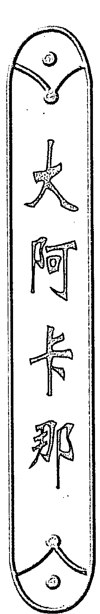

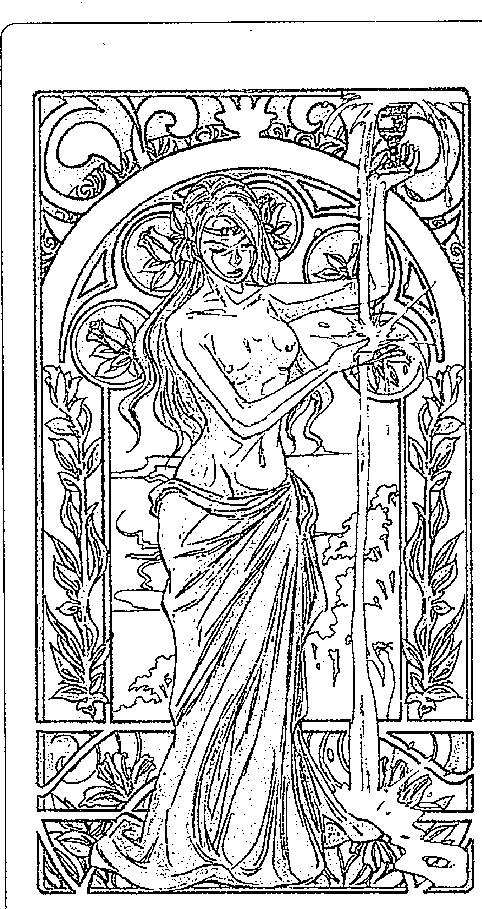

## 节制

Temperance

◆关键词 协调 配合 平衡 关心 节制 健康 结合

### 牌面解读

美丽可爱的天使头上戴着美丽花朵编成的花环，正在将代表灵魂的水从一个圣杯倒入另一个圣杯。她脚下的绿地代表意识，水代表无意识，两个圣杯分别代表物质和精神，象征着在物质和精神方面的渴求。当两只圣杯都注满时，便可以取得平衡，走向成功。调节两个圣杯里的水不让它们漫溢出来，就是这张牌暗含的节制之力了。杯子里的水象征着人们有限的生命，必须不断地更换，犹如活水一般，这样圣杯里的水才不会干涸腐败，才会纯洁干净。保持生命之水流动的节制之力体现出来的是适度的自我克制。在充满诱惑自由放任的世界里，找到自我平衡非常必要。节制的能量从表面看来，似乎少了些许激情，但它是飓风中的宁静，四处都是旋转的风，中心是一个安静的点，使所有的东西都保持平衡。这是一种令人鼓舞的团结力量。拥有这种力量的人，浑身散发着沉静的魅力。

### 内涵解析

节制代表和谐、净化和协调，也代表处事的适度和物质精神的必要平衡。杯中的水不断地以一种舒缓的节奏流动，这是一个疗伤止痛的过程，可以治愈身心，也使得事情渐渐好转。妥协和合作是非常重要的，应该寻找一切机会使对立的双方结合为一体。
节制同时也暗示了缓慢的意义，必须以一种自制、温和、充满耐心的态度面对问题。如果加入一个新元素，节制便意味着改变。通过重新结合，节制也就代表了事物可能面临的一种渐渐转化的契机。

### 正位牌意

- 1. 调理整顿，在平淡的重复中发现关键，关注自我需求也兼顾他人的意愿。
- 2. 能够有所差异的交往；爱情弥坚，心心相印；有节制的交往，心灵相通。
- 3. 很好的直觉，反复学习最终获得良好的结果；增加交流会有更多的收获；人事变动。
- 4. 能够与各种不同的人相处，毫不做作，为人细心体贴。
- 5. 在流动的资金当中获得利益，善于节俭，心境平和，生活单纯而顺利。

### 逆位牌意

- 1. 缺乏调节能力，难以保持平衡的状态；耗费过巨，遗忘初衷，消耗殆尽，没有节制。
- 2. 三心二意，不善于控制恋情，往错误的方向发展。
- 3. 过于情绪化，陷入低潮；单方取消，时机不佳，进展不顺利。
- 4. 因无法控制自己的情绪而得罪别人，不和睦。
- 5. 金钱的纠纷，无节制的花费；平均分摊费用；沉闷的说教。
- 6. 和别人合作不融洽，暂时不宜与人合作。

## TAROT

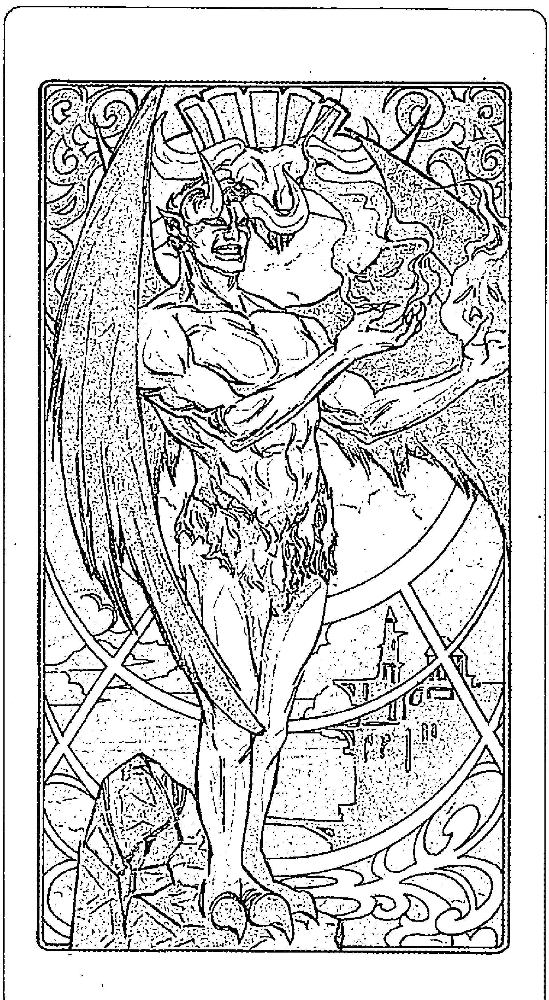

# 大阿卡那

## 魔鬼

The Devil

◇关键词 诅咒 沉沦 欲望 物质主义 束缚 无知 绝望的

### 牌面解读

魔鬼支配着黑暗，长着一对蝙蝠一般的肉翅，头上长着羊角，生着羊腿和偶蹄，象征着动物的本能与天性。头上的驴耳朵代表着固执的个性，男女同体的模糊性别说明它集合了人类的一切欲望。魔鬼垂下眼睑，张着血红盆大口，用轻蔑的表情冷笑着看着手中的两个异形生物。这两个杂糅的奇怪生物原本都应该是人，但由于受到各种欲望的引诱，缺乏自制力而沉沦，因此受到魔鬼的诅咒，失去了人类的形体，被绳索束缚，只能被恶魔把玩在手里，无法逃脱。其实，现在他们的处境是自己造成的。可见人们心中隐藏的魔鬼多么可怕。它狰狞而诡异的面孔给人恐怖不祥的感觉，它的力量需要多么强大的意志才能够抵抗！人一旦屈服于魔鬼的轻声细语之下，便会跌入万劫不复的深渊。

### 内涵解析

魔鬼这张牌有时被称为“撒旦”或“黑魔术师”，象征着人们心中隐藏着的欲望和罪恶，这些欲望和罪恶的杂念往往会诱导人们走入歧途，而导致最后的灭亡。魔鬼是由人内心的欲念而生，这张牌代表你被自己的欲望所束缚而无法自拔，并且被自己的自私和骄傲所困。

诱惑是魔鬼牌的重要含义，诱惑在于心灵，这张牌提醒我们保持内心自省的状态，提醒我们要去克服种种欲望与自我堕落，不再限于爱欲贪嗔的心理矛盾中，如此便要具有坚定的信心与自我控制的能力，才能战胜懦弱的人性而不受到诅咒，成为魔鬼的俘虏。

### 正位牌意

- 1. 受到拘束而感到不自由；卑躬屈膝；隐瞒事实。
- 2. 过于紧张，无法真实地展现自己；秘密的恋情；心胸狭窄，只会想到不好的。
- 3. 因为欲望而堕落，因诱惑而荒废学业、忽略了心灵，盲目追求外在的物质；对自己过于严厉，对管教感到不满，施加暴力。
- 4. 受到不良的诱惑，陷入秘密团体，被迫屈服，遇到阴险的人。
- 5. 被骗财、欠债；不该有的收入；艰苦的生活；过于忍耐；恶劣的条件；秘密行动。
- 6. 代表小气、势利、工作狂等。

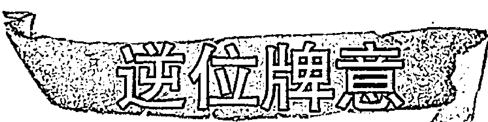

### 逆位牌意

- 1. 脱离了物质的束缚，摆脱不良的诱惑，有脱离现状的机会，思想恢复开放，获得解脱。
- 2. 结束拖延的恋情，摆脱感情的困扰；陷入肉欲之中。
- 3. 向较弱的科目进行挑战，离开无法忍受的工作环境；长期的病痛得到治愈；摆脱重担，想要独立发展的人要谨慎行事。
- 4. 断绝不良的关系，斩断情丝，从长期痛苦的恋情中得到解脱；放弃私欲，恢复理智，改善人际关系。
- 5. 转亏为盈，转型投资的时机，解除负担。

## TAROT

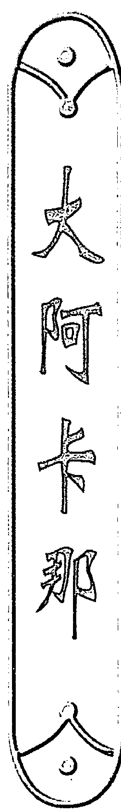

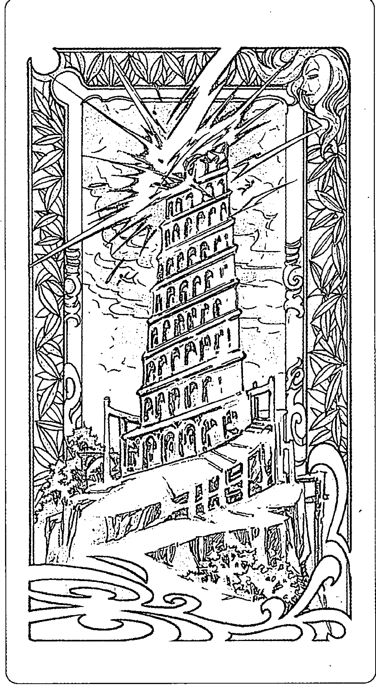

## 高塔

The Tower

◆关键词 毁灭 意外 剧变 下落的 释放的

### 牌面解读

原野的远处伫立着一座很华丽的高塔，然而，此时它受到了雷击，正在坍塌，即将毁灭。高塔象征物质，天上的雷鸣电闪则意味着神的愤怒与制裁。画面上的那个人脸代表已死去的灵魂，说明人类即使有再大的本领，也无法抵抗自然的力量，无法违抗神的旨意。高塔象征着人类高傲和自满的劣性，就像《圣经》中的巴比伦人建的塔一般，妄图通向神的领域，这也是遭受雷击的根本原因。高塔的坍塌和毁灭意味着结束，闪电代表着突如其来的意外灾难。高塔是一个强制的结束，必须先有完全的破坏才能重建。

### 内涵解析

从第 13 张牌开始，经历死神而尝过在生死边缘挣扎的滋味的人们，很可能会在不同的环境中通过节制得到净化身心的机会。但如果不能彻底自我反省，则将沦为魔鬼的俘虏，被囚禁在高塔中，遭受各种打击与折磨。这或许是暗示毁灭的高塔这张牌紧跟在象征诅咒的魔鬼牌后面的原因。

在 22 张大阿卡那之中，高塔的意义最为不好，提醒自我反省的意义也相应地最为强烈。但是，没有破坏，就没有新的建设。解脱高塔的牢笼，未尝不是置之死地而后生。逆位的高塔牌代表着毁灭的预感，和正位类似，但没有正位强烈。其实，有时候控制事态的发展不一定是好事，完全的解脱可能会造成一定的痛苦和损害，但也是新生的开始。

### 正位牌意

- 1. 麻烦不断，逆境，致命的打击，信念崩溃，坏局面，遭遇剧变或意想不到的事。
- 2. 意外的分手；纷争不断，变得具有攻击性；与爱人争吵，失去爱情，想要返回原点却无法把握形势。
- 3. 事态急剧恶化，玩火自焚爆发不满却苦无对策；因意外的事件造成辍学；有精神上的烦恼，遇到灾难。
- 4. 遭受牵连，与周遭的事物对立；情况变得糟糕，与朋友吵架，变得暴躁易怒。
- 5. 损失金钱，赤字、破产；多管闲事，以往累积的成果崩溃；有纷争，突然的分离或者幻灭的爱情。
- 6. 信念崩溃，内心世界变得黑暗而彷徨。

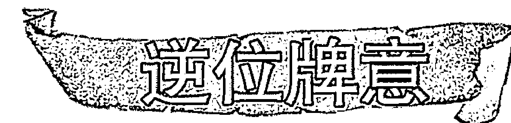

### 逆位牌意

- 1. 瓦解；要有悬崖勒马的勇气；因骄傲自大将付出惨痛的代价；口舌之灾，内部纠纷，紧急状态。
- 2. 直接表达心意，感情的危机，可能遭受打击。
- 3. 听天由命，放手一搏；成绩跌落谷底；事态紧迫，不放弃，有背水一战的意味。
- 4. 状况不佳，陷入困境，气氛险恶，有问题亟待解决；不要勉强、应尝试让步。
- 5. 从零开始，表面富有其实贫穷，破产边缘；风雨前的不安感，不可大意，有重大的事情要发生。
- 6. 爱情出现危机。

## 星辰

The Star

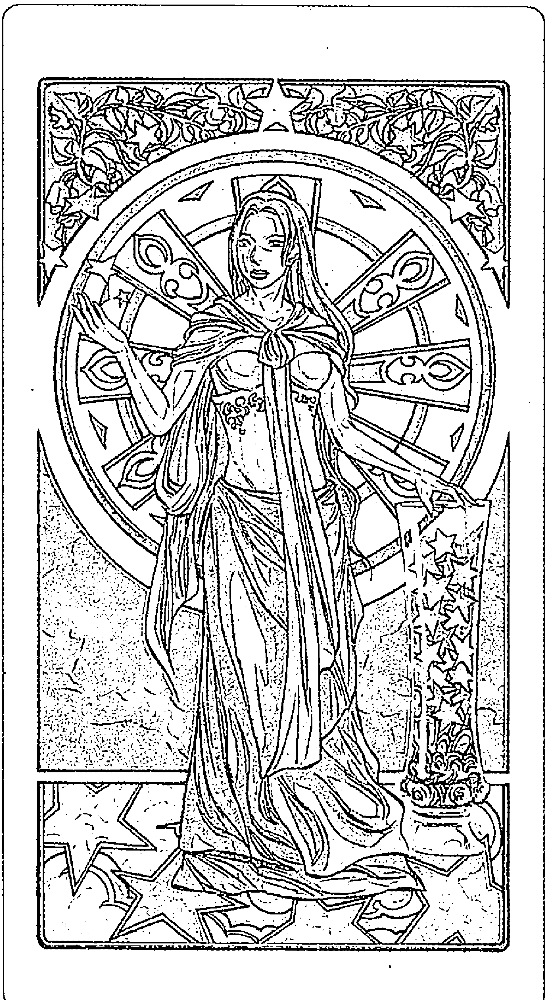

# 大阿卡那

◆关键词 希望 祝福 平静 慷慨

### 牌面解读

希望之星辉映了整个夜空，星光下的女神象征着“永恒之美与无穷的希望”。星星是生命的希望，仿佛在夜空中指引方向的星辰一般，它的光芒给我们的心灵指引方向。只要能够坚持信念，就一定能达成目标。因此，星星会不停地闪耀着光辉，暗示前途将是一片光明。

### 内涵解析

经过死神和魔鬼，我们来到了星辰的一派欣欣向荣之中。星辰是一张为人们带来希望的牌，星光女神的出现为生命灌注了新的能量。这张牌和节制有关联，代表经过净化之后新的契机。星辰虽然不能提供具体的解决方案或最终结论，但它使人将要迎来新的希望。一旦出现这张牌，我们就知道，我们正处于正确的轨道上。我们的目标和热情得到了回应，同时应该采取积极的行动，运用星星的光芒指导前进的方向。

### 正位牌意

- 1. 愿望实现，萌发灵感，理想主义者，前途光明。
- 2. 感受到好的预兆；理想的恋人，爱情萌芽，遇到理想的对象，开始美妙的恋爱。
- 3. 有独创性，有新的创造力和想象力，乐观的将来，对事物充满好奇，能够达到极高的目标，艺术方面颇有好运。
- 4. 兴趣相投的朋友，相辅相成的友情，遇到理想的朋友。
- 5. 新的财源，依靠感觉可以获得意外的收入；希望达成；反应迅速，取得专利。
- 6. 美好的恋情，理想的对象，爱苗正得到滋润，也可代表怀孕。

### 逆位牌意

- 1. 缺乏想象力，失望，单纯的构想，无法实现愿望；遭遇挫折与失败，异想天开，好高骛远。
- 2. 无法心灵相通，无法产生爱意；期望落空，以貌取人，难以解决的隔阂。
- 3. 有创意却一无所获，考试受挫，希望过高，理想与现实的矛盾。
- 4. 自我意识过强，以自我为中心，看别人不顺眼；无意义的交谈，对朋友感到失望。
- 5. 破财的征兆，无法达到预期的目标，错失良机；过于坚持己见，洞察力变差，理想不能实现。
- 6. 秘密的恋情，缺少爱的生活或追求不可期待的对象。

## TAROT

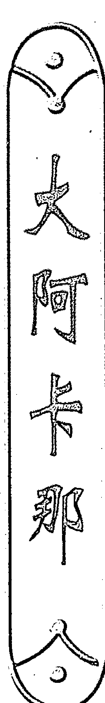

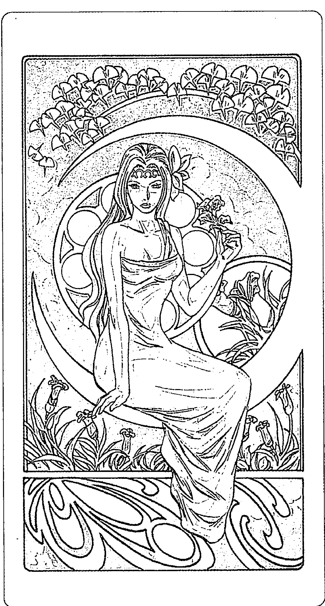

## 月亮

The Moon

◆关键词 不安 迷惑 欺骗 幻想 恐惧 想象

### 牌面解读

阴晴圆缺变幻莫测的月亮自古以来在人们的心中留下了许多梦幻与神奇的故事。月亮象征着想象的精神世界，一般代表着极富浪漫的气氛，但月亮的阴晴圆缺代表着变化，因此偶尔也会令人感到隐隐的不安。月亮女神坐在月亮上，低头忧郁地看着世人，让人感到些许危险和不安。月光下的城镇一片死寂，看不见一个人影。月亮本身的圆缺变化对生物的精神与心理都存在某种程度的影响，在月亮女神忧郁的表情中，我们可以清楚地看到亏蚀的月亮让她充满了躁动和恐慌。

### 内涵解析

月夜和明亮的白天相反，令人产生不健康的感觉，也因为这种昏暗，有些事物得以蒙混过去。这张牌充满了惶恐和不安，暗示人们要本能地探求真相，寻求真理，取代恐惧与不安的心灵。月亮牌的意义象征着潜意识的活动、事物的暧昧性和发现不安定的讯息，也代表着迷惑。越幸福的时候，越会担心不幸的到来。如果可以破除迷惑，就能得到好的结果。

解牌的时候，这张牌通常代表恐惧和焦虑，它们来自夜晚最黑暗的地方。月亮也代表着幻想，我们很容易迷失方向，有时候会被诡计和错误的想法引入歧途。自古月亮就代表着人的潜在意识，也可以说是代表了黑夜的力量，人们爱月亮朦胧的美感，却也惧怕它的变化无常。朦胧的月光所映照的不是真实，而是代表欺骗的幻象。所以，月亮牌提醒我们，必须找到回归的正途，弄清楚自己真正的目标。

### 正位牌意

- 1. 幻想、谎言、不安、迷惑的心，暧昧不明；背后的敌人，被现实所撞击的愿望。
- 2. 暧昧不清的恋情，虚伪的恋情，出现孽缘、三角恋情或令人心不安的爱；弄得一团糟，遭遇背叛。
- 3. 不明确的目标，徒劳的感觉；犯错、欺骗、无法镇定会导致很多失败。
- 4. 容易受到伤害的时期，小心谎言；恶言中伤，遭受误会，精神疲惫。
- 5. 私房钱，财务危机，提防欺诈；内心迷惑，难以抉择，不能完全发挥自己的力量。

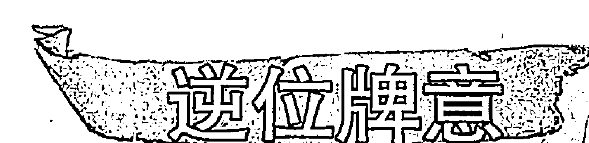

### 逆位牌意

- 1. 逐渐好转的状况，时间是良药，疑惑解开，幸免于害。
- 2. 从危险的骗局中逃脱，或摆脱了对虚情假意的依赖；婚期可待，误会消除。
- 3. 逐渐好转，检讨的时刻，有挽回的希望；冷静地观察事态，默默付出的精神终将获得回报。
- 4. 迷惑消失，顺利交往，静观其变，长远的眼光。
- 5. 解除金钱危机，等待渡过难关；事前察知了危险，只要等待就会幸运。
- 6. 静静地等待，时间能解决一切。

## 太阳

The Sun

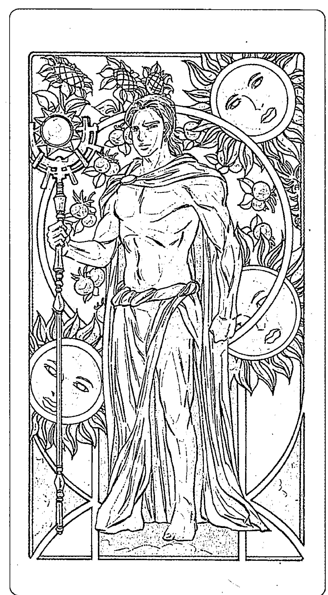

◆关键词 生命 快乐 成功 自由 启迪 有生命力 伟大

### 牌面解读

太阳是能源的中心，也是一切能量的来源，是一切生命的源头，它所表达的是一种喜悦的情绪。炽热的阳光孕育了大地万物，使美丽的花朵得以绽放，生物繁殖茂盛。在金色的阳光下，田野充满了生命的喜悦，树上结满了果实。太阳牌中的太阳神是一个年轻的小伙子，一头金色的头发，身披金色的披风，手持嵌有太阳标志的权杖，浑身散发着活力。太阳神年轻的躯体象征着新生，让人们感到生的力量。

### 内涵解析

月亮牌隐含着暧昧与不安，那样的夜间世界和象征着开朗与活力无限的白昼形成强烈的对比。太阳代表着一种新生力量，月亮有圆缺并伴随一种规律变化着，太阳则亘古不变，依然散发着光辉。虽然太阳每天东升西落，但它的活力却亿万年来丝毫不减，意味着每日不断的努力所带来的成功。
尽管过度的阳光意味着灼伤和炙烤，但太阳牌是所有大牌中最有光明意义的一张，比星辰牌更加充满希望。在逆位的太阳牌中这种意义可能稍微弱一些，有时候还多少有一些负面意义。

### 正位牌意

- 1. 丰富的生命力，明朗的未来；精力充沛，有欲望，生活自由自在；有贵人相助而成功。
- 2. 相亲相爱，喜结良缘，顺利健康而开放地交友；出现美好的恋人，恋爱顺利，恋情得以公开。
- 3. 目标达成，工作顺利，成绩快速进步；积极的主张，因为遇到好老师而提高学习效率；工作的气氛变得开朗；发挥实力考试顺利，学业有成或金榜题名。
- 4. 活泼开朗的交往，好友增加，积极的交往。
- 5. 财运好，积蓄增加；阳光照射的地方能带来幸运；怀孕；充实的每一天。

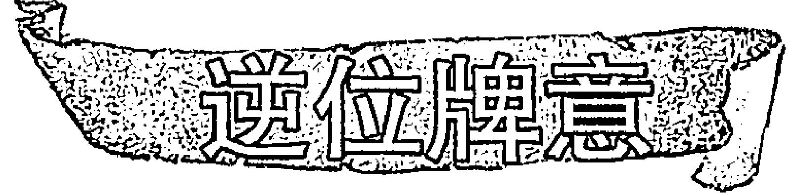

### 逆位牌意

- 1. 意志消沉、活动力变弱，情绪低落，无法持久。
- 2. 过于冲动，爱情破裂，不能结合的恋情，不被祝福的恋情，婚约可能取消，甚至离婚。
- 3. 不安感加重，人际关系出现问题；不听劝告，没有耐心，无法实现计划；没有目标，原地打转，成绩下降，精力不足而导致失败；没有固定的职业。
- 4. 可能被同伴排挤，和好朋友绝交；因过于消极而给人黑暗的印象，无法与人亲近。
- 5. 失去收入，浪费，因为虚荣而增加不必要的开支；不够活泼，无助而且忧郁，生活不稳定。
- 6. 事态发展不乐观。

## TAROT

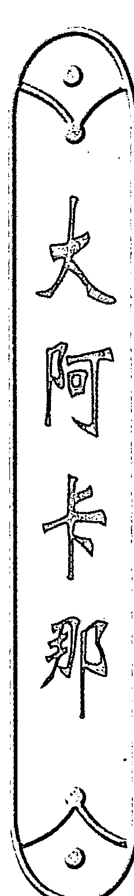

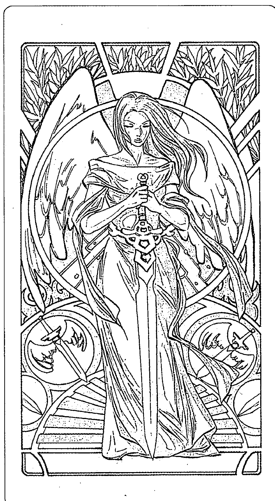

## 审判

Judgement

◆关键词 复活 审判 觉醒 回忆 心声 赦免

### 牌面解读

拥有一对华丽翅膀的天使冲破了灰暗的天空，仿佛从一朵盛开的花中探出身来，给世界带来力量和鼓舞。她手持宝剑，象征着发现真理。审判的时刻到来了，得到赦免的灵魂就要被带入天堂。但是那些没有获得拯救的人怎么办？他们的罪孽是否能够获得神的赦免？这一点让人感到不安。神的审判有一种“精神觉醒”的含义，天使的出现是在唤醒人们的觉悟。神的爱是无界限的，不论什么罪孽，只要诚心悔改，就会拥有希望，让人们感到灵魂不灭与生命复苏的奇迹。传播上天福音的天使，脸上却带着严肃的表情，似乎对人类许多愚昧无知的行为感到不满，坚定地引导人们走出迷途，找回自我，感谢并聆听神的福音。

### 内涵解析

审判牌含有拯救的意义，当天使召唤的时候，你就获得了重生，所有的罪孽就都被洗刷干净了，过去和过去所有的错误都已经不在了，你可以开始新生活；或者你感受到一种召唤，那是你对自己生活的一种确定。如果你正处于低潮阶段，需要希望和赦免，这张牌的出现就表示新的开始即将出现在眼前。

### 正位牌意

- 1. 决断的时刻，等待的尽头；命运好转，危机解除；改革期，好消息。
- 2. 真心的恋情，复苏的爱，有和好的希望，爱的使者出现，告白的时刻到来。
- 3. 复职的希望，脱离危机；工作单位变化，事业上崭露头角或获得荣升；考试顺利，听到好消息；适合与音乐有关的工作；临阵磨枪而获得成果。
- 4. 受到旁人的赞赏；与多年的老友重新取得联系，言归于好。
- 5. 失而复得的钱财，临时的收入；拥有自信。
- 6. 必要的审慎，作出判断。

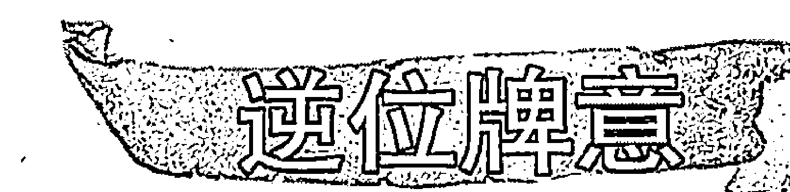

### 逆位牌意

- 1. 失败，一蹶不振，还没开始就结束；不妥当的决定，无法决断。
- 2. 嫉妒心过重，辜负对方的好意，无法敞开心扉；无法作出决定，缺乏真心，不能重来。
- 3. 凄惨的状态，受挫折，不能接受的事实；无法录取，对考试的期望不高，很难考上理想的学校。
- 4. 左右为难，无法和好；失望，过去的伤害留下隔阂；交错朋友。
- 5. 失去钱财，遗失重要的东西；散漫的生活，有罪恶感。
- 6. 虽然重新开始，却再度翻覆为原状。

## 世界

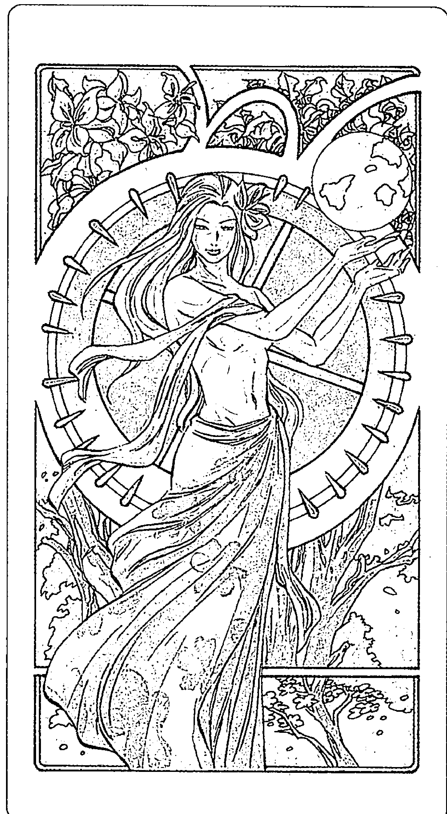

# 大阿卡那

The world

◇关键词 完美 达成 新的开始

### 牌面解读

在象征名誉和荣耀的月桂树下，爱与美的女神用双手托起这个世界，表情泰然，轻舞着身体。她调解纷争，教导慈爱，孕育生命，世界在她手中完成。这张牌代表宇宙的终点，只要我们怀着感恩的心，就一定能为自己打造美丽的世界，找到幸福与快乐。在这里，一切都

## TAROT

圆满了，人们心里平安喜乐，从此将可以无牵无挂地踏上新的旅程。

### 内涵解析

世界牌是从第一张牌开始，经过各种各样的状况而终于到来的灵魂升华的最高境界，达到与宇宙万物合为一体的状态，表现出现实世界的气息，是非常幸运的一张牌，显示着非常积极的信号。它代表着我们所认识到的内心渴望，是积极贡献和服务的象征。要把握世界，我们必须让自己投身其中，这才是快乐的真正源泉。

愚人的流浪终于到达了终点，世界代表着目标的最终达成，物质和心理处于完美状态。但需要注意的一点是，这张牌也代表着终点和结束。

### 正位牌意

- 1. 快乐而美好地完成，高昂的精神，幸福的时刻；拥有执著的追求，达到巅峰获得成功。
- 2. 令人称羡的情侣，理想的爱情，得到祝福的婚姻；最佳拍档，条件齐全，历久弥新。
- 3. 最旺盛的时期；学业提升，完美达成，可以顺利毕业，以最佳的方式获得成功，从事与航空有关的工作。
- 4. 幸福的相逢，交友获益，安定的信赖关系。
- 5. 收入有所增加，资金调度平稳，夙愿达成，幸福围绕左右。

## Major Arcana

### 逆位牌意

- 1. 无法完全奉献，为将来而苦恼；不顺利，不安于现状，不成熟。
- 2. 即使有人求婚也仍然是犹豫不决，无法结合，感情容易破裂，暧昧的态度令人不满；没有活力的交往，失去新鲜感。
- 3. 情绪低落，前景不好；懒惰，因准备不足而失败，受挫，缺乏创意，无法如愿发展。
- 4. 交友不慎，彼此缺乏热情，在人际关系方面过于幼稚。
- 5. 资金调度困难，导致破产；缺乏先见之明，不满现有的待遇，无法掌握要领；不适合搬家。
- 6. 没有取得计划中的成就，事情进行极不顺利；精神松弛，状态不佳。

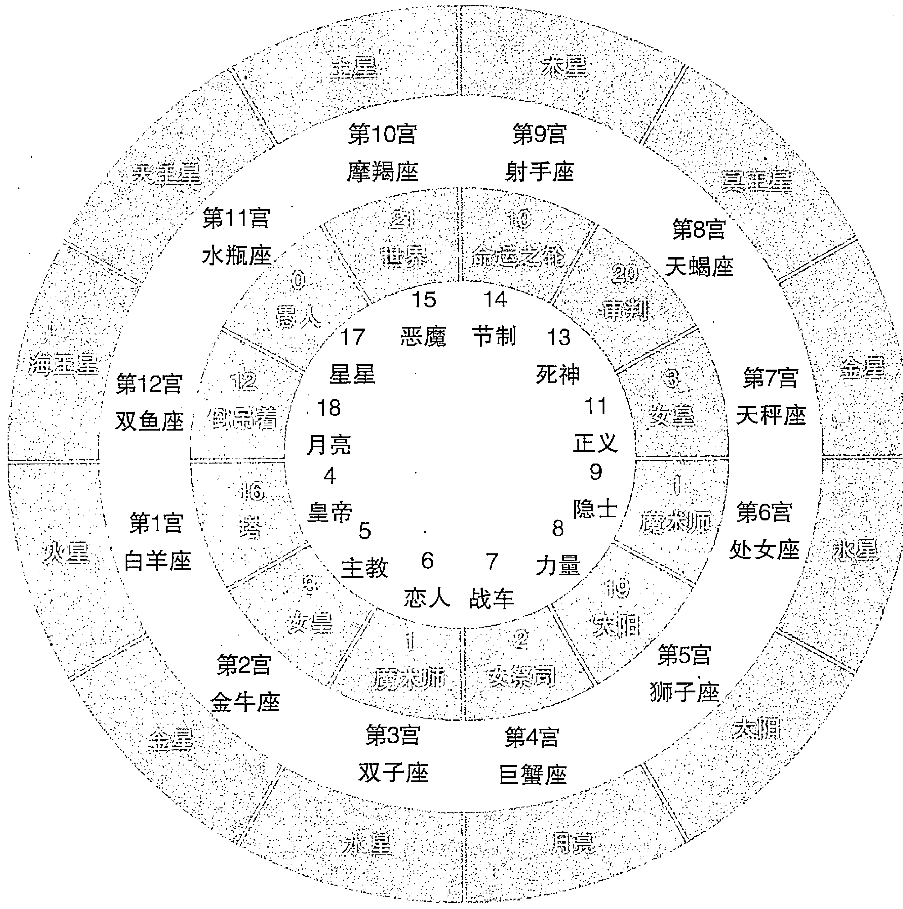

# 塔罗与十二星座对照图

(深色对照深色区,浅色对照浅色区)

# 小阿卡那

主牌表达了共同的主题，而副牌则把这些主题扩展到现实中，展示出它们如何在日常事件中发生作用。

权杖牌组：表现的是主动、积极、外向和创造力。如同“热情如火”一词，火通常与运动、战争、行动力和直觉有关。具有火的特质的人，个性较急，直来直往，随时都精力充沛，在人群中特别引人注目。

宝剑牌组：飘忽不定，难以捉摸，变动性强。占星学上认为，风代表着抽象的思考分析与清晰的判断力。然而，另一方面，它也和麻烦、困扰、争执、疾病、死亡等负面事物相关，所以宝剑牌组几乎令人避之不及。

圣杯牌组：水是与情感、感受、潜意识相关的阴性元素。相对于火的主动热情，水扮演的是平静而被动的角色。具有水的特质的人特别注重人际关系与感情，较女性化，心思细腻敏感，多愁善感，喜欢照顾别人的同时也尤其需要受人保护。

星币牌组：土地滋养万物，最是稳定牢靠。如果说风是理论家的话，那土就是实践家了。具有土的特质的人勤奋不懈，重视财富给予的安全感，认为经济有保障，便可以享乐。所以与土相关的星币牌组除了表现在金钱物质方面之外，也代表了物质享受和娱乐。

## TAROT

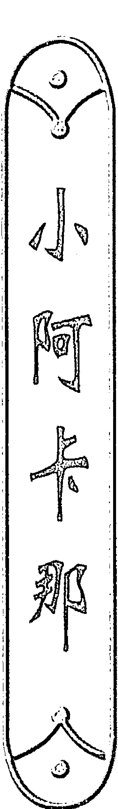

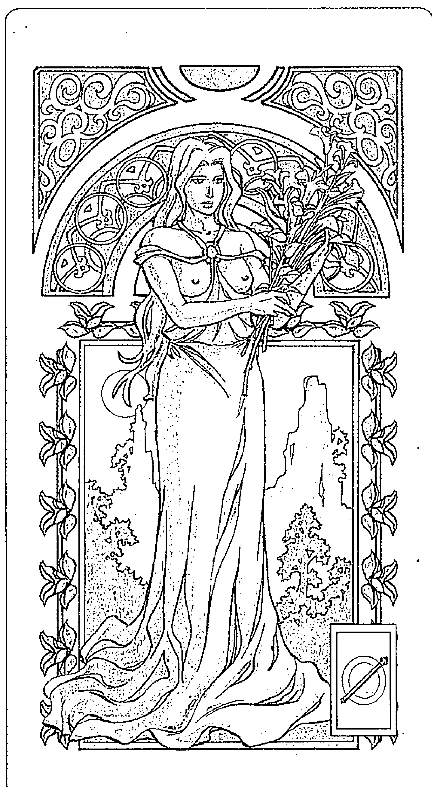

## 权杖首牌

Ace of Wands

◆关键词 创造力 灵感 行动的开始 自信 激情 勇气

### 牌面解读

画面上的少女年轻美丽，身体丰腴，手捧盛开的鲜花。整幅画面色彩艳丽，象征勃勃生机。这种勃勃生机反映了权杖牌组面对各种日常事物的活力与热情，在目标与挑战中成长，并以其内心的狂热追求潜在的胜利。背景中清澈的天空显示着这一刻，你的目标即将变得清晰。是的，在这里，生命生生不息，一切都能得到全新的开始。

## Inner Arcana

### 内涵解析

权杖首牌象征着开始一项方案或旅行，是一个强而有力的开始，表现出着手新计划的渴望、力量与勇气。这张牌所指的对象是已经开始的行动，而且预示这个行动一定会产生具体的结果。它出现在采取行动的时候，而不是代表任何的计划与决定，只是开始新事物的具体行为。寻找值得追求的目标，会产生一种明确的目的感。

这张牌并不是要你去思考或感觉，而是要你付诸具体行动。它可以表示具有力量、权力以及体力充沛的一段时间。这是一张代表旅行与移动的牌，也常常用来表示一种对生活的热爱。

### 正位牌意

- 1. 蕴涵创造力。
- 2. 重大事件的开端。
- 3. 新的发明诞生了。
- 4. 开始一段冒险的旅程。
- 5. 新的机会出现，实现梦想的好时机。

### 逆位牌意

- 1. 采取新行动而失败的可能性比较大。
- 2. 事情的开端形势不佳。
- 3. 遭到失败。
- 4. 前途茫然，事情发展不见曙光。
- 5. 为感情而心痛。
- 6. 流产或堕胎。
- 7. 错误的开端，停滞不前，空虚。

## TAROT

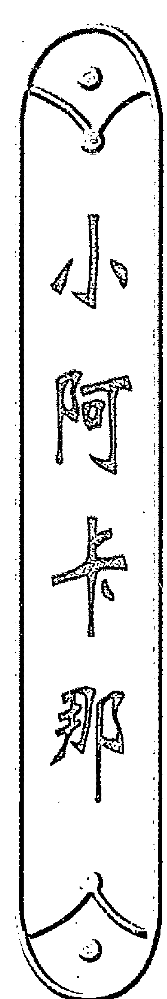

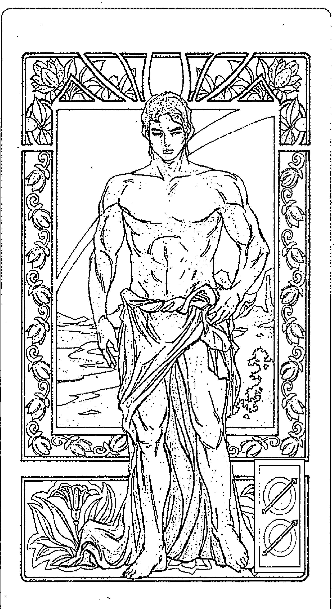

## 权杖二

Two of Wands

◆关键词 掌握 决定 勇气 个人魅力 创新

### 牌面解读

画面中健康、年轻的小伙子与远处美丽的风景展现出了勃勃的生机。四周盛开的鲜花与画面和谐、统一。这张牌的出现，通常在提醒人们沟通的重要性，在统一的掌握中，合作才是达到目标的捷径。同时，这张牌也在暗示因成长而对当前环境的不满情绪。梦想已经一步步实现了，但还需要决定未来行动的方向。

## Inner Arcana

### 内涵解读

权杖类型的人总把生活当做战争，因为如果生活中没有障碍，就没有冒险。这张牌的出现表示你可能会从事体育、竞赛或者农事劳作等一些偏向于身体运动的事情，这往往会干扰你其他方面的计划。

权杖二代表的是一种源于实践或者依靠自身修养而能够掌控全局的力量。个人魅力本身是一种生生不息的力量，令人积极向上，当它和勇气相搭配的时候，就能成就辉煌，它能给人一种新的精神状态。

### 正位牌意

- 1. 拥有权力和威力，或拥有权力和威力的人。
- 2. 正确运用手中的权力。
- 3. 富有个人魅力。
- 4. 摒弃以往的陈腐，开创新的生活。
- 5. 拥有勇气和创造力。
- 6. 训练，增强斗争与对抗的力量，主动竞争。

### 逆位牌意

- 1. 出现了意外事故。
- 2. 事情的进展遇到了麻烦。
- 3. 生活穷困潦倒或者生病。
- 4. 行动受到拘束。
- 5. 不要陶醉于权力的感觉而失去理智。
- 6. 矛盾、复杂、令人疲惫的人际斗争，因为各执己见而把事情搞得一团糟。

## TAROT

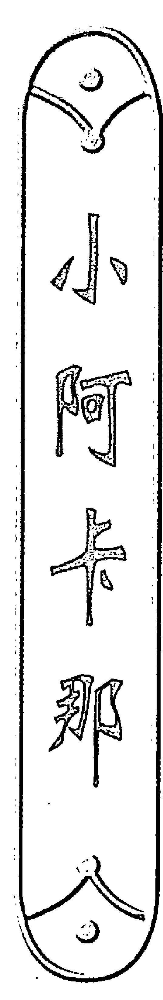

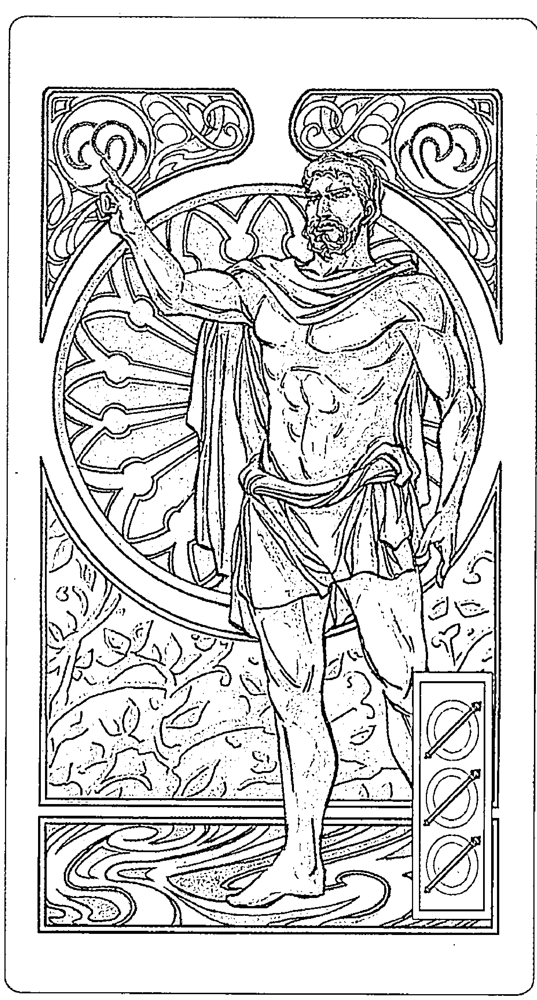

## 权杖三

Three of Wands

◆关键词 远见 领导 旅行 探险

### 牌面解读

画面中的这个男人不再年轻，显然是经历了很多沧桑。他的手指向远方，似乎是在寻找新的方向。他不愿待在一个地方，决定重新踏上征途，丰富自己的人生。

## Inner Arcana

### 内涵解析

权杖三通常指发自内心的动力，代表在你寻求自我内在意义的过程中，仍然可以保持沉静和稳定的心态，表示你一面在重视自身内在的成长，一面在维持一种平衡的状态。你已经不满足于目前的环境，通过一段时间的积累，你有了足够的经验和胆识，能够制订比较宏伟的计划，甚至可以带领一个团队去开创新的事业。

在这个过程中，耐心是非常重要的，因为在我们所处的环境中，已经有足够的能量来促进改变和成长，我们所需要的是对于成长的渴望。

### 正位牌意

- 1. 事业已经获得成功或者即将获得成功。
- 2. 与贸易有关的事务。
- 3. 与他人建立良好的合作关系，有助于事务发展。
- 4. 能够获得援助。
- 5. 具有领导地位，或具有领导地位的人。
- 6. 探索新的方向，有新的情侣或开始新的旅行，出国出差。
- 7. 成功的异地恋爱，拥有灵感、想法的集合并将实现，实用的知识，发自内心的动力。

## TAROT

### 逆位牌意

- 1. 事业发展不顺利甚至逆转，财运下降。
- 2. 整体局势不佳或者事情被迫终止。
- 3. 合作不愉快。
- 4. 缺乏远见，计划不周。
- 5. 欠缺领导力，当事人刚愎自用，野心过度。
- 6. 项目、旅行等计划被延迟。
- 7. 环境的影响，心灵上的损耗。

## Inner Arcana

## 权杖四

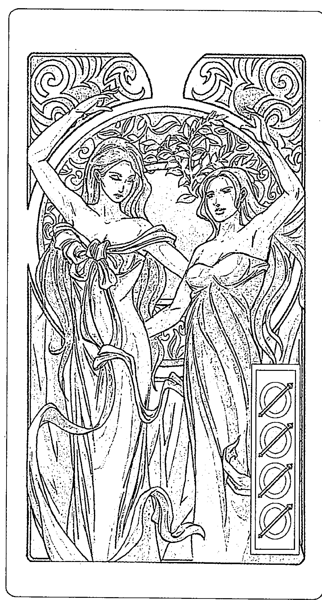

# 小阿卡那

Four of Wands

◇关键词 和谐 欢庆 稳固 激情 自由

### 牌面解读

两位美丽的少女占据了画面的主要部分，她们年轻貌美，生机勃勃，衣着华丽，伸展的双臂似乎想要舞蹈，又像是想要拥抱这一切的美好。她们看起来生活得十分幸福，衣食无忧。她们可以悠闲自得地生活，生活显得十分美好。

## TAROT

### 内涵解析

权杖四给人的感觉是正面的，积极向上的，会有一种安全感油然而生。因为数字四具有四位方正的含义。因此，这是一张代表幸福的牌，表示你会有一个稳固的家庭或者优越的工作环境，欢乐与分享将是你生活的一部分。逆位的权杖四既有与正位相反的含义，也隐含了相似的意义，应当视具体的问题和整体牌阵来解牌。

### 正位牌意

- 1. 和平繁荣的景象。
- 2. 悠闲的生活，紧张繁忙之后的小憩。
- 3. 浪漫而幸福的爱情，美满的家庭生活。
- 4. 关系稳固，与人交往越来越深。
- 5. 学业事业等基础牢靠而扎实。
- 6. 代表庆功宴、婚礼或晚会等喜庆事件。
- 7. 发明、实践，未知的地方，迷惑、影响未来的决定。

### 逆位牌意

- 1. 打破平衡的状态。
- 2. 没有结果，不够稳定的恋情。
- 3. 不够确定，有点模糊。
- 4. 基础薄弱。
- 5. 人际关系差。
- 6. 出现困扰或奇怪的事件。

## Inner Arcana

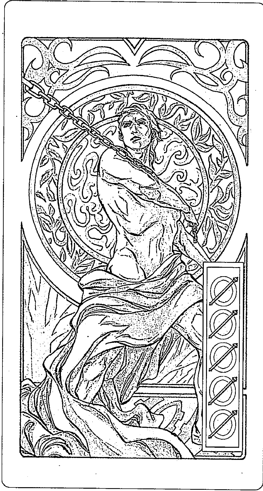

# 小阿卡那

## 权杖五

Five of Wands.

◆关键词 冲突 得不到满足 阻碍 竞争 争执 激战

### 牌面解读

权杖五的画面颜色看起来很压抑。画面中，一个青年男子被铁锁捆绑住，他想要挣脱，但似乎很困难。他还很年轻，他想要开始新的生活，但却步履维艰。这可以算是一幅令人无奈的画面。

## TAROT

### 内涵解析

权杖代表火的元素，这张牌表现出一种激烈的争斗。这张牌更多地表现了生活中必然存在的一种竞争状态，不仅是外在的，也代表内心的矛盾与冲突。

### 正位牌意

- 1. 将会发生激战或冲突。
- 2. 对方是强敌或将会出现强敌。
- 3. 充满斗志。
- 4. 面临抉择和挑战内心仍然难以抉择。
- 5. 竞争的良机。
- 6. 尽职尽责，克服障碍，充分准备，努力得到结果。

### 逆位牌意

- 1. 非公平的竞争、欺诈。
- 2. 状况混乱而复杂。
- 3. 受到纷争的困扰或牵连。
- 4. 可能会有诉讼发生。
- 5. 失去消息，缺乏帮助及支援。

## Inner Arcana

## 权杖六

Six of Wands

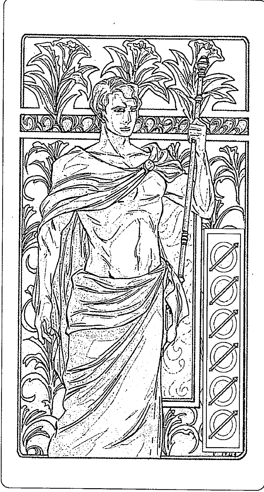

关键词 自信 胜利 获得 自豪 称赞

### 牌面解读

这是一幅充满生机的画面。一位年轻的小伙子身穿华丽的衣服，眼睛望向远方，他似乎在幻想未来的生活。怒放的鲜花象征着生活的美好。小伙子手中的权杖是对他积极向上最好的奖赏。

## TAROT

### 内涵解析

权杖六的画面似乎暗示着人们对自身力量的深信不疑。在我们对生活及生命的可能性有了真正的信仰时，去完成我们想要做的事情所需要的能量几乎都会得到补充。这张牌成功的象征意味非常明显，不过这种成功比较世俗化，更具体更生活化一些。

权杖六表示要相信自己，并且用个人的能力去实现、完成自己的目标。如果你这样努力的话，必定会获得成功，就像辛勤耕耘就能得到收获一样。

### 正位牌意

- 1. 获得胜利，凯旋而归；金榜题名，衣锦还乡。
- 2. 努力有了成果，得到回报。
- 3. 有捷报、喜讯传来。
- 4. 事情进展顺利，取得进步。
- 5. 感情有望水到渠成。
- 6. 能力出色，充满自信。
- 7. 一贯性，教育、培养得到回报。

### 逆位牌意

- 1. 失败。
- 2. 不诚实的交易。
- 3. 内部有敌人。
- 4. 骄傲自满，导致恶果。
- 5. 会有坏消息传来。
- 6. 经历失败后迟迟到来的成功。
- 7. 劳累，放任自流。

## TAROT

# 小阿卡那

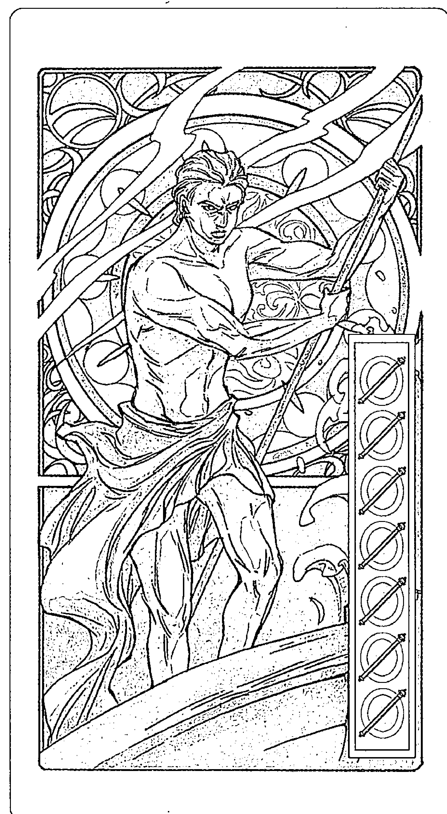

## 权杖七

Seven of Wands

◆关键词 挑战 勇气 信心 进取 坚信

### 牌面解读

大风在疯狂地刮着，在海面上卷起了层层巨浪。一位年轻人费力地划着一叶小舟，行驶在大海之上。他迎着风，努力地向前。狂风巨浪似乎要把他的船撕碎，可是他毫不畏惧，依然执著向前。他相信，只要坚定信心，就会迎来风平浪静、阳光和煦的日子。

## Inner Arcana

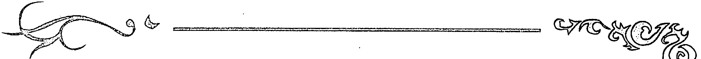

### 内涵解析

权杖七暗示通过坚持而获得成功。你虽然面临着巨大的挑战，但如果你继续努力向前，就一定能获得相应的回报。即使逆风而行，也不要轻易放弃，因为明媚的终点就在前方。

### 正位牌意

- 1. 战胜对手，获得成功。
- 2. 有利的立场，正义的立场。
- 3. 充满斗志，坚信成功。
- 4. 有勇气，在逆境中的力量，面对逆境不放弃；逆境即将结束。

### 逆位牌意

- 1. 对自己的能力产生怀疑。
- 2. 受到失败情绪的冲击。
- 3. 感到困惑，无法对事物进行判断。
- 4. 冲突、焦虑、困窘。

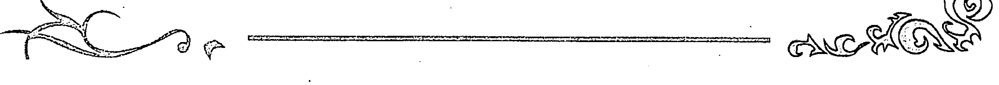

## TAROT

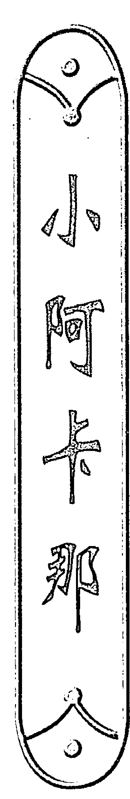

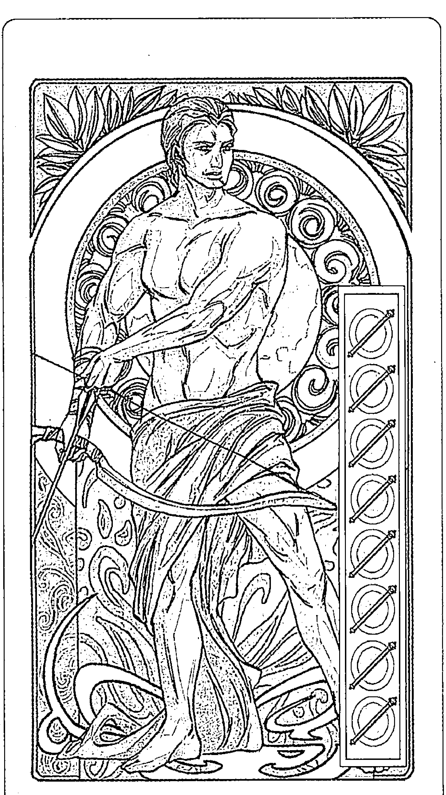

## 权杖八

Eight of Wands

◆关键词 快速 消息 结局 急剧的变化

### 牌面解读

这是一个收获的季节。画面中的小伙子刚刚狩猎归来，收起弓箭。在这个秋天，他已经取得了很大的收获，这是他努力的结果。很快，荒凉的冬季即将来临，冬季虽然孕育着来年的生机，但却没有现在这种丰收的喜悦。

## Inner Arcana

### 内涵解析

目标清晰可见，以往的努力已经显露出你所应得到的成果，收获的时刻已经来到了。但是，如果你不付出劳动，那么劳动的果实也将付诸东流。只要再付出一点儿，你就可以得到应得的成功，享受丰盛的果实。

### 正位牌意

- 1. 尽快行动。
- 2. 不妨作一个旅行计划。
- 3. 果断地下决定，马上开始行动。
- 4. 一鼓作气，勇往直前。
- 5. 得到某些很重要的信息，需要仔细思量考虑。
- 6. 结束手中的任务，为下一个任务作准备。
- 7. 仓促地下决定，过于快速的进展。

### 逆位牌意

- 1. 有争论发生。
- 2. 家庭出现矛盾，不和睦。
- 3. 行动不够迅速，进展迟滞。
- 4. 一蹶不振。
- 5. 缺乏防范，睡眠不足。

## TAROT

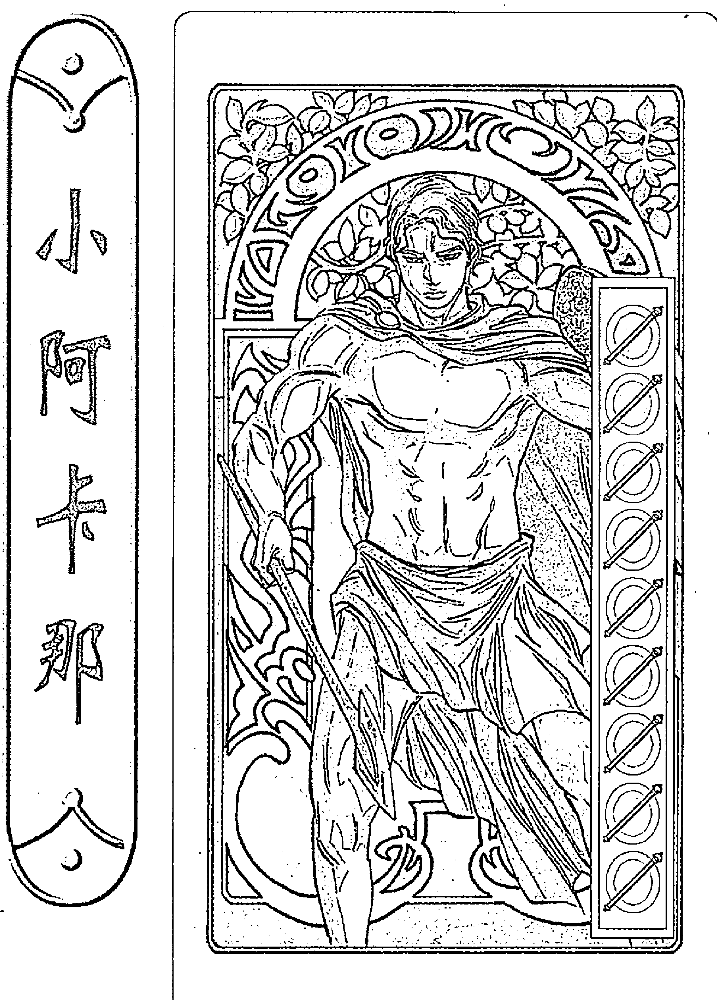

## 权杖九

Nine of Wands

◆关键词 谨慎 防御 固执 毅力 坚定

### 牌面解读

健壮的小伙子手持盾牌和长矛，警惕地注视着周围的一切。现在四周很安静，没有任何异样，但小伙子依然很警惕。他要作好一切防范的准备。

## Inner Arcana

### 内涵解析

权杖九意味着情况会有些暧昧不清，最好再观望一段时间。你可能把自己不受欢迎、不被接受的部分强加给别人了，这样会让人喘不过气来，朋友就会离你而去，人们也会对你采取防御的姿态。这时，你需要小心身边的情况，不要太过于执著于自己的想法。

### 正位牌意

- 1. 要作好充足的准备，应付困难的来临。
- 2. 在气势上压倒敌人而获胜。
- 3. 隐藏实力，蓄势待发。
- 4. 身边出现看不见的敌人。
- 5. 僵持，需要观望的情况。

### 逆位牌意

- 1. 遭遇逆境。
- 2. 气势低落，斗志衰弱。
- 3. 身体不健康。
- 4. 运气不太好。
- 5. 必须克服阻碍，要做的事情被延迟。

## TAROT

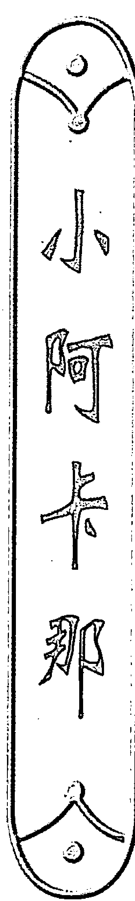

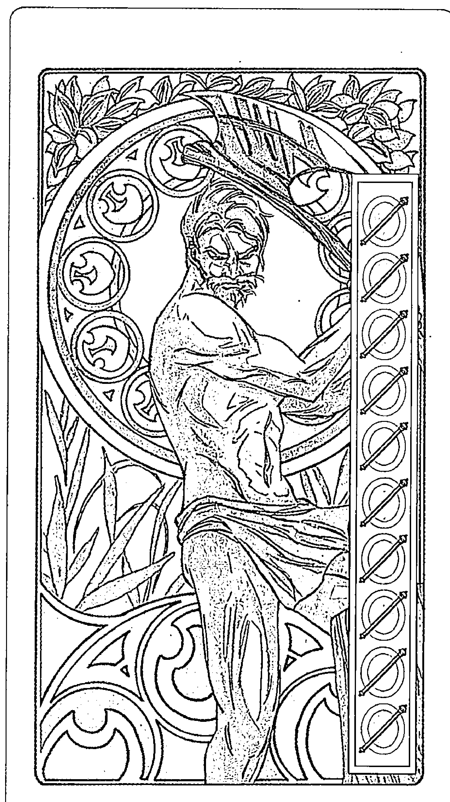

## 权杖十

Ten of Wands

◆关键词 忍耐 责任过重 压力大 抗争

### 牌面解读

一位一脸疲倦的男子，用力地挥舞着斧头，他想要把柴火劈碎。他已经劈了很多的柴火，他已经很累了，但他没有停，依然在进行着这项工作。男子的倦态不禁让人们为他担心：他能坚持下去吗？没有劈的柴火还很多，如果他不停下歇歇的话，他可能会被累倒，再也进行不下去。

## Inner Arcana

### 内涵解析

这张牌暗示肩上承受着巨大的压力，但是无法对别人诉说。你想获得自由，想轻松地享受生活，然而，蓦然回首，你却发现自己承担了太多的责任，很明显这种状况已经超出了你能处理的范围。这张牌的出现暗示着你应该找一个妥当的方法解决现状，不可以继续超支自己的能力，而应该试着让别人来替你分担一些。

### 正位牌意

- 1. 信念强烈，非常具有责任感，付出许多努力。
- 2. 由于不懂拒绝而导致负担过重。
- 3. 感到有压力，情绪不安。
- 4. 过度的疲惫和劳累。
- 5. 因为获得成功而感到很大的压力。
- 6. 压迫感，为达目的而甘愿承受苦难。

### 逆位牌意

- 1. 遇到难以承受的压力，快要崩溃。
- 2. 无法继续承担，最终选择放下。
- 3. 有些许损失。
- 4. 逃避责任，逃避别人的言论。
- 5. 不诚实，搬弄是非。
- 6. 背叛，推托借口，不变通的话就无法脱离困境。

## TAROT

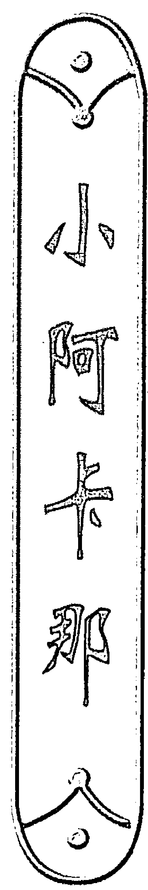

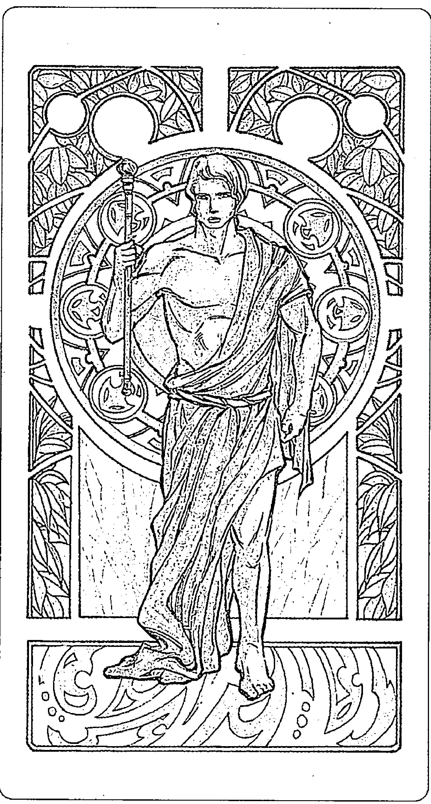

## 权杖侍从

Knave of Wands

◆关键词 自信 认真 一个美好的开始 富有创造性 热情 勇敢

### 牌面解读

风光秀美的山顶上，一个羞涩的少年穿着鲜艳的衣服，手持一根权杖。脸上的红晕仿佛诉说着他的单纯，但也透露出他的幼稚、不稳定和不够成熟。虽然他可能因为年轻犯下愚蠢的错误，但也正因为未谙世事，他有着无所畏惧的自信和孩子般的认真。他的人生将

## Inner Arcana

有一个充满阳光的起点。

### 内涵解析

这张牌的出现代表不论做什么事，都将有一个良好的开端。权杖侍从意味着一个崭新的人生即将开始。侍从牌也可以象征通过信件或其他媒介带来的新消息，但通常是形容一项新计划或新的人生方向的开始。
侍从代表牌组中的风元素，就一般观点来看，这意味着理念和行动结合，开始新方案或迎接新挑战。它代表思想先于行动，你正在思考你将会达到的目标，以及前面的挑战。

### 正位牌意

- 1. 代表一个诚实的人。
- 2. 有好的情形出现，有好消息传来。
- 3. 优秀的助手或辅佐人员。
- 4. 值得参考的资讯。
- 5. 专心致志，可信任的朋友，新的灵感及合作关系，带来重要消息的人，新的挑战。

### 逆位牌意

- 1. 传来坏消息。
- 2. 祸从口出。
- 3. 不安定的状态，令人担忧和困惑。
- 4. 缺乏成熟的思考和决断的能力。
- 5. 傲慢；小阻碍，思考太多而行动不足，优柔寡断。

## TAROT

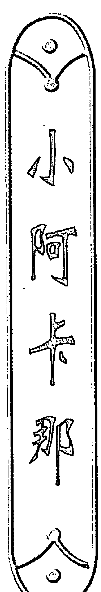

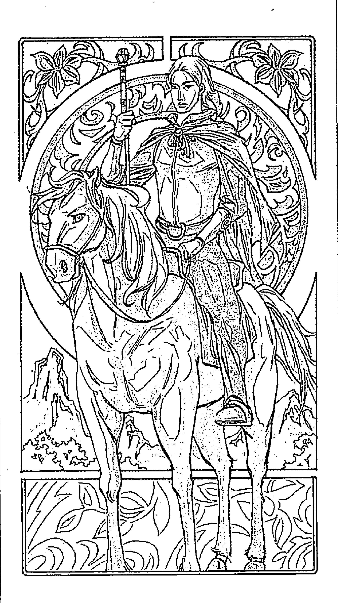

## 权杖骑士

Knight of Wands

◆关键词 热情的 富有魅力的 浅薄的 爱冒险的 不安的 自负的

### 牌面解读

权杖骑士优雅地骑着白马，悠闲地漫步。他手握权杖，四周开满了鲜花。他的脸上写满了对人生的信心，由于过于自信，甚至露出骄傲的神情。他带着勇敢和冲动面对人生的路程，挥动手中的鞭子，策马向前。

## Inner Arcana

### 内涵解析

权杖骑士代表火元素，可以象征行动、旅行、改变，以及为了自身缘故的活动。他给人一种活力、热情及运动的印象。但因为太过志得意满，难免会有一些负面意义。权杖骑士可以代表已经成年但还不是完全成熟的人，或者年龄虽大但心理还未成熟的人。他还不具有权杖国王所拥有的理解力，还需要更多的人生阅历才能够稳定下来。

### 正位牌意

- 1. 事业顺利，获得晋升。
- 2. 开始新的旅程，人生将出现新的转机，对新事物进行挑战。
- 3. 充满自信，有令人难以抗拒的魅力。
- 4. 脾气暴躁，缺少谋略。
- 5. 有进入新领域的愿望，有进取心却个性暴躁；出发、迁居、分离；过于主动。

### 逆位牌意

- 1. 令人措手不及的突发事件。
- 2. 事情的进展被中断。
- 3. 喧哗吵闹的场面。
- 4. 意见产生分歧。
- 5. 感情破裂，分居或分离，无法和谐共处；猝然改变，关系中断。

## TAROT

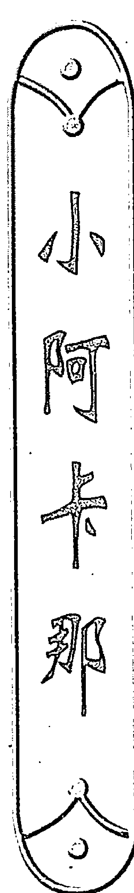

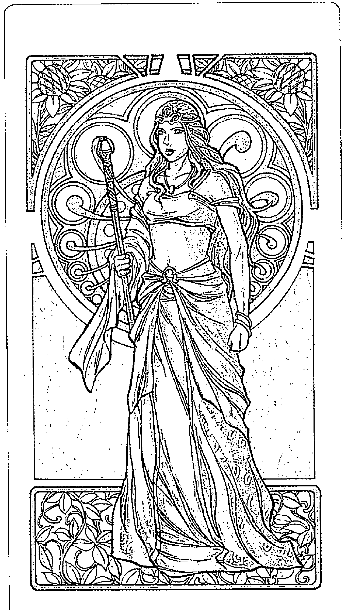

## 权杖王后

Queen of Wands

◆关键词 热情 有魅力 开朗

### 牌面解读

权杖王后穿着华丽的衣服，手持镶嵌宝石的权杖，象征她的尊贵和权力。她身穿蓝色的衣服，表明她的智慧和内在的力量。她的目光偏向左边，似乎看到了什么能引起她的兴趣的情景，脸上微微展现出一丝笑容。

## Inner Arcana

### 内涵解析

权杖王后代表水元素，通过感情、情绪以及直觉处理事情。她和力量牌都以狮子座为代表，代表既坚强又直率的个性，做事比较感性，喜欢凭感觉处理问题，运用内在的力量达成目标。这张牌代表的是一个既积极又自信的女性，有着满腔的热情，喜欢行动胜于思考。

### 正位牌意

- 1. 出现值得信赖的女性或女性工作者。
- 2. 精力充沛，热情而温暖。
- 3. 内心很独立自主或者地位很独立。
- 4. 有决心，有能力。
- 5. 叛逆，从事变革的工作。
- 6. 精神世界丰富的人，有时感性强于理性。
- 7. 与可信任的成熟女性的友谊；富有同情心，善解人意，能真诚地去表达爱。

### 逆位牌意

- 1. 情绪化，心理易波动，不稳定。
- 2. 傲慢。
- 3. 会出现阻碍，难以发展。
- 4. 嫉妒，被忽视，缺乏回应。

## TAROT

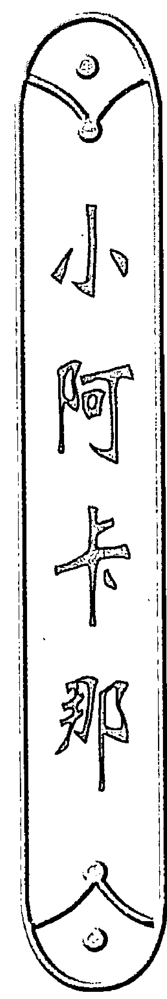

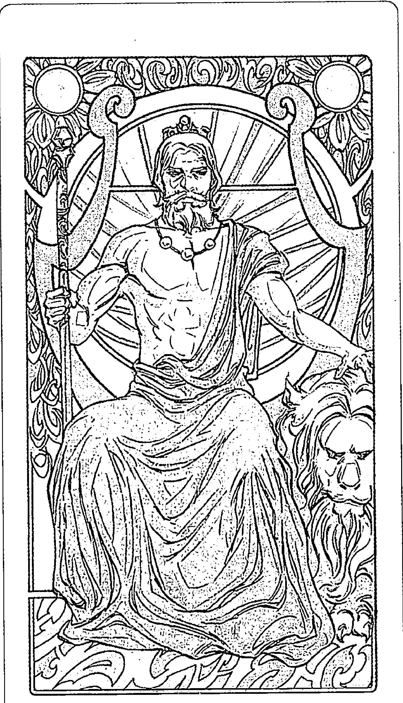

## 权杖国王

King of Wands

◆关键词 坚强 领导者 能力超强 有魅力的 愉悦的 自信

### 牌面解读

权杖国王是一个开国者与建立者。他虽然坐在宝座上，但看上去似乎随时准备站起来去实行他的计划，说明他有着很强的行动力。颌下的胡须仿佛代表他的阅历与经历的沧桑。虽然，对事物过度热情会导致冲动和鲁莽的举动，但他成熟的决断力和拥有的智慧足以对一个国家进行合理地控制。权杖国王是稳重而宽宏大量的。

## Inner Arcana

### 内涵解析

权杖国王这张牌暗示着因自律自信而获得成功，能够通过意志力来领导及统御别人。对自己有坚定的信念，因为这种自信建立在经验之上。诚实、积极而坦率，愿意接受新的挑战，认为过程比结果更重要，拒绝任何拖泥带水的挑战。这些都是这张牌的特质。

### 正位牌意

- 1. 有教养，有学识。
- 2. 是位优秀的父亲。
- 3. 精明，判断常常是正确的。
- 4. 诚实而有良知，善良，有高尚的道德品质。
- 5. 与成熟的男性有良好的关系；严格，自律；诚实可靠，有责任感的人。

### 逆位牌意

- 1. 太过严格，苛求。
- 2. 独断专行。
- 3. 态度过於傲慢。
- 4. 过於在乎颜面而导致些许失败。
- 5. 过分简朴，思想极端。

## TAROT

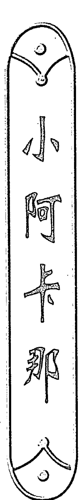

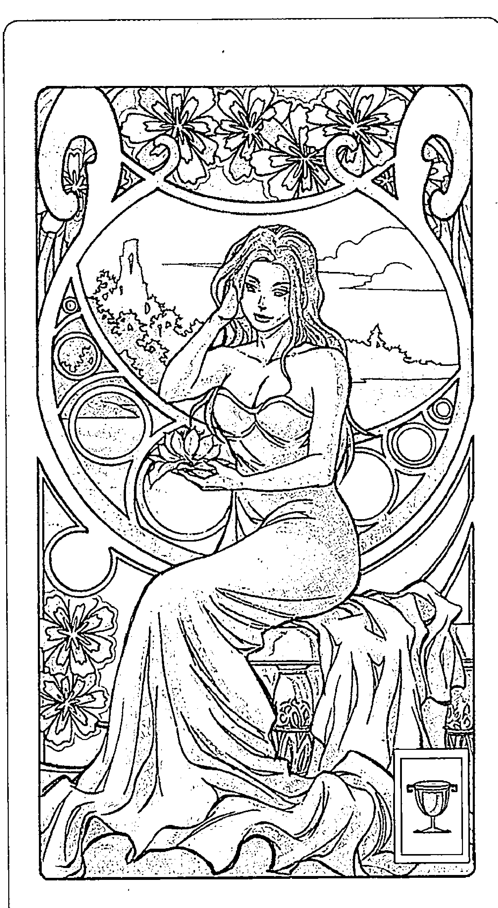

## 圣杯首牌

Ace of Cups

◆关键词 喜悦 满足 丰盈的爱 情感作用 亲密 直觉

### 牌面解读

一位美丽的女人悠闲地坐在窗口，看着手中娇艳欲滴的花朵。她表情甜蜜，面带微笑，似乎很喜欢手中的这朵花，又似乎在遐想着美好的生活。

## Inner Arcana

### 内涵解析

圣杯首牌意味着情感的获得和满足。这张牌代表一个新的开始，暗示生活当中存在着快乐、爱和喜悦的机会。它可能意味着你要进入一段情感满足的时期，你将在生命的核心中发现真正持久的东西。这张牌也是维持你心灵发展的一个机会，通过爱令人快乐和喜悦。
当我们的心灵与生活中的许多瞬间契合时，就算很小的事情也能让你充满喜悦，像是一个阳光灿烂的日子、一朵绽开的花朵、一个婴儿的微笑。当你的生活失去这种和谐时，你将会在挑战中寻求满足。

### 正位牌意

- 1. 爱苗开始萌芽，大胆追求美好生活。
- 2. 有婚庆之喜。
- 3. 心中充满幸福感。
- 4. 一切顺利。
- 5. 出生；精神的永恒之源；满足、欢喜、丰富、美好的前景。

### 逆位牌意

- 1. 必须改掉虚伪的毛病。
- 2. 对求爱者毫无感觉。
- 3. 一场单相思，要尽量摆脱。
- 4. 喜悦中带着隐忧。
- 5. 改变不稳定、没有回应的爱。

## TAROT

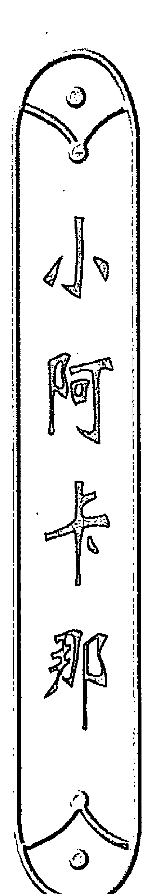

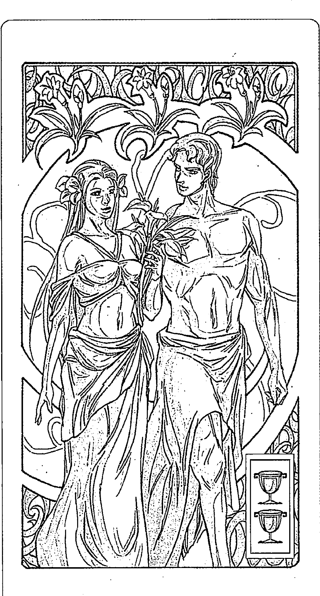

## 圣杯二

Two of Cups

◆关键词 平等 珍惜 真爱 意识到吸引力 寻求信任

### 牌面解读

画面中的少男少女肩并肩地走着，他们似乎在愉快地交流着什么。他们看起来很相配，女子身穿绚丽的衣服，手捧鲜花，表情很知足很安详；男子相貌俊美，充满活力。他们在爱情中感受到了莫大的幸福和喜悦。

## Inner Arcana

### 内涵解析

圣杯二与爱情具有很大关联，提醒你去珍惜现在拥有的感情。当你拥有爱情时，请宽容地对待你身边的那个人，即使有一天要分离，心里也要有感激，至少你们曾经相遇过。男女双方要相敬如宾，平等地对待对方，不要强求。不过这张牌不只局限于男女情感，也可以涉及友谊或各种人际关系，可以代表这些关系往往是和谐、对等，而且愉快的。因此，关于友谊、婚恋、合作的问题，圣杯二都会给你一个明确而且很好的答案。

### 正位牌意

- 1. 有火一样的热情。
- 2. 美好的友谊。
- 3. 求问者或身边的朋友有婚庆之喜。
- 4. 方方面面的关系都很和谐。
- 5. 情侣或朋友之间相互了解、相互尊重、彼此善待。
- 6. 旅行，漂泊；年轻的爱侣，亲密的朋友。

### 逆位牌意

- 1. 情侣或朋友之间互相猜忌。
- 2. 当事人或周围的朋友可能即将面临离婚。
- 3. 各方面的关系比较对立。
- 4. 你的爱无法得到满足。
- 5. 误解，失去方向。

## TAROT

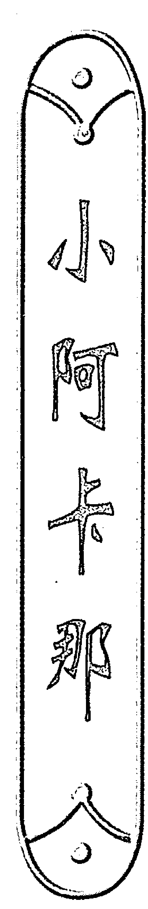

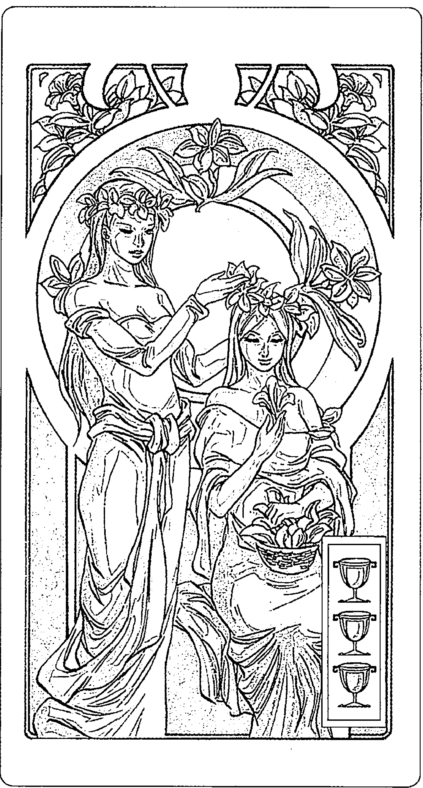

## 圣杯三

Three of Cups

◆关键词 喜悦 丰收 享受庆祝 感受繁华 友谊

### 牌面解读

这是一个喜庆的日子。画面中的两个女子身穿华服，其中的一位正在给另一位戴花冠。她们都面带笑容，准备迎接快乐的日子。

## Inner Arcana

### 内涵解析

圣杯三通常表示以感情作为关联的团体，是带来祝福的圣杯，杯子里满盛着各种各样的想法，带着喜悦的心情，一起干杯。另外，这张牌也代表一种欢庆的场合，其丰收的含义通常代表事情有了好的结果。

### 正位牌意

- 1. 该事情会得到解决。
- 2. 需要作一项决定。
- 3. 幸福的婚姻。
- 4. 生活重新开始。
- 5. 矛盾的关系化解了。
- 6. 伤痛已经痊愈。
- 7. 想念、怀旧之情；曾经的白日梦；休息。

### 逆位牌意

- 1. 事情做过头了。
- 2. 乐极生悲。
- 3. 快乐也伴随着痛苦。
- 4. 不好的饮食习惯。
- 5. 做事情拖拉，不干脆。

## TAROT

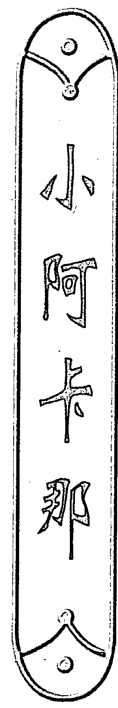

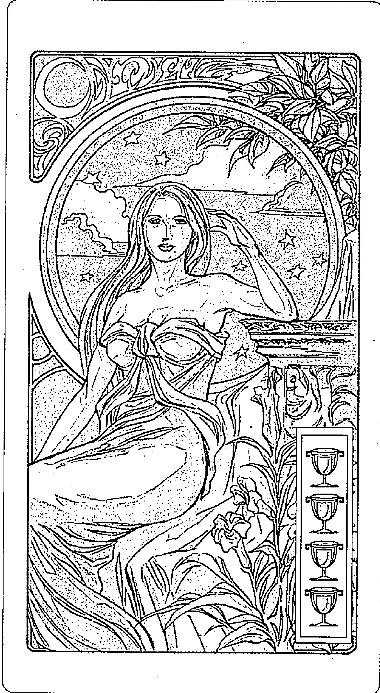

## 圣杯四

Four of Cups

◆关键词 不满 冷漠 沉思 观望选择 沉浸自我

### 牌面解读

美丽的少女坐在一边，用手托着脑袋，好像在思考着什么。她好像很为难，不知该怎么选择，一脸的愁容。也许她遇到了让她两难的事情，她还没有想好怎样去平衡。你的生命当中肯定出现过这样的情况，你必须懂得适当地安排。

## Inner Arcana

### 内涵解析

圣杯四代表的是一种对现状不满的心态。然而，尽管你知道目前的状况很不协调，却不知道应该如何改变它。面前可能会有不同的机会，然而你并没有做好准备，决定选择哪一种前进的方向。或者这并不是做出选择的时机，而是调整自己心情的时候，只有理清自己的心中真正想要做什么，你才能够明确自己脚下的道路。

### 正位牌意

- 1. 总感到寂寞无聊，需要找到一件自认为有意义的事情来做。
- 2. 身心俱疲，需要调节或休息。
- 3. 失望的心情出现或持续，对生活没有信心。
- 4. 对什么都不感兴趣，觉得生活没有意义；面临选择。
- 5. 珍爱的东西；保持，恢复，重逢。

### 逆位牌意

- 1. 有新的人际关系，生活出现另一种境界。
- 2. 发现新方法，出现新机会。
- 3. 脱离低潮期。
- 4. 新鲜事，新的关系。

## TAROT

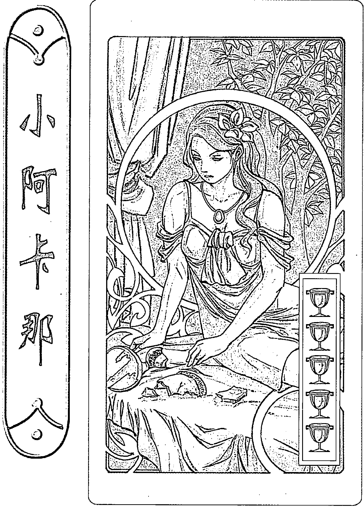

## 圣杯五

Five of Cups

◆关键词 悲观 遗憾 毫无发展 亏损 丧亡

### 牌面解读

本来好好的圣杯，却因为女孩的疏忽给打碎了。原来圣杯中的东西也都没有了，唾手可得的幸福与成功也因此失之交臂。残酷的现实让我们知道，就算有再多的爱和幸福，也不会再有杯子来给你盛载了。

## Inner Arcana

### 内涵解析

圣杯五代表的是一种悲伤痛苦的心态，眼看着身边的幸福在一瞬间消失无踪，即将到达的成功彼岸忽然又如此的遥不可及，心情的悲观和遗憾可想而知。可是，希望就在失望的背后，虽然倒了两只杯子，毕竟你还拥有三只完好的圣杯，珍惜仍然拥有的，重新开始，否则生活会永远这么痛苦下去。

### 正位牌意

- 1. 被后悔的情绪淹没，生活在一种无望的痛苦当中。
- 2. 局部受到损害导致怀疑自己整体的正确性。
- 3. 有缺陷。
- 4. 无意义的交际。
- 5. 深深的幻灭感，开始怀疑生活和人生的意义。
- 6. 出现少许错误，有物质上的损失，美中不足。

### 逆位牌意

- 1. 老朋友回来了，往日的美好会重新回到生活中。
- 2. 旧缘分得到重续，夫妻破镜重圆。
- 3. 东山再起，重拾生活的信心。
- 4. 结成新的同盟。
- 5. 快活、满足、继承、庆祝、成就、胜利。

## TAROT

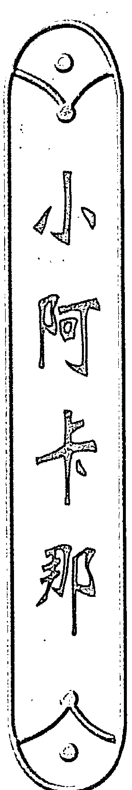

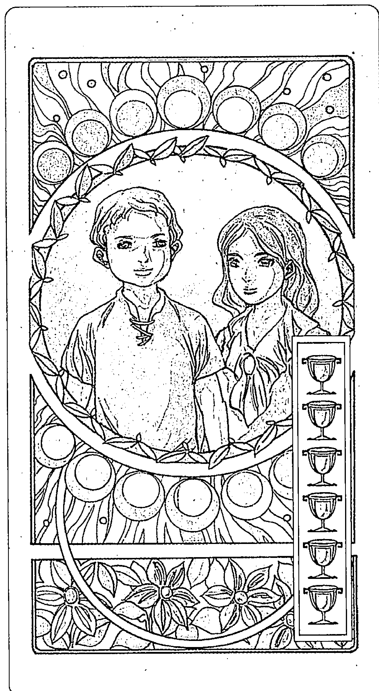

## 圣杯六

Six of Cups

◆关键词 纯洁 安定 善意 孩提 清白

### 牌面解读

画面的主要位置，是两个可爱的男孩和女孩，显示出一种美好与和谐。他们一脸的稚嫩与青涩，显示出他们年轻的美好与纯洁。他们之间似乎有朦胧的爱情，但他们的爱情是那样美好，没有瑕疵，他们之间很清白。看着他们年轻的脸庞，不禁让我们想起过去的纯真年代。

## Inner Arcana

### 内涵解析

圣杯六除了代表对往事的温馨回忆和思乡情怀之外，也能提醒求问者，回忆毕竟是过去的事情了，生活的路还很长，要面向将来的幸福，现在就应该开始努力。

### 正位牌意

- 1. 陷入回忆之中，难以自拔。
- 2. 幼时的体验刻骨铭心，影响到现在的情绪及行为。
- 3. 虽然分手，但两人仍然可以再见。
- 4. 多愁善感，情绪不稳。
- 5. 无法消散的乡愁。
- 6. 结合，快乐的未来，爱情，热情，友情。

### 逆位牌意

- 1. 好运即将到来，需要在奋斗中等待。
- 2. 比过去更关心未来。
- 3. 开始有长远的打算，能够高瞻远瞩地过日子，努力为事业奋斗。
- 4. 把过去的回忆作为将来努力的动力。

## TAROT

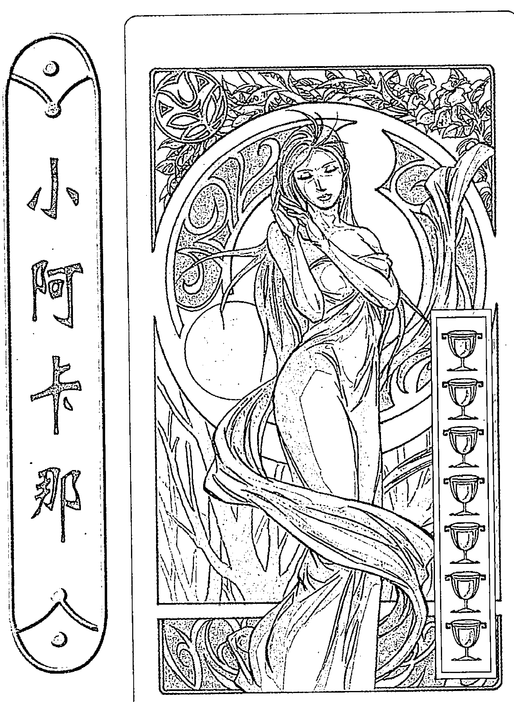

## 圣杯七

Seven of Cups

◆关键词 幻想 欲望 浪费 选择 无法实现的梦想

### 牌面解读

在画面中，一个女子紧闭双眼，她似乎在幻想，她在幻想得到整个世界，在幻想她将拥有一切。然而，现实却与之相反，她没办法拥有一切，因为她的表情中有些许无奈、痛苦与挣扎。面对她想得到的而不能得到的东西，她的一切幻想都是徒劳。

## Inner Arcana

### 内涵解析

圣杯七代表着一种无序的混乱，什么都想得到，这种贪欲本是人类的本性，但也是无法实现的梦想。这张牌的出现表示你必须马上调整生活状态，否则过分的贪心会变成有害的放纵、沉溺和颓废。

### 正位牌意

- 1. 对生活不现实的态度。
- 2. 反复无常，出尔反尔。
- 3. 不切实际，只会幻想成功。
- 4. 爱做白日梦。
- 5. 采取欺诈的手段。
- 6. 多种选择的机会，放弃自己过多的欲望。

### 逆位牌意

- 1. 下定决心，有决断力。
- 2. 有坚强的意志，经得起艰难困苦的考验。
- 3. 近期将有机会达到目标。
- 4. 明智的选择。
- 5. 不再优柔寡断，突破保守的限制。

## TAROT

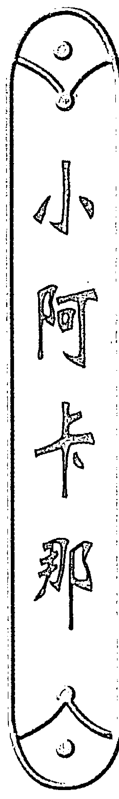

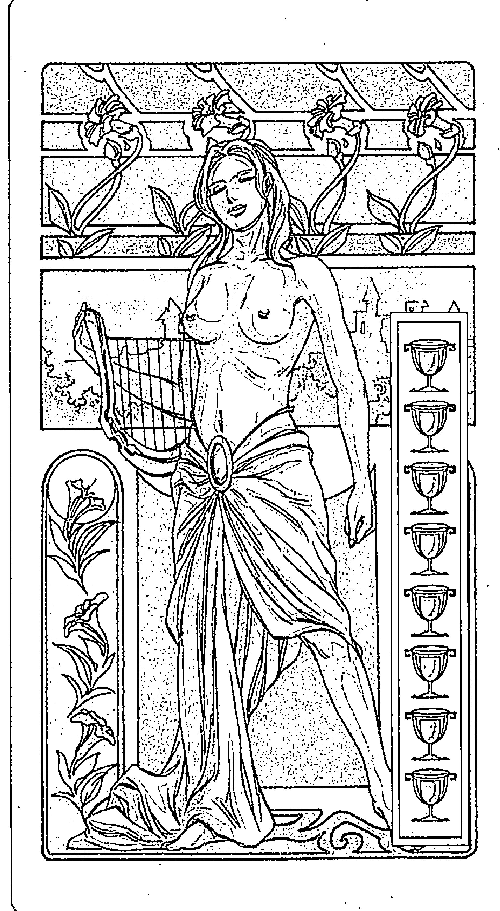

## 圣杯八

Eight of Cups

◆关键词 追寻 新的选择 内涵 厌倦 继续

### 牌面解读

画面中的女人拿着竖琴，一脸的陶醉，她似乎对现在所拥有的很满意，对自己的选择也很满意。

## Inner Arcana

### 内涵解析

圣杯八表示应该认知你的内在追求。这是一张代表自我发现、心灵成长的牌。对行动有所思考能帮助你将经验转变为智慧，这会使你更靠近理性思考。试着探索自己的内心，可能你对现在的状况不太满意，那么看看有没有新的选择或者内心真正的追求。

### 正位牌意

- 1. 半途而废，没有毅力和耐心。
- 2. 好奇心极重，严重的疑心病。
- 3. 衰弱，失去力气。
- 4. 理智的爱，不再盲目追求。
- 5. 停止努力。
- 6. 寻求，想象力；深思之后的理智选择。

### 逆位牌意

- 1. 新的恋情即将降临，生活出现转机。
- 2. 喜庆之事不断。
- 3. 将有舞会或宴会之类的邀请。
- 4. 正在努力奋斗。
- 5. 幻想，欲望，不实际的想法。

## TAROT

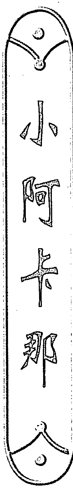

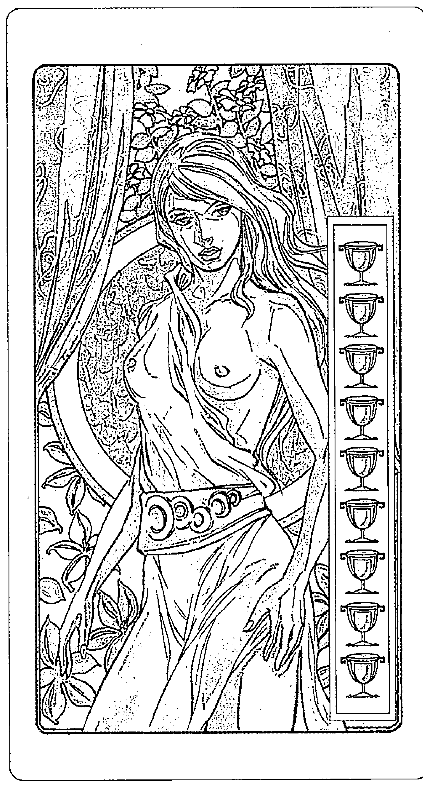

## 圣杯九

Nine of Cups

◆关键词 梦想成真 快乐 满意 实现理想 感官愉悦

### 牌面解读

画面中的女子，身体丰腴，面容姣好。她的存在让整个画面呈现出一种丰盈的感觉。“九”是达到顶峰的数字，在中国文化中，也有最高的含义。这张牌所传递的是美梦成真的喜悦。

## Inner Arcana

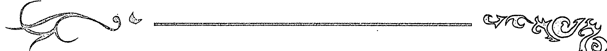

### 内涵解析

圣杯九这张牌充满强劲的生命力，预示梦想在现实中的去向，是一张可以招来好运气的幸运牌。出现这张牌的时候，就预示着你有可能得到希望拥有的东西。

### 正位牌意

- 1. 物质生活很富足。
- 2. 内心充满幸福。
- 3. 形势有利，乘胜追击。
- 4. 有潜力，有希望。
- 5. 获得成功。
- 6. 将很快找到心灵理想的家园。

### 逆位牌意

- 1. 物质上有一定损失。
- 2. 生活中容易犯错误。
- 3. 内心十分不满。
- 4. 不懂得节制，体力开始衰弱。
- 5. 虎头蛇尾，有始无终。
- 6. 拒绝或缺少他人的帮助，心灰意懒，孤单。

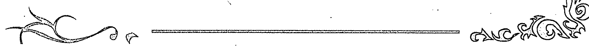

## TAROT

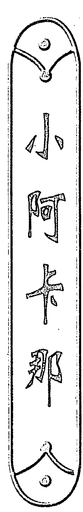

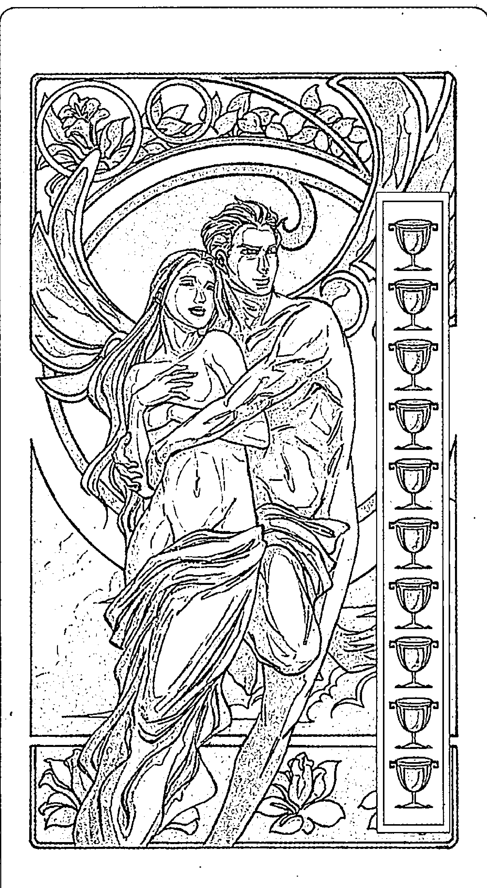

## 圣杯十

Ten of Cups

◆关键词 保障 安全 愉悦 欢乐 家庭 和平

### 牌面解读

画面中有一对半裸的男女，男人紧紧地拥着女人，而女人则一脸的陶醉。他们在向前奔跑，衣服已经滑落大半，似乎他们要挣脱一切的束缚。男人的身体很健硕，他的拥抱给了女人很大的安全感，让她能放心地跟着他，他们的未来一定很快乐。

## Inner Arcana

### 内涵解析

圣杯十指的是个人的成熟与满足，表现的是人际关系中的快乐与和谐。如果在很长一段时间内有人际冲突，那么拿到这张牌就表示和解指日可待。这张牌也代表了保障和安全，虽然他人的帮助固然十分重要，但只有自我内心富有才是永不枯竭的精神之源。

### 正位牌意

- 1. 内心平和，情绪良好。
- 2. 认为目前的幸福是实实在在的，感到知足。
- 3. 家庭美满，工作环境良好，人际关系融洽。
- 4. 满足的爱，身心愉悦。
- 5. 慷慨，幸福，安心。

### 逆位牌意

- 1. 内心感到不安，情绪忐忑。
- 2. 失去友情，失去事业上的得力伙伴。
- 3. 有家庭暴力发生。
- 4. 人际关系不和，对立。
- 5. 过于依赖，安于现状。

## TAROT

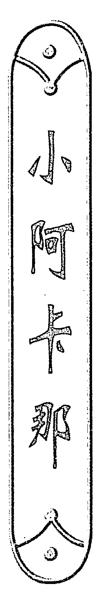

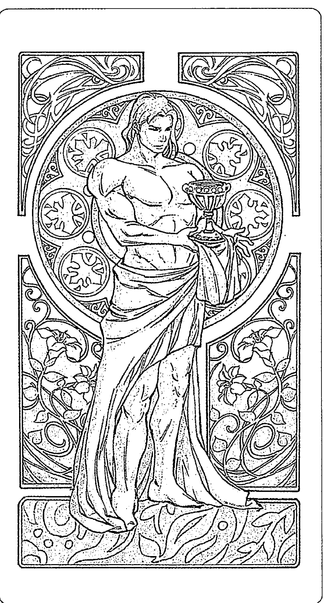

## 圣杯侍从

Knave of Cups

◆关键词 柔弱 情窦初开 直觉 情绪 亲密 爱

### 牌面解读

一个年轻男子手持圣杯，低头露出浅浅的微笑。他在想什么？想起了心仪的女孩，还是想起他们在一起的快乐时光？情窦初开的男子满心的甜蜜！

## Inner Arcana

### 内涵解析

圣杯侍从这张牌意味着情感上的成长，表示透过冥想或其他任何类似的被动方式来进行心灵上的学习或发展。圣杯侍从看上去像个柔弱纤细的少年，代表着善于思考的年轻人，好学和沉稳使他得到人们的信赖。

### 正位牌意

- 1. 喜欢冥想，在冥想中想象并感受现实中缺少的幸福。
- 2. 将有好消息传来。
- 3. 辛勤努力。
- 4. 人缘好，身边的朋友很热心。
- 5. 做事情深思熟虑。
- 6. 新奇；爱的使者。

### 逆位牌意

- 1. 身边一定是有阿谀奉承的小人。
- 2. 心灵手巧。
- 3. 应该懂得独自一人排遣不良情绪。
- 4. 脱离控制。
- 5. 出轨，分心，诱惑。

## TAROT

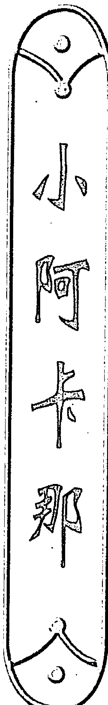

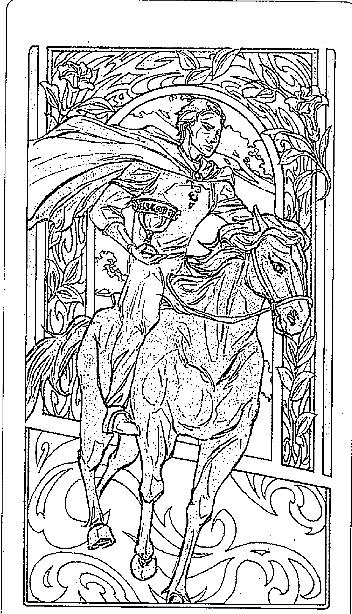

## 圣杯骑士

Knight of Cups

◆关键词 体贴 有魅力的男子 情感 浪漫 情绪化的 直觉

### 牌面解读

英俊的金发骑士手持圣杯，骑着骏马，在草原上奔驰。他面带浅浅的笑容，瘦削刚毅的脸庞散发出男性的魅力。整个画面充满了浪漫和美好的气息。

## Inner Arcana

### 内涵解析

圣杯骑士代表着情感丰富、重视直觉并且魅力十足的男子，意味着在情感上的行动。这张牌如果代表的是一个人的话，则是温柔体贴和感性的，通常内心温和敏感，各种人际关系、情感和创造力的追求都吸引他，在作决定时通常会将伴侣的需求也考虑在内。

### 正位牌意

- 1. 新的机会在慢慢靠近，生活正在发生变化。
- 2. 计划，提交预案。
- 3. 身边到处是诱惑却毫无意识。
- 4. 热心，温柔。
- 5. 放松；增进情感的行为；深思熟虑的人。

### 逆位牌意

- 1. 小心身边的人，处境危险。
- 2. 谨防被欺诈。
- 3. 行为不端，需要检讨自己。
- 4. 生活不够检点。
- 5. 得到坏消息；优柔寡断，停滞不前。

## TAROT

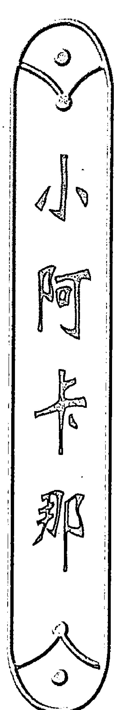

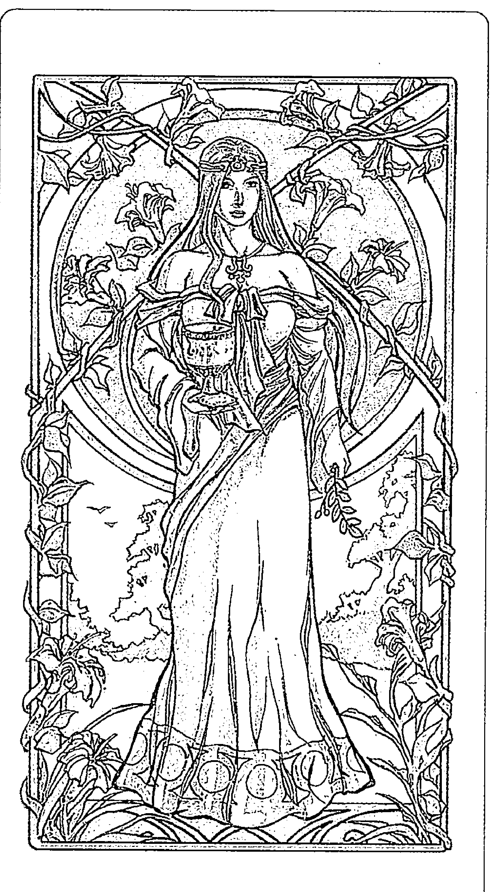

## 圣杯王后

Queen of Cups

◆关键词 仁慈 直觉 倾听 爱意 善良 感应

### 牌面解读

高贵美丽的王后，目光温柔地注视着她面前的人们，一副母仪天下的神态。她手中端着象征丰盈的圣杯，穿着端庄的长袍，散发着成熟女人的韵味。她是如此的温柔，母性的光辉甚至已经盖过了她的美貌，让人心醉神迷。

## Inner Arcana

### 内涵解析

圣杯王后意味着凭借直觉而成功。她从经验得知杂乱无章的想象所产生的结果通常是有限的，因此她应该将精力用在对身体、情感、精神，以及心灵都很有价值的行动上。创造力显示出的成就是她最大的骄傲。虽然她看上去很温柔细心，但她却有坚强的意志。母性的爱调和着她的意志，并增加个性上的深度。她带着爱心和宽容，常常表现出浓浓的家庭情感。

### 正位牌意

- 1. 感情丰富而细腻，容易多愁善感；压抑情绪。
- 2. 愿意为爱献身，陷入爱河。
- 3. 善良，公正。
- 4. 成功就在眼前，坚持奋斗。
- 5. 幸福的生活。
- 6. 女性朋友，心中所想的女性；倾听，准确的直觉。

### 逆位牌意

- 1. 无法信赖身边的人，尴尬的环境会困住你。
- 2. 注意别人身心的独立性，不要强求别人，给别人足够的空间。
- 3. 注重名誉。
- 4. 尝试改变性情使你面临困难。
- 5. 品行不够端正。
- 6. 淡漠感情的女伴，个性消极；过于以自我为中心。

## TAROT

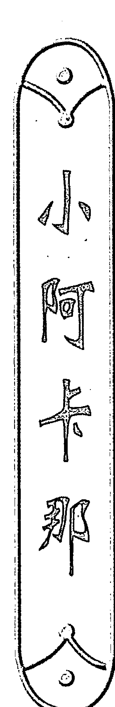

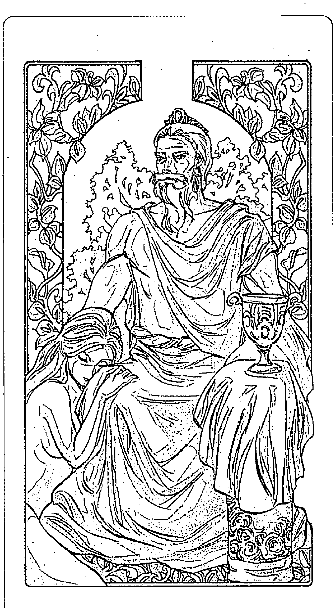

## 圣杯国王

King of Cups

◆关键词 宽宏 亲切 明智 胸怀宽广 人道 平静 圆滑老练

### 牌面解读

手握大权的国王坐在宝座上，圣杯摆在一旁，充满自信的目光望着前方。他身穿宝蓝色的长袍，象征着智慧。画面左下角，有一个赤裸的女人伏在国王的膝上，似乎在忏悔，以取得他的原谅。当一个人登上了至高无上的地位时，还有什么样的罪人是他不能宽恕的呢？

## Inner Arcana

看着国王仁慈的面庞，人们不禁开始忏悔自己的所作所为。

### 内涵解析

圣杯国王暗示通过创造和情感上的训练而获得成功。他对任何需要创造力的领域都很在行，例如艺术、建筑、音乐等等。圣杯国王也适合从事心理学、考古学、哲学或宗教信仰的研究。在现实的事业中，他可能成绩中等，表现也不是最出众的，但他的心一直处于对创意的追寻。

### 正位牌意

- 1. 见多识广，令人尊敬。
- 2. 某方面的专家，在某方面有突出的作为。
- 3. 有创造力，有创新意识。
- 4. 公正而值得信赖的人。
- 5. 顺利；宽大，心胸宽广，保守秘密，能忍耐逆境；艺术家。

### 逆位牌意

- 1. 表里不一，令人厌恶。
- 2. 行为不端，欠缺道德感，在追逐名利上不择手段。
- 3. 即将面临一些损失。
- 4. 不诚实，不公正；狡猾。

## TAROT

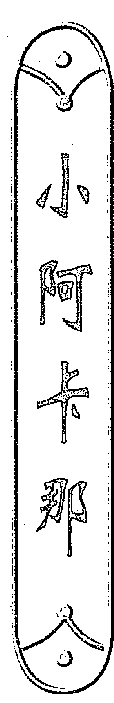

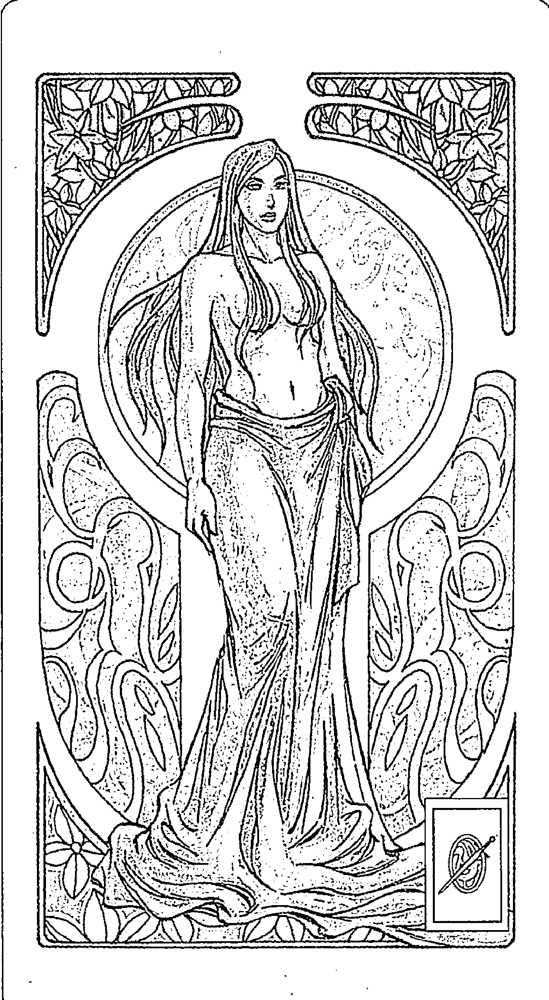

## 宝剑首牌

Ace of Swords

关键词 新的冒险 挑战 公正 智力 坚忍 真相

### 牌面解读

画面中的女人半裸着身体，她似乎在向世人挑战。但她又用长发挡住胸前，好像还有点羞涩。这幅画面象征着挑战欲望的力量是强大的，它可以使人获得胜利，但如果使用不慎，就会导致毁灭。它很容易使人走向极端，就像爱与恨，可以成就，也可以毁灭一样。

## Inner Arcana

### 内涵解析

宝剑首牌代表开始或正计划着一项冒险，暗示你的心智可以看透物质世界，直达事物的精神层面，看穿思想在物质世界中造成的结果，你必须谨慎地评估采取行动可能带来的任何后果。这张牌也有理智、正义、智慧、心灵力量、决心、公平等相关牌义，往往代表了某种权威，或是寻求权威的必要性。这张牌出现的时候，你应该开始反思自己是否有过激的表现。

### 正位牌意

- 1. 表示具有强烈的进取心与攻击性。
- 2. 接受挑战时胜利的可能性比较大，结果更积极一些。
- 3. 需要手术，经过治疗可以治愈疾病。
- 4. 否极泰来，逢凶化吉。
- 5. 有过人的力量，取得使自己惊讶的成果。
- 6. 敏锐的理解力，成功，能量的释放，创造力，构思，果断，开始。

### 逆位牌意

- 1. 容易引起麻烦，有争端。
- 2. 拼搏奋斗的过程中出现很多障碍。
- 3. 因逞强而招来灾难。
- 4. 挑战失败的可能性大，结果比较消极。
- 5. 受到外伤，住院。
- 6. 暴力，自我毁灭；有阻碍。

## TAROT

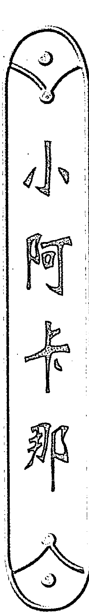

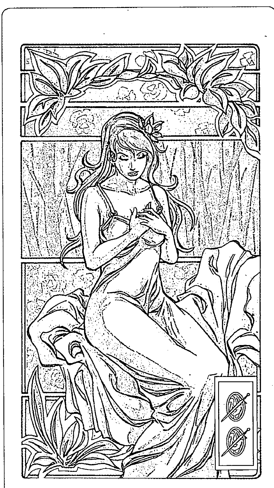

## 宝剑二

Two of Swords

关键词 僵局 逃避 压抑 选择 避免

### 牌面解读

一位美丽的少女端坐一旁，她眉目低垂，双手捧心，似乎有很多愁苦。她看上去很封闭自己，所有的苦恼都由自己承担，不愿对别人倾诉。

## Inner Arcana

### 内涵解析

宝剑二暗示求问者有一颗比较封闭的心灵，对待万事万物都持有消极的心态，采取一种抗拒和逃避的态度。但是，事情已经陷入了僵局，逃避并不是办法，问问自己的内心，作出选择吧！
这张牌还有一个意义，它暗示任务即将成功完成。经过一段时间的努力工作和大家的支持，你的努力即将得到成果，它将带给你真实的喜悦和荣誉感。不过，你们的收获不止如此，在合作的过程中产生并增进了的友谊才是你们得到的最大的财富。当你面对困难时，不要忘记来自于周围人的支持，合作将帮助你克服任何难题。

### 正位牌意

- 1. 有协调能力，能全身心去完成一件事。
- 2. 有钢铁般的意志，不轻易改变。
- 3. 与同事或竞争对手互相残杀。
- 4. 一直不认输的事情已经放弃或即将结束。
- 5. 合作，勇于面临新的工作；相称，有帮助的环境。

### 逆位牌意

- 1. 代表求问者能作出正确的决定；打破僵局，结束紧张，停止抗拒。
- 2. 表里不一，双重人格。
- 3. 不要损害朋友利益，注意保护友谊。
- 4. 见好就收，急流勇退。
- 5. 口是心非，貌合神离。

## TAROT

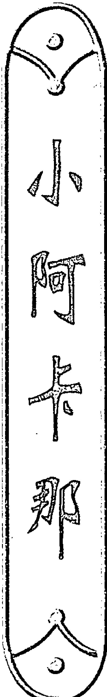

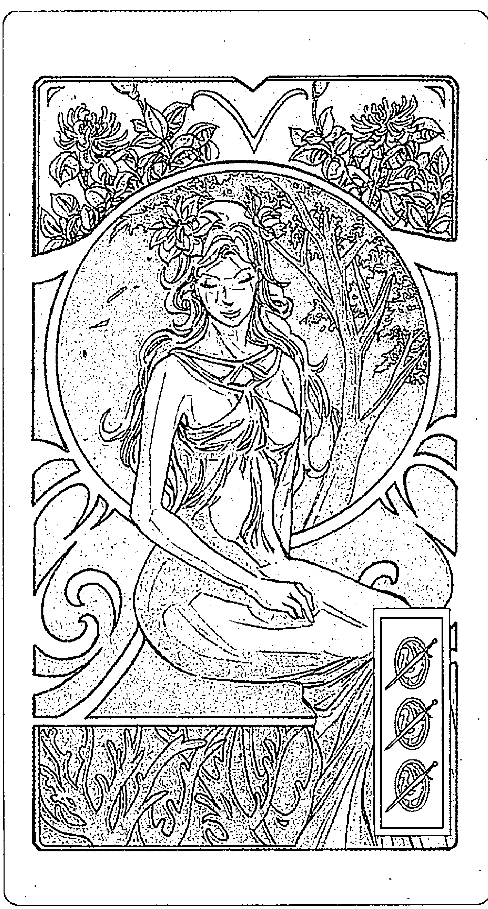

## 宝剑三

Three of Swords

◇关键词 伤心 灾难 悲惨的结局 辜负 寂寞

### 牌面解读

这似乎是一个秋天，秋风的凄凉带走了大地的生机，剩下的是一片荒芜。人在自然的面前显得十分渺小，甚至是无能为力。大地的萧条平静，究竟预示着什么呢？

## Inner Arcana

### 内涵解析

宝剑三意味着另一个开始之前某种状况的结束。这张牌描绘的是一个不幸的情景，暗示在某种情况下，一切已到了最低潮的时期，但尾随艰难时刻而来的将会是新的以及更好的事物。体验悲伤并不是件坏事，因为这样做的同时，你也扫清了障碍，让即将到来的机会可以接近你。你对人生的思想或信念会导致此刻的境遇，在这里，你的思想将会带你到任何你认为可以去的地方，它或许会把你从物质环境和对生命的信念中解脱出来。你可能是被一些无用的事情或对生命具破坏性的信念缠住了。通常这种低潮的时候，你应该设法抓住那些你平日所丢失的事物和态度，这时所需要学习的是屈从并且容许改变发生。记住，悲伤会过去的！

### 正位牌意

- 1. 最近经常有口角发生。
- 2. 失去了生活中所一直享有的一种爱。
- 3. 离散，准备分手。
- 4. 生活中出现了严重的对立。
- 5. 伤心，失意的眼泪。
- 6. 无法减轻痛苦的泪水，坏消息，不幸；新的开端。

### 逆位牌意

- 1. 心理上一直处于封闭状态，不愿接纳任何事物。
- 2. 伤口会愈合，沉浸在悲伤中，不愿接受别人帮助。
- 3. 一直让周围的人伤心。
- 4. 小心会有大的损失。
- 5. 不安的感觉越来越重。
- 6. 短期的获利，暂时的成功。

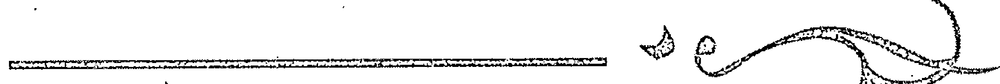

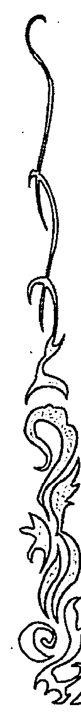

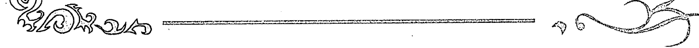

## Inner Arcana

## 宝剑四

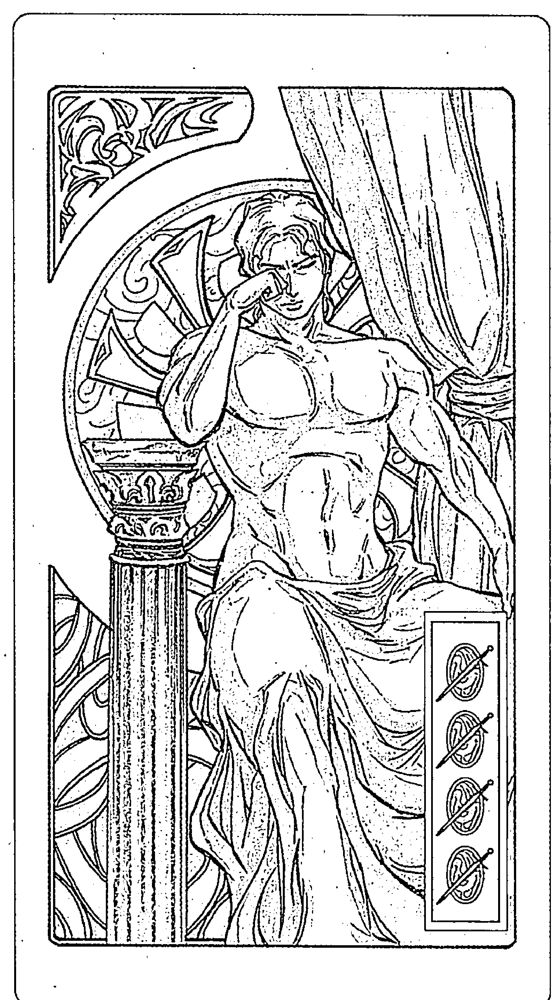

# 小阿卡那

Four of Swords

◆关键词 休整 沉思 预备 纠缠不清

### 牌面解读

画面中的少年以手托腮，紧锁眉头，他似乎陷入一种难以理清的状况。但他的动作又好像是在休息，因为不管情况是多么难以解决，还是需要一定的休息。毕竟经过休整和思考的准备之后，才能够以清醒的头脑和心态来解决各种问题。

## TAROT

### 内涵解析

宝剑四出现的时候，通常代表求问者正处于一种休息状态，或是需要放慢步伐，好好休息一番，然后重新出发。这张牌也可以提醒求问者摆脱那些让自己心烦的事情，也许你正陷于与他人的对立或争执中，请仔细思考造成你们之间矛盾的原因，暂时放下你与对手之间的歧视，也许这将帮你解决你的困扰。当你脱离了对立和争执，你内心的烦恼也将消退。生活中的很多矛盾常出自于人与人之间的不理解，这样的对立并非是真正的大是大非。面对你的对手放下手中的剑并不是胆怯的表现，而是一种宽容的勇敢。

### 正位牌意

- 1. 需要静养一段时间。
- 2. 凡事要学会作暂时性的让步。
- 3. 以退为进。
- 4. 休息，一段不去思考或争斗的时间；撤退。

### 逆位牌意

- 1. 要常常提醒自己切勿急躁，凡事要宽容对待。
- 2. 通常能在较短的时间内休息妥当，重新投入生活。
- 3. 注意检讨自己，找回从前失去的东西。
- 4. 杂乱，忙碌，焦虑。

## Inner Arcana

## 宝剑五

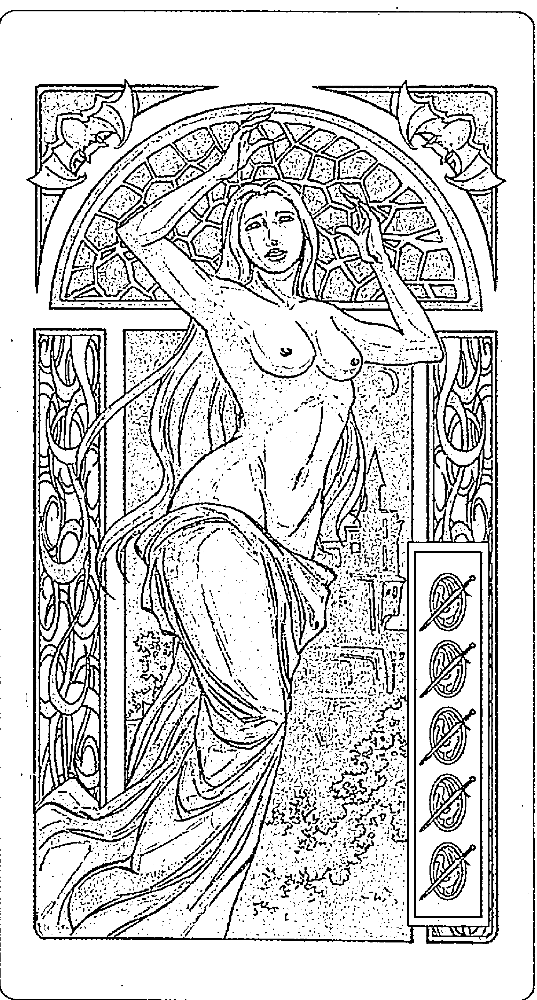

# 小阿卡那

Five of Swords

◇关键词 不和 混乱的景象 恶化 暂时的胜利

### 牌面解读

画面中柔弱的少女，手无寸铁，表情惊慌，似乎受到了外界的侵犯，但她却无力反抗，只能让自己落入敌人的手中。可是，就算是遭受侵犯，反抗的火苗早已在她的心中蔓延，总有一天，侵犯她的人会得到应有的惩罚。

## TAROT

### 内涵解析

纷争会使事态越来越恶化，受到伤害的人将会对你失去信心。为了暂时的胜利而失去更多的东西，这是不值得的。这张牌提醒求问者不要一味地追求胜利而忽略了其真正的意义，应该在奋斗的过程中，找到利人利己的方法。

### 正位牌意

- 1. 不要目光短浅，不要忘掉努力的最终目的。
- 2. 小心四周对你怀有敌意的人。
- 3. 有辞职或免职的危险。
- 4. 堕落，脱离正轨。
- 5. 对人际关系产生迷惑。
- 6. 侦探，间谍；遗失。

### 逆位牌意

- 1. 从自私的行为中解脱出来，停止无谓的争执。
- 2. 无法预测。
- 3. 朋友中将有人发生不幸。
- 4. 不好的消息。
- 5. 放弃；争论；可疑的建议。

## Inner Arcana

## 宝剑六

Six of Swords

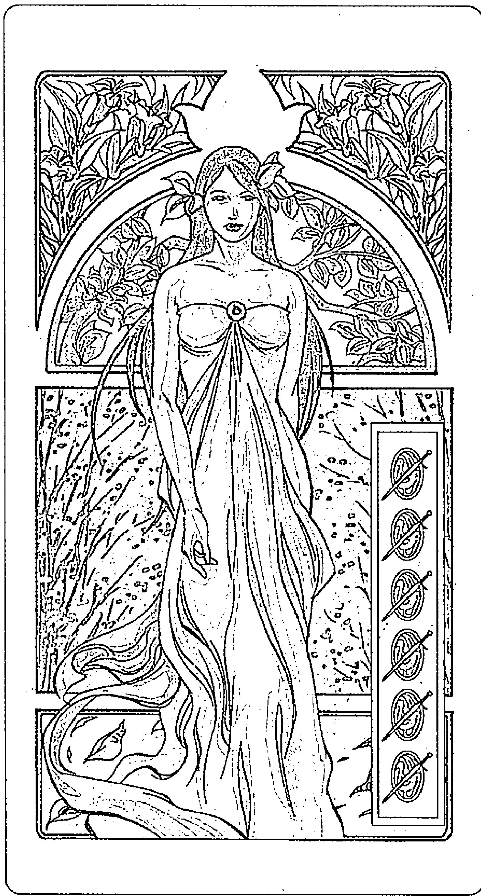

# 小阿卡那

◇关键词 旅行 前往解决 尝试 忧郁 恢复

### 牌面解读

画面中的少女雍容华贵，一脸的平静，并且嘴角挂着浅浅的微笑，树上硕果累累，枝繁叶茂。整个画面让人感到舒畅、愉快。如果选在今天出行，一定会很顺利。

## TAROT

### 内涵解析

处于困境中的时候，何去何从都决定着人的命运。前进也许还有希望，否则逆水行舟，停止不前，要面对的就只能是失败。这张牌意味着经过不断地尝试而获得成功，苦难带来的磨炼丰富了我们对人生的理解，因此宝剑六也代表一段旅行或放松的时期。经历了一段艰苦的努力并获得成功后，我们需要休息调整，要用一段时间来思考今后的方向和旅程。

### 正位牌意

- 1. 将来会遇到更多的艰难。
- 2. 伤口迟迟无法痊愈，不愿意接受帮助。
- 3. 暂时没有好的对策。
- 4. 需要倾吐心声，避免误解。
- 5. 勇敢，胜利；通过思考和平静战胜恐惧；旅行，假期。

### 逆位牌意

- 1. 否极泰来，历尽艰险后会事事顺利。
- 2. 把自己隐藏起来与世隔绝。
- 3. 需要别人帮忙。
- 4. 已渡过难关。
- 5. 失落，空虚；潜在的危险。

## Inner Arcana

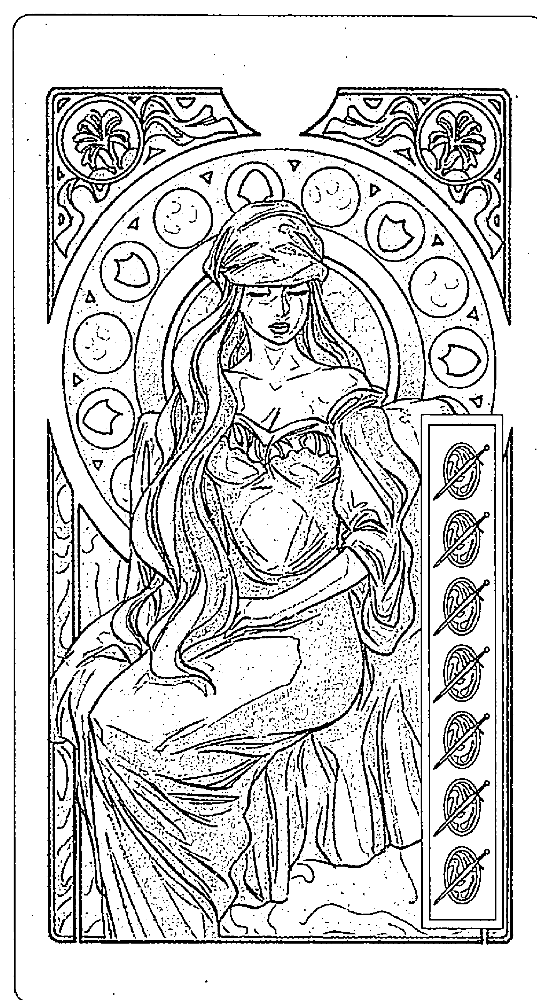

## 宝剑七

Seven of Swords

关键词 与众不同 奇思妙想 独来独往

### 牌面解读

一位少女端坐在一旁，低头沉思。她想要拥有整个世界，实现自己丰功伟业的理想，但现实又让她无所适从。她紧闭双眼，似乎不想面对现实与理想的不同。

## TAROT

### 内涵解析

这张牌告诉人们，想成功地做任何事情都要付出极大的努力。宝剑七暗示了你内心的无奈，你对现实情况无能为力和感到失落，你觉得自己无法选择，这也是一种对自己没有信心的表现。你可能被你的伴侣、家人、心灵或宗教信仰所束缚。我们经常被自己或别人所控制，沉溺在不现实的幻想中，这张牌正代表这种情况。

### 正位牌意

- 1. 生活中总是疏忽大意。
- 2. 有隐藏得很深的敌人。
- 3. 泄露秘密。
- 4. 将要或已经失窃。
- 5. 计划已经或面临失败。
- 6. 危机；放弃，投降；被束缚。

### 逆位牌意

- 1. 有意想不到的好运。
- 2. 要参考别人的建议。
- 3. 好的忠告或指导。
- 4. 艰难的任务；意志消沉。

## Inner Arcana

## 宝剑八

Eight of Swords

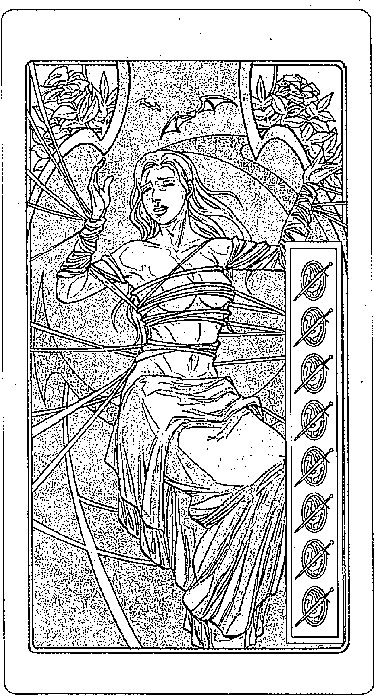

# 小阿卡那

◇关键词 限制 约束 停止 无能 混乱

### 牌面解读

画面中的女人被绳索捆绑，无法挣脱，给人一种束缚的压迫感。女人面色苍白，有一种无奈又有一种对自由的渴望。然而，纵然再多的绳索也捆不住向往自由的心，只要有勇气，就可以冲破束缚，奔向自由。

## TAROT

### 内涵解析

宝剑八预示着求问者即将陷入或者已经陷入艰难的处境，但也暗示着新的奋斗也将随之而来。这是一张代表着担心和情绪变化的牌，这种担心可能是关于自己，也可能是关于周围的人或事。

面对被束缚的心境和对外面世界自由的追求，唯一的解决方法就是亲自尝试。宝剑八暗示你的焦点和注意力都集中于思考，没有意识到情绪的变化。

### 正位牌意

- 1. 周围有对你的责难、中伤，生活中总有争执。
- 2. 处于孤立的境地，必须开始全新的奋斗，否则就会沦落下去。
- 3. 有坏消息传来。
- 4. 被束缚，失去自由。

### 逆位牌意

- 1. 挣脱束缚，获得自由。
- 2. 危机解除，可以重新开始生活。

## Inner Arcana

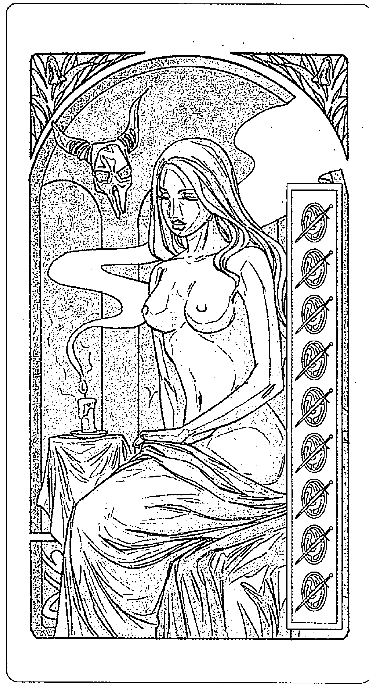

## 宝剑九

Nine of Swords

◆关键词 恐惧 焦虑 苦恼 内疚 噩梦

### 牌面解读

墙上挂着怪兽的骷髅，看上去令人毛骨悚然。台子上蒙着白布，上面放着燃烧的蜡烛，点燃的火焰升腾起一股诡异的白烟。整个房间让人窒息、恐惧。少女坐在床边，脸上显出困惑的神情，她几乎忘记自己的处境。莫非这不是真的，只不过是场噩梦吗？

## TAROT

### 内涵解析

宝剑九代表来自内心的煎熬，它不是一张令人高兴的牌。不过它不仅仅预兆不安的状况，也代表鲜明的梦境或梦魇。梦魇可能在传达一种强烈的信息，也就是你生命中某些不对劲的事物，已经从潜意识层面浮现出来了。通常它只是某些不快因素或者麻烦将出现的信号，它常表明你所走的道路将不是很平坦。

### 正位牌意

- 1. 正处在苦难之中，苦难即将来临。
- 2. 爱人将给你带来不幸。
- 3. 半途而废；好事多磨。
- 4. 与朋友出现矛盾，甚至和好友绝交，与情人分手。
- 5. 生病，身体不适。
- 6. 变动，迷茫。

### 逆位牌意

- 1. 耻辱的事不断发生；难以应对生活，沮丧。
- 2. 拥有很多知心朋友。
- 3. 做事优柔寡断。
- 4. 具有非常强烈的恐惧感。
- 5. 周围充满谣言，被中伤。
- 6. 不允许用暴力打破平衡，深思熟虑。

## Inner Arcana

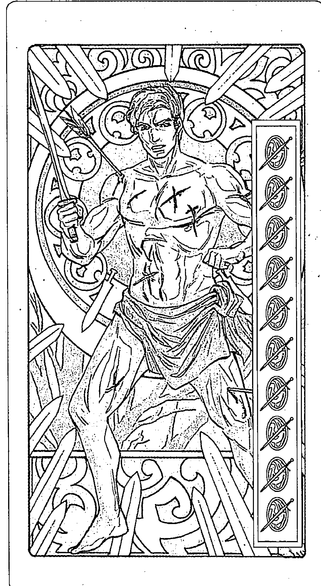

## 宝剑十

Ten of Swords

◆关键词 失败 殉难 毁灭 极端 牺牲精神

### 牌面解读

画面中的男子已经在搏杀中身负重伤，伤痕累累。他已身中数剑，并且筋疲力尽。他想要再冲杀出去，但似乎已经不可能，数十支利剑指向他，要把他吞没。在这场搏杀中，男子将走向毁灭。

## TAROT

### 内涵解析

事情不可能更糟了，似乎所有的不幸都在这一刻集中起来。宝剑十代表一种险恶到极致的状况。恐怕你已经到了最低潮的时期，伤口越来越深，救援的手还没有到来。但是，不要灰心、沮丧，更不要轻易放弃，毕竟已经可以看到地平线了，就算船儿沉没了，还可以凭着毅力，用双手游到岸边。最坏的情况马上就会过去，新的美好的开始就在前方。

### 正位牌意

- 1. 十分苦恼，找不到出路。
- 2. 内心一直希望一切能快点结束，心态消极。
- 3. 面临惨败，极端的失败。
- 4. 悲惨而孤寂的命运。
- 5. 梦境，成长，迷惑，寂寞。

### 逆位牌意

- 1. 有瞬间可以成功的机会。
- 2. 心中要一直怀着东山再起的希望。
- 3. 仍然有改善的可能性。
- 4. 虚弱；胶着；未成形的计划。

## Inner Arcana

## 宝剑侍从

Knave of Swords

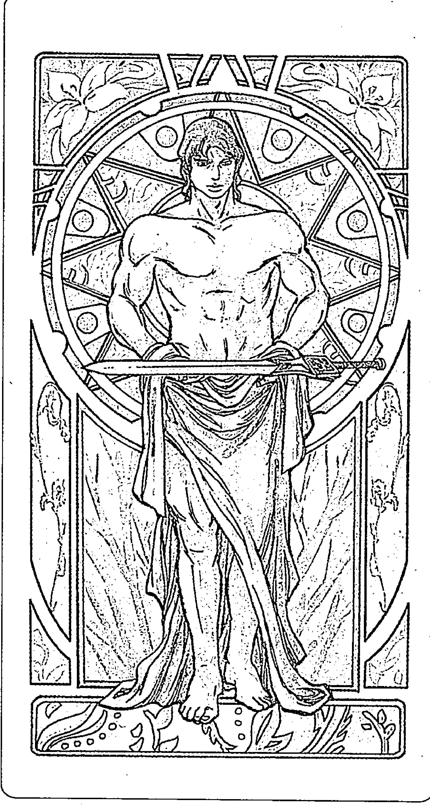

# 小阿卡那

◇关键词 敏锐 公正 毅力 沟通 思维 诚实

### 牌面解读

一个年轻的男子双手托着宝剑，他虽然年轻，但是看起来也仿佛经历了一定的风霜，目光中透露出沉稳和敏锐的洞察力。他身上健硕的肌肉代表对生命的热爱和坚忍的毅力。

## TAROT

### 内涵解析

宝剑侍从象征着心中有太多的梦想，但行动却不够。对于那些以创意和思考为生的人而言，这是一张正面的牌。这张牌还暗示着航空旅行，如果权杖四、宝剑六、节制或者世界出现在牌阵中，这个意味就更加明显了。

### 正位牌意

- 1. 在事情有变异前已经察觉。
- 2. 适合做调查类的工作。
- 3. 经历过挫折，找到新的开始。
- 4. 忠诚；有远见、有观察力的人。

### 逆位牌意

- 1. 没有预见到事情的变化。
- 2. 暂时没有办法对付强劲的对手。
- 3. 做事有漏洞。
- 4. 生病。
- 5. 脱离实际，幼稚，虚幻。

## Inner Arcana

## 宝剑骑士

Knight of Swords

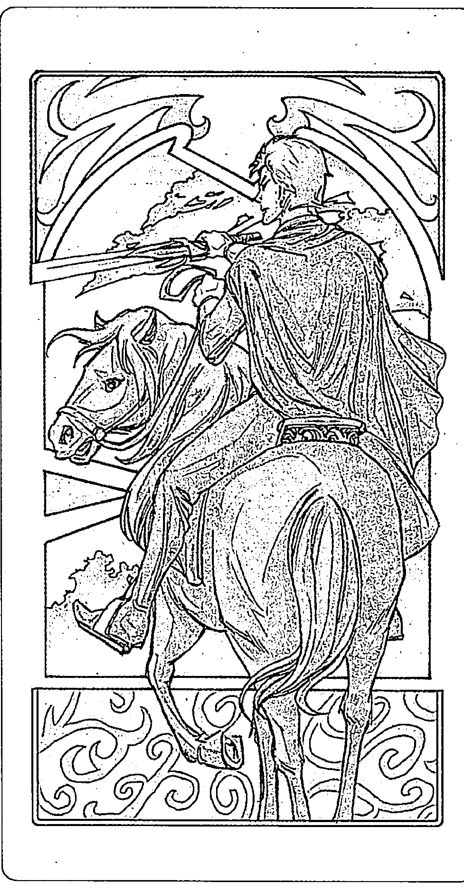

# 小阿卡那

◇关键词 强而有力 过于激进 想到就做 权威 傲慢

### 牌面解读

这位骑士的穿着十分华丽。他身穿蓝色战袍，披着红色披风，左手持着马的缰绳，右手拿着锋利的宝剑。胯下的骏马也披着华丽的鞍辔，傲慢地扬起了前蹄。骑士坚毅的背影表现出一种骄傲与冷漠，仿佛告诉人们，他强硬的意志不容人们违抗。远处茂密的山林代表着他所获得的荣誉，因为他战功累累，拥有刚愎自用的资本。

## TAROT

### 内涵解析

宝剑骑士代表事业心强的人，他们可能缺乏温柔的情感，但不是冷漠，只是不关心。因此，这种人对异性有强烈的吸引力，却无法建立长期的关系。这张牌也暗示着要达成愿望需要有敏捷的行动。

### 正位牌意

- 1. 具有挑战的勇气，具有勇往直前的动力。
- 2. 强力压制反弹，对待突发事件有很强的应变头脑。
- 3. 有行动力，有很强的社交和管理能力。
- 4. 冲动的，轻率的。

### 逆位牌意

- 1. 作决定需要深思熟虑，仔细分析考量。
- 2. 英雄气短导致失败，容易受情绪支配。
- 3. 自负，轻狂。
- 4. 与朋友或伴侣关系不和。
- 5. 僵持，不成熟的计划。

## Inner Arcana

## 宝剑王后

Queen of Swords

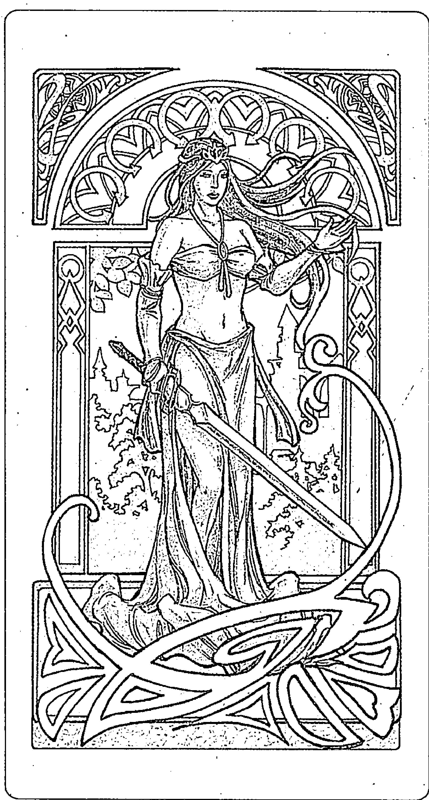

# 小阿卡那

◇关键词 深思 经验丰富 裁判 机智 坦白 诚实

### 牌面解读

一个年轻的女子披着长长的秀发，带着小巧的王冠，微笑地看着一切。她身穿美丽的长袍，手持一把锋利的宝剑，睿智的目光望向遥远的地方。虽然她手中拿的是利器，但她和蔼的面容让人们心中产生无限的信任和依赖，相信她一定会公正地使用自己的权力。

## TAROT

### 内涵解析

这张牌暗示经过深思熟虑所得到的成就。王后是理性的，思路清晰且富有耐性。她的思路相当敏捷，是个优秀的组织者，也是个称职的审判者。她应该是个完美主义者，会给予别人明智的忠告，这正是由她经历过的痛苦经验而来。

### 正位牌意

- 1. 事业如意却备感孤独，各方面都差强人意。
- 2. 有洁癖，生活习惯上有过分的行为。
- 3. 离别，分手。
- 4. 强烈的失落感。
- 5. 努力创造机会，敏锐，坚忍的毅力。

### 逆位牌意

- 1. 相当固执，不到黄河心不死。
- 2. 敌人十分顽强。
- 3. 盛气凌人，不顾他人感受。
- 4. 目光短浅。
- 5. 忧伤，体验锥心刺骨的凄凉。

## Inner Arcana

## 宝剑国王

King of Swords

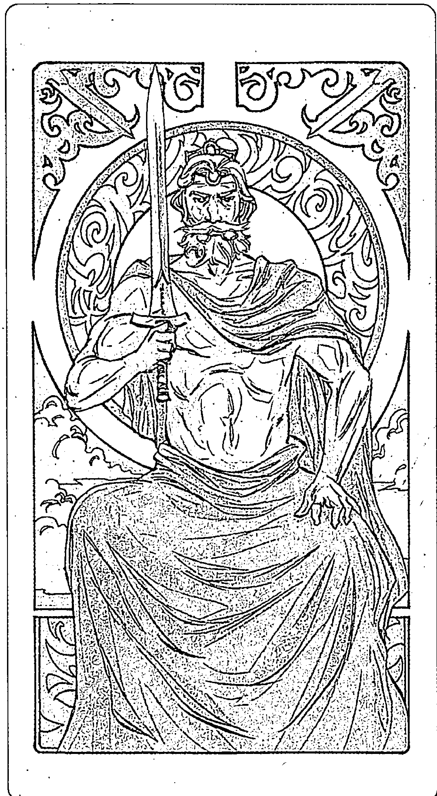

关键词 公正 严厉 气势

### 牌面解读

一位国王展现在大家面前，他没有穿着华丽的王袍，而是披着素雅的战袍，看上去更像个战士，只有头顶的王冠表明了他的身份。他身后广袤的土地诉说着他的战功与成就。他已经登上了宝座，掌握了如此的权力，为什么还要严阵以待呢？他的目光注视着手中的利剑，似乎正在思考新的计划。

## TAROT

### 内涵解析

宝剑国王暗示透过清晰的思考和实际的努力而成功。这张牌在告诉你，你需要利用你的构想去做一些真实的事。宝剑国王代表一个拥有很强自制力的成熟男人，他深谙规划的价值，也明白思考与行动结合的重要性。他是一个拥有良好、清晰、实用构想的人，但他可能会太偏重思考，而对那种未经证实的感情无所适从。他是一个思想和目标有条不紊的人，也是一个很好的组织者。

### 正位牌意

- 1. 有权威性，是某方面的专家。
- 2. 有统率力，领导能力出众。
- 3. 很冷静，想象力丰富。
- 4. 在专业领域内如鱼得水。
- 5. 具有征服欲，并不断增加自己的力量。

### 逆位牌意

- 1. 生活中时常发生冲突，遇到意想不到的麻烦。
- 2. 遭受不正常手段的打击。
- 3. 身边始终有群很残酷很自私的男人。
- 4. 残酷的失败。

## Inner Arcana

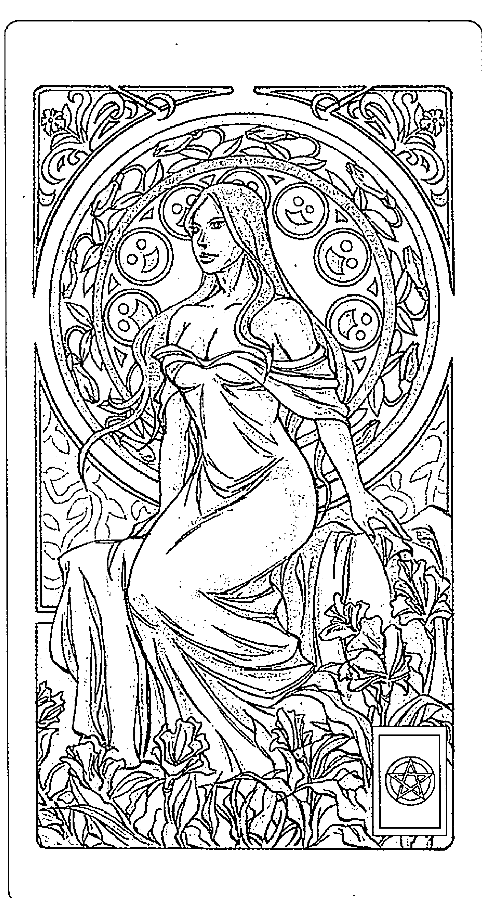

## 星币首牌

Ace of Pentacles

关键词 财富 丰足 地位 物质力量 繁荣信任

### 牌面解读

画面上的少女年轻美丽，富有活力，充满朝气。她身穿绿色的衣裙，显得勃勃生机。她的周围开满了鲜花，看上去一片美好、祥和的景象。

## TAROT

### 内涵解析

星币首牌暗示你有足够的金钱去执行你的计划。这张牌代表一种新状态的开始，可能是一个崭新的未来，或者是某种状态中一个新局面的开端，表示一种务实的作风；也暗示你所投资的金钱、时间或精力可能会带来很好的回报。此刻，你足以掌握住你的财富，并获得物质上的收获。

### 正位牌意

- 1. 物质生活很丰富，但精神生活欠缺。
- 2. 得到一切想要的物质。
- 3. 获得利益，事事顺利，运气较佳。
- 4. 安逸的生活状态。
- 5. 大型商业活动获得成功，收入增加，富有经商的天分。

### 逆位牌意

- 1. 被强烈的欲望冲昏头脑，做出不可理喻的事。
- 2. 奢侈的生活。
- 3. 因为金钱方面的原因导致声名狼藉。
- 4. 精神空虚，物质丰富。
- 5. 不快乐的成功，金钱虚掷。

## Inner Arcana

## 星币二

Two of Pentacles

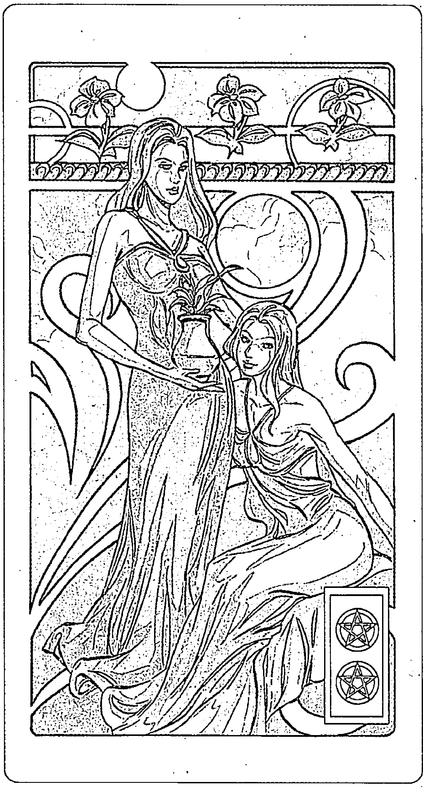

# 小阿卡那

◆关键词 动荡 贸易 投资 协调 娱乐 机动

### 牌面解读

两位少女一坐一站，靠在一起。她们不知在想些什么。她们还很年轻，前方不知道会怎样，可能会充满艰险。但她们手中绿色的植物又显示出无限生机。因此，不管未来怎样，只有向前，才会开创未来。

## TAROT

### 内涵解析

人的一生要应付许多状况，这张牌意味着要注意隐藏在日常生活中的机会。星币二要求求问者要善于处理纷繁复杂的情况，而不要死守某个思维定式。就财运方面而言，星币二预示着一种收支平衡。如果你最近情绪低落，这张牌则是提醒你要想开些，完全放松地娱乐之后或许会有好的效果。

### 正位牌意

- 1. 寻找生活中暗藏的机会。
- 2. 未知的未来，学会在逆境中生活。
- 3. 新的计划，机遇的来临。
- 4. 向前看，脱离混乱的生活，理清头绪。
- 5. 节约资金，参与贸易。

### 逆位牌意

- 1. 正确处理工作和生活的关系。
- 2. 用钱过度，超出计划。
- 3. 表面快乐，内心痛苦，自欺欺人。
- 4. 扭转劣势，打开局面。

## Inner Arcana

## 星币三

Three of Pentacles

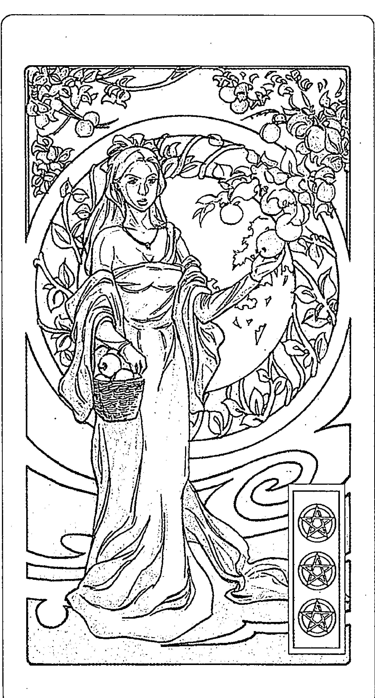

# 小阿卡那

◇关键词 协力 合作 能力出众 计划

### 牌面解读

田野中，一个少女在孤零零地劳作。这看起来是一片果园，成排成片的果树还需要修剪、松土、施肥、灌溉……这么多繁重的劳动，一个人是不可能完成的。然而，似乎并没有人要来帮忙，仍然只有这个少女在默默劳作……

## TAROT

### 内涵解析

星币三通常代表团队合作，团队中所有人的目标必须一致，不能单独行动或决定，一定要经过事先的计划，并在实施的过程中多次讨论决定，否则就会像孤独的少女一样独自奋斗。因此，星币三也经常代表沟通与协调。

这张牌也代表团队工作中培养起来的恋情，或因双方都把重心放在了金钱、事业与地位上，缺乏情感方面的交流。

### 正位牌意

- 1. 业务熟练，一流的水准，才能出众。
- 2. 完成了一件奋斗已久的大事。
- 3. 注意名声，有荣誉感。
- 4. 喜好玩耍，拥有手艺及商业方面的能力。

### 逆位牌意

- 1. 素养水准不高，难以令人满意。
- 2. 想法不成熟，难以实施。
- 3. 物质方面有一定的损失。
- 4. 出现恶作剧，做事过于轻率。

## Inner Arcana

## 星币四

Four of Pentacles

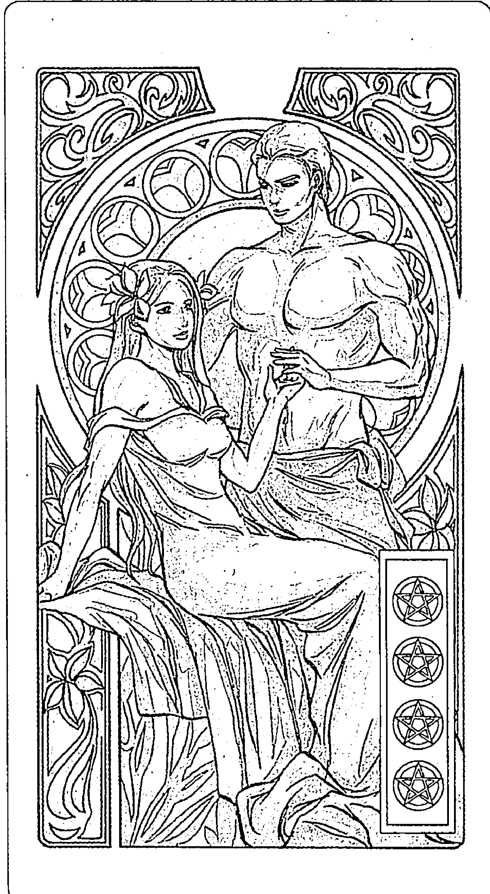

# 小阿卡那

◇关键词 控制 占有 得到 封闭

### 牌面解读

画面中的男女是一对情侣。他们看上去很亲密，并且他们在物质上都很富有。然而，仔细观察，他们之间又是有距离的，这表示他们之间似乎有些防备。

## TAROT

### 内涵解析

星币四经常代表物质生活上的充足与稳定，但精神层面往往却很空虚。这张牌一般指控制，代表那些紧紧抓住物质不放的人。如果是情侣，会有很重的嫉妒心，非常爱吃醋；如果是上司，则很可能会经常无故地克扣员工。这张牌的出现是提醒我们，要认清在人与财富的关系中，人真正的价值是什么。

### 正位牌意

- 1. 吝啬鬼，过分的节俭。
- 2. 生活中精打细算，勤俭节约。
- 3. 有遗产方面的问题，继承不太顺利。
- 4. 对物质财富的追求十分执著。
- 5. 审度自己拥有的，不确定。

### 逆位牌意

- 1. 奢侈无度，金钱的开销没有计划，缺乏自控能力，导致入不敷出。
- 2. 金钱运势很差。
- 3. 物质欲望过度膨胀，失败。
- 4. 错误的预期，虚假的利益。

## Inner Arcana

## 星币五

Five of Pentacles

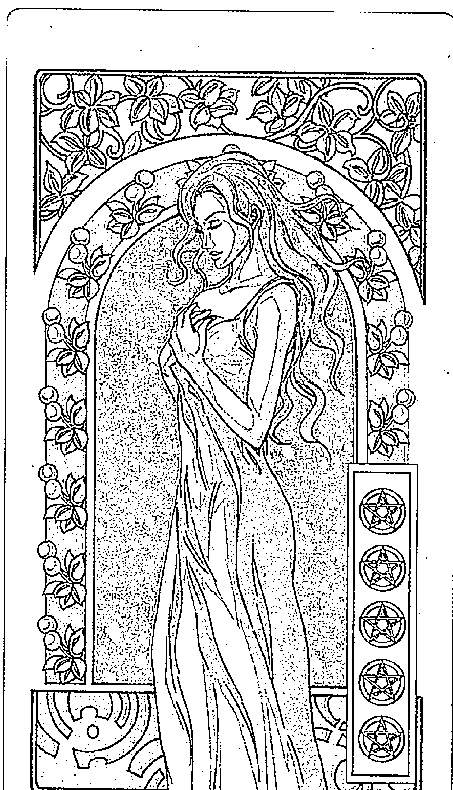

◇关键词 穷苦 艰难 绝望的境地 拒绝 亚健康

### 牌面解读

画面中的女人身穿单薄的衣服，双手捂在胸口，眉眼低垂。在这个飘雪的冬天，她看上去有些绝望，不知什么原因让她陷入这个孤单的境地，而她身边也没有人可以相伴。

## TAROT

### 内涵解析

星币五的出现表示物质上的缺乏，也可能是某方面的欠缺。这就是提醒我们要注意避免无谓的消耗，静静地等待时机的到来；并且，要珍惜目前所拥有的。

### 正位牌意

- 1. 有金钱方面的烦恼，物质方面有所匮乏。
- 2. 放浪，玩世不恭，态度不端正。
- 3. 连续失败。
- 4. 失业。
- 5. 心灰意冷。

### 逆位牌意

- 1. 担心居住问题，有房产方面的麻烦。
- 2. 生活秩序混乱，物质上的困难烦恼。
- 3. 各方面的关系都不太好。
- 4. 有很多荒唐的想法出现在脑子里，无法自拔。
- 5. 缺乏野心，事情发展缓慢。

## Inner Arcana

## 星币六

Six of Pentacles

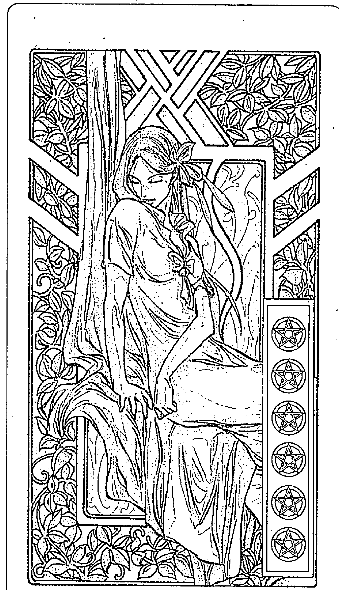

# 小阿卡那

◇关键词 慷慨 施与 理财 知识能源 力量

### 牌面解读

画面中的女孩似乎很富有，她微闭着双眼很惬意地靠在一块锦缎上休息，好像没有任何烦恼。因为物质上的富有，她从不考虑她会有所匮乏，也不考虑别人会占有她的东西。她很大方，并不在意得到或失去。但是，总体上她所拥有的是处于平衡状态的。

## TAROT

### 内涵解析

星币六代表一种理财能力，或者你即将得到需要的东西，比如朋友欠你的债、一件有意义的礼品，又或者遗产等等。当然，也代表你会有所付出。但总体上表示收支平衡。

### 正位牌意

- 1. 懂得礼尚往来，人际关系很好。
- 2. 胸怀宽广，坦荡，与人为善，有人缘。
- 3. 生活状况良好。
- 4. 有一定的经济能力，积累财富，追求安定。

### 逆位牌意

- 1. 自私自利，令人生厌。
- 2. 嫉妒心强，恶劣的心情经常出现。
- 3. 欠债，欠人情，知恩不报。
- 4. 贪图物欲，被物质欲望操控。
- 5. 失去所拥有的财富，守财奴。

## Inner Arcana

## 星币七

Seven of Pentacles

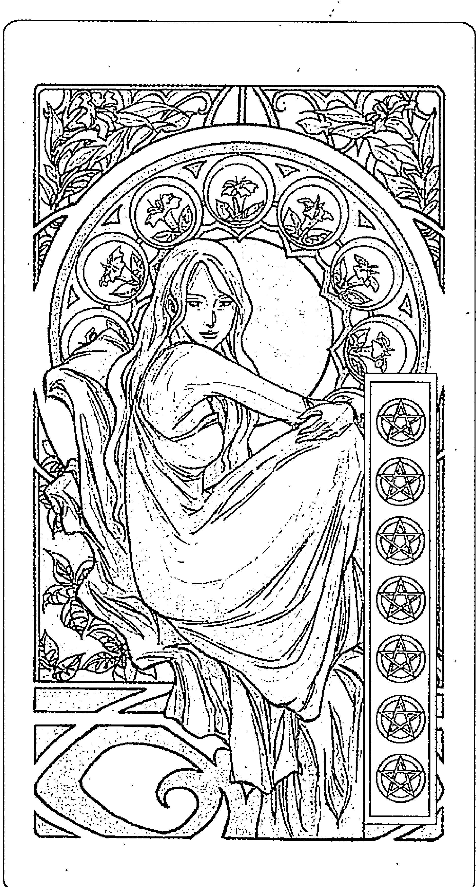

# 小阿卡那

◇关键词 休息 思考 收获 评估 转变

### 牌面解读

少女双手抱膝，坐在漂亮的椅子上。看得出，她现在的生活应该很富足。但少女却一脸落寞，她似乎觉得生活中缺少了什么。她在思考，她想改变现在的生活，实现自己的理想。

## TAROT

### 内涵解析

当星币七出现的时候，你应该明白工作本不应该是沉闷无味的，而是一种自我完善的机会。工作不仅仅是为了获得报酬，更重要的是让你的人生更加丰富多彩。星币七还暗示如果你并不喜欢目前的工作，那就离开，去寻找你所喜欢的工作，寻找一种爱的劳动。

### 正位牌意

- 1. 目标无法实现。
- 2. 对事物进行仔细的观察，衡量问题的严重性。
- 3. 做无用功。
- 4. 通过辛勤的劳动取得成功。
- 5. 金钱带来的困扰。
- 6. 有令人难堪的消息。

### 逆位牌意

- 1. 付出了多余的努力，导致生产过剩。
- 2. 无知、轻率地作出决定。
- 3. 没有远见，盲目地投资。
- 4. 付出的努力得不到相应的回报。
- 5. 工作稳定，安于现状。

## Inner Arcana

## 星币八

Eight of Pentacles

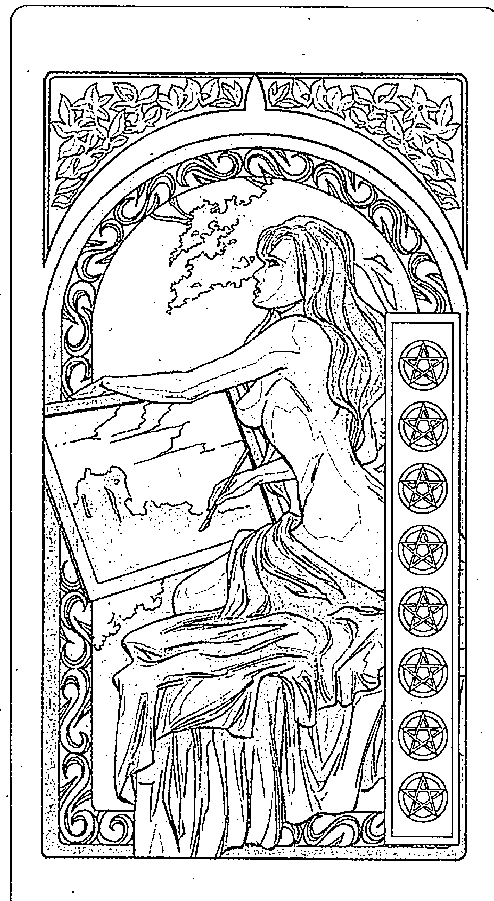

# 小阿卡那

◇关键词 勤奋 学习 知识 细节

### 牌面解读

画面中的女人正在画着一幅山水画。这个女人画得非常忘我，画作也非常精美、逼真，想必她一定有着非凡的技艺，并且经过了多年的学习与探索，才有如今的成就。如今，她的努力将得到回报，她的作品一定会受到世人的青睐。

## TAROT

### 内涵解析

星币八暗示着通过努力、学习，或将构想付诸行动而改善自身的境遇。要想建立持久的大厦，必须要有稳固的根基。我们应当懂得知识的价值，并与他人分享，脚踏实地的生活，而不要沉迷于那些遥不可及的梦幻。星币八是一张对自身发展有正面意义的牌，预示着稳定持久地向目标迈进。

### 正位牌意

- 1. 进取心强，不甘人后。
- 2. 做事有条理。
- 3. 技术上精益求精。
- 4. 正在专心研究与学习。
- 5. 善于自我激励，鞭策自己。
- 6. 理解、领悟知识，获得别人的支持。

### 逆位牌意

- 1. 没有真才实学，爱慕虚荣。
- 2. 为牟取利益不择手段。
- 3. 不务正业。
- 4. 野心遭受打击。
- 5. 平庸之才，出现金钱上的困扰。

## Inner Arcana

## 星币九

Nine of Pentacles

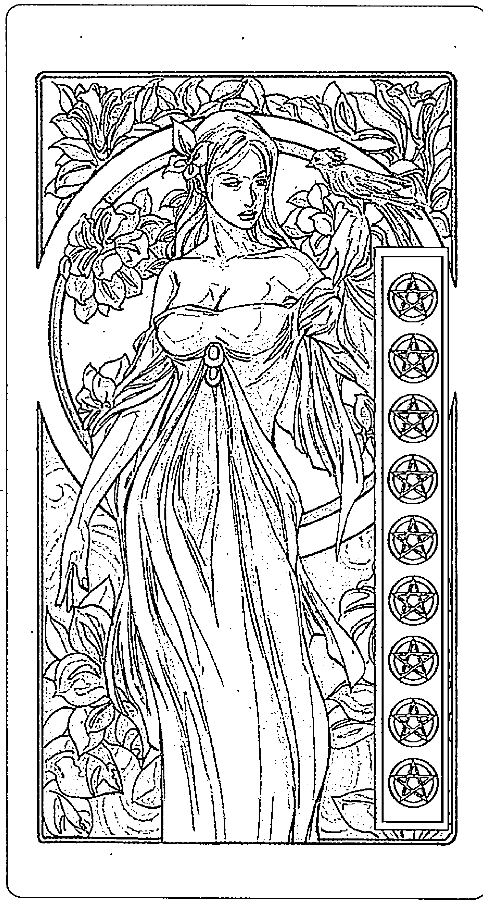

# 小阿卡那

◆关键词 丰足 美满 上进 吸引 精美 自立

### 牌面解读

少女身穿绿色的衣裙，头戴鲜花，象征着生机与活力。一只美丽的小鸟飞落在她的手上，与她玩耍。少女的周围开满了鲜花，翠绿的枝叶与她身上的衣裙相互呼应。少女还很年轻，在这美好的日子里，她一定会拥有美好的未来。

## TAROT

### 内涵解析

星币九的含义非常丰富，意味着经过长期的努力而得到好的结果。有时候这张牌也是纪律和自控的象征，要求人们注意节制，选择理性思维，从而作出正确的判断，这样才能获得最后的成功。

### 正位牌意

- 1. 有一定的眼光，懂得选择，被人欣赏。
- 2. 储蓄是必要的，精打细算但不吝啬。
- 3. 为自己创造有利条件，付诸实践，说到做到。
- 4. 做事沉稳可靠，取得一定的成就。
- 5. 有稳定的收益，没有贫困的困扰。

### 逆位牌意

- 1. 目标没有完成，半途而废，前功尽弃。
- 2. 没有管理能力。
- 3. 不守信用，被人厌恶。
- 4. 情绪焦虑、急躁。
- 5. 由于投资失败，损失金钱，甚至破产。

## Inner Arcana

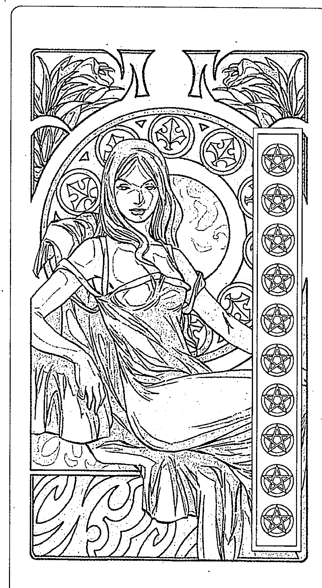

## 星币十

Ten of Pentacles

◆关键词 富裕 家庭 团体成功 惯例 持久

### 牌面解读

画面中的这个女人看上去生活很富足。她穿着锦缎的衣服，坐在铺着绫罗的椅子上，目光中充满自信，她的坐姿也很有气势，显示出她对物质生活的满足。

## TAROT

### 内涵解析

星币十代表以金钱与成功为目标的人或事，在事业上取得的成功。成功并非偶然，通过承诺、劳动、纪律、学习，以及重新评估，已经稳固地建立起了某种具体的事物，并且也为将来打下良好的根基。经过谨慎的规划及对目标的不断分析与研究，将有机会掌握全局。

### 正位牌意

- 1. 可能会继承遗产。
- 2. 家境良好，物质丰富，家人关系良好。
- 3. 团体事业运作态势良好。
- 4. 获得幸福，有所成就。

### 逆位牌意

- 1. 团体中某种程度的不和即将出现，为金钱起纠纷。
- 2. 投资合伙要暂时缓一缓，谨慎理财。
- 3. 失去遗产。
- 4. 与亲人对立，家庭不和。
- 5. 家中失窃，或其他方面将会有一定损失。
- 6. 出现不安稳的状态。

## Inner Arcana

## 星币侍从

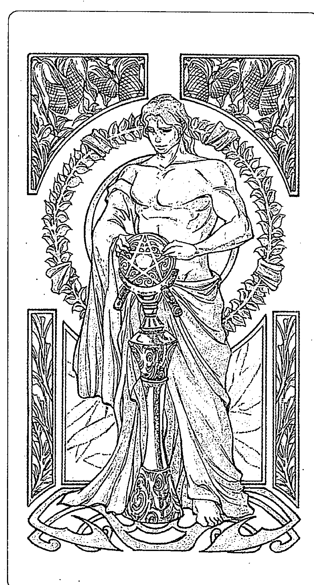

# 小阿卡那

Knave of Pentacles

◆关键词 运用 实践 投资

### 牌面解读

一个清秀的年轻人站在绿树草坪之上，他的面前摆放着一枚大大的星币。年纪轻轻就拥有了这笔不小的财富，该如何运用呢？他的人生阅历似乎还不足以给他任何建议。他低头沉思，看来，他自己是很难作出决定了。他必须学习如何运用资本，才能合理投资。

## TAROT

### 内涵解析

这张牌意味着努力学习，形容的是一个为人务实，并且稳健、热爱大自然的人。这张牌还说明你需要认真地实践，从而展开一项新的方案，或者开始某个阶段。星币侍从有着充满希望的前途，只要谨慎制订计划，就可以获得成功。

### 正位牌意

- 1. 学习态度端正。
- 2. 热心积极地投身于研究工作。
- 3. 求知欲旺盛，头脑灵活。
- 4. 将收到与知识或者研究工作有关的好消息。

### 逆位牌意

- 1. 挥霍，浪费金钱。
- 2. 知识贫乏，认识问题不够全面深刻。
- 3. 井底之蛙，目光短浅。
- 4. 自食恶果。

## Inner Arcana

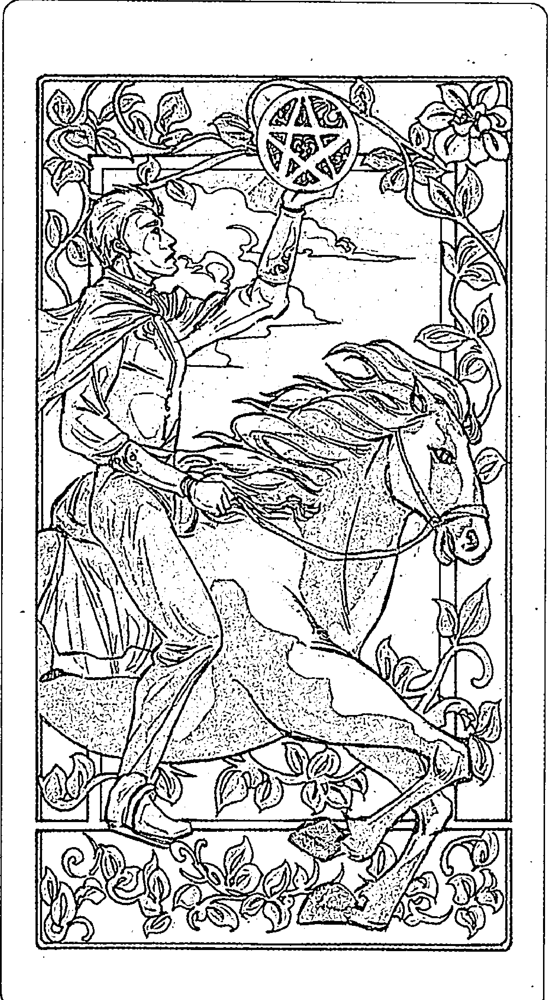

## 星币骑士

Knight of Pentacles

◆关键词 认真 努力 坚定 谨慎 物质主义

### 牌面解读

身着宝蓝色绒布衣装的骑士头手举星币，面容平静地骑马缓缓前行。他是一个认真而稳健的人，通过在人生道路上的不断拼搏进取，他得到了象征财富的星币。不过他的身边没有和他一起分享胜利的朋友，恐怕是他在努力的过程中过分注重物质，而忽略了与朋友、亲人之间的情感交流吧！

## TAROT

### 内涵解析

稳健而认真是星币骑士的标志，但因为他的野心分散了他在情感方面的精力，因此在这方面他显得不成熟。当别的骑士在享受爱情、亲情、友情的快乐时，星币骑士却在学习、工作，为将来而努力。这个年轻人将会在物质、事业和地位上获得成功，他选择的伴侣也一定会是和他在事业上的伙伴，并相处愉快的人。他把爱情当做一项长期投资。通常他是个负责任、勤奋工作且比较独立的人，他拥有自己的事业，但总是无法掌握自己的生活，因此常常忽略了身边的人。

### 正位牌意

- 1. 讲究效率，有能力的组织者。
- 2. 了解现实状况，稳扎稳打的实干家，有责任感，是值得信赖和依靠的人。
- 3. 家庭的保护者，是个在观念上有点保守的人。
- 4. 会选择适当的时机，有计划并能洞悉事情的全部。

### 逆位牌意

- 1. 懈怠、松散的工作态度，没有进取心。
- 2. 思想过分保守，顽固派。
- 3. 处事随性，三分钟热度，没有恒心和毅力。
- 4. 事业或其他方面发展停滞不前。

## Inner Arcana

## 星币王后

Queen of Pentacles

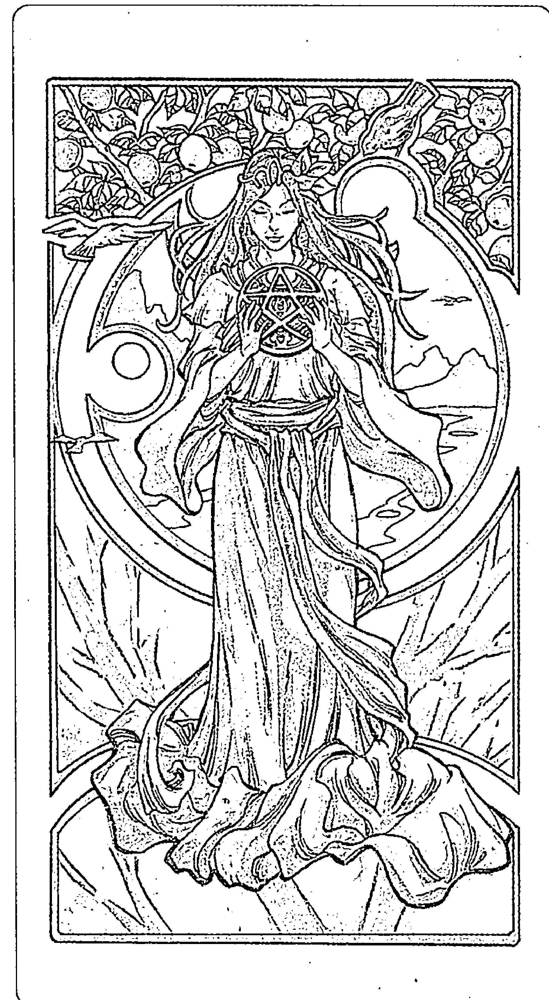

◇关键词 慷慨 机智 母爱 养育 繁荣 可信赖的 务实

### 牌面解读

这位王后穿着冷静高贵的宝蓝色衣裙，戴着式样简单的小小皇冠，长发披肩垂下，衬托出她温柔而典雅的面容。她双手托着象征皇家财富的星币，脸上露出平和的微笑，相信由她来掌握财富和权力，国家必定会繁荣安定。

## TAROT

### 内涵解析

星币王后是表示无限温暖的一张牌，她稳定而具耐心的特质可以使一切井井有条。她清楚自己的能力和限制，用一种务实的态度把个性的力量和对情感的理解结合起来，让周围的人都能感受到她良好的影响力。

### 正位牌意

- 1. 代表自立而成熟、严格却又宽容的女性。温柔而善解人意，包容别人，乐于助人，值得信赖和依靠。
- 2. 坚定而有气度的人或行为。
- 3. 拥有富裕、安定、繁荣的生活，经济上富足。
- 4. 拥有预知的能力。

### 逆位牌意

- 1. 爱慕虚荣，生活浮华。
- 2. 对人态度恶劣，不够友善。
- 3. 总是出现铺张浪费的行为。
- 4. 内心冷淡，是不可信任的人。
- 5. 疏忽职责，虚无的成功。

## Inner Arcana

## 星币国王

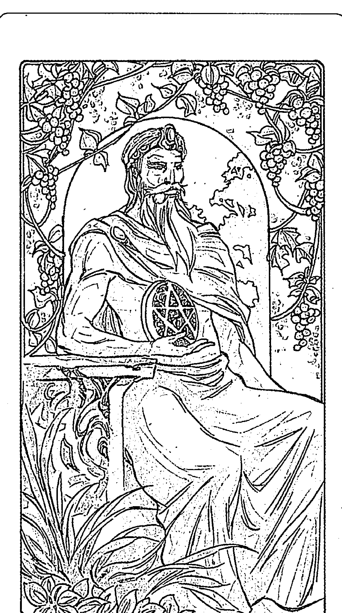

# 小阿卡那

King of Pentacles

◆关键词 坚定 富有 事业成功 保守

### 牌面解读

星币国王坐在宝蓝色的宝座上，头戴较大的皇冠。他右手抱着星币，眼神里流露出一种满足和快乐，这是他对地位的满足，对财富的满足，对所拥有一切的满足。而这些满足正是他内心愉快的根源。但是，即便像他这样富有，又能否真正地拥有快乐呢？

## TAROT

### 内涵解析

星币国王这张牌一般代表经济基础和事业有成，但在财富已经不成问题的情况下，也暗示着金钱带给人的迷惑。这位国王很可能在对成功的追求中迷失了自己，他个性稳健、可靠并且保守，但不像权杖国王那样富有冒险精神，也没有圣杯国王的创意，只能凭借稳健的步伐和认真的实践达到成功。可是，当他走到成功的顶端时，可能会大吃一惊：坐在成功宝座上的并不是他本人，却是一枚金光闪闪的星币……

### 正位牌意

- 1. 拥有身份和地位的成功人士。
- 2. 有营销手段的商业人才，适宜投资。
- 3. 学识丰富的人。
- 4. 值得信赖的人，彼此互相信赖。
- 5. 预示着理想能够达成。
- 6. 必须在物质和精神之间作选择，但最后仍是金钱至上。

### 逆位牌意

- 1. 缺乏经济头脑的人或做法。
- 2. 行为卑鄙。
- 3. 两人之间关系危险，可能导致不良后果。
- 4. 处事随性，三分钟热度，没有恒心和毅力。
- 5. 事业或其他方面发展停滞不前。

# 塔罗实用牌阵实例

西方有句格言：“认识自己，是认识的最高境界。”塔罗牌的作用就是帮助我们认识自己，认识自己的内心世界。每个人的作为都源于他的内心，真正了解自己的内心，才有可能把握自己的未来。

如果你已经对塔罗牌有了初步的了解，但还没有实际运用，那么你还没有真正地拥有并使用它，也就无法利用它去真正地认识自己。

这一部分的重点就是向你展开塔罗最玄妙的部分——牌阵，通过塔罗牌阵的展示、实例以及讲解分析，让你真正掌握塔罗占卜，因为，塔罗的最终意义还是要通过占卜体现出来。

现在，让我们走入塔罗的牌阵世界，进一步去体会它的玄妙。

## TAROT

## 无牌阵解牌法

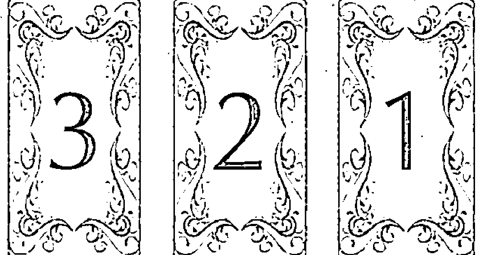

无牌阵解牌是塔罗牌里最简单的一种解牌法，由于没有任何牌阵的束缚，推测的灵活性和自由度也非常高。不过对初学者来讲，也需要经过不断地努力练习才能完全掌握。无牌阵解牌需要解牌者抽牌前先决定好抽多少张，每张牌要问的问题或代表的意义是什么。

### 发牌

解牌者洗好牌后，求问者从中随意抽出三张意念指引的牌，从右至左排列好，然后按照抽牌顺序依次解释牌意。其实，无牌阵解牌具体抽多少张牌是没有硬性限制的，但牌数太少没办法将问题解释清楚，太多初学者又不能很好地掌握整个牌意，所以以三张为最佳。

### 解读

无牌阵解牌法没有统一的解牌方法，解牌者需要发挥自己的能力，将牌面描绘和具体表述结合起来，这样就可以完全抛开牌阵和书本的束缚，更接近塔罗的真意。

### 实例1

求问者：女生。
求问：我觉得我暗恋的人最近似乎不爱理我，给他打了好几次电话都没接。我想知道他是有意躲我，还是太忙碌而无暇顾及。

开牌情况：隐士 逆位
世界 逆位
情侣 正位

牌面解读：情侣正位的出现是因为你希望跟男方成为恋人；世界逆位表示在这段关系中，常有一方无法配合行动；隐士逆位表示你很容易胡思乱想，总是钻牛角尖，即使男方对她非常专一，也总是患得患失，对这段感情没有信心，无法得到满足，因此对这段感情有消极的想法。如果你想得到满意的结果，就应该放平心态，积极争取。即使失败也没什么，因为感情毕竟是两个人的事。

### 实例2

求问者：女生。
求问：我跟男友交往多年，最近因为一些原因决定分开一段。我说没意见，尊重我的决定。对于他的毫无留恋，我感到很伤心。是不是他真的已经不在乎我了？我们这段感情还有希望吗？

开牌情况：隐士 正位
教主 逆位
命运之轮 正位

牌面解读：隐士正位的图中显示的是一老者手持提灯，意味着双方都在黑暗中寻找出口与答案。教主逆位代表两个人之间沟通的渠道受到严重的阻碍，不再那么心有灵犀了。命运之轮这张牌代表随缘或顺其自然，轮子在转动着，就像是重生。也许两者经过一段时间的冷静，会使爱情得到重生。

## 圣三角解牌法

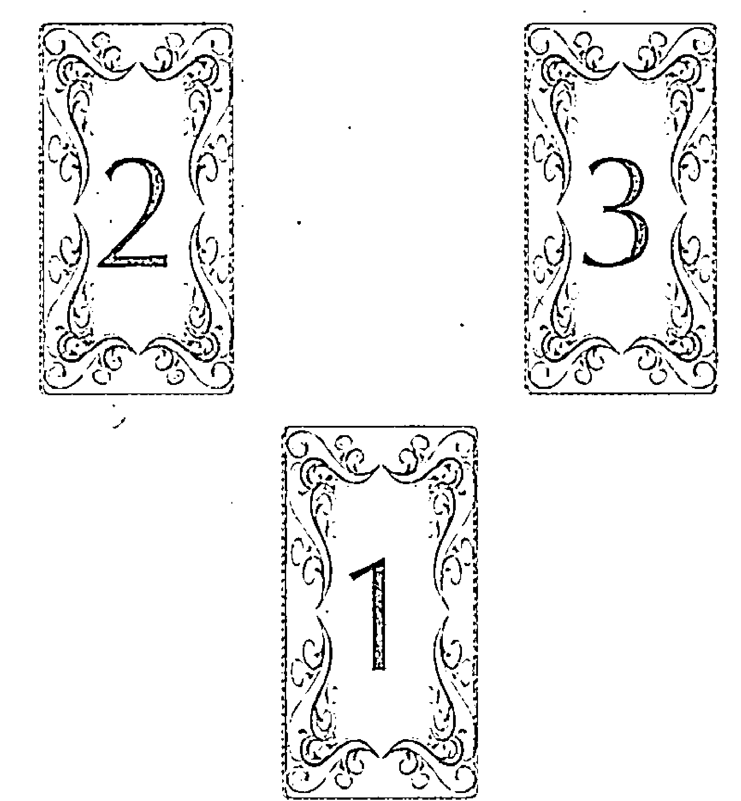

这是塔罗牌最常用的牌阵。这三张牌按照序号依次为过去、现在、未来，这样解牌能比较准确地掌握事情当下的状况和事情的发展前景。这个牌阵有很强的变化与灵活度，而得出的答案也会相当明确清晰，但有时这个牌阵给出的答案过于直接，会使求问者有很大的心理反应，这就需要解牌者根据情况作出委婉的解释。

### 发牌

- 1. 将牌洗好，从最上面的一张开始数起，将第七张牌拿出，放到牌阵图中 1 的位置上，这张牌代表的是过去。
- 2. 把数过的牌放到一旁，将剩下的牌重新数到第七张，拿出放到图中 2 的位置上，这张牌代表现在。
- 3. 重复步骤 2，再次拿出第七张牌放到图中 3 的位置，这张牌就是未来。

### 解读

1 代表过去，即此刻之前发生的事情；2 代表现在，指现在的问题或这件事情目前面对的情况；3 则代表未来，是对未来的事情发展或结果的推测。

### 实例 1

求问者：男生。
求问：一个女同学的生日快到了，我该不该帮她买礼物呢？
开牌情况：位置 1 战车 正位
位置 2 节制 正位
位置 3 情侣 正位
牌面解读：情侣这张牌表示你正在抉择要不要买；战车这张牌是说你在考虑给这位女同学买什么礼物的同时，还要兼顾其他的事情；节制这张牌说明就算送了礼物，你们的关系也不会有什么大变化，因为本来你们就是朋友。

### 实例2

求问者：女生。
求问：我和男朋友的交往遭到男方家长的强烈反对，而目前两人又因工作原因两地分隔。我想知道，我的男朋友对这段感情的未来有什么打算。

开牌情况：位置1 隐士 正位
位置2 节制 逆位
位置3 命运之轮 正位

牌面解读：命运之轮代表的就是因为工作原因而在空间上产生距离的情况，两人的关系也因此发生了改变，未来也可能跟着改变。而你的男朋友对于家长的反对，会采取低调的作法。从节制逆位看起来，你们突破的空间并不大，再加上隐士，看来你们之间的关系是凶多吉少了。

## 二选一解牌法

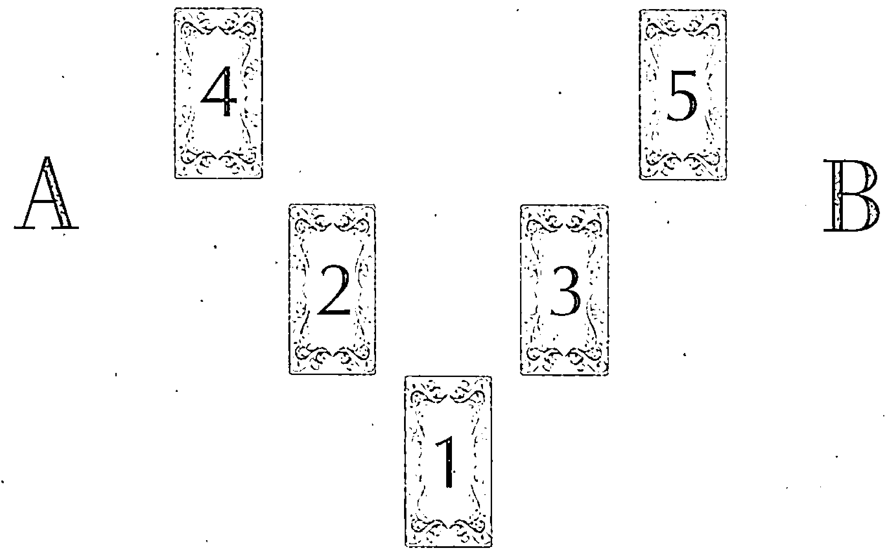

这个牌阵属于选择性牌阵，当求问者心中有两难的事情需要抉择的时候，就可以选择这个牌阵。这个牌阵有些类似圣三角牌阵，也是比较简单的牌阵，比较容易上手。

### 发牌

- 1. 在洗牌前让求问者选定一个方向，因为此牌阵呈 V 字型，分成左右两边，分别代表了 A、B 两种选择，这就使求问者要先明确哪一边代表什么选择，并且牢记自己定下的方向，然后再开始洗牌。
- 2. 洗好牌后，从最上面的第一张牌开始数，数到第六张，把这张牌放到牌阵图中 1 的位置。
- 3. 把已经数过的牌放到一旁，重新数剩下的牌，将第六张与第七张牌分别放在牌阵中的 2 和 3 的位置上。
- 4. 重复步骤 3，把第六张与第七张牌取出，放到牌阵中位置 4 和 5。

### 解读

- 位置 1 上的牌，表示问题的整体状况。
- 位置 2 上的牌，代表 A 选择的现状。
- 位置 3 上的牌，代表 B 选择的现状。
- 位置 4 上的牌，代表 A 选择的未来发展或结果。
- 位置 5 上的牌，代表 B 选择的未来发展或结果。

### 实例 1

求问者：女生。

求问：现在我在国外留学，要等一段时间才毕业，但因为课已修完，目前时间比较空闲。由于经济的原因，加上很想累积一些工作经验，我想在这段时间暂时找个工作。但就国内和国外来说，哪边找工作会比较好呢？

开牌情况：位置 2 和位置 4 代表选择国外，位置 3 和位置 5 代表选择国内。

- 位置 1 星币九 正位
- 位置 2 权杖一 逆位
- 位置 3 圣杯二 正位
- 位置 4 宝剑王后 正位
- 位置 5 圣杯侍从 逆位

牌面解读：星币九代表你现在正处于情绪不平稳的状态，但还可以自我控制，你想要通过自己的努力获得一些成就及满足。权杖一逆位表明在国外找工作的过程会非常困难，你如果想在国外工作，就需要有清晰的思考能力。宝剑王后表示你就算最后找到了，结果也不会很好。牌面显示你在国内找工作似乎会容易一些，因为圣杯二显示出有在外国学习的经验，但逆位的圣杯侍从又说明你在情绪上可能不快乐。至于最后要如何选择，还是要看你的意愿了。

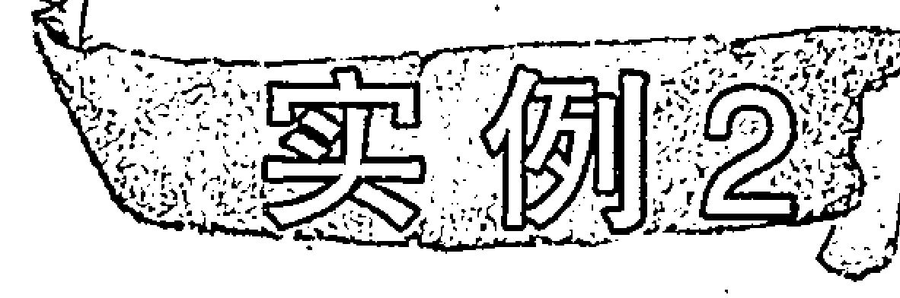

求问者：男生。
求问：我是否要选修一门极难的专业课。
开牌情况：位置 2 和位置 4 代表选择退课，位置 3 和位置 5 代表选择修课。

- 位置 1 愚人 正位
- 位置 2 权杖十 逆位
- 位置 3 星币八 逆位
- 位置 4 权杖四 逆位
- 位置 5 星辰 逆位

牌面解读：选择退课：修这门课可能会让你自己觉得有点吃不消，你也非常不想承担这个压力，因此想想选择退课。选择修课：星币八逆位代表你选修了这门课后，可能也不会太用功，最后的成绩也不会很理想。愚人代表你自己没有计划，拿不定主意。而愚人这张牌包含了各种可能性，未来可能是好可能是坏。但最终还是要你自己来选择。

### 实例 3

求问者：女生。

求问：这学期要选导师了，有两位导师对我的研究课题很有帮助。在与他们交流之后，我觉得自己无从选择。我希望塔罗牌能给我一个中肯的建议。

开牌情况：位置 2 和位置 4 代表选择 A 老师，位置 3 和位置 5 代表选择 B 老师

- 位置 1 力量 逆位
- 位置 2 太阳 正位
- 位置 3 魔鬼 逆位
- 位置 4 吊人 逆位
- 位置 5 命运之轮 正位

牌面解读：A 老师在教学过程中会依你的情形来训练带领你，教给你真正的道理。但发展到最后，你可能会觉得跟当初你想要得到的结果不一样。选择 A 老师，他可能会叫你做许多你不想做的事情，你可能并不会感觉乐在其中。虽然你与老师的想法有分歧，但老师告诉你的是正确的方向。B 老师会依你的专长或现有的能力来继续指引你，但他所使用的方法只不过使你最后能够取得文凭。他不一定会告诉你真正的道理，但最后你还是能依你的意愿完成学业。如果只想得到文凭选 B 老师会较好；如果想在这个领域得更多的知识，就选 A 老师，但最后就只能看你熬不熬得过他的课程了。

## 吉普赛十字牌阵法

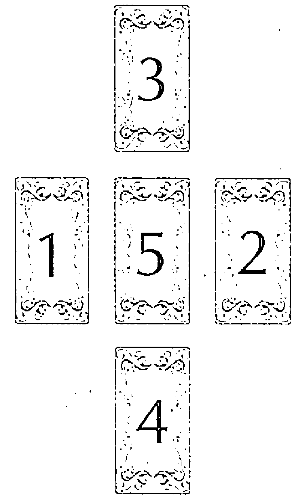

此牌阵属于拥有建议牌的牌阵，并且加入了配牌的解法，所以属于高级牌阵，需要比较多的时间来训练，才能更加熟练地运用。这个牌阵只适用于大阿卡那，不需要小阿卡那。虽然牌阵有五张牌的位置，但有时候却只需要四张牌，因为这个牌阵用到了重复牌，所以有时候也会有同一张牌在不同位置上的解释，需要特别加以注意。

### 发牌

将大阿卡那洗好后呈扇形展开，平放在桌面上。求问者从洗好的牌中随即抽取四张，依次放在牌阵的 1 至 4 号位上。收好剩下的牌，不要弄乱顺序，把整叠牌从左至右翻转过来，使有图案的那一面朝上，放到一旁。

把位置 1 至 4 的牌全部翻至图案朝上，然后把牌上面所有的数字相加，得到的数字若小于或等于 22，就从剩下的大阿卡那中找寻这一数字的牌，放到 5 的位置。

若这四张牌相加的数字超过 22，就把所得数的个位与十位相加，所得的数字就是要寻找牌的号码。

如果位置 5 得到的牌已经被放在 1 至 4 号位时，我们就可以先不解读这一位置，等到前四张都解读完时，再来分析。

### 解读

位置 1 和位置 2 上的牌，象征着影响事情或问题的外在因素，需要把这两张牌综合在一起进行解读，综合分析。

位置 3 上的牌，代表事情或问题发生的原因或问题的关键所在。

位置 4 上的牌，代表整件事情或问题的解决方式与建议。

位置 5 上的牌，代表整件事情或问题的最终结果。

### 解牌要点

在使用这个牌阵时，要注意配牌解读的重要性。当出现了无法解读或是两张牌相互矛盾时，就先解读一张牌，然后从辅助的角度来尝试解读另一张牌。不要把两张牌都当成主要牌来解读，这样会增加难度。一般以第一张牌为主牌，第二张牌为辅助牌，不过根据具体情况不同，玩家也可以自行选择。

## The Spread

求问者：女生。

求问：我与男朋友之间发生了一件事，我想知道这件事对他的影响以及与他今后的发展。

开牌情况：
- 位置 1 皇后 逆位
- 位置 2 皇帝 逆位
- 位置 3 力量 逆位
- 位置 4 节制 逆位
- 位置 5 命运之轮 正位

牌面解读：二人的心情：逆位的皇后，代表你的男朋友从内心里是感动高兴的，但由于种种原因仍一直处于比较不安的状态中。而逆位的皇帝表明你觉得自己很了不起，有点自负。

现在应采取的对策：力量逆位是暗示你应该对待他再温柔些，不要着急，慢慢来。

周围状况：节制逆位代表两个人的心还有一定距离，有不同的追求。因此，周围的人对你们的未来也不抱太大的希望。你们之间还是缺乏沟通。

最后的结果：根据整个牌阵来看，命运之轮正位说明目前你们这种不和谐的状态是暂时的，你应该主动地去把抓住时机，将命运引导向有利的一面。

## TAROT

### 实例2

求问者：男生。

求问：我想知道和我心仪的女孩未来的感情会如何发展。

开牌情况：
- 位置 1 皇帝 逆位
- 位置 2 愚人 正位
- 位置 3 隐士 正位
- 位置 4 审判 逆位
- 位置 5 死亡 逆位

牌面解读：从皇帝逆位来看，女孩对你没有什么感情。愚人正位说明你可能是想要不计后果地去尝试。而你们的关系从隐士正位来看，可以知道目前你们都是单身，对感情也都有所保留，因此这段感情应该是比较保守而且不易发展的。从审判逆位来看，你们的关系并不乐观，因为你和她都欠缺太阳正位光明、乐观的元素。最后，死亡逆位这张牌提出了建议，你应该先认清并且接受目前对你不利的情势，再想办法发展这段感情。

## The Spread

## 爱的现状牌阵法

### 发牌

可以只使用大阿卡那或只用小阿卡那，也可以使用整副塔罗牌。只需要随意抽取两张牌，依序放在位置 1 和位置 2 上。

### 解读

- 位置 1 代表两人目前的状况。
- 位置 2 是建议牌。

## TAROT

### 实例

求问者：男生。
求问：我和女朋友的关系遭遇瓶颈，该如何解决呢？
开牌情况：
- 位置 1 高塔 正位
- 位置 2 圣杯二 正位

牌面解读：正位高塔，表示你们之间的感情目前正处于停滞的状态。而正位的圣杯二是建议你跟她进行平等的、良性的沟通，从而冲破瓶颈，解决你们的问题。

## 爱情金三角解牌法

### 发牌

可以只使用大阿卡那或只使用小阿卡那，也可以使用整副塔罗牌。游戏时随意抽取四张牌，依次放在位置 1 至位置 4 上。

## The Spread

- 位置 1 代表你和他未来发展的前景。
- 位置 2 代表对方的情况和想法。
- 位置 3 代表你的情况和想法。
- 位置 4 代表你们之间的关系。

求问者：女生。
求问：W·君和我的未来会如何？他是怎么看待我们之间的关系的？

开牌情况：
- 位置 1 皇帝 正位
- 位置 2 月亮 正位
- 位置 3 星辰 正位
- 位置 4 吊人 逆位

牌面解读：星辰正位代表你在内心深处对未来是充满乐观态度的，而过往岁月里的所有付出，或许是今生注定。吊人逆位表示你内心的矛盾与挣扎，但现在的情况并不是很理想，最好分开一段时间好好让彼此的心冷静一下。皇帝正位让你觉得喜欢一个人一定要为他做一些实际的事情，有时候不妨多关心一下他的情绪或他在乎的事情。月亮这张牌看起来表面上可能关系不错，但是有时候明亮的月光又会被乌云被遮住。这块掩盖在他心中的乌云可能是过去一直困扰着他的一个未解难题。

可能两人在相处过程中会觉得少了些许默契吧？塔罗牌告诉你别太着急，随着时间的流转，也许明天就会乌云散尽。

### 实例2

求问者：女生。

求问：我对一个男性朋友越来越有感觉，并且对他用情已经到了很深的地步，最近，我跟他的关系也更近了一些，所以我想问一下我们目前对彼此的态度及恋爱的可能性。

开牌情况：
- 位置 1 太阳 逆位
- 位置 2 力量 逆位
- 位置 3 命运之轮 正位
- 位置 4 女教主 正位

牌面解读：从命运之轮正位来看，你对他的感觉会与日剧增。而他心里可能正在犹豫是否要选择你，因为他对你的感情并不是很深。所以，你们目前的状况才正是女教主正位所显示的：处于一种退缩而内省的状态。

而对于你们的未来，他最终应该还是没有选择你，因为他内心真实的情感可能还是不够喜欢你，而你对他与日剧增的感情，又给他造成了很大压力，从而使他对你慢慢疏远。

# 附：经典实用牌阵

牌阵是问题呈现的一个形式。在解牌时，选对牌阵，便可事半功倍。简单的牌阵应对简单的问题，复杂的牌阵则用来处理重大的问题，依据不同的问题来选择不同的牌阵，这是一个十分重要的问题。牌阵并没有好坏之分，在解决问题时选择对的牌阵便是好的牌阵。

牌阵的种类繁多，变化万千，任何人都可以根据自己的需要自创牌阵。我们为初学者选取了最简单的基础牌阵和一些实用牌阵，这些牌阵不仅常见于各类塔罗书籍和网络中，而且容易上手，在实际的练习过程中依次进行，就能逐步掌握要领，成为个中高手。

## TAROT

## 经典牌阵

经典牌阵，是一些经过时间考验的牌阵，有一些甚至流传了数百年之久，相信这些牌阵会给求问者指点迷津。

### 凯尔特十字

据说，塔罗牌刚刚出现的时候，凯尔特十字预测法就成为解牌的主要方法。相传，它是由流浪的吉卜赛人从埃及传到爱尔兰，在凯尔特人中广泛流行，成为战争或婚庆前必用的占卜仪式。

凯尔特十字流传至今，仍然是塔罗牌解牌的主流牌阵，也是很多塔罗大师偏爱的牌阵。它的取牌范围可以单独使用大阿卡那，或者是全套塔罗牌。

## The Spread

在传统上，凯尔特十字牌阵的解读是这样的：
- 位置 1 在十字形的中央，代表求问者的目前状况或是他现在的问题。
- 位置 2 与位置 1 呈十字交叉，代表要面临的阻碍或影响现状的困难。
- 位置 3 是在前两张牌之上，代表短期内所能达到的目标。
- 位置 4 在头两张牌之下，代表很久以前发生的事对现在的影响。
- 位置 5 在十字形的右臂，代表不久之前发生的事对现在的影响。
- 位置 6 在十字形的左臂，代表即将到来的时刻。
- 最后四张牌放在十字的右边，直线排列，由下而上：
- 位置 7 代表埋藏在心底的愿望与欲望，还有影响目前情况的基本人格。
- 位置 8 代表环境或家庭的影响，包括现实或精神上的住所。
- 位置 9 代表预料之外的好运或噩运。
- 位置 10 是对以上的全部总结，暗示可能的结果。

凯尔特十字牌形有一段韵文，方便人们记忆：

> “1 找到你，2 影响你，3 加冕你，4 在你下面，5 在你后面，6 在你前面，7 是你的希望与恐惧，8 是你的房子与家庭，9 是超出你的预期，10 是一定会发生。”

还有一点要注意：当事人是指问题的主角，并不一定就是求问者。要知道问题解释的角度和对象不同，结果会相差很多。

## TAROT

## 星宫之书

星宫之书的取牌范围可以只使用 22 张大阿卡那或只使用 56 张小阿卡那，还可以使用整套塔罗牌。

### 解牌技巧

- 位置 1 代表你的外貌与外在表现个性。
- 位置 2 表示金钱、拥有物和价值观，你对于获得的东西要如何使用你的价值与你如何设定你的目标。
- 位置 3 表示与其他人沟通的最佳方式。根据你的问题，短程旅行和兄弟姐妹等因素可能需要加以考虑。
- 位置 4 代表你的家庭状况，以及那些你需要去加强的各种因素，也代表你的双亲之一会怎样给予你帮助。

## The Spread

- 位置 5 通常是指将你用在外在欲望上的创造力，依据你的问题，恋情或小孩等因素应该要加以考虑。
- 位置 6 代表你的工作目标、工作节奏，以及你工作中的人际关系，也表示在这段时间中，你该如何照顾好你的身体。
- 位置 7 代表你的婚姻及其他人际关系，这些人际关系该如何帮你实现目标。
- 位置 8 代表性、死亡、改革和其他人的金钱，暗示你能如何激励自己，你应该放弃哪些东西，哪些部分需要变化，在金钱方面其他人能怎样帮你。
- 位置 9 暗示你需要学习的，你需要前往的地方，你该如何与坚持你的信仰并让你的人生观使你更加坚强。
- 位置 10 表示你的整体状况与生活经验，你应该要加强的部分，你的另一位双亲将会如何帮助你。
- 位置 11 代表你所接触、交往的朋友和团体，也代表对你的目标最美好的憧憬。
- 位置 12 代表当你单独一个人时会做些什么，隐蔽而没有显示的事物，还会指导你克服你内心恐惧的最好方式。
- 位置 13 和位置 14 说明每件事情的光明的一面。在牌义的解释上，这两张牌将告诉你最后必须知道而且非常重要的事。

## TAROT

## 七“行星”

七“行星”的取牌范围可以仅为 22 张大阿卡那或 56 张小阿卡那，也可以是全套塔罗牌。

### 解牌技巧

- 位置 1 代表月亮，指的是求问者的家人情况与家庭环境。
- 位置 2 代表土星，代表求问者的智能及精神状况。
- 位置 3 代表金星，表示情感方面。
- 位置 4 代表太阳，代表求问者的人际关系及社交魅力。
- 位置 5 代表火星，指的是求问者及其对手的竞争状况。
- 位置 6 代表木星，指的是物质的获得，或者人际关系、精神性物质的取得。
- 位置 7 代表水星，表示在贸易、商业、工作或学习方面的状况。

## The Spread

## 沙迪若之星

沙迪若之星的取牌范围可以仅为 22 张大阿卡那或 56 张小阿卡那，也可以使用全套塔罗牌。

### 解牌技巧

此牌阵适合求问者在对目前的状况尚不明晰之时，给予当事人相关的忠告与消息。此牌阵虽然不会告诉你一个确切的结果，但是，最后的结论会告知你非常可靠的发展情况。

- 位置 1 代表求问者与他们的感觉。
- 位置 2 表示对当前状况的疑惑。
- 位置 3 是指影响问题的因素。
- 位置 4 代表引起求问者所面临问题的过去的事件。

## TAROT

- 位置 5 是指要谨慎的，对你有指示作用的人或事，必须深思熟虑。
- 位置 6 暗示可能会产生的结果。

## 意识动力

意识动力的取牌范围可以使用 22 张大阿卡那或仅使用 56 张小阿卡那，也可以使用全套塔罗牌。

### 解牌技巧

此牌阵是用于了解意识、时间和结果之间的相互作用，当你有一项计划或有决定时，就可以使用此牌阵。
- 位置 1 代表求问者的感觉和他所了解的现状。
- 位置 2 分析过去的事件对现在的影响。

## The Spread

- 位置 3 进一步解读位置 2 中的相关人物，以便客观公平地认清当前的状况或人。
- 位置 4 表示内心的道德对事件的影响。
- 位置 5 代表累积的习惯、情绪、事件，这些都会影响求问者现实方面的判断力。
- 位置 6 表示求问者不想有任何改变，不想改变任何现状，情况会如何发展。
- 位置 7 暗示未来可能产生的结果。
- 位置 8 表示求问者可以做的改变，也有可能是一种让你偏离目标的诱惑。
- 位置 9 暗示更多可能的结果，前提是假如求问者听从位置 8 的指示时就有可能发生。

## TAROT

## 房型阵

房型阵的取牌范围可以仅为 22 张大阿卡那或仅为 56 张小阿卡那，也可以是全套塔罗牌。

### 解牌技巧

- 位置 1 代表客厅，暗示朋友、社交关系以及团体活动。
- 位置 2 代表家人休息室，暗示父母、兄弟姐妹、配偶、孩子和宠物。
- 位置 3 代表厨房，暗示健康和肉体。

## The Spread

- 位置 4 代表私人房间，暗示工作、资金。
- 位置 5 代表洗衣间，暗示你需要留意的，必须小心的。
- 位置 6 代表地下室，暗示被隐藏的或者你没有意识到，但却在你的生命中不断积累的。
- 位置 7 代表车库，暗示在你生命中停留并需要留意的。
- 位置 8 代表卧室，暗示对位置 9 和位置 10 的想法。
- 位置 9 代表后门，暗示正从你生命中离开的人或事。
- 位置 10 代表前门，暗示正走入你生命的人或事。
- 位置 11 代表阁楼，暗示你最后将取得好成就。

## TAROT

## 基础牌阵

基础牌阵的取牌范围可以仅为 22 张大阿卡那或仅为 56 张小阿卡那，也可以使用全套塔罗牌。

### 得与失

- 位置 1 代表我将失去什么。
- 位置 2 代表我将得到什么。

## The Spread

### 今日运势

- 位置 1 代表事件，暗示今天可能发生的一些事。
- 位置 2 代表感受，暗示事情发生后你的感受，或者事情发生后你的反应。

## TAROT

### 了解自己

- 位置 1 代表我是谁。
- 位置 2 代表我的需求。
- 位置 3 我如何达到的需求。

### 今天会发生什么

- 位置 1 代表今天的重点事件。

## The Spread

- 位置 2 代表这事件会如何发展。
- 位置 3 代表你怎样开始做这件事，或你该为这事件做些什么。

### 工作

- 位置 1 代表是否对工作作出了正确的选择。
- 位置 2 代表这项工作是否稳定。
- 位置 3 是否应该做些改变。

## TAROT

### 合伙

- 位置 1 代表我的伙伴。
- 位置 2 代表我自己。
- 位置 3 代表合伙工作的状况或者风险。

## The Spread

## 爱情牌阵

### 分手

分手牌阵主要是告诉你一些你必须取舍的事。
- 位置 5 主要告诉你该如何去调整自己对爱的感觉。
- 位置 1、2、3 则代表你为什么要放手，其中隐含的原因。
- 位置 4 代表你对爱情放弃的主要原因。
- 位置 5 代表如果你选择了放手，那最后的结果将会怎样。

## TAROT

### 真爱预测

- 位置 1 代表你真正的伴侣类型。
- 位置 2 暗示你真正的伴侣是否已走入你的生命之中。
- 位置 3 暗示将会出现的困难。
- 位置 4 暗示你需要作出的改变。
- 位置 5 代表在爱情中你坚持的信仰。

## The Spread

### 爱情大考验

- 位置 1 代表在这段时间内，你的爱情关系传达给了你哪些爱的含义。
- 位置 2 代表在爱情中你真正想要什么。
- 位置 3 代表在爱情中你不喜欢的方面。
- 位置 4 代表可以赋予爱情新能量的事物。
- 位置 5 代表在爱情中你所不了解，或者应该学习的。

## TAROT

### 爱已消失

- 位置 1、2、3 可以解读为造成现在爱情伤心与痛苦的原因。
- 位置 1 代表伤害你的事件或原因。
- 位置 2 代表在一起时，你们共同拥有的事物。
- 位置 3 代表破坏你们共同拥有的事物的原因或事件。
- 位置 4 暗示这种情况能否解决。
- 位置 5 告诉你们能否还能在一起。

## The Spread

### 爱的新起点

- 位置 1 会告诉你这是否是个新的起点。
- 位置 2 暗示你是否会有新的爱情出现。
- 位置 3 告诉你随之到来的惊喜。
- 位置 4 告诉你新的爱情是否会令你安心。
- 位置 5 代表爱的过程将会如何。
- 位置 6 表示你们是否会相处融洽。
- 位置 7 提醒你内心所想的真假。
- 位置 8 告诉你应该设定的目标。
- 位置 9 会告诉你一切是否会顺利。

## TAROT

### 评价爱人

- 位置 1 提问你的爱人是否关心你。
- 位置 2 暗示你们之间的感情是否稳定。
- 位置 3 是让你明白你们是否有相同的目标。
- 位置 4 告诉你，你的爱人是否忠诚可靠。
- 位置 5 暗示性在你们之间的重要性。
- 位置 6 代表你的爱人是否考虑过结婚。
- 位置 7 告诉你，你的爱人素质的高低。
- 位置 8 代表你们之间对于金钱的态度。
- 位置 9 代表你的爱人是否会离开你。
- 位置 10 告诉你们之间的最后结果。

## The Spread

## 财富牌阵

### 收获

- 位置 1 代表你的愿望。
- 位置 2 告诉你该如何行动，才可以最后得到结果。
- 位置 3 暗示如果想实现愿望，所需要的新想法。
- 位置 4 代表会帮助你的人或事。
- 位置 5 代表你将面对的挑战。
- 位置 6 代表你将得到的收获。
- 位置 7 代表实现愿望的关键。

## TAROT

### 财宝金库

位置 1 是钻石，代表你出众的地方，拥有天赋、能力，以及财富。
位置 2 是珍珠，代表应用于生活的知识与信息。
位置 3 是金币，代表目前可以支配的金钱与物质。
位置 4 是翡翠，代表你刚刚结识的人及产生的关系。
位置 5 是白金链，代表阻碍你的发展，必须要解决的人或事。
位置 6 是蓝宝石，代表你与众不同、脱颖而出的能力。
位置 7 是水晶，代表你正在学习的知识与信息。
位置 8 是红宝石，代表注定要走入你生命中的那个人。
位置 9 是未经切割打磨的钻石，代表你尚未发挥的能力。

## The Spread

## 事业牌阵

### 跳槽

位置 1 代表你能否拥有一个更好的工作。
位置 2 暗示你应该做些什么。
位置 3 告诉你将遇到的问题。
位置 4 告诉你是否应该企盼一个新的环境。
位置 5 代表最终的结果。

## TAROT

### 事业发展

位置 1 代表你想从所选择的事业中得到什么。
位置 2 代表怎样做才能改善你的事业。
位置 3 代表事业中你无法改变的方面。
位置 4 代表你是否已得到最好的结果。
位置 5 代表你应该做哪些事来提升自己的事业。
位置 6 代表至今仍影响你的事业的障碍。
位置 7 代表最终的结果。

## The Spread

## 日常牌阵

### 四季运势

位置 1 和位置 8 代表春季，象征开始，就像是春天播种一样。
位置 2 和位置 3 代表夏季，象征计划的进展，努力将梦想实现。
位置 4 和位置 5 代表秋季，象征结果将会如何。
位置 6 和位置 7 代表冬季，象征计划完成后的收获期。

## TAROT

### 彩虹阵

位置 1 代表雨，象征阻碍实现愿望的事物。
位置 2 代表细雨，象征为了实现愿望而进一步要做的。
位置 3 代表雨停，代表将会帮助你的人或事。
位置 4 代表阳光，代表你希望的最好状况。
位置 5 代表彩虹，暗示短期的指引。
位置 6 代表金色苍穹，指长期的结果。

## The Spread

### 飞鸟阵

位置 1 和位置 2 代表你目前的处境。
位置 3 代表你如何到达你想要去的地方。
位置 4 告诉你该从何处出发。
位置 5 暗示你将得到什么、发现什么。
位置 6 和位置 7 告诉你将学到什么。
位置 8 告诉你这次旅行的结果。

## TAROT

### 健康与幸福

位置 1 代表你过去的健康状况。
位置 2 代表你现在的健康状况。
位置 3 代表你未来可能的健康状况。
位置 4 代表可以帮助你改善健康状况的人或事。
位置 5 代表过去能让你快乐的事。
位置 6 代表现在能让你快乐的事。
位置 7 代表未来可能会让你快乐的事。
位置 8 代表可以促进你的幸福与健康的人或事。

## The Spread

### 幸运分析

位置 1 告诉你大概的幸运状况。
位置 2 代表你的幸运状况对生活的影响。
位置 3 暗示会给你带来幸运的地方。
位置 4 代表给你带来幸运的人或事。
位置 5 延续位置 4，告诉你幸运将怎样帮你达成愿望。
位置 6 告诉你比较幸运的季节。

要注意的是，位置 6 只使用小阿卡那的 4 张首牌中的一张。权杖首牌代表春天，圣杯首牌代表夏天，星币首牌代表秋天，宝剑首牌代表冬天。

## TAROT

### 命运九宫阵

- 位置 1 代表你的生活将有何改变。
- 位置 2 代表是否会有婚姻或新的关系产生。
- 位置 3 代表你是否有成功的机会。
- 位置 4 代表你在金钱方面的保障。
- 位置 5 告诉你是否会有一个自由的旅行。
- 位置 6 告诉你将出现的问题。
- 位置 7 告诉你，你的智慧情况。
- 位置 8 告诉你，你对物质的欲望。
- 位置 9 代表你自身价值的改变。

## The Spread

### 心中的梦想

位置 1 是关键，代表你对于此刻梦想的感觉。
位置 2 是梦想状况，代表一些与梦想有关的事件。
位置 3 代表内部能量，即此梦想的主要能量。
位置 4 代表表意识想法，表示此梦想对你当前生命的意义。
位置 5 代表潜意识想法，表示此梦想在你心中的意义。
位置 6 代表不易掌握的能量，暗示如果你希望梦想实现，你所需要的力量。
位置 7 代表结果，即此梦想的影响。