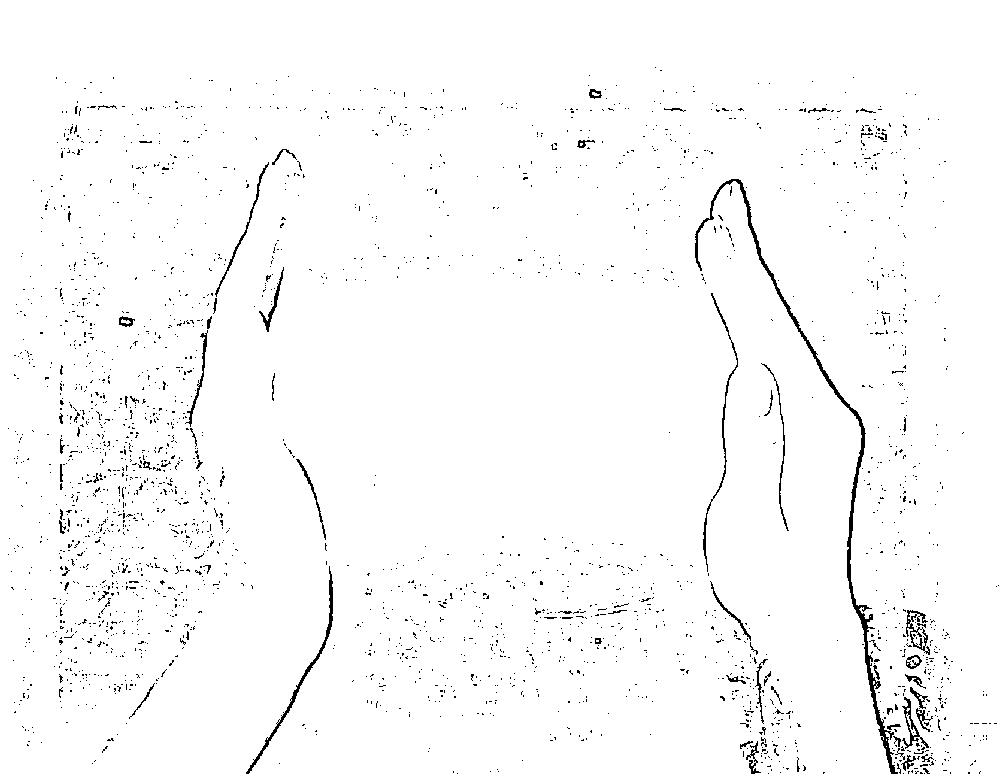
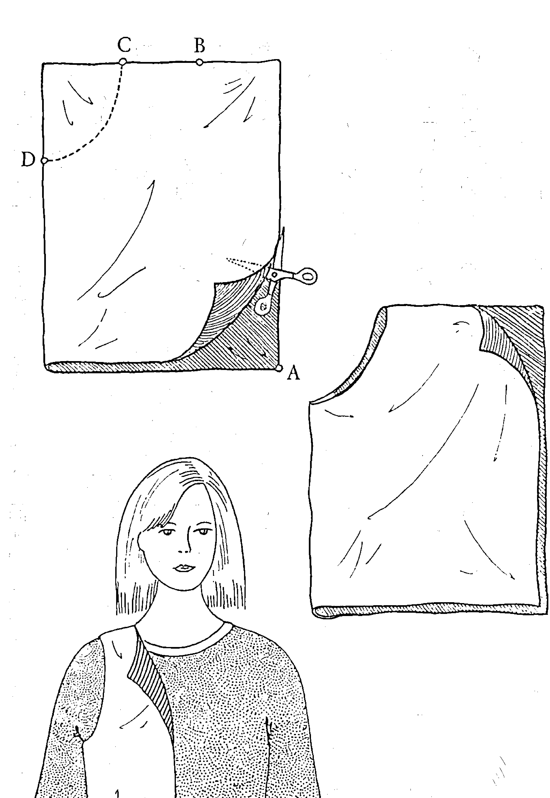
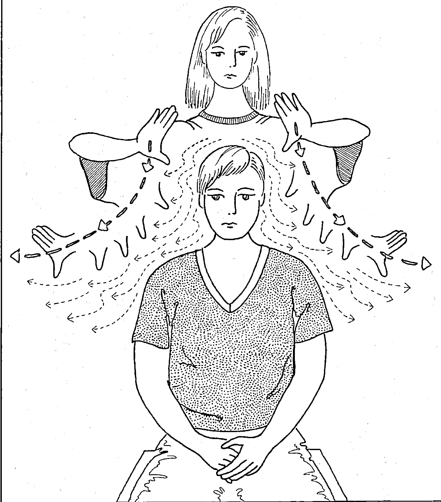
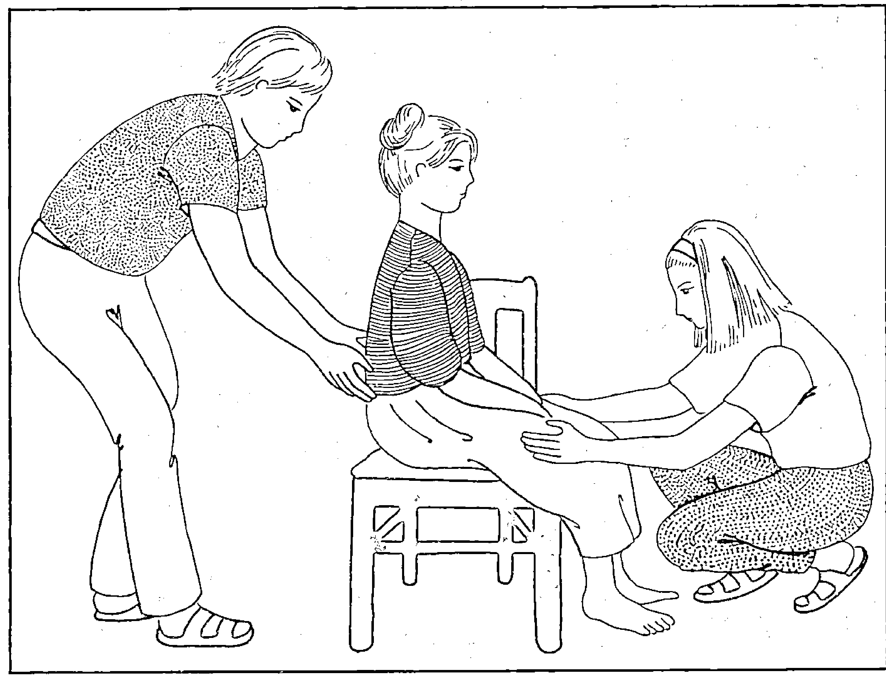
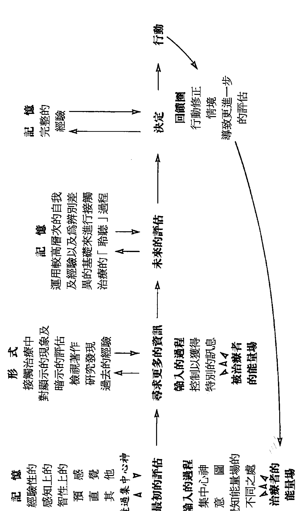

# 神奇的接觸治療

# 如何透過人體能量場來治癒身心

接觸治療的先驅  
達洛斯・克里格(Dolores Krieger)／著　胡雅沛／總審訂　徐燕如／譯  

利用雙手提供身心  
必要的幫助與療癒  

自從一九七二年起，達洛斯・克里格已教導了世界上數千名的健康專家接觸治療的方法；現在於《神奇的接觸治療》這本書中，她引導我們所有人如何掌握這個有力的能量療癒方法。克里格指出雖然這並非一種「奇蹟治癒」，但接觸治療已證實在治療各種狀況上，從月經前症候群、頭痛、灼傷、骨折、哮喘、細胞再生的問題、癌症及愛滋病，均是安全且有幫助的。她鼓勵我們承認自己天生具有的療癒能力，並且提供練習體驗以教導我們接觸治療的基本技巧；奇蹟若存在，便是我們全都可以參與療癒的過程，並幫助我們的朋友、夥伴、家人甚至是寵物的感覺更好。

達洛斯・克里格博士在現今醫學上掀起了一陣潛能風潮，而她的努力在心臟復甦及靈魂療癒上非常重要；於接觸治療的努力，她「穿越」了科學，而非繞著它打轉，多年來我極為讚賞她的勇氣與眼界，現在是每個人發覺其偉大的發現的時機。

> ～賴瑞・朵西，《空間、時間》以及《醫學與靈魂回復》的作者

這是一本有趣且不可思議的書，達洛斯・克里格，她比其他任何人都努力地促使能量療癒成爲解決醫學問題，一個頗受好評且實用的方法；關於這個方法，她寫了一本清晰、易讀的書……她把古老的療癒工具帶入現代的世界，並且給予我們一個極棒的禮物。

> ～賴瑞・李珊，《媒體、神秘家和物理學者》的作者  

這是一本有趣且不可思議的書，達洛斯・克里格，她比其他任何人都努力地促使能量療癒成爲解決醫學問題，一個頗受好評且實用的方法；關於這個方法，她寫了一本清晰、易讀的書……她把古老的療癒工具帶入現代的世界，並且給予我們一個極棒的禮物。

人類文明的演進至二十世紀末到達了物質追求與發展的高峯，隨著寶瓶世紀的來臨，地球所處的宇宙時空中，正醞釀著另一種新文明的誕生；這股改變的浪潮，將帶領全體人類轉向精神領域的探索和提昇。過去的教育、心理學、哲學、神秘學乃至科學、宗教等，無一不是在探求生命的真相與原貌，在衆多分歧、百家爭鳴的表象下，統合萬物的真理逐漸在各個領域悄然浮現，心物一元或是身心靈的結合與昇華，成爲當代世人所共同追求的理想與遠景。

於是新時代之光同時在世界上每個角落點燃，而所謂的「新時代運動」是以歐美國家爲最早發端，逐漸地發展與演進，目前已成爲一股強大的思想潮流，世界各地相關之集會活動、教學課程、藝文出版、音樂創作，乃至科學、醫學的新生命觀、愛護地球的環保運動等，皆屬於此新思潮的展現，它們共同的目的皆在於提昇人類的意識，回歸生命光與愛的本質，進而邁向天人合一、宇宙和平與世界大同的未來。

在台灣，新時代運動的起步較晚，然而近幾年來由於有許多先進及熱心人士用心地投入與推動，並引進各種不同的觀念活動課程，已奠定了良好的基礎。本社在此風雲際會、新時代來臨之際，自覺亦應肩負起出版者的使命，希望能將新時代的全貌完整且如實地介紹給讀者而規劃出一系列的新時代叢書；新時代的領域包含甚廣，大致可分為十一大類：包括新時代思想類、星際資訊類、光能靈療類、心靈潛能類、水晶礦石類、古文明與神秘學類、星象研究類、創造與生涯類、養生保健類、傳統心靈哲學類、兩性關係類、心靈童書類等等。針對如此浩瀚的領域，本社將有計劃地網羅各類別的好書，在此系列問世的第一、二年間，先推出其中七大類，共約四十本以饗讀者。

# A、新時代思想類：此類叢書首重闡釋新時代的生命觀、哲學觀以及意識架構，啟發我們以另一種多元整體的觀點來省察生命的真理與意涵。

# B、光能靈療類：介紹能量與光的本質，以及如何將光能運用在身心靈的治療上。

# C、心靈潛能類：透過冥想、能量的操作乃至各類心靈技巧的演練，把人類天賦的潛能予以開發。

# D、創造與生涯類：應用新時代生命觀來創造更美好與豐富的物質世界，真正將心物一元的理想落實在生活中。

# E、水晶礦石類：介紹各類礦石水晶，以及它們與身心靈的提昇及治療的關係和實踐。

# F、養生保健類：以自然而符合生命的原始法則之養生方式來增進生活品質，以健康和樂的生活作爲心靈提昇的基石。

# G、星際資訊類：了解來自其他星系和文明的心靈訊息，喚醒我們內在的宇宙記憶和知識，重建天人合一的連結。

隨後數年將逐漸發展到其餘類別，希望以階段性的方式將這十二類國內外新時代的相關著作予以完整的介紹，並計劃於適當時機，與國內相關的團體、工作坊結合，舉辦各種活動及讀書會，或邀請國內外作家、專業人士舉辦座談會或相關課程，作爲書籍出版之後續服務，及對讀者的回饋。

當然要圓滿達成這樣的一個書香遠景，是需要長時間的投入及努力，與各方的奧援及支持。我們願善盡出版者的責任，希望能以好書陪伴這急遽變動中的世界，邁向另一階段的躍昇，更期待新時代中的光與愛能普照全體人類和十方宇宙，讓衆生萬物都回歸到真實而喜悅的生命中。

# 總審訂  
簡介

胡雅沛畢業於台大政治系，於學生時代即開始探索新時代的訊息與能量研究，曾接受歐林、光的課程，和知見心理學等新時代專業課程的訓練，並為宇宙靈氣協會授證之靈氣教師，目前致力於星象能量和行星意識的研究。此外，經常擔任新時代各類課程現場口譯，以及光能冥想教學和個人諮商治療。

# 導讀

有人說：「雙手萬能」，但你也許沒想過手也能成爲治療疾病的工具；的確，在各種宗教或古老神祕的心靈文獻裡，我們都可以看到描繪利用手的觸摸，而治癒他人的神蹟和故事；比如使眼盲者恢復視力，潰爛的皮膚瞬時癒合。雙手除了我們一般所認知的功能外，似乎還有著另一種看不見卻有其實效的能力，在這本書中所談論的正是這個神奇的「接觸治療」。

一談到治療，我們可能馬上會想到冰冷的機器，嚴肅的專業面孔，還有在走廊中滿臉愁容，排隊等候看病的病患，和難捱的苦痛以及無可奈何的心情；花了錢，買了藥，回去還得囫圇吞下一些連自己也不知道是什麼的東西，或者準備接受開腸剖肚的安排。

其實接觸治療之所以神奇，是因爲它將治療師與被治療者帶領到心靈層面去，用心去感受我們痛苦的經驗，並從中領悟生命的真理，把因內在不和諧所導致的生理病痛和扭曲，透過內在的領悟而得到釋放，讓我們生命的運轉重新回到自由與和諧的狀態中，而痛苦也隨之離去，心靈與肉體同時因此而得到深層的滋潤與全然的療癒。雙手在此扮演一個傳導的工具，將透過治療者而傳遞出來的生命力，在人體能量的層面上給傳遞出去，治療者也透過人類雙手中與生俱來的能量感知中心，從能量的層面來感測對方當時在身心靈各個方面所呈現出來的狀況。

# 接觸治療

「接觸治療」將人的生命視為一個整體，身心靈三者是緊密相繫而不可分割的，在了解病痛的起因和失衡的所在後，治療的進行是經由能量層面的運作而達成，雙手在此展現出它天生給予與接收的天賦本領，將治療師與被治療者做完美的串連，使得療癒的能量在彼此的能量場中互動，將潛藏在體內的失衡能量浮現出來接受轉化與療癒，不僅肉體的問題得以解決，更把療癒的效果給帶到心理與靈性的層面，讓當事者的內在擁有更深一層的力量和智慧，來面對自己的成長與生命的課題。

「接觸治療」也可以說是現代能量治療的先驅，卻也能並容到其他能量療法裡，它象徵一個里程碑，代表著過去的奧祕即將成爲今日的科學，使人類在精神與物質間獲致平衡與整合的力量，解開千百年來二元對立的迷思。

靈氣治療教師  
胡雅沛 一九九八年二月謹識於台北

# 讚譽達洛斯・克里格的接觸治療

接觸與治療兩者的結合乃是自古代即有且是遍布全世界的；熟練的雙手是醫生最重要的診斷與治療工具之一，以雙手觸摸來進行治療的過程在醫學上的重要性已被廣泛地陳述：：：在我們的時代，藉由照顧者／治療師達洛斯・克里格之手。

護士和老師的發電機（達洛斯・克里格）已將運用雙手轉變為一種治療方法，她花費數年的時間，使治療不再限制在特定羣體的神秘、迷信與懷疑的能量場，並且將它開放給大眾。

雙手獲致新的尊崇。

｜東西方／自然健康  
｜美國醫藥協會期刊  
｜紐約時代  

接觸治療有其狂熱者的支持，因爲他們的經驗說明了它真的有用；它是一項具有學問的方法，而其醫療者均指出它具有良效。

美國的醫學正進行著一場安靜的革命，目標：將西方醫學方法所具有的高科技魔術，與東方健康照顧的基本科技、個性化的關注，融合在一塊兒，這個同盟：：：將會創造出一個預防與事後介入同樣有力的系統，在克里格博士的指導下，接觸治療的技巧已蔓延至世界各地的醫院病房。

達洛斯・克里格：：：乃是接觸治療運動中，無可爭議的領導者。

在醫學上一個最新的突破，係和人類一樣的古老──透過觸摸來進行治療的能力。現在，科學家開始去了解觸摸所具有的卓越能力，它能幫助我們療癒肉體與情感的傷痛。

｜自我雜誌  
｜新時代期刊  
｜翁尼（O32）  

達洛斯・克里格幾乎一手推動了這個古老的仰賴雙手的技巧，其現代版的普及……

談到接觸治療而不提及克里格博士已是不可能的事……製造奇蹟的素材。

克里格博士為嬰兒所做的尤其令人印象深刻。

達洛斯・克里格博士將信心療癒轉變為被認可的科學……由於她的努力，「接觸治療」已成爲重要的科學，而全國數百名的健康專家均接受教導，甚至在醫院中也使用接觸治療。

｜仕女天地期刊  
｜麥寇斯（McCaus）  
｜美國寶寶  
｜紐約雜誌  

接觸治療，於一九七五年首先由克里格說明係一種療癒或幫助的舉動，與依靠雙手的古老方法類似：：：超越了安慰劑的角色，而牽涉一種無法定義卻值得學習的平衡人類能量的技巧；在昂貴的器具和高科技的世界裏，我們已再次發現人類雙手的觸摸乃是有著密切關係、寶貴的治療方法。

｜美國治療期刊  

接觸治療，於一九七五年首先由克里格說明係一種療癒或幫助的舉動，與依靠雙手的古老方法類似：：：超越了安慰劑的角色，而牽涉一種無法定義卻值得學習的平衡人類能量的技巧；在昂貴的器具和高科技的世界裏，我們已再次發現人類雙手的觸摸乃是有著密切關係、寶貴的治療方法。

# 对接触治疗的反思

我以如此多的方式触及你  
其中之一  
是以如此快的速度奔跑著  
我似乎矗立著  
在你環繞我舞動著的時刻  
現在，愛撫著看不見的力量  
穿透你的能量場  
我已發現  
屬於我的你的美麗  
韻律和舞動  

# 讚譽達洛斯·克里格的接觸治療  

琳達·摩瓦德  
克里格迷  

# 目錄  

出版序／3  
導讀／7  
讚譽達洛斯·克里格的接觸治療／9  
前言／20  
序／24  

## 第一章 介紹接觸治療  

25  

## 第二章 接觸治療的基本技巧  

35  

※接觸治療的基礎／29  
※接觸治療的定義／37  
※接觸治療的效用／39  

+   ※ 適用於每個人的接觸治療／40  
※ 接觸治療的功能層面／42  
※ 集中心神：了解你自己／44  
※ 練習體驗一：如何集中心神／46  
※ 練習體驗二：發光的孩童和寧靜的湖／49  
※ 練習體驗三：感覺人類的能量場／51  
※ 練習體驗四：評估人類能量場的基本技巧／53  
※ 練習體驗五：國王的衣服／57  
※ 練習體驗六：感知情感／69  
※ 評估被治療者能量場中的情感內容／69  
※ 辨認被治療者能量場中的暗示／61  
※ 評估人類能量場／56  
※ 深入評估人類的能量場／74  

# 第二章 如何運用人類能量去治療  

# 79  

+   ※練習體驗七：導引人類的能量／86  
※整合治療的方法／90  
※接觸治療的主要技巧／92  
※有意識的導引人類能量／94  
※練習體驗八：導引能量穿過被治療者／94  
※調節人類的能量／99  
※練習體驗九：感知色彩的能量特徵／103  
※改變人類能量場的模式／105  
※慣例和告誡／118  
※與夥伴合作／121  
※對接觸治療較敏感的系統／124  
※接觸治療最值得信賴的影響／129  
※實行接觸治療的親身體驗／131  

## 第四章 分析接觸治療的過程  

151  

+   ※ 綜合 / 144  
※ 練習體驗十：評估後的資料和被治療者的評估格式 / 148  

+   ※ 接觸治療評估的系統範例 / 161  
※ 治療過程中的連繫 / 166  
※ 有關人類能量的概念 / 167  
※ 接觸治療的體驗 / 174  
※ 練習體驗十一：人類障礙的遊戲 / 174  
※ 尋找合於秩序的原則 / 177  
※ 表格一：親密關係 / 178  
※ 表格二：觀想保護性的障礙物 / 180  

## 第五章 接觸治療特定的運用方式  

目 錄  

193  

+   ※ 接觸治療的運用方式 / 199  
※ 懷孕 / 202  
※ 陣痛和分娩 / 206  
※ 生產後的治療方法 / 208  
※ 疼痛 / 209  
※ 月經前症候羣 / 212  
※ 幫助愛滋病毒感染者 / 223  
※ 腹部手術和剖腹生產 / 231  
※ 你如何知道 / 235  
※ 練習體驗十二：運用手部脈輪以重新平衡被治療者的能量場 / 235  
※ 從事接觸治療的其他例子 / 238  
※ 一些建議 / 239  
※ 留意與告誡 / 240  

# 目錄  

+   ※合法的涉入／243  
第六章 回顧 245  
※實行接觸治療的情況／248  
※脈輪／258  
※方法的結合／261  
※練習體驗十三：接觸治療的本質／262  
※接觸治療的奇蹟／263  
附錄一：已教導接觸治療的國家／265  
附錄二：接觸治療程度的自我評估／267  

# 前言  

達洛斯·克里格乃是一位當代整合療癒的靈性層次與主流的專業治療方法的先驅者之一。過去數十年來，她發展了「接觸治療」，十分具有創意地解釋了數種涉及「運用雙手」、「能量轉移」及「內在的治療者」這類概念的古老療癒方法；身為紐約大學有關治療方面的教授，克里格博士能夠進行研究、教導學生，並且發展接觸治療的技巧與哲學，最終，在美國已有超過八十所的學院和大學，以及七十多個國家，特別是在有關治療的學校，均教授接觸治療。

在一九八○年代，我拿到了克里格博士有關接觸治療的第一本書的副本，《接觸治療：如何運用你的雙手去提供幫助或治療》，並帶至前蘇聯。很快地，它傳至地下新聞報並且被翻譯、打字、影印及傳閱，甚至還進入波蘭及一些東歐國家。

克里格博士開啓了接觸治療的研究，並且鼓勵其他研究者嘗試模擬她的發現，這均是值得讚賞的，雖然對這個方法仍有爭議，但已有足夠的資料支持，以致知情的醫療者必須看重這個方法。接觸治療是否涉及「能量轉移」仍有商討的空間，因為這必須依賴雙方的關係和期待而定，但儘管如此，克里格博士有關「能量壅塞」和「能量失衡」的概念被認爲是對其中所牽涉到的機制所做的有效暗喻，包括因新發展而了解與探索身體和心理關係的神經心理免疫學。

對克里格博士而言，患者的行爲是最爲重要的，她告訴學生去聆聽聲音的細微差異，觀察呼吸的形式，以及察覺在描述症狀時所使用的不尋常語言；她也嘗試去學習有關患者的心靈問題、關注點和信念，以及它們如何對治療方法產生可能的影響。接觸治療的基本目標即是減輕不適感，和加速患者自我療癒的能力；心靈的態度可能是達成這些目的的關鍵要素。

整個健康專業領域的成員已將接觸治療融入其方法中；醫療者本身有各種不同的定位，包括對症療法（allopathic）、自然療法（naturopathic）、骨療法（osteopathic）、脊椎調整療法（chiropractic）、同種療法（homeopathic）。克里格博士的新書，《神奇的接觸治療》，她的讀者羣從專業的治療師擴展至所有對喚醒自身療癒能力並運用它感興趣的人。

在這本書裡，達洛斯・克里格博士呈現了接觸治療的基本技巧，並附帶練習體驗以便這些抽象的概念落實於生命；這些想像練習均清楚地加以描述，並以充滿智慧且實用的方式來探討，舉例而言，克里格博士告誡，「若你不知道，就不要做」；她也舉出可與接觸治療一併使用的治療方法，如針壓法、按摩、心像、物理治療以及瑜伽。

克里格博士也將接觸治療的主要效果分為四類：放鬆、減輕疼痛、加速療癒和緩和身心症的症狀；並非所有的被治療者均會經歷這之中的每個現象，但大部分遭受大大小小疾病的個體均能辨認出它們之中的任何一個，而當一個人認爲接觸治療是不具侵略性的一項基本人類能力，謹慎、自制的平凡人以及保健的工作者皆可學習和練習，那麼這四個現象是更易出現的。我相信接觸治療對治療者本身亦是有益的，促使他們更爲覺察自己的心理及身體作用的過程，在他們導引慈悲以幫助那些不適或痛苦的人。

多年來，克里格博士從未失去她的先驅者地位，而她也沒有失去激起爭議的能力！

《神奇的接觸治療》超越了接觸治療的現有架構，探討醫學領域的關連，以及未來的保健科學。在這本書中提出的構想和過程大部分在未來數十年仍會引起爭議、探討並（最重要的一）爲人所練習。

史丹利・克伯格博士  
舊金山，加州  
一九九二年十月  

# 前言  

史丹利・克伯格乃是在加州的統合研究學校以及賽布克（SAYBLOOM）機構中傑出的心理學教授，他是《療癒的靈性層次、個人神話、夢境工作和療癒狀態》一書的作者之一。

一。

## 序

《神奇的接觸治療》可以作為個人練習、兩個人之間對等地施行接觸治療，或在團體中進行的指導方針，在所有的案例中，它均是用以幫助或治療病人。

這本書的內容是設計用以提供正式的課程、非正式的工作坊，或獨立進行的研究，練習的格式則確保對於接觸治療的過程有著不斷進步的知識，並且評定練習時的體驗。

大量的討論乃是用來探索過程本身的假設及其含意，並且為讀者預先呈現了治療性互動經驗的本質，一些經驗乃是超越個人性的；所有的經驗均提供讀者在探索著了解人類最為慈悲的努力之一時，實現個人潛能以自我成長的可能性。

書中的圖解描述了接觸治療的技巧，一些練習則透過導引的心像「感覺」或伴隨著只有知識和慈悲地運用人類能量場以幫助或治療有需要的人的情感，來進行探索；而附錄二對於隨著時間測量自己實行接觸治療的能力，則提供了標準化的系統。

## 接觸治療的基本技巧

我繼續往前，並且咔嗒一聲關掉了汽車廣播中刺耳的雜音，注意力轉向了在黑夜中，由於明亮的頭燈映射下，顯得份外分明的陣陣風雨。我正開始第一段環繞全國的汽車旅行，雖然當天比我原先預計的來得晚出發，但我並不覺得疲憊。當我開著車時，擋風玻璃上雨刷規律地擺動著，加上儀表板上的微微亮光，產生一股舒適的氣息。

路上車子很少，不需我太多的注意力，也因此當車子轉進一個大彎道時，我有極充裕的機會，注意到一個指向當地醫院急診室的標誌。在這深夜裏，醫院大多數的房間燈光已暗，但當我審視著展現於眼前，車子頭燈閃光所及之外的景緻，我察覺到從建築物頂層的外科手術室裏所透出的明顯亮光。

哦！對了，我對自己說，現在是晚班交替的時間，瑪麗安將在那兒工作。瑪麗安是我從前的一名學生。看著淡藍色的螢光燈閃爍著，穿透天空的微明，劃破風雨夜色中的幽暗，我心中浮現了數幕有關瑪麗安的影像。

幾年前，在一所大學的課堂上，我教導瑪麗安對於古老治療方式的現代解釋。我稱之為接觸治療。所謂接觸治療，是指為了治療之目的，有意識地運用雙手去導引或調節能夠活化肉體的非物質性人類能量的一種治療方式。我的同事朵拉·庫茲（DORIS KUZ）和我於一九七二年開始推展接觸治療，特別是為那些從事與衛生有關的工作人員。

27

## 接觸治療的基礎

二十年來，自從朵拉·庫茲和我首次開始接觸治療的推展，我自己在醫療保健的領域中，已教導超過三萬六千名的專業人士；這項有用的技術，我確信庫茲小姐也教了許多人。當撰寫這本書時（一九九○年），在美國已有八十多所的學院及大學，以及無法數計的醫院、健康服務中心和持續的教育課程，教授接觸治療。此外，在六十八個國家亦有教導接觸治療。（見附錄一）

在今日世界裏，許多充滿壓力的地區，接觸治療的使用已證明了其超越文化和個人的本質。僅例舉若干：埃及人和以色列人在加薩走廊（Gaza Strip）的戰爭中，均使用接觸治療；在南非，黑人與白人各自或相互間均運用接觸治療；在前蘇聯和波蘭則秘密盛行著；而透過一羣自願去位於泰國，稱作Ghos Dass的柬埔寨難民營工作的醫生、護士和以前的學生，柬埔寨的病患認爲接觸治療乃相當接近他們本有的方法。

為什麼對接觸治療如此感興趣呢？我相信部分答案在於，儘管我們擁有高科技的專門技術，對於許多人類疾病的成因卻仍然無法知悉。接觸治療簡單的治療方式，僅僅牽涉了明確而有意識的導引與調整人體自然的能量，在許多疾病上，已證實了具有有效性。

此外，科學是西方文明接受的實相，它乃奠基於由正式的實驗推論而得的合理理論，在任何研究發現被認可前，須有嚴格的重覆驗證。接觸治療的主要根據即在於過去二十年，對大量人體的基礎及臨床上的研究。

也許對於接觸治療的廣泛興趣，顯得更爲重要的是超越文化的傳播系統（科學自身的源起）導致了對於不只一個實相或者更詳實地說——交錯的——實相的了解；如此符合了我們這個全球聚落——地球，許多不同文化間實相的所有情況。現今已認可了多重實相的概念是有確實根據的；對於實相的一個特定觀點所依賴的僅是人類在某一時間被允許運作的意識的一面。

在多重實相的宇宙中，疾病的意涵可以有許多種。從實相的若干觀點而言，疾病並未被視作不好的；反而，他們視疾病為個體對環境的反應。在這情形下，疾病可由個體本身透過對腦中存在的酵素，適當的自我激化而獲得幫助或療癒。鼓舞自我療癒的主觀經驗已擴展了撫慰效應的意義。既然無法排除在接觸治療中，醫生與病人間高度個人化的互動關係對治療的預期效果產生的撫慰效應，那麼不妨從這較為開放的角度，來看接觸治療的益處。

事實上，初期發展中的接觸治療，最基本的認知，是被治療者（病人）治癒了他自己。從這觀點來看，治療者或醫生扮演人體能量的支持系統，直至被治療者本身的免疫系統已強壯到能接管一切。

幾年來，不斷使用接觸治療所獲得的經驗，已協助證明了，不管是衛生領域的專業人士或是有心幫助或治療有需要的人的市井小民，均能安全且有效地使用接觸治療。然而，治療者本身除了有愛的承諾以外，還需包括其他重要的條件：慈悲心；對被治療者未表達或未察覺的心理或情緒上的需要，具有敏感而平衡的感受力；準備好訓練自己能精細地調整獲取訊息的內在天線，而能進入更深層的意識；並且至少願意坦白而客觀地承認人類自身的限制。

具備這些條件，在經常使用接觸治療一段時間之後，我們的紀錄顯示平均為二到三個星期，醫療者將能夠引發被治療者出現下列治療上的轉變：

- 在治療的前五分鐘內，有良好的一般性放鬆反應。
- 通常在持續二十到二十五分鐘的療程中，在疼痛癥狀上常常有重大的減輕或停止。
- 在合適的案例中，治療過程的加速。

接著我將討論我本人和我的學生及同事們在過去二十年來所進行的基本的、正式的及臨床上的研究，以進一步證實這些治療上的轉變是高度可信，而且有著相當的一致性。

為什麼對接觸治療如此感興趣？原因在於接觸治療是有效的。不斷增加的大量研究發現已證實，它能幫助患有各種疾病的人們。撰寫這本書，使得你──讀者，將能了解自己本身高度可信和有用的部分，聰明地運用它去幫助或治療有需要的人。治療是在適當的情境中，能被激發的自然潛能。你能夠勝任，而任何願意從事訓練、學習接觸治療的人都能夠做到。你僅需要嘗試，以便親身確定這份陳述的真實性。所以我邀請你：嘗試一下。

## 接觸治療的基本技巧

接觸治療乃是對於一些古老治療方法的現代註解。這些方法包含了習得有意識地導引或敏感地調整人體能量的技巧。接觸治療這個詞彙也許是誤稱，因為治療者實際上不需要與病患（被治療者）進行身體的接觸。擔任治療者的人是以調整被治療者的能量場為主要焦點，而非碰觸或操控他的肌膚。

在人類治療的互動中，暗示一直扮演著有力的撫慰角色。然而，對接觸治療的反應並非僅是或明顯地由於暗示或說服的效果。一些最令人驚奇的治療上的反應發生在被認爲不具回應口頭命令能力的人身上，如尚未發展成熟的嬰兒，已被深度麻醉的手術後病患，以及陷入昏迷、對周遭環境無意識的人。

接觸治療並非奇蹟式的療癒；它僅是一個激化人類自然的潛能去幫助或治療自己或他人的機會。過去二十年來，朵拉·庫茲和我發展接觸治療，而有幾項導引我們理論基礎的基本的、合乎科學的假定。下列是這些合乎科學的前提中的四項。

- 所有的生命科學皆同意，生理上，人類存在乃是一個開放的能量系統。這項假定暗示了人與人之間能量的移轉是自然且持續的事件。所以，在進行接觸治療時，治療者藉著有意識和留心的舉動，毫無壓力及不費力地將能量傳送給被治療者。而對被治療者的同情與關懷的意向，則是治療者在過程中加入的重要元素。
- 就解剖上而言，人類是兩邊對稱的。在循環和神經系統二者，有著明顯的對稱協調，然而在人體骨骼上，獨特的兩邊對稱的結構更是清晰可見，在脊椎骨長軸的兩端，有如同鏡子反射般的骨頭構造。這份對稱協調乃是推論人類隱而不顯的能量場也具有此一型式的理論基礎。而這假定即成爲進行接觸治療的醫療者對被治療者能量狀態評估的背景因素。
- 疾病即個體能量場的不平衡。在接觸治療中，治療者運用觸覺，作為電磁感覺器官，導引和調整能量場，如同人體其餘四個主要的感官。所有這些感官均能遠距離地發揮作用，無須聯結器官：視覺乃藉由光子；味覺和嗅覺則透過化學分子；聽覺係藉助聲波的壓力；而觸覺對接觸治療的醫治者而言，則透過精細的能量所呈現的暗示，比如能量場形式的改變。這些暗示是發生在被治療者身體表面所延伸出數英寸的人體能量場中，他們亦可透過直接接觸人們的皮膚而被感知。
- 人類自然擁有改變和超越他們生活環境的能力。就此點而言，這些功能乃是治療發生的必要先決條件。

接觸治療的使用即是基於這些假設。身為治療者的你扮演人體的支持系統，你健康的能量場，成爲引導並重組被治療者衰弱和混亂的能量流動的支架。如此的支持乃定位於激發被治療者自己的免疫系統，因爲最終而言，是被治療者治癒了他自己。

## 接觸治療的效用

關於接觸治療的互動，有數項一致且高度可信的效果：

- 放鬆。在許多案例中，發生在二到四分鐘的極短時間裏，被治療者出現的第一個反應是快速的放鬆。
- 疼痛的減輕。臨床上，有疼痛的重大改善或根絕。許多例子均發生在止痛藥已不再對病人產生效用時；當許多末期病患，一旦解除了長久的痛苦，往往能夠平靜地過渡至死亡。
- 加速治療過程。主要因爲放鬆效應和痛苦的解除有益於被治療者的免疫系統，所以以接觸治療能加速治療過程。關於此點最明顯的例子之一即是骨折的治療；運用接觸治療，大約在兩個半星期，而非一般所需的六個星期，即可用X光看到良好的接骨質的形成（骨頭發展的前兆）。
- 緩和身心疾病。在生理系統中，我認爲自律神經系統對接觸治療最爲敏感。接觸治療能有效處理這系統中，被認爲是身心疾病的中心和許多官能不良的現象。社會上曾以懷疑的眼光看待這些疾病，但今日已認爲在世界上高達百分之七十的疾病是起源於身心關係。這乃是因爲與壓力相關的疾病流行於各地，即使是第三世界的國家也不例外。

自律神經系統對接觸治療的敏感性促成了一致和快速的放鬆效應。

## 適用於每個人的接觸治療

在許多醫院、護士團體以及協同研究的單位在他們的每日臨床事務上，使用接觸治療。一位來自加拿大這類團體的護士，近來寫道：

有一天當我行駛於靠近布瑞登（Brisbane）的路上，我看見警車在車禍現場附近的閃爍燈光，我停在路邊並走到車旁，心想可以藉助接觸治療幫助任何可能有需要的車禍受難者；然而當我走到那兒時，我看見同樣在醫院我們隊上服務的小兒科醫生大衛已早我一步到達現場，並正對其中一名駕駛進行接觸治療。

在這例子裏，護士和醫生，於警車鮮紅、閃爍的燈光斷斷續續的照射下，在馬路邊通力合作。他們運用接觸治療給予傷者緊急的救助，直至救護車抵達並且給予急救設備。然後他們將注意力轉向因遭遇這場意外車禍，而備受震驚的乘客們，藉助接觸治療所快速引發的放鬆反應，他們成功地幫助乘客們回過神來。

接觸治療也已深入社區中，在美國若干地區，老年人，特別是那些稱為Gestalt Panthers，已展開了我稱作「同儕治療」的地方性計畫；他們經常性地探訪安養院以及其他有著年齡相仿之人的地區，運用接觸治療來治療他人。

在家庭裏，亦自由地使用接觸治療作爲家庭成員關懷彼此的方法；在其中的一個家庭，一對新婚夫婦遭逢車禍，妻子的膝蓋嚴重受傷，在她手術後，煩悶的先生和妻子的母親佇立在床前，雖然她注射了大量的鎮定劑，他們仍可從她睡著時扭曲的臉龐，感受到她持續性的疼痛。他環繞在她床邊，對她使用接觸治療，而非只是無助地站立著，在極短的時間內，他們很高興地看到微笑漸漸地在她臉龐散開，而當他們在夜晚離開時，她已沈穩地睡著了；關於另一個在家庭中使用接觸治療的例子，請看圖片二。

似乎，毫無疑問地，接觸治療確實適用於每個人。因此，我邀請你一起參與，在接下來的幾個篇章，我將討論你如何也能學會使用接觸治療來幫助和治療他人的方法。基本的技巧不僅簡單同時也是自然的，我確信，愈深入這些技巧將引領你進入極具吸引力的自我探索，因為接觸治療乃是向內尋求的內在經驗。當你將這些技巧融會貫通，進入更為深層的自我意識即不斷湧現，而透過這個過程，治癒、幫助自己或他人的能力將獲得提昇。

## 接觸治療的功能層面

實際上，接觸治療乃是與嫻熟運用人類能量場的治療功能有關，而這是與傳統的醫學診斷法，相當注重高度複雜化的分類體系互相抵觸，在後者的體系內，接觸治療是不適當的。接觸治療是原始、簡單（亦即直接的）而高雅地運用人體能量來服務人類的行為，它由慈悲衍生出力量。因此，我把對人體能量場的動力的探討，留到下一章，而由功能的觀點來考慮人體的能量，並以此作為開始。

在我們的文化中，能量典型地被定義為能作功的動力。然而，能量是多面向的，且具有各種面貌，舉例而言，蒸氣所產生的壓迫能量可迫使沈重的齒輪運轉，或者指尖輕微的刷形放電，在電腦鍵盤上靜靜地輸入我正在寫的字—電流—，或者是無法看見、品嚐或嗅出的非物質性的能量場。然而，能量並非僅是機械事物的役使之馬，人類也是充滿能量的存在體，在測量上，人類情感能產生效用，例如在敏感的身體，流汗配合了肌膚的電流反應，而人類思想由電磁腦照相術顯示測量亦可知其效用。

由於大腦使得能量的各種形式和層次變得有意義，而接觸治療主要的生理工具—手，似乎是大腦尋求刺激的主要延伸；治療則是接觸治療的主要功能，因為幫助或治癒自己和他人的意願，可被稱作能量的人性化。學習接觸治療時，你首先要做的，經常也是影響學習它的主要因素，即是治療你自己，那是恰當的甚至是必需的。

## 集中心神：了解你自己

進入接觸治療程序的關鍵即是一集中—你的意識之舉動。歸於中心是自我探索的行為，向內尋求發掘自身的更深層次。在這朝向內在的旅程，你能夠學習如同瑜伽信徒般，在探索著了解自身的存在以及自身與宇宙的關係中，追尋或跟隨自己意識的能量流。

歸於中心的重要性在於接觸治療中，作爲治療者的你，乃是治療過程中會發生什麼的唯一決定者，同時是你開啓了互動關係，整個過程如何進行亦端視你辨別被治療者能量場動態細微暗示的能力。最後，是你經過深思熟慮所下的判斷決定了接觸治療的療程何時結束，以及如何開始。由於你所處理的能量流有著抽象的特質，促使在本質上極爲主觀，因此必須擁有做下判斷的自信。

當你集中意識時，你超越了日常生活裏身體與環境互動所產生的刺激與反應，或者說一外在的「世界」。歸於中心使你接觸了內在那個獨屬個人而私密的世界中，非凡的寂靜，並且沐浴在深刻而沈靜的心理和生理反應。隨著時間的逝去，你開始明白你即是你的意識。你了解了你彩繪以及將自己的經驗實質化的方法，乃是透過你與其他存在、事物或觀念間所建構的關係。你也許開始懂得欣賞，毫無偏見，清晰地認知這些關係的必要。

## 練習體驗一：如何集中心神

+ 1. 很簡單地開始，找個舒適的姿勢坐下，慢慢地，深呼吸數次。你的眼睛是否閉上都無所謂，這個目的在於全然覺知你存在的完滿。
+ 2. 當你安靜下來時，對你的感覺保持覺知。探索你的存在，並且注意滲入你意識中的任何情感，靜靜地追尋在心中閃現的想法，但避免涉入太多情感。

## 接觸治療的基本技巧

3. 從你所感知的能量，辨別何者屬於你自己，何者屬於其他事物，或是任何你可能辨識出的人。專注在你獨有的特質上。

4. 當你獲得一種自我感時，若要變得對更為微細的能量有所反應，一開始你可以透過靜靜地察覺你的呼吸，注意你的呼吸如何充滿你的肺作為開始，接著嘗試覺察你的呼吸如何滲入身體的組織，並以維持生命的普那脈動或生命能量來加速其功能。現在，轉移你的注意力，感知其他細微的能量，如果有其他人在房間內，你如何察知他（她）的出現？如果有事讓你分心了，你是否能捕捉到觀想那件事的過程？你是否能感知到某個身處他處的人的情形？

5. 當你熟練了這項練習，試著更進一步。嘗試透過情緒或感覺，辨別你覺知能量或創造視覺想像或情感的多面向意識。當你達到了意識的更深層次，你將變得更覺知周圍的寧靜以及一種無時間感。在這寧靜中，處於個人洞察力湧現的開放狀態，將不是難事。在手邊有隻筆和便條紙會很有幫助，如此你能把重要的想法或象徵，在不打擾你的思緒流的情形下，將之大略記下。

你將進入自我另一個、非現實的次元，而事實上直至你離開中心，你將不會注意到深沈的寧靜或者一種無時間感，在那個時刻，你也將感受一種幸福感、放鬆以及自我的。

## ◎練習一的說明

力量。這是份很棒的感覺，而你將會期盼再次重覆這個經驗。

了解自身的中心是很重要的，如此你才能幫助他人達到他們的中心，當你學會靜止大腦中，無意義的談話所造成的內在騷動，你能夠更清晰地注意到來自靈魂，對你疑問的解答。此外，當你全然地了解這種寧靜的狀態，你會發現可以在接觸治療的療程中加以應用，從知覺的過程，你能夠治療各種失調的病患，包括易怒、不安、焦慮、高血壓、化學治療造成的不適，以及各種炎症性的疾病。對現在的你而言，治療或許會是無意義的，但隨著你結束這個篇章，治療將顯得更有意義。

歸於中心的經驗十分多樣化，從基本的生理上的居於中心，直至覺知意識的超經驗功能。當隨著時間經歷了歸於中心的過程，它帶來了人體能量場的各個層面，並與他人能量場產生共鳴，它統合了人格的各個面向，你將更能感覺自己不僅只是微小的片斷，而且變得更為專注。你個人確知當有意識的結合自我時，將能夠產生人格的改變（或轉化）。由於這份了解，你對未來的看法會傾向於肯定生命本身，這些洞見總合起來導致了個人意識。這種寧靜狀態提供了觸及反映你自身力量的內在自我、導師、指導靈。

## 練習體驗二

### 發光的孩童和寧靜的湖

為了模擬歸於中心這個經驗的特徵，一種寧靜和無時間存在的感覺，以及創造一個你能夠觀察視覺想像的過程，和其能量動態的情境，你也許會想要使用在練習體驗二所提供的導引心像。

在集中意識的所有技巧中，其顯著的特徵為一種瀰漫著寧靜的氣息，這種寧靜的狀態是始終存在的。接下來的導引心像，你可以請某人在你閉上眼睛後，念給你聽並且跟隨心像，或者將這練習製成錄音帶，再加以播放。為了使這個練習為有效的，在整個過程中必須有適當的停頓，以便使你有充裕的時間在心裏想像建議的心像，然而，停頓不能過長使得你喪失了心像線性的持續性。

### ◎ 步驟

選個舒適的姿勢坐下，一隻手放在下腹部。集中你的意識，放慢及輕柔的呼吸直至

如同你從朋友身上學習般，視它為一種享受與學習的經驗。

不要事先計畫你的經驗，讓每個時刻自然告訴你它自己的故事，並且靜靜地聆聽，

你感覺你的下腹部有良好的反應，並且變得如同湖水般全然的寧靜。湖面上沒有任何漣漪，尋找其上一塊閃亮的區域，你是否能夠看到在寧靜的湖面上，那塊區域裏光的形式呢？

仔細地看著這光的形式，並且察覺在這閃爍的光芒中出現了孩子般的形體，這個形體既非人亦非其他形式的存在，它只是一個孩子般的形體，代表了一份無邪的接受和單純的平靜，不要期待或計畫這個形體是任何特別的東西，允許它以自己的形式來呈現。

敏銳地擴充你的能量場並且感覺這個形體的存在，配合它的呼吸型態，信任它，和它融為一體，因為它即是你所擁有的本質。

在你前方，可看見湖光閃爍，走進湖裏，透過位於你手掌上方的能量中心碰觸它，牽著這發光的孩子的手。

孩子的碰觸輕盈如同蝴蝶般，對於光的接觸保持敏銳，並且要求它向你顯示如何能了解它。

現在，感覺你與自己最深的期望或是幫助他人的承諾合而為一，並且與你心中的疑惑分離。詢問關於孩童存在的問題，接著釋放它，讓它如漂浮在微風中輕柔的絨毛。

仔細地聆聽。

## ◇評估人類能量場

從一種心神集中的狀態，如此你才能繼續剩餘的接觸治療的療程，最初，你可能發現在一時間內做超過一件事是很不尋常的，然而，我敢保證這是一件非常自然的事，而你在一天之內都做過好幾回，差別乃在於你現在是有意識地在做它。

一旦你集中心神，接下來則是要透過對被治療者的能量場進行評估，以了解眼前的狀況，在這兒主要的假設乃是人類是開放的能量系統：我們的存在並非終止於皮膚表層。人類的能量系統毫無阻礙地流動著，並且總是一種匯聚的過程，與他人的能量相互混合。此外，生理上的努力並非確保這自然流動的必要條件，這暗示了從個人的系統至他人間的能量轉換，可以毫不費力地產生。在接觸治療中，這種能量流動藉助心智的有意識運用，以獨特而恰當的方式，輕鬆地加以導引或調整。

接觸治療乃是有意識的舉動，沒有任何事是因衝動而行，總是有著良好的理由，或是強烈的、不可抗拒的、直覺的驅策，去使用特別的接觸治療的技巧。治療行爲本身即是明確的提示，而對於能量失衡的提示可在評估階段中，被辨認出來。

因此，爲了能有充足的知識去行動，你必須先對被治療者的問題具有人類能量層面的概念。記得之前提過關於接觸治療的第二個假設：人體是兩邊和諧對稱的，身體的左右兩邊在結構上是反映彼此。

這個前提允許你去找出病人能量場中的失衡，本質上，若健康的能量場是均衡對稱的，以及如第三個假設的情況，若疾病的特徵是能量場的失衡，那麼你將能夠藉由追查被治療者能量場中不對稱的癥狀，找出能量不足或生病的區域。

然而，人類能量場感覺起來是什麼呢？根據東方印度人的發現，在人類能量場內，存在著明確、非物質性的能量變壓器，稱爲脈輪。不論我們是否覺知它的存在，所有的人都具有且使用這些脈輪，因爲事實上，它們是意識的不同層次，範圍從本能的層次直至崇高的神性。所以，脈輪系統乃是人類能量場動力中，自然的組成元素。在這系統內，有七個主要的脈輪以及數個次級的脈輪，而次級輪中的兩個即位在手掌的下陷部位，大部分的人並不知道它們的功用，然而透過一些練習，你能夠對它們的存在變得敏銳。

## ◎練習三的說明

一些些練習將使你在做練習體驗三時，所獲得的感應極為特殊。一位以前的學生，瑪麗安在她的日誌中寫道：

二月十四日，早上九點：啊哈！我用雙手進行自我測試，而我真的感覺到某種東西！當我學著更為仔細地「聆聽」，會有些微的差異產生，我所感受到的是熱流、癢、一種壓力以及彈力，而我在我的雙手之間則感覺像是溫暖的果凍或泡泡。

另一位學生，珍，寫道：

## ◆評估的技巧

接觸治療乃是一種自然的潛力。因此，你將發現你會發展出自己獨有的個人風格。

然而，在你初期練習接觸治療時，建議你使用下列簡單且可信的方法數次，如此你會擁有

練習體驗三是一項簡單、有效、並可以從中學習到不少東西的練習，去感覺在手上

的能量中心如何去分辨人類能量場的各種特徵，是相當有用的方式，如此也激發了那些

能量中心，使它們變得更為敏銳。此外，在你雙手之間你必須創造出一種決意專注的能

量場，以及當你對能量場本身的細微性，變得更加留意時所產生在知覺上的轉變，都能

教導你歸於中心的方法。事實上，許多人運用這個練習作爲練習集中心神的方法。

在做這個手部能量中心的練習時，我發現當我的手指稍微張開時，我感受到更多的

能量來回流動，而當我的雙手分開時，我也感知能量場上更多的改變；然而，當我的手

指碰觸彼此，熱流的感覺變得更為明顯。很有趣地是即使我的手是冰冷的（在我的研究

中，我進行實驗），我仍清楚地感覺到熱度──不是溫暖的雙手──在我雙手間的熱流。

## 練習體驗四

### 評估人類能量場的基本技巧

有判斷新發明的基本背景。

在練習接觸治療的評估階段時，如同前述，先由集中心神來開始，接著：

1. 讓被治療者以舒適的姿勢坐下或躺下。
2. 站在被治療者的前方或後方（從哪兒開始並不重要）。以被治療者的脊椎骨作為視覺上的參考點，亦即是，身體兩邊對稱的南北軸，將你的手靠近被治療的頭上方。你的手掌應該朝向被治療者，並且距離他的身體二到三英吋（請看圖片三）。
3. 從靠近頭頂上方開始，緩慢但穩定地將你的手向下移動，貫穿被治療者的能量場；運用雙手從被治療者的脊椎附近開始，輕柔地掃過整個能量場，接著以兩邊一致的步調，掃過兩隻手，直至能量場的外圍，並再度回到脊椎部位。
4. 一層一層地繼續直至被治療者的腳部，不要在任何一個地方停留太久，持續緩慢但穩定地掃描能量場，「聆聽」（敏銳地留意）任何你的手部脈輪所獲知的提示。
5. 即使你被吸引或關心任何一個特別的區域，都不要停下來，直到你評估完被治療

者整體的能量場。在這時，你感到被治療者是個整體的存在，獨特的存在，是很重要的。在你完成初步的評估後，重新檢視整個能量場，並且如果在那時仍是必需的，可再次確定你所在意的細節部分。

6. 當你的手向下移動經過能量場，敏銳地留心你所感覺到在你雙手間的任何差異，並且經常比較你在兩隻手的感覺。如果你在能量場的一邊感應到另一邊所沒有的某種東西，在心裏記下這份感覺為何，並且繼續對能量場有節奏的掃描，直至你向下到了被治療者的腳部。

7. 現在，回到身體的另一面（前方或後方，端視你已完成了哪一邊）。並且以同樣的形式，掃描身體那一邊的能量場。

註解：評估一邊的能量場，所需耗費的時間大約應該是三十秒，這是一種新的覺察方式，所以請常常做這個練習。

## ◎練習四的說明

當你學會運用你手上的脈輪留心地「聆聽」，你將能敏銳地獲知訊息或暗示，暗示也許經由感覺中樞的許多管道來臨：如模糊的預感、流經的意念、躍過的想像，或者在珍貴的時刻裏，真實的洞見或直覺。常常，暗示閃耀地變為在你不斷變動的心裏或它某個層面裏明晰的視覺想像。接受任何浮現的意念，並且把它塞入心底而不要打斷評估的過程，繼續進行直到你感覺已完成了評估，並且你已準備好進入接觸治療的下一階段。

## 辨認被治療者能量場中的暗示

當你向下移動透過被治療者的能量場時，你所感覺到在你雙手間的『差異』會是明顯的，若來自你感官的訊息，在現實的測驗中顯示是不對的，在你的內在尋找另一個感應的層面裏明晰的視覺想像。接受任何浮現的意念，並且把它塞入心底而不要打斷評估的過程，繼續進行直到你感覺已完成了評估，並且你已準備好進入接觸治療的下一階段。

而在往後某個時刻，試著重拾你的評估經驗，並且明確地知道你是如何接收暗示的。明確的，並且你將很快地學會辨認它們。這些「差異」事實上是被治療者能量場中，各種區域的狀況提示。你也許注意到在你的觀察中有一些特殊之處，其一為你感覺不到你雙手皮膚或表層組織所傳來的暗示，但卻感覺得到雙手深層隱而不顯的組織。例如，

若你在掃描被治療者的能量場時感覺到熱，但這熱不同於把你的手放在燒熱的爐上所感覺到的。然而，你內在、手的深層組織可以感覺到熱流。

另一特殊之處涉及感知溫度本身，在接觸治療的評估階段，治療者感受到熱度的區域，其皮膚的溫度由熱電溫度計來加以測量，然而，治療者感知到的有熱度的區域其皮膚溫度卻未見增加，而更奇特的是，在這些研究中，即使治療者從被治療者的能量場中取得能量，治療者的雙手不論是碰觸或透過測量都仍維持涼涼的。明顯地，接觸治療所涉及的是有關溫度之極為不同的層面或概念，而與我們目前在生物生理學上所了解的有所差別，更為精確的結論則有待一個具洞見的研究。

當你對接觸治療的評估階段變得更為熟練，你也許與意識裏至少有五個不同的層次有關，這些全是主觀的情況，因為關於此沒有具有意義的研究發現或有深度的研究，他們也只能從經驗觀點來加以探討。

作爲相對於在能量場所感知到的暗示，評估其不同實相的背景，有些專斷地，我將

意識的五個層次，認定為在接觸治療的評估階段，治療者最常經歷的五種主要訊息或暗示；自從朵拉·庫茲和我在一九七二年開始推展接觸治療，這些資料均一直被提出來。

### 1. 意識的第一個層次牽涉到對於與溫度差異有關的暗示的覺知能力，亦即是，冷熱的感覺或者真空裏一種寧靜的清涼，這些溫度上的差異是最常被感知的暗示。

### 2. 另一個層次涉及的是雙手受到磁力般吸引至被治療者能量場的特定區域，在這個意識層次，也許會察覺充血、壓力或一種完滿的感覺。

### 3. 意識的第三個層次所牽涉的暗示，則被形容為「癢」、「氣泡的爆裂」、「小釘子和針」或者「微小的電流震顫」。

### 4. 而第四個、獨立的意識層次則是感知到在被治療者能量場中有韻律的脈動。

### 5. 意識的第五個層次則是專屬於來自於真實直覺的洞見，而能深入被治療者的狀況。在這個層次中，暗示係以一種治療者可能覺知或無法察覺的方式，投射進入治療者的意識之中，它們是「就在那兒」的資料。並且需要測試其可信度。

## 練習體驗五

### 國王的衣服

這個練習「國王的衣服」乃是設計用來測試你對於從被治療者能量場獲得暗示的感知力，我把人類的能量場稱為「國王的衣服」，因爲人類的能量場，就如同童話故事中國王的新衣服一般，是看不見的。對旁觀者而言，治療者進行接觸治療的評估時，似乎是在注意某種看不見或想像的東西。

### ◎材料

一個塑膠袋，大約寬十英吋，長十二英吋，一把剪刀。

### ◎過程

如同圖片四，沿著AB兩點間的連線剪開塑膠袋的一邊，如此可以攤開它，接著沿著CD兩點間的連線剪開，則在塑膠袋的尖角處會有個洞，現在將被治療者的手臂穿過塑膠袋上的這個洞，被治療者穿著國王的衣服，像是被剪去一半的背心。

爲了練習接觸治療的評估，請另一位樂意扮演被治療者角色的朋友，而你則擔任治療者。

### 圖片四：如何製作國王的衣服

1. 將國王的衣服給予扮演被治療者的人，而你則站在距離他八到十英吋的地方，閉上你的眼睛。

2. 你的眼睛閉上時，由被治療者將國王的衣服穿在右邊或左邊，被治療者可自由選擇而不告知你。

3. 許多年前，朵拉·庫茲敏銳地觀察到一些材料，如被治療者現在所穿的塑膠袋會阻礙能量場的流動，因此，當你進行評估時，被治療者兩側的能量場感覺起來將會是不同的。不要睜開眼睛，並朝被治療者的方向伸出手，對他的能量場進行接觸治療的評估。

4. 仍然閉著眼睛，嘗試去分辨告知你被治療者身體那一側穿著國王衣服的一差異。

5. 一旦你已做出決定，睜開眼睛並且確認你的選擇是否正確，互換角色將是很有趣的，並且看看另一個人，擔任治療者時表現得怎麼樣。

### ◎練習五的說明

在進行接觸治療的工作時，你應維持一份探詢的心。在實際的練習中，幫助被治療者的關鍵在於從被治療者能量場的能量流動形式，獲知細微的暗示，這些能量的形式並

## 接觸治療的基本技巧

非由我們所了解的物質所構成；因此，它們也許無法僅僅透過單純的生理感官來感知，對它們有所覺知必須有不同層次的靈敏度，所以你必須樂於探索，超越也許是你最熟悉的粗略的感官。這需要你走入內在，歸於中心，並且找出在接觸治療的互動中，對於你所遭遇的細微能量有良好反應的意識層面。將你的注意力轉向內在將會揭露另一個、更深層的覺知，那是在一般日常活動中經常被忽略的，或者在我們的社會中受到嚴密控制的。

為了突破這個控制的嚴格限制，我建議你與所獲知的暗示融為一體；儘量從中獲得所有你可得到的資料，當你一擴展—你的能量場去評估被治療者的狀況時，若你的呼吸配合被治療者的呼吸速度會有極大的幫助，雖然你應該嚴格地訓練你必須去想像的任何傾向，但在你評估被治療者的能量場並且仔細地思考他們的相關性時，要對從內在湧現的相關想法保持敏銳。

然而，也要願意客觀地測試你所獲得的印象。在日誌上記下接觸治療的活動，而以後快速地翻閱一遍，特別是你能夠說明與病患間治療上的互動，將會是自我教育的最佳方式。

考慮你從被治療者能量場所獲得的暗示，由之歸納出的結論和關聯。運用任何可供測試的實驗報告，X射線、其他醫學上的圖像，以及科技上的研究，來測試你的假定。在找出這些研究發現時，不要涉入自己的情感，在使用接觸治療時，你是在試著幫助生病的人，而非尋找你是正確的的證明，你是在涉入某人的生活，並且需要尋找客觀的方法，以確知你所使用的方法是對情境有用的。

把握每一個機會，使你對於流動的能量場能變得敏銳，若你在目前的情況下，無法以人為對象，請評估你的寵物、其他家裏的動物、鄰近地區的樹木（特別是如果它們是會放射出巨大能量場的松樹或檜樹）、或羣聚的花朵等它們的能量場。如果你懷孕了——不論你是父親或母親——輕柔地評估你成長中的小嬰兒的能量場，我的許多學生都以日誌記錄了這親密的互動，並且與家人分享他們的想法。

另一種類型的分享可發生在當你與夥伴一起進行接觸治療時，你們之中的任何一個完整地評估被治療者一邊的能量場，接著，你們交換位置並且評估另一側。最後，你們比較一下彼此的記錄，並根據接下來的討論，共同決定最適合被治療者的治療方法，關於接觸治療的「治療」這個部分將稍後在本書予以討論。

## ♦ 評估被治療者能量場中的情感內容

接觸治療的評估需要一種不同的智慧，不同於你在尋常事物中所使用的，例如，它可能牽涉了其他的溝通方法，包括仍不甚了解的靈魂的用處。透過練習，你可以學著知悉關於被治療者情感狀態的複雜暗示。在接下來的練習「感知情感」是我特別發展以加強接觸治療的這個層面。

## 練習體驗六
感知情感

當這個練習是由數位對接觸治療有一般的認識，並且接受情感是能量的一種形式的人一起來做，會是最具有挑戰性的；然而，所有的人，不管他們的背景為何，都能夠做這個練習，除了極度地壓抑外，所有人都能生動並自由地描述情感，而這情感是可輕易傳達的，並且可被其他人迅速感知的。

## ◎ 材料

幾張紙，給團體中的每個人一人一張紙，一支原子筆或鉛筆。

## ◎ 步驟

開始時，將下列的情感和它的同義詞，其中之一影印在一張紙上。

- 煩亂
- 易怒
- 生氣
- 激怒
- 焦慮
- 冷淡
- 冷漠
- 關懷
- 關心
- 沮喪
- 愧疚
- 憂鬱
- 絶望
- 愛
- 保護
- 意氣消沈
- 沒有反應
- 缺乏感情
- 不祥的預感
- 陶醉
- 憎恨
- 憤怒
- 急躁
- 憤怒

## ◆ 深入評估人類的能量場

當你已具備了關於接觸治療方法的整體知識並且充滿信心地運用它，你將能夠評估深度不斷增加的問題，而根據你的個人經驗，你會發展出自己的技巧目錄，並且發現自身有著不斷增進的敏銳度，那是超越更為正式的診斷方法或者說那是走向另一個不同的方向。

有個相關的例子，即是在另一名學生金的信中所描述的；金在明尼蘇達州為無法言語的孩童進行外科手術，她於信中告知我，在使用接觸治療的評估時，她在這些孩子身上發現了先前不知名的膿腫和半脫位（subluxation）。

另一個例子則是，我有一袋來自麻薩諸塞州一家大型醫學中心的實驗報告和神經科的診斷結果，而在這些報告中被診斷患有帕金森氏併發症的婦人，前來找我做接觸治療；在收到這袋資料不久前，我曾應邀去看一位有著複雜的腦部傷害，並且導致類似帕金森氏症狀的婦人，在非常短的時間內，第一個女人意外地對接觸治療反應十分良好，而當我看到第二個女人時，著實浮現著對第一個女人能量場的印象，及她對治療的反應。

在對第二個女人進行完整的評估之後，我並未斷定她患有帕金森氏併發症，仔細的考慮後，我告訴她我有所保留並且建議她再尋求第二次神經學科的意見，她遵循了我的建議，找到另一位神經學的醫生，這份報告即是來自第二次檢驗的分析，而它證實了我的個人的評估；細心的醫生附上的信函，部分寫道「主要的問題在於你是否有帕金森氏併發症，而醫生──覺得你並未罹患，並給了你如何減低藥物的詳細計畫」。

自另一名學生的日誌，摘錄了部分的內容，使人了解個人的技巧可以如何運用於實際執行中；索妮亞在治療外孕後，剛重返課堂上。她寫下了下列的記錄：

在所有的學生離開房間後，我詢問克里格博士有關接觸治療的評估，我告訴她我感覺很不好，需要她的幫助；她將她的手放置在我的頭上方，並且立刻告訴我真的有些嚴重的問題，她說我非常的焦慮，我了解這是事實，但儘管如此，當她繼續評估時我仍然懷疑她不斷的擔憂。

當沿著我的身體兩邊，向上舉起她的手再輕快地往下移動數次，她輕聲地對我說話，接著她勸我回家，到達後要立刻躺在床上，並且應該打電話給我的醫生，我察覺到她聲音中的緊迫性，她甚至提議開車載我回家，但我告訴她接下來我還有另一堂課，她建議我請假並且直接回家去。她還陪我到統計實驗室，並且在我留言給教授時，在旁邊等我。

我仍然對克里格博士告訴我的話感到驚愕，所以當我們走向電梯時，我問她她一感覺一到什麼。除了我的下腹部隱隱作痛外，我真的感到難以行走，但我並未覺得已糟到要同意立刻回家；克里格博士說急迫的問題出在我的下腹部，但她更擔心的是已變成極為嚴重的組織性問題，而她也感覺到我還不是很穩定，並且在我的肺部有大量的液體。

我打電話給仍在工作的先生，而克里格博士則在我等待他開車到大學來時，全程陪著我，她甚至走出去進入咆哮的暴風雨中，為我買了一杯薄荷藥草茶，當等待她拿著茶回來時，我站在迴廊的暖氣機附近，並且做著她教過我的放鬆練習，接著我還對自己做了一些接觸治療。

我想著克里格博士所發現的關於我的情況，並且，坦白說，也懷疑她也許正對著帶回來給我的茶做接觸治療。在那時，我並未認爲在心中所想關於克里格博士的事很可笑，只是單純地感到放鬆了並且非常感謝她為我做的一切，而我知道我會歡迎任何其他她想做的以幫助我的事。

當她回來時，溫熱的茶令我覺得好多了，當其他的學生在我們周圍川流著上課去時，我們靜靜地交談著，直到我先生抵達了。幾個晚上前，他在電視節目上曾看過克里格博士，而當她很快地重覆發生的經過時，他很嚴肅地看待她所說的，我們全走出進入風雪夜色中，而我先生和我則直接回家去。

在我們返家不到一小時後，我經歷了下腹部劇烈的疼痛，我先生將我緊急送往醫院，做了血液檢測，顯示了不正常的高白血球指數，表明了嚴重的感染，亦做了胸部X光照射，而他們說明右邊的胸膜滲出──肺部有液體。胎兒的照相透露了腹部有進一步的液體累積，並且暗示我可能有另一個胚胎外孕，醫生決定讓我立刻住院。

實際上，在接觸治療的評估時，你首先得到的常常是與被治療者的表面情況有關，我發現維持一種尋找探詢的態度是有幫助的，「還有什麼」是當我掃描被治療者的能量場時，常擺在眼前的問題。出於需要，我發明了一個語辭，以說明一個超越人類感官，凌駕或超越長、寬、高三度物理空間的次元，當你從事接觸治療更高深的練習時，它便開始發揮作用，這個名詞是「內在」，它極佳地描寫了當你經歷朝向內的旅程時，所前往的地方。在我向自己詢問「還有什麼呢？」之後，我陷入更深的與被治療者間治療上的互動，總以此作爲了解何者爲我意識的最內在層次的背景，而當然，仍保持歸於中心。

當治療者──被治療者間的互動加深時，雙方的能量場似乎彼此調和，以致對治療者而言，輕易與被治療者融爲一體或將感情投入。在他們之間產生一種共鳴，使得治療者對被治療者的情況，能夠獲得更爲清晰的概念，在這兒須注意的是你必須留意去控制自己，避免衝動、預期的想法或幻想，確定你是對真實或實際的暗示做出反應，並且留心排除想像中的虛構部分，你已擔當了治療者的角色，在心裏記住你有呈現給被治療者良好能力的責任。

保留日誌或其他有關你接觸治療評估的記錄，不時地複習它們，記下當你評估有著各種問題的被治療者時，你所融入的各種形式的能量，它們的相似及差異之處；這樣的記錄是極佳的學習工具，與進行接觸治療的其他人比較你們的摘記，在你鄰近地區的治療者彼此之間，組成一個支持系統，並且利用電話、電腦佈告欄，或傳真機來比較摘記或做個參考。

最重要的是，當機會來臨時，以客觀的證據，細心地檢視你對被治療者所做的接觸治療的評估，在接觸治療的過程裏，將你先前經歷過的每件事帶入你的經驗中，而你已學過的每件事都可能會是有用的，簡而言之，爲被治療者保持全然的存在。

## 如何運用人類能量去治療

大體而言，治療涉及了基於幫助他人的慈悲意願，有意識且全然的運用治療者自身的能量。從這觀點，治療者可被視爲是人類的支持系統，但有一些前提，其中最重要的就是治療者須擁有一份強烈的去幫助或治療他人的動機──去治療的慈悲心──以及有意地看待此事的產生。一有意──這個名詞暗示了治療者不僅是意願，還在心裏有明確的目標，那即是，治療者了解如何有促進特定人的治療。

關於被治療者也有一些前提，被治療者必須樂於改變和接受改變（遠離生病的狀態）。這也許聽起來很奇怪，一般人會認爲每個生病的人都會想要把疾病、衰弱，或許是痛苦，踢出他們的生命，然而，有時候是因爲生病時能獲得某些東西，而且一般人能允許病人去依賴別人。

就某方面而言，爲了治療別人，治療者將自己的能量場介入被治療者和疾病之間，然而，從另一個觀點言之，治療者乃是敏銳地導引所有生命事件源頭的宇宙能量，在其內治療者和被治療者二者是共享單一本質的形體。能量場是非物質性的；儘管如此，你卻真的擁有通往它的物理途徑，若你認可人類情感是能量的一種形式，這便是很容易理解的。

情感具有生理上的效果，涵蓋的範圍從透過大腦系統深層的神經，操控原始情感的微妙電荷，直至更為顯著的反應，如感應恐懼或其他強烈的情緒，而在裸露的皮膚上有汗液出現。此外，生理結構本身也會遭到未受控制的情感所破壞，關於此的例子如長期焦慮造成胃潰瘍。

在接觸治療中的評估過程乃是直接體驗另一個人的能量場，如在練習體驗六所描述的，透過敏感的互動，作爲評估者的你能夠獲知顯示被治療者情感及生理問題的暗示。

在評估結束時，對於可以做什麼以幫助被治療者以及爲什麼你要如此做，有明確的概念將會是有助益的。往往在評估時你所獲知有關被治療者能量場的暗示，是下列其中之一或其組合：

- ○ 溫度的差異，如熱或冷的感覺
- ○ 壓力或在能量流動上的壅塞
- ○ 於被治療者能量場固有的韻律中，改變或缺乏協調一致感
- ○ 當你移動手掌的脈輪並穿透被治療者的能量場時，有局部輕微的電流震顫或刺痛的感覺

這些簡單、主觀的感受如何轉換爲有效的治療技巧呢？答案在於對從小在西方文化觀點中成長的人也許是不可置信的，但卻通行整個世界各種不同文化的民族的一項原則，這是在治療疾病上簡單的相對性原則，隱藏於這相對性原則之下的是有關健康的概念，它係指身體的能量是處於平衡狀態。

當一個人的能量失去平衡，這個人即生病了，因此，治療者的職責即是使被治療者 的能量回復平衡；例如，在中美洲的拉丁人利用營養來治療疾病，當治療師判定病人患有所謂的「冷性」疾病，則將以「熱性」食物來治療，而在「熱性」疾病則以相反的方式處理之。

一個有些相似的理論構成接觸治療的基礎，除了平衡的概念係直接指向人類的能量系統，在這內涵內，若身為治療者的你在被治療者的能量場中獲悉熱的暗示，則你將「降溫」能量場的這個區域，這可透過數種方式來完成，最為直接簡單的方法之一即是先花些時間清楚地記住「冷」感覺起來像什麼，藉助複製遍布能量場一種清涼感覺的記憶，實際地想像自己處於「冷」之中，效果有些類似清晰地回想起一個快樂的事件，並且接著在那情境的記憶裏感覺輕快及充滿喜悅。在這例子中，透過再次演出你對寒冷刺骨的反應，你真的感覺到寒冷。

一旦那發生了，你便有意識地透過手部的能量中心（覆蓋於手掌上的能量場）集中並投射寒冷的感覺至被治療者能量場中你獲知熱的暗示的區域，允許你的心智為你工作。

其他的暗示能以更為自然的方式達到平衡；例如，若你在評估時，在被治療者的能量場中感受到壓力，你會試著去減輕那份壓力，透過將被治療者能量場中的壅塞區域移往能量場的邊緣（運用手部的能量中心）可以達成這個效果，這將使得被治療者重新獲得更為自然的能量流動。如果你感受到在被治療者能量流動上有不規則的律動，你會想投射出具有平緩和諧本質的能量，而若你感覺到少量輕微的「電流顫動」，你將會設法減輕它。在評估時若感覺到刺痛，嘗試去平緩這個能量，如此會減少擾動，而產生較多和諧的能量流。

雖然我們對人類能量系統隱而不顯的動能所知有限，而且仍無法完全了解為什麼這些獨特的暗示會發揮作用，但重要的是它們真的有效。被治療者感覺好多了，痛苦減輕了，並且產生了令人不可置信的快速的放鬆反應，而在執行接觸治療的醫療者離開後，被治療者常常仍持續一段很久的幸福安寧感，最重要的是，如此促進了治療過程，而在許多案例中亦有加速的效果。

雖然人類的能量是非物質性的，但有形的身體在它的物質結構上卻真實記錄了這些不可見的力量的影響，例如在胃潰瘍中的組織損壞，例如，當扭曲的臉龐映現著痛苦，或者當聲音透露出深深的擔憂，即使它只是如幻想般地在心底想像，你都能同時感知到神經纖維對有毒刺激的傳導。

情感也可透過身體語言，無聲地顯示給另一個人，並且在接收者身上產生有形的影響。舉例而言，父母親可能陷於內心的悸動，而透過對在一旁孩子的一瞥，來傳達他的憤怒；當孩子感受到父母親憤怒的情緒衝擊，他會立刻在生理上有所反應，即使父母親從未碰觸到孩子的身體。事實上，對事件的記憶和反覆的回想就足以在孩童身上開啓未來身心疾病的大門。

然而，以來自不可見的能量中心，如此非物質性的能量而言，你又如何確知──作爲不容置疑、知覺上的「事實」──已將影響傳遞出來了呢？此外，你如何排除可能而雖然是不明顯的，也許會阻礙造成影響的真正原因的干擾性因素呢？如果對你而言，第一手的經驗可以成爲判斷的準繩，下列的練習將可以幫助你爲自己回答這些問題，這個練習利用了長久已知，卻很少被了解的事實：在接觸治療中所處理的人類能量，可以有意地被導引到一團普通的棉絮中，這團棉花將會將能量儲存一段時間，而在這時能量可由另一個人的感知而成爲「事實」。

## 練習體驗七
導引人類的能量

在開始這個練習前，複習練習體驗六將會是有幫助的，在這個練習你需要一位夥伴。

## ◎ 材料

一塊未經殺菌、消毒、百分之百的棉絮，裁剪成大約三英吋乘六英吋的大小，給每個人。

## ◎ 程序

1. 花些時間集中你的意識。

2. 當你覺得已歸於中心時，拾起一塊棉花，將它放在攤開的手掌上，讓它鬆散地躺著。

3. 將你另一隻手的手掌放在棉花墊的上方，大約距離表面二到四英吋。

4. 從棉花上方的手部脈輪，導引能量流向下方，穿過棉花墊，進入下方拿著棉花墊的手，它的能量中心。既然能量的流動遵循你注意力的焦點走向，透過集中你的注意力，

## 如何運用人類能量去治療

並且清晰地在心裏呈現能量流完全地穿透棉花墊，接著持續進入棉花下方的手，如此你可以有效地完成這部分的程序。

5. 持續聚焦於這股能量流二到三分鐘，對任何棉花下方的手部能量中心所感受到的差異保持敏銳，不要讓你上方的手接觸到棉花，將它保持在棉花墊上二到四英吋的位置。

6. 當你感知到能量流動有所不同時，與另一個做這練習的人交換棉花墊，並且迅速評估你的夥伴所持有的棉花墊，幾乎是即刻地，你幾乎馬上就能觀察到你夥伴棉花墊的能量場感覺起來顯然與你的有所不同，往往這個差異會感覺起來像是熱流。

7. 當你繼續評估你夥伴的棉花墊時，寫下你的感覺，寫完後，互相比較你們的經驗。你一定會發現你的夥伴會認為你的棉花感覺上也比他自己的熱了許多。

8. 交換你們對這種現象的看法，接著與其他人交換夥伴，與你的新夥伴重覆這個練習，看看是否仍適用這個通則。

這個練習有份特殊的說服力，讓我們了解接觸治療所處理的不僅只是有形的身體，還包括人類的能量場。在接觸治療中，你的注意力是集中在被治療者流動的能量場上，而非只是接觸被治療者的肌膚。這個能量場並非由物質以一般方式所構成，而是運用能量。

## 第三章

量來表達它的特徵和屬性，為此，在接觸治療的評估階段學會獲知暗示是非常重要的，當你變得對這些暗示十分敏銳時，你便能描繪出被治療者的能量狀態。接著，透過適當的導引、調整或者運用明確的意向和清晰的視覺想像指引能量，治療遂產生了。治療的能量貫穿被治療者身體裏受侵襲的組織，並且在其層面上自行運作著。

我了解這並非一個容易理解的概念，數年前，這個事實以令人驚奇的方式展現於我的眼前；我從美國本土轉往夏威夷的歐胡島，擔任夏威夷大學的客座講師，在講授接觸治療的過程中，我了解到能量場穿越的概念並未清晰地傳遞，我中止了講課並試著去發現困難的地方在哪裏，在一陣思索字義上的困惑之後，最後我們求助於洋涇派英語（譯註：英語與中國語、葡萄牙語、馬來語等混合的變格英語），並且想起能在字義上澄清這個概念的片語：poka | tlu。poka | tlu字面上的意義是指透過視覺想像能量流動穿過被治療者形體中較為緊密的物質，來「刺穿」能量場，我無法想像還有比這描述得更傳神的片語！

舉例而言，在練習體驗七，因為能量已刺穿了棉花，所以產生在棉花裏你所能感受得到的溫度變化；也就是說，能量流刺穿了棉花墊的物質，並且改變了棉花的能量層次，然而，為了解釋為什麼你會比較容易感覺到另一個人的棉花墊其溫度變化，我必須訴諸

於我們本土的思考方式。

我建議你不要猶豫，從你身邊的每件事裏學習生物系統中許多不同的能量層次，而學著辨認你所能投射的能量種類，植物和動物即是極好的受測物，除了極少的例外，這不會對它們導致任何傷害；相反地，它們將因你慈悲的關懷而受益。

接觸治療可以幫助所有的家庭動物；許多人對他們的小寵物使用接觸治療，而一些一克里格迷——曾被我教授接觸治療的人——則運用於他們的馬和乳牛身上。若你能感覺到牠們特殊的需要，許多受傷的鳥和野生動物也可因此得到幫助。

一項特別有趣的練習則是運用接觸治療來幫助健康的、剛發芽的樹苗，並使生病植物再次康復。我發現多汁的植物如蘆薈和仙人掌會特別有反應。我的一名學生，琳達，在她的日誌裏寫下她對她的植物做接觸治療的經驗：

大約六個月前，一位朋友帶給我一盆迷人的垂吊植物，我似乎是植物終結者，當然，這盆植物儘管在我的照料關懷下，仍然緩慢而可憐地死去了。由於所有其他的方法都已失敗，我決定試著對植物使用接觸治療。坦白說，我一直確實地做著接觸治療，但我不確定我的感覺為何，然而，我確信我真的感覺到某種東西，它就是「不同的」；我

## ♦ 整合治療的方法

不知道還可用什麼其他的方式去解釋，只能說，植物喜歡接觸治療，新的芽正冒出來，植物昂然地挺著頭，而我也是如此！我想，這個植物病人對我來說將會是個好老師。

既然你幫助被治療者的渴望來自於悲憫他的痛苦或疾病，基於被治療者的利益，那麼請運用你熟悉的每件事，包括所有的過去經歷和教育，例如，運用觀察力：被治療者的身體語言對你說了些什麼？他的姿勢是否告訴你他正在意或保護身體的某些區域？

尋找疲憊或緊張的徵象，過分活躍或分散的注意力，分心或不安。讓被治療者舒適地坐著或躺下，你身為治療者在進行接觸治療時，必須站著或坐在附近，如此你方能輕易地察知這些細微的暗示。

在文學研究中提到人類主要的能量流動是從頭頂的頂輪朝向腳部移動，所以，適當的治療方法是從被治療者能量場的最上方開始，並且接著繼續治療較下方的部位。記得你是正在處理被治療者的能量場。

將一隻手放在評估時你所感知到暗示的區域上方，以療癒被治療者。把你的另一隻手放在被治療者另一側的能量場，接著如你在練習中對棉花所做的一般，刺穿能量場，

## 接觸治療的主要技巧

在接觸治療中，對每位被治療者需施以獨特的技巧，然而，有三個主要的技巧及數項輔助的技巧；而所有的技巧皆開始於集中你的意識，靜默地聯結你存有的內在狀態，如在第二章所述的。這份寧靜的內在狀態允許你將注意力從平日生活裏不斷地競相吸引你注意的喧嚷事物中，轉移至較為中立、能讓你以平衡的狀態和深思後的判斷來考慮他人需求的地方。歸於中心使你能以一顆開放的心，接近被治療者的問題，那麼問題的詳情則有機會在你的意識中鮮明地展現自己。

所執行的獨特反應，在心中將被治療者視為一個完整的生命體。在接觸治療的評估階段裏，身為治療者的你，為了獲知可能顯示能量失衡的暗示，你與被治療者的能量場融合為一；然而，在重回平衡的階段，你運用自身健康的自我為模範，以重整被治療者的能量形式。

雖然接觸治療不可能完成奇蹟式的治癒，但在適當的例子中已證明是安全且有助益的，只有透過實行接觸治療，你才能了解它的來龍去脈，並且全然地欣賞和評估它的價值。

## ◆調節人類的能量

身為接觸治療的執行人，千萬不要以費力的方式，拉緊或「推送」能量；不需流汗，能量的流動是自然的，並且如前所提及的，能量導引係源於心智不費力地、無形地、治療性地運用自身。當敏銳而輕柔地使用接觸治療一段短暫的時間，在許多病情嚴重的人，以及嬰兒的案例中，都會出現顯著好轉的效果，而在急劇或外傷的例子中，這更是一個極佳的通則，因為你可在一段時間後再回來，並做其他幾段的治療，同時，這段過渡時間則提供你一個觀察被治療者反應的機會。

同樣明顯的是另一個經驗法則：若你不知道，就不要做。身為一名治療師，你必須以有意識的方式使用接觸治療，這意謂著你必須知道（從評估階段）被治療者能量場中的問題位於何處、運用什麼樣的治療技巧，以及為什麼你要使用給予的技巧。少於上述所說的可能會造成不負責任的干擾，在你不知道該怎麼做的地方，請將被治療者轉交給可以幫忙的合適人選。

當在實行接觸治療而評估某些被治療者時，你也許了解到問題並非在能量的枯竭，而是要重新分配它們，或許需要調和能量場的質地或緊密度，使之上昇或下降，在這

時，調整或調節能量的流動會很有用。

調整能量一個非常好而自然的方法即是當你對被治療者投射能量時，觀想顏色。對

於顏色是如何調整能量所知甚少，然而，假定其執行係以類似於改變聲音的聲調以顯示

情感內涵或隱含的意義這樣的方式來產生，似乎是合理的。

如同聲音，顏色是能量的一種波長，特定的波長乃視特定的顏色而定，接觸治療反

覆的臨床測試已顯示觀想特定的顏色會產生特別的效果，例如，在過分活躍的案例中，

由治療者觀想一個平靜、清涼的顏色如明晰的深藍色，以幫助被治療者歸於平靜。在我

個人的技巧目錄中，我並未將深藍色想像成畫家調色盤上厚重的顏料，而是像那特別色

彩的明亮光線。

在特定情境中對使用顏色的選擇源於數年前所進行的一連串研究，而這是由朵拉·

庫茲所指導，她這些年來對接觸治療的發展提供了獨特而敏銳的洞見；在這些研究中，

均使用閃動各種顏色的凝膠舞台燈光作爲範本，以供觀想顏色的參考。在經驗了特殊的

顏色後，實驗者將試著清晰地觀想那些顏色，並且接著將他們的經驗特質投射給各種

疾病的自願者，我保留了這些研究的正式記錄，而其中特別成功的是那些過度緊張而由

實驗者投射給他們深藍色的人，在控制下的實驗中，血壓的收縮與舒張二者的指數都顯

隨著時間，衆多顏色在其他情境中均證明是有幫助的，明晰的深藍色乃是高度可信的，而它可適用於所有需要鎮靜劑效果的情境中，充滿活力的黃色光則可激發被治療者，而綠色則具有中性但可強化能量的效果。由於對這些結果感到好奇，許多年來，我研究世界上各種文化中對顏色的運用，我發現應用相同的這三個顏色於藝術、裝飾以及宗教物品的創造，在這方面有著強烈的相關性。

藉由坐在陽光穿透上釉的玻璃窗所射出的有色光線中，我對於顏色在能量上的價值，獲得了有用的認識。對我而言，穿透了描繪世界之母的彩色玻璃而射出的藍色光芒，顯出了獨特的沈穩與寧靜感，那是當我在治療具有失控的、高能量狀態的人，如恐慌、懼怕、極度的焦慮，在心底回想起的特別的藍色；我激起這藍色特有的韻律，並且讓它在我體內流動，而我也將它運用於涉及組織發炎，溫度上昇的生理症狀，以及如前所提及的，過度緊張的例子中；重要的是，投射這特定的藍色也促進了被治療者的放鬆反應。

在我腦海的標準，淡綠色是如同實用主義及其物體本身般的遍布世界的：一片青翠

著地下降。

## 改變人類能量場的模式

當你熟練於處理人類的能量場，你也許會了解人類的能量如同更為物質化的能量，具有成羣或層層聚集的傾向，因而導致模式的產生，這些模式與其功能屬性，如行爲的模式、情感特性和情緒，密切相關。

舉例而言，一個沮喪的人，他的能量場也許由身為治療者的你感知起來會在心臟和太陽神經叢周圍的地區是無朝氣的、沒有回應的、沉重的以及遲緩的，而你所感覺到伴隨的效應則可能是灰心和沮喪。

在能量上其他疾病的模式也是十分特殊，你也許會感覺到被治療者發炎或感染處的能量場，有明顯的熱流；而在水分和電解質失衡的問題，如組織水腫，則或許會感應到在能量場中有特別的充血或壓力，清涼或空虛的奇怪感覺或許會伴隨循環系統方面的問題而來。

在能量流動的韻律上亦有各種模式、能量場的結構、以及其他難以清楚描述的細微的能量變化；你對這些模式的感知當然與你身為治療者的敏感度與經驗是相對等的，然

## 第三章

而，對能量模式的粗略感知，即使是對初學者來說，依據獲知的冷、熱、壓力等暗示，都不是難事。

若你接著繼續運用相對的原則──使熱氣「降溫」、「釋放」壓力等等──感染的癥狀將會減輕，水腫會消退，皮膚會回應增強的血液循環，而變紅潤有血色，由於回歸正常狀態，所以顯然所施加的接觸治療是正確的；然而，同樣清楚的是我們真的不明白這為什麼會發生。

## ◎平緩能量場

被治療者能量場的「結構」會以獨特的方式使你手上的能量中心能夠感知它，你可能感覺到結構或構成的質地是粗糙的、擾動的、糾結的或者是渙散的；這種不平滑感覺起來像是能量場的表面起皺紋或是有漣漪，然而理想上，能量的流動應是圓滑的、一致的，以及平穩的──在本質上是寧靜的。「平緩」係指使不平整變為平滑的過程，而事實上這是由我的一個學生所命名的，這個名字已證明是相當合適的，遂繼續延用它。

平緩可幫助清理能量場，如此它的結構能免於「產生漣漪」並且圓滑地流動著，能量模式可以轉變或移動至被治療者能量場的邊緣，在那兒若能量模式並非根植於能量場的要素本身，則它們將會消散。

## 如何運用人類能量去治療

圖片七：平緩能量場

在能量場內可清晰地區分出擾動的區域，當你在評估時發現這些擾動的區域：

- 1. 將你的手部脈輪放在這需要平息的區域，手心朝外向著被治療者的能量場外圍。
- 2. 現在，將你的手向外移動，朝向能量場的邊緣，兩隻手一塊兒移動，向兩側或些微向下掃動你的手臂。

在一些能量較僵硬的案例中，也許需要三到四次的掃動才能移開這些擾動的區域，透過重新評估你已平緩的區域，可知道是否需要多掃動幾次，事實上應該在盡力嘗試過重新平衡能量場之後，才做再次的評估，若你獲得同樣的暗示，則推論可能是你並未適當地重新平衡被治療者的能量場。

平緩能量場在促進能量流動上是非常有效，它具有降溫的效果，透過使用它可減低升高的體溫，而在清除能量流動遲緩所造成的缺乏血液的區域，如上呼吸道的感染，也相當有用。平緩使得被治療者能量場的要素能立即回歸到更為正常的狀態，若身為治療者的你能感知到這個時刻，對這時「感覺」的記憶將可以成爲幫助被治療者回復到健康的能量狀態時的模範，那麼你可以不時地在嘗試重新平衡被治療者的能量場時，回溯這個記憶。

如同接觸治療的其他方法，平緩能量場一般是由頭部導引至腳部，然而，有一些例

## ◎ 結合其他形態的治療

## ◎ 技巧練習

下列是對討論至今的接觸治療技巧的導引複習，並加上一些額外的注解：

## 如何運用人類能量去治療

- 1. 透過使被治療者舒適地坐著或躺著，來開始接觸治療的方法，並以對你而言舒服的姿勢站或坐在附近。
- 2. 花幾分鐘，靜靜地集中你的意識，接著嘗試在整個進行過程中維持在集中的狀態，若你失去這種狀態，保持鎮靜，只要走開或轉身離開被治療者幾分鐘，並且重新取得一份寧靜感。接著，若可以便繼續進行，然而，如果你實在心煩意亂，最好中止，換個時間試試看，或者將被治療者交付給可以幫忙的人。
- 3. 歸於中心之後，評估被治療者的能量場，接著運用任何經你判斷為合適的，重新平衡能量場的技巧。
- 4. 不時地，重新評估被治療者的能量場，以檢視能量工作的成效，當你不再獲知暗示時，那即意謂著治療時間應結束了。在任何情境下，皆不要持續做接觸治療超過二十分鐘，直至你有足夠的經驗而能辨認出能量超載的訊息：不安、煩躁、漸增的焦慮，也可能是敵意或疼痛。
- 5. 讓被治療者在每段治療後休息十到十五分鐘，將會有很大的幫助，一段短時間的放鬆會有助於能量的基礎化及穩定化，常常，被治療者會入睡，而這具有更新再生的效果。

## 慣例和告誡

在嘗試重新平衡被治療者的能量時，維持你移動的韻律是很重要的，對接觸治療而言，重要的並不是你傳送給被治療者的能量以及它的多寡或強度，而是你將被治療者的能量流動整合為協調一致的能力。

在整個療程中，對被治療者能量場中所出現的暗示，保持敏銳，如前所述，當你繼續這人類能量場的互動，在你與被治療者的能量場之間會產生自然而更為深刻的交流，用我的專業術語表示，你走入更深的內在──超越了物質層面簡單的三度空間，進入一個私密的次元。當這種情形自然發生時，對被治療者能量場漸增的敏銳度常能給你進行一系列對能量場的快速重新評估的機會，這些重新評估若不是給你如何繼續的提示，就是當不再有任何暗示時，指示你該是結束療程的時刻了。

值得重述的是整個療程不應超過二十到二十五分鐘，能量的過度給予實際上是可能的；因此，很重要的是要覺知被治療者的極限及可能的特殊體質。由於被治療者的特殊體質是相當個別化的，或許直到你經歷它，才會覺察它，所以，一個實用的原則乃是在治療的互動上寧願少做也不要多做，往往你可以在稍後的時間再進行另一段接觸治療的

## 第三章

療程。

## ◎ 結合其他形態的治療

## 如何運用人類能量去治療

可被察覺到的能量超載的遞增訊息包括漸增的不安、煩躁，以及被治療者可能表現出的敵意或痛苦。接觸治療會造成痛苦的概念，聽來令人感到訝異，然而，透過讓另一個人在不顧你容忍度時對你施行治療，你就可以很輕易地描述這份痛苦的實在性；你變得愈敏銳，你就會愈快速地領悟到接觸治療是一種真實的能量交流。

灼傷對於能量超載十分敏感，所以在灼傷的部位使用接觸治療必須非常輕柔，以非常短的時間施行──二到三分鐘──保持你的手是移動的，如此你的手部脈輪不會在灼燒的部位投注太強的能量，而透過在灼燒處觀想深藍色系的顏色來調整能量，也是非常好的構想。

為了實地演練凝聚能量感覺為何，試試看下列的練習：

- 1. 花幾分鐘集中你的意識。
- 2. 將你的手舉至與耳朵同高，並且以與練習體驗七相同的方式，在你的雙手間建立能量場。
- 3. 一旦你感覺已建造完能量場，同時將你的手向你的左方移動一到二英吋，接著，仍然維持著能量場，再將你的兩隻手向右移一到二英吋。

## 第三章

## 與夥伴合作

在這複雜的時代，因為我們每一個人都需要廣泛的知識，使自己能以明智而慈悲的方式來行動，所以在你練習接觸治療時，和夥伴或同事一起合作會很有幫助。因此，一旦你了解基本的原則，你將會從自己的留心投入人類能量互動中，學到比我在紙上所傳授的更多。爲此，與另一個學習接觸治療方法的學生交換意見與經驗是相當有價值的。

於是，與另一名治療者一起治療被治療者，對治療者雙方都是有益的，而很重要的，是，這樣的互動也有助於被治療者；不僅參與治療互動的治療者變得能覺察被治療者的能量場，而被治療者也會對治療者的能量場變得十分敏銳，因此，在這微妙的網狀組織中，兩名治療者密切地協調對被治療者所花費的心力，也就變得相當重要。

下列是給予你和另一名治療者的進行程序（請看圖片十）：

- 1. 使自己歸於中心，並在這過程中，有意識地將你的意識與另一人密切地連結。
- 2. 維持這雙方皆集中的狀態，其中一人站在被治療者前方，另一人站在後方，並且同時評估被治療者能量場中你所觸及的部分。

## 如何運用人類能量去治療

## 第三章

- 3. 當你們雙方都已完成，交換位置並且再次評估被治療者能量場中你所能觸及的區域。現在，你們兩個人各自評估被治療者「兩側」的能量場。
- 4. 離開被治療者一段距離，並且靜靜地討論你們彼此的發現，決定重新平衡被治療者能量場的計畫，而接下來極有幫助的程序即是派其中一人導引、調整或重塑被治療者能量場的能量，另一人則扮演協助者，使能量流動或落實能量（也就是促進能量向下流至地面）等等。

若你們其中之一獲知另一人未覺察的暗示，獲知暗示的人應採取任何經他判斷為合適的方法，以重新平衡被治療者的能量場，而另一個人可以透過導引投射穿過被治療者能量場的能量，在合適的區域穩定其能量，檢視能量是否平滑地穿過腳部脈輪而退去（如在練習體驗八中）等等，來幫助與支持對方；如需要的話，可互換你們的角色。

若你們兩個人各以自己獨特的風格來評估被治療者，雖然不會造成任何傷害，但身為治療者，在重新平衡被治療者時，兩個人的動作必須維持相同的韻律。事實上，有節奏地進行乃是接觸治療在這個階段的互動會成功的關鍵因素，既然你們兩人都維持在集中狀態，實際上這份密切而有韻律的連結將會自然地產生，二人彷彿融合為一，而你們的動作安靜地交織著，好似優雅莊嚴的舞蹈。

圖片十：與夥伴一起做接觸治療

## ◆對接觸治療較敏感的系統

清楚地了解接觸治療可能造成的生理影響，會是相當有幫助的。由世界各地的健康專家，對近二十年關於接觸治療的報告所做的廣泛審查，指出對接觸治療最為敏感的生理系統乃是自律神經系統。自律神經系統又劃分為兩個支脈，自主神經系統和交感神經系統；刺激交感神經系統會導致一般的興奮效果，而自主神經系統則於身體上具有較為特殊的影響；例如，它能夠放鬆舒緩肌肉，減低心跳速度，並且強化胃腸功能，在持續而易感應的回饋過程中，任一系統均作用用以限制或控制另一系統的功能，其影響即是每日生活中生命活動的「自動」調節，包括內臟、循環及腺體作用的過程；這些過程係以協調一致的方式，在個體完全不需思索的情形下運作著。相對地，中樞神經系統則藉助大腦上層的皮質來活化自發的功能；它透過中腦、底部神經節以及連結的脊髓，其下皮質層的區隔，來評估與環境相關的資訊。

與自律神經系統中自主神經有關的疾病均集中於一處，然而源於過度活化交感神經系統所導致的疾病則同時出現在身體的許多部位；各地專家所做的審查指出接觸治療對於反映了自律神經系統功能失調的身心疾病最有助益。今日，身心疾病解釋了世界上大

## 第三章

約百分之七十的健康問題；在這承載壓力的時代，身心疾病已成爲世界的流行。

對接觸治療次一級敏感的系統則是淋巴和循環系統，如早先所提及的，接觸治療對水腫的快速影響中，身體裏的水分和電解質的平衡對接觸治療是相當有反應的；此外，邊緣的血管組織也是相當敏感的，這可透過進行接觸治療時，在前四分鐘內，被治療者的皮膚出現獨特而輕微的潮紅，特別是在臉部和頸部，而得到證明；皮膚呈現玫瑰色，常常會遍布整個身體，而不需治療者接觸被治療者的身體，所以它似乎確實是由於能量場的影響。

其次最受接觸治療影響的則是肌肉與骨骼系統，在這範疇內特別有反應的是骨折，被治療者在進行接觸治療時，感到一種獨特的溫暖，那不像是在他們皮膚如肌肉的碰觸，而是在深層的組織內，這份深刻的溫暖甚至可以穿透笨重、厚實的石膏模而察覺到。

其他系統，則只有在與某些疾病有關時，對接觸治療才有深具意義的反應，其中之一便是骨有機質系統；例如，各種形式的關節炎都對接觸治療很敏感，但其他骨有機質的疾病如狼瘡則否。而在內分泌失調方面，接觸治療的效果也有若干限制，處理甲狀腺功能不健全和腎上腺的問題時，成效極佳，而生殖系統的一些問題，特別是懷孕期間女

## 如何運用人類能量去治療

性的生殖系統，亦相當有效，然而，在胰臟（如糖尿病）或腦下垂體，則未有顯著的功效。

關於中樞神經系統有些奇妙的成果；半身不遂者，即使是脊髓高度斷絕，報告顯示他們真的能感覺到正在進行接觸治療的特別區域，即使未碰觸他們的皮膚，也沒有施予任何壓力，當未接觸皮膚（如此乃直接作用於能量場），而對暴露著疼痛的感覺神經的傷口進行接觸治療時，被治療者敘述若治療者的雙手停留在某個部位太久而未移動，他們在那個部位就會感覺到疼痛。

運用接觸治療於身心症所得的成果是各式各樣的。在罹患躁鬱症的病人身上即有數項出色的治療間的互動；一些乃發生在狂躁程度已是相當戲劇化之時，而在患有緊張性精神分裂症的成人及過動兒身上，亦有驚人的優良效果。三位患有緊張性精神分裂症的病人，當他們回復意識時，仍記得是哪些護士曾對他們施予接觸治療，而這本身即足以使人重新檢視長久以來的假定。類似這樣的報告，則是發生在曾有腦部血管突生意外（中風）並且深陷於昏迷狀態的人，而他們也帶來了不可思議的事。當他們走出昏迷狀態，他們也認得對他們進行接觸治療的護士，然而，至今在治療具有其他身心方面問題的人，如精神分裂症，效果仍未十分成功。

## 如何運用人類能量去治療

最後，接觸治療僅對某些疾病的特定層面是有助益的，對患有自體免疫不全併發症（愛滋病）的人，主要療效是對伴隨愛滋病的隨機感染和併發症，而非愛滋病本身。它可減低上升的溫度，及成功地清除胸膜滲漏，平息臨床治療上常見的不安。在寫這本書時，只有一項關於清除卡波西肉瘤的完善報告，然而，我們會隨著時間與經驗的增加而對它有更多的了解。

在患有帕金森氏症併發症和阿茲海默症的人身上，運用接觸治療已具有有限而形形色色的成功；然而，在這二項疾病中均發生的有效成果即是除去伴隨而生的焦慮。

一些在美國和加拿大各地的收容所，使用接觸治療的克里格迷認爲這種療法可減輕癌症病人的痛楚，而他們也提出報告，在癌症末期階段使用接觸治療，相當明顯地，被治療者平靜地接受意識的轉移；在癌症的早期階段，則成功地穩定了正在接受化學治療或放射治療的病人。我發現最有用的乃是在開始排定的一連串治療的前一週開始使用接觸治療，並且接著在治療期間以每週二或三次持續進行著，這可穩定和支持被治療者，似乎使他們不會再有反胃或嘔吐的經驗。

現在對你而言，很明顯的學習接觸治療的技巧並不困難，因此，基於需要，可以教導病人的親戚朋友基本的技巧，對為什麼這麼做有許多的解釋，但列在我的單子最上頭

## 第三章

的則是一項不幸的事實，那即是在這個我們對客觀引以爲傲的時代，我們很難對我們所愛的人說「對不起」或向他們表示愛意，我們以一種隱約但持續的冷漠來克制自己，而不願理性的面對。然而，有時候當我們所愛的人生病了，洞見便克服一切，表達我們深刻感情的機會即可融入接觸治療中，即使在無語言交流的層次，這項慈悲關愛的舉動仍帶著這樣的訊息。

除了作爲個人表達的媒介，接觸治療乃是一種人類潛能，這可藉由探訪內在旅程，每個人樂於承認自律，而獲得實現；某個女人的一封信使我強烈地明瞭這一點，她敘述道：「我想最後一次觸摸她，記得她本有的模樣；我不知道我可以治療她。」

這個女人描述她如何對她即將死去的母親做接觸治療，一天接著一天，她持續地做著，而在極短的時間內，令每個人大感意外而令女兒相當高興的，她的母親從曾被認爲是絕症的疾病中康復了。相當明顯地，關於人類情況及治療能力的神秘複雜性，仍有許多值得學習之處，然而，對我們每一個人而言，我們所學到最重要的課題即是，我們必須嘗試。

## 如何運用人類能量去治療

## 接觸治療最值得信賴的影響

我曾受邀在許多醫院的主要巡迴醫療中擔任顧問，其間會由醫院成員組成的團體拜訪已挑選好的病人，在這段訪視期間，我試著去決定接觸治療的哪些效果是最可信賴的，以我的觀點來看，信賴度排名最高的乃是被治療者身上非常快速的放鬆反應，在接觸治療互動展開二到四分鐘後觀察到此現象。

由賀伯特·班森和其他人所做的研究均一致地顯示放鬆反應促進了身體的免疫系統以抗拒外來的力量，如細菌和病毒，而放鬆反應也刺激了大腦產生稱為安多芬的鎮靜劑，這些乃是阻止疼痛產生的神經縮氨酸。由於放鬆的效應，孩子們常常會進入睡眠狀態，成人則經常打盹，而各個年齡層的人則在進行接觸治療時，感覺到精神為之一振及充滿活力，同時可減少緊張和減低壓力。因此，在進行人們覺得憂慮的程序前，如在手術室或牙科臨床施予麻醉，脊骨穿刺或者在施予靜脈注射或其他注入之前，實施接觸治療會有很大的幫助，如之前曾提及的，主要由於引發放鬆反應，在邁向死亡的過程中，接觸治療具有支持的作用。

接觸治療最為可信的臨床效果其次則為痛苦的減輕或根除，據說人們對死亡的害怕不如有著經常或難以處理的痛苦，或者如朵拉·庫茲曾對我說的，有著緊接的痛苦。反覆不斷的疼痛具有使人沮喪和疲憊的效果，常常伴隨必然的生理和情感上的凝滯不動。

痛苦的解除使得病人的注意力得以從對自我的絕對擔憂中釋放，這乃是健康的自我概念之復甦，而願意再度走進和參與這個世界。

雖然接觸治療在減輕疼痛方面非常有用，但最好謹記於心，疼痛的減輕也可能是由各種其他的變數所造成；暗示在解除痛苦上即扮演著相當重要的角色，而在這背後值得重視的即是任何在治療前給予病患的特別準備或教導，此乃因爲對治療效果的堅信甚至可以相對等地抗拒痛苦的感覺，而較輕的焦慮層次亦獲悉與疼痛的減輕有關，當然，有許多藥物都可產生止痛劑的效果。

就接觸治療第三個可信的臨床效果而言，我將選擇促進治療過程本身，這可活生生地在重覆的X射線或危險性較低的骨頭斷裂之醫療照相中見到；幾項模擬研究已顯示在斷裂部位接骨質的形成，一般預期在斷裂後的六星期會完全形成，但在使用接觸治療後，卻出乎意料地在骨折後的二個半星期即進入穩定狀態，這即是在常識豐富的滑雪場巡邏者、緊急醫療專家，及救火員的領域中經常使用接觸治療的原因之一。

## 如何運用人類能量去治療

在奧瑞崗一家嬰幼兒醫院工作的護士蒂兒也提出了類似的報告，直到她對兩名沒有呼吸的新生兒進行接觸治療，才使他們復活的經驗，使得運用接觸治療成爲在她醫院中的例行程序。

是否這些例子僅是偶然事件呢？我不這麼認爲，在我的檔案中充滿著這類來自世界各地使用接觸治療的人所提出的類似報告；這樣的方法真的一種非常自然的人類潛能，並且你不需要是健康專家才能實施接觸治療，有一些合理的告誡和保護，將會在下一章加以討論，但大體而言，任何人擁有幫助他人的慈悲心，及具備有意識、留心的方式來進行的智慧，均可以進行接觸治療。

接觸治療適用的範圍很廣，在最近的接觸治療研討會中，參與者的小小例子即說明了此點。有一位新聞記者前來做有關我的報導，但在訪談後即留下來，因為她了解在這研討會中有些東西可用來幫助她殘障的兒子；一位透過遠距傳訊的人士則說明他想要教導公司中一些和他一樣患有早期胃潰瘍的人接觸治療的方法；一位建築師前來則是因他正在研究人們如何能敏感地使用自己的身體；而一位園藝家參與這研討會的目的則是想學會對他的植物進行接觸治療的方法。還有一位演員發現接觸治療中人類能量場的技巧能幫助他有效地將情感傳達給觀眾；而一名中學教師則應十來歲的學生們的要求，學習接觸治療，然後再教導他們；二位特殊教育的老師則已經在臨近的州立監獄計畫中，教導他們的學生接觸治療的方法；也有兩位年老的市民代表他們的老人團體前來，這個團體希望能在收容所中納入接觸治療，而他們自願提供服務；並且接著有一對中年夫婦想要學接觸治療──以防萬一。

幾年來，數千名有過接觸治療經驗的健康專家（在我提筆時已超過三萬七千名）向我表明，在實施接觸治療的經驗方面，具有基本的共通特性，因此一位叫做派翠西亞·威斯德弗萊的同事和我一同創造出一套制度，以衡量實施接觸治療的層次，我們稱之為接觸治療程度的自我評估；幾位克里格迷已運用接觸治療程度的自我評估為模型，分析他們在日誌上所記錄的。附錄二則包括接觸治療程度的自我評估格式，提供你作爲評估身爲治療者時整個過程的進行。

從下列瑪麗安日誌的選錄，我們發現作爲接觸治療基礎的治療意念，如何能影響一個人生命的絕佳例子：

接觸治療的成功已深深地影響了我，而我透過自己能夠幫助那些我「碰觸」的人，發現生命裏的安寧和目的。在我集中心神並且專注於病人身上之後，我感覺到就某方面而言，我處於一個不同於平常的自然環境中，環境中的活動一如往常持續著，但很輕鬆地我即刻能夠「跳出它們」，那就彷彿只有我單獨和病人在一塊兒，而我深深地了解須執行的工作；這份沈默是祥和的，並且在生理及情感上我皆感染了一份寧靜，我可以察覺到自己的雙手，但僅僅感覺它們是一種延伸，與我其他的感知和諧地配合著，以達成滿足病人需要的目的。

在評估之後，我覺得自己變得「更強壯」（想找一個更好的字眼來形容），我擁有更多的自信，並且我的呼吸比平常更沈穩、更深入及更緩慢，我有一種內在十分富足的感覺，那是我無法解釋的，除了說我知道它是存在於我之內，而非「外在」的一份感覺外，我仍無法理解這些現象，但我知道我經歷了類似於當我靜默地坐在教堂中，讓寧靜的氣息包圍著我的感覺。

當我感覺到被治療者能量場中的「平滑」，我很確定地推斷我已能夠幫助治療，我察覺到自己能量層次的提昇，以及一種喜悅，那並不是隨著不安或陶醉而來的暈眩，而是一份極大的喜悅。

在進行接觸治療時，我的時間感減緩了，我也許在一個人身上花了十五到二十分鐘，卻一點也不覺得過了這麼久，我發現在這方面接觸治療是相當特別的，因為通常我可以敏銳地覺察時間，並且在時間逝去時，完成工作。

最近，當我進行接觸治療時，我了解到我原來並未覺察自己是個個體，反而像是一種過程，我常常想起我所做的夢，在夢裏我經歷了能量以許多不同形式出現的視覺影像，當這個影像成爲焦點時，我感覺到自己對於病人能量消耗的敏感度更爲明確，在肉體上我是放鬆的，但在我的「工作」上卻是有目的的。

在我和病人在一塊兒時，我覺得受到限制，不過奇怪的是如果我想離開，我並不覺得有義務要延長療程。這點與其他的經驗大不相同，在其中我覺得與病人特別親近，但卻難以離開他們，先前學習接觸治療時，在與病人親近之後，我常覺得能量被消耗了，但現在我感覺沒有任何能量損失反而覺得更加充滿活力。

瑪麗安的記錄說明了她的想法，然而，被治療者又如何呢？接觸治療中擔任接收者的人又發生了什麼？茱蒂對於她的懷孕及小女兒的誕生所做的敏銳記錄則提供了洞見：

在懷孕期間和小孩誕生時，我學到許多關於接觸治療以及對接收者大致的重要性。

很特別地，我曾接受克里格博士二個星期的治療，因為貧血曾威脅阻礙我不能在家生產，雖然我曾讀過克里格博士對接觸治療在血色素（貧血者會缺乏的）方面的成效之研究報告，但我並不了解這個非凡的治療對被治療者而言意義深遠，直到我自己親身經歷它。

我的貧血相當嚴重，並且完全不理會我在飲食上的調整、補充鐵質的治療，以及其他的常用的方法，所以醫生拒絕核准我出院回家，除非在我的血液照相中有戲劇性的變化；我覺得在家生產對我及嬰兒的健康與安慰是非常重要的，它將提供彼此一份重要的連繫經驗，而會影響未來幾年我們的關係。

我能擁有這個經驗，乃是因為對於克里格博士運用接觸治療來治療貧血，我的血色素反應十分良好，而我內心充滿一份難以言喻的感激與敬意，彷彿透過這次經驗，我感到自己與宇宙的生命力量有了更密切的接觸，我對生命、我所在的位置，以及克服障礙的能力，也擁有更為樂觀的看法。

接觸治療本身帶來的互動，似乎給予我自信，這份自信乃是因為有人十分關心我的幸福，在這裏是有克里格博士的關心。在這治療過程中，克里格博士在我最需要時給予我支持；懷孕期間，我經歷了對自己是否有能力做個好母親的許多疑問，我很害怕我可能會很笨拙、不夠敏感，或者我不能擁有母子間的重要連繫。然而，當孩子在誕生的那一刻被放在我面前，我感到了我所知道的最強烈的愛與溫暖。

在接下來的日子裏，當我抱著並照顧我的小嬰兒時，我感受未曾預料的自信心和安全感，我覺得這份自信也許是與接觸治療的互動、分娩時我所收到的關愛，以及在家生產所給予的微妙的連繫經驗，有著強烈的關係。

在洛拉的記錄中則顯示了對人類能量交流一份獨特卻不那麼強烈的敘述：

上星期，蜜雪兒對我進行接觸治療，我處在非常低的能量狀態，並且有著嚴重的緊張性頭痛，而我也希望體驗接觸治療。

在集中心神後，她先開始評估，而這段期間她發現在我的右肩有能量的減低（即是我的頭痛彷彿是從那兒來的），以及頭部周圍的區域能量產生中斷，我並未覺察此點，但當蜜雪兒開始在這區域施行時，我真的感覺到能量上有了明確的轉變。

接著，她繼續平衡我左右兩側的能量，大體而言，是使能量流動得更平滑及和諧，有一刻當她導引能量至我的背部時，我很清楚地感覺到在那兒有某個東西「跳出來」，並且當我對蜜雪兒提及此點時，她說她也感覺到了，我對此的感覺是在那個時刻，她已「達成」了。

從那時候起，我可以更清楚地感覺到她的手，以及從中所傳送出的熱度（雖然它們並未接觸我的皮膚），當她結束時，我的頭痛已消失了，並且覺得更順暢及更平衡，甚至是在肩上的「重量」（我的焦慮最喜愛的處所）感覺也輕了許多。

如之前曾提及的，洛拉所描述的熱的感覺，乃是治療時可感知到的一項獨特的特徵，那並非當碰觸熱的爐子或手指頭穿過火焰時，所感覺到的那種熱度；亦即是，那並非由皮膚而是由深層的組織所感受到的，從臨床記錄中所選取的兩份引述，生動地描寫了這種熱的感覺：

向我而來的二股熱流，這種熱的感覺並不是令人不愉快或不舒服的，它似乎是位於我的身體內，她的手並未碰觸我的身體，但當她的手移動時，我可以感覺到對熱的感應與她的手移動的方向保持同樣的速度，令人驚訝地，我睜開眼睛，並看著她手移動的蹤跡，而取而代之的是深層組織中我所感覺到的熱度。

接著，當她開始將一隻手放在我右側身體下方，另一隻手則在相對應的身體上方的位置時，我可以清楚地感覺到熱氣從下方的手傳出，穿越我的身體，朝向置於上方的手；最初我的身體反應如同受到輕微的電擊般，但緊接著我感覺自己緩緩地放鬆下來，直到我幾乎進入睡眠狀態。

當護士繼續接觸治療時，疼痛變得愈來愈輕微，而當她結束時，我全身的痛苦，特別是位於肋骨部位的疼痛，幾乎全都消失了。我靜靜地躺在那兒，全身放鬆，並且處於近乎睡著的狀態，達一個小時之久──這是手術以來第一次──在那時，貫穿全身的熱流仍停留於組織內。

## 琳達的描述說明在進行接觸治療時，對熱的感知或移動的共通特性：

十二月八日，克里格博士將她的手掌放在距離我的腎上腺區域上方數英吋之處，而我感覺到一股明確的力量由她的手流向我；我真的感覺到能量從她雙手的位置貫穿我的身體，我所感覺到的並非熱氣也不是壓力；我會形容我的感覺像是滾動的小氣泡輕輕地爆開來：：：那是一種明確且易於辨認的能量形式，而我真的未預料到它會是這樣。

接觸治療的限制是什麼呢？因爲還無法全然知道干擾或尚未察覺的變數，因此難以斷定觀察與分析的焦點應定位於何處，然而，最明顯的地方將會是生命過程的二個主要的轉變階段，出生和死亡。

我的思想第一次朝向這個方向，乃是在一九八二年進行有關接觸治療的研究時；在這研究中，我教導先生們如何在懷孕期的第三次三個月，即在第七個月到第九個月之間，對懷孕的太太做接觸治療。這個研究產生了意外的發現：當先生們評估太太的能量場時，透過他們的手部脈輪，先生們可以辨別出成長中胎兒的能量場，以及他們母親的能量場。

在確定這個令人震驚的研究發現的可信度之後，我開始了解到一個嬰兒並非由子宮全然孕育而浮現，如同維納斯由海的泡沫中升起。顯然地，在誕生前，在嬰兒的能量場中以及肉體發展上，即有大量的東西存在，父親們在評估懷孕的妻子時所感覺到的就是一種奇妙的、胎兒的能量動態，在它本身即是活生生的存在。

死亡，生命途程的另一個終點，對我們而言也是同樣的神祕，當對將要死去的人施予接觸治療時，走入死亡變得異常的平靜。對護士茱蒂絲而言，她對一個五歲大、死於白血病的小男孩做接觸治療，「甚至死亡也是美麗的」。當護士凱西和專業治療師貝茲，對他們的朋友，一位死於癌症的貝納狄克特老修士進行接觸治療時，小修道院裏的弟兄們對於在這互動中顯示出平靜地接受死亡和安寧，印象十分深刻。於是要求凱西和貝茲教導他們接觸治療，當然，他們答應了。

## 綜合

對治療者和被治療者而言，接觸治療是相當豐富的體驗，下列是複習主要的過程，以及討論至今的關於接觸治療的概念。

## 集中心神

集中心神的舉動乃是進入治療程序的關鍵點，而整個治療的進行必須維持這樣的意識狀態；那是一種深刻而寧靜的內在狀態，處於這種狀態中的你，雖在時間的範疇內，

## 如何運用人類能量去治療

## ◎ 評估

接觸治療的評估階段為被治療者的問題提供了線索，在被治療者能量場中你所獲知的暗示是主觀的，因此也許會與另一個評估相同能量場的人，所感知到的暗示有所不同。從文獻中的東方架構來看，獲知的暗示如熱、冷、壓力等等也許與生命能量的五個次要系統中任一個或其綜合體有關。生命能量的五個系統被認為能影響從身體的營養、神經系統、驚慌的情感到利他之愛等等之中的每樣東西。從這個觀點來看，每個人對人類的能量有各種個別的感知似乎是合理的，沒有任何人的感知比另一人來得正確，重要卻不受限於時間。在集中心神時，你碰觸到一種毫不費力、平緩地流動的時間感，而非在這充滿壓力的時代中，一般斷斷續續湧現的專注力。尕拉・庫茲曾說這種心神的集中將能量帶往心臟的焦點位置及帶來貫穿全身的寧靜感。

集中心神如同自我探索的舞台以及超越個人的橋樑，透過它可以接觸自身潛能的孕育地，它允許你為那些衰弱、痛苦、陷於恐懼的人全然存在著。然而，集中心神的個人經驗也使你確切地知道這些悲傷的境況皆是有限的、變動的，而且屬於受限的覺知意識。它讓你認出你即是你生命中受規範的情境，但同時你也大大的超越了那些情境，就是在這樣的內涵中，才能發現和感激你生命中的秩序與意義。

▶ 149

## ◎ 重新平衡能量

的是我們每個人樂於檢視我們的感知，以創造一個基於幫助或治療的實相。

接觸治療的目標即是使病人的能量重新恢復健康狀態，在治療上努力的動力分為兩部分：作爲人類能量的支持系統，以及有意識地運用這份支持以促進被治療者的能量流動和刺激他的免疫系統。基於這樣的目標，最終事實上是被治療者治療他自己。

## ◎ 調整能量

在調整人類能量時，你主要處理的是被治療者的能量場，你乃是專注於下列其中之一：減輕、調和或平息能量的流動；活化、加速、強化或刺激能量的流動；或者建立韻律，同時混合或和諧地塑造能量流的多重層次。

## ◎ 平緩能量

當運用接觸治療來平緩能量場時，你是在緩和、清除或釋放造成能量場擾動的不安的能量，如此的混亂常是精神動力學的本質，它們乃源於如情感的壓力、衝動中的矛盾情感、焦慮或恐懼這類的事。若未加注意，這些能量癥狀往往混合變成身心功能失調，如過度緊張。平緩能量場則促成轉變，而這轉變乃是獲得健康所必需的，它也涉及明確地將能量從壓力點，如頸後的肌肉轉移開來，能量過度負荷則可沿著四肢的長骨或脊椎向下移動至被治療者的能量場邊緣而消散。

除了接觸治療之外，被治療者也許需要有關健康的再教育或諮詢，若你在這些領域無法勝任，儘快將被治療者轉介給值得信賴的治療師，因為辨認出疾病中隱藏的情感層面，才能擺脫掉生理上的癥狀。

最重要的是實踐這章所概述的原則，更多的資訊但缺乏體驗未必會使你成為最佳接觸治療的治療者。如之前提過的，了解及明智地使用接觸治療，端視個人透過親自對生命體施行所得的知識基礎，沒有親身體驗，你擁有的將只是文字，卻沒音樂的美妙。

為了解幫助你練習，我在練習體驗十中包括了接觸治療評估後的資料，作爲當你對治療者進行治療接觸時，可搜集的建議性的概略資料。在這份概略的評估格式當中，至少是在你練習的早期階段，你是與另一個或更多的治療者一起進行，如前所提及的，與他人分享資訊和經驗乃是一種方法幫助你擴大從實行治療接觸中所獲得的實驗性知識的範圍。然而，若你決定單獨進行，這個格式也可以很容易地加以修正。

除了這份資料表，在這練習中還有一份輔助的表格，接觸治療的被治療者評估表，乃是由被治療者填寫。這二份資料表皆是在療程結束後填寫，它們的目的即是給予你們一份所有參與者皆能從中學習的客觀性的回饋資料。

## 練習體驗十
評估後的資料和被治療者的評估格式

## 評估後的資料（由治療者團體使用）

## 被治療者的姓名

## 日期

在你們整體皆已評估過被治療者之後，確定被治療者係處於舒適而安全的姿勢，接著退至被治療者聽力範圍以外的地方，彼此討論你們的經驗，對下列的問題取得集體共同的決定：

- 1. 被治療者如何描述他的問題？
- 2. 被治療者的問題位於他身體上的那個部位？被治療者的姿勢是否給予關於他的健康狀態的任何線索？在被治療者身體上是否有任何疤痕或記號？
- 3. 在他的問題中是否有任何意義重大的情感成分？他們是以何種方式呈現自己呢？
- 4. 被治療者是否有任何特質或獨特的因素，可能對他的問題具有重要的意義？
- 5. 是否有任何異常或意外的發現？
- 6. 獲知什麼樣的暗示？他們是位於被治療者能量場中的那個位置？

在接觸治療療程結束而你已休息過之後，請簡單地回答下列的問題：

- 1. 現在，你感覺怎麼樣？
- 2. 你認爲進行接觸治療的人是否對你有幫助？以什麼樣的方式呢？

被治療者評估表（由被治療者填寫）

- 1. 是否你們完成了原先的治療計畫或者有某些東西浮現使得你們脫離了原先的計畫？發生了什麼事呢？
- 2. 大體而言，你認爲接觸治療對被治療者而言是有效的嗎？
- 3. 你認爲對這名被治療者而言，進一步的接觸治療療程是否必要呢？若是如此，在下次的療程中你會做什麼呢？就持續進行的療程而言，你的長期目標是什麼呢？
- 4. 你是否會建議這名被治療者轉診呢？爲什麼？
- 5. 在療程結束後，你對被治療者說了些什麼？

根據集體的決定，繼續對被治療者進行接觸治療，結束後，完成下列的問題：

7. 根據大家的看法，問題的嚴重性爲何？請選擇一個。

- 急性的
- 慢性的
- 溫和的

8. 對於重新平衡被治療者的能量場，你們立即的計畫爲何呢？

## 分析接觸治療的過程

有個年輕男子在別人教他平息漫遊的思緒，並且試著將雙手伸到他有身孕的妻子的身邊時，不曉得會有什麼事情發生。在不接觸妻子皮膚的情形下，探索距離她的身體表層三到四吋的地方。幾分鐘以前，當他聽著指導老師描述接觸治療的評估階段時，覺得這似乎像是一種愚蠢的體驗，他知道他的妻子比世界上任何人都來得好，雖然接觸她的皮膚引發了在婚前他所不了解的深層的情感反應，但他確信除了那可能的接觸記憶外，在彼此之間不再有任何接觸時，這份經驗即結束了；現在，他警告自己保持不批判以及維持意識上所必需的專注狀態，當他的手扮演敏感的天線以獲知在她的妻子的能量場中任何不平衡的感覺。

他覺得有某個東西引起他的興趣，他的注意力變得敏銳，並且能夠敏感地察知在他自己和太太之間，有一種他以前未曾體驗過的細緻而不可思議的能量。他相當感興趣，於是，有系統地探索了妻子的能量場，雖不甚了解他所感覺到的，但卻感知到在彼此之間有了新一層的親密感以及一種合一的感覺。

現在，看起來像是自動地，他的手持續搜尋，掃過妻子的能量場，欲獲知先前未曾留意到的暗示。當他更習慣她的能量流動與韻律的細微差異時，他對這股能量律動感覺很熟悉，彷彿早已知道這種感覺一樣。

這樣的奇想因爲他的手感知到在能量流動上的細微轉變，而突然被打斷，這樣突然的轉向所造成的影響多係經由感覺而非理解獲知；在他自己心臟的位置，他感覺到強烈的收縮，有股能量在他體內隆起，事後他說「那就好像我的太陽神經叢飛了起來！」然而，整個經驗充滿了愉悅感。

當他朝下看著自己的雙手時，他了解到它們正在妻子隆起的腹部底端，並且他聽到自己說「那是我的孩子，我感覺到我的孩子了！」聽到自己上揚的聲調，他覺得很愚蠢，但他看了妻子一眼使得他再度有了勇氣，重新將注意力轉向有系統地探索，整整一分鐘，他把注意力維持在專注於所感知到的現象；接著他抬起眼睛，並且再次與妻子的眼神相遇，他說「是的，他是個孩子，他感覺起來不同於你的能量流動，雖然他僅只是一部分，但他是我的一部分。」

這個故事並非科幻小說，自從一九八四年，我進行有關先生對懷孕三個月的妻子做接觸治療的研究開始，這即是可預期、且經常發生的情景代表；這項研究已被美國和加拿大兩地的職業護士和登記有案的助產士模擬過，現在於北美洲許多地方皆已視這樣運用接觸治療為例行的程序。

如我先前提及的，尕拉·庫茲和我先是為保健衛生領域中的人士而發展接觸治療，然而，既然已提出了這些研究發現，接觸治療遂被公衆人士大量地運用於家庭裏、工作的地方及娛樂場所，而我重視這些監督我的人，他們是新一代的「克里格迷」。

接下來的數頁，這些公衆成員中的一些人分享他們對接觸治療的經驗，首先是一名年幼孩子的母親，名叫安奈特，她蜷縮在家裏客廳的沙發上，寫道：

星期一，早上十一點：今天我不顧一切地嘗試了接觸治療，亞當，將近三歲的孩子，自從他誕生後，似乎在試著把我送進棺材裏，而又在恰當的另一次時機他發作了由小感冒所引發的氣喘，當天晚上，我們待在外頭直到早晨三點，他在四點時開始發出吵雜的聲音。

早上前往小兒科醫生那兒並打了一針之後，我們安頓下來並等候一般常見的二到四天因氣喘而發出的粗嘎聲，他應該每六個小時服用sobodphylis以控制病情，但亞當是個嬌生慣養的孩子，除了牛肉、馬鈴薯、玉米湯、摻有葡萄乾的喜瑞兒之外，他拒絕吃任何東西，今天早上，他抗拒喝任何摻雜藥物的東西，我甚至將瓶子還給他，我是如此地絕望——兩次他都將瓶子拋入水槽並且要求飲用純果汁。

在十二點到下午二點之間，亞當故意吐出在威脅將他帶回去醫生處而吃下的三份藥物，他又開始十分嚴重地發出氣喘吁吁的聲音，所以我想，這真像是處於地獄之中，沒有任何東西是有效的，也許我可以試試接觸治療。

在說服他保持直立坐在沙發上之後（這是十分容易的，因爲他已經躺在那兒並哭喊著「我生病了，我生病了！」），我儘可能在那樣的情境下集中心神，並且嘗試著評估他的能量場，我從他的頭部開始，並且朝向胸部進行著，試著清除我在他的額頭及下胸腔所感受到的熱度，一會兒，他開始微笑並且靜靜地躺在那兒，大約十分鐘之後，我覺得已完成便停止了，亞當在沙發上放鬆下來，喝著「瓶裝純果汁」，他變了一個人。

我的母親來探視我們，而她相當驚訝（雖然她未將這轉變歸因爲接觸治療）。那個生病、可憐的、抽抽噎噎地哭泣的孩子已變成了火球，亞當抱怨他餓了並且喝了三碗湯（這是自從星期六晚上以來他吃的第ㄧ份食物），喋喋不休地說個不停直至晚上九點，他拖出自己所有的車子，坐在地板自己的小窩裏玩著，他一定有一打的裝果汁和茶的瓶瓶罐罐；在另一段接觸治療療程之後，氣喘吁吁的情況已完全消失了，只剩下輕微的感冒症狀，他變成一個完全不同的孩子——嘻笑、玩耍及調皮搗蛋，當每件事都放鬆了，他一定已用完一整盒的衛生紙。

之後，我的先生帶著頭痛回到家，對他而言是個大災難，史帝夫的疼痛忍受度很低。結果是，他說，只像個孩子似的，他宣佈他感染了亞當的感冒，在聽說亞當良好的情形之後，他希望我對他「試試你的東西」。

大約一小時前，我對史帝夫做了接觸治療，他睡著了！但我感覺到在額頭的右側比左側有更多的熱氣，所以我叫醒他以檢驗一下，他想不起來，但宣稱感覺好多了，我不確定發生了什麼事，很有可能他只是覺得疲倦以及不想管它（這個星期，我母親與他的父親和我們待在一塊兒，所以在這兒就像是大中央車站似的），他也許是因躺下來而覺得好多了，並且假寐半小時。

史帝夫仍然在睡覺，我不確定他這麼做是在逃避我、揶揄我，或者因爲他現在覺得真的相信接觸治療可以幫助他，而有所反應：：：至少今晚他沒有服用任何的泰爾隆（Tylenol），這非常不像他；如果有任何不舒服，他一定會服用藥丸。二年前，當寶炎（sinusitis）發作時，他每四個小時服用阿斯匹靈達一個月之久，使他得了胃潰瘍：：：對他而言，最不足道的問題即是可怕的災難，他曾經在感染病毒時寫下遺囑。

我走進去察看他的情形，而他正熟睡中。我注意到當我在他睡覺時進行接觸治療，若我的手靠近他的喉嚨，他便會吞嚥，我試了好幾次，確定我並未碰觸到他的身體。每一次他都會吞嚥；現在他處於深沈的睡眠中，我企圖叫醒他，看看他感覺怎麼樣，但若他醒來而仍覺得厭煩，我將花另外的半小時裝個吸入器等等｜｜而我就是沒有勇氣！

在一個小公寓裏，第二個女人，蘇珊，在日誌中寫下有關她的鄰居下班回家後，有著規律的緊張性頭疼，而尋求她的幫助：

我仔細且有系統地開始評估，在她的頭上快速地移動雙手，接著移向腳，很明顯地她的體溫有些微的上升，但我所感受到更多強烈的「熱氣」是沿著她的背部以及肩緣的地區。我特別再度導引能量至這些區域，在極短的時間內，我可以察覺她的放鬆：她的臉有些微的紅潤，呼吸平穩，而手輕放在膝上，這是個寶貴的時刻｜｜我們是合為一體的，治療者與被治療者。當我完成接觸治療時，在獲得口頭確定之前，我即已知道我已幫助了我的朋友，她敘述頭痛和反胃「好似已蒸發掉了」。而她現在感到很舒服，雖然我試著去保持客觀，但我還是興高采烈的！

在回顧時，我才了解我的懷疑和理性態度乃是掩藏我的無知的防禦措施，現在我知道事實上每個人都可以做接觸治療，甚至是我。

是的，接觸治療是每個人都可以做的，甚至是你；在接觸治療的施行上有著廣泛的、不同層次的專門技術，而達到高層次的專門技術，其關鍵便是基於對他人幸福的關懷所激發的具備豐富知識而進行的練習，如前曾提及的，有時候結合接觸治療與其他極佳的物理治療法，以此延伸專業技巧，亦相當有幫助。安，一名來自加拿大，不尋常的社會醫療工作者，描述一名被送入醫院，雙手三度灼傷的婦女：

我開始進行接觸治療，直到有天他們發現尚未做皮膚移植；在那天，我對她的手施予兩段接觸治療的治療，並且接著教導她一些觀想及放鬆的練習，作爲她的一家庭作業；就在第二天早上，醫生問我到底發生了什麼事，他剛檢查過病人的手，並且注意到它們似乎開始恢復或治療它們自己，自從那時起，她的進步著實異於常態，我每天爲她做接觸治療，而她現在已回家，並且能夠再次運用她的雙手，定期回來接受物理治療和接觸治療。

這些小品文描繪了接觸治療的各種運用方式，還有上百個已紀錄並經證實的例子可以涵括於此。然而，我並不是試著去說服你接受接觸治療的功效──我希望的是你已被說服，若你已閱讀至此。

在收錄這些個人的記錄中，最重要的主題即是治療者均樂意嘗試，即使當其他的治療皆已失敗，這些說明顯示了絕對值得嘗試。在發展接觸治療近二十年後，我會說以我的同事朵拉・庫茲和我所建議的方式來進行接觸治療，乃是很有用且能幫助療癒他人的物理治療法，同時對被治療者和治療者二者都是安全的，所以我力勸你在有需要時，試試看。

我媽媽罹患癌症，我幾乎無法為她做些什麼，但我想試著以某些方式幫助她，即使只是使她在過渡死亡時容易些，透過接觸治療，我想我將擁有那個機會，而我樂於嘗試。

所選擇的個人記錄所涉及的是各種不同的人進行接觸治療的體驗：煩惱的母親、善意的鄰居、慈悲的健康醫療者，以及充滿愛的女兒有著嘗試的勇氣。表面上，除了幫助他人的需求、深刻的關懷，以及對他人幸福的慈悲與關心，沒什麼共通之處。然而，在更深的層面，每個人都樂於使自己具備豐富的知識而介入成爲人類的支持系統，這至少假定了二件事：每個人都樂於學習接觸治療的技巧，而那是需要自我訓練的，並且樂於有意識地學習──全然地覺知──在幫助療癒的行為中，運用自己的能量。

至今，我主要講述接觸治療的技巧，這些技巧，如前所述，並非只是單純的方式而是深入醫療者的心靈；它乃是透過有意識地運用心靈、留心地運用意向產生的力量，以及促成接觸治療的活力和有效性的類能量場間的互動。

## 人類能量次級系統的流動過程

*這能量流動進行所依據的基礎乃是集中的意識狀態

## 運用於接觸治療中，人類能量次級系統的流動過程

在這兒描繪出人類能量次級系統中大規模的能量流動，以這能量流動為基礎，使意識處於集中狀態，而對能量大規模的流動則解釋如下：

你對於被治療者的最初評估係由記憶的許多面向而產生，而這記憶乃根植於你過去的經驗，與你的記憶密切連結的即是知覺與智性上的暗示，知覺上的暗示是指那些運用你的感官而感知的，例如當你看到一位拄著拐杖的人，或者運用想像力，在你透過電話與被治療者交談或談論被治療者時。智性上的暗示則是由你心智運作的過程而產生，例如，當你從拐杖推論出被治療者有移動上的困難，也許你也會同時具有關於這個人的症狀的預感或真實的直覺，任何或所有這些因素都給予身為治療者的你，評估被治療者情況的基礎。

接著，透過覺察被治療者能量場中的顯示現象和暗示，你搜尋更多的訊息，當聚集完資料後，你回到記憶庫中安置這些訊息，並將它們與你先前感知過類似的能量形式連結在一塊，或者你認爲已知的研究發現可能符合目前的情況。

為了從人類能量的觀點來專注於問題的本質，你運用你的雙手及其他的能量中心仔細地「聆聽」，並且精確地調整你的感知能力以獲取在被治療者能量場中察覺的暗示，

## 分析接触治疗的过程

而再一次地，你会将任何新的信息链接到旧有的知识与经验，以自身整体存在的观点，来整合所有的资料。

这时，你对于将如何处理被治疗者的情况，做了个决定。然而，这并非评估程序的结束，因为当你愈走入内在，也就是，当你的能量场敏锐且具有疗效地与被治疗者的能量场产生互动时，常常对于被治疗者能量场的动力状态，你会获得更明确且深刻的了解，若有需要，你将接着重新评估如何能够帮助被治疗者。

这个范例是易于了解的。当然，在逻辑上是线性思考的方式。然而，它却达到了目的了，那即是生动地概述了接触治疗评估阶段所涉及的重要次级系统。它并未描绘对被治疗者的治疗方法或者治疗是如何产生的，这样的议题需要更具启发性的方式，而这不是我们现在的西方式的思考模式所能提供的，而基于需要在这时必须将它们摆在一旁暂且不管。然而，你可以从这样的想法获得慰藉，那即是为了开车你并不需要知道汽车是如何运用的，所以在未确知治疗过程是如何进行的情形下，你仍可使用接触治疗，并且在适当的时机，它会为了被治疗者的利益而运作着。

## 治疗过程中的联系

确定接触治疗的效果系源于人体内有许自然的联系这一事实，关于治疗过程有许多不同层次的能量，而这些能量是可被召唤和增强的，因为，如前面常提到的，最终是被治疗者治疗了他自己。这些能力乃是身体恢复的力量，而其中若干是可加以精确标明的，在它们之中最主要的即是免疫系统，它是平衡人类能量和维持它们自然和谐的主要构造，协助这个工作的则是自律神经系统，对外伤它提供即时的、保护性的及生物上的反应；以及内分泌系统，它帮助发动许多这类保护性的反应，并且协助身体的疗愈过程，特别是在放松效应出现时。

复原亦是内啡肽（endorphins）与恩克素（enkephalins）以及其他遍布全身的神经缩氨酸的职务；它能使被治疗者得以控制疼痛及其继发症，而位于脑部中间的丘脑也协助过滤尚未被感知的过度疼痛，而身体自我疗愈的有效方法即是皮肤系统，它发挥了极为快速的再生功能。此外，骨头组织、肝脏，以及边缘的神经组织也都能迅速更新。

以接触治疗作为疗愈的方法，明显地触及和增强所有这些自然联系的效果。如上所提及的，在西方高科技的参考架构中，并未完全明瞭在治疗上人类能量的交流是如何产生的。

## 第四章

## ◆ 有关人类能量的概念

在这些对于生命能量的传统观点中有著显著的共通特性：基本上，它们彼此是一致的。在每个文化中，有关人类能量的知识均包含在最受尊敬的经典著作中，所以这提供了对于生命能量三个主要的解释，一个共同的数据来源。

在印度的模式中，个体与宇宙力量间的对抗乃是较为个人化，印度哲学强调人际关系，疾病或受限的情境，以及治疗中所深藏的业（独特的因｜果），而印度思想的整体基础则是明确地宣告所有人是联结在一起的，由于这个概念与接触治疗感知上的基础十分一致，因此研究印度对于人类能量系统的观点会相当有帮助。

印度对于人类能量的概念，简洁地表达于大约公元前二千年的吠陀经，根据这套经验性的知识，关于健康存在着三种类型的能量，这些分别是指前面曾提过的普那，系指维持生命的能量，是组织整个生命过程的基础；拙火，乃与创造性的能量有关，近似心理学上的名词「原欲」；以及与希腊对于性爱或爱的概念，有些类似的一种能量。接触治疗过程所涉及的主要是普那，与人类能量的三个子集也都密切结合。

在健康状态中，普那是一种相当丰富的能量状态。当普那经由它的管道气脉（nadis）而流动时，它扮演着的运送带，具有顽固的、情感的以及理性的心灵功能。而哈萨瑜伽（Hatha Yoga）的目标即是有意识地控制citta，以便它能如同火般地发出闪光（哈萨（Hatha）即意谓激烈地阻止不协调及不确定的citta），当控制citta后，意识的闪耀及扩展即透过主要的气脉sushumna而获得释放，接着citta渐渐地转变为纯净的，而导致内心的宁静（sambhuti），一股积极的力量，sakti，则主导了这个过程。

普那流以一种与太阳、月亮和个人状况有关的方式，移动和循环穿过气脉。主要的气脉sushumna，则被形容为灌注位于脊髓中心的细胞腔或中空的核心，一彷佛穿过针孔的细线。在西方这个细胞腔被认爲是脊髓和脑部胚胎从中发展的中空软管的剩余物；在印度的著作中，则非常精确地形容sushumna最初系位于男性肛门上方五公分及阴茎后方五公分处，或者在女性胚胎学上的相对等之处，接着，它移动至位于脊椎底部的Bhagavata脉轮。就西方的措辞而言，脉轮可被认爲如同变压器一般，它们转换宇宙能量，使其变为可供人类运作身体的能量，如先前提过的手部脉轮，脉轮系位于科学上所谓的身体的生物场中。

另外两个用以连接sushumna的主要气脉是ida及pingala。它们与sushumna从相同的地方开展，但在贯注能量后，即以层层卷绕如蛇般的方式，围绕着脊髓的能量场，它们以相反的方向向上攀升，彼此相随。idā 纠缠在左侧，它是苍白、月亮以及阴性的；而 pingāla 则绕行右侧，它是红色、太阳以及阳性的。在经典中有若干暗示，当瑜伽行者为女性时，这种螺旋状的向上攀升系与男性的瑜伽行者以相反的方向进行。当 idā 和 pingāla 上升时，它们环绕着脊髓两侧相对应的能量场，并且在眉毛间─第三眼─处的能量场与 susumnā 会合，接着便分开，idā 从左侧的鼻孔穿出，而 pingāla 则从右侧的鼻孔退去。

当瑜伽行者透过练习控制 idā 而唤醒沉睡中的拙火能量，即激发了这些主要的气脉。据说以这样的方式唤醒拙火后，它就像火一般燃烧路经的所有不纯净的东西，它的目标即是到达位于心脏区域及覆盖着喉轮的两处脉轮，而藉由在灵性上转变性能量使之成为如无私的爱、奉献或慈悲，可拥有拙火燃烧般的火焰或热力。

瑜伽绝非单纯的狂喜，它的目的是三摩地或发光闪耀，这乃是集中心神的最高境界，只有在瑜伽行者已能节制他的幻想、情感、心理上的不安，以及肉体的生理功能后方能达成。处于三摩地中，瑜伽行者不仅能完整的掌握他的肉体存在，他也深刻且亲身地体验了神圣，在描述伟大的瑜伽行者密拉瑞巴（Milarepa）时，伊凡文兹生动地描述了过程──「在化学家实验物质元素时，密拉瑞巴则试验意识的元素」。

瑜伽存在的理由即是深入地研究人类的意识状态，为此，我常认为接触治疗是一种治疗的瑜伽，不同于西方思想仅承认脑部，以及最近可能还包括免疫系统为人类意识的根基。印度的思想认为非物质性的脉轮为意识的中心，而脉轮被形容为一种具有模式的能量漩涡，它的中心连接着sushumna气脉，这些能量漩涡扮演着这类觉察、空间觉知、内在的活动、情感，以及心灵表达的其他形式的意识中心。

在人类的能量场有数个这类主要的及较小的能量漩涡，以下讨论的是七个主要的脉轮以及它们与接触治疗的关系，而现今关于脉轮最佳的数据来源乃是卡拉古拉和库兹（Karagulla and Kunz）所著的《脉轮和人类能量场》，以及由库兹所写的《个人的气场》。

以脊髓作为参考架构，最下方的脉轮称为海底轮，字首海底意谓「根部」，而这个脉轮系位于脊柱的底部，在肛门口和生殖器官之间，尾椎骨的脊柱神经网状组织。据说拙火就是「沉睡」在这个位置，而阻碍了主要的气脉sushumna的通路。拙火乃是与地球内部深层的力量、物质的凝聚力量、稳固，以及嗅觉有关，而它的能量据闻是这个星球目前进化冲力的基础。

其次的脉轮是脾轮，在著作中并未被广泛提及，但在最近几年已获得证实，它与普那的专门化、细部分化，以及分配有关。据说源於太阳并与氧分子密切联结；从西方生理学的观点言之，肉体脾脏的功能是更新红色的血细胞，红色的血细胞含有血色素，血色素是呼吸色素，它的功能是附著於氧分子上，在氧分子於吸气时进入肺部组织后，将它们分送给身体的细胞；既然人类的新陈代谢主要靠氧化作用，这便是生命持续的要素。印度对于脾轮的看法从西方式的见解观之似乎是相当合理的，在接触治疗中有这些技巧，便是运用这个脉轮来加速治疗的过程。

接下来由脊柱向上的脉轮即是太阳神经丛，也称为脐轮，它位于腰椎附近。这个脉轮据说与火元素、呼吸、太阳、女性的月经、视觉，以及将某些器官物质转化为更为情感化的心灵能量有关。这也许与现今身心疾病的理论相互呼应，亦即是在这个脉轮的位置，当人们处于经常的高度压力中，由于郁积的愤怒、焦虑或其他这类的情感，而患有消化性胃溃疡或突发性的胃痛症状出现。在不同的见解上，印度的诠释对这些压力的症状对在这脉轮使用某些接触治疗的技巧会有相当良好的反应。

心轮系指覆盖心脏地区的脉轮，它是普那、生命能量以及灵魂的根基，与空气元素、触觉、传送讯息至全身的神经冲动，以及血液系统有关。以西方式的词汇来说明，它经由交感神经系统来调节呼吸、心脏功能以及循环系统，而心轮据说也管理人类的领悟力；既然耶稣基督的中心教义是爱，「心的能量」便是人类生命成就的基础，这个脉轮的完全发展也许便是目前这个时代进化的目标。

在咽喉的网状神经组织，系脊髓顶端和大脑根部（medulla oblongata）连接处，此处即是喉轮；它是cakras的根基，献祭的五个火元素之一。它也是呼吸之点，据说能携带灵魂至头部闪耀的sahasrara状态。这个位置主宰了有意识地透过细胞间质的力量，一种控制声音的力量，来转化普那。喉轮系与akasha有关──意识的连续状态、声音的酵素作用、我们藉著皮肤的感应感觉震动频率。

在两眉间的ajna或称第三眼是位于凹陷的网状神经组织，这个位置是sushumna、ida、pingala的相遇点。ajna意指「指挥」或「命令」，这个脉轮乃是认知和细微感知的基础，而它的功用系连接位于头顶的sahasrara。

sahasrara意谓「千」，因为这个顶轮在象征意义上呈现出来的是千瓣莲花，莲花虽然固定於大地之水，但花瓣却位于不同的媒介物──空气。因此这个脉轮被认爲是时空物质世界中的人格和自我较高功能间的联系，它连接脑下垂体、松果腺，而与意志、决断力和利他主义有关。

## 接触治疗的体验

至今分析接触治疗的基础，乃是从事抽象及学理上的角度来谈人类能量场在治疗上的互动。然而，涉及这极为慈悲的人类互动，其活生生的经验上的知识又有些什么呢？练习体验十一即为客观地检视治疗者在接触治疗体验中所获知的细微暗示而设下有一个有结构的情境。

## 練習體驗十一
人类障碍的游戏

任何双数的群体均可玩这个游戏，每个人各选择一位伙伴，最好是不太熟悉的任何人，每一组接着决定在他们之中，谁扮演治疗者及谁扮演被治疗者的角色。

每个参与者都应在手边有一张便条纸和一枝笔，椅子的摆放方式要能使被治疗者侧坐其上，而治疗者可以触及被治疗者的背部，治疗者可以站在被治疗者身旁或坐在另一张椅子上。

人类障碍的游戏是一项分为三部分的练习，在每一部分结束後均有短暂的休息，让

## ◎第一部分

治疗者和被治疗者在日誌上写下他们的感想。

1. 治疗者和被治疗者二者均花些时间集中心神。
2. 治疗者接著彻底评估被治疗者的能量场，在维持意识的集中状态下，被治疗者则试图去觉察他的能量场与治疗者的能量场间的互动。
3. 在评估结束后，治疗者与被治疗者二者均在日誌上写下他们的感想，而且到整个练习结束，他们才交换资料。

## ◎第二部分

1. 再一次，被治疗者和治疗者均花点时间集中心神。
2. 接著，治疗者静静地站在被治疗者旁边，而被治疗者在心里观想一个强大的障碍，能有效阻止治疗者能量场的侵入，并且使得治疗者无法造成相互影响，被治疗者可运用任何浮现于心中的方法，来创造这个观想的障碍物。
3. 当被治疗者觉得障碍已设立了，他可以点头或以其他的信号告知治疗者。
4. 治疗者接著对被治疗者进行另一次评估，特别注意相较于第一次评估，在被治疗者能量场中是否有任何差别。

## ◎第三部分

1. 再一次，被治疗者和治疗者开始时，先集中心神。
2. 被治疗者再次设立障碍，并且在完成时，给予治疗者信号。
3. 治疗者对被治疗者做另一次的评估，并且留意所遇到的障碍，然而，这一次治疗者运用任何在接触治疗练习中所学到的适用技巧，以突破障碍。

在几分钟之内即可明显地知道治疗者是否能穿透障碍，双方在练习的这个部分都不应坚持超过三分钟。

4. 治疗者与被治疗者再次写下他们的感想，并回答下列的问题：

治疗者：一旦被治疗者设立了障碍，他的能量场感觉起来有哪些不同？你运用什么样的技巧呢？你认为你成功了吗？是什么东西给了你这样的感觉？

被治疗者：你所观想的障碍是什么呢？当治疗者试图突破你的障碍时，感觉怎么样？治疗者成功了吗？

5. 在治疗者与被治疗者皆已完成记录后，若他们是和其他人一起做这个练习，则对团体提出他们的报告；或者就彼此二人讨论他们的发现。

6. 在讨论结束后，治疗者与被治疗者交换角色，并且重复这个练习。

数年来关于疾病和治疗动力学上的问题一直浮现于眼前，为什么某些人生病，其他人则否呢？就是这类的问题之一，而由之所得的推论也令我感到迷惑：为什么某些人康复，其他人则没有呢？另外也有这样奇怪的相互矛盾的情况：为什么某些人并未康复，甚至死了，然而当他们活着时却表现出「获得治愈」，暗示着他们已发现了自己地球生命的重要意义、目的及满足？这个明显的不协调导致我质疑是否有著欣然的合于秩序的原则，而能强化接触治疗以及整个治疗过程。这是一个我一直持续追寻的探索，而就是在这个脉络里，我发展了人类障碍的游戏。

人类障碍的游戏已转变成为非常好的定性资料的来源，这个资料暗示了有系统地探寻接触治疗的基础，一种合于秩序的原则仍是可行的；表一及表二简单呈现了参加过人类障碍游戏的人，他们不具任何目的的体验。

## 表格一

集体游戏｜｜人类的障碍：被治疗者对障碍的观想，与治疗者对障碍的感觉所形成的密切关系。

## 被治疗者所观想的障碍物

## 治疗者对障碍物的感觉

- 能量泡泡
- 清晰的贝壳
- 塑胶玻璃
- 钢门
- 厚重的水泥墙
- 我将能量场拉起来
- 包住我并躲起来
- 我无法靠近
- 我平缓她的能量场
- 有点像是将它由内向外拉，并且使它稳定下来
- 我感觉她仿佛停止放射能量
- 我感觉喉咙紧绷（由于持续观想障碍）
- 同时咬紧牙关

我感觉似乎她的能量场正上下跳动
我切断障碍，感觉一些热度，及强烈的能量流动
一旦他释放且放松，便很容易进入
我感觉似乎她的能量场正上下跳动
我切断障碍，感觉一些热度，及强烈的能量流动
一旦他释放且放松，便很容易进入
他在一个有着负面或不同环境的房间
里，所以每件东西都是紧绷的、坚硬
的，以及尖锐的

## 表格二

| 障碍物 | 情感 | 生气 | 治疗方法 | 意见 |
| --- | --- | --- | --- | --- |
| 敌意 | 接触 | 治疗者放松 | 平缓能量场使被治疗者放松 | 被治疗者A：我觉得愤怒溜走了。 |
|  |  |  |  | 被治疗者B：我一直失去心像。 |
|  |  |  |  | 被治疗者C：我觉得再度回复平衡。 |
|  |  |  |  | 被治疗者A：我将能量场向外推，远离我，接触 |
|  |  |  |  | 突破了我的决心。 |
|  |  |  |  | 治疗者A：我只是触及他封闭的地方。 |
|  |  |  |  | 治疗者B：我将每件事往内拉，就像乌龟缩入 |
|  |  |  |  | 其的壳内，我必须努力将她阻挡在外。 |

## 愤怒

## 愛

被治疗者C：保持障碍物真的令我感到疲憊。

治疗者C：我希望支持她。

被治疗者C：在心脏我感到一阵拉力，它感觉起来是如此棒，所以我释放了。

治疗者：我必须大大地扩展能量以对付障碍物，接着，突然地，一种慈悲流遍我的身心，而拆除
了它。

被治疗者A：我完全卷入了愤怒的情绪中，但在极短暂的时间内，我感觉到什么都没有，只有安宁，或许这就是所谓的「宁静」。

被治疗者B：因为耗费许多能量去维持愤怒，我因而感到精疲力竭，接着我感觉到一波玫瑰色的光洗涤了我，并且感到重新振作起来及清凉的。

治疗者B：我感觉到我无法穿过这个坚硬且抗拒的障碍物。

被治疗者：在愤怒中，我感觉每件事似乎是黑色的、混乱的，并且没有人能发现我，但当她一接触我，她就进入了，我对于她如此快速地穿过障碍，感到十分震惊。

被治疗者：我本来不想显露自己，但我发现这很难做到，接着，我就释放了，我猜我自己想要释放。

治疗者：很明显地我是面对两个不同的人。

感觉——我切断我的刻的关怀

紧绷的肌肉，放松的反应，深

## 结构

有刺的铁丝网
能量的深入贯穿
被治疗A：维持障碍是件很辛苦的工作。

治疗者A：我就只是刺穿它。

被治疗者B：金属的矛和短剑转变为柔软的粉末。

被治疗者B：我感觉到他的能量如同温暖的波浪，

## 愛

被治疗者A：冰融化了。

## 冰的阻碍

放松的效应

## 分析接觸治療的過程

## 接觸

## 水泥的阻礙

被治療者：一旦他接觸我，我並未感到我先前所
心輪。

被治療者B：她透過心觸及我。

治療者B：我更為深入地集中心神並且運用我的

治療者A：障礙物是如此冰冷和缺乏人情味，以致我充滿慈悲與愛。

被治療者A：當她的能量碰撞我的胸腔，我覺得她的能量移除了我的能量。

治療者C：我不認爲用能量摧毀他會有幫助，甚至他根本不在那兒。

被治療者C：我只想：她將傷害我，而我不想去感覺。

治療者B：那並非愉快的體驗，但沒有其他我能做的事，所以我提供愛。

而它開啓了我的心。

## 鉛製的盾牌

## 接觸

再度覺得能量平緩地流動著。被治療者：我覺得若她碰觸我，將手放在我身上，我將會破碎，而障礙會裂開。

## 吃人的鯊魚

## 心輪的連結

被治療者：鯊魚變成天使。治療者：她感覺上似乎很害怕，而我想要保護她。

## 金屬城堡

## 投射清涼的能量

被治療者：我覺得能量將我向後推，我必須掙扎著去維持平衡。

## 嚴密的界限

## 愛

被治療者：我發現我想要打開界限，很難加以抵抗。

## 輕柔的能量投射

治療者：它是非常堅固的障礙物，所以我甜美地笑著並穿過心臟層面及喉嚨。治療者：我一看到—在她周圍有一個沉重、不可

被治療者：刺痛的感覺變為熱阻止我靠近，所以我將它「降溫」。

## 平滑、清涼的

## 從心輪投射出熱

被治療者：我心臟位置變得暖暖的，而障礙融化

表面

流

了。

## 強烈的寒冷

## 能量的深入投射

治療者：同時，我在腦袋瓜裏對她說話。

治療者：在她能量場中的律動減緩，並且變得遲鈍，所以我在她腎上腺之區域注入能量，直到我

## 深刻的關懷

## 時間

二十年來朵拉·庫茲和我發展接觸治療中其他概括的歸納，一直維持其有效性和可信度，也令人感到有興趣同時亦是值得進一步研究的，在這類概括性歸納的其中之一係與時間有關。在接觸治療中，時間──由治療過程中測定事件的時間來加以表示──乃是不同於線性的、時鐘所顯示的時間，接觸治療的過程深具意義地加速了在癥候學上的積極轉變，同時也使復原超乎預期的快；在研究依靠雙手以增加血液的構成要素時，這後來被仿效運用於接觸治療的療程，可發現被治療者的血色素層以及血球比容計的數值均快速地改變，在一羣患有嚴重貧血的病人當中，血液構成要素在兩小時內有極為重要的增加。

在臨床研究中，被治療者在二到四分鐘內，顯示了完全的放鬆反應；在研究婦女患有雷諾（Raynaud）症，一種四肢血液循環不良極為嚴重的疾病，癥狀在三到四分鐘後即消失不見，而四肢回復自然的色澤和知覺。對於胃腸神經纖維束進行外科手術後可能發生的麻痹性腸塞絞痛，所做的控制下的臨床研究，則一致證明了自律神經系統有著

## 系統的敏感度

關於在接觸治療過程中，合於秩序的基本原則，記住某些高度敏感的身體系統是相當重要的，如前所述，這包括自律神經系統、淋巴系統、循環系統、部分的內分泌系統，如甲狀腺、腎上腺，以及涉及懷孕、月經和更年期的內分泌腺；而在具有某些嚴重的心理失調，如躁鬱症、緊張症，及極度的過動這樣的人身上，對接觸治療也有明顯的敏感度，而有出乎意料之外的良好結果。

## 意識的中心點

在評估能量流動的紙張上明顯地暗示了接觸治療的動力狀態與治療者的認知因素有關，如記憶、判斷、評估、所做的決定，以及從無意識和直覺處湧出的訊息。在接觸治療中運用特定的意識中心點，即可產生預期中的影響；例如，在練習體驗八，

## 接觸治療特定的運用方式

在你致力於施行接觸治療之前，了解治療和療癒這兩個概念的差異是十分重要的，如此才能清楚地知道接觸治療整個過程的內涵。治療這個詞彙源於拉丁文，意謂「照顧」，在基督教教會的早期歷史中，治療與照顧靈魂有關，而在近代，治療這個名詞則是關係醫療照顧的一套系統或特別的方法。例如，片語「剩下五年」可以被詮釋為病人在特定的治療系統下，預期還有五年的生命。

相反地，療癒這個名詞則是來自於中古英文，意指「使完整」或「關懷」（而非照顧）整體或完整的個體，因此，療癒這個詞乃是與一個人如何看待自己與別人有關，以個人對世界的觀點或個人的哲學觀。所以，療癒與整個範疇的生命品質相關，它關係到人格的轉化，以及超越生命情境，而在被治療者身上促成這種個人成長即是接觸治療執行者的最終目標。

當然，轉化和超越二者皆是客觀的，儘管如此，心理神經免疫學的主要教義即是客觀的情緒會深深地影響遍布全身的神經縮氨酸。所謂心理神經免疫學乃是對於持續未受了解的疾病過程，綜合各種學科加以分析的方法之一，而透過神經縮氨酸會影響恩多芬（endorphins）以及恩克素（enkephalins）的功能，使得心理神經免疫學更顯得重要。恩多芬及恩克素不僅能減輕疼痛，還可積極地提昇幸福的感覺。

## 接觸治療特定的運用方式

關於接觸治療對於脊髓嚴重受傷的人所具有的效果，這樣的一個例子可以闡明此點。在橫斷性脊髓炎的例子中，脊髓已被切斷並且從受傷部位以下皆麻痺的人，接觸治療並未造成脊髓重新接合或除去麻痺感。然而，在接受接觸治療後，這些人說明感覺到更多的生命力，在日常活動中有更多的活力，同時對未來在心理上有更好的展望；他們說對解決日復一日的問題，有著更為統整和專注的方法，同時也增加自我尊重的意識，即使這並非「治療」，我仍將這稱為成功的療癒。

此外，我真的承認這是很奇怪並且難以解釋的，許多這類人提出，雖然在受傷部位以下，他們沒有知覺或行動能力，但他們可以「感覺」到對他們進行接觸治療的人，甚至是他們的四肢。在東岸一家大型康復中心，在以五名年輕男子為實例的導航研究，我有機會去測試這些聲明，這五名男子的脊髓都被切斷。他們被蒙上眼睛，而接著一名他們均不認識的護士被帶進來，每個人都受到個別的測試，由護士對他們的能量場進行接觸治療，而不接觸他們的皮膚；五個人中的每一個不僅能提出對接觸治療互動的感覺，他們之中還有四個人，在仍然遮著眼睛的情況下，可以清楚地分辨在接觸治療互動時，護士的手是擺在他們能量場的什麼地方。

具證療癒的過程本身是相當嚇人的，在它和諧的規律性和獨特性上，有著高雅的美

## 接觸治療特定的運用方式

麗和難以形容的優美去療癒一個傷口，如在手上一個小而深的切傷，是非常普通的；在正常的狀況下，它常獲得療癒而未有任何明顯的疤痕或者任何跡象顯示曾傷及原有的組織，然而，這個療癒過程的變化情形，它巧妙的本質則可透過使用顯微鏡而清晰地顯現出來；從這擴大的角度加以觀察，很明顯地療癒過程牽涉了數個層次的組織，當受傷的組織修復並且再度回復運作時，七個不同細胞層次的物質乃是靠生化作用來接受命令，每一個至其在分子空格中合適的位置上。

當以擴大的方式來研究這個值得注意且自然的療癒過程，某些較不明顯，但同樣重要的過程也是相當活躍地涉入。同步發生即是這類過程的其中之一；在分子的層次，數個生化物質必須在時間的架構下與另一個建立一種特定的、正確的及空間的關係，然而，即使觀察了這個神奇的事件並為此感到驚異，但它仍呈現了一個刺激但深刻的問題：誰，或者是，什麼是這個巧妙和諧的微小策略的舞蹈指導老師呢？它將療癒這個舉動所涉及的點點滴滴聚合在一塊兒。

無限長的時間仍未對這些極少被了解的問題，透露它的秘密，儘管如此，我們可以擴展好奇的規模：療癒如何能夠如此具有選擇性，它能抑制惡性組織的混亂生長，並且在療癒傷口時，有力地刺激各式各樣新生的、健康的組織其正確生長？最終，我們必須

## 接觸治療的運用方式

承認這個明顯的事實：療癒，事實上，乃是深奧的神秘。

如何能了解這項神祕呢？也許說了解是期望太高了。然而，我真的認爲隨著時間的逝去，對這些深奧難解的事件，將會在接觸治療集中心神時，進入意識的覺知中。集中心神的舉動係以擴展意識進入深層自我的特徵，深刻的寧靜感為其目標。這亦是認識了事實上導引整個過程的一個非語言的實相。

這份認識最常自然產生於接觸治療中，重新平衡能量的階段；當嘗試將被治療者的能量帶入一個和諧平衡的狀態時，在療癒過程中發揮作用的潛在、理性的集中心神所展現的力量是最令人印象深刻的。當持續進行著平衡被治療者能量的過程，很明顯的不僅是健康者的能量場是相對稱地排列著且處於一種充滿活力的平衡狀態，所有它的構成要素也都基於維持我們稱之爲生命的微妙平衡，而優雅地聚合爲整體並且是極爲一致的。

這個非語言的實相乃是超越我們語言所能表達的，非我們的邏輯所能理解的，同時是我們文化習俗所無法建構的。因此，它可作爲超越個人性的橋樑，而當它扮演著如此的角色時，療癒的行爲遂變得具有創意。當持續探索深層的自我時，你學著在治療的互動上保持一種留心的敏銳度，出於這樣的意識狀態，你也許會毫不費力地覺察到在你與被治療者之間，洋溢著一種未刻意尋求合一的關係。好幾次，這個過程將會令人瞥見被

## 接觸治療特定的運用方式

治療者生病的潛在原因。

當然，身為治療者的你會遭遇無法攀登的山嶺──許多是你無法到達的。然而，若你能夠學會停留在這個意識的有力狀態，你將發現，除了少數的例外，當你能夠進入愈深的覺知狀態，觸及和幫助病患對你而言會是愈容易的。

## 接觸治療的運用方式

近來，我花了一整天的時間在一家施行接觸治療的醫院的臨床治療上；下列係複製了那天我填滿各種案例的時間表：

| 時間 | 名字 | 診斷 |
|---|---|---|
| 8：30 早晨 | 法蘭克 | 背部下方和左肩疼痛 |
| 9：15 | 希爾達 | 風溼性關節炎 |
| 10：00 | 馬瑞安 | 後腹部外科手術 |
| 10：45 | 芙比 | 子宮癌 |
| 11：30 | 席爾馬 | 左胸的癌症 |

| 午餐 | 1 : 00 | 珍妮 | 關節痛 |
| --- | --- | --- | --- |
| 1 : 45 | 芭比（四歲） | 愛滋病毒感染者（HIV+） |
| 2 : 30 | 康妮 | 多發性硬化症 |
| 3 : 15 | 馬丁 | 消化性潰瘍 |
|  | 哈澤（二歲半） | 愛滋病毒感染者 |
|  | 喬治 | 恐慌症（緊急諮詢） |

## 懷孕

對於在懷孕期間使用接觸治療的興趣乃源於我在一九八三及一九八四年，由美國公共健康服務協會資助而進行的研究報告。這項研究的假設前提是先生對懷孕期間的妻子進行接觸治療，將會大大地加深他對妻子和胎兒二者的敏感度及覺察力，並由此在家庭中發展出一種深刻地關懷彼此，互相聯結且令人滿意的關係。

也許在這研究中收穫最大的部分即是父母親清楚地認知了我們不僅僅終止於我們的肌膚，這項了解為先生們開啓了門徑，使他們能夠看看在他自己的能量中，是否有任何

## 接觸治療特定的運用方式

真實的界限，或被切斷的某個點，而這也同樣適用於他的妻子與小孩，這份洞見亦導致對家庭中每個個體以及整個家庭有漸增的敏銳覺察力。

既然這份研究是在一九八四年提出的，它已被適當地複製過幾遍，而結果已顯示是可信的。領有執照的助產士、拉梅茲的老師，以及護士們均已將接觸治療融入她們的方法中，而她們亦教導美國和加拿大許多地區妻子懷孕的夫婦，通常是在懷孕期第七到第九個月時，接觸治療的方法。

在研究結束後，許多參與過研究的人均向我提出，他們仍持續在日常生活中運用接觸治療，首先，他們針對一些嬰兒出生後的問題，如會陰切開後的療癒，以及乳房疼痛等，進行接觸治療；接著，當家庭成員佔據了他們的家庭生活後，對他們而言，以接觸治療作爲一般如感冒、咳嗽、頭痛、消化不良、普通的壓力減輕以及情感支持等的治療方法，是件很自然的事。

在我提筆之際，一般已同意因爲漸增的敏感度和對家庭中其他成員的了解，而獲致的力量會擴展、應用於家庭外的事務。其他研究後所得的發現包括下列：

- 接觸治療的施行在家庭裏創造出緊密的連繫，並且以一種較爲深刻分享的觀點，來增加家庭成員突遭意外事故時，所具有的內在力量。
- 接觸治療的效果引起其餘家庭成員的興趣，而他們也希望參與練習。
- 從一個純粹實用的觀點來看，集中心神的舉動使先生們的意識從商場中高度競爭的氣息，所激起的苛求、自我中心的個人牽累，轉移至較為寬闊、人道主義的參考架構中。
- 在一些家庭中，它變成一個星期有幾次，太太會對下班回家後的先生做接觸治療，而相反地先生亦會對太太做，而在腎臟腎上腺和心臟地區進行特別會引起快速的放鬆反應；這種放鬆反應標明個人釋放了長久以來，過度且持續使用的緊張性能量，並且暗示轉變至較不受限、自然而清新的能量。

## 陣痛和分娩

生產是一件令人不可思議的事，但大部分的人是如此遠離自然。以致於觀看一旦生產開始所引發的自動，持續進行的艱苦旅程，會令人感到害怕。在正常的情形下，大自然幾乎不需幫助即可孕育年輕的一代，所以，孩子的父親或他的代理人，其主要的角色便是明智地提供幫助與支持，保持放鬆但能覺察整個進行的過程。

下列接觸治療的技巧可以協助處於陣痛和分娩中的母親，這些建議係假定生產的過程十分正常，並且是在有經驗和能勝任的人的監督下：

- 陣痛開始時，母親可透過先集中心神，接著以向下和向外的方向平緩自己的能量場，來協助自己；由覆蓋著子宮底部的上腹部（裏頭躺著孩子）開始，並且手掌朝向
- 柔地按摩母親的下背部。
- 母親，如前所提及的，若這能有意地配合呼氣，就可促進能量的導引，而這亦可融合輕
- 他將自己的手部脈輪放在她的腎臟和腎上腺區域時，他可以運用自己身體的軀幹來支撐
- 或其他生產的位置來做這項工作，他會是最舒服及最能提供幫助的；以這樣的姿勢，當
- 式，導引他的能量（在常態下會過量）流向她，來幫助母親奮鬥。當坐在床上她的後方
- 透過將手部脈輪放在母親的心臟處，並且輸送愛與支持，孩子的父親可幫助母親
- 繼續努力。

## 疼痛

若可以輕減痛苦，或者它停止了，將使自我不再獨佔注意力的焦點而因此獲得釋放，並且開始覺知其他人及其他經驗的存在。從不斷迴響，帶著恐懼，令人沮喪的折磨中得到解救，使得經驗者有了生氣並且再度參與了這個世界；而敏感的家庭成員，以及曾投入情感經歷了受難者的痛苦和他們自己的悲傷的朋友們，都會察覺到這份喜悅，並且很快地作出回應。

對身為接觸治療評估者的你來說，疼痛經常感覺起來不是像是被治療者能量場一塊腫脹凝滯或壅塞的區域，就是像令人困惑的、相衝突的能量層次的混雜；若疼痛延長了或超過被治療者的忍受程度，對被治療者太陽神經叢處的自然節奏和內在動能，將會有不利的影響。

當你的手部脈輪尋獲能量失衡的暗示，你也許會在情感上感知到這些非同時發生的有力影響；你的手也許真的感覺到疼痛，或者接著產生的反胃或恐懼。若你能夠保持處於意識的中心，你將會很快地辨認出這痛苦或恐懼並非屬於你的，而將能夠繼續幫助被治療者處理他的問題，然而，若你過度認同情境而失去你原先的意圖，有很大的機會你會陷入問題中。

臨床上，接觸治療在減輕或根除由許多情況引發的疼痛，已是相當有效，而身為接觸治療執行者的你不需要是個幫被治療者釋放痛苦的專家，下列是非常有效的治療上的例行程序：

1. 在集中心神後，回想當你聯想到藍色時，會感受到的能量波長，感覺這個能量層次如你可以感知到你身體的基調；那即是，在你的能量場中感覺它，如同你會感到一陣平靜與安寧。
2. 花幾分鐘全然地體驗藍色。
3. 接著，當你輕柔地平緩被治療者疼痛位置周圍的能量場時，慢慢地投射這藍色的能量，從疼痛點或其周圍開始，將壅塞的能量移向被治療者能量場的邊緣；在那兒它將會消散，很重要的是保持輕柔、有節奏的移動，並且對任何能量場中的改變十分敏銳。
4. 针对被治療者的太陽神經叢，運用藍色的能量以平息被治療者對這不愉快的疼痛經驗所引發的壓力，其情感上的反應。
5. 不要延長再度平衡能量的時間，使之超過二十到二十五分鐘，若接觸治療能馴服疼痛，屆時它將會減輕，而被治療者會經歷一種放鬆的反應。
6. 在治療結束後，讓被治療者以舒服的姿勢躺下，並且幫他蓋上一條薄毯子，若被治療者睡著了而環境許可的話，讓他有充裕的時間能自然甦醒。
7. 當被治療者甦醒後，給他一些心像練習作爲家庭作業，朵拉·庫茲建議讓被治療者想像在一個美麗的海岸，看著海浪，並且想像疼痛減輕並隨著潮水的消退而逝去。

朵拉·庫茲也建議若被治療者即使在這麼短的時間，如二分鐘，也可以覺得不再疼痛，那麼這個練習將有助於破壞一再重覆的疼痛模式。然而，若被治療者仍持續感到痛苦，她建議你將手撤離被治療者的能量場，並且使用其他減輕壓力的方法。

在分析針灸治療法時，肯尼和巴伯提到疼痛的減輕可能是由於各種心理層面的變數。

## ○焦慮程度的下降

焦慮對於接觸治療乃是相當敏感的；有數種不同類型的焦慮，但支配它們的共同因素均是壓力。焦慮是一種擔憂和害怕的情感，而可能延長導致恐懼，覺察力也許會因防禦機制而受到阻礙，並且可能浮現許多生理症狀：心跳過速、呼吸困難、顫抖、盜汗、反胃、肌肉緊繃、不安及呼吸暫停所引發的輕微頭痛。

在接觸治療的評估階段時，你也許會在被治療者過度伸長的能量場中，感覺到長久的緊張所帶來的影響，以及伴隨的節奏失序。以類似於對待易怒者的方法，對焦慮的人使用接觸治療；然而，除此之外：

- 帮助穩定喉嚨，並且當你於太陽神經叢及心輪處使用接觸治療時，試著去引發出被治療者的放鬆反應。
- 由於長久的焦慮容易促成身心疾病，所以將婦女轉介給能幫助她的人，讓他們透過一些技巧，如瑜伽、靜坐、心像及心理治療，協助她具有更為平衡的生命形態。

## ◎ 易怒和焦慮

關於易怒的問題，乃是因能量超載，而能量形式又歪曲了，結果是，被治療者變得在情感上十分敏感；在你集中心神後：

- 有節奏且輕柔地平緩被治療者的能量場，以幫助她釋放鬱積的壅塞能量，並且刺激有規律的能量流動，最開始時，只要花幾分鐘平緩能量場即可。
- 接著，繼續運用藍色的能量，穩定她的太陽神經叢與心輪處。

## ◎ 昏睡、疲憊和沮喪

在下列的討論中，我們假設這些癥候並未掩蓋深層心理上的精神創傷，對身為接觸治療評估者的你而言，在被治療者的能量場中可感覺到無法吸收能量的人所具有的能量場特徵，這也令人聯想到有毒物質的存在，由於這些因素：

- 接觸治療可選擇的位置是在脾輪上方，以刺激普那的吸收；以及肝臟上方，以處理有毒物質。實際執行時，感覺上在脾輪或肝臟之間似乎有著活躍但卻細微的能量流動，所以將這二個位置合併使用是很棒的，須注意的是移動時應輕柔、緩慢及合於節奏，並經常重新評估被治療者的能量場。
- 此外，在腎臟腎上腺區域使用接觸治療，並結合太陽神經叢這個脈輪，以鼓舞較強的能量流動穿過整個系統。
- 平緩被治療者的能量場以激發它的功能，並且促進強化的能量流動穿過腳部脈輪。

○ 如同所有的接觸治療練習，在療程結束後，使被治療者躺下十到十五分鐘，以給予她的身體系統一個機會，從較有效率的能量層次，吸收及接受最佳的利益。

源於過度或長期的壓力而產生的疲乏、倦怠與疲勞常常跟隨著那些毫無選擇（或認爲沒有選擇）而須在月經週期危險日中工作的婦女；在幾個工作場所，婦女已組織了接觸治療的支持團體，如此她們可以在這些艱困的時刻互相幫忙。她們在午餐時，早晨或下午的休息時間，互相施予接觸治療。

而就疲憊而言，除了處理針對昏睡的人所提及的區域外，下列的技巧也是有用的：

- 在婦女頸部肌肉的上方進行接觸治療。頸部肌肉係扮演著體力耗竭帶來之壓力的貯藏室，將這些肌肉與帶著輕柔按摩的能量工作相互融合，專注於穿透（或刺穿）核子狀（頸部）肌肉上方的能量場，將有助於使她們深深地放鬆，如此也許你即不須花費極多的時間在按摩上。當你進行按摩時，從你手部脈輪有意識地導引藍色的能量，穿透被治療者的肌肉組織，以幫助她紓解承受壓力的肌肉。
- 此外，透過平緩及支持能量流穿腳部脈輪，來激發被治療者的能量場。
- 指壓或針灸止血法可用以聯結接觸治療，而運用於肝臟的南北方向，這些技巧對疲憊將會特別有幫助。

沮喪常常反映於婦女的姿勢──在她抱住自己的方式以及她走路的模樣。大體而言，它涉及減緩的生理功能和喪氣的情感反應，此外，沮喪是具傳染力的；當沮喪的人出現時，你自己也許在未留意的情況下，即反映了這份沮喪，但本身卻沒有任何充分的理由引發這種沮喪的狀態。沮喪可以是疲憊延長後的副產品，特別是在被治療者對於擺脫單調的工作或不再具有熱情的生命情境，看不見方法時，下列的方法可協助沮喪的人：

- 有許多心理治療的管道，可幫助支持和滋養被治療者的自我形象和自尊，諮商在解決問題上亦可提供許多二選一的抉擇。
- 有韻律的身體運動，如有氧舞蹈和跳舞，以及能提昇意識具有律動的方法，如瑜伽，均是接觸治療處理沮喪時的有力助手。

- 除了先前提及提昇被治療者能量層次的工作外，對於沮喪的婦女也可針對其心輪上方，在這互動中，帶入一種深刻關懷的意識；然而，須非常小心不要以多愁善感的泡沫遮蓋了它；沮喪的婦女需要被支持與鼓勵，以親自面對引發沮喪的內在問題，否則，她會無法獲得洞見。儘管如此，讓她知道她並不孤獨。

○ 當對沮喪的婦女進行平緩能量場時，在幾分鐘內以適當而輕快的速度，並帶著促進能量場中壅塞的釋放，和重塑能量流動的意圖。

月經前癥候羣的沮喪狀態經常是短暫的，並且與荷爾蒙失衡有極大的關係，如同它亦與月經來臨在心靈上殘留的體驗有關；若沮喪的症狀持續數星期或更久的時間，被治療者應尋求適當的心理治療師的幫助。

沮喪能以無形及出乎意料的方式來影響婦女；最初，影響也許是不明顯的：失去胃口，未獲注意，不尋常的過量飲食。然而，心理上的影響愈來愈深，也許會有睡眠週期的崩潰，逐漸增加但卻無從解釋的易怒、恐懼或焦慮。常常這伴隨著模糊的肉體上的疼痛，毫無理由的短暫嚎哭，並且無法集中注意力或記憶。此外，這悲慘的狀況可能再加上對日常生活裏的活動，帶著漠不關心的態度或者失去興緻或樂趣；當婦女退縮並對自己處理生命情境的能力失去信心時，自尊的喪失即具有潛伏的心理上的影響。

處在沮喪的人旁邊可能會令人十分厭倦，他們被視作「工兵」，因為他們榨取人們維持活力的能量，一些貪婪的人甚至是一「蠶食者」，他們經常處於低能量、高焦慮的狀態中，所以對於處理你與這類人在治療互動上的方式時，你必須保持明智、出於慈悲。

你必然要幫助有需要的人，但重要的是你對於自己的內在資源以及治療他人的能力，須有明晰的判斷。否則，你也許會變得十分困窘，並且或許不具任何治療上的效果。

爲了能產生療效，也爲了對沮喪的人有所設限，首先保持沈默，並且靜靜地集中你的意識，接著，當你平靜下來並能對治療互動的結果持中立的情感時，亦即是，對於結果，你個人並未涉入，傳送給一無所有的被治療者一份積極的情感如愛，但在同時對你涉入的程度訂出界限。據說，這項誠心，出於意志而設下限制的舉動會免除工兵帶來的使人枯竭的影響。

如曾數次提及的，接觸治療互動所引發的情感之流可以極爲深入，所以，很重要的區別在治療互動上，你如何運用個人的能量。執行接觸治療的人很少抱怨情感的耗竭；大部份的人藉由幫助有需要的人感到一份提昇的幸福感，然而，對人們選擇用以修正其能量場的方法是有極限，以及並非所有的修正均對你有利這樣的信念應保持明智的覺知。

有些具有非凡能力及利他之愛的人能激發你的心靈和提昇你的情緒，優秀的教師和良好的模範。然而，也有一些人他們個人能量的綜合體是如此的缺乏活力，而出於求生存的本能，他們會伸向其他給予生命的資源，如供給他們的你自身的能量；在最佳的情況下，在工兵和蠶食者的世界裏，以及對他們進行接觸治療的療程時，你能夠訂立個人涉入其中的界限。

當你自己是疲倦或者低能量時，你是最容易受到具侵略性的工兵和蠶食者的傷害，這些沮喪的人甚至不了解他們正在對別人做什麼；若你覺得處理被治療者的問題超出你的能力範圍，將她轉介給其他能以健康的方式符合她的能量需求，又能與你的方法相互協助的治療方法。不時地，與這些其他治療方法的醫療者諮商有關被治療者的進步情形，以使被治療者能從許多關注她的問題的心智中受益。

為了變得能察覺廣泛的人類能量的層次，當你穿過門廊、走在街道上，或沿著購物中心，以及當你在超級市場中排隊或等著交通號誌改變時，練習時時注意人們的能量狀態，在你的日誌中寫下你對人們動作和行為的感覺。

當你有機會對需求能量的人做接觸治療的評估時，對於你的手部脈輪所獲知關於他們能量流動動態的細微差異，要保持敏銳，但也要同時覺察你自己對於所遭遇的事物的反應，尤其是你的自律神經系統和太陽神經叢這個脈輪。在日誌中記下你的觀察，並且在你重新閱讀筆記時，決定在未來你如何使自己與這類人的治療互動是有療效，同時又使自己感到滿足的。

## ◎ 水分閉止、腹部膨脹及胸部腫脹

## 接觸治療特定的運用方式

在月經前症候群，水分闭止系与体液和电解质失衡有关，藉由水肿（肿胀的）组织的出现，特别是在妇女的小腿和足踝处，便可知道有水分闭止的现象。然而，情况往往是遍布全身，妇女不仅觉得鞋子还包括衣服均是紧绷和令人不舒服的，而腹部膨胀即是水分闭止的一种呈现方式。身为接触治疗的医疗者，你可以用下列的方法来协助这些情况：

- 在接触治疗疗程开始前，测量被治疗者橈骨动脉（腕关节）的脉搏及血压，你也
- 虽然肝脏看起来像是无法分辨的红色斑点状的组织，但它是一个极为复杂的器官，具有四十种以上的功能，其中之一便是体液和电解质的平衡。因此，可由肝脏上方以及太阳神经丛复合处的肾脏和肾上腺区域开始疗程，藉助观想翠绿色的光来调整肝脏上方的能量，而就肾脏和肾上腺区域的能量调整而言，金黄色的能量层次是最有帮助的。
- 以朝上的方向轻快地平缓能量，藉此来清除被治疗者的能量场，刺激它并且帮助它形成新的模式。在依赖性水肿的例子中，将工作目标以间歇的方式集中于腿部和脚部，此外，支持脚部的脉轮以排除不需要的能量；在进行此事时，将被治疗者的脚部舒

的。

## 第五章

适地抬高，如此地心引力可以提供帮助。

- 不时地，重新评估被治疗者的能量场，特别是在心脏上方和太阳神经丛复合处，以了解所发生的重新平衡能量其程度和品质。
- 在接触治疗疗程结束后，该是被治疗者休息或打个盹的时候，让她躺着，如此她的脚可以舒适地抬高，但要低于心脏的高度。
- 另外，帮助被治疗者分析其饮食中含水量极少的食物或其饮食习惯。或者，基于她的意愿，将她介绍给知识丰富的营养师。

在月经前症候群中，胸部肿胀使妇女的胸部对触碰相当敏感或者对束缚的衣服感到不舒服，若妇女认为可以承受的话，短暂的冷敷或放置冰袋也许会有助于消除胸部的拥塞感。

为了进一步减轻胸的肿胀造成的不适，可以运用下列的接触治疗技巧：

- 将你的手放在覆盖着胸部的能量场，并且轻柔地平缓能量场，试图让壅塞的能量流消散。
- 若胸部持续疼痛，藉着观想蓝色并且将这颜色的能量波传送至覆盖着疼痛区域的能量场，来调整该处的能量。

## 接触治疗特定的运用方式

医疗者也在医院中对其母亲为药物滥用的爱滋病毒感染者，这类的孩童施行接触治疗。纽约市拥有一处全美最大的感染爱滋病毒者（HIV＋）的集中地，它估计在此时每七十名孩童中，大约有一名即已暴露在逆转病毒的侵害下；这些母亲已死亡、数目不断增加的孩童被弃置在医院，度过他们短暂的生命。

一件出乎意料，有关社会与心理两方面的事情发生了。自从一九八九年，大量这类的孩子不寻常地被他们的祖父母抚养长大，这些祖父母也许是身为自己已逝世的孩子的代理人，或者，这些孩子是由同伴已死于逆转病毒感染的伴侣所领养，而这样的报告令人感到特别满意──是在气馁的情境一个相反的情况──这些人之中许多已学会对遭受打击的孩子做接触治疗，而我很高兴将他们归入克里格迷之中。

接触治疗医疗者已能够成功地处理的症状数目，令人苦恼地是很少的，然而，其成效摘要如下：应谨记的是爱滋病患者有着过度运用的免疫系统，它们十分疲乏，并且无法吸收大量的普那，即重要的生命能量，因此，很重要的是对这些人运用频繁而短暂的接触治疗疗程。

身为处理爱滋病患者的疗愈者，重要的是你自己应具有强而有力的心理支持系统，因为你所面对的疾病是我们这个时代的悲剧，此外，个人拥有根深蒂固关于生死的哲学

## 第五章

观也是必要的。

## ◎ 升高的温度

敷以清凉、稀释过的酒精或淡淡的科隆水（cologne）在减轻上升的温度上都是有用的，且具有缓和的效果。此外，也可以连同下列一起使用一些简单的方法，如确定吸收了足够的水分：

- 适度地平缓被治疗者的能量场，这个技巧可以消除壅塞并保持能量自由地流动。
- 运用蓝色的能量，以你的手部脉轮来调整被治疗者的能量场。
- 运用如在练习体验七中所描述的，负载着蓝色能量的棉垫，来降低上升的温度，将负载着能量的棉花垫放在被治疗者身体的主要脉动，如同你放置冷敷压布般。

- 反胃和呕吐

接触治疗的医疗者可以用下列的方式，帮助缓解反胃和呕吐的状况：

- 轻轻地将一只手的手掌放在被治疗者的额头，另一只手则在颈背以防止呕吐。
- 在帮助被治疗者使其变得舒服时，同时稳定太阳神经丛，并且运用蓝色的能量来调节能量场。
- 当发作的症状减轻时，即轻柔地平缓能量场，并且促进能量流动，使其穿过脚部

## 接触治疗特定的运用方式

脉轮。

- 间歇地平静及支持心轮处。
- 当发作停止后，帮助被治疗者找出舒适的姿势，盖上一条薄毯子，并且让他休息或打个盹。

## ◎ 腹泻

当然，所有上述接触治疗的互动均作用于被治疗者的能量场。

水分和电解质的失衡常常伴随严重的腹泻，而急性的肠胃扰动是令人疲乏的，这里是你能为被治疗者做的几件事：

- 稳定太阳神经丛的区域，并且用蓝色的能量来调节被治疗者的能量场。
- 以蓝色的能量来调节肝脏上方和脾轮处的能量，以帮助减轻发作的症状。

## ◎ 头痛

被治疗者的虚弱状态，宜待在附近以免有任何意外事故发生。

- 利用随之而来的放松反应，鼓励被治疗者休息，而若可能的话，睡上一觉。由于

接触治疗对于由压力引发的紧张性头痛，以及回应环境状况，如雷雨前的低气压而产生的头痛，具有极佳的效果；爱滋病毒感染者（HIV＋）其头痛可能是由于感染病

## 第五章

毒本身的进程引起的，或者可能没有特别的原因。虽然如此，运用下列的方法来帮助控制症状仍是相当有用的：

- 开始时，运用短暂、快速、轻柔地移动双手，轻轻地平缓头部、眼睛、颈项和肩膀上方的能量场。
- 站在被治疗者的后面，并且接着静静地、非常轻地将手部的脉轮放在被治疗者眼窝的上方一到两分钟，这是非常有帮助的；这样排除了一些壅塞的能量。
- 在蓝色的能量范畴内进行接触治疗的调整，再配合轻微的按摩、指压或针灸法，运用于颈背和肩膀的肌肉，可帮助释放壅塞的能量。
- 若头痛已相当难受，或者已持续一段时间，也许是有极大的压力，甚至会引起反胃；因此，也要运用蓝色系的能量来稳定太阳神经丛处。
- 当状况清除后，运用适度、有节奏的移动，并以蓝色系的能量来调节被治疗者的能量场。
- 疼痛的解除，加上放松的反应，将给予被治疗者一个安静地休息或睡觉的机会，而这是最有效能的更新法。

## ◎ 化学治疗和放射线疾病

化学治疗和放射线治疗是在疾病的紧要阶段，方才使用的超乎常人的方法。可预期的，它们有着严重的副作用，在被治疗者被排定开始化学治疗或放射线治疗的一周前，我即开始接触治疗的疗程，将努力的重点摆在于减轻压力、稳定身心，以及任何可能发生的意外事故。当我处理患有癌症或恶性肿瘤的病人时，我不是避免将能量导引至这些损伤的位置，或者情况许可时，我会如下列的方式进行接触治疗，但非常轻柔及敏锐地，并且一次仅维持很短的时间：

- 为了缓和恐惧和焦虑，以带着明亮的光的能量来稳定太阳神经丛和心轮处。
- 将你的手部脉轮放在被治疗者胸骨上方（覆盖着胸腺处），并且导引支持性的能量至被治疗者的免疫系统。
- 处理脾轮和肝脏间的轴线；在脾脏上方运用金黄色的能量，而肝脏上方则用翠绿色的能量，除了单纯地导引能量给它们，另外试着整合和平衡它们的能量流动。
- 此外，导引金黄色的能量以强化和稳定太阳神经丛处，特别是处理肾脏和肾上腺的区域。
- 与被治疗者一块儿订定心像和冥想练习作为家庭作业，并且设计一份吸收水分的每日计划，以确定被治疗者在开始化学治疗或放射线治疗前，能有足够的含水化合物。

## 第五章

- 若你先前未曾做过此种治疗，则教导病患的亲戚、伙伴或愿意提供帮助的朋友接触治疗的基本技巧，并为他们开设练习课程。

- 在整个化学治疗或放射线治疗的计划中，持续进行接触治疗，你的目标是帮助被治疗者维持平衡状态，并且在相关症状上使用接触治疗。

## ◎ 收容所

从我个人对世界的观点而言，我感觉死亡是生命历程中自然且预期中必然会发生的，带着提供连接的意识之光，因此，我认为即使被治疗者过世了，在被治疗者活着时所发生的经验可以为被治疗者和那些对他而言具重要意义的人二者，提供疗愈的时刻。

为此，若情况允许，我试着对家庭成员和其朋友们介绍接触治疗的体验；我不是以减轻压力的方式对他们做接触治疗，或者就是基于他们的请求，或若他们表示有兴趣时，我教导他们接触治疗的技巧，如此他们可以体验与被治疗者之间的这份独特的亲密感。

在心轮与肉体接触间被认为具有极为重要的关系，因此，下列的练习系推广于在收容所或其他人们将要死亡的地方工作的人。

当转化过渡的时间来临，静默地坐在床边，并且在集中心神后，同时接触被治疗者的手部脉轮和心轮，即使你被这情境淹没而无法做任何事时，只要简单地利用此时传

## 接触治疗特定的运用方式

送深刻的关怀与爱给被治疗者，并且祝福他旅途顺利。

## 第五章

放松的反应以减轻焦虑，促进休息，并且给予被治疗者一份舒适和幸福感。

一旦开始住院治疗，若有需要的话，当然亦是基于被治疗者的意愿，在取得被治疗者的医生和医院行政单位的允许和认可后，方进行接触治疗；此外，亦与护士人员讨论你的计划，并且对你访问订出一套可行的时间表。

在手术后，接触治疗有助于恢复蠕动。因此，当被治疗者仍然在恢复室时，可由具有接触治疗知识的护士来进行，而接触治疗对于反胃或呕吐、手术后焦虑和疼痛的减轻也有帮助。

由于各种不同的原因，包含血液循环不良在内，均有可能使静脉内的流体无法渗透至被治疗者周围的组织。以水肿而言，接触治疗可以提升对流体的吸收能力，及减轻肿胀和不适感，然而，若静脉构造位于适当的地方，而你仅仅是市井小民或者未向机构登记，医院的行政单位也许不会允许你介入；在这样的情形下，你可以自愿教导具有资格的人这项技巧，附带说明地，接触治疗也能帮助减轻肌肉和皮下注射引起的刺痛感。

其他可使用的接触治疗技巧包括在疼痛或不适的开刀部位（太阳神经丛），以蓝色的能量来平缓和调整能量场。此外，支持心轮以减轻压力，肝脏与脾轮的轴线以排除有毒的废物，及胸腺以刺激被治疗者的免疫系统和自我恢复的能力。在此时你的主要目标

## 接触治疗特定的运用方式

是促使被治疗者休息和提升他的幸福感；接触治疗会造成放松反应，而诱发被治疗者入睡或打盹，这二者均可促进疗愈。

当不适感消退时，以金黄色的能量来处理脾轮和太阳神经丛复合处的肾脏肾上腺区域，以促进普那的摄入与吸收。此外，亦试着促进系统能量的流动以穿过脚部的脉轮。

你可以将许多其他的疗愈方法整合纳入接触治疗的方法中：

- 为了帮助被治疗者放松，完全的吸入和呼出肺部的空气，可教导被治疗者呼吸的练习。
- 在被治疗者已在床上连续躺了几天后，他将会十分感激轻柔地按摩脚部和背部，

在按摩中运用香柏或杜松的植物精油将使卧床不起的病患精神为之一振。

- 简单的关节运动可确保适当的血液循环，而亦有一些非常有效且简单的瑜伽姿势，可让躺在床上的被治疗者在未伸张腹部肌肉的情形下进行。

- 透过结合针灸法和接触治疗，可以释放颈部的僵硬，可运用在头皮和颈部（B10、GB20、TW16），以及肩膀上方（GB21）的针灸点，亦可由被治疗者自己做针灸法。

- 纳入被治疗者所选择，有助于疗愈过程的心像练习，作为家庭作业。

## 第五章

在恢复期时，持续地以任何合适的接触治疗技巧来给予支持，并且鼓励被治疗者尽可能做易于他的健康的事。阅读莱恩（Rae）所著的《恢复的美好艺术》（The Art of Recuperation），他倡导被治疗者努力走向独立；它是以相当清新地方式撰写的。

剖腹生产是一项腹部手术，但既然它是施行于怀孕的妇女，其本身已历经数个月重要的内分泌和生理上的改变，加上体内负载着一个新生命，遂也不仅只是单纯的腹部手术。剖腹生产意味着它是在分娩时发生困难或危险时所进行的，然而，便利的气息沾染了分娩的决定过程。以致于在大城市每四个小孩中即有一个是在与分娩的危险性无关的情形下，藉由剖腹生产而诞生。

除了可运用给予腹剖手术者的建议外，在手术前可教导丈夫、家庭成员或亲密的朋友，一些基本且合适的接触治疗技巧。

- 手术前，进行接触治疗以消除肿胀的胸部，及促进乳汁的流动。
- 爆裂的乳头，可运用你在疗愈和减轻疼痛时所使用的相同技巧。
- 教导父母如何对他们的新生儿以及其他的孩子，做接触治疗。

## 你如何知道

至今已探讨了运用在成打的症狀上，各種接觸治療技巧中的特殊用法。然而，除非你實際做練習並且對活生生的生命試行你的技術，不然這些探討對你而言將只是智性上的遊戲。在實際執行這些技巧時所獲得來自他人的回饋，對於確切了解接觸治療的過程來說是很重要的。

## 練習體驗十二

## 運用手部脈輪以重新平衡被治療者的能量場

這個練習體驗可作爲一個導引的心像，幫助你重新體會與被治療者間最後一次接觸治療的互動，或者幫助你能將步驟牢記於心，並且在下一次與另一名病人的接觸治療上，做出所需的決定。

這些技巧的基礎即是你身爲治療者的責任在於重新平衡被治療者的能量場，這個基本的假設，既然你與能量的平衡有關，則你的雙手是否就是做著這件事呢？練習體驗十二乃設計用以幫助你自己獲得結論。

## 接触治疗特定的运用方式

当你能确保拥有二十分钟不受打扰的时间，以完整地体会你的记忆，即可找个安静的地方做这个练习。

## ◎ 准备

在身边准备一枝笔和一张纸，如此你可以轻易地将你的感觉大略写下。

## ◎ 程序

1. 以舒适的姿势坐下，并且静静地集中你的意识。
2. 当你归于中心时，回溯你与被治疗者间最后一次接触治疗的互动。
3. 用你的心眼，看到自己站在被治疗者旁边，感觉他的能量场的存在。
4. 清晰地观想当你的手部脉轮回应在评估被治疗者的状况时所获知的暗示，你们能量场相互影响的情形。
5. 现在决定你如何给予被治疗者最多的帮助，并且开始重新平衡他的能量场。
6. 当你再度平衡能量场时，特别留意你的手部脉轮是如何运作的，透过它们你获知什么样的讯息呢？
7. 你如何运用自己支配的手部脉轮以及附属的手部脉轮呢？它们的功用是否相同呢？不同之处为何？

## 接触治疗特定的运用方式

8. 当你澄清答案后，在纸上写下你的感觉。
9. 若你与其他人一起做这个练习，则讨论你们的发现。

## ◎ 对练习十二的意见

现在你可能会感知到你的手部脉轮任何一个有着不同的功能，并且在重新平衡被治疗者的能量场时，所做的工作亦不同于彼此。在最近的一堂课中，七十名接触治疗的医疗者分享他们的感觉，乃是关于当他们支配性的手部脉轮正活跃地导引或调节能量流动时，他们是如何运用附属性的手部脉轮。他们说附属性的手部脉轮：

- 提供支配性的手部脉轮，一项比较的基础。
- 乃是一「倾听者」──它检视和验证支配性的手部脉轮导引或调节能量的效果。
- 吸引能量至该区域，并且扩充和平衡能量的流动。
- 为治疗的能量场设立参数，并且维持能量场的焦点。
- 平衡和支持能量场。
- 协助被治疗者的能量场有稳固的基础或者固定治疗性的能量流动。

## 从事接触治疗的其他例子

在整本书中所引用关于实行接触治疗的例子，仅呈现了许多运用接触治疗的方法中的一若干；保健领域中的专业人士在上百种不同的情境中使用接触治疗，有些极为特别，其余则十分有趣，下列是若干你可能会感兴趣的的例子：

- 在某个城镇，一名克里格迷在一个著名的足球队里的贮藏室中，开业进行接触治疗。她对运动伤害的足球球员做接触治疗。而于邻近的市镇，另一名医疗者在县市污水处理厂中，研究接触治疗对大肠杆菌（一种微生物）的影响。
- 在这国家的另一区，一名男性护士在吧台后为酒精上瘾者及其他除此不愿寻求保健的人，进行接触治疗。而于白天，一名在州立监狱工作的医生教导囚犯们接触治疗的基本技巧。

## 一些建議

這兒是一些當你在進行接觸治療，也許會對你有所幫助的建議：

○ 客觀地紀錄你所使用的各種接觸治療的技巧、使用時的各種情境，以及運用它們你所獲得的結果。之後，將你在評估或再度評估時，為了獲知暗示所使用的技巧，與用以重新平衡能量的技巧做個比較，記下你所發現的各種形式的能量流動，其相似處及差異之處；並且試著去澄清為什麼你會使用某種用以再度平衡能量的技巧，以及在各種不同的情況下，你是如何運用它們的。這樣的分析也許看似沈悶無趣，但一旦你了解了自己所能運用的技巧目錄，這份對於如何使用接觸治療的了解和辨識力將會是你幫助有需要的人，一個有力的工具。

○ 與也在練習接觸治療的朋友或同事，相互比較你們所做的紀錄，在彼此之間發展出一套溝通網路，如此你們可以透過電話、電子佈告欄等等，互相商量討論並且從別人的經驗中學習。

○ 將你的發現轉化為對於療癒過程的一種推論，並且與參與其他治療方法，可能有著其他不同觀點的人，討論它們的關聯。

## 接觸治療特定的運用方式

無辨別及固執的互動會使人類系統負荷過重；被治療者可能會吸取過多的人類能量，當你學習接觸治療時，一項謹記於心，有用的經驗法則即是多做不如少做。恆常不變地，若情況許可，你可以在之後再進行接觸治療。

○ 在如接觸治療這樣的療癒方法中，你是爲了另一人的幸福而特別導引或調整的能量，其流經的主要管道，而最重要的即是對於你正在進行的事要具有自信，這份自信源於確定你所做的事。因此，於接觸治療中重新平衡能量流動時，只要做你從評估與再評估中所獲知的事。你所感知的暗示乃是來自被治療者能量場的直接溝通，並且提供有見識的介入其中，一個謹慎的基礎。你也許會發現當你施行接觸治療時，在整個過程中有一部攝影機將是很有用的，如此在往後你能夠客觀地觀察自己，並因此獲得信心。當你重新檢視互動過程時，不要只是看自己在做什麼，仔細地聆聽你與被治療者之間所進行的任何談話，留心在療程中，被治療者的身體語言和姿勢。詢問自己，有關這個個體，我還能夠學些什麼？我還能夠如何幫助他？

○ 不要耗費力氣，能量流動是自然且毫不費力地產生的，不要勉強，只有在極少數的例子中，你必須運用某種的強制力；在進行接觸治療時，你的主要目的即是幫助被治療者激發或緩和能量的流動，以及重新建立這股能量流的節奏。人類能量流動的導引與調節係萌生於心智且由心智加以指揮，它需要在非物質層面，很輕易地運用自我所具有的治療功效。若你不確定該怎麼做，就將你的手部脈輪放在覆蓋著腎臟腎上腺區域的位置，或者將它們直接接觸被治療者背部的區域（大約在肋骨最下方的高度），只要簡單地允許能量在你們之間自然地產生流動，如前所提及的，這個用以轉移能量的簡單技巧從未對任何人造成傷害，並且大部分的接收者會感到能量層次的提昇，以及經歷一種幸福的感受。

○ 對於那些你能給予幫助的人，保持極度的敏銳；然而，對於開放自己進入新的情況，也要善用你最佳的判斷力，藉一個月一次左右，客觀地重新檢視自己日誌中關於接觸治療的體驗，將使你明瞭何種思想模式是你能信賴的，而在何種情境下你能夠有清楚的舉動。

○ 運用對夢境內容的記錄、隨意而現的心像，以及冥想來了解自己企盼成爲一名治療者的動機，和它們對你的內在生活造成的影響。

## ◇合法的涉入

在各個州的法律有所不同，但大致上平民被允許在他自己的家庭內進行療癒，或者若它是他的宗教信仰所具有的一種表達方式。在健保的專業領域中，接觸治療被認爲是專業技巧的延伸，儘管如此，我建議每個人先檢視自己所屬的州法律以確定在實行接觸治療方面，沒有任何法律衝突；在大部分的州，健康醫療者係納入州立醫療實行法案中，而醫生、精神病醫師、心理醫師則可獨立執行，另外，在大部分的州，專業的護士則有獨立的護士從業法案。

對於「不依慣例的醫療者」，聯邦法律中有減稅的條款，對解釋這些減免的相關意見，『消費者報告』（Consumer Reports）敘述：『簡而言之，醫療費用是指當你生病時，或者當你有特殊的慢性病而為了保持健康時，所花費的所有金額』。

## ♦ 實行接觸治療的情況

重新檢視接觸治療的過程可說有四個階段。第一個階段，集中心神，是接觸治療持續進行，一個不變的基本狀態。其他的階段則絕不受時間限制，並且隨著環境需要，漸強漸弱。第二個階段是評估，或者搜尋被治療者能量場中暗示失衡的線索。第三個階段是重新平衡或重塑能量不足、過於活躍、阻礙，或者缺乏律動。第四個階段則涉及根據經常重新評估被治療者能量場而得的訊息，對於何時終止或修正治療互動的方向，做出有根據的決定。亦即是透過這樣的重新評估，你便能了解接觸治療是否已提供幫助，以及爲了被治療者的幸福所應採取的下一個步驟。

## ◎ 集中心神的階段

集中意識爲整個接觸治療過程中，覺察力的持續，以及從深層自我引發出意識的不間斷流動，這個終極的目標，建立了基礎；集中心神乃是專注於內在自我的經驗，它是與深層自我相關，並且接著運用所獲致的觀點作爲在治療者與被治療者互動上，內在根據的試金石或標準。

## ◎ 評估階段

在評估階段，你維持在意識的集中狀態，並且運用你自己的脈輪（意識的漩渦）；主要是位於手掌的能量場，去感知被治療者能量場的流動形式，這些能量形式具有幾項特徵：

○ 由慢至快  
○ 由毫無阻礙至壅塞  
○ 由強至弱  

能量的流動可能的變化。

## 能量狀態的描述

也可用於影響被治療者的能量調節，下面列出的幾個名詞是接觸治療的醫療者用以描述與特定顏色相關的能量狀態。

透過對特定顏色的情感移入或融合，在你的身體基調上便回響著那種色彩的能量狀態，並且接著利用這種能量狀態去調節或修正被治療者的能量層次；象徵、音樂及情感

### 藍色

清涼、安靜、沈著、沒有波浪、寧靜、整齊的、有條理的、鎮定、優雅

### 黃色

有活力的、高度動態的、精力充沛的、一純淨的能量一、刺激、活躍、

### 綠色

平衡、流轉的穩固、有組織的、平衡

### 粉紅色

情感、溫柔、愛、同情、敏感、擁抱

### 紫色

祝福、提昇、奉獻、熱望、信心

### 明晰的光

清明、可進入的、半透明的、可滲透的、毫無阻礙的、無條件的

## 韻律

如先前提及的，在接觸治療中普遍運用的能量是普那。從印度的觀點而言，普那乃是形成生命過程的基礎之有機體，事實上，普那乃是2其中的一個層面，而2便是韻律本質（例如循環的現象）的源起。因此，韻律成爲在接觸治療過程中，感知與了解能量形式的主要途徑之一，並未令人感到訝異；在這樣的內涵中，很有趣的是有關韻律的問題均強烈地易受接觸治療介入的影響，這包括身體中有韻律的主要器官，如心臟、呼吸器官、胃和腸道，以及泌尿生殖系統。

它也包括由週期現象所控制的機能問題，如月經和懷孕；反覆的情緒問題如躁鬱症。

慣例上，人類能量場中的韻律是易於感知的，特別是非常異於常態的節奏。當你對藉著機器控制其自然韻律的病患，進行接觸治療的評估時，他們能量場的節奏失調便成爲壓倒性的印象，這包含正以呼吸器經歷強制性呼吸的人，以及有著嚴重的腎臟問題，

## ♦ 脈輪

在接觸治療中，評估被治療者能量中的脈輪也許會感知到韻律的不規則性。脈輪，如先前提過的，是人類能量場孕育之地的非物質性漩渦，它轉換宇宙中支持生命的能量變為人類的能量系統。主要脈輪的位置和功能與內分泌系統和自律神經系統，關係十分密切，它們係與處於恆常的流動狀態，生命能量的輸入與輸出有關。

新陳代謝的機能是所有生物的基礎特徵，並且對於組織的更新──或者療癒──的發生十分重要。在脈輪與內分泌系統間巧妙的和諧提供身為治療者的你，觸及那些稱為藉助洗腎的機器自動地以非人類韻律的方式，過濾水分和電解質的人。此外，當病患被給予過多的抗生素或影響了精神過程（psychotropics），或者當他們進行化學治療時，他們的能量流動感覺起來失去一致性，而他們的時間亦非同步的，這樣的情況需要有許多經驗方能了解和處理；然而，對這些人而言，即使是運用基本的接觸治療的技巧來引發放鬆的反應，也會有極大的助益，很明顯地這個放鬆反應給予身體一個短暫的歇息，在這短暫的時間內，它也許能重新聚集力量以及運用它自身的智慧以努力平衡自己。

## 回顧

情感的能量以及身心疾病（psychosomatic illnesses）的一个途径。而脉轮整体的重要性，透过在我们这个承载压力的世界中，超过百分之七十的人类疾病被认爲係起源於身心方面，这样的事实而显得分外明显。

然而，在接触治疗的评估中，有关脉轮功能的细节并未十分清楚，你必须依赖所感知到的关于提示脉轮功能故障的线索，而确认这類暗示乃是相当重要的。

我发现了解脉轮对觉察力、行为、态度和情绪的影响，最有用的方法便是感知它们在我自己身上的作用，这是个相当实际的策略，而我把它视作游戏般地加以探讨。

首先，我的认知是源于东方有关脉轮的资料，在过去四千年來已获得经验上的证实，这对我来说乃是继续向前的合理基础。

接着，我选择一个脉轮的功能是普遍的、简单的及公认的，如心轮具有的爱的功能；在一段我将不会受到打扰，可以自由将注意力完全转向体验的时间内，我静静地集中我的意识，然后，在体验爱的功能并同时维持一种无压力但警醒的觉知状态，我清楚地观想我所爱的人，并让自己去感觉我对那人的爱，我清楚地记下在我加深爱的体验时，在我的内在所发生的，我所能觉察的意识的每个层次。

当我做这个练习时，我通常发现我的呼吸是平稳的，甚至我的肌肉是放松的，我感到一种舒适和幸福感，常常我很喜欢我感觉的方式——甚至我也许会发现自己在微笑。在回想时，我连繫他人的态度软化了并且是更为慷慨的。

当我继续探索意识中这个爱的面向，我开始了解在我心轮的深层有些什么，我询问自己，若我以真实的爱送出爱的想法，那个人是否会以相同的方式回应呢？答案总是「对」。若我对一个害怕的孩子送出爱的想法，孩子是否会接受我呢？答案总是「对」，并且有時候是以出乎意料和宝贵的方 式。

以相似的方式，我继续探索其他的脉轮；随着时间，我渐渐了解震撼著太阳神经丛的恐惧，以及紧抓住喉轮的忧伤等等。接着，对我来说，这些压力状态所造成的身心问题变得十分清晰，并且我开始创造治疗性的策略以帮助健康受到这類问题影响的人。由于这份探寻使我对于被治疗者能量场中的暗示更为敏锐，我从这些经验获得更多的知识，因此亦增加了我的技巧目录，所有我学到的便融入接触治疗的方法中。

在接触治疗中重新平衡能量的阶段，我将自己的手部脉轮放在被治疗者能量场中合适的脉轮上方，接着，透过集中心神并且呼唤内在的心智力量融入合适的脉轮的能量性质，来运用自己的脉轮；我常常运用治疗者与被治疗者的互动中这个范围的能量，如同我运用观想颜色或韵律来导引或调节能量。过一阵子，我会在被治疗者的能量场中寻找他的脉轮与我的手部脉轮产生交感共鸣或反响而引起的独特反应，如同接触治疗的其他方法。缓和以及判断时的知识基础乃是必要的，因此，我仅以极短的时间，大约二到三分钟，持续这样的交流，在这之后，我会重新评估被治疗者的能量场以决定下一阶段的动作，而我寻找有反应出现的主要区域为被治疗者的内分泌系统、自律神经系统和情感。

接触治疗可以结合也能有助于被治疗者幸福的其他治疗方法，若干下列的组合已产生显著的效果：

- 在紧张性头痛、其他有关压力的问题、下背部的疼痛、循环方面的问 题以及便秘，可将接触治疗、物理疗法及按摩相互结合，物理疗法特别有助于关节的畅通以及肌肉与骨骼方面的功能不良。
- 结合接触治疗与指压或针灸疗法，对于窦炎（sinusitis）、消化问题、纤维织炎（fibrositis）、肌肉抽筋、失眠，以及月经或更年期的问题，均十分有帮助。
- 在一些歇斯底里症、沮丧、恐慌症（panic syndrome），以及生产和分娩时，性上的严酷挑战，然而，接触治疗的技巧并未要求彻底的智性上的研究，在这过程中很重要的是你，治疗者，亲身体验。疗愈是能量的人性化，而接触治疗是一种自然的人类潜能，并非一种奇迹疗法，所谓的奇迹是指每个人均能从事接触治疗｜｜包括你在内。

## 方法的结合

接触治疗加上心像练习的「家庭作业」效果十分良好。实际执行你所学的将帮助你以这材料为基础并内化为自己的，下列是导引心像的练习，它是设计用以强化你所学习到关于接触治疗的方法，可请某个人朗读这资料而你则跟随他的指示，或自己朗诵这资料并制成录音带，之后再重新播放而你则跟随它的指示。朗读的速度应缓慢，足够使你体验心像。

## ◎ 材料

纸和笔应在身边，如此你能够在这一练习中的每个阶段，快速地作笔记。做简单的纪录，并且之后再补充细节，如此一来你不会打断整个心像的流程。

## ◎ 程序

1. 用你的心眼，回到一个你最近使用接触治疗的例子，看着你自己接近被治疗者，
2. 站在被治疗者旁边，并且花些时间集中你的意识。

关于他你注意到什么？

## 回顾

## 接触治疗的奇迹

几个月之前，一位朋友，著名的哲学家瑞内·韦伯（René Weber）告诉我，教导接触治疗标志着在西方历史上第一次有疗愈行为被纳入学院和大学例行的正式课程中。我很感谢在以现代的观点诠释古老的疗愈方法，亦即推展接触治疗时，所带来的智慧。

## ◎ 对练习十三的意见

你可以在任何时候运用这个练习以客观地评估你的进步。

1. 你如何知道你所做的事？
2. 你如何知道你所做的事？
3. 对被治疗者进行评估，你如何看见被治疗者的能量场？从内在的何处，你感知到他的能量？
4. 你如何治疗被治疗者？你如何获致决定？你会先做什么呢？你如何解释在重新平衡能量场你所做的事？
5. 你如何知道你所做的事？你认为被治疗者会如何反应？
6. 你认为这个治疗会带来什么样的结果？
7. 在下一次接触治疗的疗程中，你认为你会对这名被治疗者做什么？为什么呢？
8. 深呼吸，慢慢地张开你的眼睛，并且完成你的日志。

## 接触治疗程度的自我评估

接触治疗程度的自我评估乃於一九八三年在纽约大学，由达洛斯·克里格和派翠西亚·温丝德弗莱所发展，作为区别熟习接触治疗者与不熟練者的测量工具。虽然有确实根据的研究发现仅在特定内涵中才会产生关联，但下列复制的治疗性程度的自我评估，乃是作为你对于接触治疗技巧所具有的内在或客观体验，一项非正式的计量表。当你随着渐增的专门技巧而进步时，接触治疗程度的自我评估会帮助你澄清集中心神，这个对接触治疗整个过程和其所促成的专注力量十分重要的举动，其所具有的本质。

## 说明

下列的项目反映著接触治疗医疗者对被治疗者施予接触治疗时所具有的经验；每一个项目均标示著当你正在接触治疗的过程中，所具有的经验其发生的频率，运用下列的程度标示：

0 | 从來沒有  
3 | 几乎总是  

## 接触治疗程度的自我评估

## 接触治疗医疗者的经验调查

## 你的经验

## 等级

1. 我的心跳和排汗的速度感觉变慢了。  
2. 我的呼吸变得缓和且深入。  
3. 在双手我感觉到热和冷。  
4. 在双手我感觉到刺痛。  
5. 我感觉到手上的压力。  
6. 我觉得手上有力电流引起的震颤。  
7. 我感觉到双手的能量脉动。  
8. 我觉得我的手自动地被吸往被治疗者能量场中某个特别的区域。  
9. 我感觉到有热流流穿我的双手。  
10. 我似乎能比平常维持更多的令人不舒服的姿势。  

1｜偶尔  
2｜经常  
4｜总是  

## 接触治疗程度的自我评估

11. 我似乎站着或跪得比以前更直。  
12. 我身体的移动变得敏感的、柔软的及流畅的。  
13. 我对于如何移动我的身体，以及我是否有著笨拙或充满压力的姿势，变得十分敏感。  
14. 我的移动感觉是慢的、稳定的、平滑的，以及警觉的。  
15. 我感觉到能量流经我，并由手部脉轮流出去。  
16. 在我的身体内能量更为自由地流动著。  
17. 在我的身体、心理和情感上，我有一份宁静和平衡感。  
18. 我的身体感觉处于和谐状态，并且似乎是能量流经的器具。  
19. 我的身体感觉是安静的、平静的及放松的。  
20. 我觉得能量在我的身体内充满节奏感及平均地流动著。  
21. 我感受到肉体上的平衡、满溢或整合。  
22. 我感到似乎我身体的各个部分均和谐一致地工作。  
23. 我感受到肉体与心理的调和。  
24. 所有的知觉均被提昇和变得敏锐。

## 附录二

25. 我觉得自己扩张了。  
26. 我更能觉察到被治疗者，但较无法察知周围的环境正在进行的事。  
27. 我同时看到心里的影像，告知我被治疗者的状况。  
28. 当我专注于我的双手和我的感觉，外界的环境似乎向后退。  
29. 我聚精会神于接触治疗的过程中，另一部分只是与周遭环境和事件维持著那份接触。  
30. 我精神上的感知似乎更为清晰。  
31. 我的思绪似乎是從直觉的洞见而非理智湧现的。  
32. 我的脑中一片空白。  
33. 我的思绪似乎慢下来。  
34. 我有一些想法，但我并不在意它们，除非它们与被治疗者和接触治疗的过程有关。  
35. 我的念头停止了，而直觉、影像及感觉接管一切。  
36. 我辨识出被治疗者能量场中的失衡。  
37. 当我开始时我能察知自己有意识地将注意力导向内在，以使自己集中心神。

## 附录二

38. 我的专注力增加了。  
39. 我更能觉察自己的内在。  
40. 我无法察觉时间。  
41. 我感觉时间似乎停止了。  
42. 我感觉时间似乎加速了。  
43. 我感觉时间似乎变慢了。  
44. 我感觉到被治疗者所有的人格形态均消失了，而我所看到的只是他内在的亮丽。  
45. 我的身体感觉像是一团扩张的能量。  
46. 我觉得与被治疗者融为一體。  
47. 我感觉我的身体好像溶化了，而我变得是个没有界限的存在。  
48. 我经验了自己的身体像是不断流动的能量，而非各个明确部分的组合。  
49. 我的认知过程似乎退为背景，并且转为较为直觉性的知识。  
50. 我的身体中，未积极投入接触治疗的部分，感觉是沉重或不存在的。  
51. 我有种与外界环境融为一體的感受。

## 附录二

52. 我有着超越了自己人格、一种完整的存在感。  
53. 我觉察到自己部分的存在，在言语上或以直觉的方式，提供给我如何能最佳地  
导引能量至被治疗者能量场的知识。