# 神奇的數字療法

中西醫共同研發，改善10萬人生活的自癒處方

次序信號體系研究所 著 尹嘉玄

## 《名家推薦》

本書將帶你認識調整身心靈平衡的創新方法——數字療法。只要看得懂阿拉伯數字，人人都能嘗試，這讓我十分驚艷。據說是由各學術界高手共同參與研發，統合了哲學、科學系統與臨床實驗結果。在庸碌的日常生活裡，誠摯邀請各位也一同嘗試這套再簡單不過的身心健康管理法。

現首爾市教育監委 趙希蓮

翻開《神奇的數字療法》的這一刻，我們將跳脫以往日常知識體系，面對一個嶄新的世界，並且體驗到從內心深處傳來的回音。暫且拋下你的偏見與傲慢，以寂靜悠閒的心態專注在唸數字上。根據我個人經驗，身心靈的健康是靠自己花多少專注力就會得到同等收穫。如果你也想讓自己與身邊的人都健康幸福，建議鼓起勇氣試一回。

前德成女子大學校長 池銀姬

《神奇的數字療法》不單是排除身體病痛的健康方法，同時也告訴我們要利用哪些數字代碼修正人生軌道；也就是說，這不只是恢復健康的方法，也是療癒人生的自我開發、潛能拓展之法。

嶺南大學名譽教授 裴永順

當我們為了「自我開發」而唸數字時，會在身體裡產生某種能量，把與身體融合反應有關的相應係數進行數值化。各位只要把「唸數字」想作是靜心、瑜伽這類做法，就更容易理解。照三餐持續進行，不知不覺間一定會發現自己已有所進步。推薦給各位。

韓國電子通信研究院大數據智能研究部研究員、工學博士 李典于

健康是一種體系，而最能夠展現體系的便是數字。《神奇的數字療法》是以信號體系為基礎，展現著未來新形態醫學的真面目。我們即將體驗在眾多「噪音」中分辨出「信號」的驚人現象，透過本書，希望各位能試著從曲折人生中找尋真正的自我。

漢陽大學教育工學研究所研究教授 金賢哲

光靠唸數字就能翻轉人生，這是真的嗎？要是真的能把折磨人的失眠、憂鬱、肌膚問題等改善，那麼這句話就是千真萬確的事實。如果你也好奇到底是真是假，不妨親自嘗試便可求證！畢竟這過程不會花你太長時間，別擔心。《神奇的數字療法》是以未來醫學頂尖信號控制醫學為基礎，希望各位可以用最簡單、環保又具效力的數字療法，重拾充滿活力與美麗的美妙人生。

啟明大學人文學教授 李允賈

《神奇的數字療法》最大魅力是可以親身體驗到其效果，我也持續在進行數字療法，按照書中方法執行，且不需要耗費太多意志力，因為光靠身體感受到的變化，就足以成為持續的動機。唸這本書時，會讓我重拾自信，覺得自己也能守護自己的身體與心靈，這股自信心也會使我們的每一天變得更活力充沛。

忠南大學言論資訊學系教授 趙成謙

在這壓力大的時代，《神奇的數字療法》能幫你重新找回人生的重心。除此之外，這也是一本幫助恢復精神及身體健康的神奇「自我開發方法論」。期許本書能成為解決我們目前所面臨的問題，以及將我們提升至新次元的領頭羊。

韓國情報通信產業研究院產業政策室室長 金孝實

當身心靈越是疲憊不堪時，越推薦各位唸這本書。「數字療法是什麼東西，光唸數字能有多少效果？」「煩惱的事情已經夠多了，這種方法怎麼可能會有效？」我相信這些念頭一定會阻礙你嘗試，但是不妨先放下疑惑，想像自己在爬山一樣，以緩慢邁開步伐的心態，平靜專注地唸數字，你的身心靈會不知不覺感到被撫慰、被療癒的神奇效果。

C&L Music 代表 崔碩久

長期以來，這套方法一直都是我個人的身心療癒秘訣，沒想到就這樣公諸於世了，心情有點複雜。雖然都說現在是網路時代，但其實早在很久以前，次序信號體系研究所就知道人類本身就是網路，並完美詮釋其語言代碼，把相對應的目的 IP 位址一一數字化，我十分敬佩他們有如此慧眼。期許這本書將展開以人類為基礎裝置的全新網路時代。

稅務法人青松代表理事 高光福

## 《體驗心得》

### 光唸就能將煩惱拋置九霄的「神奇數字療法」

收到《神奇的數字療法》樣書後，我從一大清早就開始靜下心來唸，正當我反覆唸到第三、四次時，怎麼說呢？突然有一種精神抖擻的感覺吧，身體也像充飽電一樣活力充盈。我利用出門上班前的零碎時間來唸，唸完以後開車上路會明顯感到很快就不再睡眼惺忪，徹底清醒，和以往早上總是疲憊不堪、提不起精神的狀態明顯不同。可能也因為如此，身體影響心理，白天的壓力自然也就感覺沒那麼大了，變得較有餘裕，從容不迫。十分感謝。

上班族

每次只要感到疲倦，我就會瞇個眼、睡十分鐘再起來。但每次要醒來時，都備感煎熬、痛苦萬分，直到開始唸數字後，才變成儘管只是小睡一會兒，疲勞感也會頓時全消。除此之外，學校教室黑板老舊，經常看不清黑板上的字，但是只要唸數字，黑板上的字就突然變得清晰可見，就連教科書上的文字也變得清晰許多。雖然要養成每天唸數字的習慣並不容易，但因明顯體會唸與否所帶來的學習差異，還是會告訴自己要努力維持下去。

學生

每當新學期開始，我都會在開學第一堂課請學生唸數字一分鐘，然後把教科書遞給有認真唸數字的同學，請他們敘述唸數字前後的感受差異。大部分的同學都認為自己視野變寬，一眼便能吸取教科書上所寫的內容，不僅如此，還發現有唸數字的學生普遍來說都有提升二至三倍的學習效能。既然都有如此優異成效，個人認為老師和家長更應該率先體驗，並帶領學生一起嘗試執行。

教師

初次嘗試數字療法是在三個孩子就讀國小時，我們家老大從小就容易感冒，令我十分擔心，但自從他開始唸數字後，居然就再也沒去看過醫生了；老二則是從國小一年級開始和老大一起唸數字，由於他還沒學會認字就進了國小，導致經常聽寫成績不及格，沒想到自從開始唸數字以後，竟變得每次考試都拿一百分；老么也是從七歲左右就開始讓他唸數字，結果三個孩子從未寫過習題，國中時也除了補習英文外沒再補其他科目，前年竟紛紛考上了名列前茅的大學、高中，還引來許多家長關注，好奇我們家孩子究竟有什麼讀書秘訣。原本只是基於健康考量而開始唸數字，沒想到也同時培養了孩子的專注力與耐心。

家庭主婦

坦白說，一開始我感受不到任何差異，就是抱著姑且一試的心態持續進行。結果，沒想到越唸心情變得越沉靜，不再浮躁難安，累積已久的緊繃感也不知不覺消失殆盡。隨著越來越熟悉唸數字，就越感覺電波般的能量慢慢滲進臉部肌膚，甚至蔓延至全身。現在整體來說，嗓音已變得比以往厚實許多，身體中線也變得更為端正，只要是唸數字順暢的日子，就會一整天神清氣爽，就算剛睡醒也會精神飽滿、活力充沛。我平時自己開店做生意，其實壓力滿大的，精神上也比較容易焦慮不安，身體過勞，但是自從唸數字以後，失眠、胃酸過多、消化不良等症狀竟然就此消失不見了。

創業人士

我聽說這套方法對提升專注力與記憶力很有效，所以決定與學生家長分享，請他們體驗看看。家長會後，我指導三名家長唸數字技巧，然後暫時離席五分鐘，重回教室時，我詢問：「感覺如何？」家長們紛紛表示覺得眼睛周圍很痠，頭也像戴了帽子一樣緊緊悶悶的，於是我請他們繼續唸，結果神奇的事情發生了，漸漸地他們的眼睛周圍竟變得越來越舒適！三名學生家長中，有一名家長是最近剛創業，所以在人事管理方面累積了不少壓力，眼睛也十分疲倦，結果沒想到唸數字後的改善效果竟出乎意料的好，他表示唸數字時會很痠痛，停止唸時痛症則會稍微減輕，持續不斷唸時，痛症居然就全消了，雙眼變得明亮舒適。

教師

有個六歲男童的父母，經熟人介紹認識了「數字療法」，沒想到發生了一件離奇的事情，所以決定在此留下心得回應。我們家寶貝屬於語言發展遲緩的孩子，送去幼兒園時，也因為這個問題在同儕之間經常被排擠，變得討厭去上學，最後甚至養成了乾脆閉口不語的習慣，越來越排斥跟其他小朋友說話。但是就在他聽聞幾次其他小朋友在唸數字的朗讀聲後，奇蹟發生了，他的活動量變得旺盛許多，喃喃自語的次數也明顯變多！包括現在也在我們身旁認真練習說話呢！由於我們家寶貝還不會唸數字，所以都是我唸給他聽，我看他怡然自在地聽我唸數字，時不時還會跟著我一起唸，實在備感欣慰。我決定要來認真試試這套方法。

上班族

我目前懷有兩個月身孕，明明已經是第二胎了，但孕吐情況卻比第一胎嚴重。由於實在束手無策，只好默默咬牙苦撐，結果就在最近，鄰居介紹了「數字療法」，於是決定來試試。剛開始我還半信半疑，沒想太多，反正就先試了再說。結果隔天，原本該出現的孕吐竟奇蹟似地消失不見，我當下心想：「這到底是怎麼回事？」原本全身痠痛不適的身體也變得輕盈爽快，居然會如此快速見效！我目前已經進行到第七天了，由於懷孕時不適合服用藥物，所以儘管只是個小感冒，也都會感到痛苦萬分。總而言之，這套方法幫我減輕不少煩惱與擔憂。

家庭主婦

近來聽聞關於「數字療法」的使用與效果，據說新生兒哭鬧不休時，只要唸數字代碼給他聽，就會乖乖入眠。當時也在場的張媽媽就向我們證實，她家的嬰兒只要聽到數字，就會頓時面露笑容，甚至不到五分鐘就能順利入眠，看來原本用來舒緩身體痛處的數字療法，也能當作新生兒的搖籃曲來使用。

上班族

我把這套「數字療法」推薦給長期被失眠和便秘所苦的人，在相對應的穴位按壓 15 分鐘左右，並在每日有空時就唸數字。一週後，這位患者再來回診時，著實令我嚇了一跳！因為他的神情變得非常開朗，相較於之前的臉色黯沉，現在就像脫去一層老皮一樣，額頭、眼睛、鼻子正中央，都露出了粉嫩明亮的肌膚。我打趣地對他說，「看來有認真唸哦！」結果對方揉著自己的手，向我坦言從開始唸數字的那天晚上起，確實就變得比以往更容易入睡，隔天也有明顯體驗到久違的排便順暢痛快感。

中醫師

編注：《神奇的數字療法》是一本能夠使生活變得更健康的參考書籍。關於疾病的治療與諮詢，請洽詢專業醫師，並遵循醫師之指示。

## 目 錄

〈名家推薦〉 002

〈體驗心得〉 光唸就能將煩惱拋置九霄的「神奇數字療法」 005

### 0 數字療法的秘密，真的光唸數字就能改善問題嗎？ 013

- 真有特定模式可以打造卓越的五感？
- 五感會使五臟六腑運作
- 不順暢的迴路會使身體生病
- 猴子實驗，成就「數字療法」的秘密
- 12 數字所展現的人體波動
- 唸數字讓身體不知不覺間產生變化
- 功效從睡眠排毒到美容
- 相關煩惱一次解決！

☆ 雖然有點深奧，但最好先具備這些知識！ 031

- 為什麼要唸數字？
- 12 數字和 12 經絡、12 臟腑有何關聯？
- 12 數字和 12 經絡之間的關係
- 12 數字和 12 臟腑之間的關係
- 隨時隨地，一天一頁！
- 數字療法，這樣唸！

### 1 睡眠排毒，夜晚熟睡、迎接舒爽早晨的數字處方 045

- 何時唸、唸多久最有效？
- 一定要每天唸才有效嗎？

### 2 排解壓力，平復憂鬱和怒火的數字處方 081

- 30 日數字處方唸完後該怎麼辦？
- 如果因腰痠而無法久坐，躺著唸也可以嗎？

### 3 專注力、記憶力，解決散漫、健忘問題的數字處方 117

- 可以同時進行二至三種不同功效的數字處方嗎？
- 請問用英文唸也同樣有效嗎？外國人該如何唸呢？

### 4 眼睛疲勞，恢復視力、消除慢性疲勞的數字處方 153

- 如果不用唸的，照著抄寫也會有同樣效果嗎？光用聽的也會有效？
- 每天早晚唸，還是效果不彰，是不是用錯方法了呢？

### 5 美容，打造潔淨肌膚與明亮氣色的數字處方 189

- 一定要唸完 30 天數字處方才會見效嗎？
- 對關節炎或糖尿病、高血壓等身體疾病也有效嗎？

本書參與者

參考資料

## DAILY SELF PROGRAMMING

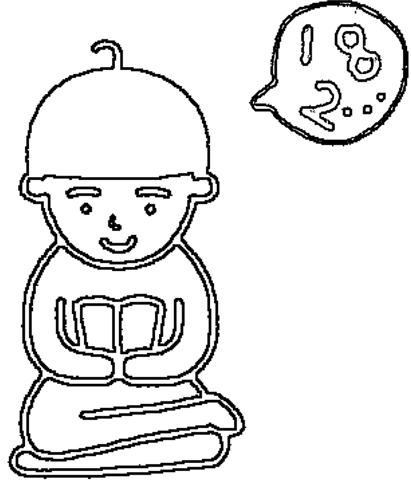

## 0 數字療法的秘密，真的光唸數字就能改善問題嗎？

'2 0 '1 1 '1 6 8
3 0 9 4 9 2 4
5 '2 0 3 7 '2 3

### 真有特定模式可以打造卓越的五感？

一個人五感的準確與敏銳程度，多少體現了他的基本能力（學習、工作）。以棒球選手為例，有好眼力（選球之眼）的打擊者，靠的是瞬間準確分辨這顆球該不該揮棒，來提升他的打擊能力；而對於靠說話與表情掌握客人情緒狀態、意願的店員來說，則需要敏銳的聽覺與視覺能力；想要成為一位傑出料理師，細膩的味覺則是必要條件。由此可見，五感雖然是人們普遍具有的感覺，但是五感的發達程度因人而異，在先天與後天上有著相當大的差別。

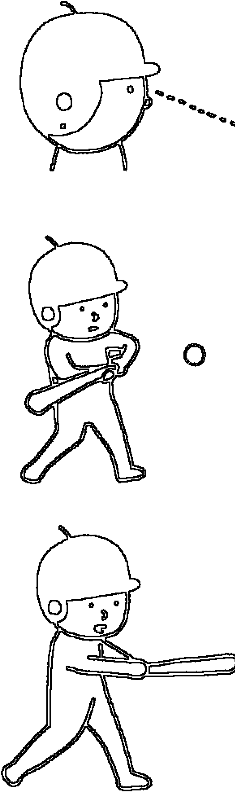

透過五感接收到的訊息，會連結到大腦的「聯合區」，使人產生「想法」。例如，透過眼睛看到的畫面，會經由視神經傳到後腦的視覺區，再傳到聯合區及大腦各部位，變成想法轉達出來，並以該想法為標準進行判斷、付諸行動。大腦裡處理五感訊息的各領域神經纖維繁多，但是這些神經纖維不會一直存在，而是在人活著的一生中反覆生滅。每個人的能力與生活品質，會依其大腦連結體（connectome）的狀態而有差異。

值得注意的是，特定領域的連結體是以「特定模式」經由反覆刺激達到活化，並透過這樣的方式接收「特定訊息」，使儲存、計算、決定、解釋這一連串流程變得更有效運作。藉由系統化的學習模式，不僅可以使大腦發達，還能讓受神經系統與荷爾蒙影響的身體，變得更為發達。

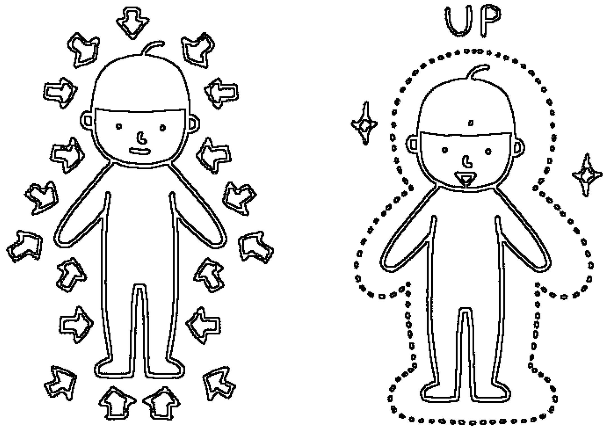

### 五感會使五臟六腑運作

利用五官蒐集資訊是人類生存的必備能力，也是與外界溝通的「門戶」，透過這些門戶，能夠接收到五感（視覺、聽覺、嗅覺、味覺、觸覺），接收的方式與程度會依照個人的性格與特質而大不相同，亦即，五感反映著每個人的情緒、偏好等既有特性，所以就算聽見同一個聲音，每個人也都會有不同感覺，甚至還會依照聽到聲音的當下情感狀態（憤怒、悲傷、恐懼、煩惱等），做出截然不同的詮釋。

五感與人的情緒密切相關，如果反覆暴露在噪音環境下，人的情緒就會變得暴躁，而長期處在敏感的情緒狀態時，就會變得比平時更容易憤怒。反之，編排完整的音樂，可以有效安定情緒；而在情緒平穩的狀態下，也比較不容易產生行為疏失。因此，總是維持心平氣和的人，多半值得信賴且誠實守信。此外，一首清新的樂曲，也能為沉浸在悲傷裡的人帶來新希望。

人體的自律神經系統，就算沒有意識的指令，身體機能也會自律地維持運作。尤其是我們稱為「五臟六腑」的內臟器官，相較於人的意識行為，臟腑更會受前述所說的潛在情感條件影響。舉例來說，人體心臟的跳動、荷爾蒙的分泌、腸道的蠕動等是否活躍旺盛，都會根據感受到的壓力而產生直接及連帶性的影響。

那麼，如果透過特定模式化的五感刺激，在我們體內打造出固定條件與環境，會產生什麼樣的現象呢？想當然耳，會使五臟六腑中特定臟腑的功能活躍或疲乏吧？

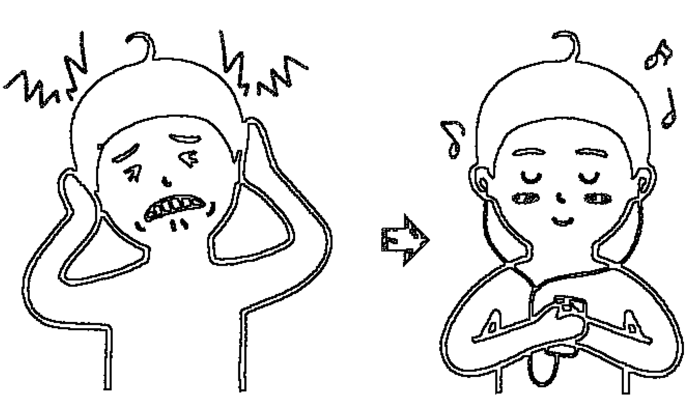

### 不順暢的迴路會使身體生病

我們接收到的訊息，經由神經迴路進入大腦，產生「思考與判斷」的過程，最後表現在「身體行動」上。這種感覺與思考、判斷與行動的模式，假若暢行無阻、一貫到底，就是五感迴路順暢的證明，稱之為「健康」。然而，我們的身體不斷在學習新知、熟記新事物，因此，會受到已定型的「習慣」阻礙，換句話說，不停感覺到的新訊息會受習慣性的擔憂、固定觀念、偏見等影響，以扭曲的型態傳送到大腦神經系統。

當我們面對同一個對象，如果只有你會以負面眼光看待，那麼這個扭曲的想法和行動模式，就是由「不健康的五感習慣」所造成的，它會複製出多種模式，即使是現在，也正侵蝕著你的身體各處，最終成為我們身上所有「不健康」（疾病、痛苦）的根源。

那麼，我們該怎麼做才能把生病的五感迴路變健康呢？負責進行「感覺、思考、判斷、行動」的身體迴路，究竟有沒有辦法變順暢、不扭曲？

### 猴子實驗，成就「數字療法」的秘密

由日本東北大學院醫學系研究科虫明元教授（生體系統生理學）等人組成的研究團隊，曾發表過一項研究成果，他們透過動物進行實驗發現：靈長類面對不同數字會有不同的「大腦部位」與「大腦細胞（集體）」出現反應，該團隊在研究大腦的學習能力與其運作原理時，訓練猴子學習數字，並在猴子腦部貼上感測器，觀察猴子的學習過程，從而發現猴子有些大腦部位只會對數字 4 有反應，有些大腦細胞則只會對第 3 次的動作產生信號等，特定的大腦細胞會與特定數字、次數等產生密切關聯。除此之外，他們在這項猴子實驗中，也發現有大腦細胞只會對數字 0 產生強烈反應，這更是全球史無前例的一項新發現。

這項研究結果顯示，當「由數字媒介的認知體系」轉變，神經系統也會產生截然不同的刺激與反應。除此之外，像 0 這種在數學裡別具意義的數字，不僅對人，對沒有高等語言的靈長類動物來說，也是與生俱來、像本能一樣存在的概念，進而可以瞭解人類是如何以數字為媒介，來理解自己與世界的。

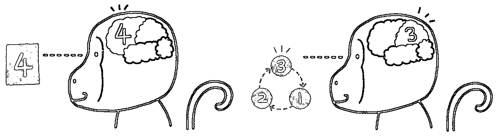

對特定數字會產生反應的猴子大腦

### 12 數字所展現的人體波動

如同神經系統裡有掌管所有神經的控制中心一樣，人體所有器官也都有控制各系統的中心軸，而這些中心軸與中醫所說的「經絡」不斷交換訊息；像這樣與身體各器官的中心軸相互影響時，萬一遇到特殊情況或條件，導致五感扭曲，那麼能夠矯正五感迴路的關鍵要素便是「數字代碼（經絡調節係數）」。人體大部分基因，同樣是以數字代碼不斷排列重組。

數字代碼是從中醫、大腦連結體神經科學，以及後遺傳學等原理為基礎而產生。下頁圖表是當我們正確認知數字 1 到 12 時，身體會產生的信號波形反應。（相信次序信號體系研究所是世界第一個能做到此種程度研究成果的單位。）

我們聽的音樂、看的影像，其實都是由特定的信號與波長經過無數的排列組合與複製而成；人類的五感迴路也是藉由這種信號系統的排列組合，才得以創造出新的神經迴路，並矯正扭曲的信號訊息。

### 數字代碼 信號波形 數位代碼

| 數字代碼 | 信號波形 | 數位代碼 |
| :--- | :--- | :--- |
| 1 | (波形圖) | 01111 |
| 2 | (波形圖) | 00111 |
| 3 | (波形圖) | 00011 |
| 4 | (波形圖) | 00001 |
| 5 | (波形圖) | 00000 |
| 6 | (波形圖) | 10000 |
| 7 | (波形圖) | 11000 |
| 8 | (波形圖) | 11100 |
| 9 | (波形圖) | 11110 |
| 0 | (波形圖) | 11111 |
| '1 | (波形圖) | 010101 |
| '2 | (波形圖) | 001100 |

透過健康測量晶片觀察到的數字代碼與人體波動

### 唸數字讓身體不知不覺間產生變化

有失眠困擾的人，一般都會嘗試更換枕頭、床墊、床組……或者吃安眠藥來改善問題；想要減肥瘦身的人，則會透過努力流汗運動、減少飲食攝取量等方式進行改善。但是這些改善方法都屬於直接介入該項困擾的行為，所以投入多少努力，對身體就會產生同等的抗拒與副作用。就算人體會認為那是不正常狀態，也都是因為人體具有強烈慣性想要回到從前習慣狀態所致；這就是為什麼過度的運動或瘦身，必然會引發相

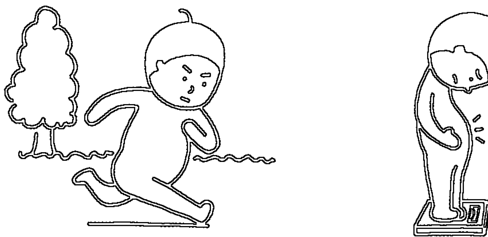

對應的空虛感與復胖的原因所在。

有別於上述方式，數字療法是經由反覆默唸不同的數字組合，來影響身體的認知迴路，使其重新排列，與煩惱的特定身體結構及功能狀態不會有任何直接關聯。例如，若是有睡眠障礙的人，數字療法只會影響身體對睡眠的反應與認知，並不具治療或改善睡眠的功能。

吊詭的是，當我們不殫精竭慮治療失眠問題，才能有效地將其根治。換句話說，也就是要能讓身體重新學習「好眠的狀態」才是重點，如果一心只想著改善「失眠」問題，就會使身體接收到同等的扭曲訊息。

真正的治癒方法，是讓身體重新學習原本就容易入睡的信號狀態，數字處方的作用與一般習慣後效果就會明顯下降的做法截然不同，像運動就需要越做越激烈，吃藥也會越吃劑量越高才有效果，唯有數字療法是身體越熟悉，就越能發揮強而有力效果的方法。

## 功效從睡眠排毒到美容

新陳代謝專業醫師研究團隊與中醫師們共同研究，超過20年所研發的這套「數字療法」，為了更方便讀者執行，我們把它重新整理成以30日為一週期，一天只要唸一頁，每天反覆唸，身體就會透過自律神經自行建構出從數字代碼裡所藏有的處方結構及相對應的神經網路。

頭昏腦脹的早晨：失眠症是因大腦神經傳導物質的調節障礙，引發大腦過度清醒所致，也就是調節睡眠與清醒的下視丘與腦幹網狀結構的相互信號傳達產生了問題。專為打造良好睡眠品質所設計的數字處方，是由「睡眠－清醒」調節系統可以安定化的核心代碼組成，能有效清除阻礙熟睡的因子。

**壓力：** 過度的壓力會導致荷爾蒙分泌過度，荷爾蒙過多會持續刺激交感神經系統，使人變得更為敏感，對芝麻蒜皮般的小事也會感到壓力，形成一種惡性循環。專為排解壓力所設計的數字處方，是由調節壓力荷爾蒙生成與分泌、使交感神經系統變穩定的核心代碼組成，能夠引導身體在受到外部刺激時做出適當反應。

**專注力與記憶力：** 健忘症是經常性的短暫失憶，這是掌管學習的大腦神經迴路電流變弱產生的現象。尤其是注意力不集中、散漫時，電流往往是脫離學習迴路的狀態，導致容易健忘。專為健忘症所設計的數字處方，是由可以有效找回流竄至迴路外的電流的核心代碼組成，幫助學習迴路電流能繼續維持。

## 眼睛與身體的疲勞：

眼睛是人體器官中神經及血管密度最高的，這使得精細的眼球運動與視覺得以作用。專為視力變差所設計的數字處方，是由可以有效供給血液與養分至分布在眼球各處的細微血管，並且去除老廢物質的核心代碼組成，讓視覺訊息不扭曲地完整傳達至大腦，甚至還能將退化的視力恢復正常，有效減輕疲勞感。

## 美容與肌膚問題：

健康的肌膚是以 28 天為週期重新再生，由於肌膚是人體最表層的組織，所以很容易受傷，當肌膚再生能力下滑時，就會漸漸失去彈性，變得粗糙，出現各種肌膚問題。專為改善肌膚所設計的數字處方，是由可以矯正肌膚再生週期的核心代碼所組成，不需額外的化學產品，也能自然使肌膚組織重生，讓人維持更有朝氣、明亮的肌膚色澤。

## 相關煩惱一次解決！

睡眠障礙，是無數種引發老人癡呆與認知障礙的原因中，最關鍵性的因素。所有疾病都有固定的系統，彼此緊密相連，因此，只要好好將一項疾病問題徹底根治，與其相關的各項惱人問題就能夠統統一併改善。

## 雖然有點深奧，但最好先具備這些知識！

## 12 數字究竟會在我們體內如何作用？

次序信號體系研究所設計的數字療法，是能對地球上所有生命體產生影響的宇宙天文地理學之氣象節氣的變化、人體生理物理學之五運六氣五行等變化、天體運行及結構學、28 天潮汐的變化等，綜合反應的引力關係。除此之外，還以與身心靈有關的唯識學、神經科學、後遺傳學等，東西方認知的科學性、生命工學性研究成果為基礎，所設計出的精準系統。

## + 為什麼要聽數字？

所有生命體都具有感覺、運動的系統，人體同樣也是藉由感覺神經系統與運動神經系統彼此收發電力與化學能量來進行活動。能量活動，意指此處與那處之間、此時與那時之間存有固定「差異」；電力能量也是因為不斷存在「電位差」，所以才會出現「電流」與「電壓」這種律動與強度；換句話說，世上存在的所有能量，都是以固定的「位次」為媒介進行循環，而媒介的單位，正是「數字」。我們的感覺有固定密度，運動也有固定律動，只是依情況所設定的標準單位不同而已，我們可以明確分辨疼痛指數 1 與 3 之間的感覺差異，也懂得將第 4 與第 6 個動作連續進行運動。此外，我們也知道從甲地搭火車和自行開車到乙地，分別要耗費多久時間，火車車票錢是多少錢，自行開車的費用又是多少等，透過數字上的比對，能有助於我們選擇與判斷。由此可見，所有數字都是核心的語言代碼，扮演最關鍵的角色，能夠媒介、演算量化與質化的能量單位，讓人體可以建構「感覺－運動－認知－記憶」的一連串迴路。

## + 12 數字和 12 經絡、12 臟腑有何關聯？

世上所有的感應器，都是由「收信器－轉換器－電容器」這樣一套模組組成，進行「輸入－控制－輸出」的價值產出，發揮回覆系統的功能。舉例來說，就如同當我們對麥克風輸入「聲音」壓力時，這股壓力會經由震動板感知，轉變成電力信號，最終輸出成音響訊號一樣；當人體接收到 12 數字的認知信號時，會有各別信號相對應的轉換器與電容器，12 數字的各別轉換器就是 12 經絡，電容器則是 12 臟腑。假設當身體接收到數字 10 的信號，手太陰肺經這個系統的電力迴路就會變得活躍，這主要是透過神經傳導物質，使人體全面性地起化學作用，以肺臟為中心大幅提升其代謝活動。如果說電腦是以 0 和 1 的二進位法為語言進行思考、執行，那麼人類這種高等生命體，則是以從 0 到 12 的十三進位法為基礎，讓所有生命活動得以延續下去。

## 12 數字和 12 經絡之間的關係

| 數字 | 經絡 | 生理活動 | 反應部位 |
|---|---|---|---|
| 1 | 手太陰肺經 | 呼吸系統 | 從胸部到大拇指 |
| 2 | 手陽明大腸經 | 排泄系統 | 從小指到鼻子部位 |
| 3 | 足陽明胃經 | 消化系統 | 從鼻子部位到第二根腳趾頭 |
| 4 | 足太陰脾經 | 內分泌系統 | 從腳拇趾到心臟部位 |
| 5 | 手少陰心經 | 循環系統 | 從心臟到小指 |
| 6 | 手太陽小腸經 | 淋巴系統 | 從小指到眼部內側 |
| 7 | 足太陽膀胱經 | 泌尿系統 | 從眼部內側到小腳趾 |
| 8 | 足少陰腎經 | 生殖系統 | 從腳底到胸部 |
| 9 | 手厥陰心包經 | 心血管系統 | 從胸部到中指 |
| 0 | 手少陽三焦經 | 腦神經系統 | 從無名指到眼睛外側 |
| '1 | 足少陽膽經 | 骨關節系統 | 從眼睛外側到第四根腳趾 |
| '2 | 足厥陰肝經 | 免疫系統 | 從腳拇趾到橫膈膜部位 |

034 神奇的數字療法

1 手太陰肺經 2 手陽明大腸經 3 足陽明胃經 4 足太陰脾經

5 手少陰心經 6 手太陽小腸經 7 足太陽膀胱經 8 足少陰腎經

9 手厥陰心包經 0 手少陽三焦經 '1 足少陽膽經 '2 足厥陰肝經

☆ 雖然有點深奧，但最好先具備這些知識！ 035

## 12 數字和 12 臟腑之間的關係

| 數字 | 生理系統 | 主管功能 | 生活習慣 |
| :--- | :--- | :--- | :--- |
| 1 | 肺臟 | 模仿學習能力 相傳 | 計畫性與節制力 治節 |
| 2 | 大腸 | 傳遞資訊能力 傳導 | 創新與大膽 變化 |
| 3 | 胃腸 | 儲存資訊能力 倉廩 | 獨創性與表現力 五味 |
| 4 | 脾臟 | 批判學習能力 諫議 | 多樣性與協商力 知周 |
| 5 | 心臟 | 確立主體能力 君主 | 正向性與預測力 神明 |
| 6 | 小腸 | 認知接納能力 受盛 | 善解人意與適應力 化物 |
| 7 | 膀胱 | 範圍設定能力 州都 | 實踐力與忍耐力 津液 |
| 8 | 腎臟 | 行為促進能力 作強 | 緻密與精巧 技巧 |
| 9 | 心包 | 關係建構能力 臣使 | 實用性與便利性 喜樂 |
| 0 | 三焦 | 演繹推理能力 決瀆 | 熟練與持續性 水道 |
| '1 | 膽腑 | 錯誤修正能力 中正 | 決斷力與恢復力 決斷 |
| '2 | 肝臟 | 策略執行能力 將軍 | 思考力與轉換力 謀慮 |

1 肺臟

2 大腸

3 胃腸

4 脾臟

5 心臟

6 小腸

7 膀胱

8 腎臟

9 心包

0 三焦

1 膽腑

2 肝臟

☆ 雖然有點深奧，但最好先具備這些知識！ 037

## 隨時隨地，一天一頁！

重點是「數字療法」十分簡單又方便，不分男女老少，只要會數數，都能隨時隨地輕鬆進行。而且相較於激烈使用身體的一般運動方法，數字療法的新陳代謝量與代謝率都非常高。就如同比起使用化石燃料煮水，用電水壺煮水所使用的能源更少、更迅速、反應更激烈是一樣的道理，我們所做的一般運動，依然是透過身體的化石燃料活動進行能量代謝，反觀運用唸數字代碼的訓練，才是將身體裡的電能量結合，並使其活化的超高效率能量代謝活動。因此，光是專心唸數字，就能達到超乎激烈運動水準以上的效果，促進身體各處血液循環，強化心肺功能及肌耐力，提升身體免疫力。更進一步，還能透過電磁合成將現在自己所需的身體能量融合，甚至可以期待將生機（新能量）凝聚的作用與效果。因此，每天光是專心唸數字，便能夠使肉體與精神的彈力、平衡逐漸修復。

## 數字療法，這樣唸！

那麼，究竟該如何唸數字，又該唸哪些數字呢？1、2、3……只要隨意想起哪些數字就唸什麼嗎？

本來基本的數字代碼是以 365 天、針對各種不同煩惱設計成最佳化的每日代碼，但在本書中，為了讓讀者可以隨時隨地輕鬆方便地運用，所以改以 30 天為週期，經由複雜的函數過程，再用另外的數理值，設計成只要反覆唸，人體信號系統的誤差就會調節到最適程度的數字代碼。

不妨利用通勤時間、早上起床時間、傍晚睡前等，至少一天 10 分鐘以上專注反覆唸，要是能將當天的數字排列組合唸到像是在唱歌一樣朗朗上口，效果會更顯著。

### 基本姿勢

準備物品
本書、節拍器或計時器
（60 拍為基準）

以穩定姿勢席地而坐，為了盡可能使自己的腰桿打直，建議採盤坐姿勢，並想像自己所需的數字訊息，正沿著伸長拉直的脊椎傳達到大腦、蔓延至全身。

### 數字發音

1 一
2 二
3 三
4 四
5 五
6 六
7 七
8 八
9 九
0 洞
'1 一一
'2 一二
（不唸零）（快速唸）（快速唸）

### — 舉例 —

'1 一一
'2 一二
9 九
1 一
5 五
4 四
4 四
1 一
9 九
2 二
9 九
2 二
'2 一二
'2 一二
0 洞
4 四
4 四
1 一
1 一
5 五
'2 一二

## HOW TO ①

### 什麼時間唸？

- 至少每天早上起床後專心唸 10 分鐘，睡前再唸 10 分鐘。
- 試著讓自己把早上唸時還很陌生的 21 個數字，到了晚上可以不用看也能順暢地默背出來。
- 就算一天唸兩種以上的數字處方，例如壓力與視力改善，或者失眠症與肌膚問題等，其產生的作用也不會相互衝突或抵消。

### 在何處進行？

只要是能夠順利進行唸數字的地方，不限場地，隨處皆可。

## HOW TO ②

### 怎麼唸？

- 從第一排由左唸到右，然後再依序唸第二、第三排，盡可能以一致的速度，想像這些數字代碼一個一個烙印進腦海裡，清楚流暢地唸出每一個數字。
- 新手可以用節拍器輔助，設定成 60 拍，一拍唸一個數字，輔助自己準確唸。
- 盡量把一排 7 個數字一口氣唸完，唸久了以後，若能將 21 個數字一口氣唸完會更佳。
- 當你已經熟悉這些數字療法以後，如果想要加速唸，可以以 72 拍、81 拍、108 拍的方式，階段性加快唸的速度。
- 新手最好發出聲音來唸，但是記得嗓音與音調、聲量要盡可能維持平淡一致。
- 如果遇到難以專心或者不方便發出聲音唸的情況，不妨將自己唸數字的聲音錄起來播放收聽，或者聽取錄音並在腦中浮現相對應的數字亦可。
- 雖然保持正確坐姿唸是最好的，但就算站著、躺著或者走動中，只要想起，隨時都可以唸。

## DEEP SLEEP

044 神奇的數字療法

## 睡眠排毒，夜晚熟睡、迎接舒爽早晨的數字處方

### 頭昏腦脹的早晨

失眠症是因大腦神經傳導物質的調節障礙，引發大腦過度清醒所導致，也就是調節睡眠與清醒的下視丘與腦幹網狀結構的相互信號傳達產生問題。專為打造健康良好睡眠品質所設計的數字，是由「睡眠－清醒」調節系統可以安定化的核心代碼組成，能有效清除阻礙熟睡的因子。

### 提升 10 倍以上效果的穴位按壓點

唸數字前，請先按壓以下三處穴位，
不分左右，施予刺激即可。
不論用磁石貼布、一般貼紙，
或者透明膠帶標示都無所謂。

046 神奇的數字療法

## DEEP SLEEP DAY 01

'1 '2 9 1 5 4 4
1 9 2 9 2 '2 '2
0 4 4 1 1 5 '2

1 睡眠排毒，夜晚熟睡、迎接舒爽早晨的數字處方 047

## DEEP SLEEP DAY 02

4 2 1 0 8 4 5

6 9 4 6 5 2 1

3 4 6 0 4 5 1

048 神奇的數字療法

## DEEP SLEEP DAY 03

7 0 4 2 3 4 '1
9 7 9 0 '2 '2 7
6 2 '1 2 '1 5 7

1 睡眠排毒，夜晚熟睡、迎接舒爽早晨的數字處方 049

## DEEP SLEEP DAY 04

2 4 3 4 8 8 8

4 1 8 2 5 4 4

1 8 0 4 4 9 4

050 神奇的數字療法

## DEEP SLEEP DAY 05

2 8 9 8 4 1 5

4 5 2 4 1 7 1

1 2 4 8 2 2 1

1 睡眠排毒，夜晚熟睡、迎接舒爽早晨的数字处方 051

## DEEP SLEEP DAY 06

4 2 3 8 5 3 1

6 9 8 4 2 1 9

3 4 0 8 1 4 9

052 神奇的數字療法

## DEEP SLEEP DAY 07

9 9 2 6 2 7 9

1 6 5 2 1 3 5

8 1 7 6 0 8 5

1 睡眠排毒，夜晚熟睡、迎接舒爽早晨的数字處方 053

## DEEP SLEEP DAY 08

9 1 0 1 2 6 5

1 0 3 7 1 2 1

8 5 5 1 0 7 1

054 神奇的數字療法

## DEEP SLEEP DAY 09

1 3 0 4 1 2 4

3 2 3 2 8 0 2

2 7 5 4 7 3 2

1 睡眠排毒，夜晚熟睡、迎接舒爽早晨的数字處方 055

## DEEP SLEEP DAY 10

4 2 4 1 7 2 1

6 9 9 9 4 0 7

3 4 1 1 3 3 7

056 神奇的數字療法

## 請教專家 Q&A 時間！

### 何時唸、唸多久最有效？

基本上是多多益善的。如果真要選擇一個時段來唸，會推薦每天早晨起床時，以及每晚睡前，各唸 10 分鐘以上，會較容易養成唸數字的習慣，也最有效。最好是不受周遭環境打擾，可以短暫投入去唸的時間為佳，重點是儘管只有短短幾分鐘，也務必要訓練自己專注地唸數字，心無旁鶩。此外，如果利用數字療法來整頓每天的開始與結束，相信不久後便能親身見證到，平日經歷的困擾有多大改善。

## DEEP SLEEP DAY 11

2 1 2 8 4 7 2

4 8 5 4 1 3 8

1 3 7 8 2 8 8

058 神奇的數字療法

## DEEP SLEEP DAY 12

8 3 0 5 5 2 6

0 2 3 1 2 0 2

7 7 5 5 1 3 2

1 睡眠排毒，夜晚熟睡、迎接舒爽早晨的数字处方 059

## DEEP SLEEP DAY 13

4 2 8 0 2 6 4

6 9 1 6 1 2 2

3 4 3 0 0 7 2

060 神奇的數字療法

## DEEP SLEEP DAY 14

3 8 9 0 5 3 4

5 5 2 6 2 1 2

2 2 4 0 1 4 2

## DEEP SLEEP DAY 15

6 2 4 0 8 5 7

8 1 9 6 5 1 3

5 6 1 0 4 6 3

062 神奇的數字療法

## DEEP SLEEP DAY 16

8 7 7 2 8 9 0

0 4 2 8 5 5 6

7 1 2 2 4 0 6

1 睡眠排毒，夜晚熟睡、迎接舒爽早晨的数字处方 063

## DEEP SLEEP DAY 17

5 5 0 3 6 2 2

7 2 3 1 3 0 0

4 9 5 3 2 3 0

064 神奇的數字療法

## DEEP SLEEP DAY 18

1 2 4 5 6 6 9

3 1 9 1 3 2 5

2 6 1 5 2 7 5

1 睡眠排毒，夜晚熟睡、迎接舒爽早晨的数字處方 065

## DEEP SLEEP DAY 19

2 8 9 1 3 8 6

2 5 2 9 2 4 2

1 2 4 1 1 9 2

066 神奇的數字療法

## DEEP SLEEP DAY 20

7 1 1 2 6 8 0

9 8 6 8 3 4 6

6 3 8 2 2 9 6

1 睡眠排毒，夜晚熟睡、迎接舒爽早晨的数字处方 067

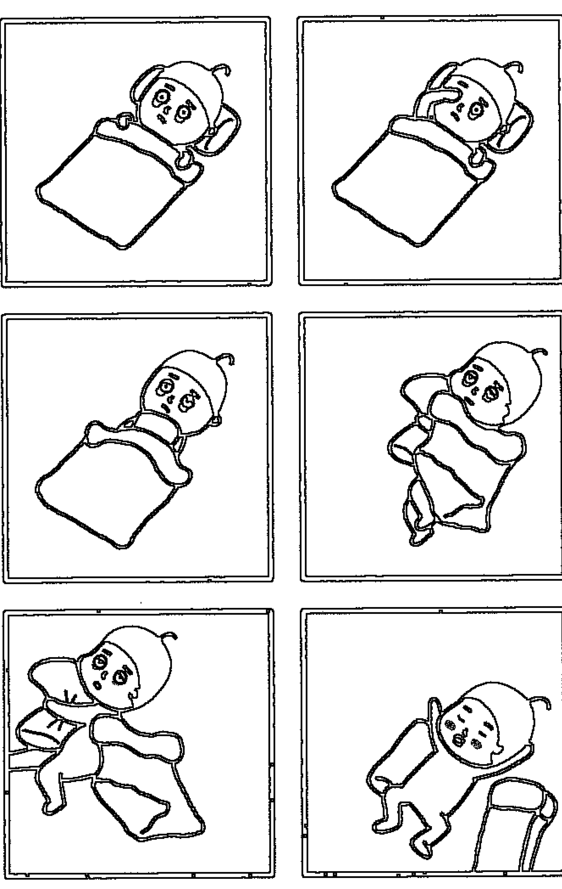

068 神奇的數字療法

## 請教專家 Q&A 時間！

### 一定要每天唸才有效嗎？要是持續唸一陣子以後，中途停止了怎麼辦？

人腦在維持「不斷」的固定頻律時，最能夠發揮穩定的學習能力。一天就算只花 10 分鐘也好，讓自己習慣每日不間斷在固定時間唸數字，養成這樣的生活模式，才能使體驗效果極大化。假使偶爾有幾天漏唸，也要盡可能延續之前唸的習慣，把 30 日為單位的學習週期想盡辦法完成，這樣才會有助於自己持續進行數字療法。

## DEEP SLEEP DAY 21

1 9 9 8 6 1 2

3 6 2 4 3 9 8

2 1 4 8 2 2 8

070 神奇的數字療法

## DEEP SLEEP DAY 22

6 8 4 8 1 0 0

8 5 9 4 8 6 6

5 2 1 8 7 1 6

1 睡眠排毒，夜晚熟睡、迎接舒爽早晨的数字处方 071

## DEEP SLEEP DAY 23

5 8 4 1 4 8 9

7 5 9 7 1 4 5

4 2 1 1 2 9 5

072 神奇的數字療法

## DEEP SLEEP DAY 24

7 5 9 2 5 8 4

9 2 2 0 2 4 2

6 9 4 2 1 9 2

1 睡眠排毒，夜晚熟睡、迎接舒爽早晨的數字處方 073

## DEEP SLEEP DAY 25

9 6 1 6 2 8 1

1 3 4 2 1 4 7

8 0 6 6 0 9 7

074 神奇的數字療法

## DEEP SLEEP DAY 26

1 3 7 0 2 9 7

3 2 2 6 9 5 3

2 7 2 0 8 0 3

1 睡眠排毒，夜晚熟睡、迎接舒爽早晨的数字处方 075

## DEEP SLEEP DAY 27

4 5 2 9 6 1 2

6 2 5 5 3 9 8

3 9 7 9 2 2 8

## DEEP SLEEP DAY 28

3 2 1 2 2 8 9

5 9 4 8 9 4 5

2 4 6 2 8 9 5

1 睡眠排毒，夜晚熟睡、迎接舒爽早晨的数字处方 077

## DEEP SLEEP DAY 29

6 2 1 9 3 2 2

8 9 6 5 2 0 0

5 4 8 9 1 3 0

078 神奇的數字療法

## DEEP SLEEP DAY 30

1 8 2 7 7 0 1

3 5 7 3 4 6 7

2 2 9 7 3 1 7

1 睡眠排毒，夜晚熟睡、迎接舒爽早晨的数字處方 079

## ANTI-STRESS

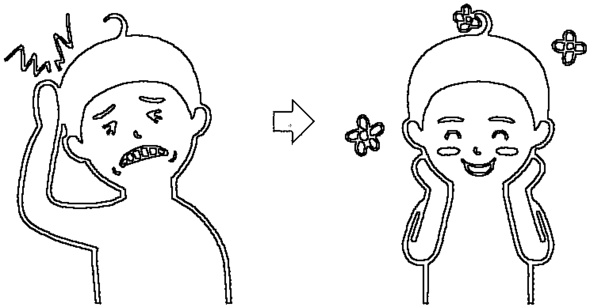

080 神奇的數字療法

## 2 排解壓力，平復憂鬱和怒火的數字處方

### 壓力

過度壓力會導致荷爾蒙分泌過度，荷爾蒙過多會持續刺激交感神經系統，使人變得敏感，對芝麻蒜皮般的小事也會感到壓力，形成一種惡性循環。專為排解壓力所設計的數字處方，是由調節壓力荷爾蒙生成與分泌、使交感神經系統變穩定的核心代碼組成，能夠引導身體在受到外部刺激時做出適當反應。

### 提升 10 倍以上效果的穴位按壓點

唸數字前，請先按壓以下三處穴位，不分左右，施予刺激即可。不論用磁石貼布、一般貼紙，或者透明膠帶標示都無所謂。

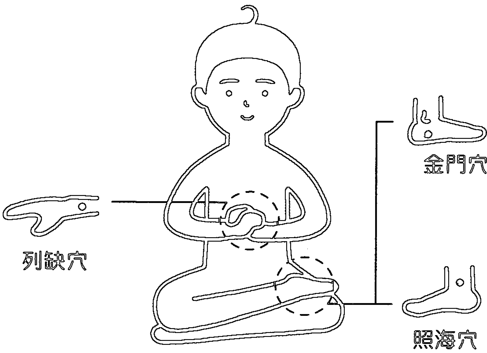

## ANTI-STRESS DAY 01

1 4 6 2 4 4 2

4 9 2 2 7 1 1

0 5 8 4 7 5 9

## ANTI-STRESS DAY 02

6 4 8 9 7 4 1

9 9 4 9 0 1 2

3 5 0 1 0 5 0

084 神奇的數字療法

## ANTI-STRESS DAY 03

9 2 1 1 2 4 7

2 7 9 1 5 1 6

6 3 3 5 5 5 4

## ANTI-STRESS DAY 04

4 8 2 3 7 8 4

7 1 8 3 0 5 3

1 9 2 7 0 9 1

086 神奇的數字療法

## ANTI-STRESS DAY 05

4 2 6 7 3 1 1

7 5 2 7 6 8 2

1 1 8 1 6 2 0

2 排解壓力，平復憂鬱和怒火的數字處方 087

## ANTI-STRESS DAY 06

6 4 2 7 4 3 9

9 9 8 7 7 2 8

3 5 2 1 7 4 6

088 神奇的數字療法

## ANTI-STRESS DAY 07

1 1 9 5 1 7 5

2 6 5 5 4 4 4

8 2 1 9 4 8 2

## ANTI-STRESS DAY 08

1 5 7 0 1 6 1

2 0 3 0 4 3 2

8 6 9 2 4 7 0

090 神奇的數字療法

## ANTI-STRESS DAY 09

3 7 7 3 0 2 2

6 2 3 3 1 1 1

2 8 9 7 1 3 9

## ANTI-STRESS DAY 10

6 4 1 2 6 2 7

9 9 9 2 9 1 6

3 5 3 4 9 3 4

092 神奇的數字療法

## 請教專家 Q&A 時間！

### 30 日數字處方唸完後該怎麼辦？隨意擇日再重新開始唸嗎？

《神奇的數字療法》中設有不分日期、只要反覆以 30 日為週期進行數字處方，就會發揮最佳效果的演算法。因此，倘若已完成 30 日的數字處方，就再回到第 1 天的數字列，按每日數字處方唸下去即可。你可以把 30 日的數字處方，想成是在堆雪人，從小小一顆雪球逐漸滾成大雪球；當重複不斷完成一輪又一輪的 30 日數字療法時，其學習效果也會隨著逐漸累積而極大化。另外，除了以 30 日為週期進行的數字處方外，如果有人想要以每日不同的日日相應係數進行數字療法，不妨運用信號學誌的每日數字代碼進行亦可。

## ANTI-STRESS DAY 11

4 3 9 7 3 7 8

7 8 5 7 6 4 7

1 4 1 1 6 8 5

094 神奇的數字療法

## ANTI-STRESS DAY 12

0 7 7 4 4 2 2

1 2 3 4 7 1 1

7 8 9 8 7 3 1

2 排解壓力，平復憂鬱和怒火的數字處方 095

## ANTI-STRESS DAY 13

6 4 5 9 1 6 2

9 9 1 9 4 3 1

3 5 7 1 4 7 9

096 神奇的數字療法

## ANTI-STRESS DAY 14

5 2 6 9 4 3 2

8 5 2 9 7 2 1

2 1 8 1 7 4 9

2 排解壓力，平復憂鬱和怒火的數字處方 097

## ANTI-STRESS DAY 15

8 6 1 9 7 5 3

1 1 9 9 0 2 2

5 7 3 1 0 6 2

098 神奇的數字療法

## ANTI-STRESS DAY 16

0 1 4 1 7 9 6

1 4 2 1 0 6 5

7 2 6 3 0 0 3

2 排解壓力，平復憂鬱和怒火的數字處方 099

## ANTI-STRESS DAY 17

7 9 7 2 5 2 0

0 2 3 2 8 1 9

4 0 9 6 8 3 7

## ANTI-STRESS DAY 18

3 6 1 4 5 6 5

6 1 9 4 8 3 4

2 7 3 8 8 7 2

## ANTI-STRESS DAY 19

2 2 6 2 2 8 2

5 5 2 2 5 5 1

1 1 8 4 5 9 1

102 神奇的數字療法

## ANTI-STRESS DAY 20

9 3 0 1 5 8 6

2 8 6 1 8 5 5

6 4 2 3 8 9 3

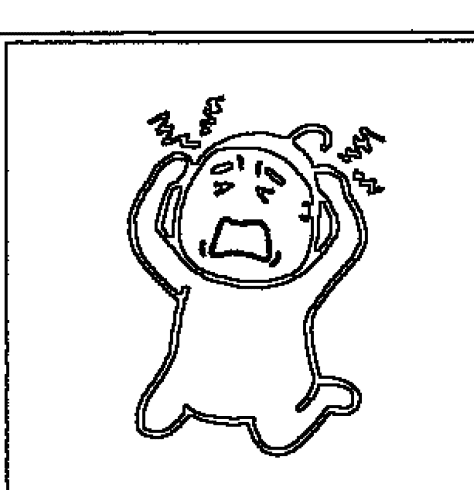

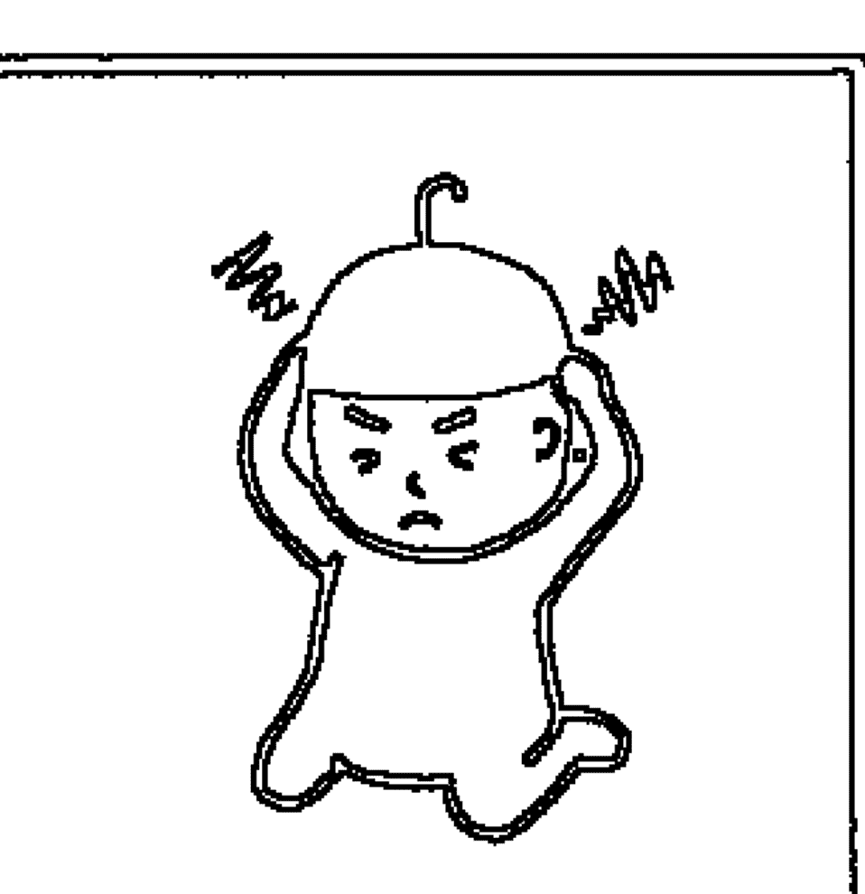

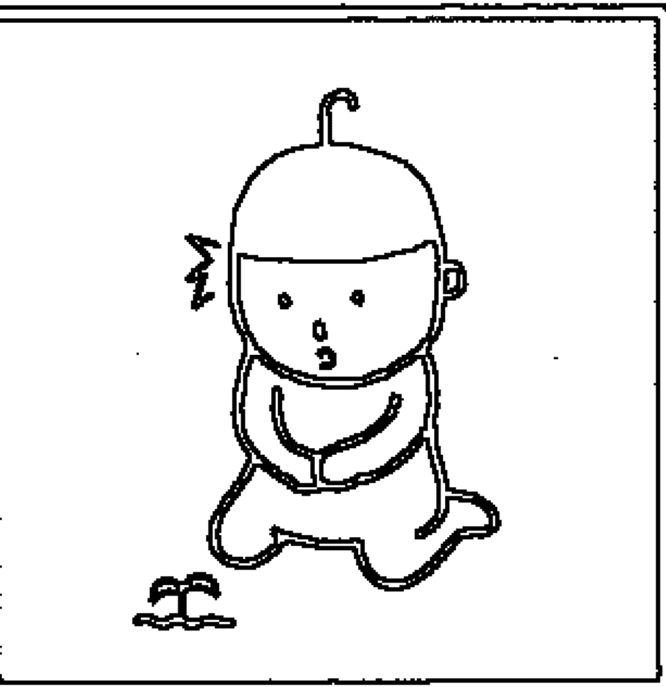

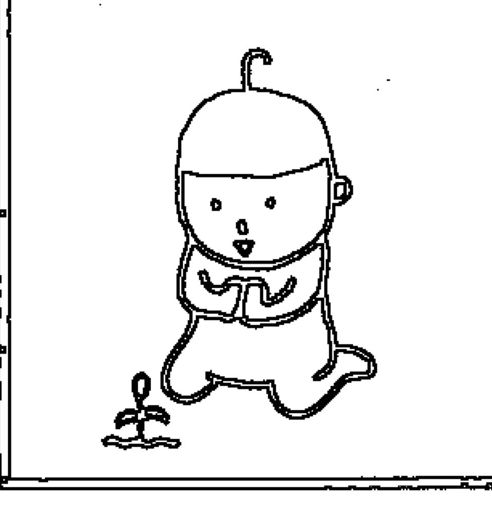

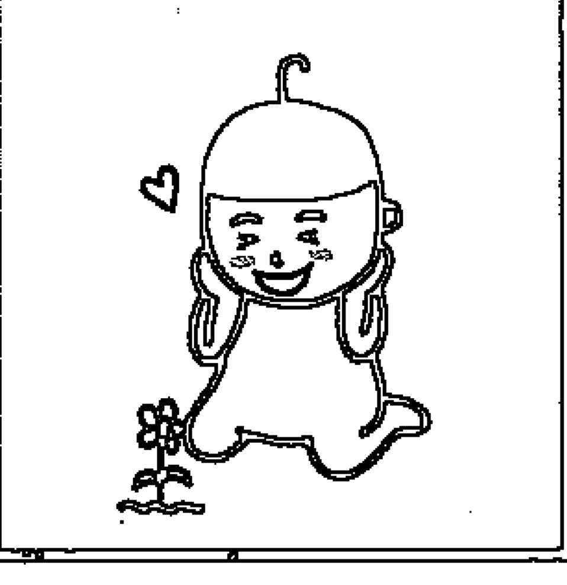

104 神奇的數字療法

## 請教專家 Q&A 時間！

### 如果因腰痠而無法久坐，躺著唸也可以嗎？

原則上，不論走動中，還是站著、坐著、躺著，只要能夠舒適專注地唸數字，任何姿勢都可以進行，不會有太大影響。問題是不同姿勢的專注力、持續力等還是有些許差異，所以才建議初學者盡量以坐姿為主，但靠椅背來減輕身體疲累並無不妥。我們之所以會建議初學者以基本靜坐姿勢進行，是因為在下半身盡可能維持穩定的狀態下，將腰桿打直、視線固定來唸數字，會比其他姿勢更容易專心，學習過程中可能出現的身體抗拒也最少。

## ANTI-STRESS DAY 21

3 1 6 7 5 1 8

6 6 2 7 8 0 7

2 2 8 1 8 2 5

106 神奇的數字療法

## ANTI-STRESS DAY 22

8 2 1 7 0 0 6

1 5 9 7 1 7 5

5 1 3 1 1 1 3

2 排解壓力，平復憂鬱和怒火的數字處方 107

## ANTI-STRESS DAY 23

7 2 1 0 3 8 5

0 5 9 0 6 5 4

4 1 3 2 6 9 2

108 神奇的數字療法

## ANTI-STRESS DAY 24

9 9 6 1 4 8 2

2 2 2 1 7 5 1

6 0 8 5 7 9 9

## ANTI-STRESS DAY 25

1 0 8 5 1 8 7

2 3 4 5 4 5 6

8 1 0 9 4 9 4

110 神奇的數字療法

## ANTI-STRESS DAY 26

3 7 4 9 1 9 3

6 2 2 9 2 6 2

2 8 6 1 2 0 2

## ANTI-STRESS DAY 27

6 9 9 8 5 1 8
9 2 5 8 8 0 7
3 0 1 2 8 2 5

112 神奇的數字療法

## ANTI-STRESS DAY 28

5 4 8 '1 '1 8 5
8 9 4 '1 2 5 4
2 5 0 3 2 9 2

## ANTI-STRESS DAY 29

8 4 0 8 2 2 0
1 9 6 8 5 1 9
5 5 2 2 5 3 7

114 神奇的數字療法

## ANTI-STRESS DAY 30

3 2 1 6 6 0 7
6 5 7 6 9 7 6
2 1 1 0 9 1 4

2 排解壓力，平復憂鬱和怒火的數字處方 115

## GOOD RECALL

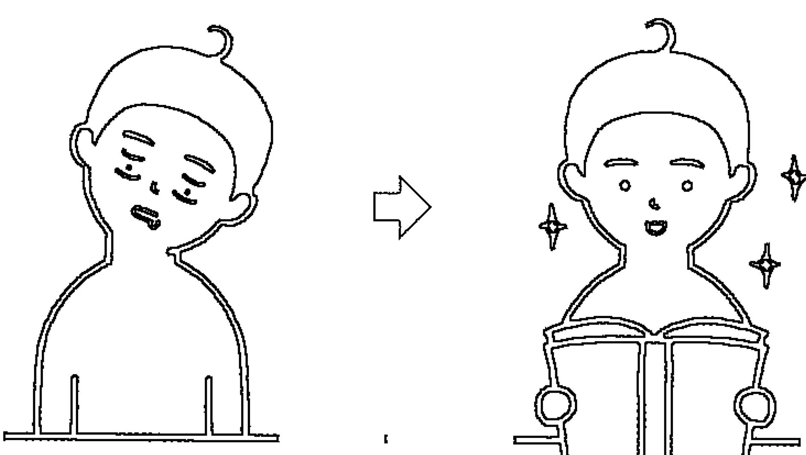

116 神奇的數字療法

## 3 專注力、記憶力，解決散漫、健忘問題的數字處方

### 專注力與記憶力

健忘症是經常性的短暫失憶，這是掌管學習的大腦神經迴路電流變弱產生的現象。尤其是注意力不集中、散漫時，電流往往是脫離學習迴路的狀態，導致容易健忘。專為健忘症所設計的數字處方，是由可以有效找回流竄至迴路外的電流的核心代碼組成，幫助學習迴路電流能繼續維持。

### 提升 10 倍以上效果的穴位按壓點

唸數字前，請先按壓以下三處穴位，不分左右，施予刺激即可。不論用磁石貼布、一般貼紙，或者透明膠帶標示都無所謂。

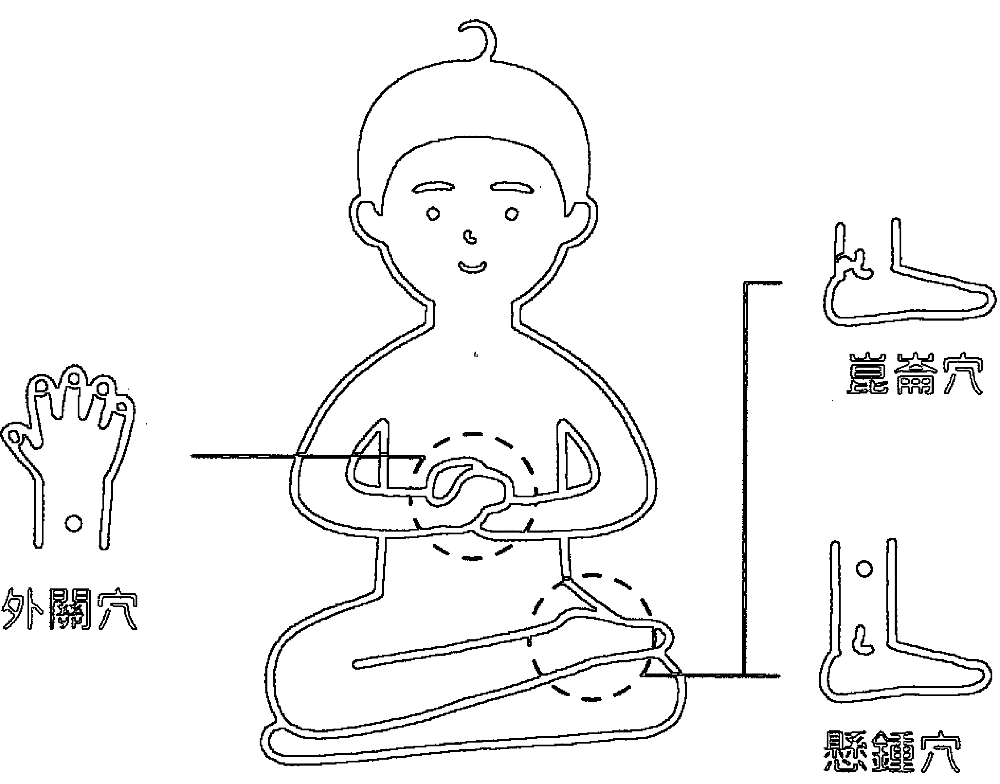

## GOOD RECALL DAY 01

3 9 2 '2 '1 7 1
9 2 '2 4 2 '2 1
0 9 '1 5 4 6 '2

## GOOD RECALL DAY 02

8 9 4 9 2 7 2
2 2 2 1 5 2 2
3 9 1 2 7 6 1

120 神奇的數字療法

## GOOD RECALL DAY 03

1 7 9 1 9 7 8
5 2 7 5 2 2 8
6 7 6 6 2 6 7

3 專注力、記憶力，解決散漫、健忘問題的數字處方 121

## GOOD RECALL DAY 04

6 1 8 3 2 '1 5
'2 6 6 7 5 4 5
1 1 5 8 7 0 4

122 神奇的數字療法

## GOOD RECALL DAY 05

6 5 2 7 0 2 2
2 0 2 1 1 7 2
1 5 1 2 3 1 1

## GOOD RECALL DAY 06

8 9 8 7 '1 6 0
2 2 6 '1 2 '1 0
3 9 5 '2 4 5 9

124 神奇的數字療法

## GOOD RECALL DAY 07

1 6 5 5 8 0 6
7 '1 3 9 '1 3 6
8 6 2 0 1 9 5

## GOOD RECALL DAY 08

1 0 3 0 8 9 2
7 3 1 2 '1 2 2
8 0 '2 3 1 8 1

## GOOD RECALL DAY 09

5 2 3 3 5 5 1
1 5 1 7 8 0 1
2 2 2 8 0 4 2

## GOOD RECALL DAY 10

8 9 9 2 1 5 8
2 2 7 4 4 0 8
3 9 6 5 6 4 7

128 神奇的數字療法

## 請教專家 Q&A 時間！

我為各種煩惱所苦，請問可以同時進行二至三種不同功效的數字處方嗎？

可以。數字處方，不會因為同時進行不同功效的數字而產生衝突或出現副作用。但如果一開始就貪心想要同時達到各種改善效果，很容易失去興致，也容易把數字搞混，最後變成只停留在默背數字的階段，不再持之以恆地執行。因此，建議先從自己最有興趣的數字處方下手，忠實地學習，等你對該數字處方有一定程度的熟悉感後，再慢慢開拓學習廣度，同時進行其他功效的數字處方也無妨，相信這樣會是較有效的學習方式。

## GOOD RECALL DAY 11

6 8 5 7 0 0 9
2 1 3 1 1 3 9
1 8 2 2 3 9 8

130 神奇的數字療法

## GOOD RECALL DAY 12

2 2 3 4 1 5 3
6 5 1 8 2 0 3
7 2 2 9 4 4 2

## GOOD RECALL DAY 13

8 9 1 9 8 9 1
2 2 1 1 1 2 1
3 9 0 2 1 8 2

132 神奇的數字療法

## GOOD RECALL DAY 14

7 5 2 9 '1 6 1
1 0 '2 1 2 '1 1
2 5 '1 2 4 5 '2

3 專注力、記憶力，解決散漫、健忘問題的數字處方 133

## GOOD RECALL DAY 15

0 1 9 9 2 8 4
4 4 7 1 5 1 4
5 1 6 2 7 7 3

134 神奇的數字療法

## GOOD RECALL DAY 16

2 4 2 1 2 2 7
6 9 0 3 5 5 7
7 4 9 4 7 1 6

## GOOD RECALL DAY 17

9 2 3 2 '2 5 '1
3 7 1 6 3 0 '1
4 2 '2 7 5 4 0

## GOOD RECALL DAY 18

5 1 9 4 2 9 6
1 4 7 8 3 2 6
2 1 6 9 5 8 5

## GOOD RECALL DAY 19

4 5 2 '2 9 '1 3
0 0 '2 4 '2 4 3
'1 5 '1 5 2 0 2

138 神奇的數字療法

## GOOD RECALL DAY 20

1 8 6 1 2 1 7
5 1 4 3 3 4 7
6 8 3 4 5 0 6

3 專注力、記憶力，解決散漫、健忘問題的數字處方 139

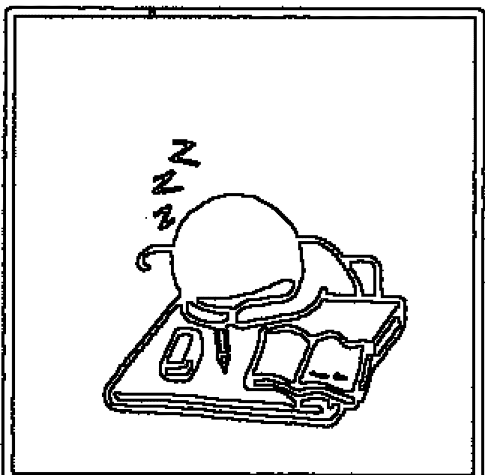
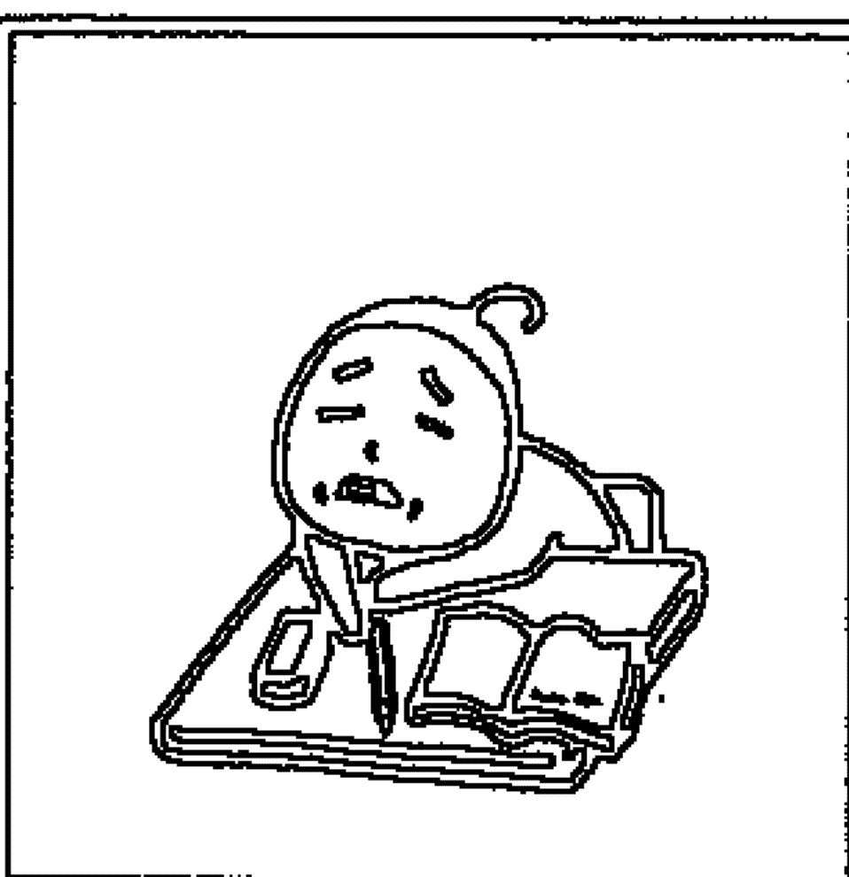
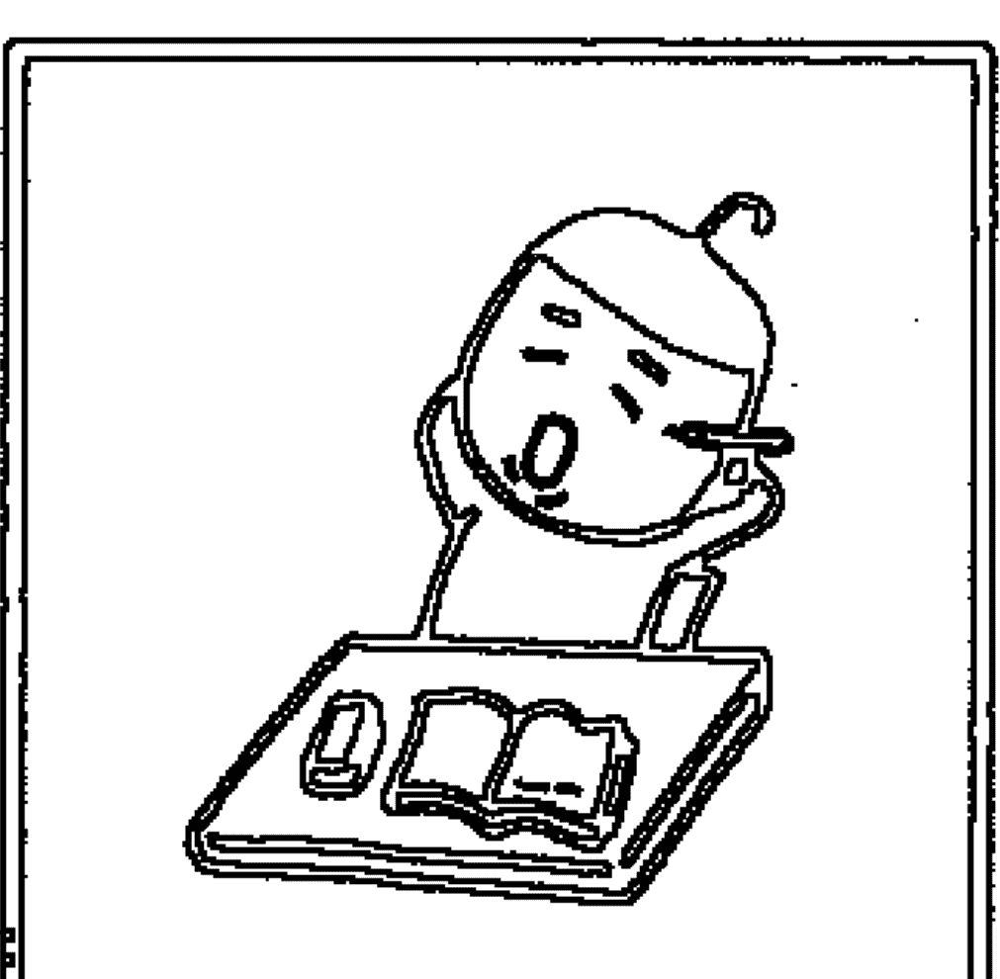
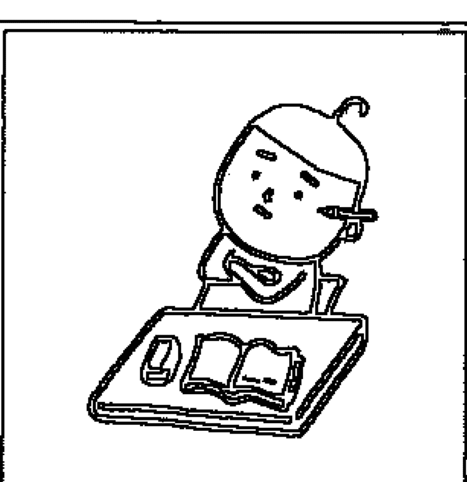
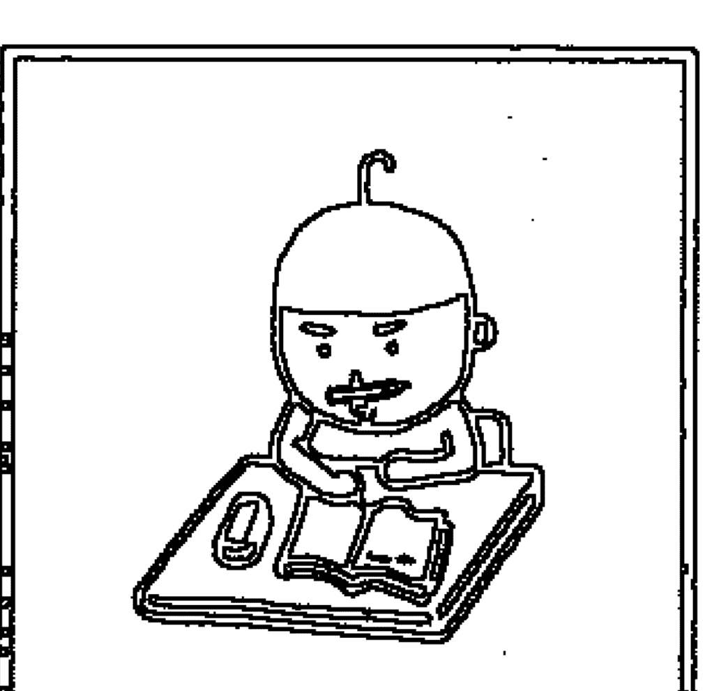
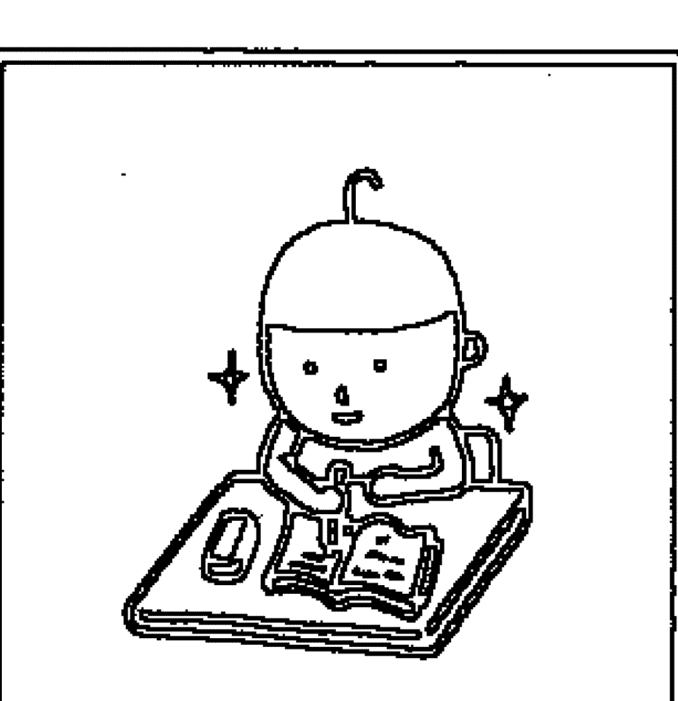

140 神奇的數字療法

## 請教專家 Q&A 時間！

請問用英文唸也同樣有效嗎？外國人該如何唸呢？

是的，沒問題。阿拉伯數字是全球共通語，所以就算各國稱呼這些數字的語言不同，對這些數字的認知都是完全一樣的，因此，如果是使用英語的國家，只要像把「1」唸成「One」，「9」唸成「Nine」，「0」則唸成「Zero」，「11」唸成「One-One」，「12」唸成「One-Two」即可。以此類推，其他國家語言，也是用上述同樣方式進行。

## GOOD RECALL DAY 21

5 6 2 7 2 4 9
1 1 2 1 3 9 9
2 6 1 2 5 3 8

142 神奇的數字療法

## GOOD RECALL DAY 22

0 5 9 7 5 1 7
4 0 7 1 8 6 7
5 5 6 2 0 2 6

3 專注力、記憶力，解決散漫、健忘問題的數字處方 143

## GOOD RECALL DAY 23

9 5 9 0 0 1 6
3 0 7 2 1 4 6
4 5 6 3 3 0 5

144 神奇的數字療法

## GOOD RECALL DAY 24

1 2 2 1 1 1 1
5 7 2 5 2 4 1
6 2 1 6 4 0 2

3 專注力、記憶力，解決散漫、健忘問題的數字處方 145

## GOOD RECALL DAY 25

1 3 4 5 8 '1 8
7 8 2 9 '1 4 8
8 3 1 0 1 0 7

146 神奇的數字療法

## GOOD RECALL DAY 26

5 '2 '2 9 6 '2 4
'1 5 0 1 9 5 4
'2 '2 9 2 '1 '1 3

## GOOD RECALL DAY 27

8 2 5 8 2 4 9
2 7 3 2 3 9 9
3 2 2 1 5 3 8

148 神奇的數字療法

## GOOD RECALL DAY 28

7 9 4 '1 6 '1 6
1 2 2 3 9 4 6
2 9 1 4 '1 0 5

## GOOD RECALL DAY 29

0 9 6 8 9 5 '1
4 2 4 '2 '2 0 '1
5 9 3 1 2 4 0

150 神奇的數字療法

## GOOD RECALL DAY 30

5 5 7 6 1 1 8
1 0 5 0 4 6 8
2 5 4 1 6 2 7

## ENERGY REFILL

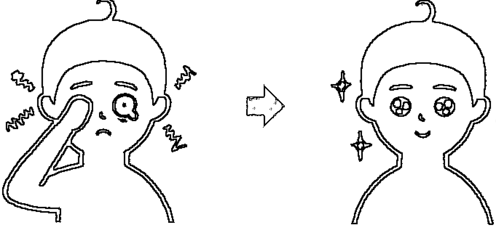

## 4 眼睛疲勞，恢復視力、消除慢性疲勞的數字處方

### 眼睛與身體的疲勞

眼睛是人體器官中神經及血管密度最高的，這使得精細的眼球運動與視覺得以作用。專為視力變差所設計的數字處方，是由可以有效供給血液與養分至分布在眼球各處的細微血管，並且去除老廢物質的核心代碼組成，讓視覺訊息不扭曲地完整傳達至大腦，甚至還能將退化視力恢復正常，有效減輕疲勞感。

### 提升 10 倍以上效果的穴位按壓點

唸數字前，請先按壓以下三處穴位，不分左右，施予刺激即可。不論用磁石貼布、一般貼紙，或者透明膠帶標示都無所謂。

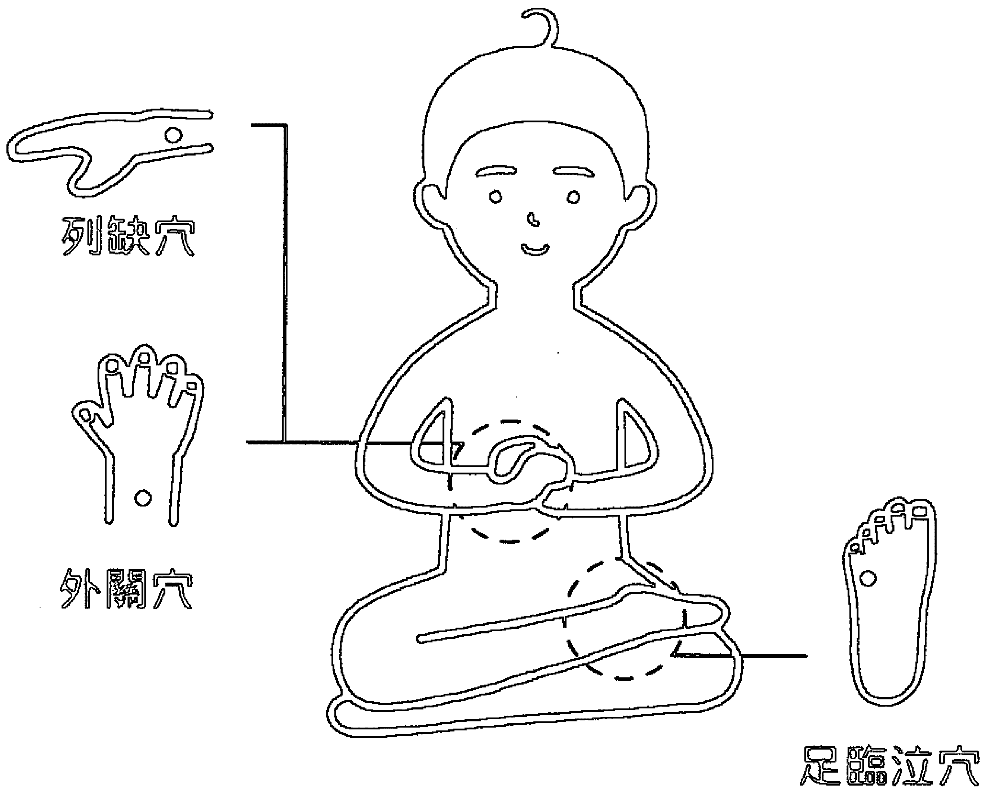

## ENERGY REFILL DAY 01

2 9 2 2 6 2 4
1 0 1 2 7 6 5
8 1 1 2 3 2 2

4 眼睛疲勞，恢復視力、消除慢性疲勞的數字處方 155

## ENERGY REFILL DAY 02

5 9 4 9 9 '2 5
4 0 3 9 0 6 6
1 '1 1 9 6 '2 1

156 神奇的數字療法

## ENERGY REFILL DAY 03

8 7 9 1 4 '2 '1
7 8 8 1 5 6 '2
4 9 6 1 1 '2 7

4 眼睛疲勞，恢復視力、消除慢性疲勞的數字處方 157

## ENERGY REFILL DAY 04

3 1 8 3 9 4 8
2 2 7 3 0 0 9
1 3 5 3 6 4 4

158 神奇的數字療法

## ENERGY REFILL DAY 05

3 5 2 7 5 7 5
2 6 1 7 6 1 6
1 7 1 7 2 7 1

4 眼睛疲勞，恢復視力、消除慢性疲勞的數字處方 159

## ENERGY REFILL DAY 06

5 9 8 7 6 '1 1
4 0 7 7 7 5 2
1 '1 5 7 3 '1 9

160 神奇的數字療法

## ENERGY REFILL DAY 07

0 6 5 5 3 3 9
9 7 4 5 4 9 0
6 8 2 5 2 3 5

4 眼睛疲勞，恢復視力、消除慢性疲勞的數字處方 161

## ENERGY REFILL DAY 08

0 0 3 0 3 2 5
9 1 2 0 4 8 6
6 2 2 0 2 2 1

162 神奇的數字療法

## ENERGY REFILL DAY 09

2 '2 3 3 '2 0 4
1 1 2 3 1 4 5
0 2 '2 3 9 0 '2

4 眼睛疲勞，恢復視力、消除慢性疲勞的數字處方 163

## ENERGY REFILL DAY 10

5 9 9 '2 8 0 '1
4 0 8 '2 9 4 '2
1 '1 6 '2 5 0 7

## 請教專家 Q&A 時間！

我母親喜歡寫字，如果不用唸的，照著抄寫也會有同樣效果嗎？聽說光用聽的也會有效，所以我錄了音，趁上班通勤時播放聆聽，這樣也會有效嗎？

是的，人們透過五感習得訊息的系統大致上有五種管道，分別是唸、抄寫、聆聽、照做、觀看，每一種管道都是同時、全方位地運作，日常性地處理資訊。最基本的學習方式除了唸以外，抄寫及聆聽也是屬於有許多優點的學習方法。因此，不斷重複抄寫該數字處方，或者將自己唸數字的聲音錄起來經常播放聆聽，也能充分體驗其效果。如果在唸數字的同時，並用這些學習方法，相信會得到更為穩定且扎實的學習效果。

## ENERGY REFILL DAY 11

3 8 5 7 5 3 '2
2 9 4 7 6 9 1
'1 0 2 7 2 3 8

166 神奇的數字療法

## ENERGY REFILL DAY 12

9 2 3 4 6 0 6
8 1 2 4 7 4 7
5 2 2 4 3 0 2

4 眼睛疲勞，恢復視力、消除慢性疲勞的數字處方 167

## ENERGY REFILL DAY 13

5 9 1 9 3 2 4
4 0 2 9 4 8 5
1 1 0 9 2 2 2

## ENERGY REFILL DAY 14

4 5 2 9 6 '1 4
3 6 1 9 7 5 5
'2 7 '1 9 3 '1 '2

4 眼睛疲勞，恢復視力、消除慢性疲勞的數字處方 169

## ENERGY REFILL DAY 15

7 1 9 9 9 1 7
6 2 8 9 0 7 8
3 1 6 9 6 1 3

170 神奇的數字療法

## ENERGY REFILL DAY 16

9 4 2 1 9 5 0
8 5 1 1 0 1 1
5 6 9 1 6 5 6

## ENERGY REFILL DAY 17

6 2 3 2 7 0 2
5 3 2 2 8 4 3
2 4 2 2 4 0 0

172 神奇的數字療法

## ENERGY REFILL DAY 18

2 1 9 4 7 2 9
1 2 8 4 8 8 0
0 1 6 4 4 2 5

## ENERGY REFILL DAY 19

1 5 2 '2 4 4 6
'2 6 1 '2 5 0 7
9 7 '1 '2 1 4 2

174 神奇的數字療法

## ENERGY REFILL DAY 20

8 8 6 '1 7 4 0
7 9 5 '1 8 0 '1
4 0 3 '1 4 4 6

4 眼睛疲勞，恢復視力、消除慢性疲勞的數字處方 175

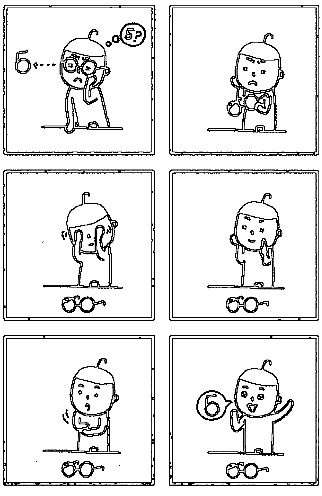

176 神奇的数字疗法

## 請教專家 Q&A 時間！

我每天早、晚唸了好幾次，還是效果不彰，是不是用錯方法了呢？

建議你把當天的數字處方想成一定要背起來的電話號碼或帳號，讓自己更專注投入去唸數字。其實就像平日去逛街購物一樣，如果只是隨意走走看看，除非是真的非常喜歡的物品，否則很難映入眼簾；但如果是準備好滿滿荷包，已下定決心不論如何都要買一樣東西帶回家，那麼就會從走進商場開始注意所有物品，並仔細觀察每一樣物品，由此可見，我們的視覺同樣也會受到心態及專注度影響，產生接收資訊的程度差異。為了提升唸數字的訊息接收度，再試著多投入一點努力，相信絕對會親身體驗到相對應的效果。

## ENERGY REFILL DAY 21

2 6 2 7 7 9 2
1 7 1 7 8 3 1
0 8 1 7 4 9 8

178 神奇的數字療法

## ENERGY REFILL DAY 22

7 5 9 7 '2 6 0
6 6 8 7 1 '2 '1
3 7 6 7 9 6 6

## ENERGY REFILL DAY 23

6 5 9 0 5 4 9
5 6 8 0 6 0 0
2 7 6 0 2 4 5

## ENERGY REFILL DAY 24

8 2 2 1 6 4 4
7 3 1 1 7 0 5
4 4 '1 1 3 4 '2

4 眼睛疲勞，恢復視力、消除慢性疲勞的數字處方 181

## ENERGY REFILL DAY 25

0 3 4 5 3 4 '1
9 4 3 5 4 0 '2
6 5 1 5 '2 4 7

182 神奇的數字療法

## ENERGY REFILL DAY 26

2 '2 '2 9 1 5 7
1 1 '1 9 2 '1 8
0 2 9 9 0 5 3

4 眼睛疲勞，恢復視力、消除慢性疲勞的數字處方 183

## ENERGY REFILL DAY 27

5 2 5 8 7 9 2
4 3 4 8 8 3 1
1 4 2 8 4 9 8

184 神奇的數字療法

## ENERGY REFILL DAY 28

4 9 4 '1 1 4 9
3 0 3 '1 2 0 0
'2 '1 1 '1 0 4 5

4 眼睛疲勞，恢復視力、消除慢性疲勞的數字處方 185

## ENERGY REFILL DAY 29

7 9 6 8 4 0 2
6 0 5 8 5 4 3
3 1 3 8 1 0 0

186 神奇的數字療法

## ENERGY REFILL DAY 30

2 5 7 6 8 6 '1
1 6 6 6 9 '2 '2
0 7 4 6 5 6 7

4 眼睛疲勞，恢復視力、消除慢性疲勞的數字處方 187

## SKIN DETOX

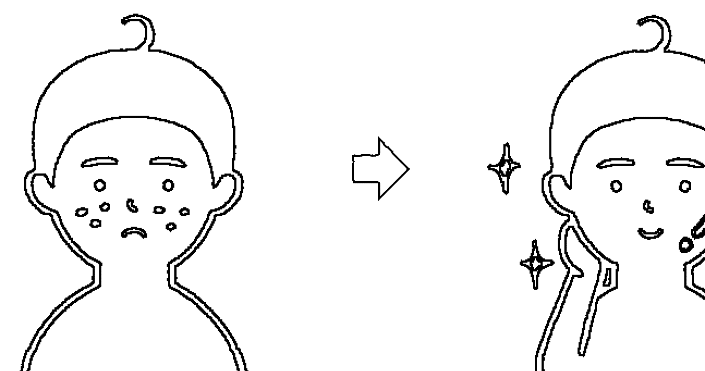

188 神奇的數字療法

## 5 美容，打造潔淨肌膚與明亮氣色的數字處方

### 美容與肌膚問題

健康的肌膚是以 28 天為週期重新再生，由於肌膚是人體最表層的組織，所以很容易受傷，當肌膚再生能力下滑時，就會漸漸失去彈性，變得粗糙，出現各種肌膚問題。專為改善肌膚所設計的數字處方，是由可以矯正肌膚再生週期的核心代碼所組成，不需額外的化學產品，也能自然使肌膚組織重生，讓人維持更有朝氣、明亮的肌膚色澤。

### 提升 10 倍以上效果的穴位按壓點

唸數字前，請先按壓以下三處穴位，
不分左右，施予刺激即可。
不論用磁石貼布、一般貼紙，
或者透明膠帶標示都無所謂。

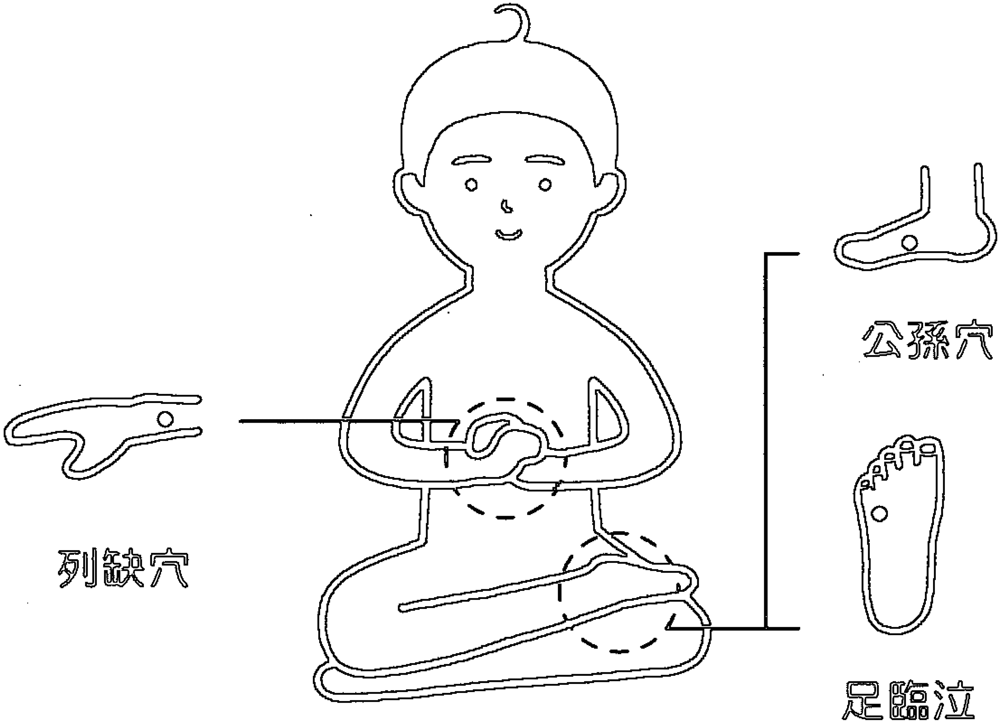

## SKIN DETOX DAY 01

6 9 9 1 '2 '2 1
4 0 3 3 '1 9 '2
9 9 '2 4 9 5 8

## SKIN DETOX DAY 02

1 9 1 0 3 2 2
9 0 5 2 2 9 1
2 9 2 1 2 5 9

192 神奇的數字療法

## SKIN DETOX DAY 03

2 7 4 2 0 '2 8
'2 8 0 4 9 9 7
5 7 7 5 7 5 3

## SKIN DETOX DAY 04

9 1 3 4 3 4 5
7 2 9 6 2 1 4
2 1 6 7 2 9 2

194 神奇的數字療法

## SKIN DETOX DAY 05

9 5 9 8 '1 7 2
7 6 3 0 0 4 1
'2 5 '2 '1 8 '2 9

5 美容，打造潔淨肌膚與明亮氣色的數字處方 195

## SKIN DETOX DAY 06

1 9 3 8 2 1 0
9 0 9 0 1 8 9
2 9 6 1 9 4 5

196 神奇的數字療法

## SKIN DETOX DAY 07

4 6 2 6 9 3 6
2 7 6 8 8 2 5
7 6 3 9 6 8 1

## SKIN DETOX DAY 08

4 0 0 '1 9 2 2
2 '1 4 1 8 '1 1
7 0 1 2 6 7 9

198 神奇的數字療法

## SKIN DETOX DAY 09

8 2 0 4 6 0 1
6 1 4 6 5 7 2
1 2 1 7 3 3 8

5 美容，打造潔淨肌膚與明亮氣色的數字處方 199

## SKIN DETOX DAY 10

1 9 4 1 2 0 8
9 0 0 3 1 7 7
2 9 7 4 1 3 3

200 神奇的數字療法

## 請教專家 Q&A 時間！

一定要唸完 30 天數字處方才會見效嗎？還是每個人見證效果的時間點都不盡相同呢？

的確，每個人體驗效果的速度、深度及其過程，會有些許不同；就如同有些人對內部與外部變化比較沒那麼敏銳或漠不關心一樣，這都是因敏銳度所導致的感受差異，並非只有特定人士適合進行數字處方。此外，我們在購買健身課程時，大部分也是以月（30 日）為單位，由此可見，30 天是我們在忙碌日常生活中依然可以抽空使身體產生改變的最短習慣週期，不論什麼事，只要能維持一個月每天持之以恆地進行，必能感受到出乎預期的效果及體驗。

## SKIN DETOX DAY 11

9 8 '2 8 '1 3 9
7 9 6 0 0 '2 8
'2 8 3 '1 8 8 4

202 神奇的數字療法

## SKIN DETOX DAY 12

3 '2 0 5 '2 0 3
1 1 4 7 '1 7 2
6 '2 1 8 9 3 0

## SKIN DETOX DAY 13

1 9 8 0 9 2 1
9 0 2 2 8 1 2
2 9 1 1 6 7 8

204 神奇的數字療法

## SKIN DETOX DAY 14

0 5 9 0 '2 '1 1
8 6 3 '2 '1 8 '2
1 5 '2 1 9 4 8

## SKIN DETOX DAY 15

1 '1 4 0 3 1 4
'1 '2 0 '2 2 0 3
4 '1 7 1 '2 6 '1

206 神奇的數字療法

## SKIN DETOX DAY 16

3 4 7 2 3 5 7
1 5 1 2 2 2 6
6 4 0 3 2 0 2

## SKIN DETOX DAY 17

2 2 0 3 1 0 1
0 3 4 5 2 7 0
3 2 1 6 0 3 6

208 神奇的數字療法

## SKIN DETOX DAY 18

8 '1 4 5 1 2 6
6 '2 0 7 '2 '1 5
'1 '1 7 8 0 7 1

5 美容，打造潔淨肌膚與明亮氣色的數字處方 209

## SKIN DETOX DAY 19

7 5 9 1 0 4 3
5 6 3 3 9 1 2
0 5 2 4 7 9 0

210 神奇的數字療法

## SKIN DETOX DAY 20

2 8 1 '2 1 4 7
'2 9 7 2 '2 1 6
5 8 4 3 0 9 2

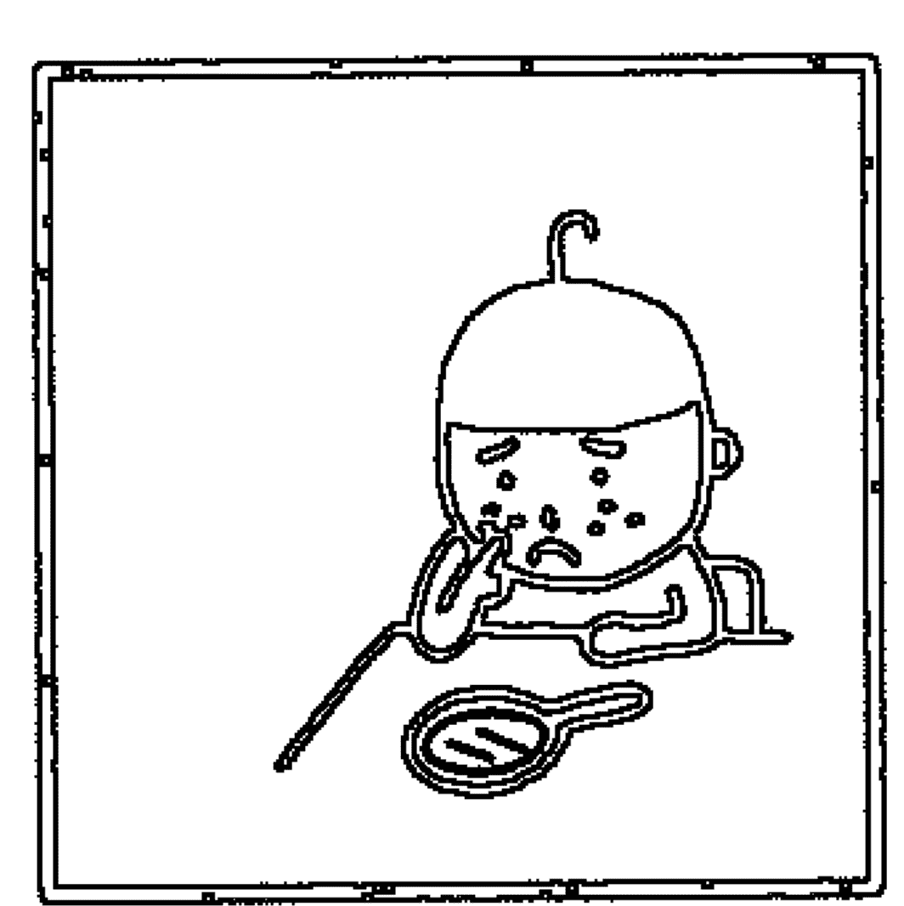
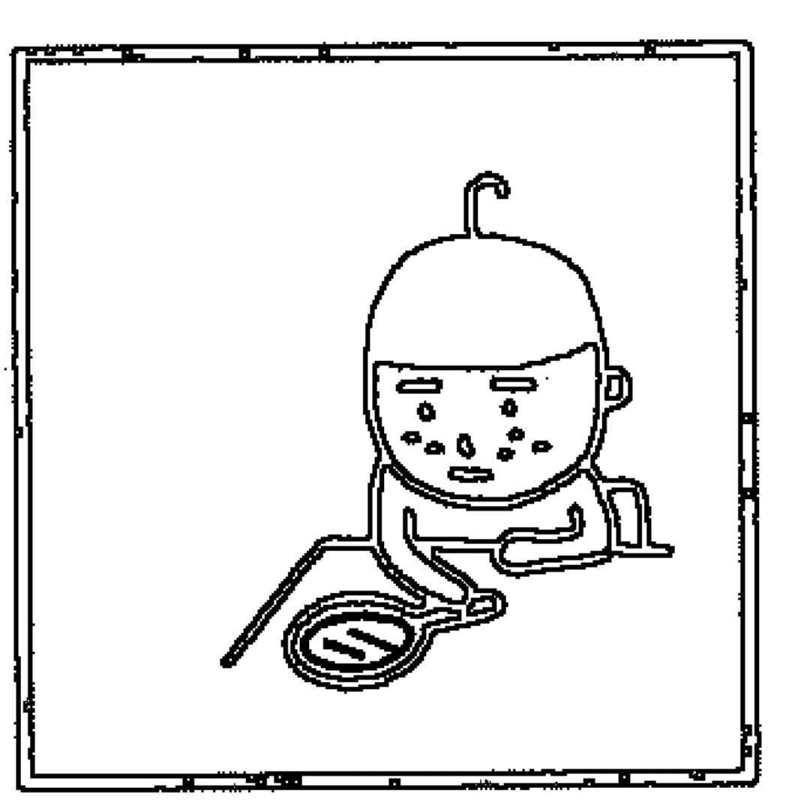
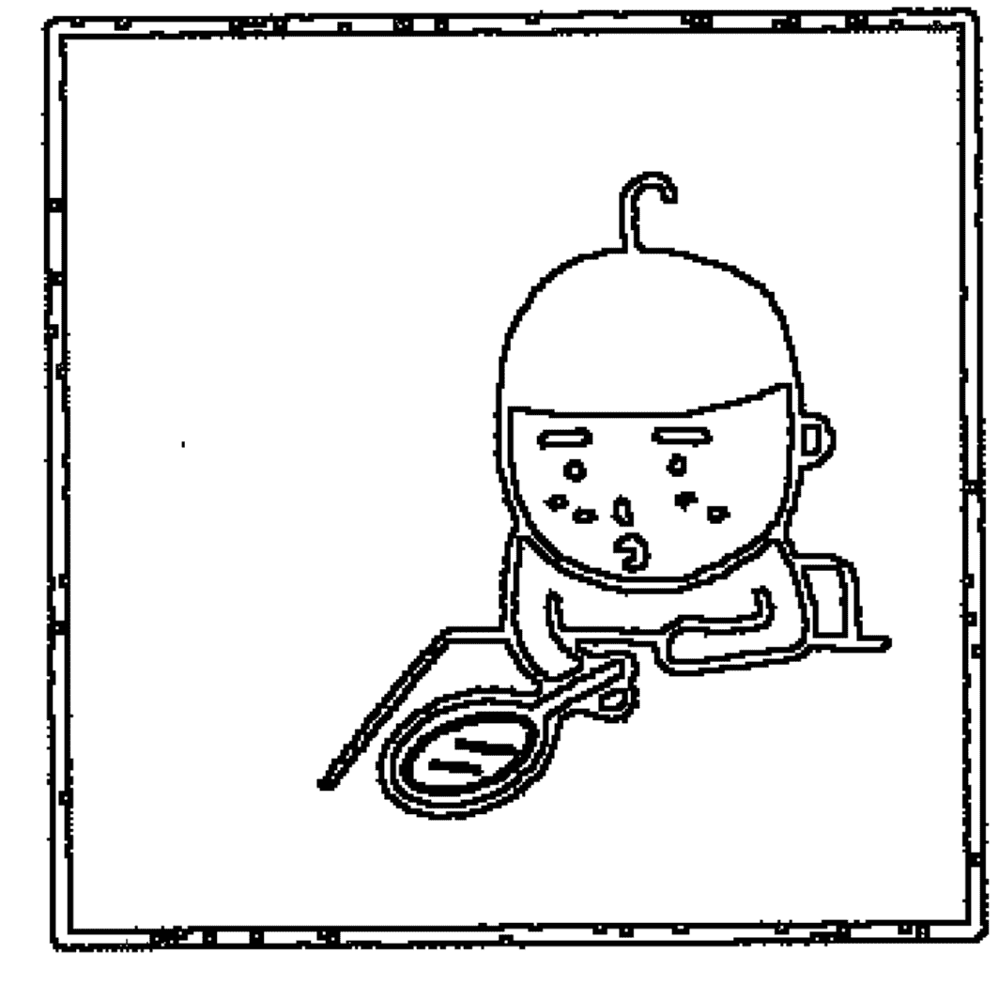
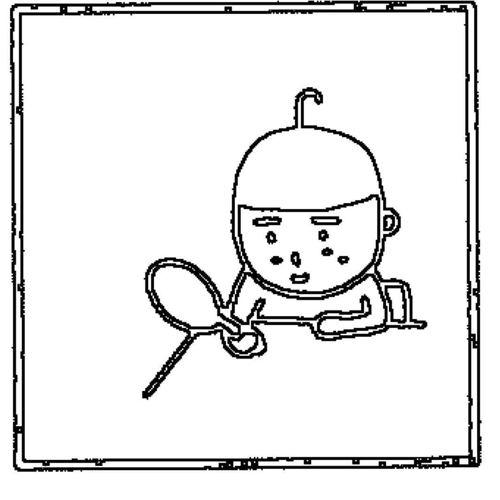
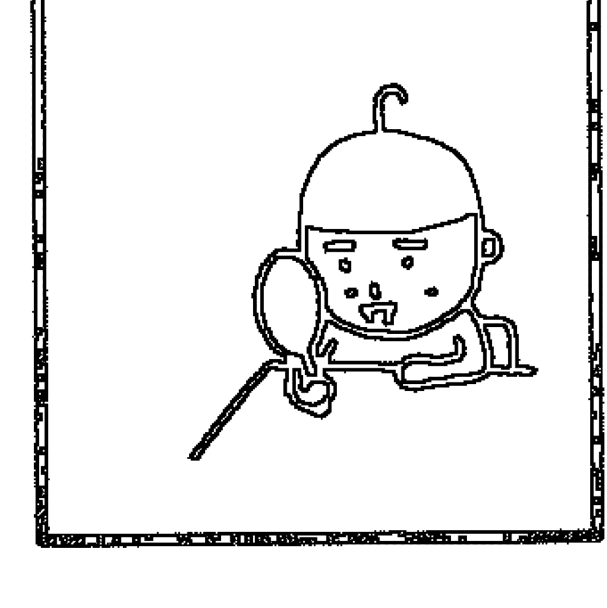
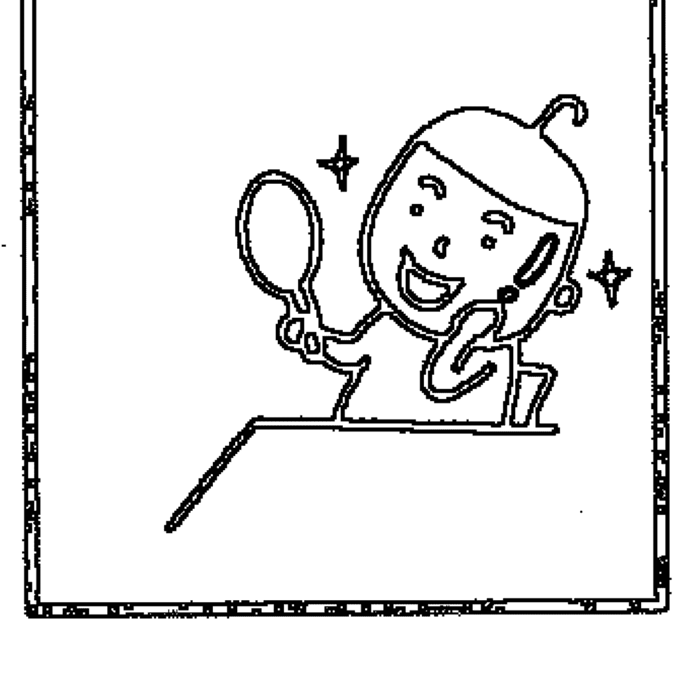

212 神奇的數字療法

## 請教專家 Q&A 時間！

我看疾病系統圖，好像數字對所有疾病都有效，實際上真的對關節炎或糖尿病、高血壓等身體疾病也有效嗎？

每種疾病都是人體標準座標的細微電波彼此脫軌、相互干擾、摩擦、衝突所致。數字處方，是依照固定週期設定標準健康座標系統，精密計算各種疾病的異常反應在標準坐標系統上產生多少變異與變性，並依照其誤差值提供人體可以自行恢復標準分布的偏差調節係數。因此，可以達到最安全又精密地應對數萬種以上痛苦或疾病的效果。

## SKIN DETOX DAY 21

8 6 9 8 1 9 9
6 7 3 0 2 6 8
1 6 2 1 0 2 4

214 神奇的數字療法

## SKIN DETOX DAY 22

1 5 4 8 6 6 7
1 6 0 0 5 3 6
4 5 7 1 3 1 2

## SKIN DETOX DAY 23

2 5 4 1 1 4 6
0 6 0 1 0 1 5
3 5 7 2 8 9 1

216 神奇的數字療法

## SKIN DETOX DAY 24

2 2 9 2 '2 4 1
'2 3 3 4 '1 1 '2
5 2 '2 5 9 9 8

5 美容，打造潔淨肌膚與明亮氣色的數字處方 217

## SKIN DETOX DAY 25

4 3 1 6 9 4 8
2 4 5 8 8 1 7
7 3 2 9 6 9 3

218 神奇的數字療法

## SKIN DETOX DAY 26

8 '2 7 0 7 5 4
6 1 1 '2 6 2 3
'1 '2 0 1 4 0 '1

## SKIN DETOX DAY 27

1 2 2 9 1 9 9
9 3 6 1 2 6 8
2 2 3 2 0 2 4

220 神奇的數字療法

## SKIN DETOX DAY 28

0 9 1 2 7 4 6
8 0 5 2 6 1 5
1 9 2 3 4 9 1

## SKIN DETOX DAY 29

1 9 1 9 0 0 '1
'1 0 7 '1 9 7 0
4 9 4 '2 7 3 6

222 神奇的數字療法

## SKIN DETOX DAY 30

8 5 2 7 2 6 8
6 6 8 9 1 3 7
1 5 5 0 1 1 3

## 本書參與者

幽爽 朴炳元
次序信號體系研究所創辦人
韓國社會開發院、放下創業學校、次序信號體系研究所創辦人，世界首本《信號學誌》發行人。他們以「打造健康世界」為信仰，研發出以「次序學」為中心的學問體系，致力於向大眾傳授、普及化。此外，也是「隔八相生易鍼法」的發明人，不僅取得歐美、中國等國際專利，還以此為基礎展開「創立鄉鎮醫院」「國際傳授體系」「名醫學校」運動，開發出以次序信號為基礎的健康晶片，引領著即將到來的電子藥品時代。此外，也開發以「大腦連結體」為基礎的數字樂團和數字音樂等，致力於全方位普及預防醫學、終身學習、人類開發領域的「穿戴式軟體」。不僅如此，他們還研發「次序食譜」，供給大眾健康優秀的糧食資源，並努力建構以獨家天然物新藥開發與加工技術為基礎的「生產體系」。

朴炳奎 人力開發室長
次序身形、次序 POINT 部門負責臨床研究及實際指導。超過 10 年期間在第一線現場指導過數萬件臨床案例，至今仍活躍於透過一對一的數字療法訓練，進行各種疾病治療、再生復活等公司計畫。

見識與長期體驗，把藉由數字處方感應使走路姿勢端正的方式普及化並指導民眾長達 10 餘年，不斷在為企業家、策略家、知識產業從事者進行大腦訓練計畫，開發他們所需的認知學習能力。

## 權日　學問事業本部長

負責次序電子藥部門臨床實例研究及相關國內外業務。在物聯網這個名詞還未出現以前，就已經在可以塗抹、黏貼、穿戴於身體的數字處方信號體系，也就是「Wearable Method」相關各種嘗試的製作現場坐鎮指揮。

## 裴莫舜　研究員

嶺南大學名譽教授，於次序經世學校負責進行次序學的淵源與志向，其教學上的運用及時代史上的意義等研究及鄉鎮學校事業，並於《文化日報》連續 3 年連載「放下的想法」專欄，至今依然每週開設次序講座，努力讓大眾了解次序學。

## 金俊裘　教育室長

負責次序經行、次序大腦學習能力部門的臨床研究及實際指導。他以自己對東方傳統武道的淵博

**李潤賈 研究員**
啟明大學教授，次序學問分科專業研究員。

**金賢宇 研究員**
中醫師，次序崑崙圖分科專業研究員。

**金賢哲 研究員**
漢陽大學教授，次序五感學習分科專業研究員。

**崔定善 研究員**
情緒行為治療師，次序音樂 (Music & Mental) 分科專業研究員。

**申元植 研究開發室長**
次序食譜 (Recipe) 分科專業研究員。

**趙保炫 研究員**
辯護律師，次序自然法分科專業研究員。

226 神奇的數字療法

## 其他客座研究員介紹

- 金英勳 教育工學博士
- 趙勇勳 電子工學博士
- 金敏宇 電腦工程師
- 漢忠熙 中醫師、預防醫學博士
- 張冠豪 中醫師、復健醫學博士
- 尹江代 中醫師、體育教育學碩士
- 柳俊圭 中醫師
- 李相葉 中醫師
- 劉昌石 中醫師
- 姜振宇 中醫師
- 金恩英 中醫師
- 孫茂兒 中醫師
- 林美霖 中醫師
- 金明勳 中醫師
- 張賢碩 中醫師
- 具昌榮 中醫師
- 沈承勇 中醫師
- 鄭永葉 中醫師
- 孫從守 中醫師
- 金炳憲 中醫師
- 李勳石 中醫師

## 參考資料

- 《黃帝內經》
- 《難經》
- 《淮南子》
- 《呂氏春秋》
- 《三命通會》
- 《河洛理數》
- 《皇極經世書》
- 《洪範皇極》
- 《樂學軌範》
- 《律呂新書》
- 《唯識三十頌》
- 《成唯識論》

## 神奇的數字療法：中西醫共同研發，改善10萬人生活的自癒處方

作　者／次序信號體系研究所
譯　者／尹嘉玄
發 行 人／簡志忠
出 版 者／方智出版社股份有限公司
地　址／台北市南京東路四段50號6樓之1
電　話／（02）2579-6600・2579-8800・2570-3939
傳　真／（02）2579-0338・2577-3220・2570-3636
總 編 輯／陳秋月
資深主編／賴良珠
責任編輯／賴良珠
校　對／鍾瑩貞・賴良珠
美術編輯／潘大智
行銷企畫／陳姵蓓・曾宜婷
印務統籌／劉鳳剛・高榮祥
監　印／高榮祥
排　版／莊寶鈴
經 銷 商／叩應股份有限公司
郵撥帳號／18707239
法律顧問／圓神出版事業機構法律顧問　蕭雄淋律師
印　刷／祥峯印刷廠
2017年10月　初版

기적의 숫자 리딩 (GIJEOGUI SUTJA READING)
by 차서신호체계연구소 (ChaSeo Rules Institute)
Copyright © 2016 by ChaSeo Rules Institute
All rights reserved.
This Complex Chinese edition was published by Fine Press (an imprint of Eurasian Publishing Group) in 2017 by arrangement with The Angle Books Co., Ltd through KCC (Korea Copyright Center Inc.), Seoul & LEE's Literary Agency, Taipei.

定價 270 元

ISBN 978-986-175-473-4

版權所有・翻印必究

◎本書如有缺頁、破損、裝訂錯誤，請寄回本公司調換

Printed in Taiwan

> 你本來就應該得到生命所必須給你的一切美好！
> 秘密，就是過去、現在和未來的一切解答。
> ——《The Secret 秘密》

- ◇ 很喜歡這本書，很想要分享
  圓神書活網線上提供團購優惠，
  或洽讀者服務部 02-2579-6600。

- ◇ 靈好生活的提實家，期待為您服務
  圓神書活網 www.Booklife.com.tw
  非會員歡迎體驗優惠，會員獨享累計福利！

國家圖書館出版品預行編目資料

| 神奇的數字療法：中西醫共同研發,改善10萬人生活的自癒處方 / 次序信號體系研究所著; 尹嘉玄譯. -- 初版. -- 臺北市: 方智, 2017.10 |
|---|
| 232 面 ; 14.8×20.8公分 -- (方智好讀; 99) |
| ISBN 978-986-175-473-4 (平裝) |
| 1.另類療法 2.能量 |
| 418.995 | 106014687 |