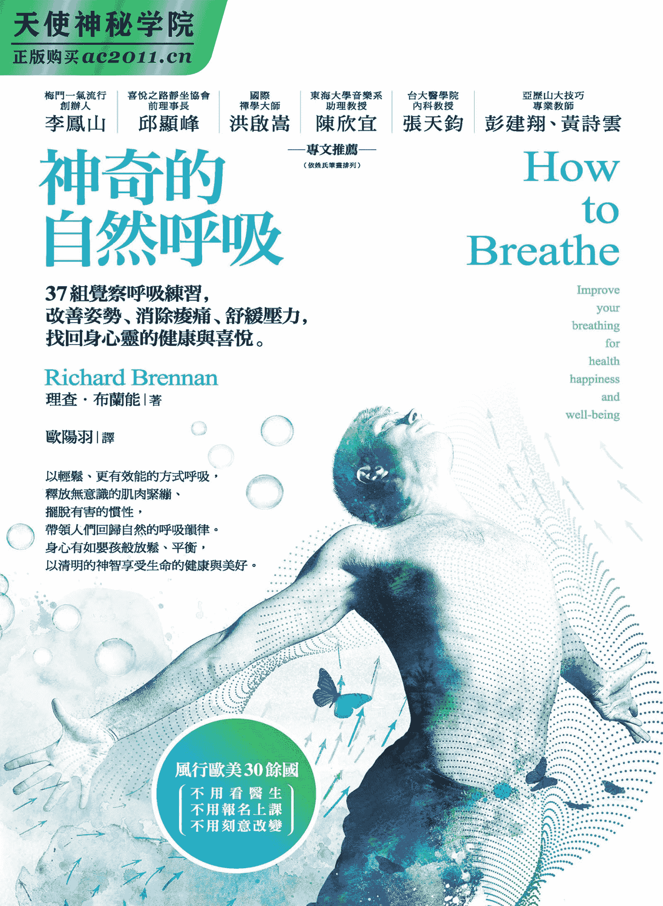

愿将此书献给我过去与现在的

所有门徒、学生和同行们。

多年来，你们的教导使我获益良多，

感谢你们所有人。

# 专文推荐 松静自然、法法皆安

李凤山

细阅理乍得．布兰能先生的《神奇的自然呼吸：37 组觉察呼吸练习，改善姿势、消除酸痛、舒缓压力，找回身心灵的健康与喜悦》，对于呼吸的“自然、规律、姿势、动作、习惯”等，无不轻敲慢推、细腻融洽，其间正应了我们平时在调养修练的气机中语道“松静自然、法法皆安”。

凡任一形态和呼吸的法则，皆不离此。以理乍得先生之自然呼吸法，又更深层地燃起了，对于当年的理气之法——“调、养、修、炼”！在此抛砖引玉，以供同修分享！

调气：随顺往来、匀细深长。

养气：浑然放下、自然纳之。

修气：按理持心、静音正形。

炼气：冥心定息、归根复命。

同好见之是否异曲同工！法虽简易，

令身，形神合一，身体健康。

令心，知觉体一，协调平衡。

令灵，生息为一，至虚至明。

盼与同修同参，扬我中华文化，合和世际趋势，成就礼运大同。

敬谢厚爱。

（本文作者为梅门一气流行创办人）

# 专文推荐 正确呼吸，让身心问题不药而愈

邱显峰

在当今的生活里，绝大部分的人们整天忙碌，不但身忙，心也忙，在过度操劳之下，加上饮食无节制，起居不调顺，姿势不正又情绪失衡，导致百病丛生。情急之下，便不断向外寻找治疗的药物和各种锻鍊的方法，试图借由外在来平衡内在违背自然法则所产生的种种问题。殊不知，如此的作为，反而让你离健康愈来愈远。

你是你自己的主人吗？孟子曾说过：“万物皆备于我矣。”佛教东传六祖慧能亦曾说过：“……何期自性本自俱足……何期自性能生万法。”从孟子和六祖慧能的话语中，可以得知我们的本能是本自俱足，而且是能生万法，具有各种的妙智慧，以解决各种问题。但是人们却往往不知安顿自己的身心，听从自己内在的声音，反而舍近而求诸远，学习一堆又一堆的有为法。从事这些有为法的锻鍊，不但违背了自然的本性，也伤害了身心灵的成长。

在各种有为法的锻鍊里面，最常被用的便是所谓的呼吸技巧，也就是透过各种呼吸的技巧，来治疗身心不调所产生的疾病与问题。笔者从事呼吸法的教学已有数十年，也观察到与本书作者所观察到的结果一样，那就是人们的身心健康问题，有非常大的部分是与错误的呼吸有关。而且这些发生问题者却又很认真地寻找各种有为的呼吸法来理疗，愈是用有为的方式来理疗，其效果反而愈差，甚至导致更严重的问题。

道德经第五十五章说：“知和曰常，知常曰明，益生曰祥，心使气曰强。物壮则老，谓之不道，不道早已。”第十章说：“专气致柔，能如婴儿乎？”这两章的主要概念，便是在说明，要着重合于自然本性“和”的功夫，如此才能让心性明白。凡是用有为的方式，反而会导致生命的不调。而且真正的呼吸锻鍊，应该要像婴儿一样地柔和自然。这些都在在说明，回归自然呼吸法的重要。

作者在本书中，除了告诉我们习以为常的种种谬误观念所导致的问题外，也特别教导我们赫赫有名的亚历山大技巧，借由这种回归自然无为的方式，我们的生命才能启动自我疗愈的修复过程。诚如作者在书中所述，或许书中所指出的我们常有的迷思，会让我们一时间感到错愕和冲击，但是，只要依着他的指引，回归自然的呼吸，并试着练习书中教导的简易方式，以及改正许多不自觉的错误习性，你会发现许多的身心问题都不药而愈，而且生命会展露前所未有的曙光，因为正确的呼吸法，引领你连上了宇宙无穷尽的生命，也打开了你本自具有的无量光，无量慧。

（本文作者为喜悦之路静坐协会前理事长）

# 专文推荐 呼吸的艺术

洪启嵩

呼吸就像一面镜子，我们如何对待她，她就如实反映出来。

呼吸，是一位陪伴我们终生，与我们二十四小时形影不离的好朋友。她和我们的关系是如此亲密，但是我们对她却如此缺乏关心与了解。就像作者在前言中所说：“许多人的想法或许认为：呼吸，不就是这么回事吗？把空气吸进身体里面，然后吐出去，如此而己。”然而，真的是如此吗？

我在世界各地讲学及主持禅修时，经常问听众一个问题：“你记得自己在婴儿时期是如何呼吸的？从几岁时开始，呼吸的方式改变了？”一般人对自己婴儿时期的身心状态不复记忆，却能从观察孩子的成长过程，明显看到呼吸的变化。许多父母都记得小婴儿睡着时，腹部规律起伏，呼吸绵密无声。但是也无法确切指出，孩子是什么时候改变了呼吸的状态，转变如同成人一般以胸腔起伏来呼吸。

孩子从腹式呼吸转成胸部呼吸，最主要的原因，正是身心的压力。

我们可以回想一下，当孩子遭到责骂，或是即将参加重要考试、比赛时，任何一种骤然增加身心压力的事，我们会发觉孩子的两肩开始紧缩、上耸，肩部、背部的肌肉变僵硬了，呼吸也开始变急促了，渐渐地从腹式呼吸转变为胸部呼吸。

孩子是如此，一般人也是如此。当我们回想起自己被老板臭骂一顿，或是被父母师长斥责时的情境，肩膀就开始不自觉地往上耸，背变得僵直了，呼吸变得短浅、粗重了。这就像一只猫遇到了危急时，自然耸背亮爪一样，是一种本能反应。如果长期处于压力的状态下，养成不良的呼吸习惯，各种身心疾病就接踵而至了。

呼吸是生命力的征象，当我们呼吸不畅时，我们的生命活力自然减退了。长期的呼吸不顺，可能会形成心理或生理的障碍，甚至会产生疾病。

良好顺畅的呼吸，则使我们更有活力、更健康、更快乐。如果能够善得深细的呼吸，更能让我们得到养生奥诀，使我们的人生受益无穷。呼吸链接着我们的心灵与身体，透过良好而健康的呼吸，不只能使我们的心灵与情绪更加地舒畅、开怀而安静，同时更能让我们身体的细胞、气血、器官、筋骨、肌肉获得更大的健康能量。

呼吸法门妙用无穷，在紧要关头，甚至是救命的法宝。数十年前，我曾指导一位艺术家数息法。当时，她到兰屿附近学习潜水，那是她第一次下海潜水，到达潜水之处时，因为她的装备出了一些问题，大意的教练让她独自游回到岸边。

当她往回游了一段路程时，潜水装备竟完全故障了，她被水呛得无法呼吸，惊慌地挣扎，不断地挥手求救，这时远处正好有一群外国人驾着游艇经过，竟以为是热情的台湾朋友向他们挥手，于是这群外国朋友也向她挥手致意，并没有发现她出事了。

她几乎已经绝望，体力也耗尽了。正在千钧一发之际，她脑中闪过一道灵光，她忽然想起不久前学习禅坐，在禅坐课程中我所教授“放松禅法”和“数息法”。于是，她放下紧张的心念，不再挣扎，让身体放松地仰躺，自然飘浮着，然后她开始一心一意，从一到十，一出一入地数着自己的呼吸。当她开始使用数息法之后，她的呼吸开始和缓下来，变得顺畅而细长，减少了身体能量的耗损。于是她就这样身着潜水装，漂浮在水上，靠着数息法放松，安心地呼吸。一段时间过去了，远处的游客发现情况有异，紧急通知救援人员，这才把她救上岸。她就这样靠着数息法而救回了一命。

呼吸对人类有极重大的影响，良好的呼吸方法使人身体健康、寿命延长。

呼吸虽然是自动机能，但是基本上还是受到心灵的影响，这就是所谓的“心息相依”（心和呼吸是相互依靠存在）。一般而言，我们有六种根本的感觉机能，即眼、耳、鼻、舌、身、意识，这六种感觉机能，我们由此接触到外界的事物，会产生感受作用。我们的呼吸，会由于这六种感觉机能之间的相互关系，而产生不同的变化。因此，我们也可以透过呼吸，观察到身心的各种状态。呼吸就像一面镜子，我们如何对待她，她就如实反映出来。

正因为呼吸与身心紧密的关联，无论在佛教或道家，都有许多针对呼吸所发展的修行与养生法门。例如：道家的“守窍”、“六字真言”，佛法中的禅法观门：将心专注一处的“系缘守境止”，以呼吸调身心的“数息法”、心息合一的“十六特胜禅观”、观照气息养生的“通明禅”，及呼吸六种气息的“六气治病法”。

古印度甚至将“数息法”列为“二甘露法门”之一，即长生不死的法门，可见古来养生及修道对呼吸的重视。

“亚历山大呼吸法”，创始人是一位朗诵艺术家，他从失声的谷底人生，走上自我发现之旅，意外地与呼吸邂逅。他重新回观自己的身心，从数十年习以为常的惯性姿势开始观察，而领悟到：“原来许多人在不知不觉之间，严重地妨碍了自己体内与生俱来的活动、协调和呼吸，当代文明的许多苦头就是由这个原因酿成的。”他抽丝剥茧地找出原因，锲而不舍地努力练习，不但突破了人生的困局，更打开了人生美丽新境，从声音的艺术领悟了呼吸的艺术，并将这美好的果实，与世人分享。

当我们温柔地呼吸时，呼吸就成了慈悲的观音菩萨；当我们智慧地呼吸时，呼吸就成了智慧的文殊菩萨。祈愿慈悲与智慧的呼吸，随时随地陪伴您，健康觉悟，快乐慈悲！

（本文作者为地球禅者）

# 专文推荐 任何人都适用的呼吸入门书

陈欣宜

百余年前的十九世纪末，一位来自澳大利亚的舞台剧演员，因为自身职业所造成的伤害，重新思考并厘清对身体造成伤害的不良应用习惯，并经过多年的发展后，提出一套身心整合的应用技术——这便是我们知道的佛德瑞克．马蒂亚斯．亚历山大（Frederick Matthias Alexander）与他所发明的亚历山大技巧（Alexander Technique）。

自此之后直到二十一世纪的今日，亚历山大技巧深受欧美人士的重视，让无数人从中获得身心状况改善的益处。欧美知名音乐学院、大学音乐系、舞蹈学校、戏剧学校，长期以来在学校课程中提供亚历山大技巧，帮助表演艺术学生改善因专业项目引起的伤害，延长他们的职业寿命。越来越多的研究报告也证实亚历山大技巧对于改善生理机能与提升专业能力有所助益。

什么是亚历山大技巧？简单来说，亚历山大技巧是一套身心整合的技巧，借由意识控制来察觉肢体应用所带来的紧绷与不适，并透过克制习惯动作的再发生来引导新的身体应用方式。它不是一种医疗行为，而是一种“再教育”的过程。透过学习这样的一套系统，人们可以打破不良生理、心理习惯的一再发生，并以一种更适切的方式来使用自己的身体，以达到维护生理、心理机能健康的目的。对于需要大量且重复使用肢体的职业来说，亚历山大技巧不啻为理想的应用方式。

亚历山大技巧的教学方式极为特殊。一般来说，在拥有合格教师执照的亚历山大技巧教师的引领下，透过老师的手技与言语的指引，带领学生察觉并排除不必要的肌肉紧绷，以更轻松、更有效率的方式来进行日常肢体动作如坐、站、走路，以及呼吸的练习，更进一步则是在专业项目——如舞蹈动作、乐器演奏——的应用。传统的教学方式十分仰赖领有执照的教师，以敏锐的观察力与纯熟的手技，协助学生理解亚历山大技巧的内容与熟悉应用方式。

除了实际的教学与练习，我们发现，适当的阅读教材也能提供教师与学生更丰富的知识。亚历山大先生留下的多本著作当然是我们理解这项技巧的重要参考书目，然而，许多教学经验丰富的教师，也根据他们长时间累积珍贵无比的教学经验，以文字提供学习者——尤其是初学者——更容易明了的内容。

本书作者四十年来不断探究关于“呼吸”这个被视为理所当然、甚至在很多时候被忽视的动作，并在多年探究各种呼吸技巧之后，发现从亚历山大技巧对于“呼吸”的诠释中，获得极大的助益。因此，在本书中，作者从呼吸的生理系统、动作原理、到根据亚历山大技巧的呼吸练习，无不仔细详述。

作者以浅显易懂的方式描述，告诉我们常见的不良呼吸习惯与迷思，以及常见不良姿势与动作对于呼吸所造成的负面影响。相信对于对“呼吸”这个主题有兴趣的、遭遇呼吸不顺所困扰的，以及需要大量应用呼吸动作来成就专业表现的读者们，都可以从本书获得相当大的帮助。

（本文作者为辅仁大学、东海大学、台东大学音乐系助理教授

二〇〇四年纽约亚历山大技巧教师培训中心授证合格教师）

# 专文推荐 呼吸就是这么自然，但影响深远

张天钧

最近有一片电影，叫做《高更：爱在他乡》。为了到高更画图的主要地方——大溪地——去参观，了解他为何如此画，出发前我曾经到书店找中文资料，但只看到孤独星球出版社所出版的英文版《大溪地》，因此就想说回来后要写一本旅游手册。

到了当地的饭店之后，发现桌上摆了一本书，打开第一页，上面写着圣．奥古斯丁说：“世界是一本书。不旅行的人，只读了一页。”有趣的是我发现这本关于呼吸的书中也提到圣．奥古斯丁曾说：“人们不惜跋山涉水，想探知山有多高、浪有多大、河流有多长、海洋有多宽广，还想探知星辰如何运行于天际，可是，人们却往往错过了自己，对自己一点也不了解。”这句话刚好可以套在呼吸这件事情上。

有趣的是，本书的作者不讳言提到“原本我的志向是成为医生，无奈大学时期遭遇一连串的考试失利，这份真诚的志向被考试之火燃烧殆尽，灰飞烟灭”。也就是作者并非医师，却也因此对人体的解剖学和生理学特别下功夫，例如他介绍进食的时候，食物和饮料经过食道进入胃部，食道位于气管后方。会厌是一小块扁平的软骨，吞嚥的时候，会厌会封闭气管，于是食物和饮料被引入位于后方的胃部，如此可防止食物经由气管而进入肺脏。呼吸和吞嚥的动作无法同时进行，这就是为什么当我们吃饭吃得太急，或是一边吃饭一边说话时，食物偶尔会跑错了地方而呛到的原因。

其实人在健康时，很多事情我们都会忽略它的存在。呼吸也是一样。可是在医学里面，很多症状或疾病却和呼吸有密切的关系。例如因焦躁不安产生的换气过度症，会导致二氧化碳排出太多，引起手脚发麻和抽筋。以前我也曾为一本书写过推荐序，整本书就是教人如何经由慢慢吐气来放松。我想经由本书，相信会对我们“日用而不知”的呼吸，有更深入的了解才对。

本书的重点是要告诉我们姿势和呼吸密不可分，只要改进呼吸方式，就能改善各种身体不适。不良的姿势、压力与肌肉紧张等等，都可能使轻松的一呼一吸在我们没意识到的情况下变得辛苦。呼吸不仅是吸入和吐出空气而已，而是支持生命源源不绝的力量。呼吸不只是生理活动，同时也影响我们的心理、情绪与精神的健康。在书中也提到一行禅师曾指出“呼吸是链接生命与意识的桥梁。这个桥梁让身与心合而为一。当你的思绪混乱时，善用你的呼吸，散乱的心灵将再度找到宁静”。

作者理查．布兰能（Richard Brennan） 教导如何带来身心灵健康与调和的亚历山大技巧，他的资历已经超过二十五年，教学范围遍及欧洲各地与美国，他是爱尔兰“亚历山大技巧教师协会”主席兼共同创办人，也是爱尔兰哥尔威市（Galway）亚历山大中心负责人。

最后我要提一下本书特别的呈现方式，那就是在一段文章后会出现“练习”，提醒我们深思和实际操作。就像一个旅者，走一段路会休息一下。让我们思考、检讨、沉淀，并且真实地去体会。

无论如何，我认为这是一本值得我们看而且深思的书。

（本文作者为台大医学院内科名誉教授 ）

# 专文推荐 找回舒服、自然的呼吸

彭建翔、黄诗云

我们每个人从哌哌落地那一刻起就开始呼吸，没有呼吸生命就无法延续。既然呼吸是与生俱来的本能，为什么要学？是我们遗忘了本能？还是需要练就各种高难度的呼吸技法？

◆呼吸需要学吗？

除了呼吸能力必须高于一般人的运动员、管乐演奏者、声乐家、演员……得要特别训练呼吸之外，一般人也需要特别学习呼吸吗？

现代的生活型态下，人们常有胸闷或吸不到气的状况，觉得自己不会呼吸。有觉察习惯的人，可能会发现自己经常忘记呼吸或专心时总伴随着憋气的情形。但我们不可能不呼吸，只是我们的呼吸品质已经低落到会造成不舒服的程度。请正在阅读本篇文章的您，感觉一下现在的呼吸状态，是跟平常一样？还是在憋气？还是很浅的呼吸呢？看看小婴儿、小猫、小狗，他们的呼吸多么舒服啊！稳定又深沉！身体放松地起伏着！为什么我们不能跟他们一样？他们有学怎么呼吸吗？他们是用胸式呼吸还是腹式呼吸？我们需要学习和练习呼吸才能跟他们一样吗？

亚历山大技巧是一种教人“不要”做什么（Non-doing）的课程，也就是去除所有妨碍活动的不必要动作和肌肉紧张。呼吸是与生俱来的活动，是造物主赐给我们的能力，这与亚历山大技巧的哲学十分契合：只要去除一切妨碍呼吸的肌肉紧绷和动作，就能回归小婴儿般的自然呼吸。

在禅修与静坐中，常借由“观呼吸”来带领人们进入“空”与“定”的境界。亚历山大技巧也经常引导学生观察自己在不同的身心状况下呼吸的变化，并认为我们不应该主动改变呼吸，而是让呼吸调回最自然的状态。由此可见，呼吸是最能反映自身状态的身体活动。

◆需要刻意做什么来强化呼吸能力吗？呼吸失调怎么办？

生活中常见许多关于呼吸的迷思，例如：腹式呼吸时胸腔不能动、用力深呼吸、多练习憋气……等等。这些都是刻意的、做作的呼吸，偏离了自然，但很多人误以为这些才是自然的呼吸模式。

许多人有气喘、睡眠呼吸中止症、慢性支气管炎……等呼吸方面的困难或疾病，除了借由医疗及环境改造外，也希望透过呼吸训练改善，但往往愈练愈糟，因为“不当的”用力容易造成全身肌肉更紧绷，呼吸反而更不顺了。人们常感到很困惑，为什么经过这么多的练习，状况不但没有改善反而更差？

◆回归自然才是王道

本书先说明与呼吸相关的解剖学知识，创建正确的呼吸生理观念，有了这些观念，大家就能理解为何在亚历山大技巧中，我们强调唯有先维持好的姿势与放松的肌肉才能有好的呼吸，而不是先教大家如何呼吸。也因此，书中内容大多在引导读者如何放松和维持好姿势，而不是一直要读者练习呼吸，也没有介绍任何一种特定的呼吸法。

书中介绍半仰卧放松等亚历山大技巧练习法，帮助读者练习应该如何做到真正放松又正确的姿势，这个方法在亚历山大技巧中是相当重要且有效的练习。特别是透过合格亚历山大技巧教师 1 的引导，能让我们体会到，当身心回归如婴孩般柔软有弹性的状态时，呼吸竟然立刻随之改变了，我们并没有针对“呼吸”做什么特别的训练，神奇的事却自然发生了！

虽然教导人们呼吸的方式很多，但若学会亚历山大技巧，就能够先创建起正确且稳固的基础，在此基础之上学习任何呼吸技巧，一定都能在最短的时间内领会，达到事半功倍的效果。本书阐述的就是这个简单却神奇的方法，希望读者们都能借由此书找回舒服、自然的呼吸。

（本文作者为亚历山大技巧专业教师）

* * *

氧气

没有它就活不成，

筋骨血肉仰赖它，

恋土而居的灵魂也离不开它，

悲悯而飒飒出声的机器啊。

伫于你我的身宅里，

终日忙活不停，

仿佛是肺脏在说话，

跪在火堆前，便能听见。

铁夹一拨一撩，

堆叠的木块稍稍松开，

楼上房里的你，

姿势一如往常。

依靠着右肩，

害它酸痛一整天，

你的呼吸安详从容。

听来悦耳美妙，

那是你的生命所系，

与我的紧紧相依偎。

从哪里下刀能斩断，

谁人有此能耐，

若问何故，

唯有爱是答案。

岂有其他答案，

看那火苗窜升起舞，

宛如昂首歌唱，

朵朵焰光恰似深红玫瑰。

且看馀火渐熄，

犹如低头感激，

来自虚空无涯，

隐形的恩赐。

你我活在世间，

亦是这般仰赖，

无比纯净而甘美的

空气。

——玛莉．奥利佛（Mary Oliver）

# 前言

当我告诉我的大女儿：“我正在写一本有关呼吸的书。”她回答：“那很有趣呀！第一页：吸气。第二页：吐气。第三页：再吸气。第四页：再吐气。第五页：重复以上的动作。”说不定许多人的想法也是如此。呼吸，不就是这么回事吗—把空气吸进身体里面，然后吐出去——如此而已。事实上，该怎么吸气、怎么吐气，绝非三言两语就说得通彻。

生命能够延续不息，靠的正是呼吸所带来的无穷能量。打从生命诞生的第一刻开始，空气便无声无息地进入生命体内，而后离去，不断周而复始，直到死亡为止。事实上，在你出生的那一瞬间，医生、护士、助产士，尤其是你的双亲，他们心上最挂意的事，就是你有没有呼吸。想像一下，如果你的第一口气没有吸上来，你的家人会多么哀恸？他们的生活会发生多么巨大的转变？简直快要天崩地裂了啊！再说，如果哪一天，你的呼吸停止了，你所热爱、享受的一切，也就随之走到尽头了。

还记得上次你吃东西噎到，或是喝饮料呛到的时候，情况是怎么回事吗？当时你人在何处、身旁有谁作伴，通通都是无关紧要的，你所有的心神只在乎一件事，那就是赶快把下一口气吸上来。不过话又说回来了，除非发生类似的紧急状况，否则你的呼吸都是在不知不觉之中悄悄进行的。

一行禅师（Thich Nhat Hanh）曾经说：“呼吸犹如一座桥，连通生命与意识，把身体和思想统摄起来，合而为一。”当我们懂得觉察呼吸、改善呼吸的方式，便能让自己跳脱俗世存在的层次，晋升为有自觉意识的人。光是这一点，生命的意义就今非昔比了。再进一步来说，富有意义的生命，能让自身的存在变得更加和谐、更加惬意。事情还不仅是如此而已。当一个人过得更幸福，他身边的人也会跟着蒙受好处。也就是说，只要你学习在呼吸的时候保持觉察力，你便能开始掌理自己的生活。

说起来，这本书早在四十年前就开始动笔了。原本我的志向是成为医生，无奈大学时期遭遇一连串的考试失利，这份真诚的志向被考试之火燃烧殆尽，灰飞烟灭了。于是我开始寻找，在我的生命中，还有什么事情更具有意义的吗？一九七二年，我的探索之旅把我带到印度的赫尔德瓦尔（Haridwar）。在那儿，我有幸听到一位年轻精神导师的演讲，当时他只有十四岁，名叫普吕姆．拉瓦特（Prem Pal Rawat）。他传授的智慧之语提到，每一口呼吸的背后，都蕴藏着珍贵无比的生命力。

我深深折服于他话中的奥义，便决定去参加他教授的禅修课。在他的指导之下，我开始对每一个吸气、每一个吐气的价值有所觉察。我还记得，有一天早上，他说前些日子他去陪伴一位生病的朋友，那位朋友在呼出最后一口气之前，用微弱的气息说：“直到现在，我才了解每一口呼吸的力量有多么强大、多么重要！”这句话让我想起琼妮．密契尔（Joni Mitchell）唱过一首歌曲，名叫“黄色计程车”，里面有句歌词可说是一言中的：“你从来都不清楚你曾经拥有什么，直到有一天，你失去了你的拥有。”然而，我们不必等到死亡来临的那一刻，才开始对呼吸这份礼物报以感恩。

在那之后的许多年，我探索过不同的呼吸技巧，包括哈达瑜伽（hatha yoga）和重生呼吸之类的训练。不过，我发觉我距离自然的呼吸方式越来越远了，直到一九八四年，我发现了“亚历山大技巧”（Alexander Technique）。这套技巧帮助我释放深埋在潜意识里的肌肉紧绷，彻底翻转我长期以来对呼吸的种种看法，此时我才明白过来，原来以前我接触的方法，都是教我用非自然的方式去呼吸。

多年以后，到了二〇一一年的夏天，我去瑞士的卢加诺（Lugano）参加亚历山大技巧的国际会议，听到洁西卡．沃尔芙（Jessica Wolf）的一场专题报告。她是一名亚历山大技巧老师，专长便是“呼吸”。那场专题报告提高了我对呼吸的觉察度，带给我丰富的知识，使我获益匪浅。于是，我协助她在爱尔兰组织了两个课程，称为“呼吸的艺术”，我自己也去课堂上听讲。二〇一四年，我两度去爱尔兰拜访，跟她共同讨论呼吸的各个层面，过程极为有趣。正是当时讨论的内容，让我兴起动笔写书的念头，想跟人们谈谈如何改进呼吸方式，而笔耕的成果，就是你手上正在读的这本书。

我写这本书的目的，在于透过实用的方法，帮助人们改善呼吸，进而改善每天过生活的方式。为了让这本书的效益发挥到最大，当你读到书里介绍的呼吸练习时，请试着好好做上一遍，而且任何一个练习都不要跳过。此外，你也需要有心理准备，某些练习或许需要回头再做一遍。我之所以设计这些练习，用意是让读者在阅读文字的同时，也能更加认识自己的呼吸方式，了解自己的细微动作对呼吸会造成何种影响。

我衷心盼望读者能发现本书的用处，希望读者吸收本书的讯息之后，也能把健康和活力一并吸纳到生活中。

# 第一章 呼吸的重要性

呼吸应该优雅平稳，如同河水流淌，又如同水蛇滑行于水面，而不是像一条崎岖蜿蜒的山路，或是像马匹狂奔时的喘息。

能够精通呼吸之道，也就能够掌握自己的身体和心灵。

每当我们心烦意乱，用尽方法都难以自我控制时，观看呼吸的方法就应该拿出来派上用场了。

——一行禅师

## 内在的力量

此时此刻，你正在呼吸。

空气静静地在你的体内进进出出，走过你生命中的分分秒秒。事实上，你的生命能量全然来自于呼吸，它永远轻柔地伴随着你，陪你度过洋溢欢笑的时光，也陪你度过风风雨雨的岁月。呼吸使人统整起来，我们的所做的一切、所经历的一切，都源自于呼吸所带来的能量。

呼吸对生命至关重要，这个道理无人不知。可是，有多少人会把脚步停下来，思考每一次呼吸的重要性到底何在？我们倾向于把呼吸视为理所当然，殊不知，只要改进呼吸方式，就可以实实在在获得健康上的好处，而且神智也会变得清明起来。不良的呼吸习惯会危害健康和生活品质，我们却浑然不知！

虽然呼吸是天性，人人生来就会，不过我们却可以透过意识来控制呼吸。在我们过去已做、未来即将要做的事情当中，呼吸的重要性高居首位，这个道理浅显易懂。如果不呼吸，我们就无法发出声音，连一个字都说不出来。人在一生当中，每天会做数以千计的动作，然而，一旦没了呼吸，任何动作都做不了。

生命力会自动驱使我们呼吸，我们的脑筋不必费神去管呼吸这件事，甚至连记在心上都是多余的。圣奥古斯丁（Saint Augustine）曾经说过：“人们不惜跋山涉水，想探知山有多高、浪有多大、河流有多长、海洋有多宽广，还想探知星辰如何运行于天际，可是，人们却往往错过了自己，对自己一点也不了解。”把这句话套在呼吸这件事情上，尤其千真万确。、

Point｜
　　有多少人会把脚步停下来， 　　思考每一次呼吸的重要性到底何在？

## 姿势与呼吸

如果你希望维持良好的姿势，希望自己运用身体的方式能够符合人体设计的原理，那么，有效的呼吸是不可或缺的一环。

不幸的是，我们经常在无意之间干扰了自己的呼吸。胸腔、鼻道、口腔与喉咙是空气进出人体的必经之路，然而姿势不当，或是运动时以错误的方式来使用身体，都会使得这些部位的肌肉被过度拉扯，造成身心难以舒畅。肌肉紧绷也可能引发一般性的身体损裂，或是全面性的功能障碍，大幅降低肺藏吸纳空气的容量。肺藏的容量不足会导致呼吸变浅，不利于身心舒适。

反过来说，如果我们的坐姿或站姿是保持抬头挺胸、背部内凹的模样，像个军人或芭蕾舞者一样的话，也可能导致呼吸变紧，到最后不得不更加用力，才能吸到足量的空气。简而言之，呼吸原本是一件轻而易举的事情，但在实际生活中，却可能因为各种因素而让人倍感辛苦。

这些额外费力的情况大多是发生在不知不觉之中，因为人们早就习以为常了，毕竟许多年来，人们可能一直都是这样呼吸的，有的甚至已经积习数十年之久了，于是觉得这样的呼吸方式很正常、很正确，可说是很完美了。多数人唯有在从事高强度的活动时，例如追公车或爬楼梯，才会明白地意识到呼吸不良有碍健康。

Point｜
　　呼吸原本是一件轻而易举的事，
　　却可能因为各种因素而让人倍感辛苦。

## 不良呼吸习惯的源头

在某些情况之下，呼吸系统受阻的源头可以追溯到儿童早期，原因可能是难产，或是幼儿时期的呼吸道感染。然而，对大部分人而言，不良的呼吸习惯大概是从五、六岁开始养成的，原因是必须弯腰写字，结果养成某种姿势习惯。在成长的过程中，我们被迫以坐姿学习，时间长达数千个小时之久，累积多年之后，逐渐发展成不良的姿势，结果造成呼吸受到阻碍。

在生命刚开始的头几年，当我们跌倒、受伤，或是为了某样东西而欢欣雀跃时，我们会无拘无束地表达出来。可是进入学校之后，我们从老师身上得到明明白白的讯息，上课时不可以哭出声音、不可以高声嘻笑，于是我们把情感压抑下去，开始憋住呼吸。如此一来，我们天生而来的呼吸协调性和情感表达都被干扰了。

经历过生活中的许多事情之后，我们学会遇到事情就憋住呼吸，以憋气来作为反应，如此不仅限制了呼吸，连原本的良好姿势、舒适的动作模式和情感表达，也都彻底被改变了。

觉察练习 1

当你读到这里时，请暂停一会儿，把注意力放在你的呼吸上。不要刻意去改变呼吸的任何细节，只要单纯观察你的呼吸模式和韵律就好了。

问问自己下面的问题：

．我的呼吸快慢如何？

．我的呼吸深浅如何？

．我的呼吸均匀吗？有没有忽快忽慢？

．在我的身体里面，哪个部位最能感觉到呼吸正在进行？是胸腔的上半部，还是胸腔侧边？是肋骨、腹腔，还是其他的什么部位？

不要刻意做任何改变，只要留心觉察你的呼吸方式就好了。光是如此，就足以带来令人合意的改变。请在一天之内多多重复这个练习，以便你能开始觉察你自己的呼吸模式。

## 压力与呼吸

你可能已经注意到了，当你情绪上来，或是心神紧张的时候，你的呼吸会跟着发生变化。可是，你有没有想过，浅而快的呼吸可能使你的情绪雪上加霜，又或者，它正是造成你烦恼、焦虑、恐慌、沮丧的根本原因？事情的前因后果有时候很难理出头绪，不过从本质上来说，身体、心灵、情绪各层面的生活品质都和呼吸有关连，因此必须全盘加以考量。

当我们的身体、心灵和情绪长时间承受压力时，会对呼吸系统造成不利的影响，因为我们往往会憋住呼吸，用憋气来回应压力。当我们憋气时，呼吸系统的自然活动会受到阻碍，体内的二氧化碳会增加，对神经系统造成压力，结果是呼吸方式反过来引发情绪状态，导致身体不舒服。于是，整个过程串连成恶性循环。

◆没时间呼吸

许多人来向我寻求协助，在这些人的身上，我经常看到一个现象：当他们的背部或脖子出状况时，他们的呼吸也会变得急促起来，或是忽快忽慢，速度不均；可是，他们对自身的呼吸情况却毫不知情，感觉不出有什么不对劲，也不曾抱怨过关于呼吸方面的问题。

在这个匆忙运转的世界中，人们让自己忙到没时间可以自然地呼吸。有时候，人们甚至为了急于说话而憋住呼吸，或是在吸气的时候说话，这反映出许多人的生活步调已经过于快速了。我们的日常生活充斥着大量的刺激，结果是人们经常处于肌肉过度紧绷的状态，因而妨碍到呼吸。人们对于不良的呼吸方式习以为常，这习惯会影响到身体和心灵，也会影响日后的健康品质。有人习惯于粗浅的呼吸，结果是心跳速度异常加快。

事实上，当呼吸系统长期受到严重的束缚，身体内的所有系统也会跟着受害，因为我们并不是一大堆零件拼凑出来的东西，我们是具有完整性、统合性的人，每一个系统都必须跟其他的所有系统共同运作，协合为一。

Point｜
　　在这个匆忙运转的世界中，
　　人们让自己忙到没时间可以自然地呼吸。

◆呼吸与心平气和的关系

对表演者和公开演说者而言，良好的呼吸尤其显得重要。演员、音乐家、讲师经常深受肌肉紧绷之苦，这会加重呼吸系统的负担。如果我们的呼吸能够真正达到顺其自然的地步，压力和上台焦虑所引发的作用，就可以有效地被挡下来。如此一来，我们将会感到心平气和，觉得事事都在掌握之中，即使置身于极端的情绪压力和心理压力之下，也能处之泰然。

如果呼吸方式会影响人的心智状态和身体活动，那么我们就必须慎重思考一件十分重要的事：“在进行呼吸的当下，除了吸气与吐气的动作外，我们还做了什么呢？”想要呼吸为健康带来益处，关键在于吐气的过程是否心平气和，如此才能带动身体进行完整而没有压力的吸气。

人们常常听到的说法是，深深吸一口气有助于让情绪平复下来，然而，有个要点必须了解清楚：当肺部已经积满空气时，根本无法再吸入空气了，这时得先把空气吐出去才行。不新鲜的空气（也就是二氧化碳）是有毒的，当身体吐气的时候，毒气便排放出去了。

所有的事情取决于我们吐气吐了多少，身体才能安静地吸饱空气。能做到这一点的话，接下来的吸气动作便可以完全自动进行了，而且丝毫不必费力。当人们能够有意识地觉察自己的呼吸动作，接下来便能够觉察出来，自己身上有哪些不良习惯会对细致而神奇的呼吸过程造成妨碍。

本书设计了一些觉察练习，借由实做这些练习，读者可以重新学习人人与生俱来的呼吸韵律。如果你真的做到这些觉察练习，当你在日常生活中做各种事情时，你的思考、感觉、动作都会连带发生转变，为自己带来益处。

## 呼吸练习有效吗？

许多发声训练师和体能教练鼓励人们深呼吸，目的是让呼吸系统的运作效能达到最大，然而—尽管他们用心良善—他们所鼓吹的方法，却往往让呼吸问题更趋恶化。人们被教导要用力吸气、用力吐气，以便提高肺部吸纳空气的容量，可是这种做法反而让原本就深受束缚的肌肉系统被绷得更紧。

几乎所有的呼吸练习都把重点放在吸气的动作，比如该如何进行深度吸气，或是要把空气吸入身体的哪个部位。这些做法一律会干扰自然呼吸的协调性。无论是用力把空气吸入肺部，或是强迫把空气吐出去，两者都很容易造成背部过度弯曲，同时也让胸腔被往上提，结果是导致肌肉过度紧绷，形成牢不可破的不良呼吸习惯。

## 亚历山大技巧

本书介绍的是符合自然的呼吸方式，以亚历山大技巧的准则为基础。这套技巧的精髓在于它的本质是重视预防胜于一切。

换句话说，如果我们可以破除有害的呼吸习惯，那么，更有益、更健康的呼吸模式就会自动取而代之。透过运用亚历山大技巧，我们将会发现，该做的事情是改掉错误的呼吸习惯，而不是去演练特定的呼吸方式或技巧。

威尔弗雷德．巴罗（Wilfred Barlow）是一位亚历山大技巧教师，也是一位备受敬重的风湿病专科医师，任职于英国国家健康服务中心。他深深相信，气喘患者需要的是“呼吸教育”，而不是一大套呼吸练习。在《亚历山大准则》（Alexander Principle）这本书之中，他写道（在下方引述中，“使用”一词的解释是：一个人使用身体和心智去做事情的方式）：

举个明显的例子来说，死于气喘的案例一直在增加，尽管现在已经有对抗急性发作的药物可用了。有人怪罪于环境压力上升、住宅有尘螨、类固醇药物越用越多，有人说吸入器的功效只是暂时舒缓一下而已，这些说法通通无济于事，事情的全貌还是漏了一个环节。

如同往常一样，这个漏掉的环节，就是“使用”一词作何解释？人们倾向于忽视这个词的含意。气喘患者需要的是有人教他们改掉错误的呼吸方式。呼吸练习经常被物理治疗师拿来指导气喘患者，也用于指导其他呼吸疾病的患者，这似乎很理所当然。可是，从事实面来看，呼吸练习对气喘没有什么用处—其实，最近的研究显示，多数人参加“呼吸治疗”的课程之后，呼吸效率反而比上课之前更差了。

## 自然的呼吸方式

呼吸方式其实取决于如何吐气，而非取决于如何吸气，这一点刚好跟普罗大众的想法相反。之前我曾经提到，自然呼吸的关键在于毫不费力地把空气完全吐出去，如此便能直接促成接下来吸气能吸到饱，而且不需花费力气。

在正常、健康的情况下，整个呼吸机制是自动控制的，有时候我们会说：“它自己就会呼吸了。”我们吐出的二氧化碳越多，肺脏里面就能腾出越大的空间来容纳空气—细胞要运作顺畅，需要的是富含氧气的新鲜空气。含氧量高的空气不仅对全身有疗愈作用，也能在第一时间防范疾病的发生。

请读者跟着本书安排的练习一步一步做下去，你便可以开始跳脱旧有的呼吸习惯（那些习惯往往是浅而急的呼吸），转而以比较慢、比较深、比较轻松的方式来呼吸，这样的呼吸方式才是自然而健康的。

在学习自然呼吸的过程中，有件事情非常要紧，那便是：不要刻意去改变你的呼吸方式。唯一要做的事情，就是停止继续妨碍呼吸的自然韵律。事实上，一谈到呼吸，你做得越少，你的呼吸系统就运作得越顺畅。

改进呼吸方式的第一个步骤非常简单，就是好好地觉察你自己的呼吸是怎么进行的。最后你便会明白，比起用力把空气吸进肺部再吐出来，平静而不出力的吐气、吸气才是更好的。

从本书的开头到结尾，你会读到一则又一则的呼吸觉察练习，这些练习会帮助你改进呼吸方式，采取新的方法来呼吸。这种改变会带来好处，使你更有活力去进行日常活动。你会读到如何避免憋住呼吸，以及如何避免匆匆忙忙地呼吸。在任何时候，如果你注意到自己憋住呼吸了，或是突然倒抽一口气，只要平静和缓地把气吐出去就行，接下来你就会开始以符合自然的方式来呼吸了。

Point｜ 　　不必刻意去改变你的呼吸方式。

# 第二章 呼吸如何运作

如果呼吸方法得当，在短短数个星期之内，胸腔的弹性就会大幅提升。

不仅如此，能够提升胸腔活动力的这种呼吸方式，同样可以清洁、净化肺脏，让肺脏的功能更强大。

——马蒂亚斯．亚历山大（Matthias Alexander）

## 氧气的重要

呼吸是生命体必不可缺的功能，因为它把氧气输送到全身上下的所有细胞。细胞需要氧气，以便将储存在食物里的能量转换成可利用的形式，这个过程称为细胞呼吸。经由细胞呼吸的作用，细胞获得了能量，才能进行身体的各种重要功能，例如驱动全身的肌肉—包括心肌在内。

如果缺乏氧气，细胞的运作便支撑不了多久，因此长时间的缺氧会导致细胞死亡。我们需要氧气才能做一切事情，包括血液循环、消化、移动、思考。我们的身体也需要氧气，就如同汽车需要燃油一样—少了燃油，汽车怎么也跑不了。

在呼吸的过程中，氧气从外界的空气流入肺脏里面，接着，血管把氧气输送到身体内的每一个器官、每一个细胞。氧气被细胞用掉之后，血液又把残留在细胞内的废物带走，送回肺脏，让肺把废物吐出去，这个废物便是二氧化碳。

以上这一连串的过程是自动发生的，我们的大脑意识完全不必费心去处理这件事，而且，这个历程是无休无止的，持续在体内和体外同时进行。每一个细胞、组织、器官、肌肉、骨胳，尤其是我们的大脑，无时无刻不在经历这个过程，接收血液送来的氧气，再由血液把二氧化碳送出去，片刻也不间断。

这个历程维系着我们的生命，身体的功能才得以运作顺畅。任何一个曾经中风的人，都很清楚氧气实在重要无比。即使是轻微的中风，也会造成血管堵塞，使得氧气无法进入大脑。中风往往发生在短短几秒钟之间，不过在许多案例中，即使是一年多之后，中风的后遗症依然存在。中风是一个很好的例子，让我们明白氧气对身体有多么重要。无论何时何地，人体都需要不断获得充足的氧气。

Point｜
　　平均而言，人体一天呼吸大约二万次，一年超过七百万次。

觉察练习 2

读到这里请暂停一下，仔细思考这个事实：你的呼吸是延续生命的最基本的活动。想想看，在人生过程中的每一个时刻，呼吸让我们可以想做什么就做什么—甚至连阅读这本书，也要归功于你的呼吸。与此同时，肌肉和骨胳系统也微妙地回应着呼吸的进行。

随着我们从事不同的活动，呼吸也会有不同的回应。当我们活动量增加时，呼吸速度会跟着加快；当我们休息时，呼吸也跟着缓慢下来。我们的呼吸和我们的每一个动作，两者完美地协调在一起。

## 每一口呼吸

人体每分钟呼吸八次至十八次不等，不过，我曾经遇过每分钟呼吸高达三十次以上的人，原因就出在他们的呼吸习惯，而那样的习惯是大有害处的。平均而言，我们一天大约呼吸两万次—一年超过七百万次。既然呼吸这个动作我们每天要做成千上万次之多，那么，学习把呼吸做得尽量有效、尽量轻松，可说是一件明智之举了。为了达成这个目的，我们可以先来了解呼吸的运作方式，或许这会是很有用的。

从许多方面来说，呼吸是一件矛盾的事。尽管呼吸动作本身很简单，事实上，呼吸的历程却复杂得不得了。不仅如此，呼吸既受到意识的管控，同时也受到潜意识的管控。不过，唯有我们开始意识到自己是怎么呼吸的，接下来才有办法真正去谈如何改善呼吸。呼吸是三度空间的活动，由许多不同的环节组成，当你对呼吸系统的设计了解得越深入，便越能够使用自然的方式来呼吸。

## 人体呼吸配备

◆鼻子和嘴巴

我们所呼吸的空气是从鼻子和嘴巴进入体内。嘴巴比鼻子更能吸入大量的空气，原因在于嘴巴的空间比鼻腔的信道更大。人们说话、唱歌、吹奏管乐器或是做动作的时候，或许会需要用嘴巴来呼吸。

以嘴呼吸时，空气受到的阻力比较小，因此可以快速进入肺脏。不过，用鼻子呼吸的话，空气是温暖湿润的，而且会受到过滤，对健康有好处。无论以嘴或鼻子呼吸，空气都是经过喉咙的后方，接着再经过气管，继续往下流动。气管进一步分叉成支气管，把空气带进肺脏。

进食的时候，食物和饮料是经过食道而进入胃部，食道位于气管后方。会厌是一小块扁平的软骨，吞嚥的时候，会厌会封闭气管，于是食物和饮料被引入胃部，如此便可防止食物经由气管而进入肺脏。

呼吸和吞嚥的动作无法同时间进行，这就是为什么当我们吃饭吃得太急，或是一边吃饭一边说话，食物偶尔会跑错了地方。

◆气管

气管是一根大约十公分长的管子，直径不到二．五公分。气管开口位于喉头下方，往下延伸到胸骨的后面。气管是由具有弹性的软骨所构成，不过非常强韧，因为它必须一直保持开放的状态。气管分叉成两根小一点的管子，称为支气管。两边的肺各有一根支气管。

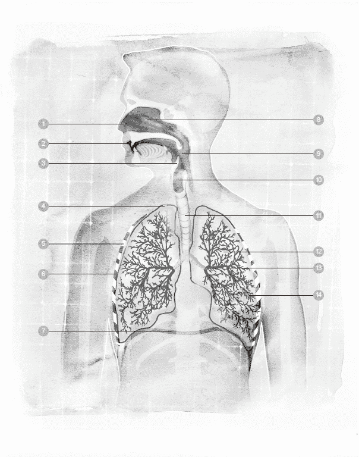

1 鼻子　　　6 肋间肌　　　　11 气管

2 口　　　　7 横膈膜　　　　12 肺

3 会厌　　　8 鼻腔　　　　　13 支气管

4 胸膜　　　 9 咽头（喉咙）　14 肺泡

5 肋骨　　　10 喉头

◆支气管

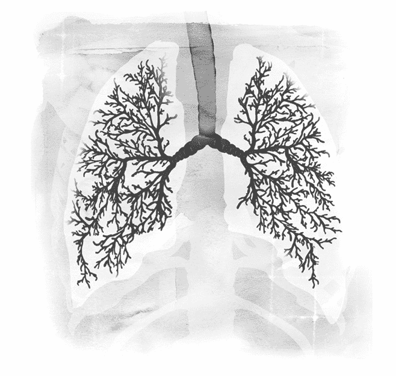

支气管是深入肺脏的主要信道，空气会从喉头进入支气管。支气管有两个分支，空气可以进入左边的支气管，也可以进入右边的。

支气管一再分叉开来，如同一棵树的树枝一样。越接近肺脏的支气管分叉得越细小，最终变成细支气管。接着，这些信道变形成微小的气囊，称为肺泡，肺泡便是空气和二氧化碳进行交换的地方。

◆肺脏

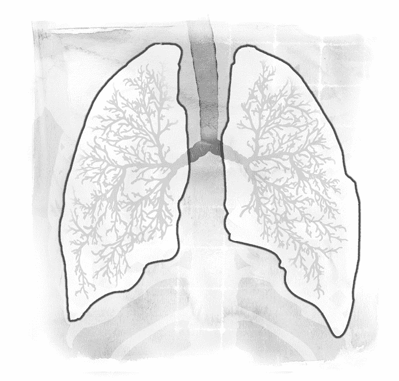

肺脏是两个具有弹性的容器，可以容纳四公升到六公升的空气，视体型大小而定。它是弹性极大、类似海绵的组织，而且里面总是含有一些空气。

由于肺脏具有超强的弹性，因此它的形状是由肋骨的结构和横膈膜的活动来决定。横膈膜和肋骨发生活动时，肺脏自然也随之改变形状。许多人不清楚肺脏的大小和位置，也不知道肺脏里面永远会留下一些空气，它从来就不会消气消到完全扁掉。

肺脏位于胸廓里面、横膈膜的上方，一片肺在左边，另一片在右边，两片肺的形状并非左右对称。事实上，人的右肺有三叶，而且比左肺稍微大一些些。左肺只有两叶，而且稍微小一点，因为它必须跟心脏共享胸腔的空间。

人体的肺脏是三維的锥形结构，肺脏下方跟横膈膜相邻。肺脏的顶部呈圆形，当它完全膨胀时，锁骨上方到接近胸廓底部的空间会被它填满，而且肺脏背面的组织比正面的组织还多。肺脏包覆在一层薄薄的组织膜里面，称为胸膜，这种组织膜同样也存在于胸腔内部。有一层薄薄的液体，发挥润滑剂的作用，让肺脏可以顺畅地活动，随着一呼一吸的动作而膨胀起来、消扁下去。

◆胸廓

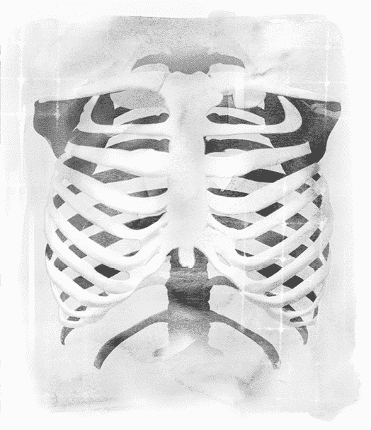

胸廓的形状有如蜂窝，它包围、保护着体内最重要的维生器官—心脏和肺脏，并且使胸部的骨架保持稳定。胸廓几乎跟所有肋骨都互相连接，为每一根肋骨提供支撑力。人体总共有二十四根肋骨，每边各十二根，连接着身体背面的嵴椎与正面的胸骨。肋骨和嵴椎是借由胸椎关节串接起来，胸椎关节的巧妙设计让它可以随着每一次呼吸而自由活动。

有了这些可滑动的关节，整个胸廓便可以自在、轻松地活动。软骨把身体正面的肋骨结合在一起，这些软骨使得胸廓具有足够的强度，同时又富有弹性，可以顺应吸进来的空气多寡而适当地活动。人体的肋骨生来就具备弹性和可活动性，因为它们必须让内部的肺脏可以活动自如。

胸骨是一根长而扁的骨头，垂立在胸腔正面的中央，大约长十五公分、宽二．五公分，呈垂直状。它分为三个部分，功能是支持大多数的肋骨，并且保护气管不受伤害。上方的七根肋骨直接与胸骨相连，接下来的三根肋骨则是借由弧形的肋软骨，附着在胸骨上。剩下的二根肋骨称为漂浮肋骨，因为它们根本没有跟胸骨连接在一起，而是“漂浮”着，附着在身体背部的嵴椎上。

当身体运作顺畅的时候，呼吸系统的肌肉和骨胳全部可以自由活动，彼此协调合作。如果身体内的肌肉过于紧绷，就会妨碍到直立、富有弹性，却又微妙平衡的骨架结构。这种肌肉紧绷会让胸腔周围的部位变得僵化，妨碍到呼吸系统天生的运作设计，使得原本毫不费力的呼吸动作变得大为吃力。

觉察练习 3

1\. 把你的手轻轻放在胸廓的不同位置。

2\. 观察自己，当你吸入空气、吐出空气时，你觉得呼吸活动在胸廓的哪个部位最为明显？

你也可以跟朋友、家人一起做这个练习，互相比较对方的结果，看看他们的感受是否跟你相同。

◆横膈膜

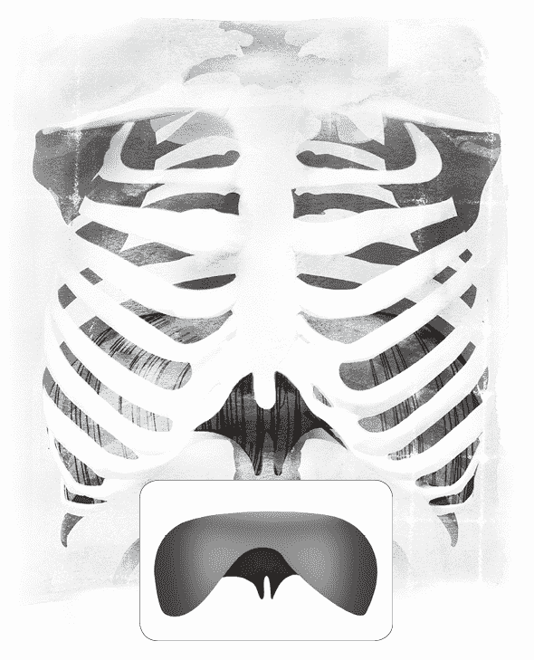

许多人以为胸部的横膈膜是控制呼吸的主要肌肉，理由是呼吸产生的身体晃动源自于身体躯干中央，而横膈膜正是位于躯干的中央。不过事实并非如此，横膈膜只是整个系统当中的一个部位而已。呼吸系统还有许多会活动的部位，因此应该一并加以考量。

当我们的呼吸方式很健康时，呼吸系统的所有肌肉会合作无间，互相协调。横膈膜的角色是接收经由膈神经传递而来的大脑讯息，启动呼吸的动作。如果我们的呼吸越来越无拘无束，协调性越来越高，横膈膜可以活动的范围也就越大。横膈膜的活动范围更大，呼吸也就更为自在，效能更好。

在所有的呼吸肌当中，就属横膈膜体积最大。它是富有弹性的肌肉，把上半身大致区分为两个部分：横膈膜以上是胸腔，容纳了心脏和肺脏；横膈膜以下是腹腔，容纳了肝脏、胃脏、肾脏、小肠、大肠、胰腺、胆囊和脾脏。

横膈肌的边缘附着在它下方的肋骨和胸骨底部，这块肌肉薄薄的，形状并不规则，位于它上方和下方的内脏器官是什么形状，它便反映出同样的形状。横膈膜经常被比拟成一片可升可降的地板，把躯干上半部和下半部的器官分隔开来，而它的活动具有按摩这些器官的作用。

横膈膜源自于腰椎的椎体。下一个练习有助于放松横膈膜，习惯性浅呼吸的人会觉得这个练习很受用。

Point｜ 　　呼吸原本是一项毫不费力的动作，可是身体的肌肉如果紧绷过度，呼吸就会吃力无比。

觉察练习 4

1\. 吐气时，用牙齿发出嘶嘶的声音。

2\. 尽可能维持嘶嘶的声音，越久越好，直到你觉得空气已经全部吐尽了，但不要过于勉强。

3\. 用力吐出最后剩余的一点空气。

这个练习有助于放松横膈膜，而且你可能发现到了，之后的几次呼吸中，你会吸入比平常更多的空气。

横膈膜的形状和活动特性经常受到误解，接下来的练习可以帮助我们了解横膈膜究竟是怎么活动的。

觉察练习 5

1\. 想像有一顶降落伞在风中飞翔，一下子飞得高，一下子飞得低。或者，想想水母在水中游泳前进的姿态。

2\. 现在，想像你身体里面的正中央也进行着相同的活动—当横膈膜鼓起来的时候，它的形状有如一座巨蛋体育场；当它下沉的时候，形状就扁掉了。

花几分钟的时间，好好觉察这个时时存在的起伏活动。有一点很重要，请务必了解：吐气时，横膈膜会往上鼓起来；吸气时，它会往下降。

横膈膜不仅是一条强韧有力的肌肉，同时它也是可活动、富有弹性的。它之所以必须富有弹性，一方面是因为它上方和下方的器官各有不同的形状，二方面是因为它必须因应肺脏体积的巨大变化。横膈膜的活动是三度空间的活动，呼应着吸气、吐气的动作，这一点很重要，请务必要了解。横膈膜的下降活动使得它在身体里面往水平方向延展开来，对腹腔施加压力，推动腹腔内的器官往下、往外移动。如此一来，横膈膜造成胸腔扩张，肺脏因而得以膨胀，让更多空气进入体内。

## 呼吸的运作方式

呼吸活动是由身体的自律神经系统所调节。脑干又称为延髓，它里面有呼吸中枢，持续不断地监控着血液内的氧气和二氧化碳浓度。这项工作不是在意识层面进行的，有个潜意识脑在帮我们控制呼吸。这些呼吸中枢的作用，在于确保血液内的氧气和二氧化碳浓度时时保持平衡状态。

如果氧气和二氧化碳的比例失衡了，大脑便会透过膈神经把讯号传给横膈膜，通知横膈膜加快呼吸的速度与深度，或是反过来把呼吸放慢，这种调节作用会让二氧化碳对氧气的浓度比例恢复正常，此时呼吸速度也就回到常态。

除此之外，肺脏和胸壁里面有许多伸展受器，持续监控着这些器官的伸展程度。万一肺脏或是胸腔周围的肌肉伸展得太多，变得过于平坦，受器就会传送讯号给呼吸中枢，以便吐出气体，把呼吸克制下来，免得对肺脏造成伤害。接着我们来看看，在吸气和吐气的时候，到底发生了哪些事情？

◆吸气

肺脏装在一个囊里面，这个囊称为“胸膜”，它具有足够的弹性，让海绵般的肺脏可以顺利膨胀、收缩。把横膈膜的运作方式重新回想一遍，你对呼吸机制的了解就会再深入一些。

吸气的时候，横膈膜收缩起来，这时候它会下降，推挤它下方的腹腔器官。胸腔的体积变化造成胸膜内部出现部分真空，此时外面的空气会立刻迅速流入体内，填补这部分的真空。同一时间，肋骨会向上、往外移动，为膨胀起来的肺脏创造更多空间。

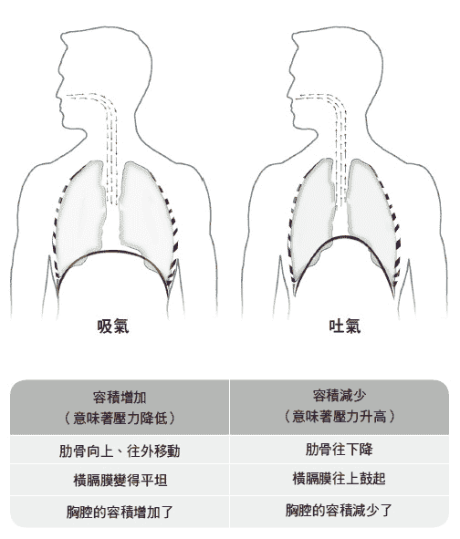

◆吐气

在呼吸的这个阶段，空气会从肺脏排出。吐气时，横膈膜会松弛下来，向上移动，造成胸腔内部的气压跟外界的气压出现差距。简而言之，这条呼吸肌改变了胸腔的体积，交替制造出低压和高压的区域，使得空气被灌入或是排出肺脏。当横膈膜随着吐气而松弛时，它的形状变得如同一座圆顶巨蛋；与此同时，肋骨也往下、往内移动，造成胸腔的形状改变，于是胸腔本身和胸膜内部的空间都缩小了。在这个阶段中，空气快速从肺脏排出，以便体内的气压跟外界的气压平衡起来。

以上所说的一切都是自动发生的，完全不劳我们费神去呼吸，这一点很重要，请务必要了解。当横膈膜、肺脏、腹腔、胸腔周围的所有肌肉全部运作得很和谐时，呼吸便可以达到最佳效能。

这个过程好比打开一个平坦的纸袋。当你一打开袋子，空气会立刻灌入刚刚被你创造出来的空间；反过来说，当你把袋子压平，空气就被挤出去了。在呼吸的过程中，我们完全不需要费任何心思去处理这件事。

人体的呼吸会根据当事人正在从事的活动而发生变化。当我们处于休息状态时，横膈膜的活动幅度是最小的，其他的呼吸肌也都如此。不过，当我们做运动的时候，横膈膜和呼吸肌的活动幅度会跟着提高，以便因应肺脏需要吸纳更多空气—动态活动的耗氧量比静态活动更大。全部的呼吸肌都必须加倍工作，帮助横膈膜往上移动，这有助于清空肺部的空气，好让新鲜的氧气赶快进来。

说起来，空气交换的过程其实并不需要费力。空气从外界被送进肺脏之后，它顺着气管往下流动，进入肺脏里面的支气管。先前曾经说过，这些管子一再分叉成细小的信道，称为细支气管。细支气管里面有成排的纤毛，那是毛发般的微小细胞，会随着呼吸而活动，帮助肺脏排出黏液。细支气管的终点是形状有如气球的微小气囊，称为肺泡。人体拥有超过三亿个肺泡，包覆在微血管所形成的网子里面，这便是氧气和二氧化碳进行交换的地方。

肺泡会随着呼吸的进行而膨胀、收缩。我们吸入的空气含有氧气，氧气在肺泡扩散开来，穿透肺泡壁和邻近的微血管，进入红血球里面。血液吸收了氧气之后，流出肺脏，接着再流向心脏。心脏的搏动把富含氧气的血液输送到全身上下，于是氧气被携带到各个器官、各个组织的每一个细胞。细胞把氧气用掉之后，会制造出二氧化碳，这是细胞氧化的副产品。血液会把二氧化碳吸收回去，送到肺脏，吐出体外。

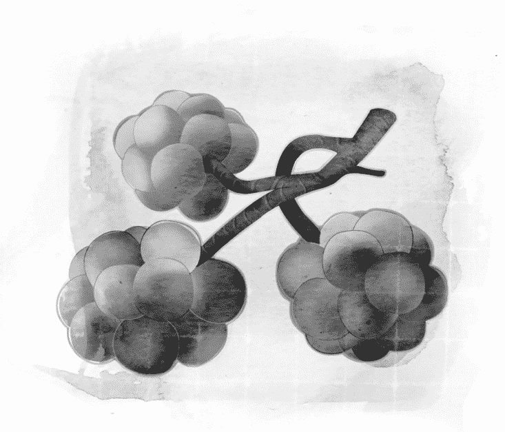

Point｜
　　身体会以自然的方式去吸气、吐气，
　　我们不应该加以妨碍。

## 呼吸是上天所赐的礼物

关于呼吸这件事，最重要的一点是：身体会以自然方式去吸气、吐气，我们不应该加以妨碍。呼吸的整个过程是天生就有的，完全不需要费一丁点力气，我们不必刻意用任何方式去吸气、吐气、吹气或憋气。事实上，连“喘”一下下都是没必要的。呼吸有时候长一些，有时候短一些—实在不必由我们去做决定。

我们唯一应该做的，便是开始觉察自己身上有哪些习惯会妨碍到呼吸，然后把那些习惯改掉。我们只需要把一件事好好放在心上：呼吸是来自生命的赐予，我们应该善纳每一口呼吸，把呼吸视为生命之能送给我们的礼物—以感恩的心，接受每一口呼吸。

# 第三章 呼吸大师

我从来没说过我发现什么全新的呼吸法，只不过，我认识到唯一而真实的方法─自然的呼吸法。

——马蒂亚斯．亚历山大

## 亚历山大的故事

在呼吸的领域里，有一位领先群伦的人物，他了解呼吸，致力于提升呼吸的艺术。这个人堪称是人中先锋，他的名字是佛德列克．马蒂亚斯．亚历山大（Frederick Matthias Alexander）。

一八〇〇年代晚期，亚历山大本人在发声和呼吸方面遇上困难，因而发展出一套和谐的呼吸法。他在数年之内，研发出一套技术，帮助人们矫正有害的呼吸方式和姿势习惯，让人们改用比较自在、广阔的方式去过生活。我们先来看看亚历山大如何克服自己的发声障碍和呼吸问题，这对于了解他的方法会很有帮助。不论以何种标准来看，他的故事实在是离奇得不得了。

一八六九年，亚历山大出生在澳洲的塔斯马尼亚省（Tasmania），属于苏格兰人和爱尔兰人的混血后代。他是个早产儿，打从出生的第一天开始，就因为呼吸问题而饱受病苦。由于健康状况不佳，他年纪很小的时候就辍学了。每到傍晚时分，当地学校的老师便一对一教他读书。年纪稍长之后，亚历山大对戏剧产生爱好，二十岁那一年，他旅行到墨尔本去，花了三个月的时间上剧院、音乐厅和艺廊。第三个月快结束时，他决心接受训练，想要成为一名演员和朗诵家。

Point｜
　　亚历山大帮助人们矫正有害的呼吸方式和姿势习惯，让人们改用比较自在、广阔的方式去过生活。

◆为声音而担忧

亚历山大留在墨尔本接受演员训练，不久便声名大噪，成为首席朗诵家。他持续努力不断，组织了个人专属的剧团，专门进行莎士比亚的单人朗诵。随着表演博得好评，亚历山大签订的合约越来越多，观众群越来越广，演出的剧院也持续增加。然而，在没有麦克风或其他辅助设备的情况下，他的声音逐渐紧缩起来。一段时间之后，他的呼吸变得明显可闻，每每表演才进行到一半，嗓子就沙哑了。

他向许多人求助，包括医生和声音训练师，他们开药方给他、教他做发声练习，可是那些方法很快就失效了，他的声音继续恶化下去，直到有一天，亚历山大几乎无法完成朗诵。他心里的担忧与日俱增，因为他认知到这个问题对他的表演生涯已经构成了威胁。

亚历山大的绝望越来越深，他再度去就医。医生重新检查他的喉咙之后，确定他的声带一直绷得太紧了，于是要他完全停止发声，休息两个星期的时间。亚历山大决心孤注一掷，在接下来的两个星期尽量少说话。当他进行下一场表演时，刚开始他高兴不已，因为他发现沙哑的情况完全消失了，他的声音听起来清亮无比，仿佛水晶一般。不过表演到一半的时候，沙哑的情况又卷土重来了，而且比之前更加糟糕。到了傍晚结束时，情况严重到他几乎发不出声音来。

隔天，他又回去看医生，跟医生报告声音沙哑的状况。医生认为自己推荐的方法有点效果，于是建议亚历山大继续照他教的方法去做。可是亚历山大拒绝了，他抗议说他完全遵照医生的指示，做了整整两个星期，可是同样的问题却在一小时之内又回来了，可见遵照医生的嘱咐根本没有持久的效果。

他向医生提出分析：如果他的声音在刚开始朗诵的时候很完美，到了表演快结束的时候却糟糕透顶，那么问题一定是出在他表演过程中所做的事情。医生仔细思考了一番，同意事情必定如他所分析的那样，于是，亚历山大请医生告诉他，造成沙哑的原因可能是什么？医生坦承他并不知道。亚历山大走出诊所之后，决心找出答案来自救。

◆自我发现

亚历山大走上自我发现之旅，这趟旅程不只让他为自己的发声和呼吸问题找到解答，最终也带领他深入了解姿势和呼吸的关系，重新获得一番认识。他终于明白，原来许多人在不知不觉之间，严重地妨碍了自己体内与生俱来的活动、协调和呼吸，当代文明的许多苦头就是由这个原因酿成的。

在当时，人们把亚历山大的发现看得太轻了，不过我们可以说，他的发现是二十世纪的伟大建树之一。你将会看到，亚历山大的故事有如一本悬疑小说，他的天才之处在于这项洞见：不知不觉之间，他自己成了引发麻烦的始作俑者。不屈不挠的他，总算发掘出事实，证明问题的症结就在他自己的身上，而且，他还找到了治疗方法。

亚历山大刚开始探究原因时，他只有两条线索可以下手：

．他表演时的朗诵动作引发出声音沙哑和呼吸困难的状况，结果导致他发不出声音。

．当他用正常的方式说话时，声音并不会出现沙哑的情况。

循着简单但合乎逻辑的步骤，亚历山大推论：如果一般的交谈不会造成他无法发声或是呼吸窘迫，而上台朗诵却会，那么当他正常说话跟上台表演的时候，一定是使用了两种不同的发声方式；只要他找出两者之间的差异，那么，或许他只要调整朗诵时的发声方式，便可以解决问题了。

他利用一面镜子来观察自己用正常声音说话的模样，以及进行朗诵表演的模样，希望能看出到底哪里不一样。他详细检视自己正常说话的样子，可是并没有看出哪里不对劲，或是有什么不自然。然而，当他开始朗诵时，他很快地注意到有几项变化：

．他倾向于把头往后拉、向下压，使出相当程度的力量，让头颅往下压迫到嵴椎。

．同时，他把喉头压低（喉头也就是喉腔，声带就位于那里）。

．此外，他开始用嘴巴吸气，因而制造出喘气的声音。

在此之前，亚历山大从来没意识到他竟然有这些习惯！当他回到正常的说话声音时，他看到同样的倾向依然存在，只不过程度轻微许多，因此先前他一直低估了这些倾向，而这也正是他正常说话时，声音不至于沙哑的原因。

突破了这一点之后，他回到镜子前面，怀着全新的热情，一次又一次的朗诵，看看能不能再找出更多线索。很快地，他又注意到，当他朗读一大段文字时，便会过度苛求自己的声音，结果造成前面所说的三种情况变得更为严重。这证实了他之前的臆测，他朗诵的方式跟声音紧缩绝对脱不了关系。

◆因与果

亚历山大遇到的第二个绊脚石是，他不确定这些残害他声音的习惯究竟是怎么来的。进一步实验之后，他发现自己呼吸时，会忍不住用嘴巴吸气，也会忍不住对喉头施加压力，不过他可以把紧绷的肌肉放松到一定的程度，以免头颅又仰起来。亚历山大继续在镜子前面进行实验，他很快又发现到，当他刻意让头颅不要往后仰，以免压迫到嵴椎时，沙哑的情况便减轻了。

他再度去看医生，医生为他检查之后表示，整体而言，他的喉咙和声带已经明显好转了。这下子，他得到肯定的证据，他朗诵的方式就是造成他失声的原因。这个发现让亚历山大深获鼓舞，他心想，要是他能改变朗诵的方式，失声的问题就迎刃而解了。

Point｜
　　亚历山大发现，他朗诵的方式跟声音紧缩绝对脱不了关系。

◆不可靠的感官觉知

亚历山大相信他终于找出问题的症结点了，他继续进行实验，看看能不能让声带的状况进一步好转。有一次，他试着让头颅不要往后仰，而是往前固定住，可是他很惊讶地发现，即便是如此，他的喉头还是被压低了，情况跟以前并没有两样。

为了解开这个谜团，他又找来两面镜子，放置在第一面镜子的左右两侧。亚历山大再度照镜子自我观察，这时他清清楚楚地看到，其实他还是把头颅往后仰，挤压到嵴椎上，而且后仰的角度甚至比以前更大。此时此刻他才发现，其实他的动作正好跟他的想法背道而驰，他把这种现象称为“错误的感官觉知”。

换句话说，如果他想要精确地知道自己到底做了什么动作，光是依靠感官的觉知是不够的。起初，他以为这是他个人的特殊癖好而已，不过后来当他开始把技巧传授给别人时，他发觉几乎人人身上都有感官觉知错误的现象。

在很短的时间内，亚历山大开始注意到一件事：把头颅往后仰、往下压的习惯不仅会对喉头施加压力，同时也会让全身上下承受到各种程度的紧绷和压力。从镜子里，他看到他自己不仅仰起头，同时也抬高胸膛、弯曲背部、把骨盆往前推、用力绷紧腿部的肌肉，甚至连脚掌都牢牢地抓住地板。一个仰头的动作，影响到他全身的姿势和平衡，也影响了他的呼吸。

亚历山大茅塞顿开！原来他腿部和脚掌的所有肌肉之所以会绷紧，跟他脖子的肌肉会绷紧的原因一样，都是源自于同一个习惯。过去几年来，用脚掌抓住地板的动作已经成为他根深蒂固的习惯，他完全没有觉察到自己竟然有这样的动作。

起初，他发现要是他试图打破这些习惯，朗诵表演就会中断，无法接续下去；而且，无论他如何努力改变朗诵方式，肌肉都会越绷越紧，结果反而更糟。亚历山大发觉自己陷入僵局：他需要知道自己的身体做出什么样的动作，可是却又不能信赖身体感官所提供的讯息，因为先前的经验已经让他学乖了，身体的动觉根本是不可靠的。

◆意识的引导

基于前面所说的种种经验，亚历山大不禁质疑：当他朗诵的时候，他的意识是如何引导身体做动作的？他领悟到，以前他并没有想过应该怎么使用身体才好，纯粹是让习惯牵着走，因为他觉得那样比较“对劲”。因此，他尝试别种策略：先在心里假想把头颅往前拉，接着实际做出把头颅往前拉的动作，以便对照两者的效果。结果他发现，仅是在心里想着头颅的方向，就足以带来改变。

虽然亚历山大已经成功一大步了，不过他发觉自己依然多多少少会把头往后仰。于是，他着手探究所有的可能因素。一段时间之后，他看到自己在开口朗诵之前，可以成功地把头颅引导到正确的方向上，可是接下来立刻又会故态复萌，把头颅往后仰，造成全身肌肉紧绷。他明白过来了，每到要朗诵的时候，他就落入“目标导向”的陷阱，结果，“动作要做对”的念头使得他脖子上的肌肉紧绷起来。对于这样的倾向，亚历山大的解释是：他过度专注在目标上，却没有顾虑到达成目标的方法。他的下一项挑战，就是想办法让自己不要那么执着于目标。

他决定把开口说话跟开口朗诵当成两回事，在这两者之间留下一些空档给自己。这个过程被他命名为“克制”（inhibition）。他利用这个片刻的空档来实行引导技巧，让自己提防头颅往后仰的老毛病，然后加以改变。他构想出一些原则和技巧，主要包括了觉察、打破有害的习惯，以及自由选择。今天我们所知道的“亚历山大技巧”，正是以这些原则和技巧为基础。透过勤奋的练习，他不只摆脱了原本危及职业生涯的不良习惯，连从小就折磨着他、一再复发的呼吸问题，也一并从此根除了。

Point｜
　　“有个演员自己把发声问题和呼吸障碍治好了！”这条新闻如同野火燎原一般，向四面八方传播开来。

◆声名逐渐传播

亚历山大回归舞台之后，许多同样从事表演活动、深感同苦的演员前来向他求助，于是他开始传授他的独门技巧。“有个演员自己把发声问题和呼吸障碍治好了！”这条新闻如同野火燎原一般，向四面八方传播开来。医生开始把一些病患转介给亚历山大，因为他治好了各种病症，名气无人不知、无人不晓。

亚历山大透过温和的手势引导和口头解说来传授他的技巧，帮助许多人改掉有害的习惯，而那些习惯正是病症的源头。起初，亚历山大的方法只用在呼吸和发声有困难的人身上，短时间之内，他就扬名天下，被奉为“呼吸大师”。很快地，医生开始把各式各样的病人交到他手上—只要是医生治不了的，通通都推给他。于是，亚历山大开始帮助那些被医学专家视为药石罔效的人。

众多医生之中，有一位是史都华．麦凯（J. W. Stewart McKay）。他看出亚历山大所做的事情大有可为，便鼓吹亚历山大前往伦敦，好让更多人认识他的技巧。一九〇四年的春天，亚历山大搭上开往伦敦的船，在同一年下船登岸。他在维多利亚街成立一个诊所，后来在伦敦中央的阿什利广场（Ashley Place）成立了另一个诊所。亚历山大在伦敦帮助了许多人，直到一九五五年十月过世。

## 今日的亚历山大技巧

时至今日，亚历山大技巧已经传遍世界各地，广为人知。全世界有三十多个国家、数以千计的亚历山大技巧老师，他们在各种健康领域以这套方法帮助人们。目前，这套技巧主要被认为用于改善姿势、消除背痛、舒缓压力，然而就改善呼吸这个层面而言，这套技巧的价值依然很高，跟一九〇〇年代相比，可说毫不逊色。

当你读到第六章的亚历山大原理时，便会明白此言不虚。事实上，当人们运用这套技巧来改善姿势、舒缓肌肉紧绷时，连呼吸也一并获得改善了，反之亦然。事实告诉我们，姿势、疼痛、压力、呼吸是息息相关的，彼此互有牵连。

# 第四章 习惯和误解

有两样东西是没有极限的，一是宇宙，二是人类的愚蠢。说到宇宙，我并没有多少把握。

——亚伯特．爱因斯坦（Albert Einstein）

## 呼吸与生活压力

人人一生下来，自然就会呼吸，而且不需要费一丁点力气。五岁以下的小孩大多能轻松地呼吸，无论是婴儿沉睡时的安稳呼吸，或是儿童因为玩游戏、发现新鲜事而激动万分的呼吸，都是轻松不费力的。仔细听听小孩的呼吸声，你会发现他们身上很少出现大人那种吃力、过度紧绷的呼吸。

在今日的世界里，我们必须面对许多强大的压力，以至于无法安心处于眼前的时刻，身心难以平静。不良的呼吸模式可能来自于多种原因，包括疾病（例如气喘），以及环境污染、工作压力、学业压力、肌肉疼痛、筋骨创伤、情绪紧绷等等。

在生活压力的逼迫之下，人活得越长久，呼吸所承受的包袱也越沉重，使得天生而来的呼吸韵律被打乱了，取而代之的，是人们为了面对生活挑战所养成的不良呼吸习惯。即使人们觉察到自己有不良的习惯，也试着去改善呼吸方式，然而，许多人接触到的呼吸建议却往往大有问题，导致人们采取新的呼吸方式之后，结果却适得其反，比从前更糟。首先，我们必须确定目标：不是要把呼吸的动作做得很正确，而是要让呼吸系统可以不受妨碍地运作（这一点前面已经提过），以便重新回归天生而来的呼吸韵律。亚历山大说：“停止错误的做法，正确的方法自然会开始运作。”就呼吸这件事情而言，此话真是再精确不过了。

## 九个对呼吸的常见误解

第三章曾经提过，亚历山大发觉到，对于姿势、呼吸、朗诵这些方面，他的许多想法其实都是有误的，他称之为“错误的感官觉知”。起初，他认为这些想法只不过是他个人的癖好而已。不过，当他开始帮助别人之后，他才明白几乎人人皆是如此。

以下列出人们对于呼吸的普遍误解，之后会针对这些误解做更进一步的探究：

．肺脏是个小小的器官，位于身体的中央。

．鼻腔里面的信道是朝上的。

．憋气可以强化呼吸肌。

．深呼吸有助于改善呼吸。

．使用辅助呼吸肌有益健康。

．腹式呼吸是正确的呼吸法。

．练习腹式呼吸可以改善呼吸的整体状况。

．呼吸时，胸膛的上半部最好不要有起伏，大部分呼吸活动应该发生在腹部才对。

．进行下一次吸气之前，最好先把肺脏的空气彻底排干净。

✘误解一：肺脏是个小小的器官，位于身体的中央

谈论肺脏的实际大小、形状、位置之前，我们可以先做做下面的练习：

觉察练习 6

把左页的图片影印下来，或是模仿这张图片画出身体的轮廓，然后根据你心里的想法，画出肺脏的形状、大小和位置。

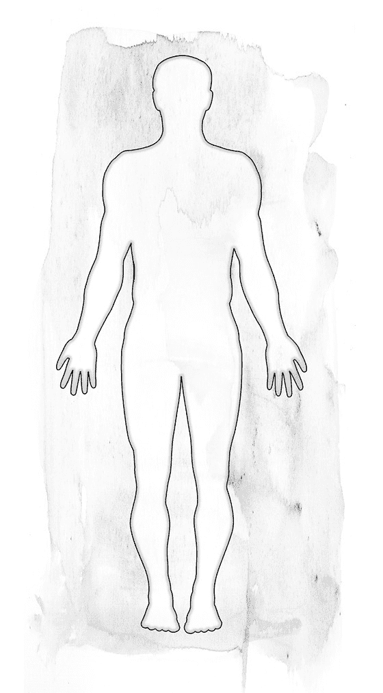

许多人对于肺脏的大小和位置缺乏正确的感知，他们所想的跟事实差距相当远。成人的肺脏大小变化很大，视性别、身高和姿势而定。

多数人身上的肺脏长度介于二十五至三十五公分之间，最宽的地方大约有十至十五公分。肺脏的形状像是切掉顶部的椭圆形，类似橄榄球的形状，不过比橄榄球小一些、窄一些，重量一般是〇．九至一．四公斤重。

在左页的 X 光片中，你可以看到两侧肺脏的实际大小和位置。你所画的图跟这张 X 光片比起来，有没有什么不同呢？

肺脏的顶部延伸到锁骨上方，当你吸气吸到饱的时候，肺脏的底部几乎会延伸到肋骨的下缘。

✘误解二：鼻腔里面的信道是朝上的

鼻腔里面的信道到底是什么样的？先来做做下面这个练习，有助于你创建正确的认知。

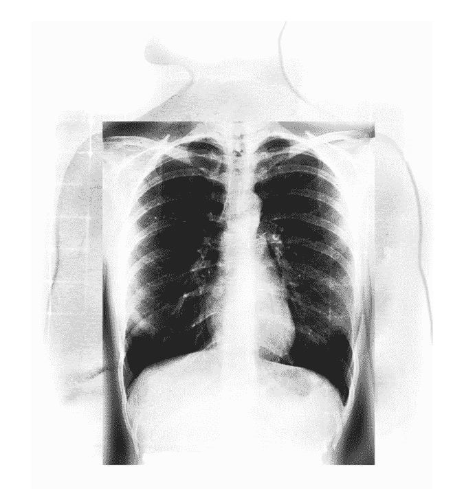

觉察练习 6 的解答

肺脏在身体内的实际大小和位置

觉察练习 7

把下面的图片影印下来，或是照着这张图片画出头部的轮廓。

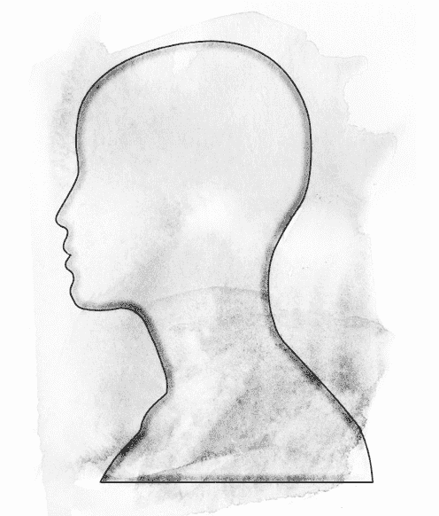

根据你的想法，空气经过鼻腔信道，而后进入气管的路线是怎么走的呢？

请在下面的图上画一道箭头，把你所认为的路线标示出来。

人们普遍认为空气进入鼻腔的路线是朝上的，事实却不是如此。其实，空气是循着水平的方向前进。现在，试试下面的练习：

觉察练习 8

1\. 一边想像空气往上进入你的鼻腔，一边呼吸。这个动作说来很简单，实际去做的时候，你有没有觉得必须费力而感到紧绷呢？

2\. 这回吸气时，想像空气经由水平路线进入你的鼻腔。有没有觉得轻松许多了呢？这种吸气的方法不会造成任何紧绷感。

翻到下一页的图片，你便会看到，鼻腔的信道大部分是水平的。

✘误解三：憋气可以强化呼吸肌

憋气是很常见的呼吸练习，这个方法源自于古代的瑜珈传统，修行人把憋气视为调和身体的步骤之一。时至今日，从游泳健将到歌手，许多人的练习项目也包括憋气在内，他们误以为这样做可以改善呼吸方式，或是增强呼吸肌。事实上，憋气会使呼吸系统变得衰弱，反而达不到强化的效果。每个人偶尔都会憋气，那是面对压力时的自然反应，看看表演者、演说者在准备过程或上台前的紧张模样，便可以明白这一点。

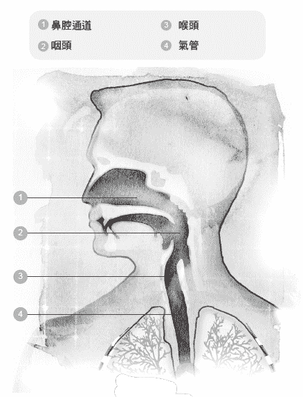

察觉练习 8 的解答

请注意看清楚，空气所走的信道，有一大段是水平的。

当我们预期会碰上令人不舒服的事情，或者突然遇上意料之外的事，就会把气憋住—下回看惊悚片或恐怖片时，留意一下你的呼吸有什么变化？一个人如果经常憋气，次数多到养成了习惯，那是有危险的，日后很可能无缘无故就开始憋住呼吸。

觉察练习 9

1\. 举起一把餐椅，然后放下来，或者，伸直你的双手去碰触高处的东西。做这些动作的同时，请留意观察你自己的呼吸。

2\. 问问你自己：“刚刚做动作的过程中，我有没有在哪个时候把呼吸憋住了？”

如果你的回答是呼吸有憋住了，那么，请把动作重做一次，看看这回能不能从头到尾都呼吸得很平缓？

憋住呼吸会让体内的二氧化碳增加。对神经系统而言，二氧化碳是一种压力来源，这一点已经获得了证实。二氧化碳也会打乱呼吸的自然韵律，让呼吸系统的肌肉紧绷起来，也会让肺脏、肋骨和横膈膜的自由活动受到束缚。如果你观察到某个人正在憋气，你就知道他面临到压力了。

觉察练习 10

1\. 到户外去走一走，让你自己尽可能呼吸得自由自在。

2\. 一两分钟之后，把呼吸憋住，走个几步。

有没有感觉到你走路的方式改变了呢？例如，步伐的距离有没有改变了？脚步有没有变得比较沉重？手臂能不能自在地摆动？

✘误解四：深呼吸有助于改善呼吸

如果你刻意把气吸得很深，你的头颅可能会被往后拉，背部也会弯曲起来，如此一来，胸腔和胸廓的肌肉全被绷紧了。这样做非但没有好处，反而妨碍了肋骨、肺脏和横膈膜的自然活动。毫无疑问地，肌肉过度紧绷绝对是自然呼吸的大敌，会破坏呼吸的和谐性。无论你刻意用什么方式去改善呼吸，结果可能都会适得其反。

试着做下面的练习，你便能亲自体验出来，如果你想要自由自在地呼吸，过度紧绷是一无是处的。

觉察练习 11

1\. 把你的注意力放在胸廓周围的区域，包括胸廓的正面和背面。

2\. 接下来，做四到五次深呼吸。

有没有注意到什么呢？当你做这个练习时，有没有察觉到身上出现一股紧绷感？

你可能感受到胸腔和肋骨的活动增加了，问题是，你并没有因此而感到舒适、自在。如果有人做呼吸练习的方式是按照一定的规律去深呼吸，这无异是在自找麻烦，因为这么做，他们所使用的肌肉会越绷越紧，结果反而造成呼吸被限制住，让事情比原先更糟糕。

✘误解五：使用辅助呼吸肌有益健康

当呼吸系统是以天生自然的方式运作时，身体一点也不会感到费力，肺脏自会安静地充气、排气，根本不劳你动念去呼吸。然而，明明没必要，却刻意使用肌肉去呼吸的人，会把自己身上天生而来的呼吸活动破坏掉。他们认为，为了让足够的空气进入肺部，应该要用力呼吸才对。其实，这些人是在过度操用辅助呼吸肌，只不过这样的做法让他们感觉自己呼吸得比较深而已。

辅助肌主要分布于胸腔、脖子和肩膀，包括下面几种肌肉在内：

．斜角肌：作用是抬起最上方的两根肋骨。

．胸锁乳突肌：作用是抬起胸骨。

．斜方肌：作用是借由提起肩膀与肩胛骨而抬起胸廓。

．鼻翼：作用是张开鼻孔。

过度操用辅助肌的害处跟深度呼吸的害处非常相似。虽然我们可以过度操用这些肌肉来吸气、吐气，不过这种做法的唯一效果是促使人们养成浅呼吸的习惯。用这种方法呼吸的人，当横膈膜下降的时候，他们倾向于把胸腔往上抬；当横膈膜上升的时候，他们却把身体往下拉。这种呼吸法有时称为“反常呼吸”，因为它跟自然呼吸的运作方式恰好相反，会危害健康。

第二章曾经谈过，吸气的时候，横膈膜会下降，使肺脏内部呈现真空状态，让氧气进入，填满肺脏；吐气的时候，横膈膜会上升，形状有如一座圆顶体育场，把空气从肺脏压缩出去。接下来的练习可以帮助你厘清你的呼吸是正常或反常的。

觉察练习 12

1\. 在吐气的同时，把身体坐到椅子上。

2\. 在吸气的同时，把胸腔抬起来。

上面的做法让你感觉很正常吗？如果是的话，你的呼吸很可能就是反常呼吸。或者，你觉得上面的做法并没有改善你的呼吸，反而造成干扰了？

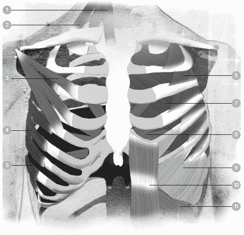

1 胸锁乳突肌　　5 横膈膜　　　　9 外斜肌

2 斜角肌　　　　6 肋间外肌　　　10 腹直肌

3 胸小肌　　　　7 肋间内肌　　　11 内斜肌

4 前锯肌　　　　8 胸横肌

觉察练习 13

1\. 现在，试试相反的做法。当你吐气的时候，一边想像横膈膜的圆顶在你的胸廓里面往上顶。也就是说，你的身体随着吐气的动作而伸长了。

2\. 当你吸气的时候，一边想像横膈膜往下沉，在胸廓里面变得平坦了。

你能感觉出“觉察练习 12”和“觉察练习 13”之间的差别吗？我建议大家尽量多多实行“觉察练习 13”的做法，因为这是改善呼吸的重要一步。

✘误解六：腹式呼吸是正确的呼吸法

另一个常见的迷思，是认为腹式呼吸可以改善呼吸。这种见解有个主要弊病，它倾向于把一、两种肌肉孤立起来，付出的代价却是赔上许多其他的肌肉。

在所有呼吸肌当中，横膈膜虽然身居要角，不过横膈膜无法单独发挥功效。唯有整个系统的所有环节同时和谐运作，呼吸效能才能发挥到极致。呼吸所涉及的不只是横膈膜、肺脏或是腹部而已，整个躯干内部、周边的所有肌肉和呼吸零件也都参与其中。事实上，胸廓内部和胸骨下方都有肌肉，称为胸横肌，这也是呼吸会使用到的肌肉。

若要全面性地认识呼吸，便不能只考量某个部位，那是无益的，因为良好的呼吸牵涉到全身上下的整体协调性。看看婴儿熟睡的模样，你会发现婴儿的全身都跟着呼吸在活动。

✘误解七：习腹式呼吸可以改善呼吸的整体状况

许多人相信呼吸主要是发生在腹腔里面，但是这种想法并不正确。腹部的确会随着呼吸而活动，不过腹腔里面根本找不到肺脏或是横膈膜，如果能认清这一点，将会很有帮助。

许多人（包括医疗人员、发声教师、瑜珈老师和健身专家）会鼓励人们一边呼吸一边用力绷紧腹部肌肉。有一种教法是这样的：练习腹式呼吸时，在你的胃部上面放一本大部头的书，让书跟着你的呼吸上下起伏。之所以有这种错误的教导，是因为指导者认为“用腹部呼吸”可以让人呼吸得更饱满、更深沉。不过，这种观念实在错得离谱！

这正是一个好例子，说明人们为了改掉旧有的不良习惯，却造就出另一个不良习惯，而且情况反而比原来更糟。呼吸的时候，如果使力把胃部往外推或往内缩，活动的幅度势必会变大，不过代价却是身上的许多其他肌肉被绷得太紧了。惯于操用腹部肌肉来呼吸的人，会把压力施加到体内的所有器官上，引发肌肉骨胳系统被过度拉紧，甚至崩溃，后续问题会随之而来，导致身体在各方面出现毛病。

觉察练习 14

．平躺在地板上。

．每次呼吸的时候，试着把你的腹部往内缩，再往外推，持续做一分钟的时间。

有没有感觉到你的全身弥漫着一股紧绷感？

✘误解八：呼吸时，胸膛的上半部最好不要有起伏，大部分呼吸活动应该发生在腹部才对

呼吸即是生命，生命即是活动。我们全身的骨胳和肌肉都必须能活动自如，以便回应呼吸的动作。当身体的某个部位正在做动作，却硬要其他部位静止不动的话，对呼吸同样也会构成妨碍。事实上，要求身体静止不动会缩减肺脏的容量，降低身体吸气、吐气的能力，同时也会造成肌肉绷紧，使得身体的姿势受到影响，进而导致疼痛。

到底应该用身体的哪个部位去呼吸才对呢？要用多大的力气去呼吸才好呢？其实，你大可不必为了这些问题而伤脑筋。你真正应该做的事情只有一件，那就是不要去牵挂呼吸这回事，让呼吸自然地来、自然地去。

第七章的觉察练习会帮助你把这一点做得恰到好处，不过，现在先把脑袋放空，忘掉种种关于呼吸的想法，不必去操烦空气应该进入身体的哪个部位才对，也不必操烦哪里应该要起伏、起伏的幅度又应该多大才好。你的身体和潜意识天生就知道该怎么呼吸，无论你身处何时何地，事实都是如此。

把你的上半身想像成一个用来呼吸的三維容器，容器的正面和背面同样都有活动，而且活动的幅度一样多（实际上，肋骨后方的肺脏组织多一些，肋骨前方的肺脏组织少一些）。肺脏位于躯干背部往上延伸到肩膀的区域。当你呼吸的时候，胸廓的整个区域都会产生活动。实际发生的状况是，由于肋骨和横膈膜扩张开来，造成胸腔内部的空间变大，于是空气被吸入。由此可知，呼吸活动是发生于肺脏膨胀、收缩的地方，这是非常合理的。如果刻意要身体的其他部位在呼吸时产生活动，那就说不过去了。

还记得吗？亚历山大为了表演朗诵，刻意做了许多努力。后来他领悟到，为了克服身上的习惯，他必须把种种没必要的做法全都抛弃才行。当他上台朗诵的时候，为了提防老习惯又开始作怪，他的注意力必须兼顾全身上下的每个地方，而不能只注意特定的某些部位。

他一再地学习、摸索，找出让头颅跟身体达成平衡的新方法，这对他而言绝对是必要的，因为唯有如此，他的脖子、胸部和肩膀才能放松下来。这种全新的平衡状态，甚至影响到他的双腿和脚掌，一旦他的身体运作达到和谐统一的状态，他的毛病便立即消失了。

Point｜
　　把脑袋放空，忘掉种种关于呼吸的想法。

✘误解九：进行下一次吸气之前，最好先把肺脏的空气彻底排干净

事实上，你绝对不想、也绝对做不到把肺脏彻底排空。在任何时候，肺脏内部都需要保有一些空气，以免完全塌掉。为了这个目的，肺脏里面必须随时维持最低限度的气压。

除了维持最小限度的体积之外，肺脏里面随时都在进行呼吸。企图彻底排空肺脏的做法是有害健康的，因为这会导致身体往内凹陷，进而妨碍到头颅、脖子和背部之间的联系。有心改善呼吸的人，真正应该做的事情是让吐气自然地结束，而不要吐气到身体紧绷起来。刻意用力吐气，以便把肺脏残存的一丝空气挤出去的做法，绝对是没有必要的。没有人存心想妨碍呼吸的自然韵律，让下一口空气难以进入身体里面。

要改善呼吸，使呼吸回归到自然的韵律，第一个步骤就是，无论你过去学到多少有关呼吸的见解，现在请一律抛到脑后去，并且，请好好接受一件事：良好的呼吸法是非常单纯的，远远超乎你的想像。

Point｜ 　　良好的呼吸牵涉到全身上下的整体协调性。

# 第五章 呼吸问题与疾病

停止错误的做法，正确的方法自然会开始运作。

——马蒂亚斯．亚历山大

## 现代人的呼吸方式

无论在世界上的哪个地方，呼吸失调都是疾病的主因之一。单以气喘来说，罹患的人口有二亿三千五百万之多—这个数字还在持续攀升中。肺病和呼吸失调的原因复杂无比，许多事情都可能引发疾病，包括灰尘、污染、对动物的毛过敏等等。

在许多案例中，无论致病的原因是什么，改进呼吸方式都能对病情带来相当程度的助益。即使是没被医生诊断出呼吸疾病的人，也可能因为姿势习惯不良而呼吸效能低落，导致日后在呼吸方面出现问题。

在现代社会中，只有极少数人是以自然的方式在呼吸—太多人忙得不可开交，生活犹如一场旋风，整天东奔西跑；有时身体虽然没在动，手上的工作却仍旧赶个不停，例如忙于使用电脑。“疾速时代”的生活压力使得人们养成呼吸不良的习惯，究其原因，当我们感受到时间的催逼时，呼吸几乎都会变快、变浅，然而这对身体并非好事。事实上，翻腾在我们脑海里的事情会对呼吸产生影响。当我们心中感到害怕时，呼吸和心跳会加速；如果我们突然吃了一惊，或是在路上捡到某样奇怪的东西，呼吸往往会不自觉地憋起来。

这一代的人要处理的日常事务很繁杂，比起祖父母的那一代绝对大有过之，结果就是呼吸深受其害。现代人所面临的生活刺激以各式各样的面貌呈现出来，包括智慧型手机、平板电脑、电视、电子邮件、庞大的车流量、逼人太甚的工作期限等等。这些生活刺激有如炮弹一般，每天不断向我们轰炸而来，无疑对我们的呼吸带来了巨大的影响。

日常的姿势、行走步调也是影响呼吸方式的主因。人们站立、坐下、走路的方式可能造成肌肉过度拉紧，但那些紧绷其实毫无必要。一个人如果习惯于绷紧肌肉，时日一久，注定会养成不良的呼吸方式，使得呼吸的自然反射受到妨碍。在学校接受教育的一、二十年当中，学生们弯腰驼背地坐在书桌前面学习，到了毕业离校之日，呼吸方式没产生恶性变化的人实在少之又少—然后我们更换地点，继续弯腰驼背，坐在电脑前面。

姿势不良可能使身体畸形到某种程度，导致胸腔窄缩，因而拘束到肋骨和肺脏的活动空间。容纳呼吸器官的空间不足时，人体会被迫采取比较短浅的呼吸，用力去吸取身体需要的空气。

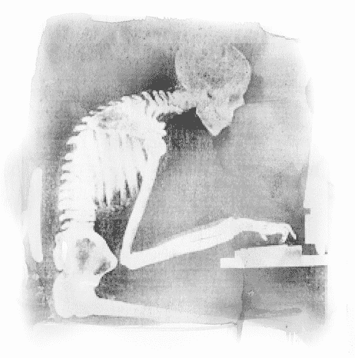

久而久之，这种呼吸方式会形成习惯，让当事人觉得十分正常。对呼吸而言，身体姿势是个无比重要的因素，这一点会在第十章细谈。

时至今日，许多人的呼吸习惯是不良的，可是没几个人自觉在呼吸方面出了毛病。只要改变目前的呼吸方式，便可以为自己的将来节省许多时间和麻烦。

Point｜
　　当我们感受到时间的催逼时，呼吸几乎都会变快、变浅，然而这对身体并非好事。

## 呼吸失调

肺脏的疾病可区分为许多种，它们的症状往往很类似，不过严重程度和持续时间则视疾病的种类而定。这些疾病可能是急性的（出现时间短，可是病情相当严重），也可能是慢性的（症状持续拖延多年）。慢性肺病的例子有气喘、肺气肿、支气管炎，病情的严重程度不一而足，可是一旦肺部发生感染，病情便可能明显地急转直下。

罹患肺病的人可能出现不同的症状，有些人的病情很轻微，有些人看不出有什么症状。如果是外表上看不出疾病的征兆，很可能要拖到进行健康检查、胸腔 X 光摄影、肺功能检测时，才会发现罹患了肺病。呼吸不良的早期症候群包括：

．每分钟的呼吸次数太多

．嘴巴周围和指甲看起来呈青白色

．吸气或吐气的声音过大

．脖子底部衔接胸腔的地方随着呼吸而凹陷

．呼吸短促

．咳嗽

．流汗量增加

．喘个不停

．肋骨或胸骨缺乏活动

医疗专家可能把呼吸失调区分为两大类：阻塞性肺病和限制性肺病。

◆阻塞性肺病

阻塞性肺病的症状让患者很难吐出适量的空气，这类疾病的特点是长期呼吸不顺畅，而不顺畅的原因在于呼吸受到“阻碍”，并且阻碍的程度随着时间而日渐严重。就是这种阻碍，导致患者无法轻松自在地呼吸空气。这类肺病经常被称为“慢性阻塞性肺病”（chronic obstructive pulmonary disease, COPD，又称为 chronic obstructive lung disease, COLD），或是“慢性阻塞性呼吸道疾病”（chronic obstructive airway disease, COAD）。

“慢性阻塞性肺病”的患者之所以呼吸短促，是因为他们无法充分把空气从肺部排出去。呼吸气流不顺畅的原因是肺脏受损，或是肺脏内的呼吸道太过狭窄，因而造成他们呼出气流的速度比正常人慢得多。这类患者做完吐气的动作之后，肺里面还留着异常大量的空气，于是他们很难再吸入空气。

“阻塞性肺病”会让呼吸成为一件苦差事，当患者的活动量或劳动量增加时，情况更是雪上加霜。简单地说，患者还来不及把所有空气吐出去，马上又必须吸入下一口空气了。在美国和欧洲国家，“阻塞性肺病”是常见死因的第三名，前两名是癌症和心脏病。这类疾病虽然可以治疗，但目前还没有完全根治的方法。

“阻塞性肺病”最常见的例子包括：

．气喘

．肺气肿

．慢性支气管炎

．支气管扩张

．囊状纤维化

❍气喘

气喘是发炎性的肺病，特征是呼吸短促、胸口很紧、喘息或咳嗽，而且发生咳嗽的时间往往是半夜或清晨。气喘之所以被归类为“阻塞性肺病”，原因在于它是因为呼吸道窄化而引起的。当气喘发作时，呼吸道窄化的情况会变本加厉。虽然气喘被视为慢性疾病，而且无法完全根治，不过气喘的症状可以被控制住，而且往往可以早做防范。

引发气喘发作的环境条件很多，因人而异。许多气喘患者是在感冒之后，或是感染病毒之后，才开始出现症状，原因是感冒和病毒造成呼吸道被阻塞起来了。最广为人知的气喘触因是环境污染物，例如尘螨、灰尘、花粉、宠物、发霉、烟雾、化学清洁剂、油漆等等。特定食物也可能引发气喘症状，例如贝类、加工食品、酒类。此外，寒冷的空气、受到污染的空气也可能诱发气喘。

气喘的患者涵盖各年龄层，不过多数患者早在童年时期就开始发作了。在美国境内，已确诊的气喘患者超过二千五百万人，其中儿童占了大约七百万人，每年因为气喘发作而紧急送医的人数高达二百人。英国的情况也好不到哪里去，每天有三人因为气喘发作而离世，目前正在接受气喘治疗的儿童和成人各有一千零一十万、四百三十万之多，这个数字令人难以置信！

气喘的症状和影响层面非常广泛。在儿童身上，造成气喘勐烈发作的最大主因是感染，例如普通的感冒。许多患者是在激烈运动的情况下出现气喘症状，例如跑步，或是进行极限运动。如果是在冰冷的水里进行激烈运动，情况尤其不妙，一旦呼吸道周围的肌肉缩紧起来，气喘就发作了。有些人是因为暴露在过敏原之中而喘个不停，过敏原可能是草地，也可能是动物。情绪上或心理上的压力也可能引发气喘。

医生用来治疗气喘患者的处方可以列成一长串，从急救性喷雾剂到类固醇都包括在内，可是这些处方只能缓解症状，无法将气喘连根拔除。有些人的气喘症状很轻微，会自动痊愈，或是接受轻度治疗之后便可以完全根治，不过一般而言，发炎的状况会一直存在，患者很容易因为接触到诱发物而再度发作。

当气喘发作时，人们的反应往往是恐惧不已。许多人一谈起发作当时的状况，就会描述他们心里有多么害怕，有些人甚至觉得自己发作到快要没命了。恐惧本身可能让事情雪上加霜，造成肌肉绷得更紧。然而，在正确的药物治疗和正确的条件之下，患者可以采取一些步骤来控制恐惧感—如今，大部分的气喘发作是能够治疗的。

远离触发物当然很重要，除此之外，培养良好的呼吸习惯，以便二十四小时改善肺脏的功能，也同样非常重要。一旦气喘得到妥善的控制，药物的用量就可以大幅减少。过去二十五年来，我把亚历山大技巧传授给许多气喘患者，他们学会这个改善呼吸的新方法之后，无一例外，每个人使用“泛得林定量喷雾剂”（Ventolin inhaler）的次数都明显减少了。第七章的“觉察练习 23”名为“啊的轻语”，对于深受气喘所苦的患者来说，这个技巧确实很有帮助。

❍肺气肿

肺气肿的病因是肺脏内的气泡受损了，它们失去弹性，造成进入肺脏的空气量不足。家族有肺气肿病史、童年曾经罹患过呼吸道疾病、抽烟、定期暴露于污染物（例如职业场所的污染物）等因素，都会提高罹患肺气肿的风险。从历史资料看来，被诊断有肺气肿的男性比女性多，不过从近期的数据来看，女性罹患这个疾病的比例有逐年增加的趋势。

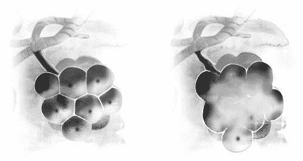

❍慢性支气管炎

支气管炎是指支气管发炎了，而支气管是空气进入肺脏的信道。支气管炎会引发咳嗽、呼吸短促、喘息和胸口紧绷。它又可以分为两个类别：急性支气管炎和慢性支气管炎。

在慢性支气管炎患者的身上，支气管发炎的地方会产生大量黏液，结果是引发咳嗽，而且造成空气难以进出肺脏。

香烟是支气管炎最常见的病因，不光是抽烟者本人会受害，连被迫吸入二手烟的人也难逃其害。长时间吸入其他烟雾、灰尘的人，也可能罹患慢性支气管炎。尽管就医治疗有助于减缓症状，可是慢性支气管炎是一种长期性的疾病，会不断复发，几乎无法彻底痊愈。

❍支气管扩张

支气管扩张是另一种需要加以治疗的疾病，这种疾病是为了排除黏液而造成呼吸道受损。

当灰尘、细菌和其他微小的分子被吸入呼吸道时，黏液有助于清除这些东西，将它们排出呼吸道。不过，在支气管扩张患者的身上，他们的呼吸道逐渐丧失排除黏液的能力，于是黏液越积越多，成为细菌滋生的温床，使得肺部反复遭到感染。每感染一次，呼吸道就受损得更厉害；久而久之，空气要进出肺脏就越来越困难了。

❍囊状纤维化

囊状纤维化是一种遗传性疾病，问题出在产生黏液的腺体上。肺脏和鼻腔里面有成排的细胞负责制造黏液。在正常的情况下，黏液是滑腻的液态物质，作用是维持肺脏内膜的湿润，防止肺脏干掉或是遭到感染。不过，在囊状纤维化的患者身上，黏液变得又厚又黏，堆积在肺脏里面，结果空气无法顺利进出呼吸道。如同支气管扩张的病症一样，堆积的黏液成了细菌滋生的温床，一再导致肺脏受到严重的感染。时日一久，肺脏就严重受损。

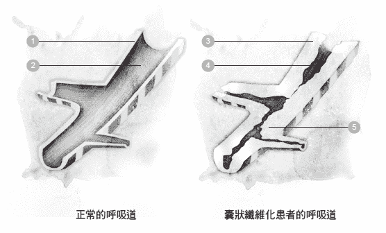

1 呼吸道内壁　　　　3 又厚又黏的黏液阻　　5 细菌感染
 塞了呼吸道

2 呼吸道内膜有薄薄　4 黏液内的血液
的一层黏液

❍抽烟

在世界各地，抽烟是导致疾病和死亡的主因之一，然而这类疾病和死亡其实是可以预先防范的。在阻塞性肺病的病例中，80％至 90％是因为患者抽烟而直接致病的；至于肺癌，90％的患者是因为抽烟而直接致死。

瘾君子的肺脏会随着抽烟时间拉长而功能越来越差。前面介绍到数种阻塞性肺病，不论是罹患哪一种阻塞性肺病，患者有两类典型，一类是年纪很轻就开始抽烟，另一类是烟瘾很大。随着阻塞性肺病的症状越来越糟，患者的呼吸会越来越困难，即便只是进行日常活动，他们也会感到筋疲力竭，于是他们的活动量逐渐降低。到了病情严重的时候，患者可说是名符其实的形容枯藁，因为他们连吃个饭、喝个水都要耗尽全力。

用浅白的话来说，抽烟会破坏肺脏的弹性。暴露于香烟和其他环境毒物是导致阻塞性肺病的主因，只要减少抽烟量，就可以把症状控制住，轻松改善呼吸道的健康；如果能够彻底戒烟的话，那就更好了。此外，避免吸入二手烟和其他空气毒素也同样重要，而运动、干净的空气、健康的饮食对病情都能带来益处。

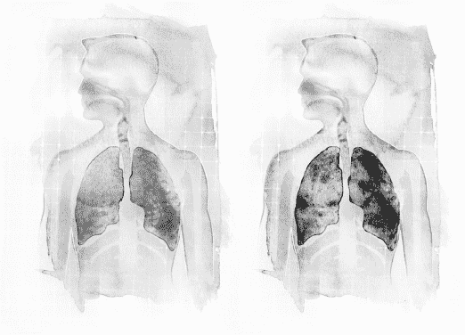

◆限制性肺病

限制性肺病是指患者的肺脏无法完全填满空气。从字面上来说，意思是肺脏受到限制了，无法完全膨胀起来，而造成肺脏受限的原因可能来自于体内，也可能来自于体外。在多数情况下，限制性肺病的成因是肺脏本身产生硬化。

除此之外，肺脏有伤疤、胸壁硬化、肌肉衰弱、神经受损等，也都可能造成肺脏的膨胀功能受到限制。再者，跟身体姿势有关的毛病，例如嵴椎侧弯、胸廓内部或周围的肌肉过度紧绷，也会造成吸气的功能受到限制。

❍睡眠呼吸中止症

睡眠呼吸中止症是医疗上常见的症状，这个疾病的本质可能是阻塞性的，也可能是限制性的。患者熟睡时，呼吸会暂时停止一、两次，或是呼吸得非常浅。每个患者暂时呼吸的时间有很大的差异，有人可能只是中断数秒钟，有人可能中断一分钟以上，之后又重新启动呼吸的动作。

睡眠呼吸中止症发作时，前后往往大约持续十秒钟，而且当患者恢复呼吸的时候，通常会倒抽一口气，或是伴有打呼的现象。一整晚下来，上述的情况可能反复发生很多次。打呼最初只是个恼人的习惯，后来却演变成主要的健康问题。在美国，苦于睡眠呼吸中止症的成人有一千八百万之多，在英国则有三百万人。

睡眠呼吸中止症往往是慢性的病症，患者的睡眠模式会因此而被打断。呼吸中断或是呼吸变浅时，身体会退出深度睡眠的状态，进入浅眠状态，结果就是睡眠的品质很差，害得患者一整天都精神不足，专注力也受到影响。对于汽车驾驶人而言，这是非常危险的事。

睡眠呼吸中止症的标准治疗法称为 CPAP（持续正压呼吸器，continuous positive airway pressure）：用一根管子把面罩连接到空气帮浦上面，由帮浦把空气从鼻孔和嘴巴灌入上呼吸道。许多患者觉得这个装置既怪异又笨重，因此弃置不用，于是老毛病又复发了。

其他的疗法包括开刀，切除呼吸道里面的多余组织，以及一种用来保持呼吸道打开的口腔装置。然而，以上的疗法都没有真正解决潜在的问题—真正的首要之务，应该是试着改进身体的姿势和呼吸习惯才对。

◆污染

要解决肺脏功能不良的问题，光是考虑遗传、抽烟的因素还不够全面。对于遍布世界各地、涵盖各年龄层的患者来说，他们所承受的巨大痛苦，有一大部分要归咎于居家环境和就业场所，他们被迫生活在受到污染的环境中。

◆自救之道

许多肺病是日积月累而成的，如果放任不加治疗，病情就会越来越糟。本书所介绍的技巧和程序，有助于舒缓气喘、慢性支气管炎、睡眠呼吸中止症、肺气肿这些疾病的症状。

对于那些被确诊为特定呼吸道疾病的患者来说，只要把身体的姿势和呼吸方法加以改变，症状便可能大有起色。亚历山大本人生来就有呼吸问题，但是他成功帮助自己脱离病苦的煎熬。他的故事证明了一件事：只要把深藏在肌肉里面、毫无必要的紧绷感持续释放掉，我们便可以学会使用全然不同—而且大有益处—的方法来呼吸。

无论你的呼吸问题是属于哪一类，本书所介绍的觉察练习都是有益的，这些练习能帮助你用效率更好的方式来呼吸，持之以恒的话，便能防范未来发生呼吸方面的毛病。

# 第六章 认识自然呼吸的原理

呼吸即是生命。生命能有多长，就看呼吸吐纳的容量有多大。

——马蒂亚斯．亚历山大

## 亚历山大原理

亚历山大拿自己做实验的那段期间，发现到好几项原理。当他把那些原理加以运用之后，他平时的姿势改善了，再接下来，连他的呼吸也跟着改善了。也就是说，如果我们同样也实行这些原理，我们呼吸的方式将会发生戏剧性的转变，全身的姿势和健康都会得到改善。

或许现在正是深入了解亚历山大原理的好时机，因为这些原理有助于改善呼吸，让呼吸达成和谐。自然呼吸的原理包括：

．克制（Inhibition）

．意向引导（Directions）

．身心合一（Psycho-physical unity）

．错误的感官觉知（Faulty sensory awareness）

．身体基础控制（Primary control）

．习惯的力量（Force of habit）

❍克制

克制是亚历山大技巧的根本原理之一，它的含意相当单纯，就是自愿性选择的反面，也就是说，当我们的身体出现自动化反应，亦即老习惯故态复萌时，立刻把习惯打住，不要被习惯牵着走。

佛洛伊德在他的心理分析著作里面使用“克制”（或“抑制”）一词，从那时候开始，这个词汇就普遍用来描述一个人强行把行为或情绪压抑下去。不过，亚历山大所说的“克制”无关于情绪压抑，单纯只是停住片刻，以便思考接下来如何用最好的方式，把身体要做的动作做出来，包括呼吸的动作在内。

亚历山大很清楚，为了让他自己的呼吸改变到合意的地步，首先，他必须把以前的呼吸习惯克制下来，或者说阻挡下来。许多人吸入空气的动作过于急躁，结果往往造成胸腔和胸廓周围的肌肉紧绷起来。如果吸气之前可以停住片刻，便能够为自己创造出一点时间空档，并利用这个片刻的空档把无用而有害的肌肉张力释放掉，接下来，便可以使用最适当、效能最好的方法来呼吸了。亚历山大深信，一个人只要把有害的习惯阻挡下来，呼吸自然能趋于好转。

觉察练习 15

1\. 找个舒适的地方坐下来，或是躺平。

2\. 把注意力放在呼吸上，感受空气从鼻子进入你的身体，而后离开身体。运用你的觉察力，亦步亦趋地跟着呼吸进到肺脏里面。

3\. 呼吸过五、六次之后，在下一次吐气快要吐完之前，暂时停住一、二秒钟。

你应该注意到了，接下来你吸气的过程变得比较平静、比较省力了。也许这个练习你需要重复做个几次，才能真正感受到呼吸变得比以前祥和多了。

❍意向引导

亚历山大有个习惯，他会把头颅往后拉，压迫着嵴椎。当他试图打破这个习惯时，他发现无论他怎么做，结果都反而更糟糕。最后他终于明白，要把这个习惯阻挡下来，唯一有用的方法就是“假想”他把头颅往上抬、往前拉。这个原理同样也可以运用在呼吸上：如果你刻意“做出”某些动作来改变呼吸，体内自然呼吸的运作机制反而会受到妨碍。

亚历山大设计出一系列的程序，他称之为“意向引导”。首先，在心里把口头或视觉上的讲解思考一遍，然后将讲解的内容投射到身体上，特别是投射到那些长期被误用、老是绷紧的肌肉上。例如，有些人呼吸时胸廓不怎么活动，那么他们就需要在吸气的当下，想像胸廓以三度空间的方式膨胀起来了，这对他们会相当有帮助。

有个重点务必要明白：整个程序的核心，在于如何做出“意向引导”。为了把引导做得正确无误，最好能去上一些亚历山大课程，你将会获益良多。我们想获得的目标是高品质的肌肉张力，可是如果你不曾体验过何谓高品质的肌肉张力，其实很难把引导做得恰到好处，唯有完全合格的老师才有能力教导你。在下一章，你将会读到一些有助于改善呼吸的特定引导。

觉察练习 16

1\. 找个舒适的地方坐下来，或是躺平。

2\. 先以正常的方式呼吸一分钟，之后，在接下来的一分钟之内，当你吸气时，想像你的胸腔往四面八方膨胀开来；吐气时，想像你的胸腔缩小了。

请务必确认，你只是在心里进行引导而已，千万不要做出实际的动作去“帮忙”胸腔膨胀。引导胸腔膨胀有助于在胸腔内部创造出更大的空间，如此便能帮助你以自然而和谐的方式来呼吸。

❍身心合一

呼吸能达到自然和谐的第三项原理，在于呼吸系统与全身上下的所有系统是互有关连、密不可分的。

肌肉系统带给呼吸的影响可能是正面的，也可能是负面的。如果不考虑呼吸系统的整体运作，只单独使用某一条呼吸肌，那么危害将会很大。为了健康着想，我们必须全盘考量呼吸机制跟体内的其他机制是否运作得很和谐，以及，人的思考方式与感觉方式，生来就是跟呼吸机制合而为一的。

换句话说，人的心理、情绪、肉体是同一个主体的不同面向，它们彼此之间会互相呼应，和谐共存。例如，当我们看到紧急事件，情绪会慌张起来，身体的反应则是憋住呼吸；当我们获得愉快的经验时，思考会比较平静，情绪会镇定下来，呼吸也会立刻轻松许多。简而言之，无论是就内在本质或是就外在条件而言，我们的呼吸跟我们的一切作为、思考、感受，全部是息息相关的。

觉察练习 17

1\. 在床上躺下来，专注感受你自己的呼吸，时间大约是五分钟。

2\. 好好观察一番，当你呼吸的时候，全身上下有多少地方会随着呼吸而活动呢？

你有没有感觉到胸腔、肋骨、腹部在活动？有没有感觉到肩膀、手臂和双腿也有轻微的活动？

你对于自己的呼吸更有觉察力时，你同样会觉察出来，你的心理和情绪也更加平稳祥和了。

❍错误的感官觉知

错误的感官觉知是呼吸不协调的主因之一。第四章曾经提过，许多人误以为肺脏是小小的器官，但其实它的体积并不小；此外，搞不清肺脏位于身体何处的人也不在少数。为了让我们自身产生必要的转变，使用比较有效益的新方法来呼吸，我们必须做的，往往正是那件令人感觉不太对劲的事情。亚历山大曾经说：

在人们认为应当去做的种种事情当中，正确的事情往往被拖延到最后才做，因为人们失算了，他们没料到那样的做法竟然才是正确的。

人人都想做得正确无误，可是没有人停下脚步来想一想，他们心目中以为正确的那些做法，果真是对的吗？一个人的想法若是有误，即使原本是对的事情，在他眼中看来，也会变成是错的了。

由此可知，这个问题其实相当复杂。人类天生就会使用自己觉得很正确的方法来呼吸，没有人会把自己假想成外星人，用奇怪的方式呼吸。不过，当一个人要扭转呼吸习惯时，那正是他该做的事情。

亚历山大建议他的学生们：“不妨尝试一下，体验不对劲的感觉。”因为如此一来，他的学生们才能获得一丝契机，把正确的动作做出来。基于这个原因，如果你的情况许可，可以一开始就去上亚历山大课程，因为你很容易就会觉得肌肉的紧绷感增加了，此时你身上早就存在的问题便会被突显出来。亚历山大老师都受过高度训练，他们是客观的观察者，因此，当你“试图”要把动作做对的时候，他们很轻易就能检测出你身上的哪个部位绷得太紧了。

Point｜
　　我们必须做的，往往正是那件令人感觉不太对劲的事。

❍主控机制

亚历山大的实验进行了好几年的时间，他发现头颅与身体的其他部位之间有某种关连，而且这种关连会影响到体内所有机制的运作，继而影响到身体发挥功能的方式。主控机制的效能是好是坏，主要是由头颅、脖子、背部等部位的肌肉所决定。这些部位的肌肉必须能够活动自如，保持互相协调的关系，主控机制才能运作良好，不至于受到妨碍。

主控机制的作用是担任身体的首脑，管理所有肌肉和机制的运转—在它的作用之下，原本复杂的有机人体变得相对容易管控了。这里有个要点必须指出来：方才提到头颅跟身体之间有某种关连，说的并不是位置上的关连，而是指双方自由度的关连。

当头颅被往后拉、向下压的时候，由于肌肉过于紧绷，主控机制会受到干扰，接着这份干扰又进而影响全身的其他肌肉和反射，造成身体内部失去协调和平衡，直接导致呼吸不顺畅。举例来说，许多人有仰头的习惯，这个无意识的动作会造成嵴椎短缩、胸腔受到压迫，而嵴椎短缩、胸腔受到压迫又进而妨碍到整个呼吸系统，引发呼吸变快、变浅。

❍习惯的力量

亚历山大发觉到，人人身上都有许多意识觉察不出来的习惯，每天在行住坐卧之间重复做个不停，但自己却浑然不觉。若要一个人持续关注自身的每一个动作，那根本是不合理的期待，更何况这些习惯有一大半是无害的，而且在实际生活中有助于提高动作的效率。不过，有些习惯确实会危害到健康，这类习惯就必须加以觉察，事先防范于未然。

每个人都知道短而浅的呼吸习惯是不健康的，这是理所当然的事，然而，许多人身上却有姿势不良的毛病，会对呼吸造成妨碍。这些习惯实在不胜枚举，最常见的是下面这几种：

．绷紧颈部的肌肉

．膝盖向后顶并锁住

．弯腰驼背

．脚趾头紧紧抓着地板

．凸肚站姿

．耸肩

．把头往后仰

．双手紧抱在胸前

许多人有上面所说的习惯，少则一两种，多则全部都有，可是他们却不自知。为了让身体产生令人满意的转变，首先必须让这些不自觉的习惯浮现到意识层面来。一个人对自身的习惯如果缺乏觉察，那根本谈不上要如何扭转习惯。这些长期被漠视的习惯对呼吸可能带来何种后果呢？这个问题攸关重大，一定要确认清楚。

所谓的习惯，并不是做完一个孤立的动作之后，接着再做另一个孤立的动作。习惯是一个又一个动作牵连在一起，交织成牢不可破的整体，形成一个人特有的姿势、动作的方式。为了让呼吸回归自然，我们必须先觉察哪些习惯会直接或间接影响到呼吸，而后才能防范这些习惯故态复萌。

下一个练习会帮助你觉察你个人的呼吸习惯，你可以坐着练习，也可以站着做，或是躺下来做。事实上，如果能用三种姿势全部练习一遍，那更好，你可以比较出三者之间的差异。以下先从站姿开始：

觉察练习 18

． 呼吸的时候，好好觉察整个呼吸过程让你的肋骨、腹部和上胸腔发生了什么样的活动？这三个地方的呼吸活动有没有差别呢？

． 仔细留意活动最轻微的部位是哪里？

用坐姿和躺姿把这个练习重复再做一遍。当你变更姿势之后，呼吸引起的活动有没有产生变化呢？

当一个人呼吸得轻松而不费力时，肋骨、腹部和上胸腔应该会同时一起活动。如果你注意到某个区域的活动幅度比其他区域小，或许那里就是你不自觉会绷紧肌肉的地方，以至于妨碍到身体的自然呼吸了。

# 第七章 改善呼吸的第一步

呼吸是串连生命和意识的桥梁，把肉体和思考结合为一。每当你的心思陷入一团纷乱时，请运用你的呼吸，让你的心重新稳住。

──一行禅师

## 释放肌肉紧绷

对于呼吸不顺畅的人而言，回归自然呼吸的矫正之道就是释放肌肉的紧绷感，并且要改进姿势。人们会在无意之间绷紧身上的肌肉，这种不必要的绷紧会耗损健康—同时也会耗损和谐呼吸所带来的愉悦和喜乐。

重十自然呼吸的第一步，是竭尽你的所能，把肌肉紧绷的地方侦测出来，然后加以放松。肌肉过度紧绷是经年累月、一点一滴养成的，多数人对身上的这种紧绷感无知无觉，直到有一天，他们的背部、肩膀、脖子开始疼痛受罪，或是他们透过镜子看见自己的姿势竟然走样了，这才发觉事情不妙了。

Point｜
　　重十自然呼吸的第一步，是竭尽你的所能，把肌肉紧绷的地方侦测出来，然后加以放松。

◆半仰卧放松练习

身体之所以会养成效能不佳、有害健康的呼吸模式，起因往往在于意识觉察不到的肌肉紧绷。下一个练习会帮助你觉察这些问题，把有害的、潜意识的肌肉紧绷释放掉。请花十五分钟的时间做练习。

持续性的转变是个非常缓慢的过程，因此保有毅力和耐心是很重要的。每当你做这个练习时，如果能够动笔把经验和感受写下来，那将是很好的事。

在练习的过程中，万一有任何原因让你感到不舒服，请立刻停止，等到一、二个小时之后，再试着练习一遍。请每天重复做这个半仰卧放松练习，连续做一星期的时间，之后再进入下一个练习。

觉察练习 19

★预备

做这个阶段的练习时，你必须躺下来，在头颅下方埝几本平装书。请确认你的头没有埝得太高，或是太低，导致过度后仰而压迫到嵴椎。

每个人要埝的书本高度会不一样，对于某些人来说，甚至连每天要埝的高度也会有变化。

如果你正在上亚历山大课程，可以向老师询问，或是遵循下面的说明：

1\. 靠着墙壁站好，让臀部和肩胛骨刚好碰到墙壁就可以了。请务必注意，千万不要为了站得笔直，而试图绷紧肌肉，或是刻意抬头挺胸。

2\. 请朋友或亲人测量墙壁跟你的后脑杓之间的距离。

3\. 把量出来的数据加上二．五公分，这大概就是你需要用书本埝高的高度。

宁可多埝几本书，也不要埝得不够高，但是请确认在埝高之后，你的呼吸和吞嚥不会受到束缚。

如果书本太硬了，可以在书的上面铺一条毛巾，或是放一层薄薄的泡棉材料。之所以要用书本埝高，一方面是为了支撑头颅，二方面也是为了克服许多人常有的仰头习惯，以免头颅压迫到嵴椎。

尽管如此，你应该发觉到了，即使只是单纯躺在那里，你的头颅还是有办法往后仰。此时，有个方法很管用，那就是想像你的鼻子往下掉到你的胸膛上面。

★就位

请依照下面的步骤，让身体就定位：

1\. 平躺下来，在头颅下方埝几本书（请看前面的说明），让你的背部尽可能地接触到地板。请注意，千万不要为了让背部变得平坦，而刻意做些什么。

2\. 把膝盖弯起来，让你的两个脚丫子以舒服的姿势尽量靠近骨盆。脚底要保持平坦，甚至接触到地板。之所以要弯曲膝盖，目的是放松下背，让下背自然贴近地板。

3\. 两手放在身体旁边，掌心向下，贴着地板。放松你的肩膀，让两边肩膀松展开来—这个姿势可以增加上背和地板的接触面积。

4\. 想像你的身体被大地支撑着，向四面八方延伸出去。

在这个时候，有些人可能觉得双腿会向内并拢，或者向外分开。无论你的情况是哪一种，请遵循下面的说明，以便把双腿的肌肉紧绷降到最低。

．如果你的双腿会向内并拢，请移动你的脚板，让它们靠近一些。

．如果你的双腿会向外分开，请移动你的脚板，让它们分得远一些。

★准备就绪

当你第一次做这个练习的时候，只要做五分钟就很好了，之后再每天延长一、二分钟的时间，直到做满二十分钟。之后，以此为目标，每天用这个姿势躺二十分钟。试着好好觉察你的身体，感受身上有没有哪个特定的地方是绷紧的？如果可以的话，在心里想像那个部位膨胀开来，让紧绷感消除掉。

有个方法会很有帮助，那就是仔细扫描你的身体，留意有没有哪里的肌肉深处绷紧了？为了揪出隐藏在肌肉深处的紧绷感，你可以问自己下面这些问题：

．我身体的左边跟右边有没有哪里感觉不一样？

．我的后背有没有哪个部位比其他部位更贴近地板？

．我的后背有没有哪个部位跟地板的接触少于其他部位？

．我有没有感受到头颅下方的书本传来一股压力？

．我有没有觉得双腿或手臂里面有任何肌肉绷紧了？

为了帮助你把有碍呼吸的紧绷感释放出去，请在心里想着下面的引导：

．让你的颈关节松开来（连接头颅和颈部的关节位于嵴椎顶端，正好是两个耳朵的中间点）。

．想像你的头颅轻柔地从嵴椎的顶端移开。

．让你的后背加长、加宽，延伸到土地上。

．想像两边肩膀越分越开，或是想像肩膀脱落下来，跟头颅的距离拉开了。

．让肋骨的活动比平常稍微大一些些。

◆接下来呢？

前面这个练习要每天做一遍，持续做一星期。接下来所设计的练习，目的是透过延长吐气的长度，直接改善呼吸方式。

觉察练习 20

1\. 以半仰卧的姿势躺在地板上或床上（请见“觉察练习 19”）。

2\. 现在，把吐气的时间拉长，比前一次吐气再稍微吐得久一些。

3\. 重复吐气几次。请务必注意，千万不要用力或是紧绷起来—完全不必刻意“做些什么”，只要单纯把吐气吐得长一些就好了。

4\. 当你吐出多一点空气时，肺脏里面便会腾出大一点的空间，于是，你接下来根本不必刻意做任何事，吸气自然会吸得比较深。

5\. 重复练习十次。

一旦你习惯了这个练习，在你进行日常活动之余，便可以随心所欲，一天想做几次就做几次。

这个练习做得越多，你的呼吸就会越深沉、越平稳。

## 改善体内的空气循环

当你觉得“觉察练习 20”的方法你已经做到驾轻就熟了，接着便可以进一步做下面的呼气练习。

觉察练习 21

先用“觉察练习 19”所概述的方法，进行几分钟的自我观察。之后，你可以试试这个简单的呼气程序：

1\. 轻轻呼出一些空气—就像你在吹泡泡一样，不要一下子吹得太用力或太快，以免造成肌肉紧绷起来，妨碍到你的呼吸。

2\. 尽你的所能，把气吐得越久越好，但是不要绷紧肌肉，也不要硬撑到空气都吐光了—如果你硬是那样做，当你吸气的时候，就会突然勐吸一口。

3\. 吐完空气之后，不要立刻吸气，而是等空气自己流回来。请务必确定你并没有刻意憋住呼吸，或是妨碍到自然呼吸的反射动作。记得一定要用鼻子来吸气。

4\. 重复这个程序，练习六、七次。

做过这个练习之后，你应该会发现，你的呼吸开始变得比较绵长、深沉，而且也轻松多了。运用轻轻呼气的方法，你的呼吸会让肺脏排出比较多的二氧化碳，在肺脏里面创造出自然的真空，带动下一次的吸气自然发生。如同“觉察练习 20”的情形一样，你不必刻意做些什么，呼吸自然就会如此，于是肺脏内部的空气循环被大幅改善了。

下一个练习称为“梭吽呼吸练习”（So Hum breathing exercise）。“梭—”是吸气的声音，而“吽—”是吐气的声音。这个方法并不是亚历山大技巧的一部分，而是源自于东方的冥想瑜珈修练，不过，我个人觉得它对改善呼吸非常有用，因此放在这一章里面。

觉察练习 22

1\. 找个舒服的地方坐下来，用靠枕埝着，或是坐在椅子上。如果你喜欢的话，用背靠着墙壁也是可以的。把你的手放在大腿上，掌心朝下。

2\. 仔细觉察你的呼吸韵律，这个韵律如同潮水拍打着海岸。一边感受你每一次吸气和吐气的起伏交替，一边想像海洋的浪潮在沙滩上前涌后退。

3\. 当你感受到呼吸的起伏之后，开始把“梭吽”的声音带进呼吸当中。吸气时，安静无声地对自己说“梭”；呼气的时候，说“吽”。在舒服的限度之内，尽量延长说“吽”的时间。

这个练习可以随你想做多久就做多久。许多人觉得这个方法很管用，有助于稳定纷乱的心思和情绪。

◆“啊”的轻语

接下来的练习是亚历山大本人设计的，目的是帮助他的学生们重新学习以自然的方式来呼吸。亚历山大每每宣称他不喜欢使用呼吸练习，理由是呼吸练习会助长人们养成习惯性的行为，结果造成人们不再自行思考。然而，亚历山大把接下来要介绍的这个程序视为特例，因为他强烈认为，这个程序的本质是属于克制性的练习，人们在学习改善呼吸的过程中，可以借由这个练习而避开目标取向的陷阱。

他把这个练习称为“啊的轻语”（The Whispered Ah）。练习的时候，你可以站着、坐着，或是躺下来。

觉察练习 23

做这个练习时请慢慢来，不要操之过急。

以下说明的每一个步骤，请务必花几分钟的时间好好做一遍。同时，请确认你已经做到舒适的地步，之后再进入下一个步骤。也许在完成一整套程序之前，你需要分成数段来进行练习。

1\. 想像你的颈关节可以活动自如，比如想像你的头颅可以任意往前、往上移动，甚至脱离嵴椎。这个步骤可以让嵴椎伸展开来，有助于让肋骨活动得更自在、不受拘束。

2\. 留意舌头的位置，让它好好躺在你的嘴床（floor of mouth）上，舌尖要稍微碰触到下排的门牙。这个步骤可以打通呼吸道，让空气自由进出肺脏。

3\. 请确认你的嘴唇和脸部肌肉丝毫没有绷紧。有个方法或许很有用，那就是在心里想一件令你发出微笑的事情。

4\. 让下巴轻轻地下降，以便打开嘴巴，但是不要用力绷紧肌肉。做这个步骤的时候，如果你是让下巴顺着重力自然往下降，头颅就不会往后仰。

5\. 轻轻发出“啊”的声音，就像你说出“哈”、“吧”的声音那样，直到你的呼吸自然进行到尾声。请注意，不要为了赶着完成这个步骤，而用力把空气快速吐出去，也不要为了想要排光肺脏里面的空气，而刻意延长发出“啊”的时间。

6\. 轻轻闭上嘴唇，让空气从鼻子流进体内，填满你的肺脏。不要刻意“吸入”下一口空气。

7\. 请仔细留意，当你轻轻发出“啊”的声音时，身上有没有哪个部位的肌肉被绷紧了？

8\. 把上述程序重复做个几次。

在所有的呼吸练习当中，我认为这个练习可说是“劳斯莱斯级”的练习，因为它可以在几分钟之内，让呼吸变得深沉、平静，好处是身体可以获得充足的氧气，排出大量二氧化碳。此外，这个练习同样可以大幅改善肺脏内部的空气循环，而且效果非常显著，足以让呼吸产生戏剧性的变化。即使是气喘患者，一天只要做几次“啊的轻语”练习，就可以获益匪浅。

为了让读者明白这个方法到底多么有效，现在请试试下一个练习。这里务必注意：呼吸机制的运作是反射性的，因此它完全可以自动进行，不假外力，这一点你一定要了解。任何刻意要改善呼吸的做法都只会适得其反，对呼吸造成妨碍。人必须“闪一边去”，让呼吸的过程自然发生。

觉察练习 24

1\. 请你的朋友或亲人把一只手放在你的胸廓或腹部上面，计算在一分钟之内，你吐气吐了几次。

2\. 请确定你是以正常的方式在呼吸，并且试着把心思放在呼吸以外的地方，在心里想着别的事情，完全不要去在意你的呼吸。

3\. 一分钟结束之后，把你吐气的次数写下来。

4\. 重复上面的程序，只不过这回呼吸的时候，轻轻发出“啊”的声音。计算这回的一分钟之内，你吐气吐了几次？

我想，结果一定令你大吃一惊吧！据我所知，许多人的呼吸原本是每分钟超过十六、十七次，然而，仅仅做完几次“啊的轻语”练习之后，每分钟的呼吸次数降到只剩五、六次而已。

请定期进行“啊的轻语”练习，它可以帮助你揪出有害的呼吸习惯，最终还能让你的身体发展出效能比较高的呼吸系统。如果你正在上亚历山大课程，我建议你跟着老师做这个例行练习，因为人们很容易误解这个练习的说明。之所以容易产生误解，是因为多数人都犯了一种毛病，亚历山大称之为“错误的感官觉知”（请见一一八页），结果，即使人们用尽全力去遵循练习里面的说明，实际上做出来的动作却可能完全不是那么一回事。

举例而言，进行到程序中的第四个步骤时，许多人往往是把头颅往后仰，而不是让下巴自然下降。另外一些人的情况是，他们信心满满地认为自己的嘴巴已经完全张开了，但其实他们的上嘴唇和下嘴唇根本连二公分的距离都还不到呢！

如果你身边没有亚历山大老师可以协助你，变通之道是利用镜子来进行“啊的轻语”练习，如此一来，你多多少少可以看出自己到底有没有按照说明把动作做正确。

个案分享 米凯拉的故事

回顾过往的人生岁月，米凯拉觉得她的呼吸在多数时候是很浅的，而且她经常感觉到胸廓周围的肌肉弥漫着无力感。此外，她经常觉得内心微微有一股焦虑，只不过她并不是为了那个原因而开始上亚历山大课程。

在二十九岁那一年，米凯拉开始觉得臀部非常疼痛，而她身边的人也谈到，当她走路或跑步的时候，有一条腿的形状看起来怪怪的，有点走样了，于是她开始警觉到自己的状况。当时她还是一名学生，在汉堡大学研读经济学和社会学，臀部的疼痛逐渐造成她无法专心读书。

米凯拉仅仅上过一堂亚历山大课程之后，臀部的疼痛便减轻了，之后她每上一次课，疼痛就变得轻微一些；到最后，她完全不觉得痛了。除此之外，她也发现她的整体姿势获得改善了，好处是走起路来轻松多了。现在她觉得自己的身体变得轻盈起来，动作比以前更灵活。亚历山大技巧为她的生活带来深刻的改变，使她大为震撼，于是，当她完成学业时，她决定接受培训，希望成为一名亚历山大老师。

不久，米凯拉的丈夫获得一份在洛杉矶担任动画师的工作，于是她有机会前往洛杉矶的亚历山大师资学院就读。她非常喜爱培训的课程，陶醉在其中。第二年，有位老师从纽约到她的学院进行访问，教导为期一周的课程。这位老师的专长是运用亚历山大技巧来重新教育呼吸系统，他帮助米凯拉把隐藏在横膈膜里面、没来由的肌肉紧绷释放出去，也教她放松许多跟呼吸有关连的其他肌肉。

米凯拉得到的指导是观察呼吸。首先，她以半仰卧的姿势躺着观察呼吸，之后也在坐着、站着、走路、说话的时候进行练习。经过一个星期之后，她发觉她的胸廓比以前更灵活了；而且，当她有意识地让呼吸变得深沉时，她的肋骨比从前活动得更好了。长久以来，她不曾体验过这样的感受，这份全新的感受让她觉得非常舒适、自在。

米凯拉沉浸在前所未有的自在当中，她觉得自己的胸廓周围膨胀起来，也觉得自己跟身体内的呼吸活动紧密链接在一起。她在年纪轻轻的时候养成了不健康的呼吸模式，如今她觉察到自己的呼吸模式，并且恍然大悟：无论何时，她都是绷着肌肉在呼吸，然而那些埋在肌肉深处的紧绷根本是无缘无故的。

米凯拉逐渐学会如何把肌肉的紧绷释放掉，包括上胸腔、肋骨之间、腹腔内部的紧绷，甚至连盆底肌的紧绷也没有例外地被她释放掉了。除此之外，她的思考变得比以前清晰，结果是整个人更加平静、放松。

接下来的那个星期，当米凯拉走在洛杉矶周围的山坡上时，她的感受已经不可同日而语。回想当时的经验，她说：“我像是一只山羊似地，在山坡上蹦蹦跳跳。我觉得自己身轻如燕，走起路来一点也不费力。我实实在在感受得出来，我吸到的氧气明显增加了，这些额外的氧气让我更加有活力。”

这样的体验一直陪伴着米凯拉到今天，而且从那时候开始，她持续试着多多关注自己的呼吸。现在，她觉得自己跟呼吸是一体的，两者之间的链接比从前更紧密了。经过二十年的岁月之后，如今她对自己的呼吸依然时时保持觉察，而她的呼吸一天比一天更自在，日日有进展。

她对呼吸这件事所做的努力，结出了甜美的果实。她觉得自己现在是个有自信的人，生活过得比以前踏实，活力比以前充沛，可以尽情去从事热爱的活动；连她的朋友们也说，米凯拉看起来活力四射，比以前更加容光焕发了。米凯拉把所有的这一切归功于她的肋骨和腹部，由于她的肋骨和腹部比以前更能活动自如，因此她的身体才能获得充足的氧气，沐浴在川流不息的氧气之中。

# 第八章 声音与呼吸

人类的嗓音是世界上最美妙的乐器，却也是最难演奏的。

──理查．史特劳斯（Richard Strauss）

## 人的声音从哪里来？

人类发出声音的方式实在让人难以想像，至于声音听起来细不细致，则要看声音的灵活度、可变性与表现力。事实上，要说出一句完整的话，必须动用喉咙和脸部的许多肌肉；下巴、舌头和双唇必须一起合作，协调到完美的地步，才能把每一个字的声音说得清清楚楚。

以上提到的每一条肌肉，都是由成千上百的肌肉纤维组成，而每一个字的发音，都有特定的肌肉运动模式与之对应。每一个字该如何发音的讯息，全都储存在大脑的特定感官区域中。

声音能透露出人的思想、感受和情绪状态，让其他人明白，个中巧妙之处，在于说话者的语气。“你今天还是那么忙吗？”一句话可以传达出多样的讯息，端看是以哪种语气说出来。一个人说话的口吻可以显示他的心情是快乐或哀伤，怒焰高张或心平气和，穷极无聊或兴奋不已，满怀恐惧或一派悠闲……等等。同一句话，一旦说话方式改变了，话中的含意也很容易跟着产生转变。玛雅．安吉洛（Maya Angelou）是美国的女演员、诗人兼歌唱家，她曾经说过一句话，用来总结以上所说的现象再适合不过了。她说：“文字的含意，不能只看白纸黑字，而是要用声音说出来。有了人声的浸润，文字的深意才有迹可寻。”

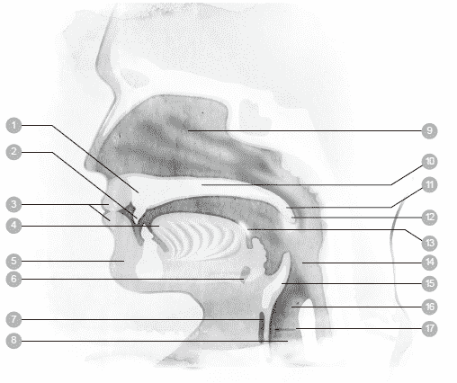

1 上龈　　　7 甲状软骨 13 扁桃腺

2 牙齿　　　8 喉头　　　　　14 咽头

3 嘴唇　　　9 鼻腔　　　　　15 会厌（喉头盖）

4 舌头　　　10 硬颚　　　　 16 食道

5 下颌　　　11 软颚 17 声带

6 舌骨　　　12 悬雍垂（小舌）

依据一个人说话的速度快慢、语气强弱，我们可以界定出此人的个性、气质和性情。更进一步来说，一个人说话的习惯会塑造出他的个人风格，反之亦然。

我们每天都需要用声音跟别人交谈、沟通。即使是工作上不需要演唱、吟诵或是演讲的人，为了好好跟别人谈事情，为了把话说清楚，健全的声音也是不可缺少的。在日常生活中，我们可以不假思索做出一千零一种各式各样的动作。然而，许多人在说话、唱歌的时候，却从来没有思考一下，声音究竟是怎么回事？人为什么能够发出声音来说话？

为了保有健全而清晰的声音，认识声音运作的方式，并了解发出声音所需要的条件，用处将会很大。以下，我们就来探究声音是怎么运作的。

人类之所以能够发出声音，主要的条件包含：

．声音的动力来源：肺脏

．振动机制：声带

．共鸣系统：喉咙、口腔内部和鼻子内部

．发声器官：嘴巴、舌头、牙齿和双唇

在接下来的内容中，我们将逐一探讨发出声音的主要条件。

❍声音的动力来源

声音的动力来源便是我们所吸入的空气。前面曾经提到，当我们吸气时，横膈膜会下降，把胸腔撑开，让空气进入肺脏里面；吐气时，情况正好相反，横膈膜会往上抬，把空气从肺脏推挤出去。在吐气的过程中，气流会通过气管，从喉头的声带逸出，接着，声带使得这道气流产生声波，也就是我们说出来的话；通过喉头的气流越强，声音的强度就越大。不过当然了，震动的部位也必须同时运作正常，一切才能顺利。

如果我们创造出一股稳定、强大的气流，就可以发出强而有力的清晰声音。因此，影响发声的主要关键之一，就在于我们的呼吸方式。简而言之，要是憋住呼吸，就不可能发出声音—即使只是喃喃细语，也必须呼吸空气，否则便办不到。

觉察练习 25

．请完全憋住呼吸，同时试着说出这个句子：“西班牙的降雨主要是发生在平原地带。”

你应该发现到了，在这种状态下，其实你根本发不出任何声音来。要是你真的发出了一丝声音，那也不是出于你个人的意愿，而是空气逸出声门（声带之间的缝隙）的声音。

❍振动机制

喉头（或者称为“音箱”）位于气管的上方，也就是喉结的位置。喉头里面有两条声带，这两条声带会彼此协调运作。说话时，我们吐出去的空气会经过喉头，从两条闭合的声带中间穿梭而过，往上流动。

1 舌头　　　4 食道　　　7 软骨

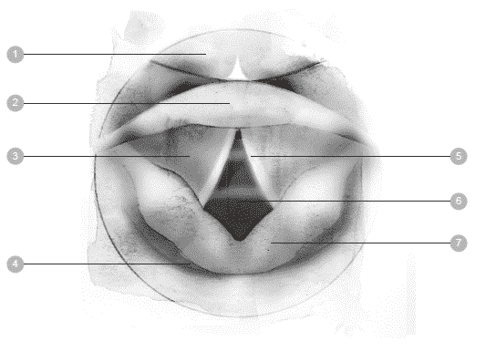

2 会厌　　　5 声带

3 前庭褶皱　6 气管

声带是具有弹性的肌肉，空气穿梭而过的时候，声带会产生振动，每秒的振动次数介于一百次至一千次之间，端看我们制造出来的音调有多高。

音高是由声带的长度、质量和紧度所决定，而声带则是由喉头的其他肌肉加以控制，控制方法非常类似于气球泄气的情况。当空气从气球里面泄出去的时候，如果你把气球的开口捏得小一点，开口处就会产生振动，发出刺耳的尖啸声。空气受到推挤而穿过声带时，情况也类似如此。

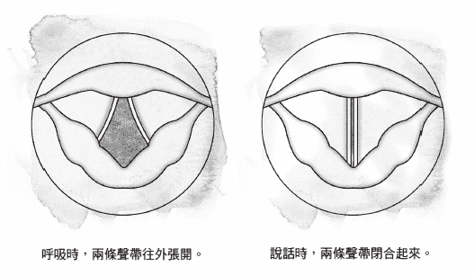

当一个人正常呼吸时，两条声带是分离的（往外张开）；说话或唱歌的时候，两条声带就互相靠拢（闭合起来），造成声带振动，于是发出声音。

男人的声音往往比女人低沉，原因在于喉头的结构和声带的长度。成年男性的声带长度介于一．七至二．三公分之间（最长大约是一吋），而成年女性的声带长度介于一．二五至一．七公分之间（接近半吋）。

由于这样的差异，男人说话的平均频率大约是一百二十五赫兹（每秒钟震动的次数称为“赫兹”），而女人说话的平均频率大约是二百一十赫兹。孩童的声带比他们父母的声带更短，因此说话的频率往往高于三百赫兹。

声带本身只能制造类似嗡嗡作响的微弱噪音，功能有如喇叭的吹口。因此，我们还需要一套共鸣系统，以便把噪音转换为有意义的字句。

觉察练习 26

．轻轻靠拢双唇，试着发出嗡嗡的哼唱。

．请留意喉咙、嘴巴、嘴唇，甚至是鼻子内部产生的振动，这些振动全部来自于声带，声带每秒钟会振动好几百次。

❍共鸣系统

声带制造出声音之后，声带上方的空腔会让声音被放大、修饰，这些空腔统称为共鸣系统。共鸣系统由喉咙、嘴巴、鼻子三者共同组成，声音的音量在这里被创造出来，带有能量。从解剖学的角度来看，产生共鸣的三个主要区域是口腔、鼻腔和咽腔。

鼻腔、口腔和咽腔让声音产生独一无二的特色，例如音质、腔调和音量。我们可以把这些空腔跟管乐器做个比较。以长号为例，为了让长号发出声音，空气必须从演奏者的肺脏流出来，经由嘴巴到达嘴唇，接着进入长号的吹口，在吹口产生振动而发出声音；之后，空气穿过乐器，在乐器内部获得增强。

人的嗓音也是经由类似如此的过程，被修饰成各式各样的说话声。稍微想一想，你就明白人声的变化范围有多大，简直到了无所不包的地步，例如喃喃细语、说话、吟诵、歌唱、大吼、尖叫等等。

觉察练习 27

．用嘴巴发出“啊”的声音，同时慢慢地张大嘴巴。

．一开始先把下巴放低，接着把嘴巴打开—只要改变嘴唇的形状，就可以把嘴巴张到最开了。

当你做出上面所说的动作时，请留意“啊”的声音有没有发生变化呢？

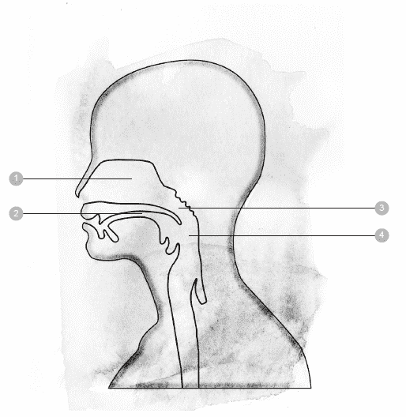

1 鼻腔　　　3 颚咽腔

2 口腔　　　4 咽腔

❍发声器官

要发出说话的声音，必须动用舌头、嘴唇、牙齿和下颚。声带制造出声音之后，这些发声器官的动作会持续将声音加以塑造、改变。借由控制舌头和嘴巴的动作，你便能在唱歌或说话时创造出各式各样的歌声，说出所有的字音。

觉察练习 28

． 如同“觉察练习 25”一样，请说出这个句子：“西班牙的降雨主要是发生在平原地带。”不同的是，这次请把两排牙齿并在一起，并且想办法不要移动舌头或嘴唇。

这下子你明白了，若是没有发声器官，我们发出来的声音会是什么样子？在这种情况下，人与人之间根本很难听懂对方在说些什么。

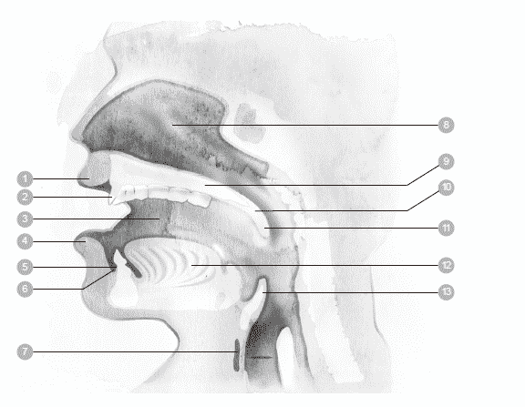

1 上唇　　5 牙床　　9 硬颚　　　　　13 会厌（喉头盖）

2 牙齿　　6 前庭　　10 软颚

3 脸颊　　7 舌骨　　11 悬雍垂（小舌）

4 下唇　　8 鼻腔　　12 舌头

觉察练习 29

．做这个练习时，你只要玩一玩你发出来的声音就行了。

．你可以先用嘴巴发出“啊”的声音，然后换成“ㄝ”的声音，接着换成“喔”，最后再换成“咿”。

．当你发出这些不同的声音时，请仔细留意发生了什么变化。

你有没有感觉到某些空腔的振动增强了呢？借由这个实验方法，你可以亲身感受出人类所制造的声音有多么千变万化！

在声音健全的人身上，四个主要的发声器官会合作无间，因此轻而易举就能说话、唱歌。然而，有一点很重要，请务必了解：如果不呼吸，即使只是区区一个字，你也会说不出声音来；而且，任何会妨碍呼吸的事情—在整个发声系统中，无论是哪一条肌肉绷得太紧了—都会直接影响到你发出来的声音。

个案分享 安妮的故事

安妮才刚开始学走路的时候，呼吸系统便出问题了。她母亲会彻夜不眠地照顾她，担心她睡觉睡到连呼吸都停了。大约就在那时候，医生诊断出安妮罹患了气喘性支气管炎，每次她一感冒，病情就演变成严重的支气管炎和哮喘。读幼稚园之后，这个疾病造成安妮请假请了将近五十天之多。她记得很清楚，晚上家人都入睡了之后，只有她还在为了呼吸而挣扎。

等到安妮进入青春期，支气管炎的恐怖发作再也没发生过，不过呼吸过敏却成为她的另一场恶梦。少女时期的安妮是教会唱诗班的一员，同时她也积极参与学校的合唱团表演。尽管如此，出于害羞的天性，安妮最安心的事情莫过于隐身在团体里面唱歌，或是进行民谣自弹自唱，因为这样可以把她露脸的机会降到最低。后来，她就读一所小型的艺术学院，需要在一大群观众的面前表演独唱，她为此而焦虑万分。

她回忆说，为了发出一个听起来很自在的声音，她必须费尽全力才能吸到足够的空气，而且，她的身体紧绷到肩膀高高地耸起来，以至于“两边肩膀好像成了挂在耳朵下面的耳环”。有一次，她跟学院里的合唱团一起登台表演，其中有一段重头戏由她担任独唱。当时，她觉得右边的肩膀仿佛卡住一颗垒球，不过她顺利完成了演唱，连她自己都深感讶异。

直到此时，安妮才明白过来，她的自信与她的呼吸，都因为小时候养成的身体习惯而被束缚住了，她无法自在地吸到足够的空气来唱歌，喉咙紧缩起来，以至于唱到后来简直上气不接下气，筋疲力竭。有很长的一段时间，她一直挣扎要不要去参加试唱会，因为她无法把心安在当下，好好唱完。有一年夏天，她去参加一场歌剧培训课程，她只记得她走进了试唱间，接着又走了出来，至于试唱过程中发生了哪些事情，她什么也不记得了。

到了三十岁时，安妮开始跟着一位女士学习发声课程，当时那位女士正在接受亚历山大技巧的师资培训。某个周末，这位老师把一小群学生聚在家里开工作坊，安妮也去参加了。当天的讲师是来自纽约的客座老师，名叫贝瑞．阿卡亚（Beret Arcaya）。在安妮心中，那天的课堂景象依然历历在目，即使那是三十多年前的事了。

贝瑞在工作坊中说明亚历山大技巧的概念，并且就每位学员的演唱给予个别指导。那天对安妮来说，仿佛是一片遗失已久的“声音拼图”终于拼齐全了，短短几个小时的课程，把她对呼吸、歌唱、表演的理解，全部翻转了过来。她领悟到，所有令她疑惑的问题已然有了答案，而答案就铺陈在她面前。

安妮说：“当时我的歌声简直不堪入耳，在那样的危机之下，亚历山大技巧可说是我的救命恩人。揪出那些毫无是处的习惯之后，我开始学习安于当下，让心平静下来，充分信任自己的声音和呼吸。那位和蔼可亲的专家本身正好也是一位歌唱家，跟她合作的经验让我找到自己的立足点。在那一天，我的生命第一次有踏实感。”

在之后的亚历山大课程中，安妮开始放下多年来的紧绷，把错误的习惯改正过来。她的紧绷和习惯源自于她的激情，一心要向别人证明自己的能力。安妮找到了新的定位，她开始享受演唱的过程，不去在意演唱的成果，于是舞台上的她明显比以前更沉稳，更能安于当下。追根究底之后，她发觉她的上台焦虑只有一部分是出于渴望证明自己，另外的一部分则是出于她的姿势以及无益的习惯模式。

借由学习亚历山大技巧，她改变了自己的呼吸，呼吸障碍的毛病几乎不再发作，只剩下季节性过敏的问题。后来，安妮去修读博士班课程，她发现自己有了足够的信心，可以对着一大群观众演讲、教学。她越来越喜欢在各种地点登台演唱，觉得自己获得一份天赐的非凡礼物，对世界有了全新的观点，从此勇于接纳各种可能性。

最后，安妮获得了音乐博士学位，在一所小型的艺术学院担任声乐教授，学校的音乐部门也支持她成为亚历山大老师。安妮发现，亚历山大技巧的每一项根本原理都有助于她成为更优秀的声乐老师，而且，一旦学生觉察出他们自身的习惯会妨碍到歌声的美感，身体的能量便能够获得提升。她看到学生的演唱功力转变了，正如同她自己多年前因为那个工作坊而发生转变一样。事实上，许多曾经受教于安妮的学生纷纷表示，在她的课堂上，最大的收获就是学到亚历山大技巧。

安妮说：“我有幸和许多亚历山大技巧老师共事，他们真是令我感谢不尽。我自己学习亚历山大技巧的过程充满了快乐，跟别人分享的欢喜同样也是说也说不完。能够与别人心心相连，并且安于当下，真是一件幸福无比的事。人生的快乐之一，就是与人分享。要是我能够早几年学到亚历山大技巧，那就更好了，因为那样的话，我相信亚历山大技巧必定可以为我的呼吸和演唱带来深厚的影响，让我把歌声唱得更有感情、更动人。”

# 第九章 呼吸与动作

大众普遍有个误解，以为呼吸只靠两片肺就可以了。不过，事实告诉我们，呼吸活动是全身器官通力合作的结果。

在呼吸的过程中，肺的角色其实是被动的。肺之所以膨胀，是因为胸腔扩张开来，而胸腔主要是向下扩张，而非向上扩张。当胸腔收缩时，肺就消扁下去。

良好的呼吸牵涉到许多肌肉的运作，包括头颅、颈部、胸腔和腹腔的肌肉。证据显示，身体内的任何肌肉组织如果长期紧绷过头，自然的呼吸活动便会受到阻碍。

──亚历山大．洛文（Alexander Lowen）

## 如何消除紧绷感

只要好好实行第七章所介绍的练习，呼吸就可以产生一定程度的改善。不过，唯有全身上下的肌肉紧绷都消除了，我们的呼吸才能真正开始回归自然的模式。我们所做的每一个动作都会影响到呼吸—差别在于影响的结果是好还是坏。如果我们以没必要的方式来做动作，把肌肉绷得太紧，那么毫无疑问地，结果一定会让呼吸受到拘束。反过来说，如果我们把肌肉绷紧降到最低，呼吸便能轻松自在，顺畅无碍。

肌肉需要能量才能发挥功能，因此它需要源源不绝的氧气。若问身体的动作会对呼吸产生何种影响，只要看看一个人狂追公车或快步上楼的模样就知道了—身体为了获得更多氧气，呼吸速度会瞬间加快起来。其实，任何一种动作都会引发呼吸加快，不过，当出力的程度很轻微时，我们往往不会注意到前后的变化，因为呼吸声还不至于明显听得到。

根据以上所说，我们可以做出合理的推论：一个人使用身体的方式会对他的呼吸带来深远的影响。无论走路、说话、坐下或抬东西，如果我们把动作做得过于紧绷，被牵动到的肌肉就需要更多氧气；反之，如果我们用高效能的方式来做同一个动作，耗氧量就不需要那么多。

一个人若是习惯以不当的方式来使用身体，多年之后，身上的自然呼吸机制就会遭到严重的破坏。如果我们懂得运用亚历山大技巧，便能够以效能比较好、比较轻松的方式，做出日常生活中的各种动作，好处是肌肉紧绷减少了，身体大致上没有太多压力，如此一来，呼吸便可以获得大幅改善。

Point｜
　　一个人使用身体的方式，会对他的呼吸带来深远的影响。

◆放松自己

坐下、起立是单纯无比的动作，因此当人们发现自己竟然为了坐下、起立而花费许多无谓的力气时，往往会大吃一惊！看看身边的例子，你便会发现，有些人只不过是坐下、起立而已，动作却做得气喘吁吁，那根本是没必要的。事实上，我们经常可以见到有人只是弯腰捡个很轻的东西，比如一枝笔或是一张纸，却因此而闪到腰，背部肌肉严重受损。

第五章曾经提过，我们生活在“急速运转的世界”里。许多人的成长环境充斥着为目标而奔忙的压力，凡事要跟时间赛跑，在这种情况下，我们的动作往往跟“迎战或逃跑”（fight or flight）的反射回应挂上勾，结果做动作时把肌肉绷得太紧了，次数一旦累积多了之后，便形成生活模式。这种倾向在今天已经相当严重了，以至于牙医发现许多人有磨牙的毛病，即使在睡梦中依然无法放松。

我们之所以没注意到身上的肌肉紧绷一直在累积，主因是每天累积的量只有一点点而已，令人难以察觉。直到有一天，身体开始疼痛起来，我们才发现情况不对劲了。然而，即使事情已经走到这样的地步，我们依然没看出问题的症结在于“是我们自己把身体绷紧的”，反而在心里想着：“我身上有地方不对劲了，不过我必须学习忍耐背痛或膝盖疼痛，继续把日子过下去。”

事情的真相是，一个人无论是腰酸背痛、筋酸骨痛，或者身上这里、那里觉得不舒服，那个残害身体的罪魁祸首，正是他自己。到最后，长久累积下来的紧绷感开始干扰身体与生俱来的协调性，开始妨碍身体的姿势，尤其是妨碍到呼吸。

忙碌紧绷的动作会危害到全身上下的器官，多数人却完全忽略这一点。人们只知道身体不对劲了，可是不清楚事情的来龙去脉。即使是最先进的医疗检查，例如 X 光、电脑断层扫描（CAT scan）、核磁共振造影术（MRI）等等，也检查不出肌肉承受的张力大到什么程度、绷得多么紧。

当身体无法正常运作，功能失灵了，人们可能到处寻医，看这个医生又找那个医生，希望能查出病因。然而，医生往往无法做出明确的回答。人们几乎没问过自己：“我是不是对自己的身体做了什么，现在才会痛得不得了？”

Point｜ 　　我们开始体认到：一个人必须为自己的疼痛负责。

◆认识动作

借由学习亚历山大技巧，我们开始体认到：一个人必须为自己的疼痛负责，因为我们一直在过度拉紧全身上下的肌肉系统，时间一久，便造成各种疼痛与不适。当我们学着把紧绷的肌肉放松下来，疼痛自然会逐渐缓和，很快就消失无踪了。

由于紧绷已经成为根深蒂固的习惯，因此，在无人协助的情况下，要把紧绷释放掉是有难度的，甚至光是连找出哪里有紧绷，都不是一件容易的事。长年来，我们习惯在身体里面背负某种程度的紧绷，把紧绷视为自身的一部分。下面有两个练习，可以帮助你认识习惯性动作的力量有多大。

觉察练习 30

1\. 站在一面镜子前面。

2\. 用你平常的方式，迅速把两只手臂交叉抱在胸前。

3\. 仔细看清楚，哪一只手露在外面？抱在里面的又是哪一只手？

4\. 接着，用相反的方式，将你的两只手臂交叉抱在胸前。也就是说，把平常放前面的那只手抱在里面，把平常抱在里面的那只手露在外面。反之亦然（如果你发现相反的方式做起来很容易，请好好确认，你是不是用了习惯性的方式双手抱胸，自己却没有注意到）。

觉察练习 31

1\. 拿一颗柠檬或橘子，以你惯用的那只手挤出汁来。

2\. 接着，换成使用另一只手去挤汁。

请仔细留意，当你做这两个动作时，前后有哪里不一样吗？

用平常不习惯的方式去做动作时，一开始会觉得很别扭。不过，经过一番练习之后，你就会开始觉得动作正常多了。

◆破除习惯

越是根深蒂固的习惯，对呼吸的干扰程度就越大，而且几年下来，呼吸可能因此而发生改变，变得比天生自然的方式快得多、浅得多，对身体造成不利。到最后，这种呼吸模式会形成另一个习惯，导致我们误以为浅而快的呼吸是正常的。

为了能轻松、自然地呼吸，我们需要一套没被绷紧的肌肉系统，因为横膈膜、胸廓和肺脏都必须能够轻松自在地活动才行。肌肉里面的紧绷根本毫无必要，我们需要学习把它释放出来，这是很重要的一步，以便让呼吸回归天生自然的和谐模式。

从事情的反面来说，情况也一样。当你越来越能觉察到自己的呼吸，同样地，你对自己做动作的方式也会更有觉察力。当你觉察到自己的动作习惯时，你可能会发现你把不当的紧绷和压力施加到自己身体上—或许好几年来、甚至数十年，你一直都是如此地对待你的身体。

以不当的方式使用身体，对呼吸会有多大的危害呢？从捡东西这个平常的动作就可以看出端倪。请试做下面的练习：

觉察练习 32

1\. 放一枝笔在低矮的椅子上，然后在椅子前面站定位。

2\. 吐气时，轻轻说出“啊”的声音，音量要能听得到；同时，把椅子上的笔捡起来，但是不可以弯曲膝盖。你可能发现到了，当你做这个动作的时候，呼吸变得很困难，甚至于你必须憋住呼吸，才能捡起笔来。

3\. 重复步骤 2，这回捡笔的时候，请弯曲你的臀部、膝盖和脚踝。

许多人习惯弯曲嵴椎，而非弯曲臀部、膝盖和脚踝。你应该听得出来，当你弯曲的部位是膝盖而非背部时，呼吸变得比较自在、轻松了。

◆克制动作

克制（这是亚历山大技巧的重要原理之一，第三章和第六章曾经介绍过）的意思很单纯，就是在做出任何动作之前，暂时停住片刻。做出日常动作之前，如果你能学着暂停片刻，好好觉察自己的呼吸，那么你将能够带着觉察去完成那个动作。

这样做的好处是你的动作会大为轻松，不会白白浪费无谓的力气，如此一来，你的能量就保留住了。等到一天快要结束的时候，你就不会觉得身上的压力有多大。

许多人运用亚历山大技巧，训练自己时时对动作保持觉察之心，他们的感受是呼吸明显改善了，紧接而来的结果是感受到身体比以前更有活力，生活品质提高了。小孩子的身上似乎有无穷无尽的精力，原因之一就是他们的呼吸很沉稳，身体的运作达到高度和谐，能量不会白白浪费掉。许多成年人也同样是如此。

在日复一日的生活中，我们在身体、心灵、情绪各层面发展出特定的行为模式，这些行为模式别人看得一清二楚，我们自己却往往没有觉察出来。面对事情时，我们可能有一整套固定的回应方式，却丝毫没有考虑那套回应方式是否恰当。存在我们身上的刻板模式多如牛毛，可是都隐藏在意识层面之外，于是我们一再重蹈覆辙而无从觉察。

做动作之前，只要我们稍稍停住片刻，找出最轻松、效能最优的方式来做动作，那么不仅可以避免把无谓的压力施加到身体上，长期而言，也可为自己省下大量的时间。古人说“三思而后行”、“欲速则不达”，如今我们生活在急速运转的世界中，这些格言真是一语中的。一旦我们得知自己有什么样的呼吸习惯，便可以学习去克制它。

觉察练习 33

1\. 做几个呼吸，好好觉察你的呼吸方式。吐气三、四次之后，暂时停住一、二秒，再继续下一个呼吸。让空气自然吸入体内，不要刻意用力去帮忙吸气。

2\. 重复上面步骤，连续做个几次，但是要避免有意地将空气吸入身体里面。

这里要特别提醒各位，请务必了解这个要点：要克制的对象不是呼吸的运作机制，而是人们常常绷紧肌肉去吸气的习惯。

接下来是另一个相当有用的克制练习，请试着做做看：

觉察练习 34

1\. 大声朗读这本书里面的几个句子。每当你需要吸气时，请张开嘴巴呼吸。

2\. 再大声朗读一次，只不过这一回改成用鼻子来呼吸。

这两种呼吸方式，哪一种让你觉得比较正常呢？留心一下，或许那就是你平常习惯的呼吸方式。

用鼻子呼吸远比用嘴巴呼吸舒服多了，因为鼻子里面有成排的纤毛，灰尘和空气中的其他粒子会被过滤掉。纤毛的作用有如一面滤网，可以避免脏东西跑入肺脏。除此之外，鼻子和鼻腔会使吸入的空气暖和起来，冷空气便不至于直达肺脏内部。

用鼻子呼吸还有另一项好处，那便是保持鼻窦干净。请养成使用鼻子呼吸的习惯（年幼的小孩即是如此），因为用鼻子呼吸比用嘴巴呼吸更健康。

Point｜
　　一旦我们得知自己有什么样的呼吸习惯， 　　便可以学习去克制它。

## 改掉不良习惯

关于亚历山大技巧，我们可以这样说：亚历山大技巧的精神并不是要人们学习什么前所未有的新东西，而是要人们重新想起遗忘已久的东西—在童年时代，每个人都知道该怎么呼吸才自然。

因此，我们不妨如此定义：亚历山大技巧是教人改掉不良姿势习惯的历程，或者，亚历山大技巧是“对自我的心理和身体重新加以教育”。无论是哪一种定义，背后的含意都很深远，因为在亚历山大技巧的协助之下，无论人们在生活中遇到何种情况，都有能力做出恰如其分的反应，因而可以预防未来面临压力、罹患疾病的可能性。

亚历山大曾经说，未来不是人能够决定的，不过人可以决定自己的习惯；而人所拥有的习惯，则决定了他们会拥有什么样的未来。这句话的意思是说，人们今日所养成的习惯—无论是呼吸方面的习惯，或是其他习惯—经过多年之后，他们必定要为自己的习惯付出代价，想要改变这样的结果，除非人拿出自觉，好好决定自己要做什么、不做什么。

亚历山大也说：“停止错误的做法，正确的方法自然会开始运作。”换句话说，只要停止妨碍天生而来的呼吸机制，我们的呼吸自然能发挥良好的效能，而且倍感轻松。许多人仅仅上过一、两次亚历山大技巧课程之后，便觉得身体轻盈起来，呼吸也自在多了，整个人比以前更加舒适。

这样的感受在一开始是相当短暂的，很快便消失，不过，随着上课的次数增加，这股感受会逐渐融入生活之中。在我教过的人之中，许多人表示他们已经体验到健康呼吸的自然韵律，而那样的韵律是自然出现的，不必刻意而为。如果可以的话，我鼓励读者去上亚历山大课程，你会发现你的呼吸大幅改善，受益无穷。

Point｜
　　在童年时代， 　　每个人都知道该怎么呼吸才自然。

个案分享 蒂娜的故事

蒂娜参加亚历山大课程已经好几个月了，有一天，一项重大经验改变了她的呼吸方式。事情发生在芭芭拉．嘉娜宝（Barbara Conable）所带领的工作坊。

正常人吸气的时候，肋骨会扩张、加宽，可是蒂娜做觉察练习时，发现自己竟然是反其道而行，她的肩胛骨往内缩，背部因而变窄了。蒂娜大惑不解，非常想知道自己到底是怎么一回事。当芭芭拉征求自愿者到教桌上示范呼吸动作时，蒂娜没有半点犹豫，立刻站了出去。

蒂娜躺在教桌上，脸部朝下，在胸腔的上半部埝了一个靠枕。芭芭拉鼓励她运用“啊的轻语”技巧，有意识地吸气、吐气。同时，芭芭拉帮助蒂娜放松脖子，好让蒂娜的头颅从嵴椎顶端放松下来—如此一来，蒂娜的背部伸长了，肋骨也扩张开来。经过几次呼吸之后，芭芭拉抬起蒂娜的左脚踝，延长她的左腿，好让腿从骨盆上放松下来。接着，芭芭拉在蒂娜的右边重复相同的动作，让右腿也放松下来。当蒂娜觉得伸展出去的双腿仿佛脱离了骨盆时，她觉察到骨盆和后背的空间都增加了。

让双腿伸展而脱离骨盆，以及觉察自己的呼吸，当这两个条件加在一起的时候，蒂娜身上许多不必要的肌肉紧绷通通被卸下了。那天课程结束时，蒂娜的身高多了五公分，她觉得自己从内到外被统整起来了，一股前所未有的全新感受油然而生。

这份觉察和放松让蒂娜产生彻底的改变，无论在身体层面或心灵层面都是如此。在那个经验发生之前，每当蒂娜要开口说话，她会先做几个呼吸，而且，她的呼吸活动集中在前胸上方，她会把胸腔往前推，以这种方式来自我保护。套用她自己的说法，那是她的“装甲模式”，下意识借此自保，以便抗拒过去的不愉快经验。

胸口的紧绷被释放出去之后，长期霸占她腹部的紧绷也一并烟消云散了。此后，当蒂娜跟外界互动的时候，她更能感受到自己跟身体、呼吸是同在的。参加那个工作坊之前，蒂娜的觉察能力一直停留在身体外围的层次，至于身体里面的状况，她极少留意，甚至无知无觉。

僵化的模式之所以能维系下来，靠的是长期绷紧的肌肉，一旦肌肉开始放松，僵化的模式便失去支撑力，此时，埋藏在肌肉里面的所有情绪、记忆，便会逐一浮现出来。

接下来的几个月之内，蒂娜用泪水和笑声把压抑在心底的种种情绪宣泄出去。这番经验让蒂娜满心感激，原来她对呼吸的觉察，密切关系到她能否把紧绷释放出去。她也终于明白，她身上的肌肉承受着许多生理上和情绪上的紧绷，而那些紧绷，来自于昔日的创伤和不愉快的经验。

# 第十章 改善姿势，找回健康与幸福

所有的门派传统都承认，有某种永恒性的潮汐消长，紧紧牵连着我们的呼吸。

当我们能够有意识地觉察内在的潮汐，便跟大我产生了链接。说起来似乎简单易行，亲身做过的人便知分晓。

温柔地留意你的呼吸，绝对不要动念去控制它，只要观察它即可，让它以最自然、最无拘无束的方式来来去去。

──鲁米（Rumi）

## 静态姿势的改善

从前面那一章我们已经知道，一个人做动作的方式会对呼吸产生影响。在这一章我们将会发现，即使身体已经处于静止不动的状态，比如坐着或站着，我们还是有可能对自己的呼吸造成妨碍。

人的基本姿势可能对呼吸造成巨大的影响，姿势和呼吸密不可分，两者永远形影相随，无法个别讨论。说起来不难理解，不良的姿势对呼吸危害甚大，原因就在于肋骨和嵴椎是互相连接的。如果我们无缘无故地弯曲嵴椎，或是拱背、耸肩，肋骨的活动便会被限制住；一旦肋骨受到束缚，肺脏的活动也就连带被束缚住了。简而言之，不良的姿势习惯会使呼吸的吐纳量受到限制，而且是极为显著的限制。

◆坐姿

我们经年累月习惯于有害的姿势，其中有许多姿势在童年求学时期便已种下祸因（请见第一章）。最近我听广播时，听到有位校长谈起孩童的姿势。他说，小孩子刚开始上学时，身形是挺拔美好的，他们热切地想要学习，眼睛会直接与人对望。可是，当孩子离开学校时，他们的体态变得很糟糕，对学习失去了兴趣，而且不再直视别人的眼睛。他提出疑问：“我们的教育到底对孩子做了什么？”这实在是问得好！

多数孩子成长到五岁的时候，姿势体态就很好看了。可是一旦进入学校，他们必须坐在设计差劲的椅子上，椅面和椅背都往后倾斜，造成孩子被往后、往下拉，远离课本而坐。为了能靠近桌子写字，他们只好把嵴椎的上半部弯曲成明显的弧度，伏在桌前。

这个动作会产生严重的后果，使得胸廓、横膈膜和肺脏都无法舒适自在地活动，对呼吸系统造成严重的妨碍。这实在没有道理，因为学生在课堂上必须勤奋地运作大脑，才能吸收老师所教的内容，而大脑需要氧气才能思考；问题是，弯腰驼背地坐一整天会造成大脑的供氧量不足，学生的专注力和思考力必然大受影响。

很快地，这种坐姿会养成习惯，结果到了不必伏案写字的时候，我们还是继续弯着腰、驼着背，以弯曲嵴椎的姿势去做许多例行动作。

下面的练习可以让你清楚地感受到，当背部和肩膀往内缩的时候，肺部的容量就被改变了。请预先准备两个大小相似的气球。

Point｜
　　弯腰驼背地坐一整天会造成大脑的供氧量不足，专注力和思考力也大受影响。

觉察练习 35

1\. 拿一颗新的气球在手上，以合理的姿势在椅子上坐直。接着，深深一口气，立刻把气吹入气球中，并打上死结，以免气球漏气。

2\. 拿第二个气球，以瘫软的姿势坐在椅子上，把肩膀往内缩、背部驼起。同样深深吸一口气，立刻把气吹入气球中，打上死结。

当你比较这两个气球时，你会发现第二个气球明显比第一个气球小得多。姿势对呼吸的影响有多大，从两者之间的对照就可以看得清清楚楚。

你也可以在不同的椅子上做这个练习，先在一张硬质的餐椅上坐直，然后换成在软沙发上面坐直。

不论只是坐个一时半刻，或是需要长时间久坐，一把具有支撑性的椅子都是必要的，以便身体能维持良好的姿势。如果你的日常座椅或是汽车座椅会往后倾斜，你可以利用楔形坐埝（wedge cushion）来修正坐姿—请确认坐埝是由密实一点的高级发泡材料制作而成。泡材松软的坐埝比较便宜，不过改善姿势的效果并不理想。

非常重要的一点是，第一天使用坐埝的时间不要超过一小时，之后再逐渐延长每日使用的时间，如此你身上的肌肉才能慢慢适应新的坐姿。过了三、四个星期之后，这个坐埝就可以让你坐得舒适自在了，到那个时候，你可以爱坐多久就坐多久。不过话说回来，你最好还是每个小时至少起身一次，站起来活动一下筋骨，因为即使你的坐姿很健康，连续坐太久对身体还是有害的。

楔形坐埝在什么时机用处最大呢？当你的身体为了特殊原因而必须往前倾的时候，例如写字、打电脑、用餐、开车等等，它就非常有用。或者，你也可以换另一种方式，使用可以任意调节的椅子，如此你便可以根据活动的型态，把椅子调成适当的坐姿。请翻到书末的参考资源，里面有网络零售商的详细资料，你可以买到高品质的楔形坐埝与可调式座椅。

有件事很重要，一定要知道。唯有当你的身体处于活动状态时，楔形坐埝和前倾式座椅才派得上用场，如果你想要让身体放松下来，便不适合使用这两样东西。

◆站姿

一个人站立的方式也可能妨碍到呼吸。站着跟坐着一样，都是人体活动的方式，而不仅是姿势而已。如果你仔细看小孩站立的方式，你会发现小孩的身体并不是静止的，而是轻微地晃动着，目的是为了保持平衡。他们的晃动不是出于本意，而是身体的反射自然如此。成人的状况则不同了，他们是以怪异而不平衡的方式站着。即使人们有心要改善姿势，却倾向于采取僵固的直立姿势，问题是，如果刻意站得笔直、把肩膀往后拉，整个肌肉系统便会绷紧起来，结果，连用来呼吸的肌肉也一并被绷紧了。

这种僵硬的姿势对呼吸所造成的妨碍，可能跟瘫软的姿势相差不多，甚至还可能妨碍更大。除此之外，当我们自以为站得很挺直时，身体的实际姿势可能不是直立的。许多人的身体动觉并不准确，心里明明觉得站得很直了，事实上却是身体向后倾斜，腰椎过度弯曲，骨盆往前推。

下面这个练习可以帮助你觉察自己的站姿：

觉察练习 36

． 你平常习惯怎么站，现在就以那样的方式站上几分钟。这应该是个让你百分之百觉得正常的站姿。

． 留意一下，你是不是有哪一只脚比另一只脚承受着更多体重呢？或者说，哪只脚的肌肉绷得比较紧？

． 你会不会觉得脚跟承受的体重大于脚趾头承受的体重呢？或是情况是颠倒过来的？脚板的哪一侧会觉得压力比较大呢？是外侧，还是内侧？

． 问问自己，有感觉到两个膝盖被一股强大的紧绷感铐住吗？或者两个膝盖太过放松，结果弯曲了？

． 留意你的呼吸方式，观察呼吸活动发生在你身体里面的哪个地方？

你可能可以清楚地感觉出来，接下来的几个呼吸比平时的呼吸大得多了。

人体站着的时候，只要两只脚所承受的体重不平均，那就意味着身体没有处于平衡状态，必须额外绷紧肌肉才能稳住身体，如此便会影响到呼吸了。

你可以利用镜子来确定自己的站姿是否平稳，万一身边没有镜子可照，你可以留意两脚所承受的体重，从中得出一些端倪。当人体不平稳的时候，体重会落在脚板的前半部、后半部、内侧或外侧。如果平时你能规律地留意双脚分摊体重的比例，就比较容易觉察出自己的站姿是什么模样。

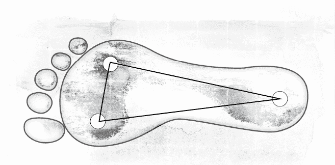

一般而言，身体的重量应该落在脚板的三个点上面，如此身体的平稳度就会相当不错。第一个落点是脚跟，第二个落点是脚掌，第三个落点位于脚板外侧，靠近小趾头的地方。一个人要是习惯把身体重心落在这三点之中的两个点或一个点上面，身体就难以平衡，于是必须拉紧更多肌肉，才能保持直立。这些额外的肌肉紧绷会影响到呼吸，带来危害。

你也可以看看别人的站姿，同样会有一些帮助。遇到人潮大排长龙的时候，不妨试着观察别人，如此也能让你对自己习以为常的站姿保持比较高的觉察力。

◆改善站姿

到底该怎么站才正确呢？方法不是只有一种而已。事实上，有很多种站姿不会造成身体承受过度的压力，也就不至于妨碍到呼吸，不过身体的平稳度才是关键所在。下一个练习可以帮助你避免在站立的时候拉紧肌肉，因此可以改善你的呼吸。

觉察练习 37

1\. 两脚站直，分开大约三十公分宽—这个距离可以形成稳定的基础，把你的身体支持住。请注意，这个宽度是两脚内侧的距离，个子高的人必须把两脚分得更开一些，个子小的人则要把两脚靠近一些。

2\. 把一只脚往后移动十五公分，让百分之六十的体重落在后面的这只脚。一般人常见的毛病是使用单侧的髋关节来支撑体重，结果影响到全身骨架的平衡和协调。为了避免这个毛病，请把你后面的这只脚偏转大约四十五度角。

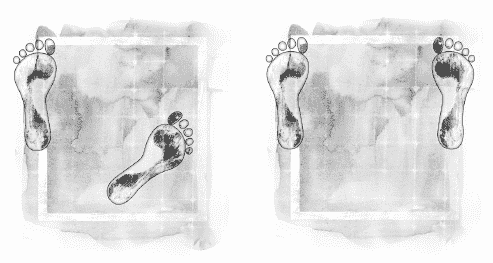

如果你发现你的骨盆往前推，不要刻意把身体往前挺，而要在脑海里想像：骨盆慢慢放松下来，自行回到它原本的位置上（请记住，你只是在脑海里想像而已，不要真的做出动作）。人们站立的时候往往倾向于过度弯曲背部的弧度，这个想像的步骤有助于消除这种倾向。

你有觉察到呼吸发生了什么变化吗？

## 衣着与配件的选择

前面的内容已经让我们明白，呼吸牵涉到所有呼吸肌的活动，而呼吸肌的活动大部分是发生在腹部和胸廓，因此，避免穿着会绑住腹部和胸廓的衣着，才能有益呼吸。过紧的皮带和领带，以及贴身的衬衫、夹克和洋装，这类衣着最好能免则免。

如果你不确定某件衣服会不会对身体造成束缚，那就穿上它，连续做一分钟的深呼吸，如此你便能感受出衣服是不是过紧了。

◆高跟鞋的危险性

脚上穿的鞋子也可能影响到呼吸。在［何种鞋子让你难以正常走路］（Why Shoes Make Normal Gait Impossible）这篇文章中，威廉．罗西博士（Dr. William A. Rossi）提到，鞋跟每升高二．五公分（一吋），身体就会往前倾斜十度。

穿上高跟鞋的人为了避免身体向前倾斜而跌倒，必须彻底改变原本精确平衡的身体结构，把骨盆向前转，如此一来，骨盆腔和腹腔里的内脏便失去了支撑力，此时身体为了勉强保持平衡，只好强烈弯曲腰椎的弧度，结果肌肉、肌腱和韧带全部被拉紧了。更重要的是，身体不平衡的状况会造成全身上下的肌肉都绷紧起来，尤其头颅、颈部和背部的肌肉绷得最紧，于是头颅受到向后、向下的拉力，导致全身的结构缩短，对呼吸产生不利影响。

鞋跟越高，身体往前倾斜的角度便越大，形成的问题也就更严重，因此鞋底越平坦越好，对呼吸才有益。如果可以的话，我推荐你去买 Vivo 的赤脚鞋（Barefoot），这个品牌的鞋子是为了改善人体的活动而特别设计的，鞋底十分平坦（请见书末的参考资源）。

## 内心平稳

不良呼吸习惯所带来的危害，不仅仅是肉体的健康受损而已，连心灵和情绪层面的幸福感也会遭殃。身体、心灵、情绪三者密不可分，亚历山大是领悟到这一点的先驱人士之一，而且他十分清楚，呼吸效能太差时，心灵和情绪层面的幸福会蒙受其害。

一个人的情绪状态或心灵状态为何，可以从不规则而浅快的呼吸看出端倪。许多人即使不曾抱怨呼吸方面有问题，却经常觉得压力沉重、沮丧，或是心情好不起来。除此之外，生活步调加快的状况也会透过呼吸反映出来。

如果能够学习自然的呼吸方式，等到一个呼吸完全结束之后，再进行下一个呼吸，那么，普遍存在于现代人身上的日常压力和紧绷感将大为降低。

自然呼吸的潜能是非常强大的，根据我个人亲眼所见，许多人的心跳原本快得不正常、血压过高，可是重新学习呼吸方法之后，他们的心跳减缓了，血压也降低了。

之前曾经提过，人们经常被教导要运用“深呼吸”来平复情绪，也提过许多冥想技巧、瑜珈、武术传统会借用呼吸的力量，因为呼吸能将沉着、祥和、宁静的感受带入身体之中。然而，我们随时随地都可以觉察自己的呼吸，不必等到报名学习瑜珈、太极、冥想的时候，才开始体会呼吸平静人心的力量。只要把意识贯注在呼吸的动作上，我们便可以成为更有自觉的人，开始享受生命的美好与完整。

Point｜ 　　呼吸效能太差时，心灵和情绪层面的幸福会蒙受其害。

## 享受呼吸

自然的呼吸方式可以是生活中的喜乐泉源之一。当我们感受到肺脏充盈着新鲜、清净的空气，喜乐便油然而生。空气为我们补充源源不绝的生命活力，也让神经系统获得抚慰。当我们的呼吸方式越来越归于自然，呼吸就变得更加饱满、自在，身体、心灵、情绪的效能会开始提升起来，于是生活中的劳累减少了。

当我们开始抛弃各种有害的姿势习惯、思考习惯、情绪习惯，每当身体进行一次吸气和吐气，随之而来的便是神智越来越清明、内心越来越幸福。透过抉择呼吸的方式，我们的生命可以焕然一新，常保热情。

对呼吸保持觉察也可以帮助我们把心安于当下，不牵挂过去，不烦恼未来。事实上，无论身处何时何地，没有任何一事的分量足以阻挡你对呼吸抱持感恩之心。一行禅师的话道尽了个中含意，值得好好深思，他说：“吸气而入，身体和心灵都平静下来；呼气而出，凡事微笑以对。安住于眼前的一刻，此即当下。”

从事实面来说，你已经知道如何完美地呼吸了，该做的事便是停止妨碍身体内的呼吸机制，让呼吸顺其自然。从今而后，无论你身在何方，无论晨昏朝夕，无论你在做什么，你都可以有意识地呼吸，陶醉在深刻的感受中。所以，你还等什么呢？

Point｜
　　停止妨碍身体内的呼吸机制，
　　让呼吸顺其自然。

# 致谢

感谢以下每一位人士，若非他们协助，本书不可能有机会面世。

首先，向我的精神导师普吕姆．拉瓦特（Prem Rawat）致上特别的谢意。由于他的教导，我第一次认识到每一次呼吸都无比珍贵。其次，感谢早年教导我的亚历山大技巧老师们。我于一九八〇年代受训成为亚历山大技巧老师，期间得到许多老师的启发与支持，包括：丹尼．蕾莉（Danny Reilly）、尚．麦高文（Jean McGowan）、崔栩．海明威（Trish Hemingway）、珍．哈尔（Jeane Haahr）、乔登．哈尔（Jorden Haahr）、丹尼．麦高文（Danny McGowan）、安妮．派堤（Anne Battye）、唐．伯顿（Don Burton）、克里斯．史蒂文司（Chris Stevens）、保罗．柯林（Paul Collins）、大卫．高曼（David Gorman）等等。

此外，感谢葛蕾纳．巴森（Glenna Batson）博士，她的周末呼吸课程带给我许多知识。大力感谢洁西卡．吴尔芙（Jessica Wolf）的带领，“呼吸的艺术”工作坊真是太精彩了！吴尔芙的出色助手是潘蜜拉．布兰克（Pamela Blanc），在此一并感谢。

同时，感谢泰莎．莫尼卡（Tessa Monica）和尼克．艾迪森（Nick Eddison），他们两位一接触到这本书时，立即看出本书在呼吸领域的分量，全程支持出版计划。

本书的撰写过程获得许多人士协助读稿、提供灼见，内容得以更完善。这些人士包括：米里姆．沃尔（Miriam Wohl）博士、葛蕾纳．巴森（Glenna Batson ）博士、鲍伯．布里顿（Bob Britton）、珍妮．赫里希（Jane Heirich）、赖瑞．沃尔顿（Larry Walton）、安．罗迪斯（Ann Rhodes）教授。

此外，感谢我的经纪人苏姗．蜜尔斯（Susan Mears）协助处理合约。感谢编辑凯蒂．寇丝比（Katie Golsby）为这本书劳心劳力。感谢布莱柔．阿特金斯（Brazzle Atkins）、莎拉．鲁尼（Sarah Rooney），以及 Eddison 出版社的所有工作人员协助本书的设计、制作与发行。

最后，感谢为本书提供个案资料的三位人士：米凯拉．沃珍莫斯（Michaela Wohlgemuth）、蒂娜．基利（Tina Kiely）、安．罗迪斯（Ann Rhodes）。

# 参考资源

◆有用的网站

本书作者理查．布兰能在爱尔兰的哥尔威市（Galway）有个私人诊所，他同时也在该市开设全爱尔兰唯一的亚历山大师资培训中心，并且频繁往返于欧洲、美国，教授周末课程与一周课程。欲知详情，请上网拜访：[www.alexander.ie](http://www.alexander.ie)以及[www.alexandertechniqueireland.com](http://www.alexandertechniqueireland.com)

◆有声辅助（CD 与 MP3）

《如何呼吸》（How to Breathe）

这套有声课程带领你进行本书的许多觉察练习，是很实用的辅助工具，设计目的是引导你改善呼吸方式，包括协助你温和地延长吐气时间，让吸气自然发生而不费力。这套辅助课程可以反复聆听，每一次都能让你有所收获。购买请见[www.alexander.ie/audio.html](http://www.alexander.ie/audio.html)

呼吸 DVD（Breathe DVD）

洁西卡．吴尔芙（Jessica Wolf）制作的影片名为“呼吸的艺术”，长度是十八分钟。这部影片是有史以来的创举，以三度空间的动画展示与呼吸有关的所有肌肉、骨胳与器官，影片内容会让观众对和谐呼吸的独特韵律深表赞叹。

就专业层面而言，这部影片对健康中心专家、演员、发声与歌唱老师、瑜珈教练、运动员、物理治疗师都大有用处；对于非专业人士而言，这部动画有助于导正人们对于呼吸的诸多误解。气息是能量强大的燃料，可以解决错误的呼吸方式所引发的毛病，为生活储存活力。购买请见[www.jessicawolfartofbreathing.com/rib-animation/](http://www.jessicawolfartofbreathing.com/rib-animation/)

《自助式半仰卧》（Self-help Semi-supine）

这套有声引导教材堪称是本书的完美搭配，长度大约四十分钟，内容是带领你进行一项简单的程序，帮助你把无谓的肌肉紧绷释放出去。这套教材有助于改善呼吸和姿势，进而预防或舒缓背痛、颈部酸痛、头痛与压力。购买请见[www.alexander.ie/audio.html](http://www.alexander.ie/audio.html)

◆辅助配件

坐埝

优质的楔形坐埝可以改善汽车座椅和办公室座椅所造成的不良坐姿，带来舒适感，详情请见[www.alexander.ie/cushion.html](http://www.alexander.ie/cushion.html)

鞋类

以亚历山大技巧为出发点所设计的跑鞋和日用鞋，详情请见[www.vivobarefoot.com](http://www.vivobarefoot.com)

◆亚历山大技巧课程

学习亚历山大技巧可以让呼吸方式获得显著的改善。欲了解你附近的亚历山大技巧老师或课程，请联络以下的组织（网站上列出的所有老师都受过为期三年的密集训练）：

英国

亚历山大技巧教师协会（Society of Teachers of the Alexander Technique, STAT）是亚历山大技巧的第一个机构，成立时间最为悠久。

网站上的师资主要来自于英国和爱尔兰（关于爱尔兰的网站，请见下面的 ISATT），网址为[www.stat.org.uk](http://www.stat.org.uk)

美国

北美亚历山大技巧协会（American Society for the Alexander Technique，AmSAT），网址为[www.amsatonline.org](http://www.amsatonline.org)

澳洲

澳洲亚历山大技巧教师协会（Australian Society of Teachers of the Alexander Technique, AuSTAT），网址为[www.austat.org.au](http://www.austat.org.au)

加拿大

加拿大亚历山大技巧教师协会（Canadian Society of Teachers of the F. M. Alexander Technique, CANSTAT），网址为[www.canstat.ca](http://www.canstat.ca)

爱尔兰

爱尔兰亚历山大技巧教师协会（Irish Society of Alexander Technique Teachers, ISATT），网址为[www.isatt.ie](http://www.isatt.ie)

新西兰

亚历山大技巧教师新西兰协会（Alexander Technique Teachers' Society of New Zealand, ATTSNZ），网址为[www.alexandertechnique.org.nz](http://www.alexandertechnique.org.nz)

南非

南非亚历山大技巧教师协会（South African Society of Teachers of the Alexander Technique, SASTAT），网址为[www.alexandertechnique.org.za](http://www.alexandertechnique.org.za)

欲查询其他国家的亚历山大技巧网站，请上网至[ww.alexandertechniqueworldwide.com](http://ww.alexandertechniqueworldwide.com)

◆其他有用的网站

呼吸与发声网站

．洁西卡．吴尔芙的“呼吸的艺术”网站：[www.jessicawolfartofbreathing.com](http://www.jessicawolfartofbreathing.com)

．珍妮．赫里希（Jane Heirich）的网站：[www.alexandertechniqueannarbor.com](http://www.alexandertechniqueannarbor.com)

．乔治娅．黛厄丝（Georgia Dias）的网站：[www.voiceandalexandertechnique.eu](http://www.voiceandalexandertechnique.eu)

《引导杂志》（Direction）

很出色的杂志，专门为亚历山大技巧的老师和学习者发行文章与讯息。网站上提供免费的有声档案、文章、现场访谈，以及过去二十五年来的期刊内容。网址为[www.directionjournal.com](http://www.directionjournal.com)

有趣的文章和其他讯息

．[www.ati-net.com](http://www.ati-net.com)

．[www.alexandertechnique.com](http://www.alexandertechnique.com)

◆延伸阅读

理查．布兰能的其他著作

．The Alexander Technique: Natural Poise for Health, Element Books 1991

．The Alexander Technique Manual, Connections Book Publishing 2004 (new edition 2017)

．The Alexander Technique Workbook, Collins & Brown 2011

．Back in Balance, Watkins 2013

．Change Your Posture-Change Your Life, Watkins 2012

．Mind & Body Stress Relief with the Alexander Technique, HarperCollins 1998

．Stress: The Alternative Solution, W Foulsham & Co Ltd, 2000

亚历山大（F. M. Alexander）本人的著作

．Constructive Conscious Control of the Individual, Mouritz 2004

．Man’s Supreme Inheritance, Mouritz 2002

．The Universal Constant in Living, Mouritz 2000

．The Use of the Self, Orion 2001

关于呼吸和发声的书籍

．Body, Breath and Being, Carolyn Nicholls, D&B Publishing 2008

．The Body in Motion, Theodore Dimon, North Atlantic Books 2011

．Voice and the Alexander Technique, Jane Heirich, Mornum Time Press 2011

关于亚历山大技巧的有趣书籍

．The Alexander Principle, Wilfred Barlow, Orion 2001

．The Alexander Technique as I See It, Patrick Macdonald, Sussex Academic Press 1989

．An Examined Life, Marjorie Barlow, Mornum Time Press 2002

．F. Matthias Alexander: The Man and his Work, Lulie Westfeldt, Centerline Press 1964

．Freedom to Change (Body Awareness in Action), Frank Pierce Jones, Mouritz 1997

．How to Learn the Alexander Technique, Barbara & William Conable, Andover Press 1991

．How You Stand, How You Move, How You Live, Missy Vineyard, Marlowe & Company 2007

．Thinking Aloud, Walter Carrington, Mornum Time Press 1994

其他相关书籍

．A New Earth: Create a Better Life, Eckhart Tolle, Penguin 2005

．Dr. Breath: The Story of Breathing Coordination, Carl & Reece Stough, Stough Institute Inc. 1981

．Peace Is Every Breath: A Practice for Our Busy Lives, Thich Nhat Hanh, HarperOne 2011

．The Power of Now: A Guide to Spiritual Enlightenment, Eckhart Tolle, Hodder & Stoughton 1999