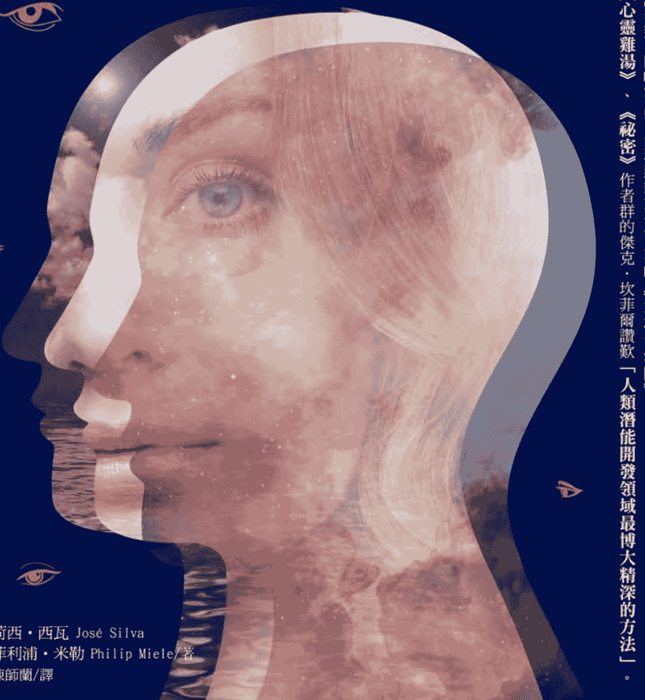
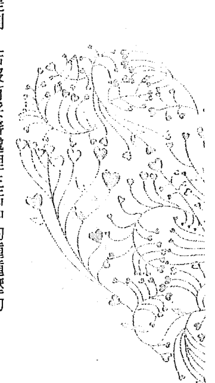
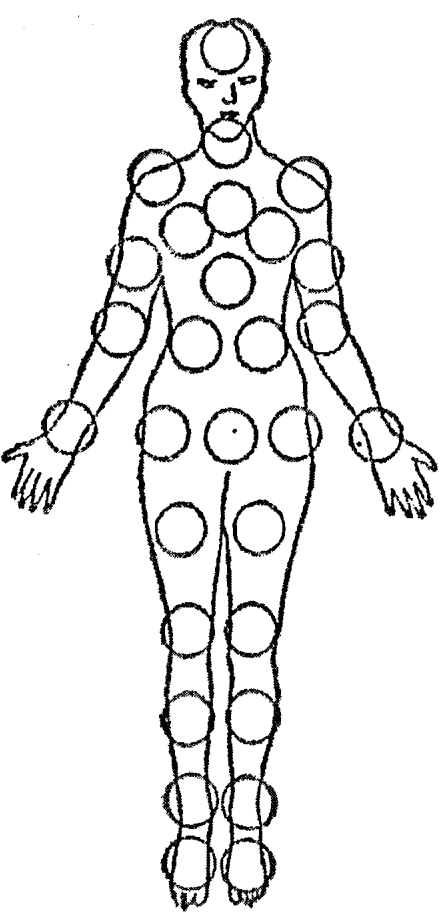
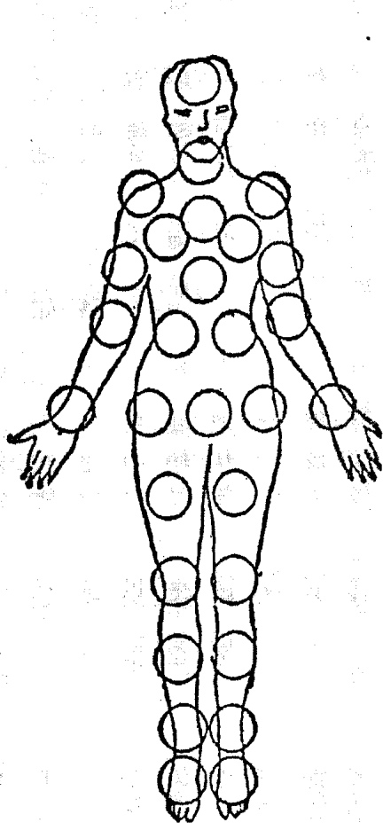
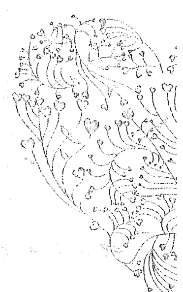
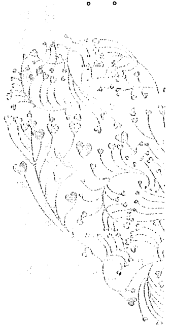

## 神奇的西瓦心靈圓夢術

西瓦心靈圓夢術

The Silva Mind Control Method

突破極限！實現你不敢奢求的人生

作者 荷西·西瓦（José Silva）、菲利浦·米勒（Philip Miele）

譯者 陳師蘭

美術編輯 李緹瀅

主編 高煜婷

總編輯 林許文二

出版 柿子文化事業有限公司

地址 11677臺北市羅斯福路五段158號2樓

業務專線（02）89314903#15

讀者專線（02）89314903#9

傳真（02）29319207

郵撥帳號 19822651柿子文化事業有限公司

投稿信箱 editor@persimmonbooks.com.tw

服務信箱 service@persimmonbooks.com.tw

初版一刷 2015年09月

二刷 2015年09月

定價 新臺幣320元

I S B N 978-986-6191-81-7

業務行政 鄭淑娟、唐家予

The Silva Mind Control Method

Copyright: ©1977 by José Silva and Philip Miele

This edition is published by arrangement with Simon & Schuster, Inc. through Andrew

Nurnberg Associates International Limited.

Traditional Chinese edition copyright: ©2015 PERSIMMON CULTURAL ENTERPRISE

CO., LTD

All rights reserved.

Printed in Taiwan 版權所有，翻印必究（如有缺頁或破損，請寄回更換）

歡迎走進柿子文化網 http://www.persimmonbooks.com.tw

搜尋 柿子文化

粉絲團搜尋[柿子文化－小柿子波柿喃]

～柿子在秋天火紅 文化在書中成熟～

國家圖書館出版品預行編目(CIP)資料

神奇的西瓦心靈圓夢術／荷西·西瓦（José Silva），菲利浦·米勒（Philip Miele）著；陳師蘭譯.--初版.--臺北市：柿子文化，2015.09

面； 公分.--（New life；5）

譯自：The Silva Mind Control Method

ISBN 978-986-6191-81-7（平裝）

1.超心理學 2.心靈學

175.9 104017680

## 專家好評

這是我一生中最奇特的經歷！那晚我走在回家的路上，正煩惱房租付不出來，突然，有一個聲音說「天地一沙鷗」（Jonathan Livingston Seagull），但根本沒人在那裡，我完全不曉得那是什麼意思。然而，當我回到家，一隻沙鷗獨自飛行的畫面就這樣在我腦海出現了！於是我開始下筆……我僅僅是寫下我看到的。

西瓦心靈圓夢術是我人在人類潛能開發領域所遇過最博大精深的方法之一。

任何一本書封上寫著作者為荷西·西瓦的書，哪怕從來沒看過，我都願意投它一票。閱讀的時候，別忘記用筆在書上畫上重點喔！

——李察·巴哈，暢銷書《天地一沙鷗》作者（《哈潑時尚》專訪）

——傑克·坎菲爾，暢銷書《心靈雞湯》作者、《祕密》作者群之一

——韋恩·戴爾，暢銷書《鑽出牛角尖》作者

## 導讀

《神奇的西瓦心靈圓夢術》是協助你透過「務實的冥想」達成夢想的工具書。西瓦心靈術相關叢書一直是我傳授心想事成課程時的重要課外讀物，我們的主觀意識常常成為阻礙夢想來到的根源，忘記了我們應該活在當下，而我，最喜歡在課程中導引學員移除舊信念，這個技巧就是──潛入阿法波進行信念改造的「西瓦心靈圓夢術」。

記住，本書不能只拿來閱讀，裡頭有許多練習步驟可以幫助你實際操作！善用這本書，讓生活神奇般的順心又如意！

安一心，「華人網路心靈電臺」共同創辦人

許多科學研究都證實，規律靜坐冥想者更能感受到存在的喜悅、更能面對與處理壓力、在生活和工作中更有專注力、睡得更好、更能覺察自己的負面限制與改變、更有創意，也能連結潛意識、感受當下的美好……，這讓愈來愈多人將冥想視為與運動、健康飲食同等重要。透過本書，讀者將能簡單且按部就班地學會一套特別且行之有年的冥想方法，得到上述好處。我要特別提醒的是，我們都知道正面思考的力量，但也要「接納」負面有它存在的意義，如此才更能創造「美麗的巧合」。請用無為、接納與愛面對當下一切，捨去得失心，專注於過程，運用西瓦心靈圓夢術讓我們更有創造力地解決生活難題，實現人生夢想。

林星逐，「心靈吧台」身心靈線上教育網站創辦人

## 快速學習【花更少時間，卻學得更多】

## 用夢境解決難題【更優勢地掌控你的生活】

## 你的語言充滿力量【吸引好事的說話術】

## 想要什麼就能得到什麼【比意志力不如刺激想像力】

## 增進健康的心靈療法【沒有傷害性副作用的救命工具】

## 戀人間的親密練習【來一場深刻的心靈碰觸】

## 你也可以開啟超感應力 ESP【你的生活即將永遠改變】

## 心靈檢測練習小組【團練的步驟和注意事項】

練習 7 三指成圈技巧立刻進入你的心靈層次

練習 8 錄音學習技巧

練習 9 記得你的夢境

練習 10 在夢中得到解決問題的答案

練習 11 想像檸檬

練習 12 擺脫自己不想要的壞習慣——暴飲暴食篇

練習 13 擺脫自己不想要的壞習慣——抽菸篇

練習 14 自我療癒

練習 15 增進伴侶親密關係

68

74

86

96

108

122

130

150

## Part 3

## 西瓦心靈圓夢術的神奇實例

14 用心靈圓夢術幫助他人【不只檢測，還要療癒】

15 世界的真相【心靈圓夢術的宇宙觀】

16 練習清單【別忘了複習】

17 善用心靈圓夢術的心理醫師【喚醒病人自己的能量】

18 飆升你的自尊【我們遠比自己以為的堅強】

19 事業上的心靈圓夢術【讓你在職業生涯裡變幸運】

20 你可以變得更好【我們都是自己心靈的研究總監】

各界讚譽

心靈圓夢課程與幕後組織

更有效的運用大腦潛能

附錄

## 導讀

Introduction

你

即將展開的，是徹底改變生命的大探險。你所達到的每項成果，都將改變你對自己、對這個你所生所長的世界的看法。你的新能力將帶來新的責任，依照心靈圓夢術的說法，你得運用它們去改善人類的福祉，否則你不能使用它們，你很快就會學到這點。

一個西部大城的都市計畫員關上了他的辦公室大門，把他的祕書單獨留在辦公桌前發愁。他們為一座購物中心繪製的提案設計圖不見了，而他們已經跟市府官員約好要在當週稍晚進行一場決定性的會議。這份工作很可能告吹，但是面對這個會令其他上司氣到開除祕書的風暴，這位計畫員看起來卻幾乎完全沒受到什麼影響！

他坐在辦公桌前，不一會兒就閉上雙眼，進入穩定而沉靜的狀態——任何人都會認為他正試圖讓自己在大難臨頭之際保持鎮定。

十分鐘之後，他睜開雙眼，慢慢地站起來，走到外頭去找他的祕書。

「我想我找到它們了。」他平靜地說，「查一下我上週四的消費記錄，那時我人在哈特福（Hartford），看看我那天是在哪家餐廳吃晚餐。」

然後他打電話去那家餐廳，並確認到那些設計圖就在那兒。

這位都市計畫員曾經接受過西瓦心靈圓夢術的訓練，喚醒了大部分人都未開發的心靈天賦。他學到的其中一個能力，就是喚回那些已經被貯存深埋的回憶，一般沒有受過訓練的心靈是無法找到它們的。

這些被喚醒的天賦，正在為曾上過這堂課程的逾六百萬男男女女（這是官網二〇一三年的數字，一九七七年原文書寫的是五十多萬人）創造各種不可思議的驚奇事蹟。

在那位都市計畫員靜坐的十分鐘裡，他到底做了什麼？一份來自另一位心靈圓夢術學成者的報導，提供了一個暗示：

昨天我在百慕達群島上有一段難以置信的經歷，當時，只剩兩個小時就要搭機回紐約了，可是我卻到處都找不到機票。加上我總共有三個人花了整整一個小時搜查我所住的公寓，我找了所有地方，包括地毯底下跟冰箱後頭，我甚至打開

行李箱翻出全部家當又再裝回去，來回搞了三次，但連張機票的影子都沒看到。最後，我決定給自己找個安靜的角落「進入我的層次」（心靈圓夢術的術語，指不靠藥物或生物回饋儀器進入阿法腦波層）。很快的，我就到達我的「境界視野（Level Sight）」，它就塞在衣櫃底部的幾本書中間，幾乎完全看不到。我立刻衝到衣櫃翻找，機票果然真就在那兒，如同我的想像所現。

對於那些不曾受過心靈圓夢術訓練的人，這聽起來簡直不可思議，但等你讀到心靈圓夢術的創立者──荷西·西瓦所寫的章節（第三至十六章），你對自己心靈的驚人力量將會有更多了解。其中最令你驚異的，或許是它學起來是多麼的簡單快速。

西瓦先生將他的大半生命都奉獻於研究心靈在經過訓練後能發揮到什麼程度，這些研究成果濃縮為一門四十到四十八小時的課程：能訓練任何人回憶起看似已遺忘的事物；能控制疼痛，加速療癒；能甩掉糟糕的習慣；能激發直覺，讓第六感成為每日生活中一份充滿創造力且能解決問題的力量……。隨著這一切而來的，是一種令人狂喜的內在平靜，是一份寧靜的樂觀信念──而這一切，都奠基於你親身實證了：我們對自身生命所能掌控的程度，遠超乎我們所能想像。

現在，史無前例的，你能透過書本文字來學習運用這門課程中所教的大部分內容。西瓦先生毫無拘泥地借用了大量東、西方思想，但最終萃取出的，卻是純然美國式的產物。就像它講究實效的創始人一樣，這門課程完完全全實際可行。他所教導的每一件事，都是精心設計來幫助你活得更加快樂、更有活力、更有效率——就在此時此地，就在當下！

當你跟著西瓦先生所寫的章節，開始按著程序進行一個接著一個的練習時，將會累積一個又一個成功經驗，讓你從內心升起強烈的信心，相信自己一定能達到最後的成果——即使現在的你對心靈圓夢術一無所知，並且認為那是不可能的無稽之談。然而，我們確實握有科學證據，可以證明你的心靈絕對有能力創造奇蹟；除此之外，我們還有超過六百萬個成功案例，這些人的生命都因為心靈圓夢術而改變了！

試著想像一下，你可以利用自己的心靈力量來改善視力：

在上海西瓦心靈圓夢課程的第一堂課時，我注意到自己的雙眼開始改變，它們似乎更強健了！在這之前，我的童年有十年的時間都戴著眼鏡（直到脫離學生生涯），然後在三十八歲時再度掛上眼鏡，每次檢查，我的左眼總是被診斷：比右眼虛弱三倍之多。

我的第一副眼鏡是在一九四五年配戴的，那是一副閱讀眼鏡，但是到了

一九四八、一九四九年，我開始戴多焦鏡片──矯正度數永遠是愈來愈高。在上了這堂課程之後，雖然閱讀時還是得戴上眼鏡，但我的雙眼絕對變得強健了！它們變化的速度是如此快速，以至於我得盡量延後去做視力檢查的時間（因為不想太常換眼鏡），我的視力甚至回復到戴二十歲時戴的眼鏡就夠了，而驗光師在檢查了我的視力後，也同意在新鏡片做好之前，戴二十歲戴的舊眼鏡效果會好得多。

對現在的你來說，這聽起來可能已經是天方夜譚了，但你讀到第十章時將會更確切地看到，那些學成者如何把心靈力量運用在自己身上，以加速人類天生擁有的自癒力。更棒的是，這些技巧簡單得令人嘖嘖稱奇，就如同這位四個月內甩掉十二公斤肥肉的婦女：

一開始我想像一個黑色的框框，然後看到一張桌子上擺滿了冰淇淋、蛋糕等所有會讓體重計破表的美食，我於是對著那張桌子畫了一個大大的紅色叉叉。然後，我又看到自己站在一面鏡子前，鏡中的我看起來又寬又胖，就像哈哈鏡映照出來的那樣。接下來，我開始想像一個被金色光芒包圍的場景：一張桌子，上頭擺滿所有高蛋白的食物──鮪魚、雞蛋、瘦肉等，我對著這個場景打了一個大大的金色勾勾，並且看到自己站在一面鏡子前，鏡中的我非常高瘦苗條。

我在內心告訴自己，我只渴望那些放在『蛋白質桌』上的食物。我聽到所有的朋友都說我看起來有多麼的美好，並且看到這一切都在一個特定的日子裡發生（這是最重要的一个階段，因為我為自己設了一個目標）。我做到了！身為一個『資深』減肥者，我發現這是唯一有效的方法！

這就是心靈圓夢術——進入一個深層的靜坐冥想境界。在那兒，你可以訓練自己的心靈並取得主控權：用『心靈影像』本身的語言搭配你的話語來加強力量，就能達到一次比一次更驚人的成果。對於那些持續不斷練習的人來說，成就是沒有止境的。

如你所見，這不是一本普通的書。一開始，它會以非常簡單的步驟帶領你靜坐冥想，然後教你以各種不同的方法來運用這種靜坐冥想的力量，在學成了最後一步以後，你就能做到一般人們堅信不可能做到的事。

這是一本『書中書』，外層的書包含了由菲利浦·米勒所寫的第一、二章，以及十七到二十章描述心靈圓夢藝術爆發性的發展過程和它如何造福成千上萬的學成者。而在內層的書當中，西瓦先生將與你分享許多心靈圓夢課程中所教導的方法技巧。

由於心靈圓夢課程會有經驗豐富的講師帶領團體學習，因此，比起你自己一個人獨自摸索，他們的成果會展現得更快、更顯著，然而，只要你小心謹慎地跟著西瓦先生的指示，腳

踏實地的照表操練，結果一定會讓你的生命變得更好——雖然會慢一些，但是成果肯定是一樣的！

## 讀這本書有一個特別的方法和步驟：

1. 就像讀任何一本書一樣，請依循從頭到尾的順序讀過，但要注意：在第一次閱讀時，先不做任何一種練習。
2. 重複閱讀第三到第十四章，讓自己對即將踏上的旅程道路有更清楚、更全面的畫面。
3. 讀第三章，並開始做該章節所教的練習——就只做那些。先持續練習個幾週，當你確定自己已經準備好了，才繼續進行到第四章，以此類推。
4. 當你練習到第十四章，對於那些心靈圓夢術的學成者所學到的種種內容，你已經非常熟練上手了。如果此時想更進一步豐富自己的經驗，你可能會想和同樣練習這些課程的朋友共同組織一個小團體，而第十三章會告訴你該如何進行。

15 The Silva Mind Control Method

## 不一樣的靜坐冥想

學員們會聽到的另一件事是：在內心將自己投射到完美的放鬆境界──這是  
一種令人愉悅的、平靜的、充滿蓬勃生氣的練習，不但能強化想像力，同時也能  
引領人們進入更深層的放鬆境界。

關於「靜坐冥想」，有一句話是這麼說的：「以日常用語來說，就是把事情徹底想清楚。」如果你現在暫時把這本書放到一邊，開始思考明天晚餐要吃什麼，那麼你就是在靜  
坐冥想了。

然而，在其他各種不同的學派課程中，這個詞卻有更特定的意義，專指一種特殊的心靈  
層次。在某些學派裡，到達這樣的心靈層次──將全部的意識思考從腦中清除──就是靜坐  
冥想的終極目標。這個層次會讓人產生一種愉悅的寧靜，是一段邁向輕安（進入禪定前身心都得  
到安樂）的長路，並且如無數研究所證實的，能預防緩解許多因壓力而導致的疾病。

不過，這只是消極被動的靜坐，心靈圓夢術所達的境界遠遠超過這樣，它教導學員們運  
用這個層次的心靈去解決問題，縮減微小煩惱和沉重苦惱。這是積極有力的靜坐，它的力量  
也絕對是非常驚人壯觀的。

## 進入更深的心靈層次

現在，我們已經愈來愈常聽到阿法波（Alpha），它是一種腦波模式，一種由腦部產生的電能，可以透過腦波儀（EEG）來測得，測量單位是 CPS（每秒的週期，週／秒）。

一般來說，每秒顫動十四次以上的稱貝塔波（Beta），七到十四次的是阿法波，四到七次的稱為希塔波（Theta），四以下的叫戴爾他波（Delta）。

當你處於完全清醒狀態，在日常生活現實世界中工作活動時，你的腦部就處於貝塔波狀態中，或用心靈圓夢術的術語來稱它——「外層意識」。

你在發呆做白日夢、將睡未睡之際，甚或睡醒但沒完全清醒時，就是處於阿法波狀態中，在心靈圓夢術裡則稱為「內在意識」。

睡著時，你可以在阿法、希塔波或戴爾他層，而非一般認為的只停留在阿法層。

## 淋漓盡致運用你的心靈

你可能會好奇，處在這些不同的心靈層次裡會是什麼樣的感覺。

透過心靈圓夢術的訓練，你可以隨心所欲進入阿法波，同時還保有完全清醒的意識。

## 喚醒更多內在的力量

許多人發現，心靈圓夢術可以是一種放鬆方式，能治療失眠、緩解頭痛，或是做到一些需要高度意志力才能達成的事，例如戒菸、減肥、增進記憶和更有效的學習。這是大多數人們來到這裡的原因，而他們學到的，可比這多得太多了！

在貝塔波，也就是完全清醒的狀態下，你不會有任何特別的感覺——你可能會感到自信或恐懼、忙碌或清閒、專注或厭煩，但在貝塔波裡本來就有這些無窮無盡的感覺！

對大部分的人來說，在更深的心靈層次中能感受到的反而並不多，這是因為生命教導他們在貝塔中活動運作，而不是阿法或希塔波。所以說，在這些深層意識中，他們大部分只能發呆、睡覺或處於睡眠邊緣。然而，透過心靈圓夢術的訓練，有助益的可能性會無止境的增加。就像「西瓦心靈圓夢」的副總監哈利·麥克奈特（Harry McKnight）所寫的：「就像貝塔一樣，阿法波的領域裡也有一套完整的感覺意識系統。」換句話說，我們在阿法階層所能做的事，會比在貝塔層裡有更大的不同。

這就是心靈圓夢術的關鍵概念。一旦你了解熟練了這些感覺意識系統，並且學會如何去使用它們，就可以用一種特別的方式將心靈運用得更淋漓盡致。任何時候，只要你想，就可以以在心靈上運作執行，與高層智慧接上線。

## 人們所了解的人類五感

觸覺、味覺、嗅覺、聽覺與視覺，只是與生俱來的覺知能力的一部分，除此之外，我們其實還有其他的能力，不論你叫它們「覺知」，還是「力量」。曾經，這種能力只有天賦異稟的少數人和花費畢生精力從現實世界中將它們開發出來的神祕主義者知道，如今，心靈圓夢術的任務就是訓練我們將這些力量喚醒。

關於這種覺醒所代表的意義，《摩登雜誌》（Mademoiselle，二〇〇一年十一月已停刊）的美女編輯娜丹·柏汀（Nadine Berth）在一九七二年三月號的發刊中，做了很好的詮釋：

> 「藥物文化有它們擴展心靈的藥丸、藥粉或注射劑，但我會選擇更直接的方法——心靈圓夢術絕對可以拓展你的心靈，它會教導你如何去拓展，而且它完全名符其實，因為它不會像藥物或催眠一樣讓你失去意識，你絕對是在自己的控制之中！透過心靈圓夢術來拓展心靈、自我覺知並幫助他人，是沒有極限的，除非你自己限制了自己。任何事都是可能的！你可能聽過它發生在別人身上，但突然間，你會發現，它就在你自己身上實現。」

## 心智訓練師——西瓦

改變六百萬人生命的平凡人

## 精神病人醫師的『蠢問題』

他從沒上過學，卻開發出史上第一個有效方法，成功的訓練任何人使用『超感應力』！

一九一四年八月十一日，荷西·西瓦誕生於德州拉雷多市（Laredo）。父親在他四歲的時候就過世了，他母親很快地再嫁，他和姊姊、弟弟因而搬去跟祖母同住。兩年後，他成為家裡的經濟主力，靠著賣報紙、擦鞋和打零工負擔起全家的生計。每晚他都看著姊姊和弟弟寫功課，他們則會教他讀寫。他這輩子從來沒進過學校──除非是去授課！

荷西脫離貧窮的契機，是在某一天的理髮店裡，那時他正排隊等理髮，隨手拿起一份刊物來讀，結果那是一份教人如何修理收音機的函授課程教材。於是「荷西向理髮店老闆借閱這份教材，但理髮師說只能租不能借，而且還附帶條件：荷西必須完成教材背後的試題」

以理髮師的名字寄出。就這樣，荷西每週付理髮師一塊錢閱讀那份教材，並且完成了所有的試題。

沒有多久，理髮店裡就掛起了一張執照證書，而住在城鎮另一頭的荷西則以十五歲的年紀開始修理收音機。幾年後，他的修理工作成為當地最大的事業之一，不但能供給弟弟和姊姊學費，還為自己存下了結婚基金，最後甚至攢下約五十萬美金，為他後來二十年的心靈圓夢研究提供了資金。

另一個擁有執照證書的人（他的證書當然比那個理髮師更實在些）無意間點燃了荷西的探索，他是一位精神病醫師，工作是向那些在二戰時被甄選為通信兵的人們問一些問題。

「你會尿床嗎？」

荷西驚訝得說不出話來。

「你喜歡女人嗎？」

身為三個孩子的爸爸（未來的某一天還成了十個孩子的爸），荷西完全嚇傻了。「毫無疑問的，這個人對人類心靈的了解，絕對比那個理髮師對收音機的理解要多得多，」他想，「那他為什麼會問這種蠢問題？」

正是這個令人費解的瞬間，開啟了荷西在科學研究的漫長探索，讓他成為那個時代中最具創造力的學者之一——沒有任何的執照或證書。

## 第一個「史上第二」

透過閱讀知名哲學家的作品，佛洛伊德、榮格和阿德勒成為他最早期的老師。那些蠢問題其實深藏著更深的意涵，而很快的，荷西就準備好要提出他自己的第一個問題：有沒有可能利用催眠來增進一個人的學習能力──或者應該說，提高他的智商（IQ）？在那個年代，人們相信智商高低是我們生來就決定好了的，但荷西可不這麼想。

然而，這個問題還得再等等，因為他當時正在學習高等電子學，好讓自己能成為通信營裡的指導講師。等到他退役時，因為節儉度日，他口袋裡已攢了兩百塊美金，於是他開始慢慢地重建事業。同一時間，他也在拉雷多專科學校裡兼了一個半日的教職工作，管理另外三個老師，並且協助學校建立電子實驗室。

五年後，荷西的修理事業隨著電視興起又繁榮了起來，他的修理生意再度成為城裡最大的事業，於是他終止了教職生涯。荷西每晚都工作到九點才下班，回家吃完晚餐後先幫忙送小孩上床，當整個屋子都安靜了下來，他便進行三小時的研習，這讓他更深入了解催眠。

對催眠的了解、電子相關知識，以及他小孩成績單上幾次慘不忍睹的紅字，將荷西帶回自己早期提出的問題：我們能不能透過某種心靈訓練來增進學習能力──也就是 IQ？

## 第二個「史上第一」

至此，荷西得到了一個意義重大的「第一」——他是證明我們在腦部處於阿法波及希塔波下，仍能清醒有效學習的第一人，而其他許多以生物回饋機制進行的研究，也都因此得到了驗證。

另一個同樣令人震撼的第一，在不久後出現了。

## 會讀心術的女孩

一天晚上，荷西的女兒已經進入了「她的層次」（現在心靈圓夢術的術語），而荷西正對她提問課業的內容。她每回答完一個問題，他就在腦中架構下一個問題，這只是一個日常的程序，他們在之前就已經進行過數百次相同的對話了。突然間，無聲無息地，這個例行事務有了重大的改變：她回答了一個父親尚未問出口的問題！然後是下一題，再下一題——她正在讀取他的心！

那是一九五三年的事，當時由於杜克大學 J・B・萊恩博士（Dr. J. B. Rhine）發表的著作，超感應力（ESP）剛開始在科學領域裡受到重視，於是荷西寫信給萊恩博士，跟他報  

## 六百萬人的驗證

在之後的十年間，他訓練了三十九個拉雷多孩子，成果甚至更輝煌，因為每訓練一個孩子，他的技巧就更進步一些。於是，他得到了第二個「第一」：他開發出史上第一個有效方法，可以成功訓練任何人使用 ESP！而且他有三十九個可重複的實驗結果以茲證明。現在，它是一個完美的方法了！

在接下來的三年裡，荷西開發出目前使用的標準訓練課程，全程只需要四十到四十八個  

小時——而且對成人和孩童一樣有效。到目前為止，它已通過逾六百萬個「實驗」驗證，沒有任何一個心胸開明的科學家能忽視這實驗的重複性規模。

這麼多年的長期研究經費都由荷西蒸蒸日上的電子事業支撐，沒有任何大學、基金會或政府補助願意資助這麼先進的研究領域。今天，心靈圓夢組織是一個蓬勃發展的家族事業，其收益大部分都投入更多的研究，以及支持它的快速發展。現在，全美五十州及全球一百一十個國家裡（此為官網資訊，原書寫三十四個國家），都有心靈圓夢術的講師或研究中心。

## 不平凡的平凡人

雖然擁有著這樣的成就，荷西卻沒有成為一個名人，或是身邊圍繞著追隨者和弟子的心靈大師或精神領袖。他還是一個過著簡單生活的平凡人，說話帶著輕輕的、幾乎失傳的美墨口音；他是個魁梧結實的男人，卻帶著隨時準備露出微笑的親切面容。

如果你問荷西，成功對他的意義是什麼，將會被一大堆的成功故事淹沒。比如說：

一位女士寫信給波士頓的《美國先驅報》（Herald American）求助，因為她丈夫長期為偏頭痛所苦。該報將她的信刊登了出來，隔天又登了另一篇由另一人  

所寫的信，一樣是尋求各方提供能控制這類頭痛的方法。一位醫師讀了這些信件，並且寫了回應。她說她這一輩子都偏頭痛，但自從她開始使用心靈圓夢術以後，就再也不曾頭痛了！「然後你相信嗎？我的下一場演講簡直是擠爆——完完全全的擠爆了！」

另一位醫師是一位傑出的心理醫師，他建議所有病人學習並使用心靈圓夢術，因為它能讓他們擁有內覺洞察力——在某些案例裡，這是需要兩年的治療才能自然產生的力量[P180]。

一家以合作社方式組成的純行銷公司，創始人都是心靈圓夢術的學成者，他們利用所學來發明新產品，並設計行銷它們的方法——這家公司有十八種產品上市銷售[P228]。

有一位廣告設計人，他通常需要約兩個月的時間來為新客戶開發新活動，這在他那一行裡還算正常。現在，學了心靈圓夢術後，他在二十分鐘裡就可以想到新點子的雛型，而其他的細節及工作則會在兩個星期內搞定。

十四個芝加哥白襪隊的棒球選手接受了心靈圓夢術的訓練，結果他們每一個人的個人平均得分都增加了，而且大部分都是突飛猛進[P232]。

一個體重過重婦女的丈夫建議她試試心靈圓夢術，因為她每一次的減肥都失  

敗。她說只要他也一起去，她就願意試試看。結果，她在六週內減了九公斤，而他，則成功戒了菸！

一位藥學院的教授在課堂上教他的學生學習心靈圓夢技巧，結果「他們讀書的時間變少，但是所有學科的分數都向上提升了，而且他們都覺得更輕鬆……其實每一個人早就都知道如何去使用他或她的想像力，我只是讓我的學生在運用上有更多的練習。我讓他們看到想像力是很有用的，而且在想像力當中，有一種真實存在的形式是他們可以運用的。」

雖然每當荷西聽到人們對他說「嘿！荷西，你改變了我的生命！」時，他都會露出輕鬆的微笑，但那抹微笑總是一下子就輕輕淡去，而荷西會說：「不！我什麼都沒做，是你做的，你自己的心做的！」

從下一章開始，就由荷西自己告訴你，如何用你自己的心靈，去改變你的生命！

# Part 2  
跟著西瓦  
用心靈  
改變自己的生命

## 3  
如何靜坐冥想  
控制你太有力的大腦

從這一章開始一直到第十六章，都是由荷西·西瓦所寫，它們很可能是你所讀過的文字中最重要的，荷西會教導你關於西瓦心靈圓夢課程中的基本要素。要從荷西的章節中得到完全的效益，你得確保自己的心已經處於非常適合閱讀它們的狀態，這點在導讀中已經提過了[p015]。

## 我

你靜坐冥想得愈多，就可以愈深入你自己，你將會擁有一種內在的平和寧靜——生活中的任何事物都無法破壞它。

現在要協助你學習靜坐冥想，學會這個技巧，你就可以到達你的心靈層次，在那兒，你可以釋放想像力去解決任何問題。不過，現在我們先只專注在靜坐冥想上，解決問題的事晚點再說。

由於你將在身邊沒有老練指導員的狀況下學習，我用的方式會跟我在我在心靈圓夢課程上所講的稍微不同，而且會比較慢，這樣你學起來就不會有任何困難。

即使只學了靜坐冥想就停下來，你還是可以解決問題。靜坐冥想中會出現一些美好的事物——平靜。你靜坐冥想得愈多，就愈能深入你自己，隨著你的掌控力愈來愈強，你將會擁有一種內在的平和寧靜——那平靜是如此強大，以至於生活中的任何事物都無法破壞它。

你的身體也能同時獲益。首先，你會發現：在靜坐的時候，焦慮感和內疚感會開始消失。在阿法層次的靜坐冥想裡會得到的美好事物之一，就是你不會再將罪惡感及憤怒帶在自己身上。

## 進入阿法層次

要達到阿法層次（或是禪定、心靈層次），下面就你所要做的事：

身就會一路前進，釋放身體的療癒力量，找回那些曾經浪費在緊張上的活力能量。

己身上。如果這些感覺來煩你，它們只會被彈出阿法層次。隨著時間過去，它們離開你的時間會愈來愈久，直到某一天，它們就一去不復返了，這表示那些會讓身體生病的心靈活動都將消失。我們的身體是為了健康而設計的，它原本就內建有自己的療癒機制，只是，這些機制因為心靈未受訓練而無法控制它們，以致停擺了。靜坐冥想是心靈圓夢術的第一步，它本

## 清晨時分的靜坐冥想

每天早上當你醒來，先去上個廁所，然後回到床上，把你的鬧鐘調到十五分鐘後鳴響，以免你在練習中途又墜入夢鄉。

## 步驟 2

閉上眼睛，將眼皮後的眼球稍微向上看，大約二十度的角度。

## 【重點】

由於某種尚未被完全了解的原因，眼睛在這樣的角度位置特別容易觸發大腦產生阿法波。

## 步驟 3

現在，慢慢的（以大約兩秒的間隔）從一百倒數回一。當你這麼做時，要把你的心專注在數字上，這樣就能達到你生平第一次的阿法層次。

心靈圓夢課程的學員們對於他們的靜坐冥想初體驗有各種不同的反應，有人說：「那真是太美了！」有人說：「我什麼感覺都沒有。」這種感覺的差異，一開始並不是因為發生在他們身上的事有所不同，而來自於他們對這個心靈層次有多熟悉。其實每個人多多少少都對它有點熟悉，因為每天早上我們醒來時，通常都會在阿法波待一陣子；我們一定得經過阿法波，才能從睡眠狀態的希塔波，進入清醒狀態的貝塔波——每天清晨我們進行例行的起床梳洗時，通常都是處於阿法波。

如果你在第一次練習時沒有什麼特別的感覺，那是因為你在之前已經進入阿法波很多次了，只是你沒有特別注意到。因此，你只需放輕鬆，別質疑它，繼續練習。

## 離開你的心靈層次

你在第一次嘗試練習時若能夠專注，就能達到阿法層次，然而即使如此，你還是需要七個禮拜的練習，才能進入深層的阿法波，進而到達希塔波層次。因此，前十個早晨先練習從一百倒數到一，接下來的十天只要從五十開始倒數，然後是二十到一，十到一，最後是五到一，每十天減少一級。

從你第一次進入阿法層次開始，離開的方法都一樣，這唯一的方法能讓你自然地離開，因而達到更大效益的控制。

我們在心靈圓夢術上用的方法是這樣的——

請在心裡說，並跟著做——「當我從一數到五的時候，將會慢慢地離開，感覺完全清醒明晰，一切都比之前更好。一……二……準備張開我的眼睛……三……張開眼睛……四……五……我的雙眼張開，完全清醒明晰，感覺一切都比之前更好。」

照這樣做，你會建立兩個固定程序，一個是進入你的層次，另一個則是離開。一旦任何一個程序改變了，你就得從新學習你自己的新模式，就像學習之前的方法一樣從頭來過，因此任意改變是沒什麼意義的。

## 在一天中的任何時間靜坐冥想

當你可以在晨間練習當中，學會從五倒數到一即進入你的層次，那就表示你已經準備好了！接著，你可以在每天任何你喜歡的時候進入你的層次，全程只需要十到十五分鐘哦！由於你將從貝塔波──而不是淺層的阿法波──直接進入你的層次，因此還會需要一點額外的訓練。

## 步驟 1

坐在一張舒適的椅子或床上，雙腳平放在地板上，雙手輕鬆地放在膝蓋上。如果你喜歡，也可以雙腿交叉，呈蓮花座的姿勢。

## 步驟 2

讓你的頭部維持平衡，雙眼平視，不要低頭或下垂。

## 步驟 3

現在，把心專注在身體最低的一個部位，然後一個部位一個部位慢慢往上，有意識地讓它

加入觀想的練習

現在，你到達你的層次了，那接下來呢？你覺得該做什麼？

從一開始，進入『你的層次』的第一秒，就要開始練習『觀想』。這是心靈圓夢術的中心！你的觀想力愈好，你在控制心靈的體驗就會愈有力量。

用僅限於早上才練習，你不妨建立一個固定習慣：每天靜坐兩到三次，每次約十五分鐘。

照這樣做十天，接下來十天改由十倒數到一，之後的十天從五倒數到一。由於此時已不

現在，把眼睛抬高約四十五度，在你所面對的天花板或牆上找一個點。請凝視著這個點，一旦你的眼皮開始感到些許沉重，就閉上雙眼，開始從五十倒數到一。

們放鬆。你可以先從左腳掌開始，然後是左腿，再來是右腳掌，以此類推，直到你來到喉嚨、臉、眼睛，最後是頭皮。當你第一次這麼做時，會非常驚訝地發現，長久以來你的身體是多麼的緊繃。

練習

觀想第一步──創造你的心靈螢幕

你要做的第一步是創造一個觀想的工具──一個心靈螢幕，它應該就像一個巨大的電影螢幕，但請先不要放上任何心靈影像。你要想像它不是在你眼皮後面，而是在你面前大約兩公尺處。你將會在這個螢幕上投射任何你想專注的事物，之後它還會有其他的用途。

步驟 1

步驟 2

步驟 3

一旦在心中建立起這個螢幕，就在上頭投射一些你熟悉且簡單的事物，例如一顆橘子。

【重點】每次你進入層次，都先只想像一件事物，每次可以變換不同的東西。

專注在你投射的東西上，試著讓它愈來愈真實──它是立體的、全彩的，以及它全身的每一處細節。只想它，不想別的東西。

有人說，大腦就像一隻喝醉的猴子，不管三七二十一，東倒西歪地從一件事物倒向另一件。這顯示一件令人驚訝的事：除了偶爾為我們做一些精細工作外，我們對自身擁有的這顆

大腦，竟然完全沒有什麼控制力！然而，在其他的時間裡，它卻在我們背後操弄，背信忘義地搞出個頭痛、發疹子，再用潰瘍來做個大結局。這顆大腦太有力了，它的力量大到離譜，以至於完全失控。然而，一旦學會用我們的心來訓練它，它就會為我們做一些驚奇的事，就像你即將看到的那樣。

在靜坐冥想期間，務必要有耐心地持續這個簡單的練習。用你的心去訓練你的大腦安靜下來，乖乖地進入阿法波，並且專注地進行想像工作：開創一個簡單的影像，然後讓它愈來愈生動、愈來愈鮮明。

在一开始，各種思緒都會進來紛擾，那就輕輕地讓它們來去，慢慢地將它們推開，然後回到手中的單一事物。記著，焦躁或緊張只會直接把你帶離阿法狀態。

別停著等事情發生

在心靈圓夢術裡，我們把每一次的成功經驗稱為「出發點」——我們會有意無意地不斷回想這個經驗，重複它，並且從這個點繼續前進。

主動靜坐冥想第一步——重建過去的事件

一旦你到達靜坐冥想層次，光停在那兒等著什麼事情發生是不夠的。它的確是美好、寧靜的，並且對你的健康很有助益，但這些和它能做到的比起來，實在是非常微小的成就。你必須超越這種被動的靜坐冥想，訓練你的心去做有組織、機能性的活動，我認為這才是它一開始被設計的原始功能，而且結果保證讓你大吃一驚。現在正是超越被動靜坐冥想技巧的時機，我們可以開始學習機能性的運用冥想解決一些問題，而你會了解到，為何一個簡單的練習——在心靈螢幕上觀想一顆蘋果或任何你選擇的東西——會如此重要。

累積你的『成功經驗』

現在，選一個事件──某個問題的解決方法、你所渴望而且相信會發生的事，然後跟著下面的練習，學會真正期待它成真。

你要做的是：選一個你正在頭痛並且尚未自己解決的真實問題。為了讓你們更清楚了解，就假設你老闆最近脾氣有點火爆好了。首先進入你的層次，接著有三個步驟要做：

要在收音機上調到一個不存在的頻道那般不可能。有些人質疑我在這一點上太過樂觀，在我說著『阿法層次裡不可能做出任何傷害』的『鬼話』時，數千人曾經發出訕笑，直到他們自己『學』到這一點。在這個星球上，存在著數不盡的邪惡，我們人類犯下的罪遠遠超過我們對這世界的貢獻，然而，這是在貝塔層次，不是在阿法，很可能也不在戴爾他，我的研究已經證實了這一點。

我從來不建議人家浪費時間，但如果你執意要親身證明這一點，那就進入你的層次，試著讓某人頭疼。如果你非常生動地觀想這個『事件』，真實到足以讓任何事成真，就會得到下面的一種或兩種結果：你自己──而非你預計的受害者──會開始頭疼，而且（或是）你會直接被踢出阿法層。

當然，這顯然並沒有回答所有你心中可能潛藏著的善惡問題，稍後還會談得更多些。

運用靜坐冥想解決問題（鏡像觀想）

在你的心靈螢幕上，仔細地重建一個最近發生、跟這個問題有關的事件，稍稍重溫一下當時的狀況。

步驟 1

輕輕地把這個場景往右推出螢幕，然後在螢幕上打上明天將會發生的另一個畫面。在這個場景中，每個圍繞在老闆身邊的人都是興高采烈的，而老闆正收到某些好消息。他的心情現在很明顯愉快許多。

【重點】

如果你很明確知道造成欲解決的問題的原因，就觀想解決那個原因的方法，要非常生動真實的觀想，如同觀想該問題一樣。

步驟 2

現在，把這個場景也往右推出螢幕，從螢幕左邊帶入另一個場景：老闆現在非常開心，你覺得他能有多快樂，他就有那麼快樂。真實地感受這個畫面，如同它已經真實發生，在這個場景裡待一陣子，完整真切地感受它。

步驟 3

現在，當我從一數到五的時候，你將會完全的清明醒覺，感到比以前更好。你可以很有信心的確定，你剛剛已經運用心靈力量來為你工作，創造並導演了一件你想要的事。

那麼，這樣做一定會成功嗎？絕對不會凸摳嗎？並不是！不過，只要你繼續練習，就一定會體驗到這件事：史上第一次，你的問題解決冥想練習的某個冥想終於成功了！只是，誰能說它不是個巧合呢？畢竟，你所選擇的事件解決冥想練習就會自己實現。然而，接下來會有第二次成功，然後是第三次……，『巧合』會愈積愈多。如果此時放棄心靈圓夢術的練習，巧合就會減少，一旦再次繼續練習，巧合就會再累積。

當你的技巧日漸進步，你會注意到你可以相信並期待那些更加不可能的事，只要繼續練習，你能達到的成果會愈來愈驚人。

選擇最好的經驗來當『出發點』

在你每次要解決問題前，先簡短的重溫之前最好的成功經驗，當有更好的成功經驗出現時，就把之前的那個放掉，用更好的經驗當你的『出發點』。這樣你就會變得——用一句對我們所有心靈運作者都別具豐富意涵的詞來說——『愈來愈好』。

提姆·麥斯特斯住在紐澤西的利堡（Fort Lee），他是一個兼職開計程車的

大學生，利用等客人的時間進行靜坐冥想。當生意變得清淡時，他就在心靈螢幕上放了一個解決方案──有個人提著一只行李箱走過來，說他要去甘迺迪機場。有一個人提著行李箱要去甘迺迪！下一次的靜坐冥想時，我就把這個人放在我的螢幕上，重新體驗自己讓事情成功的那種感覺，然後另一个人來了，他也要去甘迺迪。它真的有效！感覺就好像是沒有止境的不停連勝一樣！

在前進到下一個練習和技巧前，讓我說明一些你可能會覺得疑惑的事：為什麼我們要把心靈螢幕上的影像「由左往右」移動呢？我在此先稍做說明，晚一點會有更細節的解釋。

根據我的實驗顯示，我們深沉的心靈層次對時間流動的體驗是由左往右前進的。換句話說，未來被視為在左邊，而過去在我們的右邊──現在，「由左往右」的理由應該很容易了解了吧？不過在此之前，我們還有其他的事要做。

增進記憶

其實你未曾忘記

5

心

我們或許可以、或許不能回想起曾經經歷的事，但我們總是在經歷著什麼事，而且所有經驗都會留下回憶，牢牢印記在腦中。

靈圓夢術所教導的記憶術可以大幅減低我們使用電話簿的機會，而且會讓我們的朋友們大為驚歎。不過，當我想找誰的電話號碼時，看一下簿子就行了——也許真的有一些心靈圓夢術學成者用他們習得的技巧去記電話號碼，但就像我之前說過的，「欲望」是讓一個電話號碼都得跨越整座城鎮，那我對記誦電話號碼的欲望並沒有那麼高昂熱切——除非每次找事情成功的一大重要因素，而我對記誦電話號碼的欲望並沒有那麼高昂熱切——除非每次找事情成功的一大重要因素，而我對記誦電話號碼的欲望並沒有那麼高昂熱切——除非每次找事情成功的一大重要因素，而我對記誦電話號碼的欲望並沒有那麼高昂熱切——除非每次找事情成功的一大重要因素，而我對記誦電話號碼的欲望並沒有那麼高昂熱切——除非每次找事情成功的一大重要因素，而我對記誦電話號碼的欲望並沒有那麼高昂熱切——除非每次找事情成功的一大重要因素，而我對記誦電話號碼的欲望並沒有那麼高昂熱切——除非每次找事情成功的一大重要因素，而我對記誦電話號碼的欲望並沒有那麼高昂熱切——除非每次找事情成功的一大重要因素，而我對記誦電話號碼的欲望並沒有那麼高昂熱切——除非每次找事情成功的一大重要因素，而我對記誦電話號碼的欲望並沒有那麼高昂熱切——除非每次找事情成功的一大重要因素，而我對記誦電話號碼的欲望並沒有那麼高昂熱切——除非每次找事情成功的一大重要因素，而我對記誦電話號碼的欲望並沒有那麼高昂熱切——除非每次找事情成功的一大重要因素，而我對記誦電話號碼的欲望並沒有那麼高昂熱切——除非每次找事情成功的一大重要因素，而我對記誦電話號碼的欲望並沒有那麼高昂熱切——除非每次找事情成功的一大重要因素，而我對記誦電話號碼的欲望並沒有那麼高昂熱切——除非每次找事情成功的一大重要因素，而我對記誦電話號碼的欲望並沒有那麼高昂熱切——除非每次找事情成功的一大重要因素，而我對記誦電話號碼的欲望並沒有那麼高昂熱切——除非每次找事情成功的一大重要因素，而我對記誦電話號碼的欲望並沒有那麼高昂熱切——除非每次找事情成功的一大重要因素，而我對記誦電話號碼的欲望並沒有那麼高昂熱切——除非每次找事情成功的一大重要因素，而我對記誦電話號碼的欲望並沒有那麼高昂熱切——除非每次找事情成功的一大重要因素，而我對記誦電話號碼的欲望並沒有那麼高昂熱切——除非每次找事情成功的一大重要因素，而我對記誦電話號碼的欲望並沒有那麼高昂熱切——除非每次找事情成功的一大重要因素，而我對記誦電話號碼的欲望並沒有那麼高昂熱切——除非每次找事情成功的一大重要因素，而我對記誦電話號碼的欲望並沒有那麼高昂熱切——除非每次找事情成功的一大重要因素，而我對記誦電話號碼的欲望並沒有那麼高昂熱切——除非每次找事情成功的一大重要因素，而我對記誦電話號碼的欲望並沒有那麼高昂熱切——除非每次找事情成功的一大重要因素，而我對記誦電話號碼的欲望並沒有那麼高昂熱切——除非每次找事情成功的一大重要因素，而我對記誦電話號碼的欲望並沒有那麼高昂熱切——除非每次找事情成功的一大重要因素，而我對記誦電話號碼的欲望並沒有那麼高昂熱切——除非每次找事情成功的一大重要因素，而我對記誦電話號碼的欲望並沒有那麼高昂熱切——除非每次找事情成功的一大重要因素，而我對記誦電話號碼的欲望並沒有那麼高昂熱切——除非每次找事情成功的一大重要因素，而我對記誦電話號碼的欲望並沒有那麼高昂熱切——除非每次找事情成功的一大重要因素，而我對記誦電話號碼的欲望並沒有那麼高昂熱切——除非每次找事情成功的一大重要因素，而我對記誦電話號碼的欲望並沒有那麼高昂熱切——除非每次找事情成功的一大重要因素，而我對記誦電話號碼的欲望並沒有那麼高昂熱切——除非每次找事情成功的一大重要因素，而我對記誦電話號碼的欲望並沒有那麼高昂熱切——除非每次找事情成功的一大重要因素，而我對記誦電話號碼的欲望並沒有那麼高昂熱切——除非每次找事情成功的一大重要因素，而我對記誦電話號碼的欲望並沒有那麼高昂熱切——除非每次找事情成功的一大重要因素，而我對記誦電話號碼的欲望並沒有那麼高昂熱切——除非每次找事情成功的一大重要因素，而我對記誦電話號碼的欲望並沒有那麼高昂熱切——除非每次找事情成功的一大重要因素，而我對記誦電話號碼的欲望並沒有那麼高昂熱切——除非每次找事情成功的一大重要因素，而我對記誦電話號碼的欲望並沒有那麼高昂熱切——除非每次找事情成功的一大重要因素，而我對記誦電話號碼的欲望並沒有那麼高昂熱切——除非每次找事情成功的一大重要因素，而我對記誦電話號碼的欲望並沒有那麼高昂熱切——除非每次找事情成功的一大重要因素，而我對記誦電話號碼的欲望並沒有那麼高昂熱切——除非每次找事情成功的一大重要因素，而我對記誦電話號碼的欲望並沒有那麼高昂熱切——除非每次找事情成功的一大重要因素，而我對記誦電話號碼的欲望並沒有那麼高昂熱切——除非每次找事情成功的一大重要因素，而我對記誦電話號碼的欲望並沒有那麼高昂熱切——除非每次找事情成功的一大重要因素，而我對記誦電話號碼的欲望並沒有那麼高昂熱切——除非每次找事情成功的一大重要因素，而我對記誦電話號碼的欲望並沒有那麼高昂熱切——除非每次找事情成功的一大重要因素，而我對記誦電話號碼的欲望並沒有那麼高昂熱切——除非每次找事情成功的一大重要因素，而我對記誦電話號碼的欲望並沒有那麼高昂熱切——除非每次找事情成功的一大重要因素，而我對記誦電話號碼的欲望並沒有那麼高昂熱切——除非每次找事情成功的一大重要因素，而我對記誦電話號碼的欲望並沒有那麼高昂熱切——除非每次找事情成功的一大重要因素，而我對記誦電話號碼的欲望並沒有那麼高昂熱切——除非每次找事情成功的一大重要因素，而我對記誦電話號碼的欲望並沒有那麼高昂熱切——除非每次找事情成功的一大重要因素，而我對記誦電話號碼的欲望並沒有那麼高昂熱切——除非每次找事情成功的一大重要因素，而我對記誦電話號碼的欲望並沒有那麼高昂熱切——除非每次找事情成功的一大重要因素，而我對記誦電話號碼的欲望並沒有那麼高昂熱切——除非每次找事情成功的一大重要因素，而我對記誦電話號碼的欲望並沒有那麼高昂熱切——除非每次找事情成功的一大重要因素，而我對記誦電話號碼的欲望並沒有那麼高昂熱切——除非每次找事情成功的一大重要因素，而我對記誦電話號碼的欲望並沒有那麼高昂熱切——除非每次找事情成功的一大重要因素，而我對記誦電話號碼的欲望並沒有那麼高昂熱切——除非每次找事情成功的一大重要因素，而我對記誦電話號碼的欲望並沒有那麼高昂熱切——除非每次找事情成功的一大重要因素，而我對記誦電話號碼的欲望並沒有那麼高昂熱切——除非每次找事情成功的一大重要因素，而我對記誦電話號碼的欲望並沒有那麼高昂熱切——除非每次找事情成功的一大重要因素，而我對記誦電話號碼的欲望並沒有那麼高昂熱切——除非每次找事情成功的一大重要因素，而我對記誦電話號碼的欲望並沒有那麼高昂熱切——除非每次找事情成功的一大重要因素，而我對記誦電話號碼的欲望並沒有那麼高昂熱切——除非每次找事情成功的一大重要因素，而我對記誦電話號碼的欲望並沒有那麼高昂熱切——除非每次找事情成功的一大重要因素，而我對記誦電話號碼的欲望並沒有那麼高昂熱切——除非每次找事情成功的一大重要因素，而我對記誦電話號碼的欲望並沒有那麼高昂熱切——除非每次找事情成功的一大重要因素，而我對記誦電話號碼的欲望並沒有那麼高昂熱切——除非每次找事情成功的一大重要因素，而我對記誦電話號碼的欲望並沒有那麼高昂熱切——除非每次找事情成功的一大重要因素，而我對記誦電話號碼的欲望並沒有那麼高昂熱切——除非每次找事情成功的一大重要因素，而我對記誦電話號碼的欲望並沒有那麼高昂熱切——除非每次找事情成功的一大重要因素，而我對記誦電話號碼的欲望並沒有那麼高昂熱切——除非每次找事情成功的一大重要因素，而我對記誦電話號碼的欲望並沒有那麼高昂熱切——除非每次找事情成功的一大重要因素，而我對記誦電話號碼的欲望並沒有那麼高昂熱切——除非每次找事情成功的一大重要因素，而我對記誦電話號碼的欲望並沒有那麼高昂熱切——除非每次找事情成功的一大重要因素，而我對記誦電話號碼的欲望並沒有那麼高昂熱切——除非每次找事情成功的一大重要因素，而我對記誦電話號碼的欲望並沒有那麼高昂熱切——除非每次找事情成功的一大重要因素，而我對記誦電話號碼的欲望並沒有那麼高昂熱切——除非每次找事情成功的一大重要因素，而我對記誦電話號碼的欲望並沒有那麼高昂熱切——除非每次找事情成功的一大重要因素，而我對記誦電話號碼的欲望並沒有那麼高昂熱切——除非每次找事情成功的一大重要因素，而我對記誦電話號碼的欲望並沒有那麼高昂熱切——除非每次找事情成功的一大重要因素，而我對記誦電話號碼的欲望並沒有那麼高昂熱切——除非每次找事情成功的一大重要因素，而我對記誦電話號碼的欲望並沒有那麼高昂熱切——除非每次找事情成功的一大重要因素，而我對記誦電話號碼的欲望並沒有那麼高昂熱切——除非每次找事情成功的一大重要因素，而我對記誦電話號碼的欲望並沒有那麼高昂熱切——除非每次找事情成功的一大重要因素，而我對記誦電話號碼的欲望並沒有那麼高昂熱切——除非每次找事情成功的一大重要因素，而我對記誦電話號碼的欲望並沒有那麼高昂熱切——除非每次找事情成功的一大重要因素，而我對記誦電話號碼的欲望並沒有那麼高昂熱切——除非每次找事情成功的一大重要因素，而我對記誦電話號碼的欲望並沒有那麼高昂熱切——除非每次找事情成功的一大重要因素，而我對記誦電話號碼的欲望並沒有那麼高昂熱切——除非每次找事情成功的一大重要因素，而我對記誦電話號碼的欲望並沒有那麼高昂熱切——除非每次找事情成功的一大重要因素，而我對記誦電話號碼的欲望並沒有那麼高昂熱切——除非每次找事情成功的一大重要因素，而我對記誦電話號碼的欲望並沒有那麼高昂熱切——除非每次找事情成功的一大重要因素，而我對記誦電話號碼的欲望並沒有那麼高昂熱切——除非每次找事情成功的一大重要因素，而我對記誦電話號碼的欲望並沒有那麼高昂熱切——除非每次找事情成功的一大重要因素，而我對記誦電話號碼的欲望並沒有那麼高昂熱切——除非每次找事情成功的一大重要因素，而我對記誦電話號碼的欲望並沒有那麼高昂熱切——除非每次找事情成功的一大重要因素，而我對記誦電話號碼的欲望並沒有那麼高昂熱切——除非每次找事情成功的一大重要因素，而我對記誦電話號碼的欲望並沒有那麼高昂熱切——除非每次找事情成功的一大重要因素，而我對記誦電話號碼的欲望並沒有那麼高昂熱切——除非每次找事情成功的一大重要因素，而我對記誦電話號碼的欲望並沒有那麼高昂熱切——除非每次找事情成功的一大重要因素，而我對記誦電話號碼的欲望並沒有那麼高昂熱切——除非每次找事情成功的一大重要因素，而我對記誦電話號碼的欲望並沒有那麼高昂熱切——除非每次找事情成功的一大重要因素，而我對記誦電話號碼的欲望並沒有那麼高昂熱切——除非每次找事情成功的一大重要因素，而我對記誦電話號碼的欲望並沒有那麼高昂熱切——除非每次找事情成功的一大重要因素，而我對記誦電話號碼的欲望並沒有那麼高昂熱切——除非每次找事情成功的一大重要因素，而我對記誦電話號碼的欲望並沒有那麼高昂熱切——除非每次找事情成功的一大重要因素，而我對記誦電話號碼的欲望並沒有那麼高昂熱切——除非每次找事情成功的一大重要因素，而我對記誦電話號碼的欲望並沒有那麼高昂熱切——除非每次找事情成功的一大重要因素，而我對記誦電話號碼的欲望並沒有那麼高昂熱切——除非每次找事情成功的一大重要因素，而我對記誦電話號碼的欲望並沒有那麼高昂熱切——除非每次找事情成功的一大重要因素，而我對記誦電話號碼的欲望並沒有那麼高昂熱切——除非每次找事情成功的一大重要因素，而我對記誦電話號碼的欲望並沒有那麼高昂熱切——除非每次找事情成功的一大重要因素，而我對記誦電話號碼的欲望並沒有那麼高昂熱切——除非每次找事情成功的一大重要因素，而我對記誦電話號碼的欲望並沒有那麼高昂熱切——除非每次找事情成功的一大重要因素，而我對記誦電話號碼的欲望並沒有那麼高昂熱切——除非每次找事情成功的一大重要因素，而我對記誦電話號碼的欲望並沒有那麼高昂熱切——除非每次找事情成功的一大重要因素，而我對記誦電話號碼的欲望並沒有那麼高昂熱切——除非每次找事情成功的一大重要因素，而我對記誦電話號碼的欲望並沒有那麼高昂熱切——除非每次找事情成功的一大重要因素，而我對記誦電話號碼的欲望並沒有那麼高昂熱切——除非每次找事情成功的一大重要因素，而我對記誦電話號碼的欲望並沒有那麼高昂熱切——除非每次找事情成功的一大重要因素，而我對記誦電話號碼的欲望並沒有那麼高昂熱切——除非每次找事情成功的一大重要因素，而我對記誦電話號碼的欲望並沒有那麼高昂熱切——除非每次找事情成功的一大重要因素，而我對記誦電話號碼的欲望並沒有那麼高昂熱切——除非每次找事情成功的一大重要因素，而我對記誦電話號碼的欲望並沒有那麼高昂熱切——除非每次找事情成功的一大重要因素，而我對記誦電話號碼的欲望並沒有那麼高昂熱切——除非每次找事情成功的一大重要因素，而我對記誦電話號碼的欲望並沒有那麼高昂熱切——除非每次找事情成功的一大重要因素，而我對記誦電話號碼的欲望並沒有那麼高昂熱切——除非每次找事情成功的一大重要因素，而我對記誦電話號碼的欲望並沒有那麼高昂熱切——除非每次找事情成功的一大重要因素，而我對記誦電話號碼的欲望並沒有那麼高昂熱切——除非每次找事情成功的一大重要因素，而我對記誦電話號碼的欲望並沒有那麼高昂熱切——除非每次找事情成功的一大重要因素，而我對記誦電話號碼的欲望並沒有那麼高昂熱切——除非每次找事情成功的一大重要因素，而我對記誦電話號碼的欲望並沒有那麼高昂熱切——除非每次找事情成功的一大重要因素，而我對記誦電話號碼的欲望並沒有那麼高昂熱切——除非每次找事情成功的一大重要因素，而我對記誦電話號碼的欲望並沒有那麼高昂熱切——除非每次找事情成功的一大重要因素，而我對記誦電話號碼的欲望並沒有那麼高昂熱切——除非每次找事情成功的一大重要因素，而我對記誦電話號碼的欲望並沒有那麼高昂熱切——除非每次找事情成功的一大重要因素，而我對記誦電話號碼的欲望並沒有那麼高昂熱切——除非每次找事情成功的一大重要因素，而我對記誦電話號碼的欲望並沒有那麼高昂熱切——除非每次找事情成功的一大重要因素，而我對記誦電話號碼的欲望並沒有那麼高昂熱切——除非每次找事情成功的一大重要因素，而我對記誦電話號碼的欲望並沒有那麼高昂熱切——除非每次找事情成功的一大重要因素，而我對記誦電話號碼的欲望並沒有那麼高昂熱切——除非每次找事情成功的一大重要因素，而我對記誦電話號碼的欲望並沒有那麼高昂熱切——除非每次找事情成功的一大重要因素，而我對記誦電話號碼的欲望並沒有那麼高昂熱切——除非每次找事情成功的一大重要因素，而我對記誦電話號碼的欲望並沒有那麼高昂熱切——除非每次找事情成功的一大重要因素，而我對記誦電話號碼的欲望並沒有那麼高昂熱切——除非每次找事情成功的一大重要因素，而我對記誦電話號碼的欲望並沒有那麼高昂熱切——除非每次找事情成功的一大重要因素，而我對記誦電話號碼的欲望並沒有那麼高昂熱切——除非每次找事情成功的一大重要因素，而我對記誦電話號碼的欲望並沒有那麼高昂熱切——除非每次找事情成功的一大重要因素，而我對記誦電話號碼的欲望並沒有那麼高昂熱切——除非每次找事情成功的一大重要因素，而我對記誦電話號碼的欲望並沒有那麼高昂熱切——除非每次找事情成功的一大重要因素，而我對記誦電話號碼的欲望並沒有那麼高昂熱切——除非每次找事情成功的一大重要因素，而我對記誦電話號碼的欲望並沒有那麼高昂熱切——除非每次找事情成功的一大重要因素，而我對記誦電話號碼的欲望並沒有那麼高昂熱切——除非每次找事情成功的一大重要因素，而我對記誦電話號碼的欲望並沒有那麼高昂熱切——除非每次找事情成功的一大重要因素，而我對記誦電話號碼的欲望並沒有那麼高昂熱切——除非每次找事情成功的一大重要因素，而我對記誦電話號碼的欲望並沒有那麼高昂熱切——除非每次找事情成功的一大重要因素，而我對記誦電話號碼的欲望並沒有那麼高昂熱切——除非每次找事情成功的一大重要因素，而我對記誦電話號碼的欲望並沒有那麼高昂熱切——除非每次找事情成功的一大重要因素，而我對記誦電話號碼的欲望並沒有那麼高昂熱切——除非每次找事情成功的一大重要因素，而我對記誦電話號碼的欲望並沒有那麼高昂熱切——除非每次找事情成功的一大重要因素，而我對記誦電話號碼的欲望並沒有那麼高昂熱切——除非每次找事情成功的一大重要因素，而我對記誦電話號碼的欲望並沒有那麼高昂熱切——除非每次找事情成功的一大重要因素，而我對記誦電話號碼的欲望並沒有那麼高昂熱切——除非每次找事情成功的一大重要因素，而我對記誦電話號碼的欲望並沒有那麼高昂熱切——除非每次找事情成功的一大重要因素，而我對記誦電話號碼的欲望並沒有那麼高昂熱切——除非每次找事情成功的一大重要因素，而我對記誦電話號碼的欲望並沒有那麼高昂熱切——除非每次找事情成功的一大重要因素，而我對記誦電話號碼的欲望並沒有那麼高昂熱切——除非每次找事情成功的一大重要因素，而我對記誦電話號碼的欲望並沒有那麼高昂熱切——除非每次找事情成功的一大重要因素，而我對記誦電話號碼的欲望並沒有那麼高昂熱切——除非每次找事情成功的一大重要因素，而我對記誦電話號碼的欲望並沒有那麼高昂熱切——除非每次找事情成功的一大重要因素，而我對記誦電話號碼的欲望並沒有那麼高昂熱切——除非每次找事情成功的一大重要因素，而我對記誦電話號碼的欲望並沒有那麼高昂熱切——除非每次找事情成功的一大重要因素，而我對記誦電話號碼的欲望並沒有那麼高昂熱切——除非每次找事情成功的一大重要因素，而我對記誦電話號碼的欲望並沒有那麼高昂熱切——除非每次找事情成功的一大重要因素，而我對記誦電話號碼的欲望並沒有那麼高昂熱切——除非每次找事情成功的一大重要因素，而我對記誦電話號碼的欲望並沒有那麼高昂熱切——除非每次找事情成功的一大重要因素，而我對記誦電話號碼的欲望並沒有那麼高昂熱切——除非每次找事情成功的一大重要因素，而我對記誦電話號碼的欲望並沒有那麼高昂熱切——除非每次找事情成功的一大重要因素，而我對記誦電話號碼的欲望並沒有那麼高昂熱切——除非每次找事情成功的一大重要因素，而我對記誦電話號碼的欲望並沒有那麼高昂熱切——除非每次找事情成功的一大重要因素，而我對記誦電話號碼的欲望並沒有那麼高昂熱切——除非每次找事情成功的一大重要因素，而我對記誦電話號碼的欲望並沒有那麼高昂熱切——除非每次找事情成功的一大重要因素，而我對記誦電話號碼的欲望並沒有那麼高昂熱切——除非每次找事情成功的一大重要因素，而我對記誦電話號碼的欲望並沒有那麼高昂熱切——除非每次找事情成功的一大重要因素，而我對記誦電話號碼的欲望並沒有那麼高昂熱切——除非每次找事情成功的一大重要因素，而我對記誦電話號碼的欲望並沒有那麼高昂熱切——除非每次找事情成功的一大重要因素，而我對記誦電話號碼的欲望並沒有那麼高昂熱切——除非每次找事情成功的一大重要因素，而我對記誦電話號碼的欲望並沒有那麼高昂熱切——除非每次找事情成功的一大重要因素，而我對記誦電話號碼的欲望並沒有那麼高昂熱切——除非每次找事情成功的一大重要因素，而我對記誦電話號碼的欲望並沒有那麼高昂熱切——除非每次找事情成功的一大重要因素，而我對記誦電話號碼的欲望並沒有那麼高昂熱切——除非每次找事情成功的一大重要因素，而我對記誦電話號碼的欲望並沒有那麼高昂熱切——除非每次找事情成功的一大重要因素，而我對記誦電話號碼的欲望並沒有那麼高昂熱切——除非每次找事情成功的一大重要因素，而我對記誦電話號碼的欲望並沒有那麼高昂熱切——除非每次找事情成功的一大重要因素，而我對記誦電話號碼的欲望並沒有那麼高昂熱切——除非每次找事情成功的一大重要因素，而我對記誦電話號碼的欲望並沒有那麼高昂熱切——除非每次找事情成功的一大重要因素，而我對記誦電話號碼的欲望並沒有那麼高昂熱切——除非每次找事情成功的一大重要因素，而我對記誦電話號碼的欲望並沒有那麼高昂熱切——除非每次找事情成功的一大重要因素，而我對記誦電話號碼的欲望並沒有那麼高昂熱切——除非每次找事情成功的一大重要因素，而我對記誦電話號碼的欲望並沒有那麼高昂熱切——除非每次找事情成功的一大重要因素，而我對記誦電話號碼的欲望並沒有那麼高昂熱切——除非每次找事情成功的一大重要因素，而我對記誦電話號碼的欲望並沒有那麼高昂熱切——除非每次找事情成功的一大重要因素，而我對記誦電話號碼的欲望並沒有那麼高昂熱切——除非每次找事情成功的一大重要因素，而我對記誦電話號碼的欲望並沒有那麼高昂熱切——除非每次找事情成功的一大重要因素，而我對記誦電話號碼的欲望並沒有那麼高昂熱切——除非每次找事情成功的一大重要因素，而我對記誦電話號碼的欲望並沒有那麼高昂熱切——除非每次找事情成功的一大重要因素，而我對記誦電話號碼的欲望並沒有那麼高昂熱切——除非每次找事情成功的一大重要因素，而我對記誦電話號碼的欲望並沒有那麼高昂熱切——除非每次找事情成功的一大重要因素，而我對記誦電話號碼的欲望並沒有那麼高昂熱切——除非每次找事情成功的一大重要因素，而我對記誦電話號碼的欲望並沒有那麼高昂熱切——除非每次找事情成功的一大重要因素，而我對記誦電話號碼的欲望並沒有那麼高昂熱切——除非每次找事情成功的一大重要因素，而我對記誦電話號碼的欲望並沒有那麼高昂熱切——除非每次找事情成功的一大重要因素，而我對記誦電話號碼的欲望並沒有那麼高昂熱切——除非每次找事情成功的一大重要因素，而我對記誦電話號碼的欲望並沒有那麼高昂熱切——除非每次找事情成功的一大重要因素，而我對記誦電話號碼的欲望並沒有那麼高昂熱切——除非每次找事情成功的一大重要因素，而我對記誦電話號碼的欲望並沒有那麼高昂熱切——除非每次找事情成功的一大重要因素，而我對記誦電話號碼的欲望並沒有那麼高昂熱切——除非每次找事情成功的一大重要因素，而我對記誦電話號碼的欲望並沒有那麼

## 記憶夾練習

此，不需要任何特別的努力，你的心很可能就已經在用新的方式為你服務了。不過，我們還是有很大的進步空間！

在心靈圓夢課程上，我們有一個特別的觀想練習，在這個練習裡，指導員會在一塊黑板上寫下一到三十的數字，然後學員們隨意喊出任何出現在腦中的東西，例如雪球、耳塞、溜冰鞋等，指導員會把每一項物品寫在一個數字下，然後轉身背對黑板，按照順序把那些物品背出來。接著，學員每喊出一個物品，指導員就說出它相對應的數字。

這不是一個譁眾取寵的花招，而是觀想訓練的一堂課。指導員已經記住了每個數字對應的物品，因此每一個數字都會喚起對應那個物品，指導員就用一些有意義或想像的相關視覺圖像，我們稱這些圖像為「記憶夾」。學員們每喊出一個字，指導員就用一些有意義或想像的相關視覺圖像，把這個字跟它連結到其對應數字的相關圖像結合起來，比如說：「十一」的記憶夾是「腳趾」，如果有個學員在第十個數字喊出「雪球」，那麼最後出現在指導員心靈的圖像可能是一個雪球在腳趾上——這對一個受過觀想訓練的心靈來說，並不困難。

開始學習記憶夾時，學員會進入各自的層次，同時指導員會慢慢地重複念出這些圖像文字（上述例子中的「腳趾」）。之後，當學員回到貝塔意識中試著回憶它們時，就會變得比較簡單，因為每個字看起來都很熟悉。在這本書裡，我必須省略掉記憶夾的部分，因為要在這裡學會它們所需的时间和篇幅都太多了。

不過別擔心，你已經具有很強力的技巧，可以同時增進你的觀想能力和記憶力，那就是「心靈螢幕」。

所有你認為已經遺忘的事物都和某個事件有關，若那是一個名字，相關事件就是你聽到或讀到那名字的那一刻。因此，一旦你學會與心靈螢幕共事，你需要做的就是圍繞著那件你相信已經忘記的事物，請觀想一個與它相關的過去事件，你會發現它就在那兒。

我之所以會說「那件你『認為』已經忘記的事物」，是因為事實上你一點也沒有忘記它，你只是想不起來而已——這兩者之間有著很顯著的差異。

關於記憶和回想之間的差異，這個充滿行銷廣告的世界可以為我們提供一個非常熟悉的圖像。我們都會看電視廣告，它們是那麼多又那麼短，以至於如果有人要求我們列出五個或十個過去一週內看過的廣告，我們頂多只能說出三到四個。

這是因為廣告促發銷售的主要方式，是讓我們在覺醒層次之外去「記得」某個產品。我們是否真的曾經遺忘過任何事？這點很值得懷疑。我們的腦會自動把最沒用的事件影像封存起來，相反的，愈是鮮明的影像、對我們愈重要的事，我們就愈容易記起它。

## 超乎想像的大腦記憶

在手術過程之中，以電極輕輕觸碰因為切開顱骨而裸露出來的大腦，將會觸發某個一遺忘一已久的事件，包括它所有的細節：當時的聲音、氣味和景象都如此鮮明生動，幾乎是真實的體驗。當然，在這裡被碰觸的是腦，而不是心靈。大腦為病人的覺醒所提供的這種極度真實的倒敘畫面，對病人來說，他可能會知道──某些事會告訴他──他並沒有真正的重溫它們，因為這是「心靈」這個超級觀察家兼翻譯員的工作，而且從來不曾有任何電極觸碰過心靈，畢竟心靈並不像我們的鼻尖，它從來不存在於任何一個特定的具體部位。

現在回來談記憶。距離你現在坐著的地方幾千哩遠處，一片葉子從樹上落了下來。你不會記得或想起這件事，因為你並沒有體驗到它，它對你也沒有任何重要意義。不過，大腦所記錄的事情，還是遠遠比我們意識到的多太多。

## 我們永遠都處在「有意識」的狀態

在你坐著閱讀本書的同時，就正經歷著上千種體驗，只是你並沒有意識到它們──以你現在的專注程度，還不足以意識到它們。你的身旁充斥著各種聲音和氣味，你眼角餘光瞥見的景物，你也許因為某隻鞋子太緊而感到有些不舒服，你所坐椅子的觸感、房間的溫度——真要說，簡直是說不盡。我們正意識著這些感覺，但卻沒有覺察到我們正在意識它們。這看起來有些矛盾，但當你看過一個女人在全身麻醉狀態下的例子，就不會這樣想了。

一位女士在懷孕期間，和她的婦產科醫師建立了極為親密的友誼以及信任關係，到了要分娩的時候，她依照慣例進入全身麻醉，並順利地生下了一個健康的寶寶。之後，她的醫師到病房去看她，她卻一反常態的疏離，甚至還懷有一點敵意。他們兩人都無法解釋為何她的態度會有這樣的轉變，雙方都很急著想找出原因。最後他們決定試試，利用催眠來揭開某些隱藏的記憶，或許可以解釋她的突然改變。

在催眠狀態下，她被引導依循著時間往回推移，從她最近一次和醫師相處的經驗慢慢往前回溯。結果，他們並沒有走太遠，在深沉的催眠狀態中，她並沒有跳過在產房裡那段「失去意識」的時間，相反的，她重述了醫師和護士間的所有對話。他們在全身麻醉的病人面前，有時不帶感情地聊著臨床經驗，有時講講笑話，有時則對她的產程緩慢表示不耐而抱怨。她覺得自己不是一個人，只是一個物品，沒有人在乎她的感受。反正她已經「沒有意識」了，不是嗎？

## 更快速的重建記憶

不過，我們還有另一種方式——一種緊急狀況下的方法——能立刻將你帶入某個心靈層次，在那兒取回記憶資訊將會更容易。

這個方法牽涉到一個簡單的觸發機制，一旦你真正擁有了這個機制，每次你使用它時就會讓它的效益日益提升，而要讓它成為你的，需要一點靜坐冥想的時間，讓整個過程徹底地內化。你們會看到它有多簡單！

我很懷疑人是否真的能『毫無意識』。我們或許可以、或許不能回想起曾經經歷的事，但我們總是在經歷著什麼事，而且所有的經驗都會留下回憶，牢牢地印記在腦中。

這是不是表示，只要利用記憶技巧你就可以知道，距今十年後你仍然能夠想起這頁的頁碼？你可以說你可能沒有盯著它瞧，但是它就在那兒，你的眼角餘光會掃過它。也許吧！

但也許不會，因為它對你來說一點也不重要，而且很可能永遠都不會有什麼重要。

不過，你是否能想起上週晚餐上遇到的那個深具魅力的人的名字？當你第一次聽到這個名字時，『聽到它』本身就是一個事件，因此你只需要在心靈螢幕上重建事件當時的情境，就像我之前告訴你們的那樣，如此你就能再次聽到那個名字。放鬆，進入你的層次，建立一個螢幕，重溫那一個事件，這大約需要十五到二十分鐘。

## 練習 三指成圈技巧立刻進入你的心靈層次

只要把兩手的姆指和食指及中指相觸成圈，你的心靈將會立刻調整到更深的層次。現在就試試看！

## 【重點】

你會發現什麼事都沒發生，因為它還沒有成為一個觸發機制。

## 步驟 2

要讓它成為觸發機制，你得進入你的層次，對自己這樣說（無聲或大聲說都可以）：『為了重要緊急之用，不論何時，只要我將手指像這樣相觸成圈，『現在把手勢做出來，『我將立刻進入這個心靈層次，達成任何我渴望的事物。』

## 步驟 1

每天這樣做，大約做個一週，固定用同樣的語詞，很快地，你的心就會將『三指相觸成圈』和『立刻進入有效的靜坐冥想層次』強而有力地連結起來。然後，不久之後的某一天，你一定會想要想起某一件事（比如說某個人的名字）卻怎樣都想不起來，你愈是用力想，它愈是抵死不出現。意志力不僅沒有用，它根本是一大阻礙！現在放輕鬆，你知道你記得，而且你有辦法把它叫出來。

## 三指相觸成圈技巧

一旦徹底掌握住這個技巧，就能立刻到達你的層次並在那兒有意識的運作，也能在聽課或閱讀的時候使用它。這將大大增進你的專注力，所有的資訊會更牢固地灌注進來。之後等你回到貝塔層次，將會更容易地記起它們；進入阿法層次時也能更輕鬆地召回它們。

有一個學生在考試時運用了三指相觸成圈技巧，結果他幾乎可以看見自己曾經讀過的課本，幾乎可以聽到講師在課堂上對課程內容的討論講解。

## 錄音學習技巧

要學習這個技巧，你需要一臺錄音工具。現在，假設你正要學習課本裡很複雜的一個章節，不只需要記誦，還得理解它。

先不要進入阿法層，留在貝塔層，大聲的讀誦這一章的課文，並且把它錄下來。

## 讓所學事物成為「你的一部分」

你可能會遇到一個問題，而且看起來或許會比實際上來得嚴重，然而事實上，它很可能

這個技巧可能沒那麼簡單，但在之前的心靈圓夢術練習中，你應該準備好學習它了。這

個技巧不只擁有在阿法層次學習的所有效果，還能加強在貝塔層次的學習成效。

在心靈圓夢術的訓練初期，特別是你對所用的錄音工具還不熟悉時，可能會在按下播放

鍵的當下跳回貝塔層次，然後發現讀課文的聲音讓你更難回到阿法層，等你終於回去了，可

能也錯過了部分或所有課文，但只要持續練習，這種情況就不會再發生。這裡有些訣竅：

· 先把手指頭按在播放鍵上再進入你的層次，這樣就不用為了找按鍵而睜開眼睛。

· 找個人協助，在你做出信號的時候幫忙按下播放鍵。

· 當你需要再次進入阿法層時，請運用三指相觸成圈技巧。

## 步驟 2

進入你的層次，將錄下的內容播放出來，並且專注在你自己讀誦課文的聲音上。

是你進步的一個徵兆。隨著你愈來愈熟練，對阿法層的感受會開始有所不同，它感覺起來會愈來愈像貝塔層，因為你學習有意識地使用它——在阿法階層裡保持完全清醒並擁有完整的心靈力量，是心靈圓夢術的一個特殊功能。

當你慢慢進步並再次抓回之前處在阿法層的感受時，你實際上已經到了更深的層次，比如說希塔層。在心靈圓夢課堂上，我經常看到結業學員們在深層境界中睜著眼睛，有效地運作心靈力量。他們真的是完完全全清醒著，就像你現在一樣，能夠清楚的對話、提問及回答問題，甚至還能講笑話。

現在回到你的錄音工具上：若要加強效果，就等個一段時間，比如說幾天之後，再於貝塔層念一次課文內容，在阿法層播放一次，如此這些資訊就會牢牢地成為你的一部分。

如果你是跟其他人一起看著本書學習心靈圓夢術，你們可以共用一個錄音檔，這也是一種節省時間的分工方式，同樣可以完美的運作，只是聽你自己的聲音還是更有利一些。

在許多領域裡的心靈圓夢術學成者們都已經證實，快速學習法和三指相觸成圈技巧確實是一種極有價值的省時方法，包括業務人員（特別是保險業務）、學術人員、學生、教師、法律人士及演藝人員等，族繁不及備載。

加拿大一位成功的壽險經紀人再也不需要急慌慌地翻閱公事包裡的厚重文件來

回答客戶們各種複雜的資產和稅務問題，搞得客人們心浮氣躁。現在，他的巨大資料庫都已在舌尖待命，一切都歸功於快速學習法跟他的三根手指！

一位底特律的訴訟律師，在向陪審團陳述歸納一件複雜的案子時，終於不必再被筆記束縛了！他把他的總結內容錄下來，在上法庭的前一晚於阿法層次先聽一次，第二天清晨再聽一次。之後，他滿懷自信地站在陪審員面前，並且讓他那令人安心的眼神不斷與他們相對。結果，他那天的發言比起依賴筆記時更有說服力，而且沒有人注意到他左手中的三根手指在做什麼。

一個紐約夜店的喜劇演員改變了他每天的例行程序，他在新聞上「聊到」這件事。在表演前一個小時，他會聽一段錄有自己表演的錄音帶，這樣他就已經準備好二十分鐘讓人「忍不住發笑」的高度幽默。「以前我習慣交叉手指祈求能有最佳表現，現在我把三指相觸，並且確定結果會是——笑聲不斷！」

錄音學習法跟三指相觸成圈技巧非常適合學生。當然囉！這就是為什麼截至目前為止，共有二十四所大學院校、十六所高中和八所小學（一九七七年時的數據）都在教導心靈圓夢術。

多虧了這些技巧，讓數以千計的學子們可以花更少的時間念書，卻學習得更多。

## 用夢境解決難題

更優勢地掌控你的生活

## 7

## 我

我們做夢時是那麼的自由！時間框架、空間限制、邏輯法則和道德約束全一掃而空，我們是自己稍縱即逝的夢中世界的神，因為我們創造的是獨一無二專屬於自己的世界，難怪佛洛伊德將夢境放在至關重要的位置，他曾說：了解一個人的夢，就了解了那個人。

心靈圖夢術也很重視夢境，不過是用不同的方式——我們學習以不同的方式來運用心靈的力量。佛洛伊德認為做夢是不由自主的，但心靈圖夢術可不這麼想，我們的方式來運用心靈在：刻意創造夢境來解決特定的問題。由於我們已經事先設計好它們的主題事件，我們的重點反而是放用不同的方式來解讀它們，並且得到驚人的結果。雖然這限制了我們自然做夢的體驗，但我們得到了更重要、更巨大的自由：更優勢地掌控自己的生活。

解讀一個事先設計好的夢境，不但能深入洞察我們內在精神上的問題，也能找到日常生活中各種問題的解決辦法。

## 第一步：召回夢境

我們所教導的夢境控制法有三個步驟，全部都跟我們心靈的靜坐冥想層次有關。

首先，我們要學會召回自己的夢境。許多人會說：「我從來不做夢。」這絕對不是事實！我們可能會想不起自己的夢境，卻都會做夢；若我們的夢被拿走，不用幾天就會出現心理和情緒問題。

當我在一九四九年開始研究把夢境用於解決問題的可能性時，完全不確定會得到什麼結果。我和你一樣，聽過許多關於預兆在夢中出現的故事，比如說凱撒，他曾在夢境中得到關於「三月十五日」的警告，結果那正是他被刺殺身亡的日子；還有林肯，他也夢到了自己被刺殺的預兆。如果這些夢和其他許多與它們類似的夢一樣，僅僅只是隨機偶發的意外事件，那我的研究就是在浪費時間啦！

## 我的第一次預言夢

曾經有一度，我強烈地覺得自己是在浪費時間，那時我研讀心理學──佛洛伊德、阿德勒和榮格等──已經有四年了，但事情好像開始變成：鑽研愈多，知道的反而愈少。一天深夜，時間大約是兩點鐘，我把手中的書丟到地板上，然後上床睡覺，打算不再浪費時間在這些無用的研究上，尤其是研讀這些大師理論──他們甚至無法認同彼此！我決定從當下開始只專注於自己的電子事業，別無其他；我一直太忽視它了，以至於經濟狀況開始緊縮。

大約兩個小時後，我從夢境中醒來。這個夢不像大部分的夢是一連串的事件，而只是一道光。我的夢境景象裡充滿了日正當中的陽光，金光閃閃，非常明亮。我張開雙眼，只見昏暗的臥室裡一片漆黑，但一閉上眼睛，光明就再度籠罩。我重複試了幾次：張開眼，一片黑暗；閉上眼，大放光明。大概在第三、四次閉上眼睛時，我看到了三個數字：3｜4｜3，接下來是另一組數字：3｜7｜3。當我再次張開、閉眼，又看到第一組數字，然後是第二組數字。

我對那道光的興趣遠遠大於那六個數字，它開始一點一點地慢慢黯淡下去，讓我懷疑自己的生命是不是走到了盡頭，就像一只電燈泡在突然一閃後燒壞那樣。當我終於搞清楚自己並沒有要死掉時，立刻很想把那道光叫回來好好研究一番。我改變了呼吸方式，調整躺在床上的姿勢，切換我的心靈層次，但都沒用，它仍然慢慢地暗了下去。從頭到尾，那道光大約停留了五分鐘。

「也許那些數字帶有某些意義……。」之後，一整晚我都沒睡，躺在床上試著回想所有的電話號碼、地址、證件號碼──任何可能讓那些數字產生意義的事。

## 樂透彩中獎了

現在，我已經掌握有非常有效的方法去找出夢境的意義，但在當時，我還處在研究的初期階段，所以第二天我雖然因為只睡了兩小時而疲累不堪，卻還是繼續努力在我所知道的事物之中，試著找出一些和那幾個數字有關聯的蛛絲馬跡。

在這裡我得先說一些瑣碎的小插曲，因為它們將帶領我解開謎題，進而成為心靈圓夢課程裡非常重要的一部分。

那天，再過十五分鐘我的電子修理商店就要打烊了，一個朋友順道經過，提議一起出去喝杯咖啡。他在等我的時候，我太太走過來說：「既然你們要去喝咖啡，可不可以乾脆到墨西哥那邊幫我買些消毒酒精回來？」邊界橋旁有家商店，那兒的消毒酒精比較便宜。

一路上，我把自己的夢境說給朋友聽，而在講述的過程中，突然有一個念頭閃過腦海：也許我看到的是一組樂透彩券號碼！而我們的車正好經過一家專賣墨西哥彩券的店，只是那時已是打烊時間，店門早就拉下來了。好吧！那畢竟只是一個傻念頭而已。於是，我們往前開到下一個路口去幫我太太買酒精。

就在店員幫我打包酒精時，朋友在店內的另一頭叫我：「你在找的是哪幾個數字？」「3｜7｜3，3｜4｜3。」我說。

「你過來看看！」
那裡有一半的彩券都有3｜4｜3這三個數字！

墨西哥全國上下有成千上萬個小攤販——就像這家小店頭——每個月都會收到一組彩券，彩券的頭三個數字都一樣，這家店正是全國唯一一家販售343號碼彩券的店，373號碼的彩券則是發到首都墨西哥市販售。

幾個禮拜後，我發現我有生以來第一次買的彩券裡，有半數都中了獎，獎金大約一萬美元，正好是我迫切所需的數額！歡欣雀躍之餘，我細細咀嚼著這份禮物的價值，而我覺悟到所有的事物，遠遠比這份禮物本身還要價值得太多。這是一個堅實信念的奠基石，它證明了我所有的研究都是值得的。我以某種不確定的方法和高層智慧做了接觸，也許我之前已經和它們有過許多次的接觸，但我卻不知道，而這一次，我確實知道了！

想想，有多少看似偶然的事件造就這一切！先是在一個充滿絕望準備放棄的時刻夢到一組數字，它們出現的方式是如此令人驚異——在耀目的光芒中——讓我非去回想它們不可。然後是我朋友路過並邀我喝咖啡，而我因為無眠正非常疲憊，因此答應了他。接著我太太特地走過來叫我幫她買酒精，讓我我去到全墨西哥唯一一家販售那組特定號碼彩券的小店。

如果有人認為這一切都不過是巧合，那麼他將很難解釋一個不可思議但全盤都經得起檢驗的事實：美國有四個心靈圖夢術的學成者使用了我後來開發出來的不同方法，全都贏得了

## 触发「巧合」

在心灵圆梦术，我们并不反对「巧合」这个字，事实上，我们为它赋予了特别的意义。当一连串难以解释的事件引领事情达到积极有利的结果时，我们会称之为「巧合」；当它们将事情引到消极糟糕的结果时，我们就称它为「意外」。在心灵圆梦课程中，我们就是在学习如何触发巧合，因此我们绝不会说：「只不过是个巧合罢了！」

我的乐透中奖梦让我坚信高层智慧确实存在，而且它们绝对有能力与我沟通。它们在我睡着时就這麼做了，并且重重地击碎了当时正觉得自己一生研究毫无价值的想法。除了我之外，有数以千计的人们都曾经在绝望、身陷危险或面临生命转捩点的时候，以超自然的方式在梦中收到讯息，这些梦境有许多都记载在《圣经》中。无论如何，当时发生在我身上的这个真实事件，看來不啻就是个奇迹。

我记得曾经读到佛洛伊德说，睡眠为心灵感应创造出有利的环境条件。对于我的梦，我得更进一步的说，睡眠为「接收高层智慧的讯息」创造出有利的环境条件；再进一步说，我

乐透彩。他们分别是伊利诺州罗克福德市的瑞吉娜·M·弗内卡，她赢得三十万美元；芝加哥的大卫·西奇区，他也赢得了三十万美元；同样来自芝加哥的法兰西斯·莫罗尼，赢得五万美元；以及纽约州水牛城的约翰·弗莱明，赢得五万美元。

## 这样做，记忆起梦境

没错！根据我的实验显示，我们能透过许多方式来接触高层智慧，其中之一就是控制梦境，而且非常简单易学。你不能指望靠明亮的光来帮你召回梦境，但你可以藉著在「你的层次」裡自我训练所得到的日漸強大的力量，来记忆起它们。

怀疑我们是不是一定只能像等人来电般，被动地等待铃声响起？我们真的不能依著自己的意志主动拨号去跟高层智慧沟通吗？身为一个虔诚的基督教徒，我认为：既然我们可以透过祷告来跟上帝接触，那就一定可以开发出一种方法来跟高层智慧接触。（你之后会在第十五章里看到，当我在说神和高层智慧时，是将祂们视为不同的事物。）

## 练习
记得你的梦境

## 步骤 1

在临睡前进入静坐冥想层次，并且说：「我想要记住一个梦，我将会记住一个梦。」然后将纸笔放在床边，去睡觉。

## 第二步：在梦境中寻求解决方案

当你觉得自己的技巧已经提升到令你满意的程度，就可以准备进入第二步。

## 在梦中得到解决问题的答案

请在睡前静坐冥想，回顾一个可以藉由资讯或建议来解决的问题。现在，用下面的话语来设定你自己：

我想要做一個夢，夢中含有能解決我心中這個問題的訊息，我一定會做這樣一個夢，並且能记住它、了解它。

当你醒来时，不论是在半夜或已是早晨，立刻写下你记得的梦境。

照这样夜复一夜地持续练习，你的梦境回忆就会愈来愈清晰、愈来愈完整。

## 第三步：解析梦境

我之前提过，我们解梦的方式和佛洛伊德式的完全不同，因为我们是刻意创造梦境，因此如果你正好很擅长佛洛伊德式的解梦法，请忘记它们。

想想看，佛洛伊德会怎么解释以下这个梦境？一个人身处在一个原始丛林中，身旁围了一群野人，他们来势汹汹地接近他，手中的长矛举起，然后又放下，每支矛的尖端都有一个洞。

然而，这个人醒来以后，将该梦境视为一个困扰他很久的问题的解答：如何设计一台缝纫机！当他的梦境告诉他可以把洞放在尖端时，他才想到可以让针上下穿线，而不是左右缝合。这个人就是艾利司·哈维（Elis Howe），他发明了第一台实际可用的缝纫机。

## 【重点】你所回顾的问题，必须是你真的很想解决的——优问题只会招来笨解答。

当你醒来时，不论是在半夜或早晨，审视你记得最清楚逼真的梦境，然后思考，找出它的意义。

## 在阿法和希塔层次里说好话

会为疼痛提供增生的温床；又例如：「我在這兒什麼鬼事都做不了！」只要用强烈的情感说出来，这句话就会成真，并且为这种感觉增添看起来真有那么一回事的效果。

对于这种坏习惯，心灵圆梦术提供了一种有效的防御方法。在阿法跟希塔层次里，我们的语言力量会大大地增加，例如利用简单到不可思议的话语让你预先编制梦境[P082]，以及把语言的力量转到三根手指上以快速进入阿法层[P065]。

## 神奇的库埃疗法

虽然在这个复杂的年代，很多人会嘲笑艾弥尔·库埃（Emile Cog，法国心理学家），但我从不笑他。他因为一句名言而广为人知——虽然这句话在今天就像是笑话里的笑点，总会引起一阵笑声。「每天每天，我在各方面都会更好、更进步！」这句话已治愈了千千万万人们极为危急严重的疾病。他们可没开玩笑！我尊敬他们，并且以敬畏和感激之心敬重着库埃医师，因为我从他的著作《自我暗示，才能掌控自我》中学到了无价的一课。

库埃医师出生在法国的特鲁瓦（Troyes），他在那儿当了三十年的药剂师，在研究并亲自

测试过催眠术後，他开发出一种以自我暗示为基础的特有心理治疗方法。西元一九一〇年，他在南锡（Nancy）开设了一门免费的诊疗，并在那儿成功医治了数千名病患，其中包括了风湿病、严重头痛、哮喘、肢体瘫痪、口吃、结核性溃疡、纤维瘤和溃疡等｜种类多到令人瞠目结舌。然而他却说：「我从未治愈任何人，我只是教他们学会治疗自己。」毫无疑问的，疗效确实发生了，而且每个案例都有记录可查！

可惜的是，他一九二六年过世后，库埃疗法几乎完全消失了。要是这方法复杂到只有极少数专业人士才能学得如何运用，它很可能至今还存在并且保存良好，但它却是一个很简单的办法，每个人都能学会｜库埃疗法的核心关键就存在心灵圆梦术之中。它只有两个基本原则：

1. 我们一次只能思考一件事。
2. 当我们专注在一个思绪上时，这个思绪就会成真，因为我们的身体会将它转化为行动。

因此，如果你想要触发身体的自愈程序｜这一般都会被有意识或无意识的负面思考模式所破坏｜只要连续重复说二十次「每天每天，我在各方面都会更好、更进步、更棒！」，每天做两次，那你就是在使用库埃疗法。

## 让你愈来愈棒的两句话

由于语言的力量在静坐冥想层次会大幅增加，因此我稍稍改造了一下这个方法，在阿法及希塔层里说：「每天每天，我在各方面都会更好、更进步、更棒！」在静坐冥想层次里，说一次就够了。我们还会说（同样受到库埃医师的影响）：「消极的想法、负面的暗示，在任何心灵层次都无法影响我！」光是这两句话就能造就极大的具体成果。

一位军人还没来得及完成心灵圆梦术的第一堂课，就突然被派去中南半岛，但他记得如何静坐冥想，也记得这两句话。

他被分派到的单位，长官是一个脾气火爆的酒鬼中士，特别喜欢操那些新来的士兵。不到几个星期，他就开始因为一阵又一阵的夜咳而在半夜咳醒，接着是之前从未曾有过的哮喘袭来。他做了一次详尽的身体检查，结果显示他的健康非常良好。然而，他却变得越来越疲累，工作表现愈来愈糟，这让他的长官对他更不满，也把他盯得更紧。他的同袍开始藉著药物寻求慰藉，这让他的长官对他更不满，也把他盯得更紧。他的同袍开始藉著药物寻求慰藉，这让他的长官对他更不满，也把他盯得更紧。他的同袍开始藉著药物寻求慰藉，这让他的长官对他更不满，也把他盯得更紧。他的同袍开始藉著药物寻求慰藉，这让他的长官对他更不满，也把他盯得更紧。他的同袍开始藉著药物寻求慰藉，这让他的长官对他更不满，也把他盯得更紧。他的同袍开始藉著药物寻求慰藉，这让他的长官对他更不满，也把他盯得更紧。他的同袍开始藉著药物寻求慰藉，这让他的长官对他更不满，也把他盯得更紧。他的同袍开始藉著药物寻求慰藉，这让他的长官对他更不满，也把他盯得更紧。他的同袍开始藉著药物寻求慰藉，这让他的长官对他更不满，也把他盯得更紧。他的同袍开始藉著药物寻求慰藉，这让他的长官对他更不满，也把他盯得更紧。他的同袍开始藉著药物寻求慰藉，这让他的长官对他更不满，也把他盯得更紧。他的同袍开始藉著药物寻求慰藉，这让他的长官对他更不满，也把他盯得更紧。他的同袍开始藉著药物寻求慰藉，这让他的长官对他更不满，也把他盯得更紧。他的同袍开始藉著药物寻求慰藉，这让他的长官对他更不满，也把他盯得更紧。他的同袍开始藉著药物寻求慰藉，这让他的长官对他更不满，也把他盯得更紧。他的同袍开始藉著药物寻求慰藉，这让他的长官对他更不满，也把他盯得更紧。他的同袍开始藉著药物寻求慰藉，这让他的长官对他更不满，也把他盯得更紧。他的同袍开始藉著药物寻求慰藉，这让他的长官对他更不满，也把他盯得更紧。他的同袍开始藉著药物寻求慰藉，这让他的长官对他更不满，也把他盯得更紧。他的同袍开始藉著药物寻求慰藉，这让他的长官对他更不满，也把他盯得更紧。他的同袍开始藉著药物寻求慰藉，这让他的长官对他更不满，也把他盯得更紧。他的同袍开始藉著药物寻求慰藉，这让他的长官对他更不满，也把他盯得更紧。他的同袍开始藉著药物寻求慰藉，这让他的长官对他更不满，也把他盯得更紧。他的同袍开始藉著药物寻求慰藉，这让他的长官对他更不满，也把他盯得更紧。他的同袍开始藉著药物寻求慰藉，这让他的长官对他更不满，也把他盯得更紧。他的同袍开始藉著药物寻求慰藉，这让他的长官对他更不满，也把他盯得更紧。他的同袍开始藉著药物寻求慰藉，这让他的长官对他更不满，也把他盯得更紧。他的同袍开始藉著药物寻求慰藉，这让他的长官对他更不满，也把他盯得更紧。他的同袍开始藉著药物寻求慰藉，这让他的长官对他更不满，也把他盯得更紧。他的同袍开始藉著药物寻求慰藉，这让他的长官对他更不满，也把他盯得更紧。他的同袍开始藉著药物寻求慰藉，这让他的长官对他更不满，也把他盯得更紧。他的同袍开始藉著药物寻求慰藉，这让他的长官对他更不满，也把他盯得更紧。他的同袍开始藉著药物寻求慰藉，这让他的长官对他更不满，也把他盯得更紧。他的同袍开始藉著药物寻求慰藉，这让他的长官对他更不满，也把他盯得更紧。他的同袍开始藉著药物寻求慰藉，这让他的长官对他更不满，也把他盯得更紧。他的同袍开始藉著药物寻求慰藉，这让他的长官对他更不满，也把他盯得更紧。他的同袍开始藉著药物寻求慰藉，这让他的长官对他更不满，也把他盯得更紧。他的同袍开始藉著药物寻求慰藉，这让他的长官对他更不满，也把他盯得更紧。他的同袍开始藉著药物寻求慰藉，这让他的长官对他更不满，也把他盯得更紧。他的同袍开始藉著药物寻求慰藉，这让他的长官对他更不满，也把他盯得更紧。他的同袍开始藉著药物寻求慰藉，这让他的长官对他更不满，也把他盯得更紧。他的同袍开始藉著药物寻求慰藉，这让他的长官对他更不满，也把他盯得更紧。他的同袍开始藉著药物寻求慰藉，这让他的长官对他更不满，也把他盯得更紧。他的同袍开始藉著药物寻求慰藉，这让他的长官对他更不满，也把他盯得更紧。他的同袍开始藉著药物寻求慰藉，这让他的长官对他更不满，也把他盯得更紧。他的同袍开始藉著药物寻求慰藉，这让他的长官对他更不满，也把他盯得更紧。他的同袍开始藉著药物寻求慰藉，这让他的长官对他更不满，也把他盯得更紧。他的同袍开始藉著药物寻求慰藉，这让他的长官对他更不满，也把他盯得更紧。他的同袍开始藉著药物寻求慰藉，这让他的长官对他更不满，也把他盯得更紧。他的同袍开始藉著药物寻求慰藉，这让他的长官对他更不满，也把他盯得更紧。他的同袍开始藉著药物寻求慰藉，这让他的长官对他更不满，也把他盯得更紧。他的同袍开始藉著药物寻求慰藉，这让他的长官对他更不满，也把他盯得更紧。他的同袍开始藉著药物寻求慰藉，这让他的长官对他更不满，也把他盯得更紧。他的同袍开始藉著药物寻求慰藉，这让他的长官对他更不满，也把他盯得更紧。他的同袍开始藉著药物寻求慰藉，这让他的长官对他更不满，也把他盯得更紧。他的同袍开始藉著药物寻求慰藉，这让他的长官对他更不满，也把他盯得更紧。他的同袍开始藉著药物寻求慰藉，这让他的长官对他更不满，也把他盯得更紧。他的同袍开始藉著药物寻求慰藉，这让他的长官对他更不满，也把他盯得更紧。他的同袍开始藉著药物寻求慰藉，这让他的长官对他更不满，也把他盯得更紧。他的同袍开始藉著药物寻求慰藉，这让他的长官对他更不满，也把他盯得更紧。他的同袍开始藉著药物寻求慰藉，这让他的长官对他更不满，也把他盯得更紧。他的同袍开始藉著药物寻求慰藉，这让他的长官对他更不满，也把他盯得更紧。他的同袍开始藉著药物寻求慰藉，这让他的长官对他更不满，也把他盯得更紧。他的同袍开始藉著药物寻求慰藉，这让他的长官对他更不满，也把他盯得更紧。他的同袍开始藉著药物寻求慰藉，这让他的长官对他更不满，也把他盯得更紧。他的同袍开始藉著药物寻求慰藉，这让他的长官对他更不满，也把他盯得更紧。他的同袍开始藉著药物寻求慰藉，这让他的长官对他更不满，也把他盯得更紧。他的同袍开始藉著药物寻求慰藉，这让他的长官对他更不满，也把他盯得更紧。他的同袍开始藉著药物寻求慰藉，这让他的长官对他更不满，也把他盯得更紧。他的同袍开始藉著药物寻求慰藉，这让他的长官对他更不满，也把他盯得更紧。他的同袍开始藉著药物寻求慰藉，这让他的长官对他更不满，也把他盯得更紧。他的同袍开始藉著药物寻求慰藉，这让他的长官对他更不满，也把他盯得更紧。他的同袍开始藉著药物寻求慰藉，这让他的长官对他更不满，也把他盯得更紧。他的同袍开始藉著药物寻求慰藉，这让他的长官对他更不满，也把他盯得更紧。他的同袍开始藉著药物寻求慰藉，这让他的长官对他更不满，也把他盯得更紧。他的同袍开始藉著药物寻求慰藉，这让他的长官对他更不满，也把他盯得更紧。他的同袍开始藉著药物寻求慰藉，这让他的长官对他更不满，也把他盯得更紧。他的同袍开始藉著药物寻求慰藉，这让他的长官对他更不满，也把他盯得更紧。他的同袍开始藉著药物寻求慰藉，这让他的长官对他更不满，也把他盯得更紧。他的同袍开始藉著药物寻求慰藉，这让他的长官对他更不满，也把他盯得更紧。他的同袍开始藉著药物寻求慰藉，这让他的长官对他更不满，也把他盯得更紧。他的同袍开始藉著药物寻求慰藉，这让他的长官对他更不满，也把他盯得更紧。他的同袍开始藉著药物寻求慰藉，这让他的长官对他更不满，也把他盯得更紧。他的同袍开始藉著药物寻求慰藉，这让他的长官对他更不满，也把他盯得更紧。他的同袍开始藉著药物寻求慰藉，这让他的长官对他更不满，也把他盯得更紧。他的同袍开始藉著药物寻求慰藉，这让他的长官对他更不满，也把他盯得更紧。他的同袍开始藉著药物寻求慰藉，这让他的长官对他更不满，也把他盯得更紧。他的同袍开始藉著药物寻求慰藉，这让他的长官对他更不满，也把他盯得更紧。他的同袍开始藉著药物寻求慰藉，这让他的长官对他更不满，也把他盯得更紧。他的同袍开始藉著药物寻求慰藉，这让他的长官对他更不满，也把他盯得更紧。他的同袍开始藉著药物寻求慰藉，这让他的长官对他更不满，也把他盯得更紧。他的同袍开始藉著药物寻求慰藉，这让他的长官对他更不满，也把他盯得更紧。他的同袍开始藉著药物寻求慰藉，这让他的长官对他更不满，也把他盯得更紧。他的同袍开始藉著药物寻求慰藉，这让他的长官对他更不满，也把他盯得更紧。他的同袍开始藉著药物寻求慰藉，这让他的长官对他更不满，也把他盯得更紧。他的同袍开始藉著药物寻求慰藉，这让他的长官对他更不满，也把他盯得更紧。他的同袍开始藉著药物寻求慰藉，这让他的长官对他更不满，也把他盯得更紧。他的同袍开始藉著药物寻求慰藉，这让他的长官对他更不满，也把他盯得更紧。他的同袍开始藉著药物寻求慰藉，这让他的长官对他更不满，也把他盯得更紧。他的同袍开始藉著药物寻求慰藉，这让他的长官对他更不满，也把他盯得更紧。他的同袍开始藉著药物寻求慰藉，这让他的长官对他更不满，也把他盯得更紧。他的同袍开始藉著药物寻求慰藉，这让他的长官对他更不满，也把他盯得更紧。他的同袍开始藉著药物寻求慰藉，这让他的长官对他更不满，也把他盯得更紧。他的同袍开始藉著药物寻求慰藉，这让他的长官对他更不满，也把他盯得更紧。他的同袍开始藉著药物寻求慰藉，这让他的长官对他更不满，也把他盯得更紧。他的同袍开始藉著药物寻求慰藉，这让他的长官对他更不满，也把他盯得更紧。他的同袍开始藉著药物寻求慰藉，这让他的长官对他更不满，也把他盯得更紧。他的同袍开始藉著药物寻求慰藉，这让他的长官对他更不满，也把他盯得更紧。他的同袍开始藉著药物寻求慰藉，这让他的长官对他更不满，也把他盯得更紧。他的同袍开始藉著药物寻求慰藉，这让他的长官对他更不满，也把他盯得更紧。他的同袍开始藉著药物寻求慰藉，这让他的长官对他更不满，也把他盯得更紧。他的同袍开始藉著药物寻求慰藉，这让他的长官对他更不满，也把他盯得更紧。他的同袍开始藉著药物寻求慰藉，这让他的长官对他更不满，也把他盯得更紧。他的同袍开始藉著药物寻求慰藉，这让他的长官对他更不满，也把他盯得更紧。他的同袍开始藉著药物寻求慰藉，这让他的长官对他更不满，也把他盯得更紧。他的同袍开始藉著药物寻求慰藉，这让他的长官对他更不满，也把他盯得更紧。他的同袍开始藉著药物寻求慰藉，这让他的长官对他更不满，也把他盯得更紧。他的同袍开始藉著药物寻求慰藉，这让他的长官对他更不满，也把他盯得更紧。他的同袍开始藉著药物寻求慰藉，这让他的长官对他更不满，也把他盯得更紧。他的同袍开始藉著药物寻求慰藉，这让他的长官对他更不满，也把他盯得更紧。他的同袍开始藉著药物寻求慰藉，这让他的长官对他更不满，也把他盯得更紧。他的同袍开始藉著药物寻求慰藉，这让他的长官对他更不满，也把他盯得更紧。他的同袍开始藉著药物寻求慰藉，这让他的长官对他更不满，也把他盯得更紧。他的同袍开始藉著药物寻求慰藉，这让他的长官对他更不满，也把他盯得更紧。他的同袍开始藉著药物寻求慰藉，这让他的长官对他更不满，也把他盯得更紧。他的同袍开始藉著药物寻求慰藉，这让他的长官对他更不满，也把他盯得更紧。他的同袍开始藉著药物寻求慰藉，这让他的长官对他更不满，也把他盯得更紧。他的同袍开始藉著药物寻求慰藉，这让他的长官对他更不满，也把他盯得更紧。他的同袍开始藉著药物寻求慰藉，这让他的长官对他更不满，也把他盯得更紧。他的同袍开始藉著药物寻求慰藉，这让他的长官对他更不满，也把他盯得更紧。他的同袍开始藉著药物寻求慰藉，这让他的长官对他更不满，也把他盯得更紧。他的同袍开始藉著药物寻求慰藉，这让他的长官对他更不满，也把他盯得更紧。他的同袍开始藉著药物寻求慰藉，这让他的长官对他更不满，也把他盯得更紧。他的同袍开始藉著药物寻求慰藉，这让他的长官对他更不满，也把他盯得更紧。他的同袍开始藉著药物寻求慰藉，这让他的长官对他更不满，也把他盯得更紧。他的同袍开始藉著药物寻求慰藉，这让他的长官对他更不满，也把他盯得更紧。他的同袍开始藉著药物寻求慰藉，这让他的长官对他更不满，也把他盯得更紧。他的同袍开始藉著药物寻求慰藉，这让他的长官对他更不满，也把他盯得更紧。他的同袍开始藉著药物寻求慰藉，这让他的长官对他更不满，也把他盯得更紧。他的同袍开始藉著药物寻求慰藉，这让他的长官对他更不满，也把他盯得更紧。他的同袍开始藉著药物寻求慰藉，这让他的长官对他更不满，也把他盯得更紧。他的同袍开始藉著药物寻求慰藉，这让他的长官对他更不满，也把他盯得更紧。他的同袍开始藉著药物寻求慰藉，这让他的长官对他更不满，也把他盯得更紧。他的同袍开始藉著药物寻求慰藉，这让他的长官对他更不满，也把他盯得更紧。他的同袍开始藉著药物寻求慰藉，这让他的长官对他更不满，也把他盯得更紧。他的同袍开始藉著药物寻求慰藉，这让他的长官对他更不满，也把他盯得更紧。他的同袍开始藉著药物寻求慰藉，这让他的长官对他更不满，也把他盯得更紧。他的同袍开始藉著药物寻求慰藉，这让他的长官对他更不满，也把他盯得更紧。他的同袍开始藉著药物寻求慰藉，这让他的长官对他更不满，也把他盯得更紧。他的同袍开始藉著药物寻求慰藉，这让他的长官对他更不满，也把他盯得更紧。他的同袍开始藉著药物寻求慰藉，这让他的长官对他更不满，也把他盯得更紧。他的同袍开始藉著药物寻求慰藉，这让他的长官对他更不满，也把他盯得更紧。他的同袍开始藉著药物寻求慰藉，这让他的长官对他更不满，也把他盯得更紧。他的同袍开始藉著药物寻求慰藉，这让他的长官对他更不满，也把他盯得更紧。他的同袍开始藉著药物寻求慰藉，这让他的长官对他更不满，也把他盯得更紧。他的同袍开始藉著药物寻求慰藉，这让他的长官对他更不满，也把他盯得更紧。他的同袍开始藉著药物寻求慰藉，这让他的长官对他更不满，也把他盯得更紧。他的同袍开始藉著药物寻求慰藉，这让他的长官对他更不满，也把他盯得更紧。他的同袍开始藉著药物寻求慰藉，这让他的长官对他更不满，也把他盯得更紧。他的同袍开始藉著药物寻求慰藉，这让他的长官对他更不满，也把他盯得更紧。他的同袍开始藉著药物寻求慰藉，这让他的长官对他更不满，也把他盯得更紧。他的同袍开始藉著药物寻求慰藉，这让他的长官对他更不满，也把他盯得更紧。他的同袍开始藉著药物寻求慰藉，这让他的长官对他更不满，也把他盯得更紧。他的同袍开始藉著药物寻求慰藉，这让他的长官对他更不满，也把他盯得更紧。他的同袍开始藉著药物寻求慰藉，这让他的长官对他更不满，也把他盯得更紧。他的同袍开始藉著药物寻求慰藉，这让他的长官对他更不满，也把他盯得更紧。他的同袍开始藉著药物寻求慰藉，这让他的长官对他更不满，也把他盯得更紧。他的同袍开始藉著药物寻求慰藉，这让他的长官对他更不满，也把他盯得更紧。他的同袍开始藉著药物寻求慰藉，这让他的长官对他更不满，也把他盯得更紧。他的同袍开始藉著药物寻求慰藉，这让他的长官对他更不满，也把他盯得更紧。他的同袍开始藉著药物寻求慰藉，这让他的长官对他更不满，也把他盯得更紧。他的同袍开始藉著药物寻求慰藉，这让他的长官对他更不满，也把他盯得更紧。他的同袍开始藉著药物寻求慰藉，这让他的长官对他更不满，也把他盯得更紧。他的同袍开始藉著药物寻求慰藉，这让他的长官对他更不满，也把他盯得更紧。他的同袍开始藉著药物寻求慰藉，这让他的长官对他更不满，也把他盯得更紧。他的同袍开始藉著药物寻求慰藉，这让他的长官对他更不满，也把他盯得更紧。他的同袍开始藉著药物寻求慰藉，这让他的长官对他更不满，也把他盯得更紧。他的同袍开始藉著药物寻求慰藉，这让他的长官对他更不满，也把他盯得更紧。他的同袍开始藉著药物寻求慰藉，这让他的长官对他更不满，也把他盯得更紧。他的同袍开始藉著药物寻求慰藉，这让他的长官对他更不满，也把他盯得更紧。他的同袍开始藉著药物寻求慰藉，这让他的长官对他更不满，也把他盯得更紧。他的同袍开始藉著药物寻求慰藉，这让他的长官对他更不满，也把他盯得更紧。他的同袍开始藉著药物寻求慰藉，这让他的长官对他更不满，也把他盯得更紧。他的同袍开始藉著药物寻求慰藉，这让他的长官对他更不满，也把他盯得更紧。他的同袍开始藉著药物寻求慰藉，这让他的长官对他更不满，也把他盯得更紧。他的同袍开始藉著药物寻求慰藉，这让他的长官对他更不满，也把他盯得更紧。他的同袍开始藉著药物寻求慰藉，这让他的长官对他更不满，也把他盯得更紧。他的同袍开始藉著药物寻求慰藉，这让他的长官对他更不满，也把他盯得更紧。他的同袍开始藉著药物寻求慰藉，这让他的长官对他更不满，也把他盯得更紧。他的同袍开始藉著药物寻求慰藉，这让他的长官对他更不满，也把他盯得更紧。他的同袍开始藉著药物寻求慰藉，这让他的长官对他更不满，也把他盯得更紧。他的同袍开始藉著药物寻求慰藉，这让他的长官对他更不满，也把他盯得更紧。他的同袍开始藉著药物寻求慰藉，这让他的长官对他更不满，也把他盯得更紧。他的同袍开始藉著药物寻求慰藉，这让他的长官对他更不满，也把他盯得更紧。他的同袍开始藉著药物寻求慰藉，这让他的长官对他更不满，也把他盯得更紧。他的同袍开始藉著药物寻求慰藉，这让他的长官对他更不满，也把他盯得更紧。他的同袍开始藉著药物寻求慰藉，这让他的长官对他更不满，也把他盯得更紧。他的同袍开始藉著药物寻求慰藉，这让他的长官对他更不满，也把他盯得更紧。他的同袍开始藉著药物寻求慰藉，这让他的长官对他更不满，也把他盯得更紧。他的同袍开始藉著药物寻求慰藉，这让他的长官对他更不满，也把他盯得更紧。他的同袍开始藉著药物寻求慰藉，这让他的长官对他更不满，也把他盯得更紧。他的同袍开始藉著药物寻求慰藉，这让他的长官对他更不满，也把他盯得更紧。他的同袍开始藉著药物寻求慰藉，这让他的长官对他更不满，也把他盯得更紧。他的同袍开始藉著药物寻求慰藉，这让他的长官对他更不满，也把他盯得更紧。他的同袍开始藉著药物寻求慰藉，这让他的长官对他更不满，也把他盯得更紧。他的同袍开始藉著药物寻求慰藉，这让他的长官对他更不满，也把他盯得更紧。他的同袍开始藉著药物寻求慰藉，这让他的长官对他更不满，也把他盯得更紧。他的同袍开始藉著药物寻求慰藉，这让他的长官对他更不满，也把他盯得更紧。他的同袍开始藉著药物寻求慰藉，这让他的长官对他更不满，也把他盯得更紧。他的同袍开始藉著药物寻求慰藉，这让他的长官对他更不满，也把他盯得更紧。他的同袍开始藉著药物寻求慰藉，这让他的长官对他更不满，也把他盯得更紧。他的同袍开始藉著药物寻求慰藉，这让他的长官对他更不满，也把他盯得更紧。他的同袍开始藉著药物寻求慰藉，这让他的长官对他更不满，也把他盯得更紧。他的同袍开始藉著药物寻求慰藉，这让他的长官对他更不满，也把他盯得更紧。他的同袍开始藉著药物寻求慰藉，这让他的长官对他更不满，也把他盯得更紧。他的同袍开始藉著药物寻求慰藉，这让他的长官对他更不满，也把他盯得更紧。他的同袍开始藉著药物寻求慰藉，这让他的长官对他更不满，也把他盯得更紧。他的同袍开始藉著药物寻求慰藉，这让他的长官对他更不满，也把他盯得更紧。他的同袍开始藉著药物寻求慰藉，这让他的长官对他更不满，也把他盯得更紧。他的同袍开始藉著药物寻求慰藉，这让他的长官对他更不满，也把他盯得更紧。他的同袍开始藉著药物寻求慰藉，这让他的长官对他更不满，也把他盯得更紧。他的同袍开始藉著药物寻求慰藉，这让他的长官对他更不满，也把他盯得更紧。他的同袍开始藉著药物寻求慰藉，这让他的长官对他更不满，也把他盯得更紧。他的同袍开始藉著药物寻求慰藉，这让他的长官对他更不满，也把他盯得更紧。他的同袍开始藉著药物寻求慰藉，这让他的长官对他更不满，也把他盯得更紧。他的同袍开始藉著药物寻求慰藉，这让他的长官对他更不满，也把他盯得更紧。他的同袍开始藉著药物寻求慰藉，这让他的长官对他更不满，也把他盯得更紧。他的同袍开始藉著药物寻求慰藉，这让他的长官对他更不满，也把他盯得更紧。他的同袍开始藉著药物寻求慰藉，这让他的长官对他更不满，也把他盯得更紧。他的同袍开始藉著药物寻求慰藉，这让他的长官对他更不满，也把他盯得更紧。他的同袍开始藉著药物寻求慰藉，这让他的长官对他更不满，也把他盯得更紧。他的同袍开始藉著药物寻求慰藉，这让他的长官对他更不满，也把他盯得更紧。他的同袍开始藉著药物寻求慰藉，这让他的长官对他更不满，也把他盯得更紧。他的同袍开始藉著药物寻求慰藉，这让他的长官对他更不满，也把他盯得更紧。他的同袍开始藉著药物寻求慰藉，这让他的长官对他更不满，也把他盯得更紧。他的同袍开始藉著药物寻求慰藉，这让他的长官对他更不满，也把他盯得更紧。他的同袍开始藉著药物寻求慰藉，这让他的长官对他更不满，也把他盯得更紧。他的同袍开始藉著药物寻求慰藉，这让他的长官对他更不满，也把他盯得更紧。他的同袍开始藉著药物寻求慰藉，这让他的长官对他更不满，也把他盯得更紧。他的同袍开始藉著药物寻求慰藉，这让他的长官对他更不满，也把他盯得更紧。他的同袍开始藉著药物寻求慰藉，这让他的长官对他更不满，也把他盯得更紧。他的同袍开始藉著药物寻求慰藉，这让他的长官对他更不满，也把他盯得更紧。他的同袍开始藉著药物寻求慰藉，这让他的长官对他更不满，也把他盯得更紧。他的同袍开始藉著药物寻求慰藉，这让他的长官对他更不满，也把他盯得更紧。他的同袍开始藉著药物寻求慰藉，这让他的长官对他更不满，也把他盯得更紧。他的同袍开始藉著药物寻求慰藉，这让他的长官对他更不满，也把他盯得更紧。他的同袍开始藉著药物寻求慰藉，这让他的长官对他更不满，也把他盯得更紧。他的同

## 馬布里護士的語言治療奇蹟

如果這個故事是一位心靈圓夢術學成者告訴我的，我會很開心，但是不會留下那麼深刻強烈的印象。我們有一大堆力量更強大的自我療癒技巧，而這個男人的故事之所以如此有意思，是因為他對這些技巧一無所知，他運用的僅只是第一堂課上學到的這兩句話。

即使是在比心靈圓夢術所運用更深沉許多的心靈層次，語言仍有著驚人的強大力量。金·馬布里（Jean Marbr）女士是奧克拉荷馬州一位專業的麻醉護士（同時也是心靈圓夢術的講師），她把這個力量用在幫助她的病人：

當病人們一進入深度麻醉中，馬布里女士就會在他們的耳邊低語著能加速他們康復的教導指示，在某些案例中，這麼做甚至救了他們的性命。

在一次預計會有大量出血的手術中，醫師驚訝地發現，病人只有稀稀落落幾絲細流般的出血，因為馬布里女士在他耳邊低語：「告訴你的身體不要出血。」

她在第一次切開前就說了一次，手術中每隔約十分鐘就再對病患說一次。

在另一次手術中，她對病患低語：「當你醒來時，會感到生命中的每一個人也都愛你，而你也會深愛自己。」這名病患一直想引起醫師的特別關注，她是一位緊張又愛抱怨的婦女，對她來說，每一點病痛都是不祥之兆，這種心態大大延緩了她的康復之路。手術後，當她從麻醉中醒來時，臉上出現了一種全新的表情，三個月後，她的醫師告訴馬布里女士，這個原本充滿焦慮的病患完全「變」了！她變得放鬆而樂觀，並且很快就從手術中恢復健康。

馬布里女士的成果具體展現了我們在心靈圓夢課上所教導的三件事：(1)語言在深層心靈層次中具有特殊的力量。(2)心靈對身體的掌控力量非常強，遠遠超過一般人所以為的程度。(3)就像我在第五章曾經說過的，我們永遠都處在有意識的狀態。

許多做父母的都曾經粗率地闖進他們熟睡孩子的房間，迅速地幫他蓋好棉被就匆匆離去，但其實只要稍微放慢腳步，花一點時間在孩子耳邊說些正向積極、充滿愛意的話語，就能讓孩子一整天都更有安全感、更平靜沉穩。

有太多心靈圓夢術的學成者回報說他們健康狀況改善了，有些人甚至還沒上完課就有感覺了，以至於我一度發現自己跟老家的醫學界人士扯上一些令人不快的麻煩。有些病人跟他們的醫師說我們治好了他們的健康問題，於是這些醫師就去跟地區檢察官投訴。經過調查，檢查官發現我們並沒有執行任何醫師們害怕的醫療行為——幸好，以心靈圓夢術改善健康並不違法，否則今天世界上就不會有任何的心靈圓夢組織了！

## 想像力成功瘦下來

想著壞習慣與想要甩掉它的堅定決心，很可能會讓你跟它綁得更緊。這有點像是下定決心要上床睡覺，結果堅定的決心反而讓你一直無法入睡。現在，來看看怎麼做才真正對你有用。我會舉兩個心靈圓夢術成員最常成功克服的壞習慣為例：暴飲暴食和抽菸。

如果你想要減重，第一步得從外在生活中理出你的問題在哪裡。你的問題是飲食無節制？缺乏運動？還是兩者都有？問題也可能不是出在你的飲食無節制，而是在於你總是吃錯食物，選擇一種更適合你的特定飲食方式，可能就是問題的答案，你的醫師應該會知道這一點。

還有，你為什麼想減重？是因為健康出了問題？或只是單純覺得瘦一點更有魅力？這兩者都是減重的好理由，但你一定要在事前釐清，你到底希望從減重得到什麼樣的利益。如果你已經採用了正確的飲食方式，並且吃得適量，同時也已經在能力範圍內盡可能多運動，而且你其實只是稍稍超重而已，那麼，除非醫師要求你減重，否則我的建議是：就與它和平共處吧！我就是這樣。改變只會給你的生活帶來不必要的混亂，再說，你的生活裡很可能有更大的問題或更重要的機會，需要你運用心靈圓夢術去解決、去創造。

如果你很確定自己真的需要減重，也知道為什麼，那麼，你的下一步就是去分析了解減重能為你帶來的所有好處——不是那種籠統的「我會變得更漂亮」之類的，而是盡可能更具體、更密切與五感相關的好處，比如說：

- 視覺：找一張自己還很瘦時的照片，就像你現在所渴望的那般苗條的照片。
- 觸覺：想像一下，當你再度回復苗條，你的手臂、大腿和肚子摸起來會是如何的平滑。
- 味覺：你在新飲食方式中必定會加入並大量攝取一些新食物，想像一下它們嚐起來的味道。
- 嗅覺：想像一下，你即將享用的食物聞起來是什麼味道？
- 聽覺：想像一下，那些你所珍愛重視的人們，對於你成功減重會說些什麼？

即使有了五感，也還是不夠完完全全具象化這些「好處」——情緒也非常重要。

想想看，當你瘦到你想要的樣子，會有多麼歡欣得意和自信滿滿。

請將這一切牢牢放在心裡，接著進入你的層次，創造一個心靈螢幕，在上頭投射出你現在的模樣，然後讓這個形象消失，再從左邊（未來）滑入另一個景象（也許是苗條時的老照片），也就是你最後希望能成為的樣子。當然，飲食計畫成功的那一天，你一定能成為那個樣子。

## 擺脫自己不想要的壞習慣——暴飲暴食篇（一天做兩次）

你在心裡盯著全新的自己時，要盡可能仔細想像，當你變得那麼瘦時會是什麼感覺？當你能夠彎下身去綁鞋帶時會有什麼樣的感覺？爬上樓梯時又會如何？將現在覺得太小的衣服漂亮地穿上身時呢？穿著泳衣漫步在沙灘上呢？花點時間，透過你的五種感官，一次品味一種，細細感受這一切。當你達到目標時，你對自己的態度又會是什麼樣的感覺？

現在，請在心裡面好好審視你的新飲食——不只是你將要吃的东西，還要看看你得吃多少——同時選擇少許餐間的小點心，比如說生吃胡蘿蔔之類的。告訴自己，這些就是身體所需要的——一切食物，它們將使你感到飽足，使你不會因為飢餓感而想要吃更多。

這樣你的靜坐冥想就完成了，照這樣一天做兩次。

請注意！在你的靜坐冥想過程中，絕對不要讓那些你不該吃的食物影像或念頭進入你的心中，你會吃太多就是因為你很喜歡它們，因此單單只是想到它們，也會讓你的想像畫面跌到你不想要的方向。

先想一想讓你肥胖的問題點是什麼，以及你為什麼想要瘦下來。

## 步驟 2

具體分析了解減重能為你帶來的所有好處，並想想看：當你瘦到你想要的樣子，會有多麼歡欣得意和自信滿滿！

## 【重點】

分析好處時，盡可能更具體、更密切與你的五感相關。

## 步驟 3

將這一切好處和感覺牢記在心，接著進入你的層次，創造一個心靈螢幕，在上頭投射出你現在的模樣，然後讓這形象消失，再從左邊滑入你最後希望能成為的樣子。

## 【重點】

你在心裡盯著全新的自己時，要從五感和情緒各方面盡可能仔細地想像，當你變得那麼瘦時，會是什麼感覺？

## 步驟 4

在心裡好好審視你的新飲食，告訴自己：「這些就是我身體所需要的一切食物，它們將使我感到飽足，使我不會因為飢餓感而想要吃更多。」

## 【重點】

審視新飲食的時候，不只要想像你將要吃的東西，還要想你得吃多少——同時選擇少許餐間的健康小點心。注意！絕對不要讓那些你不該吃的食物影像或念頭進入心中。

## 心靈控制減重法注意事項

好萊塢女星艾莉西絲・史密斯 (Alexis Smith) 在接受聖荷西《水星報》(Mercury News) 訪問時 (一九七四年十月十三日) 說：「正向積極的思考在控制飲食時有極大的力量，絕對別去想你正要甩開的食物，要專注於你正在收穫的好處。」別人常說她比演華納兄弟的電影時期更有魅力，她將這歸功於心靈圓夢術，「最大的不同在於現在的我處於更好的平衡狀態，並更能掌握自己。」

## 設定合理的目標

請確認，你的減重計畫訂定的是一個合理的目標，否則你將會摧毀對自己計畫的信心。如果你現在超重二十三公斤，就別指望下週就能看起來像奧黛麗・赫本或是馬克・史皮茨 (Mark Spitz，美國奧運金牌游泳選手)，觀想這件事是不會有什麼作用的。

## 排除身體的老訊號

在開始的前幾天裡，你的身體可能會發出老訊號，提醒你各種糖果的愉悅美味；另外，在忙碌的日子裡，你可能無法靜坐觀想。此時就做個深呼吸，把三根手指相觸成圈，用靜坐冥想中你所使用的話語來提醒自己，你所採取的飲食就是身體所需要的一切，而且你絕不會感到飢餓；很快地再看一眼你的老照片（你想成為的樣子）也會有所幫助。

你在進行這項（以及其他方面的）心靈圓夢技巧時，整體心靈狀態也會變得更好，並回過頭來以各種具影響力的方式讓身體運作得更好。只要一點點心靈刺激，身體就會更樂意去追尋它的適當體重。這個技巧還有一大堆你可以自行設計的變化形：

一位奧馬哈的工廠工人在靜坐冥想時對自己說：「我只渴望、只攝取那些對我身體好的食物。」然後，突然間他發現自己對沙拉和蔬果汁等食物產生全新的興趣，對高熱量的食物則興趣缺缺。結果，他在四個月內甩掉十八公斤。

愛荷華州艾姆斯市（AMES）有一位女士使用了同樣的技巧。幾天之後，她買了一些甜甜圈——三個要給她的孩子，三個要給她的朋友們。「我完全沒想到要買給自己，我幾乎都要喜極而泣了！心靈圓夢術真是太有用啦！」

愛荷華州梅森市的一名農人花了一百五十元美金買了一套西裝，但那套西裝一點也不合他的身，他既無法拉上褲子，也無法扣起外套的鈕扣。「銷售人員一定覺得我瘋了！」他說。然而，藉著心靈螢幕的技巧，他在四個月內減掉二十公斤：「現在，那套西裝看起來就像是裁縫師為我量身訂做的！」

## 一場快樂的瘦身經驗

當然啦！並不是所有的結局都這麼令人驚歎——事實上，也並不是所有的人都應該有這麼壯觀的結果。不過，丹佛市的卡洛琳·狄·珊卓（Caroline de Santre）與科羅拉多地區的心靈圓夢活動負責人吉姆·威廉斯（Jim Williams）進行了一項實驗性的計畫，結果顯示，對於那些真心想要減重的人，心靈圓夢技巧有著絕對可靠的效用。

卡洛琳召集二十五位心靈圓夢術的學成者，組織了一個研討會，大家每週聚會一次，為期一個月。其中有十五位成員每次都出席聚會，他們每人平均減掉了兩公斤多，全部的人都瘦了。一個月後，她再次考查這十五位受試者，發現其中有七位的體重持續下降，另外八位則維持穩定，沒有一位復胖。

根據卡洛琳的報告，這不僅僅是一次毫無痛苦的體驗，還是一場歡樂愉悅的歷程，他們不只在毫無飢餓感（以及其他任何不舒服）的情況下成功減重，同時也加強了心靈圓夢術所需的技巧。

如果他們曾上過比較成功的減重課程，這個實驗減下來的平均重量差不多就是那個課程裡會減掉的重量。卡洛琳曾是這種減重班的講師，做了一年半的時間，她同時也是丹佛瑞典醫學中心裡的助理飲食主任——對於適當營養和體重控制，她了解得很！

她計畫繼續經營這個研討會，並且準備為吸菸者也開一個。

## 讓戒菸更順利

抽菸是很糟的習慣，如果你抽菸，那麼讓自己成為「前吸菸者」的時機就是現在！我們將會採用非常簡單的步驟，讓你的身體有足夠時間去學習遵行大腦所發出的全新指令。

你不需要從外在條件來審視為何應該戒菸，因為那些令人沮喪的原因你已經夠熟悉了。

你需要的是列出一長串好處，讓它們變得鮮明逼真，最後你自然就會想戒菸了。

你將會變得更有活力，你的身體感官會更敏銳，最後你將能更盡情地品味生活──你其實知道得比我更清楚，一個不吸菸者，就是你的目標。現在進入你的層次，在你的心靈螢幕上投射出你每天抽第一支菸的景況。然後完全放鬆，觀想自己在接下來整整一個小時裡做著所有你平常會做的事──除了抽菸。如果你選擇的靜坐冥想時間是早上七點半到八點半，那就對自己說：「現在開始，從七點半到八點半，我是一個不吸菸者，而且我很習慣這件事。」

這個小時裡，我很享受當一個不吸菸者，這很簡單，而且我很習慣這件事。

持續做這個練習，直到你在外在層次也能真正地完全放鬆，度過不吸菸的第一個小時。然後你就可以往第二個小時前進，很快會進展到第三個小時，就這樣一直下去。記得要慢慢進行──衝太快可能會讓你的身體難以接受，這是相當不公平的，畢竟一開始叫你去接觸這壞習慣的是你的心，而非你的身體。因此，讓你的心靈透過想像來完成這個任務。

## 擺脫自己不想要的壞習慣——抽菸篇

這裡有一些小提示，可以讓你徹底解脫的日子快點到來。

- • 經常換香菸品牌。
- • 在你還未成為不吸菸者的那些時間裡，每當你想要拿菸時，多問自己一句：「我現在真的想要它嗎？」令人驚訝的是，答案經常是不。那就等到你很想要的時候再說吧！
- • 在你已經成為不吸菸者的那些小時裡，如果你的身體突然冒出對菸的「需求」，就做一次深呼吸，把你的三根指頭相觸成圈，同時用那些你平常在靜坐冥想中所使用的話語提醒自己，你現在是一個不吸菸者，之後一個小時也會持續拒菸。

讓自己「想」戒菸：列出一長串好處，然後讓它們變得鮮明逼真。

進入你的層次，在心靈螢幕上投射出你每天抽第一支菸的景況，然後完全放鬆，觀想自己在接下來整整一小時裡做著所有你平常會做的事──抽菸除外。請對自己說：「現在開始，我是一個不吸菸者，而且會持續一個小時，在這個小時裡，我很享受當一個不吸菸者，這很簡單，而且我很習慣這件事。」

【重點】持續做這個練習，直到你在外在層次也能真正的完全放鬆，度過不吸菸的第一個小時。然後你就可以往第二個小時前進，很快會進展到第三個小時，就這樣一直下去──但記得別衝得太快！

在控制吸菸這個壞習慣時，你可以在這個基本方法上再添加其他的技巧。

奧馬哈有一個人，八年來每天要抽一包半的菸，他在阿法層次裡觀想他抽過的香菸──那可是堆積如山啊！接著，他把它們放進焚化爐裡一把火燒了。然後他想像如果自己不戒菸，他未來將要抽的所有香菸──另一座香菸山，接著同樣興高采烈地把它們全丟進焚化爐裡燒掉。過去曾經多次嘗試戒菸的他，僅僅在一次靜坐冥想後就永遠戒掉了，沒有渴望，沒有暴飲暴食，沒有任何副作用！

我必須很遺憾地說，我無法舉出和減重成功同樣多的戒菸案例，但我確實知道有許多學員戒了菸或減少了吸菸量，希望這能激勵吸菸的人們利用心靈圓夢術來對付這個習慣。

## 增進健康的心靈療法

沒有傷害性副作用的救命工具

## 我

大概有一半的時間都在國內或全世界到處旅行，為心靈圓夢術的學員們演講，每一年我都會遇到成千上萬的人們跟我分享真實精采的自我療癒故事。現在，這些對我已經司空見慣，所以我開始以另一種角度來看待這些絕妙之事。

對於那些還無法體會心靈對身體有多大影響力的人們，我感到無限驚奇。許多人都認為心靈療法是詭異而神祕的——然而，哪有什麼會比強效處方藥物卻帶有摧毀健康的副作用更詭祕、更莫名其妙？在我所有的心靈治療經驗裡，從來不曾經歷或看過聽過任何一種具傷害性的副作用。

醫學研究已發現愈來愈多身體和心靈的相關性，這些看似不同而且無關的研究，所得到的結果卻顯示出一個有趣的一致性：原來，心靈扮演著一個神祕且力量強大的角色！如果心靈圓夢術是完美的（它並不是，我們還在努力學習中），我相信我們所有人在任何時候都應該擁有完美的身體。不過沒關係，我們已經清楚知道如何加強心靈的力量來修復身體，進而更成功地擊敗疾病，這絕對是一個無法忽視的事實。既然像艾彌爾·庫埃那樣的方法都能奏效，心靈圓夢術的方式（已納入了庫埃法）絕對更有力量。

很顯然的，一旦你開發出更多的自癒技巧，所需要的醫療照護就會更少。

## 自我療癒

在自我療癒裡，有六個非常簡單的步驟。

## 練習 自我療癒（每次約十五分鐘，每天至少做一次）

請在貝塔層次裡，開始感覺自己是個充滿愛（因此也是一個慈悲寬容）的人，並且將愛的本身視為目的。你可能需要來一場非常徹底的心靈大掃除。

## 步驟 2

進入你的層次。

## 步驟 3

在心裡對自己說出【步驟 1】的內容：表達你的渴望，來達成一場徹底的心靈大掃除，成為一位充滿愛與寬容的人。

## 【重點】

要使用積極正向的語句、正向的思考。

## 【重點】

這是邁向自我療癒很重要的一步，在這個層次裡，心靈上所有的負面力量，包括內疚與憤怒，都被消融了，身體得到解放，終於能做它被大自然所設計賦予的工作：自我修復。當然，你對內疚與憤怒的感受可能會很真實，但這些情緒只會在貝塔層次出現，一旦開始練習心靈圓夢術，它們通常都會消失。

## 步驟 4

在心靈感受一下現在正在折磨你的病痛，使用心靈螢幕來經歷並感受那病痛。

## 【重點】

這個步驟要簡潔，不可太長，它的目的是把你的自癒能量集中到需要它們的地方。

## 步驟 5

很快地擦掉這個關於病痛的影像，然後感受體驗自己被完全治癒的感覺。感受一下處於完美的健康狀態是多麼的自由與快樂，抓住這個影像，浸淫在其中，慢慢享受它並且知道自己值得這麼美好——明白在現在這樣的健康狀態下，你與大自然為你量身訂做的目標是完全同步融合的。

## 步驟 6

再次強化你的心靈大掃除，並且在結束時對自己說：「每天每天，在任何一方面，我都變得更好、更好，再更好！」

這個流程要花多久時間？你又該多久做一次？
我的經驗是，十五分鐘差不多是最適合的長度，盡可能頻繁地做完整練習，每天至少要做一次，做再多次都不會「太多」。

## 鐵齒醫師的嚴重頭痛

請允許我在這裡先離題一下。你可能聽過這種說法：靜坐冥想是件好事，但是你一定要小心，做太多會走火入魔。人們說，這樣會導致你與真實世界脫節並且過分專注於自己，以致產生不良的影響。

這種說法是真是假，我並不知道，因為這說的是其他靜坐冥想學派，不是心靈圓夢術。我們強調的是去融合參與這個世界，不是從世界脫離出來——我們不是要超越現實生活中的問題，也不是要忽視它們，而是要抬頭挺胸面對它們、解決它們。對於這件事，你再怎麼樣都絕對不會「做得太多」。

現在回到自我療癒的練習：步驟一並沒有結束點，不論在貝塔層次、阿法層次還是希塔層次，都要隨時練習。體驗它，享受它，如果你在白天時感覺到它昏昏欲睡，就把三根手指相觸成圈，讓它立刻強化起來。

我們有許多心靈圓夢術中心都會為他們的學員出版資訊刊物，裡面充滿了學員們分享心靈圓夢術為他們做的事，包括如何控制頭痛、哮喘、疲勞和高血壓，案例多到無法數算。這裡就有一個，我選擇它的原因，是因為作者是一位執業醫師。

## 芭芭拉修女自癒了近視和散光

除此之外，這裡還有一個修女的故事，她是密西根州底特律市的芭芭拉·伯恩斯姊妹。

我挑中她是因為芭芭拉姊妹靈巧地創造並運用了屬於自己的觸發機制。

於是，我註冊了新課程，每天晚上都認真忠實地上課，果然，我那一週都沒有頭痛。可是，就在完成課程的隔一週，某一天夜裡，我因為劇烈的頭痛而醒過來。

這正好是個機會，看看我受的訓練是否有用。我先做了一次自我療癒的流程，然後宣布：「沒有頭痛……我感覺很棒……」奇蹟發生了！只是，五秒過後，頭痛再度回來，攻擊程度甚至更猛烈。我不願放棄，又做了第二次流程，頭痛瞬間消失，然後再次回來。我做了大約十次流程，始終堅持不放棄，也打死不用頭痛藥物，我告訴自己一定要做到，最後，頭痛終於離開了。

之後一陣子我都沒有頭痛，當它再次發作時，我只做三次流程就解除了。之後三個月左右，雖然偶爾仍會頭痛，但我連阿斯匹靈都不需要了！自從我採用了心靈圓夢術，就不曾再吃過一顆阿斯匹靈，這真的非常有效！

## 心靈擊敗癌症

你可能已經讀過癌症專家奧·卡爾·西蒙頓醫師 (Dr. O. Carl Simonson) 的著作，瑪麗琳·弗格森 (Marlyn Foggson) 在她最近的暢銷書《大腦革命》中，曾經描述了其中一些內容。一九七六年一月的《預防雜誌》(Prevention Magazine) 裡，也刊登了一篇關於他的文章《心靈擊敗癌症》，由葛瑞斯·賀塞爾 (Grace Halsell) 執筆。西蒙頓醫師曾經學過心靈圓夢技巧，他成功地改造了其中一些技巧，來治療他的病患。

## 比病情嚴重程度更重要的事

他在掌管舊金山附近的崔維斯空軍基地裡的放射治療中心時，曾經研究過一個罕見但眾所皆知的現象：在醫學無法解釋的情況下，自己從癌症中復原的人們。這些人被稱做「自發性緩解」，他們在所有的癌症病例中，只佔了極小的一個比例。根據西蒙頓醫師的推論，如果他能了解這些人康復的原因，也許就能找到一個方法來促使緩解發生。

他發現這些病患有著某種非常重要的共同點：他們通常是非常積極正向、個性樂觀，而且決心堅強的人。

在心靈圓夢組織一九七四年於波士頓舉行的大會上，他在一場致詞中說道：

「通常在癌症發展的進程中，研究者找到的最大的單一情緒因子是：在這疾病被確診的六到十八個月前，患者大多經歷了重大的失落。」

這個結果也顯示，在許多由獨立研究者透過控制對照組所做的長期研究中……我們可以看到，重大失落不只是是一個顯著的因素，每個人經歷失落的方式也扮演了重大的角色。

你看，失落已經足以造成一種無助和絕望的感覺，盤踞在患者心中，這很可能會導致他的基本抵抗力下降，進而讓惡性腫瘤發展到能夠臨床確診的程度。」

西蒙頓醫師在崔維斯空軍基地裡做的另一個研究刊登在《超個人心理學期刊》（Journal of Transpersonal Psychology）上。他將一百五十二位癌症病患的態度，從極度負面到極度正向，分為五個階級來評等，然後再用極差到極好幾個階級來評等病患對治療的反應。其中，有二十位病患治療的結果是極好——雖然他們其中有十四位的狀況，嚴重到五年存活率不到一半——其維持平衡的關鍵，就在於他們積極正向的態度。而在評量表的另一端，有二十二位病患顯示治療結果極差，他們之中沒有一位擁有正向的態度。

然而，當一些比較正向的病人回到家後，如果在態度上有所轉變，「我們就會看到他的病況也會有相對應的轉變。」很明顯的，病患們的態度所扮演的角色，遠遠比病情嚴重程度要來得重要有力得多。

期刊編輯引述了梅寧葛基金會的艾默·葛林醫師（Dr. Elmer Green）所說的話：「卡爾跟史蒂芬妮·馬修斯·西蒙頓（Stephanie Matthews Simonson）……將具體化的生理自我調節功能和傳統放射療法做了完美的結合，在癌症控制上得到了非凡的成果。」

在波士頓的演講上，西蒙頓醫師引述了美國癌症協會總裁尤金·潘德葛拉斯（Eugene Pendergrass）一九五九年說的話：「有一些證據顯示，疾病的進程通常會受到悲痛情緒影響。我誠心希望我們可以將研究範圍擴大到涵蓋這種再明確不過的可能性——一個人的心靈擁有一種能夠發揮力量的能力，可以增強或抑制疾病的發展。」

西蒙頓醫師現在在沃斯堡的癌症諮詢與研究中心擔任醫療總監，他在那兒和治療師夥伴史蒂芬妮·西蒙頓一起合作，訓練病患們在心靈上參與他們自己的治療過程：「你看！我因著一個想法——在任何形式的治療反應上，病人們的態度都扮演著重要的角色，並且能夠左右他的疾病進程——而展開研究，在探索這個議題時，我發現心靈圓夢術（生物回饋與靜坐冥想）的這些概念成為我的有力工具，可以用來教導病人們如何開啟身心靈之間的交互影響，並且成為自己重獲健康過程中的要角。我會說這是最有力的一項工具，我一定會極力讓我的病人們使用它們。」

## 趕走恐懼，讓癌細胞自我毀滅

西蒙頓醫師最早用來訓練他的病人的措施之一，就是趕走恐懼。一旦這樣的教育展開，我們知道，癌症其實是我們所有人體內都持續進行的一種正常程序，每分每秒我們體內都有癌細胞發展成惡性的變性細胞，身體會辨識出它們並將之摧毀，就像對付所有的異體蛋白一樣……問題不單單只是要清除所有的癌細胞，畢竟我們時時刻刻都在發展出癌細胞，重點是要讓身體再次奪回勝利，主導它自己的進程。

在西蒙頓醫師致詞之後，西蒙頓夫人也發表了演說，她說：「大多數的人……都將癌細胞視為一種非常醜惡、卑鄙而且陰險狡猾的東西，它們會鬼鬼祟祟躲在身邊，而且力量非常強大，一旦它開始攻擊，我們的身體完全束手無策。」

然而事實上，癌細胞只是一種瘋掉的正常細胞……它們是非常笨的細胞——經常因為繁殖得太快而阻斷了自己的血液補給，因而把自己給餓死。它其實非常虛弱，你可以切除它，用放射線照它，用化療藥物對付它，一旦它生病了，就再也無法恢復健康，只有死亡一途。

現在，我們拿它來跟一個健康的細胞比一比。我們都知道，在健康的組織中，如果你割傷了手指，就算完全不管它，只包個OK繃，它也會自己癒合；我們也知道，正常的組織都能夠自我修復……它們絕不會毀掉自己的血液供應。然而，看看我們對這些事物的心。

## 最有價值的抗癌工具

談到他們配合放射療法所使用的放鬆和觀想技巧，西蒙頓夫人說：

「心靈觀想技巧很可能是我們手頭上最具價值的一樣工具。我們會要求病患做三件基本事項：觀想他們的病痛、觀想他們的治療，以及觀想身體的免疫機制。」

（在我們的小組討論中）我們的談論內容都是描繪我們希望會發生的事，即使當時我們還不相信它真的會發生。用這種方式描繪它們，似乎是非常重要的一個過程。

我們所討論的重要事項之一，就是靜坐冥想。你多久做一次呢？在靜坐冥想的過程中，你都在做什麼？」

靈影像，你不只會發現恐懼的力量有多麼大（而我們卻只把它歸咎於疾病），也可以看到我們在恐懼中所使用的心靈意象。

## 恋人間的親密練習

來一場深刻的心靈碰觸

## 在

西蒙頓夫人為心靈圓夢小組發表的演說中提到：若沒有妥善處理生活中的種種壓力，病人能擁有美好的婚姻，那將是我們最棒的戰友，也是病患求生的最大力量。她說，「如果一位癌症患者能擁有美好的婚姻，那將是我們最棒的戰友，也是病患求生的最大力量。」

那麼，究竟是什麼造就一段美滿的婚姻呢？我並沒有全部的答案。我自己跟寶拉的婚姻非常美好，那是豐富而有趣的三十六年，但我並不完全了解為什麼。也許這種不完全了解的狀態，正是它之所以美好的原因之一。我說這些是為了讓你知道，關於不美滿的婚姻，我並沒有親身真實的體驗，因此對於如何搶救一場陷入危機的婚姻，我並不是專家——不論這場婚姻值不值得搶救。

不過，我的確知道幾個方法，可以在夫妻雙方都有意願的情況下，豐富並改善兩人的婚姻關係。你可能會期待我一開始就來談談性關係，畢竟許多人都相信那是美好婚姻的基礎，但我卻認為那是美好婚姻的結果而非原因，所以我會稍後再來談它。

這是一種極為強大的體驗，只要你試過一次，就會相信它是真的。

## 心靈圓夢術的美好副產品

我認為，婚姻最重要的基石，是親密關係──不是那種毫無隱私的親密，而是來自於深刻了解與相互接受的那種親密。

我即將提出的建議會有點奇特，但我仍得先讓你們了解一些背景。在邁向心靈圓夢訓練終點時，除了會得到某種輕安喜悅，其實還有一些別的事情會發生，那是一種非常細微卻深刻的感覺：即將學成畢業的學員們會感覺到彼此正沉浸在一種近似愛的親密感受中。他們彼此素不相識，各自的道路可能一輩子都不會交錯，何況他們馬上就要各奔西東，活出自己的人生……然而，只要有機會再次相見，他們之間的這種連結感就會輕易地被喚醒。

一般普遍相信，這種感覺源自於一個事實：他們共同度過了一場深刻、一生一次難得的生命體驗，就像士兵們通常會在共同經歷過戰爭的深刻體驗後產生這樣的感覺，一群困在電梯裡一下午的陌生人之間也會出現這種感覺。

關於這種感覺，上述僅是部分的解釋，而且只是一小部分，但這是最常被抓出來談的部分，因為它很容易理解。還會有一些其他的事情發生，我會盡量努力說清楚。在深沉而持續的靜坐冥想期間會產生某種連結：心靈會變得非常容易接受訊息，同時也被其他心靈輕柔地碰觸著──通常只有那些一輩子都生活在一起的人們，才會產生那樣的心靈碰觸。

## 練習 增進伴侶親密關係

### 步驟 1

選一個你們倆都感到最舒服、最放鬆的地方，例如一起度假的地方、任何你們共享並擁有最愉悅回憶之處，它甚至可以是你們倆都未曾見過的地方——你們可以一起創造它。

大部分速食式的親密關係，都是表面、虛假的，還會讓我們有一點不舒服。它們總是很短暫——但我說的這種體驗不同，它存在於一種持久的心靈層次裡。由於這是種細微而非強勢的感覺，所以如果你不曾從其他心靈圓夢術學成者口中聽到任何關於它的事，請不要太驚訝，只要你稍微提一下，那個人很可能就會說：「噢！對！我們都感覺到了，那是非常美好的感覺！」

這是心靈圓夢術的一種副產品，這門課程並不是為了達到這個目標而特別設計的，不過如果你們夫妻雙方都已經學過心靈圓夢術，這很可能可以用來特意創造出一種非常舒服的親密關係，這是只有多年來都共同生活的人才能達到的境界，它的成效會比我們的學員在課堂上所體驗到的感覺更強烈、更深刻。

下面就是做法：

### 【重點】千萬不要選一個兩人中只有一人去過的地點，以免破壞平衡並降低共享的感覺。

兩人面對面舒服地坐下來，盡量靠近彼此。全身放鬆，閉上雙眼。

### 步驟 2

兩人中，其中一人先說出下列話語：「我會慢慢地從十倒數到一，隨著每個數字，你將會感到自己愈來愈深入一種愉悅的、禪定的心靈層次。十｜九｜愈來愈深入｜八｜七｜六｜深入再深入｜五｜四｜繼續往下深入｜三｜二｜一。你現在已經完全放鬆，並且處於一種愉悅的心靈層次。在你的協助下，我將會到達那兒與你同行。」

### 步驟 3

接著，換另一个人說：「我會慢慢地從十倒數到一，隨著每個數字倒數，我們會在深刻的靈層次中愈來愈靠近。十｜九｜你感覺到跟著我一起愈來愈深入｜八｜七｜六｜我們一起深入再深入｜五｜四｜繼續往下深入，並且更靠近彼此｜三｜二｜一。我們現在都已經完全放鬆，並且處於一種愉悅的心靈層次。讓我們一起進入更深的層次。」

### 步驟 4

### 步驟 5

換第一個說話的人說：「好的！讓我們一起進入非常深刻的層次，讓我們一起體驗屬於我們的輕安之境，我們的體驗愈豐富，就能進入更深的境界。注意看天空……」

### 步驟 6

「是的……它是清朗的，飄著幾片雲朵……」你們要各自緩慢且自然地描述兩人共同經歷的場景——溫度冷暖、色彩、聲音，以及所有令人愉悅的細節。

### 步驟 7

當雙方都進入深層的心靈層次——別操之過急——並完全體驗著你們的輕安之境，你們其中一人要對另一人說：「我最想要的就是讓你快樂，只有這樣做，我才能讓自己快樂。」

### 步驟 8

另一人也要說：「我最想要的，就是讓你快樂，只要這樣做就能讓我自己快樂。」

### 步驟 9

停留一段時間——隨你們想要多久就多久——做無聲的心靈交流，然後醒來。

## 交融的氣場

注意，此方法若被誤用，這個體驗的美好將會完全消失。若一起體驗的兩人當中，有一人不了解它的目的或不完全認同該目的，得到的親密交流感很可能會變成令人不快的體驗。

只有在雙方都共同尋求一種更深刻、更豐富、更長遠的承諾時，才能進行這個練習。

我們每個人都有一種氣場，有些人可以看到它是一種環繞在身體周圍、隱約可見的能量場。經過訓練，我們都能看見這個氣場，事實上，這就是心靈圓夢術的另一個副產品。許多學成者都會描述到，他們可以看見自己和他人身周的氣場，這些氣場各有特徵，就像指紋一樣各不相同。當人們的身體彼此靠近，他們的氣場就會重疊，氣場的形狀、強度、顏色和震

這是一種極為強大的體驗，遠比你僅是閱讀它時所能想像得強大得多。只要試過一次，你就會相信我所言不虛。然後，只要你懂得自己發展出各種變化，它將會成為你們倆生活中一個永恆的部分。

【重點】在這段無聲交流的時間裡，有些人會凝視對方的眼睛，以達到更深層的體驗。對有經驗的靜坐冥想者來說，在阿法或希塔階層中睜開雙眼是完全沒有問題的，但如果你覺得這樣怪怪的，不必勉強。

## 性生活的各種可能

現在來談性關係吧！性不是一種單一體驗，它有一整個各種可能的領域。我說的不是技巧或姿勢這類的，我指的是體驗——在不同深度與強度下的體驗品質。這就像快感和持久的愉悅一樣，中間有著極大範圍的可能性。太多夫妻閱讀著「如何做愛」的指導手冊，使用著某種完美的技巧，就認為自己擁有美好的性生活。他們謹慎地思考每個步驟，每一步都理性地引導到下一步，努力在表面的、意識的貝塔層次保持所謂的深刻體驗，但更重要的應該是在深沉的靜坐冥想層次裡滿溢出各種體驗和心靈的放鬆。

讓自己擁有敏銳的心靈，可以無限地豐富並改善一場婚姻。就算未經訓練，持久而快樂的婚姻還是能在親密夥伴之間建立起心靈上深刻的相互理解與默契，那你還在等什麼？

動就隨之改變。這經常發生在擁擠的戲院和公車上，也會發生在兩人共枕的床上。接觸得愈頻繁，氣場的改變就愈持久，若發生在夫妻身上，這種改變是良善美好的，因為他們的氣場會變得更互補、更融合。相對的，長時間的相隔兩地會逆轉這個程序，不消說，這對婚姻的和諧融治極為不利。身體上的靠近是極為重要的，因此我建議夫妻睡雙人床。

## 你也可以開啟超感應力ESP

你的生活即將永遠改變

## 超感應力（ESP，Extrasensory Perception）是真的嗎？

我們每個人都有心靈力量，也能夠在現實生活中施展運用！

率統計已經精確到不能再更精確了。這些訊息可以是來自於過去、現在或未來，可以來自於你身邊或遙遠的他方，當所謂「特異功能」的主體在運作 ESP 時，不論是時間、空間，還是法拉第籠（Faraday cage，一種由金屬或良導體製成的籠子，可以阻擋外部電場的干擾），都無法阻擋它們。

ESP 的意思是「超出感官外的覺知能力」，我不是很喜歡這個用語，因為「超感官」意指它是外來的，與我們的感覺器官是分離的，這好像是在否定五種感官之外還存在有另一種感覺器官，但既然我們不必用到五感中的任何一個就能感知到訊息，很顯然確實有另一種感覺器官存在，所以 ESP 絕對不是什麼超感官。

至於覺知（Perception）這個字，如果講的是杜克大學 J・B・萊恩博士所做的那一類

## 心靈檢測練習

我們定期且有效地訓練人們運用心靈力量，目前已成功訓練超過六百萬名學員。

當你把本書讀到這裡時，應該已經掌握了所有的技巧，可以開始準備練習ESP了。你實驗，那就很恰當。他們會讓有感應能力的人去猜某種特殊卡片背面的內容，正確率非常高，高到幾乎不可能是巧合或僥倖。然而，在心靈圓夢術裡，我們不單單只是感知，事實上，我們是主動將我們的感知力投射到所需要的訊息所在之處——要形容我們所做的事，「感知」這個詞實在是太消極了。因此，在心靈圓夢術裡，我們會說那是一「有效的感應投射」（Effective Sensory Projection），英文的縮寫一樣是ESP，這樣很好，因為我們所指的這一切一般都能被ESP以及其他更多人所理解。

要體驗ESP不需要透過猜卡片的訓練，那些測驗的目的是找出有心靈力量的人。我們早已知道大家都擁有心靈力量，因此設定了一个更大的任務——訓練人們在真實生活中施展心靈力量！我們所用的方式非常激勵人心，因此人們都能經驗到某種精神上的「高潮」，那種體驗是如此深刻強烈，以至於他們的生活永遠遠遠地改變了。而這一切，會在上完四十個小時的課程和練習之後發生……。

## 第一階段要先請理性邏輯讓位

將能夠(1)進入深遠的心靈層次，同時還維持意識完全清醒；你將能夠(2)看到事物或事情，就像充分運用五感那般真實──這就是進入心靈世界的兩座大門。

來上心靈圓夢課程的學生們，大都在第二天結束前就差不多都能在心靈層次運作，到了第三天，他們就能夠實際運用心靈力量──將自己的意識投射出身體外的世界。一開始，他們會先做一個很簡單的視覺想像練習。

在極度深刻的靜坐冥想層次中，將自己投射到自家大門前，想像自己就在那兒，仔細觀察看到的每一件事物，然後走進大門，站在自己的客廳裡，面向南面的牆。他們會看到這個房間在晚上時燈火通明，到了白天，陽光透過窗戶照射進來，他們仔細研究每一個能夠記住的細節。接著，他們碰觸南方的牆面，進入那面牆。對你來說，這聽起來可能很詭異，但對那些曾經受過視覺想像力加強訓練的人來說，卻是再自然不過的事。

牆壁裡面是他們從來不曾到過的地方，因此他們會注意並記下那兒的光線、氣味以及溫度，從裡頭敲敲牆的內面，感受建材的硬實度。

在接下來的課程裡，學員們會在心靈上將自己投射進方型或圓筒狀的金屬塊裡——不鏽鋼、銅、黃銅，還有鉛——就像在牆壁裡那樣，他們會在這些金屬中分析檢視它們的光線、氣味、顏色、溫度和硬度。

這一切程序都保持一種快速流暢的節奏，讓理性邏輯思考無法及時出來礙事。

他們的練習對象會由簡單變複雜，以提升學習程度，所以，他們接著會開始將自己投射進有生命的物體，比如說一棵果樹。他們會在自己的心靈螢幕襯上一連串色彩，以此為背景來檢視一棵果樹的四季變化，然後投射進葉子和果實。

## 造一間你的心靈實驗室

心靈圓夢術的學員在特別深沉的靜坐冥想層次裡有時甚至會進入希塔層，而以他們訓練有素的想像力來說，他們可依各人覺得舒服自在的喜好，隨心所欲地創建構出任何大小、形狀和顏色的實驗室，其中還包含一組他們自己設計的桌椅、一只時鐘、一本包含過去、現在和未來所有日期的月曆，外加一個檔案櫃……。到目前為止，沒有任何不尋常的地方。

要了解接下來的步驟，我必需再次點出，我們的心靈感應裝置距離語言和理性邏輯思考已經非常非常遙遠，而與影像和象徵非常非常接近。之所以指出這一點，是因為接下來的步驟。

現在，向前跨出巨大的一步：把自己投射進一隻寵物裡。到目前為止，學員們都做得非常成功，因此只有很少人腦中會閃過「我真的能做到嗎？」這個疑問。他們信心滿滿地在自己的心靈螢幕上檢視一隻寵物的外型，然後讓牠變換顏色，接著，以同樣的信心，他們在心靈上進入牠的頭蓋骨和活生生的腦部。他們在寵物的腦中觀察審視了幾分鐘後便浮出離開，並再次從外部觀察牠，但這次把焦點放在胸部。接下來，他們會在心靈上進入牠的胸部，細察牠的肋骨、脊椎、心臟、肺臟和肝臟，然後浮出離開。

請掌握住上述練習了解到的重點，因為第四天將會面對人類做練習，這很可能會成為他們生命中最矚目結舌的一天。不過在這之前，還有一點準備工作得先做。

## 召喚你的顧問者

學員們在使用這些工具的同時，可能會需要一些智慧的顧問者，可以在遇到困擾疑惑的時刻提供協助——一個內在的「小而堅定的聲音」。不過，對心靈圓夢術的學員們來說，那可不是一個小聲音，而是一種強而有力之聲，而且不只一個，是兩個。

每位學員可以在自己的實驗室裡召喚兩位顧問者，一位男性，一位女性。在開始進入這段的靜坐冥想前，我們就會告訴他們可以這麼做。如果你和其他大部分的學員一樣，就會對想要找誰來當顧問者有相當明確堅定的想法。雖然他們的口袋名單很少會實現，但結果卻絕不會讓他們失望。

有一位學員希望能見到愛因斯坦，來的卻是一個畫著小丑妝的小男人，鼻子上裝著一顆玫瑰色的乒乓球，頭上還帶著附有風車的棒球帽。最後，這個小男人提供了許多可行且可靠的實用建議。

山姆·梅里爾曾經在《新時報》（New Times）上面寫了一篇關於心靈圓夢術的文章（一九七五年五月二日），提到他曾經召喚兩位非常真實的人來當顧問者，不過他們的行為舉止卻和本尊差了十萬八千里。

他創造的實驗室是鸚鵡螺號潛水艇，梅里爾寫道：「一個穿著絲綢襯衫配燈籠褲的小男人，從減壓室裡冒出來，他瘦瘦的，頭頂禿禿的，看起來很溫和，母鹿般的雙眼鑲嵌在眼窩中。我的顧問是威廉·莎士比亞（William Shakespeare）。我說：『嗨！』但他沒有回答。」

「……一個虛幻的聲音宣稱我們正離船上岸，於是我和威爾（威廉的暱稱）跳出艙門，落在一片荒涼的沙灘上……」

「我在海灘上遇到了我的第二位顧問員——蘇菲亞·羅蘭（Sophia Loren，義大利國寶巨星），她剛剛游完泳回來，身上的棉質T恤性感地貼在誘人的胴體上。一開始，她也一樣無視我的存在，但一看到莎士比亞就狂喜到不行。這兩個人相互握手，彼此互開玩笑，然後倒在沙子上，開始扭打、抽搐，發出咕嚕嚕的咕嚕聲和又長又高的尖叫聲……」

第二天，到了要實彈測驗——認真檢視真正病患——的時候，梅里爾先生的劇作家（男顧問者莎士比亞）給了他一個佛羅里達州六十二歲老婦人的名字，但那兩位顧問者對彼此的興趣遠遠大過對婦人的關心，邊玩邊鬧地檢查了她一下，就離開去處理更緊急的事了。

顧問者會不給任何建議就離去嗎？答案是不會——老婦人的下腹消失了！「你可以直接看到裡面……」梅里爾寫道，「一段如粉紅色霓虹燈般的長長腸子，閃著刺目的光芒。」他的劇作家讓他了解到，老婦人因為嚴重的腸道發炎——憩室炎，正住院治療中。

對心靈圓夢術的學成者來說，顧問者可以是非常真實的。但他們究竟是什麼？我們並不一定——也許是一些完美形象的虛擬想像，也許是內在聲音的一種具象呈現，也可能是其他。

## 无无数的成功案例

你或许会认为它可能一直都在那个个案心中，是有这个可能，但这里有一个例子：

一位学员在做诊断报告时说一位女士的手肘上有個因骨折留下的傷痕，心靈導向師对此毫無印象，於是與那位女士聯絡確認，結果對方否認說她的手肘從來沒受過傷。過了幾天，這位女士跟母親提到了這件事，結果竟然發現──她曾經在三歲時摔斷了手肘！

这是不是思想转移吗？

其中有一个明显的失误──断掉的脚踝。心靈導向師确认了乳突手术和失去的肺（他事前就已將它們寫在卡片上），但對於斷掉的腳踝，他唯一能說的就是：「我對它一無所知。」後來，這位被當做案例的人也確認了，他曾在幾年前摔斷了腳踝，以致每次天氣潮濕時，那兒就會不舒服。思想转移吗？心靈檢測絕對不是我們平常所理解的思想轉移，所謂的「思想」並不在心靈導向師的心裡，因為他並不知道那個人曾經摔斷過腳踝；當然，在那個當下，也不太可能會在那個「個案」本身的心裡。

## 成為一個小孩子

我在早期的實驗中發現，孩童往往比大人們更快展現心靈能力，因為他們所受到的貝塔觀點影響遠比大人少得多——對於什麼可能、什麼不可能，他們受到的限制沒那麼多，而且他們的現實感也還沒發展到會讓他們說只有這樣那樣的事才符合邏輯。

在心靈圓夢課程的雛型剛剛發展出來後，我們設計了一個實驗，後來發展成我上面描述的心靈檢測課程架構——如你所見，我早期所使用的技巧和現在用的可說大不相同。

我們找來兩個孩子——吉米和提米，他們都已受過基本的心靈圓夢術訓練。我將他們分別放在兩個不同的房間裡，每個孩子都有一位實驗者（有點像是心靈導向師的前身）陪伴。

人們發出最強心靈能量的時機，通常都是生死存亡的時刻，這就是為什麼有那麼多自發達到 ESP 的個案都和意外事故或突發死亡事件有關。正因為如此，我們最後的練習才會安排與重症病人實地演練。心靈圓夢術學成者會持續不斷地認真練習他的實地診斷演練，學會接住任何心靈信號，哪怕是極微弱極細小的信號，都不會放過，直到哪天他能用心靈與心中想到的任何人取得連結，不論那人是否正身陷麻煩——只要能夠不斷練習，我們就會愈來愈敏感。

## 心靈檢測練習小組

團練的步驟和注意事項

## 小組練習的步驟

在你準備開始進行本書第一個練習前，請先找到至少六個志趣相同，願意一起學習、練習的合適夥伴，組成一個小團體；在進行單獨練習的同時，也要彼此保持密切聯繫。當每個人都已經準備好（能真正掌握練習成果）時，就可以開始進行心靈檢測練習了。

一定要每個人都已經『準備好了』，才可以開始『一起』進行心靈檢測練習。

你們至少要留一整天的時間來做第一階段的練習[P133]，每個人都要準備至少四張資料卡，每一張的一面都要寫上某個重病之人的姓名、年齡和居住地，另一面寫上所生的疾病類別、狀態等，盡可能寫下大量的細節，這在驗證成果的時候會很有用。

一開始，先試著在心靈上把自己投射進入金屬中，你可能沒有辦法像我們在課堂訓練時那樣，有金屬方塊或金屬圓筒可以用，所以可以改用銀製的一角錢幣、銅製的一分輔幣、只黃金製的戒指，或是一小塊磁鐵。你必須仔細檢視這些物件，並開始想像，一次只想像一個物件──在眼睛上方、你面前幾公尺處將它描繪出來，想像這個物件開始擴張長大，幾乎和這間房間一樣大，然後進入其中，開始進行各種各樣的試驗。

接著，對各種水果和蔬菜做同樣的練習，最後則是某隻小動物。當你們感覺到對某樣物件的測試結果很明顯不同於其他物件時，這些練習就可以視為大功告成。每項測試的結果並不一定需要很清楚、很細節，只要對每個物件的整體體驗跟其他受測物件的體驗有明顯不同就行了。你的概念感受到頭來很可能跟其他人截然不同，那沒有關係，重要的是──你得到的體驗將成為你未來的參考值。

我目前尚未能找到方法，可以透過印刷紙本來教導你們召喚顧問者，那當然很好，但沒有顧問者也無所謂，你還是能順利進行下去，只是進度會慢一些而已。

## 一定要注意的事項

在進行臨床檢測練習時，請像我們在心靈圓夢課上所做的那樣，兩人一組分組。你可以

在第十二章看到心靈導向師在心靈運作師敘述病患狀況時對他所說的話[P141]，那些都是

我們在課堂上真正會使用的话语，因此我建議你們的團練小組也用同樣的話語來進行。

你們應該在謹慎控制的情況下進行練習，以下就是所謂謹慎控制的情況：

- 1. 選一個安靜且不太可能有人會來打斷或干擾的地方。
- 2. 確認小組中的所有成員都已經依照正確順序練習過本書裡頭的所有練習，並且都得到成功的結果。
- 3. 大家都要在事前同意，過程中不得有任何自私自大的行為。在一開始時，小組中很可能會有某個人表現得比其他人更出色、更成功，但這並不代表他是最好的，或是在任何感知能力上是最厲害的，他只是第一個成功罷了。有些人可能要到第五或第六次練習才開始運作他的心靈能力，但那些進展最慢的人到頭來常常變成最厲害的心靈運作師。
- 4. 如果你認識任何心靈圓夢術學成者，可以邀請他加入你們的練習。如果他還有持續運用心

靈圓夢術，那將會是極大的助力；假使他已經荒廢了，可以先請他簡單快速地復習一下這本書，或是再回心靈圓夢課程上一輪課（免費哦），這樣就能把記憶抓回來。

當你擔任心靈運作師的時候，請把所有懷疑拋在一旁，全心投入其中。傾聽你的直覺——勇敢地猜測，其中最重要的是：請不要試圖去合理化你的發現，不要輕易說：「噢！那不可能！」然後等下一個印象出現。出現在你心中的第一個念頭，往往會比第二個念頭更正確。

不要停止對話！從頭到腳仔細掃描受試者的身體，然後描述你看到的一切。

當你擔任心靈導向師時，記得不要做任何暗示。你當然很希望你的心靈運作師能成功，但是跟他說「現在回到胸部去，你確定那裡沒有什麼不對勁？」是沒有任何幫助的。

不要告訴心靈運作師說他錯了，在練習的早期階段，本來就容易會有大量的失誤，但這往往是因為心靈運作師感應到錯誤的目標——感應到另一個人。這樣的失誤相對而言並不重大，而且只要經由練習就可以修正。如果心靈導向師因此說了讓心靈運作師喪氣的話，可能會讓進步停滯下來，因此只要簡單地說「我沒有這方面的資訊」就好了。

要有耐心。如果超過六百萬和你一樣的人都能成功學會，你一定也能學成。你可能只是需要更多的時間，獨自練習並與固定的小组共同學習——真的不需要太心急。

當每個人都能夠一而再、再而三地成功做出心靈檢測時，也先別急著解散小組，請繼續聚

## 最可靠的心靈運作師

我曾經在本章稍早時提醒過你們，對於那些第一個成功的人，不要做太多的意義解讀，因為我自己經由一個非常有力的方式學到這個教訓。那已是一九六七年時的事了，我早期教的一個班上，有一位名叫吉姆·尼得罕的飛行教練……

他並未因此而灰心，他看到別的同學都做得那麼好，一個接著一個直接命中結果，反而更確認：如果他們做得到，他一定也能做得到。因此，他自己設計了一套專屬的練習計畫，在家跟一同參加課程的太太一起練習。她會把報紙上刊登的交通事故傷者資訊剪下來，每天晚上，他就進入自己的層次，試著去檢測這些傷者──她會告訴吉姆他們的姓名、年齡、性別和所在地，他則描述他們的傷勢。除此之外，她還會對他念出電話簿上的名字，讓他猜他們的職業。

經過六個月完全無命中的檢測練習後，吉姆終於有了重大突破，他成功檢測出他的第一個案例了，然後是第二個、第三個，一個接著一個。他現在和我一起待在拉雷多，負責訓練心靈圓夢術的講師，是我們最可靠的心靈運作師之一。事實上，吉姆現在不用進入自己的層次就能運用他的心靈力量，這已經成為他日常生活的一部分了。

一天晚上，吉姆正在課堂上協助一班學員進行召喚顧問者的練習，當時他處於貝塔層次，也就是外層意識狀態，卻看到一名巨大的黑人男子，身穿金色錦緞

長袍，戴著一只寬版寶石臂鐲，慢慢靠近其中一名學員，但那學員拒絕了他，於是他走向另一位學員，然後消失在一片光暈之中。

練習結束後，第一位學員報告說她只有一位顧問。雖然一開始出現了兩位，但那位男性顧問是奧塞羅（莎士比亞四大悲劇之一《奧塞羅》裡的主角——威尼斯公國黑人勇將奧塞羅），他並不是一開始就出現，但練習結束時他就在那兒了。

你可能不必像吉姆·尼得罕那樣不屈不撓努力那麼久——那是非常罕見的，但如果你花了很長的時間才成功，那並不代表你沒有心靈天賦，只是成功花了比較久的時間才來到你身邊罷了！

## 14 用心靈圓夢術幫助他人

不只檢測，還要療癒

## 什麼是心靈治療？

當我們將意識投入某人體內的同時，也會將療癒投入其中。

很顯然的，意識的投射帶有某種能量，一種由我們心中的意向來控制方向的能量，只要將我們的意向從搜集資訊轉變為療癒修復，那麼，要如何將我們的意向與這股能量連結起來，好讓它完成我們想完成的事呢？單就「意向」來說，它最原始純然的樣貌是某種類似意志力的東西，但就像我在第九章所說的，單單靠意志力是沒什麼大用的。因此，當我們運用想像力看到並檢測出異常的同時，也必須

將我們的意向從搜集資訊轉變為療癒修復，就能發揮心靈治療的力量！

只要善用「心靈螢幕」技巧就行了

大多數你想要進行的心靈治療，其實都不需要先熟練心靈檢測技巧。只要運用你的心靈螢幕，依照解決問題的心靈控制技巧，就能夠成為一位十分厲害的心靈治療師。事實上，就算只是在學習冥想靜坐和想像觀視的初學階段（第三章），還是能達到某些有效的成果。

生命中的許多可能性都懸在某種聽天由命的不穩定平衡上，但只要輕輕推一下，就能用你的方法讓它成為你想要的平衡。當然，有時候你會遇到平衡已經傾倒的狀況，此時就會需要更成熟洗練的心靈運作師──你未來將成為的那一種──來把它推回平衡狀態。我要提醒你的是：如果你堅持要等到心靈圓夢能力厲害到你滿意的程度才開始進行心靈治療，那將會浪費掉極珍貴、極無價的機會，去提供人們需要的幫助。

其實，早在開發出心靈圓夢術的很久之前──甚至還沒有一套組織化的治療方法之前，我就已經開始進行心靈治療工作了。我試過一個又一個方法，得到各式各樣的治療結果，最重要的是，我沒有等待。於是，多不勝數的治療效果就這樣真真實實的發生了──事實上，成功

用想像力去呈現出我們希望它們成為的樣態──一切正常無異狀。這，就是心靈治療──就那麼簡單！

與眾不同的治療方式

一個早期的治療案例可以顯示我過去所用的方法是多麼與眾不同。一九五九年時，我聽說拉雷多附近的一位教區神父十五年來一直飽受膝蓋腫痛的折磨，經常得臥床休養。然而，疼痛和被迫臥床並非神父唯一的煩惱，他最痛苦的是——在彌撒典禮上，當司儀要求眾人跪下時，他，卻沒有辦法跪下。雖然大主教曾授予他免跪的特許，但沒有任何特許可以免除這位可憐人心中褻瀆了神聖儀式的罪惡感。

於是，我去見了他。「我想我可以幫助你，」我說，「我並不是醫師，但是過去十二年來我一直在研究心靈學，得到的結果非常類似你所熟悉的信仰療法。」當我說出「非常類似信仰療法」這幾個字時，神父變得非常關心我的狀況——比關心他自己的還要用力喔！

心靈學？「我從來沒有聽說過這樣一門學科，我希望你沒涉入任何我們神聖教會所不允許的事。」我拚命跟他解釋我所學之心靈學的某些重點原則，以及治療機制是如何被觸發起來，可

案例多到讓我在美墨邊境一帶成為一位頗有聲名的靈療者，許多人認為我天賦異秉或擁有非凡的力量，其實我只是大量的閱讀並不斷實驗，直到掌握到竅門而已。

注意事項

有許多治療師都使用了極消耗自身的方法，把自己弄得精疲力盡，有時單單處理一個案件就讓他們體重下降。然而，這完全是不必要的！事實上，心靈圓夢術正好有相反的效果，一旦我們感受到那種成就的快感，就能體驗到昇華的感受——並非若有似無的隱約感受，而是相當強烈的昇華感——而且我們的確在「醒來」的時候「感覺比以往更好」。我們發現，治療他人，對治療師本身也是有益的。也有許多治療師認為，他們無法治療自己，有些人甚至覺得，他們只是試著這麼做就會

時你就會知道自己做的已經夠了。它之所以令人感到愉悅，是因為那是一種成就的快感，此時，你就可以從一數到五，回到貝塔層次，「感到完全的清醒，並且比以往更好。」你對這個技巧練習得愈多，就會有愈多美好的巧合發生，而你的信心就會更堅定，這又會產生更多的美麗巧合。一旦你學會運用你的心靈螢幕，就能點火啟動這樣的連鎖反應。雖然信仰療法和心靈療法的方法可能大不相同，但是我相信他們的原理和結果都是一樣的。每一個文化都有各自不同的信仰療法儀式，它們都有相同的雙重效果：誘發人們更深沉的心靈層次，以及鞏固信心和期待。

心靈治療三步驟

運用心靈力為人治療

了解你即將施行治療的這個人的狀況，不論在心靈上或實地去了解他，都可以。

【重點】

這點雖然不是絕對必要，但會很有幫助。

進入你的靜坐冥想層次，把這個人現在的樣子投射到你的心靈螢幕上，包括現在困擾著他的所有疾病。在螢幕左方放上另一個影像，顯示這些問題已經藉由某些動作而被解決了。

【重點】

如果你從未見過這個人，也還沒學會心靈檢測，那麼請試著在治療前就先了解他大概長什麼樣子，好讓你的想像觀視工作盡可能正確無誤。

步驟 3

現在，在螢幕最左方投射出一個生動逼真的影像，顯示這個人處於完美健康、精力充沛且樂觀積極的模樣。記住，在深沉的靜坐冥想狀態中，你正敏銳地接收你對自己所說的一切訊息，因而這個特殊時刻是極為重要的關鍵時刻，你一定要發展出一個堅定的信念──你現在針對這個人所呈現的快樂影像，是完全真實的形象──不是即將成真，也不是將會成真，而是它現在就是真的。

【重點】在這樣的靜坐冥想層次裡──不論是阿法層或希塔層，你的心與事情的成因是連結為一的，但在貝塔層裡，它多半是處理事情的結果。透過在阿法或希塔層中充滿堅定信念的觀視想像，你正在種下事情的成因。不要怕，大膽的把時態從「將會」改成「就是」。在這個層次裡，時間是另外一回事，請觀視想像你渴望的結果已經達成了。

在天地萬物的法則裡，似乎有一種「宇宙通用的權利法則」，能保證我們所有人──無論高低，無論智愚──都能透過堅定不移的渴望、信念和期待，來參與促使那些「合於宇宙律法」的事真實發生。這件事早在二千多年前就已經有人說過了，而且說得更好──《新約聖經．馬可福音11：24》中就已說過：「凡你們禱告祈求的，無論是什麼，只要信是得著的，就必得著。」

當你在觀視想像這個人完美健康的狀態時，出現了一個瞬間、一個極為愉悅的時刻，那

世界的真相

心靈圓夢術的宇宙觀

你

剛剛讀完的第三章到十四章，都是設計來幫助你以特殊的方法更深入廣泛運用心靈，以解決一生中總會遇到的各種人生問題。你所讀到的一切，都來自於我過去三十年的研究和實驗。如你所見，我將我的研究成果保持在一個非常貧困的環境，生命在一個非常貧困的環境，生命在一個非常貧困的環境，生命在一個非常貧困的環境，生命在一個非常貧困的環境，生命在一個非常貧困的環境，生命在一個非常貧困的環境，生命在一個非常貧困的環境，生命在一個非常貧困的環境，生命在一個非常貧困的環境，生命在一個非常貧困的環境，生命在一個非常貧困的環境，生命在一個非常貧困的環境，生命在一個非常貧困的環境，生命在一個非常貧困的環境，生命在一個非常貧困的環境，生命在一個非常貧困的環境，生命在一個非常貧困的環境，生命在一個非常貧困的環境，生命在一個非常貧困的環境，生命在一個非常貧困的環境，生命在一個非常貧困的環境，生命在一個非常貧困的環境，生命在一個非常貧困的環境，生命在一個非常貧困的環境，生命在一個非常貧困的環境，生命在一個非常貧困的環境，生命在一個非常貧困的環境，生命在一個非常貧困的環境，生命在一個非常貧困的環境，生命在一個非常貧困的環境，生命在一個非常貧困的環境，生命在一個非常貧困的環境，生命在一個非常貧困的環境，生命在一個非常貧困的環境，生命在一個非常貧困的環境，生命在一個非常貧困的環境，生命在一個非常貧困的環境，生命在一個非常貧困的環境，生命在一個非常貧困的環境，生命在一個非常貧困的環境，生命在一個非常貧困的環境，生命在一個非常貧困的環境，生命在一個非常貧困的環境，生命在一個非常貧困的環境，生命在一個非常貧困的環境，生命在一個非常貧困的環境，生命在一個非常貧困的環境，生命在一個非常貧困的環境，生命在一個非常貧困的環境，生命在一個非常貧困的環境，生命在一個非常貧困的環境，生命在一個非常貧困的環境，生命在一個非常貧困的環境，生命在一個非常貧困的環境，生命在一個非常貧困的環境，生命在一個非常貧困的環境，生命在一個非常貧困的環境，生命在一個非常貧困的環境，生命在一個非常貧困的環境，生命在一個非常貧困的環境，生命在一個非常貧困的環境，生命在一個非常貧困的環境，生命在一個非常貧困的環境，生命在一個非常貧困的環境，生命在一個非常貧困的環境，生命在一個非常貧困的環境，生命在一個非常貧困的環境，生命在一個非常貧困的環境，生命在一個非常貧困的環境，生命在一個非常貧困的環境，生命在一個非常貧困的環境，生命在一個非常貧困的環境，生命在一個非常貧困的環境，生命在一個非常貧困的環境，生命在一個非常貧困的環境，生命在一個非常貧困的環境，生命在一個非常貧困的環境，生命在一個非常貧困的環境，生命在一個非常貧困的環境，生命在一個非常貧困的環境，生命在一個非常貧困的環境，生命在一個非常貧困的環境，生命在一個非常貧困的環境，生命在一個非常貧困的環境，生命在一個非常貧困的環境，生命在一個非常貧困的環境，生命在一個非常貧困的環境，生命在一個非常貧困的環境，生命在一個非常貧困的環境，生命在一個非常貧困的環境，生命在一個非常貧困的環境，生命在一個非常貧困的環境，生命在一個非常貧困的環境，生命在一個非常貧困的環境，生命在一個非常貧困的環境，生命在一個非常貧困的環境，生命在一個非常貧困的環境，生命在一個非常貧困的環境，生命在一個非常貧困的環境，生命在一個非常貧困的環境，生命在一個非常貧困的環境，生命在一個非常貧困的環境，生命在一個非常貧困的環境，生命在一個非常貧困的環境，生命在一個非常貧困的環境，生命在一個非常貧困的環境，生命在一個非常貧困的環境，生命在一個非常貧困的環境，生命在一個非常貧困的環境，生命在一個非常貧困的環境，生命在一個非常貧困的環境，生命在一個非常貧困的環境，生命在一個非常貧困的環境，生命在一個非常貧困的環境，生命在一個非常貧困的環境，生命在一個非常貧困的環境，生命在一個非常貧困的環境，生命在一個非常貧困的環境，生命在一個非常貧困的環境，生命在一個非常貧困的環境，生命在一個非常貧困的環境，生命在一個非常貧困的環境，生命在一個非常貧困的環境，生命在一個非常貧困的環境，生命在一個非常貧困的環境，生命在一個非常貧困的環境，生命在一個非常貧困的環境，生命在一個非常貧困的環境，生命在一個非常貧困的環境，生命在一個非常貧困的環境，生命在一個非常貧困的環境，生命在一個非常貧困的環境，生命在一個非常貧困的環境，生命在一個非常貧困的環境，生命在一個非常貧困的環境，生命在一個非常貧困的環境，生命在一個非常貧困的環境，生命在一個非常貧困的環境，生命在一個非常貧困的環境，生命在一個非常貧困的環境，生命在一個非常貧困的環境，生命在一個非常貧困的環境，生命在一個非常貧困的環境，生命在一個非常貧困的環境，生命在一個非常貧困的環境，生命在一個非常貧困的環境，生命在一個非常貧困的環境，生命在一個非常貧困的環境，生命在一個非常貧困的環境，生命在一個非常貧困的環境，生命在一個非常貧困的環境，生命在一個非常貧困的環境，生命在一個非常貧困的環境，生命在一個非常貧困的環境，生命在一個非常貧困的環境，生命在一個非常貧困的環境，生命在一個非常貧困的環境，生命在一個非常貧困的環境，生命在一個非常貧困的環境，生命在一個非常貧困的環境，生命在一個非常貧困的環境，生命在一個非常貧困的環境，生命在一個非常貧困的環境，生命在一個非常貧困的環境，生命在一個非常貧困的環境，生命在一個非常貧困的環境，生命在一個非常貧困的環境，生命在一個非常貧困的環境，生命在一個非常貧困的環境，生命在一個非常貧困的環境，生命在一個非常貧困的環境，生命在一個非常貧困的環境，生命在一個非常貧困的環境，生命在一個非常貧困的環境，生命在一個非常貧困的環境，生命在一個非常貧困的環境，生命在一個非常貧困的環境，生命在一個非常貧困的環境，生命在一個非常貧困的環境，生命在一個非常貧困的環境，生命在一個非常貧困的環境，生命在一個非常貧困的環境，生命在一個非常貧困的環境，生命在一個非常貧困的環境，生命在一個非常貧困的環境，生命在一個非常貧困的環境，生命在一個非常貧困的環境，生命在一個非常貧困的環境，生命在一個非常貧困的環境，生命在一個非常貧困的環境，生命在一個非常貧困的環境，生命在一個非常貧困的環境，生命在一個非常貧困的環境，生命在一個非常貧困的環境，生命在一個非常貧困的環境，生命在一個非常貧困的環境，生命在一個非常貧困的環境，生命在一個非常貧困的環境，生命在一個非常貧困的環境，生命在一個非常貧困的環境，生命在一個非常貧困的環境，生命在一個非常貧困的環境，生命在一個非常貧困的環境，生命在一個非常貧困的環境，生命在一個非常貧困的環境，生命在一個非常貧困的環境，生命在一個非常貧困的環境，生命在一個非常貧困的環境，生命在一個非常貧困的環境，生命在一個非常貧困的環境，生命在一個非常貧困的環境，生命在一個非常貧困的環境，生命在一個非常貧困的環境，生命在一個非常貧困的環境，生命在一個非常貧困的環境，生命在一個非常貧困的環境，生命在一個非常貧困的環境，生命在一個非常貧困的環境，生命在一個非常貧困的環境，生命在一個非常貧困的環境，生命在一個非常貧困的環境，生命在一個非常貧困的環境，生命在一個非常貧困的環境，生命在一個非常貧困的環境，生命在一個非常貧困的環境，生命在一個非常貧困的環境，生命在一個非常貧困的環境，生命在一個非常貧困的環境，生命在一個非常貧困的環境，生命在一個非常貧困的環境，生命在一個非常貧困的環境，生命在一個非常貧困的環境，生命在一個非常貧困的環境，生命在一個非常貧困的環境，生命在一個非常貧困的環境，生命在一個非常貧困的環境，生命在一個非常貧困的環境，生命在一個非常貧困的環境，生命在一個非常貧困的環境，生命在一個非常貧困的環境，生命在一個非常貧困的環境，生命在一個非常貧困的環境，生命在一個非常貧困的環境，生命在一個非常貧困的環境，生命在一個非常貧困的環境，生命在一個非常貧困的環境，生命在一個非常貧困的環境，生命在一個非常貧困的環境，生命在一個非常貧困的環境，生命在一個非常貧困的環境，生命在一個非常貧困的環境，生命在一個非常貧困的環境，生命在一個非常貧困的環境，生命在一個非常貧困的環境，生命在一個非常貧困的環境，生命在一個非常貧困的環境，生命在一個非常貧困的環境，生命在一個非常貧困的環境，生命在一個非常貧困的環境，生命在一個非常貧困的環境，生命在一個非常貧困的環境，生命在一個非常貧困的環境，生命在一個非常貧困的環境，生命在一個非常貧困的環境，生命在一個非常貧困的環境，生命在一個非常貧困的環境，生命在一個非常貧困的環境，生命在一個非常貧困的環境，生命在一個非常貧困的環境，生命在一個非常貧困的環境，生命在一個非常貧困的環境，生命在一個非常貧困的環境，生命在一個非常貧困的環境，生命在一個非常貧困的環境，生命在一個非常貧困的環境，生命在一個非常貧困的環境，生命在一個非常貧困的環境，生命在一個非常貧困的環境，生命在一個非常貧困的環境，生命在一個非常貧困的環境，生命在一個非常貧困的環境，生命在一個非常貧困的環境，生命在一個非常貧困的環境，生命在一個非常貧困的環境，生命在一個非常貧困的環境，生命在一個非常貧困的環境，生命在一個非常貧困的環境，生命在一個非常貧困的環境，生命在一個非常貧困的環境，生命在一個非常貧困的環境，生命在一個非常貧困的環境，生命在一個非常貧困的環境，生命在一個非常貧困的環境，生命在一個非常貧困的環境，生命在一個非常貧困的環境，生命在一個非常貧困的環境，生命在一個非常貧困的環境，生命在一個非常貧困的環境，生命在一個非常貧困的環境，生命在一個非常貧困的環境，生命在一個非常貧困的環境，生命在一個非常貧困的環境，生命在一個非常貧困的環境，生命在一個非常貧困的環境，生命在一個非常貧困的環境，生命在一個非常貧困的環境，生命在一個非常貧困的環境，生命在一個非常貧困的環境，生命在一個非常貧困的環境，生命在一個非常貧困的環境，生命在一個非常貧困的環境，生命在一個非常貧困的環境，生命在一個非常貧困的環境，生命在一個非常貧困的環境，生命在一個非常貧困的環境，生命在一個非常貧困的環境，生命在一個非常貧困的環境，生命在一個非常貧困的環境，生命在一個非常貧困的環境，生命在一個非常貧困的環境，生命在一個非常貧困的環境，生命在一個非常貧困的環境，生命在一個非常貧困的環境，生命在一個非常貧困的環境，生命在一個非常貧困的環境，生命在一個非常貧困的環境，生命在一個非常貧困的環境，生命在一個非常貧困的環境，生命在一個非常貧困的環境，生命在一個非常貧困的環境，生命在一個非常貧困的環境，生命在一個非常貧困的環境，生命在一個非常貧困的環境，生命在一個非常貧困的環境，生命在一個非常貧困的環境，生命在一個非常貧困的環境，生命在一個非常貧困的環境，生命在一個非常貧困的環境，生命在一個非常貧困的環境，生命在一個非常貧困的環境，生命在一個非常貧困的環境，生命在一個非常貧困的環境，生命在一個非常貧困的環境，生命在一個非常貧困的環境，生命在一個非常貧困的環境，生命在一個非常貧困的環境，生命在一個非常貧困的環境，生命在一個非常貧困的環境，生命在一個非常貧困的環境，生命在一個非常貧困的環境，生命在一個非常貧困的環境，生命在一個非常貧困的環境，生命在一個非常貧困的環境，生命在一個非常貧困的環境，生命在一個非常貧困的環境，生命在一個非常貧困的環境，生命在一個非常貧困的環境，生命在一個非常貧困的環境，生命在一個非常貧困的環境，生命在一個非常貧困的環境，生命在一個非常貧困的環境，生命在一個非常貧困的環境，生命在一個非常貧困的環境，生命在一個非常貧困的環境，生命在一個非常貧困的環境，生命在一個非常貧困的環境，生命在一個非常貧困的環境，生命在一個非常貧困的環境，生命在一個非常貧困的環境，生命在一個非常貧困的環境，生命在一個非常貧困的環境，生命在一個非常貧困的環境，生命在一個非常貧困的環境，生命在一個非常貧困的環境，生命在一個非常貧困的環境，生命在一個非常貧困的環境，生命在一個非常貧困的環境，生命在一個非常貧困的環境，生命在一個非常貧困的環境，生命在一個非常貧困的環境，生命在一個非常貧困的環境，生命在一個非常貧困的環境，生命在一個非常貧困的環境，生命在一個非常貧困的環境，生命在一個非常貧困的環境，生命在一個非常貧困的環境，生命在一個非常貧困的環境，生命在一個非常貧困的環境，生命在一個非常貧困的環境，生命在一個非常貧困的環境，生命在一個非常貧困的環境，生命在一個非常貧困的環境，生命在一個非常貧困的環境，生命在一個非常貧困的環境，生命在一個非常貧困的環境，生命在一個非常貧困的環境，生命在一個非常貧困的環境，生命在一個非常貧困的環境，生命在一個非常貧困的環境，生命在一個非常貧困的環境，生命在一個非常貧困的環境，生命在一個非常貧困的環境，生命在一個非常貧困的環境，生命在一個非常貧困的環境，生命在一個非常貧困的環境，生命在一個非常貧困的環境，生命在一個非常貧困的環境，生命在一個非常貧困的環境，生命在一個非常貧困的環境，生命在一個非常貧困的環境，生命在一個非常貧困的環境，生命在一個非常貧困的環境，生命在一個非常貧困的環境，生命在一個非常貧困的環境，生命在一個非常貧困的環境，生命在一個非常貧困的環境，生命在一個非常貧困的環境，生命在一個非常貧困的環境，生命在一個非常貧困的環境，生命在一個非常貧困的環境，生命在一個非常貧困的環境，生命在一個非常貧困的環境，生命在一個非常貧困的環境，生命在一個非常貧困的環境，生命在一個非常貧困的環境，生命在一個非常貧困的環境，生命在一個非常貧困的環境，生命在一個非常貧困的環境，生命在一個非常貧困的環境，生命在一個非常貧困的環境，生命在一個非常貧困的環境，生命在一個非常貧困的環境，生命在一個非常貧困的環境，生命在一個非常貧困的環境，生命在一個非常貧困的環境，生命在一個非常貧困的環境，生命在一個非常貧困的環境，生命在一個非常貧困的環境，生命在一個非常貧困的環境，生命在一個非常貧困的環境，生命在一個非常貧困的環境，生命在一個非常貧困的環境，生命在一個非常貧困的環境，生命在一個非常貧困的環境，生命在一個非常貧困的環境，生命在一個非常貧困的環境，生命在一個非常貧困的環境，生命在一個非常貧困的環境，生命在一個非常貧困的環境，生命在一個非常貧困的環境，生命在一個非常貧困的環境，生命在一個非常貧困的環境，生命在一個非常貧困的環境，生命在一個非常貧困的環境，生命在一個非常貧困的環境，生命在一個非常貧困的環境，生命在一個非常貧困的環境，生命在一個非常貧困的環境，生命在一個非常貧困的環境，生命在一個非常貧困的環境，生命在一個非常貧困的環境，生命在一個非常貧困的環境，生命在一個非常貧困的環境，生命在一個非常貧困的環境，生命在一個非常貧困的環境，生命在一個非常貧困的環境，生命在一個非常貧困的環境，生命在一個非常貧困的環境，生命在一個非常貧困的環境，生命在一個非常貧困的環境，生命在一個非常貧困的環境，生命在一個非常貧困的環境，生命在一個非常貧困的環境，生命在一個非常貧困的環境，生命在一個非常貧困的環境，生命在一個非常貧困的環境，生命在一個非常貧困的環境，生命在一個非常貧困的環境，生命在一個非常貧困的環境，生命在一個非常貧困的環境，生命在一個非常貧困的環境，生命在一個非常貧困的環境，生命在一個非常貧困的環境，生命在一個非常貧困的環境，生命在一個非常貧困的環境，生命在一個非常貧困的環境，生命在一個非常貧困的環境，生命在一個非常貧困的環境，生命在一個非常貧困的環境，生命在一個非常貧困的環境，生命在一個非常貧困的環境，生命在一個非常貧困的環境，生命在一個非常貧困的環境，生命在一個非常貧困的環境，生命在一個非常貧困的環境，生命在一個非常貧困的環境，生命在一個非常貧困的環境，生命在一個非常貧困的環境，生命在一個非常貧困的環境，生命在一個非常貧困的環境，生命在一個非常貧困的環境，生命在一個非常貧困的環境，生命在一個非常貧困的環境，生命在一個非常貧困的環境，生命在一個非常貧困的環境，生命在一個非常貧困的環境，生命在一個非常貧困的環境，生命在一個非常貧困的環境，生命在一個非常貧困的環境，生命在一個非常貧困的環境，生命在一個非常貧困的環境，生命在一個非常貧困的環境，生命在一個非常貧困的環境，生命在一個非常貧困的環境，生命在一個非常貧困的環境，生命在一個非常貧困的環境，生命在一個非常貧困的環境，生命在一個非常貧困的環境，生命在一個非常貧困的環境，生命在一個非常貧困的環境，生命在一個非常貧困的環境，生命在一個非常貧困的環境，生命在一個非常貧困的環境，生命在一個非常貧困的環境，生命在一個非常貧困的環境，生命在一個非常貧困的環境，生命在一個非常貧困的環境，生命在一個非常貧困的環境，生命在一個非常貧困的環境，生命在一個非常貧困的環境，生命在一個非常貧困的環境，生命在一個非常貧困的環境，生命在一個非常貧困的環境，生命在一個非常貧困的環境，生命在一個非常貧困的環境，生命在一個非常貧困的環境，生命在一個非常貧困的環境，生命在一個非常貧困的環境，生命在一個非常貧困的環境，生命在一個非常貧困的環境，生命在一個非常貧困的環境，生命在一個非常貧困的環境，生命在一個非常貧困的環境，生命在一個非常貧困的環境，生命在一個非常貧困的環境，生命在一個非常貧困的環境，生命在一個非常貧困的環境，生命在一個非常貧困的環境，生命在一個非常貧困的環境，生命在一個非常貧困的環境，生命在一個非常貧困的環境，生命在一個非常貧困的環境，生命在一個非常貧困的環境，生命在一個非常貧困的環境，生命在一個非常貧困的環境，生命在一個非常貧困的環境，生命在一個非常貧困的環境，生命在一個非常貧困的環境，生命在一個非常貧困的環境，生命在一個非常貧困的環境，生命在一個非常貧困的環境，生命在一個非常貧困的環境，生命在一個非常貧困的環境，生命在一個非常貧困的環境，生命在一個非常貧困的環境，生命在一個非常貧困的環境，生命在一個非常貧困的環境，生命在一個非常貧困的環境，生命在一個非常貧困的環境，生命在一個非常貧困的環境，生命在一個非常貧困的環境，生命在一個非常貧困的環境，生命在一個非常貧困的環境，生命在一個非常貧困的環境，生命在一個非常貧困的環境，生命在一個非常貧困的環境，生命在一個非常貧困的環境，生命在一個非常貧困的環境，生命在一個非常貧困的環境，生命在一個非常貧困的環境，生命在一個非常貧困的環境，生命在一個非常貧困的環境，生命在一個非常貧困的環境，生命在一個非常貧困的環境，生命在一個非常貧困的環境，生命在一個非常貧困的環境，生命在一個非常貧困的環境，生命在一個非常貧困的環境，生命在一個非常貧困的環境，生命在一個非常貧困的環境，生命在一個非常貧困的環境，生命在一個非常貧困的環境，生命在一個非常貧困的環境，生命在一個非常貧困的環境，生命在一個非常貧困的環境，生命在一個非常貧困的環境，生命在一個非常貧困的環境，生命在一個非常貧困的環境，生命在一個非常貧困的環境，生命在一個非常貧困的環境，生命在一個非常貧困的環境，生命在一個非常貧困的環境，生命在一個非常貧困的環境，生命在一個非常貧困的環境，生命在一個非常貧困的環境，生命在一個非常貧困的環境，生命在一個非常貧困的環境，生命在一個非常貧困的環境，生命在一個非常貧困的環境，生命在一個非常貧困的環境，生命在一個非常貧困的環境，生命在一個非常貧困的環境，生命在一個非常貧困的環境，生命在一個非常貧困的環境，生命在一個非常貧困的環境，生命在一個非常貧困的環境，生命在一個非常貧困的環境，生命在一個非常貧困的環境，生命在一個非常貧困的環境，生命在一個非常貧困的環境，生命在一個非常貧困的環境，生命在一個非常貧困的環境，生命在一個非常貧困的環境，生命在一個非常貧困的環境，生命在一個非常貧困的環境，生命在一個非常貧困的環境，生命在一個非常貧困的環境，生命在一個非常貧困的環境，生命在一個非常貧困的環境，生命在一個非常貧困的環境，生命在一個非常貧困的環境，生命在一個非常貧困的環境，生命在一個非常貧困的環境，生命在一個非常貧困的環境，生命在一個非常貧困的環境，生命在一個非常貧困的環境，生命在一個非常貧困的環境，生命在一個非常貧困的環境，生命在一個非常貧困的環境，生命在一個非常貧困的環境，生命在一個非常貧困的環境，生命在一個非常貧困的環境，生命在一個非常貧困的環境，生命在一個非常貧困的環境，生命在一個非常貧困的環境，生命在一個非常貧困的環境，生命在一個非常貧困的環境，生命在一個非常貧困的環境，生命在一個非常貧困的環境，生命在一個非常貧困的環境，生命在一個非常貧困的環境，生命在一個非常貧困的環境，生命在一個非常貧困的環境，生命在一個非常貧困的環境，生命在一個非常貧困的環境，生命在一個非常貧困的環境，生命在一個非常貧困的環境，生命在一個非常貧困的環境，生命在一個非常貧困的環境，生命在一個非常貧困的環境，生命在一個非常貧困的環境，生命在一個非常貧困的環境，生命在一個非常貧困的環境，生命在一個非常貧困的環境，生命在一個非常貧困的環境，生命在一個非常貧困的環境，生命在一個非常貧困的環境，生命在一個非常貧困的環境，生命在一個非常貧困的環境，生命在一個非常貧困的環境，生命在一個非常貧困的環境，生命在一個非常貧困的環境，生命在一個非常貧困的環境，生命在一個非常貧困的環境，生命在一個非常貧困的環境，生命在一個非常貧困的環境，生命在一個非常貧困的環境，生命在一個非常貧困的環境，生命在一個非常貧困的環境，生命在一個非常貧困的環境，生命在一個非常貧困的環境，生命在一個非常貧困的環境，生命在一個非常貧困的環境，生命在一個非常貧困的環境，生命在一個非常貧困的環境，生命在一個非常貧困的環境，生命在一個非常貧困的環境，生命在一個非常貧困的環境，生命在一個非常貧困的環境，生命在一個非常貧困的環境，生命在一個非常貧困的環境，生命在一個非常貧困的環境，生命在一個非常貧困的環境，生命在一個非常貧困的環境，生命在一個非常貧困的環境，生命在一個非常貧困的環境，生命在一個非常貧困的環境，生命在一個非常貧困的環境，生命在一個非常貧困的環境，生命在一個非常貧困的環境，生命在一個非常貧困的環境，生命在一個非常貧困的環境，生命在一個非常貧困的環境，生命在一個非常貧困的環境，生命在一個非常貧困的環境，生命在一個非常貧困的環境，生命在一個非常貧困的環境，生命在一個非常貧困的環境，生命在一個非常貧困的環境，生命在一個非常貧困的環境，生命在一個非常貧困的環境，生命在一個非常貧困的環境，生命在一個非常貧困的環境，生命在一個非常貧困的環境，生命在一個非常貧困的環境，生命在一個非常貧困的環境，生命在一個非常貧困的環境，生命在一個非常貧困的環境，生命在一個非常貧困的環境，生命在一個非常貧困的環境，生命在一個非常貧困的環境，生命在一個非常貧困的環境，生命在一個非常貧困的環境，生命在一個非常貧困的環境，生命

我們許多熱誠的畢業學員當中，有無神論者、各種教派的新教徒、天主教徒、猶太教徒、穆斯林、佛教徒和印度教徒，以及範圍極廣泛的各種學科的科學家和學者們。

那麼，這是否表示心靈圓夢術本身完全沒有任何內在價值？難道這個技巧就像九九乘法表那樣，不好也不壞？我會在這個章節裡面對並解釋一些疑問，但在這一點上，我有一些非常堅定的信念，而且我相信──那是有科學邏輯支持的信念。請讓我用問答的方式說明：

- 1. 宇宙中是否有規律的法則？當然有！科學正不斷地將它們找出來。
- 2. 我們是否能夠打破這些法則？不能！我們可以從高樓躍下殺死自己或讓自己生病，但是被打破的不會是這些法則，而是我們自己。
- 3. 這個宇宙會為自己考慮嗎？我們知道至少有一部分會，那就是我們自己。那麼，依據此點來推論整個宇宙都能夠為自己考慮嗎？我們知道至少有一部分會，那就是我們自己。

## 一切都是能量

關於現實世界的定義，我所聽過最好的說法就是：「現實，是我們共同享有的一場夢境。」至於它實際上究竟是什麼，我們只握有極細微的暗示。我們覺察感知到的事物、我們看事情的方式，大部分都是為了自己的方便省事。然而，遠處的事物看起來小，並不是真的小，看似固體的東西，也不一定都是堅硬結實的。

所有的一切都是能量，某種顏色和某種聲音之間的差異、一道宇宙射線和一個電面之間的不同，都是一種頻率，也就是（1）能量正在運作的內容，以及（2）它運作得有多快。物質也是一種能量，就像我們從 E = mc²（質能等價公式）中學到的——那是能量以另一種形態進行另一種運作。這是一個對立的世界，上與下、黑與白、快與慢……，但有趣的是，沒有任何一件事物與能量對立，因為所有事物無一不是能量，包括你、我和我們所思維的一切。思想會消耗能量，同時也創造能量，換個更精確的說法，它會轉換能量。

現在，你應該可以看出為什麼我會覺得思想和事物之間幾乎沒有差別了吧？思想能夠影響事物嗎？當然！因為能量可以。思想可以左右事件嗎？當然！因為能量可以。

## 時間呢？

那麼時間是能量嗎？關於這一點，我只有最初步而不確定的推測，因為時間展現出的不同面貌實在太多了。以某個角度看它，我們會覺得自己已經將它看得清楚透澈，但是換個角度看，它又變得完全不同。

當我們綁鞋帶或過馬路時，看待時間最好的方式，就是將它想成在一條直線上奔跑，由過去經過現在跑入未來──我們必須以這種方式看待它，才能完成每天的日常工作，就像我們仍習慣性地把太陽想成是升起和落下，彷彿哥白尼式的古老天文學從沒被推翻似的。從這個面向來看待時間，讓我們可以回憶過去、體驗現在，並且完全不確定地展望未來。

然而，從另一個角度來看，事實卻不是如此。在阿法和希塔層次裡，我們能看到未來，而且就如同回憶過去那樣清晰。即將發生的事絕對會顯露徵兆，而我們在接受訓練後，一定能夠看到它們。這個能力在現在有個可敬的名字，叫做「先知」，但在我贏得墨西哥樂透彩的那個年代，它可一點也不是什麼光彩的事！

如果在阿法和希塔層次裡，我們可以於此時此地看到未來，那麼，它一定得事先發出某種我們能夠校準接收的能量。至於時間，如果它要發出任何一種能量，那它自己本身就一定得是一種能量才行。

另外，當我還在以催眠做實驗的時候，對於如何回到多年前的某一段時光，我也發現了一些相當奇怪的事。在我帶領我兩個孩子做歲月回溯（帶他們回到從前）時，如果從現在到過去的場景變換得太過突然，他們就會突然向右傾倒，就像他們坐在一輛往前行駛的巴士上並遇到緊急剎車時，身體會往前傾倒那樣。孩子們覺得，當他們順著時間往回走時，是向他們的右方前進，而當我帶領他們回到現在並且停下來時，就會變成相反的方向，他們會往左傾倒。我早期許多使用不同主體的實驗，都證實了這一點。

後來，我放棄了催眠並改用心靈圓夢術的靜坐冥想，我想要親身去了解——在時光中往前往後旅行——究竟是如何進行的。我先面向東方，因為古老東方的宗教禪修訓練中明訂要面向東方，而且東方不論從任何角度來看，似乎都是一個好方向。然後我又想知道，如果依據從催眠實驗中得到的線索，我是否能更自由地在時間中移動旅行，於是我把未來設定在我的左邊，把過去設定在右邊。

在這個星球上，太陽每天都從東方開始新的一天，然後把它帶向西邊結束。如果我在靜坐冥想時面向南方，那麼東方就會在我的左方，西方則在我的右方，這樣一來，我的時間流動方向就會跟這個行星的方向完全一致。

我是否真的發現了時間在這個地球上的流動方向？我並不確定，但可以肯定的是，當我開始面向南方靜坐後，我覺得在時間中更有方向感，也可以更輕鬆地在其中遊走旅行。

## 高靈是上帝嗎？

現在，來處理一個更大的問題吧！我曾經在過去的章節裡多次提到高層智慧（Higher Intelligence），這是否意味著我在暗指高靈就是上帝呢？我無法證明我即將要說的事，但我必須依循誠信來說話。我的答案是否定的！當我說高層智慧時，指的並不是上帝。我把這個字的第一個字母大寫，是因為我非常敬重它，但是對我來說，它並不是上帝。

這個宇宙似乎是極為高效率的方式在完成它的——沒有任何一絲浪費，當我把一隻腳放到另一隻腳前時，我絕不會認為上帝的當務之急是看看我有沒有絆倒，這當然也不會是高層智慧關心的事，這是我自己的事。我之所以能學會走路，是基因設定好的——這才是上帝的工作。因此，現在我已經知道，日常生活的步調並不是一成不變的，我可能會需要一些非五感所能得到的資訊來協助我做決定，這時我就會轉向高層智慧求助；有時候，我甚至會需要「超越重要」的全面性建議，此時我就會向上帝求助，我會禱告。

我將各種不同層次的智慧視為一個連續的整體，從非生命物質，到植物，到動物，然後是人類，再來是高層智慧，最後是上帝。我相信，我已找到合乎科學的方式來和各個層次溝通——從非生命物質到高層智慧。

## 人類將進入開發心靈的階段

樣的經驗證明它們的存在，只要依循本書的說明指導或參加一期心靈圓夢課程，你就能複製這個體驗，這就是我所說的『科學』。至於課程本身，大部分是沉思和信心，非關科學。

再說一個我的猜測：回顧悠久長遠的歷史，我們人類其實是在不久前才剛剛完成一個進化階段，那就是我們大腦的開發。一直到现在，我們才算完成並結束這個過程，我們擁有了應該要有的所有腦細胞，至於下一個階段，已經開始進行了——開發我們的心靈，而現在被視為特異的心靈能力，很快就會變成司空見慣的事。

從我的這些思考當中，你會看到，對於這個世界、何謂真理和現實，我擁有一定程度的視野。你當然可以問：『所有心靈圓夢術學員都會從他們的經驗中衍生出與此類似的觀點和想法嗎？』差得遠了！舉例來說，那些持續練習心靈圓夢術的人當中，有極大多數的人成為素食者，像是一直跟著我工作的哈利·麥克奈特，但我還是很享受一塊上好的牛排！

## 練習清單

別忘了複習

## 16

## 一

只要你掌握了我所教導的所有技巧，你可能會常用一些你運作得最好、最有效的技巧，然後其他的部分悄悄溜走，但只要很快速地複習一下那些可能被你棄置太久的部分，就能輕易地抓回訣竅，得到很好的成果。為了節省你的时间，我把書中介紹的所有技巧列成一張清單。

只要複習一下被你棄置太久的練習，就能重新抓回訣竅，得到很好的成果。

| 清晨時分的靜坐冥想練習 | p40 |
| 離開你的心靈層次 | p42 |
| 在一天中的任何時間靜坐冥想 | p43 |
| 觀想第一步——創造你的心靈螢幕 | p45 |
| 主動靜坐冥想第一步——重建過去的事件 | p50 |
| 運用靜坐冥想解決問題 | p55 |
| 三指成圈技巧立刻進入你的心靈層次 | p65 |
| 快速學習兩大技巧 | p69 |
| 記得你的夢境 | p81 |
| 在夢中得到解決問題的答案 | p82 |
| 擺脫自己不想要的壞習慣 | 暴飲暴食 p100 |
| | 抽菸 p106 |
| 自我療癒 | p111 |
| 增進伴侶親密關係 | p125 |
| 在生活中運用心靈力 | p130 |
| 運用心靈力為人治療 | p164 |

177 The Silva Mind Control Method

## Part 3 西瓦心靈圓夢術的神奇實例

## 善用心靈圓夢術的心理醫師

喚醒病人自己的能量

在前面的幾個章節中，荷西解釋了何謂心靈圓夢術，並且針對如何有效運用它們做了詳細的說明。

因此，你可以看到，在心靈圓夢術中，我們需要進入非常深沉的意識層次，而你，可能會和其他人一樣，有著這樣疑慮（尤其是初次嘗試時）：在探索自己力量強大的心靈深處時，是否會面臨任何可能的危險？

荷西，還有那些在心靈圓夢術組織中親近他的領導核心人們都說，若用醫學上的說法，截至目前為止的經驗顯示，從來沒有任何「不良副作用」可以抵銷心靈圓夢訓練的獲益。

佛洛伊德曾經表示，心理治療若想在未來大放異采，最有利的方向就是「喚醒病人自己的能量」，而在心靈圓夢課程上，麥肯齊醫師親眼看到──人們運用了連自己都不知道自已擁有的強大能量。

不過，他也在課堂上看到了其他的狀況：「在三十個學員當中，有三個人顯得情緒躁動不安，還有另一个人的狀況有待討論，這是什麼原因呢？是課程促發了情緒疾病，還是他們在來上課的時候就已經生病了？我那些心理狀況失常的病人能在課程中獲得紓解，難道僅僅只是運氣好？」

麥肯齊醫師認為，要找出答案，最實際的方法就是分別在上課前和上課後對人們進行檢測。這個測試必須針對那些心理最脆弱的人進行密切的觀察，他和他的同事——賓州大學的精神病學教授藍斯·萊特醫師（Dr. Lane S. Wright）——一起展開了研究。

在接下來的四年半裡，有一百八十九位精神疾病患者（精神疾病包含精神病和情感性疾病）自願完成了心靈圓夢訓練，為了讓實驗結果更嚴謹，他們針對其中七十五位精神疾病患者、精神邊緣者和正處於精神病緩解期的病人做了更詳細的研究。

根據實驗的觀察結果，麥肯齊醫師和萊特醫師認為，心靈圓夢課程對健康人們的正面影響並不令人意外，而那些精神疾病患者的心理健康也都有持續性的改善與進步。

至於那些受到特別關注而仔細推論並嚴謹控制下所進行的指標性科學研究，倒是有一些細節說明。在不穩定組裡的七十五位病患，有六十六位是來自麥肯齊醫師的診所，他們都展現出百分之百的精神病症狀，而那些精神病邊緣者則是自願參加課程。

在研究開始時，他們非常謹慎地一次只送一位病人過去，以求能密切監控任何一點不良後果——不論是對病患自己，還是對整個班級。

此外，病人們接受訓練的時間選在麥肯齊醫師所謂的「較為穩定的期間」，但是沒過多久，他就發現他可以在病人比較不穩定的期間送他們去上課，其中有四個還是在妄想症最嚴重的時候呢！再過不久，他就能很放心地一次送好幾個心理狀況失常的病人去上課，有時甚至有六個以上的病人同時出席。

為了完成實驗，他讓七十五位病人中的五十八位在上課前和上課後分別做了檢測，想看看課程可能會造成什麼樣的改變。

他採用的測試方式是「生活經驗調查表」（Experimental World Inventory, EWI），其中包含了四百道問題，專門設計來測量一個人對現實的感知與看法——有點像是著名的羅夏墨跡測驗（Rorschach ink-blot test），只不過是以文字形呈現。結果，上課前和上課後所做

## 的測驗分數差異令人印象深刻：有三十六個人在現實感知上呈現出極為顯著的進步，二十一個人沒什麼差別，只有一個人顯示出退步。

那位分數退步的學員，是一位二十九歲的僵直型精神分裂症患者（特色是：病患的肢體可以隨意被人變換成不同的姿勢，然後像蠟像一樣維持該姿勢很長一段時間），他生平第一次停止藥物治療，並且開始約會。「臨床上來看，」麥肯齊醫師觀察道，「他在訓練後應該有更豐富的情感能量和更看好的光明前景，然而約會這件事卻使他陷入了衝突，以致在受訓兩週後反而變得躁動不安。不過，他並不需要住院治療。」

當然啦！這些病患原本就都有在接受心理治療——至少都有一年以上，這給了麥肯齊醫師一個絕佳機會去觀察病人受訓後會發生什麼實際的臨床變化。以下是他的發現：

## · 讓殺人指令妄想症消失

一位三十歲的精神分裂症患者，在他的早年生活中一直相信自己已接收到某種心靈感應的命令：去殺掉某個人。幸好，他一直都沒找到那個該殺的傢伙。在課程之後的治療討論裡，他第一次能談論自己的「妄想系統」。他的情感能量大幅提升，生活開始展現光明美好的前景。沒有多久，他就回學校，讀了一個博士學位。「他之所以能夠做到這樣，跟他接受了課程訓練有直接的關係。」麥肯齊醫師解釋道。

## · 緩解自殺傾向

在二十八位受苦於各式各樣憂鬱症（更年期、精神問題、情感性精神分裂、躁鬱症等）的病患中，有二十六位在上完課程後變得更愉悅、更快樂，而另外兩位聲稱自己覺得更憂鬱的人，不但在問題測驗得到更高的分數，也和其他人一樣開始有能力去解決以前無法處理的問題。

一位二十一歲的女性被判定為初期急性精神症（一種臨床症狀，表示精神病症狀突然發作且嚴重），並且有自殺傾向。她信誓旦旦地跟麥肯齊醫師說他不管做什麼都沒用，她遲早會自殺的。於是他建議她去參加課程，那週結束後，他非常訝異她的改變，「我完完全全被嚇到了，她的反應比其他任何一位病人都要好，這是我所見過最戲劇性的好轉變化。」

她找到一種新的平靜，變得更理性，思緒也不再四面八方毫無頭緒的狂奔，同樣重要的，她那悲觀情緒的重擔幾乎完全解除了。麥肯齊醫師和萊特醫師在一份臨床報告中說道：「不論是住院治療還是高劑量用藥，都無法使她達到如此的平靜。她在兩週後再次參加了課程，同樣有顯著的進步。她的轉變非常巨大，讓她在接下來的六個月裡，都能更好的配合治療工作。」一年後，麥肯齊醫師發現她的急性症狀完完全全的痊癒了。

當然啦！精神病是非常嚴重的精神失調，相比起來，精神官能症就顯得輕微多了。在

## 一百八十九位接受心靈圓夢訓練的病人中，有一百二十四人只受到精神官能症所苦，他們全都同樣得到了紓解。

兩位醫師在上述論文中，為他們的臨床發現做了總結——

「那些在受訓過後持續練習心靈圓夢術的人們，都能靠著它大幅改善自己的生活；即使是那些沒有保持練習的人，也能夠在危急的時候運用它，例如必須處理壓力或必須做某些重大決定的時候。對每一個人來說，這似乎都是一種拓展心靈的經驗，同時也是一個啟示，告訴他們可以用另一種方式來運用他們的心靈。整個小組（精神官能症組）積極熱情的進行，直到課程結束，每個人都體驗到一種更高昂的情感能量。

此外，精神病組也顯示出令人印象深刻的臨床轉變。只有一個人說他變得更加煩亂（那個二十九歲剛開始約會的年輕人），其他人都或多或少從訓練中得到一些益處；許多感覺沒什麼變化（只有很小或完全沒有情感反應）的人，其實都初次顯露出對某些事物的熱情關注。如此看來，在上過課程之後，他們的情感能量的確出現了改變，也出現正向改善的功效，他們對自己的未來都有更正面積極的展望。此外，對某些人來說，他們對自己的精神病程有了更清楚的了解；妄想症病患在受訓之後，妄想程度也明顯降低；對於焦慮，也有著大幅的降低和舒緩。病患們學會憑藉著自己的資源去了解、面對並解決問題，而有能力這樣做，又給了他們更大的信心。」

## 梦境控制实验

一百八十九病患全都受益於這門課程，只有一位例外，麥肯齊醫師的結論是：「它不僅僅是安全而且有益的，將它運用為心理治療中不可或缺的一部分，將可發揮極大的用處。」現在，他的病人幾乎全都學習了這個課程。在心靈圓夢技巧的協助下，有些病人甚至因而縮短了高達兩年的療程。

他還表示，心靈圓夢課程中一個叫做夢境控制的技巧，「很可以證明是精神病學上的一大突破，因為這是一個了解並解決問題極快速而可靠的方法。」

學習佛洛伊德式解夢法的麥肯齊醫師，並不覺得佛洛伊德對自發性夢境的解析和心靈圓夢學成者對他們所設計夢境的解析方式之間，有任何衝突存在，「佛洛伊德式夢境中的『願望』成了想要得到答案的渴望。」不過，他也同時提出警告，「一定要搞清楚，你做的是無意識的願望之夢，還是有意識的尋求答案之夢，千萬不要弄混了。」

某一天，接受麥肯齊醫師治療已有一段時間的一位病人打了電話過來，說她因為胸痛和動過四次腸阻塞手術的精神病人

## 腹痛而即將入院治療，而他希望她能改到精神病院。這通電話並不令人意外，他早就知道她總有一天會打來的，因為她的精神狀態一直在惡化中。

到了精神病院後，麥肯齊醫師請她設計一個夢來回答四個問題：是什麼樣的疼痛？在哪裡？原因為何？我要怎樣才能擺脫它？

於是她做了下面這個夢：

她和先生以及他們的三個孩子一起開車行駛在一條彎彎曲曲的路上，天上開始下起大雪，車子打滑衝出道路，很快就被大雪覆蓋起來。她的丈夫叫她關掉引擎，接著就有八到十個人從城裡過來，把他們挖了出來。當她們終於爬出車子，她們的三個孩子都不見了。

就在前方，車道變成一條死路，另一條路突然以直角向右出現，然後又右轉九十度進入另一條路，接著又通往另一條路——一條寬闊的高速公路，同樣也是呈直角轉入。

麥肯齊醫師一聽到她描述這個夢境，便懷疑她講的其實是她的腸道，因此請她把那條『彎彎曲曲的道路』畫出來。她畫了，果不其然，那條道路完完全全符合人體腸道的曲線分布——比例完全正確。更重要的是，經過醫師檢查的結果，發現她腸道中有一個阻塞物，位置正好落在她的車滑出車道的地點——小腸和大腸的交接點。換句話說，這位女士的夢境（她對解剖學毫無所知，高中讀到一半就輟學了）精確地在長達六公尺的人體腸道中，指出僅有二．五公分長的阻塞點。

還有更厲害的！那場大雪——根據她夢裡的象徵——應該是指某種乳製品，不但造成她腸道不適，還以某種方式觸發製造出這個阻塞物。至於她的丈夫叫她關掉引擎——再次以象徵形式出現——則是她所能得到最好的建議：「停止供給任何燃料給身體。」也就是停止進食。

至於那八到十個把他們挖出來的人，在夢境的語言中象徵雙手的十指，這應該是表示治療必須「仰賴雙手」，也就是手術治療。而突然消失的孩子則是她希望能實現的狀況：她要他們離開，好讓丈夫把注意力都放在她的身上。

麥肯齊醫師很快地將她從精神病院轉到了醫院，因為這樣的腸道阻塞一般會需要立即的手術處理。然而，由於掌握了對她夢境的解讀，以及在心靈圓夢課程上所得到的，關於心靈有力量能轉變身體的知識，加上對手術的預期心理，她其實已經開始擺脫那個阻塞物。一小時後，麥肯齊醫師基於夢境所做的診斷在正規醫院裡由醫師得到了相符的確認，而且她已經開始自我療癒，因此完全不需要任何手術，這讓她的醫師感到無比的驚訝。

## · 未婚生子的女孩

之後不久，這位女士的十八歲女兒也前來找他幫忙解決某個問題——她未婚，可是卻懷孕了！「我到底該怎麼辦才好？」她問道。他再一次建議利用夢境控制來尋求答案，結果她的夢境中出現了一個人，他說：「生下寶寶，等待三年，嫁給此人，搬出此地。」

「我不能給她比這更好的建議了！」麥肯齊醫師說，「青少年婚姻的離婚率高達百分之八十，因此在家裡等待三年是很合理的。這個男人是最適合她的伴侶，但若要經營一個成功的婚姻，他們最好離開家鄉，遠離父母。」

## · 先生晚回家就割腕的女人

在另一個案例之中，夢境控制法則引領開發出一種能夠省下許多年治療時間的全新醫療技術。

這位病患的問題是，只要她的先生回家吃晚飯的時間稍微晚個十分鐘，她就會割腕。幾個月以來，麥肯齊醫師一直試圖跟她解釋，當她「以為」她是因为丈夫晚歸而做出反應時，實際上她是在重溫某個早年的感受——小時候，她那酗酒的父親從不回家，只要她能理解這個癥結，就能停止割腕行為。可惜，麥肯齊醫師並沒有成功，事情還是一再發生。這位女士要面對的是長達兩年、每週兩次的治療，於是麥肯齊醫師建議她設計一個夢境。

結果她的夢境竟然成為一個令人驚奇的創舉，一夜之間就解決了她的問題。她夢到麥肯齊醫師把一些最讓她煩亂的狀況解釋錄在錄音帶上，然後她播放那第二捲錄音帶給麥肯齊醫師聽，請他解釋說明。

對於他每一個解釋，她都驚呼：「噢！我真是太蠢了！」他的解釋點出：她把過去和現在兩個完全不同的現實混淆在一起了。她的夢終於第一次讓她看清了這件事，她從此再也沒有割腕行為！

「這個被設計出來的了不起夢境完全治好了這位病人，經過三年的追蹤訪視，她一直都非常好。」麥肯齊醫師說。

## · 梦見出生前情況的幽閉恐懼症患者

另外一位病患則一直為幽閉恐懼症所苦，他努力掙扎了一年多才找出原因，而這個病因非常有意思。在他所設計的夢中，有一條繩索在地上圍出了一個長方形，他和其他三個人一起站在其中。

在那長方形之外的一個角落裡，還有另外一個比較小的長方形，也是用繩子圍出來的。

每個人都想要穿過那個較小的長方形，好離開那個較大的長方形。

如果你把那個大長方形看做是子宮，而小長方形想做是子宮頸，這個夢的意象就變得非常清晰了。在長方形之外，是一片綠油油的，有牛隻優游的牧草地（乳房）。

這位病人的一個夥伴跑向那個較小的長方形，但是卻被一道隱形的屏障（子宮壁）給擋了下來。他的腹部靠近皮帶扣的地方，連結著一串錫罐（臍帶）。

不知怎的，這位病人知道他終究是要離開那裡的，不過他決定讓其他人先走，因為他有某種緊張的感覺，就像發表演說那樣——那是一件你知道非做不可的事，即使它會帶來壓力和焦慮（出生創傷），但當一切都結束時，就能完全放鬆了。

在長方形中的其他三個人就是他的兄弟姊妹。

就是這個夢，提供這位病患了解自己的幽閉恐懼症所必須具備的洞察理解。

讓這個夢顯得特別有意思的，不是因為它把一個人帶回到他出生的時刻——這還蠻常見的，而是因為它提到了「隱形的屏障」。麥肯齊醫師懷疑，這是否在暗示，我們也許可以看到自己出生前的狀況？

## · 老是抱怨女人的男人

麥肯齊醫師不僅建議他的病人使用心靈圓夢術，他自己也會使用它來幫助病人。『當我使用夢境控制時，一些最不可思議的想法就會出現腦中。』

一天晚上，他設計了一個夢，關於一位他正在進行精神分析的病患，一個長達兩年都沒有約會的二十七歲男性，女人都討厭他。『她們簡直一無是處。』在麥肯齊醫師的夢裡，病患這麼說，而他聽到自己說，『就算你從來都沒有和異性發生過關係，也不關我的事。』等下一次那位病人又抱怨女人時，麥肯齊醫師就這樣一字不改的回答他。

結果超有效！這位病人當場驚呆了！原來，避開女人是他用來抗拒治療的一種方式──現在，這個方法當然是再也沒用了。此外，當他想到一輩子都不和某位女性發展健康的關係這件事時，還真的慌了──當天晚上他就約會啦！

## 心靈圓夢術檢測疾病的可信度

麥肯齊醫師現在已經成為西瓦心靈圓夢術的顧問之一，持續尋找使用控制心靈的新方式來增進並加快精神治療的效果。在此同時，他也試圖找出把心靈圓夢術用在更寬廣的醫療領域工作（比如對疾病的檢測）上的方法。

這個研究的第一步，是要找出一個方法測出心靈圓夢技巧在臨床檢測工作上的可信度。經過三年的研究，他相信自己已經很接近他口中所謂的「絕對科研設計」：一個排除掉所有變數，只測量預定要測量之物的方法。他的目的就是希望可以找到方法，把心靈檢測放進醫療用途中。

在醫療診斷上，有時候會使用侵入性手術或藥物，這可能會造成病患的不適或具有危險性，何況沒有任何一種診斷方式是永遠都準確的。然而，心靈檢測對病患不會造成任何危險，唯一需要的只是證實它的可信度，這正是麥肯齊醫師努力的目標。

他第一次嘗試他的新研究設計，是在一個為數三十人的心靈圓夢術畢業課堂上，結果心靈檢測的準確度遠遠超越隨機猜測的結果，比例高達二〇〇：一。他覺得士氣大振，但他還想要讓這個方法更臻完美，並且企圖以電腦來計算成功的比例。

他和賓州大學的統計科系一起檢視了自己的計畫，結果他們一致同意，他的確已經排除了一直阻礙心靈研究的變數，因此他的檢測結果應該是正確的。

《心靈圓夢術通訊報》（The Mind Control Newsletter）曾刊出兩個人體圖，圖上標了圈圈，方便診斷者打勾。像在心靈檢測時一樣，圖中列出這兩位病人的名字、年齡、性別和居住地，而沒有列出來的，就是麥肯齊醫師自己也不知道的部分——他們到底生了什麼病，得等心靈檢測結果出來以後，提供病例的佛羅里達醫師才會揭曉答案。

## 案例A

重要提示：這個實驗的目的是要精確檢測出異常或生病的部位，因此，請務必只能做檢測的動作，以免在實驗過程中影響到疾病的發展。

黛比·薇琪歐，二十三歲，住在佛羅里達的邁阿密。她身體上有一個地方出了問題，也許你可以幫忙找出來。請進入你的靜坐冥想層次，描繪或是想像出黛比，然後帶著極度的渴望，找出她的病情所在。當你覺得已經找出她生病的部位，請在圖A中，找到那個最接近你感受到（或是猜測）疾病所在位置的圈圈，把它填滿。請注意，只能填一個。

重要提示：如果你在任一圖表上畫了一個以上的圈圈，你答案將會被視為無效。在開始進行案例B的診斷時，請至少休息十分鐘，以免資訊混淆。

## 案例B

辛西婭・科恩，二十一歲，住在佛羅里達的邁阿密。她身體上有一個地方出了問題，也許你可以幫忙找出來。請進入你的靜坐冥想層次，描繪或是想像出辛西婭，然後帶著極度的渴望，找出她的病情所在。當你覺得已經找出她生病的部位時，請在圖B中，找到那個最接近你感受到（或是猜測）疾病所在位置的圈圈，把它填滿。請注意，只能填一個。由於這個實驗的本質只要求檢測，因此請不要送出任何改善治療的心念，直到……

## 心理學的光明未來

麥肯齊醫師的設計並不僅止於此，其他還有許多面向，而他也進行了許多其他實驗，得到許多具「統計顯著性」的結果。他的整體研究計畫非常了不起，當他的技術持續提升，我們也一路得到更多的訊息。比如說，後來他不再只簡單地讓心靈運作者勾選人體上的圈圈以指出此人生病的部位，而是發給心靈圓夢術學員一張醫療疾病清單來勾選，藉此得到更精確的檢測。『這些初步的研究，』麥肯齊醫師說，『都指向高度的統計顯著性，雖然如此，我還沒準備要從它們之中得到結論。還有許多更精細的工作得做，如果之後的研究也同樣的振奮人心，我們就可能找出一個方法把心靈檢測放進醫療中，來協助醫師們以一種比現行更可靠的方法對病患進行診斷。這最終可能會成為醫學上的重大突破，但現在要確定的說什麼都還言之過早，只能說這是我現在努力的方向。』

心靈圓夢術的研究總監——威爾弗烈·哈恩（William Hahn）是一位生物化學家，當其他同們企圖把科學方法帶入心靈研究時，無法控制（有時其實是未知的）變數就一直讓研究發現帶著濃濃的疑問。無論麥肯齊醫師所達到的醫學突破，是否像他自己所說的那樣尚未得到確認，我相信在他自己的研究方法上絕對已經開創了一個重大的突破。從他收集到的所有資料來看，他應該已經可以找出真正的心靈反應——他能夠排除所有不必要的因子，只留下他想研究的部分，就像化學家研究水中的某種單一微量元素時把水和其他所有元素都排除掉，只留下他想研究的那個元素，得到的結果將是一樣的精確！

## 飆升你的自尊

我們遠比自己以為的堅強。

## 歌

手兼女演員卡蘿・勞倫斯 (Carol Lawrence) 曾經在一九七五年十一月十四日的《芝加哥論壇報》(Chicago Tribune) 上面說了這段話：「我們浪費太多時間拖著自己向下沉淪，若我們能把一半的時間拿來探索心靈，將會發現我們遠遠比自己以為的要堅強太多。」她因為另一位歌手──瑪格麗特・皮亞薩 (Marguerite Piazza)，同時也是一位心靈圓夢術學成者，的推薦而參與了心靈圓夢課程，並完成了課程。

的確，我們大部分的人都被禁錮在「我是誰」、「我能做什麼」這些狹隘的思維中，一旦看到自尊的提升，粉碎掉這些束縛，找到它們之外的全新自由，你很快就能體驗到無比的愉悅。

我們浪費太多時間拖著自己向下沉淪，若我們能把一半的時間拿來探索心靈，學習如何面對生命，將會發現──我們遠遠比自己以為的要堅強太多……

## 讓學生更肯定自我

我們先來看學生。目前已經有二十四所大學院校、十六所高中以及八所小學（一九七七年時的數據）把心靈控制納為必修學分，引導學生們學習。

你可能會以為，同樣一套課程以同樣的方式教給不同學校裡不同年齡、文化和經濟背景的學生們，會得到不同的結果，但事實卻並非如此──所有的學習成效都非常一致，所以我們現在可以非常有把握的宣稱：基本上，成效都是可以預見的。這也就是說，只要將心靈圓夢術引進某一所學校，結果只有一個：學生們會因為他們自己解決問題的能力大幅提升，進而發展出更有力的自我管理與更強大的自我引導能力──即更強大的自我力量。喬治·迪·索（George De San）是西瓦心靈圓夢術教育研究的前任總監，同時也是賓州威廉波特地區社區大學裡諮商與篩檢部門的前任主管，曾以科學方法測量研究過這個部分。

你對自己所能做到的事，越清楚，你的自尊將會立刻大幅飆升。關於這方面的研究，已經進行了許多，成果也非常豐碩。這些研究涵蓋了許多沒什麼特殊問題的大規模群體，以及同樣多的特殊團體，這些人的自尊可以說是糟得一塌糊塗──學生、酒鬼、吸毒者、囚犯，以及貧窮和弱勢的社會底層。

## 讓千分之一的偶然變成更多的可能性

當然，隨著生活不斷變化樣貌，我們對自己的看法也會一天一天不停改變。隨機選出一群人，讓他們接受同樣的性向測驗，然後三個禮拜後再做一次，一樣也會發現一些改變。關於這一點，那些開發出這個測驗的人也已經做了研究，這種偶然發生的隨機改變，已經是一種正常的預設，而它們出現的比率也已計算出來了。因此，要評估哈拉罕高中的測驗結果，需要對某個隨機選中的群體做超過上千次的測試，才能偶然出現一次像心靈圓夢課程度的自信心改變；超過上千次的測試，才能達到同樣程度的沉穩度改變。由此可見，造成改變的不是偶發機率，而是心靈圓夢術。

他在一九七二年於費城的哈拉罕高中進行了第一次測試，當時有二千名學生接受這個課程。他隨機選了兩百二十名學生，讓他們在上課前一週和完成課程後兩週各接受一次高中性向測驗調查（由「個性和能力測驗協會」發行），當中包括約一百四十個問題，可以精確測出一個人的自我形象。接著，這個人的總體形象會依循十四種個性特質排成一種圖表，包括愛冒險、風趣和自信等等。高中性向測驗調查被廣泛地用於各種研究和諮商上。

他將這兩百二十位學生的自我形象圖整合為一個群組資料，然後比較上課前和上課後的狀況。結果，大部分的轉變都是朝向更高的自我力量，更自信、更沉穩，同時遠離急躁、不安全感和疏離。在某些方面，學生們維持不變，比如在統御和服從之間、在溫和柔軟與堅決強硬之間的平衡。把這一切全部加起來，結論就是這些學生們在上過心靈圓夢課程之後，都比之前更加尊重自己。

## 是結果：

我們得對某個隨機選中的群體做超過上千次的測試，才能偶然出現一次像心靈圓夢課程度的自信心改變；超過上千次的測試，才能達到同樣程度的沉穩度改變。由此可見，造成改變的不是偶發機率，而是心靈圓夢術。

當學生們的心靈圓夢課還在進行的時候，《費城每日新聞》（Philadelphia Daily News）記者──喬·達克，在午休時間訪問了一些學生並寫成一篇文章，登在一九七二年九月二十七號的報紙上。他在其中引述了十三歲的凱西·布雷迪的一段話，她八歲就有咬指甲的習慣，『我緊張時就會咬指甲，今天早上在禮堂裡我就很想咬它們，可是我沒有咬，只是在心裡告訴自己：『別咬你的指甲。』然後我閉上眼睛，放鬆下來。』

派特·艾森洛爾則告訴他，她終於有一次沒有和她的弟弟打起來，這是之前幾乎從來沒有發生過的事，『我告訴自己抓狂是沒有用的，『幹嘛打架呢？』所以我就沒跟他打了。今天早上，我還擺脫了頭痛，因為我告訴自己，擺脫它！我知道這聽起來很詭異，不過它真的奏效了。』

現在，我們要把這所學校的測驗結果拿來和另外兩個研究結果比較看看。其中一個是在匹茨堡的羅倫斯威爾進行的，那是一所男女同校的天主教高中；另一個則是在聖菲德里斯，一所專門訓練男學生成為牧師的天主教高中。

羅倫斯威爾、聖菲德里斯都和哈拉罕高中一樣，學生間最大的改變在自我力量的提升。更重要的是，這些改變非常整齊——每一所學校的群組資料提升的程度，如果要偶然巧合出現，其機率都是千分之一。哈拉罕和羅倫斯威爾在沉穩度上的改變程度一樣，聖菲德里斯稍微少一些。三所學校在自信心的改變程度都不相同，但都非常明確地向上提升。

上面所述的發現，有一部分並不能完全滿足迪·索醫師，雖然明確正向的結果使他感到歡欣鼓舞，而且呈現出來的效益非常一致，也讓他對心靈圓夢術再無疑慮，但總覺得還是缺了些什麼。對！在參加心靈圓夢訓練之前和訓練之後兩週來做測試，並不能證明這些效益是能否維持長久不退，但是訓練四個月後再來測試，就可以知道了。

於是迪·索醫師在羅倫斯威爾和聖菲德里斯這麼做了，並且得到一些令人驚喜的結果。經過四個月，兩所學校的學生在上述所有的人格特質上——自我力量、自信和沉穩等——都有長足的進步，其提升的幅度甚至遠遠超過訓練完兩週立刻做測試的表現。

根據這些研究得的結果，迪·索醫師在論文中總結道：「或許，要評價上述這些不同教育背景的學生所展現的改變，最好的方式就是從教育家暨作家——約翰·霍爾特（John Holt）的角度來看這一切。在霍爾特的立場看來，我們的教育方式經常都教出一堆蠢材！因為它只會促進焦慮和內疚，並且幾乎不斷地仰賴外在環境的認同或不認同——這一切都只製造出一堆唯唯諾諾、神經質且機械化的行為，對提升教育或人類成長的貢獻卻少得可憐。我們有充分的理由相信，同樣的狀況也發生在其他的社會體中。」

上述的研究結果——至少從教育的角度來看——已經指出了一个令人耳目一新且實際可行的替代方案：在心靈圓夢訓練過後，有一個持久且強勁的改變因子，那就是個人內在定位的轉變；換個說法，就是一個人對自我價值的認知已不再受制於外在世界的價值觀，轉而向自我控制邁出意義重大的一步。

## 連老師都想要學習

在大部分採用並教導心靈圓夢術的學校裡，老師們也都迫不及待地想要學習，主要原因顯而易見——當然是看到訓練的效益囉！受訓後的老師們比較不那麼嘮叨，也更有耐心，如此一來，學生要度過課堂上的時光，也會變得輕鬆自在得多。

大家都知道，老師對學生的期望愈少，得到的就愈多，期望得愈多，得到的就更多。受過心靈圓夢訓練的老師們，對於荷西在第十四章中所說的「宇宙通用權利法則」——只要是人，都有這樣的權利——一定都已有了第一手的親身體驗，所以他們絕不會再小看任何人的教育方式。

## 讓人們擺脫毒癮

雖然並沒有廣泛的研究案例，但從個別的心靈圓夢術學成者所回報的許多成功故事已足夠說明，格里瓦斯對心靈圓夢術的信心絕對有非常堅實的基礎。

一位心靈圓夢術畢業生在一九七一年時治好了自己的毒癮，直到現在依舊堅持不碰毒品：

「我知道我有一個非常嚴重的問題：海洛因成癮。有一個叫做心靈圓夢術的課程聲稱能幫助人們做許多事，包括擺脫你不想要的壞習慣。說老實話，我已經嘗試過大部分的戒毒方法，這個心靈圓夢課能怎麼幫助我已超出我現階段的理解範圍，但我倒很想看看。」

雖然心中充滿懷疑，但是在看過精神科醫師和心理治療師，並參加過美沙酮計畫和進出各個醫院後，我願意嘗試任何事來擺脫毒癮。我非常確信，如果我不讓自己每天必須弄到高達兩百美金的生活費來買毒品，我就能擺脫毒癮。

「所謂的習慣，不過就是經由一再重複加強而烙印在腦細胞的印記，」心靈圓夢課程的講師這樣說，「只要從肇因層面──潛意識──去改變這個程式，你就能在結果層面──外意識──去改變行為模式。」在理智上，我知道他說的沒錯，但是我的情感面卻不斷告訴我，我需要使用藥物好讓我對生活麻木，並且對自我否定的感覺視而不見。這位講師接著教了一個技巧來改變我們的自我印象，讓我們從積弱不振、缺乏意志力而且無能的人，轉變為自信、自主、擁有健康自我印象的人。」

雖然依舊心存懷疑，但我還是抱著一絲希望，開始在阿法層次當中用對自我的觀想來改變自己。我一天觀想自己三次，分別在早上、中午和晚上。這樣子觀想了三十天，到了七月二十日那天，我對藥物的所有渴望就消失殆盡，再也不曾出現了。雖然我在那三十天裡仍有使用藥物，但卻有計畫地一點一點減少用量，好讓我能在自己設定的目標日期前完全戒絕毒品。

在七月的那個偉大日子裡，我終於完全停止使用毒品，而且從那以後就再也不曾碰它們。這和之前許多次的戒毒經驗完全不同，之前我通常在停藥幾天或幾週後就又回頭尋求藥物的慰藉。然而這一次，我『打從心底』感到自己真的完全沒有任何吸毒的欲望，不需要意志力，不需要替代品，沒有任何壓抑感或欲望。這真的有用！

我終於自由了！

## 酗酒者的希望曙光

酗酒是另一種糟糕的癮頭，它遠比毒癮更普遍，也更用力地毀掉許多生命——光是在美國，就有數百萬的受害者。這些受害者也有著同樣的迫切需求——期待能夠克服心中的無助感、挫敗感和內疚感，重新建立自信心和沉著力，好讓他們重返健康的路能變得更簡單、更輕鬆。

## 提升酗酒者的自我力量

一九七三年，有十五位酗酒者在他們接受治療的中途之家裡參與了一項研究計畫，計畫內容之一，就是讓他們接受心靈圓夢訓練，並且由迪·索醫師來測量評估結果。

這項研究為酗酒者的迫切需求找到了答案。迪·索醫師還是同樣讓他們先做性向測驗，用的是之前給斯克蘭頓大學研究生同樣的試題，而且也和之前一樣，在課程開始前就讓他們做第一次測驗，課程結束後一個月再做第二次。

這十五位受試者在課程前和課程後最強烈的對比，出現在操控行為這個方面。在這個群組的數據圖表上，呈現出一種轉變：從以狡詐手段來控制事情，轉變為以更真誠坦率而開放的態度來追求目標。這種轉變若要自然發生，機率只有百分之一。其他的改變則大多和之前一樣。

## 降低焦慮感

另一個顯著的改變，則是「威脅敏感度」——焦慮感——的降低。

迪·索醫師這樣寫道：「關於威脅敏感度這個方面，牽涉到自律神經高度緊張和過度活躍，這對了解酗酒者的行為模式，很可能有著相當大的重要性。酗酒者很可能是試圖利用酒精做為平衡自己心理／生理症狀的一種手段，在感到威脅的情況之下，把酒精當做是平衡心靈／身體的一種解答，似乎能讓人從那種焦慮狀態中放鬆下來，獲得一些紓解。因此，一個改良過的自我概念與能力，應該是一個意義重大的替代方式，可以取代酒精來對治焦慮。」

## 十五個案例

中途之家的負責人，記錄了這十五位心靈圓夢術新科畢業生在六個月後的狀況（為了保護他們的隱私權，以下簡稱他為「一個案」或 S，而不以真名示人）。

所述的高中生及研究生實驗結果相同，他們有了更多的自我力量和自信心，對體驗新事物有了更輕鬆和開放的態度——對於那些努力想掙脫酒癮束縛的人來說，這些都是無價而珍貴的人格特質。

## 個案1

在經歷一個九十天的勒戒療程之後，至今未曾故態復萌。S 自從上過心靈圓夢課程後，就由一個消極被動、內向退縮的人，進步為一個和藹可親、外向直率且幽默風趣的冷面笑匠。

## 個案2

自從接受心靈圓夢課程後，S 從來不曾酒癮復發，他結束了中途之家的療程並搬了出去，看來 S 內在幸福自信的自我意識已經開始發展出來了。

## 個案3

在接受醫院計畫的勒戒療程後，S 没有再復發。由於心靈圓夢訓練，S 在匿名戒酒會裡體驗到明確而顯著的進步。

## 個案4

由於住院治療前先接受了心靈圓夢訓練，S 並未復發。我們非常確定心靈圓夢課程大大加強了他療程的治療效果。

## 個案5

結束醫院的勒戒計畫後，S 從來不曾復發。

## 個案6

沒有復發。S 的幸福感很明確的持提升中，他的整個家庭都穩定了下來，由此可以清楚看到他的進步。此外，他在大學裡的課業成績也進步了。

## 個案7

S 至今不曾復發。完成心靈圓夢課程後，S 並沒有繼續參加匿名戒酒會，但是很顯然的，他正秉持著戒絕酒精的理念生活著。此外，他的家庭關係似乎也改善了不少。S 從一個刻薄易怒型的人轉變為和藹可親、『愛你的鄰居』型的和善人格。

## 個案9

這位個案是一位女性，同樣不曾復發，目前穩定就業中。

## 個案10

無復發。S 現在是一個目標導向的人，他完全改掉了妄自菲薄、自我設限的個性，積極地尋求能達到更高成就的機會。

## 個案11

在接受心靈圓夢術的訓練之後，S 表示他的生活已經逐步變得愈來愈好了，從他家人們所展現出來的幸福感，以及他的工作記錄，都可以明確地證實這一點。後來，S 從來沒有復發過。

## 個案12

曾參加十二年的匿名戒酒會療程。在完成心靈圓夢課程之後，S 只有一次小小的復發，整個過程不到一小時，之後就再也不曾故態復萌。

## 個案13

從醫院的勒戒療程中畢業後就不曾再復發，由於心靈圓夢訓練，S 正逐步把自己整合起來。不論在工作還是家庭等方面，都可以看到他的進步。

## 個案14

在心靈圓夢訓練後，S 復發了幾次，但是每一次復發他都靠自己的力量走了出來。在酒癮復發時，他從來沒有一次入院治療過——就像那些入院治療前先接受心靈圓夢訓練的人一樣。

## 個案15

八年來在匿名戒酒會療程進進出出，在接受心靈圓夢訓練之前，共入院治療過四次，而且在過渡期間也不時犯規或破戒。在接受心靈圓夢課程後，S 總共復發了四次，其中有兩次需要短暫入院治療。

## 幫助窮人打破自我限制

對於不斷努力掙脫酒癮的這十五位酗酒者來說，心靈圓夢術顯然是非常有力的推進器。當然了，這個小小的研究並不足以證明心靈圓夢術應該立刻納入戒酒療程的一部分，然而，不論是學生還是精神病患，在訓練前和訓練後所做的測驗結果都顯示幸福感大大提升，這種轉變如此一致，已經清楚說明：那些努力尋求更好方法來幫助酗酒者的人，都應該給心靈圓夢術一個機會大展身手。

還有另外一種情況會導致人們自尊破碎，但那不像酗酒或吸毒是自我強加而來，而是更普遍的狀態──貧窮。打從人類社會形成以來，人們對於貧窮的原因和補救的方法就一直爭論不休。心靈圓夢術並沒有加入這場論戰，卻可以提供極大的協助來說服窮人：他們可以重振自己的力量，幫助自己站起來。

有些人可能會覺得這聽起來好像我們其實已經加入了論戰了──說服窮人他們自己站起來，似乎已認定他們該為自己的貧窮負責任。事實當然不是這樣，不過每個貧困的人都能夠幫助自己打破自我限制，只要他們能在心靈圓夢術中找到其他人找到的寶藏──掌握自己生命更大的力量。

## 打破惡性循環

將心靈圓夢術納入社會工作中重建計畫的一部分，能夠帶來多大效益呢？關於這個議題的第一個重要研究，是一個包含四十一位領社會福利金維生男女的實驗。

我們都知道，當一個人發現自己失業了，他的自尊將會受到重大的打擊，這會讓他對解決問題的思考及行動都更加困難。一個挫敗、自我否定的求職者，勢必會讓自己在面試時了無生氣、表現黯淡，因而拉長了他的失業期，結果就是惡性循環，讓他自尊更加低落，最後終於走向社會救濟一途。

如果能做些什麼事來打斷這種惡性循環，並且實際提升他的自尊，那麼這個人就能擁有更大的力量幫助自己站起來。

## 變化最顯著的報告

大體來說，這就是賴瑞·希爾鐸（Larry Hinkle）的推論。他是美國密西根州渥太華郡社會服務部主任，曾經上過心靈圓夢課程，非常了解這個訓練的效益，他心裡唯一的問題是：實驗結果是否能被測量，以及該用什麼樣的測量方法。

為了設計實驗計畫並進行測試，他和迪·索醫師去拜訪了密西根荷蘭鎮希望學院的心理學教授詹姆斯·莫提夫博士（Dr. James Motiff）。他們為這個實驗選擇了廣為使用的一田納西自我概念測量」，那是一個六頁共一百道題目的測驗，能測出一個人對自我評價的五大面向，包括生理自我、道德／倫理自我、個人自我、家庭自我，以及社會自我。受試者總共要做兩次測驗，一次在上課之前，一次在之後。

光就這一點來看，很可能讓某些人把實驗結果視為單純的「霍桑效應」。在二〇年代中期到三〇年代初期，西電公司為了了解工作環境中各種不同的改變是否能提高員工的士氣，於是在他們位於芝加哥的霍桑廠裡展開了一次影響深遠的實驗計畫。然而實驗結果卻顯示，不論公司做了什麼，員工的士氣都顯著飆升，他們放進某個變數，士氣飆升，把那個變數拿走，士氣還是飆升，最後得出結論：人們只是單純的因為受到注意而興高采烈，士氣也因此而大幅提升。

為了測量霍桑效應的可能性，莫提夫博士測試了另一組沒有接受心靈圓夢訓練的社會救濟戶。他們也會受試兩次，不同的是，在兩次測驗之間，他們完全沒有經歷什麼特別的事，因此絕對不會有「霍桑效應」。

實驗結束時，那些接受了心靈圓夢訓練的人對自己的看法有了完全不同的改變——某些案例的改變之大，如果要等偶然巧合發生，機率是百萬分之一以下。在各個面向上的改變都非常顯著：這些心靈圓夢術新鮮人都認為現在的自己比他們之前認識的自己要好得太多，並且對於解決自身問題的力量感到有一股全新的自信。

## 讓牢獄生活更有意義

心靈的狀態大都是這樣的，一個受傷的自我意識會把一個人禁錮在牢籠裡，讓他 在那

變化的程度非常巨大，讓莫提夫博士驚異地大聲宣告這份資料是『我所看過變化最顯著的報告』。

一份該研究的報告寫著──『對於一個陷在窮困之中靠社會救濟為生的母親，究竟能否接受突然闖入的心靈圓夢術，和它一派樂觀的『好還會更好』哲學，這一點有些令人擔心。不過，這份擔心很快就被沖走了……第二個週末，一開始就參加實驗的所有人全都回來完成了課程，原本的害羞沉默也轉變為七嘴八舌、活力十足的嗡嗡討論聲，揚言要把這堂課變成徹頭徹尾的重振生命會議。

幾乎每個人都有一些積極、有建設性的進度報告……跟他們的孩子有了全新的親密關係……長久以來惱人的頭痛消失了……挫敗減少了……成功減重了……等等。一位容光煥發的年輕母親表示，她利用鏡像觀想[05]的心靈技巧來找尋就業面試結果的回覆，結果只看到一隻手在寫支票，第二天，她就得到了她一直夢寐以求的工作！

## 儿慢慢變得粗暴而殘忍。然而，心靈還有另一種狀態，那就是──一旦這個人能重獲「自由」，他就能迅速恢復心靈健康。心靈圓夢術可望能為囚犯帶來的那種自由，我們其他人也能同樣的體驗到：因為心靈束縛的猛烈攻擊也同樣以「外顯症狀」的模式出現在我們許多人身上，比如說頭痛、潰瘍、失眠、日常工作表現失敗等，這些就像是囚徒們的高牆與鐵窗一樣啊！

對於監獄中的受刑人，心靈圓夢術在這方面有限的經驗指出，它引導人們走進一個比較不那麼殘酷的環境。蹲牢虛耗的無聊光陰，不再是被法律奪走的寶貴人生，而是生命本身豐富精采的一部分──是自我成長和自我探索的時光。心靈圓夢術可能無法將監獄變成一個快樂的隱居樂園，但卻能讓它成為一個更文明、更適合成長的地方。

李·羅佐維克曾是心靈圓夢術在新澤西州的地區協調員（他在一九七六年初辭去這個職務，專心建立了一座名霍姆的心靈社區），在他任職期間，曾經七次到拉威州立監獄去教導這門課程──四次是針對受刑人，學員總數約達六十位，另外三次則是對監獄工作人員。

「毫無疑問的，」他說，「不論是受刑人還是工作人員，他們從心靈圓夢課程上得到的益處都顯而易見，你從他們臉上就可以看得出來。」最讓官員們印象深刻的是，那些正在攻讀大學的受刑人們都因為這堂課而得到了大學學分。

## 心靈圓夢術在監獄的實驗

羅佐維克先生從心靈圓夢術的職位辭職後，接任的是羅納德·哥瑞耶，他在新澤西巴賽克縣立監獄裡對十位受刑人提供了這門課程。其中有一位因為出獄而中斷受訓，他非常想回來完成課程，典獄人員不得不拒絕他。另外有一位在完成課程後，要求單獨監禁，好讓他能專心靜坐——典獄人員答應了這個請求。還有另一位運用心靈螢幕技巧設計創造了一個監獄外的工作，結果他真的找到了一個工作，現在他需要的只有假釋令了！

## 19 事業上的心靈圓夢術 讓你在職業生涯裡變幸運

## 想

像一下，如果你相信墨非定律（又稱「莫非定律」）——「如果事情可以被搞砸，它就一定會搞砸，而且會砸在最糟糕的時間點！」然後某一天，你突然發現世界上根本沒有這種定律，取而代之的，是荷西主張的「宇宙通用權利法則」，那麼你將會覺得自己變得更幸運，因為你的確是更幸運了。

許多心靈圓夢術的學成者都說，這就是實際發生在他們職場生涯上的事。業務員發現他的客戶更容易接受他，科學家們發現許多費解難題的答案都在突然間浮現，職業運動選手們都達到了更好的成績，失業者都順利找到工作，有工作的人則更享受他們的工作……。

## 羅氏藥廠的經驗

「當我會見全公司上下的心靈圓夢術學成者，」四十四歲的麥可·希金斯說，「我發現這些人們都擁有同樣的積極態度，他們身上都散發出喜樂愉悅，我總是不停地感受到這些。『希金斯是霍夫曼─拉羅氏公司在新澤西納特利廠的職業發展部主任。
羅氏公司是世界上製藥廠商的巨頭之一。『說起來你可能會大吃一驚，我們原本是從鎮定劑藥廠起家，『希金斯說，『但我們對促進心靈健康的各種替代方法都抱持開放接受的態度，這就是我們在一九七三年開始探索西瓦心靈圓夢術時最原始的動機之一。』

另一個促使希金斯開始研究心靈圓夢術的原因，是他認為：不管在任何一家公司裡，即使是最有效率的員工，也很少能完全發揮潛能，達到他真正能達到的效益。然而，他卻在心靈圓夢術裡找到了答案。他開始策劃一個領航員計畫，初期由公司主導支撐，接著要建立足夠的熱情，讓他們自己起飛。他宣布這個計畫之後，『一個晚上就有五十個人登記參加。『然後他去鄰鎮帕特森的一間教堂拜訪那兒的教士艾伯特．哥瑞耶牧師，他是心靈圓夢課程裡最有魅力的講師之一。

這個計畫成功了！三年後的今天（一九七七年），這座工廠裡已經有超過三百位的心靈圓夢術學成者，包括高層管理人員、科學家、祕書、工程師、實驗室助理和人事部經理。有些人是由公司出資贊助他們去上課，但更多是自己主動付費上課。

『我對於研究那些受訓上課的人們特別有興趣，簡直入了迷。一開始嘲諷得最用力的人，最後反而成為對課程最熱衷的人。』希金斯說。

## 心靈圓夢術選股實驗

另一個由心靈圓夢術畢業學員在芝加哥建立的商業集團是——或者該說，曾經是一家投

資會社。一位股票經紀人認為，能夠把在時間之流中自由往來於過去與未來的新能力用於選股上，可以說是極具優勢。如果你在靜坐冥想中看到某一支股票的未來，就可以現在買入，等未來再賣出。這個計畫吸引了希洛先生的興趣，於是一個投資會社就此成型。希洛先生、那位股票經紀人和其他的會員們，大家都躍躍欲試，但又不是那麼確定。心靈圓夢術已經解決過範圍廣闊的各種問題，但是到目前為止，還沒有人知道，它對於準確預知華爾街股票價格的跌宕起伏是否也同樣有效。

帶著這心態健康的合理懷疑，會員們在前六個月每週一次的試驗期裡都緊抓著他們的資金不願輕率出手。

那位股票經紀人每週都提供十支股票的名稱，會員們則進入阿法層次觀想自己在未來三十天裡的狀況。他們看到自己待在那位股票經紀人的辦公室裡或正在看報紙，了解每支股票的表現。當他們回到貝塔層次的現在，他們看到的事都大致相符。接著，他們投票表決要看要選擇哪一支股票，當某一支股票的表決結果達到一．五比一時，他們就買那支股票──理論上來說就是這樣。

然而，計畫一開始就出現了一個問題：會員們得先看清他們那種興高采烈的樂觀主義，因為這些心靈圓夢術學員的特徵之一就是──對於股票市場到底會怎麼變化，他們通常都是一無所知，這讓他們在一開始時，看到所有的股票都是上漲。不過，他們很快就學會了個中

訣竅，並且開始出現「命中」結果。漸漸的，這個團體的「投資組合」開始表現得比市場平均水平還要好。

這時候，另一個問題出現了。隨著學員們的興致日益高漲，這些心靈圓夢術投資者開始閱讀他們所選股票的各種資訊，變得愈來愈了解狀況，他們將這些具體事實的資訊帶入靜坐冥想當中，導致他們的帳面獲利（投資者買進但未賣出股票的未實現利得）開始下滑。

為了解決這個問題，他們不再提供股票名稱，而是給每一支股票一個密碼數字，這樣他們就不會知道自己在心靈層次裡研究的股票到底是哪一支。於是，結果開始好轉，他們的表現再次超越市場水平。經過了六個月的實戰操練，數據證明受過訓練的心靈運作者能夠超越股票市場的變化，該是時候真槍實彈投入真正的資金了。

從試驗期轉變為實際投資的過程非常順利，會員們都得到了實質獲利，當市場下跌時，他們的股票也會跟著下跌，但不會像市場整體下跌得那麼多；而當市場走強時，他們的股票也跟著上漲，而且漲幅都比市場表現要來得更高。然而，大約一年以後，問題出現了。市場開始跌多於漲，該團體的獲利也跟著下滑，雖然幅度沒有那麼劇烈，但總之是下滑了，團體成員們覺得自己能跑贏市場的那種自豪得意，也隨著他們的損失開始黯淡下來。

任何一個老練的投資客都會告訴你，在市場走跌時，你還是可以現在先賣掉它（向證券商借股票來要賣空就好。就算你現在手上並沒有那支股票，你還是可以現在先賣掉它——只

231 The Silva Mind Control Method

## 棒球員的心靈圓夢術

希洛先生對於心靈圓夢術各種用途的興趣，還從商業界延伸到了體育界。他說，運動基白襪隊的球員們曾接受心靈圓夢訓練，這件事在一九七五年的夏季裡曾被廣為宣傳，還上了CBS電視臺（哥倫比亞廣播公司）的《六十分鐘》和NBC電視臺（國家廣播公司）的《今日秀》節目，這大部分都是出自希洛先生之手。

在棒球賽季結束後，他比較了每個球員在學習心靈圓夢術之前（一九七四年）和之後（一九七五年）的個人得分成績，結果每一位球員的得分都提高了，而且大部分的提升幅度都非常顯著。

法的——但這是來自於他人損失而得到的利益，換句話說，它是從壞消息裡得來的獲益——這不是心靈運作者的作風。於是，這個會社的運作就暫時停止了。

我在寫這篇文章的時候，市場正在上揚，希洛先生表示，這個會社的會員很可能會再次進場。

賣），等到它的價格下跌時再買入回補就好了（以低價買入還證券商，賺中間的差價）。這是完全合

## 最熱衷於練習的業務員

在心靈圓夢術的學成者當中，最熱衷的大都是業務員。

「我會進入我的層次，觀想一通順利成交的電話。結果非常可觀！每個月我都會設定一個目標，告訴自己我將會賺進多少數字，這個目標數字愈訂愈高，目前我仍然持續創新高。」說這話的人，是華爾街一家頗負盛名公司裡的業務員。

另外，一家小型鋼鐵公司的副總裁說：「我總是告訴自己，我會賣掉這個傢伙！結果非常成功，現在我正把它（心靈圓夢術）推薦給我的業務員、我的合作夥伴，甚至是我的孩子們。我認為每一個人都可以因它而受益，而且不僅僅是在工作上受益，在他們的個人生活上也一樣利益無窮。」

## 找工作也很好用

根據大部分心靈圓夢術學成者的報告，當中最令人印象深刻的成果，大都發生在尋找新工作上。

來自於心靈圓夢訓練所展現的從容自信，很可能是達陣成功的一大關鍵要素，其重要性

## 你可以變得更好

我們都是自己心靈的研究總監

20

## 從

你第一次成功運用心靈圓夢術的那一刻起，就註定展開一趟自我探索的漫長旅程。你
在自我探索中發現的所有事情，一定都會是好消息，最後，當你能夠讓一切事物都為
你運作，那麼，關於未來如何發展，將會有許多條道路向你敞開。

## 可能的瓶頸

你可以透過閱讀書籍、與朋友討論，或是其他課程來嘗試更多的技巧，並且將它們加入
你的心靈工具隨意運用，但另一方面，你也可能會發現，就算是天大的奇蹟，當它一而再、
再而三的發生，你也會因為覺得司空見慣而不以為奇，隨著因新發現而生的興奮狂喜日益平
淡，你可能會放鬆懈怠，然後慢慢飄回你的原始狀態。又或者你發現某種心靈圓夢技巧對你
而言比其他技巧都有效，所以專攻那門技巧，讓它變成你生活中一個可依賴的部分。

在一粒沙中看見世界，在一朵花裡發現天堂。
在你的手中掌握無垠，將每個瞬間化為永恆。

237 The Silva Mind Control Method

## 接下來會變成怎樣？

論是課程，還是荷西在這裡分享的內容，都只是拼圖中的一小片，完整的拼圖比這些部分風景要大得多。

當然，你還是會想要知道，當你練習了這所有的技巧並且讓它運作生效，接下來會變成怎樣呢？

單單只是讓心靈圓夢術運作成功是不夠的。在你前面，永遠都有程度更深的控制、更細微敏銳的體驗。

曾經有一個學員問荷西：「一個人要到什麼時候，才會知道他已經得到心靈圓夢術裡能得到的一切？」

「當你能夠把你所有的問題都轉化為計畫，並且讓你的計畫都依你所想的方式運作成功解決問題。」他回答，然後停頓了一下，又補充說道，「不……它比那更深遠。當你了解我們每個人人生來都擁有多麼巨大的力量，當你從自身的體驗中看到這些力量只能用於正面建設之處，你才會了解我們之所以存在於這個星球上，背後是有尊嚴和目的的。我個人認為，這個我們必須完成的目的就是——進化。現在，這是屬於我們自己的進化，是每個

## 每件事後面都有一個美好的目的

人的責任。我想大多數人對於這點或多或少都有一種淡淡的直覺，當你對心靈圓夢術練習得愈多，這個直覺就會愈強，直到有一天，它終於變成一種堅定的直覺。

## 他們都救了自己一命

透過廣泛的練習，你的心會開始懂得走捷徑；對於重大事件的微弱訊息，你的心會變得更敏感，即使你沒有刻意搜尋，也能接收到它們。有一位心靈運作者，很可能就是因為這樣救了自己一命。

有一天早晨，她在上班前進行靜坐冥想，想要利用心靈螢幕來修正一個工作上的小問題。結果一個大大的黑色叉叉出現，封鎖了她正想要打開的心靈螢幕，接著又封鎖了所有其他跟辦公室相關的場景想像。一個讓人無法忽視的強大直覺——告訴她那天最好不要進公司，所以她開心地待在家裡。稍後她才知道，如果那天她去了辦公室，就會遇上一場武裝搶劫——許多人因此受到重傷。一般正常狀況，這種訊息應該會透過夢境控制來傳達給我們，但因為她用的是心靈螳幕，所以它就以這個方式出現了。

這裡還有另一個案例，這位學員的心靈是如此訓練有素，以至於在一場重大的緊急意外中，他不用花時間進入阿法層次就讓一切獲得控制。總共有九位目擊者，可以為下面這封信中所敘述的諸多事件作證。

週三我購物回家時，兩隻手都抱著袋子，我拉開紗門，可是還來不及打開裡頭的內門，紗門就彈回來。我感到很不耐煩，非常用力地把門推開，結果——出乎我意料之外的，門飛快凶猛地彈回來，尖銳的門把卡進了我的手臂——手肘下方的部位。我丟下袋子，慢慢地把門把拉出我的手臂，看到傷口穿過層層組織，形成一個深深的洞。

鮮血開始湧出，填滿了那個深洞，再溢湧出來。我沒有時間去感覺虛弱暈眩，相反的，我立刻集中精神開始用意念止血。當出血真的停止時，一陣狂喜如巨浪穿過我的身體——我幾乎無法相信我的眼睛。

當我沖洗清潔傷口的時候，第一陣疼痛來了。我坐下來，進入我的層次，我本來已經計畫好要前往波士頓去聽湯普森少校在一場心靈圓夢術大會上的演講，現在我想要看看是否該取消那場旅行，改去看醫師。然而，我有一股強烈的衝動想要去波士頓，同時還有另一股衝動想測試自己的信心，看看自己是否已學會控制疼痛。

在前往波士頓的路上，我不斷地努力控制疼痛，但是在演講過程中，它變得如此劇烈難當，而我的手指又是如此麻痺僵硬，即使進入層次也幾乎無法忍受。我感到很內疚，因為我完全無法專心聽演講——然而到了第二天，我卻能幾乎一字不漏地覆誦它。

在這樣劇烈的疼痛中，我一遍又一遍地在心中呼救，瑪莎一定是聽到我的呼喊，因為演講後當人們在咖啡桌邊漫步閒聊時，她堅持要看我的「切口」。我解開繃帶時，傷口仍然張著大大的開口——有一塊肉在我拉出門把時已經有些脫落了，它周遭的皮膚呈現出一種紫黑色。

她趕忙尋求協助，在找到附近最近的醫院後，她跟丹尼斯·史多林一起走了回來。我說我不想去看醫院，我想要丹尼斯幫我治療，於是我們退到一個安靜的角落，丹尼斯在那兒進入了他的層次。

當他開始為我的傷口「發功」時，我的疼痛變得非常劇烈，以至於我不得不也進入我的層次，一起對傷口「發功」。當他開始把破碎的組織一小塊一小塊地接合在一起時，他的手指拉出了巨浪般的劇痛，傷口變得非常敏感，我覺得很想要尖叫哀嚎。我試著專注心念讓疼痛離開，同時向丹尼斯和我自己發送求救信號，一遍一遍又一遍——終於成功擊退想要叫他停止然後讓我急診室的衝動（這衝動毫無疑問是來自貝塔層），我真的很希望這治療能成功。

幾個小時後，我似乎能感覺到疼痛開始消退，一開始，我覺得大約百分之十的疼痛減輕了，然後是百分之十五的疼痛不見了。當丹尼斯問我現在感覺如何，我覺得大約有四分之一的疼痛都消失了。

當我們持續往下治療時，最內層的組織開始癒合，接著，外層的組織也開始一層一層地修復，這時，疼痛變得更加劇烈了。儘管注意力都放在治療傷口上，我還是能稍微感覺到在我身邊移動的人們──尤其是那些站我身後的人，他們在我極度需要的時候，幫忙帶走了我的部分疼痛，我感到無比的感激。接著第二波劇痛襲來，我必須奮力集中精神，才能對付它們。

我們接著專注「發功」，讓傷口最深處開始癒合。我可以感覺到人們在我們身邊圍起了一個圓圈，一起把力量傳給我們。我可以感覺到能量如大潮汩汩湧過我的身體──那力量大到幾乎讓我從椅子上飄升起來。

丹尼斯也感覺到了，在其他人的協助之下，治療進展得更快了。有一些站在圓圈裡的人事後告訴我，他們可以看到傷口癒合、腫脹消退，皮膚的顏色從一種不健康的紫色慢慢變成紫紅色、紅色到粉紅色，最後，最外兩層皮膚也接合在一起，就像精心裁切完美結合的拼圖一樣。

當我們回到我停車的地方，我的朋友們想要代駕送我回華威（NATWICK），他們不希望我使力操縱車子的排檔桿，讓手臂的傷口再度裂開來。不過，我婉拒了，我知道自己會安全地回到家，而我也的確做到了──而且完全沒有一丁點疼痛哦！

## 無可計量的回報

第二天早晨我醒來的時候，感覺身心狀況非常美好，我的手臂感覺起來好像跟人家打了一架似的──我從來沒有被揍過，不過我覺得它感覺起來一定就像這樣！但是我並不感覺疼痛，我的手臂看起來也好極了。

我在床上坐起身，看著我們這美麗的世界沐浴在燦爛的陽光裡，感覺自己好像重生了一般。

就如你所看到的，只要持續探索開發心靈的潛能，它就會以無可計量的方式予以回報。

心靈控制組織的研究總監威爾弗烈·哈恩（現在的總監是荷西·西瓦的女兒──蘿拉·西瓦）曾說，就這方面來看，每一個心靈圓夢術的學成者，都會成為他自己的研究總監。

「還有什麼研究領域，」他問，「可以完全不需要任何昂貴實驗室和先進設備就能進行？人類曾經開的最先進的設備就掌握在你手中和我的一天二十四小時裡：那就是我們的心靈！它是如此超凡，以至於我每次想到它就滿心敬畏。因此，我們全都是自己心靈的研究總監。」

我們現在已經擁有一個躍進的優勢，那就是在現代科學上，心靈研究終於第一次受到了重視。在早期荷西那個時候，一位認真熟誠的研究者經常被當成是不負責任的瘋子，這樣的危險現在已經大大地減少了。不過話說回來，危險也並不是已經遠離我們而去。有許多正在學習將心靈圓夢術運用於執業上的醫師，以及將夢境控制用於尋找新產品線索的工業科學家們，還有各個階層的男男女女——有一些人曾在本書中以不具名方式出現——他們都說：「別寫出我的名字，我的朋友會認為我瘋了。」

幸好，這種情形已經愈來愈少見了。成千上萬的心靈圓夢術學成者，如今都能驕傲地說出他們利用所受的訓練達到了什麼樣的成果。許多具權威性的醫學期刊，都刊載了關於心靈治療和身心交互影響的科學研究和臨床報告。許多公眾人物，不論男女——如芝加哥白襪隊的成員和表演藝術家們，如卡蘿·勞倫斯、瑪格麗特·皮亞薩、賴瑞·布列登、西萊斯特·霍姆、蘿瑞塔·絲薇特、艾麗西斯·史密斯、和薇琪·卡爾——這些人都曾經公開談到他們的心靈圓夢術體驗。

## 繼續走下去……

所以，我們究竟該何去何從呢？就往下走完這條令人興奮的自我發現長路吧！隨著每一個新的發現，你將會愈來愈接近這場終極研究計畫的最終目的，就像詩人威廉·布萊克 (William Blake) 為我們所誦出的這首詩。

> 「在一粒沙中看見世界，在一朵花裡發現天堂，在你的手中掌握無垠，將每個瞬間化為永恆。」

## 心靈圓夢課程與幕後組織

文／荷西·西瓦

## 現

在，你已經知道心靈圓夢術是怎麼一回事，也大概了解千千萬萬的人們正運用它來完成什麼事。不過，由於這個運動實在傳佈太廣、成長太快，要鉅細靡遺地告訴你每位學成者在這樣的訓練中得到的每一項成就，很顯然是不可能的事。

如果你有認識任何心靈圓夢學成者，很可能已經聽過許多他們正在享受的種種好處。有些人運用它來增進健康，有些人運用它來協助自己的學業，也有一些人運用在他們的工作事業和家庭關係上……，還有許多人用它來幫助其他人們——只是這點很少被說出來。

有鑑於各種樣樣的經驗分享，你可能會懷疑每一位講師開的課程內容是否都不一樣。你錯啦！這門課程在全世界的授課內容都是一樣的。當然，講師是各各不同的，就如你所想的，他可能是一位牧師，也可能是一位前股票經紀人，而且，他們擁有極大的自由，可以用自己的方式來呈現課程內容，包括心靈訓練和練習方法，不過結果都是一樣的。

真正不同的，是那些來參加課程的人們的個別需求。每個人都有不同的問題和需求，所以以在結業後，隨著時間過去，他們通常都會把重心放在那些能直接對治他最想解決問題的技巧上。直到其他問題出現時，其他長久被冷落的技巧才會被拿出來使用，但你絕對不會忘記那些技巧，當你需要它們的時候，永遠都可以輕易地回想起來。如果你已經重複閱讀本書的三到十四章，並且開始親身實地練習那些技巧，之後也有再三複習它們，就會知道我說的都是真的。

不過，你很可能還是會想說：「噢，我的問題是這樣那樣，所以我只要專心練習這個部分就好了。」然而，這個課程——包括這些章節中概略介紹的部分——是經過設計，以有其意義的方式結合在一起的。它已經經過研究測試並且累積長期的實戰經驗，就算是一個看起來不相關的獨立部分，事實上卻能夠加強其他所有的技巧，不管那是不是你最感興趣的部分。

有一部分的內容，參加課程的人會在一位認證講師帶領下學習到，但在本書中並不會出現。你可能會懷疑，這樣不就改變了課程內容？沒錯，它會以兩種方式改變課程結果：(1)你全部學會的時程會比較慢——在課堂上學成只要四十八個小時，看書學則得花上幾個星期。(2)在團體中的人們彼此之間會有一種能量交流，這是顛峰體驗（或精神「高潮」）——[P132]的主要部分。不過，只要你認真仔細學習我教導、指引你的一切練習，就能夠和心靈圓夢課程的學員一樣——他們能做的，你也將能做到。

## 第一天早晨

這天一開始，講師會向學員們全面介紹預覽整個課程的內容。

休息喝咖啡。

問答與討論時間，接著針對第一次靜坐冥想的細節做詳細的預先講解。

講師帶領學員們第一次進入禪定，也就是所謂的阿法層（一種深層心靈層次）。學員們可以隨自己的意願扭動或搔癢，不過在這個層次（以及更深的層次）裡，身體其實並不需要那麼多的關注，因為它已經變得很放鬆，更別說它正在經驗「完美的放鬆境界」。

## 第一天下午

講師和大家探討組成物質的基本元素——原子、分子和細胞等，以及人類大腦的進化。此外，也針對「心靈大掃除」的必要性做詳細的探討（第八章）。

講師詳細地解說第三次靜坐冥想的方式，並且搭配「在一天中的任何時間靜坐冥想」[P043]的技巧。

學員們進入更深的心靈層次，身體也更加放鬆。

休息喝咖啡。

講師引導學員們再次進入禪定，這次更深入，但仍然在阿法層的範圍中。

問與答時間，全體學員一起分享靜坐冥想的體驗。

午餐時間。

## 第一天晚上

第四次靜坐冥想可以加強前三次的體驗，並預示下次的靜坐冥想——接下來要進入主動的靜坐冥想，開始學習問題解決技巧（第四章）。

現在，許多學員們都處於前所未有的放鬆狀態，大家彼此分享體驗，並提出問題。

介紹三種解決問題的方法：如何不吃藥就睡得好、如何不用鬧鐘即時自然醒來，以及如何克服疲累和睏倦。接下來，由大家自行討論。

在第五次靜坐冥想期間，講師會在學員們進入阿法及希塔層次時，協助他們學習上述這些技巧。

講師大略簡介第二天的學習排程，然後介紹夢境設計（第七章）以及控制偏頭痛和緊張性頭痛的心靈技巧，接下來讓大家自由發問討論。

休息喝咖啡。

以第六次的靜坐冥想來結束一天。在這一天裡，學員們學會了如何在深層的心靈層次中靜坐冥思，以及如何利用這些心靈層次來放鬆自己並解決問題。

晚餐時間。

## 第二天早晨

講師會先簡要復習前一天所學的內容，接著，解釋如何創造並利用心靈螢幕技巧（第三、四章）。接下來，講師會展現並且證明他對於「記憶夾」技巧的掌控與熟練（第五章）。

講師會解釋增進記憶的練習，以及在之後的靜坐冥想當中，將重新檢視、復習一切細節。

第七次靜坐冥想期間——透過快速學法（第六章）——學員們開始記誦「記憶夾」，並且創造出他們自己的心靈螢幕。

休息喝咖啡。

接下來是一段簡短的介紹，帶學員們認識「三指成圈」技巧，以及如何運用它來增進記憶（第五章）並加速學習成效（第六章）。

第八次的靜坐冥想，讓學員們親身體驗「三指成圈」技巧[P065]，並教導他們如何運用它。接下來是問答及全體討論時間，看看大家都達到什麼樣的成果，第二天早晨就在這裡結束。

午餐時間。

## 第二天下午

第二天下午一開始，講師會跟大家解釋什麼是「鏡像觀想」（第四章）──一種更精密細微的心靈螢幕，這是主動靜坐冥想裡一個非常重要的問題解決技巧。此外，我們還會討論一種稱為「飄浮之手」的深化運動，以及一種叫做「麻醉手套」的疼痛控制法。接下來，會讓大家提出問題並解答。

休息喝咖啡

間與答時間，然後是第九次的靜坐冥想，讓學員們練習「鏡像觀想」[p055]，結束後討論成果。

第十次靜坐冥想

的「記憶夾」技巧，不過這還不是最深層的一次。在這些更深的心靈層次裡，學員們的「記憶夾」技巧會大為加強，同時也在靜坐冥想中練習「飄浮之手」和「麻醉手套」的技巧。之後的討論時間裡，學員們大都能分享自己的體驗。

## 第二天晚上

首先會以一場講座式的討論，除了與學員們一同探討各種不同的宗教，也會討論到晚餐時間。

## 第三天早晨

這將是忙碌的一天，一開始先討論心靈圓夢術與催眠之間的諸多不同點，尤其是針對精神層面的部分，因為學員們即將運用它來發揮作用。接下來是問答時間。

講師告訴學員們，他們即將運用他們的心靈發揮功能，而第一步就是在心靈上把他休息喝咖啡。

一些關於輪迴的研究。接著，講師會解釋『水杯』技巧如何能觸發一場解決問題的夢境。

先來一段簡短的提問時間，接著就讓學員們練習『水杯』技巧。

講師解釋如何運用心靈圓夢術來戒除你不想耍的壞習慣（第九章）。

休息喝咖啡。

講師先預告第三天會做的事，接著是一段簡短的問與答時間，然後開始第十一次的靜坐冥想，讓學員們練習掌控壞習慣。最後，由一位心靈圓夢術畢業學員來跟大家解說示範第四天時，如何針對病例進行心靈檢測。學員們將帶著放鬆的心靈和日益強烈的幸福感離開。

## 第三天下午

講師事先講解即將體驗到的兩個新練習：把自己投射進活的植物中，以及在時間之流裡自由的往前或往後移動。接下來，會對心靈圓夢術的影響做更深入的探索。

休息喝咖啡。

講師先講解第十四次靜坐冥想，然後讓學員在這次靜坐冥想中，想像觀視一棵水果樹在四季中的變化，並且在心靈上將自己投射入它的葉片中[P134]。靜坐結束後，大家一起分享體驗心得。

講師預告下一個重要的躍進：這次要進入一個活體動物之中。

在第十五次靜坐冥想中，學員們要觀視想像一隻小動物，並且在心靈上把自己投射入那隻動物體內[P135]。當他們進入那隻動物器官中產生的種種感覺，很快就會在對人體進行心靈檢測時，成為非有用的參考點。

休息喝咖啡。

晚餐時間。

## 第三天晚上

為了明天即將要進行的課程——客觀並且可以被驗證的「千里眼」能力，會由一位講師預先幫學員們做一些準備。首先，他們會需要建造一座配備齊全的實驗室（第十二章）。

講師極力激勵學員們在第十六次的靜坐冥想中，練習完全的自由發揮和不設限的想像力，在心靈上創造出他們自己的實驗室和工具[P135]。在大部分情況中，這間實驗室基本上會維持好幾年不變，對學員來說，它會成為和客廳一樣親近熟悉的地點。

接下來，是熱烈地分享體驗以及自己的實驗室設計。

休息喝咖啡。

在明天那個大日子來臨之前，這些即將擁有超感應力的學員們會需要找到他們的顧問者，好在實驗室中有對象可以提出諮詢。講師會解釋如何召喚或創造出他們，並回答問題。

第十七次靜坐冥想將令學員們終身難忘：兩位顧問將出現在實驗室中，之後不論任何時候，只要學員有需要，他們就會出現。

這一天最後的討論總是充滿驚奇！學員們爭相分享他們精采的體驗，許多人對於他們的顧問居然是某某人都感到非常驚訝，還有許多人將擁有非常真實的心靈體驗。

神奇的西瓦心靈圓夢術 260

## 第四天下午及晚上

講師詳細地講解心靈檢測的方法，接著學員們分成兩人一組，開始實地進行檢測工作——一開始學員們可能會充滿懷疑，接著信心逐漸增長，最後，他們將興奮地理解到自己已經成功學會與高靈智慧溝通，並且不論何時何地，只要他們想要，就能自由運用他們的心靈能力。

看過上面這份作息表，你可能會覺得很奇怪，為什麼會有這麼頻繁的咖啡休息時間。事實上，大家喝的咖啡並不多，但是這些休息時間在心靈訓練上有幾個很重要的功能：  
- 讓學員們有時間細細深思他們剛剛的心靈體驗；  
- 讓大家有足夠的時間彼此認識熟悉，以便發展出一個強力而緊密的團體心靈圈——那是隨著課程進展而日漸增長的集體心靈能量，能增加大家的信心和成功率；  
- 讓大家起身伸展運動一下，或是去上個洗手間；  
- 最後，也是非常重要的休息喝咖啡。

進行第十九次，也就是最後一次的集體靜坐冥想中，學員們將為他們的某位親友完成心靈健檢。

## 休息喝咖啡

進行第十九次，也就是最後一次的集體靜坐冥想中，學員們將為他們的某位親友完成心靈健檢。

## 更有效的運用大腦潛能  
文／J・W・哈恩博士（西瓦心靈圓夢國際公司的研究總監）

## 隨著  
生物反饋技術的引進運用，我們終於證明了，幾乎所有的身體內臟機能都受到人為控制。生物反饋技術的立論基礎是，當我們做出正確反應時，如果能得到即刻的通知（回應），或至少知道自己距離正確回應已經很近了，那我們就能學會做出正確反應。

洛克菲勒大學的心理學家尼爾・米勒博士（Dr. Neal Miller）曾在動物實驗中以獎勵作為反饋機制，證明心跳速率是可以透過自主性控制來改變的，而梅寧葛基金會的艾默・葛林博士也證明了，利用生物反饋，人類可以學會分別控制他們雙手的溫度──一隻手是熱的，另一隻則是冷的。蘭利波特神經精神病學研究所的神谷博士（Dr. Kagawa）做了腦波反饋實驗後，研究人員發現，這些方法確實能夠教導個案學會自主性的將自己的腦波控制在阿法頻率（八至十三赫茲）之間。

其他一些比較不屬於實驗導向的技術，也已經被用於控制體內部器官的運作，例如超覺靜坐技術，就試圖為體內臟器──包括腦部──創造出一種放鬆的狀態。

另一個以全面放鬆及控制腦波為主要目的的系統，就是西瓦心靈圓夢術。凡是上過西瓦心靈圓夢課程的人，都表示自己經歷到一種深層放鬆，並相信他們能夠控制自己的腦波。西元一九七一年，德州聖安東尼奧三一大學的心理學家費德瑞克·布雷納博士（Dr. Frederick J. Bremner）針對這些說法進行了試驗，結果證明，接受這樣的訓練後，人們的確能夠控制他們的腦波，並且在他們想要的時候自由創造出阿法頻率。

這項實驗是選出一組共二十位未受過訓練但自願參與腦波試驗的學生，其中一半以類似俄國心理學家巴夫洛夫（Ivan Petrovich Pavlov）制約狗兒的方式予以訓練，也就是說，當受試者聽到一個咔嚓聲，就會有一道閃光出現，誘發出一種阿法頻率，並且反應在腦波圖上。很快的，這個咔嚓聲就在受試者的腦波圖上，誘發出相同的阿法頻率，並且反應在腦波圖上。則在西瓦先生的指導下，接受心靈圓夢術的訓練。結果顯示，兩組在預測方向時，腦波圖都改變了，也就是說，兩組的腦波圖上，阿法頻率的比例都增加了。

之後他們又做了第二次實驗，這次的受試者是對西瓦心靈圓夢術已經練習得相當熟練的人，結果發現這些受試者可以依自己的意志啟動或停止阿法頻率，而且在啟動阿法頻率期間還可以繼續對話。另一個更進一步的實驗，則針對那些更精熟西瓦心靈圓夢術的人來進行，這些受試者在超感應力 ESP（心靈檢測）的練習上都已經有相當的經驗。腦波圖也記錄下他們進行 ESP 運作時的腦波，並且都顯示出阿法頻率的密集發生。

從這些研究似乎可以看出，只要經過訓練，人們就能夠學會以一種良好的模式，自主性地控制自己的體內臟器。這點對大腦也同樣適用，只要我們同意某個器官的電流反應，就是其功能運作的指標。這同樣也暗示著，我們需要更多的研究，來找出生理、心理和情緒狀態之間的相互關係究竟為何，以及找出更好的訓練程序，讓心理與生理之間的自我調節達到最大的自主控制。

想更了解西瓦心靈圓夢訓練的重要意義，可以看看針對大腦生理機能的相關研究，比如說洛杉磯神經生物學家羅傑·史佩瑞博士（Dr. Roger W. Sperry）和他的同事們所做的研究報告。他們和其他科學家們已經找出許多實驗研究和臨床案例的證據，證明人類大腦內部存在有兩個截然不同的意識，能夠同時分別運作。其中一種意識負責處理序列、邏輯等相關活動，包括數學和語言能力等——就功能上而言，這是左半邊大腦負責處理的工作成果；另一種意識則與右半邊大腦連結，負責整合以及非自主性的創造力和直覺思考，比如說對空間和音樂的欣賞等。

左腦意識主掌我們大部分的日常生活，在西方世界中，不論是在教育系統還是社會態度上，它都比較占優勢；左腦意識是客觀導向的，通常和大部分貝塔腦波活動的生成有關。右腦意識則似乎是主觀的，在我們的教育系統中，通常不會優先考量到它，並且認為它最棒的表現就是藝術；右腦意識一般是伴隨阿法或希塔腦波的散發而出現。

西瓦心靈圓夢術訓練人們在阿法腦波中能持續保有語言及其他貝塔腦波思考活動，同時又讓阿法直觀自然的創造式思考自由發揮，成為一種全面周詳的工作模式，讓左腦和右腦的功能取得更多的平衡分配。這能夠幫助人們在解決問題時，不再只依賴左腦，而能更平均的運作整個大腦——透過刻意加強右腦功能，就能更有效的運用我們的大腦潛能。

## 各界讚譽  
Praise

西瓦向我們證明了：沒有什麼能限制我們的心靈。  
——羅伯特·斯蒂爾，《富比士》二〇〇一年年年度企業家、綠山咖啡烘焙公司總裁兼執行長

西瓦心靈圓夢術已經成為阿諾德機構日常工作的的一部分，協助我們各方面的 工作。  
——琳達·阿諾德，廣告公司阿諾德機構的創始人、董事長兼執行長

西瓦的心靈圓夢術……總能幫我解除比賽前的壓力。  
——拉塞爾·巴基·登特，職棒選手、一九七八年世界系列賽評為「最有價值球員」

西瓦心靈圓夢術對學習很有幫助，我非常希望將它分享給我認識的所有人們。  
——寶德·菲茨，藝術家、寶德·菲茨藝術中心創辦人、NASA演講嘉賓