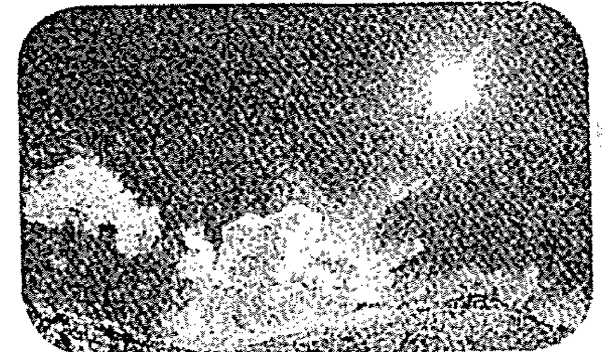
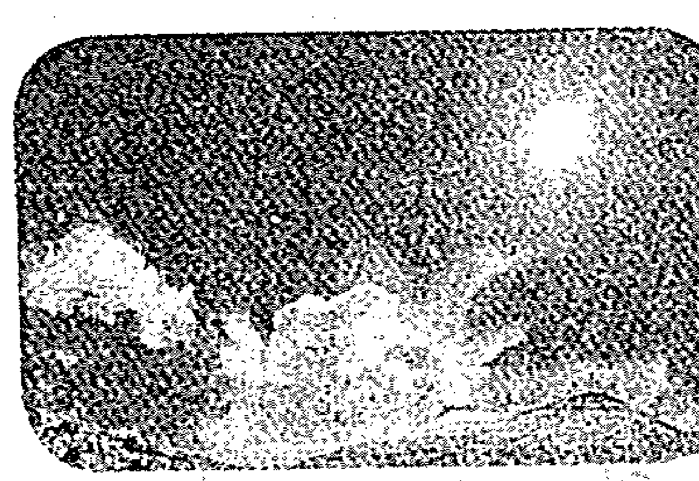
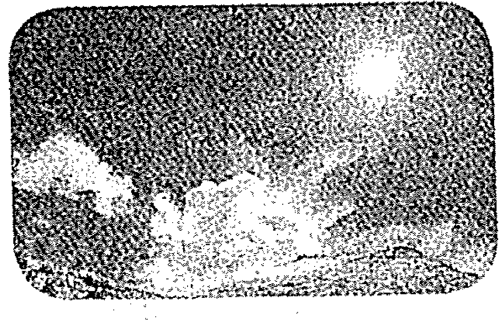
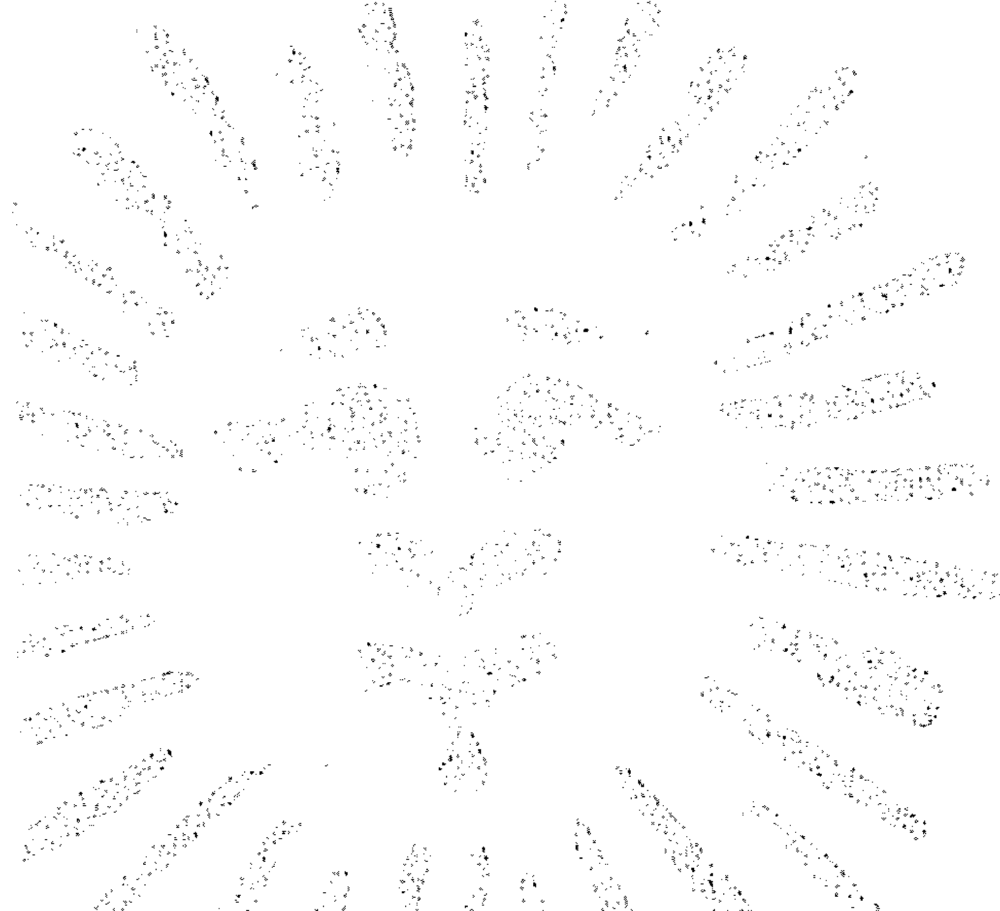

# 神奇的阳光疗愈；力

### 特別聲明

本書作者安德烈莫瑞茲，並未主張任何一種特定的健康照護形式，但相信對希望改善自己健康狀態的讀者來說，呈現在本書中的事實、數據和知識，都應該被每位讀者知悉。

作者嘗試對本書的主題內容提供一個最深入、正確且完整的訊息，但對於部分來自外部的參考資料，若有缺漏、不精確或矛盾處，作者和出版社誠心接受指教。

本書所提的方法並不試圖取代現有的主流醫療，讀者在取採任何方法之前都應自己審慎評估。書裡的所有陳述都是以作者本身的意見及理論為基礎。讀者在採取任何飲食、營養、草藥和同類療法營養補充品前，都應向醫療執業人員諮詢，在停止任何療法前也是一樣，作者在此並未試圖提供任何醫囑或替代建議。

此外，本書的陳述未經由美國食品暨藥物管理局（Food & Drug Administration）或聯邦貿易委員會（Federal Trade Commission）的審查，讀者在採用任何特定的方式來治療個人問題前，應靠自己的判斷或向醫療相關人員諮詢。

## 前言 陽光：天然的藥物

當聽到「藥物」這個詞，首先浮現在你心中的很可能是藥局依據醫師處方箋所開出的塑膠盒裝小藥丸。
但，事實是，並非所有藥物都是有處方箋的藥丸。更基礎、更基本、更精華的療癒物質和能量是存在的。大自然就是個免費開放給我們所有人的巨型藥局，在那兒，你就是自己的醫生，而當事情不對勁的時候，你的身體會不時寄出小小的處方箋給你。這些個處方都是你主觀上可察覺的症候和症狀。
就讓我打個小小的比方吧。當你脫水的時候，你的身體會告訴你它需要水。口渴的感覺就是你主觀上可以體驗到的。你感到口乾，而你知道喝水（一種免費且天然的物質）就可以改善這個問題，不用醫學專家來告訴你該怎麼做。出於本能地，你就是知道有水就夠了。

相同地，藥物並非僅限於傳統被標上名稱、劑量、有效日期及條碼的藥丸、藥片或膠囊。

更有形形色色其他不可或缺、可靠且蘊藏豐富的天然藥材，其中最重要的非陽光莫屬。在大自然這藥劑師手上，有的是強而有力的藥材，而陽光便是其中一項。

### 別讓包裝精巧的謊言欺騙了

可悲的是，陽光已被汙名化為眾多問題的成因，而非解決之道。讓我好好解釋此中原由：你正翻閱著堆在等候室角落裡的一本雜誌，雜誌裡一個面帶愁容的年輕女子意味深長的拿著一幀有個笑吟吟的金髮美女照片的相片。而此公共服務的宣傳文案上，標題下的是：「我妹妹意外的殺害了自己。她死於皮膚癌。」

震驚和同情一起湧上心頭。恐懼和焦慮也油然而生。這個消息是個警訊。這個「讓防曬措施成為你的生活方式」的呼籲使你開始慌張。你當然不想成為陽光侵襲下的犧牲品，也不想成為一幀裱好的悲慘相片。於是，你毫不遲疑的跳進商店買了防曬乳，一種對防衛陽光的合理保護，因為，你已經相信陽光是危險的了。

但是，請你等等！所有事物的價值不該如此膚淺。你剛被一個包裝精巧的謊言給欺騙了。

太陽不是你的敵人，它是你的朋友。有它的存在，你才能生存。你捨棄了天然的物質而就非天然的東西，這簡直就是在自找麻煩。你犧牲了自己的健康甚至性命，去成就一些你根本不認識的人的經濟收益。

雜誌中帶有誤導性質的「公共服務宣傳」，其實是由一些有著直接財務利益的公司所贊助的著名慈善防癌機構所刊登。換句話說，那不過就是一家防曬乳製造商所贊助的廣告。這廣告整個夏天都在數本女性雜誌上大肆宣傳。容我精確的引用這廣告上的警句：「若妳再不改變，皮膚癌可能致命」；它也極力慫恿人們「使用防曬乳，裹住妳並等待皮膚變好。」

讓我們談談這令人不齒的真相吧。簡單的調查一下，妳就可以發現相片中的女子是一個專業的模特兒，而不是一個皮膚癌下的犧牲者。這尖刻的訊息也暗示著那些死於皮膚癌的人其實死於他們自己的無知，巧的是並無任何明確的證據可支持此論述。

對許多人來說，這則廣告不合理的企圖操弄公共議題。對其他人來說，它則徹底違背了人們心中單純地對於一個應該以公共利益為出發點的機構的信任。此事件在學界和一般大眾間引起了極度的關切，尤其是當此機構利用其精明的公關手段已然成為國內最富有的慈善機構。事實是，當大眾對該機構主要發起人的印象仍停留在那語不驚人死不休的香菸廣告口號：「用Lucky（香菸）取代甜食」時，這對重拾人們對他們的信心一點幫助都沒有。

沒錯，關於皮膚癌可能致命，這個機構傳達給大眾的是部分正確的資訊，因為某些皮膚癌真的有致命的危險，他們被稱為惡性黑色素瘤（malignant melanomas）。但這種致死性的皮膚癌每年在美國全部的皮膚癌病例中僅占百分之六；而剩下百分之九十四的皮膚癌皆不會造成生命威脅。不幸的是，大部分人對少數潛在致命型態的皮膚癌和良性皮膚癌間的差別僅有非常模糊的認知，少數機關組織似乎也盡其所能地利用人們這方面的無知。

常見的皮膚癌類型——基礎細胞及鱗狀細胞皮膚腫瘤（basal cell and squamous cell skin tumor），在蒐集美國境內癌症好發率及治癒率等流行病學資訊的國家癌症機構（National Cancer Institute）裡的SEER資料庫中，甚至不被視為癌症。基礎細胞及鱗狀細胞皮膚腫瘤極少轉移，也幾乎總能藥到病除，亦鮮少令人致死。沒人曾聽過有人以「致死的鱗狀細胞癌（squamous cell carcinoma）」或「致命的基礎細胞癌（basal cell carcinoma）」來稱呼這種常見的癌症。

隨意以「晒太陽將導致罹患無情奪命的皮膚癌」來警告一般大眾，卻不去區分這極少數致命黑色素瘤（melanomas）和大多數可治癒的皮膚腫瘤間的差別，如果不能算是恐嚇，也像是蓄意的將恐懼灌輸給民眾。

顯而易見地，它的動機就是要多賣些防曬乳和其他的防曬用品。一個銅臭十足的動機。

### 防曬乳的唯一功能是防止晒傷

事實上，防曬乳最多不過能防止晒傷。它既沒有也無法預防那極少見且唯一的致命型皮膚癌——惡性黑色素瘤。在晒傷和黑色素瘤間從未發現任何決定性的關聯。因此，暗示防曬乳可以把你從皮膚癌的死亡威脅中救出，到底是個什麼樣的邏輯呢？事實上，研究結果顯示，那些使用防曬乳的人，反而是黑色素瘤好發的高危險群。

我希望這本書能使人們超然的去看待那些曾被丟到我們眼前的關於晒太陽的詭計和謊言，更重要的是，去幫助人們了解陽光所能帶來的無數好處。這是應該要知道的真相。在當今世上，真正的體悟才是一切。

> 「勇於深入黑暗，才能迎向光明。」
——莫瑞茲（Andreas Moritz）於二〇一〇年四月

## 第1章 太陽：地球生命的根源

陽光是生物能永續生存最重要的必需品，甚至連我們的存在都應歸功於它。如果沒有太陽，就不會有地球、也不會有生命，更不會有人類。地球上最初的生命形態即以陽光為生存的原料，像是行光合作用以自給自足的有機體。時至今日，雖經過了數代的演化，它們仍能續存。我們都是從仰賴陽光維生的原始生命形態中演化過來。雖然我們已經成為最複雜的物種，但我們仍保有對陽光最基本的依賴。

定期將身體曝曬在紫外線（UV）能夠殺菌的波長下，可以有效地抑制微生物、蟲子、黴菌、細菌和病毒。

紫外線輻射的效果卓著，因此被廣泛使用在不同產業做為殺菌的方式，像是淨水、食品衛生和器具的消毒……等等。在長時間的陽光直接曝曬下，許多細菌、病毒和寄生生物都會被殺死。舉例來說，淋病雙球菌（Neisseria gonorrhoea）在通風的陽光下曝曬數小時就會死亡；這在許多能致病的細菌上也一樣有效。

注意，陽光照得到的病房裡，細菌數量比陰暗的病房少得多？另外，你可曾注意，陽光透過玻璃仍能殺死細菌？強大有效的免疫功能使陽光成為最重要的抗病劑之一。但，這只是陽光所提供強化及維持人體健康的眾多好處之一。

### 太陽是唯一真正的能量來源

太陽是地球上唯一真正的能量來源，它提供植物生長和結果所需的所有能量。能量只能從一種型式轉換成另一型式。太陽能被貯存在植物中，我們吃進植物並消耗潛藏在植物內的能量，植物中的能量因而被轉換成我們體內的能量。太陽的能量轉化成碳水化合物、蛋白質和脂肪的型式貯存在植物裡。而食用植物性食物，可供給我們常保活力及健康所不可或缺的能量。我們體內對食物的消化吸收和新陳代謝，主要的作用就是分解、轉化、貯存並利用這些以各種型態被封存下來的太陽能。

處於食物鏈最底層的食物都是直接從陽光製造出來的，因此可以提供給我們最多的太陽能量。換句話說，位處食品金字塔底層的植物蘊藏最豐富的太陽能。相對的，處於食物鏈上層的產品只含有少數太陽能，甚至沒有太陽能，因而實際上對人體就算不是有害，也是無益的。這種產品包括用死去的動物和魚製造的食品、垃圾食物及微波食品、冷凍食品、輻射線照射食品，基因改造食品（註）和其他經過高度加工的食品。

木頭、燃料和礦產也都一樣，僅僅是鎖住太陽能量的不同型態。他們都是包住太陽能量的外殼。不像非再生能源，太陽能是無窮盡的。
從太陽傳到地球的太陽能總量，是我們目前生產和消耗的二萬五千倍之多。當然某部分能量被反射回太空，但大部分都被大氣層和其他元素吸收了。這種能量很容易被利用，我們的人體就使用太陽能。

所有的物質都是「凍結」的陽光，我們的細胞就是由豐沛的太陽能所組成。

我們賴以維生的葡萄糖和氧氣是太陽的產物。少了這些由太陽能轉化而來的葡萄糖和氧氣分子，我們連動心起念的能力都沒有。

通過海洋上空的空氣，經由日照加溫，於是能夠吸收水氣。當此充滿大量水分的濕潤空氣通過平地而聚集在高海拔的地區時，經由冷卻，部分在空氣中的水分也因此被釋放出來。水以雨和雪的型態下降到地面，充盈了河川，也濕潤了地表並灌溉了草木。

太陽靠本身相對於地球轉動及月球的位置，來操縱地球的氣候及季節的變化，連一些最小的細節也在它的掌控之中，像是氣溫、降雨量、雲的型態和乾季的長短等等。

地球並非僅為人類的棲身之地。太陽也必須幫助其他物種生長，像是動植物、昆蟲，以及生命賴以存續的微生物。地球上極其多樣的生態系和錯綜複雜的生命型態，就像是一道即使超級電腦也難解的數學題，但太陽卻能準確無誤的計算出各物種，不論是螞蟻、樹木或是萬物之靈的各種需求。

> 註 一九九八年，科學家們找到基因改造食品可能對人體有害的第一個證據。著名的洛威特研究所（Rowett Research Institute in Aberdeen, U.K.）的研究員發現，基因改造食品可能會損害老鼠的免疫系統。約百分之六十在超市販賣的加工食品——從漢堡到冰淇淋——都可能含有經基因改造的成分。

### 陽光是萬物賴以維生的能量

不意外地，我們的祖先將太陽奉若神明。世界上各角落，不同的文明和文化的人們都各自地崇拜太陽。

人們相信羅馬神話中的太陽神阿波羅（Apollo）是掌管光線和醫療的神祇。在古老的希臘文學作品中，赫利奧斯（Helios）被描述成頭頂光環，每天乘著兩輪戰車橫越天際的太陽之神。對古埃及人來說，瑞（Ra）是太陽，也是神性的示顯。他們相信人類降生自瑞的眼淚。中國人過去相信有十個太陽在空中輪替當班。印度教徒相信透過特定的瑜伽體位及頌經是對太陽的禮讚，這種體位被稱為「拜日式」（Surya Namaskar），此體位法至今仍被許多人奉行。

太陽所產生的電磁波有著不同的波長，不同波長的電磁波能起不同的作用和能力。它們的波長範圍小自0.000001奈米（一奈米等於一米的十的負九次方）長的宇宙射線，到大至約四千九百九十公里長的電波。太陽所產生的電磁波有宇宙射線、珈瑪射線、X光、多種紫外線、光譜由七種不同顏色的光線所組成的可見光、短波紅外線、紅外線、無線電波和電波。這些電磁波的能量大多數被環繞於地球四周的大氣層所吸收並使用。

只有小部分電磁光譜能到達地球表面。然而，人類的雙眼所能識別的，僅占此光譜中的百分之一。雖然我們看不見紫外線和紅外線，但它們卻對我們影響甚鉅。事實上，我們已經證實紫外線是眾多不同射線中最為活躍的一員。由於季節的變換和地球位置的移動，紫外線和光線中其他成分的強度也不斷在變化。這種變化讓所有生物能持續生生不息的生長。

## 第2章 紫外線的神奇療癒力量

在晴朗的早春時節，人們興起走出戶外迎向陽光的日子已不復見。如今僅剩下那些異常勇敢，或是全然漠視由防曬乳廠商贊助的所謂防癌專家提出的警告者，才膽敢冒險走入危險的烈日中。一些是非不分的執業醫師甚至把那些不先全副武裝就走進戶外陽光下的舉動視為不負責任。人們已被為自身既得利益服務的那些人所說的謊言給朦蔽了，認為若沒有從頭到腳都做好防曬的萬全準備，就像在賭命一般。
事實上，日光不但不會致命，事實上，它還是賦予我們生命，並使生命得以存續的大功臣。
否則，在不懂遮陽的年代，人類是怎麼存活下來的呢？

### 紫外線究竟是什麼？

幸好「日照會導致疾病」的科學證據遲遲提不出來，已然引人注意，才會讓這荒唐的謬論逐漸式微。實際上，恰好相反，人們發現缺少日照才是導致疾病的危險因子。

長久以來，陽光一直含冤背負著毒害人類的罪名。提出這項告訴的，大半都是防曬工業和醫藥界的業者，而我們則都是陪審團的一員。直到近日，我們才開始體認到並無直接證據指向太陽，也才開始還給太陽一個它應得的公道。陽光中，僅剩下紫外線仍被視為極度有害的成分。但事實的真相卻是，紫外線輻射對人體正常功能的運作有著極為重要的影響。

紫外線輻射是三種太陽輻射中的一種。紫外線屬於一種太陽所發射出的電磁輻射。由於其波長太短（介於三百至三百八十奈米），因此人類無法以肉眼觀察。可見光和紅外線則是太陽輻射中的另外兩種。

雖然紫外線是太陽所發射出的自然輻射，但也有一些人工的器具，像是燈和焊接工具也能產生紫外線輻射。然而，太陽仍是紫外線的主要來源。

在世界不同的角落、不同的時間，太陽所發射出的紫外線強度都不同。每天大

## 第2章 紫外線的神奇療癒力量

約在正午時分，紫外線的強度最高。據估計，日間紫外線輻射的總量中，有半數都來自午間的短短數小時內。除了太陽和地球相對位置的影響外，雲層和臭氧層也都會對紫外線的入射效果產生影響。

大部分的紫外線輻射會被臭氧層吸收，能到達地表的其實僅占一小部分。不幸的是，這些已衰減的紫外線輻射，能輕易地被窗戶、房屋、眼鏡、太陽眼鏡、防曬乳及衣物所阻隔。

在一般情況下，太陽發射的紫外線能穿過窗戶。但是，現代的窗戶在加裝了抗UV的材質後，能有效達到百分之九十五的抗UV效果。甚至連特製的眼鏡和隱形眼鏡都能抵擋紫外線輻射。

### 盛極一時的日光浴治療法

早在一九三○年代，第一個抗生素藥物「盤尼西林」被發現之前，也遠在藥品現代化以前，陽光是最受歡迎的療癒能量，至少在歐洲是如此。日光療法，亦稱為日光浴治療法（Heliotherapy），在十九世紀末到廿世紀中是對抗傳染病最成功的療程。日光浴治療法，顧名思義是以刻意讓人暴露在自然的陽光下為基礎的一種治療法。

曝曬於陽光下的病患，可以從有療效的太陽紫外線輻射中獲得益處。

研究結果顯示，將病患曝曬於經控制的日照總量下，對降低血壓（至多能降低四十毫米水銀柱）、減少血液中的膽固醇、抑制糖尿病患的血糖含量，以及增加人體中對抗疾病的白血球細胞都有顯著的功效。日光療程更能增強心跳輸出並增加血液中的含氧量。對患有痛風、類風濕病、關節炎、結腸炎、動脈硬化症、貧血、膀胱炎、濕疹、粉刺、牛皮癬、皰疹、狼瘡、坐骨神經痛、腎臟病、氣喘，甚至遭到灼傷的病患，都能從有療效的太陽射線中得到益處。在癌症研究機構裡（Cancer Research Institute），日光浴療法更被成功的應用在DNA修復上。觀察結果指出，在數小時的日照療程後，癌細胞開始死亡。而當療程結束後，健康的細胞依然能保持健康無礙。在接受此單一療法的治療下，百分之七十至八十的腫瘤皆能獲得良好的療效。

陽光天然而廣闊的光譜或許是最強有力的藥物。

羅利爾博士（Dr. Auguste Rollier）在他的年代是最著名的日光浴治療師，他同時也是個醫生和作家。在他事業的高峰，他在瑞士萊辛區（Leysin, Switzerland）主持三十六家診所，共有超過一千個病床床位。他的診所皆坐落在海平面五千英呎以上的地區。因為，在海平面以上，每超過一千英呎，其紫外線的強度就會增加百分之之四。也就是說，在海拔五千英呎的地方，紫外線的強度比在平地整整增加了百分之廿。這種將診所設置在高海拔地區的策略，使他的病患能接收更多紫外線。羅利爾醫師利用紫外線來治療結核病、佝僂病、天花、尋常狼瘡以及外傷等病症。

在紫外線療法上，羅利爾其實是跟隨一九○三年諾貝爾醫學獎得主——丹麥醫學博士芬生（Dr. Niels Finsen）的腳步。芬生在一九○三年以他使用紫外線治療結核病的成就，獲得諾貝爾評審的青睞。羅利爾醫師在二十年間成功治癒超過兩千個外科結核病例（包含骨骼和關節的病例），更有高達百分之八十的病患因痊癒而獲准離院。羅利爾發現，在晨間進行日光浴，再搭配營養豐富的飲食可以產生最好的療癒效果。

他讓病患們（大部分為孩童）逐步適應陽光，直到可承受全身赤裸曝曬在陽光下的程度。冬天他們可能花上一整天將身體暴露在晴朗、乾冷的空氣中。夏天則將晒太陽的時間限制在晨間的數小時內。

過去，每年有超過十萬人死於結核病。因此，它被稱為「白死病」（註）。

> 註 譯注：鼠疫在當時被稱為黑死病。

最令醫學界震驚的，莫過於發現配戴太陽眼鏡就無法獲得陽光的療效，因為太陽眼鏡會將執行人體主要生理功能所需的太陽光譜阻擋在外。值得注意的是，即使置身於陰暗處，眼睛仍能接收到這些射線。時至一九三三年，已能證實日光對一百六十五種不同的病症都有良好的療效。

然而，隨著羅利爾在一九五四年逝世，再加上製藥工業的日益壯大，日光浴療法也不幸地被棄而不用。陽光溫和有效的療癒能力自此被人忽視且快速地被人遺忘。到了一九六〇年代，人類製造的「神奇藥品」取代具有療效的太陽成為醫界最有魅力的明星。到一九八○年代，一般大眾收到一連串對日光浴的警告，並逐漸被灌輸晒太陽會增加罹患皮膚癌風險的訊息。人們不斷遭受將金錢利益置於大眾健康和社會福祉之上的防曬工業遊說團體的警告，甚至可說是威脅。

今日，太陽被視為造成皮膚癌，罹患導致眼盲的白內障及致使皮膚老化的兇手。只有那些「冒著危險」讓自己暴露在陽光下的人們，才能感受到陽光實際上能讓他們感到更舒服，不過前提是他們不使用防曬產品，也不過度曝曬導致曬傷。不變的真理是，過猶不及都不好。

### 晒太陽，過與不及都不對

過度暴露於太陽底下，的確會造成皮膚的損傷，但曬得太少，對身體健康的危害卻更加嚴重。我們必須適度地曬太陽，在生活的所有面向都適度，才是健康的。

近年來以抗生素取代日光浴治療法的作法，造成了具抗藥性變種細菌的繁殖。這種細菌能抵抗各種醫藥的治療，唯獨對適當運用陽光、空氣、水、正確的飲食和規律運動的均衡生活型態莫可奈何。

儘管人類的醫藥發展不斷有卓越的進步，但細菌似乎仍更能占得先機。或許你不久前才聽說了取得重大突破的某項新藥，不用多久，你又會看到關於某病原體產生新型致命突變種的消息。

只有當人體的主要需求都處於平衡的狀態下，疾病才可能會痊癒。大量減少甚或完全斷決維持生命所需元素的供給，人就會生病。疾病的發生，說穿了就是身、心、靈功能處於失衡的狀態。

陽光中的紫外線可以刺激甲狀腺增加荷爾蒙的分泌。甲狀腺的分泌物對人體新陳代謝至關重要，荷爾蒙增加將使人體的基礎新陳代謝率提高，而新陳代謝率的提高對減重和增進肌肉生長都有幫助。

豢養於室內晒不到太陽的禽畜增肥速度較快，相同的情況也會發生在不晒太陽的人身上。因此，假如你想減肥或變壯，那就規律地晒晒太陽吧！

任何接觸不到陽光的人都會變得虛弱而且身心狀況百出。元氣遲早會消耗殆盡，這也正是生活品質不良的寫照。生活在挪威、芬蘭這類北歐國家的人們，因為每年有數月必須生活在黑暗中，比起生活在世界上其他陽光充足角落的人，更容易脾氣暴躁、身體疲勞、生病、失眠、心情沮喪、酗酒和自殺。在這些國家皮膚癌的發病率也較高，舉例來說，蘇格蘭北部的奧克利和雪特蘭島上皮膚癌的發病率和地中海諸島相比高出了十倍之多。

紫外線可以活化一種名為Solitrol的重要皮膚荷爾蒙，Solitrol會影響我們的免疫系統及人體控制中心的許多部分，而當Solitrol和松果體荷爾蒙、褪黑激素結合時，將可改變人的情緒及日常的生理節奏。

紅血球中的血紅素需要紫外線來結合身體內所有細胞正常運作所需的氧氣，所以，缺少陽光，幾乎和所有類型的疾病，包含皮膚癌和其他各種癌症都有關係。由此可知，缺乏陽光會對你的健康產生極為不利的影響。

## 第3章 UV輻射能夠防治皮膚癌嗎？

雖然癌症已存在數世紀之久，但仍頗像現代瘟疫一般令人束手無策。近來研究報告顯示，各類癌症占美國死亡原因的百分之二十五。

癌症是一種生理上的畸變（被稱為疾病），其特徵是一群生長失控的細胞，雖然某些癌症像是血癌並不涉及腫瘤的形成，但大多數的癌症病例仍肇因於惡性腫瘤。

人體內細胞不正常的增長並伴隨入侵鄰近組織的現象，是腫瘤轉為惡性或形成癌症的唯一特徵。良性腫瘤多半不具侵入性，也因此較不危險。

惡性腫瘤能以另一種猛烈的面貌呈現，也就是轉移。就目前所知，癌細胞通常經由淋巴或血液擴散到其他距離較遠的部位或器官。

癌症發生於細胞內遺傳性物質的畸變。這種畸變可能是天生的，或是受到易致癌物的影響，也可能是致癌物質所引發的。我們發現許多物質都具有致癌的特性，但其中最常見的包含香菸、多種化學成分、加工肉品、存在於自然界的毒素、刺激性物質、特定的輻射線以及病毒。這些致癌物中絕大多數的不良影響都能輕易的被避免，世界上超過三分之一的癌症致死病例都肇因於可扭轉的危險因子，最普遍的包括抽菸、酗酒和不健康的飲食習慣。

依照感染的部位可劃分出多種不同型態的癌症。男性好發癌症最常見的部位是攝護腺，而女性最容易罹患癌症的部位則是乳房組織，但癌症可發生在人體的任何部位，包括皮膚。

大部分皮膚癌是黑色素細胞受侵襲的結果。皮膚癌通常在初期就會被察覺，因為它是在皮膚的最外層或是表皮，用肉眼就可以看見它受感染的狀況。臨床上，它也是最容易診斷的癌症。由於明顯的外在形態，使得皮膚癌比肺癌、乳癌和攝護腺癌更容易被診斷出來。

### 皮膚癌的三種類型

皮膚癌有三種主要類型——基底細胞癌（BCC）、鱗狀細胞癌（SCC）和惡性腫瘤。日漸普遍的基底細胞癌和鱗狀細胞癌乃屬於非腫瘤性，至於第三類型的惡性腫瘤雖然少見得多，但其致死率卻遠大於前兩者。

基底細胞癌是最普遍的皮膚癌。它的危險性最低，也最不具有擴散的傾向。最常見的跡象是皮膚表面出現光滑凸起的顆粒。如果放著不管，它就會鑽入更下層的組織，而對病患的外貌造成嚴重的損害。

和基底細胞癌相比，鱗狀細胞癌就危險得多，因為它會擴散到人體的其他部位。臨床上的特徵是在皮膚上長出一層厚厚的鱗狀紅斑，這些病灶容易引發潰瘍及造成流血。如果不去處理，它們可能會發展成一大片腫塊。

相較於惡性腫瘤，非腫瘤性的病例報告頻繁得多。大多數病患罹患的都是基底細胞癌。

惡性腫瘤是危險性最高的一種皮膚癌，也是預後成效最差的一種。它們會快速擴散，若未能即早發現，治療起來也非常困難。它占所有皮膚癌致死病例中的百分之七十五。這種癌症通常始於痣或是關於皮膚最外層黑色素細胞的異常皮膚區塊。

痣的尺寸、形狀、顏色或位置上的改變，都有可能是惡性腫瘤的徵兆。其他像是成年後身上出現的新痣，或新近感到疼痛、發癢、長出鱗狀物或流血都是少數指向可能得到這種疾病的徵象。

白種人比其他人種有更容易罹患惡性腫瘤的傾向。

### 密切觀察身上的痣及其變化

人們必須小心地觀察身上的痣以及它們的任何變化，以便即早在惡性腫瘤變得藥石罔效前就能被發現。惡性腫瘤的一些特徵包括：

- 不均勻的皮膚病灶。
- 病灶邊緣不平整。
- 顏色：腫瘤通常有多種顏色。
- 直徑：直徑超過六釐米的痣發展為腫瘤的機率大於較小的痣。
- 逐漸變大：痣有變大或有變化的跡象。

皮膚癌過去一度和慢性皮膚病牽扯在一起。

紫外線輻射過度曝曬而引發的發炎和久病不癒的皮膚慢性過敏症狀（常見的有未癒合的傷口和某些病毒感染），都和皮膚癌有關。

據信，非腫瘤性的皮膚癌是由UVB輻射引發直接的DNA損害所造成。另一方面，我們假設惡性腫瘤是由於暴露在輻射線後所造成的間接的DNA損害所引起的（註11）。

無論是來自天然或人工的UV發射源——陽光和人工的日曬沙龍，都被認為和皮膚癌息息相關。

我們相信有接近百分之八十五的皮膚癌是因為過度日曬所造成。

> 註11 紫外線輻射根據其波長被區分為三類——UVA、UVB射線和UVC射線。
> UVA射線占到達地球的紫外光中的百分之九十至九十五，也擁有相對較長的波長（三百二十至四百奈米）。臭氧層不會吸收這些波長。
> UVB射線的波長居中（二百九十至三百二十奈米），僅有部分被臭氧層所吸收。
> UVC射線的波長最短（小於二百九十奈米），幾乎完全被臭氧層所吸收。

從一九七○到一九八六年，加拿大男性的腫瘤年增率以令人憂心的百分之六的速度成長，而女性的腫瘤年增率則是百分之四。澳洲的腫瘤好發率位居全球之冠。男性的好發率在一九八○年到一九八七年間成長了一倍。同時期，女性部分則有超過百分之五十的成長。目前估計七十五歲以下的澳洲人當中，有三分之一都曾因不同類型的皮膚癌而接受治療。令人吃驚的是，近年來研究結果顯示，現今英國的腫瘤死亡個案還高過澳洲。在英國每年新增九千五百個腫瘤病例，其中有一千三百人死亡。

這份研究完善的報告無疑地顯示，皮膚癌有逐漸普遍的趨勢。

最常流傳的問題是為何太陽從千百年來無害的狀態，突然變得如此惡毒，甚至試著奪取大量人命？

太陽的行為到底歷經了什麼樣的演變？而紫外線又為何在一夕之間變得如此令人忌憚？

在我們開始分析這近來所出現的敵意前，我們必須記住太陽在人類的皮膚上起作用的程度會受三種不同因子的影響：

1. 太陽，也就是UV輻射的最根源處。
2. 地球及大氣層，UV光波是藉大氣層向地球移動（抑或，大氣層其實是在阻礙UV的移動）。
3. 人類，接收輻射的皮膚。

確實，我們的皮膚不論是有意的以日曬機助曬上色或無意的日曬，都有可能遭到損害。但是，為了在輻射線和皮膚遭受破壞到致癌的程度間取得關連性，我們必須對可能影響輻射曝曬的三個因子做通盤的研究。

由此，我們才能將皮膚癌的發生歸咎於太陽活動的改變，或歸咎於大氣層的改變，抑或是歸咎於人類自己的改變。

就我們所知，太陽發射UV輻射的總量並無劇烈的增加。所以，並不是太陽突然對人類產生敵意進而危害到人類。

假如太陽在近代並未遭逢重大的轉變，那麼讓我們對太陽輻射敏感的原因，若非大氣層的變化，就是我們本身行為上的改變了。

### 日益稀薄的臭氧層，造成紫外線照射量增加？

醫界一直都認為問題出在大氣層上。更精確的說，就是臭氧層的問題。他們把矛頭指向環境變化，而非人類。「紫外線是造成皮膚癌的原兇」的說法，說服了他們。這個理論的基礎是假設日益稀薄的臭氧層讓太多能殺死細菌的紫外線來到地表，從而傷害了萬物，其中也包含了我們的皮膚和眼球的細胞。

然而，這個理論卻有許多重大的缺陷，且無科學證據能加以佐證。和普遍認知相反的是，並無證據能證明由極地觀測到的臭氧層減少會導致腫瘤增加。

事實是，藏在地表平流層內的臭氧層，早已將能殺菌的UV射頻給大量破壞或過濾掉了，僅有少量為了淨化我們呼吸的空氣和飲水所必要的紫外線，能確實到達地表。

讓我們更進一步地揭露「臭氧層耗竭導致皮膚癌」這個毫無根據的說法。一些理論曾將臭氧層稀薄和皮膚癌的普及率扯在一起，這些理論大多繞著相同的基礎模式打轉：

1. 釋入大氣層的含氯氟烴（CFCs），經過一段時間，滲入了平流層並釋出活化的氯分子，而氯分子破壞了臭氧層，並對稀釋臭氧濃度起了催化作用。
2. 變薄的臭氧層導致射入地表的太陽UV輻射增加（註）。
3. 暴露於過多的太陽UV輻射之下，造成皮膚癌好發率增加。

這些說法都是些未經小心求證的假設，而且更有可能是錯誤的假設。
首先，並沒有關鍵證據能證明含氯氟烴是導致臭氧層稀釋的主因。這一點可是辯論的好題材。

因為一派學者認為含氯氟烴在臭氧層消失中扮演關鍵的角色，但是，另一派卻認為含氯氟烴的影響無足輕重。由於火山和海洋以氯化氫（HCL）和鹽霧的形式將多於一萬倍的氯釋放到大氣層中，因此這派科學家相信自然界釋放出的氯可輕易地超過含氯氟烴所製造的量。持相反意見的一方則不認同這樣的解釋，並提出這種氯的可溶性較低，因此，可以輕易地到達平流層。

這兩種論點都各有缺陷。從前對不同原因所進行的各種研究皆各自強化了兩種理論。早期由美國國家大氣研究中心（National Center for Atmospheric Research, NCAR）的科學家曼肯（Mankin）和考菲（Coffey）在飛機上所做的觀察顯示，含氯氟烴造成氯化氫漸增的趨勢導致了活化氯的形成，並使臭氧層遭破壞。另一方面，比利時科學家贊德（R. Zander）在一九八七年出版的研究結果指出，HCL並無逐漸增加的趨勢。明顯的解釋是來自於自然界的氯在平流層裡佔有優勢。在一九九一年，當NASA的研究員在林斯蘭（Curtis Rinsland）和他的同事們發現氯化氫每年增加百分之五的趨勢時，他們認為來自於自然和人為的氯對此趨勢都有影響。

雖然，在實驗室做的實驗顯示，氯可以輕易地破壞臭氧，但在平流層的臭氧層中，卻不是那麼容易。

活化的氯本身即可對臭氧產生破壞。但這種氯和氯化氫一樣，普遍都以化合物的型態存在。因此，臭氧並非無情的受制於爆量有害的氯的攻擊。

紫外線輻射和臭氧耗竭之間有什麼樣的關係呢？而較稀薄的臭氧層和到達地表的太陽紫外線輻射增加之間，是否又有關連？

再者，它的重要性如何？

在我們開始做出臭氧耗竭是有害的聲明前，我們首先需要知道臭氧是否真的變薄了？不幸的是，當我們要對臭氧的濃度做量測時，仍存在著許多限制。

舉例來說，比利時研究員謬爾（Dirk De Muer）和貝克（H. De Backer）所做的研究顯示，空氣汙染中常見的二氧化硫會干擾臭氧的量測。這是因為這兩種氣體都是以相似的方式來吸收UVB輻射。因此，大氣中二氧化硫的變化，會被誤判為臭氧的變動。所以從六○年代至今，美國和西歐對汙染的控制，反應在二氧化硫的減少上時，也同時造成了臭氧減少的假象。

十月份在南極春季時分，臭氧層產生暫時性的局部稀化，以致於在南極上方形成臭氧破洞是真實的現象，那是個一年一度的短暫階段。然而，這種現象並不足以明確到做為全球性臭氧稀釋的跡象。

在靠近南極臭氧破洞的最大南美城市彭塔阿雷納斯（Punta Arenas）所做的研究，並未顯示出有和臭氧稀化相關而增加的健康問題。事實上，UV的程度小到不足以產生任何值得注意的影響。

臭氧的變化和地理性差異對UVB輻射強度所產生的影響，在相比之下臭氧變化的影響顯得微不足道。在極地和赤道間UVB的量很自然的可達到約五倍的差距之多，大半是由太陽平均角度的變化所造成。因此，從中緯度的地區往赤道方向移動六十英哩，UVB的量就會增加百分之十。話雖如此，但沒有理由要居住在赤道的男性去擔心他的皮膚健康。赤道較高的UV強度，並不會使得他的皮膚更容易受傷或有較高的皮膚癌風險。事實上，在赤道的皮膚癌發生率，比往兩極方向的地方更低。

大多數嘗試對臭氧進行量測的舉動，其背後的目的其實是想監控UVB輻射。為了證實全球性臭氧衰竭的說法，研究者長久以來一直致力於證明地表UVB的輻射量確有增加。然而，一直以來，他們無法找出可以佐證這個理論的證據。

直到一九九三年十一月某個研究報告被公布之前，對這個假說的研究仍一直處於矛盾的狀態。從一九八九到一九九三年，在加拿大多倫多曾有UVB輻射爆量增加的紀錄。這新的研究看似最終為偉大的臭氧衰竭理論提供了一點點的可信度。但在進行了完整的調查後，才發現這個研究結果是假的。研究者在不知情的狀況下，將一九九三年三月侵襲東北方的世紀暴風雨所產生的天候干擾，誤判為UVB輻射短期升高。

雖然人們一直被誤導而相信全世界UV輻射總量皆處於穩定增加的狀況，但研究結果卻證明事實恰好相反。

從一九七四年開始，在美國所做的測量顯示，到達地表的UV輻射正處於逐年不斷地小量減少中。執行此研究的原始目的是偵測實際上會導致晒傷的UV輻射的頻率。

## 第3章 UV輻射能夠防治皮膚癌嗎？

在一九七四到一九八五年間，UV輻射以每年平均百分之0.7的速度下滑，之後也持續保持下滑。美國皮膚癌的數量在此十一 year 間增加了兩倍的事實，正好和這個「因臭氧衰竭而使UV輻射增加，以致皮膚癌大增」的理論背道而馳。

儘管這個指稱臭氧衰竭會導致皮膚癌增加的理論充滿了矛盾，人們卻仍被搞得緊張兮兮。這股極端的焦慮最終引導出一九八五年在維也納會議中制訂出「禁止生產會造成臭氧衰竭物質」的國際禁令大綱。

史賴普（Slaper）等人開始著手評估這類禁令對皮膚癌致病率的影響。他們的研究在三種不同情況下進行。

1. 不禁止有毒物質的生產。
2. 禁止五種已知的致臭氧衰竭劑達百分之五十。
3. 完全禁止其中有此特性的二十一種化學藥品的生產。

此研究在假設全球都會遵守且不會對人類曬太陽的行為造成重大改變的情況下執行。根據這些假設推斷，在三種不同的局面下各自產生的影響如下：

不加禁止，皮膚癌致病率在二在二〇〇〇年將達到目前的四倍。

在遵守第二種限制方式的情況下，皮膚癌的致病率到二率到二率到二〇〇〇年「僅僅」只會變成現在的二倍。

在第三種局面下，未來六十年中，皮膚癌將只比目前多出百分之十。

然而，這些驚人的預估數據其可信度仍有待辯證。

此研究是以在三種狀況中各以不同的臭氧衰竭率做為假設，並透過這個假設的數據來推估未來一百年中到達地球的UV輻射水準。但我們可以對這整個行動的價值提出質疑，因為地表觀測站偵測器所得出的數據，甚至無法和衛星偵測器得到一致的結果。

同時，在他們的研究裡，對UV輻射和皮膚癌間做出了量化關係的假設。這看起來很合乎邏輯，唯一的問題是，這個研究所做出的UV輻射和皮膚癌間的量化關係是建立在老鼠身上！

臭氧衰竭並不會對皮膚癌中最惱人的惡性腫瘤的好發率造成影響。這一點可以從史泰羅博士（Dr. Richard B. Setlow）和他的同事在紐約長島的布魯克海文國家實驗室（Brookhaven National Laboratory）所做的實驗中得到驗證。

這個研究是在特地培育出的混種魚身上所完成的，這種魚對腫瘤的感染非常敏感。這些魚被分為兩組，分別被暴露在UVA和UVB兩種輻射之下。會做這樣的安排是由於有百分之九十至九十五的腫瘤感染都來自UVA輻射。既然臭氧層既不能影響也不能吸收UVA輻射，因此衰竭理論和惡性腫瘤間的相互關聯是不合邏輯的。UVA可以穿透臭氧，就好像臭氧並不存在一樣。就算大氣層中的臭氧全部消失殆盡，UVA的總量依然會維持不變。假若惡性腫瘤是由過量的UVA輻射所引起的，沒道理把責任推到臭氧衰竭上。

另一個需要加以考量的是，在一天當中花大部分時間在室內工作的人更常罹患腫瘤。這樣的觀察，對將UV射線增加和腫瘤好發率升高間劃上等號的說法，提出了強烈的挑戰。另一個明顯的矛盾就是，事實上這些癌症病灶通常出現在一般不會暴露在太陽下的部位的皮膚上，像是眼睛、直腸、陰戶、陰道、嘴巴、呼吸道、腸胃道和膀胱。

一九八〇年在美國發現的惡性皮惡性皮膚癌（腫瘤）的數量是八千例，八年後增加了百分之三百五十，達到二萬八千例。在一九三在一九三〇年，腫瘤形成的預估值很低，在一千三百人中僅有一名。到了二〇〇二年，每年在美國被診斷出的新病例達四萬五千到五萬人。

總而言之，在新的千禧年展開後，每年都有二百萬美國人被診斷出罹患了某些型態的皮膚癌。

現在有數以百萬計的病患，他們都相信稀釋的臭氧使陽光變得危險。這也使得人們相信太陽是使他們罹患皮膚病變的罪魁禍首。這是個悲哀、不幸，甚至害人匪淺的誤解。

既然UV輻射實際上正逐年減低，而在百年前，UV強度比現在高得多，人們也花更長的時間待在戶外，皮膚癌卻極為少見，那麼到底是何種因素才須為皮膚癌負起責任呢？

如果變得與生命為敵的既非太陽也非地球，那麼唯一的催化因子就是人類本身行爲上的改變了。

究竟人們做了什麼改變呢？

我們知道不是生理或構造上的改變，所以，改變的一定是我們的行爲和我們的活動。

### 晒傷是身體發出的暫停信號

正如同之前曾提到的，我們的皮膚對來自陽光的傷害是很敏感的，但只有在過度曝曬於陽光下，才會對皮膚造成損害。我們的皮膚只能有限度的承受炙熱的陽光，當超過了這個極限時，我們的身體會發出暫停的信號，明顯的徵兆就是出現曬傷。如果我們遵從信號的指示，並尋求遮蔭的地方，就可以本能地消除皮膚受損的可能性。只有故意忽視或壓抑這些信號，才會讓我們的皮膚因過度曝曬而受傷。

某些人由於本身的職責，得故意對這些明顯的曬傷徵兆視而不見。舉例來說，在田裡耕作的農夫，或長時間待在賽道上的運動員。

然而其他人選擇用特定的方式，來壓抑皮膚天生對過度曝曬所造成的傷害的指示，一個最適切的例子，就是那些假日在海灘上隨意塗抹一點防曬乳就開始做起日光浴的渡假客。他們可能萬萬沒料到防曬乳的本質只是在壓抑。

讓我們用這兩個例子，壓抑身體對過度曝曬起反應的無知農夫和渡假客。農夫和渡假客兩者在陽光下過度曝曬的程度或許都相等。然而，去壓抑自然反應的渡假客，卻有較高的發病風險。這是因為他擾亂了自己的生理機能，並且不讓自己的身體以正常的方式來運作的結果。他使用了人體無法分泌且不能識別的防曬乳，而為自己製造了一種不自然的狀況。

我們生來就具有會染色的黑色素這種「天然的防曬產品」。任何人造防曬產品所產生的外來干預，都會完全擾亂身體處理陽光過度曝曬的天然機制。這樣的抑制會給身體錯誤的訊號，隨後，會使身體無法理解並產生異常的反應。

我們的祖先從未使用過防曬乳。我反覆試著去說明的是，在促使皮膚癌的發生上，要負責的既不是太陽也不是地球，而是人類生活方式的改變，人類一心想要尋求的人造替代品，實際上卻讓我們無法去過正常自然的健康生活。

## 第4章 UV愈多，癌症愈少

現在，我們已透過驗證的研究，來確立出到達地表的UV射線實際上並未增加。但是，既然世界上大部分的人仍受誤導，而去相信和事實相反的假設，也就是以為穿透臭氧的UV輻射量有所增加，所以，還是讓我們花點工夫來搞懂實際的影響到底是什麼吧。

讓我們假設穿透到地表的UV量，每年以百分之一的速率增加（但實際上並非如此）。

即便如此，這微小的增幅與單純地理上的不同使人經驗到的差異相比，就算沒有小上千倍，但至少也小了上百倍。

我們先假設你由兩極附近的地區，如：冰島或芬蘭，朝赤道方向遷移，例如：東非的肯亞或烏干達。當你到達赤道時，你身上的UV曝曬量將增加到令人吃驚的五十倍之多！

假如你住在英格蘭，並決定移居到澳洲北部，你會使曝曬量增加百分之六百！透過計算顯示，每往赤道移近六英哩，你的UV射線曝曬量就增加了百分之一。

在赤道的陽光較大，因此UV也較強，由於地球是一個球狀的物體，所以陽光照射於地表的角度也會因區域的不同而有差異。

陽光照射到赤道的角度和地表幾乎呈直角。然而，當我們遠離赤道時，我們會發現，因為地球的球體形狀，會使陽光和地表的入射角度形成斜角。當我們愈靠近兩極，傾斜的角度就愈大。

所以，在兩極的陽光比在赤道小得多。簡而言之，在兩極的UV也比在赤道低得多。

如今，世界上數以百萬計的人，從低UV曝曬的區域往赤道附近的高UV曝曬地區進行洽公或旅行，可能今天人還在北歐的挪威某處，隔天就跑到東非的奈洛比。也有數以千計的遊客，到比平日居住的地方更高海拔的地區去旅行。

每升高一千英呎，UV輻射增加的幅度也很可觀。

但這並未使人們放棄從事登山活動，或是不住在像瑞士這樣的國家，抑或是高海拔的喜瑪拉雅山。人們從世界各地到這些地方旅行，只為了體驗人生最美好的時光。

根據UV會致癌的理論，大部分肯亞、西藏或瑞士的居民現在應該都染上了皮膚癌才對。然而，事實並非如此。事實是，住在UV輻射最集中的高海拔地區或赤道附近的人，幾乎不會得癌症，而不光只不得皮膚癌。

這代表了UV輻射並不會致癌；事實上，它甚至可以防止癌症。它是紫外光，而不是「殺光光」輻射（註）。

### 人體具有適應環境的獨特能力

人體有一種獨特的能力，可以適應環境的變化。換句話說，人類有調適的能力。這是一種生物為了更適應其棲息地所展開的演化過程，這也是生物能生存的重要特性。

> 註 作者玩了一個文字遊戲，把紫外光「ultraviolet」改為ultra"violent"，violent是暴力的意思，作者想表達的意思是紫外光並不會突然以暴力殺害無辜的民眾。

由簡單的事證即可看出人類是成功適應環境的傑出代表。儘管環境完全不同，人類能在撒哈拉沙漠存活，愛斯基摩人也能在他們的圓頂冰屋裡生存。雖然，人類依其生活的地理位置大致上被分為五種不同的人種，但這些不同人種都能孕育出下一代：畢竟我們仍屬於相同的物種。

我們的適應能力使我們成為地球上最成功也最具優勢的物種。我們的身體可以適應數種不同型態的變化，像是溫度、壓力、溼度、陽光等等。舉例來說，人類對不同溫度的適應展現出不同的特性，亦即，身體在冷、熱環境下，不論是在構造或生理特性上都呈現不同的面貌。

在極冷的環境下，適合手腳較短的矮胖人種，他們的臉部扁平、鼻竇上覆以厚墊、鼻窄、體脂層較為厚重。在這些環境適應下的結果，提供了與身體質量相比最小的表面積，以使身體及四肢達到最少的體溫流失（如此一來，可使四肢即使暴露於極度低溫之下，仍保持靈活，並可防止凍傷），且保護肺部及腦部下方以對抗通過鼻腔的冷空氣。

中度寒冷的環境，因類似的理由，適合高、壯、中等體脂而鼻幅窄的人。

夜間寒冷的環境——常出現於沙漠，在那兒的居民，必須耐得住乾熱的白天及寒冷的黑夜，適合能在睡眠中加速新陳代謝以保持體溫的人種。

在熱帶氣候的問題就不是保持體溫，而是如何散熱。人體通常以排汗做為消除體熱的方式。

然而，在溫熱的條件下，周遭空氣的濕度使汗的蒸發被限制在一定程度之下，因此可能會造成人體過熱。於是在潮濕的氣候之下，能適應熱的人其特徵是高、瘦，如此才有最大的表面積以利散熱。這種人體脂少；由於空氣不需要在鼻腔中加溫，所以通常鼻幅寬；且通常膚色深，以便在過量的太陽輻射下提供遮蔭，並有助於排汗。

適應沙漠的人能大量排汗，但又要能防止脫水；因此，通常瘦但不高。這樣的適應方式可以同時將對水的需求和流失都降到最低。他們的膚色適中，因為雖然深色的皮膚可以有較佳的防曬能力，但也會吸收過多的熱，以致需要以大量排汗的方式來達到散熱。能適應沙漠的人，也能適應夜間寒冷的環境。

人體有完美的自我調節機制，以對抗特定而嚴酷的自然界因子。在海中或湖裡游泳過量，可能導致皮膚腫脹、發抖並造成循環上的問題。身體會適時告訴我們何時該離開水。

離火太近會感到溫度上升，而讓我們遠離它。雨水是天然的，但長時間淋雨，則可能會對免疫系統造成負擔，而使人感冒。

吃東西可以維持生命，但暴飲暴食可導致肥胖、糖尿病、心臟病和癌症。

睡眠就像充電，可以使身心都煥然一新，然而睡太多，也會使人懶散、沮喪而顯得病懨懨的。

同樣地，陽光有療癒的能力，除非我們讓它在皮膚上曬出個洞來，除非我們濫用或過度使用，不然這些天然的元素和天然的程序怎會對我們造成傷害？

說那些經年累月在這星球上確保萬物生生不息並持續進化的自然現象，是造成皮膚癌或白內障這類疾病的原因，倒不如說是因為沉溺於非天然的事物，像是垃圾食物、興奮劑、酒精、毒品、藥物（緊急狀況除外）以及汙染、不正常的飲食與睡眠習慣、壓力、對金錢和權力的貪婪、缺乏和大自然的接觸造成我們生病，才比較有道理，不是嗎？

說這些維持生命並讓萬物生生不息地繁衍下去的同一種力量，在今天威脅到我們的生命，是不合邏輯的。

### 光療法重獲新生，用來對抗癌症及多種疾病

見到愈來愈多利用光線來做為療程的新方法，被證實是對癌症和其他疾病有突破性的醫療方式，實在非常令人振奮。最近，美國食品暨藥物管理局（Food And Drug Administration, FDA）批准以「光療法」來對抗末期食道癌及初期肺癌——比起使用化療或外科手術的風險更小。雖然我們早在一百年以前就知道光能殺死不健康的細胞已經超過百年，但唯有在數個具有說服力的研究被完成後，光療法才又突然重獲新生。

光療法在膀胱癌、子宮內膜組織異位、末期肺癌、食道癌、皮膚癌、會導致失明的疾病、牛皮癬及自我免疫失調上，都得到了顯著的成功。

一項新的研究顯示，UVB能對十六種癌症起防止的作用，像是在消化和生殖系統上的初期上皮癌。

有六種癌症（包括乳癌、結腸癌、子宮內膜、食道、卵巢及非何杰金氏淋巴瘤），在太陽UVB輻射和鄉居生活的組合條件下，呈現逆相關。此結果強烈顯示在都市環境居住和在鄉下居住相比，UVB的曝曬量減少了。

另外十種癌症，包括膀胱癌、膽囊癌、胃癌、胰腺癌、攝護腺癌、直腸癌和腎臟癌都和UVB呈逆相關，但在都市居民身上並非如此。十種癌症和吸菸有關，六種和酒精有關、七種和西班牙血統有關。而貧窮和七種癌症都呈逆相關。

紐卡索大學（University of Newcastle）的科學家們，開發了一種使用UV射線來活化專門攻擊腫瘤抗體的抗癌技術。他們發展出一套程序，能掩護會被UVA活化的抗體，如此一來就可以用探針在局部對準身體特定的部位。這個程序可以獲得消滅腫瘤的最大效果，同時把對健康組織的損害降到最低。

紐卡索大學的研究員在第一份報告中示範了一種被稱為「掩護」的程序，在這個程序中，他們使用了一種可被光分解的有機油包覆在抗體的表面。這樣一來，除了非經過光的照射，否則可以防止抗體在人體內產生反應。當UVA射線照向受掩護的抗體時，它才會被啟動活化。被活化的抗體和人體本身防禦系統中的T細胞結合後，能啟動T細胞去瞄準周遭的組織。

當受掩護的抗體在腫瘤附近被活化時，即可殺死腫瘤。這一道工序意謂著抗體能更明確的瞄準並殺死腫瘤，且引發較少的副作用。這些受掩護的抗體可以單獨使用，也可以和許多其他已生產出來對付多種癌症的抗體搭配，當做雙效複方來使用。這些複合物為兩種抗體所形成，其中一個抗體和腫瘤標記物結合，另一個和T細胞結合。直至受到光的活化之前，T細胞的結合端保持在無反應的狀態。也就是說，當此複合抗體和健康的組織結合時，只要遠離光線，T細胞就不會被活化，因此可以減少許多副作用。

刊登在《流行病學與社區健康期刊》(Journal of Epidemiology and Community Health) 上，對此疾病在超過一百個國家中的發生率所做的一則研究指出，缺少陽光將使肺癌的風險增高。

研究人員們察看了橫跨幾個大洲的一百一十一個國家中的肺癌分齡發生率和緯度及UVB照射之間的關聯。

他們把會吸收UVB射線的雲量和煙霧劑（aerosol）的使用量，以及為肺癌主因的吸菸率都納入考量的範圍中。其使用的資料庫，包含了世界健康組織（World Health Organization）以及國家健康統計的資料。

吸菸和肺癌發生率之間的關聯性最強，占所有病例中的百分之七十五至百分之八十五。

但是，接受日照，特別是為人體中維生素D主要來源的UVB的照射，似乎也有影響。

先前已解釋過，離赤道愈近，UVB的照射量就愈高。此分析結果顯示，在那些遠離赤道的國家中，肺癌的發生率最高，而在最接近赤道的國家則最低。

雲量高，以及空氣中的煙霧劑含量高，也和肺癌的高發生率有關。

對男性來說，吸菸率高也會導致肺癌罹患率高。然而，UVB照射得愈多，肺癌罹患率愈低。

對女性來說，吸菸、總雲量以及空氣中的煙霧劑都會和高肺癌罹患率有關聯，然而，UVB照射愈多，肺癌罹患率也愈低。

在一個研究中，光療法消除了百分之七十九的早期肺癌。

類似的研究也曾被用來驗證UV照射和多發性硬化症的發生率之間的關係。

在世界各地發生的多發性硬化症大不相同，有的被歸為環境因素，像是接觸到病毒，或被歸為基因的因素。然而，固定不變的是，在兩極附近的普及率高於赤道附近的普及率。舉例來說，在美國北達克塔州的發生率就大約是佛羅里達的兩倍。

在最近發表的探索性研究中發現，日照可以降低多發性硬化症的死亡率。依據日照的程度，多發性硬化症致死的風險最多可以減少百分之七十六。

規律的曬曬太陽，仍似乎是預防癌症，也包含皮膚癌，最好的方法之一。

## 第5章 醫生和科學家對陽光的反思

跟我一樣，有一些養生專家並不認同太陽是造成致命疾病的原凶這個理論。讓我感到窩心的是，現在甚至有一些這個領域當中最權威的人士，不願與他們共事者的嚴厲批評，挺身而出捍衛事情的真相。

醫學專家對那些理當為「醫者」，卻不顧尊嚴的宣稱太陽才是造成這許多（人為的）禍害和疫病的禍源，而製造干預、誤導的威權人士提出挑戰。現在，醫師們也公開地表示，是時候該讓我們接受陽光所帶來的益處，不要再躲避陽光了。

在二○○四年八月，《紐約時報》（New York Times）的一篇文章中，一名立場明確的皮膚科醫生艾克曼博士（Dr. Bernard Ackerman），公開地對普遍被接受的日照／腫瘤關聯的假設提出質疑。他那時才剛榮獲美國皮膚病學學院（American Academy of Dermatology's prestigious）每年一度素有威望的大師獎（Master Award）。

長期以來，艾克曼一直對於應避開陽光照射這樣的論點提出批評，聲稱曝曬於陽光下而造成皮膚起皺紋或罹患鱗狀細胞癌的風險，需要以照射紫外線輻射所能得到的益處來得到平衡。

根據一九九九年創立了世界上最大的皮膚病理學訓練中心的艾克曼博士的說法，並沒有任何證據可證明接受日曬會導致腫瘤。

為了證實他的論點，他引用近期刊在《皮膚病學檔案》（Archives of Dermatology）中一篇文章的結論，即並無存在的證據支持防曬乳可以預防腫瘤這樣的概念，此一概念是數十年來由產值上億的防曬乳工業和主流醫學界所假造的。

### 防曬乳愈普及，皮膚癌發生率卻不斷升高？！

防曬乳的使用普及於一九六〇年代。它被當成是一種裝在瓶子裡的醫學奇蹟——皮膚癌的救星。數不清的廣告宣傳幾乎讓防曬乳（和食物、水、住所和衣服一起）在生活必需品的清單上占有一席之地。人們誤信防曬乳和我們所呼吸的空氣同樣重要。

儘管防曬乳日益普及，且廣泛被使用，媒體卻持續發布實際上皮膚癌的發生率仍不斷增加的驚人統計數字，但不幸的是，一般大眾對這樣的事實似乎仍處之泰然。皮膚癌罹患率增加的新聞，不但沒有讓人去質疑防曬乳噱頭的防曬效果，反而讓人使用更多的防曬乳，頂多只是換個牌子來用。

然而，對研究人員和專家來說，不斷增加的皮膚癌發生率是肯定的事實，但是該採取何種行動，卻仍有爭議。

擁護防曬乳的人相信，人們長時間待在太陽底下而沒有補搽防曬油，會讓他們在不知不覺中，增加了罹患皮膚癌的風險。還有人則指出，許多人沒有在不易塗抹的地方使用防曬乳，像是耳後，這也會增加曝曬而導致皮膚癌。

此外，少數人聲稱從來未曾證明防曬乳能預防皮膚癌，並指出也沒有任何經過控制的研究。

儘管曬太陽被認定是導致腫瘤的有害因子，然而實際觀察到的是，腫瘤都發生在防曬乳被使用最多的地區，此外，在躲避陽光和在都市的室內環境下工作者的身上，腫瘤的發生率最高。

### 螢光燈下的工作者，罹患腫瘤的機率高出一倍

一九八二年八月，一篇題為〈惡性腫瘤與工作在螢光燈下〉（*Malignant Melanoma and Exposure to Fluorescent Lighting at Work*）的文章，被發表在素有威信的英國醫學期刊《刺胳針》（*Lancet*）上。本研究的作者是第一個檢驗室內螢光燈和不斷升高的腫瘤發生率間可能關係的人。將髮色、皮膚類型及曬太陽史等因子列入考量後，他發現在研究對象中，於螢光燈下工作的人罹患腫瘤的風險比室外工作者高出了一倍。

在澳洲及英格蘭的室內工作者，比室外工作者更易為腫瘤所苦。這些燈所放射出的UVB總量、燈光的距離、燈具的安裝方式以及螢光燈和太陽的波長都被拿來進行比較。此外，使用口服避孕藥的婦女也被納入考量。他們的研究發現，身體上最常發生腫瘤的部位都是最少照到太陽的地方，像是軀幹及四肢（不論男女，絕大多數都在軀幹）。他們推測，經規律曬太陽而曬黑的皮膚實際上對皮膚提供了保護，而且對那些接受更多陽光照射的人來說，螢光燈所能產生的有害影響也較小。

艾克曼博士從未停止對大眾揭露這長達數十年之久的騙局；他也對醫界主流人士所堅稱的腫瘤病例增加正在發生的情況提出質疑。他發現診斷上對腫瘤定義的擴大，使得被歸類為此一致命疾病的症狀僅和三十年前相比就更寬鬆得多。由於在統計上動了手腳，腫瘤在相當大的程度上，「成長」到算得上是流行病的比率了。換言之，假若把三十年前的診斷定義用在今天，腫瘤的增加小到幾乎不引人注意。

事實上，其中一篇於二○○八年在《皮膚病學檔案》中發表，以〈對小羅斯福左眉上膚色病灶本質的探究〉（An Inquiry Into the Nature of the Pigmented Lesion Above Franklin Delano Roosevelt's Left Eyebrow）為標題的報告中，艾克曼提出小羅斯福的醫療團隊未能考慮到腫瘤的可能性，顯示當時的醫學在診斷這類機能障礙上的缺陷。

艾克曼博士甚至對醫界主流提出挑戰，為何對特定種族（黑人和亞洲人）來說，幾乎所有的腫瘤病例，都發生在身體上近乎不可能照得到陽光的部位——像是手掌、腳底還有黏膜上（註）。當最常見的腫瘤患部（對女性來說是腿部，對男性來說是軀幹）和身體的其他部位相比，受日照的時間都明顯較少，甚至在白人中也一樣時，難道醫生和病患之間還不該提出質疑嗎？

> 註 儘管世界各地的白人（他們使用防曬乳）身上的腫瘤好發率皆有上升趨勢，但在天生黑皮膚的人身上，並未顯現相對的上升情況，在他們身上的好發率僅為十分之一到三分之一。他們皮膚中較高的黑色素比例，或許為他們提供了保護，但他們同樣傾向在一般說來UV較高的戶外花上較多的時間。

安斯萊博士（Dr. Gordon Ainsleigh）是個擁護在適度的陽光下進行規律曝曬的人，他相信這麼做能夠使美國一年減少三萬名癌症死亡病例。一篇刊登在《癌症》（*Cancer*）（註2）的研究支持他的理論。在冬日缺少陽光的新英格蘭地區，有十種類型的癌症好發率都比較高。發生在直腸、胃、子宮、膀胱和其他部位的癌症致死率和西南部地區的居民相比，高出了近乎兩倍。

根據此點以及其他的證據來看，我們可以得到一個論點，那就是避免腫瘤最好的方式是搬到UV量較高的地區，像是山區或赤道熱帶，並成為一個裸體主義者！

既然陽光可以促進免疫系統，你或許可以發現，這樣遷移行為也可以對目前困擾你的許多健康問題有所助益。自然地，所有數據都指向同一個問題，到底皮膚癌是由什麼所造成的呢？這個答案可能會讓你大吃一驚。

> 註2 二〇〇二年三月號：94:1867-75

## 第5章 醫生和科學家對陽光的反思

## 第6章 防曬產品反而有致癌之嫌？！

除非我們在不適當的時間，尤其是在上午十點到下午三點間（夏季），將身體暴露於陽光下，否則陽光是完全無害的。在陽光下超時曝曬，會使大多數人感到非常炎熱、不安，並會使皮膚曬傷。為了避免被曬傷並得到舒緩，人體的本能會自動催促我們要到陰涼的地方或去沖個冷水澡。

這種本能非常重要。藉由這種本能，我們可以保持健康，並使身體不致於因為過度曝曬而造成傷害。

當刺激性的物質進入你的喉嚨（不論你是否意識到它），你會反射性地立刻咳嗽，藉此，你的身體能夠吐出有害物質。想像一下，倘若你咳嗽的反射行為不知如何故而遭到抑制，那會發生什麼事情？你的身體將無法防止不正常的東西進入呼吸道，並導致討人厭的併發症。

咳嗽的反射動作是一種與生俱來的內建機制，晒傷和晒黑也是一樣。它們是身體對令人不悅的過度日晒的反射動作。假如它們也受到抑制，就失去保護的原意，也會使身體遭受超時日晒嚴重的損傷。

可悲的是，一般大眾都被灌輸「太陽很危險，要保護好你自己！」的觀念。而他要被告知的（假如真的要知道什麼的話）應該是，如果你在太陽下過度曝晒，太陽就有可能會造成危險。在這種情況下，你唯一需要的保護是找個遮蔭處、陰涼的地方或穿防晒的衣物，而不是在皮膚上塗抹些什麼東西。

### 化學防晒乳造成皮膚癌普及？！

防晒乳公司偷懶且不道德的利用人們可能罹患皮膚癌的風險，做為「必須」使用他們產品的託辭。他們製造了一種群體性的歇斯底里，聲稱陽光是危險的，而人們正為著同一種陽光而死於皮膚癌。

如果防晒乳果真有效，那我們必須懷疑，為何在當地醫療機構長期並積極鼓勵使用防晒乳的昆士蘭，其腫瘤好發率仍異常的升高？如今昆士蘭的人均腫瘤好發率比其他任何地方都高。放諸四海，腫瘤增加最明顯的都是那些最大力鼓吹使用化學防晒品的國家！

加州大學（University of California）的西道葛蘭（Cedric Garland）博士和法蘭克葛蘭博士（Frank Garland）是反對使用化學防晒品的要角。他們指出，儘管防晒乳可以保護人們免於晒傷，但並沒有科學證據可以證明它們能對抗腫瘤或人體的基底細胞癌。

葛蘭兄弟十分相信使用化學防晒品的日益頻繁是造成皮膚癌普及的主要原因。他們強調，由於使用防晒品後不會被晒傷，造成了讓人安心的假象，人們因此傾向花更長的時間待在太陽下。

防晒乳通常以兩種方式擋住UV射線：一是物理性的日光過濾方式，像是爽身粉、鈦氧化物或鋅氧化物，二是以使用化學藥品的方式，其活性成分包含甲氧基桂皮酸鹽（methoxycinnamate）、對氨基苯甲酸（p-amino benzoic acid）、二苯酮（benzophenone）和其他能夠吸收會造成晒傷的特定UV頻率，同時卻又讓其他頻率的UV射線通過的化學藥劑。

在物理性防晒方式中，最早被嘗試並進行測試的方法之一，就是以錫氧化物作為皮膚上的反射塗層。錫氧化物廣泛地被運用在傷口包紮上，並被視為相對安全的物質。製成乳霜的形式來使用，在日光下是可被看見的。儘管「安全」，但在局部使用時，卻有個缺點，就是會造成水分流失。乾性膚質的人須避免使用，因為它會使皮膚產生乾燥和脫水的反應。

許多人會想起以前同時做為防曬和曬後潤膚的爐甘石（Calamine Lotion），它是以鋅氧化物為基礎成分。它是粉紅色的，在日光下可見且易於用水清洗。看來似乎這種乳液和其他「反射型」的產品，遠較內含對氨基苯甲酸（PABA）和／或羥苯甲酮（oxybenzone）或二苯酮（benzophenone）的「吸收型」產品來得安全。

但是，就算使用這些反射型的防曬乳不致於有害，它們依舊是無效的做法。

讓我們把注意力從這些無關緊要的化學藥劑上轉回來，去談談真正的兇手——吸收型的防曬乳。

當受到光線照射時，有吸收紫外線成分的防曬乳會造成DNA的損害。

當暴露在UVA之下，某些防曬乳的成分會產生能造成胚乳羰基化增加並損害DNA的自由基以及活性氧分子。同樣為人所熟知的是，DNA的變異是癌症發生的必要條件。

自由基和活性氧分子會造成細胞內的間接DNA損傷。研究指出，假如防曬乳塗抹的量不夠，且補搽的次數又太少，通常這也是一般會發生的狀況，皮膚在吸收了防曬乳裡的三種成分後，再加上暴露於UV射線下六十分鐘，就會導致皮膚中自由基的增加。

自由基和「活性氧分子」是什麼呢？

活性氧分子是離子或是含有氧離子、自由基和有機或無機過氧化物的極小分子。由於價殼層電子不成對的關係，它們具有強烈的反應作用。活性自由基為氧分子行正常新陳代謝時的天然副產品，且在細胞信號中扮演重要的角色。然而，當環境壓力大的時候，舉例來說，像是暴露在UV或熱源之下，活性氧分子的數量會劇烈地增加，這會對細胞造成極嚴重的損害。這樣累積的情況被稱為氧化壓力。它們亦可能由外部的來源而產生，像是離子化輻射——UV就是一種。

總而言之，活性氧分子對細胞的不良影響最常出現於：

- DNA的間接損害。
- 脂質中不飽和脂肪酸的氧化（脂質過氧化物）。
- 蛋白質中氨基酸的氧化。
- 隨輔助因子的氧化作用而造成特定酵素的氧化鈍化。

自由基和活性氧分子對DNA造成的間接損害是什麼？又，為什麼是不良的呢？DNA可能會有數種不同型態的損害，UV輻射會造成兩類直接和間接的DNA損害。

當DNA直接吸收UVB光子時，可能造成直接DNA損害。UVB射線導致DNA分子化合物內部的反應，其反應方式會在DNA序列上形成生殖酵素無法複製的分裂，這會導致曬傷並引發黑色素的產生。

由於DNA良好的光化學特性，這天然形成的分子僅因所吸收光子的細小碎片而受損害。DNA將光子的百分之九十九點九都轉化為無害的熱能，但所剩下不到百分之零點一的光子，仍足以造成曬傷。

此刺激性的能量在經過了一段被稱之為內部轉換的光化學程序後，轉變為無害的熱能。在DNA中，這種內部轉換極為迅速——因此非常有效率。這種快速無比的內部轉換是由單一核苷酸所提供的光保護機制。

DNA的吸收光譜顯現出對UVB輻射的強大吸收力，但對UVA輻射的吸收力低得多。既然造成曬傷的活性光譜和DNA的吸收光譜相同，一般咸認為DNA直接受損是造成曬傷的原因。

儘管人體對直接DNA損害會以疼痛警示來反應，但是，對間接DNA損害卻不會產生類似的警告，而百分之九十二的腫瘤病例皆由間接DNA損害所造成。

光保護機制是當人體暴露在UV輻射而產生痛苦時，自然形成的一組機制，以便將損害降低到最小的程度。這種損害大半發生在皮膚上，但身體的其他部位（尤其是睪丸）也可能被UV射線所產生的氧化壓力所侵襲。

DNA、蛋白質和黑色素極具效率的內部轉換作用，使人類的皮膚可以具有光保護機制。正如我們先前曾提過的，內部轉換是一種光化學的過程，可以將UV光子的能量轉變成微量的熱能，這些微量的熱能是無害的。如果UV光子沒有被轉換成熱能，那麼它就有可能導致自由基的產生，或是造成其他有害人體的活性化學物質，例如純態氧或羥基。

這種光保護的機制在四十億年前生命形成之初，即已在DNA內逐漸發展成形。這種極有效率的光保護機制形成的是為了防止直接和間接的DNA損害。這種極為迅速的DNA內部轉換，讓呈激化狀態的DNA壽命減少到幾飛秒（femtoseconds）（十到十五秒）——如此一來，受激化的DNA就沒有充分的時間能對其他分子起反應。黑色素這種機制發展于演化過程的末期，黑色素是極有效率的光保護物質，可以將所吸收的UV輻射中超過百分之九十九點九都以熱能的形式消散掉，這代表只有少於百分之零點一的激化黑色素細胞將經歷有害的化學反應或產生自由基。

化妝品產業聲稱過濾UV的產品其作用就像是人造黑色素。但那些防曬乳中所添加的人造物質，無法有效的將UV能量轉為熱能而消散掉。這些物質的激化狀態壽命反而相當長。

黑色素和防曬乳成分間的差異，正是使用防曬乳的人比不使用防曬乳的人罹患腫瘤的風險較高的原因之一。

一項由漢森（Hanson）所進行的研究指出，滲入皮膚中的防曬乳會增加自由基的數量，而氧化應力是腫瘤罹患率增加的成因之一。

防曬乳降低了直接DNA損害，因此防止了曬傷。在皮膚表面的防曬乳過濾了UV射線，也衰減了它的強度，就算防曬乳的分子滲入皮膚，它們仍可以對直接DNA損害產生保護作用，因為UV光線會被防曬乳吸收，而非DNA。

但是，防曬乳對間接DNA損害又能起什麼作用呢？

當UV光子被人體皮膚分子中無法迅速將UV能量轉換為熱能的發色基（chromophore）所吸收時，就會造成間接DNA損害。不具此能力的分子，其激化狀態壽命的週期很長。生命週期一長就會增加和其他分子產生反應的可能性——因此，被稱作雙分子反應。黑色素和DNA的激化狀態壽命極短，僅在數飛秒的範圍內，然而這些充飽了UV能量的物質，其激化狀態壽命是黑色素的一千到一百萬倍之久，也因此，可能對接觸到它們的活細胞造成傷害。

原本就能吸收UV光子的分子被稱為「發色基」。這些雙分子反應可能發生在被激化的發色基和DNA之間，或是在被激化的發色基和其他產生自由基的物種以及活性氧自由基之間。這些活性化學物種可以藉擴散而到達DNA，而且，這種雙分子反應能以氧化應力的方式破壞DNA。重要的是，間接DNA損害在人體上並不會出現警訊或疼痛。

由直接DNA損害所產生的突變和由間接DNA損害所產生的突變是不同的，透過腫瘤的基因分析，可以清楚的分辨出哪一種DNA損害會造成何種癌症。使用這些技術的研究發現，有百分之九十二的腫瘤都是由間接DNA損害所造成的，僅有百分之八的腫瘤是由直接DNA損害所導致。

直接DNA損害被限制在UVB射線所能到達的部位。相反地，自由基能在體內自由活動，且對其他部位產生不良的影響，甚至可能深達內臟。我們可由惡性腫瘤實際好發在陽光無法直射到的部位，而得知間接DNA損害可以自由移動的本質；這和基底細胞癌及鱗狀細胞癌通常僅出現在陽光可以直射到的部位剛好相反。

大部分化學防曬乳都含有百分之一到百分之五的二苯甲酮或其衍生物（羥苯甲酮、二苯甲酮—3）以做為活化成分。二苯甲酮是人類所知威力最強大的自由基產生劑之一。在工業製程中，二苯甲酮被拿來啟動化學反應並促成交聯反應（cross-linking）。紫外線可以活化二苯甲酮，被吸入的能量破壞了二苯甲酮的雙鍵而產生兩組自由基，這兩組自由基都急於找到一個氫原子，以使它們「再度感到完整」。

漢森（Terry Hanson）等人曾用防曬乳中的二種成分——奧克林立（octocrylene）、甲氧基肉桂酸辛酯（octylmethoxycinnamate）及二苯甲酮—3（benzophenone-3），來示範當這些防曬乳中的化學藥品有足夠的時間被皮膚吸收後，使用防曬乳的人身上的活性氧自由基及自由基，都會比未使用防曬乳的人高。

而活性自由基的增加可能會使罹患腫瘤的機會提高。

防曬乳的成分能穿過皮膚，有百分之一到百分之十的某些防曬乳成分會透過皮膚被身體所吸收。

防曬乳的成分被皮膚吸收並非發生於一瞬間，而是經過長時間的累積，使防曬乳集中在皮膚較深處。因此，對實驗研究來說，從開始使用防曬乳到日光浴結束所花的時間是一個重要的參數。那些穿透組織角質層的發色基，其產生活性氧自由基的能力經日照後被增強了。

環境工作小組（EWG）是一個位於華盛頓的研究團體，對商業世界而言他們有如附骨之蛆，會對任何含有易於滲入皮膚的不良化學藥劑的乳液提出抨擊。有阻隔效果的羥苯甲酮是主要的違禁品。美國疾病防治管制中心（Centers for Disease Control and Prevention）發現幾乎所有受試者的尿液中都含有羥苯甲酮。《英國醫學期刊》（*The British Medical Journal*）最近揭露，在進行日光浴時使用助曬劑的人是罹患惡性皮膚癌的高危險群，而且可能和二苯甲酮有關聯。二苯甲酮是一種被使用在高防曬係數防曬用品中的化學藥品。

二苯甲酮的功用是過濾皮膚表層的紫外線，將它從光能轉換為熱能，但它也會被皮膚所吸收。到目前為止，我們尚未看到任何研究能指出當二苯甲酮被皮膚吸收後，會發生什麼後果，但是UV射線會造成細胞的損害卻是眾所周知的，讀者們應避免使用這類的防曬用品。假使光能在皮膚底層被轉換成熱能，那就極有可能會對成長中的細胞造成損害。

一份由美國食品暨藥物管理局最近所出版的報告舉證指出，十七種含有PABA的防曬乳中都有致癌因子，也就是會導致癌症。對氨基苯甲酸（Para-amino-benzoic acid）吸收UV射線的方式和二苯甲酮類似。PABA或對氨基苯甲酸，於一九七〇年代初期在美國問市，是第一個真正量產的防曬乳，它們是首宗被廣泛銷售的防曬乳。PABA可以成功的過濾掉太陽所發射的紫外線。相較於其他成分，這個化學藥品的優勢在於它能緊緊的黏著在皮膚表面，不會被水洗掉，甚至用毛巾也擦不掉。防曬乳的配方裡並不使用這種化學藥品，因為它常會引起過敏的反應。

多年以後，我們發現許多人對它有光過敏（photo-allergic）的反應，比例約占全部人口的百分之一到百分之四。因此，許多國家都禁用含有PABA的防曬乳。

PABA會造成人體細胞中的DNA受損。它不僅阻擋了陽光的療癒效果，也可能造成基因受損。深入的研究結果顯示，暴露於陽光下時，PABA會增加皮膚細胞中DNA的基因受損，基因及染色體受損會削弱細胞徹底再生的能力。

當這些研究結果發表後的數年，PABA被禁止用於防曬乳的製造。磺酸（Phenylbenzimidazole）在經日照後，同時又接觸到細菌或人類的角質細胞，也會造成DNA受到光損傷（photo-damage）。

即使在有PABA的情況下，UV會引起DNA的受損，但若因此就將罪名推給UV，就好比因為氧氣和碳原子反應時，會在我們的血液中轉變為有害的廢棄物，就說氧氣是危險的一樣。

唯一被美國食品暨藥物管理局核准在美國使用的PABA酯，是苯甲酸（Padimate O）或對二甲基氨基苯甲酸辛脂（octyl dimethyl PABA）。這種配方和PABA在化學屬性上相似，但不會引起過敏。一旦研發出不含PABA的防曬乳後，苯甲酸的流行就會快速消退。目前苯甲酸和其他化學藥品一同被用來增加防曬用品的防曬係數。

哈佛醫學院（Harvard Medical School）的研究人員最近發現了補骨脂素（psoralen），這是另一種由紫外光活化產生的自由基元素，是一種極易致癌的物質。他們發現，當牛皮癬病患在局部使用補骨脂素後，再持續以光線照射，會使他們罹患鱗狀細胞癌的機率比一般人高出八十三倍。

數十年來，政府機構和防癌團體都建議使用高防曬係數的防曬乳，來防止皮膚癌。然而，近來歐洲的兩項病例對照研究都無法顯示，在對抗皮膚腫瘤風險上，防曬乳的使用能提供任何保護效果。事實上，在這些研究中，使用防曬乳甚至稍稍增加了罹患腫瘤的風險。

仔細的分析顯示，含有補骨脂素的助曬劑是導致更高的黑色素瘤罹患風險的直接因素。在醫學上，補骨脂素是被用來做為感光劑以及強效助曬劑，這種強效助曬劑以佛手柑油（bergamot oil）的形式，或高純度的五價甲氧基補骨脂素（5-methoxypsoralen）的形式，被添加在某些助曬乳和防曬乳中，其後再被推廣到歐洲去。然而，在五價氧補骨脂素的潛在光致癌特性（photo-carcinogenic）被揭發後，

## 第6章 防晒产品反而有致癌之嫌?!

为了纯美容的用途而让一般大众暴露在致癌物质下是否明智，成了被质疑的重点。

瑞士早在一九八七年就已经禁止含有补骨脂素的防晒乳，但数年来，并未严格执行。超过十年的时间，含补骨脂素的防晒乳一直是人们争论的焦点。在发展出混合了五价甲氧基补骨脂素和其他有过滤UVB功能成分的防晒乳后，为了使科学界和主管机关相信这些产品不只安全，更提供了比一般防晒乳更好的防晒效果，所以特别推荐给想晒黑却不容易晒黑的人，而一连串的宣传活动也于焉展开。只有法国、比利时和希腊核准将含补骨脂素的助晒乳液给一般大众使用。在一九九五年，第一个对于使用补骨脂素防晒乳和肿瘤罹患之间关联性的实验性研究报告出炉了，而结果显示那些想晒黑却不易晒黑，而曾经使用补骨脂素的人，和仅使用一般防晒乳的人相比，其罹患肿瘤的风险增加了四倍。

一九九五年五月，欧洲委员会对含有超过百万分之一（1ppm）补骨脂素的助晒乳液下达了禁令（百万分之一的浓度被认为不会造成生理上的影响）。然而，由于从暴露在一个危险因素下到实际发病间有一段潜伏期，要将肿瘤罹患风险的增加和使用有补骨脂素的助晒剂间产生连结，似乎需要几年的时间，因此该禁令直到一九九六年七月一号才开始生效。

为了增加助晒和防晒的功效，直至今日，含有五价甲氧基补骨脂素（5-MOP）的防晒产品仍在市面上销售。一份近期的研究指出，添加在这些防晒乳中的5-MOP的浓度很低，还不至于和紫外线辐射共同引起会侵害皮肤的光合毒性（photo-toxicity）。为了釐清Sun System III（SS III）这种含有5-MOP的防晒乳和波长在三二〇奈米到四〇〇奈米的辐射一起使用时，是否会引发皮肤红斑、水肿、色素沉着延迟以及表皮上的鸟氨酸脱羧酶（ornithine decarboxylase）活动，而展开了一项调查。鸟氨酸脱羧酶（ODC）活动是引起皮肤肿瘤的早期症候。在单只暴露于UVB辐射（二九〇到三二〇奈米波长）的情况下，在局部涂抹八价甲基补骨脂素，再以辐射线照射，都会造成表皮上ODC的活动增加。将阳光模拟器调整到仅仅发射每平方公分五焦耳的能量，SS III就会在无毛老鼠的皮肤上造成红斑、水肿以及表皮上ODC活动的情况。以SS III再加上每平方公分五焦耳的UVA辐射，就能在人类皮肤上造成红斑及色素沉着延迟的现象。除非将太阳模拟器的输出以水过滤来削弱红外线，否则并不会在人类的皮肤上发现光合毒性。这代表了热能会削减5-MOP和UVA产生侵害皮肤的光化合毒性反应。和8-MOP一样，5-MOP也会和DNA产生交联作用，而且在皮肤上也有相同的光致癌物质的可能性。由于会增加UV诱发的皮肤癌风险，因此不适合开架贩售含有光化合毒性补骨脂素的防晒乳。

什么是防晒系数（SPF）？你或许常常看到防晒系数或SPF这样的字眼。现在让我们来好好研究一下SPF到底是什么意思。

除了极少数的例外，防晒乳是用来防止皮肤遭受UVB射线危害的混合性化学药品。而SPF或防晒系数指的是，要在使用了防晒乳的皮肤上造成红肿或红斑所须的UV辐射总量的比率。然后，用廿四小时的时间和未经保护的皮肤相比，看是要多少UV辐射才能在有防晒乳保护的皮肤上产生相似的效果。所以，假设要小小地晒红你的皮肤需时十分钟，那么如果我们使用了SPF 8的防晒乳，就可以让你在阳光下待上八倍长的时间，或说八十分钟后才会让你的皮肤开始发红。

化学防晒用品主要被用来对抗UVB辐射，事实上，如果你研究一下防晒乳的历史，你可能就会知道有史以来首度被调配出来的防晒乳叫做「冰河霜」，而制造它的人是在攀登阿尔卑斯山时不幸遭到严重的晒伤后，才创造了这个产品。既然防晒乳是为了UVB而生，所以它只是试图将UVB阻挡在外，而根本没有任何超过这个之外的想法。有了它就可以和UVB说再见，也可以向晒伤说再见。但不幸的是，却没有人意识到这也意味着向我们的健康说再见。

SPF仅适用于对UVB的防护等级上，对UVA则不适用。早在一九九七年，欧洲、加拿大和澳洲改以三种特定的活性防晒乳成分——阿伏苯宗（avobenzone）（亦名巴松一七八九（Parsol 1789））、二氧化钛（titanium dioxide）和氧化锌（zinc oxide）——来做为防晒乳的基本成分。在美国，由于化妆品公司试着出清其他国家禁止的内含毒性防晒成分的化妆品，因此该政策被延后实施。然而，阿伏苯宗其实是强大的自由基产生源，而应该被禁用。阿伏苯宗易于穿过表皮被吸收，而且仍是一种吸收紫外线辐射能量的化学药品。既然它无法破坏这种能量，它就必须把光能转换为化学能，而化学能通常会释出自由基。尽管它能挡住波长较长的紫外线，但无法有效的阻挡UVB和短波长的辐射，因此通常须混入其他的化学药品，以制造出「全效防护」的产品。在阳光下，阿伏苯宗会开始劣化，大约一小时以内它就会变得没有效果了。

防晒乳的简单通则——防晒系数愈高则质地愈浓稠，涂得愈厚效果愈好——也令人起疑。

环境工作小组分析过的近千种防晒乳液中，每五个中就有四个或对阳光的防护不恰当，或含有有害的化学药品。他们表示，违规最严重的都是业界的翘楚。

尽管被点名的领头羊全都对EWG的报告感到颇为失望，某些皮肤科学者也批评此报告的内容过于夸大，但是这份报告确实点出了几个由来已久与健康有关的议题：防晒乳并无法提供对太阳的万全防护，而且对最致命类型的皮肤癌能做的防治并不多；依赖防晒乳而不去使用好比一顶帽子和防晒衣物，可能会导致皮肤癌，而食品暨药物管理局也仍未公布任何安全标准，只不可思议的停留在三十年前就起草的建议事项上。

正如目前所知，大部分的防晒乳只能阻挡UVB，而防晒系数的算法也仅适用于UVB。SPF只对乳液的防晒程度提供了一个概估值，如果你在半小时左右会开始被晒伤，那SPF 15的防晒乳能让你在太阳下待十五倍之久的时间，才会开始被晒伤——在理论上。

实际上，防晒乳的效果通常在预期的时间前就完全消失了，而未经细想的日光浴者，还不断地往自己的皮肤上大把大把地抹上含有毒性的化学品。皮肤不是塑胶做的，而是活生生的细胞，这场在皮肤表面持续开打的生化战役，让皮肤本身的保护机制遭到干扰及破坏，导致皮肤容易产生永久性的伤害，并造成不正常的细胞生长。这样的嫌疑使得某些防晒乳液中的化学药品被停用，例如五价甲基补骨素。

然而，使用防晒乳最大的问题在于，它们可能会让日光浴者在太阳下待的时间比一般适当的情况更久。

人们有眼不识泰山地将我们用了数千年之久，且随手可得，并对UV几乎可以做到完全防护的东西视而不见，那就是衣物。当你想步出户外，长时间待在太阳下的时候，没什么比质量轻、通风良好而又具有保护功能的衣帽更有效的东西了。

EWG的报告要颠覆SPF不甚严谨的主张仍须加把劲。或许和一般认知相反，但几乎所有防晒乳液内含的化学药品在阳光下都不堪一击。但事实上，这就是它们抵挡UVB侵入皮肤的方式，就像用城墙来防御大砲，最终城墙仍会倒塌。

EWG表示，某些防晒产品声称能给你一整天或数小时的保护，这样的概念是荒谬的，因为大多数防晒乳的效能会在短短十五分钟之内就会开始下降，这甚至还没将流汗及不经意的摩擦而造成的防护力下滑计算在内。

况且，没有几个防晒乳爱用者会每次都依照建议的使用量涂抹。人们总认为他们已被保护，但实际上并没有。

一篇在一九九六年七月以主题文章型式发表于素有声望的《英国医学期刊》的医学报告显示，使用防晒乳或许真的助长了皮肤癌，因为它们促使人们在阳光下待得太久。使用防晒乳可以将开始晒伤的时间往后延几个小时。大多数人认为这样做是有益的，但事实上，这样会让他们的生命置于危险的处境。

编撰这份报告的医师们引述一九九五年在西欧和斯堪地那维亚（Scandinavia）所完成的研究，该研究显示频繁使用防晒乳液的人实际上罹患皮肤癌的比例高到吓人。报告上说明：「防晒乳仅有抗UVB的成分，只能对抗晒伤，因此，使得人们暴露在未擦防晒时不可能得到的UVA总量之下。」换句话说，大多数日光浴者在没擦防晒油的情况下，不会晒那么久。事实上，晒伤是身体为了避免受到如皮肤癌这般更严重伤害的自然防御。

人们期望防晒乳能对抗两种常见的皮肤癌：鳞状细胞癌和基底细胞癌。然而，从相关性研究和试管实验所得到的某些证据显示，特定的防晒成分，像是羟苯甲酮（亦称为二苯甲酮）、奥克林立以及甲氧基肉桂酸辛酯，和恶性肿瘤的罹患风险增加有关。当使用防晒乳时，引发广泛忧虑的地方在于：

- 某些防晒乳的成分有潜在致癌物质的特性。
- 减少紫外光的照射会导致缺乏维生素D。
- 延长了待在阳光下的时间，但是却没有对抗完整紫外线光谱的保护力。

这些忧虑催生了学界对防晒乳的论战。就我们所知，某些防晒乳只能对UVB起保护的作用，而无法对抗更具危险性的光谱。一些集体诉讼的案件所提出的论点是防晒乳制造商误导了消费者，使他们相信这些产品能提供完整的防晒保护。缺乏维生素D的假设还不是那么广泛地被接受，但是仍持续在学术界引起争辩。

化学防晒品的配方是调配来吸收UVB辐射的，它们会让大部分的射线通过。这些射线钻入皮肤深处，并且被黑色素细胞大大的吸收，这牵涉到制造黑色素（晒黑）以及黑色素瘤的形成。

日光含有紫外线辐射，大多数呈两种型式：UVA及UVB。除了晒伤以外，暴露在UVB下会造成最普遍的皮肤癌——基底细胞癌和鳞状细胞癌。基底细胞癌很少致命，大多只会使皮肤变难看，而鳞状细胞癌大约有百分之一的致命机率。

UVA会渗入皮肤更深处，最终会产生皱纹。然而近期的研究发现它会加重UVB致癌的影响，而且它本身可能会造成皮肤癌。

声称使用防晒乳会导致黑色素瘤的人推断，这是由于下列机制之一所造成的：

- 防晒乳使用者延长了曝晒的时间，却缺少了能过滤UVA的成分。
- 防晒乳使用者身上产生的维他命D较少。
- 防晒乳降低了皮肤暴露于UVB辐射的机会，因此抑制了皮肤制造黑色素这种天然的光保护剂，黑色素不足就会导致肿瘤。
- 因防晒乳中的化学药品而产生的自由基会渗入皮肤。
- 病原性的细胞毒和致癌的微小钛粒子或氧化锌奈米粒子。

### 防晒乳破坏了身体抵抗晒伤的第一道防线

在正常的情况下，当你的身体并没有因为使用防晒乳而被扰乱时，皮肤在晒了太多太阳后，会开始产生不舒服的搔痒。相反地，使用了防晒乳后，你不会注意到身体已经晒够了，因为身体中的第一道防线——令人不好受的晒伤——已经逐渐破坏了。

过度曝晒加上体外有害的化学药品，或许再加上体内的毒素，是导致皮肤细胞受损并招致恶性肿瘤的绝佳配方。在正常情况下（不使用防晒乳），就算你躺在太阳下好几个小时也不会有晒过头的问题。尽管你会因为过度暴露于UVB下，以致于被晒伤，但这却能防止你晒得过多。

一些科学家相信，UV射线会造成皮肤癌是透过了人体免疫系统受到抑制以及DNA受损的综合影响。但是暴露于UV射线下并不全然只有坏处。艾克曼博士发现，尽管晒伤会对免疫功能造成暂时性的损害并使皮肤受损，但无法证明晒伤会造成皮肤癌。人体中大约有百分之七十五的维生素D，都是经皮肤照射UVB射线所产生的。防晒乳的使用大大的降低了皮肤制造维生素D的能力。血液中的维生素D含量不足，会增加乳癌和结肠癌形成的风险，并且也可能加速肿瘤的生长。《英国医学期刊》的结论是，医学专家「对晒伤和皮肤癌之间的确切关系仍知之甚少」。

这个事实对应到所有的皮肤癌，尤其是致命的皮肤癌类型——肿瘤。尽管对皮肤癌进行了大量的研究，仍没有任何迹象显示UV的照射和恶性肿瘤间有任何关连。但已确知的是，防晒乳不但不能避免皮肤癌，而且结果正好相反，由于放大了吸收量反而助长了皮肤癌的形成。这使得防晒乳比阳光在任何时候都还要危险得多。

加州的恩斯莱博士（Dr. Gordon Ainsleigh）认为因使用防晒乳而造成的癌症致死病例比它所防范的还要多。他推断，乳癌在一九九一到一九九二年间被观察到有百分之十七的增幅，可能是过去十年中防晒乳使用普及化所引发的结果。最近的研究显示，经常使用防晒乳的男性有较高的肿瘤罹患率，而使用防晒乳的女性则有较高的基底细胞癌罹患率。

恩斯莱博士估计，假如人们采取适当而规律的日照养生法，光在美国每年就可减少三万个癌症死亡病例。

尽管医疗机构仍大力支持使用防晒乳，但是在先进的研究者之间逐渐形成一致的共识，那就是使用防晒乳无法预防皮肤癌。而且，事实上它可能促进了皮肤癌、直肠癌和乳癌的形成。

在二〇〇七年八月，美国食品暨药物管理局初步的结论是：「手头上的证据无法显示光靠防晒乳就可以预防皮肤癌」。

在欧洲、日本或澳洲，并没有在防晒乳上市前对其成分的光化合一致癌反应（Photo-carcinogenic effect）进行测试。连在美国由于不溯及既往条款的缘故，大多数在二○○八年销售的防晒乳也未通过例行性的检测。从一九七八年至今，仅有三种新的防晒乳有效成分能在美国符合新的测试要求。

使用防晒系数低到只有8的防晒乳，就会对皮肤中的维生素D分泌产生高达百分之九十五的抑制作用。最近的研究显示，随着「穿—搽—戴」健康宣导口号的成功，促使澳洲人在晒太阳时把自己包起来以防止皮肤癌，但也使得纽、澳缺乏维生素D的人口数量逐渐增加。讽刺的是，有迹象显示缺乏维生素D也可能导致皮肤癌。为了避免维生素D的不足，可以吃维他命来补充。当然，每周两次不在脸、手臂、手及背上涂抹防晒乳的情况下，晒十到十五分钟的太阳也能从皮肤中制造出适量的维生素D3。这个方法适用在UV指数高于三的地区，像是热带地区一年四季，或在温带地区的春夏两季。

搽了防晒乳就需要晒得久一点，才能制造出等量的维生素D。假设百分之九十五的维生素D生产力都被限制住了，那就只剩百分之五还在进行，或是一般情况的廿分之一的比率，因此要花上廿倍的时间，也就是每周两次，每次花上二百到三百分钟（三又三分之一或五小时）的时间，让脸、手、手臂和背部晒晒太阳，使皮肤制造出适量的维生素D。很明显地，当身体暴露的面积愈大，所花的时间也愈短，例如当你穿着泳装在普遍会都使用防晒乳的海滩上时。

依据这样的公式来计算，涂上防晒油整天耗数小时在海滩上的游客在一星期的假期中所制造的维生素D，一定比在一般没有涂上防晒油的日常生活中的一个星期里来得多，假设他们在非假日的大部分时间里都待在家、办公室或其他几乎晒不到太阳的建筑里的话。另外，值得注意的是，当你在UVB下晒得愈久，皮肤就会达到一个均衡的状态，而维生素的制造和消退速度会趋于同步。因此，很清楚的，当维生素D来自包括进食等天然来源时，几乎不可能出现过量的情形。

但问题还没有得到解答：如果有能够同时阻挡UVA和UVB的防晒乳，是否就能解决这个问题？研究告诉我们这样的防晒乳还是无法预防皮肤癌。首先，皮肤仍须解决使用乳液所产生的酸蚀问题。再者，阻绝了UVA和UVB也就剥夺了人体获得这两种太阳所提供的最重要的射线，它们负责维持适当的免疫能力以及数种不可或缺或缺的加工处理能力。人体需要UVB的原因之一是，要靠它来合成我们赖以为生的维生素D。你会讶异，为何许多不晒太阳或很少晒太阳的人也会罹患皮肤癌？很明显地，被重度使用的化学防晒品，因其产生自由基的能力，如今被视为是助长癌症增加的催化剂。某些这类的化学药品也会以更不易被人察觉的方式展现出强烈的雌性激素作用，因而导致性征发展上的严重问题，以及成年后的性功能障碍，也许更增加了癌症的风险。

这些成分从未被视为有益的物质。有机化学家对防晒乳中含有的危险成分已关注许久。在进行化学合成时，这类化学药品被广泛的应用在启动自由基的反应上。

这些化学药品的危险程度，和你在实验室工作时，会小心翼翼设法不去让它接触到皮肤的那种化学药剂一样。为了使用它们，化学家将它们和其他化学药品混合处理，然后再以紫外光照射这些混合物。这种会吸收紫外线的化学药品接着就产生大量的自由基，以启动想要达成的化学反应。

我们必须了解到，去信任一个原以为会为我们的健康着想，却故意宣扬并鼓吹我们去使用非天然的产品并从事不自然活动的医生，是一件危险的事。长久以来，我们一直受到所谓的「科学人」的误导而在黑暗中受苦，其实维持健康并获得自愈的能量一直在我们自己的身上，而其秘诀就在向非天然的物质说不，并尽可能选择迎向自然的生活型态。

当我们因依赖医生的指示和现代医学而造成健康上的危害时，我们仍持续倒行逆施地训练自己的身体去忽略体内显示出的种种线索。我们真的不需要靠其他人的一句话，来决定什么对我们的身体才是好的，或者什么才是坏的。毕竟，医学专家过去也曾让我们失望过。

在一九二七年，共有一万两千七百四十五位医师背书，指出抽Lucky Strike的香菸是一件有益健康的活动。在一九四〇和一九五〇年代，数以千计的有名外科医师，在全国性的广告中一再向社会大众保证吸烟是安全的。

在一九五〇年代，为治疗心理失调的病患而发展出的脑白质切除术，最后使病患变得近乎完全功能失调。

在一九六〇和一九七〇年代，富含奥米茄-6（omega-6）的多元不饱和脂肪和部分氢化油脂脂肪酸，像是番红花油和玛琪琳（Margarine），被推荐用来减轻心脏疾病。然而，经长期追踪研究发现，这样的饮食在降低心脏病机率的同时，却增高了整体死亡率和罹癌率，并会加速老化。

化学防晒乳有三种主要的缺点：

- 它们是强大的自由基来源。它们所产生的自由基促使细胞受损并产生病变而致癌。
- 它们通常伴随强烈的雌激素活性。雌激素「改变性向」的化学特性，阻碍了正常性征的发展，而产生了一大堆接下来的医疗问题。
- 它们属于综合性化学药品，而不相容于人体，并会促使人体脂肪堆积。

### 别让利益团体操弄你的健康

人体对已经接触数千万年的生物制品，具有非常强的解毒能力。但对去除新型和非生物性的成分却显得力不从心，例如DDT、戴奥辛（Dioxin）、多氯联苯（PCBs）以及化学防晒乳。

为什么这种情况会兴起？为什么只有研究型的科学家一再对防晒乳的安全性产生忧虑？为什么学术界中的皮肤科学团体对此保持沉默？

大部分的学术团体都会告知大众，对广大的社会群体来说，真正潜在的危险为何。

鲍林（Linus Pauling）在圣巴巴拉图书馆前，举办了一个每周一次的抗议活动，反对在大气层内进行核子武器试爆。尽管美国政府为此高度施压，而且以反宣传的手法诽谤他，他仍持续抗争。在一九五二年，州政府拒绝更新他的护照。官方的理由是，他在各地旅行「并不符合美国的最大利益」。因此，鲍林无法参与伦敦皇家协会（Royal Society）所召开的一项会议，该会议的目的是为了表扬他并讨论他对DNA潜在结构的想法。许多人认为，因为他无法和同僚一同商谈，而错失了成为第一个解开DNA结构者的机会。虽然在一九五二年夏天，他得到了一本短期护照，但在稍后的两年，鲍林提出更新护照的要求照例遭到拒绝。

鲍林最终因为他的抗议活动而获得一九六二年的诺贝尔和平奖，而且也终止了在大气层中进行核武测试。但就在不久之前，疾病控制中心（Center for Disease Control）所做的一项研究，估计在大气层内进行核武测试所造成的活性辐射原子落尘，在美国境内造成了大约一万一千名癌症死亡病例，并导致至少二万二千个新的癌症病例。一些非官方团体认为，死亡的案例远高于此，且核子测试每年仍须为美国国内的一万五千个死亡案例负责。

近年来，许多其他的学术团体皆带头对损及广大群众的行动和政策提出抗争，其中包含了去除食物中、衣物上、建材内和更广泛的环境里的化学毒素。

这也提升了在过去的三十年中，为什么没有皮肤医学团体的成员对化学性防晒乳的危险性提出警告的疑问。答案是化妆品产业以不同形式，像是顾问费、赠与费、雇佣、假期安排等方式，有效的堵住了主要皮肤病学家们的嘴。本质上，业者收买这些专家让他们对可能会造成难堪的议题或产品保持沉默。大部分的皮肤病学

## 第6章 防晒產品反而有致癌之嫌?!

者，將他們的注意力集中在不會冒犯到他們金主的無害、安全並無爭議的議題上。他們覺得實踐和捐助者之間的協定，比起對如同你我的一般大眾，來得重要許多。你必須體認，這龐大的產業不見得會將你的利益置於心中。

這或許會讓你大吃一驚，但拜耳（Bayer）的子公司卡特生化（Cutter Biological），是一家從共同血漿中提煉凝血因子以治療血友病患者的公司。在一九九二年，首例血友病患因藥物治療而感染愛滋病（AIDS），此事引起食品暨藥物管理局的關切。該公司同意將產品撤出美國市場，但並不撤出國際市場。主管當局同意該公司不將此問題對一般大眾曝光，而當得知該產品仍在國際市場上流通時，他們仍持續保持沉默。

拜耳已付錢給血漿捐助者，並花錢在該產品的準備工作上。該濃縮物還有四百萬美金的庫存。儘管已開始著手回收該產品，這些公司卻未停止在國際上進行銷售。在讀取了文獻後，歐洲大部分的國家都轉向加熱過的產品。唯有法國例外，隨後那些負責人員因未盡監督的責任而被判監禁。

在往後至少一年的時間裡，拜耳及其他公司繼續將產品賣到東方、南美洲，可能也賣到其他開發中國家。或許因為製造成本較低，他們甚至仍繼續生產舊產品。對此風險，拜耳並未向病患提出適當的警告，並且對經銷商和醫生隱瞞事實的嚴重性。該公司要求他們把庫存的產品用完。香港和新加坡的數據顯示，有百分之五十的病患感染了愛滋病，而且許多人因此喪命。全世界更有數以千計的人遭到感染並死亡。

在知道了如此令人毛骨悚然的事情後，很難不對醫學專家失去信心，但你並不無助。沒有人應該是張狂惡人手中的玩偶，你可以用自然、健康的方式生活，這是你能做的決定。

## 第7章 人造光源：不可輕忽的死亡陷阱

數十年前，人們就已經知道長時間待在戶外的生活型態，以及在高海拔或鄰近赤道環境下生活的居民們罹患皮膚癌的機率最低。證據也顯示，在人工光源下工作的人皮膚癌罹患率最高。

我們必須了解，倘若我們生來就該在地底度日以遠離戶外，並僅在夜間出沒，那麼大自然就應該讓我們以齧齒動物的型態降生，而非人類。

### 日光燈造成頭痛、眼疾、壓力升高等各種疾病

日光燈或許為我們省下了金錢，但是，我們卻得付出更大的健康成本做為代價。

《美國流行病學期刊》（American Journal of Epidemiology）指出，天花板上的燈具所發散出的紫外線輻射和黑色素瘤皮膚癌的高致病風險之間有關連。研究員蕭博士（Dr. Helen Shaw）和她的研究團隊在倫敦衛生及熱帶醫學學校和雪梨醫院的雪梨黑色素瘤門診兩地完成了一項對黑色素瘤所進行的研究。他們發現在辦公室工作的人其癌症死亡率是戶外工作者的兩倍。此研究結果於一九八二年刊載於英國的醫學期刊《刺胳針》上。蕭博士證實了長時間暴露於自然太陽光源下的人，得到皮膚癌的風險是至今最低的。狀況和戶外工作者呈明顯相反的是辦公室的工作人員，他們大部分的工作時間，都待在人造光源下，形成黑色素瘤的風險也最高。她也發現，在日光燈的照射下，培養皿中的動物細胞會產生突變。蕭博士的研究結論是，不論在澳洲或英國，專業人員和辦公室工作者的黑色素瘤罹患率都較高，而戶外工作者的罹癌率均較低。換句話說，不管是澳洲人或英國人（以及我們這些其他人）都應該在紫外線充足的戶外待上更長的時間，才能得到益處！而在紐約大學醫學院進行的類似對照研究，也確認並證實了蕭博士的研究結果。

目前已知日光燈也會造成頭痛、夜盲和眼睛疲勞等眼疾、精神不集中以及易怒。另外，同樣也觀察到當日光燈的亮度愈高，體內可體松荷爾蒙的分泌也會提高，因而導致壓力升高。

從一九七四年到一九八四年間，在美國海軍職員身上所做的研究發現，從事室內工作的水手，其皮膚癌好發率高於從事戶外工作的水手。在室內、戶外工作各半的人則能獲得最好的防護，他們身上的好發率比全美平均值低了百分之二十四。由於這些水手中沒有人一整天都待在戶外，因此無從證實在戶外一整天是否能得到最高等級的防護。

引人注意的是，在美國某些最熱的地方，像是鳳凰城或亞歷桑那州，那兒的皮膚癌好發率最高，但卻不是因為他們太陽曬過了頭。由於這些地區是這個國家最熱、陽光也最充足的地區，研究人員應該可以毫不猶豫的做出陽光和高皮膚癌發生率有關的結論，但是未經仔細觀察、也未窮盡各種可能前，就倉促的做出結論不但不智，也是不理性的做法。

這些年來極端的高溫使大部分的人白天都待在室內。因此，儘管在陽光充足的地區，人們卻避免曬到太陽，所以他們的健康出現了包含癌症在內的問題並非源自於太陽曬過頭，而是太陽曬得不夠多所致。

### 乾冷的冷氣房，降低皮膚的天然保護力

除此之外，戶外空氣乾熱，而家裡、辦公大樓和車內的冷氣使空氣變得乾冷，會迅速把皮膚內的水分帶走，也因此降低了皮膚的天然保護能力，以致於無法對抗諸多化學成分、真菌和細菌。就算在夜間，也因為持續開著冷氣，使皮膚無法呼吸到自然、濕潤的空氣。冷氣使皮膚缺乏水分，大大的降低了皮膚消除結締組織和身體其他器官所製造的有害廢棄物的能力，這樣可能會使得皮膚細胞逐漸衰弱並受損。不健康、敏感、乾燥又衰弱的皮膚，再加上缺乏陽光照射，以及糟糕的免疫力和元氣不足，正是皮膚癌發展的溫床。

物理的原理是，當處於乾燥的環境時，你的身體會流失水分。因此，為了防止水分自皮膚中流失而變乾，補充水分是重要且必須的手段。夏天，氣溫通常會升高，而在酷熱的環境下工作會非常不舒適。因此我們通常會開冷氣來降低環境的溫度，或者至少打開電扇來幫助空氣流通，使我們涼快些。當我們使用電扇的時候，流通的空氣幫助水分從皮膚中蒸發（出汗），如此一來可以做皮膚降溫，體溫也因而下降。除非我們喝下足夠的水或其他能補充水分的液體，否則出汗所流失的水分會讓皮膚出現脫水的現象。同樣地，冷氣會使空氣流動／循環的效果和風扇的作用相同，但除此之外，當冷氣要開始降溫時，它需要從空氣中吸取大量的水汽，如此在冷房裡就形成了一個非常乾、冷的環境。

另外，毫無節制的待在冷氣下的人，沒辦法快速的適應夏天嚴熱的氣溫是再明顯不過的了。而資源也都被消耗在對科技加深的依賴和信任上，甚至浪費在不必要的事物上，像是為了不那麼熱，而開車到原本走路就可以到達的地方。

當外頭既炎熱、濕氣又重，而冷氣卻選在這個時候罷工的話，美國就糟了。嬰兒會起疹子、情侶會吵架，甚至連電腦也會出亂子！在這個國家的大多數地區，一場發生在八月的電力中斷事件，造成的不僅僅是不方便而已，而是被視為攸關公眾健康的緊急事件。

從冷氣機問市的五十年來，美國使用冷氣成癮，使得幾乎完全沒有人察覺到對它的依賴之深。冷氣可說是被根植於美國的經濟和文化當中，從炎熱的停車場步入滿室冷氣的大廳，那瞬間的放鬆，在某種程度上少有其他合法的手段能讓你體驗到這種肉體上的愉悅。如果冷氣的效果之於一個熱壞了的人，可以和止痛藥的效果相比的話，它的經濟衝擊就像是肌肉鬆弛劑一樣。當藥效消退之後，一定非常痛。

人們對冷氣的愛好，大概就像對汽車或電腦一樣。當一個器具幸運的變得不可或缺的時候，為了讓它持續運轉，你會不擇手段的去滿足它的需求。對冷氣的使用來說，是很多的電！

我們荒謬的依賴像冷氣這樣的科技以及對不合理的生活型態的妥協，不只導致了能源危機，也對大眾的健康造成了危機。在室內、室外溫度急遽的差異下，許多人都生了病。從室外超過華氏一○○度的高溫下，走進不到七十八度的室內，就像在那人身上演一場健康浩劫的戲碼。嚴重的熱浪造成傷亡的人數，比史上任何時期都還來得高。

冷氣機吹出的循環空氣其眾多缺點之一，是使得屋內／房裡流動的黴菌孢子數量大增，而我們使用的器具或清潔用品中內含的各式各樣的化學副產品也被釋放到空氣中。冷氣讓這些有害的元素不停的循環，這使得靜脈竇的問題更加惡化。

汽車內的空調也有它們的問題。路易斯安納州立醫療中心的研究員們在廿五輛受試車輛中的廿二輛內發現了八種不同種類的黴菌。空氣傳染的疾病也會藉冷氣的循環使人發病，其中最著名的疾病就是退伍軍人症。如果冷氣機使用便宜的濾網，或是沒有妥善的維護，就很容易使汙染物一再循環。

### 人工光源降低你的免疫力，升高了癌症風險

研究顯示，人工光源不只提高了皮膚癌的好發率，也分別在男性身上提高了攝護腺癌的好發率，並在女性身上提高了乳癌的好發率。

在海法大學（University of Haifa）所進行的一項新研究的結論中發現，在夜間使用人工光源愈多的國家，其男性罹患攝護腺癌的風險也愈高。伴隨較早於二○○八年發表在《國際時間生物學雜誌》（Chronobiology International）上的一項發現，即夜間暴露於人工光源下，使女性罹患乳癌的病例增加。

此項研究由海法大學的海姆教授（Prof. Abraham Haim）、波特諾夫教授（Prof. Boris A. Portnov）和庫格（Itai Kloog），會同美國康奈迪克大學的史蒂文斯教授（Prof. Richard Stevens）一起進行，其目的在檢驗於不同因素下——包含夜間人工光源的使用量——對世界各地男性身上的三種癌症：攝護腺癌、肺癌以及大腸癌的好發率的影響。

這項研究的數據來自於國際癌症研究機構資料庫中，一百六十四個國家對這三種癌症在男性身上的好發率的資料。至於夜晚燈光使用程度的資料則由蒐集DMSP（國防氣象衛星計畫）所擁有的衛星影像而來。為了能準確達到對「每人每晚的人工光源使用量」的量測，此項夜間照明數據曾先依照該國人口地理分佈狀況進行調整。研究員們也對附加的因素進行了檢視，例如：電力的消耗量、都市人口的比例、社經狀況以及其他各種變數。

在研究的最初階段就可以清楚看出攝護腺癌、夜間人工光源使用程度和電力消耗量這三者之間有著明顯的關連。在使用了數種不同的統計分析方法後，最後的結論終於出爐了。

接著，為了檢驗「每個人夜間人工光源使用量」的特殊影響，研究員特別將此項變數獨立出來。在這個階段，所有國家被分為三組：輕度夜間光源使用國家、中度夜間光源使用國家及重度夜間光源使用國家。結果證實，在輕度夜間光源使用的國家裡，每十萬個居民中只有六十六．七七個攝護腺癌病患。而在中度夜間光源使用的國家裡，則發現有百分之三十的增加：在每十萬個居民裡有八十七．一一個攝護腺癌病患。而在重度夜間光源使用的國家，則顯現出跳躍性百分之八十的增加：每十萬個居民中就有一百五十七個攝護腺癌病患。

根據研究人員的說法，有許多理論可以解釋為何夜間暴露在燈光下會造成攝護腺癌好發率的增加，例如褪黑激素的製造受到抑制、免疫系統被壓迫，還有人體生理時鐘因日夜混淆而被影響。無論成因為何者，這兩者間的確有著明確的關連。研究人員指出：「這不代表我們必須回到中古時代，而把這個國家裡的電燈全都關掉。它意謂著當我們規劃國家的能源政策時，應該把這層關聯也一併考慮進去。」

研究人員還補充道，世界衛生組織正考慮要將日益增加的人工照明列為環境汙染源之一。也因為如此，以色列環境保護部呼籲，省電燈泡的光線更亮，所以應該對省電燈泡的使用存疑。政府在鼓勵使用電燈要注意節約用電的同時，也應該限制光害的程度。

居住在都市中的美國人，平均每天有廿二個小時都待在室內，大部分的時間都在人工光源的環伺之下。

兒童也愈來愈少花時間待在戶外的大自然，而花較多的時間在室內、在家、在學校，坐在電腦或在電視機前。

在冬天的時候，大部分在都市工作的人除了透過會反射紫外線的窗戶之外，甚至根本看不到日光。和陽光相比，白熾燈的光譜較窄，而且大家都知道暴露在白熾燈的燈光下，會使人的免疫系統變差。免疫系統受壓抑或者受到損害，代表人體對抗有害物質的天然防禦系統的能力並不充分且沒效率，這更意謂著你更容易染上疾病。一項俄羅斯的研究顯示，工作時暴露在紫外線之下的工人，得到感冒的機率少了百分之五十。虛弱的免疫系統無法適當的保衛自己對抗疾病，這些病症當中也包括了皮膚癌！

擁有像加勒比黑人一樣咖啡或深黑膚色及髮色的人，能在陽光下待上較長的時間而不至於被曬傷。由於天生較深的膚色，使非裔美人比美國的其他人種或族群的人更不容易罹患皮膚癌。當他們生活在陽光燦爛的祖國時，幾乎不曾遭到皮膚癌的侵犯。他們皮膚中的高褪黑激素含量能過濾掉許多紫外線，但仍能從光線中獲得充分的益處。雖然在非裔美人身上，各種不同類型皮膚癌的發生率都很低，但也不是完全沒有。非裔美人會罹患皮膚癌，而且一旦患病通常病況都比其他美國人更嚴重。在非裔美人身上的皮膚癌病況都較兇險的原因之一是，當他們被診斷出罹患癌症時，往往都屬於比較末期的階段了，治療起來也更為困難。此外，最常在非裔美人身上發現的黑色素瘤是屬於肢端黑色素瘤，和美國白人所罹患的種類相比，也更加危險。

在美國不同地區所做出的統計都指出，被診斷出罹患黑色素瘤的非裔美人的存活率都要比白人病患來得低。舉例來說，加州癌症登記處的報告指出，罹患黑色素瘤的非裔美人的五年存活率為百分之七十，而白人病患的存活率為百分之八十七。在華盛頓特區的華盛頓醫學中心也有類似的結果，非裔美人的五年存活率為百分之五十九，而白人則為百分之八十五。非裔美人的存活率低，大部分得歸咎於當他們被診斷出罹患黑色素瘤時已經屬於癌症較末期——特別是疾病都已經擴散到身體的其他部位去了。當黑色素瘤擴散到身體其他部位時，其致死率就相當高。

對非裔美人來說，黑色素瘤通常出現在身上膚色較淺的部位，例如手掌、腳底以及指甲底下的皮膚。其他非裔美人身上常發生黑色素瘤的部位還有口腔黏膜、鼻管和生殖器。就像人的其他遺傳性特徵一樣，非裔美人應該對自己身上的痣多加留意，而且對新生或產生變化的痣要特別提高警覺。除此之外，他們應該檢查手指甲和腳趾甲上可疑的變異，這些可能包含了指甲底下咖啡色和黑色的條紋，或是長出指甲範圍的斑點。任何人注意到自己身上有類似的變異時，都應立刻去看醫生，因為那可能是黑色素瘤的前兆。如同前文所述，膚色較深的人種在他們陽光普照的原生地不太會罹患皮膚癌，這也是為何當他們遷移到較現代化或氣候較寒冷的地方像是英國或瑞典時，才真的開始需要擔心皮膚癌。因為這些移居地的陽光不如他們原生地的強烈，所以在他們移民後，得多曬太陽才能將維生素D維持在正常水準。

美國有百分之四十二到達生育年齡的非裔婦女都缺乏維生素D。如果這些膚色較深的人種不能獲得更多的陽光，那他們就會是皮膚癌的高危險群。對他們來說癌症的高風險是由於日照太少，而不是太多。

通常的情況是，這些純症狀導向的醫學理論，在解釋病因上都有不足之處。當有人想要使你免於一些可疑的威脅而對你提出忠告，但同時又試著賣給你一些像是防曬乳之類的東西時，不管那個對象是個醫生還是一間公司或是一個組織，你都得特別留意。防曬乳能夠防止癌症，那不過是一個虛構的迷思罷了。若被捲入理應注意癌症的機構和防曬品產業間所玩的遊戲裡，那就太不幸了。你要好好記住，當你花錢在防曬用品上的時候，你不只付出了金錢，也賠上了自己的健康，其結果可能會慘不忍睹。

## 第8章 火型體質者請特別注意！

希波克拉底（Hippocrates）是第一個指出人體機制有自癒能力的人。他教導人們，除了受傷之外，所有疾病在初始之時其本質皆相同，唯有稍後的階段才會在人體局部引發病變。所有天然的疾病都源自於功能性的障礙，隨著時間的發展才轉向病理性的損害。

這位過往的大師也教導我們，沒有任何天然疾病是由單一因素所引起的。他指出，疾病絕非任何獨立的因素所造成，而是由一相互依存的起源所致。疾病的形成總是合併了一個或一群易受感染的條件之後，連同致病的交感性影響所造成。因此，導致生病的原因和條件包含了易染病的體質和心理因素，疾病狀態的本質以及各種環境條件因素。

疾病是一種身、心、靈不平衡的狀態。因此，要了解疾病就必須在思索是何種外力造成此種疾病前，先對病患個人的狀況進行了解。

根據阿育吠陀（Ayurveda）的說法，每個人在肉體和思想、情緒和心理等更細微領域的構成上都不相同，因此每一個人都是獨一無二的。阿育吠陀相信我們個人的特徵是由被稱為「都夏」（Doshas，能量之意）的三種基本體質所形塑出的獨特組合。這些原理不只存在於我們的身體，也存在於自然界的每一種領域當中。不論稱它做「都夏」或「體質」，它們分別是風型（蒼穹和空氣），火型（火和水）以及水型（水和土）。

儘管所有人類都由三種能量中的各一些所構成，但大多數人傾向於其中一種特質，或是占大部分的二種特質的組合。

### 火型體質者，皮膚最能接收紫外線

火型體質的人，其身體型態被描述成：

中等身形，強壯，身體健全，身高適中，身形修長。胸部不若風型的人那麼扁平，且血管和肌腱並不過於凸出。骨骼不似風型人那麼顯眼，肌肉的發育也屬適中。

膚色或帶點古銅色、淡黃色、淡紅色，抑或是白皙的。膚質柔軟而溫暖，和風型的皮膚相比少有皺紋。皮膚上或許有點雀斑，也有易於晒傷的傾向。

- 在陽光或熱水下會感到不適。熱氣會使他們感到疲倦。
- 眼睛或為灰色、綠色或黃銅色，且眼神銳利；眼球微凸，但不過份明顯。
- 指甲柔軟。
- 鼻型尖挺，鼻尖呈淡紅色。

生理上，這些人的新陳代謝快、消化能力好，所以胃口奇佳。屬於火型體質的人天生就喜好甜的、苦的或澀的味道，並且愛喝冷飲。他們睡眠的時間不長也不短，但睡覺時不能受打擾。他們小便的量很大，上大號的排洩物多且黃黃、水水、軟軟的。有易於出汗的傾向，體溫稍稍過高，手腳都很溫暖。火型的人對陽光、熱氣和繁重的工作都應付不來。

通常非澳洲原住民的澳洲人皮膚都很白皙且帶點雀斑，頭髮紅中帶金，眼球顏色淡。大多數的澳洲人都是屬於火型的人，和膚色較深或風型或水型的人相比，紫外線能更深入火型人的皮膚。

此外，澳洲人嗜飲啤酒，而啤酒強大的利尿效果以及將水分吸出皮膚的能力，使皮膚無力對抗灼熱的光線。啤酒的這兩大特性都是傷害皮膚細胞的危險因子。

人體是由百分之七十五的水分和百分之廿五的固體所構成的。我們需要水來提供養分、排除廢物並調節身體的各種功能。然而，在最進步的社會裡，早已不再強調飲水的重要性，也不把水當成最重要的滋養物了。所有人都以茶、咖啡、酒精和其他的加工飲料來代替水。很多人都沒有意識到，人們天生會感到口渴是身體需要純淨、不含任何添加物的飲用水的一種訊號，然而，人們卻選擇飲用其他的飲料試圖滿足身體對水的需求。

沒錯，像茶、咖啡、酒、啤酒、不含酒精的飲品和果汁等飲料中確實都含有水分，但它們也含有咖啡因、酒精、糖、人工甘味劑或其他的化學添加物，而它們都有類似強力脫水劑的功能。這些成分在人體內產生的影響正好和水相反，因此當這些飲料喝得愈多，人體反而愈缺水。舉例來說，含咖啡因的飲料有強烈利尿的效果（首先，會使排尿量增加）；而添加糖分的飲料則大大的增加了血糖的濃度，也會消耗大量細胞內的水分。習慣性的飲用這些飲料將導致長期脫水的現象，這也是每一

## 第8章 火型體質者請特別注意！

種中毒危機中常見的因素。

除非身體在一開始就得到所需的水分，否則當身體不適（毒性危機）的時候，光用人工合成的藥品甚或以天然的藥物和方法來進行醫治，都不切實際亦不合理。由於藥物的使用及其他醫療型態的介入，都會造成強烈的脫水現象，因此，有可能對人類的生理機能造成危險。如今大多數病患都為「渴病」所苦，也就是說身體的特定區域有愈來愈嚴重的脫水現象。因為水分補充不足，使得身體沒辦法將存在於這些部位的毒素排出，而身體就會面臨被這些毒素破壞的後果。如果不能察覺我們需要水來幫助身體進行新陳代謝這種最基本的觀念，我們就有可能把身體急需水分的狀況誤認為是一種疾病。

### 防曬乳對火型體質者傷害最大

當曝曬於陽光下，我們皮膚中的黑色素細胞就會釋放褪黑激素。褪黑激素會使膚色加深以保護皮膚，當褪黑激素產生功效的時候，我們從外表看來就是被曬黑了。火型的人對熱很敏感，如果褪黑激素分泌不足，而無法使他們免於曬傷，他們的身上就會立刻產生反應。

因此，火型的人不應該使用防曬乳。對他們的皮膚來說，阻隔住UVB可能會是一場大災難。當UVB和UVA同時遭到阻隔，則可能逐漸損害到身體合成維生素D的功能，並且使得他們身上最基本的功能受到不良的影響。

對這類人來說，防曬乳的這種不良影響就等同於在肌肉拉傷的時候吃止痛藥一樣。雖然止痛藥迅速地緩和了疼痛的感覺，但是它對最主要的臨床症狀也就是拉傷的肌肉來說，完全沒有醫療的效果，取而代之地，止痛藥讓人誤以為問題都已經獲得解決。於是實際上應該休息讓肌肉痊癒的時候，反而去從事勞動／出體力的工作。這裡的重點是，在止痛藥的作用下，身體受傷的狀況將持續被忽視及不察。

我們也必須記住，火型的人對有害的化學藥品和毒物的使用也有立即的反應，會產生多發性化學敏感及過敏症。

如果火型的人每天花個幾分鐘曬曬太陽（須避免在早上十點到下午三點間曬太陽），他們的身體很快就能適應，而可以將每天曬太陽的時間增加到最長二十分鐘，都不會產生任何紅腫的跡象。逐步進行這樣的步驟是非常有益的，他們皮膚的狀況將因此而獲得改善，而且褪黑激素的分泌也會因而增加。假使他們不使用包括防曬乳和太陽眼鏡等任何會改變或過濾陽光的器具，曬太陽將會使他們得到足以保持健康的紫外線。若在酒精、咖啡、茶和含糖飲料等有利尿作用的飲料的影響下，同時將皮膚曝曬於陽光下，就有可能大大的增加傷害皮膚的機會。

## 第9章 缺乏陽光，就沒有健康

一份依據身體型態、種族及膚色的不同，而做出不同調配方式的均衡陽光食譜，必須包含所有能夠到達地球的全頻段紫外線。除了營養的食物、均衡的生活型態之外，陽光在對抗各種不同類型的疾病上，仍提供了最好的防護。全球各地對太陽的研究都顯示出暴露於紫外光之下，或許是最具綜合性療效且最令人感佩的療癒方式了。

讓人吃驚的是，既然有了陽光所贈與我們的這些所有已經驗證的巨大利益，世界上大多數人在生病時卻依舊仰賴那些無法提供像陽光一樣多的益處，卻又昂貴、含有毒性的藥品。

由於許多人想藉著現代醫藥營私，並利用人們的身體不適來營利，使得現代的醫藥變得具有危險性。醫療工作者和執業醫師以分紅或利益均沾的方式來剝削病人，早已人盡皆知。有太多在市面上銷售的成藥，根本不具服用的必要性，而且也對人體的病症完全沒有幫助。醫生在開處方時使用昂貴的藥物只是為了賺取佣金。眾所皆知的是有百分之六十的腎衰竭都源於藥物的服用，而許多止痛藥都會引發癌症。很多藥物都有長期或短期的副作用，有些藥物的副作用甚至在病人的有生之年中都將一直持續著。即便對一般病毒引起的發燒和普通的感冒也都沒有特效藥。而使用強效卻不對症的藥物，不但會降低我們與生俱來的免疫力，而且病人的病情也會因此而變得更糟。已為人所知的是，使用可體松和其他藥物會降低氣喘病患的免疫力。當使用對症療法治普通的黃疸病時，我們也依然找不到明確的藥物。

現在該是察覺並明瞭去求助於極不天然的疾病舒緩方式，會對我們產生多大害處的時候了。要記得，從我們周遭環境當中最天然健康、溫和救命的治療法中獲得的益處才是最好的。大自然賜予我們最棒的東西其實是不用花任何一毛錢就可以好好享受到的，因為充足的陽光無所不在。

### 紫外線是最強力且無敵的殺菌劑

接下來我們舉出一些太陽所散發出的紫外光能帶給人們益處的例子：

- 改善心電圖的數值。
- 降低血壓並緩和心率。
- 改善心輸出量。
- 如有需要可以降低膽固醇。
- 增加肝醣的儲存量。
- 平衡血糖。
- 增強體力、耐力和肌力。
- 增進淋巴球及噬菌細胞指數（病患血液中的每一個白血球的平均噬菌能力），因

### 提升抗壓力，並減輕沮喪的感覺。

陽光不僅有能力淨化十二呎深的海水，更可以使皮膚不受有害細菌的感染。紫外線殺菌光或紫外線滅菌（UVGI）是一種使用紫外光來殺死微生物的消毒方式。這種工業用的紫外線輻射被使用在食物、水、空氣和各種器材的殺菌上。UVGI是使用對微生物有生命危害的短波紫外線來進行殺菌工作的，短波紫外線對破壞這些有機組織的核酸相當有效率，它們的DNA也因此被紫外線輻射所瓦解，如此一來，不但去除了它們的再生能力，也可以將它們殺死。因為大氣層阻隔的關係，紫外線當中擁有這種效果的波長不容易到達地表。在特定的環境下使用UVGI器材，例如在空氣或水的循環系統中做使用，就能夠在這些環境下有效的殺死像是病原體、病毒和黴菌這類微生物。將UVGI和過濾系統一起搭配使用，就可能把有害的微生物從環境中清除掉。和氯氣消毒法不同的是，至今仍未發現有任何微生物能夠抵抗紫外線。目前已知道紫外線在對付細菌、病毒、藻類、黴菌和酵母菌以及會造成疾病的卵囊，像是隱孢子蟲病和梨形鞭毛蟲上都有很好的成效。實務上，大多數由飲水傳染的病原體疾病都是由細菌和病毒所造成的。在氯氣下待一段時間後，腸道病毒、肝炎病毒和退伍軍人肺炎病毒仍能存活，但在紫外線的消毒下，它們都會立刻被消滅掉。對大多數的微生物而言，紫外線對細菌和病毒這一類微生物性汙染物的清除效果基本上超過百分之九十九。具體來說，紫外線對下列微生物的殺菌能力都超過了百分之九十九點九九：大腸桿菌、沙門氏桿菌發斑傷寒（副傷寒熱症）、沙門氏桿菌腸炎（腸胃炎）、霍亂弧菌（霍亂）、結核桿菌（結核病）、退伍軍人腸炎（退伍軍人症）、流行性感冒病毒、骨髓灰質炎（小兒麻痺）以及A型肝炎病毒（高於百分之九十）。

紫外線的波長愈長，就能到達皮膚愈深處。以一九○奈米波長來說（一奈米等於一米的十億分之一），約有百分之五十此波長的紫外光能到達比皮膚表層稍深一點點的地方，然而約有百分之五十的四○○奈米波長紫外光能到達皮膚的更深處，這些能夠深層侵入的射線甚至能夠貫穿腦部。

### 讓眼睛晒太陽有助於改善視力

一定有非常好的理由可以解釋人體的設計就是需要吸收紫外線的；否則，我們的皮膚和眼睛應該生來就具備對紫外光有完全防護的天然防曬功能。而其中最重要的理由之一，正是紫外線輻射對正常細胞分裂來說是不可或缺的。由蕭博士的研究可證實，缺乏紫外光會干擾正常的細胞生長，也就有可能會致癌。

使用太陽眼鏡，包含一般的抗UV鏡片和隱型眼鏡都會對眼部造成特定的退化性疾病，像是眼球肌肉退化。

大多數使用太陽眼鏡的人，視力都會持續衰退。解決這個問題的方法很簡單：不要戴太陽眼鏡或是讓太陽眼鏡漸漸消失在你的生活中就可以了。很快你就會發現，雙眼又能逐漸的適應陽光了。

其實還有其他方法可以改善視力並降低眼睛對陽光的不適感。這些方法主要是做眼部的運動、攝取有益的養分（含有大多數可形成鹼性的食物），並且避免眼壓過高以及長時間觀看電視。

我們典型的室內生活型態，是由過多的酸性食物和飲料所產生的過度刺激，加上電視對膽固醇增加和脫水現象所造成的不良影響，以及會對人體細胞（當然也包含構成眼球的細胞在內）造成損害的其他多種壓力因素所構成的。

太陽對眼睛的健康至關重要。陽光讓我們能分泌人體所需的維生素D，眼睛若無法接觸到陽光會變得蒼白且失去神采。對陽光極度敏感被稱為畏光症，對光線或強光敏感的人通常以戴太陽眼鏡來解決他們的問題。但是這樣做真的能解決問題，還是在飲鴆止渴呢？

太陽眼鏡使眼睛無法獲得適當的陽光，並會使得畏光的狀況更加嚴重。戴得愈久，眼睛就會愈敏感。因此，變成了一種惡性循環。

藉由讓眼睛曬太陽，可以幫我們減輕眼睛畏光的症狀，並可以使我們的視力得到改善。許多人在進行了替眼睛曬太陽這樣簡單的活動之後，視力皆獲得改善。每天早晨和傍晚是眼睛曬太陽的理想時間，但絕對不要在陽光炙熱的下午進行這樣的活動。在不同季節得對曝曬時間的長短做一下調整。曬太陽的時間不需要長到會造成曬傷那麼久。而進行這活動的步驟非常簡單，首先閉上我們的雙眼，面對太陽的方向。緩慢的把頭轉向左側，再轉向右側，讓陽光照射到視網膜的每一個角落就可以了。

習慣性的將人體所需的紫外線拒之於外（現在甚至小孩和寵物都戴起太陽眼鏡了），眼睛就沒辦法進行正常的自我修護以汰換老化的眼球細胞。

工業化社會中，視力喪失和眼疾的病例不斷增加，或許大部分原因都源自於認為太陽是危險的這樣錯誤的訊息。值得注意的是，如今世界上所有陽光普照的地區幾乎都是人人一副太陽眼鏡。這樣的趨勢，或許可以為這些地區日益增加的白內障病例做出合理的解釋。這種情況當然可能也有許多其他的因素牽涉在內，像是營養不良（腹瀉可能造成礦物質嚴重不足）、吸菸、汙染以及飲食不均衡等。現在我們已經知道疾病不是由單一因素所造成的了，而是由病態的環境因素，加上我們的習慣和活動、飲食、行為等等因素所累積的而產生的影響。為了保持眼睛的健康，一定要確保有足夠直接或間接的陽光能進入眼睛，而照射的時間則以每天不少於一小時最為適當。

### 化學藥劑干擾了人體處理晒傷的能力

為什麼在沒有太陽的時候，會有那麼多人渴望能晒晒太陽？又為什麼會有許多人被吸引到太陽下？其原因就在於，我們的身體有接觸具有療癒及淨化功能的陽光的自然天性。身體其實比我們想像中要有智慧的多，雖然我們相信身體是受心靈所控制的，但我們不能忘記身體也一樣在影響著我們的心靈。這兩種機能合為一體同步動作，不能被分成兩種個別的元素，我們必須對天生聰明的人體多點尊敬。在不受防曬乳能保護我們這樣的說詞的愚弄，而不再使身體過度曝曬於陽光下之後，身體自然就能知道要多少陽光才對均衡的生長最為有益。而且，即便在某些情況下仍免不了被晒傷，人體也具備處理晒傷的能力。然而，人體自我防護機制若受化學藥品的干擾，卻可能會導致非常嚴重的後果。

經常內服或外敷接下來所提到的任何一種藥物或化學藥品，都可能使眼睛及皮膚產生對陽光過度敏感的反應，甚至僅僅在太陽下待個數分鐘，也可能使皮膚被曬得很嚴重。

這些藥品包括了像是磺胺製劑的抗菌劑、之前所提過的PABA和防曬乳的其他成分、糖尿病患所使用的降血糖藥物、鎮定劑及抗憂慮藥物、廣泛用途的抗生素、抑制心律異常的抗心律不整奎尼丁、鹵化物、化妝品的消毒劑成分、各種皂、大多數商業性美妝產品中的合成成分，以及使用在治療感冒和過敏的抗組織胺藥物。

除此之外，肝臟內的結石，會使肝臟無法有效地消除藥物、酒精和其他的有害物質。有超過一千種藥物以及化學製劑會對肝臟造成傷害。藥物性肝病、藥物引發的肝病變以及藥物性肝炎等術語，都是用來形容那些由藥物或化學物質所造成的肝臟受損。藥物引發的肝臟受損可能占成人肝炎病例總數的百分之十，占超過五十歲成人肝炎病例總數的百分之四十，占猛爆性肝臟衰竭的百分之廿五。

一種藥品在上市前必須經過嚴謹、精確的臨床試驗過程，才能認定大眾在使用上安全無虞。這些臨床試驗是在一群經過謹慎挑選的人身上進行的，這些人必須符合一長串的標準才能參與這項藥物的試驗。然而，在FDA核准了一個特定藥物之後，這個藥物卻要被更廣大、更多樣化群體的人所服用。在這些差異更大的群體中，或許會有一些醫藥上其他的問題是在進行藥物試驗時所沒有遭遇過的，這也就是為什麼偶爾有一些原本被認為安全的藥物，可能最後卻會發現會對肝臟造成傷害的原因。實際上，已被FDA核准上市的藥物，後來卻被撤出市場，其最常見的原因就是該種藥物會造成藥物引發的肝臟受損。我們在此舉兩個因為造成嚴重肝臟受損而必須自市場下架的藥物的例子，其一是Diclofenac（bromfenac），是一種非類固醇類的消炎藥，另一個是用來治糖尿病的Rezulin（troglitazone）。

既然所有藥物在某種程度上都必須通過肝臟的處理，患有肝病的人就必須特別注意，哪一種藥物會導致肝臟受損，又何種藥物會使原本就已經存在的肝病變得更嚴重，而哪一些藥則是可以安心服用的。肝臟的工作就是替任何有可能危害身體的物質進行解毒。一個已經受損且虛弱的肝臟，為了要完成它的工作，需要比健康的肝臟更努力才辦得到。當一個有肝病的人吞下可能會對肝臟產生危害的藥物時，就等於給肝臟增加了額外的負擔，這樣可能會導致更嚴重的肝臟損傷，甚至可能造成肝臟衰竭。就算是一個肝功能正常的人服用了有毒的藥物或藥品，都可能有得到肝病的後遺症。

某一特定的藥物可能造成肝臟受損的原因有很多。首先，有某些藥物對肝臟來說本來就帶有毒性。當超過了建議服用的劑量時，這些藥物就會造成肝臟受損。這類對肝細胞有毒的藥品被稱為「劑量依賴性用藥」。當超過建議的劑量愈多時，就愈有可能造成肝臟受損的狀況。被歸為此類的藥物通常會被細胞色素P450酵素系統所分解。在一般情況下，細胞色素P450酵素系統會將有毒的物質轉換成無毒，然而，當這個物質是對肝細胞有毒的藥品時，可能會發生逆轉的現象。一個對肝細胞無毒的藥品可能被分解為對肝臟有毒的副產品。當這些對肝細胞有毒的副產品開始累積的時候，就會使肝臟受損。被歸於此類藥物的一個例子是止頭痛和輕微疼痛的止痛藥乙氨基酚（泰諾）（acetaminophen【Tylenol】）。假如過量使用這類藥物，再加上攝取像是酒精這類對肝臟細胞來說有毒性的物質，就有可能造成肝臟的損傷。

再者，有某些藥物，即便你只照一般的劑量服用，也可能引起類似過敏反應的體質特異性反應（一種不正常，且無預警的過敏症）。這種反應和你所服用的劑量無關，更有甚者，你將無法預計是否會引起肝臟的損傷。這類型的藥物肝毒性，通常還會伴隨疲勞、發燒和起紅疹的症狀，這些症狀通常會在人們服用的數週後才開始浮現。抗痙攣劑苯妥英（Dilantin）是這類藥物中的一種。

最後，有許多因素都會造成人們對潛在肝毒性藥物的過敏反應加劇。某些因素是可以受人為控制的，像是吸菸或酗酒，但某些因素卻無法改變，這包括老化和女性的性別。以下將列出可改變且是暫時的相關因素。

- 年齡。成年人的肝臟特別容易受某些特定的肝毒性藥物的損傷，像是異菸鹼硫肼（INH）這種用來治療肺結核的藥物。
- 性別。相較於男性，女性對藥物引發的肝臟受損更敏感——特別是可能造成慢性肝炎的藥物，像是甲基多巴（Aldomet）這種用來治療高血壓的藥物。
- 遺傳。有些人擁有可以解毒的遺傳能力，能夠消除潛在肝毒性藥物的毒性成為安全的副產品，像是苯妥英（大侖丁）這種用來治療癲癇的藥物。
- 劑量。劑量愈高，肝臟中毒的風險也就愈大。這樣的情況適用於對乙氨基酚（泰諾）這些本身即對肝臟有潛在毒性的藥物上。
- 持續服用的時間。對某些藥物來說，使用的時間愈長就愈有可能引發肝臟受損甚或導致肝硬化，像是甲氨蝶呤（Methotrexate，一種化療藥）。
- 腎臟受損。腎臟功能不佳的人容易受某些肝毒性藥物的影響，像是四環素這種抗生素。
- 酒精。喝酒會加強某些藥物的傷肝性，像是對乙氨基酚。
- 香菸。吸菸會使某些藥物的傷肝性加劇，像是對乙氨基酚。
- 藥物間的相互作用。混合服用兩種肝毒性藥物似乎會更增加肝臟受損的程度。
- C型肝炎。患有C型肝炎，會增加某些藥物的傷肝性，像是非類固醇類消炎藥（NSAID）、布洛芬（Motrin），和某些用來治療HIV的藥物。
- HIV。感染HIV（會造成愛滋病的病毒）會加強像是新諾明甲氧氨嘧啶（sulfamethoxazoletrimethoprim）（Septra）這類藥物的對肝細胞毒性。
- 類風濕性關節炎（RA）和紅斑性狼瘡（SLE）。患有這些自體免疫性失調疾病的人，比沒有這些疾病的人更易於對阿斯匹靈產生肝中毒反應。
- 肥胖。肥胖會使人更容易受海羅芬（Halothane，一種麻醉藥）的影響而引發肝受損。
- 營養狀態。無論是禁食或攝取高蛋白的膳食，都會使人更容易受對乙氨基酚的影響而引發肝臟受損。

只要血液中含有任何一種肝臟無法清除的有毒藥劑，最終都會囤積在腎臟和皮膚中。根據一份由在舊金山所舉行的美國腎臟學會第四十屆年會暨科學博覽會上所發表的最新臨床資料顯示，在某些病患身上所施用的特定藥物和特別調製的診斷測試製劑可能會造成病患腎臟受損，因此，所有腎臟專家及醫療從業人員在施用時，須特別小心。

在這個特別的臨床腎臟學會議（CNC）中所進行的四場發表會上，都將重點放在最近所發現的幾種「醫源性」腎臟失調（由醫療行為或試驗所引發的疾病）上。部分「醫源性」腎臟失調的問題和一些被廣泛使用的產品息息相關，其中包括了用來治療骨質疏鬆和做為結腸鏡檢查的灌腸劑的二碳磷酸鹽化合物。

位於密蘇里州聖路易斯的華盛頓大學醫學院的柯尼博士（Dr. Daniel W. Coyne）對使用二碳磷酸鹽化合物所造成腎功能失調的風險進行了探討。逐漸增加的證據顯示，在某些情況下，這些被廣泛使用的骨質疏鬆藥物會造成特定類型的腎臟損傷。

若使用含氮型的二碳磷酸鹽藥物，則風險可能更高，而且病患本身的狀況和服用的總劑量都可能會提高風險。幸運的是，在停止二碳磷酸鹽的療程後，對腎臟造成的損害是可以恢復的。

儘管有這些風險存在，二碳磷酸鹽仍被使用於醫治患有腎病且骨質流失快速的病患上。近期的研究甚至推論二碳磷酸鹽的使用，會使正在進行腎臟透析治療的病患血管中鈣的儲存速度減緩。

當肝腎等排泄系統呈現衰竭時，皮膚就成為排泄廢物的另一個途徑，自行擔負起清除侵入全身有毒物質的重擔。

一旦體內的這些高酸性毒物負擔過重，皮膚就會變得容易受到包含陽光在內的自然物質的侵害，而當肝臟阻塞時，更會引發皮膚癌和白內障。

身體狀況出問題時，從根本原因治療要比光抑制症狀還要省事。如果你正服用任何一種前文曾提到過的藥物，且希望能正本清源而非僅僅緩解身體的不適，那麼請去徵詢你的醫師該如何逐步根除病因，淨化排泄器官，同時去晒晒太陽，晒太陽的時間要從開始的一到二分鐘，到日後每天多加個幾分鐘，但是，要確保不讓自己的皮膚被晒傷。假如你有戴太陽眼鏡，也要在眼睛感到舒適的狀態下，讓它多晒晒太陽，並試著只有在雪地或路面上有強光反射時才戴上眼鏡。慢慢的，你就能戒掉戴太陽眼鏡的習慣，而且將永遠都不再需要它。還有，在晒太陽的前後都要多飲用乾淨的水，以避免皮膚脫水。

## 第10章 陽光預防癌症及多種慢性病

根據刊載在權威性期刊《癌症》（註1）上的一篇研究報告指出，在西歐和北美，缺乏紫外線輻射的照射可能是一項重要的致癌因素。

研究結果發現，北美的癌症涵蓋死亡率正好和官方所公布的日照量相互矛盾。

該研究顯示，儘管新英格蘭和西南地區居民的飲食習慣有些許不同，但是，新英格蘭地區居民在各種和生殖和消化系統相關的癌症死亡人數上，大概是西南地區的兩倍。一項在五百零六個地區所進行的檢驗發現，在癌症死亡人數和UVB射線的照射量兩者之間呈現緊密的逆相關。

科學家提出最有可能的作用機制是，當曝曬於UVB射線下身體會合成維生素D，而維生素D正是來自於陽光的保護效果。根據該研究論文的作者格蘭特博士（Dr. William Grant）的理論，在冬天的幾個月份中，美國北部地區或許是因為太黑暗的緣故，維生素D的合成作用完全停擺。儘管該研究的重心主要是放在美國白人的身上，但是也發現到，這種地理特性在美國黑人和膚色較深的美國人身上一樣會產生影響，他們的總罹癌率明顯較高。如同先前所做過的解釋，膚色較深的人需要更多的陽光才能進行維生素D的合成。該研究顯示缺少陽光至少會對十三種惡性腫瘤產生影響，其中絕大多數是生殖和消化系統方面的癌症。出現最強烈逆相關的是乳癌、大腸癌和卵巢癌，接下來是膀胱腫瘤、子宮腫瘤、食道腫瘤、直腸腫瘤還有胃部腫瘤。

### 什麼是維生素D？

維生素D又稱做鈣化固醇，是一種脂溶性維生素。我們可以從某些特定的食物中攝取維生素D，但主要還是在將皮膚曝曬於太陽所發射出的紫外線之後，由身體自行合成而來。

維生素D以不同的型式存在著。從晒太陽、食物以及營養補充品中所獲取的維生素D，須經過二次羥基化反應才能在體內活化，其生物性並不活性並不活潑。鈣化固醇（正確學名為1,25-Dihydroxycholecalciferol）是一種在人體內所發現活性化型態的維生素D。

維生素D在生理上的主要功能是維持血液中正常的鈣和磷含量，維生素D有助於鈣質的吸收，並且在和其他數種維生素、礦物質和荷爾蒙的協力下，能促進骨骼的礦化作用。

維生素D可經由暴露於陽光下得到，也可以從膳食中攝取。陽光是合成維生素D最重要的來源。來自於陽光的紫外線能啟動維生素D在皮膚中進行合成，而透過膳食攝取所得的維生素D，主要來自於營養強化食品。

大多數人都有注意到維生素D對維護骨骼健全的重要性，但人們沒注意到的是，維生素D的角色不光只限於對骨骼疾病和失調的預防上。維生素D也可以防止其他數種疾病的形成——包括類風濕性關節炎等自體免疫性疾病、多發性硬化症、糖尿病、癌症和心臟病等等。

### 維生素D與多發性硬化症

對於被稱之為多發性硬化症的這種神經系統病症來說，幾乎沒有效的治療方式。患者傾向於逐步變糟，最終往往只能坐進輪椅，甚至連最簡單的事情都不能自己處理。但是一份新的研究報告顯示，有效的治療方法就在我們的家門外——它以不貴的方式，甚至不花一毛錢就能得到——它就是維生素D。

多發性硬化症是一種破壞性極大的疾病，除了心中保持一線希望之外，幾乎對它無計可施。這種疾病通常在病人年輕的時候就發作，使受盡折磨的病人在人生的黃金階段留下無法照顧自己的後遺症。這種疾病得名自脊髓外層脂化所呈現硬化的表徵，也就是在進行醫學掃瞄時所看到的髓鞘。這些斑點造成從大腦傳輸到全身的電力減緩，甚至中斷，反之由身體其他部分傳向大腦的電力亦然。經過一段時間，病患的力量變弱，動作變慢，直到完全無法移動。

多發性硬化症的治療效果一向不是很好，但藥廠和研究人員卻總是試著去開發新的療法，為的是雖然無法將疾病根治，至少也讓患者的症狀能得到一點舒解。一如以往，某些藥物的治療方法看起來似乎非常有前景，但最後總被發現會造成嚴重的後果，像是抗癌藥物Rituximab會造成腦部感染，而像被稱為貝塔干擾素的這類藥物，則會增加致癌的風險。

干擾素曾被廣泛的用來治療多發性硬化症這種神經疾病，差不多有十年的時間，當被拿來和glatiramer acetateon一起使用時，是可以向國家醫療院所免費索取的。然而，這兩種藥物的長期療效不明，而且就算真可以從這些藥物得到任何助益，也會因為它們的副作用和高昂的成本而顯得不償失。

在分析了一項至今仍持續對使用干擾素，而狀況卻時好時壞的多發性硬化症病患所進行的追蹤研究後發現，在治療的頭一年裡，干擾素有適度的效果。然而，由於追蹤過程中的幾項缺失，包括高退出率、缺乏甚至沒有對病人進行後續追蹤以及對治療方法的報告方式的差異，以致於第二年的療效不明。

病患服用干擾素所產生的副作用比服用安慰劑嚴重得多。相對於對照組，實驗組的病患通常會出現流行性感冒的症狀，而且白血球、淋巴球、血小板都有減少的跡象，且血液中的肝酵素升高較明顯。

科學家們的結論是，雖然干擾素可能在治療的第一年顯現出適度的療效，但一年之後的效果並不明確。儘管如此，病患通常仍會接受干擾素的長期治療。科學家們表示，應該要對這種藥物的療效進行評估了。

但現在看來，受多發性硬化症所苦的病患似乎不必再勉強做出這樣的決定了。

一項新的研究顯示，平均每天服用劑量高達一萬四千國際單位維生素D的病患，其病情復發頻繁的狀況可以獲得控制。在此研究中，服用這麼高劑量的維生素D，能明顯的幫助病患把病情保持在現有的水準，而且幾乎沒有不良影響。但令人不解的是，這些研究者反而警告其他的多發性硬化症患者，除非能進一步證實這種療法的安全性，否則每天不要服食超過四千國際單位的維生素D。

啟人疑竇的原因有二：其中之一是因為此研究即已顯示，若使用相對低得多的四千國際單位的劑量，幾乎無益於病情；第二點是因為，已經有太多太多的研究都已證明服用高劑量的維生素D是安全無虞的。事實上，執行這項研究的多倫多大學，早已在先前不同的研究中，提出過「並無證據顯示每天服用一萬國際單位的維生素D會產生任何不良影響」的聲明。

但是即便你對服用高劑量的維生素D藥丸抱持懷疑的態度，認為仍有服食過量的可能，你只要多晒晒太陽，也一樣可以得到免費的高劑量維生素D。如果你的膚色算淺，那麼當你把全身曝曬在直射的陽光下，直到皮膚開始變得有一點點粉紅色的時候，你就可以製造出最高二萬國際單位的維生素D了。有趣的是，雖然人體一次能製造出那麼大量的維生素D，但從未有紀錄顯示太陽晒太多會造成維生素D過量的情況。

儘管這或許是頭一次有研究顯示維生素D在防止多發性硬化症的復發上有那麼卓越的效果，但使用維生素D來治療此病症卻早有前例可循。許多研究都顯示，在一開始就使用較高單位的維生素D來防治多發性硬化症，成效都很好。另一項研究顯示，只要使用本研究一半劑量的維生素D，即可減少脊髓中硬化的區域。事實上，像曾對多發性硬化症高發生率的蘇格蘭地區進行過廣泛研究的維生素D研究者——嵇里（Oliver Gilley），多年來即不斷極力主張使用高單位維生素D來避免這種可以預防的疾病。

因此，當藥品研究人員仍在持續尋求最新最好的藥物治療方法時，英國已強烈要求其首相撥發數百萬英鎊的專款來作為幹細胞的研究之用，而加拿大的多發性硬化症協會也以「訓練新生代研究人員，以成就多發性硬化症研究」為設計初衷，來建立新的訓練中心；此時此地，對這個「無法治癒」的疾病的「次世代」防治方式就在你我眼前。雖然你或許還要權衡用晒太陽來獲取維生素D的利弊得失，然而，這項對多發性硬化症既安全又有效的療程，不但不花你一毛錢，也不需要有保險。

根據一項研究顯示，服用綜合性維他命來補充維生素D的女性，和未曾服食補充品的女性比起來，罹患多發性硬化症的機會少了百分之四十。這項對多達十八萬七千五百六十三名女性所作的研究，是第一個質疑多發性硬化症是否源於缺乏日照，以致於身體無法自行製造維生素D的試驗。

研究人員檢驗了蒐集自二項和女性有關的大型研究的資料，其中一項研究歷時廿年，另一項則為期十年。在研究之初，先將參與試驗者的飲食習慣和服用綜合維他命的狀況加以估量，其後，每四年再進行一次估算。在本研究中的十八萬七千五百六十三名女性當中，有一百七十三位在研究進行中罹患了多發性硬化症。

研究人員基於維生素D的服用狀況將這一大群女生細分為不同小組。該研究發現，在服用大量維生素D（每日服用至少四百國際單位或更多者）以及在膳食中攝取含有大量維生素D的營養補充品或食物的這兩組，引發多發性硬化症的機率最低。

然而，本研究也暗示，僅從食物中獲得維生素D的受試者，並沒有任何減低多發性硬化症罹患風險的效果。

接踵而來的證據顯示，少量的維生素D可以做到比強健骨骼還要多更多的事。

我們知道維生素D能影響免疫系統有一段時間了，這也解釋了它為什麼看起來能對這種自體免疫系統所出的狀況有所助益。

雖然大部分的多發性硬化症病患擁有正常的壽命，然而，這種疾病會使得身體的免疫系統把自體細胞當成是外來的異物而進行攻擊，視力變差和肌肉無力就是這種攻擊下的犧牲品。多發性硬化症的病情可能呈穩定的發展狀況，或者也有可能在症狀暫時趨緩後，突然間又轉為急性發作。

我們需要大量的維生素D以維持細胞的成長和活動力。當身體缺乏關鍵的營養時——大家知之甚深的即為來自於陽光的營養素——細胞可能會發生混亂而變得活動力過於旺盛又或者繁殖得太快。這些結果倒不太令人訝異，因為我們已經非常清楚的知道，住在高海拔少日照地區的居民是多發性硬化症的高危險群。相反地，若你在人生的前十年都住在整年皆陽光普照，而能輕易自陽光中獲取維生素D的氣候下，那你就像被蓋上多發性硬化症低風險族群的識別章一樣，終生受到保護。

一份近期發表的探索性研究中指出，藉由曬太陽可以減少多發性硬化症的死亡率。依陽光曝曬的程度，多發性硬化症的死亡風險最高能減少百分之七十六。該研究的作者們並未對造成這種降低的確切作用機制提出任何理論（註）。

常暴露於陽光下的兒童和青少年，在他們人生的後半段，罹患多發性硬化症的風險會降低。研究人員的結論是，缺少紫外線的照射和維生素D不足，會增加罹患多發性硬化症的風險。其他的許多研究也有類似的結果，指出紫外線輻射在對抗多發性硬化症上可能有所助益。

研究人員發現，在兒時和青少年早期多曬太陽似乎對多發性硬化症的防治最有效。再者，在冬季的數月中多曬太陽以達到紫外線輻射的低標而獲取維生素D，對降低多發性硬化症的風險尤其重要。（註③）

### 維生素D與心臟病

比利時的研究人員似乎是第一個指出，用簡單天然且所費不多的維生素D，就能降低病危患者身體發炎指標的C反應蛋白的研究者。

在少數病況危急的病患身上，甚至只要大約五百國際單位這樣小量的維生素D，就能減輕超過百分之廿五的發炎狀況。在另一種發炎的指標（IL-6）上，能得到更顯著的下降結果。研究人員還發現在病危的患者身上，維生素D極度缺乏。

在另一項研究裡，研究人員發現在健康的人身上若維生素D不足，會導致發炎機率增加，體內發炎增加會提高包含冠狀動脈心臟病以及糖尿病等慢性發炎症的風險。除此之外，研究人員還發現靠簡單的維生素D就能減輕發炎的狀況。

當缺乏維生素D的情形關聯到數種有發炎狀況在內的疾病，像是高血壓、心臟病、糖尿病、自體免疫系統病變及心臟病時，這些發現就顯得重要。這項研究的作者們的結論是：「這項發現為包括冠狀動脈心臟病和糖尿病在內的慢性發炎的情況下對組織造成的損害，提出了一種可能的機制。」

在心臟病罹患風險的診斷上，體內發炎的狀況或許和膽固醇一樣重要。和光靠膽固醇所做的診斷不同的是，當膽固醇和發炎的狀況一起被用來做診斷時，能準確預測出非常多的心臟病病例。

在不同的研究中，同樣都顯示出維生素D不足的狀況在病情危殆的病患身上相當普遍，而且它們都暗示由於維生素D的缺乏，也會促成不同病症的發炎要件。

舉例來說，研究人員對患有鬱血性心臟衰竭的病患進行了研究，發現另一種發炎指標的指數有飆升的狀況。他們也發現，只有在嚴重缺乏維生素D的人身上，才會出現骨化二醇（25（OH）D）這種唯一能被信賴的維生素D指標過低的情況，而且甚至有骨化三醇這種活化型態的維生素D過低的情形。

他們所做的結論是，缺乏維生素D會導致鬱血性心臟衰竭的形成。

值得注意的是，長期以來維生素D對人體的抗發炎作用一直受到懷疑。舉例來說，幾個使用和維生素D類似成分所進行的研究發現，當病人患有類風濕性關節炎時，這種成分對減輕發炎和改善病人的症狀也有顯著的效果。

許多研究顯示，維生素D不足甚至可能會造成鬱血性心臟衰竭，正如同研究人員發現鬱血性心臟衰竭患者的血液中維生素D的含量過低。

當心臟無法將血液有效的送到全身，而身上的各器官因此無法獲得足夠的營養和氧氣時，就會產生鬱血性心臟衰竭。

早期的動物研究指出，在維生素D和心臟衰竭間具有關聯性，這也促成了研究人員在人類身上進行此項研究。

經由將五十四名患有慢性心臟衰竭的病患和三十四名健康的人進行比較，發現患有鬱血性心臟病的病患和健康的人相比，維生素D含量低了高達百分之五十。研究也註記，維生素D不足的程度愈嚴重，其心臟衰竭的症狀也會愈糟。

據研究人員表示，維生素D扮演了調節心肌細胞內鈣質濃度的角色。倘偌鈣質的濃度沒有被控制，肌肉細胞就無法適當的舒張和收縮，這也代表血液無法有效的被唧取到全身各處。

人體製造維生素D，但絕大部分是透過晒太陽而合成的。缺少陽光會導致維生素D的不足，這是因為人們花太多時間在辦公室或在電視機前所造成的日益嚴重的問題。

對於擁有一顆健康的心臟來說，維生素D的價值不斐。它在許多方面都相當有用，包括：

- 調節血壓：儘管沒有直接證據能證明補充維生素D能使血壓降低，但高血壓的患者血液中維生素D的含量卻會逐漸減少。
- 減少心臟病、中風及心臟衰竭：一項近期有關血液循環的研究指出，血液中維生素D含量低的人，罹患心臟病、中風和心臟衰竭的比例約高出了百分之五十三到百分之八十。若同時患有高血壓，則風險更高。根據參與佛萊明罕心臟研究（Framingham Heart Study）的研究人員表示，血液中維生素D含量低可能會增加心臟病和中風的風險，對患有高血壓的病患更是如此。科學家們用超過五年的時間，對一千七百三十九名男女進行追蹤，其結果是血液中維生素D含量低的參與者比含量高的人得到心血管疾病的機率高了百分之六十二。對血液中維生素D含量較低且患有高血壓的人來說，其罹患心血管疾病的危險更高出了一倍之多。
- 有助於減輕發炎的狀況：研究人員推測維生素D愈高，會使動脈中的發炎狀況愈輕。直到最近，大多數研究者仍都相信心臟病是由於冠狀動脈之中累積了被稱之為斑塊的硬化脂肪和膽固醇，所造成「水管堵塞」的問題。然而，由目前逐漸增加的證據顯示，這種堆積的硬化斑塊其實是冠狀動脈中的低度慢性發炎所引起的。研究人員也相信，在對抗心臟疾病的戰役裡，抑制發炎和降低膽固醇幾乎同等重要。

### 維生素D與糖尿病

在挪威，鱈魚的魚肝油因為富含能防治第一型糖尿病的生物性質，因此是一項重要的維生素D的食物來源（註29）。

為了知道懷孕中的婦女或出生第一年的新生兒，若透過鱈魚肝油或其他營養補給品而攝取維生素D，是否對兒童降低罹患第一型糖尿病有關，曾進行了一項研究。

在挪威進行了一項全國性的病例對照研究，是由五百四十五位經診斷出患有第一型糖尿病的兒童和另外一千六百六十八位做為對照的參與者所組成。每個家庭都收到了一份郵寄的問卷，並被要求對關於使用鱈魚肝油或其他維生素D營養補充品的次數進行答覆。

本研究的結果顯示，在出生的頭一年中服用鱈魚肝油大大的降低了罹患第一型糖尿病的風險。而在出生的第一年及在懷孕中服用其他的維生素D營養補充品和第一型糖尿病之間卻看不出有關連。

該研究的結論是，鱈魚肝油中所發現的長鏈奧美茄3脂肪酸，其抗發炎效果或能夠降低罹患第一型糖尿病的風險（註）。

藉由暴露在太陽下，以獲取的維生素D比從藥丸或藥水中所得到的要好得多。

使用紫外線燈或維生素D燈或安全的日光浴床，是你的次佳選擇。如果你沒有任何其他的選擇的話，就盡可能服用維生素D營養品，但是為了避免中毒，做維生素D含量的檢查是極為重要的。

### 維生素D與肌肉及骨骼疾病

據估計，美國有超過二千五百萬名成人患有骨質疏鬆症或有形成這種疾病的風險。骨質疏鬆症的特徵是骨骼容易碎裂，也會增加骨折的風險。

在七十五年前，即已發現佝僂症和軟骨病是由於缺乏維生素D所造成的，用魚肝油來防範和治療兩種疾病，成就了營養學初期的勝利。自此，對維生素D的需求就和這些疾病給綁在一塊兒了。

將體內的維生素D維持在正常狀態，能使骨骼保持強健，而且或許可以為老年人、不適合下床走動的人、更年期後的婦女以及長期使用類固醇治療的人來防範骨質疏鬆症的形成。缺少維生素D和較高的髖關節骨折率有關，年長女性血液中的維生素D含量濃度較高者，則骨質流失得較少。既然骨質流失會增加骨折的風險，提高體內的維生素D或許有助於防止因骨質疏鬆而導致骨折的情形。

維生素D所帶來的好處已被廣泛的接受，但若僅以臨床上沒有佝僂的症狀出現，就判斷為健康的或是擁有足夠的維生素D，卻不是適當的定義。

事實是這種疾病要長達三十年以上的時間才會顯現出來，它和三十天內就發作的失調現象一樣，都是一種營養缺乏的病症。要了解為什麼早期的營養科學無法察覺長期性營養缺乏的病症是很容易的，但是，當以現代的方法以及對相關生理學有了較深入的了解後，若仍無法察知這種慢性發展的症狀其實是由於營養不足所致，卻是不可被原諒的。

除了傳統上被認定為在礦物質新陳代謝上所扮演的角色外，維生素D這種營養素可能對人類健康造成影響的主要面向，如下文所示。接下來，將對維生素D被新發現的用途提出說明。

根據一份新的研究報告顯示，佝僂症有顯著上升的趨勢，在非裔美人的兒童身上尤為明顯。佝僂症是一種通常因維生素D不足所引起的失調現象，它會造成骨骼的軟化及畸形，並導致肌肉無力。

研究人員檢視了於一九九○年到一九九九年間，在北卡羅萊納的兩間醫學中心所診斷出患有營養性佝僂症的三十名嬰兒的病例紀錄。這些兒童全部都是非裔的美國人，年齡從五個月大到廿五個月大，且全部都以母乳哺育而沒有接受額外的維生素D營養補給品。

超過半數的病患都在一九九八年到一九九九年前半接受了看診，研究人員們對病情的快速增加，都留下了深刻的印象。在接受診斷的期間，這些嬰兒大都出現身高及體重成長遲緩的狀況，其中有近乎三分之一的兒童有嚴重的成長遲緩現象。許多嬰兒也有腿部彎曲和骨折的現象，這些都是缺乏維生素D所常見的問題。

我們可以從兩個地方獲得維生素D：食物和陽光。某些食物富含維生素D，像是肝、蛋黃和魚類。早期沙普利（Supplee, G. C.）、安斯貝克（Ansbacher, S.）、班德（Bender, R. C.）和佛萊寧根（Flanigan, G. E.）曾進行一項研究，並合作發表了〈牛奶成分對維生素D效果的影響〉（The Influence of Milk Constituents on the

## 第10章 陽光預防癌症及多種慢性病

《Effectiveness of Vitamin D》一文指出，奶油（註1）中天然的維生素D比一般市售型態的維生素D（維生素D2）要好上百倍（註2）。除此之外，醫師把奶油當成處方藥物，用在結核病、牛皮癬、乾眼症、蛀牙和佝僂病的防治上，都能立即見效。

除了奶油之外，獨具療效的菌類，像是靈芝、雲芝素、冬蟲夏草、舞菇、椎茸和其他各種天然的菌類都含有豐富的維生素D。如果把它在太陽下晒個五分鐘，維生素的含量還會加倍，其效果和我們將皮膚暴露於太陽下沒多大差別。

研究人員建議，嬰兒發生佝僂的原因有以下數種：

- 婦女以母乳哺育嬰兒的比率增加。雖然專家鼓勵用母乳哺育下一代，但母乳維生素D的含量，跟母親本身是否含有適當的維生素有很大的關係（通常母乳中的維生素D含量都偏低，無法供應足夠的維生素D給只喝母乳的嬰兒）。
- 小兒科醫師並未適當地為嬰兒開立補充維他命的處方，特別是給那些喝母乳的小孩。
- 膚色較深的人比較容易缺乏維生素D，因為黑色的皮膚需要更多的陽光才能製造出維生素D，但研究人員仍強調，佝僂症是百分之百可以預防的疾病。

母親以母乳餵養的方式絕對是嬰兒和小孩子最佳的營養來源，但是，對膚色深而以母乳為主食的嬰兒和小朋友而言，從二個月大開始，就需要每天補充四百國際單位的維生素D。

許多哺餵母乳的擁護者不允許對母乳有任何一點非議，因此，不認同食用母乳的嬰兒需要補充維生素D這樣的主張。這種反對意見實際上來自於對母乳是「完美食物」的提倡。

不幸的是，對某些人來說，這種對營養補充品的需求被解讀成是母乳的營養不足。然而，如同上文所強調的，鈣化固醇（維生素D）不被視為一種營養，反而被當成絕不適合添加在嬰兒食物中的類固醇激素前體。把鱈魚肝油中能防止佝僂症的物質視為一種維他命是一項不幸的歷史錯誤，但是它已深植人心而不易被更正了。

假如你從另一個角度來看鈣化固醇，就可以跳出「母乳是有缺陷」的想法了。換言之，我們可以把補充鈣化固醇視為，因為現代化的生活條件不利於荷爾蒙正常分泌，所以為了能獲取適當的荷爾蒙基質，必須採取這種方式進行補充。母乳對嬰兒來說的確是最好的食物。不幸的是，沒有任何一種不含營養添加成分的食物或配方能夠防止因為天候、緯度、煙霧、經濟因素或宗教儀式等原因，而在嬰兒和陽光間形成的阻礙（註3）。

維生素D不是一種維他命，而是一種不會自然呈現在食物中的類固醇激素前體，這也解釋了為什麼母乳這種在地球上最完美的人類食物會缺少維生素D了。食用母乳的嬰兒唯一需要補充的營養素就是維生素D，但前提是沒有讓嬰兒曬太陽。膚色愈深的嬰兒，就需要愈多的陽光，才能分泌足夠的維生素D。如果沒有攝取足夠的維生素D，就算沒有罹患佝僂症，嬰兒的骨骼發育可能也不會是最理想的狀態，而且將會有其他種種的問題產生。最典型的狀況是，父母親對鈣質非常重視，認為它會影響骨骼健全和正常發育，但對絕大部分的人來說，維生素D的重要性遠勝於鈣質。

研究人員在不考慮病患鈣質的攝取狀況、活動力、性別、年齡、人種及種族等因素下，認為維生素D濃度超過每公升四百毫莫耳，對六十歲以上有下床走動能力的病患的下肢行動功能改善是有關聯的。許多青年人沒有攝取足夠的維生素D，特別是在冬季的月份當中，對十八到廿九歲的青年人來說，當體內維生素D含量不足時，其風險甚至比年紀較長的成人更高。這是美國最早揭示青年人間相對高普遍性維生素D不足狀況的研究之一。當嬰兒的皮膚暴露在陽光下的時候，會分泌出有助於鈣質吸收的維生素D。維生素D不足，使人們承擔會讓骨質變稀疏的骨質疏鬆症的風險，也會造成慢性骨骼肌肉疼痛，並且可能增加罹患某些癌症的風險。

為了對維生素D不足的情況進行調查，研究人員們在冬季結束的三、四月間，對一百六十五名男女進行了檢視，而在夏天結束的九、十月間，又檢視了另外的一百四十二人。在青年人身上，從冬季結束開始一直到夏季結束時，他們身上維生素D的含量增加了百分之三十。在夏季結束後接受檢視的這組人之中，有近乎三分之一的人每天喝兩杯牛奶，而在冬季結束後接受調查的這組人中也有百分之五十八的人每天飲用二杯牛奶，然而他們體內卻都未顯示出含有較高的維生素D。另一方面，本研究的參與者當中，每十人就有四個會在夏季和冬季每天服用多種維他命，而這些人體內的維生素D含量比起沒有服用的人高出百分之三十（註4）。

事實上，維生素D不足的數量要遠比此研究所報告的數量多更多，因為研究人員使用的是過時的理想維生素D含量。他們所使用的參考範圍是來自於陽光不足的美國人口，然而，他們該使用的參考範圍應建立於生活在經常日曬的亞熱帶地區的人身上。

牛奶無法幫助改善維生素D不足的情形，應該不令人吃驚，因為牛奶中的維生素D是合成的維生素D₂（鈣化甾醇），它無法取代由曬太陽、天然的奶油和有藥效的菌類中所分泌的天然維生素D₃（鈣化固醇）的效果。維生素D₂不是人類天生體內的維生素D，因此對人毫無幫助。但它卻是顆大搖錢樹，而且是騙錢的那種。

> 註1 編注：奶油（butter）是指從牛奶中提煉出來的脂肪性食品，也有人稱其為「牛油」。本書統一稱「奶油」，以和「從牛肉脂肪中提煉的油」區隔。
> 註2 此文刊登於《生化期刊》（Journal of Biological Chemistry），一九三六年五月號，141:95-107。
> 註3 《小兒科期刊》（Journal of Pediatrics），一○○○年八月號，137:153-157。
> 註4 《美國藥學期刊》（American Journal of Medicine），一○○一年六月號；112:659-662。

## 第11章 陽光將致癌風險削減了一半或更多

一九四○年代，艾波利（Frank Appely）提出了緯度和癌症死亡之間有關聯的想法。他指出陽光使人們擁有對抗癌症的免疫力，如今這個想法已得到證實了。

根據兩項近來在聖地牙哥大學（University of San Diego）所進行的研究，以晒太陽來增加血液中維生素D含量的方式，能將形成乳癌的風險降低百分之五十，而且甚至可以將形成直腸癌的風險減低至超過百分之六十五的程度。為了提升該研究的精準度和結果的正確性，研究人員使用統合分析的方法，將多個早先所做過的研究資料集中後，再行應用。他們依據血液中維生素D的含量，將實驗對象劃分為不同組別，再對各組之間的癌症發生率進行比較。這些蒐集來的資料顯示，血液中維生素D含量最低的分組，其罹患乳癌的比率最高，而當血液中維生素D的含量上升時，乳癌的發生率也隨之下降。該研究最震撼人心的發現是，對膚色較深的人來說，只要待在太陽下短短廿五分鐘，就能使血液中維生素D的含量達到能將乳癌的罹患風險下降百分之五十，對膚色淺的人來說，更只要花十到十五分鐘的時間就可以達到一樣的效果。這種療效簡直就讓太陽成為快手回春的神醫了，和「賀癌平」（Herceptin）或任何療效被講的天花亂墜的抗癌藥物相比，太陽的抗癌方式更有效率得多。第二項研究則顯示，以相同的陽光量，可以將形成大腸直腸癌的罹患風險減少三分之二。如果有任何醫生或朋友向你索取可以證明這項宣稱太陽對癌症能達到如此「了不得」防治效果的資料，你可以請他們參考《類固醇生物化學和分子生物學期刊》（Journal of Steroid Biochemistry and Molecular Biology）（註5）。

> 註5 doi:10.1016/j.jsbmb.2006.12.007 ，〈維生素D以及乳癌防治：合併分析〉（Vitamin D and prevention of breast cancer: Pooled analysis）以及《美國防治醫學期刊》（American Journal of Preventive Medicine）〈結腸癌防治的理想維他命狀態——量化的綜合分析〉（Optimal vitamin status for colorectal cancer prevention - A Quantitative meta-analysis），第三十一期，十一月三日，第二一一至二一六頁。

### 補充維生素D有助於對抗癌症

一項小型研究的結果指出，體內維生素D的補給，可以增加乳癌末期女性的存活率。英格蘭中部曼徹斯特皇家醫院（Manchester Royal Infirmary）的毛爾教授（Professor Barbara Mawer）表示：「共有十三名體內含有正常或高單位活性維生素D的女性，在為期六個月的試驗期間內都存活了下來，但令人遺憾的是，在另外十三名體內活性維生素D含量偏低的人之中，有五人撐不過這六個月。」

位於內布拉斯加州的克萊頓大學醫學院（Creighton University School of Medicine）完成了一項振奮人心的研究，該研究揭示了經由補充維生素D和鈣質，能將致癌風險降低百分之七十七，這樣的幅度實在令人驚訝。這個結果出現在對抗乳癌、直腸癌、皮膚癌和其他種種癌症上，該研究證明了維生素D是最有效的單一抗癌藥物，和任何現代科學已知能在抗癌方面提供幫助的藥物相比，維生素D的效果何止勝出一籌！

該研究涉及來自於內布拉斯拉農村的一千一百七十九名健康女性。實驗中，其中一組女性被給予鈣質（每天大約一千五百毫克）和維生素D（每天大約一千一百國際單位）的補充，而另一組則只服用安慰劑。經過四年的時間，獲得鈣質和維生素D補給的那一組，在癌症方面減少了百分之六十。如果只看最後三年的成果，透過營養補充使癌症減少了引人側目的百分之七十七。

這個對維生素D的研究成果實在太過耀眼，以致於美國癌症學會不得不提出一些駁斥的言論。身為美國癌症學會（American Cancer Society）營養流行病學策略總監暨發言人的麥克拉夫（Maji McCullough）斷然表示，沒有任何人應該用服食營養補充品的方式來預防癌症。

假如你對美國癌症學會這個自稱以對抗癌症為職志的機構，卻發表出勸阻人們不要服用能降低致癌風險達百分之七十七的營養補充品的言論感到吃驚的話，那麼你對美國癌症學會的了解並不夠深入。實際上，美國癌症學會是一個用阻礙防癌並以公然支持讓癌症延續為手段來擴張本身勢力並達到獲利的組織。美國癌症學會是美國國內最富有的非營利組織，並且和製藥公司、提供做乳房腫瘤X光測定的儀器廠商，還有其他從癌症上獲取利潤的各業者間，都有著非常緊密的關聯。

另一項研究發現，罹患乳癌的婦女，她們身上用來利用維生素D的基因無法正常工作的機率是其他人的兩倍。專家們已相信維生素D有保護患者不受乳癌侵襲的功效，並且甚至可以使因為其他類型的癌症影響而存在的腫瘤縮小。

目前在倫敦進行的研究指出，維生素D受體基因出現遺傳變異（基因多型性）的婦女，能從維生素D獲得的保護功效極為有限。

研究人員表示，藉由此研究可以得到愈來愈多證據，以證明維生素D受體基因遺傳變異現象在癌症形成過程中所扮演的角色。因此，既然我們已經把維生素D以及和它同類型的物質當成防治乳癌的藥劑，所以，當我們在鑑定乳癌危險群以及訂定目標選定和干預執行的策略時，對維生素D受體基因遺傳變異現象的評估就顯得十分重要。

研究人員強調以目前的知識水準而言，進行篩檢測試的意義不大，因此婦女們不需要立刻開始吞服大量的維生素D。

已有大量的研究投入維生素D和它對癌症的影響，而某些具有潛力的新療法也以維生素D為發展基礎。因此該研究的重要性在於它幫助我們辨別出更多屬於乳癌高危險群的婦女，並提供了更多進行治療的線索。

在英國醫學期刊《刺胳針》所發表的一篇文章中，為維生素D不足而引發攝護腺癌提供了證據。大多數男性透過晒太陽來獲取他們所需要的維生素D，因為，通常在他們日常的飲食中無法滿足他們的所需。在寒冷氣候中，因為無法得到充足的日照，男性好發攝護腺癌的機率較高。哈佛公共健康學院的研究顯示，一天當中飲用四杯牛奶的男性，體內維生素D的含量較低，故罹患攝護腺癌的風險也因而升高。鈣質會消耗維生素D，而牛奶中也沒有添加足夠的維生素D，來彌補鈣質所消耗的量。另外，合成的維生素D也很難被吸收。

該研究指出，攝護腺癌和沒有曬太陽有關，也和假日沒有到海濱度假脫不了干係。而進行輸精管切除、患有良性的攝護腺肥大以及食用任何特定的食物則和形成攝護腺癌之間並無關聯。

新的研究也顯示，維生素D之所以能對直腸癌起保護的作用，其原因和維生素D有助於擺脫造成此疾病的酸毒或許有關。

這個發現也為希望使用維生素D來抗癌，卻又擔心如此一來會造成服食過量維他命的治療方式，指引了一條明路。

如今，我們相信維生素D如何對直腸癌提供保護機制已被破解，就算這不是唯一的機制，至少也會是其中之一。

我們已經知道維生素D可以對抗直腸癌，但並不清楚它到底是如何做到的。儘管仍有爭議，但高脂肪的西化飲食常被歸咎為造成此疾病風險增加的原因。

此一新研究為維生素D的保護功效和高脂肪的膳食造成的風險增加的原因，提供了一種有可能的解釋。研究人員發現維生素D和一種被稱為石膽酸（Lithocholic acid, LCA）的膽汁酸混合之後，能活化細胞中的維生素D受體。

當一個人食用了高脂肪的食物後，人體為了吸收脂質，肝臟所分泌的膽汁酸液會流入腸道，等到在腸道中的工作完成之後，大部分的膽汁酸又會回流到肝臟中。但LCA的動作較不尋常。它不會再重新循環到肝臟中。反而是在腸道中被一種名為CYP3A的酵素所分解。如果這種酵素沒有為LCA去除毒性，LCA就會流到直腸中並導致癌症，因LCA的毒性相當驚人。

既然，維生素D在動物身上展現了防治直腸癌的功效，研究人員於是決定要看維生素D的受體對去除LCA的毒性，是否一樣有效。

事實上，維生素D的受體似乎對高含量的LCA有感知的作用。維生素D受體和LCA結合之後，會加速基因出現有中和酸性功能的CYP3A酵素。

如果一個人未能得到足夠的維生素D，這種平衡就會被打亂，也會使罹患直腸癌的風險提高。

該研究也為高脂肪的飲食可能升高直腸癌風險的原因，提供了一個可能的解釋。既然，當我們吃進了油膩的食物之後，LCA才會從肝臟中被分泌出來，那麼我們可以說，高油脂的飲食會將LCA的濃度維持在很高的位置，這也是「人體系統無法承受之重」。我們的身體可能會停止生產足夠的CYP3A酵素以讓LCA維持在控制範圍內。

和藥物、手術或放射線不同的是，使用陽光不用花任何一毛錢，也沒有不良的副作用，又可以同時防止多種疾病。和為癌症所做的研究一樣，研究人員在地理特性和多發性硬化症之間，發現了非常強烈的關聯性。其結果就是，一個人住得離赤道愈近（有最充足的紫外線），罹患多發性硬化症的機率就愈低。

根據在蒙特妻所舉辦的多發性硬化症國際會議中所提出的一系列研究結果，罹患多發性硬化症的兒童，其體內的維生素D含量，明顯比未罹患該病的兒童來得低得多。

多發性硬化症是一種神經系統的退化性疾病，原因是神經系統中的神經細胞被阻隔，以致髓鞘受到破壞而造成神經訊號在傳輸上出現困難。它所呈現出來的症狀可能從出現刺痛感、麻木到打顫、癱瘓或失明。全世界估計有二百五十萬人受此疾病的摧殘，但是，卻很少在十五歲之前就被診斷出來。

多倫多大學的研究人員在一項研究中，對一百廿五名有髓鞘受損症狀的兒童進行了血液中維生素D含量的檢測。

> 首席研究員漢威（Heather Hanwell）表示：「有四分之三的受試者體內的維生素D含量低於理想狀況。」

一年之後，研究人員將已被診斷出患有多發性硬化症的兒童資料和那些並未出現進一步脫髓鞘症狀兒童的資料進行了比較。他們發現那些被診斷出罹患多發性硬化症的兒童，體內的平均維生素D含量和其他未罹患該病症的兒童相比顯得較低。在患有多發性硬化症的兒童中，有百分之六十八確實有維生素D缺乏的情況。

多倫多病童醫院的研究人員也進行了一項類似的研究。研究員班威（Brenda Banwell）說：「在十九個被診斷出患有多發性硬化症的兒童當中，有十七個人的維生素D含量在目標水準之下。」

自從發現這種疾病在緯度愈高的地區愈普遍後，多年來，研究人員一直懷疑在維生素D和多發性硬化症之間一定有某種關聯。因為在曝曬於陽光下之後，身體才會開始進行維生素D的合成，因此在陽光愈微弱的地區，維生素D缺乏的狀況就愈常見，冬季時猶為嚴重。

加州聖地牙哥大學的流行病學家暨多發性硬化症研究者葛蘭（Cedric Garland）表示：「緯度和多發性硬化症間呈現非常固定的型態。」

漢威直指加拿大的高緯度和該國的高多發性硬化症罹患率必定有關。她說：「在加拿大，一年當中有六個月的時間陽光強度不足，以致於我們無法從皮膚中製造出維生素D。」

加拿大是世界上多發性硬化症發生率最高的國家之一，比它還要高的地區之一是蘇格蘭。在蘇格蘭的某些地區，陽光甚至只能達到該有的四分之一。蘇格蘭最近的研究證實，缺乏維生素D和健康狀況不佳之間有強烈的關聯性。

班威說：「人們曾將加拿大如此高的多發性硬化症發生率歸咎於環境上的因素，而環境也的確是造成這種狀況的其中一個因素。」

我們仍不完全清楚維生素D對罹患多發性硬化的風險影響有多大，但研究人員相信那一定和免疫系統有關。有鑑於維生素D在對抗癌症、結核病和自體免疫疾病的保護功效，新的研究仍持續揭開它在免疫系統中所扮演的角色。

許多對健康進行研究的人都相信，多發性硬化症是一種自體免疫系統上的疾病。「維生素D在免疫系統中扮演著調節器的角色，」班威說，「在我們的免疫細胞上有一種據我們所知就像受體一樣的對維生素D的接泊機制。對多發性硬化症來說，有許多證據都顯示是由於免疫細胞不能正常進行調節所造成的。」

美國國家健康局已將缺乏日晒所分泌的維生素D和許多疾病的增加劃上了等號，其中包含骨質疏鬆症、類風濕性關節炎、心臟病以及糖尿病，這裡我們只列舉少數幾種。

有多種疾病和狀況是由於維生素D不足所造成：

- 骨質疏鬆症通常是因維生素D不足，導致削弱了鈣質的吸收所造成。充足的維生素D可以防止攝護腺癌、乳癌、卵巢癌、憂鬱症、直腸癌和精神分裂……等。
- 「佝僂症」是因為維生素D缺乏，而造成骨質流失的疾病。
- 維生素D不足，會加重第二型糖尿病的病情，並損害胰臟分泌胰島素。
- 肥胖會損及人體內對維生素D的利用，這也意謂著肥胖的人所需要的維生素D是一般人的兩倍。
- 全世界都在用維生素D治療牛皮癬。
- 缺少維生素D和精神分裂亦有關聯。
- 季節性的情感障礙是由於缺少陽光照射，以致於褪黑激素不平衡所造成。
- 慢性維生素D不足常被誤診為纖維肌疼痛，因為它們的症狀十分類似：肌肉的力量不足，以及產生疼痛。

透過每星期簡單、明智地在自然的陽光下晒個二、三次，你就可以將罹患糖尿病及癌症等嚴重疾病的風險，降低百分之五十到百分之八十。

每天接受二百國際單位維生素D補充的幼兒，在未來廿年內罹患第一型糖尿病的風險可以降低達百分之八十。

## 第11章 陽光將致癌風險削減了一半或更多

### 透過日照獲得的維生素D，才能真正有益健康

如今，所有醫院中有高達百分之六十的病患，都有維生素D不足的狀況，而所有療養院中更有高達百分之八十的病患也都有相同的情況。更糟的是，懷孕的母親中有百分之七十六缺乏維生素D。想要從陽光中獲得抑制疾病的益處，你必須每個星期到戶外三次，每次至少花十五到廿分鐘。製藥的公司也發覺了維生素D對治療癌症和其他疾病的重要性，現在也開始製造含有合成維生素D在內的昂貴藥物了。

然而，和經由日照所獲得的維生素D相比，合成的維生素D的效果並不好，甚至無效。除此之外，添加在像是牛奶等食品中的維生素D可能有嚴重的副作用，也可能導致死亡。

## 第12章 結合陽光與運動，展現最佳效果

運動和陽光，是保持良好健康所不可或缺的兩種要素。
究竟運動對健康的生活有多重要？
天天運動對維持生理、情緒、心理、社交和心靈的健康都很重要。

### 空氣新鮮的戶外，是理想的運動環境

光運動當然很好，這點不用懷疑，但我們還是來談談為什麼到戶外陽光下運動會更棒。為什麼我會認為鼓勵大家到戶外的陽光下運動是很重要的事情呢？室內環境並不是最健康的運動場所，對大部分的活動來說，室內也不是最好的從事地點。

只要外頭的空氣新鮮，沒有汙染，戶外會是理想的運動環境。因為陽光除了可以對我們的身體產生激勵和滋養的作用，也能安撫我們的情緒，並鼓舞我們的心靈。這也就是為什麼在晚冬時節，許多人會陷入沮喪，且受幽居病，或更正確的說法是受季節性情感障礙（註）之所苦。在漫漫長冬中，被隔絕在屋子裡，因而無法讓身體接收到它十分需要的陽光（通常是潛意識裡，一種對陽光的渴望），就會使人容易罹患季節性情感障礙。陽光（雖然有限，但是它就是）是唯一的解藥，能疏緩症狀並提供預防的模式。每個人需要的陽光照射量和他的身體及體質有關，因此，所需要的照射時間也不盡相同。重要的是，要盡可能在這段期間得到足夠的陽光滋養。

回過頭我們再看看運動的重要性，我們都知道運動牽涉到動作，而有動作是很自然的一件事，所有動物都會動，所以，我們必定也會。長時間待在同一個地方是不健康的，你需要到戶外四處走動。運動使你的肌肉張力和肌力得到強化，還使你的體重獲得控制，能抑制焦慮並有效對抗憂鬱。

運動能刺激認知功能。運動也可以徹底防止或延遲特別在老年時因年齡漸長而造成的智力退化現象。運動能促進全身性的循環，腦部組織也不會出現血液不足的狀況。運動能使你精力充沛。運動時，會分泌出被稱之為腦內啡和腦磷脂這種類似鴉片的荷爾蒙，人們因此感到「運動的暢快」，也就是當養成規律運動的習慣後，會感覺良好的因素。運動時的韻律呼吸和集體意識也能成為一種精神提升的體驗。

我們現在知道不能單靠健康的飲食、良好的衛生或整潔的環境其中的任一項，來使健康長駐；因為運動和它們一樣重要。

陽光所帶來的益處同樣的也無可估量。如同我們曾經討論過的，沒有陽光，骨骼就無法鈣化。免疫系統也因陽光而更為強健，它也可以增加皮膚中的含氧量。陽光將更多的血液送到皮膚的表層來幫助刀傷、瘀血和疹子的痊癒。傷口和骨折的復原速度，在陽光下也會加快。陽光也可以改善視力，並促進荷爾蒙分泌。

但，運動時，陽光為什麼那麼重要？為什麼在陽光普照的戶外運動，會比關在室內運動好呢？

在我們進行這項討論之前，先來看看為什麼選擇在室內運動會是比較差的選項吧。人們相信健身房是最適合做運動的場所，擁有進行體重管理時所須的所有器材和電子設備。然而，事實上健身房對健康有害而無益。健身房是有害細菌滋生的溫床。事實上，除了得到你夢想中的二頭肌之外，你也可能會得到你所不想要的嚴重感染。

如果沒有使用必要的衛生手段，到健身房不但不能使你獲得良好的健康，還可能對健康產生嚴重的危害。細菌在四處滋生，從你使用的健身器材到飲水機的水龍頭和潮濕的毛巾上都有細菌。更衣室更是細菌、黴菌生長的大本營。長期通風不良，加上溫暖、潮濕又沒有陽光，使得這個空間非常適合病原體居住。健身房的更衣室就像實驗室裡的瓊脂培養皿一樣，是細菌建立殖民地的好地方。

只要避開這些場所，投向戶外運動懷抱，你就可以有效的預防最討人厭的感冒，減少罹患香港腳的風險，並且不受葡萄球菌感染，以及其他健身房中的新品種細菌的侵擾。

### 在陽光下運動，增加性荷爾蒙分泌

從男性生理學的角度來看，塑造肌肉和男性荷爾蒙或睪固酮的分泌有關。古希臘人在溫暖的沙灘上裸身進行運動以塑造出擁有肌肉的健康身體。不論陽光晒在身體上那一個部位，都可以增加睪固酮的分泌，但是當陽光直射在男性生殖器官上的時候，這種荷爾蒙的分泌最為旺盛。

日曬對男性睪固酮的分泌有重大的影響，從每年八月到翌年四月睪固酮離子含量逐漸減少，到春夏時分泌狀況呈穩定的成長，直到十月達到分泌的最高峰。這會對生育率產生直接的影響，因此六月的懷孕率最高。

居住在緯度較低的地區，降雨量會隨緯度下降而逐漸減低，當白人從歐洲移居到低緯度地區後，生育率的確有提高，部分得歸功於陽光所引發的睪固醇分泌。

波士頓州立醫院的一項研究證實了，當我們把胸部和背部都暴露於陽光下時，經過紫外線照射，能使睪固酮的分泌量增加至百分之一百廿。然而，當我們讓生殖器官的皮膚接受陽光的照射，能增加到驚人的百分之兩百。

The request was rejected because it was considered high risk

佳者。研究人員亦依鈣質的攝取、性別、年齡、人種和種族的不同進行控制。調查人員們利用『八英呎行走計時測試』和重覆的『起立—坐下測試』，來評估每一個受試者的下肢功能。能在較短時間完成測試的人，被認定為肌肉強度及功能性較良好。

維生素濃度最高的前五分之一的受試者和濃度最低的末五分之一的受試者相比，在八英呎行走測試的時間上，平均少了百分之五，以秒數來看，則快了〇．二七秒。在起立—坐下的測試上，前五分之一的受試者的時間較末五分之一的受試者，平均少了百分之三．九，以秒數來看則快了〇．六七秒。

因此，研究人員認為高維生素D濃度和下肢功能的改善有關聯。在維生素D濃度為廿二．五到四十 nmol/L 的受試者身上，測驗的結果最好。在四十到九十 nmol/L 這一組受試者身上，也有正面的結果。

研究人員的總結是，不論在活力佳或活力差的組別裡，維生素D含量濃度高的，人的骨骼肌肉功能都有較佳的表現。他們也特別提到濃度在四十 nmol/L 或以上的人有理想的功能，而在濃度高達一百 nmol/L 的人身上則可以看到顯著的優勢。

他們接著做出結論，無論是活力佳和活力差的年長受試者，補充維生素D都是改善其下肢功能的方法之一。

## 第12章 結合陽光與運動，展現最佳效果

許多研究都曾證明暴露在紫外線下的人和未接觸紫外線的人相比，罹患感冒的比率可降低百分之五十，他們的免疫系統維持在高效率的狀態。

另外，在冬季接受額外紫外線的兒童有體適能增強的記錄。舉例來說，冬天的時候到陽光充足的地點度假能幫助免疫系統的平衡。

就算天氣，只要每天多花一些時間待在戶外，也對填補個人對紫外線的需求有幫助。紫外線燈也非常有效。市售品質優良的紫外線燈模組能產生可以中和毒性的羥自由基（hydroxyl radical）和其他元素，並且可以產生強力的UVC射線，任何和該射線接觸到的微生物即便小至0.001微米都能有效的被消滅。另外，如果你正服用止痛藥，你得注意一下這個消息：一個新近的醫院研究發現，住在陽光較充足的病房中的患者和住在較暗的病房中的病患相比，只須服用較少量的止痛藥。

事實上，他們省下了百分之廿一花在止痛藥上的費用。

## 第13章 不當飲食和化學藥物，讓陽光變危險

對那些根據個人的需求並依個人身體型態來攝取均衡飲食的人來說，陽光是理想有益的。

我們的身體需要食物來供應整個生命歷程中所消耗的能量，而人體的細胞和組織在成長、修補和維護上所需的一切能量，也由食物而來。根據不同的年齡、性別和職業，每個人對膳食的需求不盡相同。一份均衡的膳食包括了不同的食物，能適當的滿足對熱量、礦物質、維生素和其他養分需求的份量和比例，以及為了承受短時間內養分不足的情況，還需要額外補充少量的養分。規律攝取營養均衡的飲食，並保持在個人理想的體重，是維持心理和身理幸福美滿的重要因素。

### 高脂飲食促使紫外線傷害皮膚

維持良好的健康，飲用以水為基礎的飲料來滿足身體對液體攝取的需求，也十分重要，因為水分是保持腎臟和腸道正常運作所不可或缺的成分。

富含脂肪和加工食品的不當飲食會使人易於曬傷，或造成其他損傷。做日光浴的確充滿了危險，但僅僅對那些攝取標準美式高脂肪飲食的人，或者沒有得到足夠的蔬菜、全穀類以及新鮮水果的人才是。

在一項為期兩年的研究結束後，遵守低脂飲食的皮膚癌患者和那些未改變飲食習慣的患者相比，產生病變的機率顯著降低。

上一個世紀的日光浴療法提倡者，很重視藉由對飲食的調整來獲取太陽所能帶來的最大利益。羅利爾醫師（Dr. Rollier）也堅持健康的飲食是整合日光療法中的一部分，並提出有充足礦物質滋養、狀況良好的皮膚，對陽光能起較好的反應。

對日常飲食中含有大量的酸性食物、高度加工的食品以及帶有精緻脂肪或用精緻脂肪所製成的非天然的食品——基本上不是大自然所產出的食物——的人來說，我們甚至能證明做日光浴對他們有徹底的危害。酒精、菸和其他會消耗礦物質和維生素的物質，像是對症療法和會產生幻覺的藥物，也會使紫外線對皮膚造成嚴重的傷害。

把食物費力的加工成沒有營養的人造「垃圾」，是件令人無法理解的事情。全世界的人類似乎都想在可以想見的人生道路上，找出一條容易走的捷徑。我們的行動怠惰，或者更精確一點，根本毫無行動可言。新時代的舒適和便利只不過讓人更為懶散，我們甚至選擇去浪費時間和精力在完全無用且不必要，卻又步驟繁複的把天然的食物（全食物的型態）精煉／加工／破壞成不健康的東西。為什麼人類要如此處心積慮地為自己添麻煩？

不斷增加的皮膚癌和我們的飲食間，有著千絲萬縷般的關聯，富含蛋白質、動物性脂肪、垃圾食物、軟性飲料、植物油、硬化油、動植物性奶油和乳製品的飲食習慣，直接造成皮膚癌的增加。食用了高脂肪的膳食後，再長時間待在太陽底下，是很差的搭配方式。

我們的身體不只從食物中攝取到不健康的油脂，在護膚產品像是助晒油和乳液中都可以發現不好的油品，護膚產品中不健康的油也會損害你的皮膚。事實上潛伏的危險在於，紫外線會和身上的油脂反應而形成自由基。這些產品具有破壞性，而且會讓正常的細胞變身為癌細胞。

儘管在此新事證下，有人會把它理解為太陽是造成危害的原凶，但事實上，真正的兇手是我們充滿著脂肪、且不含新鮮養分及天然抗氧化劑的飲食，真正把人送上斷頭台並下令處決的是草率的進食方式，而陽光只是這個系統中的一環罷了。

假如你的飲食中含有大量的水果、蔬菜和全穀類，你就可以從中獲得豐富的營養、抗氧化劑和其他可以防止自由基形成的草本物質。新鮮的植物性食物能適當的幫助你的身體補充精力，也能讓你有辦法晒太陽。抗氧化劑能保護你的皮膚，使它不致於太快被晒傷，它們也可以防止過早老化。

### 化學藥物使太陽變成我們的敵人

除了不適當的飲食習慣之外，還有幾種現代藥物使太陽化友為敵。
藥物可以使皮膚對陽光產生異常的敏感，也就是「藥物引發的光敏性反應」（Drug-induced photosensitivity）。許多常見的藥物都屬於這種類型，包括了大多數的四環素抗生素（tetracycline antibiotics）、避孕藥、抗組織胺藥物（antihistamines）、抗憂鬱藥物以及許多類維生素A（retinoids）（例如維生素A的衍生物）。
藥物引發的光敏性反應和皮膚病有關，是由某種化學品和光線混合在一起後所產生的影響。單只暴露在光線之下或是只接觸到該類化學藥品，並不足以引發這類疾病。然而，當光線催化了這些化學藥品後，就會在皮膚上引發一種以上的症狀，包括光毒性（phototoxic）和光敏性反應、扁平苔蘚反應（planus lichenoides reaction）、假性紫質症（pseudoporphyria）和亞急性紅斑狼瘡（subacute cutaneous lupus erythematosus）。光敏性反應可能緣自於全身性給藥（systemic medication）或由局部使用的成分（topically applied compound）所引起。

雖然波長在二九○至三二○奈米間的U V B偶爾也會造成藥物引發的光敏性反應，但主要還是由波長在三二○至四四○奈米範圍間的U V A和某些在特定肉眼可視範圍內的成分所引起的。

光毒性反應是緣自於細胞膜上光敏化合物（light-activated compound）的破壞性影響，而在某些情況下是由DNA所造成的。相反地，光敏性反應則是細胞媒介免疫（cell-mediated immune）對光敏化合物起的反應作用。大多數人的光毒性反應都是在暴露於充足的光線和藥物的情況下所產生的。通常，他們看起來就像受到嚴重的晒傷一樣。光過敏（Photo-allergic）反應看起來像是身體暴露在陽光下的部位罹患了接觸過敏性皮膚炎，然而，當這些反應開始惡化或時間延長後，它們會擴大到皮膚所覆蓋的各部位。

光過敏反應只在少數暴露於光敏化合物和光線的人身上形成。和皮膚的光毒性反應比起來，它們較不普遍。和光毒性反應相比，引發光過敏反應所需的藥物量要少得多。此外，光過敏反應是一種細胞媒介的免疫型式。它們通常在暴露於光線和藥物下之後，再經過廿四到七十二小時才會發病。相反地，光毒性反應通常在暴露於光線下數分鐘至數小時後就會發作。

光毒性反應比光過敏反應常見的多。

我們已經知道有四百種藥物會導致光敏感（light sensitive）和光過敏的反應。

倘若你不確定你所服用的藥物是否會造成光敏感，最好詢問一下你的醫師或藥師。

光毒性和光過敏反應都好發於暴露於陽光下的皮膚上，包括臉、頸部的V字領部位、手背和手臂上。頭髮遮住的頭皮、耳後和眼眶周圍的區域，通常都得以倖免。

當爆發的範圍大，大概就可以知道是由於暴露於全身性的光敏感源，然而，若僅在局部爆發，則可想像像是患部局部使用了使光敏感的物質。

### 皮膚上的光毒性反應

急性光中毒通常是暴露在光線下數分鐘或數小時以內，剛開始的時候看起來就像嚴重的晒傷反應，皮膚上會起紅疹並有浮腫的症狀。反應嚴重時，會起痘痘和水疱。這種病症痊癒後，皮膚會有色素沉澱的現象，要經過數週甚至數月的時間才會消褪。慢性光中毒也可能會看起來像是嚴重的晒傷反應。

其他比較少見的光中毒症狀包含了膚色上的改變。若皮膚呈現藍灰色，就和幾種藥劑有關，包括胺碘酮（amiodarone）、氯丙（chlorpromazine）和某些三環類抗憂鬱劑（tricyclic antidepressants）。若是由含有補骨脂素的植物性藥材（phytophotodermatitis）、藥物所引起的反應，皮膚上會呈現帶有褐色的斑塊。通常，膚色的改變是在常見的晒傷反應出現後才產生。如果反應的狀況不是很嚴重，某些病患甚至不會留意到身上有這樣的紅腫。

光敏感藥物也會在暴露於陽光下的部位造成類似斑狀的皮癬。多種藥物都可能會引發這類的反應，包括了去甲基金黴素（demeclocycline）、雙氫克尿塞（hydrochlorothiazide）、依那普利（enalapril）、奎寧（quinine）、奎尼丁（quinidine）、氯奎（chloroquine）和羥化氯奎（hydroxychloroquine）。

當暴露在拿百疼（naproxen）、奈啶酸（nalidixic）、四環素（tetracycline）、磺脲類藥物（sulfonylureas）、速尿靈（furosemide）、氯苯碸（dapsone）、胺碘酮（amiodarone）、布美他尼（bumetanide）和維生素 B₆（pyridoxine）等藥物下之後，可能會引發假性紫質症，其症狀包含了類似於遲發性皮膚紫質症的狀況，會使膚質變得很脆弱，並且會在手背表皮下長出水疱。頻繁的使用晒膚床和慢性腎衰竭是其他的致病因素。

### 指甲上的光毒性反應

光線性甲剝離或末梢甲板和甲床分離的現象，是另一種症狀。當使用許多全身性投藥時，曾發現光線性甲剝離的症狀，這些藥物包括四環素（tetracycline）、補骨脂素（psoralen）、氯黴素（chloramphenicol）、氟喹諾酮類藥物（fluoroquinolones）、口服避孕藥、奎寧（quinine）和硫嘌呤（mercaptopurine）。光線性甲剝離可能是發生在膚色深沉的人身上唯一的光中毒表現。

### 皮膚上的光過敏反應

通常敏感性的人在暴露於光線上廿四到四十八小時之後，會出現光過敏的反應。這種反應通常以搔癢性濕疹的樣貌呈現。急性的狀態會出現紅腫並起疱。

- 經過更長期的曝曬之後，會出現紅腫、苔蘚狀的斑塊和鱗屑。
- 過度色素沉澱並不會出現在光過敏反應上。

讓我們再回到飲食的問題上，我們要了解什麼是最危險的食物。在精緻化食品中的多元不飽和脂肪和會消耗維生素E的食品，像是稀釋過的植物油、美奶滋、沙拉醬和大部分有品牌的瑪琪琳，它們會造成皮膚癌和其他癌症的高風險。

許多研究指出，有皮膚癌病史的患者飲食中攝取的脂肪總量高，和鱗狀細胞癌的高復發風險有關。

有皮膚癌病史的人，除了要保護皮膚不受過量陽光照射外，若能降低他們的脂肪攝取總量，也能得到益處。

愛比貝爾（Hibbel）和其同事們對年齡介於廿五到七十五歲的四百五十七名男性和六百名女性的飲食習慣進行了研究。研究人員將受試者每天從肉類、油炸食品、麵包和蔬菜及烹飪過程中攝取到的飽和脂肪、單一不飽和脂肪和多元不飽和脂肪都一一精確的計算出來。據《癌症國際期刊》（International Journal of Cancer）研究人員報告，居住在陽光中帶有高紫外線含量的亞熱帶地區，如南博、昆士蘭等地的男性與女性，在持續追蹤的十一年當中，受試者中的兩百六十七人身上共形成了六百六十四個基底細胞皮膚腫瘤。在另外的一百廿七名男女身上，則總共產生了兩百三十五個鱗狀細胞皮膚腫瘤。在早先就有皮膚癌病史的受試者身上，較高的脂肪攝取總量會使皮膚產生鱗狀細胞癌的風險增加兩倍。從這個發現，調查人員特別提出：「支持的文獻顯示，先前就有皮膚癌病史的人，並不能從高脂肪的飲食中獲益。」

自一九七四年以來，澳洲惡性黑素瘤的驚人成長，多歸咎於飲食中多元不飽和脂肪的增加，我們卻都被告知那是太陽造成的。難道現在澳洲人在戶外陽光下待的時間真的有比五十年前更長嗎？根本沒有呀！若說他們真正做了什麼改變的話，是吃下了更多帶有多元不飽和脂肪的油。在這種疾病的患者的皮質細胞中發現了含有不飽和脂肪的油。陽光中的紫外線可以把內含不飽和脂肪的油輕易的氧化掉，使它產生有害的自由基，且會繼續對細胞的DNA造成損害，最後導致我們稱之為癌症的變異。另一方面，飽和脂肪則很穩定，它們不會氧化也不會形成自由基。

未經處理，而由冷壓製造法（註2）所製成的油品中內含兩種比例不一的脂肪。

> 註2 一種用來萃取食用油的方法，將於下一章做解釋。

脂肪。而這兩種脂肪對人體都有作用。以芝麻油為例，它含有百分之五十的多元不飽和脂肪，以及百分之五十的單一不飽和脂肪。如果用精煉的方式把單一不飽和脂肪從油品中去除掉，那麼這個油品中的多元不飽和脂肪就會變得高度反應且會對細胞產生破壞。這是一個很容易理解的現象。和單一不飽和脂肪相比，多元不飽和脂肪更容易產生脂質的過氧化反應（酸敗）。換句話說，它們會快速的吸引大量的氧自由基，且產生氧化。當氧分子失去了一個電子之後，就會成為氧自由基。這會使它們具有高度反應。這些自由基會快速發動攻擊並破壞細胞、組織和器官。它們會在精煉過的多元不飽和脂肪被暴露於陽光下之後還未被食用前就形成。在我們吃進了這種油之後，自由基也會在組織中成形。

氧對生命是不可或缺的，然而它的本質也會對我們的生命產生危險，這就是氧的矛盾性。

細胞內正常的新陳代謝需要氧來製造能量（我們稱之為氧化作用），而在這個過程中活躍的氧自由基也被製造出來。我們每一次呼吸都會產生自由基，食用含有多元不飽和脂肪的油，只會加重自由基在體內的負擔。

自由基就是當我們把蘋果和馬鈴薯切開後，使它們變黑的東西。它們也會使含有脂肪的肉發出酸腐的味道。

自由基是不完整、不穩定的分子。氧分子、脂肪酸和氨基酸是天然的積木。電子使分子結合在一起，而正常的分子中帶有一對電子。當分子失去了一個電子後，它就會變成一個自由基。它是不平衡的，也會對其他的分子有極度的反應。

為了重新得到它失去的電子，它們會從任何其他帶有電子的分子上偷取電子，而被剝奪了電子的受害分子就會在這個過程中被破壞，它們自己也因而變成了自由基。這種竊取電子的行為，會形成一種連鎖反應。如果它們沒有很快的被抗氧化劑中和，就會創造出更多不穩定的自由基，或者對細胞膜、血管壁、蛋白質、脂肪甚至對細胞DNA的原子核造成損害。細胞遭自由基的破壞被稱為氧化壓力。經科學研究發現，有超過七十種慢性退化疾病是源自於氧化壓力，或因自由基對細胞產生破壞所造成的。

自由基可以破壞細胞壁並改變DNA，因此造成細胞的功能損害。氧化壓力有擊潰我們所有保護系統的潛力，並會導致慢性退化疾病。當遭到破壞的蛋白質、脂肪、細胞膜和DNA結構沒辦法適當的修復時，它們就能對細胞的功能做更進一步的傷害，而細胞核的變異會導致癌症。

遭到破壞的脂質會使細胞膜變硬，氧化的膽固醇通常會造成動脈硬化，而未經修復的DNA鏈會使細胞產生畸變（細胞過度生長），這是癌症和老化的起因。

隨著時光流逝，我們的免疫系統對疾病和感染的反應也會逐漸失去活力。所以最重要的是，我們應該要盡一切的力量以避免過度使用和攝取會產生自由基的脂肪和油品，以免產生過量的自由基。

在做更進一步的討論前，我相信有一個重點一定要先知道，那就是並非所有的脂肪都是一樣的。一個時常發生在一般大眾和某些無知的營養學家身上的誤解是，所有的脂肪在本質上都是一樣的。事實並非如此。有些特定的脂肪和油品是我們確實必須避免的，但是，我們必須永遠都非常清楚那些是什麼。我們先來為這些專有名詞下好定義，一次就將困惑終結，就永遠不會再搞錯。

脂肪酸是碳和氫原子以特定的方式連結在一起所組成的一個鏈，並且還有一個酸或羧基群（Carboxyl）附屬在鏈的末端。當三個脂肪酸和一個甘油分子被綁在一塊兒的時候，就會形成一個三酸甘油脂。

在脂類生物化學中，所有脂肪酸是依據它們結構中所呈現的碳原子數量來進行分類，或由和碳綁在一起的氫原子數目來決定的。在各個碳原子上都結合了兩個氫原子的脂肪酸就是飽和的，而一個少了兩個氫原子的脂肪酸就是單一不飽和的狀態，至於一個缺少四個或更多數目的氫原子的脂肪酸則是處於多元不飽和的狀態。

所有的脂肪和油類，不論是動物性或植物性，都是由這三種型態所混合而成的，但通常是某一種的含量特別多，端看我們所談論的是哪一種食物。
原則上以飽和脂肪占大多數都是動物性脂肪，儘管棕櫚油和椰子油是著名的植物性資源。單一不飽和脂肪大量存在於堅果、酪梨、橄欖油和某些動物性脂肪中（尤其是豬油）。多元不飽和脂肪大多組成植物油，但在魚油和雞油中的含量也很豐富。

當脂肪飽和度愈大，它的化學特性就愈穩定。如果貯藏的方式正確，飽和脂肪和單一不飽和脂肪不容易腐敗。同樣的，這些脂肪在加熱後也更穩定，因此適合在烹飪時使用。然而，多元不飽和脂肪，特別是植物性的，則沒那麼穩定，也酸敗得特別快，就算吃進身體裡之後也是一樣。多元不飽和脂肪是如此的脆弱，即便在室溫下的暗處，它也會在瓶中起氧化作用。在雜貨店中販售的所有不飽和植物油，甚至在你還沒有買回家前，就已經或多或少的有些腐敗了。因為這些油品經過了高度精煉及除臭過程，所以你聞不到也嘗不到任何不對勁，但是自由基就在那兒等著對你的身體發動攻擊。

假如你將油貯藏在室溫下的食物櫃中，它就會繼續氧化。當你將瓶子打開，把油暴露在空氣中和氧氣接觸，氧化的作用就會加速。如果你把它放在桌上，讓它被光線照射，那會氧化得更快。更糟的是，倘若你用這樣的油炒菜，會讓它氧化和自由基的形成速率更大幅的增加。基於這個原因，你絕對不應該用多元不飽和油來烹飪。但大多數人總是這麼做。舉例來說，他們會買一瓶大豆沙拉油，再將它們放在食物櫃中擺上幾個月，然後在做所有的菜時都和瑪琪琳一起用。吃下一個漢堡和薯條會使你的體內充滿了自由基，因為這兩種食物都是用精煉過的油來加熱的。在加熱的過程中，在這些食物中的油經歷了大幅升高的氧化作用，因此，產生了組織遭破壞的情況。怪不得現在和自由基有關的疾病，像是癌症、糖尿病、阿茲海默症等會愈來愈普遍。防止這些疾病其中一種最好的辦法，就是不要用含有多元不飽和脂肪的油品來做菜。

精煉過的油（將單一不飽和脂肪從油中去除掉）裡面的多元不飽和脂肪，幾乎無法消化，因此對人體有危險。舉瑪琪琳為例，它和塑膠只有一個分子的差異，因此，非常難消化。

瑪琪琳原本是用牛板油、牛奶和水所製成的。之後，配方被改成了加入了豬油、鯨油和橄欖油、椰子油、花生油和棉花籽油。在廿世紀中，乳狀的黃豆和水取代了牛奶，之後，瑪琪琳就變成完全以便宜的植物油做為原料。在所有型式的油品中，瑪琪琳是與奶油最無關聯的油。

在一九二〇年代，一種新的疾病在工業化世界突然竄起。到了一九四〇年代間，該疾病已然成為導致早產兒死亡的主要原因了——然而沒人知道原因。在一九五〇年，一位美國的科學家假設這種疾病可能是由膽固醇所造成的。在一九五三年，另外一位美國人凱斯（Ancel Keys），對該疾病在七個國家流行的程度進行了比較，同時也比對了那些國家的脂肪用量。因此，「飲食—心臟」的假說（Diet-Heart hypothesis）於焉誕生。這個新疾病就是冠狀動脈心臟病。

為了降低心臟病發作的風險，凱斯建議減少植物油和瑪琪琳的使用。然而，那時發現以大量不飽和脂肪和油所構成的植物油有降低血液中膽固醇含量的傾向，而飽和脂肪易於使膽固醇增加。那時，就以多數決為主的方式認定了膽固醇升高會增加心臟病發的風險。於是膽固醇就成了大壞蛋。一九八一年，隨著「謹慎飲食」（Prudent Diet）的說法在美國出現，以及兩年後，COMA也在英國推行「吃得健康」（Healthy eating）的情況下，我們飲食中的脂肪改變的幅度就更劇烈了：我們被告知要避免像是奶油和豬油這類含有大量飽和脂肪的動物性脂肪，而去使用含有大量不飽和脂肪的瑪琪琳和烹飪用油。現在，瑪琪琳的定價可以直逼奶油。最近，更有特別能夠降低膽固醇含量的瑪琪琳被研發出來，而價格又再上揚，以從樹幹中被提煉出來的班尼克（Benecol）為例，其價格就比奶油還貴得多。

### 瑪琪琳當真是天然的食品嗎？

漸漸地，用來製作瑪琪琳的多元不飽和脂肪都從植物性來源所獲取：葵花籽、棉花籽以及黃豆。就這點來看，它們可能被想像成天然的食品。然而，它們通常都被高度加工為瑪琪琳、抹醬和油的形態以強銷給大眾，再就這點來看，它們絕非天然食品。

在一九八九年，在沛綠雅礦泉水中發現了苯這種會致癌、以石油為基底的溶劑，其平均濃度為十四 ppb（parts per billion）。這一點就足以讓沛綠雅在超市的貨架上消失。而製造瑪琪琳的第一道工序，就是把油從種籽中吸取出來，而通常就是用類似於這種以石油為基底的溶劑來完成的。雖然這些溶劑在稍後會被汽化掉，但是，這道工序還是會讓約十 ppb 的溶劑殘留在產品中，這樣的劑量是十四 ppb 的七百倍。

接下來，油還要經過超過十種不同的處理方式：脫膠、漂白、氫化、中和、分餾、除臭、乳化、交酯化等等，包含了以使用氫氧化鈉為解決方式，用攝氏一百四十度到一百六十度的高溫所做的熱處理；使用鎳這種會致癌的金屬來做為催化劑，造成多達五十 ppb 的鎳殘留在產品中；添加像是丁基化羥基茴香醚（butylated hydroxyanisol）(E320) 這類的抗氧化劑。同樣地，一般認為這種石油基的抗氧化劑會致癌。

氫化的製程可以使油凝固以便於塗抹，會產生在自然界極少出現的反式脂肪酸。光是熱處理的過程就足以使這些瑪琪琳變得缺乏營養。當使用了大量的化學處理並加入了非天然脂肪後，最終的產品和自然或健康一點也沾不上邊。

你或許會對一般標示在奶油和瑪琪琳上的成分感到有興趣：

- 奶油：牛奶、脂肪（奶油）、少許鹽分。
- 瑪琪琳：食用油、食用脂肪、鹽或氯化鉀、抗壞血酸棕櫚酸酯（ascorbyl palmitate）、丁基化羥基茴香醚、磷脂（phospholipid）、特丁基對苯二酚（tert-butylhydroquinone），單酸甘油酯（mono glycerides）和丙三醇二酯（di glycerides）這二種用來組成脂肪的脂肪酸、磷酸氫二鈉鳥苷酸（disodium guanylate）、双乙酰酒石酸（diacetyltartaric）和脂肪酸甘油脂（fatty acid esters of glycerol）、丙基（Propyl）、辛基（octyl）或酸十二脂（dodecyl gallate）（或由此混合）、維生素E（tocopherols）、脂肪單酯—（mono-）或二酯—（di-）丙二醇（propylene glycol），脂肪酸糖酯（sucrose esters of fatty acid）、薑黃素（curcumin）、胭脂樹橙提取素（annatto extract）、酒石酸（tartaric acid）、三、五—三甲乙莖（trimethylhexanal）、貝塔—阿卜—胡蘿蔔酸乙酯（β-apo-carotenoic acid）甲脂（methyl ester）或乙脂（ethyl ester）、脫脂奶粉、葉黃素（xanthophyl）、角黃素（canthaxanthin）、維生素A和D。

既然，目前有更健康的單一飽和脂肪和飽和脂肪可做為適當的選擇，因此最好可以避免多元不飽和脂肪的油品和高度精煉過的油是相當明顯的。

### 低溫烹調用橄欖油，中高溫時用豬油、奶油、椰子油

可以安心使用橄欖油，因為它是以單一不飽和脂肪酸為主，相較於多元不飽和脂肪酸，它要來得更穩定得多。在做沙拉和溫度低的食物上，橄欖油大多很好用，最好放在冰箱貯藏，並且在一個月左右就用完。

當做中、高溫的烹調時，你唯一該用的油是飽和脂肪，像是豬油、奶油和椰子油。它們都含有大量的天然抗氧化劑，這使得它們在對抗自由基所造成的氧化作用上更安全得多。它們也很容易消化。豬油的致煙點很高，因此是很好的高溫烹調用油。椰子油的飽和脂肪含量最高，所以它是最佳的全方位烹調用油。在加熱中它非常穩定，但是，它的致煙點相對較低。

在飽和性脂肪中發現了許多重要的養分和物質。以奶油為例，富含數種微量礦物質，包含硒這樣關鍵的抗氧化劑和防癌劑。許多研究都指出硒含量低和癌症與心臟病的高發生率有關聯。奶油也含有所有的脂溶性維他命，尤其是維他命A和D這兩種防癌的抗氧化劑。此外，它的酪酸（butyric）和月桂酸（lauric）這兩種脂肪酸都是抗真菌、抗細菌和防癌的物質（椰子油和棕櫚仁油，以及羊乳乾酪是其他的月桂酸主要來源）。奶油也是最好的特殊脂肪酸——共軛亞麻油酸的來源（註）。

椰子油是另一個好範例。它含有非常豐富的月桂酸，早先被廣泛的應用在烘焙的產品中。這種脂肪酸在腸道中轉換為月桂酸脂，它是一種強力的抗真菌、抗病毒以及抗細菌的物質。椰子油也含有羊脂酸，也是一種強力的抗真菌劑。最近的研究顯示，椰子油對免疫系統有刺激的作用，並且對感染HIV＋的人有極大的益處。

迄今這些特質都迷失在過多關於「飽和脂肪的危險性」這種沒有根據的警告中。

在得知了不飽和脂肪的微妙危險性之後，以避免困擾的觀點，人們或許想要完全避開這些脂肪。所有的植物都含有不飽和脂肪，因為商業飼養的動物是以黃豆和玉米這兩種有著高含量不飽和脂肪的穀物所餵養的，所以甚至連商業販賣的肉品中都有這些脂肪（百分之三十或更多）。

既然除了水果和果汁外，所有植物都含有不飽合油脂，因此避開它們就很重要。然而，能記住植物的纖維能對這些油脂在體內行化學分解所產生的毒性提供一定程度的保護是好的。精煉油品中的多元不飽和脂肪很難消化，因為它們的天然纖維質已被剝奪，且不再受它們天然保護因子——維生素E的保護，以對抗自由基。維生素E是強大的抗氧化劑，能對氧化作用產生干擾。維生素E和許多其他有價值的營養素在提煉的過程中，已被過濾或破壞殆盡。

事實上，身體需要某些多元不飽和脂肪，因此它們被稱做必需脂肪酸（EFAs）。

兩種必需脂肪酸是亞麻酸（Linolenic）（一種奧美茄3脂肪酸）和亞油酸（Linoleic）（一種奧美茄6脂肪酸）。其中「3」和「6」指的是脂肪酸分子中第一個雙鍵發生的位置。舉例來說，在一個奧美茄3脂肪酸中，第一個雙鍵發生在第三個碳原子處。人體攝取必需脂肪酸，並創造出其他奧美茄3和6脂肪酸以及被稱為前列腺素的似激素物質，以執行大量的新陳代謝功能。過去，人們攝取均衡的亞麻酸和其他奧美茄3脂肪酸（原則上可以在鼠尾草籽、深海魚、胡桃、蛋類、亞麻油、深綠葉蔬菜、鱈魚肝油以及一些全穀物中發現），以及亞油酸和其他的奧美茄6脂肪酸（主要從蔬菜中發現），因為它們兩者一樣重要，所以這樣做是應該的。由於有中毒的可能，所以對這些脂肪的攝取不應過量。另外，人類和動物有去飽和酶素，它可以在所謂的必需脂肪酸被剝奪時，從油酸和棕櫚油酸中合成出不飽和脂肪。

註③ 共軛亞麻油酸（CLA）是一種由反芻的動物，像是牛所製造的脂肪酸。它是一種亞麻油酸的異構體。可以在牛奶脂肪（尤其是高脂乳酪）和肉類脂肪中找到它的天然形式。CLA可以抑制癌症的發展，包含乳癌在內。在二〇〇〇年十月所出版的《美國營養學會期刊》（Journal of the American College of Nutrition）中，有一篇研究摘要描述了CLA如何抑制乳癌細胞生長。如同一種附加的好處，數個研究都顯示CLA促進全身的肌肉生長和脂肪燃燒。換句話說，CLA是一種能幫助你擺脫不想要的脂肪，並打造一個較精瘦的身體的脂肪酸。

在什麼地方會發現CLA呢？現在有一些營養補充品公司有製造CLA的膠囊，但最好的來源仍是草飼牛的脂肪。對你來說找到全脂的奶油是重要的。為什麼呢？因為牛隻在胃中製造得自於草的CLA。以商業化飼養的牛只吃黃豆或玉米，就算能製造出CLA也非常少。

真相是，從來沒有正確的生理證據告訴我們，這些多元不飽和脂肪真的是我們飲食中的必要成分。然而，它們對身體的特定功能來說，是有小量的需求。在過去十年間，許多期刊的文章饒有興味地報導了那些沒有食用外來不飽和油脂的人，能在體內製造自有的不飽和油脂。從外部獲取的多元不飽和脂肪造成了沉重的負擔，實際上毒害了你體內對不飽和油品自然合成所需要的酵素。

知名的營養學家恩格博士（Dr. Enig）曾說，千年來人類吃進的脂肪，幾乎總是飽和脂肪多過不飽和脂肪。那是易於萃取的脂肪或油，像是來自動物身上的脂肪，或者在熱帶地區來自於椰子或棕櫚果實而被拿來烹飪的油。過去，人們真的無法從像是玉米這樣的蔬菜中提煉出油來，至今仍是如此。然而，當人們把這些植物當成食物吃下去的時候，就能從這些植物中獲取它們的必需脂肪酸。這是過去歷史中攝取必需脂肪酸的方式。換句話說，像我們的祖先一樣，最好在飲食中多吃點飽和脂肪，而且，應該從全食物中獲取必需脂肪酸而不是加工過的蔬菜油中。

不增加飽和脂肪的攝取，罹患心臟病的機會就會增加，對這種說法你可能充滿懷疑。恩格博士說並非如此。飲食中的飽和脂肪和膽固醇會造成心臟病和「動脈阻塞」的想法完全錯誤。許多研究確實顯示大部分動脈硬化都是由不飽和脂肪所造成的，尤其是多元不飽和脂肪。

事實上，人體需要飽和脂肪以便適當的利用必需脂肪酸。飽和脂肪也可以降低血液中破壞動脈的脂蛋白 A（反式脂肪酸會升高脂蛋白 A 含量），而且，骨骼也需要它以適當利用鈣質；它們也能刺激免疫系統；它們是心臟和其他重要器官的首選食物，並且，能和膽固醇一起增強細胞壁的結構穩定度。恩格博士進一步評論到：「增加個人飽和脂肪的攝取量，也能彌補因高多元脂肪飲食所快速耗盡的抗氧化劑。這也是飽和脂肪有效防止癌症的另一種方式。」

然而，當飲食中有超負荷量的亞油酸時，我們的身體對亞麻酸的吸收和使用能力就會被抑制。這會導致大量討人厭的反應，包括性功能障礙和免疫功能失調，以及罹癌風險增加。在過去的六十年裡，西方世界因為蔬菜油使用得較多，也大大的提高了亞油酸的攝取。不令人意外地，癌症（和心臟病）的罹患率爆增。

### 遠離可怕的反式脂肪

還有另一種型式的「脂肪酸」是在化學處理過程中所製造出來的，它叫反式脂肪酸。這些非天然的脂肪，由於它們怪異的化學結構，我們的身體不能適當的加以利用。在反式脂肪裡，藉著鎳觸媒的幫助，靠強制氫原子進入蔬菜油中而使液態的蔬菜油被製成固體。這個被油品和脂肪製造工業所使用的氫化作用加工法，製造出來的反式脂肪比任何其他的油品和脂肪更具破壞性，因為它使用了：(1) 高溫；(2) 金屬觸媒劑，如，如鎳、鋅、銅或其他的反應金屬；(3) 氫氣。以外表看來，氧化的脂肪看起來像是飽和脂肪，因為它們在室溫下都是固體。這個極不穩定的化合方式是設計來萃取並加工油品的，但它會產出一種含劇毒的產品，人體對它的反應就和對其他的毒素和毒藥的反應一樣。不單只這些脂肪的毒性，使身體對維他命 E 和其他抗氧化劑（保衛人體對抗有害作用的物質）的需求增加了，它們也使免疫系統受到嚴重抑制。儘管這些脂肪和油品在精煉的過程後變成固態且穩定，在分子的層次，反式脂肪酸卻大不相同，而使它們無法被人體使用。基本上，為了飽和雙鍵而以化學方式添加的氫可使油變成固體，以仿製成奶油的模樣，這些非天然的油品以數不清的方式為害，一份威爾斯的研究顯示，這些人造反式脂肪在體脂內的濃度和高心臟病致死率有關聯。

荷蘭政府已經禁止任何含有反式脂肪酸的產品。食用反式脂肪酸會造成以下不良後果：

- 增加低密度脂蛋白膽固醇（LDL-cholesterol）——不良的膽固醇型式，會導致動脈中硬塊的沉積，並最終提高了心血管系統疾病的風險。哈佛醫學院（Harvard Medical School）對八萬五千名女性的飲食習慣進行了超過八年的觀察，其研究顯示，食用瑪琪琳的人罹患冠狀心臟疾病的風險會增加。更進一步的研究顯示，反式脂肪酸會使人體無法處理低密度脂蛋白或不良的膽固醇，因此血液中的膽固醇會升高到不正常的地步。
- 使低密度脂蛋白分子微粒的尺寸變小，造成對動脈更嚴重的破壞。
- 減少高密度脂蛋白膽固醇（HDL-cholesterol）——優良膽固醇的型式。
- 促進發炎反應。對免疫系統的過度刺激，包括了心臟病、中風、糖尿病和其他慢性症狀。
- 會增加糖尿病的風險。有科學證據顯示攝取反式脂肪，會導致胰島素阻抗，最終會增加形成第二型糖尿病的風險。
- 抑制了細胞利用氧氣將食物燃燒變成二氧化碳和水的能力。新陳代謝作用被抑制的細胞可能因此發展成癌細胞。
- 使血小板的黏性增加，也會使血液變稠。這使得血塊凝結的機會倍增，並產生會導致心臟病的脂肪沉積物。

這些假脂肪可以從蔬菜脂肪中獲取並從植物中提煉，像是芥花籽油（canola oil）（來自於油菜種子）、大豆、番紅花、向日葵、黃豆和玉米。也可以在含有這些脂肪的產品中發現它們的蹤影，像是瑪琪琳、沙拉醬、美奶滋、烹飪及烘焙用油和脂肪，還有許多加工與調理食品中都含有這些脂肪和油。瑪琪琳中含有高達百分之五十四，植物性起酥油含有高達百分之五十八的「假脂肪」。某些含有這些塑化油的常見產品有麵包、酥皮、蛋糕、餅乾、瑪芬、小餐包、炸薯條、洋芋片、甜食、湯、罐裝肉類、加工肉品、鮮奶油替代品和調味料、冰淇淋、加味堅果等等。

換句話說，幾乎所有架上的、加工的、精煉的、保久的、非生鮮的食物都有可能含有反式脂肪。

遠離反式脂肪的唯一方式就是不要吃任何加工食品，並且自製調味料、湯、濃湯等等，還有購買未經加工的「真正」食物。

被用來製作蔬菜脂肪和油品的植物演化出各種不同的毒物，這是大自然為了保護它們免受草食動物的掠食所做的設計，而且它們的種籽中也含有多種毒素。種籽油本身就會阻擋胃中用來分解蛋白質的消化酵素。

這些消化酵素對細胞的正常消化作用、甲狀腺素分泌、去除凝血、免疫及一般適應能力來說，都是必要的。因此，使用這種植物來製造油和脂肪是不自然的，而且它們對人體的破壞力很強。

從營養的觀點來看，反式脂肪並未提供明顯的益處，只有潛在的危害。美國心臟學會（The American Heart Association）建議，反式脂肪應小於每日熱量攝取總量的百分之一（若以每日飲食兩千大卡來看，大約每天兩公克），但是最理想的是完全避免反式脂肪。

這是將有毒性的反式脂肪趕出你生活的一些秘訣：

- 閱讀營養標示，並堅持購買聲明內含反式脂肪為「零」公克的產品。然後檢視原料。假如你注意到有「部分氫化油」被條列出，把該產品放回貨架上。這些產品的含量可能會達到零點五公克（FDA允許把內含少於零點五的產品標示為零公克）。
- 如果你必須買含有氫化油的產品，要特別小心只食用一人份。吃的份量太多就會攝取過多反式脂肪。
- 在家做菜時使用橄欖油或椰子油甚或是奶油，而不要用瑪琪琳。
- 外食時，不要吃油炸的食物。

美國的數個研究中心曾發展出一種能夠逆轉動脈硬化（心臟動脈粥狀硬化）的食譜。如今某些權威機構相信這一份食譜對心臟病、闌尾炎、憩室病、膽結石、高血壓、靜脈曲張、深靜脈栓塞症、肺動脈栓塞、食道裂孔疝、痔瘡、特定型態的癌症、結腸炎和肥胖的防治也具有顯著的幫助。

這份食譜很天然，它是素食的食譜。低脂、低蛋白質，而複合式碳水化合物含量高，像是馬鈴薯、豆類、玉米、新鮮水果和大部分其他未經加工的食品。精密加工的食物被摒除在外。

天然的食物含有所有的纖維素和纖維，再加上所有的維他命和礦物質。維他命和礦物質存在的作用是為了幫助對這些食物的新陳代謝和消化。大自然預期我們一起吃進纖維素、纖維再加上所有的維他命和礦物質，以便達到調和的營養均衡。當多元不飽和脂肪自天然的食物中被榨取出來時，會視它們的來源不同而需要經過精煉、除臭甚至氫化的過程。換句話說，大部分天然的纖維素都流失了。

加工過或經過化學工廠處理過的食物都不是天然的食物，因此，不應納入我們的日常飲食中。這樣的例子多不勝數。到任何超市走一遭，就可以發現貨架上一排接一排的高度精緻、過度加工的食物，不幸地，它們正是美國大眾飲食的骨幹。最普遍的，當然是白糖和精緻的（白色的）麵粉。

根據《內科醫學檔案》（Archives of Internal Medicine）一九九八年的內容，多元不飽和脂肪使婦女罹患乳癌的機率增加了百分之六十九。相反地，如同在橄欖油中所發現的單一不飽和脂肪，可以將乳癌的風險降低百分之四十五。

根據MAFF所做的國家食物調查（National Food Survey）發現，現今我們每日飲食中的脂肪總量幾乎和這個世紀初一模一樣；實際上，在某種程度上有所改變的是我們食用的脂肪類型。在世紀初時，我們主要吃的是大多為飽和與單一不飽和的動物性脂肪。現在，我們傾向於食用較多多元不飽和脂肪——因為我們被建議如此。在一九九一年，從美國和加拿大的兩項研究之中可以發現，在植物油當中發現的主要多元不飽和脂肪酸，即亞油酸，會增加乳房腫瘤的風險。這看起來似乎是造成這種癌症升高的原因，而被註記在早期的研究中。

在不同脂肪上做的實驗顯示，飽和脂肪不會導致腫瘤，但是，當多元不飽和的植物油或亞油酸本身被添加進來後，大大的提高了乳癌形成的機率。癌症的起因和促進癌症擴張是不同的，促進劑是助長已經存在的癌細胞加速繁殖的物質。

在數個研究中，奧米茄6亞油酸似乎是關鍵性的脂肪酸。含有豐富亞油酸的植物油（例如玉米油和葵花油）是強大的腫瘤生長促進劑。人體細胞壁是由膽固醇、蛋白質和脂肪所構成的。人體脂肪大多是由飽和脂肪和單一飽和脂肪酸所組成的。細胞壁必須允許由血液帶來身體細胞所需的不同養分，同時對有害的病原體則形成一道屏障。它們必須是穩定的。攝取大量的多元不飽和脂肪酸改變了膽固醇和體脂肪的構成要素。細胞壁變得較軟且較不穩定，換句話說，較易於患病或罹癌。

一項在老鼠身上做的研究顯示，攝取大量多元不飽和脂肪（而不是單一不飽和脂肪）會增加癌症患者形成轉移的風險。研究人員們發現多元不飽和脂肪中的亞油酸造成了細胞膜相位分離的增加，因而增加了黏附在血管壁和遠距器官的循環腫瘤細胞。根據該報告，「該新發現支持了其他研究對攝取大量多元不飽和脂肪會增加癌症擴散風險這樣較早的證據。」

一項在瑞典進行，為了分析不同脂肪和乳癌間的關係，而對六萬一千四百七十一名介於四十到七十六歲間的婦女所做的研究，其結果在一九九八年一月被發表。該研究在單一不飽和脂肪上發現了一項逆相關，在多元不飽和脂肪上發現了一項正相關。換句話說，單一不飽和脂肪可以防止乳癌，而多元不飽和脂肪則會提高它的風險；飽和脂肪則是中性的。

在現今的營養界，脂肪變成了一個不好的字眼。尤其是女性，被鼓勵以採取低脂的飲食方式和其他的營養素來防範乳癌及其他癌症。動物性脂肪像是奶油，在過去數十年中遭受媒體的嚴厲攻訐，被認為犯下包括肥胖、心臟病和癌症的可怕罪行。因此，西方的民眾幾乎被洗腦，認為奶油和其他普遍的飽和脂肪像是椰子油和動物性脂肪都是不健康的。所謂的安全的替代品像是瑪琪琳和各式各樣的植物油，被強力的推銷和廣告，其結果是，大眾把這些東西和健康及幸福聯想在一起。

對我們來說不幸的是，所有的這些論點和主張都是假的。當提到乳癌的防治，以及對一些病症的治療時，這些所謂的「不良脂肪」其實才是好東西，而「安全的替代品」則逐漸顯現出它們的真面目：合成的食品會致病，包括乳癌。

領導品牌的弗羅拉（Flora）瑪琪琳有百分之三十九的亞油酸；維他萊（Vitalite）和其他「有牌子的」多元不飽和瑪琪琳也相差不遠。就烹飪用油來說，葵花油含百分之五十，番紅花油含百分之七十二的亞油酸。另一方面，奶油只有僅百分之二，而豬油也只有百分之九的亞油酸。

因為瑪琪琳中的反式脂肪造成的心臟病風險，在一九九四年弗羅拉的製造商改變了它的配方，停止反式脂肪的使用，而其他製造商也自此跟進，但是仍保留了亞油酸。

五個研究中有三個都指出，橄欖油的攝取和乳癌風險大幅降低有關。至於剩下的兩篇研究，其中一篇提到使用橄欖油和較低的乳癌好發率有關，另一篇報告的結果則顯示橄欖油的攝取和乳癌無關。這些研究是在地中海國家所進行的，像是希臘、義大利和西班牙，在那兒婦女們的總脂肪攝取量占總卡路里的約百分之四十。這樣的脂肪總攝取量可以和美國相媲美，甚至還要超過。然而，在這些國家的乳癌好發率卻比美國低。儘管地中海婦女的脂肪攝取總量和美國婦女相似，但其中一項重要的差異是，在她們膳食中大部分的脂肪都來自於橄欖油，人們已安全的食用橄欖和橄欖油達數千年。

在吉羅那（Girona）的加泰隆尼亞腫瘤機構（Catalonian Institute of Oncology）以及西班牙的格瑞那達大學（University of Granada）的研究人員曾發現，特級初榨橄欖油似乎是對抗乳癌的強大武器。

一篇在科學期刊《BMC癌症》（BMC Cancer）剛發表的研究中，科學家們報告說，多酚——在特級初榨橄欖油（橄欖油中經過最少加工的型式）中大量發現的強力天然抗氧化劑——有對抗乳癌細胞株的生物活性。

在《食物科學和營養文獻評論》（Food Science and Nutrition）二月號期刊中刊出的一篇對橄欖油研究的回顧中，來自於澳洲維多利亞帝京大學（Deakin University）的科學家指出，所謂的地中海飲食對健康帶來的益處（像是低心血管疾病好發率），已部分被歸功於地中海居民經常性的攝取特級初榨橄欖油（註3）。

這些澳洲研究人員的結論是，這似乎是由於初榨橄欖油在生理健康上的功效。

舉例來說，在人類或動物身上所做的實驗室研究都曾顯示，橄欖油苯酚有許多正向的生理功效，包括對氧化破壞的防制，減輕發炎、調節血小板和細胞功能以及對抗感染。

另一項，將光照射在危險不健康的多元不飽和脂肪上的有趣研究顯示，在一百名攝取大量多元不飽和脂肪的人中，有七十八人顯示出明顯提早老化的臨床症狀，他們也比其他同年齡的人看起來老得多。相反地，在最近一項對食用脂肪和阿茲海默症之間的關係所做的研究中，研究人員們驚訝的發現天然、健康的脂肪，實際上可以將阿茲海默症的風險降低達百分之八十。這項研究顯示，阿茲海默症罹患率最低的那組人，每天食用約三十八公克這類的健康脂肪，然而，罹患率最高的那組人，其攝取量大約只有一半。

雖然多元不飽和脂肪似乎更為有害，但並不代表可以不管三七二十一的大量食用飽和脂肪。飽和脂肪含量高的飲食方式也是不好的。食用橄欖油和無鹽的奶油，而不要吃大量含有低飽和脂肪的葵花油。少吃一點，而不要暴飲暴食，如此一來你就能適量吃進好的脂肪。假如你有好習慣，不去碰香菸和其他會令人上癮的東西，還有假如你控制多元不飽和脂肪酸的攝取，你就可以放心的知道你的身體並非毫無希望的任由氧自由基再三的摧殘。曾受過異常自由基活動所破壞的組織細胞無法正常的繁殖，這會危害到包括免疫、消化、神經和內分泌系統等身體主要功能。自從精煉的多元不飽和脂肪在二次世界大戰期間及戰後大規模的被推廣給民眾以來，退化性疾病就經歷了戲劇性的成長，皮膚癌也是其中之一。

多元不飽和脂肪讓太陽變得「危險」，如果食物並沒有被改變並操作成目前的樣貌，就絕對不會發生這種事。

現在我們知道充斥著多元不飽和脂肪的不良飲食習慣會使自由基大增，我們也知道這不但不健康也會引起疾病。藉由控制飲食來減少自由基的攻擊是極為重要的，即戒絕不必要的多元不飽和脂肪，並攝取富含抗氧化劑的食物。我們飲食要在脂肪和抗氧化劑之間取得適當的平衡，這樣一來，我們就不用拖著含有毒性、見不到陽光的身體躲在室內，而可以自由自在的步入光輝閃耀的陽光中。

獲得充足日照的花朵，五顏六色的綻放在花園中。同一朵花若處於得不到陽光的暗室中，就會凋零失色。同樣地，陽光使我們的皮膚光彩滋潤，假如失去陽光，我們就會變得蒼白暗沉，甚至連我們的體內也一樣。我們只須在心中想像，小孩整天在陽光下玩耍，回到家就有自家製的全方位餐點，這個孩子就是年輕充滿活力的象徵，而他／她的健康應歸功於陽光和良好的飲食。

## 第14章 不良的食用油，讓皮膚易曬傷

飲食中含有不飽和脂肪酸的人，當他把皮膚暴露於紫外線下達到曬紅的程度時，會從脂肪內的亞油酸中產生出被稱之為前列腺素的特定類荷爾蒙物質。前列腺素會抑制免疫系統，因而造成腫瘤的生長。

前列腺素是什麼呢？

前列腺素是任何複合脂質基團的一份子，它是從脂肪酸的酶催化合成中所獲得的，在動物體內有著重要的功用。每一個前列腺素都有廿個碳原子，包括一個五碳環。它們是多種強烈生理效能的「中介物」，例如調節平滑肌組織的收縮與放鬆。

### 多元不飽和脂肪促使癌症形成

為了調查陽光UV輻射與飲食中富含大量多元不飽和脂肪兩者間相互關係，科學家們進行了一項研究，該研究的執行情形如下。

一系列的半純化飼料，分別被餵給多組正處於光致癌作用（photo-carcinogenesis）前導期（induction）和催化（promotion）階段中的無毛老鼠，飼料中脂肪的含量在重量上都占百分之廿，差別在脂肪總量中，葵花油的多元不飽和脂肪比例漸次增加（從零、百分之五、百分之十、百分之十五或百分之廿），再摻入氫化的飽和棉花籽油。當混合食品中多元不飽和脂肪的含量增加的時候，不論對腫瘤發生率、腫瘤多發性、初期腫瘤惡化為鱗狀細胞癌，還是存活率下降等項目進行測量，光致癌作用的反應都更為嚴重。在研究終了時，大約在為期十週的慢性紫外線照射治療法（chronic UV irradiation treatment）完成後的六個月，當大部分的老鼠身上都帶有腫瘤時，在腫瘤負擔最高的那些組別（分別餵食百分之十五或百分之廿的多元不飽和脂肪的組別）身上的接觸性過敏反應，和身上腫瘤負擔較小（分別餵食零、百分之五或百分之十的多元不飽和脂肪的組別）的老鼠相比，呈現出顯著的抑制現象。當暴露於強烈的紫外線輻射（UVR）照射下，飲食中含有百分之廿飽和脂肪的老鼠，對接觸性過敏的抑制作用幾乎可以達到完全的保護作用，然而對被餵食百分之廿多元不飽和脂肪的老鼠來說，則造成了百分之五十七的抑制作用；而未經照射的老鼠，其接觸性過敏的狀況，則不受飲食中脂肪性質的影響。這樣的結果顯示，食用多元不飽和脂肪而致使光致癌作用增強，是在慢性UV照射下的持續性免疫抑制所引起易染病體質的中介下而產生的，另外，該結果也支持了對老鼠身上的光致癌作用而言，飲食中脂肪的調節在免疫學上佔有一席之地的證據。

## 第14章 不良的食用油，讓皮膚易曬傷

就不會生長。

無論多元不飽和脂肪的攝取濃度是高是低，看來似乎都和較高的皮膚癌罹患風險有關。要記住，唯有飲食中全是飽和脂肪而不含任何多元不飽和脂肪的老鼠，才能受到保護。就人類的飲食看來，要使用相同的方式或有困難，因為，要人類在飲食中完全避免多元不飽和脂肪幾乎是不可能的。儘管如此，如果我們能大量減少多元不飽和脂肪的攝取量，或許也能促使總體皮膚癌罹患風險的降低。和大量攝取多元不飽和脂肪的老鼠相比，皮膚癌在攝取量較少的老鼠身上所造成的損害較輕微。

保健業者現在正尋找替代類型的脂肪，例如魚油。魚油中含有一種不尋常的超級多元不飽和脂肪，可以取代我們日常飲食中一般的多元不飽和脂肪。從魚油型態的多元不飽和脂肪中所產出的等價前列腺素是不同的，亦有不一樣的生物活性。由其他研究所得的證據顯示，這種不同類型的前列腺素具有保護性，而非具有致癌作用的催化劑。研究人員們正在找尋將魚油結合到我們的飲食中，或許會對皮膚癌產生保護功能的可能性。

各形各色的前列腺素中，每一種前列腺素都有其特殊的生物活性，也就有抑制活性的相應物。人體中平衡一種前列腺素的活性以和另一種相對抗的機制極其複雜，集多種前列腺素之力似乎是操控許多作用的巨大調節機制。

科學家對前列腺素在癌症的形成中所扮演的角色仍無法全然了解。他們懷疑前列腺素可能和免疫調節有關，且或多或少會造成免疫系統無法辨識並區別出腫瘤細胞。腫瘤細胞是外來細胞，在一般情況下，免疫系統會察覺並殺死這些細胞。但當腫瘤開始成功地生長並不受限制時，就代表體內出現了某種狀況，以致於免疫系統在識別和察知腫瘤細胞這種必須被攻擊並禁止的外來物的功能已遭到損害。前列腺素在這個過程中似乎也軋了一角。

而另一個研究也指出，前列腺素是引發癌症發生最大的嫌疑犯。假如把一種可以抑制多元不飽和脂肪中形成前列腺素，叫吲哚美辛（Indomethacin）的消炎藥，餵給那同一群老鼠，其結果是對皮膚癌產生顯著的保護作用。

曾經，為了了解出不飽和脂肪是如何對酵素產生阻礙，並對免疫系統造成抑制作用，而進行了幾個研究。

根據研究員皮特（Peat）表示，不飽和脂肪過量會阻礙所有的人體系統，主要因為它抑制了新陳代謝過程中所不可或缺的酵素，而新陳代謝又是維護健康並保持免疫的保護力、調節力所必需的。以下是一些例子：

- 不飽和脂肪會直接殺死白血球。

## 第14章 不良的食用油，讓皮膚易曬傷

不飽和油脂抑制了蛋白分解酵素，這會造成深遠的影響。

不飽和油脂抑制了蛋白分解酵素，因此在許多需要蛋白分解酵素的地方都造成了困擾，像是——

- (1) 飲食中蛋白質的消化。
- (2) 血塊的消化。
- (3) 由甲狀腺釋放出、會造成活性甲狀腺荷爾蒙分泌的膠狀蛋白的消化。
- (4) 當細胞中新的蛋白質形成時，使之保持在穩定狀態的細胞蛋白的消化。

有一種被稱為蛋白激酶 C 系統（PKC）的酵素系統，會因特定的物質在特定的情況下而極度活化。造成此系統過度活化的物質為：多元不飽和脂肪，包括自由亞油酸和亞麻酸、過多的雌激素（一種已知的致癌物）以及激化癌症的巴豆脂（phorbol esters）。

這些物質阻擋了細胞需要回應的能量，而對細胞產生刺激。蛋白激酶 C 系統在糖尿病和癌症上也異常活躍。不飽和脂肪導致甲狀腺抑制並進而造成荷爾蒙的不平衡。不飽和脂肪阻擋了甲狀腺荷爾蒙的分泌、循環及組織反應，這會造成雌激素含量升高。在抗老化荷爾蒙，即孕烯醇酮（pregnenolone）、黃體素（progesterone）和脫氫異雄酮（DHEA）的合成中，甲狀腺荷爾蒙扮演很重要的角色。因此當你的甲狀腺出了問題，這些抗老化類固醇的製造也會出狀況。另外，既然甲狀腺會將體內的膽固醇轉化給這些抗老化類固醇，甲狀腺功能降低就會造成膽固醇升高，因為在特定的類固醇荷爾蒙合成時所攝取或使用到的膽固醇不夠多。

以靜脈注射的方式來供應不飽和脂肪對抑制免疫十分有效，因此它是目前所提倡的一種防止移植排斥的方式（馬賽奧里，一九八七）（Masicoli, E., 1987）。但不飽和脂肪酸在免疫系統中產生的中毒反應，引領出了含有短鏈和中鏈飽和脂肪的新型靜脈注射產品的發展（哈須姆，一九八七）（Hashim, S., 1987）。

壓力和組織缺氧會導致細胞吸收大量的不飽和脂肪酸。現在，被廣泛接受的看法是，癌細胞的生命和成長均須依賴不飽和脂肪酸。

在一九二七年，伯恩斯坦（Bernstein）和伊利雅斯（Elias）觀察到低度的不飽和脂肪的飲食能防止自發性腫瘤的形成。而後繼的研究人員們則觀察到，對腫瘤的生長來說，不飽和脂肪是不可或缺的。腫瘤會分泌一種因子，可以動員起被貯存的飽和脂肪，由此可以確保脂肪組織被消耗殆盡前，都能夠大量的供應。不飽和脂肪的致癌作用可以被增加的甲狀腺分泌物所抵消。這個觀察結果指出，不飽和脂肪的影響中，至少有部分會抑制甲狀腺功能。

## 第14章 不良的食用油，讓皮膚易曬傷

易卜（I）等人對在百分之零點五到百分之十範圍內的不飽和脂肪和致癌作用的關係間做了研究。他的研究結果顯示，最理想的不飽和脂肪攝取量為百分之零點五或更低。除了對甲狀腺產生抑制，不飽和脂肪會對細胞間的通信造成損害，並對和癌症有關的數種免疫功能產生抑制作用，且在癌細胞內呈現出高濃度，在那兒它們的抗蛋白溶解作用將會對蛋白溶解酵素產生阻礙，而使癌細胞由原本的均衡狀態轉向生長。儘管我們已經知道癌細胞內的不飽和脂肪含量高，它們的脂質抗氧化作用卻很低。雖然脂質的抗氧化作用可以抑制生長，在這些癌細胞內這種對成長的抑制作用卻不存在。不但如此，而且如先前所述，腫瘤細胞也顯現出一種可以確保它們永續存在的功能，那就是它們能分泌一種可以活化（釋放）不飽和脂肪的物質，以確保貯存於體內的脂肪能持續穩定的供給，直到它們完全被耗盡為止。

不飽和脂肪的攝取被認為和皮膚老化以及皮膚易於受紫外線傷害有關。根據布萊克（Black）在一九八五年提出的說法，紫外線引發的皮膚癌是藉由不飽和脂肪和脂質抗氧化作用所介導（mediated）的。

假如你的身體已經因為飲食中的不飽和油脂而有自由基過量的傾向，而你還在皮膚上搽防曬油，你就擁有了製造皮膚癌的完美組合——一種危險的化學混合物——特別是在那些較常接觸到陽光照射的部位。

正如在先前的章節中曾解釋過的，在自然界中並不存在大量的食用油。要取得一大匙的天然玉米油，你必須吃下十二到十八條玉米。當八、九十年前開始可以在玉米、穀物和種籽中提煉出油來之後，在工業化世界裡，因拌沙拉和烹飪時所用的油，造成多元不飽和和不飽和脂肪（稠油）的攝取量大幅增加。

我們應該要清楚的認識，一個健康人看植物油的方式和一個油脂工業技術人員對油品的觀點間最基本的差異。當技術人員看到深的顏色，就代表有「雜質」，這些「雜質」讓油脂無法達到無色、無嗅、無味的狀態。從一個健康而有知識者的眼中看來，那些「雜質」絕對是好東西。為什麼呢？就只因為那些有色彩、氣息和味道的東西都是養分。真正悲哀、甚至矛盾的是，「無雜質」等同於除去養分。可悲的原因是，假如那些真正的營養還在，它們可以對消費者的健康有所助益，而不會是恰恰相反。而有一點矛盾的地方在於，樹立起人稱「無雜質」的可人模樣，實際上的結果卻是生產出品質不良的食物。

### 認明「冷壓」「初榨」的字眼

從堅果、穀物、豆類、種籽或橄欖中萃取出植物油的方法有三種。第一種是使用液壓機來壓出。這是一種古老的方式，可以生產出品質最優良的油，保留下最高濃度的原始營養。其中不需要預先加熱就可以產出足夠的油脂的兩種原料是芝麻籽和橄欖。因此，用液壓機壓出的芝麻油和橄欖油是唯一可以真正稱為經「冷壓法」所製造出來的油。不幸的是，「冷壓法」和「初榨」這兩個名詞對一般消費者來說並無意義。它們沒有法定的定義，隨製造商想要說它們是什麼就是什麼，它們並未誠實描述標籤下的商品。對橄欖油來說，「初榨」這個詞的正確意思是首度由液壓機所榨出且未曾經過加熱。而「冷壓」指的只是經液壓機榨出且未被加熱。這些油脂盡可能地接近天然的狀態，因此色澤最深、氣味最重、口味最強，它們最具營養且破壞最少。可悲的是因為用此種方式生產的油產量太少，所以通常都買不到。

假如油是經過液壓機壓出的方式萃取的，但是，在壓出前已先經過加熱的手續的話，它應該被稱為「壓出」而非「冷壓」。

第二種是使用脫水機的方式。這種方式使用一個螺旋槳或以一個不斷旋轉的渦輪杆來進行持續的壓榨。煮過的材料從一端進入後，使之處於持續的壓力下直到它被榨乾之後才從另一端排出。溫度介於兩百到兩百五十度間是很正常的。很顯然地，這種萃取的方式也不配被稱為「冷壓」，它叫「脫水壓出」。

現在，由液壓機所壓出的油，並被標上「冷壓」或「壓出」者，你可以假設它是未經加工或未經精製過的油。但是對「脫水壓出」的油來說，並非如此，因為一般脫水壓出油的命運是先萃取後提煉。然而，或許有天然或未經提煉的脫水壓出油，它們會比經過提煉的油來得健康。

最後一種方式是溶解萃取法，它對健康徹底有害。含油脂的原料被磨過、蒸熟，然後再和溶劑（石油基的溶劑）混合，溶出油來之後，留下乾的渣渣。稍後，再將溶劑和油脂分開。這個方式普遍地被大型商業製油商所採用，因為它能以更快更便宜的方式取得更多油。美國大約百分之九十的大豆油，都是以溶解萃取法所製造的。

輕油裂解是最常用的溶劑。四種被使用的石腦油溶劑（Naptha）是戊烷（Pentane）、庚烷（Heptane）、己烷（Hexane）和辛烷（Octane）。另一種使用到的溶劑是合成的三氯乙烯（Trichloroethylene）。我們可以在汽油中發現某些這類的化學藥品，最常被使用的溶劑是己烷。藉由這種方式所溶出和萃取出的油脂是由溶劑萃取溶出的，而不是經榨出的油脂。

大型商業食用油製造商和經銷商告訴我們，假使有溶劑殘留在油脂中，含量也非常少。但是你必須知道這些溶劑是多麼有害。一九五六年八月國際抗癌聯盟（International Union Against Cancer）在羅馬舉行的會議中，癌症專家們在專題討論中提出了一個中肯的觀察結果。從許多事情當中，他們觀察到：「自從多種石油構

## 第14章 不良的食用油，讓皮膚易曬傷

成物，包括特定的礦物油和煤油，在人和實驗動物身上造成癌症以來，似乎應該反對在食物中出現這種化學品，特別是當這種物質需要在高溫下加熱時。

將溶劑使用在油脂的萃取上，只有「極少」溶劑殘留的論點，就和爭論殺蟲劑的殘留量很少的說法一樣軟弱無力。可以進入人體系統中的石油溶劑量應該是零！

通常要加入額外的氫氧化鈉，並以約四百五十度的高溫才能完成精製的過程。經過了初步精製過程後的油，在未通過像是過濾、除臭、漂白等進一步的處理前是不可以食用的。根據《大英百科全書》（Encyclopedia Britannica）所述，精製油是「彩度低（較稀）且較容易腐敗」。關於漂白，他們說：「物理吸附法是以活性碳、硅藻土或活性黏土來處理熱油。許多雜質包含葉綠素和維他命A，會被吸入介質中並被過濾掉。用這些方式的其中任一種來漂白，都會使油質的防腐能力降低。」

這個產業視寶貴的營養素為「雜質」。不只有葉綠素和維他命A，維他命E和磷化合物如卵磷脂也一樣。然後，他們再罪上加罪的，把防腐劑加入油脂中以防止腐敗——當然一直都是這麼做的。唯一的例外是一種稱之為「健康食品」的油脂，它們的品質低下且營養拙劣，但至少不含防腐劑，而必須冷藏以避免腐壞。

我們曾發現酸腐是造成油脂不易消化的阻礙，也發現過腐敗的產品會造成老鼠的死亡。因腐敗的油脂所引起的退化性疾病，無疑地造成了對油脂本身以及我們的身體中維他命E、F和A的破壞。

油脂的處理過程能非常有效率的把成品變得無臭無味，它甚至可以讓酸敗的油脂「再生」，以便再販賣出去供人食用。雖然無法證明實際上是這樣做的，但仍不可能。不幸的是，這是一個食品工業化的時代。優良的養分幾乎完全不在考慮之列。對製造商來說更重要的是生產出大量的食品，且將它控制在有巨額營餘的利益之下。他們必須保障的是他們的荷包，而不是人命。

幾乎所有販賣健康和天然食品的店員都無法給消費者做建議，因為，他們自己也被誤導了。曾發現經溶出萃取、精製、漂白並除臭的油脂，卻以「冷壓油」的名義來販賣。知道沒人真正對完善的營養感興趣的事實，現在竟然成為了延續這個騙局的一份子。

精製油脂的過程，和把全麥以及糖精製為白色的「純」種物品的過程雷同。所有案例裡，原料中豐富的天然維他命、礦物質、酵素和其他食品要素都被剔除，然後原本天然的食物被殘暴的減料成為一種相對的「非食品」——即所有養分都被剝奪和清空了。

一個不甚明確而可能被詢問的問題是——是什麼東西讓天然油脂不致腐敗，特別是那些在店家裡以散裝型式或瓶裝方式處理的油脂？答案是，未經精製的天然油脂脂保留了天然的抗氧化劑而得以防腐。我們要怎麼測試才能肯定呢？滴一點在舌頭上，就足以說明事情的來龍去脈了——酸腐的油會產生刺激、而且非常苦，所以絕不會弄錯。然而，這是件好事，因為如此一來，在家就可以靠你自己的感官來進行品質測試，而用不著實驗室的分析來確保品質。假如你曾受騙而用的是精製油，你就不可能分辨得出你廚房中的油是否已壞掉或腐敗了，它會維持在同一種狀態——即無味、無嗅、無色。

當然，若一個人已經習慣了調和的、實際上無味的精製油，再把天然油脂領入飲食中，代表了對「真材實料」的一種體驗。這種對真實的體驗，是因為實際上這是你第一次嚐到了它含有的所有天然維他命A、維他命E、卵磷脂以及所有其他的天然食物元素。身為一個消費者，當你懂得去珍惜這些事實後，就比較容易能接受這種優良的食品，而不會介意它在烹調中可能產生的味道。

知道一般現代人每天食用的多元不飽和脂肪和九十年前相比高出了十六倍，是件有趣的事。這還不包括現今食物中所含有的所有其他型態的脂肪。

在過去的三十年中，大部分北美人和歐洲人的飲食有了劇烈的變化。精製的植物油特別是大豆油，現在被使用於大多數的零食、麵包、甜食和加工食品中，估計光來自於此，大約就占總攝取熱量的百分之二十。

這對我們的健康為什麼那麼危險呢？

精製的植物油，像是大豆油或菜籽油，是奧美茄 6 脂肪酸。我們的身體須靠脂肪為生，但是許多營養專家相信為了達到理想的健康，人類的脂肪攝取，必須在從種籽和堅果中取得的奧美茄 6 脂肪酸，和主要由鼠尾草油、亞麻籽、核桃和杏仁中（也能在深海魚像是鮭魚、沙丁魚、鯡魚和鯖魚中找到）找到的奧美茄 3 脂肪酸中取得平衡。植物的加工品，像是烤過的栗南瓜（Winter Squash，也稱冬南瓜）、綠花椰菜、白花椰菜、菠菜、抱子甘藍和甘藍菜中也含有大量的奧美茄 3 脂肪。今日大多數西式餐點中的奧美茄 6 和奧美茄 3 脂肪酸的攝取量不是平衡的一比一，而是介於十比一到五十比一之間。好好地改善這個比率，就是我們現在對改變未來的健康所能做的最好的事之一。

增加奧美茄 6 的攝取會導致肥胖、沮喪、過動甚至可能會有暴力傾向。奧美茄 6 脂肪酸會增加細胞發炎，這或許為高血壓、心臟病、特定的癌症、氣喘和意識退化性疫病（cognitive degenerative disease）的升高做了解釋。另一方面，奧美茄 3 脂肪酸是抗發炎藥劑前體，且有助於抵消我們由每日飲食中攝取的高含量奧美茄 6 的不良影響。

由於大豆油廣泛的被使用在加工食品中，所以要單就飲食上的改變來減低奧美茄6的攝取量是有困難的。減少奧美茄6攝取量的最好辦法是避免加工食品，而改就由上述食物所新鮮調配的餐點。

缺乏運動、新鮮的空氣和營養豐富的食物，使人們更不能應付大量的非天然油脂。不像大多數的動物，人類是食用相對高脂肪餐飲的物種。野鼠和家鼠所食用的食物中只含大約百分之五的脂肪，它們大部分的食物是穀類，只含約百分之二到百分之三的油脂。兔子、鹿、麋鹿、馴鹿、綿羊、山羊、非洲野牛、馬和斑馬所食用的食物的油脂含量不到百分之一。肉食性的狗、狼和野貓的食物中大概含百分之五的脂肪，因為他們捕獲的獵物很瘦，平均體脂大約只有百分之三。

極少數動物食用高脂肪的飲食。肉食性的鳥類偶爾吃高脂肪的魚類。食用鮭魚的鯨魚從食物中獲得大約百分之十到百分之十五的脂肪，熊在秋季的一段短時間內，也享用相似的食物，但是在一年的其他時間裡攝取的是低脂食物。

傳統上，人類消耗的熱量中有百分之十五到廿為脂肪和油脂。遠低於現代從精製油品、油膩的速食、含有反式脂肪的瑪琪琳、奶油和部分氫化的植物油、脂肪抹醬以及含脂肪的豬肉和牛肉中所占百分之四十的脂肪。

不只需要在餐飲中以正確的脂肪和油脂量（百分之十五到廿）來維持人體健康，而且它們還必須是種類正確和品質優良的脂肪和油脂。我們必須在治療和致死的產品間做選擇。

雖然多元不飽和的精製油品並不健康，但不代表天然的多元不飽和脂肪也一樣具有危險。事實上，當用量得宜，它們是必需脂肪酸。有治療功效的多元不飽和脂肪是新鮮、未經加工的油脂，內含單一或兩者兼具的必需脂肪酸。必需脂肪酸和維他命頗為相似——它們曾一度被歸類為維他命F。

我們必須記住，如果脂溶性維他命過多，而身體無法將它們排出，就會造成維他命過多症（hypervitaminosis），這是不健康且沒人樂見的。相似地，對於必需脂肪酸，我們僅應攝取必要的量。假如它們過量了，後果不堪設想。然而，攝取量得宜時，必需脂肪酸之於健康，就和蛋白質、維他命和礦物質一樣重要。

亞油酸（LA）和亞麻酸（LNA）這兩種必需脂肪酸，對所有細胞都有不可或缺的作用。兩者都極易因曝曬於光線、氧氣下、受油炸或氧化作用而遭破壞以致於變得有毒性。為了促進身體健康，在我們的飲食中兩種必需脂肪酸都應具備，且要以天然的狀態和適當的含量。我在這再度強調，這是不可行的，而每一個人都也不應該試著完全奪走身體中的多元不飽和脂肪。少了它們，也會提高健康的危機。

### 缺乏亞油酸造成多種退化性疾病

缺乏亞油酸會造成下述和許多與廿世紀的退化性疾病相似的營養缺乏的症狀：

- 皮膚長出類濕疹的疹子。
- 掉髮。
- 肝功能退化。
- 行為障礙。
- 腎功能退化。
- 水分自皮膚大量流失。
- 極度口渴。
- 易受感染。
- 傷口不癒合。
- 雄性禿。
- 流產。
- 類關節炎的症狀。
- 心臟和循環系統的問題。
- 成長遲緩。

當然亞油酸缺乏的情況相對較少，因為我們在過去五十年中對亞油酸的攝取逐漸增多（劇烈地），源自於對以玉米油和番紅花油為主的多元不飽和油脂攝取量的增加。

甚至於，我們對亞油酸的攝取太多。雖然它對健康是必要的，我們也不能忘記過量攝取亞油酸可能會促成腫瘤和癌症的生長。

亞麻酸不足會造成數種營養缺乏的症狀，像是：

- 成長遲緩。
- 體弱。
- 視力變差且學習力減退。
- 運動不協調。
- 手臂和腿部有刺痛感。
- 行為障礙。

亞麻酸不足也可能導致：

- 高血清甘油三酸脂（serum triglycerides）。
- 高血壓。
- 血小板黏稠度高。
- 組織發炎。
- 水分阻滯（水腫）。
- 皮膚乾澀。
- 精神衰退。
- 新陳代謝率低。
- 某些類別的免疫失調。

必需脂肪酸的最佳來源是種籽和堅果，它們以天然、未受破壞的型態含有必需脂肪酸，除了必需脂肪酸外，種籽和堅果內還有蛋白質、礦物質、維他命和纖維，另外，新鮮而未經精製的油脂，或經小心調合、在沒有光線和空氣的狀況下榨取、標示上架日期、並以深咖啡色（或不透明）的玻璃瓶盛裝的油脂，也是必需脂肪酸的最佳來源之一。

我們加工的每一個步驟都會把天然狀態下完整、新鮮、純淨、陽光熟成、有機、當季以及當地生產的特質給剝奪走，食物中有價值的部分就都流失了。失去的營養，讓我們賠上了健康，對油脂來說也是這樣。

絕大多數的商業化製造商以便宜和/或腐敗的、廢棄的、破壞的、不可食用的種籽，來製造精製、味淡、無味、無嗅、無色的油脂，並以透亮的玻璃和塑膠瓶盛裝後銷售。

讓我們再次重新檢視精製化的各項製程。油脂以氫氧化鈉——像是添加在具有腐蝕性、用在清潔水槽和排水管的清潔劑中的物質——進行處理，之後再加上磷酸——像是去除油脂帶有腐蝕性的窗戶清潔酸液，然後，再以具破壞性的高溫加以漂白和除臭。

在這些過程中，大部分有益的微量元素都被剔除了，而形成了少量（可能達到油脂重量的百分之一）的有毒物質。油脂從能對抗變質（未經精製）變成會導致質變（精製過後）。從油脂到瑪琪琳，其微量成分都遭去除並產生出有毒物質，我們再讓精製油受到更進一步的侵害，就是人稱氫化的作用，在油炸的溫度下進行六到八個小時的氫化，以製成瑪琪琳（劣質的奶油仿製品）、起酥油（豬油的替代品）還有部分氫化植物油（用來製作洋芋片、其他的垃圾食物、糖果和烘焙食品）。在過程中，亞油酸和亞麻酸的必需營養素遭到選擇性和系統性的破壞，反式脂肪酸大量形成，它們占了大多數氫化產品總量的百分之九到百分之五十。此外，也形成了其他的非天然毒性產物。此過程嚴重破壞了許多有益健康、完整、營養豐富、天然的食物。唯一可以下的結論是，對人類的健康而言，油脂攝取的功效已經有了一百八十度的大轉變，而一般人只能在不知情的狀況下默默承受業界的犯行。

### 油炸食物是健康的最大破壞者之一

我們可以將會致人於死的脂肪分為四組：

- 氫化油和部分氫化油。
- 油炸油。
- 精製的商業植物油。
- 硬化油（相對溫和）。

氫化油和部分氫化油包含了用在垃圾食物、速食、糖果、糕點、餅乾和其他的烘焙食品上的瑪琪琳、奶油、起酥油和部分氫化植物油。

這些產品中的必需脂肪酸被大量的破壞，並轉化為會使膽固醇升高並促進癌症和動脈粥狀硬化的有毒產物。這些有毒物質的最大族群是反式脂肪酸，是所有其他的食物添加劑加起來的兩倍。反式脂肪酸不利於：

- 心血管功能（它們會使壞的低密度脂蛋白增加，使好的高密度脂蛋白減少，使血小板黏稠、使心臟病發的風險加倍）。
- 免疫系統的某些層面。
- 胰島素反應和功能（不利於糖尿病）。
- 肝功能（抑制解毒功能）。
- 生殖功能。
- 懷孕。
- 出生時的體重（過輕）。
- 乳汁的品質。
- 細胞膜。

### ●必需脂肪酸功能。

油炸油脂會同時被光線、空氣（氧氣），還有高溫給破壞。必需脂肪酸會因上百種原因而遭到破壞，這會導致有毒分子的混合。油炸油脂顯示出會造成動脈粥狀硬化和癌症的增加。

油炸是破壞健康的方法，不論是用何種脂肪和油。油脂中含有的必需脂肪酸愈豐富，在經過油炸之後的毒性就愈強。對不願意放棄這項能破壞健康做法的人來說，少量的奶油對健康造成的傷害最小，但也無法提供需要新鮮、非精製且裝在棕色玻璃瓶裡的油所提供的必需脂肪酸。

精製油是已被過度加熱而產生某些有毒分子的油。因此，有益的微量元素包括維他命E、胡蘿蔔素、卵磷脂和植物甾醇（phytosterols）當然也都被剔除掉了。

我們的人體能處理某些硬化油，但是過量的硬化油或飽和脂肪會使血小板黏稠、減緩新陳代謝率、導致脂肪沉澱並使體重增加、干擾胰島素的作用並干擾必需脂肪酸的功用。

所以，結論是什麼？小量的飽和脂肪酸是我們天然飲食中的一部分。在瑪琪琳、奶油和速食中發現的精製油、油炸油和部分氫化油是必須避免的非天然食物添加物。非天然脂肪會損傷消化能力並導致毒性的產生，其後果是造成中毒的危機。過量的自由基出現時，顯示出身體中已經充滿了毒性。一旦它們滲入了皮膚組織，就算只在短期內暴露於紫外線之下，也會晒傷並損害皮膚細胞。若你的眼睛和皮膚對陽光敏感，就代表你的身體中毒了。

當你身體系統中的某樣東西受到了干擾，你的身體有自然告知的能力。這是一種簡單的回饋機制。當事情出了亂子，你的身體會釋放出訊號和症狀來告訴你該注意了。小心的觀察和推理並且不魯莽的以藥物介入，你就會了解其實大多數的問題都是來自於簡單的營養缺乏和過量。而這些問題只能在不足的地方做增加並在過多的地方做刪減才能徹底的解決。當身體處於理想中的平衡狀態時，身體的功能才能達到理想化。

如果你的眼睛和皮膚對陽光敏感，你需要清除體內過度累積的毒性。當努力避開陽光時，其接踵而來的後果是嚴重的光線不足，而後導致健康出現嚴重的問題。最終，你可能會處於某一項過多而另一項卻不足的組合情況，而對健康造成更多困擾。在這樣的情況下，避開陽光只是試圖抑制原本病症的影響，但並沒有對症下藥。這麼做如果不危險，也可能是一種浪費。

我們已經知道讓紫外線進入眼睛能夠刺激免疫系統。如今，超過百分之五十的美國人佩戴可以將大部分紫外光阻擋在外的護目鏡或抗UV眼鏡。近來流行戴塑膠眼鏡，它也會阻擋所有紫外線。對塑膠隱形眼鏡來說，也一樣適用。在室內活動、防曬乳、衣物、抗UV的窗戶等，在在都使我們接收到極少的紫外線。

然而未能經常曝曬於陽光下，當年齡逐年增長免疫系統的效率會減退。

有陽光，身體組織就能增加對氧氣的利用，但如果少了陽光，我們的細胞就會開始缺氧。這會導致細胞失能、早衰甚至死亡。即使大自然隨時都準備好要提供給我們療癒力，但在缺少均衡的陽光大餐時，我們卻傾向別處尋求幫手。

非常不幸的是病人最常被關在室內，而且通常都將窗簾拉上，窗戶也被關得緊緊的。然而，大自然中最強而有力的防治和療癒力量，就在戶外等著大家利用。

## 第15章 多晒太阳的准则

现在，你心中应该很清楚，阳光就和空气、食物及水一样，是维持生命和维护健康不可或缺的。你也该发现，在许多常见疾病的预防和治疗上，阳光都显示出它是多么地有用处，即便对许多可怕的病症也一样有效。

它同时集养分、药品和治疗法于一身，它不是那些只能在药局里找到，装在瓶子里的化合药剂，任何人都可以自然地取用。而使用的剂量都在你的掌控下，当剂量差不多已经够了，身体一定会跟你讲。

尽管白天的时候阳光可随时供人取用，但是有些人仍因生活情况的限制，无法从中获益。通常是须久坐的生活型态，举例来说，一份朝九晚五的工作，会让你在一个星期大多数的日子里，大部分白天的时间都被绑在办公桌前。如此一来，你的细胞所能吸收的太阳能总量就会急剧减少。然而，情况一定能获得改善，还有许多方法，不像户外活动那么直接，但仍能增加你暴露在太阳下的机会。

假若你希望受益于太阳，却无法花那么多时间到户外，有许多方法可以让你在室内也能增加晒太阳的机会，就像下列所述：

- 窗户上要装能让UV穿透的玻璃。
- 尽可能多开几扇窗。
- 拉开窗帘，以得到最多的曝晒。
- 依照天气和季节的状况，打开窗户。
- 尽可能多安装有全光谱的光源（自然光的最佳替代品）。

### 预防及治疗晒伤的建议

居住在温和气候的人们可以经常做日光浴。在夏季，最好能避开介于早上十点到下午三点间的太阳，那时阳光中的UV强度太高，且主要都是热红外线，会让人产生不舒適、不自在的感覺。如果真有什麼理由讓你不得不曝曬在太陽下一段很長的時間，你可以搽點蘆薈膠、椰子油或橄欖油在身上。但是，如果要獲取最大的益處，最好在進行日光浴前能沖個澡，把身上的天然油脂都洗掉。我們知道蘆薈對曬傷特別有效，它通常被稱為「治灼傷的植物」，對各種類型的燙傷都有神效，特別是，特別是曬傷。蘆薈含有木質素，它含有形成細胞壁主要部分的化學性化合物，木質素有助於皮膚迅速膚迅速癒合。

蘆薈也能有效地舒緩疼痛，其作用就像皮膚表面的冷卻劑。它也含有水楊酸（salicylic acid），和阿斯匹靈中的鎮痛劑成分相同。蘆薈也含有兩種主要的化合物——赤黴素（gibberellins）和聚糖（glycans），兩者都具備有效的消炎特性。

初榨的椰子油和橄欖油天然的保濕以及去角質的特性，對治療曬傷尤其有效。

### 在冬季進行日光浴的方法

冬、春、秋三季午時的太陽遠比夏季來得溫和，因此在夏天你得選擇避開正午時晒太陽，但在其他三個季節裡卻可以在午時暴露於陽光下。事實上，冬天早晨和傍晚的陽光通常強度都不夠，得要在午間晒太陽才能得到十足的益處。人們通常以為日光浴是一個只能被限制在夏季進行的活動，但這並不正確。即使在寒冷的冬季，只要躺在風完全吹不到的地方，也可以做日光浴。目的是去曬曬太陽，但不要著涼。

你可以在面對太陽的靠牆處，造個個人的日光浴區。側牆的材質必須要能有效擋風，而正對太陽的那面牆應該要和太陽成一個傾斜的角度，因此能讓角度低斜的冬陽射進這個做日光浴的區域，並有效的照亮它。

躺在一條毯子上，你會發現這樣比待在室內還暖和。

另外，或許更實際的方式是在晴朗無風的日子打開窗戶。我常常這樣做，即使是在冬天非常寒冷的國家亦然。

當以維護健康的理由來進行日光浴，而不僅僅為了美容的目的時，分階段來進行是非常重要的——首先將自己限制在較短的時間，避免被曬傷的可能，然後逐漸增加曝曬的時間，最後有意識地把曬太陽的時間調整到充足且規律的程度。

過慣文明生活的人，早就忘了該如何因應自然界元素突如其來的急劇變化，這是因為我們發現了可以騙過大自然季節變化的方式，並且用高度的科技來調整生活環境。隨著缺乏彈性而得到的結果是，造成了對環境變化的適應力變差。因此突然把身體推進一個全新的環境裡，通常都會有危險。分階段、逐步地在新環境一段時間，被證實是較聰明且實際的作法。當開始進行日光浴時，同樣得將這一點當你開始進行日光療法時，先把全身（如果可行）暴露在陽光下幾分鐘，然後每天都把時間延長個幾分鐘，直到可以達到廿到三十分鐘。或者，每星期花個幾天，在太陽下走個四十到六十分鐘也有類似的助益。這將可以讓你得到足夠的日晒，使得身體、心理都保持健康，倘若你再融入均衡的飲食、生活型態並且每天養成在《健康與回春之秘》一書中所列出的習慣的基本方式，就能在體內貯存一定數量的維他命D，這樣的存量可以讓你在寒冷的天氣下維持四到六個星期，但是無論何時只要有機會就讓自己暴露在陽光直射下，重新為「維他命D電池」充電，絕對會是件好事。

### 避免使用太陽燈和晒膚床

要注意的是，應該避免使用傳統的太陽燈、晒膚床和晒膚間。根據一篇刊載在《國際癌症期刊》（註 1）的研究報告指出，在三十五歲前使用晒膚床進行日光浴，會使罹患黑色素瘤的風險增加百分之七十五。現在，有許多年輕人都會使用晒膚床，這可能是造成近來在他們所屬的年齡層當中，黑色素瘤罹患率急劇增加的原因。在使用晒膚床和罹患鱗狀細胞癌這種較不會致命的皮膚癌之間也存在著關聯性。傳統的晒膚設備使用的電感式安定器（magnetic ballast）會散發出強烈的電磁場（EMFs），而電磁場是致癌的原因。它們發出的高量UVA可能也有部分責任。電子式安定器（Electronic ballast）比電感式安定器安全得多，但是卻少有店家在使用。

我自己在寒冷冬季的月份裡會使用一種大型直立UV燈，網際網路上也有販賣小型的維他命D燈（UV燈），它也同樣安全，並且能在寒冷的季節有效的將維他命D的含量維持在均衡的狀態。

請注意，根據經驗法則，假如你身體的陰影（當站在太陽下）比你的身高還要長的時候，來自於太陽的UVB輻射就太弱，而無法在你的皮膚中引發維他命D的分泌。

另外，在日光浴完成後，除了私處和手臂以下的部位之外，要避免在皮膚上使用肥皂，但可以用水。肥皂會去除你身上的所有油脂，而經晒太陽所產生的維他命D就存在這些油脂中。身體最多得花四十八小時才能吸收所有被製造出來的維他命D。防曬乳是一定得避免的，否則身體就造不出任何的維他命D了。

註① 二〇〇七年二月一號，Vol 120, No. 5:1116-1122。

## 第15章 多晒太陽的準則

## 第16章 適當凝視太陽，可療癒身心

在古代幾乎不分文化、宗教，所有人都知道陽光是永生和啟蒙的關鍵。古代印加、埃及、印度、索羅亞斯德教徒（Zoroastrians）、愛賽尼派教徒（Essenes）、希臘人、羅馬人、中國人和美國原住民，每天都會在特定的時間裡凝視太陽，吟誦特別的禱告詞和咒語，並舉行不同的儀式。大多數考古和人類學家都把它當成是原始社會太陽崇拜的習俗而置之不理。他們忽略了一個事實，那就是一神論拜火教的查拉圖斯特拉（Zarathustra）和阿克何納托（Akhenaton）在一段短時間內，將人民自多神論宗教迷信的奴役中解放出來，而建立了一個和平的烏托邦社會。他們也忘了偉大的太陽凝視老導師，或也以黃金國（El Dorado）或羽蛇神（Quetzalcoatl）而聞名的梅魯大人（Lord Maita），他把中南美叢林中的原始部落，提升為懂得醫藥、冶金、農耕、畜養牲畜、書寫、工程、數學和天文學，並且在其城市中有數百幢石造建築、灌溉系統和汗水排放系統以及道路鋪設的文明社會。科學家們和歷史學家們無法察知那個有形的太陽實體只是崇拜對象的外在象徵，而實際上在有形的太陽背後，那個精神上的太陽才是真正照耀人群並且能夠將他們轉化為光的子民。

### 正確凝視陽光，能療癒身心

太陽的能量才是人腦力量的根源，透過風、水、火和土等元素進入人體。只要陽光沒有被有色鏡片給過濾掉，透過人眼，它最能輕鬆的進入並離開人體，眼睛就是陽光進入人體的康莊大道。

凝視太陽是一種古老的儀式，它能引發療癒身心的功效。

眼睛是個十分複雜的器官，由五十億個零件所組成，透過複雜的設計而得以協調運作。眼睛的主要功能是察覺明暗，就連最基本、最簡單，像是屬於單細胞有機體的「眼睛」，為了要維持晝夜的規律，只能偵測到四周環境的明暗，而沒有其他功能。

如同相機鏡頭的動作一般，人的眼睛能將陽光的完整光譜分解為不同顏色的光線——就像一種目棱鏡。在相機裡，光線中不同的光束和底片上的化學藥劑起反應後，解碼為你所拍攝的畫面。相似地，當光進入了腦部的松果體後，光線中不同的光束在腦中進行化學解碼後，再傳遞給身體的器官和系統。

身體中維持生命的重要器官須仰賴光譜中特定的顏色。舉例來說，對腎臟細胞而言，要能正常運作，需要紅色的光線。心臟細胞需要黃光，而肝臟細胞則需要綠光。對體內的任何器官和系統而言，若缺乏光線將足以致病。經常凝視太陽有助於恢復體內所有細胞的均衡和效率。

體內的腺體中，松果體是被研究得最多的一個。科學家已經建構出明亮的光線能刺激松果體分泌血清素和褪黑激素，但是松果體也會分泌其他能影響神經系統的化學物質，而這些化學物質除了調節情緒、睡眠、生殖功能和體溫之外，還有更深奧且複雜的效應。

賓州大學（University of Pennsylvania）的科學家，包括貝松果體權威的納博士（Dr. George C. Brenart），在二〇〇二年，對太陽瑜珈師曼卡 H R M（Hira Ratan Manek）進行了為期一百三十天的觀察。他們發現他的松果體顯現出成長和再生的作用。松果體的平均尺寸是六乘六釐米，而曼卡的大小則是八乘十一釐米。確實，它和腦下垂體是第三眼心輪（third eye chakra）或能量的中心，所以最好稱之為「蟄伏的第三眼」而非「萎縮的第三眼」。根據亨德爾（Max Heindel）所寫關於薔薇十字會（Rosicrucian）的作品，在遙遠的過去，人類透過活躍的松果體和腦下垂體，而得以和內在的世界進行接觸。當考慮到人類要從天上獲得最具威力也是最至高無上的能量時，第三眼一直是開啟通靈能力（天眼通和看見預兆的能力等等）中重要的一環。

為了使「第三眼」活躍且能感知到更高一度的空間，可以藉由靜坐或凝視太陽而使松果體和腦下垂體進行和協的振動。當在透過腦下垂體以操縱個性並透過松果體來操縱心靈之間建立出正確的關係時，就可以創造出一種磁場。因為松果體內含有磁鐵，所以它可以產生自己的磁場。這個磁場可以和地球的磁場相互連動。黃昏時充飽了地球磁場的太陽風，刺激了松果體。這也是為什麼許多心靈教學都聲稱在早上的四到六點這段期間是靜坐的最佳時機，也正是為何在日出時，是進行太陽凝視的最佳時分。在這些時段，松果體會刺激腦下垂體分泌人類生長荷爾蒙。這也是進行太陽凝視的人通常指甲和頭髮都長得特別快，而頭髮會恢復為年輕時的顏色，以及普遍回春的原因。埃及艷后克莉奧佩特拉（Cleopatra）習慣在前額處放一塊磁石，以刺激腦下垂體使她能回復年輕和美貌，她並不知道其實在她的腦袋中已經有一個磁鐵了。

### 凝視陽光的技巧

施行太陽凝視的技巧十分簡單，所需要的只是時間和專注力。任何人都應該只在早晨和傍晚的幾個小時內進行太陽凝視，大約在日出後和日落前的一個小時內進行。每天都觀看一次正初升或剛落下的太陽。第一天的時候，以輕鬆的方式來觀看太陽，不要超過十秒鐘。第二天，看個廿秒，並在之後的每一天都增加個十秒。連續凝視太陽十天後，你大約能把觀看的時間增長到一百秒左右。眨眼睛或眼睛閃爍都是被允許的，不需要一直保持穩定的直視。為了從凝視太陽中得到主要的益處，你必須持續用以上的方法不斷把時間拉長，一直持續三個月。這會使你把一次凝視太陽的時間增長到十五分鐘。

到了這個階段，穿過人眼的太陽光束能量會充滿下視丘的區域——這個在視網膜後的通道會一路直通人的大腦。當大腦逐漸從這個通道接受到額外的能量時，你會發現心理的緊張情緒和擔憂都被一掃而空。有了這種額外的能量，你就像發展出一種更正向的心態，而自信也會跟著增強起來。假如你有焦慮和沮喪的困擾，你會發現這些都消失了。我們都知道當陽光的曝曬量不足的時候，悲傷和沮喪的感覺就會增強。少了煩惱和恐懼，你的大腦會利用這被貯存起來的附加能量進行療癒並改善身心的健康。

經常進行陽光凝視最常被指出的益處是視力的改善。

有著金色光束且眼神永遠凝視的太陽賜予了生命，有智慧地稱呼它為「最初」也是「最終」的真理，對人類而言它也被公認為最早的醫師。我們從很久以前便向它尋求治療——打從一開始就是。

## 陽光療癒力測驗

看看你的陽光療癒指數有多少？【正確請畫○，錯誤請畫×】

- (×) 1. 陽光中的紫外線，會導致皮膚癌。
  說明／陽光是我們的好朋友，它能有效抑制微生物、黴菌、細菌和病毒。適當地晒太陽，能增加免疫力，幫助對抗多種疾病，還能增強生育力。

- (×) 2. 要預防皮膚癌，最好的方法是塗抹防曬乳。
  說明／防曬乳唯一的功能，是防止晒傷；不能預防皮膚癌。相反地，防曬乳內含的化學物質，是加速人們得皮膚癌的重大嫌疑犯。

- (×) 3. 赤道附近及高海拔地區的居民，較容易罹患皮膚癌。
  說明／根據研究，住在UV射線最集中的高海拔地區及赤道附近的人，不只不易罹患皮膚癌，連癌症的罹患率也低得多，他們堪稱是世界上最健康的人。

- (×) 4. 現代人皮膚癌的案例遽增，是因為臭氧層變稀薄，導致紫外線過多。
  說明／在美國所做的測量顯示，在1974至1985年間，UV輻射量每年平均減少0.7%，之後也持續下滑。美國皮膚癌的數量在此11年間增加了兩倍的事實，正好和這個因臭氧衰竭而使UV輻射增加，以致皮膚癌大增的理論背道而馳。

- (○) 5. 適度晒太陽讓我們遠離骨質疏鬆、強化肌肉、改善情緒、改善慢性病。
  說明／皮膚在接觸陽光時製造出來的維他命D，可提升免疫力、預防骨質疏鬆症，改善糖尿病、多發性硬化症，甚至逆轉多種癌症。
