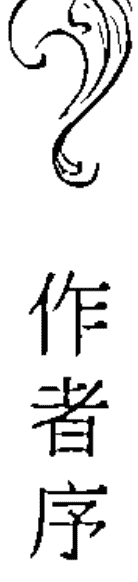
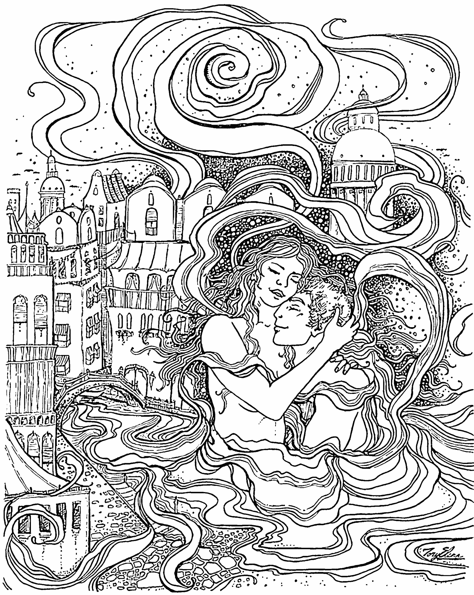

# 神性合一的绮梦传奇

> “这些故事超凡脱俗，它们会在你的心中产生共鸣与涟漪。这些神圣性爱的故事为我们急需诞生的新世界提供了指引。”
> ——Carl Johan Calleman 卡尔·约翰·卡利曼，
> 美国作家，著有《玛雅历法与意识的转变》

## 知名人士评价

> “对于那些依心而活并与多维存有能够沟通的人来说，这部小说将人类的性爱体验展现了其在神圣能量领域的魅力，因而打破了世俗的界限。”

——Carl Johan Calleman 卡尔·约翰·卡利曼
美国作家，著有《玛雅历法与意识的转变》

> “在她描述的故事中，沙曼虹在身心灵与神圣之间搭起了沟通的桥梁。这些故事跨越时空，并会提升人类的意识。透过对前世未完的使命和对圣灵承诺的回溯，作者编制了一张精美的爱情之网。这本书写得很优雅和引人入胜。它是一本值得任何人收藏的书。”

——Caroline Blaha-Black 卡罗琳·布莱哈·布莱克
美国图书评论专家[美国图书评论]

> “在每一个神圣的故事中，你都会感受到被伟大奥秘之谜所引导。在当中与读者分享了有价值的知识、智慧和古老的教导。你会感受到你的心与其它纬度的精神存有紧密连接在一起。你会发自内心的理解和吸收生命意识，这种意识源于宇宙生命之树的永恒根源。”

——Sean Caulfield 肖恩·考菲尔德，玛雅历专家，非洲

> “这不是一本虚构的浪漫主义爱情小说。它所描述神圣的性爱，实际上是存在于你我的心中。虽然是看不见，但这交流是充满活力的振动。每个故事的寓意都是超凡脱俗的。精致的话语挑战我们的想象力去超越对现实的认知，启发我们去感受爱的力量，在我们的血管中流动，并循环回到世界里。”

——Kammy Chung，伪文·蓝
《基因天命》中文翻译者，香港

> “几千年来，瑜伽修行者实践了合一的艺术，尝试统一大自然的所有元素。沙女士带来了这个尚未流传到世界前沿的超前概念，唤醒我们内心深切的灵性渴望。通过神圣男女的无保留合体，我们通过彼此发现了真正的自我。”

——Irene Kai 梁爱玲，美国作家，著有《走过金山梦》

> “《神性合一的绮梦》是指与神圣一起陶醉的艺术。我们应该欢庆，沙曼虹履行了她的承诺，即用她的写作来呼唤终止两性分裂。在这个奔向合一的时代，我们的心灵渴望已久的结合，现在终于可以实现了。这本书的内容非常丰富，含有深层次的知识与智慧。”

——Karen Schneider 凯伦·施奈德，美国心理学家

> “作者让我们直面多维度领域与现实之间激烈的冲突。尽管我们的思维无法理解，但这振动会在我们的心中产生共鸣。作者让我们感受到这条进化与激情的玄妙之路。最珍贵的是，要重视我们是活在人体内的精神存在者。”

——Patrick Murray 帕特里克·穆雷
总经理，The Wonderful Company 美国跨国公司

> “书中的七个神圣故事是世界新的七大奇迹，预示着新的天地合而为一。这本书是著名歌曲“爱的七个浪潮”里的浪尖，它加速我们进入神圣结合与共同创造的变革时代。”

——Bob Shine 鲍勃·夏恩，夏威夷诗人和艺术家

## 献 给

赋予我们生命的地球母亲
我们永生不息的的太阳祖先

所有渴望在地球上共同创造神圣伴侣的人

# 作者序

我们邀请你
共同穿越不同纬度间的玄妙旅程
从此你会成为未来传奇故事的典范
也会脱身于当前受限的生活形式
满怀着圣爱
以慈悲和感恩之情告别过去

《神性合一的绮梦传奇》探索的是神性合一这一主题。从人类以自我为中心的意识朝向神圣合一的觉醒，同时也成为生态可持续和以宇宙精神为中心的进化路径。

这本书的灵感源于2008年以来，我与地球母亲意识的亲密交流。这美妙的邂逅让我谦卑地聆听她的启示和渴望，让我不得不深深感恩于对她的活力四射，深情满满与合一悸动。我感受到，地球的感知意识不只是一个深奥或诗意的概念，她是包罗万象的行星灵魂，滋润着世界上的每一个灵魂和生命体。

大地袒露惊人的情感和极致神妙愉悦的感受。随着无限的阳光注入到地球内核，太阳和大地的合流能量在当前的三维空间上聚集成一张巨大的合一能量网络，不断地引领人类走向彻底了解神秘宇宙的创造性势能。地球和太阳的辉煌使命是给所有生命奉献神圣合一的性意识。

虽然这本书有七个不同的故事，但它们包含了圣爱的共同主题。当我们如同尊崇伟大智慧一样尊崇性爱时，我们就会醒来回到宇宙爆炸的最初时刻、宇宙核心的愉悦性冲动。当这欣喜汇聚成奥妙激情的河流，我们就会从被神圣能量保卫而变成其管道。当我们的记忆都回到这个原始频率时，情侣们就能把神圣性交融作为一个圣礼奉献给彼此。

在中国文化的传说中，这千年来我们亦有很多人与灵界之间天长地久的浪漫爱情故事。如：《牡丹亭》中杜丽娘与柳梦梅的万古长情，中秋节的嫦娥奔月，牛郎织女的“金风玉露一相逢，忍顾鹊桥归路”，《白蛇传》的永世承诺。为什么我们认为他们只是传说中的奇人逸事呢？

当我们从合一的角度给与男性和女性意识同样的尊重，两性关系就会从防御、破坏、操纵和指责中蜕变成身心合一的融洽。从身体和灵魂的高潮进入神圣合一时，那是一直以来我们所渴望的。通过宇宙性高潮我们引领彼此走向“回家”之路，和所有造物一样回到不断螺旋上升的宇宙意识。

无论有多少性爱的经验，都无法满足我们无限的欲望，和深不可测的灵魂，直到我们能够重新定义性能量其本身。这是在“法老王之爱”的故事里所描述的神奇炼金术“光之编码”。

我们可以直觉地感受到内心的火花，都是被光与奇妙的大爱所浸染着的。升华的性高潮是包含了天堂极乐和人间的激情，这是我们长久以来所渴望的两性交融，也是宇宙不断进化的惊鸿一瞥。万物之灵并不是深不可测的。它是活生生的体现，透过诗歌、艺术、梦想、舞蹈、冥想、脱俗的远景、以及和高心灵接触，这些沟通都是神话与传说的来源。

通过荣耀神圣性爱、我们共同达到精美的玄妙，并引导对方找到回归源头的路。最终神性合一会超越人类以“小我”为中心的情爱。它会形成以生态为中心的转型的过程，能让我们释放自己的光芒，因此也协助促进大地——我们的“世界灵”——回归她那永无止境的荣耀进化道路。

神圣性爱是一个宇宙意识合一的过程，也是对超越生理性冲动的意图净化的欢庆，同时它能够释放我们自己的光芒，因此我们性行为变成了互助的神圣善行。神圣合一是心醉神迷的高潮，其从量子角度证明了万物终归一。

我希望这些故事在你心中唤醒了灵感，把你的身、心、灵、融合在一个奥妙激情的结合中，并且也在你的梦中撒上一些迷人的芬芳。愿个人的“小我”被超越，让神性的陶醉在我们身心显露出来。

沙曼虹 Jacqueline Sa
在2018年9月中的冥思

## 译者的话

翻译缘起来自我对达曼胡尔（Damanhur）生态联盟的兴趣，经朋友介绍我和作者沙曼虹女士开始了邮件往来。初次谋面是在重庆，2018年5月份。本来目的是为了帮助我和几个朋友在重庆建立生态村，因时机还不成熟，未果。却因此开始我们不断加深的友谊。

在尝试翻译了此书的简介之后，开始有了兴趣和信心，随后也得到了沙姐的肯定。开始了正式的翻译和不断的沟通交流。虽然我从2008年就开始走上了觉醒之路，也因一直在外企工作保持了比较不错的英文水平，但是此书所蕴含的超前意识和灵性教导之深刻，仍然让我的翻译之路充满了挑战。于是今年8月份开启了美国旧金山的淘金之旅。面授教导和详述故事背景让我的翻译开始顺畅起来。对于当今二元性社会中所表现出来的各种冲突，有了更深刻的认识，也对未来合一时代的到来，憧憬起来。

《神性合一的绮梦传奇》不但开启我和沙姐的师生情缘，也让我更坚定地走在灵性生态之路上。我本能地知道，未来黄金新纪元，会在沙姐的引领下，共同去奉献和创造。精彩合作大剧，才刚刚拉开帷幕……

亲爱的读者朋友,如对此书有任何感想或意见，请发邮件至jixiuliang@163.com，我们会随机回复。

Hari OM Tat Sat!

吉秀良 2018年中秋佳节执笔于重庆渝北

# 邂逅爱神维纳斯

邂逅爱神维纳斯

1

“我来是为了重振你的精神，重燃你的激情……威尼斯需要你。”

与意大利港务局（Italian Port Authority）的谈判已经持续了整整三天时间，官僚主义的针锋相对让伊森（Ethan）满是沮丧，备受挫败。多轮的唇枪舌剑和比手画脚，再加上一旁激动的翻译，折磨得他疲惫不堪。他们一直在讨论威尼斯（Venice）正计划实施的堪称世界上规模最大的运河疏通计划。威尼斯这座浪漫的城市即将被改造成21世纪欧洲海上贸易中心。

伊森在一家国际环境组织中工作，他是业内颇具影响力的策略家。这个组织正在竭尽所能尝试去改变这疯狂的开发项目，这个项目可能会给整个地区带来令人心悸的生态破坏。庄严肃穆的落日西沉，余晖洒在几台狰狞的清挖机上。平静的金黄色水面上，这几台机器夜以继日地在晃动，仿佛一群大型的机械秃鹫。大公司与政府机构在相互勾结中，表现出来无休止的贪婪和愚蠢让伊森感到灰心。一想到自己的整个职业生涯都需要与权力作斗争，难免让他感到绝望。有时他不禁怀疑，面对着这个脆弱星球上正不断恶化的生态系统，他的所作所为究竟会产生什么深远的影响。无论他在为可持续发展而奋斗时是多么激情昂扬，也不管他在试图阻止土地滥用时是多么奋不顾身，他觉得自己所做的一切都是徒劳。

为了从这些沉重的话题中抽身，伊森漫无目的地游走在圣马可广场（Piazza San Marco）上，漫不经心地打量着那些无止境的绚丽商品。忽然，他用眼角的余光瞥见一个美丽动人的女人，她穿着半透明的水蓝色连衣裙，在人群中飘然而过。

邂逅爱神维纳斯

3

她步伐轻松，流露着当地人的惬意和自信。头发乌黑柔亮，散发出金子般的光芒。面部棱角分明，兼有古代的异域风情和明显的意大利气质。广场上还有许多来自不同国度的佳人，拥挤在人群中或淹没在不断拍照的日本观光客中。

伊森不明白，为什么这个女士在他眼里是如此特别。也许是她飘逸的气质让他神魂颠倒。她好似仙女下凡，还带有一种居高临下的风度，让她从众多的游客中脱颖而出。她的韵味是如此的坦率和诱人，不带一点做作的诱惑。他立刻被迷住了，从来没有遇到过如此有女人味的淑女。他爱做梦的天性占据了上风，开始幻想起来。

突然，一声巨大的警笛声划破长空，响彻全岛，打断了伊森（Ethan）的幻想。店主们迅速收拾起地上的商品，纷纷开始关闭店门，一气呵成仿佛训练有素。伊森不解地问一个女店员发生了什么事，女店员漫不经心地操着她的意大利口音说道：“哦，又是洪水警报，不过不严重的。我们有十多年没有发过洪水了！”

此时，电话响了。她开始变得焦躁不安，一边冲着电话大吼，一边不住地转动眼睛并气冲冲地打手势。她挂了电话，说到：“哎呀，是我妈妈，她总是担心，好像我所有的货物都会被淹掉似的！”伊森谢过她，然后快速地走开了，腾出了空间让店员处理她的陶瓷娃娃和地板上各式各样的小雕像。

周围的每个人都在奔跑，为了找到一个地方能够躲避即将到来的洪水。而他却在寻找那一抹蓝色的倩影，但她却不见了踪影。警笛声惊扰了他的美梦，他怅然若失。

以防万一洪水来临，他走进街边小巷的一家建得比街道高一点的小餐馆。伊森点了一杯饮料和一些食物，又问了许多关于洪水的事儿。餐厅的经理叫罗基诺（Luigino），是一个天性开朗的绅士。他不断劝慰伊森，让他不必杞人忧天，放轻松好好享受晚餐。

当伊森开始在黑乎乎的墨鱼汁中卷着扁面条，细细品尝那盘热气腾腾的美味时，紧绑的神经终于放松了下来。墨鱼面是他钟爱的威尼斯特色小吃。当下是晚上七点，晚上八点半时伊森要乘渡船去利多（Lido）岛，所以在这之前，他有充裕的时间。

不过此时他只想知道，那个身着蓝色连衣裙的美人去了哪里，她是否惊慌失措地急忙赶回家去了。他真希望当时能跟随着她，像骑士一样主动去保护她。她姣好的面容深深地印在了他的脑海，挥散不去。

他又开始臆想跟她聊起他在威尼斯的工作和项目，以及他对环境问题的毕生热忱。他甚至想象从她的眼神中感受到她的理解和鼓励。

每个男人都渴望从他爱慕的女人那里得到支持。她举起她的水晶酒杯，里面盛满了一种海蓝色的宝石液体，向他表达爱慕之情。这个时候他的疲倦和焦虑都神奇地消失了。

伊森一直沉浸在幻想中，幻想着她可爱的存在，直到看到罗基诺穿着湿漉漉的长筒靴走了进来。罗基诺漫不经心又略带愉快地宣布，整个威尼斯变成了泽国。

伊森吓了一跳，冲到附近的窗户边，看着不断从运河里涌

邂逅爱神维纳斯

5

出来的河水淹没了所有的街道，有点让他难以置信。他担心地询问是否还能赶上渡船。罗基诺告诉他不用紧张，在洪水退去之前渡船是不会开的。

时间一分一秒地流逝。提供了几轮免费饮料后，罗基诺一边弹指，一边命令他的服务员安抚人群。食客们看起来并不太在意，似乎每个人都沉浸在节日的喜庆气氛中。

过了一会儿，伊森查看了洪水情况如何，水位已经涨得很高了，仍留在大街上的人不得不在及膝的洪水中艰难跋涉。伊森曾来过威尼斯几次，但从未见过如此令人震惊的场面。

突然，这座城市陷入了死寂，仿佛一座鬼城。所有的店铺都关门了，只有耀眼的霓虹灯光闪烁在黑暗中，不断变换着形状。

晚上9点，伊森有点醉了，开始担心自己无法回到在利多岛的旅馆。明天还有几场激烈的会议要开，今晚一定要好好睡一觉。伊森跟罗基诺说了自己的担忧，罗基诺友好地建议他回到圣马可广场，等待渡船的通知。

罗基诺给了伊森两个大垃圾袋，让他套在腿上当靴子穿。伊森感觉很尴尬，像一只笨拙的鸭子，蹒跚在蜿蜒的街道和桥上，脚下不断飞溅起水花——这是多么令人别扭的情景啊！他平常引以为傲的优雅已消失无踪了。

当他四处挣扎，想找到回广场的方向时，突然，在他面前大约五十英尺处，隐约看见一个散发着光芒的半透明蓝色幻影在漂浮，像一盏流动的指路明灯，指引他走出黑暗。他浑身湿透，但内心止不住狂跳，他多希望这个女性身影就是那天傍晚瞥见的那个美人。但此时他衣着滑稽像条落水狗，他没有勇气和自信与她会面。

当伊森跌跌撞撞地走进广场时，她似乎已经消失得无影无踪了！内心激荡着重新找到她的期望，让他几乎忽略了眼前这个梦幻般的广场在鹅卵石上闪闪发亮。

水已经退了不少，夜间的咖啡馆也若无其事地重新开张。穿着白衬衫、打着领结和卷着黑裤子的侍者们，迅速地在水中摆好了桌椅，等候着深夜音乐会的开场。欧蕾咖啡和焦糖玛奇朵的香味在带有欢乐节日气氛的空气中飘荡着。

威尼斯人对生命的无休止庆祝着实让人惊异，洪水仿佛只是一种助兴的插曲。整个广场又欢声笑语、烟缭雾绕，那些在高起的平台上进行的音乐会，又重新飘荡出悠扬的华尔兹舞曲。人们在闪闪发光的鹅卵石上，卷起裙子和裤子，愉快地翩翩起舞。

伊森的心情豁然开朗。受这梦境般气氛的感染，他扔掉了笨拙的垃圾袋，卷起他湿透的裤子，丢掉了他破烂的鞋子，开始恣意地旋转，尽享着生命的喜悦。

* * *

在他睁开眼睛之前，那个身着蓝色衣裙，美到让他窒息的人出现在他舞动着华尔兹的臂弯里，仿佛从天而降。他吃惊地喘息着，而她却平静、深情、安静地望着他，脸上带着优雅的

The request was rejected because it was considered high risk

The request was rejected because it was considered high risk

The request was rejected because it was considered high risk

## 跨世情缘的相逢

献身于爱的女神会使她失去她珍贵的生命。

听着萨布丽娜诉说她的前世经历，加布里埃尔真诚地为她悲伤。当他重温他那一世的感受时，强烈的激情战胜了他。因为对野蛮时代里异教徒的仪式感到愤怒，他的整个身体在颤抖着。他现在明白了，为什么当他询问他的情人的行踪时，他在那些舞者的眼睛里看到了恐惧。

他们体贴地擦干对方的眼泪，加布里埃尔温柔地抚摸着萨布丽娜，凭直觉感受她仍然脆弱，在回忆起那段悲惨经历时。她的颤抖开始消失，萨布丽娜坦承，自从她第一次见到他，她就对他产生了一种强烈的亲近感。

那天晚上她跳‘大腿舞’时，内心里有一团火在燃烧。加布里埃尔的出神使她释放了约束，能更加激情地表演。

当他在接下来的日子里向她透露了自己的情愫时，她觉得自己无法回应，因为她发誓绝不邀请客人进入她的内心。她的工作象征着对征服她的男人的潜意识报复。

萨布丽娜现在意识到，她偏执的愤怒是阻止她展现真实女性力量的根源。在她的催眠训练之后，她辞掉了工作，现在她的心自由了。她表达了对加布里埃尔的深深的感激之情，因为是他帮助她抚平无法解释的伤口。他们的泪水把两颗心的约束都冲走了。

他们在今生重聚了，如今他们在身、心、灵彼此珍惜，感到爱的无比崇高。他们渐渐感激地理解，灵魂是永生的。加布里埃尔若有所思地说：“每一次生命都只是一种演化的试练，推动着意识于下一生的进化点，永恒的真爱将痛苦的业力体验转化为积极的佛法。”

他们的灵魂对彼此的忠诚使他们穿越千年在这一刻重新团聚。在经历了数不尽的分别后，他们又终于在一起了。他们意识到，归根结底，爱和宽恕才是永恒的火焰，能拨开时间和空间的面纱，超越任何一世生命的局限。

星际种子重聚，确认彼此共鸣的本质。以开放的眼界和心灵结合，超越了有限的纬度。

## 公元前261年，在中国云南丽江地区的纳西部落

玛露（Malu）是摩梭族的少妇，摩梭是纳西的其中一个宗族。玛露住在丽江外围风景如画的农村，依偎在秀丽迷人的泸沽湖畔。丽江是一座历史悠久的古城，古朴恬静的坐落在神圣的玉龙雪山山谷中，位于云南省西北部的壮丽山脉中。她的族人是原始的土著部落之一，其历史可追溯到有记载之前至少一千多年，甚至比它归属为中国地区还要早。

纳西族是一个古老游牧部落的后裔，很久以前就放弃漂泊，定居在这处美丽的盆地，与周围的环境和谐共处。他们与土地的亲近使他们成为自然的农民，一般靠耕作和放牧牦牛维生。他们与大自然和谐共存不是学来的，那是他们日常生活的气息。纳西人也喜欢把植花种树视为惯例，了解人类参与大地再生的神奇奥秘。他们热爱争妍斗丽的李花、赏心悦目的菊花和缤纷细致高雅的兰花。

以母系社会为主轴，并尊重父系贡献的纳西族，拥有史前家庭制度，独特多神教的婚姻习俗。他们遵奉女性为根基和主干，以稳定族群。男性是向外伸展扩散的枝叶，通过展现其技能与艺术，来活跃整个社会的生命力。

摩梭人没有一夫一妻的婚姻结构，他们奉行一种叫做[阿夏]的独特习惯，即男人和女人没有创建家庭的风俗。夜幕降临时，男人会去女人的房子或她私有爱的洞穴，然后在黎明前离开。这是一种独特的“走婚”习俗，已成为他们运作良好的传统。只要是女方看上男方并感到被吸引时，她会主动邀请男方进入她的生活，但男方永远不会和她住在一起。

女方家庭是专门为母系成员。如果有男孩出生后，母亲一方家庭里的舅舅，会担起男性典范或代理父亲的角色，负责照料孩子，并最终教授年轻人一些技能，比如：建筑、木工、雕刻。家庭中的妇女主要是照顾女孩，并且她们的部落委员会为整个村庄的福利做出了大部分的生计决定。

玛露与祖母、母亲、两位姨妈、妹妹，以及两位舅舅住在一起。只要与家庭中的女性有血缘关系，男性就允许住在家里。女性自然是最受尊敬的，她们掌管家庭和整个部落。男人是女人的得力助手，他们不会被轻视的。

摩梭部落彼此和睦相处。他们是所崇敬的大自然的阴与阳的典范。由于纳西人相信花卉的神奇力量，他们有一项特殊的传统，就是在细致严谨的过程中读取和评鉴花卉。

玛露精通花卉冥想和花朵的灵性鉴定。她是拥有荣耀地位的一位年轻女萨满，所以不需要去务农。她的祖母索鲁亚（Solua）从小就一直培训她，以维护这个家族中代代相传微妙强大的萨满血统。索鲁亚本身是现任的女族长萨满，也是这村落的女巫医。

摩梭人对大地的爱，使他们与人类灵性本源和灵界神灵有着深刻神秘的连接。每当繁花盛开的时节，索鲁亚喜欢邀请亲朋好友齐聚，围观玛露解读花朵带来的消息。玛露会进入出神的状态，传递来自花卉王国的预言诗，指导他们即将来临的岁月。

由于玛露的身分地位颇高，她身上的长袍、短褂、垂坠而下的花袖，不论是做工或绣面都额外的精致华丽，百褶裙上缀有精美的花饰，外罩的羊皮披肩上，绣着绚丽多彩的太阳星星，以及超凡脱俗的神灵图案，下摆缀着美丽的串珠和流苏。闪亮的黑发编成亮丽的长辫，腰间系上用宝蓝丝线编串手工精致的彩珠腰带，整体看来非常俏丽迷人。

玛露并没有矫揉造作，对于她的盛装和使命她感到很自在。如今二十来岁的她，已是一个拥有甜美体验的完全绽放妇女。自从青春期开始，性爱之欢的艺术就已经是她自然训练的一部分，她一直在随心所欲地选择爱侣。

只要有时间，玛露喜欢在她的爱情洞穴的墙壁上雕刻具有灵性含义的性爱人物。她的洞穴是一间隐藏在住所后面的真正石窟，内部用五彩缤纷的花布精心装饰，还垫了柔软的织锦，感觉非常舒适。她与萤火虫暗自约定，在她与爱侣含情邂逅时，用闪烁的光芒填满她的爱巢，她展现着完全极致的性成熟，她是大地女神在女性身体的活现。

伴侣之中有个名叫盖保（Gebao）的英俊小伙子，是玛露最喜欢的。每当他们在一起时，她总是充满着一种洋溢着自由与奔放的陶醉。她成为他的忠实爱侣，甚至承诺与他长期联系。

盖保是才华洋溢的雕刻师、颇有成就的音乐家，也是部落祈雨仪式中象征阳刚气概的杰出表演演员。他是象形文的东巴语中最优秀的舞者。东巴文化工作者多半集歌、舞、经、书、史、画、医于一身，能透过说、写、肢体舞蹈来表达。当玛露第一次看到他在节庆的表演时，没有任何人能够像他那样触动了她的心。

玛露是他的夜之乐章，她轻盈编织着爱的魔法，散发令他无比沉醉的魅力。当他凝视那双明媚动人的眼眸，他想永远停留在她的梦想和住在她的心房。他沉醉在她的怀抱，永远不想再次浮现。和她在一起时，他是一个熊熊烈火带着狂野的渴望。

她为他的生命带来喜悦、欢笑和狂喜。她用妖娆和包容的爱煽动他精粹的熔炉。在他们性爱幸福时刻，他感受到她臣服于他充满活力的阳刚气息，他们的心紧密地跳动在一起。

他的激情昂扬深深潜入她悸动的乐海，他们在旋爱The request was rejected because it was considered high risk下，她感到既快乐又兴奋，也感觉当前正翻开人生的新篇章。她的心态比以往任何时候都更年轻，也更少有情绪负担。玛琳娜对人们有着天生的热爱，而这个世界似乎也张开双臂回应她。她珍惜把时间花在有意义的项目上，她志愿用自己的时间和爱心来服务，以减轻世界各地土著部落的困境。

最近她偶然接触到玛雅历（Mayan Calendar），及其对即将到来的黄金太阳时代的预言，使她对人类的未来充满真切的希望和信心。虽然历制的复杂数学计算难倒了她，玛琳娜直觉地与它的深刻智慧产生了共鸣。玛雅的开悟知识解释了人类进化的神秘维度中的时间浪潮，并且明确地追踪了几千年来世界上大规模的历史变化。她敏锐地意识到自己的生命事件，是随着宇宙时序的浪潮流动的。她一直在思考，也许她接下来的任务是要帮助合一意识的推进。玛琳娜对它将是如何展开充满好奇。那是人类自我意识不断想知道的问题，然而生命往往引导她穿过蜿蜒的路，每每让她感到惊讶和谦逊。

随着多年的练习，她的通灵能力变得敏锐，直觉地感到她仍然缺少某些东西，以充分实现她的灵魂使命。多年来，她直觉并且感觉到有某些东西在东海岸等着她。

华裔美籍的她，还没有机会沉浸在中国的神秘玄妙中。虽然她曾多次前往中国寻找那难以捉摸的东西，但还是无缘巧遇。中国现今对于各种信仰的宗教更加开放了，但纯粹形式的唯心论似乎过于无形，难以触及，尤其是在当今时代的科技狂潮中。

她经历过各种超自然显化的微妙训练，但尚未体验过东方的超然奥秘。除了听过大师的教义、藏传佛教等宗教习俗、或印度苦行僧运行的奇迹之外，东方的神秘仍然难以捉摸。

在她的旅程不久前，一天早晨，玛琳娜从卧室窗外飘散的金银花的芬芳里醒来，她猝然听到花仙子的耳语：应该是去丽江的时候了！她以欣喜的好奇心着手准备这趟旅程，似乎有感于东方誓约就要揭秘了。多年来，玛琳娜已经习惯了心灵的召唤，这通常被证明是准确和有启发性的。她不再质疑这些神秘的邀约；她称之为[宇宙传送碎屑]并通常跟随它们，尽管有时会自觉傻傻的或感到惶恐不安。

从纽约飞往中国的航班上，一位气质优雅的中国老妇人坐在玛琳娜旁边，一直温柔地对她微笑，眼底透出一见如故的感觉。她们之间有一份心意相通的共振，玛琳娜意识到这位女士呈现出普世宇宙祖母永恒的气息。她们彼此热络地交谈，玛琳娜飞抵北京还要转机到丽江。

两人依依不舍地道别时，那女士预祝她旅途平安并神秘地喃喃说：“你会在那里遇到命定的珍宝，要珍惜喔！”随后她消失在繁忙机场川流不息的人群中。

当她漫步在丽江狭窄的街道和小巷时，玛琳娜忽然回想起这段奇遇。她漫无目的地浏览着琳琅满目的纪念品、部落刺绣服装，纳西雕塑和雕刻，成堆成串的银饰品如瀑布般流泻下来，还有各式各样的丝麻围巾任人挑选；但大多数的物品看起来都太商业化，颜色太鲜艳，不是她的品味。

然而她很高兴地发现，在长串项链和流苏摆饰上，一些非常不寻常的镶工，缀上各种干果壳和迷你葫芦，是她以前从未见过的。但她的心思不在业务上，所以她从工匠要来名片，以便日后好联系。

玛琳娜突然驻足于一小家纳西手工艺铺，它夹在两间大型艺雕店之间，铺里的木雕品是她见过最精致细腻的工法。

纳西艺术里充满了太阳、月亮和星星的灵性故事。还有花精灵、说话的动物、星际人类，以各种缤纷的色彩、几何图形设计，以及交织着致幻波的构图形式来呈现。几乎小铺里的每一件艺术品，用色比其它店铺和艺廊更加柔和顺眼，而且画像带着一丝现代风尚，似在诉说着精彩绝伦的故事。

玛琳娜被两件小雕塑所吸引，每个大约一平方英尺，某种不明原因让她屏住了呼吸，她莫名其妙地热泪盈眶。其中一件木雕是一个女子的面貌刻在雕塑的前沿，面对一个半月形的男子侧脸，隔空凝望着，女子眷恋的眼神对比着男子哀伤的面容。另一件木雕是男子与女子的侧影正迎向彼此，莲花从他们之间滋长出来，如迷幻的漩涡缠绕着他们。

玛琳娜向店主询问价格，竟是如此的合理，她毫不犹豫地当场购买。纳西人是如此的温和，他们说话彬彬有礼，细声细气，不像上海或北京的一般咄咄逼人的店员或街头小贩。店里的女孩告诉玛琳娜，她的哥哥是这些作品的艺术家，指了指坐在角落的年轻男子，他静静地忙碌在另一件艺术品。玛琳娜很高兴地问能否解释木雕的含义，他害羞地介绍自己是盖胥（Geshu），并乐意地答应。

他赞叹地说玛琳娜必定是通灵的人士，因为她挑选的两件木雕是互有关联的作品。他首先澄清：纳西部落是来自于天上的星星，而星际人类在地球上身负特殊的使命。

他开始解释第一件木雕为两个分离的爱侣，期许能再相聚。在纳西神圣的传统里，女性总是比较坚强也更清楚自己的人生使命。她们往往记得自己的天命，并且以耐心的毅力召唤爱人回家。这就是为什么木雕里的女子脸庞位于较突显的前沿。然而，男性通常是模棱两可的，并表示不愿意回归故里，因为他们在徘徊时被月亮诱人的力量迷惑，扭曲了他们的心灵，也蒙蔽了心智。

纳西的传说宣称，从远古时代以来，宇宙中的黑暗势力就一直在利用一些特殊的月亮能量，掩盖它的真实灵光以控制和操纵人类。世界上普遍认为月亮代表着诗意的女性阴柔；事实上，邪恶势力一直摆布它发出狡猾的诱惑振动力，诱骗男性灵魂进入其妖媚圈套。这就是为什么木雕里的男子显得悲伤和受困的进退两难。

这是取决于女人的神性记忆，来记起月亮的这种被迫扭曲，即使世代交替也不动摇，并最终引领男人回归他自己的完全极致，从而解放了男人和月亮的苦痛。这是一个关于我们旖旎的宇宙故事：当爱战胜操控时，光明就战胜黑暗。随着人类祈求从自身的束缚中解放，月亮也一直渴望扬升回归她纯净的原形。

第二件木雕是星际种子团聚的欢欣故事。透过女性对她昆达里尼的性原力有规律的修持，她的顶轮开启成千片花瓣的莲花，以神性频率将负面振动完全转化。从她无底池的似水柔情，她将眼中的信息投射给她的爱侣，这消融了他任何模糊的记忆。当他以如此释放的至喜聆听她时，他身体的分子扩展开来，一朵盛开的莲花从他耳边长出来。他们认出共同的本质，两个部分整体找回彼此并回归星际，在超越有限维度之上，以打开的眼和心灵合而为一。从而脱离过去的黑暗，出污泥而不染的一起共创出他们的奥妙莲花、重建辉煌和纯净的精华。

年轻的艺术家盖胥，灵魂的深度令人大为惊异，似曾相识的情节也让玛琳娜沉醉在故事的余韵里。这时，冷不防地从她背后传来一句英语：“这些雕塑太美了！真希望我能更多地了解他所说的话。”她倏地转身，看到一名亚洲男子贴近地站在她身后，越过她的肩头羡慕地注视着木雕。他本能地退后一些，并为造成拥挤的空间道歉。听他的美国腔，她用英语试探：“你不会说中文吗？”他有点难为情地耸耸肩，但她会说英文令他松一口气。他回答说：“我是中国人，但出生在美国，只会理解一点中文，你也是美国人吗？”

她点点头并迅速地打量他，他是约莫四五十岁的英俊男子，散发一股柔和优雅的气质。他现在目不转睛地看着她，一种瞬间的相互来电。玛琳娜怦然心动，她很少感觉到对陌生人有如此强烈的熟悉感。她的每一个细胞向她尖叫着：她认识他！对于被一个陌生人如此突然吸引，她感到猝不及防，几乎脸红了。她内心困惑。与此同时，盖胥正小心翼翼地帮她包装木雕。

男子开心地说：“太好了，你买了它们！你可以跟我解释它们的含意吗？”艺术家的妹妹礼貌地介入，建议他看其它作品。他天真地说：“你的艺术品都很美，但我只喜欢这两件，还有任何相同的吗？”她用生硬的英文遗憾地表示，每一件雕塑都是独一无二的，但如果他能等上一两周，她哥哥可以专门为他雕刻类似的艺术品。他礼貌性地回答可以考虑，眼睛却跟着玛琳娜，她正准备带着她包装好的商品离开。

“请原谅我的冒昧，”他说，“我能否请你喝杯茶？我真的好想听你描述这两件雕刻的故事”。他焦急的神情像个可爱的小男孩。直觉地感到他没有恶意，玛琳娜轻松地对陌生人微笑：“这很好，有何不可？”她很庆幸在对他感觉如此熟悉之后，不必突兀地离开。

“我叫做瑞恩（Ryan）”，他热情地伸出手来。握着他温暖的手，她说：“我叫玛琳娜”。在她感谢和赞扬那位艺术家后，他俩漫步到一个路边咖啡馆，那里有竹竿挂着灯笼和户外座位，被摇曳的柳树遮蔽着。瑞恩很满意地感叹：“我来这里已经两个礼拜了，我仍然对这座城市的雅致感到惊讶。”

玛琳娜观察到他感性的用语。在欣赏芬芳玫瑰花瓣茶[云南高山的特产]和一些当地美食中，她把艺术家盖胥说过的故事再描述了一次。瑞恩显然受到感动，玛琳娜发现他的眼眶里有一丝泪光闪烁。她不禁感到惊讶，他对故事的回应，与自己第一次看到木雕时的反应，竟然一样！当他纯真地指出他相信星际人类；和他一直在沉思人类存在的宏伟计划，她更加诧异。他透露出渴望以更崇高的形式在两性之间创建真正的伴侣关系。这种感性吸引了她的注意。

瑞恩来自于殷实的家庭，是美籍华裔第二代，双亲都是受过高等教育的专业人士，并已从职场退休。他们像大多数亚洲父母一样，期望他们的孩子获得可观的成就，但他们并没有很重视自己的中国血统。他们完全融入美国社会，鲜少说中文，并且从不鼓励孩子学习中文。瑞恩的哥哥是洛杉矶知名的外科医生，姐姐在芝加哥大学担任人类学系教授，他本人是高科技贸易的企业家，与各个国家的供应商合作，目前住在德州（Texas）的奥斯丁（Austin）城市。

瑞恩意识到，他甚至不知道作为中国人是什么的感觉。他的祖父母从中国大陆云南移居到美国很久了。他的父母依稀记得，他们有部分是称为纳西族的部落血统，但从来没有花时间去进一步了解。瑞恩在姐姐的鼓励之下，首次远渡大西洋来此展开寻根之旅。她还事先帮他收集了一些当地古老土著文化的资料，是为了给他参考以及满足他的好奇心。

瑞恩认为，如果没有和他的祖先某些深层方面达成和解，他内心深处就无法感到完整。他后悔没有学会说中文，无法与当地人进行适当的沟通；他也感到有些失落，但这些并不妨碍他试图寻找他过去的回声。这就是为什么当他偶然发现那家手工艺品店，看到星际人类的木雕时，他如此感动，并且不知为何深深地触动了他的心弦。

听着玛琳娜诉说的故事，让他兴奋不已，并想知道更多。他怯生生地问玛琳娜是否愿意做他的向导，帮助他加深对文化差异的理解。玛琳娜毫不犹豫地回答，她很高兴能有这么好的同伴分享她的旅程。玛琳娜能说一口流利的中文，因为在她青少年时期，举家从台湾迁移到美国，早已打下中文的基础。

瑞恩觉得玛琳娜令他感到安心自在，仿佛他已经认识她很久了。他继续分享他的人生际遇，自从几年前好不容易离婚以后，他一直在思考人类困境和两性冲突的问题。

虽然他热爱并尊重女性，但真的被前妻吓到；她虽是有高学历的程序专业人才。当他们同意为婚姻画下句号时，她却需索巨额赡养费，并大力伸张应有的权利。几乎所有她的女性朋友都群起对抗他，好像他犯了罪一样，尽管解除婚姻的意愿是双方的。

瑞恩现在已经从痛苦的离婚怨恨中恢复过来了。然而，许多鼓吹妇女解放的妇女所拥护的双重标准让他感到震惊，正如他从自己和他的男性的朋友的经历中所注意到的。

自此，他踏上一条自我发现和灵魂探索之路，以了解自己和人类心灵的更深层面。他观察到，这个世界是如何仍然由妇女在幕后掌控。在不赞同父权制的同时，以无数有意识和无意识的方式操纵男性；而男性则盲目地庆幸自己掌握了一切，沉溺于不知情的统御力。瑞恩非常关心在不谴责的前提下，来审视母权制和父权制的主题，并且有兴趣去发现和注重于更平衡的存在方式。

瑞恩和玛琳娜太投入于交换彼此的人生故事，根本没注意到时光飞逝。抬头一看四周，整个丽江被在一片缥缈的暮光笼罩，一种超脱尘俗的清丽之美，映照得运河面上珠光闪闪。

餐馆和店铺被摇曳的灯笼照亮，小城的夜色激起无限的诗意。街头充满了烛光餐厅，伴随着桥边弹奏古乐卖艺的乐音飘扬，迷人的咖啡屋互相竞争供应传统和现代的美食风味。

他们同意在一家简单古朴的面摊，吃一碗过桥米线当晚餐，这是云南的一道美食，附送装满了瑞恩喜爱的各种品味的小碟菜。他由衷地表示：“我最爱中国菜了，菜色丰富又多样！”

晚餐过后，他们漫步在蜿蜒曲折的小桥上，看着一群纳西男女正围着熊熊烈火、绕成一圈，在跳一种赞美大自然的仪式舞蹈。他们是经常这样聚集在一起，举行各种灵性的欢庆活动。表演形式主要是老者在内圈，年轻人在外环，年长的男性音乐家则使用独特雕刻的古老乐器演奏。

瑞恩被这喜悦的氛围感染上也自然地跳进舞圈，示意玛琳娜也来加入他。她选择留在观看人群中，只是欣赏看着欢腾不已的瑞恩。他进入了时光隧道，他无拘无束地跳着舞，仿佛他一生都是熟悉地跳着这些部落的节奏。玛琳娜的心融化了，甚至这种甜蜜的感觉似乎也很熟悉。当瑞恩回到她身边时，他满身大汗，兴奋不已：“天啊，我从来没有这样跳过！我对这些土著人群感到如此自在，就像家人一样！”

他们的自然融合就像温柔的微风拥抱着他们的心。瑞恩和玛琳娜在接下来的几周内一起度过，没有必要任何伪装或借口。他们一起探索和发现纳西族人的神奇，以及彼此的神奇。

瑞恩在小城外，租了一间有纳西古董装饰的迷人小别墅。与其在玛琳娜古城中心落脚的住宿客栈，他们宁可在他宁静无云的别墅尽情享受和滋养这段新感情。依偎在他的怀抱，玛琳娜被带回远古时代，她的心灵瞥见那飘渺远离的土地回忆。

她对于为他，而也为自己，感到美丽有着无限欢喜。她敞开心扉接受他的性爱表达，他就像即是她自己的映照。他们相互的激情流畅回响着生生世世的相知相惜。他们毫不犹豫地在彼此身上探索、深入被隐藏的欢愉角落。他们共赴云雨，轻柔的爱抚彼此就像春风吻上大地一样。

品味他愉悦的气息，厮磨着她的鼻子、下巴，这样圣爱的巅峰激发瑞恩触电的反应，他则以无数方式崇拜她茂密的花园；玛琳娜无限地沉醉，激起她刺骨的颤抖。他十分倾心、爱慕地整个拥抱她，令她的伊甸园更为动心，敞开身心一起爆燃The request was rejected because it was considered high riskThe request was rejected because it was considered high risk

The request was rejected because it was considered high risk

The request was rejected because it was considered high risk

但不是你们彰显恐惧的依附共存者。
反思你的习性、嗜好和所作所为，
摆脱你无止尽的需求。
你的心俱足智慧与无限潜力，
可活现出充满光明和尊荣的爱之环。

我将会引导你
驾驭平行宇宙的浪潮，
选择实现预言的神圣使命。
让自我与源头合一，
以及终结分离的虚幻。
我们同心协力
成为意识的伴侣，
汇聚大同的使命，
重返我们神性至高无上的荣耀。

## 致谢

我最深切感激的是地球的感知和她的神秘指引。这部小说的创作始于2009年，当时我被地球心灵的歌曲引导去了中国苏州，想寻找一位艺术家与我合作，使用图画小说来传播奇妙的地球信息。很遗憾的是，我找不到一个合心意的艺术工作伙伴。几经曲折，这本书已成为当前超自然的感知故事，在美国出版于2012年。十年光阴过去了，我终于又被引导回中国。中国现时正在倡导以生态运动回归大自然，携手全人类共创生态文明的宏伟愿景。我对这十年周期的神秘同步性深表感恩。这本书的重点确实是关于我们大地母亲惊人的意识！

如果没有吉季良先生在翻译过程中的持之以恒，以及他对出版书籍的坚定信念，这本书是不会这么快出版的。我还要感谢吴季沄和王鸿仪，她们两位是本书最初翻译和编辑者；她们的热心倡议激励着我。我非常感谢王鸿仪想出了这个贴切极优美的书名《神性合一的绮梦传奇》，并提供无数好的建议。吴季沄的无私贡献也触动了我的心。

我也特别感谢我的弟弟沙文豪，他耐心地帮助构建了本书的排版设计。也谢谢我的弟妹郑爱荣在校对纠正细节中的耐心。

我衷心感谢我的丈夫倪威利，一直以来对我的心灵道路表示肯定与支持。当我几年前几乎放弃创作这本书的时候，是他在默默地鼓励支持着我写完和出版这本书。

## 作者简介

沙曼虹（Jacqueline Sa）是美籍华人，在灵性领域极具远见卓识。她的著作《神性合一的绮梦传奇》在“远见卓识”和“神秘性爱”题材类书籍中获得了三个奖项。

沙女士曾在几个国家生活过，致使她经历了非凡的传奇人生。她能说多种语言，并曾任职于高科技跨国企业和整体疗愈行业中，包括在美国加利福尼亚州享誉全国的自然疗愈法的健康中心。

沙曼虹在远东地区长大，通过悉心参悟《道德经》的智慧和《易经》的宇宙学，来感恩天地万物和大自然。奥秘的力量为其人生旅程不断地给予指引。她一直献身于提升人类意识，倡导感知我们地球的多维度和公民权益。

沙女士还致力于成为一个富有慈悲心的沟通桥梁，以弥合东西方的智慧，神秘主义和神话学，结合哲学和文化交流。沙女士一直积极参与各种全球人道主义项目。她曾在美国和欧洲的各个著名机构担任董事会成员和顾问的角色。她向来参与有远见的生态文明社区建设，包括意大利达曼胡尔（Damanhur）生态社区联盟，和全球生态村联盟（Global Ecovillage Network）。沙女士也是源自英格兰的基因钥匙（Gene Keys）学术研究的大使代表。

沙曼虹和她的丈夫倪威利居住在美国加州北部的“生态模范保护区”。他们携手献身于一个宏伟的愿景——共创大同世界。

国家图书馆出版品预行编目资料

| 神性合一的绮梦传奇／沙曼虹著；吉秀良译. --初版.-- |
| :--- |
| 台中市：白象文化，2018.11 |
| 面： 公分 |
| 简体字版 |
| 译自：Exultation : erotic tales of divine union |
| ISBN 978-986-358-740-8（平装） |
| ISBN 978-986-358-744-6（精装） |
| 874.57 | 107017756 |

## 神性合一的绮梦传奇 ©2018
Exultation: Erotic Tales of Divine Union ©2011, 2014

原文作者 沙曼虹 Jacqueline Sa
译 者 吉秀良
联合翻译 吴季沄
编 辑 沙曼虹
联合编辑 王鸿仪、沙文豪
校 对 吉秀良、郑爱荣
插 画 ©Tory Elena
专案主编 陈逸儒
出版编印 吴适意、林荣威、林孟侃、陈逸儒、黄丽颖
设计创意 张礼南、何佳暄
经销推广 李莉吟、庄博亚、刘育姗、李如玉
经纪企划 张辉潭、洪怡欣、徐锦淳、黄姿虹
营运管理 林金郎、曾千熏
发 行 人 张辉潭
出版发行 白象文化事业有限公司
412台中市大里区科技路1号8楼之2（台中软件园区）
出版专线：(04)2496-5995 传真：(04)2496-9901
401台中市东区和平街228巷44号（经销部）
购书专线：(04)2220-8589 传真：(04)2220-8505
印 刷 基盛印刷工场
初版一刷 2018年11月
定 价 平装新台币200元・精装新台币300元

缺页或破损请寄回更换
版权所有，内容权责由作者自负

作为有“远见卓识”和“神圣性爱”题材小说的三次获奖者，这本书为您提供了多维超然的奥秘故事。它以神秘的浪漫故事，永恒的相会作为人类未来的典范，使你阅读时感到无比的陶醉。编织时空跨越到埃及和中国的纳西部落，交织在威尼斯和古代波斯的超自然爱情际遇，使这些寓言在地球的美妙感知中达到巅峰。大地的超级意识对太阳永恒的爱，是一个银河矩阵，呈现为一种崇敬的仪式。它提供了我们世俗爱恋需求之外，找到生命意义的奥妙净化。这本书将唤醒你到量子脉络，回到万物归一的神圣境界。

> “沙曼虹写的故事超越了人类在物质与精神，性爱与圣灵之间的二元性。这些故事将性爱带回到其最终的精神领域。这些故事让你思考现实与性爱的本质，同时让你的心灵超越灿烂的梦想，爆发出充满激情的启蒙。”

——Donald Michael Kraig 唐纳德·迈克·卡里格，
美国作家，著有《现代性爱的奥秘》

> “自然世界的显化是通过男性和女性以坦陀罗式的结合而体现出来。正是这种神圣的共融定义了我们精神特性的精髓。沙女士将这种人类潜能转化为优美的故事。”

——Juliet and Jiva Carter 朱丽叶·卡特，英国作家
和吉瓦·卡特，美国作家，著有《神圣的模板》、《世界的桥梁》